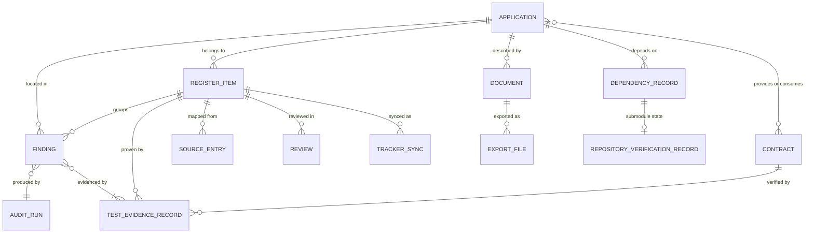
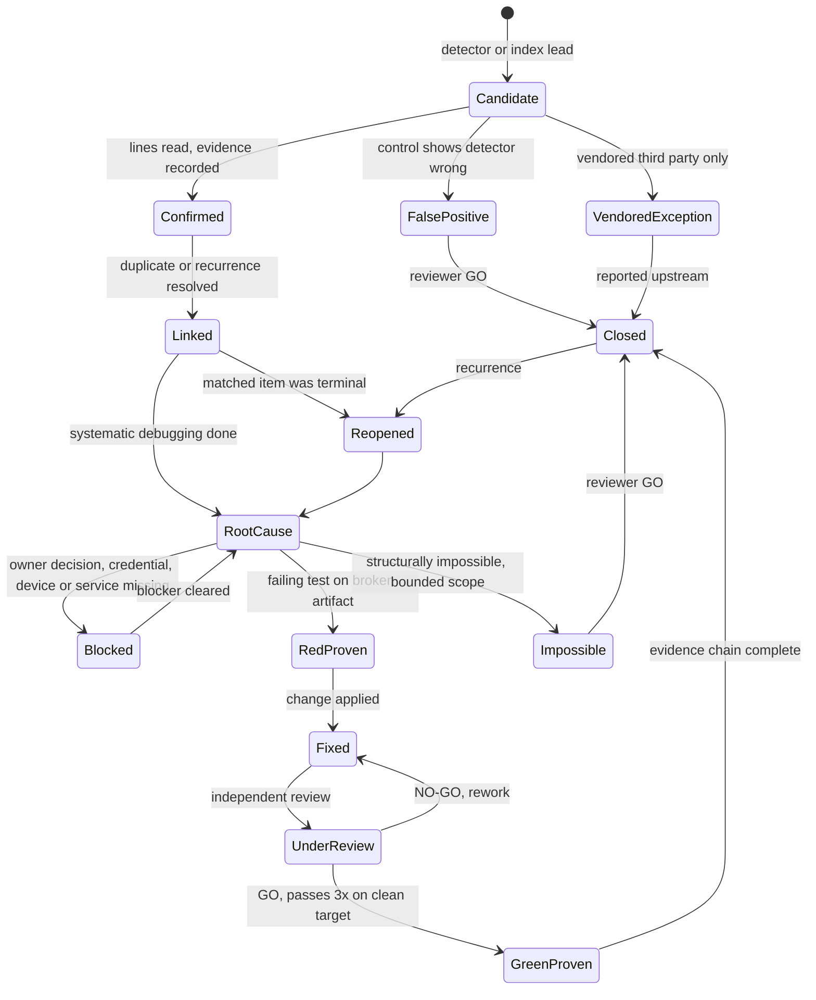
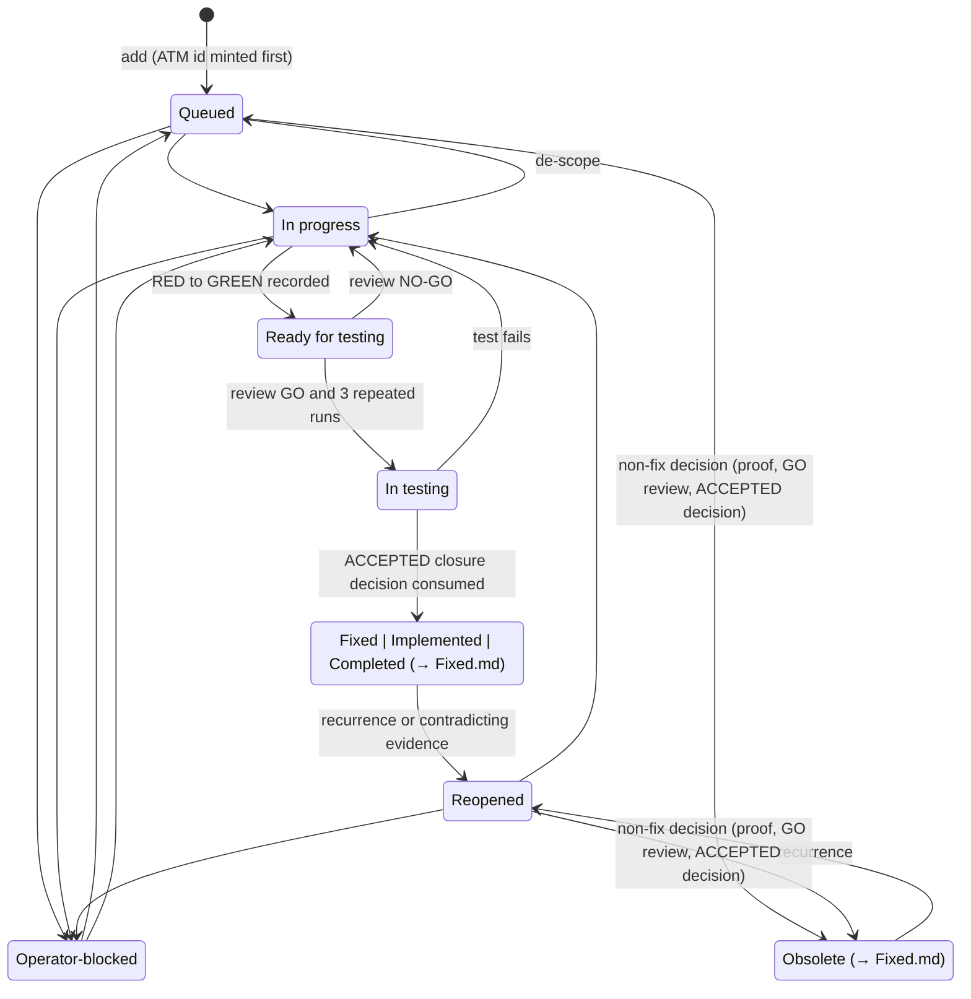
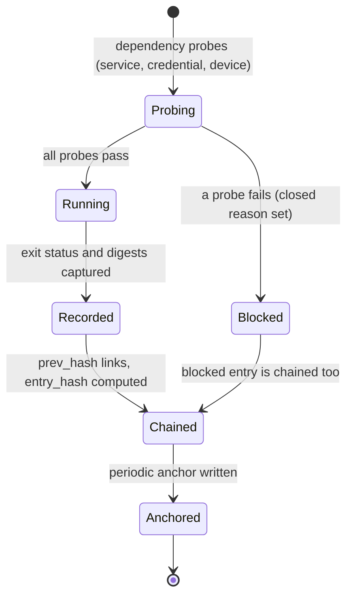
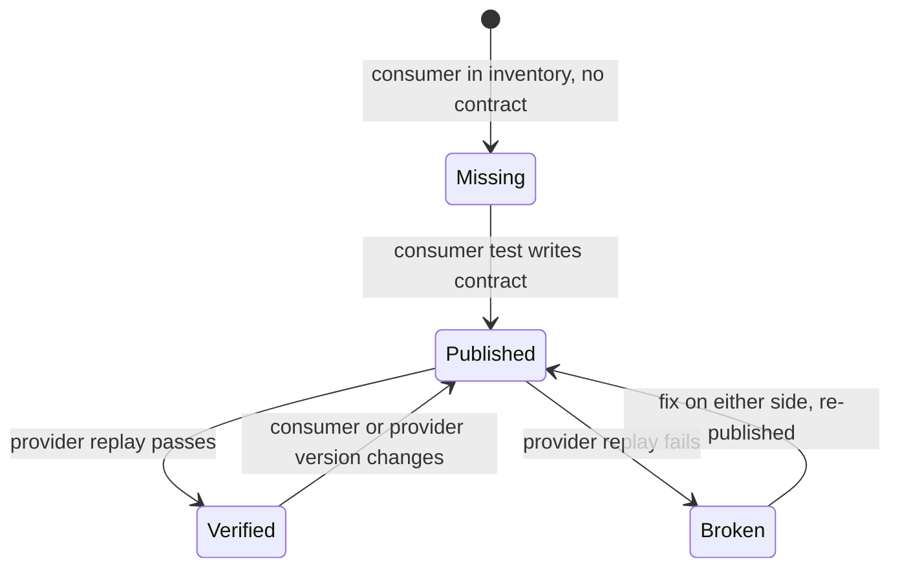
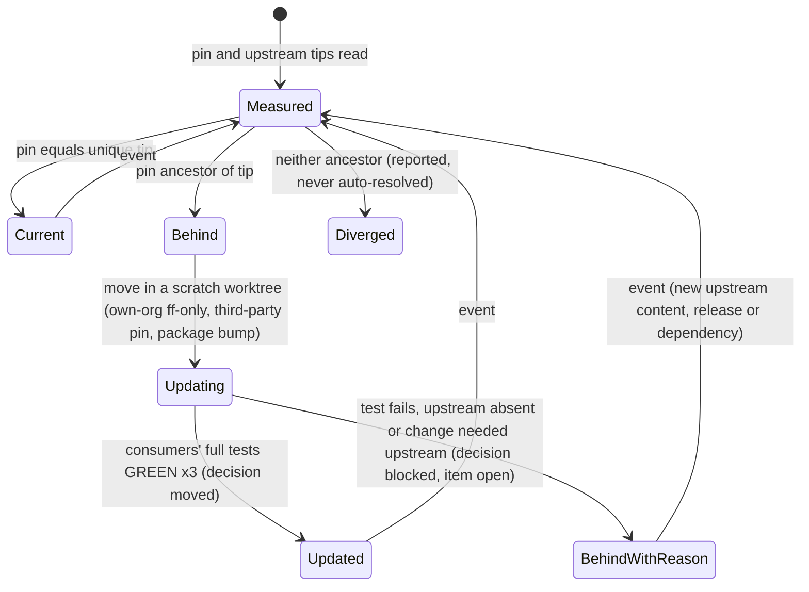
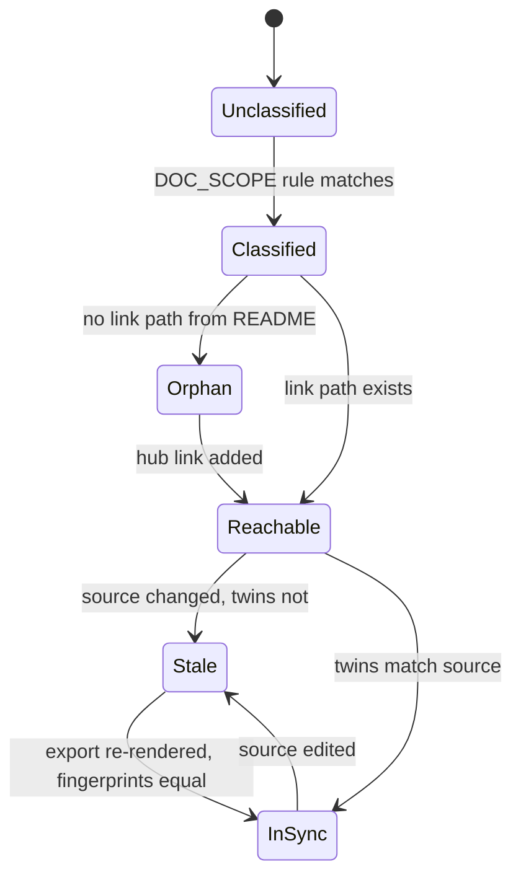
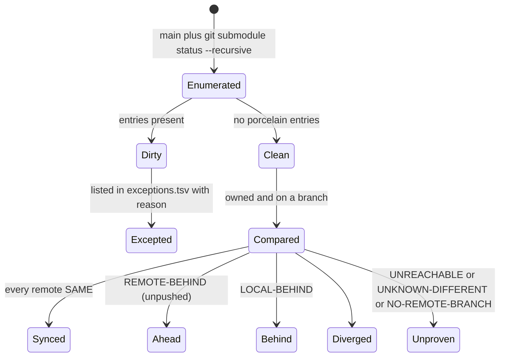

# Data Model: Full Project Audit and Remediation

| Field | Value |
|---|---|
| Feature | `specs/001-full-project-audit-remediation` |
| Created | 2026-10-03 |
| Revision | 23 |
| Last modified | 2026-10-05 |
| Status | draft (revision 23: follows tasks.md rev 33, commit `711a8c30` (676 tasks: the 595 frozen ids T001 to T595 plus 81 suffix ids, rev 33 adding no id and rewording 71; 318 `[TDD]`, 86 `[REVIEW]`, 115 `[P]`, 80 `[SUBAGENT]`, counted by script; 1,451 edges from the `depends on` clauses and 1,466 with the `after` phrases, 43 forward edges over 32 tasks, no cycle) and docs/21 revision 21, amended in place for tasks.md rev 33 without a new revision number, because tasks.md rev 33 still cites it as "current revision, 21 at this writing": the review row names the one provenance-record name; the host entry trust state row states the snapshot format `cpa-host-snapshot/1` with its `manifest_sha256`, the history check of every run, the approved-known admission, `retire_core_path` and the `approve` refusals; the inventory note states that the n/a fields live in side objects only. Revision 22: follows tasks.md rev 32, commit `87c6c478` (676 tasks: the 595 frozen ids T001 to T595 plus 81 suffix ids, rev 32 adding T046a and rewording 61; 318 `[TDD]`, 86 `[REVIEW]`, 115 `[P]`, 80 `[SUBAGENT]`, counted by script; 1,442 edges from the `depends on` clauses and 1,457 with the `after` phrases, 43 forward edges over 32 tasks, no cycle) and docs/21 revision 21, amended in place for tasks.md rev 32 without a new revision number, because tasks.md rev 32 still cites it as "current revision, 21 at this writing": the source row states the freeze re-hash check at the entry of the enumerator and the lead scan, the fixtures s1 to s5, `scripts/register/snapshot_manifest.py`, the HC-2 `lead_scan_scope` and `config/` disposed by its docs/01 row; the scratch-import note states that a scratch import takes no register backup; the inventory note states `dependentRequired` with `inventory_na_status_missing` and the T334a rename rule; the review row states the owner's approval of a `G-GATE` GO in `cpa-host` in place of the removed `--self-release` comparison; the waiver row is marked removed and a new row states the host entry trust state. Revision 21: followed tasks.md rev 31, commit `14bbb979` (675 tasks: the 595 frozen ids T001 to T595 plus 80 suffix ids, rev 31 adding none and rewording 34; 318 `[TDD]`, 85 `[REVIEW]`, 115 `[P]`, 80 `[SUBAGENT]`, counted by script; 1,424 edges from the `depends on` clauses and 1,439 with the `after` phrases, 43 forward edges over 32 tasks, no cycle) and docs/21 revision 21, amended in place for tasks.md rev 31 without a new revision number, because tasks.md rev 31 still cites it as "current revision, 21 at this writing": the source row states the lead-scan population outside every gitlink (`scripts/register/lead_scan_population.py`), `.git` dropped from `untracked_root_entries`, the shared re-hash check `scripts/register/check_freeze_snapshot.sh` and T172 writing no `reg_source_entries` row; the scratch-import note states the scratch import during a held commit turn and `import_args_invalid`; the contract section states the T335a `required`-error mapping, `inventory_test_path_not_file` and `inventory_provider_commit_missing`. Revision 20: followed tasks.md rev 30, commit `84145b2e` (675 tasks: the 595 frozen ids T001 to T595 plus 80 suffix ids, rev 30 adding none and rewording 45; 318 `[TDD]`, 85 `[REVIEW]`, 115 `[P]`, 80 `[SUBAGENT]`, counted by script; 1,422 edges from the `depends on` clauses and 1,437 with the `after` phrases, 43 forward edges over 32 tasks, no cycle) and docs/21 revision 21, amended in place for tasks.md rev 30 without a new revision number, because tasks.md rev 30 still cites it as "current revision, 21 at this writing": the source row states the NUL-separated freeze listing of T161 (`freeze_path_unsafe`) and the lead-scan replay count check of T175 (`lead_scan_replay_count_mismatch`); the scratch-import note states T165's host-side `realpath` of the scratch root; the contract section states that the inventory schema admits concrete file paths only (`inventory_schema_invalid`) and `inventory_na_pending_no_decision`. Revision 19: followed tasks.md rev 29, commit `7daa7938` (675 tasks: the 595 frozen ids T001 to T595 plus 80 suffix ids, rev 29 adding T335a and T570a; 318 `[TDD]`, 85 `[REVIEW]`, 115 `[P]`, 80 `[SUBAGENT]`, counted by script) and docs/21 revision 21, amended in place for tasks.md rev 29 without a new revision number, because tasks.md rev 29 cites it as "current revision, 21 at this writing": the source row states the natural-key entry-set comparison of T175 (`entry_set_mismatch`) and the T161 freeze over recorded shas with symlinks hashed by their `readlink` target; the scratch-import note states `rw_source_not_canonical`; the contract section states the inventory fields `n_a_status` and `n_a_source` and the path check of T335a. Revision 18: followed tasks.md rev 28, commit `fb1d1982` (673 tasks, the same counts as rev 27, commit `13bc5de0`, which rev 28 rewrites without adding an id) and docs/21 revision 21: T225e refuses `unit_path_root_conflict` and `unit_own_repo_conflict`; the source row states that T165 is the only writer of the real `reg_sources` rows and that the T161 listing holds files only, the gitlinks in `freeze.json`; the image lock entry row states `backfill_baseline_moved`, the T121a ELF reader and `qa_artifact_kind_record_missing`; the waiver row reads the roster from the released commit only and lets a signed `hc` record travel in the self-release change set. Revision 17: followed tasks.md rev 27, commit `13bc5de0` (673 tasks, the same counts as rev 26, commit `616fb74a`, which rev 27 rewrites without adding an id; rev 24 is committed as `c2b01d73` with 670 and rev 25 as `2e1fd314` with 671) and docs/21 revision 20: the Application entity takes its register kind and `path_root` from the one kind map `scripts/audit/unit_kinds.tsv` that T225 writes, no `finding/1` file is minted before the T225e seed, and the P2 importer writes `component_id` NULL; the image lock entry row states the `libc` backfill keyed on explicit image ids and the `artifact_kind` read from a real compile-half build; the waiver row adds the signed `hc` records of class `waiver_hc` and `roster_key_missing`. Revision 16: followed tasks.md rev 26, commit `616fb74a` (673 tasks; rev 24 is committed as `c2b01d73` with 670 and rev 25 as `2e1fd314` with 671) and docs/21 revision 19: the Application entity is seeded from the audit's unit list by tasks.md T225e and checked by T225d, the cross-cutting security unit being `security-xcut`; the audit unit partition names the reviewed scan exclusion list; the manual-QA cycle row states that each QA deploy mints its own version increment and that `--seam pre-qa` judges only the candidate's own cycle; the supporting entities add the image lock entry's `libc` field and the lane columns `run_image` and `artifact_kind`, and the HC-0 waiver fields `owner_identity` and `owner_signing_key`. Revision 15: followed the tasks.md rev 24 candidate (670 tasks, since committed as `c2b01d73`; the committed rev 23, commit `d5a37bfe`, has 666), contracts revisions 12 to 16 and docs/21 revision 18: the Review entity carries the verdict fields added since contracts revision 11 (an empty `accepted_pins`, a `null` sha for a deleted gitlink, `for_verdict`, `reviewed_files`, and `gate` as a gate id or a list) and the gate table `scripts/repo/path_gates.tsv` that decides which gate a held path needs (docs/21 IC-62); the Dependency Record carries the class of a third-party pin and the `followed_parent_pin` outcome of a pin whose parent is third-party; two supporting entities are added, the audit unit partition (docs/21 IC-64) and the manual-QA cycle with its discoveries (docs/21 IC-65); completion gate 9 states the final manual-QA cycle of the candidate. Revision 14: the §10 Build dispatch record follows tasks.md rev 17 (641 tasks, commit `b34a03f6`) and docs/16 revision 14 §9.6: the purpose key `build:<component>:<lane-or-target>:<source-snapshot-digest>:<argv-digest>:<variant>[:<iteration>]` with its attach and pairing rules (revision 13 had `build:<component>:<commit>:<variant>`), the source-snapshot digest over the snapshot manifest of the root and every initialised submodule, the driver secret in the mode-0600 file `${XDG_STATE_HOME:-$HOME/.local/state}/catalogizer/<checkout-id>/build_hmac.key` outside the checkout with the kernel keyring only a cache (revision 13 allowed the keyring or an ignored file under the checkout), the terminal directory claimed by a rename as the consumption of a `completed` event and the claim of the callback for every terminal kind, build groups, the closed set of seven `blocked-unavailable` reasons with `driver_secret_lost`, and the outcomes outside it (`snapshot_mismatch` recorded `infra_failed`, the caller defects `submodule_uninitialised` and `undeclared_dirty_input`); the §10 Review row names the `accepted_pins`, `findings[].finding_layer` and `mutations` fields of contracts revision 11. Revision 13: the §10 Build dispatch record follows tasks.md rev 14 (636 tasks, commit `9074c177`) and docs/16 revision 13 §9.6: the `variant` field and the purpose key `build:<component>:<commit>:<variant>`, the heartbeat progress pair `progress_offset` and `stage`, the per-build key derived by HKDF-SHA256 from a driver secret, the callback state `claimed`, `running`, `done` or `failed` with its arguments in `callback.json` and its id from the reviewed registry `scripts/build/callbacks.tsv`, submit-time-only failover and the closed set of six `blocked-unavailable` reasons (tasks.md T005a, T005b, T089a); the §10 Review row names the provenance record that every `[REVIEW]` verdict carries (T094a, T094d). Revision 12: §7 Dependency Record follows the plan owner's FR-017 answer of 2026-10-04 (research R-07 revision 12, docs/21 ODG-13 revision 15): every submodule pin at every depth and every package dependency moves to latest whenever possible after its tests pass, re-evaluated on events, an impossible move a blocker that stays open; the `decision` field becomes the closed set `moved`, `current`, `blocked` (tasks.md T440a, T455); §10 gains the Build dispatch record of the event-driven build dispatcher required by owner decision C1 (`build-event/1`, docs/16 §9.6, tasks.md T005a, T005b). Revision 11: §11 gate 3 and the finding lifecycle of §2 state that the closure exclusion of the `legacy headerless documents` item binds the closure query, not FR-008 and SC-003: while that item is open they are stated UNMET and the feature incomplete unless the owner confirms the amendment for that class that spec.md revision 7 records (docs/21 ODG-42 and IC-60; tasks.md rev 13 T576, T578, T588, T593; the round-12 content review of commit `d014297e`, I-3); no field, code or rule of the register changed. Revision 10: §5 states the one hash-chained ledger `$EV/ledger.jsonl` of class `evidence-ledger` (32 MiB, raise trigger at 75%) in place of revision 9's per-application ledgers, which no task builds (docs/06 §11 and DR-E3 revision 14; docs/21 IC-54); §10 names the optional `foreign_outside_candidate` field of a merge-review file (contracts revision 10; tasks.md rev 12 T308a); §11 gate 3 states the two closure exclusions of tasks.md T576 with their record `$EV/register/closure_exclusions.json` (docs/21 IC-57), and gate 7 the main repository's ODG-41 kind (docs/21 IC-58); no field, code or rule of the register changed. Revision 9: §9 names the report-level mode booleans `fetch`, `strict` and `no_remote` and states that `repo-verification-report/1` now requires `no_remote` (tasks.md rev 11 T031, T033; contracts revision 9), so a `--no-remote` report, the form every clean-tree gate reads, is never mistaken for a plain report of repositories that have no remotes; §10 names the merge-review files `CPA-merge-<run_id>.json` and the rule that a GO lists every held commit that awaits its file; §11 completion gate 7 adds the branch that the owner's option (a) of docs/21 ODG-41 allows (tasks.md T582, T583, T595b) and cites the run record of the run that made the measured HEAD; no entity field or exit code changed. Revision 8: §9 states that tasks.md rev 9 T032 uses the objects-only `--fetch` form, so only the POC keeps the plain form (docs/21 IC-37, closed); §10 names the verdict file pattern `<gate-or-wp>[-<item>][-r<n>].json` and the now required `blocking_findings` of `review-verdict/1` (contracts revision 8); §9 states that a pin drift equal to a pending pin move is reported as pending; no field, code or rule changed. Revision 7: §9 defines "clean" for gates and tests as the clean tracked tree (`summary.dirty` equal to `summary.dirty_excepted`), never an empty raw `git status --porcelain` (docs/21 IC-46 (f)), and states the verifier's `--fetch` form, `git fetch --no-tags --no-write-fetch-head --refmap=`, which writes objects only; the "object store only, refs untouched" of revision 6 held only for that form, not for the plain fetch that tasks.md T032 names (docs/21 IC-37); §10 names the review verdict contract `review-verdict/1`; no field, code or rule changed. Revision 6: §9 and §11 rule 7 state that cleanness is measured on the tracked tree, that the commit-push script writes only its ignored run folder `.audit/commit-push/<run_id>/` (docs/06 §11 revision 10), and how the final `--strict` record is kept without dirtying the tree it proves clean; no field, code or exception class added: a file-level exception for pending commit-push outputs, proposed by one review, is not needed because no such output exists in the tracked tree. Revision 5: §9 names the routine commit-push S7 flags, plain mode with `--fetch` and `--no-remote` under `--local-only`, matching docs/16 revision 4 and docs/21 revision 7; no field, code or rule changed. Revision 4: §9 states which verifier exit codes apply in plain and in `--strict` mode, how a stash (R3) and a pointer no remote holds (R4) appear in the v1 report, cites docs/16 §11.4 only for the verifier codes; §1 and §2 define `findings.index.jsonl` as a timestamp-free projection, not a `finding/1` record; §3 records the doc18 Feature items (docs/21 §9.5); §4 states the owned-repository split) |
| Sources | spec.md "Key Entities"; docs/02 §5, §6, §9, §10; docs/04 §3 to §8 (register DDL); docs/06 §3, §4, §14; docs/11 §2; docs/12 §6, §11; docs/13 §3, §8; docs/19 §3 |
| Paths | `$AUD` = `specs/001-full-project-audit-remediation/audit`; `$EV` = `specs/001-full-project-audit-remediation/evidence` (layout owned by docs/06 §11) |
| Physical store | `docs/workable_items.db` (constitution engine schema plus the `reg_*` extension of docs/04 §5) for register-side entities; JSON files validated by `contracts/*.schema.json` for audit-side records |

This document does not repeat the DDL. Each entity names the tables, columns and sections of `docs/04-findings-register-design.md` that implement it. Where docs/02 and docs/04 use different vocabularies, the mapping of `research.md` R-12 applies.

## Table of contents

1. Entity overview
2. Finding
3. Register Item
4. Application (component)
5. Test Evidence Record
6. Contract
7. Dependency Record
8. Document
9. Repository Verification Record
10. Supporting entities (source entry, audit run, review, tracker sync, export run)
11. Cross-entity validation rules (completion gates)

## 1. Entity overview

| Spec entity | Primary store | Key | Schema / DDL reference |
|---|---|---|---|
| Finding | `$AUD/findings/<finding_id>.json` (one `finding/1` file per finding, the only full record) + `reg_findings`; per run, the derived index `$AUD/runs/<run>/findings.index.jsonl` (docs/02 §9: one line per finding with `unit`, `path`, `line_start`, `rule_id` and `fingerprint` only, no timestamps, no `run_ids`; not a `finding/1` record) | `finding_id` = canonical `FND-NNNN` (register-minted); stored alias `unit_alias` = `F-<unit>-NNN` | `contracts/finding.schema.json`; docs/04 §5 `reg_findings` |
| Register Item | engine `items` + `reg_ids` + `reg_item_ext` | `atm_id` `ATM-NNN` | docs/04 §4, §5, DR-2 |
| Application | `reg_components` | `component_id` | docs/04 §5 `reg_components` |
| Test Evidence Record | ledger `ev/1` + `reg_evidence` + `reg_test_runs` | ledger `seq` / `evidence_id` / `(group_id, rep_index)` | `contracts/evidence-record.schema.json`; docs/06 §3; docs/04 §5 |
| Contract | contract files (Pact JSON) + matrix verdicts | `(provider, consumer, interface)` | docs/05 §9; `contracts/route-drift-report.schema.json` for drift leads |
| Dependency Record | dependency report (SC-009) | `(repo_or_manifest, name)` | docs/11 §2.2; docs/15 WS6 |
| Document | `docs/DOC_SCOPE.yaml` + `docs/EXPORT_MANIFEST.json` + crawl report | repository-relative path | docs/13 §3, §8; `contracts/link-crawl-report.schema.json` |
| Repository Verification Record | `scripts/repo/verify_repos.sh` JSON (`repo-verification-report/1`) | `path` | `contracts/repo-verification-report.schema.json` |

## 2. Finding

One audit observation with its own location and evidence. Many findings may point to one register item (a same-cause family); a finding without an item is impossible (docs/04 DR-4).

| Field | Type | Required | Rules |
|---|---|---|---|
| `finding_id` | string | yes | ONE canonical id `^FND-[0-9]{4,}$`, minted by the register (`reg_findings.finding_id` generated from `finding_seq`, UNIQUE, monotone, never reused, immutable); the file name and every cross-reference use it (research R-12) |
| `unit_alias` | string | yes | unit-local alias `^F-<unit>-[0-9]{3,}$`, stored in `reg_findings.unit_alias` (UNIQUE, immutable; CHECK requires the `<unit>` part to equal `component_id`); never used as a key elsewhere (the `ev/1` `item` field does not accept it) |
| `register_item` | `ATM-NNN` | yes | FK `reg_findings.atm_id -> reg_ids.atm_id` |
| `fingerprint` | sha256 hex | yes | normalised `(unit, file, symbol-or-key, rule-id, root-cause-key)`; `UNIQUE (fingerprint, run_id)`; determinism (SC-002) is equality of the fingerprint set across two runs, compared on the per-run index files, which map 1:1 to the finding files whose `run_ids` contain the run |
| `type` | enum | yes | `bug, error, gap, misalignment, shortcoming, weak_spot, danger_zone` (docs/02 §5.1, decision rules §5.2, first match wins, ties toward higher risk) |
| `severity` | enum | yes | `S1..S5` (docs/02 §6); register column `severity` uses `critical, high, medium, low, cosmetic` (S1->critical ... S5->cosmetic) |
| `unit` | component id | yes | FK `reg_findings.component_id -> reg_components` |
| `locations[]` | path, line range, repo, commit | >=1 | path must exist at the recorded commit; register keeps the first location in `location_path`, `location_line` |
| `found_by` | channel, detector, rule id | yes | channel closed set `automated_seam, agent_inspection, manual_qa, operator, end_user` (§11.4.238) |
| `should_have_been_caught_by` (+ `_justification`) | string (+ text) | yes | names the seam or gate; the literal `none` requires a written justification of at least 20 characters with non-blank content (§11.4.238 extension), and `none` records are counted separately |
| `evidence[]` | evidence refs | >=1 | machine-produced; content-addressed path `$EV/blobs/<sha256>` (docs/06 §11 owns the blob store); register FK `reg_findings.evidence_id -> reg_evidence` (deferred) |
| `root_cause` | statement, reproduction | before fix | `provenance` `observed` or `constructed`; `constructed` never closes (§11.4.115(G)) |
| `fix` | commit, test, red_run, green_run, iterations | when fixed | `iterations >= 3`; RED and GREEN artifact fingerprints differ |
| `review` | reviewer, verdict, evidence | before Closed | reviewer differs from author case- and space-insensitively (`reg_reviews CHECK (lower(trim(author)) <> lower(trim(reviewer)))`), the review's `review_verdict` evidence was produced by the reviewer, and the reviewer produced none of the item's RED/GREEN/proof/decision evidence (`v_closure_chain.review_ok`) |
| `closure.kind` | enum | when Closed | `fixed, false_positive, structurally_impossible, accepted_exception_vendored`; severity is never a closure reason |
| `blocked` | reason, exact cause | when Blocked | `owner_decision, credential, device, missing_service`; Blocked counts as open |
| `state` | enum | yes | see state machine below |

### State transitions (docs/02 §10)

Validation: `RedProven` cannot be skipped on the way to `Fixed`; zero findings outside `Closed` at completion except `VendoredException`, which is excluded from the count with its reason (FR-008, SC-003), and the findings of the tracked `Task` item `legacy headerless documents`, which the closure query excludes by name; that second exclusion leaves FR-008 and SC-003 UNMET while the item is open, unless the owner confirms the amendment for that class that spec.md revision 7 records, pending confirmation (§11 gate 3, docs/21 ODG-42; revision 11).

## 3. Register Item

The tracked unit of work and history; the engine row plus extension rows (docs/04 DR-1 to DR-5).

| Field | Type | Store | Rules |
|---|---|---|---|
| `atm_id` | `ATM-NNN` | `reg_ids.atm_id` (generated from `seq`, UNIQUE) | minted first, append-only (UPDATE/DELETE abort), never reused; `mint_basis` closed set `import, audit_finding, reporting_directive, candidate_duplicate, manual` |
| `type` | enum | engine `items.type` | `Bug, Feature, Task` (§11.4.16); closure status follows type: Bug->Fixed, Feature->Implemented, Task->Completed (§11.4.33). The 34 doc18 `PROPOSAL` entries (docs/21 §9.5) are `Feature` items with no `reg_findings` row, so they are outside the zero-open-findings count; their disposition is docs/21 ODG-39 |
| `status` | enum | engine `items.status` | 10 engine strings kept verbatim incl. `(→ Fixed.md)` (docs/04 DR-3) |
| title, description | text | engine | comprehensive: what, manifestation, reproduction, acceptance (§11.4.148) |
| `category` | enum | `reg_item_ext.category` | `bug, error, gap, misalignment, shortcoming, weak_spot, danger_zone, documentation, dependency, test_gap, governance` |
| `defect_layer` | enum | `reg_item_ext.defect_layer` | `runtime, artifact, source`; evidence class at closure must meet the layer (§11.4.226) |
| `severity`, `severity_source` | enum, text | `reg_item_ext` | one governing severity per item (`uq_source_map_severity`); conflicting source severities kept and linked (spec edge case) |
| `custody_basis` | enum | `reg_item_ext` | `machine_evidence, legacy_import, false_positive_evidence, structural_impossibility, accepted_exception` |
| `reverify_required`, `legacy_status` | 0/1, text | `reg_item_ext` | legacy import policy, research R-04; `legacy_import` is written only at import time (INSERT before the id has any `items` or status-log row, id minted with `mint_basis='import'`), never set later; `reverify_required` can only go 1 -> 0 (docs/04 `trg_item_ext_legacy_insert`, `trg_item_ext_custody_update`, `v_legacy_import_unbacked`) |
| reopen history | rows | `reg_status_log` (append-only) + `v_reopen_counts` | reopen attribution: By, On, Reason (closed set), Evidence |

### State transitions (21 seeded edges, `reg_status_transitions`; docs/04 §7)

Identity enforcement (docs/04 DR-2, §5 v2): `trg_items_require_mint` refuses an `items` row whose id has no `reg_ids` row and a second `items` row for an id (one row per register id across Issues and Fixed, although the engine's own primary key would admit two); `trg_items_identity_update` does the same for UPDATEs of the id or location. The engine's `validate` does not check either, so the gate checks `v_duplicate_item_ids` and `v_items_without_mint` (registered in `reg_gate_checks`).

Custody enforcement (docs/04 §5, §6, §7.1): `trg_closure_decision_guard` refuses an ACCEPTED `reg_closure_decisions` row unless its evidence row is `kind=custody_decision` for the same item and the chain in `v_closure_ready` is complete; `trg_items_transition` and `trg_items_insert_guard` refuse any terminal write without such a live decision (re-checking the chain even if the decision guard was dropped); `trg_items_status_log` logs every change and consumes the decision (single use; decisions cannot be deleted or otherwise updated). Closure custody chain, in order: registered item with extension row; RED (test verdict FAIL, evidence exit 1..125, observed precondition, class at or above the defect layer); fix commit; GREEN group of the same test (>= 3 repetitions, all PASS, one fingerprint different from RED); MUTATION run of the same test with verdict FAIL whose evidence is a `mutation_run` row of the same item (exit 1..125, class floor met); latest review GO, its verdict evidence produced by the reviewer, by a reviewer who produced none of the RED/GREEN/proof/decision evidence (identities compared with `lower(trim())`); `closure-check` decision imported as `custody_decision` evidence; engine `close`. Non-fix closure to `Obsolete` uses the same decision path from `Queued` or `Reopened` (a `false_positive_proof` meeting the class floor plus the independent GO review); an `obsolete_details` row alone is not a basis (docs/04 §5 limitation 4). `reg_status_log` rows can only be written for the current status and must carry the current ledger high-water marks (`reg_status_log_insert_guard`). Fix cycles (docs/04 §7.1, v3 and v4): every row counted in the chain (test runs, evidence including the `custody_decision`, reviews) must have an id above the marks stored on the item's last `Reopened` log row (`v_cycle_start`), so a reopened item needs a new RED, GREEN group, caught mutation, GO review and decision; a custody-bearing evidence row whose file (`sha256`) was already recorded for the item before that mark is refused (`reg_evidence_no_replay`), and a GREEN group on a fingerprint that was GREEN in an earlier cycle does not count. Append-only ledgers: `reg_ids`, `reg_evidence`, `reg_test_runs`, `reg_reviews`, `reg_status_log` refuse UPDATE and DELETE, `reg_item_ext` and `reg_closure_decisions` refuse DELETE (decisions allow only their single consumption), and all of them plus `reg_findings` refuse an INSERT whose key already exists, because `INSERT OR REPLACE` removes the old row without firing DELETE triggers (`*_no_replace`, docs/04 §14.9 I2). Legacy custody: `legacy_import` is written only at import, only for an import-minted id with a closed-class `legacy_status`, and its exemption ends at the first reopen or move into work (`v_legacy_exempt`). Honest boundary: the SQL checks structure, not authorship (self-declared identities); the producer-equals-verifier gap is closed only by the outside-SQL controls of docs/04 §7.1 (evidence re-hash, independent re-derivation from the ledger, reviewed DB diff).

Recurrence (FR-003, docs/04 §8): every intake resolves `duplicate-of` chains to the head; same defect on a terminal head reopens it (`reg_recurrence_links.verdict='SAME_DEFECT'` must have `new_atm_id IS NULL`); undecided mints with a candidate link; `v_recurrence_violations` checks the reopen against `reg_status_log` (a `Reopened` row after the last closure at or before the link's `head_log_id`, the head's last log id when the link was written, checked by `reg_recurrence_links_head_guard`), never against the self-reported `reopened` flag or the self-declared `decided_at`, and must be empty at every gate; links are append-only (a changed decision is a new row, docs/04 §8, §14.10 I3).

## 4. Application (component)

| Field | Type | Store | Rules |
|---|---|---|---|
| `component_id` | string | `reg_components.component_id` | lowercase, `[a-z0-9_-]` only (§11.4.29) |
| `kind` | enum | `reg_components.kind` | `backend, service, web, desktop, mobile, tv, installer, library, website, build, governance, tooling` |
| `path_root` | path | `reg_components.path_root` | repository-relative root |
| `own_repo` | 0/1 | `reg_components.own_repo` | 1 when the component is its own repository (submodule) |
| audit status | derived | `v_*` views over `reg_findings`, `reg_item_ext` | spec US5 coverage matrix row: audit status, open/closed findings |
| test types present | derived | `reg_test_runs` joined with `reg_test_types` (16 seeded) and `matrix/applicability.yaml` | absent applicable type = finding (FR-009) |
| documentation present | derived | Document entity (`covers:` mapping, docs/13 §11) | manual, guides, FAQ, diagrams (FR-014) |
| coverage baseline, dated target | number, date | coverage baseline file per app (docs/05 §7.2) | never below baseline (FR-011) |

Initial seed (docs/01 §3, docs/05 §3): `catalog-api`, `catalog-web`, `catalogizer-desktop`, `installer-wizard`, `catalogizer-android`, `catalogizer-androidtv`, `catalogizer-api-client`, `website`, `build`, `qa-ai-system`, `challenges`, `constitution`, and one row per owned submodule (51 owned repositories counted by the POC `verify_repo.sh`: the main repository, 43 direct submodules and 7 nested ones under `submodules/constitution/submodules/`; the direct `submodules/superspec` is third-party; docs/21 IC-30).

Revision 16 (tasks.md rev 26, T225d, T225e): the audit's rows of `reg_components` are seeded from the unit list `$AUD/units.json` by `scripts/register/seed_components.sh`, one row per unit id (`component_id` the unit id, `path_root` its root, `own_repo` 1 for a unit whose repository is a `submodules/...` path, `kind` from the reviewed map `scripts/audit/unit_kinds.tsv`), imported only through `scripts/register/locked.sh import-sql`; an id without a kind is refused `unit_kind_missing`, a re-run whose kind differs `unit_kind_conflict`, an id outside the CHECK rule by the table itself, and an identical re-run writes nothing; T225d checks that every unit id validates as the `unit` of a `finding/1` record and is registered (`unit_id_schema_reject`, `unit_id_not_registered`). The cross-cutting security unit is `security-xcut`, distinct from an own-organisation `security` unit. Whether `finding/1` and `reg_components` accept every `$AUD/units.json` id is owed to the contracts owner (tasks.md rev 25). Revision 17 (tasks.md rev 27, T168, T225, T225a, T225b, T225e): T225 writes `scripts/audit/unit_kinds.tsv` (unit id, partition kind, register kind, `path_root`, reason; `security-xcut` given the sentinel `.`, a multi-root unit its declared primary root), refusing `unit_kind_pair_invalid`, `unit_kind_missing`, `unit_kind_orphan` and `unit_path_root_invalid`, and T225e takes each row's `path_root` and register kind from it, never from a second map; no `finding/1` file is minted before the T225e seed (T225a, T225b and every minting task depend on T225e), and the P2 importer T168 writes `reg_item_ext.component_id` NULL for every P2 import (docs/04 §5 declares it nullable), so no P2 task waits for the P3 seeder. `import-sql` reads a bare-hash `<file>.sha256` compared as two strings (`import_sha256_malformed`) and accepts a scratch database named by `LOCKED_SCRATCH_DB` under `.audit/scratch/` (`scratch_db_path_invalid`), a scratch import never replayed against the register (T064, T165). Revision 18 (tasks.md rev 28, T064, T165, T225e): a seeder re-run whose `path_root` or `own_repo` differs from the stored row is refused `unit_path_root_conflict` or `unit_own_repo_conflict` before any import; `LOCKED_SCRATCH_DB` is canonicalised (`realpath -m`, symlinks resolved) and honoured only by `import-sql` (`scratch_db_subcommand_invalid`), the scratch database written through RUNP's `--rw .audit/scratch` bind with `docs/` read-only. Revision 19 (tasks.md rev 29, T003, T064, T165): a bind source that is a symlink or not canonical is refused `rw_source_not_canonical`, so a `.audit/scratch` linked to `docs` cannot make the scratch import write the register. Revision 20 (tasks.md rev 30, T165): both the value and the scratch root are canonicalised with `realpath` on the host before any container path is formed, so with `.audit/scratch` or `.audit` a symlink the value still passes the path check and RUNP refuses the bind with `rw_source_not_canonical`. Revision 21 (tasks.md rev 31, T064, T165): `locked.sh` sets `DISK_HEADROOM_OUT_DIR=.audit/out/<op_id>/disk/` for a scratch import, so a scratch import during a held commit turn succeeds, the grant check applying to register writes only, and `import-sql` with other than two arguments is refused `import_args_invalid`, no container started. Revision 22 (tasks.md rev 32, T064a, T165): a scratch import (`LOCKED_SCRATCH_DB` set) takes no register backup, its target being a disposable file under `.audit/scratch/`, so it calls no part of `scripts/register/backup_db.sh` and makes no `docs/` write that a held grant would refuse, with its fixture and paired mutation.

## 5. Test Evidence Record

Three layers, deliberately separate (docs/04 §4 last paragraph, docs/06 §3, §4):

| Layer | Purpose | Key | Store |
|---|---|---|---|
| Ledger entry `ev/1` | one command execution, hash-chained | `(ledger, seq)`; `entry_hash` | one hash-chained JSONL ledger `$EV/ledger.jsonl` for the feature, written by one writer and never split into segments, class `evidence-ledger` of the commit-push path classes (33,554,432 B, `ledger_raise_owed` at 75%; docs/06 §11 and DR-E3, revision 14), anchored (§11.4.268) |
| Verdict file `verdict/1` | RED/GREEN pair derived by program from ledger entries | `item` + `ledger_head` | evidence tree |
| Register rows | `reg_evidence` (one artifact, append-only) and `reg_test_runs` (one repetition) | `evidence_id`; `UNIQUE (group_id, rep_index)` | register DB |

Fields of `ev/1`: see `contracts/evidence-record.schema.json` (five mandatory execution fields: `started_at`, `cwd`, `argv` as a list, `exit_status`, `duration_ms`; plus stream digests computed before truncation, `target_fingerprint`, chain links, `verdict` `pass|fail|blocked|error`, `blocked_reason`, `blocked_detail`, `counts_as`, `test_fingerprint`, `oracle`, `mutation`, `evidence_class`, `precondition_provenance`).

Mapping to the register (docs/04 §5):

| `ev/1` | `reg_evidence` / `reg_test_runs` |
|---|---|
| `polarity` RED / GREEN | `reg_evidence.kind` `red_run` / `green_run`, `polarity`; `reg_test_runs.polarity` |
| `MUTATION` polarity, `mutation.result` | `reg_test_runs.polarity='MUTATION'`, `verdict='FAIL'` when caught; its evidence row is `reg_evidence.kind='mutation_run'` of the SAME item, exit 1..125, class floor met (docs/04 `v_closure_chain.fix_chain_ok`) |
| `exit_status` | `reg_evidence.exit_code` (CHECK `red_run` and `mutation_run` 1..125, `green_run` 0) |
| count of GREEN iterations | `reg_evidence.iterations >= 3` |
| `verdict` pass/fail | `reg_test_runs.verdict` PASS/FAIL (a GREEN row is always PASS, a RED row FAIL or BLOCKED) |
| `verdict` blocked | `reg_test_runs.verdict='BLOCKED'` with `blocked_reason` (RED or MUTATION rows only; a GREEN row can never be BLOCKED, matching `ev/1`) |
| `verdict` error (exit 126, 127, 128+ or negative: no test outcome) | never a `reg_test_runs` RED or GREEN row; stored only as `reg_evidence` `kind='log'`, so it can never satisfy `v_red_runs` or `v_green_groups` |
| `test_fingerprint` | not a register column; checked by the verdict deriver (same value on every RED and GREEN entry of a closure) before the closure decision is produced |
| `target_fingerprint` | same column in both tables (required for runtime class) |
| `evidence_class` | `reg_evidence.evidence_class` (`runtime, artifact, source`; the ledger's `user_visible` maps to `runtime` with a user-visible observable) |
| `precondition_provenance` | same column |

Validation: the verifier refuses an entry missing any of the five execution fields or with `argv` as a string; a test record without an oracle; a closing pair without a caught mutation; a `constructed` precondition on a closing record; a class below the defect layer; any record with a credential value (redacted, `redacted: true`). Repeat rule: three GREEN repetitions with three distinct iteration values, identical verdict and identical stdout digest; every RED entry precedes every GREEN entry in the ledger; RED and GREEN share one `test_fingerprint`; RED and GREEN target fingerprints differ.

### Lifecycle of one run (docs/05 §10.2, docs/06 §14.1)

`Blocked` counts as not passing and is never converted to skip or pass (FR-025).

## 6. Contract

| Field | Type | Rules |
|---|---|---|
| `contract_id` | string | `(provider, consumer, interface)`; interfaces: REST API v1, WebSocket `/ws`, database schema, shared module APIs, JWT claims, persisted client data (docs/05 §9.1) |
| provider version, consumer version | string | the can-i-deploy matrix is keyed on both |
| definition | path | Pact JSON file (file-based mode, research R-13); OpenAPI `docs/api/openapi.yaml` for the provider-side schema |
| consumer test | test id | must exist (both sides, FR-016) |
| provider verification | evidence id | replay against the real running API on a real database in a container |
| matrix verdict | enum | `compatible, incompatible, unknown`; `unknown` (missing contract) refuses, as `incompatible` does |
| compatibility window | integer N | owner data (OD-25) |

Drift leads come from `route_drift.py` (`contracts/route-drift-report.schema.json`): `undocumented_routes`, `stale_spec_entries`, `unwired_mux_routes`, `client_calls_without_route`, `double_prefix_calls`. Each lead becomes a finding only after runtime confirmation (docs/19 §9).

Revision 19 (tasks.md rev 29, T320, T325, T330, T335a, T336a): the contract inventory `$AUD/contract/inventory.json` (`contract-inventory/1`) records per CT-1..CT-22 row a provider-side and a consumer-side test path or an `n/a` with reason, whose `n_a_status` is `final`, carrying `n_a_source` (the owner decision record or the docs/01 entry that states it), or `pending`, carrying the open decision id; a final n/a exempts that consumer from the missing-contract refusal of T325, a pending one never does. Before the T336a review the check `scripts/contract/inventory_paths_check.sh` (T335a) confirms every recorded test path at the reviewed commit (`inventory_row_missing`, `inventory_test_path_absent`, `inventory_na_unsourced`, `inventory_na_pending`). Revision 20 (tasks.md rev 30, T320, T324, T335a, T336a): the schema admits concrete file paths only (no `*`, `?` or `[`, no trailing `/`), T335a refusing a glob or directory entry `inventory_schema_invalid` before any existence check and a pending n/a without its decision id `inventory_na_pending_no_decision`; T335a and T336a depend on T326, and T324 resolves its inputs under `--root <dir>`. Revision 21 (tasks.md rev 31, T320, T324, T325, T334, T335a, T336a): the two n/a rules are `if`/`then` pairs holding only `required: [n_a_source]` or `required: [n_a_decision]`, so T335a reports a missing `n_a_source` as `inventory_na_unsourced` and a missing `n_a_decision` as `inventory_na_pending_no_decision`, the generic `inventory_schema_invalid` kept for every other schema error (a glob or trailing-slash entry); a named path that is a directory without its trailing slash or a gitlink is refused `inventory_test_path_not_file`, and `--require-ancestor <sha>` refuses `inventory_provider_commit_missing`; the T324 fixtures name `fixture-consumer`, `fixture-provider` and the fixture-only decision id `ODG-99`; T334 completes without an ODG-38 answer. Revision 22 (tasks.md rev 32, T320, T334a, T335a, T383, T399): each row also carries `dependentRequired: {n_a_reason: [n_a_status]}` under the schema's draft 2020-12, so a row with an `n_a_reason` and no `n_a_status` is refused, which T335a reports `inventory_na_status_missing`; and when a fix task renames a guarded vitest file that the inventory names, the same change set replaces that path in `$AUD/contract/inventory.json`, held on a new WP-41-gate iteration of T336a, so no row names a deleted file (the rename rule of T334a, applied in T383 and T399). Revision 23 (tasks.md rev 33, T320, T335a): the n/a fields live at one level, the side: a row holds a `provider` side object and a `consumers` list with one side object per consumer, all of the schema's one `$defs/side`, each side requiring a `test_path` or an `n_a_reason`, a final n/a exempting that side only; a row-level `not` refuses `n_a_reason`, `n_a_status`, `n_a_source` or `n_a_decision` placed on the row (T335a fixture `na_on_row`).

Only `Verified` for every consumer in the window allows a release step.

## 7. Dependency Record

| Field | Type | Rules |
|---|---|---|
| key | `(repo or manifest, name)` | submodules keyed by path; packages by manifest path and package name |
| kind | enum | `submodule_own, submodule_third_party, package` |
| class (third-party pins) | enum | revision 15 (tasks.md T440): the repository whose committed `.gitmodules` records the pin, derived at run time: (a) the main repository, (b) an owned parent other than the constitution, (c) the constitution, moved only by the final constitution update (T580b step (3c)), (d) a third-party parent; 1, 27, 16 and 3 of the 47 third-party pins today, re-derived per run and a difference reported |
| version in use | string | 40-hex pin for submodules; version for packages |
| upstream latest | string | unique maximum tip across all remotes (submodules); latest release (packages) |
| status | enum | `current, behind_with_reason, updated, diverged, unreachable` (spec US6 + docs/11 §2.1 pin-vs-tip) |
| decision | enum | revision 12: `moved` (GREEN three times, then the pointer through the pending-row helper or the manifest and lock-file change through a reviewed change set), `current`, or `blocked` (the reason from: failing test named, upstream absent, licence outside the policy, a change needed inside a third-party repository, a breaking API change needing an owner decision), recorded by `scripts/deps/reeval_latest.sh` (tasks.md T440a) and as a register decision per behind row (T455); every `behind_with_reason` row carries `blocked` with its register item, which stays open in the zero-open count until resolved or closed as structurally impossible (SC-009); revision 15: a class (d) pin is never moved by us and has no row of its own: it follows its parent's recorded gitlink whenever the parent moves and is reported `followed_parent_pin` naming that move, its register item closed once as structurally impossible to move independently (basis `not our pointer`), never an open blocker (tasks.md T440, T435c `parent_not_owned`) |
| trigger | text | revision 12: the event that started the evaluation (an S1 report of a commit-push run bringing new upstream content, a change set adding a submodule or manifest entry, a new upstream release seen by a fetch, a phase exit record from P5 on) with its run id; never a timer (T440a) |
| gate evidence | evidence id | module gate plus affected applications' full tests before an update is accepted (FR-018) |

Policy (research R-07, revision 12; the owner's FR-017 answer): every submodule pin at every depth, own-organisation and vendored third-party, and every package dependency of every application moves to its latest upstream whenever possible, only after the consumers' full tests pass, and is re-evaluated whenever new upstream content, a new release or a new dependency enters the system; a third-party repository or registry is only read, never written; only our pointer or manifest moves. Superseded: "own-org submodules updated; third-party pins and packages reported only" (revision 11 and earlier).

## 8. Document

| Field | Type | Store | Rules |
|---|---|---|---|
| `path` | string | `DOC_SCOPE.yaml` rule match | every path matches exactly one class; unclassified fails |
| `class` | enum | `DOC_SCOPE.yaml` | `A product, B project management, C generated record collection, D governance, E submodule, F vendor` (docs/13 §3) |
| `reachable`, `depth` | bool, int | crawl report | class A within 3 hops of `README.md`; class C via one generated index |
| outbound links, broken links, broken anchors | lists | crawl report (`link-crawl-report/1`) | zero broken at completion (SC-006) |
| `source_sha256` | sha256 | `EXPORT_MANIFEST.json` | embedded in every twin |
| exports | list of `{path, format, sha256, bytes}` | `EXPORT_MANIFEST.json`, `reg_export_files` | formats `md, html, pdf, docx` per class; `stale = 0`, `missing = 0` |
| `covers` | component ids | document front matter | feeds the per-application documentation matrix (FR-014) |
| revision header | table | document head | §11.4.44 |

Definitions (FR-015) are documents generated from what the system uses (schema dump after the Go migration path v1 to 20, router route table, environment keys from code) and diffed against hand-written references (docs/13 §10).

## 9. Repository Verification Record

Exactly the per-repository object of `contracts/repo-verification-report.schema.json` (`repo-verification-report/1`; the per-repository object is unchanged, revision 9 adds one required report-level field, below). Producer: `scripts/repo/verify_repos.sh`, the single verifier promoted from `poc/repo_verify/verify_repo.sh` (docs/21 IC-17, IC-37; tasks.md WP-03). The promotion keeps the v1 JSON shape, including the constant `"tool": "verify_repo.sh"` that the v1 schema requires (it names the shape's lineage, not the file), and adds the docs/16 §11.4 exit-code map. Both output options are accepted: `--json <file>` (docs/16) and `--json-out <file>` (POC).

| Field | Type | Rules |
|---|---|---|
| `path` | string | `.` for main repository; key |
| `pin`, `pin_state` | char, enum | `ok, drifted, uninitialised, conflict, ?` |
| `head`, `branch` | sha40 or empty, string | empty branch = detached |
| `owned` | bool | organisation of any remote URL in the own-org list (research R-27) |
| `dirty`, `dirty_tracked`, `dirty_untracked` | bool, int, int | `git status --porcelain --ignore-submodules=all` |
| `remotes[]` | `{remote, url, remote_tip, class}` | class `SAME, REMOTE-BEHIND, LOCAL-BEHIND, DIVERGED, UNREACHABLE, NO-REMOTE-BRANCH, UNKNOWN-DIFFERENT`; the POC compares owned repositories on a branch; the promoted verifier also compares a detached owned submodule's pinned commit with the tip of its `.gitmodules` branch (else the remote's default branch) on every remote (R4, below); always empty for third-party repositories (schema rule) |
| `excepted`, `exception_reason` | bool, string | from `exceptions.tsv`; excepted rows are still listed |
| `problems[]` | enum list | `dirty, ahead, diverged`, plus `behind, pin` in `--strict` |
| `unproven[]` | enum list | `UNREACHABLE, UNKNOWN-DIFFERENT, NO-REMOTE-BRANCH` |

Report-level fields beside `summary` and `repos` (revision 9): `tool`, `root`, `generated_utc` and the three mode booleans `fetch` (`--fetch` given), `strict` (`--strict` given) and `no_remote` (`--no-remote` given; `false` for every other run). The schema requires all three from contracts revision 9 (tasks.md T031, T033: a report missing `no_remote` is rejected), because a `--no-remote` report, the form every clean-tree gate and the `--local-only` stage S7 read, would otherwise look like a plain report of repositories that have no remotes. The POC predates the field, so its stored result `poc/repo_verify/results/run1.json` no longer validates against the schema (one error, the missing `no_remote`; contracts/README.md); the promoted verifier writes it.

Report-level rule (SC-010): `summary.failing = 0` and `summary.unproven = 0` under `--strict`, with every exception explained.

Pending pin moves (revision 8): a `pin_drift` row whose path and `head` equal a row of the ignored `.audit/pending_pins.tsv` (a submodule HEAD moved by a `--repo` commit or a recorded fast-forward and not yet committed in its parent, tasks.md T042a and T435a) is reported by the commit-push script as a pending pin move, not as a failure; any other drift keeps exit 15, and `--strict` (WP-73) requires the file to be empty (tasks.md T582 A-2). The v1 report itself has no pending field: the matching is the commit-push script's, against the row keys from the main repository root.

What "clean" is measured on (revision 6): the `dirty` columns come from `git status --porcelain --ignore-submodules=all`, so ignored paths never count. The commit-push script keeps every output of a run, including its S7 verifier JSON, in the ignored run folder `.audit/commit-push/<run_id>/` and never writes into the tracked tree (docs/06 §11, revision 10), so a repository is clean right after a commit-push run with no exception for the script's own files. A gate or a test that needs "clean" reads it from the report, never from a raw `git status --porcelain`: the tracked tree is clean when `summary.dirty` equals `summary.dirty_excepted`, the excepted rows coming only from the reviewed `scripts/repo/exceptions.tsv`, and a moved submodule pointer is judged by `pin_state` and the pin rules, not by the dirty count (revision 7; docs/21 IC-46 (f), tasks.md abbreviation table "clean tracked tree"); a raw `git status --porcelain` in a parent prints a submodule whose HEAD moved, or whose checkout is dirty, as ` M <path>` unless `.gitmodules` sets `ignore` for it (reproduced in a scratch repository: both cases print ` M sub`, and `--ignore-submodules=all` prints nothing), so it can never be the test. The durable record of a push is the commit (trailer `CPA-Run: <run_id>`). A task that needs a run's report or verifier JSON as evidence records it through the evidence recorder in its own change set, which a later commit-push run commits. The same holds for the final `--strict` run of WP-73: its JSON is written under the ignored `.audit/` and cited by sha256, never into the tracked tree that it proves clean; a closing record that must itself be committed is committed by a later commit-push run, whose own S7 report proves that last commit.

Exit codes of `scripts/repo/verify_repos.sh` (docs/16 §11.4; replaces the POC's 0/1/2/3; the commit-push script's own codes are docs/16 §12.3, and it maps these codes to its own at stage S7):

| Exit | Meaning | v1 summary field that drives it |
|---|---|---|
| 0 | clean | every count below is 0 (excepted dirty rows allowed and listed) |
| 11 | unpushed commits | `summary.ahead` (`REMOTE-BEHIND` remotes) |
| 12 | diverged | `summary.diverged` |
| 13 | dirty, including a stash (R3) | `summary.dirty` minus `summary.dirty_excepted`; a repository with a stash entry is reported `dirty: true` with `problems` containing `dirty`, so a stash-only row shows `dirty: true` with `dirty_tracked = 0` and `dirty_untracked = 0` |
| 14 | unverified remote | `summary.unproven` (`UNREACHABLE`, `UNKNOWN-DIFFERENT`, `NO-REMOTE-BRANCH`) |
| 15 | pointer drift or uninitialised submodule, `--strict` only | `summary.pin_drift`, counted in both modes; in `--strict` mode the row's `problems` contains `pin` |
| 20 | blind verifier (control-needle self-test failed), usage or internal error | no report is trusted; any summary written is marked unproven |

Modes (docs/21 IC-37, revision 6, keeping the POC's semantics): every `summary` count is computed the same way in plain and in `--strict` mode. Codes 11, 12, 13 and 14 apply in both modes; 14 is the POC's plain-mode exit 3, because "could not verify" is never clean. `--strict` only adds `behind` (a `LOCAL-BEHIND` remote) and `pin` (a `pin_state` other than `ok`) to `problems`, and so to `summary.failing`; therefore 15, and the code for a strict `behind` row, apply only under `--strict`, and a plain run with pointer drift and nothing else exits 0 with `summary.pin_drift > 0` reported. A failing class (11, 12, 13, or under `--strict` 15 and the `behind` code) takes precedence over 14, as the POC's exit 1 takes precedence over its exit 3. The routine commit-push run uses plain mode at S7 with `--fetch` (so a remote tip that moved after S1 is decided instead of left unproven), and `--no-remote` in its place under `--local-only` (revision 5; docs/16 §12.2, docs/21 IC-37); `--strict` is the WP-73 final condition (SC-010).

Pinned commit held by no remote (R4): with the detached-submodule comparison above, a pinned commit that no remote tip contains is `REMOTE-BEHIND` (exit 11, unpushed) or `DIVERGED` (12) when the ancestry is proven, and `UNKNOWN-DIFFERENT` (14) when the commit object of a remote tip is absent locally and `--fetch` was not given. The v1 shape has no field that would drive 15 for it.

Fetch form (revision 7, docs/21 IC-37; revision 8): `--fetch` writes objects only, as `git fetch --no-tags --no-write-fetch-head --refmap= <remote> <branch>`, the form tasks.md T032 (rev 9) and T453 use, so no working tree, branch ref, remote-tracking ref or `FETCH_HEAD` changes. The plain `git fetch --no-tags <remote> <branch>`, which only the POC still uses, also updates `refs/remotes/<remote>/<branch>` and writes `FETCH_HEAD` (measured in a scratch repository with git 2.53.0); revision 6 called it "object store only, refs untouched", which was wrong for that form, and revision 7 said that T032 named the plain form, which tasks.md rev 9 corrected. The verifier never decides from tracking refs in either form (it reads remote tips with `git ls-remote`).

UNCONFIRMED until the WP-03 executing test of tasks.md fixes them in its exit-code matrix: the order among the failing codes when several failing classes are present at once, and the code for `behind` rows under `--strict` (the POC fails them, docs/16 assigns no code).

## 10. Supporting entities

| Entity | Store (docs/04 §5) | Purpose |
|---|---|---|
| Source and source entry | `reg_sources`, `reg_source_entries`, `reg_source_map` | FR-002 provenance; entry key `(source_id, locator)`; exactly one mapping per entry; `v_unmapped_entries` must be empty (SC-001); revision 18 (tasks.md rev 28, T161, T165): T165 is the first and only writer of the real `reg_sources` rows (`INSERT OR IGNORE` on `locator`), and the frozen listing that the import reads holds files only, the gitlinks recorded in `freeze.json` `gitlinks`; revision 19 (tasks.md rev 29, T161, T167, T175): the gitlink set is walked over the recorded shas, a pending pin frozen at its recorded sha and listed in `pending_pins` (`freeze_pending_pin_mismatch`), a symlink hashed as the sha256 of its `readlink` target string, never followed; the single-pass re-run compares the natural-key entry sets (source `locator`, entry `locator`, `entry_sha256`, never the autoincrement `entry_id`) with `scripts/register/compare_entry_sets.sh` (`entry_set_mismatch`), the lead-scan run recording `lead_scan_entry_rows`; revision 20 (tasks.md rev 30, T161, T164, T166, T167, T174, T175): every `ls-tree` listing and walk uses `git -c core.quotepath=false ls-tree -r -z`, so `.audit/freeze/<sha>.files.txt` holds NUL-terminated raw path bytes, read NUL-separated by T164, T166 and T174, a non-UTF-8 path refused `freeze_path_unsafe`, and pending pins compared with the measurement at top level only; T167 inserts one `reg_source_entries` row per lead hit, and T175 checks the replay insert count against `lead_scan_entry_rows` (`lead_scan_replay_count_mismatch`); revision 21 (tasks.md rev 31, T161, T166, T167, T172, T174, T175): the lead scan reads only main-repository Markdown outside every `gitlinks` path of `freeze.json` (`scripts/register/lead_scan_population.py`, reused by the T175 replay; submodule Markdown out of scope, owner approval UNCONFIRMED), `untracked_root_entries` never holds `.git` (T174 gives it no disposition), listing paths are passed after `--`, every snapshot consumer runs the one re-hash check `scripts/register/check_freeze_snapshot.sh` (`freeze_snapshot_moved`), and T172 links each ticket through `reg_source_map` rows only, writing no `reg_source_entries` row; revision 22 (tasks.md rev 32, T161, T162, T165, T167, T174, T222): the re-hash check runs at the entry of `scripts/register/enumerate_sources.py` (T165) and `scripts/register/lead_scan.py` (T167), each taking a required `--freeze-json`, and first in T164, T166, T168 and T176, T174 being listing-only with `scripts/register/check_freeze_listing.sh`; fixtures s1 to s5 (s5 a deleted file); the manifest rule has one implementation, `scripts/register/snapshot_manifest.py`; T162 depends on T161; the lead scan widens its population only by the `lead_scan_extra_roots` of the HC-2 answer `lead_scan_scope` (`$EV/hc/HC-2.json`); `config/`, a tracked root entry, is disposed by its docs/01 row |
| Audit run | `reg_audit_runs` | `run_id`, 40-char git head, index attestation path (`$AUD/index-health.json`), tool versions |
| Review | `reg_reviews` | GO/NO-GO, model and effort recorded (effort `?` when not reportable), author differs from reviewer (FR-023); revision 13: every `[REVIEW]` verdict has a provenance record `$EV/reviews/<verdict>.provenance.json` written by the Workflow `agent()` run that the conductor starts with model Opus and effort `xhigh` set, holding that run's id and the model and effort read from its own record, and a verdict whose record is absent or shows another model or an effort other than `xhigh` (`?` included) is refused by `scripts/review/check_review_provenance.sh` and does not satisfy its gate (20, `review_provenance_invalid`; tasks.md T094a, T094d); imported from the verdict file `$EV/reviews/<gate-or-wp>[-<item>][-r<n>].json` (`-r<n>` a later review iteration) or from a merge-review file `$EV/reviews/CPA-merge-<run_id>.json` that the commit-push script names in the `Awaits-Review:` line of a merge commit it made (revision 9, docs/21 IC-53), both in the format `contracts/review-verdict.schema.json` (`review-verdict/1`, revision 7, with the `covers_runs` that the commit-push script reads to release a held commit, docs/21 IC-46; revision 8: `blocking_findings` required, 0 on a GO and at least 1 on a NO-GO; revision 9: a GO lists every held commit that awaits its file, or the commit-push run that would commit it is refused, `verdict_covers_incomplete`; revision 10: the merge-review file of a main-repository merge made after the release candidate was built, whose incoming range is made only of another actor's commits, lists in `foreign_outside_candidate` each of those commits that changes a non-test path, with those paths, contracts revision 10, tasks.md T308a; revision 14, contracts revision 11: `accepted_pins` (`path`, `sha`, `move_record` per accepted gitlink), required on every GO whose `gate` is `G-PIN`, which the commit-push option `--accepted-pins` compares with every staged gitlink at S2, tasks.md T442a; the optional `findings[]`, each with the required `finding_layer` `source`, `artifact` or `runtime`; and the optional `mutations[]`, each with `authored_by`, `operator`, `location` and `result`; revision 15, contracts revisions 12 to 16: an empty `accepted_pins` on a G-PIN GO accepts no pointer move, and a `null` `sha` accepts only the deletion of that gitlink; `for_verdict` names, in a merge-review file that accepts a pointer move, the verdict whose pointer run it serves; `reviewed_files` lists each file a G-GATE review read with the sha256 of its content, which the commit-push `--self-release` mode compares with the working tree (`self_release_mismatch`; revision 22, tasks.md rev 32: that mode is removed, and the `reviewed_files` of a `G-GATE` GO is the list that the owner approves in the host entry point `cpa-host`, which refuses `approval_content_mismatch` unless every listed file has its listed sha256, T042, T046a); and `gate` is a gate id or a non-empty list of gate ids, so one verdict may hold paths of several gated classes; which gate a held path needs is decided by the reviewed table `scripts/repo/path_gates.tsv` (class `gitlink` to G-PIN, class `cpa_code` and the admission data files to G-GATE), and the commit-push stage S5 releases a held commit only when the GO's gate list holds every gate its paths need and, for G-PIN, `accepted_pins` holds every moved sha, judged net per path against the released commit (`verdict_gate_mismatch`, `verdict_pins_incomplete`; tasks.md T042; docs/21 IC-62)); revision 23 (tasks.md rev 33, T042, T094a): the provenance record has one name, `$EV/reviews/<verdict>.provenance.json` with `<verdict>` the verdict's file name without `.json` |
| Closure decision | `reg_closure_decisions` | imported `closure-check` verdict, single use; ACCEPTED only with `custody_decision` evidence and a complete chain; append-only except the consumption |
| Gate registry | `reg_gate_checks`, `v_gate_missing_objects` | the views that must be empty and the triggers that must exist; the gate reads this table |
| Tracker and sync log | `reg_trackers`, `reg_tracker_sync_log` | SYNCED needs exit 0, remote ref and evidence; SKIPPED needs a closed reason (FR-004) |
| Export run and file | `reg_export_runs`, `reg_export_files` | DB fingerprint, verdict `OK, STALE, FAILED`; per-file sha256 |
| Index health | `$AUD/index-health.json` (`index-health/1`, docs/02 §4.2) | P1 to P8 per pass |
| Audit unit partition (revision 15) | `$AUD/unit-partition.tsv` (tasks.md T225), fixed for the audit's input commit | one row per tracked path of the input commit: the one audit unit it belongs to or a reasoned exclusion, so no path is audited twice or by no unit; each unit records its index readiness (file-count parity against its input file set, freshness, known-answer probes) and the route of every index query in its `index_route` (tasks.md T225a, T225c, T241a, T254a, T272a); WP-36 has eight units (docs/21 IC-64); revision 16 (tasks.md rev 25, T225, T303): the frozen scan set of both audit runs excludes only the plan-written state listed in the reviewed `$AUD/worktree-scan-exclusions.txt` (index stores, agent session directories, bring-back destinations), its sha256 an identity field of both run manifests, each excluded file still scanned live as an observation (`scan_exclusion_unreasoned`, `scan_exclusion_covers_input`) |
| Manual-QA cycle and discovery (revision 15) | `reg_cycle`, `reg_discovery`, `reg_escape_baseline` (docs/04; no DDL change) | the owner's live manual QA of the release candidate is one cycle with cycle id `qa-<candidate fingerprint>` and `manual_qa_ran = 1`, written through `scripts/register/locked.sh` (tasks.md T580e); the escape baseline is seeded from it when no earlier owner cycle exists; every manual finding is a `reg_discovery` row with channel `manual_qa` and a `should_have_been_caught_by` value (a named seam or gate, or `none` with its justification), linked to or reopening its existing item and owing a new automated check in the standing guard registry; the escape gates find the cycle by its id in their `--seam final` mode (tasks.md T554, T582; docs/21 IC-65); revision 16 (tasks.md rev 25 and rev 26, T554, T564a, T580e): `--seam pre-qa` judges only the cycle `qa-<fingerprint>` of the candidate and reports `pre_qa_no_candidate_cycle` while it does not exist; each QA deploy mints its own version increment as one register `Task` item, applied as the first held commit of its fix cycle when the session records a finding, and only the final, finding-free candidate's increment is deferred until T595b has passed; the record `$EV/hc/manual-qa-<fingerprint>.json` lists, per deploy, its item and whether it was applied or deferred |
| Image lock entry and lane row (revision 16) | `build/containers/images.lock.yaml`, `scripts/containers/lanes.tsv` (tasks.md T007, T121a, T211, T212) | each lock entry records a `libc` field read from the image's own files by `scripts/containers/read_libc.sh`, never through a shell or `ldd` (`libc_unreadable`, `libc_missing`; existing entries backfilled through `$EV/wp12/libc-backfill.tsv`); each `split` lane row names its `run_image` and its `artifact_kind` (`native` or `bundle`, else `artifact_kind_missing`), the libc check applying to `native` rows only; revision 17 (tasks.md rev 27, T121a, T121b, T212): the backfill table is keyed on explicit image ids, never on the lock's `class` field, which T121b adds later, and the RUNP refusal `libc_missing` is T121b's; a QA lane's `artifact_kind` is read from the manifest of a real compile-half build, recorded in `$EV/qa/qa-artifact-kind.json` before the rows are written (`artifact_kind_mismatch`); revision 18 (tasks.md rev 28, T121a, T121b, T201, T212): the backfill equality tests compare against the lock as it stood at the backfill commit, named in the table header `# backfill_baseline <commit> <sha256>` (`backfill_baseline_moved`); the ELF reader `scripts/build/elf_needed.py` is created by T121a; the QA record check covers the `qa api` and `qa e2e` rows only (`qa_artifact_kind_record_missing`) |
| Waiver roster and attestation (revision 16) | `$EV/hc/HC-0.json`, `scripts/repo/waiver_roster.txt`, `$EV/waivers/<id>.json` (tasks.md T014, T042, T046, T047) | HC-0 records `owner_identity` (name and e-mail for authorising §11.4.271 waivers) and `owner_signing_key` (the public half of an SSH signing key, or `null`); the roster, seeded with exactly those values in the adoption change set, lists `<name> <email>` and the key; a waiver is attested by an SSH signature verified against the roster key or by an owner-interactive HC record, else refused `waiver_invalid` with the reason `attestation_invalid`; revision 17 (tasks.md rev 27, T014, T039, T042, T047): an `hc` attestation is valid only when its record under `$EV/hc/waiver/` carries the roster key's signature over its own bytes (namespace `cpa-waiver-hc`) and was committed by a CPA commit reviewed for `G-GATE`, those records forming the gated path class `waiver_hc`; a roster line without a key admits no waiver of either kind (`roster_key_missing`; the HC-0 field `waiver_without_key` records the owner's decision); revision 18 (tasks.md rev 28, T042): every waiver check reads `scripts/repo/waiver_roster.txt` from the released commit only (`roster_changed_in_run`), and an `hc` record with its roster-key signature may travel in the `--self-release` change set it authorises, recorded in that verdict's `reviewed_files`; revision 22 (tasks.md rev 32, T014, T042, T046a): REMOVED with the `--self-release` mode and the §11.4.271 waiver, superseded by the owner's decision of 2026-10-05 (the host entry point): HC-0 no longer asks `owner_identity` or `owner_signing_key`, and `scripts/repo/waiver_roster.txt`, `$EV/waivers/`, `$EV/hc/waiver/` and the path class `waiver_hc` are not created; the trust of what CPA executes is the host entry trust state of the next row |
| Host entry trust state (revision 22) | `$CPA_HOST_STATE/trust.json` (`cpa-host-trust/1`) and `$CPA_HOST_STATE/blobs/<sha256>` outside every repository (default `$HOME/.local/state/cpa-host/`, mode 0700); per run `$CPA_RUN/released/trust-snapshot.json`; the records `$EV/hc/HC-0-host-entry.json` and `$EV/hc/owner-trust/<n>.json` (tasks.md T042, T046a, T095) | per project, keyed by the root commit of HEAD's first-parent chain, the approval history (each row the verdict path, its file-content sha256, the source it was read from, the UTC time and the sha256 of the manifest it produced) and the approved manifest (path, file-content sha256, executable flag), changed only by `cpa-host --owner-trust <op>` at a terminal (`owner_tty_required`), the store append-only and content-addressed (mode 0400); a run copies the manifest's files into `$CPA_RUN/released/`, re-hashed (`approved_copy_invalid`), and a resume re-hashes against its own snapshot, which the approval history must record (`snapshot_not_trusted`); agents read it only through `cpa-host --show`, and T095 compares that output with the approved reviews; no agent installs `cpa-host`, writes the state or invokes `--owner-trust`; revision 23 (tasks.md rev 33, T042): the snapshot is `cpa-host-snapshot/1` (`entries`, each path with its file-content sha256 and executable flag, sorted by path, and `manifest_sha256`, the sha256 of the canonical bytes `jq -cS '.entries'`), and the self-test of every run, a resume included, requires that `manifest_sha256` in the approval history (`snapshot_not_trusted`), so a run directory that `cpa-host` did not write is refused; a `G-GATE` file is admitted from the manifest only when its HEAD content is approved-known; `retire` never removes `scripts/commit-push-all.sh` or `scripts/review/check_review_provenance.sh` (`retire_core_path`); and `approve` takes the GO's introduction commit (`--commit`) and refuses `approval_not_gate_go` and `reviewed_files_incomplete` |
| Bank case | bank YAML validated by `contracts/bank-case.schema.json` | a test definition, never a problem (docs/04 §15.2); placeholder banks are gap items |
| Build dispatch record (revision 12; revision 13; revision 14) | `.audit/builds/<build_id>/` (journal `events.jsonl`, the terminal directory `terminal/` holding the terminal kind and reason, the `seq` of a consumed `completed` event and the callback state `callback.state`, the consumed marks `consumed/<seq>` written after the terminal rename, the callback's arguments `callback.json`, `artifacts/`; ignored, never tmpfs, state files written temp-then-rename with fsync), the group terminal `group/<group_id>/terminal` of a build group, and the long-op registry row with purpose `build:<component>:<lane-or-target>:<source-snapshot-digest>:<argv-digest>:<variant>[:<iteration>]`; callback ids from the tracked, reviewed registry `scripts/build/callbacks.tsv`; events validated by `contracts/build-event.schema.json` (`build-event/1`, created by tasks.md T005a) | one row per remote build (owner decision C1, docs/16 §9.6): key `build_id`; purpose-key fields: the lane or target, the source-snapshot digest (the sha256 of the snapshot manifest listing `(path, tree id)` for the root and every initialised submodule at every depth, each tree from a temporary index holding HEAD plus the uncommitted content, every tracked and untracked non-ignored file for a TIC or dispatch submit, the declared change set for a commit-push run), the argv digest (sha256 of the canonical argv and environment list), `variant` from `primary`, `repro-cold` (the cold-cache second build of the T443 double build and of the T566 candidate verification build) and an optional `iteration` id per run of a repeated measurement; a submit attaches to a running build only when the full key is equal, a `repro-cold` submit never attaches to a `primary` build, any other conflict is `purpose_conflict`, and the `primary` and `repro-cold` pair matches every field but `variant`, ignoring the iteration; `seq` strictly increasing per build; `kind` `accepted`, `heartbeat` (with the monotonic progress pair `progress_offset`, the remote log's byte length, and `stage`), `completed`; on `completed` an `exit_class` from `succeeded`, `build_failed`, `test_failed`, `infra_failed`, `cancelled` with manifest sha256, digest and log sha256; every event HMAC-signed under the per-build key HKDF-SHA256(driver secret, salt empty, info the length-prefixed `build_id` and `run_id`), the driver secret in the mode-0600 file `${XDG_STATE_HOME:-$HOME/.local/state}/catalogizer/<checkout-id>/build_hmac.key` outside the checkout and every container mount (the kernel keyring only a cache; its sha256 recorded at creation) and the derived key never written; delivered at least once, consumed exactly once by the rename of a prepared directory to `terminal/`, which also claims the callback for every terminal kind (a consumed `completed`, `cancel`, HUNG, host loss, secret loss); callback state `claimed`, `running`, `done` or `failed` (an exactly-once effect through its effect key; `done` never re-run, `failed` never retried silently); a build group has one callback, its members' callbacks recording only; host failover at submit time only, hosts read from `build/hosts.env`; terminal verdict `blocked-unavailable` with one reason of the closed set `host_unreachable`, `no_qualified_host`, `build_liveness_lost`, `build_progress_flat`, `build_wallclock_exceeded`, `driver_secret_lost`, `signing_key_not_provisioned` (the last for a provenance-signing step, T446); outside that set: `snapshot_mismatch` (detected on the build host, recorded `infra_failed`) and the caller defects `submodule_uninitialised` and `undeclared_dirty_input` (refused at submit, 20); refusals `illegal_transition`, `event_unauthenticated`, `event_unknown_build`, `event_replayed`, `artifact_mismatch`, `purpose_conflict`, `callback_unknown`, `hub_already_running`; `late_ignored` for a completion after timeout and `superseded` for each loser of a race to the terminal state (T005a, T005b, T089a) |

## 11. Cross-entity validation rules (completion gates)

All queries are read-only and are listed in docs/04 §13.1 and docs/03 §15.

1. `v_unmapped_entries` empty; every problem-disposition source entry has a register id (SC-001).
2. Every `reg_gate_checks` view of kind `view_empty` returns 0 rows (`v_findings_without_item`, `v_custody_violations`, `v_recurrence_violations`, `v_duplicate_item_ids`, `v_items_without_mint`, `v_unmapped_entries`, `v_legacy_import_unbacked`, `v_illegal_logged_edges`, `v_replayed_evidence`), `v_gate_missing_objects` is empty (all 41 registered triggers present; docs/04 §4, K-9), the schema and seed tables equal a fresh reference built from `register_ext.sql` (docs/04 §12.3, §5 limitations 8 and 9), `PRAGMA integrity_check` prints `ok` and `PRAGMA foreign_key_check` prints nothing (docs/04 §12.3, §5 limitation 7).
3. Zero findings outside `Closed` except two named exclusions, each listed with its register item id, key count and basis in `$EV/register/closure_exclusions.json` (tasks.md T576; revision 10): `VendoredException`, and the findings linked to the tracked `Task` item 'legacy headerless documents' (the main-repository `(revision_header, <path>, missing)` keys, whose count is never above its count at registration and whose item stays open and is never reported closed; tasks.md T092; docs/21 IC-57); the exclusion binds this closure query, not the spec: FR-008 and SC-003 admitted only `VendoredException` up to spec.md revision 6, so while the `legacy headerless documents` item is open the closure record, the completion report and the HC-7 presentation state FR-008 and SC-003 UNMET and the feature incomplete (FR-025), unless the owner decision that amends them for that class (docs/21 ODG-42, IC-60; answered on 2026-10-04 in spec.md revision 7, pending confirmation) is confirmed before HC-7 and cited (tasks.md T576, T578, T588, T593; revision 11); every row of `v_reverify_queue` (`reverify_required = 1`, registered in `reg_gate_checks` with kind `view_not_done`) counted as not done until OD-10 is decided; a reopened legacy item leaves that queue and needs a full chain recorded after the reopen (docs/04 §5 limitation 5, §14.9 B2).
4. Every closed fixed item has RED, three GREEN with identical verdict, a caught mutation and a GO review in the register (`v_closure_ready`), AND the cited ledger entries verify against chain and anchor and re-derive to `PASS` by an independent verifier (docs/06 §4.2, §13; the register rows alone do not prove authorship).
5. Every applicable `(application, test type)` cell has a recorded run; no `BLOCKED` run counted as a pass.
6. Link crawl: `docs_orphans` of class A and B = 0, `broken_links = 0`, `broken_anchors = 0`; export check `stale = 0`, `missing = 0`.
7. Repository verification (`scripts/repo/verify_repos.sh --strict`): exit 0, `failing = 0`, `unproven = 0`, exceptions explained, measured on the tracked tree that the last commit-push run left, with the report kept under the ignored `.audit/` and cited by sha256 together with the CPA run record of the run that made the measured HEAD (§9, revision 6; revision 9). Once the owner has chosen option (a) of docs/21 ODG-41, a non-zero exit is accepted only when every failing row is an explained exception that names its commits, each commit lying after that repository's reference tips and classified as another actor's from tracked records (a commit without a `CPA-Run:` trailer; one whose run id no captured run record lists is undecided and fails as an ordinary row), and A-5, A-6 and, for the root row, A-7 recomputed without those rows pass (tasks.md T582, T583, T595b; revision 9). Until the owner answers, such a row is reported `blocked: ODG-41`, never a pass; rows left unsettled while the final constitution update waits on ODG-12 are failures named by row. The same handling covers the main repository's ODG-41 kind (revision 10, docs/21 IC-58): every commit that the merge-review file of a main-repository merge made after the release candidate lists as `foreign_outside_candidate` is checked beside A-1 to A-7, reported `blocked: ODG-41` until the owner answers, and then an explained exception `integrated, outside the candidate` under option (a), under option (b) a breach reported by name for a commit pushed inside the freeze window, one pushed before it being handled as under (c), or under option (c) a new candidate on which the final verification is re-run (tasks.md T308a, T582, T583, T595b).
8. Every dependency record has a status and, when behind, a decision.
9. The owner's manual-QA cycle `qa-<fingerprint>` of the release candidate is recorded with `manual_qa_ran = 1`, the candidate having passed the QA-deploy-readiness gate first (tasks.md T564a), and no manual finding of it is open at HC-7 (tasks.md T580e, T593; revision 15).
