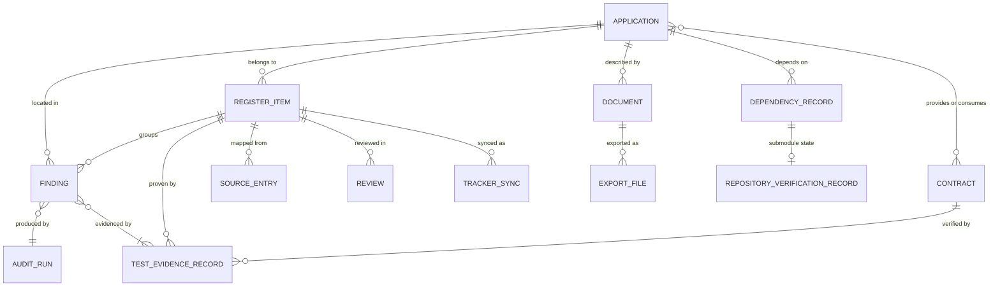
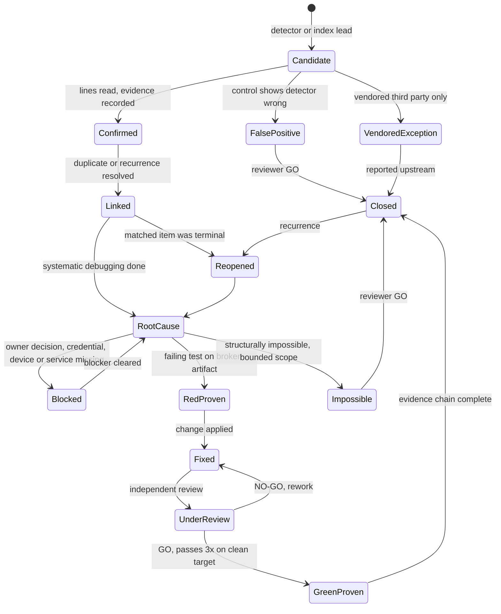
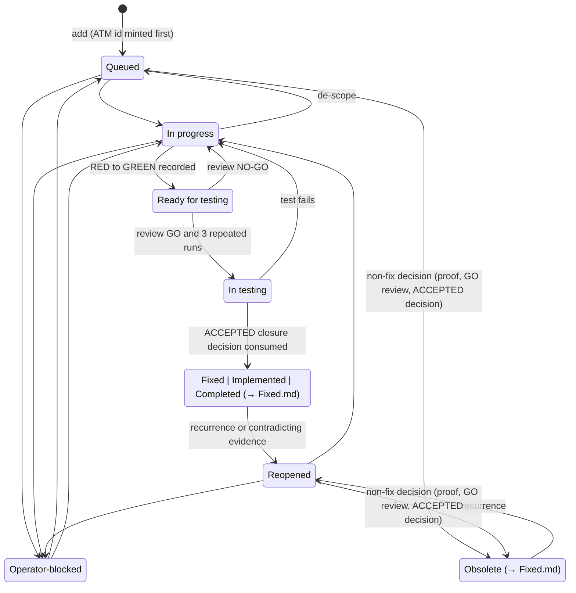
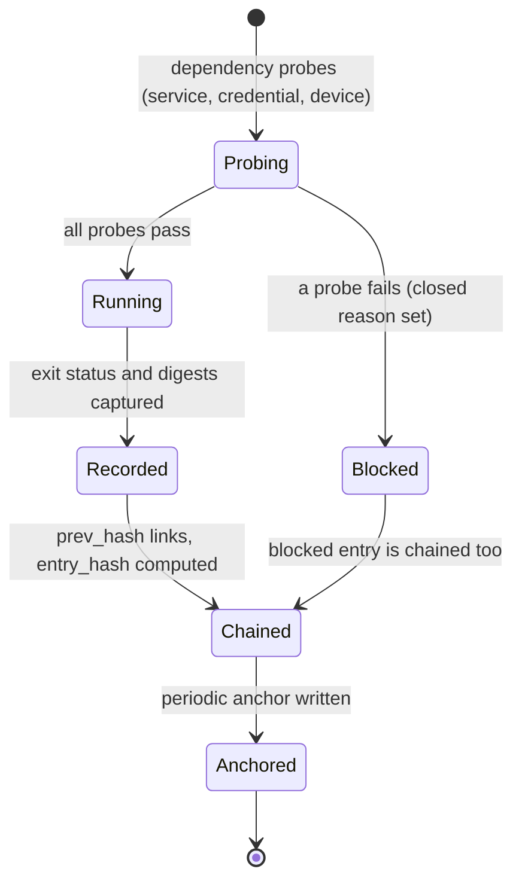
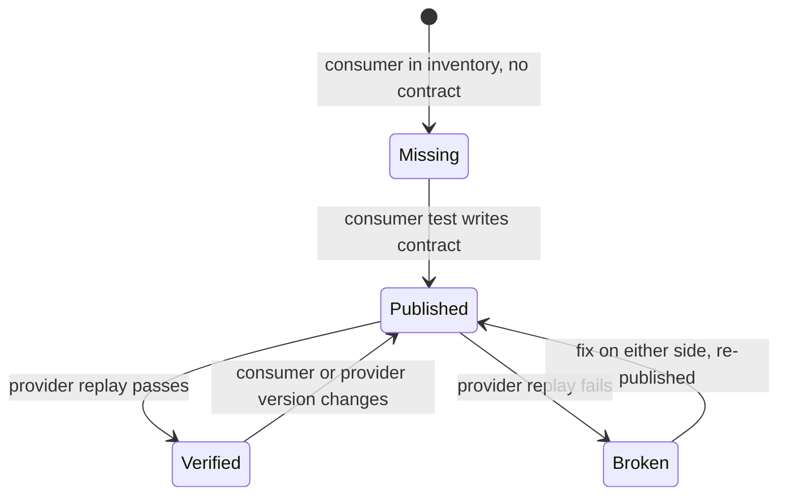
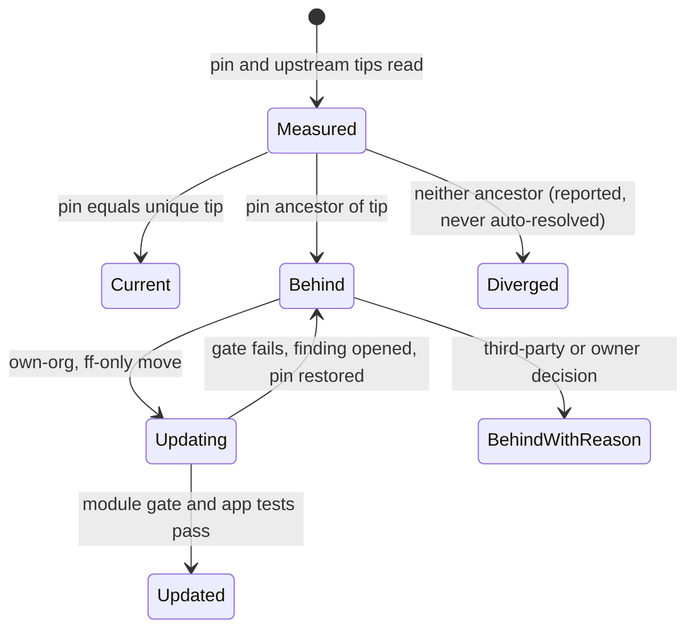
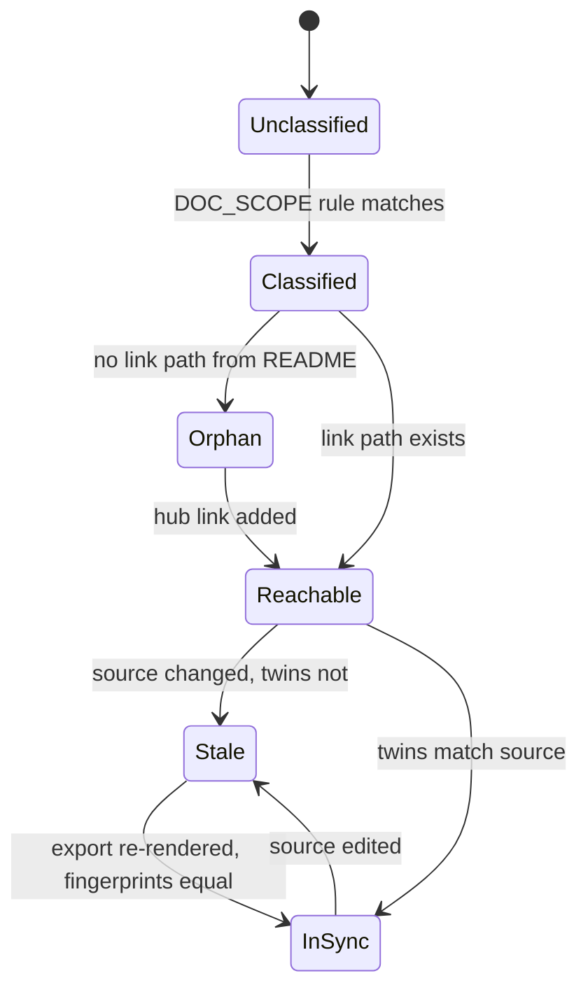
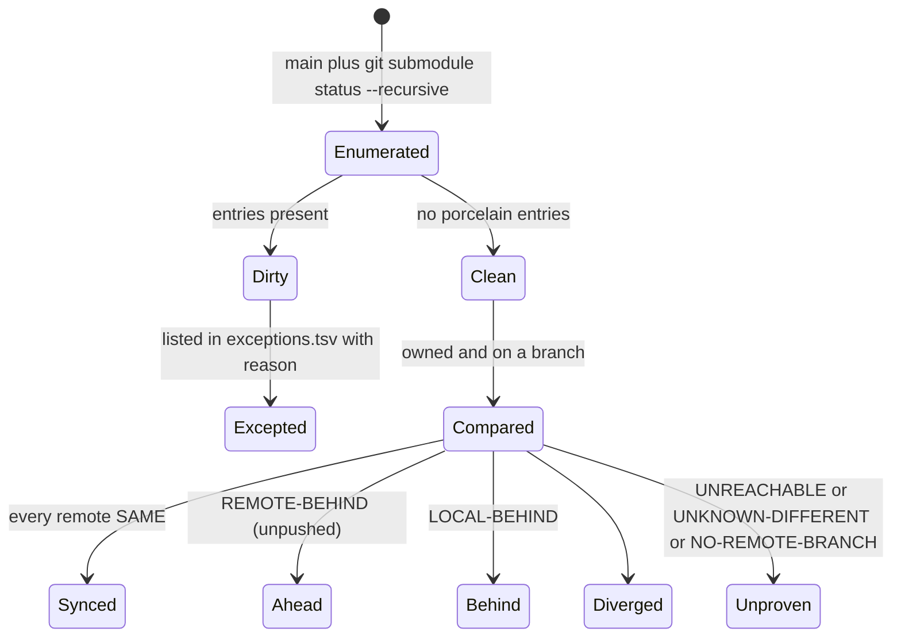

# Data Model: Full Project Audit and Remediation

| Field | Value |
|---|---|
| Feature | `specs/001-full-project-audit-remediation` |
| Created | 2026-10-03 |
| Revision | 5 |
| Last modified | 2026-10-03 |
| Status | draft (revision 5: §9 names the routine commit-push S7 flags, plain mode with `--fetch` and `--no-remote` under `--local-only`, matching docs/16 revision 4 and docs/21 revision 7; no field, code or rule changed. Revision 4: §9 states which verifier exit codes apply in plain and in `--strict` mode, how a stash (R3) and a pointer no remote holds (R4) appear in the v1 report, cites docs/16 §11.4 only for the verifier codes; §1 and §2 define `findings.index.jsonl` as a timestamp-free projection, not a `finding/1` record; §3 records the doc18 Feature items (docs/21 §9.5); §4 states the owned-repository split) |
| Sources | spec.md "Key Entities"; docs/02 §5, §6, §9, §10; docs/04 §3 to §8 (register DDL); docs/06 §3, §4, §14; docs/11 §2; docs/12 §6, §11; docs/13 §3, §8; docs/19 §3 |
| Paths | `$AUD` = `specs/001-full-project-audit-remediation/audit`; `$EV` = `specs/001-full-project-audit-remediation/evidence` (layout owned by docs/06 §11) |
| Physical store | `docs/workable_items.db` (constitution engine schema plus the `reg_*` extension of docs/04 §5) for register-side entities; JSON files validated by `contracts/*.schema.json` for audit-side records |

This document does not repeat the DDL. Each entity names the tables, columns and sections of `docs/04-findings-register-design.md` that implement it. Where docs/02 and docs/04 use different vocabularies, the mapping of `research.md` R-12 applies.

## Table of contents

1. Entity overview
2. Finding
3. Register Item
4. Application (component)
5. Test Evidence Record
6. Contract
7. Dependency Record
8. Document
9. Repository Verification Record
10. Supporting entities (source entry, audit run, review, tracker sync, export run)
11. Cross-entity validation rules (completion gates)

## 1. Entity overview

| Spec entity | Primary store | Key | Schema / DDL reference |
|---|---|---|---|
| Finding | `$AUD/findings/<finding_id>.json` (one `finding/1` file per finding, the only full record) + `reg_findings`; per run, the derived index `$AUD/runs/<run>/findings.index.jsonl` (docs/02 §9: one line per finding with `unit`, `path`, `line_start`, `rule_id` and `fingerprint` only, no timestamps, no `run_ids`; not a `finding/1` record) | `finding_id` = canonical `FND-NNNN` (register-minted); stored alias `unit_alias` = `F-<unit>-NNN` | `contracts/finding.schema.json`; docs/04 §5 `reg_findings` |
| Register Item | engine `items` + `reg_ids` + `reg_item_ext` | `atm_id` `ATM-NNN` | docs/04 §4, §5, DR-2 |
| Application | `reg_components` | `component_id` | docs/04 §5 `reg_components` |
| Test Evidence Record | ledger `ev/1` + `reg_evidence` + `reg_test_runs` | ledger `seq` / `evidence_id` / `(group_id, rep_index)` | `contracts/evidence-record.schema.json`; docs/06 §3; docs/04 §5 |
| Contract | contract files (Pact JSON) + matrix verdicts | `(provider, consumer, interface)` | docs/05 §9; `contracts/route-drift-report.schema.json` for drift leads |
| Dependency Record | dependency report (SC-009) | `(repo_or_manifest, name)` | docs/11 §2.2; docs/15 WS6 |
| Document | `docs/DOC_SCOPE.yaml` + `docs/EXPORT_MANIFEST.json` + crawl report | repository-relative path | docs/13 §3, §8; `contracts/link-crawl-report.schema.json` |
| Repository Verification Record | `scripts/repo/verify_repos.sh` JSON (`repo-verification-report/1`) | `path` | `contracts/repo-verification-report.schema.json` |

## 2. Finding

One audit observation with its own location and evidence. Many findings may point to one register item (a same-cause family); a finding without an item is impossible (docs/04 DR-4).

| Field | Type | Required | Rules |
|---|---|---|---|
| `finding_id` | string | yes | ONE canonical id `^FND-[0-9]{4,}$`, minted by the register (`reg_findings.finding_id` generated from `finding_seq`, UNIQUE, monotone, never reused, immutable); the file name and every cross-reference use it (research R-12) |
| `unit_alias` | string | yes | unit-local alias `^F-<unit>-[0-9]{3,}$`, stored in `reg_findings.unit_alias` (UNIQUE, immutable; CHECK requires the `<unit>` part to equal `component_id`); never used as a key elsewhere (the `ev/1` `item` field does not accept it) |
| `register_item` | `ATM-NNN` | yes | FK `reg_findings.atm_id -> reg_ids.atm_id` |
| `fingerprint` | sha256 hex | yes | normalised `(unit, file, symbol-or-key, rule-id, root-cause-key)`; `UNIQUE (fingerprint, run_id)`; determinism (SC-002) is equality of the fingerprint set across two runs, compared on the per-run index files, which map 1:1 to the finding files whose `run_ids` contain the run |
| `type` | enum | yes | `bug, error, gap, misalignment, shortcoming, weak_spot, danger_zone` (docs/02 §5.1, decision rules §5.2, first match wins, ties toward higher risk) |
| `severity` | enum | yes | `S1..S5` (docs/02 §6); register column `severity` uses `critical, high, medium, low, cosmetic` (S1->critical ... S5->cosmetic) |
| `unit` | component id | yes | FK `reg_findings.component_id -> reg_components` |
| `locations[]` | path, line range, repo, commit | >=1 | path must exist at the recorded commit; register keeps the first location in `location_path`, `location_line` |
| `found_by` | channel, detector, rule id | yes | channel closed set `automated_seam, agent_inspection, manual_qa, operator, end_user` (§11.4.238) |
| `should_have_been_caught_by` (+ `_justification`) | string (+ text) | yes | names the seam or gate; the literal `none` requires a written justification of at least 20 characters with non-blank content (§11.4.238 extension), and `none` records are counted separately |
| `evidence[]` | evidence refs | >=1 | machine-produced; content-addressed path `$EV/blobs/<sha256>` (docs/06 §11 owns the blob store); register FK `reg_findings.evidence_id -> reg_evidence` (deferred) |
| `root_cause` | statement, reproduction | before fix | `provenance` `observed` or `constructed`; `constructed` never closes (§11.4.115(G)) |
| `fix` | commit, test, red_run, green_run, iterations | when fixed | `iterations >= 3`; RED and GREEN artifact fingerprints differ |
| `review` | reviewer, verdict, evidence | before Closed | reviewer differs from author case- and space-insensitively (`reg_reviews CHECK (lower(trim(author)) <> lower(trim(reviewer)))`), the review's `review_verdict` evidence was produced by the reviewer, and the reviewer produced none of the item's RED/GREEN/proof/decision evidence (`v_closure_chain.review_ok`) |
| `closure.kind` | enum | when Closed | `fixed, false_positive, structurally_impossible, accepted_exception_vendored`; severity is never a closure reason |
| `blocked` | reason, exact cause | when Blocked | `owner_decision, credential, device, missing_service`; Blocked counts as open |
| `state` | enum | yes | see state machine below |

### State transitions (docs/02 §10)

Validation: `RedProven` cannot be skipped on the way to `Fixed`; zero findings outside `Closed` at completion except `VendoredException`, which is excluded from the count with its reason (FR-008, SC-003).

## 3. Register Item

The tracked unit of work and history; the engine row plus extension rows (docs/04 DR-1 to DR-5).

| Field | Type | Store | Rules |
|---|---|---|---|
| `atm_id` | `ATM-NNN` | `reg_ids.atm_id` (generated from `seq`, UNIQUE) | minted first, append-only (UPDATE/DELETE abort), never reused; `mint_basis` closed set `import, audit_finding, reporting_directive, candidate_duplicate, manual` |
| `type` | enum | engine `items.type` | `Bug, Feature, Task` (§11.4.16); closure status follows type: Bug->Fixed, Feature->Implemented, Task->Completed (§11.4.33). The 34 doc18 `PROPOSAL` entries (docs/21 §9.5) are `Feature` items with no `reg_findings` row, so they are outside the zero-open-findings count; their disposition is docs/21 ODG-39 |
| `status` | enum | engine `items.status` | 10 engine strings kept verbatim incl. `(→ Fixed.md)` (docs/04 DR-3) |
| title, description | text | engine | comprehensive: what, manifestation, reproduction, acceptance (§11.4.148) |
| `category` | enum | `reg_item_ext.category` | `bug, error, gap, misalignment, shortcoming, weak_spot, danger_zone, documentation, dependency, test_gap, governance` |
| `defect_layer` | enum | `reg_item_ext.defect_layer` | `runtime, artifact, source`; evidence class at closure must meet the layer (§11.4.226) |
| `severity`, `severity_source` | enum, text | `reg_item_ext` | one governing severity per item (`uq_source_map_severity`); conflicting source severities kept and linked (spec edge case) |
| `custody_basis` | enum | `reg_item_ext` | `machine_evidence, legacy_import, false_positive_evidence, structural_impossibility, accepted_exception` |
| `reverify_required`, `legacy_status` | 0/1, text | `reg_item_ext` | legacy import policy, research R-04; `legacy_import` is written only at import time (INSERT before the id has any `items` or status-log row, id minted with `mint_basis='import'`), never set later; `reverify_required` can only go 1 -> 0 (docs/04 `trg_item_ext_legacy_insert`, `trg_item_ext_custody_update`, `v_legacy_import_unbacked`) |
| reopen history | rows | `reg_status_log` (append-only) + `v_reopen_counts` | reopen attribution: By, On, Reason (closed set), Evidence |

### State transitions (21 seeded edges, `reg_status_transitions`; docs/04 §7)

Identity enforcement (docs/04 DR-2, §5 v2): `trg_items_require_mint` refuses an `items` row whose id has no `reg_ids` row and a second `items` row for an id (one row per register id across Issues and Fixed, although the engine's own primary key would admit two); `trg_items_identity_update` does the same for UPDATEs of the id or location. The engine's `validate` does not check either, so the gate checks `v_duplicate_item_ids` and `v_items_without_mint` (registered in `reg_gate_checks`).

Custody enforcement (docs/04 §5, §6, §7.1): `trg_closure_decision_guard` refuses an ACCEPTED `reg_closure_decisions` row unless its evidence row is `kind=custody_decision` for the same item and the chain in `v_closure_ready` is complete; `trg_items_transition` and `trg_items_insert_guard` refuse any terminal write without such a live decision (re-checking the chain even if the decision guard was dropped); `trg_items_status_log` logs every change and consumes the decision (single use; decisions cannot be deleted or otherwise updated). Closure custody chain, in order: registered item with extension row; RED (test verdict FAIL, evidence exit 1..125, observed precondition, class at or above the defect layer); fix commit; GREEN group of the same test (>= 3 repetitions, all PASS, one fingerprint different from RED); MUTATION run of the same test with verdict FAIL whose evidence is a `mutation_run` row of the same item (exit 1..125, class floor met); latest review GO, its verdict evidence produced by the reviewer, by a reviewer who produced none of the RED/GREEN/proof/decision evidence (identities compared with `lower(trim())`); `closure-check` decision imported as `custody_decision` evidence; engine `close`. Non-fix closure to `Obsolete` uses the same decision path from `Queued` or `Reopened` (a `false_positive_proof` meeting the class floor plus the independent GO review); an `obsolete_details` row alone is not a basis (docs/04 §5 limitation 4). `reg_status_log` rows can only be written for the current status and must carry the current ledger high-water marks (`reg_status_log_insert_guard`). Fix cycles (docs/04 §7.1, v3 and v4): every row counted in the chain (test runs, evidence including the `custody_decision`, reviews) must have an id above the marks stored on the item's last `Reopened` log row (`v_cycle_start`), so a reopened item needs a new RED, GREEN group, caught mutation, GO review and decision; a custody-bearing evidence row whose file (`sha256`) was already recorded for the item before that mark is refused (`reg_evidence_no_replay`), and a GREEN group on a fingerprint that was GREEN in an earlier cycle does not count. Append-only ledgers: `reg_ids`, `reg_evidence`, `reg_test_runs`, `reg_reviews`, `reg_status_log` refuse UPDATE and DELETE, `reg_item_ext` and `reg_closure_decisions` refuse DELETE (decisions allow only their single consumption), and all of them plus `reg_findings` refuse an INSERT whose key already exists, because `INSERT OR REPLACE` removes the old row without firing DELETE triggers (`*_no_replace`, docs/04 §14.9 I2). Legacy custody: `legacy_import` is written only at import, only for an import-minted id with a closed-class `legacy_status`, and its exemption ends at the first reopen or move into work (`v_legacy_exempt`). Honest boundary: the SQL checks structure, not authorship (self-declared identities); the producer-equals-verifier gap is closed only by the outside-SQL controls of docs/04 §7.1 (evidence re-hash, independent re-derivation from the ledger, reviewed DB diff).

Recurrence (FR-003, docs/04 §8): every intake resolves `duplicate-of` chains to the head; same defect on a terminal head reopens it (`reg_recurrence_links.verdict='SAME_DEFECT'` must have `new_atm_id IS NULL`); undecided mints with a candidate link; `v_recurrence_violations` checks the reopen against `reg_status_log` (a `Reopened` row after the last closure at or before the link's `head_log_id`, the head's last log id when the link was written, checked by `reg_recurrence_links_head_guard`), never against the self-reported `reopened` flag or the self-declared `decided_at`, and must be empty at every gate; links are append-only (a changed decision is a new row, docs/04 §8, §14.10 I3).

## 4. Application (component)

| Field | Type | Store | Rules |
|---|---|---|---|
| `component_id` | string | `reg_components.component_id` | lowercase, `[a-z0-9_-]` only (§11.4.29) |
| `kind` | enum | `reg_components.kind` | `backend, service, web, desktop, mobile, tv, installer, library, website, build, governance, tooling` |
| `path_root` | path | `reg_components.path_root` | repository-relative root |
| `own_repo` | 0/1 | `reg_components.own_repo` | 1 when the component is its own repository (submodule) |
| audit status | derived | `v_*` views over `reg_findings`, `reg_item_ext` | spec US5 coverage matrix row: audit status, open/closed findings |
| test types present | derived | `reg_test_runs` joined with `reg_test_types` (16 seeded) and `matrix/applicability.yaml` | absent applicable type = finding (FR-009) |
| documentation present | derived | Document entity (`covers:` mapping, docs/13 §11) | manual, guides, FAQ, diagrams (FR-014) |
| coverage baseline, dated target | number, date | coverage baseline file per app (docs/05 §7.2) | never below baseline (FR-011) |

Initial seed (docs/01 §3, docs/05 §3): `catalog-api`, `catalog-web`, `catalogizer-desktop`, `installer-wizard`, `catalogizer-android`, `catalogizer-androidtv`, `catalogizer-api-client`, `website`, `build`, `qa-ai-system`, `challenges`, `constitution`, and one row per owned submodule (51 owned repositories counted by the POC `verify_repo.sh`: the main repository, 43 direct submodules and 7 nested ones under `submodules/constitution/submodules/`; the direct `submodules/superspec` is third-party; docs/21 IC-30).

## 5. Test Evidence Record

Three layers, deliberately separate (docs/04 §4 last paragraph, docs/06 §3, §4):

| Layer | Purpose | Key | Store |
|---|---|---|---|
| Ledger entry `ev/1` | one command execution, hash-chained | `(ledger, seq)`; `entry_hash` | per-application JSONL ledger (docs/06 DR-E3), anchored (§11.4.268) |
| Verdict file `verdict/1` | RED/GREEN pair derived by program from ledger entries | `item` + `ledger_head` | evidence tree |
| Register rows | `reg_evidence` (one artifact, append-only) and `reg_test_runs` (one repetition) | `evidence_id`; `UNIQUE (group_id, rep_index)` | register DB |

Fields of `ev/1`: see `contracts/evidence-record.schema.json` (five mandatory execution fields: `started_at`, `cwd`, `argv` as a list, `exit_status`, `duration_ms`; plus stream digests computed before truncation, `target_fingerprint`, chain links, `verdict` `pass|fail|blocked|error`, `blocked_reason`, `blocked_detail`, `counts_as`, `test_fingerprint`, `oracle`, `mutation`, `evidence_class`, `precondition_provenance`).

Mapping to the register (docs/04 §5):

| `ev/1` | `reg_evidence` / `reg_test_runs` |
|---|---|
| `polarity` RED / GREEN | `reg_evidence.kind` `red_run` / `green_run`, `polarity`; `reg_test_runs.polarity` |
| `MUTATION` polarity, `mutation.result` | `reg_test_runs.polarity='MUTATION'`, `verdict='FAIL'` when caught; its evidence row is `reg_evidence.kind='mutation_run'` of the SAME item, exit 1..125, class floor met (docs/04 `v_closure_chain.fix_chain_ok`) |
| `exit_status` | `reg_evidence.exit_code` (CHECK `red_run` and `mutation_run` 1..125, `green_run` 0) |
| count of GREEN iterations | `reg_evidence.iterations >= 3` |
| `verdict` pass/fail | `reg_test_runs.verdict` PASS/FAIL (a GREEN row is always PASS, a RED row FAIL or BLOCKED) |
| `verdict` blocked | `reg_test_runs.verdict='BLOCKED'` with `blocked_reason` (RED or MUTATION rows only; a GREEN row can never be BLOCKED, matching `ev/1`) |
| `verdict` error (exit 126, 127, 128+ or negative: no test outcome) | never a `reg_test_runs` RED or GREEN row; stored only as `reg_evidence` `kind='log'`, so it can never satisfy `v_red_runs` or `v_green_groups` |
| `test_fingerprint` | not a register column; checked by the verdict deriver (same value on every RED and GREEN entry of a closure) before the closure decision is produced |
| `target_fingerprint` | same column in both tables (required for runtime class) |
| `evidence_class` | `reg_evidence.evidence_class` (`runtime, artifact, source`; the ledger's `user_visible` maps to `runtime` with a user-visible observable) |
| `precondition_provenance` | same column |

Validation: the verifier refuses an entry missing any of the five execution fields or with `argv` as a string; a test record without an oracle; a closing pair without a caught mutation; a `constructed` precondition on a closing record; a class below the defect layer; any record with a credential value (redacted, `redacted: true`). Repeat rule: three GREEN repetitions with three distinct iteration values, identical verdict and identical stdout digest; every RED entry precedes every GREEN entry in the ledger; RED and GREEN share one `test_fingerprint`; RED and GREEN target fingerprints differ.

### Lifecycle of one run (docs/05 §10.2, docs/06 §14.1)

`Blocked` counts as not passing and is never converted to skip or pass (FR-025).

## 6. Contract

| Field | Type | Rules |
|---|---|---|
| `contract_id` | string | `(provider, consumer, interface)`; interfaces: REST API v1, WebSocket `/ws`, database schema, shared module APIs, JWT claims, persisted client data (docs/05 §9.1) |
| provider version, consumer version | string | the can-i-deploy matrix is keyed on both |
| definition | path | Pact JSON file (file-based mode, research R-13); OpenAPI `docs/api/openapi.yaml` for the provider-side schema |
| consumer test | test id | must exist (both sides, FR-016) |
| provider verification | evidence id | replay against the real running API on a real database in a container |
| matrix verdict | enum | `compatible, incompatible, unknown`; `unknown` (missing contract) refuses, as `incompatible` does |
| compatibility window | integer N | owner data (OD-25) |

Drift leads come from `route_drift.py` (`contracts/route-drift-report.schema.json`): `undocumented_routes`, `stale_spec_entries`, `unwired_mux_routes`, `client_calls_without_route`, `double_prefix_calls`. Each lead becomes a finding only after runtime confirmation (docs/19 §9).

Only `Verified` for every consumer in the window allows a release step.

## 7. Dependency Record

| Field | Type | Rules |
|---|---|---|
| key | `(repo or manifest, name)` | submodules keyed by path; packages by manifest path and package name |
| kind | enum | `submodule_own, submodule_third_party, package` |
| version in use | string | 40-hex pin for submodules; version for packages |
| upstream latest | string | unique maximum tip across all remotes (submodules); latest release (packages) |
| status | enum | `current, behind_with_reason, updated, diverged, unreachable` (spec US6 + docs/11 §2.1 pin-vs-tip) |
| decision | text | required when `behind_with_reason` (SC-009) |
| gate evidence | evidence id | module gate plus affected applications' full tests before an update is accepted (FR-018) |

Policy (research R-07): own-org submodules updated; third-party pins and packages reported only.

## 8. Document

| Field | Type | Store | Rules |
|---|---|---|---|
| `path` | string | `DOC_SCOPE.yaml` rule match | every path matches exactly one class; unclassified fails |
| `class` | enum | `DOC_SCOPE.yaml` | `A product, B project management, C generated record collection, D governance, E submodule, F vendor` (docs/13 §3) |
| `reachable`, `depth` | bool, int | crawl report | class A within 3 hops of `README.md`; class C via one generated index |
| outbound links, broken links, broken anchors | lists | crawl report (`link-crawl-report/1`) | zero broken at completion (SC-006) |
| `source_sha256` | sha256 | `EXPORT_MANIFEST.json` | embedded in every twin |
| exports | list of `{path, format, sha256, bytes}` | `EXPORT_MANIFEST.json`, `reg_export_files` | formats `md, html, pdf, docx` per class; `stale = 0`, `missing = 0` |
| `covers` | component ids | document front matter | feeds the per-application documentation matrix (FR-014) |
| revision header | table | document head | §11.4.44 |

Definitions (FR-015) are documents generated from what the system uses (schema dump after the Go migration path v1 to 20, router route table, environment keys from code) and diffed against hand-written references (docs/13 §10).

## 9. Repository Verification Record

Exactly the per-repository object of `contracts/repo-verification-report.schema.json` (`repo-verification-report/1`, unchanged). Producer: `scripts/repo/verify_repos.sh`, the single verifier promoted from `poc/repo_verify/verify_repo.sh` (docs/21 IC-17, IC-37; tasks.md WP-03). The promotion keeps the v1 JSON shape, including the constant `"tool": "verify_repo.sh"` that the v1 schema requires (it names the shape's lineage, not the file), and adds the docs/16 §11.4 exit-code map. Both output options are accepted: `--json <file>` (docs/16) and `--json-out <file>` (POC).

| Field | Type | Rules |
|---|---|---|
| `path` | string | `.` for main repository; key |
| `pin`, `pin_state` | char, enum | `ok, drifted, uninitialised, conflict, ?` |
| `head`, `branch` | sha40 or empty, string | empty branch = detached |
| `owned` | bool | organisation of any remote URL in the own-org list (research R-27) |
| `dirty`, `dirty_tracked`, `dirty_untracked` | bool, int, int | `git status --porcelain --ignore-submodules=all` |
| `remotes[]` | `{remote, url, remote_tip, class}` | class `SAME, REMOTE-BEHIND, LOCAL-BEHIND, DIVERGED, UNREACHABLE, NO-REMOTE-BRANCH, UNKNOWN-DIFFERENT`; the POC compares owned repositories on a branch; the promoted verifier also compares a detached owned submodule's pinned commit with the tip of its `.gitmodules` branch (else the remote's default branch) on every remote (R4, below); always empty for third-party repositories (schema rule) |
| `excepted`, `exception_reason` | bool, string | from `exceptions.tsv`; excepted rows are still listed |
| `problems[]` | enum list | `dirty, ahead, diverged`, plus `behind, pin` in `--strict` |
| `unproven[]` | enum list | `UNREACHABLE, UNKNOWN-DIFFERENT, NO-REMOTE-BRANCH` |

Report-level rule (SC-010): `summary.failing = 0` and `summary.unproven = 0` under `--strict`, with every exception explained.

Exit codes of `scripts/repo/verify_repos.sh` (docs/16 §11.4; replaces the POC's 0/1/2/3; the commit-push script's own codes are docs/16 §12.3, and it maps these codes to its own at stage S7):

| Exit | Meaning | v1 summary field that drives it |
|---|---|---|
| 0 | clean | every count below is 0 (excepted dirty rows allowed and listed) |
| 11 | unpushed commits | `summary.ahead` (`REMOTE-BEHIND` remotes) |
| 12 | diverged | `summary.diverged` |
| 13 | dirty, including a stash (R3) | `summary.dirty` minus `summary.dirty_excepted`; a repository with a stash entry is reported `dirty: true` with `problems` containing `dirty`, so a stash-only row shows `dirty: true` with `dirty_tracked = 0` and `dirty_untracked = 0` |
| 14 | unverified remote | `summary.unproven` (`UNREACHABLE`, `UNKNOWN-DIFFERENT`, `NO-REMOTE-BRANCH`) |
| 15 | pointer drift or uninitialised submodule, `--strict` only | `summary.pin_drift`, counted in both modes; in `--strict` mode the row's `problems` contains `pin` |
| 20 | blind verifier (control-needle self-test failed), usage or internal error | no report is trusted; any summary written is marked unproven |

Modes (docs/21 IC-37, revision 6, keeping the POC's semantics): every `summary` count is computed the same way in plain and in `--strict` mode. Codes 11, 12, 13 and 14 apply in both modes; 14 is the POC's plain-mode exit 3, because "could not verify" is never clean. `--strict` only adds `behind` (a `LOCAL-BEHIND` remote) and `pin` (a `pin_state` other than `ok`) to `problems`, and so to `summary.failing`; therefore 15, and the code for a strict `behind` row, apply only under `--strict`, and a plain run with pointer drift and nothing else exits 0 with `summary.pin_drift > 0` reported. A failing class (11, 12, 13, or under `--strict` 15 and the `behind` code) takes precedence over 14, as the POC's exit 1 takes precedence over its exit 3. The routine commit-push run uses plain mode at S7 with `--fetch` (objects only, so a remote tip that moved after S1 is decided instead of left unproven), and `--no-remote` in its place under `--local-only` (revision 5; docs/16 §12.2, docs/21 IC-37); `--strict` is the WP-73 final condition (SC-010).

Pinned commit held by no remote (R4): with the detached-submodule comparison above, a pinned commit that no remote tip contains is `REMOTE-BEHIND` (exit 11, unpushed) or `DIVERGED` (12) when the ancestry is proven, and `UNKNOWN-DIFFERENT` (14) when the commit object of a remote tip is absent locally and `--fetch` (object store only, refs untouched) was not given. The v1 shape has no field that would drive 15 for it.

UNCONFIRMED until the WP-03 executing test of tasks.md fixes them in its exit-code matrix: the order among the failing codes when several failing classes are present at once, and the code for `behind` rows under `--strict` (the POC fails them, docs/16 assigns no code).

## 10. Supporting entities

| Entity | Store (docs/04 §5) | Purpose |
|---|---|---|
| Source and source entry | `reg_sources`, `reg_source_entries`, `reg_source_map` | FR-002 provenance; entry key `(source_id, locator)`; exactly one mapping per entry; `v_unmapped_entries` must be empty (SC-001) |
| Audit run | `reg_audit_runs` | `run_id`, 40-char git head, index attestation path (`$AUD/index-health.json`), tool versions |
| Review | `reg_reviews` | GO/NO-GO, model and effort recorded (effort `?` when not reportable), author differs from reviewer (FR-023) |
| Closure decision | `reg_closure_decisions` | imported `closure-check` verdict, single use; ACCEPTED only with `custody_decision` evidence and a complete chain; append-only except the consumption |
| Gate registry | `reg_gate_checks`, `v_gate_missing_objects` | the views that must be empty and the triggers that must exist; the gate reads this table |
| Tracker and sync log | `reg_trackers`, `reg_tracker_sync_log` | SYNCED needs exit 0, remote ref and evidence; SKIPPED needs a closed reason (FR-004) |
| Export run and file | `reg_export_runs`, `reg_export_files` | DB fingerprint, verdict `OK, STALE, FAILED`; per-file sha256 |
| Index health | `$AUD/index-health.json` (`index-health/1`, docs/02 §4.2) | P1 to P8 per pass |
| Bank case | bank YAML validated by `contracts/bank-case.schema.json` | a test definition, never a problem (docs/04 §15.2); placeholder banks are gap items |

## 11. Cross-entity validation rules (completion gates)

All queries are read-only and are listed in docs/04 §13.1 and docs/03 §15.

1. `v_unmapped_entries` empty; every problem-disposition source entry has a register id (SC-001).
2. Every `reg_gate_checks` view of kind `view_empty` returns 0 rows (`v_findings_without_item`, `v_custody_violations`, `v_recurrence_violations`, `v_duplicate_item_ids`, `v_items_without_mint`, `v_unmapped_entries`, `v_legacy_import_unbacked`, `v_illegal_logged_edges`, `v_replayed_evidence`), `v_gate_missing_objects` is empty (all 41 registered triggers present; docs/04 §4, K-9), the schema and seed tables equal a fresh reference built from `register_ext.sql` (docs/04 §12.3, §5 limitations 8 and 9), `PRAGMA integrity_check` prints `ok` and `PRAGMA foreign_key_check` prints nothing (docs/04 §12.3, §5 limitation 7).
3. Zero findings outside `Closed` except `VendoredException`; every row of `v_reverify_queue` (`reverify_required = 1`, registered in `reg_gate_checks` with kind `view_not_done`) counted as not done until OD-10 is decided; a reopened legacy item leaves that queue and needs a full chain recorded after the reopen (docs/04 §5 limitation 5, §14.9 B2).
4. Every closed fixed item has RED, three GREEN with identical verdict, a caught mutation and a GO review in the register (`v_closure_ready`), AND the cited ledger entries verify against chain and anchor and re-derive to `PASS` by an independent verifier (docs/06 §4.2, §13; the register rows alone do not prove authorship).
5. Every applicable `(application, test type)` cell has a recorded run; no `BLOCKED` run counted as a pass.
6. Link crawl: `docs_orphans` of class A and B = 0, `broken_links = 0`, `broken_anchors = 0`; export check `stale = 0`, `missing = 0`.
7. Repository verification (`scripts/repo/verify_repos.sh --strict`): exit 0, `failing = 0`, `unproven = 0`, exceptions explained.
8. Every dependency record has a status and, when behind, a decision.
