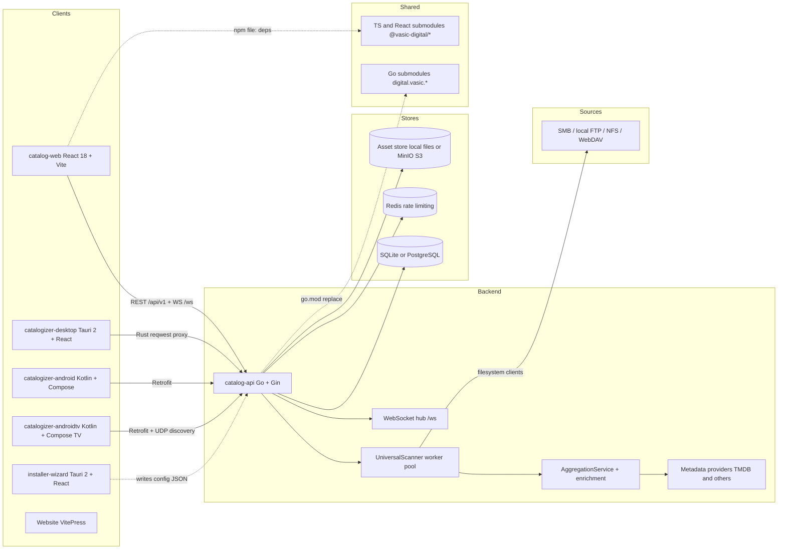
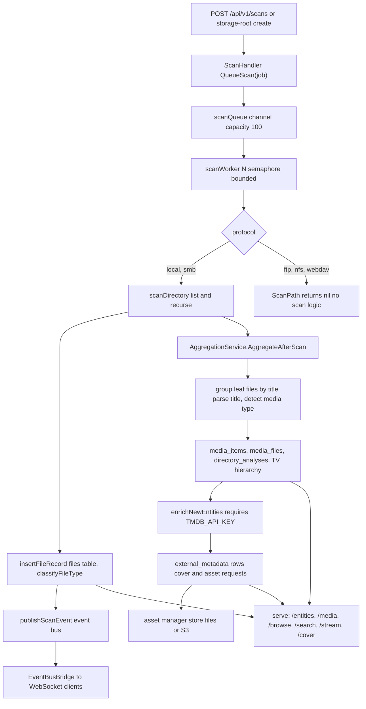
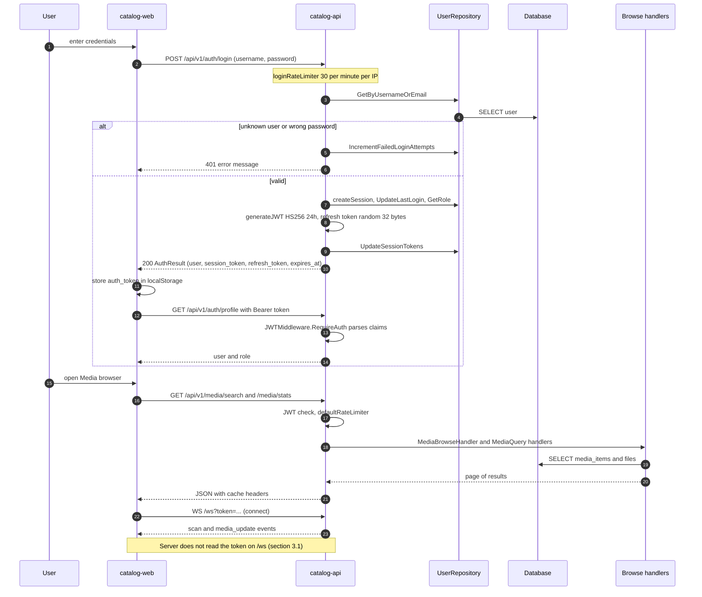
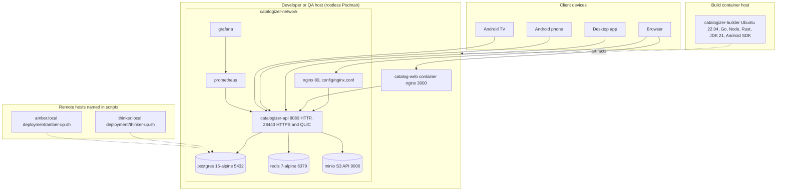

# 01 - System Architecture Map (verified baseline)

| Field | Value |
|---|---|
| Revision | 3 |
| Created | 2026-10-03 |
| Last modified | 2026-10-03 |
| Status | draft (revision 3: the section 3.8 `.github/` row names where the no-workflow-file condition is enforced: anti-mess invariant AM-G2 of document 12 §17.3, swept at commit-push S0 and S7 (tasks.md T090, T093), not an S3 check of document 16. Revision 2: new section 3.8 lists the root configuration files and tool directories that the inventory omitted (`.github/`, `.claude/`, `.codegraph/`, `.implementation/`, `.remember/`, `templates/`, `.pre-commit-config.yaml`, `docker-compose.dev.override.yml`, `submodule-analysis.txt`, `LICENSE`), each with a disposition; `\|` escaped inside table cells so every table row has its header's column count) |
| Feature | specs/001-full-project-audit-remediation |
| Scope | Factual map of the whole Catalogizer system as it exists in the tree on `main` |
| Method | Read-only inspection: `git ls-files`, `git submodule status --recursive`, targeted file reads, two small static-parse scripts (route extraction and client-to-route comparison). No builds, no test runs, no network calls. Baseline commit `e4852ce7`. |
| Traceability | FR-005, FR-006, FR-015, FR-016, FR-017, FR-021; SC-002, SC-004, SC-008 |

## Table of contents

1. Reading rules and evidence levels
2. System at a glance (component diagram, size table)
3. Applications and shared components
   - 3.1 catalog-api (Go backend)
   - 3.2 catalog-web (React web client)
   - 3.3 catalogizer-desktop (Tauri client)
   - 3.4 installer-wizard (Tauri configuration tool)
   - 3.5 catalogizer-android and catalogizer-androidtv
   - 3.6 catalogizer-api-client (TypeScript library)
   - 3.7 Website, Build, challenges, qa-ai-system, tests, OCU-CUDA-Sidecar
   - 3.8 Root configuration files and tool directories (revision 2)
4. Submodules (44 declared, 53 nested, one vendored directory)
5. Communication paths
6. Data stores, dialects and migrations
7. Data flow: scan, detect, enrich, store, serve
8. Sign-in and browse sequence
9. Background workers and long-lived goroutines
10. External integrations
11. Build, test and deployment topology (deployment diagram)
12. Quality-assurance assets (challenges, HelixQA banks, scripts)
13. Code indexes
14. Shared contracts table
15. Observations that the audit must examine (facts, not conclusions)
16. Areas not verified
17. Appendix: reproduction commands

---

## 1. Reading rules and evidence levels

Every claim is tagged by how it was established.

| Tag | Meaning |
|---|---|
| VERIFIED | Read directly from a file in the tree at the cited path, or counted by a command listed in the appendix. |
| STATIC | Derived by a script that parses source text. It proves what is written, not what runs. |
| DOC-CLAIM | Stated only in a Markdown document. Not confirmed against code. |
| UNCONFIRMED | Could not be established from the tree. Listed again in section 16. |

File counts use `git ls-files` (tracked files only). Untracked and ignored files, `node_modules`, and build outputs are excluded unless stated. "Lines" are raw physical lines. Nothing in this document is a verdict on correctness; section 15 lists facts that the audit (spec FR-007, FR-008) must turn into findings with root causes.

## 2. System at a glance

### 2.1 Component diagram



Dotted edges are build-time or file-level relationships. The wizard-to-API edge is dotted because no consumer of the wizard output was found in `catalog-api` (section 16).

### 2.2 Size table (tracked files)

| Path | Tracked files | Main languages (file counts) |
|---|---:|---|
| `catalog-api/` | 831 | Go 742 (of which 372 are `_test.go`; 318,817 Go lines, measured with `git ls-files catalog-api \| grep '\.go$' \| xargs cat \| wc -l`), SQL 21, sh 11, md 23 |
| `catalog-web/` | 348 | tsx 192, ts 125 (173 test files, 144 non-test ts/tsx) |
| `catalogizer-desktop/` | 95 | ts 32, tsx 29, rs 4 |
| `installer-wizard/` | 92 | tsx 41, ts 11, rs 8 |
| `catalogizer-android/` | 157 | kt 119 (40 main, 69 test, 10 androidTest) |
| `catalogizer-androidtv/` | 303 | kt 149 (61 main, 87 test, 1 androidTest), md 84 |
| `catalogizer-api-client/` | 60 | ts 24 plus 28 tracked `dist/` files and 5 tracked `releases/` files |
| `Website/` | 43 | md 37 |
| `Build/` | 8 | sh 4 |
| `challenges/` | 22 | YAML banks 15, JSON bank 1, sh scripts |
| `scripts/` | 140 | sh 131, py 7 |
| `tests/` | 45 | js 39 (16 under `k6/`), sh 5, go 1 |
| `qa-ai-system/` | 17 | py, sh, reports |
| `OCU-CUDA-Sidecar/` | 11 | Go, proto |
| `docs/` | 2,396 | mostly generated or historical; 93 top-level entries |
| Whole repository | 4,887 | includes 44 gitlink entries for submodules |

Note: the `catalog-api` Go file count (742) and line count (318,817) were measured over `git ls-files catalog-api | grep '\.go$'` (`grep -c` for files, `xargs cat | wc -l` for lines). An earlier figure of 868 came from `git ls-files catalog-api '*.go'`, which mixes pathspecs, and is withdrawn.

## 3. Applications and shared components

### 3.1 catalog-api (Go backend)

| Item | Fact | Evidence |
|---|---|---|
| Module | `module catalogizer`, `go 1.25.7` | `catalog-api/go.mod:1-3` |
| Entry point | `catalog-api/main.go` (2,167 lines), `func main()` at line 262 | VERIFIED |
| Second binary | `catalog-api/cmd/boot/main.go` - a CLI that boots infrastructure through `digital.vasic.containers` (`pkg/boot`, `pkg/compose`, `pkg/distribution`, `pkg/remote`) | VERIFIED |
| HTTP framework | Gin v1.12.0 (`router := gin.Default()`, main.go:915); gorilla/mux v1.8.1 is also a dependency and is used by `internal/handlers/localization_handlers.go` and `media_player_handlers.go` (`RegisterRoutes(router *mux.Router)`) | VERIFIED |
| Listeners | HTTP on `cfg.Server.Port` (default 8080, scans up to 10 ports upward via `findAvailablePort`, writes the chosen port to `./.service-port`); HTTPS HTTP/2 and HTTP/3 (QUIC, `quic-go`) on port 28443 using a self-signed certificate from `getOrCreateSelfSignedCert()` | main.go:86-115, 1795-1850 |
| Config | `config.json` loaded by `config.LoadConfig("config.json")`, then overridden by environment variables: `JWT_SECRET`, `ADMIN_USERNAME`, `ADMIN_PASSWORD`, `SERVER_PORT`, `HOST`, `GIN_MODE`, `DATABASE_TYPE/HOST/PORT/NAME/USER/PASSWORD/SSL_MODE`, `STORAGE_*`, `REDIS_ADDR`, `REDIS_PASSWORD`, `TRUSTED_PROXIES`, `INFRA_PROVISION_REQUIRED`, `APP_ENV` | main.go:315-355 (core); `STORAGE_*` config/config.go:252-270; `REDIS_*` main.go:562-563; `TRUSTED_PROXIES` main.go:927; `INFRA_PROVISION_REQUIRED` main.go:375; `APP_ENV` main.go:270 |
| Config struct | `Server`, `Database`, `Auth`, `Catalog`, `Storage`, `Logging`, `Proxy` | `catalog-api/config/config.go:13-20` |
| Auth | JWT HS256, 24 h expiry default (`jwtExpiry: 24 * time.Hour`), refresh tokens persisted in `user_sessions`; login lockout counters (`IncrementFailedLoginAttempts`) | `services/auth_service.go:34,57-125` |
| Route count | 259 distinct (method, path) pairs registered directly in `main.go` (STATIC parse, `scratchpad/routes.py`); handlers registered through `mux` helpers are not included | STATIC |
| Route groups | `/api/v1/auth`, `/catalog`, `/search`, `/download`, `/stream`, `/copy`, `/media`, `/entities`, `/browse`, `/storage`, `/storage-roots`, `/stats`, `/smb`, `/scans`, `/conversion`, `/admin`, `/users`, `/roles`, `/configuration` (wizard steps), `/errors`, `/logs`, `/collections`, `/assets`, `/playback`, `/analytics`, `/reports`, `/favorites`, `/playlists`, `/subtitles`, `/recommendations`, `/sync`, `/challenges`; outside the JWT group: `/health`, `/api/v1/health`, `/health/deep`, `/discovery`, `/metrics`, `/ws`, `/api/v1/image-proxy`, `/api/v1/assets/:id`, `/api/v1/cover/*`, `/debug/pprof/*` | main.go:957-1640 |
| Global middleware | SecurityHeaders, ConcurrencyLimiter(100), RequestTimeout(60 s), CORS, metrics, logger, error handler, Firebase, RequestID, InputValidation, compression | main.go:979-991 |
| Rate limiting | Redis-backed only when `REDIS_RATE_LIMIT=="true"` AND the Redis client exists (`REDIS_ADDR` answered a ping, main.go:560-575); otherwise in-memory. `loginRateLimiter` (main.go:900) is always in-memory. `docker-compose.yml` sets neither `REDIS_ADDR` nor `REDIS_RATE_LIMIT` | main.go:560-575, 900-913 |
| Source layout | Two parallel layers: root packages `handlers/`, `services/`, `repository/`, `models/`, `middleware/`, `database/`, `filesystem/`, `config/`, `smb/`, `utils/`, `challenges/`, and `internal/` packages (`auth`, `cache`, `concurrency`, `config`, `eventbus`, `firebase`, `handlers`, `httpclient`, `infra`, `lifecycle`, `logging`, `media`, `metrics`, `middleware`, `models`, `modules`, `monitoring`, `recovery`, `services`, `smb`, `tests`). `main.go` imports both, aliasing the root ones `root_handlers`, `root_services`, `root_repository`, `root_middleware`, `root_config` | main.go:3-23 |
| Challenge package | `catalog-api/challenges/` (Go, 45 files named `ch*`) registers runtime challenges through `RegisterAll(svc)`; `GET/POST /api/v1/challenges...` runs them | VERIFIED |
| Go submodule wiring | 23 `replace digital.vasic.<x> => ../submodules/<x>` directives (assets, auth, cache, challenges, concurrency, config, containers, database, discovery, entities, event_bus, filesystem, lazy, media, memory, middleware, observability, rate_limiter, recovery, security, storage, streaming, watcher) | go.mod, `grep '^replace'` |
| Module registry | `internal/modules/registry.go` registers the `digital.vasic.*` modules at start (`modules.RegisterModules()`, main.go:293) | VERIFIED |

#### Verified implementation state worth knowing

| Fact | Evidence |
|---|---|
| Scanner protocol registry has five entries: `local`, `smb`, `ftp`, `nfs`, `webdav` | `internal/services/universal_scanner.go:119-123` |
| `FTPScanner.ScanPath`, `NFSScanner.ScanPath`, `WebDAVScanner.ScanPath` bodies are a comment and `return nil` (no scanning) | same file, lines 1044-1047, 1076-1079, 1108-1111 |
| Only `LocalScanner` and `SMBScanner` have implemented `scanDirectory` logic (lines 544-700) | same file |
| `filesystem/` has real client files for FTP, NFS (plus darwin and windows variants), SMB, WebDAV and local | `catalog-api/filesystem/*.go` |
| `internal/media/` (`manager.go` with `NewMediaManager`, `realtime/` watchers, `detector/`, `analyzer/`, `database/` with its own `schema.sql` and a password-keyed SQLite DSN) is only partly unwired. `internal/media/models` has 9 production importers outside `internal/media/` (handlers, repository, `internal/services/aggregation_service.go`, `internal/handlers/media.go`) and `internal/media/providers` is imported by `main.go` and `handlers/media_entity_handler.go`. The root package, `manager`, `realtime` and `detector` have no non-test importer outside `internal/media/`; `analyzer` and `database` are imported outside it only by `internal/handlers/media.go` (`MediaHandler`). `NewMediaManager` and `internal/handlers.NewMediaHandler` have no call site outside tests | `grep` of imports, appendix A.7 |
| `/ws` is registered on the bare `router`, outside the `api` JWT group, and `handlers/websocket_handler.go` contains no token, auth or jwt handling (case-insensitive grep for `token\|auth\|jwt` returns no lines); `CheckOrigin` (line 124) returns `true`. The comment at main.go:1083 says "auth via query parameter" | main.go:1083-1084; `grep -Ei 'token\|auth\|jwt'` over the handler returns no lines |
| Several `/api/v1` routes are inline closures returning static empty collections (for example `/sync/conflicts` returns `{"conflicts": [], "count": 0}`) | main.go:1698-1775 |
| `Alt-Svc` header middleware is added with `router.Use` at main.go:1838, after route registration | VERIFIED text; runtime effect UNCONFIRMED (Gin applies `Use` only to routes added after it) |

### 3.2 catalog-web (React web client)

| Item | Fact | Evidence |
|---|---|---|
| Package | `catalog-web` 2.4.0, React 18.2, Vite 6.2, TypeScript 4.9, TanStack Query 4, Zustand 4, axios 1.6, react-router 6, Tailwind 3, Vitest 4, Playwright 1.57 | `catalog-web/package.json` |
| Entry | `src/main.tsx`, `src/App.tsx` (routes: `/login`, `/register`, `/forgot-password`, `/dashboard`, `/media`, `/analytics`, `/subtitles`, `/collections`, `/favorites`, `/playlists`, `/conversion`, `/admin`, `/browse`, `/entity/:id`, `/settings`, `/ai`, `/identities`) | App.tsx:62-212 |
| Source tree | `src/components` 149 files, `src/lib` 51, `src/pages` 27 (including `__tests__`), `src/types` 24, `src/hooks` 9, `src/contexts` 6 | `git ls-files` |
| HTTP client | `src/lib/api.ts`: axios, `baseURL = ${VITE_API_BASE_URL}/api/v1`, 10 s timeout, token read from `localStorage['auth_token']`, 401 outside auth endpoints clears storage and redirects to `/login` | api.ts:11-52 |
| API modules | `adminApi, analyticsApi, assetApi, collectionsApi, conversionApi, downloadApi, favoritesApi, identitiesApi, mediaApi, playbackApi, playlistsApi, recommendationsApi, reportsApi, scansApi, smbApi, statsApi, subtitleApi, syncApi` | `src/lib/` |
| WebSocket | `src/lib/websocket.ts` wraps `@vasic-digital/websocket-client`; URL `VITE_WS_URL` or same-origin `/ws`, token appended as `?token=` | websocket.ts:29,58-59 |
| Dev proxy | Vite dev server port 3000, proxies `/api` to `http://${VITE_API_HOST\|localhost}:${port from ../catalog-api/.service-port or 8080}` | vite.config.ts:7-60 |
| Production serving | `catalog-web/Dockerfile`: `node:20-alpine` build, `nginx:alpine` runtime on port 3000; `catalog-web/nginx.conf` proxies `/api` and `/ws` to `host.containers.internal:8080` | Dockerfile:1,64-79; nginx.conf:15-28 |
| Shared submodules | 9 `file:` dependencies: auth_context_react, catalogizer_api_client_ts, collection_manager_react, dashboard_analytics_react, media_browser_react, media_player_react, media_types_ts, ui_components_react, websocket_client_ts. Source imports found for 8 of them; the api-client submodule appears only as a type re-export in `src/lib/module-registry.ts` and a `declare module` stub in `src/types/modules.d.ts` | grep over `src/` |
| Tests | 173 tracked test or spec files; Vitest (jsdom) for unit tests, Playwright specs under `catalog-web/e2e/` | `git ls-files` |
| Status documents | Seven phase and status Markdown files sit at the package root (`PHASE-3.2.6-SUMMARY.md`, `IMPLEMENTATION-STATUS.md`, and others) | VERIFIED listing |

### 3.3 catalogizer-desktop (Tauri client)

| Item | Fact | Evidence |
|---|---|---|
| Package | `catalogizer-desktop` 2.4.0; frontend React 18, Vite 4.3, zustand, TanStack Query; shell Tauri 2 (`tauri = "2.0"`, `reqwest 0.11`, `tokio`) | `package.json`, `src-tauri/Cargo.toml` |
| Identity | `productName Catalogizer`, `identifier com.catalogizer.desktop`, `devUrl http://localhost:1420`, CSP `connect-src 'self'` | `src-tauri/tauri.conf.json:2-24` |
| Rust commands | `get_config, update_config, set_server_url, set_auth_token, clear_auth_token, make_http_request, get_app_version, get_platform, get_arch`; with feature `vlc-player` (optional `libvlc-sys`) a further set of `vlc_*` commands | `src-tauri/src/main.rs:158-201` |
| API access | The webview does not call the API directly. `src/services/apiService.ts` calls `invoke('make_http_request', ...)`; the Rust side checks that the URL string starts with the configured server URL and then issues the request with `reqwest` | apiService.ts:44; main.rs:76-101 |
| Pages | Home, Library, Login, MediaDetail, Search, Settings; stores: `authStore` | `src/pages`, `src/stores` |
| API client reuse | No import of `@catalogizer/api-client` or `@vasic-digital/*` in `src/` (grep returned nothing) | UNCONFIRMED beyond grep |
| Tests | Vitest (`vitest.config.ts`), Playwright (`playwright.config.ts`, `e2e/`), `mockito`/`tokio-test` dev-dependencies for Rust | VERIFIED |

### 3.4 installer-wizard (Tauri configuration tool)

| Item | Fact | Evidence |
|---|---|---|
| Package | `catalogizer-installer-wizard` 2.4.0; React frontend, Tauri 2 with `plugin-dialog`, `plugin-fs`, `plugin-shell` | `package.json`, `src-tauri/Cargo.toml` |
| Rust modules | `ftp.rs, local.rs, network.rs, nfs.rs, smb.rs, webdav.rs, main.rs` | `src-tauri/src/` |
| Commands | `scan_network, scan_smb_shares, browse_smb_share, test_smb_connection, test_ftp_connection, test_nfs_connection, test_webdav_connection, test_local_connection, load_configuration, save_configuration, get_default_config_path` | main.rs:181-193 |
| Output | `save_configuration` writes JSON `{accesses: [{name,type,account,secret}], sources: [{type,url,access}]}`; default path `~/.catalogizer/config.json` | main.rs:32-51,102-111,158-171 |
| Consumer of that file | Not found. `catalog-api` reads `config.json` with a different schema (`server`, `database`, `auth`, ...); no consumer of an `accesses` key exists outside `installer-wizard/` (only an unrelated `access_count` label in `catalog-web/src/pages/Admin.tsx`) | grep, UNCONFIRMED |
| Docs | `STATUS.md`, `TESTING.md`, `badges.json`, `test-results.json` tracked at package root | VERIFIED |

### 3.5 catalogizer-android and catalogizer-androidtv

| Item | catalogizer-android | catalogizer-androidtv |
|---|---|---|
| Namespace and id | `com.catalogizer.android` | `com.catalogizer.androidtv` |
| Version | `versionName 2.4.0`, `versionCode 6` | `versionName 2.4.0`, `versionCode 8` |
| SDK levels | `minSdk 26`, `targetSdk 34`, `compileSdk 35` | `minSdk 26`, `targetSdk 34`, `compileSdk 34` |
| UI | Jetpack Compose (BOM 2024.12.01), Material 3, Navigation Compose | Compose BOM 2024.06.00, `androidx.tv:tv-foundation 1.0.0-alpha11`, `tv-material 1.0.0` |
| Networking | Retrofit 2.9.0, OkHttp 4.12.0, kotlinx-serialization | same |
| Storage | Room 2.6.1 (schema export to `app/schemas`), DataStore | Room 2.6.1, DataStore |
| Playback | Media3 ExoPlayer 1.2.0 | Media3 ExoPlayer 1.2.0 (VERIFIED: `catalogizer-androidtv/app/build.gradle.kts:216-218`) |
| Image loading | Coil 2.5.0 | Coil 2.5.0 plus coil-svg |
| API interface | `data/remote/CatalogizerApi.kt`, 42 endpoints; Retrofit base URL forced to end with `/api/v1/` (`DependencyContainer.kt:94-98`) | `data/remote/CatalogizerApi.kt`, 37 endpoints, paths written as `api/v1/...`; base URL is the server root (`DependencyContainer.kt:99`) |
| Discovery | none found | `data/discovery/NetworkDiscoveryService.kt` (references the multicast group or `/discovery`) |
| Build | Gradle Kotlin DSL, kapt, `gradlew` wrapper, `build-fixed.sh`; `local.properties.backup` is tracked | VERIFIED |
| Sources | 40 main, 69 unit test, 10 instrumented test `.kt` files | `find` |
| Sources (TV) | 61 main, 87 unit test, 1 instrumented test `.kt` files; extra `challenges/` and `scripts/` directories | `find` |

### 3.6 catalogizer-api-client (TypeScript library)

| Item | Fact | Evidence |
|---|---|---|
| Package | `@catalogizer/api-client` 1.0.0, `main dist/index.js`, built with `tsc`, tested with Vitest | `package.json` |
| Source | `src/index.ts`, `src/services/*` (including `AuthService.ts`, `SMBService.ts`), `src/utils/http.ts` (axios), `src/types` | VERIFIED |
| Tracked build output | 28 files under `dist/` and 5 under `releases/` are tracked in git | `git ls-files \| grep -c` |
| Consumers | Only one `package.json` depends on `@catalogizer/api-client`: `installer-wizard/package.json:26` (`"file:../catalogizer-api-client"`), and no import of it was found under `installer-wizard/src`. Other mentions are in `build-scripts/build-all.sh`, `README.md` and `Website/download.md`. `catalog-web` depends on a different package, `@vasic-digital/catalogizer-api-client`, from the submodule `submodules/catalogizer_api_client_ts` | grep over package manifests |
| Route agreement | Of 53 distinct (method, path) pairs extracted, 26 have no matching static route in `catalog-api/main.go` (for example `/smb/configs`, `/auth/password`, `/auth/api-keys`, `/info`) | STATIC, scratchpad `cmp2.py` |

### 3.7 Other top-level components

| Path | What it is | Facts |
|---|---|---|
| `Website/` | VitePress site `catalogizer-website` 1.0.0 | 43 tracked files, 37 Markdown; scripts `dev`, `build`, `preview`; `Website/docs/`, `guides/`, `developer/`, `examples/` |
| `Build/` | Generic containerized build framework (shell libraries `common.sh`, `hash.sh`, `orchestrator.sh`, `version.sh`) | Tracked as ordinary files, 8 in total. Its README tells users to add it as a submodule, and `scripts/release-build.sh:17-20` sources `Build/lib/*.sh`. It is not listed in `.gitmodules` |
| `challenges/` | Repository-level HelixQA bank files and shell challenges | `helixqa-banks/` 15 YAML banks containing 1,269 test cases in total (parsed with PyYAML); `data/challenges_bank.json` with 507 challenge entries; `scripts/` with shell challenges (host-suspend guards, APK launch regression) |
| `qa-ai-system/` | Older Python QA orchestrator | `core/orchestrator/catalogizer_qa_orchestrator.py`, test cases, reports with a committed result JSON and HTML reports |
| `tests/` | Root integration helpers and load tests | `tests/k6/*.js` (16 files: auth, breakpoint, concurrent writers, database stress, DDoS rate limit, endurance, entity browse, load, media scan stress, mixed workload, and others), `frontend_test.js`, `create_test_user.js` |
| `catalog-api/tests/` | Go test utilities | `automation, benchmarks, integration, mocks, monitoring, performance, security, stress`, `infra_helper.go`, `test_utils.go` |
| `OCU-CUDA-Sidecar/` | Separate Go module with `proto/ocu.proto`, CUDA and stub backends, Dockerfile | 11 tracked files; relationship to the main system UNCONFIRMED |
| `Upstreams/` | Six shell scripts that configure remotes (`GitHub.sh`, `GitLab.sh`, `GitHubVasicDigital.sh`, `GitLabVasicDigital.sh`, `GitFlicVasicDigital.sh`, `GitVerseVasicDigital.sh`) | VERIFIED listing |
| `database/` | One file `schema_v3_multiuser.sql` | Referenced by documents; not loaded by Go code (section 6) |
| `config/` | `nginx.conf`, `nginx/catalogizer.prod.conf`, `redis.conf`, `systemd/catalogizer-api.service`, Grafana dashboards, `gosec`, `trivy`, `semgrep-rules.yml`, `subagent_tiering.yaml`, `userflow-platform-groups.json` | VERIFIED listing |
| `monitoring/` | Prometheus, Alertmanager, alerts, Grafana, OpenTelemetry configuration | 14 tracked files |
| `docker/` | `Dockerfile.builder`, `Dockerfile.android` through `Dockerfile.android4`, signing material directories | 7 tracked files |
| `deploy/`, `deployment/` | `deploy/`: Firebase distribution note, thinker.local migration note, `infra-compose*.yml`. `deployment/`: `amber-up.sh`, `thinker-up.sh`, a compose file and override, three `deploy-*.sh` scripts | VERIFIED listing |
| `versions.json` | Build-framework state: global `2.3.0` build 25, per-component last build, source hash and commit (dated 2026-04-28) | VERIFIED. Application manifests say 2.4.0 |

### 3.8 Root configuration files and tool directories (revision 2)

These root entries were missing from the inventory above. Each was observed on 2026-10-03 by a directory listing, `git ls-files` and `git check-ignore`, and file reads. The disposition column says which work package takes it: docs/21 WP-20 enumerates every source of candidate issues for the register, and WP-37 is the documentation baseline whose disposition list (document 13 §5) records keep, update or retire for every document. Nothing here is removed by this plan; a removal is an owner decision (11.4.122).

| Path | Tracked state | What it is | Disposition |
|---|---|---|---|
| `.github/` | 2 tracked files: `FUNDING.yml`, `workflows/README.md` | sponsorship file and a README; no workflow file, so no pipeline (11.4.156) | WP-37 lists the README; the "no workflow file" condition is enforced as anti-mess invariant AM-G2 (document 12 §17.3), built into the sweep by tasks.md T090 and run at commit-push S0 and S7 once tasks.md T093 wires it (document 16 §16.1, revision 5) |
| `.claude/` | ignored by the root `.gitignore`; holds `skills/` | local agent skills (Spec Kit commands and others); the constitution post-update hook can write here (document 11 §7.2) | not a product source; reviewed only when the hook changes it (document 11 §7.4 step 4); document 13 classes its Markdown as governance and agent files |
| `.codegraph/` | only `.codegraph/.gitignore` is tracked; `codegraph.db` is ignored | the local CodeGraph index (section 13) | index state, not a source; scope and health are WP-02 (document 02) |
| `.implementation/` | 6 tracked files: two ticket-validation reports dated 2026-04-17 and four empty progress markers (`backend_tests_fixed`, `cicd_configured`, `documentation_started`, `frontend_tests_fixed`, 0 bytes each) | the report that bulk-closed 460 HelixQA tickets (document 03 F-5) and status markers that carry no content | WP-20 source S-24 (document 03 §5.16); the four markers are evidence-free status claims and are imported as such, never as facts (`cicd_configured` would also conflict with 11.4.156 if it described an active pipeline, `UNCONFIRMED:` what it referred to) |
| `.remember/` | not tracked; ignored by its own `.gitignore` (`*`) | local agent memory files (`now.md`, dated `today-*.md`, `logs/`, `tmp/`) | not a product source and not audited; never committed |
| `templates/` | 4 tracked Markdown files: `AI_TASK_ASSIGNMENT.md`, `BUG_RETROSPECTIVE.md`, `LLM_JUDGE_PREMERGE.md`, `VERIFICATION_COMMANDS.md` | process templates; `LLM_JUDGE_PREMERGE.md` is read by `scripts/hooks/pre-push-gate.sh` (lines 10 and 102) | WP-37 (document 13 §5 keeps them and documents them in §10.2); the LLM-judge use stays informational, never a gate (document 16 §12.7, 11.4.269) |
| `.pre-commit-config.yaml` | tracked (last change `d72f14ce`, 2026-04-21) | `pre-commit` hook set: whitespace and YAML/JSON checks, `detect-private-key`, `detect-secrets` with a `.secrets.baseline` that does not exist, Go fmt/vet/imports/tests, `gosec`, ESLint, Prettier, the repository's `no-false-positive-log.sh`; not installed (the `pre-commit` tool is not on the host) | document 16 §3.4 and §16.1 map its checks to commit-push stages; document 15 B29 records the inactive secret checks; WP-20 records it as a source (its presence implies checks that never run) |
| `docker-compose.dev.override.yml` | tracked (last change `bbba26a0`, 2026-04-11), 21 lines | host-port overrides for postgres (5435), redis (6381) and api (8090), plus `POSTGRES_PORT`, `REDIS_PORT`, `API_PORT` for the api | already in the compose table of section 11.2; its environment names are part of O-06; document 16 §16.1 |
| `submodule-analysis.txt` | tracked (last change `660a82be`, 2026-04-14), 368 lines | a generated snapshot headed "detailed commit history for all 41 submodules" (2026-04-14T13:51:29Z); `.gitmodules` now declares 44 | WP-20 source of historical state (stale by count); WP-37 disposition candidate with the owner deciding keep, regenerate or retire (11.4.122, 11.4.124) |
| `LICENSE` | tracked (last change `80ae1d8d`, 2025-06-20) | the Apache License 2.0 text | input to the licence workstream of document 15 §10.5 (docs/21 WP-57 and WP-35); README linkage checked by document 13 |

## 4. Submodules

### 4.1 Counts

| Quantity | Value | Command |
|---|---:|---|
| Entries in `.gitmodules` | 44 | `grep -c path .gitmodules` |
| Gitlink entries in the index under `submodules/` | 44 | `git ls-files -s submodules \| awk '$1==160000'` |
| Directories under `submodules/` | 45 | `ls submodules` |
| Nested submodules, all depths | 53 (24 under `constitution`, 29 under `helix_qa`) | `git submodule status --recursive` |
| Total recursive entries | 97 | same |
| Maximum nesting | path depth 7 (one entry), depth 6 (one entry) | same, field count |
| Entries not initialised or modified | 0 (no leading `-`, `+` or `U`) | same |

The 45th directory is `submodules/llms_verifier`. It has 42 tracked files owned by the main repository (not a gitlink), is not in `.gitmodules`, declares `module digital.vasic.llmsverifier`, and has no `.git` of its own. It is a vendored copy (VERIFIED by `git ls-files` and `.gitmodules`; provenance UNCONFIRMED). No `replace` directive in `catalog-api/go.mod` points at it.

### 4.2 Submodules grouped by role

Tracked file counts and Go or TS file counts are from `git -C <dir> ls-files`.

| Role | Submodule (module or package) | Files | Consumer in this repo |
|---|---|---:|---|
| Backend core library | `assets` (digital.vasic.assets) | 47 | catalog-api (asset manager, store, resolver) |
| | `auth` | 72 | catalog-api (go.mod replace) |
| | `cache` | 79 | catalog-api |
| | `concurrency` | 93 | catalog-api |
| | `config` | 49 | catalog-api |
| | `database` | 96 | catalog-api (`modules/registry.go` pool and helpers) |
| | `discovery` | 57 | catalog-api (`pkg/broadcast`: UDP multicast announcer and responder, group 239.42.42.42, port 42069) |
| | `entities` | 20 | catalog-api |
| | `event_bus` | 63 | catalog-api |
| | `filesystem` | 56 | catalog-api |
| | `lazy` | 49 | catalog-api |
| | `media` | 54 | catalog-api (`pkg/detector`, `pkg/models`) |
| | `memory` | 72 | catalog-api |
| | `middleware` | 82 | catalog-api |
| | `observability` | 80 | catalog-api |
| | `rate_limiter` | 73 | catalog-api |
| | `recovery` | 62 | catalog-api |
| | `security` | 120 | catalog-api |
| | `storage` (S3, object) | 97 | catalog-api (`pkg/s3`, `pkg/object`) |
| | `streaming` | 87 | catalog-api |
| | `watcher` | 61 | catalog-api |
| Infrastructure orchestration | `containers` (digital.vasic.containers) | 690 (506 Go) | catalog-api (`internal/infra`, `cmd/boot`); also the mandated container layer for builds |
| Web and shared TypeScript | `auth_context_react` | 22 | catalog-web |
| | `collection_manager_react` | 27 | catalog-web |
| | `dashboard_analytics_react` | 27 | catalog-web |
| | `media_browser_react` | 28 | catalog-web |
| | `media_player_react` | 25 | catalog-web |
| | `ui_components_react` | 61 | catalog-web |
| | `media_types_ts` | 27 | catalog-web |
| | `websocket_client_ts` | 29 | catalog-web |
| | `catalogizer_api_client_ts` | 43 | catalog-web (type re-export only) |
| QA and AI tooling | `challenges` (digital.vasic.challenges) | 571 (260 Go) | catalog-api (replace) |
| | `helix_qa` (digital.vasic.helixqa) | 1,371 (862 Go), 29 nested submodules, 215 tracked files under `banks/` | scripts `run-helixqa*.sh`, `docker-compose.qa*.yml`; banks |
| | `vision_engine` | 142 | HelixQA vision dependency; consumer path UNCONFIRMED |
| | `screen_diff`, `replay_buffer`, `visual_regression`, `training_collector` | 14 each | HelixQA family; consumer path UNCONFIRMED |
| | `doc_processor`, `llm_orchestrator`, `llm_provider`, `helix_memory` | 113, 147, 240, 115 | HelixQA or agent tooling; consumer path UNCONFIRMED |
| Governance | `constitution` (HelixConstitution) | 3,214, 24 nested | `.specify/`, `scripts/meta_test_constitution_inheritance.sh` |
| | `superspec` | 44 | spec tooling |

Rule used for "Consumer": a `replace` in `catalog-api/go.mod` or a `file:` dependency in `catalog-web/package.json`. Anything else is marked UNCONFIRMED rather than inferred.

### 4.3 Build copies of submodules

`catalog-api/Dockerfile` copies 23 `submodules/<name>/` directories into `/build/submodules/` before `go mod download`, matching the 23 `replace` lines. The Dockerfile expects the repository root as build context (`COPY submodules/...`, `COPY catalog-api/go.mod ...`). `docker-compose.yml:68` uses `context: ./catalog-api` with that Dockerfile, while `docker-compose.test.yml:39` and `docker-compose.dev.yml:47` use `context: .`. Whether the production compose build succeeds was not run (section 16).

## 5. Communication paths

| Path | From to | Mechanism | Detail | Evidence |
|---|---|---|---|---|
| REST | web, android, androidtv to API | HTTPS or HTTP JSON under `/api/v1` | Bearer JWT in `Authorization` | api.ts, Retrofit interfaces |
| REST via IPC | desktop webview to API | Tauri `invoke('make_http_request')` then Rust `reqwest` | URL prefix check against configured server | main.rs:76-101 |
| WebSocket | web (and Android `WebSocketRepository`) to API | `ws(s)://host/ws`, token in query string | Server fans out event-bus events as message types `notification`, `scan_started`, `media_update`, `file_created`, `file_modified`, `file_deleted` | internal/handlers/eventbus_bridge.go:51-149; websocket.ts |
| Stream token in URL | media players to API | `?access_token=` or `?token=` accepted by `RequireAuth` when no header is present | for libVLC and ffmpeg style clients | middleware/auth.go:38-70 |
| UDP multicast | API to LAN | Announcer and responder from `digital.vasic.discovery` | group 239.42.42.42, port 42069 | main.go:835-851; broadcast.go:33-36 |
| HTTP discovery | LAN clients to API | `GET /discovery` returns service, version, `api_base_url`, `websocket_url`, capabilities | main.go:957-976 | |
| Scanner to sources | API to file servers | Per-protocol clients in `catalog-api/filesystem` (SMB, FTP, NFS, WebDAV, local) | scanner uses `filesystem.ClientFactory` | universal_scanner.go; filesystem/factory.go |
| API to metadata providers | API to Internet | HTTPS with optional SOCKS or HTTP proxy from `Proxy` config | section 10 | providers.go |
| API to DB | in process | `database/sql` through `database.DB` wrapper | SQLite (go-sqlcipher driver named `sqlite3`) or PostgreSQL (`lib/pq`) | database/connection.go:23-60 |
| API to Redis | in process | go-redis v9 | rate limiting only, and only when `REDIS_RATE_LIMIT=="true"` and a ping succeeds (main.go:560-575, 906-913); login limiter always in-memory | |
| API to object storage | in process | `digital.vasic.storage/pkg/s3` client | `STORAGE_TYPE`, endpoint, bucket | main.go:725-760 |
| Wizard to disk | wizard to filesystem | JSON file | consumer unconfirmed | section 3.4 |
| Static site | Website | VitePress build, no runtime link | | |

## 6. Data stores, dialects and migrations

### 6.1 Stores

| Store | Dialect or format | Used by | Notes |
|---|---|---|---|
| Main DB | SQLite via `github.com/mutecomm/go-sqlcipher` (driver name `sqlite3`) or PostgreSQL 15 via `github.com/lib/pq` | catalog-api everything | Selected by `DATABASE_TYPE` or `database.type`; SQLite default path `./data/catalogizer.db`; WAL, busy timeout 30 s, foreign keys on; pool defaults 25 open, 10 idle, 5 min lifetime, 3 min idle time |
| Media sub-DB | SQLite with `_pragma_key` (encrypted) | `internal/media/database` | Schema in `internal/media/database/schema.sql` (media_types, media_items, external_metadata, directory_analysis, media_files, quality_profiles, change_log, media_collections, media_collection_items, user_metadata, detection_rules). The `database` package is imported only by `internal/media/*` and `internal/handlers/media.go`, not from `main.go` (section 3.1) |
| Redis 7 | key-value | rate limiter | Optional; active only with `REDIS_RATE_LIMIT=true` and a successful ping, otherwise in-memory |
| Asset store | local directory `./cache/assets` or S3/MinIO | covers, images | `asset_store.NewFileStore(filepath.Join(".", "cache", "assets"))` main.go:666 |
| Challenge results | JSON files under `./data/challenge_results` | challenge service | main.go:583 |
| Client stores | Room (Android and TV), `localStorage` (web), Tauri config file (desktop) | clients | |

### 6.2 Dialect handling

`catalog-api/database/dialect.go` defines `DialectSQLite` and `DialectPostgres`. Queries are written with `?` placeholders; `RewritePlaceholders` converts them to `$1..$n` for PostgreSQL, `RewriteInsertOrIgnore` converts to `ON CONFLICT DO NOTHING`, and `RewriteInsertOrReplace` only swaps the prefix (it leaves conflict targets to callers). A fuzz test (`dialect_fuzz_test.go`) and a parity test (`migrations_parity_test.go`) exist.

### 6.3 Migration mechanisms (there are four)

| # | Location | Mechanism | Used at runtime? |
|---|---|---|---|
| 1 | `catalog-api/database/migrations.go` plus `migrations_sqlite.go`, `migrations_postgres.go`, `migrations_v9..v20*.go` | Go functions; versions 1 to 20 registered in `RunMigrations`; tracked in a `migrations` table by version | Yes. `databaseDB.RunMigrations(ctx)` at main.go:395 |
| 2 | `catalog-api/database/migrations/*.sql` (18 files: versions `000001`-`000003`, `014`, `015`, `020`, each as `.up.sql`, `.sqlite.up.sql`, `.down.sql`) | golang-migrate style names; README describes the `migrate` CLI | Not by Go code: no `embed`, no golang-migrate in `go.mod`, no non-test reference to the directory. Used by `docker-compose.yml:20`, which mounts the directory as PostgreSQL `/docker-entrypoint-initdb.d` |
| 3 | `catalog-api/migrations/005_media_player_features.sql`, `006_media_items_schema_update.sql` | loose SQL | No Go reference found |
| 4 | `database/schema_v3_multiuser.sql` (repository root) | loose SQL | No Go reference found |

The Go migration set creates about 53 distinct tables (union of `CREATE TABLE IF NOT EXISTS` names in the SQLite and PostgreSQL migration files): analytics_events, analytics_reports, api_cache, assets, auth_audit_log, cache_entries, conversion_jobs, cover_art, cover_art_cache, crash_reports, detection_rules, directory_analyses, duplicate_groups, error_reports, external_metadata, favorite_categories, favorites, file_metadata, files, image_quality_assessments, log_collections, log_shares, media_access_logs, media_collection_items, media_collections, media_files, media_items, media_metadata_cache, media_progress, media_subtitles, media_types, migrations, permissions, playback_sessions, playlist_items, playlists, roles, scan_history, share_identity_bindings, storage_roots, subtitle_cache, subtitle_downloads, subtitle_sync_status, subtitle_tracks, sync_endpoints, sync_schedules, sync_sessions, user_metadata, user_permissions, users, user_sessions, virtual_paths, wizard_progress.

Consequence for FR-015: the documented schema artifacts (`docs/DATA_DICTIONARY.md`, the SQL directories, `Website` pages) must be compared with mechanism 1, which is the only one the process executes. Mechanisms 2 to 4 are candidates for drift. In addition, a PostgreSQL container that mounts mechanism 2 as `initdb.d` would execute every `*.sql` file in the directory in name order, which includes `.down.sql` and `.sqlite.up.sql` files; this behaviour is the documented Docker image rule and was not exercised here (section 16).

### 6.4 Seed data

`seedDefaultAdmin(databaseDB, cfg.Auth.AdminUsername, cfg.Auth.AdminPassword)` (main.go:401) creates an admin when none exists. Role convention: `role_id 1` admin, `2` default user (comment in `middleware/auth.go`). SMB connection details are read from `storage_roots` (`name, host, port, path, username, password, domain`, main.go:407-411).

## 7. Data flow: scan, detect, enrich, store, serve

### 7.1 Diagram



### 7.2 Stage table

| Stage | Component and location | Behaviour and facts |
|---|---|---|
| Trigger | `handlers/scan_handler.go` (`/api/v1/scans`, `/storage/roots`, `/admin/storage/scan`) | Creates a `ScanJob` and calls `UniversalScanner.QueueScan` |
| Queue | `internal/services/universal_scanner.go:29,109` | Buffered channel of 100 `ScanJob`; worker pool size from `cfg.Catalog.ScannerConcurrency`, default 4 (main.go:597-602); `golang.org/x/sync/semaphore` bounds concurrency; panics inside a job are recovered, recorded and published |
| Scan | `LocalScanner`, `SMBScanner` | Directory walk through `filesystem.FileSystemClient`; `ensureDirectoryPathExists` and `insertFileRecord` write `files` rows; `classifyFileType` maps extension to a type |
| Detect | `AggregationService` (`internal/services/aggregation_service.go`) and `title_parser.go` | `AggregateAfterScan(ctx, storageRootID)` groups leaf files by title (`groupLeafFilesByTitle`), parses titles and seasons and episodes, `detectMediaType`, builds the TV hierarchy (`buildTVHierarchy`), creates `media_items`. `internal/media/detector` is a separate rule engine that is not on this path |
| Events | `publishScanEvent` and `internal/handlers/eventbus_bridge.go` | Scan start, complete and fail, entity created or updated, file created, modified or deleted are mapped to WebSocket message types |
| Enrich | `AggregationService.enrichNewEntities` and `handlers/media_entity_handler.go` (`EnrichAllEntities`, 30 minute background context at line 1021) | Selects up to 200 `media_items` without `external_metadata`; skips entirely with a warning when `TMDB_API_KEY` is unset (aggregation_service.go:688-692). The provider layer `internal/media/providers` registers 14 lazy providers (section 10) and is created in `main.go:784` with a proxy-aware HTTP client |
| Recognition services | `internal/services/*_recognition_provider.go`, `media_recognition_service.go` | Movie, music, book and game/software recognisers behind a `MediaRecognitionService`; instantiated only inside the lazily built recommendation handler (main.go:491) |
| Store | `repository/*` over `database.DB` | Tables in section 6.3; image quality in `image_quality_assessments`; covers in `cover_art*` |
| Assets | `digital.vasic.assets` manager with resolver chain (`internal/services/asset_resolvers.go`: cover-art-archive, fanart, IGDB, LLM image resolver, circuit breaker) | Files saved to the asset store; `QualityRevalidator.Start` runs in the background (main.go:700) |
| Serve | handler groups in section 3.1 | Browse, entity, media, search, stream (range requests), download, comic and PDF page endpoints, cover and placeholder endpoints, image proxy limited to `image.tmdb.org`, `img.omdbapi.com`, `images.igdb.com` |

## 8. Sign-in and browse sequence



Facts behind the sequence: login handler `handlers/auth_handler.go:19-37`; service `services/auth_service.go:57-125`; JWT claims `user_id, username, role_id, session_id` plus registered claims with issuer `catalogizer` (`auth_service.go:40-46,355-370`); the middleware that validates tokens is a separate struct `middleware.Claims{Username, RoleID}` (`middleware/auth.go:26-29`) and shares the secret derived in `main.go:514-521`. The web client sends `GET /auth/profile` and `GET /auth/status`; both exist. The refresh endpoint `POST /api/v1/auth/refresh` exists server-side and is used by Android TV; the web `api.ts` interceptor contains no refresh call (it clears the session on any 401 outside the auth endpoints).

## 9. Background workers and long-lived goroutines

| Worker | Where started | Lifetime and stop |
|---|---|---|
| Scan workers (pool) | `UniversalScanner.Start()` main.go:603 | `defer universalScanner.Stop()` |
| Quality revalidator | `qualityRevalidator.Start(ctx)` main.go:701 | background context |
| WebSocket cleanup loop | `NewWebSocketHandler` (ticker and wait group) | `wsHandler.Stop()` on shutdown |
| Event bus bridge | `eventBusBridge.Start()` main.go:661 | with the system event bus |
| Cache cleanup | `services.NewCacheService` | `cacheService.Close()` |
| Entity enrichment | goroutines in `media_entity_handler.go:1019,1548`; the line-1021 context is 30 minutes, the line-1548 one 5 minutes | `mediaEntityHandler.Close()` waits on a wait group |
| Log stream relays | log management adapter | `logAdapter.Close()` |
| Middleware cleanup goroutines (rate limiters) | `root_middleware.StopAll()` | on shutdown |
| Discovery announcer and responder | main.go:835-851 | process lifetime |
| Runtime metrics collector | `metrics` package | `metrics.StopRuntimeCollector()` |
| HTTPS and HTTP/3 servers | goroutines main.go:1815-1850 | `Shutdown` after the HTTP server |
| Lazily initialised services | `sync.Once` for recommendation, conversion, playlist, subtitle handlers (main.go:486-630) and `syncHandlerOnce` (main.go:863) | built on first request |
| Module registry | `modules.RegisterModules()` | `moduleRegistry.Stop()` |
| Infra provisioner | `infra.Provision` before DB connection | one-shot, off by default (`INFRA_PROVISION_ENABLED`) |
| Firebase | `firebase.New` | disabled mode when `GOOGLE_APPLICATION_CREDENTIALS` is unset |

Graceful shutdown: signal handler on SIGINT and SIGTERM, 30 second context, then the stop calls above (main.go:1860-1900).

## 10. External integrations

| Integration | Where | Credential variable (name only) | Evidence |
|---|---|---|---|
| TMDB | `providers.TMDBProvider`, aggregation enrichment, image proxy | `TMDB_API_KEY` | providers.go:439; aggregation_service.go:691 |
| OMDb | image proxy domain, provider code | `OMDB_API_KEY` | `grep Getenv` |
| Registered lazy metadata providers (14) | `internal/media/providers/providers.go:111-148`: tmdb, imdb, tvdb, musicbrainz, spotify, lastfm, igdb, steam, goodreads, openlibrary, anidb, myanimelist, youtube, github | per-provider keys read inside providers; only the variables above were found in `os.Getenv` of non-test code outside the provider package | VERIFIED registration; key handling UNCONFIRMED |
| Book recognition | `book_recognition_provider.go`: Crossref, OCR.space, archive.org, Open Library, Google Books, Google Vision, WorldCat, libgen | not checked | URL literals |
| Game and software recognition | `game_software_recognition_provider.go`: IGDB, Steam, GitHub, Snapcraft, winget, Flathub, Homebrew, SourceForge | not checked | URL literals |
| Cover art | `cover_art_archive_resolver.go`, `fanart_resolver.go`, `igdb_resolver.go`, `llm_image_resolver.go` | `CATALOGIZER_LLM_IMAGE_SEARCH_API_KEY` | `grep Getenv` |
| LLM | `providers.NewLLMProvider` (main.go:784) | via config | UNCONFIRMED which models |
| Firebase Analytics and Crashlytics | `internal/firebase`, `FIREBASE_MEASUREMENT_ID`, `FIREBASE_MEASUREMENT_API_SECRET`, `GOOGLE_APPLICATION_CREDENTIALS` | | firebase.go; `firebase.json` at root |
| SOCKS or HTTP proxy for outbound calls | `ProxyConfig` (`url`, `http_url`, credentials) | in `config.json` | config.go:102-107 |
| Source protocols | SMB, FTP, NFS, WebDAV, local | per storage root | section 7 |
| S3-compatible storage | MinIO | `STORAGE_ACCESS_KEY`, `STORAGE_SECRET_KEY` | docker-compose.yml:200-228 |
| Observability | Prometheus `/metrics`, Grafana, Alertmanager, OpenTelemetry config | | monitoring/ |
| Static analysis stack (in compose) | SonarQube, Snyk, OWASP dependency-check, Trivy, Semgrep, Hadolint | | docker-compose.security.yml |

## 11. Build, test and deployment topology

### 11.1 Deployment diagram



### 11.2 Compose files

| File | Services | Purpose |
|---|---|---|
| `docker-compose.yml` | postgres, redis, api, prometheus, grafana, minio, nginx | Production-style stack. Mounts `catalog-api/database/migrations` as `initdb.d`. API receives `API_PORT`, `REDIS_HOST`, `REDIS_PORT`; the Go code reads `SERVER_PORT` and `REDIS_ADDR` (main.go:324,562) |
| `docker-compose.dev.yml` and `.dev.override.yml` | postgres, redis, api, pgadmin, redis-commander, minio | Development |
| `docker-compose.build.yml` | postgres, redis, `catalogizer-builder`, android-emulator, caches | Containerized build, test and release; builder uses `network_mode: host` |
| `docker-compose.test.yml` | catalog-api, catalog-web, playwright, android-emulator, tauri-desktop, tauri-wizard, test-results | Cross-platform test run |
| `docker-compose.test-infra.yml` | ftp, smb, webdav, nfs, minio, test-data-seeder | Real protocol servers for source tests |
| `docker-compose.qa.yml` and `.qa-robot.yml` | helixqa-web, helixqa-api, helixqa-robot, qa-results | HelixQA sessions |
| `docker-compose.security.yml` | sonarqube(+db), snyk-cli, dependency-check, trivy, semgrep, hadolint | Security scans |
| `deploy/infra-compose.yml`, `infra-compose-test.yml` | postgres, redis, minio | Infra provisioned by `internal/infra` through the containers submodule |
| `deployment/docker-compose.yml` and `.override.yml` | database and others | Mounts `./sql/init`, which does not exist in the tree (`deployment/sql` missing) |

### 11.3 Build topology

| Deliverable | Build tool | Container definition | Entry script |
|---|---|---|---|
| catalog-api | `go build` with `CGO_ENABLED=1` (required by go-sqlcipher) | `catalog-api/Dockerfile` (golang:1.25 to debian trixie-slim), `Dockerfile.runtime`, `Dockerfile.dev` | `scripts/container-build.sh`, `scripts/build_in_container.sh` |
| catalog-web | `tsc && vite build` | `catalog-web/Dockerfile` (node 20 alpine to nginx alpine) | same |
| catalogizer-desktop, installer-wizard | `tauri build` (Rust) | `docker/Dockerfile.builder` (Rust stable, `cargo install tauri-cli`) | `scripts/install-tauri-deps.sh`, `scripts/run-desktop-tests.sh` |
| Android, Android TV | Gradle | `docker/Dockerfile.builder` (JDK 21, Android SDK), `docker/Dockerfile.android*` | `scripts/android/`, `scripts/run-android-tests.sh` |
| catalogizer-api-client | `tsc` | builder image | `catalogizer-api-client/build-scripts` |
| Release orchestration | `Build/lib/*.sh` and `versions.json` | `docker/Dockerfile.builder` | `scripts/release-build.sh`, `scripts/build-all-releases.sh`, `build-scripts/build-all.sh` |
| Website | `vitepress build` | none found | `Website/package.json` |

`docker/Dockerfile.builder` installs Node by a piped download script (line 68) and Rust through `curl ... sh.rustup.rs | sh` (line 80), both unpinned by hash in the visible lines. `docs/BUILD_CONTAINER_AUTO_DISPATCH.md` and `docs/BUILD_SYSTEM.md` describe dispatch to a build host; the remote-dispatch mechanism was not traced (section 16).

### 11.4 Hosts named in scripts

`thinker.local` (`deployment/thinker-up.sh`, `deploy/MIGRATION_thinker_local.md`) and `amber.local` (`deployment/amber-up.sh`) are named as remote hosts. Their reachability and current state were not checked.

## 12. Quality-assurance assets

| Asset | Location | Facts |
|---|---|---|
| Go unit and integration tests | `catalog-api/**/*_test.go` | 372 test files; fuzz tests (`dialect_fuzz_test.go`, `factory_fuzz_test.go`, `input_validation_fuzz_test.go`, `download_fuzz_test.go`, `title_parser_fuzz_test.go`), benchmarks, race tests |
| Go challenges | `catalog-api/challenges/` | 45 `ch*` files plus feature challenges (SMB connectivity, scan challenges for music, series, movies, software, comics, entity browsing, security, performance, user-flow for web, desktop and mobile); registered by `RegisterAll` and run through `/api/v1/challenges` and `run_challenges.sh`; `catalog-api/result_*.json` result files are tracked |
| Challenge bank (JSON) | `challenges/data/challenges_bank.json` | 507 entries |
| HelixQA banks for Catalogizer | `challenges/helixqa-banks/` | 15 YAML files: api comprehensive 313, web comprehensive 255, api negative 119, web negative 95, androidtv comprehensive 88, android comprehensive 80, android negative 69, desktop comprehensive 64, wizard comprehensive 63, androidtv negative 51, desktop negative 25, wizard negative 20, cross-platform 15, androidtv full 8, androidtv 4; total 1,269 |
| HelixQA shared banks | `submodules/helix_qa/banks/` | 215 tracked files, 202 directory entries (many unrelated to Catalogizer, for example `boba-*`, `atmosphere*`, `cli-agents*`) |
| Web tests | `catalog-web` | Vitest unit, Playwright e2e, Lighthouse CI config (`lighthouserc.json`), axe-core |
| Desktop and wizard tests | Vitest, Playwright, Rust tests inside `main.rs` | VERIFIED presence; pass state not run |
| Mobile tests | JUnit under `src/test`, instrumented under `src/androidTest` | counts in section 3.5 |
| Load and stress | `tests/k6/*.js` (16), `catalog-api/tests/stress`, `performance`, `benchmarks` | VERIFIED presence |
| Security | `docker-compose.security.yml`, `config/gosec`, `config/trivy`, `config/semgrep-rules.yml`, `sonar-project.properties`, `dependency-check-suppressions.xml`, `scripts/*scan*.sh` | VERIFIED presence |
| Scripts | `scripts/` 140 files: `run-all-tests*.sh`, `run-helixqa*.sh` (web, api, android, androidtv, desktop, all), `run-go-tests.sh`, `run-race-detector.sh`, `pre-flight-check.sh`, `local-ci.sh`, `ci-pipeline.sh`, `push_all_submodules.sh`, `normalize_submodule_pointers.sh`, `reorg_submodules.sh`, `deploy*.sh`, `audit/` (13), `testing/` (11), `lib/` (11), `hooks/` (2), `host-power-management/` (3), `android/` (2) | VERIFIED listing |

HelixQA sessions require running services and tools (`ffmpeg`, `playwright`, `chromium`) per the header of `scripts/run-helixqa.sh`.

## 13. Code indexes

| Index | Location and state | Evidence |
|---|---|---|
| CodeGraph (structural) | `/home/milosvasic/Projects/catalogizer/.codegraph/codegraph.db`, 501.5 MB, `node:sqlite` backend with WAL; 7,150 files, 128,472 nodes, 414,476 edges (functions 41,547, imports 36,975, methods 21,155, files 6,639, constants 6,337, structs 5,457). Database file modified 2026-10-02 21:24 | `codegraph status` run on 2026-10-03 |
| Lumen (semantic) | Plugin `lumen`; 10,397 files all indexed, 167,256 chunks, model `ordis/jina-embeddings-v2-base-code`, vectors int8, DB 171,835,392 bytes, last indexed 2026-10-03T10:19:58Z, reported `Stale: yes`; embedding backend Ollama at `http://localhost:11434`, health OK | `index_status` and `health_check` tool calls |
| Difference between the two | CodeGraph covers 7,150 files, Lumen 10,397 files. Whether each index includes all own-organisation submodules and excludes third-party and generated content (constitution 11.4.78, 11.4.79) was not verified; no scope-proof run was made | UNCONFIRMED |
| MCP wiring | No `.mcp.json` at the repository root. `.claude/` contains only `skills/`. A project-level declaration that makes both indexes reachable by dispatched subagents was not found | `ls -a` |

## 14. Shared contracts table

"Owner" is the party whose code defines the contract; "Consumers" are the parties that depend on it. Test coverage on both sides is not asserted here (FR-016 is for the test plan).

| # | Contract | Defined in (owner) | Consumers | Format and notes |
|---|---|---|---|---|
| C1 | REST API `/api/v1` (259 static route pairs) | `catalog-api/main.go` and handlers | web, desktop, android, androidtv, api-client, HelixQA API banks, k6 tests | JSON over HTTP; no OpenAPI file was found in the first-level listing; `docs/API_CONTRACTS.md` exists (DOC-CLAIM) |
| C2 | Android phone Retrofit interface | `catalogizer-android/.../CatalogizerApi.kt` | catalog-api | 42 endpoints; 22 have no matching static route (for example `user/preferences`, `user/favorites`, `user/watchlist`, `media/updated`, `status`, `smb/sources/status`, `analytics/dashboard`) and two written as `api/v1/entities/...` resolve to `/api/v1/api/v1/entities/...` because the base URL already ends with `/api/v1/` (24 unreachable in total: 22 plus 2 doubled) |
| C3 | Android TV Retrofit interface | `catalogizer-androidtv/.../CatalogizerApi.kt` | catalog-api | 37 endpoints; 36 match; `POST /api/v1/media/recognize` has no static route |
| C4 | Web API modules | `catalog-web/src/lib/*Api.ts` | catalog-api | 165 distinct pairs extracted; 62 unmatched, of which 22 use an unresolved `${this.baseUrl}` template in `collectionsApi.ts`; the rest include `/identities`, `/discovery/*`, `/playlists/*` extras, `/favorites/toggle`, `/storage/roots/:id`, `/media/:id` PUT and DELETE (STATIC, string-level, may miss routes registered by other means) |
| C5 | TS client library routes | `catalogizer-api-client/src/services/*` | declared dependency of `installer-wizard` only (no import found); no runtime consumer found | 53 distinct pairs; 26 unmatched (`/smb/configs`, `/auth/api-keys`, `/auth/password*`, `/info`, and others) |
| C6 | Auth token | `services.AuthService` issues; `middleware.JWTMiddleware` validates | all clients | HS256, issuer `catalogizer`, claims `user_id, username, role_id, session_id`; shared secret from config or env or generated at start (main.go:514-521); web stores it in `localStorage['auth_token']` |
| C7 | Login response | `services.AuthResult` | web `LoginResponse` type, android, androidtv, desktop | `user`, `session_token`, `refresh_token`, `expires_at` as serialized; client type files not compared |
| C8 | WebSocket messages | `handlers/websocket_handler.go`, `internal/handlers/eventbus_bridge.go` | web (`MediaUpdate`, `SystemUpdate` types), Android `WebSocketRepository` | message types `notification`, `scan_started`, `media_update`, `file_created`, `file_modified`, `file_deleted`; token in query string; server-side auth absent (3.1) |
| C9 | Stream and image token in URL | `middleware/auth.go` | native players, TV image and comic viewers | `?access_token=` or `?token=` |
| C10 | Discovery | `GET /discovery`; UDP multicast 239.42.42.42:42069 from `submodules/discovery` | androidtv `NetworkDiscoveryService`, web `identitiesApi` (uses `/discovery/*` paths) | JSON; packet format owned by the submodule |
| C11 | Database schema | Go migrations `catalog-api/database/migrations*.go` | all repositories; docs; SQL directories | two dialects; see section 6.3 |
| C12 | `config.json` schema | `catalog-api/config/config.go` | catalog-api, scripts, docs | wizard output is a different schema (C13) |
| C13 | Wizard configuration file | `installer-wizard/src-tauri/src/main.rs` (`Configuration`) | none found | `{accesses, sources}` |
| C14 | Desktop Tauri IPC | `catalogizer-desktop/src-tauri/src/main.rs` | desktop webview (`apiService.ts`, VLC hook) | `invoke` command names and argument shapes |
| C15 | Wizard Tauri IPC | `installer-wizard/src-tauri/src/main.rs` | wizard webview | 11 commands |
| C16 | Go module APIs | `submodules/*` (`digital.vasic.*`) | catalog-api, `catalog-api/internal/modules/registry.go` | pinned by submodule SHA, resolved by `replace` |
| C17 | npm module APIs | `submodules/*_react`, `*_ts` | catalog-web | `file:` links, TypeScript types; ambient stubs in `catalog-web/src/types/modules.d.ts` |
| C18 | Metadata provider interface | `internal/media/providers.MetadataProvider` | aggregation and entity handlers | `Search`, `GetDetails`, `GetName`, `IsEnabled` |
| C19 | Challenge and bank formats | `submodules/challenges`, `submodules/helix_qa` | `catalog-api/challenges`, `challenges/helixqa-banks`, scripts | YAML test-case lists; Go challenge interface |
| C20 | Version metadata | `versions.json`, app manifests, `catalog-api` `Version`/`BuildNumber` | build scripts, `/health` response, clients | values disagree across files (section 15) |
| C21 | Port file | `catalog-api/.service-port` written by `writePortFile` | `catalog-web/vite.config.ts` | plain text integer |
| C22 | Health endpoints | `/health`, `/api/v1/health`, `/health/deep` | compose health checks, HelixQA banks, monitors | JSON `status, time, version, build_number, build_date` |

## 15. Observations that the audit must examine

These are facts located in the tree. Each needs a register entry, a root-cause investigation and a failing-first test under FR-007 to FR-010. Severity is not assigned here.

| ID | Observation | Evidence |
|---|---|---|
| O-01 | FTP, NFS and WebDAV scanners are registered but do nothing; clients for these protocols exist, and the wizard offers all five protocols | universal_scanner.go:119-123,1044-1111 |
| O-02 | `/ws` has no server-side authentication although a comment claims query-parameter auth; `CheckOrigin` allows all origins | main.go:1083; websocket_handler.go:124 |
| O-03 | 24 of 42 Android phone endpoints (22 with no matching static route plus 2 doubled `/api/v1/api/v1` paths) and 62 of 165 web request shapes have no matching static route; one Android TV endpoint has none | section 14, C2 to C4 (STATIC) |
| O-04 | `catalogizer-api-client` is declared as a `file:` dependency only by `installer-wizard/package.json:26` (no import under `installer-wizard/src`) and used by no other application; 26 of its 53 routes do not match; its `dist/` and `releases/` are tracked | section 3.6 |
| O-05 | Three of four migration mechanisms are not executed by the Go process; the production compose file mounts the SQL directory into PostgreSQL `initdb.d` | section 6.3 |
| O-06 | Compose passes `API_PORT`, `REDIS_HOST`, `REDIS_PORT`; the process reads `SERVER_PORT` and `REDIS_ADDR`; Redis rate limiting in that stack therefore also needs `REDIS_ADDR` and `REDIS_RATE_LIMIT=true`, neither of which compose sets (grep over `docker-compose*.yml`) | docker-compose.yml:76-83,100; main.go:324,562 |
| O-07 | `docker-compose.yml` builds with `context: ./catalog-api` while the Dockerfile copies `submodules/...` and `catalog-api/...` from a repository-root context | docker-compose.yml:68; catalog-api/Dockerfile:20-45 |
| O-08 | `deployment/docker-compose.yml` mounts `./sql/init`, which does not exist | `ls deployment/sql` fails |
| O-09 | Version drift: apps and Cargo manifests say 2.4.0, `versions.json` global says 2.3.0 build 25 dated 2026-04-28, `catalogizer-api-client` says 1.0.0 | section 3 |
| O-10 | `internal/media` manager, realtime watchers, detector, analyzer, `internal/handlers.MediaHandler` and the encrypted media DB have no production call site | section 3.1 (candidate dead code; constitution 11.4.124 requires history investigation before any removal) |
| O-11 | `llms_verifier` is vendored as ordinary files, outside `.gitmodules`; `Build/` is documented as a submodule but tracked as files | section 4.1, 3.7 |
| O-12 | Desktop `make_http_request` authorises a request when the URL string starts with the configured server URL (string prefix, not parsed host comparison) | main.rs:87-93 |
| O-13 | Wizard output schema has no found consumer in `catalog-api` | section 3.4 |
| O-14 | Several routes are inline closures returning fixed empty data | main.go:1698-1775 |
| O-15 | Dozens of historical report files at the repository root and 2,396 tracked files under `docs/`, many named `*_REPORT.md`, `FINAL_*`, `PHASE_*`; the main README reachability (FR-013) and accuracy (FR-012) are unknown | `ls`, `git ls-files docs` |
| O-16 | `catalog-api/result_*.json`, `*.bak`, `coverage.*` files, `local.properties.backup`, `frontend.pid`, `server2.pid`, `server3.pid` are tracked or present at the top levels | `ls`, `git ls-files` (the pid files were seen by `ls`, tracked status not checked) |
| O-17 | Builder image installs toolchains from unpinned network downloads; builder compose service uses host networking | docker/Dockerfile.builder:68,80; docker-compose.build.yml:63 |
| O-18 | `storage_roots` credentials are read as plain columns for SMB connections; at-rest protection is not evident from the query | main.go:407-411 |
| O-19 | `.env.distributed` and `.env.security` are tracked in git (mode 664; `git ls-files`), as are `.env.roundrobin` and `.env.spread`. Their secret-named variables (for example `BUILD_HOST_*_KEY_PATH`, `SONARQUBE_PASSWORD`, `SNYK_TOKEN`, `SONAR_TOKEN`) were checked by name only; whether the values are placeholders is UNCONFIRMED. Tracked `.env*` files conflict with CONST-042 / §11.4.10 (`.env` gitignored, mode 0600) | `git ls-files` filtered on `.env`; verify without printing values |

## 16. Areas not verified

| # | Area | Why not verified | How the plan can close it |
|---|---|---|---|
| U-01 | Whether any code or build ever succeeded, and the current test and coverage state of every application | No builds or tests were run (host rules) | Containerized runs in the test plan |
| U-02 | Real route inventory | The 259 routes come from a text parse of `main.go`; routes registered by gorilla/mux helpers, router groups built in other files or dynamically were not enumerated | Runtime route dump from a containerized API instance (Gin `router.Routes()`) |
| U-03 | Runtime behaviour of unmatched client endpoints | Static comparison only; the server may implement aliases, redirects or wildcard handlers | Contract tests against a running API |
| U-04 | Handler response shapes versus client types | Not compared (C7, C8) | Contract test design document |
| U-05 | Provider behaviour, API keys and quotas for the 14 providers and recognisers | No network or credential access; only registration and URLs read | Real-service tests with owner credentials (FR-025) |
| U-06 | Whether the production compose stack builds and starts | Not executed | Containerized compose run |
| U-07 | PostgreSQL `initdb.d` behaviour with the mounted directory | Not executed | Run the Postgres image in a rootless container and list applied objects |
| U-08 | Equivalence of SQLite and PostgreSQL schemas produced by mechanism 1 | Only table-name unions were compared; columns, indexes and constraints were not | Schema dump comparison in containers |
| U-09 | Android and Android TV runtime, TV discovery protocol details | Not built or run | Build in container, read full `build.gradle.kts` |
| U-10 | Relationship of `OCU-CUDA-Sidecar` to the system | No importer or reference examined | Search for `ocu` references and docs |
| U-11 | Consumers of `vision_engine`, `screen_diff`, `replay_buffer`, `visual_regression`, `training_collector`, `doc_processor`, `llm_orchestrator`, `llm_provider`, `helix_memory`, `superspec` | Only `catalog-api/go.mod` and `catalog-web/package.json` were used as dependency evidence; HelixQA may consume them through nested submodules | Read `helix_qa/go.mod` and nested `.gitmodules` |
| U-12 | Whether each submodule HEAD equals each upstream tip, and whether working trees are clean | No fetch or remote access performed (read-only inspection) | Recursive status and remote comparison under FR-017 and FR-019 |
| U-13 | Scope and freshness of the code indexes relative to constitution 11.4.78 to 11.4.80 and 11.4.275 | No scope proof, benchmark or watcher check run; Lumen reports `Stale: yes` | Index health step in the audit plan |
| U-14 | Remote build and distribution mechanism (`scripts/distributed-boot.sh`, `full-distribute.sh`, `docs/BUILD_CONTAINER_AUTO_DISPATCH.md`) and whether `thinker.local` or `amber.local` are reachable | Scripts not read in depth; hosts not contacted | Read scripts, then verify in the build plan |
| U-15 | External trackers and ticket sources (FR-002, FR-004) | Not inspected in this document | Tracker inventory document |
| U-16 | Whether `Website` and `docs/` content matches the system | Not read beyond listings | Documentation plan |
| U-17 | Authoritative status of the numerous report files at the repository root | Not read | Register reconciliation |
| U-18 | Security properties (SSRF checks, CSRF scope, CORS defaults, CSP) beyond the facts listed | Not analysed | Security audit stream |
| U-19 | `Alt-Svc` middleware effect, HTTP/3 behaviour, TLS certificate caching | Source text only | Runtime probe in a container |
| U-20 | Number of lines for non-Go languages, and exact generated or vendored share of the 2,396 `docs/` files | Only file counts taken | Size census in the audit inventory |
| U-21 | `catalog-api/Upstreams` content and whether the 742 Go-file count includes anything outside application code | Not listed | `git ls-files catalog-api/Upstreams` |
| U-22 | Provenance and licence of the vendored `llms_verifier` | No history search | `git log --follow` as required by constitution 11.4.124 before any decision |

## 17. Appendix: reproduction commands

All commands are read-only. Run from `/home/milosvasic/Projects/catalogizer`.

```bash
# A.1 file counts per component (tracked)
for d in catalog-api catalog-web catalogizer-desktop installer-wizard catalogizer-android \
         catalogizer-androidtv catalogizer-api-client Website Build challenges scripts tests docs; do
  echo "$d $(git ls-files -- $d | wc -l)"; done

# A.2 submodule counts
grep -c path .gitmodules                                   # 44
git ls-files -s submodules | awk '$1==160000' | wc -l      # 44
git submodule status --recursive | wc -l                   # 97
git submodule status --recursive | grep -E '^[-+U]'        # empty

# A.3 Go submodule wiring
grep '^replace' catalog-api/go.mod | sed 's/.*=> //' | sort

# A.4 migration versions registered in Go
grep -nE 'Version: [0-9]+' catalog-api/database/migrations.go

# A.5 scanner stubs
sed -n 1044,1047p catalog-api/internal/services/universal_scanner.go

# A.6 route extraction (STATIC): scratchpad routes.py parses main.go group variables
#     and method calls; output 259 pairs. cmp.py and cmp2.py match client paths after
#     normalising path parameters to {}.

# A.7 wiring of internal/media
grep -rln '"catalogizer/internal/media"' --include=*.go catalog-api | grep -v _test.go   # no result
grep -rn 'NewMediaManager\|NewMediaHandler' --include=*.go catalog-api | grep -v _test.go

# A.8 index state
codegraph status
# Lumen: index_status and health_check MCP tools
```

Expected machine-readable outputs observed on 2026-10-03: `44`, `44`, `97`, empty, `259` (route pairs), CodeGraph `Files: 7,150 Nodes: 128,472 Edges: 414,476`, Lumen `Files: 10397 | Indexed: 10397 | Chunks: 167256`.

Decision record: this map reports only what could be tied to a file or command. Where documents in `docs/` (for example `docs/ARCHITECTURE_DIAGRAMS.md`, `docs/API_CONTRACTS.md`, `docs/DATA_DICTIONARY.md`) describe the system differently, those documents are subjects of the documentation review (FR-012, FR-015), not sources for this baseline. Rejected alternative: inferring consumers of submodules from their names or documentation; this was rejected because it would convert guesses into baseline facts.
