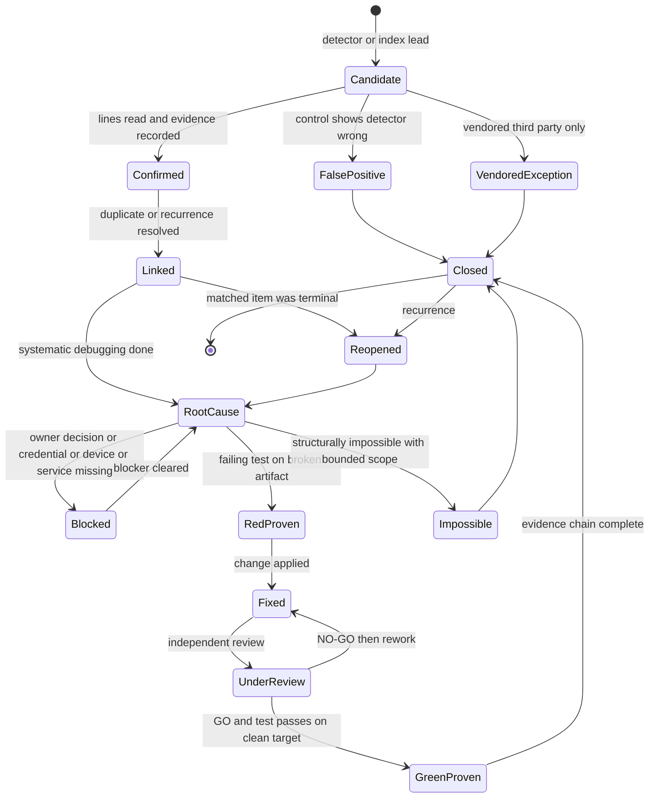
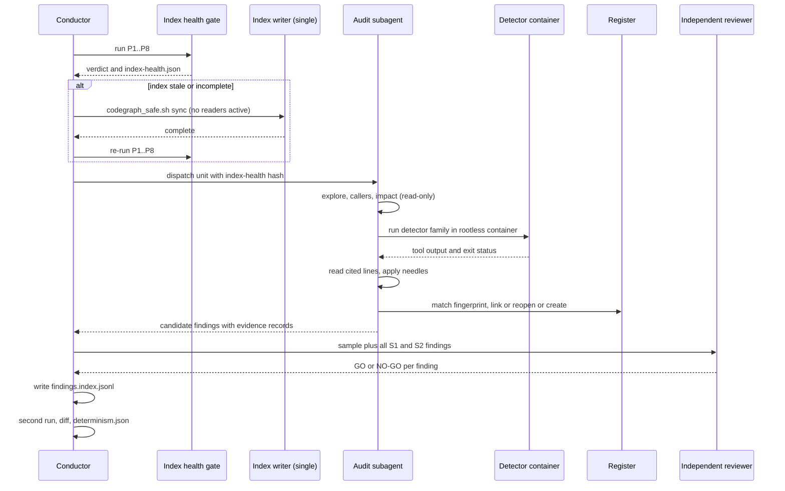

# 02 - Audit Methodology and Index Strategy

| Field | Value |
|---|---|
| Revision | 5 |
| Created | 2026-10-03 |
| Last modified | 2026-10-03 |
| Status | draft (revision 5: the clean-tree rule of §12.1 is measured on the tracked tree and the run manifest cites the commit-push run that made the audited head (its `CPA-Run:` trailer and the sha256 of its report under the ignored `.audit/commit-push/<run_id>/`), following the commit-push design of document 06 §11 revision 10; the outputs of a first audit run that a repeat run reads are named as the one exclusion; §9 cites the contract `contracts/finding.schema.json` (`finding/1`) and its validating tasks instead of a schema "to be authored", and states how the `artifact` path is written; §2.1 and §3.4 describe the MCP registration through the pinned `codegraph_mcp.sh` (grammar `[--project DIR] [--dry-run] [serve] [--mcp]`, read from its usage text at constitution `10b7a06`) instead of the absent `codegraph_mcp_serve.sh` and its `--path`/`--no-watch` flags; §2.1 cites §11.4.80 (not §11.4.79) for the name `scripts/codegraph_validate.sh`, which is the same step-4 verifier as `scripts/verify-codegraph.sh` and therefore one finding, F-INDEX-004, as tasks.md records it; revision 4: task-id citations remapped to tasks.md rev 6, whose ids T001 to T595 are frozen (the golden set is authored by T023; the gitleaks redaction wrapper is WP-35's, T263 and T264); the six F-INDEX findings labelled one by one in §2.1 (004 and 005 were only implied by a range); revision 3: the per-run `findings.index.jsonl` is defined as a timestamp-free projection of the per-finding files and is not a `finding/1` record (§9); the golden files are named as tasks.md uses them, `$AUD/golden.json` for the G-CG and G-LU questions and `$AUD/lumen_golden_60.json` for `lumen_verify.sh` (§4.4, §15 session 5); no audit output is written under a directory named `out/`, which `.gitignore:112` ignores at any depth (§15 sessions 4 and 5, §17); the submodule count is measured (97 recursively); revision 2: audit outputs written as `$AUD/...` and evidence blobs as `$EV/blobs/<sha256>`, consistent with tasks.md and document 06 §11) |
| Feature | specs/001-full-project-audit-remediation |
| Paths | `$AUD` = `specs/001-full-project-audit-remediation/audit` (every audit output of this document, including one file per finding `$AUD/findings/<FND-NNNN>.json` and the per-run index `$AUD/runs/<run>/findings.index.jsonl`); `$EV` = `specs/001-full-project-audit-remediation/evidence`, whose blob store `$EV/blobs/<sha256>` (document 06 §11) holds every evidence artifact a finding cites. Commands below run from the repository root with `AUD` and `EV` set to those paths |
| Requirements covered | FR-005, FR-006, FR-007, FR-008, FR-010, FR-022, FR-023, SC-002 (supports FR-001, FR-003, FR-009, FR-016) |
| Governance anchors | §11.4.78, §11.4.79, §11.4.80, §11.4.275, §11.4.273, §11.4.201, §11.4.184, §11.4.124, §11.4.102, §11.4.115, §11.4.50, §11.4.58, §12.6, §12.12 |

## Table of contents

1. Purpose, scope and what is already known about the repo
2. Verified starting state of the indexes and the host
3. Index-first workflow
4. Index health proofs (gate before any reliance)
5. Finding taxonomy and decision rules
6. Severity scale
7. Detector catalogue
8. Per-application audit checklists
9. Evidence record schema
10. Finding lifecycle (state diagram)
11. One audit pass (sequence diagram)
12. Determinism and repeat-run comparison (SC-002)
13. Token budget model
14. Fan-out and subagent strategy under host limits
15. Example CLI sessions
16. Risks, rejected alternatives, open items
17. Acceptance evidence and traceability

---

## 1. Purpose, scope and what is already known about the repo

This document fixes HOW the exhaustive audit required by the spec is carried out. It does not restate WHAT or WHY. The audit produces findings; every finding is mapped to a register item (FR-001, FR-003), root-caused (FR-008), fixed with a fail-before/pass-after test, and closed with machine evidence (FR-022). Ordering: indexes are proven first (FR-005), then each application and shared component is audited (FR-006), then results are compared across two runs (SC-002).

Applications and shared components in scope (FR-006), as found in the working tree on 2026-10-03:

| Unit | Path | Primary language (verified by directory content) |
|---|---|---|
| Backend API and services | `catalog-api/` | Go (`go.mod`, `cmd/`, `database/`, `filesystem/`) |
| Web | `catalog-web/` | TypeScript/React (`package.json` scripts: `lint`, `type-check`, `test`, `test:coverage`, `test:e2e`) |
| Desktop | `catalogizer-desktop/` | TypeScript + Tauri (`src-tauri/Cargo.toml`), Playwright e2e (`playwright.config.ts`) |
| Installer | `installer-wizard/` | TypeScript + Tauri (`src-tauri/`) |
| Mobile | `catalogizer-android/` | Kotlin/Gradle (`app/`, `gradlew`) |
| TV | `catalogizer-androidtv/` | Kotlin/Gradle (`app/`, `challenges/`) |
| Shared API client | `catalogizer-api-client/` | TypeScript (`jest.config.js`, `vitest.config.ts`) |
| Website | `Website/` | Markdown/JS site (`package.json`, `docs/`) |
| GPU sidecar | `OCU-CUDA-Sidecar/` | Go + proto (`internal/`, `proto/`) |
| Build framework | `Build/`, `build-scripts/`, `scripts/` | shell |
| QA systems | `qa-ai-system/`, `challenges/`, `tests/` | Python, YAML banks, JS/Go test drivers |
| Shared modules (submodules) | `submodules/*` (44 entries in `.gitmodules`) | Go, TypeScript, Python |
| Governance module | `submodules/constitution/` | shell, Python, JS |

Whether the list is exhaustive is itself an audit output: step A0 (section 3.2) enumerates all top-level tracked directories and asserts each is assigned to exactly one unit or to an explicit "no-code/asset" class.

---

## 2. Verified starting state of the indexes and the host

All values below were read in this session by the commands shown. They are a baseline for the plan, not a proof for later use: section 4 re-proves everything at audit time.

### 2.1 Structural index (CodeGraph)

Command and output (EXECUTED 2026-10-03, read-only):

```bash
codegraph --version
# 1.6.0
codegraph status --json
```
```json
{"initialized":true,"version":"1.6.0","projectPath":"/home/milosvasic/Projects/catalogizer",
 "indexPath":"/home/milosvasic/Projects/catalogizer/.codegraph",
 "lastIndexed":"2026-10-02T19:24:35.111Z","fileCount":7150,"nodeCount":128472,"edgeCount":414476,
 "dbSizeBytes":525885440,"backend":"node-sqlite","journalMode":"wal",
 "languages":["c","go","java","javascript","kotlin","liquid","properties","python","rust","tsx","typescript","xml","yaml"],
 "pendingChanges":{"added":0,"modified":0,"removed":0},"worktreeMismatch":null,
 "index":{"builtWithVersion":"1.6.0","builtWithExtractionVersion":25,"currentExtractionVersion":25,
          "reindexRecommended":false,"state":"complete","pendingRefs":0}}
```

Facts and gaps found:

- The index lives at `.codegraph/codegraph.db` (about 502 MB). `.codegraph/.gitignore` ignores everything but itself, so the index is a host-local artefact, not committed.
- `.codegraph/` contains NO `config.json`. §11.4.78 clauses 2 and 9 require scope to be a generated artefact from a scope DATA file, and §11.4.79 step 2 refers to `.codegraph/config.json` exclusions. Neither a scope DATA file (schema `submodules/constitution/scripts/codegraph/scope.example.yaml`) nor a rendered scope exists in the repo (searched tracked files: zero matches for scope/lumenignore YAML). Consequence: what the installed CLI actually includes was decided by engine defaults. This is finding-class "misalignment with §11.4.78(8)(9)" and MUST be recorded as audit finding F-INDEX-001 before reliance on the index (index health step H3 below proves coverage empirically instead).
- No `.mcp.json` at the repo root (`cat .mcp.json` failed). §11.4.78(3) and the 2026-09-25 extension require a project-scoped committed registration of the `codegraph` MCP server through a read-only, non-watching wrapper. The extension names `codegraph_mcp_serve.sh`, which does not exist in the pinned constitution submodule (`find submodules/constitution -name codegraph_mcp_serve.sh` returns 0). The pinned submodule (`10b7a06`) ships `submodules/constitution/scripts/codegraph/codegraph_mcp.sh` and `codegraph_mcp_preflight.sh` instead. Revision 5, read from the wrapper's usage text: the grammar is `codegraph_mcp.sh [--project DIR] [--dry-run] [serve] [--mcp]`, `--project` defaults to `$CODEGRAPH_MCP_PROJECT` and then `$PWD`, any other argument is refused with exit 2, and the wrapper serves only through its receipt-verified read-only runner with no watcher and refuses a live writer with exit 4. So no `--path` or `--no-watch` flag exists or is needed, and no pin bump is a precondition for the registration (tasks.md T026 registers it). Until then subagents cannot rely on an MCP server definition. The CLI route (`codegraph explore ...`) works for every agent via Bash and is the route this plan uses; MCP registration is tracked as F-INDEX-002.
- No `docs/CODEGRAPH.md` (§11.4.78(5)): finding F-INDEX-003. No verification script `scripts/verify-codegraph.sh` (§11.4.78(4)): finding F-INDEX-004. §11.4.80 calls the same step-4 anti-bluff verifier `scripts/codegraph_validate.sh` (revision 5; revision 4 cited §11.4.79 for that name, which was wrong); it is one deliverable under two names, so it is one finding, F-INDEX-004, as tasks.md records it; the fix records which name the §11.4.80 cadence calls. No `tests/codegraph/` (§11.4.78(4)): finding F-INDEX-005 (revision 4: the three ids labelled one by one, matching docs/21 §9.1 and the six findings that tasks.md records). The audit supplies a substitute proof set in section 4 and these items are fixed in the remediation phase.
- The indexed file count (7,150) is greater than the main repository's tracked file count (4,887 from `git ls-files`) because submodule working trees are checked out and indexed (the main repo tracks 86 paths under `submodules/` as gitlinks/files). Third-party/vendored classification of those submodules is not recorded anywhere; section 4.3 derives it.

### 2.2 Semantic index (Lumen)

EXECUTED 2026-10-03 through the MCP tools:

```text
health_check   -> Backend: ollama | Host: http://localhost:11434 | Model: ordis/jina-embeddings-v2-base-code | Status: OK
index_status   -> Files: 10397 | Indexed: 10397 | Chunks: 167256 | Vectors: 166156 unique | Storage: int8 |
                  DB: 171835392 bytes | Last indexed: 2026-10-03T10:19:58Z | Stale: yes
```

Facts and gaps found:

- Lumen reports 10,397 files, CodeGraph 7,150: the two indexes are NOT scoped identically. §11.4.275(B) requires the Lumen scope to be generated from the same class source as the structural scope (`submodules/constitution/scripts/lumen/gen_lumenignore.py`). There is no `.lumenignore` in the repo root (`ls -a | grep -i lumen` returned nothing). Finding F-INDEX-006.
- `Stale: yes`. Lumen re-indexes incrementally on search (`EnsureFresh`); a search before the audit therefore writes the Lumen DB. Semantic queries during the audit MUST run only after the freshness step (4.5) has completed and been recorded, otherwise two audit runs would read different index states (SC-002 hazard, section 12).
- Chunker coverage gap documented by the constitution (§11.4.275 extension 2026-09-25): Lumen cannot index `.sh`, `.kt`, `.txt`. Kotlin (Android, Android TV) and shell (Build framework, scripts) therefore get NO semantic coverage; those units use the structural index plus grep.
- The Lumen CLI binary exists at `~/.claude/plugins/cache/claude-plugins-official/lumen/0.0.42/bin/lumen-linux-amd64` (listed), which is the default `lumen_verify.sh` resolves.

### 2.3 Host limits (read this session)

| Resource | Observed | Source |
|---|---|---|
| CPU | 16 | `nproc` |
| RAM total | 30 GiB (free -g: total 30, used 7, available 22) | `free -g` |
| §12.6 ceiling | 60% of total = about 18 GiB for all project work combined | §12.6 |
| Per-user process/thread soft limit | 123699 | `ulimit -u` |
| Container runtime | `podman` present; `docker` absent | `command -v` |
| Missing on host | `golangci-lint`, `staticcheck`, `gosec`, `govulncheck`, `gitleaks`, `trivy`, `sonar-scanner`, `shellcheck`, `lumen` (on PATH) | `command -v` |

Because the security and lint tools are not on the host and the constitution forbids bare-host builds/heavy work (§11.4.173 in the project CLAUDE.md, §12.6), every detector in section 7 runs inside a rootless podman container, through `scripts/lib/container-runtime.sh` / `scripts/build_in_container.sh` conventions where a build is involved. The audit MUST NOT install tools on the host.

---

## 3. Index-first workflow

### 3.1 Rules

1. Structural questions (who calls X, what implements Y, what breaks if Z changes, where is route R handled) go to CodeGraph first. Conceptual questions (where is retry logic, how are duplicates detected) go to Lumen first. Raw grep or whole-file reads are the fallback and are used for (a) string-literal and config/YAML/Markdown content, (b) Kotlin and shell semantics for the Lumen gap, (c) any query class the benchmark in 4.6 marked wrong (§11.4.275(E)).
2. An index result is a LEAD. A finding is only recorded after the cited lines are read directly (`codegraph node <symbol>` or a ranged file read) and the evidence record of section 9 is complete. A count is never promoted to a finding without reading the underlying lines.
3. A zero/empty index result is never "absent" until a control needle proves the instrument can see the same path (§11.4.273(a)(c), §11.4.201(7)(b)). The audit records both the needle and the result.
4. Index writes (init/index/sync) happen only through the single sanctioned writer, `submodules/constitution/scripts/codegraph/codegraph_safe.sh` (§11.4.80(5)). Auditors are read-only. A bare `codegraph sync` or `codegraph index` by an audit worker is forbidden: two writers on one SQLite DB produced "database is locked" and lost an ~85 minute bulk run (constitution appendix §11.4.78 extension).

### 3.2 Ordered steps of an audit pass

| Step | Name | Action | Output |
|---|---|---|---|
| A0 | Unit enumeration | Enumerate tracked top-level directories and submodules; assign each to one unit of section 1; unassigned = finding | `$AUD/units.json` |
| A1 | Index health gate | Run section 4 proofs P1..P8; any FAIL stops the pass for that index | `$AUD/index-health.json` |
| A2 | Map | `codegraph files --json` per unit; symbol census by kind; entry points (routes: the index holds 1,178 `route` nodes) | `$AUD/maps/<unit>.json` |
| A3 | Detector sweep | Run detector families (section 7) in containers; normalise output to candidate findings | `$AUD/candidates/<detector>.jsonl` |
| A4 | Index-driven review | For each unit: unwired code, impact, contract drift (7.4) via `callers`, `callees`, `impact`, `explore` | candidates |
| A5 | Triage | Deduplicate, classify with section 5 rules, assign severity per section 6, link to register item (reopen if recurrence, FR-003) | `$AUD/findings/*.json` |
| A6 | Root cause | Per finding, §11.4.102 four-phase systematic debugging; record the reproduction on the broken artifact (§11.4.115) | evidence records |
| A7 | Independent review | Reviewer (not the author) re-checks sampled and all high-severity findings (FR-023) | review verdict file |
| A8 | Repeat run | Run A1..A5 again from the same state and diff (section 12) | `$AUD/determinism.json` |

Steps A6 onward belong to the fix phase documented in other plan documents; this document defines their inputs and outputs.

### 3.3 How the structural index is used in this repository

The CLI (`/home/milosvasic/.local/bin/codegraph`, version 1.6.0) offers: `init`, `index`, `sync`, `status`, `query`, `explore`, `context`, `node`, `files`, `callers`, `callees`, `impact`, `daemon`, `unlock`, and others (confirmed from `codegraph --help`). Audit-relevant forms:

| Question | Command (read-only) | Notes |
|---|---|---|
| Is the index usable | `codegraph status --json` | machine-readable, includes `pendingChanges` and `index.state` |
| Find a symbol | `codegraph query "<name>" --kind function --limit 20 --json` | `--kind`/`--limit`/`--json` are listed in §11.4.80 deliverable 2; verify with `codegraph query --help` before use (§11.4.80 requires consulting help first) |
| Source plus call paths for an area | `codegraph explore "<symbols or question>"` | one call replaces many reads. Measured 2026-10-03: `codegraph explore "ScanHandler"` returned 25,070 bytes in 2.9 s (about 6,300 tokens at the declared bytes/4 estimator) |
| One symbol with trail | `codegraph node <name>` | also reads a file with line numbers plus dependents |
| Callers / callees | `codegraph callers <symbol>` / `codegraph callees <symbol>` | dead-code candidates (7.4) |
| Blast radius | `codegraph impact <symbol>` | used to scope the regression set of a fix |
| File inventory | `codegraph files --json --filter <dir>` | 7,150 entries returned, fields `path, language, nodeCount, size` |

Constitution §11.4.80 deliverable 2 states `codegraph affected [files...]` and `serve --mcp` exist. `codegraph affected [options] [files...]` ("Find test files affected by changed source") is VERIFIED: it is listed in the installed `codegraph --help` output (read in full when this document was re-reviewed); the full command list is still recorded in `index-health.json` as `cli_commands` at audit time.

### 3.4 MCP use

MCP is not wired in this repo (2.1). Until F-INDEX-002 is fixed, subagents use the CLI through Bash. After the fix (tasks.md T026; revision 5) the registration is the `.mcp.json` entry `"codegraph": {"command": "submodules/constitution/scripts/codegraph/codegraph_mcp.sh", "args": ["serve", "--mcp"]}`: no `--project`, so no absolute host path is committed and the server starts in the repository root, the wrapper's `--project` default. The wrapper is read-only and runs no watcher by construction, so it takes no `--path` or `--no-watch` flag (it refuses any argument outside `[--project DIR] [--dry-run] [serve] [--mcp]` with exit 2), and `codegraph_mcp_preflight.sh` checks the entry before and after it is merged. The MCP tools `codegraph_explore`, `codegraph_node` are then equivalent to the CLI. Lumen is exposed through the installed plugin as `semantic_search`, `index_status`, `health_check`; `index_status` and `health_check` are safe read-only calls and are used by section 4. `semantic_search` auto-indexes (writes) and is therefore called only after P7 freshness is recorded and the audit is in its read phase.

Universal accessibility (§11.4.275(A)) is proven by an unforgeable challenge: a dispatched subagent must return `nodeCount` (128,472 at the baseline) or the Lumen `Chunks` count through its own index call; a subagent that cannot make the call is recorded as an honest SKIP per §11.4.3, never a PASS.

---

## 4. Index health proofs (gate before any reliance)

An index is relied on only when every proof for it passes in the current pass. Results are written to `$AUD/index-health.json` with the exact command, raw output hash and verdict. Each count proof carries a positive and negative control needle (§11.4.273(a)(b), (f) for set criteria).

### 4.1 Proof table

| Id | Index | Proof | Pass criterion | Control needles |
|---|---|---|---|---|
| P1 | CG | State | `status --json`: `index.state=="complete"`, `index.pendingRefs==0`, `pendingChanges` all 0, `worktreeMismatch==null`, `reindexRecommended==false` | none needed (read from the tool's own field); the field names are asserted present first, absence = FAIL |
| P2 | CG | Completeness vs tracked files | every in-scope tracked source file (derived list, 4.3) appears in `codegraph files --json`; set difference `tracked_in_scope - indexed` is empty (or listed as pathological with reason) | positive: a file known present (`catalog-api/go.mod` is not source; use `catalog-api/cmd/` first Go file); negative: fabricated path `zz/does_not_exist.go` must NOT be found |
| P3 | CG | Scope correctness | zero indexed files under third-party roots, zero secret-class files (`.env*`, keystores, `*secret*`), at least one file under every own-org submodule root (§11.4.78(10), §11.4.79) | negative needle: a path `.env.example` is allowed by pattern but `.env.distributed`/`.env.security` present in the repo root MUST NOT appear in the index file list; the check lists all `.env*` it found on disk first (cardinality stated per §11.4.273(f)) |
| P4 | CG | Known-question golden answers | each golden question returns its recorded symbol/file at the recorded rank (4.4) | golden includes one deliberately unanswerable question that MUST return nothing |
| P5 | CG | Freshness | `lastIndexed` newer than the newest commit time of in-scope files OR `pendingChanges` zero after a read-only compare; stale -> trigger the writer (`codegraph_safe.sh`) and re-run P1..P4 | needle: touch-free comparison against `git log -1 --format=%ct` per unit |
| P6 | LU | Embedder | `health_check` returns `Status: OK` and a real embed call returns the declared dimensionality (§11.4.275(B): a model listing is not evidence). Command: `curl -s localhost:11434/api/embeddings -d '{"model":"ordis/jina-embeddings-v2-base-code","prompt":"x"}'`, assert vector length equals the model's declared dimension (UNKNOWN here; the audit records it from the model card, not from memory) | negative: an unknown model name must return an error |
| P7 | LU | Complete + fresh | `index_status`: `Files == Indexed`, `Chunks > 0`, `Stale: no`; baseline today: Files 10397, Indexed 10397, Chunks 167256, **Stale: yes** -> FAIL until refreshed through the sanctioned path | needle: a known symbol search hit (4.4 Lumen golden) |
| P8 | both | Scope parity | the set of files indexed by LU, minus the files LU cannot chunk (`.sh`, `.kt`, `.txt`), minus intentionally LU-only classes, equals the CG set within the consumer-declared tolerance. Today 10,397 vs 7,150 -> FAIL until scope DATA exists and both are rendered from it | n/a |

A FAIL in P1..P5 blocks CodeGraph use for that pass (fallback: grep plus reads, with a lower token efficiency and a recorded reason). A FAIL in P6..P8 blocks Lumen use.

### 4.2 Machine-readable shape of `$AUD/index-health.json`

```json
{
  "schema": "index-health/1",
  "run_id": "AUD-20261003-001",
  "git_head": "<sha of main repo>",
  "submodule_heads": {"submodules/auth": "<sha>"},
  "codegraph": {
    "version": "1.6.0",
    "status": {"state": "complete", "pendingRefs": 0, "fileCount": 7150, "nodeCount": 128472},
    "proofs": [
      {"id": "P2", "cmd": "codegraph files --json", "tracked_in_scope": 6980, "indexed": 7150,
       "missing": [], "needle_pos": {"path": "catalog-api/cmd/...", "found": true},
       "needle_neg": {"path": "zz/does_not_exist.go", "found": false}, "verdict": "PASS"}
    ]
  },
  "lumen": {"files": 10397, "indexed": 10397, "chunks": 167256, "stale": false, "model": "ordis/jina-embeddings-v2-base-code"},
  "verdict": "PASS|FAIL"
}
```

The numbers inside `proofs[0]` above are illustrative placeholders (NOT EXECUTED); the top-level `fileCount`/`nodeCount` are the 2026-10-03 baseline.

### 4.3 Deriving the in-scope tracked set

Third-party versus own-org is derived mechanically (§11.4.79(6)): walk `.gitmodules` recursively, read each submodule's remote URL, match the organisation against the own-org list (canonical orgs per the constitution: `vasic-digital`, `HelixDevelopment`). Third-party code nested inside an own-org submodule is third-party. The result is a scope DATA file (consumer data, §11.4.78(8)) rendered by `submodules/constitution/scripts/codegraph/scope_render.py`; the audit consumes the rendered output, never a hand-written list. Until the scope DATA file exists the audit derives the set with this read-only script and records it as the interim basis (NOT EXECUTED):

```bash
# list submodules recursively with their URLs (read-only)
git submodule foreach --recursive --quiet 'echo "$displaypath $(git config --get remote.origin.url)"' > $AUD/submodules.tsv
# classify by organisation
awk '{ if ($2 ~ /(vasic-digital|HelixDevelopment)/) c="own"; else c="third_party"; print $1"\t"c"\t"$2 }' $AUD/submodules.tsv
```
Expected: one row per submodule at every depth (the main `.gitmodules` has 44 `[submodule]` blocks; `git submodule status --recursive` lists 97 on 2026-10-03, 44 direct and 53 nested, and the run re-measures it).

### 4.4 Golden questions

A pre-declared fixed set, kept in `$AUD/golden.json` (tasks.md T023, which authors it before any audit run), written once before the first audit and never edited to fit results (a tampered golden is rejected by hash). Minimum content:

| Id | Index | Query | Expected | Type |
|---|---|---|---|---|
| G-CG-1 | CG | symbol `ScanHandler` | defined under `catalog-api/` (the baseline `explore` returned content) | structural |
| G-CG-2 | CG | a route node in the 1,178 route nodes | its handler file | structural |
| G-CG-3 | CG | a symbol that lives only inside an own-org submodule | file under `submodules/<name>/` (§11.4.79 step 4) | scope |
| G-CG-4 | CG | `zz_no_such_symbol_9f3a` | empty | negative control |
| G-LU-1..9 | LU | conceptual queries (e.g. "where is the SMB reconnect logic") | listed gold files within top-k (k=5 distinct files) | conceptual |
| G-LU-N | LU | query whose gold file is `.sh` or `.kt` | MUST NOT be found (type `unsupported`) | capability gap proof |

Gold values for G-CG-2 and G-LU-* are UNKNOWN today; they are authored from direct reads at the start of the audit. A second, larger Lumen set, `$AUD/lumen_golden_60.json` (60 queries, docs/20 W20-12), is written in the input format of `lumen_verify.sh` (a JSON array of `{"id", "type", "q", "gold", "in_tierA"}`); both files' sha256 are recorded before the first run. Lumen goldens run through `submodules/constitution/scripts/lumen/lumen_verify.sh` (verified by reading its header): usage `lumen_verify.sh --golden <file.json> --project <root> [--k 5] [--n 20] [--min-recall 0.85] [--baseline known_misses.json]`; exit 0 all PASS, 1 any FAIL, 2 usage error or an errored/empty search ("could not look", §11.4.273). Output `results.tsv` is sorted and timestamp-free, so it is directly diffable for determinism; it is written to `$AUD/lumen-verify/` through `--out` (without `--out` the harness writes to a random temporary directory). Note the harness runs `EnsureFresh`, i.e. writes the Lumen index; point `XDG_DATA_HOME` at a copy-on-write copy if the shared index must not move during a pass.

### 4.5 Making an index fresh and complete (writer path only)

```bash
# NOT EXECUTED - sanctioned writer entry, refuses while another process targets the root
bash submodules/constitution/scripts/codegraph/codegraph_safe.sh sync "$PWD"
```
The writer refuses on any live process whose real `/proc/<pid>/cmdline` targets the root, classifies bulk by PENDING backlog, computes the Node heap from `MemTotal*60/100` (corrected 2026-09-25), and runs bulk only on the patched runner under the stall watchdog and disk tripwire. The exact subcommand grammar of `codegraph_safe.sh` is UNCONFIRMED here (its header was not read in this session); the first audit task is to read `docs/scripts/codegraph_safe.md` in the constitution module and record the grammar. Index writes are scheduled when no audit worker is reading (single writer, section 14).

### 4.6 Efficiency benchmark (§11.4.275(D))

The audit's token model (section 13) depends on index efficiency. A one-time benchmark is run: fixed query set, N >= 3 identical canonical hashes, bytes/estimated tokens/p50/p95 per query for the index route versus grep+read, reduction computed ONLY over queries both routes answered correctly, wrong answers listed by id. The constitution records prior numbers (CodeGraph 69.2% token reduction over 8 both-correct queries but 5 of 15 wrong; Lumen recall 9/11 = 0.818, mean per-query reduction 30.1% over 9 correct answers). Those numbers belong to a different corpus; this repo's own numbers are UNKNOWN until the benchmark runs and are never assumed. Thresholds (minimum recall, maximum wrong answers) are consumer DATA; proposed starting values are decision D-02 in section 16.

---

## 5. Finding taxonomy and decision rules

### 5.1 Types (closed set)

| Type | Definition | Typical evidence |
|---|---|---|
| bug | Code behaves differently from its documented or evident intended behaviour | failing reproduction on the broken artifact |
| error | A runtime or build failure: compile error, test failure, crash, failing gate, startup failure | tool output with exit status |
| gap | Required thing absent: missing test type (FR-009), missing manual/guide/FAQ/diagram (FR-014), missing validation, missing handler for a declared route | absence proven with a control needle |
| misalignment | Two artefacts that must agree disagree: doc vs code, client vs server contract, schema vs migration, export vs source, config vs constitution | paired excerpts with a diff |
| shortcoming | Implemented but below the required quality bar: insufficient error handling, hard-coded values, missing timeout, weak assertions | cited lines plus the rule violated |
| weak spot | Works now, fragile by construction: no idempotency guard, unbounded retry, race-prone shared state, brittle parsing | reasoning plus a demonstrating test (property test or fault injection) |
| danger zone | Credible path to data loss, security exposure, host harm or silent corruption | exploit/failure demonstration or static-analysis hit with a reachable path |

### 5.2 Decision rules (apply in order, first match wins)

1. Does a captured failure (exit status non-zero, assertion failure, crash log) exist? -> `error` if it is build/test/gate infrastructure, `bug` if it is product behaviour.
2. Is the problem "X is missing"? -> `gap`. Proof requires a control needle showing the detector can see a present X of the same class (§11.4.273(c)).
3. Are two artefacts in conflict? -> `misalignment`; fix both artefacts to the authoritative source or record which one is authoritative.
4. Can it cause data loss, privilege escalation, credential disclosure, host exhaustion or silent wrong results on a reachable path? -> `danger zone` (overrides 5 and 6).
5. Is it correct today but breaks under a plausible condition (concurrency, retry, restart, large input)? -> `weak spot`.
6. Otherwise, below-bar implementation -> `shortcoming`.

Ties are resolved toward the higher-risk type and the reasoning is recorded in `classification_rationale`. The type does not drive closure (every finding is closed, FR-008); it drives which detector family and which test kind prove the fix.

### 5.3 Close-without-fix classes (FR-008, the only ones allowed)

`false_positive` (with reproduction of why the detector is wrong), `structurally_impossible` (§11.4.112, with bounded scope and adjacent goals listed), `accepted_exception_vendored` (code only in vendored third-party the owner does not maintain; reported upstream; excluded from the zero-open count). A blocked finding (waiting for owner decision, credential, device, missing service) stays OPEN (FR-008, FR-025). Severity is never a close reason.

### 5.4 Duplicate and recurrence rule (FR-003)

Before creating a register item the finding fingerprint (section 9, `fingerprint`) is matched against existing items through `duplicate-of` links to the canonical chain head. Same defect on a terminal item -> reopen it; same defect on an open item -> link only; distinct but similar -> new item with a candidate-duplicate link (§11.4.214).

---

## 6. Severity scale

Closed scale with objective criteria. A finding is rated by the highest criterion it satisfies; the criterion that fired is recorded.

| Level | Criteria (any one) |
|---|---|
| S1 Critical | Unauthenticated or privilege-escalating access; credential or secret disclosure reachable from outside; irreversible data loss or corruption on a normal path; host-safety hazard (process signalling with pgid <= 1 per §11.4.263, memory/thread exhaustion); a constitution release-blocker; the primary user capability fails on a clean install |
| S2 High | Wrong results returned silently on a normal path; data loss or corruption on a plausible failure path; authenticated-user security flaw; a feature advertised in docs/UI that does not work; a failing or absent regression guard for a previously fixed defect; client-server contract break on a shipped path |
| S3 Medium | Feature misbehaves on an edge path with a workaround; resilience gap (missing timeout, unbounded retry, no idempotency) without demonstrated loss; missing test type or coverage below baseline for an application; doc materially contradicting behaviour |
| S4 Low | Cosmetic or ergonomic defect; non-conformance with naming/layout rules; stale but non-misleading documentation; minor duplication |
| S5 Info | Observation required for traceability (for example an index scope note) that has no failure mode; still tracked and closed |

Every severity is investigated and closed (FR-008). The scale only orders work: S1/S2 first (risk-descending, §11.4.132), most-reopened first within a level (§11.4.189). Detector-native severities (for example a SAST "high") are inputs, never the final rating; the mapping table lives in `$AUD/severity-map.json` and is reviewed independently.

---

## 7. Detector catalogue

Every detector runs in a rootless container with a pinned image digest recorded in the evidence (no host installation; images and digests UNKNOWN until chosen in the toolchain plan). Detector output is parsed into candidate findings, never pasted. A detector that cannot run is itself a finding (`error`), not a silent skip; real-service/real-device dependent checks follow FR-025 (blocked = not passing).

### 7.1 Static analysis and security

| Family | Tool (basis) | Targets | Notes |
|---|---|---|---|
| SAST/quality | SonarQube scanner + server (§11.4.184); `sonar-project.properties` exists with sources `catalog-api,catalog-web/src`, coverage report paths, exclusions | Go, TS | Today's properties only cover two units; extending sources/Kotlin/Rust/Python is a finding F-SCAN-001. Server runs rootless via `docker-compose.security.yml` conventions (UNCONFIRMED content; read at audit) |
| Secrets | gitleaks (§11.4.184(I)); repo has `.gitleaksignore` | whole tree + git history of main repo and submodules | every ignore entry is audited for justification; a credential hit is S1 and never echoed (§11.4.10): evidence stores file:line and a hash, not the value |
| Dependency/container vulnerabilities | Trivy (`.trivy.yaml`, `.trivyignore`, `.trivy-secrets.yaml` exist) | lockfiles, Dockerfiles, images | the spec (FR-017) only requires reporting, not bulk updating, third-party packages |
| DAST | OWASP ZAP / HawkScan (§11.4.184(I)); `.snyk.json`, `.semgrep.yml`, `.gosec.json`, `.nancy-ignore` exist as prior-art configs | running API/web in compose | needs a real running stack (FR-025) |
| Go SAST | gosec (`.gosec.json`), `go vet`, staticcheck | `catalog-api`, `OCU-CUDA-Sidecar`, Go submodules | `go vet ./...` MUST be zero-warning (project CLAUDE.md) |

### 7.2 Language correctness

| Check | Command shape (containerised, NOT EXECUTED) |
|---|---|
| Go vet and build | `go vet ./...`, `go build ./...` inside the Go build container |
| Go race detector | `go test -race ./...`; memory heavy: run per package group, bounded by section 14 |
| Go dependency check | `go mod verify`, `govulncheck ./...` |
| TypeScript | `npm run type-check`, `npm run lint` (scripts exist in `catalog-web/package.json`; lint uses `--max-warnings 0`) |
| Kotlin/Android | Gradle `lint`, `detekt` if configured (UNCONFIRMED), unit tests, built only in the build container (§11.4.173) |
| Rust (Tauri backends) | `cargo clippy -- -D warnings`, `cargo test`, `cargo audit` (tools UNCONFIRMED in repo) |
| Shell | `shellcheck` and `bash -n`; plus the constitution's own parse-ability gates (§11.4.67); shellcheck is absent on the host so it runs in a container |
| Python (QA systems) | `python -m compileall`, `ruff`/`pytest` if present (UNCONFIRMED) |

### 7.3 Test-quality detectors (FR-009, FR-010, FR-011)

| Detector | Method | Finding produced |
|---|---|---|
| Anti-bluff scan | `scripts/audit/anti-bluff-scan.sh` exists; it must exit non-zero on any violation (project CLAUDE.md); run it and also validate it with a seeded violation | `bug` in tests: constructor-only/mock-only/`assert.True(true)` patterns |
| Mutation score | mutation tooling per unit (the project states a >= 85% mutation score via `mutation_ratchet_challenge.sh`; script location UNCONFIRMED); also reviewer-authored mutations the author did not write (§11.4.194(6)(d)) | `shortcoming`: tests that survive mutation |
| Coverage baseline | Go `-coverprofile`, `vitest run --coverage`, Kotlin Jacoco (UNCONFIRMED) per application; records baseline and dated target per FR-011; the floor is necessary, never sufficient (§11.4.224(C)) | `gap`/`shortcoming` when below recorded baseline |
| Flakiness | run each test suite N times (section 12) and compare verdict vectors; any divergent test is quarantined per §11.4.248 and is a finding | `bug`/`weak spot` |
| Test-type matrix | per application x test type (unit, integration, e2e, full-automation, security, ddos, scaling, chaos, stress, performance, benchmark, ui, ux, challenges, HelixQA) from §11.4.27; every absent cell is a `gap` (FR-009) | `gap` |
| Real-service assertion | any test of external-service/device behaviour must hit the real one; mocks outside unit tests are findings (§11.4.27(A), FR-025) | `bug` in tests |

### 7.4 Dead and unwired code (§11.4.124)

Candidates from the structural index: symbols with zero callers (`codegraph callers <symbol>`), exported-but-unreferenced types, routes with no registered handler, handlers with no route, config keys read nowhere. A candidate is NOT deleted on sight. For each: `git log --follow -S<symbol>` pickaxe to see how it was wired and how it died; check hidden references (reflection, DI, build tags, codegen, plugin/FFI, config strings) with grep including a control needle for the reference style; outcome is either "wire it in properly" (restore or finish wiring plus tests), or "delete in its own commit with the git-history evidence", or operator confirmation for end-user capabilities (§11.4.122). Default when uncertain: do not remove.

### 7.5 Contract and definition drift (FR-015, FR-016)

| Pair | Method |
|---|---|
| API routes vs OpenAPI/`docs/API_CONTRACTS.md` | route nodes from the index (1,178 at baseline) compared to documented endpoints; both sides listed, difference is a `misalignment` |
| `catalog-api` handlers vs `catalogizer-api-client` | client methods vs server routes; request/response types compared |
| Server vs web/desktop/Android/AndroidTV callers | `codegraph callers` on client wrapper methods; consumer-driven contract test on both sides (§11.4.244) |
| SQL schema vs code | migrations in `catalog-api/database/` vs structs and queries; `docs/DATA_DICTIONARY.md` vs actual schema |
| Config: `.env.example` vs code reads vs `docs/ENV_VARIABLES.md` | every variable in three places, set differences listed |
| Event/websocket messages | producer and consumer type definitions |

### 7.6 Documentation drift (FR-012, FR-013, FR-014)

Link-graph crawl from `README.md` (breadth-first over Markdown links) lists orphans among the in-scope doc set (the repo has 93 entries in `docs/` and dozens of root report files such as `FINAL_*_REPORT.md`; none is assumed in scope or out of scope until the doc-scope plan classifies them). Export parity: each `.html`/`.pdf`/`.docx` twin is compared with its `.md` source by regeneration-hash or timestamp-plus-content check (the repo has `docs/CONTINUATION.html/.pdf`; `AGENTS.html` and `AGENTS.pdf` do not exist, only `AGENTS.md`). Diagram validity: every Mermaid block must parse and every rendered image be non-blank (§11.4.258). Behaviour claims in docs are checked against code through the index (for example a documented endpoint must be a route node).

### 7.7 Governance conflicts

The constitution conflict list, `TASK_TRACKER.md`, `REMAINING_ISSUES_REPORT.md`, `UNFINISHED_WORK_*.md` and QA banks (`challenges/helixqa-banks`, `qa-ai-system/test-cases`) are import sources for the register (FR-002) and also detector inputs: every unchecked item in them is a candidate finding with `source_ref`.

---

## 8. Per-application audit checklists

Each checklist is executed per unit in step A3/A4. "I" marks an index-driven check, "D" a detector, "T" a test-runtime check, "M" a manual-evidence check (screenshot/recording through HelixQA or equivalent). Every checked item yields either a finding or a recorded "no finding" with the evidence of the check itself (command, output hash). An unchecked item is a coverage hole and blocks audit completion for the unit.

### 8.1 Backend `catalog-api` (and Go submodules)

- [ ] I: route table vs handlers vs middleware chain (auth applied to every non-public route; list unauthenticated routes explicitly)
- [ ] I: goroutine launch sites; channels without close or receiver; locks held across I/O (the project CLAUDE.md lists "no blocking inside synchronized regions")
- [ ] I: dead/unwired packages and exported symbols (7.4)
- [ ] D: `go vet`, gosec, staticcheck, govulncheck, gitleaks, SonarQube
- [ ] D: race detector over all packages
- [ ] T: database layer against the real database engine (SQLite and/or PostgreSQL as actually used; engines UNKNOWN until read), migrations up/down, idempotency of retried operations (§11.4.253)
- [ ] T: filesystem/SMB/FTP/NFS/WebDAV protocol clients against real services (FR-025; blocked if unavailable)
- [ ] I+T: process-signalling code paths (`killpg`, `syscall.Kill(-pgid)`, `pkill`) validated against §11.4.263
- [ ] D: config and secrets handling; no secret in logs; TLS settings (`cache/tls` is excluded in Sonar properties; check why)
- [ ] M: API behaviour smoke through the real running stack, per documented endpoint

### 8.2 Web `catalog-web`

- [ ] D: `type-check`, `lint --max-warnings 0`, Sonar JS/TS, dependency audit
- [ ] I: component tree to routes; components never rendered; API-client usage mismatches
- [ ] T: vitest coverage run, Playwright e2e against a real backend; both themes
- [ ] M: host-rendered screenshots per screen state, light and dark, responsive breakpoints (§11.4.170, §11.4.190 apply to the Website; web UI follows §11.4.170)
- [ ] D: accessibility (axe) and layout overlap checks
- [ ] I: token/secret exposure in the bundle; environment variable use

### 8.3 Desktop `catalogizer-desktop` and installer `installer-wizard`

- [ ] D: TS checks as 8.2; Rust clippy/test/audit for `src-tauri`
- [ ] I: Tauri command surface vs frontend invocations; permissions/capabilities allowlist minimality
- [ ] T: Playwright e2e (`catalogizer-desktop/e2e`); installer end-to-end on a clean target VM/container (FR-021, artifact verified on clean target)
- [ ] M: window-specific recording with vision verification where devices allow (§11.4.159); blocked where no real display target exists (FR-025)
- [ ] D: updater/signing configuration; no secrets in `tauri.conf`

### 8.4 Mobile `catalogizer-android` and TV `catalogizer-androidtv`

- [ ] D: Gradle lint, Kotlin static analysis, dependency report; Sonar Kotlin
- [ ] I: Activities/Services/Receivers in manifests vs code; permissions vs use; exported components
- [ ] T: unit tests, instrumented tests on a real device or emulator as available; the TV module has a `challenges/` directory to be audited as a test source
- [ ] M: recordings of real user journeys; no blind typing (§11.4.193)
- [ ] D: crash/ANR data if Firebase wiring exists (§11.4.152; `firebase.json`, `.firebaserc` are present in the repo root) - real project access needed, blocked otherwise (FR-025)
- [ ] I: API client usage vs server contract (7.5)

### 8.5 Shared client `catalogizer-api-client` and shared modules `submodules/*`

- [ ] D/I: public surface vs consumers across all units; semver discipline; generated types in sync
- [ ] T: both-sides contract tests (FR-016)
- [ ] D: each submodule audited as its own repository: findings fixed IN that submodule and pushed to its own upstreams (FR-006); evidence per submodule records pinned and latest upstream commit (FR-017)
- [ ] I: nested submodules (depth > 1) enumerated by 4.3 and audited; own-org vs third-party classification applied (third-party: report upstream, close as accepted exception only per 5.3)

### 8.6 Website `Website/`

- [ ] D: link check, Markdown lint, structured data, meta/OG presence (§11.4.190 applies to project websites)
- [ ] M: responsive host-rendered screenshots across engines, light and dark
- [ ] I: each documented feature/command exists in code (doc drift)

### 8.7 Build framework and scripts (`Build/`, `build-scripts/`, `scripts/`, Docker/compose files)

- [ ] D: shellcheck, `bash -n`, the constitution parse-ability gate (§11.4.67)
- [ ] I: scripts never invoked and scripts referencing missing paths (the root has `scripts/lib/build-*.sh`, `scripts/build_in_container.sh`, `scripts/container-build.sh`)
- [ ] T: each build script run in the rootless build container; bare-host build attempts are findings (§11.4.173, FR-021)
- [ ] D: Dockerfile hygiene, pinned digests, non-root users; compose files for secrets
- [ ] I: scripts that signal processes or touch host power state (`scripts/host-power-management/`); CONST-033 forbids suspend/reboot, review all of it

### 8.8 QA systems (`qa-ai-system`, `challenges`, `tests`)

- [ ] D: anti-bluff scan; each bank entry has a verifiable positive assertion
- [ ] T: banks run against the real system; blocked entries listed with exact reason (FR-025)
- [ ] I: tests with no assertions, ignored tests, tests that never run in any runner

### 8.9 Governance module `submodules/constitution`

- [ ] D: its own scripts' tests (`scripts/codegraph/tests`, `scripts/lumen/tests`); shell parse gates
- [ ] I: consumer wiring: every inherited script referenced by path, none copied (§11.4.177)
- [ ] Findings are fixed in the module, reviewed independently, pushed to its upstreams (FR-006)

---

## 9. Evidence record schema

One JSON file per finding at `specs/001-full-project-audit-remediation/audit/findings/<finding_id>.json`, schema id `finding/1`. The canonical id is `FND-NNNN` (register-minted); the unit-local `F-<unit>-NNN` is stored as `unit_alias` (see document 04 and `data-model.md`). Evidence blobs are separate files referenced by sha256 (content-addressed, so a record cannot silently point at changed bytes, §11.4.207/§11.4.268 spirit).

```json
{
  "schema": "finding/1",
  "finding_id": "FND-0001",
  "unit_alias": "F-catalog-api-001",
  "register_item": "ATM-NNN",
  "fingerprint": "sha256 of normalised (unit, file, symbol-or-key, rule-id, root-cause-key)",
  "title": "short imperative statement of the problem",
  "type": "bug|error|gap|misalignment|shortcoming|weak_spot|danger_zone",
  "severity": "S1|S2|S3|S4|S5",
  "severity_criterion": "which row of section 6 fired",
  "classification_rationale": "which decision rule of 5.2 and why",
  "unit": "catalog-api",
  "locations": [{"path": "catalog-api/...", "line_start": 0, "line_end": 0, "repo": "main|submodules/<name>", "commit": "<sha>"}],
  "found_by": {"channel": "automated_seam|agent_inspection|manual_qa|operator|end_user",
               "detector": "gosec|sonar|gitleaks|trivy|zap|go-vet|race|codegraph-callers|lumen|doc-crawl|contract-diff|mutation|manual",
               "rule_id": "tool rule id or null"},
  "should_have_been_caught_by": "named existing seam or 'none' with written justification",
  "evidence": [
    {"kind": "command_output|screenshot|recording|log|diff|test_verdict|index_query",
     "cmd": "exact command",
     "exit_status": 0,
     "artifact": "$EV/blobs/<sha256>",
     "sha256": "...",
     "captured_at": "UTC timestamp",
     "tool_version": "...",
     "image_digest": "container image digest or null",
     "control_needle": {"positive": "...", "negative": "..."}}
  ],
  "root_cause": {"statement": "...", "reproduction": {"artifact_fingerprint": "...", "steps_ref": "$EV/blobs/<sha256>", "provenance": "observed|constructed"}},
  "fix": {"commit": "<sha>", "repo": "...", "test": "path::name", "red_run": "evidence sha", "green_run": "evidence sha", "iterations": 3},
  "review": {"reviewer": "agent id/model+effort", "verdict": "GO|NO-GO", "evidence": "sha"},
  "state": "see section 10",
  "closure": {"kind": "fixed|false_positive|structurally_impossible|accepted_exception_vendored", "evidence": "sha", "upstream_report": "ref or null"},
  "blocked": {"reason": "owner_decision|credential|device|missing_service", "exact_cause": "text"},
  "run_ids": ["AUD-..."],
  "created": "UTC", "updated": "UTC"
}
```

Rules:

- Evidence MUST be machine-produced by the detector or test harness (FR-007, FR-022). A narrative sentence is not evidence. `locations` MUST resolve (path exists at the recorded commit and the lines were read).
- A `closure.kind = fixed` record requires `fix.red_run` against the broken artifact and `fix.green_run` against the fixed one with different artifact fingerprints and `iterations >= 3` with identical verdicts (§11.4.115(F), §11.4.50).
- `root_cause.reproduction.provenance = constructed` can only justify a "defensive hardening" label and NEVER closes the item (§11.4.115(G)).
- Secrets are never stored: a secret finding stores path, line, rule id, and the hash of the match (§11.4.10).
- The record is validated against the contract `contracts/finding.schema.json` (`finding/1`, JSON Schema draft 2020-12; producer, consumers and fixture results in `contracts/README.md`): when a unit's findings are written (for example tasks.md T233 for the backend) and for the whole run before it is accepted (tasks.md T299, WP-39). Records failing validation cannot enter the register (revision 5; revision 4 still called the schema "to be authored").
- Paths in a record are written relative to the feature folder `specs/001-full-project-audit-remediation`, so `$EV/blobs/<sha256>` in the example above is stored as `evidence/blobs/<sha256>`, the form the contract's `artifact` pattern accepts (revision 5).

Derived file `$AUD/runs/<run>/findings.index.jsonl` is a projection, not a `finding/1` record: one line per finding observed by that run, with exactly the sort-key fields `unit`, `path`, `line_start`, `rule_id` and the `fingerprint`, and nothing else (no timestamps, no `run_ids`, no `finding_id`, no evidence hashes), so two runs of one state give byte-identical files after `sort -u` (§12). The full record of each finding lives only in its own file `$AUD/findings/<FND-NNNN>.json`, which carries `created`, `updated` and `run_ids`. The checker validates every `$AUD/findings/*.json` against `finding/1` and asserts a 1:1 mapping between a run's index lines and the finding files whose `run_ids` contain that run (equal fingerprint sets).

---

## 10. Finding lifecycle (state diagram)

States align with the register statuses (§11.4.15/§11.4.33 vocabulary is consumer data in plan document on the register; names below are working names).



Invariants: a finding in `Blocked` counts as open (FR-008, FR-025); completion requires zero findings outside `Closed`, except the vendored-exception class which is excluded from the count with its reason; `RedProven` cannot be skipped for `Fixed`; `Closed` via `FalsePositive` or `Impossible` requires reviewer GO.

---

## 11. One audit pass (sequence diagram)



---

## 12. Determinism and repeat-run comparison (SC-002)

Requirement: "the audit repeated from the same state yields an identical set of findings". Interpretation used here (stated so the reviewer can contest it): the set of finding fingerprints and their `(type, severity, locations)` is identical; free-text wording and timestamps are excluded.

### 12.1 Fixing "the same state"

A run is parameterised by a state vector recorded in `$AUD/run-manifest.json`:

```json
{
  "run_id": "AUD-20261003-001",
  "main_head": "<sha>",
  "submodule_heads": {"<path>": "<sha>"},
  "dirty": false,
  "commit_push_run": {"run_id": "<the CPA-Run trailer of main_head>", "report_sha256": "<sha256>"},
  "index": {"codegraph_last_indexed": "...", "codegraph_node_count": 0, "lumen_chunks": 0},
  "detector_images": {"gitleaks": "sha256:...", "trivy": "sha256:..."},
  "vuln_db_snapshot": {"trivy_db": "date and digest"},
  "env": {"LC_ALL": "C", "TZ": "UTC"}
}
```

Both runs MUST start from identical manifests. Sources of nondeterminism and their control:

| Source | Control |
|---|---|
| Moving vulnerability databases (Trivy, govulncheck, npm audit) | pin an offline database snapshot digest per audit; rerun uses the same snapshot; a database refresh is a separate dated event that starts a new baseline |
| Tool versions | pinned container image digests |
| Index drift (Lumen `EnsureFresh` writes on search) | freshen once, record counts, then use read-only copies (`XDG_DATA_HOME` on a copy-on-write copy); no semantic search before the freshness step is recorded |
| Parallel ordering | all outputs sorted by key `(unit, path, line_start, rule_id)` before hashing; workers write to private files merged by the conductor |
| Timestamps, absolute paths, PIDs in tool output | normalised by the parser; kept only inside evidence blobs |
| Flaky tests | detected by N-run comparison (below); flaky is a finding, not noise |
| Network-dependent checks | real-service checks are separated from static checks; a service outage changes status to `blocked`, which is reported in its own set, never silently dropped from the comparison |
| Dirty working tree | refused: the audit starts only from a clean tracked tree (state vector `dirty:false`, rule below) |

Clean-tree rule (revision 5). `dirty:false` means that `git status --porcelain --ignore-submodules=all` prints nothing in the main repository and in every submodule at every depth. It is measured on the tracked tree: ignored paths do not count, by construction, and among them is `.audit/` at the repository root, where the commit-push script keeps each run's outputs. That script never writes into the tracked tree (document 06 §11, revision 10), so a tree is clean right after a commit-push run, with nothing excepted. There is one exclusion: a repeat run of the same state (§12.2) starts before the first run's outputs are committed (otherwise `main_head` would differ), so it excludes exactly the files that the first run wrote under `$AUD/` and `$EV/`, as the first run lists them when it ends in `$AUD/runs/<run>/outputs.sha256` (one `sha256sum` line per file); a listed file whose bytes changed, or any other uncommitted file, still refuses the run. The manifest also cites, as `commit_push_run`, the latest commit-push run report in the form that keeps two manifests of one state equal, which is the report of the run that made `main_head`: its run id, read from the `CPA-Run:` trailer of that commit (so a later run that committed nothing, for example one refused at S3, cannot change it), and the sha256 of `.audit/commit-push/<run_id>/report.json`, whose bytes the run records through the evidence recorder as `$EV/blobs/<sha256>`. A head that is not a commit-push commit, or a report that is absent on this host, is recorded as such, with `report_sha256: null` and a `reason` field in `commit_push_run`, never with an invented value. The same rule applies to every other `dirty:false` condition that cites this section (for example the P2 source freeze, tasks.md T161).

### 12.2 Comparison procedure

```bash
# NOT EXECUTED - illustrative; paths created by the audit tooling
sort -u $AUD/runs/AUD-001/findings.index.jsonl > /tmp/a.jsonl
sort -u $AUD/runs/AUD-002/findings.index.jsonl > /tmp/b.jsonl
cmp /tmp/a.jsonl /tmp/b.jsonl && echo IDENTICAL
sha256sum $AUD/runs/AUD-00{1,2}/findings.index.jsonl
```

Expected machine-readable result `$AUD/determinism.json`:

```json
{"schema":"determinism/1","runs":["AUD-001","AUD-002"],"manifests_equal":true,
 "findings_a":0,"findings_b":0,"only_in_a":[],"only_in_b":[],"canonical_hash_a":"...","canonical_hash_b":"...",
 "verdict":"IDENTICAL"}
```

A third run is required when runs 1 and 2 differ, to distinguish an unstable detector from an unstable environment (majority view recorded; the unstable detector is itself a finding with the divergent items as evidence). The minimum is 2 identical runs for SC-002; for the per-test determinism of FR-010 the project uses N >= 3 normally and 10 for cycle validation (§11.4.58 C3), recorded per test as a verdict vector.

### 12.3 Self-validation of the comparison

The comparator is itself validated (§11.4.107(10)/§11.4.201): golden-good (two identical files -> IDENTICAL), golden-bad (one finding deleted -> DIFFERENT naming it), negative control (reordered lines -> still IDENTICAL after sort). A comparator that reports IDENTICAL for the golden-bad pair invalidates the result.

---

## 13. Token budget model

Declared estimator: tokens = bytes / 4 (constitution's own declared estimator in the governance index; no tokenizer available on the host). Any figure labelled estimated uses it.

### 13.1 Unit costs (measured or UNKNOWN)

| Item | Cost | Basis |
|---|---|---|
| `codegraph explore` one area | about 6,300 tokens (25,070 bytes), 2.9 s | measured: query "ScanHandler", 2026-10-03 |
| `codegraph status --json` | under 1,000 tokens | one JSON line, about 1.2 KB |
| `codegraph files --json` full | large: 7,150 entries; never loaded whole; always filtered with `--filter`/`--pattern` | enumerated count |
| Lumen `semantic_search` | UNKNOWN until benchmark 4.6 | |
| Whole-file read | file bytes / 4 | |
| Detector output | parsed by script; only the candidate list enters context | |

### 13.2 Budget rules

1. Output of every tool that can exceed 2,000 tokens is written to a file and filtered by a script before any of it is read by a model. The model reads candidate records (about 150 tokens each), not raw reports.
2. Per finding, the context budget is: index lead (<= 6,300) + cited-line read (<= 300 lines, about 3,000) + evidence summary (<= 500) + record (<= 800) = about 10,600 tokens upper bound; actual averages are recorded per unit and used to refine the plan (UNKNOWN until measured).
3. Per unit the conductor budget is: map (<= 10,000), candidate triage (<= 150 x candidates), delegated deep dives (in subagents, so their reads never enter the conductor context).
4. A unit's audit is split into subagent tasks so each stays under a working-context ceiling the owner of the model-selection plan sets; this document only requires that a subagent receive its governing context in full (constitution §11.4.231(D.1): do not dispatch to a tier that cannot hold the context).
5. Index-first saves tokens only when the index is right: queries in classes the benchmark marked wrong use grep+read and are tracked (§11.4.275(E)).

### 13.3 Illustrative sizing (arithmetic only, NOT a forecast)

If a unit yields C candidates after detector triage, deep-dive cost is about C x 10,600 tokens. For 1,000 candidates in total that is about 10.6 M tokens across subagents; for 100 it is about 1.06 M. The real C is UNKNOWN until the first detector sweep; the plan uses this formula to schedule, then replaces it with measured averages. Dedupe by fingerprint before deep dives, and batch findings sharing one root cause so a root cause is investigated once.

---

## 14. Fan-out and subagent strategy under host limits

### 14.1 Limits (restating the constitution as numbers for this host)

| Limit | Value | Source |
|---|---|---|
| Memory | all project work combined at most 60% of 30 GiB, about 18 GiB | §12.6 |
| Threads/processes | soft 123,699 on this host; headroom = soft - `ps -L --no-headers -u "$USER" \| wc -l`; check before scaling and treat EAGAIN as a host-safety event | §12.12 |
| Concurrent agents | at most about 6 working agents in the PWU model, roughly 12 peak with validators/sweepers | §11.4.58 |
| Bounded scopes | heavy work wrapped in a bounded execution scope (own cgroup, MemoryMax at or below the budget) so only the scope is OOM-killed | §12.6(5) |
| Builds | in rootless containers on the designated build host, artefacts copied back | §11.4.173, §11.4.161 |
| Process signalling | never signal pgid <= 1; self-exclude from `pkill -f` patterns | §11.4.263, §12.12 |

### 14.2 Concurrency plan

- One conductor. Subagents are dispatched per unit (section 1 table) for READ-ONLY auditing; read-only agents are cheap in memory and may run in parallel up to the thread/agent limits.
- Heavy detectors are the scarce resource: race-detector Go test runs, Gradle builds, Sonar server, Trivy image scans. They are queued and run at most K at a time where K = min(floor(18 GiB / peak_rss_GiB_per_job), 4); `peak_rss` per job is UNKNOWN until measured on a first run with `/usr/bin/time -v` inside the container, never guessed (§12.6(4) build parallelism formula, with `per_job_peak_rss_gb` measured).
- Exactly one writer to each index (single-writer entry). Audit workers never call `sync`/`index`; the conductor schedules index refresh between waves.
- Single-owner for each exclusive resource (§11.4.119): one agent owns a given device or running stack at a time; other agents read evidence only.
- Before each wave the conductor records `ulimit -u`, live thread count, `free -m`; if thread headroom or memory is low the wave is serialised. This record is itself evidence of §12 compliance.
- Long operations (> about 5 minutes) are backgrounded and polled (§11.4.89 as summarised in the constitution); a subagent never runs a single synchronous op beyond that watchdog; conductor owns long builds and suites.
- Subagent tier: sonnet by default, Opus at xhigh for every code review (§11.4.209/§11.4.231 as in the project governance index); the reviewer in step A7 is a different agent than the author (FR-023).

### 14.3 Waves

| Wave | Content | Parallelism |
|---|---|---|
| W0 | A0 enumeration, index health proofs, golden authoring | serial (conductor) |
| W1 | Static detectors and index-driven reviews, all units | read-only subagents, up to 6; detector containers queued by K |
| W2 | Test-type matrix, coverage baselines, flakiness repeat runs | container jobs queued by K; real-service/device tests owner-serialised |
| W3 | Triage, dedupe, register linking | conductor plus 2 subagents |
| W4 | Independent review of the pass | reviewer agents, separate from authors |
| W5 | Second full run and diff (SC-002) | repeat of W1..W3 from an identical manifest |

---

## 15. Example CLI sessions

Session 1: index state, EXECUTED 2026-10-03 (outputs shown in 2.1/2.2).

```bash
codegraph status --json | python3 -c 'import sys,json;d=json.load(sys.stdin);print(d["index"]["state"],d["fileCount"],d["pendingChanges"])'
# complete 7150 {'added': 0, 'modified': 0, 'removed': 0}   <- values observed via the JSON above; the one-liner itself NOT EXECUTED
```

Session 2: positive/negative control for file coverage, NOT EXECUTED.

```bash
codegraph files --json > /tmp/cg_files.json
python3 - <<'PY'
import json
paths = {f["path"] for f in json.load(open("/tmp/cg_files.json"))}
pos = "catalog-api/go.mod"            # known on disk; yaml/mod handling UNKNOWN, choose a known .go file instead
neg = "zz/does_not_exist.go"
print({"pos_found": pos in paths, "neg_found": neg in paths, "total": len(paths)})
PY
# Expected shape: {"pos_found": true, "neg_found": false, "total": 7150}
# If pos_found is false the instrument or the choice of needle is wrong: no verdict is recorded.
```

Session 3: structural lead then direct read, NOT EXECUTED.

```bash
codegraph callers SomeHandlerName | head -40     # zero callers -> candidate
git log --follow -S SomeHandlerName --oneline -- catalog-api | head
codegraph node SomeHandlerName                    # reads source with line numbers
```

Session 4: containerised secret scan, NOT EXECUTED (image reference is a placeholder; real digest pinned in the toolchain plan).

```bash
mkdir -p "$AUD/secrets"
podman run --rm --network=none \
  -v "$PWD":/repo:ro -v "$PWD/$AUD/secrets":/out:rw \
  <gitleaks-image@sha256:DIGEST> \
  detect --source /repo --no-banner --report-format json --report-path /out/gitleaks.redacted.json --redact
test -s "$AUD/secrets/gitleaks.redacted.json" && python3 -c 'import json,sys;print(len(json.load(open(sys.argv[1]))))' "$AUD/secrets/gitleaks.redacted.json"
```
`--redact` keeps secret values out of the report (§11.4.10). The container is rootless (no sudo, no docker). The report goes to `$AUD/secrets/`, not to an `out/` directory: `.gitignore:112` ignores every directory named `out/`, so a report there could never be committed as evidence (revision 3; `git check-ignore` exits 1 for `$AUD/secrets/gitleaks.redacted.json` and 0 for `$AUD/out/gitleaks.json`). The production path is the redaction wrapper around the constitution's `gitleaks_run_scan.sh` that WP-35 builds and runs on the WP-15 scanner harness (tasks.md T263, its redaction proof, and T264, the history scan of every repository).

Session 5: Lumen golden run, NOT EXECUTED.

```bash
XDG_DATA_HOME=/path/to/cow-copy \
bash submodules/constitution/scripts/lumen/lumen_verify.sh \
  --golden $AUD/lumen_golden_60.json \
  --project "$PWD" --k 5 --min-recall 0.85 --out $AUD/lumen-verify
echo "rc=$?"; cat $AUD/lumen-verify/summary.txt
# rc 0 = all PASS, 1 = a FAIL, 2 = usage error or an errored/empty search
```

Session 6: thread headroom before scaling, NOT EXECUTED.

```bash
soft=$(ulimit -u); live=$(ps -L --no-headers -u "$USER" | wc -l)
echo "{\"soft\":$soft,\"live\":$live,\"headroom\":$((soft-live))}"
```

---

## 16. Risks, rejected alternatives, open items

### 16.1 Decision records

| Id | Decision | Alternatives rejected | Reason |
|---|---|---|---|
| D-01 | CLI route for CodeGraph until MCP is registered | wait for MCP wiring first | CLI available now, same engine; MCP wiring is itself an audit fix |
| D-02 | Index relied on only after P1..P8 and golden questions; benchmark thresholds start as data: Lumen recall >= 0.85 (the default of `lumen_verify.sh --min-recall`), CodeGraph wrong-answer count recorded not assumed | trust "state complete" alone | constitution records an index answering 5 of 15 fixture queries wrongly while reporting complete |
| D-03 | Single writer, read-only auditors | letting each audit worker sync | database-locked incident recorded in the constitution appendix |
| D-04 | Detectors in rootless containers with pinned digests | install tools on host | host forbids bare-host heavy work; tools absent; reproducibility for SC-002 |
| D-05 | Severity scale is closed, objective, five levels; every level closed | closing low severity as accepted | FR-008 forbids |
| D-06 | Determinism defined on fingerprints, not text | byte-identical reports | timestamps and wording legitimately differ; the set of problems is what SC-002 measures |
| D-07 | Offline pinned vulnerability snapshots per audit baseline | live feeds on each run | live feeds make two runs from the same code differ |

### 16.2 Risks

| Risk | Impact | Mitigation |
|---|---|---|
| Index scope unknown (no scope DATA, no config) | index silently misses or includes code | P2/P3 proofs from tracked-file derivation; fix scope DATA and render through constitution tooling |
| Lumen is stale and scope-mismatched | semantic leads wrong or missing | P7/P8 gates; do not use until pass |
| CodeGraph and Lumen both blind to Kotlin/shell semantics (Lumen) | gaps in Android/TV and build scripts | grep + detector coverage; recorded per unit |
| Heavy detectors exhaust 18 GiB or thread headroom | host harm | bounded scopes, measured peak RSS, K limit, headroom check |
| Real-service/device unavailability | findings stay open, completion waits (FR-025) | list every blocked item with exact reason in a blocked register early so the owner can supply resources |
| Duplicates inflate the register | wrong counts, forked fixes | fingerprint + chain-head dedupe, one root cause per investigation |
| Detector false positives | wasted work | false positive closure requires reproduction of the detector error and reviewer GO |
| Vulnerability DB drift between runs | SC-002 failure | pinned snapshot |
| Overconfidence in a count | wrong decisions | lines read before any finding; needles |

### 16.3 Open items (UNCONFIRMED / UNKNOWN)

- Grammar of `codegraph_safe.sh` subcommands and the exact `codegraph query` flags in 1.6.0.
- Embedding dimensionality of `ordis/jina-embeddings-v2-base-code` (read from model card at audit time).
- Contents of `docker-compose.security.yml` and whether SonarQube/ZAP/HawkScan run from it.
- Mutation tooling script location and per-language coverage tools for Kotlin/Rust/Python.
- Real number of nested submodules at every depth: resolved, 97 recursively (44 direct, 53 nested), measured 2026-10-03; re-measured by each run.
- Detector container images and digests (toolchain plan).
- Per-job peak RSS of heavy detectors.

---

## 17. Acceptance evidence and traceability

| Requirement | Satisfied by | Acceptance evidence |
|---|---|---|
| FR-005 | sections 3, 4 | `$AUD/index-health.json` with P1..P8 PASS and golden results, per pass; Lumen `$AUD/lumen-verify/results.tsv` and `summary.txt` |
| FR-006 | sections 1, 8, 14.3 | `$AUD/units.json` assigning every top-level directory and submodule; a recorded audit result per unit |
| FR-007 | sections 5, 6, 9 | each finding record validates against `finding/1` with location, severity, category, machine evidence, register link |
| FR-008 | sections 5.3, 10 | lifecycle log shows root cause before fix, RED/GREEN verdict pair, closure kind; zero-open check query over `findings/*.json` |
| FR-010 | 7.3, 12 | per-test verdict vectors N >= 3, mutation survivors list |
| FR-022 | 9 | every closed record cites evidence sha from the current run |
| FR-023 | 3.2 A7, 11 | reviewer verdict files by an agent other than the author, iterated to GO |
| SC-002 | 12 | `$AUD/determinism.json` verdict IDENTICAL from two manifests-equal runs, with comparator self-validation |

Completion condition for this methodology: every unit has a recorded audit result; the second run is IDENTICAL to the first; zero findings are outside `Closed` apart from the vendored-exception class; all index-health proofs of the final pass are PASS or carry an honest fallback record.
