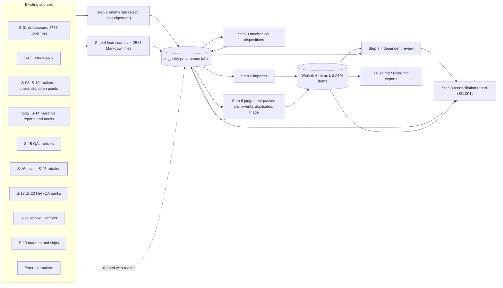
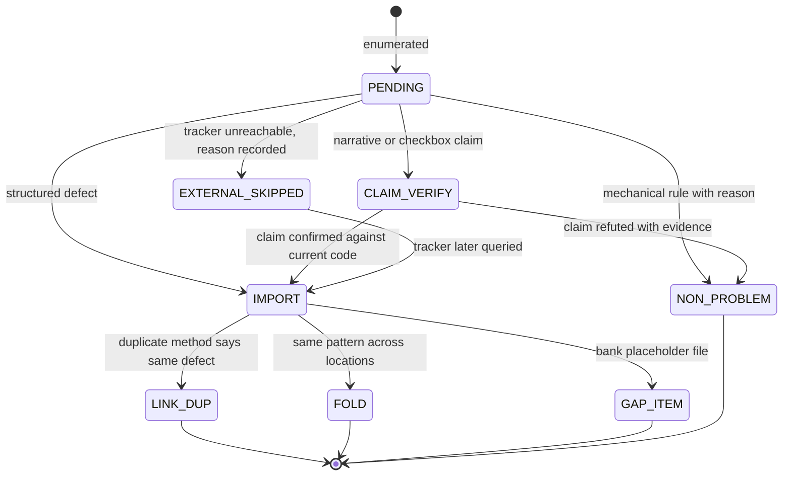
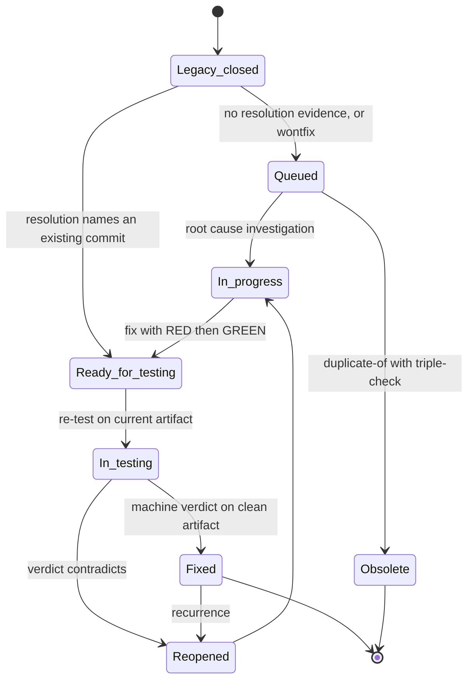
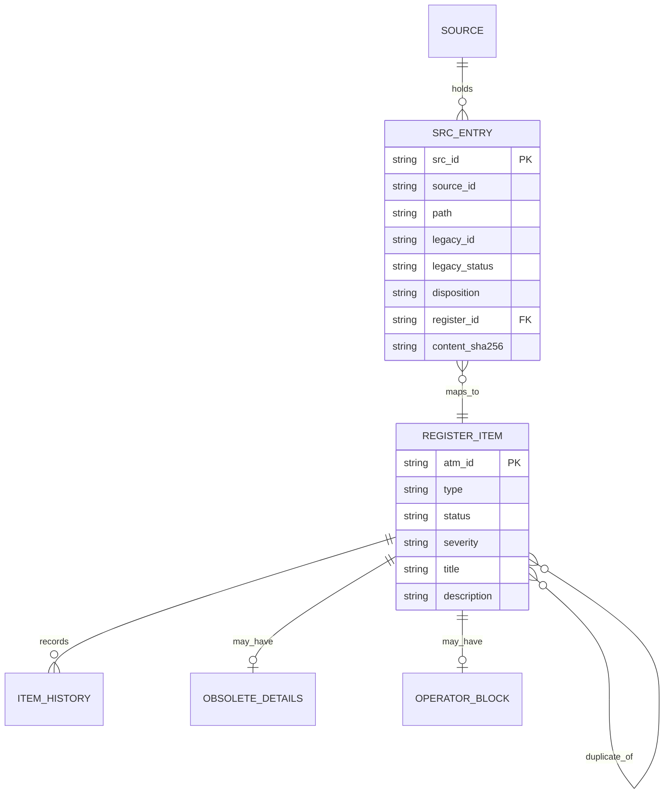
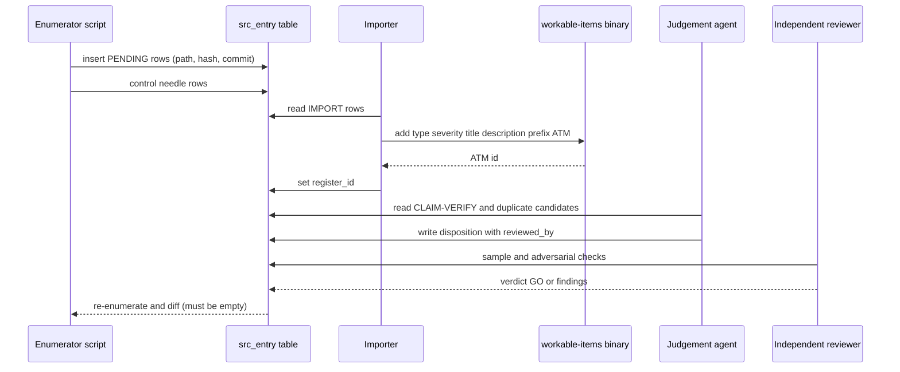

# 03 - Existing Issue Inventory and Reconciliation Plan

| Field | Value |
|---|---|
| Revision | 5 |
| Created | 2026-10-03 |
| Last modified | 2026-10-04 |
| Status | draft (revision 5: section 5.10 records the edit rule of the tasks.md P4-P5 Path classes bullet of the round-13 wave (a task that edits a `legacy-collection` file drops its exact-path row and adds the revision header, so `SECURITY_AUDIT_REPORT.md` leaves the class when T531 edits it) and that T524 archives 36 of the 37 report files, keeping `SECURITY_KEY_ROTATION_REQUIRED.md` in place. Revision 4: section 5.10 records how tasks.md rev 12 classes these sources for the commit-push checks: the 1,778 `docs/issues` tickets and the 41 root report, plan and status files are class `legacy-collection` of the path-class table (tasks.md T040b, document 16 revision 10 §12.2.6), to which the revision-header check does not apply, and it notes that tasks.md T165 and T040b call all 41 the S-12 root reports while this section assigns 9 of them to other source classes, a difference of naming that changes no file's class; re-counted with `git ls-files`. Revision 3: step 5 of section 10 and DR-3 follow the bounded description policy of tasks.md T163 and T168 (rev 11), which the one register bound of 16 MiB needs (document 16 §12.2.6, document 04 R-9): every item description the importer writes, its Sources block included, is at most 2,048 bytes, cut on a UTF-8 character boundary and marked as cut, and the full ticket text, or the per-step list of a bank file, stays in the source file that the Sources block cites by path and sha256. Revision 2: the root report set re-counted and enumerated by name in section 5.10: 49 root Markdown files are 6 governance files, 2 onboarding files and 41 report, plan and status files; 9 of the 41 have their own source rows (S-03, S-04, S-06, S-07, S-09, S-25) and the other 32 form S-12, which replaces the earlier estimate "about 36") |
| Feature | specs/001-full-project-audit-remediation |
| Traces to | FR-001, FR-002, FR-003, FR-004, FR-007, FR-008, SC-001 (also touches FR-013, FR-022, SC-002) |
| Constitution anchors | 11.4.15, 11.4.16, 11.4.54, 11.4.55, 11.4.90, 11.4.93, 11.4.95, 11.4.115(F), 11.4.146(D3), 11.4.148, 11.4.202, 11.4.208, 11.4.214, 11.4.226, 11.4.227, 11.4.261 |
| Evidence basis | Read-only commands run on 2026-10-03 against main (HEAD at session start e4852ce7). Every count below states how it was obtained. Counts that are estimates say so. |

## Table of contents

1. Purpose and scope
2. Headline findings
3. Method and the counting rules used
4. The source catalogue (S-01 to S-25)
5. Source-by-source detail
6. Constitution-mandated artifacts: what exists and what is missing
7. Table of totals
8. The target register and its mapping vocabulary
9. Mapping rules per source
10. Reconciliation procedure
11. Duplicate and overlap analysis method
12. Diagrams
13. Commands that produce or refresh every count
14. Risks, decisions and open questions
15. Acceptance evidence for SC-001
16. Traceability matrix

---

## 1. Purpose and scope

Spec FR-001 asks for one register of every problem. FR-002 asks that every problem already recorded anywhere be mapped into it with nothing dropped. SC-001 asks for a machine-produced reconciliation that lists each source entry with its register item. To plan that work we need to know, precisely, where the repository already records problems, how many entries each place holds, what vocabulary it uses, whether its entries carry identifiers, and how each one maps into the register.

This document is that inventory. It is the technical input to the register build. It does not restate the spec and does not decide which problems are real: deciding that is the audit's job (FR-008). Here every recorded claim is treated as a **claim to be reconciled**, not as truth. This matters because the sources contradict each other (section 2, finding F-3).

Out of scope here: new findings from the audit itself, the register's storage implementation beyond what the mapping needs (documented elsewhere in the plan), and external trackers that are not visible from the checkout (section 5.20).

## 2. Headline findings

| # | Finding | Evidence (how verified) |
|---|---|---|
| F-1 | **The constitution-mandated workable-items database does not exist in this repository.** No SQLite file holds workable items, there is no Issues.md, Fixed.md, Issues_Summary.md or Fixed_Summary.md, and there are zero ATM-NNN identifiers outside the constitution submodule and the Spec Kit memory files. The engine to create them is present (`submodules/constitution/scripts/workable-items/bin/workable-items`, schema at `.../schema.sql`). | `find` for `*.db`/`*.sqlite*` outside submodules and `node_modules` returned only `.codegraph/codegraph.db` (the code index) and database migration SQL. `git grep -hoE 'ATM-[0-9]+'` excluding `submodules/constitution`, `specs`, `.specify` returned 0 matches. |
| F-2 | **The largest structured source is `docs/issues/`: 1,778 HelixQA-generated ticket files**, of which 1 is open, 704 resolved, 492 fixed, 299 closed, 282 wontfix. Their `HELIX-NNN` identifier is **not unique**: 676 distinct ids are spread over 1,778 files, and 560 ids are shared by more than one file. The file path, not the id, is the only unique key. | `ls docs/issues \| wc -l`; `grep -h '^status:'`; filename-prefix uniq counts. Front-matter `id:` equals the filename prefix in all 1,778 files (0 mismatches), so the collision is real, not a parsing artefact. |
| F-3 | **Root and docs reports contradict each other.** Many say "all issues resolved" while others list hundreds of unchecked items. Example: `REMAINING_ISSUES_REPORT.md` is headed "ALL CRITICAL ISSUES RESOLVED"; `MASTER_EXECUTION_CHECKLIST.md` (root) has 299 unchecked and 0 checked boxes; `TASK_TRACKER.md` has 269 task rows, every one still marked "Not Started". | Read the heads of those files; counted checkbox and status marks (section 7). |
| F-4 | **1,111 of the 1,778 tickets have no Resolution section**, including 664 `resolved` and 440 `fixed` ones. A closed status without recorded evidence cannot be imported as closed under 11.4.146(D3) and 11.4.226. | `grep -L '^## Resolution'` split by status. |
| F-5 | **460 tickets were bulk-closed as "invalid/unreproducible" on 2026-04-17** by a single analysis (`.implementation/ALL-TICKETS-VALIDATION-REPORT-2026-04-17.md`, git log: "Close all remaining 460 open QA tickets as invalid/unreproducible"). 443 of the 460 are attributed to QA infrastructure failures. That conclusion is a claim by one agent, not evidence per ticket. | Report header and git log subject. The report counts 1,965 tickets (460 + 1,505), while `docs/issues` holds 1,778 files: the 187 difference is UNCONFIRMED (not explained in the repository). |
| F-6 | **The HelixQA banks that Catalogizer runs are mostly placeholders.** `challenges/helixqa-banks/` holds 15 YAML banks with 1,269 test cases; **1,178 step lines contain the literal text `# TODO: Convert to executable`** (11 of 15 files). Only the Android TV banks are executable. A bank whose steps are TODO text proves nothing, so this is a gap against 11.4.27 (no placeholders outside unit tests). | Python YAML load plus `git grep -c 'TODO: Convert to executable'` per file. |
| F-7 | **Source-code TODO/FIXME markers are almost absent in first-party application code** (catalog-api: word-match `git grep -nwiE 'TODO\|FIXME' -- catalog-api` finds 4 matching lines in 3 files (2 Markdown docs, 1 shell script), 0 in Go; one real `TODO(operator)` in `OCU-CUDA-Sidecar/internal/server/backend_cuda.go:287`). Marker grep is therefore a weak discovery channel here; the real backlog is in documents and banks. | `git grep -IwE` per application directory, then reading every hit in catalog-api and qa-ai-system. |
| F-8 | **All five latest Snyk scan results are failed scans, not clean scans.** Each `snyk-*-20260629_030611.json` contains `ok: false`: `snyk-go` carries `packageURL validation failed ...`, and the other four (catalog-web, catalogizer-api-client, catalogizer-desktop, installer-wizard) carry a message saying to run `snyk auth` to authenticate (not authenticated). So their "zero findings" must not be read as clean (11.4.201(6) false-null). The same-day npm audit files do hold findings (12, 35, 18 and 19 vulnerabilities). | JSON load of the files in `docs/security/`. |
| F-9 | **The constitution's Known Conflicts list has 16 items; 9 carry at least one OPEN or UNCONFIRMED sub-item.** | Read of `.specify/memory/constitution.md` lines 902-1040 (section 5.17). |

## 3. Method and the counting rules used

### 3.1 Rules

1. **Count what a machine can count, label the rest.** Where a source has a parseable structure (front-matter, table rows, checkboxes, YAML lists), the count is the number of structural units. Where the source is narrative prose, no count of "distinct problems" is claimed; the column says `NOT COUNTED` and the section gives the command that would produce a lead list, plus the manual review step.
2. **A count is a lead, a line is a finding** (11.4.194(6)(b)). A checkbox count is the number of candidate entries, not the number of real problems. Checklists that are procedural (contributing guides, deployment steps) are listed and excluded explicitly rather than silently ignored.
3. **Duplicates are not removed at inventory time.** This inventory counts source entries. Deduplication happens in the register build under the method in section 11.
4. **Dates come from git.** "Last modified" is `git log -1 --format=%cs -- <path>`, not file mtime, because a checkout resets mtime.
5. **Measurement controls.** Count commands were checked against a known positive where cheap (for example the status counts add up to 1,778, the file total). One regex was found to over-match (section 5.9) and is reported as a correction.

### 3.2 What was not done

- No external tracker (GitHub, GitLab, GitFlic, GitVerse issue lists; Firebase Crashlytics; Sonar) was queried. They are named in section 5.20 with the command to count them.
- Narrative reports were not read end to end. Their heads, status words and structural counts were read. The reconciliation procedure (section 10) includes a mandatory human-plus-agent read pass for these.
- Test cases inside the banks were counted, not executed.

## 4. The source catalogue

Kind codes: **T** = ticket-per-file, **L** = list/table inside a document, **C** = checklist, **Q** = QA bank (test definitions, not defects), **S** = scan output, **R** = narrative report, **G** = governance list, **M** = marker in code.

| ID | Path | Kind | Entries (how counted) | Own status vocabulary | Entry ids | Last modified (git) |
|---|---|---|---|---|---|---|
| S-01 | `docs/issues/*.md` | T | 1,778 files (exact) | `open, resolved, fixed, closed, wontfix` | `HELIX-NNN`, not unique (676 distinct) | 2026-06-23 |
| S-02 | `issues/ANR-2026-04-08-MainActivity-Startup-Hang.md` | T | 1 (exact) | `RESOLVED` (prose) | `ANR-2026-04-08-001` | see 5.2 |
| S-03 | `TASK_TRACKER.md` | L | 269 task rows (exact) | Not Started / In Progress / Complete / Blocked | `0.1.1` style, unique | 2026-02-26 |
| S-04 | `MASTER_EXECUTION_CHECKLIST.md` (root) | C | 299 unchecked, 0 checked (exact) | checkbox | none | 2026-04-10 |
| S-05 | `docs/MASTER_EXECUTION_CHECKLIST.md` | C | 845 unchecked, 0 checked (exact) | checkbox | none | see 5.4 |
| S-06 | `COMPREHENSIVE_PROJECT_STATUS_AND_PLAN.md` | C | 141 unchecked (exact) | checkbox | none | 2026-02-26 |
| S-07 | `COMPREHENSIVE_UNFINISHED_WORK_REPORT.md` | C+R | 87 unchecked, 9 cross marks (exact marks) | checkbox, cross | none | 2026-04-10 |
| S-08 | `docs/UNFINISHED_WORK_COMPREHENSIVE_REPORT.md` | R | 65 cross marks, 29 warning marks (marks, not problems); marked SUPERSEDED | cross/warn | none | see 5.6 |
| S-09 | `UNFINISHED_WORK_ANALYSIS.md`, `UNFINISHED_WORK_AND_ISSUES.md`, `FINAL_UNFINISHED_WORK_REPORT.md` | R | 5, 4 cross marks; counts not otherwise claimed | prose | none | 2026-04-06 to 2026-04-10 |
| S-10 | `docs/OPEN_POINTS_CLOSURE.md` | C | 35 unchecked, 19 checked (exact) | checkbox | none | see 5.7 |
| S-11 | `docs/LANDMINES.md` | L | 63 rules (exact) | none (invariants) | `RULE-<scope>-NNN`, unique | see 5.8 |
| S-12 | Other root status reports (32 files, exact; listed in section 5.10) | R | `NOT COUNTED` | prose, tick marks | none | 2026-02-25 to 2026-10-02 |
| S-13 | `docs/status/*.md` (37 files) | R | `NOT COUNTED` | prose | none | 2026-02 to 2026-04 |
| S-14 | `docs/audits/*.md` (7 files) and `docs/*AUDIT*.md` (10 files) | R | `CATAPI-DEFECT-001..006` = 6 (exact); others `NOT COUNTED` | prose, per-defect headings | `CATAPI-DEFECT-NNN` in one file | 2026-04-22 to 2026-04-30 |
| S-15 | `docs/qa/**`, `docs/reports/qa-sessions/**` | R+T | 20 tracked files under qa-sessions, 3 ticket files; FINDING-1 and FINDING-2 in `findings_20260626` | prose | `FIX-QA-YYYY-MM-DD-NNN`, `DEFER-QA-...`, `FINDING-N` | 2026-04-21 to 2026-06-29 |
| S-16 | `docs/security/**` | S+R | npm audit 12/35/18/19 vulns, govulncheck 4, gosec 810 issues in the latest run `docs/security/gosec-20260629_030611.json` (the 24 figure is the 2026-04-22 baseline `gosec-baseline-2026-04-22.json`); Snyk failed (snyk-go: packageURL validation failed; other four: not authenticated, run `snyk auth`) | tool-native | tool-native | 2026-06-29 |
| S-17 | `challenges/helixqa-banks/*.yaml` | Q | 15 files, 1,269 cases, 1,178 TODO step lines (exact) | none | `id` per case | see 5.15 |
| S-18 | `challenges/data/challenges_bank.json` | Q | 507 challenges, 18 categories (exact), generated 2026-04-04 | none | per challenge | see 5.15 |
| S-19 | `submodules/helix_qa/banks/` | Q | 131 top-level yaml + 66 top-level json (tracked: 145 yaml, 67 json); 2,882 cases over 145 parsed yaml files (cases may double count nested files) | none | per case | 2026-10-02 |
| S-20 | `submodules/helix_qa/` docs and baselines | G | `bluff-baseline.txt` 9 entries (5 below 100% mutation kill); `behavior-anchors.md` 27 rows, 27 active, 0 pending | `active/pending-anchor/retired` | `CAP-NNN` | 2026-10-02 |
| S-21 | `.specify/memory/constitution.md` Known Conflicts | G | 16 numbered items (exact), many with sub-items | FIXED / DECIDED / OPEN / NOTE / UNCONFIRMED | item numbers 1-16 | 2026-10-03 |
| S-22 | Per-module `CLAUDE.md` / `AGENTS.md` (19 tracked files outside submodules) | R | `NOT COUNTED`; 0 to 3 marker words per file | none | none | 2026-10-02 |
| S-23 | Code markers (TODO, FIXME, HACK, XXX) and skipped tests | M | section 5.18 (exact) | none | none | n/a |
| S-24 | `.implementation/` | R | 2 validation reports; progress marker files | prose | HELIX ids | 2026-04-17 |
| S-25 | `SECURITY_KEY_ROTATION_REQUIRED.md`, `SECURITY_AUDIT_REPORT.md`, `docs/security/firebase-api-key-exposure-20260629.md` | R | 1 action list with 37 provider rows (exact) in the first; others `NOT COUNTED` | prose | none | 2026-04-06 to 2026-06-29 |

The number of tracked Markdown files in the main repository (excluding submodules) is 2,514; 49 of them sit at the repository root and 37 in `docs/status/`. The inventory above covers every place that was found to hold problem statements. A Markdown file not listed is not claimed clean: the reconciliation procedure (section 10, step 4) includes a lead scan over all 2,514 so that nothing is dropped by omission.

## 5. Source-by-source detail

### 5.1 S-01 `docs/issues/` (HelixQA tickets)

**What it is.** One Markdown file per ticket, written by the HelixQA FindingsBridge (`submodules/helix_qa/pkg/autonomous/findings_bridge.go`, configured to write `docs/issues/` per `docs/reports/qa-sessions/2026-04-21-T-v2/tickets/run5-triage/TRIAGE.md`). Each has YAML front-matter (`id, severity, category, platform, screen, status, found_date`) and sections `Evidence`, `Reproduction Steps`, `Resolution`, `Related Issues` where present.

**Measured distribution (all exact, from front-matter):**

| Field | Values and counts |
|---|---|
| status | resolved 704, fixed 492, closed 299, wontfix 282, open 1 (total 1,778) |
| severity | medium 597, high 440, low 427, critical 255, cosmetic 59 |
| category | functional 544, ux 542, visual 250, accessibility 165, UX 141 (case variant of ux), content 104, brand 21, performance 9, functionality 2 |
| platform | blank 1,305, androidtv 413, video-frame 49, api 11 |
| found_date | 2026-03-26 to 2026-04-21 (one date per file; 10 distinct dates) |
| sections | Evidence 1,349, Related Issues 1,268, Reproduction Steps 768, Resolution 667 |

**Quality observations that affect the mapping:**

1. **Id collision.** 676 distinct `HELIX-NNN` ids over 1,778 files (max id 676); 560 ids occur in more than one file (for example HELIX-003, HELIX-004, HELIX-005 each appear in 8 files with different titles), and only 116 ids are used by exactly one file. The most likely cause is that independent HelixQA runs restarted their counter; this is a hypothesis (UNCONFIRMED), the observation is the measured collision. Consequence: the register MUST key these on `docs/issues/<filename>` and carry `HELIX-NNN` only as a non-unique legacy label.
2. **Title duplicates.** Stripping the id prefix leaves 1,417 distinct title slugs; 246 slugs occur more than once (the top five: "inconsistent-input-field-styling" 14, "low-contrast-between-text-and-background" 13, "missing-password-visibility-toggle" 11, "inconsistent-button-styling" 9, "unclear-call-to-action" 7). So up to 361 files (1,778 minus 1,417) are same-title repeats; whether they are the same defect on different screens is decided by the method in section 11, not assumed.
3. **Closed without evidence.** Files with no `## Resolution`: resolved 664, fixed 440, wontfix 6 (closed 0), plus the 1 open one: 1,111 in total. These cannot be imported as closed.
4. **Enhancement mislabelled as defect.** 225 wontfix ticket files under `docs/issues` carry some "Enhancement suggestion" text in 10 distinct variant texts (`grep -rli "Enhancement suggestion" docs/issues`); the exact phrase "Enhancement suggestion from automated QA vision analysis" appears in only 97 files, and the other variants start "Enhancement suggestion from automated QA." or "Accessibility enhancement suggestion from automated QA.". They are vision-model suggestions closed as non-defects. FR-008 forbids closing a finding because it is low severity; each needs a decision (real defect, enhancement as Feature item, or false positive with evidence).
5. **Bulk closure.** The 2026-04-17 commit closed all 460 then-open tickets as invalid or unreproducible (S-24). Those tickets are in this population, and they are the highest-risk group for false closure.
6. **Cross links.** 1,268 files have a `Related Issues` section naming other HELIX ids. Because ids collide, these links are ambiguous unless resolved by title. They are a usable duplicate signal (section 11) but not a reliable graph.
7. **Last commit touching the directory:** 2026-06-23 (the same commit corrected wontfix rationales).

**Mapping.** One register item per file (class IMPORT or LINK-DUP, section 9). Provenance key `docs/issues/<filename>`, legacy id `HELIX-NNN` kept as a label, plus a content hash of the file.

### 5.2 S-02 `issues/ANR-2026-04-08-MainActivity-Startup-Hang.md`

One ticket. Id `ANR-2026-04-08-001`, severity CRITICAL, status RESOLVED (prose, with a root-cause analysis section). It is the only file in `issues/`; the directory is not the HelixQA output directory. Map one-to-one; keep the legacy id. Its resolution evidence must be re-checked: there is no machine-readable verdict attached.

### 5.3 S-03 `TASK_TRACKER.md`

A plan, not a defect list: 269 numbered tasks (for example `0.1.1 Install Trivy container scanner`) with priority, effort, status, assignee and dependencies, for a 2026-02-26 phased plan. All 269 rows are `Not Started`. Many describe work that other documents claim is complete (for example security tool installation). Treated as **claims of owed work**: each row maps to a register item only if the audit confirms the work is genuinely absent; otherwise it is recorded as "obsolete plan row, delivered by X" with evidence. The 269 row ids (`0.1.1`...) are unique within the file and are kept as legacy ids.

### 5.4 S-04 and S-05 `MASTER_EXECUTION_CHECKLIST.md` (two versions)

Root version: version 2.2.1, 2026-04-10, 299 unchecked boxes, 0 checked. `docs/` version: "Version 1.0, March 22, 2026", 845 unchecked, 0 checked. `diff -q` reports they differ. Both are implementation checklists with no completion marks while sibling reports (S-12) claim the phases are complete. Overlap between the two is likely but unmeasured (UNCONFIRMED); section 11 measures it by normalised-line similarity. Treat each unchecked line as a candidate claim; most will fold into existing register items once the audit establishes the state.

### 5.5 S-06, S-07 planning/unfinished-work reports

`COMPREHENSIVE_PROJECT_STATUS_AND_PLAN.md`: 141 unchecked boxes (2026-02-26). `COMPREHENSIVE_UNFINISHED_WORK_REPORT.md`: 87 unchecked boxes and 9 cross-marked lines; it holds a defect-claim list (its content was only sampled: UNCONFIRMED in detail). The same class of claim appears in the superseded March report of 5.6 (unconnected services AnalyticsService, ReportingService, FavoritesService "instantiated, NEVER called"). Each named claim is verifiable with the code index and is therefore a high-value lead.

### 5.6 S-08 `docs/UNFINISHED_WORK_COMPREHENSIVE_REPORT.md`

Header states "SUPERSEDED - Most items ... have been addressed as of 2026-03-26". 65 cross-marked lines and 29 warning lines. "Most" is not "all", and there is no list of what remains: this is exactly the kind of document where nothing may be assumed dropped (FR-002). Treated as a claim list.

### 5.7 S-10 `docs/OPEN_POINTS_CLOSURE.md`

Operator-owned items, 10 sections. 35 unchecked and 19 checked boxes (exact). Section 1 lists credentials (Fanart.tv, IGDB, TMDB, OMDB, Astica, cloud LLM keys, Semgrep token, Sentry DSN). Sections 2 to 5 cover hardware, infra, creative work and optional hardening; section 8 lists three framework defects, all marked fixed on 2026-04-22; section 10 lists OpenClawing4 phases 1-6 remaining. Many unchecked items are operator tasks, not defects: they map to Type Task, status `Operator-blocked` (11.4.21) with the enumerated unblock choices that the document already implies, and are never silently dropped.

### 5.8 S-11 `docs/LANDMINES.md`

63 `RULE-<scope>-NNN` entries (scopes CONST, GO, TV, WEB, SEC, DESK, GIT, CONT, AND, HELIX, CH). They are invariants with detection commands, not open defects. They are not imported as problems; each is registered as a **guard candidate** (a standing regression guard, 11.4.135) and cross-linked to any register item it relates to. The detection commands give a free first discovery pass (section 10, step 6).

### 5.9 Marker and skip counts (S-23), with one correction

`git grep -IwE` counts, tracked files only:

| Area | TODO | FIXME | HACK | XXX | Files |
|---|---|---|---|---|---|
| catalog-api | 4 | 4 | 0 | 0 | 3 |
| OCU-CUDA-Sidecar | 1 | 0 | 0 | 0 | 1 |
| qa-ai-system | 4 | 3 | 0 | 0 | 3 |
| challenges (banks) | 1,178 | 0 | 0 | 0 | 11 |
| catalog-web, catalogizer-android, catalogizer-androidtv, catalogizer-desktop, installer-wizard, catalogizer-api-client, Website, scripts, tests, examples, deploy, docker, config | 0 | 0 | 0 | 0 | 0 |

Reading every hit: the catalog-api hits are prose in two Markdown reports (`catalog-api/CONVERSION_FINAL_SUMMARY.md:194`, `catalog-api/PHASE1_COMPLETION_REPORT.md:121,125`) and one echo line (`catalog-api/scripts/test-all.sh:140`); the qa-ai-system hits are grep patterns inside shell scripts. The only real code marker is `OCU-CUDA-Sidecar/internal/server/backend_cuda.go:287` (`TODO(operator): wire gosseract.Client ...`). Marker counts for submodules (tracked files, TODO/FIXME/HACK): constitution 225 (57 files; mostly marker text quoted in governance documents and test fixtures, real count UNCONFIRMED), llm_orchestrator 37, challenges 37, helix_qa 21, helix_memory 17, vision_engine 15, llm_provider 10, doc_processor 9, database 8, config 8, storage 7, security 7, rate_limiter 7, concurrency 7, auth 7, containers 5; all other submodules 0. Each submodule hit must be read before it becomes a register item, because quoted markers inside rule text are carriers, not defects (11.4.201(7)(a)).

**Skipped tests:** catalog-api has 118 `t.Skip` call sites in 35 files; the majority are short-mode guards (stress 33, unreachable-endpoint 20, contract 8, chaos 6, integration 7) and 87 `testing.Short()` references exist. `SKIP-OK` markers (honest environment skips with a reason) appear at 16 sites in 8 files in catalog-api (`grep -rn SKIP-OK --include=*.go catalog-api`). Whether a short-mode skip is acceptable depends on whether the full mode is run somewhere with evidence; that is an audit question (FR-009/FR-010), so the inventory lists them as leads, not defects. Skip counts in submodules (Go), earlier broader pattern: helix_qa 151, containers 129, llm_provider 60; with `grep -rn --include=*.go '\bt\.Skip' <submodule>` run in the working tree: helix_qa 148, containers 130, llm_provider 54 (a reviewer-reported 139/126/53 was not reproduced). Others as counted earlier: streaming 37, event_bus 33, storage 33, challenges 31, cache 30, concurrency 30, memory 30, observability 29, security 28, database 27, vision_engine 24, auth 22, llm_orchestrator 21, constitution 20, others 1 to 7.

**Correction (instrument false positive).** A first TypeScript/Rust skip regex that included `xit\(` reported 2 hits (desktop and wizard). Both were `std::process::exit(1)` in `src-tauri/src/main.rs`, a substring match. The corrected count of skipped tests in the TypeScript and Rust applications is **0** by that pattern. Kotlin `@Ignore` is 0 and Rust `#[ignore` is 0. This is recorded because the same carrier trap (11.4.201(7)(a)) will recur when the audit repeats these scans: use word-boundary patterns and test-framework-specific forms.

### 5.10 S-12 and S-13 root reports and `docs/status/`

Revision 2 re-count (`git ls-files` of `*.md` at the repository root, 2026-10-03): 49 root Markdown files. 6 are governance files (`AGENTS.md`, `CLAUDE.md`, `CONSTITUTION.md`, `GEMINI.md`, `MEMORY.md`, `README.md`) and 2 are onboarding files (`GETTING_STARTED.md`, `QUICK_REFERENCE.md`); none of the 8 is a problem source. The other 41 are report, plan and status files. Nine of the 41 already have their own source row: `TASK_TRACKER.md` (S-03), `MASTER_EXECUTION_CHECKLIST.md` (S-04), `COMPREHENSIVE_PROJECT_STATUS_AND_PLAN.md` (S-06), `COMPREHENSIVE_UNFINISHED_WORK_REPORT.md` (S-07), `UNFINISHED_WORK_ANALYSIS.md`, `UNFINISHED_WORK_AND_ISSUES.md`, `FINAL_UNFINISHED_WORK_REPORT.md` (S-09), `SECURITY_KEY_ROTATION_REQUIRED.md` and `SECURITY_AUDIT_REPORT.md` (S-25). The remaining 32 are S-12, named here so that none is covered only by a pattern: `ALL_ISSUES_FIXED.md`, `ANDROID_CRASH_FIXES_REPORT.md`, `COMMIT_SUMMARY.md`, `COMPLETE_FINAL_REPORT.md`, `COMPLETE_FIX_REPORT.md`, `COMPREHENSIVE_IMPLEMENTATION_PLAN.md`, `COMPREHENSIVE_TEST_REPORT_2026-04-07.md`, `COMPREHENSIVE_TEST_REPORT_2026-04-09.md`, `FINAL_COMPLETION_REPORT_ALL_PHASES.md`, `FINAL_COMPLETION_REPORT.md`, `FINAL_COMPREHENSIVE_COMPLETION_REPORT.md`, `FINAL_PROGRESS_REPORT.md`, `FINAL_PROJECT_REPORT.md`, `FINAL_SUMMARY_REPORT.md`, `HELIXQA_AUTONOMOUS_QA_IMPLEMENTATION_PLAN.md`, `IMPLEMENTATION_COMPLETE.md`, `IMPLEMENTATION_PACKAGE_SUMMARY.md`, `IMPLEMENTATION_PROGRESS_REPORT.md`, `ISSUES_FIXED_TODAY.md`, `MASTER_IMPLEMENTATION_INDEX.md`, `MASTER_IMPLEMENTATION_PLAN_PHASES.md`, `PERFORMANCE_OPTIMIZATION_REPORT.md`, `PHASE_0_COMPLETION_REPORT.md`, `PHASE_1_COMPLETION_REPORT.md`, `PHASE_1_PROGRESS_REPORT.md`, `PHASE_2_COMPLETION_REPORT.md`, `PHASE_3_COMPLETION_REPORT.md`, `PROGRESS_UPDATE_DEAD_CODE.md`, `PROJECT_STATUS_REPORT.md`, `PROJECT_STATUS_SUMMARY.md`, `REMAINING_ISSUES_REPORT.md`, `TEST_EXECUTION_REPORT.md`. The earlier figure "about 36" is withdrawn. Revision 4 (tasks.md rev 12 T040b, T165, T092; document 16 revision 10 §12.2.6; re-counted with `git ls-files` at `67f09f62`: 49 root `*.md` files, the 8 governance and onboarding files present as the control, 41 others): for the commit-push checks all 41 report, plan and status files carry one exact-path row each in class `legacy-collection` of the path-class table, as do the 1,778 `docs/issues` tickets through `docs/issues/**`; the class applies every `source` check except the revision-header check, so these headerless legacy files are no keys of the revision-header baseline (of the 2,484 headerless Markdown files tasks.md T040 counts at `a2ebc097`, 1,819 are these files and 665 remain keys, registered under one tracked `Task` item by T092), and a ticket or root report added later and named by no row is class `source`. Revision 5 (the tasks.md P4-P5 Path classes bullet of the round-13 wave; T524, T531; document 16 revision 11 §12.2.6): a task that edits one of these files drops its exact-path row in the same change set and adds the revision header, so `SECURITY_AUDIT_REPORT.md`, which T531 reconciles before T524 archives it, leaves the class (UNCONFIRMED until tasks.md T040b states the same rule); T524 archives 36 of the 37 report files and keeps `SECURITY_KEY_ROTATION_REQUIRED.md` in place while its action is open. Tasks.md T165 and T040b call all 41 the S-12 root reports, while this section assigns 9 of them to their own source rows (S-03, S-04, S-06, S-07, S-09, S-25) and names the remaining 32 as S-12; the path-class rows are the same 41 files either way, so the difference is one of naming, recorded here for the owner of T165, whose enumeration decides the source class of each file. S-13 adds 37 files in `docs/status/`. Their form is narrative with tick marks. Most state completion; they are the **contradiction source** for F-3. They hold few structured problem entries (a few have unchecked boxes: `PHASE_1_PROGRESS_REPORT.md` 38, `MASTER_IMPLEMENTATION_PLAN_PHASES.md` 66, `IMPLEMENTATION_PROGRESS_REPORT.md` 12, `IMPLEMENTATION_PACKAGE_SUMMARY.md` 11, `COMPREHENSIVE_IMPLEMENTATION_PLAN.md` 10, `PROJECT_STATUS_SUMMARY.md` 9, `FINAL_PROGRESS_REPORT.md` 4, `HELIXQA_AUTONOMOUS_QA_IMPLEMENTATION_PLAN.md` 7). `docs/status/IMPLEMENTATION_TASK_TRACKER.md` has 1,228 lines and no rows matching an id pattern (0 table rows with a leading id), so it must be read as prose. The files have no ids.

Reconciliation treatment: they are **claim documents**. Each completion claim ("X is implemented", "Y resolved") is a statement that the audit verifies or refutes (FR-022). Extraction is by pattern-led lead scan plus an agent read pass (section 10, step 4), producing candidate claims with the line reference; claims that contradict the current state become register items, and the document is added to the doc-update list (FR-012).

### 5.11 S-14 `docs/audits/` and `docs/*AUDIT*.md`

Seven dated audit reports in `docs/audits/` (2026-04-28 to 2026-04-30) and ten audit documents at `docs/` level (`AI_STACK_AUDIT.md`, `ANDROID_TV_AUDIT.md`, `BACKEND_HARDENING_AUDIT.md`, `CROSS_PLATFORM_AUDIT.md`, `DESKTOP_PERF_AUDIT.md`, `DISABLED_FEATURES_AUDIT.md`, `DOCUMENTATION_AUDIT.md`, `FRONTEND_AUDIT.md`, `TEST_INFRASTRUCTURE_AUDIT.md`, `FINAL_AUDIT_ZERO_UNFINISHED_WORK.md`, plus `MASTER_AUDIT_AND_IMPLEMENTATION_PLAN.md`). The one with a defect id scheme is `docs/audits/CATALOG_API_DEFECTS_2026-04-29.md`: **6 defects, `CATAPI-DEFECT-001` to `CATAPI-DEFECT-006`**, of which DEFECT-001 is annotated FALSE POSITIVE after re-verification. Defects include the admin system-info endpoint reachable without admin role, no rate limit on login, unsupported storage protocols accepted, duplicate root names accepted, and a malformed-JSON login that still authenticates. Each is a candidate for immediate re-test (the audit must re-verify; the report's own re-verification log shows the same-day reversal of one). The other audit documents hold no ids; they are claim documents. `docs/DISABLED_FEATURES_AUDIT.md` has 4 checked boxes (disabled features) and is a high-priority read because disabled features are ready-made findings.

### 5.12 S-15 QA session archives and findings

`docs/qa/` (10 entries including `findings_20260626/`, `helixqa-androidtv-20260629/`, `containerized-build-20260630/`, `cover-images-rootcause-20260629/`, `crashlytics-wiring-20260629/`, `androidtv-players-20260629/`, `provision-when-down-20260630/`) and `docs/reports/qa-sessions/` (4 session directories, 20 tracked files). Id schemes found in text: `FIX-QA-YYYY-MM-DD-NNN` (22 distinct values in tracked files, `git grep -ohE`; same 22 in the working tree), `DEFER-QA-...` (4 distinct) and `DEFER-...` (6 distinct, overlapping), `FINDING-1`, `FINDING-2`, `FIX-OC3-NNN` (2 in tracked files, 11 in the working tree including untracked or ignored files), `HQA-DOCS-001`. Only 3 ticket files exist under `qa-sessions/*/tickets`; most FIX-QA ids exist only as references inside prose such as `docs/OPEN_POINTS_CLOSURE.md`. `FINDING-2` in `docs/qa/findings_20260626/discovered_findings.md` is stated OPEN (operator-gated upstream renumber); FINDING-1 is resolved with commit references (`dac3fc6e`, `1afec970`). The `DEFER-QA-2026-04-21-001/002` tickets (the `/challenges/results` client-disconnect refactor and a memory-burst review) are deferred, i.e. open. Mapping: each distinct id becomes one register item (or a link to an existing one); the id is kept as legacy id.

### 5.13 S-16 `docs/security/**`

Scan outputs (JSON and text) and security reports (about 18 Markdown files). Latest run in the repository is 2026-06-29. Exact counts from files: npm audit `catalog-web` 12 (1 low, 4 moderate, 5 high, 2 critical), `catalogizer-api-client` 35 (2, 23, 8, 2), `catalogizer-desktop` 18 (2, 7, 7, 2), `installer-wizard` 19 (2, 7, 7, 3); `govulncheck` 4 entries (GO-2026-5061 among them); `gosec` latest run `gosec-20260629_030611.json` 810 issues (stats: 364 files, 17 `nosec`), versus 24 in the 2026-04-22 baseline; Snyk: all five results failed (F-8). Whether these findings still hold is unknown until re-run (FR-017 reports third-party versions; vulnerabilities in them are still findings under FR-006/FR-008). Mapping: one register item per vulnerability identifier per affected application, created at audit time from a fresh scan; the historical files are linked as evidence of first detection.

### 5.14 S-25 credential-rotation documents

`SECURITY_KEY_ROTATION_REQUIRED.md` lists 37 provider rows whose keys were exposed in local `.env` files and must be rotated; it states the action as open and is dated 2026-04-17. `docs/security/firebase-api-key-exposure-20260629.md` records a Firebase key exposure. These are danger-zone items. They map to Type Task, severity critical, and **the register MUST NOT store any credential value** (11.4.10); only the provider name and variable name are recorded. Whether the rotation was completed is UNKNOWN from the repository.

### 5.15 S-17, S-18, S-19, S-20 QA banks (HelixQA)

These are test definitions, not defect lists. They matter to the register in three ways: (a) a placeholder step is itself a defect (a bank that cannot run proves nothing); (b) a bank case that currently fails is a defect signal; (c) a bank case that covers a register item is that item's regression guard.

**Catalogizer banks, `challenges/helixqa-banks/` (15 YAML files).**

| Bank file | Cases | `TODO: Convert to executable` step lines |
|---|---|---|
| catalogizer-android-comprehensive-executable.yaml | 80 | 84 |
| catalogizer-android-negative-paths-executable.yaml | 69 | 97 |
| catalogizer-androidtv-comprehensive-executable.yaml | 88 | 0 |
| catalogizer-androidtv-executable.yaml | 4 | 0 |
| catalogizer-androidtv-full-executable.yaml | 8 | 0 |
| catalogizer-androidtv-negative-paths-executable.yaml | 51 | 0 |
| catalogizer-api-comprehensive-executable.yaml | 313 | 313 |
| catalogizer-api-negative-paths-executable.yaml | 119 | 200 |
| catalogizer-cross-platform-flows-executable.yaml | 15 | 51 |
| catalogizer-desktop-comprehensive-executable.yaml | 64 | 67 |
| catalogizer-desktop-negative-paths-executable.yaml | 25 | 25 |
| catalogizer-web-comprehensive-executable.yaml | 255 | 164 |
| catalogizer-web-negative-paths-executable.yaml | 95 | 92 |
| catalogizer-wizard-comprehensive-executable.yaml | 63 | 69 |
| catalogizer-wizard-negative-paths-executable.yaml | 20 | 16 |
| **Total** | **1,269** | **1,178** |

(Step-line counts can exceed the case count: a case has several steps.) The file names say "executable" while the steps say "TODO: Convert to executable"; that mismatch is itself a bluff signal (11.4.1, 11.4.27). Every case has `id, name, category, priority, platforms, steps`; none has a status field, so there is no recorded pass/fail state in the banks. `challenges/results/` holds only `.gitkeep`, so **no committed results exist** for these banks. `challenges/data/challenges_bank.json` holds 507 challenges in 18 categories, generated 2026-04-04, also without a status field.

**HelixQA submodule banks, `submodules/helix_qa/banks/`.** 131 top-level YAML and 66 top-level JSON files (202 entries listed by `ls`, including directories); tracked totals are 145 YAML (131 top-level) and 67 JSON (66 top-level); 145 YAML files parsed without error, holding 2,882 cases by a conservative count of `test_cases`, `cases` or `challenges` lists (nested files may double count, the exact distinct count is UNCONFIRMED). Only 4 `TODO` occurrences exist in them. The submodule also holds `docs/behavior-anchors.md` (27 capability rows, all `active`, 0 `pending-anchor`) and `challenges/baselines/bluff-baseline.txt` (9 data lines; five show per-file mutation kill rates below 100: `pkg/nexus/capture/factory.go` 88, `pkg/nexus/interact/factory.go` 88, `pkg/nexus/interact/verify/verifier.go` 20, `pkg/nexus/native/budget/assert.go` 33, `pkg/nexus/record/encoder/encoder.go` 77 - weak-test signals, each a candidate finding). `docs/IMPLEMENTATION_PROGRESS.md` states "Known Issues: None currently".

**Mapping rule for banks.** Bank cases are NOT imported as problems one by one. Instead:
1. One **gap item per bank file** that contains placeholder steps (11 items), whose acceptance is "every step executable and run with a recorded verdict", with the per-case placeholder count in the description. This keeps the register honest without creating 1,178 near-identical items (rationale in DR-3, section 14).
2. One item per weak-baseline entry (5 items) and per bank case that fails when first executed (created by the audit run, linked to the case id).
3. Each bank case id is recorded in the reconciliation table as `NON-PROBLEM / TEST-DEFINITION` with the item it guards, so SC-001's "every source entry listed" holds.

### 5.16 S-24 `.implementation/`

`ALL-TICKETS-VALIDATION-REPORT-2026-04-17.md` (the 1,965-ticket claim, F-5) and `HELIX-122-147-TICKET-VALIDATION-REPORT.md`, plus marker files under `progress/`. Their per-ticket dispositions (Category A to ...) are a ready-made classification to compare against `docs/issues` statuses, but they are one agent's verdicts and must be sampled and independently re-verified before acceptance.

### 5.17 S-21 the constitution's Known Conflicts list

`.specify/memory/constitution.md` section "Known Conflicts and Open Decisions" has 16 numbered items. Status by item (read from the file, status words are the file's own):

| # | Topic | Statuses present | Remaining open or unconfirmed sub-items |
|---|---|---|---|
| 1 | Test resource limits | DECIDED | none |
| 2 | CI and hook wording | FIXED, OPEN | same wording in owned submodules' own files |
| 3 | Haiku as mechanical tier | FIXED, UNCONFIRMED | whether the 200k-window limit holds for Catalogizer |
| 4 | Bare-host build/run commands | FIXED, OPEN | historical `docs/status/` reports still contain `docker-compose up` |
| 5 | HelixPlay sections 17 to 21 | DECIDED (operator 2026-10-03) | other HelixPlay clauses UNKNOWN here |
| 6 | Website dead links | OPEN | `ignoreDeadLinks: true` in `Website/.vitepress/config.ts` |
| 7 | Compliance artifacts | FIXED, OPEN | no `scripts/commit_all.sh` or `commit-push-all.sh` found |
| 8 | Host index lag | NOTE | none |
| 9 | Coverage-floor adoption | DECIDED (operator) | none (per-application phase-in, spec FR-011) |
| 10 | Gate code owed | OPEN | many `CM-*` gates have no code |
| 11 | Stale Android documentation | FIXED, UNCONFIRMED | intended Gradle heap value |
| 12 | Spec-first vs autonomy | DECIDED | none |
| 13 | Doc-versus-build discrepancies | FIXED, OPEN | Java 17 vs 21 guidance, TV `kotlin.daemon.jvmargs` line, TypeScript 4.9 vs 5 |
| 14 | Repository state at commit time | NOTE, FIXED | constitution pin behind remote; vendored `docling` modified file |
| 15 | Branch policy for spec 001 | DECIDED (operator) | none |
| 16 | Dependency scope for spec 001 | DECIDED (operator) | none |

Mapping: **one register item per OPEN or UNCONFIRMED sub-item** (about 14 candidate items: 2, 3, 4, 5, 6, 7, 10, 11, 13a, 13b, 13c, 13d, 14a, 14b; the exact split is fixed when the list is mechanically parsed, section 10 step 3), each cited by conflict number and sub-item letter. DECIDED and FIXED sub-items are recorded as closed items with the evidence already cited in the list (for FIXED ones, the reconciliation must still verify the fix: a statement in a list is not evidence, 11.4.226). Conflict 10 (gate code owed) is a **family** item whose members are the unimplemented `CM-*` gates; the audit tracks the count under the gate-ledger ratchet (11.4.227(A)) rather than as hundreds of register rows.

### 5.18 S-22 per-module guidance files

19 tracked `CLAUDE.md`/`AGENTS.md` files outside submodules (one under `.specify/extensions`, which is a template). Marker words ("known issue", "TODO", "not yet", "open") appear 0 to 3 times per file. They record rules, not problems, and Known Conflicts 11 and 13 already captured their doc-versus-build mismatches. They are scanned in the lead scan and otherwise map nowhere.

### 5.19 Sources that exist in the checkout but hold no problem entries (explicitly listed, FR-002)

`docs/CONTINUATION.md` (revision 9, 2026-06-29, state table; its rows `NAS music: Access denied` and `NAS usbshare2: Access denied` are two live problem statements, recorded as items), `docs/requests/history.md` (request ledger, not problems), `docs/decisions/` (one reconciliation decision), `docs/incidents/2026-04-28-host-reboot-investigation.md` (one incident: must be read; a host reboot is a constitution-class event), `.remember/` session notes (`now.md`, `today-*.md`; transient), `.codegraph/codegraph.db` (a code index, not a tracker), `.github/` (2 files: `FUNDING.yml` and a README saying workflows are disabled; confirms no CI workflow files exist, consistent with 11.4.156).

### 5.20 External sources not visible from the checkout

The repository has 8 git remotes (`origin, upstream, github, githubvasicdigital, gitlab, gitlabvasicdigital, gitflicvasicdigital, gitversevasicdigital`). Issue lists on those hosts, Firebase Crashlytics (11.4.152, `.firebaserc` exists), SonarQube (`sonar-project.properties`, `sonarqube/`), and Snyk/Trivy dashboards may hold further problems. Their content is UNKNOWN here. FR-004 requires that an unreachable tracker be reported as skipped with its reason; the reconciliation includes one row per external source with state `queried` or `skipped(reason)`. Commands are in section 13.

## 6. Constitution-mandated artifacts: what exists and what is missing

| Mandated artifact | Anchor | State found | Missing / action |
|---|---|---|---|
| Workable-items SQLite database, tracked in git | 11.4.93, 11.4.95 | **Absent.** Only `.codegraph/codegraph.db` (code index) and app migration SQL exist. The Go binary exists at `submodules/constitution/scripts/workable-items/bin/workable-items` (and `workable-items-linux`), schema at `.../schema.sql` (tables: items, item_history, obsolete_details, operator_block_details, firebase_metadata, logic_groups, group_paths, doc_segments, meta). | Create the DB at a project-declared path, tracked (11.4.95), by `workable-items` commands. Path to be declared once (11.4.35); proposal in DR-1. |
| Issues.md and Fixed.md trackers | 11.4.12, 11.4.19 | **Absent.** `find` for `Issues*.md`, `Fixed*.md`, `*Status_Summary*` outside submodules returned nothing relevant. | Generated from the DB by `workable-items export`; never hand-edited. |
| Issues_Summary.md, Fixed_Summary.md | 11.4.12, 11.4.53, 11.4.56 | Absent. | Same generator. |
| ATM-NNN stable ids | 11.4.54 | **0 occurrences** in main-repo content. The engine auto-generates `<PREFIX>-NNN` (default prefix `WIT`; `--prefix` overrides). | Choose prefix `ATM` per the constitution wording (UNCONFIRMED whether the project prefers another; decision DR-1). |
| Item status closed set | 11.4.15, 11.4.21, 11.4.33, 11.4.90 | Absent in practice: the repository uses five ad-hoc vocabularies (section 9 table). The schema CHECK lists ten values (the schema comment says eight): Queued, In progress, Ready for testing, In testing, Reopened, Operator-blocked, Fixed, Implemented, Completed, Obsolete (the last four with the "(-> Fixed.md)" suffix). | Mapping table in section 9. |
| Item type closed set | 11.4.16 | Absent. Schema allows Bug, Feature, Task. | Mapping in section 9 (the audit's extra classes such as gap or danger zone are a `category` text, not new types). |
| Reopen history | 11.4.55, 11.4.34 | Absent. Table `item_history` exists in schema. | `workable-items reopen --why ... --who ... --when ... --incident ...` (closed reason set). |
| Obsolete details | 11.4.90 | Absent. Schema reasons: superseded-by-design-change, superseded-by-later-mandate, feature-removed, duplicate-of, unsupported-topology. | `duplicate-of` is the route for confirmed duplicates (section 11). |
| Testing diary | 11.4.149 | Not found (not searched deeply: UNCONFIRMED). | Out of scope here; plan owner to confirm. |
| Request history ledger | 11.4.208 | **Present:** `docs/requests/history.md` revision 2, starts 2026-10-02, 4 entries; earlier sessions not reconstructed (stated in the file). Track/alias fields are UNKNOWN. | Keep; not a problem source. |
| Session-resumption / continuation | 12.10, 11.4.131 | `docs/CONTINUATION.md` present (revision 9, 2026-06-29, HEAD `e5019c68` quoted, older than the current main). | Stale against current state: a finding (the file claims HEAD e5019c68). |
| Single commit entrypoint | section 2, 11.4.234 | A root `commit` script exists (589 bytes; last git commit touching it 2025-10-07); no `commit_all.sh` or `commit-push-all.sh` (Known Conflict 7). | Out of scope here. |
| External-tracker sync mechanism | 11.4.148 D5, 11.4.202 | Not found as configured (UNCONFIRMED). | Declared in FR-004; design in another plan document. |

Consequence for SC-001: the "existing register" is empty. The register is built from scratch, and the inventory in sections 4 and 5 is the complete starting population.

## 7. Table of totals

All values exact unless marked. "Entries" are source entries before deduplication.

| Group | Source entries | Of which structured (machine-countable) | Notes |
|---|---|---|---|
| HelixQA ticket files (S-01) | 1,778 | 1,778 | 1 open, 1,777 closed-class; 1,111 without a Resolution section |
| ANR ticket (S-02) | 1 | 1 | RESOLVED, no machine verdict |
| Task and checklist items (S-03 to S-07, S-10) | 269 + 299 + 845 + 141 + 87 + 35 = 1,676 unchecked or not-started lines | all | Overlap between S-04 and S-05 unmeasured; 19 checked in S-10 and 0 elsewhere |
| Other unchecked boxes in planning reports (S-12) | 66 + 38 + 12 + 11 + 10 + 9 + 4 + 7 + 37 + 20 + 7 = 221 | all | `MASTER_IMPLEMENTATION_PLAN_PHASES` 66; `PHASE_1_PROGRESS_REPORT` 38; `IMPLEMENTATION_PROGRESS_REPORT` 12; `IMPLEMENTATION_PACKAGE_SUMMARY` 11; `COMPREHENSIVE_IMPLEMENTATION_PLAN` 10; `PROJECT_STATUS_SUMMARY` 9; `FINAL_PROGRESS_REPORT` 4; `HELIXQA_AUTONOMOUS...PLAN` 7; `docs/COMPREHENSIVE_PACKAGE_SUMMARY` 37; `docs/MASTER_AUDIT_AND_IMPLEMENTATION_PLAN` 20; `docs/README_IMPLEMENTATION_PACKAGE` 7 |
| Cross-marked lines in unfinished-work reports (S-07 to S-09) | 9 + 65 + 5 + 4 = 83 marks | marks only | Marks are not problems; each is a lead |
| Defect-id entries in audits and QA text (S-14, S-15) | 6 CATAPI + 22 FIX-QA + 4 DEFER-QA + 2 FINDING (+ 6 DEFER overlapping, 2 FIX-OC3 tracked / 11 working tree) | distinct ids from text, partly overlapping | exact id counts, overlaps unresolved |
| Landmine rules (S-11) | 63 | 63 | guards, not defects |
| Constitution Known Conflicts (S-21) | 16 items | 16 | about 14 open or unconfirmed sub-items (estimate pending parse) |
| Scan findings latest run (S-16) | 12 + 35 + 18 + 19 + 4 + 810 = 898 (with the 24 gosec baseline instead: 112) | counts per file | Snyk failed; staleness of the findings unknown; gosec 810 is the latest run |
| Credential-rotation rows (S-25) | 37 | 37 | action list |
| Real code markers (S-23) | 1 (OCU sidecar) | 1 | 8 more are document/script text |
| Bank gaps (S-17 to S-20) | 11 placeholder bank files; 1,178 placeholder step lines; 5 weak-baseline rows | exact | 1,269 cases and 507 + 2,882 other cases are test definitions, mapped as NON-PROBLEM |
| Narrative claim documents (S-08, S-09, S-12, S-13, S-14 others) | 3 root (S-09) + 32 root (S-12) + 37 status + 11 audit documents, plus S-08 and S-22 | `NOT COUNTED` | needs the lead-scan and read pass |

Upper bound on register items before deduplication: **about 1,778 + 1 + 1,676 + 221 + 83 + 898 + 37 + 14 + 16 + 5 + the claim-document leads**, which sums to 4,729 before the leads, so about 4,700 candidate entries (ESTIMATE; the sum includes the 898 scan findings of the latest run, of which gosec 810; the 14 and 16 terms are not itemised in the table above and are UNCONFIRMED), of which the real count after folding duplicates and dropping procedural checklists is expected to be far lower. This is an estimate for capacity planning only (ESTIMATE, not a finding). The reconciliation produces the exact figure.

## 8. The target register and its mapping vocabulary

The register is the workable-items database (11.4.93) exported to Issues.md / Fixed.md, with a side table for provenance that the reconciliation owns. The schema already provides most fields; the provenance table is the addition.

### 8.1 Provenance and reconciliation tables (proposal, NOT EXECUTED)

```sql
-- Owned by the reconciliation; lives beside the workable-items DB.
CREATE TABLE IF NOT EXISTS src_entry (
    src_id         TEXT PRIMARY KEY,        -- stable: <source-id>:<locator-hash>, e.g. S-01:docs/issues/HELIX-022-inconsistent-branding.md
    source_id      TEXT NOT NULL,           -- S-01 .. S-25
    path           TEXT NOT NULL,           -- repo-relative
    locator        TEXT NOT NULL,           -- line range, YAML key path, JSON pointer, or "file"
    kind           TEXT NOT NULL CHECK (kind IN ('ticket','row','checkbox','claim','rule','conflict','scan','bank-case','marker','external')),
    legacy_id      TEXT,                    -- HELIX-NNN, CATAPI-DEFECT-001, RULE-..., NULL if none
    legacy_status  TEXT,                    -- verbatim: wontfix, [ ], RESOLVED, ...
    legacy_sev     TEXT,                    -- verbatim severity if any
    title          TEXT NOT NULL,
    content_sha256 TEXT NOT NULL,           -- hash of the entry text as read
    source_commit  TEXT NOT NULL,           -- git rev-parse HEAD when read
    disposition    TEXT NOT NULL CHECK (disposition IN
                   ('IMPORT','LINK-DUP','FOLD','CLAIM-VERIFY','GAP-ITEM','NON-PROBLEM','EXTERNAL-SKIPPED','PENDING')),
    register_id    TEXT,                    -- ATM-NNN or NULL only when NON-PROBLEM/EXTERNAL-SKIPPED
    reason         TEXT,                    -- mandatory for NON-PROBLEM, EXTERNAL-SKIPPED
    dup_group      TEXT,                    -- group key when LINK-DUP or FOLD
    reviewed_by    TEXT,                    -- reviewer identity (different from importer)
    reviewed_on    TEXT
);
CREATE INDEX IF NOT EXISTS src_entry_source ON src_entry(source_id);
CREATE INDEX IF NOT EXISTS src_entry_register ON src_entry(register_id);
```

Invariant (SC-001): `SELECT count(*) FROM src_entry WHERE disposition='PENDING'` is 0 and every `NON-PROBLEM` and `EXTERNAL-SKIPPED` row has a non-empty `reason`. A row with `register_id IS NULL` and any other disposition is a violation.

### 8.2 Status mapping (legacy to register)

The register status set is the schema set. The import never writes a closed status without evidence, because a closed status needs an evidence path (`workable-items close --evidence`, 11.4.5, 11.4.90, 11.4.146(D3)).

| Legacy status (source) | Register status at import | Condition and note |
|---|---|---|
| `open` (S-01) | Queued | direct |
| `resolved`, `fixed`, `closed` with a Resolution section naming a commit, file or test (S-01) | Ready for testing | the claim is carried; closure happens only after the audit re-verifies on the current artifact with a machine verdict (FR-008, FR-022). A parser flags those whose resolution text names a commit that exists (`git cat-file -e`) for faster review. |
| `resolved`, `fixed` with no Resolution section (S-01, 1,104 files) | Queued | evidence-less closure is not accepted; reason recorded; they join the re-verification queue |
| `wontfix` (S-01, 282) | Queued, `legacy_status=wontfix` | FR-008: no closure because of low severity; each needs one of {real defect fix, Feature item for enhancement, false-positive evidence}. The 225 "Enhancement suggestion" ones (`grep -rli "enhancement suggestion" docs/issues`) are triaged as a batch with sampling, not skipped |
| `RESOLVED` (S-02) | Ready for testing | re-verify |
| `Not Started` rows (S-03) | Queued only if the audit confirms the work is absent; otherwise Obsolete with reason `superseded-by-design-change` or closed as Completed with evidence | row-by-row through the claim-verify disposition |
| unchecked box (S-04 to S-07, S-10, planning reports) | Queued after folding | many fold into existing items (section 9) |
| checked box (S-10: 19) | Completed only with evidence, else Ready for testing | the checkbox is a claim |
| `FIXED` in Known Conflicts | Ready for testing | evidence cited in the list is attached, then re-verified |
| `DECIDED` (operator) | Completed (decision record) | evidence is the operator decision date and the spec FR it set |
| `OPEN` / `UNCONFIRMED` | Queued; UNCONFIRMED ones carry the label in the title | |
| Operator-owned items (S-10 sections 1 to 5) | Operator-blocked with `--details` and `--unblock` choices | 11.4.21 |

### 8.3 Type mapping

| Source signal | Register type |
|---|---|
| ticket category functional, performance, or a crash/ANR/security defect | Bug |
| category ux, UX, visual, accessibility, content, brand | Bug when it states wrong behaviour against a standard (contrast ratio below WCAG AA, missing alt text); Feature when it is an enhancement request without a violated rule (the 225 vision suggestions after triage) |
| planned work rows (S-03 to S-07) and operator action lists (S-10, S-25) | Task |
| gaps (placeholder bank steps, disabled features, missing test types) | Task (the fix is writing the missing artifact) |

The audit's vocabulary ("gap, misalignment, shortcoming, weak spot, danger zone") is recorded as the `category` text and the title prefix, not as new types: the type set is a closed constitutional set (11.4.16) and inventing a fourth is a violation (11.4.202(2)).

### 8.4 Identifier policy

Register ids are `ATM-NNN` (decision DR-1). Legacy ids are never used as register keys. They are stored in `src_entry.legacy_id` and in the item description's "Sources" block, so a search for `HELIX-022` finds the item and, because of the collision in S-01, returns all items that legacy label touches.

## 9. Mapping rules per source

| Source | Disposition rule | Register granularity | Fields carried | Evidence needed to close |
|---|---|---|---|---|
| S-01 tickets | IMPORT each file; LINK-DUP when the duplicate method (section 11) confirms the same defect on the same screen; FOLD when the same pattern repeats across screens | one item per distinct defect (file-level provenance rows always kept, so SC-001's per-entry listing holds) | title, severity, category, platform, screen image name, found date, evidence, repro, resolution text, related ids | re-test on the current artifact, RED then GREEN where a defect is real (11.4.115) |
| S-02 ANR | IMPORT | 1 | root-cause text, severity | machine-run startup test on a clean device |
| S-03 task rows | CLAIM-VERIFY | per row, folded where several rows are one capability | row id, priority, effort, dependencies | the audit confirms absent (then Queued) or delivered (then closed with evidence) |
| S-04/S-05/S-06/S-07/planning reports | CLAIM-VERIFY plus FOLD | per distinct capability or claim, not per checkbox | file, line, checkbox text | same |
| S-08/S-09/S-12/S-13 narrative | CLAIM-VERIFY | per verifiable claim | file and line of the claim | same |
| S-10 open points | IMPORT as operator-blocked tasks; 8.x framework defects as closed items with evidence references | per checkbox | section, checkbox text | operator action recorded, or fix evidence |
| S-11 landmines | NON-PROBLEM / guard candidate | none; linked | rule id, detection command | n/a (guards are registered under 11.4.135) |
| S-14 audits | IMPORT CATAPI-DEFECT-002..006 (001 is a recorded false positive: IMPORT as closed with the re-verification log as evidence, still counted); other audit documents CLAIM-VERIFY | per defect | defect id | re-test |
| S-15 QA archives | IMPORT per distinct FIX-QA/DEFER-QA/FINDING id; ids referenced only in prose with no ticket file are imported with a note "no ticket file" | per distinct id | id, date, commits cited | the cited commit exists and the guard runs |
| S-16 scans | EXTERNAL-style import from a fresh scan; historical files linked | per vulnerability id per application | tool id, package, version | fixed version in use plus clean re-scan |
| S-17 to S-20 banks | GAP-ITEM per placeholder bank file and per weak baseline row; cases NON-PROBLEM | 11 + 5 | file, placeholder step count | every step executable with a run verdict |
| S-21 conflicts | IMPORT per open or unconfirmed sub-item; closed ones recorded with evidence | about 14 + closed ones | conflict number and letter | the specific resolution |
| S-23 markers | IMPORT the 1 real marker; other hits NON-PROBLEM with reason (text inside documents/scripts) | 1 | file:line | wiring implemented and tested |
| S-25 rotation | IMPORT as Task, critical, operator-blocked | 1 family item per provider group | provider and variable names only | operator confirmation plus the old key rejected by provider (evidence class defined with the operator) |
| External sources (5.20) | EXTERNAL-SKIPPED with reason until queried | one row per source | source, state | n/a |

## 10. Reconciliation procedure

The procedure is deterministic, restartable and idempotent: the same input commit produces the same `src_entry` set, because identifiers derive from path plus content hash, not from run order.

**Step 0 - Freeze the input.** Record `git rev-parse HEAD` for the main repository and every submodule pointer (`git submodule status --recursive`). The inventory is valid for that commit only. Re-run on a moved commit produces a delta, not a restart.

**Step 1 - Create the empty register.** `workable-items validate --db <path>` on a new DB initialised from `schema.sql` (the exact init invocation is UNCONFIRMED: the README lists `sync`, `diff`, `validate`, `add`, `update`, `reopen`, `block`, `close`, `report`, `export` but no `init`; the schema file is applied with `sqlite3` or equivalent inside the container, to be confirmed by running `workable-items --help`).

**Step 2 - Enumerate sources mechanically (no reading).** A script walks the catalogue (section 4) and emits `src_entry` rows with `disposition='PENDING'` for every structured entry:
- S-01 and S-02: one row per file, parsed front-matter.
- S-03: one row per table row matching `^\| *[0-9]+\.[0-9]+`.
- Checklists: one row per `- [ ]` or `- [x]` line with file and line number.
- S-14 to S-15: one row per distinct id found by the id regex set.
- S-16: one row per vulnerability record in the latest scan files (and a `scan-failed` row for each failed Snyk file).
- S-17 to S-20: one row per bank file (gap) and per bank case id (NON-PROBLEM).
- S-21: one row per numbered item and sub-item (parsing bold item numbers and the status words).
- S-23: one row per marker hit.
- S-25: one row per provider row.
- External: one row per remote and per named service.

**Step 3 - Mechanical dispositions.** Apply the rules that need no judgement: bank cases become NON-PROBLEM; landmine rules become NON-PROBLEM/guard; marker hits inside Markdown or shell grep patterns become NON-PROBLEM with the reason `marker text in document or pattern`; external sources become EXTERNAL-SKIPPED until queried.

**Step 4 - Lead scan over all tracked Markdown (2,514 files).** A scripted pass lists lines matching a closed lead vocabulary (unfinished, not implemented, stub, missing, broken, known issue, workaround, deprecated, disabled, skipped, TODO, FIXME, regress, outstanding, pending, "not yet"). Each lead is a `claim` row. Leads inside the already-structured sources are marked duplicates of those rows. The lead scan has a control needle: a known present phrase from `docs/LANDMINES.md` must be found by the same command before any zero is believed (11.4.201(7)(b)).

**Step 5 - Item creation by an importer (one actor).** A scripted importer creates register items for IMPORT rows via `workable-items add <type> <severity> --db <p> --title <T> --description <D> --prefix ATM`. The description MUST meet the 11.4.91 floor and carry a **Sources** block listing every `src_id`. The importer MUST NOT set a closed status (section 8.2). Revision 3 (tasks.md T163, T168, rev 11; document 16 §12.2.6): the description, its Sources block included, is at most 2,048 bytes, cut on a UTF-8 character boundary and marked as cut, and the full ticket text stays in the source file that the Sources block cites by path and sha256 (726 of the 1,778 tracked tickets are longer than the cap). The cap exists because the register engine stores every description twice (`items.description` and `body_md`), and 2,010 items carrying their whole ticket text measured 18,804,736 B in a scratch database, above the one register bound of 16 MiB that the commit-push script's large-file check applies to `docs/workable_items.db` and to every file under `docs/register/`, while the same items under the cap measured 9,162,752 B (tasks.md T040b, measured for its rev 11).

**Step 6 - Judgement passes (agents, one actor per pass).**
1. Claim-verify pass over `CLAIM-VERIFY` rows: confirm or refute with the code indexes and file reads, citing path and line.
2. Duplicate pass (section 11).
3. Triage pass for wontfix and enhancement tickets.
4. Re-verification of FIXED/DECIDED conflicts.
Each pass writes dispositions with `reviewed_by`. The pass author MUST NOT review its own output (11.4.240).

**Step 7 - Independent review.** A different actor (Opus at xhigh per the constitution, 11.4.209) samples the dispositions: all NON-PROBLEM rows with exclusion reasons from the closed set, all LINK-DUP groups, and a random sample of IMPORT rows. A reviewer-authored adversarial check is required (11.4.194(6)(d)): the reviewer inserts a known problem in a scratch copy of a source and confirms the pipeline would have surfaced it.

**Step 8 - Reconciliation report (SC-001 artifact).** A generated file (CSV and Markdown, exported as required) lists every `src_entry` row with its register id or exclusion reason, plus totals per source. Re-run Step 2 and diff: the new `src_id` set MUST equal the old set (nothing appeared that was not reconciled).

**Step 9 - Completeness proof (control needles).** Insert three planted entries into a scratch copy of the sources (a checkbox, a ticket file, a bank case): the pipeline MUST yield three new rows. If not, the enumerator is blind and the report is invalid.

**Step 10 - Sync check.** `workable-items diff --db <p> --issues <p> --fixed <p>` must report in sync after export, and the external-tracker step records each tracker as synced or skipped(reason) (FR-004).

**Exit criterion.** Zero PENDING rows, zero rows without register id or reason, independent review GO, completeness proof passed, reconciliation report committed.

## 11. Duplicate and overlap analysis method

Overlap exists at four levels. Each has its own test, and none may be resolved by title alone (a wrong merge deletes a real defect: 11.4.214(3); the autonomous default is link, not merge).

| Level | Example found | Method | Verdict set |
|---|---|---|---|
| L1 Same file in two places | root and `docs/` copies of `MASTER_EXECUTION_CHECKLIST.md`, `COMPREHENSIVE_IMPLEMENTATION_PLAN.md`, `PHASE_1_PROGRESS_REPORT.md`; 12 files named `ARCHITECTURE.md`, 6 `Status.md` | content hash then normalised-line Jaccard similarity of the two files; no exact content duplicates were found among tracked Markdown by md5 (0 groups) | identical, near (similarity at or above a threshold set from a calibration sample, not guessed), distinct |
| L2 Same defect, repeated ticket | 246 repeated title slugs in S-01; ids reused across runs | key = (normalised title, category, platform, screen image, severity) plus normalised first 200 chars of the description; candidate groups reviewed by an agent that reads the evidence sections; screens differ means distinct defect instance of one pattern | SAME-DEFECT (link/fold), SAME-PATTERN-DIFFERENT-SCREEN (one item with N locations), DISTINCT, UNDECIDED |
| L3 Same defect, different documents | a defect named in `docs/audits/...`, the TASK tracker and a ticket | key on component path, symbol or endpoint extracted by the code index (for example `/api/v1/admin/system-info`), then compare claims | same as L2 |
| L4 Claim versus current code | a report says a service is unwired, another says it was wired | not a duplicate, a contradiction: both are recorded; the code index decides and the stale document is queued for update (FR-012) | refuted claim, confirmed claim |

Calibration and controls:
- **Negative control** (11.4.214(4)): at least ten pairs of genuinely distinct same-title tickets (different screens or categories) MUST NOT merge; a method that merges them is a false-merge engine.
- **Positive control**: a seeded exact duplicate pair MUST be grouped.
- **Id-collision handling:** `HELIX-NNN` equality alone is never a duplicate signal because of F-2; it is only a candidate for L2 when the titles also match.
- **Related Issues graph:** use the 1,268 `Related Issues` sections as edges only after resolving each referenced id to the file with the best title match; unresolved references are listed, not guessed.
- **Output:** a `dup_group` per cluster, with the canonical item chosen as the earliest-found, best-evidenced entry; non-canonical items are recorded as `Obsolete` with reason `duplicate-of` and the superseding ATM id, with the triple-check evidence field filled (11.4.90). Recurrence of a closed defect reopens the canonical item (FR-003, 11.4.214), never mints a new id.
- **Reported metrics:** number of groups, items per group distribution, and the count of UNDECIDED left for the operator (11.4.66).

## 12. Diagrams

### 12.1 Source to register flow



### 12.2 Lifecycle of a source entry



### 12.3 Register item status mapping for a legacy "closed" ticket



### 12.4 Entities



### 12.5 Reconciliation sequence



## 13. Commands that produce or refresh every count

All are read-only. Commands marked EXECUTED were run in this session (2026-10-03) and produced the numbers above. The Python and SQL above and below that were not run are marked NOT EXECUTED. No command here needs the network.

```bash
# --- HelixQA tickets (EXECUTED) ---
cd /home/milosvasic/Projects/catalogizer
ls docs/issues | wc -l                                  # 1778
grep -h '^status:'   docs/issues/*.md | sort | uniq -c   # resolved 704, fixed 492, closed 299, wontfix 282, open 1
grep -h '^severity:' docs/issues/*.md | sort | uniq -c
grep -h '^category:' docs/issues/*.md | sort | uniq -c
ls docs/issues | sed -E 's/^(HELIX-[0-9]+)-.*/\1/' | sort -u | wc -l   # 676 distinct ids
ls docs/issues | sed -E 's/^(HELIX-[0-9]+)-.*/\1/' | sort | uniq -c | awk '$1>1' | wc -l  # 560 shared ids
ls docs/issues | sed -E 's/^HELIX-[0-9]+-//' | sort -u | wc -l   # 1417 distinct title slugs (re-run on this tree prints 1417; a reviewer-reported 1419 was not reproduced; lowercasing and mapping `_` to `-` also gives 1417)
grep -L '^## Resolution' docs/issues/*.md | wc -l        # 1111

# --- checklists and tracker rows (EXECUTED) ---
grep -cE '^\s*- \[ \]' MASTER_EXECUTION_CHECKLIST.md docs/MASTER_EXECUTION_CHECKLIST.md docs/OPEN_POINTS_CLOSURE.md
grep -E '^\| *[0-9]+\.[0-9]+' TASK_TRACKER.md | wc -l           # 269
grep -E '^\| *[0-9]+\.[0-9]+' TASK_TRACKER.md | grep -c '⬜'    # 269

# --- markers (EXECUTED) ---
for d in catalog-api catalog-web catalogizer-android catalogizer-androidtv catalogizer-desktop \
         installer-wizard catalogizer-api-client Website OCU-CUDA-Sidecar scripts challenges; do
  printf '%s TODO=%s FIXME=%s\n' "$d" \
    "$(git grep -IwE TODO  -- "$d" | wc -l)" "$(git grep -IwE FIXME -- "$d" | wc -l)"
done
```

```python
# Bank counts (EXECUTED): cases and placeholder step lines per bank file
import glob, yaml
tot_cases = tot_todo = 0
for f in sorted(glob.glob('challenges/helixqa-banks/*.yaml')):
    d = yaml.safe_load(open(f))
    n = len(d['test_cases'])
    todo = sum(1 for line in open(f) if 'TODO: Convert to executable' in line)
    tot_cases += n; tot_todo += todo
    print(f.split('/')[-1], n, todo)
print(tot_cases, tot_todo)   # 1269 1178
```

Expected machine-readable summary output of the full inventory script (proposal, the schema is the contract, NOT EXECUTED):

```json
{"commit":"<HEAD>","sources":25,"entries":{"S-01":1778,"S-02":1,"S-03":269,"S-04":299,"S-05":845,"S-17":1269},
 "pending":0,"unmapped":0,"external":{"origin":"skipped(reason)","github":"queried"}}
```

Commands for counts this inventory could not make (for the plan owner to run in the containerised runner or on a connected host):

```bash
# External issue trackers (NOT EXECUTED; needs network and credentials, never print tokens)
gh issue list --repo <owner>/<repo> --state all --limit 1000 --json number,state,title | jq length
# Remote list to enumerate every upstream
git remote -v
# Narrative-report lead scan over all tracked Markdown (NOT EXECUTED)
git ls-files '*.md' ':!submodules' | xargs grep -nIiE 'unfinished|not implemented|stub|known issue|workaround|disabled|outstanding|not yet' > /tmp/leads.txt
# Control needle for the same instrument: must return at least one hit
grep -c 'RULE-CONST-001' docs/LANDMINES.md
```

## 14. Risks, decisions and open questions

| ID | Risk | Likelihood and impact | Mitigation |
|---|---|---|---|
| R-1 | Id collision in S-01 causes wrong merges or lost items | certain if keyed on `HELIX-NNN`; high | key on path plus hash; id is a label only (section 8.4) |
| R-2 | The 460 bulk-closed tickets hide real defects | medium; high | sampled independent re-verification with RED capture on the artifact; the bulk report is a claim |
| R-3 | Narrative claim extraction misses problems | medium; high | lead scan with control needles, agent read pass, independent adversarial sample, planted-entry completeness test |
| R-4 | Importing 1,778 closed-looking tickets as Queued floods the register | certain; medium | triage passes with batch rules, duplicate folding, severity ordering; counts reported as items and as source entries |
| R-5 | Credentials leak into register descriptions (S-25, scan files) | low if rules followed; severe | importer only copies provider and variable names; a pre-commit style scan of the DB export for secret patterns (11.4.10) |
| R-6 | Tracking files regenerated by hand instead of from the DB | medium | `workable-items diff` as gate; exports only via `export` |
| R-7 | A closure imported on a prose claim | medium | the importer cannot write closed statuses (8.2); only `close` with evidence |
| R-8 | Source files move or change during the build | medium | Step 0 freezes the commit; re-enumeration diff catches drift |
| R-9 | Stale or failed scan outputs read as clean (Snyk) | certain for current files | classified as `scan-failed`, re-run in a container (11.4.201(6)) |
| R-10 | Bank placeholders counted as coverage | certain in current docs | gap items; coverage claims rely only on executed runs |

Decision records (proposed defaults, reversible, the plan owner may overturn):

- **DR-1 Id prefix and DB location.** Use `ATM` (constitution wording, 11.4.54) via `--prefix ATM`, and place the tracked DB and generated trackers under a project-declared path (declare once, 11.4.35; candidate `docs/tracking/`; UNCONFIRMED, not created). Rejected: default prefix `WIT` (not the constitutional ATM), and reusing `HELIX-NNN` (not unique).
- **DR-2 Closed legacy tickets enter as Queued or Ready for testing, never as closed.** Rejected: importing 1,777 closed tickets as Fixed, because 1,111 lack evidence and FR-008/FR-022 forbid unproven closure.
- **DR-3 Bank placeholders are tracked per bank file, not per step.** Rejected: one item per step (1,178 items with identical text and no distinct acceptance); per-case items. The per-step list stays in the provenance table and in the bank file that the item's Sources block cites by path and sha256, and the item description carries it only within its 2,048-byte cap (revision 3, tasks.md T168), so nothing is dropped.
- **DR-4 Known Conflicts DECIDED items are imported as completed decision records.** They are the owner's decisions and part of the audit trail; omitting them would violate "nothing dropped".
- **DR-5 Provenance table is a separate SQLite table, not new columns on `items`.** Rejected: altering the constitution's schema (it is a shared submodule; changes go upstream by extension, 11.4.74).

Open questions for the plan owner (not guessed here):
1. UNCONFIRMED: the exact `workable-items` database initialisation command (the README documents no `init`).
2. UNCONFIRMED: why `docs/issues` holds 1,778 files while the 2026-04-17 report counts 1,965 tickets (187 difference).
3. UNKNOWN: whether any external tracker (GitHub, GitLab, GitFlic, GitVerse, Crashlytics, Sonar) holds additional problem entries.
4. UNKNOWN: whether the credential rotation in S-25 was carried out.
5. UNCONFIRMED: whether a testing-diary store (11.4.149) exists; not searched in depth.
6. Whether `submodules/*` repositories keep their own trackers (for example helix_qa tickets under `docs/issues` in a consuming layout); only counts of markers and skips were taken for submodules here, per FR-006 they are in scope for the audit and FR-002 requires their recorded problems too. The submodule scan in step 2 must therefore be run recursively over all 44 submodules; no per-submodule ticket directories were found in `submodules/helix_qa` (`pkg/ticket` generates them, but none are tracked in the submodule).

## 15. Acceptance evidence for SC-001

SC-001 is met when all of the following are shown with machine-produced output from the reconciliation commit:

1. **Population statement.** The enumerated `src_entry` count per source equals the totals in section 7 at the frozen commit (or the delta against it is itemised).
2. **Zero pending.** `SELECT count(*) FROM src_entry WHERE disposition='PENDING'` returns 0, and every exclusion row has a reason from the closed set.
3. **Every row mapped.** Join check: no row with a problem disposition has a NULL `register_id`; no register item lacks a `Sources` block.
4. **Round trip.** `workable-items diff` reports DB and exported Markdown in sync; `validate` passes.
5. **Completeness test.** Three planted entries are detected by the enumerator; the planted entries are removed afterwards.
6. **Independent review.** A GO verdict from a reviewer who did not run the importer, with the sample sizes and the adversarial check recorded.
7. **Status honesty.** `SELECT count(*) FROM items WHERE status IN ('Fixed (→ Fixed.md)','Implemented (→ Fixed.md)','Completed (→ Fixed.md)') AND atm_id NOT IN (SELECT atm_id FROM item_history WHERE evidence_path IS NOT NULL)` returns 0 (query shape is a proposal, NOT EXECUTED; the history columns are those in `schema.sql`).
8. **External trackers.** Each external source is recorded as queried or skipped(reason); none shows as synced without a recorded real command exit.

## 16. Traceability matrix

| Requirement | Where addressed in this document |
|---|---|
| FR-001 single register with status, type, id, description | sections 6, 8 |
| FR-002 every recorded problem mapped, nothing dropped | sections 4, 5, 7, 9, 10 (including section 5.19 and the lead scan) |
| FR-003 recurrence reopens, no new item | sections 8.2, 11 |
| FR-004 external trackers synced or skipped with reason | sections 5.20, 10 step 10, 15 item 8 |
| FR-007 findings link to register items | section 8.1 `src_entry.register_id`, section 9 |
| FR-008 no closure without evidence, none for low severity | sections 5.1, 8.2, DR-2 |
| FR-012 / FR-013 document updates and reachability | section 5.10 (claim documents queue the doc update), section 10 step 4 |
| FR-022 claims cite machine evidence or are labelled unconfirmed | throughout (UNCONFIRMED, UNKNOWN, ESTIMATE labels), section 15 |
| SC-001 100% of recorded problems appear with a reconciliation | sections 10, 15 |
| SC-002 (every finding has a root cause and test) | indirectly: sections 8.2, 9 close-evidence column |
