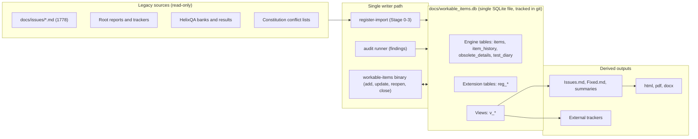
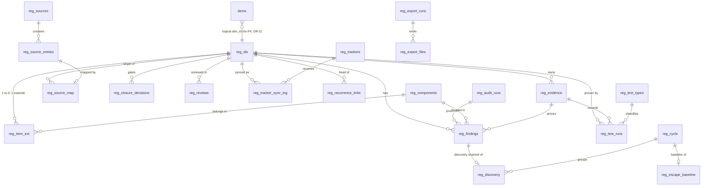
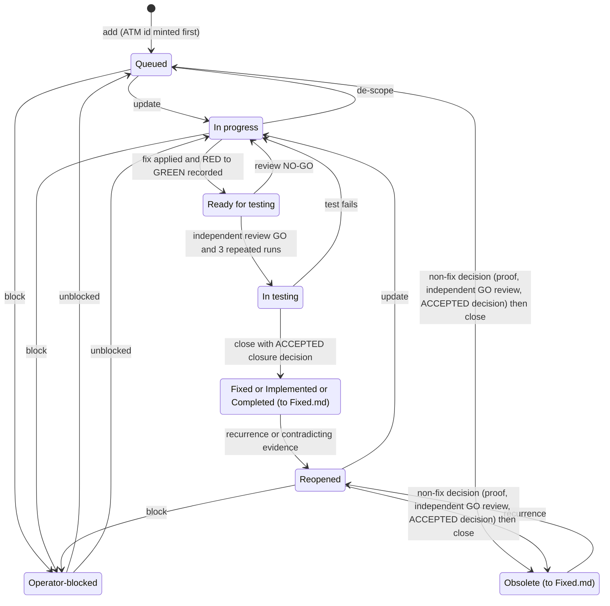
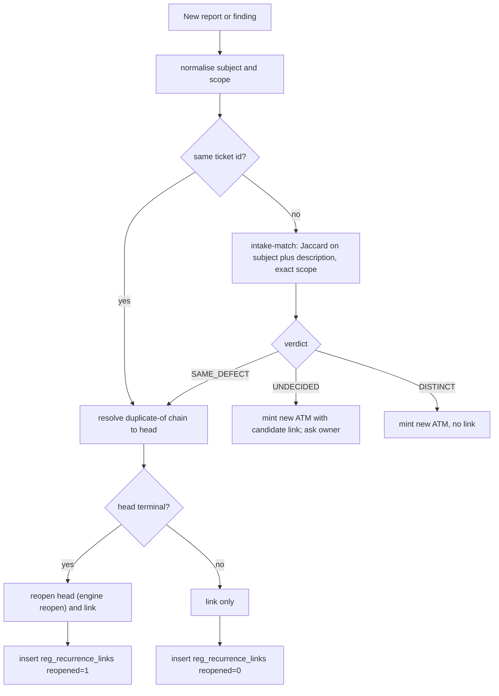
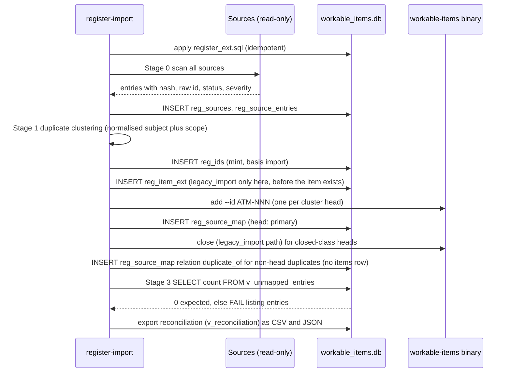
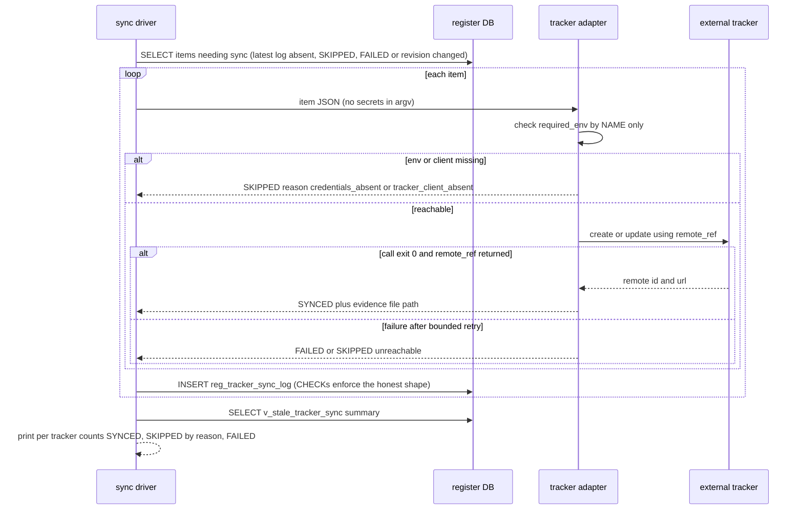

# 04 - Findings Register Design (single problem register)

| Field | Value |
|---|---|
| Revision | 17 |
| Created | 2026-10-03 |
| Last modified | 2026-10-04 |
| Status | draft (revision 17: prose only, the DDL of §5 unchanged (its extracted text compared by sha256 before and after this edit): §4 follows tasks.md rev 28 (673 tasks, 78 suffix ids; rev 27 commit `13bc5de0`, rev 28 commit `fb1d1982`; T225e, T165, T175, T248, T254, T269): T225e refuses `unit_path_root_conflict` and `unit_own_repo_conflict` beside `unit_kind_conflict`, with fixtures and a paired mutation; T165 is the first and only writer of the real `reg_sources` rows; T175 bootstraps its scratch database with `apply_ext.sh --db` (`scratch_sources_empty`); T248, T254 and T269 depend on T225e; revision 16: prose only, the DDL of §5 unchanged (its extracted text compared by sha256 before and after this edit): §4 follows tasks.md rev 27 (673 tasks, 78 suffix ids; rev 26 commit `616fb74a`, rev 27 commit `13bc5de0`; T225, T225a, T225b, T225e, T168, T165, T064): `scripts/audit/unit_kinds.tsv` is written by T225 as the one declared source of the partition kind, the register kind and `path_root` of every unit (partition kinds `application`, `own-org-repo`, `wp36`, `documentation`, `cross-cutting`; the sentinel `.` only for `security-xcut`), read by T225e, with the refusals `unit_kind_pair_invalid`, `unit_kind_orphan`, `unit_path_root_invalid` and `seed_components_drift` beside `unit_kind_missing` and `unit_kind_conflict`; T225a, T225b and every minting task depend on T225e; T168 writes `reg_item_ext.component_id` NULL for every P2 import (the column references `reg_components`, nullable in §5), evidence `$EV/register/import-component-null.txt`; `locked.sh import-sql` gains `LOCKED_SCRATCH_DB` and the bare-hash `.sha256` comparison (`import_sha256_malformed`); revision 15: prose only, the DDL of §5 unchanged (its extracted text compared byte for byte before and after this edit): §4 follows tasks.md rev 26 (673 tasks, 78 suffix ids; rev 25 commit `2e1fd314`, rev 26 commit `616fb74a`; T554, T569, T225, T225d, T225e): `--seam pre-qa --candidate <fingerprint>` judges the ratchet only on the candidate's own `qa-<fingerprint>` cycle and reports `pre_qa_no_candidate_cycle` when it is absent (`pre_qa_unseeded` and the latest-owner-cycle rule of revision 14 withdrawn; `candidate_missing`); the unit ids of `$AUD/units.json`, `security-xcut` among them, seed `reg_components` through T225e (`unit_kind_missing`, `unit_kind_conflict`) and are checked by T225d against `finding/1` and that seed (`unit_id_schema_reject`, `unit_id_not_registered`); revision 14: prose only, the DDL of §5 unchanged (its sha256 compared before and after this edit): §4 gains the escape-cycle conventions of the tasks.md rev 24 (T554, T555, T556, T580e, T582): the manual-QA cycle of a release candidate is the `reg_cycle` row whose `cycle_id` is `'qa-' || <candidate fingerprint>`, a naming convention and no DDL change, and the release-seam check `scripts/qa/escape_gates.sh` has two modes whose named results `pre_qa_unseeded`, `manual_qa_not_run_for_candidate` and `baseline_not_seeded` are results of that script, never commit-push exit codes; revision 13: prose only, the DDL of §5 unchanged (its sha256 compared before and after this edit): §12.2 marks as open, with the tasks.md owner, where the register is re-recorded after a conflict, because no task gives `locked.sh`, the engine or the T066 procedure a target path that the resolution directory of a `--resolve-merge` run can receive (round-12 cross-document consistency review of commit `d014297e`, m-10; docs/21 IC-56 (3)). Revision 12: prose only, the DDL of §5 unchanged (its sha256 compared before and after this edit): §12.1 R-9 follows tasks.md rev 12 and the plan owner's decisions taken after the round-11 reviews of commit `a2ebc097` (docs/21 IC-54, IC-55): the size alarm of tasks.md T067 fires at 75% of the 16 MiB bound (12,582,912 B) instead of half of it, which the plan's own projection (9,162,752 B) already crossed, and it is closed only by a re-measurement below it or by the held reviewed table change; the held raise of the bound declares the database, the dump and the regenerated exports held on the raise's verdict, because an unheld path that the raised bound would admit is refused (20, `table_admits_unheld_path`, tasks.md T040b, T178); the description cap also binds the import of the owner decisions (tasks.md T070); §12.2 adds the single writer across clones: a conflict in the database, its dump or its exports is never resolved as text but re-recorded by ST-REG on top of the remote side, the commit-push merge refusing it otherwise (20, `store_not_rerecorded`, docs/21 IC-56), and a `ledger#<seq>` reference follows a re-recorded ledger entry; risk K-1 names that rule. Revision 11: prose only, the DDL of §5 unchanged (its sha256 compared before and after this edit): §12.1 R-9 is restated for the plan owner's rule (V) after the round-10 reviews of commit `6dca8771` (tasks.md rev 11 T040b; docs/21 IC-52): `docs/workable_items.db` and every file under `docs/register/**` are class `generated` of the reviewed path-class table, with one large-file bound of 16 MiB per file; the bound needs the bounded description policy of tasks.md T168 (every item description at most 2,048 bytes, its Sources block included, the full ticket text left in the cited source file) and is raised only by a held reviewed table change on a new G-DATA iteration `$EV/reviews/WP-06-r<n>.json`; the derivation moves below the table and is corrected: the engine stores every description twice (`items.description` and `body_md`, re-checked in this session on a fresh engine database), so revision 10's 11.07 MB projection undercounted, and the measured totals of tasks.md T040b and T067 replace it (2,010 items with whole ticket texts: 18,804,736 B; under the cap with the extension rows: 9,162,752 B); §12.2 states the two read forms tasks.md now carries for a read-only query (a checkpointing `locked.sh` call, or a reader that refuses while the `-wal` file is non-empty; release-seam reads always refuse) and withdraws revision 10's `mode=ro` alternative and its request to the tasks.md owner. Revision 10: prose only, the DDL of §5 unchanged: §12.2 keeps one backup procedure, the reviewed helper `scripts/register/backup_db.sh` of tasks.md T064a (checkpoint and `.backup` in one locked call, then `PRAGMA integrity_check` and a restore probe through the `immutable=1` URI, its record by `--record`), replacing the hand-written commands of revision 9 whose restore probe differed from the helper's and whose `-readonly` reads leave `-shm` and `-wal` files beside the backup (re-measured); the limit of the immutable URI is stated and measured (it ignores rows still in the `-wal` file, so it is exact only right after a checkpoint with no writer active), and that precondition is requested for tasks.md T071; §12.1 adds rule R-9, the size bound `max_bytes = 16777216` with which the commit-push large-file check exempts the register database, and its derivation from measured sizes (docs/21 IC-50, the plan owner's rule on the checks taken from pre-commit); the §12.1 dump reads through the immutable URI after the R-2 checkpoint; revision 9: prose only, the DDL of §5 unchanged (re-extracted and re-applied to a fresh engine database, same sha256 as revision 8): §12.2 replaces the hardlinked backup of the register, which shares the database file and so protects nothing, with a backup made by SQLite itself (`sqlite3 .backup` or `VACUUM INTO`) through `locked.sh`, checked by its sha256, `PRAGMA integrity_check` and a restore probe (the plan owner's rule after the review of commit `af664ed0`, docs/21 IC-46 (g); the hardlink failure and both backup forms reproduced on scratch files); revision 8: prose only, the DDL of §5 unchanged: the `.gitignore` block is cited as tasks.md T004 (tasks.md rev 6, ids T001 to T595 frozen) and the plan-document seed count is docs/21 §9.1 revision 8's 254 (WEB-F21 added; still at most 198 items); revision 7: prose and table fixes only, the DDL of §5 is byte-identical to revision 6 (re-extracted and re-applied to a fresh engine database: 25 tables, 28 views, 41 triggers); `\|` escaped inside the code spans of two table rows; revision 6's R-4 change is attributed to docs/21 IC-11; §9.2 and §13.1 name docs/21 §9.1 and §9.5 as register sources and IC-39 as the staging-vocabulary mapping; revision 6: consistency with tasks.md and docs/21 IC-38: gate path `scripts/register/gate.sh`, reconciliation CSV at `docs/register/reconciliation.csv`, R-4 pushes to every configured remote (docs/21 IC-11), `docs/.register.lock` ignored; revision 5: fourth independent review, DDL v4, §14.10: copies of earlier-cycle evidence refused by sha256 and earlier-cycle GREEN fingerprints refused, recurrence links append-only and positioned by a guarded `head_log_id`, legacy exemption only for a closed-class entry never worked on, scanned source entries and mappings never deleted, gate compares schema and seed tables with the reviewed DDL; revision 4: third independent review, DDL v3, §14.9: fix-cycle boundary, legacy exemption ends at reopen, raise-only defect layer, INSERT OR REPLACE refused, every insert reachability-checked, integrity and foreign-key checks in the gate; revision 3: second review, §14.8; revision 2: first review, DDL v2, §14.7) |
| Feature | `specs/001-full-project-audit-remediation` |
| Spec requirements covered | FR-001, FR-002, FR-003, FR-004, FR-007, SC-001 (supports FR-008, FR-019, FR-020, FR-022) |
| Constitution anchors | §11.4.15, §11.4.16, §11.4.33, §11.4.54, §11.4.65, §11.4.74, §11.4.93, §11.4.95, §11.4.106, §11.4.115(F), §11.4.146(D3), §11.4.148, §11.4.202, §11.4.214, §11.4.226, §11.4.240, §11.4.10, §11.4.113 |
| Executed evidence | Section 14 (scratch SQLite files under the session scratchpad, for revision 2 also `/tmp/regfix/`, for revision 4 `.../scratchpad/r3/`, for revision 5 `.../scratchpad/r5/`; nothing in the repository was modified by the tests) |

## Table of contents

1. Purpose, scope and requirement traceability
2. What already exists (reuse inventory) and what is missing
3. Architecture and decision records
4. Data model: ER diagram and table catalogue
5. Complete DDL (extension layer, v4)
6. Constraint map: how each mandate is enforced mechanically
7. Status lifecycle and closure custody
8. Recurrence: links, not mints
9. Import procedure from the existing sources
10. Sync design for external trackers
11. Derived documents and exports
12. Git tracking rule (§11.4.95) and operations
13. Verification plan (SC-001 evidence) and test strategy
14. Executed proof of concept (transcripts)
15. Risks, rejected alternatives, open decisions, UNCONFIRMED list

---

## 1. Purpose, scope and requirement traceability

This document designs the single register in which every problem (bug, error, gap, misalignment, shortcoming, weak spot, danger zone) is tracked from first sighting to evidenced closure. It does not restate the spec; it fixes HOW the register is stored, populated, kept honest and rendered.

| Req | What the design must deliver | Where |
|---|---|---|
| FR-001 | One register; each item has status, type, stable id, comprehensive description | §3, §4, §6, `items` + `reg_ids` + `reg_item_ext` |
| FR-002 | Every source entry mapped, nothing dropped | §9, `reg_source_entries`, `reg_source_map`, `v_unmapped_entries` |
| FR-003 | Recurrence reopens the original | §8, `reg_recurrence_links`, `v_recurrence_violations` |
| FR-004 | Sync with every configured tracker; unreachable = skipped with reason | §10, `reg_tracker_sync_log` CHECK constraints |
| FR-007 | Finding states location, severity, category, machine evidence, link to item | `reg_findings` + `reg_evidence`, `v_findings_without_item` |
| SC-001 | Machine-produced reconciliation of 100% of source entries | §13, `v_reconciliation` |
| FR-008 (support) | No closure without failing-before / passing-after evidence | §7, custody triggers |
| FR-019/020 (support) | Register DB tracked, pushed, never rewritten | §12 |
| FR-022 (support) | Every claim cites machine evidence; unverified labelled | §14 marks executed vs not executed |

Out of scope here: how findings are produced (audit methodology, document 02), test design, dependency tracking, per-application coverage matrix. This document defines the storage and lifecycle those documents write into.

---

## 2. What already exists (reuse inventory) and what is missing

Constitution §11.4.74 requires extending existing mechanisms rather than reimplementing. The relevant mechanisms were read in `submodules/constitution/scripts/` (submodule pinned at `10b7a06c4a2ec3f06b4cde9b1611a622a79320ad`, observed with `git submodule status`).

### 2.1 `scripts/workable-items` (Go engine, constitution §11.4.93)

Source of truth: `submodules/constitution/scripts/workable-items/cmd/workable-items/schema_embed.sql` (this embedded file is the live schema; `schema.sql` next to the README is an older v4 copy and differs, so it MUST NOT be used as the reference). A committed prebuilt binary exists at `submodules/constitution/scripts/workable-items/bin/workable-items` (ELF x86-64, ~9.3 MB).

| Capability | Evidence in repo | Notes |
|---|---|---|
| SQLite DB with `items`, `item_history`, `obsolete_details`, `operator_block_details`, `firebase_metadata`, `logic_groups`, `group_paths`, `doc_segments`, `test_diary`, `test_diary_summary` view, `meta` | `schema_embed.sql` lines 24-397; DB created fresh by any subcommand (executed: `validate --db new.db` printed `OK - 0 items`, schema_version `7`) | `items` PK is the triple `(atm_id, current_location, representation)` |
| Closed type set `Bug\|Feature\|Task` | `items.type` CHECK | §11.4.16 |
| Closed status set, 10 values: `Queued`, `In progress`, `Ready for testing`, `In testing`, `Reopened`, `Operator-blocked`, `Fixed (→ Fixed.md)`, `Implemented (→ Fixed.md)`, `Completed (→ Fixed.md)`, `Obsolete (→ Fixed.md)` | `items.status` CHECK | README says "8 values"; the schema has 10 (UNCONFIRMED which is intended; schema wins) |
| Obsolete reasons (6) incl. `duplicate-of`, `not-reproducible` | `obsolete_details.reason` CHECK | maps FR-008 "false positive" |
| Subcommands: `add update reopen move block close closure-check obsolete-details intake-match report diary export sync diff validate group assign classify repair-bodies version-tags correct-history-evidence` | `main.go` dispatch, lines 123-167 | |
| `close` refuses non-resolvable/empty evidence paths | `evidence.go` header (HXC-224) | record-time half |
| `closure-check` (evidence-class floor, anti-echo, sibling search, guard-verdict fingerprint) | `closure_seam.go` | read-only dry-run face; per its own header it does NOT gate `close` |
| `intake-match` (recurrence matcher: normalised subject+scope, Jaccard threshold, duplicate-chain resolution, reopen via the same writer) | `intake_match.go` header | SAME_DEFECT / DISTINCT / UNDECIDED |
| `export` (Issues.md, Fixed.md, Issues_Summary.md, Fixed_Summary.md + html/pdf/docx via pandoc and weasyprint, honest skip when tools absent) | README, `export.go`; executed (section 14) | |
| `diff` / `validate` (DB vs Markdown, invariants) | executed (section 14) | |

### 2.2 `scripts/reporting` (constitution §11.4.202)

`report_item.sh` (599 lines) creates one item from a free-text report, runs a consumer-configured sync command, then pushes to configured trackers with honest skips (`credentials_absent` names unset variables only; empty `command` = `tracker_client_absent`). Config is consumer-owned DATA: `.helix/reporting.yaml` or `config/reporting/reporting.yaml` (template: `reporting.example.yaml`). Neither file exists in this repository (checked: `ls .helix config/reporting` fails).

### 2.3 Other relevant tooling

`scripts/doc_integrity` (§11.4.186 five check families: DEDUP, TIMELINE, CROSS-DOC, INTEGRITY, STRUCTURAL) and `scripts/render` exist; their use is in §11.

### 2.4 Gaps this design closes

| Gap (verified) | Consequence | Closed by |
|---|---|---|
| No project DB or tracker documents exist: `docs/workable_items.db`, `docs/Issues.md`, `docs/Fixed.md` absent (checked by `ls`/`find`) | Register must be bootstrapped | §9 |
| `.gitignore` line 85 `*.db` matches `docs/workable_items.db` (`git check-ignore -v` output: `.gitignore:85:*.db`) | Violates §11.4.95 the moment the DB is created | §12 negation rule |
| Existing legacy sources are heterogeneous: 1778 files in `docs/issues/`, root-level reports, `TASK_TRACKER.md` (709 lines), `docs/nexus/*.md` (4 files), HelixQA banks (215 files under `submodules/helix_qa/banks`) | No importer exists | §9 |
| Engine has no source-entry or source-to-item mapping tables | SC-001 reconciliation impossible | `reg_source_*` |
| `closure-check` does not gate `close` (`closure_seam.go` header) and the engine's `close` records only a path (`evidence.go`) | A closure can bypass custody | custody triggers (§6.4, executed in §14) |
| Engine moves `Issues -> Fixed` with `DELETE`+`INSERT` (`crud.go:354`, `:381`), so an `UPDATE OF status` trigger alone is bypassed | Found by execution: first trigger version let `close` through | `trg_items_insert_guard` |
| No finding/evidence/test-run/review/tracker-sync tables | FR-007, FR-004 unrepresentable | `reg_findings`, `reg_evidence`, `reg_test_runs`, `reg_reviews`, `reg_tracker_sync_log` |
| `sync md-to-db` deletes and re-inserts all rows of a document (`db.go:706`) | Destroys DB-only state if used after bootstrap | rule R-7 (§12) |

---

## 3. Architecture and decision records



### DR-1: Extend the engine database; do not create a second database

Decision: one SQLite file, `docs/workable_items.db`, holding the engine's tables unchanged plus a `reg_`-prefixed extension layer applied by an idempotent SQL file (`CREATE ... IF NOT EXISTS`).
Alternatives rejected: (a) a separate "findings DB" (two sources of truth, the exact drift §11.4.93 exists to prevent); (b) patching `schema_embed.sql` in the constitution submodule (forces a submodule release for project-specific tables and breaks §11.4.28 decoupling; the extension is project data); (c) a service database such as PostgreSQL (loses tracked-in-git audit trail, §11.4.95).
Consequence: the engine's `openDB` re-executes its own schema on every open and never drops unknown tables (executed: engine commands worked on a DB carrying all `reg_*` objects).

### DR-2: `reg_ids` is the identity anchor; `items` is not foreign-keyed

The engine's PK is `(atm_id, current_location, representation)`, so SQLite cannot declare a FOREIGN KEY to `items.atm_id`. Every extension table therefore references `reg_ids(atm_id)`, a one-row-per-ticket table with a monotone `seq` and a generated column `atm_id = 'ATM-' || printf('%03d', seq)` (stored, UNIQUE). IDs are minted first (append-only table, UPDATE/DELETE aborted by triggers), then the engine's `add --id ATM-NNN` is called. This implements §11.4.54 (monotonic, never renumbered, never reused): a failed `add` leaves a minted id without an item, which is reported by `v_ids_without_item` and is never recycled. Because no FOREIGN KEY can be declared, the reference is enforced by triggers on the engine table: `trg_items_require_mint` rejects an `items` row whose id has no `reg_ids` row (so `add --id ATM-050` without minting, and `add` without `--id`, both fail; executed) and rejects a second `items` row for an id that already has one (one row per register id across Issues and Fixed, although the engine PK would admit two); `trg_items_identity_update` applies the same rules to an UPDATE of `atm_id`, `current_location` or `representation`. The engine's own `close` and `reopen` delete the old row before inserting the new one, so they pass (executed). If the triggers are bypassed, `v_duplicate_item_ids` and `v_items_without_mint` report the result and the gate refuses (§5 limitation 1).

### DR-3: Engine status vocabulary kept verbatim

The 10 status strings contain the Unicode arrow `(→ Fixed.md)` because the engine's parser and renderer depend on it. Re-labelling would fork the engine. The closure type vocabulary (§11.4.33: Bug -> Fixed, Feature -> Implemented, Task -> Completed) is enforced by the engine (`bob240_type_status_test.go` exists); the extension adds the transition graph and custody on top.

### DR-4: Findings and items are different things

An item is the tracked unit of work and history (many findings may point to one item: a family of same-cause defects). A finding is one audit observation with its own location and evidence. A finding without an item is impossible (`reg_findings.atm_id NOT NULL REFERENCES reg_ids`); an item may exist without findings (imported legacy items). This satisfies FR-007 ("link to its register item") structurally.

### DR-5: Legacy-closed items are imported terminal-but-unverified, with a re-verification queue

Of 1778 legacy files, 1495 carry a closed-class status (`resolved` 704, `fixed` 492, `closed` 299; measured by scan, §14.4; distribution table in §9.2). SC-003 requires machine-recorded failing and passing runs for every fixed item, which cannot be created retroactively for historical closures. Options considered:
1. Import all as non-terminal (`Ready for testing`) and re-prove every one: ~1495 items re-proved before anything counts as closed; correct but very large and most are UX items whose screens no longer exist.
2. Import as terminal with `custody_basis='legacy_import'`, `reverify_required=1`: preserves history and nothing is dropped, but "terminal" is not trusted.
3. Drop (forbidden by FR-002).
Chosen: option 2 as the mechanical default, with the re-verification queue (`v_reverify_queue`) ordered by severity as audit input. The audit (document 02) confirms or reopens each; confirmation adds machine evidence and flips `custody_basis` to `machine_evidence` and `reverify_required` to 0. This is flagged as an OPEN DECISION for the owner (§15.3) because it determines how many items remain "unverified closed" at feature completion; the spec forbids completion while any finding is open, but does not say whether a legacy closure that cannot be re-proven may be accepted as an exception. Until decided, the feature completion gate in §13 counts `reverify_required=1` rows as not done; the mechanism is the `reg_gate_checks` row `('v_reverify_queue','view_not_done')`, which the completion gate reads (§12.3, §13.3). A legacy item that is reopened leaves the queue and becomes an ordinary item whose next closure needs a full chain recorded after the reopen (§5 limitation 5, §14.9 B2). Only an entry the legacy source reported closed (`legacy_status` `resolved`, `fixed` or `closed`) can carry `legacy_import`, and the exemption ends as soon as the item is moved into work (§14.10 m-a).
`wontfix` (282 files) is NOT a permitted closure under FR-008 (closure without fix requires evidence of false positive or structural impossibility). They import as `Queued` with `legacy_status='wontfix'`.

---

## 4. Data model: ER diagram and table catalogue



Table catalogue (25 `reg_*` tables, 28 views, 41 triggers; counts measured after applying the v4 DDL to a fresh engine DB, §14.10):

| Table | Purpose | Key constraints |
|---|---|---|
| `reg_meta` | extension schema version | `ext_schema_version=4`, `engine_schema_required=7` |
| `reg_ids` | identity anchor (ATM-NNN), append-only | generated id, UNIQUE, UPDATE/DELETE aborted |
| `reg_components` | applications and shared modules (spec "Application") | lowercase snake/kebab id (§11.4.29), `kind` closed set |
| `reg_item_ext` | per-item category, defect layer, severity, custody basis, legacy status | closed sets for category/layer/severity/custody; `legacy_import` only at INSERT, only for an id minted with `mint_basis='import'` that never had an `items` or status-log row, and only with a closed-class `legacy_status` (`resolved`, `fixed`, `closed`) (`trg_item_ext_legacy_insert`); no later change TO `legacy_import`, `reverify_required` only 1 -> 0, `atm_id` immutable, `defect_layer` can only be raised (`trg_item_ext_custody_update`); never deleted or replaced (`reg_item_ext_no_delete`, `reg_item_ext_no_replace`); a legacy row is converted to `machine_evidence` with `reverify_required=0` when the item is reopened (`trg_status_log_reopen_legacy`) |
| `reg_sources` | one row per scanned source (file, directory, bank, database) | `kind` closed set, UNIQUE locator |
| `reg_source_entries` | one row per entry in a source, with raw id/status/severity and content hash | UNIQUE `(source_id, locator)`, sha256 length 64; never deleted (`reg_source_entries_no_delete`); a REPLACE of an existing entry is skipped (`reg_source_entries_no_replace`, `RAISE(IGNORE)` so the `INSERT OR IGNORE` rescan stays idempotent) |
| `reg_source_map` | exactly one mapping per entry to an ATM id | PK = `entry_id` (an entry maps once), relation closed set, one severity-governing row per item (partial UNIQUE index); corrected by UPDATE, never deleted (`reg_source_map_no_delete`) |
| `reg_audit_runs` | audit run identity, git head, index attestation path | `run_id GLOB 'RUN-[0-9]*'`, 40-char git head |
| `reg_findings` | finding with location, category, severity, detector, fingerprint, evidence | canonical id `finding_id` = `FND-NNNN`, generated from `finding_seq` (monotone, never reused); `unit_alias` = file-local `F-<unit>-NNN`, UNIQUE, must start with `F-<component_id>-` and end in 3+ digits; both immutable; UNIQUE `(fingerprint, run_id)`; deferred FK to evidence |
| `reg_evidence` | machine-produced evidence record | class vs fingerprint, polarity/exit-code CHECKs (a `red_run` and a `mutation_run` need exit 1..125: 126, 127 and signal exits are harness errors, not a test failure), append-only; a custody-bearing row (`red_run`, `green_run`, `mutation_run`, `review_verdict`, `custody_decision`, `false_positive_proof`) whose `(atm_id, sha256)` already exists at or below the item's cycle mark is refused (`reg_evidence_no_replay`) |
| `reg_test_types` | seeded vocabulary of the 16 test types used for coverage | seeded rows |
| `reg_test_runs` | each repetition of each test (RED/GREEN/MUTATION), with verdict `PASS\|FAIL\|BLOCKED` (the test's own outcome) | UNIQUE `(group_id, rep_index)`; BLOCKED requires a reason from the closed `ev/1` `blocked_reason` set (its evidence row carries the failing probe's non-zero exit status); RED rows are `FAIL` or `BLOCKED`, GREEN rows always `PASS` (as in `ev/1`); append-only |
| `reg_reviews` | independent review verdicts | `lower(trim(author)) <> lower(trim(reviewer))`; append-only |
| `reg_recurrence_links` | recurrence decisions | SAME_DEFECT implies no new id; UNDECIDED implies new id with link; `head_log_id` must equal the head's current last status-log id (`reg_recurrence_links_head_guard`); append-only (`_no_update`, `_no_delete`, `_no_replace`) |
| `reg_status_transitions` | allowed status graph | seeded 21 edges |
| `reg_status_log` | append-only status history written by triggers; each row carries the ledger high-water marks `ev_hwm`, `run_hwm`, `rev_hwm`, so the last `Reopened` row marks where the current fix cycle starts (`v_cycle_start`) | UPDATE/DELETE/REPLACE aborted; an INSERT must record the current `items` status, continue the last logged status, be a real change and carry the current maxima (`reg_status_log_insert_guard`) |
| `reg_closure_decisions` | imported `closure-check` verdicts consumed by custody triggers | an ACCEPTED row requires its evidence to be a `custody_decision` row of the same item and a complete chain (`trg_closure_decision_guard`); no DELETE; the only UPDATE allowed is the single consumption |
| `reg_gate_checks` | registry of the views that must be empty (`view_empty`), the views whose rows are open work (`view_not_done`: `v_reverify_queue`) and the triggers that must exist | read by the gate; `v_gate_missing_objects` lists registered objects absent from the schema |
| `reg_trackers` | configured external trackers | lowercase id |
| `reg_tracker_sync_log` | every sync attempt per tracker and item | SKIPPED needs reason; SYNCED needs exit 0 + remote ref + evidence |
| `reg_export_runs`, `reg_export_files` | export runs, produced files and their hashes | verdict closed set |
| `reg_cycle`, `reg_discovery`, `reg_escape_baseline` | escape-ratchet records (§11.4.238 extension, designed in docs/12 §12) | `reg_discovery.finding_id` FK to `reg_findings`; closed channel set; `recorded_by` differs from `producer` (case-insensitive); `none` needs a 20-non-blank-character justification |

Views (28): `v_open_items`, `v_closed_items`, `v_issues_summary`, `v_fixed_summary`, `v_unmapped_entries`, `v_reconciliation`, `v_legacy_id_collisions`, `v_reopen_counts`, `v_findings_without_item`, `v_custody_violations`, `v_stale_tracker_sync`, `v_reverify_queue`, `v_recurrence_violations`; custody chain: `v_cycle_start`, `v_red_runs`, `v_green_groups`, `v_closure_chain`, `v_closure_ready`, `v_live_decisions`; identity and gate: `v_duplicate_item_ids`, `v_items_without_mint`, `v_ids_without_item`, `v_legacy_import_unbacked`, `v_illegal_logged_edges`, `v_gate_missing_objects`; fourth round: `v_legacy_exempt` (the import-time exemption, defined once and used by `trg_items_insert_guard` and `v_custody_violations`), `v_replayed_evidence` (second line for the replay guard); escape ratchet: `v_escapes`.

Triggers (41): append-only guards `reg_ids_no_update`, `reg_ids_no_delete`, `reg_evidence_no_update`, `reg_evidence_no_delete`, `reg_test_runs_no_update`, `reg_test_runs_no_delete`, `reg_reviews_no_update`, `reg_reviews_no_delete`, `reg_status_log_no_update`, `reg_status_log_no_delete`, `reg_findings_id_no_update`, `reg_closure_decisions_no_delete`, `reg_closure_decisions_consume_only`, `reg_item_ext_no_delete`; INSERT OR REPLACE guards (a REPLACE deletes the old row without firing DELETE triggers) `reg_ids_no_replace`, `reg_item_ext_no_replace`, `reg_findings_no_replace`, `reg_evidence_no_replace`, `reg_test_runs_no_replace`, `reg_reviews_no_replace`, `reg_status_log_no_replace`, `reg_closure_decisions_no_replace`; custody and identity `reg_status_log_insert_guard`, `trg_status_log_reopen_legacy`, `trg_item_ext_legacy_insert`, `trg_item_ext_custody_update`, `trg_closure_decision_guard`, `trg_items_require_mint`, `trg_items_identity_update`, `trg_items_transition`, `trg_items_insert_guard`, `trg_items_status_log`, `trg_items_insert_log`; fourth round: `reg_evidence_no_replay`, `reg_recurrence_links_head_guard`, `reg_recurrence_links_no_update`, `reg_recurrence_links_no_delete`, `reg_recurrence_links_no_replace`, `reg_source_entries_no_delete`, `reg_source_entries_no_replace`, `reg_source_map_no_delete`. All 41 are registered in `reg_gate_checks` as `trigger_present` (measured: every trigger in `sqlite_master` has a registry row).

The engine's `test_diary` table and `test_diary_summary` view (constitution §11.4.149 per-item testing diary: `tested_by` in `User|Operator|AI-agent|HelixQA`, PASS requires evidence) are reused as the human-readable diary; `reg_test_runs` is the machine-repetition ledger required by SC-003 (3 identical runs). They are deliberately separate: the diary is per session, the ledger per repetition.

**Escape-cycle conventions (revision 14; tasks.md T554, T555, T556, T580e, T582; no DDL change, WP-65 makes none, T551).** The escape-ratchet tables keep the schema of §5. Two conventions bind how the release seam reads them:

- **The cycle of a candidate.** The owner's live manual-QA session on a release candidate is recorded in `reg_cycle` with `manual_qa_ran = 1` under the cycle id `'qa-' || <candidate fingerprint>` (for example `qa-<fingerprint>` of the T566 candidate), written by T580e (3) through `scripts/register/locked.sh` and then the T066 dump-and-commit procedure; when no earlier owner manual-QA cycle exists, `reg_escape_baseline` is seeded from this cycle in the same locked write, which closes T556 (the ODG-18 default), so the seeding cycle's own count equals the baseline and the ratchet starts there. Every manual finding of that session is written by the T553 writer into `reg_discovery` with channel `manual_qa` and a `should_have_been_caught_by` value, linked to or reopening its existing item (§11.4.214, §8); the hand-off record is `$EV/hc/manual-qa-<fingerprint>.json`. A candidate re-cut repeats T580e under its new fingerprint, so its cycle id is new.
- **The two modes of `scripts/qa/escape_gates.sh` (T554, reviewed by T555).** It reads the register only through the read-only `immutable=1` URI (T071), never checkpoints, and refuses with `register_not_checkpointed` while `docs/workable_items.db-wal` exists and is not empty (an `immutable=1` reader does not see rows still in the WAL; §12.1). `--seam pre-qa --candidate <fingerprint>` (run by T569, before the candidate's manual QA; revision 15, tasks.md rev 25 and rev 26): the ratchet is judged only on this candidate's own cycle, the `reg_cycle` row `cycle_id = 'qa-' || <this fingerprint>` with `manual_qa_ran = 1`, against `reg_escape_baseline`, never on the latest owner cycle, because after a T580e session that recorded findings the latest cycle is the previous candidate's, whose escapes would refuse every re-cut for good; when no such row exists (always the case before this candidate's QA, seeded or unseeded baseline alike) the ratchet part reports the named non-refusing result `pre_qa_no_candidate_cycle`, never a PASS of the ratchet (revision 14 named it `pre_qa_unseeded` and judged the latest owner cycle; both are withdrawn); a missing `--candidate` is refused `candidate_missing`; the catchability part `CM-QA-CASE-CATCHABLE` is judged in full in both modes. `--seam final --candidate <fingerprint>` (run by T582, after the manual QA): a missing `qa-<fingerprint>` row, or one with `manual_qa_ran = 0`, is refused `manual_qa_not_run_for_candidate` (a row of another fingerprint never counts); an unseeded baseline is refused `baseline_not_seeded` (BLOCKED-ON ODG-18 while that item is open), never read as zero (§11.4.201(6), §11.4.226: an empty source is blind). These are results and reasons of a standalone release-seam script, never commit-push exit codes.

- **Unit ids and the `reg_components` seed (revision 15; tasks.md rev 26, T225, T225d, T225e; no DDL change).** The audit unit partition `$AUD/units.json` (T225) holds lowercase unit ids, the cross-cutting security unit being `security-xcut` (renamed in rev 26, beside an own-organisation `security` unit). No earlier task populates `reg_components`, while every `reg_findings` row references it, so T225e seeds it: `scripts/register/seed_components.sh` writes one row per id of `unit_ids` (`component_id` the unit id, `path_root` the unit's root, `own_repo` 1 for a unit whose `repo` is a `submodules/...` path, `kind` from the reviewed map `scripts/audit/unit_kinds.tsv` within the closed `kind` set of §5) into a generated `.audit/out/<op_id>/components.sql`, imported only through `scripts/register/locked.sh import-sql` (T165), never a host `sqlite3`; an id that the table's CHECK rejects writes no row, an id without a map row is refused `unit_kind_missing` before any import, a re-run whose kind differs from the stored row `unit_kind_conflict`, an identical re-run writes nothing. T225d (`scripts/audit/unit_ids_check.sh`) then checks every unit id twice: a probe `finding/1` record carrying it validates against `$FEAT/contracts/finding.schema.json` (`unit_id_schema_reject` otherwise) and it is a member of the seeded `reg_components` set (`unit_id_not_registered` otherwise), run on the real register after the T225e commit. The `finding/1` `unit` pattern and the `reg_components` CHECK admit the same character class, so neither the DDL of §5 nor the contracts schema changes; a contracts prose note is owed to the contracts owner.
- **Unit kinds, `path_root` and the P2 imports (revision 16; tasks.md rev 27, T225, T225a, T225b, T225e, T168, T165, T064; no DDL change).** The map `scripts/audit/unit_kinds.tsv` is written by T225 before `$AUD/units.json` (columns unit id, partition kind, register kind, `path_root`, reason), one row per unit id, reviewed in T306 and the only map T225e reads (never a second one). The partition kind is the closed set `application`, `own-org-repo`, `wp36`, `documentation`, `cross-cutting` (the `kind` of each `units.json` entry); the register kind is the `reg_components.kind` closed set of §5, the pair limited to the table T225 states (for example `application` with `backend` for `catalog-api`, `own-org-repo` with `library`, `service`, `tooling` or `governance`). `path_root` is the sentinel `.` for `security-xcut` only, the declared primary root for a multi-root unit, and never empty. Refusals: `unit_kind_pair_invalid` (a pair outside the table), `unit_kind_missing` (a unit without a row), `unit_kind_orphan` (a row for no unit), `unit_path_root_invalid` (`.` for any other unit, or an empty `path_root`), `seed_components_drift` and, at seed time, `unit_kind_conflict`. No `finding/1` file is minted before the T225e seed: T225a, T225b and every minting task name T225e in their dependency clauses. In P2, before that seed exists, the importer T168 writes `reg_item_ext.component_id` NULL for every imported item (the column is a nullable reference to `reg_components`), proven by `SELECT count(*) FROM reg_item_ext WHERE component_id IS NOT NULL` printing 0 and an empty `PRAGMA foreign_key_check` in `$EV/register/import-component-null.txt`, with a paired mutation that writes a component name and must FAIL against the empty table. `locked.sh import-sql <sql> <sha256>` (T165, aligned in T064) writes the register unless `LOCKED_SCRATCH_DB` names a scratch database under `.audit/scratch/` (else `scratch_db_path_invalid`; never replayed against the register), and compares the one-line bare-hash `.sha256` file as a string with the computed digest (`import_sha256_malformed` for any other shape).
- **Conflict refusals beside `unit_kind_conflict`, the one `reg_sources` writer and the minting edges (revision 17; tasks.md rev 28, T225e, T165, T175, T237, T248, T250, T252, T254, T269, T277a, T277b; round-27 reviews; no DDL change).** Next to `unit_kind_conflict`, a T225e re-run whose `path_root` differs from the stored `reg_components` row is refused `unit_path_root_conflict`, and one whose `own_repo` differs `unit_own_repo_conflict`, each naming the id with the stored and the new value, before any import and with the scratch database's sha256 unchanged; a seeder whose conflict check compares `kind` only (an `INSERT OR REPLACE` on `path_root` and `own_repo`) is the paired mutation that must make both fixtures FAIL (`$EV/register/seed-components-mutation.txt`). T165 is the first and only task that writes the real `reg_sources` rows: its enumerator SQL inserts each source with `INSERT OR IGNORE` on the UNIQUE `locator`, then the `reg_source_entries` rows with `source_id` resolved by a sub-select on that `locator`; no P0 task seeds `reg_sources` in `register_ext.sql`. T175 creates its scratch database `.audit/scratch/t175/workable_items.db` with `scripts/register/apply_ext.sh --db <path>` (engine schema through `$WI validate --db`, then `register_ext.sql`) and copies the real `reg_sources` rows into it before re-running the T165 enumerator, so the scratch rows keep the real `source_id` values; zero `reg_sources` or zero `reg_source_entries` rows refuse `scratch_sources_empty`. Every task that mints a `finding/1` file depends on T225e as well as on T225: T248, T254 and T269 state both edges, T237, T252, T277a and T277b name T225e; T250 mints no finding and depends on T225 only.

---

## 5. Complete DDL (extension layer, v4)

The file is applied after the engine has created its schema (`workable-items validate --db docs/workable_items.db` bootstraps an empty DB; executed). It is idempotent (applied twice to the same DB without error; executed). Proposed repository path: `scripts/register/register_ext.sql`. This exact text (extracted from this document with `awk`) was executed against a fresh engine database: 25 `reg_*` tables, 28 views, 41 triggers (§14.10; the v3 text gave 25, 26 and 33, §14.9; the second-round v2 text gave 25, 24 and 23, §14.8; the first v2 text gave 22, 22 and 16, §14.7).

v2 replaces the v1 text after an independent review ran v1 and found real defects: a second `items` row for an existing id was accepted (raw insert into Fixed while the id was in Issues, and a second representation row), `add --id ATM-050` without a minted `reg_ids` row was accepted, a hand-inserted ACCEPTED decision whose evidence row was not a `custody_decision` (and had no RED/GREEN/mutation/review behind it) let `close` succeed, the finding id disagreed between the file schema and the DB, and `v_recurrence_violations` trusted the self-reported `reopened` flag. Each defect was reproduced on v1 before the fix and re-tested on v2 (§14.7). No v1 database exists outside scratch files, so v2 is applied to fresh databases only; it is not an in-place upgrade of a v1 file (`reg_findings` changed shape, and `INSERT OR IGNORE` keeps an old `ext_schema_version`).

v3 (`ext_schema_version=3`) follows a third independent review that ran the second-round text and found: a reopened item closed again on the evidence of its previous cycle (new decision, no new RED, GREEN, mutation or review); a reopened legacy item closed with no chain at all because its `legacy_import` exemption survived the reopen, and `v_reverify_queue` was not in the gate registry; `defect_layer` could be lowered (UPDATE, or DELETE plus re-INSERT of the extension row) to weaken the evidence-class floor; `INSERT OR REPLACE` rewrote rows of every append-only table, because SQLite does not fire DELETE triggers for the rows a REPLACE removes; a raw `DELETE` of a closed item followed by an INSERT as `Queued` logged an edge that is not in the graph; and foreign keys and CHECK constraints are not enforced on a connection that has not enabled them. Each was reproduced on the second-round text and re-tested on v3 (§14.9). `reg_status_log` gained three columns, so v3 is again applied to fresh databases only.

v4 (`ext_schema_version=4`) follows a fourth independent review that ran the v3 text and found: after a reopen, NEW rows that copied the cycle-1 evidence (same paths, same sha256, same fingerprints, same reviewer) got ids above the cycle mark and closed the item again, with a GREEN fingerprint equal to the cycle-1 GREEN fingerprint, the artifact the reopen had shown broken; `v_recurrence_violations` positioned a link by the self-declared `decided_at` (a backdated link hid the violation) and links could be updated or deleted; a `legacy_import` row could be written for an item imported open, which was then worked on and closed with no chain; a same-name redefinition of `v_cycle_start` or `trg_items_insert_guard` was invisible to `v_gate_missing_objects`, whose gate step only printed; scanned source entries and their mappings could be deleted together, leaving `v_unmapped_entries` clean. Each was reproduced on the v3 text and re-tested on v4 (§14.10). `reg_recurrence_links` gained a column, so v4 is again applied to fresh databases only.

```sql
-- register_ext.sql : Catalogizer problem-register extension layer, v4 (v1 + review fixes 2026-10-03,
--                    second review round 2026-10-03: §14.8, third review round 2026-10-03: §14.9,
--                    fourth review round 2026-10-03: §14.10)
-- Applies ON TOP of the constitution workable-items engine schema (meta.schema_version = 7).
-- PRAGMA foreign_keys is per connection and OFF by default in the sqlite3 shell: this line binds only
-- the connection that applies this file. Every writer MUST open with foreign keys ON (the engine does:
-- db.go:44 `_foreign_keys=on`), and the gate runs PRAGMA foreign_key_check and integrity_check (§12.3).
PRAGMA foreign_keys = ON;

CREATE TABLE IF NOT EXISTS reg_meta (
  key TEXT PRIMARY KEY, value TEXT NOT NULL,
  last_modified TEXT NOT NULL DEFAULT (strftime('%Y-%m-%dT%H:%M:%SZ','now')));
INSERT OR IGNORE INTO reg_meta(key,value) VALUES ('ext_schema_version','4'),('engine_schema_required','7');

-- identity anchor: one row per ATM id, monotone, never reused (spec FR-001, §11.4.54)
CREATE TABLE IF NOT EXISTS reg_ids (
  seq       INTEGER PRIMARY KEY AUTOINCREMENT,
  atm_id    TEXT GENERATED ALWAYS AS ('ATM-' || printf('%03d', seq)) STORED UNIQUE,
  minted_at TEXT NOT NULL DEFAULT (strftime('%Y-%m-%dT%H:%M:%SZ','now')),
  minted_by TEXT NOT NULL CHECK (length(minted_by) > 0),
  mint_basis TEXT NOT NULL CHECK (mint_basis IN ('import','audit_finding','reporting_directive','candidate_duplicate','manual'))
);
CREATE TRIGGER IF NOT EXISTS reg_ids_no_update BEFORE UPDATE ON reg_ids
BEGIN SELECT RAISE(ABORT,'reg_ids is append-only (§11.4.54)'); END;
CREATE TRIGGER IF NOT EXISTS reg_ids_no_delete BEFORE DELETE ON reg_ids
BEGIN SELECT RAISE(ABORT,'reg_ids is append-only (§11.4.54)'); END;
-- INSERT OR REPLACE deletes the conflicting row WITHOUT firing DELETE triggers (recursive_triggers is off
-- by default), so every append-only table also refuses an INSERT whose key already exists (§14.9 I2).
CREATE TRIGGER IF NOT EXISTS reg_ids_no_replace BEFORE INSERT ON reg_ids
WHEN EXISTS (SELECT 1 FROM reg_ids WHERE seq=NEW.seq)
BEGIN SELECT RAISE(ABORT,'reg_ids is append-only: key exists (INSERT OR REPLACE refused)'); END;

CREATE TABLE IF NOT EXISTS reg_components (
  component_id TEXT PRIMARY KEY CHECK (component_id = lower(component_id) AND component_id NOT GLOB '*[^a-z0-9_-]*'),
  kind TEXT NOT NULL CHECK (kind IN ('backend','service','web','desktop','mobile','tv','installer','library','website','build','governance','tooling')),
  path_root TEXT NOT NULL, own_repo INTEGER NOT NULL DEFAULT 0 CHECK (own_repo IN (0,1)));

-- item extension: layer/category/component/custody basis
CREATE TABLE IF NOT EXISTS reg_item_ext (
  atm_id TEXT PRIMARY KEY REFERENCES reg_ids(atm_id),
  category TEXT NOT NULL CHECK (category IN ('bug','error','gap','misalignment','shortcoming','weak_spot','danger_zone','documentation','dependency','test_gap','governance')),
  defect_layer TEXT NOT NULL CHECK (defect_layer IN ('runtime','artifact','source')),
  component_id TEXT REFERENCES reg_components(component_id),
  severity TEXT NOT NULL CHECK (severity IN ('critical','high','medium','low','cosmetic')),
  severity_source TEXT,
  custody_basis TEXT NOT NULL DEFAULT 'machine_evidence' CHECK (custody_basis IN ('machine_evidence','legacy_import','false_positive_evidence','structural_impossibility','accepted_exception')),
  reverify_required INTEGER NOT NULL DEFAULT 0 CHECK (reverify_required IN (0,1)),
  legacy_status TEXT);
-- legacy_import is an import-time fact, never a later edit (§14.8 I-1): it may be written only at
-- INSERT, for an id minted with mint_basis='import' that has never had an items row or a status-log
-- row; afterwards custody_basis can never change TO legacy_import, reverify_required can only be
-- cleared (1 -> 0), atm_id never changes, defect_layer can only be raised (it sets the evidence-class
-- floor, §14.9 I1), and an extension row can never be deleted or replaced.
CREATE TRIGGER IF NOT EXISTS reg_item_ext_no_delete BEFORE DELETE ON reg_item_ext
BEGIN SELECT RAISE(ABORT,'reg_item_ext rows are never deleted (custody floor, §14.9 I1)'); END;
CREATE TRIGGER IF NOT EXISTS reg_item_ext_no_replace BEFORE INSERT ON reg_item_ext
WHEN EXISTS (SELECT 1 FROM reg_item_ext WHERE atm_id=NEW.atm_id)
BEGIN SELECT RAISE(ABORT,'reg_item_ext: row exists (INSERT OR REPLACE refused)'); END;
CREATE TRIGGER IF NOT EXISTS trg_item_ext_legacy_insert BEFORE INSERT ON reg_item_ext
WHEN NEW.custody_basis='legacy_import'
BEGIN
  SELECT RAISE(ABORT,'custody: legacy_import only for an id minted with mint_basis=import')
   WHERE NOT EXISTS (SELECT 1 FROM reg_ids WHERE atm_id=NEW.atm_id AND mint_basis='import');
  -- only an entry the legacy source already reported closed (DR-5 closed class) is imported terminal (§14.10 m-a)
  SELECT RAISE(ABORT,'custody: legacy_import only for a legacy entry whose legacy_status is closed-class (resolved, fixed, closed)')
   WHERE lower(trim(IFNULL(NEW.legacy_status,''))) NOT IN ('resolved','fixed','closed');
  SELECT RAISE(ABORT,'custody: legacy_import only before the id ever had an items row (import time)')
   WHERE EXISTS (SELECT 1 FROM items WHERE atm_id=NEW.atm_id)
      OR EXISTS (SELECT 1 FROM reg_status_log WHERE atm_id=NEW.atm_id);
END;
CREATE TRIGGER IF NOT EXISTS trg_item_ext_custody_update BEFORE UPDATE OF atm_id, custody_basis, reverify_required, defect_layer ON reg_item_ext
BEGIN
  SELECT RAISE(ABORT,'custody: reg_item_ext.atm_id is immutable') WHERE NEW.atm_id IS NOT OLD.atm_id;
  SELECT RAISE(ABORT,'custody: defect_layer can only be raised (source < artifact < runtime), never lowered')
   WHERE (CASE NEW.defect_layer WHEN 'runtime' THEN 3 WHEN 'artifact' THEN 2 ELSE 1 END)
       < (CASE OLD.defect_layer WHEN 'runtime' THEN 3 WHEN 'artifact' THEN 2 ELSE 1 END);
  SELECT RAISE(ABORT,'custody: custody_basis can never be changed TO legacy_import (import-time only)')
   WHERE NEW.custody_basis='legacy_import' AND OLD.custody_basis IS NOT 'legacy_import';
  SELECT RAISE(ABORT,'custody: reverify_required can only be cleared (1 -> 0), never set after insert')
   WHERE NEW.reverify_required=1 AND OLD.reverify_required=0;
END;

CREATE TABLE IF NOT EXISTS reg_sources (
  source_id INTEGER PRIMARY KEY AUTOINCREMENT,
  kind TEXT NOT NULL CHECK (kind IN ('issue_file','md_tracker','report_doc','qa_bank','qa_results','workable_items_db','external_ticket','constitution_conflict','code_marker')),
  locator TEXT NOT NULL UNIQUE, parser TEXT NOT NULL, content_sha256 TEXT,
  last_scanned_at TEXT, scanned_entry_count INTEGER);

CREATE TABLE IF NOT EXISTS reg_source_entries (
  entry_id INTEGER PRIMARY KEY AUTOINCREMENT,
  source_id INTEGER NOT NULL REFERENCES reg_sources(source_id),
  locator TEXT NOT NULL, legacy_id TEXT, title TEXT, raw_status TEXT, raw_severity TEXT,
  entry_sha256 TEXT NOT NULL CHECK (length(entry_sha256)=64),
  scanned_at TEXT NOT NULL DEFAULT (strftime('%Y-%m-%dT%H:%M:%SZ','now')),
  UNIQUE (source_id, locator));
CREATE INDEX IF NOT EXISTS idx_src_entries_legacy ON reg_source_entries(legacy_id);
-- FR-002 "nothing dropped": an entry, once scanned, is never deleted or replaced (a DELETE of the entry
-- together with its mapping would leave v_unmapped_entries clean, §14.10 m-d)
CREATE TRIGGER IF NOT EXISTS reg_source_entries_no_delete BEFORE DELETE ON reg_source_entries
BEGIN SELECT RAISE(ABORT,'reg_source_entries: a scanned entry is never deleted (FR-002)'); END;
-- RAISE(IGNORE), not ABORT: the Stage 0 rescan uses INSERT OR IGNORE and must stay idempotent (§14.4);
-- a REPLACE of an existing entry is skipped, so the scanned row is kept unchanged
CREATE TRIGGER IF NOT EXISTS reg_source_entries_no_replace BEFORE INSERT ON reg_source_entries
WHEN EXISTS (SELECT 1 FROM reg_source_entries WHERE entry_id=NEW.entry_id OR (source_id=NEW.source_id AND locator=NEW.locator))
BEGIN SELECT RAISE(IGNORE); END;

CREATE TABLE IF NOT EXISTS reg_source_map (
  entry_id INTEGER PRIMARY KEY REFERENCES reg_source_entries(entry_id),
  atm_id TEXT NOT NULL REFERENCES reg_ids(atm_id),
  relation TEXT NOT NULL CHECK (relation IN ('primary','duplicate_of','sibling','refers_to','false_positive_source')),
  match_basis TEXT NOT NULL CHECK (match_basis IN ('ticket','normalised(subject,scope)','manual_operator','import_1to1')),
  severity_governs INTEGER NOT NULL DEFAULT 0 CHECK (severity_governs IN (0,1)),
  mapped_by TEXT NOT NULL, mapped_at TEXT NOT NULL DEFAULT (strftime('%Y-%m-%dT%H:%M:%SZ','now')));
CREATE INDEX IF NOT EXISTS idx_source_map_atm ON reg_source_map(atm_id);
CREATE UNIQUE INDEX IF NOT EXISTS uq_source_map_severity ON reg_source_map(atm_id) WHERE severity_governs = 1;
-- a mapping may be corrected (UPDATE, or INSERT OR REPLACE of the same entry_id) but never removed
CREATE TRIGGER IF NOT EXISTS reg_source_map_no_delete BEFORE DELETE ON reg_source_map
BEGIN SELECT RAISE(ABORT,'reg_source_map: a mapping is corrected by UPDATE, never deleted (FR-002)'); END;

CREATE TABLE IF NOT EXISTS reg_audit_runs (
  run_id TEXT PRIMARY KEY CHECK (run_id GLOB 'RUN-[0-9]*'),
  started_at TEXT NOT NULL, git_head TEXT NOT NULL CHECK (length(git_head)=40),
  index_attestation_path TEXT NOT NULL, tool_versions TEXT NOT NULL);

-- finding identity: ONE canonical id FND-NNNN minted here (monotone, never reused, like reg_ids);
-- the audit file's unit-local id F-<unit>-NNN is stored as unit_alias (unique, unit-checked). research.md R-12.
CREATE TABLE IF NOT EXISTS reg_findings (
  finding_seq INTEGER PRIMARY KEY AUTOINCREMENT,
  finding_id TEXT GENERATED ALWAYS AS ('FND-' || printf('%04d', finding_seq)) STORED UNIQUE,
  unit_alias TEXT NOT NULL UNIQUE,
  atm_id TEXT NOT NULL REFERENCES reg_ids(atm_id),
  run_id TEXT NOT NULL REFERENCES reg_audit_runs(run_id),
  component_id TEXT NOT NULL REFERENCES reg_components(component_id),
  location_path TEXT NOT NULL CHECK (length(location_path)>0), location_line INTEGER,
  category TEXT NOT NULL CHECK (category IN ('bug','error','gap','misalignment','shortcoming','weak_spot','danger_zone','documentation','dependency','test_gap','governance')),
  severity TEXT NOT NULL CHECK (severity IN ('critical','high','medium','low','cosmetic')),
  detector TEXT NOT NULL, fingerprint TEXT NOT NULL CHECK (length(fingerprint)=64),
  evidence_id INTEGER NOT NULL REFERENCES reg_evidence(evidence_id) DEFERRABLE INITIALLY DEFERRED,
  UNIQUE (fingerprint, run_id),
  CHECK (unit_alias GLOB ('F-' || component_id || '-[0-9][0-9][0-9]*')
         AND substr(unit_alias, length(component_id) + 4) NOT GLOB '*[^0-9]*'));
CREATE TRIGGER IF NOT EXISTS reg_findings_id_no_update BEFORE UPDATE OF finding_seq, unit_alias ON reg_findings
BEGIN SELECT RAISE(ABORT,'reg_findings ids are immutable (§11.4.54)'); END;
CREATE TRIGGER IF NOT EXISTS reg_findings_no_replace BEFORE INSERT ON reg_findings
WHEN EXISTS (SELECT 1 FROM reg_findings WHERE finding_seq=NEW.finding_seq OR unit_alias=NEW.unit_alias
             OR (fingerprint=NEW.fingerprint AND run_id=NEW.run_id))
BEGIN SELECT RAISE(ABORT,'reg_findings: key exists (INSERT OR REPLACE refused, §11.4.54)'); END;
CREATE INDEX IF NOT EXISTS idx_findings_atm ON reg_findings(atm_id);

CREATE TABLE IF NOT EXISTS reg_evidence (
  evidence_id INTEGER PRIMARY KEY AUTOINCREMENT,
  atm_id TEXT NOT NULL REFERENCES reg_ids(atm_id),
  kind TEXT NOT NULL CHECK (kind IN ('repro','red_run','green_run','mutation_run','artifact','log','screenshot','review_verdict','sibling_search','guard_verdict','tracker_receipt','index_attestation','false_positive_proof','custody_decision')),
  evidence_class TEXT NOT NULL CHECK (evidence_class IN ('runtime','artifact','source')),
  path TEXT NOT NULL CHECK (length(path)>0),
  sha256 TEXT NOT NULL CHECK (length(sha256)=64 AND sha256 NOT GLOB '*[^0-9a-f]*'),
  size_bytes INTEGER NOT NULL CHECK (size_bytes>0),
  target_fingerprint TEXT, polarity TEXT CHECK (polarity IN ('RED','GREEN')),
  exit_code INTEGER, iterations INTEGER CHECK (iterations IS NULL OR iterations>=1),
  precondition_provenance TEXT CHECK (precondition_provenance IN ('observed','constructed')),
  produced_by TEXT NOT NULL, captured_at TEXT NOT NULL,
  CHECK (evidence_class <> 'runtime' OR (target_fingerprint IS NOT NULL AND length(target_fingerprint)>0)),
  CHECK ((kind IN ('red_run','green_run')) = (polarity IS NOT NULL)),
  CHECK (kind <> 'red_run' OR (polarity='RED' AND exit_code IS NOT NULL AND exit_code BETWEEN 1 AND 125)),
  CHECK (kind <> 'green_run' OR (polarity='GREEN' AND exit_code IS NOT NULL AND exit_code=0 AND iterations IS NOT NULL AND iterations>=3)),
  CHECK (kind <> 'mutation_run' OR (exit_code IS NOT NULL AND exit_code BETWEEN 1 AND 125)));  -- the mutant made the test FAIL
CREATE INDEX IF NOT EXISTS idx_evidence_atm ON reg_evidence(atm_id, kind);
CREATE TRIGGER IF NOT EXISTS reg_evidence_no_update BEFORE UPDATE ON reg_evidence
BEGIN SELECT RAISE(ABORT,'reg_evidence is append-only'); END;
CREATE TRIGGER IF NOT EXISTS reg_evidence_no_delete BEFORE DELETE ON reg_evidence
BEGIN SELECT RAISE(ABORT,'reg_evidence is append-only'); END;
CREATE TRIGGER IF NOT EXISTS reg_evidence_no_replace BEFORE INSERT ON reg_evidence
WHEN EXISTS (SELECT 1 FROM reg_evidence WHERE evidence_id=NEW.evidence_id)
BEGIN SELECT RAISE(ABORT,'reg_evidence is append-only: key exists (INSERT OR REPLACE refused)'); END;

CREATE TABLE IF NOT EXISTS reg_test_types (type_code TEXT PRIMARY KEY, label TEXT NOT NULL);
INSERT OR IGNORE INTO reg_test_types VALUES ('unit','Unit'),('integration','Integration'),('e2e','End to end'),('full_automation','Full automation'),('security','Security'),('ddos','DDoS'),('scaling','Scaling'),('chaos','Chaos'),('stress','Stress'),('performance','Performance'),('benchmark','Benchmarking'),('ui','UI'),('ux','UX'),('challenge','Challenge'),('helixqa','HelixQA session'),('contract','Contract');

CREATE TABLE IF NOT EXISTS reg_test_runs (
  run_row INTEGER PRIMARY KEY AUTOINCREMENT,
  atm_id TEXT NOT NULL REFERENCES reg_ids(atm_id),
  test_id TEXT NOT NULL, type_code TEXT NOT NULL REFERENCES reg_test_types(type_code),
  group_id TEXT NOT NULL, rep_index INTEGER NOT NULL CHECK (rep_index>=1),
  polarity TEXT NOT NULL CHECK (polarity IN ('RED','GREEN','MUTATION')),
  verdict TEXT NOT NULL CHECK (verdict IN ('PASS','FAIL','BLOCKED')),
  -- closed set = ev/1 blocked_reason enum (contracts/evidence-record.schema.json); for a BLOCKED row the
  -- test command was not run and the evidence row carries the failing precondition probe's exit status
  -- (non-zero) as a kind='log' row, never a red_run or green_run (§14.9 M8)
  blocked_reason TEXT CHECK (blocked_reason IN ('service_unreachable','credential_absent','credential_rejected',
    'device_absent','device_wrong_identity','device_unauthorised','geo_restricted','quota_exhausted',
    'licence_absent','host_resource_unavailable')),
  target_fingerprint TEXT NOT NULL CHECK (length(target_fingerprint)>0),
  container_image_digest TEXT, evidence_id INTEGER NOT NULL REFERENCES reg_evidence(evidence_id),
  started_at TEXT NOT NULL, UNIQUE (group_id, rep_index),
  CHECK ((verdict='BLOCKED') = (blocked_reason IS NOT NULL)),
  CHECK (polarity <> 'RED'   OR verdict IN ('FAIL','BLOCKED')),
  CHECK (polarity <> 'GREEN' OR verdict = 'PASS'));   -- a GREEN repetition is never BLOCKED (ev/1 requires pass)
CREATE TRIGGER IF NOT EXISTS reg_test_runs_no_update BEFORE UPDATE ON reg_test_runs
BEGIN SELECT RAISE(ABORT,'reg_test_runs is append-only'); END;
CREATE TRIGGER IF NOT EXISTS reg_test_runs_no_delete BEFORE DELETE ON reg_test_runs
BEGIN SELECT RAISE(ABORT,'reg_test_runs is append-only'); END;
CREATE TRIGGER IF NOT EXISTS reg_test_runs_no_replace BEFORE INSERT ON reg_test_runs
WHEN EXISTS (SELECT 1 FROM reg_test_runs WHERE run_row=NEW.run_row OR (group_id=NEW.group_id AND rep_index=NEW.rep_index))
BEGIN SELECT RAISE(ABORT,'reg_test_runs is append-only: key exists (INSERT OR REPLACE refused)'); END;

CREATE TABLE IF NOT EXISTS reg_reviews (
  review_id INTEGER PRIMARY KEY AUTOINCREMENT,
  atm_id TEXT NOT NULL REFERENCES reg_ids(atm_id), author TEXT NOT NULL, reviewer TEXT NOT NULL,
  model TEXT NOT NULL, effort TEXT NOT NULL, verdict TEXT NOT NULL CHECK (verdict IN ('GO','NO-GO')),
  evidence_id INTEGER NOT NULL REFERENCES reg_evidence(evidence_id), reviewed_at TEXT NOT NULL,
  CHECK (lower(trim(author)) <> lower(trim(reviewer))));   -- 'alice' and ' Alice' are one identity
CREATE TRIGGER IF NOT EXISTS reg_reviews_no_update BEFORE UPDATE ON reg_reviews
BEGIN SELECT RAISE(ABORT,'reg_reviews is append-only'); END;
CREATE TRIGGER IF NOT EXISTS reg_reviews_no_delete BEFORE DELETE ON reg_reviews
BEGIN SELECT RAISE(ABORT,'reg_reviews is append-only'); END;
CREATE TRIGGER IF NOT EXISTS reg_reviews_no_replace BEFORE INSERT ON reg_reviews
WHEN EXISTS (SELECT 1 FROM reg_reviews WHERE review_id=NEW.review_id)
BEGIN SELECT RAISE(ABORT,'reg_reviews is append-only: key exists (INSERT OR REPLACE refused)'); END;

CREATE TABLE IF NOT EXISTS reg_recurrence_links (
  link_id INTEGER PRIMARY KEY AUTOINCREMENT,
  head_atm_id TEXT NOT NULL REFERENCES reg_ids(atm_id),
  reported_entry_id INTEGER REFERENCES reg_source_entries(entry_id),
  reported_finding_id TEXT REFERENCES reg_findings(finding_id),
  intake_path TEXT NOT NULL CHECK (intake_path IN ('reporting-directive','gate-failure','manual-qa','audit-rerun','import')),
  verdict TEXT NOT NULL CHECK (verdict IN ('SAME_DEFECT','DISTINCT','UNDECIDED')),
  match_basis TEXT NOT NULL CHECK (match_basis IN ('ticket','normalised(subject,scope)','manual_operator')),
  new_atm_id TEXT REFERENCES reg_ids(atm_id), reopened INTEGER NOT NULL DEFAULT 0 CHECK (reopened IN (0,1)),
  -- decision point: the head's last reg_status_log id when the link was written (checked by the guard below);
  -- v_recurrence_violations compares log ids against it, never the self-declared decided_at (§14.10 I3)
  head_log_id INTEGER NOT NULL,
  decided_by TEXT NOT NULL, decided_at TEXT NOT NULL DEFAULT (strftime('%Y-%m-%dT%H:%M:%SZ','now')),
  CHECK (reported_entry_id IS NOT NULL OR reported_finding_id IS NOT NULL),
  CHECK (verdict <> 'SAME_DEFECT' OR new_atm_id IS NULL),
  CHECK (verdict <> 'UNDECIDED' OR new_atm_id IS NOT NULL),
  CHECK (new_atm_id IS NULL OR new_atm_id <> head_atm_id));
-- a recurrence decision is a record, not a setting: never updated, deleted or replaced. A changed decision is
-- a NEW row and every row binds (a SAME_DEFECT row on a terminal head keeps requiring the reopen, §8).
CREATE TRIGGER IF NOT EXISTS reg_recurrence_links_no_update BEFORE UPDATE ON reg_recurrence_links
BEGIN SELECT RAISE(ABORT,'reg_recurrence_links is append-only (§11.4.214)'); END;
CREATE TRIGGER IF NOT EXISTS reg_recurrence_links_no_delete BEFORE DELETE ON reg_recurrence_links
BEGIN SELECT RAISE(ABORT,'reg_recurrence_links is append-only (§11.4.214)'); END;
CREATE TRIGGER IF NOT EXISTS reg_recurrence_links_no_replace BEFORE INSERT ON reg_recurrence_links
WHEN EXISTS (SELECT 1 FROM reg_recurrence_links WHERE link_id=NEW.link_id)
BEGIN SELECT RAISE(ABORT,'reg_recurrence_links is append-only: key exists (INSERT OR REPLACE refused)'); END;

CREATE TABLE IF NOT EXISTS reg_status_transitions (from_status TEXT NOT NULL, to_status TEXT NOT NULL, PRIMARY KEY (from_status,to_status));
INSERT OR IGNORE INTO reg_status_transitions VALUES
 ('Queued','In progress'),('Queued','Operator-blocked'),('Queued','Obsolete (→ Fixed.md)'),
 ('In progress','Ready for testing'),('In progress','Operator-blocked'),('In progress','Queued'),
 ('Ready for testing','In testing'),('Ready for testing','In progress'),
 ('In testing','Fixed (→ Fixed.md)'),('In testing','Implemented (→ Fixed.md)'),('In testing','Completed (→ Fixed.md)'),('In testing','In progress'),
 ('Operator-blocked','Queued'),('Operator-blocked','In progress'),
 ('Fixed (→ Fixed.md)','Reopened'),('Implemented (→ Fixed.md)','Reopened'),('Completed (→ Fixed.md)','Reopened'),('Obsolete (→ Fixed.md)','Reopened'),
 ('Reopened','In progress'),('Reopened','Operator-blocked'),('Reopened','Obsolete (→ Fixed.md)');

-- ev_hwm, run_hwm, rev_hwm: the highest reg_evidence / reg_test_runs / reg_reviews id that existed when the
-- row was written. The ids are AUTOINCREMENT and those ledgers are append-only, so "id > hwm of the item's
-- last Reopened row" means "recorded after the reopen": that is the cycle boundary the custody views use
-- (§14.9 B1). SQLite cannot assign NEW columns in a BEFORE trigger, so the writer supplies the values and
-- the guard below refuses any other value.
CREATE TABLE IF NOT EXISTS reg_status_log (
  log_id INTEGER PRIMARY KEY AUTOINCREMENT, atm_id TEXT NOT NULL, from_status TEXT, to_status TEXT NOT NULL,
  changed_at TEXT NOT NULL DEFAULT (strftime('%Y-%m-%dT%H:%M:%SZ','now')), session_actor TEXT,
  ev_hwm INTEGER NOT NULL DEFAULT 0, run_hwm INTEGER NOT NULL DEFAULT 0, rev_hwm INTEGER NOT NULL DEFAULT 0);
CREATE TRIGGER IF NOT EXISTS reg_status_log_no_update BEFORE UPDATE ON reg_status_log
BEGIN SELECT RAISE(ABORT,'reg_status_log is append-only'); END;
CREATE TRIGGER IF NOT EXISTS reg_status_log_no_delete BEFORE DELETE ON reg_status_log
BEGIN SELECT RAISE(ABORT,'reg_status_log is append-only'); END;
CREATE TRIGGER IF NOT EXISTS reg_status_log_no_replace BEFORE INSERT ON reg_status_log
WHEN EXISTS (SELECT 1 FROM reg_status_log WHERE log_id=NEW.log_id)
BEGIN SELECT RAISE(ABORT,'reg_status_log is append-only: key exists (INSERT OR REPLACE refused)'); END;
-- the log is trusted by trg_items_insert_guard, so a raw INSERT must not be able to forge it (§14.8):
-- a row is legal only when it records the CURRENT items status, continues the last logged status,
-- is a real change, and carries the current ledger high-water marks (the items triggers below are the
-- only writers that satisfy all four).
CREATE TRIGGER IF NOT EXISTS reg_status_log_insert_guard BEFORE INSERT ON reg_status_log
BEGIN
  SELECT RAISE(ABORT,'reg_status_log: to_status must equal the current items status of the id')
   WHERE NOT EXISTS (SELECT 1 FROM items WHERE atm_id=NEW.atm_id AND status=NEW.to_status);
  SELECT RAISE(ABORT,'reg_status_log: from_status must equal the last logged to_status, and differ from to_status')
   WHERE NEW.from_status IS NEW.to_status
      OR (EXISTS (SELECT 1 FROM reg_status_log WHERE atm_id=NEW.atm_id)
          AND NEW.from_status IS NOT (SELECT to_status FROM reg_status_log WHERE atm_id=NEW.atm_id ORDER BY log_id DESC LIMIT 1));
  SELECT RAISE(ABORT,'reg_status_log: ev_hwm/run_hwm/rev_hwm must equal the current ledger maxima (cycle boundary)')
   WHERE NEW.ev_hwm  IS NOT (SELECT IFNULL(max(evidence_id),0) FROM reg_evidence)
      OR NEW.run_hwm IS NOT (SELECT IFNULL(max(run_row),0) FROM reg_test_runs)
      OR NEW.rev_hwm IS NOT (SELECT IFNULL(max(review_id),0) FROM reg_reviews);
END;
-- a reopened legacy item is no longer "imported closed, awaiting re-verification": the reopen is the
-- re-verification outcome. It becomes an ordinary machine-evidence item, so its next closure needs a
-- full chain recorded after the reopen (§14.9 B2).
CREATE TRIGGER IF NOT EXISTS trg_status_log_reopen_legacy AFTER INSERT ON reg_status_log
WHEN NEW.to_status='Reopened'
BEGIN
  UPDATE reg_item_ext SET custody_basis='machine_evidence', reverify_required=0
   WHERE atm_id=NEW.atm_id AND custody_basis='legacy_import';
END;
-- start of the item's current fix cycle: its last Reopened log row (0 when never reopened)
CREATE VIEW IF NOT EXISTS v_cycle_start AS
  SELECT r.atm_id, IFNULL(l.log_id,0) AS log_id, IFNULL(l.ev_hwm,0) AS ev_hwm,
         IFNULL(l.run_hwm,0) AS run_hwm, IFNULL(l.rev_hwm,0) AS rev_hwm
  FROM reg_ids r LEFT JOIN reg_status_log l
    ON l.log_id = (SELECT max(log_id) FROM reg_status_log WHERE atm_id=r.atm_id AND to_status='Reopened');
-- replay guard (§14.10 I1): the cycle boundary compares ids, so a NEW row that is a copy of an earlier
-- cycle's file (same path, same sha256) would count as current-cycle evidence. A custody-bearing evidence
-- row whose (atm_id, sha256) already exists at or below the item's cycle mark is refused: the file was
-- already part of a consumed cycle. Within one cycle a repeated sha256 is allowed (it cannot cross the mark).
CREATE TRIGGER IF NOT EXISTS reg_evidence_no_replay BEFORE INSERT ON reg_evidence
WHEN NEW.kind IN ('red_run','green_run','mutation_run','review_verdict','custody_decision','false_positive_proof')
BEGIN
  SELECT RAISE(ABORT,'custody: evidence file (same sha256) already recorded for this item in an earlier fix cycle (replay refused)')
   WHERE EXISTS (SELECT 1 FROM reg_evidence p WHERE p.atm_id=NEW.atm_id AND p.sha256=NEW.sha256
                 AND p.evidence_id <= (SELECT ev_hwm FROM v_cycle_start WHERE atm_id=NEW.atm_id));
END;
CREATE TRIGGER IF NOT EXISTS reg_recurrence_links_head_guard BEFORE INSERT ON reg_recurrence_links
BEGIN
  SELECT RAISE(ABORT,'recurrence: head_log_id must equal the head''s current last reg_status_log id (decision point)')
   WHERE NEW.head_log_id IS NOT (SELECT IFNULL(max(log_id),0) FROM reg_status_log WHERE atm_id=NEW.head_atm_id);
END;
-- the import-time legacy exemption, defined once (§14.10 m-a): a legacy_import row still awaiting
-- re-verification whose item was never Reopened and never moved into work (In progress, Ready for
-- testing, In testing, Operator-blocked). An item imported open and later worked on is an ordinary item.
CREATE VIEW IF NOT EXISTS v_legacy_exempt AS
  SELECT x.atm_id FROM reg_item_ext x
  WHERE x.custody_basis='legacy_import' AND x.reverify_required=1
    AND NOT EXISTS (SELECT 1 FROM reg_status_log s WHERE s.atm_id=x.atm_id
                    AND s.to_status IN ('Reopened','In progress','Ready for testing','In testing','Operator-blocked'));

CREATE TABLE IF NOT EXISTS reg_closure_decisions (
  decision_id INTEGER PRIMARY KEY AUTOINCREMENT, atm_id TEXT NOT NULL REFERENCES reg_ids(atm_id),
  to_status TEXT NOT NULL CHECK (to_status IN ('Fixed (→ Fixed.md)','Implemented (→ Fixed.md)','Completed (→ Fixed.md)','Obsolete (→ Fixed.md)')),
  decision TEXT NOT NULL CHECK (decision IN ('ACCEPTED','REFUSED')),
  decision_json_evidence_id INTEGER NOT NULL REFERENCES reg_evidence(evidence_id),
  decided_at TEXT NOT NULL, consumed_at TEXT);
CREATE TRIGGER IF NOT EXISTS reg_closure_decisions_no_delete BEFORE DELETE ON reg_closure_decisions
BEGIN SELECT RAISE(ABORT,'reg_closure_decisions is append-only'); END;
CREATE TRIGGER IF NOT EXISTS reg_closure_decisions_no_replace BEFORE INSERT ON reg_closure_decisions
WHEN EXISTS (SELECT 1 FROM reg_closure_decisions WHERE decision_id=NEW.decision_id)
BEGIN SELECT RAISE(ABORT,'reg_closure_decisions: key exists (INSERT OR REPLACE refused; a consumed decision cannot be revived)'); END;
CREATE TRIGGER IF NOT EXISTS reg_closure_decisions_consume_only BEFORE UPDATE ON reg_closure_decisions
WHEN NOT (OLD.consumed_at IS NULL AND NEW.consumed_at IS NOT NULL AND NEW.decision_id=OLD.decision_id
          AND NEW.atm_id=OLD.atm_id AND NEW.to_status=OLD.to_status AND NEW.decision=OLD.decision
          AND NEW.decision_json_evidence_id=OLD.decision_json_evidence_id AND NEW.decided_at=OLD.decided_at)
BEGIN SELECT RAISE(ABORT,'reg_closure_decisions: only a single consumption (consumed_at NULL -> set) is allowed'); END;

-- ---------- custody chain views (consumed by the triggers below and by the gate) ----------
-- class rank: runtime 3 > artifact 2 > source 1; an evidence row satisfies an item only when its
-- class rank >= the rank of the item's defect_layer (§11.4.226 floor).
-- cycle rule (§14.9 B1): every test run, evidence row and review counted below was recorded AFTER the
-- item's last Reopened log row (id > the high-water mark stored on that row, v_cycle_start), so rows of an
-- earlier, already-consumed fix cycle do not count. A new row that copies an earlier cycle's file is refused
-- by reg_evidence_no_replay (same sha256), and a GREEN group on a fingerprint that was GREEN in an earlier
-- cycle does not count (§14.10 I1). A re-recording with altered bytes and a new self-declared fingerprint is
-- NOT detectable in SQL (producer = verifier residual, §5 limitation 3).
CREATE VIEW IF NOT EXISTS v_red_runs AS            -- genuine RED: test FAILED (exit 1..125) on the pre-fix artifact
  SELECT t.atm_id, t.test_id, t.target_fingerprint AS fp, e.produced_by
  FROM reg_test_runs t
  JOIN reg_evidence e ON e.evidence_id=t.evidence_id AND e.atm_id=t.atm_id
  JOIN reg_item_ext x ON x.atm_id=t.atm_id
  JOIN v_cycle_start k ON k.atm_id=t.atm_id
  WHERE t.polarity='RED' AND t.verdict='FAIL' AND e.kind='red_run' AND e.polarity='RED'
    AND t.run_row > k.run_hwm AND e.evidence_id > k.ev_hwm
    AND e.exit_code BETWEEN 1 AND 125 AND e.precondition_provenance='observed'
    AND e.target_fingerprint=t.target_fingerprint
    AND (CASE e.evidence_class WHEN 'runtime' THEN 3 WHEN 'artifact' THEN 2 ELSE 1 END)
        >= (CASE x.defect_layer WHEN 'runtime' THEN 3 WHEN 'artifact' THEN 2 ELSE 1 END);
CREATE VIEW IF NOT EXISTS v_green_groups AS        -- >=3 repetitions, all PASS, one fingerprint, class floor met
  SELECT t.atm_id, t.test_id, t.group_id, min(t.target_fingerprint) AS fp,
         group_concat(DISTINCT e.produced_by) AS producers
  FROM reg_test_runs t
  JOIN reg_evidence e ON e.evidence_id=t.evidence_id AND e.atm_id=t.atm_id
  JOIN reg_item_ext x ON x.atm_id=t.atm_id
  JOIN v_cycle_start k ON k.atm_id=t.atm_id
  WHERE t.polarity='GREEN' AND t.run_row > k.run_hwm
    AND t.target_fingerprint NOT IN (SELECT o.target_fingerprint FROM reg_test_runs o      -- never GREEN in an
          WHERE o.atm_id=t.atm_id AND o.polarity='GREEN' AND o.run_row <= k.run_hwm)        -- earlier cycle (§14.10 I1)
  GROUP BY t.atm_id, t.test_id, t.group_id
  HAVING count(DISTINCT t.rep_index) >= 3 AND count(DISTINCT t.target_fingerprint) = 1
     AND min(t.verdict='PASS' AND e.kind='green_run' AND e.exit_code=0 AND e.target_fingerprint=t.target_fingerprint
             AND e.evidence_id > k.ev_hwm
             AND (CASE e.evidence_class WHEN 'runtime' THEN 3 WHEN 'artifact' THEN 2 ELSE 1 END)
                 >= (CASE x.defect_layer WHEN 'runtime' THEN 3 WHEN 'artifact' THEN 2 ELSE 1 END)) = 1;
CREATE VIEW IF NOT EXISTS v_closure_chain AS       -- one row per extended item, one flag per custody link
  SELECT x.atm_id, x.custody_basis,
    EXISTS (SELECT 1 FROM v_red_runs r WHERE r.atm_id=x.atm_id) AS red_ok,
    EXISTS (SELECT 1 FROM v_red_runs r JOIN v_green_groups g ON g.atm_id=r.atm_id AND g.test_id=r.test_id AND g.fp<>r.fp
            WHERE r.atm_id=x.atm_id) AS green_ok,
    EXISTS (SELECT 1 FROM v_red_runs r
            JOIN v_green_groups g ON g.atm_id=r.atm_id AND g.test_id=r.test_id AND g.fp<>r.fp
            JOIN reg_test_runs m ON m.atm_id=r.atm_id AND m.test_id=r.test_id AND m.polarity='MUTATION' AND m.verdict='FAIL'
                 AND m.run_row > k.run_hwm
            JOIN reg_evidence me ON me.evidence_id=m.evidence_id AND me.atm_id=m.atm_id AND me.kind='mutation_run'
                 AND me.exit_code BETWEEN 1 AND 125 AND me.evidence_id > k.ev_hwm
                 AND (CASE me.evidence_class WHEN 'runtime' THEN 3 WHEN 'artifact' THEN 2 ELSE 1 END)
                     >= (CASE x.defect_layer WHEN 'runtime' THEN 3 WHEN 'artifact' THEN 2 ELSE 1 END)
            WHERE r.atm_id=x.atm_id) AS fix_chain_ok,      -- same test_id for RED, GREEN and the caught mutation;
                                                           -- the mutation's evidence is a mutation_run of THIS item
    EXISTS (SELECT 1 FROM reg_reviews v
            JOIN reg_evidence ve ON ve.evidence_id=v.evidence_id AND ve.atm_id=v.atm_id AND ve.kind='review_verdict'
                 AND lower(trim(ve.produced_by))=lower(trim(v.reviewer))   -- the verdict was produced by the reviewer
                 AND ve.evidence_id > k.ev_hwm
            WHERE v.atm_id=x.atm_id AND v.verdict='GO' AND v.review_id > k.rev_hwm   -- reviewed in this cycle
              AND lower(trim(v.author))<>lower(trim(v.reviewer))
              AND v.review_id=(SELECT max(review_id) FROM reg_reviews WHERE atm_id=x.atm_id)
              AND NOT EXISTS (SELECT 1 FROM reg_evidence p WHERE p.atm_id=x.atm_id
                              AND p.kind IN ('red_run','green_run','false_positive_proof','custody_decision')
                              AND lower(trim(p.produced_by))=lower(trim(v.reviewer)))) AS review_ok,
                              -- latest review is GO and recorded in this cycle, its verdict evidence is the
                              -- reviewer's, and the reviewer produced none of the item's RED/GREEN/proof/decision
                              -- evidence in ANY cycle (deliberately stricter than the cycle rule; case- and
                              -- space-insensitive)
    EXISTS (SELECT 1 FROM reg_evidence f WHERE f.atm_id=x.atm_id AND f.kind='false_positive_proof'
            AND f.evidence_id > k.ev_hwm
            AND (CASE f.evidence_class WHEN 'runtime' THEN 3 WHEN 'artifact' THEN 2 ELSE 1 END)
                >= (CASE x.defect_layer WHEN 'runtime' THEN 3 WHEN 'artifact' THEN 2 ELSE 1 END)) AS proof_ok
  FROM reg_item_ext x JOIN v_cycle_start k ON k.atm_id=x.atm_id;
CREATE VIEW IF NOT EXISTS v_closure_ready AS       -- (item, terminal status) pairs whose chain is complete
  SELECT c.atm_id, s.to_status FROM v_closure_chain c
  JOIN (SELECT 'Fixed (→ Fixed.md)' AS to_status UNION ALL SELECT 'Implemented (→ Fixed.md)' UNION ALL SELECT 'Completed (→ Fixed.md)') s
  WHERE c.custody_basis='machine_evidence' AND c.fix_chain_ok AND c.review_ok
  UNION ALL
  SELECT c.atm_id, 'Obsolete (→ Fixed.md)' FROM v_closure_chain c
  WHERE c.custody_basis IN ('false_positive_evidence','structural_impossibility','accepted_exception')
    AND c.proof_ok AND c.review_ok;
CREATE VIEW IF NOT EXISTS v_live_decisions AS      -- an ACCEPTED, unconsumed decision that is backed by a custody_decision
  SELECT d.decision_id, d.atm_id, d.to_status     -- evidence row of the same item AND by a complete chain
  FROM reg_closure_decisions d
  JOIN reg_evidence e ON e.evidence_id=d.decision_json_evidence_id AND e.atm_id=d.atm_id AND e.kind='custody_decision'
  JOIN v_cycle_start k ON k.atm_id=d.atm_id AND e.evidence_id > k.ev_hwm      -- decided in this cycle
  JOIN v_closure_ready r ON r.atm_id=d.atm_id AND r.to_status=d.to_status
  WHERE d.decision='ACCEPTED' AND d.consumed_at IS NULL;
CREATE TRIGGER IF NOT EXISTS trg_closure_decision_guard BEFORE INSERT ON reg_closure_decisions
WHEN NEW.decision='ACCEPTED'
BEGIN
  SELECT RAISE(ABORT,'custody: decision_json_evidence_id must be a custody_decision evidence row of the same item, recorded in the current cycle')
   WHERE NOT EXISTS (SELECT 1 FROM reg_evidence e WHERE e.evidence_id=NEW.decision_json_evidence_id
                     AND e.atm_id=NEW.atm_id AND e.kind='custody_decision'
                     AND e.evidence_id > (SELECT ev_hwm FROM v_cycle_start WHERE atm_id=NEW.atm_id));
  SELECT RAISE(ABORT,'custody: chain incomplete for ACCEPTED decision (RED, GREEN x3, caught mutation, independent GO review; FR-008, §11.4.115(F)/.226/.240)')
   WHERE NOT EXISTS (SELECT 1 FROM v_closure_ready r WHERE r.atm_id=NEW.atm_id AND r.to_status=NEW.to_status);
END;

-- identity guards on the engine's items table (§11.4.54, FR-001). The engine's own PK
-- (atm_id, current_location, representation) admits the same id in Issues and Fixed (engine tombstones);
-- in the register every id is ONE row. The engine's close/reopen move with DELETE-then-INSERT, so a
-- BEFORE INSERT check that no row with the id exists does not disturb them (executed, §14.7).
CREATE TRIGGER IF NOT EXISTS trg_items_require_mint BEFORE INSERT ON items
BEGIN
  SELECT RAISE(ABORT,'identity: atm_id has no reg_ids row; mint first (§11.4.54)')
   WHERE NOT EXISTS (SELECT 1 FROM reg_ids WHERE atm_id=NEW.atm_id);
  SELECT RAISE(ABORT,'identity: atm_id already has an items row (one row per register id across Issues/Fixed)')
   WHERE EXISTS (SELECT 1 FROM items WHERE atm_id=NEW.atm_id);
END;
CREATE TRIGGER IF NOT EXISTS trg_items_identity_update BEFORE UPDATE OF atm_id, current_location, representation ON items
BEGIN
  SELECT RAISE(ABORT,'identity: atm_id has no reg_ids row; mint first (§11.4.54)')
   WHERE NOT EXISTS (SELECT 1 FROM reg_ids WHERE atm_id=NEW.atm_id);
  SELECT RAISE(ABORT,'identity: atm_id already has another items row')
   WHERE EXISTS (SELECT 1 FROM items WHERE atm_id=NEW.atm_id AND rowid<>OLD.rowid);
END;

-- transition + custody enforcement on the engine's items table.
-- The engine moves a row Issues->Fixed with DELETE+INSERT (crud.go:354,381), so BOTH
-- UPDATE-of-status and INSERT of a terminal status are guarded.
CREATE TRIGGER IF NOT EXISTS trg_items_transition BEFORE UPDATE OF status ON items
WHEN OLD.status <> NEW.status
BEGIN
  SELECT RAISE(ABORT,'status transition not in reg_status_transitions')
   WHERE NOT EXISTS (SELECT 1 FROM reg_status_transitions WHERE from_status=OLD.status AND to_status=NEW.status);
  SELECT RAISE(ABORT,'custody: no live decision (ACCEPTED, unconsumed, custody_decision evidence, complete chain) (§11.4.146(D3))')
   WHERE NEW.status LIKE '%(→ Fixed.md)'
     AND NOT EXISTS (SELECT 1 FROM v_live_decisions d WHERE d.atm_id=NEW.atm_id AND d.to_status=NEW.status);
END;
-- every insert (not only a terminal one) must be reachable from the last logged status, because the engine
-- (and a raw writer) moves rows with DELETE + INSERT and DELETE on items cannot be guarded (§5 limitation 6,
-- §14.9 I3). The import-time legacy exemption (v_legacy_exempt) applies only to a closed-class legacy entry
-- whose item was never Reopened (§14.9 B2) and never worked on, and only from Queued (§14.10 m-a).
CREATE TRIGGER IF NOT EXISTS trg_items_insert_guard BEFORE INSERT ON items
BEGIN
  SELECT RAISE(ABORT,'transition: insert not reachable from the last logged status')
   WHERE (SELECT to_status FROM reg_status_log WHERE atm_id=NEW.atm_id ORDER BY log_id DESC LIMIT 1) IS NOT NULL
     AND (SELECT to_status FROM reg_status_log WHERE atm_id=NEW.atm_id ORDER BY log_id DESC LIMIT 1) <> NEW.status
     AND NOT EXISTS (SELECT 1 FROM reg_status_transitions t WHERE t.to_status=NEW.status
          AND t.from_status=(SELECT to_status FROM reg_status_log WHERE atm_id=NEW.atm_id ORDER BY log_id DESC LIMIT 1))
     AND NOT (NEW.status LIKE '%(→ Fixed.md)'
              AND EXISTS (SELECT 1 FROM v_legacy_exempt x WHERE x.atm_id=NEW.atm_id)
              AND IFNULL((SELECT to_status FROM reg_status_log WHERE atm_id=NEW.atm_id ORDER BY log_id DESC LIMIT 1),'Queued')='Queued');
  SELECT RAISE(ABORT,'custody: terminal insert without live decision (custody_decision evidence + complete chain in the current cycle) or import-time legacy basis (§11.4.146(D3))')
   WHERE NEW.status LIKE '%(→ Fixed.md)'
     AND (SELECT to_status FROM reg_status_log WHERE atm_id=NEW.atm_id ORDER BY log_id DESC LIMIT 1) IS NOT NEW.status
     AND NOT EXISTS (SELECT 1 FROM v_live_decisions d WHERE d.atm_id=NEW.atm_id AND d.to_status=NEW.status)
     AND NOT (EXISTS (SELECT 1 FROM v_legacy_exempt x WHERE x.atm_id=NEW.atm_id)
              AND IFNULL((SELECT to_status FROM reg_status_log WHERE atm_id=NEW.atm_id ORDER BY log_id DESC LIMIT 1),'Queued')='Queued');
     -- v2 also exempted Obsolete when an obsolete_details row existed; that exemption was unreachable through
     -- the engine and open to a raw writer, and was removed in the second review round (§14.8 I-4).
END;
CREATE TRIGGER IF NOT EXISTS trg_items_status_log AFTER UPDATE OF status ON items
WHEN OLD.status <> NEW.status
BEGIN
  INSERT INTO reg_status_log(atm_id,from_status,to_status,ev_hwm,run_hwm,rev_hwm)
  VALUES (NEW.atm_id,OLD.status,NEW.status,(SELECT IFNULL(max(evidence_id),0) FROM reg_evidence),
          (SELECT IFNULL(max(run_row),0) FROM reg_test_runs),(SELECT IFNULL(max(review_id),0) FROM reg_reviews));
  UPDATE reg_closure_decisions SET consumed_at=strftime('%Y-%m-%dT%H:%M:%SZ','now')
   WHERE atm_id=NEW.atm_id AND to_status=NEW.status AND decision='ACCEPTED' AND consumed_at IS NULL;
END;
CREATE TRIGGER IF NOT EXISTS trg_items_insert_log AFTER INSERT ON items
WHEN IFNULL((SELECT to_status FROM reg_status_log WHERE atm_id=NEW.atm_id ORDER BY log_id DESC LIMIT 1),'') <> NEW.status
BEGIN
  INSERT INTO reg_status_log(atm_id,from_status,to_status,ev_hwm,run_hwm,rev_hwm)
  VALUES (NEW.atm_id,(SELECT to_status FROM reg_status_log WHERE atm_id=NEW.atm_id ORDER BY log_id DESC LIMIT 1),NEW.status,
          (SELECT IFNULL(max(evidence_id),0) FROM reg_evidence),(SELECT IFNULL(max(run_row),0) FROM reg_test_runs),
          (SELECT IFNULL(max(review_id),0) FROM reg_reviews));
  UPDATE reg_closure_decisions SET consumed_at=strftime('%Y-%m-%dT%H:%M:%SZ','now')
   WHERE atm_id=NEW.atm_id AND to_status=NEW.status AND decision='ACCEPTED' AND consumed_at IS NULL;
END;

CREATE TABLE IF NOT EXISTS reg_trackers (
  tracker_id TEXT PRIMARY KEY CHECK (tracker_id=lower(tracker_id)), kind TEXT NOT NULL,
  command_ref TEXT, required_env TEXT NOT NULL DEFAULT '[]', enabled INTEGER NOT NULL DEFAULT 1 CHECK (enabled IN (0,1)));
CREATE TABLE IF NOT EXISTS reg_tracker_sync_log (
  sync_id INTEGER PRIMARY KEY AUTOINCREMENT,
  tracker_id TEXT NOT NULL REFERENCES reg_trackers(tracker_id), atm_id TEXT NOT NULL REFERENCES reg_ids(atm_id),
  status TEXT NOT NULL CHECK (status IN ('SYNCED','SKIPPED','FAILED')),
  skip_reason TEXT CHECK (skip_reason IN ('credentials_absent','tracker_client_absent','unreachable','not_configured','disabled_by_operator')),
  missing_env_names TEXT, exit_code INTEGER, remote_ref TEXT, evidence_id INTEGER REFERENCES reg_evidence(evidence_id),
  item_revision TEXT NOT NULL, attempted_at TEXT NOT NULL,
  CHECK ((status='SKIPPED') = (skip_reason IS NOT NULL)),
  CHECK (status <> 'SYNCED' OR (exit_code=0 AND remote_ref IS NOT NULL AND evidence_id IS NOT NULL)),
  CHECK (status <> 'FAILED' OR (exit_code IS NOT NULL AND exit_code<>0)));
CREATE INDEX IF NOT EXISTS idx_sync_tracker_atm ON reg_tracker_sync_log(tracker_id, atm_id, sync_id);

CREATE TABLE IF NOT EXISTS reg_export_runs (
  export_id INTEGER PRIMARY KEY AUTOINCREMENT, db_fingerprint TEXT NOT NULL, engine_version TEXT NOT NULL,
  container_image_digest TEXT, started_at TEXT NOT NULL, verdict TEXT NOT NULL CHECK (verdict IN ('OK','STALE','FAILED')));
CREATE TABLE IF NOT EXISTS reg_export_files (
  export_id INTEGER NOT NULL REFERENCES reg_export_runs(export_id), path TEXT NOT NULL,
  format TEXT NOT NULL CHECK (format IN ('md','html','pdf','docx')), sha256 TEXT NOT NULL CHECK (length(sha256)=64),
  source_path TEXT NOT NULL, status TEXT NOT NULL CHECK (status IN ('written','skipped_tool_absent')), PRIMARY KEY (export_id,path));

-- ---------- views ----------
CREATE VIEW IF NOT EXISTS v_open_items AS SELECT * FROM items WHERE current_location='Issues';
CREATE VIEW IF NOT EXISTS v_closed_items AS SELECT * FROM items WHERE current_location='Fixed';
CREATE VIEW IF NOT EXISTS v_issues_summary AS
  SELECT type, status, count(*) AS n FROM items WHERE current_location='Issues' GROUP BY type, status;
CREATE VIEW IF NOT EXISTS v_fixed_summary AS
  SELECT type, status, count(*) AS n FROM items WHERE current_location='Fixed' GROUP BY type, status;
CREATE VIEW IF NOT EXISTS v_unmapped_entries AS
  SELECT e.entry_id, s.locator AS source, e.locator FROM reg_source_entries e JOIN reg_sources s USING(source_id)
  WHERE e.entry_id NOT IN (SELECT entry_id FROM reg_source_map);
CREATE VIEW IF NOT EXISTS v_reconciliation AS
  SELECT s.kind, s.locator AS source, e.locator AS entry_locator, e.legacy_id, m.relation, m.atm_id, i.status
  FROM reg_source_entries e JOIN reg_sources s USING(source_id)
  LEFT JOIN reg_source_map m USING(entry_id) LEFT JOIN items i ON i.atm_id=m.atm_id AND i.current_location IN ('Issues','Fixed');
CREATE VIEW IF NOT EXISTS v_legacy_id_collisions AS
  SELECT legacy_id, count(*) AS entries, count(DISTINCT title) AS distinct_titles FROM reg_source_entries
  WHERE legacy_id IS NOT NULL GROUP BY legacy_id HAVING count(*)>1;
CREATE VIEW IF NOT EXISTS v_reopen_counts AS
  SELECT atm_id, count(*) AS reopens FROM reg_status_log WHERE to_status='Reopened' GROUP BY atm_id ORDER BY reopens DESC;
CREATE VIEW IF NOT EXISTS v_findings_without_item AS
  SELECT f.finding_id FROM reg_findings f WHERE f.atm_id NOT IN (SELECT atm_id FROM items);
CREATE VIEW IF NOT EXISTS v_custody_violations AS   -- terminal items whose chain is not complete (Seam B sweep)
  SELECT i.atm_id, i.status FROM items i
  WHERE i.status LIKE '%(→ Fixed.md)'
    AND NOT EXISTS (SELECT 1 FROM v_legacy_exempt x WHERE x.atm_id=i.atm_id)
    AND NOT EXISTS (SELECT 1 FROM v_closure_ready r WHERE r.atm_id=i.atm_id AND r.to_status=i.status);
CREATE VIEW IF NOT EXISTS v_stale_tracker_sync AS
  SELECT t.tracker_id, i.atm_id,
         (SELECT status FROM reg_tracker_sync_log l WHERE l.tracker_id=t.tracker_id AND l.atm_id=i.atm_id ORDER BY sync_id DESC LIMIT 1) AS last_status
  FROM reg_trackers t CROSS JOIN (SELECT DISTINCT atm_id FROM items) i WHERE t.enabled=1;
CREATE VIEW IF NOT EXISTS v_reverify_queue AS
  SELECT x.atm_id, x.legacy_status, i.status, x.severity FROM reg_item_ext x JOIN items i ON i.atm_id=x.atm_id
  WHERE x.reverify_required=1 ORDER BY CASE x.severity WHEN 'critical' THEN 0 WHEN 'high' THEN 1 WHEN 'medium' THEN 2 WHEN 'low' THEN 3 ELSE 4 END, x.atm_id;
CREATE VIEW IF NOT EXISTS v_recurrence_violations AS
  -- verified against reg_status_log, never against the self-reported `reopened` flag, and positioned by the
  -- guarded head_log_id (log ids), never by the self-declared decided_at (§14.10 I3):
  -- (a) SAME_DEFECT whose head had a terminal log row at or before the decision point and no later Reopened row;
  -- (b) a link that claims reopened=1 without any Reopened log row after the last closure before the decision point.
  SELECT l.link_id, l.head_atm_id, 'terminal head not reopened' AS problem
  FROM reg_recurrence_links l
  WHERE l.verdict='SAME_DEFECT'
    AND (SELECT max(log_id) FROM reg_status_log s WHERE s.atm_id=l.head_atm_id
          AND s.to_status LIKE '%(→ Fixed.md)' AND s.log_id <= l.head_log_id) IS NOT NULL
    AND NOT EXISTS (SELECT 1 FROM reg_status_log s2 WHERE s2.atm_id=l.head_atm_id AND s2.to_status='Reopened'
          AND s2.log_id > (SELECT max(log_id) FROM reg_status_log s WHERE s.atm_id=l.head_atm_id
                            AND s.to_status LIKE '%(→ Fixed.md)' AND s.log_id <= l.head_log_id))
  UNION ALL
  SELECT l.link_id, l.head_atm_id, 'reopened flag not backed by status log'
  FROM reg_recurrence_links l
  WHERE l.reopened=1 AND NOT EXISTS (SELECT 1 FROM reg_status_log s WHERE s.atm_id=l.head_atm_id AND s.to_status='Reopened'
          AND s.log_id > IFNULL((SELECT max(log_id) FROM reg_status_log t WHERE t.atm_id=l.head_atm_id
                                 AND t.to_status LIKE '%(→ Fixed.md)' AND t.log_id <= l.head_log_id), 0));
CREATE VIEW IF NOT EXISTS v_replayed_evidence AS     -- second line for reg_evidence_no_replay (a dropped trigger):
  SELECT n.evidence_id, n.atm_id, n.kind, o.evidence_id AS earlier_evidence_id   -- custody-bearing row whose file
  FROM reg_evidence n JOIN reg_evidence o                                        -- was already recorded before a
    ON o.atm_id=n.atm_id AND o.sha256=n.sha256 AND o.evidence_id < n.evidence_id -- Reopened row that precedes it
  WHERE n.kind IN ('red_run','green_run','mutation_run','review_verdict','custody_decision','false_positive_proof')
    AND EXISTS (SELECT 1 FROM reg_status_log r WHERE r.atm_id=n.atm_id AND r.to_status='Reopened'
                AND o.evidence_id <= r.ev_hwm AND n.evidence_id > r.ev_hwm);
CREATE VIEW IF NOT EXISTS v_duplicate_item_ids AS      -- same register id in more than one items row
  SELECT atm_id, count(*) AS rows_n, group_concat(current_location) AS locations FROM items GROUP BY atm_id HAVING count(*) > 1;
CREATE VIEW IF NOT EXISTS v_items_without_mint AS      -- items row whose id was never minted in reg_ids
  SELECT atm_id, current_location FROM items WHERE atm_id NOT IN (SELECT atm_id FROM reg_ids);
CREATE VIEW IF NOT EXISTS v_ids_without_item AS        -- minted id never inserted (reported, never recycled)
  SELECT atm_id FROM reg_ids WHERE atm_id NOT IN (SELECT atm_id FROM items);
CREATE VIEW IF NOT EXISTS v_illegal_logged_edges AS   -- logged status changes that are not edges of the graph
  SELECT l.log_id, l.atm_id, l.from_status, l.to_status FROM reg_status_log l   -- (a raw DELETE + INSERT, §14.9 I3)
  WHERE l.from_status IS NOT NULL
    AND NOT EXISTS (SELECT 1 FROM reg_status_transitions t WHERE t.from_status=l.from_status AND t.to_status=l.to_status)
    AND NOT (l.to_status LIKE '%(→ Fixed.md)' AND l.from_status='Queued'   -- the import-time legacy closure
             AND EXISTS (SELECT 1 FROM reg_ids r WHERE r.atm_id=l.atm_id AND r.mint_basis='import')  -- (Queued -> terminal)
             AND NOT EXISTS (SELECT 1 FROM reg_status_log p WHERE p.atm_id=l.atm_id AND p.log_id<l.log_id   -- before any
                             AND p.to_status IN ('Reopened','In progress','Ready for testing','In testing','Operator-blocked')));  -- reopen or work
CREATE VIEW IF NOT EXISTS v_legacy_import_unbacked AS  -- legacy basis that the import did not produce
  SELECT x.atm_id, r.mint_basis FROM reg_item_ext x JOIN reg_ids r ON r.atm_id=x.atm_id
  WHERE x.custody_basis='legacy_import'
    AND (r.mint_basis <> 'import'
         OR NOT EXISTS (SELECT 1 FROM reg_source_map m WHERE m.atm_id=x.atm_id AND m.relation='primary'));

-- escape-ratchet records (constitution §11.4.238 extension; designed in docs/12 §12, canonical DDL here)
CREATE TABLE IF NOT EXISTS reg_cycle (
  cycle_id TEXT PRIMARY KEY, manual_qa_ran INTEGER NOT NULL CHECK (manual_qa_ran IN (0,1)));
CREATE TABLE IF NOT EXISTS reg_discovery (
  finding_id TEXT PRIMARY KEY REFERENCES reg_findings(finding_id),
  cycle_id   TEXT NOT NULL REFERENCES reg_cycle(cycle_id),
  channel    TEXT NOT NULL CHECK (channel IN ('automated_seam','manual_qa','operator','end_user','agent_inspection')),
  should_have_been_caught_by TEXT NOT NULL CHECK (length(should_have_been_caught_by)>0),
  none_justification TEXT,
  recorded_by TEXT NOT NULL, producer TEXT NOT NULL,
  CHECK (lower(trim(recorded_by)) <> lower(trim(producer))),
  CHECK (should_have_been_caught_by <> 'none' OR length(replace(replace(replace(coalesce(none_justification,''),' ',''),char(9),''),char(10),''))>=20));
CREATE TABLE IF NOT EXISTS reg_escape_baseline (
  cycle_id TEXT PRIMARY KEY REFERENCES reg_cycle(cycle_id), escapes INTEGER NOT NULL CHECK (escapes>=0));
CREATE VIEW IF NOT EXISTS v_escapes AS
  SELECT c.cycle_id, c.manual_qa_ran,
    sum(d.channel<>'automated_seam' AND d.should_have_been_caught_by<>'none') AS escapes,
    sum(d.channel<>'automated_seam' AND d.should_have_been_caught_by='none')  AS escapes_none_tally,
    sum(d.channel='automated_seam') AS discovered_by_qa
  FROM reg_cycle c LEFT JOIN reg_discovery d USING(cycle_id) GROUP BY c.cycle_id;

-- gate registry: the closure / register gate (scripts/register/gate.sh, proposed) reads this table;
-- every view_empty row must return 0 rows, every trigger_present row must exist in sqlite_master.
-- view_not_done: a row is open work; the register gate passes, the feature completion gate (§13.3) counts
-- every row as NOT done.
CREATE TABLE IF NOT EXISTS reg_gate_checks (
  name TEXT PRIMARY KEY, kind TEXT NOT NULL CHECK (kind IN ('view_empty','trigger_present','view_report','view_not_done')));
INSERT OR IGNORE INTO reg_gate_checks VALUES
 ('v_duplicate_item_ids','view_empty'),('v_items_without_mint','view_empty'),('v_custody_violations','view_empty'),
 ('v_recurrence_violations','view_empty'),('v_findings_without_item','view_empty'),('v_unmapped_entries','view_empty'),
 ('v_ids_without_item','view_report'),('v_legacy_import_unbacked','view_empty'),('v_escapes','view_report'),
 ('reg_ids_no_update','trigger_present'),('reg_ids_no_delete','trigger_present'),
 ('reg_evidence_no_update','trigger_present'),('reg_evidence_no_delete','trigger_present'),
 ('reg_status_log_no_update','trigger_present'),('reg_status_log_no_delete','trigger_present'),
 ('reg_findings_id_no_update','trigger_present'),
 ('reg_closure_decisions_no_delete','trigger_present'),('reg_closure_decisions_consume_only','trigger_present'),
 ('trg_closure_decision_guard','trigger_present'),('trg_items_require_mint','trigger_present'),
 ('trg_items_identity_update','trigger_present'),('trg_items_transition','trigger_present'),
 ('trg_items_insert_guard','trigger_present'),('trg_items_status_log','trigger_present'),('trg_items_insert_log','trigger_present'),
 ('trg_item_ext_legacy_insert','trigger_present'),('trg_item_ext_custody_update','trigger_present'),
 ('reg_status_log_insert_guard','trigger_present'),
 ('reg_test_runs_no_update','trigger_present'),('reg_test_runs_no_delete','trigger_present'),
 ('reg_reviews_no_update','trigger_present'),('reg_reviews_no_delete','trigger_present'),
 ('v_reverify_queue','view_not_done'),('v_illegal_logged_edges','view_empty'),
 ('reg_ids_no_replace','trigger_present'),('reg_item_ext_no_delete','trigger_present'),('reg_item_ext_no_replace','trigger_present'),
 ('reg_findings_no_replace','trigger_present'),('reg_evidence_no_replace','trigger_present'),('reg_test_runs_no_replace','trigger_present'),
 ('reg_reviews_no_replace','trigger_present'),('reg_status_log_no_replace','trigger_present'),
 ('reg_closure_decisions_no_replace','trigger_present'),('trg_status_log_reopen_legacy','trigger_present'),
 ('reg_evidence_no_replay','trigger_present'),('reg_recurrence_links_head_guard','trigger_present'),
 ('reg_recurrence_links_no_update','trigger_present'),('reg_recurrence_links_no_delete','trigger_present'),
 ('reg_recurrence_links_no_replace','trigger_present'),('reg_source_entries_no_delete','trigger_present'),
 ('reg_source_entries_no_replace','trigger_present'),('reg_source_map_no_delete','trigger_present'),
 ('v_replayed_evidence','view_empty'),('v_legacy_exempt','view_report');
CREATE VIEW IF NOT EXISTS v_gate_missing_objects AS    -- a registered check whose object is absent (dropped trigger/view)
  SELECT g.name, g.kind FROM reg_gate_checks g
  WHERE NOT EXISTS (SELECT 1 FROM sqlite_master m WHERE m.name=g.name
                    AND m.type = CASE g.kind WHEN 'trigger_present' THEN 'trigger' ELSE 'view' END);
```

Known limitations of this DDL (stated, not hidden):

1. **The engine's own schema cannot be changed from here.** `items` keeps the engine primary key `(atm_id, current_location, representation)`, which admits the same id in Issues and Fixed (the engine's tombstone case), and the engine's `validate` has no duplicate-id or minted-id check (executed on v1: with three `ATM-001` rows plus the unminted `ATM-050` and the engine-generated `REG-001`, it reported 3 violations, all side effects of the raw inserts: a non-terminal status in Fixed and two missing `doc_segments` rows; none named the duplicate id, and neither unminted id was reported). Changing either belongs to the constitution submodule (§11.4.28), not to this project. The compensation is in this layer: `trg_items_require_mint` and `trg_items_identity_update` reject the write, and the views `v_duplicate_item_ids` and `v_items_without_mint` report it if a writer bypassed or dropped the triggers. Both views are registered in `reg_gate_checks` as `view_empty`, and the gate (proposed `scripts/register/gate.sh`) fails when any `view_empty` view returns a row or `v_gate_missing_objects` (a registered trigger or view absent from `sqlite_master`) returns a row (executed, §14.7).
2. **Engine paths that conflict with one-row identity.** `sync md-to-db` (deletes a whole location and re-inserts it) and the engine's subtask creation (child ids not minted in `reg_ids`) are not register writer paths; with v2 they fail on the identity triggers instead of writing silently. An engine schema migration that rebuilds `items` (`db.go` builds `items_new`) would drop every trigger on `items`; `v_gate_missing_objects` reports that (K-2, K-9).
3. **Custody checks structure, not authorship (producer equals verifier residual).** The triggers now require that an ACCEPTED decision is backed by a `custody_decision` evidence row of the same item and by a complete chain in `v_closure_ready` (§7.1). They cannot prove who inserted those rows: SQLite has no caller identity, and `produced_by`, `author` and `reviewer` are self-declared strings. A single actor with write access can still hand-insert a complete, internally consistent chain (executed: the golden-good case in §14.7 is itself hand-inserted SQL and is accepted). The compensating controls are outside SQL and are mandatory: (a) the gate re-hashes every cited `reg_evidence.path` against `sha256` (no file, or a different hash, fails); (b) the independent verifier (§11.4.240, docs/06 §4.2 step 9) re-derives the verdict from the hash-chained ledger and its anchor, not from the register rows, and records its achieved independence tier honestly (`instance` on a single-user host, §11.4.240(F)); (c) every change to the tracked DB file passes the §11.4.142 review, which diffs the `register.sql` dump (§12.1). Since v4 a NEW row that copies an earlier cycle's evidence file (same `sha256`) is refused (`reg_evidence_no_replay`) and a GREEN group on a fingerprint that was GREEN in an earlier cycle does not count (§14.10 I1); a forger who changes one byte of each file and declares new fingerprint strings still satisfies SQL, because the bytes and the fingerprints are supplied by the writer. That is this same residual, closed only by (a) to (c): the verifier reads the fingerprint from the target, not from the row (docs/06 §6). The replay guard is per item: one file cited by two items is not refused, because a family of same-cause defects may share a run.
4. **Obsolete closure has one route: the non-fix decision chain.** The first v2 text also accepted an engine `obsolete_details` row as a basis for a terminal `Obsolete` write. That exemption was unreachable through the engine (the engine's `obsolete-details` refuses an item whose status is not already `Obsolete`, and `close --status obsolete` from `In testing` is refused because `In testing -> Obsolete` is not an edge of `reg_status_transitions`), and it was open to a raw writer (insert an `obsolete_details` row, delete the `items` row, insert an `Obsolete` row: accepted on the first v2 text, executed §14.8 I-4a). It was removed from `trg_items_insert_guard` and from `v_custody_violations`. The only way to `Obsolete` is now: the item is `Queued` or `Reopened` (the two seeded edges to Obsolete), its `custody_basis` is `false_positive_evidence`, `structural_impossibility` or `accepted_exception`, it has a `false_positive_proof` evidence row whose class meets the defect layer, its latest review is an independent GO, and an ACCEPTED decision exists; then `close --status obsolete` moves it, and the engine's `obsolete-details` writes the human-readable reason record afterwards (executed §14.8 I-4c). Non-head duplicates found at import are NOT closed as Obsolete: they are recorded only as `reg_source_map` rows with `relation='duplicate_of'` pointing at the head and get no `items` row (§9.3). Whether an `In testing -> Obsolete` edge (a fix attempt that ends with a proven false positive) should be added to `reg_status_transitions`, and whether the engine's `obsolete-details` should accept a non-Obsolete item, are owner decisions (D-4, §15.3); the second is a change to the constitution submodule and is not made here (§11.4.28).
5. `v_custody_violations` now uses the same `v_closure_ready` definition as the triggers, so the sweep and the trigger cannot disagree about what a complete chain is; a terminal item listed in `v_legacy_exempt` (`legacy_import`, `reverify_required=1`, never `Reopened`, never moved into `In progress`, `Ready for testing`, `In testing` or `Operator-blocked`) is excluded from the sweep and policed by `v_reverify_queue`, which is registered in `reg_gate_checks` with kind `view_not_done`: the register gate passes, and the feature completion gate (§13.3) counts every row of it as not done. Clearing `reverify_required` on a terminal legacy item without a complete chain makes it appear in `v_custody_violations` (executed §14.8, case L2). Reopening a legacy item ends its exemption in two independent ways: `trg_status_log_reopen_legacy` converts the extension row to `machine_evidence` with `reverify_required=0` when the `Reopened` row is logged, and both `trg_items_insert_guard` and `v_custody_violations` grant the exemption only through `v_legacy_exempt` (executed §14.9 B2, with each half removed in turn as a mutation). Since v4 the exemption also ends when the item is moved into work, the insert guard grants it only from `Queued` (last logged status NULL or `Queued`), and `trg_item_ext_legacy_insert` accepts `legacy_import` only with a closed-class `legacy_status` (`resolved`, `fixed`, `closed`), so an item imported open can never close without a chain (executed §14.10 m-a, each condition removed in turn as a mutation).
6. **Residuals of the legacy path and of raw deletes.** `mint_basis` is a self-declared string, so a raw writer can mint a fresh id with `mint_basis='import'`, insert a `legacy_import` row with a closed-class `legacy_status` (also a self-declared string) and a source-map row, and create an item that is terminal without a chain. It cannot convert an EXISTING item (the triggers refuse a change to `legacy_import`, and an INSERT of `legacy_import` for an id that ever had an `items` or status-log row, executed §14.8 I-1 and I-1b; the extension row can no longer be deleted at all, §14.9 I1), and such an item stays in `v_reverify_queue` (kind `view_not_done`) only until it is reopened: from then on it is an ordinary item and its next closure needs a full chain recorded after the reopen (K-4, §14.9 B2). `v_legacy_import_unbacked` reports a legacy row whose mint basis is not `import` or that has no `primary` source-map row. `DELETE FROM items` is not guarded (the engine moves rows with DELETE plus INSERT, so a BEFORE DELETE trigger would break `close` and `reopen`); a deleted row is reported by `v_ids_without_item` and by the engine's `validate` (dangling `doc_segments`). Every re-insert must now be reachable from the last logged status (§14.9 I3): a raw DELETE of a `Fixed` row followed by an INSERT as `Queued` is refused, and `v_illegal_logged_edges` (`view_empty`) reports any logged pair that is not an edge of `reg_status_transitions`, other than the import-time legacy closure of an import-minted id before its first reopen. Remaining raw-writer residual: DELETE of a closed row followed by an INSERT as `Reopened` is a legal edge, so it reopens the item without the engine's four attribution facts (§7.2); the reopen is still logged and counted by `v_reopen_counts`, and the fix-cycle boundary still applies.
7. **Per-connection settings can switch constraints off.** `PRAGMA foreign_keys` is OFF by default in the `sqlite3` shell and applies to one connection only, and `PRAGMA ignore_check_constraints=ON` lets a connection write rows that violate CHECK constraints (executed §14.9 I4: a plain `sqlite3` connection inserted a `reg_item_ext` row for the unminted `ATM-999`, and a connection with `ignore_check_constraints=ON` inserted a `red_run` with exit 127). The engine opens its database with `_foreign_keys=on` (`db.go:44`); every other writer (importer, audit runner, gate scripts) MUST execute `PRAGMA foreign_keys=ON` on every connection and MUST NOT set `ignore_check_constraints`. Because a writer can still forget, the gate runs `PRAGMA integrity_check` (must print `ok`; it re-checks CHECK and NOT NULL constraints on every row) and `PRAGMA foreign_key_check` (must print nothing) on the whole file (§12.3); both reported the two rows above. Triggers are not affected by either pragma, and `PRAGMA recursive_triggers` is irrelevant because every append-only table refuses an existing key on INSERT (the `*_no_replace` triggers) instead of relying on DELETE triggers firing during a REPLACE.
8. **Seed and registry tables are compared, not append-guarded.** `reg_status_transitions` (the edge graph), `reg_gate_checks` (the gate registry) and `reg_test_types` accept raw INSERT, UPDATE and DELETE. Since v4 the gate builds a fresh reference database from the reviewed `register_ext.sql` and compares these three tables row by row with the register (§12.3); an added edge or a removed check is a gate FAIL (executed §14.10 m-b). Between two gate runs the edited table is in force, so a raw writer can add an edge, use it, and the next gate reports the edit; the reviewed `register.sql` dump (§12.1 R-6) is the second line. Changing the graph is therefore a change to `register_ext.sql` and passes its review (D-4).
9. **What needs a controller outside SQL (stated, not solved here).** (a) **Object redefinition.** Any SQL writer can `DROP` a trigger or view and `CREATE` another with the same name and a different body (executed §14.10 m-b with `v_cycle_start` and `trg_items_insert_guard`); `v_gate_missing_objects` sees only absence. Since v4 the gate compares type, name, table and SQL text of every `reg_*`, `v_*`, `trg_*`, `idx_*` and `uq_*` object with the fresh reference built from the reviewed `register_ext.sql` and fails on any difference; it detects a redefinition at the next gate run, not at the moment it happens, and while it is in force the redefined object decides. The reference is only as good as the file it is built from: an attacker who also edits `register_ext.sql` is caught only by the §11.4.142 review of that file's diff. SQLite has no privilege system that could forbid DDL to a writer. (b) **Single writer.** SQLite serialises writes but cannot tell the register's writer from any other process with the file; the `flock` discipline of §12.2 is the control. (c) **`DELETE` on `items`** stays unguarded (limitation 6). (d) **Register to ledger agreement.** SQL cannot read the evidence ledger, so the rule that every register `Reopened` row has exactly one cutting `REOPEN` ledger entry (§7.2) is checked by the outside verifier (docs/06 §4.2 step 9), not by a trigger.
---

## 6. Constraint map: how each mandate is enforced mechanically

Prose does not bind (§11.4.226): each row names the mechanism that fails when violated, and where it ran.

| Mandate | Mechanism | Failure behaviour | Executed (§14) |
|---|---|---|---|
| §11.4.54 stable ATM-NNN, monotone, never reused | `reg_ids` generated id + AUTOINCREMENT + append-only triggers; `trg_items_require_mint` (no unminted id, no second row per id); `v_duplicate_item_ids`, `v_items_without_mint` in `reg_gate_checks` | UPDATE/DELETE on `reg_ids` aborts; unminted or duplicate `items` insert aborts; a bypass is reported by the views | yes (§14.7): `add --id ATM-050` unminted refused; raw duplicate in Fixed and second representation row refused; with the trigger dropped both views report and `v_gate_missing_objects` names the trigger |
| §11.4.54 finding ids | `reg_findings.finding_id` generated `FND-NNNN`; `unit_alias` `F-<unit>-NNN` checked against the component | wrong-unit or non-numeric alias, duplicate alias, alias UPDATE abort | yes (§14.7) |
| §11.4.15 status vocabulary | engine `items.status` CHECK (10 values) + `reg_status_transitions` graph | illegal jump aborts with named reason | yes: `In progress -> Fixed` refused |
| §11.4.16 type set | engine `items.type` CHECK | insert fails | not re-run (engine behaviour) |
| §11.4.33 type-aware closure (Bug/Fixed, Feature/Implemented, Task/Completed) | engine (`bob240_type_status_test.go` exists); not re-implemented | engine refusal | UNCONFIRMED (not executed) |
| §11.4.214 recurrence links not mints | `reg_recurrence_links` CHECKs + `v_recurrence_violations` (checked against `reg_status_log`, not against the `reopened` flag, positioned by `head_log_id`, not by `decided_at`) + `reg_recurrence_links_head_guard` + `_no_update`/`_no_delete`/`_no_replace` + `intake-match` | SAME_DEFECT with a new id rejected; a stale `head_log_id` rejected; UPDATE, DELETE, REPLACE of a link abort; an un-reopened terminal head or an unbacked `reopened=1` is reported | yes (§14.7; §14.10 I3: backdated link still reported, edits refused) |
| §11.4.226 evidence class at closure | `reg_evidence.evidence_class` + CHECK that runtime class carries a target fingerprint; `closure-check` class floor | evidence rejected at insert | yes: runtime row without fingerprint rejected |
| §11.4.115(F) machine-written RED/GREEN | `red_run` exit code 1..125; `green_run` exit 0 and iterations >= 3; same `test_id` for RED, GREEN group and mutation; fingerprints differ (`v_closure_chain`) | CHECK failure / chain incomplete | yes (exit 127 rejected, §14.7) |
| §11.4.146(D3) status custody | `trg_closure_decision_guard` + `trg_items_transition` + `trg_items_insert_guard` all require a live decision (`custody_decision` evidence + `v_closure_ready`); `v_custody_violations` sweep | decision insert aborts; close/update aborts and the engine rolls back | yes (§14.7): hand decision on non-`custody_decision` evidence refused; decision without chain refused; with the decision guard dropped, `close` still refused; complete chain accepted, decision consumed |
| §11.4.226 class floor at closure | `v_red_runs` and `v_green_groups` require class rank >= `defect_layer` rank | chain incomplete | yes: source-class RED/GREEN on a runtime-layer item refused |
| §11.4.5/.69 closure evidence path exists and is non-empty | engine `evidence.go` (record-time) | engine refusal | not re-run |
| §11.4.240 producer != verifier | `reg_reviews CHECK (lower(trim(author)) <> lower(trim(reviewer)))`; `v_closure_chain.review_ok` requires the latest review to be GO, its `review_verdict` evidence to be produced by the reviewer, and the reviewer to have produced none of the item's RED, GREEN, proof or decision evidence, all compared case- and space-insensitively | insert fails / chain incomplete | yes: reviewer equal to the evidence producer refused (§14.7); `alice` vs `Alice` refused, verdict evidence produced by the author refused (§14.8 I-2). Residual: identities are self-declared strings (§5 limitation 3) |
| FR-010 caught mutation belongs to the item | `v_closure_chain.fix_chain_ok` joins the MUTATION row's evidence as `kind='mutation_run'` of the SAME item, exit 1..125, class floor met | chain incomplete | yes: a MUTATION row citing another item's `red_run` refused (§14.8 I-3) |
| §11.4.146(D3) legacy basis is import-time only | `trg_item_ext_legacy_insert`, `trg_item_ext_custody_update`, `v_legacy_import_unbacked` | change to `legacy_import`, `reverify_required` 0 -> 1, or a legacy INSERT for an id that already existed aborts | yes (§14.8 I-1, I-1b, L1, L2) |
| status history cannot be forged | `reg_status_log_insert_guard` (to = current status, from = last logged, from <> to) | raw INSERT aborts | yes: a forged `In testing -> Fixed` row that let `close` through on the first v2 text is refused (§14.8 M1) |
| evidence ledgers append-only | `reg_test_runs_no_update/_no_delete`, `reg_reviews_no_update/_no_delete` (registered in `reg_gate_checks`); `*_no_replace` on `reg_ids`, `reg_item_ext`, `reg_findings`, `reg_evidence`, `reg_test_runs`, `reg_reviews`, `reg_status_log`, `reg_closure_decisions` refuse an INSERT whose key exists, because `INSERT OR REPLACE` removes the old row without firing DELETE triggers | UPDATE/DELETE/REPLACE aborts | yes (§14.8 M2; REPLACE: §14.9 I2, rewrite reproduced on six tables and a consumed decision revived before the fix; refused after; each guard removed as a mutation and the rewrite succeeds again, except `reg_status_log`, where `reg_status_log_insert_guard` already refuses the replacement row) |
| a closure needs evidence of the CURRENT fix cycle | `v_cycle_start` (last `Reopened` log row and its ledger high-water marks); `v_red_runs`, `v_green_groups`, the mutation join, `review_ok`, `proof_ok`, `v_live_decisions` and `trg_closure_decision_guard` count only rows with an id above the mark | decision insert aborts (chain incomplete); close refused | yes (§14.9 B1: reopen then close on old evidence refused; honest second cycle closes; mutation with the marks forced to 0 lets the old evidence close the item again) |
| copies of earlier-cycle evidence do not close a reopened item | `reg_evidence_no_replay` (custody-bearing row whose `(atm_id, sha256)` exists at or below the cycle mark); `v_green_groups` ignores GREEN runs on a fingerprint that was GREEN in an earlier cycle; `v_replayed_evidence` (`view_empty`) as second line | insert aborts; chain incomplete; a bypass is reported | yes (§14.10 I1a to I1d, each half removed as a mutation) |
| FR-002 nothing dropped after the scan | `reg_source_entries_no_delete`, `reg_source_entries_no_replace` (`RAISE(IGNORE)`), `reg_source_map_no_delete` | DELETE aborts; REPLACE of an entry is skipped; rescan stays idempotent | yes (§14.10 m-d) |
| the gate sees a redefined object or an edited seed | gate compares `sqlite_master` text of every `reg_*`/`v_*`/`trg_*`/`idx_*`/`uq_*` object and the seed tables with a fresh reference built from `register_ext.sql` (§12.3); every gate step prints `FAIL` and exits non-zero | gate FAIL | yes (§14.10 m-b, m-c) |
| a reopened or worked-on legacy item is no longer exempt; only closed-class legacy entries are | `trg_status_log_reopen_legacy` (convert to `machine_evidence`, `reverify_required=0`); exemption in `trg_items_insert_guard` and `v_custody_violations` only through `v_legacy_exempt` (no `Reopened` and no work-state row) and only from `Queued`; `trg_item_ext_legacy_insert` requires `legacy_status` in `resolved`/`fixed`/`closed`; `v_reverify_queue` registered as `view_not_done` | close without chain refused; queue counted as not done by the completion gate | yes (§14.9 B2, B2b; §14.10 m-a) |
| evidence-class floor cannot be lowered | `trg_item_ext_custody_update` (defect_layer raise-only), `reg_item_ext_no_delete`, `reg_item_ext_no_replace` | UPDATE, DELETE, REPLACE abort | yes (§14.9 I1) |
| every logged status change is an edge | `trg_items_insert_guard` checks reachability on every insert; `v_illegal_logged_edges` (`view_empty`) | raw DELETE + INSERT to a non-adjacent status aborts; a bypass is reported | yes (§14.9 I3, view shown with the guard mutated) |
| constraints actually enforced | `PRAGMA integrity_check` = `ok` and `PRAGMA foreign_key_check` empty in the gate (§12.3); writers set `foreign_keys=ON` | gate FAIL | yes (§14.9 I4) |
| FR-004 honest skips | `reg_tracker_sync_log` CHECKs | SYNCED without exit 0 + remote ref + evidence rejected; SKIPPED without reason rejected | yes (SYNCED case) |
| §11.4.95 DB tracked, never gitignored | rule R-1 (§12) + gate | `git check-ignore` non-empty | yes: currently ignored (`.gitignore:85`) |

---

## 7. Status lifecycle and closure custody



`Closed` stands for exactly one of `Fixed` (Bug), `Implemented` (Feature), `Completed` (Task) by §11.4.33. The 21 permitted edges are the `reg_status_transitions` seed.

### 7.1 Closure custody chain (what a closure requires)

The chain below is what the SQL layer checks mechanically, and what it cannot check. A terminal write (Fixed, Implemented, Completed) is accepted by the triggers only when ALL of the following rows exist (definition: `v_closure_chain` and `v_closure_ready`; enforced at decision insert by `trg_closure_decision_guard` and again at the status write by `trg_items_transition` and `trg_items_insert_guard` through `v_live_decisions`):

1. **Registered item** with `reg_item_ext` (category, `defect_layer`, component, severity) and `custody_basis='machine_evidence'`.
2. **RED** (`v_red_runs`): a `reg_test_runs` row with `polarity='RED'`, `verdict='FAIL'` (the test failed on the pre-fix artifact), whose evidence row is `kind=red_run` with exit code 1..125 (126, 127 and signal exits are harness errors and are rejected by CHECK), `precondition_provenance='observed'` (§11.4.115(G)), the same `target_fingerprint` as the test row, and an evidence class whose rank is at least the rank of the item's `defect_layer` (runtime 3 > artifact 2 > source 1, §11.4.226).
3. **Fix** committed (commit reference recorded in the item body by the engine; not checked in SQL).
4. **GREEN** (`v_green_groups`): one `group_id` of the SAME `test_id` as the RED row with at least 3 distinct repetitions, every row `verdict='PASS'` (a mixed group is rejected as flaky), one single `target_fingerprint` different from the RED fingerprint (identical fingerprints mean the fix was never deployed, §11.4.115(F)), every evidence row `kind=green_run`, exit 0, class floor met.
5. **Mutation proof** (spec FR-010): a `reg_test_runs` row of the same `test_id` with `polarity='MUTATION'` and `verdict='FAIL'`, whose evidence row is a `kind='mutation_run'` row of the SAME item with exit 1..125 and an evidence class meeting the defect layer (a mutation row citing another item's evidence, or a `log` row, does not count).
6. **Independent review**: the item's LATEST `reg_reviews` row is `verdict='GO'`, its evidence row is `kind=review_verdict` and was produced by the reviewer, reviewer != author (CHECK), and the reviewer is not the `produced_by` of any of the item's `red_run`, `green_run`, `false_positive_proof` or `custody_decision` evidence (§11.4.240). All identity comparisons use `lower(trim(...))`, so `alice` and ` Alice` are one identity. A `mutation_run` produced by the reviewer is allowed and expected (the reviewer adds its own mutation, §11.4.194(6)(d)). Model and effort are recorded (review is pinned to Opus at xhigh; where the dispatch path cannot report effort, the value is recorded literally as `?`, never invented, per §11.4.209(C)).
7. **Decision**: run `workable-items closure-check --config <cfg> --item ATM-NNN --to <status> --attempt attempt.json --out decision.json`; import the resulting JSON as evidence (`kind=custody_decision`) and insert `reg_closure_decisions(decision='ACCEPTED', decision_json_evidence_id=<that row>)`. The insert is refused if the evidence row is of another kind or another item, or if steps 1-6 are incomplete (executed: the reviewer's hand-made decision backed by a source-class `artifact` row is now refused, §14.7).
8. `workable-items close ATM-NNN --status ... --evidence <path>`: the trigger consumes the decision (single use, `consumed_at` set; any other UPDATE and any DELETE of a decision aborts) and the status log records the edge. If the decision guard was dropped and a decision was inserted anyway, the close is still refused, because the status-write triggers re-check the chain (executed).

**Fix cycles.** Every row counted in steps 2 to 7 (test runs, evidence including the `custody_decision`, reviews) must have been recorded after the item's last `Reopened` status-log row. Each log row stores the highest `reg_evidence`, `reg_test_runs` and `reg_reviews` id that existed when it was written (`ev_hwm`, `run_hwm`, `rev_hwm`, checked by `reg_status_log_insert_guard`); the ids are AUTOINCREMENT in append-only tables, so "id above the mark of the last `Reopened` row" means "recorded after the reopen" (`v_cycle_start`). A reopened item therefore needs a new RED, a new GREEN group, a new caught mutation, a new GO review and a new decision before it can close again, and the honest second cycle is judged only on those rows (executed §14.9 B1). "New" is checked as far as SQL can check it: a custody-bearing evidence row whose file (`sha256`) was already recorded for the item before the cycle mark is refused (`reg_evidence_no_replay`), and a GREEN group on a fingerprint that was GREEN in an earlier cycle (the artifact the recurrence came back on) does not count (executed §14.10 I1). It is not "never closes on old evidence": a writer who re-records the old files with altered bytes and new self-declared fingerprints still satisfies SQL; that is the producer-equals-verifier residual below, and the verifier, which reads fingerprints from the target and re-derives the cycle from the ledger (docs/06 §4.2 step 7), is the control. The reviewer-independence check (step 6, the reviewer produced none of the RED, GREEN, proof or decision evidence) deliberately looks at every cycle, so a producer of an earlier cycle cannot review a later one.

**What this does NOT prove (honest boundary, §11.4.6).** The triggers check that the rows exist and agree with each other. They cannot check that the rows are true, and they cannot check who wrote them: SQLite has no caller identity and `produced_by`, `author`, `reviewer` are self-declared strings, so a single actor with write access can hand-insert a complete chain and close the item (executed: the accepted golden-good case in §14.7 is exactly that). The producer-equals-verifier gap is therefore closed only by controls outside SQL, all of which are required before a closure counts for spec FR-008 / SC-003: (a) the gate re-hashes every cited evidence file against its `sha256`; (b) an independent verifier, structurally separate from the author (§11.4.240, §11.4.165), re-derives RED, GREEN and the mutation from the hash-chained ledger and anchor (docs/06 §4.2 step 9, §7, §8), adds its own mutation (§11.4.194(6)(d)), and records the achieved independence tier honestly; (c) the DB file change passes the §11.4.142 review on the `register.sql` dump. A closure whose chain exists only as register rows, with no ledger entries that verify, is a `v_custody_violations`-clean but unverified closure and MUST NOT be reported as fixed.

Items closed on a non-fix basis (FR-008 false positive / structurally impossible / accepted exception in vendored third-party code) use `custody_basis` to say which (set when the extension row is written; it may change between non-legacy values, never to `legacy_import`), require a `false_positive_proof` evidence row whose class meets the defect layer, an independent GO review and an ACCEPTED decision for `Obsolete (→ Fixed.md)`, and are closed from `Queued` or `Reopened` with `close --status obsolete`; the engine's `obsolete-details` (reasons `not-reproducible`, `duplicate-of`, `unsupported-topology`, ...) is written AFTER the close as the human-readable reason record, because the engine refuses it on an item that is not yet Obsolete (executed §14.8 I-4b, I-4c). An `obsolete_details` row alone is not a closure basis (§5 limitation 4). "Low severity" is never a basis, and the closed set has no value for it.

### 7.2 Reopen and block

`reopen` uses the engine's four mandatory attribution facts (By, On, Reason from the closed set `test-failed | manual-testing-detected | captured-evidence-contradicts | end-user-report | cycle-re-discovered | design-reconsidered`, Evidence). The engine relocates the row from Fixed back to Issues (executed). The `Reopened` log row starts a new fix cycle (§7.1), and for a legacy-imported item it ends the import-time exemption (§5 limitation 5). Register and ledger must agree on reopens: every `Reopened` row of an item corresponds to exactly one cutting `REOPEN` entry of the evidence ledger (a genuine failure of the same test after a cycle that derived PASS, docs/06 §4.2 step 7, reported by the deriver as `reopens_counted`). SQL cannot read the ledger, so this is enforced by the outside verifier, not by a trigger: it refuses a closure when the item's `v_reopen_counts` value differs from the ledger's `reopens_counted` (a register reopen with no recorded recurrence, or a recorded recurrence the register never reopened). In SQL the reopen is enforced only as far as the register goes: the `Reopened` row is written by the engine's `reopen` (four attribution facts) and is counted in `v_reopen_counts` (§5 limitation 9 (d)). `block` records the engine's `operator_block_details` (what, why alternatives are exhausted, unblock condition, who), which is exactly the owner-decision record FR-008 and the spec edge cases require; an item blocked for a missing service, credential or device is the FR-025 "blocked" state and counts as not done.

---

## 8. Recurrence: links, not mints

Requirement FR-003 and §11.4.214. Procedure for every intake path (audit re-run, gate failure, manual QA, reporting directive, import):



Rules enforced in schema (the writer supplies `head_log_id` as `SELECT IFNULL(max(log_id),0) FROM reg_status_log WHERE atm_id=<head>` in the same transaction; links may be written before or after the engine's `reopen`, both orders are checked in §14.10 I3):

| Rule | Mechanism |
|---|---|
| SAME_DEFECT must not mint | `CHECK (verdict <> 'SAME_DEFECT' OR new_atm_id IS NULL)` (executed: violation rejected) |
| UNDECIDED must mint-with-link | `CHECK (verdict <> 'UNDECIDED' OR new_atm_id IS NOT NULL)` |
| A link cannot point to itself | `CHECK (new_atm_id IS NULL OR new_atm_id <> head_atm_id)` |
| Terminal head must be reopened | `v_recurrence_violations` checks `reg_status_log`, not the self-reported `reopened` flag, and positions the decision by `head_log_id`, the head's last status-log id when the link was written (`reg_recurrence_links_head_guard` refuses any other value), never by the self-declared `decided_at`: it returns a SAME_DEFECT link whose head had a terminal log row at or before `head_log_id` with no later `Reopened` row, and any link with `reopened=1` that has no `Reopened` row after the last closure at or before `head_log_id`; must be empty at every gate (executed: a lying `reopened=1` link was reported twice, and cleared after the engine's `reopen`, §14.7; a link backdated to 2000-01-01 is still reported, §14.10 I3b) |
| A decision cannot be edited away | `reg_recurrence_links_no_update`, `_no_delete`, `_no_replace` (registered as `trigger_present`): a changed decision is a NEW row and every row binds, so a SAME_DEFECT row on a terminal head keeps requiring the reopen; if the owner later rules the report distinct, the reopened head is closed again through its own custody chain (executed §14.10 I3d to I3f) |
| The most-reopened items are ranked | `v_reopen_counts`, fed by `reg_status_log`; the audit runs most-reopened-first (§11.4.189) |

The matcher is the engine's own `intake-match` (header documents: tokens lowercased, punctuation stripped, stopwords dropped, token-set Jaccard on title plus description, exact scope required, similarity threshold 50 points measured from its two RED fixtures, 63 points apart). Its thresholds were derived on its own fixtures, not on this corpus (UNCONFIRMED transfer). Before it is trusted on the 1778-entry corpus, a negative control is required: two genuinely distinct same-subject items that MUST NOT merge, and a golden duplicate pair that MUST merge (§11.4.214(4)). The legacy corpus is the likeliest false-merge source: the first 8 files named `HELIX-001-*` are 8 DIFFERENT problems under one id (§9.2), so the key MUST be `(source, locator)` for import and `normalised(subject,scope)` for matching, never the legacy id.

---

## 9. Import procedure from the existing sources

### 9.1 Principles

* Read-only on sources; the importer writes only the register DB.
* Every source entry gets a `reg_source_entries` row (Stage 0) BEFORE any mapping, so completeness is measurable: `SELECT count(*) FROM v_unmapped_entries` must reach 0 (SC-001).
* Content hash (sha256) of every entry is stored; re-scanning an unchanged source is a no-op, a changed entry is detected (§11.4.86 content-hash, not mtime).
* The importer never uses `workable-items sync md-to-db` after bootstrap because it deletes and re-inserts a document's rows (`db.go:706`). Items are created with `add --id` per mapped item.
* IDs are never taken from legacy sources (collisions, §9.2); each mapped item receives a fresh ATM id; the legacy id is kept as `legacy_id` on the entry and quoted in the item description.

### 9.2 Source inventory (measured on 2026-10-03)

| Source | Kind | Measured size | Entry shape | Importer status |
|---|---|---|---|---|
| `docs/issues/*.md` | `issue_file` | 1778 files; 676 distinct `HELIX-NNN` ids; 560 ids used by more than one file covering 1662 files (e.g. `HELIX-001` has 8 files with 8 distinct titles) | YAML frontmatter (`id, severity, category, platform, screen, status, found_date, resolution?, closed_date?`) + `# title` + body, with a `Related Issues` list | scanner written and executed (§14.4) |
| root reports | `report_doc` | e.g. `REMAINING_ISSUES_REPORT.md`, `UNFINISHED_WORK_AND_ISSUES.md`, `ALL_ISSUES_FIXED.md`, `ISSUES_FIXED_TODAY.md`, `SECURITY_AUDIT_REPORT.md`, `SECURITY_KEY_ROTATION_REQUIRED.md`, many `*_REPORT.md` | free Markdown; entry boundaries not yet analysed | UNCONFIRMED: each needs a per-document parse rule (headings, checklists, tables); a first pass is a documented manual extraction recorded as `manual_operator` mappings |
| trackers | `md_tracker` | `TASK_TRACKER.md` (709 lines, legend uses status/priority emoji), `docs/status/IMPLEMENTATION_TASK_TRACKER.md` (1227 lines), `docs/nexus/{unfinished-and-issues,remaining-work,research-and-execution-plan,helixqa-production-readiness-plan}.md` | task tables and checklists | UNCONFIRMED parse rules |
| HelixQA banks | `qa_bank` | `submodules/helix_qa/banks`: 215 files; format `version, name, test_cases[] {id, name, description, category, priority, platforms, steps[]}` seen in `helix_vpn_bank.json`; `banks/.bank-id-floor.txt` records a case-id floor | test cases, not problems | UNCONFIRMED: a bank case is a TEST, not a problem. Problems from HelixQA are failing/gap-marked cases and recorded run results. The importer maps (a) cases explicitly marked as gaps (the sample bank names "GAP-6") and (b) recorded failing results, found by a discovery pass over `qa-results/` and HelixQA's own result outputs (path UNKNOWN until scanned). Bank cases themselves attach to items as test evidence, not as items |
| HelixQA memory | `workable_items_db` | `submodules/helix_qa/data/memory.db` | a SQLite file of unknown schema | UNKNOWN: schema must be read before deciding |
| external tickets | `external_ticket` | no tracker configuration found (`.env.example` contains no tracker names; no `.helix/reporting.yaml`) | n/a | UNCONFIRMED whether the owner has tickets elsewhere; asked as D-2 (§15.3) |
| constitution conflict list | `constitution_conflict` | location UNKNOWN (spec FR-002 cites "constitution conflict list"); `.specify/memory/` holds `constitution.md` and `constitution-appendix.md` | unknown | UNCONFIRMED: needs the owner or document 01/03 to name it |
| code markers | `code_marker` | TODO/FIXME/"for now" scans per §11.4.261 vocabulary | per-hit | produced by the audit (document 02), imported as findings, not by this importer |
| plan-document seeds (revision 7) | `report_doc` | docs/21 §9.1: 254 itemised seeds from plan documents 01 to 20 (253 before docs/21 revision 8 counted doc08 WEB-F21) (folding to at most 198 items through the docs/21 §9.3 families) | one entry per seed id, locator `docNN:<id>` (docs/21 IC-19) | imported by WP-20 as candidate findings; the docs/21 §9.3 family members are Stage 1 duplicate candidates, and until the §8 negative control passes each entry is its own head (`import_1to1`, §9.3 below) |
| doc18 innovation entries (revision 7) | `report_doc` | docs/21 §9.5: 34 `PROPOSAL` entries | one entry per doc18 id | imported by WP-20 as type `Feature`, status `Queued`, category `gap`, `mint_basis='import'`; not findings (no `reg_findings` row); disposition per docs/21 ODG-39 |

Measured status distribution of the `docs/issues` corpus (scan executed, §14.4):

| Legacy status | Files | Import status | `custody_basis` | `reverify_required` |
|---|---:|---|---|---:|
| `resolved` | 704 | Fixed (terminal) | `legacy_import` | 1 |
| `fixed` | 492 | Fixed (terminal) | `legacy_import` | 1 |
| `closed` | 299 | Fixed (terminal) | `legacy_import` | 1 |
| `wontfix` | 282 | Queued (FR-008: not a permitted closure) | `machine_evidence` | 0 |
| `open` | 1 | Queued | `machine_evidence` | 0 |
| Total | 1778 | | | |

Severity vocabulary in the corpus is `critical 255, high 440, medium 597, low 427, cosmetic 59` (sums to 1778), and category is lowercase/uppercase-mixed (`ux` 542 vs `UX` 141 vs `functional` 544 ...), so the importer lowercases it. Corpus `category` values are UX-oriented labels, not the register's problem categories, so the importer maps them: UX/visual/accessibility/content/brand -> `shortcoming`, functional/functionality -> `bug`, performance -> `weak_spot` (decision; owner can overrule; the mapping is a table row, not code).

Type for imported items: legacy files do not carry the engine type; default `Bug` for functional, `Task` for content/brand/documentation entries, `Feature` only when the text says so (never guessed: unclassifiable entries import as `Task` with the classification stated, per the §11.4.202 ambiguity rule, and are listed for owner reclassification).

### 9.3 Stages



The order inside Stage 2 is load-bearing: `trg_item_ext_legacy_insert` accepts `custody_basis='legacy_import'` only for an id minted with `mint_basis='import'` that has never had an `items` or status-log row, so the extension row is written BEFORE `add` (executed §14.8 L1). A non-head duplicate gets no `items` row and is never closed as Obsolete: its source entry is mapped to the head with `relation='duplicate_of'`, which keeps `v_unmapped_entries` complete and the item count honest; the first v2 text planned `obsolete-details duplicate-of`, which the engine refuses for an item that is not already Obsolete.

Stage 0 (scan) is executable and executed (`scan_issue_files.py`, listed in §14.4). Stage 1 clusters duplicates with `intake-match` thresholds only after the §8 negative control; until then every entry is its own head (`match_basis='import_1to1'`), which is safe (no false merges) and honest (the count of items equals the count of entries; clustering reduces it later, with each merged entry kept in `reg_source_map` with `relation='duplicate_of'`). Stage 2 mints and writes. Stage 3 asserts completeness and writes the SC-001 reconciliation artifacts (§13).

Idempotency: Stage 0 uses `INSERT OR IGNORE` on `UNIQUE (source_id, locator)`. Stage 2 only processes entries absent from `reg_source_map`, so a crash mid-import resumes without duplicating (a minted but unused id appears in `v_ids_without_item`).

Batch size and speed: the engine is a short-lived process per command; 1778 `add` invocations are an order of one to a few minutes (UNCONFIRMED: not measured; a single `export` over 6 items took 3.9 s wall including pandoc/weasyprint, so `add` alone is much shorter). Run in the background with progress logging (§11.4.89), never as one long foreground call.

### 9.4 Severity conflicts

When two sources disagree on severity (spec edge case), both views are kept: each source entry stores its `raw_severity`; the mapped item's `reg_item_ext.severity` is the governing value, and exactly one `reg_source_map` row per item has `severity_governs=1` (enforced by the partial unique index `uq_source_map_severity`); `severity_source` text names the governing source and the reason.

---

## 10. Sync design for external trackers

### 10.1 Facts and what is configured

* The reusable machinery is `report_item.sh` (create + doc-sync + push for ONE new item) and its config contract (`trackers[]` with `name`, `command`, `required_env`, `env_passthrough`). Presence of credentials is tested by NAME only; values are never read or printed (§11.4.10).
* No tracker is configured in this repository today (no config file, no tracker variable names in `.env.example`; remotes are `github` (milos85vasic/Catalogizer) and `gitflicvasicdigital` (vasic-digital/catalogizer), which are git hosts; whether their issue features are "configured trackers" is the owner's call, D-2). The `gh` CLI is installed on the host (`which gh`); its authentication state was NOT checked.
* Consequence for FR-004: with zero configured trackers the correct report is "0 trackers configured; 0 pushes; nothing claimed as synced". The register never fabricates a pushed state.

### 10.2 What is missing in the existing engine for a register-scale sync

| Need | `report_item.sh` provides | Missing |
|---|---|---|
| bulk or re-sync of many items | single item per invocation | iteration over `items` needing sync |
| idempotency (do not create duplicates remotely) | none | remote id mapping per `(tracker, item)` |
| detecting stale remote state | none | `item_revision` comparison |
| persistent record of attempts | per-run `result.json` under the evidence dir | `reg_tracker_sync_log` rows |
| status back-sync | none | explicit one-way policy |

### 10.3 Design

* **Direction: one-way, register to tracker.** The register is the single source of truth (§11.4.93). Remote edits are not read back into item fields; a remote status change that disagrees is reported as drift (`v_stale_tracker_sync` plus the adapter's `remote_state` field) and requires the owner to act through the register. Rejected: two-way sync (reintroduces the divergence the single register exists to remove).
* **Adapter contract** (a script per tracker, consumer-owned, configured in `.helix/reporting.yaml`, called by the sync driver): input = `{db, atm_id, title, body, status, type, severity, remote_ref?}`; output = one JSON line `{status: "SYNCED|SKIPPED|FAILED", skip_reason?, missing_env?, exit_code, remote_ref?, evidence_path}`. The driver, not the adapter, writes `reg_tracker_sync_log`.
* **Honest skip reasons** (closed set in the CHECK): `credentials_absent` (names of unset variables stored in `missing_env_names`, never values), `tracker_client_absent` (adapter command empty or CLI missing), `unreachable` (network or auth failure that persisted after bounded retry), `not_configured` (tracker row exists but has no adapter yet), `disabled_by_operator`. A `SYNCED` row is accepted by the database only with `exit_code=0`, a non-null `remote_ref` and an evidence record (executed negative test: a bare SYNCED row was rejected).
* **Item revision** = a hash of the item's synced fields; the driver pushes only when the latest log row for `(tracker, item)` is absent, SKIPPED, FAILED, or has a different revision. This makes re-runs idempotent and bounded.
* **Network and rate limits**: bounded concurrency (1 in-flight request per tracker unless the tracker documents otherwise: UNKNOWN for GitHub; check its current REST rate-limit documentation before bulk use, with a mandatory research step per §11.4.99), exponential backoff, and a dry-run mode that lists the intended operations with no side effects.
* **Blast radius**: creating ~2000 remote issues is a large, hard-to-undo side effect. Gate: first sync of a tracker is a dry run reviewed by the owner (D-2), then a limited pilot batch (for example the open critical items), then the rest.



### 10.4 Config example (consumer-owned DATA, NOT EXECUTED)

```yaml
# .helix/reporting.yaml  (proposed; absent today)
schema_version: 1
db: docs/workable_items.db
id_prefix: ATM
default_severity: Medium
evidence_dir: qa-results/reporting
sync_command: bash scripts/register/regenerate_docs.sh --db {db}
trackers:
  - name: github
    command: bash scripts/register/adapters/github_issues.sh --db {db} --id {id}
    required_env: [GITHUB_TOKEN]     # names only; values never logged (§11.4.10)
```

Note the `id_prefix: ATM` choice: the engine's own default is `WIT`; the constitution requires `ATM-NNN` (§11.4.54). Stored ids come from `reg_ids`, so the prefix key serves only `report_item.sh`; both paths MUST pass an explicit `--id` minted from `reg_ids` (decision D-5: `report_item.sh` auto-ids from the engine and would bypass `reg_ids`; the wrapper in §12.3 mints first).

---

## 11. Derived documents and exports

### 11.1 What is derived

Every Markdown, HTML, PDF and DOCX view of the register is generated from the DB; hand edits are forbidden (§11.4.93, §11.4.12). The engine's `export` writes `Issues.md`, `Fixed.md`, `Issues_Summary.md` (open-only Type x Status tally) and `Fixed_Summary.md` (closed-only) and, through pandoc with the weasyprint PDF engine, `.html`, `.pdf`, `.docx` siblings; when the tools are absent it writes the `.md` and prints an honest message instead of creating fake siblings (README of the engine; executed here with real tools: 12 sibling files produced).

### 11.2 Additional views the register needs (from the extension)

| Document | Source | Generator |
|---|---|---|
| Issues / Fixed and summaries | `items` | engine `export` |
| Reconciliation report (SC-001) | `v_reconciliation`, `v_unmapped_entries`, `v_legacy_id_collisions` | SQL to CSV and Markdown by `scripts/register/reconcile.sh` (to be written; queries in §13) |
| Re-verification queue | `v_reverify_queue` | same script |
| Most-reopened ranking | `v_reopen_counts` | same script |
| Tracker status report | `v_stale_tracker_sync` + `reg_tracker_sync_log` | same script |
| Findings report | `reg_findings` JOIN `reg_evidence` | same script (feeds document 02 outputs) |

### 11.3 Regeneration and drift gates

1. Regenerate: `workable-items export --db docs/workable_items.db --out-dir docs/register` (engine), then `reconcile.sh`.
2. Record the run: insert `reg_export_runs` (db fingerprint = sha256 of the checkpointed `.db`, engine version = its `.source.sha256`, container image digest when run in a container) and one `reg_export_files` row per output with sha256.
3. Verify: `workable-items diff --db ... --issues docs/register/Issues.md --fixed docs/register/Fixed.md` must print "DB and Markdown are in sync" (executed once, §14.5); the engine REFUSES to give a verdict when it cannot compare every location (BOB-155, BOB-186 in its README), which is the right failure direction.
4. Cross-document consistency: run the constitution's `doc_integrity` over the registered doc-set (§11.4.186). Its checkset is consumer-owned DATA and is NOT yet written (UNCONFIRMED effort).
5. Exports are stale when `reg_export_files.sha256` no longer matches the file on disk or when `db_fingerprint` differs from the current DB: `verdict='STALE'`. The gate for FR-012 (exported copy equals source) is the pair `(diff verdict OK, hashes match)`; this register supplies it, document 06 owns documentation scope.

Container note: constitution §11.4.173 requires builds of deliverables in specialised containers. Document generation is not a deliverable build, but reproducibility of the exports still argues for a pinned image carrying pandoc and weasyprint. The image is UNKNOWN (none identified in this repository); until one exists the run records `container_image_digest=NULL` and the evidence states "host tools", an honest label rather than a claim of reproducibility.

---

## 12. Git tracking rule (§11.4.95) and operations

### 12.1 Rules

| # | Rule | Reason |
|---|---|---|
| R-1 | `docs/workable_items.db` MUST be tracked and never ignored. `.gitignore:85` (`*.db`) currently ignores it; add the negation `!docs/workable_items.db` below the `*.db` rules (proposed; NOT applied: this document modifies nothing). `*.db-wal`, `*.db-shm`, `*.db-journal` stay ignored. | §11.4.95; confirmed by `git check-ignore -v` |
| R-2 | `PRAGMA wal_checkpoint(TRUNCATE)` before every commit so the `.db` carries the state | §11.4.95 |
| R-3 | Commit the DB in the same commit as the regenerated documents it produced | §11.4.19/.95 atomic-state discipline |
| R-4 | Push the DB to every configured remote (enumerated from `git remote`, never a hard-coded list; docs/21 IC-11), through `scripts/commit-push-all.sh`, fast-forward only; never force-push, never rewrite DB history | §11.4.113, §2.1, FR-020 |
| R-5 | Work is on `main` only (FR-024) | spec |
| R-6 | Maintain a deterministic text dump next to the DB for human-reviewable diffs (below) | a binary DB diff is opaque in review; the dump is derived, not authoritative |
| R-7 | After bootstrap, never run `sync md-to-db` (it deletes and re-inserts a document's rows) | `db.go:706`; avoids silently discarding DB-only state |
| R-8 | All writes go through the binary or the importer, never ad-hoc `sqlite3` UPDATE on `items` (triggers reject illegal edges, but the sweep views are the second line) | custody |
| R-9 | Size bound of the tracked register files (revision 10; revision 11: one bound for every file of the class, the description cap it needs and its raise step): `docs/workable_items.db` and every file under `docs/register/**` (the dump `register.sql`, the engine's `Issues.md`, `Fixed.md` and their two `_Summary` files, the reconciliation outputs and the HTML, PDF and DOCX siblings) are class `generated` of the reviewed path-class table of the commit-push checks (`scripts/repo/check_exemptions.tsv` with the class rows of `scripts/repo/check_classes.tsv`; tasks.md T040b, the plan owner's rule (V); docs/21 IC-52), whose large-file bound is 16,777,216 B (16 MiB) per file, the one register bound of the plan; a file above it fails stage S3 (10), never a silent pass. The bound holds only with the bounded description policy of tasks.md T168: every item description this feature writes, its **Sources** block included, is at most 2,048 bytes, cut on a UTF-8 character boundary and marked as cut, and the full ticket text stays in the source file that the Sources block cites by path and sha256 (tested by T163 (d)). The bound is raised only by a held reviewed table change: a change of the class row held on a new G-DATA review iteration `$EV/reviews/WP-06-r<n>.json` that carries the measured sizes, so nothing it admits reaches a remote before that GO (T040b, T178, T302); revision 12: the change set declares `docs/workable_items.db`, the dump `docs/register/register.sql` and every regenerated export that the raise admits held on that same verdict, because while a table change is held on its review only the paths held on the same verdict are judged with the declared tables, every other path with the tables of its HEAD, and an unheld path whose result the raised bound would change is refused with 20 (`table_admits_unheld_path`, tasks.md T040b, T178; docs/21 IC-55). The same cap binds the import of the owner decisions, which runs before T168 exists: tasks.md T070 cuts a longer description and its Sources block names the docs/21 §8 row by path, line and sha256, with the ODG-41 row as its fixture (revision 12). Derivation below the table | the register must stay tracked (§11.4.95) while the 1,000 KB limit keeps guarding every path of class `source`; a bound with no number would let any size through (§11.4.201) |

Derivation of the R-9 bound (revision 11, replacing the revision 10 derivation, which counted each description once). The engine stores every item description twice, in `items.description` and in `items.body_md` (its `db.go` schema). Re-checked in this session with the committed engine binary on two fresh scratch databases (`workable-items validate`, then 300 `add` calls each, no `reg_` extension rows): with 4,000-byte descriptions `avg(length(body_md))` was 4,086 beside `avg(length(description))` 4,000 and the file 2,842,624 B, about 8,957 B per item above the 155,648-B empty database; with 1,000-byte descriptions the file was 1,458,176 B. The cost per description byte therefore depends on how the rows pack into pages, and the derivation uses measured totals rather than a per-byte coefficient. Measured for tasks.md rev 11 in scratch with the real engine (`validate`, `add` and `export --no-formats`) on a fresh database with the §5 DDL, and quoted here from tasks.md T040b and T067, not re-measured: a fresh database of 409,600 B; the about 2,010 items of the WP-20 import (the 1,778 `docs/issues` files, at most 198 seed items, 34 Feature items, §9.2), each carrying its whole ticket text, give a database of 18,804,736 B and a dump of 18,674,441 B even without their extension rows, both above 16 MiB, which is why the cap is needed; under the 2,048-byte cap, with the extension rows (`reg_ids`, `reg_item_ext`, `reg_source_entries`, `reg_source_map`) written before each `add`, the same 2,010 items give a database of 9,162,752 B (54.6% of the bound), a dump of 8,761,634 B, an `Issues.md` of 2,910,457 B and an `Issues_Summary.md` of 2,689,000 B, and the remaining 7,614,464 B hold about 1,300 further items even if every description uses the whole cap (about 5.7 KB each), plus history. The ticket population, re-measured in this session with `git ls-files docs/issues` and `stat`: 1,778 files, 7,509,576 B, mean 4,224 B, median 1,452 B, largest 22,214 B, 726 longer than 2,048 B. Withdrawn: revision 10's projection of 11.07 MB (413,696 + 2,010 x (1,078 + 4,224)), whose per-item cost of 1,078 B apart from the text came from a measurement in which the 328-byte description was itself stored twice, so every byte of ticket text beyond it was counted once (the round-10 review measured 3,760,128 B for 400 items with 4,206-byte descriptions). tasks.md T067 re-measures in P0 into `$EV/wp06/db-size.json`, a projected file above 75% of the bound (12,582,912 B; the remaining 4 MiB hold about 700 further items at the full cap) being a finding of that task, closed only by a re-measurement below it or by the held reviewed table change of T040b, and the bound never raised there (revision 12, tasks.md rev 12 T067: the half-bound alarm of revision 11, 8,388,608 B, fired on the plan's own projection of 9,162,752 B, 54.6% of the bound, and no rule said how that finding would close, while the closure sweep of tasks.md T576 requires zero open findings; docs/21 IC-54); T176 measures the HTML, PDF and DOCX siblings; T178 and T302 record the real size of every file of the class against the bound.

Deterministic dump (NOT EXECUTED):

```bash
# docs/register/register.sql : derived, reviewable, never edited by hand
# read-only through the immutable URI (revision 10): opening a WAL database with -readonly can still
# create its -shm and -wal side files next to it; immutable=1 reads the file as it is and creates none,
# but it also ignores rows still in the -wal file, so it runs only right after the R-2 checkpoint
# (PRAGMA wal_checkpoint(TRUNCATE)) with no writer active, in the same locked step (tasks.md T066)
sqlite3 'file:docs/workable_items.db?immutable=1' ".dump" \
  | grep -v '^PRAGMA' > docs/register/register.sql
# stability across runs is UNCONFIRMED: verify two consecutive dumps hash identically before adopting
```

### 12.2 Concurrency and safety

SQLite WAL permits one writer; the engine opens with WAL and `synchronous=NORMAL`. Parallel agents (the constitution allows many) MUST NOT write simultaneously: use a single writer process or `flock docs/.register.lock` around every mutating command.

Backup before any bulk step (§9.2; revision 9, docs/21 IC-46 (g); one procedure from revision 10). The backup is a copy made by SQLite itself, never a hardlink: `cp -al` gives the backup the same inode as the live database, and SQLite writes pages into that same file, so every later write appears in the "backup" too. Every register backup is taken by one reviewed helper, `scripts/register/backup_db.sh` (tasks.md T064a), which tasks.md T069, T071, T168, T184, T223 and T224 and the P4 to P7 register rule use; this section describes what it does and keeps no second procedure (revision 9 gave a hand-written command sequence here whose restore probe differed from the helper's; the round-9 consistency review of commit `b9412d06` found three procedures with three different probes):

```bash
# NOT EXECUTED here - the call; the helper is built test-first by tasks.md T064a
scripts/register/backup_db.sh --record "$EV/<wp>/register-backup-<UTC>.json"
# what the helper does, in order:
#  1. takes the register lock once and, in ONE scripts/register/locked.sh call running ONE sqlite3
#     script inside IMG-TESTUTIL (the image's sqlite3, never a host sqlite3):
#       PRAGMA wal_checkpoint(TRUNCATE);
#       .backup docs/workable_items.db.bak-<UTC>      (or VACUUM INTO the same path)
#       a canonical dump of the source written to /out (the source state under the lock)
#  2. afterwards, read-only through the immutable URI (file:<path>?immutable=1), which creates no
#     -shm or -wal file beside the backup (a -readonly open of a WAL database can):
#       PRAGMA integrity_check  must print ok on the backup
#       restore probe: the backup restored into a scratch database under /out, whose canonical dump
#       must equal the source dump taken under the lock
#  3. writes the record given by --record: both sha256 values (the files need not be byte-equal),
#     both row counts, the integrity result, the restore-probe result and the image digest
#  4. exits non-zero, and never reports a backup, when any check fails
```

The record is captured through the evidence recorder; a backup that fails a check is not a backup and the bulk step does not start. Reproduced on scratch files (revision 9, Python `sqlite3` module, SQLite 3.46.1, the same online backup API that `.backup` uses): a WAL database with one row was hardlinked (what `cp -al` does for a file), a second row was written and checkpointed, and the hardlinked "backup" then held both rows with the same sha256 as the live file; a backup taken with the online backup API and one taken with `VACUUM INTO` each kept exactly the rows present when they were taken, after a third row was written to the live file, and each passed `PRAGMA integrity_check` and a restore into a fresh file. `cp -al` stays the tool for a whole `.git` directory (docs/11 §6.6, constitution §9.1; docs/11 records its own hardlink caveat there), because git writes new objects and ref files by creating new files and renaming them; a SQLite database is never copied that way. Backup files are named `docs/workable_items.db.bak-<UTC>`; they are not matched by the `*.db` rules, so `docs/*.bak-*` is ignored through the tasks.md T004 block (proposed here, NOT applied). Side files: a `-readonly` (`mode=ro`) open of a WAL database creates `-shm` and `-wal` files beside it and leaves them there (re-measured for revision 10 in a scratch directory with Python's `sqlite3` module, SQLite 3.46.1: after a `mode=ro` read the directory held `a.db`, `a.db-shm` and `a.db-wal`; after the same read through `immutable=1` it held only `a.db`, which is also the control showing that the listing sees side files); beside a backup they would be ignored by the same `docs/*.bak-*` rule, but the helper's immutable reads create none. Limit of the immutable URI (measured in the same session): it reads only the main database file, so a row committed to the `-wal` file and not yet checkpointed is invisible to it (a WAL database with one committed, un-checkpointed row gave `count(*) = 0` through `immutable=1` and `1` through `mode=ro`). An immutable read is therefore exact only on a file with no pending WAL content: a backup file, or the live database right after `PRAGMA wal_checkpoint(TRUNCATE)` with no writer active (under the register lock). A read-only query on the live database takes one of two forms (revision 11, as the tasks.md P0-P1 conventions and its P4-P5 register-writes rule state): one `scripts/register/locked.sh` call that runs `PRAGMA wal_checkpoint(TRUNCATE)` and then the query, or a reader that refuses (20) while `docs/workable_items.db-wal` is non-empty (§11.4.201: a read that may be stale is not evidence). A read-only step of a clean-tree or release seam is always a refusing reader, never a checkpointing one, because a checkpoint of uncommitted rows would rewrite the tracked database: `scripts/qa/escape_gates.sh` (tasks.md T554), run at T569 and T582, refuses with the reason `register_not_checkpointed` and never checkpoints. Revision 10 also offered `mode=ro` (`sqlite3 -readonly`) for such a read and requested the precondition of the tasks.md owner; both are withdrawn: `mode=ro` cannot run on the read-only `/src` mount of the containers, where it would create its `-shm` and `-wal` side files, and tasks.md rev 10 and rev 11 carry the two forms above (T071 reads right after a checkpoint).

**Single writer across clones (revision 12; docs/21 IC-56; tasks.md rev 12 P0-P1 conventions, T040, T042).** The lock above serialises the writers of one checkout; across clones the register has one writer as well: `docs/workable_items.db`, the dump `docs/register/register.sql` and the exports under `docs/register/` are written only by ST-REG, through `scripts/register/locked.sh`, in the conductor's checkout, never in another actor's clone (the evidence ledgers, the anchors and the deferrals have their own single writer, ST-QA through the evidence recorder, document 06 §11). A merge conflict in the database or in its derived files therefore means that a second writer broke this rule, and it is never resolved as text: the commit-push merge stops with 12 (`merge_conflict`), the remediation starts with a question to the plan owner (§11.4.66), and ST-REG then re-records its local rows on top of the remote side through `locked.sh`, keeping the remote side's rows, and regenerates the dump and the exports from the result by the T066 procedure; a `ledger#<seq>` reference that a re-recorded row or report cites follows the re-recorded ledger entry to its new `seq`. The resolution record of the `--resolve-merge` run names `method: re-recorded` for each such path, and `scripts/repo/integrate_merge.sh` refuses the merge with 20 (`store_not_rerecorded`) when it names anything else, or when the resolved database does not give `GATE OK` through `scripts/register/gate.sh` (§12.3), does not hold every `reg_ids` id of both sides, or has a dump and exports that differ from the ones regenerated from it; the check refuses while `gate.sh` is absent (fail closed), and its accepting legs run in the tasks.md T093 re-run. The R-9 bound holds for the re-recorded files as for any other write. Open (revision 13; docs/21 IC-56 (3)): `locked.sh`, the engine and the T066 procedure write only `docs/workable_items.db`, its dump and the exports at their tracked paths, and no task gives them a target path, so the re-recorded database, dump and exports cannot yet be written into `.audit/merge-resolution/<run_id>/`, from which the `--resolve-merge` run reads them; the accepting legs of the store check exist only as test-built fixtures (tasks.md T093). A target-path mode with a fixture (tasks.md T064, T066), or a stated rule that the resolver re-records in a scratch clone at the remote side and copies the result into the resolution directory, is owed to the tasks.md owner; this document does not choose between them. The case arises only after a breach of the single-writer rule, which starts with a question to the plan owner.

The lock file `docs/.register.lock` is created by the first `flock` and would otherwise appear as an untracked file, which the commit-push scope check (document 16 §12.2 S2) and the recursive verifier would report as a dirty tree. It is ignored through the same `.gitignore` block that tasks.md T004 adds (`/.audit/`, `docs/*.bak-*`, `docs/.register.lock`), proved by `git check-ignore` in that task's test; it is never committed. Proposed, NOT applied here.

### 12.3 Operational commands

All use the committed binary; paths relative to the repository root. They run no build and use no network.

```bash
WI=submodules/constitution/scripts/workable-items/bin/workable-items
DB=docs/workable_items.db

# 0. bootstrap (idempotent)
$WI validate --db $DB
sqlite3 $DB < scripts/register/register_ext.sql

# 1. create a tracked item with a pre-minted id (the only supported creation path)
ATM=$(sqlite3 $DB "INSERT INTO reg_ids(minted_by,mint_basis) VALUES ('$USER','audit_finding'); \
                   SELECT atm_id FROM reg_ids ORDER BY seq DESC LIMIT 1;")
$WI add Bug High --db $DB --id "$ATM" --title "<title>" --description "<what, scope, repro, acceptance>"

# 2. gates: every step prints FAIL and sets rc=1; the view list is data in reg_gate_checks, not hard-coded here
EXT=scripts/register/register_ext.sql; rc=0; fail(){ echo "FAIL $*"; rc=1; }
$WI validate --db $DB || fail "engine validate"
[ "$(sqlite3 -readonly $DB 'PRAGMA integrity_check;')" = ok ] || fail "integrity_check"   # CHECK/NOT NULL re-checked
[ -z "$(sqlite3 -readonly $DB 'PRAGMA foreign_key_check;')" ] || fail "foreign_key_check"  # FKs re-checked
m=$(sqlite3 -readonly $DB "SELECT group_concat(name) FROM v_gate_missing_objects;")        # registered object absent
[ -z "$m" ] || fail "v_gate_missing_objects: $m"
for v in $(sqlite3 -readonly $DB "SELECT name FROM reg_gate_checks WHERE kind='view_empty'"); do
  n=$(sqlite3 -readonly $DB "SELECT count(*) FROM $v"); [ "$n" = 0 ] || fail "$v rows=$n"
done
# schema and seed identity (§5 limitations 8, 9): a fresh reference built from the reviewed DDL; a same-name
# redefinition of a trigger or view, or an edited edge graph / gate registry, differs from it
REF=$(mktemp -d)/ref.db; $WI validate --db "$REF" >/dev/null && sqlite3 "$REF" < "$EXT" || fail "reference build"
objs="SELECT type,name,tbl_name,sql FROM sqlite_master WHERE name GLOB 'reg_*' OR name GLOB 'v_*' OR name GLOB 'trg_*'
      OR name GLOB 'idx_*' OR name GLOB 'uq_*' ORDER BY type,name;
      SELECT * FROM reg_status_transitions ORDER BY 1,2; SELECT * FROM reg_gate_checks ORDER BY 1;
      SELECT * FROM reg_test_types ORDER BY 1;"
diff <(sqlite3 -readonly "$DB" "$objs") <(sqlite3 -readonly "$REF" "$objs") >/dev/null || fail "schema/seed differs from $EXT"
rm -rf "$(dirname "$REF")"; [ $rc = 0 ] && echo "GATE OK"   # the caller exits with $rc
# 3. feature completion gate (§13.3) additionally counts every view_not_done row as NOT done
for v in $(sqlite3 -readonly $DB "SELECT name FROM reg_gate_checks WHERE kind='view_not_done'"); do
  n=$(sqlite3 -readonly $DB "SELECT count(*) FROM $v"); [ "$n" = 0 ] || echo "NOT DONE $v rows=$n"
done
```

Every writer other than the engine (which opens with `_foreign_keys=on`, `db.go:44`) must start each connection with `PRAGMA foreign_keys=ON;` and must never set `PRAGMA ignore_check_constraints`; the two PRAGMA checks above catch a writer that forgot (§5 limitation 7).

The engine's `validate` does not check register identity (one row per id, minted ids); those checks live only in the `reg_gate_checks` views, so step 2 is not optional.

---

## 13. Verification plan (SC-001 evidence) and test strategy

### 13.1 SC-001 reconciliation queries (all read-only)

```sql
-- completeness: must return 0 rows
SELECT * FROM v_unmapped_entries;

-- per-source totals: entries vs mapped entries (must be equal)
SELECT s.kind, s.locator, count(*) AS entries,
       sum(m.entry_id IS NOT NULL) AS mapped
FROM reg_source_entries e JOIN reg_sources s USING(source_id)
LEFT JOIN reg_source_map m USING(entry_id)
GROUP BY s.source_id;

-- the artefact required by SC-001: each source entry with its register item
.mode csv
.output docs/register/reconciliation.csv
SELECT * FROM v_reconciliation ORDER BY source, entry_locator;
```

Document 03 §15 states the same completeness check in its staging vocabulary (`SELECT count(*) FROM src_entry WHERE disposition='PENDING'`); in this register `src_entry` is `reg_source_entries` and "PENDING" is an entry without a `reg_source_map` row, so the two queries above are the check (docs/21 IC-39, revision 7 of this document).

Artefact policy: the CSV is tracked at `docs/register/reconciliation.csv` (beside `docs/register/register.sql`; `qa-results/` is git-ignored, so a CSV there could not be evidence), and the CSV plus a JSON manifest containing sha256 of the DB and of the CSV are stored as `reg_evidence kind=artifact class=source` (a generated report is source-class evidence about the register, not runtime evidence about the product).

### 13.2 Test strategy (test-first, §11.4.224)

| Test | Type | RED condition (must fail first) |
|---|---|---|
| DDL applies to a fresh engine DB and to an engine DB with items | integration (real SQLite, real binary) | apply to engine DB v6 or v8 must fail loudly with `reg_meta.engine_schema_required` mismatch (design: the apply script checks `meta.schema_version`; NOT EXECUTED) |
| every CHECK constraint has a violating insert that is rejected | unit (SQL) | remove the CHECK and the test must show the insert succeeding |
| `close` refused without ACCEPTED decision; accepted with one; decision single-use | integration | remove the trigger and the close must succeed (mutation) |
| engine path bypass: `UPDATE`, `DELETE+INSERT` | integration | covered: UPDATE-only guard let `close` through in the first design |
| recurrence rules | unit | remove CHECK -> SAME_DEFECT with minted id accepted |
| importer idempotency | integration | run twice; second run changes no row counts and no hashes |
| importer completeness | integration | delete one `reg_source_map` row; `v_unmapped_entries` must report exactly it |
| tracker log honesty | unit | SYNCED without evidence rejected |
| `intake-match` calibration on this corpus | measured | negative control must not merge; golden duplicate must merge |
| container run of the export | e2e | UNKNOWN image (open item) |

Mutation obligation (§1.1, FR-010): each trigger and CHECK above ships with a paired mutation that removes it and shows a test failing, recorded in `reg_test_runs` with `polarity='MUTATION'`.

### 13.3 Acceptance evidence for this design (what must exist before the register is declared operational)

1. `register_ext.sql` committed and applied; `ext_schema_version=4`.
2. Stage 0 scan of every identified source finished; `reg_sources.scanned_entry_count` equals actual entry count (re-counted independently by a second tool, avoiding a self-confirming count).
3. Every `reg_gate_checks` row of kind `view_empty` returns 0 rows (`v_unmapped_entries`, `v_custody_violations`, `v_recurrence_violations`, `v_findings_without_item`, `v_duplicate_item_ids`, `v_items_without_mint`, `v_legacy_import_unbacked`, `v_illegal_logged_edges`, `v_replayed_evidence`), `v_gate_missing_objects` is empty, the schema and seed tables equal a fresh reference built from `register_ext.sql`, `PRAGMA integrity_check` prints `ok` and `PRAGMA foreign_key_check` prints nothing.
3a. Feature completion (not register operation): every row of every `view_not_done` view (`v_reverify_queue`) counts as not done until owner decision D-1.
4. `workable-items validate` prints OK; `diff` prints in-sync against freshly exported documents.
5. DB tracked: `git ls-files docs/workable_items.db` non-empty; `git check-ignore` empty.
6. Independent review of this schema and importer (FR-023) with a GO on the reviewer's recorded model and effort.

---

## 14. Executed proof of concept (transcripts)

All executions below used scratch SQLite files under the session scratchpad (`.../scratchpad/reg/`), the committed engine binary, and read-only access to repository sources. No repository file was modified, no network was used, nothing was built. The commit under test of the engine submodule is `10b7a06c...`. Statements not listed here are NOT EXECUTED.

### 14.1 DDL v1 on a fresh engine DB (executed; superseded by v2, §14.7)

```text
$ workable-items validate --db e.db
validate: OK - 0 items, all invariants satisfied
$ sqlite3 e.db < register_ext.sql && echo EXT_OK_ON_EMPTY_ENGINE_DB
EXT_OK_ON_EMPTY_ENGINE_DB
$ sqlite3 fin.db "select count(*) from sqlite_master where type='table' and name like 'reg_%'" ...
21 (tables)   13 (views v_*)   10 (triggers)
```

The 10 v1 triggers are `reg_ids_no_update`, `reg_ids_no_delete`, `reg_evidence_no_update`, `reg_evidence_no_delete`, `reg_status_log_no_update`, `reg_status_log_no_delete`, `trg_items_transition`, `trg_items_insert_guard`, `trg_items_status_log`, `trg_items_insert_log`.

### 14.2 Identity, transitions, custody (executed)

```text
INSERT INTO reg_ids(minted_by,mint_basis) VALUES ('poc','manual');   ->  minted|1|ATM-001
$ workable-items add Task Low --db p2.db --id ATM-001 ...            ->  add: created ATM-001 (Task, status=Queued) in Issues
update ... In progress / Ready for testing / In testing              ->  three "updated" lines (legal edges)
$ workable-items close ATM-001 --status completed --evidence ev.txt  (no decision)
close: insert into Fixed: custody: terminal insert without ACCEPTED decision / legacy-import basis / obsolete_details (§11.4.146(D3))
rc=1;  items row still ATM-001|In testing|Issues        <- the engine's transaction rolled back
... insert reg_closure_decisions(decision='ACCEPTED') then close again:
close: moved ATM-001 Issues->Fixed (status=Completed (→ Fixed.md), evidence=ev.txt)
reg_status_log: NULL->Queued, Queued->In progress, In progress->Ready for testing, Ready for testing->In testing, In testing->Completed (→ Fixed.md)
decision consumed_at is not null -> 1   (single use)
```

Earlier iteration (p.db) in the same session: a raw `UPDATE items SET status='Fixed (→ Fixed.md)'` from `In progress` was refused (`status transition not in reg_status_transitions`), and with the first trigger version (UPDATE-only) the engine's `close` slipped through and `v_custody_violations` returned `ATM-002|Completed (→ Fixed.md)`; the INSERT guard was added as a result. The sweep view therefore proved its worth as the second line. The engine's own `validate` also flagged the raw-update desync (`Issues-location item has TERMINAL status ... closure migration was skipped`).

### 14.3 CHECK constraints (executed on DDL v1; each line is a rejected insert)

The messages below quote the v1 CHECK text. On v2 the `red_run` CHECK reads `exit_code BETWEEN 1 AND 125` (re-tested in §14.7, case 2g) and the other quoted CHECKs are unchanged.

```text
red_run with exit_code 0            -> CHECK constraint failed: kind <> 'red_run' OR (polarity='RED' AND exit_code IS NOT NULL AND exit_code<>0)
green_run with iterations 1         -> CHECK constraint failed: kind <> 'green_run' OR (polarity='GREEN' AND ... iterations>=3)
runtime evidence w/o fingerprint    -> CHECK constraint failed: evidence_class <> 'runtime' OR (target_fingerprint IS NOT NULL ...)
UPDATE reg_evidence                 -> reg_evidence is append-only
UPDATE reg_status_log               -> reg_status_log is append-only
SAME_DEFECT with minted new id      -> CHECK constraint failed: verdict <> 'SAME_DEFECT' OR new_atm_id IS NULL
tracker SYNCED w/o exit/ref/evidence-> CHECK constraint failed: status <> 'SYNCED' OR (exit_code=0 AND remote_ref IS NOT NULL AND evidence_id IS NOT NULL)
tracker SKIPPED credentials_absent  -> accepted: github|ATM-003|SKIPPED|credentials_absent
```

A first draft of the green_run CHECK (`exit_code=0 AND iterations>=3`) accepted NULL values (SQL three-valued logic: a CHECK passes on NULL); it was corrected with explicit `IS NOT NULL` terms before the final run. This is a general hazard for every CHECK in the schema and the review MUST test NULL inputs for each.

### 14.4 Stage 0 scan of the real `docs/issues` corpus (executed, read-only)

```text
$ python3 scan_issue_files.py <repo> p2.db
scanned=1778
entries=1778   unmapped=1778   colliding_ids=560 (entries in collision 1662)
raw_status: resolved 704 | fixed 492 | closed 299 | wontfix 282 | open 1
largest collisions: HELIX-001 (8 entries, 8 distinct titles), HELIX-002 (8, 8), HELIX-003 (8, 8)
```

The scanner (executed; 22 lines of Python; reads `docs/issues/*.md`, parses the frontmatter and first `# ` heading, stores sha256 of the raw file bytes, uses `INSERT OR IGNORE`):

```python
#!/usr/bin/env python3
import hashlib, sqlite3, sys, pathlib, re
repo = pathlib.Path(sys.argv[1]); db = sqlite3.connect(sys.argv[2]); db.execute("PRAGMA foreign_keys=ON")
src_dir = repo / "docs" / "issues"
db.execute("INSERT OR IGNORE INTO reg_sources(kind,locator,parser) VALUES ('issue_file','docs/issues','scan_issue_files.py@1')")
sid = db.execute("SELECT source_id FROM reg_sources WHERE locator='docs/issues'").fetchone()[0]
n = 0
for f in sorted(src_dir.glob("*.md")):
    raw = f.read_bytes(); txt = raw.decode("utf-8", "replace")
    m = re.match(r"---\n(.*?)\n---\n(.*)", txt, re.S)
    fm = dict(l.split(":", 1) for l in (m.group(1).splitlines() if m else []) if ":" in l)
    fm = {k.strip(): v.strip() for k, v in fm.items()}
    t = re.search(r"^# (.+)$", m.group(2) if m else txt, re.M)
    db.execute("INSERT OR IGNORE INTO reg_source_entries(source_id,locator,legacy_id,title,raw_status,raw_severity,entry_sha256) VALUES (?,?,?,?,?,?,?)",
               (sid, f"docs/issues/{f.name}", fm.get("id"), t.group(1) if t else None, fm.get("status"), fm.get("severity"), hashlib.sha256(raw).hexdigest()))
    n += 1
db.execute("UPDATE reg_sources SET last_scanned_at=strftime('%Y-%m-%dT%H:%M:%SZ','now'), scanned_entry_count=? WHERE source_id=?", (n, sid))
db.commit(); print(f"scanned={n}")
```

Limitation: the line-split frontmatter parser is naive (values containing `:` keep the remainder; multi-line values would break). It matched all 1778 files in this corpus, but `resolution:` strings were not validated. A YAML parser is required before the importer is trusted (D-7).

### 14.5 Import sample, recurrence, export (executed on 5 sample entries, scratch DB)

```text
legacy status closed   -> ATM-001 Fixed (Fixed.md)  custody_basis=legacy_import reverify_required=1
legacy status fixed    -> ATM-002 Fixed             legacy_import  1
legacy status open     -> ATM-003 Queued            machine_evidence 0
legacy status resolved -> ATM-004 Fixed             legacy_import  1
legacy status wontfix  -> ATM-005 Queued            machine_evidence 0
v_custody_violations = 0   v_unmapped_entries = 1773 (of 1778; 5 mapped)   workable-items validate: OK - 6 items

recurrence: reopen --id ATM-002 --why manual-testing-detected ... -> "reopened, relocated Fixed->Issues"
  ATM-002|Reopened|Issues ; v_reopen_counts: ATM-002|1 ; v_recurrence_violations = 0 ; SAME_DEFECT with a new id rejected

export --db p3.db --out-dir out  (3.9 s wall):  Issues/Fixed/Issues_Summary/Fixed_Summary .md .html .pdf .docx = 16 files
diff --db p3.db --issues out/Issues.md --fixed out/Fixed.md ->
  "DB and Markdown are in sync (compared 6 Markdown item(s) against 6 DB item(s))"
```

Example of derived summary text produced by the engine (executed):

```text
## Counts by Type x Status
| Bug | Queued   | 3 |
| Bug | Reopened | 1 |
| **TOTAL** | | **4** |
```

### 14.6 Example rows (from the executed v1 scratch database; finding rows now carry `FND-NNNN` plus `unit_alias`)

`reg_ids`: `(1,'ATM-001','2026-10-03T..','importer','import')`
`reg_item_ext`: `('ATM-002','bug','runtime','catalog-web','<severity>','docs/issues frontmatter','legacy_import',1,'fixed')`
`reg_source_map`: `(entry_id=4,'ATM-002','primary','import_1to1',1,'importer')`
`reg_tracker_sync_log`: `('github','ATM-003','SKIPPED','credentials_absent','["GITHUB_TOKEN"]',NULL,NULL,NULL,'r1','2026-10-03T00:00:00Z')`

The `catalog-web` component row used in the sample is illustrative; the real component seed is derived from the repository's top-level directories (for example `catalog-api`, `catalog-web`, `catalogizer-android`, `catalogizer-androidtv`, `catalogizer-api-client`, `Website`, `submodules/*`) and must be confirmed against document 02's application list before use (UNCONFIRMED).

### 14.7 v2 review fixes: reproduction on v1, re-test on v2 (executed 2026-10-03, scratch DBs under `/tmp/regfix/`)

The scratch databases were built the same way as the reviewer's: the committed engine binary bootstraps an empty DB (`workable-items validate --db x.db`, engine `meta.schema_version=7`), then the DDL block extracted from this document is applied with `sqlite3`. Both test scripts (`/tmp/regfix/t_identity.sh`, `/tmp/regfix/t_custody.sh`, scratch only) take the DDL file as an argument so the same steps run against v1 (`ext_v1_orig.sql`, extracted before the edit) and v2.

```text
$ sqlite3 f.db < ext.sql && sqlite3 f.db < ext.sql   -> APPLY_OK REAPPLY_OK
tables 22 | triggers 16 | views 22 | v_gate_missing_objects: (empty) | ext_schema_version=2

identity (review defect 1)                            v1 result                          v2 result
 add --id ATM-001 after minting                       created                            created
 raw INSERT ATM-001 'Queued' into Fixed (in Issues)   accepted                           identity: atm_id already has an items row ...
 raw INSERT second ATM-001 row, representation=table  accepted (3 rows for ATM-001)      identity: atm_id already has an items row ...
 add --id ATM-050 (never minted)                      created ATM-050                    identity: atm_id has no reg_ids row; mint first
 add without --id                                     created REG-001                    identity: atm_id has no reg_ids row; mint first
 engine validate                                      3 violations, all side effects     OK - 1 items
                                                      (non-terminal in Fixed, 2 missing
                                                      doc_segments); no duplicate-id or
                                                      unminted-id violation reported
 trigger dropped, duplicate + unminted rows inserted  -                                  v_duplicate_item_ids=ATM-001|2|Fixed,Issues
                                                                                         v_items_without_mint=ATM-777|Issues
                                                                                         v_gate_missing_objects=trg_items_require_mint

custody (review defect 2), runtime-layer Bug items moved to In testing by the engine
 2a decision on a source-class 'artifact' row         decision accepted, close MOVED     decision: must be a custody_decision evidence row; close refused
 2b custody_decision evidence, no chain               -                                  chain incomplete for ACCEPTED decision
 2c decision guard dropped, decision inserted, close  -                                  close refused: terminal insert without live decision
 2d source-class RED/GREEN + mutation + review        -                                  red=0 green=0 fixchain=0 review=1 -> refused
 2e runtime chain, reviewer = evidence producer       -                                  review=0 -> refused
 2f runtime chain without the caught mutation         -                                  fixchain=0 -> refused
 2g red_run evidence with exit 127                    accepted by v1 CHECK (exit<>0)     CHECK ... exit_code BETWEEN 1 AND 125
 2h complete chain, independent reviewer              -                                  decision accepted; close moved Issues->Fixed;
                                                                                         consumed=1; one items row (Fixed)
recurrence (review defect 6)
 SAME_DEFECT link with reopened=1, no reopen done     -                                  2 rows: 'terminal head not reopened',
                                                                                         'reopened flag not backed by status log'
 engine reopen of the head                            -                                  reopened, relocated Fixed->Issues; violations empty;
                                                                                         one items row (Issues, Reopened)
final sweeps: v_custody_violations empty, v_duplicate_item_ids empty, workable-items validate OK - 5 items

finding ids (review defect 3)
 alias F-catalog-api-001                              -                                  FND-0001 alias=F-catalog-api-001
 alias F-catalog-web-002 on a catalog-api finding     -                                  CHECK failed (wrong unit)
 alias F-catalog-api-00x                              -                                  CHECK failed (non-numeric)
 duplicate alias / UPDATE of alias                    -                                  UNIQUE failed / ids are immutable
```

Case 2h is hand-inserted SQL and was accepted: that is the producer-equals-verifier residual stated in §7.1 and §5 limitation 3, shown rather than assumed away.

### 14.8 Second review round: reproduction on the first v2 text, re-test on the fixed text (executed 2026-10-03)

A second independent review attacked the first v2 text. Every case below was run by one script (`attacks.sh DDL DB`, scratch only, under the session scratchpad `.../scratchpad/reg/`) against two DDL files extracted from this document with `awk`: `ext_before.sql` (the first v2 text) and `ext_after.sql` (this text). Each run bootstraps a fresh DB the same way as §14.7 (`workable-items validate --db x.db`, engine `meta.schema_version=7`, then `sqlite3 x.db < ddl`). The script also re-runs the earlier attacks (P1 to P7) and the golden-good case so that the fixes are shown not to regress them.

```text
$ sqlite3 a.db < ext_after.sql && sqlite3 a.db < ext_after.sql   -> APPLY_REAPPLY_OK
tables 25 | triggers 23 | views 24 | v_gate_missing_objects: (empty)

case                                                         first v2 text                           this text
P1 raw second items row for an id                            refused (identity)                      refused (identity)
P2 add --id ATM-050 never minted                             refused (no reg_ids row)                refused (no reg_ids row)
P3 hand decision on non-custody_decision evidence            refused; close refused                  refused; close refused
P4 red_run evidence exit 127                                 CHECK refused                           CHECK refused
P5 source-class chain on a runtime item                      chain incomplete; close refused         chain incomplete; close refused
P6 reviewer = evidence producer                              chain incomplete                        chain incomplete
P7 chain without the caught mutation                         chain incomplete                        chain incomplete
G1 golden-good complete chain, independent reviewer          decision accepted; close moved -> Fixed decision accepted; close moved -> Fixed
G2 engine reopen of the closed golden item                   reopened, Fixed -> Issues               reopened, Fixed -> Issues (log guard passes)
I-1  In testing item: UPDATE ext SET legacy_import, reverify=1  accepted                             custody_basis can never be changed TO legacy_import
I-1  then close --status fixed                               MOVED to Fixed, v_custody_violations=0  refused (no live decision), stays In testing
I-1b import-minted item: DELETE ext and items, INSERT legacy  accepted                               legacy_import only before the id ever had an items row
I-2  author alice, reviewer Alice, review evidence by alice  review row accepted, review_ok=1        CHECK lower(trim(author)) <> lower(trim(reviewer)) refused
I-2b author alice, reviewer bob, verdict evidence by alice   review_ok=1, decision accepted          review_ok=0, chain incomplete
I-3  MUTATION row of ATM-012 citing ATM-011's red_run        fix_chain_ok=1, decision accepted       fix_chain_ok=0, chain incomplete
I-4a raw: obsolete_details row, DELETE items, INSERT Obsolete accepted (Obsolete, Fixed)             terminal insert without live decision refused
I-4b engine close --status obsolete from In testing          refused (no In testing -> Obsolete edge) refused (same)
I-4b engine obsolete-details on an In testing item           refused by the engine (not Obsolete)    refused by the engine (same)
I-4c Queued, false_positive_evidence, runtime proof, GO review,
     ACCEPTED Obsolete decision, close --status obsolete     moved -> Obsolete, Fixed               moved -> Obsolete, Fixed
I-4c then engine obsolete-details (reason record)            written                                 written
M1  raw INSERT reg_status_log In testing -> Fixed            accepted                                to_status must equal the current items status
M1  then engine close --status fixed                         MOVED to Fixed (v_custody_violations    refused, stays In testing
                                                             reported it afterwards)
M1b raw INSERT log row with from = to                        accepted                                refused (from must equal last, differ from to)
M2  UPDATE reg_test_runs / DELETE reg_reviews                accepted                                append-only refused
M3  source-class false_positive_proof on a runtime item      proof_ok=1, Obsolete decision accepted  proof_ok=0, chain incomplete
M4  GREEN test run with verdict BLOCKED                      accepted                                CHECK refused
L1  import: ext legacy_import before add, source map, close  moved -> Fixed                          moved -> Fixed
L2  clear reverify_required 1 -> 0, then set 0 -> 1          both accepted                           clear accepted; set refused; the cleared
                                                                                                     terminal item is now in v_custody_violations
sweeps after the run (this text): v_legacy_import_unbacked empty; v_duplicate_item_ids empty; v_gate_missing_objects empty;
v_custody_violations = the L2 item only (by design: a cleared legacy item without a chain)
```

Side effects stated (§11.4.6): the raw DELETEs in I-1b and I-4a are committed before the refused INSERT (sqlite3 runs the statements one by one), so those two ids are left without an `items` row; `v_ids_without_item` lists them and the engine's `validate` reports 3 violations, all dangling `doc_segments` of the two deleted rows (§5 limitation 6). The golden-good case G1 is still hand-inserted SQL and is still accepted: the producer-equals-verifier residual of §5 limitation 3 is unchanged by this round.

### 14.9 Third review round: reproduction on the second-round text, re-test on DDL v3 (executed 2026-10-03)

The third independent review attacked the second-round text (§14.8). The same harness was extended (`attacks3.sh DDL DB`, which runs the §14.8 script unchanged plus `round3.sh` and `replace_cases.sh`; scratch only, under `.../scratchpad/r3/`) and run against `ext_before.sql` (the §14.8 text, extracted with `awk` before any edit) and `ext_after.sql` (the v3 text above). Each run bootstraps a fresh DB exactly as in §14.7. One prior case was added: P6b, a reviewer that differs from the evidence producer only by case and a leading space (` AUTHOR` vs `author`).

```text
$ sqlite3 ap.db < ext_after.sql && sqlite3 ap.db < ext_after.sql   -> APPLY_REAPPLY_OK
tables 25 | views 26 | triggers 33 (all 33 registered as trigger_present) | v_gate_missing_objects: (empty) | ext_schema_version=3

case                                                       second-round text (before)            v3 (after)
B1a golden item closed, engine reopen, update to In testing,
    new custody_decision + ACCEPTED decision, NO new evidence decision accepted; close MOVED -> Fixed  chain incomplete; close refused, stays In testing
B1b honest cycle 2, first a decision only (old evidence)   decision accepted                     chain incomplete
B1b then new RED (new fp), GREEN x3 (new fp), own caught
    mutation, new GO review by a new reviewer, decision     decision accepted; close -> Fixed      decision accepted; close -> Fixed
B1c cycle 2 chain, latest review predates the reopen       review_ok=1, decision accepted        review_ok=0, chain incomplete
B2  legacy item imported closed, engine reopen
    (cycle-re-discovered)                                   ext stays legacy_import,1             ext converted to machine_evidence,0
B2  then In testing and close --status fixed, NO chain     MOVED -> Fixed, v_custody_violations=0 refused (no live decision), stays In testing
B2  v_reverify_queue in reg_gate_checks                    absent                                 view_not_done
B2b reopened legacy item, cycle-2 chain + GO review        chain incomplete (still legacy_import, decision accepted; close -> Fixed; not in queue
                                                            already Fixed by B2; in the queue)
I1  runtime item with a source-class chain: decision        chain incomplete                      chain incomplete
I1  UPDATE defect_layer runtime -> source                  accepted, flags 1111                  defect_layer can only be raised; flags 0001
I1  then decision + close                                  accepted; close MOVED -> Fixed         chain incomplete; close refused
I1b DELETE reg_item_ext row + re-INSERT layer=source        accepted, layer=source                reg_item_ext rows are never deleted
I1c raise defect_layer source -> runtime                    accepted                              accepted (raising is allowed)
I2  INSERT OR REPLACE reg_evidence (existing id, new path)  rewritten                             key exists, refused
I2  INSERT OR REPLACE reg_ids seq 1 (mint_basis -> import)  rewritten to import                   key exists, refused
I2  INSERT OR REPLACE reg_reviews NO-GO -> GO               review_ok 0 -> 1                      key exists, refused, review_ok=0
I2  INSERT OR REPLACE consumed decision with consumed_at NULL revived (unconsumed=1)              key exists, refused
I2  INSERT OR REPLACE reg_test_runs (group,rep) FAIL -> PASS rewritten to PASS                     key exists, refused
I2  INSERT OR REPLACE reg_item_ext runtime -> source         rewritten to source                   row exists, refused
I2  INSERT OR REPLACE reg_status_log last row               refused by reg_status_log_insert_guard refused (same guard first)
I2  INSERT OR REPLACE reg_findings alias row -> other item  rewritten (atm_id changed)            key exists, refused
I3  raw DELETE of a Fixed item, INSERT as Queued           accepted; log Fixed -> Queued;         insert not reachable from the last logged
                                                            v_reopen_counts 0                     status, refused; v_illegal_logged_edges empty
I4  plain sqlite3 (foreign_keys off): ext row for ATM-999  accepted                              accepted (per-connection); gate: foreign_key_check
                                                                                                  reports reg_item_ext|27|reg_ids|1
I4  ignore_check_constraints=ON: red_run with exit 127     accepted                              accepted (per-connection); gate: integrity_check
                                                                                                  reports "CHECK constraint failed in reg_evidence"
I4  clean v3 database                                       -                                     integrity_check ok; foreign_key_check empty
M8  BLOCKED test run with blocked_reason 'because'          accepted                              CHECK refused; 'device_absent' accepted

re-run of every earlier case on v3 (P1 to P7, P6b, G1, G2, I-1, I-1b, I-2, I-2b, I-3, I-4a/b/c, M1, M1b, M2, M3, M4, L1, L2):
  same verdict as on the second-round text; two messages differ: I-1b is now refused earlier (DELETE of the extension row,
  so the items row is no longer deleted as a side effect) and I-4b reads "insert not reachable from the last logged status"
sweeps after the v3 run: v_custody_violations = the L2 item only (by design, §14.8); v_legacy_import_unbacked, v_duplicate_item_ids,
  v_illegal_logged_edges, v_gate_missing_objects empty; engine validate: 4 violations, all dangling doc_segments of the two ids whose
  items row a refused raw sequence had already deleted (I-4a, I3), §5 limitation 6
```

Paired mutations (each a copy of the v3 DDL with one fix removed, same harness):

```text
mutant                                                     effect on the attack
v_cycle_start forced to 0 (no cycle boundary)               B1a closes on old evidence again; B1c review_ok=1
trg_status_log_reopen_legacy dropped                       B2 still refused (no-Reopened condition); B2b honest close refused,
                                                           item stays in v_reverify_queue (the conversion is what lets it close)
conversion dropped AND no-Reopened condition removed       B2 closes with no chain again
defect_layer clause and reg_item_ext_no_delete removed     I1 downgrade accepted and the item closes; I1b delete + re-insert accepted
all eight *_no_replace triggers dropped                    REPLACE rewrites reg_evidence, reg_ids, reg_reviews (review_ok 1),
                                                           reg_test_runs, reg_item_ext, reg_findings and revives the decision;
                                                           reg_status_log still refused by reg_status_log_insert_guard
insert reachability limited to terminal statuses again     I3 accepted (log Fixed -> Queued) and v_illegal_logged_edges reports it
```

Golden-good still works on v3: G1 closes, G2 reopens, B1b closes the honest second cycle, B2b closes the reopened legacy item, and the legacy import flow L1 closes as before. Residuals stated in §5 limitations 3, 6, 7 and 8 are unchanged by this round: a single writer can still hand-insert a complete chain (now a chain recorded after the reopen), raw DELETE plus INSERT as `Reopened` reopens without the engine's attribution facts, per-connection pragmas are caught by the gate rather than prevented, and the seed tables are protected by the reviewed dump, not by triggers.

### 14.10 Fourth review round: reproduction on the v3 text, re-test on DDL v4 (executed 2026-10-03)

The fourth independent review attacked the v3 text with its own scripts (`replay.sh`, `misc.sh`, `hwm.sh`, scratch, under `.../scratchpad/r4/`). They were re-run unchanged against `ext_before.sql` (the v3 text, extracted with `awk` before any edit; byte-identical to the reviewer's copy, checked with `cmp`) and against `ext_after.sql` (the v4 text above). The round-3 harness was extended to `attacks4.sh` (the §14.8 cases, `round3.sh`, `replace_cases.sh`, plus the new `round4.sh`; scratch, under `.../scratchpad/r5/`). One harness change was needed and is stated: `ev()` used one constant `sha256` for every evidence row, which the new replay guard refuses for an honest second cycle; it now draws a random `sha256` per row (real evidence files of two cycles never share bytes), and on the v3 text this changes no verdict. Each run bootstraps a fresh DB exactly as in §14.7.

```text
$ sqlite3 ap.db < ext_after.sql && sqlite3 ap.db < ext_after.sql   -> APPLY_REAPPLY_OK
tables 25 | views 28 | triggers 41 (all 41 registered as trigger_present) | v_gate_missing_objects: (empty) | ext_schema_version=4
integrity_check ok; gate (§12.3 step 2, extracted from this document as a script) on the fresh DB: GATE OK, rc 0

reviewer script / case                                     v3 text (before)                       v4 (after)
replay.sh: closed, reopened, In testing, decision only     chain incomplete                       custody_decision copy refused (same sha256)
replay.sh: copies of every cycle-1 row (same path, sha256,
           fingerprints, reviewer), decision, close        flags 1111, close MOVED -> Fixed       every copy refused (replay); flags 0000; close refused
I1a same, harness version                                  4/4 rows inserted, close -> Fixed      0/4 inserted; chain incomplete; stays In testing
I1b replay with NEW sha256 but the cycle-1 GREEN fp        4/4 inserted, decision accepted        4/4 inserted, flags 1001 (GREEN on an earlier-
                                                                                                  cycle GREEN fp ignored), chain incomplete
I1c new GREEN group on a new fp, cycle-1 RED, mutation and
    review files replayed                                  3/3 inserted, decision accepted        0/3 inserted; chain incomplete
I1  v_replayed_evidence                                    (no such view)                         empty (the trigger refused every copy)
I1d honest cycle 2 (new files, new fps, new reviewer)      decision accepted; close -> Fixed      decision accepted; close -> Fixed
misc.sh R1: SAME_DEFECT on a terminal head                 reported                               (needs head_log_id; harness I3a: reported)
misc.sh R2 / I3b: second link backdated to 2000-01-01      NOT reported                           reported (link 1 and link 2)
I3c head_log_id older than the head's last log row         (no column)                            refused by reg_recurrence_links_head_guard
misc.sh R3 / I3d: UPDATE verdict -> DISTINCT               accepted, violations 0                 append-only refused, violation stays
misc.sh R3 / I3e: DELETE links                             accepted, violations 0                 append-only refused, violation stays
I3f INSERT OR REPLACE link 1 as DISTINCT                   (no column)                            key exists refused, violation stays
I3g engine reopen of the head                              -                                      violations 0
I3h reopen first, then link reopened=1 (honest order)      -                                      violations 0
I3i lying reopened=1 on a terminal head                    -                                      both problems reported
hwm.sh / ma1: legacy_import with legacy_status 'open'      accepted                               refused (closed-class only)
hwm.sh: that item In testing, close with no chain          MOVED -> Fixed, v_custody_violations 0 refused, stays In testing
ma2 closed-class legacy item worked on, close, no chain    MOVED -> Fixed                         refused; v_legacy_exempt no longer lists it
misc.sh S1 / md1, md2: DELETE source map row and entry     both accepted, v_unmapped_entries 0    both refused
md3 rescan INSERT OR IGNORE of an existing entry           -                                      no error, row unchanged
md4 INSERT OR REPLACE of an existing entry                 old entry replaced                     skipped (RAISE(IGNORE)), old sha256 kept
md5 UPDATE of a mapping (correction)                       accepted                               accepted
misc.sh G1: DELETE reg_gate_checks row                     v_gate_missing_objects 0               gate FAIL: schema/seed differs
misc.sh D1: DROP+CREATE v_cycle_start (hwm 0) and
            trg_items_insert_guard (empty body)            v_gate_missing_objects 0               v_gate_missing_objects 0; gate FAIL:
                                                                                                  schema/seed differs
m-b added edge Queued -> Fixed                             -                                      gate FAIL: schema/seed differs
m-c dropped reg_evidence_no_replay                         (gate step only printed the name)      gate prints FAIL v_gate_missing_objects and
                                                                                                  FAIL schema/seed differs, rc 1
hwm.sh: stale unconsumed Completed decision of cycle 1     refused (no live decision)             refused (same)
misc.sh U1-U4: UPSERT / REPLACE / UPDATE OR REPLACE        refused                                refused (same)

re-run of every earlier case on v4 (P1 to P7, P6b, G1, G2, I-1, I-1b, I-2, I-2b, I-3, I-4a/b/c, M1, M1b, M2, M3, M4, L1, L2,
  B1a, B1b, B1c, B2, B2b, I1, I1b, I1c, the eight I2 REPLACE cases, I3): output byte-identical to the v3 run (diff empty)
sweeps after the v4 run: v_custody_violations = the L2 item only (by design, §14.8); v_legacy_import_unbacked, v_duplicate_item_ids,
  v_gate_missing_objects empty; engine validate: 4 violations, all dangling doc_segments of the two ids whose items row a refused raw
  sequence had already deleted (I-4a, I3), §5 limitation 6
```

The §14.7 identity script (`t_identity.sh`) gives byte-identical output on v3 and v4. The §14.7 custody script (`t_custody.sh`) predates the `mutation_run` kind of §14.8, so its golden case already derives `fixchain=0` on v3; with `head_log_id` added to its recurrence insert it gives byte-identical output on v3 and v4, and its cases are superseded by P1 to P7 and G1 of the harness.

Paired mutations (each a copy of the v4 DDL with one fix removed, same harness; only the lines that change are listed):

```text
mutant                                                     effect
reg_evidence_no_replay dropped                             I1a: 4/4 copies inserted (closure still refused: the copied GREEN is on the
                                                           cycle-1 fp); I1c: 3/3 inserted, flags 1111, decision accepted;
                                                           v_replayed_evidence 7 rows; v_gate_missing_objects names the trigger
earlier-cycle GREEN fingerprint rule removed               I1b: flags 1111, decision accepted
v_recurrence_violations positioned by decided_at again     I3b: the backdated link is no longer reported
recurrence link append-only triggers dropped               I3d, I3e: UPDATE and DELETE accepted, violations 0
reg_recurrence_links_head_guard dropped                    I3c: stale head_log_id accepted (and hides the violation)
legacy_status closed-class check removed                   ma1: 'open' accepted; v_legacy_import_unbacked lists it
exemption without the work-state and Queued-only clauses   ma2: worked-on legacy item closes with no chain (exempt=1)
source entry / map no_delete dropped                       md1, md2: deletes accepted; md4 replaces the entry
gate in its v3 shape (missing objects printed only,        D1 redefinition, dropped trigger and edited seeds: GATE OK, rc 0
  no schema/seed comparison)
```

Residuals after this round (stated in §5 limitations 3 and 9): a forged re-recording with altered bytes and new self-declared fingerprints still satisfies SQL (I1b shows SQL catching only the unchanged fingerprint); a DROP-and-CREATE redefinition is detected at the next gate run, not prevented; the reference schema is only as trustworthy as the reviewed `register_ext.sql`; the register-to-ledger reopen count is checked by the outside verifier, not in SQL; a single writer is a `flock` discipline, not an SQL property.

---

## 15. Risks, rejected alternatives, open decisions, UNCONFIRMED list

### 15.1 Risks

| # | Risk | Mitigation |
|---|---|---|
| K-1 | Binary DB in git conflicts on parallel edits | single-writer lock (R-8, §12.2); one writer across clones, a conflict re-recorded by that writer on top of the remote side and never merged as text (20 `store_not_rerecorded`, §12.2, revision 12); dump file for review; fast-forward only |
| K-2 | Triggers on engine tables break after an engine upgrade that changes its status handling | extension declares `engine_schema_required=7`; a pre-apply check compares `meta.schema_version`; a regression suite replays §14.2 after every engine bump (submodule update is a feature item, FR-017) |
| K-3 | Importer false merges of the 1778 legacy entries (many are near-identical UX complaints with generic vocabulary) | Stage 1 off by default; negative control; a merge keeps both entries in `reg_source_map` so it is reversible |
| K-4 | Closed legacy items counted as proven | `reverify_required` + `v_reverify_queue` registered as `view_not_done`, which the §13.3 completion gate counts as not done until owner decision D-1; a reopen ends the exemption (§14.9 B2) |
| K-5 | SQLite CHECK NULL pass-through | review step: for every CHECK supply NULL variants (found once already, §14.3) |
| K-6 | `report_item.sh` bypassing `reg_ids` | D-5: wrapper mints first and passes `--id` |
| K-7 | A mass push to an external tracker is irreversible in effect | dry run, pilot batch, owner approval |
| K-8 | WAL sidecars lost when copying the DB without checkpoint | R-2 |
| K-9 | Any trigger can be disabled by `DROP TRIGGER` by any SQL writer; foreign keys and CHECK constraints are switched off per connection (`foreign_keys` is OFF by default in the `sqlite3` shell; `ignore_check_constraints=ON`) | sweep views as second line; the expected triggers and views are data in `reg_gate_checks` and `v_gate_missing_objects` lists any that are absent (executed with a dropped trigger, §14.7); the status-write triggers re-check the chain even if the decision guard is dropped; every writer sets `foreign_keys=ON`, and the gate runs `PRAGMA integrity_check` and `PRAGMA foreign_key_check` (§5 limitation 7, executed §14.9 I4); a same-name redefinition (DROP plus CREATE) is caught by the gate's comparison with a reference built from `register_ext.sql`, at the next gate run, not when it happens (§5 limitation 9, executed §14.10 m-b) |
| K-11 | A forged but internally consistent chain is accepted by SQL (producer = verifier) | outside-SQL controls in §7.1 (evidence re-hash, ledger re-derivation by an independent verifier, reviewed DB diff) |
| K-10 | The extension relies on the engine's DELETE+INSERT move; an engine change to UPDATE-based moves would still be caught (both guarded), but a change to a different table layout would not | K-2 regression suite |

### 15.2 Rejected alternatives (summary)

| Alternative | Why rejected |
|---|---|
| Keep legacy `HELIX-NNN` ids as identity | 560 of 676 ids are shared by unrelated files; identity would be wrong by construction |
| Adopt the markdown trackers as source of truth | violates §11.4.93; no machine-enforced constraints |
| Two-way tracker sync | divergence by design |
| Fully relational redesign (own schema, own CLI) | rebuilds §11.4.93 engine and its 70+ test files (§11.4.74); high cost, no benefit |
| Findings as rows in `items` only | one finding per item explodes the item count for same-cause defects and loses FR-007's per-finding location and evidence |
| Treat HelixQA bank cases as problems | a test case is not a defect; would inflate the register with 1000s of passing tests |

### 15.3 Open decisions for the plan owner

| # | Decision | Needed by |
|---|---|---|
| D-1 | Legacy-closed items (1495): accepted as terminal-with-`reverify_required`, or must every one be re-proven before the feature can complete? And what happens to the ones that cannot be re-proven (screens that no longer exist)? | before import Stage 2 |
| D-2 | Which external trackers are "configured" (GitHub issues, GitFlic issues, others)? None exists in config today. | before the sync driver is built |
| D-3 | Where are the "tickets" and the "constitution conflict list" named in FR-002? Not found by the scans so far. | before SC-001 can be claimed |
| D-4 | Evidence-class ranking and false-positive custody are in `v_closure_chain` (v2); the `obsolete_details` exemption was removed (§5 limitation 4). Open: (a) whether the owner accepts the stated producer-equals-verifier residual with the §7.1 outside-SQL controls; (b) whether to add an `In testing -> Obsolete` edge to `reg_status_transitions` (today a fix attempt that ends in a proven false positive goes back through `In progress -> Queued` first); (c) whether to propose upstream that the engine's `obsolete-details` accept a not-yet-Obsolete item (a constitution-submodule change, not made here) | design review |
| D-5 | Make `report_item.sh` call a wrapper that mints from `reg_ids` | before reporting directives are used on this repository |
| D-6 | Category mapping from the corpus labels to the register categories (UX -> shortcoming, etc.) | before import Stage 2 |
| D-7 | Replace the naive frontmatter parser with a YAML parser and verify on all 1778 files | before import Stage 2 |

### 15.4 UNCONFIRMED / UNKNOWN list (do not treat as facts)

* UNCONFIRMED: README says the engine has 8 statuses; schema has 10 (schema was used).
* UNCONFIRMED: transfer of `intake-match` thresholds (50) to this corpus.
* UNCONFIRMED: parse rules and entry counts for root reports, `TASK_TRACKER.md`, `docs/status/*`, `docs/nexus/*`.
* UNKNOWN: HelixQA result locations and the schema of `submodules/helix_qa/data/memory.db`; how HelixQA marks "gap" or failing cases beyond the one bank read.
* UNKNOWN: location of the constitution conflict list and the tickets (D-3).
* UNKNOWN: whether `gh` is authenticated; GitHub rate-limit and bulk-creation constraints (to be researched with sources before the adapter is written).
* UNKNOWN: a container image carrying pandoc and weasyprint; time to run 1778 engine `add` calls.
* UNCONFIRMED: dump determinism for `register.sql` (§12.1).
* NOT EXECUTED: apply-script engine-version check, the proposed `scripts/register/gate.sh` at its repository path (its step-2 body was executed as a scratch script in §14.10 m-b and m-c), evidence-file re-hashing by the gate, `closure-check` end to end (the executed custody tests used manually inserted ACCEPTED decisions to isolate the triggers; the engine's `closure-check` was read, not run), the green-field YAML config, the GitHub adapter, any container command.
* The executed POCs ran with the host shell and prebuilt binary on scratch files; they prove the schema, triggers and engine interaction on scratch data, not the production register.
