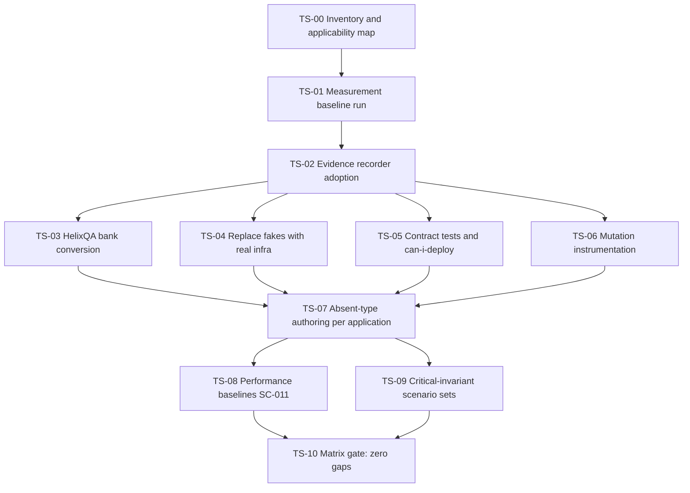
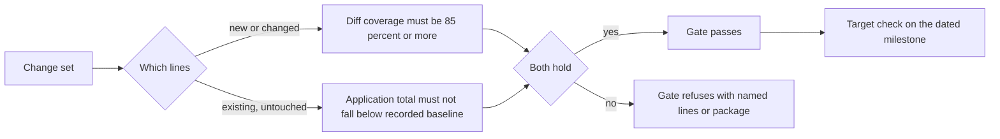
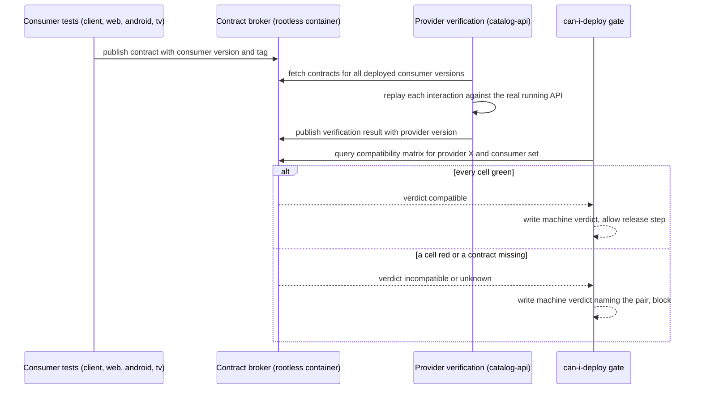
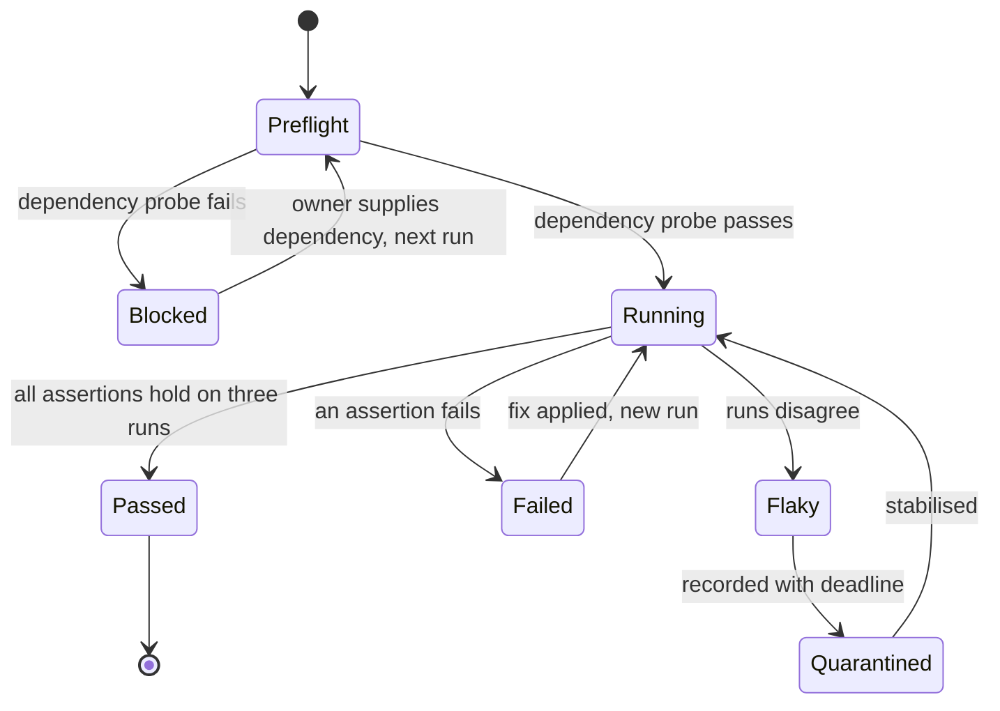
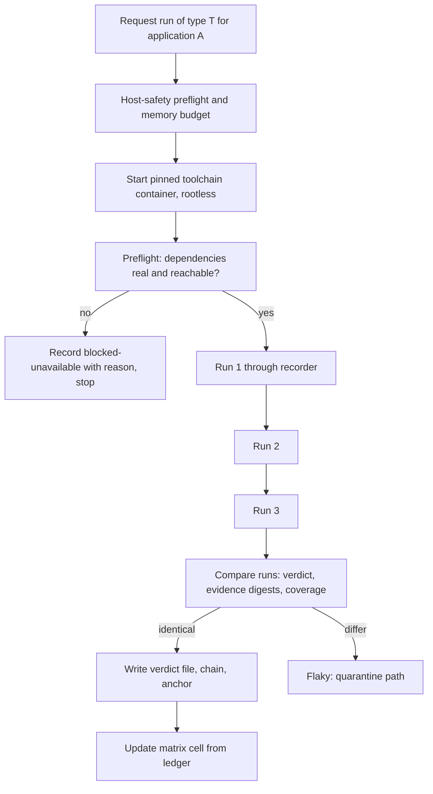
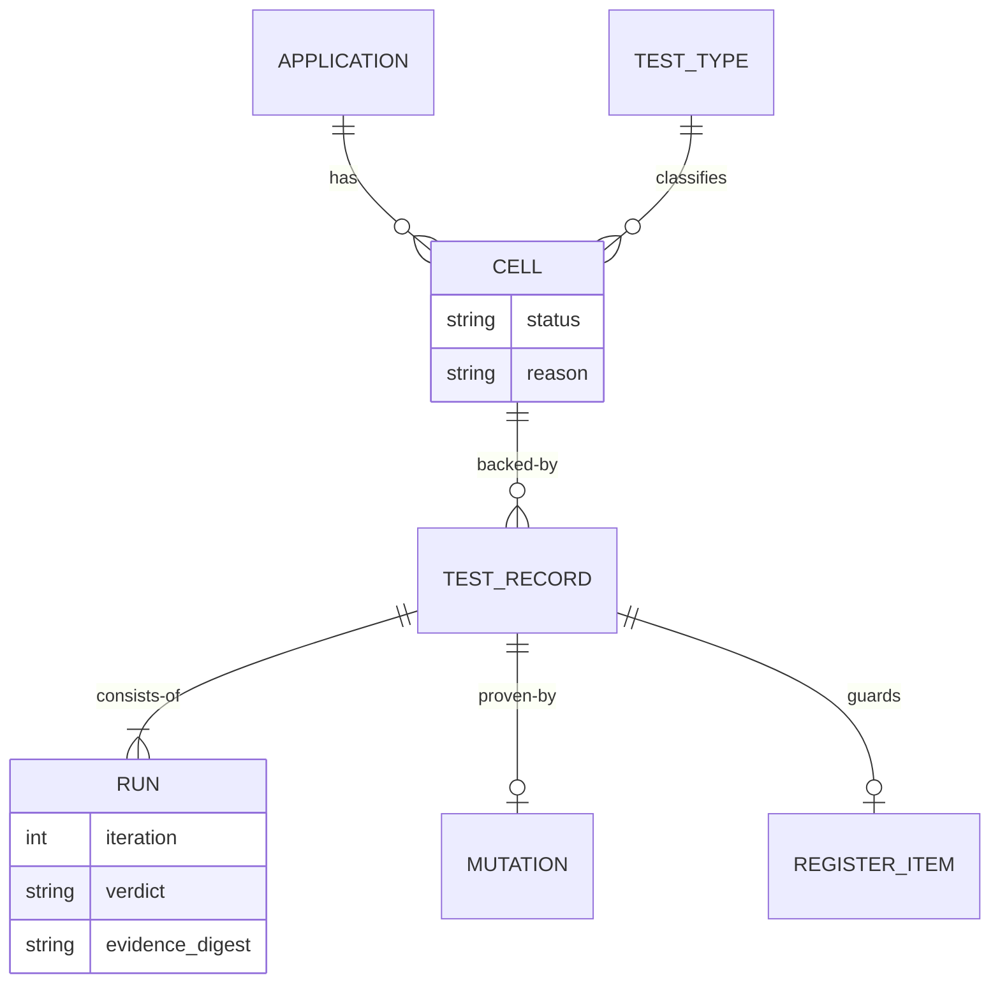

# 05 - Test Strategy and Coverage Matrix

| Field | Value |
|---|---|
| Revision | 3 |
| Created | 2026-10-03 |
| Last modified | 2026-10-03 |
| Status | draft (revision 3: coverage baselines and their run records move to `$EV/coverage_baseline/<app>/` and targets to `$EV/coverage_targets/<app>/targets.yaml`, because `evidence/coverage/` is ignored at any depth by `.gitignore:139` (docs/21 IC-38); new section 13.4 records the translation and i18n applicability per application (n/a with reasons and one open server-side item) and the accessibility (WCAG 2.2 AA) checks per user-facing application, owned by docs/21 WP-61; `\|` escaped in one table cell. Revision 2: catalog-web test-file count and submodule count stated precisely after independent review) |
| Feature | specs/001-full-project-audit-remediation |
| Spec requirements covered | FR-009, FR-010, FR-011, FR-016, FR-025 (and the test side of FR-008, FR-021, FR-022) |
| Success criteria covered | SC-004, SC-005 (and the test side of SC-003, SC-011) |
| Governance anchors | Constitution Principle II; appendix 11.4.27, 11.4.169, 11.4.224, 11.4.85, 11.4.244, 11.4.239, 11.4.248, 11.4.115, 11.4.135, 11.4.201, 11.4.245, 1.1 |
| Companion document | 06-determinism-and-evidence-framework.md (evidence schema, polarity, chaining) |

## Table of contents

1. Purpose, scope and reading guide
2. The test-type catalogue the constitution defines
3. Applications and shared components in scope
4. Measured current state (the real matrix)
5. Findings that change the plan
6. Closing every absent or partial cell (work packages)
7. Coverage phase-in per application (FR-011)
8. Mutation testing and the SC-005 sampling procedure
9. Contract tests on both sides and can-i-deploy (FR-016)
10. Real services, credentials and devices: the blocked-unavailable status (FR-025)
11. Flaky-test quarantine and protected regression specs
12. Execution model: containers, ordering, determinism, host safety
13. The matrix as a living, gated artifact
14. Decision records
15. Risks and open items
16. Traceability and acceptance evidence

---

## 1. Purpose, scope and reading guide

This document is the technical plan for the test side of the feature. It does not restate the
spec. It answers four questions: which test types exist, which of them exist today for each
application (measured, not assumed), how every missing one gets written, and how the coverage
floor, mutation checking, contract testing and real-dependency handling are applied.

Conventions used throughout:

- A cell is **present** when the artifact exists, runs against the real system where the type
  requires it, and I could verify at least one concrete file; **partial** when something exists but
  falls short of the constitution definition (for example an integration test that uses an
  in-memory database); **absent** when I found nothing by the search stated in section 4; **n/a**
  only where the type has no meaning for the application (for example DDoS for a static website
  build). An n/a still needs a recorded reason (11.4.27 B.1, honest SKIP-with-reason in the
  type-breadth ledger).
- Counts in section 4 were produced by read-only `find`/`grep` commands recorded in section 4.1.
  Nothing was executed on the host beyond file counting. `UNCONFIRMED:` marks anything I could not
  verify. Whether a test passes today is `UNKNOWN:` for every cell: this plan inventories
  existence, and the baseline run in section 7.2 supplies pass/fail and coverage.
- All commands that build, compile or run test suites use the containerised form (11.4.173,
  FR-021). Section 12.2 defines the wrapper. Host-side commands in this document are read-only.

## 2. The test-type catalogue the constitution defines

Principle II requires "every supported test type" to cover the whole codebase, with HelixQA and
Challenges fully incorporated. Appendix 11.4.27(B) enumerates fifteen types; 11.4.169 lists the same
closed set; 11.4.27(B.1) and 11.4.224(B.1) add a seven-type minimum floor (unit, integration, E2E,
full automation, security, performance and benchmark, anti-bluff). The fifteen are the unit of
accounting for SC-004.

| # | Type | What it must do here | Real system required | Oracle strategy (11.4.245) | Evidence class (11.4.226) |
|---|---|---|---|---|---|
| 1 | Unit | Isolated logic; mocks permitted only here | no | specified / derived / invariant | source |
| 2 | Integration | Real wired components, real database, real backing services booted by containers | yes | specified (schema, protocol) | runtime |
| 3 | E2E | Whole user flow on the target topology (API process, web in a browser, app on device) | yes | specified (acceptance scenario) | runtime / user-visible |
| 4 | Full automation | Orchestrated, re-runnable, no manual step, deterministic over repeated runs; one suite per feature x platform | yes | specified | runtime |
| 5 | Security | Authn/authz boundaries, injection, secret-leak scans, dependency CVEs, fuzzing | yes | specified / invariant | runtime |
| 6 | DDoS | Request-flood resilience at the advertised tier with rate-limit and back-pressure assertions | yes | specified (SLO / limit) | runtime |
| 7 | Scaling | Behaviour under linear load growth, replica add/remove | yes | specified (SLO) | runtime |
| 8 | Chaos | Process kill, network partition, disk full, clock skew, corrupted input; graceful degradation | yes | invariant | runtime |
| 9 | Stress | Sustained load above tier, bounded resource exhaustion, clean recovery | yes | invariant (no leak, no deadlock) | runtime |
| 10 | Performance | Latency, throughput, tail latency against recorded baselines | yes | statistical | runtime |
| 11 | Benchmarking | Micro and macro benchmarks with historical drift detection | yes | statistical | runtime |
| 12 | UI | Visual regression, DOM state and interaction flow on every target platform | yes | golden-master + vision oracle | user-visible |
| 13 | UX | Flow correctness, accessibility to WCAG 2.2 level AA, i18n where it applies, visual-cue order (section 13.4) | yes | specified (WCAG 2.2 AA success criteria, flow spec) | user-visible |
| 14 | Challenges | Per-feature Challenge scripts from the Challenges submodule with captured runtime evidence | yes | specified | runtime |
| 15 | HelixQA | Every written test bank executed; autonomous QA sessions in release gates | yes | specified + human (manual QA remains the final gate, 11.4.185) | user-visible |

Applicability is data, not opinion. The applicability map in section 13.2 lists, per application,
which of the fifteen types apply and gives the reason for each n/a. 11.4.27(B) states the default:
a CLI-only feature takes unit, integration, E2E, full automation, security, chaos, stress,
performance, Challenges and HelixQA; a UI feature adds UI and UX; a network service adds DDoS,
scaling and benchmarking.

Cross-cutting obligations that apply to all fifteen types and are therefore planned once, not per
type:

- Test-first with a RED observed on the broken artifact and a polarity switch (11.4.224 A,
  11.4.115). Detailed in document 06.
- At least 60% of assertions verify observable behaviour; mutation score at least 85%
  (Principle II).
- Determinism across three repeated runs (FR-010, SC-003, 11.4.50).
- Real systems everywhere except unit tests (11.4.27 A). The only permitted placeholders sit in
  unit-test sources.
- Every fixed defect gains a permanent regression guard (11.4.135) and every critical-invariant
  change carries failure-path scenarios (11.4.239, section 6.9).

## 3. Applications and shared components in scope

| Id | Component | Language / stack | Path | Test runner(s) found |
|---|---|---|---|---|
| A1 | catalog-api (backend) | Go 1.25.7 (`catalog-api/go.mod`), Gin, SQLite/SQL Cipher | `catalog-api/` | `go test`, bash suites, k6 |
| A2 | catalog-web | TypeScript, React, Vite | `catalog-web/` | vitest 4.0.x (`catalog-web/package.json`), Playwright |
| A3 | catalogizer-desktop | Tauri (Rust) + React | `catalogizer-desktop/` | vitest ^0.34, Playwright, `cargo test` |
| A4 | installer-wizard | Tauri (Rust) + React | `installer-wizard/` | vitest ^0.34, `cargo test` |
| A5 | catalogizer-android | Kotlin, Compose, Room, Retrofit | `catalogizer-android/` | Gradle unit, androidTest, JaCoCo |
| A6 | catalogizer-androidtv | Kotlin, Compose for TV | `catalogizer-androidtv/` | Gradle unit, androidTest, JaCoCo |
| A7 | catalogizer-api-client | TypeScript library | `catalogizer-api-client/` | vitest |
| A8 | Website | VitePress documentation site | `Website/` | none (`Website/package.json` has dev/build/preview only) |
| A9 | Build | Bash build framework | `Build/lib/*.sh` | none found |
| A10 | Go shared modules | 14+ Go submodules (Auth, Cache, Database, ...) | `submodules/<name>/` | `go test` in each |
| A11 | TS / React shared modules | api client, media types, WebSocket client, UI components, React feature modules | `submodules/*_ts`, `submodules/*_react`, `submodules/ui_components_react` | vitest (per module) |
| A12 | Governance and QA modules | constitution, challenges, helix_qa, containers, vision engine, others | `submodules/constitution`, `submodules/challenges`, `submodules/helix_qa`, ... | per module |
| A13 | Repository-level harness | bash suites, k6, HelixQA banks, Challenges | `scripts/`, `tests/`, `challenges/` | bash |

The submodule list comes from `.gitmodules` (44 modules: `grep -c '^\[submodule' .gitmodules` returned 44 on 2026-10-03; `grep -c 'path = '` agrees). Per-module test file counts are in
section 4.3. FR-006 requires findings in shared modules to be fixed in those modules and pushed to
their upstreams; the same applies to tests written for them (FR-006, FR-017). A12 modules vendor a
large `tools/opensource` tree inside `submodules/helix_qa`; that tree is third-party and falls under
the accepted-exception rule of FR-008 (status report only, no modification). Its test counts are
therefore excluded from every matrix cell and listed separately.

## 4. Measured current state (the real matrix)

### 4.1 How the numbers were produced

Read-only commands run from the repository root on 2026-10-03. They exclude `node_modules`,
`target`, `dist` and `.git`.

```bash
# Go
find catalog-api -name '*_test.go' | wc -l                       # 372
grep -rh '^func Test' catalog-api --include=*_test.go | wc -l     # 5367
grep -rl 'func Benchmark' catalog-api --include=*_test.go | wc -l # 18
grep -rl 'func Fuzz' catalog-api --include=*_test.go | wc -l      # 8
grep -rn 't\.Skip' catalog-api --include=*_test.go | wc -l        # 113
grep -rh '^//go:build' catalog-api --include=*_test.go | sort | uniq -c
# TypeScript
find catalog-web/src -name '*.test.ts*' -o -name '*.spec.ts*' | wc -l     # 138 = 137 test sources + 1 snapshot file (snapshots.test.tsx.snap)
find catalog-web/src \( -name '*.test.ts' -o -name '*.test.tsx' -o -name '*.spec.ts' -o -name '*.spec.tsx' \) | wc -l   # 137 (sources only)
grep -rnE '^\s*(it|test)\(' catalog-web/src | wc -l                        # 2369
find catalog-web/e2e -name '*.ts' | wc -l                                  # 39
# Kotlin
find catalogizer-android/app/src/test -name '*.kt' | wc -l                 # 69
grep -rn '@Test' catalogizer-android/app/src | wc -l                       # 1132
# Rust
grep -rn '#\[test\]' catalogizer-desktop/src-tauri | wc -l                 # 113
# HelixQA banks
grep -h '^- id:' challenges/helixqa-banks/*.yaml | wc -l                   # 1257 cases
grep -c 'TODO: Convert' challenges/helixqa-banks/*.yaml                    # 1178 markers
```

These are file and declaration counts, not executed-test counts. A `Test` function count says
how many exist, not how many assert something meaningful; section 5 and section 8 deal with that.

### 4.2 Per-application inventory

| Component | Unit | Other evidence found |
|---|---|---|
| A1 catalog-api | 372 `_test.go` files, 5367 `Test*` functions across `handlers` (40), `internal` (160), `repository` (26), `services` (27), `middleware` (18), `database` (16), `filesystem` (11), `challenges` (14), `tests` (42) | `catalog-api/tests/{integration,security,stress,performance,monitoring,benchmarks,automation,mocks}`; 94 non-test Go files in `catalog-api/challenges`; 18 files with benchmarks, 8 with fuzz functions |
| A2 catalog-web | 137 test source files in `src` (138 matches of `*.test.ts*`/`*.spec.ts*`, the 138th being the snapshot file `components/__tests__/__snapshots__/snapshots.test.tsx.snap`), 2369 `it`/`test` declarations | 39 Playwright files under `catalog-web/e2e` (including `visual-regression*.spec.ts`, `accessibility*.spec.ts`, `performance.spec.ts`, `websocket-realtime.spec.ts`); coverage thresholds 80 set in `catalog-web/vitest.config.ts` |
| A3 desktop | 27 test files, 393 declarations; 3 Rust files with 113 `#[test]` | 1 Playwright file under `catalogizer-desktop/e2e`; `vitest --coverage` script, no threshold file checked |
| A4 installer-wizard | 25 test files, 457 declarations; 7 Rust files with 110 `#[test]` | `installer-wizard/test-results.json` and `badges.json` exist; their provenance is `UNCONFIRMED:` |
| A5 android | 69 unit files, 1132 `@Test` (shared count covers both source sets) | 10 `androidTest` files (Room DAO tests, Compose test rule); JaCoCo task registered, no verification rule |
| A6 androidtv | 87 unit files, 1279 `@Test` | 1 `androidTest` file; `catalogizer-androidtv/challenges/helixqa-banks` directory present |
| A7 api-client | 8 test files, 286 declarations | no coverage configuration in `vitest.config.ts` |
| A8 Website | 0 | VitePress build only |
| A9 Build | 0 test files in `Build/` | `scripts/tests/run-all.sh` and `scripts/tests/lib` exist but are not tied to `Build/` by name; `UNCONFIRMED:` whether they test it |
| A13 harness | n/a | 11 bash full-automation suites in `scripts/testing/full_automation`; 16 k6 scripts in `tests/k6`; 15 HelixQA bank files in `challenges/helixqa-banks`; 5 Challenge scripts in `challenges/scripts` |

### 4.3 Shared-module test file counts

Counts of `*_test.go`, `*.test.ts`, `*.test.tsx` per module (same exclusions): assets 9, auth 15,
auth_context_react 2, cache 16, catalogizer_api_client_ts 7, challenges 127, collection_manager_react
5, concurrency 22, config 5, constitution 279, containers 323, dashboard_analytics_react 5, database
24, discovery 15, doc_processor 21, entities 5, event_bus 13, filesystem 11, helix_memory 35, lazy 5,
llm_orchestrator 37, llm_provider 103, llms_verifier 12, media 19, media_browser_react 5,
media_player_react 4, media_types_ts 4, memory 13, middleware 24, observability 18, rate_limiter 18,
recovery 10, replay_buffer 1, screen_diff 1, security 43, storage 31, streaming 23, superspec 0,
training_collector 1, ui_components_react 18, vision_engine 25, visual_regression 1, watcher 11,
websocket_client_ts 4. `helix_qa` reports 2552 but includes the vendored `tools/opensource` tree and
must be recounted without it (work package TS-00). Modules with 0 or 1 test files (superspec,
replay_buffer, screen_diff, training_collector, visual_regression) are candidate absent cells and
need a per-module applicability review, since some may be configuration or asset modules.

### 4.4 The matrix (applications x fifteen types)

Legend: P present, ~ partial, A absent, n/a not applicable (reason in section 13.2), ? could not
classify without reading more than the structural inventory (`UNCONFIRMED:`).

| Type | A1 api | A2 web | A3 desktop | A4 installer | A5 android | A6 tv | A7 client | A8 Website | A9 Build | A10 Go mods | A11 TS mods |
|---|---|---|---|---|---|---|---|---|---|---|---|
| 1 Unit | P | P | P | P | P | P | P | A | A | P (most) | P (most) |
| 2 Integration | ~ | ~ | A | A | ~ | A | A | A | A | ? | ? |
| 3 E2E | ~ | P | ~ | A | ~ | A | A | A | n/a | A | A |
| 4 Full automation | P | ~ | A | A | A | A | A | A | A | A | A |
| 5 Security | ~ | ~ | A | A | A | A | A | A | A | ? | A |
| 6 DDoS | ~ | n/a | n/a | n/a | n/a | n/a | n/a | A | n/a | ? | n/a |
| 7 Scaling | A | n/a | n/a | n/a | n/a | n/a | n/a | n/a | n/a | n/a | n/a |
| 8 Chaos | ~ | A | A | A | A | A | A | n/a | A | ? | A |
| 9 Stress | P | A | A | A | A | A | A | n/a | n/a | ? | n/a |
| 10 Performance | ~ | ~ | A | A | A | A | A | A | A | ? | A |
| 11 Benchmarking | ~ | A | A | A | A | A | A | n/a | A | ? | A |
| 12 UI | n/a | P | ~ | A | ~ | ~ | n/a | A | n/a | n/a | ~ |
| 13 UX | n/a | ~ | A | A | A | A | n/a | A | n/a | n/a | A |
| 14 Challenges | P | ~ | A | A | A | A | A | A | A | ? | A |
| 15 HelixQA | ~ | ~ | ~ | ~ | ~ | ~ | A | A | A | A | A |

Reading rules for the table: A1 integration is partial because the Go integration suite mixes real
HTTP servers with in-memory SQLite and mock providers (section 5, finding F-3). A1 E2E is partial
because only four files carry the `e2e_binary` build tag, and I did not verify that they run a
built binary against a database in a container (`UNCONFIRMED:`). A1 security is partial because
`catalog-api/tests/security` holds two files (`auth_security_test.go`, `injection_test.go`), one
tagged `catalog_security_real`, alongside gosec, nancy and trivy scripts under `scripts/`; running
them has not been verified. A1 stress is present (eleven files in `catalog-api/tests/stress` plus
k6 `stress_test.js`, `soak_test.js`, `spike_test.js`). A1 scaling is absent: no file whose name or
content addresses replica add/remove was found; `tests/k6/breakpoint_test.js` measures load growth
on one instance, which covers vertical load growth only and is classed performance. HelixQA is
partial for A1-A6 because banks exist but 1178 of their steps are non-executable placeholders
(finding F-1).

A2 full automation is partial: the catalog functional-matrix suites in
`scripts/testing/full_automation` drive the API, not the web UI. A3 E2E is partial: one Playwright
spec for a Tauri application of 27 test files. A5/A6 integration and E2E are partial: ten and one
androidTest files respectively, which cover Room DAOs and Compose rules, not the sign-in to playback
journey.

The `?` cells for A10 are real unknowns. Each shared Go module needs a one-time classification
(work package TS-00) that reads its test directory and assigns P/~/A per type, because 14+ modules
with differing responsibilities cannot be classified from counts.

## 5. Findings that change the plan

Each finding is a candidate register item (FR-001, FR-007). IDs here are working labels; the
register assigns the stable identifiers.

**F-1. HelixQA banks are largely prose, not executable.** In `challenges/helixqa-banks/` there are
1257 cases and 1178 `TODO: Convert to executable` markers (api comprehensive 313, api negative-paths
200, web comprehensive 164, android negative 97, web negative 92, android comprehensive 84, wizard
comprehensive 69, desktop comprehensive 67, cross-platform 51, desktop negative 25, wizard negative
16). The Android TV banks carry zero markers. A bank step whose `action` is a comment cannot execute;
a run of such a bank that reports PASS would be a bluff (11.4.1, 11.4.27). This is the largest
single test-type gap: the HelixQA cell for A1-A6 is "partial" at best, and the SC-004 claim cannot
be made until each marker is converted or the case is closed with evidence. `scripts/audit/
anti-bluff-scan.sh` already defines a finding kind for it (`PROSE_HELIXQA_ACTION`); its output on
the current tree is `UNKNOWN:` until run.

**F-2. Non-unit tests that use fakes (11.4.27 A violations to confirm).** `catalog-api/tests/mocks/`
holds FTP, NFS, SMB and WebDAV mock servers; `catalog-api/tests/integration/provider_pipeline_test.go`
defines `mockProvider`; nine test files under `catalog-api/tests` open `:memory:` SQLite; four
integration files use `httptest`. The repository already ships real containerised equivalents in
`docker-compose.test-infra.yml` (pure-ftpd, samba, bytemark/webdav, an NFS server, MinIO), but all
use floating `:latest` tags, a reproducibility defect against 11.4.246. Whether each in-memory
SQLite use is a violation depends on whether production uses SQLite: the API module lists
`go-sqlcipher`, so an in-memory SQL Cipher database may be a legitimate real engine. That is
`UNCONFIRMED:` and is resolved by DR-3 in section 14.

**F-3. Skips.** 113 `t.Skip` calls in catalog-api tests. Under FR-025 a skip is not an allowed
outcome for an unavailable dependency; those that guard on a missing service, credential or device
become `blocked-unavailable` (section 10). Those that guard on something else (platform, build tag)
need classification. `scripts/audit/anti-bluff-scan.sh` has `SKIP_WITHOUT_TICKET`.

**F-4. Coverage configuration is uneven and mostly absent.** Only `catalog-web/vitest.config.ts`
declares thresholds (80 for lines, functions, branches, statements, below the 85% floor for new
code). Desktop and installer have a coverage script and `@vitest/coverage-v8` at `^0.34.0` but no
threshold; the API client has none; Go coverage is collected by `scripts/track-coverage.sh`
(`go test ./... -coverprofile`, with `2>/dev/null || true`, which swallows failures and would record
0 on a broken run); JaCoCo tasks exist for both Android applications without a verification rule;
no Rust coverage tool is configured. The vitest major versions differ (4.x in web, 0.34 in
desktop, installer), which is a tooling consistency finding and a dependency finding for FR-017's
reporting.

**F-5. Mutation tooling is referenced but not instantiated in the main repository.** The
`mutation_ratchet_challenge.sh` script exists in three submodules and expects a `.go-mutesting.yml`
and `challenges/baselines/bluff-baseline.txt`; neither exists at the repository root. Principle II
claims a mutation score of at least 85% is enforced; in this repository the enforcement is not
instantiated (the claim is `UNCONFIRMED:` until DR-5 is carried out). No mutation tool is
configured for TypeScript, Kotlin or Rust.

**F-6. Contracts exist only in one direction and against an in-memory database.**
`catalog-api/tests/integration/contract_test.go` checks response shapes "defined in the TypeScript
API client" with a Gin engine over in-memory SQLite. There is a spec in `docs/api/openapi.yaml`, a
TypeScript client in `catalogizer-api-client` and Retrofit in the Android application, but no
consumer-driven contract, no broker, and no can-i-deploy gate were found (grep for `pact` finds only
unrelated UI strings in the web and TV sources).

**F-7. Playwright retries.** `catalog-web/playwright.config.ts` sets `retries: process.env.CI ? 2 :
0`. There is no CI (11.4.156), so the branch is inert locally, but a retry setting is the
rerun-until-green pattern 11.4.248 forbids and must be removed rather than left latent.

**F-8. Absent applications.** The Website and `Build/` have no tests; the Build framework is bash
and 11.4.224 requires an executing test for each bash script through its real invocation path
(not `bash -n`).

**F-9. Benchmark baseline is a single package.** `catalog-api/tests/benchmarks/baseline-2026-04-12.md`
records one package (middleware) with a GOMAXPROCS=3 setting; there are no baselines for the other
17 benchmark files, and none for other languages. SC-011 needs baselines for sign-in, browse, search,
playback start, scan and each client start-up (section 6.8).

**F-10. Evidence mechanism is per-script.** `ab_pass_with_evidence` is defined separately inside
several `full_automation` scripts (for example `catalog_aggregation_granularity.sh:139`,
`catalog_books_comics_resume.sh:177`). Duplicated helpers drift; the plan consolidates on one
recorder (document 06).

## 6. Closing every absent or partial cell (work packages)

FR-009 says an absent type is a finding fixed by writing it, not by recording a plan. Each work
package below is a unit of test writing with its oracle, evidence and exit criterion. Packages are
ordered by risk (11.4.132): most-reopened and critical-path first, and independent packages run in
parallel streams (11.4.103, 11.4.230) within the host ceiling.



### TS-00. Inventory and applicability map

Write `specs/001-full-project-audit-remediation/matrix/applicability.yaml` (format in section
13.2) from a reading of each application's responsibilities. Re-count `helix_qa` without
`tools/opensource`. Classify every shared module for the `?` cells. Output is data; no test code.
Exit: every one of the 15 types x every component has P, ~, A or n/a with a reason, and a script
re-derives the counts (section 13.1) so the matrix is regenerated, not hand-edited.

### TS-01. Measurement baseline

Run every existing suite once, containerised, to learn pass/fail and measure coverage
(section 7.2). Failures found become register items (FR-008). This package is the only way to
move the `?` and the "UNKNOWN:" markers; no later package begins from an unmeasured state.

### TS-02. Evidence recorder adoption

Replace the per-script `ab_pass_with_evidence` copies and add recorders to the Go, vitest, Gradle
and cargo runners per document 06. Without it, no later test can satisfy FR-010's "measured and
recorded" requirement.

### TS-03. Executable HelixQA banks (finding F-1)

For each of the 1178 markers choose one of three dispositions, recorded per case:

1. **Convert** to a real action the HelixQA runner executes (for API banks, an HTTP step with
   method, path, body and an assertion on status and a body field; for UI banks, a driven action
   with a vision or OCR assertion, 11.4.117, 11.4.193 forbids blind typing).
2. **Merge** into an existing real test when the case duplicates one (cite the test path).
3. **Close with evidence** when the case describes behaviour the product does not have
   (false positive) or cannot have (structurally impossible); FR-008 allows this only with evidence.

Bank cases whose target is a physical device or an external service are executed against the real
one or reported `blocked-unavailable` (section 10), never converted into a simulated step.
The conversion order follows risk: API negative-paths and comprehensive (513 markers, authentication
and authorisation edge cases first), then web (256), then the mobile and desktop banks.
Exit: the scan `PROSE_HELIXQA_ACTION` returns zero findings, and the HelixQA runner executes
every case in every bank with a recorded verdict per step (not only a session-level summary).

### TS-04. Replace fakes with real infrastructure (finding F-2)

- Retire `catalog-api/tests/mocks/*_mock_server.go` from non-unit suites. Real FTP, SMB, WebDAV, NFS
  and object-store servers already exist as compose services (`docker-compose.test-infra.yml`,
  `deploy/infra-compose-test.yml`). Pin each image by digest (11.4.246, 11.4.264) and replace
  `:latest`.
- `mockProvider` in `provider_pipeline_test.go` becomes either a recorded real call to the real
  metadata provider (FR-025: real on every run, blocked when the credential is absent) or the test
  moves into a unit test directory where a stub is legal.
- Keep `httptest` only where it hosts the system under test inside the test process and the system
  is the real handler stack; it is not a fake. The anti-bluff scan flag `GO_HTTPTEST_ABUSE` marks
  suspect uses.
- A pre-build scan (the existing `GO_MOCK_IN_INTEGRATION` kind) must fail the local gate on any
  remaining violation, with its paired mutation (plant a fake, the scan must fail).

Mock servers may remain under unit tests of the protocol client code only, where the unit boundary
is the client parser.

### TS-05. Contract tests and can-i-deploy

Section 9.

### TS-06. Mutation instrumentation

Section 8.

### TS-07. Authoring the absent cells per application

For each A in the matrix, write the types marked A. The plan names the shape of each, the oracle, the
real environment and the evidence class. A cell is closed only by a test that has a recorded RED on
a deliberately broken artifact (11.4.224 A, document 06 section 4) and a GREEN that holds across
three runs.

**A1 catalog-api.**
- Scaling: a compose profile that runs N replicas of the API behind the real reverse proxy used in
  `docker-compose.yml`, increases load in steps (k6 ramp, reuse `tests/k6/breakpoint_test.js` shape),
  adds and removes a replica mid-run, and asserts error rate and p95 against the SLO recorded in
  TS-08. Oracle: specified SLO. If SQLite is the only supported store and replicas cannot share it,
  the scaling type is classed n/a with the architecture reason, and the architectural decision is
  recorded as a finding for the owner (DR-6). `UNKNOWN:` which holds until the storage mode is read.
- Security: extend beyond two files: authentication matrix (login, refresh, expired, revoked,
  concurrent), authorisation per route, injection corpora for every input handler, secret-leak scan
  over built images, native fuzz targets for each parser (eight fuzz files exist), dependency CVE scan
  recorded as evidence (gosec, nancy, trivy already scripted).
- Chaos: `tests/integration/chaos_test.go` exists; add process kill during scan, database file
  corruption, disk full on the data volume, clock skew, and network partition to the SMB/FTP
  targets using the real servers; assert categorised errors and recovery (11.4.85).
- DDoS: k6 `ddos_ratelimit_test.js` exists; add the assertion matrix (limit hit returns the
  documented status, back-pressure engages, service recovers within a recorded bound).
- E2E: build the real binary inside the build container, start it with a real database, drive the
  user-visible flows over HTTP; replace "partial" by running all four `e2e_binary` files in the
  containerised runner and extending to scan-a-source and playback-start.

**A2 catalog-web.**
- Integration: component tests with a real API in a container, replacing mock service layers in
  non-unit suites (`catalog-web/src/__tests__/AuthFlow.integration.test.tsx` is the only
  integration-named file found; its API handling is `UNCONFIRMED:`).
- Full automation: a Playwright suite orchestrated by one runner, no manual step, driving every
  feature x platform cell of the feature ledger (the ledger itself is built in TS-00).
- Security: DOM XSS corpus, token storage checks, CSP headers, dependency audit.
- Chaos and stress: API loss mid-session, WebSocket disconnect/reconnect storms
  (`websocket-realtime.spec.ts` exists), large-library rendering.
- Performance and benchmarking: Lighthouse budgets (`catalog-web/lighthouserc.json` exists) plus
  Core Web Vitals recorded as evidence; microbenchmarks for hot components.
- Challenges: add a web Challenge entry per feature, executed by the Challenges runner.
- UX: expand accessibility checks (`accessibility-expanded.spec.ts` exists) and i18n.

**A3 desktop and A4 installer.** Both Tauri. Unit tests exist; Rust tests exist; integration, E2E,
full automation, security, chaos, stress, performance, UI, UX and Challenges cells are absent or
partial. Plan: a Playwright and WebDriver-driven suite against the built desktop binary (built in a
container, run in a container with a virtual display) for UI and E2E; the installer is driven
through its real installation steps on a clean container rootfs (11.4.108, 11.4.139) with captured
filesystem deltas as evidence; Rust integration tests in `src-tauri/tests`; security: command
surface review of the Tauri allow-list and fuzzing of IPC payload parsers; chaos: kill during
install, full disk, interrupted download. Screen automation uses the vision oracle (11.4.117); typing
is always preceded and followed by captured screen state (11.4.193).

**A5 android and A6 androidtv.** Instrumented (androidTest) and Compose UI tests on a real device or
emulator. Emulator tests run against the real API in a container; they are real-device tests under
FR-025 when the claim concerns hardware behaviour (TV remote, HDMI), so the emulator is allowed only
for types where the owner confirms equivalence (DR-4). Add: sign-in to playback journeys
(11.4.143), security (cleartext traffic, token storage, exported components), chaos (network loss,
process death and restore), stress (rapid navigation), performance (cold start, scroll jank via
Macrobenchmark), UI golden-master via host-side render (11.4.170: Roborazzi or Paparazzi class,
`UNCONFIRMED:` which fits this Gradle setup), Challenges and HelixQA banks (Android TV banks are
already executable, which makes TV the model for the Android conversion).

**A7 api-client.** Integration against the real API in a container (every endpoint method), contract
tests as consumer (section 9), security (token handling, error-message hygiene), chaos (timeouts,
partial responses), property-based round-trip tests over the generated types.

**A8 Website.** The site is a static VitePress build. Types that apply: unit (n/a, no logic found),
E2E and UI/UX (build in a container, render every page in three engines, check links, console
errors, responsiveness and SEO per 11.4.190), performance (Lighthouse), and the document tests of
FR-013/FR-014 (links, rendered diagrams). Security: header and dependency scan. DDoS, scaling,
chaos, stress, benchmarking: n/a with reason (static assets served by a CDN or file server; the
platform's concern is the host).

**A9 Build.** Executing tests for each of `orchestrator.sh`, `hash.sh`, `version.sh`, `common.sh`
through their real invocation paths (11.4.224 A), using a temporary sandbox directory, asserting
exit status, output and file effects; stress and chaos on the orchestrator (kill mid-build, disk
full in the build directory, concurrent invocations) because it coordinates builds.

**A10/A11 shared modules.** Per module, after TS-00 classification, write the missing types in the
module and push to its upstream (FR-006). The default minimum is unit, integration, security
(where the module handles input), Challenges and a benchmark for performance-critical ones. Modules
that are pure configuration or asset collections are classed n/a for the types that have no
meaning, with the reason.

### TS-08. Performance baselines (SC-011)

Define the critical operations list from the spec: browsing, search, playback start, scanning a
source, sign-in, and each client start-up. For each: a benchmark or k6 scenario, a recorded baseline
under `specs/001-full-project-audit-remediation/evidence/performance/`, a target set with the
owner (targets are decisions, not derived values; no number is proposed here), and a regression
gate that fails when a run is outside tolerance of the baseline. Statistical method: at least
10 samples per operation (a count to be validated by variance in the first run, `UNKNOWN:`), median
and p95 reported, comparison by a non-parametric test, with the reference-hardware identity
recorded in the evidence so a baseline from another machine is refused. Baselines are
per-hardware; the existing middleware baseline (GOMAXPROCS=3, one package) is the shape to
generalise.

### TS-09. Critical-invariant scenario sets (11.4.239)

Declare, as data, the work classes for this system: INTEGRITY (the database layer and migrations,
file moves/renames in storage operations), AVAILABILITY (sign-in, catalog browse, playback start),
SAFETY (none found; marked n/a with reason unless the desktop or installer touch hardware),
MONEY (none found). For each, write Given/When/Then failure-path scenarios before the fix of any
defect in that class (fresh, retry, same-key-different-payload where idempotency applies,
crash-in-the-middle). The status-write seam refusal (11.4.146 D3) is part of the register design
in the companion plan, not here; this package supplies the scenario sets it cites.

### TS-10. Matrix gate

Section 13.

## 7. Coverage phase-in per application (FR-011)

FR-011 requires: a recorded baseline per application; a dated target per application; no application
below its recorded baseline at any time; during phase-in, the 85% floor applied in full to new and
changed code, with existing code held to baseline and target. Appendix 11.4.224 adds that coverage is
necessary and never sufficient, requires an instrument for every language, and requires
an exclusion list fence. Brownfield adoption of the ratchet is the option the owner already chose
(per-application phase-in, spec Q3), so no further operator question is open on that point.

### 7.1 Instruments per language

| Language | Applications | Instrument | Granularity | Notes |
|---|---|---|---|---|
| Go | A1, A10 | `go test -covermode=atomic -coverprofile` + `go tool cover -func` | statement | `-covermode=atomic` is needed with `-race` and parallel tests; present in the toolchain (go 1.26.0 on the host) |
| TypeScript/React | A2, A3, A4, A7, A11 | vitest with `@vitest/coverage-v8` | line, branch, function, statement | align the major versions first (web 4.x vs 0.34); a threshold failure must fail the run |
| Kotlin | A5, A6 | JaCoCo (tasks already registered) | line, branch | add `jacocoTestCoverageVerification`; coverage of Compose lambdas can mislead; androidTest `.ec` files must be merged to include instrumented tests |
| Rust | A3, A4 (src-tauri) | `cargo llvm-cov` (preferred) or `cargo tarpaulin`; `UNCONFIRMED:` which installs cleanly in the build container | line, region | run in the containerised toolchain |
| Bash | A9, A13, all scripts | PS4 line trace: `PS4='+COV:${BASH_SOURCE##*/}:${LINENO}:' bash -x script` producing executed lines divided by executable lines; kcov/bashcov are absent on the host per 11.4.224 E and may be installed in the build container if a real tool is wanted | line only | no branch coverage; `set +x` regions and traps are unaccounted; state these limits in the report |
| SQL, YAML, Markdown | schemas, configs, docs | none | n/a | behavioural tests of consumers instead (11.4.224 A, behaviour-bearing config) |

A language with no working instrument fails the gate; it is never given an invented percentage
(11.4.224 E). Where a stage such as the Kotlin merged unit+instrumented coverage cannot be measured
on a given runner, the honest result is an `blocked-unavailable` or recorded shortfall, not a skipped
check.

### 7.2 Baseline measurement procedure

1. Run in the build container with the dependencies cached, one application at a time within the
   host ceiling (12.6 and 12.12; section 12.3 computes the parallelism).
2. Run each suite **three times** and compare (FR-010). A suite whose three runs disagree on pass
   or on measured coverage is flaky: it enters quarantine (section 11) and its coverage is measured
   from the stable subset.
3. Write a **baseline record** per application (schema below) to
   `$EV/coverage_baseline/<app>/baseline.json` (`$EV` = `specs/001-full-project-audit-remediation/evidence`) through the
   evidence recorder (document 06). The record is produced by the measuring harness, never edited.
   Revision 3: not `evidence/coverage/<app>/`, which the unanchored `coverage/` rule at `.gitignore:139` ignores at any depth,
   so a baseline there would never be committed (docs/21 IC-38; tasks.md T003 keeps `$EV/coverage/` ignored on purpose).
4. Commit the record. The baseline commit hash is the reference for the ratchet.

Baseline record, with illustrative values only (NOT EXECUTED; the numbers are placeholders):

```json
{
  "schema": "coverage-baseline/1",
  "application": "catalog-api",
  "instrument": "go-cover-atomic",
  "measured_at": "<utc timestamp from the run>",
  "source_commit": "<git sha of the measured tree>",
  "scope": {"include": ["./..."], "exclusion_list": "coverage/exclusions/catalog-api.yaml"},
  "runs": 3,
  "line_percent": "<measured>",
  "branch_percent": null,
  "per_package": {"handlers": "<measured>", "services": "<measured>"},
  "evidence": ["$EV/coverage_baseline/catalog-api/run-1.json", "run-2.json", "run-3.json"]
}
```

### 7.3 The two-part rule



- **New and changed code**: diff coverage at or above 85%, computed from the instrument's per-line
  output joined with `git diff` hunks of the change. A change that moves a line counts as changed.
- **Existing code**: the application-wide figure must never be lower than the recorded baseline.
  The comparison uses the same instrument, the same scope and the same exclusion list; a changed
  exclusion list resets nothing and is reviewed (below).
- **Ratchet**: when the application figure rises, the baseline moves up in a committed record with
  the evidence of the run that earned it. It never moves down except by the governed repeal
  described in 11.4.227 (A), which cites a removal reason.
- **Targets**: the dated target is a per-application commitment of the form "total coverage at least
  X by date D", where X and D are chosen by the owner after the baseline run and recorded in
  `$EV/coverage_targets/<app>/targets.yaml` (revision 3: a separate tracked folder, not a sibling of the baseline record). This plan sets the method and the deadline mechanism, not
  the numbers or dates, since a baseline does not exist yet (the figures for the final target are
  `UNKNOWN:` and are not invented here). Method for proposing X: the constitution's aim is close
  to 100% with a floor of 85%; the proposal to the owner is the lowest-effort line that reaches 85%
  by the final milestone using the per-package gap listing from the baseline, ordered by risk
  (critical paths first), with intermediate milestones at equal intervals between baseline and
  final date. Intermediate dates and values are the owner's decision.
- **Exclusion fence** (11.4.224 E): exclusions only for generated code, vendored third-party and
  non-shipping fixtures, each entry justified in a checked-in list; first-party exclusions need a
  tracked item naming the plan to bring them into scope. An unlisted exclusion voids the measured
  figure.
- **Numerator rule** (11.4.224 amendment): only red-capable tests contribute to the measured
  numerator. A test counts toward coverage only if it has a recorded failing-first run or a paired
  mutation observed to fail it; assertion-free tests are rejected by construction. This is how
  coverage is prevented from being gamed (the founding measured fact: a line-granular instrument
  counted an `if/else` line covered while the `else` branch never ran). Implementation: the coverage
  gate joins the coverage output with the mutation or RED evidence index (document 06 section 5);
  a line covered only by tests with no red-capability flag is counted as uncovered for the gate
  (and reported separately so effort can be directed there).

### 7.4 Per-application phase-in plan

| Application | Instrument | Existing config | First actions |
|---|---|---|---|
| A1 api | Go cover | `scripts/track-coverage.sh` (swallows errors) | rewrite the collector to fail on error; collect per package; record baseline; wire diff coverage |
| A2 web | vitest v8 | thresholds 80 in `vitest.config.ts` | raise threshold to the floor for new code through the diff gate; keep application baseline |
| A3 desktop, A4 installer | vitest v8 (`^0.34.0`) + Rust | script present, no threshold | upgrade vitest to the repository's major; add thresholds from baseline; add cargo coverage |
| A5, A6 | JaCoCo | task present, no verification | add verification rule from baseline; merge androidTest `.ec`; instrumented runs need a device (FR-025) |
| A7 client | vitest v8 | none | add provider and thresholds |
| A8 Website | n/a executable code | none | document exclusion rationale; measure link and render checks instead |
| A9 Build and bash scripts | PS4 trace | none | build the trace harness as a script with its own tests (11.4.224 A applies to the harness) |
| A10/A11 | per language | per module | measure each module; push the record to the module's repo |

The coverage gate itself is an executable artifact and is under 11.4.224 (A): its test-first
artifact is a paired mutation (lower a figure, add an uncovered changed line, add an
assertion-free test; each must make the gate fail), per section 8.

## 8. Mutation testing and the SC-005 sampling procedure

SC-005: zero accepted tests that still pass when the behaviour they protect is deliberately broken,
measured on a reviewer-drawn sample. FR-010 requires every test to be shown to fail when the
behaviour is broken. Principle II requires a mutation score of at least 85%. Two layers are needed:
automated mutation analysis as a bulk instrument and the human-drawn sample as the acceptance test.

### 8.1 Instruments

| Language | Tool | State in repository | Plan |
|---|---|---|---|
| Go | go-mutesting (referenced by `mutation_ratchet_challenge.sh` in three submodules) | config `.go-mutesting.yml` and baseline `challenges/baselines/bluff-baseline.txt` absent in the main repository | create both; `UNCONFIRMED:` the maintained fork and Go 1.25 compatibility, to be established in the build container |
| TypeScript | Stryker Mutator | none | add for api-client, web (selected packages), shared TS modules; vitest runner plugin |
| Kotlin | PIT (pitest) with the Gradle and Kotlin plugins | none | `UNCONFIRMED:` Compose and coroutine compatibility; scope to logic layers (repositories, view models) |
| Rust | cargo-mutants | none | `UNCONFIRMED:` run time on Tauri crates; scope to non-UI modules |
| Bash | purpose-built mutation harness | none | a script that applies a table of operators (flip `-eq`/`-ne`, delete a command, swap `&&`/`\|\|`, change an exit code) to a copy of the script and runs its test; included in the Build framework tests |

Mutation analysis is expensive; it runs on changed files per change and in full on a schedule
(per package, in parallel streams) in the build container within the memory ceiling. Equivalent
mutants are documented, not hidden (11.4.107 point 10 says behaviourally-equivalent mutants are
expected not to flip).

### 8.2 The paired mutation per test (11.4.224 A, 1.1)

Every new test ships with the specific mutation that must flip it, recorded in the test's evidence
record (`mutation: {operator, location, result: "caught"}`). The mutation is the revert of the
fix commit for a regression test (11.4.115 F), never only a deletion of the strings the test looks
for (a tautological mutation is refused). The recorder (document 06) rejects a test record that
lacks a caught mutation.

### 8.3 Sampling procedure for SC-005

1. The reviewer, not the author, draws a random sample. The draw is reproducible: sample size n and
   a seed recorded; the population is the list of test cases in the evidence ledger; the sampler is a
   script run by the reviewer's own tooling (document 06 section 6 describes the independence
   requirement). Sample size: `UNKNOWN:` to be set by the owner and reviewer; a proposal in the
   absence of data is that n be large enough that a defect rate of 2% would be seen with high
   probability, with the formula and the resulting n recorded, not asserted here.
2. For each sampled test the reviewer chooses and applies a mutation the author did not write (the
   11.4.194 (6)(d) rule: author-written mutations are necessary but not sufficient), runs the test
   three times, and records caught or survived.
3. A survivor is a finding: the test is weakened or rewritten, and the draw is repeated with a fresh
   seed over the corrected population until a sample yields zero survivors (SC-005 requires zero).
4. Evidence: the ledger entries, the mutation diffs and the three-run outputs, chained and anchored
   (document 06 sections 7 and 8).

The reviewer-written mutation also serves as the independent check on the automated scores: a
tool-reported 85% with surviving reviewer mutations is a sign that the operators are too weak, and
the discrepancy is itself a finding.

## 9. Contract tests on both sides and can-i-deploy (FR-016)

### 9.1 Contract inventory

| Contract | Provider | Consumers | Definition | Test status |
|---|---|---|---|---|
| REST API v1 | catalog-api (`/api/v1/...`) | catalogizer-api-client (TS), catalog-web, catalogizer-desktop, installer-wizard, Android (Retrofit), Android TV, scripts and HelixQA banks | `docs/api/openapi.yaml` (currency vs routes: `UNCONFIRMED:`) | provider-side shape test only (`catalog-api/tests/integration/contract_test.go`) |
| WebSocket `/ws` | catalog-api `wsHandler` (`catalog-api/main.go:1084`) | catalog-web (`websocket-realtime.spec.ts`), clients using the shared WebSocket client module | message types in code; no schema file found | none found |
| Database schema | migrations in `catalog-api/migrations` (2 files found), plus schema created in code | the API only (internal) | `UNCONFIRMED:` where the full schema lives | covered by integration tests only |
| Shared module APIs | each Go and TS submodule | catalog-api, web and client applications | Go module APIs, TS exports | per-module unit tests; no consumer tests |
| Auth tokens (JWT claims) | catalog-api | all clients | code | partial in security tests |
| Persisted client data (Room schema, local storage keys) | Android apps, web | their own upgrade paths | Room schema JSON | upgrade tests `UNCONFIRMED:` |

### 9.2 Approach and decision

Decision record DR-1 (section 14): adopt consumer-driven contracts with the Pact family for the
REST API and WebSocket messages, hosted on a self-hosted broker in a rootless container, with
OpenAPI validation as the provider-side schema check; reject (a) spec-only validation without
consumer contracts and (b) a hand-built matrix. Reasons: the constitution describes the
consumer-driven pattern with a broker matrix and can-i-deploy (11.4.244); a spec-only approach cannot
detect a consumer using an undocumented field; building our own broker re-implements a maintained
tool, against 11.4.74 (extend, do not reimplement). Constraint: Pact libraries for each consumer
language (TypeScript, Kotlin/JVM, Rust, Go provider verifier) must exist and fit; this is `UNCONFIRMED:`
until each is tried in the build container. If a consumer language lacks a library, the fallback is a
contract file generated from that consumer's recorded real HTTP traffic against a real provider
and replayed by the provider verifier; the file format is Pact JSON either way, so the broker and
gate are unchanged.



### 9.3 Requirements derived from 11.4.244

- Tests exist on **both** sides: consumer tests produce the contract; the provider verifies every
  deployed consumer's contract against the real API (the real handler stack on a real database in a
  container, not an in-memory engine and not a mock).
- A red cell blocks; there is no warn-and-continue. A **missing** contract is a first-class refusal
  reason (11.4.201): a consumer in the inventory without a published contract makes the gate
  refuse, so adding a client forces writing its contract.
- A patch-version bump that breaks a contract is a mislabelled release; the gate compares the version
  delta against the contract result.
- The backward-compatibility window is declared data: current plus N previous minor versions,
  the value of N set by the owner; consumers outside the window are listed for an owner decision.
- The broker runs as a rootless container started by the containers module (11.4.76, 11.4.161); its
  image is pinned by digest; its database is on a volume the evidence tree records.
- The gate produces an evidence record (document 06 section 3) naming provider version, consumer
  versions, matrix cells and verdict, and is itself guarded by paired mutations: break a consumer
  expectation (the gate must go red), delete a contract (must refuse), and run a compatible change
  (must not fire, the golden-false case of 11.4.201 (1)).

### 9.4 Shared-module contracts

For each Go module consumed by catalog-api, the consumer-driven contract is a compile and behaviour
test in the consuming repository's CI-free local gate that exercises the module's public API; for
the TS and React modules, contract files record the exported component props and client methods.
Changes to a submodule that fail the consumer's test are fixed in the module (FR-006) before the
pointer moves (11.4.26 step 7).

## 10. Real services, credentials and devices: the blocked-unavailable status (FR-025)

### 10.1 The rule

A test of behaviour that depends on an external service, a credential or a physical device runs
against the real one on every run. When the dependency is unavailable the test is reported
`blocked-unavailable` with the exact reason. That status counts as **not passing**, is **never** a
pass or a skip, is **never** replaced by a simulation, and the feature is not complete until the
owner supplies the dependency. The status is not a failure of the product, so it is not a defect
count; it is an open requirement on the owner. This resolves the tension between the owner's rule
and the governance's honest-skip allowance (spec assumption): the governance's `SKIP-with-reason`
becomes a `blocked-unavailable` record that blocks completion.

### 10.2 State machine for a test run



Rules:

- The **preflight probe** is itself a recorded evidence entry: it names the dependency, the probe
  command and result, and its own timestamp (never a cached answer). It uses the real dependency's
  identity (for a device, the stable serial or id, 11.4.111; for a service, a request that proves
  the correct service identity; for a credential, an authenticated call, without printing it).
- `Blocked` carries a **closed reason code**: `service_unreachable`, `credential_absent`,
  `credential_rejected`, `device_absent`, `device_wrong_identity`, `device_unauthorised`,
  `geo_restricted`, `quota_exhausted`, `licence_absent`, `host_resource_unavailable`. Each reason
  has a human-readable detail field, `blocked_detail`, with the observed values (credential
  variable *names* only, never values, 11.4.10).
- `blocked` is one of the four ledger verdicts (`pass`, `fail`, `blocked`, `error`; docs/06 §3.1
  rule 10), not an extension of pass/fail: the ledger entry has `verdict: "blocked"`,
  `blocked_reason`, `blocked_detail` and `counts_as: "not_passing"` (all four are required together
  by `contracts/evidence-record.schema.json` revision 3; `blocked_detail` and `counts_as` are
  refused on any other verdict); the matrix cell is `blocked`, and a non-empty set of blocked cells
  prevents SC-004 and completion (FR-008 treats blocked findings as open). A GREEN entry can never
  be `blocked` (the schema requires `pass` for GREEN); a run whose precondition probe failed before
  a GREEN is recorded as a blocked attempt, not as a GREEN repetition.
- The status never degrades to skip: the reporter has no `skipped` outcome for dependency absence,
  and a test that returns before asserting (an early return) is detected by the anti-bluff scan
  (`GO_NO_ASSERT`).
- No simulation may substitute: if the dependency is real-service X, the test file must not
  contain the stub; the pre-build scan fails on a fake in a non-unit test (TS-04).
- Owner-supplied dependencies are listed in `specs/001-full-project-audit-remediation/matrix/
  dependencies.yaml` (the one place the owner edits to unblock): service endpoint, credential
  variable name, device serial, with the tests that need each and the date supplied. Nothing secret
  is stored there.

### 10.3 Dependency inventory (from the repository)

| Dependency | Needed by | Real form available locally? | Reason code if absent |
|---|---|---|---|
| Real FTP, SMB, WebDAV, NFS, object-store servers | A1 protocol integration, chaos, E2E | yes, `docker-compose.test-infra.yml` containers (digest pin needed) | `service_unreachable` |
| External metadata providers (for example a movie database) | A1 provider pipeline tests, full automation | no, needs the provider's network and API key (credential names `UNCONFIRMED:`) | `credential_absent`, `service_unreachable`, `quota_exhausted` |
| Firebase (analytics, distribution) | `scripts/firebase_*`, Android apps | needs the owner's project; MCP tools exist for it | `credential_absent` |
| Physical Android and Android TV devices (stable serials) | A5, A6 instrumented, HelixQA, recording | no | `device_absent` |
| Desktop display for Tauri UI tests | A3, A4 | a virtual display in a container is real for rendering; hardware-specific claims need hardware | `host_resource_unavailable` |
| Large real media libraries | scan, performance | owner supplied path | `service_unreachable` |

### 10.4 Existing skips

The 113 `t.Skip` calls and any skip in the other suites are classified: (a) dependency absence becomes a
`blocked-unavailable` preflight; (b) platform or build-tag skip becomes a build-tag selection with
the excluded set listed in the matrix as n/a with reason; (c) a skip with no stated cause is a
finding. Skipping without an annotated reason is already caught by `SKIP_WITHOUT_TICKET`.

## 11. Flaky-test quarantine and protected regression specs

11.4.248 treats flakiness as the silent decay vector of the whole programme. FR-010 and SC-003 make
determinism a hard requirement, so this plan does not treat a retry as acceptable.

- **Detection**: the three-run comparison of every measuring run (document 06 section 5). A test
  whose verdict or evidence digest differs between runs is Flaky. Also the aggregator flags the
  rerun-after-red pattern in history (11.4.248 A).
- **Quarantine**: the test moves to `tests/quarantine/<application>/` (path is project data), a
  tracked item with a stabilisation deadline is opened (set by the owner; mechanism here), the
  blocking suite runs without it, and the quarantine count is a visible metric. A deadline past is
  an owner decision or a violation. The ideal quarantine is empty (11.4.50).
- **No retries**: remove `retries` from Playwright configuration, no `-count` loops that pass on any
  success, no `flaky` plugin. A passing rerun of a failed test is not a pass.
- **Protected specs**: regression tests that codify a fixed defect carry `[PROTECTED-SPEC: ATM-NNN]`
  in the language's comment form, referencing the register item. The tag is applied per test, not
  as a blanket. The project's reviewer rules (CODEOWNERS equivalent) require the designated
  reviewer for any change that touches a tagged test or the `regression/` path, so a weakening is
  visible and reviewable, not prevented. CODEOWNERS is a host-platform concept; a local
  equivalent is a pre-push check (the pre-push gate script is `scripts/hooks/pre-push-gate.sh`;
  its use and the constitution rule 11.4.234 on hooks must be reconciled by the repository
  workflow owner, `UNCONFIRMED:`).
- Causes of flakiness found by the three-run comparison are investigated to root cause (11.4.102)
  and fixed; they are not hidden by quarantine. Quarantine only isolates while the investigation
  runs.

## 12. Execution model: containers, ordering, determinism, host safety

### 12.1 Where tests run

Per the repository rules, builds and heavy tests run inside rootless containers (11.4.161, 11.4.173,
FR-021). The existing scaffolding is `scripts/build_in_container.sh`, `scripts/container-build.sh`,
`scripts/lib/auto-container.sh`, `scripts/lib/container-runtime.sh`, `docker-compose.test.yml`
and `docker-compose.test-infra.yml`. This plan reuses them and extends them only where a gap is
found (11.4.74). Podman is installed on the host; Docker is not found. The constitution says build
containers are distributed to a remote build host and artifacts brought back (11.4.173 text in
the project CLAUDE.md); whether a remote host is configured in this environment is `UNCONFIRMED:`
(`deploy/MIGRATION_thinker_local.md` suggests a prior migration).

### 12.2 The wrapper

A single wrapper script `scripts/test-in-container.sh <application> <type> [args]` (to be written
test-first; existing build helpers are the base) that: starts the application's toolchain image
(pinned by digest), mounts the source read-only and a results directory read-write, applies memory and
CPU limits computed by the host-safety helper, runs the command through the evidence recorder, and
writes artifacts under `evidence/`. The wrapper is the only entry point used by the plan, so a
direct host-side test run is detectable.



### 12.3 Parallelism and host limits

Parallelism is `min(nproc, floor(budget_gb / per_job_peak_rss_gb))` where the budget is at most 60%
of RAM (12.6) and thread headroom is checked with `ulimit -u` before scaling (12.12). The per-job peak
RSS comes from the first baseline run's resource record (11.4.24), not a guess. Streams that touch
the same physical device are partitioned to a single owner (11.4.119). Mutation runs are the most
memory-hungry and run alone.

### 12.4 Order of execution (risk-first)

11.4.132: highest-risk first, then the rest. For this feature: (1) most-reopened and most recently
changed code; (2) authentication and authorisation, data integrity, playback path; (3) the
suites with real devices (scheduled with the owner); (4) everything else. The risk order is
computed from the register's reopen counts once it exists (companion plan) and from git history of the
changed files; until then it is the order above.

### 12.5 Commands (containerised, NOT EXECUTED)

```bash
# Go unit coverage of one package tree, three runs, evidence recorded
scripts/test-in-container.sh catalog-api unit -- \
  go test -race -covermode=atomic -coverprofile=/out/cover.out ./handlers/...

# Web unit with coverage
scripts/test-in-container.sh catalog-web unit -- npx vitest run --coverage

# Web E2E against the real API stack
scripts/test-in-container.sh catalog-web e2e -- npx playwright test --reporter=json

# Kotlin unit coverage
scripts/test-in-container.sh catalogizer-android unit -- \
  ./gradlew testDebugUnitTest jacocoTestReport

# Rust (src-tauri)
scripts/test-in-container.sh catalogizer-desktop unit -- cargo llvm-cov --lcov --output-path /out/lcov.info

# Bash line coverage (Build framework)
scripts/test-in-container.sh build unit -- scripts/bash-coverage.sh Build/tests/run.sh
```

`scripts/test-in-container.sh` and `scripts/bash-coverage.sh` do not exist; they are deliverables of
TS-02 and TS-07 and are written test-first. The tool names and flags above are the intended
interface, not verified against this repository (`UNCONFIRMED:`).

## 13. The matrix as a living, gated artifact

### 13.1 Source of truth

The matrix is generated, not written. A generator script reads (a) the applicability map, (b) the
evidence ledger (document 06) and (c) the repository, and emits `matrix/coverage-matrix.json` plus
`matrix/coverage-matrix.md`. A cell is `present` only when the ledger contains, for that
application and type, at least one test record whose verdict is PASS with three identical runs, a
caught mutation, and an evidence class matching the type's required class (section 2); `partial`
when records exist but fewer than the applicability map requires; `absent` when none; `blocked`
when the preflight record says so; `n/a` when the map says so with a reason.



### 13.2 Applicability map format and initial content

```yaml
# matrix/applicability.yaml  (NOT EXECUTED; initial proposal for owner review)
schema: applicability/1
types: [unit, integration, e2e, full_automation, security, ddos, scaling, chaos, stress,
        performance, benchmarking, ui, ux, challenges, helixqa]
applications:
  catalog-api:
    applies: all
    na:
      ui: "no user interface"
      ux: "no user interface"
  catalog-web:
    na:
      ddos: "client application; load tests target the API"
      scaling: "client application"
      benchmarking: "no benchmarkable server logic; frontend performance covered by performance type"
  website:
    na:
      ddos: "static site; platform concern"
      scaling: "static site"
      chaos: "static site"
      stress: "static site"
      benchmarking: "static site"
  build:
    na:
      ddos: "not a service"
      scaling: "not a service"
      ui: "no user interface"
      ux: "no user interface"
```

Every `na` needs a reason and is itself reviewed (an n/a that removes an applicable type is a
bluff of the SC-004 kind). Applicability is owner-reviewable data (11.4.35).

### 13.3 The gate

`SC-004` is the gate's acceptance test: the generator exits non-zero when any applicable cell is
not `present`, with a list naming the cell and the missing evidence. A blocked cell makes the gate
fail (FR-025), which keeps completion tied to the owner supplying the dependency. The gate's own
test-first artifact is a paired mutation set: remove a ledger record (cell must flip), forge a
verdict line (the chain check must fail, document 06), mark an applicable type n/a without a reason
(the gate must refuse), and a golden-false case (a complete matrix must pass).

### 13.4 Cross-cutting applicability: translation and i18n, accessibility (revision 3)

Two concerns cut across the fifteen types and had no explicit applicability record. Both are recorded here as data for the applicability map (section 13.2) under a `cross_cutting` key, and both are owned by docs/21 WP-61 (absent test types) for the authoring and by WP-70 for the final matrix gate.

**Translation and i18n.** Measured on 2026-10-03 by reading the manifests and resource trees: no internationalisation library is declared in `catalog-web/package.json`, `catalogizer-desktop/package.json`, `installer-wizard/package.json` or `Website/package.json` (a case-insensitive search for `i18n`, `intl`, `locali`, `lingui`, `formatjs` returns 0 in each); `catalogizer-android` and `catalogizer-androidtv` have only the default `res/values` folder and no locale-qualified `values-*` folder. The server has `catalog-api/internal/handlers/localization_handlers.go` with its test file; document 01 §3.1 records that these handlers register on a `mux.Router`, and whether they are reachable in the running server is `UNCONFIRMED:`. The translation mandates (11.4.255 HelixTranslate pipeline, 11.4.256 independent per-language review, 11.4.237 context-and-spirit review) bind translated content, and none was found.

| Application | Translation and i18n | Reason and evidence | What would change it |
|---|---|---|---|
| A1 catalog-api | open | `localization_handlers.go` exists; reachability `UNCONFIRMED:` | if the localization routes are reachable and serve translated strings, i18n tests (locale negotiation, fallback, encoding) and the translation mandates apply to those strings; WP-30 settles reachability |
| A2 catalog-web | n/a | no i18n library declared (manifest read; whether every component string is English was not measured) | adding a second language makes the translation pipeline and per-language review mandatory, and UX gains locale tests |
| A3 desktop, A4 installer | n/a | no i18n library in either manifest | same as A2 |
| A5 android, A6 tv | n/a | only `res/values`, no `values-<locale>` folder | a `values-<locale>` folder makes translation review mandatory and adds locale and right-to-left layout checks |
| A7 api-client | n/a | a library with no user-facing strings | none |
| A8 Website | n/a | no locale configuration found in its manifest | a translated site version |
| A9 Build, A10, A11, A13 | n/a | no user-facing text; A11 React modules render text supplied by A2 | an A11 module that ships its own strings |

Every n/a above is reviewable (an n/a that hides an applicable concern is the SC-004 bluff of section 13.2), and the A1 row stays open until WP-30 records the reachability result.

**Accessibility (WCAG 2.2 level AA).** The UX type (section 2, row 13) is closed for a user-facing application only when its accessibility checks pass. Automated tools find part of the WCAG failures, so every application also gets a scripted manual walkthrough whose result is recorded as evidence (human oracle, section 2), and neither part substitutes for the other. Document 18 T9-A (checklist) and T9-B (TV focus restoration) are the sources of the items below.

| Application | Automated checks | Manual or scripted checks | Platform specifics |
|---|---|---|---|
| A2 catalog-web | axe-core rules inside the existing Playwright suites (`accessibility*.spec.ts` exist), Lighthouse accessibility category | keyboard-only walkthrough of sign-in, browse, search, playback start; focus visible and not obscured; target size; dragging alternatives; consistent help | colour contrast in both themes |
| A3 desktop, A4 installer | axe-core against the Tauri webview pages through the planned Playwright and WebDriver suite | keyboard-only walkthrough of every installer step and the desktop main flows | native dialogs (`plugin-dialog`) checked by hand, `UNCONFIRMED:` tool support |
| A5 android | Android accessibility checks in instrumented tests (Accessibility Test Framework class; exact library `UNCONFIRMED:` until the build container resolves it) | TalkBack walkthrough of sign-in to playback on a real device or an owner-approved emulator (DR-4) | content descriptions, touch target size, font scaling |
| A6 tv | the same instrumented checks where the TV components support them | D-pad walkthrough: focus order, focus always visible, and focus restored to the originating item after returning from a detail screen (a test that fails when focus is lost, document 18 T9-B) | 10-foot readability, remote-only navigation |
| A8 Website | axe-core and the Lighthouse accessibility category per page in three engines (11.4.190) | keyboard walkthrough of navigation and search | none |
| A11 React modules | axe-core in component tests with a real DOM | none beyond A2, which renders them | none |

Each automated check ships with its paired mutation (for example, remove an `aria-label` or the focus-restoration call; the check must fail), and each manual walkthrough is recorded with screen captures and the vision oracle where the UI is not introspectable (11.4.117, 11.4.193). A1, A7, A9, A10 and A13 have no user interface: accessibility is n/a for them with that reason.

Applicability-map entries added by this section (NOT EXECUTED; proposal for owner review):

```yaml
cross_cutting:
  translation_i18n:
    catalog-api: {status: open, reason: "localization handlers exist; reachability UNCONFIRMED (WP-30)"}
    catalog-web: {status: na, reason: "no i18n library declared"}
    catalogizer-desktop: {status: na, reason: "no i18n library"}
    installer-wizard: {status: na, reason: "no i18n library"}
    catalogizer-android: {status: na, reason: "only res/values"}
    catalogizer-androidtv: {status: na, reason: "only res/values"}
    website: {status: na, reason: "no locale configuration"}
  accessibility_wcag22_aa:
    applies: [catalog-web, catalogizer-desktop, installer-wizard, catalogizer-android, catalogizer-androidtv, website, ts-react-modules]
    na: {catalog-api: "no user interface", catalogizer-api-client: "library", build: "no user interface"}
```

## 14. Decision records

| Id | Decision | Alternatives rejected | Reason | Open input |
|---|---|---|---|---|
| DR-1 | Consumer-driven contracts (Pact family) with a self-hosted broker and can-i-deploy | Spec-only validation; custom broker | 11.4.244 pattern; avoid re-implementation | confirm library fit per consumer language |
| DR-2 | Coverage per application with diff gate (85%) and baseline ratchet | single global figure | spec Q3 resolved per-application | final targets and dates by owner after baseline |
| DR-3 | In-memory SQLite is real only if it is the production engine; otherwise replace | blanket ban on in-memory DB | the engine is `go-sqlcipher`; semantics, not memory-vs-disk, determine realism | read how production opens the database; owner confirm |
| DR-4 | Emulators allowed for UI logic tests only when the owner agrees equivalence; hardware claims need devices | emulators everywhere | FR-025 and 11.4.136 (real content, real path) | owner confirm which test types may use emulators |
| DR-5 | Instantiate go-mutesting config and baseline at the repository root | rely on submodule script | the script reads root-relative files that do not exist | tool compatibility with Go 1.25 |
| DR-6 | If the API cannot run multiple replicas against its storage, scaling type is n/a with a recorded architectural finding | invent a shared-database shim | an invented test of an unsupported topology is a bluff | read storage mode |
| DR-7 | `blocked-unavailable` as a third verdict, counted not passing, never skip | treat as skip (governance allowance) | owner's stricter rule, spec FR-025 | none |
| DR-8 | One evidence recorder for all languages | per-script helpers | drift (finding F-10) | none |
| DR-9 | No retries anywhere | retries on infrastructure flake | 11.4.248, FR-010 | none |

## 15. Risks and open items

| Risk | Effect | Mitigation |
|---|---|---|
| The measured baseline reveals many failing suites | scope grows; each failure is a finding (FR-008) | triage by risk; run baseline early (TS-01) |
| Mutation tooling does not support Go 1.25, Compose or Tauri | cannot reach the 85% instrument | fall back to the bash mutation harness pattern plus manual reviewer mutation; record the limit honestly (11.4.6) |
| Real-device tests cannot run in the environment | many cells stay `blocked` and completion waits | declare early which devices are needed (`dependencies.yaml`); owner supplies |
| Contract libraries missing for a consumer language | contract tests incomplete | recorded-traffic fallback in Pact JSON (section 9.2) |
| Host memory ceiling slows mutation and Gradle runs | long wall time | schedule alone, offload to the remote build host (11.4.173) |
| Tests rewritten in bulk by agents become assertion-poor | SC-005 breach | reviewer-written mutations and the numerator rule (sections 7.3, 8.3); 60% observable-assertion check by the anti-bluff scan |
| Test count inflates without value | cost, noise | push-tests-down rule (11.4.169): lower-level test preferred, redundant high-level test removed |

Open items for the plan owner: DR-3, DR-4, DR-6 inputs; final coverage targets and dates;
sample size for SC-005; the library fit of section 9.2; whether the remote build host is
configured (12.1); the origin of `installer-wizard/test-results.json`.

## 16. Traceability and acceptance evidence

| Requirement | Plan sections | Acceptance evidence |
|---|---|---|
| FR-009 | 2, 4, 6, 13 | generated matrix with zero absent applicable cells; each closed cell lists a ledger record |
| FR-010 | 6 (TS-02), 7.2, 8, 11, 12, doc 06 | three-run comparison records; mutation caught per test; no retry configuration |
| FR-011 | 7 | per-application baseline records under `$EV/coverage_baseline/<app>/`, targets files under `$EV/coverage_targets/<app>/`, ratchet gate passing with mutation-proved gate |
| FR-016 | 9 | broker matrix verdict record; both-side tests; missing-contract refusal test |
| FR-025 | 10 | preflight records; `blocked` verdicts with reason codes; no `skipped` outcome in the reporter; dependency file |
| SC-004 | 13 | generator exit code and matrix with zero gaps |
| SC-005 | 8.3 | reviewer sample records: seed, sample, mutation diffs, three-run outputs, zero survivors |
| SC-003 (test side) | doc 06 | RED/GREEN pair per fixed item across three runs |
| SC-011 (test side) | 6 TS-08 | baselines and regression gate records |

Completion claims drawn from this plan cite ledger records, never this document (FR-022, SC-012).
Anything marked `UNCONFIRMED:` or `UNKNOWN:` above is to be resolved by a measured run, not by
argument.
