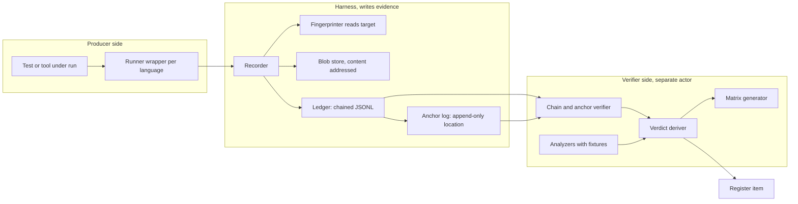
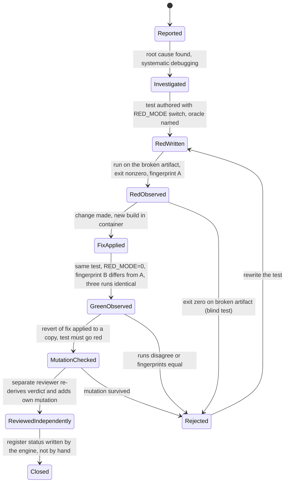
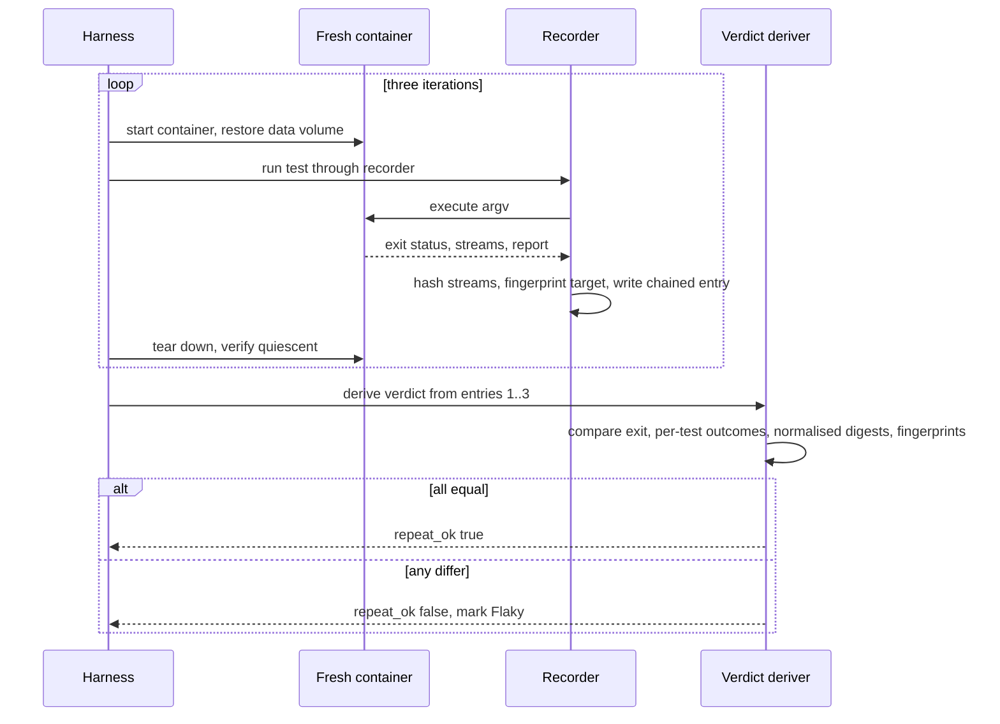
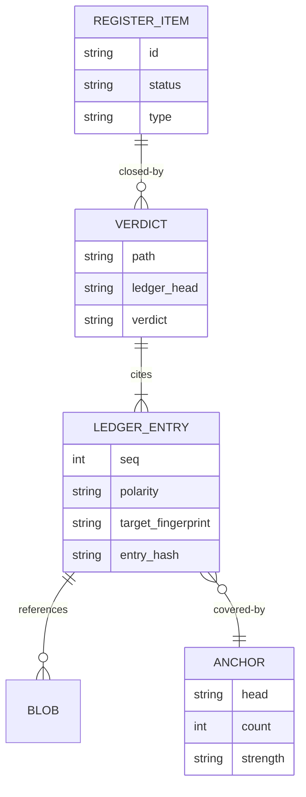
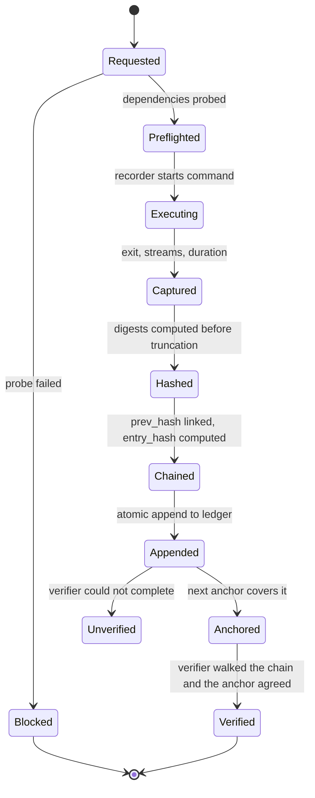
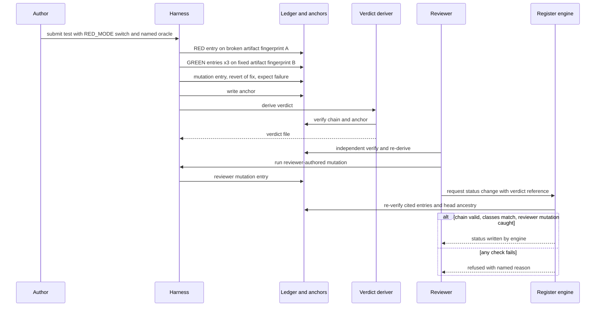

# 06 - Determinism and Evidence Framework

| Field | Value |
|---|---|
| Revision | 8 |
| Created | 2026-10-03 |
| Last modified | 2026-10-03 |
| Status | draft (revision 8: section 11 layout re-measured against tasks.md rev 5 by script (every `$EV/` path of tasks.md reduced to its top-level entry): `disk/` added, and the phase exit records name their current writers (P0 T095, P1 T158, P2 T218, P5 T454, P6 T555), the P2 record included; revision 7: section 11 layout lists every `$EV` top-level entry that tasks.md rev 4 writes (register, verify, exceptions, qa, web, android, audit, docs, sbom, reproducibility, release_digests, retest, flake_ledger.jsonl, pack, the phase exit records) with the rule for new ones and the ignored names to avoid; revision 6: path consistency with tasks.md, section 11 layout uses `$EV`, coverage folders renamed `coverage_baseline/` and `coverage_targets/`, review, checkpoint, commit-push and deferral records listed; revision 5: fourth independent review, a `REOPEN` entry must be a genuine failure (schema), a REOPEN cuts the cycle only after a cycle that derived PASS and only for the same test, a GREEN on the REOPEN fingerprint or an earlier-cycle GREEN fingerprint is refused, register and ledger reopen counts must agree; revision 4: third independent review, cycle rule in section 4.2 step 7 and the section 13 deriver, `REOPEN` entries, scenario re-run hygiene; revision 3: second review, `test_fingerprint`, RED-before-GREEN, distinct iterations; revision 2: first review, exit-status verdict rules) |
| Feature | specs/001-full-project-audit-remediation |
| Spec requirements covered | FR-010, FR-022, FR-008 (evidence side), FR-021 (verification side), FR-023 (review evidence) |
| Success criteria covered | SC-003, SC-005, SC-012 (and the evidence side of SC-002, SC-004) |
| Governance anchors | 11.4.5, 11.4.69, 11.4.107(10), 11.4.115 (F, G, H), 11.4.146(D3), 11.4.201(6)-(12), 11.4.207, 11.4.226, 11.4.240, 11.4.249, 11.4.262, 11.4.268, 11.4.50, 11.4.135 |
| Companion document | 05-test-strategy-and-coverage-matrix.md |

## Table of contents

1. Purpose and design stance
2. Architecture of the framework
3. The evidence record (schema and rules)
4. Verdict files and the RED-before / GREEN-after polarity procedure
5. Repeat comparison: three identical runs
6. Fingerprints of the target artifact
7. Tamper-evident chaining
8. Anchors
9. Control needles
10. Analyzer self-validation: golden-good, golden-bad, negative control
11. Storage layout and linkage from the register
12. Worked examples: shell, Go, TypeScript, Kotlin
13. Proof of concept: a small evidence recorder (executed on a scratch path)
14. State machines and sequences
15. Producer, oracle, gate, verifier separation
16. Failure modes of the framework itself
17. Rollout plan and acceptance tests
18. Decision records, risks, open items
19. Traceability

---

## 1. Purpose and design stance

The spec says a claim is true only when machine-produced evidence from the current work supports it
(FR-022, SC-012). The constitution turns that into a set of mechanisms: machine-written verdicts, a
failing run on the broken artifact before the fix and a passing run after (11.4.115), repeats that
agree (11.4.50), fingerprints read from the target, a tamper-evident record (11.4.268), control
needles for every "nothing found" (11.4.201 (7)), and analyzers shown to fail on bad input
(11.4.107 (10)). This document turns those clauses into a concrete framework a person can implement
without further design: a record schema, file layout, procedures, and a working recorder small
enough to read in one sitting.

Stance, stated once because the rest follows from it:

- Evidence is **written by the harness**, never by the person or agent whose work it supports
  (11.4.240, 11.4.249). The recorder runs the command; the author does not type results.
- A verdict is **derived from records by a program**, not asserted. The program is itself tested
  (section 10).
- A statement of "found nothing" is evidence only after a **control needle** shows the instrument
  could have found it through the same path (11.4.201 (7)(b)).
- What the framework proves is bounded (11.4.6). It proves what ran, with what arguments, against
  which artifact, and what came out, and that the record was not altered after the fact. It does not
  prove the test was well chosen; the oracle choice (11.4.245) and the reviewer's mutations
  (document 05 section 8) cover that.

Words like fixed, passing or verified are used in plans only to describe the target state; in
reports they require a ledger reference (11.4 covenant, CLAUDE index item 1).

## 2. Architecture of the framework



Components:

| Component | Responsibility | Where |
|---|---|---|
| Recorder | runs one command, captures argv, cwd, start time, exit status, duration, stream digests; writes one ledger entry | `tools/evidence/evrec` (shell first, optional Go later) |
| Runner wrappers | adapt Go, vitest, Gradle, cargo, bash runners so their structured output goes through the recorder | `tools/evidence/wrap-*.sh` |
| Fingerprinter | computes the target artifact identity from the target itself at run time | part of the recorder, per target class |
| Blob store | holds raw stdout, stderr, reports, screenshots by sha256 | `$EV/blobs/` (`$EV` = the evidence directory, section 11) |
| Ledger | append-only JSONL of entries, each carrying the hash of the previous | `$EV/ledger.jsonl` |
| Anchor log | periodic record of head hash and entry count, written to a location the producer can append to but not rewrite | `$EV/anchors.jsonl` plus the chosen strength (section 8) |
| Verifier | walks the whole chain, checks anchor agreement, refuses when it cannot complete | `tools/evidence/verify` |
| Verdict deriver | computes PASS or FAIL for an item from ledger records by rules in section 4 | `tools/evidence/verdict` |
| Analyzers | OCR, screenshot diff, log reader, coverage reader; each has fixtures | `tools/evidence/analyzers/` |
| Matrix generator | document 05 section 13 | `tools/evidence/matrix` |

Reuse rather than reinvent (11.4.268 last paragraph, 11.4.74): the constitution already provides a
content-addressed atomic store (continuum, 11.4.207) in `submodules/constitution`. The shell
recorder in section 13 demonstrates the logic; the production implementation MUST reuse that chaining
primitive if it satisfies the properties below, and MUST NOT stand up a divergent second chain. This
is recorded as decision DR-E1 and needs a read of the submodule before implementation
(`UNCONFIRMED:` its API and fit).

## 3. The evidence record (schema and rules)

### 3.1 Required fields

11.4.115 (H) lists the fields every command-execution entry must carry: start timestamp, working
directory, argument list as a genuine list (never a shell-joined string), exit status and
wall-clock duration; an entry missing any of the five or with an unparseable value is refused. The
framework adds identity, polarity, target fingerprint, stream digests and the chain links.

**Superseded draft.** The block below is the revision-1 draft and is kept only to show where the
contract started. The normative schema is `contracts/evidence-record.schema.json` (`ev/1`), which
adds `MUTATION` polarity, `closes_item`, `redacted`, `container_image_digest`, `test_fingerprint`,
`blocked_detail`, `counts_as`, the conditions for rules 1, 4, 5, 6, 10, 11 and 12 below, and the
pairing of `blocked_reason` with `verdict: blocked`. Where the two differ, the contract file wins.

```json
{
  "$schema": "https://json-schema.org/draft/2020-12/schema",
  "$id": "ev/1",
  "type": "object",
  "required": ["schema","seq","item","polarity","iteration","started_at","cwd","argv",
               "exit_status","duration_ms","stdout_sha256","stderr_sha256",
               "target_fingerprint","prev_hash","entry_hash"],
  "properties": {
    "schema": {"const": "ev/1"},
    "seq": {"type": "integer", "minimum": 1},
    "item": {"type": "string", "description": "register item id, exact stable id"},
    "polarity": {"enum": ["RED","GREEN","BASELINE","PREFLIGHT","PROBE","NEEDLE","ANALYZER_FIXTURE","MUTATION","REOPEN"]},
    "iteration": {"type": "integer", "minimum": 1},
    "started_at": {"type": "string", "format": "date-time"},
    "cwd": {"type": "string"},
    "argv": {"type": "array", "items": {"type": "string"}, "minItems": 1},
    "exit_status": {"type": "integer"},
    "duration_ms": {"type": "integer", "minimum": 0},
    "stdout_sha256": {"type": "string", "pattern": "^[0-9a-f]{64}$"},
    "stderr_sha256": {"type": "string", "pattern": "^[0-9a-f]{64}$"},
    "target_fingerprint": {"type": "string", "pattern": "^[0-9a-f]{64}$"},
    "target_class": {"enum": ["go_binary","web_bundle","container_image","android_package","tauri_app",
                              "shell_script","doc_export","remote_service"]},
    "target_ref": {"type": "string", "description": "stable locator of the fingerprinted target"},
    "prev_hash": {"type": "string", "pattern": "^[0-9a-f]{64}$"},
    "entry_hash": {"type": "string", "pattern": "^[0-9a-f]{64}$"},
    "verdict": {"enum": ["pass","fail","blocked","error"]},
    "blocked_reason": {"enum": ["service_unreachable","credential_absent","credential_rejected",
      "device_absent","device_wrong_identity","device_unauthorised","geo_restricted",
      "quota_exhausted","licence_absent","host_resource_unavailable"]},
    "precondition_provenance": {"enum": ["observed","constructed"]},
    "oracle": {"type": "object", "properties": {
        "strategy": {"enum": ["specified","derived","metamorphic","golden_master","invariant","statistical","human"]},
        "independent_of_sut": {"const": true}}},
    "mutation": {"type": "object", "properties": {
        "operator": {"type": "string"}, "location": {"type": "string"},
        "author": {"enum": ["test_author","reviewer"]}, "result": {"enum": ["caught","survived"]}}},
    "evidence_class": {"enum": ["source","artifact","runtime","user_visible"]},
    "resource": {"type": "object", "properties": {"peak_rss_kb": {"type": "integer"}, "cpu_ms": {"type": "integer"}}},
    "stream_digest_before_truncation": {"const": true}
  },
  "additionalProperties": false
}
```

Rules enforced by the verifier, each one a testable check:

1. **Five-field completeness** (11.4.115 H1): a record missing start time, cwd, argv list, exit
   status or duration is refused, as is one where `argv` is a string.
2. **Digest before truncation** (11.4.115 H2): the stream digest covers the full stream; stored blobs
   may be truncated for readability but the digest is of the original. The recorder computes the
   hash before any trimming and the verifier recomputes it from the full blob when the blob is kept
   in full.
3. **Recorder reconciliation** (11.4.115 H3): the recorder's record count and the count of commands
   the runner reports it executed must agree; a runner that reports N commands and a ledger with M
   entries fails the check (this catches commands run outside the recorder).
4. **`oracle` required for test records** (11.4.245): a test record without a named oracle strategy
   and an independence flag is refused.
5. **`mutation` required for a closing record** (document 05 section 8.2): a RED/GREEN pair that
   closes a register item must carry a caught mutation.
6. **`precondition_provenance` is `observed` for any record that closes a defect** (11.4.115 G): a
   `constructed` precondition may produce hardening evidence but never a defect closure.
7. **`evidence_class` matches the defect layer** (11.4.226): a user-visible defect cannot close on
   `source` or `artifact` class; the class is proven by fields (a runtime class needs a target
   fingerprint read from the target and a runtime observable; a grep transcript of source can never
   satisfy a user-visible class, the "anti-echo" rule).
8. **Secrets**: argv and streams are scanned for credential patterns before the entry is written; a
   hit redacts the value and records `redacted: true`; credential *names* may appear, values never
   (11.4.10).
9. **Time**: timestamps are UTC from the host clock; a clock-skew test (document 05 chaos for the
   recorder) shows the effect; duration uses a monotonic source where available. In the proof of
   concept (section 13) a portability defect appeared: `date +%s%3N` on the scratch host printed
   nanoseconds as `1791025500480844442`, so durations were computed from that value and were wrong
   (a measured "16366215 ms" for a 19 ms command). The fix was to use `%N` and divide. This is
   the class of instrument error 11.4.201 (7)(c) names ("the path is part of the instrument"), so
   the recorder's self-test in section 10 includes a known-duration command whose duration must fall in
   a band.
10. **Verdict is tied to exit status and polarity** (added in revision 2 after an independent review
   found `RED` with `verdict: pass` and `GREEN` with exit 0 and `verdict: fail` both schema-valid).
   The recorder derives `verdict` from `exit_status`, never from the author:
   `pass` if exit is 0; `fail` if exit is 1..125 (the test ran and an assertion failed);
   `error` if exit is 126 (not executable), 127 (not found), 128 or above (killed by a signal) or
   negative (a runtime reporting a signal as a negative number): the command produced no test
   outcome. `blocked` is written by the harness when a precondition probe failed. Polarity rules:
   a `RED` entry is never `pass` (a RED is the test FAILING on the broken artifact, "fail as
   expected"); a `GREEN` entry is always `pass`; a `MUTATION` entry whose mutation was caught is
   `fail`, one that survived is `pass`. `RED`, `GREEN` and `MUTATION` entries carry `target_class`
   (section 6) and `target_ref` so that "same test, different artifact" is checkable. These rules
   are JSON Schema conditions in `contracts/evidence-record.schema.json`, tested on 5 valid and 9
   invalid samples including the two review cases (contracts/README.md); revision 3 of the schema
   was tested on 5 valid and 16 invalid samples.
11. **Same test means same test bytes** (added in revision 3 after a review ran a RED whose
   `check.sh` had been replaced by a typo'd copy for the RED run only: argv unchanged, exit 1,
   `fail`, and the revision-2 deriver printed `PASS`). Every `RED`, `GREEN` and `MUTATION` entry
   with verdict `pass` or `fail` carries `test_fingerprint`: the sha256 of the file argv[0] resolves
   to, combined with the sha256 of every declared test source (`EV_TEST_SOURCES` in the proof of
   concept), computed before the command runs. The deriver requires one identical
   `test_fingerprint` across all RED and GREEN entries of a closure. Honest scope: this proves the
   same test bytes ran; it does not prove the RED failed for the defect's reason (see section 4.2
   step 7). When argv[0] is an interpreter (`bash -c`, `go test`, `npx vitest`) the interpreter
   binary is hashed, so the test sources MUST be declared, otherwise the fingerprint says nothing
   about the test.
12. **A `MUTATION` entry carries its `mutation` object** (operator, location, author, result). A
   `MUTATION` entry without it is refused by the schema (revision 3; it was valid before).
13. **A `REOPEN` entry is a genuine failure** (revision 5, after a review appended a passing `REOPEN`
   to a cycle that had a failing GREEN, which the revision 4 deriver then discarded). A `REOPEN`
   records the observed recurrence: `verdict: fail` and `exit_status` 1..125 are required by the
   schema; a run that passed, a harness error (126, 127, signals) or a blocked probe observed no
   recurrence and is not a `REOPEN`. Which `REOPEN` entries cut a fix cycle is a cross-entry rule of
   the deriver (section 4.2 step 7).

### 3.2 What counts as one entry

One command execution is one entry. A test runner that runs 300 tests in one process is one entry for
the process plus a structured report blob; the verdict deriver parses the report with an analyzer
(section 10) to extract per-test results, each tied back to the entry by digest. Per-test records are
needed only for tests that close a register item or sit in a matrix cell (document 05), so the ledger
does not need an entry per assertion.

## 4. Verdict files and the RED-before / GREEN-after polarity procedure

### 4.1 Verdict file

A verdict file is a separate machine-written artifact derived from ledger entries by the verdict
deriver. It is never typed. Format:

```json
{
  "schema": "verdict/1",
  "item": "<register id>",
  "derived_at": "<utc>",
  "ledger_head": "<entry_hash at derivation time>",
  "red": {"entries": [1], "fingerprint": "<sha256 of broken artifact>", "all_genuine_fail": true},
  "green": {"entries": [2,3,4], "fingerprint": "<sha256 of fixed artifact>", "all_zero": true,
            "stdout_digests_identical": true},
  "test_fingerprint": "<sha256 of the test bytes, identical for every RED and GREEN entry>",
  "red_before_green": true,
  "fingerprints_differ": true,
  "mutation": {"operator": "revert-fix-commit", "author": "reviewer", "result": "caught"},
  "verdict": "PASS"
}
```

`all_genuine_fail` means every RED entry exited 1..125 with `verdict: fail` (a genuine test
failure); it replaces the revision-1 name `all_nonzero`, which contradicted the rule that exits 126,
127 and 128+ are harness errors and never count as a RED.

### 4.2 Procedure (11.4.115, 11.4.224 A)



Steps in detail:

1. **Investigate to root cause** before anything else (FR-008, 11.4.102). The investigation may
   produce a characterising RED (11.4.146 STEP 1) but never a fix.
2. **Write the test with a single polarity switch.** One source file; an environment variable
   `RED_MODE` (default `1` = assert the defect is present). In Go the same test reads
   `os.Getenv("RED_MODE")`; in TypeScript `process.env.RED_MODE`; in Kotlin an instrumentation
   argument; in shell a variable. **Which branch is recorded as what (revision 2, rule 10):** the
   `RED_MODE=1` branch passes (exit 0) while the defect is present; it is the characterising
   reproduction of step 1 and is recorded with polarity `BASELINE`, never `RED`. The `RED` entry is
   the `RED_MODE=0` branch (the assertion of correct behaviour, the oracle) run on the pre-fix
   artifact, where it must fail; `GREEN` is the same command on the fixed artifact. RED and GREEN
   therefore share one argv and one environment, which the deriver checks (step 7). Revision 1 said
   "default 1 means a fresh run on a broken build produces the RED", which contradicted step 4 and
   was removed.
3. **Name the oracle** in the test (a tag in the source and in the record, section 3).
4. **Run RED on the pre-fix artifact.** The harness fingerprints the target (section 6) and records
   an entry with polarity RED. Required outcome: exit status 1..125 with `verdict: fail`, and the
   failure text matches the defect, not a harness error. Exit 126 (not executable), 127 (command not
   found) and signal exits (128 and above) are harness errors (`verdict: error`) and never count as a
   RED; the deriver rejects them (executed, section 13.4). A RED produced by a different copy of the
   test than the GREEN (for example a typo'd test used only for the RED run) is rejected by the
   `test_fingerprint` comparison of step 7 (executed, section 13.4, case `typo_red`). A RED that
   fails for an unrelated reason with the SAME test bytes (an environment fault, a flaky
   dependency) is not caught by any fingerprint; the production deriver additionally checks that
   the failure signature named in the test appears in the stream (not implemented in the section 13
   proof of concept). If the run
   exits zero on the broken artifact the test is blind (11.4.115 honest boundary): the item
   is either not a defect (close with negative evidence, 11.4.7) or the test is wrong.
5. **Precondition provenance.** The RED entry records `precondition_provenance`. `observed` means
   the precondition was traced to the reporter's sequence or a captured failure (11.4.199, 11.4.115
   G). `constructed` is allowed but the resulting fix is hardening and the register item stays open
   (FR-008; this is how 11.4.115 G protects against closing on a synthetic repro).
6. **Apply the fix, build in the container (FR-021), verify on a clean target.**
7. **Run GREEN** with `RED_MODE=0` on the fixed artifact, three iterations (section 5). "Same test"
   is checked, not assumed: every RED and GREEN entry of the closure must have the identical `argv`,
   `cwd`, `target_class`, `target_ref` and `test_fingerprint` (the polarity switch travels in the
   environment, not in argv); every RED entry must precede every GREEN entry in the ledger
   (max RED `seq` < min GREEN `seq`); the GREEN entries must carry at least three distinct
   `iteration` values; and no GREEN fingerprint may equal a RED fingerprint; identical fingerprints
   mean the fix was never deployed (11.4.115 F). A RED from a different command, against a different
   target locator, from different test bytes, or recorded after the GREENs is rejected (executed,
   section 13.4). What this proves and what it does not: it proves that the same command and the
   same test bytes ran against the same target locator, first on one artifact (failing) and later
   on a different artifact (passing three times). It does not prove that the RED failed because of
   the defect rather than for another reason that disappeared between the runs (environment,
   timing, a dependency); that residual is covered by the failure-signature check (step 4,
   production deriver) and by the mutation in step 8, not by the polarity pair.
   **Cycle rule (revision 4, tightened in revision 5).** A closed item that is reopened starts a new
   fix cycle. The reopen is recorded in the ledger as an entry with polarity `REOPEN`: the same test
   (identical `argv`, `cwd`, `target_class`, `target_ref`, `test_fingerprint`) run on the deployed
   target, failing for real (`verdict: fail`, exit 1..125, rule 13), with the deployed target's
   fingerprint recorded. The deriver walks the item's `REOPEN` entries in ledger order and treats one
   as a CUT only when it is such a genuine failure of the same test AND the cycle it ends (the entries
   since the previous cut) itself derives PASS. Any other `REOPEN` (one that passed, a harness error,
   another test, or one appended after an incomplete or failing cycle) is not a cut: it is listed in
   `reopens_ignored` and the entries before it stay in the evaluated cycle, so a `REOPEN` cannot
   discard a failing GREEN (executed, section 13.4, cases `launder`, `reopen_pass`,
   `reopen_after_fail`). Only entries after the last cut are evaluated. In the new cycle no GREEN may
   run on a fingerprint that a cutting `REOPEN` showed failing, or that was GREEN in an earlier cycle
   (`fingerprints_new`; cases `green_on_reopen_fp`, `green_old_fp`): a re-fix is a new build, which
   the version increment of every deployment guarantees (11.4.235(B)). An honest second cycle (new
   RED, new build, three GREEN) is judged on its own runs instead of being refused because an old
   GREEN precedes the new RED (cases `reopen_no_new`, `second_cycle`). The register applies the same
   boundary in SQL (docs/04 §14.9 B1) and refuses copies of earlier-cycle evidence and earlier-cycle
   GREEN fingerprints (docs/04 §14.10 I1).
   **Register and ledger must agree on reopens.** The deriver reports `reopens_counted` (the cuts).
   Every register `Reopened` status row of the item (docs/04 `v_reopen_counts`) must correspond to
   exactly one cut, and vice versa. The register's SQL cannot read the ledger, so this equality is
   enforced by the verifier of step 9 and by the register engine's closure seam (section 11), which
   refuse the closure when the two counts differ: a register reopen with no recorded recurrence, or a
   recorded recurrence the register never reopened. Nothing in SQL enforces it (docs/04 §5
   limitation 9 (d)).
8. **Mutation**: apply the revert of the fix commit to a scratch copy, rebuild, rerun in `RED_MODE=0`;
   the test must fail. A mutation that only deletes the string the test greps for is refused as a
   tautology.
9. **Independent review**: the reviewer re-derives the verdict from the ledger (not from the author's
   verdict file), compares the derived `reopens_counted` with the register's reopen count for the
   item (step 7), adds a mutation the author did not write (11.4.194 (6)(d)), and the register
   engine writes the status. A done-status write without the chain
   (`registered guard -> RED+GREEN pair -> class-matched evidence`) is refused (11.4.146 D3).

Both polarity runs are retained forever as the permanent regression guard (11.4.135): the same
source with `RED_MODE=0` is added to the standing suite, and its freshness is tracked so a stale
guard is re-run (11.4.226 (6)).

## 5. Repeat comparison: three identical runs

FR-010 and SC-003 require the same verdict on every run and three repeated runs for a fix. The
comparison is defined rather than eyeballed:

| Compared quantity | Rule | Why |
|---|---|---|
| Exit status | identical across runs | basic verdict |
| Per-test results | identical set of test ids with identical outcomes | catches a flaky test hidden by a green summary |
| Evidence digest of normalised output | identical | catches nondeterministic behaviour that still passes |
| Target fingerprint | identical | confirms the same artifact was tested |
| Coverage figure | identical to the instrument's resolution | a coverage swing signals an order-dependent test |
| Duration | recorded, not compared for equality | durations vary; used for performance baselines only |

**Normalisation** removes legitimately varying content before hashing, by a declared list of
patterns (timestamps, generated ids, temp paths, ports). The list is data per application and is
itself reviewed, since over-normalising hides real differences (an analyzer needing a fixture,
section 10). Raw digests are kept alongside normalised ones.

**Run isolation**: each of the three runs starts from a fresh container and a restored data volume so
state does not carry over (11.4.14 quiescence on every exit path; 11.4.50). Randomised ordering
(Go `-shuffle=on`, vitest `--sequence.shuffle`) is used on at least one of the three runs to expose
order dependence, with the seed recorded in the entry for replay.

**Outcome**: identical means `repeat_ok: true` in the verdict. Different means the test is Flaky:
it is quarantined (document 05 section 11), the item is not closed on it, and root cause is
investigated. A "retry until green" loop is not supported by the tooling at all.



## 6. Fingerprints of the target artifact

A fingerprint is read **from the target at run time**, by the harness, never supplied by the
author (11.4.115 F). It identifies exactly what was tested so a RED on artifact A and a GREEN on
artifact B can be told apart and so evidence is not reused for a different build (11.4.108, 11.4.200).

| Target class | Fingerprint source | Notes |
|---|---|---|
| Go binary | sha256 of the built executable plus the embedded VCS stamp from `go version -m` | built in the container; record the builder image digest |
| Web application bundle | sha256 over the sorted file list of the production build output | include the lockfile hash |
| Container image | image digest as reported by the runtime | pinned by digest, 11.4.264 |
| Android APK/AAB | sha256 of the artifact plus package name and version code read from the installed package on the device | for a device test the identity is read **back from the device** after install (11.4.200) |
| Tauri application | sha256 of the built binary and bundle | read from the installed location |
| Shell script under test | sha256 of the script file | the PoC does exactly this |
| Documentation exports | sha256 of source and of each exported copy | for FR-012 |
| Remote service | the version and build id the service itself reports, plus the response of a probe | recorded in a PROBE entry |

Rules: the fingerprint is computed after the build and before the run; for a device it is read after
the install; if the fingerprint cannot be computed the run is `blocked`/refused, not recorded with an
empty value. The cross-validation `RED fingerprint != GREEN fingerprint` is performed by the verdict
deriver. A verdict's fingerprint is also compared to the commit under review so evidence for a
different commit is not accepted.

## 7. Tamper-evident chaining

11.4.268 requires an accepted evidence record to be tamper-evident against three attacks: deleting
an entry, reordering two entries, truncating the tail. Content mutation is detected by the entry hash
alone, but the three structural attacks need the chain and, for two of them, an anchor.

**Chain definition.** `entry_hash = SHA-256(prev_hash || canonical_json(entry without entry_hash))`
with `prev_hash` of the first entry equal to 64 zeros. The verifier walks the *entire* chain,
recomputing every link; it does not spot-check (11.4.268 B).

| Attack | Detected by chain walk alone | Detected with anchor |
|---|---|---|
| Edit one entry's content | yes (hash mismatch) | yes |
| Delete one entry without fixing later links | yes (broken link) | yes |
| Reorder two entries without fixing links | yes | yes |
| Delete an entry and recompute every later hash | **no** (internally consistent) | yes (count and head differ) |
| Truncate the tail | **no** | yes |
| Replace the entire ledger with a forged consistent one | no | only if the anchor sits where the producer cannot rewrite it |

The two "no" rows are the reason the anchor exists (section 8). The proof of concept reproduces them
in section 13: the first plain deletion fails at the chain walk; a delete-and-recompute forgery passes
the chain walk and is caught only by the anchor comparison; a tail truncation is caught by the anchor
only.

An extra cheap check is cited here though the constitution does not require it: the verifier also
checks that `seq` is contiguous (1,2,3,...). In the proof of concept the forged ledger keeps the
original `seq` values (1,3,4), so a contiguity check would catch that forgery even without the
anchor; a careful forger would renumber too, so contiguity is a bonus and not a substitute.

Canonical JSON: keys sorted, no whitespace, UTF-8, numbers without trailing zeros, so the same
entry always hashes the same. The shell recorder uses `jq -c` with a fixed key order because it
constructs the object itself; a production implementation uses an explicit canonicalisation function
with its own golden tests.

## 8. Anchors

An **anchor** is a periodic record of `{head hash, entry count, time, strength}` written somewhere the
producer can append to but not rewrite (11.4.268 C). It is the only thing that catches a
recomputed-forward deletion and a tail truncation.

Strength is recorded **honestly** as `mechanism` or `policy`:

| Anchor location | Strength | Condition |
|---|---|---|
| A signed git commit or tag pushed to a remote the producer cannot force (history rewrite and force-push are forbidden for everyone here, 11.4.113) | `mechanism` only if the remote refuses non-fast-forward updates by configuration, evidenced by a probe that attempts a rewrite and is rejected | the evidence of rejection is stored |
| A write-once object store with retention | `mechanism` if retention is enforced by the service | needs a service the owner supplies; may be `blocked` |
| A file in the same repository, committed regularly | `policy` | rewritable by whoever holds the repository |
| A file in a directory owned by another uid | `mechanism` only on a host where the uid separation is real | on a single-uid host this is `policy` (11.4.240 F honest boundary) |

On this single-user host the achievable strength is `policy` unless a remote with enforced
fast-forward-only branch protection is used; the framework therefore defaults to recording `policy`
and promotes to `mechanism` only on evidence. Claiming `mechanism` without such evidence is refused
by the anchor writer.

**Interval**: an anchor is written at the end of every measuring session and at least once per
declared interval during long runs (the interval is data; no number is proposed). **Verification
cannot complete** (ledger truncated while reading, anchor location unreachable): the result is
`UNVERIFIED`, a non-passing state different from both PASS and FAIL (11.4.268 D, 11.4.201 conservative
default). The verifier's exit codes distinguish them: 0 verified, 1 chain failure, 2 anchor
disagreement, 3 unverifiable.

Where an existing content-addressed store is present (continuum, 11.4.207), anchors reuse it.
The covered-call set (11.4.268 A) for this project is declared as data: every write, exec and deploy
performed by the audit and remediation tooling, every test run, every build, every document export,
and every register status write; cited reads (a read whose result backs a claim) also get an entry,
while uncited reads do not.

## 9. Control needles

A needle is a known-present item sent through exactly the same instrument path as a real query so a
negative result can be believed. 11.4.201 (7)(b): a null is not evidence until a needle proves the
instrument can see; the needle must share the certified query's load-bearing features (same
dialect constructs, anchoring, quoting, encoding); a literal needle certifies only what a literal
crosses.

Where needles are mandatory in this project:

| Zero-result claim | Needle |
|---|---|
| "No findings for pattern X in code" | a file seeded with an instance of X in a scratch tree, scanned by the identical command line |
| "The index reports no references to symbol S" | a symbol with one known reference, queried by the identical index query |
| "Zero failing tests" | a test known to fail, injected in a scratch suite and run through the identical runner, must be reported |
| "No secrets in the image" | a canary credential pattern in a scratch layer, scanned by the same scanner |
| "Link check found no broken links" | a deliberately broken link in a scratch document |
| "Coverage of module M is Y" | a module with a known uncovered function; the instrument must flag it |
| "No orphan documents" | a seeded orphan |
| "No unpushed commits" | a scratch repository with one unpushed commit, same recursive check |

Mechanics: a NEEDLE entry (polarity `NEEDLE`) is written in the ledger **before** the real
query's entry, carrying the same argv shape; the verdict deriver requires a needle entry for any
zero-result verdict and checks the needle's `class` field matches the query's class (an
`argv`-pattern signature). A needle that is not found marks the instrument blind: the zero is
reported as `blind`, never as absence. The example in section 13 shows the smallest form (`grep -c`
on a known string returns 1; on an absent string returns 0), and the principle that a bare literal
needle cannot certify a regular-expression query with alternation (the dialect fact in
11.4.201 (7)(c)): the needle for an alternation query is a string that matches via the alternation.

Counts are leads, lines are findings (11.4.194 (6)(b)): a count is never turned into a finding
without reading the underlying lines; the recorder stores the matching lines as a blob next to the
count.

## 10. Analyzer self-validation: golden-good, golden-bad, negative control

Every analyzer in the framework is an instrument that can lie. 11.4.107 (10) requires a fixture pair
per analyzer: a **golden-good** control that must pass and a **golden-bad** that must fail; an
analyzer that passes its golden-bad is a bluff and voids every verdict it produced (11.4.262). A
**negative control** (a case near the boundary that must not be flagged) guards the other direction
(11.4.201 (1): a false positive is a FAIL-bluff).

| Analyzer | Golden-good | Golden-bad | Negative control |
|---|---|---|---|
| Verdict deriver (this framework) | RED nonzero on fingerprint A, three identical GREEN on B | RED exits zero (blind), or equal fingerprints, or GREEN digests differ | legitimately different durations across GREEN runs must still PASS |
| Chain verifier | untouched ledger with matching anchor | a deleted entry; reordered entries | a ledger with an anchor older than the head (a lagging anchor is legitimate until the next anchor) must verify as "anchor behind", not tampered (11.4.207 distinguishes lagging from tampered) |
| Test-report parser | a report with a failing test | a report where a failing test is hidden by a truncated summary | a report with an expected-failure marker must not count as failure |
| Coverage reader | a profile with a known uncovered function | a profile with an uncovered branch hidden in the same line | a generated file listed in the exclusion list must not be counted |
| OCR/screenshot oracle | a rendered screen containing the expected label | a screen with overlapping text, a blank frame, or a stale previous frame | a frame with the label at lower contrast must still read |
| Duration reader | `sleep 0.2` falls in a band | the `%3N` misparse (value of 16366215 for a 19 ms command) | a very fast command near zero must read as small, not negative |
| Normaliser | output with timestamps normalised equal | output where a real value differs | output with a legitimate timestamp-like value that is not a timestamp must not be removed |

The fixtures live under `tools/evidence/analyzers/<name>/fixtures/{good,bad,neg}` and are wired into
a meta-test that **runs** every analyzer on its fixtures and requires the expected verdicts. The
meta-test also asserts that the meta-test is wired into the local gate (the construction-order rule
stated inside 11.4.146 (D3): the executable check and its golden-bad land in the same change as any
rule that cites them; canon refers to it as "11.4.205 construction order" but has no defining block
for 11.4.205, so the binding text is the 11.4.146 (D3) sentence).
Grep-only meta-assertions are forbidden (11.4.201 and 11.4.107 (10)). Thresholds used by analyzers
(for example OCR confidence, frame-diff) are calibrated on the project's own fixtures, never taken from
literature (11.4.107 (13)); the calibration run is itself recorded.

Executed example of the verdict deriver's golden-bad (scratch path, section 13 setup): a RED check run
against an artifact that actually satisfies the check (blind RED), followed by three GREEN runs of the same
artifact, produced:

```json
{"item":"ITEM-BAD","red_ok":false,"green_ok":true,"green_identical":true,"fingerprints_differ":false,"verdict":"FAIL"}
```

The deriver refuses the pair, as the golden-bad requires.

## 11. Storage layout and linkage from the register

`$EV` below is `specs/001-full-project-audit-remediation/evidence` and `$AUD` is
`specs/001-full-project-audit-remediation/audit`; every evidence path in this document is under `$EV`.
This section owns the blob store: audit findings (`$AUD/findings/<FND-NNNN>.json`) and register rows
reference blobs as `$EV/blobs/<sha256>`, never a second store.

```
specs/001-full-project-audit-remediation/evidence/        ($EV)
  ledger.jsonl                 chained entries, append-only
  anchors.jsonl                anchor records
  blobs/<sha256>               streams, reports, screenshots (content addressed, never edited)
  verdicts/<item-id>.json      machine-derived verdict files
  needles/<query-class>/       needle definitions
  coverage_baseline/<app>/baseline.json  coverage baselines (document 05 section 7)
  coverage_targets/<app>/      owner-set coverage targets derived from the baselines (ODG-17)
  performance/<operation>/...  baselines (SC-011)
  matrix/                      generated coverage matrix
  reviews/<gate-or-wp>.json    independent review verdicts ([REVIEW] tasks)
  hc/<HC-id>.json              human-checkpoint records (docs/21 section 3.3)
  commit-push/<run_id>.json    commit-push script reports (docs/16 section 12.4, stage S8)
  deferrals.jsonl              recorded gate deferrals (SKIP_LONG, --local-only push deferral)
  host-probe.json              host probe record (docs/16 section 8.5)
  disk/<op_id>.json            disk-headroom record before and after each image build, pull or
                               container run (tasks.md T001 convention, probe in WP-09)
  p<N>-exit.json               phase exit records, one per docs/21 phase gate (tasks.md rev 5: P0 T095,
                               P1 T158, P2 T218, P5 T454, P6 T555; the same name for every other
                               phase that adds one)
  register/                    register-side records: freeze manifest, seed and source
                               reconciliation, import transcripts, blocked_items.json (WP-20 to WP-22, WP-72)
  verify/                      recursive repository verification and its exceptions (WP-73)
  exceptions/                  recorded exception lists (third-party pins, FR-017)
  qa/                          HelixQA validator baselines and run records (WP-24, WP-60)
  web/, android/               per-application audit evidence such as index-readiness records (WP-31, WP-33)
  audit/, docs/                gate mutation records of the audit comparator and the export check
  sbom/                        SBOMs (WP-56, WP-57)
  reproducibility/<artifact>.json  double-build comparisons (WP-56)
  release_digests/             digests promoted for release (docs/16 section 15, WP-56)
  retest/<candidate-digest>/   full-suite retest records on the candidate (WP-71)
  flake_ledger.jsonl           authoring-time stress-run verdicts (W20-05, WP-71)
  pack/                        the final evidence pack (WP-74)
  wp<NN>/                      per-work-package transcripts before the recorder exists, with SHA256SUMS
                               (lower-case work-package number, for example wp09/)
```

Rule for further top-level entries (revision 7): a task may create a new top-level folder under `$EV`
only for a work package or phase gate that owns it, and the task that first writes it names it; the
list above is regenerated from tasks.md when that happens. Every entry must stay tracked: no folder
may be named `coverage/`, `out/`, `build/`, `tools/`, `reports/` or any other name that `.gitignore`
ignores at any depth (check with `git check-ignore -q`; the coverage rule below is the example).

Folder naming (revision 6): the coverage folders are named `coverage_baseline/` and
`coverage_targets/`, never `coverage/`, because `.gitignore:139` ignores every directory named
`coverage/` at any depth and the root-only negation added by tasks.md T003 does not reach below the
repository root (measured with `git check-ignore` during the tasks.md cross-check).

Note on size: blobs are large (logs, screenshots, videos). The ledger and verdicts are small and
belong in version control; blobs are stored under the repository's evidence directory when small and
in a content-addressed store outside the working tree when large, with the ledger holding their
digests (a blob missing at verification time makes that entry `UNVERIFIED` for its stream, not
tamper evidence for the chain). Where blobs are excluded from git the exclusion is recorded in
the checked-in list (11.4.30 / .gitignore discipline) and the retrieval path documented
(11.4.215: a binding artifact must be tracked where the work happens; the ledger and verdicts are the
binding artifacts).

**Register linkage.** The register (companion plan) stores, per item, only references: the verdict file
path, the ledger entry sequence numbers, the RED and GREEN fingerprints, and the head hash at
closure. The register engine refuses a transition to a closed status without a verdict file that
verifies against the ledger (11.4.146 D3 seam A), and a periodic full-table sweep re-checks every
closed item (seam B), and the release verification re-derives them (seam C). The verdict file
carries `reopens_counted` (section 4.2 step 7); seams A to C refuse a closure whose count differs
from the item's `Reopened` rows in the register (docs/04 `v_reopen_counts`). This comparison runs
outside SQL: the register database never reads the ledger. The engine
re-derives rather than trusting the stored verdict: the stored `ledger_head` must be an ancestor
of the current head and the entries cited must still verify.



## 12. Worked examples: shell, Go, TypeScript, Kotlin

All examples below are **NOT EXECUTED** unless stated; they show the integration point and the exact
parameters each runner contributes. Each runs inside the test container wrapper of document 05
section 12.2. `evrec` is the recorder of section 13.

### 12.1 Shell (an executing test of a bash script, 11.4.224 A)

Target: `Build/lib/version.sh` (exists in the repository). The test invokes it through its real
invocation path in a temporary directory and asserts exit status, output and effect. Function names and
the exact output of `version.sh` are `UNCONFIRMED:`; this is the shape.

```bash
#!/usr/bin/env bash
# Build/tests/version_test.sh   (oracle: specified - the documented version format)
set -euo pipefail
RED_MODE="${RED_MODE:-1}"
work=$(mktemp -d); trap 'rm -rf "$work"' EXIT          # leaves target quiescent (11.4.14)
cp Build/lib/version.sh Build/lib/common.sh "$work/"
out=$(cd "$work" && bash -c 'source ./common.sh; source ./version.sh; <function under test> 1.2.3')
if [ "$RED_MODE" = "1" ]; then
  # defect present: assert the buggy behaviour is observed
  [ "$out" = "<the wrong value the defect produces>" ]
else
  [ "$out" = "<the specified value>" ]
fi
```

Recorded as:

```bash
evrec run ITEM-123 BASELINE 1 shell_script Build/lib/version.sh -- env RED_MODE=1 bash Build/tests/version_test.sh  # reproduction, exit 0
evrec run ITEM-123 RED      1 shell_script Build/lib/version.sh -- env RED_MODE=0 bash Build/tests/version_test.sh  # pre-fix, must fail 1..125
evrec run ITEM-123 GREEN    1 shell_script Build/lib/version.sh -- env RED_MODE=0 bash Build/tests/version_test.sh  # fixed, exit 0 (x3)
```

Mutation for the bash harness: swap `-eq` for `-ne` in a copy of `version.sh`, rerun, expect failure.
Bash line coverage uses `PS4` tracing (document 05 section 7.1).

### 12.2 Go (catalog-api)

Polarity switch in the test (the oracle strategy is declared in a comment the recorder extracts):

```go
// oracle: specified (docs/api/openapi.yaml, section on login)
// [PROTECTED-SPEC: ATM-NNN]
func TestLoginRejectsExpiredRefreshToken(t *testing.T) {
	redMode := os.Getenv("RED_MODE") != "0"
	// ... drive the real handler stack against the real database ...
	status := doRefresh(t, expiredToken)
	if redMode {
		require.Equal(t, http.StatusOK, status, "defect: expired token accepted")
	} else {
		require.Equal(t, http.StatusUnauthorized, status)
	}
}
```

Runner wrapper (shape):

```bash
evrec run ITEM-123 GREEN 1 go_binary "$BIN" -- \
  env RED_MODE=0 go test -race -shuffle=on -count=1 -run '^TestLoginRejectsExpiredRefreshToken$' \
      -json ./handlers/...
```

`go test -json` gives per-test events; the parser analyzer extracts the verdict per test and its
fixtures (a hidden failure) are in section 10. `-count=1` disables the test cache, which would
otherwise report a cached pass without running (a classic false-null path). Coverage:
`-covermode=atomic -coverprofile=/out/cover.out`, converted to the per-line map by `go tool cover -func`
or a profile reader analyzer. Fingerprint: sha256 of the built test binary or the application binary
(`go build` in the container, `go version -m` for the stamp).

### 12.3 TypeScript (catalog-web, vitest)

```ts
// oracle: specified (acceptance scenario AS-4)
import { describe, it, expect } from 'vitest';
const redMode = process.env.RED_MODE !== '0';
describe('search ranking', () => {
  it('orders exact title matches first', async () => {
    const results = await searchAgainstRealApi('Blade Runner');
    expect(results[0].title).toBe(redMode ? '<wrong first result produced by defect>' : 'Blade Runner');
  });
});
```

```bash
evrec run ITEM-123 GREEN 1 web_bundle dist/index.html -- \
  env RED_MODE=0 npx vitest run --reporter=json --outputFile=/out/report.json --sequence.shuffle
```

The JSON report is a blob; the report parser extracts per-test status. Playwright uses
`--reporter=json` and `retries: 0` (document 05 F-7). Coverage via `--coverage` with the v8 provider.
Fingerprint: hash of the production build output tree.

### 12.4 Kotlin (catalogizer-android)

```kotlin
// oracle: specified (login contract), requires device or emulator per DR-4
class LoginRepositoryTest {
    private val redMode = InstrumentationRegistry.getArguments()
        .getString("RED_MODE", "1") != "0"

    @Test
    fun expiredSessionRoutesToLogin() {
        val result = repository.restoreSession(expiredFixture())   // real repository, real Room
        if (redMode) assertEquals(State.Authenticated, result)      // defect present
        else assertEquals(State.NeedsLogin, result)
    }
}
```

```bash
evrec run ITEM-123 GREEN 1 android_package app/build/outputs/apk/debug/app-debug.apk -- \
  ./gradlew connectedDebugAndroidTest -Pandroid.testInstrumentationRunnerArguments.RED_MODE=0
```

For a device run, a PREFLIGHT entry first records the device serial and installed package version read
back from the device (`adb shell dumpsys package ...`); an absent or wrong device yields a
`blocked` verdict with `device_absent` or `device_wrong_identity` (document 05 section 10), never a
skip. Unit tests run with `testDebugUnitTest` and JaCoCo; the XML report is parsed by the coverage
reader.

### 12.5 Example of a Rust test and a UI test

Rust: `cargo test` with `RED_MODE` through the environment; fingerprint of the built binary.
UI: a Playwright or HelixQA capture records screenshots as blobs; the OCR/vision analyzer reads them;
the screenshots are never the verdict, the analyzer's verdict over them is (a video or image
produced is not evidence, the read content is, 11.4.158 and 11.4.160).

## 13. Proof of concept: a small evidence recorder (executed on a scratch path)

The script below implements the framework core in about 100 lines of bash with `jq` and
`sha256sum`: running a command through the recorder, hash-chaining entries, anchor writing, chain and
anchor verification, and verdict derivation (RED/GREEN polarity, three runs, same-test check,
fingerprint check). Revision 1 was **executed** on 2026-10-03 under the session scratchpad
(`.../scratchpad/poc/`). An independent review then re-ran it and found that its verdict deriver
accepted a wrong-reason RED (a RED whose command did not exist, exit 127, produced `PASS`) and never
checked that RED and GREEN ran the same test. Revision 2 below fixes both; it was **executed** on
2026-10-03 under `/tmp/evpoc2` and `/tmp/evpoc3`, not in the repository, with no network and no
privileges. The revision 1 deriver was kept as `evrec_old.sh` and run on the same ledgers as a
mutation check (section 13.4). Revision 3 (second independent review, 2026-10-03) adds
`test_fingerprint`, the RED-before-GREEN order and the three-distinct-iterations rule after the
reviewer showed that a RED-only typo'd test and three GREENs recorded before the RED both produced
`PASS`; it was **executed** under the session scratchpad (`.../scratchpad/ev_after/`), and the
revision 2 deriver was run on the new ledgers as the mutation check. Revision 4 (third independent
review, 2026-10-03) adds the cycle rule of section 4.2 step 7: the reviewer showed that the deriver
ignored reopen boundaries, so a reopened item with no new evidence still derived `PASS` while an
honest second cycle derived `FAIL`, and that re-running a scenario case appended to the old ledger.
Both were reproduced with the revision 3 recorder and deriver, then fixed and **executed** under the
session scratchpad (`.../scratchpad/r3/ev_after/`), with the revision 3 deriver run on the revision 4
ledgers as the mutation check (section 13.4). Revision 5 (fourth independent review, 2026-10-03)
tightens the cycle rule: the reviewer appended a passing `REOPEN` after a cycle that contained a
failing GREEN, then a fresh RED and three GREEN, and the revision 4 deriver printed `PASS` (the
failing GREEN was discarded). Reproduced with the revision 4 recorder and deriver on the reviewer's
ledger, then fixed and **executed** under the session scratchpad (`.../scratchpad/r5/eva/`), with the
revision 4 deriver run on the revision 5 ledgers as the mutation check (section 13.4).

Limitations stated up front (11.4.6): shell and `jq` rather than the production implementation;
`policy` anchor strength only; no secret redaction; no per-test parsing; no failure-signature check
(section 4.2 step 4); `test_fingerprint` hashes argv[0] and the declared `EV_TEST_SOURCES` only; no mutation entry in the scenario; the entries do not carry `oracle` or
`evidence_class`, so they are not valid `ev/1` records (the schema is tested separately,
contracts/README.md); the canonicalisation is `jq -c` rather than a specified function; the
fingerprint is a file hash, not a runtime-read identity for a deployed target. It is a design
demonstration and a seed for tests, not the shipped tool.

```bash
#!/usr/bin/env bash
# evrec.sh - minimal evidence recorder: hash-chained ledger, anchor, verify, verdict.
# Requires: bash, jq, sha256sum. No network, no sudo.
set -euo pipefail
LEDGER="${EV_LEDGER:?set EV_LEDGER}"; ANCHOR="${EV_ANCHOR:?set EV_ANCHOR}"; BLOBS="${EV_BLOBS:?set EV_BLOBS}"
ZERO=$(printf '0%.0s' $(seq 64))
sha() { sha256sum | cut -d' ' -f1; }
head_hash() { [ -s "$LEDGER" ] && tail -n1 "$LEDGER" | jq -r .entry_hash || echo "$ZERO"; }
count() { [ -s "$LEDGER" ] && wc -l < "$LEDGER" || echo 0; }
# exit status -> verdict (section 3.1 rule 10): 0 pass; 1..125 fail (the test ran and its
# assertion failed); 126/127/128+ error (not executable, not found, killed by a signal): no test outcome.
verdict_of() { if [ "$1" -eq 0 ]; then echo pass; elif [ "$1" -ge 1 ] && [ "$1" -le 125 ]; then echo fail; else echo error; fi; }

cmd_run() { # run ITEM POLARITY ITER TARGET_CLASS TARGET_FILE -- argv...
  local item=$1 pol=$2 it=$3 tclass=$4 target=$5; shift 6
  mkdir -p "$BLOBS"; local out err t0 t1 rc
  # test fingerprint, taken BEFORE the run: sha256 of the resolved argv[0] file plus any declared
  # test sources (EV_TEST_SOURCES); omitted when argv[0] does not resolve to a readable file.
  local tfile=$1 tfx=null; case $tfile in */*) : ;; *) tfile=$(command -v -- "$1" 2>/dev/null || true) ;; esac
  if [ -n "$tfile" ] && [ -f "$tfile" ] && [ -r "$tfile" ]; then
    tfx="\"$( { sha <"$tfile"; for f in ${EV_TEST_SOURCES:-}; do sha <"$f"; done; } | sha)\""; fi
  out=$(mktemp) err=$(mktemp)
  t0=$(( $(date +%s%N) / 1000000 )); local started; started=$(date -u +%Y-%m-%dT%H:%M:%SZ)
  set +e; "$@" >"$out" 2>"$err"; rc=$?; set -e
  t1=$(( $(date +%s%N) / 1000000 ))
  local osha esha tfp
  osha=$(sha <"$out"); esha=$(sha <"$err"); tfp=$(sha <"$target")   # digest BEFORE any truncation
  mv "$out" "$BLOBS/$osha"; mv "$err" "$BLOBS/$esha"
  local prev seq body ehash
  prev=$(head_hash); seq=$(( $(count) + 1 ))
  local argv_json; argv_json=$(printf '%s\0' "$@" | jq -Rsc 'split("\u0000")[:-1]')  # argv kept verbatim, even "-c"
  body=$(jq -cn --argjson argv "$argv_json" --arg item "$item" --arg pol "$pol" --argjson it "$it" --arg st "$started" \
    --arg cwd "$PWD" --argjson rc "$rc" --argjson dur "$((t1-t0))" --arg o "$osha" --arg e "$esha" \
    --arg tfp "$tfp" --arg tcl "$tclass" --arg tref "$target" --arg v "$(verdict_of "$rc")" \
    --arg prev "$prev" --argjson seq "$seq" --argjson tfx "$tfx" \
    '{schema:"ev/1",seq:$seq,item:$item,polarity:$pol,iteration:$it,started_at:$st,cwd:$cwd,
      argv:$argv,exit_status:$rc,verdict:$v,duration_ms:$dur,stdout_sha256:$o,stderr_sha256:$e,
      target_class:$tcl,target_ref:$tref,target_fingerprint:$tfp}
     + (if $tfx then {test_fingerprint:$tfx} else {} end) + {prev_hash:$prev}')
  ehash=$(printf '%s%s' "$prev" "$body" | sha)
  jq -c --arg h "$ehash" '. + {entry_hash:$h}' <<<"$body" >>"$LEDGER"
  echo "recorded seq=$seq item=$item pol=$pol it=$it exit=$rc verdict=$(verdict_of "$rc")"
}
cmd_anchor() { printf '{"head":"%s","count":%s,"at":"%s","strength":"policy"}\n' \
  "$(head_hash)" "$(count)" "$(date -u +%Y-%m-%dT%H:%M:%SZ)" >>"$ANCHOR"; tail -n1 "$ANCHOR"; }
cmd_verify() {
  local prev=$ZERO n=0 line body h
  [ -r "$LEDGER" ] && [ -r "$ANCHOR" ] || { echo "UNVERIFIED: ledger or anchor unreadable"; return 3; }
  while IFS= read -r line; do
    n=$((n+1)); h=$(jq -r .entry_hash <<<"$line")
    body=$(jq -c 'del(.entry_hash)' <<<"$line")
    [ "$(jq -r .prev_hash <<<"$line")" = "$prev" ] || { echo "FAIL chain: broken link at seq=$n"; return 1; }
    [ "$(printf '%s%s' "$prev" "$body" | sha)" = "$h" ] || { echo "FAIL chain: bad hash at seq=$n"; return 1; }
    prev=$h
  done <"$LEDGER"
  local ah ac; ah=$(tail -n1 "$ANCHOR" | jq -r .head); ac=$(tail -n1 "$ANCHOR" | jq -r .count)
  [ "$ac" = "$n" ] && [ "$ah" = "$prev" ] || { echo "FAIL anchor: anchored count=$ac head=${ah:0:12} actual count=$n head=${prev:0:12}"; return 2; }
  echo "OK chain=$n entries anchor-agrees head=${prev:0:12}"
}
cmd_verdict() { # verdict ITEM
  # RED: >=1 entry, every one a genuine test failure (exit 1..125, verdict fail), never 0/126/127/signal.
  # GREEN: >=3 entries with >=3 distinct iteration values, exit 0, verdict pass, identical stdout
  #        digest, one single fingerprint.
  # same_test: RED and GREEN share one argv, one cwd, one target_class, one target_ref and one
  #            test_fingerprint (bytes of the test itself, section 3.1 rule 11).
  # red_before_green: every RED entry precedes every GREEN entry in the ledger (max RED seq < min GREEN seq).
  # fingerprints_differ: no GREEN fingerprint equals any RED fingerprint.
  # cycle: a REOPEN entry (the recorded recurrence) ends the previous fix cycle, but only when it CUTS:
  #        it is a genuine failure (exit 1..125, verdict fail) of the same test (argv, cwd, target class,
  #        target locator, test bytes) as the cycle it ends, and that cycle itself derived PASS. Any other
  #        REOPEN (a passing run, a harness error, another test, or one recorded after an incomplete cycle)
  #        is ignored and listed in reopens_ignored, so it cannot discard a failing GREEN (revision 5).
  #        Only entries after the last cutting REOPEN count.
  # fingerprints_new: no GREEN of the current cycle ran on a fingerprint that a cutting REOPEN showed
  #        failing, or that was GREEN in an earlier cycle (the artifact the recurrence came back on).
  local item=$1
  jq -s --arg item "$item" '
    def genuine: .exit_status>=1 and .exit_status<=125 and .verdict=="fail";
    def same($a; $b): $a.argv==$b.argv and $a.cwd==$b.cwd and $a.target_class==$b.target_class
                      and $a.target_ref==$b.target_ref and $a.test_fingerprint==$b.test_fingerprint;
    def checks($r; $banned):            # one cycle: $r = its entries (no REOPEN), $banned = forbidden GREEN fps
      ($r|map(select(.polarity=="RED"))) as $red | ($r|map(select(.polarity=="GREEN"))) as $grn | ($red+$grn) as $both
      | {red_ok:   (($red|length)>=1 and ($red|all(genuine))),
         green_ok: (($grn|length)>=3 and ($grn|map(.iteration)|unique|length)>=3
                    and ($grn|all(.exit_status==0 and .verdict=="pass"))),
         green_identical: (($grn|map(.stdout_sha256)|unique|length)==1 and ($grn|map(.target_fingerprint)|unique|length)==1),
         same_test: (($both|map(.argv)|unique|length)==1 and ($both|map(.cwd)|unique|length)==1
                     and ($both|map(.target_class)|unique|length)==1 and ($both|map(.target_ref)|unique|length)==1
                     and ($both|map(.test_fingerprint)|unique|length)==1
                     and ($both|all(.target_class!=null and .target_ref!=null and .test_fingerprint!=null))),
         red_before_green: (($red|length)>=1 and ($grn|length)>=1
                            and ($red|map(.seq)|max) < ($grn|map(.seq)|min)),
         fingerprints_differ: ((($red|map(.target_fingerprint)) - ($grn|map(.target_fingerprint))|length)==($red|length)
                               and ($red|length)>=1 and ($grn|length)>=1),
         fingerprints_new: ((($grn|map(.target_fingerprint)) - $banned|length)==($grn|length))}
      | . + {pass: (.red_ok and .green_ok and .green_identical and .same_test and .red_before_green
                    and .fingerprints_differ and .fingerprints_new)};
    [.[]|select(.item==$item)] as $all
    | reduce ($all[]|select(.polarity=="REOPEN")) as $o ({cut:0, banned:[], counted:[], ignored:[]};
        . as $s
        | [$all[]|select(.seq>$s.cut and .seq<$o.seq and .polarity!="REOPEN")] as $w
        | ($w|map(select(.polarity=="RED" or .polarity=="GREEN"))|first) as $ref
        | if checks($w; $s.banned).pass and ($o|genuine) and $ref!=null and same($o; $ref) and $o.target_fingerprint!=null
          then {cut:$o.seq, counted:($s.counted+[$o.seq]), ignored:$s.ignored,
                banned:($s.banned + ($w|map(select(.polarity=="GREEN")|.target_fingerprint)) + [$o.target_fingerprint])}
          else $s + {ignored:($s.ignored+[$o.seq])} end)
    | . as $st
    | {item:$item, cycle_after_seq:$st.cut, reopens_counted:($st.counted|length), reopens_ignored:$st.ignored}
      + checks([$all[]|select(.seq>$st.cut and .polarity!="REOPEN")]; $st.banned)
    | . + {verdict: (if .pass then "PASS" else "FAIL" end)} | del(.pass)' "$LEDGER"
}
cmd_forge_delete_and_recompute() { # DEMO ONLY: attacker deletes seq $1 and recomputes the chain forward
  local del=$1 prev=$ZERO tmp; tmp=$(mktemp); local line body ne
  while IFS= read -r line; do
    [ "$(jq -r .seq <<<"$line")" = "$del" ] && continue
    body=$(jq -c --arg p "$prev" 'del(.entry_hash) | .prev_hash=$p' <<<"$line")
    ne=$(printf '%s%s' "$prev" "$body" | sha)
    jq -c --arg h "$ne" '. + {entry_hash:$h}' <<<"$body" >>"$tmp"; prev=$ne
  done <"$LEDGER"; mv "$tmp" "$LEDGER"; echo "forged: seq $del removed, chain recomputed"
}
"cmd_$1" "${@:2}"
```

### 13.1 Scenario

One target path `adder.sh` holds first the broken version (computes `2 - 3`) and then the fixed
version (computes `2 + 3`), so RED and GREEN run the identical command `./check.sh ./adder.sh` on the
same `target_ref` with different fingerprints. The oracle is specified: `2 + 3` must equal `5`; the
check script exits 0 when the target prints `5` and 1 otherwise. `scenario.sh CASE` builds one ledger
per case; `good` is the golden-good and every other case is a golden-bad that changes exactly one
thing about the RED run.

```bash
#!/usr/bin/env bash
# scenario.sh CASE : builds one ledger per case under ./case-<CASE>/ and prints the derived verdict
set -euo pipefail
here=$(cd "$(dirname "$0")" && pwd); case=$1; d=$here/case-$case
rm -rf -- "${d:?}"; mkdir -p "$d"; cd "$d"                          # a re-run starts from an empty ledger
export EV_LEDGER=$d/ledger.jsonl EV_ANCHOR=$d/anchor.jsonl EV_BLOBS=$d/blobs
printf '#!/usr/bin/env bash\necho $(( 2 - 3 ))\n' > broken.sh   # defect: subtracts
printf '#!/usr/bin/env bash\necho $(( 2 + 3 ))\n' > fixed.sh    # fix: adds
printf '#!/usr/bin/env bash\necho $(( 3 + 2 ))\n' > fixed2.sh   # cycle-2 fix: a new build, new fingerprint
printf '#!/usr/bin/env bash\n[ "$("$1")" = 5 ]\n' > check.sh    # oracle: specified, 2+3=5
cp check.sh check_other.sh; chmod +x ./*.sh
E=$here/evrec.sh; red_argv=(./check.sh ./adder.sh); red_ref=adder.sh; iters=(1 2 3)
cp broken.sh adder.sh; chmod +x adder.sh                         # deploy the broken artifact
case $case in
  good)        : ;;
  blind_red)   cp fixed.sh adder.sh; chmod +x adder.sh ;;          # RED run on an already-correct artifact
  exit127)     mv check.sh check.sh.away ;;                         # same argv, test script absent: exit 127
  exit126)     chmod -x check.sh ;;                                 # same argv, test script not executable: exit 126
  signal)      mv check.sh check.sh.away; printf '#!/usr/bin/env bash\nkill -9 $$\n' > check.sh; chmod +x check.sh ;;  # same argv, killed: 137
  dash_argv)   red_argv=(bash -c '[ "$("$0")" = 5 ]' ./adder.sh) ;;  # argv with a leading-dash element
  other_argv)  red_argv=(./check_other.sh ./adder.sh) ;;           # a different test
  other_target) cp broken.sh adder_old.sh; chmod +x adder_old.sh; red_argv=(./check.sh ./adder_old.sh); red_ref=adder_old.sh ;;
  typo_red)    cp check.sh check.sh.orig                            # RED-only typo ($l for $1), argv unchanged:
               printf '#!/usr/bin/env bash\n[ "$("$l")" = 5 ]\n' > check.sh; chmod +x check.sh ;;  # exit 1, wrong reason
  green_dup_iter) iters=(1 1 1) ;;                                  # three GREEN entries, one iteration value
  green_first) : ;;                                                 # GREEN x3 recorded before the RED
  reopen_no_new|second_cycle|launder|reopen_pass|green_on_reopen_fp|green_old_fp) : ;;  # recurrence cases (below)
  reopen_after_fail) iters=(1 2) ;;                                 # cycle 1 incomplete: two GREEN only
esac
red() { "$E" run ITEM-"$case" RED 1 shell_script "$red_ref" -- "${red_argv[@]}" >/dev/null
        [ -e check.sh.away ] && mv -f check.sh.away check.sh; [ -e check.sh.orig ] && mv -f check.sh.orig check.sh
        chmod +x check.sh; }                                        # restore the test for GREEN
green() { cp "${1:-fixed.sh}" adder.sh; chmod +x adder.sh           # deploy the fixed artifact
          for i in "${iters[@]}"; do "$E" run ITEM-"$case" GREEN "$i" shell_script adder.sh -- ./check.sh ./adder.sh >/dev/null; done; }
run1() { "$E" run ITEM-"$case" "$1" "${2:-1}" shell_script adder.sh -- ./check.sh ./adder.sh >/dev/null; }
dep() { cp "$1" adder.sh; chmod +x adder.sh; }                     # deploy an artifact
if [ "$case" = green_first ]; then green; cp broken.sh adder.sh; chmod +x adder.sh; red
elif [ "$case" = launder ]; then                                    # cycle 1 with a FAILING GREEN (it 2), then a
  red; dep fixed.sh; run1 GREEN 1; dep broken.sh; run1 GREEN 2; dep fixed.sh; run1 GREEN 3   # PASSING REOPEN that
  run1 REOPEN; dep broken.sh; run1 RED; green                       # would discard it, then a clean cycle
else red; green; fi
printf '#!/usr/bin/env bash\necho $(( 2 * 3 ))\n' > broken2.sh      # the defect returns after the closure
case $case in
  reopen_no_new)      dep broken2.sh; run1 REOPEN ;;                                   # recurrence, nothing new
  second_cycle)       dep broken2.sh; run1 REOPEN; run1 RED; iters=(1 2 3); green fixed2.sh ;;  # honest cycle 2
  reopen_after_fail)  dep broken2.sh; run1 REOPEN; run1 RED; iters=(1 2 3); green fixed2.sh ;;  # cut after a FAIL cycle
  reopen_pass)        run1 REOPEN; dep broken2.sh; run1 RED; green fixed2.sh ;;        # REOPEN that passed (exit 0)
  green_on_reopen_fp) dep fixed2.sh; chmod -x adder.sh; run1 REOPEN                    # fixed2 deployed and failing
                      dep broken2.sh; run1 RED; green fixed2.sh ;;                     # GREEN on that same artifact
  green_old_fp)       dep broken2.sh; run1 REOPEN; run1 RED; green fixed.sh ;;         # GREEN on the cycle-1 artifact
esac
"$E" anchor >/dev/null; "$E" verify >&2
printf 'RED entry: '; jq -c 'select(.polarity=="RED")|{seq,exit_status,verdict,argv,target_ref,test_fingerprint}' "$EV_LEDGER"
"$E" verdict ITEM-"$case" | jq -c .
```

Run: `for c in good blind_red exit127 exit126 signal other_argv other_target dash_argv typo_red green_dup_iter green_first reopen_no_new second_cycle launder reopen_pass reopen_after_fail green_on_reopen_fp green_old_fp; do ./scenario.sh $c; done` (18 cases)

### 13.2 Output of the golden-good case (EXECUTED, revision 3, `.../scratchpad/ev_after/case-good`)

```text
OK chain=4 entries anchor-agrees head=f8b82cc7b6f0
RED entry: {"seq":1,"exit_status":1,"verdict":"fail","argv":["./check.sh","./adder.sh"],"target_ref":"adder.sh","test_fingerprint":"50a89a601945465d238bcae320066a5e4a4387fbdefc7bcd5e6cca2c401867c1"}
{"item":"ITEM-good","red_ok":true,"green_ok":true,"green_identical":true,"same_test":true,"red_before_green":true,"fingerprints_differ":true,"verdict":"PASS"}
```

Revision 5 adds `reopens_counted`, `reopens_ignored` and `fingerprints_new` to this object (for
`good`: 0, `[]`, `true`). The ledger summary and the full ledger line below are from the revision 2 run (`/tmp/evpoc3/case-good`,
before `test_fingerprint` existed); a revision 3 GREEN line has the same fields plus
`test_fingerprint`.

Ledger summary (`jq -c '{seq,polarity,iteration,exit_status,verdict,duration_ms}'`):

```text
{"seq":1,"polarity":"RED","iteration":1,"exit_status":1,"verdict":"fail","duration_ms":37}
{"seq":2,"polarity":"GREEN","iteration":1,"exit_status":0,"verdict":"pass","duration_ms":29}
{"seq":3,"polarity":"GREEN","iteration":2,"exit_status":0,"verdict":"pass","duration_ms":32}
{"seq":4,"polarity":"GREEN","iteration":3,"exit_status":0,"verdict":"pass","duration_ms":38}
```

A full ledger line (GREEN, seq 2):

```json
{"schema":"ev/1","seq":2,"item":"ITEM-good","polarity":"GREEN","iteration":1,"started_at":"2026-10-03T12:05:05Z",
 "cwd":"/tmp/evpoc3/case-good","argv":["./check.sh","./adder.sh"],"exit_status":0,"verdict":"pass","duration_ms":29,
 "stdout_sha256":"e3b0c44298fc1c149afbf4c8996fb92427ae41e4649b934ca495991b7852b855",
 "stderr_sha256":"e3b0c44298fc1c149afbf4c8996fb92427ae41e4649b934ca495991b7852b855",
 "target_class":"shell_script","target_ref":"adder.sh",
 "target_fingerprint":"9f0b0230624e084fa4b07dc990e4732b9100751ed5ffd04da67dba9174c106e7",
 "prev_hash":"ad0452513830665fb051a4a9cf36d2c99d6a5680f6f8f9bec8e7ac5a2c1cc2bb",
 "entry_hash":"5667ca4f8dbf04e2284e1ce2637b84af3c777b5cd166d195d674d23827571c21"}
```

The `e3b0c442...` value is the SHA-256 of empty input (both streams were empty), which doubles as a
reminder that an empty stream is an event worth noting: a test whose output is always empty
tells little, which is why the report-parser analyzers (section 10) exist.

### 13.3 Tamper tests (EXECUTED)

Revision 2, on a copy of the golden-good ledger (`/tmp/evpoc3/case-good`), each attack starting from the original file:

| Attack | Command effect | Result |
|---|---|---|
| Delete entry 2 **and recompute** the chain (demo function `forge_delete_and_recompute 2`) | rewrites hashes forward | chain walk passes; `FAIL anchor: anchored count=4 head=c0152511c9c7 actual count=3 head=d51568c7dd12`, exit 2 |
| Truncate to three entries | `head -n3` | `FAIL anchor: anchored count=4 head=c0152511c9c7 actual count=3 head=4cea60db0fd2`, exit 2 |
| Original restored | none | `OK chain=4 entries anchor-agrees head=c0152511c9c7`, exit 0 |

Revision 1 (earlier run of the same verify function): deleting entry 2 without repair gave
`FAIL chain: broken link at seq=2` (exit 1) and moving `anchor.jsonl` away gave
`UNVERIFIED: ledger or anchor unreadable` (exit 3); `cmd_verify` is unchanged in revision 2, these two
were not re-run. The forged-recompute row is the point: the chain alone is satisfied by a forger who
recomputes, and only the anchor, which the forger cannot rewrite in a `mechanism`-strength
deployment, exposes the deletion. The forged ledger kept the original `seq` values 1, 3, 4, so a
contiguity check would also have caught this forgery; the framework adds that check but does not
rely on it.

### 13.4 Golden-bad cases for the verdict deriver (EXECUTED)

Each case differs from the golden-good in one property of the RED run; the three GREEN runs are
identical in every case. "Revision 1" is the old deriver (`evrec_old.sh verdict`) run on the same
ledger, which is the mutation check for the new rules: if the new checks are removed the bad cases
pass again.

| Case | RED entry recorded | Revision 3 deriver | Revision 1 deriver |
|---|---|---|---|
| `good` | exit 1, `fail`, same argv and target | `PASS` | `PASS` |
| `blind_red`: RED run on the already-fixed artifact | exit 0, `pass` | `FAIL` (`red_ok` false, `fingerprints_differ` false) | `FAIL` |
| `exit127`: same argv, test script absent | exit 127, `error` | `FAIL` (`red_ok` false) | **`PASS`** |
| `exit126`: same argv, test script not executable | exit 126, `error` | `FAIL` (`red_ok` false) | **`PASS`** |
| `signal`: same argv, test killed by SIGKILL | exit 137, `error` | `FAIL` (`red_ok` false) | **`PASS`** |
| `other_argv`: RED ran a different test script | exit 1, `fail` | `FAIL` (`same_test` false) | **`PASS`** |
| `other_target`: RED ran against another target locator | exit 1, `fail` | `FAIL` (`same_test` false) | **`PASS`** |
| `dash_argv`: RED argv `bash -c '...'` (argv capture check) | exit 1, `fail`, argv recorded as `["bash","-c",...]` | `FAIL` (`same_test` false, argv differs from GREEN) | not run |

Revision 3 cases (executed in `.../scratchpad/ev_after/`; the last column is the revision 2 deriver run on the same revision 3 ledgers, the mutation check for the new rules). The eight cases above were re-run with the revision 3 recorder and deriver and gave the same verdicts (`good` PASS, the other seven FAIL; `exit127` now also has `same_test` false because the absent test has no `test_fingerprint`).

| Case | What differs | Revision 3 deriver | Revision 2 deriver |
|---|---|---|---|
| `typo_red`: `check.sh` replaced by a typo'd copy (`$l` for `$1`) for the RED run only, argv unchanged | RED exit 1, `fail`, different `test_fingerprint` | `FAIL` (`same_test` false) | **`PASS`** |
| `green_dup_iter`: three GREEN entries all with `iteration` 1 | GREEN iterations not distinct | `FAIL` (`green_ok` false) | **`PASS`** |
| `green_first`: three GREEN on the fixed artifact, then the RED on the broken one | RED is `seq` 4 | `FAIL` (`red_before_green` false) | **`PASS`** |

Revision 4 cases (executed in `.../scratchpad/r3/ev_after/`; the last column is the revision 3 deriver
run on the same revision 4 ledgers, the mutation check for the cycle rule). Both cases first record the
golden-good cycle (RED seq 1, GREEN seq 2 to 4), then deploy a new defect (`broken2.sh` computes
`2 * 3`) and record the recurrence as a `REOPEN` entry (seq 5, exit 1). Before the edit the same two
ledgers, built with the revision 3 recorder, gave revision 3 `PASS` and `FAIL` respectively
(reproduced, `.../scratchpad/r3/ev_before/`). The eleven cases above were re-run with the revision 4
recorder and deriver and gave the same verdicts (`good` PASS, the other ten FAIL, every one with
`cycle_after_seq` 0).

| Case | What differs | Revision 4 deriver | Revision 3 deriver |
|---|---|---|---|
| `reopen_no_new`: closed cycle, recurrence recorded, no new evidence | nothing after the `REOPEN` entry | `FAIL` (`cycle_after_seq` 5, `red_ok` false, `green_ok` false) | **`PASS`** |
| `second_cycle`: closed cycle, recurrence, then a new RED on `broken2.sh` (seq 6) and three GREEN on the fixed artifact (seq 7 to 9) | an honest second cycle | `PASS` (`cycle_after_seq` 5, all six checks true) | **`FAIL`** (`red_before_green` false: the cycle-1 GREEN at seq 2 precedes the cycle-2 RED) |

Re-run hygiene (defect found by the third review, reproduced): with the revision 3 `scenario.sh`,
running `./scenario.sh good` a second time appended to the first ledger (`OK chain=8 entries`, third
run 12 entries) and the golden-good case derived `FAIL` (`red_before_green` false). Revision 4
deletes the case directory before recreating it (`rm -rf -- "${d:?}"`); three consecutive runs of
`good` each gave `OK chain=4 entries` and `PASS`.

Revision 5 cases (executed in `.../scratchpad/r5/eva/`; the last column is the revision 4 deriver run
on the same revision 5 ledgers, the mutation check for the tightened cycle rule). `second_cycle` now
deploys a new build `fixed2.sh` (`3 + 2`, a different fingerprint) for its GREEN runs, because a
GREEN on the cycle-1 artifact is refused (case `green_old_fp`). The reviewer's own ledger
(`.../scratchpad/r4/ev/case-launder`, item `ITEM-L`) gave revision 4 `PASS` (reproduced) and
revision 5 `FAIL` (`reopens_ignored` [5]). The thirteen cases above were re-run with the revision 5
recorder and deriver and gave the same verdicts (`good` and `second_cycle` PASS, the other eleven
FAIL; every one now reports `reopens_counted` and `fingerprints_new`); three consecutive runs of
`good` each gave `OK chain=4 entries`.

| Case | What differs | Revision 5 deriver | Revision 4 deriver |
|---|---|---|---|
| `launder`: cycle 1 with GREEN iteration 2 run on the broken artifact (exit 1, `fail`), then a `REOPEN` that passed (exit 0), a new RED and three GREEN | the reviewer's attack | `FAIL` (`reopens_ignored` [5], `green_ok` false, `red_before_green` false) | **`PASS`** (cut at seq 5, the failing GREEN discarded) |
| `reopen_pass`: complete cycle 1, `REOPEN` run on the fixed artifact that passed (exit 0), new RED, three GREEN on `fixed2.sh` | a REOPEN that observed no recurrence | `FAIL` (`reopens_ignored` [5], `red_before_green` false) | **`PASS`** |
| `reopen_after_fail`: cycle 1 with only two GREEN (incomplete), genuine `REOPEN` (exit 1), new RED, three GREEN on `fixed2.sh` | a cut after a cycle that never derived PASS | `FAIL` (`reopens_ignored` [4], `red_before_green` false) | **`PASS`** |
| `green_on_reopen_fp`: complete cycle 1, `fixed2.sh` deployed and failing (`REOPEN`, exit 1), new RED, three GREEN on that same `fixed2.sh` | GREEN on the fingerprint the REOPEN showed failing | `FAIL` (`fingerprints_new` false) | **`PASS`** |
| `green_old_fp`: complete cycle 1, genuine `REOPEN` on `broken2.sh`, new RED, three GREEN on the cycle-1 artifact `fixed.sh` | GREEN on an earlier-cycle GREEN fingerprint | `FAIL` (`fingerprints_new` false) | **`PASS`** |

Each new clause was also removed on its own from the revision 5 deriver (scratch copies): without
"the ended cycle derived PASS", `reopen_after_fail` gives `PASS`; without "the REOPEN is a genuine
failure", `reopen_pass` gives `PASS`; without `fingerprints_new`, `green_on_reopen_fp` and
`green_old_fp` give `PASS`. `launder` fails both cut conditions at once, so it stays `FAIL` under each
single-clause mutation and gives `PASS` only under the revision 4 deriver, where both are absent.
`good` and `second_cycle` give `PASS` under every mutation.

The reviewer's exact reproduction (revision 1 recorder and deriver, RED command `./no_such_check.sh`,
exit 127) also printed `"verdict":"PASS"` (executed, `/tmp/evpoc1`).

### 13.5 Needle (EXECUTED)

```text
$ printf 'needle-7f3\n' > hay.txt
$ grep -c 'needle-7f3' hay.txt     -> 1     (needle seen: instrument can see)
$ grep -c 'absent-zzz' hay.txt     -> 0     (a zero that now means something)
```

### 13.6 Defects found in the proof of concept itself

Two, both of the 11.4.201 (7)(c) shape (the path is part of the instrument and returns a clean,
confident, wrong answer):

1. **argv capture (found in revision 2).** Revision 1 passed argv to `jq` with `--args`. `jq`
   still parses options that appear among those arguments, so an argv element `-c` was consumed as
   jq's own "compact" flag: a command `bash -c '<script>' x` was recorded as `["bash","<script>","x"]`.
   Nothing failed; the recorded argv was simply not the executed argv, which would make the
   same-test check compare the wrong thing. Revision 2 builds the argv JSON from a NUL-separated
   `printf` stream (`jq -Rsc 'split("\u0000")[:-1]'`); the `dash_argv` case shows `-c` preserved.
2. **duration.** The first version computed duration with `date +%s%3N`. On this host `%3N` returned the full
nanosecond string (`1791025500480844442`), so the computed "duration" was 16,366,215 ms for a
command that ran in about 19 ms. Nothing failed or crashed; the field was just wrong. It is the
exact failure shape of 11.4.201 (7)(c): an instrument whose path (here, the `date` implementation)
returns a clean, confident, wrong answer. The fix (`date +%s%N` divided by 1,000,000) is in the script above,
and the rule it teaches is in section 3.1 item 9: every measuring field gets a known-answer self-test.

### 13.7 What the production tool adds

Language-aware report parsers; secret redaction; structured resource measurement;
concurrency-safe appends (file lock with liveness checks, 11.4.180); atomic write (temp, fsync, rename, directory fsync, as described in 11.4.207 (4));
a defined canonical JSON function; anchor strength probes; per-test records; reconciliation with the
runner's command count; and a Go port if shell proves too slow (to be decided by measuring, not by
assumption). Each addition is test-first and carries its own paired mutation (e.g. remove the
`prev_hash` check: the tamper test must then pass wrongly, which is the proof the check carries load).

## 14. State machines and sequences

### 14.1 Lifecycle of one evidence entry



### 14.2 Closing a register item



### 14.3 Verification of a completion claim (FR-022, SC-012)

A final-report claim carries a reference of the form `ledger#<seq>` plus the verdict path. A
report-checker script extracts every claim marked as a completion statement and checks that each has
a reference that verifies and whose evidence class fits; a claim without one must be labelled
`UNCONFIRMED:`. The checker's golden-bad is a report with an unreferenced "fixed" (must fail), its
negative control a report that says "UNCONFIRMED: ..." (must pass), and its needle a seeded
unreferenced claim in a scratch report (must be found). This is how SC-012 ("zero completion claims
lack evidence") is measured rather than asserted.

## 15. Producer, oracle, gate, verifier separation

The four roles (11.4.249) map to this framework as follows. The producer is the change author and
the test author. The oracle is the specified expectation (the test's assertion plus its named
strategy), independent of the code under test (11.4.245). The gate is the register engine's refusal
seam and the coverage and matrix gates. The verifier is the chain verifier plus the reviewer's
independent re-derivation and mutations. Collapses to avoid, and the checks that catch them:

| Collapse | Example in this project | Check |
|---|---|---|
| Producer = oracle | a test whose expected value is read from the code under test | reviewer scan for assertions computing the expected value with the SUT; paired mutation |
| Oracle = gate with a default-pass branch | a script that prints PASS when its own probe fails | golden-bad fixtures for every gate |
| Gate = verifier | a meta-test inside the gate that goes green when the gate is neutered | the meta-test lives outside the gate and runs the gate on fixtures |
| Recorder = decision substrate | a gate that decides from previous ledger content ("it passed before") | gates read the current run only; history only for ratchets |
| Producer holds write access to the verdict store | the author edits `verdicts/` by hand | the engine refuses a verdict not derivable from the ledger; the achieved separation tier is recorded honestly as `instance`, `model` or `capability` (11.4.240 F) |

Honest boundary stated by the constitution and kept here: on a single-user host, capability separation
cannot be established by any mechanism an agent can set up, so the framework reports `instance`
tier honestly and does not claim `capability`; the release-tag, QA-deploy and manual-QA-handoff seams
refuse a producer-authored verdict regardless (11.4.240 F (4)). Reviewer independence uses the
constitution's review substrate (Opus at xhigh, 11.4.209) for code review; a critic or consensus
signal from an ungoverned model is advisory only and never an evidence entry (11.4.269).

## 16. Failure modes of the framework itself

| Failure | Detection | Response |
|---|---|---|
| Recorder crash mid-append | partial last line; next append would chain from a bad head | atomic append (write temp, fsync, rename or `O_APPEND` with a single write); verifier flags an unparsable last line as UNVERIFIED, never skips it |
| Two recorders append concurrently | `seq` gap or duplicate; chain break | a lock with liveness proof (11.4.180) and single-writer-per-ledger; or one ledger per application merged at anchor time |
| Clock skew | timestamps out of order | record monotonic duration; flag backwards timestamps; ordering is by `seq` and chain, not time |
| Ledger grows large | slow verification | verify incrementally from the last verified anchor, full walk on a schedule; keep a checkpoint of last verified `(count, hash)` |
| Blob missing | stream digest unresolved | entry stream `UNVERIFIED`; chain still verifiable; item cannot close on that stream |
| Disk full during run | append fails | the run is `blocked` (`host_resource_unavailable`); a ledger write failure is never swallowed |
| Normaliser over-removes | two different outputs hash equal | normaliser fixtures (section 10) and raw digest kept |
| Runner reports success without running (cache) | zero test events in the report | the parser analyzer requires a non-zero expected test count; `-count=1`, no test cache |
| Command run outside the recorder | reconciliation count mismatch (section 3.1 rule 3) | fail the session |
| Analyzer drift after a tool upgrade | golden-bad starts to pass | the meta-test fails; verdicts since the last good run are voided |

## 17. Rollout plan and acceptance tests

Sequence (each step test-first, and each step's tests go through the framework from the step after
the recorder exists):

1. **Recorder and verifier** (shell version from section 13, hardened): acceptance = the tamper table
   of 13.3 reproduces on a scratch ledger, the duration self-test passes, the schema validation
   rejects each of the five missing-field cases, the meta-test runs the fixtures.
2. **Runner wrappers** for Go, vitest, Gradle, cargo, bash: acceptance = for each language a seeded
   failing test is reported through the report parser and a seeded hidden failure (truncated summary)
   is still found.
3. **Verdict deriver and polarity harness**: acceptance = the golden-good and golden-bad pairs
   of section 10 give the expected results; the polarity switch converts a RED into a GREEN guard
   on one real defect from the register.
4. **Anchors**: acceptance = delete-and-recompute and truncate both rejected; the strength probe
   downgrades to `policy` when no rejecting remote exists.
5. **Register seam**: acceptance = a done transition without a verifying verdict is refused; a
   raw-database write bypass is caught by the sweep (11.4.146 D3).
6. **Matrix generator** (document 05 section 13): acceptance = SC-004 gate mutation set passes.
7. **Report checker**: acceptance = SC-012 measure (section 14.3).

An independent reviewer (separate from the author, 11.4.142) reviews each step before it is relied on;
the framework's own evidence is the first customer of the framework.

## 18. Decision records, risks, open items

| Id | Decision | Rejected | Reason |
|---|---|---|---|
| DR-E1 | Reuse the constitution's content-addressed store for chaining if it fits | parallel chain implementation | 11.4.268 reuse clause; avoid divergence |
| DR-E2 | Default anchor strength is `policy`; `mechanism` only with evidence of rewrite rejection | claim `mechanism` by configuration | 11.4.268 C honesty |
| DR-E3 | One ledger per application, merged and anchored together | single global ledger | write contention; independent verification per application |
| DR-E4 | Verdict derived by program from ledger | verdict typed by author | 11.4.240, 11.4.249 |
| DR-E5 | Needle entry precedes every zero-result claim | needles by convention | 11.4.201 (7)(b) |
| DR-E6 | No retry facility in the harness | retry-on-infra-error | 11.4.248, FR-010 |

Risks: shell recorder performance on very large runs (measure first, then decide on a Go port);
blob volume (retention policy, owner decision on where large blobs live); a tool-version change
altering analyzer behaviour (the golden-bad meta-test is the alarm); reviewer time for mutation
sampling (document 05 section 8.3). Open items: whether the continuum store API fits
(DR-E1); anchor location the owner can provide (a remote with enforced fast-forward-only
branches); sample size for SC-005 (owner and reviewer); the canonical JSON function to specify; the
exact `evidence_class` mapping per defect layer (a table owned by the reviewer, mislabelling is a
review finding, 11.4.226).

## 19. Traceability

| Requirement | Sections | Evidence of satisfaction |
|---|---|---|
| FR-010 | 4, 5, 10 | three-run records, mutation caught, no retry facility |
| FR-022 | 3, 11, 14.3 | report checker output; every completion claim carries `ledger#seq` |
| FR-008 (evidence) | 4 | RED/GREEN pair, verdict file, class-matched evidence |
| FR-021 (verification) | 6 | fingerprints read from clean-target deployments |
| FR-023 | 14.2, 15 | independent reviewer's re-derivation and own mutation |
| SC-003 | 4, 5 | RED on A, GREEN x3 on B, identical digests |
| SC-005 | 4 step 8-9, doc 05 section 8.3 | reviewer sample records with mutation results |
| SC-012 | 14.3 | zero unreferenced completion claims, measured by the checker with its needle |
| SC-004 (evidence side) | doc 05 section 13 | matrix cells derived from ledger records |

Everything in this document marked NOT EXECUTED is a design to be implemented test-first; only the
section 13 proof of concept ran, and only on the scratch path named there.
