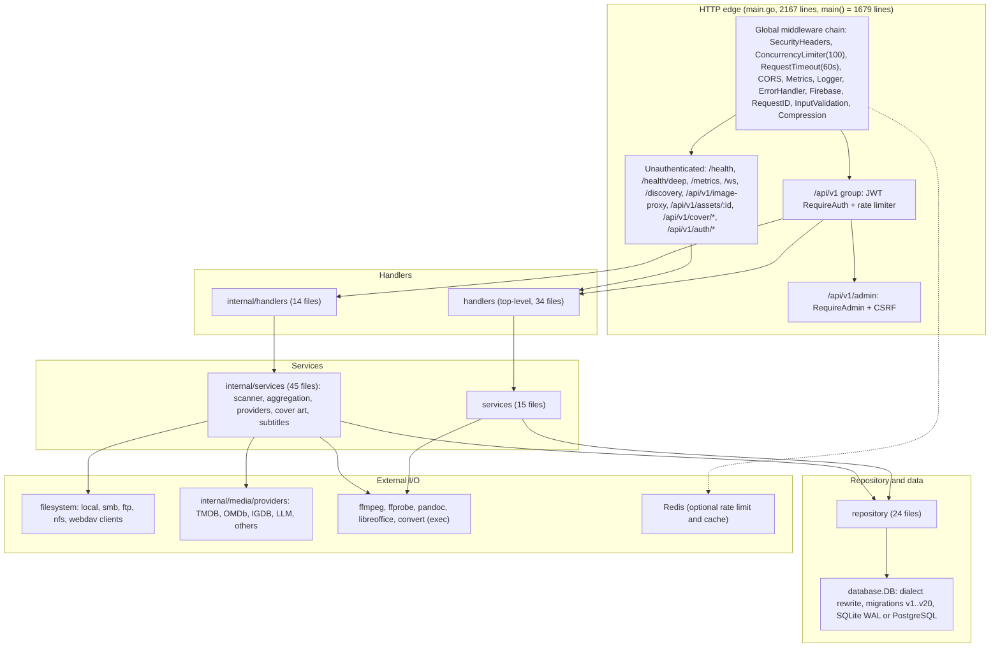
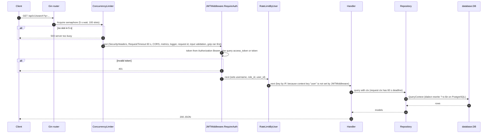
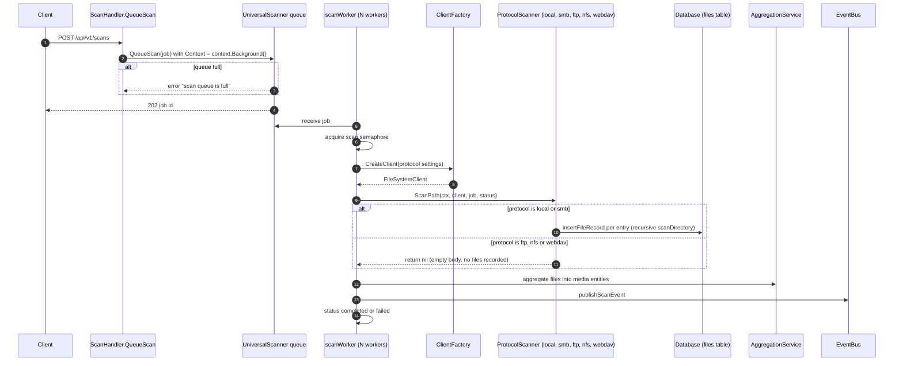
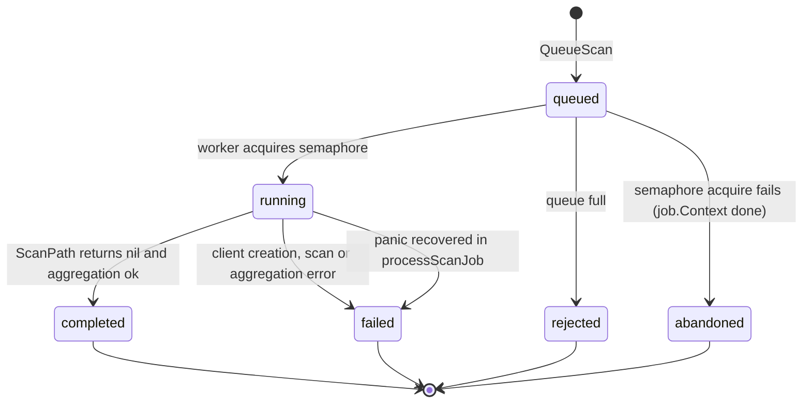
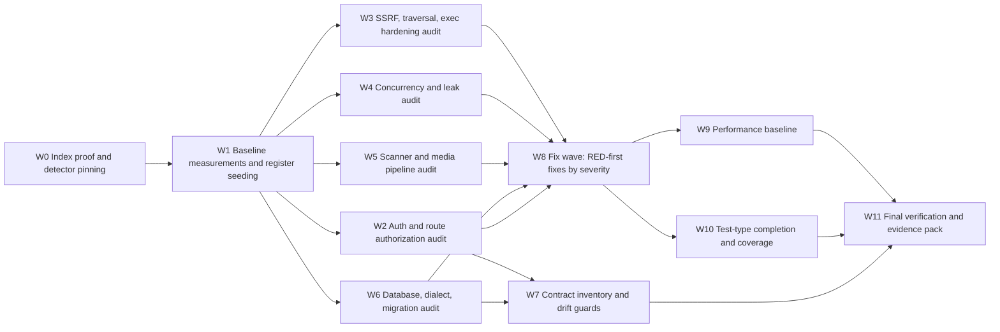

# 07 - Backend (catalog-api) Audit Plan

| Field | Value |
|---|---|
| Revision | 1 |
| Created | 2026-10-03 |
| Last modified | 2026-10-03 |
| Status | draft |
| Feature | specs/001-full-project-audit-remediation |
| Scope | `catalog-api/` (Go 1.25.7, Gin, SQLite/PostgreSQL, JWT, SMB/FTP/NFS/WebDAV/local clients, WebSocket, Prometheus metrics, HTTP/3, Challenges) |
| Traceability | FR-005..FR-011, FR-015, FR-016, FR-021, FR-022, FR-025; SC-002..SC-005, SC-008, SC-011 |
| Evidence convention | `VERIFIED-READ` = the cited file and line were read in this session. `MEASURED` = a command was executed in this session and its output is shown. `UNCONFIRMED` = a hypothesis that needs a runtime test. Items under `NOT EXECUTED` were never run. |

## Table of contents

1. Purpose, boundaries, and how to read this plan
2. Method rules for this audit
3. Measured baseline of catalog-api
4. Architecture and critical flows (diagrams)
5. Audit scope by package, with risk rating
6. Hotspot analysis (CodeGraph and grep measurements)
7. Detector catalogue (concrete commands)
8. Danger-zone catalogue
9. Candidate findings already evidenced (seed for the register)
10. Test plan per package
11. Performance baseline plan
12. API contract inventory and drift checks
13. Work-package breakdown, ordering, acceptance evidence
14. Risks, rejected alternatives, open questions
15. Traceability matrix
Appendix A. POC snippets (all marked NOT EXECUTED unless stated)
Appendix B. Executed measurement scripts

---

## 1. Purpose, boundaries, and how to read this plan

This document is the technical plan for auditing the Go backend `catalog-api/`. It states how each package is audited, with which detectors, in which order, and what evidence closes each work package. It does not restate the spec. Every finding produced by this plan goes into the single register (FR-001) with a location, severity, category and machine-produced evidence (FR-007), is investigated to a root cause before any fix (FR-008), and is fixed test-first (constitution Principle II, §11.4.224).

Boundaries:

- In scope: everything under `catalog-api/` including `challenges/`, `tests/`, `scripts/`, `migrations/`, `database/migrations/`, and the Go submodules it consumes through `replace` directives in `catalog-api/go.mod` (assets, auth, cache, challenges, concurrency, config, containers, database, discovery, entities, eventbus, filesystem, lazy, media, memory, middleware, observability, ratelimiter, recovery, security, storage, streaming, watcher). Submodule internals are audited by their own plan; this plan audits only the integration seams (how catalog-api calls them).
- Out of scope here: web, desktop, mobile, TV, installer, website (other plan documents). The TypeScript API client is covered only as the other side of the API contract (section 12).
- Nothing in this plan authorises a build or a heavy test run on the bare host. Every command that compiles or runs Go uses the rootless container form in section 7.

The measurements in section 3 and 6 were produced from the checked-out tree (branch `main`, CodeGraph index of 7,150 files and 128,472 nodes). They are a baseline for the first audit pass, not a claim about quality.

## 2. Method rules for this audit

| # | Rule | Source |
|---|---|---|
| M1 | Understand code through CodeGraph first (`codegraph explore`, `codegraph node`, the SQLite index at `.codegraph/codegraph.db`), then read only the needed slices. The index is shown healthy at the start of the audit by `codegraph status` (files, nodes, edges non-zero) and by a known-symbol query. | FR-005, §11.4.78, §11.4.275 |
| M2 | A grep or count that returns zero is not evidence of absence until a control needle proves the same query can see (a symbol known to exist is found through the same path). | §11.4.201(7) |
| M3 | Every candidate finding is classified `VERIFIED-READ`, `MEASURED` or `UNCONFIRMED`. Only the first two may enter the register as confirmed; `UNCONFIRMED` enters as an open hypothesis with the test that would settle it. | FR-022, §11.4.6 |
| M4 | Root cause before fix. A fix without a RED test that fails on the broken artifact is rejected at review. | FR-008, §11.4.102, §11.4.115 |
| M5 | Tests that depend on an external service (SMB, FTP, NFS, WebDAV, PostgreSQL, Redis, metadata providers) run against the real service on every run, or report an explicit, reasoned skip. Mock servers under `catalog-api/tests/mocks/` are admissible only in unit tests. | FR-025, §11.4.27 |
| M6 | The audit repeated from the same git state MUST yield the same finding set. Detectors are deterministic scripts with recorded versions, sorted output, and no network. | SC-002, FR-010 |
| M7 | Independent review of each work-package output by a reviewer separate from the author, on the pinned review substrate, iterated to zero blocking findings. | FR-023, §11.4.209 |

## 3. Measured baseline of catalog-api

All numbers below are MEASURED in this session unless marked otherwise. "Non-test LOC" counts `*.go` files excluding `*_test.go` in that directory only (not recursive).

### 3.1 Package inventory

| Package (dir) | Non-test LOC | Non-test files | Test files | `Test*` funcs | Bench | Fuzz |
|---|---:|---:|---:|---:|---:|---:|
| `challenges` | 39,922 | 94 | 14 | 484 | 0 | 0 |
| `internal/services` | 29,603 | 45 | 77 | 1,196 | 11 | 7 |
| `handlers` | 14,107 | 34 | 40 | 344 | 0 | 0 |
| `services` | 10,645 | 15 | 27 | 769 | 5 | 0 |
| `repository` | 8,856 | 24 | 26 | 313 | 7 | 0 |
| `internal/handlers` | 5,715 | 14 | 14 | 228 | 0 | 2 |
| `database` | 4,227 | 19 | 16 | 148 | 0 | 4 |
| `filesystem` | 2,316 | 10 | 11 | 243 | 1 | 2 |
| `main.go` (root pkg) | 2,167 | 1 | 1 | 1 | 0 | 0 |
| `internal/media/providers` | 1,692 | 5 | 5 | 54 | 2 | 0 |
| `middleware` | 1,480 | 11 | 18 | 128 | 15 | 11 |
| `internal/media/realtime` | 1,287 | 3 | 6 | 123 | 0 | 0 |
| `internal/auth` | 1,224 | 4 | 5 | 107 | 7 | 0 |
| `internal/smb` | 925 | 2 | 2 | 46 | 5 | 0 |
| `internal/metrics` | 901 | 6 | 7 | 78 | 0 | 0 |
| `internal/media/analyzer` | 692 | 2 | 1 | 75 | 0 | 0 |
| `smb` | 675 | 3 | 4 | 38 | 2 | 0 |
| `internal/recovery` | 671 | 3 | 2 | 64 | 0 | 0 |
| `internal/media/detector` | 471 | 2 | 1 | 13 | 4 | 0 |
| `internal/infra` | 498 | 1 | 1 | 13 | 0 | 0 |
| `tests/mocks` | 2,314 | 4 | 0 | 0 | 0 | 0 |

Totals: 372 test files, 5,367 `func Test*`, 130 benchmarks, 30 fuzz targets, 114 `t.Skip` call sites, 3 build-tagged test groups (`e2e_binary`, `catalog_security_real`, `linux`).

CodeGraph kinds inside `catalog-api/` (Go, non-test): 3,310 methods, 1,342 structs, 1,020 functions, 354 constants, 37 interfaces, and 331 indexed `route` nodes (244 of them in `main.go`).

### 3.2 Pattern counts (non-test code)

| Pattern | Count | How measured | Note |
|---|---:|---|---|
| `go func` / `go x.` spawn sites | 65 / 15 | `grep -rn` over `*.go` excluding `_test.go` | 31 lines mention `sync.WaitGroup` or `errgroup` outside `challenges`/`tests` |
| `context.Background()` / `context.TODO()` | 79 | same, excluding `_test.go` and the top-level `challenges`, `tests`, `internal/tests` directories (re-measured; excluding any path segment named `tests` or `challenges` gives 61) | each is a cancellation break to review |
| Ignored errors (`_ = x`, `, _ :=`/`, _ =`) | 398 | same exclusion | top: `handlers/media_entity_handler.go` 24, `internal/services/subtitle_service.go` 17, `services/configuration_wizard_service.go` 16, `internal/services/media_recognition_service.go` 14, `internal/modules/registry.go` 14 |
| `_ = err` literal | 0 | grep | the constitution forbids it; the weaker `_ = fn()` form is the real exposure |
| `fmt.Sprintf` building SQL | 4 | `Sprintf("\s*(SELECT|INSERT|UPDATE|DELETE)` | `internal/media/database/database.go:240`, `internal/services/cache_service.go:768`, `internal/auth/service.go:553`, `repository/favorites_repository.go:257` |
| String-concatenated `WHERE`/`IN` clauses | 3 sites seen | targeted grep | `repository/media_item_repository.go:148`, `internal/handlers/media.go:235`, `internal/services/catalog.go:277`; plus `internal/services/playlist_service.go:818` (`ORDER BY` from `getOrderClause`) |
| `exec.Command*` | 16 | grep | `services/conversion_service.go` (7, no context), `internal/services/cover_art_service.go` (3), `filesystem/nfs_client_darwin.go` (5), `internal/infra/provisioner.go` (1) |
| `&http.Client{` literals | 76 | grep, excluding `challenges`/`tests` | constitution says use `internal/httpclient`; see 9 (C16) |
| Importers of `catalogizer/internal/httpclient` | 0 | grep | control needle for the query shape: the same grep finds importers of `catalogizer/internal/auth` |
| `TODO`/`FIXME`/`XXX`/`HACK` | 0 | grep | consistent with zero-unfinished-work rule, but see C5 (empty stubs without markers) |
| `InsecureSkipVerify` | 0 | grep | |
| `panic(` | 2 | grep | review at W-package level |
| `*sql.DB` outside `database/`, `tests/` | 12 | grep | the constitution requires `database.DB` |
| `internal/` files importing top-level domain packages | 11 files, 37 import lines (`database` 27, `filesystem` 5, `repository` 4, `utils` 1, `handlers` 1) | grep on import path | rule: `internal/` may import only `models/` |

Control-needle note (M2): the zero rows above (`TODO`, `InsecureSkipVerify`, `httpclient` importers) are valid only after the work-package W0 re-runs each query against a planted needle (a scratch file in the scratchpad containing the token) through the same command line.

## 4. Architecture and critical flows

### 4.1 Package and dependency architecture

The constitution's layering is Handler, Service, Repository, Database. The measured reality has two parallel stacks (top-level and `internal/`) that both contain handlers and services, plus three authentication components. The audit treats the duplication as a first-class risk because the same behaviour can be implemented twice with different defects.

> Note: this diagram passed a structural check (fence and syntax shape) but a real render was not available (no headless browser in the sandbox), so render validity is UNVERIFIED.



### 4.2 Request path (authenticated browse or search)

Derived from `catalog-api/main.go` lines 979-991 (global chain) and 1163-1168 (`/api/v1` group).

> Note: this diagram passed a structural check (fence and syntax shape) but a real render was not available (no headless browser in the sandbox), so render validity is UNVERIFIED.



Observations to verify (all UNCONFIRMED at runtime): the limiter slot is held for the full lifetime of streaming and download responses, so 100 concurrent streams would starve `/health` and `/auth/login` (C11); `RateLimitByUser` falls back to IP because `JWTMiddleware` sets `username`, `role_id`, `user_id` and not `user` (VERIFIED-READ in `middleware/auth.go` and `internal/auth/middleware.go:297-307`).

### 4.3 Scan pipeline

Derived from `internal/services/universal_scanner.go` (queue at 199-212, worker at 214-228, `processScanJob` at 230-372) and `handlers/scan_handler.go:246`.

> Note: this diagram passed a structural check (fence and syntax shape) but a real render was not available (no headless browser in the sandbox), so render validity is UNVERIFIED.



The two `else` branches are the key audit signal: `FTPScanner.ScanPath`, `NFSScanner.ScanPath` and `WebDAVScanner.ScanPath` are comment-only bodies returning `nil` (VERIFIED-READ, `universal_scanner.go:1044-1047`, `1076-1079`, `1108-1111`).

### 4.4 Scan job state machine

States come from the `updateStatus` call sites (`universal_scanner.go:303,321,334,345,350`) and the panic path (`:233-246`). `cancelled` is not reachable from the code read (UNCONFIRMED: the status type may define it elsewhere).

> Note: this diagram passed a structural check (fence and syntax shape) but a real render was not available (no headless browser in the sandbox), so render validity is UNVERIFIED.



Audit questions this diagram generates: is a job that is `abandoned` visible to the user (no status row is written on that path); can `running` be cancelled by shutdown (the job context is `context.Background()`, so `Stop()` waits on `wg` but cannot interrupt a long scan); is the `failed` status persisted on the panic path (the status object is built but only passed to `publishScanEvent`).

## 5. Audit scope by package, with risk rating

Risk = likelihood x impact over the factors: exposure (unauthenticated or untrusted input reaches it), blast radius, concurrency, external calls, size and test depth. Ratings are the starting classification; the audit may raise or lower them with evidence.

| Package | Role | Risk | Rationale (evidence) | Primary audit focus |
|---|---|---|---|---|
| `main.go` | wiring, routes, server, TLS/HTTP3, image proxy, pprof | Critical | `main()` is 1,679 lines with 213 callees; unauthenticated image proxy with substring allow-list (`main.go:1089-1135`); `/ws`, `/metrics`, `/health/deep` outside auth; TLS config without `MinVersion` | route auth matrix, SSRF, lifecycle and shutdown order, config precedence |
| `middleware` | JWT, CSRF, CORS, rate limit, input validation, cache, timeout, limiter | Critical | `middleware/auth.go` accepts tokens from query string, no algorithm pin; global 100-slot semaphore; Redis limiter | auth bypass, token handling, header and CORS policy, limiter starvation |
| `internal/auth` | second auth stack (`AuthService`, `AuthMiddleware`) | High | duplicate of `services/auth_service.go`; in-memory rate-limit map with no eviction seen; default admin creation | single source of truth for auth, session and revocation |
| `handlers` (top-level) | 34 handlers: auth, admin, conversion, copy, download, websocket, scan | High | `websocket_handler.go:124` `CheckOrigin` returns true and no auth reference in the file; conversion handler binds `SourcePath` directly | authorization per handler, input validation, upload and copy paths |
| `internal/handlers` | stream, SMB discovery, media player, catalog | High | `stream_handler.go` creates a filesystem client per request; host validation does resolve-then-dial | SSRF, streaming, range handling |
| `internal/services` | scanner, aggregation, cover art, providers, subtitles, cache, quality gate | High | 29,603 LOC, 1,196 tests; FTP/NFS/WebDAV scanner stubs; ffmpeg/ffprobe exec; outbound HTTP to providers | scan correctness, goroutine lifecycle, SSRF guard use, error swallowing |
| `services` (top-level) | auth, conversion, sync, config wizard, reporting | High | `conversion_service.go` runs `ffmpeg`, `pandoc`, `libreoffice`, `convert`, `ebook-convert` with `exec.Command` and no context; 16 ignored errors in the wizard service | exec hardening, arg injection, timeouts, sync state |
| `repository` | SQL access | High | 24 files, 313 tests; concatenated `WHERE`/`IN` and one `Sprintf` count query | SQL injection surface, dialect parity, N+1, indexes |
| `database` | connection, dialect, migrations v1..v20 | High | non-transactional `runMigration`; `INSERT OR REPLACE` rewritten to plain `INSERT`; schema defined in multiple places | migration safety, dialect rewrite, pool and WAL |
| `filesystem` | local, SMB, FTP, NFS, WebDAV clients | High | path sanitisation by `strings.ReplaceAll(cleanPath, "..", "")`; SMB client has no path cleaning | path traversal, symlink escape, timeouts, resource leaks |
| `internal/media/providers` | metadata providers, LLM provider, lazy provider | Medium-High | outbound HTTP with `GuardProviderURL`; API keys | SSRF guard coverage, secret handling, cooldown, degrade-gracefully |
| `internal/media/detector`, `analyzer` | detection engine and analysis | Medium | 13 tests for 471 LOC in `detector`; user-driven glob-to-regex (`engine.go:419`; Go RE2 means no catastrophic backtracking, but pattern compile errors need handling) | accuracy corpus, determinism, rule handling |
| `internal/media/realtime` | fsnotify watchers | Medium | goroutines, event bus; `watcher_race_test.go` exists | race detector, shutdown, event loss |
| `smb`, `internal/smb` | SMB types, resilience | Medium | goroutines (8 `go` sites in `resilience.go`), circuit breaker | leak and cancel tests |
| `internal/metrics`, `internal/monitoring` | Prometheus, health | Medium | unauthenticated `/metrics`; `snapshot.go` goroutines | label cardinality, info exposure |
| `internal/recovery`, `internal/concurrency`, `internal/lifecycle`, `internal/eventbus`, `internal/cache` | cross-cutting | Medium | small, but every service depends on them | contract tests |
| `challenges` | 94 files, 39,922 LOC of challenge definitions compiled into the server binary (`main.go:586` `challenges.RegisterAll`) | Medium | very large, hard-coded thresholds (health 10 ms average, entity search 500 ms average) | anti-bluff review of each challenge, thresholds replaced by recorded baselines, consider build-tag separation |
| `tests`, `tests/mocks`, `internal/tests` | harness | Medium | 2,314 LOC of mock servers (SMB, FTP, NFS) | confirm mocks are used only by unit tests (FR-025); schema duplicated in `test_helper.go` (`runTestMigrations` 687 lines) |
| `config`, `internal/config` | configuration | Medium | PostgreSQL DSN built with `fmt.Sprintf` and no URL escaping (`config/config.go:362`, `database/connection.go:38`) | secret handling, precedence, DSN encoding |
| `models`, `utils`, `internal/models` | data and helpers | Low | data structs, helpers with fuzz tests | fuzz coverage, nil-safety |
| `internal/firebase`, `internal/infra`, `internal/modules`, `cmd/boot` | integrations and boot | Low-Medium | outbound calls, provisioner shells out to `getent` | secret handling, provisioning safety |

## 6. Hotspot analysis (CodeGraph and grep measurements)

### 6.1 Structural hotspots (MEASURED from `.codegraph/codegraph.db`)

Longest non-test functions (lines): `main` 1,679 (`main.go:262`); `registerUserFlowMobileChallenges` 1,622; `registerUserFlowAPIChallenges` 1,441; `registerUserFlowDesktopChallenges` 1,074; `runTestMigrations` 687 (`internal/tests/test_helper.go:50`); `initializeWizardSteps` 328 (`services/configuration_service.go:59`); `initializeDefaultTemplates` 323; `insertFileRecord` 154 lines with 41 callees (`internal/services/universal_scanner.go:854`).

Most-called symbols (non-test): `database.DB` methods `Exec` (485 call edges), `QueryRow` (318), `ExecContext` (166), `QueryRowContext` (92), `Query` (87) - these are the single choke point for SQL, so the dialect rewrite and the context handling in `database/connection.go:132-182` are audited once and cover about 1,100 call sites. `IsPostgres` has 50 call edges: each is a dialect branch that needs a PostgreSQL test. `sendError` in `internal/handlers/media_player_handlers.go:1123` has 94 callers: its error body is the user-visible error contract (information disclosure check).

Largest fan-out of services (constructors with most callers): `NewReportingService` 124, `NewSyncService` 81, `NewCoverArtService` 76, `NewDeepLinkingService` 67, `NewFavoritesService` 62 - these are dominated by test constructors, so they are noted but not treated as production hotspots.

### 6.2 Goroutine-spawning services (production)

`grep` per file, non-test, excluding `challenges`/`tests`: `internal/smb/resilience.go` 8, `utils/concurrency.go` 4, `services/error_reporting_service.go` 4, `main.go` 4, `internal/services/cache_service.go` 4, `internal/services/universal_scanner.go` 3, `internal/metrics/snapshot.go` 3, `internal/services/{subtitle_service,media_player_service,cover_art_service,aggregation_service}.go` 2 each, `internal/monitoring/monitoring.go` 2, `internal/media/realtime/{watcher,enhanced_watcher}.go` 2 each, `internal/media/providers/providers.go` 2, `handlers/websocket_handler.go` 2, `handlers/media_entity_handler.go` 2, `services/{log_management,challenge}_service.go` 2 each.

The race and leak audit (W4) walks this list. Existing evidence to reuse: `docs/BACKEND_HARDENING_AUDIT.md` records a 2026-04-22 `-race` run (38 packages passing, one known flaky test `TestSyncService_MultipleStartSync_CreatesSeparateSessions`, filed as `DEFER-QA-2026-04-22-001`). That is a prior-tracker item for FR-002 reconciliation and must re-enter the register.

### 6.3 SQL construction sites

Eight sites were read from the grep results (4 `Sprintf`, 4 concatenations listed in 3.2). Those that interpolate non-constant strings are the audit priority:

- `internal/auth/service.go:553` builds `UPDATE users SET %s WHERE id = ?` from `setParts` - safe only if `setParts` entries are literal column fragments. Verify with a data-flow trace.
- `internal/services/cache_service.go:768` and `internal/media/database/database.go:240` interpolate a table name - safe only if the name comes from a closed constant list (the latter carries `// #nosec G201`).
- `internal/services/playlist_service.go:818` appends `getOrderClause(criteria.Order)` - verify the mapping is a closed switch.

### 6.4 External-call sites

`http.Client`/`http.NewRequest`/`http.Get` references: 214 grep hits non-test. Providers use `services.GuardProviderURL` (found at `handlers/media_entity_handler.go:781`, `internal/media/providers/llm_provider.go:287`, `providers.go:402`, `internal/services/igdb_resolver.go:98,187`, `game_software_recognition_provider.go:539,839`). The image proxy in `main.go` does not (see C1). The audit builds the complete list of outbound call sites and marks each as guarded or not (W3).

## 7. Detector catalogue (concrete commands)

All Go commands run in a rootless container. The module uses `replace ../submodules/*` paths, so the mounted root must be the repository root. CGO is required (go-sqlcipher, docx). Resource limits follow the constitution (host use well under 40%); the values below are variables the operator sets, not recorded host facts (host core count is UNKNOWN to this document).

```bash
# NOT EXECUTED - common prelude, rootless podman (no sudo)
export REPO="$PWD"
export GO_IMG="docker.io/library/golang:1.25-bookworm"   # glibc image, as scripts/build_in_container.sh explains
export CPUS="${CPUS:-3}" MEM="${MEM:-12g}"
run_go() {  # usage: run_go <command...>
  podman run --rm --cpus="$CPUS" --memory="$MEM" \
    -e GOTOOLCHAIN=local -e GOFLAGS=-mod=mod -e GOMAXPROCS=3 \
    -v "$REPO":/src:Z -w /src/catalog-api "$GO_IMG" "$@"
}
```

Note: `scripts/build_in_container.sh` is the constitutional distributed-build entry (§11.4.173, remote build host `thinker.local` by default). The commands here are the audit-time local rootless equivalent for read-only analysis and tests; builds of deliverables still go through that script.

| ID | Detector | Command (containerised) | Output (machine-readable) | Finds |
|---|---|---|---|---|
| D1 | vet | `run_go go vet ./...` | text, exit code | constitution mandates zero warnings; any output is a finding |
| D2 | race detector | `run_go go test -race -count=1 -p 2 -parallel 2 -timeout 900s ./...` then repeat for `-count=3` on the goroutine list in 6.2 | `-json` via `go test -json` | data races, leaks via `internal/services/leak_test.go` |
| D3 | gosec | `podman run --rm -v "$REPO":/src:Z -w /src/catalog-api docker.io/securego/gosec:latest -fmt sarif -out /src/<scratch>/gosec.sarif -exclude-dir=vendor ./...` (image tag UNCONFIRMED: pin by digest in W0) | SARIF | G101 secrets, G201/G202 SQL, G304 path, G402 TLS, G204 exec |
| D4 | staticcheck | `run_go sh -c 'go install honnef.co/go/tools/cmd/staticcheck@<pinned> && staticcheck -f json ./...'` (version pinned in W0; availability in the repo scripts: UNCONFIRMED, `grep` found `gosec` and `nancy` scripts but no `staticcheck` reference) | JSON | unused code, deprecated APIs, ineffective assignments |
| D5 | govulncheck | `run_go sh -c 'go install golang.org/x/vuln/cmd/govulncheck@<pinned> && govulncheck -json ./...'` | JSON | known vulnerable dependency symbols reached from our code (feeds FR-018) |
| D6 | existing scripts | `scripts/gosec-scan.sh`, `scripts/security-scan*.sh`, `scripts/run-race-detector.sh`, `scripts/performance-test.sh`, `scripts/run-stress-tests.sh`, `scripts/memory-leak-check.sh` | varies | reuse but audit them: `scripts/gosec-scan.sh` ends the gosec call with `|| true` and discards stderr (`2>/dev/null`), so it can never fail the gate (candidate C15) |
| D7 | route auth matrix | the script in Appendix B.1 plus a runtime probe (W2) | JSON route list | routes outside `/api/v1` auth, groups with no admin gate |
| D8 | contract drift | Appendix B.1 and B.2 scripts | text | code vs OpenAPI, client vs code |
| D9 | CodeGraph hotspot query | Appendix B.3 | table | size, fan-in, fan-out, route nodes |
| D10 | migration parity | `run_go go test -run 'TestRunMigrations|TestMigrationsParity' ./database/...` (parity test: `database/migrations_parity_test.go`) plus a PostgreSQL run against a real container (section 10) | go test JSON | schema drift between dialects |

grep patterns (each paired with a control needle per M2). Run from `catalog-api/`:

```bash
# NOT EXECUTED as a set; individual counts in section 3.2 were MEASURED
grep -rnE '^\s*_ = |, _ :?= ' --include=*.go . | grep -v _test.go | grep -vE '^./(challenges|tests|internal/tests)/'      # ignored errors
grep -rnE 'exec\.Command(Context)?\(' --include=*.go . | grep -v _test.go                                            # shell-outs
grep -rnE 'Sprintf\("\s*(SELECT|INSERT|UPDATE|DELETE)' --include=*.go . | grep -v _test.go                           # SQL by format
grep -rnE 'strings\.Contains\([a-zA-Z]*[Uu][Rr][Ll]' --include=*.go . | grep -v _test.go                             # URL allow-list by substring
grep -rnE 'CheckOrigin|AllowAllOrigins|Access-Control-Allow-Origin' --include=*.go . | grep -v _test.go              # origin policy
grep -rnE 'c\.Query\("(token|access_token|key|password)"\)' --include=*.go . | grep -v _test.go                      # secrets in query strings
grep -rnE 'filepath\.(Join|Clean)\(' --include=*.go filesystem handlers internal | grep -v _test.go                  # path building
grep -rnE 'context\.(Background|TODO)\(\)' --include=*.go . | grep -v _test.go                                       # cancellation breaks
grep -rnE 'return nil\s*$' -B2 --include=universal_scanner.go internal/services                                       # stub bodies (manual review)
```

Determinism (M6): each detector writes sorted output to `<scratch>/audit/<detector>.out` with the tool version and `git rev-parse HEAD` on the first line; the audit-repeat check diffs two runs from the same commit.

## 8. Danger-zone catalogue

Each entry states the hazard, the code evidence if any, the detector, and the test that would prove or refute it.

### 8.1 Concurrency

| ID | Hazard | Evidence | Detector and test |
|---|---|---|---|
| DZ-C1 | Unbounded or uncancellable goroutines | `ScanJob.Context = context.Background()` (`handlers/scan_handler.go:246`); `UniversalScanner.Stop()` does `close(s.stopCh)` (double call panics - UNCONFIRMED) and waits on `wg` | D2 plus a test that starts a long scan against a slow real SMB share, calls `Stop()`, and asserts return within a bound |
| DZ-C2 | Global semaphore starvation | `ConcurrencyLimiter(100)` held for whole request incl. streams | load test: 100 open `/stream/:id` then `GET /health`; expect 503 if starved |
| DZ-C3 | Rate-limiter memory growth | `rateLimiters` is a `sync.Map` keyed by IP/user; each entry holds a timestamp slice up to the limit (up to 2000); no `Delete` seen in `internal/auth/middleware.go:270-345` | benchmark with 1M synthetic keys, measure heap |
| DZ-C4 | WebSocket client map and cleanup | `handlers/websocket_handler.go` has `mu`, `connCount`, a ticker goroutine; reservation pattern pre-increments `connCount` | `-race` with 200 connect/disconnect cycles and abrupt closes |
| DZ-C5 | Lazy handler factories | `getSyncHandler`, `getConversionHandler`, `getRecommendationHandler`... use `sync.Once` closures (`main.go:866-873`) | race test calling each lazy route concurrently on first use |
| DZ-C6 | Watcher shutdown | `internal/media/realtime` | existing `watcher_race_test.go`; add shutdown-while-events test |

### 8.2 Resource leaks

| ID | Hazard | Evidence | Test |
|---|---|---|---|
| DZ-R1 | Filesystem client per stream request | `internal/handlers/stream_handler.go:73-95` calls `clientFactory.CreateClient` on each request; whether the client is closed and whether SMB sessions are pooled is UNCONFIRMED | open 200 streams, count SMB sessions server-side and FDs in the process |
| DZ-R2 | HTTP response bodies | image proxy closes bodies on the error path and defers on success (`main.go:1110-1129`); other sites unknown | grep for `http.Client` call sites lacking `defer resp.Body.Close()` (staticcheck SA5001 equivalent in D4) |
| DZ-R3 | exec without context | `services/conversion_service.go:138,153,194,400,417,500,515` use `exec.Command` and send stdout/stderr to `os.Stdout`/`os.Stderr` | kill-switch test: start a conversion of a large file, cancel the job, assert the child process is gone |
| DZ-R4 | `rows` not closed | 848 `Query*/Exec*` references | staticcheck and `go vet` do not catch it; use `sqlclosecheck`-class lint (tool availability UNCONFIRMED; fall back to the pool-stats test: run workload then assert `db.Stats().InUse == 0`) |
| DZ-R5 | Pool saturation | SQLite WAL with `_busy_timeout=30000`; pool MaxOpen 25 by constitution | stress test: 100 concurrent writers, assert no `database is locked` beyond the busy timeout |

### 8.3 SQL injection surfaces

The repository layer uses `?` placeholders almost everywhere (constitution rule). The surfaces left are those in 6.3 plus any `ORDER BY`/column name taken from request parameters (`sortBy`-style), checked with: `grep -rnE 'sort|order' handlers repository internal/handlers internal/services | grep -E 'Sprintf|\+'`. Test: a fuzz target per such site feeding `' OR 1=1 --`, `;DROP`, unicode and 10 KB strings and asserting either validation error or an unchanged result set (existing fuzz targets: `database/dialect_fuzz_test.go`, `middleware` 11 fuzz targets, `utils` 4).

### 8.4 Path traversal in filesystem clients

Verified pattern (`filesystem/local_client.go:69-75`, same in `nfs_client.go:116-122`, `webdav_client.go:97-105`): `filepath.Clean(path)`, then if the result contains `..` it is replaced with the empty string, then `filepath.Join(base, clean)`. Consequences to test:

1. Legitimate names containing two dots (`archive..bak`, `Movie Title...mkv`) are silently renamed, so the catalog and the filesystem disagree (functional defect).
2. No `filepath.EvalSymlinks` or `os.Root`-style confinement: a symlink inside the share that points outside `basePath` is followed (UNCONFIRMED by test; Go 1.24 introduced `os.Root` for confinement, check against go 1.25.7).
3. `smb_client.go` and `ftp_client.go` show no path cleaning in the grep (only `net.JoinHostPort`), so confinement depends on the server (UNCONFIRMED; test against a real Samba and a real FTP server with `../` and encoded variants).
4. HTTP-level inputs that become paths: `/api/v1/catalog/*path`, `/api/v1/browse/directory/*path`, `/api/v1/download/directory/*path`, `/api/v1/copy/local`, `/api/v1/copy/upload` (`destination_path`), `/api/v1/storage/list/*path`, `/api/v1/entities/:id/pages/:n`. Each gets a traversal test with `..`, `%2e%2e`, `%252e`, backslash, absolute path, NUL, and overlong inputs.

### 8.5 SSRF

| Surface | Control today | Gap |
|---|---|---|
| `GET /api/v1/image-proxy?url=` (public route) | allow-list by `strings.Contains(imageURL, domain)` for `image.tmdb.org`, `img.omdbapi.com`, `images.igdb.com` (`main.go:1096-1105`); not routed through `GuardProviderURL`; `buildImageProxyClient` resolves the host through DNS-over-HTTPS and dials the resolved IPs | a URL such as `https://attacker.example/?x=image.tmdb.org` or `https://image.tmdb.org.attacker.example/` passes the substring test; redirects are followed by default; no scheme check; unauthenticated (C1) |
| SMB discovery and probe (`/api/v1/smb/discover|test|browse|probe|probe-and-ingest`) | `isHostAllowed` resolves with `net.LookupIP` and blocks loopback, link-local, multicast, unspecified; private ranges allowed on purpose (`internal/handlers/host_validation.go`) | resolve-then-dial is a TOCTOU window (DNS rebinding); unresolvable hosts are allowed; IPv4-mapped IPv6 and `0.0.0.0` variants need tests |
| Providers (TMDB, IGDB, LLM, resolvers) | `GuardProviderURL` | verify coverage of every outbound call; verify redirect handling; verify the test-only relaxation (`SetTestAllowPrivateNetworks`, `internal/media/providers/ssrf_testmain_test.go`) cannot be set in production |
| WebDAV and FTP storage roots | host comes from user-created storage roots | same guard as SMB is not evident (UNCONFIRMED) |
| Subtitle, cover, deep-link downloads | `services.GuardProviderURL` at `handlers/media_entity_handler.go:781` | enumerate others |

### 8.6 Authentication and authorization

- Two verification stacks exist: `middleware.JWTMiddleware` (used for routes, `main.go:883`) and `internal/auth.AuthService` / `AuthMiddleware` (rate limiting, other flows, `main.go:557`), plus `services.AuthService` (login). All share `jwtSecret`. The ephemeral random secret generated when none is configured (`main.go:514-523`) invalidates all tokens on restart and breaks multi-instance deployments (design decision to record, DZ-A1).
- `middleware/auth.go`: key function does not assert the signing method (jwt v5 rejects `none` by default; HS384/HS512 would be accepted under the same secret - hardening only); token is also read from `access_token` and `token` query parameters for every route that uses `RequireAuth` (appears in access logs and referrers); no revocation or session check - logout invalidation is UNCONFIRMED.
- `RequireAdmin` compares the `role_id` claim with constant `1`. `JWTMiddleware.GenerateToken` does not set `RoleID`; the login path uses `services.AuthService` (`services/auth_service.go:360` sets `RoleID`). Test that a token minted by every issuer path yields the expected admin result.
- Authorization gap candidate: the `/api/v1/users`, `/roles`, `/configuration`, `/errors`, `/logs` groups (`main.go:1402-1480`) sit under `api` (authenticated) but, unlike `/admin`, without `RequireAdmin`; they use `wrap(...)` adapters to handlers from `digital.vasic.*` / `handlers` and any permission check lives inside those handlers (UNCONFIRMED). Test: a non-admin token against each of the 8 `/users` routes and every `/roles`, `/configuration`, `/errors`, `/logs` route.
- Public routes: `/health`, `/health/deep`, `/metrics`, `/ws`, `/discovery`, `/api/v1/assets/:id`, `/api/v1/cover/*`, `/api/v1/image-proxy`, `/api/v1/auth/register`, `/auth/login`. The WebSocket handler has no token reference at all (`grep -nE 'token|Authorization|auth' handlers/websocket_handler.go` returned no match) and `CheckOrigin` returns true; what the socket broadcasts (scan events, user data) determines severity.
- Secrets: `storage_roots.password` is a plain `TEXT` column (`database/migrations_sqlite.go:32`) and no encryption helper was found for credentials (grep for `encrypt|aes|cipher` near `password|credential|secret` returned nothing in `handlers`, `repository`, `internal/services`, `models`). The binary imports `go-sqlcipher` but whether a key is applied to the SQLite DSN is UNCONFIRMED (`database/connection.go:28` builds `_busy_timeout`, `_journal_mode`, `_synchronous`, `_foreign_keys`, no key parameter visible in the DSN).
- Default admin: created when none exists, from `ADMIN_USERNAME`/`ADMIN_PASSWORD` or a random password (`internal/auth/service.go:185-240`); verify the random password is not logged in clear text beyond what the constitution permits (§11.4.10).

### 8.7 Dialect-rewrite pitfalls (`database/dialect.go`)

| Pitfall | Evidence | Test |
|---|---|---|
| `RewritePlaceholders` tracks only single quotes; it ignores double-quoted identifiers, comments, `$$` strings, and the PostgreSQL JSONB `?` operator | `dialect.go:24-46` | table-driven test with `"col?"`, `-- ?`, `/* ? */`, `'it''s ?'` |
| `RewriteInsertOrIgnore` appends `ON CONFLICT DO NOTHING` at the end of the string | `dialect.go:52-66` | statement ending with `;` or containing `RETURNING` or a subquery |
| `RewriteInsertOrReplace` turns `INSERT OR REPLACE INTO` into plain `INSERT INTO` | `dialect.go:70-84` | on PostgreSQL a replace of an existing key must update, today it errors or duplicates; real-PostgreSQL test per call site of `INSERT OR REPLACE` |
| Boolean rewrite is a fixed column-name regex | `dialect.go:131-141` | any new boolean column compared with `= 0/1` is not rewritten; scan SQL for `= 0|1` against columns in the PostgreSQL schema typed `BOOLEAN` |
| PostgreSQL DSN not URL-escaped | `database/connection.go:38`, `config/config.go:362` | password containing `@`, `/`, `?`, `%`, space |
| Dialect branches (`IsPostgres` has 50 callers) are rarely exercised on PostgreSQL | CodeGraph in-degree | CI-free local matrix: run the full repository test suite once on SQLite and once on a real PostgreSQL container |

### 8.8 Migration safety

- `runMigration` executes `Up` and then inserts the version row without a transaction (`database/migrations.go:62-80`); a crash between the two leaves a half-applied migration that re-runs on the next start. No PostgreSQL advisory lock guards concurrent instances.
- Schema is defined in six places: Go dialect functions in `database/migrations_*.go` (source of truth per `migrations_parity_test.go`), SQL files under `database/migrations/` (numbering `000001..000003`, `014`, `015`, `020`; no loader reads them - grep found no `go:embed` or migrate library in non-test code), `catalog-api/migrations/*.sql` (005, 006), the inline `createTables` in `internal/auth/service.go` (6 `CREATE TABLE`), `internal/media/database/schema.sql`, and the test helper (`internal/tests/test_helper.go`, 39 `CREATE TABLE`, `tests/test_utils.go` 18). SC-008 requires documented schemas to match used schemas: the plan introduces a schema-extraction check (W6) that dumps the real SQLite and PostgreSQL schemas after `RunMigrations` and diffs them against every documented definition (`docs/DATA_DICTIONARY.md` and the SQL files).
- Rollback: `*.down.sql` files exist for 6 SQL migrations only (`000001`-`000003`, `014`, `015`, `020`), while the Go list defines versions 1-20; the Go `Migration` struct has no `Down` function, so rollback exists only on paper for most versions.
- Idempotency: `migrations_v18_idempotency_test.go` exists; extend to every version by running the full sequence twice.

## 9. Candidate findings already evidenced (seed for the register)

These are candidates, not confirmed defects. Each enters the register (FR-001) with its location and evidence; "Class" says whether the evidence is enough to open a confirmed item now. Severity is a first estimate.

| ID | Location | Candidate | Class | Severity | First test |
|---|---|---|---|---|---|
| C1 | `main.go:1089-1135` | Public image proxy: substring allow-list, no `GuardProviderURL`, redirects followed, DoH-resolved dialing | VERIFIED-READ | High | RED test: request with `url=https://127.0.0.1:<port>/?image.tmdb.org` against a local listener; expect 403, observe fetch |
| C2 | `handlers/websocket_handler.go:124`, `main.go:1084` | Unauthenticated `/ws`, `CheckOrigin` always true | VERIFIED-READ (auth absence by grep); impact UNCONFIRMED | High | connect without token and from a foreign Origin; record which events arrive |
| C3 | `main.go:1402-1480` | `/users`, `/roles`, `/configuration`, `/errors`, `/logs` groups without group-level admin gate | UNCONFIRMED (handler-level checks unread) | High if confirmed | non-admin token matrix |
| C4 | `middleware/auth.go` | Query-string tokens on all routes; no signing-method assertion; no revocation | VERIFIED-READ | Medium | negative-path tests (Appendix A.1) |
| C5 | `internal/services/universal_scanner.go:1044,1076,1108` | FTP, NFS, WebDAV scanners are empty bodies returning `nil`: a scan of such a root reports `completed` with zero files | VERIFIED-READ | High | real FTP/NFS/WebDAV server with known tree; expect N records |
| C6 | `internal/services/universal_scanner.go:49-50` | `IncludePatterns`/`ExcludePatterns` on `ScanJob` are never applied (only declared; the root model fields are only scanned into structs) | VERIFIED-READ (grep with control) | Medium | scan with an exclude pattern; expect excluded files absent |
| C7 | `handlers/scan_handler.go:246`, `universal_scanner.go:191-197` | Scan jobs run on `context.Background()`; `Stop()` cannot cancel in-flight work (whether the panic path persists the failed status is UNCONFIRMED: the status object is built and published, no DB write was seen in the read slice) | VERIFIED-READ | Medium | DZ-C1 test |
| C8 | `services/conversion_service.go:138-515` | `exec.Command` without context or timeout, stdout/stderr to process streams, `SourcePath` from the request body passed to ffmpeg/libreoffice/convert and `os.Open` with no allow-list visible in the handler path | VERIFIED-READ; allow-list absence UNCONFIRMED elsewhere | High | conversion of `/etc/hostname` and of `-version`-style path by a permitted user; cancel test |
| C9 | `database/dialect.go:70-84` | `INSERT OR REPLACE` becomes plain `INSERT` on PostgreSQL | VERIFIED-READ | Medium-High | real-PostgreSQL test per call site |
| C10 | `database/migrations.go:62-80` | Non-atomic migration and version record; no advisory lock | VERIFIED-READ | Medium | fault-injection test killing between `Up` and insert |
| C11 | `main.go:980`, `middleware/concurrency_limiter.go` | One global 100-slot semaphore covers streams and downloads | VERIFIED-READ; starvation UNCONFIRMED | Medium | DZ-C2 |
| C12 | `internal/auth/middleware.go:293-345` | Rate-limit map entries never evicted | VERIFIED-READ for the viewed slice | Low-Medium | DZ-C3 |
| C13 | `filesystem/{local,nfs,webdav}_client.go` | `ReplaceAll("..", "")` sanitiser mangles legitimate names; no symlink confinement; SMB/FTP unsanitised | VERIFIED-READ | Medium | 8.4 tests |
| C14 | `internal/handlers/host_validation.go` | Resolve-then-dial TOCTOU; unresolvable hosts allowed | VERIFIED-READ | Medium | rebinding test with a controllable DNS server in a container |
| C15 | `scripts/gosec-scan.sh` | Scanner failures swallowed (`|| true`, `2>/dev/null`): the gate cannot fail (§11.4.201) | VERIFIED-READ | Medium (process) | run with a planted G101 secret; script must exit non-zero |
| C16 | whole tree | Constitution drift: 0 importers of `internal/httpclient` vs 76 `&http.Client{` literals; 12 `*sql.DB` sites; 11 `internal/` files importing top-level domain packages (37 imports) | MEASURED | Low-Medium | detector D-drift (section 13, W1) |
| C17 | `catalog-api/services/coverage.*` (9 files), `catalog-api/challenge_ids.txt.bak`, `result_*.json`, `test_report_*.md` | Tracked build/test artifacts (`git ls-files` lists them) | MEASURED | Low | §11.4.30 cleanup after §11.4.124-style history check |
| C18 | `database/migrations_sqlite.go:32` | Storage-root password stored as plain `TEXT`; sqlcipher key use unconfirmed | VERIFIED-READ (column); encryption UNCONFIRMED | High | inspect a real database file with and without the key |
| C19 | `main.go:1812-1850` (cert 1812, `tlsConfig` 1817, port 28443 setup 1822-1843, HTTP/3 server 1844-1850) | TLS config without `MinVersion`; self-signed certificate; fixed port 28443 for HTTPS and HTTP/3 | VERIFIED-READ (no `MinVersion` grep hit) | Low-Medium | `testssl`-style probe in a container |
| C20 | `database/connection.go:38`, `config/config.go:362` | PostgreSQL DSN without URL escaping | VERIFIED-READ | Medium | 8.7 test |
| C21 | `services/webdav_client.go` vs `filesystem/webdav_client.go` | Two WebDAV clients; also two handler and two service packages | UNCONFIRMED similarity | Low | byte/AST similarity check per §11.4.251 |
| C22 | `challenges/` | 39,922 LOC of challenge code linked into the server binary (`main.go:586`) with fixed latency thresholds | VERIFIED-READ | Low-Medium | binary-size and symbol audit; threshold review |

## 10. Test plan per package

The constitution requires every applicable test type per application (FR-009, SC-004): unit, integration, end-to-end, full automation, security, DDoS/rate-limit, scaling, chaos, stress, performance, benchmarking, UI/UX (not applicable to the API itself), Challenges, HelixQA. For the backend the matrix below states what exists (MEASURED counts from 3.1 and the `tests/` tree) and what each package gains. "Real" means a real dependency container, not a mock (FR-025).

Real-dependency fixtures used by every integration test (all rootless podman, started by the existing `scripts/postgres-up.sh`, `scripts/services-up`-class scripts or a new compose file under `docker-compose.test-infra.yml`, which already exists):

| Dependency | Real instance |
|---|---|
| PostgreSQL | `postgres` container, fresh database per test package |
| SMB | Samba container with a seeded tree (movies, music, comics, symlink pointing outside) |
| FTP | `vsftpd` or `pure-ftpd` container with the same tree |
| NFS | NFS server container (needs privileges; if rootless cannot provide it, record an explicit reasoned skip and track it) |
| WebDAV | `nginx` dav or `apache` mod_dav container with the same tree |
| Redis | `redis` container for the Redis limiter path |
| Metadata providers | real TMDB/OMDb/IGDB with credentials from the environment; absent credential gives an explicit skip with reason (FR-025) |

| Package | Unit | Integration (real) | Security | Stress/chaos | Benchmark/perf | Gap to close |
|---|---|---|---|---|---|---|
| `main.go` + routing | route-table test generated from the Appendix B.1 route set | black-box suite against the built binary (`//go:build e2e_binary` exists: 4 files) | route auth matrix (every route x {no token, user, admin}); public-route allow-list pinned | shutdown order under load | startup time | 1 test; add the matrix |
| `middleware` | 128 tests, 11 fuzz | Redis limiter vs real Redis | negative paths (A.1), CORS, CSRF, headers, query-token | limiter starvation (DZ-C2/C3) | 15 benches exist | add alg-confusion, expired, nbf, wrong issuer, oversize header |
| `internal/auth` | 107 tests | login/refresh/logout against real DB, both dialects | brute force, lockout, token reuse after logout | 1M-key limiter growth | `jwt_bench_test.go` | consolidate stacks first (W2) |
| `handlers`, `internal/handlers` | 344 + 228 | each handler through `httptest` with the real service and DB | traversal, SSRF, IDOR (user A reads user B's playlist/favorites/sync endpoints), mass assignment | upload/copy large bodies | none | benches for browse/search handlers |
| `services`, `internal/services` | 769 + 1,196 | scanner against real SMB/FTP/NFS/WebDAV/local trees (expected record counts) | exec argument injection, provider SSRF | scanner chaos: kill share mid-scan, slow share, 1M-entry tree | 16 benches | FTP/NFS/WebDAV scanners have no behaviour to test until C5 is fixed |
| `repository` | 313 | every repository on both dialects against real DB | injection fuzz on filter/sort inputs | concurrent write stress | 7 benches | dialect matrix; N+1 detection with query counting |
| `database` | 148, 4 fuzz | migrations on empty DB, on each historical snapshot, twice (idempotency), on PostgreSQL | DSN encoding | crash-in-migration fault injection | none | atomicity (C10), parity test across all versions |
| `filesystem` | 243 | real server per protocol with the traversal corpus | traversal, symlink escape | connection drop, timeouts, 10k files | 1 bench | symlink and SMB/FTP confinement tests |
| `internal/media/{detector,analyzer,providers,realtime}` | 13 + 75 + 54 + 123 | accuracy corpus: labelled directory trees with expected type and title; real provider calls | provider URL guard, key handling | watcher event burst | 4 + 2 benches | detector has 13 tests for 471 LOC: build the corpus first; spec target of detection accuracy is set from the measured corpus result, not predicted |
| `internal/metrics` | 78 | scrape under load | `/metrics` exposure decision | cardinality blow-up with many paths | none | label-cardinality guard test |
| `challenges` | 484 | run the registered challenges against the built binary | n/a | n/a | n/a | anti-bluff audit: each challenge must fail when its feature is broken (paired mutation, SC-005) |
| `tests/mocks` | n/a | restrict to unit use; replace integration use by real fixtures | n/a | n/a | n/a | grep importers of `catalogizer/tests/mocks` outside unit tests |

Mutation validation (SC-005): for each new or reviewed test the reviewer selects a sample and applies a deliberate break to the behaviour (revert the fix, flip a comparison, remove a guard) in a scratch copy; the test must then fail. Results are recorded as machine-produced evidence (test JSON of the broken run).

Coverage floor (FR-011): measured with `go test -coverprofile` (container), per package, with the numerator counting only tests proven RED-capable (§11.4.224 amendment). The adoption mode for the floor (hard floor, ratchet, phase-in) is an operator decision recorded in the spec's clarification; this plan does not choose it.

## 11. Performance baseline plan

Goal (SC-011): a measured baseline for browsing, search, scanning, sign-in and playback start, recorded and repeatable. Thresholds are set from measurements, never predicted. The existing challenges `ch041` (health average under 10 ms), `ch042`, `ch043` (entity-search average under 500 ms) and `ch044` (WebSocket latency) hold hard-coded thresholds; the baseline replaces them with recorded values and tolerance bands.

### 11.1 Operations and endpoints

| Operation | Endpoint(s) | Metric | Data scale tiers |
|---|---|---|---|
| Sign-in | `POST /api/v1/auth/login` | p50/p95/p99 latency, error rate | 1 user, 1k users |
| Browse | `GET /api/v1/catalog`, `/catalog/*path`, `/browse/directory/*path`, `/entities`, `/entities/browse/:type`, `/entities/:id` | p50/p95/p99, DB query count per request | 10^3, 10^5, 10^6 file rows |
| Search | `GET /api/v1/search`, `/search/files`, `/entities/search`, `POST /search/advanced` | p50/p95/p99, query plan (`EXPLAIN`) | same tiers |
| Scan | `POST /api/v1/scans` then poll `/scans/:job_id` | files per second, time to first record, peak RSS, DB lock wait | 10^3, 10^5 files on real SMB and local |
| Playback start | `POST /api/v1/playback/sessions/start`, `GET /api/v1/stream/:id` (time to first byte), `GET /entities/:id/stream` | TTFB, p95, SMB session count | local file, SMB file |
| Concurrency | all of the above | throughput at 1, 10, 50, 100, 150 concurrent clients (crossing the 100-slot limiter) | |

### 11.2 Method

1. Environment record: container image digest, CPU limit, memory limit, kernel, database dialect and version, dataset hash. A baseline without this record is rejected.
2. Dataset generator: a deterministic seed produces the file tree and the database rows (fixed random seed; counts per tier). The generator is a Go program in `catalog-api/tests/performance/` (the directory exists with a 7-line stub).
3. Load driver: a small Go program using `net/http` with a fixed concurrency and fixed request mix, writing one JSON line per request (timestamp, endpoint, status, latency in nanoseconds). No external load-testing dependency is assumed available (UNCONFIRMED whether `k6`, `vegeta` or `hey` are installed; `scripts/performance-test.sh` exists and is reviewed in W9 for reuse).
4. Warm-up of 30 s discarded; measurement window 120 s; at least 3 repetitions; report median of medians and the spread. A repetition whose p95 differs from the others by more than the recorded tolerance is rerun and flagged (determinism rule, FR-010).
5. Server-side: `HELIX_PPROF_ENABLED=true` (`main.go:1008`) for heap/goroutine/CPU profiles during runs; `/metrics` scraped every 5 s for the Prometheus histograms of `internal/metrics`.
6. Output: `perf-baseline.json` with per-operation percentiles plus the environment record; a regression gate compares a later run to the baseline with the tolerance band.
7. SQLite and PostgreSQL measured separately; both are shipped dialects.

### 11.3 Benchmark skeleton targets

Go benchmarks per hot function (existing: 130): add for `database.DB.QueryContext` with dialect rewrite on and off (the rewrite runs per call), `repository` browse/search queries on seeded data, `DetectionEngine.AnalyzeDirectory`, `UniversalScanner.insertFileRecord`, `services.GeneratePlaceholderSVG`. Skeleton in Appendix A.3.

## 12. API contract inventory and drift checks

### 12.1 Inventory (authority: the tracked tool `poc/route_drift`, result file `poc/route_drift/results/run1.json`; the Appendix B scratchpad scripts are superseded)

| Item | Count |
|---|---:|
| Route registrations in `main.go` resolved with group prefixes (excluding `/debug/pprof`) | 247 |
| Operations in `docs/api/openapi.yaml` (6,310 lines, 174 paths) | 181 |
| In code, not in the spec | 68 |
| In the spec, not in code | 2 (`GET /api/v1/discovery` - the code serves `GET /discovery`; `GET /api/v1/recommendations/test`) |
| Client calls in `catalogizer-api-client` (PoC `client_calls.api_client`) | 59 |
| Client calls with no matching route (PoC `client_calls_without_route.api_client`) | 31 (assuming base URL prefix `/api/v1`, UNCONFIRMED; the PoC output is heuristic regex extraction, every item a lead, 13 call sites unresolved) |

Examples of undocumented routes (all present in the code): `DELETE /api/v1/favorites/{entity_type}/{entity_id}`, `GET /api/v1/admin/config|errors|health|logs`, `POST /api/v1/admin/image-quality/revalidate`, `GET /api/v1/cover/{id}`, `GET /api/v1/stream/{id}`, `GET /api/v1/image-proxy`, `GET /api/v1/entities/{id}/pdf-pages/{n}`, `POST /api/v1/analytics/event`.

Client operations without a server route include the whole SMB configuration family (`/smb/configs`, `/smb/status`, `/smb/connect`, `/smb/disconnect`, `/smb/scan/{id}`, `/smb/scan-jobs/{id}/cancel`), and `/auth/api-keys`, `/auth/email/*`, `/auth/username/check`, `/auth/password*`, `PUT /auth/profile`. The server has `/smb/discover|test|browse|identities|probe|probe-and-ingest` and `/storage-roots` instead. Either the client targets an older or planned API or these are real contract breaks in the shipped client; deciding which is a finding for the register (FR-016).

Caveats: the extraction is a heuristic over `main.go` (routes registered inside conditionals and the `wrap(...)` adapters are matched by regex, other files are not scanned). W7 replaces it with a route dump produced by the running router (`router.Routes()` through a test) so the inventory is exact.

### 12.2 Drift checks (becoming permanent guards)

| Check | Mechanism | Fails when |
|---|---|---|
| Route set vs OpenAPI | test calls `gin.Engine.Routes()` on the real router build and diffs against `docs/api/openapi.yaml` method+path | any difference not in a checked-in allow-list with a reason |
| OpenAPI vs request/response bodies | schema validation of recorded real responses against the spec (a response recorder in integration tests) | status code or field mismatch |
| Client vs server | consumer-driven contract tests (Pact-style or recorded-JSON replay) run on both sides: the client test publishes the expectations, the server test replays them against the real handler (§11.4.244, FR-016) | a client operation has no route, or a field type differs |
| Auth requirement per route | the same route dump annotated with the middleware chain (use `gin.RouteInfo.HandlerFunc` plus a registry of which groups apply `RequireAuth`/`RequireAdmin`) compared with the spec `security` entries | spec says secured, route is public, or the reverse |
| Error contract | single error envelope (`utils.SendErrorResponse` vs `gin.H{"error": ...}`: both shapes appear in `main.go`) | different shapes for the same class of error |

The error-envelope inconsistency is VERIFIED-READ: `main.go` returns `gin.H{"error": ...}` in the image proxy and `utils.SendErrorResponse` appears in `middleware/auth.go`.

## 13. Work-package breakdown, ordering, acceptance evidence

Dependencies are strict where marked; independent packages run in parallel streams bounded by the host memory ceiling. Each package ends with an independent review (M7) and a register update (FR-001/FR-004).

> Note: this diagram passed a structural check (fence and syntax shape) but a real render was not available (no headless browser in the sandbox), so render validity is UNVERIFIED.



| WP | Scope | Inputs | Output | Acceptance evidence (machine-produced) |
|---|---|---|---|---|
| W0 | Prove CodeGraph and Lumen are usable; pin detector versions and image digests; control needles for every zero-count query | `.codegraph/codegraph.db`, section 7 | `audit/tooling.json` (tool, version, digest) | `codegraph status` output with non-zero counts; a known-symbol query result; each zero-count grep re-run against a planted needle returns the needle |
| W1 | Re-run section 3 and 6 measurements in a script; seed the register with C1..C22 and with prior-tracker items (`docs/BACKEND_HARDENING_AUDIT.md`, `DEFER-QA-2026-04-22-001`, `docs/DISABLED_FEATURES_AUDIT.md`, `docs/FINAL_AUDIT_ZERO_UNFINISHED_WORK.md`, existing HelixQA banks) | W0 | `audit/baseline.json`, register rows | two runs from the same commit produce byte-identical `baseline.json` (SC-002) |
| W2 | Route auth matrix; JWT middleware negative paths; consolidate or justify the three auth components; WebSocket auth and origin policy; secrets storage | W1 | RED tests, findings, design decision record on a single auth stack | matrix test output: every route x {anon, user, admin} with expected status; negative-path suite fails on the unfixed artifact (RED verdict file) |
| W3 | SSRF (image proxy, SMB probe, WebDAV/FTP hosts, providers), traversal corpus on all clients, exec hardening in conversion/cover art | W1 | RED tests, findings | traversal and SSRF corpora run against real containers, captured request logs on the sink side (the listener a proxied URL would hit shows zero or one connection) |
| W4 | Race detector (D2) across all packages, goroutine inventory (6.2), leak tests, shutdown order, limiter starvation | W1 | race reports, leak reports | `go test -race -json` outputs per package; `leak_test.go` extended; pool and goroutine counts before/after workload |
| W5 | Scanner per protocol with real servers; implement FTP/NFS/WebDAV scanning or record a decision to remove with operator approval (§11.4.122); apply include/exclude patterns; detection accuracy corpus; watcher | W1 | tests, fixes | scan of a seeded tree yields the expected record count per protocol; corpus accuracy JSON |
| W6 | Dialect rewrite tests on real PostgreSQL; migration atomicity and idempotency; schema extraction and diff against all documented definitions (SC-008); DSN encoding; index review with `EXPLAIN` on both dialects | W1 | schema diff report, tests | `schema-diff.json` empty or every difference tracked; fault-injection test result |
| W7 | Route dump from the live router; OpenAPI and client drift reports; contract tests on both sides; error-envelope unification plan | W2, W6 | drift guards | guard test failing on a deliberately added undocumented route, passing after documentation |
| W8 | Fixes in severity order, each: root cause note, RED test on the broken artifact, fix, GREEN verdict, reviewer mutation | W2..W6 | commits on `main` (no force-push), register closure | for each fix a RED verdict file (fails on the pre-fix artifact) and a GREEN verdict with a different artifact fingerprint (§11.4.115(F)) |
| W9 | Performance baseline per section 11 on both dialects | W8 | `perf-baseline.json`, regression gate | 3 repetitions inside tolerance; environment record present |
| W10 | Fill the test-type matrix gaps (section 10), coverage per package with RED-capable numerator, mutation sample | W8 | coverage matrix, mutation results | matrix with zero unexplained gaps (SC-004); sample mutations all caught (SC-005) |
| W11 | Recursive verification, independent review of the evidence pack, final status of every candidate and finding (fixed or closed with evidence) | W7, W9, W10 | evidence pack, register final state | SC-003 closure query on the register: no open item without evidence |

Ordering rationale: W2 and W3 come first among the audits because they cover unauthenticated and externally reachable surfaces (largest blast radius); W6 precedes the contract work because schema and dialect defects change what the contract means; performance is measured after the fix wave so the baseline describes the shipped behaviour, except that W1 records an unfixed "as found" snapshot for the report (cost of C5, C11).

## 14. Risks, rejected alternatives, open questions

### 14.1 Risks

| Risk | Impact | Mitigation |
|---|---|---|
| Real NFS in rootless containers is not generally possible | cannot test NFS against a real server | explicit reasoned skip plus a tracked item, or a privileged-free userspace NFS server (UNCONFIRMED); never a mock-pass |
| Tool availability (staticcheck, govulncheck, gosec image, load driver) is unknown | detectors missing | W0 pins and verifies each tool in the container; absence is itself recorded |
| Race run time (previous run: `services` 104.8 s, `internal/services` 76.4 s per `docs/BACKEND_HARDENING_AUDIT.md`) | long cycles | run in the background, one package group per stream within the memory ceiling |
| The fix wave changes behaviour clients depend on (for example removing query-string tokens) | client breakage | contract tests first (W7), then deprecate with a compatibility window per §11.4.247 |
| `challenges` is 39,922 LOC and hard-coded thresholds | false confidence | W10 mutation sample and threshold replacement |
| Heuristic route extraction under-counts | wrong drift numbers | replaced by the live-router dump in W7 |

### 14.2 Rejected alternatives

- Use only static analysis (gosec, staticcheck) as the audit: rejected, because the highest-value candidates found (substring allow-list, empty scanner bodies, unauthenticated socket, dialect semantic loss) are not reliably reported by those tools, and a clean tool run would create a false green.
- Mock servers for SMB/FTP/NFS/WebDAV in integration tests: rejected by FR-025 and §11.4.27; they stay in unit tests.
- Predicting performance thresholds from experience: rejected by FR-010; only measured and recorded values gate.
- Rewriting dialect handling with an ORM: rejected for this audit; the audit tests and fixes the existing choke point (`database.DB`), which carries about 1,100 call edges.

### 14.3 Open questions for the plan owner

1. UNCONFIRMED: whether the NFS client works on this host without privileges and how NFS is to be tested rootless.
2. UNCONFIRMED: exact installed versions of `staticcheck`, `govulncheck`, `gosec`, and any load tool; W0 settles it.
3. UNCONFIRMED: whether `go-sqlcipher` encryption is actually keyed in production configuration (affects C18 severity).
4. UNCONFIRMED: whether the shipped API client is meant to track this server (31 of 59 client calls have no route per `poc/route_drift/results/run1.json`).
5. Decision needed (operator): for FTP/NFS/WebDAV scanners (C5), implement them or remove the advertised protocol support; removal needs the explicit decision required by §11.4.122.

## 15. Traceability matrix

| Requirement | Where addressed |
|---|---|
| FR-001, FR-002, FR-007 | section 9 (seed rows), W1 (prior-tracker import), evidence classes in section 2 |
| FR-005 | M1, W0, section 6 |
| FR-006 | sections 5 and 12 (backend and the contract seam to the client) |
| FR-008 | M4, W8 |
| FR-009, SC-004 | section 10 |
| FR-010, SC-002 | M6, section 7 determinism, 11.2 |
| FR-011 | section 10 coverage floor |
| FR-015, SC-008 | sections 8.7, 8.8, W6 |
| FR-016 | section 12, W7 |
| FR-021 | section 7 prelude (rootless container), `scripts/build_in_container.sh` |
| FR-022, SC-012 | evidence classes, work-package acceptance column |
| FR-023 | M7 |
| FR-025 | M5, section 10 fixtures |
| SC-003 | W8, W11 |
| SC-005 | section 10 mutation validation |
| SC-011 | section 11 |

---

## Appendix A. POC snippets

All snippets in this appendix are NOT EXECUTED. They show the exact approach and the expected machine-readable outcome. They follow the constitution: no sudo, containers rootless, no secrets (tokens are generated inside the test).

### A.1 Auth middleware negative-path test skeleton (NOT EXECUTED)

Target: `catalog-api/middleware/auth.go` (`JWTMiddleware`). Placed as `catalog-api/middleware/auth_negative_test.go`. The expected result on the current code is RED for the query-token and wrong-algorithm cases (they document candidate C4); all others must be GREEN.

```go
package middleware_test

import (
	"net/http"
	"net/http/httptest"
	"testing"
	"time"

	"catalogizer/middleware"

	"github.com/gin-gonic/gin"
	"github.com/golang-jwt/jwt/v5"
)

const secret = "unit-test-secret-not-a-real-credential"

func newRouter() *gin.Engine {
	gin.SetMode(gin.TestMode)
	r := gin.New()
	j := middleware.NewJWTMiddleware(secret)
	r.GET("/protected", j.RequireAuth(), func(c *gin.Context) { c.Status(http.StatusOK) })
	r.GET("/admin", j.RequireAuth(), j.RequireAdmin(), func(c *gin.Context) { c.Status(http.StatusOK) })
	return r
}

func sign(t *testing.T, method jwt.SigningMethod, key any, claims middleware.Claims) string {
	t.Helper()
	s, err := jwt.NewWithClaims(method, claims).SignedString(key)
	if err != nil {
		t.Fatal(err)
	}
	return s
}

func TestJWT_NegativePaths(t *testing.T) {
	now := time.Now()
	good := middleware.Claims{Username: "u", RoleID: 2, RegisteredClaims: jwt.RegisteredClaims{
		Subject: "7", ExpiresAt: jwt.NewNumericDate(now.Add(time.Hour)), IssuedAt: jwt.NewNumericDate(now)}}
	expired := good
	expired.ExpiresAt = jwt.NewNumericDate(now.Add(-time.Minute))
	notYet := good
	notYet.NotBefore = jwt.NewNumericDate(now.Add(time.Hour))
	admin := good
	admin.RoleID = 1

	cases := []struct {
		name   string
		path   string
		header string // full Authorization header, "" for none
		query  string
		want   int
	}{
		{"no credentials", "/protected", "", "", 401},
		{"malformed scheme", "/protected", "Basic abc", "", 401},
		{"bearer with no token", "/protected", "Bearer ", "", 401},
		{"garbage token", "/protected", "Bearer a.b.c", "", 401},
		{"expired", "/protected", "Bearer " + sign(t, jwt.SigningMethodHS256, []byte(secret), expired), "", 401},
		{"not yet valid", "/protected", "Bearer " + sign(t, jwt.SigningMethodHS256, []byte(secret), notYet), "", 401},
		{"wrong secret", "/protected", "Bearer " + sign(t, jwt.SigningMethodHS256, []byte("other"), good), "", 401},
		{"alg none", "/protected", "Bearer " + sign(t, jwt.SigningMethodNone, jwt.UnsafeAllowNoneSignatureType, good), "", 401},
		{"user token on admin route", "/admin", "Bearer " + sign(t, jwt.SigningMethodHS256, []byte(secret), good), "", 403},
		{"admin token on admin route", "/admin", "Bearer " + sign(t, jwt.SigningMethodHS256, []byte(secret), admin), "", 200},
		// Candidate C4: a valid token in the query string is accepted today. The desired policy
		// (decision pending) is 401 for routes that are not explicit download/stream URLs.
		{"valid token in query string", "/protected", "", "access_token=" + sign(t, jwt.SigningMethodHS256, []byte(secret), good), 401},
		// Candidate C4: HS512 under the same secret is accepted because the key func does not pin the method.
		{"HS512 same secret", "/protected", "Bearer " + sign(t, jwt.SigningMethodHS512, []byte(secret), good), "", 401},
	}
	r := newRouter()
	for _, tc := range cases {
		t.Run(tc.name, func(t *testing.T) {
			req := httptest.NewRequest(http.MethodGet, tc.path+"?"+tc.query, nil)
			if tc.header != "" {
				req.Header.Set("Authorization", tc.header)
			}
			w := httptest.NewRecorder()
			r.ServeHTTP(w, req)
			if w.Code != tc.want {
				t.Fatalf("%s: got %d want %d body=%s", tc.name, w.Code, tc.want, w.Body.String())
			}
		})
	}
}
```

Run (NOT EXECUTED): `run_go go test -count=1 -run TestJWT_NegativePaths -json ./middleware/`. Expected machine-readable result on the unfixed code: the two `valid token in query string` and `HS512 same secret` subtests report `"Action":"fail"`; after the fix and the policy decision all report `"Action":"pass"`. The RED verdict is recorded with the artifact fingerprint of the test binary.

### A.2 SSRF RED test for the image proxy (NOT EXECUTED)

The image proxy handler is an inline closure in `main()` (`main.go:1089`), which is itself a finding (not unit-testable). The fix extracts it to a handler type; the test below targets the extracted handler `handlers.NewImageProxyHandler(allowedHosts)` (proposed name).

```go
func TestImageProxy_RejectsSubstringBypass(t *testing.T) {
	// A local listener plays the internal service the attacker wants to reach.
	var hits int32
	internal := httptest.NewServer(http.HandlerFunc(func(w http.ResponseWriter, r *http.Request) {
		atomic.AddInt32(&hits, 1)
		w.Write([]byte("secret"))
	}))
	defer internal.Close()

	h := handlers.NewImageProxyHandler([]string{"image.tmdb.org", "img.omdbapi.com", "images.igdb.com"})
	r := gin.New()
	r.GET("/api/v1/image-proxy", h.Serve)

	bypass := []string{
		internal.URL + "/?x=image.tmdb.org",       // substring in query
		"https://image.tmdb.org.evil.example/a.jpg", // suffix domain
		"http://image.tmdb.org@127.0.0.1:1/a.jpg",   // userinfo trick
		"file:///etc/passwd?image.tmdb.org",         // scheme
	}
	for _, u := range bypass {
		w := httptest.NewRecorder()
		r.ServeHTTP(w, httptest.NewRequest("GET", "/api/v1/image-proxy?url="+url.QueryEscape(u), nil))
		if w.Code != http.StatusForbidden && w.Code != http.StatusBadRequest {
			t.Errorf("%q: status %d, want 403/400", u, w.Code)
		}
	}
	if n := atomic.LoadInt32(&hits); n != 0 {
		t.Fatalf("sink-side evidence: internal service was contacted %d times", n)
	}
}
```

The sink-side counter (`hits`) is the positive evidence required by §11.4.69: absence of an error response alone is not accepted. Expected on current code (after the closure is made testable): FAIL for the first case with `hits >= 1`.

### A.3 Benchmark skeleton (NOT EXECUTED)

```go
// catalog-api/database/dialect_bench_test.go
package database

import "testing"

func BenchmarkRewritePlaceholders(b *testing.B) {
	d := &Dialect{Type: DialectPostgres}
	q := "SELECT id, name FROM files WHERE storage_root_id = ? AND path LIKE ? AND is_directory = ? ORDER BY name LIMIT ? OFFSET ?"
	b.ReportAllocs()
	b.ResetTimer()
	for i := 0; i < b.N; i++ {
		_ = d.RewriteBooleanLiterals(d.RewritePlaceholders(q))
	}
}
```

Run: `run_go go test -run '^$' -bench BenchmarkRewritePlaceholders -benchmem -count=5 -json ./database/`. Output kept as `bench-<commit>.json`; comparison with `benchstat` (installed in the container with a pinned version in W0). The benchmark is a measurement of the per-call cost of the rewrite that runs on about 1,100 `Exec/Query` call edges; it is not a pass/fail test by itself.

### A.4 Dialect semantic-loss RED test (NOT EXECUTED)

```go
func TestInsertOrReplace_KeepsReplaceSemanticsOnPostgres(t *testing.T) {
	d := &Dialect{Type: DialectPostgres}
	got := d.RewriteInsertOrReplace("INSERT OR REPLACE INTO settings (k, v) VALUES (?, ?)")
	// Expectation after the fix: an upsert, not a plain insert.
	if !strings.Contains(strings.ToUpper(got), "ON CONFLICT") {
		t.Fatalf("replace semantics lost: %q", got)
	}
}
```

Expected on current code: FAIL (`dialect.go:70-84` returns `INSERT INTO settings ... VALUES (?, ?)` with no conflict clause). The authoritative test is the real-PostgreSQL one that executes the statement twice with different values and reads the row back.

### A.5 Scanner behaviour test against a real FTP server (NOT EXECUTED)

```bash
# NOT EXECUTED: seed a real FTP server (rootless), scan it, expect the seeded count
podman run -d --rm --name audit-ftp -p 2121:21 -p 30000-30009:30000-30009 \
  -e FTP_USER=audit -e FTP_PASS="$(head -c12 /dev/urandom | base64)" docker.io/<pinned-ftp-image>   # image pinned by digest in W0
# seed: 40 files in 5 directories via the container's volume
# then: POST /api/v1/storage/roots (protocol ftp), POST /api/v1/scans, poll /api/v1/scans/<id>
# expected JSON: {"status":"completed","files_found":40,...}
# current code: status "completed", files_found 0 (FTPScanner.ScanPath returns nil)  -> candidate C5
```

The password is generated at run time and never written to the repository (§11.4.10).

## Appendix B. Executed measurement scripts

These two scripts were EXECUTED in this session from the session scratchpad, which is not in the repo, so their output is NOT reproducible from this tree and they are SUPERSEDED by the tracked tool `specs/001-full-project-audit-remediation/poc/route_drift` (authority for all route-drift numbers in this plan: `poc/route_drift/results/run1.json`: 247 server routes, 181 spec operations, 68 undocumented, 2 stale, 59 api_client calls with 31 unrouted). They are kept only as the sketch the PoC was promoted from; W7 hardens the PoC with tests. Output shown below is the historical scratchpad output.

### B.1 Route set versus OpenAPI (EXECUTED)

```python
import re
src = open('catalog-api/main.go').read().splitlines()
groups = {'router': ''}; routes = set()
gre = re.compile(r'(\w+)\s*:?=\s*(\w+)\.Group\("([^"]*)"')
rre = re.compile(r'(\w+)\.(GET|POST|PUT|DELETE|PATCH)\(\s*"([^"]*)"')
for l in src:
    m = gre.search(l)
    if m: groups[m.group(1)] = groups.get(m.group(2), '') + m.group(3)
    m = rre.search(l)
    if m and m.group(1) in groups:
        p = groups[m.group(1)] + m.group(3)
        p = re.sub(r':(\w+)', r'{\1}', p); p = re.sub(r'\*(\w+)', r'{\1}', p)
        if p.startswith('/debug'): continue
        routes.add((m.group(2), p or '/'))
# ... then read docs/api/openapi.yaml paths and verbs (2-space path keys, 4-space verb keys) and diff
```

Executed output: `code routes 247 spec ops 181`, `in code not in spec: 68`, `in spec not in code: 2`.

### B.2 Client versus server routes (EXECUTED)

Same route extraction, plus a regex over `catalogizer-api-client/src/services/*.ts` for `.get|post|put|delete|patch(...)` calls with `${...}` normalised to `{}` and the prefix `/api/v1`.

Historical scratchpad output: `client ops 50 not served by main.go routes: 24` (superseded: the tracked PoC reports 59 client calls, 31 without a route; see section 12.1).

### B.3 CodeGraph hotspot query (EXECUTED)

Read-only access to the index (`file:.codegraph/codegraph.db?mode=ro`): `nodes` joined to `edges` where `edges.kind = 'calls'`, filtered by `file_path LIKE 'catalog-api/%'`, grouped by target node for fan-in and by source node for fan-out; longest functions from `end_line - start_line + 1` for `kind IN ('function','method')`. Counts quoted in section 3 and 6 come from this query. The same results are reachable through `codegraph explore "<symbol>"` and `codegraph node <name>` for a human reviewer.

### B.4 Evidence record format for this plan's findings (NOT EXECUTED)

```json
{
  "finding_id": "CAND-API-C5",
  "register_item": "ATM-NNN (assigned by the register)",
  "location": "catalog-api/internal/services/universal_scanner.go:1044",
  "category": "functional-gap",
  "severity": "high",
  "evidence_class": "VERIFIED-READ",
  "evidence": [{"kind": "source", "ref": "git:<commit>:catalog-api/internal/services/universal_scanner.go#L1044-L1047", "sha256": "<hash>"}],
  "reproduction": "audit/repro/c5_ftp_scan.sh",
  "root_cause_status": "pending",
  "red_verdict": null,
  "green_verdict": null
}
```

The register item id is assigned by the register tooling (§11.4.54); the candidate id used in this document is a working label only. A recurrence of a closed item reopens its original item (FR-003).
