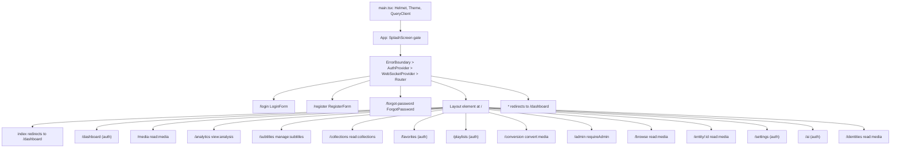
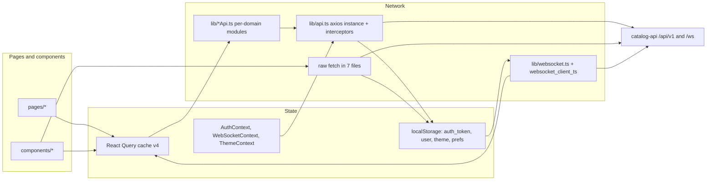
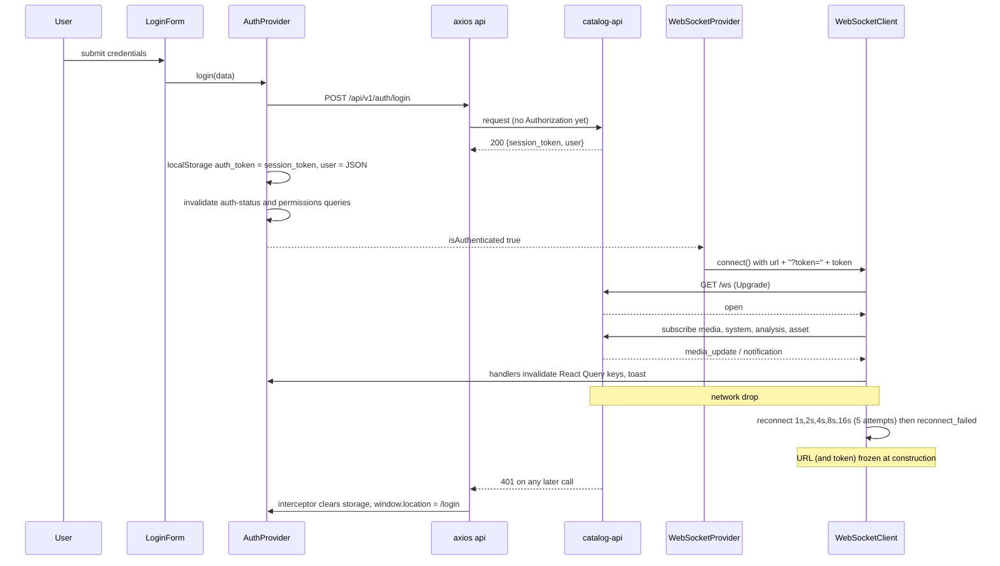
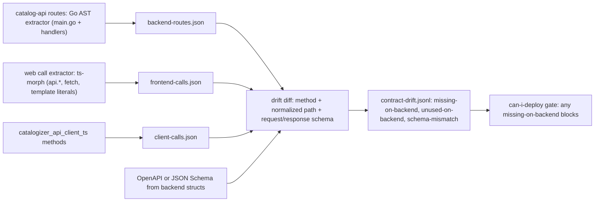

# 08 - Web Client Audit and Remediation Plan (catalog-web and its React/TypeScript submodules)

| Field | Value |
|---|---|
| Revision | 4 |
| Created | 2026-10-03 |
| Last modified | 2026-10-03 |
| Status | draft (revision 4: status note only; tasks.md (rev 8) and document 16 (revision 7) now name the commit-push run directory `$CPA_RUN`, so `$EVID` is used by no plan document and `WEB_EV` stays this document's name; no other change. Revision 3: the section 6.1 evidence-directory variable is renamed from `EVID` to `WEB_EV`, because tasks.md and document 16 then used `$EVID` for the run directory of one commit-push run; no other change. Revision 2: pipe characters inside code spans of three table rows escaped with a backslash, so each row has its header's column count; no content change) |
| Feature | specs/001-full-project-audit-remediation |
| Scope | `catalog-web/` and the nine linked submodules `auth_context_react`, `media_browser_react`, `media_player_react`, `collection_manager_react`, `dashboard_analytics_react`, `ui_components_react`, `websocket_client_ts`, `media_types_ts`, `catalogizer_api_client_ts` |
| Spec traceability | FR-005..FR-011, FR-014..FR-016, FR-021, FR-022, FR-025; SC-002..SC-005, SC-011 |
| Governing anchors | constitution §11.4.27, .162, .170, .190, .193, .216-.223, .224, .226, .238, .244, .245, .262; §1.1 |

## Table of contents

1. Purpose and method
2. Measured baseline (what the repo actually contains)
3. Structure maps (route map, state and data flow, auth plus WebSocket sequence)
4. Seeded findings register (hypotheses with detectors, not yet proven)
5. Audit scope and risk rating by area
6. Detector suite (containerized commands)
7. Configuration reality check (ESLint, type-check, test runner)
8. UI proof method (constitution §11.4.170) with concrete tooling
9. OpenDesign token compliance (§11.4.162, .216-.223)
10. Website versus application obligations (§11.4.190)
11. Test plan by type
12. Performance baselines and budgets
13. Shared-contract drift detection (FR-016)
14. Work-package breakdown
15. Acceptance evidence, risks, decisions, traceability
Appendix A: Playwright evidence-capture spec skeleton (NOT EXECUTED)
Appendix B: Vitest negative-path test (NOT EXECUTED)
Appendix C: Contract-drift extractor (NOT EXECUTED)

---

## 1. Purpose and method

This document is the technical plan for auditing, fixing, testing and proving the web client. It does not restate the spec. Every finding the plan produces follows FR-007/FR-008: location, severity, category, machine evidence, root cause before fix, a test that fails before and passes after.

Method rules binding this plan:

1. **Structural index first (FR-005).** Maps in section 3 come from `codegraph explore` plus targeted reads, not from documentation. The index MUST be proven complete for `catalog-web/src` and the nine submodules before audit conclusions are accepted: (a) file-count parity (index node files versus `git ls-files`), (b) freshness (index mtime later than the last commit touching these paths), (c) known-question probes. Probe results already observed in this planning pass: `useWebSocket` resolves to `catalog-web/src/lib/websocket.ts:48` with the expected callers (`ConnectionStatus`, `WebSocketProvider`); `WebSocketProvider` resolves to `catalog-web/src/contexts/WebSocketContext.tsx:38` with caller `App.tsx`. Those two probes are necessary, not sufficient; the full probe set belongs to the index-readiness work package (W8-00).
2. **No claim without a measurement.** Numbers in section 2 were produced by read-only shell counts in this planning pass (commands in section 6.1). Anything inferred from reading code is labelled HYPOTHESIS and carries a detector that will either produce a RED test or close it as a false positive with evidence (FR-008).
3. **Builds and test runs happen only in rootless containers (FR-021).** No `npm` command is run on the host. `catalog-web/node_modules` does not exist on the host today (checked), which is consistent with that rule.
4. **Real services only for E2E (FR-025).** Section 11 explains why most of the current Playwright suite fails this rule and how it is replaced.

## 2. Measured baseline

All counts exclude `__tests__/` and `*.test.*` unless stated. Measured 2026-10-03 on `main`.

| Metric | Value | How measured |
|---|---|---|
| catalog-web source files (ts/tsx) | 139 | `find src` filtered |
| catalog-web source LOC | 35,356 | `wc -l` |
| catalog-web unit test files | 137 | `find src -name '*.test.*'` |
| Pages (`src/pages/*.tsx`) | 14 files, 5,967 LOC | `wc -l` |
| Largest files | `pages/Collections.tsx` 1,204; `components/collections/CollectionExport.tsx` 948; `ExternalIntegrations.tsx` 902; `CollectionAnalytics.tsx` 902; `ai/AIMetadata.tsx` 871; `CollectionSharing.tsx` 849; `CollectionAutomation.tsx` 847 | `wc -l` |
| Custom hooks | 5 files in `src/hooks` | `ls` |
| `src/store/` and `src/services/` directories | Do not exist, although `tsconfig.json` and `vite.config.ts` alias `@/store` and `@/services` | `ls`, config read |
| `zustand` imports in `src` | 0 (dependency declared in `package.json`) | `grep` |
| `useQuery/useMutation/useInfiniteQuery` calls | 97 in 16 files | `grep` |
| `useState` occurrences | 371 | `grep` |
| Explicit `any` in non-test code | 2 | `grep` |
| Explicit `any` in test code | 417 (ESLint override turns the rule off for tests) | `grep`, `.eslintrc.js` |
| `@ts-ignore/@ts-expect-error/@ts-nocheck` | 0 | `grep` |
| `eslint-disable` directives | 10 in `src` (7 in non-test files); re-measured with `grep -rn "eslint-disable" src` | `grep` |
| `console.*` in non-test code | 21 (Collections 5, Playlists 4, test-setup 3, others 1-2 each) | `grep` |
| Direct `fetch(` in non-test code | 15+ call sites in 7 files (axios instance bypassed) | `grep` |
| Direct axios use | only `src/lib/api.ts` | `grep` |
| `localStorage` auth token reads | `api.ts:25`, `websocket.ts:58`, 10 more inside `CollectionSharing.tsx` and `ExternalIntegrations.tsx` | `grep` |
| `Math.random` in `src` | 60 occurrences in 10 files (58 in 9 non-test files; `CollectionAnalytics` 30, `AIMetadata` 10, `CollectionRealTime` 8); re-measured with `grep -rn "Math.random" src` | `grep` |
| `.then(` versus catch constructs | 130 versus 82 (candidate unhandled chains, needs AST confirmation) | `grep` |
| `key={index}` style keys | 42 (`grep -rnE "key=\{(index\|i\|idx\|[a-z]*[iI]ndex\|[a-z]*Idx)\}" src`) | `grep` |
| `` call shapes in `lib/` and `hooks/` plus the direct-fetch sites.

## 3. Structure maps

### 3.1 Route map (from `App.tsx`)

Provider order is `ErrorBoundary > AuthProvider > WebSocketProvider > Router > Suspense > Routes`; outermost in `main.tsx` are `HelmetProvider > ThemeProvider > QueryClientProvider`. `SplashScreen` gates the whole tree until `onComplete`.

> Note: this diagram passed a structural check (fence and syntax shape) but a real render was not available (no headless browser in the sandbox), so render validity is UNVERIFIED.



Observations that become detectors, not conclusions:

- `Layout` itself is not wrapped in `ProtectedRoute`; protection is per-child. Any new child route added without the wrapper is unauthenticated by default. Detector D-ROUTE-01 (section 6.2) walks the route tree and fails if a non-public path lacks `ProtectedRoute`.
- `requireAdmin` is evaluated client-side as `user.role.name === 'Admin' || user.role_id === 1` (`components/auth/ProtectedRoute.tsx`). This is UI gating only; the backend MUST be the authority. The cross-check is in section 13.
- E2E and Lighthouse reference routes that do not exist: `lighthouserc.json` audits `/catalog` and `/search`; `e2e` specs navigate to `/catalog` (2), `/profile` (1). The wildcard redirects them to `/dashboard`, so those audits measure the wrong page (finding WEB-F09).

### 3.2 State and data flow

Server state is React Query v4 (`@tanstack/react-query` ^4.24.6), default `staleTime` 5 min, `cacheTime` 10 min, retry 3 except 401/403. Client state is `useState` (371 uses) and three contexts (`AuthContext`, `WebSocketContext`, `ThemeContext`). Zustand is declared but unused, and the documented `src/store` directory does not exist, so the project's own module rule "client state in Zustand" has no implementation (finding WEB-F05).

> Note: this diagram passed a structural check (fence and syntax shape) but a real render was not available (no headless browser in the sandbox), so render validity is UNVERIFIED.



The two bypass edges (RAW to BE, LS to WS) are where interceptor behaviour (401 handling, timeout, base URL) and token handling diverge from the main path.

### 3.3 Sequence: login, token use, WebSocket lifecycle

Reconstructed from `lib/api.ts`, `contexts/AuthContext.tsx`, `contexts/WebSocketContext.tsx`, `lib/websocket.ts`, `submodules/websocket_client_ts/src/client.ts`.

> Note: this diagram passed a structural check (fence and syntax shape) but a real render was not available (no headless browser in the sandbox), so render validity is UNVERIFIED.



Facts behind the diagram: the backend login response field is `session_token` (`catalog-api/models/user.go:275,402`); reconnect parameters are `reconnectAttempts: 5`, `reconnectInterval: 1000` set in `lib/websocket.ts`, backoff multiplier default 2, cap `maxReconnectInterval` (default 30000 per `types.ts`), and after `reconnectAttempts` the client emits `reconnect_failed` and stops (`client.ts:314-317`). `lib/websocket.ts` registers no handler for `reconnect_failed`, `reconnecting`, or `heartbeat_timeout`; the `error` handler is deliberately empty; `heartbeatInterval` is not set so heartbeat is off (default 0).

## 4. Seeded findings register

These are hypotheses produced by static reading and counting. None is a finding until its detector yields machine evidence (FR-007). IDs use the prefix `WEB-F` and map to register items on import (FR-001).

| ID | Hypothesis | Evidence seen (path:line) | Severity (provisional) | Detector / proof |
|---|---|---|---|---|
| WEB-F01 | `ConnectionStatus` calls `useWebSocket()` (its own hook instance, `clientRef` null) instead of the context's instance, so `getConnectionState()` returns `closed` while authenticated and the "Disconnected" banner shows permanently. Unit tests mock the hook and cannot see this. | `components/ui/ConnectionStatus.tsx:8`, `lib/websocket.ts:48-52,131-133`; CodeGraph shows `ConnectionStatus -> useWebSocket` | High | Playwright against the real backend: assert banner absent once `/ws` is open; Vitest RED that renders provider plus status without mocking the hook |
| WEB-F02 | Auth token travels in the WebSocket URL query string and is frozen at client construction; after expiry or refresh, reconnects reuse the stale token. Backend `/ws` handler file contains no token reference and `CheckOrigin` returns true. | `lib/websocket.ts:58-59`; `catalog-api/handlers/websocket_handler.go:124-126`; route `router.GET("/ws", ...)` at `catalog-api/main.go:1084` | High (security) | Backend side: connect `/ws` without token against the real service and assert expected rejection; web side: RED test that a 401-then-new-token flow yields a reconnect with the new token. Cross-owned with the backend plan |
| WEB-F03 | Web client calls many endpoints the backend does not register. First seen: `CollectionSharing` and `ExternalIntegrations` call `/api/v1/integrations*` and `/api/v1/collections/:id/share*` (`collectionsGroup` in `main.go` has only list/create/get/update/delete); the components swallow non-OK responses, so the features look alive while doing nothing. Scope widened by the tracked tool `poc/route_drift` (authority: `poc/route_drift/results/run1.json`, heuristic regex extraction, every item a lead): web 166 call shapes, 69 call sites with no matching route; 28 of the 69 are the WEB-F21 double-prefix calls, leaving 41 other unrouted shapes plus about 19 of the 28 that remain unrouted after the prefix fix (see WEB-F21), including `identities*` (5), `discovery*` (5), `collections*` (5), `integrations*` (5), `bulk*` (4), `storage/roots/{}` (4), `media/{}` PUT/DELETE + `GET media/{}/metadata` (3), `subtitles*` (2) and singletons (`auth`, `shared`, `import`, `suggestions`, `templates`, `test-rules`, `download`, `cover`). Files with unrouted calls: `playlistsApi.ts` 20, `identitiesApi.ts` 10, `collectionsApi.ts` 9, `favoritesApi.ts` 8, `mediaApi.ts` 8, `CollectionSharing.tsx` 5, `ExternalIntegrations.tsx` 5, `subtitleApi.ts` 2, `api.ts` 1, `useCoverQuality.ts` 1. The 69 are UNCONFIRMED until each is checked against the router (the tool reports 13 unresolved call sites and cannot see conditional registration). | `components/collections/ExternalIntegrations.tsx:125-332`, `CollectionSharing.tsx:195-349`; `catalog-api/main.go:1471-1478`; `poc/route_drift/results/run1.json` (`client_calls_without_route.web`) | High | Run `poc/route_drift` (supersedes the Appendix C sketch), triage the 41 distinct shapes, plus a real-backend Playwright journey that exercises Share and asserts a persisted result |
| WEB-F04 | Fabricated production data: 60 `Math.random` occurrences in `src` (58 non-test) generate chart/AI/real-time values (`CollectionAnalytics` plays/downloads/shares, `AIMetadata`, `CollectionRealTime`, `Analytics`). | `components/collections/CollectionAnalytics.tsx:189-198` and others | High (bluff class, §11.4.1/§11.4.27) | AST detector: `Math.random` outside `*.test.*`; each hit is either replaced by real API data with a Vitest negative test or removed |
| WEB-F05 | Documented state-management rule not implemented: Zustand declared, zero imports; `@/store` and `@/services` aliases point to missing directories; large local-state components (371 `useState`) carry server data in local state (for example `ExternalIntegrations` loads via `fetch` into `useState`). | `package.json`, `tsconfig.json`, `vite.config.ts`, `ExternalIntegrations.tsx:111-140` | Medium | Dependency/dead-alias detector; decision record DR-W8-02 (section 15) |
| WEB-F06 | E2E mocks have drifted from the real contract: mocked login returns `token` and `refresh_token`, the app reads `data.session_token`, so a mocked success login would store the string `"undefined"` as the token. | `e2e/fixtures/auth.ts` (mock body) versus `contexts/AuthContext.tsx:91` and `catalog-api/models/user.go:402` | High (test validity) | Run the existing login spec against a mocked-then-real backend; see section 11 for replacement |
| WEB-F07 | E2E suite is mock-based by construction (161 `page.route`, fixture `api-mocks.ts` 446 lines) and contains the project's own comments that there is no real WebSocket server. This violates §11.4.27(A) and FR-025 for non-unit tests. | `e2e/fixtures/*.ts`, `e2e/tests/websocket-realtime.spec.ts:13` | High (governance) | Count of `page.route` in specs that claim E2E; replacement plan in section 11.3 |
| WEB-F08 | `playwright.config.ts` declares a `setup` project matching `*.setup.ts` and every browser project depends on it, but no such file exists (`e2e/global-setup.ts` does not match the pattern and is not referenced as `globalSetup`). Also 154 `waitForTimeout` calls make verdicts timing-dependent (violates FR-010). | `playwright.config.ts:50-58`, file listing | Medium | `npx playwright test --list` inside the container; static count |
| WEB-F09 | Lighthouse CI audits non-existent routes `/catalog` and `/search` and uses `temporary-public-storage` upload; Lighthouse and visual specs therefore do not measure the real pages. No committed screenshot baselines exist for `toHaveScreenshot`. | `lighthouserc.json`, `e2e/tests/visual-regression*.spec.ts` | Medium | Route-existence detector D-ROUTE-02; list of baseline dirs |
| WEB-F10 | Container build for the web image is not reproducible: `Dockerfile` copies `WebSocket-Client-TS/` etc. from the build context root while the repo has `submodules/websocket_client_ts/`; every submodule build ends `\|\| true`; app build falls back to `--skipLibCheck`; installs use `--legacy-peer-deps`. The reference `Dockerfile` therefore cannot be shown to work from this tree. | `catalog-web/Dockerfile` | High (FR-021) | Build in rootless podman from repo root with the real context; capture exit code and layer logs. UNCONFIRMED which compose or script supplies a different context |
| WEB-F11 | Peer-version divergence between app and shared modules: app on React Query v4, TypeScript 4.9, Vitest 4; shared `auth_context_react`, `media_browser_react` target React Query ^5.0.0, TypeScript ^5.4, Vitest ^2. The registry file documents that this blocks adopting the shared AuthProvider. `module-registry.ts` imports shared components (collection manager, dashboard analytics, media browser) into the bundle without using them. | `package.json`, `submodules/*/package.json`, `lib/module-registry.ts:1-60` | Medium | `vite build` bundle analysis for dead imports; dependency matrix in W8-09 |
| WEB-F12 | Hand-written ambient module declarations (`src/types/modules.d.ts`, 482 lines) shadow the shared packages; where `dist/` is absent the app type-checks against the shadow, not the real API, so drift is invisible to `tsc`. | `src/types/modules.d.ts:1-15` | Medium | Build submodules first, then type-check with the shadow file removed; diff of errors |
| WEB-F13 | `tsconfig.json` excludes all tests (`__tests__`, `*.test.ts(x)`, `test-setup.ts`) from type checking, so `npm run type-check` and `tsc` in `npm run build` never check 137 test files; `noUnusedLocals` and `noUnusedParameters` are false. | `tsconfig.json` | Medium | Separate `tsconfig.test.json` run; error count |
| WEB-F14 | Hard-coded version labels `v1.1.0` in `Layout.tsx:15` and `SplashScreen.tsx:64` (and asserted in a test) while `package.json` is 2.4.0. | grep | Low | String-versus-package.json detector; derive from build define |
| WEB-F15 | Accessibility gaps (candidates): 11 `div/span` click handlers; 0 reduced-motion handling despite 39 framer-motion files; 42 index keys; `lang` set but no skip link or landmark check proven; one `target="_blank"` without `noopener`. | greps in section 2 | Medium | axe in Playwright on every route and state, plus reduced-motion emulation test |
| WEB-F16 | Auth/session lifecycle: 401 handler uses `window.location.href` (hard reload, loses router state); 10 s global axios timeout with no cancel on route change; `CollectionSettings` stores per-collection preferences in `localStorage` keyed by id with no schema validation on read. | `lib/api.ts:48-50`, `CollectionSettings.tsx:152-171` | Low-Medium | Targeted negative-path tests |
| WEB-F17 | Missing security response headers in `nginx.conf` (no CSP, `X-Content-Type-Options`, `Referrer-Policy`, `frame-ancestors`); `/api` and `/ws` upstream is hard-coded `host.containers.internal:8080`; Google Fonts loaded from a third-party origin (privacy and CSP surface). | `nginx.conf`, `index.html` | Medium | Container run plus `curl -I` header probe; Lighthouse best-practices |
| WEB-F18 | Shared submodule quality items: `websocket_client_ts` has `console.error` in listener dispatch and 3 `any`; `ui_components_react` carries a committed `dist/` and 1 `any`; `websocket_client_ts/Upstreams/*` references a remote under a personal GitHub account (`nickkvasic/WebSocket-Client-TS`) that differs from `.gitmodules` (`vasic-digital/WebSocket-Client-TS`). | greps, `Upstreams` script | Low-Medium | Submodule detector set (section 6.4); upstream mismatch handed to the dependency plan (FR-017) |
| WEB-F19 | Coverage configuration: no coverage thresholds, no `coverage` block, no `include/exclude` in `vite.config.ts`; `@vitest/coverage-v8` is present but the project has no recorded baseline (FR-011). | `vite.config.ts` | Medium | First container coverage run records baseline |
| WEB-F20 | `React.lazy` pages exist but `PerformanceOverlay`, devtools and `module-registry` are always bundled; manual chunks are a static map (react, router, ui, charts, utils) with no size budgets enforced in CI-equivalent local gates. | `vite.config.ts`, `main.tsx` | Medium | Bundle report plus budgets (section 12) |
| WEB-F21 | Double API prefix (HYPOTHESIS until a live request is captured): `lib/api.ts:17` sets the axios `baseURL` to `${API_BASE_URL}/api/v1`, while `lib/favoritesApi.ts` (lines 25, 31, 37, 43, 49, 55, 60, ...) and `lib/playlistsApi.ts` (27, 33, 50, ...) call `api.get('/api/v1/favorites...')` / `api.get(`/api/v1/playlists...`)`, so requests would go to `/api/v1/api/v1/...`. Read: `favoritesApi.ts` 8 calls and `playlistsApi.ts` 20 calls use a literal `/api/v1` path (28 in web; the PoC reports 30 `double_prefix_calls` in total, the other 2 are in `catalogizer-android/.../CatalogizerApi.kt`). Static read: the backend registers only `router.Group("/api/v1")` (`catalog-api/main.go:1163`, no `NoRoute`), so the doubled path is not served; runtime capture still pending. `VITE_API_BASE_URL` defaults to empty. Fixing the prefix alone does NOT restore the features: after de-prefixing only 9 of the 28 call shapes match a gin route (`main.go` ~1554-1572). Favorites has only GET/POST `""`, DELETE `/:entity_type/:entity_id` and GET `/check/:entity_type/:entity_id`, so `/favorites/stats`, `/toggle`, `/check/{mediaId}`, DELETE `/favorites/{mediaId}` and both `/bulk` calls stay unrouted (6) and the favorites path shape differs from the client; playlists has 7 routes, so 13 calls stay unrouted (GET `/:id/items`, `/share`, `/duplicate`, `/reorder`, `/import`, `/analytics`, `/export`; `GET /playlists/shared/{token}` would wrongly match `/:id`). The mux routes in `internal/handlers/media_player_handlers.go:111-118` are unwired (`RegisterRoutes` is called only from tests). About 19 of 28 calls still have no gin route; UNCONFIRMED until `poc/route_drift` is re-run with prefix normalisation. | `lib/api.ts:14,17`; `lib/favoritesApi.ts:25-60`; `lib/playlistsApi.ts:27,33,50`; `poc/route_drift/results/run1.json` (`counts.double_prefix_calls` = 30) | High | Detector D-ROUTE-03: AST scan for an axios call whose literal path starts with the instance `baseURL` suffix (reproduced by `poc/route_drift`); Playwright against the real backend that favorites and playlists load and records the real request URL; Vitest RED asserting `api.get` is invoked with a path relative to `baseURL`; remediation MUST include a Playwright journey asserting a persisted favorite or playlist (create, reload, still present), not only the request URL |

This table is the seed list handed to the register importer; it is not a statement that these are fixed or confirmed.

## 5. Audit scope and risk rating by area

Risk = likelihood of user-visible failure x blast radius x current evidence gap. Ratings are provisional and are re-ranked after the first detector pass using reopen counts (§11.4.132/.189).

| # | Area | Contents | Risk | Why |
|---|---|---|---|---|
| A1 | Auth, session, route guards | `contexts/AuthContext.tsx`, `lib/api.ts`, `components/auth/*`, `App.tsx` guards, token storage | High | Security boundary; localStorage token; 401 handling; client-side admin check; F02/F06/F16 |
| A2 | Realtime | `lib/websocket.ts`, `contexts/WebSocketContext.tsx`, `ConnectionStatus`, `websocket_client_ts` | High | F01/F02; reconnect gives up after 5 tries; no heartbeat; token frozen |
| A3 | Collections (largest code mass) | `pages/Collections.tsx` (1,204 LOC), 14 files in `components/collections/` (about 9,500 LOC) | High | Fake data (F04), dead endpoints (F03), size and complexity |
| A4 | Playlists and playback | `components/playlists/*`, `MediaPlayer.tsx`, `playbackApi` | Medium-High | Core user value; real-media evidence required (§11.4.136/.143) |
| A5 | Media browse and entity views | `MediaBrowser`, `EntityBrowser`, `EntityDetail`, `entity/*`, `media/*` | Medium-High | Primary journey (SC-011 browsing, search) |
| A6 | AI and analytics dashboards | `ai/*` (3 components, about 2,150 LOC), `Analytics.tsx`, `AIDashboard.tsx`, `dashboard/*` | Medium-High | `Math.random` data; charts must show real values |
| A7 | Admin, settings, identity, conversion, subtitles | `Admin`, `Settings`, `IdentityManager` (the only page without a test), `ConversionTools`, `SubtitleManager` | Medium | Permissioned surfaces; one untested page |
| A8 | Design system and theming | `styles/tokens.ts`, `index.css`, `tailwind.config.js`, `ThemeContext`, `ui/*` | Medium | §11.4.162/.216 compliance gaps (section 9) |
| A9 | Build, container, delivery | `Dockerfile`, `nginx.conf`, `vite.config.ts`, `lighthouserc.json` | High | F10/F17; FR-021 |
| A10 | Test infrastructure | `src/test-setup.ts` (globals mocked: fetch, WebSocket, storage, crypto), `e2e/*`, `playwright.config.ts` | High | F06/F07/F08; verdicts must be real and deterministic |
| A11 | Shared React submodules (6) | auth_context, media_browser, media_player, collection_manager, dashboard_analytics, ui_components | Medium | Small (175-1,039 LOC each), version-divergent from the app; used only through `module-registry.ts` and 3 UI imports |
| A12 | Shared TS submodules (3) | websocket_client, media_types, catalogizer_api_client | High | Contract owners; the API client cannot run in browsers because it uses Node `EventEmitter` (documented in `module-registry.ts`) |
| A13 | Docs and exports | `catalog-web/*.md` (9 PHASE and status docs at package root, README, ARCHITECTURE, CLAUDE, AGENTS, docs/) | Medium | FR-012/FR-013; status docs likely stale; mapped by the documentation plan |

Out of scope here (owned by other plan documents): the Go backend handlers themselves, Android/TV/desktop clients, Website (covered only by the obligations matrix in section 10).

## 6. Detector suite (containerized)

### 6.1 Execution environment

All detectors run in a rootless Podman container with the repository mounted read-only except an evidence directory. No `sudo`, no host `npm`. Resource limits come from constitution §12.6/§12.12 (60 percent memory ceiling, thread headroom), applied via `--memory` and `--pids-limit`.

```bash
# NOT EXECUTED. One-time image selection: pin to the resolved Playwright version in package-lock.json.
export WEB_NODE_IMAGE=docker.io/library/node:20-alpine        # matches catalog-web/Dockerfile builder stage
export WEB_PW_IMAGE=mcr.microsoft.com/playwright:v<PIN_FROM_LOCKFILE>-jammy   # UNKNOWN: exact tag must be read from package-lock.json
export WEB_EV=specs/001-full-project-audit-remediation/evidence/web

podman run --rm --memory=8g --pids-limit=2048 \
  -v "$PWD":/work:ro,Z -v "$PWD/$WEB_EV":/evidence:rw,Z \
  -w /work/catalog-web "$WEB_NODE_IMAGE" \
  sh -c 'cp -r /work /tmp/w && cd /tmp/w/catalog-web && npm ci --legacy-peer-deps && npm run type-check 2>&1 | tee /evidence/tsc.txt'
```

Rationale for copying: the mounted tree is read-only (so a detector can never alter the repo), and `npm ci` needs a writable tree. The `file:../submodules/*` dependencies force the mount root to be the repository root, not `catalog-web/`.

### 6.2 Detector catalogue

Each detector writes JSON Lines to `$WEB_EV/<id>.jsonl` with fields `{id, rule, path, line, snippet_sha256, severity, tool_version, run_utc}`. A detector is accepted only after it has been shown to fire on a seeded bad fixture and stay silent on a clean one (§11.4.201(6)-(7) control needle; §11.4.107(10)).

| ID | Purpose | Tool and command (inside container) | Seeded fixtures for validation |
|---|---|---|---|
| D-TSC-01 | Type errors, including tests | `npx tsc --noEmit -p tsconfig.json` and `-p tsconfig.test.json` (new, includes tests) | File with `const x: number = "a"` |
| D-LINT-01 | Zero-warning lint (FR-009/FR-010) | `npx eslint . --ext ts,tsx --max-warnings 0 -f json -o /evidence/eslint.json` | File with unused var and `any` |
| D-LINT-02 | Lint rules that `.eslintrc.js` does not enable | add in a separate config: `@typescript-eslint/no-floating-promises`, `no-misused-promises`, `jsx-a11y/*`, `no-console`, `react/no-array-index-key` | Floating promise fixture |
| D-ANY-01 | `any`, `ts-ignore`, `eslint-disable` census with per-file delta | `ts-morph` script over `src` (non-test and test separately) | Fixture with one of each |
| D-FETCH-01 | Raw `fetch`/`XMLHttpRequest`/`axios` outside `lib/api.ts` | `ts-morph` call-expression scan | Fixture component calling `fetch` |
| D-TOKEN-01 | Reads/writes of auth token storage outside `lib/api.ts` and `AuthContext` | AST scan for `localStorage\|sessionStorage\|document.cookie` with key regex `token\|auth\|session` | Fixture |
| D-RANDOM-01 | `Math.random`, `Date.now()` used to fabricate data in non-test code | AST scan with allowlist for ids and animation | Fixture |
| D-PROMISE-01 | Unhandled promise chains: `.then()` without `.catch`, `async` handlers without try/catch, floating promises | `typescript-eslint` type-aware rules plus AST for chains | Fixture |
| D-CONSOLE-01 | `console.*` in non-test code | AST scan | Fixture |
| D-ROUTE-01 | Every `Route` outside the public set is wrapped in `ProtectedRoute` | AST over `App.tsx` | Fixture route without wrapper |
| D-ROUTE-02 | Routes referenced by e2e, Lighthouse and docs exist in `App.tsx` | Extract `goto`/`url` literals and compare to route table | `/catalog` fixture |
| D-ROUTE-03 | No axios call on a baseURL-bearing instance uses a literal path starting with that baseURL's path suffix (`/api/v1`) | `route_drift.py` `double_prefix_calls == 0` (AST scan as follow-up) | Fixture: `api.get('/api/v1/x')` on an instance with baseURL `/api/v1` |
| D-A11Y-01 | Static a11y (click on non-interactive element, missing labels) | `eslint-plugin-jsx-a11y` | Fixture |
| D-A11Y-02 | Runtime a11y on each route, state and theme | `@axe-core/playwright` (already a devDependency) in the real-backend suite | Page with a known contrast failure |
| D-DEP-01 | Dead dependency and alias census (zustand, `@/store`, `@/services`) | `depcheck` and alias existence check | Fixture alias |
| D-BUNDLE-01 | Bundle composition and budgets | `vite build` with `rollup-plugin-visualizer` JSON output; compare to budgets in section 12.2 | Oversized import fixture |
| D-HEADERS-01 | Security headers from the built image | run the built nginx image, `curl -sI` against `/` and `/api` | Image without headers |
| D-TOKENS-01 | OpenDesign token compliance (section 9) | CSS/TS scan for raw hex and px outside token files; parity check tokens.ts versus `index.css` | Fixture with `#123456` literal |
| D-CONTRACT-01 | Frontend-to-backend contract drift | Appendix C extractor plus Go route extractor | Fixture path not in backend |
| D-SUBMOD-01 | Per-submodule: lint, type-check, `any/console` census, peer-version matrix, `dist/` tracked in git | Same detectors run with `-w /work/submodules/<name>` | Fixture |
| D-VERSION-01 | Hard-coded version strings versus `package.json` | grep `v[0-9]+\.[0-9]+\.[0-9]+` in `src` | Fixture |
| D-MUTATE-01 | Mutation sampling for tests (FR-010, SC-005) | `@stryker-mutator/core` with vitest runner on the sampled modules; UNCONFIRMED that stryker is acceptable under the dependency-existence-verdict rule (§11.4.270): must be verified and adopted via the dependency register first | Test that always passes |

### 6.3 Idempotence and determinism (SC-002)

Each detector is run twice from the same commit and its output `sha256sum` MUST be identical (sorted keys, no timestamps inside the hashed body; the `run_utc` field is stored in a sidecar file). A non-identical pair is a defect in the detector, not in the code.

### 6.4 Submodule-specific checks

- For each of the nine submodules: `npm ci`, build (`tsc`), `vitest run`, lint (if configured), then `git status` and `git log @{u}..` per FR-019/FR-020.
- Fixes land in the submodule repository on its `main` and are pushed to all its upstreams (clarified requirement in spec 2026-10-03 session). The `Upstreams` helper script in `websocket_client_ts` names a different GitHub account than `.gitmodules`; the upstream list must be reconciled by the dependency plan before any push.
- `ui_components_react` tracks a `dist/` directory; the decision (remove tracked build output versus keep as the file-link target) needs a decision record because `catalog-web` links `file:../submodules/ui_components_react` and the app's Vitest config pre-bundles it (`deps.optimizer.web.include`). §11.4.122 applies: any removal of a shipped artifact requires an explicit operator decision first.

## 7. Configuration reality check

| Control | Declared | Actual (read from config) | Gap and plan |
|---|---|---|---|
| ESLint zero warnings | `npm run lint` uses `--max-warnings 0` (`package.json`) | Rules `no-explicit-any`, `no-unused-vars`, `no-empty-function`, `no-non-null-assertion`, `display-name` are set to `warn`, so each becomes a build failure under zero-warning; `security/detect-object-injection` is off; tests are exempt from `any` and non-null rules; no type-aware rules, no a11y plugin, no `no-console`, no `no-floating-promises` | Run D-LINT-01 as is first and record the real count (UNKNOWN today; it was not run on the host). Then add D-LINT-02 rules in a dedicated config; every new violation is a finding fixed under FR-008 |
| Type-check | `tsc --noEmit`, `strict: true` | Tests excluded; `noUnusedLocals/Parameters` false; ambient shadows for shared modules; `skipLibCheck: true` | `tsconfig.test.json` for tests; evaluate enabling the two unused flags (likely hundreds of hits, so measure first); remove shadows once submodules build (WEB-F12) |
| Unit tests | Vitest 4, jsdom, 137 test files | 978 `vi.fn`, 94 files with `vi.mock`; `test-setup.ts` globally mocks `fetch`, `WebSocket`, `localStorage`, `crypto.randomUUID`, media and canvas; 57 weak-assertion candidates (`toBeTruthy` or boolean tautologies); 23 snapshot assertions | Valid as unit tests (§11.4.27 allows mocks only here). Weak assertions are triaged by mutation sampling, not deleted blindly (§11.4.124) |
| Coverage | `@vitest/coverage-v8` installed | No coverage block, no thresholds, no recorded baseline | W8-03 records the baseline per FR-011 and sets a dated target; interim floor equals the recorded baseline (never lower) |
| E2E | Playwright 5 projects incl. WebKit and Pixel 5, `retries` 0 locally | `setup` project matches nothing; 161 mocks; 154 `waitForTimeout`; `trace` and `video` only on first retry (so none with 0 retries) | Section 11.3 |
| Lighthouse | `lighthouserc.json` thresholds 0.9 for four categories, LCP 2.5 s, CLS 0.1, TBT 300 ms | Wrong URLs; thresholds are aspirational and unmeasured; upload target public temporary storage (a data-egress concern for local-only governance) | Section 12 |

## 8. UI proof method (constitution §11.4.170)

### 8.1 Obligation

Every change to a user-facing surface MUST be proven by device-independent, host-side rendered pixels, per screen x state x {light, dark}, validated by BOTH (i) a golden image-diff and (ii) an OCR/vision oracle that reads rendered text, labels and control bounds and asserts no overlap, clipping, off-screen or collapsed/giant widget. Value or token-equality unit tests may supplement but never substitute. "Device-independent" here means rendering the real built web app in a headless browser inside a container; no physical device is involved for the web client.

### 8.2 Tooling plan

| Layer | Tool | Role | Notes |
|---|---|---|---|
| Renderer | Playwright (Chromium, Firefox, WebKit) in the pinned Playwright container image | Produces deterministic PNGs of the real production build (`vite build` output served by `vite preview` or the nginx image), not the dev server | Fonts: Google Fonts are loaded remotely in `index.html`; for determinism the audit self-hosts Inter and JetBrains Mono (vendored files, §11.4.218 zero-CDN rule) before baselines are taken |
| Determinism controls | `reducedMotion: 'reduce'` emulation for baseline captures, fixed viewport, `deviceScaleFactor: 1` plus a second pass at 2, `colorScheme` set per theme, frozen clock via `page.clock`, animations disabled via `animations: 'disabled'`, `caret: 'hide'`, mask for the version label | Satisfies FR-010 (same verdict every run) | Real backend data is seeded (section 11.3), so content is stable by fixture, not by mock |
| Golden diff | Playwright `toHaveScreenshot` with `maxDiffPixelRatio` set in config per surface class; baselines committed under `e2e/__screenshots__/` and reviewed in the diff | Detects regressions | Baselines are produced from the real-backend run, never from mocks; a baseline authored on the first run is accepted only after the OCR oracle passes |
| OCR oracle | Tesseract at 150 DPI or higher (the constitution's minimum in §11.4.193), run in the same container image or a sibling one; page screenshots are captured at `deviceScaleFactor: 2` and downscaled/upscaled to reach at least 150 effective DPI | Reads rendered strings; compared with the DOM text (`innerText`) of visible nodes; any visible DOM string not recovered by OCR above a similarity threshold, or OCR text that lies under another element's bounding box, is a finding | Two-sided check (DOM versus OCR) catches clipped and overlapped text that DOM-only tests miss |
| Layout oracle | `boundingBox()` sweep over all interactive and text nodes, intersect/overflow/off-viewport tests (no overlap between label and label, no node wider than the viewport, no zero-size control) | Machine-checkable "no overlap" | Produces JSON per screen x state x theme |
| Contrast and a11y | `@axe-core/playwright` in the same capture pass | Contrast and role issues in both themes | Complements, does not replace, the pixel proof |
| Self-validation | Golden-good and golden-bad fixture pages (an intentionally overlapping, clipped, giant-button page) plus a negative control | Analyzer must PASS the good page and FAIL the bad ones before its verdicts are trusted (§11.4.107(10)) | Fixture pages live under `e2e/oracle-fixtures/` |

Theme switching: the app toggles `class="dark"` on `<html>` (`ThemeContext.tsx:48`) and persists the choice under `localStorage['catalog-web-theme']`. The capture harness seeds that key before navigation so each theme is deterministic. The constitution's token rule (§11.4.216) names the `[data-theme="dark"]` mechanism; the gap is recorded in section 9.

### 8.3 Screen x state x theme matrix

States per page: loading (skeleton), empty, populated, error (backend 500 from the real service via a controlled fault endpoint or a real invalid request), unauthorized (permission redirect), and where applicable modal-open and form-error. Themes: light, dark. Viewports: 1280x800, 768x1024, 390x844 (the app's mobile project is Pixel 5). Estimated matrix size: 17 routes (3 public plus 14 protected incl. `/entity/:id`) x about 4 states x 2 themes x 3 viewports = about 400 captures per browser; WebKit and Firefox are sampled (primary pages only) rather than the full matrix to keep run time bounded. UNKNOWN: the real wall-clock cost; it is measured in W8-05 and the matrix is trimmed only with a recorded decision.

State generation from the real backend: loading states require a deliberately slow real response (a test-only slowdown knob on the backend or a container-level network shaper such as `tc` inside a netns; chosen in DR-W8-04 to keep FR-025 intact); error states use real validation errors and a real stopped dependency container, never an intercepted route.

### 8.4 Evidence format

Per capture: `{screen, state, theme, viewport, browser, png_path, png_sha256, ocr_json, layout_json, axe_json, diff_ratio, verdict}`. The run manifest includes the container image digest, the git commit of main and each submodule, and the build artifact hash (so a verdict is bound to a candidate artifact, §11.4.115(F)/§11.4.236). The reviewer samples captures and re-runs them (SC-005 sampling).

## 9. OpenDesign token compliance (§11.4.162, .216-.223)

Current state, read from the repository:

- `src/styles/tokens.ts` is a hand-authored TypeScript module that states it mirrors the OpenDesign taxonomy because `nexu-io/open-design` "is NOT npm-consumable" (`docs/design/OPENDESIGN_CONSUMABILITY_VERDICT.md` is the cited evidence). `src/index.css` defines `:root` and `.dark` shadcn HSL variables; `tailwind.config.js` derives colour ramps from `tokens.ts`.
- Dark mode uses the `.dark` class and Tailwind `darkMode: 'class'`.

Gap analysis against the constitution:

| Requirement | Observed | Gap | Remediation work item |
|---|---|---|---|
| §11.4.216 ONE canonical machine-readable CSS token file (`:root {}` + `[data-theme="dark"]`), platforms consume generated bindings | Source of truth is TypeScript, CSS vars are a consumer; dark is `.dark` not `[data-theme="dark"]` | Different canonical format and dark mechanism | W8-07: generate `tokens.css` from the existing values (or invert: make CSS canonical and generate `tokens.ts`); support both selectors during migration; decision DR-W8-03 |
| §11.4.217 `DESIGN.md` 9-section brand contract and `tokens.css` twin under `design/opendesign/` | No `design/opendesign/` directory in the repo root (checked); `docs/design/` holds audit/plan docs only | Contract artifacts absent | W8-07 creates them; shared with the Android/desktop plans, so the brand contract is authored once at repo level |
| Disjoint colour roles, AA-pinned accents | Palette includes brand, secondary, accent, success/warning scales; contrast ratios not recorded | Not evidenced | D-TOKENS-01 computes WCAG ratios per accent/background pair in both themes and records them |
| No raw hex outside token files | 19 `#RRGGBB` literals in `.tsx`; `main.tsx` toast styles use raw hex `#363636 #059669 #dc2626` | Violations | Replace with token classes; D-TOKENS-01 gates this |
| §11.4.218 living component catalogue (every component x state x theme, zero CDN) | None in the repo (no Storybook or catalogue app found) | Absent | W8-06: a self-contained catalogue page built from `components/ui/*` and shared `ui_components_react`; becomes also the golden-baseline source for the UI proof |
| §11.4.219 screen catalogues | Not present | Absent | Produced by the section 8 capture run (screens x states x themes), embedded in the web user manual |
| §11.4.221 motion discipline | 39 framer-motion files, 0 reduced-motion handling, no motion manifest | Violation | Wrap with `useReducedMotion`/`MotionConfig reducedMotion="user"`; manifest per animation; test with `reducedMotion: 'reduce'` emulation |
| §11.4.222 export wave, §11.4.223 provenance markers | Not applicable to code beyond tokens/screens; applies to the design docs the plan produces | Doc-level | Documentation plan |
| Font self-hosting (§11.4.218 zero external requests) | `index.html` loads Google Fonts | Violation | Vendor fonts; remove `preconnect`; also removes a CSP exception (WEB-F17) |

Trade-off recorded: inventing a runtime dependency on OpenDesign is rejected (the verdict doc says it ships no token package); the plan extends the project's own tokens to meet the structural rules instead, in line with §11.4.74's extend-not-reimplement ordering only where an upstream artifact exists.

## 10. Website versus application obligations (§11.4.190)

§11.4.190 binds every "website / web-UI a project ships", including the project's own website. The Website (`Website/`) is audited by another plan document; this table records what this plan applies to which surface so there is no gap or double work.

| Obligation | catalog-web (authenticated app) | Website (public, `Website/`) |
|---|---|---|
| (A) Responsive across Chromium/Firefox/WebKit, OS, device classes | Applies in full: 3 viewports x 3 engines (WebKit and Firefox on primary pages). It is a logged-in app, so OS variance is covered by engine coverage plus the Pixel 5 emulation | Applies in full with the broader device matrix |
| (B) Complete SEO | Mostly N/A: authenticated pages are not indexable; the app should send `noindex` (to be verified) and keep per-route titles via `react-helmet-async` (installed; usage is UNCONFIRMED and is measured by a detector). The login page is the only public surface | Applies in full: titles, meta, OG/Twitter, canonical, JSON-LD, robots, sitemap, Lighthouse SEO floor |
| (C) Unique OpenDesign-authored layouts | Applies via section 9 (tokens and catalogue) | Applies in full |
| (D) Enterprise visual quality in light and dark | Applies; proof in section 8 | Applies |
| (E) Anti-bluff proof (host-rendered screenshots, OCR/layout oracle, Lighthouse audit with score floor, token provenance) | Applies; Lighthouse runs on real routes only (WEB-F09 corrected) | Applies |
| Accessibility (WCAG AA) and Core Web Vitals | Applies | Applies |

The score floor for Lighthouse SEO is a consumer decision (§11.4.35): the existing 0.9 value in `lighthouserc.json` is adopted as the starting threshold for the public login page and the Website; the authenticated pages are held to performance, accessibility and best-practices only.

## 11. Test plan by type

Constitution §11.4.27 requires, for every application where it applies: unit, integration, E2E, full automation, security, DDoS, scaling, chaos, stress, performance, benchmarking, UI, UX, Challenges and HelixQA. The matrix below lists the web-client treatment; `n/a` rows carry the reason, and each is a decision to be confirmed by the reviewer, not a silent skip (FR-009: an absent type is a finding and is fixed by writing it).

### 11.1 Coverage matrix

| Type | Existing | Gap | Plan |
|---|---|---|---|
| Unit (Vitest) | 137 files; mocks allowed here | Weak assertions (57 candidates), no baseline, tests excluded from type check | W8-03: baseline, `tsconfig.test.json`, mutation sampling, strengthen |
| Integration (real modules, real network to the real backend in a container) | `AuthFlow.integration.test.tsx` exists but runs under jsdom with mocked fetch (global stub) | Mock-based, so it is a unit-level test | W8-04: integration tests run Vitest in `node` or jsdom environment against the real `catalog-api` container (no `fetch` stub); separate `vitest.integration.config.ts` |
| E2E (Playwright) | About 30 spec files, mock-based | Violates FR-025/§11.4.27(A) | W8-05: rebuild on a real stack (section 11.3) |
| Full automation | Covered by E2E journeys plus HelixQA banks | Bank coverage for web unknown | W8-12 maps HelixQA web banks to routes (UNCONFIRMED where they live; the QA plan owns that) |
| Security | Lint plugin `security`; no web-specific tests | No XSS, token storage, CSP, header, open-redirect tests | W8-08: header probe, `dangerouslySetInnerHTML` ban (0 today, keep at 0), token-in-URL test, `target=_blank` rule, ReDoS check on user-input regexes in `collectionRules.ts` |
| DDoS | n/a for the SPA itself | The web tier is nginx serving static files | Covered by the backend/infra plan with the nginx limits (`limit_req`) added in W8-08 and probed in the container |
| Scaling | n/a for the SPA | CDN/nginx static scaling only | Probe with `hey`/`k6` against the nginx image; recorded in W8-10 |
| Chaos | None | Network faults for WebSocket and API | W8-05b: kill backend container mid-session, restore, assert reconnect, banner, query recovery (real fault injection, no mock) |
| Stress | None | Large library rendering | W8-10: seeded 50k-item library; virtualization (`react-window`) behaviour, memory growth over a 30-minute soak (heap snapshot diff) |
| Performance | `e2e/tests/performance.spec.ts` (321 lines) | Timing assertions are mock-backed | W8-10: Core Web Vitals method below |
| Benchmarking | None | Component-level render benchmarks | Vitest bench for list and grid components; recorded baselines |
| UI (visual) | Visual specs without baselines | Section 8 | W8-06 |
| UX / usability | `accessibility*.spec.ts` | Real keyboard and screen-reader flows, reduced motion | W8-06/W8-08: axe on all states, keyboard-only journeys, reduced-motion emulation |
| Contract | None on the web side | FR-016 | W8-09: both-sided contract tests, section 13 |
| Challenges / HelixQA | Backend has a `challenges/` runner; web banks UNKNOWN | Web challenges for login, browse, playback | QA plan; this plan supplies the journey list |
| Accessibility | Present, mock-backed | Real-state a11y | As above |

### 11.2 Unit and integration rules

- Unit tests may mock. Each new test MUST be RED first on the broken artifact (§11.4.224(A), §11.4.115): the work package records the failing run id before the fix commit.
- No test may assert only `toBeTruthy()` or "renders without crashing" for behaviour-bearing code. Reviewer-authored mutations (at least one the author did not write, §11.4.194(6)(d)) are applied on a sample for SC-005.
- Integration tests run against a real Go backend container started through the Containers submodule (§11.4.76/.161), with a real SQLite or PostgreSQL service as the backend plan defines; credentials come from `.env` (never committed).

### 11.3 E2E on a real stack (replacing mock-based E2E)

Design (rejected alternatives noted):

1. A compose file brings up `catalog-api`, its datastore, and the built `catalog-web` image (nginx) in rootless Podman. A seed job registers a deterministic library (small real media fixtures committed as test assets) and creates users for each permission class (admin, regular, read-only).
2. Playwright runs in its container against `http://web:3000`. The `setup` project is implemented as real `*.setup.ts` files that perform an actual login through the UI and save `storageState` per role (fixing WEB-F08 correctly instead of deleting the project).
3. Playback tests use real media and verify decoded progress (`currentTime` advance, rendered frame hash), per §11.4.136/§11.4.143 (browse, choose a specific title, press Play); no sample-clip shortcut.
4. Tests that depend on an external service (for example metadata providers) run against the real service; if it is not reachable the test is reported **blocked** with the exact reason and counts as not passing (FR-025). It is never skipped and never mocked.
5. `page.route` is removed from E2E specs. A small number of fault scenarios use real fault injection instead (stop container, shape network); recorded in DR-W8-04.
6. `waitForTimeout` is replaced by condition waits (`expect.poll`, `waitForResponse`, `locator` auto-wait). The count must reach 0 (detector D-E2E-WAIT).
7. Trace, screenshot and video are set to `on` for the evidence run so every verdict has artifacts (the current `on-first-retry` with `retries: 0` records nothing).
8. Duplicate specs (`e2e/accessibility.spec.ts` versus `e2e/tests/accessibility.spec.ts`, and likewise auth, collections, favorites) are reconciled; the weaker of each pair is merged into the stronger with history checked first (§11.4.124).

Rejected: keeping mocks and adding a few "real" specs. That leaves the PASS meaning "mocks agree with the frontend", which is exactly the failure class the prime directive in `CLAUDE.md` forbids.

### 11.4 Negative-leg proof

For every fixed finding: the RED test, the fix commit, the GREEN test, and the deliberately-broken variant (revert patch) are recorded; the revert patch is the canonical mutation (§11.4.115(F)). The register item carries the four run ids.

## 12. Performance baselines and budgets

### 12.1 Core Web Vitals method

Targets are this project's own (spec SC-011 says the constitution's external latency target does not bind); numbers below are starting proposals that the first measurement replaces with recorded baselines and dated targets.

- **Lab**: Lighthouse in the Playwright container, `numberOfRuns: 5`, median reported, against the production build served by nginx, with real backend data, desktop and mobile presets, throttling as in `lighthouserc.json` (RTT 40 ms, 10 Mbps, CPU slowdown 1 for desktop; mobile preset default 4x CPU). Metrics: LCP, CLS, INP (replacing the deprecated FID check `max-potential-fid`), TBT, FCP, TTFB, Speed Index.
- **Field-like**: the app already ships `web-vitals` (`onCLS, onFCP, onINP, onLCP, onTTFB` in `lib/webVitals.ts`); `sendToAnalytics` posts to `VITE_ANALYTICS_URL` only if set. For the audit, point it at a local collector container and store the distribution from the E2E journeys (p75 per metric per route).
- **Critical operations** (SC-011): sign-in, library browse (first page and scroll to 1,000 items), search keystroke-to-results, playback start (click Play to first decoded frame), scan-status refresh, dashboard load. Each is measured with `performance.mark/measure` injected by the Playwright harness (no production code change needed to start; production marks are added only where the harness cannot observe).
- **Statistical rule**: at least 5 runs per measurement, report median and p95, fail the baseline comparison only when the p95 regression exceeds a threshold recorded per operation (the threshold itself is set after observing variance, not guessed).

### 12.2 Bundle budgets

| Budget | Initial value | Basis |
|---|---|---|
| Initial JS (gzip) | UNKNOWN: set to measured value on first `vite build` in the container; budget = measured value (no regression), then ratchet down | No measurement exists yet |
| Per route chunk | UNKNOWN: same method | Lazy pages exist (15 `React.lazy`) |
| Duplicated modules | 0 (Lighthouse `duplicated-javascript` as error instead of warn) | `lighthouserc.json` presently warns only |
| Unused shared-module code | 0 bytes from `module-registry.ts` exports not referenced by routes, or those exports removed | WEB-F11 |

Bundle report generated by `rollup-plugin-visualizer` (JSON), compared with the stored baseline by a small Node script; the budget gate fails on growth.

### 12.3 Known performance risk candidates

Large components (1,204 and 948 LOC) with many `useState`; 42 index keys on lists; `PerformanceOptimizer.tsx` (435 LOC) bundled in dev only but `performance/MemoCache.tsx` and `LazyComponents.tsx` exist; framer-motion in 39 non-test files; `recharts` in a manual chunk; `react-window` and `react-lazyload` both present (two competing virtualization/lazy strategies). Each is a hypothesis; the profile (React Profiler trace plus Chrome trace from the harness) decides.

## 13. Shared-contract drift detection (FR-016)

Three contract surfaces, each tested on both sides:

1. **HTTP API (`/api/v1`)**: backend route table versus frontend call table versus the TypeScript API client and media-types package.
2. **WebSocket protocol**: message types and channels (`media_update`, `system_update`, `analysis_complete`, `asset_update`, `notification`; subscribe channels `media_updates`, `system_updates`, `analysis_updates`, `asset_updates`) versus the backend broadcaster.
3. **Shared type packages**: `media_types_ts` and `catalogizer_api_client_ts` types versus backend JSON tags, and versus the hand-written ambient `modules.d.ts`.

Method:

> Note: this diagram passed a structural check (fence and syntax shape) but a real render was not available (no headless browser in the sandbox), so render validity is UNVERIFIED.



Already-seen drift candidates (hypotheses until the extractor confirms): WEB-F03 (69 call sites with no matching route per `poc/route_drift/results/run1.json`), WEB-F21 (28 web double-prefix calls; the PoC's 30 includes 2 in Android), WEB-F06 (mock `token` versus real `session_token`), `/api/v1/cover/:id` direct `fetch` in `hooks/useCoverQuality.ts` (route exists at `catalog-api/main.go:1140`, so a drift check should pass it).

Both-sided tests (consumer-driven, §11.4.244): the web side records each used endpoint's expected request/response shape as a contract (Zod schemas already exist in the project for forms; reuse them for responses); the provider side verifies against the real handlers in the backend plan's integration tests. Provider changes that break a recorded contract fail the backend build. Whether to adopt Pact or keep JSON-Schema-based verification is decision DR-W8-05; the dependency existence verdict (§11.4.270) must be recorded before any new tool is adopted. Response-validation at runtime in dev/test builds (Zod `parse` in the API modules) is the cheapest first step and turns drift into a hard test failure.

## 14. Work-package breakdown

Ordering respects risk (§11.4.132): auth/realtime first, then data-fabrication and dead-endpoint items, then proof infrastructure.

| WP | Title | Inputs | Outputs and acceptance evidence | Spec ids |
|---|---|---|---|---|
| W8-00 | Index readiness for web scope | CodeGraph and Lumen indexes | Completeness, freshness and known-question probe report for `catalog-web` and the nine submodules; any gap fixed before audit claims | FR-005 |
| W8-01 | Container toolchain | Node and Playwright images, podman | Reproducible `scripts/web/` wrappers (containerized only), digest-pinned images, evidence directory layout; `npm ci` and `vite build` succeed in container from repo root | FR-021, FR-022 |
| W8-02 | Detector suite implementation and validation | Section 6.2 | Each detector with golden-good/golden-bad fixtures and twice-run identical hashes; first full result set imported as register items (reconciled with the seeded WEB-F list) | FR-001, FR-005, FR-007, SC-002 |
| W8-03 | Lint, type, unit baseline and strengthening | W8-02 | Real ESLint and tsc counts; `tsconfig.test.json`; coverage baseline and dated target per FR-011; mutation sampling results; weak-assertion fixes; failing-before/passing-after runs | FR-008..FR-011, SC-003, SC-005 |
| W8-04 | Auth, session and realtime fixes (A1, A2) | WEB-F01, F02, F06, F16, F21 | RED then GREEN tests (including the unmocked provider+status test and token-refresh-reconnect test); reconnect policy decision (unbounded with capped backoff and jitter, `reconnect_failed` UI); cookie vs storage decision DR-W8-01; backend counterpart items cross-linked | FR-008, FR-016 |
| W8-05 | Real-stack E2E rebuild | section 11.3 | Compose stack, seed, real `setup` project, mock removal, `waitForTimeout` to 0, journeys per route, chaos scenarios, trace-on evidence | FR-009, FR-010, FR-025, SC-004 |
| W8-06 | UI proof and catalogue (section 8, 9) | W8-05 stack | Capture harness, OCR and layout oracles with self-validation fixtures, committed baselines, component catalogue, screen catalogue, reduced-motion handling | §11.4.170, .218, .219, .221; SC-004 |
| W8-07 | Tokens, OpenDesign contract and fonts | section 9 | `tokens.css` canonical or generated, `data-theme` support, `design/opendesign/DESIGN.md`, raw-hex removal, vendored fonts, contrast evidence | §11.4.162, .216, .217 |
| W8-08 | Security and delivery hardening | WEB-F10, F17 | Reproducible Dockerfile (paths from real submodule locations, no `\|\| true`, no `--skipLibCheck` fallback), nginx security headers and rate limits, header probe, XSS/token/redirect tests | FR-021, SC-003 |
| W8-09 | Contract tests and dependency alignment | section 13, F03, F11, F12, F21 | Drift extractor, both-sided contract tests, ambient-shadow removal, peer-version matrix and a recorded upgrade/decision for React Query v4 versus v5, TypeScript, Vitest; shared submodule fixes pushed to their upstreams | FR-016, FR-017, FR-018 |
| W8-10 | Performance baselines and bottleneck fixes | section 12 | Measured baselines for SC-011 operations, bundle budgets and gate, soak/stress results, fixes with before/after | SC-011 |
| W8-11 | Dead and fabricated code resolution | WEB-F03, F04, F05, F14, F20 | For each: git-history investigation (`git log --follow`, `-S`) recorded before any removal (§11.4.124); fabricated data replaced by real data or the feature removed with an operator decision (§11.4.122); version labels from build define | FR-008 |
| W8-12 | Docs, manual, diagrams for web | all | Web user manual, guides, FAQ, architecture/data-flow/state-machine/sequence diagrams (rendered non-blank), README reachability for the nine stale status docs in `catalog-web/` | FR-012..FR-014, SC-006, SC-007 |
| W8-13 | Independent review and closure | all evidence | Reviewer-separate review on Opus at `xhigh` (§11.4.209), reviewer-authored mutations, zero blocking findings, evidence manifest | FR-023, SC-012 |

Critical path: W8-00 and W8-01 to W8-02 to W8-04 and W8-05 (parallel) to W8-06 to W8-13. W8-07..W8-11 parallelise after W8-02 subject to the shared single-resource-owner rule for the test stack (§11.4.119).

## 15. Acceptance evidence, risks, decisions, traceability

### 15.1 Acceptance evidence checklist

- [ ] Index readiness report for web scope (W8-00).
- [ ] Detector outputs with identical hashes on two runs (SC-002).
- [ ] Every finding has location, severity, category, machine evidence, register link (FR-007).
- [ ] Every fixed finding has run ids for RED before and GREEN after, plus the revert-mutation failing run (FR-008, SC-003).
- [ ] ESLint `--max-warnings 0` and `tsc` for source and tests both clean, outputs stored.
- [ ] Coverage baseline recorded per application, dated target, no regression (FR-011).
- [ ] Zero `page.route` in E2E; zero `waitForTimeout`; real-stack run green; blocked tests, if any, listed with reasons and counted as not passing (FR-025).
- [ ] UI proof manifest covering the full screen x state x theme matrix with golden diff and OCR verdicts, analyzers self-validated (§11.4.170).
- [ ] Contract-drift report empty for missing-on-backend; both-sided contract tests present (FR-016).
- [ ] Performance baseline file for all SC-011 operations; bundle budget gate in place.
- [ ] Web image built in a rootless container from the corrected Dockerfile; clean-target run verifies the artifact (FR-021).
- [ ] Nine submodules: build, test, lint results; fixes pushed to their upstreams; recursive clean/pushed check (FR-019/FR-020).
- [ ] Independent review GO (FR-023).

### 15.2 Risks

| ID | Risk | Likelihood | Impact | Mitigation |
|---|---|---|---|---|
| R1 | Real-stack E2E needs media fixtures and external services that are unavailable, so many tests end up "blocked" | Medium | High (counts as not passing) | Inventory external dependencies in W8-05 up front; owner supplies credentials and devices (spec assumption); blocked is reported honestly, never downgraded |
| R2 | Pixel baselines unstable across fonts and engines | Medium | Medium | Self-hosted fonts, pinned container image digest, per-engine baselines, reduced motion, frozen clock |
| R3 | Zero-warning ESLint with new type-aware rules produces a very large violation list | High | Medium | Measure first; fix in module-sized commits each with a failing test only where behaviour changes; mechanical lint-only fixes carry the lint run as their RED/GREEN evidence |
| R4 | React Query v4 to v5 upgrade is invasive (97 call sites) | Medium | High | Decision DR-W8-06: either upgrade the app (large mechanical change, full test run required by FR-018) or downgrade shared submodules' peer range; evaluate cost with a scripted codemod dry-run in a container |
| R5 | Removing fake-data features changes visible behaviour | Medium | Medium | Operator decision (§11.4.122) per feature before removal; default is replacing with real data |
| R6 | Cross-repository fixes (submodules) require synchronized pushes to multiple upstreams | Medium | Medium | Use the repository's push helper discipline; fast-forward only; record per-repo status (FR-019/020) |
| R7 | Matrix runtime too long for local hardware | Medium | Medium | Sample engines; run in background (§11.4.89) inside container resource limits (§12.6) |

### 15.3 Decision records (open)

| ID | Decision needed | Options | Recommendation (provisional) |
|---|---|---|---|
| DR-W8-01 | Where the auth token lives | (a) `localStorage` (today) (b) `httpOnly` Secure cookie plus CSRF token (c) in-memory plus refresh cookie | (c) or (b), because script-readable storage exposes the token to any XSS and the token is also placed in the WebSocket URL; requires backend support, so it is cross-owned with the API plan |
| DR-W8-02 | State management rule | Remove Zustand and the dead aliases, or implement the rule by moving cross-component client state (theme, UI filters, wizard state) into stores | Decide from the detector's census; do not keep an unused dependency and two dead aliases |
| DR-W8-03 | Canonical token format | CSS file canonical (generate TS) or TS canonical (generate CSS) | CSS canonical to satisfy §11.4.216 literally; generate `tokens.ts` for Tailwind config |
| DR-W8-04 | Loading/error state generation without mocks | Backend test knobs, network shaping, stopped containers | Network shaping and stopped containers; no production test hooks |
| DR-W8-05 | Contract test tooling | Pact, JSON-Schema plus Zod, OpenAPI-generated clients | Start with Zod response validation plus generated route tables; evaluate Pact after a dependency existence verdict |
| DR-W8-06 | React Query version alignment | Upgrade app to v5 or lower the shared packages' peer range | Decide after the codemod dry-run; both options require the full web test suite before acceptance |
| DR-W8-07 | WebSocket reconnect policy | Bounded (5 today) versus unbounded capped backoff with jitter plus visible status plus manual retry | Unbounded capped backoff with jitter; UI shows state from the single shared client |

### 15.4 Traceability

| Spec id | Where addressed |
|---|---|
| FR-001/002 | Section 4 seed list imported to the register; reconciliation by the register plan |
| FR-005 | Section 1 and W8-00 |
| FR-006 | Sections 5, 6.4 (web and nine submodules) |
| FR-007/008 | Sections 4, 6.2, 11.4 |
| FR-009/010 | Sections 7, 11 |
| FR-011 | Sections 7, 11.1, W8-03 |
| FR-014 | W8-12 and the diagrams in sections 3 and 13 |
| FR-016 | Section 13, W8-09 |
| FR-021 | Sections 6.1, 14 (W8-01, W8-08) |
| FR-022 | Section 8.4, 15.1 |
| FR-025 | Sections 11.3, R1 |
| SC-002 | Section 6.3 |
| SC-003/005 | Sections 11.4, 15.1 |
| SC-004 | Section 11.1 |
| SC-011 | Section 12 |

### 15.5 What this plan does not claim

No test, build, lint or type-check was executed in producing it; all numbers are static counts from read-only commands. Items marked UNKNOWN or UNCONFIRMED (Playwright image tag, true ESLint violation count, bundle sizes, whether a compose file supplies a different Docker build context, HelixQA web bank locations, whether `react-helmet-async` is used per route) must be resolved by the work packages before any status is reported.

---

## Appendix A: Playwright evidence-capture spec skeleton (NOT EXECUTED)

Purpose: one deterministic capture per screen x state x theme x viewport, with DOM text, layout sweep and OCR inputs, and a machine-readable record. Real backend only; no `page.route`.

```typescript
// e2e/proof/ui-proof.spec.ts   NOT EXECUTED
import { test, expect, type Page } from '@playwright/test'
import { createHash } from 'node:crypto'
import { mkdirSync, writeFileSync } from 'node:fs'
import AxeBuilder from '@axe-core/playwright'

const THEMES = ['light', 'dark'] as const
const VIEWPORTS = [
  { name: 'desktop', width: 1280, height: 800 },
  { name: 'tablet', width: 768, height: 1024 },
  { name: 'mobile', width: 390, height: 844 },
]
// route, state-setup (real backend seeded), required permission class
const SCREENS = [
  { id: 'dashboard', path: '/dashboard', role: 'admin' },
  { id: 'media', path: '/media', role: 'admin' },
  { id: 'collections', path: '/collections', role: 'admin' },
]

async function layoutSweep(page: Page) {
  return page.evaluate(() => {
    const vw = window.innerWidth
    const vh = document.documentElement.scrollHeight
    const nodes = Array.from(document.querySelectorAll<HTMLElement>('body *'))
      .filter(e => e.offsetParent !== null && e.getBoundingClientRect().width > 0)
    const issues: { kind: string; selector: string }[] = []
    for (const e of nodes) {
      const r = e.getBoundingClientRect()
      if (r.right > vw + 1) issues.push({ kind: 'overflow-x', selector: e.tagName + '.' + e.className })
      if ((e.tagName === 'BUTTON' || e.tagName === 'A') && (r.width < 24 || r.height < 24))
        issues.push({ kind: 'target-too-small', selector: e.tagName + '.' + e.className })
    }
    return { vw, vh, count: nodes.length, issues }
  })
}

for (const theme of THEMES) for (const vp of VIEWPORTS) for (const s of SCREENS) {
  test(`proof ${s.id} ${theme} ${vp.name}`, async ({ browser }) => {
    const ctx = await browser.newContext({
      viewport: { width: vp.width, height: vp.height },
      colorScheme: theme,
      reducedMotion: 'reduce',
      deviceScaleFactor: 2,                      // OCR needs >= 150 effective DPI
      storageState: `.auth/${s.role}.json`,      // produced by a real *.setup.ts login
    })
    await ctx.addInitScript(t => localStorage.setItem('catalog-web-theme', t), theme)
    const page = await ctx.newPage()
    await page.clock.install({ time: new Date('2026-01-01T00:00:00Z') })
    await page.goto(s.path)
    await page.waitForLoadState('networkidle')   // replace with an app-ready locator per screen
    await expect(page.locator('html')).toHaveClass(theme === 'dark' ? /dark/ : /^(?!.*dark).*$/)

    const dir = `evidence/ui-proof/${s.id}/${theme}-${vp.name}`
    mkdirSync(dir, { recursive: true })
    const png = await page.screenshot({ path: `${dir}/page.png`, fullPage: true, animations: 'disabled', caret: 'hide' })
    const layout = await layoutSweep(page)
    const axe = await new AxeBuilder({ page }).analyze()
    const domText = await page.evaluate(() => document.body.innerText)

    await expect(page).toHaveScreenshot(`${s.id}-${theme}-${vp.name}.png`, { maxDiffPixelRatio: 0.002 })
    expect(layout.issues, JSON.stringify(layout.issues)).toEqual([])
    expect(axe.violations.filter(v => v.impact === 'serious' || v.impact === 'critical')).toEqual([])

    writeFileSync(`${dir}/record.json`, JSON.stringify({
      screen: s.id, theme, viewport: vp.name,
      png_sha256: createHash('sha256').update(png).digest('hex'),
      layout, axe_violation_count: axe.violations.length, dom_text_len: domText.length,
    }, null, 2))
    // OCR step runs after the suite in the same container:
    //   tesseract page.png out -l eng --dpi 300 tsv ; compare out.tsv words with domText (>= 0.95 recall)
    await ctx.close()
  })
}
```

Expected machine output per capture (illustrative shape, no real values):

```json
{"screen":"dashboard","theme":"dark","viewport":"mobile","png_sha256":"<64 hex>","layout":{"vw":390,"issues":[]},"axe_violation_count":0,"dom_text_len":1234}
```

## Appendix B: Vitest negative-path test (NOT EXECUTED)

Targets WEB-F01 (no hook mock, real provider wiring) and the 401 path. The first test is expected to be RED on the current code if the hypothesis holds.

```typescript
// src/__tests__/ConnectionStatus.provider.test.tsx   NOT EXECUTED
import { render, screen, act } from '@testing-library/react'
import { QueryClient, QueryClientProvider } from '@tanstack/react-query'
import { describe, it, expect, vi, beforeEach } from 'vitest'
import { AuthProvider } from '@/contexts/AuthContext'
import { WebSocketProvider } from '@/contexts/WebSocketContext'
import { ConnectionStatus } from '@/components/ui/ConnectionStatus'

// Do NOT vi.mock('@/lib/websocket'). Only the transport is faked: a WebSocket that opens.
class OpenSocket {
  static OPEN = 1; readyState = 1
  onopen?: () => void; onmessage?: (e: unknown) => void; onclose?: () => void; onerror?: () => void
  constructor(public url: string) { queueMicrotask(() => this.onopen?.()) }
  send() {}; close() { this.onclose?.() }
  addEventListener(t: string, f: () => void) { if (t === 'open') queueMicrotask(f) }
  removeEventListener() {}
}

describe('ConnectionStatus with real providers', () => {
  beforeEach(() => {
    vi.stubGlobal('WebSocket', OpenSocket)
    localStorage.setItem('auth_token', 'test-token')
  })

  it('does not show the Disconnected banner once the socket is open', async () => {
    // auth-status endpoint answered by a stubbed axios adapter (unit-level) saying authenticated: true
    const qc = new QueryClient({ defaultOptions: { queries: { retry: false } } })
    render(
      <QueryClientProvider client={qc}>
        <AuthProvider>
          <WebSocketProvider>
            <ConnectionStatus />
          </WebSocketProvider>
        </AuthProvider>
      </QueryClientProvider>,
    )
    await act(async () => { await new Promise(r => setTimeout(r, 1500)) })   // one status poll interval
    expect(screen.queryByText(/disconnected/i)).toBeNull()   // RED if ConnectionStatus reads its own empty hook instance
  })

  it('401 on a non-auth call clears the session and navigates to /login (negative path)', async () => {
    // asserts the interceptor contract: storage cleared, redirect target, and that a 401 from /auth/login does NOT redirect
    // (paired mutation: delete the isAuthEndpoint guard in lib/api.ts and this test must go RED)
  })
})
```

Expected result before any fix, if WEB-F01 is real: the first test fails with the text "Disconnected" present. If it passes, the finding is closed as a false positive with this passing run as the evidence (FR-008). Either outcome is recorded; neither is assumed.

## Appendix C: Contract-drift extractor (NOT EXECUTED; superseded by `poc/route_drift`)

Web side, `ts-morph`, collecting method and normalized path for `api.<verb>(...)`, `fetch(...)`, and per-domain modules; template literals are normalized (`${...}` to `:p`).

```typescript
// scripts/web/extract-frontend-calls.ts   NOT EXECUTED
import { Project, SyntaxKind, Node } from 'ts-morph'
const p = new Project({ tsConfigFilePath: 'catalog-web/tsconfig.json' })
const out: { method: string; path: string; file: string; line: number }[] = []
const norm = (s: string) => s.replace(/\$\{[^}]*\}/g, ':p').replace(/^\/api\/v1/, '')
for (const sf of p.getSourceFiles('catalog-web/src/**/*.{ts,tsx}')) {
  if (/__tests__|\.test\./.test(sf.getFilePath())) continue
  for (const call of sf.getDescendantsOfKind(SyntaxKind.CallExpression)) {
    const callee = call.getExpression().getText()
    const m = /^api\.(get|post|put|delete|patch)$/.exec(callee)
    const isFetch = callee === 'fetch'
    if (!m && !isFetch) continue
    const arg = call.getArguments()[0]
    if (!arg || !(Node.isStringLiteral(arg) || Node.isTemplateExpression(arg) || Node.isNoSubstitutionTemplateLiteral(arg))) continue
    const text = arg.getText().slice(1, -1)
    out.push({ method: (m ? m[1] : 'FETCH').toUpperCase(), path: norm(text), file: sf.getFilePath(), line: call.getStartLineNumber() })
  }
}
console.log(out.map(o => JSON.stringify(o)).join('\n'))
```

Backend side (Go AST over `catalog-api/main.go` group prefixes plus handler registrations) emits the same `{method, path}` shape; the diff is a plain `jq`/`comm` join:

```bash
# NOT EXECUTED: runs inside the node container; backend list produced by a go run in the Go container
jq -r '[.method, .path] | @tsv' frontend-calls.jsonl | sort -u > fe.tsv
jq -r '[.method, .path] | @tsv' backend-routes.jsonl  | sort -u > be.tsv
comm -23 fe.tsv be.tsv > missing-on-backend.tsv    # frontend calls with no backend route (blocks release)
comm -13 fe.tsv be.tsv > unused-on-backend.tsv     # informational
test ! -s missing-on-backend.tsv
```

Control needle (§11.4.201(7)(b)): the run first feeds a known route (`POST /auth/login`) through both extractors and asserts it appears in both outputs; an empty or one-sided result is treated as an instrument failure, never as "no drift". Normalization caveat: group prefixes and path parameters (`:id` versus `${id}`) must map to the same token (`:p`); the backend extractor must apply the same rule or the diff reports false drift.
