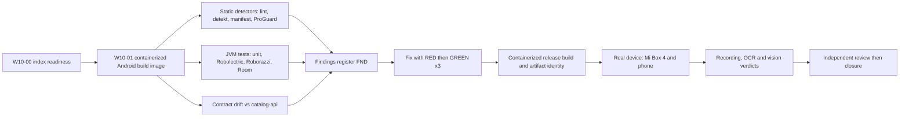
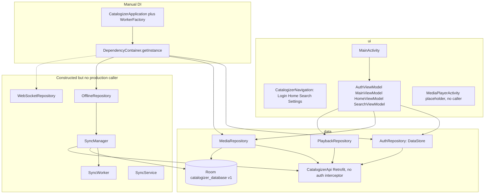
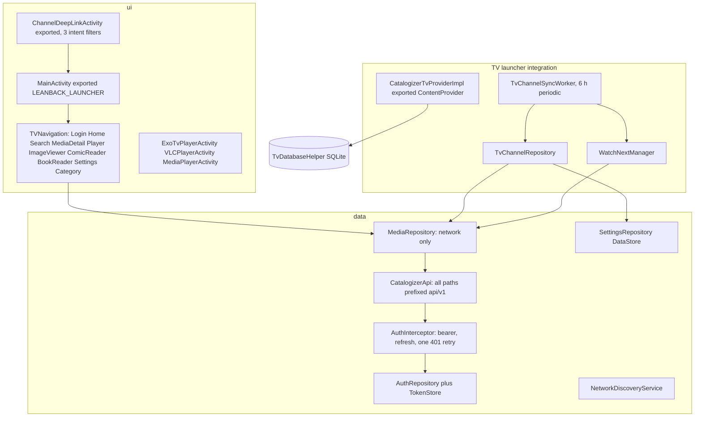
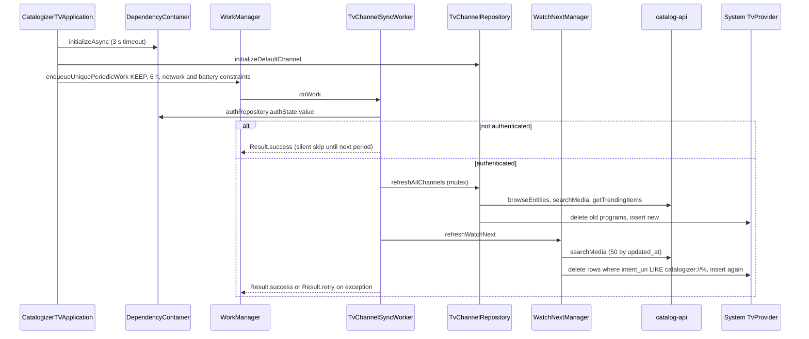
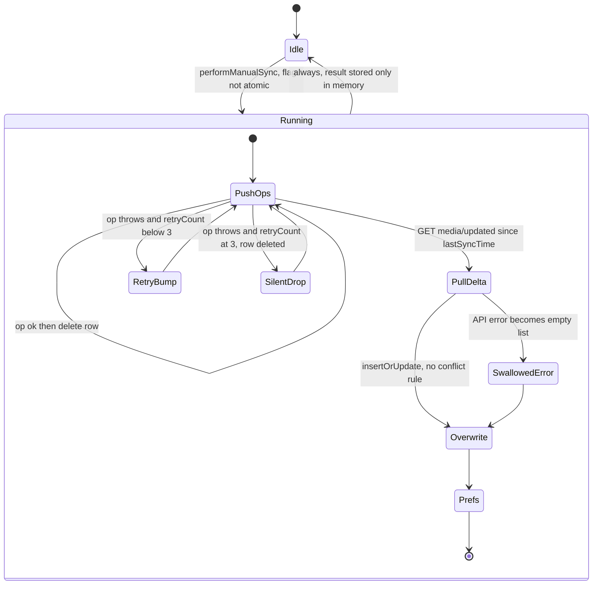
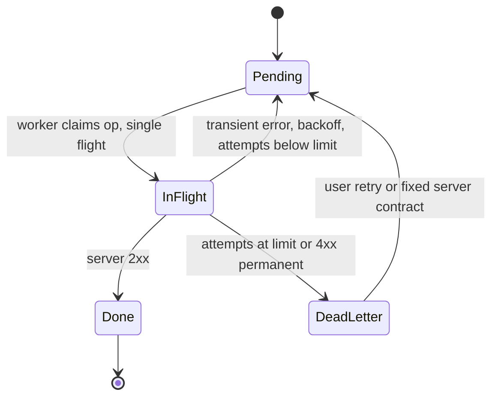
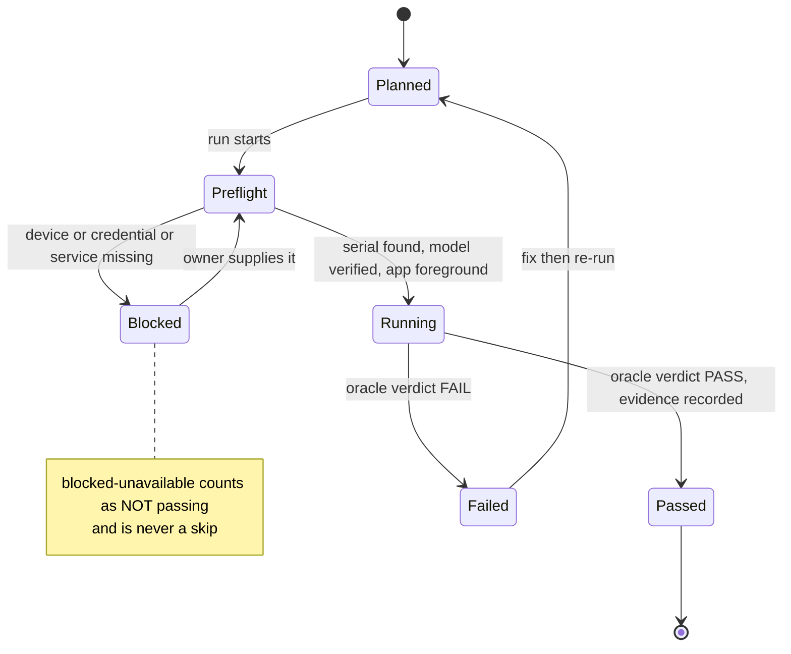
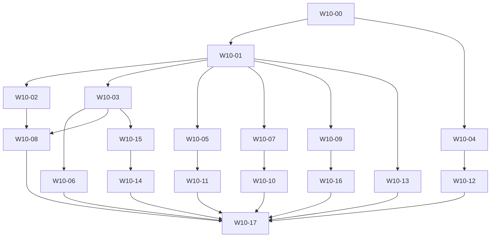

# 10 - Android (phone/tablet) and Android TV Audit and Remediation Plan

| Field | Value |
|---|---|
| Revision | 1 |
| Created | 2026-10-03 |
| Last modified | 2026-10-03 |
| Status | draft |
| Feature | specs/001-full-project-audit-remediation |
| Scope | `catalogizer-android/` (phone and tablet, package `com.catalogizer.android`) and `catalogizer-androidtv/` (Android TV, package `com.catalogizer.androidtv`); their HelixQA banks in `challenges/helixqa-banks/`; the Android parts of `docker/`, `scripts/`, `docs/` |
| Spec traceability | FR-005..FR-016, FR-019, FR-021, FR-022, FR-024, FR-025; SC-002..SC-005, SC-009, SC-011 |
| Governing anchors | constitution §11.4.102, .108, .115, .117, .124, .128, .136, .143, .152, .158-.160, .170, .173, .193, .200, .201, .224, .226, .238, .244, .245, .262; §1.1; §12.6, §12.12 |
| Evidence basis | Read-only inspection on 2026-10-03 (HEAD at session start `e4852ce7`): file reads, `grep`, the CodeGraph index, three official-doc fetches. Nothing was built or run on the host. Every claim cites a repo path; anything not proven is labelled `HYPOTHESIS`, `UNCONFIRMED` or `UNKNOWN`. |

## Table of contents

1. Purpose and method
2. Measured baseline
3. Structure maps (layers, TV channel sync, offline sync state machine)
4. Seeded findings register (hypotheses with detectors)
5. Audit scope and risk rating
6. Detector suite (all containerized)
7. Build and configuration reality check
8. Room schemas and migrations
9. Offline-first sync correctness
10. ANR and crash root-cause method, Crashlytics monitoring
11. D-pad and focus audit, ADB input rules, anti-blind-typing
12. Device and emulator strategy, the blocked-unavailable status
13. Always-on recording and vision validation
14. Real-user-journey tests
15. UI proof by host-rendered screenshots
16. Contract drift against `catalog-api` and `catalogizer-api-client`
17. Security, permissions, network configuration, ProGuard, signing
18. Release and signing verification, artifact identity
19. Test plan by type and the coverage phase-in
20. Performance baselines (SC-011)
21. Work-package breakdown
22. Acceptance evidence, risks, decisions, traceability
Appendix A: Room migration test (NOT EXECUTED)
Appendix B: Compose-for-TV focus test (NOT EXECUTED)
Appendix C: ADB plus OCR verification script (NOT EXECUTED)
Appendix D: Contract-drift extractor (NOT EXECUTED)

---

## 1. Purpose and method

This is the technical plan for auditing, fixing, testing and proving the two Android clients. It does not restate the spec. Each finding it produces follows FR-007 and FR-008: location, severity, category, machine evidence, root cause before fix, and a test that fails before and passes after, identically on 3 repeated runs (SC-003).

Method rules binding this plan:

1. **Structural index first (FR-005).** The maps in section 3 come from `codegraph explore` plus targeted reads. One probe was already run in this pass: `codegraph explore "who calls SyncManager.startPeriodicSync and OfflineRepository in catalogizer-android"` returned `startPeriodicSync` with exactly one caller (`OfflineRepository.setOfflineMode`) and `OfflineRepository` with exactly one referrer (`DependencyContainer.kt`). That is necessary, not sufficient: the full readiness probe set belongs to work package W10-00 (file-count parity between index and `git ls-files` for both app trees, freshness, three known-answer questions per app).
2. **No claim without a measurement.** Counts in section 2 are from read-only shell counts (commands in section 6.1). Reading code produces a `HYPOTHESIS`, each with a detector that either yields a RED test or closes it as a false positive with evidence (FR-008).
3. **Builds, lint, unit tests and emulators run only in rootless containers (FR-021, §11.4.173, §11.4.161).** Nothing Gradle-related was run on the host. The existing evidence says Android builds still run on the host today (`docs/qa/containerized-build-20260630/Status.md`, section "Honest scope"); containerizing them is work package W10-01 and a precondition for every dynamic detector.
4. **No host-direct `adb install`, `emulator`, or `am instrument`.** The constitution's PreToolUse guard class (§11.4.109, appendix `.specify/memory/constitution-appendix.md`, mandatory blocked class 1) blocks them. Every ADB call in this plan goes through a containerized ADB wrapper (section 12.4). At the time of writing the host has `adb` 1.0.41 and an Android SDK under `~/Android/Sdk` including `emulator` but no `system-images` directory, and `adb devices -l` listed no attached device.
5. **Real device or blocked (FR-025).** Anything that depends on the Mi Box 4 or a phone runs on that device. If unavailable the result is `blocked-unavailable` with the exact reason, never a skip, never an emulator substitute (section 12).
6. **Credentials never printed.** Several committed files contain a default administrator credential literal (finding H10-10). This document refers to it only as "the default admin credential" and the plan moves every such value to environment variables named in section 17.6.



---

## 2. Measured baseline

All values were produced in this planning pass; method in the right column.

### 2.1 Application inventory

| Item | catalogizer-android (phone) | catalogizer-androidtv (TV) | Method |
|---|---|---|---|
| Version | 2.4.0, versionCode 6 (`app/build.gradle.kts:16-17`) | 2.4.0, versionCode 8 (`app/build.gradle.kts`) | file read |
| compileSdk / targetSdk / minSdk | 35 / 34 / 26 | 34 / 34 / 26 | file read |
| Main Kotlin files, lines | 41 files, 6,014 lines | about 60 files, 15,455 lines | `find ... \| xargs wc -l` over `src/main/java` |
| Unit test files / `@Test` annotations | 69 / 1,039 | 87 / 1,278 | `find`, `grep -o '@Test' \| wc -l` |
| Instrumented test files / `@Test` | 9 files (8 classes plus `ComposeTestRule.kt`) / 93 | 1 / 1 | same |
| Room database | `CatalogizerDatabase`, version 1, 6 entities, exported schema `app/schemas/.../1.json` | no `@Database` exists; one `@Entity` (`data/models/MediaItem.kt:18`) and `data/local/Converters.kt` only | file read, `grep` |
| Firebase | none | Analytics, Crashlytics, Performance (BoM 32.7.0); Crashlytics collection disabled by default (`CatalogizerTVApplication.kt`) | file read |
| Host-side screenshot proof | none configured | Roborazzi 1.13.0, 4 screenshot test classes, 24 golden PNGs under `app/src/test/screenshots/` | file read, `find` |
| Deep links | none in manifest | `catalogizer://media`, `://home`, `://browse` on `ChannelDeepLinkActivity` (exported) | manifest |
| Media playback | `MediaPlayerActivity` is a placeholder (finding H10-16) | ExoPlayer (`ExoTvPlayerActivity`) primary, libVLC 3.6.2 fallback (`VLCPlayerActivity`), legacy `MediaPlayerActivity` | file read |
| HelixQA banks | `catalogizer-android-comprehensive-executable.yaml` (80 cases), `...-negative-paths-executable.yaml` (69) | `...androidtv-comprehensive...` (88), `...negative-paths...` (51), `...-full-executable.yaml` (8), `...androidtv-executable.yaml` (4), plus `catalogizer-androidtv/challenges/helixqa-banks/validation-androidtv-focus.json` | `grep -c '^\s*- id:'` |
| Existing crash and ANR records | `ANDROID_CRASH_FIXES_REPORT.md` (root, 2026-04-06, "480 issues fixed", compile-validated only); `docs/audits/phone-realdevice-2026-04-29.md` | `issues/ANR-2026-04-08-MainActivity-Startup-Hang.md` (status RESOLVED, one-line header only); `docs/qa/crashlytics-wiring-20260629/`; `docs/ANDROID_TV_AUDIT.md`; `docs/qa/helixqa-androidtv-20260629/` | file read |

### 2.2 Dependency pins that drive the audit

| Layer | Phone | TV | Note |
|---|---|---|---|
| AGP / Kotlin / Compose compiler | 8.2.2 / 1.9.22 / 1.5.8 | same | Compose compiler 1.5.8 pairs with Kotlin 1.9.22 (consistent) |
| Gradle wrapper | 8.11.1 `-all` | 8.11.1 `-bin` | `gradle/wrapper/gradle-wrapper.properties` |
| Compose BOM | 2024.12.01 | 2024.06.00 (pinned for `tv-foundation` 1.0.0-alpha11 binary compatibility, comment in `app/build.gradle.kts`) | phone and TV deliberately differ |
| Room / WorkManager / Retrofit / OkHttp | 2.6.1 / 2.9.0 / 2.9.0 / 4.12.0 | same | |
| Media | Media3 1.2.0 (exoplayer, ui, common) | Media3 1.2.0 plus libVLC 3.6.2 | |
| JVM target | `JavaVersion.VERSION_21`, `jvmTarget "21"` | 17 / "17" | see section 7 |
| `org.gradle.java.version` | 17 in `gradle.properties` | 17 | not a documented Gradle property (section 7) |

### 2.3 Constitution Known Conflicts item 13, re-stated with evidence

Item 13 in `.specify/memory/constitution.md` records, as OPEN, that both `gradle.properties` set `org.gradle.java.version=17` while the guides call JDK 21 the default, and that the TV guide describes a `kotlin.daemon.jvmargs` line that does not exist. Verified here: both statements are true of the files. Section 7 adds two facts the item does not contain: (a) the official Gradle build-environment documentation lists only `org.gradle.java.home` and `org.gradle.java.installations.*` under `org.gradle.java.*`, so `org.gradle.java.version` is, as far as the documentation shows, ignored; (b) the phone module compiles to Java 21 while the Android documentation states AGP 8.2 requires JDK 17 to run and supports API 34 at most, and the phone sets `compileSdk = 35`. The decision the item asks the operator for is therefore not "17 or 21" but "which toolchain is actually selected", which section 7 turns into a measurable question.

---

## 3. Structure maps

### 3.1 Phone layer architecture, with wiring status from the index



The dashed and `Unwired` parts are the codegraph result in section 1: nothing in `ui/` reaches `OfflineRepository`, `SyncService`, or `WebSocketRepository` (`grep` over `catalogizer-android/app/src/main` for `startPeriodicSync|performManualSync|offlineRepository|queue*|webSocketRepository` outside their own files and `DependencyContainer.kt` found only `SyncWorker.kt:19`, which is reachable only if the periodic work was ever enqueued, which `startPeriodicSync` does and nobody calls).

### 3.2 TV layer architecture



### 3.3 TV channel sync sequence (as coded)



Plan-relevant facts read from `TvChannelSyncWorker.kt`, `TvChannelRepository.kt`, `WatchNextManager.kt`: skip-on-unauthenticated returns `Result.success()`; `refreshAllChannels` holds a `Mutex`; Watch Next is cleared and re-added in two steps (not atomic); "continue" is `0.05 <= progress < 0.90` while "completed" is `progress > 0.90`, so a value of exactly `0.90` is in neither set (H10-23).

### 3.4 Offline sync state machine: as coded versus target



Target (section 9): durable cursor, dead-letter state instead of `SilentDrop`, error propagates instead of `SwallowedError`, explicit conflict policy per entity, atomic single-flight guard.

---

## 4. Seeded findings register (hypotheses with detectors)

Ids `H10-nn` are temporary; each becomes an `FND-nnnn` record under the register design in `04-findings-register-design.md` when its detector runs. Severity is a first estimate and is re-rated by evidence. "Evidence now" is what was read; it proves the code shape, not the runtime effect, unless stated.

| Id | Area | Hypothesis | Evidence now | Detector that proves or refutes | Sev |
|---|---|---|---|---|---|
| H10-01 | both | Release builds honour `qa_username`/`qa_password` intent extras on an exported launcher activity, giving a login path controlled by any caller and exposing the credential in process arguments | phone `ui/MainActivity.kt:70-95`; TV `ui/MainActivity.kt:99-117`, `ui/screens/login/LoginScreen.kt:173-174`; no `BuildConfig.DEBUG` guard found in the read ranges; manifests set MainActivity `exported="true"` | install the release variant (containerized), `am start --es qa_username x --es qa_password y`, observe an auth request in the device network log; static: lint custom check or `grep` gate for `getStringExtra("qa_` outside `src/debug` | High |
| H10-02 | TV | Exported `CatalogizerTvProviderImpl` has no `readPermission`/`writePermission` and passes `selection` and `selectionArgs` to SQLite for query, update and delete | manifest `<provider ... android:exported="true"/>`; `data/tv/CatalogizerTvProviderImpl.kt:58-95, 116, 158, 209` | `content query --uri content://com.catalogizer.androidtv.tv/media --where "1=1"` from `adb shell` (different uid) on a debug build; lint `ExportedContentProvider`; test with a `selection` containing a sub-select | High |
| H10-03 | both | Cleartext HTTP is permitted for every host because `base-config cleartextTrafficPermitted="true"`, which overrides `usesCleartextTraffic="false"` | both `res/xml/network_security_config.xml`; both manifests | `network-security-config` merge report from the containerized build; runtime probe to a cleartext host on a device | Med (accepted LAN use case, needs a recorded decision, DR-10-05) |
| H10-04 | both | `allowBackup="true"` with backup rules including `database` and `sharedpref` domains can restore pending user operations and, on TV, an `EncryptedSharedPreferences` file whose keystore key is not restored | both `backup_rules.xml`, `data_extraction_rules.xml`, manifests; TV `data/auth/TokenStore.kt` | `bmgr`/`adb backup` style restore test on a real device; static lint `AllowBackup` | Med |
| H10-05 | both | Token storage downgrade: TV `TokenStore.safe` silently falls back to plain `SharedPreferences` of the same file name when the keystore fails; the phone stores `auth_token`, `refresh_token` and user JSON in plain DataStore | TV `TokenStore.kt:113-125`; phone `AuthRepository.kt:29-31, 241` | unit test that forces keystore failure and asserts no plaintext write; on-device `run-as` (debug) read of the prefs and DataStore files | Med-High |
| H10-06 | phone | WebSocket token is placed in the URL query string | `data/repository/WebSocketRepository.kt:35-36` | server access-log inspection in the contract run | Med |
| H10-07 | both | Permission surface: TV declares `READ/WRITE_EXTERNAL_STORAGE` with no `maxSdkVersion`; phone declares `ACCESS_FINE_LOCATION` (for subnet discovery) and a foreground service but no `POST_NOTIFICATIONS` | manifests | `aapt2 dump permissions` on the built APK; lint `ScopedStorage`, `NotificationPermission`; runtime check on an API 33+ device | Low-Med |
| H10-08 | both | Release R8 configuration was never runtime-verified: rules keep all of `okhttp3.**` and `com.google.gson.**` (Gson is not a dependency), `data.local.**` and `data.sync.**` wholesale, so shrinking is weakened and rule drift is possible | both `proguard-rules.pro`; both `build.gradle.kts` `isMinifyEnabled = true` | containerized `assembleRelease`, then `usage.txt`/`seeds.txt`/`mapping.txt` review, then launch and journey test of the release APK on a real device (RULE-AND-003) | Med |
| H10-09 | both | Release signing depends on `docker/signing/signing.properties`, which is gitignored and absent; `signingConfigs.release` is then empty yet `release` uses it. A signing-properties file is also committed at `docker/signing-dev/signing.properties` | both `build.gradle.kts`; `docker/signing/` has only `generate-keys.sh` | containerized `assembleRelease` on a clean checkout; `apksigner verify --print-certs` on the output; check the dev file holds only throwaway keys (values must not be printed) | Med |
| H10-10 | both | Default admin credential literal is committed in scripts, banks, docs and code comments (§11.4.10) | `scripts/run-helixqa-androidtv.sh:160-176`; `catalogizer-androidtv/challenges/helixqa-banks/validation-androidtv-focus.json:22`; both `MainActivity.kt` comments; `docs/**` | `scripts/audit/anti-bluff-scan.sh` credential rule plus a secret scanner (section 6); the fix moves values to env vars | High |
| H10-11 | phone | The phone app never attaches an `Authorization` header: `buildOkHttpClient()` adds only a logging interceptor and no `@Header` exists in `CatalogizerApi`, while the TV app has `AuthInterceptor` | phone `DependencyContainer.kt:74-83`; `grep 'Authorization\|Bearer\|Interceptor'` over phone main finds only the logging interceptor; TV `data/remote/AuthInterceptor.kt` | contract test against the real `catalog-api`: login, then `GET /api/v1/media/stats` through the app's own client; expect 401 today | Critical if confirmed |
| H10-12 | phone | `refreshAuthToken()` is a placeholder that calls `auth/status` and returns the existing token; the backend does have `POST /api/v1/auth/refresh` | phone `AuthRepository.kt:140-160`; `catalog-api/main.go:1152` | unit test with expired token, plus real-backend refresh | High |
| H10-13 | phone | Route drift: the phone `CatalogizerApi` calls paths with no matching registration found in `catalog-api/main.go`: `media/updated`, `user/favorites`, `user/watchlist`, `user/progress/{id}`, `user/preferences`, `user/continue-watching`, `analytics/dashboard`, `analytics/charts`, `download/{id}` (backend registers `/download/file/:id`); and `api/v1/entities/{id}/progress|history` are declared with a leading `api/v1/` while the base URL already ends in `/api/v1/` (`DependencyContainer.kt` builds `.../api/v1/`), so they resolve to `/api/v1/api/v1/...` | `data/remote/CatalogizerApi.kt:93, 128-160, 107-111, 124, 164-170`; `catalog-api/main.go:1163-1215, 1554-1562, 1536-1545, 1183-1184` | extractor in Appendix D, diff both sides, then a real-backend call per declared route | High |
| H10-14 | phone | The offline layer is built but unreachable from the UI: `OfflineRepository`, `SyncManager.startPeriodicSync`, `SyncService`, `WebSocketRepository`, all `queue*` operations | codegraph and `grep` (section 1, 3.1) | CodeGraph caller query per symbol; decision: wire or prove dead per §11.4.124 and §11.4.197 | High |
| H10-15 | phone | Sync correctness defects in `SyncManager.performSyncInternal` (section 9 lists the six sub-hypotheses) | `data/sync/SyncManager.kt:106-240` | Robolectric plus in-memory Room plus MockWebServer tests (section 9.3) | High |
| H10-16 | phone | Playback does not exist: `MediaPlayerScreen` draws a text box, comment "In production, this would use ExoPlayer", and nothing starts `MediaPlayerActivity`; Media3 is a dependency | `ui/player/MediaPlayerActivity.kt:85-130`; `grep` found no caller | real-device journey "choose title, press Play" (§11.4.143); expected RED today | High |
| H10-17 | phone | Database wiring: two builders for the same file (`CatalogizerDatabase.getDatabase` and `DependencyContainer.database`), a migration `MIGRATION_1_2` registered while `version = 1`, and no `androidTest.assets` schema directory, so `MigrationTestHelper` could not read schemas | `CatalogizerDatabase.kt:23-90`; `DependencyContainer.kt:49-57`; `app/build.gradle.kts` has no `sourceSets` block | `grep` for callers of `getDatabase`; schema-export diff in container; Appendix A | Med |
| H10-18 | phone | `MediaRepository.toggleFavorite` reverts the optimistic local flip only when the API returns a non-success result, not when the call throws | `data/repository/MediaRepository.kt:131-156` | unit test with `MockWebServer` closing the socket | Med |
| H10-19 | phone | Startup: the splash is held until the QA login finishes with no timeout, and `webSocketRepository` token provider uses `runBlocking`; both are ANR-class risks if the server is unreachable | `ui/MainActivity.kt:75-110`; `DependencyContainer.kt:143-146` | StrictMode plus `am start -W` with the server blocked; ANR traces under `/data/anr` | Med (UNCONFIRMED effect) |
| H10-20 | phone | The phone banks launch `com.catalogizer.android/.MainActivity` but the manifest declares `.ui.MainActivity` | bank `android-cold-start` step "Launch from launcher"; manifest | run the step on a device and read `am start` output | Med |
| H10-21 | both | Banks assert features that do not exist or have no machine oracle: phone categories `offline`, `deep-link`, `player`, `notification` (the app has no deep-link filter, no playback, an unwired offline layer); phone banks contain zero `vision_verify`; the `expected:` text is prose | bank category counts (section 2.1, measured with a small script); `grep -c vision_verify` = 0 for both phone banks | bank lint (section 6.4): every step must carry a machine oracle or be marked as manual | High (anti-bluff) |
| H10-22 | TV | Room is a dependency with `kapt` but no `@Database` exists in TV; there is no offline cache | `app/build.gradle.kts`; `grep '@Database'` returns nothing under TV `src/main` | decision record: wire an offline cache or remove the dependency (removal needs the §11.4.122 operator question) | Low |
| H10-23 | TV | Watch Next boundary gap at exactly 0.90, `findNextEpisode` uses "similar items" not "next episode", and clear-then-insert is not atomic | `data/tv/WatchNextManager.kt:20-90` | unit tests on the companion helpers; real-device Watch Next row inspection | Med |
| H10-24 | TV | The sync worker returns success and does nothing when `authState.value` is not yet authenticated (cold process, hydration still running), delaying channels by up to 6 hours | `data/tv/TvChannelSyncWorker.kt:55-65`; `MainActivity.kt` hydrates auth on IO | WorkManager `TestDriver` test with delayed hydration; real-device cold-start observation | Med (UNCONFIRMED) |
| H10-25 | TV | Deep links: `deepLink.mediaId!!` after a non-numeric id, identical branches in `launchBrowse`, unvalidated `type`, `action` and browse category strings handed to navigation by an exported activity | `ui/ChannelDeepLinkActivity.kt:30-56, 104-150` | fuzzed `am start -d` matrix (section 14.3) | Low-Med |
| H10-26 | TV, phone | Crash monitoring is starved: Crashlytics collection is off by default; the 2026-06-29 console review found 0 events in 90 days and an open settings-toggle desync; the phone has no crash reporter | `CatalogizerTVApplication.kt`; `docs/qa/crashlytics-wiring-20260629/Status.md` | section 10.3 | Med |
| H10-27 | both | Weak tests: `assertTrue(true)` in `MainViewModelTest.kt:106` (TV), six `isAvailable`/`isNotNull` smoke tests in phone Room tests | `grep` | `scripts/audit/anti-bluff-scan.sh` plus reviewer-authored mutations (§11.4.194(6)(d)) | Med |
| H10-28 | TV | The device-dependent surface is barely covered by instrumented tests: 1 test; D-pad traversal coverage is asserted only by documentation (`docs/ANDROID_TV_AUDIT.md` counts focus occurrences) | counts in 2.1 | section 11 | Med |
| H10-29 | both | Build configuration inconsistencies: `org.gradle.java.version` unsupported; phone Java 21 versus AGP 8.2 requiring JDK 17; `compileSdk = 35` above AGP 8.2's maximum 34 while the suppression property names 34; Hilt plugin declared but unused; `build-release.sh` invokes `ktlintCheck` which no plugin provides; four Dockerfile variants (`docker/Dockerfile.android` to `...android4`) | section 7 | containerized `./gradlew -q help --warning-mode all`, `:app:tasks --all`, `javaToolchains` | Med |
| H10-30 | both | Dependency staleness and pre-release pins: Accompanist 0.32.0 (swiperefresh, placeholder, systemuicontroller), `biometric 1.2.0-alpha05`, `security-crypto 1.1.0-alpha06`, `tv-foundation 1.0.0-alpha11`, Media3 1.2.0, Java-WebSocket 1.5.4 | both `build.gradle.kts` | report only under FR-017/SC-009 (third-party packages are reported, not bulk-updated) | Info |
| H10-31 | TV | A clean checkout cannot build the TV app: `com.google.gms.google-services` needs `app/google-services.json`, which is gitignored and absent; `scripts/generate_google_services.sh` reads `.env` | `catalogizer-androidtv/.gitignore:12`; file listing | `blocked-unavailable` (credential) until the owner supplies the values, or the plugin is made conditional (decision DR-10-07) | Med |
| H10-32 | docs | `docs/LANDMINES.md` Android rules drift from the code: RULE-AND-003 names Gson and Hilt, RULE-TV-003 mandates Leanback fragments while the TV app is Compose for TV, RULE-AND-004 cites a different `--add-opens` flag than `gradle.properties` | `docs/LANDMINES.md:290-398` versus build files | doc-versus-code table in W10-14 | Low |
| H10-33 | scripts | `scripts/run-helixqa-androidtv.sh` `login_on_device` types text at fixed coordinates after tapping, with `sleep`, and verifies afterwards only through the network log: blind typing under §11.4.193, and a hard-coded credential | `scripts/run-helixqa-androidtv.sh:151-195` | replace with the seen-then-typed procedure in section 11.5 and Appendix C | High (rule violation) |
| H10-34 | both | `SyncService` (phone: has `startForeground`; TV: no `startForeground`, `START_STICKY`) is declared in both manifests and has no starter anywhere | `grep` found no `startService`/`startForegroundService` callers | CodeGraph; decision wire or remove with history (§11.4.124) | Med |

Seeded count: 34 hypotheses; none is a proven defect yet. Hypotheses marked UNCONFIRMED stay open until their detector runs, and a refuted one is closed as a false positive with the detector output as evidence.

---

## 5. Audit scope and risk rating

Rating = likelihood of end-user harm times blast radius, using the constitution's most-reopened-first rule (§11.4.132, §11.4.189) where reopen history exists.

| Rank | Area | Why | First detectors |
|---|---|---|---|
| 1 | Phone auth and networking (H10-11, 12, 13) | If H10-11 is true every authenticated phone call fails; the HelixQA phone evidence in `docs/audits/phone-realdevice-2026-04-29.md` only proves the login form renders, and its own text says the login flow against `catalog-api` was not covered | real-backend contract test, W10-05 |
| 2 | Release hardening: QA intent login, exported provider, signing, R8 (H10-01, 02, 08, 09) | exposed attack surface on a shipped artifact | manifest and release-APK tests, W10-08 |
| 3 | TV startup and ANR class (H10-19, issue `ANR-2026-04-08`, `ANDROID_CRASH_FIXES_REPORT.md`) | prior real incident; fixes were "syntax validated" only | StrictMode, `am start -W`, ANR trace capture, W10-09 |
| 4 | TV channels, Watch Next, deep links (H10-23, 24, 25) | launcher integration is the product's TV differentiator and has 13 unit test files but no on-device assertion in the unit suite | section 14, W10-10 |
| 5 | Offline sync and Room (H10-14, 15, 17, 18) | data loss class; currently unreachable which also makes it a wiring finding | Robolectric and Room tests, W10-06 |
| 6 | Playback (phone H10-16; TV players) | core user value; TV already has on-device player evidence (`docs/qa/androidtv-players-20260629`) | real-content journeys, W10-11 |
| 7 | D-pad and focus (H10-28) | entire TV input model | section 11, W10-07 |
| 8 | Test quality and banks (H10-20, 21, 27, 33) | decides whether any green means anything | W10-12 |
| 9 | Build, config, docs, dependency reports (H10-29, 30, 31, 32) | enabling work and reporting | W10-01, W10-14 |

Shared contracts reach `catalog-api` (document 07) and `catalogizer-api-client` (TypeScript library used by web and desktop; the Android apps do not consume it, they hand-write Retrofit interfaces, so drift is possible in two independent places, section 16).

---

## 6. Detector suite (all containerized)

### 6.1 Runtime and resource rules

Each command below is the target form. `$IMG` is a pinned-by-digest builder image produced by W10-01. Tag-only references are not accepted (FR-010, SC-002): digest pins make the audit repeatable. Image tags and detector tool versions are `UNCONFIRMED` until W10-01 resolves them; this plan does not invent versions.

```bash
# Common wrapper (target: scripts/audit/android-container.sh). NOT EXECUTED.
# No sudo, rootless podman, bounded memory and pids, named volume for the Gradle cache (section 6.5).
podman run --rm --userns=keep-id \
  --memory="${AUDIT_MEM:-8g}" --cpus="${AUDIT_CPUS:-4}" --pids-limit=2048 \
  -v "$PWD":/work:Z -v catalogizer-gradle-cache:/home/builder/.gradle:Z \
  -w /work/catalogizer-android "$IMG" ./gradlew --no-daemon --offline "$@"
```

Host memory ceiling: the repository's resource limits (Known Conflicts item 1) and §12.6 bound concurrency to one Android container at a time on the host; remote execution on the build host named in the project CLAUDE.md (§11.4.173) is the default, with artifacts brought back and hash-compared (section 18). Counting commands used for section 2:

```bash
find catalogizer-android/app/src/main/java -name '*.kt' | xargs wc -l | tail -1
grep -rho '@Test' --include=*.kt catalogizer-androidtv/app/src/test | wc -l
grep -cE '^\s*- id:' challenges/helixqa-banks/catalogizer-android-comprehensive-executable.yaml
```

### 6.2 Detector table

| # | Detector | Command (inside `$IMG`) | Output | Finds |
|---|---|---|---|---|
| D1 | Android Lint, all checks on, warnings as errors for security ids | `./gradlew :app:lintDebug :app:lintRelease` with `lint { abortOnError = false; xmlReport = true; sarifReport = true; checkAllWarnings = true }` supplied by an init script, not by editing the build in the audit phase | SARIF, XML | `ExportedContentProvider`, `AllowBackup`, `ScopedStorage`, `NotificationPermission`, `InsecureBaseConfiguration`, `HardcodedDebugMode`, `GradleDependency`, `ObsoleteSdkInt`, `UnusedResources` |
| D2 | detekt | no config exists today (`grep detekt` over both modules found nothing). Add as a Gradle init-script plugin run, config generated with `detektGenerateConfig` and committed under `config/detekt/` | SARIF | `RunBlocking` use, `TooGenericExceptionCaught` (the code base has many `catch (e: Exception)` and `catch (_: Exception) {}` blocks), `EmptyCatchBlock`, `GlobalCoroutineUsage` |
| D3 | ktlint | `ktlintCheck` is invoked by `build-release.sh` but no plugin provides it; add through an init script and a committed `.editorconfig` (none exists today) | checkstyle XML | style only, low value, kept for FR-012 style parity |
| D4 | Manifest and permission dump | `aapt2 dump badging` and `dump xmltree` on the built APK; `apkanalyzer manifest print` | text | exported components, permissions, `usesCleartextTraffic`, merged network config |
| D5 | Dependency report | `./gradlew :app:dependencies --configuration releaseRuntimeClasspath` and `dependencyInsight` | text | SC-009 version table; alphas and deprecated artifacts |
| D6 | Secret scan | repository-level scanner supplied by document 02's detector set, restricted to the two app trees, `docker/signing-dev/`, `scripts/run-helixqa-*.sh`, banks | SARIF | H10-10 literals, committed key material |
| D7 | R8 outputs | `assembleRelease` then parse `build/outputs/mapping/release/{mapping,seeds,usage}.txt` | text | H10-08 keep-rule overreach, serialization classes kept or stripped |
| D8 | Room schema export diff | `kaptDebugKotlin` then `git diff --exit-code app/schemas` | exit code | schema drift not reflected in a version bump (H10-17) |
| D9 | StrictMode and leak detection | debug-only `StrictMode` policy (thread and VM) installed by a test `Application` subclass in `androidTest`, plus LeakCanary is NOT currently a dependency (`grep leakcanary` found none); adding it is a W10-09 decision | logcat | disk and network on main thread, leaked Activities and closeables |
| D10 | Anti-bluff scan | `scripts/audit/anti-bluff-scan.sh` (project CLAUDE.md names it), validated first with a seeded violation | exit code | `assertTrue(true)`, constructor-only, mock-only integration tests |
| D11 | Bank lint | new script (section 6.4) | JSON | banks without machine oracles, wrong component names |
| D12 | Coverage | JaCoCo tasks already present in both `build.gradle.kts` (`jacocoTestReport`) | XML | FR-011 baselines; note the instrument measures lines of the debug classes only |

### 6.3 Why not other tools

| Rejected or deferred | Reason |
|---|---|
| SonarQube scanner as first detector | exists in the repo (`sonar-project.properties`, `docker-compose.security.yml`) and is §11.4.184 mandated tooling, kept as an additional pass, but its Android Kotlin ruleset overlaps D1 and D2 and needs a running server; scheduled after W10-04 |
| Macrobenchmark / Baseline Profile now | no benchmark module exists (`settings.gradle.kts` includes only `:app`); introducing one changes the build graph; deferred until the performance baseline method in section 20 (device `am start -W`) proves insufficient |
| Firebase Test Lab | cloud device farm contradicts FR-025's real-owned-device rule and §11.4.10 credentials discipline for this feature |

### 6.4 Bank lint (new, D11)

For every YAML or JSON bank case: (a) the activity component named in any `am start` must exist in the target manifest (catches H10-20); (b) every step must carry an executable `action` and at least one machine oracle (`vision_verify`, `expect_text`, a logcat pattern, a `dumpsys` pattern) or be tagged `manual`; (c) fixed `sleep` steps are flagged and replaced by poll-until-condition with a timeout; (d) any literal credential is a failure; (e) `platforms` must match the file. Output is one JSON array of `{bank, case, step, rule, severity}` so the register import is mechanical.

### 6.5 Determinism controls for the Android lane (FR-010, SC-002)

1. Image digest pinned; Gradle distribution and all plugins resolved from a locked offline cache created once by W10-01 (dependency locking via `--write-locks` is a build change and therefore a fix-phase item, not an audit-phase one).
2. Fixed `TZ=UTC`, `LANG=C.UTF-8`, `-Duser.language=en`; Robolectric SDK pinned per test (`@Config(sdk = [33])` exists in `HeroPosterScreenshotTest`) with `robolectric.offline=true` and a vendored `android-all` jar set.
3. Roborazzi goldens compare with the project-configured threshold; fonts bundled to avoid host font differences.
4. No wall clock in assertions; `kotlinx-coroutines-test` virtual time; WorkManager `TestDriver` for scheduling.
5. Every detector run writes `{image_digest, command, exit_code, sha256(output), started, finished}` to the evidence record of document 06; two runs of D1 on the same tree must hash identically.

---

## 7. Build and configuration reality check

Findings and the measurement that closes each:

| Question | What the files say | What is not known | Measurement |
|---|---|---|---|
| Which JDK runs Gradle? | `org.gradle.java.version=17` in both `gradle.properties` | the property is not in Gradle's documented `org.gradle.java.*` list (fetched 2026-10-03, <https://docs.gradle.org/current/userguide/build_environment.html>: only `org.gradle.java.home` and `org.gradle.java.installations.*`) | in the container: `./gradlew -q --version`, `./gradlew javaToolchains`; check whether the value changes behaviour by running once with and once without it |
| Which bytecode level? | phone `VERSION_21` and `jvmTarget "21"`; TV 17 | whether a JDK 21 is present where the phone builds; `docker/Dockerfile.android4` installs `openjdk-17-jdk` only, `docker/Dockerfile.builder` installs `openjdk-21-jdk`; the settings plugin `foojay-resolver-convention` 0.8.0 could auto-download a JDK but `FAIL_ON_PROJECT_REPOS` and offline builds may block it | containerized `:app:compileDebugKotlin` on both images |
| AGP versus compileSdk | AGP 8.2.2; phone `compileSdk = 35` | the Android release notes for AGP 8.2 state API 34 as the maximum supported level, JDK 17 as the required Java, minimum Gradle 8.2 (<https://developer.android.com/build/releases/past-releases/agp-8-2-0-release-notes>, fetched 2026-10-03). `android.suppressUnsupportedCompileSdk=34` suppresses the warning for 34 only | `./gradlew :app:help --warning-mode all` in the container; capture the warning text; decide to raise AGP or lower compileSdk (decision DR-10-01) |
| Gradle wrapper | 8.11.1; AGP 8.2.2 minimum is 8.2 | whether AGP 8.2.2 works on Gradle 8.11 | first containerized build |
| Hilt | `com.google.dagger.hilt.android` 2.48 declared and `hilt-android-gradle-plugin` on the buildscript classpath in both roots; not applied in either `app` module; DI is manual (`DependencyContainer`) | none | `grep -rn hilt` gate; dead build config is a finding to remove with the §11.4.124 history check |
| TV `kotlin.daemon.jvmargs` | described in the TV guide, absent from `gradle.properties` | none | doc fix (FR-012) or add after measurement of kapt memory use |
| Disabled JDK-image tasks | `tasks.configureEach { if name contains "JdkImage" ... enabled = false }` in the phone build, plus four `android.*JdkImageTransform` flags | whether they are needed under JDK 17 | A/B build in the container; if unnecessary they are risk surface (disabled tasks can produce an APK that differs from the standard pipeline) |

Decision DR-10-01 (toolchain), DR-10-02 (compileSdk/AGP) are operator decisions already flagged OPEN by Known Conflicts item 13. The plan supplies the data; it does not choose.

---

## 8. Room schemas and migrations

Facts: the phone exports `app/schemas/com.catalogizer.android.data.local.CatalogizerDatabase/1.json` with tables `media_items`, `search_history`, `download_items`, `sync_operations`, `watch_progress`, `favorites`; `exportSchema = true`; the argument `room.schemaLocation` is passed through `javaCompileOptions.annotationProcessorOptions` while the module uses `kapt`; `MIGRATION_1_2` is an empty body and `ALL_MIGRATIONS` includes it although the database version is 1. TV has no database.

Plan:

1. **Export proof.** D8 in the container: delete `app/schemas`, run `kaptDebugKotlin`, assert the regenerated `1.json` equals the committed one. This answers whether the `javaCompileOptions` route reaches kapt (the committed file suggests yes; the plan requires the measurement, not the inference).
2. **Migration test infrastructure.** Add `sourceSets.androidTest.assets.srcDir("$projectDir/schemas")` (Room documentation, "migrating DB versions", fetched 2026-10-03, says the exported schema directory must be in `androidTest` assets for `MigrationTestHelper`; the fetched page showed the Room 3 artifact names, the project uses Room 2.6.1 where `MigrationTestHelper(instrumentation, DatabaseClass)` is the constructor; the exact 2.6.1 signature is to be confirmed against the 2.6.1 sources in W10-06).
3. **No-op migration policy.** `MIGRATION_1_2` with no SQL and no version 2 is a latent hazard: a later schema change that bumps to 2 would pass compilation yet fail Room's post-migration validation at first launch. Test (Appendix A): bump to version 2 in a scratch commit with a changed column and an unchanged `MIGRATION_1_2`; the migration test MUST fail (RED), proving the guard works; then the real change supplies the SQL.
4. **One database instance.** Replace the dual builders with the container-provided instance only after a CodeGraph check that nothing calls `CatalogizerDatabase.getDatabase` (finding H10-17); test that two components see the same instance.
5. **Denormalised state.** `media_items` carries `is_favorite` and `watch_progress` while `favorites` and `watch_progress` are separate tables: two sources of truth. Plan: a Room test that writes through one path and reads through the other and expects equality; any divergence is a finding with a RED test.
6. **Type converters.** `Converters` store lists, maps and enums as JSON or names: test round trip plus an unknown enum name (`SyncOperationType.valueOf` throws on an unknown value, so a downgraded app reading a newer database row crashes) and malformed JSON.
7. **Downgrade.** `fallbackToDestructiveMigration` is not used (good). Test that opening a version-2 file with the version-1 app fails loudly and is handled (decision on user-visible behaviour).

---

## 9. Offline-first sync correctness

### 9.1 Declared behaviour versus reachable behaviour

Declared: operations queue in `sync_operations`, a six-hourly `SyncWorker` drains them, then downloads deltas. Reachable: none of it, per H10-14. The audit therefore has two jobs: (1) prove the wiring status, (2) test the algorithm so wiring it is safe. The owner decision (DR-10-03) is wire or retire; retiring requires the §11.4.122 question and a §11.4.124 history investigation first (`git log --follow -S startPeriodicSync` on `OfflineRepository.kt` and `SyncManager.kt`), because "no callers" is a lead, not a verdict.

### 9.2 Sub-hypotheses for H10-15

| Id | Hypothesis | Code | Test |
|---|---|---|---|
| S1 | A failing operation is attempted `MAX_RETRY_ATTEMPTS + 1` times and then its row is deleted with no record: silent data loss | `SyncManager.kt` `catch`, `retryCount < 3 ... else deleteOperation` | enqueue one op, MockWebServer returns 500 four times, assert a dead-letter record exists (RED today) |
| S2 | The delta cursor is `_syncStatus.value.lastSyncTime ?: 0L`, held in memory only, so every cold start is a full download | `performSyncInternal` step 2 | kill and recreate the manager, assert the `since` query parameter equals the persisted cursor |
| S3 | The cursor is the client clock at completion; server-side changes during the run, and client clock skew, are lost or repeated | `lastSyncTime = result.timestamp` | skewed fake clock in test, server returns an item with `updated_at` inside the gap |
| S4 | `api.getUpdatedMedia(...).toApiResult().data ?: emptyList()` turns any error into an empty list and the run still reports `success = true` | step 2 | MockWebServer 404 and 500, assert `success = false` and an error code; note H10-13 says the route may not exist on the backend, which this very line would hide |
| S5 | `isRunning` is checked then set non-atomically | `performManualSync` | two concurrent coroutines, assert exactly one runs |
| S6 | Server data overwrites local edits (`insertOrUpdate`) after failed pushes; no per-entity conflict policy | step 2 | local favorite change pending plus remote item with older `updated_at` |
| S7 | `SyncWorker` returns `Result.failure()` on exception; periodic-work semantics for failure are not stated explicitly in the WorkManager documentation fetched 2026-10-03 (<https://developer.android.com/develop/background-work/background-tasks/persistent/getting-started/define-work>) | `SyncWorker.kt` | UNCONFIRMED: determine with `androidx.work:work-testing` `TestDriver` (the TV module already depends on `work-testing`; the phone module does not) |

### 9.3 Target design (decision record DR-10-03 outcome if "wire")



Required properties, each a test: durable cursor in the database; idempotent operations (a retried `PUT media/{id}/progress` is safe; `POST` creates carry an idempotency key); dead-letter state visible to the user; conflict policy per entity written in the architecture document (last-writer-wins by server `updated_at` for progress and favorites unless the owner decides otherwise; this is a proposal, not a fact about the current backend, which handles progress in `catalog-api/handlers/playback_handler.go` and `androidTVMediaHandler`); sync status exposed as state, not as a log line.

Test lanes: Robolectric with an in-memory Room database (real SQLite, no mocking of Room) plus `MockWebServer` for HTTP, all on the JVM so it is deterministic and containerized; one real-backend lane against a containerized `catalog-api` for the contract; one real-device lane toggling airplane mode through the device (FR-025) with recorded evidence.

---

## 10. ANR and crash root-cause method, Crashlytics monitoring

### 10.1 What exists

| Source | Content | Reliability |
|---|---|---|
| `issues/ANR-2026-04-08-MainActivity-Startup-Hang.md` | TV startup ANR "input dispatching timed out", PID list, 20+ traces in `/data/anr`, status RESOLVED, unchecked action list, no resolution section | header says resolved; the file contains no fix, commit or verification (status without evidence, §11.4.226) |
| `ANDROID_CRASH_FIXES_REPORT.md` | claims 480 issues fixed, NPE in `NetworkDiscoveryService`, socket leaks, focus try/catch wrappers; verification "Code compiles, syntax validated" | no on-device RED/GREEN; `try { requestFocus() } catch (_: Exception) {}` style fixes mask rather than cure (§11.4.250 heuristic-tower signal) |
| `docs/audits/phone-realdevice-2026-04-29.md` | a shipped 2.2.1 APK crashed on launch with `NoSuchMethodError KeyframesSpec...at` and the fix was a binary-compatibility pin; login form verified | good real-device evidence; the post-login path is explicitly not covered |
| TV code comment in `app/build.gradle.kts` | the same Compose binary mismatch class explains the TV BOM pin (`2024.06.00` for `tv-foundation` alpha11) | a class to guard with a startup smoke test on a real device after every dependency change (§11.4.108) |
| `docs/qa/crashlytics-wiring-20260629/` | Firebase project wired; collection disabled by default; 0 events in 90 days; toggle desync | the console is empty because nobody opted in, not because there are no crashes |

### 10.2 Method for each crash or ANR (constitution §11.4.102, §11.4.115, §11.4.199)

1. **Activate systematic debugging first** (§11.4.102(D)); no fix before root cause.
2. **Capture, do not narrate:** `adb bugreport` (device-side, containerized ADB) or at minimum `logcat -b crash,main,system -d`, `dumpsys activity processes`, `/data/anr/*` via `adb pull` when permitted (non-rooted TV boxes may deny; the denial is recorded, not worked around with root).
3. **Reproduce with the exact sequence** that produced the report (§11.4.199): same intent extras, same cold or warm state, same network condition. A variant must first prove it reaches the same precondition.
4. **RED on the broken artifact** (§11.4.115): the failing run is recorded against the artifact built from the commit before the fix, with its fingerprint read from the device (`dumpsys package ... versionCode`, `sha256sum` of the installed base APK via `pm path`).
5. **Classify the ANR:** main-thread blocking (`runBlocking`, disk or network on main, lock contention), splash held on an async condition, `ContentProvider.onCreate`, broadcast receiver, or input timeout while no window focused (the TV incident text: "no window has focus but there is a focused application that may eventually add a window"). Candidates in code already read: `runBlocking` in the phone `DependencyContainer.webSocketRepository` token provider (called from the WebSocket client thread, not necessarily main: verify, H10-19); splash-hold on `qaLoginDone` (H10-19); TV `ChannelDeepLinkActivity` suspends before `finish()` on slow auth (verify); TV `Application.onCreate` Firebase init plus coroutine (the code already enforces a 3 s `withTimeoutOrNull`, a good pattern; measure the real elapsed time it logs).
6. **Fix at the root, add a permanent guard** (§11.4.135): a StrictMode-enabled instrumented test that fails on a main-thread violation during cold start; plus the bank step that records `am start -W` `TotalTime` against the baseline in section 20.
7. **Closure evidence class** (§11.4.226): a runtime-class record from the real device with the artifact fingerprint; a JVM unit test alone cannot close an ANR.

### 10.3 Crashlytics monitoring (§11.4.152)

Constraints: TV only; collection opt-in; the owner's real device must opt in for data to exist. Plan:

1. Fix the Settings toggle desync first (tracked follow-up in the 2026-06-29 status document) with a RED test that reads the persisted SDK state.
2. For the audit device, enable collection through the app's own Settings (seen-then-clicked per section 11.5), induce one controlled non-fatal through a debug-only path, relaunch, and confirm the event in the console.
3. Query the console on every cadence trigger for all four surfaces named in §11.4.152 (fatal, ANR, performance, non-fatal) using the Firebase tooling available to the session (`crashlytics_get_report`, `crashlytics_list_events`); if the session lacks console authorization the result is `blocked-unavailable` with the exact reason, not "no crashes".
4. The phone has no crash reporter: decision DR-10-04 (add Crashlytics or document an alternative) because §11.4.152 applies to every project with Crashlytics wired and the phone has none wired. Adding it enlarges the third-party and privacy surface; the owner decides.
5. Every console issue gets a closure log with issue id, regression test path and verdict pair.

---

## 11. D-pad and focus audit, ADB input rules, anti-blind-typing

### 11.1 Why two tiers

The TV hierarchy is Compose; the repository's own script records that `uiautomator dump` returns no nodes for the Compose-TV screens (comment above `login_on_device` in `scripts/run-helixqa-androidtv.sh`). So an ADB hierarchy walk cannot enumerate focusable elements. The plan uses:

- **Tier 1 (JVM, deterministic, first):** Compose test rule on Robolectric reads the semantics tree directly, drives keys with `performKeyInput`, asserts focus. This is the primary D-pad proof. Appendix B.
- **Tier 2 (real device):** screenshots plus an OCR and pixel focus-ring oracle confirm what the user sees on the Mi Box 4. Tier 2 never claims traversal completeness; Tier 1 does. Tier 2 proves the real renderer and remote path show the focus ring and navigate.

### 11.2 Tier 1 test specification

For each TV screen (Login, Home, Search, MediaDetail, Player controls, ImageViewer, ComicReader, BookReader, Settings, Category):

1. Collect the set `C` of nodes with a click action (`hasClickAction()`), and the initially focused node `f0`.
2. Build the directed focus graph by pressing `DirectionUp/Down/Left/Right` from each reachable node and recording the newly focused node.
3. Assertions: (a) every node in `C` is reachable from `f0` in the graph (RULE-TV-002: "every element must be D-pad focusable", `docs/LANDMINES.md`); (b) no focus trap: from every node there is a path to the screen's primary exit, and `Back` leaves the screen or collapses a layer; (c) a visible focus indicator exists per focused node, checked by a Roborazzi capture comparing focused versus unfocused pixels of the node bounds; (d) pressing `DirectionCenter` on each node produces its declared effect (navigation or state change).
4. Negative control (§11.4.201(7)(b)): a fixture screen with a deliberately unreachable button; the test MUST fail on it, proving the instrument can see a trap.
5. Mutation: remove one `focusable()` or `FocusRequester` in a screen and expect (a) to fail (SC-005).

Existing material to reuse, not rewrite: `HeroPosterScreenshotTest` shows the Robolectric plus Roborazzi setup; `scripts/testing/visual_proof_layout_oracle.py` and its golden good and bad fixtures under `scripts/testing/visual_proof_oracle_selftest/` already implement a layout oracle with self-validation.

### 11.3 Tier 2 ADB key rules

From `docs/LANDMINES.md` and the constitution:

| Rule | Source | Implementation |
|---|---|---|
| Use `input keyevent`, never `cmd input keyevent`, on API 28 | RULE-TV-005 | the key sender checks stdout for `No shell command implementation` and treats it as a failed key |
| Verify the target is foreground before and after each key | RULE-TV-004 | `dumpsys window windows` `mCurrentFocus` must contain the package, else a CRITICAL finding and relaunch; competing channel publishers are force-stopped per `HELIX_COMPETING_APP_PACKAGES` |
| Recordings longer than 180 s are segmented | RULE-TV-006 | segment loop plus concat, in the recorder |
| HTTP/1.1 only on the TV client | RULE-TV-001 | the `Protocol.HTTP_1_1` line stays under a unit test (`OkHttpClient.protocols`) |
| Device selection by serial, never ordinal or "the only one" | §11.4.111, §11.4.200 | wrapper requires `ANDROID_SERIAL`; verifies `ro.product.model` equals the expected model before any write |
| Devices in `.devignore` are excluded | RULE-CONST-004 | only `ATMOSphere` is listed today (`.devignore`); the Mi Box 4 (`MIBOX4`) is authorised |

### 11.4 Remote-control matrix (Tier 2)

Keys: `DPAD_UP/DOWN/LEFT/RIGHT/CENTER`, `BACK`, `HOME`, `MENU`, `MEDIA_PLAY_PAUSE`, `MEDIA_FAST_FORWARD`, `MEDIA_REWIND`, `SEARCH`. Cases already in the TV banks: `dpad-stress`, `focus-chain`, `remote-control`, `voice-search`, `10-foot-ui`, `idle` (category counts from the comprehensive bank). The plan keeps them as inputs and converts each into a bank step with a machine oracle per section 6.4.

### 11.5 Anti-blind-typing (§11.4.193) applied to this lane

`scripts/run-helixqa-androidtv.sh` currently taps fixed coordinates, deletes with 48 `KEYCODE_DEL`, types with `input text`, and sleeps, with the only verification a later network-log grep (H10-33). The replacement procedure for every text entry on TV and phone:

1. `screencap` then OCR (Tesseract at 150 DPI or higher) or the vision engine; assert the expected label is visible (for example the username field label).
2. Move focus by D-pad keys (not coordinates), `screencap` again, assert the focus indicator moved to the expected field (pixel oracle).
3. Type through the app's own IME action or `input text` only after step 2 holds; the value comes from an environment variable and is never echoed.
4. `screencap` again; assert the masked field shows the expected character count (redacted OCR, §11.4.193(5)).
5. Submit; assert the post-login screen by OCR and by sink-side evidence (an authenticated catalog response in logcat).
6. Where OCR cannot read the surface (secure windows), the step is `operator_attended` with a recorded reason, never blind-typed.

Appendix C holds the verification primitive. The oracle itself needs golden-good, golden-bad and negative-control fixtures before it may close anything (§11.4.107(10)).

---

## 12. Device and emulator strategy, the blocked-unavailable status

### 12.1 Device inventory known from the repository

| Device | Source | State at 2026-10-03 |
|---|---|---|
| Mi Box 4 (`MIBOX4`), Android 9 / SDK 28, network ADB `192.168.0.214:5555` | `docs/audits/androidtv-realdevice-2026-04-29.md`, `docs/qa/*20260629*` | not attached: `adb devices -l` on the host returned an empty list. Whether the box is reachable on the network is `UNKNOWN` (not probed) |
| Same box used for the phone APK (phone UI on the TV box) | `docs/audits/phone-realdevice-2026-04-29.md` | that is not a phone or tablet: no touchscreen, TV launcher. Real phone and tablet evidence does not exist in the repository |
| `ATMOSphere` rk3588 boards | `.devignore` | excluded from this feature |

Consequence: phone-class and tablet-class claims (touch gestures, rotation, permission dialogs on API 33+, biometrics) have no real-device evidence today. FR-025 makes the lack of a phone and tablet a `blocked-unavailable` condition for every test that needs one; the feature cannot complete until the owner supplies the devices or records the decision that a hardware-independent emulator is acceptable for that class (DR-10-06).

### 12.2 Emulators: what they may and may not prove

Position proposed for the owner to confirm (DR-10-06): an emulator is a runtime for hardware-independent behaviour (Room, WorkManager, Compose focus, navigation, permission state machine). It is not accepted as evidence for anything that names a hardware or vendor behaviour: Mi Box codecs and decoders, the HTTP/2 handshake quirk behind RULE-TV-001, real remote-control events, the vendor launcher's rendering of channels and Watch Next, `screenrecord` limits, performance numbers (SC-011). This follows FR-025 ("never replaced by a simulation") for device-dependent tests, while keeping emulators available where the spec's device rule does not apply. The Containers submodule already contains a containerized emulator implementation (`submodules/containers/pkg/emulator`: `containerized.go`, `Containerfile`, `matrix.go`, `adb_hygiene.go`, and `cmd/emulator-matrix`); extend it rather than writing a second one (§11.4.74, §11.4.76). `/dev/kvm` exists on the host; whether the rootless container user can open it is `UNCONFIRMED` (its `containerized_kvm_test.go` is the place to check). The host has no system images; images are fetched by the container image, not the host.

### 12.3 The status model



Preflight is itself a recorded test with its own evidence: `adb -s "$SERIAL" get-state`, `getprop ro.product.model`, `getprop ro.build.version.sdk`, installed `versionCode` and base APK `sha256` against the artifact just built (§11.4.200: read the identity back from the intended target; a tool's "Success" message is not proof). Each blocked record carries the exact reason string (`device_not_attached`, `device_unreachable_over_network`, `credential_absent: <NAME>`, `service_down: <url>`).

### 12.4 Containerized ADB wrapper (target)

`scripts/audit/adb-container.sh` runs `adb` from a pinned platform-tools image with `--network=host` (network ADB to the box) or a USB pass-through where the container runtime permits. It refuses to run without `ANDROID_SERIAL`, verifies the model, and logs `{serial, model, sdk, command, exit}` to the evidence record. Whether USB device nodes can be passed to a rootless container on this host is `UNCONFIRMED`; the network path to the Mi Box does not depend on it. All Appendix C commands use `$ADB` as this wrapper.

---

## 13. Always-on recording and vision validation

Applicable anchors: §11.4.128 (always-on device recording, non-invasive), §11.4.144 (follow device availability), §11.4.158-.160 (recording, window-specific, vision-verified, bridge to HelixQA), §11.4.119 (single owner of a device's exclusive resource), §11.4.163 (media validation).

Plan:

1. One recorder per device, owner process holds an exclusive lock on that device's `screenrecord` and `screencap` (only one stream drives the device; others read).
2. Segmenting at under 180 s, concat on stop (RULE-TV-006), file names project-prefixed per §11.4.155, default save path under the user's Downloads unless the project overrides it (§11.4.158(D)).
3. Window-specific: record the target app window region only (§11.4.159); on a TV the full screen is the app window, but the recorder verifies foreground per frame, because the launcher aggregates other apps' channels (RULE-TV-004 incident: "80+ consecutive false-positive PASSes in a session where Catalogizer was never the active app").
4. Frames at 5 seconds or less go to the HelixQA vision bridge (`submodules/helix_qa`, `pkg/vision`, `pkg/visionnav`, `pkg/recordingqa`; exact entry points are `UNCONFIRMED` until W10-04 reads them), compared with expected patterns written before the run (SPECIFY-phase patterns, §11.4.159(J)).
5. The analyser ships golden-good and golden-bad fixtures and a negative control; an analyser that passes its golden-bad fixture is itself the defect (§11.4.107(10)).
6. A dropped device logs an offline event, resumes when it returns and escalates through the sanctioned recovery path only (§11.4.144); the recording is never presented as continuous across a gap.
7. Verdicts are machine-written JSON, content-addressed, with the artifact fingerprint read from the device at run time (§11.4.115(F)).

---

## 14. Real-user-journey tests

### 14.1 Journeys

Each runs on the real device against a real containerized `catalog-api` with a real library (FR-025). All logins follow section 11.5.

| Id | Journey | Platform | Oracle |
|---|---|---|---|
| J1 | cold start to login to home with real catalog covers | both | OCR of expected labels, sink-side authenticated catalog fetch, cover images non-blank by pixel statistics (the repository already has a covers proof: `docs/qa/helixqa-androidtv-20260629/PROOF_home_catalog_27750_covers.png`) |
| J2 | browse a category, open a specific title, press Play, content plays with correct subtitles (§11.4.143, §11.4.136, §11.4.137) | TV; phone expected RED today (H10-16) | player position advances over a measured interval, audio RMS above a floor, subtitle OCR matches the subtitle file's expected cue text, never a sample clip or an `am start -a VIEW` shortcut |
| J3 | resume playback from the stored position | TV; phone after wiring | position within a tolerance of the stored value |
| J4 | search, open result, favorite, relaunch, favorite persists | both | persisted server state via API read-back |
| J5 | add a source and see it scanned (needs real SMB or other source) | via backend | `blocked-unavailable` unless the owner supplies the share; recorded |
| J6 | sign out and sign in; token expiry mid-playback (HELIX-157 behaviour in `AuthInterceptor`) | TV | playback continues after refresh, otherwise login screen with a visible message |
| J7 | channel and Watch Next presence on the real launcher | TV | launcher screenshot OCR for "Catalogizer Picks" and a Watch Next entry, query of the system provider through `content query` on the TvProvider URIs |
| J8 | offline then online: airplane mode on, make a favorite and progress change, airplane off, server shows the change | phone after wiring; TV has no offline layer | API read-back plus a DB row inspection through `run-as` on a debug build |
| J9 | process death and restore: `am kill` or low-memory then relaunch | both | state restored, no crash |

### 14.2 Why the existing bank is not enough

HelixQA banks give coverage names and prose expectations; the phone banks have zero vision checks and the launch component is wrong (H10-20, H10-21). The plan treats banks as a catalogue of scenarios to rebuild as executable journeys with oracles, not as evidence. The one genuine real-device PASS record for TV (`docs/qa/helixqa-androidtv-20260629/POST_QA_ANALYSIS.md`) honestly states that its exploration stayed largely in the Episodes list; J1, J2 and J7 close that gap.

### 14.3 Deep-link matrix (TV, plus a negative phone check)

Intent filters: `catalogizer://media/{id}?type=..&action=..`, `catalogizer://home`, `catalogizer://browse/{type}`. Cases executed through `am start -a android.intent.action.VIEW -d <uri> -n com.catalogizer.androidtv/.ui.ChannelDeepLinkActivity` (run through the wrapper, `am start` is not in the blocked class list but is subject to the serial rule): valid id; non-numeric id; missing id; huge id; unknown `type`; `action=play` and `action=detail`; browse with unknown category; URI with extra path segments; unauthenticated state; authenticated state; while the player is foreground. Expected: no crash, no stack trace in logcat, defined landing screen. Each case is a bank step with an oracle (foreground activity via `dumpsys activity activities | grep mResumedActivity`, screenshot OCR). Phone: assert that `catalogizer://` is not handled (the phone manifest declares no filter), so the phone-bank "deep-link" cases must be removed or the feature built (decision recorded under H10-21).

---

## 15. UI proof by host-rendered screenshots (§11.4.170)

Configured today: TV has Roborazzi 1.13.0 with Robolectric 4.11.1, `unitTests.isIncludeAndroidResources = true`, golden PNGs for `bookreader`, `comicreader`, and tests for `ImageViewerScreen` and `HeroPoster`. The phone has no host-render harness: no Roborazzi, Paparazzi or Compose test dependency in `testImplementation` (only `androidTestImplementation` has `ui-test-junit4`). A comment in `HeroPosterScreenshotTest` says "The conductor finalizes the Roborazzi gradle plugin wiring + records the goldens (this agent has no device and does not run gradle)"; the build file shows the plugin and dependencies present, so wiring exists, but whether the goldens were ever verified by a green `verifyRoborazziDebug` run is `UNCONFIRMED`.

Plan:

1. Run `recordRoborazziDebug` then `verifyRoborazziDebug` in the container, three times, and compare image hashes across runs (determinism). A run whose images differ is a finding on the test, not on the app.
2. Coverage target: every screen times every state times {light, dark}. TV screens in section 11.2; states: loading, empty, error, populated, long-text, no-cover. Phone screens: Login, Home, Search, Settings, plus the splash content. TV screens present vs tested: 4 of 10 route families have screenshot tests.
3. Phone harness: add Roborazzi on the same pins as TV as a test-only dependency set (a build change, scheduled in the fix phase, not the audit phase). Paparazzi is the alternative; rejected for this repository because TV already standardised on Roborazzi (one tool, one set of goldens conventions, §11.4.74 extend rather than add) and because Paparazzi requires layoutlib and fixed Compose versions that conflict with the BOM split between phone and TV.
4. Dual validation per §11.4.170: golden image diff plus a label and bounds oracle (no overlap, clipping, off-screen, unbounded widgets). The TV oracle script and fixtures exist (`scripts/testing/visual_proof_layout_oracle.py`, selftest fixtures); reuse it for the phone.
5. Value-equality assertions (colour hex, dp equality) are not accepted as the proof (§11.4.170).
6. OpenDesign tokens (§11.4.162) apply to these UIs; the phone and TV themes are in `ui/theme/Color.kt` and `Theme.kt` (120 and 100 lines for the phone). Token provenance checking follows document 08's method; whether the Android colour values trace to the token source is `UNKNOWN` and is audited in W10-13.
7. Honest boundary: host renders on SDK 33 (`@Config(sdk=[33])`) do not reproduce vendor-specific rendering on the Mi Box (SDK 28). They prove layout logic; Tier 2 screenshots from the real device prove what the user sees. Neither replaces the other.

---

## 16. Contract drift against `catalog-api` and `catalogizer-api-client`

### 16.1 Consumers and sources of truth

| Consumer | Contract artifact | Backend source |
|---|---|---|
| phone | `catalogizer-android/.../data/remote/CatalogizerApi.kt` (39 relative paths, base URL `.../api/v1/`) | `catalog-api/main.go` route groups (lines 1143-1640 read in part) and `catalog-api/handlers/`, `internal/handlers/` |
| TV | `catalogizer-androidtv/.../data/remote/CatalogizerApi.kt` (37 paths, all prefixed `api/v1/`, base URL without prefix) | same |
| TypeScript client (web, desktop) | `catalogizer-api-client/` and `submodules/catalogizer_api_client_ts` | same |

The Android apps do not consume the TypeScript client; they hand-write DTOs. That is a third place for the same contract to diverge, which FR-016 requires to be tested on both sides.

### 16.2 First-pass drift evidence (grep of `catalog-api/main.go`, not yet exhaustive)

| Client call | Backend registration found | Result |
|---|---|---|
| phone `GET media/updated?since=` | none found; `media/*` registrations are `search, stats, recent, popular, by-path, analyze, :id, :id/progress, :id/favorite, :id/refresh, :id/quality` (`main.go:1196-1208`) | probable drift (H10-13); S4 would hide it |
| phone `GET/POST/DELETE user/favorites*`, `user/watchlist*`, `user/progress/{id}`, `user/preferences`, `user/continue-watching` | `/favorites` group with `entity_type/entity_id` (`main.go:1554-1559`); no `/user/` group found, only `/users/me` (`main.go:1634`) | probable drift |
| phone `GET analytics/dashboard`, `analytics/charts` | analytics group has `access, event, user/:user_id, system, media/:media_id, reports` (`main.go:1536-1545`) | probable drift |
| phone `GET download/{mediaId}` | `/download/file/:id`, `/download/directory/*path` (`main.go:1183-1184`) | probable drift |
| phone `GET stream/{mediaId}` | `/stream/:id` (`main.go:1188`) | match by path; response shape unverified (`Map<String,String>`) |
| phone `auth/*` | `authGroup` at `/api/v1/auth` including `refresh` (`main.go:1143-1152`) | paths match; the app does not call refresh (H10-12) |
| TV `api/v1/playback/sessions/start|progress|end` | registered under `playbackGroup` (`main.go:1528-1531`, handler `handlers/playback_handler.go`) | match by path (progress verified by grep; start and end by handler header) |
| TV `api/v1/entities/*` | `entityGroup` (`main.go:1488-1525`) | match by path for items seen |

This table is a lead list. The authoritative result comes from the extractor (Appendix D): parse both sides, normalise path parameters, emit a JSON diff `{client, method, path, in_backend, status_codes_seen}`, then call each declared route with a real token against the containerized backend and record the real status and shape, and compare the JSON shape to the client DTO (`kotlinx.serialization` `ignoreUnknownKeys = true` and `coerceInputValues = true` in both apps, which silently tolerate missing and extra fields, so DTO drift will not crash and must be detected by explicit shape assertions).

### 16.3 Contract tests on both sides (FR-016, §11.4.244)

- Consumer side (Android, JVM): a recorded-contract suite is not enough because recordings freeze drift; use the extractor output plus the real-backend lane. A mock-only contract test is not accepted (§11.4.27).
- Provider side (`catalog-api`): document 07 owns provider tests; this document supplies a list of the routes and shapes the Android clients depend on so the backend cannot remove them unnoticed (a "can-i-deploy" style matrix per §11.4.244: client version x backend version).
- Auth: login, bearer attach, refresh, 401 retry-once (TV behaviour) must be pinned by tests that fail if the interceptor is removed (the phone has none today).

---

## 17. Security, permissions, network configuration, ProGuard, signing

### 17.1 Manifest and component audit

Both manifests list components in section 3. Exported components: phone `MainActivity`; TV `MainActivity`, `ChannelDeepLinkActivity`, `CatalogizerTvProviderImpl`. Checks: every exported component has a documented reason; every intent filter handler validates input (H10-25); providers have permissions (H10-02); `FileProvider` is `exported="false"` with grants (correct as read); `file_paths.xml` content reviewed for overly broad paths (not yet read: `UNKNOWN`).

### 17.2 Network security

`base-config cleartextTrafficPermitted="true"` is intentional for LAN servers per its comment, and trust anchors are system only (no user CA, no pinning). The comment's own wording, "Android's domain-config matches HOSTNAMES not IP addresses", is accurate for hostname-based `domain-config`, so a private-IP allowlist is not expressible; alternatives (decision DR-10-05): (a) keep and document; (b) require HTTPS by default with an explicit per-server "allow cleartext" toggle that rebuilds the client, with an in-app warning; (c) mDNS names plus `domain-config`. Option (b) changes UX and needs the owner. Whatever the decision, a test asserts the release manifest and merged config match it.

### 17.3 Storage and backup

Covered by H10-04 and H10-05. Plan: tokens only in `EncryptedSharedPreferences` or Keystore-backed storage on both apps with no silent fallback (fail closed: if the keystore is unavailable the app asks the user to sign in each launch and says so; this follows §11.4.252 fail-closed-on-dangerous-combination); exclude token stores and DataStore from backup via explicit `exclude` rules; test with a restore on the real device. `androidx.security:security-crypto:1.1.0-alpha06` is an alpha: reported under SC-009 with a recorded decision.

### 17.4 ProGuard and R8

Containerized release build, then (a) `mapping.txt` exists and is archived for crash symbolication (Crashlytics mapping upload: `UNKNOWN` whether the plugin uploads in this build; TV has the plugin), (b) `seeds.txt` size compared with the number of `-keep` rules: the wholesale `-keep class okhttp3.** { *; }` and `com.catalogizer.android.data.**` keeps weaken shrinking and hide whether the minimal rules are correct, (c) run the release APK through J1 and J2, because R8 failures appear at runtime as `ClassNotFoundException` or `NoSuchMethodError` (the exact class of the 2026-04-29 phone incident). Rules for libraries the project does not use (Gson, Hilt annotations in LANDMINES) are removed only after the build proves them unneeded.

### 17.5 Permissions

| Permission | App | Observation | Check |
|---|---|---|---|
| `ACCESS_FINE_LOCATION`, `NEARBY_WIFI_DEVICES` (neverForLocation) | phone | needed for subnet scan per manifest comment | runtime-permission flow test; deny path; "neverForLocation" flag validity checked by lint |
| `READ_MEDIA_*`, legacy storage with `maxSdkVersion` | phone | RULE-AND-001 asks for scoped storage | confirm what the app actually reads from device storage (nothing found in the code read; if nothing, the permissions are removable, subject to §11.4.122 question only if an end-user capability is lost) |
| `READ/WRITE_EXTERNAL_STORAGE` unconditional | TV | no `maxSdkVersion` | same |
| `FOREGROUND_SERVICE_MEDIA_PLAYBACK`, `FOREGROUND_SERVICE_DATA_SYNC` | TV | `SyncService` never calls `startForeground` | H10-34 |
| `POST_NOTIFICATIONS` | phone | absent while a foreground notification is posted | API 33+ device test |

### 17.6 Credentials and signing (never print values)

1. Replace the committed default credential literals with environment variable names read from the repository's existing `.env` convention (`.env` files stay gitignored with mode 0600, §11.4.10). Variable names proposed: `CATALOGIZER_QA_USERNAME`, `CATALOGIZER_QA_PASSWORD`, `CATALOGIZER_QA_SERVER_URL`. Missing values yield `blocked-unavailable: credential_absent: <NAME>`.
2. The QA login path is compiled only into a `qa` build type or `debug`, never `release` (fix for H10-01), with a unit test that scans the release variant's merged classes for the extra names (`apkanalyzer` or `dexdump` in the container).
3. Because the default credential appears in public history (documents dated 2026-04 onward), treat it as compromised-by-disclosure (§11.4.209(D)): the backend's seeded default must be rotated or removed, which is a decision for document 07 and the owner.
4. Signing: `docker/signing/generate-keys.sh` creates a debug keystore on demand and `signing.properties` is gitignored; `docker/signing-dev/signing.properties` is committed (4 keys). Plan: confirm its contents are throwaway dev material (read key names only, redact values) and move it out of the tracked tree if it carries anything real. Release signing for a real release is an owner-supplied secret; without it the release lane reports `blocked-unavailable` (credential), it does not fall back to a debug key silently.

---

## 18. Release and signing verification, artifact identity

Procedure for each app, inside containers on the build host (§11.4.173), artifacts copied back and hash-compared as in the `catalog-api` precedent (`docs/qa/containerized-build-20260630/Status.md`, `md5_match: YES` pattern, to be upgraded to sha256):

1. `assembleRelease` and `bundleRelease` (the AAB path is in `build-release.sh`).
2. `apksigner verify --verbose --print-certs` on the APK; record the certificate SHA-256 in the evidence (not the keystore password).
3. `aapt2 dump badging`: package, `versionCode`, `versionName`, SDK levels equal the values in `build.gradle.kts` and `versions.json` (a root file exists; its consistency with the two Gradle files is a doc finding if it differs, `UNKNOWN` today).
4. Brought-back artifact `sha256` equals the remote artifact `sha256`.
5. Deploy through the containerized ADB wrapper to the intended serial only, then read back `dumpsys package <pkg> | grep versionCode` and the installed base APK hash (`pm path`, `sha256sum` through `adb exec-out cat`): identity from the intended target, equal to the artifact (§11.4.200, §11.4.108 layer 3).
6. Clean-target proof: uninstall, fresh install, first launch, J1 passes. Update-over-old-version test: install the previous release first (the 2026-04-29 phone incident was an old install behaving differently).
7. Runtime signature declared per fix (§11.4.108): the log line or UI element that appears only if the fix is present; the journey checks it.

Version-increment rule (§11.4.235(B)): after a deploy for manual QA the next artifact has a new version code; the audit lane never reuses a version id for two different artifacts.

---

## 19. Test plan by type and the coverage phase-in

### 19.1 Matrix (target; "exists" is measured above)

| Type | Phone | TV | Plan |
|---|---|---|---|
| Unit | exists, 1,039 | exists, 1,278 | audit quality (H10-27), mutation sample by the reviewer, remove weak assertions |
| Integration | partial: Room DAO tests on instrumented tier (9 files) and Robolectric | partial | Room plus MockWebServer plus real `catalog-api` lane, no mocks beyond unit tests (§11.4.27) |
| Contract | absent | absent | section 16 |
| UI / screenshot | absent | partial (4 classes) | section 15 |
| UX (D-pad, 10-foot) | n/a | partial, doc-only | section 11 |
| Instrumented on device | 93 tests, not run in this pass | 1 test | W10-07, W10-11 |
| End-to-end / real-user | bank-only | bank-only | section 14 |
| Full automation (HelixQA) | banks, no oracles | banks, partial vision | W10-12 |
| Security | absent | absent | sections 6, 17 |
| Stress / chaos | absent | absent | UI Monkey with fixed seed on device (`adb shell monkey -p <pkg> -s <seed> --throttle`) through the wrapper, network loss, process death, low storage, device sleep during playback |
| Performance | absent | absent | section 20 |
| Accessibility | bank category `accessibility` (2 phone cases) | `10-foot-ui` | TalkBack and large font on the real phone; TV focus visibility |
| Benchmarking | absent | absent | section 20 |
| DDoS / scaling | not applicable to a client, honest N/A recorded per FR-009 with reason | same | recorded as not-applicable-with-reason, reviewed |

Every absent type is a finding fixed by writing the type (FR-009), not by recording a plan.

### 19.2 Coverage phase-in (FR-011)

JaCoCo tasks exist in both build files and measure the `debug` Kotlin classes. W10-03 measures the baseline per application with D12 inside the container and records `{app, baseline_line_pct, date, target_pct, target_date}` with the owner-approved targets. New and changed code is held to 85% in full; existing code may not fall below its baseline. Known instrument limits to record: line coverage, not branch coverage; Compose-generated classes and Robolectric make the number noisy; screenshot tests run under Robolectric contribute coverage for composables. A coverage figure is never cited as proof that something works (§11.4.224(C)).

### 19.3 Determinism and mutation (FR-010, SC-005)

For each new or changed test: (1) RED on the broken artifact captured; (2) GREEN three times; (3) a paired mutation (remove the guarded code or the wiring) must turn it RED; (4) for guards (lint rules, gates), a golden-bad fixture. A reviewer-authored mutation per sample (§11.4.194(6)(d)).

---

## 20. Performance baselines (SC-011)

Operations: cold start to first interactive frame, login, home list load, search first result, playback start (time from Play to first advancing position), scan status screen, TV channel refresh duration.

| Metric | Method (real device) | Notes |
|---|---|---|
| Cold start `TotalTime` and `WaitTime` | `am force-stop`, then `am start -W -n <component>`, 10 runs, median and p95, same network state | the TV `Application` states a goal of finishing initialization in under 2 seconds and the phone bank says splash within 3 seconds: both are existing statements, not measured targets; the project's own targets are set after the baseline (spec Q2: Catalogizer sets its own, aiming for the best achievable) |
| Frame health | `dumpsys gfxinfo <pkg> framestats` during a scripted scroll through the real home grid | janky-frame percentage reported, not thresholded until baselined |
| Memory | `dumpsys meminfo <pkg>` after J1 and J2 | the Mi Box 4 is low-memory hardware; RSS recorded; leak trend over a 10-minute loop |
| Playback start | log timestamps from player events versus the key event time | uses the real file |
| Network | request count and bytes on home load from the containerized backend access log | catches N+1 and over-fetching (TV home issues many `browseEntities` calls) |
| Channel refresh | worker duration in logs | 6-hourly work should stay short on a low-end box |

Rules: baseline run first on the unmodified artifact; after each fix a before and after record; no operation regresses against its baseline; emulators are not used for these numbers (section 12.2). If the real device is absent, the metric is `blocked-unavailable`.

---

## 21. Work-package breakdown

Each package states its output (evidence) and its dependency. IDs mirror document 08's convention.

| WP | Title | Depends | Output |
|---|---|---|---|
| W10-00 | Index readiness for both apps: file-count parity, freshness, 3 known-answer probes per app; record the unwired-symbol queries (H10-14, 34) | none | index-readiness record |
| W10-01 | Containerized Android build image and lane: choose or consolidate `docker/Dockerfile.android..4` and `Dockerfile.builder` into one digest-pinned image; offline Gradle cache; wrapper script; remote-host execution and artifact copy-back; resolve the JDK/AGP/compileSdk facts (section 7) | W10-00 | image digest, `javaToolchains` output, first `assembleDebug` for both apps, sha256 match |
| W10-02 | Credential and secret hygiene groundwork: env var contract, `blocked-unavailable` messages, D6 scan, signing-dev review (H10-09, 10, 31) | W10-01 | scan SARIF, owner request list |
| W10-03 | Static detector run and baselines: D1-D5, D7, D8, D10, D12; coverage baselines | W10-01 | SARIF, reports, FND records |
| W10-04 | HelixQA, vision and recording mechanism review: read `submodules/helix_qa` entry points, define the oracle fixtures, bank lint D11 | W10-00 | oracle self-test results, bank lint JSON |
| W10-05 | Phone networking, auth and contract lane: extractor (Appendix D), real-backend lane in containers, H10-11, 12, 13 | W10-01 | drift JSON, RED tests, fixes |
| W10-06 | Room and offline sync: section 8 and 9 tests, H10-14, 15, 17, 18; decision DR-10-03 | W10-03 | Room and Robolectric tests, wired or retired code with history evidence |
| W10-07 | TV focus and D-pad: Tier 1 tests and Tier 2 device run, H10-28 | W10-01 | focus graph reports, mutation results |
| W10-08 | Release hardening: H10-01, 02, 03, 04, 05, 08; signing and artifact identity (section 18) | W10-02, W10-03 | release APK verification records |
| W10-09 | Startup, ANR and crash: StrictMode lane, `am start -W` baselines, Crashlytics (section 10), H10-19, 26 | W10-01, device | trace captures, closure logs |
| W10-10 | TV channels, Watch Next and deep links: H10-23, 24, 25; J7 | W10-07, device | unit RED/GREEN, launcher screenshots |
| W10-11 | Playback journeys J2, J3: TV on real device; phone playback decision DR-10-08 (build or retire placeholder) | W10-05, device | recordings, audio RMS, subtitle OCR |
| W10-12 | Banks: rebuild executable journeys with oracles; fix `.MainActivity` references; anti-blind-typing replacement of `login_on_device` (H10-20, 21, 33) | W10-04 | linted banks, passing structured runs |
| W10-13 | UI proof: phone Roborazzi harness, TV screen and state completion, OpenDesign token provenance | W10-01 | goldens, hash determinism records |
| W10-14 | Documentation: manual, guides, FAQ, architecture, data-flow, state-machine and sequence diagrams for both apps (FR-014); LANDMINES and CLAUDE.md corrections (H10-32); README reachability (FR-013); exported copies in sync (FR-012) | all | documents with rendered diagrams |
| W10-15 | Dependency report for both apps (SC-009) and recorded decisions (H10-30) | W10-03 | table, decisions |
| W10-16 | Performance baselines and fixes (section 20) | W10-09, device | before and after records |
| W10-17 | Closure sweep: registers, reopen links, independent review, recursive clean and pushed state of the repository for the touched trees (FR-019, FR-020, FR-023) | all | review verdict, clean-state report |

Parallelism: W10-02, 03, 04 can run together after W10-01; W10-05, 06, 07 are independent; device-bound packages are serialized per device by a single owner (§11.4.119). The host admits one Android container at a time (§12.6).



---

## 22. Acceptance evidence, risks, decisions, traceability

### 22.1 Acceptance evidence per requirement

| Requirement | Evidence the plan produces |
|---|---|
| FR-005 | W10-00 readiness record, CodeGraph probe outputs for both apps |
| FR-006, SC-002 | recorded audit result per app; two runs of D1-D5, D8 hash-identical |
| FR-007, FR-008, SC-003 | each FND with location, severity, category, evidence path; RED then GREEN x3 verdict pair with device or image fingerprint |
| FR-009, SC-004 | matrix in 19.1 with zero absent cells at completion; not-applicable cells carry a reviewed reason |
| FR-010, SC-005 | determinism hashes; paired mutations; reviewer-drawn sample |
| FR-011 | baseline and target file per app, new code at 85% |
| FR-012..FR-015, SC-006..SC-008 | W10-14 outputs; diagram renders checked non-blank |
| FR-016 | extractor JSON plus real-backend run per route; both-side tests |
| FR-017, SC-009 | W10-15 table with version, upstream version, status, decision |
| FR-019, FR-020, SC-010 | the two app trees are in the main repository (not submodules: `.gitmodules` has no Android entry; the comment about `../Android-Toolkit` in both `settings.gradle.kts` refers to a path that does not exist in `submodules/`), so the main repository's clean-and-pushed check covers them |
| FR-021 | container build logs, digests, sha256 identity records |
| FR-022, SC-012 | every closure cites a machine record; unverified statements marked UNCONFIRMED |
| FR-023 | independent review of this plan's evidence on the constitution's review model and effort |
| FR-024 | all changes on `main`; no feature branch (the repository branch rules in section 15 of Known Conflicts) |
| FR-025 | blocked-unavailable records for missing phone, tablet, Mi Box, credentials, SMB share, Firebase console access |
| SC-011 | section 20 before and after tables |

### 22.2 Risks

| Id | Risk | Mitigation |
|---|---|---|
| R-10-1 | Android containers exceed the host ceiling (Gradle, kapt and Robolectric are memory-heavy; `gradle.properties` allows `-Xmx4096m` and the TV tests fork with 4 GB) | one container at a time, `--memory` bound, remote build host, tests `maxParallelForks = 1` already set in TV |
| R-10-2 | Real devices are not available during execution | blocked-unavailable records and an explicit owner request list from W10-02; the feature cannot complete without them |
| R-10-3 | Fixing H10-11 or H10-13 changes behaviour that bank evidence from April relied on | contract tests first, then fixes; re-run J1 and J2 |
| R-10-4 | Removing unwired code destroys planned work | §11.4.124 history investigation and §11.4.122 owner question before any removal |
| R-10-5 | Compose binary-compatibility regressions after any dependency change (the 2026-04-29 incident) | startup smoke on the real device after every pin change; BOM pins kept deliberate |
| R-10-6 | Roborazzi goldens differ across hosts | one image, bundled fonts, hash comparison across three runs |
| R-10-7 | The Mi Box 4 (Android 9) behaviour differs from newer APIs | device is the oracle for any device claim; Robolectric SDK 33 is JVM-layout proof only |
| R-10-8 | Credential rotation breaks existing banks | env-var contract and bank lint land together |

### 22.3 Decision records

| Id | Decision needed | Options | Owner | Plan default until decided |
|---|---|---|---|---|
| DR-10-01 | Gradle and compile toolchain: JDK 17 or 21; remove `org.gradle.java.version` | (a) 17 everywhere and phone target 17; (b) 21 everywhere with AGP upgrade; (c) status quo | operator (already OPEN as Known Conflicts item 13) | measure only; no change |
| DR-10-02 | Phone `compileSdk` 35 versus AGP 8.2.2 (max 34) | raise AGP (needs Gradle and Kotlin compatibility check), or set `compileSdk = 34` | operator | measure only |
| DR-10-03 | Phone offline layer and `SyncService`: wire or retire | wire (section 9.3) or retire after history and §11.4.122 question | operator | wire, because it is the documented design |
| DR-10-04 | Crash reporting on the phone | add Crashlytics (privacy surface) or none and document | operator | none until decided |
| DR-10-05 | Cleartext policy | section 17.2 options | operator | keep, document, test the actual behaviour |
| DR-10-06 | Emulator acceptance scope | hardware-independent behaviour only (proposed) or broader | operator | emulator evidence not accepted for device claims; phone and tablet device claims remain blocked until supplied |
| DR-10-07 | `google-services.json` handling for builds without Firebase values | owner supplies, or make the Google Services plugin conditional | operator | TV build reports `blocked-unavailable` |
| DR-10-08 | Phone playback: implement with Media3 or retire the placeholder | implement (Media3 already a dependency) or remove with owner confirmation | operator | implement as a journey-driven feature |
| DR-10-09 | Rotation of the default admin credential | rotate and remove from docs, with document 07 | operator | treat as compromised |

Rejected alternatives recorded: Paparazzi for the phone (reason in section 15); Firebase Test Lab (section 6.3); keeping banks as the definition of coverage (their steps are prose; section 14.2); an ADB hierarchy walk for TV focus (empty Compose hierarchy, section 11.1).

### 22.4 Traceability

| Section | FR / SC |
|---|---|
| 1, 6, 18 | FR-005, FR-021, FR-022, SC-002 |
| 3, 4 | FR-001, FR-007, FR-008 (seeding) |
| 7 | FR-012, FR-021 |
| 8, 9 | FR-008, FR-009, FR-010, FR-015 |
| 10 | FR-008, FR-022, SC-003 |
| 11, 12, 13 | FR-009, FR-025, SC-004 |
| 14, 15 | FR-009, SC-004, SC-011 |
| 16 | FR-016, SC-002 |
| 17 | FR-006, FR-008 |
| 19 | FR-009, FR-010, FR-011, SC-004, SC-005 |
| 20 | SC-011 |
| 21, 22 | FR-019, FR-020, FR-023, FR-024, SC-010, SC-012 |

---

## Appendix A: Room migration test (NOT EXECUTED)

Target file `catalogizer-android/app/src/androidTest/java/com/catalogizer/android/data/local/MigrationTest.kt`. Requires the `androidTest.assets` schema directory (section 8.2) and `androidx.room:room-testing:2.6.1` as an `androidTestImplementation` (today it is `testImplementation` only, so the instrumented tier cannot compile this test without that change). The constructor shown is the Room 2.x form; confirm against the 2.6.1 sources in W10-06.

```kotlin
@RunWith(AndroidJUnit4::class)
class MigrationTest {
    @get:Rule
    val helper = MigrationTestHelper(
        InstrumentationRegistry.getInstrumentation(),
        CatalogizerDatabase::class.java
    )

    @Test
    fun migrate1To2_preservesRowsAndValidatesSchema() {
        helper.createDatabase("migration-test", 1).apply {
            execSQL("INSERT INTO favorites (media_id, created_at, updated_at) VALUES (7, 1, 1)")
            close()
        }
        val db = helper.runMigrationsAndValidate(
            "migration-test", 2, true, *CatalogizerDatabase.ALL_MIGRATIONS
        )
        db.query("SELECT COUNT(*) FROM favorites WHERE media_id = 7").use {
            it.moveToFirst()
            assertEquals(1, it.getInt(0))   // row survived
        }
    }
}
```

Expected machine-readable result (JUnit XML, from the containerized instrumented run on an emulator or the real device): `<testcase name="migrate1To2_preservesRowsAndValidatesSchema" classname="...MigrationTest"/>` with no `<failure>`. RED proof for the guard: in a scratch commit set `version = 2`, add a column to `Favorite`, leave `MIGRATION_1_2` unchanged; expect `<failure message="Migration didn't properly handle: favorites ...">`. Note the test cannot run until the database version is actually 2, which belongs to the first real schema change; until then the RED proof is the scratch commit.

## Appendix B: Compose-for-TV focus test (NOT EXECUTED)

Target `catalogizer-androidtv/app/src/test/java/com/catalogizer/androidtv/ui/FocusTraversalTest.kt`; follows the Robolectric setup of `HeroPosterScreenshotTest`. The tag names are placeholders to be added with `Modifier.testTag` on the real composables under test.

```kotlin
@RunWith(RobolectricTestRunner::class)
@Config(sdk = [33])
class FocusTraversalTest {
    @get:Rule val rule = createComposeRule()

    @Test
    fun everyClickableIsReachableFromInitialFocus() {
        rule.setContent { CatalogizerTVTheme { /* screen under test with fixed fake data from a real-shaped fixture */ } }

        val clickable = rule.onAllNodes(hasClickAction()).fetchSemanticsNodes().size
        val visited = linkedSetOf<String>()
        rule.onNodeWithTag("first_focus").requestFocus()
        repeat(clickable * 4) {
            val tag = focusedTag(rule) ?: return@repeat
            visited += tag
            rule.onRoot().performKeyInput { pressKey(Key.DirectionRight) }
            rule.onRoot().performKeyInput { pressKey(Key.DirectionDown) }
        }
        assertEquals("unreachable clickable elements", clickable, visited.size)
    }
}
```

`focusedTag` is a helper returning the test tag of the node for which `assertIsFocused()` holds. A fixture screen with an unreachable button is the negative control and must fail this test. Expected output in the containerized run: JUnit XML with one passing test per real screen and one expected-failing control recorded as a passing meta-test that asserts the failure.

## Appendix C: ADB plus OCR verification script (NOT EXECUTED)

Target `scripts/audit/android_ui_assert.sh`. `$ADB` is the containerized wrapper of section 12.4; `ANDROID_SERIAL` is mandatory. The script does not type anything; it proves what is on screen before and after a human-equivalent step and writes a machine-readable record. Credentials are never read here.

```bash
#!/usr/bin/env bash
# Usage: android_ui_assert.sh <package> <expected_text> <out_dir>
set -euo pipefail
pkg="$1"; expect="$2"; out="$3"; mkdir -p "$out"
: "${ANDROID_SERIAL:?device serial required}"
: "${ADB:?containerized adb wrapper required}"

model=$($ADB shell getprop ro.product.model | tr -d '\r')
sdk=$($ADB shell getprop ro.build.version.sdk | tr -d '\r')
focus=$($ADB shell dumpsys window windows | tr -d '\r' | grep -m1 mCurrentFocus || true)

$ADB exec-out screencap -p > "$out/shot.png"
tesseract "$out/shot.png" "$out/ocr" --dpi 150 tsv >/dev/null 2>&1   # inside the vision image

fg=false;  [[ "$focus" == *"$pkg"* ]] && fg=true
seen=false; grep -qiF -- "$expect" "$out/ocr.tsv" && seen=true
png_sha=$(sha256sum "$out/shot.png" | cut -d' ' -f1)

printf '{"serial":"%s","model":"%s","sdk":%s,"foreground":%s,"expected_text":"%s","seen":%s,"png_sha256":"%s"}\n' \
  "$ANDROID_SERIAL" "$model" "$sdk" "$fg" "$expect" "$seen" "$png_sha" | tee "$out/verdict.json"
$fg && $seen
```

Expected stdout when the TV login screen is shown (illustrative values): `{"serial":"192.168.0.214:5555","model":"MIBOX4","sdk":28,"foreground":true,"expected_text":"Username","seen":true,"png_sha256":"<64 hex>"}` and exit code 0; exit 1 with `"foreground":false` when a foreign app has focus. The OCR step needs a control needle (a fixture image with known text must return `seen:true`) and a blank-image fixture must return `seen:false` before this script may certify anything (§11.4.201(7)(b)). `uiautomator dump` is deliberately not used for Compose-TV (empty hierarchy); for the phone it can be added as a second oracle.

## Appendix D: Contract-drift extractor (NOT EXECUTED)

Target `scripts/audit/android_contract_drift.py`, runs in the Android or a Python image, reads files only.

```python
import json, re, sys, pathlib
repo = pathlib.Path(sys.argv[1])
api_kt = {
  "phone": (repo/"catalogizer-android/app/src/main/java/com/catalogizer/android/data/remote/CatalogizerApi.kt", "/api/v1/"),
  "tv":    (repo/"catalogizer-androidtv/app/src/main/java/com/catalogizer/androidtv/data/remote/CatalogizerApi.kt", "/"),
}
rx = re.compile(r'@(GET|POST|PUT|DELETE|PATCH)\("([^"]+)"\)')
def norm(p): return re.sub(r'\{[^}]+\}|:[A-Za-z_]+', '{}', p).rstrip('/')

client = []
for name,(f,base) in api_kt.items():
    for m,p in rx.findall(f.read_text()):
        client.append({"client":name,"method":m,"path":norm((base+p).replace("//","/"))})

main = (repo/"catalog-api/main.go").read_text()
groups = {}  # variable -> prefix, built from `x := y.Group("/prefix")`
for var,parent,pref in re.findall(r'(\w+)\s*:=\s*(\w+)\.Group\("([^"]*)"\)', main):
    groups[var] = (parent, pref)
def full(var):
    if var in ("router",): return ""
    if var == "api": return "/api/v1"
    if var in groups: return full(groups[var][0]) + groups[var][1]
    return "/" + var
backend = set()
for var,m,p in re.findall(r'(\w+)\.(GET|POST|PUT|DELETE|PATCH)\("([^"]*)"', main):
    backend.add((m, norm(full(var)+p)))

rows = [{**c, "in_backend": (c["method"], c["path"]) in backend} for c in client]
print(json.dumps({"missing": [r for r in rows if not r["in_backend"]], "total": len(rows)}, indent=2))
```

Expected output shape: `{"missing":[{"client":"phone","method":"GET","path":"/api/v1/media/updated","in_backend":false}, ...],"total":76}` (the counts and rows are not known until it runs). Limits: `gin` handlers registered in `internal/` or `handlers/` files and `HandleFunc` routes in `internal/handlers/media_player_handlers.go` (gorilla mux style, line 107) are not parsed; each `missing` row is therefore a lead that the real-backend call must confirm or refute. This is why section 16.3 requires a live call per route.
