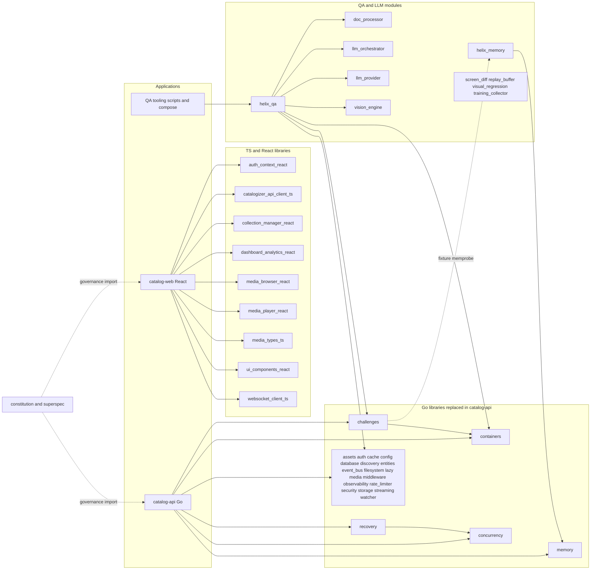
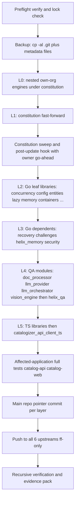
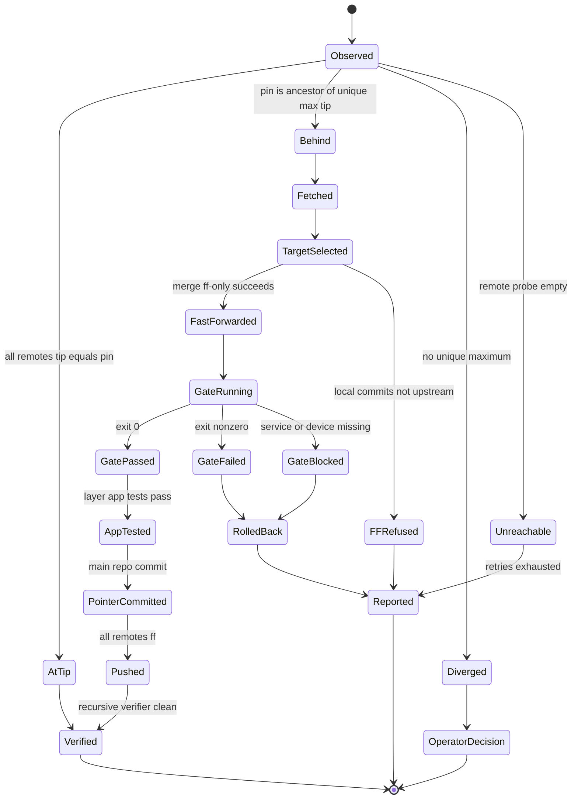
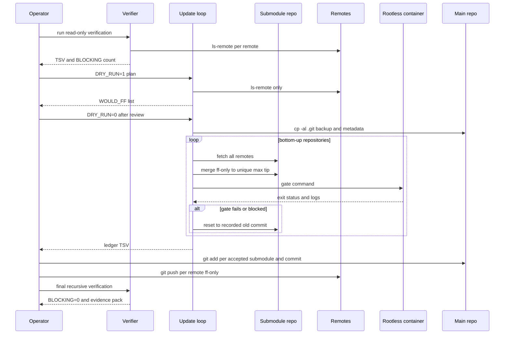

# 11 - Submodules Audit and Update Runbook

| Field | Value |
|---|---|
| Revision | 1 |
| Created | 2026-10-03 |
| Last modified | 2026-10-03 |
| Status | draft |
| Feature | specs/001-full-project-audit-remediation |
| Scope | The 44 direct submodules declared in `.gitmodules` and every nested submodule beneath them (97 repositories recursively) |
| Traceability | FR-017, FR-018, FR-019, FR-020, FR-021, FR-022, FR-024, FR-025; SC-004 (and the dependency-currency success criteria that reference FR-017) |
| Method | Read-only git inspection executed on 2026-10-03 against the live checkout: `git submodule status --recursive`, `git config -f .gitmodules`, `git -C <sub> remote -v`, `git ls-remote`, `git merge-base --is-ancestor`, `git status --porcelain`. No fetch, no checkout, no config write, no build, no test run. |
| Governance anchors | §11.4.26, §11.4.28(C), §11.4.32, §11.4.36, §11.4.113, §11.4.164, §11.4.195, §11.4.201, §11.4.224, §9.1, §9.2, §12 |

## Table of contents

1. Evidence, scope and headline facts
2. Inventory and classification of the 44 direct submodules
3. Nested submodules and non-submodule vendored code
4. Dependency and consumption graph
5. Observed state against upstream (findings)
6. Update runbook (FR-017, FR-019, FR-020, FR-024)
7. The constitution post-pull sweep and `post_update_hook.sh`
8. Deterministic recursive verification design
9. Risk analysis
10. Audit plan for the own-organisation submodules
11. Acceptance evidence and traceability
12. Decision records and open questions
- Appendix A - verifier script (executed, read-only)
- Appendix B - update-loop script (executed in DRY_RUN only)
- Appendix C - captured execution evidence

---

## 1. Evidence, scope and headline facts

### 1.1 Reading rules

Every number in this document is either (a) measured by a command listed in Appendix C on 2026-10-03, or (b) labelled `UNCONFIRMED:` / `UNKNOWN:`. Tip comparisons are point-in-time: the remote tips were read at one instant and can move. The verifier in Appendix A is designed to be re-run immediately before every decision that depends on it.

Constitution rule applied throughout: a claim of "up to date" is a statement about a remote tip read now, never about a tracking ref (stale tracking refs were observed during this investigation, see F-4).

### 1.2 Headline facts (measured)

| # | Fact | Evidence |
|---|---|---|
| H1 | `.gitmodules` declares 44 direct submodules; `git submodule status --recursive` lists 97 repositories (44 direct + 53 nested). All 97 are initialised and none carries a `+`, `-` or `U` prefix, i.e. every checked-out HEAD equals the commit recorded in its parent. | `git submodule status --recursive` |
| H2 | 7 of the 53 nested repositories are own-organisation (all under `submodules/constitution/submodules/`); 46 are third-party by remote owner. The brief's "23 vendored third-party pins" understates the measured count: 28 pinned third-party trees sit under `submodules/helix_qa/tools/opensource/` alone, plus `rest-demo` under `tools/test-apps/`, plus 17 third-party engines under the constitution (including `MVT/js_mse_eme`). | verifier TSV, class column |
| H3 | Of the 44 direct submodules, 43 have a local branch whose tip equals the live tip of every configured remote. The single exception is `submodules/constitution`: pinned at `10b7a06`, every one of its 8 remotes now answers `main` = `e44f22f` (25 commits ahead; the pin is an ancestor of the tip, so the move is a pure fast-forward). | `git ls-remote`, `merge-base --is-ancestor` |
| H4 | Across all 97 repositories 24 pins are behind their live upstream tip: `constitution` (direct), `constitution/submodules/verification`, and 22 `helix_qa/tools/opensource/*` pins; 1 detached pin (`constitution/submodules/MVT/js_mse_eme`) is neither ancestor nor descendant of the remote HEAD (advisory only). | verifier summary |
| H5 | `submodules/websocket_client_ts` has only GitHub-hosted remotes (`github` and `origin`, both GitHub; no GitLab mirror remote). A GitLab mirror (`git@gitlab.com:vasic-digital/websocket-client-ts.git`) exists and its `main` (`8cdf1e8`) is 17 commits behind the pinned GitHub tip `6e624db` (it is an ancestor, so a fast-forward push heals it). | `ls-remote` + `merge-base` |
| H6 | `submodules/llms_verifier` is present in the tree as 42 ordinary tracked files (mode 100644/100755), NOT as a submodule, while `submodules/helix_qa/go.mod` contains `replace digital.vasic.llmsverifier => ../llms_verifier/llm-verifier`. The directory `submodules/llms_verifier/llm-verifier` does not exist. | `git ls-files -s submodules/llms_verifier`; `ls` |
| H7 | The main repository and two submodule paths are not "clean" in the naive sense: the root has 2 untracked planning paths (`specs/001-.../docs/`, `plan.md`, expected during this feature); `submodules/helix_qa/tools/opensource/docling` shows one phantom modified file caused by a CRLF-in-index versus `eol=lf` attribute mismatch, which `helix_qa` hides with `ignore = dirty`. | `git status`, `git ls-files --eol` |
| H8 | The canonical sweep script named by §11.4.32 (`scripts/verify-all-constitution-rules.sh`) and its prerequisite `scripts/verify-governance-cascade.sh` do not exist in any tracked file of the main repository or the pinned constitution checkout. | `git ls-files \| grep` |
| H9 | A serial verifier (one `ls-remote` per remote per repository) took 5 min 50 s for 98 repositories; the parallel verifier in Appendix A (12 workers) took 34 s and produced identical verdicts for the own-organisation set. | `time` output |

### 1.3 What this document decides and what it leaves to the owner

It decides: the classification scheme, the update order, the gates, the rollback mechanism, the verification algorithm and the audit plan. It leaves to the owner (section 12): whether third-party vendored pins are moved, whether `submodules/llms_verifier` is converted to a real submodule, and the explicit go-ahead for running the constitution `post_update_hook.sh` (it can modify user-level tool configuration, section 7).

---

## 2. Inventory and classification of the 44 direct submodules

### 2.1 Classification rules (data, not code)

| Dimension | Rule | Source |
|---|---|---|
| Own versus third-party | The owner segment of the `origin` fetch URL is matched case-insensitively against the own-organisation list. Default list in the scripts: `vasic-digital`, `HelixDevelopment`, `helixdevelopment1` (the GitLab namespace used by `constitution`, `helix_memory` and `doc_processor`). The constitution's own list (§11.4.28) additionally names `red-elf`, `ATMOSphere1234321`, `Bear-Suite`, `BoatOS123456`, `Helix-Flow`, `Helix-Track`, `Server-Factory`; none of those owners occurs in this tree. | `.gitmodules`, `remote get-url origin`, Constitution §11.4.28 |
| Role | Derived from the module's README first sentence and its language mix, not from its directory name. | `submodules/*/README.md` |
| Pin vs tip | `behind` if the pinned commit is a proper ancestor of the tip of the branch on any remote, `at tip` if equal on all remotes, `diverged` if neither is an ancestor of the other. | `git merge-base --is-ancestor` |
| Consumption | Go: `replace` directive in a consumer `go.mod`; TypeScript: `file:` dependency in a consumer `package.json`; Android/Gradle: `includeBuild` in `settings.gradle.kts`. | file greps listed in 2.3 |
| Audit priority | P0 build/QA/governance or security-critical and consumed; P1 consumed Go library; P2 consumed TypeScript library; P3 present but with no verified consumer. See section 10. | section 10 |

### 2.2 Classification table (all 44)

Abbreviations: Br = checked-out branch; Remotes lists remote names other than the always-present `origin`/`upstream` aliases; Files/Test files/Size = tracked files, test files (`*_test.go`, `*.test.ts(x)`, `*.spec.ts`), working-tree size excluding `.git`. Pins are 7-character abbreviations of the 40-character gitlinks.

| # | Path | Role | Lang | Owner class | Remotes | Br | Pin | Pin vs upstream tip (2026-10-03) | Files/Test files/Size | Consumption by apps |
|---|---|---|---|---|---|---|---|---|---|---|
| 1 | `submodules/websocket_client_ts` | TS lib: WebSocket client | TS | own (vasic-digital) | github,origin (both GitHub) | main | `6e624db` | at tip | 29f/4t/328K | catalog-web/package.json file: |
| 2 | `submodules/ui_components_react` | React lib: UI components | TS/React | own (vasic-digital) | github,gitlab | main | `d3df32d` | at tip | 61f/18t/536K | catalog-web/package.json file: |
| 3 | `submodules/challenges` | Go lib: Challenges framework (QA) | Go | own (vasic-digital) | github,gitlab,vasic_digital_github | main | `8a352b9` | at tip | 571f/127t/6M | catalog-api/go.mod replace |
| 4 | `submodules/assets` | Go lib: lazy asset loading | Go | own (vasic-digital) | github,gitlab | main | `ceb948a` | at tip | 47f/9t/1M | catalog-api/go.mod replace |
| 5 | `submodules/concurrency` | Go lib: concurrency primitives | Go | own (vasic-digital) | github,gitlab | main | `32b7efa` | at tip | 93f/22t/760K | catalog-api/go.mod replace |
| 6 | `submodules/config` | Go lib: configuration management | Go | own (vasic-digital) | github,gitlab | main | `8d3f1e0` | at tip | 49f/5t/352K | catalog-api/go.mod replace |
| 7 | `submodules/filesystem` | Go lib: filesystem abstraction | Go | own (vasic-digital) | github,gitlab | main | `66b6bc1` | at tip | 56f/11t/440K | catalog-api/go.mod replace |
| 8 | `submodules/database` | Go lib: relational DB operations | Go | own (vasic-digital) | github,gitlab | main | `8adb19c` | at tip | 96f/24t/904K | catalog-api/go.mod replace |
| 9 | `submodules/auth` | Go lib: authentication/authorization | Go | own (vasic-digital) | github,gitlab | main | `0ae1f5d` | at tip | 72f/15t/592K | catalog-api/go.mod replace |
| 10 | `submodules/middleware` | Go lib: HTTP middleware | Go | own (vasic-digital) | github,gitlab | main | `9bcac12` | at tip | 82f/24t/536K | catalog-api/go.mod replace |
| 11 | `submodules/rate_limiter` | Go lib: rate limiting | Go | own (vasic-digital) | github,gitlab | main | `6463e51` | at tip | 73f/18t/448K | catalog-api/go.mod replace |
| 12 | `submodules/observability` | Go lib: tracing/metrics/logging/health | Go | own (vasic-digital) | github,gitlab | main | `bd3a5be` | at tip | 80f/18t/792K | catalog-api/go.mod replace |
| 13 | `submodules/media` | Go lib: media detection/metadata | Go | own (vasic-digital) | github,gitlab | main | `60aecfb` | at tip | 54f/19t/344K | catalog-api/go.mod replace |
| 14 | `submodules/watcher` | Go lib: FS change monitoring | Go | own (vasic-digital) | github,gitlab | main | `46da9af` | at tip | 61f/11t/412K | catalog-api/go.mod replace |
| 15 | `submodules/event_bus` | Go lib: event bus | Go | own (vasic-digital) | github,gitlab | main | `4613a5a` | at tip | 63f/13t/512K | catalog-api/go.mod replace |
| 16 | `submodules/cache` | Go lib: cache (memory/Redis/PostgreSQL) | Go | own (vasic-digital) | github,gitlab | main | `6a9a3e5` | at tip | 79f/16t/676K | catalog-api/go.mod replace |
| 17 | `submodules/security` | Go lib: security | Go | own (vasic-digital) | github,gitlab | main | `79151f2` | at tip | 120f/43t/1M | catalog-api/go.mod replace |
| 18 | `submodules/storage` | Go lib: object storage | Go | own (vasic-digital) | github,gitlab | main | `e498c63` | at tip | 97f/31t/920K | catalog-api/go.mod replace |
| 19 | `submodules/streaming` | Go lib: streaming (SSE/WebSocket/gRPC) | Go | own (vasic-digital) | github,gitlab | main | `ec4e115` | at tip | 87f/23t/740K | catalog-api/go.mod replace |
| 20 | `submodules/discovery` | Go lib: network/service discovery | Go | own (vasic-digital) | github,gitlab | main | `0e491a3` | at tip | 57f/15t/484K | catalog-api/go.mod replace |
| 21 | `submodules/entities` | Go lib: media entity system | Go | own (vasic-digital) | github,gitlab | main | `ca96287` | at tip | 20f/5t/144K | catalog-api/go.mod replace |
| 22 | `submodules/media_types_ts` | TS lib: media types | TS | own (vasic-digital) | github,gitlab | main | `83b6395` | at tip | 27f/4t/204K | catalog-web/package.json file: |
| 23 | `submodules/catalogizer_api_client_ts` | TS lib: API client | TS | own (vasic-digital) | github,gitlab | main | `a3f88da` | at tip | 43f/7t/296K | catalog-web/package.json file: |
| 24 | `submodules/auth_context_react` | React lib: auth context | TS/React | own (vasic-digital) | github,gitlab | main | `8a84d57` | at tip | 22f/2t/276K | catalog-web/package.json file: |
| 25 | `submodules/media_browser_react` | React lib: media browser | TS/React | own (vasic-digital) | github,gitlab | main | `74f43bc` | at tip | 28f/5t/272K | catalog-web/package.json file: |
| 26 | `submodules/dashboard_analytics_react` | React lib: dashboard analytics | TS/React | own (vasic-digital) | github,gitlab | main | `bfb2818` | at tip | 27f/5t/276K | catalog-web/package.json file: |
| 27 | `submodules/media_player_react` | React lib: media player | TS/React | own (vasic-digital) | github,gitlab | main | `5657f51` | at tip | 25f/4t/268K | catalog-web/package.json file: |
| 28 | `submodules/collection_manager_react` | React lib: collection manager | TS/React | own (vasic-digital) | github,gitlab | main | `fa7d1af` | at tip | 27f/5t/284K | catalog-web/package.json file: |
| 29 | `submodules/containers` | Go lib: container orchestration (§11.4.76) | Go | own (vasic-digital) | github,gitlab,vasic_digital_gitlab | main | `4a8f04e` | at tip | 690f/323t/7M | catalog-api/go.mod replace |
| 30 | `submodules/lazy` | Go lib: lazy initialization | Go | own (vasic-digital) | github,gitlab | main | `957a31a` | at tip | 49f/5t/320K | catalog-api/go.mod replace |
| 31 | `submodules/memory` | Go lib: memory management (Mem0-style) | Go | own (vasic-digital) | github,gitlab | main | `58520a1` | at tip | 72f/13t/584K | catalog-api/go.mod replace |
| 32 | `submodules/recovery` | Go lib: recovery (small scoped module) | Go | own (vasic-digital) | github,gitlab | main | `30961a1` | at tip | 62f/10t/412K | catalog-api/go.mod replace |
| 33 | `submodules/helix_qa` | QA tooling: HelixQA autonomous QA | Go | own (HelixDevelopment) | github,gitlab,vasic_digital_github | main | `1caceb6` | at tip (EOL quirk nested) | 1371f/402t/2630M | scripts + docker-compose.qa-robot.yml; own go.mod replaces 8 siblings |
| 34 | `submodules/doc_processor` | QA tooling: doc processing / feature-map extraction | Go | own (HelixDevelopment) | github,gitlab,vasic_digital_github,vasic_digital_gitlab | master | `5692e52` | at tip | 113f/21t/1M | via helix_qa go.mod replace only |
| 35 | `submodules/llm_orchestrator` | LLM: headless CLI agent orchestrator | Go | own (HelixDevelopment) | github | master | `55d2dde` | at tip | 147f/37t/2M | via helix_qa go.mod replace only |
| 36 | `submodules/llm_provider` | LLM: provider abstractions | Go | own (HelixDevelopment) | github,gitlab,vasic_digital_github | master | `e05ec64` | at tip | 240f/103t/3M | via helix_qa go.mod replace only |
| 37 | `submodules/vision_engine` | Vision/LLM: UI analysis and navigation graph | Go | own (HelixDevelopment) | github | master | `ce16f92` | at tip | 142f/25t/1M | via helix_qa go.mod replace only |
| 38 | `submodules/screen_diff` | QA tooling: screen diff | Go | own (vasic-digital) | github,gitlab | main | `56d3760` | at tip | 14f/1t/88K | UNCONFIRMED: only .gitmodules + docs/SUBMODULE_DEPENDENCIES.md |
| 39 | `submodules/replay_buffer` | QA tooling: SQLite action replay buffer | Go | own (vasic-digital) | github,gitlab | main | `c1c34f7` | at tip | 14f/1t/92K | UNCONFIRMED: only .gitmodules + docs/SUBMODULE_DEPENDENCIES.md |
| 40 | `submodules/visual_regression` | QA tooling: LLM-vision visual regression | Go | own (vasic-digital) | github,gitlab | main | `d3d9f76` | at tip | 14f/1t/96K | UNCONFIRMED: only .gitmodules + docs/SUBMODULE_DEPENDENCIES.md |
| 41 | `submodules/training_collector` | QA/LLM tooling: training-data collector | Go | own (vasic-digital) | github,gitlab | main | `10c0604` | at tip | 14f/1t/84K | UNCONFIRMED: only .gitmodules + docs/SUBMODULE_DEPENDENCIES.md |
| 42 | `submodules/constitution` | Governance: Helix Constitution + tooling | Bash/Py/Go/MD | own (HelixDevelopment) | gitflic,github,gitlab,gitverse,vasic_digital_github,vasic_digital_gitlab | main | `10b7a06` | BEHIND 25 | 3214f/81t/197M | governance (CLAUDE.md @import, .specify) |
| 43 | `submodules/helix_memory` | Go lib: unified cognitive memory engine | Go | own (HelixDevelopment) | github,gitlab | main | `979d7c8` | at tip | 115f/35t/2M | none found in main apps; replace memory in own go.mod |
| 44 | `submodules/superspec` | Governance/spec tooling (third-party) | Py/MD | third (WangX0111) | origin | main | `c20ac6c` | at tip | 44f/0t/13M | .specify tooling |

Notes on the table:

1. Remote naming is inconsistent across the fleet: `helix_qa` carries 4 distinct fetch/push URLs under `origin` (two case variants of the HelixDevelopment repository, the vasic-digital mirror and a GitLab mirror) and 7 remote names; `constitution` carries 8 remote names across GitHub, GitLab, GitFlic and GitVerse. For the verifier every remote name is probed independently; for the updater the target tip must be the unique maximum across all of them (section 6.4).
2. `llm_orchestrator` and `vision_engine` have only GitHub-hosted remotes (`llm_orchestrator`: github, origin, upstream; `vision_engine`: github, origin, upstream; no GitLab mirror); `superspec` has only `origin` and is third-party (owner `WangX0111`), so no push is ever attempted for it. Whether GitLab mirrors exist for the first two is `UNKNOWN:` and is probed in step 6.3.
3. Four submodules pin the tip of remote `master`: `doc_processor`, `llm_orchestrator`, `llm_provider`, `vision_engine`. Each ALSO has a live remote `main` that differs from the pin (read-only `git ls-remote` plus `merge-base --is-ancestor`, measured against locally present objects): `doc_processor` pin `5692e52` vs `main` `86f1a98` has DIVERGED (pin-only 121 commits, main-only 1; pin is not an ancestor of `main`); `llm_orchestrator` main `4823886` is an ancestor of the pin (pin ahead by 5); `llm_provider` main `ebeaef2` is an ancestor of the pin (ahead by 22); `vision_engine` main `e847294` is an ancestor of the pin (ahead by 2). In all four the pin is not an ancestor of `main`. Which of `master`/`main` is the repository's configured default branch is UNCONFIRMED (not probed via `ls-remote --symref`). FR-024 says "main branch"; the plan interprets it as "the default branch of each repository" and creates no branch anywhere (decision D-3).
4. "Test files" is a presence indicator only. Counting files says nothing about assertion strength; the audit (section 10) must apply the anti-bluff detectors, not trust counts (§11.4.224(C)).
5. `submodules/helix_qa` size (about 2.6 GB working tree) is dominated by its 29 nested third-party trees; the `.git/modules` store of the whole project is 6.4 GB on a disk with 707 GB free.

### 2.3 How the main applications consume the modules (verified greps)

| Consumer | Mechanism | Modules (count) |
|---|---|---|
| `catalog-api/go.mod` | `replace digital.vasic.<x> => ../submodules/<dir>` (lines 5 to 49) plus matching `require` lines (53 to 75) | assets, auth, cache, challenges, concurrency, config, containers, database, discovery, entities, event_bus, filesystem, lazy, media, memory, middleware, observability, rate_limiter, recovery, security, storage, streaming, watcher (23) |
| `catalog-web/package.json` | `"@vasic-digital/<x>": "file:../submodules/<dir>"` (lines 14 to 22) | auth_context_react, catalogizer_api_client_ts, collection_manager_react, dashboard_analytics_react, media_browser_react, media_player_react, media_types_ts, ui_components_react, websocket_client_ts (9) |
| `catalogizer-android`, `catalogizer-androidtv` | `settings.gradle.kts` line 26 is a commented-out `includeBuild("../Android-Toolkit")` | none (0) |
| `catalogizer-desktop`, `catalogizer-api-client`, `installer-wizard`, `Website` | no `submodules/` reference in `package.json` | none (0). `installer-wizard` depends on the in-repo `../catalogizer-api-client`, not on a submodule |
| QA infrastructure | `helix_qa` referenced by `docker-compose.qa-robot.yml` and `challenges/scripts/*`; `helix_qa/go.mod` replaces `challenges`, `containers`, `doc_processor`, `llm_orchestrator`, `llm_provider`, `security`, `vision_engine` and the missing `llms_verifier/llm-verifier` | helix_qa and its 7 Go dependencies |
| Governance | `constitution` and `superspec`: imported by `CLAUDE.md` / `.specify`, not compiled | 2 |
| No verified consumer | `screen_diff`, `replay_buffer`, `visual_regression`, `training_collector` (referenced only in `.gitmodules` and `docs/SUBMODULE_DEPENDENCIES.md`), `helix_memory` (referenced only by `challenges` fixture `memprobe` and `scripts/audit/anti-bluff-scan.sh`) | 5 (`UNCONFIRMED:` whether `helix_qa` loads them at runtime without a Go import) |

---

## 3. Nested submodules and non-submodule vendored code

### 3.1 Nesting inventory

| Parent | Nested count | Own / third | Declared policy |
|---|---|---|---|
| `submodules/constitution` | 24 (23 direct children + `MVT/js_mse_eme`) | 7 own (`anti_bluff`, `continuum`, `design-toolkit`, `docs_chain`, `helix_perf_cache`, `session_orchestrator`, `token_optimizer`), 17 third-party (e.g. `agentic-validation`, `claude-video`, `donespec`, `kedge`, `MVT`, `verification`, `verify`, `wave-dpctf`) | §11.4.28(C) carve-out: the constitution may host reusable engines, depth 1, each with a `helix-deps.yaml` and zero further own-org nesting |
| `submodules/helix_qa` | 29 (27 listed in its `.gitmodules` + 2 nested-nested: `mem0/evaluation`, `skyvern/integrations/n8n`) | all third-party | not own-org, so §11.4.28(C) (which forbids nested own-org chains) does not apply, but the fan-out is the dominant clone-time and disk cost |
| every other direct submodule | 0 | n/a | consistent with §11.4.28(C) |

Verification of the carve-out conditions is part of the audit (section 10.4): each of the 7 own nested constitution engines must ship `helix-deps.yaml` and must declare no own-org submodule of its own. `UNCONFIRMED:` the `helix-deps.yaml` presence for each of the seven (not read in this pass).

### 3.2 Vendored but not a submodule: `submodules/llms_verifier`

`git ls-files -s submodules/llms_verifier` returns 42 entries, all regular blobs; it is absent from `.gitmodules`. Its history in the main repository starts at commit `05e0a2b2` ("LLMsVerifier relocate"). It therefore escapes every submodule rule in this document (no upstream, no pin, no fast-forward). Combined with H6 the consequence is that `helix_qa` cannot resolve `digital.vasic.llmsverifier` through the declared replace path. `UNCONFIRMED:` whether `helix_qa` builds at all in its current state; a containerized `go build ./...` would settle it and is scheduled in section 10 as audit item S-HQA-1. Decision D-4 asks the owner whether `llms_verifier` becomes a real submodule (restoring FR-017 coverage) or is formally declared in-tree code.

---

## 4. Dependency and consumption graph



Reading the graph: update order inside the Go layer must respect the edges `recovery -> concurrency`, `challenges -> containers`, `helix_memory -> memory`, and `helix_qa -> {challenges, containers, doc_processor, llm_orchestrator, llm_provider, security, vision_engine}`. These edges come from `replace` directives in the submodules' own `go.mod` files (verified: `challenges/go.mod:12`, `recovery/go.mod:10`, `helix_memory/go.mod:42`, `helix_qa/go.mod:125-134`).

---

## 5. Observed state against upstream (findings)

| ID | Finding | Evidence | Severity | Handled by |
|---|---|---|---|---|
| F-1 | `constitution` pin is 25 commits behind a tip that all 8 remotes agree on. The diff `10b7a06..e44f22f` touches 28 files: 13 under `scripts/fastcycle/tests`, 1 under `scripts/hooks`, 1 under `scripts/gates`, plus `Constitution.md`, `CLAUDE.md`, `AGENTS.md`, `QWEN.md`, `GEMINI.md`. | `git diff --stat 10b7a06 e44f22f` | Medium (governance text changes bind work) | section 6 and 7 |
| F-2 | During the first verifier run, the tip object `e44f22f` was absent from the local object store ("tip not fetched"); a later check found it present and `refs/remotes/origin/main` updated at 13:15. A fetch was performed by an actor other than this investigation. Cause `UNKNOWN:`. | `stat` of `FETCH_HEAD` and tracking refs | Low, but shows other actors write to these repositories concurrently | preflight lock check (6.2) |
| F-3 | 22 `helix_qa/tools/opensource/*` pins and `constitution/verification` are behind their remote HEAD; `MVT/js_mse_eme` diverges from remote HEAD (it is pinned to a commit not on the default branch). | verifier summary | Low (vendored tool snapshots) | decision D-1 |
| F-4 | Stale tracking refs exist (for example `upstream/main` at `c9ac78e` and `vasic_digital_*/main` at `10b7a06` in `constitution`, while the live remotes answer `e44f22f`). Anything that compares against `refs/remotes/*` instead of `ls-remote` produces wrong answers. | `git for-each-ref refs/remotes` | Medium (verification-method defect class §11.4.201) | verifier uses `ls-remote` only |
| F-5 | `websocket_client_ts` has no GitLab remote and the GitLab mirror lags by 17 commits. | H5 | Medium for FR-019 ("nothing unpushed to any upstream") | step 6.9 |
| F-6 | `llms_verifier` vendored as plain files; `helix_qa` replace target missing. | H6 | High for FR-017 coverage and for QA tooling health | D-4, S-HQA-1 |
| F-7 | Phantom modification in `docling` from `eol=lf` attribute versus CRLF blob; `helix_qa` masks it with `ignore = dirty` (set in its own config, not in `.gitmodules`). | `git ls-files --eol`; `git diff --ignore-cr-at-eol` is empty | Low, but a naive "clean" check fails forever | verifier class `CLEAN_EOL_QUIRK` |
| F-8 | Canonical sweep scripts named by §11.4.32 are missing (H8). The post-update hook calls none of them; the main repo has only `scripts/verify_constitution_inheritance.sh`. | H8 | Medium (a mandated gate has no implementation, §11.4.227 ledger class) | 7.4 |
| F-9 | `scripts/push_all_submodules.sh` stages only `CLAUDE.md`/`AGENTS.md` and pushes; it defaults to `DRY_RUN=1` and merges `--ff-only`. The root `commit` wrapper delegates to an external `commit` binary found on `PATH`. Existence of that binary `UNCONFIRMED:`. | file reads | Low | 6.9 uses neither blindly |
| F-10 | `.git/hooks` of the main repository holds only `*.sample` files; `core.hooksPath` is unset. | `ls .git/hooks`, `git config` | Info | 7.2 |

---

## 6. Update runbook (FR-017, FR-019, FR-020, FR-024)

### 6.1 Policy decisions encoded in the runbook

| Id | Policy | Reason |
|---|---|---|
| P-1 | Own-organisation submodules are fast-forwarded to the unique maximum tip across all their remotes, on their default branch, `--ff-only`. | FR-017, FR-020, FR-024 |
| P-2 | Third-party pins are reported with pinned and latest commit and a status; they are moved only when the owner sets `UPDATE_THIRD_PARTY=1` (decision D-1). Default is report-only. | FR-017 says "every submodule" but also asks for tests before accepting; vendored tool snapshots under `helix_qa/tools/opensource` have no tests in this project and moving them changes the QA tool surface |
| P-3 | No branch is created, no history is rewritten, nothing is force-pushed, `--no-verify` is never used. Divergence is reported, never resolved automatically. | FR-020, §11.4.113, §9.2 |
| P-4 | Every accepted move passes a containerized gate for that module and then the affected applications' full tests (FR-018, FR-021). A gate that cannot run for lack of a service, credential or device is `BLOCKED` with the exact reason and counts as not passing (FR-025). | FR-018, FR-021, FR-025 |
| P-5 | Backup before any write: a hardlinked mirror of the root `.git` (which contains every submodule git directory under `.git/modules`). | §9.1 |
| P-6 | The main-repository pointer commit is made once per layer and pushed ff-only to all 6 remotes; the individual submodules are pushed only if the loop created commits in them (a pure fast-forward needs no push). | FR-019, §2.1 |

### 6.2 Preconditions (checked, not assumed)

1. `submodule_verify.sh` returns `BLOCKING=0` and a report whose only non-clean verdicts are `BEHIND_UPSTREAM`, `CLEAN_EOL_QUIRK` and `ADVISORY_*`. If any `DIRTY`, `UNPUSHED`, `DIVERGED` or `UNREACHABLE` appears for an own-organisation repository, stop and report it with its reason (FR-020).
2. No other writer is active: `pgrep -af 'git (fetch|pull|merge|commit|push)'` filtered by real `/proc/<pid>/cmdline` shows none (finding F-2 shows concurrent writers exist; a bare `pgrep -f` substring is itself a carrier hazard, §11.4.201). Index lock files (`.git/index.lock`, `.git/modules/**/index.lock`) absent.
3. Host headroom per §12: memory ceiling, process count, disk. The backup is hardlinks (near zero additional space), but gate containers are bounded with `--memory` and `--pids-limit`.
4. `podman` rootless available (`podman 5.7.0` observed); gate image present (`localhost/catalogizer-builder:latest` is the image named in `docker-compose.build.yml`; its contents `UNCONFIRMED:`). If absent, building it is a prior task, not an inline `docker run golang` fallback on the bare host (§11.4.173).
5. SSH reachability to GitHub, GitLab, GitFlic and GitVerse (the verifier's `unreachable:<remote>` notes are the evidence).
6. Written owner go-ahead for step 6.7 (the constitution hook), section 7.

### 6.3 Order of operations



Layer membership (P = pin currently at tip, so the step is a verified no-op):

| Layer | Members | Expected movement on 2026-10-03 |
|---|---|---|
| L0 | `constitution/submodules/{anti_bluff, continuum, design-toolkit, docs_chain, helix_perf_cache, session_orchestrator, token_optimizer}` | none (all at tip) |
| L1 | `constitution` | +25 commits |
| L2 | `concurrency`, `config`, `entities`, `lazy`, `memory`, `containers`, `assets`, `auth`, `cache`, `database`, `discovery`, `event_bus`, `filesystem`, `media`, `middleware`, `observability`, `rate_limiter`, `storage`, `streaming`, `watcher` | none |
| L3 | `recovery` (needs `concurrency`), `challenges` (needs `containers`), `helix_memory` (needs `memory`), `security` | none |
| L4 | `doc_processor`, `llm_provider`, `llm_orchestrator`, `vision_engine`, `screen_diff`, `replay_buffer`, `visual_regression`, `training_collector`, then `helix_qa` | none |
| L5 | `media_types_ts`, `websocket_client_ts`, `ui_components_react`, `auth_context_react`, `media_browser_react`, `media_player_react`, `collection_manager_react`, `dashboard_analytics_react`, `catalogizer_api_client_ts` | none |
| L6 (optional, D-1) | the 24 behind third-party pins | up to 22 + 1 moves |

The practical consequence of the measured state: on 2026-10-03 the bottom-up loop moves exactly one own-organisation repository. The runbook is nonetheless written for the general case because other actors move upstream tips between the audit and the final push, and FR-019 requires the recursive verification to be re-run at the end.

### 6.4 Steps

**Step 1 - fetch (write to object store and tracking refs only).** For each repository in bottom-up order: `git fetch --all --tags` (no `--prune`: pruning would delete tracking refs other tooling may use; the stale-ref problem is solved by never reading them for decisions). Repositories whose remote is unreachable are recorded `REMOTE_UNREACHABLE` and do not block the others (matches `push_all_submodules.sh` behaviour).

**Step 2 - choose the target tip.** For each repository collect `ls-remote --heads <remote> <branch>` for every remote. The target is the unique tip T such that every other remote tip is an ancestor of T. If no unique maximum exists the repository is `DIVERGED_OPERATOR_DECISION` (remotes disagree in a non-linear way); the loop stops for that repository and reports the SHAs. It never merges two remotes' histories and never picks one by position in the remote list.

**Step 3 - fast-forward.** `git -C <sub> merge --ff-only <T>`. A refusal (`FF_REFUSED`) means the local branch has commits that are not upstream: report, do not reset (those commits would then be unpushed work, violating FR-019).

**Step 4 - gate.** Section 6.8. Pass: record `UPDATED_GATE_PASS`. Fail or blocked: roll back the local branch to the recorded old commit (6.6) and record `ROLLED_BACK` with the failing evidence.

**Step 5 - application-level tests.** After a layer completes with at least one accepted move, run the full tests of every affected application (catalog-api for Go layers, catalog-web for TS layers) in containers. FR-025 applies: tests that need real databases, SMB shares or devices run against the real ones or are `BLOCKED` with the exact reason.

**Step 6 - repeat for the next layer**, then run section 7 for L1 as indicated by the owner's go-ahead.

**Step 7 - pointer commit.** In the main repository: `git add submodules/<x>` for each accepted move (never `git add -A`, to keep unrelated planning files out), one commit per layer with message `chore(submodules): fast-forward <list> to upstream tips` and the evidence ledger path. Independent review precedes the commit (§11.4.142), executed by a reviewer separate from the author (FR-023).

**Step 8 - push.** To every main remote: `git push <remote> main` for `github`, `githubvasicdigital`, `gitlab`, `gitlabvasicdigital`, `gitflicvasicdigital`, `gitversevasicdigital` (6 distinct remotes). Plain push only: git refuses non-fast-forward by default, and the script never passes `--force`, `--force-with-lease` or a `+` refspec. A rejected remote means that remote has commits we lack: run Step 2-style analysis (fetch, merge ff-only or report), never force. Submodules that received local commits are pushed first (children before parents), each to all of its remotes; lagging mirrors (F-5) receive an ff push.

**Step 9 - verification.** Re-run `submodule_verify.sh` (network on). Expected output in section 8.4. Store TSV and summary in `qa-results/` as the FR-019/SC-004 evidence.

### 6.5 Handling remotes that disagree or are unreachable

| Situation | Detection | Action | Never |
|---|---|---|---|
| One remote lags (ancestor of the tip) | `remote-lags(unpushed):<r>` in verifier | ff-push the tip to that remote after the main work completes | force |
| One remote ahead of all others, unique maximum | target selection | ff local to it, then ff-push to the lagging remotes | choose by remote order |
| Remotes diverge (no unique maximum) | `DIVERGED` | stop for that repo; report both SHAs and `git merge-base`; operator decides (merge commit on the default branch is a fast-forward-safe integration but needs review and tests) | rebase, reset, force |
| Remote unreachable (timeout, auth) | `ls-remote` returns no 40-hex line after banner filtering | retry twice with 40 s timeout; then `UNREACHABLE` for own-org repos blocks acceptance of the final verification (FR-020 requires a reason); for third-party it is advisory | silently skip |
| Remote repository does not exist (404/`not our ref`) | `ls-remote` fails, `fatal` text | report with the exact error; a pin that exists only on a remote that has vanished is a supply risk | assume fine |
| Remote configured twice under different URLs (case variants, e.g. `helixqa` vs `HelixQA`) | `git remote -v` shows the same remote name with several push URLs | treat each remote name once but probe every distinct URL during the audit; GitHub URL case differences resolve to one repository | edit remotes during the update |
| No remote for a known mirror (`websocket_client_ts` has no GitLab) | audit compares to `.gitmodules` URL plus Upstreams recipes | add the remote through the repository's own `Upstreams/*.sh` recipe or `install_upstreams` (§11.4.36); `UNCONFIRMED:` that `install_upstreams` is on `PATH`; then ff push | create the mirror repo with force |

Banner noise: SSH banners and `warning:` lines appear on stderr or stdout depending on the host configuration. Every parser in this document keeps only lines matching `^[0-9a-f]{40}[[:space:]]` and ignores the rest, as required by the brief.

### 6.6 Rollback

Layered, from cheapest to most complete:

1. **Per-repository (automatic).** The loop records the old commit before the fast-forward. If the gate fails, `git checkout <branch> && git reset --hard <old>` on the submodule branch. This is not a history rewrite of anything that was ever pushed: the fast-forward was local and unpushed, so resetting returns the branch to a commit that all remotes still have. The reset is only ever executed when the working tree was clean (checked in step 3).
2. **Per-layer.** Before the main-repo pointer commit, `git checkout -- submodules/<x>` restores the gitlink from the index and `git submodule update --init --recursive <x>` re-checks out the pinned commit.
3. **Whole operation (§9.1).** The pre-operation backup `cp -al .git <backup>/catalogizer.git.mirror` plus `refs.txt`, `submodules.txt`, `head.txt` (and the tree-hash files listed in §9.1 steps 2 and 3 when a content-changing operation is performed). Restore: stop all git processes, move the damaged `.git` aside (never `rm -rf` it), move the mirror into place, then run the verifier and compare `submodules.txt` with `git submodule status --recursive`.

Hardlink caveat (`UNCONFIRMED:` for this repository): `cp -al` shares inodes, so an in-place rewrite of a loose object file would alter the backup too. Git writes new objects and ref files by creating new files and renaming, which preserves the old inode, but packfile `gc` rewrites would not touch the old file either. The restore test below is therefore part of the preflight: after the backup, `git -C <backup>/catalogizer.git.mirror` is not used directly; instead `git --git-dir=<backup>/catalogizer.git.mirror show-ref | diff - refs.txt` must be empty.

### 6.7 Third-party and optional L6 handling

With `UPDATE_THIRD_PARTY=1` the loop for detached third-party pins does: choose the remote HEAD commit, `git -C <sub> checkout --detach <commit>`, run the gate (none exists for most; the gate is "the vendoring parent's tests still pass", i.e. the `helix_qa` Go tests and its documented tool-availability checks), and record the old and new pin. Known quirk `docling`: the working tree shows a phantom modification; the loop must run `git -C docling status --porcelain` through the verifier's quirk classifier, never `reset --hard`, because the CRLF blob versus LF attribute mismatch would "fix" itself into a real modification on checkout (the warning "CRLF will be replaced by LF the next time Git touches it" was observed). Decision D-5 records the handling.

### 6.8 Test gates before accepting a pin

| Module kind | Containerized gate command (inside the builder image) | Accept when | Not executed on the bare host because |
|---|---|---|---|
| Go library | `cd /src/<dir> && go vet ./... && go test -count=1 ./...` | exit 0; test count equals or exceeds the pre-update count (a drop is a finding) | §11.4.173 / FR-021 |
| Go library with Redis/PostgreSQL/SMB backends (`cache`, `database`, `storage`, `filesystem`, `discovery`) | same, with the real service container from `docker-compose.test-infra.yml` attached; no simulation | exit 0 against the real service; if the service cannot start, `BLOCKED: <reason>` | FR-025 |
| TS/React library | `cd /src/<dir> && npm ci --no-audit --no-fund && npm run lint && npm test` (`lint` is `tsc --noEmit`, `test` is `vitest run` in the two package files read) | exit 0 | FR-021 |
| Governance (`constitution`) | `bash -n` on changed shell scripts, the constitution's gate scripts that map to the changed anchors, and the main repo's `scripts/verify_constitution_inheritance.sh` | exit 0, plus section 7 | §11.4.32 |
| Third-party pins | none of their own; the parent's gate | parent gate exit 0 | n/a |
| After the layer | full `go test ./...` in `catalog-api` and `npm test` in `catalog-web` | exit 0; FR-025 blocked rule for real-service tests | FR-018 |

Gate containers run rootless with `--memory 8g --pids-limit 2048` (defaults in the script, override per host headroom) and mount `submodules/` with the Podman overlay option `:O`, so tests can write caches without modifying the working tree. Whether the overlay option is accepted by the installed Podman for this mount is `UNCONFIRMED:` (Podman 5.7.0 is installed; the option is documented for rootless overlay support); if refused the loop falls back to copying the module into a tmpfs inside the container.

### 6.9 State machine of a single pin update



### 6.10 Sequence of one full run



---

## 7. The constitution post-pull sweep and `post_update_hook.sh`

### 7.1 What the rules require

- §11.4.26: before modifying governance files, fetch and pull the constitution first; commit and push changes to all constitution upstreams; resolve conflicts carefully; validate after merging.
- §11.4.32: every fetch+pull of the constitution that changes content must be followed by a full-project recursive validation sweep; failures become tracked items (Status `Reopened`, Type `Bug`) and must be resolved before the new HEAD is treated as canonical.
- §11.4.164: a post-update hook installs and registers changed constitution components so the pull is a complete governance transaction.

### 7.2 What `submodules/constitution/scripts/post_update_hook.sh` actually does (read in this pass, 569 lines)

Inputs: `CONST_DIR` (default: the constitution root, one level above the script) and `PROJECT_ROOT` (default: current directory). It aborts with an error if `CONST_DIR` lacks `Constitution.md` or `scripts/`.

| Step | What it does | What it modifies | Level |
|---|---|---|---|
| 1 detect | `git diff --name-only --diff-filter=AM ORIG_HEAD..HEAD` inside the constitution (falls back to `HEAD~1` with a warning); classifies changed files by path: `skills/*`, `mcp/*.json`, `scripts/hooks/*`, `actions/*` or `plugins/*` or `.claude-plugin/*`, `scripts/*.sh` | nothing | read |
| 2 skills | for each changed skill directory: symlink `<PROJECT_ROOT>/skills/<name>` to the constitution skill; runs a consumer `register` script if present | creates `<PROJECT_ROOT>/skills/` and symlinks; only replaces its own symlink or a free slot | project |
| 3 MCP | merges each changed `mcp/*.json` into `<PROJECT_ROOT>/.mcp.json` with `jq` | edits `.mcp.json` (project file) | project |
| 4 hooks | copies each changed file under `scripts/hooks/` into `<PROJECT_ROOT>/.git/hooks/` and `chmod +x` | creates files in `.git/hooks` (local, untracked) | project, local git |
| 4b actions | only if actions/plugins/skills changed: runs `scripts/install_cli_agent_plugins.sh <PROJECT_ROOT>` then `scripts/skill_activation/skill_activate.sh session-init <PROJECT_ROOT>` | see below | project AND user |
| 5 validate | `chmod +x` and `bash -n` on changed scripts; optional `shellcheck` | file modes | project |
| 6 report | summary on stdout; exit 1 on errors | nothing | none |

Step 4b detail from `install_cli_agent_plugins.sh` (read: 312 lines):

- Links every constitution skill into `<PROJECT_ROOT>/.claude/skills/<name>` (project level).
- Generates and links slash-command files into `<PROJECT_ROOT>/.gemini/commands`, `<PROJECT_ROOT>/.qwen/commands`, `<PROJECT_ROOT>/prompts` (project level; never overwrites a real file).
- Runs `install_action_prefix.sh`, which edits `<PROJECT_ROOT>/.claude/settings.json` to add a `UserPromptSubmit` hook and writes `settings.json.bak` first (project level).
- **If the `claude` CLI is on `PATH`: runs `claude plugin marketplace add <constitution root>` and `claude plugin install <plugin>@<marketplace>`.** These commands write to the active Claude Code configuration directory of the invoking user (the value of `CLAUDE_CONFIG_DIR` or its default), which is user-level tool configuration. If `claude` is not on `PATH` the installer only prints the two commands as warnings and exits non-zero.

### 7.3 Effect of the hook on the specific delta `10b7a06..e44f22f`

Changed paths: `Constitution.md`, `CLAUDE.md`, `AGENTS.md`, `QWEN.md`, `GEMINI.md`, `scripts/gates/gate_ledger_deferrals.tsv`, `scripts/hooks/test_credential_scan_lib.sh`, and `scripts/fastcycle/**`. No path matches `skills/*`, `mcp/*.json`, `actions/*`, `plugins/*` or `.claude-plugin/*`. Predicted effect (derived from reading the classifier, `UNCONFIRMED:` until executed): step 2, 3 and 4b are no-ops; step 4 copies one file (`test_credential_scan_lib.sh`, a test fixture, not a hook name git uses) into `.git/hooks/`; step 5 validates syntax of changed scripts. User-level configuration would not be touched for this delta. This does not hold for a later delta that adds a skill or action, so the owner's go-ahead is requested for the procedure, not for one run.

### 7.4 Procedure with the owner-gated parts separated

1. Fast-forward `submodules/constitution` (step 6.4.3) and keep `ORIG_HEAD` intact (the hook diffs against it).
2. **Owner-approved variant A (full)**: `PROJECT_ROOT=$PWD bash submodules/constitution/scripts/post_update_hook.sh`, run under the intended Claude Code alias (the alias determines which configuration directory the `claude plugin` commands write to; this machine has several alias directories, `UNCONFIRMED:` which is intended).
3. **Variant B (project-only, no owner decision needed)**: run the same command with a `PATH` that excludes the `claude` binary, for example `env PATH="$(printf %s "$PATH" | tr ':' '\n' | grep -v '/claude' | paste -sd:)" ...`. The installer then performs only project-level changes and reports the two manual commands. This is the default recommendation until the owner gives variant A.
4. Review `git status` of the main repository: the hook may create or change `skills/`, `.mcp.json`, `.claude/settings.json(.bak)`, `.claude/skills/*`, `.gemini/`, `.qwen/`, `prompts/`. Each is a tracked-or-untracked project change that goes through the normal independent review (§11.4.142) before commit; none of it is committed by the update loop.
5. Run the sweep required by §11.4.32. Because `verify-all-constitution-rules.sh` and `verify-governance-cascade.sh` do not exist (H8, F-8), the substitute set is: `scripts/verify_constitution_inheritance.sh`, `scripts/audit/anti-bluff-scan.sh`, and the constitution gate scripts under `submodules/constitution/scripts/gates/` (286 files, 151 non-test) whose anchor corresponds to the changed paragraphs. Selecting the exact gate set is part of audit item S-GOV-1 and is `UNCONFIRMED:` as a complete sweep; the plan records the gap instead of claiming §11.4.32 compliance.
6. Any FAIL becomes a tracked item per §11.4.32; the new constitution HEAD is not "canonical" for this project until each FAIL is closed with evidence.

---

## 8. Deterministic recursive verification design

### 8.1 Goals

Prove, for the main repository and every submodule at every depth, that (1) the checked-out HEAD equals the gitlink recorded in the parent, (2) the working tree has nothing uncommitted, (3) nothing is unpushed to any configured remote, (4) for each repository the pin is at, ahead of, or behind the live upstream tip with an explicit status, and (5) no history was rewritten. The result is a machine-readable TSV plus a one-line summary and an exit code (FR-019, SC-004).

### 8.2 Algorithm (what the script in Appendix A implements)

For each repository `R` (root first, then `git submodule foreach --quiet --recursive`):

1. `HEAD = rev-parse HEAD`; branch via `symbolic-ref -q --short HEAD`, else `DETACHED`.
2. Class: owner of the first `origin` URL matched against the own-organisation list (`own` / `third`).
3. Working tree: `git status --porcelain=v1 --untracked-files=normal --ignore-submodules=none`. Each ` M` line is re-tested with `git diff --ignore-cr-at-eol --quiet -- <file>`; if the only difference is carriage returns it is counted in the `eolquirk` column, otherwise in `dirty`. Untracked paths in the root matching `ALLOW_UNTRACKED` are ignored (the planning documents of this feature).
4. For every remote name of `R`: `tip = ls-remote --heads <remote> <branch>` filtered to `^[0-9a-f]{40}[[:space:]]` (for detached pins: `ls-remote <remote> HEAD`). Empty result = `unreachable`.
5. Compare `tip` with `HEAD`: equal -> nothing; `tip` ancestor of `HEAD` -> the remote lags (`unpushed`); `HEAD` ancestor of `tip` -> the pin is behind (`behind`); neither -> `DIVERGED`; `tip` object absent locally -> `remote-ahead-unfetched` (counts as behind, needs a fetch to refine).
6. Verdict precedence (highest first): `DIVERGED`, `DIRTY`, `UNPUSHED`, `UNREACHABLE`, `BEHIND_UPSTREAM`, `CLEAN_EOL_QUIRK`, `CLEAN`; a detached pin that diverges from the remote HEAD becomes `ADVISORY_PIN_OFF_REMOTE_HEAD` (it may legitimately sit on a tag or another branch).
7. Exit code 1 if any own-organisation repository, or the root, has a verdict outside `{CLEAN, CLEAN_EOL_QUIRK, BEHIND_UPSTREAM}`, or any repository is `DIVERGED`. `BEHIND_UPSTREAM` is non-blocking for the verifier by design: behind-ness is the update loop's input, not a verification failure; the final verification after the update must additionally require zero `BEHIND_UPSTREAM` among own-organisation repositories (section 8.4, assertion A-6).

### 8.3 Why this is deterministic, and its honest limits

- Inputs are the repository graph and the live remote tips; for a given snapshot of both the TSV is identical run to run (rows are sorted by path). Time-varying inputs are explicit: remote tips. The evidence pack stores the verifier output with a UTC timestamp and the `ls-remote` raw lines (hashes only) so a later reader can see which tips the verdict was computed against.
- The control needle (§11.4.201): a verifier that returns zero `UNREACHABLE` must be shown capable of seeing one. The evidence pack therefore includes a second run with one remote URL replaced by a nonexistent one through a throwaway `git -c remote.<name>.url=...` override against a scratch clone (not against the real repositories), and the expected `UNREACHABLE` row. `NOT EXECUTED` in this pass.
- Known limit: a remote that reports a tip but silently rewrote history appears as `DIVERGED` or `behind` only if the old pin is no longer an ancestor; detection of rewrite relies on the ancestor relation, which is exactly what FR-020 needs.
- Limit: `ls-remote --heads <remote> <branch>` matches by ref name pattern; branch names that are a suffix of other names (for example `main` and `release/main`) would both match. The script takes the first line; the branches observed here are plain `main`/`master`. `UNCONFIRMED:` for future repositories.

### 8.4 Expected outputs (and the one observed on 2026-10-03)

Immediately after a successful run of section 6 with the owner's choice D-1 = report-only for third-party pins:

```
SUMMARY BEHIND_UPSTREAM=23 ADVISORY_PIN_OFF_REMOTE_HEAD=1 CLEAN_EOL_QUIRK=1 CLEAN=73 BLOCKING=0
```

(the 23 behind entries are then the third-party pins only: `constitution/verification` plus 22 `helix_qa/tools/opensource` pins; `constitution` itself has moved to `CLEAN`.) Assertions A-1..A-7 for the evidence pack:

| Id | Assertion | Check |
|---|---|---|
| A-1 | Row count equals `git submodule status --recursive \| wc -l` plus 1 (root) | wc |
| A-2 | Every row's `head` equals the parent's recorded gitlink (`git ls-tree <parent HEAD> <path>`) | ls-tree |
| A-3 | `dirty` is 0 everywhere | TSV column |
| A-4 | `unpushed_remotes` is 0 everywhere | TSV column |
| A-5 | No own-organisation row has `UNREACHABLE` or `DIVERGED` | awk |
| A-6 | No own-organisation row has `BEHIND_UPSTREAM` (after the update) | awk |
| A-7 | The root `HEAD` equals the tip on all 6 remotes | included in the root row |

Observed on 2026-10-03 before any update (parallel run, 34 s, exit 0): `SUMMARY BEHIND_UPSTREAM=24 ADVISORY_PIN_OFF_REMOTE_HEAD=1 CLEAN_EOL_QUIRK=1 CLEAN=72 BLOCKING=0`; the root row `.  own  main  e4852ce7e1a1  0/0  0  0  CLEAN`.

### 8.5 Classification of third-party and known-quirk repositories

| Class | Rule | Treatment in verification | Treatment in update |
|---|---|---|---|
| own | owner in the own-organisation list | strict: must be clean, pushed, and (after update) at tip | fast-forward |
| third | any other owner | strict on dirty/unpushed (nothing of ours may be uncommitted inside them), advisory on behind/off-HEAD | report only unless D-1 |
| quirk `EOL` | modified files whose only difference is CR at end of line | `CLEAN_EOL_QUIRK` (counted, reported, not blocking) | never `reset --hard`; fix at source by committing a normalising `.gitattributes` in a fork or documenting the exception |
| quirk `detached` | pinned commit not on a branch | compared to remote HEAD; divergence is advisory | `checkout --detach <commit>` only under D-1 |
| vendored tree (not a submodule) | tracked blobs under `submodules/` that are not gitlinks (`llms_verifier`) | out of verifier scope; listed by a separate check `git ls-files -s submodules \| awk '$1!="160000"'` restricted to top-level directories | not updatable; decision D-4 |

---

## 9. Risk analysis

| Id | Risk | Likelihood | Impact | Mitigation | Residual |
|---|---|---|---|---|---|
| R-1 | Breaking upstream change in a Go library that all of catalog-api consumes (23 modules, each replaced to the working tree: a single bad pin breaks the build) | Low now (43 of 44 already at tip), Medium over time | High | per-module gate then full `catalog-api` tests before accepting; bottom-up order isolates the culprit; rollback per repo | low |
| R-2 | Constitution update changes anchors, gates and hooks that apply to this repository; 25 commits, 28 files | Certain (it is the one pending move) | Medium: new obligations, possible new FAILs | section 7; tracked items per §11.4.32; do not pull constitution mid-flight of other plan work | medium |
| R-3 | `post_update_hook.sh` modifies `.claude/settings.json`, `.mcp.json`, `.git/hooks`, and, with `claude` on PATH, user-level plugin state | Medium (only when actions/skills change) | Medium | variant B by default; owner go-ahead for A; review before commit; the delta analysis in 7.3 | low |
| R-4 | Remotes disagree (mirror lag or divergence) | Observed once (websocket GitLab lag) | Medium (FR-019 cannot be met if a remote cannot be fast-forwarded) | unique-maximum rule; ff-only push; report-only on divergence | low |
| R-5 | A remote is unreachable during the final verification | Medium (4 hosting providers, SSH only) | Medium | FR-020: report with reason; retries; the verification is not declared clean until every own-org remote answered | medium |
| R-6 | Concurrent writers (another agent or tool fetches or commits during the loop) | Observed (F-2) | Medium | lock/pgrep-by-cmdline preflight; backup; the loop re-reads state per repository and aborts on `DIRTY_ABORT` | medium |
| R-7 | §11.4.28(C) nested-chain rule: an own-org submodule growing nested own-org submodules; the constitution carve-out (depth 1 + `helix-deps.yaml`) being violated by an update | Low | Medium | audit S-GOV-2 checks each of the 7 own engines; the updater refuses nothing automatically but the verifier lists depth per row | low |
| R-8 | Third-party vendored pins behind (22 + 1) hide security fixes in tools used by QA | Medium | Low to Medium (tools run in QA containers, not in the product) | report with versions; D-1 may schedule updates per tool with its own test | accepted until D-1 |
| R-9 | `helix_qa` working tree is 2.6 GB; recursive operations (fetch, status, verification) take time and disk | High | Low | parallel verifier (34 s); `ignore = dirty` on docling; do not run `git clean` or `gc --aggressive` as part of this feature | low |
| R-10 | EOL quirk causes a false "dirty" and tempts a destructive reset | Medium | Medium | quirk class; explicit prohibition of `reset --hard` for quirk rows | low |
| R-11 | Hardlink backup shares inodes with the live `.git`; an operation that rewrites files in place defeats it | Low | High | ref and submodule-status metadata comparisons are the restore proof (6.6); `git bundle` of the root (`git bundle create <backup>/main.bundle --all`) as a second copy when disk allows (§9.1 allows it); 707 GB free | low |
| R-12 | A submodule pin moves but its consumer's `go.sum`/lockfile no longer matches (TS `package-lock.json` with `file:` dependencies) | Medium | Medium | gate runs `npm ci`, which fails on mismatch; lockfile regeneration is a reviewed change, not part of the update loop | low |
| R-13 | `llms_verifier` in-tree copy diverges from its upstream forever | Certain until D-4 | Medium | D-4; audit item S-HQA-1 | open |
| R-14 | A tip changes between the audit and the push (time-of-check/time-of-use) | Medium | Low | verifier is re-run last; the push is plain ff-only and git rejects anything stale | low |
| R-15 | A false "up to date" from stale tracking refs (F-4) | Realised once | High | decisions only from `ls-remote` lines; control needle section 8.3 | low |

---

## 10. Audit plan for the own-organisation submodules

### 10.1 Principles

Submodules are an equal part of the codebase (§11.4.28(A)); each own-organisation module receives the same audit as `catalog-api`. Audit rows feed the findings register designed in document 04; test strategy and coverage follow document 05; evidence format follows document 06. This section only fixes scope, risk, detectors and the tests to verify per module. Detector names below are classes; the availability of a specific tool on the build image is `UNCONFIRMED:` and is verified before the first run (`UNCONFIRMED:` for `staticcheck`, `govulncheck`, `gosec`).

### 10.2 Detector catalogue

| Id | Detector | Class | Runs where |
|---|---|---|---|
| D-VET | `go vet ./...` | static, mandatory (project rule: zero warnings) | container |
| D-TEST | `go test -count=1 ./...` and, for concurrency-bearing modules, `-race` | dynamic | container |
| D-COV | `go test -coverprofile` + `go tool cover` per package, floor 85% (§11.4.224) | measured proxy | container |
| D-BLUFF | `scripts/audit/anti-bluff-scan.sh` pattern set: `assert.True(t, true)`, constructor-only tests, mock-only integration tests, permanently skipped tests | static, project rule | container or lightweight |
| D-MUT | paired mutation (`mutation_ratchet_challenge.sh` is named in the project rules; `UNCONFIRMED:` it is not among tracked files found by name search, so the mutation tooling in `challenges` must be located first) | dynamic | container |
| D-DEAD | unreferenced exported symbols via CodeGraph, then git-history investigation before any removal (§11.4.124) | index + history | index |
| D-DEP | `go list -m -u all`, `npm outdated` (reported, not bulk-updated, FR-017) | inventory | container |
| D-VULN | vulnerability database scan of module dependencies (tool `UNCONFIRMED:`) | static | container |
| D-SEC | secrets scan on tracked content (credential rules §11.4.10) | static | container |
| D-API | exported API surface versus consumers' usage (`catalog-api` call sites) | index | index |
| D-CONTRACT | consumer-driven contract tests between module and `catalog-api` (§11.4.244) | dynamic | container |

### 10.3 Per-module plan

Risk = consequence of a defect for the product x likelihood from size/age/complexity. Test files from the table in section 2 are the starting inventory only.

| Module(s) | Risk | Why (measured) | Primary detectors | Tests to verify or add |
|---|---|---|---|---|
| `challenges` | High | 72K LOC, 430 commits, 127 test files; it is the anti-bluff framework that the product's own QA relies on, and `catalog-api` replaces it | D-VET, D-TEST, D-BLUFF, D-MUT, D-DEAD | verify the paired mutations genuinely fail on seeded defects; reproduce one historical escape; check the `memprobe` fixture's replace paths (`../../../../helix_memory`) |
| `containers` | High | 118K LOC, 548 commits, 323 test files; the only sanctioned orchestration layer (§11.4.76) | D-VET, D-TEST, D-COV, D-DEAD | rootless-runtime tests against real Podman; failure injection (missing image, port clash) |
| `security`, `auth`, `middleware`, `rate_limiter`, `recovery` | High | auth and request-path code consumed by every API route | D-VET, D-TEST (`-race`), D-SEC, D-VULN, D-API | negative tests: forged tokens, expired tokens, rate-limit bypass, panic recovery leaving the connection open |
| `database`, `storage`, `cache`, `filesystem`, `discovery`, `watcher` | High | external-service and file-system behaviour; FR-025 real-service rule applies | D-TEST against real services, D-COV, D-CONTRACT | real PostgreSQL/Redis/SMB/WebDAV/FTP/NFS; blocked-with-reason when absent |
| `concurrency`, `event_bus`, `streaming`, `lazy`, `memory`, `observability` | Medium | shared-state primitives; defects are rare but severe | D-TEST `-race`, D-DEAD, D-COV | race tests, goroutine-leak checks, deadlock tests |
| `config`, `entities`, `media`, `assets` | Medium | parsing and data model; behaviour visible in the UI | D-TEST, D-COV, D-CONTRACT | property tests on parsers; golden files for entity parsing |
| `helix_qa` | High | 200K LOC, 956 commits, 402 test files, 2.6 GB with nested tools; unresolved replace for `llms_verifier` (F-6) | D-VET, `go build ./...` in container (S-HQA-1), D-TEST, D-BLUFF | prove the module builds; list tests skipped for missing tools; verify each skip carries a reason |
| `doc_processor`, `llm_provider`, `llm_orchestrator`, `vision_engine` | Medium | 169 Go files in `llm_provider`; consumed only through `helix_qa`; real LLM calls need credentials (FR-025: blocked if absent) | D-VET, D-TEST, D-SEC | live-provider tests blocked unless credentials are supplied; mock-free integration |
| `helix_memory` | Low-Medium | 22K LOC, no verified consumer in the apps | D-DEAD with git history (§11.4.124), D-TEST | decide wired or retire (never remove on sight) |
| `screen_diff`, `replay_buffer`, `visual_regression`, `training_collector` | Low | 14 files each; no verified consumer | D-VET, D-TEST, D-DEAD | confirm whether `helix_qa` uses them at runtime (S-UNUSED-1) |
| TS/React libraries (9) | Medium | rendered in the web client; small (641 to 3,370 LOC) with 2 to 18 test files each | `tsc --noEmit`, `vitest run`, D-DEP, a11y and visual checks via document 05 | component tests with real DOM; contract tests against `catalog-api` for `catalogizer_api_client_ts` and `websocket_client_ts` |
| `constitution` (own governance) | High for process, low for runtime | 244K LOC mostly scripts, 759 commits; changes bind this repository | audit S-GOV-1 (sweep substitute), S-GOV-2 (carve-out conditions) | run the selected gate scripts; check `helix-deps.yaml` of the 7 own engines |

### 10.4 Specific audit items

| Id | Item | Evidence to produce |
|---|---|---|
| S-HQA-1 | `helix_qa` builds with the declared replaces, including the missing `llms_verifier/llm-verifier` | containerized `go build ./...` output, exit code |
| S-GOV-1 | Substitute for the missing §11.4.32 sweep scripts: the exact list of gate scripts executed and their results | gate stdout, exit codes |
| S-GOV-2 | Carve-out conditions for the 7 own constitution engines: `helix-deps.yaml` present and no own-org nested submodule | file presence plus `git config -f <engine>/.gitmodules` output |
| S-REM-1 | For each own-org repository the set of remotes equals the set implied by its `Upstreams/` recipes and `.gitmodules`; list missing mirrors (`websocket_client_ts` GitLab, `llm_orchestrator`/`vision_engine` GitLab `UNKNOWN:`) | `git remote -v` against `Upstreams/*.sh` |
| S-UNUSED-1 | Runtime references to `screen_diff`, `replay_buffer`, `visual_regression`, `training_collector` from `helix_qa` | CodeGraph query and source reading |
| S-LLMV-1 | Origin and history of `submodules/llms_verifier` (commit `05e0a2b2`) and whether its upstream exists | `git log --follow`, remote search |
| S-LOCK-1 | Pin discipline: every submodule's working-tree HEAD equals its gitlink (H1) re-verified after each layer | verifier A-2 |

### 10.5 Order of audit

P0 modules first (section 2.1 priority definition): `challenges`, `containers`, `helix_qa`, `security`, `auth`, `middleware`, `database`, then P1 Go libraries, P2 TypeScript libraries, P3 unconsumed modules, governance last (its own audit is the sweep). The audit of a module precedes the acceptance of any pin move for it, so FR-018 is satisfied by construction.

---

## 11. Acceptance evidence and traceability

| Requirement | Evidence | Source in this plan |
|---|---|---|
| FR-017 pinned and latest per submodule with status | the classification table (section 2.2) regenerated from the verifier TSV at final time; third-party rows listed with `BEHIND` or `at tip` | 2.2, 8.4 |
| FR-018 tests before accepting an update | ledger rows `UPDATED_GATE_PASS` with gate logs; application test logs | 6.8 |
| FR-019 recursive verification, nothing uncommitted or unpushed | verifier TSV and summary with A-1..A-7 | 8.2 to 8.4 |
| FR-020 no rewrite, no force, report unreachable with reasons | scripts contain no executable `--force`, `+` refspec, `rebase` or `--no-verify` (the `grep -nE` hits are comments only, verified); ledger statuses `DIVERGED_OPERATOR_DECISION`, `REMOTE_UNREACHABLE` | Appendices A and B |
| FR-021 builds in rootless containers | gate command lines are `podman run` only | 6.8 |
| FR-022 evidence from current work | ledger and TSV stamped with UTC time, raw tip hashes | 8.3 |
| FR-023 independent review | reviewer record per layer commit | 6.4 step 7 |
| FR-024 main branch everywhere, no new branches | verifier `branch` column shows `main` or `master` only, `git branch -a` shows no new branch | 8.2 |
| FR-025 real-service tests blocked, not skipped | `BLOCKED` status in the ledger with the exact reason | 6.8 |
| SC-004 (dependency/submodule currency) | final summary line with `BLOCKING=0` and A-6 | 8.4 |

Checklist before declaring the submodule work done:

- [ ] verifier `BLOCKING=0` and A-1..A-7 hold
- [ ] zero own-organisation `BEHIND_UPSTREAM`
- [ ] third-party status listed with decision D-1 recorded
- [ ] every `ROLLED_BACK` or `BLOCKED` row has a tracked item and a reason
- [ ] constitution hook variant (A or B) recorded; its effect list reviewed
- [ ] §11.4.32 substitute sweep results attached and gaps listed
- [ ] websocket GitLab mirror healed or reported with reason
- [ ] `llms_verifier` decision D-4 recorded

---

## 12. Decision records and open questions

| Id | Decision needed | Options | Recommendation | Reason |
|---|---|---|---|---|
| D-1 | Move third-party vendored pins (23 behind) in this feature? | (a) report only; (b) move all; (c) move selected tools with their own test | (a) now, (c) later per tool | FR-017 requires reporting; moving 22 tool snapshots without tests widens blast radius for no product benefit |
| D-2 | Run `post_update_hook.sh` variant A (can change user-level Claude plugin state) or B (project-only)? | A / B | B by default; A only with the owner's explicit go-ahead naming the target Claude alias | section 7.2 |
| D-3 | Interpret "main branch" as default branch, given that 4 repositories pin `master` while a differing `main` also exists (`doc_processor`: diverged, 121 vs 1 commits; the other three: `main` is behind the pin)? | (a) keep pins on `master`; (b) move pins to `main` (loses 121 commits on `doc_processor`, 5/22/2 on the others, so a history-affecting decision); (c) rename/merge branches | (a) now and report the `master`/`main` split as a finding; (b) and (c) only on the owner's explicit decision, never a force-push | FR-020, FR-024 |
| D-4 | `submodules/llms_verifier`: make it a real submodule, adopt it as in-tree code, or drop the `helix_qa` replace? | three options | decide after S-LLMV-1 establishes its upstream; until then `helix_qa` health is `UNCONFIRMED:` | F-6 |
| D-5 | Docling EOL quirk: leave, or add an exception? | leave and report; commit a normalising `.gitattributes` in a fork | leave and report | third-party code, not ours to modify |
| D-6 | Add the missing GitLab remote for `websocket_client_ts` and fast-forward the mirror? | yes / no | yes, via the repository's own Upstreams recipe | FR-019 |
| D-7 | Gate image: use `localhost/catalogizer-builder:latest` or a pinned golang/node image per module kind? | two options | one image per language, pinned by digest (§11.4.264), content `UNCONFIRMED:` | reproducibility |
| D-8 | Own-organisation owner list: add the `helixdevelopment1` GitLab namespace as own? | yes / no | yes (used by `constitution`, `helix_memory`, `doc_processor` GitLab URLs) | classification accuracy |

Open `UNCONFIRMED:` items: contents of the builder image; whether `staticcheck`/`govulncheck`/`gosec` exist on it; whether `install_upstreams` is on `PATH`; whether the external `commit` binary exists; whether Podman accepts the `:O` mount in this environment; `helix-deps.yaml` presence for the 7 own constitution engines; actual behaviour of the hook on the real delta (predicted only); whether the §11.4.32 sweep scripts exist upstream (they are absent locally).

---

## Appendix A - verifier script (EXECUTED, read-only)

Executed twice on 2026-10-03: serial variant (5 min 50 s) and this parallel variant with `--no-network` (1 s, 98 rows) and with network (34 s, 98 rows, exit 0). It performs no write to any repository.

```bash
#!/usr/bin/env bash
# submodule_verify.sh - READ-ONLY recursive verifier for FR-017 / FR-019 / FR-020.
# One TSV row per repository (root + every submodule at every depth) on stdout,
# summary + exit code at the end.  Never writes to any repository (no fetch,
# no checkout, no config).  Network use = `git ls-remote` only.
#
#   submodule_verify.sh [--no-network] [-j N] [ROOT]
#   env: OWN_OWNERS='vasic-digital|HelixDevelopment|helixdevelopment1'  (data, FR-017 own-org rule)
#        ALLOW_UNTRACKED='^specs/001-'  (paths allowed untracked in the ROOT only)
# Exit: 0 = every own-org repo CLEAN and every remote tip == local branch tip;
#       1 = at least one BLOCKING verdict; 2 = usage/environment error.
set -u
NET=1; JOBS=8
while [ $# -gt 0 ]; do case "$1" in --no-network) NET=0;; -j) shift; JOBS=$1;; *) break;; esac; shift; done
ROOT=$(cd "${1:-.}" 2>/dev/null && pwd) || { echo "bad ROOT" >&2; exit 2; }
git -C "$ROOT" rev-parse --git-dir >/dev/null 2>&1 || { echo "not a git repo: $ROOT" >&2; exit 2; }
OWN_OWNERS=${OWN_OWNERS:-'vasic-digital|HelixDevelopment|helixdevelopment1'}
ALLOW_UNTRACKED=${ALLOW_UNTRACKED:-}
export GIT_TERMINAL_PROMPT=0
export GIT_SSH_COMMAND="ssh -o BatchMode=yes -o ConnectTimeout=10 -o LogLevel=ERROR"
export OWN_OWNERS ALLOW_UNTRACKED NET

verify_one() {  # arg: "<abs path>|<display path>"
  IFS='|' read -r p d <<<"$1"
  local head br url owner cls dirty=0 quirk=0 unp=0 beh=0 div=0 unr=0 verdict notes="" r t f
  head=$(git -C "$p" rev-parse HEAD 2>/dev/null) || { printf '%s\t?\t?\t?\t?\t?\t?\tMISSING_CHECKOUT\n' "$d"; return; }
  br=$(git -C "$p" symbolic-ref -q --short HEAD || echo DETACHED)
  url=$(git -C "$p" remote get-url origin 2>/dev/null || echo none)
  owner=$(printf '%s' "$url" | sed -E 's#^(git@[^:]+:|ssh://[^/]+/|https?://[^/]+/)##; s#/.*##')
  if printf '%s' "$owner" | grep -Eiq "^($OWN_OWNERS)$"; then cls=own; else cls=third; fi
  # working tree: porcelain v1 incl. nested-submodule state; classify CR-at-EOL phantom modifications
  while IFS= read -r line; do
    [ -z "$line" ] && continue
    code=${line:0:2}; f=${line:3}
    if [ "$code" = '??' ] && [ "$d" = . ] && [ -n "$ALLOW_UNTRACKED" ] && printf '%s' "$f" | grep -Eq "$ALLOW_UNTRACKED"; then continue; fi
    if [ "$code" = ' M' ] && git -C "$p" diff --ignore-cr-at-eol --quiet -- "$f" 2>/dev/null; then quirk=$((quirk+1)); else dirty=$((dirty+1)); fi
  done < <(git -C "$p" status --porcelain=v1 --untracked-files=normal --ignore-submodules=none 2>/dev/null)
  if [ "$NET" = 1 ]; then
    for r in $(git -C "$p" remote); do
      if [ "$br" = DETACHED ]; then  # pinned snapshot: compare against remote HEAD, advisory only
        t=$(timeout 40 git -C "$p" ls-remote "$r" HEAD 2>/dev/null | grep -E '^[0-9a-f]{40}[[:space:]]' | awk '{print $1}' | head -1)
      else
        t=$(timeout 40 git -C "$p" ls-remote --heads "$r" "$br" 2>/dev/null | grep -E '^[0-9a-f]{40}[[:space:]]' | awk '{print $1}' | head -1)
      fi
      [ -z "$t" ] && { unr=$((unr+1)); notes="$notes unreachable:$r"; continue; }
      [ "$t" = "$head" ] && continue
      if ! git -C "$p" cat-file -e "$t^{commit}" 2>/dev/null; then beh=$((beh+1)); notes="$notes remote-ahead-unfetched:$r"
      elif git -C "$p" merge-base --is-ancestor "$t" "$head"; then unp=$((unp+1)); notes="$notes remote-lags(unpushed):$r"
      elif git -C "$p" merge-base --is-ancestor "$head" "$t"; then beh=$((beh+1)); notes="$notes remote-ahead:$r"
      else div=$((div+1)); notes="$notes DIVERGED:$r"; fi
    done
  fi
  # verdict precedence: DIVERGED > DIRTY > UNPUSHED > UNREACHABLE > BEHIND > CLEAN
  verdict=CLEAN
  [ $beh -gt 0 ] && verdict=BEHIND_UPSTREAM
  [ $unr -gt 0 ] && verdict=UNREACHABLE
  [ $unp -gt 0 ] && verdict=UNPUSHED
  [ $dirty -gt 0 ] && verdict=DIRTY
  if [ $div -gt 0 ]; then verdict=DIVERGED; [ "$br" = DETACHED ] && verdict=ADVISORY_PIN_OFF_REMOTE_HEAD; fi  # detached pin may sit on a tag/other branch
  [ "$verdict" = CLEAN ] && [ $quirk -gt 0 ] && verdict=CLEAN_EOL_QUIRK
  printf '%s\t%s\t%s\t%s\t%s\t%s\t%s\t%s%s\n' "$d" "$cls" "$br" "${head:0:12}" "$dirty/$quirk" "$unp" "$beh" "$verdict" "${notes:+  [$notes ]}"
}
export -f verify_one

printf 'repo\tclass\tbranch\thead\tdirty/eolquirk\tunpushed_remotes\tbehind_remotes\tverdict\n'
{ printf '%s|.\n' "$ROOT"
  git -C "$ROOT" submodule foreach --quiet --recursive 'printf "%s|%s\n" "$toplevel/$sm_path" "$displaypath"'
} | xargs -d '\n' -P "$JOBS" -I{} bash -c 'verify_one "$1"' _ {} | sort -t$'\t' -k1,1 > "${TMPDIR:-/tmp}/sv.$$"
cat "${TMPDIR:-/tmp}/sv.$$"
# summary + exit code: own-org repos must be CLEAN*/BEHIND handled by the update loop, anything else blocks
awk -F'\t' 'NR>0{split($8,v," "); c[v[1]]++; if($2=="own" || $1==".") { if(v[1]!="CLEAN" && v[1]!="CLEAN_EOL_QUIRK" && v[1]!="BEHIND_UPSTREAM") bad++ }
  if(v[1]=="DIVERGED" ) bad++ }
  END{ printf "SUMMARY"; for(k in c) printf " %s=%d", k, c[k]; printf " BLOCKING=%d\n", bad+0; exit (bad>0) }' "${TMPDIR:-/tmp}/sv.$$"
rc=$?; rm -f "${TMPDIR:-/tmp}/sv.$$"; exit $rc
```

## Appendix B - update-loop script (EXECUTED in DRY_RUN=1 on five submodules only)

Executed on 2026-10-03 with `DRY_RUN=1` and `ONLY="submodules/constitution submodules/websocket_client_ts submodules/auth submodules/superspec submodules/helix_qa"` (about 25 s, re-run after the dirty-check fix; the `helix_qa` row confirms the EOL-quirk path does not abort). The write path (`DRY_RUN=0`: backup, fetch, ff-only merge, gate, rollback) is **NOT EXECUTED**. The script never commits and never pushes; section 6.4 steps 7 and 8 are deliberately manual and reviewed.

```bash
#!/usr/bin/env bash
# submodule_update.sh - bottom-up fast-forward of every submodule to its upstream tip
# (FR-017/018/019/020/024).  DRY_RUN=1 is the DEFAULT and performs NO write at all
# (only `git ls-remote` + local reads).  DRY_RUN=0 performs: backup, fetch, ff-only merge,
# containerized gate, and local pin bookkeeping.  It NEVER pushes the main repo and NEVER
# commits; the pointer commit + push to all upstreams is the separate, reviewed step 7.
# Forbidden by construction: --force, +refspec, rebase, reset on pushed history, --no-verify.
#
#   ONLY="submodules/auth submodules/cache" DRY_RUN=1 ./submodule_update.sh
#   env: DRY_RUN=1|0   ONLY=<space list of display paths; default all, nested first>
#        UPDATE_THIRD_PARTY=0|1   (default 0: third-party pins are REPORTED, never moved)
#        GATE_IMAGE=localhost/catalogizer-builder:latest  GATE_MEM=8g  GATE_PIDS=2048
#        BACKUP_ROOT=$HOME/backups/catalogizer-$(date +%Y%m%d-%H%M%S)
set -uo pipefail
DRY_RUN=${DRY_RUN:-1}; ONLY=${ONLY:-}; UPDATE_THIRD_PARTY=${UPDATE_THIRD_PARTY:-0}
GATE_IMAGE=${GATE_IMAGE:-localhost/catalogizer-builder:latest}; GATE_MEM=${GATE_MEM:-8g}; GATE_PIDS=${GATE_PIDS:-2048}
OWN_OWNERS=${OWN_OWNERS:-'vasic-digital|HelixDevelopment|helixdevelopment1'}
ROOT=$(git rev-parse --show-toplevel) || exit 2; cd "$ROOT"
export GIT_TERMINAL_PROMPT=0 GIT_SSH_COMMAND="ssh -o BatchMode=yes -o ConnectTimeout=10 -o LogLevel=ERROR"
if [ "$DRY_RUN" = 1 ]; then LOG=${LOG:-${TMPDIR:-/tmp}/submodule_update_dry_$$.tsv}; else LOG=${LOG:-$ROOT/qa-results/submodule_update_$(date +%Y%m%dT%H%M%S).tsv}; fi  # evidence ledger (FR-022)
say() { printf '%s\n' "$*" >&2; }
rec() { mkdir -p "$(dirname "$LOG")"; printf '%s\t%s\t%s\t%s\t%s\t%s\n' "$1" "$2" "$3" "$4" "$5" "$6" >> "$LOG"; }  # path state old new gate note
tips() { # repo remote branch -> sha (banner noise filtered per brief)
  timeout 40 git -C "$1" ls-remote --heads "$2" "$3" 2>/dev/null | grep -E '^[0-9a-f]{40}[[:space:]]' | awk '{print $1}' | head -1; }
is_anc() { git -C "$1" merge-base --is-ancestor "$2" "$3" 2>/dev/null; }
is_own() { local o; o=$(git -C "$1" remote get-url origin | sed -E 's#^(git@[^:]+:|ssh://[^/]+/|https?://[^/]+/)##; s#/.*##'); printf '%s' "$o" | grep -Eiq "^($OWN_OWNERS)$"; }

gate() { # $1=repo display path -> 0 pass / 1 fail / 3 blocked(no real env) ; containerized, rootless, bounded
  local p=$1 cmd
  if   [ -f "$p/go.mod" ];       then cmd='cd /src/'"$(basename "$p")"' && go vet ./... && go test -count=1 ./...'
  elif [ -f "$p/package.json" ]; then cmd='cd /src/'"$(basename "$p")"' && npm ci --no-audit --no-fund && npm run lint --if-present && npm test --if-present'
  else return 0; fi                                         # docs-only / governance: gate = bash -n of scripts (caller)
  command -v podman >/dev/null || { say "BLOCKED: podman missing"; return 3; }
  podman run --rm --memory "$GATE_MEM" --pids-limit "$GATE_PIDS" --security-opt label=disable \
     -v "$ROOT/submodules:/src:O" "$GATE_IMAGE" bash -lc "$cmd"
}

# ---- order: nested first (reverse of foreach pre-order), then own-org before nothing else -------------
mapfile -t ALL < <(git submodule foreach --quiet --recursive 'printf "%s|%s\n" "$toplevel/$sm_path" "$displaypath"' | tac)
[ -n "$ONLY" ] && { mapfile -t ALL < <(printf '%s\n' "${ALL[@]}" | grep -E "\|($(echo $ONLY | tr ' ' '|'))\$"); }

if [ "$DRY_RUN" = 0 ]; then                                  # §9.1 step 1-2: hardlinked backup + metadata
  BACKUP_ROOT=${BACKUP_ROOT:-$HOME/backups/catalogizer-$(date +%Y%m%d-%H%M%S)}; mkdir -p "$BACKUP_ROOT"
  cp -al "$ROOT/.git" "$BACKUP_ROOT/catalogizer.git.mirror" || { say "backup failed - abort"; exit 2; }
  git show-ref > "$BACKUP_ROOT/refs.txt"; git submodule status --recursive > "$BACKUP_ROOT/submodules.txt"
  git rev-parse HEAD > "$BACKUP_ROOT/head.txt"; say "backup: $BACKUP_ROOT"
fi

fail=0
for row in "${ALL[@]}"; do
  IFS='|' read -r p d <<<"$row"
  br=$(git -C "$p" symbolic-ref -q --short HEAD || echo DETACHED); old=$(git -C "$p" rev-parse HEAD)
  if ! is_own "$p" && [ "$UPDATE_THIRD_PARTY" != 1 ]; then rec "$d" THIRD_PARTY_REPORT_ONLY "$old" - - "policy"; continue; fi
  if [ "$br" = DETACHED ]; then rec "$d" DETACHED_SKIPPED "$old" - - "needs explicit branch decision"; continue; fi
  bad=0                                                      # dirty = anything except CR-at-EOL phantom modifications
  while IFS= read -r l; do [ -z "$l" ] && continue
    [ "${l:0:2}" = ' M' ] && git -C "$p" diff --ignore-cr-at-eol --quiet -- "${l:3}" 2>/dev/null && continue; bad=1
  done < <(git -C "$p" status --porcelain --untracked-files=normal --ignore-submodules=none 2>/dev/null)
  if [ $bad = 1 ]; then rec "$d" DIRTY_ABORT "$old" - - "uncommitted"; fail=1; continue; fi
  # ---- choose the target: the tip every other remote tip is an ancestor of (unique maximum) ------------
  [ "$DRY_RUN" = 0 ] && git -C "$p" fetch --all --tags --quiet 2>/dev/null   # write: object store + tracking refs only
  best=""; div=0
  for r in $(git -C "$p" remote); do
    t=$(tips "$p" "$r" "$br"); [ -z "$t" ] && { rec "$d" REMOTE_UNREACHABLE "$old" "$r" - "ls-remote empty"; continue; }
    git -C "$p" cat-file -e "$t^{commit}" 2>/dev/null || { [ "$DRY_RUN" = 1 ] && { best=${best:-$t}; continue; }; rec "$d" TIP_NOT_FETCHED "$old" "$t" - "$r"; div=1; continue; }
    if [ -z "$best" ] || is_anc "$p" "$best" "$t"; then best=$t; elif ! is_anc "$p" "$t" "$best"; then div=1; fi
  done
  [ $div = 1 ] && { rec "$d" DIVERGED_OPERATOR_DECISION "$old" "$best" - "no unique maximum tip"; fail=1; continue; }
  [ -z "$best" ] && { rec "$d" NO_TARGET "$old" - - "all remotes unreachable"; fail=1; continue; }
  if [ "$best" = "$old" ]; then rec "$d" AT_TIP "$old" "$best" - -; continue; fi
  if [ "$DRY_RUN" = 1 ]; then rec "$d" WOULD_FF "$old" "$best" - "dry-run"; continue; fi
  is_anc "$p" "$old" "$best" || { rec "$d" LOCAL_AHEAD_OR_DIVERGED "$old" "$best" - "pin not ancestor of tip"; fail=1; continue; }
  git -C "$p" merge --ff-only "$best" --quiet || { rec "$d" FF_REFUSED "$old" "$best" - -; fail=1; continue; }
  gate "$d"; g=$?
  if [ $g -eq 0 ]; then rec "$d" UPDATED_GATE_PASS "$old" "$best" PASS -
  else   # rollback: local branch only, nothing was pushed from here; backup also exists
    git -C "$p" checkout -q "$br" && git -C "$p" reset -q --hard "$old"
    rec "$d" ROLLED_BACK "$old" "$best" "$([ $g -eq 3 ] && echo BLOCKED || echo FAIL)" "gate rc=$g"; fail=1
  fi
done
say "ledger: $LOG"; column -t -s$'\t' "$LOG" >&2 2>/dev/null || cat "$LOG" >&2
exit $fail
```

## Appendix C - captured execution evidence

C.1 Dry-run ledger (executed):

```
submodules/websocket_client_ts  AT_TIP                   6e624db0e5926e811336172eb9bd95985c4fdda8  6e624db0e5926e811336172eb9bd95985c4fdda8  -  -
submodules/superspec            THIRD_PARTY_REPORT_ONLY  c20ac6c1ba069cc9a72dacb8044b7b193d3dde81  -                                         -  policy
submodules/constitution         WOULD_FF                 10b7a06c4a2ec3f06b4cde9b1611a622a79320ad  e44f22fc54685bc026d9c3a8ce3daff015798063  -  dry-run
submodules/helix_qa             AT_TIP                   1caceb6ec121573bed4be9d8db20a6a41a4fe0b1  1caceb6ec121573bed4be9d8db20a6a41a4fe0b1  -  -
submodules/auth                 AT_TIP                   0ae1f5d3b16dbb8c6001e7d830c0bc51d73e8d78  0ae1f5d3b16dbb8c6001e7d830c0bc51d73e8d78  -  -
```

C.2 Verifier summary lines (executed): `SUMMARY CLEAN_EOL_QUIRK=2 CLEAN=96 BLOCKING=0` (no network, before the object arrived locally and with the root's untracked planning paths allowed) and `SUMMARY BEHIND_UPSTREAM=24 ADVISORY_PIN_OFF_REMOTE_HEAD=1 CLEAN_EOL_QUIRK=1 CLEAN=72 BLOCKING=0` (network).

C.3 Selected raw observations (executed): `constitution` remote tips: all eight remotes answered `e44f22fc54685bc026d9c3a8ce3daff015798063`; `rev-list --count HEAD..e44f22f` = 25 and `e44f22f..HEAD` = 0. `websocket_client_ts`: GitHub `6e624db0e5926e811336172eb9bd95985c4fdda8`, GitLab mirror `8cdf1e8da06600163e4eaddcf95e97bbe7ad70dd`, the latter an ancestor of the former (17 commits). `docling`: `git ls-files --eol` shows `i/crlf w/crlf attr/text eol=lf`; `git diff --stat` reports 1380 insertions and deletions for one file; `git diff --ignore-cr-at-eol --stat` is empty.

C.4 Not executed: any `git fetch`, any `merge`, any `push`, any containerized gate, `post_update_hook.sh`, the control-needle run of section 8.3.
