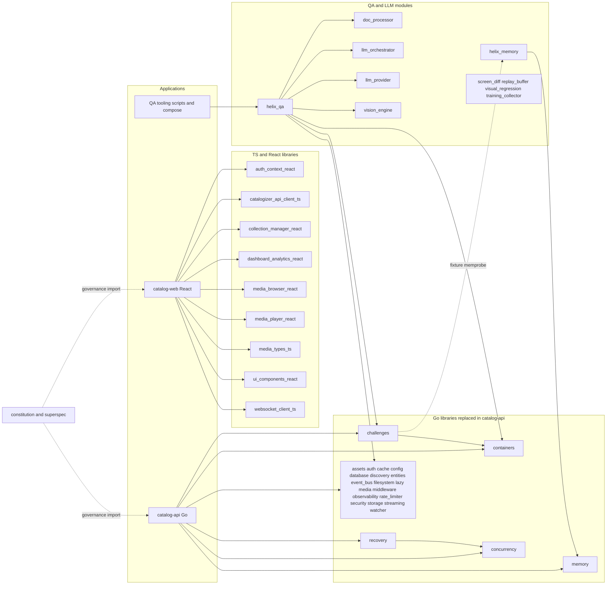
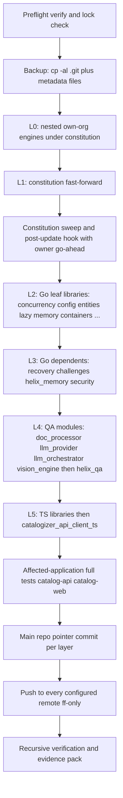
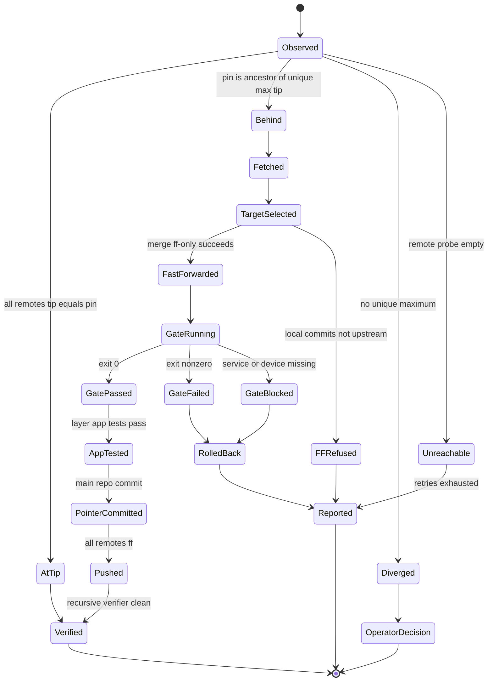
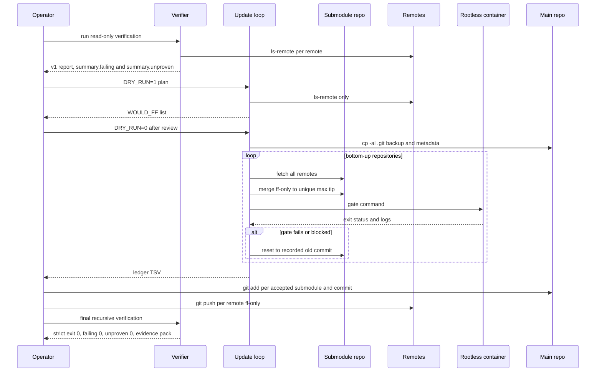

# 11 - Submodules Audit and Update Runbook

| Field | Value |
|---|---|
| Revision | 11 |
| Created | 2026-10-03 |
| Last modified | 2026-10-04 |
| Status | draft (revision 11: decision D-1 is answered by the plan owner's FR-017 answer of 2026-10-04 (docs/21 ODG-13 revision 15, tasks.md T012a): every pin at every depth, vendored third-party included, moves to its latest upstream whenever possible after the consumers' full tests pass, re-evaluated on events (tasks.md T440, T440a), an impossible move a recorded blocker, a third-party repository never modified or pushed; P-2, P-4, section 6.7, 8.4, 8.5, D-1 and the skeleton default follow; gate builds run on the remote build host through the event-driven dispatcher (owner decision C1, document 16 revision 12 section 9.6). Revision 10: sections 6.4, 6.6, 6.7, 7.4, 8.4, 11 and 12 follow the P4-P7 mechanics of the round-13 tasks.md wave and document 16 revision 11 (tasks.md rev 12, committed in `d014297e`, stays the source for the head mechanics): every move of a repository that holds nested gitlinks (a layer `--ff`, a `--rollback`, the S1 of a commit-push `--repo` run) settles them in the same lock hold through the helper's `--settle-nested` mode (T435a), an unsettled entry being a gate failure, and a nested third-party pin moved with its parent is reported `followed_parent_pin` under the stated ODG-13 basis (T440); the `--retire` destination is `.audit/removed/<op_id>/<path>/`; in the constitution update (3a) is one `--ff` call (T580b, T435a) whose settle step makes the (3b) and (3b′) decisions in the same hold, and (3c) also carries the constitution's own work (the T430 row, the T499 tests, a T572 survivor), no `CPA --repo submodules/constitution` run being made before it; the pointer commit lowers every main-repository baseline row below its count at the new pin, the rows of the `baseline_lowering_owed` reports and those that `baseline_drift` records as lowered, the G-PIN review checking the lowered set against the set S3 computes (round-12 and round-13 reviews; the revision 9 rule that exactly the reported rows are lowered is withdrawn). Revision 9: reconciled with tasks.md rev 12 (613 tasks) and document 16 revision 10: section 6.2 precondition 1 lists the three kinds of failing row that tasks.md T429 accepts as pending (an `ahead` and a `diverged` row whose local range holds held commits, and a pin drift matching a pending row); section 6.4 step 3 leaves unmoved, as tasks.md T436 does, every module whose HEAD holds commits that no remote has, `ahead` or `diverged`; step 7 lowers the main-repository ratchet rows named by the `baseline_lowering_owed` reports of the `--repo` runs whose commits the new pins contain (tasks.md T040, T042a, T441, T442); section 6.5 adds the foreign push that overlaps a window's change set (remedied by `--commit-before-integrate`) and the single-writer stores; section 7.4 step 7 handles (3b′) by the `diff --raw` status of each nested gitlink, `M` by `--ff` or `--sync-third-party`, `A` by the helper's new `--init` mode and `D` by its new `--retire` mode (tasks.md T435a, T580b; the helper now has eight paired mutations); section 8.4 adds the main repository's ODG-41 kind (`foreign_outside_candidate`, tasks.md T308a, T582, T583, T595b) and the gitlinks that (3b′) could not settle. Revision 8: reconciled with tasks.md rev 11 (612 tasks) and document 16 revision 9: section 6.4 step 3 and section 6.6 follow the reviewed helper's move modes (`record_pending_pin.sh --ff`, `--rollback` with its `--after-rollback` decision, `--sync-third-party`, each move made together with its row decision in one hold of the commit-push lock, T435a), which settle the two points revision 7 listed as open, and `--remove` is no longer the rollback step; P-3, step 8 and section 6.5 state the commit-push merge as tasks.md carries it (a `git bundle` backup, the merge held on its own merge-review file `$EV/reviews/CPA-merge-<run_id>.json`, a conflict resolved only by a `--resolve-merge` run, a merge in progress refused, at most one merge-and-review round per repository inside WP-73); section 7.4 adds the final constitution update of T580b with its unconditional nested-sync step (3b′) and the `governance-carrier` class of the regenerated appendix; section 8.4 and section 11 add the ODG-41 option (a) branch of the pass condition with the per-repository reference tips, and scope the branch check to own-organisation rows. Revision 7: reconciled with tasks.md rev 9 and document 16 revision 8: section 6.4 step 3 records that tasks.md now settles the layer fast-forward case (each accepted fast-forward records its `.audit/pending_pins.tsv` row through the reviewed helper `scripts/repo/record_pending_pin.sh` of T435a, and a rollback removes it), with the open rollback-over-a-`--repo`-row case named; the verifier's and the commit-push script's fetches are the objects-only form of tasks.md T032; P-3, step 8 and section 6.5 state that a repository whose own commit-push commits diverged from a moved remote is integrated by the script's recorded `--no-ff` merge (the plan owner's rule (Y) after the round-9 reviews, document 16 §12.2.5), never by this loop, which still never merges; section 6.6 removes a rolled-back row; section 8.4 cites the report of the run that made the measured HEAD (tasks.md T582 and the abbreviation table). Revision 6: section 6.4 step 7 commits the layer pointer through the commit-push script's declared change set (no separate `git add`) and notes the S8 removal of covered pending rows; step 9 and A-2 state the pending-row rules of document 16 revision 7 (a checkout returned to its recorded pin whose sha every remote holds leaves no row) and A-2 adds the empty `.audit/pending_pins.tsv` as tasks.md T582 does; step 3 records, as an open tasks.md decision, that a layer fast-forward without a pending row makes every main-repository run exit 15 until its pointer commit (round-8 review). Revision 5: section 8.4 states how A-3 meets the commit-push script under the plan owner's binding decision of document 16 revision 6 (every output of a run in the ignored `.audit/commit-push/<run_id>/`, the tracked tree clean after every run, the latest run report cited by sha256); precondition 1 and step 9 write the verifier JSON to the ignored `.audit/verify/` and record it through evrec, and step 9 requires no pending pin move left. Revision 4: the file counts of the seven nested engines in section 10.3.1, rows 44 to 50, are tracked files from `git ls-files`; the revision 3 working-tree counts were one too high in each row because the `.git` gitfile was counted. Revision 3: every repository named: one audit row per own-organisation repository (51: the main repository, 43 own direct submodules and 7 own nested engines, section 10.3.1) and one row per third-party repository (47, section 8.5.1), with a heuristic licence-file column; assertions A-1 to A-7 restated in `repo-verification-report/1` fields; the predecessor's `BLOCKING=0` replaced by the v1 pass condition; precondition 1 runs the verifier with `--fetch`; the Appendix B write-path ledger moved to `$EV/verify/`; the provenance table widened to all 97 repositories plus the vendored tree. Revision 2: verification steps use the single verifier `scripts/repo/verify_repos.sh` writing into the feature evidence directory, docs/21 IC-17 and IC-37; `fetch --prune` allowed per docs/21 IC-36; remotes enumerated, never listed, per docs/21 IC-11) |
| Feature | specs/001-full-project-audit-remediation |
| Scope | The 44 direct submodules declared in `.gitmodules` and every nested submodule beneath them (97 repositories recursively) |
| Traceability | FR-017, FR-018, FR-019, FR-020, FR-021, FR-022, FR-024, FR-025; SC-004 (and the dependency-currency success criteria that reference FR-017) |
| Method | Read-only git inspection executed on 2026-10-03 against the live checkout: `git submodule status --recursive`, `git config -f .gitmodules`, `git -C <sub> remote -v`, `git ls-remote`, `git merge-base --is-ancestor`, `git status --porcelain`. No fetch, no checkout, no config write, no build, no test run. |
| Governance anchors | §11.4.26, §11.4.28(C), §11.4.32, §11.4.36, §11.4.113, §11.4.164, §11.4.195, §11.4.201, §11.4.224, §9.1, §9.2, §12 |

## Table of contents

1. Evidence, scope and headline facts
2. Inventory and classification of the 44 direct submodules
3. Nested submodules and non-submodule vendored code
4. Dependency and consumption graph
5. Observed state against upstream (findings)
6. Update runbook (FR-017, FR-019, FR-020, FR-024)
7. The constitution post-pull sweep and `post_update_hook.sh`
8. Deterministic recursive verification design
9. Risk analysis
10. Audit plan for the own-organisation submodules
11. Acceptance evidence and traceability
12. Decision records and open questions
- Appendix A - verifier script (executed, read-only)
- Appendix B - update-loop script (executed in DRY_RUN only)
- Appendix C - captured execution evidence

---

## 1. Evidence, scope and headline facts

### 1.1 Reading rules

Every number in this document is either (a) measured by a command listed in Appendix C on 2026-10-03, or (b) labelled `UNCONFIRMED:` / `UNKNOWN:`. Tip comparisons are point-in-time: the remote tips were read at one instant and can move. The verifier in Appendix A is designed to be re-run immediately before every decision that depends on it.

Constitution rule applied throughout: a claim of "up to date" is a statement about a remote tip read now, never about a tracking ref (stale tracking refs were observed during this investigation, see F-4).

### 1.2 Headline facts (measured)

| # | Fact | Evidence |
|---|---|---|
| H1 | `.gitmodules` declares 44 direct submodules; `git submodule status --recursive` lists 97 repositories (44 direct + 53 nested). All 97 are initialised and none carries a `+`, `-` or `U` prefix, i.e. every checked-out HEAD equals the commit recorded in its parent. | `git submodule status --recursive` |
| H2 | 7 of the 53 nested repositories are own-organisation (all under `submodules/constitution/submodules/`); 46 are third-party by remote owner. The brief's "23 vendored third-party pins" understates the measured count: 28 pinned third-party trees sit under `submodules/helix_qa/tools/opensource/` alone, plus `rest-demo` under `tools/test-apps/`, plus 17 third-party engines under the constitution (including `MVT/js_mse_eme`). | verifier TSV, class column |
| H3 | Of the 44 direct submodules, 43 have a local branch whose tip equals the live tip of every configured remote. The single exception is `submodules/constitution`: pinned at `10b7a06`, every one of its 8 remotes now answers `main` = `e44f22f` (25 commits ahead; the pin is an ancestor of the tip, so the move is a pure fast-forward). | `git ls-remote`, `merge-base --is-ancestor` |
| H4 | Across all 97 repositories 24 pins are behind their live upstream tip: `constitution` (direct), `constitution/submodules/verification`, and 22 `helix_qa/tools/opensource/*` pins; 1 detached pin (`constitution/submodules/MVT/js_mse_eme`) is neither ancestor nor descendant of the remote HEAD (advisory only). | verifier summary |
| H5 | `submodules/websocket_client_ts` has only GitHub-hosted remotes (`github` and `origin`, both GitHub; no GitLab mirror remote). A GitLab mirror (`git@gitlab.com:vasic-digital/websocket-client-ts.git`) exists and its `main` (`8cdf1e8`) is 17 commits behind the pinned GitHub tip `6e624db` (it is an ancestor, so a fast-forward push heals it). | `ls-remote` + `merge-base` |
| H6 | `submodules/llms_verifier` is present in the tree as 42 ordinary tracked files (mode 100644/100755), NOT as a submodule, while `submodules/helix_qa/go.mod` contains `replace digital.vasic.llmsverifier => ../llms_verifier/llm-verifier`. The directory `submodules/llms_verifier/llm-verifier` does not exist. | `git ls-files -s submodules/llms_verifier`; `ls` |
| H7 | The main repository and two submodule paths are not "clean" in the naive sense: the root has 2 untracked planning paths (`specs/001-.../docs/`, `plan.md`, expected during this feature); `submodules/helix_qa/tools/opensource/docling` shows one phantom modified file caused by a CRLF-in-index versus `eol=lf` attribute mismatch, which `helix_qa` hides with `ignore = dirty`. | `git status`, `git ls-files --eol` |
| H8 | The canonical sweep script named by §11.4.32 (`scripts/verify-all-constitution-rules.sh`) and its prerequisite `scripts/verify-governance-cascade.sh` do not exist in any tracked file of the main repository or the pinned constitution checkout. | `git ls-files \| grep` |
| H9 | A serial verifier (one `ls-remote` per remote per repository) took 5 min 50 s for 98 repositories; the parallel verifier in Appendix A (12 workers) took 34 s and produced identical verdicts for the own-organisation set. | `time` output |

### 1.3 What this document decides and what it leaves to the owner

It decides: the classification scheme, the update order, the gates, the rollback mechanism, the verification algorithm and the audit plan. It leaves to the owner (section 12): whether third-party vendored pins are moved, whether `submodules/llms_verifier` is converted to a real submodule, and the explicit go-ahead for running the constitution `post_update_hook.sh` (it can modify user-level tool configuration, section 7).

---

## 2. Inventory and classification of the 44 direct submodules

### 2.1 Classification rules (data, not code)

| Dimension | Rule | Source |
|---|---|---|
| Own versus third-party | The owner segment of the `origin` fetch URL is matched case-insensitively against the own-organisation list. Default list in the scripts: `vasic-digital`, `HelixDevelopment`, `helixdevelopment1` (the GitLab namespace used by `constitution`, `helix_memory` and `doc_processor`). The constitution's own list (§11.4.28) additionally names `red-elf`, `ATMOSphere1234321`, `Bear-Suite`, `BoatOS123456`, `Helix-Flow`, `Helix-Track`, `Server-Factory`; none of those owners occurs in this tree. | `.gitmodules`, `remote get-url origin`, Constitution §11.4.28 |
| Role | Derived from the module's README first sentence and its language mix, not from its directory name. | `submodules/*/README.md` |
| Pin vs tip | `behind` if the pinned commit is a proper ancestor of the tip of the branch on any remote, `at tip` if equal on all remotes, `diverged` if neither is an ancestor of the other. | `git merge-base --is-ancestor` |
| Consumption | Go: `replace` directive in a consumer `go.mod`; TypeScript: `file:` dependency in a consumer `package.json`; Android/Gradle: `includeBuild` in `settings.gradle.kts`. | file greps listed in 2.3 |
| Audit priority | P0 build/QA/governance or security-critical and consumed; P1 consumed Go library; P2 consumed TypeScript library; P3 present but with no verified consumer. See section 10. | section 10 |

### 2.2 Classification table (all 44)

Abbreviations: Br = checked-out branch; Remotes lists remote names other than the always-present `origin`/`upstream` aliases; Files/Test files/Size = tracked files, test files (`*_test.go`, `*.test.ts(x)`, `*.spec.ts`), working-tree size excluding `.git`. Pins are 7-character abbreviations of the 40-character gitlinks.

| # | Path | Role | Lang | Owner class | Remotes | Br | Pin | Pin vs upstream tip (2026-10-03) | Files/Test files/Size | Consumption by apps |
|---|---|---|---|---|---|---|---|---|---|---|
| 1 | `submodules/websocket_client_ts` | TS lib: WebSocket client | TS | own (vasic-digital) | github,origin (both GitHub) | main | `6e624db` | at tip | 29f/4t/328K | catalog-web/package.json file: |
| 2 | `submodules/ui_components_react` | React lib: UI components | TS/React | own (vasic-digital) | github,gitlab | main | `d3df32d` | at tip | 61f/18t/536K | catalog-web/package.json file: |
| 3 | `submodules/challenges` | Go lib: Challenges framework (QA) | Go | own (vasic-digital) | github,gitlab,vasic_digital_github | main | `8a352b9` | at tip | 571f/127t/6M | catalog-api/go.mod replace |
| 4 | `submodules/assets` | Go lib: lazy asset loading | Go | own (vasic-digital) | github,gitlab | main | `ceb948a` | at tip | 47f/9t/1M | catalog-api/go.mod replace |
| 5 | `submodules/concurrency` | Go lib: concurrency primitives | Go | own (vasic-digital) | github,gitlab | main | `32b7efa` | at tip | 93f/22t/760K | catalog-api/go.mod replace |
| 6 | `submodules/config` | Go lib: configuration management | Go | own (vasic-digital) | github,gitlab | main | `8d3f1e0` | at tip | 49f/5t/352K | catalog-api/go.mod replace |
| 7 | `submodules/filesystem` | Go lib: filesystem abstraction | Go | own (vasic-digital) | github,gitlab | main | `66b6bc1` | at tip | 56f/11t/440K | catalog-api/go.mod replace |
| 8 | `submodules/database` | Go lib: relational DB operations | Go | own (vasic-digital) | github,gitlab | main | `8adb19c` | at tip | 96f/24t/904K | catalog-api/go.mod replace |
| 9 | `submodules/auth` | Go lib: authentication/authorization | Go | own (vasic-digital) | github,gitlab | main | `0ae1f5d` | at tip | 72f/15t/592K | catalog-api/go.mod replace |
| 10 | `submodules/middleware` | Go lib: HTTP middleware | Go | own (vasic-digital) | github,gitlab | main | `9bcac12` | at tip | 82f/24t/536K | catalog-api/go.mod replace |
| 11 | `submodules/rate_limiter` | Go lib: rate limiting | Go | own (vasic-digital) | github,gitlab | main | `6463e51` | at tip | 73f/18t/448K | catalog-api/go.mod replace |
| 12 | `submodules/observability` | Go lib: tracing/metrics/logging/health | Go | own (vasic-digital) | github,gitlab | main | `bd3a5be` | at tip | 80f/18t/792K | catalog-api/go.mod replace |
| 13 | `submodules/media` | Go lib: media detection/metadata | Go | own (vasic-digital) | github,gitlab | main | `60aecfb` | at tip | 54f/19t/344K | catalog-api/go.mod replace |
| 14 | `submodules/watcher` | Go lib: FS change monitoring | Go | own (vasic-digital) | github,gitlab | main | `46da9af` | at tip | 61f/11t/412K | catalog-api/go.mod replace |
| 15 | `submodules/event_bus` | Go lib: event bus | Go | own (vasic-digital) | github,gitlab | main | `4613a5a` | at tip | 63f/13t/512K | catalog-api/go.mod replace |
| 16 | `submodules/cache` | Go lib: cache (memory/Redis/PostgreSQL) | Go | own (vasic-digital) | github,gitlab | main | `6a9a3e5` | at tip | 79f/16t/676K | catalog-api/go.mod replace |
| 17 | `submodules/security` | Go lib: security | Go | own (vasic-digital) | github,gitlab | main | `79151f2` | at tip | 120f/43t/1M | catalog-api/go.mod replace |
| 18 | `submodules/storage` | Go lib: object storage | Go | own (vasic-digital) | github,gitlab | main | `e498c63` | at tip | 97f/31t/920K | catalog-api/go.mod replace |
| 19 | `submodules/streaming` | Go lib: streaming (SSE/WebSocket/gRPC) | Go | own (vasic-digital) | github,gitlab | main | `ec4e115` | at tip | 87f/23t/740K | catalog-api/go.mod replace |
| 20 | `submodules/discovery` | Go lib: network/service discovery | Go | own (vasic-digital) | github,gitlab | main | `0e491a3` | at tip | 57f/15t/484K | catalog-api/go.mod replace |
| 21 | `submodules/entities` | Go lib: media entity system | Go | own (vasic-digital) | github,gitlab | main | `ca96287` | at tip | 20f/5t/144K | catalog-api/go.mod replace |
| 22 | `submodules/media_types_ts` | TS lib: media types | TS | own (vasic-digital) | github,gitlab | main | `83b6395` | at tip | 27f/4t/204K | catalog-web/package.json file: |
| 23 | `submodules/catalogizer_api_client_ts` | TS lib: API client | TS | own (vasic-digital) | github,gitlab | main | `a3f88da` | at tip | 43f/7t/296K | catalog-web/package.json file: |
| 24 | `submodules/auth_context_react` | React lib: auth context | TS/React | own (vasic-digital) | github,gitlab | main | `8a84d57` | at tip | 22f/2t/276K | catalog-web/package.json file: |
| 25 | `submodules/media_browser_react` | React lib: media browser | TS/React | own (vasic-digital) | github,gitlab | main | `74f43bc` | at tip | 28f/5t/272K | catalog-web/package.json file: |
| 26 | `submodules/dashboard_analytics_react` | React lib: dashboard analytics | TS/React | own (vasic-digital) | github,gitlab | main | `bfb2818` | at tip | 27f/5t/276K | catalog-web/package.json file: |
| 27 | `submodules/media_player_react` | React lib: media player | TS/React | own (vasic-digital) | github,gitlab | main | `5657f51` | at tip | 25f/4t/268K | catalog-web/package.json file: |
| 28 | `submodules/collection_manager_react` | React lib: collection manager | TS/React | own (vasic-digital) | github,gitlab | main | `fa7d1af` | at tip | 27f/5t/284K | catalog-web/package.json file: |
| 29 | `submodules/containers` | Go lib: container orchestration (§11.4.76) | Go | own (vasic-digital) | github,gitlab,vasic_digital_gitlab | main | `4a8f04e` | at tip | 690f/323t/7M | catalog-api/go.mod replace |
| 30 | `submodules/lazy` | Go lib: lazy initialization | Go | own (vasic-digital) | github,gitlab | main | `957a31a` | at tip | 49f/5t/320K | catalog-api/go.mod replace |
| 31 | `submodules/memory` | Go lib: memory management (Mem0-style) | Go | own (vasic-digital) | github,gitlab | main | `58520a1` | at tip | 72f/13t/584K | catalog-api/go.mod replace |
| 32 | `submodules/recovery` | Go lib: recovery (small scoped module) | Go | own (vasic-digital) | github,gitlab | main | `30961a1` | at tip | 62f/10t/412K | catalog-api/go.mod replace |
| 33 | `submodules/helix_qa` | QA tooling: HelixQA autonomous QA | Go | own (HelixDevelopment) | github,gitlab,vasic_digital_github | main | `1caceb6` | at tip (EOL quirk nested) | 1371f/402t/2630M | scripts + docker-compose.qa-robot.yml; own go.mod replaces 8 siblings |
| 34 | `submodules/doc_processor` | QA tooling: doc processing / feature-map extraction | Go | own (HelixDevelopment) | github,gitlab,vasic_digital_github,vasic_digital_gitlab | master | `5692e52` | at tip | 113f/21t/1M | via helix_qa go.mod replace only |
| 35 | `submodules/llm_orchestrator` | LLM: headless CLI agent orchestrator | Go | own (HelixDevelopment) | github | master | `55d2dde` | at tip | 147f/37t/2M | via helix_qa go.mod replace only |
| 36 | `submodules/llm_provider` | LLM: provider abstractions | Go | own (HelixDevelopment) | github,gitlab,vasic_digital_github | master | `e05ec64` | at tip | 240f/103t/3M | via helix_qa go.mod replace only |
| 37 | `submodules/vision_engine` | Vision/LLM: UI analysis and navigation graph | Go | own (HelixDevelopment) | github | master | `ce16f92` | at tip | 142f/25t/1M | via helix_qa go.mod replace only |
| 38 | `submodules/screen_diff` | QA tooling: screen diff | Go | own (vasic-digital) | github,gitlab | main | `56d3760` | at tip | 14f/1t/88K | UNCONFIRMED: only .gitmodules + docs/SUBMODULE_DEPENDENCIES.md |
| 39 | `submodules/replay_buffer` | QA tooling: SQLite action replay buffer | Go | own (vasic-digital) | github,gitlab | main | `c1c34f7` | at tip | 14f/1t/92K | UNCONFIRMED: only .gitmodules + docs/SUBMODULE_DEPENDENCIES.md |
| 40 | `submodules/visual_regression` | QA tooling: LLM-vision visual regression | Go | own (vasic-digital) | github,gitlab | main | `d3d9f76` | at tip | 14f/1t/96K | UNCONFIRMED: only .gitmodules + docs/SUBMODULE_DEPENDENCIES.md |
| 41 | `submodules/training_collector` | QA/LLM tooling: training-data collector | Go | own (vasic-digital) | github,gitlab | main | `10c0604` | at tip | 14f/1t/84K | UNCONFIRMED: only .gitmodules + docs/SUBMODULE_DEPENDENCIES.md |
| 42 | `submodules/constitution` | Governance: Helix Constitution + tooling | Bash/Py/Go/MD | own (HelixDevelopment) | gitflic,github,gitlab,gitverse,vasic_digital_github,vasic_digital_gitlab | main | `10b7a06` | BEHIND 25 | 3214f/81t/197M | governance (CLAUDE.md @import, .specify) |
| 43 | `submodules/helix_memory` | Go lib: unified cognitive memory engine | Go | own (HelixDevelopment) | github,gitlab | main | `979d7c8` | at tip | 115f/35t/2M | none found in main apps; replace memory in own go.mod |
| 44 | `submodules/superspec` | Governance/spec tooling (third-party) | Py/MD | third (WangX0111) | origin | main | `c20ac6c` | at tip | 44f/0t/13M | .specify tooling |

Notes on the table:

1. Remote naming is inconsistent across the fleet: `helix_qa` carries 4 distinct fetch/push URLs under `origin` (two case variants of the HelixDevelopment repository, the vasic-digital mirror and a GitLab mirror) and 7 remote names; `constitution` carries 8 remote names across GitHub, GitLab, GitFlic and GitVerse. For the verifier every remote name is probed independently; for the updater the target tip must be the unique maximum across all of them (section 6.4).
2. `llm_orchestrator` and `vision_engine` have only GitHub-hosted remotes (`llm_orchestrator`: github, origin, upstream; `vision_engine`: github, origin, upstream; no GitLab mirror); `superspec` has only `origin` and is third-party (owner `WangX0111`), so no push is ever attempted for it. Whether GitLab mirrors exist for the first two is `UNKNOWN:` and is probed in step 6.3.
3. Four submodules pin the tip of remote `master`: `doc_processor`, `llm_orchestrator`, `llm_provider`, `vision_engine`. Each ALSO has a live remote `main` that differs from the pin (read-only `git ls-remote` plus `merge-base --is-ancestor`, measured against locally present objects): `doc_processor` pin `5692e52` vs `main` `86f1a98` has DIVERGED (pin-only 121 commits, main-only 1; pin is not an ancestor of `main`); `llm_orchestrator` main `4823886` is an ancestor of the pin (pin ahead by 5); `llm_provider` main `ebeaef2` is an ancestor of the pin (ahead by 22); `vision_engine` main `e847294` is an ancestor of the pin (ahead by 2). In all four the pin is not an ancestor of `main`. Which of `master`/`main` is the repository's configured default branch is UNCONFIRMED (not probed via `ls-remote --symref`). FR-024 says "main branch"; the plan interprets it as "the default branch of each repository" and creates no branch anywhere (decision D-3).
4. "Test files" is a presence indicator only. Counting files says nothing about assertion strength; the audit (section 10) must apply the anti-bluff detectors, not trust counts (§11.4.224(C)).
5. `submodules/helix_qa` size (about 2.6 GB working tree) is dominated by its 29 nested third-party trees; the `.git/modules` store of the whole project is 6.4 GB on a disk with 707 GB free.

### 2.3 How the main applications consume the modules (verified greps)

| Consumer | Mechanism | Modules (count) |
|---|---|---|
| `catalog-api/go.mod` | `replace digital.vasic.<x> => ../submodules/<dir>` (lines 5 to 49) plus matching `require` lines (53 to 75) | assets, auth, cache, challenges, concurrency, config, containers, database, discovery, entities, event_bus, filesystem, lazy, media, memory, middleware, observability, rate_limiter, recovery, security, storage, streaming, watcher (23) |
| `catalog-web/package.json` | `"@vasic-digital/<x>": "file:../submodules/<dir>"` (lines 14 to 22) | auth_context_react, catalogizer_api_client_ts, collection_manager_react, dashboard_analytics_react, media_browser_react, media_player_react, media_types_ts, ui_components_react, websocket_client_ts (9) |
| `catalogizer-android`, `catalogizer-androidtv` | `settings.gradle.kts` line 26 is a commented-out `includeBuild("../Android-Toolkit")` | none (0) |
| `catalogizer-desktop`, `catalogizer-api-client`, `installer-wizard`, `Website` | no `submodules/` reference in `package.json` | none (0). `installer-wizard` depends on the in-repo `../catalogizer-api-client`, not on a submodule |
| QA infrastructure | `helix_qa` referenced by `docker-compose.qa-robot.yml` and `challenges/scripts/*`; `helix_qa/go.mod` replaces `challenges`, `containers`, `doc_processor`, `llm_orchestrator`, `llm_provider`, `security`, `vision_engine` and the missing `llms_verifier/llm-verifier` | helix_qa and its 7 Go dependencies |
| Governance | `constitution` and `superspec`: imported by `CLAUDE.md` / `.specify`, not compiled | 2 |
| No verified consumer | `screen_diff`, `replay_buffer`, `visual_regression`, `training_collector` (referenced only in `.gitmodules` and `docs/SUBMODULE_DEPENDENCIES.md`), `helix_memory` (referenced only by `challenges` fixture `memprobe` and `scripts/audit/anti-bluff-scan.sh`) | 5 (`UNCONFIRMED:` whether `helix_qa` loads them at runtime without a Go import) |

---

## 3. Nested submodules and non-submodule vendored code

### 3.1 Nesting inventory

| Parent | Nested count | Own / third | Declared policy |
|---|---|---|---|
| `submodules/constitution` | 24 (23 direct children + `MVT/js_mse_eme`) | 7 own (`anti_bluff`, `continuum`, `design-toolkit`, `docs_chain`, `helix_perf_cache`, `session_orchestrator`, `token_optimizer`), 17 third-party (e.g. `agentic-validation`, `claude-video`, `donespec`, `kedge`, `MVT`, `verification`, `verify`, `wave-dpctf`) | §11.4.28(C) carve-out: the constitution may host reusable engines, depth 1, each with a `helix-deps.yaml` and zero further own-org nesting |
| `submodules/helix_qa` | 29 (27 listed in its `.gitmodules` + 2 nested-nested: `mem0/evaluation`, `skyvern/integrations/n8n`) | all third-party | not own-org, so §11.4.28(C) (which forbids nested own-org chains) does not apply, but the fan-out is the dominant clone-time and disk cost |
| every other direct submodule | 0 | n/a | consistent with §11.4.28(C) |

Verification of the carve-out conditions is part of the audit (section 10.4): each of the 7 own nested constitution engines must ship `helix-deps.yaml` and must declare no own-org submodule of its own. Revision 3: a file-presence read on 2026-10-03 found `helix-deps.yaml` in all seven and a `.gitmodules` in none (section 10.3.1, rows 44 to 50); the content of each `helix-deps.yaml` (zero own-org dependencies declared) is `UNCONFIRMED:` until read in S-GOV-2.

### 3.2 Vendored but not a submodule: `submodules/llms_verifier`

`git ls-files -s submodules/llms_verifier` returns 42 entries, all regular blobs; it is absent from `.gitmodules`. Its history in the main repository starts at commit `05e0a2b2` ("LLMsVerifier relocate"). It therefore escapes every submodule rule in this document (no upstream, no pin, no fast-forward). Combined with H6 the consequence is that `helix_qa` cannot resolve `digital.vasic.llmsverifier` through the declared replace path. `UNCONFIRMED:` whether `helix_qa` builds at all in its current state; a containerized `go build ./...` would settle it and is scheduled in section 10 as audit item S-HQA-1. Decision D-4 asks the owner whether `llms_verifier` becomes a real submodule (restoring FR-017 coverage) or is formally declared in-tree code.

---

## 4. Dependency and consumption graph



Reading the graph: update order inside the Go layer must respect the edges `recovery -> concurrency`, `challenges -> containers`, `helix_memory -> memory`, and `helix_qa -> {challenges, containers, doc_processor, llm_orchestrator, llm_provider, security, vision_engine}`. These edges come from `replace` directives in the submodules' own `go.mod` files (verified: `challenges/go.mod:12`, `recovery/go.mod:10`, `helix_memory/go.mod:42`, `helix_qa/go.mod:125-134`).

---

## 5. Observed state against upstream (findings)

| ID | Finding | Evidence | Severity | Handled by |
|---|---|---|---|---|
| F-1 | `constitution` pin is 25 commits behind a tip that all 8 remotes agree on. The diff `10b7a06..e44f22f` touches 28 files: 13 under `scripts/fastcycle/tests`, 1 under `scripts/hooks`, 1 under `scripts/gates`, plus `Constitution.md`, `CLAUDE.md`, `AGENTS.md`, `QWEN.md`, `GEMINI.md`. | `git diff --stat 10b7a06 e44f22f` | Medium (governance text changes bind work) | section 6 and 7 |
| F-2 | During the first verifier run, the tip object `e44f22f` was absent from the local object store ("tip not fetched"); a later check found it present and `refs/remotes/origin/main` updated at 13:15. A fetch was performed by an actor other than this investigation. Cause `UNKNOWN:`. | `stat` of `FETCH_HEAD` and tracking refs | Low, but shows other actors write to these repositories concurrently | preflight lock check (6.2) |
| F-3 | 22 `helix_qa/tools/opensource/*` pins and `constitution/verification` are behind their remote HEAD; `MVT/js_mse_eme` diverges from remote HEAD (it is pinned to a commit not on the default branch). | verifier summary | Low (vendored tool snapshots) | decision D-1 |
| F-4 | Stale tracking refs exist (for example `upstream/main` at `c9ac78e` and `vasic_digital_*/main` at `10b7a06` in `constitution`, while the live remotes answer `e44f22f`). Anything that compares against `refs/remotes/*` instead of `ls-remote` produces wrong answers. | `git for-each-ref refs/remotes` | Medium (verification-method defect class §11.4.201) | verifier uses `ls-remote` only |
| F-5 | `websocket_client_ts` has no GitLab remote and the GitLab mirror lags by 17 commits. | H5 | Medium for FR-019 ("nothing unpushed to any upstream") | step 6.9 |
| F-6 | `llms_verifier` vendored as plain files; `helix_qa` replace target missing. | H6 | High for FR-017 coverage and for QA tooling health | D-4, S-HQA-1 |
| F-7 | Phantom modification in `docling` from `eol=lf` attribute versus CRLF blob; `helix_qa` masks it with `ignore = dirty` (set in its own config, not in `.gitmodules`). | `git ls-files --eol`; `git diff --ignore-cr-at-eol` is empty | Low, but a naive "clean" check fails forever | verifier class `CLEAN_EOL_QUIRK` |
| F-8 | Canonical sweep scripts named by §11.4.32 are missing (H8). The post-update hook calls none of them; the main repo has only `scripts/verify_constitution_inheritance.sh`. | H8 | Medium (a mandated gate has no implementation, §11.4.227 ledger class) | 7.4 |
| F-9 | `scripts/push_all_submodules.sh` stages only `CLAUDE.md`/`AGENTS.md` and pushes; it defaults to `DRY_RUN=1` and merges `--ff-only`. The root `commit` wrapper delegates to an external `commit` binary found on `PATH`. Existence of that binary `UNCONFIRMED:`. | file reads | Low | 6.9 uses neither blindly |
| F-10 | `.git/hooks` of the main repository holds only `*.sample` files; `core.hooksPath` is unset. | `ls .git/hooks`, `git config` | Info | 7.2 |

---

## 6. Update runbook (FR-017, FR-019, FR-020, FR-024)

### 6.1 Policy decisions encoded in the runbook

| Id | Policy | Reason |
|---|---|---|
| P-1 | Own-organisation submodules are fast-forwarded to the unique maximum tip across all their remotes, on their default branch, `--ff-only`. | FR-017, FR-020, FR-024 |
| P-2 | Revision 11 (decision D-1 answered by the owner, verbatim: "We shall aim for the latest versions of it all if and when it is possible and changes applied when new things are brought in into the System!"): third-party pins are moved to their latest upstream whenever possible, each move accepted only after the full tests of every repository that consumes it pass three times (for a vendored tool snapshot under `helix_qa/tools/opensource`, the `helix_qa` tests and its tool-availability checks), and re-evaluated whenever new upstream content, a new release or a new dependency enters the system (tasks.md T440, T440a); a move that fails its tests, needs a change inside the third-party repository or has no reachable upstream is a recorded blocker item with its reason, open until resolved or closed as structurally impossible; only our pointer moves, the third-party repository is never modified, committed to or pushed. Superseded: "moved only when the owner sets `UPDATE_THIRD_PARTY=1`, default report-only" (revision 10 and earlier) | FR-017, FR-018 and SC-009 as amended (spec revision 8); the earlier concern, that moving vendored snapshots changes the QA tool surface without tests, is met by the test gate on every move |
| P-3 | No branch is created, no history is rewritten, nothing is force-pushed, `--no-verify` is never used. Divergence is reported, never resolved automatically by this loop. Revision 7: a repository whose own commits, made through the commit-push script, diverged from a moved remote is integrated by that script's recorded `--no-ff` merge commit, under its lock and after a backup, held for review when it resolves conflicts or merges into a held range (the plan owner's rule (Y), document 16 §12.2.5); it is never a rebase, a reset or a force, and it is not a step of this loop. Revision 8 (tasks.md rev 11 T040, T042): the backup is a `git bundle` of the local range with a copy of the uncommitted files in the run directory, the merge is held on its own merge-review file `$EV/reviews/CPA-merge-<run_id>.json`, and a conflict is resolved only by a later `--resolve-merge` run on Opus at xhigh (document 16 §12.2.5). | FR-020, §11.4.113, §9.2 |
| P-4 | Every accepted move passes a containerized gate for that module and then the affected applications' full tests (FR-018, FR-021). A gate that cannot run for lack of a service, credential or device is `BLOCKED` with the exact reason and counts as not passing (FR-025). Revision 11 (owner decision C1): every gate step that compiles runs on the remote build host through the event-driven dispatcher of document 16 §9.6 and returns at once; an unreachable build host makes the gate `blocked-unavailable`, never a local run. | FR-018, FR-021, FR-025 |
| P-5 | Backup before any write: a hardlinked mirror of the root `.git` (which contains every submodule git directory under `.git/modules`). | §9.1 |
| P-6 | The main-repository pointer commit is made once per layer and pushed ff-only to every configured remote (enumerated from `git remote`, docs/21 IC-11; 6 distinct push targets were counted in this pass); the individual submodules are pushed only if the loop created commits in them (a pure fast-forward needs no push). | FR-019, §2.1 |

### 6.2 Preconditions (checked, not assumed)

1. The single verifier `scripts/repo/verify_repos.sh` (docs/21 IC-17, IC-37; Appendix A's `submodule_verify.sh` is its executed predecessor and produced the §8.4 baseline) is run without `--strict` and with `--fetch`, and its report (`repo-verification-report/1`, written to the ignored `.audit/verify/submodules-pre-<UTC>.json` and recorded through `tools/evidence/evrec` as an `ev/1` entry that cites it by sha256 with the blob in `$EV/blobs/`, where `$EV` = `specs/001-full-project-audit-remediation/evidence`; revision 5, document 16 §12.2.1 rule 4, so that taking the measurement does not itself leave the tracked tree dirty) shows, for own-organisation repositories, no `dirty` (other than listed exceptions such as the docling CRLF quirk), no `ahead`, no `diverged` and no `unproven` row; `LOCAL-BEHIND` rows are expected, since they are what the update loop moves. Revision 9 (tasks.md T429): three kinds of failing row are accepted as pending and listed in the preflight record, each with its held commits' `CPA-Run` ids and verdicts: an `ahead` row, of the main repository or of a submodule holding a `--repo` held commit, whose outgoing range starts at a held commit (review-pending work of another stream, which the commit-push S6 does not push past before that GO); a `diverged` row of a submodule whose local range holds such held commits while its remote moved (integrated by its producing stream's push run through the commit-push merge, never by a layer, and left unmoved by the layers); and a pin-drift row that exactly matches a row of `.audit/pending_pins.tsv`; any other dirty, ahead, diverged, drifted or unproven row stops the loop. Revision 3: `--fetch` is required here, because the verifier never fetches on its own; without it a repository whose new upstream objects are not yet local is classified `UNKNOWN-DIFFERENT` (unproven), not `LOCAL-BEHIND` (the POC self-test case "behind w/o fetch" and the measured constitution state), so the precondition would fail in exactly the state the loop is meant to handle. `--fetch` runs `git fetch --no-tags --no-write-fetch-head --refmap= <remote> <branch>` per compared remote (revision 7: the objects-only form of tasks.md T032, which writes no ref, no `FETCH_HEAD` and no work tree; the POC's plain form also moved the remote-tracking ref); an `UNKNOWN-DIFFERENT` row of an in-scope repository that does not clear after the fetch is a stop with its reason (FR-020).
2. No other writer is active: `pgrep -af 'git (fetch|pull|merge|commit|push)'` filtered by real `/proc/<pid>/cmdline` shows none (finding F-2 shows concurrent writers exist; a bare `pgrep -f` substring is itself a carrier hazard, §11.4.201). Index lock files (`.git/index.lock`, `.git/modules/**/index.lock`) absent.
3. Host headroom per §12: memory ceiling, process count, disk. The backup is hardlinks (near zero additional space), but gate containers are bounded with `--memory` and `--pids-limit`.
4. `podman` rootless available (`podman 5.7.0` observed); gate image present (`localhost/catalogizer-builder:latest` is the image named in `docker-compose.build.yml`; its contents `UNCONFIRMED:`). If absent, building it is a prior task, not an inline `docker run golang` fallback on the bare host (§11.4.173).
5. SSH reachability to GitHub, GitLab, GitFlic and GitVerse (the verifier's `unreachable:<remote>` notes are the evidence).
6. Written owner go-ahead for step 6.7 (the constitution hook), section 7.

### 6.3 Order of operations



Layer membership (P = pin currently at tip, so the step is a verified no-op):

| Layer | Members | Expected movement on 2026-10-03 |
|---|---|---|
| L0 | `constitution/submodules/{anti_bluff, continuum, design-toolkit, docs_chain, helix_perf_cache, session_orchestrator, token_optimizer}` | none (all at tip) |
| L1 | `constitution` | +25 commits |
| L2 | `concurrency`, `config`, `entities`, `lazy`, `memory`, `containers`, `assets`, `auth`, `cache`, `database`, `discovery`, `event_bus`, `filesystem`, `media`, `middleware`, `observability`, `rate_limiter`, `storage`, `streaming`, `watcher` | none |
| L3 | `recovery` (needs `concurrency`), `challenges` (needs `containers`), `helix_memory` (needs `memory`), `security` | none |
| L4 | `doc_processor`, `llm_provider`, `llm_orchestrator`, `vision_engine`, `screen_diff`, `replay_buffer`, `visual_regression`, `training_collector`, then `helix_qa` | none |
| L5 | `media_types_ts`, `websocket_client_ts`, `ui_components_react`, `auth_context_react`, `media_browser_react`, `media_player_react`, `collection_manager_react`, `dashboard_analytics_react`, `catalogizer_api_client_ts` | none |
| L6 (optional, D-1) | the 24 behind third-party pins | up to 22 + 1 moves |

The practical consequence of the measured state: on 2026-10-03 the bottom-up loop moves exactly one own-organisation repository. The runbook is nonetheless written for the general case because other actors move upstream tips between the audit and the final push, and FR-019 requires the recursive verification to be re-run at the end.

### 6.4 Steps

**Step 1 - fetch (write to object store and tracking refs only).** For each repository in bottom-up order: `git fetch --all --tags --prune`. Revision 2 (docs/21 IC-36): `--prune` is allowed. Every decision in this runbook and in the verifier `scripts/repo/verify_repos.sh` reads remote tips with `git ls-remote`, never tracking refs, so pruning cannot change a result. Revision 7: the commit-push script's S1 no longer prunes; it fetches objects only, in the form of tasks.md T032 (document 16 §12.2 S1, revision 8). Repositories whose remote is unreachable are recorded `REMOTE_UNREACHABLE` and do not block the others (matches `push_all_submodules.sh` behaviour).

**Step 2 - choose the target tip.** For each repository collect `ls-remote --heads <remote> <branch>` for every remote. The target is the unique tip T such that every other remote tip is an ancestor of T. If no unique maximum exists the repository is `DIVERGED_OPERATOR_DECISION` (remotes disagree in a non-linear way); the loop stops for that repository and reports the SHAs. It never merges two remotes' histories and never picks one by position in the remote list.

**Step 3 - fast-forward.** `git -C <sub> merge --ff-only <T>`. A refusal (`FF_REFUSED`) means the local branch has commits that are not upstream: report, do not reset (those commits would then be unpushed work, violating FR-019). Revision 6 (open interaction, round-8 review): an accepted fast-forward moves the submodule HEAD away from its gitlink with no row in `.audit/pending_pins.tsv`, so every main-repository commit-push run until the step 7 pointer commit of that layer would report pointer drift that matches no pending move and exit 15 (document 16 §12.2.3). Revision 8: tasks.md rev 11 settles it. Each accepted fast-forward of a layer (T436 to T439) or of the late catch-up (T579a) is made by the reviewed helper `scripts/repo/record_pending_pin.sh --ff <path> <target>` (T435a, reviewed in T435b before its first use), which runs this step's `git -C <path> merge --ff-only <target>` and the row decision in one hold of the commit-push lock, so no commit-push run of another stream can start between the move and its row: it writes or replaces the row when the new HEAD differs from the parent's gitlink and removes it when HEAD equals the gitlink, moves nothing and writes no row for a module already at the target, and refuses a target that is not present locally or does not descend from HEAD, a dirty working tree and an unowned or third-party path. A module whose HEAD holds commits that no remote has (held commits of T430 or T431 awaiting T432, whether or not its remote moved meanwhile; revision 9, tasks.md T436, which widened the revision 8 case of a remote that moved) is not moved here, because the helper refuses a target that does not descend from HEAD: it is pushed by its producing stream (T433), which integrates it by the commit-push merge (document 16 §12.2.5) when its remote moved, and it is recorded in the layer's evidence as not moved, `ahead` or `diverged`, with its held commits and their verdicts and its pin drift matching its own `--repo` row (neither `UPDATED_GATE_PASS` nor `ROLLED_BACK`), listed for the G-PIN review (T441) and caught up by T579a once pushed. A helper call refused because another op holds the lock moves nothing and is re-run, the same command, once the lock is free, never replaced by a move made by hand. The other writer is a commit-push `--repo <path>` run, at its commit, its S1 fast-forward or its S1 merge (T042a); the step 7 pointer commit consumes the rows of the pins it moves. The two points that revision 7 listed as open (a rollback over a module that already held a `--repo` row, and a `--record` call when no fast-forward moved HEAD) are settled by the helper's `--rollback` and `--ff` modes (section 6.6). Revision 10 (tasks.md T435a, T436 to T440 and T579a of the round-13 wave; the P4-P5 FP bullet): a move of a repository that holds nested gitlinks (today `submodules/helix_qa`, whose nested gitlinks are all third-party, and `submodules/constitution`) also moves the gitlinks it records, so the helper's `--ff` settles the nested entries of `git -C <path> diff --raw <old HEAD> <target>` in the same lock hold through its `--settle-nested` mode before it writes the row: a path that a pending row names is decided by the row rule of section 7.4 item 7 (3b); `M` of a third-party path is brought to its new gitlink as `--sync-third-party` does, `M` of an owned path without a row is fast-forwarded on its `main` as `--ff` does, `A` is initialised as `--init` does and the leftover checkout of `D` is moved as `--retire` does, never deleted, to `.audit/removed/<op_id>/<path>/` with its sha256 list; any other status and every refusal is recorded unsettled (`nested_unsettled`). An unsettled entry is a gate failure of the layer, which rolls the move back with `--rollback` (section 6.6), so no later commit-push run exits 15 on a drifted nested pin and the parent is never left dirty with a missing or untracked nested checkout. The ODG-13 basis (plan owner, round 12): bringing a nested third-party checkout to the pin that its parent module's own commits record follows that module and is not a third-party pin decision of this feature, so these settlements proceed while ODG-13 is open and tasks.md T440 reports them as `followed_parent_pin` (section 6.7); were the owner's ODG-13 answer to reject that basis, a target that changes a nested gitlink is refused while ODG-13 is open. A commit-push `--repo` run whose S1 fast-forward or merge moves such a repository settles the same way inside its own lock hold (`--settle-nested --in-hold <run_id>`, tasks.md T435a, T042a; document 16 §12.2.3).

**Step 4 - gate.** Section 6.8. Pass: record `UPDATED_GATE_PASS`. Fail or blocked: roll back the local branch to the recorded old commit (6.6) and record `ROLLED_BACK` with the failing evidence.

**Step 5 - application-level tests.** After a layer completes with at least one accepted move, run the full tests of every affected application (catalog-api for Go layers, catalog-web for TS layers) in containers. FR-025 applies: tests that need real databases, SMB shares or devices run against the real ones or are `BLOCKED` with the exact reason.

**Step 6 - repeat for the next layer**, then run section 7 for L1 as indicated by the owner's go-ahead.

**Step 7 - pointer commit.** In the main repository, through `scripts/commit-push-all.sh` (revision 6: the accepted gitlink paths are listed in its `--paths-from` file, which is the only staging the script does, never a separate `git add` and never `git add -A`, to keep unrelated planning files out), one commit per layer with message `chore(submodules): fast-forward <list> to upstream tips` and the evidence ledger path. Independent review precedes the commit (§11.4.142, the G-PIN review of tasks.md T441), executed by a reviewer separate from the author (FR-023). The run that commits a gitlink removes, at its S8, the `.audit/pending_pins.tsv` rows that commit covers (document 16 §12.2.3). Revision 9 (tasks.md T040, T042a, T441, T442; document 16 §12.2.2 rule 1): a `--repo` commit of T430 or T431 that fixes a counted violation reports `baseline_lowering_owed` (key, row count, new count, run id) instead of failing, because it cannot declare the main-repository baseline file; the files that the gitlink move brings into the main tree are held to the lowering rule, so the pointer commit's `--paths-from` list also names the main-repository baseline files holding every row whose count at the new pin is below the row in those files (revision 10, the round-12 and round-13 reviews; the plan owner's decision carried by the P4-P7 tasks T436 to T439, T441 and T442 of the round-13 wave: the rows named by the `baseline_lowering_owed` reports of the `--repo` runs whose commits the moved pins contain and the rows that `baseline_drift` records as lowered by another actor's commit in the moved range, which no report names), each row lowered to the count measured at the new pin, and the pointer commit without any one of those lowerings is refused with 10; the layer task records that set before the pointer run, each row with its source, measured with the S3 ratchet measurement over the moved files (UNCONFIRMED until tasks.md T040 lands that it runs check-only outside a commit-push run; otherwise read from a first pointer run's S3 refusal, which names every such row with nothing moved), the G-PIN review checks that the lowered set equals the set S3 computes, and a key that is new or above its row stays `baseline_drift`, neither lowered nor raised (document 16 §12.2.2 rule 1; the revision 9 sentence that the review checks that exactly the reported rows are lowered is withdrawn, because such a pointer commit is refused with 10 when another actor's commit lowered a count).

**Step 8 - push.** Through `scripts/commit-push-all.sh` (docs/21 IC-16), to every remote enumerated from `git remote` (docs/21 IC-11: never a hard-coded list; this pass counted 6 distinct push targets, `github`, `githubvasicdigital`, `gitlab`, `gitlabvasicdigital`, `gitflicvasicdigital`, `gitversevasicdigital`, while other documents count 8 configured remotes). Plain push only: git refuses non-fast-forward by default, and the script never passes `--force`, `--force-with-lease` or a `+` refspec. A rejected remote means that remote has commits we lack: run Step 2-style analysis (fetch, merge ff-only or report), never force. Revision 7: when the repository holds its own unpushed commit-push commits (the step 7 pointer commit, or a held commit awaiting its review) and the remote moved, the next commit-push run integrates by a `--no-ff` merge commit made under its lock after a backup (document 16 §12.2.5, the plan owner's rule (Y)); conflicts stop it with 12 and are resolved under §11.4.211, and a merge into a held range is held for review; a merge commit made by hand is refused as `unrecorded_local_commit`. Revision 8 (tasks.md rev 11): the backup is a `git bundle` of the local range plus a copy of the uncommitted files in the run directory; the merge commit is held on its own merge-review file `$EV/reviews/CPA-merge-<run_id>.json`, reviewed in P4 to P7 by the standing merge review T308a for the main repository and by the reviewer of the range for a submodule (T432, T500, T571 or T580a); a conflict is resolved only by a `--resolve-merge` run on Opus at xhigh, and a merge left in progress is refused (20, `merge_in_progress`); the script pushes a prefix only to a remote whose live tip is its ancestor and nothing below an unreleased merge (document 16 §12.2 S6); inside WP-73 each repository gets at most one merge-and-review round, a further move of its remote being an ODG-41 row (section 8.4). Submodules that received local commits are pushed first (children before parents), each to all of its remotes; lagging mirrors (F-5) receive an ff push.

**Step 9 - verification.** Run `scripts/repo/verify_repos.sh --strict --json .audit/verify/submodules-post-<UTC>.json` (network on; `git ls-remote` only). Pass: exit 0, `summary.failing = 0`, `summary.unproven = 0`, every exception explained (data-model.md §9), and no pending pin move left in `.audit/pending_pins.tsv` (document 16 §12.2.3; revision 6: a row is removed at S8 of the run whose pointer commit covers it, or when the repository's checkout equals the gitlink its parent records while every remote holds the row's sha, so a checkout returned to its recorded pin leaves no row behind). Revision 5: the report is written to the ignored `.audit/verify/` and reaches the feature evidence directory `$EV` as an evrec blob cited by sha256 from an `ev/1` entry, which the task commits as part of its own change set through `scripts/commit-push-all.sh` (document 16 §12.2.1 rule 4); never into `qa-results/` (ignored at `.gitignore:268`, so evidence there would never be tracked). Section 8.4 shows the expected shape of the predecessor's output.

### 6.5 Handling remotes that disagree or are unreachable

| Situation | Detection | Action | Never |
|---|---|---|---|
| One remote lags (ancestor of the tip) | `remote-lags(unpushed):<r>` in verifier | ff-push the tip to that remote after the main work completes | force |
| One remote ahead of all others, unique maximum | target selection | ff local to it, then ff-push to the lagging remotes | choose by remote order |
| Remotes diverge (no unique maximum) | `DIVERGED` | stop for that repo; report both SHAs and `git merge-base`; operator decides (merge commit on the default branch is a fast-forward-safe integration but needs review and tests); the commit-push script stops the same way with 12, `remotes_diverged` (revision 7) | rebase, reset, force |
| Local commit-push commits and a moved remote (revision 7: the local branch holds commits with a `CPA-Run:` trailer that no remote has, and the unique-maximum remote tip holds commits the local branch lacks) | the commit-push script's S1 | the script integrates by a `--no-ff` merge commit under its lock after a backup (revision 8: a `git bundle` of the local range with a copy of the uncommitted files); a conflicted merge is aborted (12, `merge_conflict`, the conflicting files copied into the run directory) and resolved only by a later `--resolve-merge` run on Opus at xhigh (§11.4.211); the merge is held on its own merge-review file `$EV/reviews/CPA-merge-<run_id>.json` when it resolved conflicts or merged into a held range (document 16 §12.2.5, the plan owner's rule (Y)) | rebase, reset, force, a merge commit made by hand (refused as `unrecorded_local_commit`), a merge left in progress (refused at S0, `merge_in_progress`) |
| A foreign push changes a path that a commit-push window's declared change set also changes (revision 9, tasks.md T042, T045) | the commit-push S1: 12 `ff_blocked_by_local_changes` on every run until it is integrated, `--local-only` included | re-run the window with `--commit-before-integrate`: under the lock and after the 9.2 backup the script commits the declared change set first and then integrates the moved remote on top of it, the overlap becoming a clean merge or a `merge_conflict` that a `--resolve-merge` run resolves (document 16 §12.2.7) | a hand commit (refused as `unrecorded_local_commit`), a stash, parking the edit and restoring it over the remote's change |
| A conflict in a chained or binary store (`$EV/ledger.jsonl`, `$EV/flake_ledger.jsonl`, `$EV/anchors.jsonl`, `$EV/deferrals.jsonl`, `docs/workable_items.db` with its dump and exports; revision 9, tasks.md P0-P1 commit windows, T040) | the merge's conflict set | a question to the plan owner first (§11.4.66), then the owning stream re-records its local side on top of the remote side through the store's own tool (`tools/evidence/evrec`, the WP-05 deferral tools, `scripts/register/locked.sh`); the resolution record names `method: re-recorded`, else the script refuses with 20 `store_not_rerecorded` (document 16 §12.2.7) | a textual merge of the store |
| Remote unreachable (timeout, auth) | `ls-remote` returns no 40-hex line after banner filtering | retry twice with 40 s timeout; then `UNREACHABLE` for own-org repos blocks acceptance of the final verification (FR-020 requires a reason); for third-party it is advisory | silently skip |
| Remote repository does not exist (404/`not our ref`) | `ls-remote` fails, `fatal` text | report with the exact error; a pin that exists only on a remote that has vanished is a supply risk | assume fine |
| Remote configured twice under different URLs (case variants, e.g. `helixqa` vs `HelixQA`) | `git remote -v` shows the same remote name with several push URLs | treat each remote name once but probe every distinct URL during the audit; GitHub URL case differences resolve to one repository | edit remotes during the update |
| No remote for a known mirror (`websocket_client_ts` has no GitLab) | audit compares to `.gitmodules` URL plus Upstreams recipes | add the remote through the repository's own `Upstreams/*.sh` recipe or `install_upstreams` (§11.4.36); `UNCONFIRMED:` that `install_upstreams` is on `PATH`; then ff push | create the mirror repo with force |

Banner noise: SSH banners and `warning:` lines appear on stderr or stdout depending on the host configuration. Every parser in this document keeps only lines matching `^[0-9a-f]{40}[[:space:]]` and ignores the rest, as required by the brief.

### 6.6 Rollback

Layered, from cheapest to most complete:

1. **Per-repository (automatic).** The loop records the old commit before the fast-forward. If the gate fails, `git checkout <branch> && git reset --hard <old>` on the submodule branch. This is not a history rewrite of anything that was ever pushed: the fast-forward was local and unpushed, so resetting returns the branch to a commit that all remotes still have. The reset is only ever executed when the working tree was clean (checked in step 3). Revision 8 (tasks.md rev 11 T435a, used by T436 to T439 and T579a): the rollback and its row decision are made in one hold of the commit-push lock by `scripts/repo/record_pending_pin.sh --rollback <path> <old>`, only on a clean working tree and only when `<old>` is an ancestor of HEAD that every remote of that repository holds; its `--after-rollback` decision restores a row for the HEAD the rollback returned to while that HEAD still differs from the parent's gitlink (an earlier `--repo` commit of T430, T431, T499 or T572, whose row the fast-forward had replaced) and removes the row when HEAD equals the gitlink. `--remove` removes a row only when HEAD equals the parent's gitlink, so it is refused after a rollback over a `--repo` row and is never the rollback step (revision 7 prescribed it). Revision 10 (tasks.md T435a of the round-13 wave): the rollback also settles the nested gitlinks that it moves back, `--settle-nested <path> <HEAD before the rollback> <old>` in the same lock hold, so the nested checkouts return with their parent; a rollback that its clean-tree rule refuses stops the layer with both records, for ST-SUB.
2. **Per-layer.** Before the main-repo pointer commit, `git checkout -- submodules/<x>` restores the gitlink from the index and `git submodule update --init --recursive <x>` re-checks out the pinned commit.
3. **Whole operation (§9.1).** The pre-operation backup `cp -al .git <backup>/catalogizer.git.mirror` plus `refs.txt`, `submodules.txt`, `head.txt` (and the tree-hash files listed in §9.1 steps 2 and 3 when a content-changing operation is performed). Restore: stop all git processes, move the damaged `.git` aside (never `rm -rf` it), move the mirror into place, then run the verifier and compare `submodules.txt` with `git submodule status --recursive`.

Hardlink caveat (`UNCONFIRMED:` for this repository): `cp -al` shares inodes, so an in-place rewrite of a loose object file would alter the backup too. Git writes new objects and ref files by creating new files and renaming, which preserves the old inode, but packfile `gc` rewrites would not touch the old file either. The restore test below is therefore part of the preflight: after the backup, `git -C <backup>/catalogizer.git.mirror` is not used directly; instead `git --git-dir=<backup>/catalogizer.git.mirror show-ref | diff - refs.txt` must be empty.

### 6.7 Third-party and optional L6 handling

Revision 11: under the answered D-1 this path runs for every third-party pin (tasks.md T440, re-evaluated by T440a); the skeleton's `UPDATE_THIRD_PARTY` switch defaults to 1 and 0 is kept only for a read-only inspection run. With `UPDATE_THIRD_PARTY=1` the loop for detached third-party pins does: choose the remote HEAD commit, `git -C <sub> checkout --detach <commit>`, run the gate (none exists for most; the gate is "the vendoring parent's tests still pass", i.e. the `helix_qa` Go tests and its documented tool-availability checks), and record the old and new pin. Known quirk `docling`: the working tree shows a phantom modification; the loop must run `git -C docling status --porcelain` through the verifier's quirk classifier, never `reset --hard`, because the CRLF blob versus LF attribute mismatch would "fix" itself into a real modification on checkout (the warning "CRLF will be replaced by LF the next time Git touches it" was observed). Decision D-5 records the handling. Revision 10 (tasks.md T440 and T435a of the round-13 wave; the ODG-13 basis of section 6.4 step 3): a nested third-party checkout that the settle mode brings to the pin its parent module's own commits record is no L6 move and needs no `UPDATE_THIRD_PARTY=1`: it follows the parent and is reported `followed_parent_pin`, naming the parent move and its run or op id.

### 6.8 Test gates before accepting a pin

| Module kind | Containerized gate command (inside the builder image) | Accept when | Not executed on the bare host because |
|---|---|---|---|
| Go library | `cd /src/<dir> && go vet ./... && go test -count=1 ./...` | exit 0; test count equals or exceeds the pre-update count (a drop is a finding) | §11.4.173 / FR-021 |
| Go library with Redis/PostgreSQL/SMB backends (`cache`, `database`, `storage`, `filesystem`, `discovery`) | same, with the real service container from `docker-compose.test-infra.yml` attached; no simulation | exit 0 against the real service; if the service cannot start, `BLOCKED: <reason>` | FR-025 |
| TS/React library | `cd /src/<dir> && npm ci --no-audit --no-fund && npm run lint && npm test` (`lint` is `tsc --noEmit`, `test` is `vitest run` in the two package files read) | exit 0 | FR-021 |
| Governance (`constitution`) | `bash -n` on changed shell scripts, the constitution's gate scripts that map to the changed anchors, and the main repo's `scripts/verify_constitution_inheritance.sh` | exit 0, plus section 7 | §11.4.32 |
| Third-party pins | none of their own; the parent's gate | parent gate exit 0 | n/a |
| After the layer | full `go test ./...` in `catalog-api` and `npm test` in `catalog-web` | exit 0; FR-025 blocked rule for real-service tests | FR-018 |

Gate containers run rootless with `--memory 8g --pids-limit 2048` (defaults in the script, override per host headroom) and mount `submodules/` with the Podman overlay option `:O`, so tests can write caches without modifying the working tree. Whether the overlay option is accepted by the installed Podman for this mount is `UNCONFIRMED:` (Podman 5.7.0 is installed; the option is documented for rootless overlay support); if refused the loop falls back to copying the module into a tmpfs inside the container.

### 6.9 State machine of a single pin update



### 6.10 Sequence of one full run



---

## 7. The constitution post-pull sweep and `post_update_hook.sh`

### 7.1 What the rules require

- §11.4.26: before modifying governance files, fetch and pull the constitution first; commit and push changes to all constitution upstreams; resolve conflicts carefully; validate after merging.
- §11.4.32: every fetch+pull of the constitution that changes content must be followed by a full-project recursive validation sweep; failures become tracked items (Status `Reopened`, Type `Bug`) and must be resolved before the new HEAD is treated as canonical.
- §11.4.164: a post-update hook installs and registers changed constitution components so the pull is a complete governance transaction.

### 7.2 What `submodules/constitution/scripts/post_update_hook.sh` actually does (read in this pass, 569 lines)

Inputs: `CONST_DIR` (default: the constitution root, one level above the script) and `PROJECT_ROOT` (default: current directory). It aborts with an error if `CONST_DIR` lacks `Constitution.md` or `scripts/`.

| Step | What it does | What it modifies | Level |
|---|---|---|---|
| 1 detect | `git diff --name-only --diff-filter=AM ORIG_HEAD..HEAD` inside the constitution (falls back to `HEAD~1` with a warning); classifies changed files by path: `skills/*`, `mcp/*.json`, `scripts/hooks/*`, `actions/*` or `plugins/*` or `.claude-plugin/*`, `scripts/*.sh` | nothing | read |
| 2 skills | for each changed skill directory: symlink `<PROJECT_ROOT>/skills/<name>` to the constitution skill; runs a consumer `register` script if present | creates `<PROJECT_ROOT>/skills/` and symlinks; only replaces its own symlink or a free slot | project |
| 3 MCP | merges each changed `mcp/*.json` into `<PROJECT_ROOT>/.mcp.json` with `jq` | edits `.mcp.json` (project file) | project |
| 4 hooks | copies each changed file under `scripts/hooks/` into `<PROJECT_ROOT>/.git/hooks/` and `chmod +x` | creates files in `.git/hooks` (local, untracked) | project, local git |
| 4b actions | only if actions/plugins/skills changed: runs `scripts/install_cli_agent_plugins.sh <PROJECT_ROOT>` then `scripts/skill_activation/skill_activate.sh session-init <PROJECT_ROOT>` | see below | project AND user |
| 5 validate | `chmod +x` and `bash -n` on changed scripts; optional `shellcheck` | file modes | project |
| 6 report | summary on stdout; exit 1 on errors | nothing | none |

Step 4b detail from `install_cli_agent_plugins.sh` (read: 312 lines):

- Links every constitution skill into `<PROJECT_ROOT>/.claude/skills/<name>` (project level).
- Generates and links slash-command files into `<PROJECT_ROOT>/.gemini/commands`, `<PROJECT_ROOT>/.qwen/commands`, `<PROJECT_ROOT>/prompts` (project level; never overwrites a real file).
- Runs `install_action_prefix.sh`, which edits `<PROJECT_ROOT>/.claude/settings.json` to add a `UserPromptSubmit` hook and writes `settings.json.bak` first (project level).
- **If the `claude` CLI is on `PATH`: runs `claude plugin marketplace add <constitution root>` and `claude plugin install <plugin>@<marketplace>`.** These commands write to the active Claude Code configuration directory of the invoking user (the value of `CLAUDE_CONFIG_DIR` or its default), which is user-level tool configuration. If `claude` is not on `PATH` the installer only prints the two commands as warnings and exits non-zero.

### 7.3 Effect of the hook on the specific delta `10b7a06..e44f22f`

Changed paths: `Constitution.md`, `CLAUDE.md`, `AGENTS.md`, `QWEN.md`, `GEMINI.md`, `scripts/gates/gate_ledger_deferrals.tsv`, `scripts/hooks/test_credential_scan_lib.sh`, and `scripts/fastcycle/**`. No path matches `skills/*`, `mcp/*.json`, `actions/*`, `plugins/*` or `.claude-plugin/*`. Predicted effect (derived from reading the classifier, `UNCONFIRMED:` until executed): step 2, 3 and 4b are no-ops; step 4 copies one file (`test_credential_scan_lib.sh`, a test fixture, not a hook name git uses) into `.git/hooks/`; step 5 validates syntax of changed scripts. User-level configuration would not be touched for this delta. This does not hold for a later delta that adds a skill or action, so the owner's go-ahead is requested for the procedure, not for one run.

### 7.4 Procedure with the owner-gated parts separated

1. Fast-forward `submodules/constitution` (step 6.4.3) and keep `ORIG_HEAD` intact (the hook diffs against it).
2. **Owner-approved variant A (full)**: `PROJECT_ROOT=$PWD bash submodules/constitution/scripts/post_update_hook.sh`, run under the intended Claude Code alias (the alias determines which configuration directory the `claude plugin` commands write to; this machine has several alias directories, `UNCONFIRMED:` which is intended).
3. **Variant B (project-only, no owner decision needed)**: run the same command with a `PATH` that excludes the `claude` binary, for example `env PATH="$(printf %s "$PATH" | tr ':' '\n' | grep -v '/claude' | paste -sd:)" ...`. The installer then performs only project-level changes and reports the two manual commands. This is the default recommendation until the owner gives variant A.
4. Review `git status` of the main repository: the hook may create or change `skills/`, `.mcp.json`, `.claude/settings.json(.bak)`, `.claude/skills/*`, `.gemini/`, `.qwen/`, `prompts/`. Each is a tracked-or-untracked project change that goes through the normal independent review (§11.4.142) before commit; none of it is committed by the update loop.
5. Run the sweep required by §11.4.32. Because `verify-all-constitution-rules.sh` and `verify-governance-cascade.sh` do not exist (H8, F-8), the substitute set is: `scripts/verify_constitution_inheritance.sh`, `scripts/audit/anti-bluff-scan.sh`, and the constitution gate scripts under `submodules/constitution/scripts/gates/` (286 files, 151 non-test) whose anchor corresponds to the changed paragraphs. Selecting the exact gate set is part of audit item S-GOV-1 and is `UNCONFIRMED:` as a complete sweep; the plan records the gap instead of claiming §11.4.32 compliance.
6. Any FAIL becomes a tracked item per §11.4.32; the new constitution HEAD is not "canonical" for this project until each FAIL is closed with evidence.
7. Revision 8, the final constitution update of tasks.md T580b (BLOCKED-ON ODG-12; reviewed by T580a, pushed by T581): the procedure above is repeated for the target that every constitution remote shares, read with `git ls-remote` (remotes that disagree stop the update as a finding); that tip table, with the live tips of every remote of the seven nested engines, is the ODG-41 reference-tip record of the constitution and its engines (section 8.4). (3a) The constitution's `main` is fast-forwarded to exactly that target, and its nested gitlinks settled, in one call and one lock hold: `record_pending_pin.sh --ff submodules/constitution <target>`, whose settle mode (`--settle-nested` over `git -C submodules/constitution diff --raw <current pin> <target>`, fetching the objects of each new nested gitlink in the objects-only form) makes the (3b) and (3b′) decisions below in that hold, so no commit-push run of another stream starts between the move and its settlement (revision 10, tasks.md T580b, T435a of the round-13 wave; revision 9 made (3b) and (3b′) separate helper calls). (3b) The settle mode's row rule: each nested engine row of `.audit/pending_pins.tsv` is decided against the gitlink the target records for that engine with `git merge-base --is-ancestor`: when the target already holds the fix, the engine is fast-forwarded on its `main` to that gitlink and the row removed in the same hold (when the gitlink equals the row's sha only the row is removed); a forward move from the target's gitlink to the row's sha is kept for (3c); a divergence stops that engine as a finding, recorded unsettled, its gitlink never moved backward or sideways. (3b′) The settle mode's status split, in the same hold, for every other entry of `git -C submodules/constitution diff --raw <current pin> <target>` whose old or new mode is 160000 (revision 9, tasks.md T580b, T435a; revision 10: in the (3a) hold): `M`, a gitlink the range moves: a third-party path is brought to its new gitlink as the helper's `--sync-third-party` mode does (no row) and an own-organisation engine fast-forwarded on its `main` as `--ff` does (no row; an engine whose new gitlink does not descend from its checkout is recorded unsettled); `A`, a gitlink the range adds: no checkout exists, so `--ff` and `--sync-third-party` both refuse it; its path is classified from the target's `.gitmodules` URL by the T017 rule, the class recorded under `$EV/wp73/constitution/`, and initialised as the helper's `--init` mode does (no row): a third-party path stays detached at its gitlink, an owned engine is put on `main` at its gitlink, and an owned engine whose remote `main` neither equals nor descends from its gitlink is left detached, reported `init_owned_off_main` and recorded unsettled; `D`, a gitlink the range deletes: the (3a) fast-forward leaves its populated checkout as an untracked directory, which is moved as the helper's `--retire` mode does, never deleted (§9.2), to the ignored `.audit/removed/<op_id>/<path>/` with its sha256 list in `.audit/removed/<op_id>/<path>.sha256` (revision 10, tasks.md T435a: `<op_id>` the helper's op id or the commit-push run id, so a path retired twice never collides; revision 9 named `.audit/wp73/removed/`), leaving the module's git directory in place, a leftover that is dirty, holds a commit that no remote has or is named by a pending row being refused, nothing moved, and recorded unsettled; any other status (a type change) stops as a finding, recorded unsettled. Both cases occur in the constitution's history (`git log --raw` up to `e44f22f`, re-run read-only for this revision: 16 gitlinks added in `16af233` of 2026-09-14, `submodules/semgrep` deleted on 2026-06-22 and the root-level `design-toolkit` on 2026-09-01), so a range of weeks from `e44f22f` can hold either. Then `scripts/repo/verify_repos.sh --root submodules/constitution --no-remote` records that no nested pin drift remains other than the forward moves kept in (3b), that no added gitlink is left without its checkout and that no deleted one's checkout is left in the tree, apart from the rows recorded unsettled, which T580a (d) reviews and T582 fails by name (a drifted nested pin would make every later commit-push run exit 15 at S7, and a leftover checkout makes the constitution dirty, which refuses its later `--repo` runs and fails A-2 and A-3). (3c) When (3b) kept a forward move or work is owed in the constitution repository itself (revision 10, tasks.md T580b and the P4-P5 FP bullet of the round-13 wave: the T430 row with its own findings and ratchet rows, the T499 module tests of that row, a T572 survivor routed here), that work is made on the target by its producing stream test-first (RED in the constitution's own test suite or the `check_pins.sh` report captured before the fix, the fix, GREEN three times in its container gate, section 6.8) and committed together with exactly those engine gitlinks through `CPA --repo submodules/constitution`, held on `$EV/reviews/WP-73-pins.json` and reviewed by T580a (d); its run reports each main-repository ratchet row that it brings below its count `baseline_lowering_owed`, lowered by the T581 root pointer change set together with the rows that `baseline_drift` records as lowered (section 6.4 step 7). No `CPA --repo submodules/constitution` run is made before this step, because its S1 would move the constitution to a remote tip outside ODG-12; when the S1 of this step's run integrates a remote move made after step (1) (a fast-forward), the same S1 settles the nested gitlinks of that move in the run's own lock hold (`--settle-nested --in-hold <run_id>`), the integrated tip becomes the target, and step (2) and the (3b) and (3b′) decisions are redone against it from that settle record. (4) The regenerated `.specify/memory/constitution-appendix.md` is class `governance-carrier` of the path-class table (document 16 §12.2.6): a private-key carrier line that the target adds or changes enters `scripts/repo/private_key_carriers.tsv` in the same held change set (never a whole-file exemption), the generator strips trailing whitespace and ends the file with one newline, and the class bound of 4,194,304 B holds; revision 9 (tasks.md T580b, T040b): that list change is a table change under the review form of document 16 §12.2.6, its `# review:` header naming `$EV/reviews/WP-73-pins.json`, and because a held table change judges only the paths held on the same verdict with the new tables (an unheld path that the two table sets judge differently is refused with 20, `table_admits_unheld_path`), the regenerated files are committed held on that same verdict, as T580b commits every main-repository output; a regenerated quoting file that no row names yet gets its row in this held change set. A constitution remote that moves after (3c) is integrated by at most one commit-push merge-and-review round (the merge held on `$EV/reviews/CPA-merge-<run_id>.json` and reviewed by T580a, with (3b′), the range review and (3b) redone over the merged range; revision 10: the run's S1 settles the nested gitlinks that the merge changed in its own lock hold, each refusal recorded unsettled for T580a (d) and T582); when (3c) made no commit nothing of the constitution is pushed, and any further move is an ODG-41 row.

---

## 8. Deterministic recursive verification design

### 8.1 Goals

Prove, for the main repository and every submodule at every depth, that (1) the checked-out HEAD equals the gitlink recorded in the parent, (2) the working tree has nothing uncommitted, (3) nothing is unpushed to any configured remote, (4) for each repository the pin is at, ahead of, or behind the live upstream tip with an explicit status, and (5) no history was rewritten. The result is a machine-readable TSV plus a one-line summary and an exit code (FR-019, SC-004).

### 8.2 Algorithm (what the script in Appendix A implements)

For each repository `R` (root first, then `git submodule foreach --quiet --recursive`):

1. `HEAD = rev-parse HEAD`; branch via `symbolic-ref -q --short HEAD`, else `DETACHED`.
2. Class: owner of the first `origin` URL matched against the own-organisation list (`own` / `third`).
3. Working tree: `git status --porcelain=v1 --untracked-files=normal --ignore-submodules=none`. Each ` M` line is re-tested with `git diff --ignore-cr-at-eol --quiet -- <file>`; if the only difference is carriage returns it is counted in the `eolquirk` column, otherwise in `dirty`. Untracked paths in the root matching `ALLOW_UNTRACKED` are ignored (the planning documents of this feature).
4. For every remote name of `R`: `tip = ls-remote --heads <remote> <branch>` filtered to `^[0-9a-f]{40}[[:space:]]` (for detached pins: `ls-remote <remote> HEAD`). Empty result = `unreachable`.
5. Compare `tip` with `HEAD`: equal -> nothing; `tip` ancestor of `HEAD` -> the remote lags (`unpushed`); `HEAD` ancestor of `tip` -> the pin is behind (`behind`); neither -> `DIVERGED`; `tip` object absent locally -> `remote-ahead-unfetched` (counts as behind, needs a fetch to refine).
6. Verdict precedence (highest first): `DIVERGED`, `DIRTY`, `UNPUSHED`, `UNREACHABLE`, `BEHIND_UPSTREAM`, `CLEAN_EOL_QUIRK`, `CLEAN`; a detached pin that diverges from the remote HEAD becomes `ADVISORY_PIN_OFF_REMOTE_HEAD` (it may legitimately sit on a tag or another branch).
7. Exit code 1 if any own-organisation repository, or the root, has a verdict outside `{CLEAN, CLEAN_EOL_QUIRK, BEHIND_UPSTREAM}`, or any repository is `DIVERGED`. `BEHIND_UPSTREAM` is non-blocking for the verifier by design: behind-ness is the update loop's input, not a verification failure; the final verification after the update must additionally require zero `BEHIND_UPSTREAM` among own-organisation repositories (section 8.4, assertion A-6).

### 8.3 Why this is deterministic, and its honest limits

- Inputs are the repository graph and the live remote tips; for a given snapshot of both the TSV is identical run to run (rows are sorted by path). Time-varying inputs are explicit: remote tips. The evidence pack stores the verifier output with a UTC timestamp and the `ls-remote` raw lines (hashes only) so a later reader can see which tips the verdict was computed against.
- The control needle (§11.4.201): a verifier that returns zero `UNREACHABLE` must be shown capable of seeing one. The evidence pack therefore includes a second run with one remote URL replaced by a nonexistent one through a throwaway `git -c remote.<name>.url=...` override against a scratch clone (not against the real repositories), and the expected `UNREACHABLE` row. `NOT EXECUTED` in this pass.
- Known limit: a remote that reports a tip but silently rewrote history appears as `DIVERGED` or `behind` only if the old pin is no longer an ancestor; detection of rewrite relies on the ancestor relation, which is exactly what FR-020 needs.
- Limit: `ls-remote --heads <remote> <branch>` matches by ref name pattern; branch names that are a suffix of other names (for example `main` and `release/main`) would both match. The script takes the first line; the branches observed here are plain `main`/`master`. `UNCONFIRMED:` for future repositories.

### 8.4 Expected outputs (and the one observed on 2026-10-03)

Revision 11: D-1 is answered (move to latest after tests), so after a run under the answer each third-party row reads at its latest upstream or carries a named blocker item, and `BEHIND_UPSTREAM` counts only the rows with such a blocker; the expectation below is the one recorded on 2026-10-03 under the earlier report-only default. Immediately after a successful run of section 6 with the owner's choice D-1 = report-only for third-party pins, in the predecessor's summary format (revision 3: `BLOCKING` is not a field of the final verifier's `repo-verification-report/1`; its pass condition is the v1 column of the assertion table below):

```
SUMMARY BEHIND_UPSTREAM=23 ADVISORY_PIN_OFF_REMOTE_HEAD=1 CLEAN_EOL_QUIRK=1 CLEAN=73 BLOCKING=0
```

(the 23 behind entries are then the third-party pins only: `constitution/verification` plus 22 `helix_qa/tools/opensource` pins; `constitution` itself has moved to `CLEAN`.) Assertions A-1..A-7 for the evidence pack:

| Id | Assertion | Check (predecessor TSV) | v1 form in `repo-verification-report/1` (revision 3; the final verifier) |
|---|---|---|---|
| A-1 | Row count equals `git submodule status --recursive \| wc -l` plus 1 (root) | wc | `summary.repos` equals that count plus 1 |
| A-2 | Every row's `head` equals the parent's recorded gitlink (`git ls-tree <parent HEAD> <path>`) | ls-tree | `summary.pin_drift = 0` (every `pin_state` is `ok`) and `.audit/pending_pins.tsv` empty (revision 6, as tasks.md T582 states it) |
| A-3 | `dirty` is 0 everywhere | TSV column | `summary.dirty` equals `summary.dirty_excepted`, and every excepted row carries an `exception_reason` |
| A-4 | `unpushed_remotes` is 0 everywhere | TSV column | `summary.ahead = 0` (no `REMOTE-BEHIND` class) |
| A-5 | No own-organisation row has `UNREACHABLE` or `DIVERGED` | awk | `summary.diverged = 0` and `summary.unproven = 0` |
| A-6 | No own-organisation row has `BEHIND_UPSTREAM` (after the update) | awk | no `LOCAL-BEHIND` class in `summary.classes` (remote classes exist only for owned rows); under `--strict` such a row is also a `behind` problem |
| A-7 | The root `HEAD` equals the tip on every configured remote | included in the root row | every `remotes[].class` of the `.` row is `SAME` |

A-3 and the commit-push script (revision 5, document 16 §12.2.1, the plan owner's binding decision): the script writes every output of a run only into its ignored run directory `.audit/commit-push/<run_id>/` and never commits its own outputs, so after the last commit-push run the tracked tree holds nothing of the script and A-3 is measured on the tracked tree with no file-level or whole-repository exception for it; the final record cites by sha256 the report of every commit-push run of tasks.md T581, the last root run's among them, which is the run that made the measured HEAD (revision 7: tasks.md T582 and the citation rule of its abbreviation table; revision 5 said the latest run). The only excepted rows stay the listed quirks (for example the docling EOL row, section 8.5), each with its `exception_reason`.

Revision 8 (tasks.md rev 11 WP-73 Inputs, T582, T583, T595b; ODG-41): the pass condition is exit 0 with `summary.failing = 0` and `summary.unproven = 0`, or, once the owner has chosen ODG-41 option (a), a non-zero exit whose every failing row is an explained exception naming its foreign-only commits, with A-5, A-6 and, for the root row, A-7 recomputed by T583 without those rows. A foreign-only row fails only because an own-organisation remote moved after that repository's reference tips by commits of another actor, classified from tracked records only: a commit is this feature's when its `CPA-Run` trailer names a run id that a CPA run record captured into the evidence ledger lists, another actor's when it carries no `CPA-Run` trailer, and undecided, failing as an ordinary row and never excepted, when no captured record lists its id. The reference tips are the remote tips recorded when the feature fixed that repository's final target: the T579a `--fetch` tips for a module whose target T579a fixed, the T580b step (1) tip table for the constitution and its engines (or the `verify.json` of the run that later integrated a constitution move), and the `verify.json` of the last T581 run that pushed it for every other repository. Until the owner answers ODG-41 such a row is reported `blocked: ODG-41`, never a pass and never a reopening loop; under option (b), a freeze of the own-organisation remotes from T579a to T595b, a move inside that window is a breach reported by name; option (c) re-runs the closing steps until no upstream moves, the only option under which a repository gets a second merge-and-review round. The rows left unsettled while T580b is blocked on ODG-12, or because an engine fix diverged from the constitution target, or (revision 9) because an added or deleted nested gitlink could not be settled in step (3b′) of section 7.4, are failures named by row, never exceptions; revision 10 (tasks.md T582 of the round-13 wave): so is every other entry that the settle mode of section 6.4 step 3 recorded unsettled. Revision 9 (tasks.md T308a, T582, T583, T595b, WP-73 Inputs): the main repository has one more case of the ODG-41 kind: a commit of another actor (no `CPA-Run` trailer) that changes a non-test path and that a commit-push merge integrated after the T566 candidate was built; the standing merge review T308a accepts such a merge for integrity only and lists those commits, with their paths, in the `foreign_outside_candidate` field of its merge-review file, so the pushed root holds code outside the tested candidate. Such a commit is never a failing row of the verifier: T582 checks it beside A-1 to A-7, reported `blocked: ODG-41` with each merge and its commits until the owner answers, and then, under option (a), an explained exception `integrated, outside the candidate` listed in `$EV/verify/exceptions.json`, under option (b), a breach reported by name when it was pushed inside the freeze window and otherwise handled as (c), and under option (c), a new candidate built by T566 with T567 to T569 and T582 re-run on it; T583 checks every list against its merge's incoming range, and the sealed check T595b reports these commits as the ODG-41 kind, never as a failure that reopens WP-73. The branch check applies to own-organisation rows only (`main` or `master`); a third-party row may be detached (23 at plan time) and is judged by its pin.

Observed on 2026-10-03 before any update (parallel run, 34 s, exit 0): `SUMMARY BEHIND_UPSTREAM=24 ADVISORY_PIN_OFF_REMOTE_HEAD=1 CLEAN_EOL_QUIRK=1 CLEAN=72 BLOCKING=0`; the root row `.  own  main  e4852ce7e1a1  0/0  0  0  CLEAN`.

### 8.5 Classification of third-party and known-quirk repositories

| Class | Rule | Treatment in verification | Treatment in update |
|---|---|---|---|
| own | owner in the own-organisation list | strict: must be clean, pushed, and (after update) at tip | fast-forward |
| third | any other owner | strict on dirty/unpushed (nothing of ours may be uncommitted inside them), advisory on behind/off-HEAD | moved to latest after the consumers' tests pass (D-1 answered, revision 11; tasks.md T440, T440a), or a named blocker item |
| quirk `EOL` | modified files whose only difference is CR at end of line | `CLEAN_EOL_QUIRK` (counted, reported, not blocking) | never `reset --hard`; fix at source by committing a normalising `.gitattributes` in a fork or documenting the exception |
| quirk `detached` | pinned commit not on a branch | compared to remote HEAD; divergence is advisory | `checkout --detach <commit>` of the latest upstream commit under the answered D-1 (revision 11) |
| vendored tree (not a submodule) | tracked blobs under `submodules/` that are not gitlinks (`llms_verifier`) | out of verifier scope; listed by a separate check `git ls-files -s submodules \| awk '$1!="160000"'` restricted to top-level directories | not updatable; decision D-4 |


#### 8.5.1 Every third-party repository by name (revision 3)

All 47 third-party repositories at every depth (the 97 recursive entries are 43 own direct, 7 own nested and these 47; with the main repository the verifier lists 98 rows, 51 owned). Sources: pins and checkout state from the read-only POC report `poc/repo_verify/results/run1.json` (2026-10-03T11:31:22Z); upstreams from the `.gitmodules` files of the main repository, `submodules/constitution`, `submodules/helix_qa`, `MVT`, `mem0` and `skyvern` (file reads); the licence column from reading the first lines of each root licence file. The licence column is a lead for the licence workstream of document 15 §10.5, not a licence determination. The behind status per repository is not repeated here: on 2026-10-03 the predecessor verifier counted `constitution/submodules/verification` and 22 `tools/opensource` pins behind (H4); the per-repository status comes from the next verifier run and fills the provenance table (section 11, FR-017). Policy for all 47 (revision 11, D-1 answered): moved to the latest upstream whenever possible after the consumers' tests pass, or a named blocker item (P-2, tasks.md T440, T440a); no write and no push to a third-party repository is ever attempted.

| # | Repository | Upstream (owner/repository, from `.gitmodules`) | Pin (2026-10-03) | Checkout | Licence file at the root (heuristic class from its first lines, not a licence determination) |
|---|---|---|---|---|---|
| 1 | `submodules/constitution/submodules/MVT` | rdkcentral/MVT | `2e62cca` | main | `COPYING`, `LICENSE`, `licenses.html` (Apache-2.0) |
| 2 | `submodules/constitution/submodules/MVT/js_mse_eme` | stagingrdkm/js_mse_eme | `ed98284` | detached | `LICENSE`, `licenses.html` (Apache-2.0) |
| 3 | `submodules/constitution/submodules/agentic-validation` | Tyler-R-Kendrick/agentic_validation | `8258f13` | main | `LICENSE` (MIT) |
| 4 | `submodules/constitution/submodules/claude-video` | bradautomates/claude-video | `03ceb42` | main | `LICENSE` (MIT) |
| 5 | `submodules/constitution/submodules/donespec` | xryv/DoneSpec | `017e05f` | main | `LICENSE` (MIT) |
| 6 | `submodules/constitution/submodules/kedge` | SturdyRobot/kedge | `0b6e4d4` | main | `LICENSE` (BUSL-1.1) |
| 7 | `submodules/constitution/submodules/mcp-audio-tweaker` | DeveloperZo/mcp-audio-tweaker | `5d64b4f` | main | `LICENSE` (MIT) |
| 8 | `submodules/constitution/submodules/polyscreen-mcp` | Zyzto/polyscreen-mcp | `f2ed241` | main | `LICENSE` (MPL-2.0) |
| 9 | `submodules/constitution/submodules/repo-proof` | Gary06868/repo-proof | `cd3d599` | main | `LICENSE` (Apache-2.0) |
| 10 | `submodules/constitution/submodules/repo-qa` | okwinds/skills-runtime-sdk | `2539e1c` | main | `LICENSE` (Apache-2.0) |
| 11 | `submodules/constitution/submodules/skill-doctor` | KalarisLabs/Skill-Doctor | `9413620` | main | `LICENSE` (Apache-2.0) |
| 12 | `submodules/constitution/submodules/verfix` | verfix-dev/verfix | `b1286b1` | main | `LICENSE.md` (Apache-2.0) |
| 13 | `submodules/constitution/submodules/verification` | ArcBlock/agent-skills | `9f06855` | main | `LICENSE` (MIT) |
| 14 | `submodules/constitution/submodules/verify` | KeyValueSoftwareSystems/maestro | `b8cac8f` | main | `LICENSE`, `licenses` (MIT) |
| 15 | `submodules/constitution/submodules/video-quality-mcp` | hlpsxc/video-quality-mcp | `10f9a08` | main | none found |
| 16 | `submodules/constitution/submodules/watch-skill` | oxbshw/watch-skill | `f1317c8` | main | `LICENSE` (MIT) |
| 17 | `submodules/constitution/submodules/wave-dpctf` | cta-wave/device-observation-framework | `9290b25` | main | `LICENSE` (unrecognised; text withholds the right to sell) |
| 18 | `submodules/helix_qa/tools/opensource/allure2` | allure-framework/allure2 | `db2dbd8` | detached | `LICENSE` (Apache-2.0) |
| 19 | `submodules/helix_qa/tools/opensource/anthropic-quickstarts` | anthropics/anthropic-quickstarts | `f37f168` | detached | `LICENSE` (MIT) |
| 20 | `submodules/helix_qa/tools/opensource/appcrawler` | nicetester/AppCrawler | `c1f4af1` | master | none found |
| 21 | `submodules/helix_qa/tools/opensource/appium` | appium/appium | `0e4ecc4` | detached | `LICENSE` (Apache-2.0) |
| 22 | `submodules/helix_qa/tools/opensource/browser-use` | browser-use/browser-use | `c8e6e8f` | detached | `LICENSE` (MIT) |
| 23 | `submodules/helix_qa/tools/opensource/chroma` | chroma-core/chroma | `cbec464` | detached | `LICENSE` (Apache-2.0) |
| 24 | `submodules/helix_qa/tools/opensource/docker-android` | budtmo/docker-android | `28478f3` | detached | `LICENSE.md` (custom: Apache-2.0 plus amendments, stated as not dual-licensed) |
| 25 | `submodules/helix_qa/tools/opensource/docling` | DS4SD/docling | `c7b1734` | detached | `LICENSE` (MIT) |
| 26 | `submodules/helix_qa/tools/opensource/kiwi-tcms` | kiwitcms/Kiwi | `1dba1ed` | detached | `LICENSE` (GPL-2.0) |
| 27 | `submodules/helix_qa/tools/opensource/leakcanary` | square/leakcanary | `27b5101` | detached | `LICENSE.txt` (Apache-2.0) |
| 28 | `submodules/helix_qa/tools/opensource/llama-index` | run-llama/llama_index | `5891d5f` | detached | `LICENSE` (MIT) |
| 29 | `submodules/helix_qa/tools/opensource/marker` | VikParuchuri/marker | `5684e76` | detached | `LICENSE` (GPL-3.0) |
| 30 | `submodules/helix_qa/tools/opensource/mem0` | mem0ai/mem0 | `8d6b7c1` | detached | `LICENSE` (Apache-2.0) |
| 31 | `submodules/helix_qa/tools/opensource/mem0/evaluation` | mem0ai/memory-benchmarks | `4b61c5d` | main | `LICENSE` (Apache-2.0) |
| 32 | `submodules/helix_qa/tools/opensource/midscene` | web-infra-dev/midscene | `4d37b88` | detached | `LICENSE` (MIT) |
| 33 | `submodules/helix_qa/tools/opensource/moondream` | vikhyat/moondream | `6eccfce` | main | `LICENSE` (Apache-2.0) |
| 34 | `submodules/helix_qa/tools/opensource/perfetto` | google/perfetto | `3ea71e6` | detached | `LICENSE` (Apache-2.0) |
| 35 | `submodules/helix_qa/tools/opensource/redroid` | remote-android/redroid-doc | `eba9a48` | master | none found |
| 36 | `submodules/helix_qa/tools/opensource/scrcpy` | Genymobile/scrcpy | `2322868` | detached | `LICENSE` (Apache-2.0) |
| 37 | `submodules/helix_qa/tools/opensource/shortest` | antiwork/shortest | `45a8dcf` | main | `license.md` (MIT) |
| 38 | `submodules/helix_qa/tools/opensource/signoz` | SigNoz/signoz | `7646aab` | detached | `LICENSE` (MIT) |
| 39 | `submodules/helix_qa/tools/opensource/skyvern` | Skyvern-AI/skyvern | `d30575b` | detached | `LICENSE` (AGPL-3.0) |
| 40 | `submodules/helix_qa/tools/opensource/skyvern/integrations/n8n` | Skyvern-AI/skyvern-n8n | `c040066` | detached | `LICENSE.md` (MIT) |
| 41 | `submodules/helix_qa/tools/opensource/stagehand` | browserbase/stagehand | `7224376` | detached | `LICENSE` (MIT) |
| 42 | `submodules/helix_qa/tools/opensource/testdriverai` | testdriverai/testdriverai | `42d2bc8` | detached | none found |
| 43 | `submodules/helix_qa/tools/opensource/ui-tars` | bytedance/UI-TARS | `582f3a7` | main | `LICENSE` (Apache-2.0) |
| 44 | `submodules/helix_qa/tools/opensource/ui-tars-desktop` | bytedance/UI-TARS-desktop | `e9f3387` | detached | `LICENSE` (Apache-2.0) |
| 45 | `submodules/helix_qa/tools/opensource/unstructured` | Unstructured-IO/unstructured | `f6eea75` | detached | `LICENSE.md` (Apache-2.0) |
| 46 | `submodules/helix_qa/tools/test-apps/rest-demo` | nicehash/rest-clients-demo | `e5cf556` | master | none found |
| 47 | `submodules/superspec` | WangX0111/superspec | `c20ac6c` | main | `LICENSE` (MIT) |

Counted from the table: licence files classified Apache-2.0 18, MIT 17, GPL-2.0 1 (`kiwi-tcms`), GPL-3.0 1 (`marker`), AGPL-3.0 1 (`skyvern`), MPL-2.0 1 (`polyscreen-mcp`), BUSL-1.1 1 (`kedge`), a custom Apache-2.0 with amendments 1 (`docker-android`), an unrecognised text that withholds the right to sell 1 (`wave-dpctf`), and no licence file found 5 (`video-quality-mcp`, `appcrawler`, `redroid`, `testdriverai`, `rest-demo`). Whether any of these reaches a distributed artifact (as opposed to a QA or governance tool that is only cloned) is `UNCONFIRMED:` and is the first question of the licence workstream.

---

## 9. Risk analysis

| Id | Risk | Likelihood | Impact | Mitigation | Residual |
|---|---|---|---|---|---|
| R-1 | Breaking upstream change in a Go library that all of catalog-api consumes (23 modules, each replaced to the working tree: a single bad pin breaks the build) | Low now (43 of 44 already at tip), Medium over time | High | per-module gate then full `catalog-api` tests before accepting; bottom-up order isolates the culprit; rollback per repo | low |
| R-2 | Constitution update changes anchors, gates and hooks that apply to this repository; 25 commits, 28 files | Certain (it is the one pending move) | Medium: new obligations, possible new FAILs | section 7; tracked items per §11.4.32; do not pull constitution mid-flight of other plan work | medium |
| R-3 | `post_update_hook.sh` modifies `.claude/settings.json`, `.mcp.json`, `.git/hooks`, and, with `claude` on PATH, user-level plugin state | Medium (only when actions/skills change) | Medium | variant B by default; owner go-ahead for A; review before commit; the delta analysis in 7.3 | low |
| R-4 | Remotes disagree (mirror lag or divergence) | Observed once (websocket GitLab lag) | Medium (FR-019 cannot be met if a remote cannot be fast-forwarded) | unique-maximum rule; ff-only push; report-only on divergence | low |
| R-5 | A remote is unreachable during the final verification | Medium (4 hosting providers, SSH only) | Medium | FR-020: report with reason; retries; the verification is not declared clean until every own-org remote answered | medium |
| R-6 | Concurrent writers (another agent or tool fetches or commits during the loop) | Observed (F-2) | Medium | lock/pgrep-by-cmdline preflight; backup; the loop re-reads state per repository and aborts on `DIRTY_ABORT` | medium |
| R-7 | §11.4.28(C) nested-chain rule: an own-org submodule growing nested own-org submodules; the constitution carve-out (depth 1 + `helix-deps.yaml`) being violated by an update | Low | Medium | audit S-GOV-2 checks each of the 7 own engines; the updater refuses nothing automatically but the verifier lists depth per row | low |
| R-8 | Third-party vendored pins behind (22 + 1) hide security fixes in tools used by QA | Medium | Low to Medium (tools run in QA containers, not in the product) | report with versions; D-1 may schedule updates per tool with its own test | accepted until D-1 |
| R-9 | `helix_qa` working tree is 2.6 GB; recursive operations (fetch, status, verification) take time and disk | High | Low | parallel verifier (34 s); `ignore = dirty` on docling; do not run `git clean` or `gc --aggressive` as part of this feature | low |
| R-10 | EOL quirk causes a false "dirty" and tempts a destructive reset | Medium | Medium | quirk class; explicit prohibition of `reset --hard` for quirk rows | low |
| R-11 | Hardlink backup shares inodes with the live `.git`; an operation that rewrites files in place defeats it | Low | High | ref and submodule-status metadata comparisons are the restore proof (6.6); `git bundle` of the root (`git bundle create <backup>/main.bundle --all`) as a second copy when disk allows (§9.1 allows it); 707 GB free | low |
| R-12 | A submodule pin moves but its consumer's `go.sum`/lockfile no longer matches (TS `package-lock.json` with `file:` dependencies) | Medium | Medium | gate runs `npm ci`, which fails on mismatch; lockfile regeneration is a reviewed change, not part of the update loop | low |
| R-13 | `llms_verifier` in-tree copy diverges from its upstream forever | Certain until D-4 | Medium | D-4; audit item S-HQA-1 | open |
| R-14 | A tip changes between the audit and the push (time-of-check/time-of-use) | Medium | Low | verifier is re-run last; the push is plain ff-only and git rejects anything stale | low |
| R-15 | A false "up to date" from stale tracking refs (F-4) | Realised once | High | decisions only from `ls-remote` lines; control needle section 8.3 | low |

---

## 10. Audit plan for the own-organisation submodules

### 10.1 Principles

Submodules are an equal part of the codebase (§11.4.28(A)); each own-organisation module receives the same audit as `catalog-api`. Audit rows feed the findings register designed in document 04; test strategy and coverage follow document 05; evidence format follows document 06. This section only fixes scope, risk, detectors and the tests to verify per module. Detector names below are classes; the availability of a specific tool on the build image is `UNCONFIRMED:` and is verified before the first run (`UNCONFIRMED:` for `staticcheck`, `govulncheck`, `gosec`).

### 10.2 Detector catalogue

| Id | Detector | Class | Runs where |
|---|---|---|---|
| D-VET | `go vet ./...` | static, mandatory (project rule: zero warnings) | container |
| D-TEST | `go test -count=1 ./...` and, for concurrency-bearing modules, `-race` | dynamic | container |
| D-COV | `go test -coverprofile` + `go tool cover` per package, floor 85% (§11.4.224) | measured proxy | container |
| D-BLUFF | `scripts/audit/anti-bluff-scan.sh` pattern set: `assert.True(t, true)`, constructor-only tests, mock-only integration tests, permanently skipped tests | static, project rule | container or lightweight |
| D-MUT | paired mutation (`mutation_ratchet_challenge.sh` is named in the project rules; `UNCONFIRMED:` it is not among tracked files found by name search, so the mutation tooling in `challenges` must be located first) | dynamic | container |
| D-DEAD | unreferenced exported symbols via CodeGraph, then git-history investigation before any removal (§11.4.124) | index + history | index |
| D-DEP | `go list -m -u all`, `npm outdated` (revision 11: the inventory that feeds the move-to-latest of every package after its tests pass, FR-017 as amended, tasks.md T440a) | inventory | container |
| D-VULN | vulnerability database scan of module dependencies (tool `UNCONFIRMED:`) | static | container |
| D-SEC | secrets scan on tracked content (credential rules §11.4.10) | static | container |
| D-API | exported API surface versus consumers' usage (`catalog-api` call sites) | index | index |
| D-CONTRACT | consumer-driven contract tests between module and `catalog-api` (§11.4.244) | dynamic | container |

### 10.3 Per-module plan

Risk = consequence of a defect for the product x likelihood from size/age/complexity. Test files from the table in section 2 are the starting inventory only.

| Module(s) | Risk | Why (measured) | Primary detectors | Tests to verify or add |
|---|---|---|---|---|
| `challenges` | High | 72K LOC, 430 commits, 127 test files; it is the anti-bluff framework that the product's own QA relies on, and `catalog-api` replaces it | D-VET, D-TEST, D-BLUFF, D-MUT, D-DEAD | verify the paired mutations genuinely fail on seeded defects; reproduce one historical escape; check the `memprobe` fixture's replace paths (`../../../../helix_memory`) |
| `containers` | High | 118K LOC, 548 commits, 323 test files; the only sanctioned orchestration layer (§11.4.76) | D-VET, D-TEST, D-COV, D-DEAD | rootless-runtime tests against real Podman; failure injection (missing image, port clash) |
| `security`, `auth`, `middleware`, `rate_limiter`, `recovery` | High | auth and request-path code consumed by every API route | D-VET, D-TEST (`-race`), D-SEC, D-VULN, D-API | negative tests: forged tokens, expired tokens, rate-limit bypass, panic recovery leaving the connection open |
| `database`, `storage`, `cache`, `filesystem`, `discovery`, `watcher` | High | external-service and file-system behaviour; FR-025 real-service rule applies | D-TEST against real services, D-COV, D-CONTRACT | real PostgreSQL/Redis/SMB/WebDAV/FTP/NFS; blocked-with-reason when absent |
| `concurrency`, `event_bus`, `streaming`, `lazy`, `memory`, `observability` | Medium | shared-state primitives; defects are rare but severe | D-TEST `-race`, D-DEAD, D-COV | race tests, goroutine-leak checks, deadlock tests |
| `config`, `entities`, `media`, `assets` | Medium | parsing and data model; behaviour visible in the UI | D-TEST, D-COV, D-CONTRACT | property tests on parsers; golden files for entity parsing |
| `helix_qa` | High | 200K LOC, 956 commits, 402 test files, 2.6 GB with nested tools; unresolved replace for `llms_verifier` (F-6) | D-VET, `go build ./...` in container (S-HQA-1), D-TEST, D-BLUFF | prove the module builds; list tests skipped for missing tools; verify each skip carries a reason |
| `doc_processor`, `llm_provider`, `llm_orchestrator`, `vision_engine` | Medium | 169 Go files in `llm_provider`; consumed only through `helix_qa`; real LLM calls need credentials (FR-025: blocked if absent) | D-VET, D-TEST, D-SEC | live-provider tests blocked unless credentials are supplied; mock-free integration |
| `helix_memory` | Low-Medium | 22K LOC, no verified consumer in the apps | D-DEAD with git history (§11.4.124), D-TEST | decide wired or retire (never remove on sight) |
| `screen_diff`, `replay_buffer`, `visual_regression`, `training_collector` | Low | 14 files each; no verified consumer | D-VET, D-TEST, D-DEAD | confirm whether `helix_qa` uses them at runtime (S-UNUSED-1) |
| TS/React libraries (9) | Medium | rendered in the web client; small (641 to 3,370 LOC) with 2 to 18 test files each | `tsc --noEmit`, `vitest run`, D-DEP, a11y and visual checks via document 05 | component tests with real DOM; contract tests against `catalog-api` for `catalogizer_api_client_ts` and `websocket_client_ts` |
| `constitution` (own governance) | High for process, low for runtime | 244K LOC mostly scripts, 759 commits; changes bind this repository | audit S-GOV-1 (sweep substitute), S-GOV-2 (carve-out conditions) | run the selected gate scripts; check `helix-deps.yaml` of the 7 own engines |


#### 10.3.1 One row per own-organisation repository (revision 3)

The grouped plan above is the risk rationale; this table makes it per repository, so that no own-organisation repository is audited only as part of a group. It has 51 rows: the main repository (row 0, audited by documents 07 to 10), the 43 own direct submodules (the 44 of section 2.2 minus the third-party `superspec`) and the 7 own nested constitution engines. Size for direct submodules is section 2.2's tracked files, test files and working-tree size; for the nested engines it is the tracked-file count from `git -C <engine> ls-files` and the main language, measured on 2026-10-03, with the engine's own README first line as its role (revision 4: the revision 3 counts came from a directory read that included the `.git` gitfile, so each was one too high). The `helix-deps.yaml` and `.gitmodules` facts of rows 44 to 50 are file-presence reads that settle the presence half of S-GOV-2; the content of each `helix-deps.yaml` is still unread. The audit WP is docs/21 WP-34 for every submodule row; pin moves are WP-55 (WP-07 for the constitution).

| # | Repository | Owner (remote) | Layer (6.3) | Size and kind | Risk | Primary detectors | Tests to verify or add | Audit item, WP |
|---|---|---|---|---|---|---|---|---|
| 0 | `.` (the main repository) | own (vasic-digital, milos85vasic) | n/a | 4,887 tracked files (document 01 §2.2) | High | documents 07 to 10 detector sets | documents 05 and 07 to 10 | docs/21 WP-30 to WP-33, WP-36 |
| 1 | `submodules/websocket_client_ts` | vasic-digital | L5 | 29f/4t/328K (TS; TS lib: WebSocket client) | Medium | `tsc --noEmit`, `vitest run`, D-DEP, D-CONTRACT | contract tests against `catalog-api` (route and message shapes); unit tests with a real DOM where it renders | S-REM-1 (GitLab mirror), WP-34 |
| 2 | `submodules/ui_components_react` | vasic-digital | L5 | 61f/18t/536K (TS/React; React lib: UI components) | Medium | `tsc --noEmit`, `vitest run`, D-DEP, D-CONTRACT | component or unit tests with a real DOM; accessibility (WCAG 2.2 AA) and visual checks per document 05 | WP-34 |
| 3 | `submodules/challenges` | vasic-digital | L3 | 571f/127t/6M (Go; Go lib: Challenges framework (QA)) | High | D-VET, D-TEST, D-BLUFF, D-MUT, D-DEAD | verify that its paired mutations fail on seeded defects; reproduce one historical escape; check the `memprobe` fixture replace path (`../../../../helix_memory`) | WP-34 |
| 4 | `submodules/assets` | vasic-digital | L2 | 47f/9t/1M (Go; Go lib: lazy asset loading) | Medium | D-TEST, D-COV, D-CONTRACT | property tests on parsers; golden files for parsed data | WP-34 |
| 5 | `submodules/concurrency` | vasic-digital | L2 | 93f/22t/760K (Go; Go lib: concurrency primitives) | Medium | D-TEST `-race`, D-DEAD, D-COV | race tests, goroutine-leak checks, deadlock tests | WP-34 |
| 6 | `submodules/config` | vasic-digital | L2 | 49f/5t/352K (Go; Go lib: configuration management) | Medium | D-TEST, D-COV, D-CONTRACT | property tests on parsers; golden files for parsed data | WP-34 |
| 7 | `submodules/filesystem` | vasic-digital | L2 | 56f/11t/440K (Go; Go lib: filesystem abstraction) | High | D-TEST against real services, D-COV, D-CONTRACT | real-service tests (PostgreSQL, Redis, MinIO, SMB, WebDAV, FTP, NFS as the module needs them); `BLOCKED` with the reason when a service is absent (FR-025) | WP-34 |
| 8 | `submodules/database` | vasic-digital | L2 | 96f/24t/904K (Go; Go lib: relational DB operations) | High | D-TEST against real services, D-COV, D-CONTRACT | real-service tests (PostgreSQL, Redis, MinIO, SMB, WebDAV, FTP, NFS as the module needs them); `BLOCKED` with the reason when a service is absent (FR-025) | WP-34 |
| 9 | `submodules/auth` | vasic-digital | L2 | 72f/15t/592K (Go; Go lib: authentication/authorization) | High | D-VET, D-TEST `-race`, D-SEC, D-VULN, D-API | negative tests on the request path (forged and expired tokens, rate-limit bypass, panic recovery leaving no open connection), as they apply to this module | WP-34 |
| 10 | `submodules/middleware` | vasic-digital | L2 | 82f/24t/536K (Go; Go lib: HTTP middleware) | High | D-VET, D-TEST `-race`, D-SEC, D-VULN, D-API | negative tests on the request path (forged and expired tokens, rate-limit bypass, panic recovery leaving no open connection), as they apply to this module | WP-34 |
| 11 | `submodules/rate_limiter` | vasic-digital | L2 | 73f/18t/448K (Go; Go lib: rate limiting) | High | D-VET, D-TEST `-race`, D-SEC, D-VULN, D-API | negative tests on the request path (forged and expired tokens, rate-limit bypass, panic recovery leaving no open connection), as they apply to this module | WP-34 |
| 12 | `submodules/observability` | vasic-digital | L2 | 80f/18t/792K (Go; Go lib: tracing/metrics/logging/health) | Medium | D-TEST `-race`, D-DEAD, D-COV | race tests, goroutine-leak checks, deadlock tests | WP-34 |
| 13 | `submodules/media` | vasic-digital | L2 | 54f/19t/344K (Go; Go lib: media detection/metadata) | Medium | D-TEST, D-COV, D-CONTRACT | property tests on parsers; golden files for parsed data | WP-34 |
| 14 | `submodules/watcher` | vasic-digital | L2 | 61f/11t/412K (Go; Go lib: FS change monitoring) | High | D-TEST against real services, D-COV, D-CONTRACT | real-service tests (PostgreSQL, Redis, MinIO, SMB, WebDAV, FTP, NFS as the module needs them); `BLOCKED` with the reason when a service is absent (FR-025) | WP-34 |
| 15 | `submodules/event_bus` | vasic-digital | L2 | 63f/13t/512K (Go; Go lib: event bus) | Medium | D-TEST `-race`, D-DEAD, D-COV | race tests, goroutine-leak checks, deadlock tests | WP-34 |
| 16 | `submodules/cache` | vasic-digital | L2 | 79f/16t/676K (Go; Go lib: cache (memory/Redis/PostgreSQL)) | High | D-TEST against real services, D-COV, D-CONTRACT | real-service tests (PostgreSQL, Redis, MinIO, SMB, WebDAV, FTP, NFS as the module needs them); `BLOCKED` with the reason when a service is absent (FR-025) | WP-34 |
| 17 | `submodules/security` | vasic-digital | L3 | 120f/43t/1M (Go; Go lib: security) | High | D-VET, D-TEST `-race`, D-SEC, D-VULN, D-API | negative tests on the request path (forged and expired tokens, rate-limit bypass, panic recovery leaving no open connection), as they apply to this module | WP-34 |
| 18 | `submodules/storage` | vasic-digital | L2 | 97f/31t/920K (Go; Go lib: object storage) | High | D-TEST against real services, D-COV, D-CONTRACT | real-service tests (PostgreSQL, Redis, MinIO, SMB, WebDAV, FTP, NFS as the module needs them); `BLOCKED` with the reason when a service is absent (FR-025) | WP-34 |
| 19 | `submodules/streaming` | vasic-digital | L2 | 87f/23t/740K (Go; Go lib: streaming (SSE/WebSocket/gRPC)) | Medium | D-TEST `-race`, D-DEAD, D-COV | race tests, goroutine-leak checks, deadlock tests | WP-34 |
| 20 | `submodules/discovery` | vasic-digital | L2 | 57f/15t/484K (Go; Go lib: network/service discovery) | High | D-TEST against real services, D-COV, D-CONTRACT | real-service tests (PostgreSQL, Redis, MinIO, SMB, WebDAV, FTP, NFS as the module needs them); `BLOCKED` with the reason when a service is absent (FR-025) | WP-34 |
| 21 | `submodules/entities` | vasic-digital | L2 | 20f/5t/144K (Go; Go lib: media entity system) | Medium | D-TEST, D-COV, D-CONTRACT | property tests on parsers; golden files for parsed data | WP-34 |
| 22 | `submodules/media_types_ts` | vasic-digital | L5 | 27f/4t/204K (TS; TS lib: media types) | Medium | `tsc --noEmit`, `vitest run`, D-DEP, D-CONTRACT | type and parser tests; contract check of the types against `catalog-api` payloads | WP-34 |
| 23 | `submodules/catalogizer_api_client_ts` | vasic-digital | L5 | 43f/7t/296K (TS; TS lib: API client) | Medium | `tsc --noEmit`, `vitest run`, D-DEP, D-CONTRACT | contract tests against `catalog-api` (route and message shapes); unit tests with a real DOM where it renders | WP-34 |
| 24 | `submodules/auth_context_react` | vasic-digital | L5 | 22f/2t/276K (TS/React; React lib: auth context) | Medium | `tsc --noEmit`, `vitest run`, D-DEP, D-CONTRACT | component or unit tests with a real DOM; accessibility (WCAG 2.2 AA) and visual checks per document 05 | WP-34 |
| 25 | `submodules/media_browser_react` | vasic-digital | L5 | 28f/5t/272K (TS/React; React lib: media browser) | Medium | `tsc --noEmit`, `vitest run`, D-DEP, D-CONTRACT | component or unit tests with a real DOM; accessibility (WCAG 2.2 AA) and visual checks per document 05 | WP-34 |
| 26 | `submodules/dashboard_analytics_react` | vasic-digital | L5 | 27f/5t/276K (TS/React; React lib: dashboard analytics) | Medium | `tsc --noEmit`, `vitest run`, D-DEP, D-CONTRACT | component or unit tests with a real DOM; accessibility (WCAG 2.2 AA) and visual checks per document 05 | WP-34 |
| 27 | `submodules/media_player_react` | vasic-digital | L5 | 25f/4t/268K (TS/React; React lib: media player) | Medium | `tsc --noEmit`, `vitest run`, D-DEP, D-CONTRACT | component or unit tests with a real DOM; accessibility (WCAG 2.2 AA) and visual checks per document 05 | WP-34 |
| 28 | `submodules/collection_manager_react` | vasic-digital | L5 | 27f/5t/284K (TS/React; React lib: collection manager) | Medium | `tsc --noEmit`, `vitest run`, D-DEP, D-CONTRACT | component or unit tests with a real DOM; accessibility (WCAG 2.2 AA) and visual checks per document 05 | WP-34 |
| 29 | `submodules/containers` | vasic-digital | L2 | 690f/323t/7M (Go; Go lib: container orchestration (§11.4.76)) | High | D-VET, D-TEST, D-COV, D-DEAD | rootless-runtime tests against real Podman; failure injection (missing image, port clash) | WP-34 |
| 30 | `submodules/lazy` | vasic-digital | L2 | 49f/5t/320K (Go; Go lib: lazy initialization) | Medium | D-TEST `-race`, D-DEAD, D-COV | race tests, goroutine-leak checks, deadlock tests | WP-34 |
| 31 | `submodules/memory` | vasic-digital | L2 | 72f/13t/584K (Go; Go lib: memory management (Mem0-style)) | Medium | D-TEST `-race`, D-DEAD, D-COV | race tests, goroutine-leak checks, deadlock tests | WP-34 |
| 32 | `submodules/recovery` | vasic-digital | L3 | 62f/10t/412K (Go; Go lib: recovery (small scoped module)) | High | D-VET, D-TEST `-race`, D-SEC, D-VULN, D-API | negative tests on the request path (forged and expired tokens, rate-limit bypass, panic recovery leaving no open connection), as they apply to this module | WP-34 |
| 33 | `submodules/helix_qa` | HelixDevelopment | L4 | 1371f/402t/2630M (Go; QA tooling: HelixQA autonomous QA) | High | D-VET, `go build ./...` in a container (S-HQA-1), D-TEST, D-BLUFF | prove the module builds with its declared replaces; list tests skipped for missing tools; each skip carries a reason | S-HQA-1, WP-34 |
| 34 | `submodules/doc_processor` | HelixDevelopment | L4 | 113f/21t/1M (Go; QA tooling: doc processing / feature-map extraction) | Medium | D-VET, D-TEST, D-SEC | live-provider tests `BLOCKED` unless credentials are supplied (FR-025); mock-free integration through `helix_qa` | WP-34 |
| 35 | `submodules/llm_orchestrator` | HelixDevelopment | L4 | 147f/37t/2M (Go; LLM: headless CLI agent orchestrator) | Medium | D-VET, D-TEST, D-SEC | live-provider tests `BLOCKED` unless credentials are supplied (FR-025); mock-free integration through `helix_qa` | S-REM-1, WP-34 |
| 36 | `submodules/llm_provider` | HelixDevelopment | L4 | 240f/103t/3M (Go; LLM: provider abstractions) | Medium | D-VET, D-TEST, D-SEC | live-provider tests `BLOCKED` unless credentials are supplied (FR-025); mock-free integration through `helix_qa` | WP-34 |
| 37 | `submodules/vision_engine` | HelixDevelopment | L4 | 142f/25t/1M (Go; Vision/LLM: UI analysis and navigation graph) | Medium | D-VET, D-TEST, D-SEC | live-provider tests `BLOCKED` unless credentials are supplied (FR-025); mock-free integration through `helix_qa` | S-REM-1, WP-34 |
| 38 | `submodules/screen_diff` | vasic-digital | L4 | 14f/1t/88K (Go; QA tooling: screen diff) | Low | D-VET, D-TEST, D-DEAD | confirm whether `helix_qa` uses it at runtime (S-UNUSED-1) | S-UNUSED-1, WP-34 |
| 39 | `submodules/replay_buffer` | vasic-digital | L4 | 14f/1t/92K (Go; QA tooling: SQLite action replay buffer) | Low | D-VET, D-TEST, D-DEAD | confirm whether `helix_qa` uses it at runtime (S-UNUSED-1) | S-UNUSED-1, WP-34 |
| 40 | `submodules/visual_regression` | vasic-digital | L4 | 14f/1t/96K (Go; QA tooling: LLM-vision visual regression) | Low | D-VET, D-TEST, D-DEAD | confirm whether `helix_qa` uses it at runtime (S-UNUSED-1) | S-UNUSED-1, WP-34 |
| 41 | `submodules/training_collector` | vasic-digital | L4 | 14f/1t/84K (Go; QA/LLM tooling: training-data collector) | Low | D-VET, D-TEST, D-DEAD | confirm whether `helix_qa` uses it at runtime (S-UNUSED-1) | S-UNUSED-1, WP-34 |
| 42 | `submodules/constitution` | HelixDevelopment | L1 | 3214f/81t/197M (Bash/Py/Go/MD; Governance: Helix Constitution + tooling) | High (process), none (runtime) | S-GOV-1 sweep substitute, S-GOV-2, D-SEC | run the selected gate scripts after each pin move; carve-out check of the 7 own engines | S-GOV-1, S-GOV-2, WP-34; pin move WP-07 |
| 43 | `submodules/helix_memory` | HelixDevelopment | L3 | 115f/35t/2M (Go; Go lib: unified cognitive memory engine) | Low-Medium | D-DEAD with git history (§11.4.124), D-TEST | decide wired or retire, never removed on sight | WP-34 |
| 44 | `submodules/constitution/submodules/anti_bluff` | vasic-digital | L0 | shell and SQL, mechanical anti-bluff seams (27 tracked files, 13 `.sh`; README: first slice, remaining mechanisms owed); `helix-deps.yaml` present, no `.gitmodules`, LICENSE present | Medium (process) | shellcheck in IMG-SHELLCHECK, an executing test per script (11.4.224), D-BLUFF on itself | golden-good and golden-bad fixture per seam; a needle per detector; the owed mechanisms listed as gaps, never as passes | S-GOV-2, WP-34 |
| 45 | `submodules/constitution/submodules/continuum` | vasic-digital | L0 | Go, state snapshot store for resume (61 tracked files, 46 `.go`); `helix-deps.yaml` present, no `.gitmodules`, LICENSE present | Medium (process) | D-VET, D-TEST `-race`, D-COV | `go test -race ./...`; its self-check must give good PASS, bad FAIL and negative-control PASS (11.4.207) | S-GOV-2, WP-34 |
| 46 | `submodules/constitution/submodules/design-toolkit` | vasic-digital | L0 | JavaScript modules and Markdown, design-capability layer used with OpenDesign (109 tracked files, 21 `.mjs`; README: first increment, scaffold); `helix-deps.yaml` present, no `.gitmodules`, no licence file | Low (process) | D-DEP, an executing test per `.mjs` tool (runner `UNCONFIRMED:`), D-DEAD | determinism: the same seed gives the same output; the README says "license-clean" but no licence file was found (lead for the licence workstream, document 15) | S-GOV-2, WP-34 |
| 47 | `submodules/constitution/submodules/docs_chain` | vasic-digital | L0 | Go, documentation-chain engine (87 tracked files, 40 `.go`); `helix-deps.yaml` present, no `.gitmodules`, no licence file | Medium (process) | D-VET, D-TEST `-race`, D-COV | re-run in a container the `go test -race ./...` result the README states; regeneration and drift detection on a fixture with a seeded stale export | S-GOV-2, WP-34 |
| 48 | `submodules/constitution/submodules/helix_perf_cache` | HelixDevelopment | L0 | Go, LLM inference-performance measurement and caching (24 tracked files, 12 `.go`; README: phase 0-1 scaffold); `helix-deps.yaml` present, no `.gitmodules`, no licence file | Low (process) | D-VET, D-TEST `-race`, D-COV | benchmark-harness self-validation (an A/A run shows no difference); cache hit and invalidation cases | S-GOV-2, WP-34 |
| 49 | `submodules/constitution/submodules/session_orchestrator` | vasic-digital | L0 | Go, alias-health registry, claim registry and scheduler (20 tracked files, 12 `.go`; README: failover spine not implemented); `helix-deps.yaml` present, no `.gitmodules`, LICENSE present | Medium (process) | D-VET, D-TEST `-race`, D-COV | exactly-once claim under concurrent callers; the unimplemented failover recorded as a gap, never as a pass | S-GOV-2, WP-34 |
| 50 | `submodules/constitution/submodules/token_optimizer` | vasic-digital | L0 | Go, request-footprint engine: tier routing with a never-downgrade floor, multi-layer cache, wire encoding (72 tracked files, 57 `.go`); `helix-deps.yaml` present, no `.gitmodules`, LICENSE present | Low (process) | D-VET, D-TEST, D-COV | property test of the never-downgrade floor; cache correctness; golden wire encodings | S-GOV-2, WP-34 |

### 10.4 Specific audit items

| Id | Item | Evidence to produce |
|---|---|---|
| S-HQA-1 | `helix_qa` builds with the declared replaces, including the missing `llms_verifier/llm-verifier` | containerized `go build ./...` output, exit code |
| S-GOV-1 | Substitute for the missing §11.4.32 sweep scripts: the exact list of gate scripts executed and their results | gate stdout, exit codes |
| S-GOV-2 | Carve-out conditions for the 7 own constitution engines: `helix-deps.yaml` present and no own-org nested submodule | file presence plus `git config -f <engine>/.gitmodules` output |
| S-REM-1 | For each own-org repository the set of remotes equals the set implied by its `Upstreams/` recipes and `.gitmodules`; list missing mirrors (`websocket_client_ts` GitLab, `llm_orchestrator`/`vision_engine` GitLab `UNKNOWN:`) | `git remote -v` against `Upstreams/*.sh` |
| S-UNUSED-1 | Runtime references to `screen_diff`, `replay_buffer`, `visual_regression`, `training_collector` from `helix_qa` | CodeGraph query and source reading |
| S-LLMV-1 | Origin and history of `submodules/llms_verifier` (commit `05e0a2b2`) and whether its upstream exists | `git log --follow`, remote search |
| S-LOCK-1 | Pin discipline: every submodule's working-tree HEAD equals its gitlink (H1) re-verified after each layer | verifier A-2 |

### 10.5 Order of audit

P0 modules first (section 2.1 priority definition): `challenges`, `containers`, `helix_qa`, `security`, `auth`, `middleware`, `database`, then P1 Go libraries, P2 TypeScript libraries, P3 unconsumed modules, governance last (its own audit is the sweep). The audit of a module precedes the acceptance of any pin move for it, so FR-018 is satisfied by construction.

---

## 11. Acceptance evidence and traceability

| Requirement | Evidence | Source in this plan |
|---|---|---|
| FR-017 pinned and latest per submodule with status | one provenance row per repository at every depth, regenerated from the verifier report at final time: 97 today (44 direct and 53 nested; the row count equals `git submodule status --recursive \| wc -l` at run time), plus one separate row for the vendored `submodules/llms_verifier` (docs/21 IC-12); third-party rows listed with `BEHIND` or `at tip` (revision 3: widened from the 44 direct rows; sections 2.2, 8.5.1 and 10.3.1 already name all 97) | 2.2, 8.4, 8.5.1, 10.3.1 |
| FR-018 tests before accepting an update | ledger rows `UPDATED_GATE_PASS` with gate logs; application test logs | 6.8 |
| FR-019 recursive verification, nothing uncommitted or unpushed | verifier TSV and summary with A-1..A-7 | 8.2 to 8.4 |
| FR-020 no rewrite, no force, report unreachable with reasons | scripts contain no executable `--force`, `+` refspec, `rebase` or `--no-verify` (the `grep -nE` hits are comments only, verified); ledger statuses `DIVERGED_OPERATOR_DECISION`, `REMOTE_UNREACHABLE` | Appendices A and B |
| FR-021 builds in rootless containers | gate command lines are `podman run` only | 6.8 |
| FR-022 evidence from current work | ledger and TSV stamped with UTC time, raw tip hashes | 8.3 |
| FR-023 independent review | reviewer record per layer commit | 6.4 step 7 |
| FR-024 main branch everywhere, no new branches | verifier `branch` column shows `main` or `master` for every own-organisation row (revision 8, tasks.md T582: a third-party row may be detached, 23 at plan time, and is judged by its pin), `git branch -a` shows no new branch | 8.2, 8.4 |
| FR-025 real-service tests blocked, not skipped | `BLOCKED` status in the ledger with the exact reason | 6.8 |
| SC-004 (dependency/submodule currency) | final `scripts/repo/verify_repos.sh --strict` run: exit 0, `summary.failing = 0`, `summary.unproven = 0`, and A-6 in its v1 form (section 8.4; revision 3, the predecessor's `BLOCKING=0` is not a v1 field), or, under ODG-41 option (a), the non-zero exit of section 8.4 revision 8 whose every failing row is an explained foreign-only exception; revision 9: and every `foreign_outside_candidate` commit of the main repository handled under ODG-41 (section 8.4) | 8.4 |

Checklist before declaring the submodule work done:

- [ ] `scripts/repo/verify_repos.sh --strict` exit 0 with `summary.failing = 0` and `summary.unproven = 0`, and A-1..A-7 hold in their v1 form (section 8.4), or, under ODG-41 option (a), every failing row an explained foreign-only exception with A-5, A-6 and the root row's A-7 passing without those rows (section 8.4 revision 8), and every `foreign_outside_candidate` commit of the main repository handled under ODG-41 (section 8.4 revision 9)
- [ ] every nested gitlink that the final constitution update added initialised with its class recorded, and every deleted one's checkout moved under `.audit/removed/<op_id>/` with its sha256 list, never deleted (section 7.4 step 7, revisions 9 and 10)
- [ ] every move of a repository that holds nested gitlinks left them settled, no `nested_unsettled` entry remaining unrouted, and every nested third-party pin moved with its parent reported `followed_parent_pin` (sections 6.4 step 3 and 6.7, revision 10; tasks.md T435a, T440)
- [ ] zero own-organisation `BEHIND_UPSTREAM`
- [ ] third-party status listed with decision D-1 recorded
- [ ] every `ROLLED_BACK` or `BLOCKED` row has a tracked item and a reason
- [ ] constitution hook variant (A or B) recorded; its effect list reviewed
- [ ] §11.4.32 substitute sweep results attached and gaps listed
- [ ] websocket GitLab mirror healed or reported with reason
- [ ] `llms_verifier` decision D-4 recorded

---

## 12. Decision records and open questions

| Id | Decision needed | Options | Recommendation | Reason |
|---|---|---|---|---|
| D-1 | Move third-party vendored pins (23 behind) in this feature? | (a) report only; (b) move all; (c) move selected tools with their own test | answered by the owner on 2026-10-04 (revision 11; docs/21 ODG-13): every pin moved to its latest upstream whenever possible after the consumers' tests pass, re-evaluated on events, an impossible move a recorded blocker; the earlier recommendation "(a) now, (c) later per tool" is superseded | FR-017 requires reporting; moving 22 tool snapshots without tests widens blast radius for no product benefit; revision 10: a nested third-party pin that follows its parent module's own recorded pin is not such a move (section 6.7; tasks.md T440, ODG-13 basis) |
| D-2 | Run `post_update_hook.sh` variant A (can change user-level Claude plugin state) or B (project-only)? | A / B | B by default; A only with the owner's explicit go-ahead naming the target Claude alias | section 7.2 |
| D-3 | Interpret "main branch" as default branch, given that 4 repositories pin `master` while a differing `main` also exists (`doc_processor`: diverged, 121 vs 1 commits; the other three: `main` is behind the pin)? | (a) keep pins on `master`; (b) move pins to `main` (loses 121 commits on `doc_processor`, 5/22/2 on the others, so a history-affecting decision); (c) rename/merge branches | (a) now and report the `master`/`main` split as a finding; (b) and (c) only on the owner's explicit decision, never a force-push | FR-020, FR-024 |
| D-4 | `submodules/llms_verifier`: make it a real submodule, adopt it as in-tree code, or drop the `helix_qa` replace? | three options | decide after S-LLMV-1 establishes its upstream; until then `helix_qa` health is `UNCONFIRMED:` | F-6 |
| D-5 | Docling EOL quirk: leave, or add an exception? | leave and report; commit a normalising `.gitattributes` in a fork | leave and report | third-party code, not ours to modify |
| D-6 | Add the missing GitLab remote for `websocket_client_ts` and fast-forward the mirror? | yes / no | yes, via the repository's own Upstreams recipe | FR-019 |
| D-7 | Gate image: use `localhost/catalogizer-builder:latest` or a pinned golang/node image per module kind? | two options | one image per language, pinned by digest (§11.4.264), content `UNCONFIRMED:` | reproducibility |
| D-8 | Own-organisation owner list: add the `helixdevelopment1` GitLab namespace as own? | yes / no | yes (used by `constitution`, `helix_memory`, `doc_processor` GitLab URLs) | classification accuracy |

Open `UNCONFIRMED:` items: contents of the builder image; whether `staticcheck`/`govulncheck`/`gosec` exist on it; whether `install_upstreams` is on `PATH`; whether the external `commit` binary exists; whether Podman accepts the `:O` mount in this environment; the content (not the presence, measured in revision 3) of `helix-deps.yaml` for the 7 own constitution engines; actual behaviour of the hook on the real delta (predicted only); whether the §11.4.32 sweep scripts exist upstream (they are absent locally).

---

## Appendix A - verifier script (EXECUTED, read-only)

Executed twice on 2026-10-03: serial variant (5 min 50 s) and this parallel variant with `--no-network` (1 s, 98 rows) and with network (34 s, 98 rows, exit 0). It performs no write to any repository.

```bash
#!/usr/bin/env bash
# submodule_verify.sh - READ-ONLY recursive verifier for FR-017 / FR-019 / FR-020.
# One TSV row per repository (root + every submodule at every depth) on stdout,
# summary + exit code at the end.  Never writes to any repository (no fetch,
# no checkout, no config).  Network use = `git ls-remote` only.
#
#   submodule_verify.sh [--no-network] [-j N] [ROOT]
#   env: OWN_OWNERS='vasic-digital|HelixDevelopment|helixdevelopment1'  (data, FR-017 own-org rule)
#        ALLOW_UNTRACKED='^specs/001-'  (paths allowed untracked in the ROOT only)
# Exit: 0 = every own-org repo CLEAN and every remote tip == local branch tip;
#       1 = at least one BLOCKING verdict; 2 = usage/environment error.
set -u
NET=1; JOBS=8
while [ $# -gt 0 ]; do case "$1" in --no-network) NET=0;; -j) shift; JOBS=$1;; *) break;; esac; shift; done
ROOT=$(cd "${1:-.}" 2>/dev/null && pwd) || { echo "bad ROOT" >&2; exit 2; }
git -C "$ROOT" rev-parse --git-dir >/dev/null 2>&1 || { echo "not a git repo: $ROOT" >&2; exit 2; }
OWN_OWNERS=${OWN_OWNERS:-'vasic-digital|HelixDevelopment|helixdevelopment1'}
ALLOW_UNTRACKED=${ALLOW_UNTRACKED:-}
export GIT_TERMINAL_PROMPT=0
export GIT_SSH_COMMAND="ssh -o BatchMode=yes -o ConnectTimeout=10 -o LogLevel=ERROR"
export OWN_OWNERS ALLOW_UNTRACKED NET

verify_one() {  # arg: "<abs path>|<display path>"
  IFS='|' read -r p d <<<"$1"
  local head br url owner cls dirty=0 quirk=0 unp=0 beh=0 div=0 unr=0 verdict notes="" r t f
  head=$(git -C "$p" rev-parse HEAD 2>/dev/null) || { printf '%s\t?\t?\t?\t?\t?\t?\tMISSING_CHECKOUT\n' "$d"; return; }
  br=$(git -C "$p" symbolic-ref -q --short HEAD || echo DETACHED)
  url=$(git -C "$p" remote get-url origin 2>/dev/null || echo none)
  owner=$(printf '%s' "$url" | sed -E 's#^(git@[^:]+:|ssh://[^/]+/|https?://[^/]+/)##; s#/.*##')
  if printf '%s' "$owner" | grep -Eiq "^($OWN_OWNERS)$"; then cls=own; else cls=third; fi
  # working tree: porcelain v1 incl. nested-submodule state; classify CR-at-EOL phantom modifications
  while IFS= read -r line; do
    [ -z "$line" ] && continue
    code=${line:0:2}; f=${line:3}
    if [ "$code" = '??' ] && [ "$d" = . ] && [ -n "$ALLOW_UNTRACKED" ] && printf '%s' "$f" | grep -Eq "$ALLOW_UNTRACKED"; then continue; fi
    if [ "$code" = ' M' ] && git -C "$p" diff --ignore-cr-at-eol --quiet -- "$f" 2>/dev/null; then quirk=$((quirk+1)); else dirty=$((dirty+1)); fi
  done < <(git -C "$p" status --porcelain=v1 --untracked-files=normal --ignore-submodules=none 2>/dev/null)
  if [ "$NET" = 1 ]; then
    for r in $(git -C "$p" remote); do
      if [ "$br" = DETACHED ]; then  # pinned snapshot: compare against remote HEAD, advisory only
        t=$(timeout 40 git -C "$p" ls-remote "$r" HEAD 2>/dev/null | grep -E '^[0-9a-f]{40}[[:space:]]' | awk '{print $1}' | head -1)
      else
        t=$(timeout 40 git -C "$p" ls-remote --heads "$r" "$br" 2>/dev/null | grep -E '^[0-9a-f]{40}[[:space:]]' | awk '{print $1}' | head -1)
      fi
      [ -z "$t" ] && { unr=$((unr+1)); notes="$notes unreachable:$r"; continue; }
      [ "$t" = "$head" ] && continue
      if ! git -C "$p" cat-file -e "$t^{commit}" 2>/dev/null; then beh=$((beh+1)); notes="$notes remote-ahead-unfetched:$r"
      elif git -C "$p" merge-base --is-ancestor "$t" "$head"; then unp=$((unp+1)); notes="$notes remote-lags(unpushed):$r"
      elif git -C "$p" merge-base --is-ancestor "$head" "$t"; then beh=$((beh+1)); notes="$notes remote-ahead:$r"
      else div=$((div+1)); notes="$notes DIVERGED:$r"; fi
    done
  fi
  # verdict precedence: DIVERGED > DIRTY > UNPUSHED > UNREACHABLE > BEHIND > CLEAN
  verdict=CLEAN
  [ $beh -gt 0 ] && verdict=BEHIND_UPSTREAM
  [ $unr -gt 0 ] && verdict=UNREACHABLE
  [ $unp -gt 0 ] && verdict=UNPUSHED
  [ $dirty -gt 0 ] && verdict=DIRTY
  if [ $div -gt 0 ]; then verdict=DIVERGED; [ "$br" = DETACHED ] && verdict=ADVISORY_PIN_OFF_REMOTE_HEAD; fi  # detached pin may sit on a tag/other branch
  [ "$verdict" = CLEAN ] && [ $quirk -gt 0 ] && verdict=CLEAN_EOL_QUIRK
  printf '%s\t%s\t%s\t%s\t%s\t%s\t%s\t%s%s\n' "$d" "$cls" "$br" "${head:0:12}" "$dirty/$quirk" "$unp" "$beh" "$verdict" "${notes:+  [$notes ]}"
}
export -f verify_one

printf 'repo\tclass\tbranch\thead\tdirty/eolquirk\tunpushed_remotes\tbehind_remotes\tverdict\n'
{ printf '%s|.\n' "$ROOT"
  git -C "$ROOT" submodule foreach --quiet --recursive 'printf "%s|%s\n" "$toplevel/$sm_path" "$displaypath"'
} | xargs -d '\n' -P "$JOBS" -I{} bash -c 'verify_one "$1"' _ {} | sort -t$'\t' -k1,1 > "${TMPDIR:-/tmp}/sv.$$"
cat "${TMPDIR:-/tmp}/sv.$$"
# summary + exit code: own-org repos must be CLEAN*/BEHIND handled by the update loop, anything else blocks
awk -F'\t' 'NR>0{split($8,v," "); c[v[1]]++; if($2=="own" || $1==".") { if(v[1]!="CLEAN" && v[1]!="CLEAN_EOL_QUIRK" && v[1]!="BEHIND_UPSTREAM") bad++ }
  if(v[1]=="DIVERGED" ) bad++ }
  END{ printf "SUMMARY"; for(k in c) printf " %s=%d", k, c[k]; printf " BLOCKING=%d\n", bad+0; exit (bad>0) }' "${TMPDIR:-/tmp}/sv.$$"
rc=$?; rm -f "${TMPDIR:-/tmp}/sv.$$"; exit $rc
```

## Appendix B - update-loop script (EXECUTED in DRY_RUN=1 on five submodules only)

Executed on 2026-10-03 with `DRY_RUN=1` and `ONLY="submodules/constitution submodules/websocket_client_ts submodules/auth submodules/superspec submodules/helix_qa"` (about 25 s, re-run after the dirty-check fix; the `helix_qa` row confirms the EOL-quirk path does not abort). The write path (`DRY_RUN=0`: backup, fetch, ff-only merge, gate, rollback) is **NOT EXECUTED**. Revision 3 changed one line of the unexecuted write path: the `DRY_RUN=0` ledger moved from `qa-results/` (ignored at `.gitignore:268`, so the FR-022 evidence would never be tracked) to `$EV/verify/`, matching step 9 as it then read; the `DRY_RUN=1` path that was executed is unchanged. Revision 5: step 9's verifier JSON now goes to the ignored `.audit/verify/` and reaches `$EV` through evrec; this ledger stays a tracked evidence file of the update task's own change set, committed with it through `scripts/commit-push-all.sh` (document 16 §12.2.1 rule 6: shared evidence belongs to its writer). The script never commits and never pushes; section 6.4 steps 7 and 8 are deliberately manual and reviewed.

```bash
#!/usr/bin/env bash
# submodule_update.sh - bottom-up fast-forward of every submodule to its upstream tip
# (FR-017/018/019/020/024).  DRY_RUN=1 is the DEFAULT and performs NO write at all
# (only `git ls-remote` + local reads).  DRY_RUN=0 performs: backup, fetch, ff-only merge,
# containerized gate, and local pin bookkeeping.  It NEVER pushes the main repo and NEVER
# commits; the pointer commit + push to all upstreams is the separate, reviewed step 7.
# Forbidden by construction: --force, +refspec, rebase, reset on pushed history, --no-verify.
#
#   ONLY="submodules/auth submodules/cache" DRY_RUN=1 ./submodule_update.sh
#   env: DRY_RUN=1|0   ONLY=<space list of display paths; default all, nested first>
#        UPDATE_THIRD_PARTY=0|1   (default 1 since revision 11, the owner's answer to D-1: third-party pins are
#                                  moved to latest after tests; 0 only for a read-only inspection run)
#        GATE_IMAGE=localhost/catalogizer-builder:latest  GATE_MEM=8g  GATE_PIDS=2048
#        BACKUP_ROOT=$HOME/backups/catalogizer-$(date +%Y%m%d-%H%M%S)
set -uo pipefail
DRY_RUN=${DRY_RUN:-1}; ONLY=${ONLY:-}; UPDATE_THIRD_PARTY=${UPDATE_THIRD_PARTY:-1}
GATE_IMAGE=${GATE_IMAGE:-localhost/catalogizer-builder:latest}; GATE_MEM=${GATE_MEM:-8g}; GATE_PIDS=${GATE_PIDS:-2048}
OWN_OWNERS=${OWN_OWNERS:-'vasic-digital|HelixDevelopment|helixdevelopment1'}
ROOT=$(git rev-parse --show-toplevel) || exit 2; cd "$ROOT"
export GIT_TERMINAL_PROMPT=0 GIT_SSH_COMMAND="ssh -o BatchMode=yes -o ConnectTimeout=10 -o LogLevel=ERROR"
if [ "$DRY_RUN" = 1 ]; then LOG=${LOG:-${TMPDIR:-/tmp}/submodule_update_dry_$$.tsv}; else LOG=${LOG:-$ROOT/specs/001-full-project-audit-remediation/evidence/verify/submodule_update_$(date -u +%Y%m%dT%H%M%SZ).tsv}; fi  # evidence ledger (FR-022); revision 3: was qa-results/ (ignored)
say() { printf '%s\n' "$*" >&2; }
rec() { mkdir -p "$(dirname "$LOG")"; printf '%s\t%s\t%s\t%s\t%s\t%s\n' "$1" "$2" "$3" "$4" "$5" "$6" >> "$LOG"; }  # path state old new gate note
tips() { # repo remote branch -> sha (banner noise filtered per brief)
  timeout 40 git -C "$1" ls-remote --heads "$2" "$3" 2>/dev/null | grep -E '^[0-9a-f]{40}[[:space:]]' | awk '{print $1}' | head -1; }
is_anc() { git -C "$1" merge-base --is-ancestor "$2" "$3" 2>/dev/null; }
is_own() { local o; o=$(git -C "$1" remote get-url origin | sed -E 's#^(git@[^:]+:|ssh://[^/]+/|https?://[^/]+/)##; s#/.*##'); printf '%s' "$o" | grep -Eiq "^($OWN_OWNERS)$"; }

gate() { # $1=repo display path -> 0 pass / 1 fail / 3 blocked(no real env) ; containerized, rootless, bounded
  local p=$1 cmd
  if   [ -f "$p/go.mod" ];       then cmd='cd /src/'"$(basename "$p")"' && go vet ./... && go test -count=1 ./...'
  elif [ -f "$p/package.json" ]; then cmd='cd /src/'"$(basename "$p")"' && npm ci --no-audit --no-fund && npm run lint --if-present && npm test --if-present'
  else return 0; fi                                         # docs-only / governance: gate = bash -n of scripts (caller)
  command -v podman >/dev/null || { say "BLOCKED: podman missing"; return 3; }
  podman run --rm --memory "$GATE_MEM" --pids-limit "$GATE_PIDS" --security-opt label=disable \
     -v "$ROOT/submodules:/src:O" "$GATE_IMAGE" bash -lc "$cmd"
}

# ---- order: nested first (reverse of foreach pre-order), then own-org before nothing else -------------
mapfile -t ALL < <(git submodule foreach --quiet --recursive 'printf "%s|%s\n" "$toplevel/$sm_path" "$displaypath"' | tac)
[ -n "$ONLY" ] && { mapfile -t ALL < <(printf '%s\n' "${ALL[@]}" | grep -E "\|($(echo $ONLY | tr ' ' '|'))\$"); }

if [ "$DRY_RUN" = 0 ]; then                                  # §9.1 step 1-2: hardlinked backup + metadata
  BACKUP_ROOT=${BACKUP_ROOT:-$HOME/backups/catalogizer-$(date +%Y%m%d-%H%M%S)}; mkdir -p "$BACKUP_ROOT"
  cp -al "$ROOT/.git" "$BACKUP_ROOT/catalogizer.git.mirror" || { say "backup failed - abort"; exit 2; }
  git show-ref > "$BACKUP_ROOT/refs.txt"; git submodule status --recursive > "$BACKUP_ROOT/submodules.txt"
  git rev-parse HEAD > "$BACKUP_ROOT/head.txt"; say "backup: $BACKUP_ROOT"
fi

fail=0
for row in "${ALL[@]}"; do
  IFS='|' read -r p d <<<"$row"
  br=$(git -C "$p" symbolic-ref -q --short HEAD || echo DETACHED); old=$(git -C "$p" rev-parse HEAD)
  if ! is_own "$p" && [ "$UPDATE_THIRD_PARTY" != 1 ]; then rec "$d" THIRD_PARTY_REPORT_ONLY "$old" - - "policy"; continue; fi
  if [ "$br" = DETACHED ]; then rec "$d" DETACHED_SKIPPED "$old" - - "needs explicit branch decision"; continue; fi
  bad=0                                                      # dirty = anything except CR-at-EOL phantom modifications
  while IFS= read -r l; do [ -z "$l" ] && continue
    [ "${l:0:2}" = ' M' ] && git -C "$p" diff --ignore-cr-at-eol --quiet -- "${l:3}" 2>/dev/null && continue; bad=1
  done < <(git -C "$p" status --porcelain --untracked-files=normal --ignore-submodules=none 2>/dev/null)
  if [ $bad = 1 ]; then rec "$d" DIRTY_ABORT "$old" - - "uncommitted"; fail=1; continue; fi
  # ---- choose the target: the tip every other remote tip is an ancestor of (unique maximum) ------------
  [ "$DRY_RUN" = 0 ] && git -C "$p" fetch --all --tags --quiet 2>/dev/null   # write: object store + tracking refs only
  best=""; div=0
  for r in $(git -C "$p" remote); do
    t=$(tips "$p" "$r" "$br"); [ -z "$t" ] && { rec "$d" REMOTE_UNREACHABLE "$old" "$r" - "ls-remote empty"; continue; }
    git -C "$p" cat-file -e "$t^{commit}" 2>/dev/null || { [ "$DRY_RUN" = 1 ] && { best=${best:-$t}; continue; }; rec "$d" TIP_NOT_FETCHED "$old" "$t" - "$r"; div=1; continue; }
    if [ -z "$best" ] || is_anc "$p" "$best" "$t"; then best=$t; elif ! is_anc "$p" "$t" "$best"; then div=1; fi
  done
  [ $div = 1 ] && { rec "$d" DIVERGED_OPERATOR_DECISION "$old" "$best" - "no unique maximum tip"; fail=1; continue; }
  [ -z "$best" ] && { rec "$d" NO_TARGET "$old" - - "all remotes unreachable"; fail=1; continue; }
  if [ "$best" = "$old" ]; then rec "$d" AT_TIP "$old" "$best" - -; continue; fi
  if [ "$DRY_RUN" = 1 ]; then rec "$d" WOULD_FF "$old" "$best" - "dry-run"; continue; fi
  is_anc "$p" "$old" "$best" || { rec "$d" LOCAL_AHEAD_OR_DIVERGED "$old" "$best" - "pin not ancestor of tip"; fail=1; continue; }
  git -C "$p" merge --ff-only "$best" --quiet || { rec "$d" FF_REFUSED "$old" "$best" - -; fail=1; continue; }
  gate "$d"; g=$?
  if [ $g -eq 0 ]; then rec "$d" UPDATED_GATE_PASS "$old" "$best" PASS -
  else   # rollback: local branch only, nothing was pushed from here; backup also exists
    git -C "$p" checkout -q "$br" && git -C "$p" reset -q --hard "$old"
    rec "$d" ROLLED_BACK "$old" "$best" "$([ $g -eq 3 ] && echo BLOCKED || echo FAIL)" "gate rc=$g"; fail=1
  fi
done
say "ledger: $LOG"; column -t -s$'\t' "$LOG" >&2 2>/dev/null || cat "$LOG" >&2
exit $fail
```

## Appendix C - captured execution evidence

C.1 Dry-run ledger (executed):

```
submodules/websocket_client_ts  AT_TIP                   6e624db0e5926e811336172eb9bd95985c4fdda8  6e624db0e5926e811336172eb9bd95985c4fdda8  -  -
submodules/superspec            THIRD_PARTY_REPORT_ONLY  c20ac6c1ba069cc9a72dacb8044b7b193d3dde81  -                                         -  policy
submodules/constitution         WOULD_FF                 10b7a06c4a2ec3f06b4cde9b1611a622a79320ad  e44f22fc54685bc026d9c3a8ce3daff015798063  -  dry-run
submodules/helix_qa             AT_TIP                   1caceb6ec121573bed4be9d8db20a6a41a4fe0b1  1caceb6ec121573bed4be9d8db20a6a41a4fe0b1  -  -
submodules/auth                 AT_TIP                   0ae1f5d3b16dbb8c6001e7d830c0bc51d73e8d78  0ae1f5d3b16dbb8c6001e7d830c0bc51d73e8d78  -  -
```

C.2 Verifier summary lines (executed): `SUMMARY CLEAN_EOL_QUIRK=2 CLEAN=96 BLOCKING=0` (no network, before the object arrived locally and with the root's untracked planning paths allowed) and `SUMMARY BEHIND_UPSTREAM=24 ADVISORY_PIN_OFF_REMOTE_HEAD=1 CLEAN_EOL_QUIRK=1 CLEAN=72 BLOCKING=0` (network).

C.3 Selected raw observations (executed): `constitution` remote tips: all eight remotes answered `e44f22fc54685bc026d9c3a8ce3daff015798063`; `rev-list --count HEAD..e44f22f` = 25 and `e44f22f..HEAD` = 0. `websocket_client_ts`: GitHub `6e624db0e5926e811336172eb9bd95985c4fdda8`, GitLab mirror `8cdf1e8da06600163e4eaddcf95e97bbe7ad70dd`, the latter an ancestor of the former (17 commits). `docling`: `git ls-files --eol` shows `i/crlf w/crlf attr/text eol=lf`; `git diff --stat` reports 1380 insertions and deletions for one file; `git diff --ignore-cr-at-eol --stat` is empty.

C.4 Not executed: any `git fetch`, any `merge`, any `push`, any containerized gate, `post_update_hook.sh`, the control-needle run of section 8.3.
