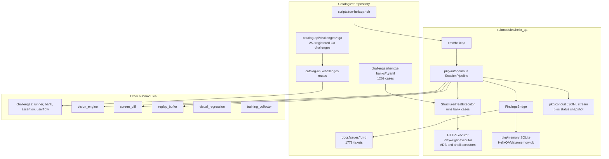
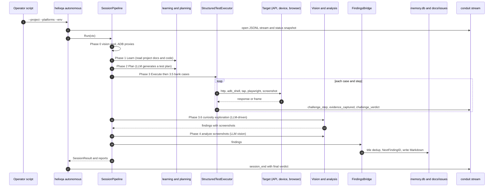
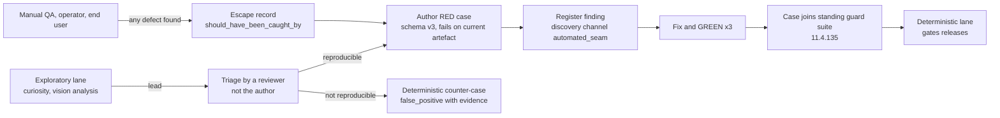
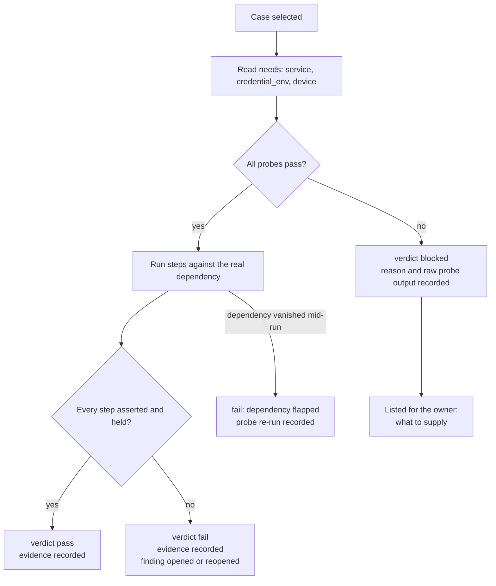
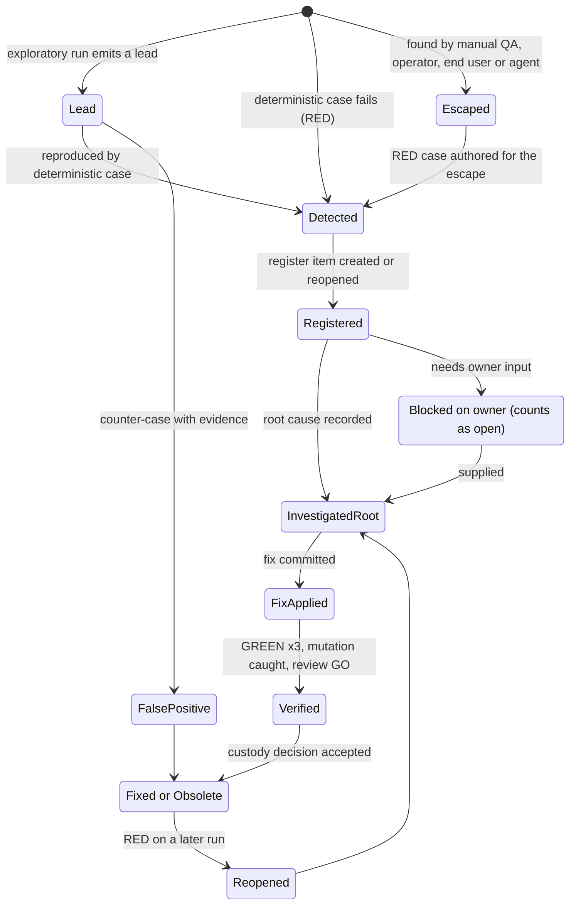

# 12 - HelixQA, Challenges and Governance Plan

| Field | Value |
|---|---|
| Revision | 2 |
| Created | 2026-10-03 |
| Last modified | 2026-10-03 |
| Status | draft (revision 2: commit-push stages aligned with document 16 and docs/21 IC-16 (S0 to S8, S7 verify, S8 report); the section 16.3 skeleton marked superseded; anti-mess sweep wired at S0 and S7; fetch `--prune` per docs/21 IC-36) |
| Feature | specs/001-full-project-audit-remediation |
| Spec requirements covered | FR-001, FR-002, FR-004, FR-005 (QA side), FR-007, FR-008, FR-009, FR-010, FR-019, FR-020, FR-021, FR-022, FR-023, FR-024, FR-025 |
| Success criteria covered | SC-001, SC-002, SC-003, SC-004, SC-005, SC-010, SC-012 |
| Governance anchors | 11.4.238 (+ escape-ratchet extension), 11.4.262, 11.4.158, 11.4.159, 11.4.160, 11.4.193, 11.4.116, 11.4.115, 11.4.135, 11.4.146 (D3), 11.4.201, 11.4.226, 11.4.269, 11.4.214, 11.4.156, 11.4.234, 11.4.227, 11.4.232, 11.4.233, 11.4.164, 11.4.32, 11.4.26, 11.4.10, 11.4.252, 11.4.74 |
| Companion documents | 03 (issue inventory), 04 (findings register design), 05 (test strategy), 06 (determinism and evidence framework) |

## Table of contents

1. Purpose, scope and reading guide
2. Measured baseline: what exists today
3. How the machinery works today (as read from the code)
4. Findings that change the plan
5. Target model: automated QA as the discoverer
6. Bank-case schema v3 (with a full worked example)
7. Converting prose steps into executable, evidence-producing cases
8. Determinism and machine evidence for QA runs
9. Recorded vision validation
10. Real-service and real-device availability model (blocked-unavailable)
11. Ticket-to-register mapping and the ticket lifecycle
12. Escape-ratchet metrics
13. Governance part 1: the Spec Kit constitution layer
14. Governance part 2: the constitution submodule update path
15. Governance part 3: gate-code ledger (11.4.227)
16. Governance part 4: local enforcement without CI/CD
17. Governance part 5: anti-mess control plane at project scale
18. Work packages, ordering and execution model
19. Decision records
20. Risks, open items and the UNCONFIRMED list
21. Traceability and acceptance evidence

---

## 1. Purpose, scope and reading guide

This document is the technical plan for two things the feature depends on and that no other plan
document owns: (a) turning HelixQA and the Challenges framework from a source of placeholder green
into the discoverer of defects (11.4.238) that runs deterministically and records machine evidence
(11.4.262); (b) keeping the governance layer, the constitution submodule, the gate ledger and the
local enforcement mechanism correct and current while the feature runs. It does not restate the
spec and it does not repeat the register DDL (document 04), the evidence record (document 06) or
the test-type matrix (document 05); it extends them where QA needs it.

Conventions. Counts were produced by read-only commands on 2026-10-03 and the commands are
recorded in section 2.2. `EXECUTED` marks output I produced in this session (scratch area only,
no repository file was modified). `NOT EXECUTED` marks examples I wrote but did not run.
`UNCONFIRMED:` and `UNKNOWN:` mark anything I could not verify. Builds, container images and test
suites are never run on the bare host (11.4.173, FR-021); every command that runs QA
is given in containerized form or is a read-only host query.

Terms. A **bank** is a YAML file of **cases** (`test_cases`), each with **steps**. A **placeholder
step** is a step whose `action` text begins with `# TODO: Convert to executable`. An
**executable step** has an `action` the HelixQA executor can parse into a typed action. An
**asserting step** is an executable step whose pass condition is evaluated by a machine
(status code, JSON path, body substring, OCR text, pixel diff), not by the prose in `expected`.

---

## 2. Measured baseline: what exists today

### 2.1 The components

| Component | Where | What it is | Verified detail |
|---|---|---|---|
| HelixQA | `submodules/helix_qa` (HEAD `1caceb6`) | Go QA orchestration engine and CLI `helixqa` with subcommands `run`, `list`, `report`, `autonomous`, `http`, `replay`, `signoff`, `banks`, `version` | `submodules/helix_qa/cmd/helixqa/main.go:48-75`; 50 entries under `pkg/` (`ls pkg \| wc -l`) |
| Challenges framework | `submodules/challenges` (HEAD `8a352b9`) | Challenge execution engine: `pkg/runner`, `pkg/bank`, `pkg/challenge`, `pkg/assertion`, `pkg/userflow`, `pkg/httpclient`, `pkg/report` | `ls submodules/challenges/pkg` |
| Catalogizer Go challenges | `catalog-api/challenges/` | 109 files; `register.go` calls `svc.Register(` 250 times; 314 `Execute(` methods in non-test files | `grep -c "svc.Register(" register.go`; `grep -n "func.*Execute("` |
| Challenge HTTP surface | `catalog-api/main.go:1601-1608` | `GET /challenges`, `GET /challenges/:id`, `POST /challenges/:id/run`, `POST /challenges/run`, `POST /challenges/run/category/:category`, `GET /challenges/results` | read |
| Challenge bank (JSON) | `challenges/data/challenges_bank.json` | 507 challenges in 18 categories (document 03, section 5.15) | UNCONFIRMED by me; taken from document 03 |
| HelixQA banks (Catalogizer) | `challenges/helixqa-banks/*.yaml` | 15 files, 1,269 cases | section 2.3 (measured) |
| HelixQA banks (submodule) | `submodules/helix_qa/banks/` | 131 YAML + 66 JSON files, `.bank-id-floor.txt` | `ls`; counts from document 03 |
| Vision | `submodules/vision_engine` (HEAD `ce16f92`) | Analyzer interface, OpenCV and LLM-vision layers, navigation graph | README lines 1-12 |
| screen_diff | `submodules/screen_diff` | Deterministic pixel comparison, threshold-based `IsSameScreen` | README quick start |
| replay_buffer | `submodules/replay_buffer` | SQLite store of successful navigation sequences, replayed on matching screen state | README |
| visual_regression | `submodules/visual_regression` | Cross-device screenshot comparison through an LLM vision provider | README |
| training_collector | `submodules/training_collector` | Collects screenshot+action pairs as JSONL for vision fine-tuning | README |
| Tickets | `docs/issues/` | 1,778 Markdown files written by the HelixQA FindingsBridge | `ls docs/issues \| wc -l` = 1778 |
| QA run scripts | `scripts/run-helixqa*.sh`, `helixqa-orchestrator.sh`, `run-full-qa.sh`, `run-module-challenges.sh` | Shell drivers around the `helixqa` binary | 2,778 lines across 10 files (`wc -l`) |
| Bank tooling | `scripts/audit/bank-prose-to-http.py` (437 lines), `bank-patch-auth.py`, `bank-patch-default-bodies.py`, `fix-bank-auth-negatives.py`, `fix-bank-expectations.py`, `auto-annotate-no-assert.py` | Existing converters and patchers for prose banks | `ls scripts/audit`; `wc -l` |

### 2.2 Measurement commands (all read-only, EXECUTED)

```bash
# banks: cases, steps, placeholder lines, per-file split (python3 + PyYAML, read-only)
cd challenges/helixqa-banks && python3 - <<'PY'
import yaml,glob
for f in sorted(glob.glob('*.yaml')):
    d=yaml.safe_load(open(f)); t=open(f).read()
    print(f, len(d['test_cases']), sum(len(c['steps']) for c in d['test_cases']),
          t.count('TODO: Convert to executable'))
PY
git grep -c 'TODO: Convert to executable' -- challenges/helixqa-banks     # cross-check, 11 files
ls docs/issues | wc -l ; grep -h -m1 '^status:' docs/issues/*.md | sort | uniq -c   # tickets
```

### 2.3 Banks: the verified numbers

I recomputed the figures reported in documents 03 and 05 and they agree exactly.

| Quantity | Value | Method |
|---|---|---|
| Bank files | 15 | `ls` |
| Cases | **1,269** | YAML load of `test_cases` |
| Steps | **1,906** | sum of `len(steps)` |
| Placeholder step lines (`# TODO: Convert to executable`) | **1,178** (61.8% of steps) | substring count; `git grep -c` returns the same 11 files |
| Executable-looking steps | 728 (38.2%) | 1,906 minus 1,178 |
| Files containing placeholders | 11 of 15 (the four Android TV banks have none) | `git grep -c` |

Per file (cases / all-placeholder cases / mixed cases / no-placeholder cases):

| Bank (prefix `catalogizer-`, suffix `-executable.yaml`) | Cases | All-placeholder | Mixed | No placeholder |
|---|---:|---:|---:|---:|
| android-comprehensive | 80 | 35 | 24 | 21 |
| android-negative-paths | 69 | 33 | 29 | 7 |
| androidtv-comprehensive | 88 | 0 | 0 | 88 |
| androidtv | 4 | 0 | 0 | 4 |
| androidtv-full | 8 | 0 | 0 | 8 |
| androidtv-negative-paths | 51 | 0 | 0 | 51 |
| api-comprehensive | 313 | 309 | 0 | 4 |
| api-negative-paths | 119 | 117 | 1 | 1 |
| cross-platform-flows | 15 | 13 | 2 | 0 |
| desktop-comprehensive | 64 | 28 | 17 | 19 |
| desktop-negative-paths | 25 | 22 | 1 | 2 |
| web-comprehensive | 255 | 162 | 2 | 91 |
| web-negative-paths | 95 | 78 | 2 | 15 |
| wizard-comprehensive | 63 | 23 | 22 | 18 |
| wizard-negative-paths | 20 | 15 | 1 | 4 |
| **Total** | **1,269** | **835** | **101** | **333** |

Composition of the 1,906 steps (EXECUTED classification):

| Step kind | Count | Is a machine assertion available? |
|---|---:|---|
| Placeholder (`# TODO: Convert to executable - ...`) | 1,178 | no (not run) |
| `keypress:` (D-pad and other keys) | 235 | no, a key press asserts nothing |
| `tap: 960,540` (the fixed screen-centre coordinate) | 234 | no, same coordinate everywhere, result described only in prose |
| `adb_shell:` | 88 | exit code only |
| `screenshot` with `vision_verify: true` | 26 | an LLM-vision judgement, advisory by 11.4.269 unless paired with a deterministic oracle |
| `screenshot` without `vision_verify` | 38 | no |
| other (`sleep:` 63, `text:` 39, `navigate:`, `frame_diff:`, ...) | 107 | `frame_diff` only (2 steps) |

Platform split of the 1,178 placeholder lines: API 513 (313 + 200), web 256 (164 + 92), Android 181
(84 + 97), desktop 92 (67 + 25), installer wizard 85 (69 + 16), cross-platform flows 51.

Mechanical convertibility of the placeholder lines (EXECUTED, section 7.4 POC): 504 start with an
HTTP verb and a path (`get /health`, `post /api/v1/auth/login with ...`); 4 start with a verb but
no path; 670 are not HTTP (web UI, Android, desktop and installer actions).

### 2.4 Tickets: the verified numbers

| Quantity | Value |
|---|---|
| Files in `docs/issues/` | 1,778 |
| Status | resolved 704, fixed 492, closed 299, wontfix 282, open 1 |
| Severity | medium 597, high 440, low 427, critical 255, cosmetic 59 |
| Category (raw value) | functional 544, ux 542, visual 250, accessibility 165, UX 141 (a case variant of `ux`), content 104, brand 21, performance 9, functionality 2 |
| `platform:` empty | 1,305 (73.4%); androidtv 413, video-frame 49, api 11 |
| Found month | 2026-03: 1,231; 2026-04: 547 |
| Files without a `## Resolution` section | 1,111 |
| `closed` tickets whose resolution begins "QA infrastructure failure" | 294 of 299 |

Document 03 reports the same status counts and the id collision (676 distinct `HELIX-NNN` ids over
1,778 files). Section 3.5 below gives the mechanism that I found in the code.

### 2.5 Environment probe (EXECUTED, read-only, 2026-10-03)

| Probe | Result |
|---|---|
| `adb devices` | empty list: no Android or Android TV device attached |
| `curl http://localhost:8080/health` | `{"status":"healthy",...,"version":"1.0.0"}`, HTTP 200 (that this is the Catalogizer API of this checkout is UNCONFIRMED; the response does not name the service) |
| `which tesseract` | not found on the host (so OCR must run in a container image) |
| `which ffmpeg adb podman` | all three present |
| `ls submodules/helix_qa/helixqa` | no built binary; `HELIXQA_BIN` in `scripts/run-helixqa-api.sh:14` points at a file that does not exist |
| `core.hooksPath` | unset; `.git/hooks` holds no hook; `.github/workflows/` holds only a README that says workflows are disabled |

---

## 3. How the machinery works today (as read from the code)

### 3.1 Component map



Two independent execution paths exist and they do not share results:

1. **HelixQA path.** `helixqa run` (bank runner) or `helixqa autonomous` (LLM session). Banks are
   YAML; the executors are in `submodules/helix_qa/pkg/autonomous`. Output: `qa-results/`, tickets
   in `docs/issues/`, a SQLite store, an optional conduit event stream.
2. **Challenges path.** Go structs registered in `catalog-api/challenges/register.go` and executed
   by `services.ChallengeService` (`catalog-api/services/challenge_service.go`) through the
   Challenges runner, triggered by the `/challenges` routes. Results are kept in the service's
   in-memory slice `results []*challenge.Result` (`challenge_service.go:22`, appended at lines 95,
   119, 207) and written under a results directory; `challenges/results/` holds only `.gitkeep`
   and is gitignored (`.gitignore:255-257`), so no result of either path is a committed artefact.

### 3.2 The executor grammar

`TestStep.ParseAction` (`submodules/helix_qa/pkg/testbank/schema.go`, the function after the
`TestStep` struct) recognises these prefixes and nothing else: `adb_shell`, `shell`, `sleep`,
`screenshot`, `keypress`, `tap`, `swipe`, `text`, `playback_check`, `frame_diff`, `http`,
`assert`, `playwright`. Any other text, including `# TODO: Convert to executable - get /health`,
parses as `description`.

Step fields that exist for assertions (same file): `expect_status`, `expect_json_path`,
`expect_body_contains`, `auth` (`none`, `admin`, `as:<user>`, `raw:<token>`), `body`, `headers`,
`vision_verify`, `_skip` and `_skip_reason`. Case fields that exist: `requires_env`,
`challenge_id`, `dispatches_to`, `domains`, `required_evidence` (the 11.4.69 evidence gate:
a PASS needs every listed token to resolve to a real non-empty file), `dependencies`,
`allow_foreground_leave`, `documentation_refs`, `metadata`. A **bank-id floor** file
(`.bank-id-floor.txt`, `submodules/helix_qa/pkg/testbank/loader.go:850`) makes a silently
truncated bank a hard failure; `helixqa banks regen-floor --banks <dir>` regenerates it
atomically (`cmd/helixqa/main.go`, `cmdBanksRegenFloor`).

Verdict handling for placeholders, from `structured_executor.go`: a `description` action
returns `Skipped: true` (lines 615-632); a case in which every step was skipped is counted
`TestCasesSkipped` (line 241-247); a case with at least one executed step and passing executed
steps is counted **PASSED** and prints "(N steps, M placeholders skipped)" (lines 248-262).

### 3.3 One autonomous QA session (sequence)

The ARCHITECTURE.md of the submodule describes four phases named setup, doc-driven, curiosity and
report. The code differs: `pkg/autonomous/pipeline.go` runs Phase 0 (vision pool, ADB reverse
proxies, lines 707-1071), Phase 1 Learn (1177), Phase 2 Plan (1267), Phase 3 Execute (1308),
Phase 3.5 structured bank execution (1833), Phase 3.6 curiosity (1870) and Phase 4 Analyze (2856),
then findings creation through the bridge (3123). The sequence below follows the code.



Two properties of this sequence matter to the plan. The Plan phase and the curiosity phase are
driven by an LLM, so two runs from the same state need not execute the same steps (a direct
conflict with FR-010 and SC-002 if their output could gate anything). The structured bank phase
is the only phase whose steps are fixed in a file.

### 3.4 How results flow today

| Result type | Where it goes | Durable and tracked? |
|---|---|---|
| Per-step action result | stdout of the `helixqa` process and the optional conduit JSONL | stdout is not stored; conduit is under `OutputDir` (`qa-results/`, gitignored) |
| Case verdict (pass, skipped, failed) | counters in `StructuredExecutionResult`, report files (`qa-report.md`, JSON) | reports under `qa-results/` only; `docs/reports/qa-sessions/` holds 4 session directories, 18 tracked files (document 03) |
| Findings | SQLite `findings` table in `<project>/HelixQA/data/memory.db` (`cmd/helixqa/main.go:735`) and `docs/issues/HELIX-NNN-<slug>.md` | tickets are tracked; the store is not present in this checkout (`ls HelixQA` fails) |
| Go challenge results | in-memory slice plus results dir | not tracked |

### 3.5 How tickets are produced, and why ids collide

`FindingsBridge.Process` (`submodules/helix_qa/pkg/autonomous/findings_bridge.go:48-140`): for each
finding it (1) skips it if a finding with the **same title** exists whose status is not `fixed`
(`FindDuplicateByTitle`, `pkg/memory/findings.go:126-150`); (2) mints an id with
`NextFindingID`, which is `HELIX-%03d` of one more than the **highest id currently in that
store** (`findings.go:185-194`); (3) writes the row and the Markdown file. Consequences:

- A store that starts empty (a fresh `memory.db`, which is what a new checkout or a deleted
  `HelixQA/data` gives) restarts numbering at `HELIX-001`. This is the mechanism behind the 560
  shared ids reported in document 03; it is established by the code, while "this is what actually
  happened in the 2026 runs" remains UNCONFIRMED.
- Deduplication is by exact title against open rows only. A defect that returns after its row was
  marked `fixed` creates a new ticket instead of reopening the old one. That is the 11.4.214
  anti-pattern (recurrence mints instead of links), built into the tool.
- The ticket carries no machine evidence record and no fingerprint of the target; its `Resolution`
  section is free text (1,111 tickets have none).

---

## 4. Findings that change the plan

Each finding has an id for traceability (QF = QA finding). They are plan inputs here; document 04
decides how they are registered.

| Id | Finding | Evidence | Consequence |
|---|---|---|---|
| QF-01 | A bank case can score PASS while some of its steps were never run. 101 mixed cases (placeholders plus executed steps) pass on the executed steps alone. | `structured_executor.go:248-262`; section 2.3 | A pass for these 101 cases says nothing about the placeholder steps. They count as not-passing until every step is asserting (section 6.6 rule R-3). |
| QF-02 | 835 cases are all-placeholder and report **skipped**, so the suite is quiet rather than red. | `structured_executor.go:241-247` | Skipped must become `blocked` or `not_executable` and block (R-4). A skipped placeholder counted as neutral is exactly what 11.4.238 and FR-025 forbid. |
| QF-03 | The expected result of every step is prose in `expected`. No executor evaluates it. Only `vision_verify` (26 steps) and `frame_diff` (2) have any automated judgement; 234 steps tap the same coordinate `960,540` whatever the screen shows and 235 steps press a key; none of these asserts anything. | section 2.3 step table | "Executable" in the file names (`*-executable.yaml`) is false for assertion purposes. The 333 no-placeholder cases are not proven cases either; they need the same assertion audit. |
| QF-04 | The scripts run **other banks**. `scripts/run-helixqa-api.sh:46` (bank path; the `run` call spans lines 44-48) runs `submodules/helix_qa/banks/full-qa-api.yaml`, not `challenges/helixqa-banks/`. Only `helixqa autonomous` reads `<project>/challenges/helixqa-banks` (`cmd/helixqa/main.go:771`), and `scripts/run-helixqa.sh` and `run-helixqa-androidtv.sh` reference the directory. | `grep -rln helixqa-banks` | Which banks gate what must be declared in one manifest (section 6.7). |
| QF-05 | Script-level pass accounting is not evidence. `scripts/run-helixqa.sh` counts "screenshots captured" as `pass` for web pages, and pipes the runner through `tail -5` (line 328-340), so the runner's exit status is discarded. | `scripts/run-helixqa.sh:248-314` (counter at 248, `pass++` at 273, report at 311 and 314), `328-340` (the `tail -5`) | A pipe exit status trap (11.4.201 (7)(c), the same class document 06 lists). The scripts are replaced by one wrapper that reads machine verdicts (section 8). |
| QF-06 | Network failure is a FAIL, not blocked. `HTTPExecutor.Execute` returns `Success:false` for "request failed" and for an unset base URL (`http_executor.go:163-169, 233, 275`). The example ticket `HELIX-001-api-unreachable-entities-stats.md` was closed as "Transient issue: API services were not running", i.e. the unavailable service was recorded as a defect and then as resolved. | `http_executor.go`; `docs/issues/HELIX-001-api-unreachable-entities-stats.md` | FR-025 requires `blocked` with an exact reason, which is neither pass nor skip nor product failure (section 10). |
| QF-07 | The HTTP executor falls back to the default admin credentials (`<default admin credential literal>`) when none are configured (`http_executor.go:47-50, 435-440`), and the default credential literal occurs 20 times in the Catalogizer banks. | a per-bank count of the default-credential literal; executor source | A missing credential must be `blocked: credential_absent` (11.4.252 fail closed), and any value that has appeared in a public repository is compromised by disclosure (11.4.10 D). Credentials move to environment variables supplied by the owner. |
| QF-08 | Variable capture is missing. The executor SKIPs any path with `{var}` (`http_executor.go:182-196`). Multi-step API flows (create, then read, then delete) cannot be asserted. | same | A `capture` step field is an upstream extension (section 6.3, DR-3). |
| QF-09 | `registerAll` skips NAS-endpoint challenges **silently** when the endpoint config file is missing (`catalog-api/challenges/register.go` header comment: "registration is silently skipped"). | register.go:12-17 | A silent absence of challenges is the 11.4.201 false-null. The skipped challenge set is reported as blocked with `credential_absent` or `service_unreachable` and counts as not passing. |
| QF-10 | The 294 `closed` tickets that say "QA infrastructure failure: test did not reach expected app state due to screenshot timing" are defects of the QA instrument (11.4.201 (7)(c)), closed by an analysis, not evidence. | `docs/issues/*` resolutions; document 03 F-5 | They map to register items of type `Bug` against component `helixqa` (or the specific tool), not to product items closed without proof (section 11.3). |
| QF-11 | `NextFindingID` plus title-only dedup (section 3.5). | code | The register mints ids; HelixQA findings are imported as source entries and never mint ids in the register (section 11.5). |
| QF-12 | `docs/behavior-anchors.md` of the submodule lists 27 capabilities all `active`, while `challenges/baselines/bluff-baseline.txt` records five files with mutation kill rates below 100 (88, 88, 20, 33, 77) (document 03 5.15). | document 03 | Each row becomes a candidate finding under SC-005 (weak tests). |
| QF-13 | Catalogizer's banks have **no `.bank-id-floor.txt`**. A truncated bank loses cases silently. | `ls -a challenges/helixqa-banks` | Adopt the floor (section 7.7). |
| QF-14 | The Plan and curiosity phases are LLM-driven and non-repeatable; the Learn phase reads project docs. | pipeline.go | They run as the **exploratory lane**, whose output is a lead, never a verdict (section 5, 11.4.269). |
| QF-15 | The submodule's `ARCHITECTURE.md` (four phases setup/doc-driven/curiosity/report) does not match the code (Phase 0 to 4 plus 3.5 and 3.6). | sections 3.3 | Document drift finding (FR-012). |
| QF-16 | `docs/reports/qa-sessions/2026-04-22-T16-28/helixqa/session-1776864906/replay.db-shm` and `replay.db-wal` are tracked although `.gitignore` lines 329-332 name database journals. | `git ls-files` | A 11.4.30 finding: runtime artefacts in the tree. |

---

## 5. Target model: automated QA as the discoverer

### 5.1 Principles (11.4.238 A to E)

1. Discovery by anything other than the automated regime (an agent reading code, the operator,
   manual QA, an end user) is recorded as an **escape**. The defect is fixed and the missing check
   is added; closing only the reported defect is a violation.
2. Manual QA (11.4.185) is a confirmation gate. Its target is zero previously unknown defects.
3. Coverage is measured by what the regime can **catch** (every check has a paired mutation that
   makes it fail), not by what it runs.
4. Nothing nondeterministic decides a verdict. An LLM or vision-model output is a **lead** until it
   is reproduced by a deterministic case (11.4.269).
5. Every verdict is backed by a machine-written evidence record (11.4.262, document 06).

### 5.2 Two lanes and the promotion loop

| Lane | Contents | May gate a release? | Repeatability |
|---|---|---|---|
| **Deterministic lane** | Bank cases in schema v3, Go challenges, Challenges-framework userflows. Fixed steps, fixed assertions, recorded evidence. | Yes | Three identical runs required (document 06 section 5) |
| **Exploratory lane** | `helixqa autonomous` Learn, Plan, curiosity and Analyze phases, vision-model analysis, `visual_regression`. | No. Output is `lead` status. | Not required; each run records its model, prompt hash and seed where the tool exposes one |

**Promotion loop.** Every exploratory lead is either (a) reproduced by hand-authored deterministic
steps, producing a RED run against the current artefact (then it becomes a register finding and a
bank case, in one change), or (b) closed as `false_positive` with a deterministic counter-case, or
(c) left `unresolved_lead` and counted. A lead may not remain unresolved when the feature closes
(FR-008). This makes the exploratory lane the discoverer of *new* cases and the deterministic lane
the standing guard; every promoted case is registered as a regression guard (11.4.135).



### 5.3 What "the discoverer" requires, as a checklist

| Requirement | Mechanism | Section |
|---|---|---|
| Every user-reachable surface has asserting cases | surface inventory generated from route table and screen list; cases keyed to it; gap = finding | 7.1 |
| Cases cannot pass without observing the behaviour | R-1 to R-8 validator, paired mutation per case class | 6.6, 8.5 |
| Unavailable dependencies never pass or skip | `blocked` with reason | 10 |
| Escapes are measured | `reg_discovery`, `v_escapes`, ratchet | 12 |
| Runs repeat identically | wrapper, three runs, canonical result hashing | 8 |
| Vision evidence is recorded and validated | recorded vision validation with deterministic OCR primary | 9 |

---

## 6. Bank-case schema v3 (with a full worked example)

### 6.1 Design stance

Reuse what HelixQA already has (11.4.74: extend, do not reimplement). Fields that exist and that v3
uses unchanged: `id`, `name`, `category`, `priority`, `platforms`, `dependencies`, `requires_env`,
`challenge_id`, `domains`, `required_evidence`, `documentation_refs`, and on steps `name`,
`action`, `expected`, `timeout`, `auth`, `body`, `headers`, `expect_status`, `expect_json_path`,
`expect_body_contains`, `vision_verify`. Fields that do not exist and are needed are added in
two stages: first as `metadata` (HelixQA never reads inside it, `schema.go` `Metadata` comment),
interpreted by a Catalogizer wrapper and by the validator in section 6.6; then proposed upstream
to HelixQA as typed fields (section 18, work package WP-Q3) so the executor enforces them.

### 6.2 Case-level fields added by v3 (in `metadata.v3`)

| Field | Type | Required | Meaning |
|---|---|---|---|
| `schema` | const `"bank-case/3"` | yes | version marker |
| `register_refs` | array of register ids | when the case guards a finding | links case to the item it guards (11.4.135) |
| `surface` | string | yes | stable key of the surface this case covers (route pattern, screen id, binary command) |
| `oracle` | object `{strategy, independent_of_sut}` | yes | named oracle strategy from the closed set of document 06 (11.4.245); `independent_of_sut` must be true |
| `needs` | object | yes | dependencies: `service`, `credential_env` (names only), `device` (stable selector class), `network` |
| `blocked_when` | array | derived from `needs` | the probe ids that must pass before the case runs (section 10) |
| `mutation` | object | for cases that guard a finding or sit in the coverage matrix | `operator`, `target` (the behaviour the reviewer breaks), `expected: "fail"` |
| `flow` | `deterministic` or `exploratory_promoted` | yes | provenance |
| `evidence` | array of tokens | yes | evidence classes the case MUST produce: `http_exchange`, `screenshot`, `ocr_text`, `frame_diff`, `video`, `logcat`, `db_row` |

### 6.3 Step-level fields

Existing typed fields are used first. Added. The HelixQA `TestStep` struct has no
`metadata`, so the interim encoding is a sidecar (encoding assertions as JSON inside `expected` was
rejected, DR-3): the wrapper pre-processes v3 files into the HelixQA native form
(`http:` action with `expect_*`) and keeps v3-only fields (`capture`, `expect_json_eq`,
`ocr_assert`) in a sidecar `*.v3.yaml` consumed by the wrapper's post-step assertions. The upstream
extension (work package WP-Q3) adds these typed step fields:

| Field | Meaning |
|---|---|
| `capture` | map `name: json_path` saved from the response and usable as `{name}` in later steps (removes the SKIP on `{var}`, QF-08) |
| `expect_json_eq` | map `json_path: literal` exact comparison |
| `expect_header` | map of header name to value or regex |
| `ocr_assert` | `{region, must_contain[], must_not_contain[]}` evaluated by deterministic OCR on the step's screenshot |
| `pixel_assert` | `{reference_hash, threshold}` using `screen_diff` |
| `assert_after` | list of state probes (DB row, file, process) read through an independent path |
| `negative` | true when the step is an expected-failure input; the assertion is on the refusal itself |

### 6.4 JSON Schema for the case (excerpt, NOT EXECUTED)

```json
{
  "$schema": "https://json-schema.org/draft/2020-12/schema",
  "$id": "bank-case/3",
  "type": "object",
  "required": ["id","name","category","priority","platforms","steps","metadata"],
  "properties": {
    "id": {"type":"string","pattern":"^[a-z0-9][a-z0-9-]*$"},
    "priority": {"enum":["critical","high","medium","low"]},
    "platforms": {"type":"array","items":{"enum":["api","web","desktop","android","androidtv","installer"]},"minItems":1},
    "steps": {"type":"array","minItems":1,"items":{"$ref":"#/$defs/step"}},
    "metadata": {"type":"object","required":["v3"],"properties":{"v3":{"$ref":"#/$defs/v3"}}}
  },
  "$defs": {
    "step": {"type":"object","required":["name","action"],
      "properties":{"action":{"type":"string","not":{"pattern":"TODO"}}},
      "anyOf":[{"required":["expect_status"]},{"required":["expect_json_path"]},
               {"required":["expect_body_contains"]},{"required":["expect_json_eq"]},
               {"required":["ocr_assert"]},{"required":["pixel_assert"]},{"required":["assert_after"]}]},
    "v3": {"type":"object","required":["schema","surface","oracle","needs","flow","evidence"],
      "properties":{"schema":{"const":"bank-case/3"},
        "oracle":{"type":"object","required":["strategy","independent_of_sut"],
          "properties":{"strategy":{"enum":["specified","derived","metamorphic","golden_master","invariant","statistical","human"]},
                        "independent_of_sut":{"const":true}}},
        "flow":{"enum":["deterministic","exploratory_promoted"]}}}
  }
}
```

The `anyOf` on `step` is the schema-level form of rule R-1: a step without at least one machine
assertion field does not validate.

### 6.5 Worked example: converting `api-auth-login`

The current placeholder case (`challenges/helixqa-banks/catalogizer-api-comprehensive-executable.yaml`,
case `api-auth-login`) has the step action `# TODO: Convert to executable - post /api/v1/auth/login
with valid admin credentials (`<default admin credential literal, see http_executor.go:47-50>`)`. The converted case below pairs the success path with the
negative path, takes credentials from the environment (values never written to a file), and names
its oracle and its mutation. NOT EXECUTED (the response field names must be confirmed against
`catalog-api` handlers during WP-Q2; `session_token` is the field the HelixQA executor itself
reads, `http_executor.go` login code, and is UNCONFIRMED against the live handler).

```yaml
- id: api-auth-login-success
  name: Login with valid credentials returns a session token
  category: authentication
  priority: critical
  platforms: [api]
  requires_env: [CATALOGIZER_QA_ADMIN_USER, CATALOGIZER_QA_ADMIN_PASSWORD]   # names only
  challenge_id: CH-API-AUTH-001
  required_evidence: ["http/api-auth-login-success.*.json"]
  steps:
    - name: POST /api/v1/auth/login
      action: "http: POST /api/v1/auth/login"
      auth: none
      body:
        username: "${CATALOGIZER_QA_ADMIN_USER}"
        password: "${CATALOGIZER_QA_ADMIN_PASSWORD}"
      expect_status: 200
      expect_json_path: "$.session_token"
      capture: {token: "$.session_token"}
      expected: "200 with a session token"            # prose kept as documentation only
      timeout: 10
    - name: Token is accepted by a protected route
      action: "http: GET /api/v1/auth/me"
      auth: "raw:{token}"
      expect_status: 200
      expect_json_eq: {"$.username": "${CATALOGIZER_QA_ADMIN_USER}"}
      timeout: 10
  metadata:
    v3:
      schema: bank-case/3
      surface: "POST /api/v1/auth/login"
      oracle: {strategy: specified, independent_of_sut: true}   # spec: API contract in docs
      needs: {service: catalog-api, credential_env: [CATALOGIZER_QA_ADMIN_USER, CATALOGIZER_QA_ADMIN_PASSWORD]}
      flow: deterministic
      evidence: [http_exchange]
      mutation: {operator: "return 200 for any password", target: "auth handler password check", expected: fail}
      register_refs: []

- id: api-auth-login-wrong-password
  name: Login with a wrong password is refused and issues no token
  category: authentication
  priority: critical
  platforms: [api]
  requires_env: [CATALOGIZER_QA_ADMIN_USER]
  steps:
    - name: POST wrong password
      action: "http: POST /api/v1/auth/login"
      auth: none
      body: {username: "${CATALOGIZER_QA_ADMIN_USER}", password: "not-the-password"}
      expect_status: 401
      expect_body_contains: "error"
      negative: true
      timeout: 10
  metadata:
    v3:
      schema: bank-case/3
      surface: "POST /api/v1/auth/login"
      oracle: {strategy: specified, independent_of_sut: true}
      needs: {service: catalog-api, credential_env: [CATALOGIZER_QA_ADMIN_USER]}
      flow: deterministic
      evidence: [http_exchange]
      mutation: {operator: "skip password comparison", target: "auth handler", expected: fail}
```

How the pair is verified (11.4.115 and document 06): run the case against the current artefact
(BASELINE verdicts), run the paired mutation (the reviewer breaks the handler in a scratch
container; the case must go RED), run it three times on the unmodified artefact (identical result
hash). Only a case with all three recorded verdicts counts toward SC-004 and SC-005.

### 6.6 Validator rules (a gate, run before any bank executes)

| Rule | Statement | Fails when |
|---|---|---|
| R-1 | every step carries at least one machine assertion | a step has only prose `expected` |
| R-2 | no step action contains `TODO`, `CONVERT` or `placeholder` | any such text |
| R-3 | a case passes only if every step ran and passed | any step skipped for a bank reason |
| R-4 | `skipped` is not an allowed final status for a case. Allowed: `pass`, `fail`, `blocked` | a skip leaves the validator as a neutral result |
| R-5 | credentials appear only as `${ENV_NAME}` | a literal that matches a credential pattern, or a default account |
| R-6 | `needs` is complete: every environment variable, service and device the steps reference is declared | an undeclared dependency |
| R-7 | `oracle.independent_of_sut` is true and the strategy is in the closed set | otherwise |
| R-8 | `tap: x,y` coordinates are allowed only with an `ocr_assert` or `pixel_assert` on the same step, and never as a fixed `960,540` | the 234 current centre taps |

R-8 follows 11.4.193: no interaction is blind. A tap that is not followed by a seen, asserted
result is a blind interaction.

### 6.7 Manifest

One file `challenges/helixqa-banks/MANIFEST.yaml` (new) lists every bank, its platform, which run
profile executes it (`api`, `web`, `desktop`, `android`, `androidtv`, `installer`), its case count
floor, and the container image that runs it. It resolves QF-04: the scripts read the manifest and
no script names a bank file. `.bank-id-floor.txt` sits beside it (section 7.7).

---

## 7. Converting prose steps into executable, evidence-producing cases

### 7.1 Strategy

Convert by **surface**, not by file. The 1,269 cases do not cover the system (document 05 shows
the matrix); the work is to make each user-reachable surface have asserting cases and to retire
placeholder text as a side effect. Surface inventories: API routes (document 07 inventories the
route table), web pages and components (document 08), Android and Android TV screens (documents
09 and 10 if present), desktop and installer commands. A placeholder case that maps to a surface
is rewritten in place (id kept, so the bank-id floor holds); a surface with no case gets a new case
(a finding, fixed by writing it, FR-009).

### 7.2 Priority order

Prioritised by risk and by how mechanically a step converts (11.4.132 risk-descending: most recently
touched, historically most problematic, highest crash likelihood, most reopened).

| Wave | Content | Cases and lines | Why first |
|---|---|---|---|
| W1 | API authentication, session, authorisation negatives, rate limit | the critical-priority subset of `api-comprehensive` (23 critical cases) and `api-negative-paths` (31 critical) | security, mechanical conversion, real service already reachable (section 2.5) |
| W2 | API remaining: 504 HTTP-pattern steps (EXECUTED census): 233 auto-convertible with the status in `expected`, 195 need body authoring, 55 need a status chosen, 3 need `capture` | `api-*`, `cross-platform-flows` API steps | mechanical, runs in a container against the stack |
| W3 | Web (256 lines + 91 no-placeholder cases with centre taps): Playwright steps with `ocr_assert` or DOM assertions | `web-comprehensive`, `web-negative-paths` | web has the Playwright executor path |
| W4 | Installer wizard and desktop (177 lines) | `wizard-*`, `desktop-*` | needs the Tauri and installer harness of documents 09 to 11 |
| W5 | Android and Android TV (181 lines plus assertion audit of 235 key presses and 234 centre taps) | `android-*`, `androidtv-*` | requires a real device (blocked until supplied) |
| W6 | Assertion audit of the 333 no-placeholder cases | all | R-1 and R-8 apply to them too |

### 7.3 Conversion classes

| Class | Pattern | Tool | Human step |
|---|---|---|---|
| C1 | `METHOD /path` and `expected` begins with a three-digit status | `bank-prose-to-http.py` extended (7.4) | reviewer checks the status against the API contract |
| C2 | `METHOD /path with body ...` | converter drafts `body` from inline JSON when present | author completes body and adds `expect_json_*` from the contract |
| C3 | path with `{var}` | converter emits `capture` skeleton | author wires the capturing step |
| C4 | web verbs (`navigate`, `fill`, `click`, `inspect`) | converter maps to `playwright:` verbs defined in `schema.go` (`navigate`, `click`, `fill`, `waitFor`, `assertVisible`, `assertNotVisible`, `press`) | author adds the assertion; `inspect` becomes `assertVisible` or `ocr_assert` |
| C5 | Android and TV | author, with `uiautomator` dump or OCR assertion per 11.4.193 | blind taps replaced |
| C6 | desktop and installer commands | `shell:` action with exit and output assertion, or window OCR | author |

### 7.4 POC (EXECUTED, read-only on banks, output to stdout only)

Script `scratchpad/poc12/conv_poc.py` classified the 486 HTTP-pattern placeholder steps of the
`*api*` and `*cross*` banks: `auto_convertible_with_status` 233, `needs_body_authoring` 195,
`needs_status_authoring` 55, `needs_capture(path var)` 3 (the remaining 18 HTTP-pattern lines are in
the web banks, giving the 504 of section 2.3). Sample output of the converted form:

```json
[{"step":"GET /health","action":"http: GET /health","expect_status":200},
 {"step":"GET /metrics","action":"http: GET /metrics","expect_status":200}]
```

The existing `scripts/audit/bank-prose-to-http.py` already implements the same idea for the
submodule's JSON banks (header comment: "80%-coverage mechanical converter"). The plan extends it
(adds a reader for this YAML, the `# TODO: Convert to executable - ` prefix and lower-case verbs)
rather than writing a second converter (11.4.74). The extended converter must itself be test-first
(11.4.224): a golden-good input (a step with a clear status), a golden-bad input (a prose step that
must NOT be converted) and a needle that proves it can see the TODO prefix.

### 7.5 Acceptance per wave

A wave is done only when, for every case it touches: validator R-1 to R-8 green (machine output
archived); BASELINE run recorded against the current artefact (a case that is RED is a finding, not
a conversion failure); paired mutation recorded as caught; three identical runs; case registered in
the coverage matrix (document 05) and, where it guards a finding, in the standing guard registry
(11.4.135). Placeholder count per wave is the progress metric and must be monotone decreasing; the
completion value is 0 (`git grep -c 'TODO: Convert to executable' -- challenges/helixqa-banks`
prints nothing). Zero placeholders is necessary and never sufficient (11.4.224 C).

### 7.6 Prioritisation inside a wave

Sort by (priority critical first, then reopen count of the linked ticket family, then number of
dependent cases), using the ticket families of section 11.4. Cases that `dependencies:` name are
converted before their dependants because a dependant's precondition is the dependency's result.

### 7.7 Bank-id floor and silent-loss guard

Create `challenges/helixqa-banks/.bank-id-floor.txt` with `helixqa banks regen-floor --banks
challenges/helixqa-banks`, run from the container image. From then on removing a case without a
reviewed floor change fails the directory scan (`loader.go` `checkBankIDFloor`, HXC-305). Rewriting
a case in place keeps its id. Splitting a case into success and failure cases keeps the old id on
one of them and adds a new id.

---

## 8. Determinism and machine evidence for QA runs

### 8.1 The wrapper

All QA execution goes through one wrapper `scripts/qa/run_profile.sh` (new, test-first), run
inside the QA image (section 18.3). It replaces the ten `run-helixqa*.sh` drivers. Its contract:

1. Resolve the profile from `MANIFEST.yaml`; refuse to start if the manifest's declared case count
   is below the floor.
2. Run the availability probes (section 10) and write their results first.
3. Start `helixqa run` (deterministic lane) with the conduit stream enabled. HelixQA enables it by
   default and `HELIXQA_CONDUIT=0` disables it (`cmd/helixqa/main.go:884-905` is for the
   `autonomous` subcommand; whether `run` emits it is UNCONFIRMED and is checked in WP-Q1).
4. Adapt each conduit event to a document 06 `ev/1` ledger entry (section 8.2).
5. Compute the canonical result hash (section 8.3) and compare across three runs.
6. Exit non-zero if any case is `fail` or `blocked`. It never pipes the runner through a command
   that replaces its exit status (QF-05); it captures the status in a variable, then post-processes.

### 8.2 Conduit stream to ledger adapter

HelixQA's conduit writer already produces an append-only JSONL stream with monotonic `seq`,
closed event types (`challenge_start`, `challenge_step`, `challenge_verdict`, `evidence_captured`,
`llm_call`, `vision_call`, ...) and a closed verdict set `PASS|FAIL|SKIP|OPERATOR-BLOCKED`
(`pkg/conduit/event.go`), plus an atomically rewritten status snapshot. This is the 11.4.116
substrate; the plan reuses it and does not invent a second stream.

| Conduit element | Ledger `ev/1` mapping |
|---|---|
| `challenge_verdict` PASS | `verdict: pass`, `polarity: BASELINE` or `GREEN` per run purpose |
| FAIL | `verdict: fail` |
| `OPERATOR-BLOCKED` with `reason` | `verdict: blocked`, `blocked_reason` from the closed set of document 06 (`service_unreachable`, `credential_absent`, `device_absent`, ...) |
| SKIP | **not accepted** in the deterministic lane. A SKIP event makes the run `invalid` (R-4). It is accepted only for `exploratory` runs |
| `evidence_captured` (`EvidencePath`, `EvidenceKind`) | blob digest entry; the file must exist and be non-empty (the stream's own anti-bluff rule) |
| `llm_call` and `vision_call` | recorded with model name, token counts and duration; marked `role: advisory` (11.4.269) and kept out of the verdict chain |

Adapter sketch (NOT EXECUTED; Python reading JSONL and writing one ledger line per verdict):

```python
#!/usr/bin/env python3
# conduit_to_ledger.py  --stream qa-results/session-X/conduit.jsonl --ledger "$EV/ledger.jsonl"   # $EV = specs/001-full-project-audit-remediation/evidence
import json, sys, hashlib, argparse, os
MAP = {"PASS": "pass", "FAIL": "fail", "OPERATOR-BLOCKED": "blocked"}
REASONS = {"service_unreachable","credential_absent","credential_rejected","device_absent",
           "device_wrong_identity","device_unauthorised","geo_restricted","quota_exhausted",
           "licence_absent","host_resource_unavailable"}
def main():
    a = argparse.ArgumentParser(); a.add_argument("--stream"); a.add_argument("--ledger"); a.add_argument("--run")
    ns = a.parse_args()
    with open(ns.stream) as s, open(ns.ledger, "a") as out:
        for line in s:
            e = json.loads(line)
            if e["type"] != "challenge_verdict":
                continue
            v = e.get("verdict")
            if v == "SKIP":
                sys.exit("invalid run: SKIP is not accepted in the deterministic lane: " + e.get("challenge", "?"))
            if v == "OPERATOR-BLOCKED" and e.get("reason") not in REASONS:
                sys.exit("blocked without a closed-set reason: " + e.get("challenge", "?"))
            rec = {"schema": "qa-verdict/1", "run": ns.run, "challenge": e["challenge"],
                   "verdict": MAP[v], "reason": e.get("reason"), "conduit_seq": e["seq"]}
            out.write(json.dumps(rec, sort_keys=True) + "\n")
main()
```

The production tool is the document 06 recorder; the adapter only feeds it. The recorder
reconciliation rule (11.4.115 H3, document 06 section 3.1 rule 3) applies: the number of verdicts
the wrapper reports equals the number of ledger entries, otherwise the run is invalid.

### 8.3 Canonical result and three-run repetition

The canonical result of a run is the sorted list of `(challenge_id, step_index, verdict,
assertion_digest)` where `assertion_digest` is the sha256 of the asserted values (status code,
JSON values, OCR text after normalisation), excluding timestamps, durations, tokens and
generated ids. Three runs from the same state must yield the same canonical hash (SC-003, SC-002).
A difference is a finding: either the case is nondeterministic (quarantine rule, document 05 section
11) or the system under test is.

Sources of nondeterminism and their handling:

| Source | Handling |
|---|---|
| Server-generated ids, timestamps | captured into variables, never asserted literally; assert shape (regex) |
| Test data order | cases create their own fixtures and delete them (11.4.14); seed data comes from a recorded dump |
| Clock | tests that depend on time use a fixed clock inside the container where the service allows it; otherwise assert ranges |
| Concurrency between cases | cases that share an exclusive resource are partitioned by single-resource owner (11.4.119); the API suite runs cases of one profile serially in dependency order; parallelism only across independent profiles |
| LLM or vision output | never in the deterministic lane |
| Network | real service on a recorded host; unreachable is `blocked`, not retried until green (11.4.264 F) |

### 8.4 Evidence per case

Each executed case emits, at minimum: the request and response of each HTTP step (headers with
secrets redacted, body, status), a screenshot per UI step with its OCR text and the OCR engine
version, a `frame_diff` result where the case is about motion, a logcat window for device cases,
and the target fingerprint read from the target at run time (document 06 section 6: the running
API reports its build id; a device reports `ro.build.fingerprint` and the app version code). A
verdict without the fingerprint is refused (11.4.115 F).

### 8.5 Case validity: the mutation check

SC-005 samples cases and breaks the behaviour they protect. For QA cases the check is mechanical:
the reviewer chooses a mutation from the case's own `metadata.v3.mutation`, applies it in a
scratch container build of `catalog-api` (never the host, 11.4.173), runs the case, and the case
must go RED; the RED run is a ledger entry with `mutation.author: reviewer` (11.4.194 (6)(d) and
11.4.226). The author's mutation set is necessary and never sufficient. The reviewer must also try
one mutation the author did not list.

---

## 9. Recorded vision validation

Anchors: 11.4.158 (record all features, flows and edge cases and read the screen), 11.4.159
(window-specific recording, vision validation after every recording, content verification not
duration), 11.4.160 (vision verification bridge to HelixQA, frames at 5 s or finer with
per-frame PASS/FAIL), 11.4.193 (no blind typing: see before typing and verify after typing).

### 9.1 Design

| Layer | Tool | Role | Gates? |
|---|---|---|---|
| Capture | `ffmpeg` window-targeted capture for desktop and web, `adb exec-out screencap` and `screenrecord` for devices, Playwright video and screenshots for web | produces the artefact (`<project>-<feature>-<YYYYMMDD-HHMMSS>.mp4` per 11.4.159 C with `HELIX_RELEASE_PREFIX=catalogizer`) | n/a |
| Deterministic oracle 1 | OCR (Tesseract in the QA image, at least 150 DPI per 11.4.193) over extracted frames, text compared with the case's `ocr_assert` | primary receipt | yes |
| Deterministic oracle 2 | `screen_diff` `IsSameScreen` (fixed threshold, pure pixel comparison) and golden-master hash for stable screens | primary receipt for "something changed" and "nothing changed" | yes |
| Deterministic oracle 3 | HelixQA `pkg/recordingqa` plus the `recording-analyzer` command (frame OCR plus log oracle) | a recorded session achieves its goal and shows no error text | yes |
| Model oracle | `vision_engine` and `visual_regression` (LLM vision) | second opinion and discovery of unexpected states | **no**: advisory (11.4.269); a model verdict alone is refused as a receipt |

The `vision_verify: true` flag on a step therefore does two things: it triggers the model analysis
(a lead source) and it requires the step to carry a deterministic assertion (R-1). A vision-only
step is invalid.

### 9.2 Per-frame procedure (11.4.160)

1. SPECIFY: the case lists `ocr_assert.must_contain` and `must_not_contain` (for example the error
   strings of the product) before recording (11.4.159 J).
2. RECORD the window.
3. EXTRACT frames at the declared interval; hash each frame.
4. OCR each sampled frame; evaluate patterns; compute the per-frame verdict.
5. Write one ledger entry per recording with: recording path and sha256, frame count, frame
   hashes list digest, OCR engine and version, pattern results, `screen_diff` results.
6. A recording is rejected if a pattern is missing, a placeholder or error text is present, or the
   frame sequence is frozen (all frames identical when motion is expected). Rejection requires a
   root cause (11.4.102) before re-recording (11.4.159 L).

### 9.3 Analyzer self-validation (11.4.107 (10), document 06 section 10)

The OCR and frame analyzers ship fixtures: a golden-good recording (known text present), a
golden-bad recording (a frame sequence with the expected text missing and an error overlay) and a
negative control (a legitimately different but valid recording). The analyzer is trusted only after
it fails the golden-bad. The `submodules/helix_qa/data/vision_gt/` ground-truth images (red circle,
three blue circles, text "helix", spatial left/right) are existing golden inputs for the model
oracle and the plan reuses them for the model oracle's own calibration.

### 9.4 Interaction rule (11.4.193)

Every UI step is a triple: capture before, act, capture after, with the OCR or accessibility-tree
read of both. `uiautomator dump` or an accessibility tree dump is preferred for native UIs; OCR is
used for WebViews and non-introspectable surfaces; a surface that cannot be read by either (secure
or DRM-blanked) is a `blocked` case with reason `host_resource_unavailable` or, where the owner
must attend, a manual-QA item, never a blind-typed pass. Credential characters are redacted in OCR
output and in logs (11.4.193 (5), 11.4.10).

### 9.5 Determinism of the vision lane

The deterministic oracles are repeatable by construction (pixel and OCR). The model oracle records
model id, prompt hash and, where the provider honours it, temperature and seed; `vision_engine`
carries a `Temperature` field (`pkg/llmvision/provider.go:54`), whether a seed is supported by
the configured hosts (`HELIX_VISION_HOSTS` in `.env.example`) is UNCONFIRMED. The vision lane's
output is stored as advisory metadata and compared across runs only for stability reporting.

---

## 10. Real-service and real-device availability model (blocked-unavailable)

### 10.1 The rule (FR-025)

A test whose behaviour depends on an external service, a credential or a physical device runs
against the real one on every run. If it is unavailable the test is **blocked** with the exact
reason; blocked counts as not passing, is never a skip and never replaced by a simulation. The
spec (assumptions) records that the owner's rule is stricter than the governance allowance of an
honest skip; the blocked status says why, so an infrastructure gap is not mislabelled as a product
defect. HelixQA's own vocabulary already carries `OPERATOR-BLOCKED` with a closed reason set
(`pkg/conduit/event.go`, `emit.go`) and `requires_env`, which SKIPs the whole case when a variable
is unset (`schema.go`, `structured_executor.go:181-190`). The plan maps and tightens them.

### 10.2 Status model

| Status | Meaning | Counts toward pass? | Counts toward "zero open"? |
|---|---|---|---|
| `pass` | ran against the real dependency, all assertions held, evidence recorded | yes | n/a |
| `fail` | ran, an assertion failed, evidence recorded | no | opens or reopens a finding |
| `blocked` | could not run for an enumerated reason | no | the case is open; the feature is not complete until the owner supplies the dependency (FR-025) |
| `invalid` | the run violated a rule (skipped step, missing evidence, fingerprint missing) | no | the run is discarded and must be repeated |

`skipped` and `not_run` do not exist as final states in the deterministic lane.

### 10.3 Probes and the reason set

Reasons come from the closed set of document 06 (`service_unreachable`, `credential_absent`,
`credential_rejected`, `device_absent`, `device_wrong_identity`, `device_unauthorised`,
`geo_restricted`, `quota_exhausted`, `licence_absent`, `host_resource_unavailable`). Each probe is
an independent, real check, written test-first with a golden-true and golden-false (and the carrier
case, 11.4.201):

| Dependency | Probe | Real condition asserted | Blocked reason on failure |
|---|---|---|---|
| catalog-api | `GET /health` with the response checked for the service's own build id | the service answers and identifies itself | `service_unreachable` |
| credentials | env var present and a real login succeeds | the credential works | `credential_absent` (var unset), `credential_rejected` (login 401) |
| Android device | `adb -s <serial> get-state` equals `device` and `getprop ro.serialno` equals the declared stable serial | the intended device is present, authorised and is the intended one (11.4.111, 11.4.200) | `device_absent`, `device_unauthorised`, `device_wrong_identity` |
| Android TV device | same, plus `pm path com.catalogizer.androidtv` | app installable target present | same |
| NAS or SMB source | TCP connect and a real share listing with the supplied credential | source reachable | `service_unreachable`, `credential_rejected` |
| external metadata providers (TMDB and similar) | one real authenticated call | quota and key are valid | `credential_absent`, `quota_exhausted` |
| vision host | `HELIX_VISION_HOSTS` entry answers a health request | model host reachable | `service_unreachable` |
| container runtime | `podman info` rootless | runtime usable | `host_resource_unavailable` |

A probe returning an unresolvable signal takes the conservative-safe default: blocked, with the
raw evidence printed (11.4.201 (4), (5)). A false "blocked" on a present dependency is the
false-positive refusal the anchor forbids, so every probe has its golden-false fixture.

### 10.4 What changes in HelixQA and in the Go challenges

| Item | Today | Required |
|---|---|---|
| `requires_env` unset | whole case SKIP-OK (`structured_executor.go:181-190`) | blocked with `credential_absent` or `device_absent` (variable name mapped to a reason by `needs`) |
| HTTP "request failed" | `Success:false` -> FAIL | probe first; if the service answered the probe and the step then fails to connect, that is `fail` (the service flapped, a product finding); if the probe failed the case is `blocked` and never starts |
| Missing admin credentials | defaults to `<default admin credential literal, see http_executor.go:47-50>` | `blocked: credential_absent`, no default (11.4.252) |
| `register.go` NAS challenges | silently not registered when the config is absent | registered anyway; `Execute` returns blocked with the reason, so the set is constant |
| `_skip: true` steps | allowed with a reason | forbidden in the deterministic lane (R-3); permitted only inside exploratory runs |

These are upstream changes (HelixQA is a separate repository, FR-006) and are landed with test-first
RED/GREEN, independent review and push to its own upstreams (work package WP-Q3). Until they land
the wrapper enforces the policy from outside: it runs the probes itself, refuses to start a
blocked case, and rejects any `SKIP` event (section 8.2).

### 10.5 Availability today (from section 2.5, EXECUTED probes)

| Profile | State on 2026-10-03 | Reason |
|---|---|---|
| API | runnable (a service answered `/health`) | identity UNCONFIRMED until the build id probe exists |
| Web | UNKNOWN | requires the web app and a browser container |
| Desktop and installer | UNKNOWN | requires a display or a headless desktop harness (documents 09 to 11) |
| Android | **blocked: `device_absent`** | `adb devices` empty |
| Android TV | **blocked: `device_absent`** | same; the project's TV banks and the `docs/qa/*androidtv*` runs relied on a physical TV box |

The owner supplies devices, credentials and external-provider keys and states where they are (spec
assumption, FR-025). The plan reports every blocked case in the final report, with the reason and
the unblock choice, and does not close the feature while any exist.



---

## 11. Ticket-to-register mapping and the ticket lifecycle

### 11.1 Principle

The 1,778 files are **source entries** (document 04 `reg_source_entries`), not items. Each file is
keyed by its path `docs/issues/<filename>`, because `HELIX-NNN` is not unique (section 2.4, 3.5). The
`HELIX-NNN` value is kept as a non-unique legacy label. Nothing is dropped (FR-002, SC-001): a
machine-produced reconciliation lists every file with its register item (document 04 `v_reconciliation`).

### 11.2 Status mapping

Document 04 DR-5 imports legacy-closed items as terminal-but-unverified with a re-verification
queue. For these tickets:

| Ticket status (count) | Register type and status on import | Re-verification |
|---|---|---|
| `open` (1) | `Bug` (or per content), `Queued` | normal lifecycle |
| `fixed` (492) | closed-class, `legacy_status=fixed`, `verification=unverified` | enters the re-verification queue ordered by risk (11.4.132, 11.4.189) |
| `resolved` (704) | same, `legacy_status=resolved` | same; 664 of them have no `Resolution` section |
| `closed` (299) | 294 map to QA-instrument defects (11.3); 5 to product items, unverified | per class |
| `wontfix` (282) | `Obsolete`-class is not assumed; they are imported with `legacy_status=wontfix` and the reason text; 282 of the 282 have the single date line `Closed: 2026-03-30` and 225 give the "enhancement suggestion" text (doc 03 measurement, `grep -rli`) | each is re-decided by a reviewer: false positive (with evidence), accepted exception, or reopened. None is closed by label (FR-008) |

A re-verification of a legacy `fixed` or `resolved` ticket is the deterministic-lane run of a case
whose `register_refs` names the item: a GREEN run on the current artefact, three repeats, plus the
paired mutation, is what moves it to verified-closed. A RED run reopens it with reason
`captured-evidence-contradicts` (document 04 section 7.2) and counts as a **recurrence** of the
original defect (11.4.214).

### 11.3 QA-instrument tickets

The 294 "QA infrastructure failure ... screenshot timing" closures and the other infrastructure
statements (the 460-ticket bulk close, document 03 F-5, 443 attributed to QA infrastructure) assert
that the QA tool was wrong. That claim is itself a defect: a QA tool that mis-captures screens
(timing, wrong screen, black frame, wrong package name) violates 11.4.238 and 11.4.201. Mapping:
group by the stated cause (screenshot timing, wrong screen, black frame, wrong ADB package), one
register item per cause, type `Bug`, component `helixqa` or `qa-scripts`, linking every ticket file as
a source entry. Each item's fix is a deterministic capture wait (wait for a seen UI condition
instead of `sleep:`) with a RED case. The product behaviours those tickets pointed at are
re-tested by the new cases; a product defect that was dismissed as infrastructure noise
surfaces as RED.

### 11.4 Duplicate families

Document 03 measures 1,417 distinct title slugs over 1,778 files and 246 repeated slugs. Families
are formed by (normalised title slug, platform class, screen) and decided by the recurrence method of
document 04 section 8 (SAME_DEFECT links and reopens, DISTINCT mints, UNDECIDED asks or mints with a
candidate link; autonomous default is mint-with-link, because a wrongly merged defect is lost).
A family is the unit of test authoring: one deterministic case per family when the defect is the
same, one per member when the screens differ.

The 73% of tickets with an empty `platform:` need a platform inferred from the evidence
(screenshot path, logcat file, URL in the body). Inference is a draft marked `[DEFAULT - adjustable]`
and verified by a reviewer; an unresolvable platform stays `UNKNOWN`, never guessed.

### 11.5 Ticket emission from now on

HelixQA's bridge keeps writing Markdown (the ticket is a derived view), but it must stop being an
id source. Target flow:

1. The bridge writes the finding as a JSON source entry to `qa-results/<run>/findings/*.json`
   with the evidence record references (no `HELIX-NNN` mint in the register).
2. `workable-items`-side import (document 04 section 9) maps each entry: dedup by recurrence rules,
   create or reopen, mint `ATM-NNN` from the register id table.
3. The Markdown ticket is regenerated from the register item (derived, 11.4.12), carrying the
   `ATM-NNN`, the evidence references and the lifecycle state.
4. Upstream HelixQA gets a change (WP-Q3): `FindDuplicateByTitle` also matches closed statuses and
   returns a "possible recurrence" result instead of silently creating, and `NextFindingID` takes a
   caller-supplied id source. Until then the import treats HelixQA ids as legacy labels.

### 11.6 Ticket lifecycle (state machine)

This is the lifecycle of a QA-originated finding from discovery to a verified closure. It adds the
discovery and lead states in front of the register lifecycle of document 04 section 7.



---

## 12. Escape-ratchet metrics

### 12.1 What 11.4.238 and its extension require

Every recorded defect carries a discovery channel from the closed set `{automated_seam, manual_qa,
operator, end_user, agent_inspection}` and a `should_have_been_caught_by` naming a specific seam
or gate, or the literal `none` with a written justification; the record is written by the verifier
seam, never by the producer of the fix; the escape count must not rise above the recorded baseline;
a cycle in which manual QA did not run contributes no data point and cannot lower the baseline;
`none` records are tallied separately so narrowing the definition of an escape is visible.

### 12.2 Tables and view (EXECUTED in `sqlite3 :memory:`)

```sql
CREATE TABLE reg_discovery(
  finding_id TEXT PRIMARY KEY REFERENCES reg_findings(finding_id),  -- canonical DDL (with FKs): docs/04 §5 reg_discovery
  cycle_id   TEXT NOT NULL,
  channel    TEXT NOT NULL CHECK(channel IN('automated_seam','manual_qa','operator','end_user','agent_inspection')),
  should_have_been_caught_by TEXT NOT NULL CHECK(length(should_have_been_caught_by)>0),
  none_justification TEXT,
  recorded_by TEXT NOT NULL,
  producer    TEXT NOT NULL,
  CHECK(recorded_by<>producer),
  CHECK(should_have_been_caught_by<>'none' OR length(coalesce(none_justification,''))>=20)
);
CREATE TABLE reg_cycle(cycle_id TEXT PRIMARY KEY, manual_qa_ran INTEGER NOT NULL CHECK(manual_qa_ran IN(0,1)));
CREATE TABLE reg_escape_baseline(cycle_id TEXT PRIMARY KEY, escapes INTEGER NOT NULL);
CREATE VIEW v_escapes AS
 SELECT c.cycle_id, c.manual_qa_ran,
   SUM(d.channel<>'automated_seam' AND d.should_have_been_caught_by<>'none') AS escapes,
   SUM(d.channel<>'automated_seam' AND d.should_have_been_caught_by='none')  AS escapes_none_tally,
   SUM(d.channel='automated_seam') AS discovered_by_qa
 FROM reg_cycle c LEFT JOIN reg_discovery d USING(cycle_id) GROUP BY c.cycle_id;
```

Observed output of a three-cycle fixture (cycle C1 with manual QA and one escape, C2 without manual
QA, C3 clean) and the golden-bad producer-authored insert, EXECUTED:

```text
C1|1|1|0|1        cycle|manual_qa_ran|escapes|none_tally|discovered_by_qa
C2|0|||           manual QA did not run: NULL, no data point (the false-null guard)
C3|1|0|0|1
-- ratchet input (only manual_qa_ran=1):  C1|1   C3|0
Runtime error: CHECK constraint failed: recorded_by<>producer   (golden-bad rejected)
```

The `NULL` for C2 is the point: an unmeasured cycle and a clean cycle must not read the same, so the
ratchet query joins on `manual_qa_ran=1` and a zero is only ever claimed when manual QA really ran.
This table set is an extension of the document 04 DDL (to be added as DDL v1.1 in the plan owner's
register work package); it is not part of the DDL document 04 presents.

### 12.3 Metrics

| Metric | Definition | Direction | Gate |
|---|---|---|---|
| Escape count per cycle | findings with channel other than `automated_seam`, `should_have_been_caught_by` not `none` | monotone non-increasing against baseline; the target is 0 | release seam refuses a cycle above baseline |
| Escape count (`none` tally) | same with `none` | reported next to the escape count, never merged | review checks every justification |
| Automated discovery share | `discovered_by_qa / (discovered_by_qa + escapes + none_tally)` | rising | reported |
| Manual QA new-defect count | escapes with channel `manual_qa` | target 0 (11.4.238 B) | manual QA gate |
| Time to automate an escape | commit time of the RED case minus the discovery time | falling | reported |
| Case catchability | share of sampled cases whose reviewer mutation goes RED | target 100% (SC-005) | final review |
| Placeholder count | `TODO: Convert to executable` lines | monotone to 0 | work packages |
| Blocked count | cases `blocked`, by reason | must reach 0 for completion | final report |

### 12.4 Baseline rule

The baseline is seeded from the first cycle in which manual QA runs. Before that cycle exists
there is no baseline and no ratchet claim (document 05 and the spec do not run manual QA inside this
feature; the cycle of the owner's manual QA at completion supplies the first data point; UNKNOWN: when
the owner will run it). The brownfield adoption of any ratchet is an owner decision (11.4.66); the
default proposed here is "baseline = the count of the first manual-QA cycle, then monotone".

---

## 13. Governance part 1: the Spec Kit constitution layer

### 13.1 What it is

`.specify/memory/constitution.md` (1,048 lines, Version 2.1.2, last amended 2026-10-03) is the
Spec Kit governance layer. It incorporates the Helix canon by reference, states the principles and
the project overrides, enumerates the anchor catalogue (generated from the canon's own machine
index) and records known conflicts. `.specify/memory/constitution-appendix.md` (4,921 lines) ports
the operative rules of every anchor so that plans and reviews can read them locally. Both files bind
together. Precedence: canon, then this layer, then the root files, then module files.

### 13.2 Maintenance plan

| Trigger | Action | Evidence | Owner role |
|---|---|---|---|
| Constitution submodule pin moves | run the pin-bump procedure of section 14.3 | the checklist output of section 14.3 | author, independent reviewer |
| A spec or plan proposes a rule | classify universal or project-specific (11.4.17); universal rules go to canon through the constitution repository, project-specific rules go in Project Overrides | classification line in the plan | author |
| A module `CLAUDE.md` or `AGENTS.md` changes | update Project and Module Overrides and Known Conflicts; keep the lockstep mirror set (11.4.157) | diff | author |
| Known Conflicts item changes state | record the new state with the evidence | commit | author |
| Every Spec Kit command run | read the appendix section for each anchor the work touches (stated in the file's completeness model) | reference in the plan | n/a |

A reproducibility gap to close first: the catalogue and the appendix were generated by scripts that
are **not in the repository** (they live in a session scratch area, `ls` of that area shows
`catalogue.md`, `appendix.md`, `anchors.txt`, `work.json`). 11.4.77 requires a regeneration
mechanism, and the Spec Kit layer itself says the catalogue is "regenerated from
`constitution_index.yaml`" when the pin moves. Work package WP-G1 lands a tracked, test-first
`scripts/governance/regen_speckit_catalogue.py` that regenerates the catalogue, and a drift check
that compares it to the committed file. UNCONFIRMED: whether such a script already exists in a
Spec Kit extension under `.specify/extensions/` (not searched).

### 13.3 Versioning

Per the layer's own policy, a pin bump that only adds anchors is MINOR; wording or in-place clause
changes are PATCH. The 25-commit bump of section 14 changes one clause in place and adds one gate
name, so it is PATCH (2.1.3), with the pinned commit and hash updated.

---

## 14. Governance part 2: the constitution submodule update path

### 14.1 State measured (EXECUTED: `git fetch` of each constitution remote, read-only, 2026-10-03)

| Item | Value |
|---|---|
| Pinned commit (parent) | `10b7a06c4a2ec3f06b4cde9b1611a622a79320ad` (`helixconstitution-v68-333-g10b7a06`) |
| Remotes of the constitution clone | gitflic, github, gitlab, gitverse, origin, upstream, vasic_digital_github, vasic_digital_gitlab |
| Fetched and compared | github, gitflic, gitlab, gitverse, origin: all `main` = `e44f22f` after fetch (gitlab and gitverse showed `10b7a06` for `main` before the fetch). `upstream`, `vasic_digital_github`, `vasic_digital_gitlab` not fetched: UNCONFIRMED |
| Commits ahead of the pin | **25**, all dated 2026-10-03 |
| Diffstat | 28 files, +7,320 / -485 |
| `Constitution.md` sha256 at pin | `d915a5c10f46041b5ba8020c685d845a6a3e3c5fca75384a1a807a98eed90c72` (11,900 lines) |
| `Constitution.md` sha256 at `e44f22f` | `8cc29e0d71989fb7de2c42d1e116a4bf8a2f4bb24fd0aa6f488ca9a6700ccb39` (11,902 lines) |
| `constitution_index.yaml` at `e44f22f` | still records `source_sha256: d915a5c1...` (the file is unchanged by the 25 commits) |
| `### §11.4.N` anchor headings | 243 at the pin and 243 at `e44f22f` (no anchor added or removed) |

**Defect found in the upstream state (EXECUTED):** at `e44f22f` the machine index records the old
`Constitution.md` hash, so the Spec Kit layer's own freshness check ("`Constitution.md` sha256
identical to the hash recorded in `constitution_index.yaml`") cannot pass after the bump without the
index being regenerated upstream. This is a finding against the constitution repository and is
reported to that repository's upstream (FR-006 route: fix in the shared module, push to its own
upstreams, with review). Until fixed, the Spec Kit layer records both hashes and states that the
index lags.

### 14.2 What the 25 commits bring

| Area | Commits | Effect on this project |
|---|---|---|
| Canon text | 1 (`e44f22f`): 11.4.235 gains clause **(D) finding-layer classifier**; the same text in `CLAUDE.md`, `AGENTS.md`, `QWEN.md`, `GEMINI.md`; gate ledger gains `CM-REVIEW-FINDING-CLASS-RECORDED` as `OWED-GATE-106` | Every review verdict must carry per finding exactly one `finding_layer` in `{source-defect, test-instrumentation, process-doc}`, recorded by the reviewer; a batched review records a verdict **per slice or file**; only `source-defect` findings gate the build, the others continue as tracked parallel work. Documents 04 (`reg_reviews`) and 06 (review records) need a `finding_layer` field and per-slice verdicts |
| Fast-cycle tooling (`scripts/fastcycle/...`) | about 18 | consumer migration and repository verification hardening (`consumers/migrate.sh` +1,296 lines, `verify/repo_verify.py`), hermetic fixes for git transport hazards (untrusted `core.sshCommand`, `credential.helper`, `protocol.allow`, partial clone, filter drivers). Relevant to FR-019 and FR-020 verification: `repo_verify.py` is a candidate engine for the recursive clean-and-pushed check (SC-010) |
| `tower_detector` (new, `scripts/fastcycle/review/tower_detector.sh`, `TOWER_DETECTOR.md`) | 4 | git-history detector for the 11.4.250 patch tower. Useful for the audit of heuristic stacking |
| Hooks test | 4 | `test_credential_scan_lib.sh` fixtures restructured so the test's own bytes do not trip the secret scanner |
| Render keys | 1 | wires `render_keys.py` into the markdown export freshness gate (supports FR-012 export sync) |

None of the changes weakens a rule. The one canon change tightens review records. Whether any
`scripts/fastcycle` change alters behaviour of scripts the project already calls
(`scripts/post_update_hook.sh`, `multitrack`) is UNCONFIRMED; the sweep in 14.3 checks it.

### 14.3 Pin-bump procedure (a checklist, FR-017, FR-020, FR-024)

All steps on `main`, no branches, fast-forward only, never force-push (11.4.113).

| # | Step | Command or action | Evidence |
|---|---|---|---|
| 1 | Pre-op backup of the working tree state (9.2) | hardlinked or archive backup per the project's backup script | backup path recorded |
| 2 | Fetch every remote of the submodule (11.4.37, 11.4.71) | `git -C submodules/constitution fetch --all --prune` (network, read-only on refs; `--prune` allowed because decisions read `git ls-remote`, docs/21 IC-36) | remote tips table |
| 3 | Confirm all upstream tips agree, or report the lagging mirror | compare `git rev-parse <remote>/main` | table |
| 4 | Review the incoming range read-only | `git -C submodules/constitution log --oneline HEAD..github/main`; `git diff --stat HEAD github/main`; diff `Constitution.md` and the four mirrors | summary like 14.2 |
| 5 | Verify lockstep of the five governance files and anchor-block integrity (11.4.227 B) at the new tip | run the constitution's own gates from the container (`scripts/gates/cm_anchor_block_integrity*` if present; UNCONFIRMED names) | gate output |
| 6 | Fast-forward the submodule | `git -C submodules/constitution merge --ff-only github/main` | new HEAD |
| 7 | Update the pin in the parent | `git add submodules/constitution` then commit | commit hash |
| 8 | Update the Spec Kit layer: pinned commit, `Constitution.md` hash (record the index hash separately if it lags), regenerate the catalogue, update the appendix text of changed anchors (here 11.4.235 (D)) | WP-G1 script; diff of appendix | clean regeneration diff |
| 9 | Run the post-pull sweep (11.4.32, 11.4.164 `post_update_hook.sh`) | the hook installs or registers skills, hooks and MCP entries into agent platforms; it modifies configuration outside the repository. Run it in a reviewed, recorded way; its effects are UNCONFIRMED until read | hook transcript |
| 10 | Re-run the pre-existing local gates (section 16) and the lockstep checks | stage output | evidence ledger |
| 11 | Independent review (11.4.142, 11.4.209) of the whole bump, with the new `finding_layer` field in the verdict | review record | verdict |
| 12 | Push the parent and the submodule to every upstream, fast-forward only, through `scripts/commit-push-all.sh`; verify (section 16 stage S7 `verify_clean`, report at S8) | recursive check | machine output |

Rejected alternative: pointing the parent at the new commit without updating the Spec Kit layer.
That leaves a layer that states a hash and a clause set that no longer match what binds (a document
drift finding by construction).

### 14.4 Cadence

The pin is checked at the start of every work package that depends on governance (each plan
document) and before the final verification. The pin is not moved mid-work-package unless the
change is required by that package; a mid-package move re-runs the three checks (lockstep, catalogue
regeneration, review record schema).

---

## 15. Governance part 3: gate-code ledger (11.4.227)

### 15.1 Measured state in canon (EXECUTED, read-only)

| Item | Value |
|---|---|
| Files in `submodules/constitution/scripts/gates/` | 286 |
| Executable gate scripts (excluding `*_mutation_test.sh`) | 140 |
| Registered deferral rows in `gate_ledger_deferrals.tsv` | 96 data rows (136 lines including comments) at the pin; one row (`OWED-GATE-106`) added upstream |
| Ledger tools | `gate_ledger.sh`, `cm_gate_ledger_ratchet.sh`, `gate_ledger_baseline.txt`, `gate_ledger_removals.tsv`, `covenant_propagation_anchors.tsv` |
| Owed-gate register | `docs/owed_gate_implementations.md`, with acceptance criteria and per-anchor sections; `CM-DEDICATED-HOOK-VALIDATION-SCRIPT` is `OWED-GATE-019`, `CM-HOOKS-NEVER-BLOCK-PUSH` is `OWED-GATE-029` |

### 15.2 What 11.4.227 means for this project

The canon's named-gate debt is canon's to pay. The project's obligations are narrower and checkable:

1. **Do not name a gate without a seam.** Any gate name this feature's documents or plans introduce
   (for example `CM-QA-BANK-NO-PLACEHOLDER`, `CM-QA-CASE-ASSERTS`) is either implemented in a
   project gate script in the same change, or registered as a deferral row with a tracked item.
   The project keeps its own ledger file `scripts/gates/project_gate_ledger.tsv` (new) in the same
   schema as the canon's `gate_ledger_deferrals.tsv`, and a project ratchet that mirrors
   `cm_gate_ledger_ratchet.sh`: the unimplemented count is monotone non-increasing and a vanished
   name needs a removal citation.
2. **Consume, do not copy.** Canon gate scripts are run by reference from the submodule
   (11.4.28, 11.4.177). The project never copies a canon gate.
3. **Anchor-block integrity applies to the Spec Kit files.** The constitution and appendix must
   have exactly one block per anchor, no duplicates, and lockstep identity where mirrored.

### 15.3 Project gates this plan introduces (each with its paired mutation)

| Gate name | Asserts | Paired mutation (must fail) | Implementation status |
|---|---|---|---|
| `CM-QA-BANK-NO-PLACEHOLDER` | zero `TODO`/`CONVERT` text in bank actions | add a placeholder | to implement (WP-Q1), test-first |
| `CM-QA-CASE-ASSERTS` | rules R-1 to R-8 | remove an assertion from a case | to implement (WP-Q1) |
| `CM-QA-NO-SKIP-IN-DETERMINISTIC-LANE` | no SKIP verdict in a deterministic run | inject a SKIP event | WP-Q1 |
| `CM-QA-BLOCKED-NOT-PASS` | a run with a blocked case exits non-zero and reports it | mark a blocked case as pass | WP-Q1 |
| `CM-QA-BANK-ID-FLOOR` | every floor id loads | delete a case | uses the HelixQA loader |
| `CM-QA-ESCAPE-RATCHET` | escape count not above baseline; manual-QA-not-run adds no data | lower the baseline without a manual cycle | WP-Q4 |
| `CM-QA-CASE-CATCHABLE` | each case has a recorded caught mutation | delete the mutation record | WP-Q4 |
| `CM-PROJECT-GATE-LEDGER-RATCHET` | section 15.2 (1) | add a gate name with no implementation and no deferral | WP-G2 |

A gate whose paired mutation does not make it fail is decoration and is not accepted (1.1).

---

## 16. Governance part 4: local enforcement without CI/CD

### 16.1 Facts and constraints

| Fact | Source |
|---|---|
| No active pipeline files: `.github/workflows/` holds only `README.md` ("GitHub Actions - DISABLED") | `ls -la .github/workflows` |
| `core.hooksPath` unset; `.git/hooks` has no hook | `git config`, `ls` |
| Existing local gate: `scripts/hooks/pre-push-gate.sh` (landmine scan, anti-bluff scan, an LLM-judge prompt), installed by `scripts/install_git_hooks.sh` as a blocking `pre-push` hook with an emergency bypass variable `LLM_JUDGE_BYPASS=1` | read |
| Other local runners: `scripts/ci-local.sh` (932 lines), `local-ci.sh`, `ci-pipeline.sh`, `push_all_submodules.sh` (147 lines) | `wc -l`; content UNCONFIRMED |
| No dedicated commit and push script exists | `ls scripts` |
| 11.4.156: no CI/CD. 11.4.234: validation is an explicit stage of a dedicated script; automatic hooks must not block routine commit or push; no gate is lost; the commit and push mechanism is always unblocked | canon |

The installed-hook design in `install_git_hooks.sh` is the shape 11.4.234 retires from the routine
path: an implicit multi-gate hook that blocks `git push`, with a free-text bypass variable. The plan
does **not** run that installer (it is not installed today) and leaves the hook file unmodified; the
checks it performs move to named stages of a dedicated script.

### 16.2 The dedicated script: `scripts/commit-push-all.sh` (design)

One idempotent entry point, the only routine way to commit and push (11.4.234 A). Each stage prints
its name, its start time, its result and the path of its machine output. Stages are independent
functions; failure of a validation stage yields a per-check report and a documented remediation
(the mechanism stays usable, 11.4.234 D).

The stage numbering and exit codes are those of document 16 §12.2 and §12.3 (docs/21 IC-16 binds them); this table maps this document's checks onto them (revision 2; the earlier S0 to S6 numbering of revision 1 is withdrawn).

| Stage | Purpose | Blocks the push? |
|---|---|---|
| S0 preflight | host safety (memory and thread headroom, 12.6, 12.12), a lock keyed on the purpose `commit_push` (11.4.232 B), refuse if a stale lock holder is alive or a build writes tracked artifacts (11.4.121); run the anti-mess sweep `scripts/anti-mess/sweep.sh` (section 17) | yes (cannot run) |
| S1 fetch_integrate | fetch every remote of the main repo and of every submodule at every depth (11.4.37; `--prune` allowed, docs/21 IC-36), report divergence, integrate only by fast-forward (11.4.113); no rebase of shared branches | yes if divergence cannot be integrated without a rewrite (exit 12) |
| S2 scope_check | secret scan of the change set (11.4.10), refusal of build artifacts and caches (11.4.30) | yes (exit 13) |
| S3 validate_cheap | bank validator R-1 to R-8, bank-id floor, anti-bluff scan (the existing `scripts/audit/anti-bluff-scan.sh`), landmine scan (`scripts/detect-landmines.sh`), doc link and export freshness, `.github/workflows` has no workflow files (11.4.156), gate ledger ratchet | the report names each failing check (exit 10); every hard check is also reachable by running the stage alone |
| S4 validate_long | the multi-minute stages (full test sweeps, mutation sweeps, container builds), consumed as verdict files of separate registered long-ops | never inline: deferrable only with `SKIP_LONG=<reason>`, which writes a `Deferred-Gates:` commit trailer and a row in `$EV/deferrals.jsonl` (reason, who, when), so the deferred gate stays owed and is run at the next full run or at the release gate (11.4.234 D); exit 14 when a deferral is owed |
| S5 commit | scope-grouped commits with explicit paths, deepest repository first (11.4.191, 11.4.84), never `git add -A`; message with the evidence references; trailer lines per the session rules | no |
| S6 push | push every repository to **all** configured upstreams, fast-forward only (11.4.88); a rejected push is reported, never forced; skipped under `--local-only`, which records the owed push as a deferral (exit 14) | a rejected non-fast-forward is a reported failure (exit 11), not retried with force |
| S7 verify_clean | recursive: `scripts/repo/verify_repos.sh --strict` for the main repo and every submodule at every depth, working tree clean, nothing unpushed, tip equal on every upstream (SC-010); report valid against `repo-verification-report/1`; the anti-mess sweep runs again | yes, it is the pass criterion (exit per document 16 §12.3) |
| S8 report | the report file `$EV/commit-push/<run_id>.json` (document 16 §12.4) and a text summary; lock released | no |

**No gate is lost (11.4.234 C).** The stage list names every check it runs and every check it
defers with a deferral target. The mapping from the existing hook:

| Check in `pre-push-gate.sh` | Moves to |
|---|---|
| `detect-landmines.sh` (hard) | S3 |
| `audit/anti-bluff-scan.sh` (hard) | S3 |
| LLM-judge prompt assembly (soft, operator-reviewed) | not a gate: it produced a prompt for a human or model to read; in this feature the independent review (FR-023) replaces it and its verdict is machine-written (11.4.269 bars a model judgement from being the gate) |

**Hooks.** The hook file stays in the repository unmodified; `core.hooksPath` stays unset; no
`--no-verify` is used. The bypass variable of the old hook has no counterpart: the only escape is
the recorded deferral flag `SKIP_LONG` of S4 (and the push deferral of `--local-only`), each written to `$EV/deferrals.jsonl`.

### 16.3 Skeleton (NOT EXECUTED, SUPERSEDED)

**Superseded in revision 2.** The skeleton below predates docs/21 IC-16 and must not be implemented: it numbers the stages S0 to S6, uses a `--defer-long-gates` flag (the deferral flag is `SKIP_LONG`), stages with `git add -A` (forbidden: explicit paths, deepest first), writes the report as a directory, and verifies with a `verify_repos_clean_pushed.py` that will not exist (the verifier is `scripts/repo/verify_repos.sh`, docs/21 IC-17 and IC-37). The binding design is document 16 §12.2 to §12.6 and tasks.md WP-04. It is kept only as the record of the first design.

```bash
#!/usr/bin/env bash
# scripts/commit-push-all.sh - dedicated commit and push entry point (11.4.234).
# Usage: scripts/commit-push-all.sh [--stage S2] [--defer-long-gates "<reason>"] [--message-file F]
# Stages: S0 preflight, S1 sync, S2 cheap checks, S3 long gates, S4 commit, S5 push, S6 verify.
set -uo pipefail     # no -e: each stage reports and the script decides
ROOT="$(git rev-parse --show-toplevel)"; cd "$ROOT"
EV="specs/001-full-project-audit-remediation/evidence"; RUN="$(date -u +%Y%m%dT%H%M%SZ)"
OUT="$EV/commit-push/$RUN"; mkdir -p "$OUT"
DEFER=""; ONLY=""
while [ $# -gt 0 ]; do case "$1" in
  --defer-long-gates) DEFER="$2"; shift 2 ;;
  --stage) ONLY="$2"; shift 2 ;;
  *) echo "unknown arg $1" >&2; exit 2 ;; esac; done

stage() { # name, function
  [ -n "$ONLY" ] && [ "$ONLY" != "$1" ] && return 0
  printf '[%s] start %s\n' "$1" "$(date -u +%FT%TZ)"
  "$2" >"$OUT/$1.log" 2>&1; local rc=$?
  printf '{"stage":"%s","rc":%d,"log":"%s"}\n' "$1" "$rc" "$OUT/$1.log" >>"$OUT/stages.jsonl"
  printf '[%s] rc=%d (log %s)\n' "$1" "$rc" "$OUT/$1.log"; return $rc
}
s0() { flock -n 9 || { echo "another commit-push holds the lock"; return 1; }; }
s1() { git submodule foreach --recursive 'git fetch --all --prune' && git fetch --all --prune; }
s2() { local bad=0
  bash scripts/detect-landmines.sh        || bad=1
  bash scripts/audit/anti-bluff-scan.sh   || bad=1
  python3 scripts/qa/validate_banks.py challenges/helixqa-banks || bad=1
  [ -z "$(ls .github/workflows/*.y*ml 2>/dev/null)" ] || { echo "workflow file present"; bad=1; }
  return $bad; }
s3() { if [ -n "$DEFER" ]; then
         printf '{"deferred":"long-gates","reason":%s,"by":"%s","at":"%s"}\n' \
           "$(printf '%s' "$DEFER" | python3 -c 'import json,sys;print(json.dumps(sys.stdin.read()))')" \
           "$(git config user.name)" "$(date -u +%FT%TZ)" >>"$OUT/deferrals.jsonl"; return 0; fi
       bash scripts/qa/run_long_gates.sh; }
s4() { git add -A && git commit -F "${MSGFILE:?}"; }
s5() { for r in $(git remote); do git push "$r" HEAD:main || echo "push to $r rejected"; done; }  # never --force
s6() { python3 scripts/qa/verify_repos_clean_pushed.py --recursive --json >"$OUT/verify.json"; }
exec 9>"$OUT/../.lock"
for s in S0:s0 S1:s1 S2:s2 S3:s3 S4:s4 S5:s5 S6:s6; do stage "${s%%:*}" "${s##*:}" || true; done
```

The skeleton is a design aid. Production behaviour (rc handling per stage, which failures block S4,
S5) is specified by the stage table above and is test-first: an executing test per stage through its real
invocation path, with a paired mutation (11.4.224 A). `verify_repos_clean_pushed.py` is a new
tool or the `repo_verify.py` of the constitution's fast-cycle verifier adapted by reference
(UNCONFIRMED whether it serves as is).

### 16.4 Sequence of a routine commit and push

```mermaid
sequenceDiagram
  autonumber
  participant D as Developer or agent
  participant S as commit-push-all.sh
  participant G as Local gates
  participant R as Remotes (all upstreams)
  participant E as Evidence ledger
  D->>S: run (message file)
  S->>S: S0 lock, host headroom, anti-mess sweep
  S->>R: S1 fetch all, report divergence
  S->>G: S2 scope check, S3 cheap checks
  G-->>S: per-check report
  alt long gates not deferred
    S->>G: S4 long-gate verdicts (separate run, container)
  else deferred (SKIP_LONG)
    S->>E: record deferral (reason, who, when)
  end
  S->>S: S5 commit
  S->>R: S6 push every remote, fast-forward only
  S->>R: S7 verify recursive (verify_repos.sh): clean tree, no unpushed, tips match; sweep again
  S->>E: S8 report $EV/commit-push/<run_id>.json
  S-->>D: result and remediation text for any failing check
```

### 16.5 Disposition of the other scripts

`ci-local.sh`, `local-ci.sh` and `ci-pipeline.sh` have CI-like names. Their content was not
reviewed for this document (UNCONFIRMED). They are inventoried in the audit (document 02): any that
amounts to a pipeline definition is reviewed against 11.4.156; those that are local runners become S4
long gates by reference.

---

## 17. Governance part 5: anti-mess control plane at project scale

### 17.1 Why the project needs it

The feature runs many long operations: container builds, test sweeps, QA sessions with devices, index
refreshes, subagent dispatches, and git operations across the main repository and its submodules
(`ls submodules | wc -l` gives 45 entries at depth one, including the constitution; deeper levels not counted). The mess classes 11.4.232
and 11.4.233 name are all reachable here: duplicate sweeps, hung consumers that look alive, a stopped
owner killing its child, a stale log read as progress, stale git locks, a large uncommitted pile-up,
a partly pushed cross-repository change, a submodule pointer that no remote carries.

### 17.2 Adoption levels

The control plane is level-triggered: it re-derives the actual state and compares it with a declared
clean state, before every gated transition and on a cadence. It does not do the work (11.4.233 F).

| Level | What | Deliverable |
|---|---|---|
| L1 (this feature) | a **declared invariant catalogue** and a sweep script that checks it before gated transitions; the commit-push script (section 16) calls it at S0 and S7 | `scripts/anti-mess/catalogue.yaml`, `scripts/anti-mess/sweep.sh` |
| L2 | a **long-op registry** (11.4.232 A to E): every long operation of this feature (container build, mutation sweep, QA profile run, index refresh) registers `{op_id, purpose_key, owner, pid, state, last_heartbeat, progress_offset, log, verdict}` before it runs and ends in a terminal state | registry file in the evidence directory, written temp-then-rename, never tmpfs |
| L3 | reconcile-or-refuse actions for auto-safe drift (reap a provably dead lock, regenerate a stale derived doc), refusal plus an operator decision for the rest | in the sweep |

### 17.3 Starting invariant catalogue (project scale)

| Id | Plane | Desired condition | Detector | Reconcile class |
|---|---|---|---|---|
| AM-R1 | repository | every repo (main and each submodule at every depth) has a clean working tree at stage S0 and S7 | recursive `git status --porcelain` | operator-gated (commit through S5) |
| AM-R2 | repository | no live-less lock file (`index.lock`, `.git/*.lock`) whose holder pid is dead | `kill -0` on the holder resolved from `/proc/<pid>/cmdline` (never a bare `pgrep`, 11.4.196 D) | auto-safe reap with log |
| AM-R3 | repository | every repo's tip equals its tip on every upstream, or the lag is reported | `git rev-parse` per remote | operator-gated or push |
| AM-R4 | repository | each submodule pointer in the parent resolves on at least one remote of that submodule (the `not our ref` condition) | `git ls-remote` for the recorded sha | refuse and report (11.4.233 G, 11.4.275) |
| AM-R5 | repository | no submodule is declared but uninitialised | `git submodule status` has no leading `-` | auto-safe init, read-only fetch |
| AM-G1 | governance | the five constitution mirror files agree; `Constitution.md` hash equals the pinned hash in the Spec Kit layer | hashes | refuse until WP-G1 regeneration |
| AM-G2 | governance | `.github/workflows` has no workflow files; `core.hooksPath` unset or points to a non-blocking directory | file listing | refuse (11.4.156) |
| AM-S1 | tracking | register DB, derived documents and exports agree (document 04 drift gates) | fingerprints | auto-safe regenerate |
| AM-P1 | runtime | the live long-op set equals the registry live rows; no hung op (flat heartbeat past budget) | registry vs `/proc` | refuse and report |
| AM-P2 | runtime | no two ops share a `purpose_key` unless one is attached or superseded | registry | refuse |

Every detector is a guard under 11.4.201: golden-true and golden-false-with-carrier fixtures, a
control needle through the same path for every "no drift" null, a conservative-safe refusal on an
unresolvable signal, and the resolved evidence printed on every refusal. The control plane itself
has a mutation (disable a detector's heartbeat check; the sweep must fail its own golden-bad).

### 17.4 Long-op liveness (the mess found in the canon's forensics)

A long op emits a monotone heartbeat or an advancing progress offset; a watchdog reads the delta
over the op's declared no-progress budget and flags HUNG when it does not advance. `kill -0` is a
necessary pre-filter and never proof of progress. A pipeline that blocks on an unclosed producer
shows a flat heartbeat regardless of its process state. This is directly relevant to the QA wrapper
of section 8, which runs inside containers: its heartbeat is the conduit status snapshot's `last_seq`
and `updated_at`, already produced by HelixQA, so the wrapper can detect a hung session without a new
protocol.

### 17.5 Honest boundary

The catalogue converges only the classes it lists (11.4.233). An unlisted mess class is a tracked
gap. The control plane makes drift visible and refuses gated transitions; it does not make the
system mess-free and it does not auto-fix irreversible drift. Real-time behaviour is out of scope
(eventual consistency at every gated transition and on the cadence).

---

## 18. Work packages, ordering and execution model

### 18.1 Work packages

| WP | Content | Depends on | Output |
|---|---|---|---|
| WP-Q1 | QA wrapper, bank validator (R-1 to R-8), manifest, bank-id floor, conduit-to-ledger adapter, availability probes, the QA gates of section 15.3 (all test-first, with paired mutations) | document 06 recorder | tracked tools, gate outputs |
| WP-Q2 | conversion waves W1 to W6 (section 7.2) with BASELINE, mutation, three-run evidence per case | WP-Q1, documents 07 to 11 surface inventories | converted banks, coverage matrix rows |
| WP-Q3 | upstream HelixQA changes: typed step fields (`capture`, `expect_json_eq`, `ocr_assert`, `pixel_assert`, `assert_after`), blocked mapping for `requires_env` and HTTP failures, no default credentials, SKIP removal in deterministic mode, ticket dedup that sees closed rows and takes an external id source; same for `challenges` where needed. Each lands in the HelixQA repository on its `main` with review and is pushed to its upstreams, then the pin is bumped here (FR-006, FR-024) | WP-Q1 | upstream commits and pin bump |
| WP-Q4 | escape ratchet DDL v1.1, `reg_discovery` writer in the verifier seam, ratchet gate | document 04 DDL | tables, gate |
| WP-Q5 | ticket import of 1,778 files, families, platform inference, re-verification queue | document 04 import stages | reconciliation output (SC-001) |
| WP-Q6 | vision validation: QA image with Tesseract, frame extraction, analyzers with golden fixtures | WP-Q1 | image, fixtures, analyzers |
| WP-G1 | regeneration script for the Spec Kit catalogue and appendix; pin-bump procedure run for `e44f22f`; report of the stale index hash upstream | none | script, bump commit |
| WP-G2 | project gate ledger and ratchet | none | ledger, gate |
| WP-G3 | `commit-push-all.sh` with stage tests, the recursive verifier, adoption | WP-G2 | script, tests, first run's `verify.json` |
| WP-G4 | anti-mess L1 sweep and L2 registry | WP-G3 | catalogue, sweep, registry |

### 18.2 Ordering and parallelism

WP-G1, WP-G2, WP-G3 and WP-Q1 start first and in parallel (they touch different files). WP-G3 is
adopted before the first large commit of the feature so that every later commit uses it. WP-Q3 is on
the critical path for deterministic blocked handling but does not block WP-Q2 for the API profile,
because the wrapper enforces the policy externally until the upstream change lands. Waves W1 and W2
run as soon as WP-Q1 exists; W5 stays blocked until a device is supplied (section 10.5). Parallel
streams are bounded by the host memory ceiling (60% of RAM for session-resident work, 12.6) and the
thread limit (12.12); builds and test runs go to the build container host (11.4.173).

### 18.3 Execution model

| Concern | Rule |
|---|---|
| QA image | a rootless Podman image containing the `helixqa` binary built from the pinned submodule, Tesseract, ffmpeg, Playwright browsers and the wrapper; built in a container (11.4.173); referenced by digest (11.4.264) |
| Services under test | started from the project's compose files through the containers submodule (11.4.76), rootless; the QA image reaches them by name |
| Devices | physical devices stay on the owner's host; the wrapper runs `adb` against the stable serial; the single resource owner per device (11.4.119) |
| Results | written to `specs/001-.../evidence/qa/<run-id>/`, small files tracked, large blobs content-addressed (document 06 section 11) |
| Never | `sudo`, rootful containers, force-push, history rewrite, a build on the bare host |

---

## 19. Decision records

**DR-1: Keep HelixQA banks; convert in place by surface rather than regenerate from a model.**
Rejected: asking a model to regenerate all 1,269 cases. A model-generated case reproduces the same
oracle problem (11.4.245), is not repeatable, and would lose the existing ids that tickets and
reports cite. Chosen: mechanical conversion for the 504 HTTP-pattern lines, human-authored
assertions for the rest, review by a separate actor.

**DR-2: Two lanes; the exploratory lane never gates.** Rejected: letting the LLM Plan and curiosity
phases contribute pass or fail verdicts. They are nondeterministic (QF-14) and 11.4.269 bars a
model judgement from being the gate. Their value is as the discoverer of new cases.

**DR-3: v3 additions go through the wrapper first, upstream second.** Rejected: waiting for
HelixQA changes before converting; rejected: encoding assertions as JSON inside `expected` (an
untyped blob the executor ignores, which recreates the placeholder problem under a new name).
Chosen: the wrapper evaluates v3-only assertions in a sidecar and enforces the policy externally;
the typed upstream change then lets HelixQA itself refuse an unasserted step.

**DR-4: `skipped` is removed from the deterministic lane.** The repository's honest-skip convention
(SKIP-OK with a reason) is kept for exploratory runs and for out-of-scope topology in the
type-breadth ledger (document 05), but a skipped bank case is never neutral in this feature
(FR-025). The spec records that this is stricter than canon.

**DR-5: Use the existing conduit stream as the QA event substrate.** Rejected: a second stream.
It already carries monotone sequence numbers, a closed verdict set, evidence paths and a status
snapshot (11.4.116). The adapter maps it into the document 06 ledger.

**DR-6: Spec Kit layer regeneration is a tracked script.** Rejected: manual edits of a 4,921-line
appendix at each pin move (silent drift risk, 11.4.77).

**DR-7: Dedicated commit-push script; the existing blocking pre-push hook is not installed.**
Rejected: installing `install_git_hooks.sh` (a blocking hook with a free-text bypass variable is the
shape 11.4.234 retires). Rejected: deleting the hook file (it stays unmodified so nothing is
silently lost, 11.4.122, 11.4.124).

**DR-8: Anti-mess starts at catalogue and sweep, not a daemon.** A watch daemon is out of scope
(eventual consistency at gated transitions is what the canon's own honest boundary allows).

**DR-9: Ratchet baseline seeded by the first manual-QA cycle.** Brownfield adoption of a ratchet is
an owner decision (11.4.66); the default is stated and adjustable.

---

## 20. Risks, open items and the UNCONFIRMED list

### 20.1 Risks

| Risk | Effect | Mitigation |
|---|---|---|
| Converting 1,178 lines to assertions reveals many real defects at once | large register growth | expected and desired (11.4.238); the register capacity of document 04 and the 1-case-per-family rule apply |
| HelixQA upstream changes are slow to land | blocked policy enforced externally only | the wrapper covers the API profile; upstream work is its own tracked item with review |
| Physical devices not supplied | Android and TV waves stay blocked | reported with reason; the feature is not complete (FR-025) |
| OCR is brittle across fonts and locales | false RED or false GREEN | fixed test locale and theme, golden fixtures, a needle per analyzer, `pixel_assert` as second oracle |
| Credentials for banks come from the owner | W1 cannot start | `blocked: credential_absent` until supplied; never a default |
| The default admin credential literal and similar values exist in public history (compromised by disclosure: committed in public code) | credential compromise | treat as compromised by disclosure; rotate on any real deployment; remove from files |
| Three-run determinism fails for data-dependent cases | cases quarantined | fixture-per-case, then fix the nondeterminism; quarantine is a finding with a deadline (11.4.248) |
| The pin bump changes scripts the project already calls | regressions in hooks or multitrack | step 5 and 9 of 14.3, run in a recorded way |

### 20.2 UNCONFIRMED and UNKNOWN

1. Whether `helixqa run` (not only `autonomous`) emits the conduit stream.
2. Whether the service on `localhost:8080` is the Catalogizer API of this checkout, and the exact
   login response field names (`session_token` is what the HelixQA executor reads).
3. Whether the configured vision hosts honour a seed (`HELIX_VISION_HOSTS` in `.env.example`).
4. The content of `scripts/ci-local.sh`, `local-ci.sh`, `ci-pipeline.sh` and `push_all_submodules.sh`.
5. Whether `upstream`, `vasic_digital_github` and `vasic_digital_gitlab` remotes of the
   constitution clone carry `e44f22f`.
6. Whether a Spec Kit extension under `.specify/extensions/` already regenerates the catalogue.
7. The names of the canon anchor-block integrity gate scripts at the new tip.
8. That the 1,111 tickets without a `Resolution` section have evidence elsewhere (document 03 treats
   them as unevidenced).
9. When the owner will run manual QA (needed for the first ratchet data point).
10. The 507-challenge `challenges/data/challenges_bank.json` and the 2,882 submodule bank cases were
    taken from document 03 and not recounted here.
11. Whether `scripts/fastcycle/verify/repo_verify.py` can be reused unchanged for SC-010.
12. The effect of `post_update_hook.sh` on host configuration (not run, not read in full).

### 20.3 Open decisions for the plan owner

| Id | Decision | Default proposed |
|---|---|---|
| OD-1 | Who is the independent reviewer substrate for QA case review (11.4.209: the pinned substrate is Opus at xhigh; where the dispatch path cannot report effort the gap is recorded) | as pinned |
| OD-2 | Whether ticket Markdown stays in `docs/issues/` or moves to a generated `docs/register/` view | keep path, regenerate from the register |
| OD-3 | Which owner-supplied devices and credentials, and where they are | owner to state |
| OD-4 | Baseline rule for the escape ratchet | section 12.4 |

---

## 21. Traceability and acceptance evidence

| Requirement | Where addressed | Acceptance evidence |
|---|---|---|
| FR-001, FR-002, SC-001 | sections 2.4, 11 | `v_reconciliation` output listing all 1,778 files with register items and no unmapped entry; 1,269 bank cases and 507 plus 2,882 other cases mapped as non-problem sources with the 11 placeholder bank gap items |
| FR-003 | 3.5, 11.2, 11.5 | recurrence links; a RED re-verification reopens, never mints |
| FR-004 | not this document (document 04 section 10) | n/a |
| FR-007, FR-022, SC-012 | 8, 6.5 | each finding carries an evidence record id |
| FR-008, SC-003 | 5.2, 6.5, 8.3 | RED then GREEN x3 with identical canonical hash and a caught mutation |
| FR-009, SC-004 | 7 | coverage matrix rows generated from case metadata |
| FR-010, SC-005 | 8.3, 8.5 | three identical runs; reviewer mutation sample all RED |
| FR-019, FR-020, SC-010 | 16, 14.3 | S7 verifier report (`scripts/repo/verify_repos.sh --strict`) on every repository at every depth, cited by the S8 report `$EV/commit-push/<run_id>.json` |
| FR-021 | 18.3 | QA image digest; no host build |
| FR-023 | 14.3 step 11, 19 | review records with `finding_layer` |
| FR-024 | 14.3 | all on `main`, fast-forward only |
| FR-025 | 10 | blocked cases listed with reasons; none counted as pass or skip |
| 11.4.238 | 5, 12 | escape ratchet outputs; manual QA new-defect count |
| 11.4.262 | 8 | machine-written verdicts and evidence per case |
| 11.4.158 to 11.4.160, 11.4.193 | 9 | recordings with per-frame results and analyzer self-validation |
| 11.4.227 | 15 | project gate ledger and ratchet |
| 11.4.156, 11.4.234 | 16 | `commit-push-all.sh` stage outputs; `.github/workflows` empty of workflows; hook file unmodified |
| 11.4.232, 11.4.233 | 17 | catalogue, sweep output, registry |

### 21.1 What I executed in this session (so the plan owner can discount the rest)

1. Read-only measurements of the banks and tickets (section 2, python3 and grep).
2. `adb devices`, `curl http://localhost:8080/health`, `which`, `podman ps` (read-only probes).
3. `git fetch` of the constitution clone's remotes (updates remote-tracking refs only), then
   `git log`, `git diff --stat` and `git show ... | sha256sum` (read-only).
4. A scratch converter census (`scratchpad/poc12/conv_poc.py`, output to stdout, banks unmodified).
5. The escape-ratchet SQL in `sqlite3 :memory:` (no file written).

Not executed: the wrapper, the adapter, the commit-push script, the JSON Schema, any conversion of
a bank, any container build, any QA run, the post-update hook.
