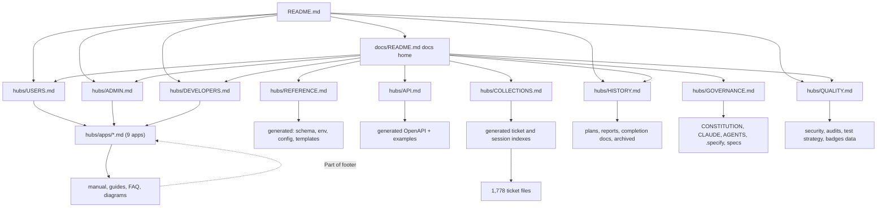
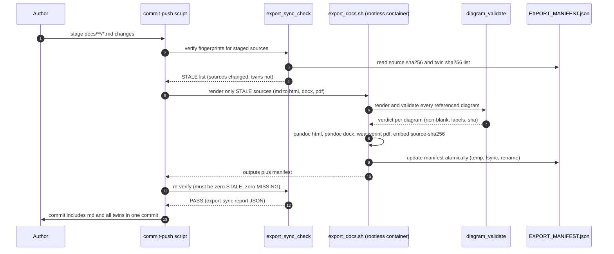
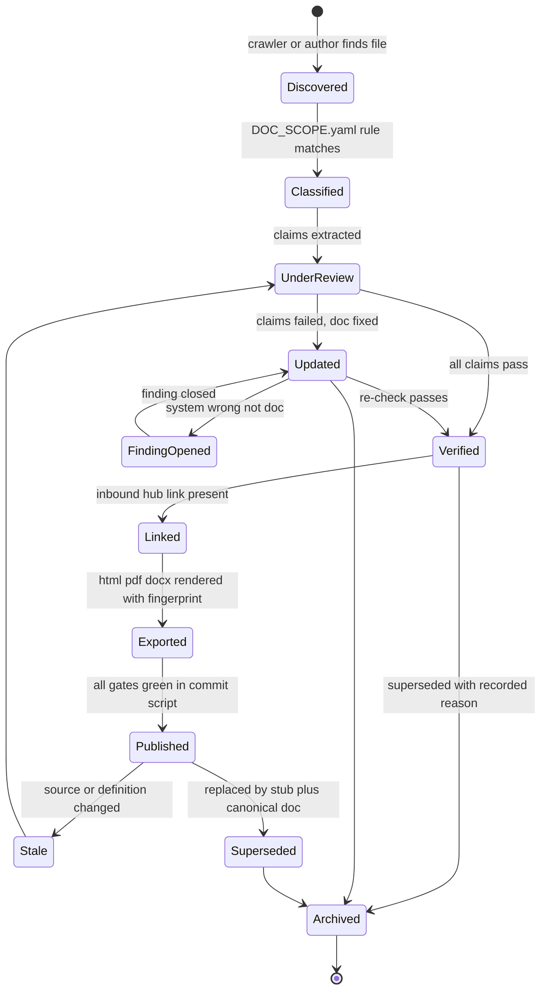

# 13 - Documentation Program Plan

| Field | Value |
|---|---|
| Revision | 4 |
| Created | 2026-10-03 |
| Last modified | 2026-10-03 |
| Status | draft (revision 4: the same-commit rule names the Catalogizer commit-push script (`scripts/commit-push-all.sh`, document 16 §12) instead of an `UNKNOWN:` binding, and records that registering `export_sync_check` as a commit-push S3 check is owed in tasks.md. Revision 3: the section 5 reachability note on this feature's plan set is marked resolved, with the crawler result of 2026-10-03. Revision 2: root Markdown groups counted exactly (37 report files, 6 working docs, document 03 §5.10 names them); disposition rows added for root items that are not Markdown or sit in hidden directories (`LICENSE`, `submodule-analysis.txt`, `.implementation/`, `.github/workflows/README.md`, `.pre-commit-config.yaml`); the feature's own plan set recorded as unreachable from `README.md` today) |
| Feature | specs/001-full-project-audit-remediation |
| Covers | FR-012, FR-013, FR-014, FR-015, SC-006, SC-007, SC-008 |
| Governance anchors | §11.4.12, §11.4.18, §11.4.44, §11.4.57, §11.4.59, §11.4.61, §11.4.65, §11.4.73, §11.4.86, §11.4.95, §11.4.106, §11.4.107(10), §11.4.122, §11.4.124, §11.4.186, §11.4.212, §11.4.215, §11.4.223, §11.4.257, §11.4.258, §11.4.259, §11.4.260 |

## Table of contents

1. Purpose and scope
2. Measured baseline (what is really in the repository)
3. Documentation scope model (what counts as "in-scope")
4. Information architecture and link-graph design (FR-013, SC-006)
5. Inventory and disposition per folder (FR-012)
6. Catalogue of new documents per application and service (FR-014, SC-007)
7. Diagram programme (FR-014, SC-007)
8. Export pipeline: md to html/pdf/docx with fingerprint gate (FR-012, SC-006)
9. README badge row and production-readiness gauge (§11.4.259/.260)
10. Definitions documentation: SQL, templates, configuration, API (FR-015, SC-008)
11. Document lifecycle, ownership and gates
12. Phased execution plan and work items
13. Acceptance evidence
14. Risks, decisions and rejected alternatives
15. Traceability
16. Appendix A: link crawler (executed). Appendix B: export-sync checker (executed). Appendix C: container toolchain, export script, schema/definition diff (NOT EXECUTED)

---

## 1. Purpose and scope

This document is the technical plan for the documentation workstream of the audit-and-remediation feature. It defines how every existing document is reviewed and reconciled with the current system, how every in-scope document becomes reachable from the root `README.md` by links, how missing manuals, guides, FAQs and diagrams are produced and proven non-blank, how exported copies are kept equal to their sources, and how SQL schemas, templates, configuration references and API definitions are generated from or diffed against the definitions the system really uses.

It does not restate the spec. It does not itself rewrite any documentation; it is the plan the implementation tasks will execute. All numbers below were measured in this planning session by read-only commands and by the crawler/checker in Appendices A and B, which were executed read-only against the working tree at `main` (HEAD `e4852ce7`, working tree with uncommitted `specs/001-.../docs/` only). Figures that were estimated by regular expressions are labelled as approximations.

Non-goals: translating documents (§11.4.255/.256 apply only if a translation workstream is opened; none is planned here), producing the video course recordings (existing `docs/video-course/` scripts are kept and linked, not re-recorded), rewriting submodule documentation (submodules are separate repositories; this plan links to them and gates only the pin-level claims, per §11.4.28).

---

## 2. Measured baseline

### 2.1 Corpus size

> **As of 2026-10-03T12:02Z, commit e4852ce7 plus untracked plan files** (re-run of `poc/doc_links/crawl_links.py --root .`): in scope 2,562; reachable 42; orphans 2,520; broken relative links 126; broken anchors 83. The first measurement taken earlier in the planning session was 2,540 / 42 / 2,498 / 84; the counts grow with every new file under `specs/` (31 Markdown files there now), and the broken-link count also differs because the shipped crawler counts images, HTML and anchors by its own rules. Figures below that still read 2,540 / 2,498 / 84 are the earlier session baseline; the reconciliation is in doc 19 section 7. Treat all of them as time-stamped, not constant.

| Measure | Value | How measured |
|---|---|---|
| Markdown files outside `submodules/`, `Upstreams/`, `node_modules/`, `.git/`, `vendor/` | 2,562 as of 2026-10-03T12:02Z (2,540 at first measurement) | `find` (also by crawler `in_scope`) |
| Markdown under `docs/` | 2,225 | `find docs -name '*.md'` |
| of which `docs/issues/` (QA vision tickets) | 1,778 (80%) | per-folder count |
| Markdown at repository root | 49 | `find . -maxdepth 1 -name '*.md'` |
| Markdown in `Website/` (VitePress) | 37 | crawler group |
| Markdown in `catalogizer-androidtv/` | 84 | crawler group |
| Markdown in `.specify/` + `.claude/` + `.remember/` | 43 + 15 + 3 | crawler group |
| HTML twins (repo, excluding build `index.html` shells) | 16 under `docs/` | `find` |
| PDF twins | 14 under `docs/` | `find` |
| DOCX twins | 0 (anywhere) | `find` |
| `.mmd` Mermaid sources | 20 | `find` |
| Markdown files containing a `mermaid` fence | 26 | `grep -l` |
| Pre-rendered SVG diagrams | 22 in `docs/diagrams/images/` | `ls` |
| Byte-identical Markdown groups | 6 groups, 6 redundant files | `md5sum` |

Non-issue `docs/` subfolder sizes: `video-course` 43, `status` 37, `courses` 35, `architecture` 26, `guides` 25, `testing` 23, `superpowers` 23, `security` 18, `scripts` 17, `reports` 17, `plans` 17, `qa` 12, `phases` 12, `deployment` 11, `manuals` 9, `design` 8, `runbooks` 7, `audits` 7, `website` 6, `api` 6, `tutorials` 5, `research` 5, `diagrams` 5, `nexus` 4, remainder 1-3; 59 top-level `docs/*.md` files.

### 2.2 Reachability from README (crawler, Appendix A, executed)

Starting at `README.md` and following every relative Markdown link (code fences stripped, directory links resolved to `README.md`/`index.md`):

| Metric | Value |
|---|---|
| In scope | 2,562 (2,540 at first measurement) |
| Reachable | 42 (1.6%) (1.7% at first measurement) |
| Orphans | 2,520 (98.4%) (2,498, 98.3% at first measurement) |
| Maximum link depth reached | 3 |
| Broken relative links (target missing) | 126 as of 2026-10-03T12:02Z by the shipped crawler (84 at first measurement; see doc 19 section 7 for the definitional reconciliation) |

Orphans by group (top): `docs/issues` 1,778; `catalogizer-androidtv` 84; `.specify` 43; `docs/video-course` 43; `Website` 37; `docs/status` 37; `docs/courses` 35; `catalog-api` 23; `docs/guides` 23; `docs/superpowers` 23; `docs/testing` 23; `docs/security` 18; `docs/architecture` 17; `docs/reports` 17; `docs/scripts` 17; `docs/plans` 16.

Specifically damaging: `docs/README.md` (the docs index, 120+ lines of well-organised navigation) is itself an orphan: the root README never links it (`grep -c 'docs/README.md' README.md` = 0). So are `docs/USER_GUIDE.md`, `docs/ADMIN_GUIDE.md`, `docs/INSTALLATION_GUIDE.md`, `docs/DEVELOPER_GUIDE.md`, `docs/API_CONTRACTS.md`, `docs/DATA_DICTIONARY.md`, `docs/DISASTER_RECOVERY.md`, `docs/MIGRATION_GUIDE.md`. §11.4.212 is violated for effectively the whole corpus; §11.4.57's tracked-items section is also absent from the root README.

### 2.3 Broken links (84 at first measurement; 126 by the shipped crawler as of 2026-10-03T12:02Z)

42 are inside `Website/` (VitePress runs with `ignoreDeadLinks: true` in `Website/.vitepress/config.ts`, which hides them). Non-Website notable groups:

- `README.md` links 7 targets under `HelixQA/docs/...` (`ocu-roadmap.md`, `releases/v4.0.0.md`, `security/`, `hooks/README.md`, `ocu-replay-format.md`, two website dirs). `HelixQA/` does not exist at the repo root (`ls -d HelixQA` fails); the code lives at `submodules/helix_qa/`. These are 7 of the 17 rows in README's "Key Documentation (start here)" table.
- `AGENTS.md`, `CLAUDE.md`, `GEMINI.md` link `Constitution.md` (the file is `CONSTITUTION.md`; case-sensitive filesystems break it).
- `docs/runbooks/ALERT_RUNBOOKS_INDEX.md` links six runbooks that do not exist (`SLOW_QUERIES.md`, `BRUTE_FORCE.md`, `DOS_ATTACK.md`, `NODE_DOWN.md`, `NETWORK_ISSUES.md`, `CERTIFICATE_EXPIRY.md`) and three other runbooks link them: 10 broken links. The runbook set (7 files) is smaller than its own index promises.
- `docs/plans/**` and `docs/reports/MASTER-COMPLETION-2026-04-11.md` link `superpowers/plans/2026-03-26-project-completion-plan.md` and `plans/2026-04-11-*` files that do not exist at the path used.
- `MASTER_IMPLEMENTATION_INDEX.md` links ADR-003/ADR-004 under `docs/architecture/decisions/` that are not present (only one file exists in `docs/decisions/` and the `decisions` dir under architecture holds fewer).
- `installer-wizard/TESTING.md` links three `docs/testing/*.md` files that do not exist.

### 2.4 Stale and contradictory claims (measured)

| Claim | Where | Reality (evidence) |
|---|---|---|
| Release `v2.1.0` | `README.md:584,615` (compose and deploy examples) | `versions.json` `global` = 2.3.0, build 25; `docs/database/SQL_MIGRATION_REFERENCE.md` header "Applies to Catalogizer v2.3.0+". `v2.1.0` also at `docs/VIDEO_COURSE_SCRIPTS.md:1991,2203`; four `package.json` files (`catalog-web`, `catalogizer-desktop`, `installer-wizard`, `submodules/catalogizer_api_client_ts`) declare `2.4.0`, a third divergent version. |
| OpenAPI version | `docs/api/openapi.yaml` `info.version: 2.0.0` | Same file last committed 2026-03-30; README last committed 2026-10-02. |
| "2,563 markdown files", "openapi.yaml (197 ops)" | `docs/DOCUMENTATION_AUDIT.md` (2026-04-22) | Measured today: 2,225 under `docs/`, 181 operations in the spec (and 174 path keys). The audit document is itself stale and says "massively over-spec on every written deliverable", which is the opposite of the reachability measurement. |
| Route coverage | `docs/api/openapi.yaml` | Regex route extraction from `catalog-api/main.go` finds 247 routes; 181 spec operations; 68 routes in code absent from the spec (e.g. `DELETE /api/v1/playlists/{id}`, `GET /api/v1/admin/config`, `GET /api/v1/admin/health`). Regex-derived, so approximate; the plan replaces it with a precise AST extractor (§10.4). |
| Schema docs | `docs/architecture/DATABASE_SCHEMA.md` (1,911 lines), `SQL_COMPLETE_SCHEMA.md` (1,298), `docs/DATA_DICTIONARY.md` (957), `SQL_MIGRATIONS.md` (1,966), `docs/database/SQL_MIGRATION_REFERENCE.md` (1,323) | Five overlapping schema documents. Word-level check against 60 `CREATE TABLE` names found in `catalog-api/database/*.go` and `database/migrations/*.sql` (3 of the 60 are test tables `temp_test_table`, `tx_cov`, `tx_test`, so 57 real): `DATABASE_SCHEMA.md` never mentions 23 real tables (`playlists`, `playlist_items`, `playback_sessions`, `cover_art`, `cover_art_cache`, `image_quality_assessments`, `share_identity_bindings`, `sync_sessions`, `sync_schedules`, `wizard_progress`, `crash_reports`, `log_collections`, `log_shares`, `media_progress`, `media_metadata_cache`, `assets`, `api_cache`, `cache_entries`, three `*_backup` subtitle tables, and others); `DATA_DICTIONARY.md` misses 25 real tables including `favorites`, `analytics_events`, `error_reports`. The Go migration list stops at version 20 (`catalog-api/database/migrations.go:15-34`). |
| Two competing migration systems | `catalog-api/database/migrations.go` (Go, versions 1-20, authoritative for the app) vs `catalog-api/database/migrations/*.sql` (numbering `000001-000003`, `014`, `015`, `020`) vs `catalog-api/migrations/005_*.sql`, `006_*.sql` vs `database/schema_v3_multiuser.sql` | `docker-compose.yml:20` mounts `./catalog-api/database/migrations` as `/docker-entrypoint-initdb.d:ro`; Postgres's init loader executes every `*.sql` in that directory alphabetically, which would include `*.down.sql` and `*.sqlite.up.sql`. `UNCONFIRMED:` whether this actually breaks a fresh Postgres boot; it must be proven by a containerised boot test, owned by the database audit (document 07 area) and recorded here only as a documentation-versus-definition drift candidate. |

### 2.5 Existing exports

- 12 distinct sources have html/pdf twins (CONTINUATION, `docs/features/Status`, five QA findings/status docs, three `identity_share_discovery` design docs, `llms_verifier_reconciliation`, `HelixQA_Models`, `run-helixqa-androidtv`, `firebase-api-key-exposure-20260629`, one superpowers spec). Twins are generated by pandoc (`<meta name="generator" content="pandoc">` in `docs/CONTINUATION.html`) and a PDF stage.
- Executed export-sync check (Appendix B): 36 twins audited (30 with a `.md` sibling, 6 are web-app `index.html` shells with no source); git commit-time staleness found 0, text similarity of HTML to Markdown 0.967-1.0. None carries a content fingerprint, so staleness is detectable only by timestamps, which `git checkout` and rebases do not preserve (§11.4.12 requires "mtime ordering and content hash agreement").
- Zero DOCX files exist, while §11.4.65 requires `.md` + `.html` + `.pdf` + `.docx` for the in-scope document set.
- A documented, deterministic exporter already exists in the constitution submodule: `submodules/constitution/scripts/render/render-governance-twins.sh` with `assets/governance-template.html5` (pandoc 3.10, `-f gfm`, `SOURCE_DATE_EPOCH`, weasyprint 69.0 for PDF, docx via stock pandoc). It is hard-wired to the five governance documents; the plan generalises it by reference (§8), it is not copied (§11.4.28).
- Host has `pandoc`, `weasyprint`, `mmdc` and `dot` installed in user space, and `podman`. Constitution §11.4.173/§11.4.161 still mandates containerised builds, so the plan runs rendering in a rootless container (Appendix C.1) and treats host binaries as a non-authoritative convenience only.

### 2.6 Existing per-application documentation

| Product | Manuals/guides present | Gaps (measured) |
|---|---|---|
| catalog-api (backend) | `docs/architecture/*`, `catalog-api/README.md`, `catalog-api/docs/{SERVICES,MEDIA_PLAYER_GUIDE,TESTING,examples}.md`, 23 md in total (several are historical `CONVERSION_*_COMPLETE.md` / `PHASE1_COMPLETION_REPORT.md` status reports) | No admin/operator manual in one place, no FAQ, no per-service runbook set beyond 7, OpenAPI incomplete |
| catalog-web | `docs/guides/WEB_APP_GUIDE.md`, `QUICKSTART_WEB.md`, `USER_MANUAL.md`, `catalog-web` 13 md | No dedicated web user manual under `docs/manuals/` (manuals folder has desktop, android, android TV, installer, admin, collections, entities, AI, subtitles) |
| catalogizer-android | `docs/manuals/ANDROID_USER_MANUAL.md` (163 lines), `docs/guides/ANDROID_GUIDE.md`, `QUICKSTART_ANDROID.md` | no FAQ |
| catalogizer-androidtv | `docs/manuals/ANDROIDTV_USER_MANUAL.md`, `ANDROID_TV_GUIDE.md`, 84 md in the module itself (many are generated test/QA/analysis dumps) | no FAQ; large unlinked mass |
| catalogizer-desktop (Tauri) | `docs/manuals/DESKTOP_USER_MANUAL.md`, `docs/guides/DESKTOP_GUIDE.md`, `docs/architecture/TAURI_IPC_GUIDE.md` | no FAQ |
| installer-wizard | `docs/manuals/INSTALLER_WIZARD_MANUAL.md`, `docs/guides/INSTALLER_WIZARD_GUIDE.md`, 6 md | broken `TESTING.md` links |
| catalogizer-api-client | 4 md | no consumer guide linked |
| Website (VitePress) | 37 md; `Website/faq.md`; `docs/website/FAQ.md` (a second FAQ) | duplicated content with `docs/` (`docs/website/*` vs `Website/*`, `Website/guides/*` vs `docs/guides/*`) |
| infra services (Postgres, Redis, nginx, Prometheus, Alertmanager, Grafana, OTel) | `docs/deployment/*` (11), `docs/runbooks/*` (7), `monitoring/` | runbook gaps (§2.3), no per-service reference sheet |

Existing manuals are 163-248 lines each: usable skeletons, not the "complete" manuals §11.4.257 demands (which asks for per-component coverage with task guides and FAQs from real questions).

---

## 3. Documentation scope model

The 80% generated mass and the governance machinery must not be treated like hand-authored product documentation. The scope is classified once, in a checked-in manifest, `docs/DOC_SCOPE.yaml` (new; owner: documentation lead; §11.4.215: a binding doc lives tracked in the repo), consumed by the crawler, the export checker and the gates. A path outside every rule is a gate failure ("unclassified"), which prevents silent exclusion.

| Class | Meaning | Reachability rule | Export rule |
|---|---|---|---|
| A. Product docs | manuals, guides, FAQ, architecture, API, runbooks, deployment, security, schema, templates reference | MUST be reachable from README within ≤3 hops through hubs | md+html+pdf+docx (§11.4.65) |
| B. Project-management docs | plans, reports, status, audits, phases, CONTINUATION, Issues/Fixed trackers | reachable via the `Project history` hub and the §11.4.57 tracked-items section | md+html+pdf (+docx for Status/Status_Summary, §11.4.153) |
| C. Generated record collections | `docs/issues/*.md` (QA tickets), `docs/qa/**` evidence, `docs/reports/qa-sessions/**` | reachable via ONE generated index page per collection (deterministic, fingerprinted); individual members count as reachable through that index | index only |
| D. Governance/agent files | `CLAUDE.md`, `AGENTS.md`, `GEMINI.md`, `CONSTITUTION.md`, `.specify/**`, `.claude/**`, `.remember/**`, `specs/**` | reachable via the `Governance and process` hub; export rules per constitution | per constitution |
| E. Submodule docs | `submodules/**` | out of scope for crawling; hub links to each submodule README (45 submodules, `ls submodules` = 45) | none |
| F. Vendor/third-party | `node_modules`, `vendor`, `Upstreams` | excluded by closed-class exclusion (§11.4.224(E) pattern: generated / vendored / fixtures) | none |

Decision D-13-01: class C members are linked through generated indexes rather than hand-linked from README. Hand-linking 1,778 tickets from README would make it unreadable; the spec's SC-006 requires "reachable by following links", and an index page that links every member satisfies that mechanically. The index is generated from front matter (`id`, `severity`, `status`, `found_date`, `platform`).

Decision D-13-02: `docs/issues/` has an ID integrity defect that the documentation plan must surface rather than hide: 1,778 files carry only 676 distinct `id:` values (`HELIX-001` up to `HELIX-005` each appear in 8 files); statuses are `resolved` 704, `fixed` 492, `closed` 299, `wontfix` 282, `open` 1. The index generator MUST key on file path, show the colliding `id` as a data-quality warning, and open a finding in the register (spec FR/§11.4.54 id-uniqueness; reuse is a violation of the "never reuse ids" rule). The renumbering itself is a finding owned by the register workstream (document 04), not performed by documentation.

---

## 4. Information architecture and link-graph design

### 4.1 Principles

1. README is the single root (§11.4.212). It keeps its identity as a product front page but its first screen becomes a navigation surface: badge row (§9), a one-paragraph description, a persona router, then the existing feature sections.
2. Hubs, not flat lists. Every application and every audience has one hub page. Hubs link down to documents; documents carry a "Part of" footer line linking back to their hub (this makes orphans visible when a document is added without being linked, because the footer check requires an inbound link from a hub).
3. Depth ≤ 3 from README for every class A document: README → audience/app hub → document. Class B/C/D at depth ≤ 4.
4. One canonical document per topic. Duplicates are merged (§5) and the old paths become redirect stubs for one release (stub = three-line file with link + `Status: superseded`), never silent deletion (§11.4.122/.124).
5. All links relative, with the file extension, and checked in CI-less local gate (§11.4.156 forbids CI/CD; enforcement is the local `scripts/` gate invoked by the commit/push script, §11.4.234).

### 4.2 Hub structure (new files under `docs/hubs/` plus rewritten `docs/README.md`)

| Hub | Path | Audience | Links to |
|---|---|---|---|
| Docs home | `docs/README.md` (rewrite; linked from README) | everyone | all other hubs |
| End users | `docs/hubs/USERS.md` | operators of the apps | per-app manuals (web, desktop, android, android TV, installer), task guides, FAQ index |
| Administrators/operators | `docs/hubs/ADMIN.md` | self-hosters | install, configuration, deployment, monitoring, backup/DR, runbooks, security hardening, upgrade/migration |
| Developers | `docs/hubs/DEVELOPERS.md` | contributors | architecture, backend/web/android/desktop guides, API reference, schema reference, testing guide, build system, contribution rules |
| API consumers | `docs/hubs/API.md` | integrators | OpenAPI (generated), WebSocket events, TypeScript client, authentication, examples |
| Reference | `docs/hubs/REFERENCE.md` | everyone | generated schema, env var reference, config reference, template reference, error codes, glossary |
| Quality and security | `docs/hubs/QUALITY.md` | reviewers | test strategy, coverage matrix, security docs, audit reports, findings register export, production-readiness tracker |
| Project history | `docs/hubs/HISTORY.md` | maintainers | plans, phase/completion reports, status docs, changelog, CONTINUATION, Issues/Fixed |
| Generated collections | `docs/hubs/COLLECTIONS.md` | maintainers | generated indexes: QA tickets, QA sessions, evidence folders |
| Governance | `docs/hubs/GOVERNANCE.md` | contributors | CONSTITUTION, CLAUDE/AGENTS/GEMINI, `.specify/memory`, this feature's spec/plan docs |
| Applications | `docs/hubs/apps/<app>.md` x 9 | per app | manual, guides, FAQ, diagrams, release notes, module README, source-level guide for that app |
| Website | `docs/hubs/WEBSITE.md` | web team | VitePress source map, publish pipeline, content-sync matrix with `docs/` |

The nine application hubs: `catalog-api`, `catalog-web`, `catalogizer-android`, `catalogizer-androidtv`, `catalogizer-desktop`, `installer-wizard`, `catalogizer-api-client`, `website`, `infrastructure` (Postgres/Redis/nginx/monitoring stack). A tenth hub `qa-ai-system` / HelixQA integration covers `qa-ai-system/` and `challenges/`; UNCONFIRMED whether `qa-ai-system/` is still active (3 md found); the audit disposes it (§5).

The root README gains two compact tables replacing the ten stale "Key Documentation" rows: (a) "Start here by role" (7 links to hubs), (b) "Tracked items and status documents" (§11.4.57). The 7 dead `HelixQA/...` rows are repointed to `submodules/helix_qa/...` if the targets exist there, else marked `[GAP: id]` per §11.4.223 and tracked, never left broken.

### 4.3 Link-graph (target)



### 4.4 Link rules enforced by the crawler

- R1: every in-scope file has ≥1 inbound link from a file whose own class is A/B hub or an index (orphan = fail).
- R2: no broken relative link (target exists, anchor exists for `#anchor` links: anchors verified against GitHub-style slugs of target headings).
- R3: no link to a path outside the repository clone except `http(s)` (checked separately for liveness in an optional, network-permitted mode; offline gate ignores external URLs and counts them).
- R4: hub depth: BFS distance from README ≤ 3 (class A), ≤ 4 (B, D), index members ≤ 5.
- R5: case-sensitive resolution (the `Constitution.md` vs `CONSTITUTION.md` failure class).
- R6: README link set contains the mandated sections (§11.4.57 tracked-items, §11.4.259 badge row, hub table).

---

## 5. Inventory and disposition per folder

Disposition vocabulary: KEEP (reviewed, updated), UPDATE (stale content fixed in place), MERGE (content folded into a canonical document; source becomes a stub for one release), ARCHIVE (moved under `docs/archive/<yyyy>/` with reason; link from HISTORY hub; never deleted), GENERATE (replaced by generator output), DECIDE (needs operator §11.4.66 decision before disposition). Nothing is deleted. Each ARCHIVE/MERGE writes a row in `docs/DOC_DISPOSITION.md` (document, class, decision, reason, evidence: `git log` pointer, replacement link) so a reviewer can verify §11.4.122/.124 compliance.

| Folder / group | Count | Disposition | Reason and method |
|---|---:|---|---|
| `README.md` (root) | 1 | UPDATE | repoint 7 dead links, version strings (`v2.1.0` → read from `versions.json`), add badge row/hub tables, remove claims contradicted by §2.4 |
| Root completion/report files (`ALL_ISSUES_FIXED`, `FINAL_*_REPORT`, `PHASE_*_REPORT`, `COMPLETE_*`, `IMPLEMENTATION_*`, `*_SUMMARY`, `COMMIT_SUMMARY`, etc.; revision 2: exactly 37 of the 49 root Markdown files, which are the 49 less `README.md`, the 5 governance files and the 6 working docs; document 03 §5.10 names each; `SECURITY_KEY_ROTATION_REQUIRED.md` stays in place while its action is open) | 37 | ARCHIVE to `docs/archive/2026/` with stub at old path for one release, linked from HISTORY | historical status snapshots dated before the current audit; they contradict each other ("FINAL_COMPLETION_REPORT" vs "REMAINING_ISSUES_REPORT"); exact list produced by script by `git log` date + name pattern, then reviewed; `DECIDE` for any file still cited by a gate (grep for inbound references first, §11.4.124) |
| Root governance: `CLAUDE.md`, `AGENTS.md`, `GEMINI.md`, `CONSTITUTION.md`, `MEMORY.md` | 5 | KEEP | fix `Constitution.md` casing; §11.4.157 lockstep check |
| Root working docs: `QUICK_REFERENCE.md`, `GETTING_STARTED.md`, `TASK_TRACKER.md`, `MASTER_EXECUTION_CHECKLIST.md`, `MASTER_IMPLEMENTATION_INDEX.md`, `MASTER_IMPLEMENTATION_PLAN_PHASES.md` | 6 | MERGE or KEEP | `GETTING_STARTED.md` → merged into `docs/INSTALLATION_GUIDE.md` + `docs/guides/QUICKSTART_*`; `TASK_TRACKER.md`/`MASTER_EXECUTION_CHECKLIST.md` exist both at root and `docs/` (duplicate names); keep the live one, archive the other |
| `docs/*.md` top level | 59 | UPDATE/ARCHIVE | product guides (`USER_GUIDE`, `ADMIN_GUIDE`, `INSTALLATION_GUIDE`, `DEPLOYMENT_GUIDE`, `CONFIGURATION_GUIDE`, `TROUBLESHOOTING_GUIDE`, `DEVELOPER_GUIDE`, `DISASTER_RECOVERY`, `MIGRATION_GUIDE`, `DATA_DICTIONARY`, `ENV_VARIABLES`, `API_CONTRACTS`, `CONTRIBUTING`, `CHANGELOG`, `LANDMINES`) KEEP+UPDATE; `*_AUDIT.md`, `*_COMPLETION*`, `PHASE_15_STATUS`, `CYCLE_CLOSURE_*`, `SESSION_*`, `UNFINISHED_WORK_*` → HISTORY/ARCHIVE |
| `docs/issues/` | 1,778 | GENERATE index, KEEP files | class C (§3); ID-collision finding to register |
| `docs/video-course/`, `docs/courses/` | 43 + 35 | KEEP, link from USERS hub (`Learn`) | overlap check: `docs/VIDEO_COURSE_SCRIPTS.md`, `docs/video-course/*`, `docs/courses/scripts`, `Website/course.md`: decide canonical script location; MERGE overlaps |
| `docs/status/` | 37 | ARCHIVE mostly; keep Status/Status_Summary pair per §11.4.153 | many are `*_COMPLETE*` snapshots |
| `docs/guides/` | 25 | KEEP+UPDATE | add per-app FAQ links; resolve 4 broken links |
| `docs/manuals/` | 9 | KEEP+EXPAND | see §6 |
| `docs/architecture/` | 26 | KEEP+UPDATE; MERGE schema docs | see §10.1; add `decisions/` ADR-003/004 stubs or fix links |
| `docs/api/` | 6 | KEEP; `openapi.yaml` GENERATE+DIFF | see §10.4 |
| `docs/database/`, `docs/architecture/{DATABASE_SCHEMA,SQL_COMPLETE_SCHEMA,SQL_MIGRATIONS}.md`, `docs/DATA_DICTIONARY.md` | 1 + 4 | MERGE into one generated schema reference + one hand-written migration/operations guide | five overlapping docs, see §10.1 |
| `docs/deployment/` | 11 | KEEP+UPDATE | podman rootless compose alignment (repo moved to rootless Podman in commit `c4e3098a`) |
| `docs/runbooks/` | 7 | KEEP + EXPAND | create the 6 missing runbooks or remove the index promises, decision per runbook, §6.3 |
| `docs/security/`, `docs/superpowers/`, `docs/testing/`, `docs/qa/`, `docs/reports/`, `docs/plans/`, `docs/phases/`, `docs/audits/`, `docs/nexus/`, `docs/design/`, `docs/research/` | ≈180 | KEEP (class B/D); ARCHIVE stale plans | reviewed for stale versions and dead links only; superseded plans archived with reason |
| `docs/website/` (6) vs `Website/` (37) | 43 | MERGE | one source of truth: VitePress `Website/` is canonical for public content; `docs/website/*` become stubs or are generated from Website sources |
| `docs/diagrams/`, `docs/architecture/*.mmd`, `docs/diagrams/sources/*.mmd` | 5 + 15 + 5 | MERGE into one diagram source tree | see §7 |
| `catalog-api/*.md` (23) | 23 | ARCHIVE the historical `CONVERSION_*_COMPLETE`, `PHASE1_COMPLETION_REPORT`, `TEST_FIX_SUMMARY`, dated `test_report_*.md` and root `result_*.json`; KEEP `README`, `ARCHITECTURE`, `docs/*` | root clutter in a service directory |
| `catalogizer-androidtv/` | 84 | triage: KEEP README/architecture/testing; ARCHIVE or GENERATE-index the dumps | exact classification script-driven |
| `Website/` | 37 | KEEP+UPDATE; remove `ignoreDeadLinks: true` | the VitePress build then fails on dead links (a real gate) |
| `templates/` (4 md) | 4 | KEEP; document in §10.2 | |
| `.specify/`, `.claude/`, `.remember/`, `specs/` | 71 | KEEP (class D) | governance hub |
| `LICENSE` (root, Apache-2.0 text; revision 2) | 1 | KEEP | linked from the README hub (§11.4.212); the licence findings of document 15 §10.5 (40 own-organisation repositories without a licence file) may change README and per-module docs |
| `submodule-analysis.txt` (root, 368 lines, generated 2026-04-14 for "all 41 submodules"; revision 2) | 1 | DECIDE (owner) | stale snapshot (`.gitmodules` now declares 44); regenerate from the verifier report, archive, or retire; never deleted on sight (§11.4.122, §11.4.124); also a document 03 source |
| `.implementation/` (2 validation reports dated 2026-04-17 plus 4 empty progress markers; revision 2) | 6 | KEEP as a document 03 source (S-24); ARCHIVE after the register import cites them | the bulk-closure report is evidence for the register, not current documentation |
| `.github/workflows/README.md` (revision 2) | 1 | KEEP+UPDATE | it must state that no workflow runs here (§11.4.156) and point to the local enforcement of document 16 §16.1 |
| `.pre-commit-config.yaml` (not Markdown; revision 2) | 1 | DECIDE (owner), documented meanwhile | not installed and not runnable as configured (document 16 §3.4); `docs/scripts/commit-push-all.md` records where each of its checks now runs |

Reachability of this feature's own plan set (revision 2, measured by the plan-set hygiene sweep with `poc/doc_links/crawl_links.py`): none of the 32 Markdown files under `specs/001-full-project-audit-remediation/` was reachable from the root `README.md`, and `spec.md` linked to none of its siblings. Resolved (revision 3, 2026-10-03): the root `README.md` now links the feature index `specs/001-full-project-audit-remediation/README.md`, which links every plan document; `crawl_links.py --root . --start README.md` (read-only, exit 0) reaches all 33 tracked Markdown files of the folder (the control needle `spec.md` among them), with 0 broken links and 0 broken anchors whose source is in the folder, every file at depth 1 or 2 from the root README. The D1 README hub of §11.4.212 still has to keep this path when it is rebuilt; the crawler rules of section 4.4 re-measure it on every run.

Required measure of success for FR-012: every file in a KEEP/UPDATE row has a recorded review (reviewer, date, evidence of verification against code/config/runtime, `reviewed:` front-matter field), and the `DOC_DISPOSITION.md` row count equals the number of non-KEEP files.

### 5.1 Review procedure per document (FR-012)

1. Extract machine-checkable claims: versions, ports, env var names, API paths, CLI flags, commands, file paths, table names, screen names. A claims extractor (regex + the structural index, `codegraph explore`) lists them.
2. Verify each claim against the real definition: env vars against `docs/ENV_VARIABLES.md` generator (§10.3); paths with `test -e`; API paths against the route extractor; tables against the live migrations; versions against `versions.json`; commands by running them in the dev container (where non-destructive) or marking `UNVERIFIED:`.
3. Fix the document or open a finding (document 04 register) when the system, not the document, is wrong.
4. Stamp front matter: `revision`, `last_modified`, `verified_against: <git sha>`, `verified_by`. §11.4.44 revision headers and §11.4.61 metadata table are mandatory for structured documents; the template in §6.5 prescribes them.
5. Record the review in `docs/DOC_REVIEW_LEDGER.csv` (path, class, verdict, claims_checked, claims_failed, commit). The ledger is the evidence for "every document reviewed".

Throughput estimate: class A + B hand-reviewed documents ≈ 320 (59 top-level + guides 25 + manuals 9 + architecture 26 + deployment 11 + testing 23 + security 18 + the rest of curated sets) ; class C/D by index/automated checks only. This is an estimate to size the work, `UNKNOWN:` exact until `DOC_SCOPE.yaml` classification runs.

---

## 6. New documents required per application and service

§11.4.257 requires a manual, task guides and a FAQ per component/service/feature. FR-014 adds diagrams. The standard document set per application is: **M** user manual, **G** task guides, **F** FAQ, **A** admin/operations guide (where deployable), **D** developer guide, **R** runbooks (services), **X** diagrams. Existing documents satisfy part of the set and are extended, not replaced.

### 6.1 Coverage matrix (current state vs target)

| Application / service | M | G | F | A | D | R | X |
|---|---|---|---|---|---|---|---|
| catalog-api | N/A (service) | partial | NEW | partial (`docs/ADMIN_GUIDE.md`, `manuals/ADMIN_USER_GUIDE.md`) | EXISTS (`architecture/GO_BACKEND_GUIDE.md`) | partial 7/13 | partial |
| catalog-web | EXPAND (no dedicated manual) | partial | NEW | n/a | EXISTS (`REACT_FRONTEND_GUIDE`) | n/a | NEW |
| catalogizer-android | EXISTS 163 lines → EXPAND | partial | NEW | n/a | EXISTS (`ANDROID_ARCHITECTURE`) | n/a | partial |
| catalogizer-androidtv | EXISTS → EXPAND | partial | NEW | n/a | partial | n/a | NEW |
| catalogizer-desktop | EXISTS → EXPAND | partial | NEW | n/a | EXISTS (`TAURI_IPC_GUIDE`) | n/a | partial |
| installer-wizard | EXISTS → EXPAND | partial | NEW | partial | NEW | n/a | NEW |
| catalogizer-api-client | n/a | NEW | NEW | n/a | NEW | n/a | NEW |
| Website | n/a | NEW (content-authoring guide) | EXISTS twice → MERGE | NEW (publishing) | NEW | n/a | NEW |
| infrastructure (Postgres/Redis/nginx/Prom/Grafana/Alertmanager/OTel) | n/a | NEW | NEW | partial (`deployment/*`) | n/a | NEW | partial |
| qa-ai-system, challenges, HelixQA integration | NEW (operator manual: `docs/qa/QA_TESTING_GUIDE.md` seed) | NEW | NEW | n/a | partial | n/a | NEW |

Cells marked NEW or EXPAND become work items in the task list (`/speckit-tasks` after this plan). Each NEW document is created from the template in §6.5 and begins as a skeleton with every section carrying either real content or an explicit `[GAP: id]` marker (§11.4.223), so the tracker, not silence, represents the unfinished part.

### 6.2 Outlines

**User manual (per client app: web, desktop, android, android TV, installer)** — sections: 1 What the app is and who it is for; 2 Requirements and supported platforms; 3 Install/first launch; 4 Sign in and account; 5 Add a storage source (SMB/FTP/NFS/WebDAV/local; the five protocols the README lists); 6 Browse and search; 7 Playback, subtitles, playlists, favorites; 8 Collections and metadata editing; 9 Conversion jobs; 10 Settings; 11 Offline behavior and resilience (README "SMB Resilience" section content moved here); 12 Accessibility and keyboard/remote control map; 13 Troubleshooting pointer and FAQ link; 14 Screenshots table (each image produced by the §11.4.170 host-rendered pipeline or the QA recording corpus, with alt text). Each step is written as numbered task steps ("Do X; you should see Y") so that the manual can be validated by the HelixQA/userflow runs (§11.4.143 real-user-journey).

**Task guides (per app)** — one file per task under `docs/guides/<app>/`: e.g. web: `connect-an-smb-share`, `scan-and-identify-media`, `fix-wrong-metadata`, `play-with-subtitles`, `create-a-playlist`, `convert-a-file`, `share-with-another-user`, `back-up-and-restore`. Each: goal, prerequisites, steps with expected result, verification, rollback, troubleshooting, related FAQ. Task list is derived from the web route table and the API (`catalog-web` pages and `catalog-api` handler groups), not invented.

**FAQ (per app, plus a global FAQ hub page)** — sourced from real questions: `docs/issues/*.md` tickets (QA vision findings, filtered to user-facing confusion), `docs/TROUBLESHOOTING_GUIDE.md`, support doc `Website/support.md`, `docs/website/FAQ.md`, `Website/faq.md`, runbook symptoms. Each entry: question verbatim or normalised, answer, link to manual section, `source:` field naming the real origin (ticket id or runbook). The two existing FAQs are merged under this schema. §11.4.257 requires "properly created FAQs derived from real questions"; the `source:` field makes derivation auditable and a lint rejects an entry without one.

**Admin/operator guide (catalog-api + infra)** — install via rootless Podman compose (`docker-compose.yml` is run with `podman compose`, consistent with commit `c4e3098a`), configuration reference link, TLS/nginx, users/roles/permissions, storage-source management, backup/restore (`docs/deployment/BACKUP_AND_RECOVERY.md`), upgrade/migrations, monitoring/alerting (`monitoring/`), scaling, security hardening, log management, disaster recovery, capacity planning.

**Developer guide (per app)** — repository layout, build in container (`scripts/build_in_container.sh`, §11.4.173), test commands per test type, module/submodule map, extension points, coding conventions, release process (`versions.json` flow), debugging. Existing guides are verified and extended; per-app additions for installer-wizard, api-client, Website.

**Runbooks (services)** — alert-driven, one per alert in `monitoring/alerts/`. Method: list alert names from the alert rule files; map each to a runbook file; the six missing ones named by the existing index are created (`SLOW_QUERIES`, `BRUTE_FORCE`, `DOS_ATTACK`, `NODE_DOWN`, `NETWORK_ISSUES`, `CERTIFICATE_EXPIRY`) with: symptom, impact, detection (alert expression), triage steps (commands), mitigation, resolution, verification, post-incident. A gate maps every alert to an existing runbook link (`annotations.runbook_url`).

### 6.3 Per-service reference sheets

`catalog-api` services are listed under `catalog-api/services/*.go` (analytics, auth, challenge, configuration, configuration wizard, conversion, error reporting, favorites, log management, playlist, reporting, sync, WebDAV client) and `catalog-api/internal/*` (auth, cache, concurrency, config, eventbus, firebase, handlers, httpclient, infra, lifecycle, logging, media, metrics, middleware, models, modules, monitoring, recovery, smb, tests). The existing `catalog-api/docs/SERVICES.md` is the seed; each service gets a reference sheet (purpose, public API, config keys, tables touched, events emitted, failure modes, metrics) generated partly from code (exported symbols via `go doc -all` in a container, handler routes via the AST extractor) and completed by hand. Sheets live in `docs/reference/services/<service>.md` and are linked from the catalog-api hub.

### 6.4 Document counts forecast

| Type | Existing usable | NEW | EXPAND |
|---|---:|---:|---:|
| User manuals | 5 | 1 (web) + 1 (QA operator) | 5 |
| Task guides | ≈12 guides/tutorials | ≈45 (≈8 per client app ×5 + admin ≈10 + api-client ≈4) | 12 |
| FAQs | 2 | 9 per-app + 1 hub | merge 2 |
| Admin/operator guides | 3 | 2 | 3 |
| Developer guides | 8 | 4 (installer, api-client, Website, QA) | 8 |
| Runbooks | 7 | 6 + one per alert without runbook (count `UNKNOWN:` until alert enumeration) | 7 |
| Service reference sheets | 1 (SERVICES.md) | ≈13 services + ≈20 internal packages (sheets for internal packages only where public behavior exists) | 1 |

Forecast figures are planning estimates; the task list fixes the final counts after the claims/alerts enumeration.

### 6.5 Document template (§11.4.44/.61)

```markdown
# <Title>

| Field | Value |
|---|---|
| Revision | 1 |
| Created | YYYY-MM-DD |
| Last modified | YYYY-MM-DD |
| Status | draft / active / superseded |
| Audience | user / admin / developer / api |
| Applies to | catalogizer <version from versions.json> |
| Verified against | <git sha>, <date>, <method: code/runtime/container> |
| Part of | [<hub name>](../hubs/<hub>.md) |
| Source of truth | <path or "hand-written"> |

## Table of contents
...
```

A lint requires the metadata table, a ToC for documents over 150 lines, a `Part of` link, and no `TODO`/`FIXME`/`lorem` (the zero-shortcomings ledger §11.4.261 counts them).

---

## 7. Diagram programme

### 7.1 Catalogue

§11.4.258 requires four classes embedded where used, open-format, rendered non-blank, reachable, synced. Existing assets: 20 `.mmd` files (15 in `docs/architecture/`: `android-architecture`, `api-request-flow`, `auth-flow`, `build-pipeline`, `challenge-system`, `database-erd`, `deployment-topology`, `lazy-initialization-flow`, `media-pipeline`, `security-scanning-pipeline`, `semaphore-control-flow`, `system-overview`, `test-coverage-matrix`, `websocket-events` and more; 5 in `docs/diagrams/sources/`), 22 pre-rendered SVGs in `docs/diagrams/images/` (names such as `entity-relationship-1..5`, `sequence-diagrams-1..10`, `system-architecture-1..4`, `component-interaction-1..3`), and 26 Markdown files with inline mermaid fences. `docs/diagrams/sources/README.md` says rendering is done "via mermaid-cli (mmdc) in a container" but no committed script performs it (no render script found under `scripts/`; `UNCONFIRMED:` whether one exists elsewhere), and the committed SVGs have no recorded source hash, so they may be stale.

| Class | Diagram set (target) | Existing seed | Embedded in |
|---|---|---|---|
| Architecture | C4 context; containers (api, web, desktop, android, android TV, installer, Postgres/SQLite, Redis, nginx, monitoring stack); component diagram of catalog-api layers (Handler→Service→Repository→DB); deployment topology (compose, rootless Podman, thinker/amber hosts per `deployment/thinker-up.sh`, `amber-up.sh`); security boundary / trust diagram; CI-less local gate pipeline | `architecture.mmd`, `system-overview.mmd`, `deployment-topology.mmd`, `component-interaction-*.svg` | root README, ARCHITECTURE.md, admin guide, per-app hubs |
| Data flow | scan → identify → enrich → persist → serve (media pipeline); auth token flow; subtitle fetch/sync; conversion job flow; sync/WebDAV flow; metrics/log flow to Prometheus/Grafana; SMB offline cache flow | `media-pipeline.mmd`, `api-request-flow.mmd`, `media-aggregation.mmd` | architecture docs, developer guides, per-service sheets |
| State machine | media conversion job; sync session; SMB connection (connected/degraded/offline/recovering/circuit open per the README "Connection States"); playback session; auth session/token refresh; media entity identification lifecycle; installer-wizard steps; documentation lifecycle (§11, itself) | partly in README prose | manuals (user-visible states), developer guides |
| Sequence | per critical workflow: login+refresh, add storage source, scan and identify, play with subtitles, favorite/playlist update, conversion request, WebSocket event delivery, backup/restore, installer run, desktop IPC call (Tauri), Android TV Watch Next/deep link (`tv-channels-flow.mmd`) | `auth-flow.mmd`, `sequence-diagrams-*.svg`, `websocket-events.mmd`, `tv-channels-flow.mmd` | task guides and developer guides at the step they explain |
| ER | one ER diagram per schema domain (auth, catalog, media entities, subtitles, conversion, sync, playlists/playback, cover art/quality, services/config, identity bindings) generated from the live schema (§10.1), not hand-drawn | `database-erd.mmd`, `entity-relationship-*.svg` | generated schema reference |

Count of diagrams to produce is derived from a table `docs/diagrams/CATALOGUE.yaml` (new) listing each diagram: `id`, `class`, `app`, `source` path, `embedded_in` list, `render` formats, `validation`. Target at plan time: ≥ 9 architecture, ≥ 8 data-flow, ≥ 8 state-machine, ≥ 12 sequence, ≥ 10 ER = ≥ 47 diagrams; that is a planning floor, tied to the application/service list in §6, to be confirmed when `CATALOGUE.yaml` is populated. Each application's hub and manual must embed at least one diagram of each class that exists for it (SC-007 "its diagrams").

### 7.2 Source-of-truth and tooling

- Mermaid source in `.mmd` files under `docs/diagrams/src/<class>/<id>.mmd` is canonical (open format, diffable, §11.4.220 principle). Inline mermaid fences in Markdown are allowed for small diagrams but are extracted by the pipeline into the same catalogue (`<doc>#diagram-N` ids) so they are rendered and validated as well.
- ER diagrams and the schema reference are generated, never edited (§10.1).
- Rendering: `mermaid-cli` (`mmdc`) with a pinned Chromium inside a rootless Podman image (Appendix C.1), `--no-sandbox` is NOT acceptable; use Podman's user namespace and `PUPPETEER_` args file with the documented container flags; the image build is itself a containerised build (§11.4.173). `dot` (Graphviz) is a fallback for graph-only sources if Mermaid cannot express a diagram.
- Output: SVG (embedded in html/pdf/docx exports) and PNG fallback (docx). Markdown embeds the image with the source in a collapsed block or a link to the `.mmd`, and keeps the inline mermaid fence for GitHub/VitePress native rendering where supported.

### 7.3 Validation: rendered and non-blank (§11.4.107(10), §11.4.258)

A diagram passes only if all checks pass, executed by `scripts/docs/diagram_validate.py` (Appendix C.3 describes the contract):

1. Render exit code 0 and a stderr that contains no `Parse error`.
2. Output file exists; SVG size ≥ 1 KB; PNG decodes.
3. SVG structural check: ≥ N drawable elements (`<path>`, `<rect>`, `<text>`, `<g>`), and ≥ 80% of node labels of the source (labels extracted from the `.mmd` source by a regex) appear as `<text>` or `<foreignObject>` content in the SVG. This detects blank or truncated renders, and it detects the known Mermaid failure of rendering an error bomb SVG (which contains the text "Syntax error in text"; the validator rejects that string).
4. Raster check on the PNG: not-uniform (pixel standard deviation above a threshold) and ink ratio between 0.5% and 60% (blank white and solid dark both fail). OCR cross-check with `tesseract` inside the container for the label set (≥ 70% of labels recognised; threshold is consumer DATA and recorded in `CATALOGUE.yaml`).
5. Self-validation (§11.4.107(10)): the validator ships a golden-good diagram, a golden-bad (syntax error → error SVG) and a golden-blank (empty graph) fixture; the validator's own test asserts the verdicts PASS/FAIL/FAIL, so a validator that passes its golden-bad is detected.
6. Sync check: SVG metadata carries `source-sha256` of the `.mmd`; mismatch = stale (gate fail).
7. Embedding check: the document that declares `embedded_in` really contains the image/include link (link crawler extension: image links count as edges for the diagram only, not for reachability of docs).

Evidence: a JSON verdict per diagram (`docs/diagrams/EVIDENCE/<id>.json`: render tool version, sha256 of source and output, element count, labels matched, ink ratio, OCR match, verdict) aggregated in `diagram_report.json` (§11.4.262 machine-created evidence).

---

## 8. Export pipeline (md → html / pdf / docx)

### 8.1 Requirements

R-E1 (§11.4.65): every class A and B in-scope document has `.html`, `.pdf` and `.docx` siblings (class D per constitution; class C only for the generated index pages). R-E2 (§11.4.12/.106): exports are regenerated in the same commit as their source edits. R-E3 (§11.4.86): drift is detected by a content fingerprint, not by mtimes. R-E4: deterministic output (re-running on unchanged input yields byte-identical files). R-E5: runs in a rootless container (§11.4.161/.173). R-E6: no silent partial output (§11.4.255 spirit applied to rendering: a failed render exits non-zero and writes nothing).

Volume consideration: ~320 hand-curated documents × 3 formats ≈ 960 binary files committed. Binary twins in git are mandated by §11.4.65, and constitution §11.4.30 forbids versioned build artifacts in general; the reconciliation is that §11.4.65 twins are explicitly required documents. To keep the repository light: PDF and DOCX twins are generated for the curated set only (not class C), and size is tracked (`docs/EXPORT_MANIFEST.json` records bytes); `UNKNOWN:` the repository size increase until the first full render; threshold: stop and ask the operator (§11.4.66) if the total twin payload exceeds 150 MB.

### 8.2 Design

- Generalise by reference the constitution's `render-governance-twins.sh` recipe: pandoc `-f gfm -t html5 -s --template=<governance-template.html5>`, docx via `pandoc -f gfm -t docx`, PDF via `weasyprint <html> <pdf>`, `SOURCE_DATE_EPOCH` pinned. A project-level wrapper `scripts/docs/export_docs.sh` reads the export set from `docs/EXPORT_SCOPE.txt` (derived from `DOC_SCOPE.yaml` classes A, B, D-selected) and renders every document; the template file is referenced from the constitution submodule path (inherited, not copied, §11.4.28/.177), with an OpenDesign project stylesheet appended for product docs (§11.4.162 tokens; the tokens file location is `UNKNOWN:` until the design-token audit names it).
- Mermaid handling in exports: pre-pass replaces each diagram reference with the validated SVG (html) / PNG (docx) / embedded SVG (pdf).
- Fingerprint: each export embeds the source sha256, the template sha256 and the toolchain version: HTML `<meta name="source-sha256" content="…">`, PDF `/Keywords` or XMP field `source-sha256`, DOCX `docProps/custom.xml` property. `docs/EXPORT_MANIFEST.json` maps `source → {sha256, outputs[{path, sha256, bytes}], toolchain}` and is itself tracked (§11.4.95/§11.4.215 principle).
- Same-commit rule: the commit/push script (§11.4.234; revision 4: the Catalogizer binding is `scripts/commit-push-all.sh`, document 16 §12 and tasks.md WP-04, docs/21 IC-16) runs `export_sync_check` (production form `scripts/docs/export_sync_check.py`, tasks.md T280) as a named S3 check; its registration as a row of the check registry `scripts/repo/validate_checks.tsv` is not yet carried by any task and is owed in tasks.md; a staged `.md` without a staged twin whose fingerprint equals `sha256(md)` refuses the commit with a remediation message (never a hung push). Long-render path: only changed sources re-render (manifest diff), full render on demand.

### 8.3 Sequence



### 8.4 Checker contract

`export_sync_check` (Appendix B is the executed prototype, read-only, timestamp-based; the production version adds fingerprint comparison) emits JSON `{twins, stale, missing, orphan_twin, rows[]}` and exit code ≠ 0 if `stale+missing+orphan_twin > 0`. Missing = a document in `EXPORT_SCOPE.txt` lacking any of the three twins. Orphan twin = twin without a source (e.g. `catalog-web/index.html` is an app shell, so `DOC_SCOPE.yaml` lists it under class F; it is not a document twin). SC-006 second half ("zero exported copies differ from their sources") is the equation `stale = 0 ∧ missing = 0`, proven by the checker's JSON plus an independent recomputation (the verifier recomputes `sha256(md)` and compares to the embedded value without trusting the manifest, §11.4.240 producer ≠ verifier).

### 8.5 Rejected alternatives

| Alternative | Reason rejected |
|---|---|
| Timestamps only (mtime/git time) | not preserved by checkout/rebase; the existing 36 twins pass a git-time check yet carry no proof (Appendix B). Insufficient for §11.4.12 "content hash agreement" |
| Generate twins in a CI job | §11.4.156 forbids CI/CD; enforcement is local |
| LaTeX-based PDF | heavier toolchain; weasyprint already proven in the constitution pipeline |
| Only md+html (skip docx) | violates §11.4.65 four-format requirement unless the operator waives (waiver mechanism §11.4.271 requires roster authoriser + expiry + tracked item; not assumed) |
| Committing twins in a separate branch | breaks "same commit" rule and reviewers' ability to diff |

---

## 9. README badge row and production-readiness gauge

Constitution §11.4.259 mandates, at the top of README directly under the H1, a badge row with the closed vocabulary green / amber / red / gray, each badge machine-derived with provenance, plus a production-readiness gauge (§11.4.260) that is green only when every readiness clause and every §11.4.185 blocker clears.

### 9.1 Badge set (minimum classes from §11.4.259, bound to Catalogizer data sources)

| Badge | Data source (machine-derived) | Rule: green / amber / red / gray |
|---|---|---|
| Build | last containerised build verdict JSON (`docs/status/badges/build.json`) | green = last build of every component succeeded on HEAD; red = fail; gray = never built |
| Tests (7 canonical types, §11.4.27/.224) | test-matrix verdict from document 05's matrix | green = all types present with passing verdicts on HEAD; amber = some types SKIP-with-reason; red = failing |
| Coverage | measured coverage per language (Go `go tool cover`; others per consumer instruments) vs the ≥85% floor (§11.4.224) | green ≥ 85%; amber below floor with a tracked item and ratchet; red = regression; gray = instrument absent (honest) |
| Security | scan verdicts (gosec/trivy/semgrep/nancy outputs) | by severity of open findings in the register |
| Documentation completeness | **this plan's** crawler + export checker + CATALOGUE validator | green = orphans 0 ∧ broken links 0 ∧ stale twins 0 ∧ diagrams blank 0; amber = ≤ ratchet baseline; red above baseline |
| Diagram completeness | `CATALOGUE.yaml` vs rendered evidence | green = every catalogue id has a passing verdict |
| Schema/definition sync | §10 diff gates | green = zero diff |
| Open defects | findings register (document 04) | counts by severity; most-reopened highlighted (§11.4.189) |
| Supply chain | SLSA level doc (§11.4.246) | per recorded level |
| Zero-shortcomings | audit sweep ledger (§11.4.261) | monotone-decreasing ratchet |
| Machine-evidence coverage | §11.4.262 ledger | percent of gates with machine evidence |
| **Production readiness** | composite tracker `docs/PRODUCTION_READINESS.md` (new, §11.4.260) | green only if all ten invariants green and no §11.4.185 blocker open |

### 9.2 Mechanism

- A generator `scripts/docs/badges.py` reads the verdict JSON files, applies the rule table (kept in `docs/BADGES.md` with provenance per badge, §11.4.259), and rewrites the README block between `<!-- badges:start -->` and `<!-- badges:end -->`. It emits shields-style static SVGs committed under `docs/status/badges/*.svg` (no external badge service, so the README renders offline and is deterministic). Colors from the OpenDesign tokens (`UNKNOWN:` token path), never hand-typed.
- Self-validation (§11.4.107(10)/§11.4.201): golden-good verdict set → expected colors; golden-bad (red inputs) must NOT yield green; golden-gray (missing instrument) must yield gray not green. The badge-computer never emits green on absent data.
- Sync: badge regeneration is a stage of the same commit script; a README whose badge block differs from the generator output fails the gate (§11.4.229 stale = violation).
- The documentation badge and the production gauge are the two that this plan owns; the rest consume other plan documents' outputs (documents 03-12), so badge wiring is the last integration step.

---

## 10. Definitions documentation (FR-015, SC-008)

Principle: a definition is documented by generating the reference from the artifact the system uses, or by diffing a hand-written reference against it. Hand-maintained duplicates of definitions are removed (merged into a generated reference) because they are the measured source of drift (§2.4).

### 10.1 SQL schemas

Authoritative definition = what a fresh database looks like after the application's real migration path runs, per dialect. The Go migration list (`catalog-api/database/migrations.go`, versions 1-20, with per-dialect helpers `migrations_sqlite.go`/`migrations_postgres.go` and `database/dialect.go`, and a parity test `migrations_parity_test.go`) defines it for the application. The `.sql` files under `catalog-api/database/migrations/` define it for the Postgres `initdb` path in `docker-compose.yml:20`. These are two definitions of one schema; FR-015 requires the documentation to match "the definitions the system actually uses", so the first step is to establish which path each deployment mode uses (owned jointly with the database audit in document 07; `UNCONFIRMED:` until proven by a containerised boot on each path).

Generation approach:

1. Schema dumper (Go test helper, new, in `catalog-api/database/` test scope; runs in the Go build container): open a temp SQLite database, run `RunMigrations`, read `sqlite_master` plus `pragma table_info`/`foreign_key_list`/`index_list` and write `docs/reference/schema/sqlite.json`. For Postgres, a podman-run `postgres` container (rootless, via the containers submodule) is initialised through the real path(s) and dumped by `information_schema`/`pg_indexes` into `docs/reference/schema/postgres.json`. The two JSON files are the "definitions the system uses" evidence.
2. Renderer `scripts/docs/schema_to_md.py` produces `docs/reference/DATABASE_SCHEMA.md` (per domain: tables, columns with type/null/default, keys, indexes, FKs, triggers, migration version that introduced the object — taken from the version registry — and dialect differences) and the ER diagrams (`.mmd` `erDiagram` per domain, then rendered/validated per §7).
3. The five existing documents are consolidated: `DATABASE_SCHEMA.md` + `SQL_COMPLETE_SCHEMA.md` + `DATA_DICTIONARY.md` columns/semantics → the generated reference plus a hand-written "Data dictionary: meaning and business rules" that adds only what the schema cannot say (units, enumerations, lifecycle, ownership); `SQL_MIGRATIONS.md` + `SQL_MIGRATION_REFERENCE.md` → one hand-written "Migrations guide" (how to add a migration, ordering, rollback, dialect rules) with a generated migration table. Old paths become stubs one release (§5).
4. Diff gate (`schema_doc_diff`, Appendix C.4, NOT EXECUTED): parse the documented tables/columns from the generated reference **and** from any hand-written doc that still contains CREATE statements or column tables; compare to the dumper JSON; any table/column/type/index present on only one side fails with a row-level report. The gate runs in the commit script when `catalog-api/database/**` or `docs/reference/schema/**` changes and in the full pre-release run. The measured baseline (23 undocumented tables in the main schema doc, 25 in the data dictionary) is the "before" evidence; the target is zero.
5. Coverage by structured index: `codegraph explore "CREATE TABLE"` enumerates SQL literals in Go that the regex missed (e.g. tables created via helper templates); the dumper approach is robust against that because it observes the resulting database, not the source text. The 3 test-only tables (`temp_test_table`, `tx_cov`, `tx_test`) are excluded by construction because the dumper observes a real migration run.
6. Other SQL definitions to document: `database/schema_v3_multiuser.sql` (status `UNKNOWN:`: legacy or live? disposition after usage search per §11.4.124), `catalog-api/migrations/005_*.sql`/`006_*.sql`, `deployment/sql/init` (referenced by `deployment/docker-compose.yml:16`; the directory `deployment/sql` was not found by `ls deployment`, which shows no `sql/` entry: `UNCONFIRMED:` broken compose volume), SQL embedded in docker compose dev data (`../sql/dev-data.sql`, `deployment/docker-compose.override.yml:29`, also not found at that path). Each is classified live / legacy / broken; broken ones become findings.

### 10.2 Templates

"Templates" in this repository has several meanings; the inventory step enumerates them all before documenting:

1. `templates/` directory (4 Markdown process templates: `AI_TASK_ASSIGNMENT.md`, `BUG_RETROSPECTIVE.md`, `LLM_JUDGE_PREMERGE.md`, `VERIFICATION_COMMANDS.md`): documented in `docs/reference/TEMPLATES.md` with purpose, when to use, required fields; each template gets a `Part of` link and is linked from the governance/developer hub.
2. Go templates compiled into the server: `catalog-api/services/reporting_service.go:397` uses `html/template` with an inline `htmlTemplate` (report output). Reference: variables passed, output sample; a test renders it with fixture data and the doc embeds the real output (executed in the Go container).
3. Configuration/ environment templates: `.env.example`, `catalog-web/.env.example`, `catalog-api/.env.example`, `catalog-api/config.json.example`, `catalog-api/challenges/config/endpoints.json.example`, `catalogizer-androidtv/app/google-services.json.example`, `OCU-CUDA-Sidecar/.env.example`, and the variants `.env.roundrobin`, `.env.spread`, `.env.security`, `.env.distributed`. The reference lists every key, default, owner component, secret flag and the file where the application reads it (§10.3).
4. Document templates (§6.5) and issue ticket format (`docs/issues` front matter): documented with a schema.
5. Infra templates: `docker-compose*.yml` (9 compose files at root plus `deployment/`), `config/nginx*`, `monitoring/prometheus.yml`, `alertmanager.yml`: documented in the deployment reference, with the diff check that documented service names, ports and volumes match `podman compose config` output (parsed by a script from the real rendered config).

Matching rule (SC-008): a template documented as "producing X" is exercised by a test or script that renders it and compares to the documented sample or schema; documented keys are compared to keys read by code (static extraction of `os.Getenv`/config struct tags via the structural index and `go doc`).

### 10.3 Configuration references

`docs/ENV_VARIABLES.md` (86 table rows) is the declared reference. Plan: generate the code-side set (Go `os.Getenv("…")`, `viper`/config struct tags, Vite `import.meta.env.VITE_*`, Android `BuildConfig`, Tauri env, compose `${…}` references, `.env.example` keys) with a script run through the structural index; diff against the documented set and report: documented-but-unused (stale), used-but-undocumented (gap), default-value mismatch. The README's two inline env blocks (backend `.env`, frontend `.env.local`, plus a second "Environment Configuration" block) are replaced by links to the generated reference to remove the third duplicate (three different env sections currently exist in one README at lines ≈248-310 and ≈552-580).

### 10.4 API definitions

- Extract the real route table with an AST-based extractor (Go `go/ast` program run in the Go container; handles `Group` nesting and handler registration helpers) instead of the regex prototype that produced the 247-vs-181 comparison; output `docs/reference/api/routes.json`.
- Diff `routes.json` with `docs/api/openapi.yaml` (method+path+parameter names + auth requirement); the gate fails on any difference; remediation either adds the operation to the spec (documentation work) or opens a finding when the route should not exist.
- Spec quality: lint with `spectral` or `redocly lint` in a container; examples validated against handler tests' JSON where available; `info.version` set from `versions.json` by the generator. Postman/Insomnia collections are out of scope unless they already exist (none found).
- Handler response schemas: the reference of record for payload shapes is the Go structs in `catalog-api/models/**` and `internal/models`; the plan generates JSON Schema from the structs (via `go run github.com/invopop/jsonschema` in a container; tool choice `UNCONFIRMED:` — verify availability and licence when implementing, §11.4.270 dependency verdict required) or hand-verifies via contract tests (§11.4.244 consumer-driven contract with `catalogizer-api-client`).
- WebSocket events: `docs/api/WEBSOCKET_EVENTS.md` vs emitters in `catalog-api/internal/eventbus`: diff the event-name set.

### 10.5 Other formal definitions

Challenge definitions (`challenges/`, `catalog-api/challenges/`, `result_*.json`), alert rules (`monitoring/alerts`), Grafana dashboards, Android manifest permissions, Tauri command list (`TAURI_IPC_GUIDE.md` vs `catalogizer-desktop` `invoke_handler` registrations). Each gets the same generate-or-diff gate; the inventory of formal definitions is itself an output (`docs/reference/DEFINITIONS_INDEX.md`) so nothing silently falls outside FR-015.

---

## 11. Document lifecycle, ownership and gates



Ownership: each hub has a named owner role in `docs/DOC_SCOPE.yaml` (`owner:` field; roles not people, resolved per §11.4.104 participant identity). Documents inherit the owner of their hub. Review cadence: when a source file mapped by `covers:` front matter (e.g. a manual's `covers: [catalog-web/src/pages/**]`) changes, the gate flags the document `Stale` and it must be re-verified or restamped with evidence in the same change set (this is the §11.4.18 pattern, "doc updated in the same commit", extended from scripts to application docs).

Gate list (all local, run by the commit/push script and by the pre-release run; none is a CI job, §11.4.156):

| Gate | Checks | Self-test (golden-bad) |
|---|---|---|
| G-DOC-LINKS | crawler rules R1-R6 | add an orphan file → FAIL; break a link → FAIL; case mismatch → FAIL |
| G-DOC-SCOPE | every file classified | add unclassified file → FAIL |
| G-DOC-META | metadata table, ToC, Part-of, no TODO | strip metadata → FAIL |
| G-EXPORT-SYNC | fingerprints, three twins per in-scope doc | edit md without regenerating → FAIL |
| G-DIAGRAMS | catalogue validators §7.3 | blank diagram fixture → FAIL |
| G-SCHEMA-DIFF | §10.1 | add a column to a migration without regenerating → FAIL |
| G-API-DIFF | §10.4 | add a route → FAIL |
| G-ENV-DIFF | §10.3 | add `os.Getenv` of an undocumented key → FAIL |
| G-BADGES | §9 | stale README badge → FAIL |
| G-FAQ-SOURCE | every FAQ entry has `source:` | strip source → FAIL |

Each gate ships a paired §1.1 mutation and golden-good/golden-bad/negative-control fixtures (§11.4.107(10), §11.4.201), and a false-positive guard: e.g. G-DOC-LINKS must not fail on links inside code fences or on external URLs (the executed crawler strips code fences, the first source of false positives in naive crawlers).

Gate-code is a work item per §11.4.227: the plan names gates; they are NOT claimed shipped by this document.

---

## 12. Phased execution plan

| Phase | Work | Output | Exit criterion |
|---|---|---|---|
| D0 Baseline lock | commit crawler, export checker; classify scope in `DOC_SCOPE.yaml`; run both; record baseline numbers (this document's §2 seeded the first values) | `docs/reference/evidence/doc_baseline_<date>.json` | baseline JSON committed, numbers reproducible |
| D1 Skeleton and hubs | create hubs, rewrite `docs/README.md`, add README badge/hub block; repoint dead README links; fix the 84 broken links (create or repoint) | link crawl: broken = 0, class A depth ≤ 3 | R1-R5 green for classes A, B |
| D2 Generated indexes | tickets/QA sessions index generators, ID-collision report | COLLECTIONS hub | class C reachable via index |
| D3 Disposition | execute §5 table; stubs for merged/archived; `DOC_DISPOSITION.md` | no deletions, every moved file has a stub and reason | disposition ledger complete |
| D4 Definitions | schema dumper, AST route extractor, env extractor; generate references; delete hand-written duplicates by merging; gates | generated references + diff gates green | SC-008 evidence |
| D5 Review wave | per §5.1 across class A/B documents, parallel across subagents per document groups (§11.4.230(C) fan-out), claims ledger | `DOC_REVIEW_LEDGER.csv` complete | every KEEP/UPDATE row reviewed |
| D6 New documents | manuals expansion, task guides, FAQs, runbooks, service sheets | §6.1 matrix all green | G-DOC-META green; FAQ sources valid |
| D7 Diagrams | catalogue populated, sources written, renders validated | `diagram_report.json` | 100% non-blank (SC-007) |
| D8 Export wave | containerised pipeline; render all twins; manifest | export-sync report | stale = 0, missing = 0 (SC-006) |
| D9 Badges and readiness | badge generator and gauge; wire verdict feeds | README badge row | G-BADGES green; gauge honest |
| D10 Independent verification | Opus-xhigh review (§11.4.209) of the whole program output; verifier recomputation of fingerprints, crawl, diagram checks (§11.4.240) | review GO + evidence pack | zero-finding clean verdict (§11.4.134) |

Parallelisation (§11.4.230): D2, D4 and D1 can start together; D5 fans out by folder; D6 by application; D7 by diagram class; D8 starts on already-stable documents while later documents are still being reviewed, with affected-stages-only re-render driven by the manifest diff.

Work-item seeds (one tracked item each, ids minted by the register tooling per §11.4.54, not here): DOC-scope-manifest; DOC-hubs; DOC-readme-repoint; DOC-ticket-index; DOC-id-collision-finding; DOC-disposition-archive; DOC-schema-dumper; DOC-schema-render; DOC-route-extractor; DOC-openapi-gap; DOC-env-diff; DOC-template-inventory; DOC-runbooks-missing-6; DOC-web-manual; DOC-faq-merge; DOC-per-app-guides (×9); DOC-diagram-catalogue; DOC-diagram-validator; DOC-diagram-image; DOC-export-container; DOC-export-manifest; DOC-docx-twins; DOC-badges; DOC-readiness-tracker; DOC-gates (×10); DOC-website-deadlinks.

---

## 13. Acceptance evidence

Each success criterion maps to captured, machine-created, re-runnable evidence (§11.4.262), stored under `docs/reference/evidence/` and referenced by sha256 in the release evidence pack. All commands run in the documentation container (Appendix C.1) except the pure-Python crawlers.

| Criterion | Evidence artifact | Pass condition |
|---|---|---|
| SC-006a reachability | `link_crawl_report.json` from `doc_link_crawl.py` with `DOC_SCOPE.yaml` applied | `orphans = 0`, `broken_links = 0`, max depth rules met, README mandated sections present |
| SC-006b export sync | `export_sync_report.json` | `stale = 0`, `missing = 0`, `orphan_twin = 0`; verifier recomputation equal |
| SC-007a completeness | `app_doc_matrix.json` (generated from `DOC_SCOPE.yaml` + front matter `kind:` = manual/guide/faq/admin/dev/runbook) | every application row has all required kinds, each non-empty and without unresolved `[GAP]` markers outside the tracker ledger |
| SC-007b diagrams | `diagram_report.json` | every `CATALOGUE.yaml` id: PASS (render, non-blank, labels, sha match, embedded) |
| SC-008a SQL | `schema_diff_report.json` (`sqlite.json` and `postgres.json` vs generated reference and hand-written docs) | zero differing tables/columns/types/indexes, both dialects |
| SC-008b templates/config | `definitions_diff_report.json` (env keys, templates, compose services, routes, WebSocket events, alert rules) | zero differences or each difference tracked as a finding with item id |
| FR-012 review | `DOC_REVIEW_LEDGER.csv` + `DOC_DISPOSITION.md` | every document accounted; reviewer independent of the author (§11.4.240) |
| Gate integrity | self-test report of every gate (golden-good, golden-bad, negative-control all behave) | all gates validated before they are trusted |
| Independent check | Opus-xhigh review record naming model and effort | zero-finding GO |

Baseline "before" numbers to beat (measured, §2): reachable 42/2,540, broken 84 (first measurement; 42/2,562 and 126 as of 2026-10-03T12:02Z), twins with fingerprints 0/36, DOCX twins 0, undocumented real tables 23 (main schema doc), API spec-vs-code gap 68 operations (approximate), versions three-way divergent (README `v2.1.0`, `versions.json` 2.3.0, four `package.json` files 2.4.0).

Honest boundaries (§11.4.6): link reachability proves findability, not correctness; the review ledger proves claims were checked, not that no wrong claim remains (§11.4.118 discovery pressure: the claim extractor's coverage is itself reported); diagram non-blank checks do not prove a diagram is semantically accurate, which is why each diagram records the code/schema path it was derived from and architectural diagrams are reviewed against the structural index; OCR/label matching has an error rate recorded in the evidence; DOCX/PDF visual fidelity beyond text/structure is checked by sampling (render page PNG → blank/overflow detector) rather than exhaustively.

---

## 14. Risks, decisions and rejected alternatives

| Id | Risk / decision | Mitigation / record |
|---|---|---|
| R-13-1 | Bulk archive moves break inbound links from code, scripts, gates or the constitution tooling (e.g. a gate that reads `docs/MASTER_EXECUTION_CHECKLIST.md`) | Before any move, `grep` + structural index for inbound references; stubs at old paths for one release; the crawler plus a repository-wide path-reference scan (not only Markdown) gates D3 |
| R-13-2 | 960 binary twins bloat git | measured manifest, 150 MB stop threshold (§8.1), class C excluded, PDFs only for curated set; operator decision if exceeded |
| R-13-3 | Two migration systems make "the definitions the system uses" ambiguous | decide per deployment mode via containerised proof; document both truthfully until the DB audit collapses them |
| R-13-4 | Mermaid rendering in a container needs Chromium sandbox flags | use rootless Podman userns, pinned image digest, documented seccomp/args file; failing render is a FAIL, not skipped (§11.4.3 SKIP only if the runtime is genuinely absent, with reason) |
| R-13-5 | Generated tickets index leaks QA content or secrets (a ticket references `firebase-api-key-exposure`) | index lists only front matter (id, title, status, severity, date); secret scanning of docs (gitleaks present in constitution scripts) is a pre-step for the whole documentation tree (§11.4.10); any hit is a finding, not an edit-in-place |
| R-13-6 | Website build treats dead links as warnings (`ignoreDeadLinks: true`) | flip to false in D1 and fix links; the VitePress build is run in a container (§11.4.173) |
| R-13-7 | FAQ derived from QA tickets includes non-user questions | `source:` field and relevance filter; the ticket set is dominated by automated vision findings (704 resolved, 492 fixed, 282 wontfix), so only recurring user-facing patterns are used; each FAQ entry reviewed |
| R-13-8 | Over-reach: rewriting ~2,500 documents | scope model (§3) limits hand review to ≈320 documents; class C generated; class B mostly archived with stubs |
| R-13-9 | Document drift after the program ends | gates run in the commit script; `covers:` mapping; the badge turns amber/red automatically |

Decision records:

- D-13-03 Hubs and `Part of` footers over a single huge README table: scales, localises ownership, and makes orphan introduction a visible gate failure.
- D-13-04 Open formats as sources: Mermaid `.mmd`, Markdown, JSON, YAML; no proprietary diagram masters (§11.4.220 applied to documentation).
- D-13-05 Generated reference over hand-maintained schema docs: removes the measured duplication (5 docs, 7,455 lines, mutually inconsistent).
- D-13-06 No external badge service: deterministic offline README, evidence in-repo.
- D-13-07 Exports committed with fingerprints: required by §11.4.65; unfingerprinted exports are treated as stale from the first run (a one-time full render establishes the baseline).

Rejected alternatives: link-checking via third-party SaaS (offline, deterministic, local only); deleting stale reports (§11.4.122/.124); one generated "all docs" PDF only (does not satisfy per-document twin rule); storing diagrams only as PNG (loses diffability); relying on VitePress for crawl checks (covers only `Website/`).

Open questions needing owner/operator input: (1) which `.sql` path (Go migrations vs `initdb` SQL files) each deployment mode truly uses (D4 proof); (2) whether `qa-ai-system/` and `catalog-api/challenges/` documentation is live; (3) the OpenDesign token file location for export styling; (4) the Catalogizer-specific commit/push script path (§11.4.234 binding); (5) approval of the `HelixQA/...` link repoint targets under `submodules/helix_qa/` (existence not verified for each target); (6) twin-size threshold approval.

---

## 15. Traceability

| Requirement | Plan sections | Evidence |
|---|---|---|
| FR-012 review and update every document; exports match sources | §2.4-2.5, §5, §5.1, §8, §11 | review ledger, disposition ledger, export-sync report |
| FR-013 reachable from README; orphans listed and resolved | §2.2-2.3, §3, §4, App. A | link crawl report, hubs, generated indexes |
| FR-014 manuals, guides, FAQ, diagrams per app/service; diagrams rendered, non-blank, embedded | §6, §7 | app doc matrix, diagram report |
| FR-015 definitions documented and matching | §10 | schema/route/env/template diff reports |
| SC-006 | §4.4, §8.4, §13 | `orphans=0`, `stale=0` |
| SC-007 | §6.1, §7.3, §13 | matrix + diagram report |
| SC-008 | §10, §13 | zero-diff reports |

Governance mapping: §11.4.12/.65/.106 → §8; §11.4.57/.212 → §4; §11.4.61/.44 → §6.5; §11.4.86/.186 → §8.2/§11 gates; §11.4.257 → §6; §11.4.258 → §7; §11.4.259/.260 → §9; §11.4.122/.124 → §5; §11.4.107(10) → §7.3 and gate self-tests; §11.4.161/.173 → App. C.1.

---

## Appendix A - Link crawler (EXECUTED, read-only)

Executed 2026-10-03 (first measurement; re-run at 12:02Z gave 2562 / 42 / 2520 / 126, see §2.1 stamp) against the working tree; result summary in §2.2 (`in_scope 2540, reachable 42, orphans 2498, broken_links 84, max_depth 3`). Output shape (abridged):

```json
{ "start": "README.md", "in_scope": 2540, "reachable": 42, "orphans": 2498,
  "broken_links": 84, "max_depth": 3,
  "orphans_by_group": [["docs/issues",1778],["catalogizer-androidtv",84]],
  "broken_by_source_group": [["Website",42],["docs/runbooks",10],["README.md",7]],
  "orphan_list": ["docs/ADMIN_GUIDE.md"], "broken_list": [{"from":"README.md","target":"HelixQA/docs/nexus/ocu-roadmap.md"}] }
```

```python
#!/usr/bin/env python3
# doc_link_crawl.py REPO_ROOT [--start README.md] > report.json   (read-only)
import sys, os, re, json, urllib.parse
from collections import deque, Counter
root = os.path.abspath(sys.argv[1]); start = "README.md"
if "--start" in sys.argv: start = sys.argv[sys.argv.index("--start")+1]
SKIP = {"submodules","Upstreams","node_modules",".git","vendor"}
def walk():
    for d, ds, fs in os.walk(root):
        ds[:] = [x for x in ds if x not in SKIP]
        for f in fs:
            if f.endswith(".md"): yield os.path.relpath(os.path.join(d,f), root)
LINK  = re.compile(r'(?<!!)\[[^\]]*\]\(([^)\s]+)(?:\s+"[^"]*")?\)|^\[[^\]]+\]:\s*(\S+)', re.M)
FENCE = re.compile(r'```.*?```', re.S)
files = sorted(walk()); fset = set(files); edges = {}; broken = []
for f in files:
    txt = FENCE.sub("", open(os.path.join(root,f), errors="replace").read())
    outs = set()
    for m in LINK.finditer(txt):
        t = (m.group(1) or m.group(2) or "").strip("<>")
        if not t or t.startswith(("http:","https:","mailto:","#","tel:","data:")): continue
        t = urllib.parse.unquote(t.split("#")[0].split("?")[0])
        if not t: continue
        p = os.path.normpath(os.path.join(os.path.dirname(f), t)) if not t.startswith("/") else t.lstrip("/")
        full = os.path.join(root,p)
        if os.path.isdir(full):
            for idx in ("README.md","index.md"):
                if os.path.exists(os.path.join(full,idx)): p = os.path.join(p,idx); break
        if p.endswith(".md") and p in fset: outs.add(p)
        elif not os.path.exists(os.path.join(root,p)): broken.append({"from":f,"target":t})
    edges[f] = sorted(outs)
seen, q, depth = {start}, deque([start]), {start:0}
while q:
    n = q.popleft()
    for m in edges.get(n,[]):
        if m not in seen: seen.add(m); depth[m]=depth[n]+1; q.append(m)
orph = sorted(fset - seen)
json.dump({"start":start,"in_scope":len(files),"reachable":len(seen&fset),"orphans":len(orph),
  "broken_links":len(broken),"max_depth":max(depth.values()),"orphan_list":orph,"broken_list":broken},
  sys.stdout, indent=1)
```

Known limits of this prototype, to fix in the production version: (1) it treats only `.md` targets as nodes (non-Markdown link targets are existence-checked only); (2) no `#anchor` verification; (3) no `DOC_SCOPE.yaml` class filter, so the 2,540 figure includes governance and generated files; (4) case-sensitivity is inherited from the host filesystem; (5) a link inside an HTML block is not parsed. The production version resolves these (rules R1-R6, §4.4) and treats generated-index membership as reachability per decision D-13-01. NOTE: running the production crawler against only class A+B documents will yield a smaller baseline than 42/2,540 would suggest; both numbers must be reported.

## Appendix B - Export-sync checker (EXECUTED, read-only)

Executed result (§2.5): `twins 36, stale 0, no_source 6`; HTML text-similarity 0.967-1.0; `has_fingerprint = false` for all. Core logic:

```python
#!/usr/bin/env python3
# export_sync_check.py REPO_ROOT > report.json  (read-only; git log used for commit times)
import sys, os, re, json, subprocess, html
root = os.path.abspath(sys.argv[1]); SKIP={"submodules","Upstreams","node_modules",".git","vendor"}
def gitts(p):
    r = subprocess.run(["git","-C",root,"log","-1","--format=%ct","--",p],capture_output=True,text=True)
    return int(r.stdout.strip() or 0)
words = lambda s: set(re.findall(r"[a-z]{4,}", s.lower()))
rows=[]
for d,ds,fs in os.walk(root):
    ds[:]=[x for x in ds if x not in SKIP]
    for f in fs:
        stem,ext=os.path.splitext(f)
        if ext not in (".html",".pdf",".docx"): continue
        md=os.path.join(d,stem+".md"); rel=os.path.relpath(os.path.join(d,f),root)
        if not os.path.exists(md): rows.append({"twin":rel,"verdict":"NO_SOURCE_MD"}); continue
        mdrel=os.path.relpath(md,root)
        row={"twin":rel,"source":mdrel,"git_stale":gitts(mdrel)>gitts(rel)}
        if ext==".html":
            txt=open(os.path.join(d,f),errors="replace").read()
            row["has_fingerprint"]=("source-sha256" in txt)
            t=html.unescape(re.sub(r"<(script|style).*?</\1>","",txt,flags=re.S)); t=re.sub(r"<[^>]+>"," ",t)
            a,b=words(open(md,errors="replace").read()),words(t)
            row["text_similarity"]=round(len(a&b)/max(1,len(a|b)),3)
        row["verdict"]="STALE" if row["git_stale"] else "OK_BY_GIT_TS"; rows.append(row)
json.dump({"twins":len(rows),"stale":sum(r.get("verdict")=="STALE" for r in rows),"rows":rows},sys.stdout,indent=1)
```

Production changes (NOT EXECUTED): replace git-time with `sha256(md)` vs embedded `source-sha256` (HTML meta, PDF XMP/Keywords, DOCX custom property); enumerate required twins from `EXPORT_SCOPE.txt` to detect MISSING; exit non-zero on `stale+missing+orphan_twin > 0`; verifier mode recomputes hashes independently of `EXPORT_MANIFEST.json`.

## Appendix C - Container toolchain, export script, validators, schema diff (NOT EXECUTED)

All code below is NOT EXECUTED. It follows the constitution: rootless Podman, no sudo, no secrets, pinned versions (`<PIN>` placeholders must be filled from verified upstream tags at implementation time per §11.4.99; no version number is asserted here).

### C.1 Documentation toolchain image (`docker/Dockerfile.docs`, built by `scripts/build_in_container.sh`-style wrapper on the designated build host)

```dockerfile
# NOT EXECUTED. Pin every version at implementation time (§11.4.246).
FROM docker.io/library/node:<PIN>-bookworm-slim
RUN apt-get update && apt-get install -y --no-install-recommends \
      pandoc=<PIN> python3 python3-pip python3-venv graphviz tesseract-ocr \
      chromium fonts-dejavu-core fonts-noto-core libpango-1.0-0 libharfbuzz0b \
    && rm -rf /var/lib/apt/lists/*
RUN pip install --no-cache-dir weasyprint==<PIN> pyyaml==<PIN> pillow==<PIN>
RUN npm install -g @mermaid-js/mermaid-cli@<PIN>
RUN useradd -m docs
USER docs
ENV PUPPETEER_EXECUTABLE_PATH=/usr/bin/chromium
WORKDIR /work
ENTRYPOINT ["/bin/bash","-lc"]
```

Run form: `podman run --rm --userns=keep-id -v "$PWD":/work:Z docs-toolchain "scripts/docs/export_docs.sh"` (no `--privileged`, no root). Mermaid needs a Puppeteer config JSON with the container-appropriate launch args; the exact set is verified by a golden-good render at image build time and recorded.

### C.2 Export wrapper (sketch)

```bash
#!/usr/bin/env bash
# scripts/docs/export_docs.sh  — Purpose: render md -> html/docx/pdf with source fingerprint. (NOT EXECUTED)
set -euo pipefail
export SOURCE_DATE_EPOCH="${SOURCE_DATE_EPOCH:-$(git log -1 --format=%ct)}"
TPL="submodules/constitution/scripts/render/assets/governance-template.html5"   # by reference
while IFS= read -r md; do
  base="${md%.md}"; sha="$(sha256sum "$md" | cut -d' ' -f1)"
  python3 scripts/docs/prerender_diagrams.py "$md" "$base.prerendered.md"     # swaps diagrams for validated SVG/PNG
  pandoc "$base.prerendered.md" -f gfm -t html5 -s --template="$TPL" \
         -M lang=en -M title="$(basename "$base")" -V source-sha256="$sha" -o "$base.html"
  pandoc "$base.prerendered.md" -f gfm -t docx -M lang=en -o "$base.docx"
  python3 scripts/docs/stamp_docx.py "$base.docx" "$sha"
  weasyprint "$base.html" "$base.pdf"
  python3 scripts/docs/stamp_pdf.py "$base.pdf" "$sha"
  rm -f "$base.prerendered.md"
done < docs/EXPORT_SCOPE.txt
python3 scripts/docs/write_manifest.py > docs/EXPORT_MANIFEST.json.tmp && mv docs/EXPORT_MANIFEST.json.tmp docs/EXPORT_MANIFEST.json
```

(The template needs a `$source-sha256$` meta slot; the constitution template is referenced, and the extra meta is supplied by an overlay template that includes it, to avoid modifying the inherited file.)

### C.3 Diagram catalogue entry and validator contract

```yaml
# docs/diagrams/CATALOGUE.yaml (excerpt)
- id: seq-auth-login-refresh
  class: sequence
  app: catalog-api
  source: docs/diagrams/src/sequence/auth-login-refresh.mmd
  derived_from: [catalog-api/internal/auth, catalog-api/services/auth_service.go]
  embedded_in: [docs/architecture/AUTH_FLOW.md, docs/hubs/apps/catalog-api.md]
  render: [svg, png]
  validation: {min_elements: 12, label_match: 0.8, ocr_match: 0.7, ink_ratio: [0.005, 0.6]}
```

Validator output per diagram (expected shape):

```json
{ "id": "seq-auth-login-refresh", "tool": "mmdc <PIN>", "source_sha256": "…", "output_sha256": "…",
  "elements": 41, "labels_total": 15, "labels_matched": 15, "ink_ratio": 0.071, "ocr_match": 0.93,
  "embedded_ok": true, "verdict": "PASS" }
```

### C.4 Schema-vs-doc diff (contract and Go dumper sketch)

```go
// catalog-api/database/schema_dump_test.go  (test-scope helper; NOT EXECUTED)
func TestDumpSchemaForDocs(t *testing.T) {
    db := openTempSQLite(t)              // existing helper pattern in connection_test.go
    if err := db.RunMigrations(context.Background()); err != nil { t.Fatal(err) }
    rows := queryAll(t, db, `SELECT type,name,tbl_name,sql FROM sqlite_master WHERE name NOT LIKE 'sqlite_%' ORDER BY type,name`)
    writeJSON(t, os.Getenv("SCHEMA_DUMP_OUT"), rows) // docs/reference/schema/sqlite.json
}
```

```bash
# diff gate contract (NOT EXECUTED)
podman run --rm -v "$PWD":/work:Z go-builder bash -lc \
  'cd catalog-api && SCHEMA_DUMP_OUT=/work/docs/reference/schema/sqlite.json go test ./database -run TestDumpSchemaForDocs'
python3 scripts/docs/schema_doc_diff.py docs/reference/schema/sqlite.json docs/reference/DATABASE_SCHEMA.md \
  > docs/reference/evidence/schema_diff_report.json   # exit 1 on any difference
# expected on success: {"tables_db":57,"tables_doc":57,"only_in_db":[],"only_in_doc":[],"column_diffs":[],"verdict":"PASS"}
```

The expected "57" is today's regex-based approximation and MUST be replaced by the measured dumper count; do not hard-code it.

### C.5 Route and env extractors (contract)

`scripts/docs/extract_routes` (Go, `go/ast`) emits `[{"method":"GET","path":"/api/v1/playlists/{id}","handler":"…","auth":"jwt","file":"catalog-api/main.go","line":N}]`; `extract_env` emits `{"key":"DB_PATH","readers":["catalog-api/config/config.go:NN"],"default":"…"}`; the diff tools compare to `docs/api/openapi.yaml` and `docs/ENV_VARIABLES.md` and produce `{"only_in_code":[],"only_in_docs":[],"mismatch":[]}` with verdict PASS only on empty arrays.
