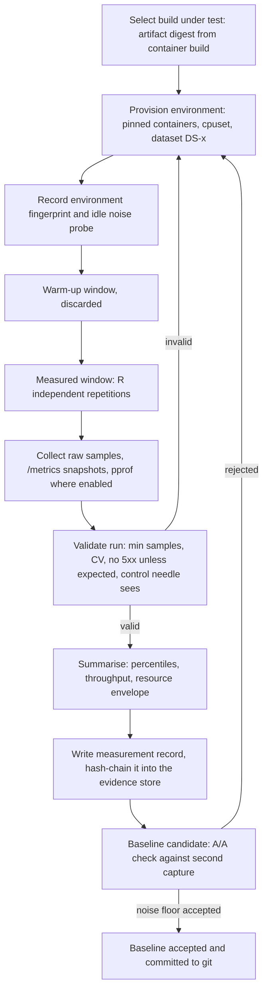
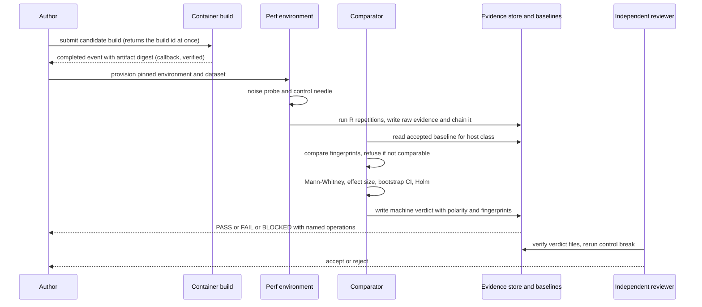
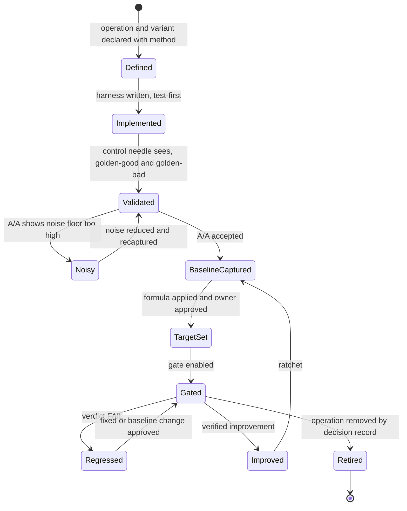
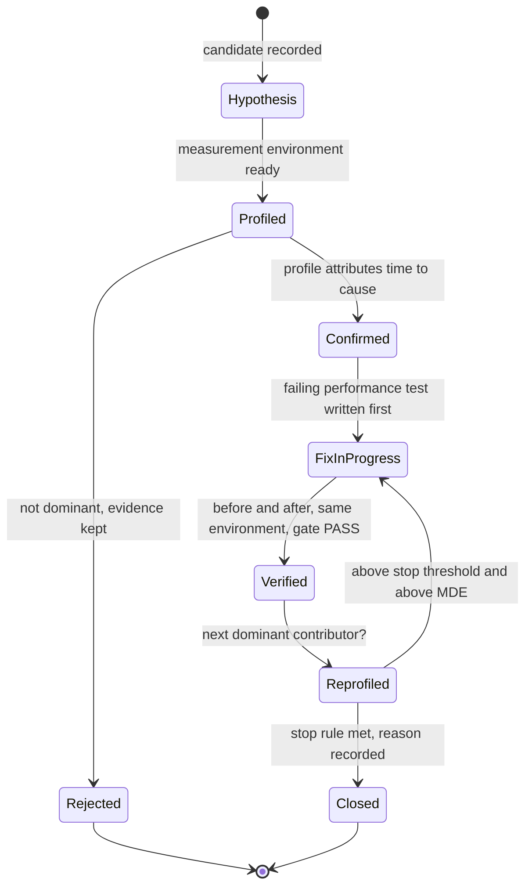
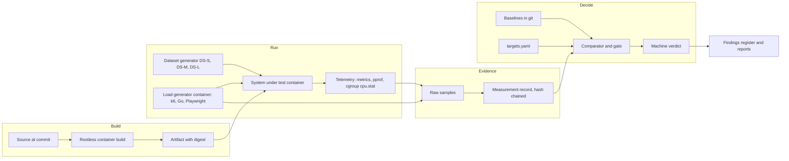

# 14 - Performance Engineering Plan

| Field | Value |
|---|---|
| Revision | 8 |
| Created | 2026-10-03 |
| Last modified | 2026-10-04 |
| Status | draft (revision 8: section 8.7 follows tasks.md rev 28 (673 tasks, 78 suffix ids; rev 28 commit `fb1d1982`; T518, T519, T514): `$SPEC/perf/sc011_status.json` is a listed release-seam file, held on a T519 verdict with `G-GATE`; revision 7: section 8.7 follows tasks.md rev 26 (673 tasks, 78 suffix ids): `scripts/perf/release_check.sh` and its threshold input `$SPEC/perf/targets.yaml` are listed in `scripts/release/release_seam_files.txt`, path class `release_seam`, so a change to either is held on a `G-GATE` verdict. Revision 6: section 8.7 follows tasks.md rev 24 T514 and T569: the cheap tier `perf_cheap` is registered in mode `deferred` until the owner's approval record of the targets exists (T512, ODG-32) and is then switched to `plain` in a reviewed change; the long tier `perf_long` is no commit-push registry row but a standalone run triggered by events (every phase exit record and every candidate build of T566, never a timer), whose verdict the release-seam check reads, a candidate whose triggered run never completed being BLOCKED and refused; the revision 3 and revision 4 statements that make `perf_long` a `deferred` registry row with the `SKIP_LONG` deferral are withdrawn. Revision 5: the build under test is produced on the remote build host through the event-driven dispatcher (the plan owner's decision C1 of 2026-10-04, docs/21 ODG-07 revision 15, document 16 section 9.6): section 5.1 states what that means for the environment fingerprint and the reference host, and the section 8.4 gate sequence submits the build and continues on its completion callback instead of waiting; the scope note of section 1 and D-14-05 follow the FR-017 answer of the same date (every package moved to latest whenever possible after its tests pass). Revision 4: section 8.7 names the closed deferral flag of the long tier, `SKIP_LONG`, because a registry row in mode `deferred` is not a deferral flag (document 16 §12.2 S3; round-13 review). Revision 3: section 8.7 records the commit-push wiring of tasks.md rev 12 T514 (the tiers `perf_cheap` and `perf_long`, registry rows with scope `changeset`, outside the path-class table of document 16 revision 10 §12.2.6, and the standalone release-seam check `scripts/perf/release_check.sh`), and section 15.3 records that the plan-capture script (T295) and the dataset generator of WP-14-03 (T291) are test-first, each with its RED captured before it exists. Revision 2: the section 9.1 "Security note" row gains its missing Tool cell; pipe characters inside code spans of two table rows escaped with a backslash) |
| Spec requirement | SC-011 (also FR-010, FR-021, FR-022, FR-025) |
| Owner decision | The 30/50 ms latency SLA of the adopted external constitution does NOT bind this project (spec Q2). Catalogizer sets its own targets and aims for the best achievable performance. |
| Companion documents | 05 test strategy, 06 determinism and evidence framework, 07 backend audit, 08 web audit |

## Table of contents

1. Purpose, scope and stance
2. Inventory of existing performance assets (verified)
3. Critical operations list
4. Measurement method per operation
5. Measurement environment, noise control and variance bounds
6. Baseline capture procedure and storage format
7. Target-setting method (no invented numbers)
8. Regression gate design
9. Profiling toolbox per runtime
10. Scheduler-quota and throttling telemetry trap (section 11.4.225)
11. Host-safety limits for load and stress runs
12. Candidate optimization areas (all HYPOTHESIS until measured)
13. Benchmark lifecycle and bottleneck lifecycle
14. Work-package breakdown with acceptance evidence
15. Proof-of-concept snippets (NOT EXECUTED)
16. Risks, rejected alternatives, decision records
17. Traceability
18. Open items for the plan owner

---

## 1. Purpose, scope and stance

SC-011 requires, for every critical user-facing operation, (a) a measured baseline, (b) a documented target set by this project, (c) no regression against the baseline, and (d) every identified bottleneck fixed with before-and-after measurements, aiming for the best achievable performance. This document defines how that is done. It does not state targets. A target is a function of a measured baseline and a user-perceived threshold (section 7); inventing a number before the baseline exists would violate section 11.4.6 of the constitution (no guessing) and is forbidden by the brief of this feature.

Stance:

- The HelixPlay figures (30 ms on a LAN, 50 ms on a WAN at p999) are not used anywhere in this plan, not as targets, not as defaults. They are mentioned only to state that they do not bind.
- "Best achievable" is operationalised as: after the first fix pass on a bottleneck, the operation is re-profiled; work stops on that operation only when the next profile shows no single frame, query or request accounting for more than the stop threshold (a parameter, section 7.4) of the operation's time, or when the remaining cost is bounded by a physical limit that is measured and recorded (network round trip, storage read, codec). This avoids both unbounded tuning and premature stopping.
- Every number in the final reports is machine-produced by the measurement pipeline (FR-022). Prose is never evidence (section 11.4.262).
- Performance verdicts are held to the same determinism rules as functional verdicts (FR-010): repeated runs, recorded environment, a deliberate-break control (section 8.5) proving the gate can fail.

Out of scope: capacity planning for hosted deployment sizes (no hosted topology is declared in the spec), cost optimization, and third-party package upgrades (owned by the dependency work of docs/21 WP-57 under FR-017 as amended; revision 5: a package upgrade that the move-to-latest rule brings in is measured like any other change set).

## 2. Inventory of existing performance assets (verified)

All paths are repository relative. Everything below was read in this session; nothing was executed.

### 2.1 Backend (catalog-api, Go module `catalogizer`, `go 1.25.7`, `catalog-api/go.mod:3`)

| Asset | Path | Notes |
|---|---|---|
| API endpoint benchmarks | `catalog-api/tests/performance/baseline_test.go` | Health, login, media list, sources list, catalog list, search, stats, endpoint-latency table, mixed workload (lines 536-871), serial and `_Parallel` variants |
| Database benchmarks | `catalog-api/tests/performance/database_bench_test.go` | select by id, indexed range scan, LIKE search, aggregates, group by (lines 37-158 and beyond) |
| Protocol client benchmarks | `catalog-api/tests/performance/protocol_bench_test.go` | 22 benchmarks of the local client: list, read, write, copy, concurrent reads and writes, scan directory |
| Per-package benchmarks | `catalog-api/repository/media_item_repository_bench_test.go`, `catalog-api/services/auth_service_bench_test.go`, `catalog-api/internal/auth/jwt_bench_test.go`, `catalog-api/internal/media/detector/engine_bench_test.go`, `catalog-api/internal/media/providers/providers_bench_test.go`, `catalog-api/internal/services/title_parser_bench_test.go`, `catalog-api/internal/smb/resilience_bench_test.go`, `catalog-api/middleware/benchmark_test.go`, `catalog-api/middleware/rate_limiter_bench_test.go`, `catalog-api/utils/buffer_pool_test.go`, `catalog-api/utils/concurrency_bench_test.go` | Component level |
| Fuzz targets | `catalog-api/middleware/fuzz_test.go`, `csp_fuzz_test.go`, `input_validation_fuzz_test.go`, `catalog-api/database/dialect_fuzz_test.go`, `catalog-api/filesystem/factory_fuzz_test.go`, `catalog-api/internal/handlers/download_fuzz_test.go`, `catalog-api/internal/services/title_parser_fuzz_test.go`, `catalog-api/utils/validation_fuzz_test.go` | Correctness and robustness; relevant to performance only as a source of pathological inputs (algorithmic-complexity cases) |
| Runner script | `scripts/performance-test.sh` | Runs the benchmarks with `-benchtime=3s`/`2s` and `tee`s to `performance-results-*.txt` at the repository root; every `go test` is suffixed `\|\| true`, so a failing benchmark does not fail the script (a defect for gating purposes, section 8.6); it then builds the web bundle on the bare host with `npm run build` (violates FR-021, must be containerized) |
| Metrics | `catalog-api/internal/metrics/metrics.go` (HTTP duration histogram, request counter, active connections, WebSocket connections, DB query duration, goroutines, memory) and `prometheus.go` (DB connection gauges, `RecordDBQuery`) | Served at `/metrics` (`catalog-api/main.go:997`) |
| Profiling endpoints | `catalog-api/main.go:1009-1021` | `/debug/pprof/*` registered only when `HELIX_PPROF_ENABLED=true` (line 1008) |
| Compression, HTTP/3 | `catalog-api/main.go:991` (`CompressionMiddleware`), `main.go:65,1809-1850` (quic-go HTTP/3 on the HTTPS port) | Compression and HTTP/3 exist; their benefit is unmeasured |
| Cache headers | `catalog-api/main.go:1041,1135-1140` | `CacheHeaders(5)` on health, immutable on assets, 300 s and 86400 s on cover routes |
| Connection pool | `catalog-api/database/connection.go:60-85` | Defaults: max open 25, max idle 10, lifetime 5 min, idle time 3 min; SQLite DSN has `_busy_timeout=30000`, WAL, `synchronous=NORMAL`; PostgreSQL via `postgres` driver |
| Indexes | `catalog-api/database/migrations_v14_additional_indexes.go`, `PERFORMANCE_OPTIMIZATION_REPORT.md` (repo root) | 17 indexes added in migration v14 |

### 2.2 Load and stress scripts

`tests/k6/` holds 16 k6 scripts: `smoke_test.js`, `load_test.js`, `stress_test.js`, `soak_test.js`, `spike_test.js`, `breakpoint_test.js`, `endurance_test.js`, `auth_load_test.js`, `entity_browse_load_test.js`, `concurrent_writers_test.js`, `database_stress_test.js`, `media_scan_stress_test.js`, `mixed_workload_test.js`, `websocket_stress_test.js`, `ddos_ratelimit_test.js`, `monitoring_test.js`. `docs/DESKTOP_PERF_AUDIT.md` lists 15 and omits one (UNCONFIRMED which; the file count in the directory is 16). Examples read: `auth_load_test.js` embeds fixed thresholds (`p(95)<500`, `p(99)<1500`, error rate under 5 percent) and default credentials (`<default admin credential literal, see tests/k6/auth_load_test.js:35 and tests/k6/smoke_test.js:33>`) taken from environment fallbacks (a test credential; must be replaced by a seeded test user per section 11.4.10). `breakpoint_test.js` uses a `ramping-arrival-rate` executor from 10 to 1000 requests per second. These thresholds are guesses written before any baseline and are not targets; they are recorded as legacy and replaced per section 7.

### 2.3 Web (catalog-web)

- `catalog-web/lighthouserc.json`: Lighthouse CI, 5 URLs (`/`, `/login`, `/media`, `/catalog`, `/search`), 3 runs, desktop preset, throttling `rttMs 40`, `throughputKbps 10240`, `cpuSlowdownMultiplier 1`, with hard-coded assertions (performance category at least 0.9, LCP at most 2500 ms, TBT at most 300 ms, and others). The thresholds are not derived from baselines; they are inputs to be reviewed, not targets (section 7.6).
- `catalog-web/vite.config.ts:73-85`: `manualChunks` for `vendor`, `router`, `ui`, `charts`, `utils`; `sourcemap: true`. No bundle analyzer is configured (UNCONFIRMED: no plugin found by grep in that file).
- `catalog-web/playwright.config.ts`: projects per browser, `trace: 'on-first-retry'`; usable as the driver for user-timing measurements.
- `catalog-web/src/components/performance/LazyComponents.tsx` and `lazy`/`Suspense` use in `App.tsx`, `MediaBrowser.tsx`, `Dashboard.tsx`, `AIDashboard.tsx`; `react-virtualized-auto-sizer` is a dependency (`package.json:40`), so list virtualization exists in some views (extent UNCONFIRMED).

### 2.4 Monitoring

`monitoring/prometheus/prometheus.yml` (scrape interval 15 s; jobs `prometheus`, `catalog-api` at `catalog-api:9090`, `node-exporter`), `monitoring/prometheus/alerts.yml`, `monitoring/alerts/{application,security,system}-alerts.yml`, `monitoring/grafana/dashboards/{catalogizer-overview,catalogizer-runtime}.json`, `monitoring/opentelemetry/otel-collector.yml`, `monitoring/alertmanager.yml`.

Observation (verified by search of non-test sources): `ObserveDBQuery` (`internal/metrics/metrics.go:160`) and `RecordDBQuery` (`internal/metrics/prometheus.go:210`) are defined, and a search for non-test callers found none. The DB query duration histogram is therefore probably never populated. Status: HYPOTHESIS until confirmed by reading `/metrics` of a running instance in the measurement container. If confirmed it is finding-grade (an advertised metric with no data source) and also removes the cheapest source of per-query latency; work package WP-14-02 covers it.

### 2.5 Other clients

- `docs/DESKTOP_PERF_AUDIT.md` (Tauri desktop and installer wizard): states the master-plan budget table (p50/p95/p99 for four endpoint groups) as "needs run" and the exit criteria (10,000-media scan under 1 hour, search under 500 ms on 10k library, memory under 2 GB, 30-minute soak). Those figures are an earlier plan's budgets, not owner-set targets; they enter this plan only as candidate user-perceived thresholds to be confirmed (section 7.3).
- Android: `catalogizer-android/app/src/{main,test,androidTest}`; Room DAOs under `data/local/` (`MediaDao.kt`, `WatchProgressDao.kt`, `SyncOperationDao.kt`). No Macrobenchmark module was found by a Gradle file search (UNCONFIRMED; the search covered `*.kts` only).
- Android TV: `catalogizer-androidtv/` (same structure).
- Shared Kotlin/TypeScript API clients: `catalogizer-api-client/`.

### 2.6 Existing performance claims that are not evidence

`PERFORMANCE_OPTIMIZATION_REPORT.md` (root) states "Expected Improvements" such as "~90% faster" for indexed queries. These are predictions, not measurements, and the file shows no benchmark output. Under FR-022 and section 11.4.6 they are labelled UNCONFIRMED and re-measured (WP-14-06). The same report states migration v14 was verified on both dialects; that statement is covered by the functional audit (docs 07), not here.

## 3. Critical operations list

IDs are stable and become the keys of the baseline store (section 6). "Layer" says where the clock is read.

| ID | Operation | User-perceived definition | Primary layer | Applications |
|---|---|---|---|---|
| OP-01 | Browse catalog root and one directory | request issued until first complete list rendered | API plus client render | API, web, Android, TV, desktop |
| OP-02 | Browse media items (paged list, filter, sort) | `GET /api/v1/media*` and `/entities/browse/*` until list rendered | API plus client | all |
| OP-03 | Search (simple and advanced) | query submitted until first results rendered | API (`/api/v1/search`, `/search/files`, `/search/advanced`, `/media/search`) plus client | all |
| OP-04 | Media detail open | `GET /api/v1/media/:id` until detail view rendered | API plus client | all |
| OP-05 | Playback start | play action until first frame or first audio sample | stream endpoint (`/api/v1/stream/:id`) plus player | web, Android, TV, desktop |
| OP-06 | Scan of a source | scan trigger until scan complete, per protocol (local, SMB; FTP, NFS, WebDAV scanners are stubs per doc 01, so only protocols with real scanners are in scope until fixed) | scanner service | API |
| OP-07 | Metadata enrichment of a batch | enrichment trigger until all items have provider data, per provider | enrichment service plus provider HTTP | API |
| OP-08 | Sign-in | submit credentials until authenticated landing view | `POST /api/v1/auth/login` plus client | all |
| OP-09 | Token refresh | `POST /api/v1/auth/refresh` | API | all |
| OP-10 | WebSocket update fan-out | event published on the in-process event bus until the last of N subscribed clients receives it | `/ws` handler plus event bus bridge | API, web |
| OP-11 | Client start-up, per app | process launch until first interactive screen (cold and warm) | client | web (page load), Android, TV, desktop, installer wizard |
| OP-12 | DB hot queries on both dialects | the N slowest repeated queries of OP-01..OP-04 on SQLite and PostgreSQL | database | API |
| OP-13 | Conversion / PDF generation | conversion request until output complete, per format pair (`/api/v1/conversion/*`, `services/conversion_service.go`) | conversion service | API |
| OP-14 | Image and cover delivery | cover and asset request until bytes complete; image proxy cold and cached | `/api/v1/cover/*`, `/api/v1/assets/:id`, `/api/v1/image-proxy` | API, all clients |
| OP-15 | Download and archive | `/api/v1/download/*` throughput | API | API |
| OP-16 | Resource envelope | steady-state memory, goroutines, file descriptors, CPU of the API under the OP-01..OP-04 mix and during a scan | process | API |

Selection rule: an operation is critical if it is named in SC-011, or if it lies on a path that SC-011 operations depend on (OP-12, OP-14, OP-16), or if an existing script or audit already treats it as a budgeted endpoint (OP-09, OP-13, OP-15). Operations may be added by findings; they MUST NOT be removed without an owner-approved decision record.

## 4. Measurement method per operation

Method families: **M-GO** (Go benchmark, in-process, no network), **M-HTTP** (open or closed model load against a running API container, k6), **M-SQL** (statement timing plus plan capture), **M-WEB** (Chromium via Playwright and Lighthouse), **M-AND** (Android, Macrobenchmark and Perfetto), **M-DESK** (Tauri), **M-WS** (WebSocket fan-out harness).

| ID | Methods | What is measured | Where | Tool and container |
|---|---|---|---|---|
| OP-01..04 | M-HTTP primary, M-GO secondary | latency distribution (p50, p90, p95, p99, p99.9, max), throughput, error rate, response bytes; client render time separately | API container plus synthetic dataset of declared size | k6 (`docker.io/grafana/k6`, pinned by digest) in a rootless podman container; `go test -bench` in the Go build container |
| OP-03 | plus M-SQL | for each search form, plan and rows examined | both dialects | `EXPLAIN` capture script (section 15.3) |
| OP-05 | M-HTTP for time-to-first-byte of `/stream/:id` including `Range` requests; M-WEB or M-AND for player first frame | TTFB, first-frame time, rebuffer count in a 60 s window | web: Playwright `video` element events `loadstart`, `loadeddata`, `playing`; Android: ExoPlayer or media3 analytics listener (UNCONFIRMED which player; to be read from `catalogizer-android`) | Playwright container; Android per M-AND |
| OP-06 | M-GO for scanner internals, M-HTTP for end-to-end | wall time per N files, files per second, peak RSS, goroutine count, DB write time share | scanner with a generated tree on local protocol; SMB per FR-025 against a real server (blocked if absent, never simulated) | `docker-compose.test-infra.yml` services (Samba, FTP, WebDAV, NFS, MinIO are declared there) |
| OP-07 | M-GO for parser and detector; M-HTTP end-to-end with real providers | per-item latency, provider call count, cache hit ratio | providers need credentials: when absent the operation is reported BLOCKED with the exact reason (FR-025); a recorded-response replay is NOT a substitute for the end-to-end figure | as above |
| OP-08, 09 | M-GO (`auth_service_bench_test.go`, `jwt_bench_test.go`) plus M-HTTP | password hash cost, token sign and verify, endpoint latency under concurrency; client time to landing view | API container; per-client M-WEB, M-AND | k6, Playwright |
| OP-10 | M-WS | publish-to-receive latency per client over N=1,10,100,1000 clients (N values are parameters), messages per second, dropped messages, memory per connection | API container; the harness is a small Go program (section 9.5) because k6's WebSocket module reports connection-level timings, not event-level latency (UNCONFIRMED against the pinned k6 version; verify before choosing) | Go load client container |
| OP-11 | M-WEB, M-AND, M-DESK | web: navigation timing, LCP, TBT, JS transfer size; Android: `StartupTimingMetric` cold, warm, hot via Macrobenchmark; desktop: process start to first `DOMContentLoaded` in the webview plus Rust startup span | per application on a declared reference device or container | Lighthouse in Chromium container; Android on a real device (FR-025: an emulator is a different target; use is a recorded decision) |
| OP-12 | M-SQL plus M-GO | per-statement median and p95 latency, rows examined, plan node types, index used or not, on SQLite and PostgreSQL | DB container for PostgreSQL, file DB for SQLite | section 15.3 |
| OP-13 | M-GO plus M-HTTP | wall time and peak memory per format pair and input size | conversion service container | `go test -bench`, `/usr/bin/time -v` inside container |
| OP-14 | M-HTTP | cold and warm latency, bytes, cache-header correctness; image proxy upstream time separated from proxy overhead | API container; upstream CDNs are real external hosts, so the proxy figure depends on network; report the proxy-added overhead as (total minus a direct fetch in the same run) | k6 |
| OP-15 | M-HTTP | MB/s for single and parallel downloads | API container | k6 or `curl --write-out` |
| OP-16 | M-HTTP plus pprof | RSS, heap in use, goroutines, open fds, CPU seconds per 1000 requests during OP-01..04 mix and OP-06 | API container with `HELIX_PPROF_ENABLED=true` in the measurement profile only | pprof, `/metrics` |

### 4.1 Load model and statistics rules

- **Open versus closed model.** Latency percentiles are measured with an open (arrival-rate) workload (k6 `constant-arrival-rate` or `ramping-arrival-rate`), because a closed workload (fixed VUs) hides queueing delay when the server slows down (coordinated omission). `breakpoint_test.js` already uses the arrival-rate executor; `load_test.js` and others use stages of VUs (UNCONFIRMED per script) and are kept for soak and concurrency semantics only, not for percentile baselines.
- **Warm-up.** Each run discards a warm-up window (parameter `warmup_s`, default proposed 30 s) and a minimum request count (parameter `min_samples`, default proposed 1000 per operation). A run with fewer samples than `min_samples` is invalid, not low-confidence.
- **Percentiles.** Report p50, p90, p95, p99, p99.9 and max. p99.9 is reported only when the sample count exceeds 10,000 per run (otherwise the estimate is dominated by one observation). The set is a reporting choice, not a target statement.
- **Repetitions.** At least R=10 independent repetitions per (operation, build, environment) for gating (section 8); R=3 for exploratory profiling. Repetitions are separate process or container starts so that JIT, cache and allocator state do not carry over (`go test -count` repeats in-process, so Go benchmarks use `-count=10` for benchstat, which is the accepted practice for that tool; HTTP runs restart the API container between repetitions).
- **Latency histograms.** Raw per-request latency samples are stored (compressed) next to the summary so that any percentile can be recomputed; k6 `--out json` or the `handleSummary` function with `trendStats` extended to include `p(99.9)`; the Go harness writes HdrHistogram-style bucket counts or raw nanoseconds.
- **Determinism check.** The three-identical-run rule of doc 06 (section 5) applies to the verdict, not to raw latency: the verdict (regression pass or fail) must be identical across the repeated gate runs on an unchanged build, which is tested by running the gate twice on one commit (section 8.5).

### 4.2 Datasets

Performance is meaningless without a declared dataset. Datasets are generated by a deterministic generator (fixed seed, versioned, committed as a script, not as data) and identified by a content hash:

| Dataset | Parameters (proposed, owner may change) | Purpose |
|---|---|---|
| DS-S | 1,000 media items, 5,000 files | quick regression |
| DS-M | 10,000 media items, 50,000 files | matches the earlier plan's 10k-library search criterion |
| DS-L | 100,000 media items, 500,000 files | scaling behaviour; tests index and pagination cost curves |

The generator writes to both dialects. Realistic title strings (unicode, long names, duplicates) are included because the title parser and LIKE search are sensitive to input shape. Sizes are parameters, not requirements; UNKNOWN: the real-world library size distribution of owners (to be asked, section 18).

## 5. Measurement environment, noise control and variance bounds

### 5.1 Environment fingerprint

Every run records, in the evidence record of doc 06 (section 3 of that document), the following fields (machine-collected by the harness, never typed):

```yaml
env:
  host_cpu_model: "..."            # /proc/cpuinfo
  host_cpu_count: 0                # nproc
  host_mem_total_kib: 0            # /proc/meminfo
  kernel: "..."                    # uname -r
  governor: "..."                  # /sys/devices/system/cpu/cpu0/cpufreq/scaling_governor, or "unavailable"
  container_runtime: "podman <version> rootless"
  container_image_digests: {api: "sha256:...", db: "sha256:...", k6: "sha256:..."}
  cgroup_cpu_max: "..."            # /sys/fs/cgroup/<scope>/cpu.max inside the container
  cgroup_mem_max: "..."
  go_version: "..."
  gomaxprocs: 0
  dataset_id: "DS-M@<sha256>"
  build_fingerprint: "<artifact digest>"
  db_dialect: "sqlite|postgres"
  db_version: "..."
  noise_probe: {cpu_throttle_ratio: 0.0, steal_pct: 0.0, load1_before: 0.0}
```

Revision 5 (owner decision C1, docs/21 ODG-07): every build under test is built in a rootless container on the remote build host and dispatched event-driven (document 16 section 9.6, tasks.md T005b, T121a); `build_fingerprint` is the digest of the `completed` event of that build, and the artifact is used only after it matches that event. Method M-GO compiles, so its lane runs on a remote host too (tasks.md T121a), and its fingerprint is that host's; the measurement host for M-HTTP, M-SQL and the other methods is the one docs/21 ODG-07 names before WP-62 (D-14-08), and a baseline is never compared across the two. When no qualified host is reachable the measurement is BLOCKED (`host_unreachable` or `no_qualified_host`), never run on a local build.

Two runs are comparable only if `host_cpu_model`, `host_cpu_count`, `container_image_digests` (apart from the build under test), `cgroup_*` limits, `dataset_id`, `db_dialect`, `db_version` and `governor` are equal. Otherwise the comparison is refused with the differing fields named. A baseline recorded on one host class is not valid on another; each reference host class has its own baseline set (section 6.4).

### 5.2 Noise control

- Pin the benchmark container to a fixed cpuset and fixed memory limit through the rootless runtime (`--cpuset-cpus`, `--memory`, `--cpus`); the container's own cgroup is the quota that applies (section 10).
- Keep the load generator in a different cpuset from the system under test. Sharing cores makes the generator's own scheduling latency part of the measurement.
- Quiet-phase control: record a 30 s idle phase before each run and measure the host's baseline noise (`/proc/pressure/cpu`, steal, load). A run is invalid if the pre-run load1 exceeds a parameter (`max_idle_load`, proposed 0.5 times the pinned CPU count).
- No other test suite may run concurrently on the host (the repository has parallel-agent infrastructure; the harness takes an exclusive advisory lock file in the evidence store for the duration of a run, per the single-resource-owner discipline of section 11.4.119).
- Disable background maintenance during a run where controllable: no `go build`, no image pulls. Record anything that cannot be disabled.
- For SQLite, place the database file on a declared filesystem (tmpfs versus disk changes results by an order of magnitude); both are measured and labelled (`storage: tmpfs|ext4|...`). The disk case is the baseline of record because users do not run from tmpfs; tmpfs is used only to isolate CPU cost from I/O cost in profiling.
- Clock: use monotonic clocks only (Go `time.Since`, k6 internal clocks). Wall-clock deltas across hosts are forbidden.

### 5.3 Variance bounds

Variance is measured, not assumed:

1. **A/A test.** Before any baseline is accepted, run the same build twice in the full gate procedure (R=10 each). Compute the relative difference of medians and the effect size. The distribution of A/A differences over at least 20 A/A pairs defines the noise floor `NF(op, metric)`.
2. **Acceptance of an environment.** An environment is accepted for gating an operation only if its A/A false-positive rate at the gate's alpha (section 8.2) is not above alpha plus a tolerance parameter. If it is, the operation is measured only in profiling mode (no gate) until noise is reduced; this is recorded as an honest gap, not hidden.
3. **Minimum detectable effect.** From the A/A data, `MDE(op, metric)` is the smallest relative shift detected with power at least 0.8. It is published with every gate result. A regression threshold below the MDE is meaningless and is rejected at configuration time.
4. **Coefficient of variation.** Reported per run; runs with CV above `max_cv` (parameter) are flagged `noisy` and excluded from the baseline by an explicit rule, never silently.

## 6. Baseline capture procedure and storage format

### 6.1 Procedure



The control needle (section 9 of doc 06): in each run the harness issues a request to an endpoint with a known injected delay (for example a debug route enabled only in the measurement profile that sleeps a fixed 50 ms, UNCONFIRMED whether such a route exists; if not, a small test-only wrapper server in the harness container sits in front of the API) and asserts that the measured latency exceeds the injected delay and is within a tolerance. A harness that cannot see a known 50 ms is blind, and the run is invalid.

### 6.2 Storage format (machine-readable, tracked in git)

Raw samples are large and are stored as evidence artefacts (doc 06 storage layout); the baseline file is the compact, tracked summary that gates read. Location: `specs/001-full-project-audit-remediation/perf/baselines/<host_class>/<op_id>.<dialect>.json` (proposed; moves to a non-spec path after the feature, decision D-14-03).

```json
{
  "schema": "catalogizer.perf.baseline/1",
  "op_id": "OP-03",
  "variant": "search.simple.title",
  "dialect": "sqlite",
  "dataset_id": "DS-M@3f1c...",
  "host_class": "ref-linux-8c-32g",
  "env_fingerprint_sha256": "9ad0...",
  "build_fingerprint": "sha256:...",
  "git_commit": "e4852ce7",
  "captured_at": "2026-10-03T00:00:00Z",
  "method": "M-HTTP",
  "load_model": {"executor": "constant-arrival-rate", "rate_per_s": 50, "warmup_s": 30, "duration_s": 120},
  "repetitions": 10,
  "samples_per_repetition_min": 5500,
  "metrics": {
    "latency_ms": {
      "p50":   {"median_of_reps": 0.0, "ci95": [0.0, 0.0]},
      "p95":   {"median_of_reps": 0.0, "ci95": [0.0, 0.0]},
      "p99":   {"median_of_reps": 0.0, "ci95": [0.0, 0.0]}
    },
    "throughput_rps": {"median_of_reps": 0.0},
    "error_rate": {"max_of_reps": 0.0},
    "rss_mib_peak": {"max_of_reps": 0.0},
    "goroutines_peak": {"max_of_reps": 0}
  },
  "noise": {"mde_rel": 0.0, "aa_pairs": 20, "aa_false_positive_rate": 0.0},
  "raw_evidence": ["evidence/perf/OP-03/2026-10-03/<run_id>/"],
  "chain_ref": "<record hash in doc 06 chain>",
  "status": "accepted"
}
```

The numbers above are placeholders of type, not values; none is a real measurement. A baseline file with all-zero metrics is rejected by schema validation (a zero latency is a measurement failure).

### 6.3 Go benchmark baselines

For Go benchmarks the baseline is the raw `go test -bench` output of `-count=10`, stored as text (`benchstat` input format) at `perf/baselines/<host_class>/go/<package>.bench.txt`, plus a JSON sidecar with the environment fingerprint. Benchstat reads the raw format, so the raw file is the baseline; a summary would lose the sample distribution the Mann-Whitney test needs.

### 6.4 Re-baselining rules

A baseline changes only through a reviewed commit containing: the new baseline files, the reason (hardware change, intentional behaviour change, accepted trade-off with owner decision), and the A/A evidence. A baseline may never be silently overwritten by a failing run. An improvement ratchet applies: after a fix with before-and-after evidence is accepted, the baseline moves to the improved value (so the gain is protected), by the same reviewed procedure. This is the performance analogue of the monotone ratchet of section 11.4.135 and 11.4.261.

## 7. Target-setting method (no invented numeric targets)

Targets are derived, not asserted. For each operation variant `v`:

### 7.1 Inputs

- `B(v)`: accepted baseline metric (section 6).
- `U(v)`: user-perceived threshold from a cited human-factors source or an owner decision. Candidate sources to be fetched and cited at the time of use (not cited here from memory): published response-time perception research, the Web Vitals thresholds (Core Web Vitals "good" boundaries published by Google), and Android vitals startup guidance. Each use records title, URL, access date and what it supports. If no credible source exists for an operation (for example OP-10), `U(v)` is `none` and the owner is asked.
- `P(v)`: physical floor, the measured lower bound from the environment: network RTT to the reference client, a direct read of the same bytes from storage, a no-op handler's latency. Measured with the same harness. The floor makes "best achievable" concrete: the headroom is `B(v) - P(v)`.
- `NF(v)`, `MDE(v)`: noise floor and minimum detectable effect (section 5.3).

### 7.2 Formula

Let `T(v)` be the target for the primary metric (a chosen percentile) of variant `v`.

```
if U(v) exists and B(v) <= U(v):
    T(v) = min(B(v) * (1 - improve_fraction), ratchet_limit)   # stay inside the good zone, keep improving
elif U(v) exists and B(v) > U(v):
    T(v) = U(v)                                                # must reach the perceived threshold; fix required
else:                                                          # no external threshold
    T(v) = max(P(v) + overhead_allowance * (B(v) - P(v)), B(v) * (1 - improve_fraction))
```

`improve_fraction`, `ratchet_limit` and `overhead_allowance` are owner parameters (section 18). No default value is asserted here, but the plan fixes the decision rules that use them:

### 7.3 Decision rules

| Situation | Rule |
|---|---|
| `B(v) > U(v)` | The variant is a bottleneck by definition; it MUST be fixed, targeted at `U(v)` first, then profiled for further gains |
| `T(v) < P(v)` | Infeasible; set `T(v) = P(v) + MDE` and record that the physical floor is the limit |
| `T(v) < NF(v)` (target smaller than measurable change) | Not gateable; record as profiling-only and reduce noise before gating |
| Variant has no user-perceived threshold and baseline within `MDE` of floor | Marked `at-floor`, gate set to no-regression only |
| Two variants of one operation conflict (for example list speed versus memory) | Owner decision record; the default order is correctness, then latency, then memory, then throughput |

### 7.4 Stopping rule for "best achievable"

For each bottleneck, after each fix: re-profile; stop when (a) `T(v)` met and the largest remaining contributor is below `stop_fraction` of the operation's time, or (b) the remaining time is bounded by a measured physical floor, or (c) the next candidate change's expected gain is below `MDE(v)` (it could not be shown by measurement, so it cannot be claimed). The reason for stopping is written into the optimization record.

### 7.5 Target document

Targets are written to `specs/001-full-project-audit-remediation/perf/targets.yaml` with, per variant: `B`, `U` (with citation), `P`, `T`, the parameter values used, the decision rule that applied, and the owner approval reference. Targets are reviewed by the owner before enforcement. A target without a baseline, or with a baseline that failed A/A, is rejected by schema validation.

### 7.6 Legacy thresholds

Thresholds already embedded in `tests/k6/*.js`, `catalog-web/lighthouserc.json`, `monitoring/prometheus/alerts.yml` and `docs/DESKTOP_PERF_AUDIT.md` are inventoried (WP-14-01) and each is classified as `confirmed-by-baseline`, `replaced-by-target`, or `unsafe-guess-removed`. They are never silently kept as gates, because a threshold that no baseline supports either hides regressions (too loose) or produces false failures (too tight), and both are measurement bluffs (section 11.4.201).

## 8. Regression gate design

### 8.1 What is compared

A candidate build `C` is compared to the accepted baseline `B` for each (operation, variant, metric) in scope. Compared quantities: for Go benchmarks, ns/op, B/op, allocs/op; for HTTP, the per-repetition p50, p95, p99 (the repetition is the sampling unit, which avoids pseudo-replication from treating each request as independent); for web, Lighthouse and navigation-timing metrics per run; for resources, peak RSS and goroutines.

### 8.2 Statistical test

- **Primary test: one-sided Mann-Whitney U test** on the R per-repetition values of `C` versus `B` (null: `C` is not slower), at significance `alpha`. Rationale: nonparametric, no normality assumption, robust to outliers; it is the default test of `benchstat` (golang.org/x/perf/cmd/benchstat; UNCONFIRMED in this session: the statement is from prior knowledge, verify against the tool's documentation at pinned version before relying on it).
- **Effect-size guard (practical significance):** a regression is declared only if the test rejects AND the median relative degradation exceeds `max(regress_threshold, MDE)`. A statistically significant 0.5 percent change below the MDE is reported as `noise-significant`, not a failure.
- **Confidence intervals:** bootstrap (BCa or percentile, 10,000 resamples) 95 percent CI of the median ratio `C/B`; the CI is stored in the verdict. A decision may use the CI instead of the U test when R is small; the choice is a parameter; both are computed and recorded so the choice can be audited.
- **Multiple comparisons:** the gate evaluates many (operation, metric) pairs; to bound false alarms, apply Holm-Bonferroni across the metrics of one gate run, or classify by tier (primary metrics gated, secondary reported). Parameter `fwer_method`.
- **Improvement detection:** the same procedure with the opposite one-sided test detects improvements; verified improvements trigger the baseline ratchet proposal (section 6.4).

### 8.3 Parameters proposed for owner decision

| Parameter | Meaning | Proposed starting point | Note |
|---|---|---|---|
| `alpha` | significance level | 0.05 | benchstat's own default is 0.05 (UNCONFIRMED, verify) |
| `regress_threshold` | minimum relative degradation that blocks | to be set after A/A from `MDE`; no default asserted | must be at least `MDE` |
| `R` | repetitions per side | 10 | smaller R weakens the U test; 10 is the benchstat recommendation for `-count` (UNCONFIRMED, verify) |
| `warmup_s`, `min_samples`, `max_cv`, `max_idle_load` | validity | as in section 4 and 5 | |
| `fwer_method` | multiplicity control | Holm | |
| `retry_policy` | what to do on `noisy` | rerun once with a fresh environment, record both | a rerun is counted and surfaced; rerun-until-green is forbidden (section 11.4.264(F)) |

### 8.4 Gate sequence



Verdicts use the three-state vocabulary of the project: PASS, FAIL, BLOCKED (not a pass; reason named, FR-025). Absence of a measurement for a gated operation is BLOCKED, not PASS.

### 8.5 Gate self-validation (control break)

- **Negative control.** A deliberate, tiny, reversible slowdown (for example an injected busy loop of a declared duration in a handler, selected by a build tag used only by the harness) is applied to a candidate. The gate MUST report FAIL for that operation and the injected effect size, and MUST report PASS for the unmodified candidate (golden-good, golden-bad, negative control of section 10 of doc 06). This proves the gate can see regressions and that it does not fire on noise.
- **A/A determinism.** The gate run twice on the same commit yields the same verdict (FR-010).
- **Sensitivity curve.** Injected slowdowns of increasing size are applied once during rollout to measure the smallest slowdown the gate actually catches; this empirical detection limit must be at or below the declared `regress_threshold`, otherwise the threshold is dishonest and is raised.

### 8.6 Required fixes to existing runners before gating

- `scripts/performance-test.sh`: remove `|| true`; exit non-zero on failure; stop running `npm run build` on the host (use the build container); write results into the evidence store instead of loose `performance-results-*.txt` at the repository root.
- k6 scripts: externalize credentials; add `handleSummary` writing machine-readable summaries; replace hard-coded thresholds with values from `targets.yaml`.
- `lighthouserc.json`: assertions read from targets; collect with `numberOfRuns` of at least R; `upload.target: temporary-public-storage` sends reports to a public third-party store, which should be disabled for private builds (UNCONFIRMED whether policy forbids it; flag to owner).

### 8.7 Gate placement

Local only (no CI/CD, section 11.4.156). The gate runs from the dedicated commit-and-push script as an explicit named stage per section 11.4.234: cheap tier (Go micro-benchmarks, bundle size) on every sync, long tier (HTTP load, soak, scan) on a declared cadence and before any release, with recorded deferral if skipped, never silent. The release seam blocks on a performance verdict that is absent for the candidate fingerprint (section 11.4.135 verdict-coverage). Revision 3 (tasks.md T514): the cheap tier is the registry row `perf_cheap` (mode `plain`) and the long tier `perf_long` (mode `deferred`), both rows of `scripts/repo/validate_checks.tsv` with scope `changeset`, because they measure the build of the change set and take no declared-file list, so they have no row in the path-class table (document 16 §12.2.6); the release-seam check `scripts/perf/release_check.sh <candidate-fingerprint>` is a standalone script, not a commit-push stage, run at tasks.md T569 and T582, which refuses a missing verdict, a FAIL verdict and a PASS verdict for another fingerprint. Revision 4 (round-13 review; document 16 §12.2 S3 and §12.2.1 rule 3): a registry row in mode `deferred` is no deferral flag: S3 does not run it inline and lists it in the run report, and the flag set stays closed (`SKIP_LONG`, `SWEEP_ABSENT`, `LOCAL_ONLY`); the long tier is a long gate in the sense of document 16 §12.2 S4, run as a separate registered long-op (UNCONFIRMED: tasks.md T514 names no S4 verdict file for it), so a run that defers the long gates records the closed flag `SKIP_LONG` at S0, written into the `Deferred-Gates:` line of every commit of the run; tasks.md T514 says "with a recorded deferral flag", to be read as `SKIP_LONG` (a wording owed to T514).

Revision 6 (tasks.md rev 24 T514, T569; this paragraph supersedes the tier placement of revisions 3 and 4 above and the "declared cadence" of the first paragraph). The cheap tier `perf_cheap` (Go micro-benchmarks and bundle size on every sync) is the only commit-push registry row of the performance gate, with scope `changeset`; it is registered in mode `deferred` until the owner's approval record of the targets exists (tasks.md T512, BLOCKED-ON ODG-32: no target is enforced before approval) and is then switched to `plain` in a reviewed change, a row still `deferred` after that record exists being refused by the stage test. Once `plain`, the stage maps the comparator verdict PASS to a pass, FAIL to 10, BLOCKED for a missing baseline, target or measurement to 10 naming the missing item, and an unreachable build host to `remote_check_unavailable` (20). The long tier `perf_long` (HTTP load, soak, scan) is not a registry row at all: it is a standalone run triggered by events, at every phase exit record and at every candidate build of T566, never by a timer, and its verdict is read by the release-seam check `scripts/perf/release_check.sh`; T569 waits for the `perf_long` run and the soak run that the candidate build triggered, and a candidate whose triggered run never completed is BLOCKED and refused, never passed. With no `perf_long` row there is no long-tier deferral at the commit-push script, so the `SKIP_LONG` reading of revision 4 no longer applies to this gate and the wording item owed to T514 is closed.

Revision 7 (tasks.md rev 26, P6-P7 release-seam rule, T039 fixtures): the release-seam check `scripts/perf/release_check.sh` and the data file it reads to reach its verdict, `$SPEC/perf/targets.yaml` (a tracked threshold input), are lines of `scripts/release/release_seam_files.txt`, path class `release_seam`, so the commit-push script refuses an unheld change to either with 20 `path_gate_unheld` and commits it only held on a verdict whose gate list holds `G-GATE`; the list never names the register, a ledger, evidence, a verdict or a report. The registry rows above stay outside the path-class table. Revision 8 (tasks.md rev 28 T518, T519; round-27 P5-P7 review I4): `$SPEC/perf/sc011_status.json`, written by T518, is also a line of `scripts/release/release_seam_files.txt`, because `scripts/perf/release_check.sh` (T514) takes from it the operation set it enforces (`perf_target_missing` for an operation with no target), so dropping an operation or turning a target into `none` would silence that refusal; the file is a source list of the release-seam verdict, admitted as `$AUD/contract/inventory.json` is, and its creation and every later write (a new gate verdict, an owner acknowledgement) are held on the T519 verdict `$EV/reviews/WP-62.json`, or a further T519 iteration, with `G-GATE` in its gate list.

## 9. Profiling toolbox per runtime

### 9.1 Go (catalog-api)

| Need | Tool | How |
|---|---|---|
| CPU hot spots | `pprof` CPU profile | start API container with `HELIX_PPROF_ENABLED=true` (`main.go:1008`), fetch `/debug/pprof/profile?seconds=30` during load, `go tool pprof -http` offline; flame graph from the same data |
| Allocation and heap | `/debug/pprof/heap`, `/allocs` | `go tool pprof -sample_index=alloc_space`; compare two profiles with `-base` |
| Lock and goroutine contention | `/debug/pprof/mutex`, `/block`, `/goroutine` | these profiles are empty unless the runtime rates are set (`runtime.SetMutexProfileFraction`, `SetBlockProfileRate`); a search found no such calls outside `main.go` pprof registration (UNCONFIRMED whether set elsewhere in main.go); a measurement-profile-only setting is needed, so an empty mutex profile is not read as "no contention" (control needle rule) |
| Scheduling and GC latency | `runtime/trace` via `/debug/pprof/trace?seconds=5`, `go tool trace` | for tail-latency stalls |
| Micro-benchmark compare | `go test -bench -benchmem -count=10 -cpuprofile` then `benchstat old.txt new.txt` | in the Go build container; `benchstat` pinned by version via `go run golang.org/x/perf/cmd/benchstat@<version>` inside the container |
| GC and runtime metrics | `GODEBUG=gctrace=1` in the measurement profile, plus `/metrics` Go collectors | |
| Security note | none (a rule, not a tool) | pprof exposes internal data; it stays off by default and is never enabled on a user-facing deployment; the measurement profile binds it to a container-local network only |

### 9.2 Databases

- **SQLite:** `EXPLAIN QUERY PLAN <stmt>` per hot statement; `PRAGMA` values recorded (journal mode WAL, synchronous, cache size, page size, `busy_timeout`); `sqlite3_analyzer` or `.dbinfo` for page statistics (UNCONFIRMED availability in the build image); check `ANALYZE` has run (stale statistics change plans). The driver is `go-sqlcipher` per the comment at `connection.go:96`, so plans are those of SQLCipher's SQLite build (UNCONFIRMED version).
- **PostgreSQL:** `EXPLAIN (ANALYZE, BUFFERS, FORMAT JSON)` per hot statement; `pg_stat_statements` enabled in the measurement container for call counts and total time; `auto_explain` for slow statements; `pg_stat_user_indexes` to find unused indexes (candidate removals, each with proof under section 11.4.124/11.4.122 because an index is a shipped component).
- **N+1 detection:** a per-request query counter in the measurement profile (a database wrapper that counts statements by request id), asserted against a per-operation budget; an operation whose query count grows with result size is N+1.
- **Both dialects:** every plan and timing is captured on both, because the repository maintains dialect-specific migrations (`migrations_sqlite.go`, `migrations_postgres.go`) and a rewriter (`database/dialect.go`); a fix valid on one dialect can regress the other.

### 9.3 Web (catalog-web)

| Need | Tool |
|---|---|
| Page metrics | Lighthouse (config at `catalog-web/lighthouserc.json`) in a Chromium container, desktop and mobile emulation both declared |
| Real traces | Chrome DevTools trace via Playwright (`browser.startTracing`) or the Chrome DevTools protocol; Performance panel insights |
| Main-thread cost, long tasks | `PerformanceObserver` for `longtask`, `largest-contentful-paint`, `layout-shift`, `event` entries collected by a Playwright script |
| Bundle composition | a bundle analyzer plugin run in the build container (for example `rollup-plugin-visualizer` or `vite-bundle-visualizer`; adding a dev dependency is a decision, D-14-05); gzip and brotli sizes per chunk |
| Memory | Chrome heap snapshots (`take_heapsnapshot`) before and after repeated navigation to find leaks |
| Render cost | React Profiler for commits and re-render counts on the list views |

### 9.4 Android and Android TV

| Need | Tool |
|---|---|
| Start-up and jank | Macrobenchmark (`androidx.benchmark:benchmark-macro-junit4`) with `StartupTimingMetric`, `FrameTimingMetric`; requires a separate benchmark module and a release-like build type (setup is a work package); UNCONFIRMED: none exists today |
| System traces | Perfetto (`perfetto` on device, web UI offline); Android Studio profiler as a manual aid only |
| Compose or View jank | `FrameTimingMetric`, `reportFullyDrawn()` instrumentation |
| Baseline Profiles | generation via Macrobenchmark; measured start-up with and without |
| Room queries | `EXPLAIN QUERY PLAN` on the same SQLite engine through a debug hook; Room paging (`PagingSource`) load times |
| Real device requirement | measurements need a declared real device (FR-025); an emulator is a different, labelled target |

### 9.5 Desktop (Tauri) and installer wizard

- Rust: `cargo flamegraph` or `perf record` plus `inferno` in a build container with `perf` available (UNCONFIRMED whether container permissions allow `perf_event_open` rootless; fall back to sampling profilers that do not need it such as `samply`, UNCONFIRMED availability); `tracing` spans around startup.
- Webview: same Chromium DevTools approach as the web client, attached through the webview's debug port where the platform allows.
- Process: RSS and start time via `/usr/bin/time -v` and the `/proc` sampler of section 11.

### 9.6 WebSocket fan-out harness (design)

A small Go client (`tests/perf/wsfanout/`, to be created) opens N connections, authenticates, then a coordinator publishes M events through the real publisher path (the in-process event bus bridged to `/ws`, per doc 01 sections on the EventBus; publication by a real scan or a test-only admin trigger, decision D-14-06). Each client records receive time against an embedded publish timestamp from the same host (so a single monotonic clock source avoids cross-host skew). Output: per-event latency distribution, loss count, peak memory per connection.

## 10. Scheduler-quota and throttling telemetry trap (section 11.4.225)

Failure to account for CPU quota throttling can make a healthy system look slow and a slow system look healthy: average CPU and load average read normal while individual enforcement periods are throttled, and every latency tail is inflated. Because this plan runs services and load generators in rootless containers (FR-021) under cgroup v2 quotas, the following is mandatory for every performance run:

1. **Telemetry as deltas.** Before and after each measured window (and every 5 s during it), read the container cgroup's `cpu.stat` fields `nr_periods`, `nr_throttled`, `throttled_usec` (cgroup v2; path derived from `/proc/self/cgroup` inside the container; UNCONFIRMED path layout under rootless podman on the owner's host, to be probed once and recorded). Compute `throttled_fraction = delta(nr_throttled) / delta(nr_periods)`.
2. **Validity rule.** A run with `throttled_fraction` above `max_throttle` (parameter, proposed 0.01) is `invalid-throttled`, not a slow result. The remedy is to raise the quota or cpuset, not to accept the numbers.
3. **Quiet-phase control.** The same read during the idle phase must show near zero throttling; if it does not, the environment is contaminated.
4. **Host-adaptive quota.** Container CPU limits are computed from detected host capacity, never hardcoded; the effective value is read back from the live cgroup and recorded in the fingerprint (fields `cgroup_cpu_max`).
5. **Interactive-scope isolation.** The operator's interactive shell, terminal multiplexer and editor MUST NOT share a no-burst quota scope with the load run; the load run executes in its own scope with its own limit. This protects the host (section 11).
6. **Averages are never verdict evidence** for a latency or tail question; they may be reported next to the throttle deltas, never instead.
7. **Control needle.** A synthetic CPU-bound container with a known quota (for example 1 CPU limit, 2 busy threads) is run once per environment setup to prove the telemetry reader sees throttling (expected: a high throttled fraction); a reader that reports zero on that control is blind (section 11.4.201(7)).

Memory pressure and thread limits are separate axes (sections 12.6 and 12.12); a throttle reading never substitutes for them.

## 11. Host-safety limits for running load tests

The host is a shared developer workstation; the constitution (sections 12.6, 12.8, 12.11, 12.12) forbids exhausting it.

| Limit | Rule |
|---|---|
| Containers only | All SUT, database, load generator and profiler processes run in rootless podman containers (`/usr/bin/podman` is present on the host, verified). No bare-host `go test -bench`, `npm run build` or k6 (the legacy script violates this, section 8.6). |
| Memory ceiling | Total memory limits of all perf containers plus the host's other work stay below 60 percent of `MemTotal`; each container has `--memory` set; if the sampler sees host `MemAvailable` below a floor parameter during the run, the harness stops the run and records `aborted-host-safety` (not a failed performance verdict). |
| CPU | `--cpuset-cpus` excludes the cores used by the operator session; at most a declared fraction of cores are used by the load generator and SUT combined. |
| Threads | `RLIMIT_NPROC` and `GOMAXPROCS` bounded; k6 `maxVUs` set explicitly (the existing `breakpoint_test.js` sets `maxVUs: 500`), and the harness checks the process count of the user before starting. |
| Network | Load generator and SUT share a private container network; no load is aimed at third-party hosts. Provider and CDN calls (OP-07, OP-14) are rate limited to the provider terms; they are single-digit-concurrency probes, never load tests (UNCONFIRMED provider terms; do not run until read). |
| Disk | Datasets DS-L and evidence stores are sized before generation; abort if free space is below a floor. |
| Duration | Soak and endurance runs (hours) run only with explicit owner scheduling, in the background with a registered long-op record (section 11.4.232): single owner per purpose, heartbeat, handed off on stop. |
| Process identity | Only containers started by the harness are signalled or killed; resolution is by recorded container id, not by name pattern (sections 11.4.174, 11.4.196(D)). No process-group signalling with an unvalidated id (section 11.4.263). |
| Stop switch | Every harness run has a watchdog that tears down the perf containers on abort; failures to tear down are reported. |

## 12. Candidate optimization areas to investigate (all HYPOTHESIS until measured)

Each item is a hypothesis with a verification procedure, an expected evidence shape, and a rejection condition. None is a finding or a promise. Order is by expected value per effort, to be corrected by profiles.

| ID | Hypothesis | Why it is a candidate (verified fact) | How it is tested | Rejected if |
|---|---|---|---|---|
| H-01 | Missing or unused indexes cause scans on hot paths | `PERFORMANCE_OPTIMIZATION_REPORT.md` says 17 indexes were added in v14 with predicted gains and no benchmark evidence; the search path uses LIKE (`database_bench_test.go:97`) which does not use an ordinary index for leading wildcards | `EXPLAIN` capture on both dialects per hot query, before and after; benchmark OP-12 | the plan already uses an index and time is not in the scan node |
| H-02 | N+1 queries in list and detail endpoints | list views join media, entities, metadata, covers; no query counter exists (verified: no per-request counter found) | per-request query counter asserted against a budget | statements per request are constant versus result size |
| H-03 | The DB query histogram is unused so slow queries are invisible | `ObserveDBQuery` and `RecordDBQuery` have no non-test callers (section 2.4) | read `/metrics` of a running instance; wire an instrumented DB wrapper; compare counts | the histogram already carries data from another path |
| H-04 | SQLite single-writer contention during scans limits concurrent browse latency | pool default 25 open connections but SQLite WAL permits one writer; `_busy_timeout=30000` lets writers wait 30 s; scan writes and browse reads coexist | OP-06 combined with OP-01 load; measure `database is locked` waits and read latency during scan; test batching of writes | read latency during scan is unaffected |
| H-05 | PostgreSQL pool sizing (25 open, 10 idle, 5 min lifetime) is mismatched to the load | defaults are static in `connection.go:60-85` | vary the parameters under the OP-02 mix with pool wait metrics (`DBConnectionsActive`) | pool wait stays near zero |
| H-06 | Search is slow because it uses LIKE on unindexed text on large datasets | `/search` and `/media/search` handlers exist; plan unknown | OP-03 across DS-S, DS-M, DS-L; compare LIKE against full-text options per dialect (FTS5 for SQLite, `tsvector` or `pg_trgm` for PostgreSQL); a candidate, not a recommendation | latency is within target at DS-L |
| H-07 | Response caching (in-process cache package `internal/cache`, HTTP cache headers) is underused for read-heavy endpoints | cache wrapper exists (`internal/cache/cache.go`, a thin alias of a shared module); header caching is only on health, assets and covers (`main.go:1041,1135-1140`) | hit ratio instrumentation and OP-01..04 with and without caching; invalidation correctness tests are mandatory | hit ratio low or staleness risk unacceptable |
| H-08 | Compression middleware cost exceeds its benefit on small or already compressed payloads | `CompressionMiddleware` applied to all routes (`main.go:991`) | CPU per request and bytes with and without; content-type and size thresholds | CPU cost is negligible |
| H-09 | HTTP/3 provides no measurable benefit on the intended networks and may add cost | QUIC server on port 28443 with a self-signed certificate (`main.go:1809-1850`); clients may not use it | loss and latency emulation (container network shaping `tc`, if available rootless, UNCONFIRMED) comparing HTTP/2 and HTTP/3 for OP-14 and OP-15 | benefit is measurable on a stated network profile (then keep and document) |
| H-10 | Streaming has avoidable copies or lacks range and buffer tuning | `/api/v1/stream/:id`, `utils/buffer_pool_test.go` exists | OP-05 TTFB and throughput; allocation profile of the stream handler | allocation and TTFB are at floor |
| H-11 | The image proxy is a latency and memory risk: streams upstream bodies with no visible timeout, size cap or cache of its own, and allows hosts by substring match | `main.go:1089-1133`: `strings.Contains` on the URL, `io.Copy` of the response, only HTTP headers for caching (verified by reading) | OP-14 cold and cached; slow upstream test (a real slow upstream is not available deterministically; a local test server is acceptable here because the proxy contract is HTTP, not an external service behaviour, decision D-14-07, pending owner confirmation under FR-025); the substring host check is also a security finding, to be routed to the findings register, not fixed in the performance track | proxy-added overhead is negligible and bounded |
| H-12 | WebSocket fan-out serialises or allocates per client | hub design unread in this session (UNCONFIRMED) | OP-10 harness with N scaling; mutex and allocation profiles | latency scales sublinearly with N |
| H-13 | Scan throughput is limited by per-file DB round trips or by the single worker pool | `UniversalScanner` uses a worker pool (doc 01); only `local` and SMB scanners are real | OP-06 with CPU and DB profiles; batching writes | DB and CPU time shares are small |
| H-14 | Web bundle is larger than needed: all-library vendor chunk, framer-motion and recharts on the critical path, sourcemaps in production | `vite.config.ts:73-85` lists chunks including `ui` (framer-motion, lucide) and `charts`; `sourcemap: true` | bundle analysis plus Lighthouse; route-level code splitting for `charts`; tree-shaking of icons | critical path JS is already small |
| H-15 | List views render too many nodes without virtualization | `react-virtualized-auto-sizer` is a dependency but virtualization coverage is unknown | DOM node count and TBT on DS-M and DS-L list views; Profiler | virtualization already in place |
| H-16 | Android Room queries and paging cause jank or slow cold start | DAOs exist; Paging usage unknown | Macrobenchmark start-up and scroll jank; `EXPLAIN QUERY PLAN` on Room queries | frame timing within target |
| H-17 | Sign-in latency is dominated by password hashing cost, which is a security parameter | `auth_service_bench_test.go` and `jwt_bench_test.go` exist; the hashing algorithm and cost are unread (UNCONFIRMED) | OP-08 breakdown by phase; any change to the hash cost is a security decision and requires owner approval, never a pure performance change | n/a (flag instead of change) |
| H-18 | Conversion and PDF generation block request goroutines and have no streaming path | `services/conversion_service.go`; behaviour unread | OP-13 with memory and goroutine profiles at several input sizes | memory flat |
| H-19 | Go runtime tuning (GOGC, GOMEMLIMIT, GOMAXPROCS vs cgroup quota) affects tail latency under the container limit | Go 1.25 is used (`go.mod:3`); whether the runtime respects cgroup CPU limits in this build is UNCONFIRMED | sweep in the measurement environment, record `gctrace` | no change within MDE |
| H-20 | Desktop start-up is dominated by webview init or VLC integration | Tauri app with VLC module per `docs/DESKTOP_PERF_AUDIT.md` | M-DESK start-up traces | start-up within target |

A hypothesis becomes a **bottleneck** only when a profile shows the operation's time is dominated by the suspected cause, or when `B(v) > U(v)` and the profile attributes the excess to it. Only bottlenecks enter the fix work packages.

## 13. Lifecycles

### 13.1 Benchmark lifecycle (state machine)



### 13.2 Bottleneck lifecycle



### 13.3 Measurement pipeline



Hash chaining and evidence record fields follow docs 06 sections 3, 7 and 11; this document adds only the `perf` record type.

## 14. Work-package breakdown with acceptance evidence

All work is test-first (section 11.4.224): the failing check exists and is observed to fail before the change. All work is on `main` (FR-024), built in rootless containers (FR-021).

| WP | Title | Deliverables | Acceptance evidence (machine-produced) | Depends on | Spec |
|---|---|---|---|---|---|
| WP-14-01 | Inventory and legacy-threshold classification | Table of every existing perf script, threshold and claim with classification (section 7.6) | register entries; schema-validated inventory file; every k6 script and Lighthouse assertion row present | none | SC-011, FR-012 |
| WP-14-02 | Measurement harness core | evidence record type `perf`, comparator, env fingerprint collector, cgroup throttle reader, control needle, A/A runner | harness self-tests with golden-good, golden-bad, negative control; throttle reader sees the quota control container (section 10.7) | doc 06 framework | FR-010, FR-022 |
| WP-14-03 | Containerized measurement environment | pinned images by digest, compose profile with cpuset and memory limits, dataset generator with seed, both dialects | environment starts from clean checkout; fingerprint recorded; DS-S and DS-M generated with matching hashes on two generations | WP-14-02 | FR-021 |
| WP-14-04 | Instrumentation fixes needed to measure | wire DB query histogram (H-03), per-request query counter, mutex and block profile rates under measurement profile only | `/metrics` shows nonzero `DBQueryDuration` series in a run; query counter test fails before and passes after | WP-14-03 | SC-011 |
| WP-14-05 | Go benchmark baselines | `-count=10` baselines for all existing Benchmark files, stored raw plus sidecar; `scripts/performance-test.sh` fixed (no `\|\| true`, containerized, evidence output) | baseline files exist for each package; A/A benchstat shows no significant difference; script exits non-zero on a deliberately failing benchmark | WP-14-02, 03 | SC-011 |
| WP-14-06 | HTTP baselines for OP-01..04, 08, 09, 14, 15 | k6 scripts with arrival-rate executors and machine summaries; baselines per dialect and dataset | baseline JSON per variant passing schema; raw histograms stored; A/A noise floors recorded | WP-14-03, 04 | SC-011 |
| WP-14-07 | Database plan capture (OP-12) | `EXPLAIN` capture script (section 15.3) run on both dialects for the hot queries; plan diffs tracked | plan JSON per query per dialect; unused or missing index report | WP-14-03 | SC-011, FR-015 |
| WP-14-08 | Scan and enrichment baselines (OP-06, OP-07) | scan baseline for local and SMB; enrichment baseline with real providers where credentials exist | baseline files, or BLOCKED records naming the missing credential or server | WP-14-03, FR-025 inputs | SC-011, FR-025 |
| WP-14-09 | WebSocket fan-out harness and baseline (OP-10) | Go harness (section 9.6) and baseline | latency distribution per N; zero-loss assertion; control needle | WP-14-02, 03 | SC-011 |
| WP-14-10 | Web client baselines (OP-11 web, OP-05 web) | Lighthouse and Playwright timing scripts in a container; bundle analysis | per-page metrics for the 5 configured URLs plus detail and player; bundle size per chunk | WP-14-03 | SC-011 |
| WP-14-11 | Android and TV baselines | Macrobenchmark module, Baseline Profile experiment, device list | startup and frame timing JSON from a real device, or BLOCKED with device reason | owner supplies device (FR-025) | SC-011 |
| WP-14-12 | Desktop and installer baselines | start-up timing harness, flamegraph of start-up | per-OS timing from real hosts or BLOCKED | owner supplies hosts | SC-011 |
| WP-14-13 | Targets | `targets.yaml` from formula (section 7), citations for `U(v)`, owner approval record | schema validation; every gated variant has `B`, `P`, `T`, citation or `none` | WP-14-05..12 | SC-011 |
| WP-14-14 | Regression gate | comparator wired as named stage in the commit-and-push script, release seam check, control-break and sensitivity-curve evidence | negative control FAILs, unmodified PASSes, A/A twice identical verdict (section 8.5) | WP-14-13 | SC-011, FR-010 |
| WP-14-15 | Bottleneck fixes | one sub-package per confirmed bottleneck, each with failing performance test first, fix, before and after in the same environment, reprofile, stop record | per bottleneck: before and after records with CI of the median ratio, gate PASS, reprofile record | WP-14-14 | SC-011 |
| WP-14-16 | Soak, stress and breakpoint | scheduled long runs with registered long-op records; leak detection using heap profiles over time | heap-in-use trend slope with CI; breakpoint rate with its error criterion; no host-safety abort | WP-14-14 | SC-011 |
| WP-14-17 | Performance report and documentation | `docs/` performance guide, FAQ, diagrams embedded, targets table, operator procedure | links reachable from README, diagrams rendered non-blank (FR-013, FR-014); exports in sync (FR-012) | all | SC-011 |

Sequencing: WP-14-01..04 are prerequisites and can overlap with the functional audit; WP-14-05..12 run in parallel streams limited by device and host availability (single owner per device, section 11.4.119); WP-14-13 is an owner decision gate; fixes follow only after the gate exists, so that every fix is measured by the same instrument that found the problem.

### 14.1 Definition of done for SC-011

SC-011 is closed only when, for every operation in section 3 (variants included): a baseline file exists or a BLOCKED record names the exact missing external resource (not a pass, FR-025); a target exists or `none` with the owner's acknowledgement; the gate passes on the final candidate fingerprint; every bottleneck confirmed in section 12 has before-and-after records; and the independent reviewer has re-run the negative control. Anything else is reported as not done.

## 15. Proof-of-concept snippets

All snippets are `NOT EXECUTED` in this session. They are minimal and follow the constitution (no sudo, rootless containers, no secrets).

### 15.1 Go benchmark with benchstat comparison (NOT EXECUTED)

Existing benchmark shape (the repository already has such files; this adds the container and compare steps).

```go
// catalog-api/tests/performance/search_bench_test.go (proposed new file, illustrative)
package performance

import (
	"net/http"
	"net/http/httptest"
	"testing"
)

func BenchmarkSearchSimple(b *testing.B) {
	router := newBenchRouter(b) // existing helper pattern in baseline_test.go (name UNCONFIRMED)
	req := httptest.NewRequest(http.MethodGet, "/api/v1/search?q=matrix", nil)
	b.ReportAllocs()
	b.ResetTimer()
	for i := 0; i < b.N; i++ {
		w := httptest.NewRecorder()
		router.ServeHTTP(w, req)
		if w.Code != http.StatusOK {
			b.Fatalf("unexpected status %d", w.Code)
		}
	}
}
```

```bash
# Build container image once, then run both revisions (OLD and NEW are two artifact digests)
podman run --rm --cpuset-cpus=2-3 --memory=2g -v "$PWD/catalog-api:/src:ro,Z" \
  -w /src "$GO_BUILD_IMAGE" \
  go test -run '^$' -bench 'BenchmarkSearchSimple' -benchmem -count=10 ./tests/performance/ \
  > perf/baselines/ref-linux/go/search.old.txt
# ... same for the candidate -> search.new.txt
podman run --rm -v "$PWD/perf:/perf:ro,Z" "$GO_BUILD_IMAGE" \
  go run golang.org/x/perf/cmd/benchstat@"$BENCHSTAT_VERSION" \
  /perf/baselines/ref-linux/go/search.old.txt /perf/baselines/ref-linux/go/search.new.txt
```

Expected output shape (values illustrative, not measured):

```
                 │ search.old.txt │ search.new.txt │
                 │     sec/op     │    sec/op      vs base │
SearchSimple-2     <median> ± x%    <median> ± y%   <delta or ~ (p=0.xxx n=10)>
```

A `~` means no statistically significant difference at the tool's alpha; the gate additionally applies the effect-size guard of section 8.2.

### 15.2 k6 open-model script (NOT EXECUTED)

```javascript
// tests/k6/perf_op03_search.js (proposed). Credentials come from the environment, never defaults.
import http from 'k6/http';
import { check } from 'k6';
import { Trend } from 'k6/metrics';

const BASE = __ENV.API_URL;           // required
const TOKEN = __ENV.API_TOKEN;        // required, seeded test user
const searchMs = new Trend('op03_search_ms', true);

export const options = {
  scenarios: {
    steady: {
      executor: 'constant-arrival-rate',   // open model: avoids coordinated omission
      rate: Number(__ENV.RATE || 50), timeUnit: '1s',
      duration: __ENV.DURATION || '120s',
      preAllocatedVUs: 50, maxVUs: 200,
    },
  },
  summaryTrendStats: ['min', 'med', 'p(90)', 'p(95)', 'p(99)', 'p(99.9)', 'max'],
  // No latency thresholds here: verdicts come from the comparator, not from literals in the script.
  thresholds: { http_req_failed: ['rate<0.001'] },
};

export default function () {
  const r = http.get(`${BASE}/api/v1/search?q=matrix`, { headers: { Authorization: `Bearer ${TOKEN}` } });
  searchMs.add(r.timings.duration);
  check(r, { 'status 200': (x) => x.status === 200 });
}

export function handleSummary(data) {
  return { '/out/op03.summary.json': JSON.stringify(data) };
}
```

```bash
podman run --rm --network perfnet --cpuset-cpus=4-5 --memory=1g \
  -e API_URL=http://api:8080 -e API_TOKEN="$(cat "$TOKEN_FILE")" \
  -v "$PWD/tests/k6:/scripts:ro,Z" -v "$PWD/perf/out:/out:Z" \
  docker.io/grafana/k6@"$K6_DIGEST" run /scripts/perf_op03_search.js
```

Expected output: `perf/out/op03.summary.json` with `metrics.op03_search_ms.values` containing `med`, `p(95)`, `p(99)`, `p(99.9)`, `max`. The harness repeats the run R times with a fresh API container each time and feeds the per-repetition values to the comparator.

### 15.3 SQL EXPLAIN capture script (NOT EXECUTED)

Revision 3 (tasks.md T295, test-first since its rev 12): the parser's test on recorded plan fixtures of both dialects (a sequential scan, an index scan and a malformed plan that must be refused) is run before the script exists, its RED captured to `$EV/performance/capture-plans-red.txt`; likewise the dataset generator of WP-14-03 (tasks.md T291) is test-first, its test generating a small seeded dataset twice and asserting equal hashes and a different hash for another seed, the RED captured to `$EV/performance/dataset-generator-red.txt`.

```bash
#!/usr/bin/env bash
# scripts/perf/capture_plans.sh (proposed). Runs inside the tools container, both dialects.
set -euo pipefail
OUT=${OUT:-perf/out/plans}; mkdir -p "$OUT"
QUERIES=perf/queries            # one .sql file per hot query, parameters inlined with fixed values

for q in "$QUERIES"/*.sql; do
  name=$(basename "$q" .sql)

  # SQLite: plan only (no ANALYZE equivalent), plus timing by repetition
  sqlite3 "$SQLITE_DB" ".timer off" ".mode json" "EXPLAIN QUERY PLAN $(cat "$q")" \
    > "$OUT/$name.sqlite.plan.json"

  # PostgreSQL: executed plan with buffers
  psql "$PG_DSN" -X -q -t -A \
    -c "EXPLAIN (ANALYZE, BUFFERS, FORMAT JSON) $(cat "$q")" \
    > "$OUT/$name.postgres.plan.json"
done

# Control needle: a query known to table-scan must be reported as a scan, proving the reader sees it
sqlite3 "$SQLITE_DB" ".mode json" "EXPLAIN QUERY PLAN SELECT * FROM files WHERE size + 0 = 1" \
  | grep -q 'SCAN' || { echo "CONTROL FAILED: plan reader blind" >&2; exit 3; }
```

Expected output: one JSON plan per (query, dialect). SQLite output contains `detail` strings such as `SEARCH files USING INDEX idx_files_...` or `SCAN files`; PostgreSQL JSON contains `Plan.Node Type`, `Actual Total Time`, `Shared Hit Blocks`. A parser (part of WP-14-07) normalises these to `{scan_type, index_used, rows_examined, time_ms}` for diffing. Table and column names in the control needle (`files`, `size`) come from the migration v14 text of `PERFORMANCE_OPTIMIZATION_REPORT.md` and must be re-verified against the real schema before use.

### 15.4 Throttle-fraction reader (NOT EXECUTED)

```bash
# Inside the SUT container: read cgroup v2 cpu.stat as deltas
read_cpu_stat() { awk '/^nr_periods|^nr_throttled|^throttled_usec/{printf "%s=%s ",$1,$2}' /sys/fs/cgroup/cpu.stat; }
before=$(read_cpu_stat); sleep "$WINDOW_S"; after=$(read_cpu_stat)
# the harness parses both lines and computes delta(nr_throttled)/delta(nr_periods)
```

Path `/sys/fs/cgroup/cpu.stat` inside a rootless podman container on cgroup v2 is the expected location but UNCONFIRMED on the owner's host; the harness probes and records the actual path.

## 16. Risks, rejected alternatives, decision records

### 16.1 Risks

| ID | Risk | Likelihood and impact (qualitative) | Mitigation |
|---|---|---|---|
| R-14-01 | Shared developer host produces noisy measurements | high likelihood, high impact on gating | pinned cpusets, A/A acceptance, noise-floor-aware thresholds, profiling-only mode when unacceptable; consider a dedicated measurement host (owner decision) |
| R-14-02 | Real-device and real-service baselines blocked (FR-025) | medium, high | BLOCKED reports with exact reasons; SC-011 not claimed done until supplied |
| R-14-03 | Optimization changes functional behaviour | medium, high | every fix ships with the functional test suite green on both dialects; no performance change merges without the doc 05 test matrix passing |
| R-14-04 | Caching introduces stale data | medium, medium | invalidation tests first; short TTL until measured; opt-in per endpoint |
| R-14-05 | Gate false positives erode trust | medium, high | MDE rule, Holm, sensitivity curve, rerun accounting |
| R-14-06 | Dataset not representative of owner libraries | medium, medium | ask owners for size and shape distributions; add dataset variants; state dataset in every result |
| R-14-07 | Third-party providers throttle or ban probe traffic | low, medium | single-digit concurrency, rate limited, terms read first |
| R-14-08 | Container overhead distorts results | medium, low | measure host-versus-container delta once (control experiment) and record; the container is the baseline of record |
| R-14-09 | Existing scripts with default credentials leak into reports | medium, medium | scan evidence for credential strings before commit (section 11.4.10.A) |

### 16.2 Rejected alternatives

| Alternative | Reason rejected |
|---|---|
| Closed-model (fixed VU) percentile baselines | hides queueing delay under slowdown (coordinated omission) |
| Fixed absolute thresholds in scripts | invented numbers, not derived from baselines; gate failures would measure the host, not the code |
| Single-run comparison | no variance estimate; indistinguishable from noise |
| Student t-test as primary | latency distributions are skewed and heavy-tailed; nonparametric test preferred (a t-test on log values is an acceptable secondary check) |
| Using Lighthouse score as the only web gate | composite score hides which metric moved and varies across Lighthouse versions; per-metric values are primary, score is secondary |
| Simulated provider or device responses for end-to-end figures | forbidden by FR-025; contract-level fixtures remain legitimate for unit benchmarks only |
| Running benchmarks directly on the host for convenience | violates FR-021 and risks the host (section 11) |
| Copying the HelixPlay 30/50 ms numbers as targets | explicitly excluded by owner decision |

### 16.3 Decision records

| ID | Decision | Status | Rationale |
|---|---|---|---|
| D-14-01 | Open-model arrival-rate for latency percentiles | proposed | section 4.1 |
| D-14-02 | Mann-Whitney U plus effect-size guard plus bootstrap CI as the comparison method | proposed | section 8.2 |
| D-14-03 | Baselines tracked in git under the spec directory during the feature, relocated afterwards | proposed | keeps evidence with the feature; relocation avoids permanent spec-folder clutter |
| D-14-04 | Disk-backed SQLite is the baseline of record; tmpfs only for profiling | proposed | users do not run from tmpfs |
| D-14-05 | Adding a bundle analyzer dev dependency | needs owner approval | a new dependency, not an update: the move-to-latest rule (FR-017 as amended, revision 5) applies once it is added, and adding it is still a dependency change |
| D-14-06 | WebSocket harness publishes through the real event path | proposed | avoids testing a simulation |
| D-14-07 | Local test upstream for the image proxy overhead test | needs owner confirmation | tension with FR-025: the external CDN behaviour cannot be deterministic; the owner decides whether a local HTTP upstream counts as a permitted simulation for a contract-level overhead test |
| D-14-08 | Dedicated measurement host | open | owner input on hardware availability |

## 17. Traceability

| Requirement | Where addressed |
|---|---|
| SC-011 baseline for every critical operation | sections 3, 4, 6, WP-14-05..12 |
| SC-011 documented target set by this project | section 7, WP-14-13 |
| SC-011 no regression | section 8, WP-14-14 |
| SC-011 every bottleneck fixed with before/after, best achievable | sections 7.4, 12, 13.2, WP-14-15 |
| FR-010 determinism, deliberate-break proof | sections 4.1, 8.5 |
| FR-021 rootless containers, clean-target verification | sections 5.2, 11, WP-14-03 |
| FR-022 machine-produced evidence | sections 6, 13.3 |
| FR-025 real services and devices, BLOCKED semantics | sections 4, 11, WP-14-08, 11, 12 |
| FR-012, FR-013, FR-014 documentation | WP-14-17 |
| Constitution 11.4.225 | section 10 |
| Constitution 11.4.224 test-first, 11.4.201 instrument validity | sections 8.5, 14 |

## 18. Open items for the plan owner

1. Parameters `improve_fraction`, `ratchet_limit`, `overhead_allowance`, `stop_fraction`, `regress_threshold`, `alpha`, `R`, `max_cv`, `max_throttle` (sections 7, 8, 10). Defaults are proposals, not decisions.
2. The reference host class(es) and whether a dedicated measurement host exists (R-14-01, D-14-08).
3. Real-world library size and shape distribution to size DS-S, DS-M, DS-L.
4. External resources needed for end-to-end figures: SMB share, provider credentials, physical Android and TV devices, desktop hosts per OS (FR-025).
5. Whether a local upstream is an acceptable stand-in for the image-proxy overhead measurement (D-14-07).
6. Approval to add a bundle analyzer dev dependency (D-14-05).
7. UNCONFIRMED items needing a first-hand check: whether a delay-injection route exists for the control needle; presence of an Android Macrobenchmark module; the k6 WebSocket event-level capability at the pinned version; benchstat defaults at the pinned version; cgroup path layout under rootless podman; whether mutex and block profile rates are set anywhere; the identity of the sixteenth k6 script missing from `docs/DESKTOP_PERF_AUDIT.md`; the extent of list virtualization in catalog-web; the media player library on Android; the password hash algorithm and cost.
