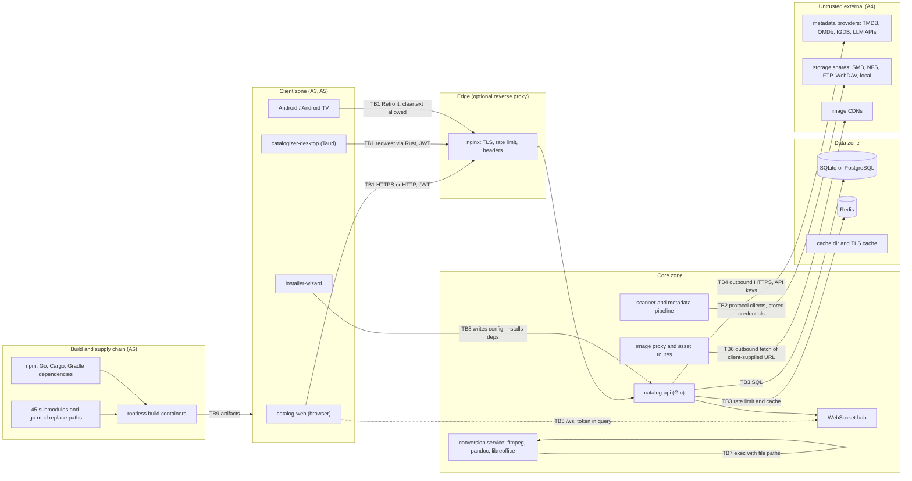
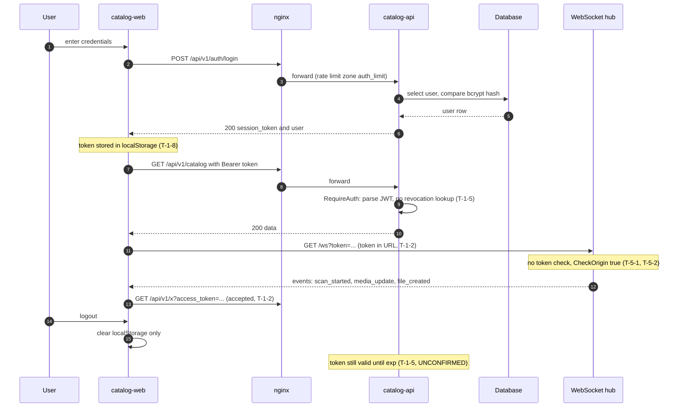
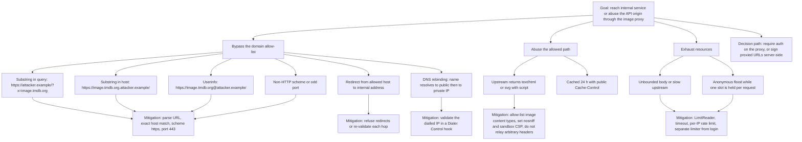
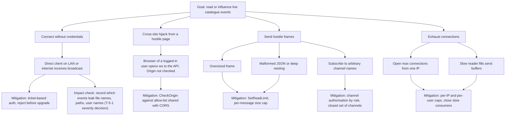
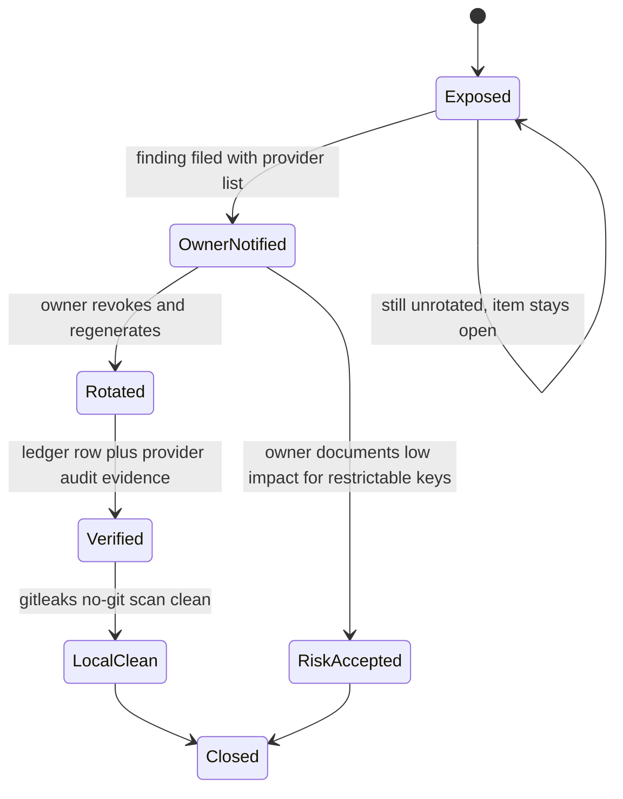
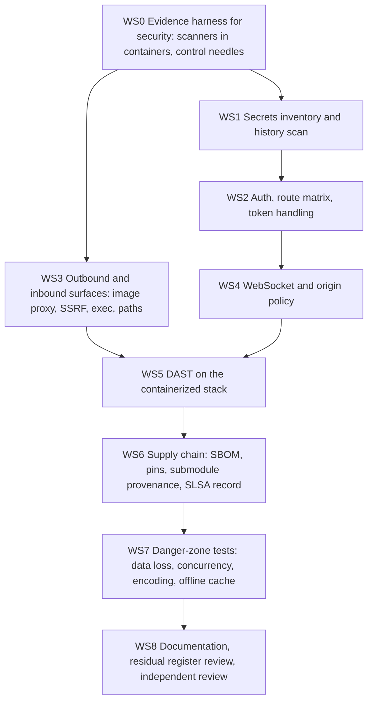

# 15 - Security, Secrets and Danger-Zone Plan

| Field | Value |
|---|---|
| Revision | 3 |
| Created | 2026-10-03 |
| Last modified | 2026-10-03 |
| Status | draft (revision 3: section 10.3 defines one per-repository method that proves a pinned commit exists on every upstream for all 97 repositories, owned and third-party, branch or detached (all remote tips read with `git ls-remote`, fetched into the object store only, ancestry decided with `git merge-base --is-ancestor`; statuses ok, unproven, absent), because the v1 verifier covers none of the 47 third-party rows; section 10.5 names the docs/21 owner-decision group that now holds the licence policy (ODG-40) and the licence tasks (tasks.md T150, T269, T454, T455). Revision 2: new section 10.5, a dependency and repository licence-compliance workstream (per-ecosystem licence tools, the root `LICENSE`, 47 third-party repositories with a measured licence-file read, 40 own-organisation repositories without a licence file); `.pre-commit-config.yaml` placed in the local enforcement view (B29); submodule provenance widened from 45 to all 97 recursive repositories plus the vendored tree (docs/21 IC-12); the provenance existence check reads remote tips through the single verifier; the section 11 header fixed to four columns; `\|` escaped in table cells) |
| Feature | specs/001-full-project-audit-remediation |
| Requirements traced | FR-005..FR-010, FR-017, FR-018, FR-020, FR-021, FR-022, FR-025; SC-002, SC-003, SC-005, SC-009, SC-012 |
| Related documents | 01 architecture map, 04 findings register, 06 evidence framework, 07 backend, 08 web, 09 desktop and installer |
| Governance anchors | §11.4.10 (credentials), §11.4.113 (no force-push), §11.4.161 (rootless), §11.4.184 and 184(I) (SonarQube, gitleaks, Trivy, ZAP, HawkScan), §11.4.246 (SLSA), §11.4.252 (fail closed), §11.4.253 (idempotency), §11.4.263 (process-group safety) |

## Table of contents

1. Scope, evidence rules and what this document adds
2. Measured security baseline (read-only measurements)
3. Threat model: trust boundaries and STRIDE
4. Attack-surface inventory from the real code
5. Diagrams: auth sequence and threat trees (image proxy, WebSocket)
6. Danger-zone catalogue beyond security
7. Secrets handling and credential rotation procedure
8. History-scan plan without rewriting history
9. DAST plan against a running containerized stack
10. Static analysis and dependency/supply-chain review plan
11. Security test plan by type
12. Severity scale mapping
13. Work packages, ordering and acceptance evidence
14. Risks, rejected alternatives, open questions
15. Traceability matrix
Appendix A. POC snippets (all NOT EXECUTED unless stated)

---

## 1. Scope, evidence rules and what this document adds

Documents 07 (backend), 08 (web) and 09 (desktop and installer) already list per-component security candidates (C1 to C12 in document 07; WEB-F02, WEB-F17 in 08; D-03, D-05, D-08 in 09). This document does not repeat those rows. It adds four things that no per-component plan covers:

1. a cross-cutting threat model organised by trust boundary, so a defect that spans components (a token that leaks from the URL of one client into the logs of the server) is one threat, not three findings;
2. a measured attack-surface inventory with the sources of each count;
3. the secrets lifecycle: what is on disk, what is in history, what the owner must verify, and how to remediate without rewriting history (§11.4.113);
4. the DAST, supply-chain and security-test programmes that turn candidates into machine-evidenced findings (FR-007, FR-008, FR-022).

Evidence labels follow document 01: `VERIFIED-READ` (file read in this session), `MEASURED` (command run in this session, command shown), `UNCONFIRMED` (not verified), `NOT EXECUTED` (example never run). No credential value appears anywhere in this document. Where a secret-bearing file is mentioned only its path and the variable names are given; commands that inspect values pipe through a redactor (Appendix A.3).

Hard constraints restated from the constitution because they shape every step below: no sudo, rootless containers only (§11.4.161, FR-021), never rewrite history or force-push (§11.4.113, FR-020), never print or log a credential (§11.4.10), a test that needs a real external service runs against it or is reported blocked, never simulated (FR-025), and every fix needs a test that fails before and passes after (FR-008).

---

## 2. Measured security baseline (read-only measurements)

All rows were produced in this session from the working tree at the start of the feature (branch main). They are the "as found" record; the audit repeats them in the evidence framework of document 06.

| # | Fact | Source / command | Label |
|---|---|---|---|
| B1 | `catalog-api` non-test `exec.Command` / `exec.CommandContext` call sites: 16 | `grep -rnE 'exec\.Command(Context)?\(' --include=*.go catalog-api` minus `_test.go` | MEASURED |
| B2 | 7 of those 16 are `exec.Command` without a context: `services/conversion_service.go` lines 138, 153, 194, 400, 417, 500, 515 and `internal/services/cover_art_service.go:964` (`ffprobe`) | same | MEASURED |
| B3 | `getent hosts` is invoked with a variable host argument in `internal/infra/provisioner.go:168` | read | VERIFIED-READ |
| B4 | NFS mount helpers (Darwin) call `mount`, `umount`, `cp`, `mv` with variable paths: `filesystem/nfs_client_darwin.go:71,96,100,220,238` | read | VERIFIED-READ |
| B5 | `GET /api/v1/image-proxy` allow-list is `strings.Contains(imageURL, domain)` over three domains and the route is registered on `router` (no auth group): `catalog-api/main.go:1089-1135` | read | VERIFIED-READ |
| B6 | `GuardProviderURL` (canonical SSRF validator, delegating to the `security` submodule's `ssrf.Validate`) exists in `internal/services/ssrf_guard.go:61` and is called from 5 provider call sites; it is not called by the image proxy | read plus grep | VERIFIED-READ |
| B7 | WebSocket upgrader `CheckOrigin` returns true unconditionally: `handlers/websocket_handler.go:124`; `/ws` registered at `main.go:1084` outside the authenticated group; `MaxConnections` default 1000 | read | VERIFIED-READ |
| B8 | The event bridge forwards event types `notification`, `scan_started`, `media_update`, `file_created`, `file_modified` (and more) to all connected sockets via `BroadcastToClients` | `internal/handlers/eventbus_bridge.go:35-140` | VERIFIED-READ (full list UNCONFIRMED) |
| B9 | JWT middleware accepts the token from `Authorization: Bearer`, else `access_token`, else `token` query parameter: `middleware/auth.go:41-63` | read | VERIFIED-READ |
| B10 | TLS for the HTTPS/H3 listener: `tls.Config` sets `Certificates` and `NextProtos` only (no `MinVersion`, no cipher policy), certificate is self-signed and cached under `./cache/tls`: `main.go:1817-1821`, `main.go:156-180` | read | VERIFIED-READ |
| B11 | CORS: two middleware implementations with an exact-match origin list, default `http://localhost:5173,http://localhost:3000`, `Allow-Credentials: true` only on match: `middleware/request.go:126-155`; a second pattern with `Access-Control-Allow-Origin` set from `origin` in three further handler files (`handlers/log_management_handler.go:364`, `internal/handlers/media_player_handlers.go:1158`, `internal/handlers/localization_handlers.go:549`) | grep plus read | MEASURED / VERIFIED-READ |
| B12 | `storage_roots` table has a plain `password TEXT` column (SQLite DDL `database/migrations_sqlite.go:32`); `main.go:409-445` reads `password` back from the table to rebuild SMB clients | read | VERIFIED-READ |
| B13 | `pprof` handlers are opt-in via `HELIX_PPROF_ENABLED=true` and registered on the main router, authentication of that group UNCONFIRMED: `main.go:999-1022` | read | VERIFIED-READ (auth UNCONFIRMED) |
| B14 | CSRF middleware exists (`middleware/csrf.go`, options for cookie and header name); whether it is mounted on any route group is UNCONFIRMED | read | UNCONFIRMED |
| B15 | `.gitignore` ignores `.env` (line 45) and `.env.resolved` (line 340). Tracked env-like files: `.env.example`, `.env.distributed`, `.env.roundrobin`, `.env.security`, `.env.spread`, and `.env.example` files in `OCU-CUDA-Sidecar`, `catalog-api`, `catalog-web`, `submodules/llms_verifier` | `git ls-files` | MEASURED |
| B16 | History contains a once-tracked `catalog-web/.env` (commits `16843b13` 2025-10-04 added, `4099e892` 2025-10-14 touched); its only variable name is `VITE_API_BASE_URL` (value not inspected beyond name) | `git log --all -- catalog-web/.env`, name-only listing | MEASURED |
| B17 | No tracked keystore, `.pem`, `.p12`, `.pfx`, or `google-services.json` in the current tree (only `google-services.json.example`); history of `*.jks`, `*.keystore`, `*.pem`, `*.key` additions returned no paths in the tracked history query | `git ls-files` and `git log --diff-filter=A` | MEASURED (limited to the path patterns queried) |
| B18 | A published Firebase Android API key exposure is documented as already in history of all six remotes (`docs/security/firebase-api-key-exposure-20260629.md`); status "OPERATOR ACTION REQUIRED" | read | VERIFIED-READ |
| B19 | `SECURITY_KEY_ROTATION_REQUIRED.md` lists 41 provider variables that "MUST be rotated" because they were present in `.env.resolved` and/or `HelixQA/.env`; it states `.env.resolved` was removed and `HelixQA/.env.BACKUP_BEFORE_ROTATION` holds old values; whether rotation happened is not recorded | read | VERIFIED-READ; rotation status UNKNOWN |
| B20 | `docker-compose.security.yml` hard-codes SonarQube DB credentials as literals and uses `:latest` images for Trivy, Semgrep and OWASP dependency-check; `SONAR_FORCEAUTHENTICATION: "false"`; Trivy server publishes a port | `docker-compose.security.yml` | VERIFIED-READ |
| B21 | `docker-compose.qa.yml` lines 77 and 254 send a literal default admin login to the API in scripts; `SECURITY_AUDIT_REPORT.md` records the default admin password as development-only | grep | MEASURED |
| B22 | Android and Android TV `network_security_config.xml` set `base-config cleartextTrafficPermitted="true"` (comment: LAN use) while the manifests set `usesCleartextTraffic="false"` | read | VERIFIED-READ (effective precedence UNCONFIRMED) |
| B23 | Production nginx config: TLS 1.2/1.3, HSTS, `X-Frame-Options SAMEORIGIN`, CSP including `'unsafe-inline' 'unsafe-eval'`, rate-limit zones, 100M default and 500M upload body limit: `config/nginx/catalogizer.prod.conf` | read | VERIFIED-READ |
| B24 | Redis config binds `0.0.0.0` with `protected-mode yes`; no `requirepass` line in the file | `config/redis.conf` | VERIFIED-READ |
| B25 | Desktop (Tauri) has no signing configuration and no updater (`installer-wizard/src-tauri/tauri.conf.json`; document 09 §2.1) | document 09 | VERIFIED-READ (via 09) |
| B26 | Previous scanners configured: gosec (`config/gosec/config.json`), Trivy (`config/trivy/trivy.yaml`: vuln, misconfig, secret), Semgrep rules (`config/semgrep-rules.yml`), OWASP dependency-check suppressions, Sonar properties (`projectVersion=2.2.0`), 20-plus scan scripts under `scripts/`. `scripts/security-gates.sh` exits 0 with a warning when no scan results exist | read | VERIFIED-READ |
| B27 | The constitution submodule ships `scripts/gitleaks`, `scripts/zap`, `scripts/trivy`, `scripts/hawkscan`, `scripts/sonarqube` (install-check, lib, run-scan per tool) | `ls submodules/constitution/scripts` | MEASURED |
| B28 | Containers base images: `golang:1.25`, `debian:trixie-slim`, `node:20-alpine`, `nginx:alpine`; API and web run as non-root (`USER appuser`, `USER nginx`) | Dockerfiles | VERIFIED-READ |
| B29 | `.pre-commit-config.yaml` (tracked) declares `detect-private-key` and `detect-secrets --baseline .secrets.baseline` among its hooks; `.secrets.baseline` does not exist, the `pre-commit` tool is not on the host `PATH`, and `.git/hooks` holds only samples, so none of these secret checks runs today (revision 2) | `ls`, `command -v pre-commit`, `ls .git/hooks` (2026-10-03) | MEASURED |
| B30 | Root `LICENSE` is the Apache License 2.0 text. Of the 51 own-organisation repositories (the main repository plus 50 own submodules), 11 have a licence file at their root and 40 have none; of the 47 third-party repositories, 42 have one and 5 have none; first-line classes of the third-party files include GPL-2.0, GPL-3.0, AGPL-3.0, MPL-2.0, BUSL-1.1, a custom Apache-2.0 with amendments and a no-sell text (document 11 §8.5.1) (revision 2) | directory listing and first lines of each root licence file; a heuristic class, not a licence determination | MEASURED (heuristic) |

Note on B26: `scripts/security-gates.sh` returning success when there is nothing to check is itself a §11.4.201 false-negative gate (a blind instrument reads as clean). It is registered as a finding candidate (S-12 in section 13).

---

## 3. Threat model: trust boundaries and STRIDE

### 3.1 Method

- Decompose by trust boundary (TB), not by component, because the same data crosses several components.
- Apply STRIDE (Spoofing, Tampering, Repudiation, Information disclosure, Denial of service, Elevation of privilege) to every boundary crossing; record only threats that are credible for this product (a self-hosted media catalogue run by a household or small team, reachable on a LAN and optionally through a reverse proxy).
- Each threat gets an id `T-<boundary>-<n>`, a code anchor or `UNCONFIRMED`, a detector from section 11, and a register category and severity proposal. The register (document 04) holds the authoritative copy; this document is the design input.
- Attacker profiles: A1 unauthenticated network peer on the same LAN; A2 internet peer when the API is port-forwarded; A3 authenticated low-privilege user; A4 malicious or compromised metadata provider or storage share (supplies hostile bytes); A5 local user on a client machine (desktop or phone); A6 supply-chain attacker (dependency or submodule upstream).

### 3.2 Trust boundaries and data flow



Boundary list used in the tables below:

| TB | Boundary | Code anchors |
|---|---|---|
| TB1 | clients to API (HTTP/HTTPS, JWT) | `middleware/auth.go`, `main.go:883`, client `lib/api.ts`, desktop `main.rs` |
| TB2 | API to storage protocols (SMB, NFS, FTP, WebDAV, local) | `filesystem/*`, `handlers/scan_handler.go`, `database/migrations_sqlite.go:32` |
| TB3 | API to database and Redis | `database/`, `internal/auth/service.go:553`, `config/redis.conf` |
| TB4 | API to external metadata providers and LLMs | `internal/media/providers/`, `internal/services/*_recognition_provider.go`, `GuardProviderURL` |
| TB5 | WebSocket | `handlers/websocket_handler.go`, `internal/handlers/eventbus_bridge.go`, web `lib/websocket.ts` |
| TB6 | image proxy and asset serving | `main.go:1089-1140`, `handlers/asset_handler.go` (path UNCONFIRMED), cover handlers |
| TB7 | conversion and cover-art subprocesses | `services/conversion_service.go`, `internal/services/cover_art_service.go` |
| TB8 | installer to network and host | `installer-wizard/src-tauri`, `install_sys_dependencies.sh` |
| TB9 | build pipeline and submodule supply chain (no CI/CD by constitution, §11.4.156) | `scripts/`, `.gitmodules`, `docker-compose.build.yml` |

### 3.3 STRIDE per boundary

Severity here is a proposal on the scale of section 12. "Exposure" is who can reach it without a valid account.

| Id | Boundary | STRIDE | Threat | Code anchor / evidence | Exposure | Proposed severity | Detector (section 11) |
|---|---|---|---|---|---|---|---|
| T-1-1 | TB1 | S | token forged if `JWT_SECRET` weak or default; ephemeral random secret on restart invalidates sessions and breaks multi-instance | `main.go:514-523` (via doc 07 §8.6); `docs/security/SECRETS_MANAGEMENT.md` | A1/A2 | High until secret policy enforced | ST-AUTH-04, boot invariant test |
| T-1-2 | TB1 | S/I | JWT accepted from query string, lands in access logs, browser history, Referer | `middleware/auth.go:41-63` | A1 with log access | Medium | ST-AUTH-03 |
| T-1-3 | TB1 | E | `/users`, `/roles`, `/configuration`, `/errors`, `/logs` sit under authentication but not `RequireAdmin`; per-handler checks UNCONFIRMED | doc 07 §8.6 (`main.go:1402-1480`) | A3 | High (if confirmed: Critical) | ST-AUTH-01 route matrix |
| T-1-4 | TB1 | E | admin gate compares `role_id` to constant 1; token issuers differ in whether they set `RoleID` | doc 07 §8.6 | A3 | Medium | ST-AUTH-05 |
| T-1-5 | TB1 | R | no logout invalidation or revocation (UNCONFIRMED); refresh reuse after logout | doc 07 | A3, stolen token | Medium | ST-AUTH-06 |
| T-1-6 | TB1 | D | single global 100-slot concurrency semaphore held for the lifetime of streams; `/health` and `/auth/login` starve | doc 07 C11 | A1 | Medium | ST-DOS-01 |
| T-1-7 | TB1 | T | CSRF middleware existence not equal to mounted; web uses bearer tokens from `localStorage` (not cookie), so classic CSRF risk is low, but any cookie-auth path would be exposed | `middleware/csrf.go`; web `api.ts:25` | A1 | Low | ST-CSRF-01 |
| T-1-8 | TB1 | I | web stores token and user JSON in `localStorage`; any XSS exfiltrates it; nginx CSP allows `unsafe-inline` and `unsafe-eval` | doc 08 WEB-F02/F17; `config/nginx/catalogizer.prod.conf:83` | A1 via XSS | Medium | ST-XSS-01, header scan |
| T-1-9 | TB1 | I | desktop `get_config` returns `auth_token` to the web view; `set_server_url` accepts any string, so a compromised renderer redirects traffic | doc 09 D-03, D-08 | A5 | High | desktop IPC tests (doc 09) |
| T-1-10 | TB1 | S | Android base-config allows cleartext to any host; tokens and credentials cross LAN in clear if the server is HTTP | B22 | A1 on LAN | Medium | manifest and network-config test, ZAP via HTTP |
| T-2-1 | TB2 | I | storage credentials stored plaintext in `storage_roots.password`; read back at start-up | B12 | A3 with DB read, backup theft | High | ST-SECRET-02 |
| T-2-2 | TB2 | T/E | path traversal through share-relative paths in handlers and clients (user-supplied `path` joined to a root) | `filesystem/*`, `middleware/input_validation.go` | A3 | High until tested | ST-PATH-01, fuzz F-PATH |
| T-2-3 | TB2 | S | FTP and WebDAV transports without TLS verification options; host identity not pinned (`InsecureSkipVerify` grep: no match in non-test code, so default verification applies for HTTPS, FTP is cleartext by protocol) | grep B-set | A1 on LAN | Medium | ST-NET-01 |
| T-2-4 | TB2 | D | hostile share returns huge or cyclic directory trees; scan has `max_depth` default 10 but symlink and loop handling UNCONFIRMED | `storage_roots.max_depth` | A4 | Medium | ST-DOS-03 |
| T-2-5 | TB2 | T | scan reports success while scanner bodies are empty (FTP `ScanPath` returns nil) so the integrity of the catalogue is silently wrong | doc 07 C5 | n/a (integrity) | High (data trust) | ST-INTEG-01 |
| T-3-1 | TB3 | T | dynamic SQL fragments (`internal/auth/service.go:553`, `repository/favorites_repository.go:257`) injection if a fragment ever derives from input | doc 07 §6.3, SECURITY_AUDIT_REPORT §2.1 | A3 | Medium (candidate) | ST-SQLI-01 data-flow trace |
| T-3-2 | TB3 | I | Redis bound to all interfaces with no `requirepass` in the shipped config; reachable beyond the compose network if the port is published | B24 | A1 | High when published | container network test (section 9) |
| T-3-3 | TB3 | T | dialect rewrite loses semantics (UPSERT without conflict clause), a data-integrity not a confidentiality threat | doc 07 §8.7 | n/a | High | doc 07 A.4 |
| T-4-1 | TB4 | I/T | SSRF via provider URLs and LLM endpoints; five sites guarded, others UNCONFIRMED | B6 | A4 / A3 | High | SSRF fuzz table (A.2) |
| T-4-2 | TB4 | S | provider responses (JSON, images) are hostile: oversized, malformed, decompression bombs | `internal/media/providers` | A4 | Medium | fuzz F-JSON, F-IMG |
| T-4-3 | TB4 | I | provider API keys in env and request URLs may leak to logs (key in query string for some providers) | UNCONFIRMED | log reader | Medium | ST-SECRET-04 log sentinel test |
| T-5-1 | TB5 | S/I | unauthenticated `/ws`; any peer receives broadcast scan and media events, including file names | B7, B8 | A1 | High | threat tree 5.2, ST-WS-01 |
| T-5-2 | TB5 | T | cross-site WebSocket hijacking because `CheckOrigin` is always true and auth is absent | B7 | A1 via a hostile web page in a LAN user's browser | High | ST-WS-02 |
| T-5-3 | TB5 | D | 1000 connections default, per-connection buffers, no per-IP cap (UNCONFIRMED) | `websocket_handler.go:30` | A1 | Medium | ST-DOS-02 |
| T-5-4 | TB5 | T | inbound messages are JSON-decoded into `map[string]interface{}`; unknown types ignored, size limit UNCONFIRMED | `handleMessage` | A1 | Low-Medium | fuzz F-WS |
| T-6-1 | TB6 | I/S | image proxy SSRF through substring allow-list; open to anonymous callers; response bytes relayed with upstream `Content-Type` | B5 | A1 | High | threat tree 5.2, A.2 |
| T-6-2 | TB6 | I | relayed upstream `Content-Type` can be `text/html`; with `Cache-Control: public` for 24 h this is a stored-XSS-via-proxy vector on the API origin | `main.go:1127-1130` | A1 | Medium-High | ST-XSS-02 |
| T-6-3 | TB6 | D | proxy streams unbounded bodies and holds the global limiter slot | `io.Copy` without `LimitReader` | A1 | Medium | ST-DOS-04 |
| T-6-4 | TB6 | I | public asset and cover routes (`/assets/:id`, `/cover/:id`) enumerate by id; confidentiality depends on whether covers are public by design | `main.go:1139-1146` | A1 | Low (design decision) | ST-IDOR-01 |
| T-7-1 | TB7 | E/T | argument injection into ffmpeg, pandoc, libreoffice, ImageMagick `convert`, `ebook-convert` from user-influenced `SourcePath`/format fields; no context so no timeout and no kill; stdout and stderr go to the process streams | B1, B2, `services/conversion_service.go:138-515` | A3 | High | ST-EXEC-01, fuzz F-ARGV |
| T-7-2 | TB7 | D | hostile media or document triggers parser CPU or memory blow-up in the converters (zip bombs, ImageMagick policy not set) | UNCONFIRMED | A3/A4 | Medium | ST-DOS-05 |
| T-7-3 | TB7 | E | process-group handling: a timeout or cancel implemented with `kill` of a negative or zero pgid would signal unrelated processes (§11.4.263) | no such call found in the sites above; keep as a guard for the fix | n/a | High if introduced | ST-PGID-01 |
| T-8-1 | TB8 | E/T | installer shells out and runs `install_sys_dependencies.sh` possibly with `sudo`; unsigned artifacts | doc 09 R-11, B25 | A5, A6 | High | doc 09 plus ST-SC-04 |
| T-8-2 | TB8 | T | desktop `make_http_request` returns non-2xx bodies as success; error JSON parsed as token | doc 09 D-05 | A1 (rogue server) | Medium | doc 09 tests |
| T-9-1 | TB9 | T/S | submodule pointer or upstream compromised; 45 submodules, `go.mod` `replace` to local paths hides version provenance | doc 01 §4, doc 07 §1 | A6 | High (unknown, systemic) | section 10 |
| T-9-2 | TB9 | T | `:latest` scanner images and unpinned base tags; build not reproducible | B20, B28 | A6 | Medium | ST-SC-02 |
| T-9-3 | TB9 | I | secrets in environment files of build hosts (`.env.distributed` names SSH key paths; values hidden here) | B15 | host compromise | Medium | ST-SECRET-01 |
| T-9-4 | TB9 | R | no tamper-evident build provenance; SLSA level not recorded (§11.4.246 requires `docs/security/SLSA_LEVEL.md`) | absent file | n/a | Medium (process) | ST-SC-05 |

Not in the model (and why): physical access to a client device; nation-state targeted attacks; the commercial services' own backends (TMDB, StackHawk). They are outside the owner's control; the interaction with them is covered at TB4.

---

## 4. Attack-surface inventory from the real code

The inventory is generated, not hand-maintained. Each class has a generator command (containerized form in section 9 and Appendix A) and an output file recorded as evidence in the document-06 format. The counts below are what was measurable by reading in this session; the generator re-measures and the diff is a finding if it differs.

### 4.1 Routes and their authentication gate

Document 07 §8.6 measured the public set. This table restates the security-relevant subset and adds the verification method for each row.

| Route or group | Auth gate (as found) | Why it matters | Verification |
|---|---|---|---|
| `GET /health`, `/api/v1/health`, `/health/deep` | none | `/health/deep` may disclose component versions and dependency state | ST-AUTH-01 matrix: anonymous response body diffed against an information-disclosure allow-list |
| `GET /metrics` | none | Prometheus labels can include route names, user names, error classes (cardinality and leak) | matrix plus label scan |
| `GET /ws` | none | T-5-1 | threat tree 5.2 |
| `GET /discovery` | none | announces service location on the LAN (by design) | decision record on intended exposure |
| `GET /api/v1/image-proxy` | none | T-6-1 to T-6-3 | A.2 SSRF table |
| `GET /api/v1/assets/:id`, `/cover/*` | none by design ("public — no auth needed for serving images", `main.go:1136-1146`) | enumeration, content-type confusion | ST-IDOR-01, ST-XSS-02 |
| `POST /api/v1/auth/register`, `/auth/login` | none | account creation by anyone; brute force; user enumeration through differing errors | ST-AUTH-07 (rate limit and lockout, constant-shape errors); decision: is public registration intended? |
| `/debug/pprof/*` | only when `HELIX_PPROF_ENABLED=true`; gate UNCONFIRMED | heap dumps contain tokens and secrets | probe with the flag on; it MUST require admin or listen on loopback only |
| `/api/v1/*` (rest) | `RequireAuth` (JWT) plus rate limiter | baseline | matrix |
| `/api/v1/admin/*` | `RequireAuth` + `RequireAdmin` | baseline | matrix |
| `/api/v1/users\|roles\|configuration\|errors\|logs` | `RequireAuth` only; per-handler checks UNCONFIRMED | T-1-3 | matrix with a non-admin token for every method and path |

Generator (route table to JSON, to feed the matrix test): the Appendix B.1 script of document 07 produces the route set; the matrix test of document 07 A.1 consumes it. This document adds one invariant: **the allow-list of public routes is a checked-in file (`catalog-api/tests/security/public_routes.json`), and the matrix test fails when a route outside the list answers an anonymous request with anything but 401 or 403.** This turns "public by accident" into a RED test (FR-009, §11.4.252 fail-closed).

### 4.2 Subprocess execution (exec.Command) sites

16 sites (B1). Classification for the audit:

| Group | Sites | Argument source | Context/timeout | Planned fix and test |
|---|---|---|---|---|
| ffmpeg conversion | `conversion_service.go:138,153` | job fields (`SourcePath`, formats, codecs) | none | allow-list codecs and formats, `--` before paths, `CommandContext` with per-job deadline, capture bounded output; RED test feeds a path beginning with `-` and a path with newline; fuzz F-ARGV |
| ebook, pandoc, libreoffice, ImageMagick | `:194,400,417,500,515` | job fields | none | same; ImageMagick policy file; libreoffice run with a private profile dir and `-env:UserInstallation` |
| cover art | `cover_art_service.go:964,995,1375` | file paths found by scan (attacker-influenced through a hostile share, A4) | 2 of 3 use context | add context to `:964` (`ffprobe`); reject names beginning with `-` |
| infra | `provisioner.go:168` `getent hosts <h>` | host from configuration | context | validate host against a hostname regex |
| NFS Darwin | `nfs_client_darwin.go` | mount arguments and paths | context | quote-free argv already (no shell); validate paths; document as macOS-only, test on macOS runner if any (else a blocked-with-reason verdict, FR-025) |

No site uses `sh -c` in the measured set (the grep pattern was `exec.Command`; a second grep for `"sh", "-c"` and `"bash", "-c"` is part of the generator, B-set D-EXEC-02). No process-group signalling was found in these sites; §11.4.263 therefore binds the fix: any new timeout or cancel logic MUST NOT call `syscall.Kill` with a pgid less than or equal to 1 and MUST validate the pid before any signal; the test mocks set an explicit integer pid.

### 4.3 File-path handling

Entry points that accept a path or relative path from a client or from a share: scan handler (`handlers/scan_handler.go`), comic and PDF page handlers (`handlers/comic_pages_handler.go`, `handlers/pdf_pages_handler.go`), download (`internal/handlers/download.go`), conversion (`SourcePath`), copy handlers, storage roots (`path`, `mount_point`). Validation exists in `utils/validation.go`, `middleware/input_validation.go` and `handlers/admin_handler.go`, with its own challenge banks (`challenges/ch051_input_validation.go`, `ch186_200_security_challenges.go`). The audit does not accept the existence of those challenges as evidence (they pass on the current code by construction); it adds a traversal corpus (A.4) run against the real built binary and a mutation check that the validation is load-bearing (SC-005).

Encoding hazards specific to shares (also danger zones in section 6): Unicode normalisation (NFC vs NFD) differences between macOS-exported shares and Windows shares, case-insensitive shares collapsing distinct names, trailing dots and spaces on SMB, reserved device names, backslash vs slash, symlinks escaping the root on NFS and local, and path length above 260 characters on Windows clients.

### 4.4 SSRF-capable fetchers

| Fetcher | Guard | Status |
|---|---|---|
| image proxy | substring allow-list only | defective (T-6-1) |
| `handlers/media_entity_handler.go:781` | `GuardProviderURL` | guarded |
| `internal/media/providers/llm_provider.go:287`, `providers.go:402` | guarded | guarded |
| `game_software_recognition_provider.go:539,839` | guarded | guarded |
| other `http.Get`, `http.Client`, `NewRequest` in non-test code | UNKNOWN: the generator `D-SSRF-01` enumerates every outbound call site and diffs against the guarded list | audit task |
| cover art download / remote cover URL resolution (`cover_art_service.go`, `cover_handler.go`) | UNCONFIRMED | audit task |
| webhook-style or "external integration" URLs (`catalog-web` `ExternalIntegrations.tsx` suggests user-configured endpoints) | UNCONFIRMED | audit task |
| DNS-over-HTTPS resolver in `buildImageProxyClient` (`main.go:2115` region) | custom dialer that dials DoH-resolved IPs, which bypasses the system resolver: SSRF guards that validate by resolving the name MUST validate the IP that is actually dialled | audit task |

The canonical check is `ssrf.Validate` (in the `security` submodule). The fix principle: validate the parsed URL scheme, host (exact match against an allow-list, not substring), port, then resolve and check every resolved IP against private, loopback, link-local (including 169.254.169.254), CGNAT and multicast ranges **at dial time** (a custom `net.Dialer.Control` hook), refuse redirects or re-validate each hop, cap the body size, and cap the time.

### 4.5 Deserialization and parsing

Go `encoding/json` into `map[string]interface{}` and typed structs (benign by itself, but size limits matter); XML and YAML parsers for provider responses and configuration (UNCONFIRMED which libraries); archive and comic handling (`comic_pages_handler.go`: CBZ/CBR zip and rar listing, zip-slip and zip-bomb exposure); PDF rendering through `fitz` (MuPDF binding, `conversion_service.go:225`), a native-code parser fed hostile input; ImageMagick; ffprobe. The danger here is native parser memory safety and decompression bombs, not Go-level deserialisation gadgets. Plan: fuzz the Go-reachable parse entry points with `go test -fuzz` (existing `filesystem/factory_fuzz_test.go` shows the pattern), and run native parsers under container resource limits (`--memory`, `--pids-limit`, read-only root, `--network none`) as a design constraint for the conversion service (decision record DR-S3).

### 4.6 Secrets in repo files and history

See sections 7 and 8; the attack-surface part is: tracked env-like files (B15), plaintext credential column (B12), credential-bearing documents (B18), compose files with literal credentials (B20, B21), and default admin credentials in QA scripts.

### 4.7 Transport (TLS/QUIC), CORS, rate limiting, session

| Topic | As found | Gap | Decision needed |
|---|---|---|---|
| TLS | `main.go:1817` no `MinVersion`; self-signed cert regenerated when expired, key stored in `./cache/tls` | Go 1.25 defaults to TLS 1.2 minimum for servers, so the defect is the unpinned policy and the unauthenticated self-signed identity, not an old protocol (version default: UNCONFIRMED against the Go release notes; verify at fix time) | whether the API terminates TLS in production or sits behind nginx only (nginx config sets TLS 1.2 and 1.3) |
| QUIC/HTTP3 | listener on 28443 with `h3` ALPN | no 0-RTT or amplification settings reviewed | review quic-go config in the audit |
| CORS | exact-match origin list with credentials; headers allow `Authorization` | three extra handlers set `Allow-Origin` from the request origin (B11) | one CORS implementation; origin reflect only after allow-list match |
| Rate limiting | in-memory buckets keyed by IP and user, Redis option, global 100 semaphore, nginx zones | `RateLimitByUser` keys by IP (doc 07); map entries never evicted (C12); behind a proxy all clients share one IP unless `X-Forwarded-For` is trusted correctly | trusted-proxy policy |
| Session/JWT | HS256, 24 h access, 7 d refresh (SECURITY_AUDIT_REPORT §1); no revocation | no `kid`, no rotation, query-string acceptance | signing-key rotation design (WP-S2) |

---

## 5. Diagrams: auth sequence and threat trees

### 5.1 Authentication and token life cycle with the attack points marked



Every numbered note maps to a negative-path test in section 11. The target design for WP-S2 and WP-S4 is: bearer header only for REST; WebSocket authenticated by a short-lived single-use ticket obtained over an authenticated REST call (`POST /api/v1/ws-ticket`), presented as the first message or a subprotocol, not in the URL; logout writes the token id (`jti`) to a revocation set with TTL equal to the token's remaining life; origin allow-list shared with CORS.

### 5.2 Threat trees

Image proxy (T-6-1 to T-6-3):



WebSocket (T-5-1 to T-5-4):



The severity of T-5-1 depends on what the socket broadcasts. The detector (ST-WS-01) connects anonymously, triggers a scan using an authenticated session, and records every received frame as an evidence record; the severity is then set from the captured content (file paths and user names raise it to High, only counters would keep it Medium).

---

## 6. Danger-zone catalogue beyond security

Document 07 §8 covers backend concurrency, resource leaks, SQL, SSRF and migrations for `catalog-api` alone. This catalogue covers the whole product and each zone has a detection method and the first test to write. Ids `DZ-` continue the document-07 convention for cross-cutting zones (`DZ-X-n`).

### 6.1 Data loss

| Id | Danger zone | Evidence / anchor | Detection and first test |
|---|---|---|---|
| DZ-X-1 | Migrations: six places define the schema; four migration mechanisms exist; down migrations and rollback unknown; `RunMigrations` on a populated production database is not tested for data preservation | doc 01 §6.3, doc 07 §8.8 | restore a seeded PostgreSQL dump (real container), run migrations, assert row counts and checksums per table before and after; repeat on SQLite |
| DZ-X-2 | Destructive scans: a scan of a storage root that is temporarily empty or unmounted may mark all its files deleted (soft or hard) and cascade-delete metadata, user ratings, collections | scan pipeline doc 07 §4.3 | RED test: seed 40 files, scan, remount empty root, scan again; expect no deletion of user-attached data on a root that returns zero entries without an explicit "confirmed empty" signal (state machine: `unreachable` is not `empty`) |
| DZ-X-3 | Delete flows: API deletes of files, collections, users; does "delete file" delete the source file on the share (SMB, NFS write path) or only the catalogue row? | `filesystem` clients expose write operations (`cp`, `mv` in NFS Darwin) | contract test per client: `DELETE` removes the row only unless an explicit `remove_source=true` and the role permits |
| DZ-X-4 | Duplicate detection merges or removes files (`enable_duplicate_detection` default on) | `storage_roots` DDL | test that detection only links, never deletes, and that hashing errors do not mark files duplicate |
| DZ-X-5 | Backups and disaster recovery documented (`docs/DISASTER_RECOVERY.md`) but restore never proven | doc exists | restore drill in containers with a produced dump; evidence record with row-count diff (§9 pre-op backup rule applies to destructive audit steps too) |
| DZ-X-6 | SQLite file shared by several processes or opened twice (`server2.pid`, `server3.pid` at repo root hint at multiple servers on one data dir) | repo root files | start two API instances on one SQLite file in containers, write concurrently, check for lock errors and corruption |

### 6.2 Concurrency

| Id | Danger zone | Detection |
|---|---|---|
| DZ-X-7 | Race between scan workers and API writers on the same tables; goroutine services listed in doc 07 §6.2 | `go test -race` in the build container for the packages with goroutines; stress test with concurrent scan + browse |
| DZ-X-8 | Shutdown ordering: WebSocket hub, workers, DB close | doc 07 lifecycle tests: SIGTERM under load, assert no write after close |
| DZ-X-9 | Idempotency under retry (§11.4.253): client retries of `POST /scans`, `POST /storage/roots`, conversions create duplicates; there is no idempotency key | send each mutating POST twice concurrently, expect one effect; DB-level unique constraints are the guard (add where missing) |
| DZ-X-10 | Global limiter semaphore starvation (C11) | ST-DOS-01 |
| DZ-X-11 | Multi-instance: ephemeral JWT secret, in-memory rate-limit maps, in-process WebSocket hub: horizontal scaling silently wrong | decision record: single-instance only unless Redis-backed state; document it |

### 6.3 Resource exhaustion

| Id | Danger zone | Detection |
|---|---|---|
| DZ-X-12 | Unbounded request bodies: nginx permits 100M and 500M; the API body limit is 10 MB by `SECURITY_AUDIT_REPORT` but the upload routes exist | upload 11 MB and 600 MB bodies against the real stack, record the status and memory |
| DZ-X-13 | Streaming and download hold the single limiter slot (C11); 100 slow clients block login | slow-read test (a client that reads 1 byte per second) |
| DZ-X-14 | Memory growth in rate-limit maps (C12) and caches; `MEMORY_LEAK_ANALYSIS.md` exists in docs/security | 24 h soak in a container with `--memory`, heap sampling through pprof on loopback |
| DZ-X-15 | Conversion jobs: unbounded queue and parallelism, large outputs fill disk | cap queue and per-job output size; test disk-full behaviour in a size-limited volume |
| DZ-X-16 | Redis `maxmemory 256mb` with `allkeys-lru`: rate-limit counters and sessions evicted under pressure = limiter bypass | test: fill Redis, observe limiter behaviour; store limiter keys with a policy that cannot evict them or use a separate instance |
| DZ-X-17 | Log volume and disk: debug logs with URLs and tokens | ST-SECRET-04 plus log rotation config check |

### 6.4 Time and locale

| Id | Danger zone | Detection |
|---|---|---|
| DZ-X-18 | Timestamps stored as local time in SQLite text columns vs UTC in PostgreSQL `TIMESTAMP`; token `exp/nbf` and clock skew between client and server (JWT `nbf` rejects early-clock clients) | run the API with `TZ` set to three offsets (UTC, +05:00, -08:00) in the container and compare stored values for the same actions; JWT test with 90 s skew |
| DZ-X-19 | Daylight-saving transitions in scheduled scans and "recently added" windows | inject a fake clock only in unit tests; integration test uses real time with a container clock offset via `libfaketime` is a simulation and not accepted for FR-025-class behaviour; use a real scan scheduled across a day boundary only where the owner supplies a long run, else report blocked |
| DZ-X-20 | Locale: sort order and case folding for titles in non-Latin scripts (collation differs SQLite vs PostgreSQL), number and date formats in UI | cross-dialect ordering test with a seeded multi-script corpus |

### 6.5 Encoding and paths on shares (SMB/NFS)

| Id | Danger zone | Detection |
|---|---|---|
| DZ-X-21 | NFC/NFD normalisation: the same title with two byte sequences becomes two catalogue entries or fails lookups | corpus with both forms on a real SMB and NFS share (container servers); assert one entry per normalised name or an explicit duplicate flag |
| DZ-X-22 | Case-insensitive collisions (`Movie.mkv` vs `movie.MKV`) on SMB vs case-sensitive NFS; unique index on path | seeded collision test |
| DZ-X-23 | Invalid UTF-8 filenames (legacy encodings) are stored or logged unsafely; JSON encoding of invalid bytes | seed Latin-1 bytes in a name on a Linux share; assert no panic and a stable escaped representation |
| DZ-X-24 | Path length over 260 characters and trailing dots/spaces on Windows clients (desktop) | desktop test on Windows blocked unless a Windows host is supplied (FR-025 blocked-with-reason) |
| DZ-X-25 | Symlink loops and links that escape the root on NFS and local | seeded loop and escape link; assert bounded traversal and no read outside the root |
| DZ-X-26 | SMB credentials in URLs and logs; domain-qualified usernames (`DOMAIN\user`) mangled | log sentinel test (ST-SECRET-04) |

### 6.6 Large files and offline cache corruption

| Id | Danger zone | Detection |
|---|---|---|
| DZ-X-27 | Files above 2 GiB and 4 GiB: 32-bit offsets in clients, `int` overflow in size aggregation on 32-bit Android, range requests and resume | seeded sparse files (`truncate -s 5G`) on the share, stream with `Range`, compare checksums of sampled ranges |
| DZ-X-28 | Hashing or thumbnailing a 50 GiB file blocks a worker and the share | timeout and size policy test |
| DZ-X-29 | Offline cache (mobile, TV, desktop) corruption: partial writes on process death, concurrent writers, schema change between app versions, cache poisoning by a rogue server | per-client test: kill during write (real process kill in an emulator or device, FR-025), restart, assert the cache either loads or is discarded with a visible reset; checksum on cached entries |
| DZ-X-30 | Cache key collisions between servers (same item id on two servers) | test with two servers and one client profile |

---

## 7. Secrets handling and credential rotation procedure

### 7.1 Inventory by class

| Class | Where | Tracked in git? | Notes |
|---|---|---|---|
| Runtime secrets (JWT secret, DB, Redis, admin bootstrap) | gitignored `.env`; `.env.example` has placeholders; compose files require `POSTGRES_PASSWORD` / `DATABASE_PASSWORD` from env (compose fails loudly if unset, per `.env.example` comment) | examples only | confirm no default fallback with a literal remains (`docker-compose.yml:107,205` use `${MINIO_ROOT_PASSWORD:...}` with a default, value hidden here: the default MUST be reviewed) |
| Storage identities (`CATALOGIZER_IDENTITY_n_*`) | `.env` | placeholders only in example | credentials for network shares |
| Share credentials at rest | `storage_roots.password` (plaintext column, B12) | n/a (data) | highest-value at-rest secret |
| Third-party provider keys (TMDB and others, LLM providers) | `.env`, `HelixQA/.env` | no | 41 variables named in `SECURITY_KEY_ROTATION_REQUIRED.md` |
| Firebase Android API key | `google-services.json` (ignored), `.env`; **published in history** (`docs/CONTINUATION.md` at commit `4cbc1311`, B18) | in history | Google design: restrictable client key, not a server secret; operator choice A (restrict) or B (rotate) is pending |
| Signing keystores and distribution tokens | earlier commit message mentions signing keystores and Firebase distribution (`f527be36`); none tracked now (B17) | UNCONFIRMED in history for non-path-pattern names | see history scan |
| Scanner credentials | `.env.security` (tracked; names SONARQUBE_*, SNYK_*; values were not inspected and must be placeholders) and `docker-compose.security.yml` literals | tracked | the tracked `.env.security` MUST contain only placeholders: verify by redacted inspection (A.3), then add a gate that fails if any tracked `.env*` file other than `*.example` has a non-placeholder value |
| Build host connection data | `.env.distributed`, `.env.roundrobin`, `.env.spread` (tracked): host names, SSH user, key paths | tracked | no key material, but host topology is disclosed; decide whether these are examples (rename to `.example`) |

### 7.2 The rotation question in SECURITY_KEY_ROTATION_REQUIRED.md

Fact: the file demands rotation of 41 provider variables and states steps, but it does not record that rotation was performed, by whom, or when. Do not assume it was done. The agent cannot rotate: rotation happens on provider dashboards with the owner's accounts (and agents must not hold the keys, §11.4.10). The plan therefore produces an owner checklist and a verification procedure that the agent can execute after the owner acts.

Owner checklist (each line is a verification the owner performs and records, with the provider's own audit data as evidence; the register item stays open and blocked on the owner until closed, per FR-008):

1. For each provider row in the file: open the provider dashboard, list active keys, and record the key id or creation date of the currently active key (not the key). If the active key was created before the exposure date (the file shows no date; use the date of the commit that introduced the file, see 7.4 for how to obtain it from history without printing contents), the key was not rotated.
2. Revoke any key created before the exposure date. Generate a replacement, store it only in the gitignored `.env`.
3. Check each provider's usage log for the exposure window for calls from unknown IPs; record "no anomalous usage" or the finding.
4. Confirm `.env.resolved` is absent on every machine that ever generated it (`resolve_env.py` regenerates it) and that `HelixQA/.env.BACKUP_BEFORE_ROTATION` is securely deleted after the old keys are revoked (the backup holds live old values until revocation).
5. GitHub and GitLab tokens (`GITHUB_TOKEN`, `GITLAB_TOKEN`, GitFlic, GitVerse): additionally review the token scopes and the account security log for unfamiliar sessions; these tokens write to the repositories, so their compromise is a supply-chain event (T-9-1).
6. Record completion in a signed-off document `docs/security/rotation-ledger.md` (new): one row per provider with date, action, evidence reference (provider audit screenshot path or exported log, stored outside the repository if it contains identifiers). The ledger never contains key values.

Agent-executable verification after the owner reports completion (read-only, no key value printed):

- run the redacting gitleaks container over the working tree including ignored files (`--no-git`) to prove no live key pattern is on disk (A.3); a hit prints only rule id, file, line and a hash of the match;
- for each rotated provider, a **liveness probe with the old key** is not possible without having the old key; the agent does not hold it. Instead, the owner supplies the old key id and the provider's "last used" time; the agent records it. Where a provider offers a key-introspection endpoint, the owner runs it. This is a human-gated evidence class and the register item says so (`blocked_on_owner`, FR-008, FR-025);
- probe the **new** key from the real stack only through the application's own health check for that provider (real service, FR-025).

State machine of the rotation item (register status vocabulary is document 04's; this is the evidence sub-lifecycle):



`RiskAccepted` is only valid for keys the provider designs as restrictable client keys (the Firebase Android key, option A of the existing incident document) and requires the restriction evidence (package name, signing certificate fingerprint, API restriction list). It is not available for server-side provider keys or repository tokens.

### 7.3 Credentials at rest: storage_roots.password

Current: plaintext `TEXT`. Target design (decision record DR-S1, owner decision on key management):

- envelope encryption: a data-encryption key (AES-256-GCM) per installation, itself wrapped by a key-encryption key supplied through `CATALOGIZER_SECRET_KEY` (env) or an OS keystore on desktop-hosted deployments;
- columns: `password_enc BLOB`, `password_nonce BLOB`, `key_version INTEGER`; the plaintext column is dropped in a later migration after a verified dual-read period (a migration that adds columns and backfills is non-destructive; the drop is the destructive step and needs the pre-operation backup of §9);
- API never returns the password (test: every `GET /storage/roots` and `/smb/*` response body is scanned for the sentinel value written in the test);
- logs never contain it (sentinel log test);
- rotation of the KEK re-wraps the DEK only.
- trade-off: a key in the same environment as the DB protects against database file theft and backups but not against a host compromise. This limit is stated in the design record; it is not presented as full protection (§11.4.6).
- rejected: hashing (the client needs the plaintext to authenticate to the share); storing in Redis (shorter-lived but another store to secure).

### 7.4 Defaults and bootstrap

- Admin bootstrap (`internal/auth/service.go:185-240`): from `ADMIN_USERNAME`/`ADMIN_PASSWORD` or a random password. Tests: with neither set, the random password is shown once to the operator channel and never written to the structured log at info level; the QA scripts' literal default login (B21) is only valid against a QA compose profile, and the profile must refuse to start when `APP_ENV` is production-like (boot invariant, §11.4.254).
- JWT secret: refuse to start in non-development mode when the secret is missing, shorter than 32 bytes, or equals a value from a deny-list of documented examples (fail closed, §11.4.252). The current ephemeral secret is allowed only with an explicit `JWT_SECRET_EPHEMERAL_OK=true` for single-instance development.
- `.env.security` and compose literals: replace literals with required variables (same pattern already used for `docker-compose.dev.yml`, commit `fdfbeaff`), pin images by digest (section 10).

---

## 8. History-scan plan without rewriting history

Constraint: §11.4.113 forbids force-push and history rewrite, and FR-020 repeats it. A leaked secret in history is therefore handled by revoking and rotating the secret, restricting it where the provider allows, and recording the exposure; the history stays intact. Consequently the scan's purpose is to find what must be rotated, not to purge.

### 8.1 Scope of the scan

All refs in the main repository and in every submodule at every depth (FR-017/FR-019 recursion): `git rev-list --all` per repository, including remotes' refs fetched from all six remotes (github x2, gitlab x2, gitflic, gitverse per B18). Remote-only refs matter: a secret removed from main may live on another branch or a tag.

### 8.2 Procedure

1. Prepare a read-only mirror to avoid touching the working repositories: `git clone --mirror` into the scratchpad of the scan host for each repository (this is a read operation; no push). For submodules iterate `git submodule foreach --recursive` or the list from `.gitmodules` plus nested `.gitmodules`.
2. Run gitleaks in a rootless container against each mirror with the history mode (`git` source, all refs), output SARIF and JSON, redaction on (`--redact`). The constitution's `scripts/gitleaks/gitleaks_run_scan.sh` is the entry point (§11.4.184(I)); it writes a report under `qa-results/gitleaks/<timestamp>/` and never prints secrets. The agent consumes the redacted JSON only.
3. Run a second independent detector (trufflehog in a container with verification disabled, because verification would call providers with the key and use real accounts; verification is an owner-run optional step) to reduce false negatives; gitleaks and trufflehog have different rule sets.
4. Add a project rule set: the constitution's `credential_scan_lib.sh` detector and custom regex for this project (provider variable names from `SECURITY_KEY_ROTATION_REQUIRED.md` as `KEY_NAME=` assignments; the Firebase key prefix; `session_token`-shaped JWTs; PEM and PKCS12 headers; SSH private key headers).
5. Control needle (§11.4.201): before trusting a zero, plant a synthetic canary secret in a throwaway mirror clone (a commit in a scratch repository, never in the real one) and prove each detector flags it with the same configuration and the same invocation path. A scan with no needle result is BLIND, not clean.
6. Path-pattern scan independent of content: list every path ever added matching `\.env`, `keystore`, `\.jks`, `\.pem`, `\.p12`, `id_rsa`, `credentials`, `secret`, `google-services` across all refs (`git log --all --diff-filter=A --name-only`). Already measured for a subset (B16, B17); the audit repeats it over all repositories.
7. Large-file and binary pass: secrets embedded in binaries and archives (`git rev-list --objects --all` with size filter, then `strings`-class detection through the detector on blobs above a threshold).
8. Classify each hit into: live secret (verify with the owner, rotate), already-rotated, test fixture or placeholder (document and add a baseline entry with justification), public client key (restrict). Every hit becomes a register finding (FR-007) with location (commit, path, line), a hash of the match as the fingerprint (never the value), and a category `secret_exposure`.
9. Post-remediation: add a pre-commit and a local gate (no CI/CD, §11.4.156): `scripts/gates/secret_scan_gate.sh` runs gitleaks on staged changes; the constitution hook already blocks credentials at commit time, the gate adds the tracked-file rule from section 7.1.

### 8.3 Known exposures to register first (from existing documents)

| Exposure | Source | Action |
|---|---|---|
| Firebase Android API key in `docs/CONTINUATION.md` history (commit `4cbc1311`, published on all remotes) | B18 | owner decision A or B; restriction evidence |
| 41 provider variables in `.env.resolved` / `HelixQA/.env` | B19 | owner checklist 7.2; confirm none ever tracked (scan) |
| `catalog-web/.env` once tracked | B16 | contents limited to the API base URL name; confirm value is not a secret (redacted inspection); close as accepted if so, with evidence |
| literals in compose files (SonarQube DB, QA default admin) | B20, B21 | rotate nothing real (development defaults) but remove literals; confirm no deployment reuses them |

Rejected: `git filter-repo` or BFG purge (rewrites history on six remotes, forbidden by §11.4.113 and FR-020, and cannot recall copies others already pulled).

---

## 9. DAST plan against a running containerized stack

### 9.1 Principles

- Targets run only as rootless containers started through the project's compose files and the containers submodule (§11.4.76, §11.4.161). The scan runs in a separate container on the same network. No scan against the owner's production host or any third-party service.
- The stack under test must be the artifact built from the current tree in a container (§11.4.173 and FR-021), with a recorded image digest. The DAST evidence record stores the digest, so a pass cannot be attributed to a different build (document 06 fingerprints).
- Real services: metadata providers and shares are real where the test depends on them (FR-025). The baseline scan itself needs none: it exercises the API surface with the real binary and a real PostgreSQL container. Tests that need a provider key or a real share are reported `blocked` with the exact missing item, never simulated.
- Pre-operation backup rule: a DAST run against a database seeded from real owner data is forbidden; the target uses a seeded synthetic dataset created for the scan, so no destructive-test risk to owner data (§9).

### 9.2 Pipeline

```mermaid
flowchart LR
    S1["Build API and web images in rootless build container"] --> S2["Start stack: API, PostgreSQL, Redis, web, seeded synthetic data"]
    S2 --> S3["Health and readiness gate"]
    S3 --> S4["Obtain tokens: anonymous, user, admin via real login"]
    S4 --> S5["ZAP baseline passive scan"]
    S5 --> S6["ZAP API scan using openapi.yaml plus route-table additions"]
    S6 --> S7["Authenticated active scan with user and admin contexts"]
    S7 --> S8["Custom probes: SSRF table, traversal corpus, WebSocket, header checks"]
    S8 --> S9["Collect reports, container logs, DB state diff"]
    S9 --> S10["Normalise into findings, evidence records, register"]
    S10 --> S11["Stop stack, remove volumes"]
```



### 9.3 Steps

1. **Stack**: `podman compose` (rootless) with a security profile that publishes only the API and web on loopback ports and keeps PostgreSQL and Redis on an internal network. The compose file for this (`docker-compose.security.yml` additions) sets `requirepass` for Redis, uses required env variables, pins images by digest.
2. **Authentication context for ZAP**: three contexts. `anonymous` (no token), `user` (a normal account created through the real registration route), `admin` (the bootstrap admin from the test environment). ZAP is given the bearer token through a header replacer script; tokens are minted by a real `POST /auth/login` in the harness (never hard-coded).
3. **Baseline**: `zap-baseline.py` (ZAP stable container, rootless, §11.4.184(I) `scripts/zap/zap_run_scan.sh` driver) against `http://api:8080` and the web origin. Passive only. Time boxed to a fixed spider duration for determinism.
4. **API scan**: `zap-api-scan.py -t openapi.yaml -f openapi`. The spec at `docs/api/openapi.yaml` is known to be out of step with the routes (document 07 §12), so the plan imports both the spec and the generated route list from document 07 Appendix B.1; the diff between them is itself a finding. A scan driven only by a stale spec would miss routes (a false-null; control needle: one undocumented route is added to the route list in a test run and must be requested by the scanner).
5. **Authenticated active scan**: `zap-full-scan` equivalent via the automation framework with the three contexts, excluding destructive endpoints from active attack unless on the disposable stack (the stack is disposable, so destructive endpoints are included; the exclusion list is empty by design but recorded). Active scanning also runs against the WebSocket using ZAP's WebSocket add-on or the custom probe in step 6.
6. **Custom probes** that generic DAST misses (all run from a test container, results machine-readable):
   - SSRF table against the image proxy (A.2);
   - traversal corpus against path-taking routes (A.4);
   - WebSocket: anonymous connect, foreign `Origin`, oversize frame, subscribe to arbitrary channel, connection flood to 1.1x the cap;
   - header and TLS: `testssl.sh` (container) against the nginx TLS endpoint and the Go HTTPS listener; `curl -I` header assertions;
   - auth negative paths (A.1);
   - rate-limit behaviour with N parallel requests;
   - HTTP method override and verb tampering on admin routes;
   - mass assignment on user and role update bodies (send `role_id`, `is_admin` fields as a normal user).
7. **Evidence**: each tool run produces: the tool's JSON/SARIF report, the target image digest, the container logs, a SHA-256 of each file chained into the document-06 ledger. The verdict file records RED on the unfixed artifact for every confirmed finding and GREEN after the fix, three repetitions (SC-003).
8. **Determinism**: pin the ZAP image digest, fix the spider budget and thread count, fix the random seed for synthetic data, sort alerts by (rule id, URL, method, parameter) before comparing runs (FR-010, SC-002). A run-to-run alert set difference is itself investigated (an unstable alert is either a flaky target or a scanner timing artefact; either is a finding about the harness).
9. **Triage rule**: ZAP alert classes mapped to register categories and severities per section 12. Informational alerts are recorded and, per FR-008, are not closed for being low severity: each gets a fix or a false-positive evidence record.

### 9.4 HawkScan limits (§11.4.184(I))

HawkScan (StackHawk) is SaaS-backed: the container always authenticates against StackHawk's backend and needs a free-tier account and an `applicationId` created by the owner at `app.stackhawk.com`. The constitution's `scripts/hawkscan/run.sh` fails open by design: with no `HAWK_API_KEY` or a placeholder application id it prints a warning and exits 0. Therefore:

- an agent cannot claim HawkScan "configured" or "scanned"; the register gets a finding `S-HAWK-1`: "HawkScan not runnable: operator step required" with status blocked-on-owner (counts as open, FR-008);
- scan data is sent to a third-party service; scanning the disposable synthetic stack is acceptable, scanning anything containing owner data is not;
- free-tier limits (number of applications, scan frequency) are UNCONFIRMED on 2026-10-03 and must be read from the StackHawk plan page by the owner at account creation; they are not asserted here;
- ZAP covers the same ground without an account, so HawkScan is a second opinion, not a dependency of the plan: its absence does not block the ZAP-based DAST evidence.

### 9.5 What DAST will not catch (stated limits)

Business-logic authorisation flaws that need role-aware oracles (covered by the route matrix and negative-path tests), flaws behind provider keys the stack does not have, anything in the native clients (desktop, Android, TV: covered by their own plans), and supply-chain risk (section 10).

---

## 10. Static analysis and dependency/supply-chain review plan

### 10.1 Static analysis programme (all in rootless containers, §11.4.161)

| Tool | Scope | Configuration present | Plan |
|---|---|---|---|
| gosec | `catalog-api` and Go submodules | `config/gosec/config.json` (severity medium, `nosec` honoured) | run with `-no-fail` off; every `#nosec` annotation is itself reviewed (the code carries `#nosec G304` justifications, e.g. `main.go:162`): enumerate all `#nosec` and require a one-line justification and a test or the finding stays |
| staticcheck, `go vet` | Go | project rule: zero warnings | run in the build container, fail on any |
| Semgrep | all languages | `config/semgrep-rules.yml` | pin the image by digest instead of `:latest`; add rules for `exec.Command` without context, `strings.Contains` on URL host, `CheckOrigin` returning true, token read from `Query` |
| SonarQube (§11.4.184) | Go and web | `sonar-project.properties` (`projectVersion=2.2.0`: stale, document 03/12) | rootless container server; scan; project version updated to the actual release; the quality gate result is a recorded input, not a verdict (SonarQube findings follow the same register path) |
| ESLint security plugins, `npm audit` | `catalog-web`, `catalogizer-api-client` | UNCONFIRMED | `npm audit --json` in a container; findings enter the dependency report |
| cargo-audit, cargo-deny | `catalogizer-desktop`, `installer-wizard` | UNCONFIRMED | container run; `cargo deny` licence and advisory policy |
| Android lint, dependency verification | Android, TV | UNCONFIRMED | Gradle dependency locking and `lintVitalRelease` in the build container |
| gitleaks, trufflehog | history and tree | constitution scripts | section 8 |
| Trivy | filesystem, images, IaC (`config/trivy/trivy.yaml`: vuln, misconfig, secret; severity HIGH, CRITICAL) | present | widen severity to include MEDIUM and LOW so that FR-008 (every severity) is reported; HIGH/CRITICAL-only reporting hides findings the spec requires to be resolved or closed |
| OWASP dependency-check | all | `dependency-check-suppressions.xml` | review each suppression: the Log4Shell suppression is justified (no Log4j; verify by dependency tree, not by assertion) and the npm test-scope suppression uses `vulnerabilityName regex ".*"` over several package families, which suppresses every vulnerability for them, including a future one; replace with specific CVE ids and expiry dates, and record each as an accepted exception with evidence (FR-008 exception path), not a blanket |

Local enforcement view (revision 2): the secret checks declared in `.pre-commit-config.yaml` (B29) do not run, because the tool is absent, the hook is not installed and the baseline file does not exist. They are not revived as a git hook (§11.4.234, document 16 §16.1); `detect-private-key` and `detect-secrets` become part of the commit-push S2 secret refusal and of the WS1 tracked-file gate, both in pinned containers. A `.secrets.baseline` is created only by the reviewed WS1 scan, with each baseline entry justified, and is never generated to silence current findings.

Existing gate defect: `scripts/security-gates.sh` passes when no report exists (B26). Replace with a gate that FAILS on missing or empty reports, requires a control-needle result per tool (a known vulnerable fixture dependency must be flagged), and checks that report timestamps are newer than the last source change (§11.4.201, §11.4.226).

### 10.2 SBOM and provenance

- Generate CycloneDX SBOMs: Go (`cyclonedx-gomod`), npm (`@cyclonedx/cyclonedx-npm`), Cargo (`cargo-cyclonedx`), Gradle (CycloneDX Gradle plugin), plus an image SBOM (Trivy `--format cyclonedx` or syft). All run in containers; outputs under `reports/sbom/<component>-<digest>.cdx.json`, hashed into the evidence ledger.
- The SBOM feeds the dependency report required by SC-009: every dependency with version, upstream latest, status (`current`, `behind`, `vulnerable`, `abandoned`, `unknown`), and a decision for each behind item. Per the owner's answer to the spec's dependency question (spec Q1), third-party packages are reported and not bulk-updated; submodules are updated (FR-017). The two flows are separate registers in the report.
- **SLSA level (§11.4.246)**: record honestly in `docs/security/SLSA_LEVEL.md`. Assessment against the SLSA Build track as of this plan: the project has no CI/CD by constitution (§11.4.156), builds run in rootless containers on designated hosts (§11.4.173), no signed provenance is produced. Honest current level: below L2 for artifacts (no signed provenance from a hosted builder). `UNCONFIRMED:` the exact SLSA level criteria text must be re-read from slsa.dev at implementation time; this document does not quote them. The §11.4.246 floor (L2) with a no-CI environment requires an owner decision on what counts as the "hosted build platform" (candidate: the designated build hosts running containers, with provenance signed by a key held on that host). Open question OQ-S3.
- Reproducibility test: build the same commit twice in containers with a fixed `SOURCE_DATE_EPOCH`; compare artifact hashes; differences are findings (Go builds with `-trimpath` and `-buildvcs=false` are typically reproducible; npm and Gradle need lockfiles and fixed timestamps; the claim for each component is tested, not assumed).
- Pinned image digests: replace tags in all Dockerfiles and compose files (`golang:1.25`, `debian:trixie-slim`, `node:20-alpine`, `nginx:alpine`, `postgres:15-alpine`, `sonarqube:community`, scanner `:latest`) with `image@sha256:...` recorded in a single `versions.json` section (the repo already has `versions.json`). A rotation procedure updates digests deliberately with a diff review. Node 20 reached end of life status is UNCONFIRMED here; check the Node release schedule when reviewing the pin.

### 10.3 Submodule provenance (97 recursive repositories plus the vendored tree, FR-017)

| Check | Method | Evidence |
|---|---|---|
| each submodule URL is the owner's expected upstream (not a typosquat or a stale fork) | parse `.gitmodules` and nested `.gitmodules`, compare with an owner-confirmed list in `docs/SUBMODULE_DEPENDENCIES.md` | table of URL, org, expected |
| pinned commit exists on every upstream (the `not our ref` condition, constitution §11.4.233(G)) | revision 3, one method for every row (owned and third-party, branch checkout or detached pin); the v1 verifier `scripts/repo/verify_repos.sh` is not enough, because it compares remotes only for owned repositories (data-model §9), so it covers none of the 47 third-party rows; 23 of those 47 sit on a detached pin (no owned repository does), and 1 (`submodules/constitution/submodules/MVT/js_mse_eme`) is a shallow clone (all measured 2026-10-03). Per repository and per remote enumerated with `git -C <repo> remote`: (1) read every branch and tag tip with `git ls-remote <remote> 'refs/heads/*' 'refs/tags/*'` (40-hex lines only; the peeled `^{}` line of an annotated tag is the tag's commit); a pin equal to a listed tip is `ok` with no fetch; (2) otherwise fetch into the object store only, the remote's default branch first and all heads and tags only when the pin is not found there: `git fetch --no-tags --no-write-fetch-head <remote> <refspec>` with no destination in the refspec, so no branch, tracking ref or work tree moves (under the disk-headroom precondition, document 16); (3) `git merge-base --is-ancestor <pin> <tip>` for each fetched tip: any success is `ok` for that remote; every tip read and fetched with none containing the pin is `absent`; a failed or timed-out `ls-remote` or fetch, or a shallow repository (`git rev-parse --is-shallow-repository` prints `true`, so ancestry cannot be decided), is `unproven`, never `ok`. The row takes the worst status of its remotes (absent, then unproven, then ok) and lists every remote. Two checks are not used, because they cannot fail: `git cat-file -e <pin>` in a checked-out submodule (the pin is its HEAD, so the object is always present) and `ls-remote` queried for a bare sha (it lists refs, not commits). The method is implemented by the repository provenance generator of docs/21 WP-57 (tasks.md T453), test-first with fixtures for a pin on no remote ref (absent), a pin reachable only from a tag or a non-default branch (ok), an unreachable remote (unproven) and a shallow clone (unproven); document 16 §11.1 R4 and document 12 AM-R4 point here for the rows the verifier does not compare | per repository: ok, unproven or absent, with the status of each remote |
| pinned vs latest upstream | fetch all upstreams, compare tips, fast-forward only (FR-017, FR-020) | pinned and latest sha, behind count |
| signed commits and tags where upstream uses them | `git verify-commit` (informative; unsigned upstream is a finding of class "provenance weak", not a blocker) | verification output |
| `go.mod` `replace` directives to local submodule paths | list `replace` lines; confirm each target is a submodule at the pinned commit; confirm there is no `replace` to a path outside the repository | list |
| copies of submodules in build directories (document 01 §4.3) | diff build copies against the pinned sources | diff counts; any difference is a finding (a vendored copy that diverges silently is an unreviewed fork) |
| new upstream content review before update | for each update, diff of go.mod/package.json/Cargo changes and a review for new network or exec calls (`git diff pinned..latest` plus semgrep rules above) before accepting the bump | review record; update passes the full tests of affected apps first (FR-018) |
| transitive dependency confusion | for Go: `GOFLAGS=-mod=readonly`, `go mod verify`, `GONOSUMDB`/`GOPRIVATE` settings reviewed so private module paths never go to the public proxy | settings recorded |

Submodule findings are fixed in the submodule's own repository and pushed to its own upstreams (FR-006), with the same independent review.

Scope (revision 2; docs/21 IC-12): the provenance table has one row per repository at every depth, 97 today (44 direct and 53 nested, the count read from `git submodule status --recursive` at run time, never fixed), plus one row for the vendored `submodules/llms_verifier`, which has no upstream pin and is reported by its own provenance question (document 11 S-LLMV-1). Document 11 §8.5.1 and §10.3.1 name all 97 by path, with upstream and pin.

### 10.4 Runtime image and compose hardening checklist

- non-root user (done for api and web, B28), read-only root filesystem, `cap_drop: [ALL]`, `no-new-privileges`, tmpfs for writable paths, `pids_limit`, memory and CPU limits (the memory ceiling rule of the host also applies to scans, §12.6);
- no published ports for PostgreSQL, Redis, SonarQube DB; Trivy server port (B20) only on loopback;
- Redis: `requirepass`, bind to the compose network address only, no `0.0.0.0` publish (T-3-2);
- healthchecks that do not call external services.


### 10.5 Licence compliance for dependencies and repositories (revision 2)

No earlier plan document covered licences. The facts that make it necessary are B30: the product is published under Apache-2.0 at the root, 40 own-organisation repositories carry no licence file, and the third-party trees cloned with the repository include copyleft and source-available texts. Whether any copyleft or source-available code reaches a distributed artifact, rather than only a QA or governance tool that is cloned beside the code, is `UNCONFIRMED:` and is the first question of this workstream. This section plans the check; it decides nothing about licensing. The licence allow-list is an owner decision. Revision 3: docs/21 has routed open question OQ-S10 (section 14.3) to its owner-decision group ODG-40 (licence policy: allow-list and deny-list per distribution context, and the licence of the own-organisation repositories without a licence file; no `research.md` default; Blocks WP-35 and WP-57). ODG-13 stays about moving third-party pins, not about licences. The tasks that carry the workstream are tasks.md T150 (licence scanner harness and its needle, WP-15), T269 (licence inventory and licence-risk findings, WP-35, BLOCKED-ON ODG-40 for the classification only) and T454 and T455 (licence column, classification and decision rows of the dependency report, WP-57).

| Step | Scope | Method (each in a pinned rootless container; each tool takes a §11.4.270 existence verdict before first use) | Output |
|---|---|---|---|
| L-1 Root and repository licence files | the main repository and all 97 submodules at every depth, plus the vendored `llms_verifier` | read the root licence file of each repository and record the SPDX identifier where the text matches one exactly; a heuristic class (B30) is only a lead; record "none" for the 45 repositories without a file (40 own, 5 third-party) | licence column in the document 11 provenance table (FR-017) |
| L-2 Go modules | `catalog-api`, the Go submodules, `OCU-CUDA-Sidecar` | licence fields from the SBOM of section 10.2 (CycloneDX, `cyclonedx-gomod`), cross-checked with a module licence reporter such as `go-licenses` (existence verdict first) | per-module licence rows |
| L-3 npm packages | `catalog-web`, `catalogizer-desktop`, `installer-wizard`, `catalogizer-api-client`, the TypeScript submodules, `Website` | licence fields from the npm SBOM (`@cyclonedx/cyclonedx-npm`), cross-checked against each package's `license` field in the lockfile tree | per-package licence rows |
| L-4 Cargo crates | `catalogizer-desktop/src-tauri`, `installer-wizard/src-tauri` | `cargo deny check licenses` with a checked-in `deny.toml` allow-list (the licence half of the `cargo deny` run already planned in section 10.1 and in docs/21 WP-53) | pass or the list of crates outside the allow-list |
| L-5 Gradle dependencies | `catalogizer-android`, `catalogizer-androidtv` | the CycloneDX Gradle SBOM of section 10.2; a Gradle licence-report plugin only if its existence verdict passes | per-artifact licence rows |
| L-6 Container images | every image in `build/containers/images.lock.yaml` and the runtime images | licences from the image SBOM (syft or Trivy) | per-image licence summary |
| L-7 Policy and decisions | all rows above | an owner-approved allow-list and deny-list of licence identifiers per distribution context (shipped artifact, server image, development or QA tool only); a row outside the allow-list becomes a register item (Type Bug, severity by the section 12 mapping: an incompatible licence in a shipped artifact is high; a missing own-organisation licence file is medium), never an accepted exception without the owner's recorded decision (FR-008) | register items; decision records |

Gate (ST-SC-06): the licence report fails when any dependency or repository lacks a licence row, when a row is outside the allow-list without a recorded decision, or when the planted fixture dependency (a package with a deny-listed licence in a test-only manifest) is not reported. Owners: docs/21 WP-57 produces the licence columns in the one dependency report; WP-35 files the licence-risk findings into the register; the scanner harness and its needle belong to WP-15. Honest limit: tool-reported licence fields are declarations by package authors; a mismatch between a declared field and the shipped licence text is itself a finding, and this plan does not offer a legal opinion.

---

## 11. Security test plan by type

Test identifiers `ST-*` are referenced from section 3. All are written test-first (§11.4.224): the test is observed failing on the unfixed artifact (RED verdict file, document 06), then the fix, then three identical GREEN runs. A test is accepted only if a deliberate break of the protected behaviour makes it fail (SC-005); the mutation for each is named.

| Test type (constitution) | Ids and what is tested | Real-service rule | Mutation that must break it |
|---|---|---|---|
| Security: authentication and authorization | ST-AUTH-01 route matrix; -02 admin gate per route; -03 query-token rejection; -04 weak-secret refusal at boot; -05 token issuer role claims; -06 revocation and logout; -07 brute force, lockout, user enumeration | real API binary and PostgreSQL container | make `RequireAdmin` always pass |
| Security: transport and headers | ST-HDR-01 header set per route class; -02 CORS exact origin; -03 TLS version and cipher with testssl; -04 cookie/CSRF if any cookie auth exists | real stack | remove HSTS header |
| Security: injection and parsing | ST-SQLI-01 data-flow trace of dynamic SQL fragments plus RED test with hostile column name; -02 ORM-free fuzz of query params; ST-XSS-01 stored/reflected in web with a payload corpus; ST-XSS-02 proxied content-type | real stack, headless browser in container | relax the column allow-list |
| Security: SSRF and outbound | ST-SSRF-01 table of A.2 against image proxy and every guarded and unguarded fetcher | local listener container as a canary; no external target | replace exact host match with `Contains` |
| Security: paths and files | ST-PATH-01 traversal corpus A.4; -02 symlink escape on a real NFS/SMB/local share; -03 upload and archive (zip slip, bomb) | real SMB and NFS containers | remove path clean |
| Security: exec | ST-EXEC-01 argument-injection corpus against each converter; -02 timeout kills the child (verified by pid disappearance); ST-PGID-01 signal safety (no `kill(-1)` / pgid at most 1 ever issued: a test double for the signal syscall is NOT acceptable at integration level, so the check is a static assertion plus a unit-level test with an explicit pid integer, per §11.4.263(C)) | real ffmpeg etc. in the container | drop `--` guard |
| Security: secrets | ST-SECRET-01 tracked-file gate; -02 at-rest encryption: DB bytes do not contain the sentinel; -03 API responses never contain the sentinel; -04 log sentinel test across all log sinks | real DB, real log capture | store plaintext again |
| WebSocket | ST-WS-01 anonymous connect refused; -02 foreign Origin refused; -03 oversize frame closes; -04 channel authorisation | real stack | CheckOrigin returns true |
| Denial of service and resource (stress, chaos) | ST-DOS-01 slot starvation; -02 connection flood; -03 hostile tree scan; -04 proxy unbounded body; -05 converter bomb; ST-CHAOS-01 kill API during scan then restart and check scan state; ST-CHAOS-02 DB restart under load; ST-CHAOS-03 Redis loss: limiter fails closed or open by documented policy; ST-CHAOS-04 disk full | containers with limits | remove the cap |
| Fuzz | F-PATH, F-ARGV, F-JSON (provider responses), F-IMG (image decoders), F-WS (frames), F-URL (SSRF parser) using `go test -fuzz` with a committed seed corpus; a crash artifact becomes a regression test | no external service | seed a known crasher; the fuzz run must find it |
| Integrity | ST-INTEG-01 scanner behaviour against real FTP/SMB/NFS/WebDAV servers (doc 07 A.5); ST-INTEG-02 empty-root scan does not delete (DZ-X-2); idempotency ST-IDEM-01 for mutating POSTs | real servers in containers | return nil from scanner |
| Contract (FR-016) | ST-CONTRACT-01 each client's use of auth, WebSocket and error envelope against the server | real server | rename a field |
| Dependency | ST-SC-01 SBOM generated and non-empty; -02 images pinned by digest; -03 vulnerable-fixture control needle detected by Trivy and dependency-check; -04 installer and artifact signatures verify (blocked-on-owner until certificates supplied); -05 SLSA record present and current; -06 licence policy (section 10.5): every dependency and repository has a licence row, and a planted fixture dependency with a licence outside the owner's allow-list is reported | build host containers | unpin an image; for ST-SC-06, drop the planted fixture from the licence scan, which must then fail its needle |
| Challenges/HelixQA | the existing security challenge banks (`challenges/ch186_200_security_challenges.go`, `ch051_input_validation.go`) are re-run and each is mutation-checked; a challenge that passes with its guarded behaviour removed is a defect in the bank | real stack | per challenge |

Mobile and TV: network security config tests (cleartext policy decided and tested on a real device or emulator per FR-025), certificate pinning decision (OQ-S5), token storage (EncryptedSharedPreferences vs plain), deep-link validation (the project has a deep-linking service), exported component review from the manifest. Plans for these live in documents for those apps; this plan contributes the checks as ST-MOB-01..05 with the same evidence rules and records `blocked` verdicts where a device is not supplied.

Evidence per test: the document-06 record (command, exit code, stdout/stderr hash, target digest, three-run comparison, RED then GREEN verdicts, chain entry). Analyzer self-validation: golden-good, golden-bad and negative-control fixtures for the route matrix comparer and the sentinel scanner.

---

## 12. Severity scale mapping

The register scale is `critical | high | medium | low | cosmetic` (document 04 §5). External tools use their own vocabularies; the mapping is a table row in the importer, not code, and the owner can override it. Final severity is set by the audit from evidence (reachability, authentication required, impact), not copied from a tool.

| Register | Definition used in this plan | Typical examples here |
|---|---|---|
| critical | unauthenticated remote actor obtains code execution, credential disclosure, or full data compromise; or irreversible data loss on a normal operation | confirmed admin-route access by non-admin leading to user takeover; command injection through converters; empty-root scan deleting user data |
| high | unauthenticated or low-privilege actor reads sensitive data, reaches internal network (SSRF), or hijacks sessions; plaintext secrets at rest; published live secret | image proxy SSRF, anonymous WebSocket leaking file names, plaintext `storage_roots.password`, unrotated provider keys |
| medium | exploitable with preconditions (needs authentication, specific configuration, or a second weakness); weak defaults; information leak of limited value | query-string tokens, CORS reflection, missing revocation, unpinned images |
| low | defence-in-depth gaps, hardening, verbose errors | missing `MinVersion`, header omissions, rate-limit map growth |
| cosmetic | wording, documentation inaccuracy with no security effect | stale badge or version in docs |

| External scale | Mapping rule |
|---|---|
| CVSS v3.1/v4.0 base score | 9.0 to 10.0 critical; 7.0 to 8.9 high; 4.0 to 6.9 medium; 0.1 to 3.9 low; then adjusted by reachability: a CVE in a dependency that is not called by any code path (checked with `govulncheck` call-graph mode for Go, UNCONFIRMED for others) is lowered by one level with the evidence recorded; it is never closed for being unreachable only (FR-008) |
| ZAP risk | High maps to high or critical by evidence; Medium to medium; Low to low; Informational to low or cosmetic with a recorded decision |
| gosec / Semgrep | severity as reported, bumped one level when the sink is reachable from a public route |
| SonarQube | Blocker and Critical map to high or critical by exploit path; Major to medium; Minor and Info to low or cosmetic |
| Trivy / dependency-check | per CVSS rule above |
| Secret scanners | live provider or repository token: high; published and unrotated: high until the ledger shows rotation, then closed; test fixture: closed as false positive with evidence |

SLA is not defined here: the feature's completion rule (zero open findings at completion, FR-008, SC-003) replaces SLA tiers for this audit. Order of work is by severity then exposure (section 13).

---

## 13. Work packages, ordering and acceptance evidence



| WP | Work | Depends on | Output | Acceptance evidence (machine-produced, FR-022) |
|---|---|---|---|---|
| WS0 | Containerized scanner harness: gitleaks, trufflehog, Trivy, Semgrep, gosec, ZAP, testssl, syft; control needle fixtures; replace the pass-when-empty gate (S-12); pin images by digest | document 06 framework | `scripts/security/` entry points (consumed by reference from constitution scripts where they exist), needle fixtures | each tool flags its planted fixture; gate fails when a report is missing; three identical runs |
| WS1 | History scan of the main repository and all submodules; tracked env-file gate; owner rotation checklist and ledger template; Firebase decision record; blocked-on-owner items registered | WS0 | findings with fingerprints; `docs/security/rotation-ledger.md` template; `secret_scan_gate.sh` | redacted gitleaks JSON for every repository with needle result; list of all added secret-like paths across all refs; every hit has a register item |
| WS2 | Route-by-auth matrix (checked-in public-route allow-list); negative-path suite (A.1); fix query-token, signing-method pin, role claim consistency, revocation, JWT secret boot invariant; consolidate or justify the three auth components | WS1 (so secrets policy is known), doc 07 W2 | RED tests and fixes; design record DR-S2 | matrix output for every route x {anon, user, admin}; RED verdict on unfixed binary, GREEN x3 after |
| WS3 | Image proxy (exact host, scheme, IP-at-dial, no redirect, size and time caps, content-type allow-list, decision on auth); inventory and guard of all outbound fetchers; exec hardening (allow-lists, `--`, contexts, resource limits); path traversal corpus; archive and parser limits; `storage_roots.password` encryption | WS0 | RED tests, fixes, DR-S1 and DR-S3 | SSRF table results (A.2) pass x3; argv-injection corpus rejected; at-rest sentinel absent in DB bytes |
| WS4 | WebSocket ticket authentication, origin allow-list, limits, channel authorisation; web client and Android/TV/desktop client changes (contract tests both sides, FR-016) | WS2 | tests and fixes in server and every client | anonymous and foreign-origin connections refused; authorised client receives events; contract test on both sides |
| WS5 | DAST: baseline, API scan with spec and route list, authenticated active scan, custom probes, TLS scan; HawkScan blocked finding | WS2, WS3, WS4 | reports, normalised findings | ZAP JSON/SARIF with image digest and chain hash; alert set identical across 3 runs after sorting; every alert has a fix or closure evidence |
| WS6 | SBOMs; dependency report (SC-009); image digest pins; submodule provenance table; licence workstream (section 10.5); reproducibility test; SLSA record; suppression review | WS0 | `reports/sbom/`, `docs/security/SLSA_LEVEL.md`, dependency report with its licence columns | SBOM per component non-empty; two builds hash comparison recorded; submodule table complete for all 97 recursive repositories plus the vendored `llms_verifier` row (row count equals `git submodule status --recursive \| wc -l` at run time; docs/21 IC-12); licence row for every dependency and repository, needle ST-SC-06 detected |
| WS7 | Danger-zone tests DZ-X-1..30 (those executable without owner-supplied hardware); blocked verdicts for the rest | WS3 | tests and fixes | each executed test has RED and GREEN; blocked ones carry the exact missing item |
| WS8 | Update security documents (`SECURITY_AUDIT_REPORT.md` is dated 2026-04-06 and states good practices that this audit contradicts, e.g. "Token Validation: Validates JWT signing method": document 07 says the key function does not assert the method; reconcile with evidence), README links (FR-013), manuals and FAQ security sections, independent review (FR-023) | all | updated docs | doc-link check; independent reviewer verdict to zero blocking findings |

Priority inside a package follows the section 12 severity then exposure (anonymous before authenticated). The first fixes to land, in order: S-01 image proxy host check and auth decision, S-02 WebSocket authentication and origin, S-03 admin gate on the sensitive groups (if confirmed), S-04 exec contexts and argument safety, S-05 `storage_roots.password` encryption, S-06 query-token removal, S-07 boot invariants for secrets, S-08 Redis auth in compose.

Candidate findings seeded by this plan (to be registered; ids are plan-local until the register assigns ATM ids):

| Plan id | Title | Location | Section ref |
|---|---|---|---|
| S-01 | Image proxy substring allow-list and SSRF | `main.go:1089-1135` | T-6-1 |
| S-02 | `/ws` unauthenticated, origin unchecked | `handlers/websocket_handler.go:124`, `main.go:1084` | T-5-1, T-5-2 |
| S-03 | Admin groups without `RequireAdmin` | `main.go:1402-1480` | T-1-3 |
| S-04 | Converters run without context and with job-derived arguments | `services/conversion_service.go` | T-7-1 |
| S-05 | Plaintext storage credentials | `database/migrations_sqlite.go:32` | T-2-1 |
| S-06 | Token in query string accepted | `middleware/auth.go:41-63` | T-1-2 |
| S-07 | JWT secret policy and ephemeral secret | `main.go:514-523` | T-1-1 |
| S-08 | Redis without auth in shipped config | `config/redis.conf` | T-3-2 |
| S-09 | TLS config without minimum version and self-signed identity | `main.go:1817` | section 4.7 |
| S-10 | Three CORS implementations, three origin-reflecting handlers | B11 | section 4.7 |
| S-11 | Cleartext allowed in Android network config | B22 | T-1-10 |
| S-12 | Security gate passes when no scan results exist | `scripts/security-gates.sh` | section 10.1 |
| S-13 | Scanner compose literals and `:latest` images | `docker-compose.security.yml` | T-9-2 |
| S-14 | Blanket dependency-check suppression | `dependency-check-suppressions.xml` | 10.1 |
| S-15 | Firebase key published in history, decision pending | B18 | 7.1 |
| S-16 | Provider key rotation unverified | B19 | 7.2 |
| S-17 | Desktop token exposed to web view; unsigned artifacts; no updater | doc 09 | T-1-9, T-8-1 |
| S-18 | pprof gate unverified | `main.go:999` | 4.1 |
| S-19 | HawkScan not runnable without owner account | n/a | 9.4 |
| S-20 | Security audit report contradicts measured code | `SECURITY_AUDIT_REPORT.md` | WS8 |

---

## 14. Risks, rejected alternatives, open questions

### 14.1 Risks

| Risk | Impact | Mitigation |
|---|---|---|
| Active DAST against a stack that shares data with real owner data | data loss | disposable stack with synthetic seed only (9.1) |
| Scanners report clean because they are blind (empty reports, wrong path, stale spec) | false green (§11.4.201) | control needles per tool; route-list import; failing gate on empty reports |
| Fixing the auth stack breaks clients that rely on query tokens (media players that cannot set headers, for example) | regression in playback | contract tests first; short-lived signed media URLs as the replacement for query tokens on media routes (design record DR-S2); client changes land with the server change |
| Encrypting stored credentials requires a key the deployment does not have | cannot start | explicit boot invariant with clear error; documented key provisioning; migration is dual-read until verified |
| Rotating keys while tests need them | blocked verdicts | blocked-on-owner status is an honest outcome (FR-025); owner supplies new keys through `.env` |
| Secret scan output accidentally printed | credential leak (§11.4.10) | gitleaks `--redact`, wrapper that deletes raw reports, tests with canary secrets verifying redaction (A.3) |
| Third-party SaaS (HawkScan) receives scan data | disclosure | disposable stack only |
| Self-signed certificate handling in clients is weakened to pass tests | security regression | tests assert verification stays on; owner decision on trusted certificate model |

### 14.2 Rejected alternatives

- History purge with filter-repo or BFG: forbidden (§11.4.113, FR-020), cannot recall copies, breaks six remotes.
- Tool-only audit (run scanners, file results): rejected; the highest-risk items here (substring allow-list, unauthenticated socket, plaintext credential column) are not reliably reported by generic scanners, and a clean tool run would create a false green (same reasoning as document 07 §14.2).
- Stubbing providers and shares for DAST: rejected by FR-025; those tests are blocked when the real service is missing.
- Making `/ws` authenticate by token in the URL (status quo) or by cookie: rejected for the URL (logs, referrers) and for the cookie (introduces CSRF and cross-site hijack); ticket approach chosen.
- Encrypting credentials with a key stored beside the database file: rejected as the only mechanism; key separation (env or keystore) is required, with the stated limit.
- Closing low-severity items as accepted risk: rejected by FR-008.
- Using Snyk (already scripted) as a primary tool: not excluded, but it requires an account token (`SNYK_TOKEN`, a SaaS dependency); it is a blocked-on-owner optional source, the open tools (Trivy, dependency-check, `npm audit`, `cargo audit`, `govulncheck`) are the evidence base.

### 14.3 Open questions for the plan owner

| Id | Question | Needed by |
|---|---|---|
| OQ-S1 | Has the rotation in `SECURITY_KEY_ROTATION_REQUIRED.md` been performed, per provider, and when? (Section 7.2 checklist) | WS1 |
| OQ-S2 | Firebase Android key: restrict (A) or rotate (B)? | WS1 |
| OQ-S3 | What is the SLSA-qualifying build platform in an environment with no CI/CD (§11.4.156, §11.4.173)? Which host holds the provenance-signing key? | WS6 |
| OQ-S4 | Is public registration (`/auth/register`) intended? Are `/assets` and `/cover` intended to be public? | WS2 |
| OQ-S5 | Certificate model for LAN deployments (self-signed with pinning vs a private CA vs public certificate) and cleartext policy for Android/TV | WS2/WS4 |
| OQ-S6 | Key management for stored share credentials (env KEK, OS keystore, external vault) | WS3 |
| OQ-S7 | Will the owner create the StackHawk account and application id, or is HawkScan to remain a documented blocked item? | WS5 |
| OQ-S8 | Which devices and share servers are available for real-device and real-share tests (list by model and protocol)? | WS7 |
| OQ-S9 | Windows and macOS hosts for desktop packaging, signing certificates and notarization credentials (documents 09, section 10) | WS6 |
| OQ-S10 | Licence policy (revision 2): which licence identifiers are allowed per distribution context (shipped artifact, server image, development or QA tool only); whether own-organisation repositories without a licence file get one, and which; how copyleft and source-available third-party trees cloned with the repository are treated (section 10.5, B30); revision 3: routed by docs/21 to ODG-40 | WS6 |

---

## 15. Traceability matrix

| Requirement | Where addressed |
|---|---|
| FR-005 (index-first audit) | section 4 uses CodeGraph-assisted reading and grep generators; every generator re-run diffs against this document |
| FR-006 (all apps and shared modules, fix in the module) | sections 3, 10.3; submodule findings fixed in submodule repositories |
| FR-007 (finding fields) | sections 8.2 step 8, 13 (candidate table), 12 |
| FR-008 (root cause, test fails before and passes after, no closure for low severity) | sections 11, 12, 7.2, 9.3 step 9, 14.2 |
| FR-009 (every test type) | section 11 table (security, fuzz, chaos, stress, contract, integrity) |
| FR-010 (deterministic, mutation-checked) | sections 9.3 step 8, 11 |
| FR-016 (contract tests both sides) | WS4, ST-CONTRACT-01 |
| FR-017 (submodules latest) | sections 10.3, 10.5 |
| FR-018 (updates pass tests first) | section 10.3 |
| FR-020 (no history rewrite, no force-push) | section 8 |
| FR-021 (rootless containers) | sections 9.1, 10.1, 10.4 |
| FR-022 (machine evidence) | sections 9.3 step 7, 11 |
| FR-025 (real services, blocked not simulated) | sections 9.1, 9.4, 14 |
| SC-002 (repeatable audit) | section 9.3 step 8 |
| SC-003 (3 identical runs, RED then GREEN) | sections 11, 13 |
| SC-005 (mutation sample) | section 11 mutation column |
| SC-009 (dependency report) | section 10.2 |
| SC-012 (no unevidenced claim) | all labels; `UNCONFIRMED`/`NOT EXECUTED` throughout |

Governance anchors: §11.4.10 sections 7 and 8; §11.4.113 section 8; §11.4.161 sections 9, 10; §11.4.184 and (I) sections 9 and 10; §11.4.246 section 10.2; §11.4.252 sections 4.1, 7.4; §11.4.253 DZ-X-9; §11.4.263 sections 4.2 and 11.

---

## Appendix A. POC snippets

All snippets are NOT EXECUTED unless a line says EXECUTED. They follow the rules: rootless containers, no sudo, no secrets, no history rewrite.

### A.1 Negative-path auth test (Go) (NOT EXECUTED)

This extends document 07 A.1 with the route-matrix invariant and the public-route allow-list.

```go
// catalog-api/tests/security/route_matrix_test.go
//go:build e2e_binary

package security

import (
	"encoding/json"
	"net/http"
	"os"
	"testing"
)

type route struct{ Method, Path string }

func TestAnonymousRoutesAreExactlyTheAllowList(t *testing.T) {
	base := os.Getenv("CATALOG_API_BASE") // real binary in a container
	var routes []route
	mustLoad(t, "testdata/routes.json", &routes)       // generated by doc 07 Appendix B.1
	var allow map[string]bool
	mustLoad(t, "public_routes.json", &allow)           // checked in; key "METHOD /path"
	for _, r := range routes {
		req, _ := http.NewRequest(r.Method, base+concretize(r.Path), nil)
		resp, err := http.DefaultClient.Do(req)
		if err != nil { t.Fatalf("%s %s: %v", r.Method, r.Path, err) }
		resp.Body.Close()
		isPublic := resp.StatusCode != 401 && resp.StatusCode != 403
		key := r.Method + " " + r.Path
		if isPublic && !allow[key] {
			t.Errorf("anonymous access to %s answered %d and is not in the allow-list", key, resp.StatusCode)
		}
		if !isPublic && allow[key] {
			t.Errorf("%s is in the allow-list but is protected: stale allow-list", key)
		}
	}
}

func mustLoad(t *testing.T, p string, v any) {
	b, err := os.ReadFile(p)
	if err != nil { t.Fatal(err) }
	if err := json.Unmarshal(b, v); err != nil { t.Fatal(err) }
}
func concretize(p string) string { return p } // replace :id segments with a seeded id
```

Expected on the current code (prediction, NOT measured): `GET /ws` and `GET /api/v1/image-proxy` appear as anonymous and are in the allow-list only if the owner decides so; RED for any route outside the allow-list. Expected machine-readable verdict (document 06 format): `{"test":"route_matrix","polarity":"RED","exit":1,"artifact":"sha256:<image digest>"}`.

### A.2 SSRF fuzz table for the image proxy (shell and expectations) (NOT EXECUTED)

A canary container records any inbound request; the proxy must never contact it. The target is the real API container; the canary is a local listener, so no external system is touched.

```bash
# NOT EXECUTED. Rootless; no sudo. Canary logs every request it receives.
podman run -d --rm --name canary --network sec-net docker.io/library/python:3.12-slim \
  python -c "import http.server as h; h.HTTPServer(('0.0.0.0',9099), type('H',(h.BaseHTTPRequestHandler,),{'do_GET':lambda s:(print('HIT',s.path,flush=True),s.send_response(200),s.end_headers())})).serve_forever()"

API=http://api:8080/api/v1/image-proxy
while IFS='|' read -r id url; do
  code=$(podman run --rm --network sec-net docker.io/curlimages/curl -s -o /dev/null -w '%{http_code}' -G --data-urlencode "url=$url" "$API")
  echo "{\"case\":\"$id\",\"status\":$code}"
done <<'EOF'
substr_query|http://canary:9099/?x=image.tmdb.org
substr_host|http://image.tmdb.org.canary:9099/
userinfo|http://image.tmdb.org@canary:9099/
scheme_file|file:///etc/passwd?image.tmdb.org
scheme_gopher|gopher://canary:9099/?image.tmdb.org
port_odd|https://image.tmdb.org:9099/
ipv4_loopback|http://127.0.0.1:9099/?image.tmdb.org
ipv6_loopback|http://[::1]:9099/?image.tmdb.org
metadata_ip|http://169.254.169.254/latest/meta-data/?image.tmdb.org
decimal_ip|http://2130706433/?image.tmdb.org
redirect_chain|http://canary:9099/redirect-to-internal?image.tmdb.org
EOF
podman logs canary | grep -c HIT   # expected after the fix: 0
```

Expected after the fix: every case answers 403 (or 400) and `HIT` count is 0. Expected on the current code (prediction, NOT measured): cases whose URL contains one of the three domain strings pass the allow-list test; whether the fetch then occurs depends on the proxy client's DNS handling for the canary host, so the canary-hit count is the measurement. RED means a non-zero HIT count or a 200 for any case. Redirect and DNS-rebinding cases need a canary that issues a 302 and a rebinding DNS responder; both are containerizable and listed as additional cases R1, R2.

### A.3 gitleaks in a rootless container with redaction (NOT EXECUTED)

```bash
# NOT EXECUTED. Run from the repository root; mounts read-only; no network needed.
mkdir -p qa-results/gitleaks/$(date -u +%Y%m%dT%H%M%SZ)
OUT=qa-results/gitleaks/$(ls -1 qa-results/gitleaks | tail -1)

# History scan, all refs, secrets redacted in the report:
podman run --rm --network none \
  -v "$PWD":/repo:ro \
  -v "$PWD/$OUT":/out \
  docker.io/zricethezav/gitleaks@sha256:<PINNED_DIGEST> \
  git /repo --redact --report-format json --report-path /out/history.json --exit-code 0

# Working tree incl. ignored files (no git), redacted:
podman run --rm --network none -v "$PWD":/repo:ro -v "$PWD/$OUT":/out \
  docker.io/zricethezav/gitleaks@sha256:<PINNED_DIGEST> \
  dir /repo --redact --report-format json --report-path /out/tree.json --exit-code 0

# Summarise WITHOUT values: rule, file, line, commit, and a hash of the match.
jq -r '.[] | [.RuleID, .File, .StartLine, (.Commit // "-"), (.Fingerprint // "-")] | @tsv' "$OUT/history.json"
```

Notes: the subcommand names (`git`, `dir`) and flag spellings differ between gitleaks major versions; the repository's wrapper `submodules/constitution/scripts/gitleaks/gitleaks_run_scan.sh` is the supported entry point and its flags are `UNCONFIRMED` here, so read its `--help` before use. Control needle: create a scratch repository outside the project, commit a file containing a synthetic string shaped like a provider key (generated, not a real key), run the same command against that mirror, and require one finding before accepting a zero for the real repositories. The `<PINNED_DIGEST>` placeholder must be filled from a deliberate pull and recorded in `versions.json` (never `:latest`).

Redaction test (EXECUTE before trusting the wrapper): write a canary secret into a scratch file, run the wrapper, and `grep` the entire output directory and the terminal capture for the canary: expected count 0.

### A.4 Path traversal corpus (data) (NOT EXECUTED)

```
../../etc/passwd
..%2f..%2fetc%2fpasswd
..%252f..%252fetc%252fpasswd
....//....//etc/passwd
/etc/passwd
\..\..\windows\win.ini
%c0%ae%c0%ae/%c0%ae%c0%ae/etc/passwd
share/../../outside
share/./../../outside
nul\x00.mkv
CON.mp4
-rf.mkv
file.mkv%20
very_long_component_x2000
```

Applied to: scan handler `path`, comic and PDF page routes, download, copy, conversion `SourcePath`, storage root `path` and `mount_point`. Expected: 400 or 403 for every case; the DB and the filesystem outside the root unchanged (state delta checked by a before and after listing); no 500. A 500 is a finding (unhandled input).

### A.5 Argument-injection corpus for converters (Go table) (NOT EXECUTED)

```go
var hostile = []string{
	"-i /etc/passwd",              // looks like an option
	"x.mkv -f lavfi -i testsrc",   // extra input
	"x.mkv\n-y",                   // newline
	"x.mkv; touch /tmp/pwned",     // shell metachar (no shell used, must stay inert)
	"$(id).mkv", "`id`.mkv",
	"x.mkv -vf movie=/etc/passwd", // ffmpeg filter reading files
	"concat:/etc/passwd|x.mkv",    // ffmpeg protocol syntax
	"file:/etc/passwd",
	"http://canary:9099/x.mkv",    // ffmpeg opens network protocols
}
// Expected after the fix: the service rejects each (validation error) or passes it
// after "--" as an inert filename; the canary sees no request; no file is created.
```

ffmpeg treats `concat:`, `http:`, `file:` as protocols in an input name; the fix therefore adds `-protocol_whitelist file` (and `-safe 1` for concat) in addition to `--`. This detail is a design requirement, flagged `UNCONFIRMED` against the pinned ffmpeg version in the container; check the ffmpeg documentation of the installed build in the test.

### A.6 Stored-credential sentinel test (Go sketch) (NOT EXECUTED)

```go
const sentinel = "SENTINEL-NOT-A-REAL-CREDENTIAL-7f3a"
// 1. POST /api/v1/storage/roots with the password field set to the sentinel constant above, never a real value (real PostgreSQL container)
// 2. read the database file or dump rows: bytes.Contains(dump, sentinel) must be false
// 3. GET /api/v1/storage/roots and every /smb/* response: bytes.Contains(body, sentinel) must be false
// 4. capture all log sinks during the operations: bytes.Contains(logs, sentinel) must be false
// 5. restart the API; the SMB client for that root still authenticates against a real SMB container
```

Mutation check: change the encryption function to identity; step 2 must then fail.

### A.7 Security-gate replacement outline (shell) (NOT EXECUTED)

```bash
# scripts/security/gate.sh  - fails closed; replaces the pass-when-empty behaviour
set -euo pipefail
need=(trivy gosec semgrep zap gitleaks)
for t in "${need[@]}"; do
  f="reports/security/latest/$t.json"
  [ -s "$f" ] || { echo "FAIL: missing or empty report for $t" >&2; exit 2; }
  [ "$f" -nt "$(git rev-parse --show-toplevel)/.git/HEAD" ] || { echo "FAIL: $t report older than HEAD" >&2; exit 2; }
  jq -e '.needle_found == true' "reports/security/latest/$t.needle.json" >/dev/null \
    || { echo "FAIL: $t control needle not detected (instrument blind)" >&2; exit 2; }
done
echo "OK: all reports present, fresh, and instruments proven able to see"
```

Reports and needle files are produced by the WS0 harness; the file layout is a proposal, the document-06 evidence record is the authoritative store.

---

End of document 15.
