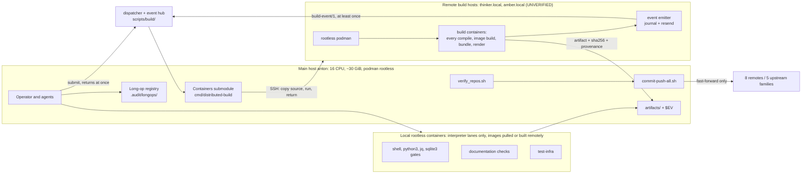
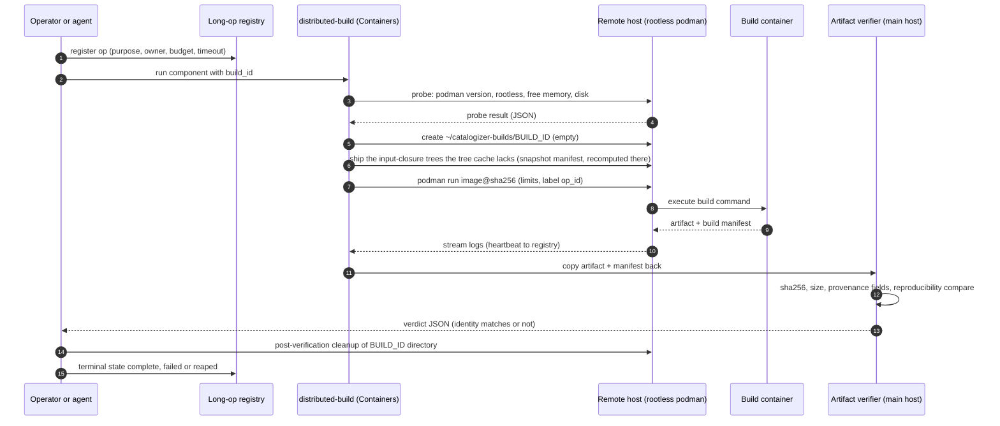
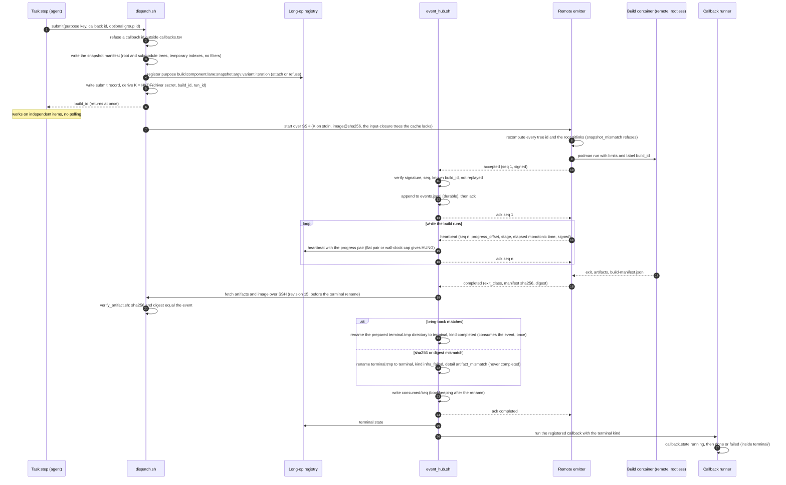
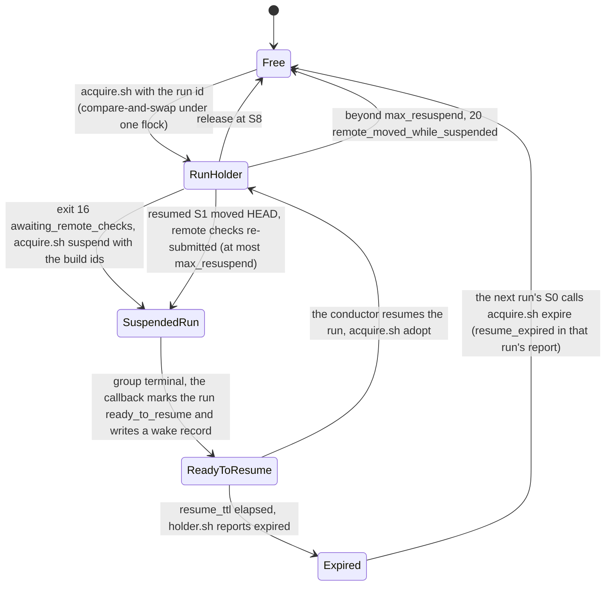
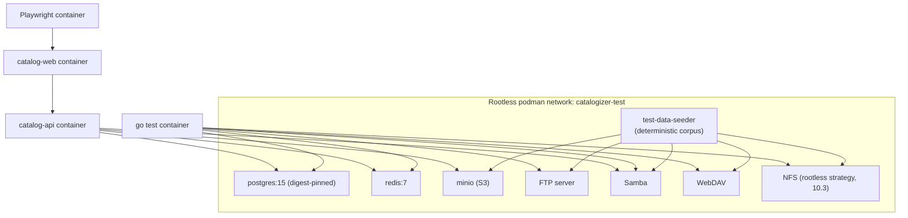
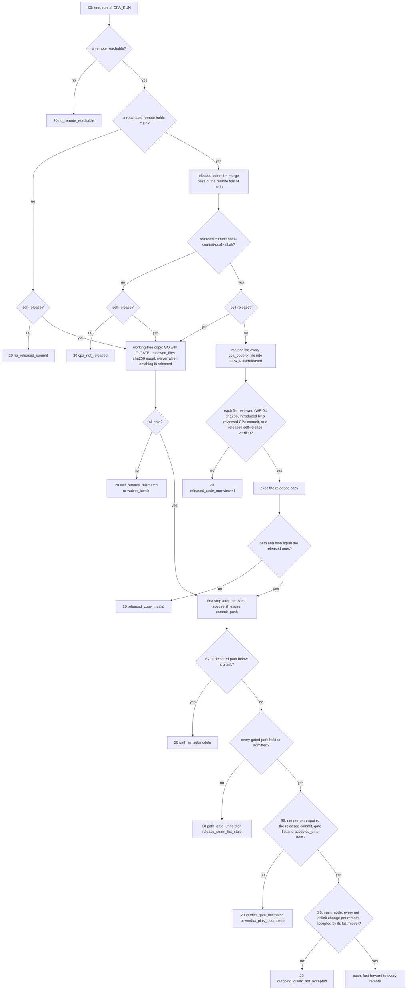

# 16. Containerized Infrastructure and Local Enforcement Plan

| Field | Value |
|---|---|
| Revision | 16 |
| Created | 2026-10-03 |
| Last modified | 2026-10-04 |
| Status | draft (revision 16: sections 9.7 (items 9 to 12), 12.2.8 (items (1), (4) and (5) amended, items (6) to (8) new, diagram updated) and 12.3 follow tasks.md rev 26 (673 tasks, 78 suffix ids; rev 25 commit `2e1fd314`, rev 26 in the working tree, the round-24 and round-25 reviews): the path class `release_seam` over `scripts/release/release_seam_files.txt` (refusal `release_seam_list_stale`, never materialised, its data files tracked policy or threshold inputs only); the exact `G-GATE` paths `scripts/repo/commit_push.conf`, `$FEAT/contracts/review-verdict.schema.json` (read from HEAD), `scripts/release/release_seam_files.txt` and `scripts/qa/guard_registry.tsv`; every `cpa_code.txt` file materialised from the released commit, tables included, with `RUNP_LOCK` the released lock, and a closed list of never-materialised files (correcting revision 15); the launcher review check (`released_code_unreviewed`, three clauses) and the one CPA-commit predicate (run record `commits.tsv` or a committed GO's `covers_runs`; a forged or copied trailer proves nothing); `acquire.sh --expire` moved after the exec; the NO-GO form of a held CPA merge (`git revert -m 1 --no-commit` limited to the rejected paths, `git revert --quit`, `git restore --staged`); the per-tip merge after a partial push (`remotes_diverged` only for conflicting tips); the waiver file `$EV/waivers/<id>.json` with its `ssh-sig` or `hc` attestation, the roster seeded at T047 from the HC-0 `owner_identity` and `owner_signing_key`, the `waiver_invalid` reasons with `attestation_invalid` and the §11.4.240(F) single-uid boundary; the `run_image` and `artifact_kind` lane columns (`run_image_missing`, `run_image_unexpected`, `artifact_kind_missing`), the lock `libc` field read by `scripts/containers/read_libc.sh` (`libc_unreadable`, `libc_missing`, `run_image_libc_mismatch`), IMG-INFRA-CLIENT and IMG-SIGVERIFY; the P1 terminal-state rule (T143, T144 `built` or `blocked` records, T134 and T134a split); the baseline reasons `image_not_built` and `artifact_not_yet_built`; revision 15: sections 9.6, 9.7 (new), 12.1, 12.2, 12.2.8 (new), 12.3, 12.5, 12.6 and 13.1 follow tasks.md rev 24 (670 tasks, commit `c2b01d73`, the round-17 to round-23 reviews applied in tasks.md rev 18 to rev 24) and contracts revision 16: one reviewed path-gate table `scripts/repo/path_gates.tsv` (class `gitlink` to `G-PIN` with pin match, class `cpa_code` and four exact data files to `G-GATE`) replacing the pin, CPA-code and submodule-hold rules; the S0 launcher that executes only the released copy (the merge base of the reachable remote tips of `main`) of the code that `scripts/repo/cpa_code.txt` names, data read from HEAD or the declared source; S2 checks only that a hold is present (`path_in_submodule`, `path_gate_unheld`), S5 judges gate lists and `G-PIN` pins net per path against the released commit (`verdict_gate_mismatch`, `verdict_pins_incomplete`), S6 judges the net gitlink change per pushed remote by its last mover (`outgoing_gitlink_not_accepted`); one `--self-release <verdict> [--waiver <file>]` mode replacing `--adoption` and `--break-glass`; `no_remote_reachable`, `no_released_commit`, `cpa_not_released`, `released_copy_invalid`, `self_release_mismatch`, `waiver_invalid` and the report entry `check_pending_release`; a foreign change to CPA code integrated by a held merge released only by a merge-review GO whose gate list includes `G-GATE`; a verdict `gate` that is a gate id or a list (contracts revision 16), so `hold_gate_conflict` and separate `<WP>-gate.json` files are gone; the suspended-run lock holder with `ready_to_resume`, `resume_ttl`, `acquire.sh --expire`, `--suspend` and `--adopt` as compare-and-swap under one flock, and `max_resuspend`; group kind by precedence and `--cancel-on-fail` for the CPA check group only; `artifact_mismatch` an `infra_failed` reason detail verified before the terminal rename; one class per image and command (`compile`, `interpreter`, `runtime`, `runtime-base` with IMG-CLEAN, `service`; `class_unknown`, `runtime_base_command`); split lanes, the per-compose-project stack lease of T131, the remote `docs render` lane and `export.sh --install`, the T200a coverage wrappers; the closed `blocked-unavailable` set grown to eight with `artifact_unavailable`; two new diagrams (sections 9.7 and 12.2.8) and the updated sequence of section 9.6 and state machine of section 12.5; the driver secret stays the mode-0600 file under `${XDG_STATE_HOME:-$HOME/.local/state}` with the keyring only a cache; revision 14: sections 9.2, 9.4, 9.6, 12.2.4, 12.3, 13.1 and 18 follow tasks.md rev 17 (641 tasks, commit `b34a03f6`), which applied the round-14 to round-16 reviews of the P0 to P3 half in rev 15 to rev 17: the build purpose key `build:<component>:<lane-or-target>:<source-snapshot-digest>:<argv-digest>:<variant>[:<iteration>]` (revision 13 had `build:<component>:<commit>:<variant>`); the source snapshot as a manifest of `(path, tree id)` for the root and every initialised submodule, shipped by input closure into a content-addressed tree cache on the build host with filters disabled and recomputed there (`snapshot_mismatch` recorded `infra_failed`; `submodule_uninitialised` and `undeclared_dirty_input` refused with 20), never `git archive <commit>`; the driver secret in the mode-0600 file `${XDG_STATE_HOME:-$HOME/.local/state}/catalogizer/<checkout-id>/build_hmac.key` outside the checkout and outside every RUNP mount, the kernel keyring only a cache, and the seventh `blocked-unavailable` reason `driver_secret_lost` (revision 13 named the keyring or `.audit/secrets/build_hmac.key`); consuming a `completed` event is the rename of a prepared directory to `terminal`, which claims the callback for every terminal kind, with restart reconciliation; build groups with one group callback; the supervised hub with its SSH identity file; the class per image and command (`compile`, `interpreter`, `service`, `runtime`, fail-closed `class_unknown`, the allow-list `scripts/containers/local_allowlist.tsv`) and the split lanes (remote compile, local run of manifest-verified binaries, the web e2e run half in IMG-PW); the commit-push run suspended on its remote S3 checks with exit 16 `awaiting_remote_checks`, its lock held by a `suspended-run` registry holder through `acquire.sh --suspend` and `--adopt`, and S1 re-run at resume; `remote_check_unavailable` is 20 (revision 13 said 10); the `--accepted-pins` comparison of tasks.md T442a and its four refusals; the review-verdict fields of contracts revision 11; the `UNCONFIRMED:` items of section 9.6 (a dirty build) and section 12.3 (the suspended exit code) settled. Revision 13: section 9.6 and the row of section 9.4 for an unreachable host follow tasks.md rev 14 (636 tasks, commit `9074c177`), which applied the round-14 reviews: the per-build event key derived by HKDF-SHA256 from a driver secret kept in the kernel keyring or a mode-0600 ignored file, so a restarted driver or emitter verifies or re-signs; callbacks named from a closed, reviewed registry `scripts/build/callbacks.tsv` and moved through the durable states `claimed`, `running`, `done` or `failed`, idempotent through an effect key; heartbeats that carry the progress pair `progress_offset` and `stage`, a flat pair past the no-progress budget and a per-purpose wall-clock cap each giving `blocked-unavailable`; host failover at submit time only; the closed set of six `blocked-unavailable` reasons of a dispatched build; the build `variant` in the purpose key; the pulled-image digests resolved first (T005d); the TIC callback contract (T121a); the remote-only wrappers and the suspension and callback resumption of a commit-push run whose compile-class S3 checks run remotely (T121b, section 12.3); the review provenance check of `[REVIEW]` verdicts at S5 (T094a, T094d, section 12.3); the final SLSA record written from the gate output (T447b, section 14). Revision 12: the plan owner's decisions of 2026-10-04 applied (tasks.md rev 13, T012a): C1 for docs/21 ODG-07 removes the "local containers only" option, so every build of every component in any language runs in a rootless container on the remote build host and comes back verified by sha256 and digest (sections 5, 6.1, 7.2, 9.4, 17, 18), and builds and compiling test lanes are dispatched event-driven, with no polling and no blocking wait (new section 9.6, `build-event/1`, tasks.md T005a to T005c, T006a, T089a, T121a); C2 for ODG-16 sets SLSA Build L2 at minimum with no L1 interim, reached through a gate (section 14, tasks.md T447, T447a). Revision 11: section 12 follows tasks.md rev 12 (committed in `d014297e`) and the P4-P7 mechanics of the round-13 tasks.md wave where they meet the script (T435a, T436 to T442, T524, T531, T576, T579a, T580a, T580b, T581), the head tasks T039 to T047, T040a, T040b, T042a and T089 being reworked in parallel: a `--repo` run whose S1 moves a repository that holds nested gitlinks settles them in its own lock hold through `record_pending_pin.sh --settle-nested ... --in-hold <run_id>` and reports every `nested_unsettled` entry, the helper gaining the settle mode with three more paired mutations (eleven) and the `--retire` destination `.audit/removed/<op_id>/<path>/` (section 12.2.3); the pointer change set lowers every row below its count at the new pin, the rows of the `baseline_lowering_owed` reports and those that `baseline_drift` records as lowered, the G-PIN reviews checking the lowered set against the set S3 computes (section 12.2.2 rule 1; V-17 (a) reopened until the head fixtures carry it); FR-008 and SC-003 are reported UNMET while the tracked item 'legacy headerless documents' is open unless an owner decision amends them; an edit of a `legacy-collection` file drops its exact-path row and adds the revision header, and T524 archives 36 report files and keeps one (section 12.2.6); the round-13 findings against rev 12 that need a tasks.md change are recorded as owed with the fix this section proposes, never as mechanics tasks.md carries (V-17 (g) to (m)): the append-only check of `$EV/flake_ledger.jsonl` at S2, the empty local range of the `--commit-before-integrate` backup and its S1a path `backup/s1a/`, the two S1 blocking conditions of T040 stated separately with the S1b rule, the false refusal of a stricter held table, the `shell_parse` rows, the scratch-clone re-recording of a conflicting store and the trailing whitespace of the legacy files that T524 archives; the report sample names the check `anti_bluff` and lists the landmine scan. Revision 10: section 12 reconciled with tasks.md rev 12 (613 tasks; WP-04 T039 to T047 with T040a, T040b and T042a, and T050, T067, T090, T092, T178, T302, T308a, T430, T435a, T441, T442, T499, T572, T576, T580a, T580b, T581 and T582 where they meet the script), the source of truth for every mechanic of this section: the S0 input refusals add `usage_error` (an argument after the message, an unknown option, `--commit-before-integrate` without `--paths-from` or together with `--resolve-merge`) and tell a live merge holder (20, `lock_held`, no remediation) from an interrupted run (20, `merge_in_progress`) by the process id and process start time that the merge record `merge.json` now carries; `SKIP_LONG` is recorded at S0, so a commit-push merge commit carries it; the mode `--commit-before-integrate` (new section 12.2.7) commits the declared change set under the lock after the 9.2 backup and then integrates, the sanctioned remediation of `ff_blocked_by_local_changes`, with a remediation for every code-12 reason; the chained and binary stores have a single writer and are re-recorded on a conflict, never textually merged (20, `store_not_rerecorded`); section 12.2.6 gains the classes `evidence-ledger` (33,554,432 B from the ledger projection, the 75% `ledger_raise_owed` trigger of `tools/evidence/verify` and the held raise step of ST-QA) and `legacy-collection` (`docs/issues/**` and the 41 S-12 root reports, no revision-header check), the git-wildmatch resolution with exact-path rows before glob rows, the `scope` column of the check registry (`files` or `changeset`; 20 `check_unknown`) with `shell_parse` in the check set, and the per-path table sets of a held table change (20 `table_admits_unheld_path`); under `--repo` a count below its row is reported `baseline_lowering_owed`, never 10, and the pointer change set that moves the pin lowers the row, the files its gitlink move brings in being held to the lowering rule; the revision-header check applies to every new or edited Markdown file, the 665 remaining main-repository keys forming one tracked `Task` item; `check_no_ci.sh` anchored at each repository root and the build-output path defined; the report sample lists every file its run writes; the main-repository ODG-41 kind (`foreign_outside_candidate`, tasks.md T308a, T582) in section 12.2.5 item 7 and section 19; the committed `no_remote` field in section 11.2; V-17 (a) and (c) closed. Revision 9: section 12 reconciled with tasks.md rev 11 (612 tasks; WP-04 T039 to T047 with T040a, T040b and T042a, and T064a, T067, T090, T092, T168, T308a, T432, T435a, T500, T535, T571, T580a, T580b, T581 and T582 where they meet the script), which is the source of truth for every mechanic of this section and decided several rule (Y), (X) and (Z) points differently from revision 8: a merge left in progress (`MERGE_HEAD`) is always refused at S0 (20, `merge_in_progress`), the report naming the interrupted run whose merge record `merge.json` names the same tip and the remediation, and a conflict is resolved only by a `--resolve-merge <dir>` run whose directory is `.audit/merge-resolution/<run_id>/` of the refused run (20 `resolution_dir_invalid`, 12 `merge_target_moved`, 20 `merge_resolver_not_pinned`; the revision 8 acceptance of a merge in progress and its skeleton function `accept_merge_in_progress` are withdrawn, section 12.2.5); the 9.2 backup of a merge is a `git bundle` of the local range with a copy of every uncommitted file under `$CPA_RUN/backup/`, checked with `git bundle verify` (the hardlinked git-directory copy with its `show-ref` check, and the `files` exception of `report.json` it needed, are withdrawn); a CPA merge is held on its own merge-review file `$EV/reviews/CPA-merge-<run_id>.json`, reviewed by ST-REV before the next window in P0 to P2, by T307 in P3, by the standing merge review T308a for the main repository in P4 to P7 and by the reviewer of the range for a submodule (T432, T500, T571, T580a); S6 pushes a prefix to a remote only when that remote's live tip is an ancestor of the prefix tip (else 11, `remote_moved_since_s1`) and nothing below an unreleased CPA merge; a GO must list every held commit that awaits its file (20, `verdict_covers_incomplete`), which keeps the one NO-GO form, the revert held on the same verdict, safe (section 12.2.4); the plan owner's rule (V) replaces the rule (Z) exemption list with the reviewed path-class table (`scripts/repo/check_exemptions.tsv`, `scripts/repo/check_classes.tsv`, the loader `scripts/repo/check_class.sh`; classes `source`, `generated`, `evidence`, `patches`, `governance-carrier` and `fixtures`; new section 12.2.6) and one register bound of 16 MiB (16,777,216 B), which needs the 2,048-byte description cap of T168 (the revision 8 bound of 6 MiB is withdrawn); the S2 secret fold carries the hex filter of `.secrets.baseline` and the private-key carrier list `scripts/repo/private_key_carriers.tsv`; rule (X) has three forms; the S3 ratchets score the declared files and report a key outside them as `baseline_drift`, never a refusal (V-19 closed); the export twins are class `generated` (V-18 closed); V-17 keeps only what is genuinely open; the IMG-TESTUTIL row lists `identify`; section 11.2 names the report's `no_remote` boolean; the 11.4.188 citation of section 12.2.5 item 2 becomes 11.4.113. Revision 8: section 12 reconciled with tasks.md rev 9 (609 tasks: WP-04 T039 to T047 with T040a and T042a, and T064a, T435a, T579a, T580a, T580b and T581 where they meet the script) and with the plan owner's four decisions taken after the round-9 reviews, which bind this document and tasks.md alike: (Y) a repository whose own commits diverged from a moved remote is integrated by CPA itself, under the lock and after a 9.2 backup kept in the run directory, with `git merge --no-ff <live remote tip>`, never a rebase, reset or force; the merge commit carries `CPA-Run:` and one `Foreign-Commit:` line per trailer-less commit it brings in, and is held for review when it resolves conflicts (11.4.211, Opus at xhigh) or merges into a held range; a hand-made merge stays refused as `unrecorded_local_commit` (new section 12.2.5; exit 12 now means remote tips that diverge from each other, a merge stopped on conflicts, a blocked integration or a behind change-set submodule with local commits); (Z) the S3 checks carried over from `.pre-commit-config.yaml` carry its `files` and `types` filters and a reviewed exemption list `scripts/repo/check_exemptions.tsv` (path class, exempted checks, reason) for evidence blobs, the append-only stores, captured transcripts, the register engine's exports and `docs/workable_items.db`, whose 1000 KB limit becomes a recorded bound of 6 MiB sized for the WP-20 import of about 1,800 tickets; (W) ratchet baselines are measured over the main repository and every own-organisation repository at every depth, keyed from the main root, in the change set that registers the check, and one scoring rule applies in every mode; (X) a baseline's verdict exists with GO when it is GO in the main-repository HEAD or when the baseline is committed in the same change set as a held path awaiting exactly that verdict. Also: the verifier's `--fetch` and S1 use the objects-only fetch of tasks.md T032 (`--no-write-fetch-head --refmap=`); `Foreign-Commit:` lines go on the first commit a run makes in each repository; the S1 refusal `pin_not_on_remote` and the reason names `hold_in_submodule`, `unrecorded_local_commit` and `stale_pending_unpushed` added, the held-path refusal applied under `--repo` to nested repositories, and the S6 withholding of a gitlink whose commit no remote holds kept only for runs that commit in that submodule; rule (c) extended to a GO declared in the same change set (a proposal); a clean-tree gate cites the run that made the measured HEAD; the NO-GO path follows the tasks.md P0-P1 rule (an ordinary revert prepared with `git revert --no-commit`); the pending-row writers are CPA `--repo` runs and the reviewed helper of tasks.md T435a; `.secrets.baseline` covers every own-organisation repository (T040a); the S7 exceptions copy is `$CPA_RUN/exceptions.tsv` (T042a); notes that tasks.md rev 9 now carries are replaced by their task ids, and what it still lacks is listed in section 17 P3 and V-17 to V-19. Revision 7: section 12 follows tasks.md WP-04 (T039 to T047, tasks.md rev 8) and the plan owner's binding rules for held commits after the round-8 reviews (new section 12.2.4): one spelling, `--awaits-review` and `Awaits-Review:`; the interface `--paths-from` with an optional verdict column, `--awaits-review`, `--local-only` without a required verdict, `--repo`, and a push-only run without `--paths-from`; four lines in the commits (`CPA-Run:`, `Deferred-Gates:`, `Awaits-Review:`, `Foreign-Commit:`); an `Awaits-Review:` path is resolved against the main repository's committed HEAD for every repository, so a `--repo` held commit can be released, and a verdict releases a hold only with `verdict: GO` and a `covers_runs` entry naming the held commit's `CPA-Run` id; a hold on a verdict already GO is refused (20, `verdict_already_go`); in main mode a hold path inside a submodule's work tree is refused (20) and a parent gitlink commit is not pushed before its pin is on the submodule's remotes; `Foreign-Commit:` names only commits a live remote tip held at S1 and a trailer-less local commit no remote holds is refused (20); S6 pushes the longest prefix without an unreleased hold (`review_pending`, 14); S2 append-only and blob-name checks (13); S2 and S3 run the checks carried over from `.pre-commit-config.yaml` only in check-only forms or on copies under the run directory, each with a control needle; the clean tracked tree is `summary.dirty` equal to `summary.dirty_excepted` with `--ignore-submodules=all`, never a raw `git status --porcelain`, also in INV-2; under `--repo` S7 re-keys the verifier rows from the main root; pending rows: one per repository, replaced by a later `--repo` commit, removed only at S8, also when a checkout equals its recorded gitlink and every remote holds the row's sha; an absent pending file is no rows; run directories are removed by the sweep past the `commit_push.conf` bound (new INV-9); the skeleton resolves the root first, maps every helper by its documented codes and checks `record_deferral.sh --run-dir`; `$EVID` renamed `$CPA_RUN`; the `.audit/longops/` records named as the second file set outside the run directory; the report sample lists every file; `--fetch` corrected (the T032 form also writes the tracking ref and `FETCH_HEAD`); the stale owed notes replaced by the tasks that carry them (T006, T039, T040, T090, T106), an IMG-GOTOOLS row added, the open tasks.md items listed in section 17 P3 and V-17. Revision 6: section 12 follows the plan owner's binding commit-push decision: the script never writes into the tracked tree and never commits its own outputs; every output of a run lives only in the ignored run directory `.audit/commit-push/<run_id>/` with a unique run id (UTC time, pid, random suffix); a run that does not get the lock writes only its own run directory; the durable record is git (the `CPA-Run:` trailer and the `Deferred-Gates:` flags `SKIP_LONG`, `SWEEP_ABSENT`, `LOCAL_ONLY` in every commit), and a task that needs a run's result records it through evrec; clean-tree gates are measured on the tracked tree; shared stores belong to their writers; the reviewed list `cpa_owned_paths.txt`, the intake of earlier outputs, the S7 exclusion, `excluded_paths` and the 13 for a changed deferral row are withdrawn; `--repo` commits record pending pin moves in `.audit/pending_pins.tsv`, matched exactly at S7 and consumed by the G-PIN layer; `--local-only` takes `--await-review FILE` and S6 holds a push until that verdict is GO (14); S6 also pushes to a `NO-REMOTE-BRANCH` remote; S1 records a fast-forward blocked by local files; the declared change set is a `--paths-from` file; the skeleton maps helper exits by their documented codes; the no-CI check has one home, the S3 plain check `check_no_ci.sh` (section 16.1); `.secrets.baseline` has one owner, tasks.md T040a (section 12.2.2); the IMG-TESTUTIL row lists pytest and the `tooling` lane, the IMG-DOCS row the `docs` lane; fixtures the revision 5 text claimed but tasks.md does not carry are marked owed (section 17 P3). Revision 5: commit-push section 12 aligned with the tasks.md WP-04 decisions: outputs owned by the script and a run temp directory, so a run never fails on its own deferral rows or reports, with earlier reports committed by the next run (section 12.2.1); the count-keyed S3 ratchet with a baseline-creation rule, a fixture convention and the `.secrets.baseline` precondition (section 12.2.2); S1 stops only on a behind change-set submodule that carries new local commits and allows a pin bump to a commit every remote holds; S6 pushes only repositories with commits a remote lacks; S1 fetch failures recorded per remote; a per-repository mode `--repo <path>` (section 12.2.3); an unreadable verifier report fails closed (20); the deferral flag `LOCAL_ONLY`; task ids remapped to the frozen tasks.md numbering T001-T595; section 11.1 R4 follows docs/21 IC-37 and points third-party rows at document 15 §10.3; IMG-DOCS carries Python; section 16.1 lists the remaining enforcement scripts and states that the no-workflow-file condition is the anti-mess invariant AM-G2. Revision 4: IMG-QA added to the catalogue and to the locally built images (tasks.md T211, T212; docs/21 WP-24); routine S7 runs the verifier with `--fetch` (tasks.md T039, docs/21 IC-37); the section 11.4 note records the mode decision of docs/21 IC-37 instead of listing it as open; phase P3 acceptance gains the changed-and-behind submodule fixture (docs/21 IC-41). Revision 3: verifier sections 11.1, 11.2 and 11.4 aligned with the promoted POC (`git ls-remote` plus object-store-only `--fetch`, `--no-remote`, `--self-test`; v1 report shape by reference); commit-push S1 no longer fast-forwards submodules, S7 runs the verifier without `--strict` on routine runs and maps verifier codes to commit-push codes (verifier 14 becomes 11), `--local-only` parsed and run with `--no-remote`; IMG-KCOV listed as repository-built on IMG-TESTUTIL, PyYAML in IMG-TESTUTIL, a P0 bootstrap row in section 17; `images.lock.yaml` as the single lock file; `.pre-commit-config.yaml` and `docker-compose.dev.override.yml` added to the enforcement inventory; table cells with `\|` escaped. Revision 2: consistency with tasks.md and docs/21 IC-16, IC-36 to IC-38) |
| Feature | specs/001-full-project-audit-remediation |
| Spec coverage | FR-019, FR-020, FR-021 (also supports FR-006, FR-007, SC-003, SC-010, SC-012) |
| Constitution anchors | 11.4.173, 11.4.230, 11.4.232, 11.4.235, 11.4.161, 11.4.76, 11.4.156, 11.4.234, 11.4.264, 11.4.246, 12.6, 12.11, 12.12 (also 11.4.232, 11.4.233, 11.4.200, 11.4.108, 11.4.113, 11.4.201, 11.4.27) |

## Table of contents

1. Purpose, scope and non-goals
2. Evidence base: what was read and what was executed
3. Current-state findings (host, containers submodule, compose, Dockerfiles, scripts, hooks)
4. Defect register for the existing container assets
5. Target architecture and container topology
6. Build-container catalogue per component
7. Image pinning procedure and cache strategy
8. Resource limits and the dynamic envelope (12.6, 12.11, 12.12)
9. Remote build distribution and artifact return with identity verification
10. Test infrastructure stack (real services replacing mocks)
11. Deterministic recursive repository verification (FR-019, FR-020, SC-010)
12. Dedicated commit and push script, no blocking hooks (11.4.234)
13. Anti-mess long-operation registry and invariant sweep (11.4.232, 11.4.233)
14. Reproducible and hermetic builds, SLSA Build Level 2 plan (11.4.246)
15. Build once, promote one digest (11.4.264)
16. Local enforcement without CI (11.4.156)
17. Phased adoption order
18. Risks, trade-offs and rejected alternatives
19. Acceptance evidence and traceability
20. Items to verify (UNCONFIRMED and UNKNOWN register)

---

## 1. Purpose, scope and non-goals

This document plans how every build, test run, scan and documentation render for the audit and remediation feature runs inside rootless containers, how those containers are provisioned through the in-repository Containers submodule, how work reaches remote build hosts and returns, and how the repository tree (main repository plus every submodule at every depth) is proven clean and pushed without hooks that can block the commit and push path.

Scope:

- FR-021: all builds in rootless containers, never on the bare host, artifact verified on a clean target before a fix is called done.
- FR-019 and FR-020: regular commit and push, recursive verification, no history rewrite, no force-push, unpushable repositories reported with a reason.
- Supporting: the infrastructure that real-service tests need (constitution 11.4.27), the resource envelope (12.6, 12.11, 12.12), reproducibility and supply-chain evidence (11.4.246, 11.4.264).

Non-goals: this document does not decide what the audit finds, does not define test content (see document 05), and does not specify performance experiments (see document 14). It consumes those documents' needs as container requirements.

Rule restatements are limited to the constitution items the brief names. Every concrete claim about the repository cites a path.

## 2. Evidence base: what was read and what was executed

Read-only commands executed during planning (output observed in this session):

| Command | Observed result |
|---|---|
| `podman --version` | `podman version 5.7.0` |
| `podman info` (filtered) | `rootless: true`, `cgroupVersion: v2`, `cgroupManager: systemd`, `ociRuntime: crun`, `rootlessNetworkCmd: pasta`, `graphDriverName: overlay`, hostname `anton` |
| `nproc` | 16 |
| `free -g` | 30 GiB total, 8 used, 22 available at the time of the read |
| `command -v docker` | no output (docker absent) |
| `command -v` for tools | present: `buildah`, `podman-compose`, `gh`; absent: `kcov`, `shellcheck`, `trivy`, `semgrep`, `gosec`, `hadolint`, `syft`, `cosign`, `skopeo` |
| `podman ps -a`, `podman images` | other projects' images and exited containers already exist in the same rootless store (names such as `helixagent-mcp-*`, `lava_*`, `boba_*`); the store is shared |
| `git submodule status --recursive` | 97 entries at all depths; `.gitmodules` at the top level contains 88 `submodule` lines; 53 entries are nested at depth 2 or deeper |
| `git remote` | 8 remotes configured on the main repository; `Upstreams/` holds 5 export scripts naming gitflic.ru, github.com (two organisations) and gitlab.com (two organisations) |
| `git config core.hooksPath` | unset; `.git/hooks` contains only `*.sample` files (the tracked `scripts/hooks/pre-push-gate.sh` is not installed) |

Files read: `docker-compose*.yml`, `deploy/*.yml`, `deployment/docker-compose*.yml`, `catalog-api/Dockerfile` and `.dev`, `catalog-web/Dockerfile`, `docker/Dockerfile.builder` and the `docker/` listing, `scripts/build_in_container.sh`, `scripts/container-build.sh`, `scripts/push_all_submodules.sh`, `scripts/run-race-detector.sh`, `scripts/hooks/pre-push-gate.sh`, `scripts/install_git_hooks.sh`, `.pre-commit-config.yaml` and `docker-compose.dev.override.yml` (revision 3), `scripts/distributed-boot.sh`, `docs/BUILD_CONTAINER_AUTO_DISPATCH.md`, `Build/CLAUDE.md`, the root `commit` script, `env.properties` (secrets values not recorded here), `submodules/containers` package tree and `helix-deps.yaml`, and `specs/001-full-project-audit-remediation/docs/01-system-architecture-map.md`.

Not executed: no image pull, no build, no test, no connection to `thinker.local` or `amber.local`. All snippets in sections 6 to 16 are `NOT EXECUTED` unless stated.

## 3. Current-state findings

### 3.1 Host facts

| Fact | Value | Implication |
|---|---|---|
| Container engine | podman 5.7.0 rootless, crun, netavark/aardvark, pasta networking, overlay on cgroup v2 | Meets 11.4.161. No docker. Any compose file must run under `podman-compose` (present) or `podman compose` |
| CPU | 16 logical | Envelope in section 8 |
| RAM | about 30 GiB total, 22 available when sampled | 12.6 ceiling of 60 percent of total is about 18 GiB for all project work together |
| Missing scanners | trivy, semgrep, gosec, hadolint, syft, cosign, skopeo, shellcheck, kcov | Each must run from a pinned container (section 6), not be installed on the host (no sudo, no host package installs) |
| Shared image store | other projects' images live in the same store | Image naming must be namespaced (`localhost/catalogizer-*`), prune must be scoped by label, never `podman system prune` |
| Bind-mount safety | SELinux not confirmed | `:z` or `:Z` suffix choice must be probed, see section 6.2 |

### 3.2 The Containers submodule (submodules/containers, module `digital.vasic.containers`)

Verified package inventory under `submodules/containers/pkg`: `runtime` (detection plus podman, docker, kubernetes, crio, nerdctl, lxd adapters; `runtime.AutoDetect` is shown in its README), `compose` (compose orchestration, `helix_project.go`), `remote` (SSH executor with `Execute`, `ExecuteStream`, `CopyFile`, `CopyDir`, `IsReachable`; `RemoteComposeOrchestrator` with `Up`, `Down`, `Status`, `Logs`; host manager, probe, gpu probe), `remoteexec`, `distribution` (`DefaultDistributor` with `Distribute`, `Undistribute`, `Status`, `HealthCheckAll`, `Rebalance`), `scheduler` (resource-aware strategies), `crossbuild` (`Selector` choosing a `Backend` per `BuildRequest`; Linux container, Wine and host-direct backends; SELinux relabel helper in `container_runner.go`), `health`, `orchestrator`, `policy`, `envconfig` (dotenv parser), `cache`, `volume`, `network`, `lifecycle`, `metrics`, and VM/emulator packages. `cmd/` contains `distributed-build`, `distributed-test`, `deploy-stack`, `boot` and emulator tools.

`cmd/distributed-build/main.go` flags (read): `-project`, `-env`, `-component`, `-version`, `-skip-tests`, `-dry-run`, `-timeout` (minutes, default 30), `-strategy` (default `resource_aware`), `-components` (JSON file of the project's build components). Remote hosts are configured through the `.env` file passed with `-env`; the exact variable names are `UNCONFIRMED:` and must be read from `submodules/containers/pkg/envconfig` and `cmd/distributed-build/main.go` before the first use (step P2-2 in section 17).

Integration tests in `pkg/distribution/distributed_build_test.go` are gated by `CONTAINERS_INTEGRATION_TEST=1` and name hosts from the environment, including a host called `thinker`.

Consequence: a distribution and remote-compose mechanism exists and the repository already has the constitution-mandated "extend the containers submodule, never an ad-hoc host build" path available (11.4.74, 11.4.173). What does not exist is a Catalogizer-specific component description file for `-components` and a verified remote host inventory. Producing both is a deliverable of this plan.

### 3.3 Existing build scripts and what they do today

| Script | What it does | Gap against 11.4.173 and FR-021 |
|---|---|---|
| `scripts/build_in_container.sh` | rsyncs `catalog-api` and `submodules` to `${BUILD_HOST:-thinker.local}`, runs `podman run golang:1.25-bookworm` there, brings `catalog-api-container` back and prints a remote-versus-local md5 proof block | Go only; uses `ssh` and `rsync` directly rather than the Containers submodule `remote` package; tag-based image reference (`golang:1.25-bookworm`, not a digest); md5 for identity (weak; should be sha256 plus provenance); `rsync --delete` into a fixed remote directory, which is not isolated per build |
| `scripts/container-build.sh` | wraps `podman-compose -f docker-compose.build.yml` with version and skip options | Depends on `docker/Dockerfile.builder` which does not build (finding D-03) |
| `scripts/lib/auto-container.sh` (documented in `docs/BUILD_CONTAINER_AUTO_DISPATCH.md`) | `need_toolchain`, `ensure_builder_image`, `run_in_builder`: when a toolchain is not on the host PATH it re-executes in `localhost/catalogizer-builder:latest` with `--userns=keep-id`, `--network host`, `-v $PWD:/workspace:z` | The rule is "container only when the host lacks the tool". This contradicts FR-021 and 11.4.173, which require the container always, even if the host has the tool. The dispatch condition must be inverted (finding D-08) |
| `scripts/lib/build-*.sh`, `scripts/build-all-releases.sh`, `scripts/release-build.sh`, `build-scripts/build-all.sh` | per-component build entry points | `build-scripts/build-all.sh` runs builds directly on the host and creates placeholder build scripts when missing (it writes "not yet implemented" scripts that report success). That is a bluff-class behaviour under 11.4 and a bare-host build under 11.4.173 (finding D-09) |
| `Build/` framework (`Build/lib/common.sh`, `version.sh`, `hash.sh`, `orchestrator.sh`) | versioning via `versions.json`, SHA-256 source-hash change detection, `detect_runtime` for podman or docker | Reusable. Version and hash logic feed the build identity in section 9.3 |
| `scripts/run-race-detector.sh` | race tests across catalog-api and a hard-coded list of Go submodules, honours `GOMAXPROCS=3 go test -p 2 -parallel 2` | Runs on the host. Must move inside the Go test container (section 6) with the same limits expressed as container limits |

### 3.4 Commit and push tooling today

- The root `commit` file is a 30-line wrapper that sources `env.properties` and calls an external `commit` binary resolved by `PATH` to `/home/milosvasic/Projects/project_toolkit/Upstreamable/commit` (shown by `type -a commit`). The external script is outside this repository and was not read: `UNCONFIRMED:` whether it commits and pushes submodules recursively, how it treats divergence, and whether it can force. Its behaviour must be read before it is trusted by section 12.
- `scripts/push_all_submodules.sh` handles only owned submodules under `submodules/*` (the header says so), stages governance pointer files only, uses `merge --ff-only` and refuses force. It writes its log to `qa-results/phasef_push.log` and has a `DRY_RUN=1` default. It does not walk nested submodules (53 of 97 entries are nested), so it cannot satisfy SC-010 alone.
- `scripts/hooks/pre-push-gate.sh` is a tracked blocking gate (landmines, anti-bluff scan, LLM-judge prompt) with an `LLM_JUDGE_BYPASS=1` emergency variable. `scripts/install_git_hooks.sh` would symlink it as `.git/hooks/pre-push`. It is currently not installed (no `pre-push` file in `.git/hooks`, `core.hooksPath` unset). Under 11.4.234 it must not be installed as a blocking hook; its checks become an explicit stage of the dedicated script (section 12). The `LLM_JUDGE_BYPASS` pattern is replaced by the recorded-deferral flag of 11.4.234(D) so skips are visible, not silent.
- `.github/` exists and tracks `FUNDING.yml` and `workflows/README.md` only: no active pipeline (consistent with 11.4.156). The planning must keep it that way.
- `.pre-commit-config.yaml` (revision 3; tracked, last changed in commit `d72f14ce`, 2026-04-21) declares a `pre-commit` hook set: `pre-commit-hooks` v4.5.0 (`trailing-whitespace`, `end-of-file-fixer`, `check-yaml`, `check-json`, `check-added-large-files --maxkb=1000`, `check-merge-conflict`, `detect-private-key`), `detect-secrets` v1.4.0 with `--baseline .secrets.baseline`, `pre-commit-golang` v0.5.1 (`go-fmt`, `go-vet`, `go-imports`, `go-unit-tests -v -race ./...`), local `gosec` (`language: system`) and `scripts/hooks/no-false-positive-log.sh`, `mirrors-eslint` v8.55.0 and `mirrors-prettier` v3.1.0. Observed on 2026-10-03: the `pre-commit` tool is not on the host `PATH` (`command -v pre-commit` prints nothing), `.git/hooks` holds only samples, and `.secrets.baseline` does not exist, so the `detect-secrets` hook as configured would fail on its first run. The configuration is therefore not active. It is not installed as a hook under this plan (11.4.234; its `go-unit-tests -race` and `gosec` entries would also run on the bare host, against FR-021). Its checks are carried into named stages instead (section 16.1). The file stays tracked and unmodified; removing it is an owner decision (11.4.122).
- `docker-compose.dev.override.yml` (revision 3; tracked, 21 lines, last changed in commit `bbba26a0`, 2026-04-11) remaps host ports for a developer host where the standard ports are taken (`postgres` 5435, `redis` 6381, `api` 8090) and sets `POSTGRES_PORT`, `REDIS_PORT` and `API_PORT` for the `api` service. It names no image, so `check_pins.sh` has nothing to pin in it and it is not one of the three files of D-07 (revision 5 correction), but it is in scope for the compose enumeration of the S3 compose checks, and its `REDIS_PORT` and `API_PORT` names repeat the environment-name mismatch recorded as O-06 in document 01.
- Names such as `scripts/ci-local.sh` (932 lines), `scripts/local-ci.sh`, `scripts/ci-pipeline.sh` are local scripts; they are acceptable as local enforcement but their stage content is `UNCONFIRMED:` and is audited in document 05's scope; this plan only requires that they run inside containers.

### 3.5 Build hosts named in the repository

`thinker.local` is named in `scripts/build_in_container.sh`, `deploy/MIGRATION_thinker_local.md`, the project `CLAUDE.md` and 11.4.173. `amber.local` appears in `deployment/amber-up.sh` (and `thinker-up.sh` beside it). Neither was contacted. Section 9.5 lists exactly what must be verified before either is relied on.

## 4. Defect register for the existing container assets

These are findings observed by reading files. They enter the findings register (document 04) with the ids assigned there. Severity is a proposal; document 04 owns classification.

| Id | Asset | Observed defect | Evidence | Proposed severity |
|---|---|---|---|---|
| D-01 | `docker-compose.yml` service `api` | Build context is `./catalog-api` with `dockerfile: Dockerfile`, but `catalog-api/Dockerfile` copies `submodules/...` and `catalog-api/...` paths, which only exist when the context is the repository root. The build cannot resolve those COPY sources | docker-compose.yml:67-69 versus catalog-api/Dockerfile:21-50 (`COPY submodules/assets/ ...`, `COPY catalog-api/go.mod ...`). `docker-compose.test.yml:38-40` uses context `.` for the same Dockerfile, which is the form that matches | high |
| D-02 | `docker-compose.test.yml` service `catalog-web` | Context `./catalog-web` with `catalog-web/Dockerfile`, which copies `catalog-web/...` and sibling module directories relative to the repository root | docker-compose.test.yml:87-89 versus catalog-web/Dockerfile:17,59 | high |
| D-03 | `catalog-web/Dockerfile` | `COPY` sources `WebSocket-Client-TS/`, `Media-Types-TS/`, `UI-Components-React/`, `Media-Browser-React/`, `Media-Player-React/`, `Collection-Manager-React/`, `Dashboard-Analytics-React/`, `Auth-Context-React/`, `Catalogizer-API-Client-TS/` at the context root. Those directories are not at the repository root; the modules live at `submodules/websocket_client_ts` and so on (the root listing has no such directories, `ls WebSocket-Client-TS` fails). The image cannot build from the repository root | catalog-web/Dockerfile:6-14,48-56; root listing; document 01 section on shared submodules | high |
| D-04 | `docker/Dockerfile.builder` | `COPY docker/go${GO_VERSION}.linux-amd64.tar.gz` with `GO_VERSION=1.26.1`: the `docker/` directory holds Dockerfiles and `signing*` only, no tarball. The builder image (used by `docker-compose.build.yml`, `docker-compose.test.yml` desktop and wizard services, and `scripts/container-build.sh`) cannot be built from a clean checkout | Dockerfile.builder:`COPY docker/go${GO_VERSION}...`; `ls docker` | high |
| D-05 | `docker/Dockerfile.builder` | Header comment says JDK 17, installed package is `openjdk-21-jdk`; Node 18 from `deb.nodesource.com/setup_18.x` (Node 18 is past end of life, `UNCONFIRMED:` exact date to cite from nodejs.org in the dependency document), while `catalog-web/Dockerfile` uses Node 20; `ubuntu:22.04` unpinned tag; Rust installed by piping `https://sh.rustup.rs` to `sh`; `cargo install tauri-cli` unpinned; `curl \| bash` for NodeSource; Go minimum in comment 1.25.7 versus 1.26.1 tarball; `ENTRYPOINT ["/project/scripts/build-test-release.sh"]` | Dockerfile.builder | medium |
| D-06 | `docker-compose.build.yml` | `network_mode: host` and bound host ports 5432 and 6379 on a developer machine (collision with any local PostgreSQL or Redis); fixed credentials in the file (`<test credential literals, see docker-compose.build.yml:13-14, 74-75, 92-93>`, test-only but compromised by disclosure because committed in public code); volumes `go-cache:/root/go` assume root-in-container while the dispatch doc says `--userns=keep-id`; `docker.io/budtmo/docker-android:emulator_14.0` tag only | docker-compose.build.yml:10-50, 100-127 | medium |
| D-07 | `docker-compose.yml`, `deployment/docker-compose.yml`, `docker-compose.dev.yml` | Floating tags (`prom/prometheus:latest`, `grafana/grafana:latest`, `quay.io/minio/minio:latest`, `dpage/pgadmin4:latest`, `nginx:alpine`, `postgres:15-alpine`); `cat docker-compose.yml deployment/docker-compose.yml docker-compose.dev.yml \| grep -c latest` returns 12 matching lines when measured 2026-10-03 (3 + 6 + 3 per file; across all nine root compose files the count is 18 lines, not 30, so the earlier figure of 30 was not reproducible). Environment names `API_PORT`, `REDIS_HOST`, `REDIS_PORT` do not match the names the process reads (`SERVER_PORT`, `REDIS_ADDR`), already recorded as O-06 in document 01 | grep; docker-compose.yml:76-83; main.go:324,562 per document 01 | medium |
| D-08 | `scripts/lib/auto-container.sh` | Containerizes only when the toolchain is missing from the host PATH (`need_toolchain`); a host with the tool builds on the bare host | docs/BUILD_CONTAINER_AUTO_DISPATCH.md "Public API" | high (FR-021, 11.4.173) |
| D-09 | `build-scripts/build-all.sh` | Builds directly on the host; creates placeholder build scripts that print success when a component's script is missing | build-scripts/build-all.sh | high (bluff-class and bare-host) |
| D-10 | `docker-compose.test-infra.yml` NFS service | `privileged: true` plus `cap_add: SYS_ADMIN` and kernel NFS dependency. A rootless podman user cannot honestly grant that; the service will fail or run degraded. Needs a rootless-compatible NFS strategy or a recorded structural-impossibility finding with a substitute (section 10.3) | docker-compose.test-infra.yml:165-185 | medium |
| D-11 | `scripts/build_in_container.sh` | Remote working directory is fixed (`~/catalogizer-build`) and synced with `rsync --delete`: two concurrent builds, or a build and a leftover, can corrupt each other; no per-build directory; md5 proof | scripts/build_in_container.sh | medium |
| D-12 | `scripts/push_all_submodules.sh` | Does not cover nested submodules (53 of 97 recursive entries) and does not verify the working tree; covers only governance pointer files | script header | medium (SC-010) |
| D-13 | `scripts/hooks/pre-push-gate.sh` | Blocking pre-push design with a free-form environment bypass; contradicts 11.4.234 if installed as a hook | script header; `scripts/install_git_hooks.sh` | medium |
| D-14 | Root `commit` | Delegates to an external binary not under version control in this repository; behaviour unknown | `type -a commit` | UNKNOWN, treat as medium until read |

D-01 to D-04 are the ones that are already known to break a build; the plan treats each as a reproduce-first case (11.4.115): before editing, a containerized `podman build` of the exact compose or Dockerfile invocation is recorded failing, then the fix is applied, then it is recorded passing three times. Whether any of D-01 to D-03 is masked by an out-of-tree workaround (for example a script that sets a different context) is `UNCONFIRMED:`; the defect is only confirmed after the failing build is captured.

Revision 10 (tasks.md T110, T159, T390, T448, T448a): the tag-only references of D-05 and D-07 and the other tag-only `FROM` lines each have an owning task, and every one of them is a row of `scripts/repo/validate_baselines/check_pins.tsv` that leaves the baseline in the change set that pins it. Re-measured for this revision with a `FROM` parse of every tracked Dockerfile of the main repository, build-stage aliases filtered and digest-pinned lines left out: 13 tag-only `FROM` lines in 10 files, `docker/Dockerfile.builder` line 5 (T110), `catalog-web/Dockerfile` lines 1 and 64 (`docker.io/node:20-alpine`, `docker.io/nginx:alpine`; T390), and ten lines in eight files that no other task names, `catalog-api/Dockerfile` lines 8 and 56, `catalog-api/Dockerfile.dev` line 1, `catalog-api/Dockerfile.runtime` line 12, `OCU-CUDA-Sidecar/Dockerfile` lines 15 and 64 and line 5 of `docker/Dockerfile.android`, `docker/Dockerfile.android2`, `docker/Dockerfile.android3` and `docker/Dockerfile.android4` (T448a, with the script reference `docker.io/grafana/k6:latest` of `scripts/run-all-platform-tests.sh` line 118); the compose files of D-07 are T448's. A tag that no longer resolves is never replaced by another tag: its row stays as an owed item with its owner, and the four `docker/Dockerfile.android*` variants stay in place until the 11.4.122 removal decision of T106, pinned by T448a meanwhile, because a digest pin removes nothing. The P1 exit record of T159 lists the rows not pinned by P1 as owed, each with its owner, never as clean.

## 5. Target architecture and container topology

Principles: one container engine path (rootless podman through the Containers submodule), one build description file per component, one image reference per toolchain pinned by digest, one remote execution path, one artifact identity format, one verifier.



Placement policy:

| Work class | Where | Reason |
|---|---|---|
| Go unit, integration, race, fuzz, benchmark for catalog-api and Go submodules | remote build host, dispatched event-driven (revision 12, owner decision C1; tasks.md T121a: every lane that compiles runs remote) | 11.4.173 covers source compile; the caller works on independent items while the lane runs (section 9.6). `UNCONFIRMED:` where the real-service stack of section 10 runs for a remote compiling lane (beside the lane on the build host, or reached from it); T121a fixes the site of the lane, not of its services |
| Web build, lint, type check, unit tests, Playwright | remote build host for the build and bundle steps; every other lane at the site that the `site` column of `scripts/containers/lanes.tsv` records (tasks.md T121a), `local` only for a lane that runs an interpreter over the read-only source in a pinned image | revision 12, owner decision C1 |
| Rust/Tauri desktop and installer-wizard, Android and Android TV Gradle builds | remote build host(s), always (11.4.173; revision 12) | Heavy toolchains (Android SDK, WebKitGTK headers); main host memory ceiling |
| Documentation rendering (VitePress, diagrams, export to html, pdf, docx) | remote build host for every render that produces an artifact (11.4.173 names asset render); the documentation checks over the read-only source run locally in the pinned IMG-DOCS (tasks.md T121a) | Deterministic fonts and tools inside image |
| Scanners (trivy, semgrep, gosec, hadolint, syft, sonar-scanner) | local container from pinned images | Not installed on the host; no host installs |
| Mutation testing (go-mutesting or equivalent, Stryker for TypeScript, PIT for Kotlin) | remote build host (each mutant is a compile; revision 12) | Long running; CPU heavy. The exact tool choice per language is owned by document 05 and is `UNCONFIRMED:` here |
| Repository verification and commit and push | host shell, `git` and `ssh` only | These are repository operations, not builds; they read and write version control state and must not require a container. Their own validation stage invokes containers (section 12) |

Clarification of the 11.4.173 boundary: `git`, `ssh`, `bash` and a pinned container run are control-plane operations on the host. Anything that compiles, packages, renders, scans or tests is data-plane work and runs in a container. Revision 12 (owner decision C1, docs/21 ODG-07): every build, meaning every compile, image build, package, bundle and render, runs in a rootless container on the remote build host and is dispatched event-driven (section 9.6); a local container only runs an interpreter lane over the read-only source in an image that was built remotely or pulled by digest; when no qualified build host is reachable a build is `blocked-unavailable`, never run locally. The earlier "local containers only" fallback and the tracked deviation it needed are removed.

## 6. Build-container catalogue per component

### 6.1 Catalogue

Image references below are named by role and by the base image family only. No digest is invented. Section 7 gives the procedure that fills the digest column; until filled, an image is `UNPINNED` and any use of it is flagged in the evidence record.

| Id | Role | Base image family and intended tag | Toolchain contents | Used for | Digest (to fill) |
|---|---|---|---|---|---|
| IMG-GO | Go build and test | `docker.io/library/golang`, tag matching `catalog-api/go.mod` (`go 1.25.7`): the Dockerfile uses `golang:1.25` and the remote script uses `1.25-bookworm`; one tag (`1.25-bookworm`, glibc, because CGO links `docx.c` against glibc fortify symbols per the comment in `scripts/build_in_container.sh`) must be chosen and recorded | Go, gcc via `build-essential`, `libsqlite3-dev` if required (`UNCONFIRMED:` whether the sqlite driver bundles the amalgamation), race detector (needs CGO) | catalog-api, Go submodules, race, bench, fuzz | TBD |
| IMG-NODE | Web build | `docker.io/library/node` 20 (matches `catalog-web/Dockerfile`; `UNCONFIRMED:` engine constraint in `catalog-web/package.json`) | npm, build deps | catalog-web, TypeScript submodules, `catalogizer-api-client` | TBD |
| IMG-PW | Playwright | `mcr.microsoft.com/playwright` version aligned with the Playwright version in `catalog-web/package.json` (compose files use `v1.40.0-jammy`, `UNCONFIRMED:` against package.json) | chromium, firefox, webkit | web E2E, visual regression | TBD |
| IMG-RUST | Rust and Tauri | built on the remote build host (revision 12) from a Containerfile derived from `docker/Dockerfile.builder` layers 1, 4 | rustup with pinned toolchain version, `tauri-cli` pinned, `webkit2gtk-4.1-dev`, `libayatana-appindicator3-dev`, `librsvg2-dev`, `libgtk-3-dev`, `patchelf`, `xvfb` | catalogizer-desktop, installer-wizard | image digest, brought back as an OCI archive and verified against its `build-event/1` completion record (section 9.6) |
| IMG-ANDROID | Gradle and Android SDK | built on the remote build host (revision 12); derived from layer 5 of `docker/Dockerfile.builder` and `docker/Dockerfile.android*` | JDK 21, Android command-line tools, build-tools 34 and 35, platforms 34 and 35, pinned Gradle wrapper (the repo's wrapper, not a host Gradle) | catalogizer-android, catalogizer-androidtv, instrumented tests build step | image digest, brought back verified (section 9.6) |
| IMG-DOCS | Documentation render | built on the remote build host (revision 12) | Node plus VitePress (`Website/` is the VitePress site, `UNCONFIRMED:` exact path, owned by document 13), Mermaid CLI with headless Chromium, pandoc, a PDF engine, fonts; revision 5: `python3` with `pytest`, PyYAML and `jsonschema` at pinned versions, plus `bash`, `git` and `jq`, because the documentation checks run Python (the link crawler of tasks.md T279 runs through `scripts/containers/run_docs.sh` in this image); smoke test `python3 -c 'import pytest, yaml, jsonschema'` | README graph checks, link crawl, exports (html, pdf, docx), diagram render checks (SC-007); revision 6 correction: the `docs` key of the lane table (`TIC docs docs`, `run_docs.sh`, tasks.md T121) runs in this image, while the `tooling` key runs in IMG-TESTUTIL | local |
| IMG-SCAN-TRIVY, -SEMGREP, -GOSEC, -HADOLINT, -SYFT, -SONAR | Scanners | `aquasec/trivy`, `semgrep/semgrep`, `securego/gosec`, `hadolint/hadolint`, `anchore/syft`, `sonarqube` and the scanner CLI image (compose security file already names `sonarqube:community`, `owasp/dependency-check`, snyk CLI on `node:18-alpine`) | one tool each | SC-009 and document 10 | TBD per tool |
| IMG-SHELLCHECK, IMG-KCOV | Shell lint and shell coverage | IMG-SHELLCHECK: `docker.io/koalaman/shellcheck` pulled and pinned by digest (built FROM scratch, so the lock entry carries an entrypoint override); IMG-KCOV: repository-built kcov on IMG-TESTUTIL, from the tracked `build/containers/kcov/Containerfile` `FROM` the IMG-TESTUTIL digest (revision 3; the upstream kcov image is not used because it lacks git, jq and python3, tasks.md T006) | shell scripts are in scope for the 11.4.224 coverage floor; IMG-KCOV also carries the IMG-TESTUTIL tools, so a coverage run has git, jq and python3 | document 05; docs/21 P0 test legs (WP-09) | IMG-SHELLCHECK: pulled digest; IMG-KCOV: built digest recorded in `images.lock.yaml` |
| IMG-TESTUTIL | Test utilities for the docs/21 P0 test legs (added in revision 2, unconditional) | built rootless on the remote build host (revision 12; tasks.md T006a, T006) from the tracked `build/containers/testutil/Containerfile`: `FROM docker.io/library/debian` slim, base digest-pinned, packages installed from a pinned Debian snapshot (`snapshot.debian.org` timestamp recorded in the Containerfile) at pinned versions | `bash`, `git`, `sqlite3`, `python3`, `jq`, Python `jsonschema`, PyYAML and `pytest` (`python3-jsonschema`, `python3-yaml`, `python3-pytest`; revision 3, `pytest` added to this row in revision 6 as tasks.md T006 installs it and T008 probes `import pytest`) | register DDL and trigger tests, verifier and commit-push fixture tests, schema validation, catalogue regeneration (tasks.md WP-09); revision 6: the `tooling` key of the lane table (`TIC tooling unit`, `run_testutil.sh`, tasks.md T121) runs governance and tooling Python here. Revision 7 (replacing the revision 6 note that no image carried them): the commit-push check tools `detect-secrets` 1.4.0 and `pre-commit-hooks` 4.5.0 (which also provides `detect-private-key`), the versions `.pre-commit-config.yaml` names, are installed by tasks.md T006 into the virtual environment `/opt/cpa-tools` (`pip install --require-hashes` from `build/containers/testutil/requirements.txt`), each after its 11.4.270 existence verdict in `$EV/wp09/tool-existence.json`; a tool whose verdict is not VERIFIED is left out and its check stays a `deferred` row of tasks.md T040; `goimports` is not in this image but in IMG-GOTOOLS. Revision 9: tasks.md T006 (rev 10) also installs `identify`, the library pre-commit uses to give a file its type tags, which the S3 hook filters read (section 12.2 S3), into the same virtual environment after its 11.4.270 existence verdict | local image id; the built digest is recorded in `images.lock.yaml` |
| IMG-GOTOOLS | Go source tools for the commit-push S3 checks (revision 7; tasks.md T106) | built on the remote build host (revision 12) from `build/containers/gotools/Containerfile` `FROM` the IMG-GO digest | `goimports` from `golang.org/x/tools` at a pinned version, module checksums verified through the Go checksum database at build time, its 11.4.270 existence verdict recorded in `$EV/wp11/gotools.json` | the S3 check `go-imports` in its check-only form `goimports -l` (section 12.2 S3), which the same change of T106 turns from a `deferred` to a `plain` row of `scripts/repo/validate_checks.tsv` | built digest recorded in `images.lock.yaml` |
| IMG-QA | HelixQA runs (revision 4; document 12 section 18.3, docs/21 WP-24) | built rootless on the remote build host from a tracked Containerfile with digest-pinned `FROM` lines (tasks.md T211, dispatched through section 9.6; revision 12: the owner's C1 answer removed the local-build deviation that revision 4 recorded here) | `helixqa` built from the pinned `submodules/helix_qa`, Tesseract, ffmpeg, Playwright browsers, python3 with PyYAML and pytest at pinned versions; the wrapper `scripts/qa/run_profile.sh` is not baked in, it runs from the read-only source mount | bank validation, bank-id floor, HelixQA profiles (`api`, `web`, `desktop`, `android`, `androidtv`, `installer`), the docs/21 WP-21 re-verification cases; reached only through `scripts/containers/run_qa.sh` and the `qa` rows of `scripts/containers/lanes.tsv` (tasks.md T212) | built digest recorded in `images.lock.yaml` as `IMG-QA`; smoke test prints `helixqa --version`, `tesseract --version`, `ffmpeg -version` and imports `yaml` and `pytest` |
| IMG-MUT | Mutation testing | built on the remote build host per language (revision 12) | per document 05 | SC-005 | image digest, brought back verified (section 9.6) |
| IMG-INFRA-* | Real services | `postgres`, `redis`, `minio`, FTP, SMB, WebDAV, NFS images from `docker-compose.test-infra.yml` and `docker-compose.build.yml` | see section 10 | integration, E2E | TBD |

The Containers submodule's own `crossbuild` Linux backend (`pkg/crossbuild/linux_container.Containerfile`) is the preferred mechanism for the Rust and Android images when those are declared as build components (11.4.74: extend, do not reimplement). Whether it supports Tauri and Android SDK images unchanged is `UNCONFIRMED:`; the decision record is:

Decision DR-16-1. Provide Catalogizer Containerfiles under a new `build/containers/` tree (one directory per image, each with a `Containerfile` and a `README.md`; every image, pulled or built, has its entry in the single lock file `build/containers/images.lock.yaml` of section 7.1, revision 3), and register them through a `components.json` consumed by `cmd/distributed-build -components`. If the Containers submodule lacks a needed capability (for example per-build working directory, sha256 artifact manifest), the capability is added upstream in the submodule, not worked around in Catalogizer scripts. Rejected alternative: keep `scripts/build_in_container.sh` as the long-term driver; rejected because it duplicates SSH and rsync logic the submodule already provides and cannot give digest-pinned, per-build isolated directories without becoming a second orchestrator.

### 6.2 Invocation forms (POC, NOT EXECUTED)

The common run flags: rootless, no privileged, user namespace mapping so output files belong to the invoking user, read-only source mount where possible, explicit limits from section 8, a label for scoped cleanup, no host network unless a service needs it.

```bash
# Common prefix (NOT EXECUTED). IMG_* come from build/containers/images.lock.yaml (section 7.1).
RUN_COMMON=(podman run --rm
  --userns=keep-id
  --security-opt label=disable          # or use :z after the SELinux probe in 8.5
  --label project=catalogizer --label op_id="$OP_ID"
  --memory "$MEM_LIMIT" --memory-swap "$MEM_LIMIT" --cpus "$CPU_LIMIT" --pids-limit 4096
  --cap-drop=ALL
  -v "$PWD":/src:ro
  -v "$OUT_DIR":/out:rw
  -w /src)

# Go unit and race tests for catalog-api, limits mirror scripts/run-race-detector.sh
"${RUN_COMMON[@]}" -e GOMAXPROCS=3 -e GOTOOLCHAIN=local -e CGO_ENABLED=1 \
  -v catalogizer-gocache:/go/pkg/mod:rw -v catalogizer-gobuild:/root/.cache/go-build:rw \
  "$IMG_GO" sh -c 'cd catalog-api && go test -race -p 2 -parallel 2 -json ./... > /out/go-test.jsonl'
# Expected machine output: /out/go-test.jsonl, one JSON object per line with "Action":"pass"|"fail"|"output".

# Web build and unit tests
"${RUN_COMMON[@]}" -v catalogizer-npm:/root/.npm:rw "$IMG_NODE" \
  sh -c 'cd catalog-web && npm ci --ignore-scripts && npm run build && npm test -- --reporter=json --outputFile=/out/web-test.json'

# VitePress or documentation render
"${RUN_COMMON[@]}" "$IMG_DOCS" sh -c 'cd Website && npm ci && npm run build'

# Scanners (read-only source, results in /out)
"${RUN_COMMON[@]}" "$IMG_TRIVY" fs --format json --output /out/trivy-fs.json /src
"${RUN_COMMON[@]}" "$IMG_SEMGREP" semgrep scan --config auto --json --output /out/semgrep.json /src

# Rust and Tauri (runs on the remote build host through cmd/distributed-build, shown in section 9)
# Android: Gradle uses the repo wrapper inside IMG_ANDROID
"${RUN_COMMON[@]}" -v catalogizer-gradle:/root/.gradle:rw "$IMG_ANDROID" \
  sh -c 'cd catalogizer-android && ./gradlew --no-daemon assembleDebug testDebugUnitTest'
```

Notes on the forms:

- `--userns=keep-id` is the form already documented in `docs/BUILD_CONTAINER_AUTO_DISPATCH.md`. With it, the process runs as the host user inside the container, so cache volumes mounted at `/root/...` may be unwritable (finding D-06). Cache paths must be set by environment (`GOCACHE`, `GOMODCACHE`, `npm_config_cache`, `GRADLE_USER_HOME`, `CARGO_HOME`) to directories the mapped user can write, not assumed to be `/root`. `UNCONFIRMED:` whether the images should instead run with the default rootless mapping; decide by running the section 6.3 smoke test.
- `--network` default (pasta) is used for tests; build steps that need only the module cache should run with `--network=none` after the cache is warm, which also supports the hermetic target of section 14.
- Playwright images require `--ipc=host` or `--shm-size`; the exact flag is `UNCONFIRMED:` and is set from the Playwright documentation of the pinned version.
- Android instrumented tests need an emulator and KVM; whether `/dev/kvm` exists for the rootless user on this host is `UNKNOWN:` (the existing compose file says "requires KVM"). Verify with `test -r /dev/kvm`; if unavailable, device-level Android tests run on a remote host or on a real device, and the gap is a recorded SKIP with reason (11.4.3, not a pass).

### 6.3 Image smoke test (the first check of every image)

For each image the build record includes: `podman image inspect --format '{{.Digest}} {{.Id}}'`; the tool versions printed by the toolchain (`go version`, `node --version`, `rustc --version`, `java -version`, and so on) saved as `/out/toolchain.json`; and a one-line "can write to cache dirs as mapped user" probe. A control needle (11.4.201) is mandatory: the probe also tries a write that must fail (a read-only mount) and records that it failed, so a probe that cannot detect a failure is itself detected.

## 7. Image pinning procedure and cache strategy

### 7.1 Pinning procedure (no digests are asserted in this document)

1. Declare every external image in `build/containers/images.lock.yaml`:

```yaml
# NOT EXECUTED: schema example; digests are filled by the procedure, never by hand
schema: 1
images:
  - id: IMG-GO
    reference: docker.io/library/golang
    tag_intent: "1.25-bookworm"
    digest: ""            # sha256:<64 hex>, filled by step 3
    resolved_at: ""       # UTC timestamp of resolution
    resolved_on: ""       # host name
    purpose: "catalog-api build and test"
```

2. Resolve: `podman pull docker.io/library/golang:1.25-bookworm` then `podman image inspect --format '{{range .RepoDigests}}{{println .}}{{end}}' docker.io/library/golang:1.25-bookworm` and select the entry whose repository prefix equals the pulled reference (revision 3, as tasks.md T006: never the first entry blindly, because a shared rootless store can list digests of other references for the same image id). If the registry is unreachable, the entry stays `digest: ""` and the build record says `UNPINNED`.
3. Write the digest into `images.lock.yaml`; thereafter every build refers to `reference@sha256:<digest>`, never to the tag. A `scripts/containers/check_pins.sh` (to be written, phase 1) fails if any compose file, Dockerfile `FROM`, or script references an external image without `@sha256:` (finding D-07).
4. Update only by an explicit bump change that re-resolves, re-runs the image smoke test and the affected tests, and is committed as its own commit with a reviewed diff of tool versions.
5. Signature verification: `cosign` and `skopeo` are absent on the host. Verification of upstream signatures, where an image publisher provides them, runs in a pinned verification container. Whether each publisher in the table signs images is `UNKNOWN:` and recorded as a gap, never assumed.

### 7.2 Locally built images

Revision 12: the heading keeps its name so that citations resolve, but no image is built on the local host any more (owner decision C1, docs/21 ODG-07): each image below is built on the remote build host through the event-driven dispatcher of section 9.6, brought back with `podman save` by digest, verified against its `completed` event and loaded locally only for interpreter lanes. Repository-built images (`IMG-RUST`, `IMG-ANDROID`, `IMG-DOCS`, `IMG-MUT`, `IMG-TESTUTIL`, `IMG-KCOV` on the IMG-TESTUTIL base (revision 3), and `IMG-QA` (revision 4)) are built from their `Containerfile` by `podman build` with all `FROM` lines digest-pinned, tagged `localhost/catalogizer-<role>:<content-hash>` where the content hash is the SHA-256 of the Containerfile plus its build context (`Build/lib/hash.sh` already implements source hashing and change detection). An image is rebuilt only when that hash changes. The image digest is recorded in the build record and in the `completed` event of its build. Downloads inside a `Containerfile` (rustup, NodeSource, Android command-line tools, the Go tarball) must be replaced by downloads of pinned versions with their published SHA-256 verified in the Containerfile; the `curl | sh` forms in `docker/Dockerfile.builder` are removed (finding D-05). The Go tarball `COPY` is replaced by a pinned `FROM golang` stage (finding D-04).

### 7.3 Cache strategy

| Cache | Mechanism | Scope | Invalidation |
|---|---|---|---|
| Go module and build | named volumes `catalogizer-gomod`, `catalogizer-gobuild` | per host | module cache by `go.sum` hash; build cache pruned when volume exceeds the budget in 8.4 |
| npm | named volume `catalogizer-npm` | per host | keyed by `package-lock.json` through `npm ci` |
| Gradle | `catalogizer-gradle` with `--no-daemon` in containers | per host | by Gradle wrapper version and lockfiles |
| Cargo | `catalogizer-cargo` | per host | `Cargo.lock` |
| Image layers | podman layer cache | per host | per Containerfile hash |
| Source sync to remote | `Containers` submodule `CopyDir`; content-hash manifest of the source tree decides what to transfer | per build directory | new per-build directory `~/catalogizer-builds/<build_id>/` on the remote, deleted after artifact verification, never a shared `--delete` target (finding D-11) |

Persistent caches serve iteration speed (11.4.82). They never serve evidence: a failing-then-passing record for a fix (SC-003) must be obtainable with a cold-cache rerun on demand, and the determinism check (document 06) runs at least one iteration with caches emptied. Cache volumes are labelled `project=catalogizer` so cleanup is `podman volume prune --filter label=project=catalogizer` only, never a global prune (shared store, section 3.1).

## 8. Resource limits and the dynamic envelope (12.6, 12.11, 12.12)

### 8.1 Inputs

The envelope is computed at the start of each build session and recorded in the build record; no value is hard-coded (11.4.6). Inputs read from the host:

- total memory and available memory: `/proc/meminfo` (`MemTotal`, `MemAvailable`)
- logical CPUs: `nproc`
- process limit: `ulimit -u` (12.12)
- sum of budgets of currently registered long operations (section 13)
- cgroup memory pressure: `/sys/fs/cgroup/<scope>/memory.pressure` and CPU throttling `cpu.stat` (`nr_throttled`, `throttled_usec`), read as deltas (11.4.225 requires deltas, not averages)

### 8.2 Formulas

```
reserve_cpu  = max(2, ceil(0.125 * nproc))          # 16 CPUs -> 2
reserve_mem  = max(4 GiB, 0.15 * MemTotal)          # 30 GiB -> about 4.5 GiB
ceiling_mem  = floor(0.60 * MemTotal)               # 12.6; 30 GiB -> about 18 GiB
mem_budget   = min(ceiling_mem - used_by_registered_longops,
                   MemAvailable - reserve_mem)
cpu_budget   = nproc - reserve_cpu - cpu_in_use_by_registered_longops
jobs         = max(1, min(cpu_budget, floor(mem_budget / per_job_mem)))
```

`per_job_mem` is not guessed: each toolchain has a measured value stored in `build/containers/profile.json`, produced by the first measured run (11.4.24 build-resource statistics: peak RSS from `podman stats --no-stream --format json` sampled during the run). Until measured, the value is `UNKNOWN:` and the build runs with `jobs = 1` for that toolchain. The existing project rule `GOMAXPROCS=3 go test -p 2 -parallel 2` (cited in `scripts/run-race-detector.sh`) remains the floor for the host-resident control plane and is the starting value for Go until measured.

11.4.173 and 12.11 permit a containerized build path to use a larger fraction of the machine than the bare-metal ceiling because it is in its own cgroup with its own memory maximum and an out-of-memory kill hits the container, not the user session. Applied here: the container receives `--memory mem_budget` and the formula already subtracts the reserve; it does not subtract the interactive session's usage beyond `MemAvailable`. Whether `user.slice` scoping on this host matches that assumption is `UNKNOWN:` and verified by the section 8.5 probe.

### 8.3 Worked example (arithmetic only, NOT a measurement)

With the observed 16 CPUs and about 30 GiB: reserve_cpu 2, ceiling_mem about 18 GiB, reserve_mem about 4.5 GiB. If `MemAvailable` is 22 GiB and no long operation is registered: mem_budget = min(18, 22 - 4.5) = 17.5 GiB; cpu_budget = 14. A Go race run with a measured 1.5 GiB per package job would give jobs = min(14, floor(17.5 / 1.5)) = 11. The numbers 1.5 and 11 are illustrative inputs, not measurements.

### 8.4 Limits per container

Every container started by the framework receives `--memory`, `--memory-swap` equal to memory (no swap use), `--cpus`, `--pids-limit` (12.12 thread and process headroom), `--ulimit nofile`, a hard wall-clock timeout from the long-op record (section 13), and a `tmpfs` cap for `/tmp`. Defaults for each image class are stored in `build/containers/profile.json` and overwritten by measurement. The compose file budgets already in the repository (for example postgres 1 CPU and 2 GiB in `docker-compose.build.yml`, test infra "max 2 CPUs, 2 GB total" in `docker-compose.test-infra.yml`) are inputs to this table, subtracted from the budget while those services run.

### 8.5 Probes before the first build (read-only, to run in phase 1)

```bash
# NOT EXECUTED
test -r /dev/kvm && echo kvm_ok || echo kvm_absent
getenforce 2>/dev/null || echo selinux_not_present
ulimit -u
podman info --format '{{.Host.CgroupVersion}} {{.Host.RemoteSocket.Exists}}'
cat /sys/fs/cgroup/user.slice/user-$(id -u).slice/memory.max 2>/dev/null
```

Every result is stored in `$EV/host-probe.json` (`$EV` = `specs/001-full-project-audit-remediation/evidence`, layout owned by document 06 §11) with a control needle: the probe script also reads a path that must not exist and records the expected absence, so a probe that silently returns nothing is distinguishable from "not present" (11.4.201 control-needle rule).

### 8.6 Throttling diagnosis

If builds appear slow, diagnosis reads `cpu.stat` deltas under load with a quiet-phase control (11.4.225) before any tuning; the interactive operator session is not run inside the build cgroup. This is a diagnostic procedure only; no quota is changed without a measured need.

## 9. Remote build distribution and artifact return with identity verification

### 9.1 Mechanism

Distribution goes through the Containers submodule: `cmd/distributed-build` (project root, env file, component list, strategy `resource_aware`, timeout) over `pkg/remote` SSH execution and `pkg/distribution` scheduling. Catalogizer supplies two data files and no orchestration code:

- `build/components.json`: the project's build components (id, image id, working directory, build command, test command, artifact paths, required resources). Schema is defined by `cmd/distributed-build` (`-components`); the exact fields are `UNCONFIRMED:` and read from `main.go` before authoring.
- `build/hosts.env` (git-ignored, mode 0600, template `build/hosts.env.example` committed): host names, SSH users, identity file paths. No secret values in the repository.

### 9.2 Build and return sequence



Key choices:

- Source is shipped as the snapshot manifest of section 9.6 (revision 14, tasks.md rev 17 T005b): `(path, tree id)` for the root and every initialised submodule at every depth, each tree written from a temporary index that holds the repository's HEAD plus its uncommitted content, only the trees of the build's input closure sent and only those the build host's content-addressed tree cache lacks, every tree recomputed on the build host; never a working-tree rsync with `--delete` and never `git archive <commit>` alone. The source-snapshot digest is the identity anchor for provenance and for the "verify on clean target" rule (FR-021), and it is a field of the purpose key. Revision 12 shipped `git archive <commit>` plus recorded submodule commits, so uncommitted changes and a dirty submodule could not be built remotely and a Go `replace` into `submodules/` failed; that is withdrawn. A manifest marked `dirty: true` is still never accepted as completion evidence for a fix (tasks.md T138).
- Each build gets its own remote directory `~/catalogizer-builds/<build_id>/`; the directory is removed after the verdict. A failed build leaves its directory for forensics up to a retention limit recorded in the registry.
- Heartbeat: the SSH stream's log byte offset is the progress signal (section 13). A remote container silent beyond its no-progress budget is HUNG, not "running".
- Revision 12: the sequence above shows what happens on the build host; the caller does not wait on it. `Op->>CS` is a `submit` that returns the build id at once, and the return, verification and terminal registry state arrive as `build-event/1` records through the event hub of section 9.6, which runs the callback the caller registered.

### 9.3 Artifact identity (11.4.200, 11.4.108)

Each build produces `build-manifest.json` next to the artifact:

```json
{
  "schema": 1,
  "build_id": "20261003T101500Z-catalog-api-7f3c2a1",
  "component": "catalog-api",
  "source_commit": "<40 hex>",
  "submodule_commits": {"submodules/auth": "<40 hex>"},
  "dirty": false,
  "image": "docker.io/library/golang@sha256:<digest>",
  "build_host": "thinker.local",
  "started_utc": "2026-10-03T10:15:00Z",
  "finished_utc": "2026-10-03T10:19:41Z",
  "limits": {"memory_bytes": 0, "cpus": 0},
  "artifacts": [{"path": "catalog-api", "sha256": "<64 hex>", "bytes": 0}]
}
```

(Values shown as zeros or placeholders are schema illustrations, not data.) The verifier recomputes the artifact's SHA-256 on the main host after return and compares it to the manifest and to the value computed on the remote; a mismatch is a hard failure. The current md5 proof in `scripts/build_in_container.sh` is replaced by SHA-256.

"Verified on a clean target" (FR-021) is a separate step from "returned correctly". The returned artifact is deployed to a clean target (a freshly created container from a base image digest for server and web artifacts; a clean emulator or device for Android; a clean VM or container with the desktop dependencies for the Tauri bundle) and the runtime signature is read back from the target: the artifact's embedded build id or version output equals `build_id`/`source_commit` (11.4.200: verify after write on the intended target, not trust the tool's success message). The signature mechanism (an embedded `-ldflags -X` string for Go, a `build-info.json` for web, version fields for Android and Tauri) is specified per component in `build/components.json` and is a deliverable of phase 2.

### 9.4 Failure handling

| Condition | Behaviour |
|---|---|
| Remote host unreachable | At submit: registry state `failed`, reason `host_unreachable`, evidence the SSH exit code; fail over to the next qualified host of `build/hosts.env` (first form tasks.md T137a, extended by T137; a submit with that file absent or naming no host is refused, `no_qualified_host`) at submit time only (revision 13, tasks.md T005a case (h)), never to a local or bare-host build; with no qualified host left the verdict is `blocked-unavailable` with reason `no_qualified_host`. Mid-stream, after the bounded reconnect budget: the build is cancelled, its remote container reaped by label once the host returns, and the verdict is `blocked-unavailable` with reason `host_unreachable`; a build lost mid-stream is never resubmitted on another host (section 9.6) |
| No qualified remote host | Build is `blocked-unavailable` with reason `no_qualified_host` and tracked, never executed locally or on the host (revision 12: the owner's C1 answer removed the local option); the host identity is the docs/21 ODG-07 input |
| Probe shows podman not rootless or version below the minimum | `failed`, reason `runtime_not_rootless`; never use sudo |
| Return transfer interrupted | Artifact not accepted; manifest is absent or hash mismatch; rebuild reuses cached layers |
| Artifact hash differs between two identical-input builds | Reproducibility finding (section 14), not a retry |

### 9.5 Items to verify before relying on thinker.local or amber.local

These hosts must NOT be contacted by this planning pass. Before the first remote build the operator or a verification subagent confirms, read-only where possible:

1. Name resolution and reachability from `anton` (`ssh -o BatchMode=yes -o ConnectTimeout=5 host true`), and that key-based login works with no password prompt.
2. `podman --version` and rootless status (`podman info --format '{{.Host.Security.Rootless}}'`), cgroup v2, free disk under the build directory, free memory, CPU count.
3. Outbound network policy (can the host pull images, or must images arrive as OCI archives?).
4. Whether the host is shared with other work (the Containers submodule `scheduler` is resource-aware, but its inputs must be honest).
5. Time synchronisation (timestamps in provenance).
6. Which of the two hosts has what: `deployment/thinker-up.sh` and `deployment/amber-up.sh` imply roles; their contents were not read here. `UNCONFIRMED:` the roles and capacity of each host, including whether `amber.local` is a build host at all or only a deployment target.
7. That the artifact return path works both ways under the same user, with no sudo.
8. Where each host's `known_hosts` fingerprint is recorded in the repository documentation (host key pinning), without private keys.

A host that fails any of items 1 to 3 is removed from the strategy for that run and the reason is recorded.

### 9.6 Event-driven build dispatch and completion (revision 12; revision 13; revision 14)

Owner decision C1 (2026-10-04, recorded by tasks.md T012a), verbatim: "We MUST HAVE maximal efficiency and zero waiting whenever is possible with comprehensive / exhaustive callbacks (events driven) mechanisms which all must be full safe and non error prone!" This section is the mechanism that answers it: nothing waits on a build, every completion is a callback, and every failure mode has a defined, recorded outcome. Tasks: T005d (the digests of the pulled WP-09 images resolved and recorded first, so the bootstrap builds `FROM` recorded digests), T137a (the bootstrap host list `build/hosts.env`, placed in WP-09, extended by T137), T005a (tests first), T005b (implementation), T005c (review), T006a (build-host bootstrap with a supervisor-restart leg, after T005c, T005d, T099, T100, T102 and T137a), T088 to T090 (the `suspended-run` lock holder, the `--suspend` and `--adopt` swaps and the sweep classes), T089a (long-op registry binding), T121a (remote and split lanes of the lane dispatcher), T121b (per-(image, command) classes, the remote-only enforcement and the suspended commit-push run); the contract is `contracts/build-event.schema.json` (`build-event/1`, created by T005a). Revision 13 followed tasks.md rev 14 (the round-14 reviews: B1 the key, B2 the callbacks, B3 the image digests, I1 the progress-proven liveness, I2 the variant, I6 the remote-only checks, I7 the TIC contract, I8 the failover). Revision 14 follows tasks.md rev 17 (641 tasks, commit `b34a03f6`), which applied the round-14 to round-16 reviews of the P0 to P3 half in rev 15 to rev 17: the purpose key with lane, snapshot, argv, variant and iteration; the driver secret durable in a mode-0600 file outside the checkout, the kernel keyring only a cache, and the reason `driver_secret_lost`; consuming a `completed` event is the terminal rename; build groups with one group callback; the snapshot manifest over the root and every submodule, shipped by input closure into a content-addressed tree cache; the class per image and command with the split lanes; and the suspended commit-push run (section 12.3).

Components: the dispatcher `scripts/build/dispatch.sh` (`submit`, `status`, `resume`, `cancel`, `group-seal`; `submit` takes the build's purpose key below, `variant` `primary` for every ordinary build or `repro-cold` for the cold-cache second build that the T443 double build and the T566 candidate verification build submit and the SLSA gate T447a reads, and returns the `build_id` at once without blocking its caller; it reads its hosts only from `build/hosts.env` (T137a, extended by T137) and refuses a submit with `no_qualified_host` when that file is absent or names no host); the event hub `scripts/build/event_hub.sh`, one process per driver checkout (a second one is refused, `hub_already_running`), supervised by the `systemd --user` unit `catalogizer-build-hub@<checkout-id>.service` (`Restart=on-failure`, enabled with `loginctl enable-linger` where the host allows it, recorded) and, independently, started if absent by `dispatch.sh submit` and `resume`, while the anti-mess sweep only reports `open_builds_without_hub` and starts no process (11.4.233(F)); the unit reads its SSH identity from the mode-0600 key file outside the checkout that `build/hosts.env` names (`BUILD_SSH_IDENTITY`), never from an agent socket that a supervisor restart would lose, and holds one SSH connection per active build host, the host key pinned from `docs/infrastructure/build-hosts.md` (T100) with `BatchMode=yes`; the callback runner; the remote emitter, which wraps the build container on the build host, journals its events there, sends heartbeats carrying the progress pair, resends from the last acknowledged sequence number after a reconnect and keeps its journal until it is acknowledged; the closed, reviewed callback registry `scripts/build/callbacks.tsv` (id, script path, the effect key it writes, its long-op purpose and its no-progress budget; never a shell line); and the per-build directory `.audit/builds/<build_id>/` (ignored, never tmpfs, every state file written temp-then-rename with fsync) holding the journal `events.jsonl`, the terminal directory `terminal/` (the terminal kind and reason, the `seq` of a consumed `completed` event, and `callback.state`), the consumed marks `consumed/<seq>` (bookkeeping, written after the terminal rename), the callback's arguments as data in `callback.json` and the brought-back `artifacts/`; a group's terminal directory is `group/<group_id>/terminal`.

Source snapshot and shipping (T005b; round-14 review B1, round-15 review B1 and I8, round-16 review I5). The build input is identified by a source-snapshot digest, the sha256 of a snapshot manifest that lists, in path order, `(path, tree id)` for the root repository and for every initialised submodule at every depth. Each tree is written from that repository's own temporary index (`GIT_INDEX_FILE` under `.audit/builds/`), seeded from a copy of the real index so that only changed files are re-hashed, holding its HEAD plus its uncommitted content: for a TIC or `dispatch.sh` submit every tracked and every untracked non-ignored file (`git add -A` into the temporary index), for a commit-push run exactly its declared change set, an undeclared dirty input of a compile-class check being refused with 20 `undeclared_dirty_input`. Two uncommitted trees, or one dirty submodule edit, on one HEAD therefore never share a digest. A submit whose inputs need a submodule that is not initialised (a Go `replace` or `go.work` entry, an npm `file:` or workspace path, a Cargo `path` dependency, a Gradle included build pointing into it) is refused with 20 `submodule_uninitialised`. Only the trees of the build's input closure are shipped (the root and the submodules that the same dependency scan reaches; the root has 97 submodules at all depths, about 2.9 GB and 64,340 files at the tasks.md rev 17 writing, so shipping all of them per build is refused by design), keyed by tree id into a content-addressed tree cache on the build host (`~/.cache/catalogizer/trees/<tree id>/`), and only the trees the cache lacks are sent, each as a tar written from the tree id by attribute-free plumbing (`git ls-tree -r` with `git cat-file --batch`; `export-ignore`, `export-subst` and the root's `filter=lfs` attribute never applied), never `git archive <commit>` alone. Hashing runs with filters disabled (`git -c core.attributesFile=/dev/null`, `git hash-object --no-filters`), so `git add -A` never runs the git-lfs clean filter. On the build host (git present per the T006a probe, or a pinned IMG-TESTUTIL container there) each shipped tree is recomputed with `git hash-object --no-filters` and `git mktree`, the root tree with its mode-160000 gitlink entries taken from the manifest; a mismatch refuses the build with `snapshot_mismatch`, recorded `infra_failed`, never a `blocked-unavailable` reason. Section 9.2 shows the build-host side of this path.

Contract `build-event/1`: `run_id`, `build_id`, `variant`, `seq` (per build, from 1, strictly increasing), `kind` (`accepted`, `heartbeat`, `completed`), `host`, `sent_at`; on `heartbeat` the monotonic progress pair `progress_offset` (the remote build log's byte length) and `stage` (the build container's stage counter), with the elapsed monotonic time on the build host; on `completed` also `exit_class` (`succeeded`, `build_failed`, `test_failed`, `infra_failed`, `cancelled`), the artifact manifest sha256, the image or artifact digest and the remote log sha256. Every event carries an HMAC-SHA256 over its canonical bytes under the per-build key K = HKDF-SHA256(driver secret, salt empty, info = len(`build_id`) || `build_id` || len(`run_id`) || `run_id`, each length a 4-byte big-endian count of UTF-8 bytes).

Key handling (11.4.10; revision 14, tasks.md rev 15 I2 and rev 16 I1): the long-lived driver secret is created once per host checkout and kept durably outside the checkout, in the mode-0600 file `${XDG_STATE_HOME:-$HOME/.local/state}/catalogizer/<checkout-id>/build_hmac.key` (`<checkout-id>` the sha256 of the checkout's absolute path; written temp-then-rename with fsync). It is never under the checkout, whose tree the run primitive RUNP mounts read-only at `/src` in every container, and the dispatcher refuses to create or read it when the resolved state directory lies inside the checkout or inside any path RUNP mounts (for example a checkout at `$HOME` with the default state directory under it, or an `XDG_STATE_HOME` inside the checkout). The kernel keyring of the conductor's user serves only as a cache, refilled from that file after a reboot or logout; only the file's name and location appear in `docs/scripts/dispatch.md`. Its sha256 is recorded at creation, without the secret itself; when the file is lost or altered, every open build ends `blocked-unavailable` with reason `driver_secret_lost`, none is resubmitted, and a new secret is created only for new builds. The per-build key is derived again on every restart, sent to the emitter over the authenticated SSH session's standard input, held only in memory there and never written on the build host, never logged and never captured as evidence. Revision 13 placed the secret in the kernel keyring or, where that was unavailable, in the ignored file `.audit/secrets/build_hmac.key` inside the checkout; both are withdrawn (a file under the checkout is readable at `/src` from every container, and a keyring-only secret is lost at a reboot, after which a restarted hub would resubmit instead of ending `driver_secret_lost`). Revision 12 had the driver generate a random per-build key held only in memory, which a restarted driver could not re-derive (round-14 review B1).



Callbacks (exactly-once effect, not at-most-once; revision 14, tasks.md rev 16 I2 and rev 17 I1). The callback is claimed together with the terminal state, by one mechanism, the rename of a prepared directory with rename(2) semantics (`mv -T`, never a copy): whichever side reaches a terminal state first, the consumer of a `completed` event, a `cancel`, the liveness owner deciding HUNG or `build_wallclock_exceeded`, the host-loss path or the secret-loss path, prepares `terminal.tmp-<pid>-<start-time>/` holding the terminal kind and reason and `callback.state` = `claimed`, and renames it to `.audit/builds/<build_id>/terminal`, which succeeds only once because a second rename onto a non-empty directory fails. Consuming a verified `completed` event is that rename: `terminal/` records the event's `seq`, and `consumed/<seq>` is written after the rename as bookkeeping only. On restart, a verified `completed` event in the journal whose build has no `terminal` retries the terminal transition, so a crash between the two steps never turns a succeeded build into `blocked-unavailable`. The callback therefore runs exactly once for every terminal kind, a HUNG, unreachable or secret-lost build included, and receives the terminal kind as its input. The losers of the race record themselves `superseded` in their own journal line, and a `completed` event consumed after a `cancel` won never runs a callback for the cancelled build. On restart the runner reads `terminal`, never re-claims, and moves the callback through `running` and `done` or `failed`, each state written temp-then-rename inside `terminal/`; it re-runs every callback found `claimed` or `running`, so each callback must be idempotent through its effect key (it writes its effect under that key with an atomic rename and treats an existing effect as done). Leftover prepared directories `*.tmp-<pid>-<start-time>` whose process is gone, judged by process id and start time against `/proc/<pid>/stat` (11.4.180), are reaped by the anti-mess sweep (tasks.md T090). Revision 13 claimed the consumed `seq` with an atomic `mkdir` and the callback with it, which ran no callback for a HUNG build and could run one for a cancelled build (round-15 review I2).



Build groups (revision 14, tasks.md rev 17 I2): `submit --group <group_id>` adds a build to a group whose members are listed at its first submit and closed by `dispatch.sh group-seal <group_id>`; each member's callback is a record-only no-op, and the group has one callback, registered once and claimed by the same rename of a prepared `group/<group_id>/terminal` directory once every member is terminal; a member that ends `blocked-unavailable` or `cancelled` makes the group terminal once with that kind and reason, and the group terminal records every member's kind. A task that takes GREEN x3 (three builds with three iteration ids) or several remote checks submits them as one group (tasks.md P4-P5 rule (a)); a commit-push run's remote S3 checks form one group whose single callback resumes the run (section 12.3), so a member ending `blocked-unavailable` or `cancelled` resumes it once with `remote_check_unavailable`. Revision 15 (tasks.md rev 19 to rev 24 T005a, T005b): a group's kind is decided by precedence over every member, never by the kind that arrives first, and a member ending `test_failed` or `build_failed` never ends a group early unless it was submitted with `--cancel-on-fail` (the commit-push remote-check group only); section 9.7 item 1 states the rule, which supersedes the first-kind wording of this paragraph.

```mermaid
stateDiagram-v2
  [*] --> claimed: terminal.tmp renamed to terminal (consumed completed, cancel, HUNG, host loss or secret loss)
  claimed --> running: runner starts the registered script as a long-op
  running --> done: exit 0, effect written under its key
  running --> failed: non-zero exit (code and reason recorded)
  claimed --> claimed: restart re-runs it
  running --> running: restart re-runs it (effect key makes it idempotent)
  done --> [*]: never re-run
  failed --> [*]: never retried silently; the build verdict is unchanged
```

Liveness after a hub restart is judged from the resent events' own `progress_offset`, `stage` and `sent_at`, never from the local gap in which the hub was down; the hub decides HUNG until tasks.md T089a lands, and from then on `scripts/longops/heartbeat.sh` of the long-op registry is the one owner of the HUNG decision, the hub only feeding it events (11.4.251).

Delivery and consumption. The emitter resends every unacknowledged event, so delivery is at least once; the hub acknowledges an event only after it is durably appended, and consumes a `completed` event only through the terminal rename above, so the build is consumed exactly once and its callback's effect is applied once. The cases below are the RED tests of T005a (its case letters in brackets); each records its state, the callback state file and the callback's effect count.

| Condition | Outcome |
|---|---|
| `completed` delivered (a) | consumed once; callback reaches `done` once, its keyed effect applied once |
| Same `build_id` and `seq` redelivered after a reconnect (b) | acknowledged and dropped; effect count stays 1 |
| Heartbeats stop and the no-progress budget passes, a lost `completed` (c) | build HUNG, verdict `blocked-unavailable`, reason `build_liveness_lost`; never a pass; the remote container cancelled and reaped |
| Heartbeats keep arriving while `progress_offset` and `stage` stay flat past the purpose's no-progress budget (c) | build HUNG, verdict `blocked-unavailable`, reason `build_progress_flat` (11.4.232(C): progress is proven, never inferred from a living process) |
| A build that advances but passes the purpose's absolute wall-clock cap (c) | verdict `blocked-unavailable`, reason `build_wallclock_exceeded`; the cap is measured on the build host's monotonic clock from the elapsed time in each heartbeat, never from the driver's clock against `sent_at` (a skewed `sent_at` fixture changes nothing) |
| `completed` arrives after that timeout (d) | recorded `late_ignored`; the verdict does not change |
| `seq` not above the last consumed one, `completed` before `accepted`, or a `progress_offset` lower than the last one (e) | refused, `illegal_transition`; never consumed |
| Unsigned or wrongly signed event; unknown `build_id` (f) | refused, `event_unauthenticated` or `event_unknown_build` |
| Old, correctly signed event from an earlier build or run (g) | refused, `event_replayed` (the key is bound to `build_id` and `run_id`, and the consumed set is the replay guard) |
| Host unreachable at submit (h) | fails over to the next qualified host of `build/hosts.env` (first form T137a, extended by T137) at submit time only, recorded; a submit with that file absent or naming no host, or with no qualified host left, is `blocked-unavailable`, reason `no_qualified_host` |
| Host lost mid-stream, after the bounded reconnect budget (h) | cancelled, the remote container reaped by label once the host returns, verdict `blocked-unavailable`, reason `host_unreachable`; never resubmitted elsewhere, never a local build and never a pass |
| Driver killed between remote `completed` and its consumption (i) | the restarted hub re-derives each open build's key from the driver secret, re-attaches to the remote journal from the last acknowledged `seq`, verifies the resent events, consumes once and does not resubmit |
| Emitter killed and restarted on the build host (i2) | it re-signs from its journal with a key it re-obtains from the driver over the authenticated session, never from a file on the build host; when it cannot obtain it, it refuses to send and the build ends through (c) |
| Driver killed before submit (j) | no orphan remote build: the submit record is written before the remote start, and an unmatched remote build is reaped by its label |
| An idle event stream (k) | zero process starts (no `sleep` loop, no periodic `ssh` probe); the same needle is run over the T022 index watchdog |
| N builds submitted together (l) | never more than the allowed parallel builds (the envelope of section 8, `1` before it exists), inside the 12.6 memory ceiling and the 12.12 process headroom; an over-budget submit is queued, never started |
| Brought-back artifact or image whose sha256 or digest differs from its event (m) | refused, `artifact_mismatch`; never loaded or used |
| A crash before the terminal rename, after it and before the consumed mark, or after the consumed mark, for a succeeded build (n0) | every restart ends with terminal kind `completed`, never `blocked-unavailable`; the callback runs once and the leftover prepared directory is reaped by the sweep |
| A `cancel` that wins after the `completed` event was consumed (n1) | the callback runs once with kind `cancelled`, never for the completed build, and not again after a restart |
| A HUNG build, a host-lost build and a secret-lost build (n2) | each runs its callback once with its terminal kind |
| A crash after the terminal claim and before the callback starts (n), or in the middle of a callback (o) | on restart the callback resumes from its durable state (`claimed` or `running` re-run, `done` never re-run) and its keyed effect is applied once |
| A callback that exits non-zero (p) | `failed` with its exit code and reason; the build's verdict unchanged; never retried silently |
| A `cancel` that races a `completed` event (q) | exactly one terminal state, the one whose rename of its prepared directory to `terminal` succeeded; the other recorded `superseded` |
| A reboot or logout that empties the kernel keyring (q2) | the hub refills the secret from its file and verifies resent events; with the file removed, every open build ends `blocked-unavailable` (`driver_secret_lost`) and none is resubmitted |
| A hub restart while a build advances (q3) | the build is not marked HUNG for the hub's own downtime: liveness is judged from the resent events' progress pair |
| A hub killed while builds are open (r0) | restarted by its supervisor or by the next `dispatch.sh` call, the builds resume without resubmission; with neither, the sweep reports `open_builds_without_hub` and starts nothing |
| A second hub in the same checkout (r) | refused, `hub_already_running`, the holder named through `scripts/longops/holder.sh` once T089 exists |
| A callback id outside `scripts/build/callbacks.tsv` (s) | refused at submit, `callback_unknown` |
| Two group members finishing in either order, a crash between their terminal states, or a member ending `blocked-unavailable` or `cancelled` (v) | one group callback in each case, after the restart in the crash case; the group terminal once with that member's kind and reason; member callbacks record only |
| A second submit of an unchanged checkout, a `catalog-api` build, a file under the root's `filter=lfs` pattern (w) | no tree sent and the byte and time budget of the first submit kept; only the input closure shipped; the file hashed without the clean filter |
| A Go `replace` into `submodules/`, an uninitialised submodule input, a submodule edit, an undeclared untracked file of a TIC submit, a tree altered on the remote, an `export-ignore` file (u) | builds remotely with the submodule tree shipped; refused `submodule_uninitialised`; a new snapshot digest and so a new purpose key; inside the snapshot; refused `snapshot_mismatch`; still arrives |
| A container started through RUNP with the default mounts (t0) | cannot read the secret: a needle file at the secret's location is absent from `/src` and from every mount the composed argv carries |
| The driver secret, a derived key or the HMAC value of a refused event in any file the run wrote (t) | none found by a scan for its bytes and their hex and base64 forms, with a planted needle proving that the scan sees |

Every `blocked-unavailable` verdict of a dispatched build carries one reason from a closed set of eight (revision 15, tasks.md rev 18 to rev 24 T005a, T005b, T121a: `artifact_unavailable` added, for a build whose retained artifact is gone; revision 14 named seven), and the schema refuses any other: `host_unreachable`, `no_qualified_host`, `build_liveness_lost`, `build_progress_flat`, `build_wallclock_exceeded`, `driver_secret_lost`, `artifact_unavailable` and, for a provenance-signing step, `signing_key_not_provisioned` (tasks.md T446). The same set is stated in T005a, T005b, T089a, T121a, T566 and the P4-P5 and P6-P7 conventions. Outside it, and never `blocked-unavailable`: `snapshot_mismatch` is detected on the build host and recorded `infra_failed`, and so is `artifact_mismatch`, a bring-back that differs from its `completed` event (revision 15, section 9.7 item 2); `submodule_uninitialised` and `undeclared_dirty_input` are caller defects refused at submit with 20; a commit-push remote S3 check that cannot run is `remote_check_unavailable`, 20, distinct from a check that ran and failed, 10 (section 12.3). Revision 13 named a set of six, without `driver_secret_lost`.

Liveness and ownership (T089a, section 13): the purpose key `build:<component>:<lane-or-target>:<source-snapshot-digest>:<argv-digest>:<variant>[:<iteration>]` is registered before the remote start, where the argv digest is the sha256 of the build's canonical argv and environment list, `variant` is `primary` or `repro-cold`, and `iteration` is a fresh id for each run of a repeated measurement (every GREEN of a GREEN x3, each RED re-run). A second submit whose full purpose key equals a running build's (same lane, snapshot, argv and variant, and the same iteration id, which only a resubmit of the same run carries) attaches to it and receives its events; a submit carrying an iteration id never attaches to another iteration, a `repro-cold` submit never attaches to a `primary` build, and any other conflict is refused (`purpose_conflict`), never started twice. Two lanes of one application at one commit, the three runs of a GREEN x3, and two different uncommitted edits on one HEAD therefore start separate builds. The pairing of a `primary` build with its `repro-cold` partner for T443, T447a and T566 matches every field but `variant` (the argv digest is shared, and the build host derives the cold cache from the `variant` field alone), ignores the iteration id and binds to the `primary` record whose artifact digest is the deliverable. The heartbeat events drive `scripts/longops/heartbeat.sh` with their progress pair; a pair that stays flat past the purpose's no-progress budget marks the build HUNG, and a per-purpose absolute wall-clock cap in `scripts/longops/purposes.tsv` (new, reviewed data, each cap with its measured basis or `UNKNOWN` until T115 measures it) marks an advancing but over-long build HUNG too; a HUNG build gives `blocked-unavailable`, and its remote container is reaped only on proven staleness (container label and real command line read on the build host). A stopped driver hands its builds and their callbacks to the registry (`handoff`) and a restarted driver re-adopts them through `resume`. Revision 13's key `build:<component>:<commit>:<variant>` is withdrawn: it let two lanes, three GREEN runs or two uncommitted trees of one commit attach to one build (round-14 review B1 of tasks.md rev 14).

Lanes (T121a): `scripts/containers/lanes.tsv` gains a `site` column with three values, each row stated explicitly: `remote` for every lane that compiles, transpiles, bundles or produces an artifact (the Go `unit` and `contract` lanes, `go vet`; for `catalog-web` and the TypeScript modules `tsc`, `vitest`, the bundle build and type-aware `eslint`; Rust and Gradle lanes; image builds; the compile half of every split lane); `split` for every lane that needs the WP-13 stack (the Go `integration` and `e2e` lanes, the web `e2e` lane and every other `run_playwright.sh` lane run against the local stack, and the `qa api` and `qa e2e` lanes of T212); and `local` only for interpreter-only lanes over the read-only source in a pinned image (`tooling unit` in IMG-TESTUTIL, `docs docs` in IMG-DOCS, `gofmt -l`, `goimports -l`, `prettier --check`, non-type-aware `eslint`, and the scanners of `run_scan.sh` that read files without building); a row without a `site` value is refused. A split lane exists because a remote lane cannot reach the local stack's random host ports: its compile half runs remotely (`go test -c -o` per package, the web bundle and image, the Playwright test bundle), the test binaries and bundles come back verified by digest, and the run half executes those verified binaries locally against the local stack in an interpreter-class pinned image, while the web `e2e` run half runs `playwright test` in IMG-PW over the manifest-verified prebuilt test bundle with on-the-fly transpilation disabled, through the reviewed run-half row of `scripts/containers/local_allowlist.tsv`, against the brought-back web image loaded as class `runtime` after its verification. A `remote` row is submitted with the purpose key above, which carries its lane, with a fresh iteration id per run, as one build group per task whose single group callback runs the task's next step, and with variant `primary` (only the T443 double build and the T566 candidate verification build submit `repro-cold`, through `dispatch.sh` directly). The TIC contract (round-14 review I7): for a caller a `remote` lane keeps the exit codes and transcript semantics of a `local` lane (the brought-back transcript is the lane's transcript, its exit code the lane's exit code); TIC returns at submit with the build id and runs the caller's next step as its registered callback id, so reviews, documentation and other lanes proceed while a remote lane runs (11.4.230, 11.4.235); the lane's completion is a callback event that the long-op registry records, and a task's RED, its GREEN x3 and their `ev/1` entries are taken from those callback records. A `remote` row with no reachable qualified host ends `blocked-unavailable` (`host_unreachable` or `no_qualified_host`), never a local run.

Remote-only enforcement (T121b; revision 14, tasks.md rev 16 I5 and rev 17 I4): the class is decided per (image, command), never per image. `build/containers/images.lock.yaml` gains a reviewed default `class` per image: `compile` for IMG-GO, IMG-GOTOOLS, IMG-NODE, IMG-RUST, IMG-ANDROID, IMG-MUT and IMG-PW; `interpreter` for IMG-TESTUTIL, IMG-KCOV, IMG-SHELLCHECK and IMG-DOCS; the scanner and licence images of T149 and T150 classed by command (the Go-toolchain analysers `govulncheck`, `gosec`, `cyclonedx-gomod` and `go-licenses` are `compile` and remote like `go vet`; the file readers gitleaks, trufflehog, Trivy in filesystem mode, Semgrep or Opengrep, hadolint and syft over a directory are `interpreter`, each with its reason on the allow-list); IMG-QA by command per its T212 lanes; the infrastructure and WP-13 service images `service`, started only by the stack scripts and never given a build or test command; and brought-back application images `runtime`, loadable only after `verify_artifact.sh` matched them to a consumed `completed` event and run only as the system under test. Every lock entry carries a class, and a missing or unknown class is refused by RUNP with 20 `class_unknown`, fail closed (every image that a P4 to P7 task adds carries its class in the change set that adds it, tasks.md P4-P5 rule (e)). RUNP itself (`scripts/containers/run_pinned.sh`, T007), and so every wrapper built on it and every direct call, refuses to start an image of class `compile` locally (20, `compile_class_local`) except for a command on the reviewed allow-list `scripts/containers/local_allowlist.tsv` (the interpreter-only commands above and the version smokes of T008 and T125, each with its reason, plus the one IMG-PW run-half row) and the local run of a test binary or bundle whose sha256 matches the manifest of a consumed `completed` event, checked by `verify_artifact.sh` at the call after the binary is copied to the read-only content-addressed path `.audit/builds/bin/<sha256>`, from which it is executed inside an interpreter-class image (each Go test binary with its package directory as working directory) or through the IMG-PW run-half row; every other compile-class command is accepted only when invoked by the remote emitter on the build host. The commit-push compile-class checks (`go_vet`, type-aware `eslint`) are submitted remotely as one build group and the run suspends with exit 16 and resumes on that group's callback (section 12.3). Revision 13 classed IMG-SCAN `interpreter` as a whole and named only `compile` and `interpreter`; both are withdrawn.

Placement of the emitter: it lives in `scripts/build/remote/` until the Containers submodule carries an equivalent capability, which is proposed upstream (11.4.74, 11.4.173; tasks.md tracked deviation (c), closed by T139).

Revision 14: the `UNCONFIRMED:` item of revision 13, whether the dispatcher builds uncommitted work or only `git archive` of a commit, is settled by tasks.md rev 15 to rev 17 T005b: a submit builds its snapshot, uncommitted content included, identified by the source-snapshot digest, and never `git archive <commit>`; T138 still refuses a `dirty: true` manifest as completion evidence (section 9.2 and section 18).

### 9.7 Dispatcher, lane and lock changes of tasks.md rev 18 to rev 26 (revisions 15 and 16)

This subsection records what tasks.md rev 24 (670 tasks, commit `c2b01d73`; T003, T005a to T005c, T007, T088 to T090, T121a, T121b, T131, T142, T175a, T200a) changed in the mechanism of section 9.6 since revision 14 of this document, which followed tasks.md rev 17. The purpose key, the snapshot manifest, the HKDF key derivation and the driver-secret location of section 9.6 are unchanged: the secret is the mode-0600 file `${XDG_STATE_HOME:-$HOME/.local/state}/catalogizer/<checkout-id>/build_hmac.key`, outside the checkout and outside every path RUNP mounts, and the kernel keyring is only a cache refilled from that file (T005b). Where this subsection and an older paragraph of section 9.6 disagree, this subsection and tasks.md govern. Items 9 to 12 (revision 16) record what tasks.md rev 25 and rev 26 (673 tasks; T007, T121a, T134, T134a, T143, T144, T147, T203, T204, T212, T220) added.

1. **Group outcome by precedence, never by arrival (T005a, T005b; §11.4.50).** A member ending `completed`, `test_failed` or `build_failed` is a finished member and never ends the group early, so a GREEN x3 or a flake run with one failing iteration still completes all its iterations. Only a member ending `blocked-unavailable`, `cancelled` or `infra_failed` ends the group early; its remaining members are then cancelled and recorded `cancelled_by_group`, which never triggers anything and never sets the group's kind. A group submitted with `--cancel-on-fail` (the commit-push remote-check group only, T121b) also ends early on a member's `test_failed` or `build_failed`. The group's kind is decided by precedence over every member: `test_failed` or `build_failed` (the first in member order when several), else `infra_failed`, else `blocked-unavailable`, else `cancelled`, else `completed`. The group terminal is claimed once every member is terminal, the `cancelled_by_group` members included, by the rename of a prepared `group/<group_id>/terminal` directory; member callbacks are record-only. The build-groups paragraph of section 9.6 (a `blocked-unavailable` or `cancelled` member giving the group its kind) is superseded by this rule.
2. **`artifact_mismatch` is `infra_failed` (T005a (m), T005b; round-23 review I1).** The bring-back of a succeeded build is verified as part of consuming its `completed` event, before the terminal rename (diagram of section 9.6, revision 15); a sha256 or digest mismatch makes the terminal kind `infra_failed` with reason detail `artifact_mismatch`, never `completed`, never a `blocked-unavailable` reason and never a caller defect, as `snapshot_mismatch` is. A data snapshot that a submit mounts by digest is re-verified by that digest on the build host at submit, before the container starts, with the same outcome on a mismatch (T005b, T151). A per-submit `--network=none` option starts the build container with no network and enters the argv digest (the offline snapshot scans of T151). The closed set of `blocked-unavailable` reasons now has eight members (section 9.6, `artifact_unavailable` added for a build whose retained artifact is gone).
3. **One class per image and command, fail-closed (T121b, T007, T142).** Every entry of `build/containers/images.lock.yaml` carries a class, and RUNP refuses a missing or unknown class with 20 `class_unknown`; entries written before T121b are backfilled in its change. `compile` images start only remotely (a local start is 20 `compile_class_local`); `interpreter` images run locally only the interpreter-only commands listed with a reason in `scripts/containers/local_allowlist.tsv`, plus one reviewed run-half row keyed on (IMG-PW, `playwright test` over a manifest-verified prebuilt bundle with on-the-fly transpilation disabled); `runtime` images (brought-back application images) are loaded only after `scripts/build/verify_artifact.sh` matched them to a consumed `completed` event and run only as the system under test; `runtime-base` is the clean-target base image IMG-CLEAN (T142), started locally only to execute one verified application binary mounted read-only from `.audit/builds/bin/<sha256>`, any other command (a shell, a package manager, an unverified binary) refused with 20 `runtime_base_command`; `service` images (IMG-INFRA-* and the WP-13 service images) are started only by the stack scripts. The CPA S3 checks carry a `site` column in `scripts/repo/validate_checks.tsv`: every interpreter-only check `local`, `go_vet` and type-aware `eslint` `remote`.
4. **Split lanes and the per-project stack lease (T121a, T131).** `scripts/containers/lanes.tsv` states a `site` per row: `remote` for every lane that compiles, transpiles, bundles or produces an artifact, `split` for every lane that needs the WP-13 stack (Go `integration` and `e2e`, web `e2e` and every other Playwright lane against the local stack, `qa api` and `qa e2e` of T212), `local` only for interpreter-only lanes; a row without a `site` is refused. A split lane compiles remotely (`go test -c -o` per package, the web bundle and image, the Playwright test bundle) and runs locally the binaries and bundles that came back verified by digest; the web `e2e` run half runs `playwright test` in IMG-PW through the run-half row. The stack runs under one compose project per run, `catalogizer-test-<build_id>` (T129), and the lease of T131 is keyed per compose project: a second owner of the same project is refused, a different project is admitted at the same time, and `down.sh` removes only resources labelled with its own project.
5. **Documents render remotely (T121a, T175a, T067a).** The `docs render` lane, which produces HTML, PDF and DOCX, is `remote`; the documentation checks over the read-only source (`docs docs` in IMG-DOCS: link crawl, headers, fingerprints) stay `local`. The register's rendered siblings are written only into the ignored staging directory `.audit/register/render/<build_id>/` with their sha256 list, and ST-REG installs them at its next commit window with one reviewed command, `scripts/register/locked.sh -- scripts/register/export.sh --install <build_id>`, which inside one flock hold checkpoints the database, compares its fingerprint with the render's (`export_db_moved` on a mismatch), copies the siblings into `docs/register/` and inserts their `reg_export_files` rows; the call is journaled with each sibling's sha256, so the T067a replay re-installs it. A callback that arrives during a CPA run therefore never dirties the tracked tree.
6. **Coverage wrappers (T200a).** `scripts/containers/run_rust.sh` (IMG-RUST, class `compile`, so every call it composes is a remote command) and `scripts/containers/run_kcov.sh` (IMG-KCOV, class `interpreter`, local) sit on top of `run_pinned.sh` with the T120 runner contract; reviewed `lanes.tsv` rows add the `rust` lane (`catalogizer-desktop rust`, `installer-wizard rust`, site `remote`) and `build-scripts unit` (site `local`); the paired mutation (a `rust` row with site `local`, refused `compile_class_local`) is recorded in `$EV/wp23/lanes-mutation.txt`.
7. **Input closure and tree cache (T005b, T005c).** A build ships only its input closure, each tree keyed by its tree id into the content-addressed cache `~/.cache/catalogizer/trees/<tree id>/` on the build host, only the objects the cache lacks being sent; `$EV/` and `$AUD/` are excluded from every compile-class closure, and the tar writer refuses with 20 `closure_incomplete` a path that a build input references inside a gitlink the closure does not ship.
8. **The lock holder of a suspended commit-push run (T088 to T090, T121b).** Every lock transition is a compare-and-swap on the expected prior holder (run id and state) under one flock on `.audit/longops/<purpose>.lock`; `scripts/longops/holder.sh` is read-only. A run that exits 16 `awaiting_remote_checks` hands the lock to a `suspended-run` holder with `acquire.sh --suspend <run_id> --builds <ids>`; the group callback only re-arms the run (it marks `$CPA_RUN` `ready_to_resume` and appends a wake record to `.audit/builds/notify/events.jsonl`, the one event-driven wake channel, read by a blocking inotify wait, never polled) and never runs S1 to S7 itself; the conductor runs `scripts/commit-push-all.sh --resume <run_id>` with its own git identity, which takes the lock back with `acquire.sh --adopt <run_id>`. The holder stays live while any member build is non-terminal, the group callback is `claimed` or `running`, or `$CPA_RUN` is `ready_to_resume` within the reviewed `resume_ttl` of `scripts/repo/commit_push.conf`; past it `holder.sh` reports `expired` and the next CPA run releases it at its S0 with `acquire.sh --expire commit_push`, writing `resume_expired` into its own report and leaving the expired run's directory byte-unchanged; an `--adopt` racing the expiry has exactly one winner. A resumed run whose S1 moved HEAD re-runs S2 and S3 and re-submits its remote checks as a new group, re-suspending at most `max_resuspend` times (`commit_push.conf`, default 2), beyond which it gives 20 `remote_moved_while_suspended`, nothing committed and the lock released. The anti-mess sweep reports a run in state `ready_to_resume` as its own class and an expired holder as expired, and never releases either (T090).

9. **Run image and artifact kind of a split lane (revision 16; tasks.md T121a, T212, T007; round-24 review I4, round-25 review I1).** `scripts/containers/lanes.tsv` gains a `run_image` column, mandatory on every `split` row and empty on every other row (a `split` row without it is refused with `run_image_missing`, a non-split row with it with `run_image_unexpected`), naming the interpreter-class pinned image in which the verified binaries run locally against the local stack; the Go split rows name IMG-TESTUTIL, whose glibc (bookworm, 2.36) is the libc family of the IMG-GO build stage, so a cgo binary is executable there. Every `split` row also carries `artifact_kind`: `native` for a compiled executable such as a Go test binary, `bundle` for a JavaScript or test-bank bundle executed by an interpreter in the run image (a `split` row without it refused with `artifact_kind_missing`); the libc rule of item 10 applies to `native` rows only (the web `e2e` row is `bundle`, IMG-NODE compiles it and IMG-PW runs it, and whether IMG-NODE is musl is UNCONFIRMED and irrelevant to a bundle). Every `split` row of T212 names its `run_image`, IMG-QA's run half through a reviewed run-half row, and a task that adds a `split` lane row states `run_image` and `artifact_kind`. The interpreter-class images now include IMG-INFRA-CLIENT (the protocol clients of T128 and T132; the NFS client of T134) and IMG-SIGVERIFY (cosign, for T149), both built by T106 (T007).
10. **The `libc` field of a lock entry (revision 16; tasks.md T121a; round-25 review I2).** Every lock entry of class `compile`, `interpreter` or `runtime-base` records `libc` (family and version), read by one method for every image, shell or not: `scripts/containers/read_libc.sh <image id>` runs `podman create` (never `podman start`) on the pinned digest, `podman export` of that stopped container to `.audit/images/rootfs/<digest>.tar`, removes the container, and reads the tar in IMG-TESTUTIL with the stdlib reader `scripts/containers/read_libc.py` (family `glibc` from a `ld-linux-*.so.*` loader, `musl` from `ld-musl-*.so.1`; version from the package database, else the `release version X.Y` string of `libc.so.6`), so the image needs no shell and no `ldd` (IMG-CLEAN included); neither readable refuses with `libc_unreadable`, never a guessed value. The entries already in the lock are backfilled through `$EV/wp12/libc-backfill.tsv` (entries of class `service` or `runtime` carry `n/a` with that reason); a `split` row whose run image lacks the field is refused with `libc_missing`, and a `native` `split` row whose `run_image` libc family differs from, or whose version is lower than, its compile image's with `run_image_libc_mismatch`. A library missing in a run image is fixed by a reviewed change of that image's Containerfile (ST-INFRA, a WP-11 finding), never by switching the lane to a local compile.
11. **The P1 terminal-state rule (revision 16; tasks.md T143, T144, T147, T139, T134, T134a; round-24 review I1, round-25 review M2).** A P1 task that needs a host or an owner answer it may not get ends in one recorded terminal state and completes with that record. T143 (IMG-RUST) ends `built` or `blocked-unavailable` (`no_qualified_host`, `host_unreachable`) in `$EV/wp14/img-rust.json`; T144 (IMG-ANDROID) ends `built`, `blocked-unavailable`, or `blocked` with `odg29_agp_unbuildable` naming ODG-29, in `$EV/wp14/img-android.json`; a `blocked` image writes no lock entry, its build owed to the ODG-07 or ODG-29 register item. T147 is BLOCKED-ON ODG-07 through T141 and then waits only for those two records, never for ODG-29; T241, T243 and T249 read them. The NFS work is split: T134 is the unprivileged rootless attempt (its client in IMG-INFRA-CLIENT), ending `pass` or an evidenced §11.4.112 structural-impossibility record `rootless_cannot_provide_kernel_nfs` in `$EV/wp13/nfs-attempt.json`; T134a (BLOCKED-ON ODG-08) is the owner-host fallback with record `$EV/wp13/nfs-fallback.json`, terminal `not_needed` when T134 recorded `pass` (refused with `nfs_attempt_not_pass` otherwise), `pass`, or `blocked` with `odg08_unanswered`.
12. **Baseline reasons of an unbuilt image or artifact (revision 16; tasks.md T203, T204, T220; round-25 review I5).** A coverage-baseline leg that cannot run records `blocked-unavailable` with the reason that is true, decided by `scripts/coverage/blocked_reason.sh`: `no_qualified_host` or `host_unreachable` (the T005a closed set) only when the host check says so, `image_not_built` (naming T143 or T144) when a qualified host is reachable but the lock entry has no built digest, `artifact_not_yet_built` (naming T145) when the image is built but the wrapper does not exist (§11.4.69), or `blocked` naming ODG-29; the baseline-record reason set is the T005a set plus `image_not_built` and `artifact_not_yet_built`. T220 refuses a host reason on a leg whose recorded `host_check` shows the host reachable with `blocked_reason_false`.



The sweep and `holder.sh` never move a lock; only `acquire.sh` and `release.sh` do, each transition a compare-and-swap, so a reader looping across the `--suspend` and `--adopt` swaps never reads `none` (T088 fixture).

## 10. Test infrastructure stack (real services replacing mocks)

Constitution 11.4.27 permits mocks, stubs and fakes only in unit tests; every other test type runs against real services. The Catalogizer integration surface comprises PostgreSQL, Redis, SMB, FTP, NFS, WebDAV and object storage (MinIO), plus the application's own services.

### 10.1 Graph



### 10.2 Per-protocol feasibility under rootless podman

Existing definitions are in `docker-compose.test-infra.yml` (FTP on 2121, SMB on 1445 and 1139, WebDAV on 8081, NFS on 2049 and 1111, MinIO on 9000/9001, seeder on alpine 3.19) and `docker-compose.build.yml` (postgres 15, redis 7). Rootless implications:

| Service | Image in repo | Rootless status | Required action |
|---|---|---|---|
| PostgreSQL | `postgres:15-alpine` (floating) | Works rootless; tmpfs data directory used in build compose | Pin digest; use a per-run network and a random host port to avoid collision with fixed 5432 (D-06) |
| Redis | `redis:7-alpine` | Works | Pin digest; per-run port |
| MinIO | `quay.io/minio/minio:latest` | Works | Pin digest; credentials from a generated env file, not literals |
| FTP | `stilliard/pure-ftpd:latest` | Works with remapped ports (already done); passive range 30000-30009 | Pin digest; passive ports must be reachable from the test container; `UNCONFIRMED:` pasta passive-mode behaviour, verified by a real transfer test, not by the port being open |
| SMB | `dperson/samba:latest` | Works with remapped ports 1445 and 1139 (non-privileged) | Pin digest; note the image is a third-party image with unclear maintenance (`UNKNOWN:`); dependency decision recorded in document 10 |
| WebDAV | `bytemark/webdav:latest` | Works | Pin digest; same maintenance note |
| NFS | `erichough/nfs-server:latest` with `privileged: true` and `SYS_ADMIN` | Not honestly provided rootless: kernel NFS server needs privileges a rootless user does not have (D-10) | See 10.3 |

### 10.3 NFS decision

Decision DR-16-2. NFS integration tests are classified per constitution 11.4.3 (per-environment topology) rather than silently weakened:

1. Preferred: a userspace NFS server image (for example a Ganesha-based or `unfs3`-based server) running unprivileged, with the client side of the test performing the mount through a userspace NFS client library the application already uses. Whether Catalogizer's NFS code path uses a kernel mount or a userspace client is `UNCONFIRMED:` and decides feasibility (read `catalog-api/internal` NFS handling and the `filesystem` and `storage` submodules).
2. If the application needs a kernel NFS mount, the NFS real-service tests run on the remote build host where privileged operation is permitted by the host owner, and on this host they are a recorded SKIP with reason `rootless_cannot_provide_kernel_nfs` and the result of the remote run as the evidence. This is not a pass on the local host.
3. Whichever path is chosen, a structural-impossibility claim must carry its own evidence (11.4.112) and a bounded scope; it does not extend to FTP, SMB or WebDAV.

Rejected alternative: keep `privileged: true` and run via rootful podman or sudo; rejected, it violates 11.4.161.

### 10.4 Deterministic data and lifecycle

- A seeder container builds a fixed corpus (generated media stubs of real file types, directories, edge-case names with unicode and long paths) from a seed value recorded in the evidence. The corpus checksum is recorded, so two runs of the same suite see byte-identical data (SC-002, SC-003 three-run identity).
- Lifecycle is owned by the Containers submodule (`boot`, `health`, `compose`): start, wait for health with a bounded timeout, run, tear down, record logs. A health check that only checks the TCP port is replaced by a protocol-level probe per service (login to FTP, list SMB share, `PROPFIND` WebDAV, `SELECT 1`, `PING`), so "healthy" means usable (11.4).
- Test run isolation: one compose project name per run (`catalogizer-test-<build_id>`), random host ports written to the evidence env file, teardown by project label. Concurrent runs do not collide.
- Credentials for test services are generated per run into a mode 0600 file outside version control; compose files reference `${...}` variables only (the literals in `docker-compose.build.yml` are replaced; finding D-06).

### 10.5 What this replaces

Mocks of SMB, FTP, WebDAV, NFS and database access in non-unit tests are replaced by these services. Which existing tests use mocks outside unit scope is the output of the test audit in document 05; this document supplies the services they migrate to.

## 11. Deterministic recursive repository verification (FR-019, FR-020, SC-010)

### 11.1 Requirements restated as checks

For the main repository and every submodule at every depth, all of the following hold, or the repository is reported with a reason:

| Check id | Condition | Evidence |
|---|---|---|
| R1 | Working tree clean: no modified, staged, deleted or untracked-not-ignored files (`git status --porcelain --ignore-submodules=all` empty, as in the promoted verifier and data-model.md §9; a submodule's own changes are judged on that submodule's row; a row listed with kind `dirty` in the reviewed `scripts/repo/exceptions.tsv` is counted in `dirty_excepted`, revision 7: the clean tracked tree of section 12.2.1 rule 5 is `summary.dirty` equal to `summary.dirty_excepted`) | the status text |
| R2 | The checked-out commit of a branch checkout is contained in the same branch of every configured remote. The remote tip is read with `git ls-remote <remote> refs/heads/<branch>` (never a tracking ref, document 11 F-4); ancestry is decided with `git merge-base --is-ancestor` on the local object store. Classes per remote: `SAME`, `REMOTE-BEHIND` (local is ahead: unpushed), `LOCAL-BEHIND`, `DIVERGED`, `UNREACHABLE`, `NO-REMOTE-BRANCH`, `UNKNOWN-DIFFERENT` (remote tip differs and its object is not present locally). Revision 3: a remote tip object that is absent locally is never guessed; with `--fetch` the verifier fetches it so that the ancestry can be decided. Revision 8: the fetch is the objects-only form of tasks.md T032, `git fetch --no-tags --no-write-fetch-head --refmap= <remote> <branch>` (the empty `--refmap=` keeps git from updating the configured remote-tracking ref and `--no-write-fetch-head` from writing `FETCH_HEAD`; the form of document 15 §10.3 and tasks.md T453), so it writes objects only, never a ref, a work tree or a merge; the POC's plain `git fetch --no-tags <remote> <branch>`, which also moved the remote-tracking ref and wrote `FETCH_HEAD`, is replaced (tasks.md T031 fixture) | per-remote class |
| R3 | No stash holds work that is not otherwise recorded (`git stash list` empty or each entry explained) | list |
| R4 | The recorded gitlink commit in the parent equals the submodule HEAD (no pointer drift) and that commit is reachable from a branch tip of a remote of the submodule (so a fresh clone can check it out, the `not our ref` condition of 11.4.233's pointer preflight). Revision 3: `git ls-remote` lists refs, not arbitrary commits, so reachability is proven only as "equal to, or an ancestor of, a remote tip read by `ls-remote`", decided on the local object store (after `--fetch` when the tip object is absent). A gitlink that is not provably reachable is `unproven`, never assumed present. Honest gap (revision 5, following docs/21 IC-37 and data-model.md §9): the promoted verifier compares remotes only for owned repositories; for a detached owned submodule it compares the pinned commit with the tip of its `.gitmodules` branch (else the remote's default branch) on every remote, so owned rows are covered (no owned repository is detached today; all 23 detached pins are third-party, measured 2026-10-03). The 47 third-party rows are not in the v1 report: their R4 status comes from the per-repository method of document 15 §10.3 (every remote tip read with `git ls-remote`, an object-store-only fetch, `git merge-base --is-ancestor`; statuses ok, unproven, absent), implemented by the repository provenance generator of docs/21 WP-57 (tasks.md T453), and stays `UNCONFIRMED:` until that runs. `git cat-file -e <pin>` is not such a check: in a checked-out submodule the pin is HEAD and always present | `git submodule status` first column; per-remote class of the submodule row |
| R5 | Submodule is initialised (not `-` in `git submodule status`) | status character |
| R6 | History not rewritten: no remote branch tip is non-ancestor of local tip unless it is an intended merge; no reflog entry shows `forced-update` for pushes (`UNCONFIRMED:` whether reflog of remote-tracking refs is retained long enough) | `DIVERGED` class; `git reflog` filter |

The verifier never modifies a work tree, a branch or a configuration value. Revision 3 (docs/21 IC-36, IC-37): it never runs `git fetch --all`; by default it is read-only and reads remote tips with `git ls-remote`; `--fetch` adds the object-store fetch of R2; `--no-remote` skips the remote comparison and reports only the local classes (dirty, pointer drift, uninitialised), which is the mode of a `--local-only` commit-push run; a routine commit-push run passes `--fetch` at S7 (revision 4, section 12.2). An unreachable remote yields class `UNREACHABLE`, which counts as unproven (exit 14), never as clean.

### 11.2 Output format

Revision 3: the output is the `repo-verification-report/1` JSON of `contracts/repo-verification-report.schema.json`, unchanged in shape; the field table and the exit-code map are in data-model.md §9, and the exit codes are listed again in the section 11.4 usage block. The revision 1 example of this section (`"schema": 1`, summary fields `clean`, `unpushed`, `unverified`, per-repository states `clean` to `unverified`) is withdrawn because it did not match the promoted verifier.

The facts a reader needs without opening the schema:

- the mode booleans at the top level: `fetch` and `strict`, and (revision 9, tasks.md T031 to T033) `no_remote`, which a `--no-remote` run writes `true` and every other run `false`, so a report of that mode, the one every clean-tree gate and the `--local-only` S7 read, is never mistaken for a plain report of repositories that have no remotes; the contract `repo-verification-report.schema.json` requires `no_remote` beside `fetch` and `strict` since its revision 9, committed in `a2ebc097` (revision 10: `git show HEAD:` of the schema lists the required fields `tool`, `root`, `generated_utc`, `fetch`, `strict`, `no_remote`, `summary` and `repos`; tasks.md T031; V-17 (c) closed);
- one row per repository (the main repository as `.` plus every entry of `git submodule status --recursive`), with `path`, `pin_state`, `head`, `branch`, `owned`, `dirty` counts, `remotes[]` (each with `remote`, `url`, `remote_tip`, `class` from R2), `excepted`, `exception_reason`, `problems[]` and `unproven[]`;
- `problems[]` holds `dirty`, `ahead`, `diverged`, and under `--strict` also `behind` and `pin`; `unproven[]` holds the unproven classes `UNREACHABLE`, `UNKNOWN-DIFFERENT`, `NO-REMOTE-BRANCH`;
- `summary` holds `repos`, `owned`, `dirty`, `dirty_excepted`, `ahead`, `diverged`, `pin_drift`, `unproven`, `classes`, `failing`;
- remote comparison is made for owned repositories on a branch (research R-27 own-organisation list); third-party rows carry no remote classes, and a detached HEAD has no branch to compare;
- FR-020: every non-clean row names its file, ref or remote class, so an unpushable repository is reported with its reason.

The measured baseline of the POC on 2026-10-03 (`poc/repo_verify/results/run1.json`, read-only, no fetch): 98 rows, 51 owned, `summary.failing = 1`, `summary.dirty = 2` with 1 excepted, class counts `SAME` 191 and `LOCAL-BEHIND` 8. Revision 10: that file was written by the POC before the `no_remote` field existed, so it no longer validates against the committed schema; validated with `jsonschema` 4.19.2 on 2026-10-04, `'no_remote' is a required property` is its only error, the same document with `"no_remote": false` added validates (the control), and a string value `"false"` is rejected as not of type `boolean` (tasks.md T031, re-measured for its rev 12). The measurement above stays a record of the POC, not a report of the promoted verifier.

### 11.3 Control needles (11.4.201)

A verifier that reports zero problems must be proven able to see problems. The verifier first creates, in a temporary directory outside the repository, a fixture with a dirty file, an unpushed commit, a diverged branch and a drifted submodule pointer, runs itself against it, and requires each condition to be reported. If any fixture condition is missed, the real run's result is `BLIND` and the exit code is 20; a "clean" report from a blind verifier is not accepted. The fixture repositories use local bare repositories as remotes, so no network is needed.

### 11.4 Skeleton (NOT EXECUTED)

Revision 3: the skeleton below follows the promoted POC `poc/repo_verify/verify_repo.sh` (executed: 24 of 24 self-test checks, one real run of 98 rows) instead of the revision 1 shape, which compared against tracking refs and fetched with `--all`. Revision 8: its fetch line uses the objects-only form of tasks.md T032 instead of the POC's plain fetch (section 11.1 R2). It is a shape, not the final script.

```bash
#!/usr/bin/env bash
# scripts/repo/verify_repos.sh -- read-only recursive verifier (NOT EXECUTED), promoted from poc/repo_verify/verify_repo.sh
# Usage: scripts/repo/verify_repos.sh [--json FILE | --json-out FILE] [--strict] [--fetch] [--no-remote] [--self-test]
#        [--root DIR] [--jobs N] [--timeout SEC] [--owned-orgs a,b,c] [--exceptions FILE] [--quiet]
# Exit: 0 clean, 11 unpushed, 12 diverged, 13 dirty, 14 unverified(remote), 15 pointer drift/uninitialised, 20 blind or internal
# Default: read-only; remote tips come from `git ls-remote` only.  --fetch: `git fetch --no-tags --no-write-fetch-head
# --refmap= <remote> <branch>` (objects only: no ref, no FETCH_HEAD, no work tree; tasks.md T032, revision 8) so that
# ancestry can be decided.  --no-remote: local classes only.
set -u
classify() {  # $1 repo dir, $2 remote, $3 branch -> one remote class (section 11.1 R2)
  local p=$1 r=$2 br=$3 out tip head
  out=$(GIT_TERMINAL_PROMPT=0 timeout "${TMO:-25}" git -C "$p" ls-remote "$r" "refs/heads/$br" 2>/dev/null) || { echo UNREACHABLE; return; }
  tip=$(printf '%s\n' "$out" | grep -E '^[0-9a-f]{40}[[:space:]]' | head -n1 | cut -c1-40)   # banner lines ignored
  [ -z "$tip" ] && { echo NO-REMOTE-BRANCH; return; }
  head=$(git -C "$p" rev-parse HEAD)
  [ "$tip" = "$head" ] && { echo SAME; return; }
  [ "${DO_FETCH:-0}" = 1 ] && timeout "${TMO:-25}" git -C "$p" fetch --no-tags --no-write-fetch-head --refmap= --quiet "$r" "$br" >/dev/null 2>&1
  git -C "$p" cat-file -e "${tip}^{commit}" 2>/dev/null || { echo UNKNOWN-DIFFERENT; return; }   # never guessed
  if   git -C "$p" merge-base --is-ancestor "$tip" "$head"; then echo REMOTE-BEHIND     # local ahead: unpushed
  elif git -C "$p" merge-base --is-ancestor "$head" "$tip"; then echo LOCAL-BEHIND
  else echo DIVERGED; fi
}
# Enumerate the main repository plus every line of `git submodule status --recursive` (first column = pin state);
# no `git submodule foreach`, which stops at the first failing child.  Each repository is processed independently
# (bounded by --jobs), one JSON object per repository; the report is assembled with jq into repo-verification-report/1;
# the control-needle self-test (section 11.3) runs first and a failed needle exits 20 with no trusted report.
```

Carried over from revision 2 (docs/21 IC-17, IC-37): the final verifier keeps the `repo-verification-report/1` JSON (summary fields `repos`, `owned`, `dirty`, `dirty_excepted`, `ahead`, `diverged`, `pin_drift`, `unproven`, `classes`, `failing`), adds the exit codes above (11 from `ahead`, 12 `diverged`, 13 `dirty` minus `dirty_excepted`, 14 `unproven`, 15 `pin_drift`, 20 blind or internal; mapping in data-model.md §9) and accepts both `--json` and `--json-out`. It adds the R3 stash check and the reflog part of R6, which the POC lacks (the POC already reports a non-ancestor remote tip as `DIVERGED`), and it is covered by an executing test through its real invocation path (11.4.224), not by `bash -n` alone. `jq` 1.8.1 and Python 3.14.4 are present on this host (`command -v`, 2026-10-03); the POC already uses `jq`. Decided in docs/21 IC-37 (revision 6) and data-model.md §9 (revision 4): every `summary` count is computed the same way in both modes; 11, 12, 13 and 14 apply in both modes; 15 and the code for a strict `behind` row apply only under `--strict`; a failing class takes precedence over 14. Still open and fixed by the WP-03 exit-code matrix of tasks.md (the test T031 and the implementation T032), not here: the order among the failing codes when several are present, and the code for `behind` rows under `--strict` (docs/21 §12.2 and data-model.md §9 list these two as UNCONFIRMED).

## 12. Dedicated commit and push script, no blocking hooks (11.4.234)

### 12.1 Design

A single executable `scripts/commit-push-all.sh` (CPA) is the one forward path. It replaces ad-hoc use of the external `commit` tool and of `push_all_submodules.sh` for the audit feature (the latter may be retained as a stage helper for owned submodules; section 12.7). No automatic git hook gates commit or push (`core.hooksPath` stays unset; `scripts/hooks/pre-push-gate.sh` and `.pre-commit-config.yaml` are preserved unmodified in the repository, not installed). All validation is an explicit, named stage whose result is printed and recorded.

Properties (11.4.234): idempotent; a failing validation yields a per-check report with a documented remediation, never an opaque hang; long gates are separable and skippable only by an explicit recorded deferral flag; every skip is written into the message of every commit the run makes and into the run's report, so it stays owed (no gate silently lost). Revision 6 (the plan owner's binding decision, section 12.2.1): the script never writes into the tracked tree and never commits its own outputs. Every output of a run lives only in its ignored run directory `.audit/commit-push/<run_id>/` (`$CPA_RUN`, the tasks.md name since its rev 8; revision 6 of this document called it `$EVID`, a name document 08 §6.1 used for its web evidence folder until its revision 3 renamed that folder `WEB_EV`), and the durable tracked record of a run is git itself: the four lines of section 12.2.1 rule 3 in the commits it makes. The report is written on every exit path, including failures, so a failed run is as traceable as a clean one.

Revision 7 (round-8 reviews and the plan owner's binding rules for held commits, section 12.2.4): this section follows tasks.md WP-04 (T039 to T047, tasks.md rev 8) token for token. Withdrawn from revision 6: the spelling `--await-review` and `Await-Review:` (the one spelling is `--awaits-review` and `Awaits-Review:`), a `--local-only` that required a verdict, a hold of the whole repository, a required `--paths-from`, pending rows removed at S5 and several rows per path, the helper name `check_no_evidence_writer.sh` and the helper option `--evidence`.

Revision 8 (round-9 reviews): this section follows tasks.md WP-04 at its rev 9 and the plan owner's four decisions taken after the round-9 reviews: (W) the scope of the ratchet baselines and (X) the bootstrap verdict rule (section 12.2.2 rule 1), (Y) the integration of a diverged repository by a CPA merge (sections 12.2 S1 and 12.2.5) and (Z) the filters and the reviewed exemption list of the carried-over S3 checks (section 12.2 S3). tasks.md rev 9 predated them.

Revision 9 (round-10 reviews): tasks.md rev 11 carries all four decisions with their fixtures and mutations, and the plan owner's rule (V) taken after the round-10 reviews; where it decided a point differently from revision 8 of this section, tasks.md governs and this section now describes its mechanics: the conflict resolution through `--resolve-merge <dir>` with every merge in progress refused (section 12.2.5 item 6), the bundle backup (item 4), the merge-review file `$EV/reviews/CPA-merge-<run_id>.json` (item 7), the S6 push rule below an unreleased merge (section 12.2 S6), the three forms of rule (X) and the `baseline_drift` scoring (section 12.2.2 rule 1), the hex filter and the private-key carriers of the S2 secret fold (section 12.2.2 rule 3) and the path classes of rule (V) with the one register bound of 16 MiB (new section 12.2.6). Section 17 P3 and V-17 list only what is still open, and this document never claims a fixture tasks.md does not carry.

Revision 10 (round-11 reviews): tasks.md rev 12 carries the plan owner's decisions taken after the round-11 reviews, and this section describes their mechanics as tasks.md states them, never a variant: the S0 refusals `usage_error` and `lock_held` and `SKIP_LONG` recorded at S0 (section 12.2 S0, section 12.2.5 item 6), the mode `--commit-before-integrate` and the single-writer rule of the chained and binary stores (new section 12.2.7), the `baseline_lowering_owed` report under `--repo` and the revision-header rule for new and edited Markdown files (section 12.2.2 rule 1), and the classes `evidence-ledger` and `legacy-collection`, the resolution order, the check registry scope and the per-path table sets of a held table change (section 12.2.6). The task-id citations added in this revision were checked against the text of tasks.md rev 12 by a script (all 613 tasks parsed): every added task-id token exists, and in every added clause that cites a task and names a backticked snake_case identifier the identifier occurs in a cited task or in the convention text of tasks.md, the two clauses the script flagged being artefacts of its clause split, read by hand; the script checks neither the meaning of a citation without such an identifier nor citations older than this revision.

Revision 11 (round-13 reviews of `d014297e`; the P4-P7 mechanics of the round-13 tasks.md wave): every mechanic of the script still follows tasks.md rev 12, the head tasks T039 to T047, T040a, T040b, T042a and T089 being reworked in parallel; this revision adds what the P4 to P7 tasks now state where they meet the script (the nested-gitlink settlement after a `--repo` run's S1, section 12.2.3; the lowering of every row below its count at the new pin, section 12.2.2 rule 1; the `legacy-collection` edit rule and the 36 archived reports, section 12.2.6) and records the round-13 findings against rev 12 that need a tasks.md change as owed, each with the fix this section proposes and never as a mechanic tasks.md carries: the append-only check of `$EV/flake_ledger.jsonl` (section 12.2 S2), the S1 blocking conditions (section 12.2.5 item 3), the empty local range of the `--commit-before-integrate` backup (section 12.2.7 item 1), the false refusal of a stricter held table (section 12.2.6) and the re-recording path of a conflicting store (section 12.2.7 item 3), each listed in V-17. The task-id citations of these documents were checked by a script against the committed text of tasks.md rev 12 (`d014297e`, 613 tasks): every task-id token exists there; the P4-P7 mechanics cited from the round-13 wave are not yet in that committed text.

Revision 15 (tasks.md rev 18 to rev 24; contracts revision 16): the script now runs only from a released copy chosen by an S0 launcher, decides review gates per path with one table, and has one bootstrap and emergency mode, `--self-release`; section 12.2.8 states the mechanics, and the exit codes are in section 12.3. Withdrawn: `hold_in_submodule` (replaced by `path_in_submodule` for every declared path below a gitlink), the options `--adoption` and `--break-glass` of tasks.md rev 21 and rev 22, the S2 refusal `hold_gate_conflict` of tasks.md rev 23 and the separate `<WP>-gate.json` verdict files as a requirement.

Usage: `scripts/commit-push-all.sh [--paths-from FILE] [--awaits-review VERDICT] [--local-only] [--repo PATH] [--resolve-merge DIR] [--commit-before-integrate] [--accepted-pins VERDICT] [--self-release VERDICT [--waiver FILE]] [--] ["<commit message>"]` and `scripts/commit-push-all.sh --resume RUN_ID` (revision 15), environment `SKIP_LONG=<reason>`; the option names are those of tasks.md T042 and T042a, fixed by the tests of T039. Rule (Y) adds one option, `--resolve-merge DIR` (revision 9, tasks.md T042; revision 8 said it added none and recognised a conflict resolution by the merge in progress it found, which tasks.md refuses); otherwise a merge is made by S1 when it is needed (section 12.2.5). Revision 10 adds `--commit-before-integrate` (tasks.md T042, section 12.2.7). After option parsing at most the commit message remains: an argument after the message (for example `--paths-from p.txt "msg" --local-only`) or an unknown option is refused at S0 with 20, `usage_error`, before any stage, with no push call and nothing committed, so an option is never silently ignored (tasks.md T039, T042; round-11 review: the revision 9 skeleton dropped such an argument, and a run meant to stay local pushed).

| Input | Meaning |
|---|---|
| `--paths-from FILE` | the declared change set: one path per line, optionally followed by a TAB and the path of the review verdict file that must hold GO before that path may be pushed (a held path); nothing outside the list is staged; a gitlink path declares a pin move; a commit message is then required |
| `--awaits-review VERDICT` | gives VERDICT to every declared path that has none, so every commit of the run is held |
| no `--paths-from` | the run commits nothing: it integrates (S1), pushes owed commits whose holds are released (S6) and verifies (S7), the form of the push runs of tasks.md T433 and T501 |
| `--local-only` | commits without pushing: S6 is skipped, S7 runs the local checks with `--no-remote`, and every commit of the run carries `LOCAL_ONLY` in its `Deferred-Gates:` line. Revision 7: it no longer requires a verdict (tasks.md T039, T042 carry no such rule); a `LOCAL_ONLY` commit without `Awaits-Review:` is an owed push that the next normal run makes, and only an `Awaits-Review:` line holds a commit back for a review |
| `--repo PATH` | commits inside one owned repository at any depth (section 12.2.3) |
| `--resolve-merge DIR` | revision 9 (tasks.md T042, T040): the resolution of a merge that an earlier run refused with `merge_conflict`, written by a resolver on Opus at xhigh (11.4.211) into `.audit/merge-resolution/<run_id>/` of the refused run from that run's `$CPA_RUN/conflicts/`, never by a `git merge` in the shared working tree; any other directory gives 20 `resolution_dir_invalid` (section 12.2.5 item 6) |
| `--commit-before-integrate` | revision 10 (tasks.md T042; the plan owner's decision after the round-11 reviews): the sanctioned remediation of `ff_blocked_by_local_changes`; the run commits its declared change set under the lock after the 9.2 backup and only then integrates the moved remote on top of its commits (section 12.2.7); without `--paths-from`, or together with `--resolve-merge`, it is refused at S0 with 20, `usage_error` |
| `SKIP_LONG=<reason>` | the recorded deferral of S4, an environment input recorded at S0 (revision 10, tasks.md T042: through `record_deferral.sh --run-dir`, after the input refusals and before the lock), so the S1 merge commit carries it in its `Deferred-Gates:` line as every later commit of the run does, and so does the merge commit of an integrate-only run, its only commit (round-11 review: recorded only at S4, it reached no commit of such a run) |
| `--accepted-pins VERDICT` | revision 13 to 15 (tasks.md T042, T442a): every staged gitlink must equal the accepted entry of its path in that verdict and in the merge-review files whose `for_verdict` names it, checked at S2 and again at S6 (section 12.2.3, section 12.2.8) |
| `--self-release VERDICT [--waiver FILE]` | revision 15 (tasks.md T042, T047): runs the working-tree copy instead of the released one when VERDICT is a GO whose gate list includes `G-GATE` and whose `reviewed_files` sha256 values equal every `G-GATE` file; a waiver from `scripts/repo/waiver_roster.txt` is required once anything is released (section 12.2.8 item 5) |
| `--resume RUN_ID` | revision 14 and 15 (tasks.md T121b): run only by the conductor after the group callback marked the run `ready_to_resume`; reuses the run id, `$CPA_RUN` and the released commit (or `released: self` record) of that run (section 9.7 item 8) |

Path keys (revision 7): every path the script reads or writes is relative to the main repository root, under `--repo PATH` as well: the declared paths (which must then lie under `PATH/`, else 20), the verdict paths (always files of the main repository, section 12.2.4 rule (a)), and the rows of `scripts/repo/exceptions.tsv`, `.audit/pending_pins.tsv` and the ratchet baselines. One key space is what lets S7 under `--repo` match the verifier's rows against those files (section 12.2.3).

### 12.2 Stages

| # | Stage id | Action | Cheap or long | On failure |
|---|---|---|---|---|
| S0 | `preflight` | Resolve the main repository root from the script's own path and change into it first (revision 7: started from a subdirectory or a submodule, an unanchored `mkdir -p .audit/commit-push` would create `<cwd>/.audit/…`, which the root-anchored `/.audit/` rule of tasks.md T004 does not ignore); create the run id (UTC time to the second, the process id and a random suffix) and the run directory `.audit/commit-push/<run_id>/` with `mkdir` of the leaf, so an existing directory is never reused (20 with nothing written) and every later exit path, a usage error included, has a report; parse the options; verify `git`, `ssh`, `python3` and `jq`. Then the input refusals, each 20 and written to the run's report before the lock is taken (revision 9, the order of tasks.md T042 S0): revision 10, first the usage refusals (`usage_error`: an argument after the commit message, an unknown option, or `--commit-before-integrate` without `--paths-from` or together with `--resolve-merge`; after option parsing at most the message remains, so an option is never silently ignored); a declared held path (one that carries a verdict, from its second column or from `--awaits-review`) inside a submodule of the repository the run commits in, below its gitlink (`hold_in_submodule`; revision 15: withdrawn, replaced at S2 by `path_in_submodule` for every declared path below a gitlink, held or not, section 12.2.8; in main mode any submodule, under `--repo <path>` a repository nested in `<path>`): held module work is committed with `--repo <that path>` and its pin moved by the G-PIN layer (section 12.2.4 rule (b)), while a gitlink path itself is a path of the repository that records it and may be held, as the constitution pin of tasks.md T080 is; a merge in progress in the repository the run integrates (`MERGE_HEAD` present), always refused because the script makes every merge itself, a resolved one included (section 12.2.5 item 6; revision 9: revision 8 accepted a merge in progress as a conflict resolution, which tasks.md refuses), in one of two forms (revision 10, tasks.md T042; round-11 review): when the run whose `merge.json` names the same tip is still alive (its recorded process id answers `kill -0`, its process start time read from `/proc/<pid>/stat` equals the one recorded, and `/proc/<pid>/cmdline` runs `scripts/commit-push-all.sh`, never a `pgrep` match; 11.4.180, 11.4.196(D)), the run is refused as lock held (`lock_held`, naming the holder's run id and process id, with no remediation, because the holder is mid-merge between its `git merge --no-commit` and its commit); otherwise `merge_in_progress`, the report naming the interrupted run whose `merge.json` names the same tip, when there is one, and the remediation, `git merge --abort` followed by a comparison of the uncommitted files with that run's `backup/worktree/` sha256 list; and under `--repo <path>` a declared path outside `<path>/` (`path_outside_repo`, tasks.md T042a, section 12.2.3). Then, revision 10, `SKIP_LONG`, when set, is recorded through `scripts/repo/record_deferral.sh --run-dir`, so the S1 merge commit carries it in its `Deferred-Gates:` line as every later commit of the run does (tasks.md T042). Then acquire the single-owner lock for purpose `commit_push` through `scripts/longops/acquire.sh` (tasks.md T089; section 13): a run that does not get the lock, or stops in S0 before it holds it, writes its report into its own run directory and exits 20, touching nothing else (section 12.2.1 rule 2). `scripts/longops/check_no_build_writing_tracked.sh` (tasks.md T089, one helper for both conditions) refuses while a registered build writes a tracked path (11.4.121) or a registered live op declares a write path under `$EV` or `$AUD` (reason `evidence_writer_active`, naming the op). Run the anti-mess sweep `scripts/anti-mess/sweep.sh` in pre-commit mode (section 13): uncommitted work is judged on the clean tracked tree (section 12.2.1 rule 5: each repository with `git status --porcelain --ignore-submodules=all`, a repository whose `dirty` row is in `scripts/repo/exceptions.tsv`, such as the docling case of tasks.md T032, is not a finding), with the declared change set excluded; any other untracked or modified file, whoever wrote it (a shared store such as `$EV/blobs/` included, rule 6), is an undeclared change, reported by path with the remediation "declare it in this run's change set, or commit it from its owning stream through this script"; under `--repo <path>` the sweep is scoped to `<path>` (section 12.2.3). Until tasks.md T093 wires the sweep in, its absence is a `SWEEP_ABSENT` deferral (rule 3), never a pass and never a failure | cheap | exit 20; the message names the usage error (`usage_error`), the refused held path (`hold_in_submodule`, revision 15: `path_in_submodule` at S2), the merge in progress (`merge_in_progress`) with the interrupted run and its remediation, or the live merge holder (`lock_held`, run id and process id, no remediation), a declared path outside `<path>/` (`path_outside_repo`), the lock holder, the active evidence writer or the sweep finding |
| S1 | `fetch_integrate` | `scripts/repo/integrate_ff_only.sh` (tasks.md T040; `--main-only --report-behind-submodules` in main mode, the target repository under `--repo <path>`). For every owned repository: every remote tip is read with `git ls-remote` and its objects are fetched in the objects-only form of tasks.md T032, `git fetch --no-tags --no-write-fetch-head --refmap= <remote> <branch>` (no remote-tracking ref, no `FETCH_HEAD`, never `refs/heads`; every decision reads live tips with `git ls-remote`, docs/21 IC-36; the `git fetch --all --prune` of revision 7 is withdrawn). A remote that cannot be fetched (unreachable, timeout, authentication) is recorded per remote as `fetch_failed:<remote>` with the git error and does not stop the run; the other remotes and repositories continue, and S7 decides it (11 while it stays unreachable; tasks.md T039). Integration is limited to one repository, the main repository in main mode and `<path>` under `--repo <path>`, and its target is the newest live tip, the tip that descends from every other live tip of its remotes; remote tips without such a tip stop the run with 12, reason `remotes_diverged` (an owner decision, document 11 §6.5). A branch behind that tip is fast-forwarded; a branch whose own commits diverged from it is reported `diverged` (helper exit 12, reason `diverged`), which the script hands to the merge helper `scripts/repo/integrate_merge.sh` instead of stopping: the CPA merge of section 12.2.5 (the plan owner's rule (Y); tasks.md T040, T042: a `git bundle` backup with a copy of the uncommitted files, the merge record `merge.json`, `git merge --no-ff --no-commit <tip>`, the merge commit held on its own merge-review file `$EV/reviews/CPA-merge-<run_id>.json` when it merges into a held range or resolves conflicts, a conflict aborted with 12 and resolved only by a later `--resolve-merge` run, which the script hands to the same helper with its resolution directory); never a rebase, a reset or a force. Two conditions stop the integration first, each with 12, reason `ff_blocked_by_local_changes`, naming the paths, nothing moved and the change set intact (tasks.md T039, T040; revision 11, round-13 review: stated separately, as T040 states them): a fast-forward is blocked when the incoming commits touch a path of the declared change set, and the merge path is blocked when they change a path with an uncommitted change or when the index differs from HEAD (section 12.2.5 item 3); revision 10: the remediation is to re-run the window with `--commit-before-integrate`, under which S1 is split into S1a (objects, foreign commits and changed gitlinks, nothing moved) before S2 and S1b (the integration) after S5 (section 12.2.7; tasks.md T042, T045). A submodule at any depth is never integrated by a main-mode run: a behind submodule is reported as `needs_update` and moves only through document 11 §6 (P-4 gates, FR-018; the constitution only through WP-07 and ODG-12, at closure through tasks.md T580b); the run stops (12) only when a submodule in the declared change set is behind its remote and also carries local commits that no remote holds, with the remediation "integrate it with `CPA --repo <path>` (its merge path, tasks.md T042a) or update it through document 11 §6 first". A change set that moves a gitlink to a commit every remote of that submodule holds (R4: each live tip read with `git ls-remote`, its objects fetched in the T032 form, `git merge-base --is-ancestor <commit> <tip>`) is accepted with its proof even when the remote tip is beyond it, which is how a reviewed pin bump lands (the constitution pin `e44f22f` of tasks.md T080 while the live tip is ahead of it); a change-set gitlink to a commit that some remote of that submodule lacks, and that the same run does not commit in that submodule, is refused with 20, reason `pin_not_on_remote`, nothing moved (tasks.md T039, T040; the remediation is `CPA --repo <path>` after that commit's review GO, section 12.2.4 rule (b)). If the main-repository fast-forward or merge changes recorded gitlinks, S1 lists those paths and moves no submodule work tree; S7 then reports pointer drift (15) for exactly those paths, and the remediation is `git submodule update --init -- <path>` for each listed path (it checks out the pin the integration brought in, already accepted upstream; never `--remote`, never `--force`), then a re-run; for a path that has a pending pin move (section 12.2.3) the remediation is a G-PIN decision instead, because a `submodule update` would check out the old pin. Revision 11 (tasks.md T435a and T581 of the round-13 wave; the P4-P5 FP bullet): under `--repo <path>`, when the S1 fast-forward or merge moves a repository that holds nested gitlinks, the run settles them in its own lock hold through the helper's settle mode and reports every entry left unsettled (section 12.2.3). Foreign commits (section 12.2.4 rule (d); per repository, tasks.md T040, T041, T042a): for each repository the run integrates or commits in, S1 records as foreign every commit since that repository's oldest commit carrying a `CPA-Run:` trailer (in the main repository the adoption commit, tasks.md T047) that carries no `CPA-Run:` trailer, is not yet named by a `Foreign-Commit:` line and is reachable from a live remote tip read at S1; a trailer-less commit of that range that no remote holds, a hand-made merge commit included, was made outside the script in this clone and stops the run (20, `unrecorded_local_commit`, named, never moved or named by the script) | cheap | exit 12 for `remotes_diverged`, `merge_conflict` (the conflicting files copied under `$CPA_RUN/conflicts/`, the merge aborted, nothing moved), `merge_target_moved`, `ff_blocked_by_local_changes` and a behind change-set submodule that carries local commits no remote holds; exit 20 for `unrecorded_local_commit`, `pin_not_on_remote`, a failed merge backup (the work-tree copy or `git bundle verify`), `resolution_dir_invalid`, `merge_resolver_not_pinned` and, revision 10, `store_not_rerecorded` (a conflicting chained or binary store not re-recorded by its own writer, section 12.2.7); in a `--resolve-merge` run, exit 10 for a resolved file that still holds a conflict marker and 13 for one the S2 secret fold refuses |
| S2 | `scope_check` | `scripts/repo/scope_check.sh` (tasks.md T040, T040a, with the check classes of T040b, section 12.2.6). Each repository is judged with `git status --porcelain --ignore-submodules=all` against the declared change set (a moved submodule pointer is left to the pin rules; an undeclared change is reported here and decided by the S0 sweep or the S7 dirty check). Refused (13): declared files that match the secret patterns (`.env`, `*.pem`, `env.properties` values; the file currently contains key names with values redacted in this document, its tracked state is `UNCONFIRMED:`); build artifacts and caches (11.4.30; revision 10, tasks.md T040: a build-output path is a path that the committed `.gitignore` ignores under the T004 rules, `git check-ignore -q` exit 0, never a name match on `build`, so `build/output/x.bin`, `build/containers/go/x.bin` and `catalog-web/build/x.js` are refused while the planned tracked paths `build/containers/go/Containerfile`, `build/components.json` and `scripts/build/verify_artifact.sh` pass); any `*.db` other than the tracked `docs/workable_items.db`; a dirty submodule, unless `scripts/repo/exceptions.tsv` holds its `dirty` row. Append-only stores (tasks.md T039, T040): a declared change that changes or removes an earlier line of `$EV/ledger.jsonl`, `$EV/anchors.jsonl` or `$EV/deferrals.jsonl`, or adds a file `$EV/blobs/<name>` whose sha256 is not `<name>`, is refused (13), while a pure append passes. Revision 11 (round-13 reviews): `$EV/flake_ledger.jsonl`, which tasks.md T563 writes append-only and which T040b class (7) and section 12.2.7 item 3 count among the append-only single-writer stores, is not on that list in tasks.md rev 12, so an edited or removed earlier flake line passes S2 and S3 and a seeded-flake record of T563 could vanish unnoticed (11.4.248); adding it to the list (13 for a changed or removed earlier line, a pure append passing), with a T039 fixture and the T043 mutation "S2 accepts an edited earlier flake line", is owed to tasks.md T040 (V-17 (g)), and until T040 carries it this section does not claim the check. The secret fold (rule (h) of the plan owner's held-commit decision; section 12.2.2 rule 3; tasks.md T040a): `detect-secrets-hook` (installed in IMG-TESTUTIL under `/opt/cpa-tools` by tasks.md T006 after its 11.4.270 existence verdict) runs over the declared files, the fixture roots of section 12.2.2 rule 2 excluded, against a copy `$CPA_RUN/secrets.baseline` of `.secrets.baseline`, never the tracked file (the hook rewrites the baseline it is given and exits 3 after line-number updates, read from the pinned 1.4.0 source), so a new secret gives 13 and an exit 3 without a new secret is reported as `secrets_baseline_drift`, an owed refresh through a reviewed change of the baseline, never a refusal; the copy carries the baseline's hex filter, so a bare 40- or 64-hex commit sha, fingerprint or sha256 in a verdict, finding, `ev/1` record or verifier report no longer gives 13, while a fake secret assembled at run time still does (revision 9); `detect-private-key` runs on copies under `$CPA_RUN/out/private_key/` from which exactly the carrier lines that `scripts/repo/private_key_carriers.tsv` lists by path and line sha256 are removed, so a listed line passes while the same line in another file, or a second marker line in the same file, gives 13. No path class exempts a file from the secret fold; only a fixture root's own row can, for its own root (section 12.2.6). A path that glob rows of two different classes match is refused by the class loader with 20 (`class_ambiguous`; revision 10: a row that names the exact path takes precedence over glob rows, tasks.md T040b). Revision 10 (tasks.md T040b, T042): the table set of every path is decided before S2 runs any check, so S2 and S3 judge each path with one set: an unheld path that a held table change would judge differently from the HEAD tables is refused with 20 (`table_admits_unheld_path`, naming the path and the remediation, declare it held on the table's verdict), and a check registered with scope `files` that has no class row for every class is refused with 20 (`check_unknown`), never given a default (section 12.2.6). `.secrets.baseline` has one owner, tasks.md T040a, which creates it from a reviewed scan before adoption; after that it only shrinks, through review (section 12.2.2 rule 3) | cheap | exit 13; 20 for `class_ambiguous`, `table_admits_unheld_path`, `check_unknown` or a check that errored instead of deciding |
| S3 | `validate_cheap` | `scripts/repo/validate_cheap.sh` with its check registry `scripts/repo/validate_checks.tsv` (tasks.md T040: name, command, image, mode `plain`, `ratchet` or `deferred`, baseline file and, revision 10, scope: `files`, a check given the declared files whose class applies it, or `changeset`, a stage that reads the repository or a spec pair and stays outside the class table, tasks.md T040b), per repository, each check with its own result row and its container `/out` under `$CPA_RUN/out/<check>/` (`RUNP --out`, tasks.md T003). Plain checks: shell parse of changed scripts (`shell_parse`, scope `files`; revision 10: in the closed check set), conflict markers (`merge_conflict`; `check-merge-conflict --assume-in-merge` on the declared files: without that option the hook returns 0 unless a merge is in progress), the landmine scan (`scripts/detect-landmines.sh`, scope `changeset`, because it reads the tracked tree; exit 0 on the current tree), the no-CI check `scripts/repo/check_no_ci.sh` (scope `changeset`; the single home of the 11.4.156 check, section 16.1; it refuses a CI pipeline definition anchored at a repository root, `<root>/.github/workflows/*.yml` or `*.yaml`, `<root>/.gitlab-ci.yml`, `<root>/.gitea/workflows/*`, `<root>/.woodpecker.yml`, `<root>/.drone.yml` or `<root>/.circleci/`, in the main repository or an own-organisation repository of the run, each repository judged at its own root and never at a deeper path, where a forge does not read them; revision 10, tasks.md T040: the tracked `.specify/extensions/superspec/.github/workflows/ci.yml` of the main repository is the negative needle and must not fire; third-party repositories are outside 11.4.156; document 12 AM-G2 refers to this check), and the checks carried over from `.pre-commit-config.yaml` (section 16.1). Those carried-over checks run only in check-only forms or on copies, never rewriting a tracked file, because S3 runs before S5 stages anything and on the read-only source mount (rule (h)): `check-yaml` and `check-json` read only; `check-added-large-files --enforce-all` on the declared files (without it the hook checks only staged files, so at S3 it always passed), its byte limit taken from the file's class (section 12.2.6; for class `source` the `--maxkb=1000` of `.pre-commit-config.yaml`); the fixers `trailing-whitespace` and `end-of-file-fixer` on copies of the declared files under `$CPA_RUN/out/<check>/`, failing with their diff; `go-fmt` as `gofmt -l` and `go-vet` in IMG-GO; `go-imports` as `goimports -l` in IMG-GOTOOLS (tasks.md T106; a `deferred` row until then); `scripts/hooks/no-false-positive-log.sh`; `prettier` (`prettier --check`) and `eslint` (without `--fix`) stay `deferred` rows after IMG-NODE exists in WP-11, because each needs a reviewed file scope and a ratchet baseline before it runs, their activation a tracked `Task` item owned by WP-52 (tasks.md T092, T394a); a write refused by the read-only mount is a refused run (20), never read as a failed or a passed check (11.4.201). Filters (the plan owner's rule (Z); tasks.md T040): each carried-over check is given only the declared files its hook would select, the `files`, `types` and `exclude` values of its hook manifest at the pinned tag (`.pre-commit-hooks.yaml` of `pre-commit-hooks` v4.5.0 and of the other pinned hook repositories, read at the tag by tasks.md T040 and recorded in `$EV/wp04/hook-filters.json`; the type tags computed with `identify`, tasks.md T006, as pre-commit computes them, so a check whose manifest takes `types: [text]` is never given the binary register database; the values are `UNCONFIRMED:` until that read), narrowed by the `files` patterns of `.pre-commit-config.yaml` (`'\.(ts\|tsx)$'` for `eslint`, `'\.(ts\|tsx\|js\|jsx\|json\|yaml\|yml\|md)$'` for `prettier`, `'_test\.go$'` for `no-false-positive-log`), less every file whose path class does not apply that check (rule (V), section 12.2.6); a declared file a check does not select is listed as not applicable to that check, never counted as passing it. Recorded for the `eslint` activation (round-10 review, read at the tag; tasks.md T040, T092): `mirrors-eslint` v8.55.0 declares `types: [javascript]`, so with the config's `files` pattern alone no `.ts` file is ever selected, and the activation row sets `types_or: [ts, tsx]` with a `.ts` needle. Each carried-over check has a fixture through the real S3 path: a violating declared file, unstaged on the read-only source mount, gives 10 and its clean twin 0 (the control needle), and the bytes of every tracked file are unchanged afterwards. A table change of rule (V) declared without its review form gives 10 (`class_table_unreviewed`, section 12.2.6). A `deferred` row is listed in the report with the task that activates it; it is not a deferral flag (the flag set of section 12.2.1 rule 3 stays closed). Ratchet checks, for the repository-wide checks that fail or may fail on the current tree: the anti-bluff scan (`scripts/audit/anti-bluff-scan.sh` in the `--files-from` mode of tasks.md T040, given the repository's tracked files plus the declared files; its default mode gave exit 1 with 84 findings in 41 `(path, rule)` keys at plan review), the document revision-header check (11.4.44; `scripts/repo/check_revision_headers.sh`, file set and detection rule fixed by tasks.md T040; revision 10: it applies to every declared `*.md` file whose class applies it, whatever its baseline row, section 12.2.2 rule 1), `check_pins.sh` (tasks.md T105) and the QA bank validator (tasks.md T210), each against its baseline `scripts/repo/validate_baselines/<check>.tsv`, one row per `(check, path, rule)` with its measured count, measured over the main repository and every own-organisation repository at every depth and keyed from the main root (rule (W)). Scoring (revision 9, tasks.md T040; section 12.2.2 rule 1): S3 scores the tracked files of every repository that holds a declared file (in main mode the main repository, each submodule a declared path lies in and, revision 10, each submodule whose gitlink the change set moves; under `--repo` that repository) against that repository's rows, and fails (10) only when a declared file's count rises above its row or a key absent from the baseline appears in a declared file, when a change set adds a row to or raises a count in an existing baseline file, and when a declared file's count falls below its row while the change set leaves the row unchanged (the row is lowered, or removed at 0, in the same change set), so a baseline only shrinks and follows every reduction (11.4.135 pattern). Revision 10 (tasks.md T040, T042a; the plan owner's decision after the round-11 reviews): under `--repo` a key of the scored repository whose count is below its row is reported `baseline_lowering_owed` (key, row count, new count, run id), never 10 and never `baseline_drift`, because a `--repo` change set cannot declare the main-repository baseline file (20, `path_outside_repo`); the main-mode change set that moves that repository's gitlink to a commit holding the reduction lowers the row, the files its gitlink move brings into the main tree being held to the lowering rule as declared files (section 12.2.2 rule 1). A key outside the declared files that is new, above its row or below it, which only an S1 integration (a fast-forward or merge bringing in another clone's commits, the gitlinks they move included) can cause, and a key that is new or above its row in the files a declared gitlink move brings in, are reported `baseline_drift` with the key and the commit that brought it, never a refusal and never an unreported pass. Baseline creation, the bootstrap verdict rule (X), `baseline_lowering_owed` and `baseline_drift`: section 12.2.2 rule 1 | cheap | report, exit 10 (a `baseline_lowering_owed` report under `--repo` never gives 10); 20 for a check that errored instead of deciding, a write the read-only mount refused, or `class_ambiguous` |
| S4 | `validate_long` | Long gates (tests, mutation, full scanners) run in containers through section 9 and are NOT part of a routine push; they run as separate registered long-ops, and their verdict files are consulted by name through `scripts/longops/require_verdicts.sh` (tasks.md T089). Skippable by `SKIP_LONG=<reason>`, which is recorded (11.4.234(D)): the deferral row goes into the run directory through `scripts/repo/record_deferral.sh --run-dir "$CPA_RUN"` (tasks.md T041) and the flag into the `Deferred-Gates:` line of every commit of the run (section 12.2.1 rule 3); revision 10 (tasks.md T042): the row is written at S0, so S4 only finds it there and skips the verdict check, and a merge commit made at S1 carries the flag as well | long | exit 10 for a missing or failing verdict; a recorded `SKIP_LONG` deferral gives 14 (section 12.3) |
| S5 | `commit` | `scripts/repo/commit_recursive.sh` (tasks.md T041). Before anything is committed (tasks.md T042 S5; section 12.2.4 rule (c)): a held path whose verdict file holds `verdict: GO` in the main repository's committed HEAD or in the declared change set, and a declared change to a verdict file that holds GO in the main repository's HEAD (its `covers_runs` included), are refused with 20 and reason `verdict_already_go`, nothing committed, because a GO file is final and an earlier GO never covers later work, which waits on the verdict file of a new review iteration (`<WP>[-<item>]-r<n>.json`); then a declared verdict file that holds GO and whose `covers_runs` lacks a held commit, in the unpushed range of any owned repository, that awaits that file is refused with 20 and reason `verdict_covers_incomplete`, naming that commit, nothing committed (revision 9; it keeps the held NO-GO revert of section 12.2.4 safe). Then per repository, deepest first: stage exactly the declared paths (never `git add -A`, following the rule in `push_all_submodules.sh`); the paths without a verdict form the first commit, and the held paths follow, one held commit per verdict; every commit carries the attribution trailer required by project governance, the trailer `CPA-Run: <run_id>` and, when a deferral is owed, the line `Deferred-Gates:` with its flags (`SKIP_LONG`, `SWEEP_ABSENT`, `LOCAL_ONLY`; a held commit always carries `LOCAL_ONLY`); a held commit carries `Awaits-Review: <verdict path>`; the first commit the run makes in each repository carries one `Foreign-Commit: <sha>` line per foreign commit S1 recorded for that repository (none when the S1 merge commit already named them, so no commit is named twice; a run that commits nothing there leaves them to the next committing run, tasks.md T039, T041); then the parent's gitlink is committed in the parent. Nothing of the script's own is staged: it has nothing in the tracked tree. Under `--repo <path>` only that repository is committed, no ancestor gitlink moves, and the pin move is recorded in `.audit/pending_pins.tsv` (section 12.2.3). Revision 10: under `--commit-before-integrate` S5 runs before the integration, its commits naming the foreign commits already in the local range that S1a listed, while the S1b merge commit names the commits it brings in (section 12.2.7) | cheap | exit 10 on a hook-free commit failure (identity missing and so on); 20 for `verdict_already_go` and `verdict_covers_incomplete` |
| S6 | `push` | `scripts/repo/push_recursive.sh` (tasks.md T041). Per repository, deepest first, to every remote enumerated with `git remote`: `git push <remote> <sha>:refs/heads/<branch>` (no `--force`, no `--force-with-lease`, no `+ref`, no `--no-verify` because no hooks run; the rejection message is captured as a failure; one remote's failure does not stop the others). A repository is pushed to a remote only when that remote does not already hold its branch tip (R2 classes `REMOTE-BEHIND` and `NO-REMOTE-BRANCH`), and never from a repository whose branch is behind one of its remotes (`LOCAL-BEHIND`, for example a behind submodule outside the change set); a submodule whose new pin every remote already holds (S1) is therefore not pushed, only its parent. Held commits (section 12.2.4 rule (a)): a held commit is released only when the verdict file its `Awaits-Review:` line names, read from the main repository's committed HEAD (`git -C <main root> show HEAD:<verdict path>`) for every repository pushed, `--repo` runs included, validates against `review-verdict/1`, holds `verdict: GO` with `blocking_findings` 0 and has a `covers_runs` entry with that commit's `CPA-Run` id (an unreadable or invalid verdict file keeps the hold and is named in the result); per repository and remote the script pushes the longest prefix of the outgoing range in which every held commit is released, and the rest is a held push with reason `review_pending` naming each held commit and its verdict, so a later run of any stream cannot publish unreviewed work (11.4.142), and a held commit holds back every later commit of its repository until its GO (reviews of held work are therefore scheduled first, tasks.md P0-P1 commit windows). Revision 9 (tasks.md T041, T042; the round-10 reviews): a prefix goes to a remote only when that remote's live tip, re-read with `git ls-remote`, is an ancestor of the prefix tip (`git merge-base --is-ancestor`; a remote without the branch has no tip and is pushed); otherwise that remote gets no push call and the run exits 11 with reason `remote_moved_since_s1`, the next run integrating it. While the outgoing range holds an unreleased CPA merge commit (one whose `Awaits-Review:` line names a `$EV/reviews/CPA-merge-<run_id>.json` that has not released it, section 12.2.5), nothing below that merge is pushed to any remote of the repository, because a released prefix below it would reach a remote that never received the merged tip while another remote holds that tip, and the remotes would then diverge; the run exits 14 and names the merge commit and its merge-review file. Parent gitlinks (section 12.2.4 rule (b)): a parent prefix that changes a gitlink is pushed only when every remote of that submodule holds the gitlink's commit after the deeper pushes of the run (re-read with `git ls-remote` and `git merge-base --is-ancestor`, R4); otherwise the parent's push is withheld and the run exits 11 (tasks.md T039, T041); a gitlink to a commit that no remote holds and that the run does not commit there never reaches S5, because S1 refuses it (`pin_not_on_remote`). Skipped under `--local-only` | cheap | exit 11, reason per remote (a rejected or failed push, `remote_moved_since_s1`, a withheld parent prefix); 14 for a held push (`review_pending`, a range below an unreleased CPA merge included) |
| S7 | `verify_clean` | Run `scripts/repo/verify_repos.sh --fetch --json "$CPA_RUN/verify.json"` (section 11; report valid against `$FEAT/contracts/repo-verification-report.schema.json`), with `--no-remote` in place of `--fetch` under `--local-only`. `--fetch` never merges and never moves the work tree or `refs/heads`, so a remote tip that moved after S1 is decided as `LOCAL-BEHIND`, which does not fail a plain run, instead of staying `UNKNOWN-DIFFERENT` (14, mapped to 11) (tasks.md T039 and T042, docs/21 IC-37). Revision 8: tasks.md T032 now gives `--fetch` the objects-only form `git fetch --no-tags --no-write-fetch-head --refmap= <remote> <branch>`, the form of document 15 §10.3 and tasks.md T453, which writes objects only (section 11.1 R2); the revision 7 note that the T032 fetch also wrote the remote-tracking ref and `FETCH_HEAD` described the POC's plain form and is withdrawn. Routine runs do not pass `--strict`: under `--strict`, `behind` and pin rows fail, so an upstream move in any owned repository would fail every routine run; `--strict` is the SC-010 condition of the final run (WP-73, tasks.md T582) and of document 11 §6.4 step 9. A missing or unreadable report gives 20 whatever the verifier exit (fail closed); the verifier code is then mapped to a commit-push code (section 12.3); a repository whose commits missing on a remote are exactly the held remainder of S6 is an owed push (14), never 11; every pointer-drift row is decided against `.audit/pending_pins.tsv`: a row whose path and HEAD exactly match a pending pin move is reported as pending, not failing, and any other drift or an uninitialised submodule gives 15 in every mode (section 12.2.3). Then the anti-mess sweep runs again in full mode (uncommitted work judged on the clean tracked tree, nothing excluded). No path is excluded and no repository is excepted for the script: all of its outputs are in the ignored run directory (section 12.2.1 rule 5). Under `--repo <path>` the verifier runs with `--root <path>` over that repository and its own nested repositories, and its rows are re-keyed from the main repository root before exceptions and pending rows are applied (the verifier is given the copy `$CPA_RUN/exceptions.tsv`, tasks.md T042a; section 12.2.3) | cheap | mapped exit, section 12.3 |
| S8 | `report` | Runs on every exit path (an exit trap), including a run that did not get the lock. Under the lock, when this run holds it, it maintains `.audit/pending_pins.tsv` (removes the rows section 12.2.3 settles, by temp-and-rename). Then it writes `summary.txt` and the stage files, and `report.json` (section 12.4) last, under a temporary name renamed as the run's last write in the run directory, recording the sha256 of every other file of the run directory, subdirectories included, the backup bundle, the work-tree copies, `merge.json` and the conflict copies of a merge among them (it cannot hash itself; a caller hashes it, section 12.2.1 rule 4), the exit code, the commits made, the held commits with their verdicts, the foreign commits, a merge commit with the sha256 of its backup bundle or a refused merge with its conflicting paths (section 12.2.5), the `baseline_drift`, `baseline_lowering_owed` (revision 10), `secrets_baseline_drift` and `carrier_stale` reports, the OD-76 owed relocations, the `deferred` check rows with the tasks that activate them, the pending pin moves recorded, matched and removed, the rows kept as `stale_pending_unpushed` (section 12.2.3), and the interrupted run directories it found (rule 7). It writes nothing into the tracked tree, appends no row to `$EV/deferrals.jsonl` and copies nothing into `$EV`. Releases the lock if this run holds it | cheap | n/a |

Mode `--local-only` (revision 7, tasks.md T039 and T042): runs S0 to S5, skips S6 `push`, runs S7 with `verify_repos.sh --no-remote` (only the local classes: dirty, pointer drift, uninitialised; a remote comparison cannot pass because nothing was pushed) and S8. Every commit of the run carries `Deferred-Gates: LOCAL_ONLY`, the run's deferral row in its run directory names the commits, and a run that is otherwise clean exits 14. The owed push needs no row to be closed: a later normal run pushes those commits, and the push is proven when that run's verifier shows the commits on every remote. A `--local-only` run is not a review hold: only an `Awaits-Review:` line holds a commit back (section 12.2.4), so a change that waits for a review is declared with its verdict in the second column of `--paths-from`, or the run is given `--awaits-review VERDICT` (for example `$EV/reviews/WP-07.json` for the constitution pin of tasks.md T080, or `$EV/reviews/WP-55-web-deps.json` for tasks.md T434). Revision 6 required `--await-review FILE` with `--local-only` and refused the run without it; that rule is withdrawn because tasks.md does not carry it and the hold is the mechanism that protects unreviewed work.

Mode `--commit-before-integrate` (revision 10, tasks.md T042): the stage order S0, S1a, the 9.2 backup, S2 to S5, S1b, S6 to S8, with the single-writer store rule and the remediation of every code-12 reason, is section 12.2.7.

Order rationale: submodules before parents, so a parent never records a pointer that no remote has (R4); S6 also withholds a parent commit whose recorded gitlink the submodule's remotes do not hold. The 8 remotes of the main repository and the remotes of each submodule are pushed independently; one unreachable mirror produces a per-remote failure but does not stop other remotes or other repositories (the existing `push_all_submodules.sh` principle), and the final exit code reflects it.

#### 12.2.1 Run directory, the durable record and the clean tracked tree (revisions 6, 7 and 10)

Revisions 4 and 5 wrote the script's outputs into the tracked tree (`$EV/commit-push/`, `$EV/deferrals.jsonl`, `$EV/blobs/`) and had the next run commit them, so the tracked tree was never clean after a run, a shared store written by another tool was refused as an undeclared change, and a run that did not get the lock broke the run holding it. Revision 6 adopted the plan owner's binding decision and withdrew the reviewed list `scripts/repo/cpa_owned_paths.txt`, the S0 and S5 intake of earlier outputs, the S7 exclusion and the `excluded_paths` report field.

1. **Run directory.** Every output of a run, from S0 to S8, lives only under `.audit/commit-push/<run_id>/` (`$CPA_RUN`): `report.json`, `summary.txt`, `log.txt`, `failure.txt` when a stage fails, the declared change set copy `paths.txt`, the stage result files (`integrate.json`, `scope.json`, `validate_cheap.json`, `push.json`, `pins.json`) and transcripts (`S3-<check>.txt`), the S7 verifier JSON `verify.json`, the run's deferral rows `deferrals.jsonl`, the secrets-baseline copy `secrets.baseline` of S2, the `/out` directories of its container checks under `out/<check>/`, the disk-headroom records of its container calls under `disk/` and, when S1 merges, the 9.2 backup under `backup/` (revision 9, tasks.md T040: a `git bundle` of the local range, `backup/<repository key>.bundle`, checked with `git bundle verify`, and a copy of every uncommitted file of the repository under `backup/worktree/` with its sha256; revision 11: under `--commit-before-integrate` also the S1a backup, proposed under `backup/s1a/` so that an S1b merge backup never overwrites it, its bundle written only for a non-empty local range, section 12.2.7 item 1), the merge record `merge.json` written before `git merge` starts (revision 10, tasks.md T040: with the run's process id and its process start time from `/proc/<pid>/stat`, so the next run's S0 and the sweep tell a live holder from an interrupted run, rule 7) and, for a merge refused on conflicts, the conflicting files with their markers under `conflicts/<path>` (section 12.2.5) (the script sets `DISK_HEADROOM_OUT_DIR=$CPA_RUN/disk/` and `RUNP --out $CPA_RUN/out/<check>/`, tasks.md T042). `.audit/` is ignored by the `/.audit/` rule of tasks.md T004 (not yet present: `git check-ignore` on 2026-10-03 does not ignore `.audit/`) and lies inside the repository root on disk, never on tmpfs, so a crashed run leaves its files for the sweep (section 13). The run id is the UTC time, the pid and a random suffix (for example `20261003T120000Z-48213-9f3c2a1b`), so two runs started in the same second never share a directory; S0 creates the directory with `mkdir` of the leaf and exits 20 without writing anything if it already exists. The script writes exactly two things outside its run directory, both ignored (revision 7 correction): `.audit/pending_pins.tsv` (section 12.2.3) and, through `scripts/longops/acquire.sh` and `release.sh`, the lock and registry records of `.audit/longops/` (section 13.1); it only reads the resolution directory `.audit/merge-resolution/<run_id>/` that a resolver writes (revision 9, section 12.2.5 item 6).
2. **A run without the lock** writes only its own run directory (its report names the holder) and exits 20. The holder's run directory, the tracked tree and `.audit/pending_pins.tsv` are byte-unchanged by it.
3. **The durable record is git: four lines.** Every commit the script makes carries the trailer `CPA-Run: <run_id>`; when a deferral is owed, the line `Deferred-Gates:` with flags from the closed set `SKIP_LONG`, `SWEEP_ABSENT` and `LOCAL_ONLY`; a held commit, the line `Awaits-Review: <verdict path>` (section 12.2.4); and the first commit a run makes in each repository, one `Foreign-Commit: <sha>` line per commit that S1 recorded for that repository as brought in from another clone or track (section 12.2.4 rule (d); revision 8, tasks.md T041 and T042: per repository, where revision 7 said the first main-repository commit; a CPA merge of section 12.2.5 is such a first commit). The reconciliation of tasks.md T095 reads `git log` of the main repository from the adoption commit (tasks.md T047) on: every commit carries a `CPA-Run:` trailer or is named by exactly one `Foreign-Commit:` line of a later commit, and a commit that is neither fails that gate; every held commit not yet on every remote is listed with its verdict path and that verdict's state. Honest boundary (revision 8): T095 reconciles the main repository's range only; the `Foreign-Commit:` lines of a submodule's own commits are written by the same rule, and a trailer-less local commit there is refused by the next run that integrates that repository (`unrecorded_local_commit`), but no task reconciles a submodule's range the way T095 does (V-17). A deferral of a run that makes no commit exists only in its run directory: `SWEEP_ABSENT` and `SKIP_LONG` are re-derived by every run until the gate exists or runs, and an owed push is re-derived from the commit messages and the live remote tips by every later S6. Revision 10 (tasks.md T042): `SKIP_LONG` is recorded at S0, before S1, so a CPA merge commit carries it in its `Deferred-Gates:` line too, including the merge of an integrate-only run, which is that run's only commit (revision 9 recorded it only at S4, after the merge).
4. **Evidence a task needs is recorded by its caller.** A task that needs a run's result as evidence (for example the adoption record of tasks.md T047, the pin-push record of T085, the reconciliation of T095 or the final record of T582) captures it after the run has exited, as the CPA run record of the tasks.md abbreviation table: `tools/evidence/evrec -- cat .audit/commit-push/<run_id>/report.json` (and, where needed, its `verify.json`), an `ev/1` entry whose stdout blob `$EV/blobs/<sha256>` is the file byte for byte, or, before the recorder exists (tasks.md T050), a copy in the task's `$EV/<wp>/` folder with its `SHA256SUMS` line. The entry, blob or copy is an ordinary member of the caller's next declared change set and is committed by a later normal run. The script never records its own outputs.
5. **The clean tracked tree (revision 7, rule (f)).** Every clean-tree gate measures the clean tracked tree of the tasks.md abbreviation table: `scripts/repo/verify_repos.sh --no-remote` reports `summary.dirty` equal to `summary.dirty_excepted`, each repository judged by `git status --porcelain --ignore-submodules=all` with untracked files counted and ignored paths such as `.audit/` outside it, and excepted rows coming only from the reviewed `scripts/repo/exceptions.tsv`; pointer drift is reported beside it, a drift equal to a row of `.audit/pending_pins.tsv` being named a pending pin move. A test or gate never asserts a raw `git status --porcelain` of the main repository: it prints ` M <submodule>` both for dirty content inside a submodule and for a submodule HEAD ahead of its gitlink (reproduced in a scratch repository in the round-8 review), so it could never be empty after a `--repo` run or on the excepted docling repository. Because the script writes nothing into the tracked tree, the tree is clean right after a run that exits 0 or 14, provided its change set was complete; the gate cites, by its report sha256, the CPA run record of the run that made the measured HEAD (its run id read from the `CPA-Run:` trailer of that commit, so a later run that committed nothing cannot change the citation), or records `report_sha256: null` with a reason when HEAD is not a CPA commit or that report is absent on this host (revision 8: the rule of the tasks.md abbreviation table, which governs; revision 7 said "the latest run"; revision 9: the tasks.md P4-P5 conventions now state the same rule). No gate excepts a whole repository or excludes a path for the script.
6. **Shared stores belong to their writers.** `$EV/blobs/`, `$EV/ledger.jsonl`, `$EV/flake_ledger.jsonl` (revision 11; written by tasks.md T563), `$EV/anchors.jsonl` and `$EV/deferrals.jsonl`, written by other tools (for example the deferral row of tasks.md T022, and the blobs and ledger entries of evrec), are ordinary members of the change set of whoever wrote them: a declared file is committed; an untracked or modified file that is not in the declared change set is an undeclared change (20 at the S0 sweep once tasks.md T093 has wired it, 13 at S7 before that). The script's own rule for them is the S2 append-only and blob-name check (13): an earlier line changed or removed, or a blob whose content does not hash to its name, is refused, a pure append passes (for `$EV/flake_ledger.jsonl` owed to tasks.md T040, section 12.2 S2, V-17 (g)). The script writes no row into `$EV/deferrals.jsonl`; how a row of that file is closed (an appended closing row that names the original, never an edit) is the convention of docs/06 §11 and of the tool that wrote the row. Revision 10 (tasks.md P0-P1 commit windows, T040): the chained and binary stores have a single writer, the stream that owns the store writing it only in the conductor's checkout through the store's own tool, and a merge conflict in one of them is never resolved textually but re-recorded by that writer (20, `store_not_rerecorded`, section 12.2.7).
7. **Retention and interrupted runs (revision 7, tasks.md T042 and T090).** The script never deletes a run directory. `report.json` is the run's last write, made by rename, so a run directory without it, whose process is gone (decided from the pid in its run id and the lock registry, by the real `/proc/<pid>/cmdline`, never a bare `pgrep`), is an interrupted run: the next run lists it in its report and leaves it byte-unchanged, and the sweep reports it and never removes it. A finished run directory is removed only by the anti-mess sweep, as an auto-safe reconcile (section 13.3 INV-9), and only when it is both beyond the newest `retain_runs` run directories and older than `retain_days` of the reviewed data file `scripts/repo/commit_push.conf` (revision 9, tasks.md T042, T090: either bound alone keeps it, so a burst of runs never removes a directory younger than `retain_days` before its caller has captured its run record); a caller that needs a report records it before that (rule 4). A run directory holding `merge.json` and no `report.json` while the repository it names has `MERGE_HEAD` is reported as an interrupted merge with the remediation of section 12.2.5 item 6, never resolved by the sweep (tasks.md T090). Revision 10 (tasks.md T040, T042, T090; round-11 review): that run is named interrupted, and the `git merge --abort` remediation is offered, only when the process its `merge.json` names is gone (the recorded process id no longer answers `kill -0`, or the process start time read from `/proc/<pid>/stat` differs from the recorded one, or `/proc/<pid>/cmdline` no longer runs the script; never a `pgrep` match, 11.4.180); while that process lives, the run is the lock holder paused between its `git merge --no-commit` and its commit, and a second run or the sweep reports it as the holder (S0: 20, `lock_held`, naming its run id and process id) with no remediation, leaving it to finish unaffected. Revision 6 called the removal "an operator action outside the script"; that is withdrawn.
8. **Honest boundary (11.4.6).** The run directory is local and ignored: a report that no caller recorded is lost when the sweep removes its directory, and only the commit lines survive in git. Rule 5 holds only for a run whose change set was complete; an undeclared change still fails the run, as it must. S1 cannot tell a commit made in another clone from one made in this clone outside the script and then pushed by hand: both are reachable from a live remote tip and are named as foreign; that residual stays visible as a `Foreign-Commit:` line for review, and is not a proof of origin.
9. **Tests: the contract for tasks.md T039, T042, T042a and T043, each paired mutation named with the fixture it kills.** (a) After a run that exits 0 the tracked tree is clean in the form of rule 5 (`verify_repos.sh --no-remote` gives `summary.dirty` equal to `summary.dirty_excepted`, and each repository's `git status --porcelain --ignore-submodules=all` is empty apart from excepted rows), never a raw `git status --porcelain`; mutation: an S8 that writes the report into `$EV` makes this fixture FAIL. (b) A run with no sweep exits 14, its `SWEEP_ABSENT` row lies in its run directory and its commit carries `Deferred-Gates: SWEEP_ABSENT`; a `--local-only` run exits 14 and its commits carry `LOCAL_ONLY` and no push call appears in the shim log; mutation: deferral rows written into the tracked tree before S7 make both fixtures give 13. (c) Run B, started while run A holds the lock, exits 20 and writes only its own run directory, and A still exits 0 or 14 with its run directory and the tracked tree byte-unchanged by B; mutation: a B that writes its report outside its run directory makes A's fixture FAIL. (d) Two runs started in the same second get different run directories; mutation: a run id without the pid and the random suffix makes this fixture FAIL. (e) A declared evrec blob with its ledger entry, and a declared T022-style deferral row, are committed with exit 0, while the same files undeclared fail (20 with the sweep, 13 without it); an edited earlier ledger line, and a blob whose content does not hash to its name, give 13 at S2, a pure append 0; mutations: a script that commits every untracked file under `$EV` makes the undeclared fixture FAIL, and an S2 that accepts an edited earlier ledger line makes the append-only fixture FAIL. (f) Every commit of a run carries `CPA-Run: <run_id>`; a commit brought in by the S1 fast-forward is named by one `Foreign-Commit:` line of the first commit the run makes in that repository (revision 8: per repository), and a run with nothing to commit leaves it to the next committing run; a trailer-less local commit that no remote holds gives 20 and is never named; mutations: dropping the trailer makes the trailer fixture FAIL, and naming every trailer-less commit makes the bypass fixture exit 0, so it FAILs. (g) Held commits and their release: section 12.2.4. (h) Check-only S2 and S3 checks (rule (h)): each carried-over check run through the real S3 path on an unstaged declared file on the read-only source mount reports its planted violation (control needle); the sha256 of every tracked file and of `.secrets.baseline` is equal before and after the run; a large declared file not yet staged gives 10; mutations: `check-added-large-files` run without `--enforce-all` makes the unstaged-large-file fixture pass, so it FAILs, and a fixer run in place, or `detect-secrets` given the tracked baseline, makes the byte-unchanged fixture FAIL. (i) The hex filter and the private-key carriers of the S2 fold: section 12.2.2 rule 3; the path classes of rule (V): section 12.2.6 (revision 9). (j) Revision 10 (tasks.md T039, T040, T043): an argument after the commit message (`--paths-from p.txt "msg" --local-only`) or an unknown option gives 20 `usage_error` before any stage, with no push call and nothing committed; mutation: a script that drops an argument after the message makes the trailing-option fixture push. `SKIP_LONG` with a diverged repository gives a CPA merge commit whose `Deferred-Gates:` line carries `SKIP_LONG`, as does the merge commit of an integrate-only run; mutation: recording `SKIP_LONG` only at S4 leaves that merge commit without it. A second run started while a live holder pauses between its `git merge --no-commit` and its commit (a shim pause) gives 20 `lock_held` naming the holder's run id and process id, prints no `git merge --abort` remediation and leaves the holder to finish unaffected; mutation: naming a live holder's merge as interrupted makes that fixture print the remediation. The S2 build-output fixtures: `build/output/x.bin`, `build/containers/go/x.bin` and `catalog-web/build/x.js` are refused while the planned tracked paths `build/containers/go/Containerfile`, `build/components.json` and `scripts/build/verify_artifact.sh` pass (golden-true); mutation: treating as build output any path whose name holds `build` makes the `scripts/build/` fixture give 13. The no-pipeline check: a workflow file planted at a repository root gives 10, one fixture per file form, while the main repository's `.specify/extensions/superspec/.github/workflows/ci.yml` does not fire (negative needle); mutation: matching the patterns at any depth makes that needle give 10. The fixtures of section 12.2.7 (`--commit-before-integrate`, `store_not_rerecorded`) are listed there.

#### 12.2.2 Ratchet baselines, fixtures and the secrets baseline (revisions 5 to 10)

1. **Baseline creation (the plan owner's rules (W) and (X); tasks.md T040, T105, T210 and the ratchet baseline row of its abbreviation table).** A baseline file `scripts/repo/validate_baselines/<check>.tsv` is accepted only in the change set that registers its check in `scripts/repo/validate_checks.tsv` (tasks.md T040), with a header (`#` lines) that names the commit it was measured on and the review verdict file that covers it (for example `check_pins.tsv` with `check_pins.sh` in tasks.md T105, `qa_banks.tsv` with the bank validator in tasks.md T210, and the first baselines with their checks in WP-04, covered by `$EV/reviews/WP-04.json`). **Scope (W):** it is measured, in that change set, over the check's scope in the main repository and in every own-organisation repository at every depth (the rows `scripts/repo/verify_repos.sh` classifies as owned, under either classification while ODG-15 is open, as tasks.md T040a scans them for `.secrets.baseline`), each repository scanned in its own root and its findings keyed by their path from the main root, so a `--repo <path>` run uses the rows under `<path>/` and never meets that repository's existing violations as new keys (measured in the round-9 review with a header census that found the constitution's own headers as its control: Markdown files without a revision header, 156 of 159 in `submodules/helix_qa`, 173 of 305 in `submodules/constitution`, 8 of 8 in `websocket_client_ts`; the module tasks T430, T431, T499, T572 and T580b commit in own-organisation repositories of this kind). **Verdict (X), three forms (revision 9; revision 8 stated two, and stated the second as a baseline held in the same change set that declares its verdict GO, a combination tasks.md refuses):** the verdict the header names exists with GO when the file is committed in one of these forms: (1) it holds `verdict: GO` in the main-repository HEAD; (2) the same declared change set declares it, unheld, with GO, so it lands in the same commit as the baseline (the T047 adoption declares `$EV/reviews/WP-04.json` with GO together with the first baselines); (3) the baseline file and its registration are committed as a held commit whose awaited verdict is exactly the verdict the header names, S6 pushing nothing before that GO. A held baseline with any other awaited verdict, or an unheld one whose verdict is absent or NO-GO, gives 10; forms (2) and (3) never combine on one verdict file, because a hold on a verdict that the same change set declares with GO is refused (20, `verdict_already_go`, section 12.2.4 rule (c)). After its creation a baseline only shrinks: a row added to, or a count raised in, an existing baseline file fails S3 (10), and a declared file's count below its row fails until the same change set lowers the row (removing it at 0). **`baseline_drift` (revision 9; tasks.md T040, T092; V-19 closed):** S3 scores only the declared files; a key outside them that is new, above its row or below it, which only an S1 integration (a fast-forward or a CPA merge bringing in another clone's commits, revision 10: the gitlinks they move included) can cause, and, revision 10, a key that is new or above its row in the files that a declared gitlink move brings in (below), are reported `baseline_drift` with the key and the commit that brought the change, never a refusal of the run that reports it and never an unreported pass. Tasks.md T092 registers it at the next window as a finding of its `(check, rule, repository)` item, never minting an item that already exists (11.4.214); its owed action is a fix of the file, never a row added or a count raised: a key above its row or absent from the baseline closes when a change set removes the violation (until then a change set that declares that file gives 10, because there its key is new or above its row), and a count that the drift lowered closes when a change set lowers the row to it. The rows of an own-organisation repository form that repository's items and are fixed or closed by its module work (tasks.md T092, T105, T430, T499), the lowered rows being declared in the main-repository change set of the pointer commit that moves its pin (tasks.md P4-P5 inherited rule (c); revision 10: the `--repo` rule below, which closed V-17 (a), reopened in revision 11). **Reductions under `--repo` (revision 10; tasks.md T040, T042a, the ratchet baseline row of its abbreviation table; the plan owner's decision after the round-11 reviews):** a `--repo` change set cannot declare the main-repository baseline file (20, `path_outside_repo`), so under `--repo` a key of the scored repository whose count is below its row, in a declared file or left by an earlier `--repo` commit that the parent pin does not yet carry, is reported `baseline_lowering_owed` with the key, the row count, the new count and the run id, never 10 and never `baseline_drift`; the task captures that report with its CPA run record (tasks.md T430, T431, T499, T572). The main-mode change set that moves that repository's gitlink to a commit holding the reduction (G-PIN: tasks.md T442 for a WP-55 layer, T581 at closure, the nested engines through the constitution's pin) lowers each such row to the count measured at the new pin (revision 11, below: every row below its count at the new pin in the files the move brings in, not only the named ones): the files that a gitlink move declared in a main-mode change set brings into the main tree (`git diff --name-only <old pin> <new pin>` in that repository, nested gitlinks followed, keyed from the main root) are held to the lowering rule as declared files, so a count there below its row gives 10 until the same change set lowers the row, while a key there that is new or above its row is reported `baseline_drift`, as one an S1 integration brings in, because this feature's own `--repo` S3 already refused every such key it committed. Revision 11 (round-12 and round-13 reviews; the plan owner's decision carried by the P4-P7 tasks of the round-13 wave, inherited rule (c), T436 to T439, T441, T442, T579a, T580a (b), T580b and T581 (3)): a count in those files can also fall below its row through another actor's commit in the moved range, which no report names and which S3 also holds to the lowering rule, so a pointer change set that lowers exactly the reported rows is refused with 10 (revision 10 had the G-PIN reviews require exactly those rows); the pointer change set therefore lowers every row whose count at the new pin is below the row in the files the move brings in, the rows named by the `baseline_lowering_owed` reports of the `--repo` runs whose commits its new pins contain and the rows that `baseline_drift` records as lowered, each to the count measured at the new pin, while a key there that is new or above its row stays `baseline_drift`, neither lowered nor raised. The producing task (T436 to T439 for a layer, T579a and T580b at closure) records that set before the pointer run, each row with its source (the run id of its report, or the commit that lowered it), measured with the S3 ratchet measurement of `scripts/repo/validate_cheap.sh` over those files (UNCONFIRMED until tasks.md T040 lands that the measurement runs check-only outside a CPA run; otherwise the set is read from a first pointer run's S3 refusal, which names every such row with nothing moved), and the G-PIN reviews (T441, T580a (b)) check that the lowered set equals the set S3 computes. The head fixtures of the rule are owed to tasks.md T039 and T042a (V-17 (a)): a pointer range holding a `--repo` commit reported `baseline_lowering_owed` for K1 and another actor's commit that lowers K2 gives 10 naming K2 when only K1 is lowered, and 0 when K1 and K2 are lowered, K2 reported `baseline_drift` as lowered; a K3 raised by another actor's commit stays `baseline_drift` and never refuses; mutation: an S3 that holds only the report-named rows to the lowering rule makes the K1-only fixture exit 0. A `baseline_lowering_owed` report is no finding, because the pointer change set's S3 refuses the move without the lowering (tasks.md T092). **The revision-header check (revision 10; tasks.md T040, T092, the P0-P1 conventions; the plan owner's decision after the round-11 reviews):** the check applies to new and edited Markdown files: at S3 every declared `*.md` file whose class applies it must pass, whatever its baseline row, so an edited headerless file gains the header in its change set, which lowers its row (removing it at 0; under `--repo` the lowering is `baseline_lowering_owed`), while an undeclared headerless file stays a baseline key that is never refused, a header being added when a file is next edited; classes `generated` and `legacy-collection` do not apply it (section 12.2.6). Measured for tasks.md rev 12 at `a2ebc097`: 2,484 of the 2,551 tracked Markdown files of the main repository lack a header; 1,778 `docs/issues` tickets and the 41 S-12 root reports are class `legacy-collection` and no keys, leaving 665 main-repository keys (re-measured for this revision at `a2ebc097` and at `67f09f62` with a line-pattern reading of the T040 rule, the `tasks.md` header as the positive control: 2,483 headerless files and 664 keys; the one-file difference is `docs/qa/provision-when-down-20260630/Status.md`, whose line 2 holds both bold fields on one line, `**Revision:** 1 · **Last modified:** ...`, which this reading accepts; which reading the T040 fixtures fix is UNCONFIRMED until T040 runs), which tasks.md T092 registers as findings of ONE tracked `Task` item, 'legacy headerless documents', with its stated basis, and whose findings the zero-open-findings rule of T576 excludes by name in `$EV/register/closure_exclusions.json` (never reported closed; its key count never above its count at registration). Revision 11 (round-12 and round-13 reviews; tasks.md T576, T588 and T593 of the round-13 wave): that exclusion binds the T576 closure query, not the spec: FR-008 ("The feature is not done while any finding is open") and SC-003 ("zero findings remain open") admit only the vendored-exception class, so while that item is open T576, T588 and HC-7 (T593) report FR-008 and SC-003 UNMET and the feature incomplete (FR-025), unless an owner decision amending FR-008 and SC-003 for that class is recorded before HC-7 and cited by them; T576 raises that question as an `Operator-blocked` owner item, an ODG-41 sibling decision that docs/21 §8.3 does not number yet. The named edits that must add a header: T036 (`README.md`), T081 (`.specify/memory/constitution.md`) and T122 (`docs/BUILD_CONTAINER_AUTO_DISPATCH.md`). Tests (tasks.md T039, T042a): a baseline committed with the registration of its check passes in each of the three forms; held on another verdict, or unheld with that verdict absent or NO-GO, it gives 10; a new baseline without the registration, or with either header citation missing, gives 10; adding a row to an existing baseline gives 10; a count brought below its row without the row lowered gives 10, and the same change with the row lowered gives 0; a violation that merged remote commits bring into a file outside the change set is reported `baseline_drift` and does not refuse the run; under `--repo`, in a nested own-organisation repository whose rows the baselines hold, an existing headerless Markdown file and an existing seeded bluff outside the change set give 0, a new headerless file declared there gives 10, a declared file that keeps the existing seeded bluff and is edited elsewhere gives 0, and the same nested run against baselines without that repository's rows gives 10 on that file (the control showing that the rows decide; revision 10: an existing headerless Markdown file that the change set declares gives 10 whatever its row, because the revision-header check applies to edited files, so revision 9's control on that file is replaced by the seeded-bluff file, tasks.md T042a); revision 10, the T040 rule for edited files: an existing headerless file whose key is in the baseline, declared with an unrelated edit, gives 10, the same edit with the header added and its row removed gives 0, and a `docs/issues` ticket or an S-12 root report declared without a header passes through class `legacy-collection`; reductions (tasks.md T042a): a `--repo` run that adds the header to an existing headerless nested file it declares exits 0 and reports `baseline_lowering_owed` with the key, the row count, the new count and its run id, never 10; a later main-mode change set that moves that repository's gitlink to the commit holding the fix and lowers the row exits 0; the same pointer change set without the lowering gives 10; a `--repo` change set that raises a nested count still gives 10. Mutations (tasks.md T043, T042a): a ratchet that ignores new findings, one that accepts a count below its row without the row lowered, one that accepts a held baseline whatever verdict it awaits, and one that refuses a `baseline_drift` key outside the change set each make their fixture FAIL; revision 10: one that refuses a `--repo` reduction with 10 instead of reporting `baseline_lowering_owed` makes the nested header fixture give 10, one that leaves the files a declared gitlink move brings in outside the lowering rule makes the unlowered pointer fixture give 0, one that applies the revision-header check in class `legacy-collection` makes the ticket fixture give 10, and one that accepts a declared headerless Markdown file whose key is in the baseline makes the edited headerless fixture give 0.
2. **Fixtures with deliberate violations** (seeded bluffs, race fixtures, unpinned-image fixtures, fake secrets, PEM or SSH-header needles) either live under a fixture root listed in the reviewed data file `scripts/repo/fixture_roots.txt` (tasks.md T040a: columns root, the checks of the closed check set of section 12.2.6 that it is exempt from, reason and adding task; a row only under the table-change rule of section 12.2.6, added by the task that creates the root in the same change: `tests/security/needles/` by T150 or T153, `scripts/qa/tests/fixtures/` by T209, `$AUD/fixtures/` by T235), whose files are class `fixtures` and which the checks named on its row read as their only exclusion (the existing anti-bluff scan has no exclusion option, so the filter is applied to its TSV output), with a golden-false fixture one directory outside the root that must still fire and a listed root that never exempts a file from a check its row does not name; or the test writes them into a temporary directory at run time and they are never committed. Every fake secret and private-key header is assembled at run time from fragments, never a literal in a committed file (tasks.md T039, T040a).
3. **Secrets baseline (one owner), its hex filter and the private-key carriers.** `.secrets.baseline`, the path `.pre-commit-config.yaml` passes to `detect-secrets --baseline`, does not exist today (section 12.7). It is created once, by tasks.md T040a in WP-04: `detect-secrets scan --exclude-secrets '^([0-9a-f]{40}|[0-9a-f]{64})$'` over the tracked tree of the main repository and of every own-organisation repository at every depth (each repository scanned in its own root, its file names written with the repository's path from the main root, so a `--repo` run finds its rows under `<path>/`) plus the WP-04 files of that change set, the `secret_fold` roots excluded, in IMG-TESTUTIL after the tool's 11.4.270 existence verdict (tasks.md T006), with every entry audited before it is kept. **The hex filter (revision 9; the plan owner's decision after the round-10 review):** the default `HexHighEntropyString` plugin flags every quoted sha1 and sha256 string, because their Shannon entropy over the hex alphabet stays above its 3.0 limit (re-measured for tasks.md rev 11: a minimum of 3.53 over 2,000 random sha256 values and 3.22 over 2,000 sha1 values), while the `review-verdict/1` `commit`, the `finding/1` fingerprint, every `ev/1` hash and the verifier report's shas are bare quoted hex, so without the filter every evidence window gave 13 (round-10 review: 303 such strings in the plan set alone). The filter is written into the baseline's `filters_used` as `detect_secrets.filters.regex.should_exclude_secret` with that pattern, and the S2 hook applies it from the baseline copy it is given (detect-secrets v1.4.0 `baseline.load` calls `configure_settings_from_baseline`; the filter matches with `re.search`, so the anchored pattern excludes only a value that is exactly 40 or 64 lowercase hex characters; sources read at the tag for tasks.md rev 11). Honest boundary (revision 10, tasks.md T040a rev 12): a credential that is itself a bare 40- or 64-hex string passes the fold; the WP-35 secret and history scan (tasks.md T263 to T265), which runs without this filter, covers such a value only up to the P3 input commit, and after P3 it is seen only where a later gitleaks re-scan of the current tree runs (tasks.md T354, T474, T523), whose rules are not this filter's, so its detection there is UNCONFIRMED and stated as a gap, never claimed (revision 9 said the WP-35 scan covers it, without that bound). The filter's residual (measured in the round-11 review): quoted hex strings of other lengths stay flagged, 44 of 10, 12, 16 or 32 characters in 10 tracked files (md5 test vectors in `catalog-api` among them), which T040a keeps as audited baseline entries (test vectors), and a new value of such a length in a declared file gives 13; so a field whose valid values include other lengths, the `pixel_assert.reference_hash` of `$FEAT/contracts/bank-case.schema.json` (`^[0-9a-f]{16,64}$`, a 16-character perceptual hash among its forms), is admitted only through a reviewed `filters_used` change under the table-change rule of section 12.2.6, a line filter for that key (the detect-secrets `--exclude-lines` form, its name in `filters_used` read at the pinned tag) made in the change set that first writes such a case, or by restricting the field to 64 hex characters in the contract; the bank conversions of tasks.md T468 to T470 write every `pixel_assert.reference_hash` as a full 64-hex sha256. A change to the baseline's `plugins_used` or `filters_used` follows the table-change rule of section 12.2.6. An entry stays only as a recorded false positive with its reason (a placeholder, a hash, a test vector); an entry that is or may be a real credential is never baselined: it becomes a register finding, history scanning and rotation stay with docs/21 WP-35 (document 15 WS1), and S2 keeps refusing staged content that carries it. The T046 G-GATE review (G-SECURITY) accepts the file with its filter and that filter's honest boundary. After that it only shrinks, and only through review: a change set that adds an entry is refused at S2 (13; an entry is identified by its file, secret type and hashed secret, never by its line number, so a moved line is not an added entry), an entry is removed when its source is fixed or removed, and a new false positive is placed under a fixture root of rule 2, or its content is changed, never added to the baseline. S2 runs the hook against a copy in the run directory (section 12.2 S2), so no run ever rewrites the tracked file. No secret value is printed, logged or written to evidence (11.4.10; the baseline holds hashes and locations only). Because the adoption of tasks.md T047 follows T040a, S2 enforces `detect-secrets` from the first CPA run, and that run is expected never to give 13 on its own evidence (T047: the hashes of `adoption.json`, the copied run records and the P0 evidence pass through the hex filter). **Private-key carriers (tasks.md T040a, T081, T580b):** `detect-private-key` needs no baseline and never exempts a whole file: the reviewed list `scripts/repo/private_key_carriers.tsv` (columns path from the main-repository root, sha256 of the exact line, reason, owning task; a row only under the table-change rule of section 12.2.6; revision 10, tasks.md T040a: a row works in whatever class its path has, in every class that applies `private_key`, so the `scripts/security-scan-comprehensive.sh` row works in class `source`, where every other check still applies and the first task that declares that file fixes its 76 trailing-whitespace lines, measured for tasks.md rev 12) names the lines that quote a private-key header literal on purpose, seeded with the literals that `git grep` finds, with a control needle, in the main repository and the constitution (at plan review `.specify/memory/constitution-appendix.md` line 1487, quoting the constitution's forbidden-content list, `scripts/security-scan-comprehensive.sh` line 418, a scanner's search pattern, and `submodules/constitution/Constitution.md` line 2144 at `10b7a06` and `e44f22f`), each with its reason. The check runs on a copy of each declared file under `$CPA_RUN/out/private_key/` from which exactly the lines whose sha256 a row of that path lists are removed, so a listed line passes while the same line anywhere else, or a second marker line in the same file, gives 13; a row whose line no longer occurs in its file is reported `carrier_stale`, an owed removal; a carrier line that a regeneration adds or changes enters the list in the held change set that regenerates it (tasks.md T081, T580b (4)). Fixtures (tasks.md T040a): a declared `review-verdict/1` file whose `covers_runs` holds a 40-hex `commit`, a `finding/1` file with a 64-hex `fingerprint` and a real `verify.json` of a verifier fixture tree each give 0, while a fake secret assembled at run time still gives 13 (control); the appendix with its carrier line passes, the same line in a new file of class `source` gives 13, and a second marker line added to the appendix gives 13; mutations: a fold without the hex filter makes the verdict fixture give 13, and a private-key check that skips a whole carrier file makes the second-marker fixture pass.

#### 12.2.3 Mode `--repo <path>` and pending pin moves (revisions 5 to 10)

Owned-module work is committed and pushed in its own repository (for example the own-organisation fixes of tasks.md T430 and T431, pushed by T433, the module changes of T499, pushed by T501, a T572 test fix that lives in a submodule, and the per-repository commits of T581). Run from the root without a per-repository mode, S5 would also move the parent's gitlink outside the reviewed pin layers of document 11 §6 (G-PIN, tasks.md T441, T442 and T580a). Revision 11 (the P4-P5 FP bullet of the round-13 wave): no `CPA --repo submodules/constitution` run is made before the final constitution update, because its S1 would move the constitution to a remote tip outside ODG-12; the constitution's own work (its T430 row, the T499 tests, a T572 survivor) is made test-first in the T580b (3c) run and reviewed by T580a (d). With `--repo <path>` (an owned repository at any depth, named relative to the main repository, which stays the root of the run; a path that is not a repository of the recursive `.gitmodules` walk, or that `$AUD/submodules.tsv` (tasks.md T017) classifies third-party, is refused with 20):

- S0 takes the main repository's lock and creates the run directory under the main repository's `.audit/commit-push/`; its sweep is scoped to `<path>`, so another stream's uncommitted file elsewhere in the tree does not block it; a declared path outside `<path>/` is refused before the lock (20, `path_outside_repo`, tasks.md T042a, with its fixture and mutation); a declared held path inside a repository nested in `<path>` is refused (20, `hold_in_submodule`, tasks.md T042);
- S1 fetches that repository's remotes (objects only, the T032 form) and integrates only its branch: a fast-forward, or, when its own commits diverged from a moved remote, the CPA merge of section 12.2.5 (rule (Y), the path tasks.md T580b relies on for the constitution), its merge commit held on its own merge-review file when it merges into a held range or resolves conflicts and replacing the repository's pending row with the merge commit's sha (tasks.md T042a); revision 11 (tasks.md T435a and T581 of the round-13 wave; the P4-P5 FP bullet): when that fast-forward or merge moves a repository that holds nested gitlinks (today `submodules/helix_qa`, whose nested gitlinks are all third-party, and `submodules/constitution`), the run settles the nested entries of `git -C <path> diff --raw <old HEAD> <new HEAD>` in its own lock hold through `scripts/repo/record_pending_pin.sh --settle-nested <path> <old HEAD> <new HEAD> --in-hold <run_id>` (below), which takes no lock and is accepted only when the tasks.md T089 registry shows the lock held by that run id and the caller is that run's process or a descendant of it (read from `/proc`, never a `pgrep` match); the run reports every entry the settle mode records unsettled (`nested_unsettled`, with the path, the status and the reason), which stops its producing task until ST-SUB has routed it with its remediation; how tasks.md T042a wires the call into S1, and which exit code such an entry gives, are the head tasks' (UNCONFIRMED until T042a lands; whether a main-mode S1 fast-forward that moves direct gitlinks needs the same settlement is open, V-17 (l)); the foreign-commit rule of section 12.2.4 rule (d) applies to that repository's own range, from its oldest commit carrying a `CPA-Run:` trailer (revision 8: carried by tasks.md T042a; the T095 reconciliation reads the main repository only, section 12.2.1 rule 3);
- S2 and S3 run on its change set; the S3 ratchets and the S2 secret fold use the rows under `<path>/` of baselines measured over every own-organisation repository and keyed from the main root (section 12.2.2 rules 1 and 3; revision 8, rule (W)); revision 10: a count of that repository that falls below its row is reported `baseline_lowering_owed` (key, row count, new count, run id), never 10, and the row is lowered by the main-mode pointer change set that moves the pin (section 12.2.2 rule 1; tasks.md T040, T042a, T442, T581);
- S5 commits in that repository only, moves no ancestor gitlink and records the pin move in `.audit/pending_pins.tsv` (ignored by the `/.audit/` rule, never tmpfs; tab-separated: repository path, new HEAD sha, run id; one row per repository, replaced whenever a `--repo` run moves that repository's HEAD again, by a commit, an S1 fast-forward or an S1 merge, tasks.md T042a; written under the lock by temp-and-rename);
- S6 pushes that repository only, to the remotes `git -C <path> remote` enumerates and only where a remote lacks its tip; a held commit there is released only by a GO verdict committed in the main repository's HEAD (section 12.2.4 rule (a)), never by a file in `<path>`'s own tree;
- S7 runs `verify_repos.sh --root <path> --fetch` (that repository and its own nested repositories); because the verifier keys its rows relative to `--root` while `scripts/repo/exceptions.tsv` and `.audit/pending_pins.tsv` key them from the main root, every row path is re-keyed with the prefix `<path>/` before an exception or a pending row is applied (revision 7, round-8 review: without it the reviewed docling exception `submodules/helix_qa/tools/opensource/docling`, measured dirty, never matches the row `tools/opensource/docling` of a `--repo submodules/helix_qa` run, which then exits 13, and nested pending rows give 15); tasks.md T042a chose the copy: the verifier is given `$CPA_RUN/exceptions.tsv`, the rows of `scripts/repo/exceptions.tsv` under `<path>/` with that prefix removed, and every verifier row is prefixed with `<path>/` before it is matched against `.audit/pending_pins.tsv` (revision 8);
- S8 writes only the run directory and maintains `.audit/pending_pins.tsv` under the lock (reporting each row it keeps as `stale_pending_unpushed`, below);
- `--local-only` and `--awaits-review` combine with it.

Pending pin moves. A main-repository run's S7 decides every pointer-drift row of the verifier report against `.audit/pending_pins.tsv`: a row whose path and HEAD exactly equal a recorded pending move (and whose `pin` is the unchanged gitlink) is reported as `pending` (listed in the report), not failing; any other drift, or a drift whose HEAD differs from the row's sha, still gives 15, and an uninitialised submodule always does. An absent `.audit/pending_pins.tsv` means no rows; a file that cannot be parsed gives 20 (revision 7). The S1 remediation `git submodule update --init -- <path>` is never offered for a pending pin move, because it would check out the old pin. A `--repo <parent>` run applies the same rule to the repositories nested under `<parent>` (tasks.md T581 commits nested pointer moves that way). Writers (revision 9; tasks.md T042a and T435a; two writers with disjoint moves): a `--repo` run records only the moves the script itself makes, at its S5 commit, at its S1 fast-forward and at its S1 merge (an integrate-only `--repo <path>` run without `--paths-from` integrates that repository to its newest live tip and records the row); a move made outside the script to a reviewed target that need not be the live tip (the document 11 §6 layer fast-forwards of tasks.md T436 to T439, the late catch-up of T579a, and the constitution fast-forward, engine moves and nested third-party updates of T580b) is made by the reviewed helper `scripts/repo/record_pending_pin.sh` (T435a, reviewed in T435b before its first use), each move together with its row decision in one hold of the `commit_push` lock, so that no run of another stream can start between a move and its row: `--ff <path> <sha>` refuses a `<sha>` that is not present locally or does not descend from HEAD, a dirty working tree and an unowned or third-party path, runs `git -C <path> merge --ff-only <sha>` (the branch stays checked out), settles the nested gitlinks of the move with `--settle-nested <path> <old HEAD> <sha>` (revision 11) and then writes or replaces the row when the new HEAD differs from the parent's gitlink, or removes it when HEAD equals the gitlink; `--rollback <path> <old>` makes the document 11 §6.6 rollback of a local unpushed fast-forward (`checkout <branch>` and `reset --hard <old>`, only on a clean working tree and only when `<old>` is an ancestor of HEAD that every remote holds), then the settlement of the nested gitlinks of that rollback with `--settle-nested <path> <HEAD before the rollback> <old>` (revision 11) and the `--after-rollback` decision, which restores a row for the HEAD the rollback returned to while that HEAD still differs from the gitlink (an earlier `--repo` commit of T430, T431, T499 or T572) and removes the row when HEAD equals the gitlink; `--sync-third-party <parent> -- <paths>` brings nested third-party checkouts to their gitlinks with `submodule update --init --recursive`, writes no row and refuses an owned path; revision 10 (tasks.md T435a, used by T580b (3b′)): `--init <parent> -- <paths>` initialises nested gitlinks that the parent's HEAD records but that have no checkout yet (refusing a path that already holds a checkout or that the parent's HEAD does not record as a gitlink), classifies each path from its URL in the parent's committed `.gitmodules` by the tasks.md T017 rule, leaves a third-party path detached at its gitlink and puts an owned path on a local `main` at its gitlink only when every remote's live `main` tip equals or descends from the gitlink, otherwise leaving it detached and reporting it `init_owned_off_main`, and writes no row; `--retire <parent> -- <paths>` deals with the checkout that a parent fast-forward leaves behind as an untracked directory when it deletes a gitlink: it refuses a leftover that is dirty, holds a commit that no remote of that repository has or is named by a pending row, and otherwise writes the sha256 of every file to `.audit/removed/<op_id>/<path>.sha256` and moves the directory, never deleting it (9.2), to the ignored `.audit/removed/<op_id>/<path>/` (revision 11, tasks.md T435a: `<op_id>` the helper's op id or the CPA run id, so a path retired twice never collides, the mode serving every settled move and not only WP-73; revision 10 named `.audit/wp73/removed/`), leaving the module's git directory in place, and writes no row; revision 11 (tasks.md T435a of the round-13 wave): `--settle-nested <parent> <old> <new>` settles every entry of `git -C <parent> diff --raw <old> <new>` whose old or new mode is 160000, by its status: a path that a pending row names by the row rule (the new gitlink Y equal to the row's sha X removes the row; X an ancestor of Y fast-forwards the path's `main` to Y and removes the row; Y an ancestor of X keeps the row and the checkout, a forward move left for the parent's next gitlink commit; neither is recorded unsettled), `M` of a third-party path as `--sync-third-party` does, `M` of an owned path without a row as `--ff` does, `A` as `--init` does and `D` as `--retire` does, any other status and every refusal being recorded unsettled (`nested_unsettled`, in its transcript and, inside a CPA run, in that run's report); it fetches the objects of a new gitlink first, in the objects-only form, writes no row for a third-party path, settles the nested repositories it moved at their own depth and then checks with `verify_repos.sh --root <parent> --no-remote` that only the kept forward moves and the unsettled entries remain; it runs inside `--ff` and `--rollback` before they release the lock, alone in its own hold, or inside a CPA run's hold with `--in-hold <run_id>`; an unsettled entry stops the calling task (a layer or catch-up gate counts it as a gate failure and rolls the move back with `--rollback`, whose own settlement restores the nested checkouts; a `--repo` run reports it; the constitution update records it for tasks.md T580a (d) and T582). The ODG-13 basis (plan owner, round 12): bringing a nested third-party checkout to the pin that its parent module's own commits record follows that module and is not a third-party pin decision of this feature, so these settlements proceed while ODG-13 is open and tasks.md T440 reports them as `followed_parent_pin`; were the owner's ODG-13 answer to reject that basis, a target that changes a nested gitlink is refused while ODG-13 is open. `--record`, `--remove` and `--after-rollback` remain. Every mode is refused with 20 while another op holds the lock (revision 11: apart from `--settle-nested --in-hold` inside the hold of the CPA run that holds it), nothing moved and no row changed, and its caller re-runs the same command once the lock is free, never a move made by hand; both writers write by temp-and-rename. Revision 9: the two points that revision 8 listed as open in tasks.md (a rollback over a repository that already held a `--repo` row, and a `--record` called when no fast-forward moved HEAD) are settled by these modes (tasks.md T435a, T436, T579a). Rows are removed only at S8, under the lock (revision 7, tasks.md T042a; revision 6 removed them at S5 and allowed several rows per path), or by the T435a helper when a move or a rollback leaves HEAD equal to the gitlink, and every row S8 removes is listed in the report:

1. a run whose S5 committed the gitlink of the row's path equal to the row's sha or descending from it, that is the G-PIN pointer commit (document 11 §6; tasks.md T441 and T442, T580a and T581; for a nested row, a `--repo <parent>` run);
2. (revision 7, round-8 review) a row whose repository checkout equals the gitlink its parent records, while every remote of that repository holds the row's sha (R4 from live tips): the move is no longer pending (for example a module checked out at its recorded gitlink again after a rollback, document 11 §6.6; revision 8: tasks.md T580a (d) no longer offers the return of an engine checkout that revision 7 cited from T581), and nothing is lost because the commits are on every remote; a row whose sha some remote lacks is kept and reported `stale_pending_unpushed` (tasks.md T042a).

The WP-73 final strict run (tasks.md T582) expects the file to hold no row. Before this rule, every main-repository run after a `--repo` commit exited 15 until the pin moved.

Tests (tasks.md T042a writes the `--repo` fixtures): a commit in a nested repository leaves every ancestor HEAD and gitlink unchanged and records one pending row, and a second `--repo` commit there replaces it; the push reaches only that repository's enumerated remotes; `--repo` with `--local-only` records a `LOCAL_ONLY` deferral and exits 14; a main-repository run after a `--repo` run exits 0 (or 14) with the drift reported as pending; a drift that no row matches, or whose HEAD differs from the row's sha, still gives 15; a `--repo` run while another stream has an uncommitted file outside `<path>` is not refused by the sweep; a `--repo` run on a repository holding an excepted dirty nested repository exits 0, and a nested pending row matches; the run that commits the pointer removes the matching row; a returned checkout whose sha every remote holds loses its row and has it listed, and the same with one remote lacking the sha keeps it as `stale_pending_unpushed`; an absent pending file is no rows; a declared path outside `<path>/` gives 20 (`path_outside_repo`); merge (rule (Y)): a held `--repo` commit stays local (14), its remote then moves, and the next `--repo <path>` run merges the newest live tip into it, its merge commit held on its merge-review file, exits 14 and replaces the pending row with the merge commit's sha, and once a main-repository run has committed the held commit's verdict and the merge verdict, each GO and listing its run, a `--repo` run pushes the range fast-forward and exits 0, the held commit keeping its sha throughout; ratchet (rule (W)): section 12.2.2 rule 1. Paired mutations: a `--repo` run that also commits the parent gitlink makes the ancestor-unchanged fixture FAIL; an S7 that ignores `.audit/pending_pins.tsv` makes the main-run-after-`--repo` fixture give 15; a matcher that accepts any drift on a path that has a row, whatever its sha, makes the differing-HEAD fixture exit 0 or 14 (its own deferrals) instead of 15 (revision 8: tasks.md T042a carries this mutation, beside the weaker "accept any drift as pending" one); an S7 without the re-keying makes the excepted-nested fixture give 13; a copy that never drops a returned-checkout row, or drops it while a remote lacks the sha, makes the respective fixture FAIL; a copy that rebases the held `--repo` commit onto the moved tip instead of merging changes its sha and makes the merge fixture FAIL; a copy that accepts a declared path outside `<path>/` makes the `path_outside_repo` fixture exit 0 (tasks.md T042a); revision 10 (tasks.md T042a): a copy that refuses a `--repo` reduction with 10 makes the first reduction fixture of section 12.2.2 rule 1 FAIL, and a copy that leaves the files a declared gitlink move brings in outside the lowering rule makes the unlowered pointer fixture exit 0. The helper's own fixtures and its eleven paired mutations (revision 11: the settle mode added three; revision 10: eight, five until tasks.md rev 11, the `--init` and `--retire` modes adding three) are tasks.md T435a's, reviewed in T435b.

#### 12.2.4 Held commits and review verdicts (revisions 7 to 9, the plan owner's binding rules)

A change made before the `[REVIEW]` GO that covers it is committed as a held commit and is pushed only once that review is GO (tasks.md P0-P1 commit windows and P4-P5 "Review before push"; 11.4.142, 11.4.125). The plan owner's rules after the round-8 reviews, which bind this section and tasks.md alike:

- (a) **Verdicts are resolved in the main repository.** An `Awaits-Review:` path is always a file of the main repository, read from its committed HEAD, for every repository pushed: a verdict releases a hold only when it is committed in the main repository's HEAD with `verdict: GO` and its `covers_runs` lists the held commit's `CPA-Run` id. It is never read from the held repository's own tree (where a `--repo` held commit could never find it: the defect all four round-8 reviews named blocking) nor from the working tree. S6 then pushes, per repository and remote, the longest prefix of the outgoing range that contains no unreleased held commit; revision 9 (tasks.md T041): a prefix goes to a remote only when that remote's live tip is an ancestor of the prefix tip, and nothing below an unreleased CPA merge goes to any remote (section 12.2 S6).
- (b) **Holds inside a submodule go through `--repo`.** Revision 15 (tasks.md rev 22 to rev 24 T042): the rule now covers every declared path, held or not, refused at S2 with 20 `path_in_submodule` (section 12.2.8); the text that follows is the earlier form. A declared hold path inside a submodule of the repository the run commits in is refused (20, `hold_in_submodule`, at S0; in main mode any submodule, under `--repo` a nested one, tasks.md T042): the work is committed with `--repo <path>` and its pin moved by the G-PIN layer (a gitlink path, which belongs to the repository that records it, may be held). A parent gitlink commit never publishes a pin that no remote holds: S1 refuses a change-set gitlink to a commit that some remote of that submodule lacks and that the same run does not commit there (20, `pin_not_on_remote`, tasks.md T039, T040; the remediation is `CPA --repo <path>` after that commit's review GO), and when the same run commits inside the submodule, S6 pushes the parent prefix only after the recorded commit is on that submodule's remotes (R4) and otherwise withholds it and exits 11 (tasks.md T039 fixture). Revision 7 committed such a gitlink and withheld the parent's push, which held back every later push of the parent until the GO; that is withdrawn (round-9 review).
- (c) **No hold on a verdict that is already GO.** A hold on a verdict file that already holds GO in the main repository's HEAD is refused (20, `verdict_already_go`, before S5 commits anything), so an earlier GO never covers later work; the later change waits on a new review iteration's file (`<WP>[-<item>]-r<n>.json`). Revision 9 (tasks.md T042 S5, which carries the revision 8 proposal): the check also reads the declared change set, so a hold on a verdict file that the same change set declares with `verdict: GO` is refused the same way, and so is a declared change to a verdict file that holds GO in the main repository's HEAD (an added `covers_runs` entry, for example); otherwise a window that commits a GO and a new hold on the same file would leave the new commit held under a GO that can never list it. A GO verdict file is final: its `covers_runs` is written once, by ST-REV, in the version that first holds GO, listing every held commit that awaits that file at that time, which S5 checks over the unpushed range of every owned repository before it commits such a GO (20, `verdict_covers_incomplete`, naming the missing commit; revision 9).
- (d) **Foreign commits are commits a remote already held.** `Foreign-Commit:` names only commits reachable from a live remote tip at S1, per repository on the first commit the run makes there (revision 8, tasks.md T041, T042, T042a); a trailer-less local commit that no remote holds, a hand-made merge commit included, is refused (20, `unrecorded_local_commit`) and never named, so a commit made outside the script in this clone cannot be laundered into the reconciliation of tasks.md T095; the one sanctioned way to integrate a moved remote into local commits is the CPA merge of section 12.2.5.
- (e) **Every verdict carries `covers_runs`.** Every `[REVIEW]` verdict file under `$EV/reviews/` follows `$FEAT/contracts/review-verdict.schema.json` (`review-verdict/1`): besides `verdict` (`GO` or `NO-GO`, a GO with `blocking_findings` 0; revision 9: `$FEAT/contracts/review-verdict.schema.json` requires `schema`, `verdict`, `blocking_findings`, `covers_runs`, `model` and `effort`, and the merge-review files `$EV/reviews/CPA-merge-<run_id>.json` of section 12.2.5 follow the same contract) and the `model` and `effort` that actually performed the review (11.4.209; `?` where the dispatch path could not set or report the effort, 11.4.231(F.2)), it carries `covers_runs`, one entry per commit it reviewed with `repository` (`.` or the path from the main root), `commit` (the sha) and `cpa_run` (the `CPA-Run` id read from the commit's trailer). The list may be empty when the reviewed change is not committed yet (a task that commits only after its GO), and such a verdict releases no held commit. Revision 14 (contracts revision 11, tasks.md rev 17 T441, T442, T442a, T580a, T581): a GO whose `gate` is `G-PIN`, and a merge-review GO that accepts a pointer move (which then carries `gate: G-PIN`), must carry `accepted_pins`, one entry per accepted gitlink (`path`, the 40-hex `sha`, `move_record`), and a pointer run given `--accepted-pins <verdict file>` compares every staged gitlink at S2 under the lock with the accepted sha of its path, the entry that descends from every other among the named verdict and the merge-review files committed in the main repository's HEAD (`git show HEAD:<path>`, never the working tree), refusing with 20 and nothing committed: `accepted_pins_missing` (no verdict, not GO, or no list), `accepted_pins_entry_missing`, `accepted_pins_mismatch` and `accepted_pins_ambiguous` (tasks.md T442a, reviewed by T442b); the optional `findings[]` carry the required `finding_layer` (`source`, `artifact` or `runtime`) and the optional `mutations[]` record each mutation with `authored_by`, `operator`, `location` and `result`.
- Rules (f), (g) and (h) of the same decision are applied in section 12.2.1 rule 5 (the clean tracked tree), in document 04 §12.2 and tasks.md (SQLite backups through `sqlite3 .backup` or `VACUUM INTO` run through `scripts/register/locked.sh`, by the helper `scripts/register/backup_db.sh` of tasks.md T064a (revision 8), with both sha256 values, `PRAGMA integrity_check` and a restore probe, never `cp -al`: a hardlink shares the inode, and SQLite rewrites pages in place, so the copy changes with the database; the hardlinked `cp -al` backup of document 11 is used only for a `.git` directory, with its own hardlink caveat recorded there, R-11), and in section 12.2 S2 and S3 (check-only forms).

A review that ends NO-GO keeps its held commits held. To fix forward, the fix is a new held commit on the same verdict file (it still holds NO-GO, so rule (c) allows the hold), and the GO of the next iteration lists both runs in `covers_runs`. To abandon the change, the one NO-GO form of the tasks.md P0-P1 commit-window rule applies, which governs its P4-P5 bullet and this section (revision 9; the unheld revert of revision 8, an ordinary commit above the held ones that a GO naming only the held run released, is withdrawn, because tasks.md T039 refuses that GO): at the next window the producing stream runs `git revert --no-commit <held commits>`, `git revert --quit` and `git restore --staged -- <reverted paths>`, so only the reverted content stays, unstaged, in the working tree (a plain `git revert` would make a trailer-less local commit that the next S1 refuses as `unrecorded_local_commit`), and the conductor commits the reverted paths through the script, declared and held on the same verdict file (14), never a reset, rebase or force-push (11.4.113); S6 still pushes nothing past the held commit below it. ST-REV then writes a GO into that verdict file whose `covers_runs` names the held commits and the revert commit and states that the net change pushed is none, which releases both, while a GO that names the held commits without the revert is refused at S5 before it is committed (20, `verdict_covers_incomplete`), so the abandoned change never reaches a remote without its reversal and a NO-GO never blocks the pushes of `main` for good.

Tests (tasks.md T039, T042a, T043; round-8 fixtures): a run whose `--paths-from` gives some paths a verdict commits the unheld paths first and pushes them, commits the held paths after them with `Deferred-Gates: LOCAL_ONLY` and `Awaits-Review: <verdict path>`, pushes no held commit (shim log) and exits 14 with reason `review_pending` naming each held commit and its verdict, its S7 counting the held remainder as an owed push, never as 11; a later run of another stream makes its own commit above the held one, pushes nothing past it and exits 14; a later run whose change set commits the verdict file with `verdict: GO` and a `covers_runs` that lists the held commit's `CPA-Run` id pushes the whole range and exits 0; a GO whose `covers_runs` lacks that id, a verdict with any other value, and a verdict present only in the working tree each keep the hold (14); a hold on a verdict file already GO in HEAD gives 20 `verdict_already_go` with nothing committed; a main-mode hold path inside a submodule gives 20; a `--repo` held commit stays local (14) until a main-repository run commits its GO verdict, after which `CPA --repo <path>` pushes it and exits 0, and so does a main-repository run; a verdict present only in the submodule's tree keeps it held (14); a main-mode change-set gitlink to a commit no submodule remote holds, which the run does not commit there, gives 20 `pin_not_on_remote` with nothing moved, and a run that commits in the submodule and fails to push it withholds the parent and exits 11; a run that declares a held path together with its verdict file declared GO in the same change set, and a run that changes a verdict file holding GO in HEAD (an added `covers_runs` entry), each give 20 `verdict_already_go` with nothing committed; NO-GO (revision 9): after `git revert --no-commit` of the held commit, `git revert --quit` and `git restore --staged`, a later run commits the reverted paths held on the same verdict file (14), a GO in that file whose `covers_runs` names both the held run and the revert run releases both commits, which are pushed with exit 0, and a run that declares a GO naming only the held run is refused at S5 with 20 `verdict_covers_incomplete`, the revert commit named, nothing committed (tasks.md T039); the merge fixtures are those of section 12.2.5. Paired mutations: an S6 that ignores `Awaits-Review:` makes the first held fixture push, so it FAILs; resolving the verdict against the pushed repository's own tree makes the `--repo` release fixture stay 14, so it FAILs; a release that ignores `covers_runs` makes the GO-without-id fixture push, so it FAILs; accepting a hold on an already-GO verdict makes the `verdict_already_go` fixture commit, and checking it against HEAD only makes the same-change-set and `covers_runs`-edit fixtures commit, so they FAIL; dropping the S5 `covers_runs` completeness check lets the GO naming only the held run commit, and its push publishes the abandoned change without its revert (tasks.md T043).

#### 12.2.5 Integrating a diverged repository: the CPA merge (revisions 8 to 10, the plan owner's rule (Y))

Before revision 8 a repository whose branch held local commits that no remote had while a remote tip had moved on (class `DIVERGED`) stopped every run with 12 and was sent to a manual merge (`needs_merge`); but a hand-made merge commit carries no `CPA-Run:` trailer and no remote holds it, so the next S1 refused it with 20 (`unrecorded_local_commit`). A held commit whose upstream moved while its review was pending could therefore never be pushed: the constitution commit of tasks.md T580b (the constitution's `main` tip was recorded at four different commits on 2026-10-03 alone, docs/21 ODG-41), any module held commit of T430, T431, T499 or T572, or `main` itself while P3 holds its commits for G-AUDIT. The plan owner's rule (Y) makes the script the one integration path for that case. Revision 9 describes the mechanics of tasks.md rev 11 (T039, T040, T041, T042, T042a, T043), which decided the backup, the conflict resolution and the hold target differently from revision 8; where the two differed, tasks.md governs, and the revision 8 forms are named as withdrawn below.

1. **Target.** S1 reads every remote tip of the repository it integrates (the main repository in main mode, `<path>` under `--repo <path>`; a main-mode run never integrates a submodule) with `git ls-remote`, fetches their objects in the T032 form, and takes the newest live tip, the tip that descends from every other live tip of the repository's remotes (the unique-maximum rule of document 11 §6.4 step 2). When none does, the run stops with 12, `remotes_diverged`, naming the tips; that is an owner decision (document 11 §6.5), never resolved by merging two remotes' histories or by remote order. A branch behind the newest live tip is fast-forwarded. A branch that holds commits no remote has and lacks commits of that tip is reported `diverged` by `scripts/repo/integrate_ff_only.sh` (helper exit 12, reason `diverged`), and the script hands it to the merge helper `scripts/repo/integrate_merge.sh` (tasks.md T040) instead of stopping.
2. **Never a rebase, a reset or a force.** The merge helper runs under the run's `commit_push` lock and never makes a `rebase`, a `reset` or a push (11.4.113, merge-onto-latest-main integration; revision 9: revision 8 cited 11.4.188 here, which is the main-to-feature cadence). A merge commit made by hand stays refused at the next S1 as `unrecorded_local_commit` (20), like any other trailer-less local commit (section 12.2.4 rule (d)), and a merge left in progress is refused at S0 (item 6).
3. **Blocked integration.** Two conditions of tasks.md T040 (revision 11, round-13 review: stated separately, because revision 10 joined them): a fast-forward is blocked when the incoming commits touch a path of the declared change set; the merge path is blocked when they change a path with an uncommitted change or when the index differs from HEAD (git refuses such a merge, and `git merge --abort` keeps uncommitted changes only in paths the merge does not touch). Either stops the run with 12, `ff_blocked_by_local_changes`, naming the paths, nothing moved and the change set intact. At S1b of `--commit-before-integrate` the declared paths are already committed, so only the uncommitted paths and the index can block the merge path, and the overlap that section 12.2.7 makes a merge is not blocked by them (section 12.2.7 item 1).
4. **Backup and merge record (9.2).** Before it merges, the helper writes the backup into the run directory: `git bundle create $CPA_RUN/backup/<repository key>.bundle <branch> ^<tip>` (the local range the tip lacks) and a copy of every uncommitted file of the repository under `$CPA_RUN/backup/worktree/` with its sha256; it exits 20 when either fails or `git bundle verify` rejects the bundle, before anything is merged. Revision 11 (round-13 review): the merge path always has a non-empty local range, because a branch reaches it only when it holds commits the tip lacks; the S1a backup of `--commit-before-integrate`, whose local range is usually empty, follows section 12.2.7 item 1 and is written under `backup/s1a/`, so this backup never overwrites it. It then writes the merge record `$CPA_RUN/merge.json` (repository, tip, local tip, run id and, revision 10, the run's process id and its process start time from `/proc/<pid>/stat`, tasks.md T040) before `git merge` starts, so a merge that a killed run leaves in progress is attributed to that run, and a merge whose run is still alive is told apart from it (item 6). The backup and the record lie in the ignored run directory, so the script still writes nothing into the tracked tree; S8 hashes them with every other file of the run directory, and they leave with that directory under the retention rule (section 12.2.1 rule 7). Revision 9: the hardlinked copy of the git directory with its `show-ref` restore check, which revision 8 took from document 11 §6.6, and the exception that copy needed from the every-file hash of `report.json`, are withdrawn.
5. **The merge.** `git merge --no-ff --no-commit <tip>`. Without a conflict the helper commits the merge, message `Merge <remote>/<branch> <tip> (CPA)`, with the `CPA-Run:` trailer, the run's `Deferred-Gates:` flags (revision 10, tasks.md T040, T042: read from the run directory, where S0 has already recorded `SKIP_LONG`, so the merge commit carries it as every later commit of the run does; revision 9 had `SKIP_LONG` recorded only at S4, after the merge, round-11 review), one `Foreign-Commit: <sha>` line for every trailer-less commit the merge brings in (by the foreign-commit rule of S1, so no commit is named twice; the merge is the run's first commit in that repository) and, when the local range below it holds a held commit (an `Awaits-Review:` line not yet on every remote, whether or not its verdict is GO), `Awaits-Review: $EV/reviews/CPA-merge-<run_id>.json`, a new merge-review file per merge (item 7). A merge commit stays when a later stage of the same run fails, and the next run pushes it with the rest. With a conflict the helper copies each conflicting file with its markers to `$CPA_RUN/conflicts/<path>`, runs `git merge --abort`, checks HEAD and the tracked files against their pre-merge state and exits 12, `merge_conflict`, naming the paths; nothing moved. The script never resolves a conflict itself.
6. **Conflict resolution, and a merge in progress.** A conflict is resolved only by a later run given `--resolve-merge <dir>` (tasks.md T042; the helper's `--resolution` mode, T040). `<dir>` is `.audit/merge-resolution/<run_id>/` of the refused run, under the ignored `.audit/`, written by a resolver on the Opus model at xhigh (11.4.211) from that run's `$CPA_RUN/conflicts/`, never by a `git merge` in the shared working tree; any other path gives 20, `resolution_dir_invalid`. It must hold `resolution.json` (the tip, the conflicting paths, the resolver's model and effort and the sha256 of each resolved file) and one resolved file per path. The helper exits 12 `merge_target_moved` when the tip is no longer the newest live tip, 12 `merge_conflict` when the merge's conflict set differs from the record, 20 `merge_resolver_not_pinned` when the record names anything but Opus at xhigh, 10 when a resolved file holds a conflict marker (`check-merge-conflict --assume-in-merge`), 13 when the S2 secret fold refuses one and, revision 10, 20 `store_not_rerecorded` when a conflicting path is a chained or binary store whose record does not name `method: re-recorded` for it or whose resolved file fails the store check (section 12.2.7); otherwise it writes the resolved files and commits the merge held on its merge-review file whatever the range holds, because a merge that resolved conflicts is always reviewed (11.4.211; 11.4.41 step 3: zero conflict markers, no file dropped, both sides kept). A merge in progress in the repository a run integrates (`MERGE_HEAD` present) is always refused at S0 with 20, because the script makes every merge itself, a resolved one included: revision 10 (tasks.md T042; round-11 review), as `lock_held` when the run whose `merge.json` names the same tip is still alive (its recorded process id answers `kill -0`, its process start time in `/proc/<pid>/stat` equals the recorded one and `/proc/<pid>/cmdline` runs `scripts/commit-push-all.sh`, never a `pgrep` match; 11.4.180, 11.4.196(D)), naming the holder's run id and process id with no remediation, because the holder sits between its `git merge --no-commit` and its commit and must finish unaffected; otherwise as `merge_in_progress`. Revision 9 named every such run interrupted and offered `git merge --abort`, which would have aborted a live merge. A run killed after its `git merge --no-commit` (its `merge.json` written, its `report.json` absent, its process gone) leaves `MERGE_HEAD`; the next run's refusal names that interrupted run, the run whose `merge.json` names the same tip, and the remediation, `git merge --abort` followed by a comparison of the uncommitted files with the sha256 list of that run's `backup/worktree/`, after which a new run integrates the tip; the anti-mess sweep reports such a run directory and never resolves it (tasks.md T090; section 13.3 INV-9). Revision 9: the revision 8 procedure, in which the resolver started the merge in the shared work tree and a later run accepted the `MERGE_HEAD` it found, is withdrawn: it ran outside the `commit_push` lock, so another stream's run could commit the staged merge as its own unheld commit and push an unreviewed conflict resolution.
7. **Hold target and release.** A merge commit that merges into a held range or resolves conflicts is held on its own merge-review file `$EV/reviews/CPA-merge-<run_id>.json`, which the script itself writes into its `Awaits-Review:` line, never on the verdict file the held range awaits and never on an `-r<n>` iteration of it (revision 9; revision 8 gave it one `Awaits-Review:` line per verdict of the held range, which no reviewer of tasks.md writes). The file follows `review-verdict/1` like every verdict (section 12.2.4 rule (e)). ST-REV reviews the merge on Opus at xhigh (the backup bundle, which `git bundle verify` accepts; the merge commit's parents, the local tip first and the newest live tip second; its incoming range, each trailer-less commit named by exactly one `Foreign-Commit:` line; its tree against both sides, only the remote's commits brought in and every held change kept; and for a resolved merge the resolution record and each resolved file, under 11.4.211) and writes GO with the merge run in `covers_runs`, committed in the main repository's HEAD before the run that pushes is re-run: in P0 to P2 before the next window, declared by the conductor beside the held commits' own verdicts (tasks.md P0-P1 commit windows); in P3 together with G-AUDIT (tasks.md T307); in P4 to P7 by the standing merge review tasks.md T308a for every merge in the main repository (the commit windows, the G-PIN pointer runs of T442, the WP-73 root runs of T581 and the closing push T595a), and by the reviewer of the range a submodule merge went into (T432 for T430 and T431, pushed by T433; T500 for T499, pushed by T501; the covering T571 re-draw for T572; T580a for every repository other than the main repository that WP-73 pushes, the constitution included, T580b and T581). S6 pushes nothing below an unreleased merge (section 12.2 S6), so the range reaches a remote only once both kinds of verdict are GO: each held commit's own verdict and the merge-review file; every GO lists every held commit that awaits its file, or S5 refuses it (20, `verdict_covers_incomplete`, section 12.2.4 rule (c)). A clean merge onto a range with no held commit carries no `Awaits-Review:` line and is pushed at S6 fast-forward (the tip is its ancestor). Inside WP-73 each repository gets at most one such merge-and-review round, and a further move of its remote is an ODG-41 row, never a further round (tasks.md WP-73 Inputs, T580b, T581). Revision 10, the main repository's ODG-41 kind (tasks.md T308a, T582, T583, T595b, WP-73 Inputs): a main-repository merge made after the tasks.md T566 candidate was built is also judged by T308a against that candidate; an incoming range that touches only test paths is accepted on the T567 and T568 records; an incoming range whose every commit is another actor's (no `CPA-Run` trailer) is reviewed for the rule (Y) integrity of this item only, and its merge-review file lists, in a `foreign_outside_candidate` field, each of those commits that changes a non-test path, with those paths, never a reason to withhold the merge's GO, so another actor's push to the main repository never stops the push of this feature's own reviewed work; any other incoming range needs the rebuild proof of T580a (c) or a new candidate. The listed commits are never a failing row of the verifier: T582 checks them beside A-1 to A-7, reported `blocked: ODG-41` naming each merge and its commits until the owner answers, then handled by the chosen option, (a) an explained exception `integrated, outside the candidate` listed in `$EV/verify/exceptions.json`, (b) a breach reported by name for a commit pushed inside the freeze window and, for one pushed before it, the option (c) handling, or (c) a new candidate built by T566 with T567 to T569 and T582 re-run on it; T583 checks every list against that merge's incoming range, and T595b reports them as the ODG-41 kind, never as a failure that reopens WP-73. The mutation record of a merge made after the T594 final anchor (the T595a run) goes only into its merge-review file, never into the ledger (T308a).
8. **Under `--repo <path>`.** The same path integrates that repository (tasks.md T042a): its merge commit is held on its merge-review file when it merges into a held range or resolves conflicts, and it replaces the repository's pending pin row with the merge commit's sha (section 12.2.3). A main-mode run never merges inside a submodule: a change-set submodule that is behind and holds local commits no remote has still stops the main run with 12, and is integrated by a `CPA --repo <path>` run, which takes this path.
9. **Honest boundary (11.4.6).** The merge makes the integration recorded, reversible and reviewable; it does not prove the merged state correct. Post-merge checks are the S4 long gates as for every change (11.4.188: smoke tests GREEN, marker scan empty, no commit lost), content brought in from the remote is checked only by the stages that check every change, as a fast-forward's is, and a violation it brings into a file outside the change set is reported `baseline_drift` (section 12.2.2 rule 1).

Tests (tasks.md T039, T042a): with no held commit in the local range and no conflict, one merge commit (`git merge --no-ff` of the live remote tip, the local tip its first parent) carrying `CPA-Run:` and one `Foreign-Commit:` line for each trailer-less commit it brings in (a brought-in commit carrying its own `CPA-Run:` trailer is named by none), a backup bundle under `$CPA_RUN/backup/` that `git bundle verify` accepts, the merge pushed fast-forward with exit 0 and every local commit below keeping its sha; with a held commit below, the merge held on `$EV/reviews/CPA-merge-<run_id>.json`, nothing pushed past the held commit, exit 14 (`review_pending`), and a later run whose change set adds the held commit's verdict and the merge verdict, each GO and listing its run in `covers_runs`, pushing the whole range fast-forward with exit 0; with the held commit's own verdict GO while the merge verdict is absent, no push call for any remote (shim log), exit 14 naming the merge commit and its merge-review file; a remote whose live tip moved after S1 so that it is no longer an ancestor of the released prefix tip, no push call to it and exit 11 (`remote_moved_since_s1`), the next run integrating it; a merge with a conflict, 12 `merge_conflict` with the conflicting paths copied with their markers under `$CPA_RUN/conflicts/` and HEAD and the sha256 of every tracked file unchanged; a `--resolve-merge` directory at any path but `.audit/merge-resolution/<run_id>/` of the refused run, 20 `resolution_dir_invalid`; a resolution record naming Opus at xhigh with marker-free resolved files, the merge committed held on its merge-review file (14) and pushed after that GO (0), while a resolved file still holding a marker gives 10, a record naming another model or effort 20 `merge_resolver_not_pinned` and a live tip that moved after the refused run 12 `merge_target_moved`; remote tips with no single newest tip, 12 `remotes_diverged`; incoming commits that change a path with an uncommitted change, 12 `ff_blocked_by_local_changes`, nothing moved; a merge made by hand with `git merge`, 20 `unrecorded_local_commit` at S1; a merge left in progress (`MERGE_HEAD`), 20 `merge_in_progress` at S0; a run killed after its `git merge --no-commit`, then a run that gives 20 `merge_in_progress` naming that interrupted run and the remediation, then a new run that integrates the tip (0, or 14 with a hold); a violation that the merged commits bring into a file outside the change set, reported `baseline_drift` without refusing the run; the `--repo` merge fixture of section 12.2.3; and the `git` shim log showing no `rebase`, `reset` or `--force` in any of these runs. Paired mutations (tasks.md T043): a rebase instead of the merge (the held commit's sha changes and the merge fixtures FAIL); a merge into a held range without its `Awaits-Review:` line (the held-range merge fixture is pushed past its review); no backup bundle (the backup assertion FAILs); a trailer-less merge commit made by hand accepted (instead of refused with `unrecorded_local_commit`); a resolution record naming another model accepted; a `--resolve-merge` directory outside `.audit/merge-resolution/` accepted; a released prefix pushed below an unreleased merge (the merge-pending fixture shows a push call); a prefix pushed to a remote whose live tip is not its ancestor (a rejected push instead of no call). Revision 10 (tasks.md T039, T043): the live-holder fixture (`lock_held`, no `git merge --abort` remediation, the holder unaffected) and the diverged `SKIP_LONG` fixture (the merge commit carries `SKIP_LONG`) of section 12.2.1 rule 9 (j), with their mutations (naming a live holder's merge as interrupted; recording `SKIP_LONG` only at S4), and the `--commit-before-integrate` and `store_not_rerecorded` fixtures of section 12.2.7.

#### 12.2.6 Path classes: which S2 and S3 check applies to a file (revisions 9 and 10, the plan owner's rule (V))

Rule (V) of the plan owner, taken after the round-10 reviews and carried by tasks.md T040b and the check class row of its abbreviation table, replaces the reviewed exemption list of rule (Z) that revision 8 described (one row per path class with its exempted checks and a 6 MiB register bound) and the generated-document list of tasks.md rev 10. Whether an S2 or S3 check applies to a declared file is decided by the file's class, never by an exemption written into a task. Revision 10 describes the decisions the plan owner took after the round-11 reviews as tasks.md rev 12 carries them (T040b, with T040, T042, T050, T178 and T302): two more classes, `evidence-ledger` and `legacy-collection`; the git-wildmatch resolution with exact-path rows before glob rows; the `scope` column of the check registry with the `check_unknown` refusal; and the per-path table sets of a held table change with the `table_admits_unheld_path` refusal:

- **Tables.** The reviewed path-class table `scripts/repo/check_exemptions.tsv` (columns path glob from the main-repository root, class, reason, owning task) and the per-check class rows of `scripts/repo/check_classes.tsv` (class, check, applies `yes`, `no` or, for `large_file`, a byte bound, reason), read through the loader `scripts/repo/check_class.sh`, which prints a path's class and, per check, `apply`, `skip` or the byte bound. S2 (`scope_check.sh` with the secret fold) and S3 (`validate_cheap.sh`) give each check only the declared files whose class applies it, after the hook's own `files` and `types` filters (section 12.2 S3).
- **Resolution (revision 10, tasks.md T040b).** Globs follow git-wildmatch: `*` stays inside one directory and `**/` matches zero or more directories, so `$EV/**/*.json` matches `$EV/p0-exit.json` and `$AUD/**/*.json` matches `$AUD/golden.json`. A path under a root of `scripts/repo/fixture_roots.txt` (section 12.2.2 rule 2) is class `fixtures`; otherwise a row that names the exact path (no glob character) decides; otherwise the class of the glob rows that match it; a path that no row matches is class `source`, the strictest; a path that glob rows of two different classes match is refused by the loader with 20, `class_ambiguous`, never decided by row order. So `$EV/ledger.jsonl`, named by an exact-path row of `evidence-ledger`, resolves to that class although the `$EV/**/*.jsonl` glob of `evidence` also matches it (revision 9 took the class of the one row that matches and refused a path that rows of two different classes match; with the new exact-path row of `evidence-ledger`, that rule would have refused `$EV/ledger.jsonl` as ambiguous).
- **Check registry scope (revision 10, tasks.md T040, T040b).** Every row of `scripts/repo/validate_checks.tsv` carries a scope: `files`, a check given the declared files whose class applies it, or `changeset`, a stage that reads the repository or a spec pair rather than the declared files and stays outside the class table: `scripts/detect-landmines.sh`, `scripts/repo/check_no_ci.sh` and the later contract-diff, coverage, performance and schema-diff stages (`oasdiff_breaking` of tasks.md T318, `coverage_gate` of T503, `perf_cheap` and `perf_long` of T514, `badges` of T537, `doc_links` and `doc_scope` of T538, `schema_doc_diff` and `tbls_diff` of T543). The loader refuses with 20, `check_unknown`, a check registered with scope `files` that has no row for every class, never giving it a default.
- **Closed check set.** `secret_fold`, `private_key`, `merge_conflict`, `trailing_whitespace`, `end_of_file`, `check_yaml`, `check_json`, `large_file`, `shell_parse` (revision 10), `revision_header`, `anti_bluff`, `check_pins`, `bank_validator` and the language checks `go_fmt`, `go_vet`, `go_imports`, `no_false_positive_log`, `eslint` and `prettier`. Revision 10: the set is extended only by a change set that registers the new check and adds its row for every class under the table-change rule below, with a golden-false fixture through the real stage and a mutation in the tasks.md T043 form (the round-11 review found every per-file stage that P4 to P7 wires outside the set); the per-file checks that P4 to P7 adds this way are `export_sync` (tasks.md T535), `doc_meta`, `doc_faq_source` and every other documentation gate that judges a declared file (T538), `squawk` (T543) and `protected_spec` (T564), each with scope `files` and its rows. Tasks.md T040b states the `shell_parse` row of classes `source`, `fixtures`, `legacy-collection` and `evidence-ledger` through their class rules and, by its 'no Markdown, no code' reason, excludes it for `patches`, while for `generated`, `evidence` and `governance-carrier` it names no `shell_parse` row in words: UNCONFIRMED until T040b writes those rows, which its own `check_unknown` refusal requires. Revision 11 (round-13 review): the rows this section proposes are `no` for those three classes, because none of them holds shell sources (the engine's register files and exports, byte-exact captures and tool outputs, the quoting governance files); they are owed to T040b and the check class row of the tasks.md abbreviation table (V-17 (e)).

| Class | Paths | Checks that do not apply | `large_file` bound |
|---|---|---|---|
| `source` | every path that no row names (an authored note `$EV/**/*.md` included) | none | 1,024,000 B (the `--maxkb=1000` of `.pre-commit-config.yaml`) |
| `generated` | `docs/workable_items.db` (written only by the register engine and `sqlite3` through `scripts/register/locked.sh`) and `docs/register/**` (the engine's `Issues.md`, `Fixed.md` and their `_Summary` files, the dump `register.sql`, the reconciliation outputs and the HTML, PDF and DOCX twins of tasks.md T176); tasks.md T535 adds the documentation export twins and `docs/EXPORT_MANIFEST.json` | `trailing_whitespace`, `end_of_file` and `revision_header` (the engine's bytes stay byte-exact, never normalised: an export of a database holding items ends `Issues.md` in two newlines and writes the two `_Summary` files with no header line), `anti_bluff`, `check_pins`, `bank_validator` and the language checks (quoted ticket text, never code); `secret_fold` (the database's text read through its dump, which the same change set declares), `private_key`, `merge_conflict`, `check_yaml` and `check_json` apply | 16,777,216 B per file, the one register bound |
| `evidence` | `$EV/anchors.jsonl`, `$EV/deferrals.jsonl`, `$EV/blobs/*` and the records, captures and tool outputs `$EV/**/*.json`, `$EV/**/*.jsonl`, `$EV/**/*.txt`, `$EV/**/*.tsv`, `$EV/**/*.csv`, `$EV/**/*.sha256`, `$EV/**/*.sarif`, `$EV/**/SHA256SUMS`, `$AUD/**/*.json`, `$AUD/**/*.jsonl`, `$AUD/**/*.txt`, `$AUD/**/*.tsv`, `$AUD/**/*.csv`, `$AUD/**/*.sha256` and `$AUD/**/*.sarif` (revision 10, tasks.md T040b: the suffixes the tasks name under `$EV` and `$AUD`, counted for tasks.md rev 12, plus `.sarif`; a byte-exact tool output such as `$AUD/lumen-verify/results.tsv`, whose ERROR rows end in a space when stderr is empty, stays byte for byte; the two ledgers are class `evidence-ledger`, below), and every file that a `SHA256SUMS` line of its own folder names with its sha256 | `trailing_whitespace`, `end_of_file` and `merge_conflict` (byte-exact captures and chained lines, hashed by the ledger; a captured transcript may show conflict markers), `revision_header`, `anti_bluff`, `check_pins`, `bank_validator` and the language checks; `secret_fold` with its hex filter, `private_key`, `check_json` and `check_yaml` apply | 1,024,000 B, except a blob `$EV/blobs/<sha256>` whose content hashes to its name and that an entry of `$EV/ledger.jsonl` (committed or in the same change set) names: no bound, listed in the run report as an OD-76 owed relocation; revision 10: a tool output above 1,024,000 B (a large SARIF file, for example the T426 scanner output) is kept as such a blob, captured through the recorder, never committed at its own path |
| `patches` | `$AUD/patches/*.patch`, the P3 audit-time patches of tasks.md T229, T238, T249, T292 and T293 | `trailing_whitespace` and `end_of_file` (`git diff` writes a blank context line as a single space, and each patch is applied byte for byte by `git apply` in both audit runs and hashed in both manifests, so it is never normalised), and the Markdown and code checks (no Markdown, no code); `secret_fold`, `private_key` and `merge_conflict` apply, the last as a guard (it cannot fire on a well-formed diff, whose every content line carries a prefix) | 1,024,000 B |
| `governance-carrier` | `.specify/memory/constitution-appendix.md` (regenerated by tasks.md T076, T081 and T580b) and `submodules/constitution/Constitution.md`, which quote the constitution's forbidden-content lists | `private_key` on the exact carrier lines that `scripts/repo/private_key_carriers.tsv` lists, and nowhere else (section 12.2.2 rule 3; revision 10: the carrier list is valid in every class that applies `private_key`, so a carrier row of a `source` path such as `scripts/security-scan-comprehensive.sh` line 418 works there too); `anti_bluff`, `check_pins`, `bank_validator` and the language checks (the text quotes the patterns it forbids); `secret_fold`, `merge_conflict`, `trailing_whitespace`, `end_of_file` and `revision_header` apply (tasks.md T076 strips trailing whitespace and ends the file with one newline; `Constitution.md` measured 0 trailing-whitespace lines and one final newline at `10b7a06` and `e44f22f`) | 4,194,304 B (the appendix measured 1,009,862 B at plan HEAD, 98.6% of 1,024,000 B; `Constitution.md` 1,857,420 B at `e44f22f`) |
| `fixtures` | under a root of `scripts/repo/fixture_roots.txt` | the checks the root's row names | 1,024,000 B |
| `evidence-ledger` (revision 10) | `$EV/ledger.jsonl` (hash-chained, tasks.md T050) and `$EV/flake_ledger.jsonl` (append-only, T563), exact-path rows that take precedence over the `$EV/**/*.jsonl` glob of class `evidence` | every check but three: `secret_fold` with its hex filter and `private_key` apply, and `merge_conflict` applies as a guard (every line begins with `{`, so it can fire only on a textual merge left in the file); every other check does not, `check_json` included (a JSON-lines file is not one JSON document, and `tools/evidence/verify` validates every line of `$EV/ledger.jsonl` against `ev/1` and the chain) | 33,554,432 B (32 MiB), derived from the projected entry count (below), raised only through its held reviewed raise step |
| `legacy-collection` (revision 10) | the kept legacy collections that no task edits: `docs/issues/**` (1,778 tracked tickets, a register source whose files the Sources blocks cite by sha256; tasks.md T523 only indexes it) and one exact-path row per S-12 root report (every tracked root `*.md` file but the governance and entry files `AGENTS.md`, `CLAUDE.md`, `CONSTITUTION.md`, `GEMINI.md`, `GETTING_STARTED.md`, `MEMORY.md`, `QUICK_REFERENCE.md` and `README.md`: 41 at `a2ebc097`, the S-12 rule of tasks.md T165; re-counted with `git ls-files` for this revision: 49 root `*.md` files, the 8 named files present as the control, 41 rows); a ticket or root report added later and named by no row is class `source`; a report that tasks.md T524 archives unedited keeps the class at its new path through the rows T524 replaces (revision 11: 36 of the 37 report files; `SECURITY_KEY_ROTATION_REQUIRED.md` stays at its path while its action is open, and `SECURITY_AUDIT_REPORT.md`, edited by T531 first, moves as class `source`); revision 11 (the P4-P5 Path classes bullet of the round-13 wave, T524, T531): a task that edits a file of this class drops its exact-path row in the same change set under the table review form below, the edited file held on that change's verdict because its class changes, and adds the revision header the file then needs as class `source` (T531 for `SECURITY_AUDIT_REPORT.md`, T524 for a root working doc that it merges or keeps live; no task edits a `docs/issues` ticket), UNCONFIRMED until T040b states the same rule | `revision_header` only (every check of class `source` applies except the revision-header check) | 1,024,000 B |

No class exempts a file from the S2 secret fold; only a fixture root's own row can, for its own root. **The one register bound** (document 04 R-9; tasks.md T040b, T067, T163, T168, T176, T178, T302): 16 MiB (16,777,216 B) per file, for `docs/workable_items.db` and every file under `docs/register/**`. Measured for tasks.md rev 11 in scratch with the real engine on a fresh database with the document 04 §5 DDL: the engine stores every description twice, in `items.description` and in `body_md` (about 2.03 B per description byte), and the 1,778 tracked `docs/issues` tickets measure 7,509,576 B (mean 4,224 B, median 1,452 B, p90 14,281 B, largest 22,214 B); 2,010 items carrying their whole ticket text give an 18,804,736-B database and an 18,674,441-B dump, both above the bound. The bound therefore needs the bounded description policy of tasks.md T168: every item description this feature writes, its Sources block included, is at most 2,048 bytes, cut on a UTF-8 character boundary and marked as cut, and the full ticket text stays in the source file that the Sources block cites by path and sha256; under that cap the same 2,010 items with their extension rows give 9,162,752 B (55% of the bound), a dump of 8,761,634 B, `Issues.md` 2,910,457 B and `Issues_Summary.md` 2,689,000 B. Tasks.md T067 re-measures (revision 10: its size alarm fires at 75% of the bound, 12,582,912 B, the remaining 4 MiB still holding about 700 further items at the full cap, and closes only by a re-measurement below it or by the held reviewed table change; the round-11 review found that at half the bound the alarm fired on the plan's own projection, 9,162,752 B, 54.6% of the bound), T176 measures the twins, T178 and T302 record the real sizes, and a file above its bound gives 10, never a silent pass. Revision 9: the 6 MiB bound of revision 8, derived from 328-byte descriptions counted once, is withdrawn. The export twins keep the same 16 MiB bound, never raised for a twin because it is also the register's bound: a twin above it stops the export wave of tasks.md T536 as a finding, and the 150 MB stop threshold of OD-61 stays the outer limit (V-18 closed). A P4 to P7 task that commits other generated files either writes them so that they pass every `source` check or adds their `generated` row in its own change set with a golden-false fixture and a paired mutation (tasks.md P4-P5 Path classes bullet: T523, T535, T536, T537, T541, T546).

**Legacy files at a new path (revision 11; round-13 review, re-measured at `d014297e` over the committed blobs with the pattern that counts the known 76 trailing-whitespace lines of `scripts/security-scan-comprehensive.sh` as its control).** Class `legacy-collection` applies `trailing_whitespace` and `end_of_file`. All 36 report files that tasks.md T524 archives hold trailing whitespace (the kept `SECURITY_KEY_ROTATION_REQUIRED.md` holds none) and `COMPREHENSIVE_IMPLEMENTATION_PLAN.md` also fails the end-of-file check, so a byte-preserving archive, which declares each file at its new path, gives 10 at S3; three of the four root working docs hold trailing whitespace too, and 1,616 of the 1,778 tickets hold trailing whitespace while 125 fail the end-of-file check, which matters only if a task ever declares a ticket. Either T524 normalises the files it declares under the first-declarer convention of the tasks.md P0-P1 conventions, every citation of their sha256 updated (a register Sources block cites its source file by path and sha256, tasks.md T168), or T040b exempts a moved legacy file from the two checks; the choice is owed to the owners of T524 and T040b (V-17 (m), document 13 §14 question 8).

**The `evidence-ledger` bound and its raise (revision 10; tasks.md T040b class (7), T049, T050, T302; the plan owner's decision after the round-11 reviews, which found that the evidence ledger outgrows the 1,024,000-B bound of class `evidence`).** A schema-valid `ev/1` entry measured 721 B (a needle) to 1,280 B (a closing GREEN with its mutation, image digest, oracle and evidence class) in scratch for tasks.md rev 12 (the round-11 review measured 941 B for a compact entry), so the projection takes 1.2 KB per entry. The entries countable now: the legacy re-verification of tasks.md T182 (three GREEN and a mutation for each of the 1,495 closed-class items, 5,980), the RED, three GREEN and mutation of the 285 `[TDD]` tasks of tasks.md rev 12 (1,425; T448a included) and an allowance of 8,000 for the two audit runs (units times detectors times runs with their needles and fixtures; UNCONFIRMED until T225 lists the units and detectors): about 15,400 entries or 18.5 MB (17.6 MiB), a margin of 1.8 below the bound. The fix closures of P4 to P6 (a RED, three GREEN and a mutation each, their number unknown until P3 ends) are not in that projection and can take the ledger past the bound, so the row carries a raise trigger and a named raise owner: `tools/evidence/verify` reports the size of `$EV/ledger.jsonl` and `$EV/flake_ledger.jsonl` against the bound that `scripts/repo/check_class.sh` gives for them and names `ledger_raise_owed` once a ledger passes 75% of the bound (25,165,824 B, about 7,000 entries of headroom left; T050, with the T049 fixture), a tracked item, never a silent growth to the bound; T302 re-projects at P3 exit with the real counts into `$EV/audit/ledger-size.json`, a re-projection above 75% opening the raise step; the held reviewed raise step belongs to ST-QA, the stream that owns the ledger (WP-05): a table change of this row carrying the measured size and the re-projection, held on a new G-DATA iteration `$EV/reviews/WP-05-ledger-r<n>.json` that ST-REV reviews, checked against the per-file limits of every configured remote, read from their documentation when the raise is made (11.4.99), so no raise reaches a remote before its GO. `ledger_raise_owed` is a report of `tools/evidence/verify`, never a commit-push reason; a ledger above its bound gives 10 at S3 like any file above its class bound.

**Table changes (revisions 9 and 10).** The tables are `check_classes.tsv`, `check_exemptions.tsv`, `fixture_roots.txt`, `private_key_carriers.tsv`, the scope column of `validate_checks.tsv` (revision 10) and the settings `plugins_used` and `filters_used` of `.secrets.baseline`. S2 and S3 judge a change set with the tables of the HEAD it starts from; a declared change to a table is used only when the change set meets the bootstrap rule (X) of section 12.2.2 rule 1 for the review verdict that the table's header line `# review: <verdict path>` names, which the change updates, and then per path (revision 10, tasks.md T040b; the plan owner's decision after the round-11 reviews): when that verdict holds GO in the main-repository HEAD or is declared with GO in the same change set, every declared path is judged with the declared tables; when the table change is held on exactly that verdict, only the paths held on that same verdict are judged with the declared tables and every other path with the HEAD tables, because S5 commits the unheld paths first and S6 pushes them before the review, and an unheld path whose resolution differs between the two table sets (its class, a check's application, its byte bound, its carrier lines, its fixture root or the secret-fold settings) is refused with 20, `table_admits_unheld_path`, naming the path and the remediation, declare it held on the table's verdict. The refusal is made when the table sets are decided, before S2 runs any check, so a difference in an S2 table is caught as well (the round-11 decision placed it at S3; tasks.md T040b places it where the table sets are decided). Without a review form the change set is judged with the HEAD tables (a file that only the unreviewed row would admit is then refused by its check, at S2 with 13 or at S3 with 10) and S3 gives 10, `class_table_unreviewed`, for the table change itself. The table set of every path is decided before S2 starts, so S2 and S3 judge each path with one set, and a raised bound or a new row admits nothing that reaches a remote before its review. A bound is raised only by a table change held on a new review iteration: for the register bound a G-DATA iteration `$EV/reviews/WP-06-r<n>.json` carrying the measured sizes, with the files the raise admits (`docs/workable_items.db`, the dump `docs/register/register.sql` and the exports under `docs/register/`) declared held on the same verdict in the same change set (tasks.md T178; declared unheld, they would be refused with 20 `table_admits_unheld_path`); for the ledger bound the iteration `$EV/reviews/WP-05-ledger-r<n>.json` above. A P4 to P7 table change follows the same form: tasks.md T535 holds every twin and `docs/EXPORT_MANIFEST.json` that its rows admit on the T539 verdict, T536 declares the wave's twins held on that verdict while the T535 row is not yet GO in HEAD, T537 holds the badge SVGs with their row, and T524 holds the archived S-12 reports with the rows that name their new paths. Revision 11 (round-13 review, 11.4.201(1)): `table_admits_unheld_path` fires on any difference between the two table sets, a stricter one included, so a change set that registers a new `files` check held on its verdict, together with an unheld typo fix in a README, is refused with 20 although judging that README with the HEAD tables is safe; the narrower rule this section proposes refuses an unheld path only where the declared tables admit what the HEAD tables would refuse (a class or a check no longer applied, a raised bound, a carrier line, a fixture root, a weaker secret-fold setting), and it is owed to tasks.md T040b with a fixture for the stricter case and a mutation (V-17 (j)); until T040b carries it the rev 12 rule stands, as described above.

Tests (tasks.md T040b, each through the real S2 or S3 path in a throwaway clone with the declared files unstaged and the source mounted read-only, a golden-false per row): a file under a class row passes each check the class does not apply, while the same bytes at a path that no row names give the code of that check (10, or 13 for an S2 check), and a check the class applies still fires inside the class; a real `$WI export` of a scratch database holding items declared under `docs/register/` passes and the same `Issues.md` one directory outside gives 10; a scratch database above 1,024,000 B declared as `docs/workable_items.db` passes, one above 16 MiB gives 10 and the same bytes at a `source` path give 10; a blob whose content ends in trailing whitespace passes and the same content in an authored note gives 10; a blob holding a fake secret assembled at run time gives 13; a large blob that a ledger entry names passes and is listed as owed, while one that no entry names gives 10; a recorded patch holding a blank context line passes and the same bytes at `scripts/x.patch` give 10; the regenerated appendix passes, a copy at a `source` path with its carrier line gives 13, and a second marker line added to it gives 13; a new file under `docs/` that no row names gets every check; a path that two rows of different classes match gives 20; a table change declared alone without its review form gives 10, and a carrier row declared that way together with its carrier line gives 13 at S2, because the HEAD tables decide; a binary file is never given to a check whose manifest takes text files. Revision 10 (tasks.md T040b): a scratch ledger of 1.1 MB declared as `$EV/ledger.jsonl` passes under its `evidence-ledger` row, the same bytes at a `source` path give 10 and at `$EV/x/other.jsonl` (class `evidence`) give 10, and `$EV/ledger.jsonl` resolves to `evidence-ledger`, never `class_ambiguous`, although the `$EV/**/*.jsonl` glob also matches it; `$EV/p0-exit.json` and `$AUD/golden.json` resolve to `evidence`; `$AUD/lumen-verify/results.tsv` with a row ending in a space passes, and the same bytes at a `source` path give 10; a `docs/issues` ticket and an S-12 root report declared with an edit and without a revision header pass, while the same file at a `source` path gives 10; a check registered with scope `files` and no class rows gives 20 (`check_unknown`); a held raise of the register bound declared together with an over-bound scratch database left unheld gives 20 (`table_admits_unheld_path`), while the same database held on the raise's verdict passes S2 and S3 and is committed held (14), nothing pushed before that GO; a held carrier row whose line sits in an unheld file gives 20 (`table_admits_unheld_path`), and the same line in a file held on that verdict passes. Mutations (tasks.md T040b, T043): per row, a loader that drops the row (its golden pass then gives 10; for the `evidence-ledger` row the 1.1 MB ledger) and one that exempts the class from a check its row applies (its golden-false then passes); a loader whose unknown path is not `source`; one that uses an unreviewed table change; revision 10: one that judges every path of a held table change with the declared tables (the unheld over-bound database then passes and reaches a remote before its review), one that lets a glob row outrank an exact-path row (the ledger then gives `class_ambiguous`) and one that gives a check with no class rows a default (the `check_unknown` fixture then passes); recorded in `$EV/wp04/check-classes-mutation.txt`.

#### 12.2.7 Mode `--commit-before-integrate`, the single-writer stores and the code-12 remediations (revision 10)

The round-11 reviews found that the windows were said never to be stopped by a foreign push, while a foreign push that changes a path which the declared change set of a window also changes, while that path holds an uncommitted change, gives 12 (`ff_blocked_by_local_changes`, nothing moved) on every run until it is integrated, `--local-only` included, because S1 always runs. The plan owner's decision after those reviews, carried by tasks.md T042 with the fixtures of T039, the mutation of T043 and the remediation text of T045 (the P0-P1 commit-window convention states the same; the P4-P5 Diverged repository bullet of tasks.md describes only the conflicting outcome, the overlap becoming a `merge_conflict` that a `--resolve-merge` run settles, where T042 and the T039 fixtures also have the clean merge, and T042 governs), makes a sanctioned mode the remediation and bounds the claim: a foreign push never stops the windows only while it changes no path of the window's change set; one that does is integrated by re-running the window with `--commit-before-integrate`. A hand commit (refused at the next S1 as `unrecorded_local_commit`, 20), a stash (13) or parking the edit and restoring it over the remote's change is never the remediation.

1. **Stage order.** S0 as in every run (the usage refusals: `--commit-before-integrate` without `--paths-from`, or together with `--resolve-merge`, gives 20 `usage_error`). S1a fetches objects in the T032 form, lists foreign commits and changed gitlinks and moves nothing. Under the lock the run then writes the 9.2 backup (tasks.md T042: a `git bundle` of the local range and a copy of every uncommitted file with its sha256 under `$CPA_RUN/backup/`) and runs S2 to S5 on the declared change set, so that S5 commits it as ordinary CPA commits, held where declared and naming the foreign commits already in the local range. Revision 11 (round-13 review, reproduced in a scratch repository): in the case this mode exists for, `ff_blocked_by_local_changes`, the local branch usually holds no commit that the newest live tip lacks, so the local range is empty and `git bundle create x.bundle main ^<tip>` exits 128 ("Refusing to create empty bundle"), both when the branch is behind the tip and when it equals it, while a non-empty range gives 0 and `git bundle verify` gives 0; read literally, the rev 12 backup stops the mode's main case with 20. The rule this section proposes, owed to tasks.md T042 with T039 fixtures and a T043 mutation (V-17 (h)): the bundle is written only when `git rev-list --count <tip>..HEAD` is above 0; with an empty local range no bundle is written and the backup records `bundle: null`, reason `local_range_empty`, and the HEAD sha, proven an ancestor of the newest live tip (read with `git ls-remote`, then `git merge-base --is-ancestor HEAD <tip>`), so that every commit of the branch is held by a remote that holds that tip, the work-tree copy with its sha256 being then the backup; the S1a backup is written to `$CPA_RUN/backup/s1a/`, so the S1b merge backup of section 12.2.5 item 4 (`backup/<repository key>.bundle` and `backup/worktree/`) never overwrites it; a work-tree copy that cannot be written, or a bundle that `git bundle verify` rejects, stops the run with 20 before anything is committed, the code that tasks.md T042 is to state (rev 12 states no code for this backup and T039 has no such fixture; revision 10 cited T039 for it). Proposed fixtures: a branch behind the tip whose declared file the foreign change overlaps gives 0, or 14 with a hold, with no bundle written; a run of this mode with no remote move gives 0; a failed work-tree copy gives 20 with nothing committed; mutation: a copy that always bundles turns the first fixture into 20. S1b then integrates the remote on top of them through the T040 helpers: nothing to integrate when no remote moved, a fast-forward when the run committed nothing, otherwise the merge path of section 12.2.5, whose merge commit names the commits it brings in and is held on its own merge-review file when the range below it holds a held commit (a merge that resolved conflicts is always held). An overlap of a foreign push with the change set therefore becomes a clean merge or a `merge_conflict` (12, the conflicting files copied under `$CPA_RUN/conflicts/`, the run's commits kept in the local branch and pushed nowhere) that a later `--resolve-merge` run resolves. Revision 11 (round-13 review): at S1b the declared paths are committed, so only the uncommitted paths and an index that differs from HEAD block the merge path (section 12.2.5 item 3); a run of this mode that committed nothing (every declared path equal to HEAD) reaches the fast-forward, whose declared-set condition in tasks.md T040 would give 12 again on every re-run; the rule this section proposes, owed to tasks.md T040 and T042 (V-17 (i)), applies only the uncommitted-path and index conditions at S1b, so that fast-forward proceeds, nothing of the change set being local. A `baseline_drift` that S1b brings in is reported by the next run's S3. S6 to S8 follow as in a plain run.
2. **Fixtures (tasks.md T039).** After a run refused with 12 `ff_blocked_by_local_changes`, the same window re-run with `--commit-before-integrate` writes its backup, commits the declared change set (every held path held) and then runs the merge path: when the foreign commit changes other lines of the overlapping file the merge is clean and pushed (0, or 14 with a hold), every commit of the run keeping its content; when it changes the same lines the run exits 12 `merge_conflict`, the conflicting file copied under `$CPA_RUN/conflicts/`, the run's commits kept in the local branch and pushed nowhere, and a `--resolve-merge` run then makes the merge, held on its merge-review file (14), pushed after that GO (0); the mode without `--paths-from`, or together with `--resolve-merge`, gives 20 `usage_error`. Mutation (tasks.md T043): a copy that integrates before it commits makes the overlap fixture give 12 `ff_blocked_by_local_changes`. Revision 11: the empty-range fixtures and their mutation are proposed in item 1 and owed to tasks.md T039 and T043 (V-17 (h)).
3. **Single-writer stores (tasks.md P0-P1 commit windows, T040).** The chained and binary stores, `$EV/ledger.jsonl`, `$EV/flake_ledger.jsonl`, `$EV/anchors.jsonl` and `$EV/deferrals.jsonl` (hash-chained or append-only lines) and `docs/workable_items.db` with its dump and exports, have a single writer: the stream that owns the store, writing it only in the conductor's checkout through the store's own tool (ST-QA through `tools/evidence/evrec`, the deferral tools of WP-05 and `scripts/qa/stress_new_tests.sh` of tasks.md T563; ST-REG through `scripts/register/locked.sh` of WP-06), so a clone of another actor never writes them. A merge conflict in one of them is never resolved textually: because it means that a second writer broke this rule, its remediation starts with a question to the plan owner (11.4.66), and the owning stream then re-records its local side on top of the remote side through that tool (a `ledger#<seq>` reference to a re-recorded entry is updated to its new `seq`, the tasks.md P4-P5 Diverged repository bullet). Revision 11 (round-13 review): no task gives `tools/evidence/evrec` or `scripts/register/locked.sh` a mode that re-chains existing entries or rows onto the remote file at another path (they write only `$EV/ledger.jsonl` and the register files under `docs/`), and the accepting legs of tasks.md T093 exist only as test-built fixtures; the re-recording is therefore made in a scratch clone checked out at the remote tip, where the tools write their normal paths, and the resolver copies the re-recorded store into the resolution directory `.audit/merge-resolution/<run_id>/` of the refused run with its sha256 in `resolution.json`, never in the shared working tree; whether tasks.md T050 and T064 to T066 get a re-chain mode with a target path instead, with a fixture each, is owed to their owners (V-17 (k)); the path is needed only after a single-writer breach, which starts with the owner question above. `scripts/repo/integrate_merge.sh` checks that before it commits the merge: the resolution record must name `method: re-recorded` for each such path, and the resolved file must pass the store check, else 20 `store_not_rerecorded`, nothing committed: a JSON-lines store must extend the remote side's file byte for byte (that file a prefix of the resolved one); `$EV/ledger.jsonl` and `$EV/anchors.jsonl` must give a chain that `tools/evidence/verify` (tasks.md T050, T055) accepts; the database must give `GATE OK` through `scripts/register/gate.sh` (T063), hold every `reg_ids` id of both sides, and its dump and exports must equal the ones regenerated from it (T066, T067). The check refuses while either tool is absent (fail closed). Fixtures (tasks.md T039): a resolution record that names `method: edit` for a conflicting chained or binary store, or a resolved JSON-lines store that is not a byte-identical extension of the remote side's file, gives 20 `store_not_rerecorded`, nothing committed; the accepting legs, a re-recorded ledger that `tools/evidence/verify` accepts and a re-recorded database for which `gate.sh` prints `GATE OK`, need T050 and T063 and run in the T093 re-run. Mutation (tasks.md T043): a copy that accepts a resolution record naming `method: edit` for a chained store makes the `store_not_rerecorded` fixture commit.
4. **The remediation of every code-12 reason (tasks.md T045, which writes them into `docs/scripts/commit-push-all.md`).**

| Reason (exit 12) | Remediation |
|---|---|
| `ff_blocked_by_local_changes` | re-run the window with `--commit-before-integrate` (items 1 to 3) |
| `merge_conflict` | a resolver on Opus at xhigh (11.4.211) writes `.audit/merge-resolution/<run_id>/` from that run's `conflicts/`, then a `--resolve-merge` run (section 12.2.5 item 6); a chained or binary store is re-recorded through its own writer, never edited (item 3) |
| `merge_target_moved` | a new plain run, never the stale resolution |
| `remotes_diverged` | an owner decision (document 11 §6.5, 11.4.66); the script never chooses a remote |
| a behind change-set submodule that carries local commits no remote holds | `CPA --repo <path>` first (its merge path, section 12.2.5 item 8), or an update through document 11 §6 |

5. **Honest boundary (11.4.6).** The mode makes the overlap an ordinary recorded merge; it does not make the merge clean, and a `merge_conflict` still needs its reviewed resolution. The single-writer rule is a convention of the streams that the store check enforces only at a merge: a second writer whose writes never conflict is not detected by this check (UNCONFIRMED which gate would detect it; `tools/evidence/verify` checks the chain of `$EV/ledger.jsonl` and `$EV/anchors.jsonl`, not which actor wrote an entry).

#### 12.2.8 Path gates, the S0 launcher and self-release (revisions 15 and 16)

Revision 15 records the commit-push redesign of tasks.md rev 20 to rev 24 (round-19 to round-23 reviews; T039 to T047, T088, T093; contracts revision 16), in which every fix took the simpler option (§11.4.250). Revision 16 adds what tasks.md rev 25 and rev 26 (round-24 and round-25 reviews; T039 to T043, T046, T047, T090, T095) changed: the class `release_seam`, four more exact `G-GATE` paths, the materialisation of every `cpa_code.txt` file, the launcher review check (`released_code_unreviewed`), the one CPA-commit predicate, the NO-GO form of a held CPA merge, the per-tip merge after a partial push and the waiver file with its attestation (items (1), (4), (6) to (8)). Where this subsection and an older paragraph of sections 12.1 to 12.2.7 disagree, this subsection and tasks.md govern; the older text stays as the record of earlier revisions.

**(1) One path-gate table.** `scripts/repo/path_gates.tsv` (new, reviewed data; columns path class, required gate, pin match, reason; T042) decides which declared path needs which review gate. It replaced three separate rules: the pin admission rule, the CPA-code edit rule (`cpa_edit_unheld` of tasks.md rev 21, `cpa_code_edit_unheld` of rev 22) and the submodule-hold rule (`hold_in_submodule`).

| Path class | Paths | Required gate | Pin match |
|---|---|---|---|
| `gitlink` | every mode-160000 entry the change set stages, its path mapped from the main-repository root | `G-PIN` | yes: the staged sha equals the accepted entry; a `null` entry admits only a deletion |
| `cpa_code` | every file that the union of the HEAD and declared `scripts/repo/cpa_code.txt` names: `scripts/commit-push-all.sh`, the code of `scripts/repo/`, the `scripts/longops/` helpers CPA calls (`acquire.sh`, `release.sh`, `holder.sh`, `check_no_build_writing_tracked.sh`, `require_verdicts.sh`), `scripts/containers/run_pinned.sh`, `scripts/containers/disk_headroom.sh`, `build/containers/images.lock.yaml` and the command file of every check registered in `scripts/repo/validate_checks.tsv` (`scripts/audit/anti-bluff-scan.sh` among them) | `G-GATE` | no |
| `release_seam` (revision 16) | every file that the union of the HEAD and declared `scripts/release/release_seam_files.txt` names, one tracked path per line: the release-seam scripts (the QA hand-off gate, the escape gates, the release check) and every data file each reads to reach its verdict, each added by the task that creates it in the same change set; the list is seeded empty at adoption (no release-seam script exists in P0). A listed path that the declared tree lacks, unless the same change set removes its line, gives 20 `release_seam_list_stale` naming it at S2 | `G-GATE` | no |
| exact data files | `scripts/repo/cpa_code.txt`, `scripts/repo/path_gates.tsv`, `scripts/repo/waiver_roster.txt`, `scripts/repo/validate_checks.tsv` (a check's registration row is held with its command file on one verdict, and is only held or admitted by a self-release: an unheld registration gives 20 `path_gate_unheld` at S2); revision 16 adds `scripts/repo/commit_push.conf` (its retention bounds decide which run records survive, and with them clause (a) of the CPA-commit predicate, item (6)), `$FEAT/contracts/review-verdict.schema.json` (every verdict check validates against it: S0, S5 and S6 read it from the main-repository HEAD, the launcher review check from the released commit, never from the working tree), `scripts/release/release_seam_files.txt` and `scripts/qa/guard_registry.tsv` (the P4 guard registry, which decides which tests leave their default lane) | `G-GATE` | no |

The table is read as the union of its HEAD and declared versions, so no change set escapes a row by deleting it. The admission tables of T040b (`scripts/repo/fixture_roots.txt`, `check_classes.tsv`, `check_exemptions.tsv`, `private_key_carriers.tsv`, `scripts/repo/exceptions.tsv` and the `.secrets.baseline` settings) have no row: they follow only the T040b held-table rule of section 12.2.6, under the verdict their header line names, whatever its gate (round-23 review M3: one rule per table). Evidence files, `$EV/**/*.json` among them, are in no gated class. A data file of class `release_seam` means a tracked policy or threshold input only (such as `$SPEC/perf/targets.yaml` or `$SPEC/quality/floor_ratchet.json`), never the register `docs/workable_items.db` or its `docs/register/` exports, a ledger, `$EV/` evidence, a verdict or a report (tasks.md rev 26, aligned with the P6-P7 release-seam rule; T039 fixtures, a T043 mutation). An incoming S1 change to an admission table by a commit that is not a CPA commit reviewed for `G-GATE` is integrated by a held merge (round-25 review M2). The release-seam fixtures of T039: an unheld edit to a listed script or to the list gives 20 `path_gate_unheld`; a change set that deletes a listed script and its line, both deletions held on one `G-GATE` verdict, passes S2 (round-25 review M3), the same deletions unheld give 20 `path_gate_unheld`.

**(2) The stages that apply it (T042).**

| Stage | Check | Refusal (exit 20) |
|---|---|---|
| S1 | a foreign change to a `G-GATE` path is integrated by a held merge, never a fast-forward, so foreign CPA code is released only by a merge-review GO whose gate list includes `G-GATE` (T040; round-23 review I4) | (the S1 codes of section 12.2.5) |
| S2, both modes, before any commit | a declared path below a gitlink of the repository the run commits in, held or not: in main mode any submodule, under `--repo <path>` a nested submodule of `<path>`; main mode never commits inside a submodule (remediation: `CPA --repo <path>`, then the `G-PIN` pointer move; the gitlink path itself is a path of the repository that records it and is accepted) | `path_in_submodule` |
| S2 | every declared path of a gated class is held, on any verdict path (which need not exist yet: committed, its push waiting for the GO that S5 checks), or admitted by a GO that already names its content: a gitlink under `--accepted-pins` whose accepted entry equals the staged sha, or a `cpa_code` or listed data file in a `--self-release` run whose `reviewed_files` entry equals its sha256. S2 checks only that a hold is present; it never reads an awaited verdict | `path_gate_unheld` |
| S5, per declared GO, before any commit | net per path against the released commit, the base S6 uses: per owned repository, the newest held commit of the unpushed range that the GO covers is compared path by path with that repository's released commit (the merge base of its reachable remote tips of `main`); a path whose net object is unchanged is exempt (a NO-GO revert held with the change it reverts needs no gate and no pin entry for the refused sha), as is a path whose new object a reachable remote tip of `main` already records (for a `G-GATE` path only when the newest commit of that tip that changed it carries `CPA-Run:`); for every other gated path the GO's gate list must hold the row's gate exactly (a missing gate, an empty list or a non-string element counts as a mismatch) and, for `G-PIN`, `accepted_pins` must hold an entry equal to the net sha (`null` for a net deletion). A conflict resolved in a `G-GATE` file is such a remaining path | `verdict_gate_mismatch`, `verdict_pins_incomplete` (each naming the path and the commit that last changed it) |
| S6, main mode, before the first push | the net published-sha check per pushed remote: `git diff --raw <that remote's tip of main> <push tip>` (the empty tree for `NO-REMOTE-BRANCH`), mode-160000 entries only, so merge commits, foreign commits and NO-GO reverts count by their net effect; each gitlink whose new sha no reachable remote tip of `main` records must equal the accepted entry of the run's `--accepted-pins` verdict or of the released `G-PIN` GO of the last held commit of the pushed range that moves it (the last mover when several move one gitlink, round-23 review M6) | `outgoing_gitlink_not_accepted`, nothing pushed |

So a held commit is released only by a GO that S6 accepts, and `main` is never stalled by a wrong gate, a wrong or empty pin list or the revert of a refused pin. A `--repo` run never stages a parent gitlink, only gitlinks of its own repository, under the same S2 and S5 rules; its push is covered by S2 and S5.

**(3) Gate lists (contracts revision 16).** A review verdict's `gate` is a gate id or a non-empty list of gate ids, so one verdict may hold paths of several gated classes when its list holds every gate they require (a gitlink and a CPA code file; a check's command file, its `cpa_code.txt` line and its `validate_checks.tsv` row). The S2 refusal `hold_gate_conflict` of tasks.md rev 23 is removed, and a separate `$EV/reviews/<WP>-gate.json` file is never required any more: a work package's verdict lists `G-GATE` beside its own gate (the P0-P1 commit-window rule; round-23 review B2). Separate gate files that a task already names (for example `$EV/reviews/WP-24-gate.json` of T219 and `$EV/reviews/WP-41-gate.json` of T336a) stay valid.

**(4) The S0 launcher: only released code runs (T042; round-20 review I2).** S0 runs, in this order: the main repository root (`git rev-parse --show-toplevel`, made the working directory); the run id and `$CPA_RUN` (a `--resume <run_id>` run reuses the suspended run's id and directory); then the launcher. Revision 16 (tasks.md T042, round-24 review M1): `scripts/longops/acquire.sh --expire commit_push` (section 9.7 item 8) is no longer a prologue step; it is the released copy's first step after the exec, before the input refusals and the lock, so the expiry also runs only reviewed, released code. It reads the tip of `main` of every reachable remote with `git ls-remote`, fetches exactly those shas with `--no-write-fetch-head` (objects only, no ref and no `FETCH_HEAD`), leaves out a reachable remote without `main`, and takes as the released commit their merge base (`git merge-base --octopus`): a file is released exactly when its GO is committed in HEAD and every reachable remote tip of `main` holds it. It materialises from the released commit into `$CPA_RUN/released/` exactly the files that the released `scripts/repo/cpa_code.txt` names, modes kept, checks each of them (item (6), revision 16), and execs the released `scripts/commit-push-all.sh` with the same argv and environment plus `CPA_ROOT`, `CPA_RUN_ID` and `CPA_RELEASED_COMMIT`; the copy accepts only when its own path is under `$CPA_RUN/released/` and its blob equals the released commit's blob. Revision 16 corrects revision 15 here (tasks.md T042, round-24 review I3): every file that the released `cpa_code.txt` names is materialised, tables included, and every helper reads it from `$CPA_RUN/released/` (`scripts/containers/local_allowlist.tsv`, `scripts/build/callbacks.tsv` and `build/containers/images.lock.yaml` among them), so a held row of one of them never takes effect before its `G-GATE` GO is released; every RUNP call of the run reads `$CPA_RUN/released/build/containers/images.lock.yaml`, which CPA passes as `RUNP_LOCK` (T007). Only these are never materialised and are read by explicit path under `$CPA_ROOT` from the HEAD or declared source that T040b, the ratchet bootstrap and the path gates require: `scripts/repo/cpa_code.txt`, `scripts/repo/path_gates.tsv`, `scripts/repo/waiver_roster.txt`, `scripts/repo/validate_checks.tsv`, `scripts/release/release_seam_files.txt`, `scripts/repo/commit_push.conf`, the admission tables of T040b (`scripts/repo/fixture_roots.txt`, `check_classes.tsv`, `check_exemptions.tsv`, `private_key_carriers.tsv`, `scripts/repo/exceptions.tsv`), the baselines under `scripts/repo/validate_baselines/` and `.secrets.baseline`, none of which `cpa_code.txt` names (T046 checks the list). Every helper and container script of the run executes from the released copy (inside a container at `/src/.audit/commit-push/<run_id>/released/...`, never `/src/scripts/`).

| Condition | Result |
|---|---|
| no remote reachable | 20 `no_remote_reachable`, written into the run's own report, `--local-only` included (by intent, round-23 review M5: no released commit exists to execute, and an offline window keeps its paths uncommitted until a remote answers) |
| remotes reachable, none holds `main` | 20 `no_released_commit`, unless `--self-release`, which then needs no waiver and runs with an empty exemption set (every gated path held or admitted, every net gitlink change judged against the empty tree) |
| the released commit holds no `scripts/commit-push-all.sh` (no adoption yet, or an adoption pushed to some remotes only) | 20 `cpa_not_released`, unless `--self-release` |
| revision 16: a materialised file meets none of the three clauses of the launcher review check (item (6)) | 20 `released_code_unreviewed` naming the file, written into the run's own report, nothing executed from `$CPA_RUN/released/`, nothing committed |
| the exec'd copy is not under `$CPA_RUN/released/` or its blob differs | 20 `released_copy_invalid` |
| a registered check or stage whose command file or image id is absent from the released copy | not run, reported `check_pending_release` with its row (never a pass, never 20); it becomes active at the first run whose released commit holds it |

At adoption `scripts/repo/cpa_code.txt` names exactly the files the T046 review reads and records (round-23 review I2); the rest of `scripts/longops/` and the code of `scripts/anti-mess/` join through the T093 change set held on `$EV/reviews/WP-08.json`, whose gate list includes `G-GATE`, so CPA runs the sweep only from a released copy (`check_pending_release` until that GO is on every reachable remote); every later line, such as the dispatcher files of T121b or a new check's command file, joins in the change set that needs it. A `cpa_code.txt` entry with no file must be absent from `reviewed_files` (round-23 review M7). Honest boundary (§11.4.6): the working-tree prologue (root, run id, expiry step, launcher) runs before the exec, so it is kept minimal.

**(5) One `--self-release <verdict> [--waiver <file>]` mode (round-22 review B2).** It replaced both `--adoption` (with `adoption_blob_mismatch`, tasks.md rev 22) and `--break-glass` (tasks.md rev 21). The run executes the working-tree copy instead of a released one, and only when `<verdict>` (declared in the change set or committed in HEAD, read from the declared file when declared) validates against `$FEAT/contracts/review-verdict.schema.json`, read from the main-repository HEAD (revision 16, round-25 review M2), with `verdict: GO`, a gate list that includes `G-GATE` and `blocking_findings` 0, and its `reviewed_files` holds, for every file of the `G-GATE` rows of `path_gates.tsv` (every file of `cpa_code.txt`, the listed data files and, revision 16, every file of class `release_seam`), a file-content sha256 (never a git blob id) equal to the working-tree file's; a listed file that the working tree lacks matches only when `reviewed_files` has no entry for it; otherwise 20 `self_release_mismatch`, naming the file or field. While nothing is released (the bootstrap, T047) it needs no waiver; otherwise `--waiver <file>` is required, a §11.4.271 waiver in the format of item (8), else 20 `waiver_invalid`; `--waiver` without `--self-release` is `usage_error`. The run records `released: self` with the verdict and the waiver in its report, admits at S2 the listed files unheld by their `reviewed_files` entries, commits the verdict file unheld (it holds no path, so `verdict_already_go` does not apply to it) and puts `Self-Release: <verdict path>` and, with a waiver, `Waiver: <waiver path>` on every commit of the run. A `--resume` reuses the released commit, or the `released: self` record with its verdict, of its own run, never a newer one. The adoption (T047) is one waiver-free `--self-release $EV/reviews/WP-04.json` run whose change set declares that verdict unheld with GO and the files its `reviewed_files` lists, so no hold waits on a GO that travels in the same change set.

**(6) The CPA-commit predicate and the launcher review check (revision 16; tasks.md T042 S0, round-24 review B1, round-25 reviews B1 and I2).** One predicate decides every trailer question of CPA. Relative to a reference commit R, a commit C carrying `CPA-Run: <id>` is a CPA commit when (a) the run record `.audit/commit-push/<id>/commits.tsv` of this clone lists the row (repository path, C's sha, `<id>`) (T041: `commit_recursive.sh` and `integrate_merge.sh` append the row right after each commit, so a killed run's commits stay recorded), or (b) a verdict file that R holds validates against the review-verdict schema as R holds it, holds `verdict: GO` with `blocking_findings` 0 and has a `covers_runs` entry equal to (repository path, C's sha, `<id>`), never matched by the run id alone. C is a CPA commit reviewed for gate G relative to R when clause (b) proves it through a GO whose gate list includes G. Trailer presence proves nothing: a commit carrying a copied or forged `CPA-Run:` trailer is treated as trailer-less everywhere, at S1 (`unrecorded_local_commit`, the `Foreign-Commit:` naming and the `G-GATE` merge routing, T040), at S6 (the withhold, T041), in the launcher review check, in the S5 exemption, in the sweep retention (T090) and in the T095 reconciliation, with forged-trailer and copied-trailer fixtures and their mutations (T039, T043).

Before the exec, in every run but a `--self-release` one (which executes no released file), the launcher checks each materialised file p, of blob B in the released commit; it must be (1) equal by file-content sha256 to its `reviewed_files` entry in the T046 verdict `$EV/reviews/WP-04.json` as the released commit holds it, or (2) introduced by a reviewed CPA commit: a commit C in the history of the released commit whose blob at p is B while the blob at p of at least one parent differs (a missing blob counting as different), the candidates enumerated with `git rev-list --full-history --parents <released> -- p` together with every merge commit of `git rev-list --merges <released>`, so a merge that takes B from its second parent counts; a reviewed CPA commit is one reviewed for `G-GATE` relative to the released commit, or one whose `Self-Release:` verdict, as the released commit holds it, records B's sha256 for p in `reviewed_files`; or (3) B's sha256 equals the `reviewed_files` entry for p of a verdict that the released commit holds with `verdict: GO`, `blocking_findings` 0 and a gate list including `G-GATE`, named by the `Self-Release:` line of a commit in the released commit's history, so a self-release that accepts released content as-is, which no commit introduces, clears the refusal once its commits reach every reachable remote. A file that meets none gives 20 `released_code_unreviewed`; the remediation is a `--self-release <verdict> --waiver <file>` run whose `G-GATE` GO records the working-tree content of every listed file, after whose push clause (2) or (3) admits each file. This closes the hole that a foreign actor who pushes unreviewed CPA code to every remote puts it into the merge base.

Honest boundary (§11.4.6, §11.4.240(F)): `.audit/` is untracked state that any process of the host's single uid may write, so clause (a) separates a CPA commit from a hand commit or a copied trailer, never from a same-uid actor that forges a run directory, and clause (b) trusts a committed verdict file, whose provenance T094d checks; the tier recorded is `instance`.

**(7) The NO-GO form of a held CPA merge and the merge after a partial push (revision 16; tasks.md P0-P1 conventions, T040, T042; round-24 reviews I1 and I2).** A NO-GO on a held CPA merge commit (its merge-review file `$EV/reviews/CPA-merge-<run_id>.json`) is never answered by a plain revert of the merge, whose net change is the foreign content, never none: (i) a rejected conflict resolution is replaced by a corrective commit, declared at the next window and held on the same merge-review file, its content the resolution the reviewer requires, written by the Opus-xhigh resolver (§11.4.211); (ii) rejected foreign content is taken out by `git revert -m 1 --no-commit <merge>`, then `git restore --source=HEAD --staged --worktree -- <every path the revert changed that the NO-GO did not reject>`, `git revert --quit` and `git restore --staged -- <rejected paths>`, so only the reverted content of the rejected paths stays, unstaged, and the conductor commits those paths through CPA held on the same merge-review file. In both cases ST-REV then writes a GO into that file whose `covers_runs` names the merge run and the corrective run and whose gate list holds every gate S5 requires for the net change from the released commit (`G-GATE` while a `G-GATE` path stays changed and not exempt, `G-PIN` with its accepted entries while a gitlink does), never a "net none" GO: one lacking such a gate gives 20 `verdict_gate_mismatch` or `verdict_pins_incomplete`, one naming the merge run without the corrective run 20 `verdict_covers_incomplete` (T039 fixtures, T043 mutations, T045). After a partial push the remotes' tips of `main` may differ; S1 merges in turn (`git merge --no-ff`) each live tip that is not an ancestor of the local HEAD, one merge when one such tip descends from the others, and gives 12 `remotes_diverged` only for two tips that conflict with each other (round-24 review I2), never a rebase, reset or force.

**(8) The waiver file and its attestation (revision 16; tasks.md T042, T046, T047; round-24 review I4, round-25 review I3).** A waiver is the file `$EV/waivers/<id>.json`, declared in the run's change set; every field is required and checked by CPA (no schema file): `schema` `waiver/1`, `id` equal to the file name stem, `authoriser` the `<name> <email>` part of one line of `scripts/repo/waiver_roster.txt` verbatim, `producer` equal to the `author` field of the `--self-release` verdict, `verdict` that verdict's path, `expiry` an ISO-8601 UTC time later than the run's start, `item` the stable id of the tracked register item that owes the repair (§11.4.54), `reason` non-empty, and `attestation`: either `{"kind": "ssh-sig"}`, the detached signature `$EV/waivers/<id>.json.sig` declared in the same change set, which CPA verifies with `ssh-keygen -Y verify` against an allowed-signers file it builds under `$CPA_RUN` from the authoriser's roster line (identity the authoriser email, namespace `cpa-waiver`) over the waiver file's bytes, or `{"kind": "hc", "record": "$EV/hc/<id>.json"}`, an owner-interactive record (§11.4.66, the T014 checkpoint form) committed in the main-repository HEAD whose `waiver_id` and `waiver_sha256` name this file and whose `owner_identity` equals the authoriser. `scripts/repo/waiver_roster.txt` holds one identity per line, `<name> <email>` followed, when the owner gave one, by the public signing key; it is seeded in the T047 adoption change set with exactly the `owner_identity` and `owner_signing_key` that HC-0 recorded (T014) and reviewed in T046. The authoriser must differ from the identity the run commits under, compared in that one roster namespace (the name and email of `git var GIT_AUTHOR_IDENT` and `git var GIT_COMMITTER_IDENT`); `producer` names a stream and is compared only with the verdict's `author`. A failure gives 20 `waiver_invalid` with its reason from the closed set `field_missing`, `roster_empty`, `authoriser_not_rostered`, `authoriser_is_producer`, `producer_mismatch`, `verdict_mismatch`, `expired`, `item_missing` and `attestation_invalid` (no `attestation`, an unknown kind, a signature that does not verify, kind `ssh-sig` against a roster line without a key, or an `hc` record absent from HEAD or naming another file or identity); for `roster_empty` the report names the remediation (a held change set that adds the owner's roster line, pushed by the released CPA, or an owner decision, never a hand commit). Honest boundary (§11.4.6, §11.4.240(F)): on this single-uid host the producing streams and the owner share the uid and, UNCONFIRMED until T046 records the measured identity, may commit under the owner's own git identity, in which case every waiver gives `authoriser_is_producer` until the streams commit under an identity of their own (an owner decision, §11.4.66); the attestation, a key or an interactive answer that the agents cannot produce, is the only separation, and the report records the tier `instance`, never `capability`.



The diagram (revision 16: the launcher review check added, the expiry step moved after the exec) shows only the launcher, self-release and path-gate decisions; every other S0 to S7 refusal of sections 12.2 to 12.2.7 and 12.3 still applies in its place (the input refusals run after the launcher, before the lock; S3 and S4 run between S2 and S5).

### 12.3 Exit codes

Revision 9: the reasons are those of tasks.md T039 to T042a and T040b; every helper's exit is mapped by the codes its task documents, and any other status is 20 (tasks.md T042). Revision 10 (tasks.md rev 12): code 20 gains `usage_error`, `lock_held` (a live merge holder), `store_not_rerecorded`, `check_unknown` and `table_admits_unheld_path`; every code-12 reason has its remediation (section 12.2.7 item 4); `baseline_lowering_owed` is a report, never an exit code. Revision 13 (tasks.md rev 14): code 20 gains `review_provenance_invalid`, given at S5 (and by `scripts/longops/require_verdicts.sh`) to a verdict that `scripts/review/check_review_provenance.sh` refuses, which then does not satisfy its gate and is never reported as an `xhigh` review (T094a, T094d: the provenance record `$EV/reviews/<verdict>.provenance.json` written by the Workflow `agent()` run that the conductor starts with model Opus and effort `xhigh` set, the model and effort read from that run's own record; an effort of `?`, `high` or absent, a model other than Opus, or a verdict whose own `model` or `effort` differs from the record, is refused). The compile-class S3 checks (`go_vet`, type-aware `eslint`; column `site` of `scripts/repo/validate_checks.tsv`, value `remote`) are submitted through `scripts/build/dispatch.sh` as one build group (section 9.6) with the trees of their input closure; revision 14 (tasks.md rev 15 to rev 17 T121b, T088 to T090): S3 first writes `$CPA_RUN/snapshot.json` (the HEAD sha and the sha256 of every declared path, deletions included) and the snapshot manifest of section 9.6 over the declared change set (an undeclared dirty input of a compile-class check gives 20 `undeclared_dirty_input`, a needed uninitialised submodule 20 `submodule_uninitialised`), writes its stage state under `$CPA_RUN`, and ends the invocation with the new exit code 16 `awaiting_remote_checks`: non-failing, nothing committed, the commit window still open. The run's lock is handed to a long-op registry holder of kind `suspended-run` naming the run id and its build ids (`scripts/longops/acquire.sh --suspend <run_id> --builds <ids>`, a temp-then-rename swap of the lock record, so the lock never has no holder), live while any member build is non-terminal or the group callback is `claimed` or `running` and released by `done` or `failed`, never judged by the exited process; `holder.sh` prints it and the sweep reports the run suspended, never interrupted and never reaped (tasks.md T090). At suspension the run also records `$CPA_RUN/suspend_writes.json` (the declared paths and the write paths that registered long-ops declare in flight); the clean-tree gates of tasks.md T161 and T225 refuse to measure while a run holds it, and the conductor starts no other window. The group's single callback `scripts/commit-push-all.sh --resume <run_id>` takes the lock back with `acquire.sh --adopt <run_id>`, recomputes the snapshot and refuses with 20 `changeset_moved_while_suspended`, nothing committed and the lock released, when HEAD or a declared path changed; otherwise it re-runs S1 (fetch, then the fast-forward or merge path), so a remote that moved during the suspension is integrated before any commit, takes S3's verdict from the completed events and continues at S4, its S7 judging only the declared paths and excluding the in-flight write paths of the manifest. A resume callback that fails releases the lock with a `resume_failed` record in `$CPA_RUN`, and the run is listed as interrupted by the next run. A remote check that ends `blocked-unavailable` (or a group member that ends `cancelled`) gives 20 `remote_check_unavailable` naming it and its reason, nothing committed and the lock released, never a pass and never the 10 of a check that ran and failed; revision 13 wrote 10 here, which is withdrawn. Until T121b lands those two rows stay mode `deferred` with owner T121b and never run locally. Revision 13 marked the suspended invocation's own exit code `UNCONFIRMED:`; tasks.md rev 15 fixed it at 16, and the T039 matrix and the T045 remediation table carry code 16 and these rows. Revision 14 (tasks.md rev 17 T042, T042a, T442a): code 20 also gains the four refusals of the `--accepted-pins` option (`accepted_pins_missing`, `accepted_pins_entry_missing`, `accepted_pins_mismatch`, `accepted_pins_ambiguous`; section 12.2.4 (e)).

Revision 15 (tasks.md rev 18 to rev 24, T039, T042, T045): code 20 gains the launcher refusals `no_remote_reachable` (`--local-only` included), `no_released_commit`, `cpa_not_released` and `released_copy_invalid`, the self-release refusals `self_release_mismatch` and `waiver_invalid`, the path-gate refusals `path_in_submodule` and `path_gate_unheld` (S2), `verdict_gate_mismatch` and `verdict_pins_incomplete` (S5) and `outgoing_gitlink_not_accepted` (S6), and the resume refusals `remote_moved_while_suspended` (beyond `max_resuspend`), `changeset_moved_while_suspended`, `remote_check_unavailable` and `resume_failed`; `hold_in_submodule` and `hold_gate_conflict` are withdrawn; `check_pending_release` and `resume_expired` are report entries, never exit codes (section 12.2.8); code 16 stays `awaiting_remote_checks` (section 9.7 item 8). Revision 16 (tasks.md rev 25 and rev 26, T039, T042): code 20 gains `released_code_unreviewed` (the launcher review check) and `release_seam_list_stale` (S2), and `waiver_invalid` carries a reason from its closed set, `attestation_invalid` among them (section 12.2.8 items (6) and (8)); code 12 `remotes_diverged` is given only for two remote tips that conflict with each other (item (7)); the RUNP refusals of section 9.7 items 9 and 10 are RUNP exits, never CPA codes.

| Code | Meaning |
|---|---|
| 0 | all stages passed; `verify_clean` reports every repository clean (pointer drift that exactly matches a pending pin move is reported, not failing, section 12.2.3); no deferral owed and no push held |
| 10 | a validation check failed (a plain or ratchet check of S3, or a file above the byte bound of its class, section 12.2.6), or a long-gate verdict is missing or failing (report lists each check and its remediation); a table change of rule (V) declared without its review form (`class_table_unreviewed`, section 12.2.6); in a `--resolve-merge` run, a resolved file that still holds a conflict marker (S1, section 12.2.5 item 6); a commit failed. Revision 10: a declared Markdown file of a class that applies the revision-header check and carries no header, whatever its baseline row, and, in a main-mode change set that moves a gitlink, a count below its row in the files that the move brings in while the row is left unlowered (section 12.2.2 rule 1) |
| 11 | one or more pushes were rejected or a remote was unreachable; a remote whose live tip moved after S1, so that it is no longer an ancestor of the prefix tip, got no push call (`remote_moved_since_s1`; the next run integrates it, section 12.2 S6); a parent prefix was withheld because a remote of its submodule lacks the gitlink's commit; or S7 could not prove a remote after the push (verifier 11 not explained by a held or owed push, or verifier 14); commits are safe locally and listed |
| 12 | remote tips with no single newest tip that descends from all of them (`remotes_diverged`), a CPA merge stopped on conflicts and aborted (`merge_conflict`; the conflicting files copied with their markers under `$CPA_RUN/conflicts/`, nothing moved, the resolution a `--resolve-merge` run, section 12.2.5), a resolution whose live tip moved (`merge_target_moved`) or whose conflict set differs from the record (`merge_conflict`), a fast-forward or merge blocked by declared or uncommitted local changes or by an index that differs from HEAD (`ff_blocked_by_local_changes`), or a submodule in the change set of a main-mode run that is behind its remote and carries local commits that no remote holds (integrate it with `CPA --repo <path>`, or update it through document 11 §6); nothing was forced. Revision 10: each reason has its remediation in section 12.2.7 item 4 (for `ff_blocked_by_local_changes`, a re-run of the window with `--commit-before-integrate`), and under that mode a `merge_conflict` of S1b keeps the run's commits in the local branch, pushed nowhere. A repository whose own commits diverged from a moved remote is not a 12 by itself: S1 integrates it by a CPA merge (section 12.2.5; revision 7 sent it to a manual merge) |
| 13 | scope check refused files (secrets, a private-key marker line that `scripts/repo/private_key_carriers.tsv` does not list as a carrier, artifacts, a `*.db` other than the register, a dirty submodule without its exception row, an edited or removed earlier line of an append-only evidence store (`$EV/ledger.jsonl`, `$EV/anchors.jsonl`, `$EV/deferrals.jsonl`; revision 11: `$EV/flake_ledger.jsonl` owed to tasks.md T040, section 12.2 S2), a blob whose content does not hash to its name, an entry added to `.secrets.baseline`), a resolved file that the S2 secret fold refuses (S1 of a `--resolve-merge` run), or the tracked tree was dirty after the commit (an undeclared change while the S0 sweep is absent) |
| 14 | recorded deferral present: the run succeeded for the stages it ran but gates or pushes are owed (distinct from 0 so a deferral cannot masquerade as a clean pass): a `SKIP_LONG` deferral, an absent sweep before tasks.md T093 wires it, a `--local-only` run, or a push held for review (`review_pending`, section 12.2.4, including a range below an unreleased CPA merge that waits on its merge-review file, section 12.2.5). Never produced by passing a verifier 14 through |
| 15 | pointer drift that matches no pending pin move, or an uninitialised submodule, including the gitlinks a main-repository fast-forward or merge at S1 changed (remediation in the S1 row) |
| 16 | revision 14 (tasks.md rev 15 to rev 17 T121b): `awaiting_remote_checks`, the invocation suspended on its remote S3 checks; non-failing, nothing committed or pushed, the window still open, the lock held by the `suspended-run` registry holder until the resume callback ends; a caller never counts the run as committed and resumes it to its end (above) |
| 20 | internal error (any helper exit outside its documented codes included), blind verifier (needle failure), a missing or unreadable verifier report, a lock conflict (that run writes only its own run directory), a run directory that already exists, a usage error (revision 10: `usage_error`, an argument after the message, an unknown option, or `--commit-before-integrate` without `--paths-from` or together with `--resolve-merge`), a live merge holder (revision 10: `lock_held`, its run id and process id named, no remediation, section 12.2.5 item 6), an active evidence writer under `$EV` or `$AUD`, a sweep finding (an undeclared change or a blocking `core.hooksPath` included), and the named refusals `hold_in_submodule` (revision 15: `path_in_submodule` and the other refusals of section 12.2.8), `path_outside_repo`, `merge_in_progress` (always, section 12.2.5 item 6), `unrecorded_local_commit` (a hand-made merge commit included), `pin_not_on_remote`, a failed merge backup (`git bundle verify` or the work-tree copy; revision 11: under `--commit-before-integrate` the S1a backup too, whose empty-range rule is owed, section 12.2.7 item 1), `resolution_dir_invalid`, `merge_resolver_not_pinned`, `class_ambiguous`, `verdict_already_go` and `verdict_covers_incomplete`, revision 14 `undeclared_dirty_input`, `submodule_uninitialised`, `changeset_moved_while_suspended`, `remote_check_unavailable` and the four `accepted_pins_*` refusals, and, revision 10, `store_not_rerecorded` (section 12.2.7 item 3), `check_unknown` and `table_admits_unheld_path` (section 12.2.6); an unparseable `.audit/pending_pins.tsv`, a carried-over check that errored instead of deciding or whose write the read-only mount refused, or an unresolvable signal; fails closed |

Mapping of the verifier result at S7 (the verifier's own codes are in section 11.4 and data-model.md §9):

| Verifier result at S7 | v1 report field that drives it | Commit-push exit |
|---|---|---|
| any result whose report is missing or unreadable (no numeric `summary` counts) | none | 20 (checked before the mapping, fail closed) |
| 0 | every count 0 (excepted dirty rows allowed and listed) | 0, or 14 if a deferral is owed or a push is held |
| 11 | `summary.ahead`: commits still not on a remote after S6 | 11, or 14 when the commits missing on each remote are exactly the held remainder of S6 (`review_pending`) |
| 12 | `summary.diverged` | 12 |
| 13 | `summary.dirty` minus `summary.dirty_excepted` | 13 |
| 14 | `summary.unproven`: a remote could not be proven after the push | 11 (never 14, which in this script means a recorded deferral) |
| 15, or any mode with `summary.pin_drift > 0` | the rows with a `pin_state` other than `ok` | 15 for any row that matches no pending pin move (an uninitialised row always); rows that match one exactly are reported as pending and do not change the exit (section 12.2.3) |
| 20 | blind verifier, usage or internal error; no trusted report | 20 |

When the report holds several failing classes, the commit-push script applies the verifier precedence that tasks.md T032 decides and records, and lists every class in the report. Under `--local-only` the verifier runs with `--no-remote`, so only 13, 15 and 20 can occur at S7; a run with none of them exits 14.

### 12.4 Report format

The report is `.audit/commit-push/<run_id>/report.json`, a design sample (NOT EXECUTED) of a run with one pushed commit and one held commit, which exits 14; paths inside it are relative to the run directory. Revision 10 (round-11 review: the revision 9 sample omitted files its own run would write): the sample's change set declares two Markdown files, `docs/example.md` without a verdict and `docs/example-held.md` held on `WP-02-r2.json`, both class `source`, and its `files` map lists every other file that this run writes for them, the per-file copies of the S2 private-key check under `out/private_key/` and of the S3 fixers under `out/<check>/` with the disk-headroom record of each container call under `disk/` included:

```json
{
  "schema": 1,
  "run_id": "20261003T120000Z-48213-9f3c2a1b",
  "run_dir": ".audit/commit-push/20261003T120000Z-48213-9f3c2a1b/",
  "mode": {"repo": null, "local_only": false, "paths_from": "paths.txt", "awaits_review": null,
           "resolve_merge": null, "commit_before_integrate": false},
  "lock": {"held": true, "holder": null},
  "commits": [
    {"repo": ".", "sha": "<40-hex>", "cpa_run": "20261003T120000Z-48213-9f3c2a1b", "deferred_gates": [], "awaits_review": null,
     "foreign_commits": ["<40-hex>"]},
    {"repo": ".", "sha": "<40-hex>", "cpa_run": "20261003T120000Z-48213-9f3c2a1b", "deferred_gates": ["LOCAL_ONLY"],
     "awaits_review": "specs/001-full-project-audit-remediation/evidence/reviews/WP-02-r2.json", "foreign_commits": []}
  ],
  "stages": [
    {"id": "S0", "result": "pass", "deferrals_recorded": [], "interrupted_runs": []},
    {"id": "S1", "result": "pass", "fetch_failed": [], "foreign_commits": ["<40-hex>"], "merge": null,
     "result_file": "integrate.json"},
    {"id": "S2", "result": "pass", "secrets_baseline_drift": false, "carrier_stale": [], "result_file": "scope.json",
     "classes": {"docs/example.md": "source", "docs/example-held.md": "source"}, "table_sets": "head"},
    {"id": "S3", "checks": [
       {"name": "check_no_ci", "scope": "changeset", "mode": "plain", "result": "pass", "transcript": "S3-check_no_ci.txt"},
       {"name": "detect_landmines", "scope": "changeset", "mode": "plain", "result": "pass",
        "transcript": "S3-detect_landmines.txt"},
       {"name": "merge_conflict", "scope": "files", "mode": "plain", "result": "pass", "transcript": "S3-merge_conflict.txt"},
       {"name": "trailing_whitespace", "scope": "files", "mode": "plain", "result": "pass",
        "transcript": "S3-trailing_whitespace.txt", "out": "out/trailing_whitespace/"},
       {"name": "end_of_file", "scope": "files", "mode": "plain", "result": "pass", "transcript": "S3-end_of_file.txt",
        "out": "out/end_of_file/"},
       {"name": "large_file", "scope": "files", "mode": "plain", "result": "pass", "transcript": "S3-large_file.txt"},
       {"name": "go_imports", "scope": "files", "mode": "deferred", "result": "deferred", "activated_by": "tasks.md T106"},
       {"name": "revision_header", "scope": "files", "mode": "ratchet", "result": "pass", "transcript": "S3-revision_header.txt"},
       {"name": "anti_bluff", "scope": "files", "mode": "ratchet", "result": "pass", "transcript": "S3-anti_bluff.txt"}
    ], "skipped_by_class": [],
     "not_applicable": [{"check": "check_yaml", "files": ["docs/example.md", "docs/example-held.md"]},
                        {"check": "check_json", "files": ["docs/example.md", "docs/example-held.md"]}],
     "baseline_drift": [], "baseline_lowering_owed": []},
    {"id": "S4", "result": "pass"},
    {"id": "S6", "result_file": "push.json", "held_for_review": [
       {"repo": ".", "sha": "<40-hex>", "verdict": "specs/001-full-project-audit-remediation/evidence/reviews/WP-02-r2.json",
        "reason": "review_pending"}
    ]},
    {"id": "S7", "verifier_exit": 11, "verifier_report": "verify.json", "owed_push_explained": true,
     "pending_pins_matched": [], "pins_file": "pins.json"},
    {"id": "S8", "pending_pins_removed": [], "interrupted_runs": []}
  ],
  "files": {
    "paths.txt": "<sha256>", "log.txt": "<sha256>", "integrate.json": "<sha256>", "scope.json": "<sha256>",
    "secrets.baseline": "<sha256>", "out/secret_fold/result.txt": "<sha256>",
    "out/private_key/docs/example.md": "<sha256>", "out/private_key/docs/example-held.md": "<sha256>",
    "validate_cheap.json": "<sha256>", "S3-check_no_ci.txt": "<sha256>", "S3-detect_landmines.txt": "<sha256>",
    "S3-merge_conflict.txt": "<sha256>",
    "S3-trailing_whitespace.txt": "<sha256>", "out/trailing_whitespace/docs/example.md": "<sha256>",
    "out/trailing_whitespace/docs/example-held.md": "<sha256>", "S3-end_of_file.txt": "<sha256>",
    "out/end_of_file/docs/example.md": "<sha256>", "out/end_of_file/docs/example-held.md": "<sha256>",
    "S3-large_file.txt": "<sha256>", "S3-revision_header.txt": "<sha256>", "S3-anti_bluff.txt": "<sha256>",
    "disk/cpa-20261003T120000Z-48213-9f3c2a1b-secret_fold.json": "<sha256>", "disk/cpa-20261003T120000Z-48213-9f3c2a1b-private_key.json": "<sha256>",
    "disk/cpa-20261003T120000Z-48213-9f3c2a1b-check_no_ci.json": "<sha256>",
    "disk/cpa-20261003T120000Z-48213-9f3c2a1b-detect_landmines.json": "<sha256>", "disk/cpa-20261003T120000Z-48213-9f3c2a1b-merge_conflict.json": "<sha256>",
    "disk/cpa-20261003T120000Z-48213-9f3c2a1b-trailing_whitespace.json": "<sha256>", "disk/cpa-20261003T120000Z-48213-9f3c2a1b-end_of_file.json": "<sha256>",
    "disk/cpa-20261003T120000Z-48213-9f3c2a1b-large_file.json": "<sha256>", "disk/cpa-20261003T120000Z-48213-9f3c2a1b-revision_header.json": "<sha256>",
    "disk/cpa-20261003T120000Z-48213-9f3c2a1b-anti_bluff.json": "<sha256>", "deferrals.jsonl": "<sha256>",
    "push.json": "<sha256>", "verify.json": "<sha256>", "pins.json": "<sha256>", "summary.txt": "<sha256>"
  },
  "od76_owed_relocations": [],
  "exit_code": 14,
  "remediation": ["held commit waits for the GO of reviews/WP-02-r2.json with this run id in covers_runs; the next CPA run after that GO pushes it"]
}
```

Revision 7: `commits` names every commit with its `CPA-Run` id, its `Awaits-Review:` verdict and the foreign commits it names, so the reconciliation of tasks.md T095 can match `git log` against the reports a caller recorded; `files` holds the sha256 of every other file of the run directory, subdirectories included (the revision 6 sample omitted files its own stages named; the report cannot hash itself, a caller hashes it, section 12.2.1 rule 4); `held_for_review`, `pending_pins_matched`, `pending_pins_removed` and `interrupted_runs` record the S6 hold, section 12.2.3 and section 12.2.1 rule 7. The verifier exit 11 of the sample is the held commit, explained by S6 (`owed_push_explained`), so the exit is 14. Revision 9 (tasks.md T042 S8): S1 records `merge` (the repository, the tip, the local tip, the merge commit with the sha256 of its backup bundle, or a refused merge with its conflicting paths, or `null` when no merge was needed, section 12.2.5); S2 records `secrets_baseline_drift` and `carrier_stale` (section 12.2.2 rule 3); S3 lists, per check, the declared files their class skipped and the declared files outside the check's filter, and the `baseline_drift` keys (`skipped_by_class`, `not_applicable`, `baseline_drift`; sections 12.2 S3, 12.2.2 rule 1 and 12.2.6); the report lists the OD-76 owed relocations (`od76_owed_relocations`); when a merge ran, the run directory also holds `backup/` (the bundle and the work-tree copies), `merge.json` and, for a refused merge, `conflicts/`, and `files` hashes them like every other file (the revision 8 proposal to hash a git-directory copy by its `show-ref` listing, and the exception from the every-file rule it needed, are withdrawn with that copy). Revision 10 (tasks.md T040b, T042): S0 records the deferrals it wrote (`SKIP_LONG` is recorded there) and the interrupted run directories it found, `mode` adds `resolve_merge` and `commit_before_integrate`, S2 records each declared path's class and the table set it was judged with (`table_sets`: `head`, `declared`, or, for a table change held on its verdict, the paths judged with the declared tables), each S3 check carries its registry `scope`, and S3 lists the `baseline_lowering_owed` reports (key, row count, new count, run id; section 12.2.2 rule 1); under `--commit-before-integrate` the S1 record holds the S1a result (objects fetched, foreign commits, changed gitlinks, nothing moved) and the S1b integration (none, a fast-forward or the merge, section 12.2.7). Revision 11 (round-13 reviews): the anti-bluff ratchet carries its closed-set name `anti_bluff` (revision 10 wrote `anti_bluff_scan`, a name with no class rows, which `check_unknown` would refuse as a `files` row, section 12.2.6), and the landmine scan, a `changeset` stage that runs on every run, is listed with its check row, its `S3-` transcript and its disk-headroom record (its registry name `detect_landmines` is a proposal: tasks.md T040 names the script, not the row). These field names are proposals, fixed by the tests of tasks.md T039 and T042. No implementation of revisions 5 to 11 exists, so the schema number stays 1.

### 12.5 State machine

```mermaid
stateDiagram-v2
  [*] --> Preflight
  Preflight --> Failed20: run directory exists, usage error (an argument after the message, an unknown option, a bad mode combination), tool missing, a launcher or self-release refusal (no remote reachable, no released commit, CPA not released, released copy invalid, self-release mismatch, waiver invalid), merge in progress (always; a live holder as lock held), path outside the repo, lock held, evidence writer active, sweep finding
  Preflight --> FetchIntegrate
  Preflight --> FetchObjects: commit-before-integrate
  FetchObjects --> Failed20: trailer-less local commit that no remote holds, a gitlink to a commit a remote lacks, backup failed
  FetchObjects --> ScopeCheck: objects fetched, nothing moved, backup written
  FetchIntegrate --> Diverged12: remote tips without a single newest tip, integration blocked by declared or uncommitted local changes, or a changed submodule behind with local commits no remote holds
  FetchIntegrate --> Failed20: trailer-less local commit that no remote holds, or a gitlink to a commit a remote lacks
  FetchIntegrate --> Merging: own commits diverged from the newest live tip, or a resolve-merge run
  Merging --> Failed20: backup bundle or work-tree copy failed, resolution directory invalid, resolver not Opus at xhigh, store not re-recorded
  Merging --> Diverged12: conflict (files copied to conflicts, merge aborted, nothing moved), merge target moved, conflict set differs from the record
  Merging --> Failed10: a resolved file still holds a conflict marker
  Merging --> Refused13: the secret fold refuses a resolved file
  Merging --> ScopeCheck: merge committed, held on its own merge-review file when the range is held or it resolved conflicts
  FetchIntegrate --> ScopeCheck
  ScopeCheck --> Refused13: secret, unlisted private-key marker, artifact, append-only store edited, blob name mismatch
  ScopeCheck --> Failed20: a path two glob classes match, an unheld path a held table change judges differently, a files check without class rows, a staged gitlink refused by the accepted-pins comparison (missing list or entry, mismatch, ambiguous), a declared path below a gitlink (path in submodule), a gated path neither held nor admitted (path gate unheld)
  ScopeCheck --> ValidateCheap
  ValidateCheap --> Failed10: new finding, check failed, file above its class bound, unreviewed table change
  ValidateCheap --> Failed20: check errored instead of deciding, or a path two classes match
  ValidateCheap --> Failed20: an undeclared dirty input of a compile-class check, or an uninitialised submodule that its input closure needs
  ValidateCheap --> Suspended16: remote compile-class checks submitted as one build group, lock handed to the suspended-run holder
  ValidateCheap --> ValidateLong
  [*] --> ReadyToResume: the group callback marks the run ready_to_resume and writes a wake record, never running S1 to S7
  ReadyToResume --> Resume: the conductor runs the resume with the run id, the lock adopted
  ReadyToResume --> [*]: resume_ttl elapsed, released by the next run's expiry step
  Resume --> Failed20: change set moved, a remote check blocked-unavailable (remote_check_unavailable), resume failed
  Resume --> ResumedS1: snapshot unchanged, S1 re-run (fetch, then fast-forward or merge)
  ResumedS1 --> Diverged12: as in FetchIntegrate
  ResumedS1 --> Failed10: a remote check ran and failed
  ResumedS1 --> ScopeCheck: S1 moved HEAD, S2 and S3 re-run and the remote checks re-submitted (at most max_resuspend times)
  ResumedS1 --> Failed20: HEAD moved again beyond max_resuspend (remote_moved_while_suspended)
  ResumedS1 --> ValidateLong: S1 moved nothing, S3 verdict taken from the completed events
  ValidateLong --> Failed10: long gate failed
  ValidateLong --> Deferred: SKIP_LONG recorded at S0
  ValidateLong --> Commit
  Deferred --> Commit
  Commit --> Failed20: hold on a verdict that is already GO, or a GO that misses a held commit awaiting its file
  Commit --> Failed20: a releasing GO whose gate list or accepted pins miss a net change (verdict gate mismatch, verdict pins incomplete)
  Commit --> Failed10: commit failed
  Commit --> Push: normal run, or nothing to commit
  Commit --> IntegrateAfterCommit: commit-before-integrate
  IntegrateAfterCommit --> Diverged12: merge conflict (the run's commits kept locally, pushed nowhere), remote tips without a single newest tip
  IntegrateAfterCommit --> Failed20: merge backup failed
  IntegrateAfterCommit --> Push: nothing to integrate, a fast-forward, or the merge committed (held when the range is held)
  Commit --> PushSkipped: local-only, push deferral recorded
  Push --> PushFailed11: remote rejected or unreachable, remote moved since S1, parent withheld
  Push --> PushHeld: an outgoing commit awaits a verdict that is not GO in the main repository HEAD or does not cover its run, or lies below an unreleased CPA merge
  Push --> Failed20: a net gitlink change that no accepted entry of its last mover covers (outgoing gitlink not accepted)
  Push --> VerifyClean
  PushHeld --> VerifyClean
  PushSkipped --> VerifyClean: verifier with no-remote
  VerifyClean --> Failed20: blind verifier, unreadable report, unparseable pending file or sweep finding
  VerifyClean --> PushFailed11: verifier 11 not explained by a held push, or verifier 14
  VerifyClean --> Diverged12: verifier 12
  VerifyClean --> Refused13: verifier 13
  VerifyClean --> Failed15: drift that matches no pending pin move, or an uninitialised submodule
  VerifyClean --> Report: clean, pending pin moves reported
  Failed10 --> Report
  PushFailed11 --> Report
  Diverged12 --> Report
  Refused13 --> Report
  Failed15 --> Report
  Failed20 --> Report
  Suspended16 --> Report
  Report --> Clean0: clean and no deferral
  Report --> Clean14: clean with a deferral owed or a push held
  Report --> Failed: any failure code
  Report --> Awaiting16: suspended, nothing committed, window open
  Awaiting16 --> [*]
  Clean0 --> [*]
  Clean14 --> [*]
  Failed --> [*]
```



`Report` is S8; it runs on every path, writes only into the run directory (and, under the lock, `.audit/pending_pins.tsv`) and releases the lock when this run holds it (a refusal before the lock and a lock conflict at S0 release nothing, because this run does not hold it). The one path without a report is a run directory that already exists: S0 exits 20 before writing anything, so the existing directory of another run is never touched. A merge commit made at S1 stays when a later stage of the same run fails (section 12.2.5 item 5). Revision 10: under `--commit-before-integrate` the run takes the `FetchObjects` path (S1a) and integrates in `IntegrateAfterCommit` (S1b) after its commits; a conflict there keeps those commits in the local branch, pushed nowhere, and a later `--resolve-merge` run resolves it (section 12.2.7). Revision 14 (tasks.md rev 15 to rev 17 T121b): a run whose S3 submits remote compile-class checks ends its invocation in `Awaiting16` (exit 16) with its lock held by the `suspended-run` registry holder; the group callback starts a second invocation in `Resume`, which adopts the lock, refuses a moved snapshot or an unavailable check with 20 and otherwise re-runs S1 before it continues at S4 (section 12.3).

### 12.6 Skeleton (NOT EXECUTED)

Revision 7: the skeleton follows sections 12.1 to 12.2.4 (the tasks.md interface; the root resolved first; one helper, `check_no_build_writing_tracked.sh`, for both S0 refusals; `record_deferral.sh --run-dir` with its exit checked; every helper mapped by its documented codes, any other code being 20, revision 6 having mapped any non-zero exit of `require_verdicts.sh` and `commit_recursive.sh` to 10; held commits released in the main repository; pending rows maintained at S8). Revision 9 (tasks.md rev 11, T040, T042, T042a): the input refusals run before the lock, as T042 orders S0, and `merge_in_progress` is always a refusal (the revision 8 function `accept_merge_in_progress`, which accepted a merge in progress as a conflict resolution, is withdrawn); `--resolve-merge DIR` is parsed and handed to the merge helper; S1 calls `integrate_ff_only.sh` with `--main-only` in main mode and with `--repo` alone under `--repo` (revision 8 passed both), hands a `diverged` result or a `--resolve-merge` run to `integrate_merge.sh` with the `Deferred-Gates:` flags owed at S0, and maps that helper's documented codes 0, 10, 12, 13 and 20; S2 and S3 map `class_ambiguous` (20); S5 adds the `verdict_covers_incomplete` refusal beside `verdict_already_go`; the S7 exceptions copy is `$CPA_RUN/exceptions.tsv` (tasks.md T042a). Revision 10 (tasks.md rev 12, T039, T040, T042, T043): the usage refusals run after option parsing, so an argument after the message or an unknown option gives 20 `usage_error` and is never ignored (round-11 review: the revision 9 `*) break` dropped it, and a shim run of `--paths-from p.txt "msg" --local-only` pushed); `--commit-before-integrate` is parsed and refused without `--paths-from` or together with `--resolve-merge`; the merge-in-progress check tells a live holder (`lock_held`) from an interrupted run (`merge_in_progress`); `SKIP_LONG` is recorded at S0, before the lock, so the merge helper and `commit_recursive.sh` read it from the run directory with every other flag (tasks.md T040, T041; the revision 9 skeleton passed `--deferred-gates` with the flags of S0 only, so a merge commit lacked `SKIP_LONG`); S1 is the function `s1_integrate`, called at S1 in a plain run and at S1b after S5 under `--commit-before-integrate`, whose S1a calls the integration helper in a mode that moves nothing and writes the 9.2 backup through the merge helper; S2 maps `table_admits_unheld_path` and `check_unknown` (20) and the merge helper `store_not_rerecorded` (20).

```bash
#!/usr/bin/env bash
# scripts/commit-push-all.sh (NOT EXECUTED). Purpose, usage, inputs, outputs, side effects documented per 11.4.18 in the final file.
# Usage: scripts/commit-push-all.sh [--paths-from FILE] [--awaits-review VERDICT] [--local-only] [--repo PATH]
#                                   [--resolve-merge DIR] [--commit-before-integrate] [--accepted-pins VERDICT]
#                                   [--self-release VERDICT [--waiver FILE]]   (revision 15; --adoption and --break-glass withdrawn)
#                                   [--] ["<message>"]   env: SKIP_LONG=<reason>
#        revision 15: the working-tree prologue (root, run id, acquire.sh --expire, the launcher) execs the released
#        copy materialised from the merge base of the reachable remote tips of main (section 12.2.8); refusals
#        no_remote_reachable, no_released_commit, cpa_not_released, released_copy_invalid
#        scripts/commit-push-all.sh --resume RUN_ID   (revision 14: only as the registered group callback of a suspended run)
set -uo pipefail
ROOT="$(git -C "$(dirname -- "$0")" rev-parse --show-toplevel)" || { echo "cannot resolve the repository root" >&2; exit 20; }
cd -- "$ROOT" || exit 20                                    # never <cwd>/.audit: the /.audit/ rule is root-anchored (T004)
RUN_ID="$(date -u +%Y%m%dT%H%M%SZ)-$$-$(od -An -N4 -tx4 /dev/urandom | tr -d ' ')"   # UTC time, pid, random suffix
CPA_RUN=".audit/commit-push/$RUN_ID"    # ignored, on disk, never tmpfs: every output of the run
mkdir -p .audit/commit-push && mkdir "$CPA_RUN" || { echo "run directory $CPA_RUN exists or cannot be created" >&2; exit 20; }
LOCKED=""; HELD=""; MERGE=""; DEFERRED=(); LOCAL_ONLY=""; AWAIT=""; REPO=""; PATHS=""; RESOLVE=""; CBI=""
stage() { printf '[%s] %s\n' "$1" "$2" | tee -a "$CPA_RUN/log.txt"; }
fail()  { stage "$1" "FAIL: $3"; echo "$1 $3" >"$CPA_RUN/failure.txt"; exit "$2"; }
defer() { scripts/repo/record_deferral.sh --flag "$1" --reason "$2" --run-dir "$CPA_RUN" || fail "$3" 20 "deferral record failed"; DEFERRED+=("$1"); }
# Functions of the final script (bodies not shown; fixtures in sections 12.2.1 rule 9 and 12.2.2 to 12.2.7):
#   check_path_gates PATHS REPO                  -> revision 15, replaces refuse_holds_in_submodules below: 0, or 20 path_in_submodule
#                                                  (any declared path below a gitlink) or path_gate_unheld (scripts/repo/path_gates.tsv)
#   check_verdict_gates GO RELEASED_COMMIT       -> revision 15, S5: 0, or 20 verdict_gate_mismatch or verdict_pins_incomplete
#   check_outgoing_gitlinks REMOTE PUSH_TIP      -> revision 15, S6 main mode: 0, or 20 outgoing_gitlink_not_accepted
#   refuse_holds_in_submodules PATHS AWAIT REPO  -> 0, or 20 hold_in_submodule (rule (b): a held path below a gitlink of the
#                                                  repository the run commits in; any submodule in main mode, a nested one under --repo)
#   merge_in_progress_state REPO RUN_DIR         -> 0 when the repository the run integrates has no MERGE_HEAD; 21 when the run whose
#                                                  merge.json names the same tip is alive (its pid answers kill -0, its start time in
#                                                  /proc/<pid>/stat equals the recorded one, /proc/<pid>/cmdline runs this script; never
#                                                  pgrep): lock_held; 22 otherwise: merge_in_progress, the log naming the interrupted run
#                                                  and the remediation (git merge --abort, then the uncommitted files compared with that
#                                                  run's backup/worktree/ sha256 list; section 12.2.5 item 6); any other code is an error
#   refuse_paths_outside_repo PATHS REPO         -> 0, or 20 path_outside_repo (under --repo: a declared path outside <path>/)
#   s1_reason RUN_DIR                            -> prints the reason integrate_ff_only.sh recorded in integrate.json (diverged, ...)
#   refuse_holds_on_go_verdicts PATHS AWAIT      -> 0, or 20 verdict_already_go (rule (c): a held path whose verdict holds GO in the main
#                                                  repository HEAD or in the declared change set, or a declared change to a GO verdict file)
#   refuse_incomplete_covers PATHS               -> 0, or 20 verdict_covers_incomplete (a declared GO whose covers_runs lacks a held
#                                                  commit that awaits that file in the unpushed range of any owned repository)
#   owed_push_explained VERIFY_JSON PUSH_JSON    -> 0 when every `ahead` row is exactly the held remainder of S6, else 1
#   drift_matches_pending VERIFY_JSON PENDING_TSV REPO -> 0 every drift row matches a pending row (rows re-keyed under --repo;
#                                                  an absent file is no rows), 15 unmatched drift or uninitialised, 20 parse error
#   maintain_pending_pins PENDING_TSV RUN_DIR    -> removes the rows section 12.2.3 settles, under the lock, temp-and-rename
finish() {  # S8 on every exit path; writes only into $CPA_RUN (and, under the lock, .audit/pending_pins.tsv)
  local rc=$?
  stage S8 report
  [ -n "$LOCKED" ] && { maintain_pending_pins .audit/pending_pins.tsv "$CPA_RUN" || rc=20; }
  # write $CPA_RUN/summary.txt, then $CPA_RUN/report.json.tmp (stages, commits with their four lines, held pushes, a merge commit
  # with the sha256 of its backup bundle or a refused merge with its conflicting paths, baseline_drift, baseline_lowering_owed,
  # secrets_baseline_drift and carrier_stale, the OD-76 owed relocations, the deferred check rows, pending pins recorded, matched and
  # removed, interrupted run directories, sha256 of every other file in $CPA_RUN, backup/, conflicts/ and out/ included), then rename it
  [ -f "$CPA_RUN/report.json.tmp" ] && mv "$CPA_RUN/report.json.tmp" "$CPA_RUN/report.json"
  [ -n "$LOCKED" ] && scripts/longops/release.sh commit_push "$RUN_ID"
  exit "$rc"
}
trap finish EXIT
s1_integrate() {  # $1 = S1 (plain run) or S1b (--commit-before-integrate, after S5): fast-forward, or the CPA merge of section 12.2.5
  local st="$1" rc
  scripts/repo/integrate_ff_only.sh "${S1FLAGS[@]}"; rc=$?
  case "$rc" in
    0) [ -z "$RESOLVE" ] || MERGE=1 ;;    # a --resolve-merge run always reaches the merge helper, whose codes decide
    12) if [ "$(s1_reason "$CPA_RUN")" = diverged ]; then MERGE=1    # rule (Y): merged, never stopped
        else fail "$st" 12 "see $CPA_RUN/integrate.json (remotes_diverged, ff_blocked_by_local_changes, behind change-set submodule)"; fi ;;
    20) fail "$st" 20 "unrecorded_local_commit or pin_not_on_remote (see $CPA_RUN/integrate.json)" ;;
    *) fail "$st" 20 "integrate_ff_only.sh error rc=$rc" ;;
  esac
  # revision 11 (tasks.md T435a, T581; section 12.2.3): under --repo, the nested gitlinks that this fast-forward or merge moves are
  # settled in this hold by scripts/repo/record_pending_pin.sh --settle-nested "$REPO" <old HEAD> <new HEAD> --in-hold "$RUN_ID",
  # every nested_unsettled entry reported; the call site and its exit code are owed to tasks.md T042a, so no call is shown here
  [ -n "$MERGE" ] || return 0             # under the lock: backup bundle and work-tree copy, merge.json, git merge --no-ff --no-commit
  local mflags=(--change-set "$CPA_RUN/paths.txt" --run-dir "$CPA_RUN" --trailer "CPA-Run: $RUN_ID")   # Deferred-Gates: read
  [ -n "$REPO" ] && mflags+=(--repo "$REPO")                  # from the run directory, where S0 recorded SKIP_LONG (T040, T042)
  [ -n "$RESOLVE" ] && mflags+=(--resolution "$RESOLVE")      # .audit/merge-resolution/<run_id>/ of the refused run, else 20
  scripts/repo/integrate_merge.sh "${mflags[@]}"; rc=$?       # writes Awaits-Review: $EV/reviews/CPA-merge-<run_id>.json itself
  case "$rc" in
    0) ;;                                # committed; held on its merge-review file when the range is held or it resolved conflicts
    10) fail "$st" 10 "a resolved file still holds a conflict marker (see $CPA_RUN/integrate.json)" ;;
    12) fail "$st" 12 "remotes_diverged, ff_blocked_by_local_changes, merge_conflict (files in $CPA_RUN/conflicts/; the run's commits stay local) or merge_target_moved" ;;
    13) fail "$st" 13 "the S2 secret fold refused a resolved file" ;;
    20) fail "$st" 20 "backup or bundle verify failed, resolution_dir_invalid, merge_resolver_not_pinned or store_not_rerecorded (see $CPA_RUN/integrate.json)" ;;
    *) fail "$st" 20 "integrate_merge.sh error rc=$rc" ;;
  esac
}

stage S0 preflight
while [ $# -gt 0 ]; do
  case "$1" in
    --local-only) LOCAL_ONLY=1; shift ;;
    --commit-before-integrate) CBI=1; shift ;;
    --awaits-review) [ $# -ge 2 ] || fail S0 20 "usage_error: --awaits-review needs a verdict file"; AWAIT="$2"; shift 2 ;;
    --repo) [ $# -ge 2 ] || fail S0 20 "usage_error: --repo needs a path"; REPO="$2"; shift 2 ;;
    --paths-from) [ $# -ge 2 ] || fail S0 20 "usage_error: --paths-from needs a file"; PATHS="$2"; shift 2 ;;
    --resolve-merge) [ $# -ge 2 ] || fail S0 20 "usage_error: --resolve-merge needs a directory"; RESOLVE="$2"; shift 2 ;;
    --) shift; break ;;
    -*) fail S0 20 "usage_error: unknown option $1" ;;
    *) break ;;
  esac
done
[ $# -le 1 ] || fail S0 20 "usage_error: unexpected argument after the message: $2"   # never an ignored option
MSG="${1:-}"
if [ -n "$CBI" ]; then
  [ -n "$PATHS" ] || fail S0 20 "usage_error: --commit-before-integrate needs --paths-from"
  [ -z "$RESOLVE" ] || fail S0 20 "usage_error: --commit-before-integrate together with --resolve-merge"
fi
if [ -n "$PATHS" ]; then
  [ -r "$PATHS" ] || fail S0 20 "usage_error: --paths-from file unreadable"
  [ -n "$MSG" ] || fail S0 20 "usage_error: commit message required with --paths-from"
  cp -- "$PATHS" "$CPA_RUN/paths.txt"
else
  : >"$CPA_RUN/paths.txt"                 # integrate, push and verify only: nothing is committed
fi
for t in git ssh python3 jq; do command -v "$t" >/dev/null || fail S0 20 "tool missing: $t"; done
# input refusals (T042): each 20, written to this run's report before the lock is taken
refuse_holds_in_submodules "$CPA_RUN/paths.txt" "$AWAIT" "$REPO" || fail S0 20 "hold_in_submodule: commit it with --repo <that path>"
merge_in_progress_state "$REPO" "$CPA_RUN"; rc=$?
case "$rc" in
  0) ;;
  21) fail S0 20 "lock_held: a live run is mid-merge (run id and process id in $CPA_RUN/log.txt); no remediation, let it finish" ;;
  22) fail S0 20 "merge_in_progress: interrupted run and remediation in $CPA_RUN/log.txt" ;;
  *) fail S0 20 "merge-in-progress check error rc=$rc" ;;
esac
[ -z "$REPO" ] || refuse_paths_outside_repo "$CPA_RUN/paths.txt" "$REPO" || fail S0 20 "path_outside_repo: a declared path outside $REPO/"
[ -n "${SKIP_LONG:-}" ] && defer SKIP_LONG "$SKIP_LONG" S0   # recorded at S0, so an S1 merge commit carries it too (T042)
scripts/longops/acquire.sh commit_push "$RUN_ID" || fail S0 20 "lock held (see registry); this run wrote only $CPA_RUN"
LOCKED=1
export DISK_HEADROOM_OUT_DIR="$CPA_RUN/disk/"   # disk-headroom records of the run's container calls stay in the run directory
scripts/longops/check_no_build_writing_tracked.sh; rc=$?   # both registry refusals of S0 (T089)
case "$rc" in 0) ;; 1) fail S0 20 "a build writes a tracked path, or evidence_writer_active (see the registry)" ;; *) fail S0 20 "registry check error rc=$rc" ;; esac
if [ -x scripts/anti-mess/sweep.sh ]; then   # undeclared changes, shared stores included, are findings; exceptions.tsv applies
  scripts/anti-mess/sweep.sh --mode pre-commit --exclude-change-set "$CPA_RUN/paths.txt" ${REPO:+--scope "$REPO"}; rc=$?
  case "$rc" in 0) ;; 1) fail S0 20 "anti-mess sweep finding, for example an undeclared change (section 13.3)" ;; *) fail S0 20 "sweep error rc=$rc" ;; esac
else
  defer SWEEP_ABSENT "sweep not yet wired (tasks.md T090, T093)" S0
fi
[ -n "$LOCAL_ONLY" ] && defer LOCAL_ONLY "push owed: --local-only" S0

S1FLAGS=(--report-behind-submodules --change-set "$CPA_RUN/paths.txt" --run-dir "$CPA_RUN")
if [ -n "$REPO" ]; then S1FLAGS+=(--repo "$REPO"); else S1FLAGS+=(--main-only); fi   # one repository is integrated
if [ -n "$CBI" ]; then                   # section 12.2.7: S1a, the 9.2 backup, S2 to S5, then S1b
  stage S1a fetch_objects                # objects, foreign commits and changed gitlinks; nothing moved
  scripts/repo/integrate_ff_only.sh "${S1FLAGS[@]}" --no-move; rc=$?
  case "$rc" in
    0|12) ;;                             # a blocked or diverged integration is decided at S1b, after the commits
    20) fail S1a 20 "unrecorded_local_commit or pin_not_on_remote (see $CPA_RUN/integrate.json)" ;;
    *) fail S1a 20 "integrate_ff_only.sh error rc=$rc" ;;
  esac
  scripts/repo/integrate_merge.sh --backup-only --run-dir "$CPA_RUN" ${REPO:+--repo "$REPO"} \
    || fail S1a 20 "9.2 backup (work-tree copy; a git bundle only for a non-empty local range, section 12.2.7 item 1) failed or git bundle verify rejected it"
else
  stage S1 fetch_integrate               # objects-only fetch (T032 form); fast-forward, or the CPA merge of section 12.2.5
  s1_integrate S1
fi

stage S2 scope_check                     # table set of each path first; append-only stores, blob names, the secret fold on copies
scripts/repo/scope_check.sh --recursive --change-set "$CPA_RUN/paths.txt" ${REPO:+--repo "$REPO"} --run-dir "$CPA_RUN"; rc=$?
case "$rc" in 0) ;; 13) fail S2 13 "refused path or store edit (see $CPA_RUN/scope.json)" ;; 20) fail S2 20 "class_ambiguous, table_admits_unheld_path, check_unknown or internal error (see $CPA_RUN/scope.json)" ;; *) fail S2 20 "scope_check.sh error rc=$rc" ;; esac

stage S3 validate_cheap                  # registry scripts/repo/validate_checks.tsv (scope files or changeset); hook filters, path classes
scripts/repo/validate_cheap.sh --change-set "$CPA_RUN/paths.txt" ${REPO:+--repo "$REPO"} --run-dir "$CPA_RUN"; rc=$?
case "$rc" in 0) ;; 10) fail S3 10 "see $CPA_RUN/validate_cheap.json for per-check remediation" ;; 20) fail S3 20 "a check errored, a write the read-only mount refused, or class_ambiguous" ;; *) fail S3 20 "validate_cheap.sh error rc=$rc" ;; esac

stage S4 validate_long
if [ -n "${SKIP_LONG:-}" ]; then
  stage S4 "skipped: SKIP_LONG recorded at S0"
else
  scripts/longops/require_verdicts.sh --run-dir "$CPA_RUN"; rc=$?
  case "$rc" in 0) ;; 10) fail S4 10 "missing or failing long-gate verdicts" ;; *) fail S4 20 "require_verdicts.sh error rc=$rc" ;; esac
fi

stage S5 commit                          # the declared paths only; nothing of the script's own is in the tracked tree
if [ -s "$CPA_RUN/paths.txt" ]; then
  refuse_holds_on_go_verdicts "$CPA_RUN/paths.txt" "$AWAIT" || fail S5 20 "verdict_already_go (see $CPA_RUN/log.txt)"
  refuse_incomplete_covers "$CPA_RUN/paths.txt" || fail S5 20 "verdict_covers_incomplete (see $CPA_RUN/log.txt)"
  CFLAGS=(--message "$MSG" --change-set "$CPA_RUN/paths.txt" --trailer "CPA-Run: $RUN_ID" --run-dir "$CPA_RUN")   # Deferred-Gates:
  [ -n "$AWAIT" ] && CFLAGS+=(--awaits-review "$AWAIT")   # read from the run directory (T041); held commits get LOCAL_ONLY too
  [ -n "$REPO" ] && CFLAGS+=(--repo "$REPO")            # that repository only; records the pending row
  scripts/repo/commit_recursive.sh "${CFLAGS[@]}"; rc=$?   # unheld first, one held commit per verdict, Foreign-Commit lines
  case "$rc" in 0) ;; 10) fail S5 10 "commit failed" ;; *) fail S5 20 "commit_recursive.sh error rc=$rc" ;; esac
fi
if [ -n "$CBI" ]; then
  stage S1b integrate                    # on top of this run's commits: nothing, a fast-forward, or the merge path
  s1_integrate S1b                       # a merge_conflict here exits 12 with the run's commits kept local and pushed nowhere
fi

stage S6 push
if [ -z "$LOCAL_ONLY" ]; then            # a prefix only to a remote whose live tip is its ancestor; nothing below an unreleased merge
  scripts/repo/push_recursive.sh --main-root "$ROOT" ${REPO:+--repo "$REPO"} --run-dir "$CPA_RUN"; rc=$?   # verdicts read from main HEAD
  case "$rc" in
    0) ;;
    14) HELD=1 ;;                        # review_pending, a range below an unreleased CPA merge included
    11) fail S6 11 "rejected, unreachable, remote_moved_since_s1 or a withheld parent (see $CPA_RUN/push.json)" ;;
    *) fail S6 20 "push_recursive.sh error rc=$rc" ;;
  esac
fi

stage S7 verify_clean
VFLAGS=(--json "$CPA_RUN/verify.json")   # routine runs: no --strict
[ -n "$REPO" ] && VFLAGS+=(--root "$REPO" --exceptions "$CPA_RUN/exceptions.tsv")   # rows under <path>/, prefix removed (T042a; not shown)
if [ -n "$LOCAL_ONLY" ]; then VFLAGS+=(--no-remote); else VFLAGS+=(--fetch); fi   # --fetch: objects only, refs/heads untouched
scripts/repo/verify_repos.sh "${VFLAGS[@]}"; vrc=$?
jq -e '.summary | (.pin_drift|numbers) and (.ahead|numbers) and (.dirty|numbers)' "$CPA_RUN/verify.json" >/dev/null 2>&1 \
  || fail S7 20 "verifier report missing or unreadable (verifier rc=$vrc)"
case "$vrc" in
  0) ;;
  11) owed_push_explained "$CPA_RUN/verify.json" "$CPA_RUN/push.json" || fail S7 11 "commits not on a remote after S6" ;;
  14) fail S7 11 "a remote could not be proven after the push (verifier 14)" ;;
  12|13|15|20) fail S7 "$vrc" "verification not clean (verifier rc=$vrc; classes in $CPA_RUN/verify.json)" ;;
  *) fail S7 20 "unexpected verifier exit $vrc" ;;
esac
drift_matches_pending "$CPA_RUN/verify.json" .audit/pending_pins.tsv "$REPO" >"$CPA_RUN/pins.json"; prc=$?
case "$prc" in 0) ;; 15) fail S7 15 "pointer drift that matches no pending pin move (see $CPA_RUN/pins.json)" ;; *) fail S7 20 "pin check error" ;; esac
if [ -x scripts/anti-mess/sweep.sh ]; then
  scripts/anti-mess/sweep.sh --mode full ${REPO:+--scope "$REPO"}; rc=$?
  case "$rc" in 0) ;; *) fail S7 20 "anti-mess sweep finding or error after verify (rc=$rc)" ;; esac
fi

if [ ${#DEFERRED[@]} -gt 0 ] || [ -n "$HELD" ]; then exit 14; fi
exit 0
```


The helper scripts named in the skeleton (`integrate_ff_only.sh`, `integrate_merge.sh` (its `--backup-only` mode a revision 10 proposal for the S1a backup of `--commit-before-integrate`), `scope_check.sh` with `check_class.sh`, `validate_cheap.sh` with `check_no_ci.sh` and `check_revision_headers.sh`, `record_deferral.sh`, `commit_recursive.sh`, `push_recursive.sh`, and the `longops` scripts `acquire.sh`, `release.sh`, `check_no_build_writing_tracked.sh` and `require_verdicts.sh`) do not exist; they are deliverables of tasks.md T040, T040b, T041 and T089. Revision 7: `check_no_build_writing_tracked.sh` covers both registry refusals of S0 (tasks.md T089 creates no `check_no_evidence_writer.sh`, which revision 6 named); the skeleton's documented exits of the helpers (1 for a refusal of the registry and sweep checks, 10, 11, 12, 13, 14 and 20 as shown; `integrate_merge.sh` 0, 10, 12, 13 and 20, tasks.md T040) are proposals that the helper tests fix, and any other code is 20. The functions listed at the top belong to the script itself. Each helper ships with an executing test, a golden-true and a golden-false-with-carrier fixture (11.4.201) and a paired mutation (the mutations of sections 12.2.1 rule 9, 12.2.2 to 12.2.7, and tasks.md T043). The option names `--main-only` and `--report-behind-submodules` (tasks.md T040), `--run-dir` (tasks.md T041), `--mode`, `--exclude-change-set` and `--scope` (tasks.md T090), the `--resolution` mode of `integrate_merge.sh` (tasks.md T040), and `--change-set`, `--main-root`, `--trailer`, `--repo`, `--no-move` (revision 10, S1a) and `--backup-only` (revision 10) on the helpers, the function `merge_in_progress_state` with its internal codes 21 and 22 (revision 10; it replaces `refuse_merge_in_progress`) and the `reason` field read by `s1_reason` are proposals; revision 10: the `--deferred-gates` option of revision 9 is withdrawn, because tasks.md T040 and T041 have the merge helper and `commit_recursive.sh` read the flags from the run directory; the proposals are fixed by the tests of tasks.md T039, T040, T041, T042, T042a and T090.

Exit paths checked for revision 10 (`bash -n` of this block exits 0 and a broken control exits 2; then, in a scratch git repository, the block run as `scripts/commit-push-all.sh` with its own functions stubbed and every helper replaced by a shim that logs its argv and returns a chosen code per call, which checks the control flow and the helper arguments only, never the helpers' behaviour: 29 checks, each giving its expected result, among them: a clean run 0 and the same run without the sweep 14; `--paths-from p.txt "msg" --local-only`, `-- "msg" --local-only` and an unknown option each 20 `usage_error` with no `acquire`, commit or push call; `--commit-before-integrate` without `--paths-from`, and together with `--resolve-merge`, 20 `usage_error`; the live holder 20 `lock_held` with no `git merge --abort` text, the interrupted merge 20 `merge_in_progress`; `SKIP_LONG` with a diverged repository, and an integrate-only run with `SKIP_LONG`, each reaching the merge helper with `SKIP_LONG` already in the run directory's `deferrals.jsonl` and exiting 14; a lock that is not obtained 20 with no `release.sh` and no `maintain_pending_pins` call; `ff_blocked_by_local_changes` 12 with no commit or push call; `--commit-before-integrate` with a moved remote 0, the shim log showing the S1a `--no-move` call and the `--backup-only` backup before S2 and the commit before the merge, its conflicting variant 12 with the commit made and no push call, its failed backup 20 with no commit, and its run with no remote move 0 without a merge call; a `--resolve-merge` run 20 for `store_not_rerecorded` and 10 for a marker; S2 20 (`table_admits_unheld_path`), S3 10, a held push 14, verifier 14 mapped to 11, an unreadable report 20, an unmatched drift 15, `--local-only` 14 with `--no-remote` and no push call, `--repo` with no `--main-only` flag, and an undocumented helper status 20. Four mutations of the block, each caught by the shim run: dropping the trailing-argument check (both trailing-argument checks then push and exit 0), recording `SKIP_LONG` outside S0 (both merge checks then miss it), integrating before committing under `--commit-before-integrate` (the order check and the backup check fail) and naming a live holder interrupted (the live-holder check sees `git merge --abort`); the shim harness lives in the scratch directory of this revision and is not a deliverable, the helper behaviour remaining that of the tests of tasks.md T039 to T043). Revision 11: the block changes only by three comment lines in `s1_integrate` (the settle call of section 12.2.3, whose call site tasks.md T042a owes) and the text of the S1a failure message; `bash -n` of the revised block exits 0 and a broken control exits 2; the revision 10 shim run was not repeated, because no control-flow line changed.

### 12.7 Relationship to existing scripts

- `scripts/push_all_submodules.sh`: retained for its narrow purpose (governance pointer commit across owned submodules); not used for general push; its `DRY_RUN=1` default and "no force, no no-verify" stance are kept as the model.
- `scripts/hooks/pre-push-gate.sh` and `scripts/install_git_hooks.sh`: not installed. Their checks are consumed by S3 (landmines, anti-bluff). The LLM-judge prompt assembly is an optional S3 informational output, never a gate (consistent with the critic advisory-only rule, 11.4.269).
- `.pre-commit-config.yaml`: not installed (the `pre-commit` tool is absent and the configured `.secrets.baseline` does not exist today; tasks.md T040a creates the baseline from a reviewed scan before adoption, and S2 enforces `detect-secrets` from the first CPA run on, section 12.2.2 rule 3). Its checks are mapped to S2, S3 and S4 in section 16.1, in check-only forms or on copies under the run directory (revision 7, section 12.2 S2 and S3), each given only the declared files its hook's filters select and whose path class applies the check (revision 9, the plan owner's rules (Z) and (V); section 12.2 S3 and section 12.2.6, which replaces the revision 8 exemption list).
- Root `commit` and the external toolkit script: not used by the audit feature until read and tested (D-14). If it proves to be a reasonable fit, S5 and S6 may call it through an adapter, but the exit-code contract above is authoritative.
- The `Upstreams/` export scripts name the remote families; the list of remotes pushed is read from `git remote` per repository, not hard-coded.

## 13. Anti-mess long-operation registry and invariant sweep (11.4.232, 11.4.233)

Scaled to this project: the long operations are container builds, remote builds, test suites, mutation runs, scanner runs, index rebuilds and subagent dispatches. A heavy long-op that hangs or is duplicated costs hours and endangers the host memory ceiling, so the lightweight form below is mandatory, not optional.

### 13.1 Registry

Directory `.audit/longops/` (git-ignored, but durable on disk, not tmpfs) with one JSON file per operation and an append-only event log `events.jsonl` (11.4.116 pattern). Each record:

```json
{
  "op_id": "20261003T101500Z-go-race",
  "purpose_key": "go-test:catalog-api",
  "owner": "agent-or-operator-name",
  "pid": 0, "pgid": 0, "container_id": "",
  "state": "running",
  "started_utc": "", "last_heartbeat_utc": "", "heartbeat_seq": 0,
  "progress_offset": 0, "log_path": ".audit/longops/<op_id>/log.txt",
  "budget": {"memory_bytes": 0, "cpus": 0, "wall_clock_s": 0, "no_progress_s": 0},
  "verdict": "", "evidence_path": ""
}
```

States: `registered`, `running`, `complete`, `failed`, `reaped`, `handoff`, `blocked-escape`. Success is read from the terminal verdict file written by the operation, never from a process exit code alone.

The commit-push lock (purpose `commit_push`, taken by `scripts/longops/acquire.sh` and released by `release.sh`, tasks.md T089) writes its claim and registry records here; revision 14 (tasks.md rev 16 and rev 17 T088 to T090): the lock record of every purpose carries the holder's run id, process id and process start time, which `scripts/longops/holder.sh <purpose>` prints as JSON while that process lives (judged against `/proc/<pid>/stat`, never a `pgrep` match) and `none` otherwise; a commit-push run suspended with exit 16 hands the lock to a holder of kind `suspended-run` (`acquire.sh --suspend <run_id> --builds <ids>`, live while any member build is non-terminal or the group callback is `claimed` or `running`) and its resume callback takes it back with `acquire.sh --adopt <run_id>`, both temp-then-rename swaps, so a reader never sees no holder (section 12.3); with `.audit/pending_pins.tsv` these are the only files the commit-push script writes outside its own run directory, both ignored (section 12.2.1 rule 1, revision 7). Revision 15 (tasks.md rev 20 to rev 24 T088): every lock transition is a compare-and-swap on the expected prior holder (run id and state) under one flock on `.audit/longops/<purpose>.lock`, `holder.sh` is read-only, a `ready_to_resume` holder past `resume_ttl` is reported `expired` and released only by `acquire.sh --expire <purpose>`, which the next commit-push run calls at S0 and whose `resume_expired` record goes into that run's own report, and an `--adopt` racing the expiry has exactly one winner (section 9.7 item 8 and its diagram).

### 13.2 Rules and their mechanism

| Rule (11.4.232) | Mechanism here |
|---|---|
| (A) single source of truth | `scripts/longops/register.sh` is called by every wrapper that starts a container build, test or scan; no registry row, no start |
| (B) single owner per purpose | atomic claim by `mkdir .audit/longops/claims/<purpose_key>` (atomic on POSIX); a live claim forces reuse or an explicit recorded supersede |
| (C) liveness proven | each container's log byte offset is sampled; heartbeat advances only when the offset grows or the operation writes its heartbeat; HUNG when no advance within `no_progress_s`. `kill -0` or container-running state alone is not evidence of progress. Watchdog subshells are not spawned inside command substitutions that capture output (the stall footgun of 11.4.201(12)) |
| (D) handoff on stop | launch containers detached with a label `op_id`; on owner stop, record `handoff`; a new session adopts by label |
| (E) safe reaping | reap only on proven staleness (container exited or no-progress budget exceeded), resolved by `podman ps --filter label=op_id=…` and `/proc/<pid>/cmdline` of the real process, never by a substring `pgrep`; a live advancing op is never reaped |
| (F) consistency sweep | `scripts/anti-mess/sweep.sh` compares registry rows with `podman ps --filter label=project=catalogizer` and with lock directories; any mismatch is reported and gated transitions (commit_push S0, build start) refuse until resolved |
| (G) escape for uncompletable gates | after the bounded budget the operation ends `blocked-escape` with a recorded evidence-backed decision (skip with reason and tracked item, or an operator question); never an indefinite silent block and never a fabricated pass |

### 13.3 Invariant catalogue (11.4.233 scaled)

The standing sweep checks a short catalogue; each entry has a detector, a reconcile class (auto-safe or operator-gated) and evidence:

| Id | Invariant | Detector | Reconcile class |
|---|---|---|---|
| INV-1 | No stale git lock files (`*.lock` under any `.git`, including submodule gitdirs under `.git/modules`) whose holder is dead | find plus `/proc` liveness | auto-safe: remove only when no git process has the repository open |
| INV-2 | No uncommitted pile-up across repositories older than a threshold recorded as data | `scripts/repo/verify_repos.sh --no-remote` on the clean tracked tree of section 12.2.1 rule 5 (revision 7, rule (f) of the plan owner's held-commit decision, round-8 review): each repository judged with `git status --porcelain --ignore-submodules=all`, uncommitted work being `summary.dirty` minus `summary.dirty_excepted`, so a repository whose `dirty` row is in the reviewed `scripts/repo/exceptions.tsv` (the docling case, tasks.md T032) is never a finding, and never a raw `git status --porcelain`, which reports a submodule with dirty content or a moved HEAD as ` M <path>` in its parent; at commit-push S0 the declared change set of the run is excluded (otherwise every real commit would be refused); at S7 and on the standing cadence the check is full, with no exclusion, because the commit-push script writes nothing into the tracked tree (its outputs live in the ignored `.audit/commit-push/<run_id>/`, section 12.2.1; the revision 5 class "pending script output" and its list `scripts/repo/cpa_owned_paths.txt` are withdrawn); a submodule whose HEAD differs from its recorded gitlink is not an uncommitted change of the parent (R1) but pointer drift, decided at S7 with the pending-pin rule of section 12.2.3 (document 12 AM-R1 uses the same rule) | operator-gated: report; commit via `scripts/commit-push-all.sh` |
| INV-3 | Registry equals reality (rows versus labelled containers) | `scripts/anti-mess/sweep.sh` | auto-safe for orphan containers older than budget with no registry row (stop and record), else operator-gated |
| INV-4 | No duplicate owner per purpose | claims directory | operator-gated |
| INV-5 | No submodule pointer pointing at a commit absent from its remotes (R4) | `verify_repos.sh` | operator-gated (push the submodule first) |
| INV-6 | Cache volumes within budget | `podman system df -v` filtered by label | auto-safe prune of labelled volumes only |
| INV-7 | No image used by a build without digest pin | `check_pins.sh` | operator-gated |
| INV-8 | No bare-host build evidence: the build records all carry `image@sha256` and a container id | scan of evidence records | operator-gated (the build is invalid evidence) |
| INV-9 | Commit-push run directories (revision 7; tasks.md T042, T090): a directory under `.audit/commit-push/` without `report.json` whose process is gone (pid from its run id, real `/proc/<pid>/cmdline`, never a bare `pgrep`) is an interrupted run; a finished one is kept while either retention bound of the reviewed `scripts/repo/commit_push.conf` keeps it and is removed only when it is both beyond the newest `retain_runs` run directories and older than `retain_days` (revision 9); a directory holding `merge.json` and no `report.json` while the repository it names has `MERGE_HEAD` is an interrupted merge (revision 9, tasks.md T090) only when the process its `merge.json` names is gone (revision 10, tasks.md T040, T090: the recorded process id and process start time read against `/proc`, never a `pgrep` match, 11.4.180), and the live lock holder, reported with no remediation, while that process lives (a holder paused between its `git merge --no-commit` and its commit is never named interrupted) | sweep over `.audit/commit-push/`, the long-op registry and the `MERGE_HEAD` of each repository a `merge.json` names | interrupted run or interrupted merge: report only, never removed and never resolved (the merge reported with the remediation of section 12.2.5 item 6; a live holder reported as the holder, with no remediation); finished and beyond both bounds: auto-safe removal, each removed directory listed; a caller records a report it needs before that (section 12.2.1 rules 4 and 7) |

The sweep (`scripts/anti-mess/sweep.sh`) runs before every gated transition (build start, `commit-push-all.sh` S0 and again after S7 `verify_clean`, tag) and on a standing cadence while a session is active. It detects and reconciles the data plane state; it never performs a build, commit or merge itself (11.4.233(F)). Honest boundary: this converges only the catalogued invariants; an un-catalogued mess class is not claimed impossible.

## 14. Reproducible and hermetic builds, SLSA Build Level 2 plan (11.4.246)

### 14.1 Targets and measurements

| Target | Meaning here | Evidence |
|---|---|---|
| Hermetic | A build step has only declared inputs: pinned image digest, lockfiles (`go.sum`, `package-lock.json`, `Cargo.lock`, Gradle lockfiles or dependency verification metadata), no network during the compile step after dependencies are vendored or cached, no host environment leakage (the container receives an explicit environment list) | `--network=none` run of the compile step succeeds; the record lists the environment variables passed |
| Reproducible | Same source commit and image digest give byte-identical artifacts, or the diff is fully accounted for by declared non-determinism (build timestamps, embedded paths) normalised by `SOURCE_DATE_EPOCH`, `-trimpath`, `-buildvcs`-aware settings | build the same commit twice (cold cache for one) and compare SHA-256 per artifact; a diff is a finding, with the differing sections analysed |
| SLSA Build L2 | Signed provenance generated by the build service describing source URI and commit, builder identity, invocation, and the artifact digest; hosted builds | provenance statement per artifact (section 14.2). The fleet-wide minimum named in 11.4.246 is Level 2; revision 12, owner decision C2 for docs/21 ODG-16: Build L2 at minimum with no L1 interim, reached through the gate of tasks.md T447a and never recorded as a deviation; the Build L3 properties are reached wherever deterministic, validated and verified builds need them, each recorded with the separation tier achieved |

Per-language notes (each `UNCONFIRMED:` until measured): Go is typically reproducible with `-trimpath` and a fixed toolchain (CGO and the C toolchain in the image add embedded path and compiler version dependence, so the image digest is part of the identity); npm/Vite output depends on lockfile and plugin determinism; Rust needs `--remap-path-prefix` and a pinned toolchain; Gradle and Android builds frequently embed timestamps in APKs and need reproducible-build flags and normalised zip ordering; Tauri bundles (deb, rpm, AppImage) include timestamps. The plan does not claim any of these reproduces until the double-build comparison has run.

### 14.2 Provenance without extra tooling on the host

`cosign`, `syft` and `skopeo` are absent from the host. Provenance generation and signing run in pinned containers. Procedure: (1) `build-manifest.json` (section 9.3) is the provenance predicate source; (2) a signer container produces an in-toto style statement and a detached signature with a project signing key held outside the repository (key custody is `UNKNOWN:` and an operator decision, 11.4.66; keys are never committed, 11.4.10); (3) verification of the statement is a gate on promotion (section 15). An unsigned statement is never reported as Level 2. Revision 12 (owner decision C2, verbatim: "As much as we need in order to keep producing deterministically validated and verified zero defects products!"): the dedicated remote build host is the build platform; it generates the statement from the build's own record (`build-manifest.json` and the `completed` event of section 9.6) and signs it with material the producing stream cannot read (tasks.md T446, T447); the gate `scripts/supply_chain/check_slsa.sh` (T447a) passes a deliverable only when its provenance is signed and verifies against the artifact digest, the source commit and the builder image digest, its double build is identical or an accounted diff (T443) and its compile step was hermetic (T444); a refusal blocks the release. Until a signing key exists the gate refuses, so no deliverable is reported at Level 2 and none is reported at L1 either: the missing key is an open tracked item, not a level (key custody stays the V-15 input).

### 14.3 SLSA record

`docs/security/SLSA_LEVEL.md` (11.4.246 mandates a document recording the current level with cited evidence, the target level and tracked upgrade items; path is a consumer decision). Revision 12 (owner decision C2; tasks.md T447): the record states, per deliverable, Build L2 at minimum and only what the T447a gate measured, plus each Build L3 property with the separation tier actually achieved (11.4.240(F): `instance`, never `capability`, on a single-uid host) and every property not yet reached as a tracked item with its owner and dated path; before the first deliverable passes the gate it names no level and lists the gate's refusals. There is no L1 interim. Revision 13 (tasks.md rev 14): T447 writes only the draft, marked `status: draft` and claiming no level; the final record is written by T447b from the T447a gate output and never ahead of it, each property exactly as `scripts/supply_chain/check_slsa.sh` measured it on the latest built artifacts and cited by `ledger#<seq>`; `check_slsa.sh --check-record docs/security/SLSA_LEVEL.md` passes on it, a scratch copy that claims one property more is refused (paired mutation), and the release seam re-checks it against the candidate gate output (T569).

### 14.4 SBOM and dependency integrity

The syft container produces an SBOM per artifact (SPDX or CycloneDX JSON, format choice recorded). The dependency inventory of document 10 is the human-facing view; the SBOM is the machine view and the two are reconciled (SC-009). Dependencies come from lockfiles; a dependency fetched without hash verification in the build is a finding.

## 15. Build once, promote one digest (11.4.264)

Rules applied to Catalogizer: one artifact per release candidate is built (by section 9) and referenced by digest everywhere afterwards; tests and verification run against that exact artifact; promotion between environments (verification target, QA target, release) is a move of the same digest with a signature and provenance check, not a rebuild; environment configuration is injected at deploy time and not baked into the build.

Concrete consequences found in the repository:

- `docker-compose.yml` and `deployment/docker-compose.yml` build or pull per environment with floating tags (D-07). The target form is `image: localhost/catalogizer-api@sha256:<digest>` with `.env` providing configuration; the `build:` stanza is removed from deployment compose files and exists only in a dedicated build compose used by the build pipeline.
- Test compose files (`docker-compose.test.yml`) currently `build:` their own API and web images (`catalogizer-api:test`, `catalogizer-web:test`): this produces artifacts that are not the release candidate. The target is that the test stack pulls the candidate by digest.
- Mutable tags (`:test`, `:latest`) are forbidden as references; a tag may exist only as a human-readable alias that is never consumed by a script.
- Rollback is "point at the previous recorded digest"; the previous release's digest and manifest are kept in `$EV/release_digests/`.

Whether a local registry is used (a rootless `registry` container) or OCI archives are exchanged (`podman save` and `podman load`) between hosts is open: Decision DR-16-3: use OCI archives plus digest verification first (no extra service to secure, works across the two build hosts and the main host), and revisit a registry only if archive size or transfer time becomes a measured problem. Rejected alternative: a shared always-on registry now; rejected because it adds an attack surface and an operational service before it is needed.

The repository's runtime artifacts (API image, web image, desktop bundle, Android APKs) are the promotion subjects. Release publication to external channels (Firebase distribution in `deploy/FIREBASE_DISTRIBUTION.md`) is outside this plan's execution; if used, it consumes the verified digest and artifact manifest only.

## 16. Local enforcement without CI (11.4.156)

Server-side pipelines are forbidden. The repository tracks `.github/FUNDING.yml` and `.github/workflows/README.md` only (checked), so no pipeline exists to remove. Enforcement lives in:

1. `commit-push-all.sh` stages S2, S3 and S4 (section 12).
2. A pre-tag sweep script that consumes long-op verdicts (full suite, mutation, scanners) and refuses to tag without them (11.4.40 is owned by the release plan; this document only provides the verdict store).
3. The standing invariant sweep (section 13).

A gate that exists only as prose is not enforcement (11.4.205, cited in project and consumer carriers as the enforced-not-advisory rule; note that the canonical Constitution.md has no defining `11.4.205` block, so this is a consumer-carrier citation, UNCONFIRMED against canon, with the substantive rule resting on 11.4.201/11.4.227). Each gate named in this document has an owner script, a golden-true and golden-false-with-carrier fixture, and a paired mutation; until it exists it is recorded as a registered deferral with a tracked item, not implied to be active.

### 16.1 Inventory of existing enforcement assets and their disposition (revisions 3 and 5)

The tracked files that already try to enforce something, observed on 2026-10-03, with what this plan does with each. Revision 5: the revision 3 table claimed to list every such file and missed seven gate scripts; they are now listed (the rows marked revision 5), and the table is not claimed complete beyond them; the remaining `scripts/*` checks (security, test and scan wrappers) are inventoried by the test audit of document 05 (V-11) and the security plan of document 15. Nothing in the table is removed; a removal is an owner decision (11.4.122).

| Asset | Observed state | Disposition |
|---|---|---|
| `.github/` (`FUNDING.yml`, `workflows/README.md`) | no workflow file, so no pipeline (11.4.156) | kept; revision 6 (one home for the check, replacing the revision 5 placement in the sweep): the no-CI condition (11.4.156) is enforced by the S3 plain check `scripts/repo/check_no_ci.sh` of tasks.md T040 (exit 10), whose scope is wider than `.github/workflows`: a CI pipeline definition (`.github/workflows/*.yml` or `*.yaml`, `.gitlab-ci.yml`, `.gitea/workflows/*`, `.woodpecker.yml`, `.drone.yml`, `.circleci/`) in the main repository or an own-organisation repository of the run (measured at plan review: none there; 36 third-party submodules hold one and are outside 11.4.156); revision 10 (tasks.md T040): the patterns are anchored at each repository root, never matched at a deeper path, where a forge does not read them, so the tracked `.specify/extensions/superspec/.github/workflows/ci.yml` of the main repository is the check's negative needle and does not fire; anti-mess invariant AM-G2 of document 12 §17.3 refers to that check on the cadence and keeps only its `core.hooksPath` half as a detector of its own, so one condition has one exit code inside a commit-push run |
| `scripts/hooks/pre-push-gate.sh` | tracked, not installed; blocking design with `LLM_JUDGE_BYPASS=1` (D-13) | preserved unmodified; landmine and anti-bluff checks consumed by S3; the LLM-judge prompt is informational only (11.4.269) |
| `scripts/install_git_hooks.sh` | tracked; would symlink the gate as `.git/hooks/pre-push` | not run |
| `.pre-commit-config.yaml` | tracked; `pre-commit` tool absent on the host; `.secrets.baseline` absent, so the configured `detect-secrets` hook cannot run; not installed (section 3.4) | not installed. Its checks are mapped, each as a named check of the commit-push script and each run in a pinned container on the declared files of the run: `trailing-whitespace`, `end-of-file-fixer`, `check-yaml`, `check-json`, `check-merge-conflict`, `check-added-large-files` to S3; `detect-private-key` and `detect-secrets` to the S2 secret refusal (one owner: `.secrets.baseline` is created by tasks.md T040a in WP-04 from a reviewed `detect-secrets scan` of the tracked tree, every kept entry an audited false positive, a possible real credential never baselined but a register finding for WP-35, which owns history scanning and rotation; after that the file only shrinks, through review, section 12.2.2 rule 3); `go-fmt`, `go-vet`, `go-imports` and `scripts/hooks/no-false-positive-log.sh` to S3; `go-unit-tests -race` and `gosec` to S4 long-gate verdicts (never on the bare host); `eslint` and `prettier` to S3 in IMG-NODE (`deferred` rows until WP-11). Revision 7 (rule (h) of the plan owner's held-commit decision; the revision 6 notes that no image carried the tools and that the large-file conflict was open are replaced by the tasks that now carry them): the tools come from IMG-TESTUTIL (`detect-secrets` 1.4.0 and `pre-commit-hooks` 4.5.0 under `/opt/cpa-tools`, tasks.md T006) and IMG-GOTOOLS (`goimports`, tasks.md T106), each after its 11.4.270 existence verdict; every check runs in a check-only form or on copies under the run directory, never rewriting a tracked file: `detect-secrets-hook` against a copy of the baseline, `check-added-large-files --enforce-all` on the declared files (the hook otherwise sees only staged files), `check-merge-conflict --assume-in-merge` or the conflict-marker scan in its place, `trailing-whitespace` and `end-of-file-fixer` on copies with the diff recorded, `gofmt -l`, `goimports -l`, `prettier --check`, `eslint` without `--fix`, each with a control needle through the real S3 path (section 12.2 S2 and S3, section 12.2.1 rule 9 (h)); `check-added-large-files --maxkb=1000` exempts only an in-tree evidence blob `$EV/blobs/<sha256>` that an entry of `$EV/ledger.jsonl` names (tasks.md T040, the documented OD-76 partial-proceed, each such blob above the limit listed as an owed relocation). Revision 9 (the plan owner's rules (Z) and (V); tasks.md T040, T040a, T040b): each check gets only the declared files that its hook manifest's `files`, `types` and `exclude` values at the pinned tag select (read by T040 and recorded in `$EV/wp04/hook-filters.json`, type tags from `identify`), narrowed by the `files` patterns of `.pre-commit-config.yaml`, less every file whose class in the reviewed path-class table does not apply it (section 12.2.6: `scripts/repo/check_exemptions.tsv`, `scripts/repo/check_classes.tsv` and the loader `scripts/repo/check_class.sh`; classes `source`, `generated`, `evidence`, `patches`, `governance-carrier` and `fixtures`, and, revision 10, `evidence-ledger` (33,554,432 B) and `legacy-collection` (no revision-header check), resolved in git-wildmatch semantics with exact-path rows before glob rows, section 12.2.6), no class exempting a file from the S2 secret fold; `check-added-large-files` takes its byte bound from the class (1,024,000 B for `source`, the one register bound of 16,777,216 B for `generated`, which needs the 2,048-byte description cap of T168, and 4,194,304 B for `governance-carrier`); the `detect-secrets` fold carries the hex filter of `.secrets.baseline` (`filters_used`) and `detect-private-key` skips only the exact carrier lines of `scripts/repo/private_key_carriers.tsv` (section 12.2.2 rule 3); the revision 8 exemption list and its 6 MiB bound are withdrawn; `.secrets.baseline` is scanned over the main repository and every own-organisation repository at every depth, keyed from the main root (tasks.md T040a, section 12.2.2 rule 3) |
| `docker-compose.dev.override.yml` | tracked; port overrides only (5435, 6381, 8090), no image line | not one of the three files of D-07 (revision 5 correction: it names no image); in the compose enumeration of the S3 compose checks; its `API_PORT` and `REDIS_PORT` names are part of the O-06 mismatch (document 01) |
| `scripts/ci-local.sh`, `scripts/local-ci.sh`, `scripts/ci-pipeline.sh` | local scripts, content `UNCONFIRMED:` (V-11) | allowed as local enforcement once they run inside containers; audited in document 05's scope |
| `scripts/push_all_submodules.sh` | `DRY_RUN=1` default, owned direct submodules only (D-12) | narrow purpose kept (section 12.7) |
| root `commit` | delegates to an external binary (D-14) | not used until read and tested |
| `scripts/detect-landmines.sh` (revision 5 row) | tracked, 211 lines; grep-based check of the statically checkable rules of `docs/LANDMINES.md`, non-zero exit on a hit; called by `pre-push-gate.sh`, exit 0 on the current tree (tasks.md T040) | S3 plain check |
| `scripts/audit/anti-bluff-scan.sh` (revision 5 row) | tracked, 602 lines; static scanner of bluff patterns in tests, Challenges and HelixQA banks, TSV findings; called by `pre-push-gate.sh`; exit 1 with 84 findings at plan review; it walks `*.kt` files, but a scratch Kotlin tree seeded with `assertTrue(true)`, a constructor-only test and a mock-only integration test gave exit 0 in the tasks.md P0-P3 plan review of 2026-10-03 (not re-run for this revision) | S3 ratchet (sections 12.2 and 12.2.2); the Kotlin blind spot is for the scan validation of docs/21 WP-33 (tasks.md T248), which must use Kotlin needles |
| `scripts/hooks/no-false-positive-log.sh` (revision 5 row) | tracked, 80 lines; flags a non-fatal testify `assert` followed by an unconditional success log in staged `*_test.go` files; wired only as a local hook in `.pre-commit-config.yaml` | S3 named check on the changed test files (section 16.1 `.pre-commit-config.yaml` row) |
| `scripts/security-gates.sh` (revision 5 row) | tracked, 62 lines; reads the newest `reports/security/*/trivy-fs.json` against `MAX_CRITICAL=0` and `MAX_HIGH=10`; exits 0 with a warning when no scan result exists, so an absent scan passes (a fail-open guard, 11.4.201); called by no tracked script | not used as a gate here; it is finding S-12 of document 15 (B26), reproduced and replaced by a fail-closed gate in tasks.md T156 (WP-15); scanner results reach the push path only as S4 verdict files |
| `scripts/host-power-management/check-no-suspend-calls.sh` (revision 5 row) | tracked, 108 lines; static scanner for host power-state calls (CONST-033), exit 0 clean, 1 violation, 2 invocation error; called by `challenges/scripts/no_suspend_calls_challenge.sh` and `scripts/audit/cascade-governance.sh` | kept unchanged; no plan document places it in a commit-push stage or the standing sweep yet, recorded as open item V-16 (section 20) |
| `scripts/verify_constitution_inheritance.sh` with `scripts/meta_test_constitution_inheritance.sh` (revision 5 row) | tracked, 152 and 88 lines; asserts that `submodules/constitution` is present and inherited, and the paired meta-test mutates the constitution and requires the gate to fail; called by `tests/test_constitution_inheritance.sh` | kept; run in the §11.4.32 substitute sweep after a constitution pin move (document 11 §6, tasks.md T083, WP-07) |
| `scripts/pre-flight-check.sh` (revision 5 row) | tracked, 90 lines; runs `go fmt`, `go vet`, `go build`, short Go tests, `npm` type-check, lint and build, and a grep for hard-coded passwords on the bare host; called by no tracked script | not used: it builds on the bare host (11.4.173); its checks are covered by S3 and the containerized S4 verdicts |

## 17. Phased adoption order

Phases are ordered by risk and dependency; each ends with a machine-recorded acceptance check.

| Phase | Deliverables | Depends on | Acceptance (machine evidence) | Spec |
|---|---|---|---|---|
| P0 Probes | Host probe record (`$EV/host-probe.json`), read of `cmd/distributed-build` and `envconfig` for env names and `components.json` schema, read of the external `commit` tool, read of `deployment/thinker-up.sh`, `amber-up.sh`; verify-remote-host checklist 9.5 executed by an authorised operator | none | probe JSON with control needles; a written list resolving the UNCONFIRMED items in section 20 | FR-021 |
| P0b Bootstrap images (revision 3; docs/21 WP-09, IC-35) | the four images the first test legs need: IMG-GO and IMG-SHELLCHECK pulled by digest, IMG-TESTUTIL built rootless on the remote build host from `build/containers/testutil/Containerfile`, IMG-KCOV built there from `build/containers/kcov/Containerfile` on the IMG-TESTUTIL digest, both through the event-driven dispatcher of section 9.6 (revision 12; tasks.md T005a to T005c, T006a); their entries in `build/containers/images.lock.yaml`; the launcher `scripts/containers/run_pinned.sh`; the (test, image, tools) map | the docs/21 ODG-07 build host (revision 12: no local build; the build-host bootstrap of tasks.md T006a) | four digests recorded; image smoke tests (section 6.3) per image; tool-image map with no missing tool; launcher mutation (no `--memory`) detected | FR-021, SC-012 |
| P1 Verifier first | `verify_repos.sh` with needle self-test and its executing tests; first real run on the current tree recorded as the baseline of SC-010 (expected non-clean given the observed untracked files; the baseline is a measurement) | P0, P0b (the executing tests run in IMG-KCOV and IMG-TESTUTIL) | self-test fixture detects all four conditions; real run JSON | FR-019, FR-020, SC-010 |
| P2 Pinning and fixing the broken assets | the rest of the `build/containers/` tree and of `images.lock.yaml` (extending the P0b entries), `check_pins.sh`; reproduce-first captures of D-01 to D-04 failing, then fixes (context paths, `COPY` sources, Go base stage), each followed by three passing builds | P0, P0b | per-defect failing-before and passing-after verdict files, three identical passes | FR-021, SC-003 |
| P3 Dedicated push script | `commit-push-all.sh` and helpers, with tests and mutations; pre-push gate preserved, not installed; `commit-push-all.sh` run in dry-run form on a throwaway clone | P1, P0b | the exit-code matrix of tasks.md T039 with the `--repo` fixtures of T042a and the mutations of T043, GREEN three times in the pinned images (T044): a seeded diverged repository (revision 9: under rule (Y) a repository whose own commits diverged from a moved remote is merged, section 12.2.5, and 12 remains for remote tips without a single newest tip, a conflicted merge and a moved resolution target), a seeded dirty submodule (13) while one with its `exceptions.tsv` row passes, a remote unreachable at S7 (11, never 14), a behind submodule outside the change set that S1 does not move, a change-set submodule that is behind and carries local commits no remote holds (12 with the remediation "integrate it first with `CPA --repo <path>` (section 12.2.5), or update it through document 11 §6", docs/21 IC-41), a pin bump to a commit every remote holds (0), an owned repository whose upstream moved ahead after S1 (a routine run with `--fetch` and without `--strict` does not fail), a `--local-only` run (14 with `LOCAL_ONLY`, no push call). Revision 7: the fixtures revision 6 listed as owed are carried by tasks.md T039 and T043 (a verifier exit 0 with an unreadable report gives 20, with the mutation "treat an unreadable report as clean"; a mirror unreachable at S1 recorded `fetch_failed:<remote>`, 11 while it stays unreachable; a main-repository fast-forward that changes a gitlink gives 15 at S7 for exactly that path; a fast-forward blocked by declared local changes gives 12 with `ff_blocked_by_local_changes`); the run-directory, durable-record and clean-tracked-tree fixtures of section 12.2.1 rule 9 (a) to (f) and (h), the `--repo` and pending-pin fixtures of section 12.2.3, and the held-commit fixtures of section 12.2.4 (release only by a GO committed in the main repository whose `covers_runs` names the run, `verdict_already_go` 20, a main-mode hold inside a submodule 20, a `--repo` held commit pushed after its GO) are the contract; clean-tree assertions use the form of section 12.2.1 rule 5, never a raw `git status --porcelain`. Revision 8: tasks.md rev 9 carries what revision 7 listed here as owed (the main-repository resolution of verdicts with `covers_runs`, `verdict_already_go`, `hold_in_submodule`, `pin_not_on_remote` and the parent withholding of S6, the narrowed foreign-commit rule with `unrecorded_local_commit`, T039, T040, T041, T042, T043; the S7 re-keying under `--repo`, the stale-row rule and the per-repository foreign range, T042a; the check-only forms of S2 and S3 with their control needles, T040, T040a). Revision 9: tasks.md rev 11 carries what revision 8 listed here as owed: the fixtures and mutations of the plan owner's rules (W), (X), (Y) and (Z) and of rule (V) (T039, T040, T040a, T040b, T041, T042, T042a, T043; among them the split of the seeded diverged fixture into the CPA merge cases and the `remotes_diverged`, `merge_conflict`, `merge_target_moved`, `resolution_dir_invalid`, `merge_resolver_not_pinned` and `merge_in_progress` cases, the push rule below an unreleased merge, the hex filter and the private-key carriers, and a golden-false fixture and a mutation per path-class row), the declared-GO extension of rule (c) with `verdict_covers_incomplete` (T039, T042, T043), the `--repo` outside-path refusal `path_outside_repo` (T042a) and the pending-row rollback and move modes (T435a, T436, T579a); what stays open is V-17. Revision 10: tasks.md rev 12 carries what revision 9 listed as open in V-17 (a), the `baseline_lowering_owed` rule under `--repo` with its fixtures and mutations (T040, T042a, T043), and the fixtures and mutations of the plan owner's round-11 decisions (T039, T040, T040a, T040b, T042, T042a, T043, T049, T050): `usage_error` with the trailing-argument fixture, `lock_held` for a live merge holder, `SKIP_LONG` on a merge commit, `--commit-before-integrate` with its clean and conflicting overlap fixtures, `store_not_rerecorded`, the `evidence-ledger` and `legacy-collection` rows, the exact-path and wildmatch resolution, `check_unknown`, `table_admits_unheld_path`, the edited-file revision-header rule, the build-output definition and the root-anchored no-pipeline needle (section 12.2.1 rule 9 (j), sections 12.2.2, 12.2.6 and 12.2.7); what stays open is V-17 (b), (d), (e) and (f). Revision 11 (round-13 reviews): V-17 (a) is reopened until the head fixtures of the lowering rule land, and (g) to (m) are added; what stays open is V-17 (a), (b) and (d) to (m) | FR-019, FR-020 |
| P4 Container runners and lanes | Wrappers for Go, Node, docs, scanners, Playwright with limits; the `site` column of `lanes.tsv` sending every compiling lane to the remote build host through section 9.6 (revision 12, tasks.md T121a); from the envelope calculator and registry integration; `build-scripts/build-all.sh` and `auto-container.sh` corrected to always containerize (D-08, D-09) | P2 | each wrapper produces a toolchain record and passes the image smoke test; a mutation that removes `--memory` is detected by the gate | FR-021 |
| P5 Test infrastructure | Pinned, rootless real-service stack with protocol-level health probes, deterministic seed; NFS decision DR-16-2 executed | P2, P4 | each protocol has a real round-trip test recorded; NFS result is either a pass or an evidenced skip with reason | FR-006, FR-007 (via document 05) |
| P6 Remote builds | `hosts.env`, `components.json`, remote verification 9.5, first remote build and return with manifest verification and a clean-target runtime signature check for `catalog-api` | P0, P2, P4 | verdict JSON where manifest sha256 equals the local recomputed sha256 and the target reports the build id | FR-021, 11.4.200 |
| P7 Heavy components | Rust/Tauri and Android builds on the remote host; mutation testing runners; documentation render container | P6 | per-component build manifest and clean-target check; docs render non-blank check (SC-007) | FR-021 |
| P8 Reproducibility and provenance | Double-build comparison for each deliverable; SBOM; provenance statements; SLSA record | P7 | per-artifact reproducibility verdict (identical or accounted diff) | 11.4.246 |
| P9 Promotion by digest | Convert compose and deploy files to digest references; test stack pulls the candidate | P8 | grep gate `check_pins.sh` clean; deployment of candidate digest to the clean target | 11.4.264 |
| P10 Sweep and standing operation | `sweep.sh`, invariant catalogue, cadence | P1 to P7 | seeded-mess fixtures (orphan container, stale lock, duplicate owner) all detected; clean state reports none | 11.4.232, 11.4.233 |

P1 precedes everything that creates commits, because a verifier that is trusted before it is proven able to see problems is exactly the false-null the constitution warns about.

## 18. Risks, trade-offs and rejected alternatives

| Risk or decision | Treatment |
|---|---|
| Remote hosts unavailable or unverified | Every build is `blocked-unavailable` (`host_unreachable`, `no_qualified_host`) and tracked, never built locally or on the bare host; interpreter lanes over the read-only source continue locally (revision 12: the owner's C1 answer removed the local-containers fallback, docs/21 ODG-07) |
| Shared rootless store with other projects | Namespaced image names, label-scoped prune, no global prune |
| Rootless limits (privileged ports, kernel NFS, KVM) | Remap ports; NFS decision DR-16-2; Android emulator tests on a host or device that provides KVM; honest skips |
| Digest pinning blocks quick tool updates | Updates are explicit bump commits with smoke tests; this is intended friction |
| Cache poisoning or stale cache hiding a defect | Cold-cache iteration in the determinism check; caches never count as evidence |
| `commit-push-all.sh` becomes a new single point of failure | Idempotent, resumable per repository; deferral flag keeps the path unblocked; each stage independently callable |
| Large number of repositories (97 entries) makes serial git work slow | Per-repository operations are independent and may run with bounded parallelism read-only (verification); pushes are serialised per remote to avoid rate limits; the bound comes from the envelope, not a constant |
| Bare-host `git` and `ssh` as control plane vs "no bare host" rule | The rule applies to builds (compile, package, render, scan, test); version-control commands are not builds. Stated explicitly so a reviewer does not mark `git` use as a violation |
| Rejected: run builds under `docker` | docker is absent and rootful by default (11.4.161) |
| Rejected: install scanners on the host | no host installs (constitution; the project rule in `docs/BUILD_CONTAINER_AUTO_DISPATCH.md`); pinned containers instead |
| Rejected: install hooks to enforce | 11.4.234 forbids blocking hooks on the commit and push path |
| Rejected: a hosted CI service | 11.4.156 |
| Rejected: a shared remote `rsync --delete` directory | per-build directory, section 9 |

Trade-off recorded (revision 14, tasks.md rev 17 T005b): the build input is the source snapshot of section 9.6, uncommitted content included, so a fix can be built remotely before it is committed, and every build is identified by its source-snapshot digest; completion evidence still ties to the artifact fingerprint of the fix protocol, and a manifest marked `dirty: true` is never accepted as completion evidence (tasks.md T138). Revision 12 shipped `git archive <commit>`, so a fix could not be built remotely before it was committed; that trade-off and its `UNCONFIRMED:` item are withdrawn.

## 19. Acceptance evidence and traceability

| Requirement | How satisfied | Machine evidence | Phase |
|---|---|---|---|
| FR-019 (regular commit and push, recursive verification) | `commit-push-all.sh` and `verify_repos.sh` over all repositories at all depths | per run (revisions 6 and 7): the four lines of section 12.2.1 rule 3 (`CPA-Run:`, `Deferred-Gates:`, `Awaits-Review:`, `Foreign-Commit:`) in the commits in git, and the run report `.audit/commit-push/<run_id>/report.json` (ignored) with its S7 verifier report `verify.json` (routine runs with `--fetch` and without `--strict`) and commit-push exit 0 or 14, recorded by the task that needs them through an `ev/1` entry citing the report by sha256 (section 12.2.1 rule 4); final (WP-73, tasks.md T582): `scripts/repo/verify_repos.sh --strict` exit 0 on the tracked tree, with no pending pin move left, with `summary.failing = 0`, `summary.dirty` equal to `summary.dirty_excepted`, `summary.ahead = 0`, `summary.diverged = 0`, `summary.pin_drift = 0`, `summary.unproven = 0`, and needle self-test true; or, once the owner has chosen ODG-41 option (a), a non-zero exit whose every failing row is an explained exception naming its foreign-only commits after that repository's reference tips, with A-5, A-6 and, for the root row, A-7 recomputed by tasks.md T583 without those rows (tasks.md WP-73 Inputs, T582; until ODG-41 is answered such a row is reported `blocked: ODG-41`, never a pass) | P1, P3, final |
| FR-020 (no rewrite, no force-push, report unpushable with reason) | no force flags in any script; S1 integrates a repository whose own commits diverged from a moved remote only by a recorded `--no-ff` merge commit made under the lock after a backup (section 12.2.5, revision 8), never by a rebase, reset or force, and stops with 12 on remote tips that diverge from each other or on a conflict; mutation tests that inject `--force` or a rebase must fail the script test; per-repository reason strings | exit-code matrix test results; verify.json reasons | P3 |
| FR-021 (rootless container builds; verify on clean target) | all wrappers use podman rootless with digest-pinned images; remote builds through the Containers submodule; clean-target runtime signature check | build manifests (image digest, container id), clean-target verdict equal to build id | P2, P4, P6, P7 |
| SC-003 support (failing run before, passing after, identical across 3 runs) | image smoke and fix flows record fail-before and pass-after verdicts with image digests | three verdict files with identical outcome | P2 |
| SC-010 (recursive check, zero unexplained exceptions) | `scripts/repo/verify_repos.sh --strict` run on the final state | final verifier report (exit 0, or under ODG-41 option (a) a non-zero exit whose every failing row is an explained foreign-only exception, tasks.md T582, T583); revision 10: and every `foreign_outside_candidate` commit that a main-repository merge-review file lists (tasks.md T308a), never a failing verifier row, checked by T582 beside A-1 to A-7 and handled under ODG-41 (`blocked: ODG-41` until the owner answers, then the chosen option, section 12.2.5 item 7), its lists verified by T583 | P1, final |
| SC-012 (no completion claim without evidence) | every phase acceptance cites a file path and sha256 | evidence index | all |

Constitution traceability: 11.4.173 (sections 5 to 9), 11.4.161 (sections 3.1, 6, 10), 11.4.76 (sections 3.2, 6.1, 9), 11.4.156 (section 16), 11.4.234 (section 12), 11.4.264 (section 15), 11.4.246 (section 14), 12.6, 12.11, 12.12 (section 8), 11.4.232 and 11.4.233 (section 13).

## 20. Items to verify (UNCONFIRMED and UNKNOWN register)

| Id | Item | How to resolve |
|---|---|---|
| V-01 | Exact env variable names and the `components.json` schema consumed by `cmd/distributed-build` and `pkg/envconfig` | read `submodules/containers/cmd/distributed-build/main.go` and `pkg/envconfig` |
| V-02 | Roles, capacity and reachability of `thinker.local` and `amber.local`; whether `amber.local` is a build host (revision 12: every build depends on the answer, docs/21 ODG-07; tasks.md T006a, T100) | section 9.5 checklist; read `deployment/thinker-up.sh`, `amber-up.sh`, `deploy/MIGRATION_thinker_local.md` |
| V-03 | Behaviour of the external `commit` tool at `/home/milosvasic/Projects/project_toolkit/Upstreamable/commit` | read it; test in a throwaway clone |
| V-04 | Whether `/dev/kvm` is available to the rootless user; SELinux presence; `user.slice` memory limits | section 8.5 probes |
| V-05 | Whether D-01 to D-03 are masked by an out-of-tree workaround | capture the failing `podman build` first |
| V-06 | Node engine constraint, Playwright version and Gradle wrapper versions used by the repository | read `catalog-web/package.json`, `catalogizer-android/gradle/wrapper` |
| V-07 | Whether the Go sqlite dependency needs C headers (affects IMG-GO contents) | read `catalog-api/go.mod` and the build log from a containerized build |
| V-08 | How Catalogizer's NFS code path mounts (kernel or userspace) | read the storage and filesystem code; decides DR-16-2 |
| V-09 | Whether `env.properties` is tracked and holds real values | `git ls-files env.properties`; if tracked with secrets, it is a security finding for document 10 and the staging rule S2 must refuse it |
| V-10 | Which publishers' images are signed and with what | per-publisher check in a verification container |
| V-11 | Contents of `scripts/ci-local.sh`, `scripts/local-ci.sh`, `scripts/ci-pipeline.sh` | read in the test audit (document 05 scope) |
| V-12 | Whether nested submodules have remotes configured and reachable (97 recursive entries; 8 remotes only on the root were confirmed) | first run of `verify_repos.sh` (P1) |
| V-13 | Node 18 end-of-life date to cite | nodejs.org release schedule, retrieved during the dependency audit (document 10) |
| V-14 | Documentation site path and build command (`Website/`) | document 13 |
| V-15 | Signing key custody for provenance | operator decision (11.4.66); revision 12: the level is decided (owner decision C2, Build L2 at minimum) and the key must be held so that the producing stream cannot read it (tasks.md T447); until it exists the T447a gate refuses |
| V-16 | Where `scripts/host-power-management/check-no-suspend-calls.sh` (CONST-033 scanner, section 16.1) runs: an S3 check of the commit-push script or an invariant of the standing sweep (revision 5) | the owner of docs/21 WP-04 or WP-08 places it; until then it runs only through its Challenge script |
| V-17 | What section 12 relies on that tasks.md rev 12 does not settle (revision 11, round-13 reviews: (a) is reopened: revision 10 had the G-PIN reviews require exactly the rows named by the `baseline_lowering_owed` reports to be lowered, while S3 also holds to the lowering rule a count that another actor's commit in the moved range lowered, which no report names; the P4-P7 tasks of the round-13 wave lower every row below its count at the new pin (section 12.2.2 rule 1), and the head fixtures and mutation of that rule are owed to T039 and T042a; revision 10: (a), a count that a `--repo` change set lowers below its main-repository row, was closed, because tasks.md rev 12 reports it `baseline_lowering_owed`, never 10, and has the pointer change set that moves the pin lower the row, with its fixtures and mutations (T040, T042a, T043, T441, T442, T580a, T581; section 12.2.2 rule 1); (c), the required boolean `no_remote`, is closed, because the contract `$FEAT/contracts/repo-verification-report.schema.json` requires it since its revision 9, committed in `a2ebc097` (section 11.2; the POC file `run1.json` therefore no longer validates). Revision 9 had withdrawn the revision 8 items, rules (W), (X), (Y) and (Z), the declared-GO extension of rule (c), the `--repo` outside-path refusal, the pending-row rollback rule, the P4-P5 NO-GO and citation wording, `blocking_findings` in the verdict contract, INV-9 in T090 and the `files` exception of `report.json`. Open: (b) no task reconciles a submodule's own `Foreign-Commit:` range the way T095 reconciles the main repository's (section 12.2.1 rule 3); (d) the hook-manifest `files`, `types` and `exclude` values that the S3 filters use stay `UNCONFIRMED:` until tasks.md T040 records its read at the pinned tags in `$EV/wp04/hook-filters.json`; (e) revision 10: tasks.md T040b states no `shell_parse` row in words for classes `generated`, `evidence` and `governance-carrier` (section 12.2.6), rows that its own `check_unknown` refusal requires; (f) revision 10: the revision-header count of tasks.md T040 and T092 (2,484 headerless files and 665 keys at `a2ebc097`) differs by one file from a line-pattern reading of the T040 rule (2,483 and 664; `docs/qa/provision-when-down-20260630/Status.md` holds both bold fields on one line, section 12.2.2 rule 1); (g) revision 11: `$EV/flake_ledger.jsonl` is append-only by its writer (T563) but absent from the S2 append-only list of tasks.md T040, so an edited earlier flake line passes (section 12.2 S2); (h) revision 11: the `--commit-before-integrate` backup meets an empty local range in its main case, which `git bundle create` refuses (exit 128), and its S1a and S1b backups share a path; the empty-range rule, the failed-backup code and their fixtures are not in tasks.md T042, T039 and T043 (section 12.2.7 item 1); (i) revision 11: the T040 fast-forward condition, read at S1b, gives 12 again to a run of that mode that committed nothing (section 12.2.7 item 1); (j) revision 11: `table_admits_unheld_path` also refuses a stricter held table, a false refusal (section 12.2.6); (k) revision 11: no writer mode re-records a store onto another path, so the re-recording of a conflicting store is stated as a scratch-clone procedure (section 12.2.7 item 3); (l) revision 11, UNCONFIRMED: whether a main-mode S1 fast-forward that moves direct gitlinks should settle them as a `--repo` run settles nested ones, instead of the S7 drift and its `git submodule update` remediation (section 12.2 S1); (m) revision 11: the 36 reports that T524 archives hold trailing whitespace, one also failing the end-of-file check, so the byte-preserving archive gives 10 under their class (section 12.2.6) | (a): tasks.md T039 and T042a; (b): the owner of tasks.md WP-04; (d): tasks.md T040; (e): tasks.md T040b; (f): tasks.md T040, whose fixtures fix the reading, and T092, which registers the key count; (g), (h) and (i): tasks.md T040, T042, T039 and T043; (j): tasks.md T040b; (k): the owners of tasks.md T050 and T064 to T066; (l): the owner of tasks.md T042a; (m): the owners of tasks.md T524 and T040b; until then each stays `UNCONFIRMED:` and none is reported as covered |
| V-18 | Closed in revision 9: the export twins of document 13 D8 and `docs/EXPORT_MANIFEST.json` are class `generated` through the rows tasks.md T535 adds in its change set (rule (V), section 12.2.6), under the 16,777,216-B class bound per file, never raised for a twin; a twin above it stops the export wave of T536 as a finding, and the 150 MB stop threshold of OD-61 (ODG-33) stays the outer limit (revision 8 finding: the twins could exceed the 1000 KB of `check-added-large-files`) | none (tasks.md T535, T536) |
| V-19 | Closed in revision 9: the S3 ratchets score only the declared files, and a key outside them that an S1 integration or a pointer move brought in is reported `baseline_drift`, never a refusal, and registered at the next window through tasks.md T092 with its owed action, a fix of the file (T040, T092; the T039 merged-violation fixture and the T043 mutation 'refuse a `baseline_drift` key outside the change set'; section 12.2.2 rule 1); revision 8 asked whether the ratchets fail on such a key | none |
