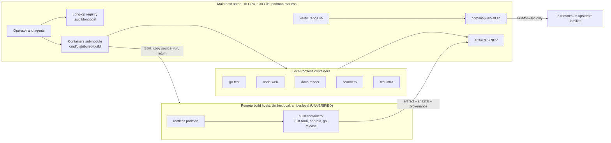
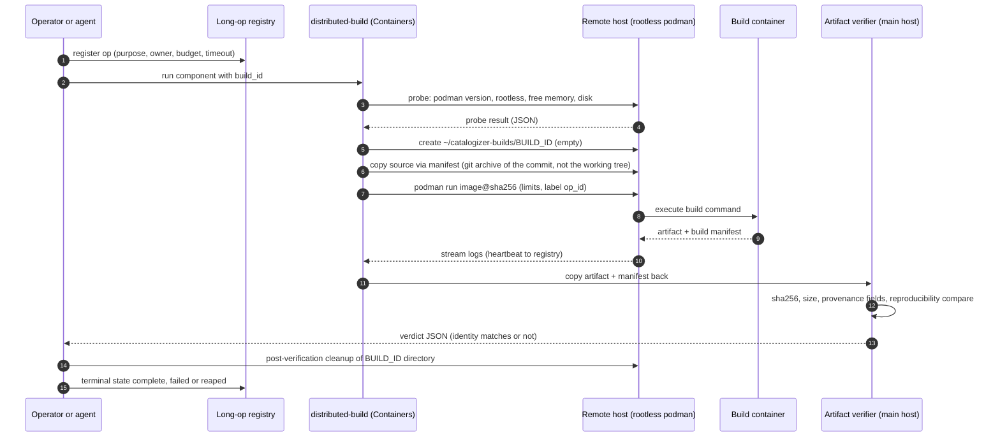
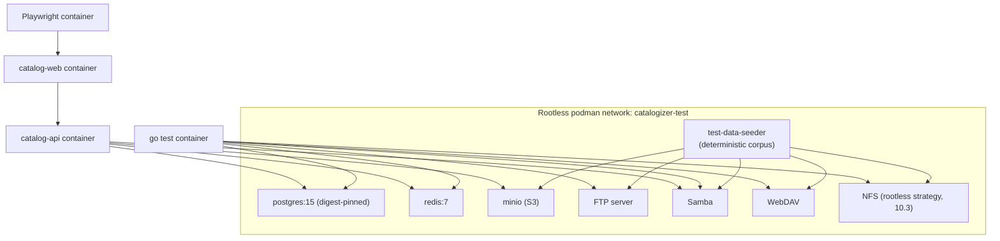
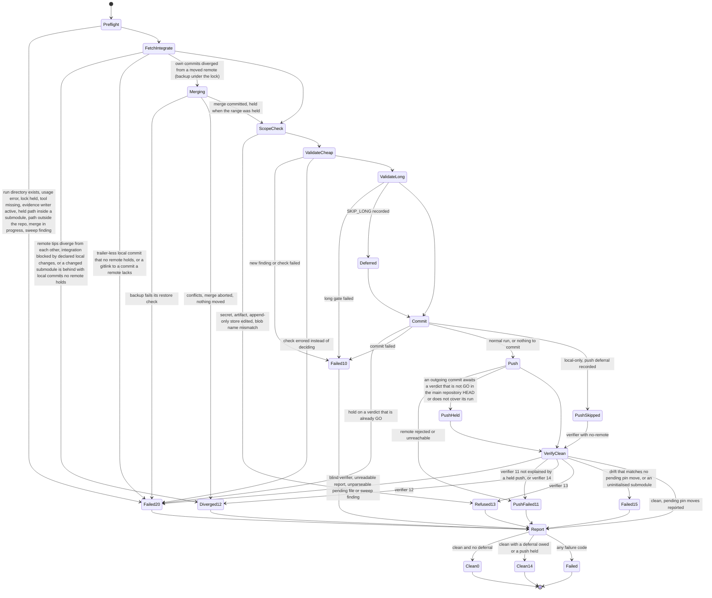

# 16. Containerized Infrastructure and Local Enforcement Plan

| Field | Value |
|---|---|
| Revision | 8 |
| Created | 2026-10-03 |
| Last modified | 2026-10-03 |
| Status | draft (revision 8: section 12 reconciled with tasks.md rev 9 (609 tasks: WP-04 T039 to T047 with T040a and T042a, and T064a, T435a, T579a, T580a, T580b and T581 where they meet the script) and with the plan owner's four decisions taken after the round-9 reviews, which bind this document and tasks.md alike: (Y) a repository whose own commits diverged from a moved remote is integrated by CPA itself, under the lock and after a 9.2 backup kept in the run directory, with `git merge --no-ff <live remote tip>`, never a rebase, reset or force; the merge commit carries `CPA-Run:` and one `Foreign-Commit:` line per trailer-less commit it brings in, and is held for review when it resolves conflicts (11.4.211, Opus at xhigh) or merges into a held range; a hand-made merge stays refused as `unrecorded_local_commit` (new section 12.2.5; exit 12 now means remote tips that diverge from each other, a merge stopped on conflicts, a blocked integration or a behind change-set submodule with local commits); (Z) the S3 checks carried over from `.pre-commit-config.yaml` carry its `files` and `types` filters and a reviewed exemption list `scripts/repo/check_exemptions.tsv` (path class, exempted checks, reason) for evidence blobs, the append-only stores, captured transcripts, the register engine's exports and `docs/workable_items.db`, whose 1000 KB limit becomes a recorded bound of 6 MiB sized for the WP-20 import of about 1,800 tickets; (W) ratchet baselines are measured over the main repository and every own-organisation repository at every depth, keyed from the main root, in the change set that registers the check, and one scoring rule applies in every mode; (X) a baseline's verdict exists with GO when it is GO in the main-repository HEAD or when the baseline is committed in the same change set as a held path awaiting exactly that verdict. Also: the verifier's `--fetch` and S1 use the objects-only fetch of tasks.md T032 (`--no-write-fetch-head --refmap=`); `Foreign-Commit:` lines go on the first commit a run makes in each repository; the S1 refusal `pin_not_on_remote` and the reason names `hold_in_submodule`, `unrecorded_local_commit` and `stale_pending_unpushed` added, the held-path refusal applied under `--repo` to nested repositories, and the S6 withholding of a gitlink whose commit no remote holds kept only for runs that commit in that submodule; rule (c) extended to a GO declared in the same change set (a proposal); a clean-tree gate cites the run that made the measured HEAD; the NO-GO path follows the tasks.md P0-P1 rule (an ordinary revert prepared with `git revert --no-commit`); the pending-row writers are CPA `--repo` runs and the reviewed helper of tasks.md T435a; `.secrets.baseline` covers every own-organisation repository (T040a); the S7 exceptions copy is `$CPA_RUN/exceptions.tsv` (T042a); notes that tasks.md rev 9 now carries are replaced by their task ids, and what it still lacks is listed in section 17 P3 and V-17 to V-19. Revision 7: section 12 follows tasks.md WP-04 (T039 to T047, tasks.md rev 8) and the plan owner's binding rules for held commits after the round-8 reviews (new section 12.2.4): one spelling, `--awaits-review` and `Awaits-Review:`; the interface `--paths-from` with an optional verdict column, `--awaits-review`, `--local-only` without a required verdict, `--repo`, and a push-only run without `--paths-from`; four lines in the commits (`CPA-Run:`, `Deferred-Gates:`, `Awaits-Review:`, `Foreign-Commit:`); an `Awaits-Review:` path is resolved against the main repository's committed HEAD for every repository, so a `--repo` held commit can be released, and a verdict releases a hold only with `verdict: GO` and a `covers_runs` entry naming the held commit's `CPA-Run` id; a hold on a verdict already GO is refused (20, `verdict_already_go`); in main mode a hold path inside a submodule's work tree is refused (20) and a parent gitlink commit is not pushed before its pin is on the submodule's remotes; `Foreign-Commit:` names only commits a live remote tip held at S1 and a trailer-less local commit no remote holds is refused (20); S6 pushes the longest prefix without an unreleased hold (`review_pending`, 14); S2 append-only and blob-name checks (13); S2 and S3 run the checks carried over from `.pre-commit-config.yaml` only in check-only forms or on copies under the run directory, each with a control needle; the clean tracked tree is `summary.dirty` equal to `summary.dirty_excepted` with `--ignore-submodules=all`, never a raw `git status --porcelain`, also in INV-2; under `--repo` S7 re-keys the verifier rows from the main root; pending rows: one per repository, replaced by a later `--repo` commit, removed only at S8, also when a checkout equals its recorded gitlink and every remote holds the row's sha; an absent pending file is no rows; run directories are removed by the sweep past the `commit_push.conf` bound (new INV-9); the skeleton resolves the root first, maps every helper by its documented codes and checks `record_deferral.sh --run-dir`; `$EVID` renamed `$CPA_RUN`; the `.audit/longops/` records named as the second file set outside the run directory; the report sample lists every file; `--fetch` corrected (the T032 form also writes the tracking ref and `FETCH_HEAD`); the stale owed notes replaced by the tasks that carry them (T006, T039, T040, T090, T106), an IMG-GOTOOLS row added, the open tasks.md items listed in section 17 P3 and V-17. Revision 6: section 12 follows the plan owner's binding commit-push decision: the script never writes into the tracked tree and never commits its own outputs; every output of a run lives only in the ignored run directory `.audit/commit-push/<run_id>/` with a unique run id (UTC time, pid, random suffix); a run that does not get the lock writes only its own run directory; the durable record is git (the `CPA-Run:` trailer and the `Deferred-Gates:` flags `SKIP_LONG`, `SWEEP_ABSENT`, `LOCAL_ONLY` in every commit), and a task that needs a run's result records it through evrec; clean-tree gates are measured on the tracked tree; shared stores belong to their writers; the reviewed list `cpa_owned_paths.txt`, the intake of earlier outputs, the S7 exclusion, `excluded_paths` and the 13 for a changed deferral row are withdrawn; `--repo` commits record pending pin moves in `.audit/pending_pins.tsv`, matched exactly at S7 and consumed by the G-PIN layer; `--local-only` takes `--await-review FILE` and S6 holds a push until that verdict is GO (14); S6 also pushes to a `NO-REMOTE-BRANCH` remote; S1 records a fast-forward blocked by local files; the declared change set is a `--paths-from` file; the skeleton maps helper exits by their documented codes; the no-CI check has one home, the S3 plain check `check_no_ci.sh` (section 16.1); `.secrets.baseline` has one owner, tasks.md T040a (section 12.2.2); the IMG-TESTUTIL row lists pytest and the `tooling` lane, the IMG-DOCS row the `docs` lane; fixtures the revision 5 text claimed but tasks.md does not carry are marked owed (section 17 P3). Revision 5: commit-push section 12 aligned with the tasks.md WP-04 decisions: outputs owned by the script and a run temp directory, so a run never fails on its own deferral rows or reports, with earlier reports committed by the next run (section 12.2.1); the count-keyed S3 ratchet with a baseline-creation rule, a fixture convention and the `.secrets.baseline` precondition (section 12.2.2); S1 stops only on a behind change-set submodule that carries new local commits and allows a pin bump to a commit every remote holds; S6 pushes only repositories with commits a remote lacks; S1 fetch failures recorded per remote; a per-repository mode `--repo <path>` (section 12.2.3); an unreadable verifier report fails closed (20); the deferral flag `LOCAL_ONLY`; task ids remapped to the frozen tasks.md numbering T001-T595; section 11.1 R4 follows docs/21 IC-37 and points third-party rows at document 15 §10.3; IMG-DOCS carries Python; section 16.1 lists the remaining enforcement scripts and states that the no-workflow-file condition is the anti-mess invariant AM-G2. Revision 4: IMG-QA added to the catalogue and to the locally built images (tasks.md T211, T212; docs/21 WP-24); routine S7 runs the verifier with `--fetch` (tasks.md T039, docs/21 IC-37); the section 11.4 note records the mode decision of docs/21 IC-37 instead of listing it as open; phase P3 acceptance gains the changed-and-behind submodule fixture (docs/21 IC-41). Revision 3: verifier sections 11.1, 11.2 and 11.4 aligned with the promoted POC (`git ls-remote` plus object-store-only `--fetch`, `--no-remote`, `--self-test`; v1 report shape by reference); commit-push S1 no longer fast-forwards submodules, S7 runs the verifier without `--strict` on routine runs and maps verifier codes to commit-push codes (verifier 14 becomes 11), `--local-only` parsed and run with `--no-remote`; IMG-KCOV listed as repository-built on IMG-TESTUTIL, PyYAML in IMG-TESTUTIL, a P0 bootstrap row in section 17; `images.lock.yaml` as the single lock file; `.pre-commit-config.yaml` and `docker-compose.dev.override.yml` added to the enforcement inventory; table cells with `\|` escaped. Revision 2: consistency with tasks.md and docs/21 IC-16, IC-36 to IC-38) |
| Feature | specs/001-full-project-audit-remediation |
| Spec coverage | FR-019, FR-020, FR-021 (also supports FR-006, FR-007, SC-003, SC-010, SC-012) |
| Constitution anchors | 11.4.173, 11.4.161, 11.4.76, 11.4.156, 11.4.234, 11.4.264, 11.4.246, 12.6, 12.11, 12.12 (also 11.4.232, 11.4.233, 11.4.200, 11.4.108, 11.4.113, 11.4.201, 11.4.27) |

## Table of contents

1. Purpose, scope and non-goals
2. Evidence base: what was read and what was executed
3. Current-state findings (host, containers submodule, compose, Dockerfiles, scripts, hooks)
4. Defect register for the existing container assets
5. Target architecture and container topology
6. Build-container catalogue per component
7. Image pinning procedure and cache strategy
8. Resource limits and the dynamic envelope (12.6, 12.11, 12.12)
9. Remote build distribution and artifact return with identity verification
10. Test infrastructure stack (real services replacing mocks)
11. Deterministic recursive repository verification (FR-019, FR-020, SC-010)
12. Dedicated commit and push script, no blocking hooks (11.4.234)
13. Anti-mess long-operation registry and invariant sweep (11.4.232, 11.4.233)
14. Reproducible and hermetic builds, SLSA Build Level 2 plan (11.4.246)
15. Build once, promote one digest (11.4.264)
16. Local enforcement without CI (11.4.156)
17. Phased adoption order
18. Risks, trade-offs and rejected alternatives
19. Acceptance evidence and traceability
20. Items to verify (UNCONFIRMED and UNKNOWN register)

---

## 1. Purpose, scope and non-goals

This document plans how every build, test run, scan and documentation render for the audit and remediation feature runs inside rootless containers, how those containers are provisioned through the in-repository Containers submodule, how work reaches remote build hosts and returns, and how the repository tree (main repository plus every submodule at every depth) is proven clean and pushed without hooks that can block the commit and push path.

Scope:

- FR-021: all builds in rootless containers, never on the bare host, artifact verified on a clean target before a fix is called done.
- FR-019 and FR-020: regular commit and push, recursive verification, no history rewrite, no force-push, unpushable repositories reported with a reason.
- Supporting: the infrastructure that real-service tests need (constitution 11.4.27), the resource envelope (12.6, 12.11, 12.12), reproducibility and supply-chain evidence (11.4.246, 11.4.264).

Non-goals: this document does not decide what the audit finds, does not define test content (see document 05), and does not specify performance experiments (see document 14). It consumes those documents' needs as container requirements.

Rule restatements are limited to the constitution items the brief names. Every concrete claim about the repository cites a path.

## 2. Evidence base: what was read and what was executed

Read-only commands executed during planning (output observed in this session):

| Command | Observed result |
|---|---|
| `podman --version` | `podman version 5.7.0` |
| `podman info` (filtered) | `rootless: true`, `cgroupVersion: v2`, `cgroupManager: systemd`, `ociRuntime: crun`, `rootlessNetworkCmd: pasta`, `graphDriverName: overlay`, hostname `anton` |
| `nproc` | 16 |
| `free -g` | 30 GiB total, 8 used, 22 available at the time of the read |
| `command -v docker` | no output (docker absent) |
| `command -v` for tools | present: `buildah`, `podman-compose`, `gh`; absent: `kcov`, `shellcheck`, `trivy`, `semgrep`, `gosec`, `hadolint`, `syft`, `cosign`, `skopeo` |
| `podman ps -a`, `podman images` | other projects' images and exited containers already exist in the same rootless store (names such as `helixagent-mcp-*`, `lava_*`, `boba_*`); the store is shared |
| `git submodule status --recursive` | 97 entries at all depths; `.gitmodules` at the top level contains 88 `submodule` lines; 53 entries are nested at depth 2 or deeper |
| `git remote` | 8 remotes configured on the main repository; `Upstreams/` holds 5 export scripts naming gitflic.ru, github.com (two organisations) and gitlab.com (two organisations) |
| `git config core.hooksPath` | unset; `.git/hooks` contains only `*.sample` files (the tracked `scripts/hooks/pre-push-gate.sh` is not installed) |

Files read: `docker-compose*.yml`, `deploy/*.yml`, `deployment/docker-compose*.yml`, `catalog-api/Dockerfile` and `.dev`, `catalog-web/Dockerfile`, `docker/Dockerfile.builder` and the `docker/` listing, `scripts/build_in_container.sh`, `scripts/container-build.sh`, `scripts/push_all_submodules.sh`, `scripts/run-race-detector.sh`, `scripts/hooks/pre-push-gate.sh`, `scripts/install_git_hooks.sh`, `.pre-commit-config.yaml` and `docker-compose.dev.override.yml` (revision 3), `scripts/distributed-boot.sh`, `docs/BUILD_CONTAINER_AUTO_DISPATCH.md`, `Build/CLAUDE.md`, the root `commit` script, `env.properties` (secrets values not recorded here), `submodules/containers` package tree and `helix-deps.yaml`, and `specs/001-full-project-audit-remediation/docs/01-system-architecture-map.md`.

Not executed: no image pull, no build, no test, no connection to `thinker.local` or `amber.local`. All snippets in sections 6 to 16 are `NOT EXECUTED` unless stated.

## 3. Current-state findings

### 3.1 Host facts

| Fact | Value | Implication |
|---|---|---|
| Container engine | podman 5.7.0 rootless, crun, netavark/aardvark, pasta networking, overlay on cgroup v2 | Meets 11.4.161. No docker. Any compose file must run under `podman-compose` (present) or `podman compose` |
| CPU | 16 logical | Envelope in section 8 |
| RAM | about 30 GiB total, 22 available when sampled | 12.6 ceiling of 60 percent of total is about 18 GiB for all project work together |
| Missing scanners | trivy, semgrep, gosec, hadolint, syft, cosign, skopeo, shellcheck, kcov | Each must run from a pinned container (section 6), not be installed on the host (no sudo, no host package installs) |
| Shared image store | other projects' images live in the same store | Image naming must be namespaced (`localhost/catalogizer-*`), prune must be scoped by label, never `podman system prune` |
| Bind-mount safety | SELinux not confirmed | `:z` or `:Z` suffix choice must be probed, see section 6.2 |

### 3.2 The Containers submodule (submodules/containers, module `digital.vasic.containers`)

Verified package inventory under `submodules/containers/pkg`: `runtime` (detection plus podman, docker, kubernetes, crio, nerdctl, lxd adapters; `runtime.AutoDetect` is shown in its README), `compose` (compose orchestration, `helix_project.go`), `remote` (SSH executor with `Execute`, `ExecuteStream`, `CopyFile`, `CopyDir`, `IsReachable`; `RemoteComposeOrchestrator` with `Up`, `Down`, `Status`, `Logs`; host manager, probe, gpu probe), `remoteexec`, `distribution` (`DefaultDistributor` with `Distribute`, `Undistribute`, `Status`, `HealthCheckAll`, `Rebalance`), `scheduler` (resource-aware strategies), `crossbuild` (`Selector` choosing a `Backend` per `BuildRequest`; Linux container, Wine and host-direct backends; SELinux relabel helper in `container_runner.go`), `health`, `orchestrator`, `policy`, `envconfig` (dotenv parser), `cache`, `volume`, `network`, `lifecycle`, `metrics`, and VM/emulator packages. `cmd/` contains `distributed-build`, `distributed-test`, `deploy-stack`, `boot` and emulator tools.

`cmd/distributed-build/main.go` flags (read): `-project`, `-env`, `-component`, `-version`, `-skip-tests`, `-dry-run`, `-timeout` (minutes, default 30), `-strategy` (default `resource_aware`), `-components` (JSON file of the project's build components). Remote hosts are configured through the `.env` file passed with `-env`; the exact variable names are `UNCONFIRMED:` and must be read from `submodules/containers/pkg/envconfig` and `cmd/distributed-build/main.go` before the first use (step P2-2 in section 17).

Integration tests in `pkg/distribution/distributed_build_test.go` are gated by `CONTAINERS_INTEGRATION_TEST=1` and name hosts from the environment, including a host called `thinker`.

Consequence: a distribution and remote-compose mechanism exists and the repository already has the constitution-mandated "extend the containers submodule, never an ad-hoc host build" path available (11.4.74, 11.4.173). What does not exist is a Catalogizer-specific component description file for `-components` and a verified remote host inventory. Producing both is a deliverable of this plan.

### 3.3 Existing build scripts and what they do today

| Script | What it does | Gap against 11.4.173 and FR-021 |
|---|---|---|
| `scripts/build_in_container.sh` | rsyncs `catalog-api` and `submodules` to `${BUILD_HOST:-thinker.local}`, runs `podman run golang:1.25-bookworm` there, brings `catalog-api-container` back and prints a remote-versus-local md5 proof block | Go only; uses `ssh` and `rsync` directly rather than the Containers submodule `remote` package; tag-based image reference (`golang:1.25-bookworm`, not a digest); md5 for identity (weak; should be sha256 plus provenance); `rsync --delete` into a fixed remote directory, which is not isolated per build |
| `scripts/container-build.sh` | wraps `podman-compose -f docker-compose.build.yml` with version and skip options | Depends on `docker/Dockerfile.builder` which does not build (finding D-03) |
| `scripts/lib/auto-container.sh` (documented in `docs/BUILD_CONTAINER_AUTO_DISPATCH.md`) | `need_toolchain`, `ensure_builder_image`, `run_in_builder`: when a toolchain is not on the host PATH it re-executes in `localhost/catalogizer-builder:latest` with `--userns=keep-id`, `--network host`, `-v $PWD:/workspace:z` | The rule is "container only when the host lacks the tool". This contradicts FR-021 and 11.4.173, which require the container always, even if the host has the tool. The dispatch condition must be inverted (finding D-08) |
| `scripts/lib/build-*.sh`, `scripts/build-all-releases.sh`, `scripts/release-build.sh`, `build-scripts/build-all.sh` | per-component build entry points | `build-scripts/build-all.sh` runs builds directly on the host and creates placeholder build scripts when missing (it writes "not yet implemented" scripts that report success). That is a bluff-class behaviour under 11.4 and a bare-host build under 11.4.173 (finding D-09) |
| `Build/` framework (`Build/lib/common.sh`, `version.sh`, `hash.sh`, `orchestrator.sh`) | versioning via `versions.json`, SHA-256 source-hash change detection, `detect_runtime` for podman or docker | Reusable. Version and hash logic feed the build identity in section 9.3 |
| `scripts/run-race-detector.sh` | race tests across catalog-api and a hard-coded list of Go submodules, honours `GOMAXPROCS=3 go test -p 2 -parallel 2` | Runs on the host. Must move inside the Go test container (section 6) with the same limits expressed as container limits |

### 3.4 Commit and push tooling today

- The root `commit` file is a 30-line wrapper that sources `env.properties` and calls an external `commit` binary resolved by `PATH` to `/home/milosvasic/Projects/project_toolkit/Upstreamable/commit` (shown by `type -a commit`). The external script is outside this repository and was not read: `UNCONFIRMED:` whether it commits and pushes submodules recursively, how it treats divergence, and whether it can force. Its behaviour must be read before it is trusted by section 12.
- `scripts/push_all_submodules.sh` handles only owned submodules under `submodules/*` (the header says so), stages governance pointer files only, uses `merge --ff-only` and refuses force. It writes its log to `qa-results/phasef_push.log` and has a `DRY_RUN=1` default. It does not walk nested submodules (53 of 97 entries are nested), so it cannot satisfy SC-010 alone.
- `scripts/hooks/pre-push-gate.sh` is a tracked blocking gate (landmines, anti-bluff scan, LLM-judge prompt) with an `LLM_JUDGE_BYPASS=1` emergency variable. `scripts/install_git_hooks.sh` would symlink it as `.git/hooks/pre-push`. It is currently not installed (no `pre-push` file in `.git/hooks`, `core.hooksPath` unset). Under 11.4.234 it must not be installed as a blocking hook; its checks become an explicit stage of the dedicated script (section 12). The `LLM_JUDGE_BYPASS` pattern is replaced by the recorded-deferral flag of 11.4.234(D) so skips are visible, not silent.
- `.github/` exists and tracks `FUNDING.yml` and `workflows/README.md` only: no active pipeline (consistent with 11.4.156). The planning must keep it that way.
- `.pre-commit-config.yaml` (revision 3; tracked, last changed in commit `d72f14ce`, 2026-04-21) declares a `pre-commit` hook set: `pre-commit-hooks` v4.5.0 (`trailing-whitespace`, `end-of-file-fixer`, `check-yaml`, `check-json`, `check-added-large-files --maxkb=1000`, `check-merge-conflict`, `detect-private-key`), `detect-secrets` v1.4.0 with `--baseline .secrets.baseline`, `pre-commit-golang` v0.5.1 (`go-fmt`, `go-vet`, `go-imports`, `go-unit-tests -v -race ./...`), local `gosec` (`language: system`) and `scripts/hooks/no-false-positive-log.sh`, `mirrors-eslint` v8.55.0 and `mirrors-prettier` v3.1.0. Observed on 2026-10-03: the `pre-commit` tool is not on the host `PATH` (`command -v pre-commit` prints nothing), `.git/hooks` holds only samples, and `.secrets.baseline` does not exist, so the `detect-secrets` hook as configured would fail on its first run. The configuration is therefore not active. It is not installed as a hook under this plan (11.4.234; its `go-unit-tests -race` and `gosec` entries would also run on the bare host, against FR-021). Its checks are carried into named stages instead (section 16.1). The file stays tracked and unmodified; removing it is an owner decision (11.4.122).
- `docker-compose.dev.override.yml` (revision 3; tracked, 21 lines, last changed in commit `bbba26a0`, 2026-04-11) remaps host ports for a developer host where the standard ports are taken (`postgres` 5435, `redis` 6381, `api` 8090) and sets `POSTGRES_PORT`, `REDIS_PORT` and `API_PORT` for the `api` service. It names no image, so `check_pins.sh` has nothing to pin in it and it is not one of the three files of D-07 (revision 5 correction), but it is in scope for the compose enumeration of the S3 compose checks, and its `REDIS_PORT` and `API_PORT` names repeat the environment-name mismatch recorded as O-06 in document 01.
- Names such as `scripts/ci-local.sh` (932 lines), `scripts/local-ci.sh`, `scripts/ci-pipeline.sh` are local scripts; they are acceptable as local enforcement but their stage content is `UNCONFIRMED:` and is audited in document 05's scope; this plan only requires that they run inside containers.

### 3.5 Build hosts named in the repository

`thinker.local` is named in `scripts/build_in_container.sh`, `deploy/MIGRATION_thinker_local.md`, the project `CLAUDE.md` and 11.4.173. `amber.local` appears in `deployment/amber-up.sh` (and `thinker-up.sh` beside it). Neither was contacted. Section 9.5 lists exactly what must be verified before either is relied on.

## 4. Defect register for the existing container assets

These are findings observed by reading files. They enter the findings register (document 04) with the ids assigned there. Severity is a proposal; document 04 owns classification.

| Id | Asset | Observed defect | Evidence | Proposed severity |
|---|---|---|---|---|
| D-01 | `docker-compose.yml` service `api` | Build context is `./catalog-api` with `dockerfile: Dockerfile`, but `catalog-api/Dockerfile` copies `submodules/...` and `catalog-api/...` paths, which only exist when the context is the repository root. The build cannot resolve those COPY sources | docker-compose.yml:67-69 versus catalog-api/Dockerfile:21-50 (`COPY submodules/assets/ ...`, `COPY catalog-api/go.mod ...`). `docker-compose.test.yml:38-40` uses context `.` for the same Dockerfile, which is the form that matches | high |
| D-02 | `docker-compose.test.yml` service `catalog-web` | Context `./catalog-web` with `catalog-web/Dockerfile`, which copies `catalog-web/...` and sibling module directories relative to the repository root | docker-compose.test.yml:87-89 versus catalog-web/Dockerfile:17,59 | high |
| D-03 | `catalog-web/Dockerfile` | `COPY` sources `WebSocket-Client-TS/`, `Media-Types-TS/`, `UI-Components-React/`, `Media-Browser-React/`, `Media-Player-React/`, `Collection-Manager-React/`, `Dashboard-Analytics-React/`, `Auth-Context-React/`, `Catalogizer-API-Client-TS/` at the context root. Those directories are not at the repository root; the modules live at `submodules/websocket_client_ts` and so on (the root listing has no such directories, `ls WebSocket-Client-TS` fails). The image cannot build from the repository root | catalog-web/Dockerfile:6-14,48-56; root listing; document 01 section on shared submodules | high |
| D-04 | `docker/Dockerfile.builder` | `COPY docker/go${GO_VERSION}.linux-amd64.tar.gz` with `GO_VERSION=1.26.1`: the `docker/` directory holds Dockerfiles and `signing*` only, no tarball. The builder image (used by `docker-compose.build.yml`, `docker-compose.test.yml` desktop and wizard services, and `scripts/container-build.sh`) cannot be built from a clean checkout | Dockerfile.builder:`COPY docker/go${GO_VERSION}...`; `ls docker` | high |
| D-05 | `docker/Dockerfile.builder` | Header comment says JDK 17, installed package is `openjdk-21-jdk`; Node 18 from `deb.nodesource.com/setup_18.x` (Node 18 is past end of life, `UNCONFIRMED:` exact date to cite from nodejs.org in the dependency document), while `catalog-web/Dockerfile` uses Node 20; `ubuntu:22.04` unpinned tag; Rust installed by piping `https://sh.rustup.rs` to `sh`; `cargo install tauri-cli` unpinned; `curl \| bash` for NodeSource; Go minimum in comment 1.25.7 versus 1.26.1 tarball; `ENTRYPOINT ["/project/scripts/build-test-release.sh"]` | Dockerfile.builder | medium |
| D-06 | `docker-compose.build.yml` | `network_mode: host` and bound host ports 5432 and 6379 on a developer machine (collision with any local PostgreSQL or Redis); fixed credentials in the file (`<test credential literals, see docker-compose.build.yml:13-14, 74-75, 92-93>`, test-only but compromised by disclosure because committed in public code); volumes `go-cache:/root/go` assume root-in-container while the dispatch doc says `--userns=keep-id`; `docker.io/budtmo/docker-android:emulator_14.0` tag only | docker-compose.build.yml:10-50, 100-127 | medium |
| D-07 | `docker-compose.yml`, `deployment/docker-compose.yml`, `docker-compose.dev.yml` | Floating tags (`prom/prometheus:latest`, `grafana/grafana:latest`, `quay.io/minio/minio:latest`, `dpage/pgadmin4:latest`, `nginx:alpine`, `postgres:15-alpine`); `cat docker-compose.yml deployment/docker-compose.yml docker-compose.dev.yml \| grep -c latest` returns 12 matching lines when measured 2026-10-03 (3 + 6 + 3 per file; across all nine root compose files the count is 18 lines, not 30, so the earlier figure of 30 was not reproducible). Environment names `API_PORT`, `REDIS_HOST`, `REDIS_PORT` do not match the names the process reads (`SERVER_PORT`, `REDIS_ADDR`), already recorded as O-06 in document 01 | grep; docker-compose.yml:76-83; main.go:324,562 per document 01 | medium |
| D-08 | `scripts/lib/auto-container.sh` | Containerizes only when the toolchain is missing from the host PATH (`need_toolchain`); a host with the tool builds on the bare host | docs/BUILD_CONTAINER_AUTO_DISPATCH.md "Public API" | high (FR-021, 11.4.173) |
| D-09 | `build-scripts/build-all.sh` | Builds directly on the host; creates placeholder build scripts that print success when a component's script is missing | build-scripts/build-all.sh | high (bluff-class and bare-host) |
| D-10 | `docker-compose.test-infra.yml` NFS service | `privileged: true` plus `cap_add: SYS_ADMIN` and kernel NFS dependency. A rootless podman user cannot honestly grant that; the service will fail or run degraded. Needs a rootless-compatible NFS strategy or a recorded structural-impossibility finding with a substitute (section 10.3) | docker-compose.test-infra.yml:165-185 | medium |
| D-11 | `scripts/build_in_container.sh` | Remote working directory is fixed (`~/catalogizer-build`) and synced with `rsync --delete`: two concurrent builds, or a build and a leftover, can corrupt each other; no per-build directory; md5 proof | scripts/build_in_container.sh | medium |
| D-12 | `scripts/push_all_submodules.sh` | Does not cover nested submodules (53 of 97 recursive entries) and does not verify the working tree; covers only governance pointer files | script header | medium (SC-010) |
| D-13 | `scripts/hooks/pre-push-gate.sh` | Blocking pre-push design with a free-form environment bypass; contradicts 11.4.234 if installed as a hook | script header; `scripts/install_git_hooks.sh` | medium |
| D-14 | Root `commit` | Delegates to an external binary not under version control in this repository; behaviour unknown | `type -a commit` | UNKNOWN, treat as medium until read |

D-01 to D-04 are the ones that are already known to break a build; the plan treats each as a reproduce-first case (11.4.115): before editing, a containerized `podman build` of the exact compose or Dockerfile invocation is recorded failing, then the fix is applied, then it is recorded passing three times. Whether any of D-01 to D-03 is masked by an out-of-tree workaround (for example a script that sets a different context) is `UNCONFIRMED:`; the defect is only confirmed after the failing build is captured.

## 5. Target architecture and container topology

Principles: one container engine path (rootless podman through the Containers submodule), one build description file per component, one image reference per toolchain pinned by digest, one remote execution path, one artifact identity format, one verifier.



Placement policy:

| Work class | Where | Reason |
|---|---|---|
| Go unit, integration, race, fuzz, benchmark for catalog-api and Go submodules | local container first; remote when the memory envelope in section 8 is exceeded | Quick feedback; Go tests need the real test infra (section 10) which runs locally |
| Web build, lint, type check, unit tests, Playwright | local container | Playwright needs its browser image; CPU modest |
| Rust/Tauri desktop and installer-wizard, Android and Android TV Gradle builds | remote build host(s) by default (11.4.173 names offload as the model) | Heavy toolchains (Android SDK, WebKitGTK headers); main host memory ceiling |
| Documentation rendering (VitePress, diagrams, export to html, pdf, docx) | local container | Deterministic fonts and tools inside image |
| Scanners (trivy, semgrep, gosec, hadolint, syft, sonar-scanner) | local container from pinned images | Not installed on the host; no host installs |
| Mutation testing (go-mutesting or equivalent, Stryker for TypeScript, PIT for Kotlin) | remote by default; local container only for small modules | Long running; CPU heavy. The exact tool choice per language is owned by document 05 and is `UNCONFIRMED:` here |
| Repository verification and commit and push | host shell, `git` and `ssh` only | These are repository operations, not builds; they read and write version control state and must not require a container. Their own validation stage invokes containers (section 12) |

Clarification of the 11.4.173 boundary: `git`, `ssh`, `bash` and a pinned container run are control-plane operations on the host. Anything that compiles, packages, renders, scans or tests is data-plane work and runs in a container.

## 6. Build-container catalogue per component

### 6.1 Catalogue

Image references below are named by role and by the base image family only. No digest is invented. Section 7 gives the procedure that fills the digest column; until filled, an image is `UNPINNED` and any use of it is flagged in the evidence record.

| Id | Role | Base image family and intended tag | Toolchain contents | Used for | Digest (to fill) |
|---|---|---|---|---|---|
| IMG-GO | Go build and test | `docker.io/library/golang`, tag matching `catalog-api/go.mod` (`go 1.25.7`): the Dockerfile uses `golang:1.25` and the remote script uses `1.25-bookworm`; one tag (`1.25-bookworm`, glibc, because CGO links `docx.c` against glibc fortify symbols per the comment in `scripts/build_in_container.sh`) must be chosen and recorded | Go, gcc via `build-essential`, `libsqlite3-dev` if required (`UNCONFIRMED:` whether the sqlite driver bundles the amalgamation), race detector (needs CGO) | catalog-api, Go submodules, race, bench, fuzz | TBD |
| IMG-NODE | Web build | `docker.io/library/node` 20 (matches `catalog-web/Dockerfile`; `UNCONFIRMED:` engine constraint in `catalog-web/package.json`) | npm, build deps | catalog-web, TypeScript submodules, `catalogizer-api-client` | TBD |
| IMG-PW | Playwright | `mcr.microsoft.com/playwright` version aligned with the Playwright version in `catalog-web/package.json` (compose files use `v1.40.0-jammy`, `UNCONFIRMED:` against package.json) | chromium, firefox, webkit | web E2E, visual regression | TBD |
| IMG-RUST | Rust and Tauri | built locally from a Containerfile derived from `docker/Dockerfile.builder` layers 1, 4 | rustup with pinned toolchain version, `tauri-cli` pinned, `webkit2gtk-4.1-dev`, `libayatana-appindicator3-dev`, `librsvg2-dev`, `libgtk-3-dev`, `patchelf`, `xvfb` | catalogizer-desktop, installer-wizard | local image id plus digest once pushed to a local registry or saved as OCI archive |
| IMG-ANDROID | Gradle and Android SDK | built locally; derived from layer 5 of `docker/Dockerfile.builder` and `docker/Dockerfile.android*` | JDK 21, Android command-line tools, build-tools 34 and 35, platforms 34 and 35, pinned Gradle wrapper (the repo's wrapper, not a host Gradle) | catalogizer-android, catalogizer-androidtv, instrumented tests build step | local |
| IMG-DOCS | Documentation render | built locally | Node plus VitePress (`Website/` is the VitePress site, `UNCONFIRMED:` exact path, owned by document 13), Mermaid CLI with headless Chromium, pandoc, a PDF engine, fonts; revision 5: `python3` with `pytest`, PyYAML and `jsonschema` at pinned versions, plus `bash`, `git` and `jq`, because the documentation checks run Python (the link crawler of tasks.md T279 runs through `scripts/containers/run_docs.sh` in this image); smoke test `python3 -c 'import pytest, yaml, jsonschema'` | README graph checks, link crawl, exports (html, pdf, docx), diagram render checks (SC-007); revision 6 correction: the `docs` key of the lane table (`TIC docs docs`, `run_docs.sh`, tasks.md T121) runs in this image, while the `tooling` key runs in IMG-TESTUTIL | local |
| IMG-SCAN-TRIVY, -SEMGREP, -GOSEC, -HADOLINT, -SYFT, -SONAR | Scanners | `aquasec/trivy`, `semgrep/semgrep`, `securego/gosec`, `hadolint/hadolint`, `anchore/syft`, `sonarqube` and the scanner CLI image (compose security file already names `sonarqube:community`, `owasp/dependency-check`, snyk CLI on `node:18-alpine`) | one tool each | SC-009 and document 10 | TBD per tool |
| IMG-SHELLCHECK, IMG-KCOV | Shell lint and shell coverage | IMG-SHELLCHECK: `docker.io/koalaman/shellcheck` pulled and pinned by digest (built FROM scratch, so the lock entry carries an entrypoint override); IMG-KCOV: repository-built kcov on IMG-TESTUTIL, from the tracked `build/containers/kcov/Containerfile` `FROM` the IMG-TESTUTIL digest (revision 3; the upstream kcov image is not used because it lacks git, jq and python3, tasks.md T006) | shell scripts are in scope for the 11.4.224 coverage floor; IMG-KCOV also carries the IMG-TESTUTIL tools, so a coverage run has git, jq and python3 | document 05; docs/21 P0 test legs (WP-09) | IMG-SHELLCHECK: pulled digest; IMG-KCOV: built digest recorded in `images.lock.yaml` |
| IMG-TESTUTIL | Test utilities for the docs/21 P0 test legs (added in revision 2, unconditional) | built rootless from the tracked `build/containers/testutil/Containerfile`: `FROM docker.io/library/debian` slim, base digest-pinned, packages installed from a pinned Debian snapshot (`snapshot.debian.org` timestamp recorded in the Containerfile) at pinned versions | `bash`, `git`, `sqlite3`, `python3`, `jq`, Python `jsonschema`, PyYAML and `pytest` (`python3-jsonschema`, `python3-yaml`, `python3-pytest`; revision 3, `pytest` added to this row in revision 6 as tasks.md T006 installs it and T008 probes `import pytest`) | register DDL and trigger tests, verifier and commit-push fixture tests, schema validation, catalogue regeneration (tasks.md WP-09); revision 6: the `tooling` key of the lane table (`TIC tooling unit`, `run_testutil.sh`, tasks.md T121) runs governance and tooling Python here. Revision 7 (replacing the revision 6 note that no image carried them): the commit-push check tools `detect-secrets` 1.4.0 and `pre-commit-hooks` 4.5.0 (which also provides `detect-private-key`), the versions `.pre-commit-config.yaml` names, are installed by tasks.md T006 into the virtual environment `/opt/cpa-tools` (`pip install --require-hashes` from `build/containers/testutil/requirements.txt`), each after its 11.4.270 existence verdict in `$EV/wp09/tool-existence.json`; a tool whose verdict is not VERIFIED is left out and its check stays a `deferred` row of tasks.md T040; `goimports` is not in this image but in IMG-GOTOOLS | local image id; the built digest is recorded in `images.lock.yaml` |
| IMG-GOTOOLS | Go source tools for the commit-push S3 checks (revision 7; tasks.md T106) | built locally from `build/containers/gotools/Containerfile` `FROM` the IMG-GO digest | `goimports` from `golang.org/x/tools` at a pinned version, module checksums verified through the Go checksum database at build time, its 11.4.270 existence verdict recorded in `$EV/wp11/gotools.json` | the S3 check `go-imports` in its check-only form `goimports -l` (section 12.2 S3), which the same change of T106 turns from a `deferred` to a `plain` row of `scripts/repo/validate_checks.tsv` | built digest recorded in `images.lock.yaml` |
| IMG-QA | HelixQA runs (revision 4; document 12 section 18.3, docs/21 WP-24) | built rootless on the local host from a tracked Containerfile with digest-pinned `FROM` lines (tasks.md T211); under the tracked deviation from 11.4.173 until docs/21 ODG-07 is answered, so no compliance is claimed | `helixqa` built from the pinned `submodules/helix_qa`, Tesseract, ffmpeg, Playwright browsers, python3 with PyYAML and pytest at pinned versions; the wrapper `scripts/qa/run_profile.sh` is not baked in, it runs from the read-only source mount | bank validation, bank-id floor, HelixQA profiles (`api`, `web`, `desktop`, `android`, `androidtv`, `installer`), the docs/21 WP-21 re-verification cases; reached only through `scripts/containers/run_qa.sh` and the `qa` rows of `scripts/containers/lanes.tsv` (tasks.md T212) | built digest recorded in `images.lock.yaml` as `IMG-QA`; smoke test prints `helixqa --version`, `tesseract --version`, `ffmpeg -version` and imports `yaml` and `pytest` |
| IMG-MUT | Mutation testing | built locally per language | per document 05 | SC-005 | local |
| IMG-INFRA-* | Real services | `postgres`, `redis`, `minio`, FTP, SMB, WebDAV, NFS images from `docker-compose.test-infra.yml` and `docker-compose.build.yml` | see section 10 | integration, E2E | TBD |

The Containers submodule's own `crossbuild` Linux backend (`pkg/crossbuild/linux_container.Containerfile`) is the preferred mechanism for the Rust and Android images when those are declared as build components (11.4.74: extend, do not reimplement). Whether it supports Tauri and Android SDK images unchanged is `UNCONFIRMED:`; the decision record is:

Decision DR-16-1. Provide Catalogizer Containerfiles under a new `build/containers/` tree (one directory per image, each with a `Containerfile` and a `README.md`; every image, pulled or built, has its entry in the single lock file `build/containers/images.lock.yaml` of section 7.1, revision 3), and register them through a `components.json` consumed by `cmd/distributed-build -components`. If the Containers submodule lacks a needed capability (for example per-build working directory, sha256 artifact manifest), the capability is added upstream in the submodule, not worked around in Catalogizer scripts. Rejected alternative: keep `scripts/build_in_container.sh` as the long-term driver; rejected because it duplicates SSH and rsync logic the submodule already provides and cannot give digest-pinned, per-build isolated directories without becoming a second orchestrator.

### 6.2 Invocation forms (POC, NOT EXECUTED)

The common run flags: rootless, no privileged, user namespace mapping so output files belong to the invoking user, read-only source mount where possible, explicit limits from section 8, a label for scoped cleanup, no host network unless a service needs it.

```bash
# Common prefix (NOT EXECUTED). IMG_* come from build/containers/images.lock.yaml (section 7.1).
RUN_COMMON=(podman run --rm
  --userns=keep-id
  --security-opt label=disable          # or use :z after the SELinux probe in 8.5
  --label project=catalogizer --label op_id="$OP_ID"
  --memory "$MEM_LIMIT" --memory-swap "$MEM_LIMIT" --cpus "$CPU_LIMIT" --pids-limit 4096
  --cap-drop=ALL
  -v "$PWD":/src:ro
  -v "$OUT_DIR":/out:rw
  -w /src)

# Go unit and race tests for catalog-api, limits mirror scripts/run-race-detector.sh
"${RUN_COMMON[@]}" -e GOMAXPROCS=3 -e GOTOOLCHAIN=local -e CGO_ENABLED=1 \
  -v catalogizer-gocache:/go/pkg/mod:rw -v catalogizer-gobuild:/root/.cache/go-build:rw \
  "$IMG_GO" sh -c 'cd catalog-api && go test -race -p 2 -parallel 2 -json ./... > /out/go-test.jsonl'
# Expected machine output: /out/go-test.jsonl, one JSON object per line with "Action":"pass"|"fail"|"output".

# Web build and unit tests
"${RUN_COMMON[@]}" -v catalogizer-npm:/root/.npm:rw "$IMG_NODE" \
  sh -c 'cd catalog-web && npm ci --ignore-scripts && npm run build && npm test -- --reporter=json --outputFile=/out/web-test.json'

# VitePress or documentation render
"${RUN_COMMON[@]}" "$IMG_DOCS" sh -c 'cd Website && npm ci && npm run build'

# Scanners (read-only source, results in /out)
"${RUN_COMMON[@]}" "$IMG_TRIVY" fs --format json --output /out/trivy-fs.json /src
"${RUN_COMMON[@]}" "$IMG_SEMGREP" semgrep scan --config auto --json --output /out/semgrep.json /src

# Rust and Tauri (runs on the remote build host through cmd/distributed-build, shown in section 9)
# Android: Gradle uses the repo wrapper inside IMG_ANDROID
"${RUN_COMMON[@]}" -v catalogizer-gradle:/root/.gradle:rw "$IMG_ANDROID" \
  sh -c 'cd catalogizer-android && ./gradlew --no-daemon assembleDebug testDebugUnitTest'
```

Notes on the forms:

- `--userns=keep-id` is the form already documented in `docs/BUILD_CONTAINER_AUTO_DISPATCH.md`. With it, the process runs as the host user inside the container, so cache volumes mounted at `/root/...` may be unwritable (finding D-06). Cache paths must be set by environment (`GOCACHE`, `GOMODCACHE`, `npm_config_cache`, `GRADLE_USER_HOME`, `CARGO_HOME`) to directories the mapped user can write, not assumed to be `/root`. `UNCONFIRMED:` whether the images should instead run with the default rootless mapping; decide by running the section 6.3 smoke test.
- `--network` default (pasta) is used for tests; build steps that need only the module cache should run with `--network=none` after the cache is warm, which also supports the hermetic target of section 14.
- Playwright images require `--ipc=host` or `--shm-size`; the exact flag is `UNCONFIRMED:` and is set from the Playwright documentation of the pinned version.
- Android instrumented tests need an emulator and KVM; whether `/dev/kvm` exists for the rootless user on this host is `UNKNOWN:` (the existing compose file says "requires KVM"). Verify with `test -r /dev/kvm`; if unavailable, device-level Android tests run on a remote host or on a real device, and the gap is a recorded SKIP with reason (11.4.3, not a pass).

### 6.3 Image smoke test (the first check of every image)

For each image the build record includes: `podman image inspect --format '{{.Digest}} {{.Id}}'`; the tool versions printed by the toolchain (`go version`, `node --version`, `rustc --version`, `java -version`, and so on) saved as `/out/toolchain.json`; and a one-line "can write to cache dirs as mapped user" probe. A control needle (11.4.201) is mandatory: the probe also tries a write that must fail (a read-only mount) and records that it failed, so a probe that cannot detect a failure is itself detected.

## 7. Image pinning procedure and cache strategy

### 7.1 Pinning procedure (no digests are asserted in this document)

1. Declare every external image in `build/containers/images.lock.yaml`:

```yaml
# NOT EXECUTED: schema example; digests are filled by the procedure, never by hand
schema: 1
images:
  - id: IMG-GO
    reference: docker.io/library/golang
    tag_intent: "1.25-bookworm"
    digest: ""            # sha256:<64 hex>, filled by step 3
    resolved_at: ""       # UTC timestamp of resolution
    resolved_on: ""       # host name
    purpose: "catalog-api build and test"
```

2. Resolve: `podman pull docker.io/library/golang:1.25-bookworm` then `podman image inspect --format '{{range .RepoDigests}}{{println .}}{{end}}' docker.io/library/golang:1.25-bookworm` and select the entry whose repository prefix equals the pulled reference (revision 3, as tasks.md T006: never the first entry blindly, because a shared rootless store can list digests of other references for the same image id). If the registry is unreachable, the entry stays `digest: ""` and the build record says `UNPINNED`.
3. Write the digest into `images.lock.yaml`; thereafter every build refers to `reference@sha256:<digest>`, never to the tag. A `scripts/containers/check_pins.sh` (to be written, phase 1) fails if any compose file, Dockerfile `FROM`, or script references an external image without `@sha256:` (finding D-07).
4. Update only by an explicit bump change that re-resolves, re-runs the image smoke test and the affected tests, and is committed as its own commit with a reviewed diff of tool versions.
5. Signature verification: `cosign` and `skopeo` are absent on the host. Verification of upstream signatures, where an image publisher provides them, runs in a pinned verification container. Whether each publisher in the table signs images is `UNKNOWN:` and recorded as a gap, never assumed.

### 7.2 Locally built images

Locally built images (`IMG-RUST`, `IMG-ANDROID`, `IMG-DOCS`, `IMG-MUT`, `IMG-TESTUTIL`, `IMG-KCOV` on the IMG-TESTUTIL base (revision 3), and `IMG-QA` (revision 4)) are built from their `Containerfile` by `podman build` with all `FROM` lines digest-pinned, tagged `localhost/catalogizer-<role>:<content-hash>` where the content hash is the SHA-256 of the Containerfile plus its build context (`Build/lib/hash.sh` already implements source hashing and change detection). An image is rebuilt only when that hash changes. The local image digest is recorded in the build record. Downloads inside a `Containerfile` (rustup, NodeSource, Android command-line tools, the Go tarball) must be replaced by downloads of pinned versions with their published SHA-256 verified in the Containerfile; the `curl | sh` forms in `docker/Dockerfile.builder` are removed (finding D-05). The Go tarball `COPY` is replaced by a pinned `FROM golang` stage (finding D-04).

### 7.3 Cache strategy

| Cache | Mechanism | Scope | Invalidation |
|---|---|---|---|
| Go module and build | named volumes `catalogizer-gomod`, `catalogizer-gobuild` | per host | module cache by `go.sum` hash; build cache pruned when volume exceeds the budget in 8.4 |
| npm | named volume `catalogizer-npm` | per host | keyed by `package-lock.json` through `npm ci` |
| Gradle | `catalogizer-gradle` with `--no-daemon` in containers | per host | by Gradle wrapper version and lockfiles |
| Cargo | `catalogizer-cargo` | per host | `Cargo.lock` |
| Image layers | podman layer cache | per host | per Containerfile hash |
| Source sync to remote | `Containers` submodule `CopyDir`; content-hash manifest of the source tree decides what to transfer | per build directory | new per-build directory `~/catalogizer-builds/<build_id>/` on the remote, deleted after artifact verification, never a shared `--delete` target (finding D-11) |

Persistent caches serve iteration speed (11.4.82). They never serve evidence: a failing-then-passing record for a fix (SC-003) must be obtainable with a cold-cache rerun on demand, and the determinism check (document 06) runs at least one iteration with caches emptied. Cache volumes are labelled `project=catalogizer` so cleanup is `podman volume prune --filter label=project=catalogizer` only, never a global prune (shared store, section 3.1).

## 8. Resource limits and the dynamic envelope (12.6, 12.11, 12.12)

### 8.1 Inputs

The envelope is computed at the start of each build session and recorded in the build record; no value is hard-coded (11.4.6). Inputs read from the host:

- total memory and available memory: `/proc/meminfo` (`MemTotal`, `MemAvailable`)
- logical CPUs: `nproc`
- process limit: `ulimit -u` (12.12)
- sum of budgets of currently registered long operations (section 13)
- cgroup memory pressure: `/sys/fs/cgroup/<scope>/memory.pressure` and CPU throttling `cpu.stat` (`nr_throttled`, `throttled_usec`), read as deltas (11.4.225 requires deltas, not averages)

### 8.2 Formulas

```
reserve_cpu  = max(2, ceil(0.125 * nproc))          # 16 CPUs -> 2
reserve_mem  = max(4 GiB, 0.15 * MemTotal)          # 30 GiB -> about 4.5 GiB
ceiling_mem  = floor(0.60 * MemTotal)               # 12.6; 30 GiB -> about 18 GiB
mem_budget   = min(ceiling_mem - used_by_registered_longops,
                   MemAvailable - reserve_mem)
cpu_budget   = nproc - reserve_cpu - cpu_in_use_by_registered_longops
jobs         = max(1, min(cpu_budget, floor(mem_budget / per_job_mem)))
```

`per_job_mem` is not guessed: each toolchain has a measured value stored in `build/containers/profile.json`, produced by the first measured run (11.4.24 build-resource statistics: peak RSS from `podman stats --no-stream --format json` sampled during the run). Until measured, the value is `UNKNOWN:` and the build runs with `jobs = 1` for that toolchain. The existing project rule `GOMAXPROCS=3 go test -p 2 -parallel 2` (cited in `scripts/run-race-detector.sh`) remains the floor for the host-resident control plane and is the starting value for Go until measured.

11.4.173 and 12.11 permit a containerized build path to use a larger fraction of the machine than the bare-metal ceiling because it is in its own cgroup with its own memory maximum and an out-of-memory kill hits the container, not the user session. Applied here: the container receives `--memory mem_budget` and the formula already subtracts the reserve; it does not subtract the interactive session's usage beyond `MemAvailable`. Whether `user.slice` scoping on this host matches that assumption is `UNKNOWN:` and verified by the section 8.5 probe.

### 8.3 Worked example (arithmetic only, NOT a measurement)

With the observed 16 CPUs and about 30 GiB: reserve_cpu 2, ceiling_mem about 18 GiB, reserve_mem about 4.5 GiB. If `MemAvailable` is 22 GiB and no long operation is registered: mem_budget = min(18, 22 - 4.5) = 17.5 GiB; cpu_budget = 14. A Go race run with a measured 1.5 GiB per package job would give jobs = min(14, floor(17.5 / 1.5)) = 11. The numbers 1.5 and 11 are illustrative inputs, not measurements.

### 8.4 Limits per container

Every container started by the framework receives `--memory`, `--memory-swap` equal to memory (no swap use), `--cpus`, `--pids-limit` (12.12 thread and process headroom), `--ulimit nofile`, a hard wall-clock timeout from the long-op record (section 13), and a `tmpfs` cap for `/tmp`. Defaults for each image class are stored in `build/containers/profile.json` and overwritten by measurement. The compose file budgets already in the repository (for example postgres 1 CPU and 2 GiB in `docker-compose.build.yml`, test infra "max 2 CPUs, 2 GB total" in `docker-compose.test-infra.yml`) are inputs to this table, subtracted from the budget while those services run.

### 8.5 Probes before the first build (read-only, to run in phase 1)

```bash
# NOT EXECUTED
test -r /dev/kvm && echo kvm_ok || echo kvm_absent
getenforce 2>/dev/null || echo selinux_not_present
ulimit -u
podman info --format '{{.Host.CgroupVersion}} {{.Host.RemoteSocket.Exists}}'
cat /sys/fs/cgroup/user.slice/user-$(id -u).slice/memory.max 2>/dev/null
```

Every result is stored in `$EV/host-probe.json` (`$EV` = `specs/001-full-project-audit-remediation/evidence`, layout owned by document 06 §11) with a control needle: the probe script also reads a path that must not exist and records the expected absence, so a probe that silently returns nothing is distinguishable from "not present" (11.4.201 control-needle rule).

### 8.6 Throttling diagnosis

If builds appear slow, diagnosis reads `cpu.stat` deltas under load with a quiet-phase control (11.4.225) before any tuning; the interactive operator session is not run inside the build cgroup. This is a diagnostic procedure only; no quota is changed without a measured need.

## 9. Remote build distribution and artifact return with identity verification

### 9.1 Mechanism

Distribution goes through the Containers submodule: `cmd/distributed-build` (project root, env file, component list, strategy `resource_aware`, timeout) over `pkg/remote` SSH execution and `pkg/distribution` scheduling. Catalogizer supplies two data files and no orchestration code:

- `build/components.json`: the project's build components (id, image id, working directory, build command, test command, artifact paths, required resources). Schema is defined by `cmd/distributed-build` (`-components`); the exact fields are `UNCONFIRMED:` and read from `main.go` before authoring.
- `build/hosts.env` (git-ignored, mode 0600, template `build/hosts.env.example` committed): host names, SSH users, identity file paths. No secret values in the repository.

### 9.2 Build and return sequence



Key choices:

- Source is shipped as `git archive <commit>` plus recorded submodule commits, not a working-tree rsync with `--delete`. This makes the build input equal to a commit, which is the identity anchor for provenance and for the "verify on clean target" rule (FR-021). Uncommitted changes cannot be built remotely; the verifier refuses a dirty tree for release builds and records a `dirty: true` flag for development builds, which are never accepted as evidence for a fix.
- Each build gets its own remote directory `~/catalogizer-builds/<build_id>/`; the directory is removed after the verdict. A failed build leaves its directory for forensics up to a retention limit recorded in the registry.
- Heartbeat: the SSH stream's log byte offset is the progress signal (section 13). A remote container silent beyond its no-progress budget is HUNG, not "running".

### 9.3 Artifact identity (11.4.200, 11.4.108)

Each build produces `build-manifest.json` next to the artifact:

```json
{
  "schema": 1,
  "build_id": "20261003T101500Z-catalog-api-7f3c2a1",
  "component": "catalog-api",
  "source_commit": "<40 hex>",
  "submodule_commits": {"submodules/auth": "<40 hex>"},
  "dirty": false,
  "image": "docker.io/library/golang@sha256:<digest>",
  "build_host": "thinker.local",
  "started_utc": "2026-10-03T10:15:00Z",
  "finished_utc": "2026-10-03T10:19:41Z",
  "limits": {"memory_bytes": 0, "cpus": 0},
  "artifacts": [{"path": "catalog-api", "sha256": "<64 hex>", "bytes": 0}]
}
```

(Values shown as zeros or placeholders are schema illustrations, not data.) The verifier recomputes the artifact's SHA-256 on the main host after return and compares it to the manifest and to the value computed on the remote; a mismatch is a hard failure. The current md5 proof in `scripts/build_in_container.sh` is replaced by SHA-256.

"Verified on a clean target" (FR-021) is a separate step from "returned correctly". The returned artifact is deployed to a clean target (a freshly created container from a base image digest for server and web artifacts; a clean emulator or device for Android; a clean VM or container with the desktop dependencies for the Tauri bundle) and the runtime signature is read back from the target: the artifact's embedded build id or version output equals `build_id`/`source_commit` (11.4.200: verify after write on the intended target, not trust the tool's success message). The signature mechanism (an embedded `-ldflags -X` string for Go, a `build-info.json` for web, version fields for Android and Tauri) is specified per component in `build/components.json` and is a deliverable of phase 2.

### 9.4 Failure handling

| Condition | Behaviour |
|---|---|
| Remote host unreachable | Registry state `failed`, reason `host_unreachable`, evidence the SSH exit code; fall back to the next host in the strategy, never to a bare-host build |
| No remote host and none local qualified | Build is BLOCKED and tracked (not executed on the host); the plan owner decides (11.4.66) |
| Probe shows podman not rootless or version below the minimum | `failed`, reason `runtime_not_rootless`; never use sudo |
| Return transfer interrupted | Artifact not accepted; manifest is absent or hash mismatch; rebuild reuses cached layers |
| Artifact hash differs between two identical-input builds | Reproducibility finding (section 14), not a retry |

### 9.5 Items to verify before relying on thinker.local or amber.local

These hosts must NOT be contacted by this planning pass. Before the first remote build the operator or a verification subagent confirms, read-only where possible:

1. Name resolution and reachability from `anton` (`ssh -o BatchMode=yes -o ConnectTimeout=5 host true`), and that key-based login works with no password prompt.
2. `podman --version` and rootless status (`podman info --format '{{.Host.Security.Rootless}}'`), cgroup v2, free disk under the build directory, free memory, CPU count.
3. Outbound network policy (can the host pull images, or must images arrive as OCI archives?).
4. Whether the host is shared with other work (the Containers submodule `scheduler` is resource-aware, but its inputs must be honest).
5. Time synchronisation (timestamps in provenance).
6. Which of the two hosts has what: `deployment/thinker-up.sh` and `deployment/amber-up.sh` imply roles; their contents were not read here. `UNCONFIRMED:` the roles and capacity of each host, including whether `amber.local` is a build host at all or only a deployment target.
7. That the artifact return path works both ways under the same user, with no sudo.
8. Where each host's `known_hosts` fingerprint is recorded in the repository documentation (host key pinning), without private keys.

A host that fails any of items 1 to 3 is removed from the strategy for that run and the reason is recorded.

## 10. Test infrastructure stack (real services replacing mocks)

Constitution 11.4.27 permits mocks, stubs and fakes only in unit tests; every other test type runs against real services. The Catalogizer integration surface comprises PostgreSQL, Redis, SMB, FTP, NFS, WebDAV and object storage (MinIO), plus the application's own services.

### 10.1 Graph



### 10.2 Per-protocol feasibility under rootless podman

Existing definitions are in `docker-compose.test-infra.yml` (FTP on 2121, SMB on 1445 and 1139, WebDAV on 8081, NFS on 2049 and 1111, MinIO on 9000/9001, seeder on alpine 3.19) and `docker-compose.build.yml` (postgres 15, redis 7). Rootless implications:

| Service | Image in repo | Rootless status | Required action |
|---|---|---|---|
| PostgreSQL | `postgres:15-alpine` (floating) | Works rootless; tmpfs data directory used in build compose | Pin digest; use a per-run network and a random host port to avoid collision with fixed 5432 (D-06) |
| Redis | `redis:7-alpine` | Works | Pin digest; per-run port |
| MinIO | `quay.io/minio/minio:latest` | Works | Pin digest; credentials from a generated env file, not literals |
| FTP | `stilliard/pure-ftpd:latest` | Works with remapped ports (already done); passive range 30000-30009 | Pin digest; passive ports must be reachable from the test container; `UNCONFIRMED:` pasta passive-mode behaviour, verified by a real transfer test, not by the port being open |
| SMB | `dperson/samba:latest` | Works with remapped ports 1445 and 1139 (non-privileged) | Pin digest; note the image is a third-party image with unclear maintenance (`UNKNOWN:`); dependency decision recorded in document 10 |
| WebDAV | `bytemark/webdav:latest` | Works | Pin digest; same maintenance note |
| NFS | `erichough/nfs-server:latest` with `privileged: true` and `SYS_ADMIN` | Not honestly provided rootless: kernel NFS server needs privileges a rootless user does not have (D-10) | See 10.3 |

### 10.3 NFS decision

Decision DR-16-2. NFS integration tests are classified per constitution 11.4.3 (per-environment topology) rather than silently weakened:

1. Preferred: a userspace NFS server image (for example a Ganesha-based or `unfs3`-based server) running unprivileged, with the client side of the test performing the mount through a userspace NFS client library the application already uses. Whether Catalogizer's NFS code path uses a kernel mount or a userspace client is `UNCONFIRMED:` and decides feasibility (read `catalog-api/internal` NFS handling and the `filesystem` and `storage` submodules).
2. If the application needs a kernel NFS mount, the NFS real-service tests run on the remote build host where privileged operation is permitted by the host owner, and on this host they are a recorded SKIP with reason `rootless_cannot_provide_kernel_nfs` and the result of the remote run as the evidence. This is not a pass on the local host.
3. Whichever path is chosen, a structural-impossibility claim must carry its own evidence (11.4.112) and a bounded scope; it does not extend to FTP, SMB or WebDAV.

Rejected alternative: keep `privileged: true` and run via rootful podman or sudo; rejected, it violates 11.4.161.

### 10.4 Deterministic data and lifecycle

- A seeder container builds a fixed corpus (generated media stubs of real file types, directories, edge-case names with unicode and long paths) from a seed value recorded in the evidence. The corpus checksum is recorded, so two runs of the same suite see byte-identical data (SC-002, SC-003 three-run identity).
- Lifecycle is owned by the Containers submodule (`boot`, `health`, `compose`): start, wait for health with a bounded timeout, run, tear down, record logs. A health check that only checks the TCP port is replaced by a protocol-level probe per service (login to FTP, list SMB share, `PROPFIND` WebDAV, `SELECT 1`, `PING`), so "healthy" means usable (11.4).
- Test run isolation: one compose project name per run (`catalogizer-test-<build_id>`), random host ports written to the evidence env file, teardown by project label. Concurrent runs do not collide.
- Credentials for test services are generated per run into a mode 0600 file outside version control; compose files reference `${...}` variables only (the literals in `docker-compose.build.yml` are replaced; finding D-06).

### 10.5 What this replaces

Mocks of SMB, FTP, WebDAV, NFS and database access in non-unit tests are replaced by these services. Which existing tests use mocks outside unit scope is the output of the test audit in document 05; this document supplies the services they migrate to.

## 11. Deterministic recursive repository verification (FR-019, FR-020, SC-010)

### 11.1 Requirements restated as checks

For the main repository and every submodule at every depth, all of the following hold, or the repository is reported with a reason:

| Check id | Condition | Evidence |
|---|---|---|
| R1 | Working tree clean: no modified, staged, deleted or untracked-not-ignored files (`git status --porcelain --ignore-submodules=all` empty, as in the promoted verifier and data-model.md §9; a submodule's own changes are judged on that submodule's row; a row listed with kind `dirty` in the reviewed `scripts/repo/exceptions.tsv` is counted in `dirty_excepted`, revision 7: the clean tracked tree of section 12.2.1 rule 5 is `summary.dirty` equal to `summary.dirty_excepted`) | the status text |
| R2 | The checked-out commit of a branch checkout is contained in the same branch of every configured remote. The remote tip is read with `git ls-remote <remote> refs/heads/<branch>` (never a tracking ref, document 11 F-4); ancestry is decided with `git merge-base --is-ancestor` on the local object store. Classes per remote: `SAME`, `REMOTE-BEHIND` (local is ahead: unpushed), `LOCAL-BEHIND`, `DIVERGED`, `UNREACHABLE`, `NO-REMOTE-BRANCH`, `UNKNOWN-DIFFERENT` (remote tip differs and its object is not present locally). Revision 3: a remote tip object that is absent locally is never guessed; with `--fetch` the verifier fetches it so that the ancestry can be decided. Revision 8: the fetch is the objects-only form of tasks.md T032, `git fetch --no-tags --no-write-fetch-head --refmap= <remote> <branch>` (the empty `--refmap=` keeps git from updating the configured remote-tracking ref and `--no-write-fetch-head` from writing `FETCH_HEAD`; the form of document 15 §10.3 and tasks.md T453), so it writes objects only, never a ref, a work tree or a merge; the POC's plain `git fetch --no-tags <remote> <branch>`, which also moved the remote-tracking ref and wrote `FETCH_HEAD`, is replaced (tasks.md T031 fixture) | per-remote class |
| R3 | No stash holds work that is not otherwise recorded (`git stash list` empty or each entry explained) | list |
| R4 | The recorded gitlink commit in the parent equals the submodule HEAD (no pointer drift) and that commit is reachable from a branch tip of a remote of the submodule (so a fresh clone can check it out, the `not our ref` condition of 11.4.233's pointer preflight). Revision 3: `git ls-remote` lists refs, not arbitrary commits, so reachability is proven only as "equal to, or an ancestor of, a remote tip read by `ls-remote`", decided on the local object store (after `--fetch` when the tip object is absent). A gitlink that is not provably reachable is `unproven`, never assumed present. Honest gap (revision 5, following docs/21 IC-37 and data-model.md §9): the promoted verifier compares remotes only for owned repositories; for a detached owned submodule it compares the pinned commit with the tip of its `.gitmodules` branch (else the remote's default branch) on every remote, so owned rows are covered (no owned repository is detached today; all 23 detached pins are third-party, measured 2026-10-03). The 47 third-party rows are not in the v1 report: their R4 status comes from the per-repository method of document 15 §10.3 (every remote tip read with `git ls-remote`, an object-store-only fetch, `git merge-base --is-ancestor`; statuses ok, unproven, absent), implemented by the repository provenance generator of docs/21 WP-57 (tasks.md T453), and stays `UNCONFIRMED:` until that runs. `git cat-file -e <pin>` is not such a check: in a checked-out submodule the pin is HEAD and always present | `git submodule status` first column; per-remote class of the submodule row |
| R5 | Submodule is initialised (not `-` in `git submodule status`) | status character |
| R6 | History not rewritten: no remote branch tip is non-ancestor of local tip unless it is an intended merge; no reflog entry shows `forced-update` for pushes (`UNCONFIRMED:` whether reflog of remote-tracking refs is retained long enough) | `DIVERGED` class; `git reflog` filter |

The verifier never modifies a work tree, a branch or a configuration value. Revision 3 (docs/21 IC-36, IC-37): it never runs `git fetch --all`; by default it is read-only and reads remote tips with `git ls-remote`; `--fetch` adds the object-store fetch of R2; `--no-remote` skips the remote comparison and reports only the local classes (dirty, pointer drift, uninitialised), which is the mode of a `--local-only` commit-push run; a routine commit-push run passes `--fetch` at S7 (revision 4, section 12.2). An unreachable remote yields class `UNREACHABLE`, which counts as unproven (exit 14), never as clean.

### 11.2 Output format

Revision 3: the output is the `repo-verification-report/1` JSON of `contracts/repo-verification-report.schema.json`, unchanged in shape; the field table and the exit-code map are in data-model.md §9, and the exit codes are listed again in the section 11.4 usage block. The revision 1 example of this section (`"schema": 1`, summary fields `clean`, `unpushed`, `unverified`, per-repository states `clean` to `unverified`) is withdrawn because it did not match the promoted verifier.

The facts a reader needs without opening the schema:

- one row per repository (the main repository as `.` plus every entry of `git submodule status --recursive`), with `path`, `pin_state`, `head`, `branch`, `owned`, `dirty` counts, `remotes[]` (each with `remote`, `url`, `remote_tip`, `class` from R2), `excepted`, `exception_reason`, `problems[]` and `unproven[]`;
- `problems[]` holds `dirty`, `ahead`, `diverged`, and under `--strict` also `behind` and `pin`; `unproven[]` holds the unproven classes `UNREACHABLE`, `UNKNOWN-DIFFERENT`, `NO-REMOTE-BRANCH`;
- `summary` holds `repos`, `owned`, `dirty`, `dirty_excepted`, `ahead`, `diverged`, `pin_drift`, `unproven`, `classes`, `failing`;
- remote comparison is made for owned repositories on a branch (research R-27 own-organisation list); third-party rows carry no remote classes, and a detached HEAD has no branch to compare;
- FR-020: every non-clean row names its file, ref or remote class, so an unpushable repository is reported with its reason.

The measured baseline of the POC on 2026-10-03 (`poc/repo_verify/results/run1.json`, read-only, no fetch): 98 rows, 51 owned, `summary.failing = 1`, `summary.dirty = 2` with 1 excepted, class counts `SAME` 191 and `LOCAL-BEHIND` 8.

### 11.3 Control needles (11.4.201)

A verifier that reports zero problems must be proven able to see problems. The verifier first creates, in a temporary directory outside the repository, a fixture with a dirty file, an unpushed commit, a diverged branch and a drifted submodule pointer, runs itself against it, and requires each condition to be reported. If any fixture condition is missed, the real run's result is `BLIND` and the exit code is 20; a "clean" report from a blind verifier is not accepted. The fixture repositories use local bare repositories as remotes, so no network is needed.

### 11.4 Skeleton (NOT EXECUTED)

Revision 3: the skeleton below follows the promoted POC `poc/repo_verify/verify_repo.sh` (executed: 24 of 24 self-test checks, one real run of 98 rows) instead of the revision 1 shape, which compared against tracking refs and fetched with `--all`. Revision 8: its fetch line uses the objects-only form of tasks.md T032 instead of the POC's plain fetch (section 11.1 R2). It is a shape, not the final script.

```bash
#!/usr/bin/env bash
# scripts/repo/verify_repos.sh -- read-only recursive verifier (NOT EXECUTED), promoted from poc/repo_verify/verify_repo.sh
# Usage: scripts/repo/verify_repos.sh [--json FILE | --json-out FILE] [--strict] [--fetch] [--no-remote] [--self-test]
#        [--root DIR] [--jobs N] [--timeout SEC] [--owned-orgs a,b,c] [--exceptions FILE] [--quiet]
# Exit: 0 clean, 11 unpushed, 12 diverged, 13 dirty, 14 unverified(remote), 15 pointer drift/uninitialised, 20 blind or internal
# Default: read-only; remote tips come from `git ls-remote` only.  --fetch: `git fetch --no-tags --no-write-fetch-head
# --refmap= <remote> <branch>` (objects only: no ref, no FETCH_HEAD, no work tree; tasks.md T032, revision 8) so that
# ancestry can be decided.  --no-remote: local classes only.
set -u
classify() {  # $1 repo dir, $2 remote, $3 branch -> one remote class (section 11.1 R2)
  local p=$1 r=$2 br=$3 out tip head
  out=$(GIT_TERMINAL_PROMPT=0 timeout "${TMO:-25}" git -C "$p" ls-remote "$r" "refs/heads/$br" 2>/dev/null) || { echo UNREACHABLE; return; }
  tip=$(printf '%s\n' "$out" | grep -E '^[0-9a-f]{40}[[:space:]]' | head -n1 | cut -c1-40)   # banner lines ignored
  [ -z "$tip" ] && { echo NO-REMOTE-BRANCH; return; }
  head=$(git -C "$p" rev-parse HEAD)
  [ "$tip" = "$head" ] && { echo SAME; return; }
  [ "${DO_FETCH:-0}" = 1 ] && timeout "${TMO:-25}" git -C "$p" fetch --no-tags --no-write-fetch-head --refmap= --quiet "$r" "$br" >/dev/null 2>&1
  git -C "$p" cat-file -e "${tip}^{commit}" 2>/dev/null || { echo UNKNOWN-DIFFERENT; return; }   # never guessed
  if   git -C "$p" merge-base --is-ancestor "$tip" "$head"; then echo REMOTE-BEHIND     # local ahead: unpushed
  elif git -C "$p" merge-base --is-ancestor "$head" "$tip"; then echo LOCAL-BEHIND
  else echo DIVERGED; fi
}
# Enumerate the main repository plus every line of `git submodule status --recursive` (first column = pin state);
# no `git submodule foreach`, which stops at the first failing child.  Each repository is processed independently
# (bounded by --jobs), one JSON object per repository; the report is assembled with jq into repo-verification-report/1;
# the control-needle self-test (section 11.3) runs first and a failed needle exits 20 with no trusted report.
```

Carried over from revision 2 (docs/21 IC-17, IC-37): the final verifier keeps the `repo-verification-report/1` JSON (summary fields `repos`, `owned`, `dirty`, `dirty_excepted`, `ahead`, `diverged`, `pin_drift`, `unproven`, `classes`, `failing`), adds the exit codes above (11 from `ahead`, 12 `diverged`, 13 `dirty` minus `dirty_excepted`, 14 `unproven`, 15 `pin_drift`, 20 blind or internal; mapping in data-model.md §9) and accepts both `--json` and `--json-out`. It adds the R3 stash check and the reflog part of R6, which the POC lacks (the POC already reports a non-ancestor remote tip as `DIVERGED`), and it is covered by an executing test through its real invocation path (11.4.224), not by `bash -n` alone. `jq` 1.8.1 and Python 3.14.4 are present on this host (`command -v`, 2026-10-03); the POC already uses `jq`. Decided in docs/21 IC-37 (revision 6) and data-model.md §9 (revision 4): every `summary` count is computed the same way in both modes; 11, 12, 13 and 14 apply in both modes; 15 and the code for a strict `behind` row apply only under `--strict`; a failing class takes precedence over 14. Still open and fixed by the WP-03 exit-code matrix of tasks.md (the test T031 and the implementation T032), not here: the order among the failing codes when several are present, and the code for `behind` rows under `--strict` (docs/21 §12.2 and data-model.md §9 list these two as UNCONFIRMED).

## 12. Dedicated commit and push script, no blocking hooks (11.4.234)

### 12.1 Design

A single executable `scripts/commit-push-all.sh` (CPA) is the one forward path. It replaces ad-hoc use of the external `commit` tool and of `push_all_submodules.sh` for the audit feature (the latter may be retained as a stage helper for owned submodules; section 12.7). No automatic git hook gates commit or push (`core.hooksPath` stays unset; `scripts/hooks/pre-push-gate.sh` and `.pre-commit-config.yaml` are preserved unmodified in the repository, not installed). All validation is an explicit, named stage whose result is printed and recorded.

Properties (11.4.234): idempotent; a failing validation yields a per-check report with a documented remediation, never an opaque hang; long gates are separable and skippable only by an explicit recorded deferral flag; every skip is written into the message of every commit the run makes and into the run's report, so it stays owed (no gate silently lost). Revision 6 (the plan owner's binding decision, section 12.2.1): the script never writes into the tracked tree and never commits its own outputs. Every output of a run lives only in its ignored run directory `.audit/commit-push/<run_id>/` (`$CPA_RUN`, the tasks.md name since its rev 8; revision 6 of this document called it `$EVID`, a name document 08 §6.1 used for its web evidence folder until its revision 3 renamed that folder `WEB_EV`), and the durable tracked record of a run is git itself: the four lines of section 12.2.1 rule 3 in the commits it makes. The report is written on every exit path, including failures, so a failed run is as traceable as a clean one.

Revision 7 (round-8 reviews and the plan owner's binding rules for held commits, section 12.2.4): this section follows tasks.md WP-04 (T039 to T047, tasks.md rev 8) token for token. Withdrawn from revision 6: the spelling `--await-review` and `Await-Review:` (the one spelling is `--awaits-review` and `Awaits-Review:`), a `--local-only` that required a verdict, a hold of the whole repository, a required `--paths-from`, pending rows removed at S5 and several rows per path, the helper name `check_no_evidence_writer.sh` and the helper option `--evidence`.

Revision 8 (round-9 reviews): this section follows tasks.md WP-04 at its rev 9 and the plan owner's four decisions taken after the round-9 reviews: (W) the scope of the ratchet baselines and (X) the bootstrap verdict rule (section 12.2.2 rule 1), (Y) the integration of a diverged repository by a CPA merge (sections 12.2 S1 and 12.2.5) and (Z) the filters and the reviewed exemption list of the carried-over S3 checks (section 12.2 S3). tasks.md rev 9 predates them; until tasks.md carries each with its fixtures and mutations, section 17 P3 and V-17 list it as owed there, and this document never claims a fixture tasks.md does not carry.

Usage: `scripts/commit-push-all.sh [--paths-from FILE] [--awaits-review VERDICT] [--local-only] [--repo PATH] [--] ["<commit message>"]`, environment `SKIP_LONG=<reason>`; the option names are those of tasks.md T042 and T042a, fixed by the tests of T039. Rule (Y) adds no option: a merge is made by S1 when it is needed, and a conflict resolution is recognised by the merge in progress it finds (section 12.2.5).

| Input | Meaning |
|---|---|
| `--paths-from FILE` | the declared change set: one path per line, optionally followed by a TAB and the path of the review verdict file that must hold GO before that path may be pushed (a held path); nothing outside the list is staged; a gitlink path declares a pin move; a commit message is then required |
| `--awaits-review VERDICT` | gives VERDICT to every declared path that has none, so every commit of the run is held |
| no `--paths-from` | the run commits nothing: it integrates (S1), pushes owed commits whose holds are released (S6) and verifies (S7), the form of the push runs of tasks.md T433 and T501 |
| `--local-only` | commits without pushing: S6 is skipped, S7 runs the local checks with `--no-remote`, and every commit of the run carries `LOCAL_ONLY` in its `Deferred-Gates:` line. Revision 7: it no longer requires a verdict (tasks.md T039, T042 carry no such rule); a `LOCAL_ONLY` commit without `Awaits-Review:` is an owed push that the next normal run makes, and only an `Awaits-Review:` line holds a commit back for a review |
| `--repo PATH` | commits inside one owned repository at any depth (section 12.2.3) |
| `SKIP_LONG=<reason>` | the recorded deferral of S4 |

Path keys (revision 7): every path the script reads or writes is relative to the main repository root, under `--repo PATH` as well: the declared paths (which must then lie under `PATH/`, else 20), the verdict paths (always files of the main repository, section 12.2.4 rule (a)), and the rows of `scripts/repo/exceptions.tsv`, `.audit/pending_pins.tsv` and the ratchet baselines. One key space is what lets S7 under `--repo` match the verifier's rows against those files (section 12.2.3).

### 12.2 Stages

| # | Stage id | Action | Cheap or long | On failure |
|---|---|---|---|---|
| S0 | `preflight` | Resolve the main repository root from the script's own path and change into it first (revision 7: started from a subdirectory or a submodule, an unanchored `mkdir -p .audit/commit-push` would create `<cwd>/.audit/…`, which the root-anchored `/.audit/` rule of tasks.md T004 does not ignore); create the run id (UTC time to the second, the process id and a random suffix) and the run directory `.audit/commit-push/<run_id>/` with `mkdir` of the leaf, so an existing directory is never reused (20 with nothing written) and every later exit path, a usage error included, has a report; parse the options; verify `git`, `ssh`, `python3` and `jq`; acquire the single-owner lock for purpose `commit_push` through `scripts/longops/acquire.sh` (tasks.md T089; section 13). A run that does not get the lock writes its report into its own run directory and exits 20, touching nothing else (section 12.2.1 rule 2). `scripts/longops/check_no_build_writing_tracked.sh` (tasks.md T089, one helper for both conditions) refuses while a registered build writes a tracked path (11.4.121) or a registered live op declares a write path under `$EV` or `$AUD` (reason `evidence_writer_active`, naming the op). A declared held path (one that carries a verdict, from its second column or from `--awaits-review`) that lies inside a submodule of the repository the run commits in, below its gitlink, is refused with 20 and reason `hold_in_submodule` (revision 8, tasks.md T042: in main mode any submodule, under `--repo <path>` a repository nested in `<path>`): held module work is committed with `--repo <that path>` and its pin moved by the G-PIN layer (section 12.2.4 rule (b)); a gitlink path itself is a path of the repository that records it and may be held, as the constitution pin of tasks.md T080 is. Under `--repo <path>` a declared path outside `<path>/` is refused (20; section 12.2.3). A merge in progress (`MERGE_HEAD` present) in the repository the run integrates is accepted only as the conflict resolution of a CPA merge (section 12.2.5 item 5); any other run that finds one is refused (20, `merge_in_progress`). Run the anti-mess sweep `scripts/anti-mess/sweep.sh` in pre-commit mode (section 13): uncommitted work is judged on the clean tracked tree (section 12.2.1 rule 5: each repository with `git status --porcelain --ignore-submodules=all`, a repository whose `dirty` row is in `scripts/repo/exceptions.tsv`, such as the docling case of tasks.md T032, is not a finding), with the declared change set excluded; any other untracked or modified file, whoever wrote it (a shared store such as `$EV/blobs/` included, rule 6), is an undeclared change, reported by path with the remediation "declare it in this run's change set, or commit it from its owning stream through this script"; under `--repo <path>` the sweep is scoped to `<path>` (section 12.2.3); in a conflict-resolution run the paths the merge in progress brought in from `MERGE_HEAD` are the merge's own content and are excluded with the change set (section 12.2.5 item 5). Until tasks.md T093 wires the sweep in, its absence is a `SWEEP_ABSENT` deferral (rule 3), never a pass and never a failure | cheap | exit 20; the message names the holder, the active evidence writer, the refused held path (`hold_in_submodule`), a declared path outside `<path>/`, the merge in progress (`merge_in_progress`) or the sweep finding |
| S1 | `fetch_integrate` | `scripts/repo/integrate_ff_only.sh --main-only --report-behind-submodules` (tasks.md T040; the name is kept although rule (Y) adds a merge, section 12.2.5). For every owned repository: every remote tip is read with `git ls-remote` and its objects are fetched in the objects-only form of tasks.md T032, `git fetch --no-tags --no-write-fetch-head --refmap= <remote> <branch>` (revision 8: no remote-tracking ref, no `FETCH_HEAD`, never `refs/heads`; the `git fetch --all --prune` of revision 7 moved the tracking refs and is withdrawn, every decision reading live tips with `git ls-remote`, docs/21 IC-36). A remote that cannot be fetched (unreachable, timeout, authentication) is recorded per remote as `fetch_failed:<remote>` with the git error and does not stop the run; the other remotes and repositories continue, S6 records that remote's push failure if it is still unreachable, and S7 decides it (11 while it stays unreachable; the fixture is carried by tasks.md T039). Integration is limited to one repository, the main repository in main mode and `<path>` under `--repo <path>`: the target is the remote tip of which every other remote tip is an ancestor, and remote tips that diverge from each other stop the run with 12, reason `remotes_diverged` (an owner decision, document 11 §6.5); a branch behind the target is fast-forwarded with `git merge --ff-only`; a branch whose own commits diverged from it is integrated by the CPA merge of section 12.2.5 (revision 8, the plan owner's rule (Y); revision 7 stopped here and called for a manual merge, `needs_merge`, which the next S1 refused as `unrecorded_local_commit`, so a held commit whose upstream moved could never be pushed); never a rebase, a reset or a force. A fast-forward or merge whose incoming commits touch a path of the declared change set is not made: 12 with reason `ff_blocked_by_local_changes` naming those paths, nothing moved and the change set intact (tasks.md T039, T040). A submodule at any depth is never integrated by a main-mode run: a behind submodule is reported as `needs_update` and moves only through document 11 §6 (P-4 gates, FR-018; the constitution only through WP-07 and ODG-12, at closure through tasks.md T580b); the run stops (12) only when a submodule in the declared change set is behind its remote and also carries local commits that no remote holds, with the remediation "integrate it first with a `CPA --repo <path>` run (section 12.2.5), or update it through document 11 §6". A change set that moves a gitlink to a commit every remote of that submodule holds (R4: each live tip read with `git ls-remote`, its objects fetched in the T032 form, `git merge-base --is-ancestor <commit> <tip>`) is accepted with its proof even when the remote tip is beyond it, which is how a reviewed pin bump lands (the constitution pin `e44f22f` of tasks.md T080 while the live tip is ahead of it); a change-set gitlink to a commit that some remote of that submodule lacks, and that the same run does not commit in that submodule, is refused with 20, reason `pin_not_on_remote`, nothing moved (revision 8, tasks.md T039, T040; the remediation is `CPA --repo <path>` after that commit's review GO, section 12.2.4 rule (b)). If the main-repository fast-forward or merge changes recorded gitlinks, S1 lists those paths and moves no submodule work tree; S7 then reports pointer drift (15) for exactly those paths, and the remediation is `git submodule update --init -- <path>` for each listed path (it checks out the pin the integration brought in, already accepted upstream; never `--remote`, never `--force`), then a re-run; for a path that has a pending pin move (section 12.2.3) the remediation is a G-PIN decision instead, because a `submodule update` would check out the old pin. Foreign commits (section 12.2.4 rule (d); revision 8: per repository, tasks.md T040, T041, T042a): for each repository the run integrates or commits in, S1 records as foreign every commit since that repository's oldest commit carrying a `CPA-Run:` trailer (in the main repository the adoption commit, tasks.md T047) that carries no `CPA-Run:` trailer, is not yet named by a `Foreign-Commit:` line and is reachable from a live remote tip read at S1; a trailer-less commit of that range that no remote holds, a hand-made merge commit included, was made outside the script in this clone and stops the run (20, `unrecorded_local_commit`, named, never moved or named by the script) | cheap | exit 12 with the list of remote tips that diverge from each other, merges stopped on conflicts (aborted), blocked fast-forwards or merges, and behind change-set submodules that carry local commits no remote holds; exit 20 for `unrecorded_local_commit`, `pin_not_on_remote`, or a merge backup that fails its restore check |
| S2 | `scope_check` | `scripts/repo/scope_check.sh` (tasks.md T040, T040a). Each repository is judged with `git status --porcelain --ignore-submodules=all` against the declared change set (a moved submodule pointer is left to the pin rules; an undeclared change is reported here and decided by the S0 sweep or the S7 dirty check). Refused (13): declared files that match the secret patterns (`.env`, `*.pem`, `env.properties` values; the file currently contains key names with values redacted in this document, its tracked state is `UNCONFIRMED:`); build artifacts and caches (11.4.30); any `*.db` other than the tracked `docs/workable_items.db`; a dirty submodule, unless `scripts/repo/exceptions.tsv` holds its `dirty` row. Append-only stores (revision 7, tasks.md T039, T040): a declared change that changes or removes an earlier line of `$EV/ledger.jsonl`, `$EV/anchors.jsonl` or `$EV/deferrals.jsonl`, or adds a file `$EV/blobs/<name>` whose sha256 is not `<name>`, is refused (13), while a pure append passes. Secret checks (revision 7, rule (h) of the plan owner's held-commit decision): `detect-private-key` and `detect-secrets` (installed in IMG-TESTUTIL under `/opt/cpa-tools` by tasks.md T006, after their 11.4.270 existence verdicts) run over the declared files with the fixture roots of section 12.2.2 rule 2 excluded; `detect-secrets-hook --baseline` rewrites the baseline it is given in place (it exits 3 after line-number updates, read from the pinned 1.4.0 source in the round-8 review), so it is given a copy `$CPA_RUN/secrets.baseline` of `.secrets.baseline`, never the tracked file: a copy that changed only by such updates is reported as owed baseline drift for a reviewed change of `.secrets.baseline`, and a new finding is refused (13). `.secrets.baseline` has one owner, tasks.md T040a, which creates it from a reviewed scan before adoption; after that it only shrinks, through review (section 12.2.2 rule 3) | cheap | exit 13 |
| S3 | `validate_cheap` | `scripts/repo/validate_cheap.sh` with its check registry `scripts/repo/validate_checks.tsv` (tasks.md T040: name, command, image, mode `plain`, `ratchet` or `deferred`, baseline file), per repository, each check with its own result row and its container `/out` under `$CPA_RUN/out/<check>/` (`RUNP --out`, tasks.md T003). Plain checks: shell parse of changed scripts, conflict-marker scan, landmine scan (`scripts/detect-landmines.sh`, exit 0 on the current tree), the no-CI check `scripts/repo/check_no_ci.sh` (the single home of the 11.4.156 check, section 16.1; it refuses a CI pipeline definition, `.github/workflows/*.yml` or `*.yaml`, `.gitlab-ci.yml`, `.gitea/workflows/*`, `.woodpecker.yml`, `.drone.yml` or `.circleci/`, in the main repository or an own-organisation repository of the run; third-party repositories are outside 11.4.156; document 12 AM-G2 refers to this check), and the checks carried over from `.pre-commit-config.yaml` (section 16.1). Revision 7 (rule (h)): those carried-over checks run only in check-only forms, or on copies under the check's `/out`, never rewriting a tracked file, because the source mount is read-only and the tracked tree must stay as declared: `check-yaml` and `check-json` read only; `check-added-large-files` runs with `--enforce-all` over the declared files (without it the hook checks only staged files, read from the same source, and S3 runs before S5 stages anything, so it would always pass) with the `--maxkb=1000` of `.pre-commit-config.yaml` and the in-tree evidence-blob exemption of tasks.md T040 (an `$EV/blobs/<sha256>` that a ledger entry names, listed as an OD-76 owed relocation); `check-merge-conflict` runs with `--assume-in-merge` (without it the hook returns 0 unless a merge is in progress, read from the pinned 4.5.0 source in the round-8 review) or is dropped in favour of the conflict-marker scan, the choice of tasks.md T040; the fixers `trailing-whitespace` and `end-of-file-fixer` run on copies of the declared files under the check's `/out` and fail when a copy changed (the diff recorded); `go-fmt` runs as `gofmt -l`, `go-imports` as `goimports -l` in IMG-GOTOOLS (tasks.md T106), `prettier` as `prettier --check` and `eslint` without `--fix` (both `deferred` rows until IMG-NODE exists in WP-11), `go-vet` in IMG-GO, and `scripts/hooks/no-false-positive-log.sh` on the changed test files; each such check has a fixture through the real S3 path, a planted violation in an unstaged declared file on the read-only source mount, which must make it fail (its control needle), so a tool error on a read-only mount is reported as an error (20), never read as a pass or as a finding (11.4.201). Revision 8 (the plan owner's rule (Z), round-9 reviews; owed in tasks.md T040 and T043 until they carry it, V-17): (i) **filters**: each carried-over check is given only the declared files its hook would see, the `files`, `types` and `exclude` filters of its `.pre-commit-config.yaml` entry where the file sets them (read on 2026-10-03: `files: '_test\.go$'` for `no-false-positive-log`, `'\.(ts\|tsx)$'` for `eslint`, `'\.(ts\|tsx\|js\|jsx\|json\|yaml\|yml\|md)$'` for `prettier`, `'\.go$'` for `gosec`, an S4 gate), otherwise the defaults its hook manifest declares at the pinned revision (read by tasks.md T040 from the tag and recorded in the check's `validate_checks.tsv` row; which defaults each hook declares is `UNCONFIRMED:` here); a declared file outside a check's filter is reported as not applicable to that check, never counted as passing it; (ii) **exemptions**: a reviewed exemption list `scripts/repo/check_exemptions.tsv` (new, the name proposed by this document; columns path class, exempted checks, reason, bound, adding task; a row only through review, added by the task that owns the path class) removes a path class from the checks its row names and from no other check. The rows the plan owner named: evidence blobs `$EV/blobs/<sha256>` (byte-exact and named by their sha256, so a whitespace finding cannot be fixed without breaking the name; their large-file rule stays the OD-76 rule above); the append-only stores `$EV/ledger.jsonl`, `$EV/anchors.jsonl` and `$EV/deferrals.jsonl` (an earlier line is never rewritten; the S2 append-only check governs them); captured transcripts (byte-exact captures cited by sha256, each path class named by the task that writes it); the register engine's exports, the documents `scripts/register/export.sh` writes (tasks.md T067), for `trailing-whitespace` and `end-of-file-fixer` (measured in the round-9 review: a database holding an item exports an `Issues.md` that ends in two newlines, which `end-of-file-fixer` of pre-commit-hooks 4.5.0 flags, while a fresh database exports an empty file; this document takes the exemption, not a normalisation in `export.sh`, because the engine's own `diff` compares the tracked documents with what the engine writes, tasks.md T176, and a normalised copy would no longer match it); and `docs/workable_items.db` for `check-added-large-files`, whose `--maxkb=1000` is replaced for that file by a recorded bound of 6 MiB (6,291,456 bytes), about twice the size the round-9 review projects for the WP-20 import of about 1,800 tickets (a fresh database with the engine schema and the register DDL measured 413,696 bytes and grew by about 1.4 KB per item with 328-byte descriptions: 413,696 + 1,800 x 1,400 = 2,933,696 bytes, about 2.8 MiB; the factor two covers the other WP-20 source classes and longer descriptions), re-derived from the size measured after the import (tasks.md T176, before the T178 commit) through a reviewed change of its row, a database above the bound giving 10. No row may exempt a path from the S2 secret checks or from `check_no_ci.sh`; every exemption a run applies is listed in its report; a file one directory outside a listed class still fires (golden-false fixture); fixtures through the real S3 path: a real `$WI export` of a database with items passes with its row and gives 10 without it, a database between 1000 KB and the bound passes and one above it gives 10, a blob with trailing whitespace passes while the same content in a file outside the class gives 10; mutation: a reader that exempts a listed class from every check makes the 'check not named on the row' fixture FAIL. A `deferred` row is listed in the report with the task that activates it; it is not a deferral flag (the flag set of section 12.2.1 rule 3 stays closed). Ratchet checks, for the repository-wide checks that fail or may fail on the current tree: the anti-bluff scan (`scripts/audit/anti-bluff-scan.sh`, exit 1 with 84 findings in 41 `(path, rule)` keys when measured at plan review), the document revision-header check (11.4.44; `scripts/repo/check_revision_headers.sh`, file set and detection rule fixed by tasks.md T040), `check_pins.sh` (tasks.md T105) and the QA bank validator (tasks.md T210). A ratchet check reads its baseline `scripts/repo/validate_baselines/<check>.tsv`, one row per `(check, path, rule)` with its measured count, and fails (10) when a count rises above its row or a key absent from the baseline appears, when a change set adds a row to or raises a count in an existing baseline file, and when a count falls below its row while the change set leaves the row unchanged (revision 7, the tightening rule of tasks.md T039 and T040: the row is lowered, or removed at 0, in the same change set), so a baseline only shrinks and follows every reduction (11.4.135 pattern); a pre-existing finding in a staged file whose count stays within its row passes. Revision 8 (rule (W)): every ratchet check scores each repository the run commits in against that repository's rows, the baselines being measured over the main repository and every own-organisation repository at every depth and keyed from the main root, the same rule in main mode and under `--repo` (section 12.2.2 rule 1). Baseline creation, the bootstrap verdict rule (X) and fixtures: section 12.2.2 | cheap | report, exit 10 |
| S4 | `validate_long` | Long gates (tests, mutation, full scanners) run in containers through section 9 and are NOT part of a routine push; they run as separate registered long-ops, and their verdict files are consulted by name through `scripts/longops/require_verdicts.sh` (tasks.md T089). Skippable by `SKIP_LONG=<reason>`, which is recorded (11.4.234(D)): the deferral row goes into the run directory through `scripts/repo/record_deferral.sh --run-dir "$CPA_RUN"` (tasks.md T041) and the flag into the `Deferred-Gates:` line of every commit of the run (section 12.2.1 rule 3) | long | exit 10 for a missing or failing verdict, or a recorded deferral |
| S5 | `commit` | `scripts/repo/commit_recursive.sh` (tasks.md T041). Before anything is committed (revision 7, section 12.2.4 rule (c)): a held path whose verdict file already holds `verdict: GO` in the main repository's committed HEAD is refused with 20 and reason `verdict_already_go`, and (revision 8, a proposal of the round-9 reviews that tasks.md T042 does not yet carry, V-17) so is a held path whose verdict file the same declared change set commits with `verdict: GO`; a change made after a GO waits on the verdict file of a new review iteration (`<WP>[-<item>]-r<n>.json`, tasks.md P4-P5 conventions). Then per repository, deepest first: stage exactly the declared paths (never `git add -A`, following the rule in `push_all_submodules.sh`); the paths without a verdict form the first commit, and the held paths follow, one held commit per verdict; every commit carries the attribution trailer required by project governance, the trailer `CPA-Run: <run_id>` and, when a deferral is owed, the line `Deferred-Gates:` with its flags (`SKIP_LONG`, `SWEEP_ABSENT`, `LOCAL_ONLY`; a held commit always carries `LOCAL_ONLY`); a held commit carries `Awaits-Review: <verdict path>`; the first commit the run makes in each repository carries one `Foreign-Commit: <sha>` line per foreign commit S1 recorded for that repository (revision 8, tasks.md T041 and T042; a run that commits nothing there leaves them to the next committing run, tasks.md T039; a CPA merge of section 12.2.5 is such a first commit); then the parent's gitlink is committed in the parent. Nothing of the script's own is staged: it has nothing in the tracked tree. Under `--repo <path>` only that repository is committed, no ancestor gitlink moves, and the pin move is recorded in `.audit/pending_pins.tsv` (section 12.2.3) | cheap | exit 10 on a hook-free commit failure (identity missing and so on); 20 for `verdict_already_go` |
| S6 | `push` | `scripts/repo/push_recursive.sh` (tasks.md T041). Per repository, deepest first, to every remote enumerated with `git remote`: `git push <remote> <sha>:refs/heads/<branch>` (no `--force`, no `--force-with-lease`, no `+ref`, no `--no-verify` because no hooks run; the rejection message is captured as a failure; one remote's failure does not stop the others). A repository is pushed to a remote only when that remote does not already hold its branch tip (R2 classes `REMOTE-BEHIND` and `NO-REMOTE-BRANCH`; an `UNREACHABLE` or still `UNKNOWN-DIFFERENT` remote is attempted and its failure recorded), and never from a repository whose branch is behind one of its remotes (`LOCAL-BEHIND`, for example a behind submodule outside the change set); a submodule whose new pin every remote already holds (S1) is therefore not pushed, only its parent. Held commits (revision 7, section 12.2.4 rule (a)): a held commit is released only when the verdict file its `Awaits-Review:` line names, read from the main repository's committed HEAD (`git -C <main root> show HEAD:<verdict path>`) for every repository pushed, `--repo` runs included, holds `verdict: GO` and its `covers_runs` lists that commit's `CPA-Run` id; per repository and remote the script pushes the longest prefix of the outgoing range that contains no unreleased held commit, and the rest is a held push with reason `review_pending` naming each held commit and its verdict, so a later run of any stream cannot publish unreviewed work (11.4.142), and a held commit holds back every later commit of its repository until its GO (reviews of held work are therefore scheduled first, tasks.md P0-P1 commit windows). Parent gitlinks (section 12.2.4 rule (b)): when the run itself committed inside the submodule, a parent commit that records its gitlink is pushed only after the recorded commit is held by that submodule's remotes, proven from live tips as at S1 (R4); otherwise the parent's push is withheld with the submodule's reason and the run exits 11 (tasks.md T039, T041); a gitlink to a commit that no remote holds and that the run does not commit there never reaches S5, because S1 refuses it (`pin_not_on_remote`, revision 8). Skipped under `--local-only` | cheap | exit 11, reason per remote; 14 for a held push (`review_pending`) |
| S7 | `verify_clean` | Run `scripts/repo/verify_repos.sh --fetch --json "$CPA_RUN/verify.json"` (section 11; report valid against `$FEAT/contracts/repo-verification-report.schema.json`), with `--no-remote` in place of `--fetch` under `--local-only`. `--fetch` never merges and never moves the work tree or `refs/heads`, so a remote tip that moved after S1 is decided as `LOCAL-BEHIND`, which does not fail a plain run, instead of staying `UNKNOWN-DIFFERENT` (14, mapped to 11) (tasks.md T039 and T042, docs/21 IC-37). Revision 8: tasks.md T032 now gives `--fetch` the objects-only form `git fetch --no-tags --no-write-fetch-head --refmap= <remote> <branch>`, the form of document 15 §10.3 and tasks.md T453, which writes objects only (section 11.1 R2); the revision 7 note that the T032 fetch also wrote the remote-tracking ref and `FETCH_HEAD` described the POC's plain form and is withdrawn. Routine runs do not pass `--strict`: under `--strict`, `behind` and pin rows fail, so an upstream move in any owned repository would fail every routine run; `--strict` is the SC-010 condition of the final run (WP-73, tasks.md T582) and of document 11 §6.4 step 9. A missing or unreadable report gives 20 whatever the verifier exit (fail closed); the verifier code is then mapped to a commit-push code (section 12.3); a repository whose commits missing on a remote are exactly the held remainder of S6 is an owed push (14), never 11; every pointer-drift row is decided against `.audit/pending_pins.tsv`: a row whose path and HEAD exactly match a pending pin move is reported as pending, not failing, and any other drift or an uninitialised submodule gives 15 in every mode (section 12.2.3). Then the anti-mess sweep runs again in full mode (uncommitted work judged on the clean tracked tree, nothing excluded). No path is excluded and no repository is excepted for the script: all of its outputs are in the ignored run directory (section 12.2.1 rule 5). Under `--repo <path>` the verifier runs with `--root <path>` over that repository and its own nested repositories, and its rows are re-keyed from the main repository root before exceptions and pending rows are applied (the verifier is given the copy `$CPA_RUN/exceptions.tsv`, tasks.md T042a; section 12.2.3) | cheap | mapped exit, section 12.3 |
| S8 | `report` | Runs on every exit path (an exit trap), including a run that did not get the lock. Under the lock, when this run holds it, it maintains `.audit/pending_pins.tsv` (removes the rows section 12.2.3 settles, by temp-and-rename). Then it writes `summary.txt` and the stage files, and `report.json` (section 12.4) last, under a temporary name renamed as the run's last write in the run directory, recording the sha256 of every other file of the run directory, subdirectories included (it cannot hash itself; a caller hashes it, section 12.2.1 rule 4), the exit code, the commits made, the held commits with their verdicts, the foreign commits, the CPA merge with its backup path when section 12.2.5 ran, the pending pin moves recorded, matched and removed, the rows kept as `stale_pending_unpushed` (section 12.2.3), and the interrupted run directories it found (rule 7). It writes nothing into the tracked tree, appends no row to `$EV/deferrals.jsonl` and copies nothing into `$EV`. Releases the lock if this run holds it | cheap | n/a |

Mode `--local-only` (revision 7, tasks.md T039 and T042): runs S0 to S5, skips S6 `push`, runs S7 with `verify_repos.sh --no-remote` (only the local classes: dirty, pointer drift, uninitialised; a remote comparison cannot pass because nothing was pushed) and S8. Every commit of the run carries `Deferred-Gates: LOCAL_ONLY`, the run's deferral row in its run directory names the commits, and a run that is otherwise clean exits 14. The owed push needs no row to be closed: a later normal run pushes those commits, and the push is proven when that run's verifier shows the commits on every remote. A `--local-only` run is not a review hold: only an `Awaits-Review:` line holds a commit back (section 12.2.4), so a change that waits for a review is declared with its verdict in the second column of `--paths-from`, or the run is given `--awaits-review VERDICT` (for example `$EV/reviews/WP-07.json` for the constitution pin of tasks.md T080, or `$EV/reviews/WP-55-web-deps.json` for tasks.md T434). Revision 6 required `--await-review FILE` with `--local-only` and refused the run without it; that rule is withdrawn because tasks.md does not carry it and the hold is the mechanism that protects unreviewed work.

Order rationale: submodules before parents, so a parent never records a pointer that no remote has (R4); S6 also withholds a parent commit whose recorded gitlink the submodule's remotes do not hold. The 8 remotes of the main repository and the remotes of each submodule are pushed independently; one unreachable mirror produces a per-remote failure but does not stop other remotes or other repositories (the existing `push_all_submodules.sh` principle), and the final exit code reflects it.

#### 12.2.1 Run directory, the durable record and the clean tracked tree (revisions 6 and 7)

Revisions 4 and 5 wrote the script's outputs into the tracked tree (`$EV/commit-push/`, `$EV/deferrals.jsonl`, `$EV/blobs/`) and had the next run commit them, so the tracked tree was never clean after a run, a shared store written by another tool was refused as an undeclared change, and a run that did not get the lock broke the run holding it. Revision 6 adopted the plan owner's binding decision and withdrew the reviewed list `scripts/repo/cpa_owned_paths.txt`, the S0 and S5 intake of earlier outputs, the S7 exclusion and the `excluded_paths` report field.

1. **Run directory.** Every output of a run, from S0 to S8, lives only under `.audit/commit-push/<run_id>/` (`$CPA_RUN`): `report.json`, `summary.txt`, `log.txt`, `failure.txt` when a stage fails, the declared change set copy `paths.txt`, the stage result files (`integrate.json`, `scope.json`, `validate_cheap.json`, `push.json`, `pins.json`) and transcripts (`S3-<check>.txt`), the S7 verifier JSON `verify.json`, the run's deferral rows `deferrals.jsonl`, the secrets-baseline copy `secrets.baseline` of S2, the `/out` directories of its container checks under `out/<check>/`, the disk-headroom records of its container calls under `disk/` and, when S1 merges, the 9.2 backup of the merged repository's git directory under `backup/` (revision 8, section 12.2.5) (the script sets `DISK_HEADROOM_OUT_DIR=$CPA_RUN/disk/` and `RUNP --out $CPA_RUN/out/<check>/`, tasks.md T042). `.audit/` is ignored by the `/.audit/` rule of tasks.md T004 (not yet present: `git check-ignore` on 2026-10-03 does not ignore `.audit/`) and lies inside the repository root on disk, never on tmpfs, so a crashed run leaves its files for the sweep (section 13). The run id is the UTC time, the pid and a random suffix (for example `20261003T120000Z-48213-9f3c2a1b`), so two runs started in the same second never share a directory; S0 creates the directory with `mkdir` of the leaf and exits 20 without writing anything if it already exists. The script writes exactly two things outside its run directory, both ignored (revision 7 correction): `.audit/pending_pins.tsv` (section 12.2.3) and, through `scripts/longops/acquire.sh` and `release.sh`, the lock and registry records of `.audit/longops/` (section 13.1).
2. **A run without the lock** writes only its own run directory (its report names the holder) and exits 20. The holder's run directory, the tracked tree and `.audit/pending_pins.tsv` are byte-unchanged by it.
3. **The durable record is git: four lines.** Every commit the script makes carries the trailer `CPA-Run: <run_id>`; when a deferral is owed, the line `Deferred-Gates:` with flags from the closed set `SKIP_LONG`, `SWEEP_ABSENT` and `LOCAL_ONLY`; a held commit, the line `Awaits-Review: <verdict path>` (section 12.2.4); and the first commit a run makes in each repository, one `Foreign-Commit: <sha>` line per commit that S1 recorded for that repository as brought in from another clone or track (section 12.2.4 rule (d); revision 8, tasks.md T041 and T042: per repository, where revision 7 said the first main-repository commit; a CPA merge of section 12.2.5 is such a first commit). The reconciliation of tasks.md T095 reads `git log` of the main repository from the adoption commit (tasks.md T047) on: every commit carries a `CPA-Run:` trailer or is named by exactly one `Foreign-Commit:` line of a later commit, and a commit that is neither fails that gate; every held commit not yet on every remote is listed with its verdict path and that verdict's state. Honest boundary (revision 8): T095 reconciles the main repository's range only; the `Foreign-Commit:` lines of a submodule's own commits are written by the same rule, and a trailer-less local commit there is refused by the next run that integrates that repository (`unrecorded_local_commit`), but no task reconciles a submodule's range the way T095 does (V-17). A deferral of a run that makes no commit exists only in its run directory: `SWEEP_ABSENT` and `SKIP_LONG` are re-derived by every run until the gate exists or runs, and an owed push is re-derived from the commit messages and the live remote tips by every later S6.
4. **Evidence a task needs is recorded by its caller.** A task that needs a run's result as evidence (for example the adoption record of tasks.md T047, the pin-push record of T085, the reconciliation of T095 or the final record of T582) captures it after the run has exited, as the CPA run record of the tasks.md abbreviation table: `tools/evidence/evrec -- cat .audit/commit-push/<run_id>/report.json` (and, where needed, its `verify.json`), an `ev/1` entry whose stdout blob `$EV/blobs/<sha256>` is the file byte for byte, or, before the recorder exists (tasks.md T050), a copy in the task's `$EV/<wp>/` folder with its `SHA256SUMS` line. The entry, blob or copy is an ordinary member of the caller's next declared change set and is committed by a later normal run. The script never records its own outputs.
5. **The clean tracked tree (revision 7, rule (f)).** Every clean-tree gate measures the clean tracked tree of the tasks.md abbreviation table: `scripts/repo/verify_repos.sh --no-remote` reports `summary.dirty` equal to `summary.dirty_excepted`, each repository judged by `git status --porcelain --ignore-submodules=all` with untracked files counted and ignored paths such as `.audit/` outside it, and excepted rows coming only from the reviewed `scripts/repo/exceptions.tsv`; pointer drift is reported beside it, a drift equal to a row of `.audit/pending_pins.tsv` being named a pending pin move. A test or gate never asserts a raw `git status --porcelain` of the main repository: it prints ` M <submodule>` both for dirty content inside a submodule and for a submodule HEAD ahead of its gitlink (reproduced in a scratch repository in the round-8 review), so it could never be empty after a `--repo` run or on the excepted docling repository. Because the script writes nothing into the tracked tree, the tree is clean right after a run that exits 0 or 14, provided its change set was complete; the gate cites, by its report sha256, the CPA run record of the run that made the measured HEAD (its run id read from the `CPA-Run:` trailer of that commit, so a later run that committed nothing cannot change the citation), or records `report_sha256: null` with a reason when HEAD is not a CPA commit or that report is absent on this host (revision 8: the rule of the tasks.md abbreviation table, which governs; revision 7 said "the latest run", as the tasks.md P4-P5 conventions still do, V-17). No gate excepts a whole repository or excludes a path for the script.
6. **Shared stores belong to their writers.** `$EV/blobs/`, `$EV/ledger.jsonl`, `$EV/anchors.jsonl` and `$EV/deferrals.jsonl`, written by other tools (for example the deferral row of tasks.md T022, and the blobs and ledger entries of evrec), are ordinary members of the change set of whoever wrote them: a declared file is committed; an untracked or modified file that is not in the declared change set is an undeclared change (20 at the S0 sweep once tasks.md T093 has wired it, 13 at S7 before that). The script's own rule for them is the S2 append-only and blob-name check (13): an earlier line changed or removed, or a blob whose content does not hash to its name, is refused, a pure append passes. The script writes no row into `$EV/deferrals.jsonl`; how a row of that file is closed (an appended closing row that names the original, never an edit) is the convention of docs/06 §11 and of the tool that wrote the row.
7. **Retention and interrupted runs (revision 7, tasks.md T042 and T090).** The script never deletes a run directory. `report.json` is the run's last write, made by rename, so a run directory without it, whose process is gone (decided from the pid in its run id and the lock registry, by the real `/proc/<pid>/cmdline`, never a bare `pgrep`), is an interrupted run: the next run lists it in its report and leaves it byte-unchanged, and the sweep reports it and never removes it. A finished run directory is removed only by the anti-mess sweep, as an auto-safe reconcile (section 13.3 INV-9), once it lies past the retention bound `retain_runs` and `retain_days` of the reviewed data file `scripts/repo/commit_push.conf` (tasks.md T042); a caller that needs a report records it before that (rule 4). Revision 6 called the removal "an operator action outside the script"; that is withdrawn.
8. **Honest boundary (11.4.6).** The run directory is local and ignored: a report that no caller recorded is lost when the sweep removes its directory, and only the commit lines survive in git. Rule 5 holds only for a run whose change set was complete; an undeclared change still fails the run, as it must. S1 cannot tell a commit made in another clone from one made in this clone outside the script and then pushed by hand: both are reachable from a live remote tip and are named as foreign; that residual stays visible as a `Foreign-Commit:` line for review, and is not a proof of origin.
9. **Tests: the contract for tasks.md T039, T042, T042a and T043, each paired mutation named with the fixture it kills.** (a) After a run that exits 0 the tracked tree is clean in the form of rule 5 (`verify_repos.sh --no-remote` gives `summary.dirty` equal to `summary.dirty_excepted`, and each repository's `git status --porcelain --ignore-submodules=all` is empty apart from excepted rows), never a raw `git status --porcelain`; mutation: an S8 that writes the report into `$EV` makes this fixture FAIL. (b) A run with no sweep exits 14, its `SWEEP_ABSENT` row lies in its run directory and its commit carries `Deferred-Gates: SWEEP_ABSENT`; a `--local-only` run exits 14 and its commits carry `LOCAL_ONLY` and no push call appears in the shim log; mutation: deferral rows written into the tracked tree before S7 make both fixtures give 13. (c) Run B, started while run A holds the lock, exits 20 and writes only its own run directory, and A still exits 0 or 14 with its run directory and the tracked tree byte-unchanged by B; mutation: a B that writes its report outside its run directory makes A's fixture FAIL. (d) Two runs started in the same second get different run directories; mutation: a run id without the pid and the random suffix makes this fixture FAIL. (e) A declared evrec blob with its ledger entry, and a declared T022-style deferral row, are committed with exit 0, while the same files undeclared fail (20 with the sweep, 13 without it); an edited earlier ledger line, and a blob whose content does not hash to its name, give 13 at S2, a pure append 0; mutations: a script that commits every untracked file under `$EV` makes the undeclared fixture FAIL, and an S2 that accepts an edited earlier ledger line makes the append-only fixture FAIL. (f) Every commit of a run carries `CPA-Run: <run_id>`; a commit brought in by the S1 fast-forward is named by one `Foreign-Commit:` line of the first commit the run makes in that repository (revision 8: per repository), and a run with nothing to commit leaves it to the next committing run; a trailer-less local commit that no remote holds gives 20 and is never named; mutations: dropping the trailer makes the trailer fixture FAIL, and naming every trailer-less commit makes the bypass fixture exit 0, so it FAILs. (g) Held commits and their release: section 12.2.4. (h) Check-only S2 and S3 checks (rule (h)): each carried-over check run through the real S3 path on an unstaged declared file on the read-only source mount reports its planted violation (control needle); the sha256 of every tracked file and of `.secrets.baseline` is equal before and after the run; a large declared file not yet staged gives 10; mutations: `check-added-large-files` run without `--enforce-all` makes the unstaged-large-file fixture pass, so it FAILs, and a fixer run in place, or `detect-secrets` given the tracked baseline, makes the byte-unchanged fixture FAIL.

#### 12.2.2 Ratchet baselines, fixtures and the secrets baseline (revisions 5 to 8)

1. **Baseline creation (revision 8: the plan owner's rules (W) and (X) after the round-9 reviews).** A baseline file `scripts/repo/validate_baselines/<check>.tsv` is accepted only in the change set that registers its check in `scripts/repo/validate_checks.tsv` (tasks.md T040), with a header (`#` lines) that names the commit it was measured on and the review verdict file that covers it (for example `check_pins.tsv` with `check_pins.sh` in tasks.md T105, `qa_banks.tsv` with the bank validator in tasks.md T210, and the first baselines with their checks in WP-04). **Scope (W):** it is measured, in that change set, over the main repository and every own-organisation repository at every depth (the rows `scripts/repo/verify_repos.sh` classifies as owned, under either classification while ODG-15 is open, as tasks.md T040a scans them for `.secrets.baseline`), each repository's findings keyed by their path from the main root, so one set of rows serves a main-mode run and a `--repo <path>` run (which uses the rows under `<path>/`), and every run scores each repository it commits in against that repository's rows. The plan owner allowed, where cheaper, scoring only the keys of the declared files under `--repo` as an alternative; this document does not take it, so one rule applies in every mode, because a declared edit of an existing violating file in an own-organisation repository has no row in a main-only baseline and fails as a new key under either scoring (measured in the round-9 review with a header census that found the constitution's own headers as its control: Markdown files without a revision header, 156 of 159 in `submodules/helix_qa`, 173 of 305 in `submodules/constitution`, 8 of 8 in `websocket_client_ts`; the module tasks T430, T431, T499, T572 and T580b commit in own-organisation repositories of this kind, the constitution among them). tasks.md T040 still scopes the revision-header check to "the repository the run commits in, submodule contents excluded" and T042a to "the main-repository rows whose path lies under `<path>/`"; both are owed the (W) scope (V-17). **Verdict (X):** the verdict the header names exists with GO when it holds `verdict: GO` in the main-repository HEAD, or when the baseline file is declared in the same change set as a held path whose awaited verdict is exactly that verdict, so that it is committed as a held commit and S6 pushes it only after that verdict is GO with its run in `covers_runs` (review before push still holds, S6); a baseline whose header verdict is neither GO in HEAD nor the awaited verdict of its own hold gives 10. The second form is what lets a commit window carry a baseline whose review is still pending: before it, declaring the in-flight WP-11 baseline of tasks.md T105 between T105 and its GO gave 10 at S3, and leaving it out gave 20 at the sweep (round-9 review). After its creation a baseline only shrinks: a row added to, or a count raised in, an existing baseline file fails S3 (10), and a measured count below its row fails until the same change set lowers the row (removing it at 0; revision 7, the tightening rule of tasks.md T039 and T040). Tests (tasks.md T039): creating a baseline together with the registration of its check passes; a new baseline without the registration, or with either header citation missing, gives 10; adding a row to an existing baseline gives 10; a count brought below its row without the row lowered gives 10, and the same change with the row lowered gives 0. Owed there for (W) and (X) (V-17): a baseline held on the verdict its header names passes S3, is committed held and is pushed only after that GO, while one held on another verdict, or unheld while its verdict is not GO in HEAD, gives 10; under `--repo`, a nested repository with an existing headerless file and an existing anti-bluff finding outside the change set gives 0, and a new headerless file there gives 10.
2. **Fixtures with deliberate violations** (seeded bluffs, race fixtures, unpinned-image fixtures, fake secrets, PEM or SSH-header needles) either live under a fixture root listed in the reviewed data file `scripts/repo/fixture_roots.txt` (tasks.md T040a: columns root, the exempt checks from the closed set `secret_fold`, `anti_bluff`, `check_pins`, `bank_validator`, reason and adding task; a root is added in the same change as the task that creates it), which S2 removes from the secret checks and S3 from the outputs of the checks its row names (the existing anti-bluff scan has no exclusion option, so the filter is applied to its TSV output), with a golden-false fixture one directory outside the root that must still fire; or the test writes them into a temporary directory at run time and they are never committed. Every fake secret and private-key header is assembled at run time from fragments, never a literal in a committed file (tasks.md T039, T040a).
3. **Secrets baseline (one owner).** `.secrets.baseline`, the path `.pre-commit-config.yaml` passes to `detect-secrets --baseline`, does not exist today (section 12.7). It is created once, by tasks.md T040a in WP-04: `detect-secrets scan` over the tracked tree of the main repository and of every own-organisation repository at every depth (revision 8, tasks.md T040a rev 9: each repository scanned in its own root, its file names written with the repository's path from the main root, so a `--repo` run finds its rows under `<path>/`) plus the WP-04 files of that change set, the `secret_fold` roots excluded, in IMG-TESTUTIL after the tool's 11.4.270 existence verdict (tasks.md T006), with every entry audited before it is kept. An entry stays only as a recorded false positive with its reason; an entry that is or may be a real credential is never baselined: it becomes a register finding, history scanning and rotation stay with docs/21 WP-35 (document 15 WS1), and S2 keeps refusing staged content that carries it. The T046 G-GATE review (G-SECURITY) accepts the file. After that it only shrinks, and only through review: a change set that adds an entry is refused at S2 (13), an entry is removed when its source is fixed or removed, and a new false positive is placed under a fixture root of rule 2, or its content is changed, never added to the baseline. S2 runs the hook against a copy in the run directory (section 12.2 S2, revision 7), so no run ever rewrites the tracked file. No secret value is printed, logged or written to evidence (11.4.10; the baseline holds hashes and locations only). Because the adoption of tasks.md T047 follows T040a, S2 enforces `detect-secrets` from the first CPA run; `detect-private-key` needs no baseline.

#### 12.2.3 Mode `--repo <path>` and pending pin moves (revisions 5 to 8)

Owned-module work is committed and pushed in its own repository (for example the own-organisation fixes of tasks.md T430 and T431, pushed by T433, the module changes of T499, pushed by T501, a T572 test fix that lives in a submodule, and the per-repository commits of T581). Run from the root without a per-repository mode, S5 would also move the parent's gitlink outside the reviewed pin layers of document 11 §6 (G-PIN, tasks.md T441, T442 and T580a). With `--repo <path>` (an owned repository at any depth, named relative to the main repository, which stays the root of the run; a path that is not a repository of the recursive `.gitmodules` walk, or that `$AUD/submodules.tsv` (tasks.md T017) classifies third-party, is refused with 20):

- S0 takes the main repository's lock and creates the run directory under the main repository's `.audit/commit-push/`; its sweep is scoped to `<path>`, so another stream's uncommitted file elsewhere in the tree does not block it; a declared path outside `<path>/` is refused (20; revision 8: tasks.md T042a does not yet carry this refusal or its fixture, V-17); a declared held path inside a repository nested in `<path>` is refused (20, `hold_in_submodule`, tasks.md T042);
- S1 fetches that repository's remotes (objects only, the T032 form) and integrates only its branch: a fast-forward, or, when its own commits diverged from a moved remote, the CPA merge of section 12.2.5 (rule (Y), the path tasks.md T580b relies on for the constitution); the foreign-commit rule of section 12.2.4 rule (d) applies to that repository's own range, from its oldest commit carrying a `CPA-Run:` trailer (revision 8: carried by tasks.md T042a; the T095 reconciliation reads the main repository only, section 12.2.1 rule 3);
- S2 and S3 run on its change set; the S3 ratchets and the S2 secret fold use the rows under `<path>/` of baselines measured over every own-organisation repository and keyed from the main root (section 12.2.2 rules 1 and 3; revision 8, rule (W));
- S5 commits in that repository only, moves no ancestor gitlink and records the pin move in `.audit/pending_pins.tsv` (ignored by the `/.audit/` rule, never tmpfs; tab-separated: repository path, new HEAD sha, run id; one row per repository, which a later `--repo` commit in the same repository replaces, tasks.md T042a; written under the lock by temp-and-rename);
- S6 pushes that repository only, to the remotes `git -C <path> remote` enumerates and only where a remote lacks its tip; a held commit there is released only by a GO verdict committed in the main repository's HEAD (section 12.2.4 rule (a)), never by a file in `<path>`'s own tree;
- S7 runs `verify_repos.sh --root <path> --fetch` (that repository and its own nested repositories); because the verifier keys its rows relative to `--root` while `scripts/repo/exceptions.tsv` and `.audit/pending_pins.tsv` key them from the main root, every row path is re-keyed with the prefix `<path>/` before an exception or a pending row is applied (revision 7, round-8 review: without it the reviewed docling exception `submodules/helix_qa/tools/opensource/docling`, measured dirty, never matches the row `tools/opensource/docling` of a `--repo submodules/helix_qa` run, which then exits 13, and nested pending rows give 15); tasks.md T042a chose the copy: the verifier is given `$CPA_RUN/exceptions.tsv`, the rows of `scripts/repo/exceptions.tsv` under `<path>/` with that prefix removed, and every verifier row is prefixed with `<path>/` before it is matched against `.audit/pending_pins.tsv` (revision 8);
- S8 writes only the run directory and maintains `.audit/pending_pins.tsv` under the lock (reporting each row it keeps as `stale_pending_unpushed`, below);
- `--local-only` and `--awaits-review` combine with it.

Pending pin moves. A main-repository run's S7 decides every pointer-drift row of the verifier report against `.audit/pending_pins.tsv`: a row whose path and HEAD exactly equal a recorded pending move (and whose `pin` is the unchanged gitlink) is reported as `pending` (listed in the report), not failing; any other drift, or a drift whose HEAD differs from the row's sha, still gives 15, and an uninitialised submodule always does. An absent `.audit/pending_pins.tsv` means no rows; a file that cannot be parsed gives 20 (revision 7). The S1 remediation `git submodule update --init -- <path>` is never offered for a pending pin move, because it would check out the old pin. A `--repo <parent>` run applies the same rule to the repositories nested under `<parent>` (tasks.md T581 commits nested pointer moves that way). Writers (revision 8): rows are written by CPA itself, at S5 of a `--repo` commit and when the S1 fast-forward of an integrate-only `--repo <path>` run (no `--paths-from`) moves that repository's HEAD (tasks.md T042a), and by the reviewed helper `scripts/repo/record_pending_pin.sh` of tasks.md T435a, which records or replaces the row of a fast-forward made outside CPA (the WP-55 layer moves of T436 to T439 and the late catch-up of T579a) under the `commit_push` lock at the moment of the move and removes it after a rollback (`--remove`); both write by temp-and-rename. Open in tasks.md (round-9 review, V-17): a rollback over a repository that already held a `--repo` row must restore that row rather than remove it, and a layer task must call `--record` only when its fast-forward moved HEAD, because `--record` refuses a HEAD equal to the recorded gitlink while tasks.md T436 calls it unconditionally. Rows are removed only at S8, under the lock (revision 7, tasks.md T042a; revision 6 removed them at S5 and allowed several rows per path), or by the T435a helper on a rollback, and every row S8 removes is listed in the report:

1. a run whose S5 committed the gitlink of the row's path equal to the row's sha or descending from it, that is the G-PIN pointer commit (document 11 §6; tasks.md T441 and T442, T580a and T581; for a nested row, a `--repo <parent>` run);
2. (revision 7, round-8 review) a row whose repository checkout equals the gitlink its parent records, while every remote of that repository holds the row's sha (R4 from live tips): the move is no longer pending (for example a module checked out at its recorded gitlink again after a rollback, document 11 §6.6; revision 8: tasks.md T580a (d) no longer offers the return of an engine checkout that revision 7 cited from T581), and nothing is lost because the commits are on every remote; a row whose sha some remote lacks is kept and reported `stale_pending_unpushed` (tasks.md T042a).

The WP-73 final strict run (tasks.md T582) expects the file to hold no row. Before this rule, every main-repository run after a `--repo` commit exited 15 until the pin moved.

Tests (tasks.md T042a writes the `--repo` fixtures): a commit in a nested repository leaves every ancestor HEAD and gitlink unchanged and records one pending row, and a second `--repo` commit there replaces it; the push reaches only that repository's enumerated remotes; `--repo` with `--local-only` records a `LOCAL_ONLY` deferral and exits 14; a main-repository run after a `--repo` run exits 0 (or 14) with the drift reported as pending; a drift that no row matches, or whose HEAD differs from the row's sha, still gives 15; a `--repo` run while another stream has an uncommitted file outside `<path>` is not refused by the sweep; a `--repo` run on a repository holding an excepted dirty nested repository exits 0, and a nested pending row matches; the run that commits the pointer removes the matching row; a returned checkout whose sha every remote holds loses its row and has it listed, and the same with one remote lacking the sha keeps it as `stale_pending_unpushed`; an absent pending file is no rows; owed in T042a (V-17): a declared path outside `<path>/` gives 20. Paired mutations: a `--repo` run that also commits the parent gitlink makes the ancestor-unchanged fixture FAIL; an S7 that ignores `.audit/pending_pins.tsv` makes the main-run-after-`--repo` fixture give 15; a matcher that accepts any drift on a path that has a row, whatever its sha, makes the differing-HEAD fixture exit 0 or 14 (its own deferrals) instead of 15 (revision 8: tasks.md T042a carries this mutation, beside the weaker "accept any drift as pending" one); an S7 without the re-keying makes the excepted-nested fixture give 13; a copy that never drops a returned-checkout row, or drops it while a remote lacks the sha, makes the respective fixture FAIL.

#### 12.2.4 Held commits and review verdicts (revisions 7 and 8, the plan owner's binding rules)

A change made before the `[REVIEW]` GO that covers it is committed as a held commit and is pushed only once that review is GO (tasks.md P0-P1 commit windows and P4-P5 "Review before push"; 11.4.142, 11.4.125). The plan owner's rules after the round-8 reviews, which bind this section and tasks.md alike:

- (a) **Verdicts are resolved in the main repository.** An `Awaits-Review:` path is always a file of the main repository, read from its committed HEAD, for every repository pushed: a verdict releases a hold only when it is committed in the main repository's HEAD with `verdict: GO` and its `covers_runs` lists the held commit's `CPA-Run` id. It is never read from the held repository's own tree (where a `--repo` held commit could never find it: the defect all four round-8 reviews named blocking) nor from the working tree. S6 then pushes, per repository and remote, the longest prefix of the outgoing range that contains no unreleased held commit.
- (b) **Holds inside a submodule go through `--repo`.** A declared hold path inside a submodule of the repository the run commits in is refused (20, `hold_in_submodule`, at S0; in main mode any submodule, under `--repo` a nested one, tasks.md T042): the work is committed with `--repo <path>` and its pin moved by the G-PIN layer (a gitlink path, which belongs to the repository that records it, may be held). A parent gitlink commit never publishes a pin that no remote holds: S1 refuses a change-set gitlink to a commit that some remote of that submodule lacks and that the same run does not commit there (20, `pin_not_on_remote`, tasks.md T039, T040; the remediation is `CPA --repo <path>` after that commit's review GO), and when the same run commits inside the submodule, S6 pushes the parent prefix only after the recorded commit is on that submodule's remotes (R4) and otherwise withholds it and exits 11 (tasks.md T039 fixture). Revision 7 committed such a gitlink and withheld the parent's push, which held back every later push of the parent until the GO; that is withdrawn (round-9 review).
- (c) **No hold on a verdict that is already GO.** A hold on a verdict file that already holds GO in the main repository's HEAD is refused (20, `verdict_already_go`, before S5 commits anything), so an earlier GO never covers later work; the later change waits on a new review iteration's file (`<WP>[-<item>]-r<n>.json`). Revision 8 (a proposal of the round-9 reviews, V-17): the check also reads the declared change set, so a hold on a verdict file that the same change set commits with `verdict: GO` is refused the same way; otherwise a window that commits a GO and a new hold on the same file would leave the new commit held under a GO that can never list it. A verdict file gains its `covers_runs` entries only from the review iteration that writes it, before it is committed GO; it is never edited after that.
- (d) **Foreign commits are commits a remote already held.** `Foreign-Commit:` names only commits reachable from a live remote tip at S1, per repository on the first commit the run makes there (revision 8, tasks.md T041, T042, T042a); a trailer-less local commit that no remote holds, a hand-made merge commit included, is refused (20, `unrecorded_local_commit`) and never named, so a commit made outside the script in this clone cannot be laundered into the reconciliation of tasks.md T095; the one sanctioned way to integrate a moved remote into local commits is the CPA merge of section 12.2.5.
- (e) **Every verdict carries `covers_runs`.** Every `[REVIEW]` verdict file under `$EV/reviews/` follows `$FEAT/contracts/review-verdict.schema.json` (`review-verdict/1`): besides `verdict` (`GO` or `NO-GO`, a GO with `blocking_findings` 0; revision 8: the schema does not yet require the field, so this is a rule of this document, owed in the contract, V-17) and the `model` and `effort` that actually performed the review (11.4.209; `?` where the dispatch path could not set or report the effort, 11.4.231(F.2)), it carries `covers_runs`, one entry per commit it reviewed with `repository` (`.` or the path from the main root), `commit` (the sha) and `cpa_run` (the `CPA-Run` id read from the commit's trailer). The list may be empty when the reviewed change is not committed yet (a task that commits only after its GO), and such a verdict releases no held commit.
- Rules (f), (g) and (h) of the same decision are applied in section 12.2.1 rule 5 (the clean tracked tree), in document 04 §12.2 and tasks.md (SQLite backups through `sqlite3 .backup` or `VACUUM INTO` run through `scripts/register/locked.sh`, by the helper `scripts/register/backup_db.sh` of tasks.md T064a (revision 8), with both sha256 values, `PRAGMA integrity_check` and a restore probe, never `cp -al`: a hardlink shares the inode, and SQLite rewrites pages in place, so the copy changes with the database; the hardlinked `cp -al` backup of document 11 is used only for a `.git` directory, with its own hardlink caveat recorded there, R-11), and in section 12.2 S2 and S3 (check-only forms).

A review that ends NO-GO keeps its held commits held. Revision 8 (the tasks.md P0-P1 commit-window rule and its T039 fixture; the held revert that revision 7 proposed is withdrawn): to fix forward, the fix is a new held commit on the same verdict file (it still holds NO-GO, so rule (c) allows the hold), and the GO of the next iteration lists both runs in `covers_runs`. To abandon the change, the producing stream prepares the revert in the work tree with `git revert --no-commit <held commits>` (index and work tree only: a plain `git revert` would make a trailer-less local commit that the next S1 refuses as `unrecorded_local_commit`), and the next window commits it through CPA with the reverted paths declared without a verdict, an ordinary commit above the held ones that S6 cannot push before them; ST-REV then writes a GO into the awaited verdict file whose `covers_runs` names the held commits (and may name the revert) and states that the net change pushed is none, which releases the held commits and lets the revert follow them, so the abandoned change is published only together with its reversal. Nothing is ever reset or force-pushed (11.4.113). The tasks.md P4-P5 "Review before push" bullet still words the revert as a commit held on the same verdict file and made by `git revert` through CPA; the P0-P1 rule and the T039 fixture govern here, and the wording is owed there (V-17).

Tests (tasks.md T039, T042a, T043; round-8 fixtures): a run whose `--paths-from` gives some paths a verdict commits the unheld paths first and pushes them, commits the held paths after them with `Deferred-Gates: LOCAL_ONLY` and `Awaits-Review: <verdict path>`, pushes no held commit (shim log) and exits 14 with reason `review_pending` naming each held commit and its verdict, its S7 counting the held remainder as an owed push, never as 11; a later run of another stream makes its own commit above the held one, pushes nothing past it and exits 14; a later run whose change set commits the verdict file with `verdict: GO` and a `covers_runs` that lists the held commit's `CPA-Run` id pushes the whole range and exits 0; a GO whose `covers_runs` lacks that id, a verdict with any other value, and a verdict present only in the working tree each keep the hold (14); a hold on a verdict file already GO in HEAD gives 20 `verdict_already_go` with nothing committed; a main-mode hold path inside a submodule gives 20; a `--repo` held commit stays local (14) until a main-repository run commits its GO verdict, after which `CPA --repo <path>` pushes it and exits 0, and so does a main-repository run; a verdict present only in the submodule's tree keeps it held (14); a main-mode change-set gitlink to a commit no submodule remote holds, which the run does not commit there, gives 20 `pin_not_on_remote` with nothing moved, and a run that commits in the submodule and fails to push it withholds the parent and exits 11; a NO-GO followed by a revert prepared with `git revert --no-commit` and committed by CPA, then a GO naming the held run, pushes both commits with exit 0 (tasks.md T039); the merge fixtures are those of section 12.2.5. Paired mutations: an S6 that ignores `Awaits-Review:` makes the first held fixture push, so it FAILs; resolving the verdict against the pushed repository's own tree makes the `--repo` release fixture stay 14, so it FAILs; a release that ignores `covers_runs` makes the GO-without-id fixture push, so it FAILs; accepting a hold on an already-GO verdict makes the `verdict_already_go` fixture commit, so it FAILs.

#### 12.2.5 Integrating a diverged repository: the CPA merge (revision 8, the plan owner's rule (Y))

Before revision 8 a repository whose branch held local commits that no remote had while a remote tip had moved on (class `DIVERGED`) stopped every run with 12 and was sent to a manual merge (`needs_merge`); but a hand-made merge commit carries no `CPA-Run:` trailer and no remote holds it, so the next S1 refused it with 20 (`unrecorded_local_commit`). A held commit whose upstream moved while its review was pending could therefore never be pushed: the constitution commit of tasks.md T580b (the constitution's `main` tip was recorded at four different commits on 2026-10-03 alone, docs/21 ODG-41), any module held commit of T430, T431, T499 or T572, or `main` itself while P3 holds its commits for G-AUDIT. The round-9 reviews named this blocking, and tasks.md T580b already relies on "the diverged-repository path of CPA". The plan owner's rule (Y) makes CPA the one integration path for that case:

1. **Target.** S1 reads every remote tip of the repository it integrates (the main repository in main mode, `<path>` under `--repo <path>`; a main-mode run never integrates a submodule) with `git ls-remote`, fetches their objects in the T032 form, and takes as target the tip of which every other remote tip is an ancestor (the unique-maximum rule of document 11 §6.4 step 2). Remote tips that diverge from each other stop the run with 12, reason `remotes_diverged`, naming the tips; that is an owner decision (document 11 §6.5), never resolved by merging two remotes' histories or by remote order.
2. **When.** A branch behind the target is fast-forwarded as before. A branch that holds commits no remote has and lacks commits of the target is integrated by a merge with the target, never by a rebase, a reset or a force (11.4.113; 11.4.188 merge-onto-latest-main integration); a merge commit made by hand stays refused at the next S1 as `unrecorded_local_commit` (20), like any other trailer-less local commit (section 12.2.4 rule (d)).
3. **Lock and backup.** The merge runs under the run's `commit_push` lock and only after a 9.2 pre-op backup of that repository's git directory into the run directory, `$CPA_RUN/backup/<repository path from the main root>/` (the hardlinked copy that document 11 §6.6 uses for a git directory, with its caveat and its `show-ref` restore check; the pre-merge HEAD sha recorded in `integrate.json`), so the backup lies in the ignored run directory and the script still writes nothing into the tracked tree; a backup that fails its restore check stops the run with 20 before anything is merged. The backup is removed with its run directory by the retention sweep (section 12.2.1 rule 7).
4. **The merge.** `git merge --no-ff --no-commit <target>` in that repository. Incoming commits that touch a declared path stop the run first, before the merge, with 12 (`ff_blocked_by_local_changes`, the same rule as a blocked fast-forward). Without conflicts S1 commits the merge itself, before S2, with the attribution trailer, `CPA-Run: <run_id>`, the `Deferred-Gates:` flags already owed at S0 (`SWEEP_ABSENT`, `LOCAL_ONLY`; a `SKIP_LONG` of S4 is recorded on the run's later commits and in its report, a proposal) and one `Foreign-Commit: <sha>` line for every commit the merge brings in that carries no `CPA-Run:` trailer and that no earlier `Foreign-Commit:` line names (the merge is the run's first commit in that repository, section 12.2.4 rule (d)); the run then goes on with its declared change set as usual, and the conflict-marker scan of S3 also covers every path the merge changed.
5. **Conflicts.** CPA never resolves a conflict. On a conflicted merge it records the conflicted paths and the target in `integrate.json`, runs `git merge --abort` (index and work tree back to the pre-merge state, checked against the recorded HEAD and the sha256 of the declared files) and exits 12 with reason `merge_conflict`. The resolution is a 11.4.211 step on the Opus model at xhigh, made in a commit window: the resolver starts the same merge in the work tree (`git merge --no-ff --no-commit <recorded target>`), resolves every conflicted path (zero conflict markers, no file dropped, both sides kept, 11.4.41 step 3), and runs CPA with exactly the conflicted paths in `--paths-from`, each with the conflict-resolution review verdict in its second column (proposed name `$EV/reviews/<WP>-merge[-r<n>].json`). That run accepts the merge in progress only when its `MERGE_HEAD` is held by a live remote tip read at its own S1 and every unmerged path is declared; the paths the merge brought in from `MERGE_HEAD` are the merge's content, excluded from the S0 sweep with the change set; it commits nothing but the merge, as a held commit (`Awaits-Review:` the conflict-resolution verdict, `LOCAL_ONLY` in `Deferred-Gates:`), with the trailer and the `Foreign-Commit:` lines of item 4. Any other run that finds a merge in progress is refused at S0 with 20, `merge_in_progress`. These mechanics (the verdict name, the in-progress acceptance) are proposals that the tasks.md tests carrying rule (Y) fix.
6. **When the merge commit is held.** A merge commit is held when it resolved conflicts (item 5), or when the outgoing range it merges onto contains a held commit: it then carries one `Awaits-Review:` line for each verdict a held commit of that range awaits, and S6 releases it only when every one of those verdicts is GO in the main-repository HEAD with the merge's run in `covers_runs`, so the reviewer judges the held work again on its new base (as tasks.md T580b extends its range review to a new tip). A verdict file that already holds GO is never reused (rule (c)): the merge then waits on a new iteration's file `-r<n>`. A clean merge onto a range with no held commit is an ordinary commit, pushed at S6 fast-forward (the target is its ancestor).
7. **Honest boundary (11.4.6).** The merge makes the integration recorded, reversible and reviewable; it does not prove the merged state correct. Post-merge checks are the S4 long gates as for every change (11.4.188: smoke tests GREEN, marker scan empty, no commit lost), and content brought in from the remote is checked only by the stages that check every change, as a fast-forward's is. A main-mode run never merges inside a submodule: a change-set submodule that is behind and holds local commits no remote has still stops the main run with 12, and is integrated by a `CPA --repo <path>` run, which takes this path.

Tests (owed in tasks.md T039, T042a and T043 until they carry rule (Y), V-17): a held commit, then its remote moves, then a CPA run that merges (exit 14, the merge held on the held commit's verdict, its message naming each incoming trailer-less commit in a `Foreign-Commit:` line, the backup recorded), then a GO listing both runs, then a run that pushes the range fast-forward and exits 0, the held commit's sha unchanged and an ancestor of the pushed tip; a clean merge onto an unheld range pushed with exit 0; a conflicted merge giving 12 `merge_conflict` with HEAD, index, work tree and declared files byte-unchanged; the resolution run committing the held merge and nothing else; remote tips that diverge from each other giving 12 `remotes_diverged`; a hand-made merge commit giving 20 `unrecorded_local_commit`; the same under `--repo` on a nested repository. Paired mutations: a rebase instead of the merge makes the held-commit-unchanged fixture FAIL; a merge without the backup makes the backup-recorded fixture FAIL; naming a hand-made merge commit as foreign makes the bypass fixture exit 0, so it FAILs; a merge that resolves conflicts itself (`-X ours` or `-X theirs`) makes the conflict fixture exit 14 instead of 12, so it FAILs.

### 12.3 Exit codes

| Code | Meaning |
|---|---|
| 0 | all stages passed; `verify_clean` reports every repository clean (pointer drift that exactly matches a pending pin move is reported, not failing, section 12.2.3); no deferral owed and no push held |
| 10 | a validation check failed, or a long-gate verdict is missing or failing (report lists each check and its remediation); a commit failed |
| 11 | one or more pushes were rejected or a remote was unreachable, or S7 could not prove a remote after the push (verifier 11 not explained by a held or owed push, or verifier 14); commits are safe locally and listed |
| 12 | the remote tips of a repository diverge from each other (`remotes_diverged`), a CPA merge stopped on conflicts and was aborted (`merge_conflict`; nothing moved, the resolution is a 11.4.211 step, section 12.2.5), a fast-forward or merge was blocked by declared local changes (`ff_blocked_by_local_changes`), or a submodule in the change set of a main-mode run is behind its remote and carries local commits that no remote holds (integrate it with `CPA --repo <path>`, section 12.2.5, or update it through document 11 §6); nothing was forced. Revision 8: a repository whose own commits diverged from a moved remote is no longer a 12 by itself, S1 integrates it by a CPA merge (section 12.2.5); revision 7 sent it to a manual merge |
| 13 | scope check refused files (secrets, artifacts, a `*.db` other than the register, a dirty submodule without its exception row, an edited or removed earlier line of an append-only evidence store, a blob whose content does not hash to its name, an entry added to `.secrets.baseline`), or the tracked tree was dirty after the commit (an undeclared change while the S0 sweep is absent) |
| 14 | recorded deferral present: the run succeeded for the stages it ran but gates or pushes are owed (distinct from 0 so a deferral cannot masquerade as a clean pass): a `SKIP_LONG` deferral, an absent sweep before tasks.md T093 wires it, a `--local-only` run, or a push held for review (`review_pending`, section 12.2.4). Never produced by passing a verifier 14 through |
| 15 | pointer drift that matches no pending pin move, or an uninitialised submodule, including the gitlinks a main-repository fast-forward at S1 changed (remediation in the S1 row) |
| 20 | internal error (any helper exit outside its documented codes included), blind verifier (needle failure), a missing or unreadable verifier report, a lock conflict (that run writes only its own run directory), a run directory that already exists, a usage error, an active evidence writer under `$EV` or `$AUD`, a sweep finding (an undeclared change included), a held path inside a submodule of the repository the run commits in (`hold_in_submodule`), a declared path outside `<path>/` under `--repo`, a merge in progress that is not an acceptable conflict resolution (`merge_in_progress`), a hold on a verdict already GO (`verdict_already_go`), a trailer-less local commit that no remote holds, a hand-made merge commit included (`unrecorded_local_commit`), a change-set gitlink to a commit some remote of that submodule lacks and the run does not commit (`pin_not_on_remote`), a merge backup that fails its restore check, an unparseable `.audit/pending_pins.tsv`, a carried-over check that errored instead of deciding, or an unresolvable signal; fails closed |

Mapping of the verifier result at S7 (the verifier's own codes are in section 11.4 and data-model.md §9):

| Verifier result at S7 | v1 report field that drives it | Commit-push exit |
|---|---|---|
| any result whose report is missing or unreadable (no numeric `summary` counts) | none | 20 (checked before the mapping, fail closed) |
| 0 | every count 0 (excepted dirty rows allowed and listed) | 0, or 14 if a deferral is owed or a push is held |
| 11 | `summary.ahead`: commits still not on a remote after S6 | 11, or 14 when the commits missing on each remote are exactly the held remainder of S6 (`review_pending`) |
| 12 | `summary.diverged` | 12 |
| 13 | `summary.dirty` minus `summary.dirty_excepted` | 13 |
| 14 | `summary.unproven`: a remote could not be proven after the push | 11 (never 14, which in this script means a recorded deferral) |
| 15, or any mode with `summary.pin_drift > 0` | the rows with a `pin_state` other than `ok` | 15 for any row that matches no pending pin move (an uninitialised row always); rows that match one exactly are reported as pending and do not change the exit (section 12.2.3) |
| 20 | blind verifier, usage or internal error; no trusted report | 20 |

When the report holds several failing classes, the commit-push script applies the verifier precedence that tasks.md T032 decides and records, and lists every class in the report. Under `--local-only` the verifier runs with `--no-remote`, so only 13, 15 and 20 can occur at S7; a run with none of them exits 14.

### 12.4 Report format

The report is `.audit/commit-push/<run_id>/report.json`, a design sample (NOT EXECUTED) of a run with one pushed commit and one held commit, which exits 14; paths inside it are relative to the run directory:

```json
{
  "schema": 1,
  "run_id": "20261003T120000Z-48213-9f3c2a1b",
  "run_dir": ".audit/commit-push/20261003T120000Z-48213-9f3c2a1b/",
  "mode": {"repo": null, "local_only": false, "paths_from": "paths.txt", "awaits_review": null},
  "lock": {"held": true, "holder": null},
  "commits": [
    {"repo": ".", "sha": "<40-hex>", "cpa_run": "20261003T120000Z-48213-9f3c2a1b", "deferred_gates": [], "awaits_review": null,
     "foreign_commits": ["<40-hex>"]},
    {"repo": ".", "sha": "<40-hex>", "cpa_run": "20261003T120000Z-48213-9f3c2a1b", "deferred_gates": ["LOCAL_ONLY"],
     "awaits_review": "specs/001-full-project-audit-remediation/evidence/reviews/WP-02-r2.json", "foreign_commits": []}
  ],
  "stages": [
    {"id": "S1", "result": "pass", "fetch_failed": [], "foreign_commits": ["<40-hex>"], "merge": null,
     "result_file": "integrate.json"},
    {"id": "S2", "result": "pass", "secrets_baseline_drift": false, "result_file": "scope.json"},
    {"id": "S3", "checks": [
       {"name": "check_no_ci", "mode": "plain", "result": "pass", "transcript": "S3-check_no_ci.txt"},
       {"name": "check_yaml", "mode": "plain", "result": "pass", "transcript": "S3-check_yaml.txt", "out": "out/check_yaml/"},
       {"name": "go_imports", "mode": "deferred", "result": "deferred", "activated_by": "tasks.md T106"},
       {"name": "anti_bluff_scan", "mode": "ratchet", "result": "pass", "transcript": "S3-anti_bluff_scan.txt"}
    ], "exemptions_applied": [], "not_applicable": []},
    {"id": "S4", "result": "pass"},
    {"id": "S6", "result_file": "push.json", "held_for_review": [
       {"repo": ".", "sha": "<40-hex>", "verdict": "specs/001-full-project-audit-remediation/evidence/reviews/WP-02-r2.json",
        "reason": "review_pending"}
    ]},
    {"id": "S7", "verifier_exit": 11, "verifier_report": "verify.json", "owed_push_explained": true,
     "pending_pins_matched": [], "pins_file": "pins.json"},
    {"id": "S8", "pending_pins_removed": [], "interrupted_runs": []}
  ],
  "files": {
    "paths.txt": "<sha256>", "log.txt": "<sha256>", "integrate.json": "<sha256>", "scope.json": "<sha256>",
    "secrets.baseline": "<sha256>", "validate_cheap.json": "<sha256>", "S3-check_no_ci.txt": "<sha256>",
    "S3-check_yaml.txt": "<sha256>", "out/check_yaml/result.txt": "<sha256>", "S3-anti_bluff_scan.txt": "<sha256>",
    "disk/cpa-20261003T120000Z-48213-9f3c2a1b-check_yaml.json": "<sha256>", "deferrals.jsonl": "<sha256>",
    "push.json": "<sha256>", "verify.json": "<sha256>", "pins.json": "<sha256>", "summary.txt": "<sha256>"
  },
  "exit_code": 14,
  "remediation": ["held commit waits for the GO of reviews/WP-02-r2.json with this run id in covers_runs; the next CPA run after that GO pushes it"]
}
```

Revision 7: `commits` names every commit with its `CPA-Run` id, its `Awaits-Review:` verdict and the foreign commits it names, so the reconciliation of tasks.md T095 can match `git log` against the reports a caller recorded; `files` holds the sha256 of every other file of the run directory, subdirectories included (the revision 6 sample omitted files its own stages named; the report cannot hash itself, a caller hashes it, section 12.2.1 rule 4); `held_for_review`, `pending_pins_matched`, `pending_pins_removed` and `interrupted_runs` record the S6 hold, section 12.2.3 and section 12.2.1 rule 7. The verifier exit 11 of the sample is the held commit, explained by S6 (`owed_push_explained`), so the exit is 14. Revision 8: S1 records `merge` (target, backup path, merge commit, conflicted paths, or `null` when no merge was needed, section 12.2.5), and S3 lists the exemptions it applied and the declared files outside each check's filter (`exemptions_applied`, `not_applicable`, section 12.2 S3); the run directory then also holds `backup/` when a merge ran, which `files` records by the sha256 of the backup's `show-ref` listing instead of file by file (a proposal: hashing every file of a git-directory copy costs time in proportion to the repository's size, unmeasured here; the every-file rule of tasks.md T042 is owed this exception, V-17). No implementation of revisions 5 to 8 exists, so the schema number stays 1.

### 12.5 State machine



`Report` is S8; it runs on every path, writes only into the run directory (and, under the lock, `.audit/pending_pins.tsv`) and releases the lock when this run holds it (a lock conflict at S0 releases nothing, because this run does not hold it). The one path without a report is a run directory that already exists: S0 exits 20 before writing anything, so the existing directory of another run is never touched.

### 12.6 Skeleton (NOT EXECUTED)

Revision 7: the skeleton follows sections 12.1 to 12.2.4 (the tasks.md interface; the root resolved first; one helper, `check_no_build_writing_tracked.sh`, for both S0 refusals; `record_deferral.sh --run-dir` with its exit checked; every helper mapped by its documented codes, any other code being 20, revision 6 having mapped any non-zero exit of `require_verdicts.sh` and `commit_recursive.sh` to 10; held commits released in the main repository; pending rows maintained at S8). Revision 8: the held-path refusal runs in every mode, `--repo` included, beside the outside-path and merge-in-progress refusals; S1 maps `remotes_diverged`, `merge_conflict`, `pin_not_on_remote`, `unrecorded_local_commit` and a failed merge backup by their documented codes; the S7 exceptions copy is `$CPA_RUN/exceptions.tsv` (tasks.md T042a).

```bash
#!/usr/bin/env bash
# scripts/commit-push-all.sh (NOT EXECUTED). Purpose, usage, inputs, outputs, side effects documented per 11.4.18 in the final file.
# Usage: scripts/commit-push-all.sh [--paths-from FILE] [--awaits-review VERDICT] [--local-only] [--repo PATH] [--] ["<message>"]
#        env: SKIP_LONG=<reason>
set -uo pipefail
ROOT="$(git -C "$(dirname -- "$0")" rev-parse --show-toplevel)" || { echo "cannot resolve the repository root" >&2; exit 20; }
cd -- "$ROOT" || exit 20                                    # never <cwd>/.audit: the /.audit/ rule is root-anchored (T004)
RUN_ID="$(date -u +%Y%m%dT%H%M%SZ)-$$-$(od -An -N4 -tx4 /dev/urandom | tr -d ' ')"   # UTC time, pid, random suffix
CPA_RUN=".audit/commit-push/$RUN_ID"    # ignored, on disk, never tmpfs: every output of the run
mkdir -p .audit/commit-push && mkdir "$CPA_RUN" || { echo "run directory $CPA_RUN exists or cannot be created" >&2; exit 20; }
LOCKED=""; HELD=""; DEFERRED=(); LOCAL_ONLY=""; AWAIT=""; REPO=""; PATHS=""
stage() { printf '[%s] %s\n' "$1" "$2" | tee -a "$CPA_RUN/log.txt"; }
fail()  { stage "$1" "FAIL: $3"; echo "$1 $3" >"$CPA_RUN/failure.txt"; exit "$2"; }
defer() { scripts/repo/record_deferral.sh --flag "$1" --reason "$2" --run-dir "$CPA_RUN" || fail "$3" 20 "deferral record failed"; DEFERRED+=("$1"); }
# Functions of the final script (bodies not shown; fixtures in sections 12.2.1 rule 9, 12.2.3 and 12.2.4):
#   refuse_holds_in_submodules PATHS AWAIT REPO  -> 0, or 20 hold_in_submodule (rule (b): a held path below a gitlink of the
#                                                  repository the run commits in; any submodule in main mode, a nested one under --repo)
#   refuse_paths_outside_repo PATHS REPO         -> 0, or 20 (under --repo: a declared path outside <path>/)
#   accept_merge_in_progress PATHS REPO          -> 0 no merge in progress, or an acceptable conflict resolution (section 12.2.5
#                                                  item 5: MERGE_HEAD held by a live remote tip, every unmerged path declared); 20 otherwise
#   refuse_holds_on_go_verdicts PATHS AWAIT      -> 0, or 20 verdict_already_go (rule (c); GO in the main repository HEAD, and,
#                                                  revision 8 proposal, a GO the same change set declares)
#   owed_push_explained VERIFY_JSON PUSH_JSON    -> 0 when every `ahead` row is exactly the held remainder of S6, else 1
#   drift_matches_pending VERIFY_JSON PENDING_TSV REPO -> 0 every drift row matches a pending row (rows re-keyed under --repo;
#                                                  an absent file is no rows), 15 unmatched drift or uninitialised, 20 parse error
#   maintain_pending_pins PENDING_TSV RUN_DIR    -> removes the rows section 12.2.3 settles, under the lock, temp-and-rename
finish() {  # S8 on every exit path; writes only into $CPA_RUN (and, under the lock, .audit/pending_pins.tsv)
  local rc=$?
  stage S8 report
  [ -n "$LOCKED" ] && { maintain_pending_pins .audit/pending_pins.tsv "$CPA_RUN" || rc=20; }
  # write $CPA_RUN/summary.txt, then $CPA_RUN/report.json.tmp (stages, commits with their four lines, held pushes, pending
  # pins recorded, matched and removed, interrupted run directories, sha256 of every other file in $CPA_RUN), then rename it
  [ -f "$CPA_RUN/report.json.tmp" ] && mv "$CPA_RUN/report.json.tmp" "$CPA_RUN/report.json"
  [ -n "$LOCKED" ] && scripts/longops/release.sh commit_push "$RUN_ID"
  exit "$rc"
}
trap finish EXIT

stage S0 preflight
while [ $# -gt 0 ]; do
  case "$1" in
    --local-only) LOCAL_ONLY=1; shift ;;
    --awaits-review) [ $# -ge 2 ] || fail S0 20 "--awaits-review needs a verdict file"; AWAIT="$2"; shift 2 ;;
    --repo) [ $# -ge 2 ] || fail S0 20 "--repo needs a path"; REPO="$2"; shift 2 ;;
    --paths-from) [ $# -ge 2 ] || fail S0 20 "--paths-from needs a file"; PATHS="$2"; shift 2 ;;
    --) shift; break ;;
    -*) fail S0 20 "unknown option $1" ;;
    *) break ;;
  esac
done
MSG="${1:-}"
if [ -n "$PATHS" ]; then
  [ -r "$PATHS" ] || fail S0 20 "--paths-from file unreadable"
  [ -n "$MSG" ] || fail S0 20 "commit message required with --paths-from"
  cp -- "$PATHS" "$CPA_RUN/paths.txt"
else
  : >"$CPA_RUN/paths.txt"                 # push-only run: nothing is committed
fi
for t in git ssh python3 jq; do command -v "$t" >/dev/null || fail S0 20 "tool missing: $t"; done
scripts/longops/acquire.sh commit_push "$RUN_ID" || fail S0 20 "lock held (see registry); this run wrote only $CPA_RUN"
LOCKED=1
export DISK_HEADROOM_OUT_DIR="$CPA_RUN/disk/"   # disk-headroom records of the run's container calls stay in the run directory
scripts/longops/check_no_build_writing_tracked.sh; rc=$?   # both refusals of S0 (T089)
case "$rc" in 0) ;; 1) fail S0 20 "a build writes a tracked path, or evidence_writer_active (see the registry)" ;; *) fail S0 20 "registry check error rc=$rc" ;; esac
refuse_holds_in_submodules "$CPA_RUN/paths.txt" "$AWAIT" "$REPO" || fail S0 20 "hold_in_submodule: commit it with --repo <that path>"
[ -z "$REPO" ] || refuse_paths_outside_repo "$CPA_RUN/paths.txt" "$REPO" || fail S0 20 "declared path outside $REPO/"
accept_merge_in_progress "$CPA_RUN/paths.txt" "$REPO" || fail S0 20 "merge_in_progress (section 12.2.5 item 5)"
if [ -x scripts/anti-mess/sweep.sh ]; then   # undeclared changes, shared stores included, are findings; exceptions.tsv applies
  scripts/anti-mess/sweep.sh --mode pre-commit --exclude-change-set "$CPA_RUN/paths.txt" ${REPO:+--scope "$REPO"}; rc=$?
  case "$rc" in 0) ;; 1) fail S0 20 "anti-mess sweep finding, for example an undeclared change (section 13.3)" ;; *) fail S0 20 "sweep error rc=$rc" ;; esac
else
  defer SWEEP_ABSENT "sweep not yet wired (tasks.md T090, T093)" S0
fi
[ -n "$LOCAL_ONLY" ] && defer LOCAL_ONLY "push owed: --local-only" S0

stage S1 fetch_integrate                 # objects-only fetch (T032 form); fast-forward, or the CPA merge of section 12.2.5
scripts/repo/integrate_ff_only.sh --main-only --report-behind-submodules ${REPO:+--repo "$REPO"} \
  --change-set "$CPA_RUN/paths.txt" --run-dir "$CPA_RUN" --trailer "CPA-Run: $RUN_ID"; rc=$?
  # under the lock; a merge only after the backup in $CPA_RUN/backup/ passes its restore check; conflicts: abort, never resolve
case "$rc" in
  0) ;;
  12) fail S1 12 "see $CPA_RUN/integrate.json (remotes_diverged, merge_conflict, ff_blocked_by_local_changes, needs_update with local commits)" ;;
  20) fail S1 20 "unrecorded_local_commit, pin_not_on_remote or merge backup check failed (see $CPA_RUN/integrate.json)" ;;
  *) fail S1 20 "integrate_ff_only.sh error rc=$rc" ;;
esac

stage S2 scope_check                     # append-only stores, blob names, secrets on a copy of .secrets.baseline
scripts/repo/scope_check.sh --recursive --change-set "$CPA_RUN/paths.txt" ${REPO:+--repo "$REPO"} --run-dir "$CPA_RUN"; rc=$?
case "$rc" in 0) ;; 13) fail S2 13 "refused path or store edit (see $CPA_RUN/scope.json)" ;; *) fail S2 20 "scope_check.sh error rc=$rc" ;; esac

stage S3 validate_cheap                  # registry scripts/repo/validate_checks.tsv; check-only forms, /out under $CPA_RUN/out/
scripts/repo/validate_cheap.sh --change-set "$CPA_RUN/paths.txt" ${REPO:+--repo "$REPO"} --run-dir "$CPA_RUN"; rc=$?
case "$rc" in 0) ;; 10) fail S3 10 "see $CPA_RUN/validate_cheap.json for per-check remediation" ;; *) fail S3 20 "validate_cheap.sh error rc=$rc" ;; esac

stage S4 validate_long
if [ -n "${SKIP_LONG:-}" ]; then
  defer SKIP_LONG "$SKIP_LONG" S4
else
  scripts/longops/require_verdicts.sh --run-dir "$CPA_RUN"; rc=$?
  case "$rc" in 0) ;; 10) fail S4 10 "missing or failing long-gate verdicts" ;; *) fail S4 20 "require_verdicts.sh error rc=$rc" ;; esac
fi

stage S5 commit                          # the declared paths only; nothing of the script's own is in the tracked tree
if [ -s "$CPA_RUN/paths.txt" ]; then
  refuse_holds_on_go_verdicts "$CPA_RUN/paths.txt" "$AWAIT" || fail S5 20 "verdict_already_go (see $CPA_RUN/log.txt)"
  CFLAGS=(--message "$MSG" --change-set "$CPA_RUN/paths.txt" --trailer "CPA-Run: $RUN_ID" --run-dir "$CPA_RUN")
  [ ${#DEFERRED[@]} -gt 0 ] && CFLAGS+=(--deferred-gates "${DEFERRED[*]}")
  [ -n "$AWAIT" ] && CFLAGS+=(--awaits-review "$AWAIT")   # paths without a second column; held commits get LOCAL_ONLY too
  [ -n "$REPO" ] && CFLAGS+=(--repo "$REPO")            # that repository only; records the pending row
  scripts/repo/commit_recursive.sh "${CFLAGS[@]}"; rc=$?   # unheld first, one held commit per verdict, Foreign-Commit lines
  case "$rc" in 0) ;; 10) fail S5 10 "commit failed" ;; *) fail S5 20 "commit_recursive.sh error rc=$rc" ;; esac
fi

stage S6 push
if [ -z "$LOCAL_ONLY" ]; then            # only to remotes lacking the tip, never from a behind repository, never --force
  scripts/repo/push_recursive.sh --main-root "$ROOT" ${REPO:+--repo "$REPO"} --run-dir "$CPA_RUN"; rc=$?   # verdicts read from main HEAD
  case "$rc" in 0) ;; 14) HELD=1 ;; 11) fail S6 11 "see $CPA_RUN/push.json" ;; *) fail S6 20 "push_recursive.sh error rc=$rc" ;; esac
fi

stage S7 verify_clean
VFLAGS=(--json "$CPA_RUN/verify.json")   # routine runs: no --strict
[ -n "$REPO" ] && VFLAGS+=(--root "$REPO" --exceptions "$CPA_RUN/exceptions.tsv")   # rows under <path>/, prefix removed (T042a; not shown)
if [ -n "$LOCAL_ONLY" ]; then VFLAGS+=(--no-remote); else VFLAGS+=(--fetch); fi   # --fetch: never a merge, refs/heads untouched
scripts/repo/verify_repos.sh "${VFLAGS[@]}"; vrc=$?
jq -e '.summary | (.pin_drift|numbers) and (.ahead|numbers) and (.dirty|numbers)' "$CPA_RUN/verify.json" >/dev/null 2>&1 \
  || fail S7 20 "verifier report missing or unreadable (verifier rc=$vrc)"
case "$vrc" in
  0) ;;
  11) owed_push_explained "$CPA_RUN/verify.json" "$CPA_RUN/push.json" || fail S7 11 "commits not on a remote after S6" ;;
  14) fail S7 11 "a remote could not be proven after the push (verifier 14)" ;;
  12|13|15|20) fail S7 "$vrc" "verification not clean (verifier rc=$vrc; classes in $CPA_RUN/verify.json)" ;;
  *) fail S7 20 "unexpected verifier exit $vrc" ;;
esac
drift_matches_pending "$CPA_RUN/verify.json" .audit/pending_pins.tsv "$REPO" >"$CPA_RUN/pins.json"; prc=$?
case "$prc" in 0) ;; 15) fail S7 15 "pointer drift that matches no pending pin move (see $CPA_RUN/pins.json)" ;; *) fail S7 20 "pin check error" ;; esac
if [ -x scripts/anti-mess/sweep.sh ]; then
  scripts/anti-mess/sweep.sh --mode full ${REPO:+--scope "$REPO"}; rc=$?
  case "$rc" in 0) ;; *) fail S7 20 "anti-mess sweep finding or error after verify (rc=$rc)" ;; esac
fi

if [ ${#DEFERRED[@]} -gt 0 ] || [ -n "$HELD" ]; then exit 14; fi
exit 0
```

The helper scripts named in the skeleton (`integrate_ff_only.sh`, `scope_check.sh`, `validate_cheap.sh` with `check_no_ci.sh` and `check_revision_headers.sh`, `record_deferral.sh`, `commit_recursive.sh`, `push_recursive.sh`, and the `longops` scripts `acquire.sh`, `release.sh`, `check_no_build_writing_tracked.sh` and `require_verdicts.sh`) do not exist; they are deliverables of tasks.md T040, T041 and T089. Revision 7: `check_no_build_writing_tracked.sh` covers both S0 refusals (tasks.md T089 creates no `check_no_evidence_writer.sh`, which revision 6 named); the skeleton's documented exits of the helpers (1 for a refusal of the registry and sweep checks, 10, 11, 12, 13, 14 and 20 as shown) are proposals that the helper tests fix, and any other code is 20. The functions listed at the top belong to the script itself. Each helper ships with an executing test, a golden-true and a golden-false-with-carrier fixture (11.4.201) and a paired mutation (the mutations of sections 12.2.1 rule 9, 12.2.3 and 12.2.4, and tasks.md T043: a forced push, a dirty submodule ignored, a submodule fast-forwarded at S1, a verifier 14 passed through as 14, an unreadable report treated as clean, any output written outside the run directory, `Awaits-Review:` ignored, a verdict resolved in the pushed repository's tree, `covers_runs` ignored). The option names `--main-only` and `--report-behind-submodules` (tasks.md T040), `--run-dir` (tasks.md T041), `--mode`, `--exclude-change-set` and `--scope` (tasks.md T090), and `--change-set`, `--deferred-gates`, `--main-root`, `--trailer` are proposals, fixed by the tests of tasks.md T039, T040, T041, T042, T042a and T090. Revision 8: the mutations of rules (W) to (Z) (a ratchet scored against main-repository rows only, a baseline held on a verdict other than its header's, an exemption reader that exempts every check, a rebase in place of the merge, a merge without its backup, a merge that resolves its own conflicts) belong with them and are owed in tasks.md T043 until it carries those rules (sections 12.2 S3, 12.2.2 and 12.2.5).

### 12.7 Relationship to existing scripts

- `scripts/push_all_submodules.sh`: retained for its narrow purpose (governance pointer commit across owned submodules); not used for general push; its `DRY_RUN=1` default and "no force, no no-verify" stance are kept as the model.
- `scripts/hooks/pre-push-gate.sh` and `scripts/install_git_hooks.sh`: not installed. Their checks are consumed by S3 (landmines, anti-bluff). The LLM-judge prompt assembly is an optional S3 informational output, never a gate (consistent with the critic advisory-only rule, 11.4.269).
- `.pre-commit-config.yaml`: not installed (the `pre-commit` tool is absent and the configured `.secrets.baseline` does not exist today; tasks.md T040a creates the baseline from a reviewed scan before adoption, and S2 enforces `detect-secrets` from the first CPA run on, section 12.2.2 rule 3). Its checks are mapped to S2, S3 and S4 in section 16.1, in check-only forms or on copies under the run directory (revision 7, section 12.2 S2 and S3), each given only the declared files its hook entry's filters select and subject to the reviewed exemption list `scripts/repo/check_exemptions.tsv` (revision 8, the plan owner's rule (Z), section 12.2 S3).
- Root `commit` and the external toolkit script: not used by the audit feature until read and tested (D-14). If it proves to be a reasonable fit, S5 and S6 may call it through an adapter, but the exit-code contract above is authoritative.
- The `Upstreams/` export scripts name the remote families; the list of remotes pushed is read from `git remote` per repository, not hard-coded.

## 13. Anti-mess long-operation registry and invariant sweep (11.4.232, 11.4.233)

Scaled to this project: the long operations are container builds, remote builds, test suites, mutation runs, scanner runs, index rebuilds and subagent dispatches. A heavy long-op that hangs or is duplicated costs hours and endangers the host memory ceiling, so the lightweight form below is mandatory, not optional.

### 13.1 Registry

Directory `.audit/longops/` (git-ignored, but durable on disk, not tmpfs) with one JSON file per operation and an append-only event log `events.jsonl` (11.4.116 pattern). Each record:

```json
{
  "op_id": "20261003T101500Z-go-race",
  "purpose_key": "go-test:catalog-api",
  "owner": "agent-or-operator-name",
  "pid": 0, "pgid": 0, "container_id": "",
  "state": "running",
  "started_utc": "", "last_heartbeat_utc": "", "heartbeat_seq": 0,
  "progress_offset": 0, "log_path": ".audit/longops/<op_id>/log.txt",
  "budget": {"memory_bytes": 0, "cpus": 0, "wall_clock_s": 0, "no_progress_s": 0},
  "verdict": "", "evidence_path": ""
}
```

States: `registered`, `running`, `complete`, `failed`, `reaped`, `handoff`, `blocked-escape`. Success is read from the terminal verdict file written by the operation, never from a process exit code alone.

The commit-push lock (purpose `commit_push`, taken by `scripts/longops/acquire.sh` and released by `release.sh`, tasks.md T089) writes its claim and registry records here; with `.audit/pending_pins.tsv` these are the only files the commit-push script writes outside its own run directory, both ignored (section 12.2.1 rule 1, revision 7).

### 13.2 Rules and their mechanism

| Rule (11.4.232) | Mechanism here |
|---|---|
| (A) single source of truth | `scripts/longops/register.sh` is called by every wrapper that starts a container build, test or scan; no registry row, no start |
| (B) single owner per purpose | atomic claim by `mkdir .audit/longops/claims/<purpose_key>` (atomic on POSIX); a live claim forces reuse or an explicit recorded supersede |
| (C) liveness proven | each container's log byte offset is sampled; heartbeat advances only when the offset grows or the operation writes its heartbeat; HUNG when no advance within `no_progress_s`. `kill -0` or container-running state alone is not evidence of progress. Watchdog subshells are not spawned inside command substitutions that capture output (the stall footgun of 11.4.201(12)) |
| (D) handoff on stop | launch containers detached with a label `op_id`; on owner stop, record `handoff`; a new session adopts by label |
| (E) safe reaping | reap only on proven staleness (container exited or no-progress budget exceeded), resolved by `podman ps --filter label=op_id=…` and `/proc/<pid>/cmdline` of the real process, never by a substring `pgrep`; a live advancing op is never reaped |
| (F) consistency sweep | `scripts/anti-mess/sweep.sh` compares registry rows with `podman ps --filter label=project=catalogizer` and with lock directories; any mismatch is reported and gated transitions (commit_push S0, build start) refuse until resolved |
| (G) escape for uncompletable gates | after the bounded budget the operation ends `blocked-escape` with a recorded evidence-backed decision (skip with reason and tracked item, or an operator question); never an indefinite silent block and never a fabricated pass |

### 13.3 Invariant catalogue (11.4.233 scaled)

The standing sweep checks a short catalogue; each entry has a detector, a reconcile class (auto-safe or operator-gated) and evidence:

| Id | Invariant | Detector | Reconcile class |
|---|---|---|---|
| INV-1 | No stale git lock files (`*.lock` under any `.git`, including submodule gitdirs under `.git/modules`) whose holder is dead | find plus `/proc` liveness | auto-safe: remove only when no git process has the repository open |
| INV-2 | No uncommitted pile-up across repositories older than a threshold recorded as data | `scripts/repo/verify_repos.sh --no-remote` on the clean tracked tree of section 12.2.1 rule 5 (revision 7, rule (f) of the plan owner's held-commit decision, round-8 review): each repository judged with `git status --porcelain --ignore-submodules=all`, uncommitted work being `summary.dirty` minus `summary.dirty_excepted`, so a repository whose `dirty` row is in the reviewed `scripts/repo/exceptions.tsv` (the docling case, tasks.md T032) is never a finding, and never a raw `git status --porcelain`, which reports a submodule with dirty content or a moved HEAD as ` M <path>` in its parent; at commit-push S0 the declared change set of the run is excluded (otherwise every real commit would be refused); at S7 and on the standing cadence the check is full, with no exclusion, because the commit-push script writes nothing into the tracked tree (its outputs live in the ignored `.audit/commit-push/<run_id>/`, section 12.2.1; the revision 5 class "pending script output" and its list `scripts/repo/cpa_owned_paths.txt` are withdrawn); a submodule whose HEAD differs from its recorded gitlink is not an uncommitted change of the parent (R1) but pointer drift, decided at S7 with the pending-pin rule of section 12.2.3 (document 12 AM-R1 uses the same rule) | operator-gated: report; commit via `scripts/commit-push-all.sh` |
| INV-3 | Registry equals reality (rows versus labelled containers) | `scripts/anti-mess/sweep.sh` | auto-safe for orphan containers older than budget with no registry row (stop and record), else operator-gated |
| INV-4 | No duplicate owner per purpose | claims directory | operator-gated |
| INV-5 | No submodule pointer pointing at a commit absent from its remotes (R4) | `verify_repos.sh` | operator-gated (push the submodule first) |
| INV-6 | Cache volumes within budget | `podman system df -v` filtered by label | auto-safe prune of labelled volumes only |
| INV-7 | No image used by a build without digest pin | `check_pins.sh` | operator-gated |
| INV-8 | No bare-host build evidence: the build records all carry `image@sha256` and a container id | scan of evidence records | operator-gated (the build is invalid evidence) |
| INV-9 | Commit-push run directories (revision 7; tasks.md T042, T090): a directory under `.audit/commit-push/` without `report.json` whose process is gone (pid from its run id, real `/proc/<pid>/cmdline`, never a bare `pgrep`) is an interrupted run; a finished one is kept until it lies past the retention bound `retain_runs` and `retain_days` of the reviewed `scripts/repo/commit_push.conf` | sweep over `.audit/commit-push/` and the long-op registry | interrupted: report only, never removed; finished and past the bound: auto-safe removal, each removed directory listed; a caller records a report it needs before that (section 12.2.1 rules 4 and 7) |

The sweep (`scripts/anti-mess/sweep.sh`) runs before every gated transition (build start, `commit-push-all.sh` S0 and again after S7 `verify_clean`, tag) and on a standing cadence while a session is active. It detects and reconciles the data plane state; it never performs a build, commit or merge itself (11.4.233(F)). Honest boundary: this converges only the catalogued invariants; an un-catalogued mess class is not claimed impossible.

## 14. Reproducible and hermetic builds, SLSA Build Level 2 plan (11.4.246)

### 14.1 Targets and measurements

| Target | Meaning here | Evidence |
|---|---|---|
| Hermetic | A build step has only declared inputs: pinned image digest, lockfiles (`go.sum`, `package-lock.json`, `Cargo.lock`, Gradle lockfiles or dependency verification metadata), no network during the compile step after dependencies are vendored or cached, no host environment leakage (the container receives an explicit environment list) | `--network=none` run of the compile step succeeds; the record lists the environment variables passed |
| Reproducible | Same source commit and image digest give byte-identical artifacts, or the diff is fully accounted for by declared non-determinism (build timestamps, embedded paths) normalised by `SOURCE_DATE_EPOCH`, `-trimpath`, `-buildvcs`-aware settings | build the same commit twice (cold cache for one) and compare SHA-256 per artifact; a diff is a finding, with the differing sections analysed |
| SLSA Build L2 | Signed provenance generated by the build service describing source URI and commit, builder identity, invocation, and the artifact digest; hosted builds | provenance statement per artifact (section 14.2). The fleet-wide minimum named in 11.4.246 is Level 2; current level is recorded and raised only by tracked items |

Per-language notes (each `UNCONFIRMED:` until measured): Go is typically reproducible with `-trimpath` and a fixed toolchain (CGO and the C toolchain in the image add embedded path and compiler version dependence, so the image digest is part of the identity); npm/Vite output depends on lockfile and plugin determinism; Rust needs `--remap-path-prefix` and a pinned toolchain; Gradle and Android builds frequently embed timestamps in APKs and need reproducible-build flags and normalised zip ordering; Tauri bundles (deb, rpm, AppImage) include timestamps. The plan does not claim any of these reproduces until the double-build comparison has run.

### 14.2 Provenance without extra tooling on the host

`cosign`, `syft` and `skopeo` are absent from the host. Provenance generation and signing run in pinned containers. Procedure: (1) `build-manifest.json` (section 9.3) is the provenance predicate source; (2) a signer container produces an in-toto style statement and a detached signature with a project signing key held outside the repository (key custody is `UNKNOWN:` and an operator decision, 11.4.66; keys are never committed, 11.4.10); (3) verification of the statement is a gate on promotion (section 15). Until a signing key exists, provenance is unsigned and the SLSA level recorded is below 2 with a tracked item; an unsigned statement is never reported as Level 2.

### 14.3 SLSA record

`docs/security/SLSA_LEVEL.md` (11.4.246 mandates a document recording the current level with cited evidence, the target level and tracked upgrade items; path is a consumer decision). Initial entry for this project: current level `UNKNOWN:` until the first provenance-bearing build exists; target Level 2.

### 14.4 SBOM and dependency integrity

The syft container produces an SBOM per artifact (SPDX or CycloneDX JSON, format choice recorded). The dependency inventory of document 10 is the human-facing view; the SBOM is the machine view and the two are reconciled (SC-009). Dependencies come from lockfiles; a dependency fetched without hash verification in the build is a finding.

## 15. Build once, promote one digest (11.4.264)

Rules applied to Catalogizer: one artifact per release candidate is built (by section 9) and referenced by digest everywhere afterwards; tests and verification run against that exact artifact; promotion between environments (verification target, QA target, release) is a move of the same digest with a signature and provenance check, not a rebuild; environment configuration is injected at deploy time and not baked into the build.

Concrete consequences found in the repository:

- `docker-compose.yml` and `deployment/docker-compose.yml` build or pull per environment with floating tags (D-07). The target form is `image: localhost/catalogizer-api@sha256:<digest>` with `.env` providing configuration; the `build:` stanza is removed from deployment compose files and exists only in a dedicated build compose used by the build pipeline.
- Test compose files (`docker-compose.test.yml`) currently `build:` their own API and web images (`catalogizer-api:test`, `catalogizer-web:test`): this produces artifacts that are not the release candidate. The target is that the test stack pulls the candidate by digest.
- Mutable tags (`:test`, `:latest`) are forbidden as references; a tag may exist only as a human-readable alias that is never consumed by a script.
- Rollback is "point at the previous recorded digest"; the previous release's digest and manifest are kept in `$EV/release_digests/`.

Whether a local registry is used (a rootless `registry` container) or OCI archives are exchanged (`podman save` and `podman load`) between hosts is open: Decision DR-16-3: use OCI archives plus digest verification first (no extra service to secure, works across the two build hosts and the main host), and revisit a registry only if archive size or transfer time becomes a measured problem. Rejected alternative: a shared always-on registry now; rejected because it adds an attack surface and an operational service before it is needed.

The repository's runtime artifacts (API image, web image, desktop bundle, Android APKs) are the promotion subjects. Release publication to external channels (Firebase distribution in `deploy/FIREBASE_DISTRIBUTION.md`) is outside this plan's execution; if used, it consumes the verified digest and artifact manifest only.

## 16. Local enforcement without CI (11.4.156)

Server-side pipelines are forbidden. The repository tracks `.github/FUNDING.yml` and `.github/workflows/README.md` only (checked), so no pipeline exists to remove. Enforcement lives in:

1. `commit-push-all.sh` stages S2, S3 and S4 (section 12).
2. A pre-tag sweep script that consumes long-op verdicts (full suite, mutation, scanners) and refuses to tag without them (11.4.40 is owned by the release plan; this document only provides the verdict store).
3. The standing invariant sweep (section 13).

A gate that exists only as prose is not enforcement (11.4.205, cited in project and consumer carriers as the enforced-not-advisory rule; note that the canonical Constitution.md has no defining `11.4.205` block, so this is a consumer-carrier citation, UNCONFIRMED against canon, with the substantive rule resting on 11.4.201/11.4.227). Each gate named in this document has an owner script, a golden-true and golden-false-with-carrier fixture, and a paired mutation; until it exists it is recorded as a registered deferral with a tracked item, not implied to be active.

### 16.1 Inventory of existing enforcement assets and their disposition (revisions 3 and 5)

The tracked files that already try to enforce something, observed on 2026-10-03, with what this plan does with each. Revision 5: the revision 3 table claimed to list every such file and missed seven gate scripts; they are now listed (the rows marked revision 5), and the table is not claimed complete beyond them; the remaining `scripts/*` checks (security, test and scan wrappers) are inventoried by the test audit of document 05 (V-11) and the security plan of document 15. Nothing in the table is removed; a removal is an owner decision (11.4.122).

| Asset | Observed state | Disposition |
|---|---|---|
| `.github/` (`FUNDING.yml`, `workflows/README.md`) | no workflow file, so no pipeline (11.4.156) | kept; revision 6 (one home for the check, replacing the revision 5 placement in the sweep): the no-CI condition (11.4.156) is enforced by the S3 plain check `scripts/repo/check_no_ci.sh` of tasks.md T040 (exit 10), whose scope is wider than `.github/workflows`: a CI pipeline definition (`.github/workflows/*.yml` or `*.yaml`, `.gitlab-ci.yml`, `.gitea/workflows/*`, `.woodpecker.yml`, `.drone.yml`, `.circleci/`) in the main repository or an own-organisation repository of the run (measured at plan review: none there; 36 third-party submodules hold one and are outside 11.4.156); anti-mess invariant AM-G2 of document 12 §17.3 refers to that check on the cadence and keeps only its `core.hooksPath` half as a detector of its own, so one condition has one exit code inside a commit-push run |
| `scripts/hooks/pre-push-gate.sh` | tracked, not installed; blocking design with `LLM_JUDGE_BYPASS=1` (D-13) | preserved unmodified; landmine and anti-bluff checks consumed by S3; the LLM-judge prompt is informational only (11.4.269) |
| `scripts/install_git_hooks.sh` | tracked; would symlink the gate as `.git/hooks/pre-push` | not run |
| `.pre-commit-config.yaml` | tracked; `pre-commit` tool absent on the host; `.secrets.baseline` absent, so the configured `detect-secrets` hook cannot run; not installed (section 3.4) | not installed. Its checks are mapped, each as a named check of the commit-push script and each run in a pinned container on the declared files of the run: `trailing-whitespace`, `end-of-file-fixer`, `check-yaml`, `check-json`, `check-merge-conflict`, `check-added-large-files` to S3; `detect-private-key` and `detect-secrets` to the S2 secret refusal (one owner: `.secrets.baseline` is created by tasks.md T040a in WP-04 from a reviewed `detect-secrets scan` of the tracked tree, every kept entry an audited false positive, a possible real credential never baselined but a register finding for WP-35, which owns history scanning and rotation; after that the file only shrinks, through review, section 12.2.2 rule 3); `go-fmt`, `go-vet`, `go-imports` and `scripts/hooks/no-false-positive-log.sh` to S3; `go-unit-tests -race` and `gosec` to S4 long-gate verdicts (never on the bare host); `eslint` and `prettier` to S3 in IMG-NODE (`deferred` rows until WP-11). Revision 7 (rule (h) of the plan owner's held-commit decision; the revision 6 notes that no image carried the tools and that the large-file conflict was open are replaced by the tasks that now carry them): the tools come from IMG-TESTUTIL (`detect-secrets` 1.4.0 and `pre-commit-hooks` 4.5.0 under `/opt/cpa-tools`, tasks.md T006) and IMG-GOTOOLS (`goimports`, tasks.md T106), each after its 11.4.270 existence verdict; every check runs in a check-only form or on copies under the run directory, never rewriting a tracked file: `detect-secrets-hook` against a copy of the baseline, `check-added-large-files --enforce-all` on the declared files (the hook otherwise sees only staged files), `check-merge-conflict --assume-in-merge` or the conflict-marker scan in its place, `trailing-whitespace` and `end-of-file-fixer` on copies with the diff recorded, `gofmt -l`, `goimports -l`, `prettier --check`, `eslint` without `--fix`, each with a control needle through the real S3 path (section 12.2 S2 and S3, section 12.2.1 rule 9 (h)); `check-added-large-files --maxkb=1000` exempts only an in-tree evidence blob `$EV/blobs/<sha256>` that an entry of `$EV/ledger.jsonl` names (tasks.md T040, the documented OD-76 partial-proceed, each such blob above the limit listed as an owed relocation). Revision 8 (the plan owner's rule (Z)): each check gets only the declared files that its `.pre-commit-config.yaml` filters (or, where the file sets none, its hook manifest's defaults at the pinned revision) select, and the reviewed exemption list `scripts/repo/check_exemptions.tsv` removes the named path classes (evidence blobs, the append-only stores, captured transcripts, the register engine's exports, and `docs/workable_items.db`, whose large-file limit becomes a recorded bound of 6 MiB) from exactly the checks each row names, never from the S2 secret checks (section 12.2 S3); `.secrets.baseline` is scanned over the main repository and every own-organisation repository at every depth, keyed from the main root (tasks.md T040a, section 12.2.2 rule 3) |
| `docker-compose.dev.override.yml` | tracked; port overrides only (5435, 6381, 8090), no image line | not one of the three files of D-07 (revision 5 correction: it names no image); in the compose enumeration of the S3 compose checks; its `API_PORT` and `REDIS_PORT` names are part of the O-06 mismatch (document 01) |
| `scripts/ci-local.sh`, `scripts/local-ci.sh`, `scripts/ci-pipeline.sh` | local scripts, content `UNCONFIRMED:` (V-11) | allowed as local enforcement once they run inside containers; audited in document 05's scope |
| `scripts/push_all_submodules.sh` | `DRY_RUN=1` default, owned direct submodules only (D-12) | narrow purpose kept (section 12.7) |
| root `commit` | delegates to an external binary (D-14) | not used until read and tested |
| `scripts/detect-landmines.sh` (revision 5 row) | tracked, 211 lines; grep-based check of the statically checkable rules of `docs/LANDMINES.md`, non-zero exit on a hit; called by `pre-push-gate.sh`, exit 0 on the current tree (tasks.md T040) | S3 plain check |
| `scripts/audit/anti-bluff-scan.sh` (revision 5 row) | tracked, 602 lines; static scanner of bluff patterns in tests, Challenges and HelixQA banks, TSV findings; called by `pre-push-gate.sh`; exit 1 with 84 findings at plan review; it walks `*.kt` files, but a scratch Kotlin tree seeded with `assertTrue(true)`, a constructor-only test and a mock-only integration test gave exit 0 in the tasks.md P0-P3 plan review of 2026-10-03 (not re-run for this revision) | S3 ratchet (sections 12.2 and 12.2.2); the Kotlin blind spot is for the scan validation of docs/21 WP-33 (tasks.md T248), which must use Kotlin needles |
| `scripts/hooks/no-false-positive-log.sh` (revision 5 row) | tracked, 80 lines; flags a non-fatal testify `assert` followed by an unconditional success log in staged `*_test.go` files; wired only as a local hook in `.pre-commit-config.yaml` | S3 named check on the changed test files (section 16.1 `.pre-commit-config.yaml` row) |
| `scripts/security-gates.sh` (revision 5 row) | tracked, 62 lines; reads the newest `reports/security/*/trivy-fs.json` against `MAX_CRITICAL=0` and `MAX_HIGH=10`; exits 0 with a warning when no scan result exists, so an absent scan passes (a fail-open guard, 11.4.201); called by no tracked script | not used as a gate here; it is finding S-12 of document 15 (B26), reproduced and replaced by a fail-closed gate in tasks.md T156 (WP-15); scanner results reach the push path only as S4 verdict files |
| `scripts/host-power-management/check-no-suspend-calls.sh` (revision 5 row) | tracked, 108 lines; static scanner for host power-state calls (CONST-033), exit 0 clean, 1 violation, 2 invocation error; called by `challenges/scripts/no_suspend_calls_challenge.sh` and `scripts/audit/cascade-governance.sh` | kept unchanged; no plan document places it in a commit-push stage or the standing sweep yet, recorded as open item V-16 (section 20) |
| `scripts/verify_constitution_inheritance.sh` with `scripts/meta_test_constitution_inheritance.sh` (revision 5 row) | tracked, 152 and 88 lines; asserts that `submodules/constitution` is present and inherited, and the paired meta-test mutates the constitution and requires the gate to fail; called by `tests/test_constitution_inheritance.sh` | kept; run in the §11.4.32 substitute sweep after a constitution pin move (document 11 §6, tasks.md T083, WP-07) |
| `scripts/pre-flight-check.sh` (revision 5 row) | tracked, 90 lines; runs `go fmt`, `go vet`, `go build`, short Go tests, `npm` type-check, lint and build, and a grep for hard-coded passwords on the bare host; called by no tracked script | not used: it builds on the bare host (11.4.173); its checks are covered by S3 and the containerized S4 verdicts |

## 17. Phased adoption order

Phases are ordered by risk and dependency; each ends with a machine-recorded acceptance check.

| Phase | Deliverables | Depends on | Acceptance (machine evidence) | Spec |
|---|---|---|---|---|
| P0 Probes | Host probe record (`$EV/host-probe.json`), read of `cmd/distributed-build` and `envconfig` for env names and `components.json` schema, read of the external `commit` tool, read of `deployment/thinker-up.sh`, `amber-up.sh`; verify-remote-host checklist 9.5 executed by an authorised operator | none | probe JSON with control needles; a written list resolving the UNCONFIRMED items in section 20 | FR-021 |
| P0b Bootstrap images (revision 3; docs/21 WP-09, IC-35) | the four images the first test legs need: IMG-GO and IMG-SHELLCHECK pulled by digest, IMG-TESTUTIL built rootless from `build/containers/testutil/Containerfile`, IMG-KCOV built from `build/containers/kcov/Containerfile` on the IMG-TESTUTIL digest; their entries in `build/containers/images.lock.yaml`; the launcher `scripts/containers/run_pinned.sh`; the (test, image, tools) map | none (local rootless podman only) | four digests recorded; image smoke tests (section 6.3) per image; tool-image map with no missing tool; launcher mutation (no `--memory`) detected | FR-021, SC-012 |
| P1 Verifier first | `verify_repos.sh` with needle self-test and its executing tests; first real run on the current tree recorded as the baseline of SC-010 (expected non-clean given the observed untracked files; the baseline is a measurement) | P0, P0b (the executing tests run in IMG-KCOV and IMG-TESTUTIL) | self-test fixture detects all four conditions; real run JSON | FR-019, FR-020, SC-010 |
| P2 Pinning and fixing the broken assets | the rest of the `build/containers/` tree and of `images.lock.yaml` (extending the P0b entries), `check_pins.sh`; reproduce-first captures of D-01 to D-04 failing, then fixes (context paths, `COPY` sources, Go base stage), each followed by three passing builds | P0, P0b | per-defect failing-before and passing-after verdict files, three identical passes | FR-021, SC-003 |
| P3 Dedicated push script | `commit-push-all.sh` and helpers, with tests and mutations; pre-push gate preserved, not installed; `commit-push-all.sh` run in dry-run form on a throwaway clone | P1, P0b | the exit-code matrix of tasks.md T039 with the `--repo` fixtures of T042a and the mutations of T043, GREEN three times in the pinned images (T044): a seeded diverged repository (12 in tasks.md rev 9; revision 8: under rule (Y) a repository whose own commits diverged from a moved remote is merged, section 12.2.5, and 12 remains for remote tips that diverge from each other and for a conflicted merge), a seeded dirty submodule (13) while one with its `exceptions.tsv` row passes, a remote unreachable at S7 (11, never 14), a behind submodule outside the change set that S1 does not move, a change-set submodule that is behind and carries local commits no remote holds (12 with the remediation "integrate it first with `CPA --repo <path>` (section 12.2.5), or update it through document 11 §6", docs/21 IC-41), a pin bump to a commit every remote holds (0), an owned repository whose upstream moved ahead after S1 (a routine run with `--fetch` and without `--strict` does not fail), a `--local-only` run (14 with `LOCAL_ONLY`, no push call). Revision 7: the fixtures revision 6 listed as owed are carried by tasks.md T039 and T043 (a verifier exit 0 with an unreadable report gives 20, with the mutation "treat an unreadable report as clean"; a mirror unreachable at S1 recorded `fetch_failed:<remote>`, 11 while it stays unreachable; a main-repository fast-forward that changes a gitlink gives 15 at S7 for exactly that path; a fast-forward blocked by declared local changes gives 12 with `ff_blocked_by_local_changes`); the run-directory, durable-record and clean-tracked-tree fixtures of section 12.2.1 rule 9 (a) to (f) and (h), the `--repo` and pending-pin fixtures of section 12.2.3, and the held-commit fixtures of section 12.2.4 (release only by a GO committed in the main repository whose `covers_runs` names the run, `verdict_already_go` 20, a main-mode hold inside a submodule 20, a `--repo` held commit pushed after its GO) are the contract; clean-tree assertions use the form of section 12.2.1 rule 5, never a raw `git status --porcelain`. Revision 8: tasks.md rev 9 carries what revision 7 listed here as owed (the main-repository resolution of verdicts with `covers_runs`, `verdict_already_go`, `hold_in_submodule`, `pin_not_on_remote` and the parent withholding of S6, the narrowed foreign-commit rule with `unrecorded_local_commit`, T039, T040, T041, T042, T043; the S7 re-keying under `--repo`, the stale-row rule and the per-repository foreign range, T042a; the check-only forms of S2 and S3 with their control needles, T040, T040a). Not carried by tasks.md rev 9 and owed there, listed so that no reader takes them as covered (V-17): the fixtures and mutations of the plan owner's rules (W) to (Z), sections 12.2 S3, 12.2.2 and 12.2.5 (among them the split of the T039 'seeded diverged repository 12' fixture into a CPA merge and the `remotes_diverged` and `merge_conflict` cases); the declared-GO extension of rule (c); the `--repo` outside-path refusal; the pending-row rollback rule | FR-019, FR-020 |
| P4 Local container runners | Wrappers for Go, Node, docs, scanners, Playwright with limits from the envelope calculator and registry integration; `build-scripts/build-all.sh` and `auto-container.sh` corrected to always containerize (D-08, D-09) | P2 | each wrapper produces a toolchain record and passes the image smoke test; a mutation that removes `--memory` is detected by the gate | FR-021 |
| P5 Test infrastructure | Pinned, rootless real-service stack with protocol-level health probes, deterministic seed; NFS decision DR-16-2 executed | P2, P4 | each protocol has a real round-trip test recorded; NFS result is either a pass or an evidenced skip with reason | FR-006, FR-007 (via document 05) |
| P6 Remote builds | `hosts.env`, `components.json`, remote verification 9.5, first remote build and return with manifest verification and a clean-target runtime signature check for `catalog-api` | P0, P2, P4 | verdict JSON where manifest sha256 equals the local recomputed sha256 and the target reports the build id | FR-021, 11.4.200 |
| P7 Heavy components | Rust/Tauri and Android builds on the remote host; mutation testing runners; documentation render container | P6 | per-component build manifest and clean-target check; docs render non-blank check (SC-007) | FR-021 |
| P8 Reproducibility and provenance | Double-build comparison for each deliverable; SBOM; provenance statements; SLSA record | P7 | per-artifact reproducibility verdict (identical or accounted diff) | 11.4.246 |
| P9 Promotion by digest | Convert compose and deploy files to digest references; test stack pulls the candidate | P8 | grep gate `check_pins.sh` clean; deployment of candidate digest to the clean target | 11.4.264 |
| P10 Sweep and standing operation | `sweep.sh`, invariant catalogue, cadence | P1 to P7 | seeded-mess fixtures (orphan container, stale lock, duplicate owner) all detected; clean state reports none | 11.4.232, 11.4.233 |

P1 precedes everything that creates commits, because a verifier that is trusted before it is proven able to see problems is exactly the false-null the constitution warns about.

## 18. Risks, trade-offs and rejected alternatives

| Risk or decision | Treatment |
|---|---|
| Remote hosts unavailable or unverified | Fall back to local containers only for work that fits the envelope; heavy components remain BLOCKED (tracked), never built on the bare host |
| Shared rootless store with other projects | Namespaced image names, label-scoped prune, no global prune |
| Rootless limits (privileged ports, kernel NFS, KVM) | Remap ports; NFS decision DR-16-2; Android emulator tests on a host or device that provides KVM; honest skips |
| Digest pinning blocks quick tool updates | Updates are explicit bump commits with smoke tests; this is intended friction |
| Cache poisoning or stale cache hiding a defect | Cold-cache iteration in the determinism check; caches never count as evidence |
| `commit-push-all.sh` becomes a new single point of failure | Idempotent, resumable per repository; deferral flag keeps the path unblocked; each stage independently callable |
| Large number of repositories (97 entries) makes serial git work slow | Per-repository operations are independent and may run with bounded parallelism read-only (verification); pushes are serialised per remote to avoid rate limits; the bound comes from the envelope, not a constant |
| Bare-host `git` and `ssh` as control plane vs "no bare host" rule | The rule applies to builds (compile, package, render, scan, test); version-control commands are not builds. Stated explicitly so a reviewer does not mark `git` use as a violation |
| Rejected: run builds under `docker` | docker is absent and rootful by default (11.4.161) |
| Rejected: install scanners on the host | no host installs (constitution; the project rule in `docs/BUILD_CONTAINER_AUTO_DISPATCH.md`); pinned containers instead |
| Rejected: install hooks to enforce | 11.4.234 forbids blocking hooks on the commit and push path |
| Rejected: a hosted CI service | 11.4.156 |
| Rejected: a shared remote `rsync --delete` directory | per-build directory, section 9 |

Trade-off recorded: shipping `git archive <commit>` means a fix cannot be built remotely before it is committed. This is accepted because evidence for a fix must tie to a commit; local container runs on the working tree remain available for iteration and are marked `dirty: true` and not accepted as completion evidence.

## 19. Acceptance evidence and traceability

| Requirement | How satisfied | Machine evidence | Phase |
|---|---|---|---|
| FR-019 (regular commit and push, recursive verification) | `commit-push-all.sh` and `verify_repos.sh` over all repositories at all depths | per run (revisions 6 and 7): the four lines of section 12.2.1 rule 3 (`CPA-Run:`, `Deferred-Gates:`, `Awaits-Review:`, `Foreign-Commit:`) in the commits in git, and the run report `.audit/commit-push/<run_id>/report.json` (ignored) with its S7 verifier report `verify.json` (routine runs with `--fetch` and without `--strict`) and commit-push exit 0 or 14, recorded by the task that needs them through an `ev/1` entry citing the report by sha256 (section 12.2.1 rule 4); final (WP-73, tasks.md T582): `scripts/repo/verify_repos.sh --strict` exit 0 on the tracked tree, with no pending pin move left, with `summary.failing = 0`, `summary.dirty` equal to `summary.dirty_excepted`, `summary.ahead = 0`, `summary.diverged = 0`, `summary.pin_drift = 0`, `summary.unproven = 0`, and needle self-test true | P1, P3, final |
| FR-020 (no rewrite, no force-push, report unpushable with reason) | no force flags in any script; S1 integrates a repository whose own commits diverged from a moved remote only by a recorded `--no-ff` merge commit made under the lock after a backup (section 12.2.5, revision 8), never by a rebase, reset or force, and stops with 12 on remote tips that diverge from each other or on a conflict; mutation tests that inject `--force` or a rebase must fail the script test; per-repository reason strings | exit-code matrix test results; verify.json reasons | P3 |
| FR-021 (rootless container builds; verify on clean target) | all wrappers use podman rootless with digest-pinned images; remote builds through the Containers submodule; clean-target runtime signature check | build manifests (image digest, container id), clean-target verdict equal to build id | P2, P4, P6, P7 |
| SC-003 support (failing run before, passing after, identical across 3 runs) | image smoke and fix flows record fail-before and pass-after verdicts with image digests | three verdict files with identical outcome | P2 |
| SC-010 (recursive check, zero unexplained exceptions) | `scripts/repo/verify_repos.sh --strict` run on the final state | final verifier report (exit 0) | P1, final |
| SC-012 (no completion claim without evidence) | every phase acceptance cites a file path and sha256 | evidence index | all |

Constitution traceability: 11.4.173 (sections 5 to 9), 11.4.161 (sections 3.1, 6, 10), 11.4.76 (sections 3.2, 6.1, 9), 11.4.156 (section 16), 11.4.234 (section 12), 11.4.264 (section 15), 11.4.246 (section 14), 12.6, 12.11, 12.12 (section 8), 11.4.232 and 11.4.233 (section 13).

## 20. Items to verify (UNCONFIRMED and UNKNOWN register)

| Id | Item | How to resolve |
|---|---|---|
| V-01 | Exact env variable names and the `components.json` schema consumed by `cmd/distributed-build` and `pkg/envconfig` | read `submodules/containers/cmd/distributed-build/main.go` and `pkg/envconfig` |
| V-02 | Roles, capacity and reachability of `thinker.local` and `amber.local`; whether `amber.local` is a build host | section 9.5 checklist; read `deployment/thinker-up.sh`, `amber-up.sh`, `deploy/MIGRATION_thinker_local.md` |
| V-03 | Behaviour of the external `commit` tool at `/home/milosvasic/Projects/project_toolkit/Upstreamable/commit` | read it; test in a throwaway clone |
| V-04 | Whether `/dev/kvm` is available to the rootless user; SELinux presence; `user.slice` memory limits | section 8.5 probes |
| V-05 | Whether D-01 to D-03 are masked by an out-of-tree workaround | capture the failing `podman build` first |
| V-06 | Node engine constraint, Playwright version and Gradle wrapper versions used by the repository | read `catalog-web/package.json`, `catalogizer-android/gradle/wrapper` |
| V-07 | Whether the Go sqlite dependency needs C headers (affects IMG-GO contents) | read `catalog-api/go.mod` and the build log from a containerized build |
| V-08 | How Catalogizer's NFS code path mounts (kernel or userspace) | read the storage and filesystem code; decides DR-16-2 |
| V-09 | Whether `env.properties` is tracked and holds real values | `git ls-files env.properties`; if tracked with secrets, it is a security finding for document 10 and the staging rule S2 must refuse it |
| V-10 | Which publishers' images are signed and with what | per-publisher check in a verification container |
| V-11 | Contents of `scripts/ci-local.sh`, `scripts/local-ci.sh`, `scripts/ci-pipeline.sh` | read in the test audit (document 05 scope) |
| V-12 | Whether nested submodules have remotes configured and reachable (97 recursive entries; 8 remotes only on the root were confirmed) | first run of `verify_repos.sh` (P1) |
| V-13 | Node 18 end-of-life date to cite | nodejs.org release schedule, retrieved during the dependency audit (document 10) |
| V-14 | Documentation site path and build command (`Website/`) | document 13 |
| V-15 | Signing key custody for provenance | operator decision (11.4.66) |
| V-16 | Where `scripts/host-power-management/check-no-suspend-calls.sh` (CONST-033 scanner, section 16.1) runs: an S3 check of the commit-push script or an invariant of the standing sweep (revision 5) | the owner of docs/21 WP-04 or WP-08 places it; until then it runs only through its Challenge script |
| V-17 | What section 12 states that tasks.md rev 9 does not carry yet (revision 8; the revision 7 items, the `--repo` foreign rule, the S7 re-keying form and the NO-GO path, are now carried by tasks.md T042a and the P0-P1 conventions): (a) the plan owner's rules after the round-9 reviews: (W) the all-repository baseline scope (T040 still scopes the revision-header check to the repository the run commits in, T042a reads main-repository rows), (X) the held-baseline bootstrap form (abbreviation table, T040, T105, T210), (Y) the CPA merge with its backup and the reasons `remotes_diverged`, `merge_conflict` and `merge_in_progress` (T039, T040, T042, T042a, T043; T580b already cites the path), (Z) the S3 filters and `scripts/repo/check_exemptions.tsv` with the 6 MiB register bound (T040, T043, T067, T176, T178); (b) proposals of the round-9 reviews: rule (c) extended to a GO declared in the same change set (T039, T042, T043), the `--repo` outside-path refusal with its fixture (T042a), the pending-row rollback rule (T435a, T436, T579a); (c) wording: the T042 every-file hash rule of `report.json`, which the merge backup needs an exception from (section 12.4); the P4-P5 NO-GO revert and the P4-P5 "latest run" citation (tasks.md phase conventions), `blocking_findings` required for a GO (`$FEAT/contracts/review-verdict.schema.json`, validated only against synthetic fixtures so far), T090's "INV-1..INV-8" (INV-9 was added in revision 7); (d) a reconciliation of the submodules' own `Foreign-Commit:` ranges, which T095 makes for the main repository only; (e) the hook-manifest defaults the S3 filters fall back on, read at the pinned tags | the owners of tasks.md WP-04, WP-08, WP-55 and WP-73 and of the contracts decide; until then each stays `UNCONFIRMED:` and none is reported as covered |
| V-18 | A large-file treatment for the export twins of document 13 D8: their PDF and DOCX twins, which tasks.md T535 bounds at 150 MB per ODG-33, can exceed the 1000 KB of `check-added-large-files`, and the classes of rule (Z) do not name them (revision 8 finding) | an exemption row with a recorded bound, or another treatment, decided with tasks.md T040 and T535 |
| V-19 | Whether the S3 ratchets fail on a new key outside the declared change set, and, if so, how a violation that enters a repository through commits this feature did not make is treated (a foreign commit brought in at S1 or merged by section 12.2.5, or the upstream range a G-PIN fast-forward brings into a module): a baseline only shrinks, so the next run that commits in that repository would fail on a finding it did not make (revision 8 finding; tasks.md T039 fixes only the staged-file case) | an owner decision (for example a reviewed re-baseline in the window that integrates the range, or incoming keys scored apart); until then such a failure is reported with the incoming commit named, never absorbed |
