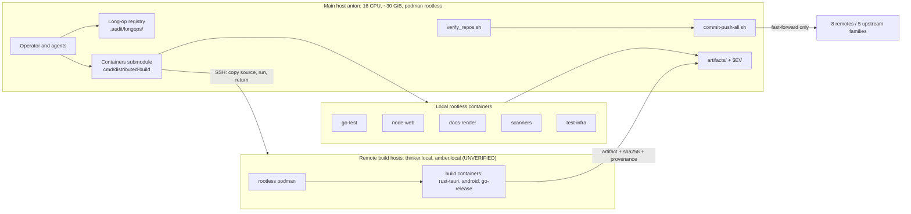
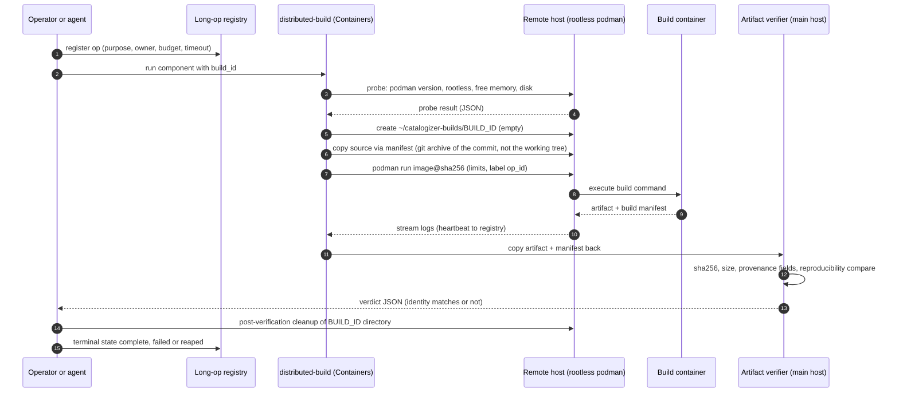
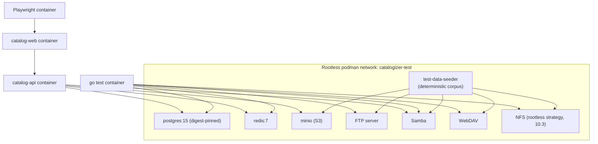
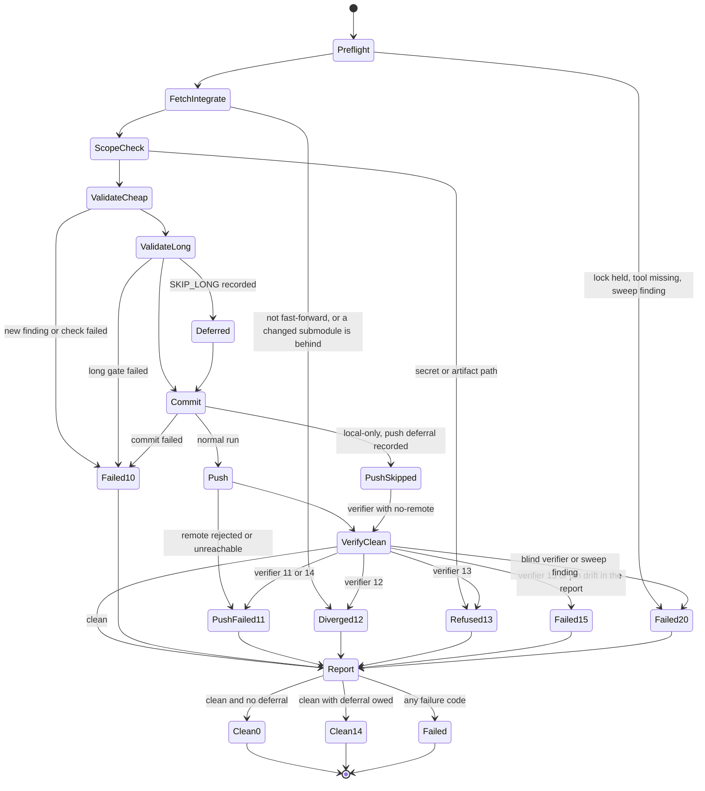

# 16. Containerized Infrastructure and Local Enforcement Plan

| Field | Value |
|---|---|
| Revision | 4 |
| Created | 2026-10-03 |
| Last modified | 2026-10-03 |
| Status | draft (revision 4: IMG-QA added to the catalogue and to the locally built images (tasks.md T209, T210; docs/21 WP-24); routine S7 runs the verifier with `--fetch` (tasks.md T039, docs/21 IC-37); the section 11.4 note records the mode decision of docs/21 IC-37 instead of listing it as open; phase P3 acceptance gains the changed-and-behind submodule fixture (docs/21 IC-41). Revision 3: verifier sections 11.1, 11.2 and 11.4 aligned with the promoted POC (`git ls-remote` plus object-store-only `--fetch`, `--no-remote`, `--self-test`; v1 report shape by reference); commit-push S1 no longer fast-forwards submodules, S7 runs the verifier without `--strict` on routine runs and maps verifier codes to commit-push codes (verifier 14 becomes 11), `--local-only` parsed and run with `--no-remote`; IMG-KCOV listed as repository-built on IMG-TESTUTIL, PyYAML in IMG-TESTUTIL, a P0 bootstrap row in section 17; `images.lock.yaml` as the single lock file; `.pre-commit-config.yaml` and `docker-compose.dev.override.yml` added to the enforcement inventory; table cells with `\|` escaped. Revision 2: consistency with tasks.md and docs/21 IC-16, IC-36 to IC-38) |
| Feature | specs/001-full-project-audit-remediation |
| Spec coverage | FR-019, FR-020, FR-021 (also supports FR-006, FR-007, SC-003, SC-010, SC-012) |
| Constitution anchors | 11.4.173, 11.4.161, 11.4.76, 11.4.156, 11.4.234, 11.4.264, 11.4.246, 12.6, 12.11, 12.12 (also 11.4.232, 11.4.233, 11.4.200, 11.4.108, 11.4.113, 11.4.201, 11.4.27) |

## Table of contents

1. Purpose, scope and non-goals
2. Evidence base: what was read and what was executed
3. Current-state findings (host, containers submodule, compose, Dockerfiles, scripts, hooks)
4. Defect register for the existing container assets
5. Target architecture and container topology
6. Build-container catalogue per component
7. Image pinning procedure and cache strategy
8. Resource limits and the dynamic envelope (12.6, 12.11, 12.12)
9. Remote build distribution and artifact return with identity verification
10. Test infrastructure stack (real services replacing mocks)
11. Deterministic recursive repository verification (FR-019, FR-020, SC-010)
12. Dedicated commit and push script, no blocking hooks (11.4.234)
13. Anti-mess long-operation registry and invariant sweep (11.4.232, 11.4.233)
14. Reproducible and hermetic builds, SLSA Build Level 2 plan (11.4.246)
15. Build once, promote one digest (11.4.264)
16. Local enforcement without CI (11.4.156)
17. Phased adoption order
18. Risks, trade-offs and rejected alternatives
19. Acceptance evidence and traceability
20. Items to verify (UNCONFIRMED and UNKNOWN register)

---

## 1. Purpose, scope and non-goals

This document plans how every build, test run, scan and documentation render for the audit and remediation feature runs inside rootless containers, how those containers are provisioned through the in-repository Containers submodule, how work reaches remote build hosts and returns, and how the repository tree (main repository plus every submodule at every depth) is proven clean and pushed without hooks that can block the commit and push path.

Scope:

- FR-021: all builds in rootless containers, never on the bare host, artifact verified on a clean target before a fix is called done.
- FR-019 and FR-020: regular commit and push, recursive verification, no history rewrite, no force-push, unpushable repositories reported with a reason.
- Supporting: the infrastructure that real-service tests need (constitution 11.4.27), the resource envelope (12.6, 12.11, 12.12), reproducibility and supply-chain evidence (11.4.246, 11.4.264).

Non-goals: this document does not decide what the audit finds, does not define test content (see document 05), and does not specify performance experiments (see document 14). It consumes those documents' needs as container requirements.

Rule restatements are limited to the constitution items the brief names. Every concrete claim about the repository cites a path.

## 2. Evidence base: what was read and what was executed

Read-only commands executed during planning (output observed in this session):

| Command | Observed result |
|---|---|
| `podman --version` | `podman version 5.7.0` |
| `podman info` (filtered) | `rootless: true`, `cgroupVersion: v2`, `cgroupManager: systemd`, `ociRuntime: crun`, `rootlessNetworkCmd: pasta`, `graphDriverName: overlay`, hostname `anton` |
| `nproc` | 16 |
| `free -g` | 30 GiB total, 8 used, 22 available at the time of the read |
| `command -v docker` | no output (docker absent) |
| `command -v` for tools | present: `buildah`, `podman-compose`, `gh`; absent: `kcov`, `shellcheck`, `trivy`, `semgrep`, `gosec`, `hadolint`, `syft`, `cosign`, `skopeo` |
| `podman ps -a`, `podman images` | other projects' images and exited containers already exist in the same rootless store (names such as `helixagent-mcp-*`, `lava_*`, `boba_*`); the store is shared |
| `git submodule status --recursive` | 97 entries at all depths; `.gitmodules` at the top level contains 88 `submodule` lines; 53 entries are nested at depth 2 or deeper |
| `git remote` | 8 remotes configured on the main repository; `Upstreams/` holds 5 export scripts naming gitflic.ru, github.com (two organisations) and gitlab.com (two organisations) |
| `git config core.hooksPath` | unset; `.git/hooks` contains only `*.sample` files (the tracked `scripts/hooks/pre-push-gate.sh` is not installed) |

Files read: `docker-compose*.yml`, `deploy/*.yml`, `deployment/docker-compose*.yml`, `catalog-api/Dockerfile` and `.dev`, `catalog-web/Dockerfile`, `docker/Dockerfile.builder` and the `docker/` listing, `scripts/build_in_container.sh`, `scripts/container-build.sh`, `scripts/push_all_submodules.sh`, `scripts/run-race-detector.sh`, `scripts/hooks/pre-push-gate.sh`, `scripts/install_git_hooks.sh`, `.pre-commit-config.yaml` and `docker-compose.dev.override.yml` (revision 3), `scripts/distributed-boot.sh`, `docs/BUILD_CONTAINER_AUTO_DISPATCH.md`, `Build/CLAUDE.md`, the root `commit` script, `env.properties` (secrets values not recorded here), `submodules/containers` package tree and `helix-deps.yaml`, and `specs/001-full-project-audit-remediation/docs/01-system-architecture-map.md`.

Not executed: no image pull, no build, no test, no connection to `thinker.local` or `amber.local`. All snippets in sections 6 to 16 are `NOT EXECUTED` unless stated.

## 3. Current-state findings

### 3.1 Host facts

| Fact | Value | Implication |
|---|---|---|
| Container engine | podman 5.7.0 rootless, crun, netavark/aardvark, pasta networking, overlay on cgroup v2 | Meets 11.4.161. No docker. Any compose file must run under `podman-compose` (present) or `podman compose` |
| CPU | 16 logical | Envelope in section 8 |
| RAM | about 30 GiB total, 22 available when sampled | 12.6 ceiling of 60 percent of total is about 18 GiB for all project work together |
| Missing scanners | trivy, semgrep, gosec, hadolint, syft, cosign, skopeo, shellcheck, kcov | Each must run from a pinned container (section 6), not be installed on the host (no sudo, no host package installs) |
| Shared image store | other projects' images live in the same store | Image naming must be namespaced (`localhost/catalogizer-*`), prune must be scoped by label, never `podman system prune` |
| Bind-mount safety | SELinux not confirmed | `:z` or `:Z` suffix choice must be probed, see section 6.2 |

### 3.2 The Containers submodule (submodules/containers, module `digital.vasic.containers`)

Verified package inventory under `submodules/containers/pkg`: `runtime` (detection plus podman, docker, kubernetes, crio, nerdctl, lxd adapters; `runtime.AutoDetect` is shown in its README), `compose` (compose orchestration, `helix_project.go`), `remote` (SSH executor with `Execute`, `ExecuteStream`, `CopyFile`, `CopyDir`, `IsReachable`; `RemoteComposeOrchestrator` with `Up`, `Down`, `Status`, `Logs`; host manager, probe, gpu probe), `remoteexec`, `distribution` (`DefaultDistributor` with `Distribute`, `Undistribute`, `Status`, `HealthCheckAll`, `Rebalance`), `scheduler` (resource-aware strategies), `crossbuild` (`Selector` choosing a `Backend` per `BuildRequest`; Linux container, Wine and host-direct backends; SELinux relabel helper in `container_runner.go`), `health`, `orchestrator`, `policy`, `envconfig` (dotenv parser), `cache`, `volume`, `network`, `lifecycle`, `metrics`, and VM/emulator packages. `cmd/` contains `distributed-build`, `distributed-test`, `deploy-stack`, `boot` and emulator tools.

`cmd/distributed-build/main.go` flags (read): `-project`, `-env`, `-component`, `-version`, `-skip-tests`, `-dry-run`, `-timeout` (minutes, default 30), `-strategy` (default `resource_aware`), `-components` (JSON file of the project's build components). Remote hosts are configured through the `.env` file passed with `-env`; the exact variable names are `UNCONFIRMED:` and must be read from `submodules/containers/pkg/envconfig` and `cmd/distributed-build/main.go` before the first use (step P2-2 in section 17).

Integration tests in `pkg/distribution/distributed_build_test.go` are gated by `CONTAINERS_INTEGRATION_TEST=1` and name hosts from the environment, including a host called `thinker`.

Consequence: a distribution and remote-compose mechanism exists and the repository already has the constitution-mandated "extend the containers submodule, never an ad-hoc host build" path available (11.4.74, 11.4.173). What does not exist is a Catalogizer-specific component description file for `-components` and a verified remote host inventory. Producing both is a deliverable of this plan.

### 3.3 Existing build scripts and what they do today

| Script | What it does | Gap against 11.4.173 and FR-021 |
|---|---|---|
| `scripts/build_in_container.sh` | rsyncs `catalog-api` and `submodules` to `${BUILD_HOST:-thinker.local}`, runs `podman run golang:1.25-bookworm` there, brings `catalog-api-container` back and prints a remote-versus-local md5 proof block | Go only; uses `ssh` and `rsync` directly rather than the Containers submodule `remote` package; tag-based image reference (`golang:1.25-bookworm`, not a digest); md5 for identity (weak; should be sha256 plus provenance); `rsync --delete` into a fixed remote directory, which is not isolated per build |
| `scripts/container-build.sh` | wraps `podman-compose -f docker-compose.build.yml` with version and skip options | Depends on `docker/Dockerfile.builder` which does not build (finding D-03) |
| `scripts/lib/auto-container.sh` (documented in `docs/BUILD_CONTAINER_AUTO_DISPATCH.md`) | `need_toolchain`, `ensure_builder_image`, `run_in_builder`: when a toolchain is not on the host PATH it re-executes in `localhost/catalogizer-builder:latest` with `--userns=keep-id`, `--network host`, `-v $PWD:/workspace:z` | The rule is "container only when the host lacks the tool". This contradicts FR-021 and 11.4.173, which require the container always, even if the host has the tool. The dispatch condition must be inverted (finding D-08) |
| `scripts/lib/build-*.sh`, `scripts/build-all-releases.sh`, `scripts/release-build.sh`, `build-scripts/build-all.sh` | per-component build entry points | `build-scripts/build-all.sh` runs builds directly on the host and creates placeholder build scripts when missing (it writes "not yet implemented" scripts that report success). That is a bluff-class behaviour under 11.4 and a bare-host build under 11.4.173 (finding D-09) |
| `Build/` framework (`Build/lib/common.sh`, `version.sh`, `hash.sh`, `orchestrator.sh`) | versioning via `versions.json`, SHA-256 source-hash change detection, `detect_runtime` for podman or docker | Reusable. Version and hash logic feed the build identity in section 9.3 |
| `scripts/run-race-detector.sh` | race tests across catalog-api and a hard-coded list of Go submodules, honours `GOMAXPROCS=3 go test -p 2 -parallel 2` | Runs on the host. Must move inside the Go test container (section 6) with the same limits expressed as container limits |

### 3.4 Commit and push tooling today

- The root `commit` file is a 30-line wrapper that sources `env.properties` and calls an external `commit` binary resolved by `PATH` to `/home/milosvasic/Projects/project_toolkit/Upstreamable/commit` (shown by `type -a commit`). The external script is outside this repository and was not read: `UNCONFIRMED:` whether it commits and pushes submodules recursively, how it treats divergence, and whether it can force. Its behaviour must be read before it is trusted by section 12.
- `scripts/push_all_submodules.sh` handles only owned submodules under `submodules/*` (the header says so), stages governance pointer files only, uses `merge --ff-only` and refuses force. It writes its log to `qa-results/phasef_push.log` and has a `DRY_RUN=1` default. It does not walk nested submodules (53 of 97 entries are nested), so it cannot satisfy SC-010 alone.
- `scripts/hooks/pre-push-gate.sh` is a tracked blocking gate (landmines, anti-bluff scan, LLM-judge prompt) with an `LLM_JUDGE_BYPASS=1` emergency variable. `scripts/install_git_hooks.sh` would symlink it as `.git/hooks/pre-push`. It is currently not installed (no `pre-push` file in `.git/hooks`, `core.hooksPath` unset). Under 11.4.234 it must not be installed as a blocking hook; its checks become an explicit stage of the dedicated script (section 12). The `LLM_JUDGE_BYPASS` pattern is replaced by the recorded-deferral flag of 11.4.234(D) so skips are visible, not silent.
- `.github/` exists and tracks `FUNDING.yml` and `workflows/README.md` only: no active pipeline (consistent with 11.4.156). The planning must keep it that way.
- `.pre-commit-config.yaml` (revision 3; tracked, last changed in commit `d72f14ce`, 2026-04-21) declares a `pre-commit` hook set: `pre-commit-hooks` v4.5.0 (`trailing-whitespace`, `end-of-file-fixer`, `check-yaml`, `check-json`, `check-added-large-files --maxkb=1000`, `check-merge-conflict`, `detect-private-key`), `detect-secrets` v1.4.0 with `--baseline .secrets.baseline`, `pre-commit-golang` v0.5.1 (`go-fmt`, `go-vet`, `go-imports`, `go-unit-tests -v -race ./...`), local `gosec` (`language: system`) and `scripts/hooks/no-false-positive-log.sh`, `mirrors-eslint` v8.55.0 and `mirrors-prettier` v3.1.0. Observed on 2026-10-03: the `pre-commit` tool is not on the host `PATH` (`command -v pre-commit` prints nothing), `.git/hooks` holds only samples, and `.secrets.baseline` does not exist, so the `detect-secrets` hook as configured would fail on its first run. The configuration is therefore not active. It is not installed as a hook under this plan (11.4.234; its `go-unit-tests -race` and `gosec` entries would also run on the bare host, against FR-021). Its checks are carried into named stages instead (section 16.1). The file stays tracked and unmodified; removing it is an owner decision (11.4.122).
- `docker-compose.dev.override.yml` (revision 3; tracked, 21 lines, last changed in commit `bbba26a0`, 2026-04-11) remaps host ports for a developer host where the standard ports are taken (`postgres` 5435, `redis` 6381, `api` 8090) and sets `POSTGRES_PORT`, `REDIS_PORT` and `API_PORT` for the `api` service. It names no image, so `check_pins.sh` has nothing to pin in it, but it is in scope for the compose enumeration of D-07 and S3, and its `REDIS_PORT` and `API_PORT` names repeat the environment-name mismatch recorded as O-06 in document 01.
- Names such as `scripts/ci-local.sh` (932 lines), `scripts/local-ci.sh`, `scripts/ci-pipeline.sh` are local scripts; they are acceptable as local enforcement but their stage content is `UNCONFIRMED:` and is audited in document 05's scope; this plan only requires that they run inside containers.

### 3.5 Build hosts named in the repository

`thinker.local` is named in `scripts/build_in_container.sh`, `deploy/MIGRATION_thinker_local.md`, the project `CLAUDE.md` and 11.4.173. `amber.local` appears in `deployment/amber-up.sh` (and `thinker-up.sh` beside it). Neither was contacted. Section 9.5 lists exactly what must be verified before either is relied on.

## 4. Defect register for the existing container assets

These are findings observed by reading files. They enter the findings register (document 04) with the ids assigned there. Severity is a proposal; document 04 owns classification.

| Id | Asset | Observed defect | Evidence | Proposed severity |
|---|---|---|---|---|
| D-01 | `docker-compose.yml` service `api` | Build context is `./catalog-api` with `dockerfile: Dockerfile`, but `catalog-api/Dockerfile` copies `submodules/...` and `catalog-api/...` paths, which only exist when the context is the repository root. The build cannot resolve those COPY sources | docker-compose.yml:67-69 versus catalog-api/Dockerfile:21-50 (`COPY submodules/assets/ ...`, `COPY catalog-api/go.mod ...`). `docker-compose.test.yml:38-40` uses context `.` for the same Dockerfile, which is the form that matches | high |
| D-02 | `docker-compose.test.yml` service `catalog-web` | Context `./catalog-web` with `catalog-web/Dockerfile`, which copies `catalog-web/...` and sibling module directories relative to the repository root | docker-compose.test.yml:87-89 versus catalog-web/Dockerfile:17,59 | high |
| D-03 | `catalog-web/Dockerfile` | `COPY` sources `WebSocket-Client-TS/`, `Media-Types-TS/`, `UI-Components-React/`, `Media-Browser-React/`, `Media-Player-React/`, `Collection-Manager-React/`, `Dashboard-Analytics-React/`, `Auth-Context-React/`, `Catalogizer-API-Client-TS/` at the context root. Those directories are not at the repository root; the modules live at `submodules/websocket_client_ts` and so on (the root listing has no such directories, `ls WebSocket-Client-TS` fails). The image cannot build from the repository root | catalog-web/Dockerfile:6-14,48-56; root listing; document 01 section on shared submodules | high |
| D-04 | `docker/Dockerfile.builder` | `COPY docker/go${GO_VERSION}.linux-amd64.tar.gz` with `GO_VERSION=1.26.1`: the `docker/` directory holds Dockerfiles and `signing*` only, no tarball. The builder image (used by `docker-compose.build.yml`, `docker-compose.test.yml` desktop and wizard services, and `scripts/container-build.sh`) cannot be built from a clean checkout | Dockerfile.builder:`COPY docker/go${GO_VERSION}...`; `ls docker` | high |
| D-05 | `docker/Dockerfile.builder` | Header comment says JDK 17, installed package is `openjdk-21-jdk`; Node 18 from `deb.nodesource.com/setup_18.x` (Node 18 is past end of life, `UNCONFIRMED:` exact date to cite from nodejs.org in the dependency document), while `catalog-web/Dockerfile` uses Node 20; `ubuntu:22.04` unpinned tag; Rust installed by piping `https://sh.rustup.rs` to `sh`; `cargo install tauri-cli` unpinned; `curl \| bash` for NodeSource; Go minimum in comment 1.25.7 versus 1.26.1 tarball; `ENTRYPOINT ["/project/scripts/build-test-release.sh"]` | Dockerfile.builder | medium |
| D-06 | `docker-compose.build.yml` | `network_mode: host` and bound host ports 5432 and 6379 on a developer machine (collision with any local PostgreSQL or Redis); fixed credentials in the file (`<test credential literals, see docker-compose.build.yml:13-14, 74-75, 92-93>`, test-only but compromised by disclosure because committed in public code); volumes `go-cache:/root/go` assume root-in-container while the dispatch doc says `--userns=keep-id`; `docker.io/budtmo/docker-android:emulator_14.0` tag only | docker-compose.build.yml:10-50, 100-127 | medium |
| D-07 | `docker-compose.yml`, `deployment/docker-compose.yml`, `docker-compose.dev.yml` | Floating tags (`prom/prometheus:latest`, `grafana/grafana:latest`, `quay.io/minio/minio:latest`, `dpage/pgadmin4:latest`, `nginx:alpine`, `postgres:15-alpine`); `cat docker-compose.yml deployment/docker-compose.yml docker-compose.dev.yml \| grep -c latest` returns 12 matching lines when measured 2026-10-03 (3 + 6 + 3 per file; across all nine root compose files the count is 18 lines, not 30, so the earlier figure of 30 was not reproducible). Environment names `API_PORT`, `REDIS_HOST`, `REDIS_PORT` do not match the names the process reads (`SERVER_PORT`, `REDIS_ADDR`), already recorded as O-06 in document 01 | grep; docker-compose.yml:76-83; main.go:324,562 per document 01 | medium |
| D-08 | `scripts/lib/auto-container.sh` | Containerizes only when the toolchain is missing from the host PATH (`need_toolchain`); a host with the tool builds on the bare host | docs/BUILD_CONTAINER_AUTO_DISPATCH.md "Public API" | high (FR-021, 11.4.173) |
| D-09 | `build-scripts/build-all.sh` | Builds directly on the host; creates placeholder build scripts that print success when a component's script is missing | build-scripts/build-all.sh | high (bluff-class and bare-host) |
| D-10 | `docker-compose.test-infra.yml` NFS service | `privileged: true` plus `cap_add: SYS_ADMIN` and kernel NFS dependency. A rootless podman user cannot honestly grant that; the service will fail or run degraded. Needs a rootless-compatible NFS strategy or a recorded structural-impossibility finding with a substitute (section 10.3) | docker-compose.test-infra.yml:165-185 | medium |
| D-11 | `scripts/build_in_container.sh` | Remote working directory is fixed (`~/catalogizer-build`) and synced with `rsync --delete`: two concurrent builds, or a build and a leftover, can corrupt each other; no per-build directory; md5 proof | scripts/build_in_container.sh | medium |
| D-12 | `scripts/push_all_submodules.sh` | Does not cover nested submodules (53 of 97 recursive entries) and does not verify the working tree; covers only governance pointer files | script header | medium (SC-010) |
| D-13 | `scripts/hooks/pre-push-gate.sh` | Blocking pre-push design with a free-form environment bypass; contradicts 11.4.234 if installed as a hook | script header; `scripts/install_git_hooks.sh` | medium |
| D-14 | Root `commit` | Delegates to an external binary not under version control in this repository; behaviour unknown | `type -a commit` | UNKNOWN, treat as medium until read |

D-01 to D-04 are the ones that are already known to break a build; the plan treats each as a reproduce-first case (11.4.115): before editing, a containerized `podman build` of the exact compose or Dockerfile invocation is recorded failing, then the fix is applied, then it is recorded passing three times. Whether any of D-01 to D-03 is masked by an out-of-tree workaround (for example a script that sets a different context) is `UNCONFIRMED:`; the defect is only confirmed after the failing build is captured.

## 5. Target architecture and container topology

Principles: one container engine path (rootless podman through the Containers submodule), one build description file per component, one image reference per toolchain pinned by digest, one remote execution path, one artifact identity format, one verifier.



Placement policy:

| Work class | Where | Reason |
|---|---|---|
| Go unit, integration, race, fuzz, benchmark for catalog-api and Go submodules | local container first; remote when the memory envelope in section 8 is exceeded | Quick feedback; Go tests need the real test infra (section 10) which runs locally |
| Web build, lint, type check, unit tests, Playwright | local container | Playwright needs its browser image; CPU modest |
| Rust/Tauri desktop and installer-wizard, Android and Android TV Gradle builds | remote build host(s) by default (11.4.173 names offload as the model) | Heavy toolchains (Android SDK, WebKitGTK headers); main host memory ceiling |
| Documentation rendering (VitePress, diagrams, export to html, pdf, docx) | local container | Deterministic fonts and tools inside image |
| Scanners (trivy, semgrep, gosec, hadolint, syft, sonar-scanner) | local container from pinned images | Not installed on the host; no host installs |
| Mutation testing (go-mutesting or equivalent, Stryker for TypeScript, PIT for Kotlin) | remote by default; local container only for small modules | Long running; CPU heavy. The exact tool choice per language is owned by document 05 and is `UNCONFIRMED:` here |
| Repository verification and commit and push | host shell, `git` and `ssh` only | These are repository operations, not builds; they read and write version control state and must not require a container. Their own validation stage invokes containers (section 12) |

Clarification of the 11.4.173 boundary: `git`, `ssh`, `bash` and a pinned container run are control-plane operations on the host. Anything that compiles, packages, renders, scans or tests is data-plane work and runs in a container.

## 6. Build-container catalogue per component

### 6.1 Catalogue

Image references below are named by role and by the base image family only. No digest is invented. Section 7 gives the procedure that fills the digest column; until filled, an image is `UNPINNED` and any use of it is flagged in the evidence record.

| Id | Role | Base image family and intended tag | Toolchain contents | Used for | Digest (to fill) |
|---|---|---|---|---|---|
| IMG-GO | Go build and test | `docker.io/library/golang`, tag matching `catalog-api/go.mod` (`go 1.25.7`): the Dockerfile uses `golang:1.25` and the remote script uses `1.25-bookworm`; one tag (`1.25-bookworm`, glibc, because CGO links `docx.c` against glibc fortify symbols per the comment in `scripts/build_in_container.sh`) must be chosen and recorded | Go, gcc via `build-essential`, `libsqlite3-dev` if required (`UNCONFIRMED:` whether the sqlite driver bundles the amalgamation), race detector (needs CGO) | catalog-api, Go submodules, race, bench, fuzz | TBD |
| IMG-NODE | Web build | `docker.io/library/node` 20 (matches `catalog-web/Dockerfile`; `UNCONFIRMED:` engine constraint in `catalog-web/package.json`) | npm, build deps | catalog-web, TypeScript submodules, `catalogizer-api-client` | TBD |
| IMG-PW | Playwright | `mcr.microsoft.com/playwright` version aligned with the Playwright version in `catalog-web/package.json` (compose files use `v1.40.0-jammy`, `UNCONFIRMED:` against package.json) | chromium, firefox, webkit | web E2E, visual regression | TBD |
| IMG-RUST | Rust and Tauri | built locally from a Containerfile derived from `docker/Dockerfile.builder` layers 1, 4 | rustup with pinned toolchain version, `tauri-cli` pinned, `webkit2gtk-4.1-dev`, `libayatana-appindicator3-dev`, `librsvg2-dev`, `libgtk-3-dev`, `patchelf`, `xvfb` | catalogizer-desktop, installer-wizard | local image id plus digest once pushed to a local registry or saved as OCI archive |
| IMG-ANDROID | Gradle and Android SDK | built locally; derived from layer 5 of `docker/Dockerfile.builder` and `docker/Dockerfile.android*` | JDK 21, Android command-line tools, build-tools 34 and 35, platforms 34 and 35, pinned Gradle wrapper (the repo's wrapper, not a host Gradle) | catalogizer-android, catalogizer-androidtv, instrumented tests build step | local |
| IMG-DOCS | Documentation render | built locally | Node plus VitePress (`Website/` is the VitePress site, `UNCONFIRMED:` exact path, owned by document 13), Mermaid CLI with headless Chromium, pandoc, a PDF engine, fonts | README graph checks, exports (html, pdf, docx), diagram render checks (SC-007) | local |
| IMG-SCAN-TRIVY, -SEMGREP, -GOSEC, -HADOLINT, -SYFT, -SONAR | Scanners | `aquasec/trivy`, `semgrep/semgrep`, `securego/gosec`, `hadolint/hadolint`, `anchore/syft`, `sonarqube` and the scanner CLI image (compose security file already names `sonarqube:community`, `owasp/dependency-check`, snyk CLI on `node:18-alpine`) | one tool each | SC-009 and document 10 | TBD per tool |
| IMG-SHELLCHECK, IMG-KCOV | Shell lint and shell coverage | IMG-SHELLCHECK: `docker.io/koalaman/shellcheck` pulled and pinned by digest (built FROM scratch, so the lock entry carries an entrypoint override); IMG-KCOV: repository-built kcov on IMG-TESTUTIL, from the tracked `build/containers/kcov/Containerfile` `FROM` the IMG-TESTUTIL digest (revision 3; the upstream kcov image is not used because it lacks git, jq and python3, tasks.md T005) | shell scripts are in scope for the 11.4.224 coverage floor; IMG-KCOV also carries the IMG-TESTUTIL tools, so a coverage run has git, jq and python3 | document 05; docs/21 P0 test legs (WP-09) | IMG-SHELLCHECK: pulled digest; IMG-KCOV: built digest recorded in `images.lock.yaml` |
| IMG-TESTUTIL | Test utilities for the docs/21 P0 test legs (added in revision 2, unconditional) | built rootless from the tracked `build/containers/testutil/Containerfile`: `FROM docker.io/library/debian` slim, base digest-pinned, packages installed from a pinned Debian snapshot (`snapshot.debian.org` timestamp recorded in the Containerfile) at pinned versions | `bash`, `git`, `sqlite3`, `python3`, `jq`, Python `jsonschema` and PyYAML (`python3-jsonschema`, `python3-yaml`; revision 3) | register DDL and trigger tests, verifier and commit-push fixture tests, schema validation, catalogue regeneration (tasks.md WP-09) | local image id; the built digest is recorded in `images.lock.yaml` |
| IMG-QA | HelixQA runs (revision 4; document 12 section 18.3, docs/21 WP-24) | built rootless on the local host from a tracked Containerfile with digest-pinned `FROM` lines (tasks.md T209); under the tracked deviation from 11.4.173 until docs/21 ODG-07 is answered, so no compliance is claimed | `helixqa` built from the pinned `submodules/helix_qa`, Tesseract, ffmpeg, Playwright browsers, python3 with PyYAML and pytest at pinned versions; the wrapper `scripts/qa/run_profile.sh` is not baked in, it runs from the read-only source mount | bank validation, bank-id floor, HelixQA profiles (`api`, `web`, `desktop`, `android`, `androidtv`, `installer`), the docs/21 WP-21 re-verification cases; reached only through `scripts/containers/run_qa.sh` and the `qa` rows of `scripts/containers/lanes.tsv` (tasks.md T210) | built digest recorded in `images.lock.yaml` as `IMG-QA`; smoke test prints `helixqa --version`, `tesseract --version`, `ffmpeg -version` and imports `yaml` and `pytest` |
| IMG-MUT | Mutation testing | built locally per language | per document 05 | SC-005 | local |
| IMG-INFRA-* | Real services | `postgres`, `redis`, `minio`, FTP, SMB, WebDAV, NFS images from `docker-compose.test-infra.yml` and `docker-compose.build.yml` | see section 10 | integration, E2E | TBD |

The Containers submodule's own `crossbuild` Linux backend (`pkg/crossbuild/linux_container.Containerfile`) is the preferred mechanism for the Rust and Android images when those are declared as build components (11.4.74: extend, do not reimplement). Whether it supports Tauri and Android SDK images unchanged is `UNCONFIRMED:`; the decision record is:

Decision DR-16-1. Provide Catalogizer Containerfiles under a new `build/containers/` tree (one directory per image, each with a `Containerfile` and a `README.md`; every image, pulled or built, has its entry in the single lock file `build/containers/images.lock.yaml` of section 7.1, revision 3), and register them through a `components.json` consumed by `cmd/distributed-build -components`. If the Containers submodule lacks a needed capability (for example per-build working directory, sha256 artifact manifest), the capability is added upstream in the submodule, not worked around in Catalogizer scripts. Rejected alternative: keep `scripts/build_in_container.sh` as the long-term driver; rejected because it duplicates SSH and rsync logic the submodule already provides and cannot give digest-pinned, per-build isolated directories without becoming a second orchestrator.

### 6.2 Invocation forms (POC, NOT EXECUTED)

The common run flags: rootless, no privileged, user namespace mapping so output files belong to the invoking user, read-only source mount where possible, explicit limits from section 8, a label for scoped cleanup, no host network unless a service needs it.

```bash
# Common prefix (NOT EXECUTED). IMG_* come from build/containers/images.lock.yaml (section 7.1).
RUN_COMMON=(podman run --rm
  --userns=keep-id
  --security-opt label=disable          # or use :z after the SELinux probe in 8.5
  --label project=catalogizer --label op_id="$OP_ID"
  --memory "$MEM_LIMIT" --memory-swap "$MEM_LIMIT" --cpus "$CPU_LIMIT" --pids-limit 4096
  --cap-drop=ALL
  -v "$PWD":/src:ro
  -v "$OUT_DIR":/out:rw
  -w /src)

# Go unit and race tests for catalog-api, limits mirror scripts/run-race-detector.sh
"${RUN_COMMON[@]}" -e GOMAXPROCS=3 -e GOTOOLCHAIN=local -e CGO_ENABLED=1 \
  -v catalogizer-gocache:/go/pkg/mod:rw -v catalogizer-gobuild:/root/.cache/go-build:rw \
  "$IMG_GO" sh -c 'cd catalog-api && go test -race -p 2 -parallel 2 -json ./... > /out/go-test.jsonl'
# Expected machine output: /out/go-test.jsonl, one JSON object per line with "Action":"pass"|"fail"|"output".

# Web build and unit tests
"${RUN_COMMON[@]}" -v catalogizer-npm:/root/.npm:rw "$IMG_NODE" \
  sh -c 'cd catalog-web && npm ci --ignore-scripts && npm run build && npm test -- --reporter=json --outputFile=/out/web-test.json'

# VitePress or documentation render
"${RUN_COMMON[@]}" "$IMG_DOCS" sh -c 'cd Website && npm ci && npm run build'

# Scanners (read-only source, results in /out)
"${RUN_COMMON[@]}" "$IMG_TRIVY" fs --format json --output /out/trivy-fs.json /src
"${RUN_COMMON[@]}" "$IMG_SEMGREP" semgrep scan --config auto --json --output /out/semgrep.json /src

# Rust and Tauri (runs on the remote build host through cmd/distributed-build, shown in section 9)
# Android: Gradle uses the repo wrapper inside IMG_ANDROID
"${RUN_COMMON[@]}" -v catalogizer-gradle:/root/.gradle:rw "$IMG_ANDROID" \
  sh -c 'cd catalogizer-android && ./gradlew --no-daemon assembleDebug testDebugUnitTest'
```

Notes on the forms:

- `--userns=keep-id` is the form already documented in `docs/BUILD_CONTAINER_AUTO_DISPATCH.md`. With it, the process runs as the host user inside the container, so cache volumes mounted at `/root/...` may be unwritable (finding D-06). Cache paths must be set by environment (`GOCACHE`, `GOMODCACHE`, `npm_config_cache`, `GRADLE_USER_HOME`, `CARGO_HOME`) to directories the mapped user can write, not assumed to be `/root`. `UNCONFIRMED:` whether the images should instead run with the default rootless mapping; decide by running the section 6.3 smoke test.
- `--network` default (pasta) is used for tests; build steps that need only the module cache should run with `--network=none` after the cache is warm, which also supports the hermetic target of section 14.
- Playwright images require `--ipc=host` or `--shm-size`; the exact flag is `UNCONFIRMED:` and is set from the Playwright documentation of the pinned version.
- Android instrumented tests need an emulator and KVM; whether `/dev/kvm` exists for the rootless user on this host is `UNKNOWN:` (the existing compose file says "requires KVM"). Verify with `test -r /dev/kvm`; if unavailable, device-level Android tests run on a remote host or on a real device, and the gap is a recorded SKIP with reason (11.4.3, not a pass).

### 6.3 Image smoke test (the first check of every image)

For each image the build record includes: `podman image inspect --format '{{.Digest}} {{.Id}}'`; the tool versions printed by the toolchain (`go version`, `node --version`, `rustc --version`, `java -version`, and so on) saved as `/out/toolchain.json`; and a one-line "can write to cache dirs as mapped user" probe. A control needle (11.4.201) is mandatory: the probe also tries a write that must fail (a read-only mount) and records that it failed, so a probe that cannot detect a failure is itself detected.

## 7. Image pinning procedure and cache strategy

### 7.1 Pinning procedure (no digests are asserted in this document)

1. Declare every external image in `build/containers/images.lock.yaml`:

```yaml
# NOT EXECUTED: schema example; digests are filled by the procedure, never by hand
schema: 1
images:
  - id: IMG-GO
    reference: docker.io/library/golang
    tag_intent: "1.25-bookworm"
    digest: ""            # sha256:<64 hex>, filled by step 3
    resolved_at: ""       # UTC timestamp of resolution
    resolved_on: ""       # host name
    purpose: "catalog-api build and test"
```

2. Resolve: `podman pull docker.io/library/golang:1.25-bookworm` then `podman image inspect --format '{{range .RepoDigests}}{{println .}}{{end}}' docker.io/library/golang:1.25-bookworm` and select the entry whose repository prefix equals the pulled reference (revision 3, as tasks.md T005: never the first entry blindly, because a shared rootless store can list digests of other references for the same image id). If the registry is unreachable, the entry stays `digest: ""` and the build record says `UNPINNED`.
3. Write the digest into `images.lock.yaml`; thereafter every build refers to `reference@sha256:<digest>`, never to the tag. A `scripts/containers/check_pins.sh` (to be written, phase 1) fails if any compose file, Dockerfile `FROM`, or script references an external image without `@sha256:` (finding D-07).
4. Update only by an explicit bump change that re-resolves, re-runs the image smoke test and the affected tests, and is committed as its own commit with a reviewed diff of tool versions.
5. Signature verification: `cosign` and `skopeo` are absent on the host. Verification of upstream signatures, where an image publisher provides them, runs in a pinned verification container. Whether each publisher in the table signs images is `UNKNOWN:` and recorded as a gap, never assumed.

### 7.2 Locally built images

Locally built images (`IMG-RUST`, `IMG-ANDROID`, `IMG-DOCS`, `IMG-MUT`, `IMG-TESTUTIL`, `IMG-KCOV` on the IMG-TESTUTIL base (revision 3), and `IMG-QA` (revision 4)) are built from their `Containerfile` by `podman build` with all `FROM` lines digest-pinned, tagged `localhost/catalogizer-<role>:<content-hash>` where the content hash is the SHA-256 of the Containerfile plus its build context (`Build/lib/hash.sh` already implements source hashing and change detection). An image is rebuilt only when that hash changes. The local image digest is recorded in the build record. Downloads inside a `Containerfile` (rustup, NodeSource, Android command-line tools, the Go tarball) must be replaced by downloads of pinned versions with their published SHA-256 verified in the Containerfile; the `curl | sh` forms in `docker/Dockerfile.builder` are removed (finding D-05). The Go tarball `COPY` is replaced by a pinned `FROM golang` stage (finding D-04).

### 7.3 Cache strategy

| Cache | Mechanism | Scope | Invalidation |
|---|---|---|---|
| Go module and build | named volumes `catalogizer-gomod`, `catalogizer-gobuild` | per host | module cache by `go.sum` hash; build cache pruned when volume exceeds the budget in 8.4 |
| npm | named volume `catalogizer-npm` | per host | keyed by `package-lock.json` through `npm ci` |
| Gradle | `catalogizer-gradle` with `--no-daemon` in containers | per host | by Gradle wrapper version and lockfiles |
| Cargo | `catalogizer-cargo` | per host | `Cargo.lock` |
| Image layers | podman layer cache | per host | per Containerfile hash |
| Source sync to remote | `Containers` submodule `CopyDir`; content-hash manifest of the source tree decides what to transfer | per build directory | new per-build directory `~/catalogizer-builds/<build_id>/` on the remote, deleted after artifact verification, never a shared `--delete` target (finding D-11) |

Persistent caches serve iteration speed (11.4.82). They never serve evidence: a failing-then-passing record for a fix (SC-003) must be obtainable with a cold-cache rerun on demand, and the determinism check (document 06) runs at least one iteration with caches emptied. Cache volumes are labelled `project=catalogizer` so cleanup is `podman volume prune --filter label=project=catalogizer` only, never a global prune (shared store, section 3.1).

## 8. Resource limits and the dynamic envelope (12.6, 12.11, 12.12)

### 8.1 Inputs

The envelope is computed at the start of each build session and recorded in the build record; no value is hard-coded (11.4.6). Inputs read from the host:

- total memory and available memory: `/proc/meminfo` (`MemTotal`, `MemAvailable`)
- logical CPUs: `nproc`
- process limit: `ulimit -u` (12.12)
- sum of budgets of currently registered long operations (section 13)
- cgroup memory pressure: `/sys/fs/cgroup/<scope>/memory.pressure` and CPU throttling `cpu.stat` (`nr_throttled`, `throttled_usec`), read as deltas (11.4.225 requires deltas, not averages)

### 8.2 Formulas

```
reserve_cpu  = max(2, ceil(0.125 * nproc))          # 16 CPUs -> 2
reserve_mem  = max(4 GiB, 0.15 * MemTotal)          # 30 GiB -> about 4.5 GiB
ceiling_mem  = floor(0.60 * MemTotal)               # 12.6; 30 GiB -> about 18 GiB
mem_budget   = min(ceiling_mem - used_by_registered_longops,
                   MemAvailable - reserve_mem)
cpu_budget   = nproc - reserve_cpu - cpu_in_use_by_registered_longops
jobs         = max(1, min(cpu_budget, floor(mem_budget / per_job_mem)))
```

`per_job_mem` is not guessed: each toolchain has a measured value stored in `build/containers/profile.json`, produced by the first measured run (11.4.24 build-resource statistics: peak RSS from `podman stats --no-stream --format json` sampled during the run). Until measured, the value is `UNKNOWN:` and the build runs with `jobs = 1` for that toolchain. The existing project rule `GOMAXPROCS=3 go test -p 2 -parallel 2` (cited in `scripts/run-race-detector.sh`) remains the floor for the host-resident control plane and is the starting value for Go until measured.

11.4.173 and 12.11 permit a containerized build path to use a larger fraction of the machine than the bare-metal ceiling because it is in its own cgroup with its own memory maximum and an out-of-memory kill hits the container, not the user session. Applied here: the container receives `--memory mem_budget` and the formula already subtracts the reserve; it does not subtract the interactive session's usage beyond `MemAvailable`. Whether `user.slice` scoping on this host matches that assumption is `UNKNOWN:` and verified by the section 8.5 probe.

### 8.3 Worked example (arithmetic only, NOT a measurement)

With the observed 16 CPUs and about 30 GiB: reserve_cpu 2, ceiling_mem about 18 GiB, reserve_mem about 4.5 GiB. If `MemAvailable` is 22 GiB and no long operation is registered: mem_budget = min(18, 22 - 4.5) = 17.5 GiB; cpu_budget = 14. A Go race run with a measured 1.5 GiB per package job would give jobs = min(14, floor(17.5 / 1.5)) = 11. The numbers 1.5 and 11 are illustrative inputs, not measurements.

### 8.4 Limits per container

Every container started by the framework receives `--memory`, `--memory-swap` equal to memory (no swap use), `--cpus`, `--pids-limit` (12.12 thread and process headroom), `--ulimit nofile`, a hard wall-clock timeout from the long-op record (section 13), and a `tmpfs` cap for `/tmp`. Defaults for each image class are stored in `build/containers/profile.json` and overwritten by measurement. The compose file budgets already in the repository (for example postgres 1 CPU and 2 GiB in `docker-compose.build.yml`, test infra "max 2 CPUs, 2 GB total" in `docker-compose.test-infra.yml`) are inputs to this table, subtracted from the budget while those services run.

### 8.5 Probes before the first build (read-only, to run in phase 1)

```bash
# NOT EXECUTED
test -r /dev/kvm && echo kvm_ok || echo kvm_absent
getenforce 2>/dev/null || echo selinux_not_present
ulimit -u
podman info --format '{{.Host.CgroupVersion}} {{.Host.RemoteSocket.Exists}}'
cat /sys/fs/cgroup/user.slice/user-$(id -u).slice/memory.max 2>/dev/null
```

Every result is stored in `$EV/host-probe.json` (`$EV` = `specs/001-full-project-audit-remediation/evidence`, layout owned by document 06 §11) with a control needle: the probe script also reads a path that must not exist and records the expected absence, so a probe that silently returns nothing is distinguishable from "not present" (11.4.201 control-needle rule).

### 8.6 Throttling diagnosis

If builds appear slow, diagnosis reads `cpu.stat` deltas under load with a quiet-phase control (11.4.225) before any tuning; the interactive operator session is not run inside the build cgroup. This is a diagnostic procedure only; no quota is changed without a measured need.

## 9. Remote build distribution and artifact return with identity verification

### 9.1 Mechanism

Distribution goes through the Containers submodule: `cmd/distributed-build` (project root, env file, component list, strategy `resource_aware`, timeout) over `pkg/remote` SSH execution and `pkg/distribution` scheduling. Catalogizer supplies two data files and no orchestration code:

- `build/components.json`: the project's build components (id, image id, working directory, build command, test command, artifact paths, required resources). Schema is defined by `cmd/distributed-build` (`-components`); the exact fields are `UNCONFIRMED:` and read from `main.go` before authoring.
- `build/hosts.env` (git-ignored, mode 0600, template `build/hosts.env.example` committed): host names, SSH users, identity file paths. No secret values in the repository.

### 9.2 Build and return sequence



Key choices:

- Source is shipped as `git archive <commit>` plus recorded submodule commits, not a working-tree rsync with `--delete`. This makes the build input equal to a commit, which is the identity anchor for provenance and for the "verify on clean target" rule (FR-021). Uncommitted changes cannot be built remotely; the verifier refuses a dirty tree for release builds and records a `dirty: true` flag for development builds, which are never accepted as evidence for a fix.
- Each build gets its own remote directory `~/catalogizer-builds/<build_id>/`; the directory is removed after the verdict. A failed build leaves its directory for forensics up to a retention limit recorded in the registry.
- Heartbeat: the SSH stream's log byte offset is the progress signal (section 13). A remote container silent beyond its no-progress budget is HUNG, not "running".

### 9.3 Artifact identity (11.4.200, 11.4.108)

Each build produces `build-manifest.json` next to the artifact:

```json
{
  "schema": 1,
  "build_id": "20261003T101500Z-catalog-api-7f3c2a1",
  "component": "catalog-api",
  "source_commit": "<40 hex>",
  "submodule_commits": {"submodules/auth": "<40 hex>"},
  "dirty": false,
  "image": "docker.io/library/golang@sha256:<digest>",
  "build_host": "thinker.local",
  "started_utc": "2026-10-03T10:15:00Z",
  "finished_utc": "2026-10-03T10:19:41Z",
  "limits": {"memory_bytes": 0, "cpus": 0},
  "artifacts": [{"path": "catalog-api", "sha256": "<64 hex>", "bytes": 0}]
}
```

(Values shown as zeros or placeholders are schema illustrations, not data.) The verifier recomputes the artifact's SHA-256 on the main host after return and compares it to the manifest and to the value computed on the remote; a mismatch is a hard failure. The current md5 proof in `scripts/build_in_container.sh` is replaced by SHA-256.

"Verified on a clean target" (FR-021) is a separate step from "returned correctly". The returned artifact is deployed to a clean target (a freshly created container from a base image digest for server and web artifacts; a clean emulator or device for Android; a clean VM or container with the desktop dependencies for the Tauri bundle) and the runtime signature is read back from the target: the artifact's embedded build id or version output equals `build_id`/`source_commit` (11.4.200: verify after write on the intended target, not trust the tool's success message). The signature mechanism (an embedded `-ldflags -X` string for Go, a `build-info.json` for web, version fields for Android and Tauri) is specified per component in `build/components.json` and is a deliverable of phase 2.

### 9.4 Failure handling

| Condition | Behaviour |
|---|---|
| Remote host unreachable | Registry state `failed`, reason `host_unreachable`, evidence the SSH exit code; fall back to the next host in the strategy, never to a bare-host build |
| No remote host and none local qualified | Build is BLOCKED and tracked (not executed on the host); the plan owner decides (11.4.66) |
| Probe shows podman not rootless or version below the minimum | `failed`, reason `runtime_not_rootless`; never use sudo |
| Return transfer interrupted | Artifact not accepted; manifest is absent or hash mismatch; rebuild reuses cached layers |
| Artifact hash differs between two identical-input builds | Reproducibility finding (section 14), not a retry |

### 9.5 Items to verify before relying on thinker.local or amber.local

These hosts must NOT be contacted by this planning pass. Before the first remote build the operator or a verification subagent confirms, read-only where possible:

1. Name resolution and reachability from `anton` (`ssh -o BatchMode=yes -o ConnectTimeout=5 host true`), and that key-based login works with no password prompt.
2. `podman --version` and rootless status (`podman info --format '{{.Host.Security.Rootless}}'`), cgroup v2, free disk under the build directory, free memory, CPU count.
3. Outbound network policy (can the host pull images, or must images arrive as OCI archives?).
4. Whether the host is shared with other work (the Containers submodule `scheduler` is resource-aware, but its inputs must be honest).
5. Time synchronisation (timestamps in provenance).
6. Which of the two hosts has what: `deployment/thinker-up.sh` and `deployment/amber-up.sh` imply roles; their contents were not read here. `UNCONFIRMED:` the roles and capacity of each host, including whether `amber.local` is a build host at all or only a deployment target.
7. That the artifact return path works both ways under the same user, with no sudo.
8. Where each host's `known_hosts` fingerprint is recorded in the repository documentation (host key pinning), without private keys.

A host that fails any of items 1 to 3 is removed from the strategy for that run and the reason is recorded.

## 10. Test infrastructure stack (real services replacing mocks)

Constitution 11.4.27 permits mocks, stubs and fakes only in unit tests; every other test type runs against real services. The Catalogizer integration surface comprises PostgreSQL, Redis, SMB, FTP, NFS, WebDAV and object storage (MinIO), plus the application's own services.

### 10.1 Graph



### 10.2 Per-protocol feasibility under rootless podman

Existing definitions are in `docker-compose.test-infra.yml` (FTP on 2121, SMB on 1445 and 1139, WebDAV on 8081, NFS on 2049 and 1111, MinIO on 9000/9001, seeder on alpine 3.19) and `docker-compose.build.yml` (postgres 15, redis 7). Rootless implications:

| Service | Image in repo | Rootless status | Required action |
|---|---|---|---|
| PostgreSQL | `postgres:15-alpine` (floating) | Works rootless; tmpfs data directory used in build compose | Pin digest; use a per-run network and a random host port to avoid collision with fixed 5432 (D-06) |
| Redis | `redis:7-alpine` | Works | Pin digest; per-run port |
| MinIO | `quay.io/minio/minio:latest` | Works | Pin digest; credentials from a generated env file, not literals |
| FTP | `stilliard/pure-ftpd:latest` | Works with remapped ports (already done); passive range 30000-30009 | Pin digest; passive ports must be reachable from the test container; `UNCONFIRMED:` pasta passive-mode behaviour, verified by a real transfer test, not by the port being open |
| SMB | `dperson/samba:latest` | Works with remapped ports 1445 and 1139 (non-privileged) | Pin digest; note the image is a third-party image with unclear maintenance (`UNKNOWN:`); dependency decision recorded in document 10 |
| WebDAV | `bytemark/webdav:latest` | Works | Pin digest; same maintenance note |
| NFS | `erichough/nfs-server:latest` with `privileged: true` and `SYS_ADMIN` | Not honestly provided rootless: kernel NFS server needs privileges a rootless user does not have (D-10) | See 10.3 |

### 10.3 NFS decision

Decision DR-16-2. NFS integration tests are classified per constitution 11.4.3 (per-environment topology) rather than silently weakened:

1. Preferred: a userspace NFS server image (for example a Ganesha-based or `unfs3`-based server) running unprivileged, with the client side of the test performing the mount through a userspace NFS client library the application already uses. Whether Catalogizer's NFS code path uses a kernel mount or a userspace client is `UNCONFIRMED:` and decides feasibility (read `catalog-api/internal` NFS handling and the `filesystem` and `storage` submodules).
2. If the application needs a kernel NFS mount, the NFS real-service tests run on the remote build host where privileged operation is permitted by the host owner, and on this host they are a recorded SKIP with reason `rootless_cannot_provide_kernel_nfs` and the result of the remote run as the evidence. This is not a pass on the local host.
3. Whichever path is chosen, a structural-impossibility claim must carry its own evidence (11.4.112) and a bounded scope; it does not extend to FTP, SMB or WebDAV.

Rejected alternative: keep `privileged: true` and run via rootful podman or sudo; rejected, it violates 11.4.161.

### 10.4 Deterministic data and lifecycle

- A seeder container builds a fixed corpus (generated media stubs of real file types, directories, edge-case names with unicode and long paths) from a seed value recorded in the evidence. The corpus checksum is recorded, so two runs of the same suite see byte-identical data (SC-002, SC-003 three-run identity).
- Lifecycle is owned by the Containers submodule (`boot`, `health`, `compose`): start, wait for health with a bounded timeout, run, tear down, record logs. A health check that only checks the TCP port is replaced by a protocol-level probe per service (login to FTP, list SMB share, `PROPFIND` WebDAV, `SELECT 1`, `PING`), so "healthy" means usable (11.4).
- Test run isolation: one compose project name per run (`catalogizer-test-<build_id>`), random host ports written to the evidence env file, teardown by project label. Concurrent runs do not collide.
- Credentials for test services are generated per run into a mode 0600 file outside version control; compose files reference `${...}` variables only (the literals in `docker-compose.build.yml` are replaced; finding D-06).

### 10.5 What this replaces

Mocks of SMB, FTP, WebDAV, NFS and database access in non-unit tests are replaced by these services. Which existing tests use mocks outside unit scope is the output of the test audit in document 05; this document supplies the services they migrate to.

## 11. Deterministic recursive repository verification (FR-019, FR-020, SC-010)

### 11.1 Requirements restated as checks

For the main repository and every submodule at every depth, all of the following hold, or the repository is reported with a reason:

| Check id | Condition | Evidence |
|---|---|---|
| R1 | Working tree clean: no modified, staged, deleted or untracked-not-ignored files (`git status --porcelain --ignore-submodules=all` empty, as in the promoted verifier and data-model.md §9; a submodule's own changes are judged on that submodule's row) | the status text |
| R2 | The checked-out commit of a branch checkout is contained in the same branch of every configured remote. The remote tip is read with `git ls-remote <remote> refs/heads/<branch>` (never a tracking ref, document 11 F-4); ancestry is decided with `git merge-base --is-ancestor` on the local object store. Classes per remote: `SAME`, `REMOTE-BEHIND` (local is ahead: unpushed), `LOCAL-BEHIND`, `DIVERGED`, `UNREACHABLE`, `NO-REMOTE-BRANCH`, `UNKNOWN-DIFFERENT` (remote tip differs and its object is not present locally). Revision 3: a remote tip object that is absent locally is never guessed; with `--fetch` the verifier runs `git fetch --no-tags <remote> <branch>`, which leaves the work tree and `refs/heads` untouched (it may write objects, `FETCH_HEAD` and the remote-tracking ref), so that the ancestry can be decided | per-remote class |
| R3 | No stash holds work that is not otherwise recorded (`git stash list` empty or each entry explained) | list |
| R4 | The recorded gitlink commit in the parent equals the submodule HEAD (no pointer drift) and that commit is reachable from a branch tip of a remote of the submodule (so a fresh clone can check it out, the `not our ref` condition of 11.4.233's pointer preflight). Revision 3: `git ls-remote` lists refs, not arbitrary commits, so reachability is proven only as "equal to, or an ancestor of, a remote tip read by `ls-remote`", decided on the local object store (after `--fetch` when the tip object is absent). A gitlink that is not provably reachable is `unproven`, never assumed present. Honest gap: the promoted verifier compares remotes only for owned repositories on a branch, so for third-party rows and detached pins R4 reachability is not in the v1 report; it is listed per repository in document 11 §8.5 and is `UNCONFIRMED:` until a separate read-only check covers it | `git submodule status` first column; per-remote class of the submodule row |
| R5 | Submodule is initialised (not `-` in `git submodule status`) | status character |
| R6 | History not rewritten: no remote branch tip is non-ancestor of local tip unless it is an intended merge; no reflog entry shows `forced-update` for pushes (`UNCONFIRMED:` whether reflog of remote-tracking refs is retained long enough) | `DIVERGED` class; `git reflog` filter |

The verifier never modifies a work tree, a branch or a configuration value. Revision 3 (docs/21 IC-36, IC-37): it never runs `git fetch --all`; by default it is read-only and reads remote tips with `git ls-remote`; `--fetch` adds the object-store fetch of R2; `--no-remote` skips the remote comparison and reports only the local classes (dirty, pointer drift, uninitialised), which is the mode of a `--local-only` commit-push run; a routine commit-push run passes `--fetch` at S7 (revision 4, section 12.2). An unreachable remote yields class `UNREACHABLE`, which counts as unproven (exit 14), never as clean.

### 11.2 Output format

Revision 3: the output is the `repo-verification-report/1` JSON of `contracts/repo-verification-report.schema.json`, unchanged in shape; the field table and the exit-code map are in data-model.md §9, and the exit codes are listed again in the section 11.4 usage block. The revision 1 example of this section (`"schema": 1`, summary fields `clean`, `unpushed`, `unverified`, per-repository states `clean` to `unverified`) is withdrawn because it did not match the promoted verifier.

The facts a reader needs without opening the schema:

- one row per repository (the main repository as `.` plus every entry of `git submodule status --recursive`), with `path`, `pin_state`, `head`, `branch`, `owned`, `dirty` counts, `remotes[]` (each with `remote`, `url`, `remote_tip`, `class` from R2), `excepted`, `exception_reason`, `problems[]` and `unproven[]`;
- `problems[]` holds `dirty`, `ahead`, `diverged`, and under `--strict` also `behind` and `pin`; `unproven[]` holds the unproven classes `UNREACHABLE`, `UNKNOWN-DIFFERENT`, `NO-REMOTE-BRANCH`;
- `summary` holds `repos`, `owned`, `dirty`, `dirty_excepted`, `ahead`, `diverged`, `pin_drift`, `unproven`, `classes`, `failing`;
- remote comparison is made for owned repositories on a branch (research R-27 own-organisation list); third-party rows carry no remote classes, and a detached HEAD has no branch to compare;
- FR-020: every non-clean row names its file, ref or remote class, so an unpushable repository is reported with its reason.

The measured baseline of the POC on 2026-10-03 (`poc/repo_verify/results/run1.json`, read-only, no fetch): 98 rows, 51 owned, `summary.failing = 1`, `summary.dirty = 2` with 1 excepted, class counts `SAME` 191 and `LOCAL-BEHIND` 8.

### 11.3 Control needles (11.4.201)

A verifier that reports zero problems must be proven able to see problems. The verifier first creates, in a temporary directory outside the repository, a fixture with a dirty file, an unpushed commit, a diverged branch and a drifted submodule pointer, runs itself against it, and requires each condition to be reported. If any fixture condition is missed, the real run's result is `BLIND` and the exit code is 20; a "clean" report from a blind verifier is not accepted. The fixture repositories use local bare repositories as remotes, so no network is needed.

### 11.4 Skeleton (NOT EXECUTED)

Revision 3: the skeleton below follows the promoted POC `poc/repo_verify/verify_repo.sh` (executed: 24 of 24 self-test checks, one real run of 98 rows) instead of the revision 1 shape, which compared against tracking refs and fetched with `--all`. It is a shape, not the final script.

```bash
#!/usr/bin/env bash
# scripts/repo/verify_repos.sh -- read-only recursive verifier (NOT EXECUTED), promoted from poc/repo_verify/verify_repo.sh
# Usage: scripts/repo/verify_repos.sh [--json FILE | --json-out FILE] [--strict] [--fetch] [--no-remote] [--self-test]
#        [--root DIR] [--jobs N] [--timeout SEC] [--owned-orgs a,b,c] [--exceptions FILE] [--quiet]
# Exit: 0 clean, 11 unpushed, 12 diverged, 13 dirty, 14 unverified(remote), 15 pointer drift/uninitialised, 20 blind or internal
# Default: read-only; remote tips come from `git ls-remote` only.  --fetch: `git fetch --no-tags <remote> <branch>`
# (work tree and refs/heads untouched) so that ancestry can be decided.  --no-remote: local classes only.
set -u
classify() {  # $1 repo dir, $2 remote, $3 branch -> one remote class (section 11.1 R2)
  local p=$1 r=$2 br=$3 out tip head
  out=$(GIT_TERMINAL_PROMPT=0 timeout "${TMO:-25}" git -C "$p" ls-remote "$r" "refs/heads/$br" 2>/dev/null) || { echo UNREACHABLE; return; }
  tip=$(printf '%s\n' "$out" | grep -E '^[0-9a-f]{40}[[:space:]]' | head -n1 | cut -c1-40)   # banner lines ignored
  [ -z "$tip" ] && { echo NO-REMOTE-BRANCH; return; }
  head=$(git -C "$p" rev-parse HEAD)
  [ "$tip" = "$head" ] && { echo SAME; return; }
  [ "${DO_FETCH:-0}" = 1 ] && timeout "${TMO:-25}" git -C "$p" fetch --no-tags --quiet "$r" "$br" >/dev/null 2>&1
  git -C "$p" cat-file -e "${tip}^{commit}" 2>/dev/null || { echo UNKNOWN-DIFFERENT; return; }   # never guessed
  if   git -C "$p" merge-base --is-ancestor "$tip" "$head"; then echo REMOTE-BEHIND     # local ahead: unpushed
  elif git -C "$p" merge-base --is-ancestor "$head" "$tip"; then echo LOCAL-BEHIND
  else echo DIVERGED; fi
}
# Enumerate the main repository plus every line of `git submodule status --recursive` (first column = pin state);
# no `git submodule foreach`, which stops at the first failing child.  Each repository is processed independently
# (bounded by --jobs), one JSON object per repository; the report is assembled with jq into repo-verification-report/1;
# the control-needle self-test (section 11.3) runs first and a failed needle exits 20 with no trusted report.
```

Carried over from revision 2 (docs/21 IC-17, IC-37): the final verifier keeps the `repo-verification-report/1` JSON (summary fields `repos`, `owned`, `dirty`, `dirty_excepted`, `ahead`, `diverged`, `pin_drift`, `unproven`, `classes`, `failing`), adds the exit codes above (11 from `ahead`, 12 `diverged`, 13 `dirty` minus `dirty_excepted`, 14 `unproven`, 15 `pin_drift`, 20 blind or internal; mapping in data-model.md §9) and accepts both `--json` and `--json-out`. It adds the R3 stash check and the reflog part of R6, which the POC lacks (the POC already reports a non-ancestor remote tip as `DIVERGED`), and it is covered by an executing test through its real invocation path (11.4.224), not by `bash -n` alone. `jq` 1.8.1 and Python 3.14.4 are present on this host (`command -v`, 2026-10-03); the POC already uses `jq`. Decided in docs/21 IC-37 (revision 6) and data-model.md §9 (revision 4): every `summary` count is computed the same way in both modes; 11, 12, 13 and 14 apply in both modes; 15 and the code for a strict `behind` row apply only under `--strict`; a failing class takes precedence over 14. Still open and fixed by the WP-03 exit-code matrix of tasks.md (T030 to T032), not here: the order among the failing codes when several are present, and the code for `behind` rows under `--strict` (docs/21 §12.2 and data-model.md §9 list these two as UNCONFIRMED).

## 12. Dedicated commit and push script, no blocking hooks (11.4.234)

### 12.1 Design

A single executable `scripts/commit-push-all.sh` is the one forward path. It replaces ad-hoc use of the external `commit` tool and of `push_all_submodules.sh` for the audit feature (the latter may be retained as a stage helper for owned submodules; section 12.7). No automatic git hook gates commit or push (`core.hooksPath` stays unset; `scripts/hooks/pre-push-gate.sh` and `.pre-commit-config.yaml` are preserved unmodified in the repository, not installed). All validation is an explicit, named stage whose result is printed and recorded.

Properties (11.4.234): idempotent; a failing validation yields a per-check report with a documented remediation, never an opaque hang; long gates are separable and skippable only by an explicit recorded deferral flag; every skip is written into the commit message trailer and the evidence file so it stays owed (no gate silently lost). Revision 3: the S8 report is written on every exit path, including failures, so a failed run is as traceable as a clean one.

### 12.2 Stages

| # | Stage id | Action | Cheap or long | On failure |
|---|---|---|---|---|
| S0 | `preflight` | Parse options (`--local-only`); verify `git`, `ssh`, `python3`, `jq`, repository root; acquire the single-owner lock for purpose `commit_push` (section 13); read registry for in-flight build writing tracked artifacts (11.4.121: no commit while a build writes tracked artifacts); run the anti-mess sweep `scripts/anti-mess/sweep.sh` in pre-commit mode (section 13): the declared change set of this run is excluded from the uncommitted-work invariant (INV-2, document 12 AM-R1), which is checked in full at S7. Until the sweep exists (tasks.md T087), its absence is recorded as a registered deferral row, never treated as a pass and never as a failure | cheap | exit 20; message names the holder or the sweep finding |
| S1 | `fetch_integrate` | Per repository, deepest first: `git fetch --all --prune` (writes objects and remote-tracking refs only; `--prune` allowed because the verifier decides from `git ls-remote` only, docs/21 IC-36). Revision 3: integration is limited to the main repository. If its branch is behind a remote, `git merge --ff-only` when possible, otherwise record `diverged` and stop that repository (never rebase, never force; merge-commit integration is a human decision recorded as `needs_merge`). A submodule at any depth is never fast-forwarded here: a behind submodule is reported as `needs_update` and moves only through document 11 §6 (P-4 gates, FR-018; the constitution only through WP-07 and ODG-12). If a submodule in the change set of this run is behind, the run stops with the remediation "update it through document 11 §6 first". If the main-repository fast-forward changes recorded gitlinks, submodule work trees are not moved, and S7 then reports pointer drift (15) | cheap | exit 12 with the list of diverged or needs-update repositories |
| S2 | `scope_check` | Show the change set per repository (`git status --porcelain`); refuse files matching the secret patterns (`.env`, `*.pem`, `env.properties` values; the file currently contains key names with values redacted in this document, its tracked state is `UNCONFIRMED:`); refuse build artifacts and caches (11.4.30) | cheap | exit 13 |
| S3 | `validate_cheap` | Per-repository cheap checks: shell parse of changed scripts, anti-bluff scan (`scripts/audit/anti-bluff-scan.sh`), landmine scan (`scripts/detect-landmines.sh`), conflict-marker scan, document revision header presence for changed docs, `check_pins.sh` for changed compose or Dockerfiles, and the cheap checks carried over from `.pre-commit-config.yaml` (section 16.1). Each check is a registered `CM-*`-style named check with its own result row. Revision 3: a repository-wide scan that already fails on the current tree (the tasks.md P0-P3 review measured `anti-bluff-scan.sh` exit 1 with 84 findings) runs as a ratchet against a measured baseline file and fails only on a finding that is new or in a staged path; the baseline may only shrink (11.4.135 pattern, tasks.md T037 and T038) | cheap | report, exit 10 |
| S4 | `validate_long` | Long gates (tests, mutation, full scanners) run in containers through section 9 and are NOT part of a routine push; they run as separate registered long-ops and their verdict files are consulted by name. Skippable by `SKIP_LONG=<reason>` which is recorded (11.4.234(D)); the skipped set is listed in the commit trailer `Deferred-Gates:` and in `$EV/deferrals.jsonl` | long | exit 10 or recorded deferral |
| S5 | `commit` | Per repository, deepest first: stage explicit paths (not `git add -A` in submodules that contain nested churn, following the rule in `push_all_submodules.sh`), commit with the message and the attribution trailer required by project governance; then update the parent's gitlink and commit that in the parent | cheap | exit 10 on hook-free commit failure (identity missing and so on) |
| S6 | `push` | Per repository, deepest first, to every remote: `git push <remote> <branch>` (no `--force`, no `--force-with-lease`, no `+ref`, no `--no-verify` flag use because no hooks run; the rejection message is captured as a failure). Skipped under `--local-only` (recorded deferral) | cheap | exit 11, reason per remote |
| S7 | `verify_clean` | Run `scripts/repo/verify_repos.sh --json "$EVID/verify.json" --fetch` (section 11; report valid against `contracts/repo-verification-report.schema.json`), with `--no-remote` in place of `--fetch` under `--local-only`. Revision 4 (tasks.md T039, docs/21 IC-37): `--fetch` writes objects only (never a merge, the work tree and `refs/heads` untouched), so a remote tip that moved after S1 is decided as `LOCAL-BEHIND`, which does not fail a plain run, instead of staying `UNKNOWN-DIFFERENT` (14, mapped to 11). Revision 3: routine runs do not pass `--strict`. Under `--strict`, `behind` and pin rows fail, so an upstream move in any owned repository would fail every routine run; `--strict` is the SC-010 condition of the final run (WP-73, tasks.md T553) and of document 11 §6.4 step 9. The verifier code is mapped to a commit-push code (section 12.3), and `summary.pin_drift > 0` gives 15 in every mode. Then re-run the anti-mess sweep in full mode (INV-2 without the change-set exclusion) | cheap | mapped exit, section 12.3 |
| S8 | `report` | Runs on every exit path (an exit trap). Write the report FILE `$EV/commit-push/<run_id>.json` (section 12.4) and the text summary `$EV/commit-push/<run_id>.txt`; stage transcripts are stored as blobs `$EV/blobs/<sha256>` and referenced from the report; release the lock if this run holds it | cheap | n/a |

Mode `--local-only` (revision 2, made precise in revision 3): runs S0 to S5, skips S6 `push`, runs S7 with `verify_repos.sh --no-remote` (only the local classes: dirty, pointer drift, uninitialised; a remote comparison cannot pass because nothing was pushed) and S8. The owed push is appended to `$EV/deferrals.jsonl` as a deferral row (flag `--local-only`, reason, the commits not yet pushed) and a run that is otherwise clean exits 14. It is used where a later review gate must pass before anything is pushed (for example the constitution pin bump before its review GO). A later normal run that pushes those commits clears the row.

Order rationale: submodules before parents so a parent never records a pointer that no remote has (R4). The 8 remotes of the main repository and the remotes of each submodule are pushed independently; one unreachable mirror produces a per-remote failure but does not stop other remotes or other repositories (the existing `push_all_submodules.sh` principle), and the final exit code reflects it.

### 12.3 Exit codes

| Code | Meaning |
|---|---|
| 0 | all stages passed; `verify_clean` reports every repository clean; no deferral owed |
| 10 | a validation check failed (report lists each check and its remediation) |
| 11 | one or more pushes were rejected or a remote was unreachable, or S7 could not prove a remote after the push (verifier 11 or 14); commits are safe locally and listed |
| 12 | a repository diverged from a remote (manual merge required), or a submodule in the change set is behind and must be updated through document 11 §6 first; nothing was forced |
| 13 | scope check refused files (secrets, artifacts) or the tree was dirty after commit |
| 14 | recorded deferral present: the run succeeded for the stages it ran but gates are owed (distinct from 0 so deferral cannot masquerade as a clean pass); includes a `SKIP_LONG` deferral, an absent sweep before tasks.md T087, and a `--local-only` run whose push is owed. Never produced by passing a verifier 14 through |
| 15 | pointer drift or uninitialised submodule |
| 20 | internal error, blind verifier (needle failure), lock conflict, sweep finding or unresolvable signal; fails closed |

Mapping of the verifier result at S7 (revision 3; the verifier's own codes are in section 11.4 and data-model.md §9):

| Verifier result at S7 | v1 report field that drives it | Commit-push exit |
|---|---|---|
| 0 | every count 0 (excepted dirty rows allowed and listed) | 0, or 14 if a deferral is owed |
| 11 | `summary.ahead`: commits still not on a remote after S6 | 11 |
| 12 | `summary.diverged` | 12 |
| 13 | `summary.dirty` minus `summary.dirty_excepted` | 13 |
| 14 | `summary.unproven`: a remote could not be proven after the push | 11 (never 14, which in this script means a recorded deferral) |
| 15, or any mode with `summary.pin_drift > 0` | `summary.pin_drift` | 15 |
| 20 | blind verifier, usage or internal error; no trusted report | 20 |

When the report holds several failing classes, the commit-push script applies the verifier precedence that tasks.md T030 decides and records, and lists every class in the S8 report. Under `--local-only` the verifier runs with `--no-remote`, so only 13, 15 and 20 can occur at S7; a run with none of them exits 14.

### 12.4 Report format

```json
{
  "schema": 1,
  "run_id": "20261003T120000Z-commit_push",
  "stages": [
    {"id": "S3", "checks": [
       {"name": "anti_bluff_scan", "result": "pass", "evidence": "$EV/blobs/<sha256>"},
       {"name": "shell_exec_test:verify_repos", "result": "pass", "evidence": "..."}
    ]},
    {"id": "S4", "result": "deferred", "deferral": {"flag": "SKIP_LONG", "reason": "full suite runs in op 20261003-go-full", "owed_until": "next full run or tag gate"}},
    {"id": "S7", "verifier_exit": 0, "verifier_report": "$EV/blobs/<sha256>"}
  ],
  "exit_code": 14,
  "remediation": ["run scripts/audit/anti-bluff-scan.sh locally to reproduce S3 failure"]
}
```

### 12.5 State machine



`Report` is S8; it runs on every path and releases the lock (a lock-conflict failure at S0 releases nothing because this run does not hold it).

### 12.6 Skeleton (NOT EXECUTED)

```bash
#!/usr/bin/env bash
# scripts/commit-push-all.sh (NOT EXECUTED). Purpose, usage, inputs, outputs, side effects documented per 11.4.18 in the final file.
# Usage: scripts/commit-push-all.sh [--local-only] [--] "<commit message>"     env: SKIP_LONG=<reason>
set -uo pipefail
RUN_ID="$(date -u +%Y%m%dT%H%M%SZ)-commit_push"; EV=specs/001-full-project-audit-remediation/evidence
REPORT="$EV/commit-push/$RUN_ID.json"   # S8 report is a FILE; scratch work goes to a temp dir
EVID="$(mktemp -d)"; mkdir -p "$EV/commit-push"; LOCKED=""; DEFERRED=""; LOCAL_ONLY=""
stage() { printf '[%s] %s\n' "$1" "$2" | tee -a "$EVID/log.txt"; }
fail()  { stage "$1" "FAIL: $3"; echo "$1 $3" >"$EVID/failure.txt"; exit "$2"; }
finish() {  # S8 on every exit path
  local rc=$?
  stage S8 report   # assemble "$REPORT" from $EVID: stage rows, verifier report and transcripts as $EV/blobs/<sha256>
  [ -n "$LOCKED" ] && scripts/longops/release.sh commit_push "$RUN_ID"
  exit "$rc"
}
trap finish EXIT

stage S0 preflight
while [ $# -gt 0 ]; do
  case "$1" in --local-only) LOCAL_ONLY=1; shift ;; --) shift; break ;; -*) fail S0 20 "unknown option $1" ;; *) break ;; esac
done
MSG="${1:-}"; [ -n "$MSG" ] || fail S0 20 "commit message required"
for t in git ssh python3 jq; do command -v "$t" >/dev/null || fail S0 20 "tool missing: $t"; done
scripts/longops/acquire.sh commit_push "$RUN_ID" || fail S0 20 "lock held (see registry)"; LOCKED=1
scripts/longops/check_no_build_writing_tracked.sh || fail S0 20 "a build is writing tracked artifacts (11.4.121)"
if [ -x scripts/anti-mess/sweep.sh ]; then
  scripts/anti-mess/sweep.sh --mode pre-commit --exclude-change-set || fail S0 20 "anti-mess sweep finding (section 13.3)"
else
  scripts/repo/record_deferral.sh --flag SWEEP_ABSENT --reason "sweep not yet delivered (tasks.md T087)" --evidence "$EVID"; DEFERRED=1
fi

stage S1 fetch_integrate
scripts/repo/integrate_ff_only.sh --main-only --report-behind-submodules || fail S1 12 "diverged or needs-update repositories listed in $EVID/integrate.json"

stage S2 scope_check
scripts/repo/scope_check.sh --recursive || fail S2 13 "secret or artifact path staged"

stage S3 validate_cheap
scripts/repo/validate_cheap.sh --evidence "$EVID" || fail S3 10 "see $EVID/validate_cheap.json for per-check remediation"

stage S4 validate_long
if [ -n "${SKIP_LONG:-}" ]; then
  scripts/repo/record_deferral.sh --flag SKIP_LONG --reason "$SKIP_LONG" --evidence "$EVID"; DEFERRED=1
else
  scripts/longops/require_verdicts.sh --evidence "$EVID" || fail S4 10 "missing or failing long-gate verdicts"
fi

stage S5 commit
scripts/repo/commit_recursive.sh --message "$MSG" ${DEFERRED:+--trailer "Deferred-Gates: see $EV/deferrals.jsonl"} || fail S5 10 "commit failed"

stage S6 push
if [ -n "$LOCAL_ONLY" ]; then
  scripts/repo/record_deferral.sh --flag --local-only --reason "push owed" --evidence "$EVID"; DEFERRED=1
else
  scripts/repo/push_recursive.sh --no-force || fail S6 11 "see $EVID/push.json"
fi

stage S7 verify_clean
VFLAGS=(--json "$EVID/verify.json")   # routine runs: no --strict
if [ -n "$LOCAL_ONLY" ]; then VFLAGS+=(--no-remote); else VFLAGS+=(--fetch); fi   # --fetch: objects only, never a merge
scripts/repo/verify_repos.sh "${VFLAGS[@]}"; vrc=$?
case "$vrc" in
  0) ;;
  14) fail S7 11 "a remote could not be proven after the push (verifier 14)" ;;
  11|12|13|15|20) fail S7 "$vrc" "verification not clean (verifier rc=$vrc; classes in $EVID/verify.json)" ;;
  *) fail S7 20 "unexpected verifier exit $vrc" ;;
esac
[ "$(jq '.summary.pin_drift' "$EVID/verify.json")" -eq 0 ] || fail S7 15 "pointer drift in the verifier report"
if [ -x scripts/anti-mess/sweep.sh ]; then
  scripts/anti-mess/sweep.sh --mode full || fail S7 20 "anti-mess sweep finding after verify"
fi

[ -n "$DEFERRED" ] && exit 14
exit 0
```

The helper scripts named in the skeleton (`integrate_ff_only.sh`, `scope_check.sh`, `validate_cheap.sh`, `record_deferral.sh`, `commit_recursive.sh`, `push_recursive.sh`, `require_verdicts.sh`, and the `longops` scripts) do not exist; they are deliverables of phase 3. Each ships with an executing test, a golden-true and a golden-false-with-carrier fixture (11.4.201) and a paired mutation (the mutation that makes the stage allow a forced push, ignore a dirty submodule, fast-forward a submodule at S1, or pass a verifier 14 through as 14, must make its test fail). The option names `--main-only`, `--report-behind-submodules`, `--mode` and `--exclude-change-set` are proposals of this revision, to be fixed by the tests of tasks.md T038 and T087.

### 12.7 Relationship to existing scripts

- `scripts/push_all_submodules.sh`: retained for its narrow purpose (governance pointer commit across owned submodules); not used for general push; its `DRY_RUN=1` default and "no force, no no-verify" stance are kept as the model.
- `scripts/hooks/pre-push-gate.sh` and `scripts/install_git_hooks.sh`: not installed. Their checks are consumed by S3 (landmines, anti-bluff). The LLM-judge prompt assembly is an optional S3 informational output, never a gate (consistent with the critic advisory-only rule, 11.4.269).
- `.pre-commit-config.yaml` (revision 3): not installed (the `pre-commit` tool is absent and the configured `.secrets.baseline` does not exist). Its checks are mapped to S2, S3 and S4 in section 16.1.
- Root `commit` and the external toolkit script: not used by the audit feature until read and tested (D-14). If it proves to be a reasonable fit, S5 and S6 may call it through an adapter, but the exit-code contract above is authoritative.
- The `Upstreams/` export scripts name the remote families; the list of remotes pushed is read from `git remote` per repository, not hard-coded.

## 13. Anti-mess long-operation registry and invariant sweep (11.4.232, 11.4.233)

Scaled to this project: the long operations are container builds, remote builds, test suites, mutation runs, scanner runs, index rebuilds and subagent dispatches. A heavy long-op that hangs or is duplicated costs hours and endangers the host memory ceiling, so the lightweight form below is mandatory, not optional.

### 13.1 Registry

Directory `.audit/longops/` (git-ignored, but durable on disk, not tmpfs) with one JSON file per operation and an append-only event log `events.jsonl` (11.4.116 pattern). Each record:

```json
{
  "op_id": "20261003T101500Z-go-race",
  "purpose_key": "go-test:catalog-api",
  "owner": "agent-or-operator-name",
  "pid": 0, "pgid": 0, "container_id": "",
  "state": "running",
  "started_utc": "", "last_heartbeat_utc": "", "heartbeat_seq": 0,
  "progress_offset": 0, "log_path": ".audit/longops/<op_id>/log.txt",
  "budget": {"memory_bytes": 0, "cpus": 0, "wall_clock_s": 0, "no_progress_s": 0},
  "verdict": "", "evidence_path": ""
}
```

States: `registered`, `running`, `complete`, `failed`, `reaped`, `handoff`, `blocked-escape`. Success is read from the terminal verdict file written by the operation, never from a process exit code alone.

### 13.2 Rules and their mechanism

| Rule (11.4.232) | Mechanism here |
|---|---|
| (A) single source of truth | `scripts/longops/register.sh` is called by every wrapper that starts a container build, test or scan; no registry row, no start |
| (B) single owner per purpose | atomic claim by `mkdir .audit/longops/claims/<purpose_key>` (atomic on POSIX); a live claim forces reuse or an explicit recorded supersede |
| (C) liveness proven | each container's log byte offset is sampled; heartbeat advances only when the offset grows or the operation writes its heartbeat; HUNG when no advance within `no_progress_s`. `kill -0` or container-running state alone is not evidence of progress. Watchdog subshells are not spawned inside command substitutions that capture output (the stall footgun of 11.4.201(12)) |
| (D) handoff on stop | launch containers detached with a label `op_id`; on owner stop, record `handoff`; a new session adopts by label |
| (E) safe reaping | reap only on proven staleness (container exited or no-progress budget exceeded), resolved by `podman ps --filter label=op_id=…` and `/proc/<pid>/cmdline` of the real process, never by a substring `pgrep`; a live advancing op is never reaped |
| (F) consistency sweep | `scripts/anti-mess/sweep.sh` compares registry rows with `podman ps --filter label=project=catalogizer` and with lock directories; any mismatch is reported and gated transitions (commit_push S0, build start) refuse until resolved |
| (G) escape for uncompletable gates | after the bounded budget the operation ends `blocked-escape` with a recorded evidence-backed decision (skip with reason and tracked item, or an operator question); never an indefinite silent block and never a fabricated pass |

### 13.3 Invariant catalogue (11.4.233 scaled)

The standing sweep checks a short catalogue; each entry has a detector, a reconcile class (auto-safe or operator-gated) and evidence:

| Id | Invariant | Detector | Reconcile class |
|---|---|---|---|
| INV-1 | No stale git lock files (`*.lock` under any `.git`, including submodule gitdirs under `.git/modules`) whose holder is dead | find plus `/proc` liveness | auto-safe: remove only when no git process has the repository open |
| INV-2 | No uncommitted pile-up across repositories older than a threshold recorded as data | `scripts/repo/verify_repos.sh`; at commit-push S0 the declared change set of the run is excluded (otherwise every real commit would be refused), at S7 and on the standing cadence the check is full (revision 3; document 12 AM-R1 uses the same rule) | operator-gated: report; commit via `scripts/commit-push-all.sh` |
| INV-3 | Registry equals reality (rows versus labelled containers) | `scripts/anti-mess/sweep.sh` | auto-safe for orphan containers older than budget with no registry row (stop and record), else operator-gated |
| INV-4 | No duplicate owner per purpose | claims directory | operator-gated |
| INV-5 | No submodule pointer pointing at a commit absent from its remotes (R4) | `verify_repos.sh` | operator-gated (push the submodule first) |
| INV-6 | Cache volumes within budget | `podman system df -v` filtered by label | auto-safe prune of labelled volumes only |
| INV-7 | No image used by a build without digest pin | `check_pins.sh` | operator-gated |
| INV-8 | No bare-host build evidence: the build records all carry `image@sha256` and a container id | scan of evidence records | operator-gated (the build is invalid evidence) |

The sweep (`scripts/anti-mess/sweep.sh`) runs before every gated transition (build start, `commit-push-all.sh` S0 and again after S7 `verify_clean`, tag) and on a standing cadence while a session is active. It detects and reconciles the data plane state; it never performs a build, commit or merge itself (11.4.233(F)). Honest boundary: this converges only the catalogued invariants; an un-catalogued mess class is not claimed impossible.

## 14. Reproducible and hermetic builds, SLSA Build Level 2 plan (11.4.246)

### 14.1 Targets and measurements

| Target | Meaning here | Evidence |
|---|---|---|
| Hermetic | A build step has only declared inputs: pinned image digest, lockfiles (`go.sum`, `package-lock.json`, `Cargo.lock`, Gradle lockfiles or dependency verification metadata), no network during the compile step after dependencies are vendored or cached, no host environment leakage (the container receives an explicit environment list) | `--network=none` run of the compile step succeeds; the record lists the environment variables passed |
| Reproducible | Same source commit and image digest give byte-identical artifacts, or the diff is fully accounted for by declared non-determinism (build timestamps, embedded paths) normalised by `SOURCE_DATE_EPOCH`, `-trimpath`, `-buildvcs`-aware settings | build the same commit twice (cold cache for one) and compare SHA-256 per artifact; a diff is a finding, with the differing sections analysed |
| SLSA Build L2 | Signed provenance generated by the build service describing source URI and commit, builder identity, invocation, and the artifact digest; hosted builds | provenance statement per artifact (section 14.2). The fleet-wide minimum named in 11.4.246 is Level 2; current level is recorded and raised only by tracked items |

Per-language notes (each `UNCONFIRMED:` until measured): Go is typically reproducible with `-trimpath` and a fixed toolchain (CGO and the C toolchain in the image add embedded path and compiler version dependence, so the image digest is part of the identity); npm/Vite output depends on lockfile and plugin determinism; Rust needs `--remap-path-prefix` and a pinned toolchain; Gradle and Android builds frequently embed timestamps in APKs and need reproducible-build flags and normalised zip ordering; Tauri bundles (deb, rpm, AppImage) include timestamps. The plan does not claim any of these reproduces until the double-build comparison has run.

### 14.2 Provenance without extra tooling on the host

`cosign`, `syft` and `skopeo` are absent from the host. Provenance generation and signing run in pinned containers. Procedure: (1) `build-manifest.json` (section 9.3) is the provenance predicate source; (2) a signer container produces an in-toto style statement and a detached signature with a project signing key held outside the repository (key custody is `UNKNOWN:` and an operator decision, 11.4.66; keys are never committed, 11.4.10); (3) verification of the statement is a gate on promotion (section 15). Until a signing key exists, provenance is unsigned and the SLSA level recorded is below 2 with a tracked item; an unsigned statement is never reported as Level 2.

### 14.3 SLSA record

`docs/security/SLSA_LEVEL.md` (11.4.246 mandates a document recording the current level with cited evidence, the target level and tracked upgrade items; path is a consumer decision). Initial entry for this project: current level `UNKNOWN:` until the first provenance-bearing build exists; target Level 2.

### 14.4 SBOM and dependency integrity

The syft container produces an SBOM per artifact (SPDX or CycloneDX JSON, format choice recorded). The dependency inventory of document 10 is the human-facing view; the SBOM is the machine view and the two are reconciled (SC-009). Dependencies come from lockfiles; a dependency fetched without hash verification in the build is a finding.

## 15. Build once, promote one digest (11.4.264)

Rules applied to Catalogizer: one artifact per release candidate is built (by section 9) and referenced by digest everywhere afterwards; tests and verification run against that exact artifact; promotion between environments (verification target, QA target, release) is a move of the same digest with a signature and provenance check, not a rebuild; environment configuration is injected at deploy time and not baked into the build.

Concrete consequences found in the repository:

- `docker-compose.yml` and `deployment/docker-compose.yml` build or pull per environment with floating tags (D-07). The target form is `image: localhost/catalogizer-api@sha256:<digest>` with `.env` providing configuration; the `build:` stanza is removed from deployment compose files and exists only in a dedicated build compose used by the build pipeline.
- Test compose files (`docker-compose.test.yml`) currently `build:` their own API and web images (`catalogizer-api:test`, `catalogizer-web:test`): this produces artifacts that are not the release candidate. The target is that the test stack pulls the candidate by digest.
- Mutable tags (`:test`, `:latest`) are forbidden as references; a tag may exist only as a human-readable alias that is never consumed by a script.
- Rollback is "point at the previous recorded digest"; the previous release's digest and manifest are kept in `$EV/release_digests/`.

Whether a local registry is used (a rootless `registry` container) or OCI archives are exchanged (`podman save` and `podman load`) between hosts is open: Decision DR-16-3: use OCI archives plus digest verification first (no extra service to secure, works across the two build hosts and the main host), and revisit a registry only if archive size or transfer time becomes a measured problem. Rejected alternative: a shared always-on registry now; rejected because it adds an attack surface and an operational service before it is needed.

The repository's runtime artifacts (API image, web image, desktop bundle, Android APKs) are the promotion subjects. Release publication to external channels (Firebase distribution in `deploy/FIREBASE_DISTRIBUTION.md`) is outside this plan's execution; if used, it consumes the verified digest and artifact manifest only.

## 16. Local enforcement without CI (11.4.156)

Server-side pipelines are forbidden. The repository tracks `.github/FUNDING.yml` and `.github/workflows/README.md` only (checked), so no pipeline exists to remove. Enforcement lives in:

1. `commit-push-all.sh` stages S3 and S4 (section 12).
2. A pre-tag sweep script that consumes long-op verdicts (full suite, mutation, scanners) and refuses to tag without them (11.4.40 is owned by the release plan; this document only provides the verdict store).
3. The standing invariant sweep (section 13).

A gate that exists only as prose is not enforcement (11.4.205, cited in project and consumer carriers as the enforced-not-advisory rule; note that the canonical Constitution.md has no defining `11.4.205` block, so this is a consumer-carrier citation, UNCONFIRMED against canon, with the substantive rule resting on 11.4.201/11.4.227). Each gate named in this document has an owner script, a golden-true and golden-false-with-carrier fixture, and a paired mutation; until it exists it is recorded as a registered deferral with a tracked item, not implied to be active.

### 16.1 Inventory of existing enforcement assets and their disposition (revision 3)

Every tracked file that already tries to enforce something, observed on 2026-10-03, with what this plan does with it. Nothing in the table is removed; a removal is an owner decision (11.4.122).

| Asset | Observed state | Disposition |
|---|---|---|
| `.github/` (`FUNDING.yml`, `workflows/README.md`) | no workflow file, so no pipeline (11.4.156) | kept; a proposed S3 check fails a run that adds a workflow file under `.github/workflows/` (proposal, not yet a tracked check) |
| `scripts/hooks/pre-push-gate.sh` | tracked, not installed; blocking design with `LLM_JUDGE_BYPASS=1` (D-13) | preserved unmodified; landmine and anti-bluff checks consumed by S3; the LLM-judge prompt is informational only (11.4.269) |
| `scripts/install_git_hooks.sh` | tracked; would symlink the gate as `.git/hooks/pre-push` | not run |
| `.pre-commit-config.yaml` | tracked; `pre-commit` tool absent on the host; `.secrets.baseline` absent, so the configured `detect-secrets` hook cannot run; not installed (section 3.4) | not installed. Its checks are mapped, each as a named check of the commit-push script and each run in a pinned container on the changed files of the run: `trailing-whitespace`, `end-of-file-fixer`, `check-yaml`, `check-json`, `check-merge-conflict`, `check-added-large-files` to S3; `detect-private-key` and `detect-secrets` to the S2 secret refusal (a secrets baseline is created only by the reviewed secret-scan work of docs/21 WP-35, never generated to silence findings); `go-fmt`, `go-vet`, `go-imports` and `scripts/hooks/no-false-positive-log.sh` to S3; `go-unit-tests -race` and `gosec` to S4 long-gate verdicts (never on the bare host); `eslint` and `prettier` to S3 in IMG-NODE. Whether the upstream hook implementations are reused inside a pinned image or reimplemented is decided by an existence verdict (11.4.270) and is `UNCONFIRMED:` here |
| `docker-compose.dev.override.yml` | tracked; port overrides only (5435, 6381, 8090), no image line | in the compose enumeration of D-07 and of the S3 compose checks; its `API_PORT` and `REDIS_PORT` names are part of the O-06 mismatch (document 01) |
| `scripts/ci-local.sh`, `scripts/local-ci.sh`, `scripts/ci-pipeline.sh` | local scripts, content `UNCONFIRMED:` (V-11) | allowed as local enforcement once they run inside containers; audited in document 05's scope |
| `scripts/push_all_submodules.sh` | `DRY_RUN=1` default, owned direct submodules only (D-12) | narrow purpose kept (section 12.7) |
| root `commit` | delegates to an external binary (D-14) | not used until read and tested |

## 17. Phased adoption order

Phases are ordered by risk and dependency; each ends with a machine-recorded acceptance check.

| Phase | Deliverables | Depends on | Acceptance (machine evidence) | Spec |
|---|---|---|---|---|
| P0 Probes | Host probe record (`$EV/host-probe.json`), read of `cmd/distributed-build` and `envconfig` for env names and `components.json` schema, read of the external `commit` tool, read of `deployment/thinker-up.sh`, `amber-up.sh`; verify-remote-host checklist 9.5 executed by an authorised operator | none | probe JSON with control needles; a written list resolving the UNCONFIRMED items in section 20 | FR-021 |
| P0b Bootstrap images (revision 3; docs/21 WP-09, IC-35) | the four images the first test legs need: IMG-GO and IMG-SHELLCHECK pulled by digest, IMG-TESTUTIL built rootless from `build/containers/testutil/Containerfile`, IMG-KCOV built from `build/containers/kcov/Containerfile` on the IMG-TESTUTIL digest; their entries in `build/containers/images.lock.yaml`; the launcher `scripts/containers/run_pinned.sh`; the (test, image, tools) map | none (local rootless podman only) | four digests recorded; image smoke tests (section 6.3) per image; tool-image map with no missing tool; launcher mutation (no `--memory`) detected | FR-021, SC-012 |
| P1 Verifier first | `verify_repos.sh` with needle self-test and its executing tests; first real run on the current tree recorded as the baseline of SC-010 (expected non-clean given the observed untracked files; the baseline is a measurement) | P0, P0b (the executing tests run in IMG-KCOV and IMG-TESTUTIL) | self-test fixture detects all four conditions; real run JSON | FR-019, FR-020, SC-010 |
| P2 Pinning and fixing the broken assets | the rest of the `build/containers/` tree and of `images.lock.yaml` (extending the P0b entries), `check_pins.sh`; reproduce-first captures of D-01 to D-04 failing, then fixes (context paths, `COPY` sources, Go base stage), each followed by three passing builds | P0, P0b | per-defect failing-before and passing-after verdict files, three identical passes | FR-021, SC-003 |
| P3 Dedicated push script | `commit-push-all.sh` and helpers, with tests and mutations; pre-push gate preserved, not installed; `commit-push-all.sh` run in dry-run form on a throwaway clone | P1, P0b | exit-code matrix test, including a seeded diverged repo (expects 12), a seeded dirty submodule (expects 13), a remote unreachable at S7 (expects 11, never 14), a behind submodule outside the change set that S1 must not move, a submodule in the change set that is behind (expects 12 with the "update it through document 11 §6 first" remediation, revision 4, docs/21 IC-41), an owned repository whose upstream moved ahead after S1 (a routine run with `--fetch` and without `--strict` does not fail on it), and a `--local-only` run (expects 14 with a deferral row) | FR-019, FR-020 |
| P4 Local container runners | Wrappers for Go, Node, docs, scanners, Playwright with limits from the envelope calculator and registry integration; `build-scripts/build-all.sh` and `auto-container.sh` corrected to always containerize (D-08, D-09) | P2 | each wrapper produces a toolchain record and passes the image smoke test; a mutation that removes `--memory` is detected by the gate | FR-021 |
| P5 Test infrastructure | Pinned, rootless real-service stack with protocol-level health probes, deterministic seed; NFS decision DR-16-2 executed | P2, P4 | each protocol has a real round-trip test recorded; NFS result is either a pass or an evidenced skip with reason | FR-006, FR-007 (via document 05) |
| P6 Remote builds | `hosts.env`, `components.json`, remote verification 9.5, first remote build and return with manifest verification and a clean-target runtime signature check for `catalog-api` | P0, P2, P4 | verdict JSON where manifest sha256 equals the local recomputed sha256 and the target reports the build id | FR-021, 11.4.200 |
| P7 Heavy components | Rust/Tauri and Android builds on the remote host; mutation testing runners; documentation render container | P6 | per-component build manifest and clean-target check; docs render non-blank check (SC-007) | FR-021 |
| P8 Reproducibility and provenance | Double-build comparison for each deliverable; SBOM; provenance statements; SLSA record | P7 | per-artifact reproducibility verdict (identical or accounted diff) | 11.4.246 |
| P9 Promotion by digest | Convert compose and deploy files to digest references; test stack pulls the candidate | P8 | grep gate `check_pins.sh` clean; deployment of candidate digest to the clean target | 11.4.264 |
| P10 Sweep and standing operation | `sweep.sh`, invariant catalogue, cadence | P1 to P7 | seeded-mess fixtures (orphan container, stale lock, duplicate owner) all detected; clean state reports none | 11.4.232, 11.4.233 |

P1 precedes everything that creates commits, because a verifier that is trusted before it is proven able to see problems is exactly the false-null the constitution warns about.

## 18. Risks, trade-offs and rejected alternatives

| Risk or decision | Treatment |
|---|---|
| Remote hosts unavailable or unverified | Fall back to local containers only for work that fits the envelope; heavy components remain BLOCKED (tracked), never built on the bare host |
| Shared rootless store with other projects | Namespaced image names, label-scoped prune, no global prune |
| Rootless limits (privileged ports, kernel NFS, KVM) | Remap ports; NFS decision DR-16-2; Android emulator tests on a host or device that provides KVM; honest skips |
| Digest pinning blocks quick tool updates | Updates are explicit bump commits with smoke tests; this is intended friction |
| Cache poisoning or stale cache hiding a defect | Cold-cache iteration in the determinism check; caches never count as evidence |
| `commit-push-all.sh` becomes a new single point of failure | Idempotent, resumable per repository; deferral flag keeps the path unblocked; each stage independently callable |
| Large number of repositories (97 entries) makes serial git work slow | Per-repository operations are independent and may run with bounded parallelism read-only (verification); pushes are serialised per remote to avoid rate limits; the bound comes from the envelope, not a constant |
| Bare-host `git` and `ssh` as control plane vs "no bare host" rule | The rule applies to builds (compile, package, render, scan, test); version-control commands are not builds. Stated explicitly so a reviewer does not mark `git` use as a violation |
| Rejected: run builds under `docker` | docker is absent and rootful by default (11.4.161) |
| Rejected: install scanners on the host | no host installs (constitution; the project rule in `docs/BUILD_CONTAINER_AUTO_DISPATCH.md`); pinned containers instead |
| Rejected: install hooks to enforce | 11.4.234 forbids blocking hooks on the commit and push path |
| Rejected: a hosted CI service | 11.4.156 |
| Rejected: a shared remote `rsync --delete` directory | per-build directory, section 9 |

Trade-off recorded: shipping `git archive <commit>` means a fix cannot be built remotely before it is committed. This is accepted because evidence for a fix must tie to a commit; local container runs on the working tree remain available for iteration and are marked `dirty: true` and not accepted as completion evidence.

## 19. Acceptance evidence and traceability

| Requirement | How satisfied | Machine evidence | Phase |
|---|---|---|---|
| FR-019 (regular commit and push, recursive verification) | `commit-push-all.sh` and `verify_repos.sh` over all repositories at all depths | per run: `$EV/commit-push/<run_id>.json` (S8 report, a file) citing its S7 verifier report (routine runs with `--fetch` and without `--strict`, revisions 3 and 4) with commit-push exit 0 or 14; final (WP-73, tasks.md T553): `scripts/repo/verify_repos.sh --strict` exit 0 with `summary.failing = 0`, `summary.dirty` equal to `summary.dirty_excepted`, `summary.ahead = 0`, `summary.diverged = 0`, `summary.pin_drift = 0`, `summary.unproven = 0`, and needle self-test true | P1, P3, final |
| FR-020 (no rewrite, no force-push, report unpushable with reason) | no force flags in any script; S1 stops on divergence (exit 12); mutation test that injects `--force` must fail the script test; per-repository reason strings | exit-code matrix test results; verify.json reasons | P3 |
| FR-021 (rootless container builds; verify on clean target) | all wrappers use podman rootless with digest-pinned images; remote builds through the Containers submodule; clean-target runtime signature check | build manifests (image digest, container id), clean-target verdict equal to build id | P2, P4, P6, P7 |
| SC-003 support (failing run before, passing after, identical across 3 runs) | image smoke and fix flows record fail-before and pass-after verdicts with image digests | three verdict files with identical outcome | P2 |
| SC-010 (recursive check, zero unexplained exceptions) | `scripts/repo/verify_repos.sh --strict` run on the final state | final verifier report (exit 0) | P1, final |
| SC-012 (no completion claim without evidence) | every phase acceptance cites a file path and sha256 | evidence index | all |

Constitution traceability: 11.4.173 (sections 5 to 9), 11.4.161 (sections 3.1, 6, 10), 11.4.76 (sections 3.2, 6.1, 9), 11.4.156 (section 16), 11.4.234 (section 12), 11.4.264 (section 15), 11.4.246 (section 14), 12.6, 12.11, 12.12 (section 8), 11.4.232 and 11.4.233 (section 13).

## 20. Items to verify (UNCONFIRMED and UNKNOWN register)

| Id | Item | How to resolve |
|---|---|---|
| V-01 | Exact env variable names and the `components.json` schema consumed by `cmd/distributed-build` and `pkg/envconfig` | read `submodules/containers/cmd/distributed-build/main.go` and `pkg/envconfig` |
| V-02 | Roles, capacity and reachability of `thinker.local` and `amber.local`; whether `amber.local` is a build host | section 9.5 checklist; read `deployment/thinker-up.sh`, `amber-up.sh`, `deploy/MIGRATION_thinker_local.md` |
| V-03 | Behaviour of the external `commit` tool at `/home/milosvasic/Projects/project_toolkit/Upstreamable/commit` | read it; test in a throwaway clone |
| V-04 | Whether `/dev/kvm` is available to the rootless user; SELinux presence; `user.slice` memory limits | section 8.5 probes |
| V-05 | Whether D-01 to D-03 are masked by an out-of-tree workaround | capture the failing `podman build` first |
| V-06 | Node engine constraint, Playwright version and Gradle wrapper versions used by the repository | read `catalog-web/package.json`, `catalogizer-android/gradle/wrapper` |
| V-07 | Whether the Go sqlite dependency needs C headers (affects IMG-GO contents) | read `catalog-api/go.mod` and the build log from a containerized build |
| V-08 | How Catalogizer's NFS code path mounts (kernel or userspace) | read the storage and filesystem code; decides DR-16-2 |
| V-09 | Whether `env.properties` is tracked and holds real values | `git ls-files env.properties`; if tracked with secrets, it is a security finding for document 10 and the staging rule S2 must refuse it |
| V-10 | Which publishers' images are signed and with what | per-publisher check in a verification container |
| V-11 | Contents of `scripts/ci-local.sh`, `scripts/local-ci.sh`, `scripts/ci-pipeline.sh` | read in the test audit (document 05 scope) |
| V-12 | Whether nested submodules have remotes configured and reachable (97 recursive entries; 8 remotes only on the root were confirmed) | first run of `verify_repos.sh` (P1) |
| V-13 | Node 18 end-of-life date to cite | nodejs.org release schedule, retrieved during the dependency audit (document 10) |
| V-14 | Documentation site path and build command (`Website/`) | document 13 |
| V-15 | Signing key custody for provenance | operator decision (11.4.66) |
