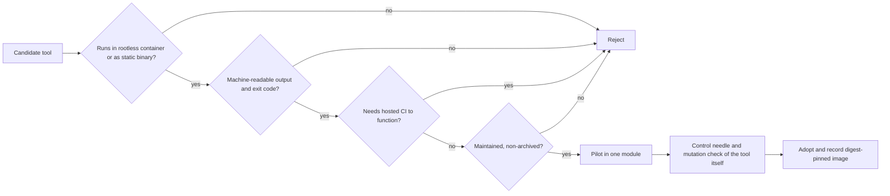
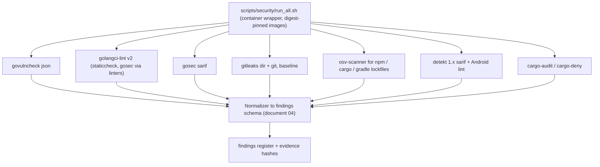
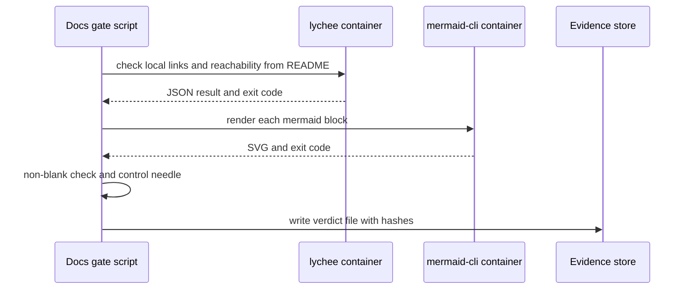
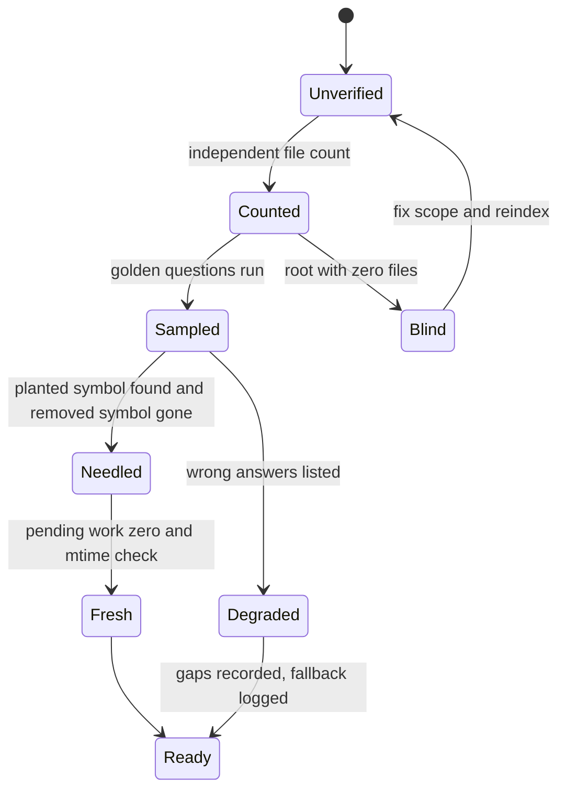

# 17. Research: Engineering Practices for the Audit and Remediation Feature

| Field | Value |
|---|---|
| Revision | 1 |
| Created | 2026-10-03 |
| Last modified | 2026-10-03 |
| Status | draft |
| Feature | specs/001-full-project-audit-remediation |
| Traceability | FR-005, FR-008..FR-011, FR-014..FR-016, FR-021, FR-022, FR-025, SC-003..SC-008, SC-011 |
| Source access date | 2026-10-03 (all sources below) |

> **Corrections notice.** Several statements below were superseded by the second research pass. Authoritative corrections are in document 20 section 11 (C1 to C13); superseded rows carry a pointer 'corrected by doc 20 section 11 (Cn)'. Superseded claims: 75 of 76 tags became 76 of 77 version tags (C1); Go logs Beta became Release candidate (C4); the strict-SLSA 'cannot both be met' wording became an interpretation question, not a certain impossibility (C2); also C3, C5 to C13 as listed there.

## Table of contents

1. [Method, scope and honesty statement](#1-method-scope-and-honesty-statement)
2. [Project constraints that filter every recommendation](#2-project-constraints)
3. [Theme 1: Deterministic and hermetic testing, mutation testing](#3-theme-1)
4. [Theme 2: Contract testing and OpenAPI drift](#4-theme-2)
5. [Theme 3: Static analysis and security scanning stack](#5-theme-3)
6. [Theme 4: Observability](#6-theme-4)
7. [Theme 5: Supply chain, SBOM, SLSA, reproducible builds](#7-theme-5)
8. [Theme 6: Performance regression gating](#8-theme-6)
9. [Theme 7: Documentation engineering](#9-theme-7)
10. [Theme 8: UI visual proof](#10-theme-8)
11. [Theme 9: AI-assisted code intelligence and index completeness](#11-theme-9)
12. [Ranked adoption list](#12-ranked-adoption-list)
13. [Rejected alternatives](#13-rejected-alternatives)
14. [Open questions and what could not be verified](#14-unverified)
15. [Bibliography](#15-bibliography)

---

## 1. Method, scope and honesty statement

**What was done.** Web searches (WebSearch) and primary-page fetches (WebFetch) were run on 2026-10-03 for each of the nine themes. Primary sources (official documentation, project repositories, the Go blog, SLSA specification) were preferred. Each source is listed in section 15 with what it supports and its limits.

**What was NOT done, stated plainly.**

- The brief asked for at least four search rounds per theme. In practice each theme received roughly two rounds (one broad search plus one to three targeted primary-page fetches). Themes 4 (observability), 7 (documentation) and 9 (index evaluation) are the thinnest. Where a claim rests on one source it is labelled `SINGLE-SOURCE`.
- WebFetch answers come from a small summarising model, not raw page text. Version numbers, flag names and limits taken from those summaries are labelled `UNCONFIRMED:` until the first containerized run in this project reproduces them. No tool listed here was executed on the repository.
- Nothing here was executed on the host. All commands shown are `NOT EXECUTED`.
- Search result snippets from aggregator sites (tessl.io, appsecsanta.com, skills catalogues) were treated as non-authoritative and are not cited as evidence.

**Classification used in the tables.**

- `PROVEN`: documented by the tool's own primary source and in widespread use; still needs a first local run here.
- `PLAUSIBLE`: documented but young, single-maintainer, or pre-1.0; adopt with a pilot.
- `SPECULATIVE`: idea or result without a primary source or without independent evidence.

## 2. Project constraints

These come from the task brief, the spec and the constitution and act as filters.

| Constraint | Source | Effect on tool choice |
|---|---|---|
| No CI/CD pipelines; enforcement is local | §11.4.156 (constitution index) | Every tool must be runnable as a local script/container with a non-zero exit code. Tools designed around hosted CI (GitHub Actions marketplace actions) are used only as binaries/images. |
| Rootless containers only, builds only in containers | FR-021, §11.4.161 | Image-based tools preferred; anything needing a privileged daemon is rejected or needs a rootless variant. |
| Real services for external-dependency tests; blocked is not pass | FR-025 | Record/replay and simulators cannot count as evidence for external-service behaviour. |
| Tests must fail when behaviour is broken | FR-010, SC-005 | Mutation testing is a first-class need, not optional. |
| Machine-produced evidence | FR-022, §11.4.262 | Prefer tools with JSON/SARIF/JUnit output. |
| Semgrep mandate repealed, scanning encouraged | §11.4.166 repeal (`.specify/memory/constitution-appendix.md:2142-2147`) | Static-analysis choices are free per project, not mandated. |
| Stacks | brief; `catalog-api/go.mod` declares `go 1.25.7` (verified) | Go 1.25, Gin, React 18 / Vite, Tauri 2 (Rust), Kotlin Compose Android and TV, many Go/TS submodules. |
| Latency targets of the external governance do not bind | spec Q2 / SC-011 | Performance gating is against recorded project baselines, not fixed budgets from a standard. |



## 3. Theme 1: Deterministic and hermetic testing, mutation testing <a id="3-theme-1"></a>

### 3.1 Flaky-test elimination

Sources on flakiness at primary level were not retrieved in this pass (UNCONFIRMED: no Google testing-blog or academic flaky-test paper was fetched). The practice below is therefore the project's own requirement (FR-010, SC-003: identical verdict across 3 repeated runs) rather than a cited external finding. Go supplies the primitives directly: `go test -count=N -shuffle=on -race` (standard toolchain, UNCONFIRMED against current docs this pass). Recommendation: the verification harness runs every changed test 3 times with shuffled order and records the three verdicts in the evidence file; a mixed verdict is a defect in the test, never a retry. [corrected by doc 20 section 11 (C3)]

### 3.2 Real databases and services in containers

| Finding | Source | Class | Limit |
|---|---|---|---|
| Testcontainers for Go supports rootless or rootful Podman; setup is `systemctl --user start podman.socket` and `DOCKER_HOST=unix://$XDG_RUNTIME_DIR/podman/podman.sock`. | [R1] | PROVEN | Documentation is for Testcontainers; a project-specific run is still required. |
| The Ryuk reaper under rootless Podman needs `ryuk.container.privileged=true` in `~/.testcontainers.properties`, or Ryuk disabled (documented as not recommended). | [R1] | PROVEN | "Privileged" inside a rootless user namespace is not host root, but the constitution reviewer must confirm this satisfies §11.4.161's "no escalation" wording. UNCONFIRMED. |
| Docker's default network is `bridge`, Podman's is `podman`; complex network scenarios need explicit configuration. | [R1] | PROVEN | Only matters for multi-container networks. |
| On SELinux hosts a custom policy may be required for the reaper socket, discovered iteratively. | [R1] | PROVEN | Host SELinux state of the owner's machine is UNKNOWN. |

**Record/replay versus real services.** FR-025 forbids replacing a real external service with a simulation in non-unit tests, and §11.4.27 allows fakes only in unit tests. Record/replay (cassettes) is therefore acceptable only for unit tests of client parsing code, never as evidence that an integration works. Schemathesis HAR/cassette output (see theme 2) is acceptable as a diagnostic artefact, not as a verdict source.

**Recommendation for this project.** Use Testcontainers-for-Go with `tc.WithProvider(tc.ProviderPodman)` for real PostgreSQL/SQLite-adjacent services where the Go code is the subject; where the repository already has `docker-compose.test-infra.yml` (verified present at repo root), prefer booting that file through the constitution's containers submodule so the same infra is used by humans and tests. Do not add a second orchestration path. UNCONFIRMED: whether `catalog-api` tests already use Testcontainers; run `codegraph explore "testcontainers"` before deciding.

### 3.3 Mutation testing by language

| Language | Tool | Evidence | Maturity | Cost / caveats | Class |
|---|---|---|---|---|---|
| Go 1.25 | **Gremlins** (`go-gremlins/gremlins`) | [R2] repo: coverage-driven, KILLED/LIVED/NOT COVERED/TIMED OUT/NOT VIABLE statuses, `.gremlins.yaml`, Docker image and binaries; still 0.x with no back-compat guarantee between minors; "smallish modules" only, hours on big ones. The page did not state a minimum Go version. | Pre-1.0 | Run per package or per diff, not the whole `catalog-api` tree. UNCONFIRMED: Go 1.25.7 compatibility. | PLAUSIBLE |
| Go | go-mutesting | Named in search results only [R3]; maintenance and Go 1.25 support not verified. | Unknown | UNCONFIRMED | SPECULATIVE |
| Go | turango (`turango test -mutate=./...`) | Appears only in a search snippet [R3]; nothing else known. | Unknown | UNCONFIRMED | SPECULATIVE |
| TypeScript / Vite | **StrykerJS** with `@stryker-mutator/vitest-runner` | [R4]: available since Stryker 7.0; forces `perTest` coverage analysis; only `threads: true` supported; Browser Mode unsupported; incremental mode supported through test-location reporting. | Mature | Browser Mode unsupported means tests using Vitest browser mode cannot be mutation-tested. Check `catalog-web` test runner. UNCONFIRMED. | PROVEN |
| Kotlin (Android, TV) | **PIT** via `gradle-pitest-plugin` plus Android fork `pl.droidsonroids.pitest`; Kotlin support | [R5] pitest.org states Kotlin support is in the Pro version (ArcMutate), not the open-source tool; search results also mention a `pitest-kotlin` plugin that filters Kotlin-generated mutants (SINGLE-SOURCE, not verified at primary source). | PIT mature; Android plugin version 0.2.25 per search listing, i.e. low-version community plugin | Mutation of Compose UI code on JVM unit tests is limited to what unit tests reach; Android instrumented tests are too slow for mutation. ArcMutate is paid: **do not adopt without owner approval**. | PLAUSIBLE (open-source PIT + pitest-kotlin), cost UNKNOWN for Pro |
| Rust (Tauri backend) | **cargo-mutants** | [R6] mutants.rs / docs.rs: `cargo mutants`, `-f file` scoping; "actively maintained spare-time project, releases every one to two months" (as of Aug 2025). Features such as in-diff, sharding and JSON output were NOT confirmed this pass. | Mature for its niche | Whole-crate runs rebuild per mutant; use per-file scoping. | PROVEN (basic), UNCONFIRMED (feature list) [corrected by doc 20 section 11 (C7)] |

**Control needle for the mutation tools themselves** (§11.4.201). Before trusting a "0 survivors" result, plant one known-surviving mutant (a deliberately untested branch) and assert the tool reports it. This is the same method the constitution applies to every measurement.

**Recommendation.** (1) Adopt Stryker for `catalog-web` and the TS submodules (highest confidence). (2) Adopt Gremlins on a per-package basis for `catalog-api` packages that the audit touches, gated to changed files (the 207-commit, 0.x status means pin the exact version and image digest). (3) Adopt cargo-mutants on `catalogizer-desktop/src-tauri` per file. (4) Adopt open-source PIT for pure-Kotlin domain/ViewModel modules only; record the Compose UI gap as a documented limitation, not as a pass. (5) The spec's SC-005 sampling by the reviewer remains the authority; mutation scores are supporting evidence only.

## 4. Theme 2: Contract testing and OpenAPI drift <a id="4-theme-2"></a>

### 4.1 Consumer-driven contracts (Pact)

| Finding | Source | Class | Limit |
|---|---|---|---|
| pact-go v2 supports Pact specifications 2, 3 and 4 (HTTP, sync messages, plugins). | [R7], [R8] | PROVEN | |
| pact-go v2 needs native FFI libraries compiled from Rust and `CGO_ENABLED=1` with gcc on Linux; `pact-go install` downloads the library (override path with `PACT_GO_LIB_DOWNLOAD_PATH`). | [R8] | PROVEN | Conflicts with the `CGO_ENABLED=0` reproducible-build rule (theme 5): contract tests would run in a separate test image, not the release build. Linux musl provider verification has a known segmentation fault per the README summary, so use a glibc image. |
| `can-i-deploy` requires a Pact Broker; (inference) it cannot work from pact files alone. | [R9] | PLAUSIBLE (PARTIAL, INFERENCE: the source supports that `can-i-deploy` queries a Broker's verification matrix; "cannot work from pact files alone" is an inference, not a quoted statement, so it is no longer labelled PROVEN) | A broker is another service to run. A self-hosted broker container is possible; setup details were not retrieved. UNCONFIRMED. |
| Pact has JVM (Kotlin) and JS implementations. | search result, [R10] | SINGLE-SOURCE (aggregator) | Version and Android suitability not verified. |

The constitution's §11.4.244 requires contract tests on both sides plus a `can-i-deploy`-style gate. FR-016 requires the same.

### 4.2 OpenAPI-first drift detection

| Tool | Finding | Source | Class |
|---|---|---|---|
| **oasdiff** | Compares OpenAPI specs; the `breaking` subcommand lists changes that break clients; runs as `docker run --rm -t tufin/oasdiff ...`; outputs yaml/json/markdown/html/text; Apache-2.0; ~2,081 commits; reported by search to detect 100+ kinds of breaking change classified ERR and WARN. | [R11] | PROVEN. UNCONFIRMED: exact exit-code flag for failing on WARN. |
| **Schemathesis** | Property-based testing from OpenAPI 2.0/3.0/3.1/3.2 and GraphQL; CLI, stateful multi-step testing via links; JUnit XML, Allure, HAR reports. | [R12] | PROVEN. Container image not confirmed (UNCONFIRMED). Must run against a **real running** `catalog-api` (FR-025), with seeded data. |
| **Dredd** | Repository archived 2024-11-08; OpenAPI 3 experimental. | [R13] | REJECT. |

### 4.3 Fit analysis

```mermaid
flowchart TD
  S["catalog-api OpenAPI spec (source of truth, UNCONFIRMED whether one exists)"] --> D["oasdiff breaking: base vs head"] [corrected by doc 20 section 11 (C8)]
  S --> T["Schemathesis against live API container"]
  W["catalog-web / api-client / android / androidtv / desktop consumers"] --> P["Pact consumer tests produce pact files"]
  P --> V["Provider verification in catalog-api test image"]
  V --> B["Broker or file-based matrix"]
  D --> E["Evidence JSON"]
  T --> E
  B --> E
```

**Which fit.** oasdiff + Schemathesis fit immediately if a machine-readable OpenAPI document exists for `catalog-api`; if it does not, the audit must first decide between generating one from the Gin routes or hand-writing it. That is a finding, not a plan item here (UNCONFIRMED: no OpenAPI file was located this pass; verify with `codegraph explore "openapi swagger"`). Pact fits the five consumer clients but costs a broker and a CGO test image; a cheaper first step is **file-based** consumer-driven contracts: consumers publish pact JSON into the repo, the provider verifies them, and a script computes the compatibility matrix locally. This forgoes the broker's `can-i-deploy` convenience but meets "detected before release" (FR-016) without a new service. The trade-off must be an explicit decision record in the contract plan document. [corrected by doc 20 section 11 (C8)]

**Recommendation.** Adopt oasdiff (breaking-change gate between tagged baseline and head) and Schemathesis (run against the live containerized API) now; adopt Pact in file-based mode for the web, Android, TV, desktop and api-client consumers; defer a Pact Broker unless the matrix becomes unmanageable. Reject Dredd.

## 5. Theme 3: Static analysis and security scanning <a id="5-theme-3"></a>

### 5.1 Findings per tool

| Tool | Finding | Source | Notes for this project | Class |
|---|---|---|---|---|
| **govulncheck** | Call-graph reachability: distinguishes affecting vs informational vulnerabilities; formats text/json/sarif/openvex; modes source/binary/extract; `-db` for an alternative database; exit status is non-zero for text-mode findings and **zero for json/sarif/openvex** requests. | [R14], [R15] | Wrapper script must parse the JSON for findings, not rely on exit code. Offline use requires a mirror of vuln.go.dev passed via `-db` (offline procedure UNCONFIRMED). | PROVEN |
| **golangci-lint v2** | Config needs `version: "2"`; formatters split into `formatters`; `staticcheck` now includes `stylecheck` and `gosimple`; default Go fallback 1.22; many v1 flags removed. | [R16] | Pin the image digest; migrate any v1 config. | PROVEN |
| **gosec** | AST and SSA analysis, taint analysis; output text/JSON/YAML/CSV/JUnit/HTML/SonarQube/Golint/SARIF; requires Go 1.25 or newer; GHCR image. | [R17] | Go 1.25 requirement matches the project. | PROVEN |
| **gitleaks** | `git`, `dir`, `stdin` modes; JSON/CSV/JUnit/SARIF; baseline file; images on DockerHub and GHCR; exit 1 on leaks. The maintainer says it is "feature complete" and future work goes to **Betterleaks**. | [R18] | Adopt gitleaks now; track Betterleaks. | PROVEN |
| **Betterleaks** | From the original gitleaks author, MIT, v2 in development on `main`, v1 on `v1.x`, image `ghcr.io/betterleaks/betterleaks:v2`. Credential validation over HTTP is an optional feature. | [R19] | Credential validation sends found secrets to remote services: **MUST be disabled** (§11.4.10). Pre-stable. | PLAUSIBLE |
| **osv-scanner** | Officially supported OSV frontend; project source, container image, license and offline modes referenced. Ecosystem list and output formats were NOT retrievable this pass. | [R20] | Use for npm, Gradle (if lockfiles present), Cargo as a cross-check against govulncheck. UNCONFIRMED: Gradle/Kotlin lockfile support. | PLAUSIBLE |
| **trivy** | Scanners for vulnerabilities, misconfiguration, secrets, licenses plus SBOM generation; targets images, filesystems, repositories, SBOMs; offline/air-gapped database support. | [R21] | See the incident below. | PROVEN capability, **supply-chain-risky provenance** |
| **Trivy compromise (March 2026)** | Per vendor-security reporting, attackers force-pushed malicious code to 75 of 76 tags [corrected by doc 20 section 11 (C1): the vendor advisory says 76 of 77 version tags; images v0.69.4 to v0.69.6 with registry caveats] of `aquasecurity/trivy-action`; malicious Trivy binary v0.69.4 and images v0.69.4 to v0.69.6 were published after earlier credential theft. | [R22] (aggregated reporting; vendor primary advisory not fetched, UNCONFIRMED) | Never consume tools by mutable tag; pin by image digest; verify signatures; prefer versions after the incident. Applies equally to every tool in this table. | PROVEN as lesson |
| **detekt** | Gradle plugin `dev.detekt`, SARIF/Checkstyle reports, baselines; docs show 2.0.0-alpha.6 while 1.23.8 is the latest 1.x stable. | [R23] | Use the 1.x stable line for gating; record that 2.0 is alpha. Kotlin version compatibility not confirmed. | PROVEN (1.x) |
| **Android lint** | Part of AGP; was not researched this pass. | none | UNCONFIRMED. Plan: run `./gradlew lint` inside the Android build container; SARIF output availability must be verified. | n/a [corrected by doc 20 section 11 (C11)] |
| **cargo-audit / cargo-deny** | Not researched at primary level this pass. | none | UNCONFIRMED. Run both in a Rust container; cargo-deny additionally enforces licenses and bans. Verify before adopting. | n/a [corrected by doc 20 section 11 (C9)] |

### 5.2 Semgrep alternatives given the repeal

The §11.4.166 repeal makes Semgrep neither mandated nor forbidden. Search results [R24] (aggregator sources, SINGLE-SOURCE) state that Semgrep CE is single-file and that **Opengrep**, an LGPL-2.1 fork made in January 2025 by an industry consortium, restores cross-function taint analysis and keeps Semgrep rule compatibility. The Opengrep repository summary [R25] confirms LGPL-2.1, 30+ languages including Go, Kotlin, TypeScript and Rust, JSON and SARIF output, and Cosign-signed binaries; it did **not** mention container images. Assessment: Opengrep is a plausible optional addition, not a requirement. Because the constitution repealed the mandate, the plan should treat it as a supplement for custom rules (for example, project-specific "forbidden pattern" rules) and not as the baseline. Alternatives not evaluated: SonarQube (repository root has `sonar-project.properties` and `sonarqube/`, and §11.4.184 mandates the scanner CLI; whether it is wired is UNCONFIRMED).

### 5.3 Recommended stack and run model



Every tool run MUST emit a control-needle check (a planted known finding, such as a seeded dummy secret that gitleaks must report) before its zero result is accepted (§11.4.201). A finding flagged by multiple tools is deduplicated into one register item (FR-003 recurrence rule applies).

**Recommendation.** Adopt: govulncheck, golangci-lint v2, gosec, gitleaks (with a baseline), osv-scanner, detekt 1.x, cargo-audit, cargo-deny, Android lint. Treat Trivy as optional and only from a digest-pinned image verified after the incident. Treat Opengrep and Betterleaks as pilots.

## 6. Theme 4: Observability <a id="6-theme-4"></a>

| Finding | Source | Class | Limit |
|---|---|---|---|
| For Go, tracing and metrics SDKs are Stable and logs Beta; JavaScript traces and metrics Stable, logs in Development; Kotlin traces/metrics/logs Development. | [R26] (search-result summary of opentelemetry.io status pages) | SINGLE-SOURCE [Go logs Beta corrected by doc 20 section 11 (C4): the official table lists Go logs as Release candidate] | Exact status must be re-read on the official status page before adoption. |
| `otelgin` is the Gin instrumentation in the `opentelemetry-go-contrib` repository. | [R26] | SINGLE-SOURCE | Version compatibility with the project's Gin version UNCONFIRMED. |
| OpenTelemetry Android was heading to a 1.0 release candidate in October 2025; the `android-agent` initialiser is the stabilising piece, while all instrumentation modules stay `-alpha` and telemetry remains in "development" until semantic conventions stabilise. Instrumentation includes Android log, HttpURLConnection, view and Compose click, sessions. The summary did not mention crash/ANR. | [R27] | PROVEN as of the post date; the 2026 state is UNCONFIRMED | Instrumentation is HttpURLConnection-based; whether it covers the OkHttp/Retrofit stack used by the apps is UNKNOWN. [corrected by doc 20 section 11 (C5)] |
| A Kotlin Multiplatform OpenTelemetry API and SDK was announced in March 2026; Android/JVM most battle-tested, APIs not stable. | [R26] | SINGLE-SOURCE | Not recommended for gating. |
| Structured logs and trace-based testing | no primary source retrieved | SPECULATIVE for this project | See below. [corrected by doc 20 section 11 (C6)] |

**What this means for the audit.** The feature's observability need is diagnostic: reproduce findings with correlated evidence, not run production telemetry. A pragmatic, low-risk design:

1. Backend: a request-id/trace-id middleware (OTel Go SDK, stable) writing structured JSON logs; during audit runs, export spans to a file or a local OTLP collector container. Evidence records cite the trace id.
2. Web: browser tracing is optional; propagate the `traceparent` header on API calls so backend spans link to the UI action. Treat browser instrumentation as lower priority (JS logs still in development).
3. Android and TV: do **not** make alpha instrumentation a dependency of the audit; use the existing Crashlytics path (§11.4.152) and structured logcat tags.
4. **Trace-based testing** (asserting on spans produced during a test) is an idea with no primary source retrieved; classify as SPECULATIVE and run only as a pilot on one critical flow (scan a source, start playback) where the span assertion complements, never replaces, a behaviour assertion. [corrected by doc 20 section 11 (C6)]

**Recommendation.** Adopt OTel Go with `otelgin` plus file/OTLP-collector export for audit diagnostics; propagate `traceparent` from web; defer Android instrumentation to a later phase. Fit with SC-011: spans give per-operation timing for the baselines.

## 7. Theme 5: Supply chain, SBOM, SLSA, reproducible builds <a id="7-theme-5"></a>

### 7.1 SLSA Level 2 without CI

SLSA v1.1 states Build L2 requires a **hosted build platform** that itself generates and signs provenance; local developer builds cannot meet L2 or L3, and L1 is the only level that permits local builds (and it has no tamper protection) [R28]. The constitution (§11.4.246) sets SLSA L2 as the fleet minimum and also forbids CI/CD (§11.4.156). **These two cannot both be met in the strict SLSA sense [corrected by doc 20 section 11 (C2): this is an interpretation question about whether an owner-operated dedicated build host is a 'hosted build platform', not a certain impossibility; the SLSA version is v1.2]**: a rootless container on the owner's workstation or the designated build host is not obviously a "hosted build platform" in SLSA's sense. This is a real conflict the plan owner must see. Options, none verified as an accepted interpretation:

| Option | Description | Honest SLSA claim |
|---|---|---|
| A | Claim **L1** (provenance exists, unsigned or locally signed) and record the gap against §11.4.246 as an operator decision (§11.4.66). | L1 |
| B | Treat the designated remote build host (the constitution's `thinker.local`) running the rootless build container as the "hosted build platform", with provenance generated and signed by the build host's own service identity rather than by the developer's session. | L2 only if the host's signing key is inaccessible to the build steps and the operator accepts the reading; UNCONFIRMED |
| C | Obtain a reading from the constitution owners that "SLSA Build Level 2" in §11.4.246 is satisfiable on an owner-operated build host. | depends |

Recommendation: record Option A as the factual claim now, pursue B as the target, and log the question as an open decision rather than silently claiming L2.

### 7.2 SBOM

Syft generates SBOMs in CycloneDX and SPDX, handles Go, Java, JavaScript, Rust and others, works on images, filesystems and archives, and can create in-toto signed SBOM attestations [R29]. Trivy also generates SBOMs [R21]. Recommendation: use Syft in a digest-pinned container, emit CycloneDX JSON per deliverable (API image, web bundle, desktop installer, APK), store the SBOM next to the artifact with its hash in the evidence record, and feed the SBOM to osv-scanner as a second vulnerability opinion. Limit: SBOM accuracy for Gradle/Kotlin projects was not verified this pass (UNCONFIRMED).

### 7.3 Reproducible builds

| Finding | Source | Class |
|---|---|---|
| Go 1.21+ toolchains are reproducible; for programs without C code use `CGO_ENABLED=0` and `-trimpath`; programs with C need a pinned host C toolchain via container or VM. Go publishes `gorebuild` and nightly verification. | [R30] | PROVEN |
| Reproducible-builds.org lists the key practices: `SOURCE_DATE_EPOCH`, managing variance (timestamps, ordering, locale, timezone, build paths), recording the build environment, and checksums. | [R31] | PROVEN |
| Node and Rust specifics (lockfile-pinned `npm ci`, `--locked`/`--frozen` cargo, `RUSTFLAGS=--remap-path-prefix`) were NOT verified this pass. | none | UNCONFIRMED |

**Practical verification for this project.** Build each deliverable twice in separate fresh containers and compare SHA-256 of the artifact: equal means reproducible, unequal produces a diff report and a finding. Go API binary and desktop Rust binary are the most likely to pass; the web bundle depends on bundler determinism; APK signing and embedded timestamps usually make bit-identical output infeasible without specific work (SPECULATIVE until tried).

### 7.4 Pinned digests

The Trivy incident shows that mutable tags are an attack surface [R22]. Every container image used by an audit script (scanners, mutation tools, build images) must be referenced as `name@sha256:...` with the digest recorded in a single `tools.lock` file that the verification harness checks. Note: the audit's own use of `docker.io/...:tag` in existing compose files (for example `docker-compose.test-infra.yml`) is a likely finding; UNCONFIRMED until read.

**Recommendation.** Adopt Syft CycloneDX SBOMs, `tools.lock` digest pinning, two-build reproducibility checks for Go and Rust, and the SLSA Option A claim with a recorded operator decision.

## 8. Theme 6: Performance regression gating <a id="8-theme-6"></a>

| Tool | Finding | Source | Class | Limit |
|---|---|---|---|---|
| **benchstat** | Non-parametric: median with 95% confidence intervals; Mann-Whitney U-test for A/B comparisons; alpha 0.05; "~" marks no significant difference; at least 10 runs, ideally 20; interleave before/after on an idle machine; avoid re-running until significant. | [R32] | PROVEN | Statistical significance is not "large"; the gate needs both a p-value and a minimum effect size, which the project must define from its baselines (SC-011). |
| **k6** | Thresholds in `options` e.g. `p(95)<200`; non-zero exit code on failure; `abortOnFail` with optional `delayAbortEval`. | [R33] | PROVEN | Container execution and JSON summary export were not confirmed from the page (UNCONFIRMED); k6 provides `--summary-export`, but that is from memory and must be verified. Must hit a real API. |
| **Lighthouse CI (LHCI)** | Assertions at off/warn/error; aggregation `median`, `optimistic`, `pessimistic`, `median-run`; budgets via `budget.json`; `autorun`; `collect` with `--staticDistDir` or `--startServerCommand`, `--numberOfRuns`; runs locally without a CI server. | [R34] | PROVEN | Lab metrics on a shared workstation are noisy; run N times and use median-run. Needs headless Chrome in the container. |
| **Android Macrobenchmark** | Physical device strongly recommended; emulators discouraged; Android 14 (API 34) or later for persisted state; metrics `StartupTimingMetric`, `FrameTimingMetric`, `TraceSectionMetric`; JSON output plus Perfetto traces; run via `connectedCheck`; refuses low-battery devices. | [R35] | PROVEN | Requires a real device (FR-025: blocked if unavailable, not simulated). |

**Gating design.** A baseline is a file recorded once (commit-pinned) per operation: `{operation, metric, n, median, ci95, unit, host_fingerprint}`. A comparison passes when the candidate median is not worse than baseline by more than a declared tolerance **and** benchstat (Go) or the equivalent test reports no significant regression. Noise handling: run on the same host class, record the host fingerprint, reject comparisons across hosts. For web, record LHCI median-run for each critical page; for API, a k6 scenario per critical operation (browse, search, playback start, scan, sign-in); for Android and TV, Macrobenchmark startup and frame timing on the owner's devices; for desktop, a startup-time harness (no source retrieved; UNCONFIRMED).

**Recommendation.** Adopt benchstat (Go microbenchmarks), k6 (API operations), LHCI (web), Macrobenchmark (Android/TV, device-gated, blocked when no device). Absolute targets come from SC-011's "documented target set for this project", not from any research source.

## 9. Theme 7: Documentation engineering <a id="9-theme-7"></a>

| Finding | Source | Class | Limit |
|---|---|---|---|
| Diátaxis defines four documentation types: tutorials, how-to guides, technical reference, explanation. | [R36] | PROVEN as a framework | It is a taxonomy, not a verification tool; it does not detect stale content. |
| `mermaid-cli` ships a container image (`minlag/mermaid-cli`), with Podman users advised to add `--userns keep-id` and `:z` volume labels; outputs SVG, PNG, PDF; a Linux sandbox troubleshooting page exists. The **exit code on a syntax error was not stated**. | [R37] | PROVEN | Must be verified by feeding a deliberately invalid diagram (control needle) and checking for non-zero exit and no output file. Chromium sandbox inside rootless containers typically needs a puppeteer config; exact setting UNCONFIRMED. |
| `lychee` checks links in Markdown and other files; `--offline` checks only local files; Docker image; exit codes 0 success, 1 runtime/config error, 2 link failures, 3 config file errors; formats compact, detailed, JSON, JUnit, Markdown; response caching with `--cache`. | [R38] | PROVEN | |
| Docs-as-code, generated API docs (OpenAPI to HTML), SQL schema documentation generators (for FR-015), and docs "freshness" tooling were not researched at primary level. | none | UNCONFIRMED | |

**Design for FR-013, FR-014, FR-015.**

- Reachability from README (FR-013): a small script builds the link graph (`lychee --offline --format json` to extract resolved local links, or a dedicated Markdown link parser), computes the set of documents reachable from `README.md`, and diffs against the in-scope document list; the orphan list is the finding set.
- Diagram validation (FR-014): render every fenced `mermaid` block through `mermaid-cli` in a rootless container; a diagram passes only if the command exits 0, the SVG exists, and a non-blank check (file size floor plus presence of at least N path/text elements) holds; the control needle is a known-invalid diagram that must fail.
- Schema documentation (FR-015): generate the schema reference from the real migrations/DB (query `sqlite_master` or equivalent) and diff against the documented schema; the diff is the finding. Tool choice for generation is UNCONFIRMED.
- Structure: organise each application's docs by Diátaxis type so that "manual", "guides", "FAQ" and "reference" in FR-014 map to a recognised taxonomy.

**Recommendation.** Adopt lychee (offline and online modes), mermaid-cli in a container with the sandbox config validated by the control needle, and Diátaxis as the structuring rule. Generated API docs follow from the OpenAPI document if one exists (theme 2).



## 10. Theme 8: UI visual proof <a id="10-theme-8"></a>

| Surface | Tool | Finding | Source | Class |
|---|---|---|---|---|
| Web (React/Vite) | Playwright `toHaveScreenshot` | Generates references on first run; platform and browser appear in the snapshot file name because rendering differs by OS, fonts and settings; the docs warn rendering varies with host and headless mode and so baselines need a consistent environment; `maxDiffPixels` via pixelmatch; `stylePath` hides volatile elements; `--update-snapshots` for intentional change. | [R39] | PROVEN. Run in a pinned Playwright container so baselines are host-independent (§11.4.170 host-rendered proof). |
| Android Compose | **Paparazzi** | Screenshot tests without a device or emulator; Views and Compose; `recordPaparazziDebug`, `verifyPaparazziDebug`; diffs under `build/paparazzi/failures`; latest listed version 2.0.0-alpha05.1 (pre-release). | [R40] | PLAUSIBLE (alpha line) |
| Android Compose | **Roborazzi** | JVM screenshot testing on Robolectric 4.10+ with `@GraphicsMode(NATIVE)`; `record`, `compare`, `verify` tasks; Compose Desktop supported (reported 4 to 6 times faster than Robolectric); JSON UI-tree dumps and accessibility checks; iOS experimental. | [R41] | PROVEN for Android; Desktop path relevant to Compose Multiplatform only. |
| Tauri 2 desktop | `tauri-driver` + WebDriver | On Linux uses WebKitWebDriver (`webkit2gtk-driver`), optional Xvfb for headless; documented features include screenshot capture; install `cargo install tauri-driver --locked`. The Tauri WebView on Linux is WebKitGTK, so screenshots differ from the Chromium-based web build. | [R42] (search results, partly webdriver.io docs) | PLAUSIBLE. UNCONFIRMED against the official Tauri v2 docs page. |

**Fit.** Roborazzi is the better default for this project: it runs on the JVM without a device, produces machine-readable UI trees, and supports a compare step that fits the evidence model; Paparazzi is a credible alternative but its listed version is alpha. Both give device-independent renders but **do not prove behaviour on a real device**, so they complement and do not replace the constitution's on-device validation (FR-021, FR-025). For Tauri, two layers are needed: Playwright against the web build (cheap, deterministic) and `tauri-driver` for the packaged shell (slower, Linux-specific rendering). Golden images in the repository are acceptable evidence only when paired with the §1.1 mutation (a deliberate UI break must flip the comparison to FAIL), which is what SC-005 demands.

**Recommendation.** Adopt Playwright-in-pinned-container for `catalog-web`; Roborazzi for Android and TV Compose (with Paparazzi evaluated only if Roborazzi hits an API gap); `tauri-driver` pilot for one desktop flow.

## 11. Theme 9: AI-assisted code intelligence and index completeness <a id="11-theme-9"></a>

### 11.1 Evidence on token efficiency

| Finding | Source | Class | Limit |
|---|---|---|---|
| CodeGraph (the colbymchenry project, assumed to be the one in use here; UNCONFIRMED) uses tree-sitter grammars in a native Rust kernel, stores symbols and edges in SQLite with FTS5, resolves calls/imports/inheritance after extraction, and keeps the index fresh with OS file watchers. | [R43] | PROVEN as description | Vendor documentation. |
| The repository's own benchmark claims, on 7 codebases, Claude Code answering architecture questions: 88% fewer tool calls, 53% faster, 62% fewer tokens, 44% cheaper; 1 to 4 calls with the index versus 6 to 43 without; **savings are negligible when exploration is cheap**. | [R43] | SINGLE-SOURCE, VENDOR-REPORTED. Not independently reproduced. The project's own constitution (§11.4.275) records a stricter local measurement in which the index route also answered some fixture queries wrongly; that local evidence outranks this claim. |
| Limits stated by the project: needs `.codegraph/`; cannot follow reflection or DI containers; framework routing coverage varies (73 to 100%). | [R43] | PROVEN as stated limits | Directly relevant to Gin handlers and Android DI. |
| Aider's repo map sends a compact map of classes and function signatures and ranks files with a graph-ranking algorithm over a file dependency graph, within a token budget (default 1k via `--map-tokens`); the page does not mention tree-sitter. | [R44] | PROVEN as description | No quantitative effectiveness data on the page. |
| Embedding-based retrieval has standard benchmarks: CoIR (10 datasets, four task types, NDCG@10) and retrieval adaptations of SWE-bench (find files to edit). One search result states code-specialised embeddings strongly dominate code-to-code retrieval and no single model wins all tasks. | [R45] | SINGLE-SOURCE (arXiv/aggregators; the 2x claim comes from a result page not read in full) | The benchmarks measure general models, not this repository. [corrected by doc 20 section 11 (C12)] |
| Direct head-to-head evidence of graph-versus-embedding retrieval on a mixed Go/TS/Kotlin repository was not found. | none | UNKNOWN | |

### 11.2 How to prove an index is complete (FR-005)

No external standard for "index completeness" was found; the following is a design derived from the constitution and the measurement discipline, labelled SPECULATIVE until implemented and shown to detect planted gaps.

1. **Denominator from an independent source.** Count in-scope source files by a method other than the indexer (for example `git ls-files` filtered by a per-language extension list and the documented exclusion list). The indexer's file count must equal this count within a declared tolerance, per language and per submodule root.
2. **Per-language and per-root coverage table.** Detect silent exclusion by comparing counts by extension. A root with zero indexed files is a failure (the index is blind there), never "clean".
3. **Symbol sampling with golden answers.** A fixed list of questions with known answers (definitions, callers, implementers across Go, TS, Kotlin, Rust) is asked of the index; recall and wrong-answer lists are recorded by id; reduction claims are computed only over questions both routes answered correctly. This mirrors §11.4.275(D).
4. **Control needle.** Plant a new uniquely named function in a scratch copy, re-sync, and require the index to find it; plant a deleted symbol and require it to disappear. Both polarities must hold.
5. **Freshness.** Index modified-time versus the newest tracked-file time; pending-work count zero before "ready".
6. **Structural versus semantic.** Structural index (CodeGraph-like) answers "who calls X"; semantic index (embeddings) answers conceptual queries. Evaluate semantic retrieval with a small labelled query set and report recall@k and MRR on this repository, rather than trusting public-benchmark numbers.
7. **Known blind classes.** Record file types the indexers do not chunk (for example shell scripts and some Kotlin extensions, per the project's own earlier measurement noted in the constitution index) as explicit gaps, with a grep fallback that is itself logged.



**Recommendation.** Adopt the seven checks as the index-readiness gate in document 02. Do not cite the 62% or 88% figures as project facts; cite only measurements reproduced locally. Evaluate tree-sitter-based and embedding approaches only against the project's own golden question set.

## 12. Ranked adoption list

Scoring: benefit and risk 1 (low) to 5 (high); cost in engineer-days for a first working gate (estimate, not measured: UNCONFIRMED).

| Rank | Item | Benefit | Cost (est.) | Risk | Notes | Traceability |
|---|---|---|---|---|---|---|
| 1 | Digest-pinned `tools.lock` and container wrapper for every tool | 5 | 1 to 2 | 1 | Direct lesson of the Trivy incident; prerequisite for the rest | FR-021, FR-022 |
| 2 | Findings normalizer for SARIF/JSON from govulncheck, gosec, golangci-lint, gitleaks, osv-scanner, detekt | 5 | 3 to 5 | 2 | Feeds the register | FR-001, FR-007 |
| 3 | Security/static stack (section 5.3) with control needles | 5 | 3 to 5 | 2 | | FR-006, FR-007 |
| 4 | StrykerJS, Gremlins (scoped), cargo-mutants, PIT (scoped) | 5 | 5 to 8 | 3 | Gremlins pre-1.0; PIT Kotlin limits | FR-010, SC-005 |
| 5 | oasdiff + Schemathesis against live API | 4 | 2 to 4 | 2 | Needs an OpenAPI doc | FR-016 |
| 6 | File-based Pact consumer/provider tests | 4 | 6 to 10 | 3 | CGO test image; broker deferred | FR-016 |
| 7 | Playwright-in-container and Roborazzi visual proof with mutation flips | 4 | 4 to 7 | 3 | Baselines per environment | FR-010, §11.4.170 |
| 8 | Docs gate: lychee reachability, mermaid-cli render, schema diff | 4 | 2 to 4 | 2 | Control needles required | FR-013..FR-015 |
| 9 | Performance baselines: benchstat, k6, LHCI, Macrobenchmark | 4 | 5 to 8 | 3 | Device-gated parts block, not skip | SC-011, FR-025 |
| 10 | Syft CycloneDX SBOM per deliverable | 3 | 1 to 2 | 1 | | FR-021 |
| 11 | Reproducibility double-build check (Go, Rust first) | 3 | 2 to 4 | 2 | CGO and APK limits | FR-021 |
| 12 | OTel Go + otelgin, traceparent propagation | 3 | 2 to 4 | 2 | Android deferred | SC-011 |
| 13 | Index-readiness gate (section 11.2) | 5 | 3 to 5 | 2 | Needed before the audit starts | FR-005 |
| 14 | Opengrep, Betterleaks, tauri-driver pilots | 2 | 2 to 3 each | 3 | Optional | n/a |

Rank 13 is first in time even though it ranks lower on cost-benefit order, because FR-005 makes it a precondition of the audit; the plan owner should schedule it before rank 3.

## 13. Rejected alternatives

| Alternative | Reason |
|---|---|
| Dredd | Archived 2024-11-08; OpenAPI 3 experimental [R13]. |
| Record/replay cassettes as integration evidence | FR-025 and §11.4.27 forbid simulation outside unit tests. |
| Pact Broker as day-one requirement | Adds a service; file-based matrix meets FR-016; revisit if consumer count grows. |
| ArcMutate (paid PIT Pro) for Kotlin | Cost unknown; needs owner approval; open-source PIT with documented gaps is the starting point. |
| Hosted-CI-only tools (GitHub Actions wrappers of scanners) | §11.4.156; also the exact surface compromised in the Trivy incident [R22]. |
| Consuming scanners by mutable tag (`:latest`, action tags) | Same incident; digests only. |
| Claiming SLSA L2 from a developer machine | SLSA text excludes local builds from L2 [R28]. |
| Betterleaks credential validation enabled | Sends found secrets to remote services; conflicts with §11.4.10. |
| Treating public embedding benchmark scores as evidence of local index quality | Different data; only local golden queries count. |
| detekt 2.0 alpha as a gate | Pre-release [R23]. |
| Android OTel instrumentation as an audit dependency | Instrumentation modules are alpha [R27]. |

## 14. Open questions and what could not be verified <a id="14-unverified"></a>

1. `UNCONFIRMED:` Go 1.25.7 compatibility of Gremlins, go-mutesting and turango; none was run.
2. `UNCONFIRMED:` whether `cargo-mutants` offers in-diff, sharding and JSON output (the fetched welcome page did not list them). [corrected by doc 20 section 11 (C7)]
3. `UNCONFIRMED:` pact-go and pact-js versions compatible with Go 1.25 and the project's TypeScript version; Pact JVM suitability for Android.
4. `UNCONFIRMED:` Pact Broker self-hosting procedure in rootless containers.
5. `UNCONFIRMED:` existence and location of an OpenAPI document for `catalog-api`. [corrected by doc 20 section 11 (C8)]
6. `UNCONFIRMED:` osv-scanner ecosystem list (Gradle lockfiles, Cargo) and output formats; cargo-audit, cargo-deny, Android lint: not researched. [corrected by doc 20 section 11 (C9)]
7. `UNCONFIRMED:` govulncheck offline operation and database mirroring procedure.
8. `UNCONFIRMED:` primary vendor advisory for the Trivy incident (secondary reporting only); whether any currently used image or action in this repository depends on affected versions.
9. `UNCONFIRMED:` mermaid-cli exit code on syntax errors and the Chromium sandbox setting inside rootless Podman.
10. `UNCONFIRMED:` k6 container image and JSON summary export.
11. `UNKNOWN:` whether SLSA Build L2 can be honestly claimed on an owner-operated build host; requires an operator decision.
12. `UNKNOWN:` flaky-test literature and trace-based testing evidence; no primary source retrieved.
13. `UNKNOWN:` head-to-head evidence between structural and semantic code indexes on a mixed-language repository.
14. The CodeGraph benchmark figures are vendor-reported and not reproduced here.
15. Statuses of Go, JS, Kotlin and Android OpenTelemetry signals come from search-result summaries and a 2025 blog post; re-read the official status pages before committing.

## 15. Bibliography

Format: id, title, URL, access date, supports, limits. All accessed 2026-10-03.

- **[R1]** Testcontainers for Go, "Using Podman", https://golang.testcontainers.org/system_requirements/using_podman/. Supports: rootless Podman socket, `DOCKER_HOST`, Ryuk setting, provider option, SELinux note. Limits: Testcontainers only; no project run.
- **[R2]** go-gremlins/gremlins repository, https://github.com/go-gremlins/gremlins. Supports: statuses, config, 0.x status, "smallish modules" limit. Limits: Go version support not stated on the fetched page.
- **[R3]** Search results for Go mutation tools (cervo-mutants wiki, pkg.go.dev listings), query "Go mutation testing tools 2026 gremlins go-mutesting comparison". Supports: existence of go-mutesting, turango and a comparison harness. Limits: snippets only, no maintenance data.
- **[R4]** StrykerJS, "Vitest runner", https://stryker-mutator.io/docs/stryker-js/vitest-runner/. Supports: availability since 7.0, forced perTest coverage, thread and browser-mode limits. Limits: minimum Vitest version not captured.
- **[R5]** PIT, https://pitest.org/. Supports: JVM mutation testing, Kotlin only in the Pro version, incremental-on-changed-code advice. Limits: the Android and `pitest-kotlin` plugin details come from search snippets (gradle-pitest-plugin README, plugins.gradle.org listing) and were not read at the primary page.
- **[R6]** cargo-mutants, https://mutants.rs/ and https://docs.rs/cargo-mutants/. Supports: purpose, quick start, maintenance statement as of August 2025 (search snippet). Limits: feature list not retrieved.
- **[R7]** Pact documentation, "Go implementation guide", https://docs.pact.io/implementation_guides/go. Supports: all spec versions incl. HTTP, messages, plugins. Limits: no FFI or broker detail.
- **[R8]** pact-foundation/pact-go repository, https://github.com/pact-foundation/pact-go. Supports: FFI libraries, CGO requirement, install command, v2 stable, Linux musl issue. Limits: summary only.
- **[R9]** Pact Docs, "Can I Deploy", https://docs.pact.io/pact_broker/can_i_deploy. Supports: broker requirement, commands. Limits: no broker setup.
- **[R10]** Pact-JVM implementation guide, https://docs.pact.io/implementation_guides/jvm/readme (search result only). Supports: existence of JVM implementation. Limits: not fetched.
- **[R11]** oasdiff repository, https://github.com/oasdiff/oasdiff; breaking-changes catalogue https://github.com/tufin/oasdiff/blob/v1.10.16/BREAKING-CHANGES.md (search result). Supports: Docker use, `breaking` command, formats, license, activity. Limits: exit-code semantics not captured.
- **[R12]** Schemathesis documentation, https://schemathesis.readthedocs.io/en/stable/. Supports: OpenAPI versions, stateful testing, report formats. Limits: container image not shown.
- **[R13]** Dredd repository, https://github.com/apiaryio/dredd. Supports: archived 2024-11-08, OpenAPI 3 experimental. Limits: summary.
- **[R14]** Go, "Tutorial: Find and fix vulnerable dependencies with govulncheck", https://go.dev/doc/tutorial/govulncheck. Supports: reachability, affecting versus informational. Limits: no JSON/offline detail.
- **[R15]** `govulncheck` command documentation, https://pkg.go.dev/golang.org/x/vuln/cmd/govulncheck. Supports: formats, modes, `-db`, exit-code behaviour. Limits: offline procedure absent.
- **[R16]** golangci-lint, "Migration guide" (v2), https://golangci-lint.run/docs/product/migration-guide/. Supports: v2 config changes. Limits: linter list not captured.
- **[R17]** securego/gosec repository, https://github.com/securego/gosec. Supports: Go 1.25 requirement, formats, GHCR image, taint analysis. Limits: summary.
- **[R18]** gitleaks repository, https://github.com/gitleaks/gitleaks. Supports: modes, formats, baseline, images, exit codes, "feature complete" notice. Limits: summary.
- **[R19]** Betterleaks repository, https://github.com/betterleaks/betterleaks. Supports: provenance, v2 status, MIT, image tag, validation features. Limits: pre-stable; no benchmark.
- **[R20]** OSV-Scanner documentation, https://google.github.io/osv-scanner/. Supports: purpose, container/source/license/offline mentions. Limits: ecosystem and format details missing.
- **[R21]** Trivy documentation, https://trivy.dev/latest/docs/. Supports: scanners, targets, offline database, SBOM. Limits: summary.
- **[R22]** Search results on the March 2026 Trivy compromise (Wiz, Snyk, Barracuda, Microsoft security blog listings), e.g. https://wiz.io/blog/trivy-compromised-teampcp-supply-chain-attack and https://snyk.io/articles/trivy-github-actions-supply-chain-compromise/. Supports: tag force-push of trivy-action, affected versions, timeline. Limits: only the search-engine summary was read; the primary Aqua advisory was not fetched.
- **[R23]** detekt documentation, https://detekt.dev/docs/intro. Supports: Gradle plugin id, SARIF, baseline, 2.0 alpha versus 1.23.8. Limits: Kotlin compatibility not captured.
- **[R24]** appsecsanta.com, "Semgrep alternatives" and "OpenGrep vs Semgrep", https://appsecsanta.com/sast-tools/semgrep-alternatives (search results). Supports: fork history and positioning claims. Limits: aggregator, secondary.
- **[R25]** opengrep/opengrep repository, https://github.com/opengrep/opengrep. Supports: license, languages, SARIF/JSON, rule compatibility, signed binaries, consortium. Limits: no container image info.
- **[R26]** OpenTelemetry "Language APIs & SDKs" and Go docs (https://opentelemetry.io/docs/languages/), and CNCF blog "Announcing a Kotlin Multiplatform API and SDK for OpenTelemetry" (https://www.cncf.io/blog/2026/03/24/announcing-a-kotlin-multiplatform-api-and-sdk-for-opentelemetry/). Supports: signal status per language, Kotlin KMP SDK. Limits: read via search summaries only.
- **[R27]** OpenTelemetry blog, "OpenTelemetry Android: Road to Stable", https://opentelemetry.io/blog/2025/android-road-to-stable/. Supports: 1.0 RC plan, alpha instrumentation, list of instrumentation. Limits: dated 2025.
- **[R28]** SLSA specification v1.1, "Levels", https://slsa.dev/spec/v1.1/levels. Supports: L1/L2/L3 definitions, hosted-platform requirement for L2. Limits: interpretation of "hosted" for an owner-operated host is not addressed.
- **[R29]** anchore/syft repository, https://github.com/anchore/syft. Supports: formats, ecosystems, attestation. Limits: Gradle/Kotlin accuracy not verified.
- **[R30]** Go Blog, "Perfectly Reproducible, Verified Go Toolchains", https://go.dev/blog/rebuild. Supports: flags, gorebuild, limits for C code. Limits: about the toolchain, not application builds in general.
- **[R31]** Reproducible Builds project documentation, https://reproducible-builds.org/docs/. Supports: practice list. Limits: summary-level.
- **[R32]** benchstat documentation, https://pkg.go.dev/golang.org/x/perf/cmd/benchstat. Supports: statistics, run counts, practice. Limits: none beyond summary.
- **[R33]** Grafana k6, "Thresholds", https://grafana.com/docs/k6/latest/using-k6/thresholds/. Supports: syntax, abortOnFail, exit code. Limits: no container or export detail.
- **[R34]** Lighthouse CI configuration docs, https://github.com/GoogleChrome/lighthouse-ci/blob/main/docs/configuration.md. Supports: assertions, budgets, autorun, local runs. Limits: summary.
- **[R35]** Android Developers, "Macrobenchmark overview / Write a Macrobenchmark", https://developer.android.com/topic/performance/benchmarking/macrobenchmark-overview. Supports: device guidance, metrics, JSON output. Limits: regression-detection method not specified.
- **[R36]** Diátaxis, https://diataxis.fr/. Supports: four-type framework. Limits: taxonomy only.
- **[R37]** mermaid-js/mermaid-cli repository, https://github.com/mermaid-js/mermaid-cli. Supports: container image, Podman note, formats. Limits: exit code unknown.
- **[R38]** lycheeverse/lychee repository, https://github.com/lycheeverse/lychee. Supports: Markdown checking, offline, Docker, exit codes, formats, cache. Limits: summary.
- **[R39]** Playwright, "Visual comparisons", https://playwright.dev/docs/test-snapshots. Supports: screenshot assertions, platform naming, consistency warning, options. Limits: no Docker image detail captured.
- **[R40]** cashapp/paparazzi repository, https://github.com/cashapp/paparazzi. Supports: device-less Compose screenshot tests, tasks, alpha version. Limits: summary.
- **[R41]** takahirom/roborazzi repository, https://github.com/takahirom/roborazzi. Supports: Robolectric screenshot testing, tasks, Desktop/iOS notes, JSON UI trees. Limits: speed claim is the project's own.
- **[R42]** Tauri v2 WebDriver testing (https://v2.tauri.app/develop/tests/webdriver/) and webdriver.io Tauri platform support (https://webdriver.io/docs/desktop-testing/tauri/platform-support), via search results. Supports: tauri-driver, WebKitWebDriver, Xvfb, screenshot capability. Limits: not fetched directly.
- **[R43]** colbymchenry/codegraph repository, https://github.com/colbymchenry/codegraph. Supports: architecture, vendor benchmark, limits. Limits: vendor-reported; identity with the locally installed CodeGraph is UNCONFIRMED.
- **[R44]** Aider documentation, "Repository map", https://aider.chat/docs/repomap.html. Supports: map concept, graph ranking, token budget. Limits: no effectiveness numbers.
- **[R45]** CoIR: A Comprehensive Benchmark for Code Information Retrieval Models, https://arxiv.org/abs/2407.02883 (also https://arxiv.org/html/2407.02883v2), found via search. Supports: benchmark structure, NDCG@10. Limits: only the search summary was read; the embedding-comparison claim comes from a different result page and is SINGLE-SOURCE. [corrected by doc 20 section 11 (C12)]
