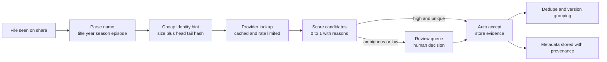
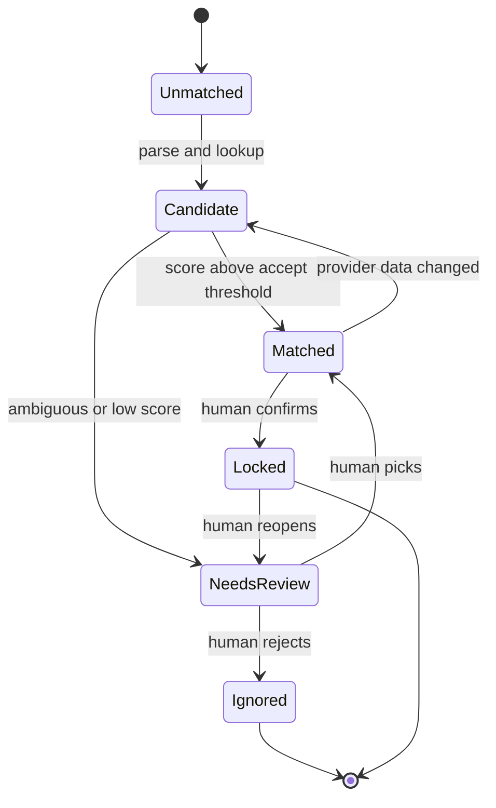
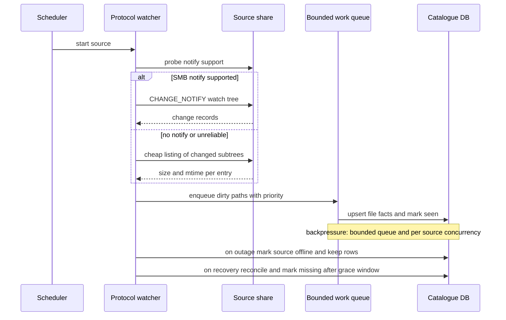
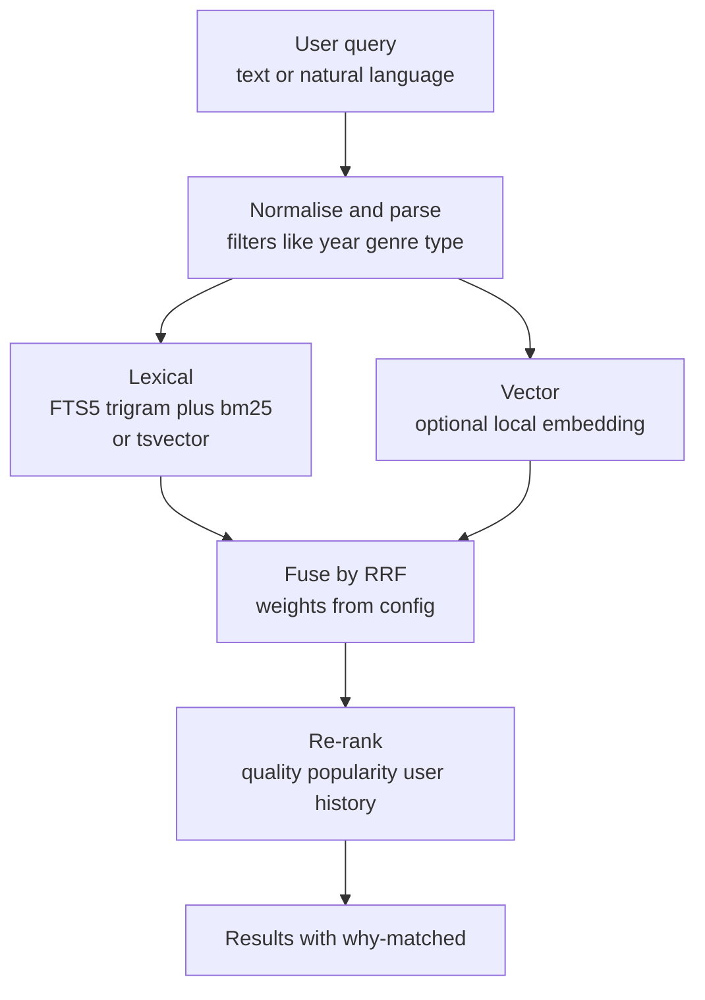
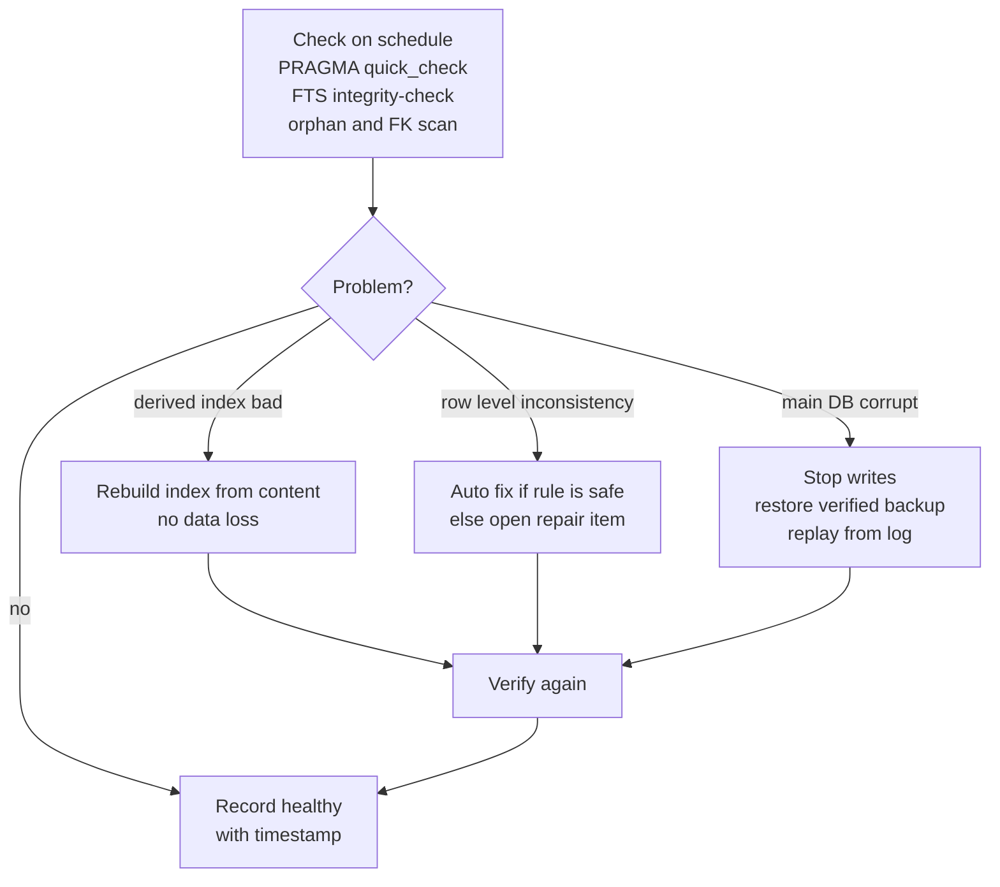

# 18 - Research: Product Innovation and Game Changers

| Field | Value |
|---|---|
| Revision | 1 |
| Created | 2026-10-03 |
| Last modified | 2026-10-03 |
| Status | draft |
| Feature | specs/001-full-project-audit-remediation |
| Nature | Desk research (web) plus read-only grounding in the repository. Nothing here was built, run or benchmarked. |
| Source access date | 2026-10-03 for every source in section 14 |
| Traceability | Relevance to FR-005, FR-007, FR-008, FR-009, FR-016, FR-021, FR-025; SC-002, SC-003, SC-011. This document creates no requirement. |
| Related plan documents | 01 (architecture map), 07 (backend audit), 08 (web), 10 (Android and TV), 14 (performance) |

## Table of contents

1. Purpose, scope fence and how to read this document
2. Method and evidence labels
3. Theme 1 - How peers solve the core jobs, and what users complain about
4. Theme 2 - Recognition and metadata quality
5. Theme 3 - Scanning at scale over flaky network shares
6. Theme 4 - Search
7. Theme 5 - Sync, offline-first and playback continuity
8. Theme 6 - Privacy-first and security-first design
9. Theme 7 - Observability and self-healing
10. Theme 8 - Extensibility
11. Theme 9 - Accessibility, localisation and 10-foot UX
12. Theme 10 - Packaging and operations
13. Ranked game-changer candidates with falsifiable experiments
14. Bibliography
15. Honest limits
16. Appendix - proof-of-concept sketches (NOT EXECUTED)

---

## 1. Purpose, scope fence and how to read this document

Catalogizer scans SMB, FTP, NFS, WebDAV and local storage, detects many media types, enriches metadata from external providers, and serves web, desktop, Android and Android TV clients (README.md, docs/01 sections 2 and 3). This document asks: what would make a product of this shape best in class, according to what comparable products do and what their users complain about?

**Scope fence (important).** This feature is an audit and remediation feature (spec FR-001 to FR-025). Product innovation is not remediation. Every idea below is therefore tagged:

| Tag | Meaning | Where it may go |
|---|---|---|
| `R-ADJ` | Research that sharpens how to fix something the audit will already find, for example an existing defect class (stubbed protocol scanners, unauthenticated WebSocket, `LIKE` search). The fix itself is decided by the owning plan document, not here. | Input to documents 07, 08, 10, 14 |
| `PROPOSAL` | New capability. It is recorded for a later feature and MUST NOT be implemented under feature 001. | A future feature specification |

Nothing tagged `PROPOSAL` is a finding, a defect or a task of this feature. Where an idea overlaps a spec requirement, the spec wins.

Reading rules: sections 3 to 12 each contain (a) a findings table of research results with evidence labels, (b) a candidate-improvements table for this codebase with effort, impact, risk and the touched application or submodule, and (c) pointers to the ranked game changers in section 13.

Effort scale: S = days, M = 1 to 3 weeks, L = more than 3 weeks (engineer estimate, UNCONFIRMED, no measurement behind it). Impact and risk: Low, Medium, High (judgement, not measured).

## 2. Method and evidence labels

Research ran at least four rounds per theme (query, refine, primary-source fetch, cross-check). Prefer primary sources (specifications, official docs, project repositories). Where only a forum thread, a blog or a search-engine summary was available, the source is marked secondary in section 14 and the claim is worded accordingly.

| Label | Meaning |
|---|---|
| PROVEN | Shipped and in production use in at least one comparable product, per a source in section 14. This is not proof it works for Catalogizer. |
| EMERGING | Available, maintained and used, but young, fast-moving or with sparse production evidence. |
| SPECULATIVE | Plausible but with no comparable shipped product found, or evidence only from the author's reasoning. |
| UNCONFIRMED | A claim the research could not verify (reported as such). |

Repository facts cited below come from read-only inspection on 2026-10-03 and from docs/01. Where a fact is from docs/01 it is cited as "doc 01".

Why peers matter for a self-hosted catalogue: the user group overlaps heavily with Jellyfin, Plex, Emby, Kodi, Radarr and Sonarr users, so their complaints are a free, large, uncontrolled usability study (secondary evidence, selection-biased toward vocal and unhappy users).

## 3. Theme 1 - How peers solve the core jobs, and what users complain about

### 3.1 Findings

| # | Finding | Evidence | Label |
|---|---|---|---|
| 1.1 | Jellyfin real-time monitoring depends on inotify. Network shares (SMB, NFS) do not deliver inotify events for remote changes, so the usual advice is scheduled scans (default every 12 hours), and users report that enabling monitoring on SMB causes constant rescans. | [S1], [S14] | PROVEN (as a known peer limitation) |
| 1.2 | Plex moved remote streaming behind a paid plan in April 2025 and raised its lifetime price; this drove a visible migration discussion to Jellyfin. The lesson for a self-hosted product is trust: core functions behind accounts or paywalls are the top stated reason to leave. | [S2] (secondary) | PROVEN (as user sentiment) |
| 1.3 | Jellyfin metadata mismatches are a persistent complaint, including correctly named titles matching unrelated items; the remedy is a manual "Identify" action by title, year or provider id, and users report the identify result sometimes not applying. Jellyfin also discourages the mixed library type "due to unreliable metadata results". | [S23], [S50] | PROVEN |
| 1.4 | Radarr and Sonarr turned release quality into data: quality profiles, scored custom formats, and community-maintained sync tooling (TRaSH Guides, Recyclarr, Profilarr). A custom-format tester that reuses the application's own parser lets users see why a release passed or failed. | [S3], [S4] (secondary) | PROVEN |
| 1.5 | Sonarr relies on TheXEM for scene and absolute numbering mappings; anime numbering mismatches and 12-hour mapping refresh delays are recurring complaints. Episode identity is a hard problem even for a specialised product. | [S22] | PROVEN |
| 1.6 | Navidrome's scan is incremental, marks vanished files as "missing" rather than deleting them, and re-links a moved or renamed file to carry over play counts, ratings and bookmarks; if it cannot match, history is lost. A selective-folder scan exists in 0.59. | [S16], [S16b] | PROVEN |
| 1.7 | Stash fingerprints videos with a perceptual hash (25 frames stitched and hashed) so duplicates are found across bitrate, resolution and intro changes, and its tagger auto-matches by hash but nothing is saved until the user confirms. | [S17] | PROVEN |
| 1.8 | Immich runs CLIP embeddings locally for "search by describing" and reuses those embeddings for duplicate detection; users can pick among models, and changing models can leave incompatible database fragments requiring reprocess. | [S7], [S8] (preview docs) | PROVEN |
| 1.9 | Kodi library updates over remote shares are a perennial support topic: consistent source paths on every device are required for shared MySQL libraries, and "library updates not working reliably" threads are common. | [S46] (forum, secondary) | PROVEN (as complaint) |
| 1.10 | Book and comic servers split by job (Calibre-Web with Calibre desktop and OPDS, Kavita for all-round reading, Komga for comics with ComicInfo.xml). Metadata write-back for some formats (cbz/cbr) is a reported weak spot. | [S47] (secondary) | PROVEN |
| 1.11 | Transcoding complaints centre on hardware acceleration being partial (decode, scale, tone map, subtitle burn-in and encode are separate stages that can fall back to CPU) and on direct play failing when client capability profiles are wrong. | [S48] (secondary) | PROVEN |

Synthesis: the strongest, repeated user pain points are (1) wrong or unexplained matches, (2) library freshness on network storage, (3) trust and lock-in, (4) multi-device state drift, (5) opaque failures. Each maps to a later theme.

### 3.2 Candidate improvements for this codebase

| ID | Candidate | Tag | Touches | Effort | Impact | Risk |
|---|---|---|---|---|---|---|
| T1-A | Treat peers' "missing, not deleted" semantics as the design for removed files, so user state survives temporary share outage (compare with how `files.deleted` is used in `catalog-api/repository/file_repository.go:251,300`). Verification needed before any change. | R-ADJ | catalog-api | M | High | Low |
| T1-B | A manual "Identify / re-match" action with provider-id input on every client, as a first-class workflow, not an afterthought. | PROPOSAL | catalog-api, catalog-web, android, androidtv | M | High | Low |
| T1-C | Quality scoring as data (profile plus scored rules) instead of fixed thresholds, to align with the quality analysis feature in README.md. | PROPOSAL | catalog-api | M | Medium | Medium |

## 4. Theme 2 - Recognition and metadata quality

### 4.1 Findings

| # | Finding | Evidence | Label |
|---|---|---|---|
| 2.1 | Filename parsing is a solved-in-part problem with mature libraries: guessit (Python) extracts title, season, episode, source, codec and release group; PTN-style parsers apply ordered regex rules, strip matched fragments, and keep leftovers in an "excess" field. Provider APIs react badly to queries with extra tokens, so parse first, query with title plus year second. | [S19] | PROVEN |
| 2.2 | Release-name parsing quality in the *arr ecosystem is community-curated through regex rule sets with testers; this implies parsing is data-driven and needs a regression corpus. | [S3], [S4] | PROVEN |
| 2.3 | OpenSubtitles "moviehash" identifies a video from file size plus the first and last 64 KiB (reads 128 KiB even for 50 GB), which is cheap over a network share. It is a quick identity hint, not a content-equality proof (collisions possible in principle; false-match rate not stated by the source). | [S18] | PROVEN |
| 2.4 | Chromaprint/AcoustID fingerprints audio (first two minutes, 12 pitch classes at about 8 Hz). The library needs decoded raw audio; `fpcalc` produces JSON. AcoustID results link to MusicBrainz recordings; MusicBrainz asks for at most one call per second and a descriptive User-Agent with contact. | [S5], [S6], [S21] | PROVEN |
| 2.5 | Perceptual hashing for video (Stash) and CLIP-embedding similarity for photos (Immich) both find non-identical duplicates; Immich preselects the larger file and the one with more EXIF as "keep". | [S8], [S17] | PROVEN |
| 2.6 | TMDB has no published fixed rate limit now (about 40 requests per second in practice, honour HTTP 429); MusicBrainz is hard-limited to one request per second per client. Batching and caching are therefore design constraints, not optimisations. | [S20], [S21] | PROVEN |
| 2.7 | Ambiguity is normal: media managers either ask the user or refuse to auto-scrape when two candidates are equally strong. | [S24] (issue tracker, weak) | PROVEN (weak evidence) |
| 2.8 | Local embedding models for matching are practical on CPU: multilingual-e5-small (384 dimensions, about 100 languages) and BGE-M3 (dense, sparse and ColBERT outputs, 1024-d dense) have ONNX exports. Whether they beat plain string similarity for title matching is not shown by these sources. | [S27] | EMERGING (for title matching specifically: SPECULATIVE) |

### 4.2 What this implies for Catalogizer

Repository grounding: `catalog-api/models/file.go:41` already carries a `QuickHash` field; `catalog-api/internal/services/music_recognition_provider.go` exists with provider code (Last.fm structures are visible at its top); no Chromaprint, AcoustID or perceptual-hash use was found by grep in non-test Go files (only test and mock files mention them). Whether `QuickHash` is populated and used for identity or duplicates is UNCONFIRMED and belongs to document 07.



Design principles supported by the evidence: (1) always store the evidence that produced a match (parsed fields, candidate list, scores), because Jellyfin and Sonarr users suffer most when the reason is hidden; (2) never auto-apply below a threshold, queue it; (3) keep user corrections as higher-priority data than any provider re-fetch (a re-scan must not undo a human decision).



### 4.3 Candidate improvements

| ID | Candidate | Tag | Touches | Effort | Impact | Risk |
|---|---|---|---|---|---|---|
| T2-A | Parser regression corpus: a labelled set of real-world filenames with expected parse, run in CI-equivalent local gates. This is a test asset that also serves the audit's test strategy (FR-009, FR-010). | R-ADJ | catalog-api tests | M | High | Low |
| T2-B | Persist match evidence and confidence (parsed fields, candidates, score, provider, timestamp). | PROPOSAL | catalog-api DB, API | M | High | Low |
| T2-C | Review queue UI with accept, reject, search-by-provider-id; correction becomes locked state. | PROPOSAL | catalog-api, catalog-web, androidtv (read-only) | L | High | Medium |
| T2-D | Fingerprint layer: head/tail hash for movies, Chromaprint for music, perceptual hash for video and images; duplicates and versions grouped by fingerprint, "keep best" suggestion (size, bitrate, tag completeness). | PROPOSAL | catalog-api, submodule `digital.vasic.media` (UNCONFIRMED whether the right home) | L | High | Medium |
| T2-E | Local embedding re-ranker for ambiguous title matches, behind a flag, to be tested against the corpus in T2-A. | PROPOSAL (SPECULATIVE) | catalog-api, optional sidecar (see `OCU-CUDA-Sidecar/`, relationship UNCONFIRMED per doc 01) | L | Medium | High |
| T2-F | Respect provider limits explicitly (MusicBrainz 1 per second, TMDB 429 handling, User-Agent with contact) and test that the limiter exists; the provider code keeps a `rateLimiter map[string]*time.Ticker` (`music_recognition_provider.go`), correctness UNCONFIRMED. | R-ADJ | catalog-api | S | Medium | Low |

## 5. Theme 3 - Scanning at scale over flaky network shares

### 5.1 Findings

| # | Finding | Evidence | Label |
|---|---|---|---|
| 3.1 | inotify and similar local mechanisms do not report changes made by other machines on NFS or SMB mounts, because the change never passes through the local kernel's VFS; stat-polling is the fallback and is less efficient. | [S14] (kernel mailing-list and LWN material via search; secondary) | PROVEN |
| 3.2 | SMB2 has a protocol-level notification: the client sends `CHANGE_NOTIFY` with a directory handle, optional `WATCH_TREE`, a completion filter, and receives `FILE_NOTIFY_INFORMATION` records; servers may answer `STATUS_NOT_SUPPORTED`. | [S13] (primary specification) | PROVEN (protocol) |
| 3.3 | The widely used Go SMB2 client forks (go-smb2 family) document file operations; explicit client-side change-notify was not found in their documentation. Whether Catalogizer's chosen SMB library exposes it is UNCONFIRMED. | [S15] (package listing, thin) | UNCONFIRMED |
| 3.4 | Incremental scan design in a peer: compare against stored state, mark missing instead of delete, re-link renames, allow targeted-folder scans. | [S16] | PROVEN |
| 3.5 | SQLite documents hard failure modes that matter for scan databases kept on or near network storage: WAL does not work over network filesystems; NFS lock bugs can corrupt; copying a database without its WAL or journal corrupts it; checkpoint starvation grows the WAL without bound under overlapping readers. | [S12] (primary) | PROVEN |
| 3.6 | Resilience vocabulary is standard: timeouts, retries with exponential backoff and jitter, circuit breaker, bulkhead, backpressure, load shedding; Go libraries implement circuit breaker and semaphore patterns. | [S49] (package docs, secondary) | PROVEN |
| 3.7 | Kodi and Jellyfin users on shared libraries report unreliable updates; consistent mount paths and avoiding live watchers on network storage are repeated advice. | [S1], [S46] | PROVEN (as complaint) |

### 5.2 Repository grounding (from doc 01, cited not re-verified)

- `UniversalScanner` registers `local`, `smb`, `ftp`, `nfs`, `webdav`; the FTP, NFS and WebDAV `ScanPath` bodies are a comment and `return nil` (`catalog-api/internal/services/universal_scanner.go:119-123,1044-1111`).
- A real-time watcher package exists (`catalog-api/internal/media/realtime/`) but doc 01 reports no non-test caller of `NewMediaManager` (section 3.1).
- SMB resilience code exists (`catalog-api/internal/smb/resilience.go` with tests and benchmarks).
- README.md claims real-time monitoring and offline caching; the audit (document 07) decides what is true. This document does not.

### 5.3 Proposed architecture for flaky shares (research synthesis)



Key ideas with evidence: (1) capability probe per source rather than assuming a watcher works (3.1, 3.2); (2) hybrid strategy: protocol notifications as a hint, periodic reconciliation as the truth, because notifications can be lost, queued or unsupported (3.2 server behaviour); (3) "missing after a grace window" so an unplugged NAS does not delete a library (3.4); (4) bounded queues so a 1-million-file rescan cannot exhaust memory (3.6); (5) a resumable cursor per scan so an interrupted scan continues rather than restarts (design inference, SPECULATIVE as a Catalogizer fit, no peer source stated resumability details).

### 5.4 Candidate improvements

| ID | Candidate | Tag | Touches | Effort | Impact | Risk |
|---|---|---|---|---|---|---|
| T3-A | Replace "stub returns nil" scanners with either a real implementation or an explicit "unsupported" error surfaced in the UI. A silent no-op is the worst case for users (a source that never populates and never says why). | R-ADJ (doc 01 observation, audit decides) | catalog-api | M-L | High | Low |
| T3-B | Per-source capability probe and strategy selection (notify, mtime-delta listing, full walk), with the chosen strategy shown in scan reports. | PROPOSAL | catalog-api, `digital.vasic.watcher`, `digital.vasic.filesystem` (submodules per doc 01) | L | High | Medium |
| T3-C | Grace-window "missing" state and re-link by fingerprint on rename (see T2-D). | PROPOSAL | catalog-api | M | High | Medium |
| T3-D | Scan resumability with a persisted cursor and idempotent upserts. | PROPOSAL | catalog-api | M | Medium | Medium |
| T3-E | Keep the catalogue database off network filesystems and document it; add a startup check that warns when the DB path is on NFS/SMB (SQLite sources, 3.5). | R-ADJ | catalog-api, docs | S | Medium | Low |
| T3-F | Backup procedure uses `VACUUM INTO` or the online backup API, never raw file copy (3.5); verify by restore (theme 10). | R-ADJ | scripts, docs | S | High | Low |

## 6. Theme 4 - Search

### 6.1 Findings

| # | Finding | Evidence | Label |
|---|---|---|---|
| 4.1 | SQLite FTS5 provides tokenizers (unicode61, ascii, porter, trigram), `bm25()` ranking, prefix queries, highlight and snippet functions, external-content tables and administrative commands including `rebuild` and `integrity-check`. | [S9] (primary) | PROVEN |
| 4.2 | Hybrid search merges a lexical ranking and a vector ranking. Reciprocal Rank Fusion (RRF) merges by rank only (not by incomparable scores), published by Cormack, Clarke and Buettcher at SIGIR 2009 and implemented in SQLite by combining FTS5 and a vector extension, with tunable weights. | [S10], [S11] | PROVEN |
| 4.3 | Meilisearch exposes a `semanticRatio` between 0 (keyword only) and 1 (semantic only), default 0.5; embedding models are small and cheap relative to LLMs. | [S25] | PROVEN |
| 4.4 | Immich's smart search uses CLIP embeddings on the server with model selection, plus rich filters (people, OCR text, metadata, location). The search is "describe what you want". | [S7] | PROVEN |
| 4.5 | PostgreSQL pairs `tsvector` plus GIN with pgvector HNSW; pgvector indexable dimension limits apply (about 2000 for `vector`, 4000 for `halfvec`, per a secondary source). | [S26] (secondary) | PROVEN |
| 4.6 | The sqlite-vec project page could not be fetched in this session (404 on the URL tried), so its maturity is UNCONFIRMED here. A 2026 paper (arXiv 2608.24060, "scrydb") reports lexical, semantic and hybrid search inside SQLite using FTS5 plus sqlite-vec with RRF; only the search-result summary was read, not the paper. | [S10b] | UNCONFIRMED / EMERGING |

### 6.2 Repository grounding

Search today is substring matching: `catalog-api/repository/file_repository.go:431` builds `AND (f.name LIKE ? OR f.path LIKE ?)`, and `catalog-api/handlers/search.go` documents "searches in filename and path". No FTS5 or embedding code was found by grep in `catalog-api` (searched for "fts5", "virtual table", "embedding", "pgvector", "sqlite-vec"; zero hits in `.go` and `.sql`). This is a measurable performance risk at scale (leading-wildcard `LIKE` cannot use an ordinary index, an established SQL property; the actual impact on SC-011 is for document 14 to measure) and a relevance risk (no ranking, no typo tolerance).

The system supports both SQLite and PostgreSQL (doc 01 section 6), so any search design needs a dialect-aware strategy: FTS5 for SQLite, `tsvector` for PostgreSQL, and a common query interface.



### 6.3 Candidate improvements

| ID | Candidate | Tag | Touches | Effort | Impact | Risk |
|---|---|---|---|---|---|---|
| T4-A | Measure the current `LIKE` search on a representative catalogue and record a baseline (SC-011 requires one for search). | R-ADJ | catalog-api, doc 14 | S | High | Low |
| T4-B | Lexical upgrade: FTS5 (external-content, trigram or unicode61 plus porter) for SQLite, `tsvector` plus GIN for PostgreSQL, behind the existing search endpoint contract. | PROPOSAL | catalog-api, DB migrations | M | High | Medium (dialect parity, FR-015 schema documentation) |
| T4-C | Optional vector search with a small local multilingual model and RRF fusion, off by default. | PROPOSAL (EMERGING) | catalog-api, optional sidecar | L | Medium-High | High (model size, CPU on small NAS, index rebuild on model change as Immich warns) |
| T4-D | Structured natural-language queries ("1080p comedies from the 90s I have not watched") implemented as filter extraction plus lexical, not as an LLM requirement. LLM-based query rewriting is SPECULATIVE for this product. | PROPOSAL | catalog-api, clients | M | Medium | Medium |
| T4-E | On-device search: Android and TV can hold a compact local lexical index (SQLite FTS5 is available in Android's SQLite, UNCONFIRMED for the exact build used) for offline browsing; embeddings stay server-side. | PROPOSAL | android, androidtv | M | Medium | Medium |

On-device versus server: server-side keeps one index, one model version and lets weak clients stay thin; on-device gives offline search and instant typing. Peers (Immich) keep embeddings on the server. The balanced position supported by the evidence is server-side hybrid plus an optional client lexical cache.

## 7. Theme 5 - Sync, offline-first and playback continuity

### 7.1 Findings

| # | Finding | Evidence | Label |
|---|---|---|---|
| 5.1 | Local-first software states seven ideals (no spinners, multi-device, offline-optional network, collaboration, long now, privacy by default, user ownership). The authors conclude CRDT technology works but list limits: history growth and performance, unreliable peer-to-peer networking (NAT), version management gaps, and advise against replacing established solutions in production. | [S28] (primary essay) | PROVEN (as analysis), CRDTs in production: EMERGING |
| 5.2 | cr-sqlite adds CRDT multi-writer merge to SQLite as a loadable extension. Maintenance status could not be established beyond a search snippet. | [S29] | EMERGING / UNCONFIRMED (maintenance) |
| 5.3 | Production sync engines (PowerSync, ElectricSQL, Zero and others) follow a server-authoritative model: write locally, upload queue, server decides; they are Postgres-centric. A 2026 framework claims a local SQLite plus a server-authoritative commit log. | [S30] (secondary) | EMERGING |
| 5.4 | Playback continuity in peers is resume-point based, not real-time: stop on device X, position pushed to server, resume elsewhere. Users report watched-state conflicts (position replaced by "fully watched") and third-party tools exist to reconcile Plex, Emby, Jellyfin and Trakt through webhooks plus scheduled catch-up. | [S31] (forum, secondary) | PROVEN |
| 5.5 | Jellyfin SyncPlay (shared playback across clients) exists as a separate feature. | [S31b] (secondary) | PROVEN |

### 7.2 Analysis for Catalogizer

Catalogizer's per-user state is small and mostly monotone or last-writer-wins friendly: playback position, watched flag, favourites, playlists. That data does not need general CRDTs. A server-authoritative, append-only event log with per-device sequence numbers and deterministic merge rules per field type captures nearly all the value:

| State | Merge rule (proposal) | Why |
|---|---|---|
| Playback position | Latest event by server-assigned time wins, with a guard: ignore a position update that would move back from "completed" unless user-initiated | avoids the reported position-replaced-by-watched bug |
| Watched flag | Add-wins set semantics with explicit unwatch event | explicit user intent |
| Favourites and playlist membership | Observed-remove set | concurrent add and remove across devices |
| Playlist order | Last-writer-wins on the playlist as a unit, or fractional index (design option) | ordering is where CRDTs help most, rare in practice |

Repository grounding (doc 01): `/sync/conflicts` is an inline closure returning a static empty collection (`catalog-api/main.go:1698-1775`), and the README advertises "Cloud Storage Sync" with S3 and GCS. Whether a real client sync protocol exists is UNCONFIRMED and belongs to documents 07 to 10. Tag: `R-ADJ` for finding the stub, `PROPOSAL` for the event-log protocol.

| ID | Candidate | Tag | Touches | Effort | Impact | Risk |
|---|---|---|---|---|---|---|
| T5-A | Per-user state event log with per-field merge rules and idempotent replay (idempotency key per event). | PROPOSAL | catalog-api, android, androidtv, web, desktop | L | High | Medium |
| T5-B | Offline queue on mobile and TV (Room is already a dependency per doc 01) that uploads when the server is reachable and shows sync status. | PROPOSAL | android, androidtv | M | High | Medium |
| T5-C | General CRDT adoption (Automerge or cr-sqlite) | PROPOSAL (SPECULATIVE; not recommended for v1 given the essay's own limits) | - | L | Low | High |
| T5-D | Playback handoff ("continue on TV") via the existing WebSocket channel, provided that channel is first authenticated (doc 01 notes `/ws` has no token handling; this is an audit item, not a feature). | R-ADJ then PROPOSAL | catalog-api, clients | M | Medium | Medium |

## 8. Theme 6 - Privacy-first and security-first design

### 8.1 Findings

| # | Finding | Evidence | Label |
|---|---|---|---|
| 6.1 | WebAuthn Level 3 (as reported by the fetched W3C page, publication date given there as 2026-08-25) defines discoverable credentials (passkeys), user-verification levels, attestation, and backup-eligibility flags that tell a relying party whether a credential may sync across devices. | [S32] | PROVEN |
| 6.2 | Go has a maintained server-side library ecosystem for WebAuthn (the `go-webauthn` library is described as implementing CBOR decoding, attestation parsing and signature checks; you store one row per credential and own session storage). The repository URL itself was not fetched this session; only tutorials and wrappers were. | [S32b] (secondary) | PROVEN (ecosystem), library URL UNCONFIRMED |
| 6.3 | SQLCipher derives a key from a passphrase with PBKDF2 and allows raw keys; you cannot alter the KDF unless you pass a raw key and derive it yourself. Sources disagree on default iterations (4,000 in an older description, high iteration counts recommended in newer guidance). The defaults for the exact SQLCipher major version used by `github.com/mutecomm/go-sqlcipher` are UNCONFIRMED here. | [S33] (secondary) | PROVEN (mechanism), UNCONFIRMED (version defaults) |
| 6.4 | `age` is a small, audited-by-design file-encryption format with a Go library and a TypeScript implementation; libsodium `secretstream` encrypts arbitrarily long ordered streams with automatic nonce handling and rekeying. Both are building blocks for client-side-encrypted cloud copies. | [S34] | PROVEN |
| 6.5 | JWT guidance: enforce the expected algorithm, keep tokens short-lived with rotating refresh tokens, prefer HttpOnly Secure cookies for browser storage, and plan revocation. Algorithm confusion attacks exploit libraries that trust the `alg` header. | [S35] (secondary) | PROVEN |
| 6.6 | WCAG 2.2 adds Accessible Authentication (3.3.8 Level AA): authentication must not rely on a cognitive function test unless alternatives exist; passkeys and password managers satisfy this better than puzzle-style flows. | [S41] | PROVEN |

Repository grounding (doc 01 and direct reads): JWT HS256 with 24 h default expiry, refresh tokens in `user_sessions` (`catalog-api/services/auth_service.go:34,57-125`); web stores the token in `localStorage['auth_token']` (`catalog-web/src/lib/api.ts:11-52`); `/ws` is outside the JWT group with `CheckOrigin` returning true (`catalog-api/main.go:1083-1084`); SQLCipher driver imports appear in `catalog-api/main.go:63` and test files. Whether the production DSN supplies a key and how it is stored is UNCONFIRMED. No WebAuthn or passkey code was found.

### 8.2 Candidate improvements

| ID | Candidate | Tag | Touches | Effort | Impact | Risk |
|---|---|---|---|---|---|---|
| T6-A | Authenticate `/ws` and restrict origins. Fix belongs to the backend audit (document 07). | R-ADJ | catalog-api, catalog-web, clients | S-M | High | Low |
| T6-B | Pin signing algorithm explicitly in JWT validation and test that a token with a different `alg` is rejected (a negative test satisfying FR-010's break-it requirement). | R-ADJ | catalog-api | S | Medium | Low |
| T6-C | Passkeys as an optional login method; keep password plus TOTP as fallback; WebAuthn credentials table with backup-eligibility flags. | PROPOSAL | catalog-api, catalog-web, desktop (webview support UNCONFIRMED), android (Credential Manager, UNCONFIRMED) | L | High | Medium |
| T6-D | Key management for SQLCipher: key from an OS keystore or a file with mode 0600 outside the database directory, never a plain env var in compose; documented key-rotation (rekey) and backup of the key separately. | PROPOSAL (partly R-ADJ if the audit finds a hard-coded or missing key) | catalog-api, ops docs | M | High | Medium (loss of key means loss of data) |
| T6-E | E2E-encrypted cloud sync using `age` or secretstream with client-held keys, so S3 or GCS only ever store ciphertext. Requires a key-recovery story. | PROPOSAL | catalog-api sync service | L | High | High |
| T6-F | Zero-trust LAN posture: default to authenticated everything (including `/discovery` and image routes after review), TLS everywhere with real certificates option (self-signed HTTPS exists per doc 01), per-device tokens revocable from the UI. | PROPOSAL | catalog-api, clients | M | Medium | Low |

Anti-pattern warning supported by section 3.1, finding 1.2: forcing a vendor account for local playback is the stated reason users abandon Plex; any passkey or cloud feature must stay optional.

## 9. Theme 7 - Observability and self-healing

### 9.1 Findings

| # | Finding | Evidence | Label |
|---|---|---|---|
| 7.1 | OpenTelemetry Go: traces and metrics are stable, logs are Release candidate per the official status table (doc 20 §5.1, C4; the earlier "beta" summary was wrong). Prometheus `/metrics` is the common Go pattern. | [S42] (secondary) | PROVEN |
| 7.2 | FTS5 ships `integrity-check` and `rebuild`; SQLite documents corruption causes and safe backup commands (`VACUUM INTO`, backup API, `sqlite3_rsync` from 3.47.0). Search-index corruption is therefore repairable by rebuild from content, which suggests derived indexes should be rebuildable by design. | [S9], [S12] | PROVEN |
| 7.3 | Litestream continuously replicates WAL pages to object storage and can restore a backup to a temp location. The "write a marker row, replicate it, restore, check the row" verification is **not** a Litestream core feature: the Litestream How-it-works page and CLI reference list no `verify` command; the mechanism is attributed to third-party wrappers (django-litestream, litestream-ruby), and the wrapper commands were verified from the wrapper READMEs (2026-10-03); Litestream core still has no verify command. | [S36] for replication and restore; wrapper behaviour verified from READMEs [S36a], [S36b] (third-party) | PROVEN (replication, restore) / UNCONFIRMED (marker-row verify as core Litestream) |
| 7.4 | Peers' opacity is a top complaint (library not updating, wrong match, no reason shown). Explainability is a differentiator, not a luxury (themes 1 and 2). | [S1], [S23], [S46] | PROVEN (as complaint) |

Repository grounding: health endpoints exist (`/health`, `/api/v1/health`, `/health/deep` at `catalog-api/main.go:1047`), Prometheus `/metrics`, a monitoring directory with Prometheus, Alertmanager and OpenTelemetry configuration (doc 01 section 3.7). The depth and correctness of `/health/deep` and the existence of integrity checks are UNCONFIRMED and belong to document 07.

### 9.2 Self-healing ladder (design proposal)



### 9.3 Explainable scan report (design proposal)

A scan report per run, machine readable and human readable, with: sources and strategy used, counts (seen, new, changed, missing, errors by class), timings per phase, slowest directories, matches auto-accepted versus queued with reasons, provider calls and cache hit rates, and a "why was this file skipped" lookup by path. This is a direct answer to complaint class 7.4 and doubles as audit evidence format (FR-022 favours machine-produced evidence).

| ID | Candidate | Tag | Touches | Effort | Impact | Risk |
|---|---|---|---|---|---|---|
| T7-A | Scan report artefact (JSON plus rendered view). | PROPOSAL | catalog-api, catalog-web | M | High | Low |
| T7-B | Scheduled integrity check and derived-index rebuild. | PROPOSAL | catalog-api | M | Medium | Low |
| T7-C | Verified-restore backup job (restore into a scratch DB and compare a marker or checksum), with its result exposed in health. | PROPOSAL; backup procedure itself is R-ADJ (see T3-F) | scripts, catalog-api | M | High | Low |
| T7-D | Make `/health/deep` report component state (database, providers, each source online or offline, queue depth) rather than a single boolean; verify what it reports today. | R-ADJ | catalog-api | S | Medium | Low |
| T7-E | Trace a scan end to end with OpenTelemetry spans per source and per phase. | PROPOSAL | catalog-api | M | Medium | Low |

## 10. Theme 8 - Extensibility

### 10.1 Findings

| # | Finding | Evidence | Label |
|---|---|---|---|
| 8.1 | Jellyfin's plugin model distributes plugin binaries through repository manifests (JSON) that list versions per server version; plugin code runs with full server privileges, so adding a repository equals granting code execution. | [S37] (primary docs and secondary summaries) | PROVEN |
| 8.2 | Standard Webhooks describes HMAC-SHA256 signatures over `{id}.{timestamp}.{payload}`, a 300 second replay tolerance, and a constant webhook id across retries usable as an idempotency key. The specification itself was not fetched; a vendor glossary summarised it. | [S38] (secondary) | PROVEN (practice), spec text UNCONFIRMED |
| 8.3 | `oapi-codegen` generates Go server stubs (including Gin and a strict server mode), clients and models from OpenAPI 3.0 or 3.1, supporting webhooks in 3.1. | [S39] | PROVEN |
| 8.4 | Radarr and Sonarr ecosystem shows the value of config-as-code and community rule distribution (Recyclarr, Profilarr). | [S3], [S4] | PROVEN |

Repository grounding: handlers already carry Swagger-style annotations (`// @Router /api/search [get]` in `catalog-api/handlers/search.go`), but doc 01 section 3.6 reports that 26 of 53 routes (superseded by doc 19 §6.3/§7: 59 calls, 31 without a route) in the TypeScript API client have no matching static route in `main.go`, and routes are registered in two styles (Gin and gorilla/mux). This is direct evidence that the contract is not machine-checked (FR-016). Whether a generated OpenAPI document is published and current is UNCONFIRMED.

### 10.2 Candidates

| ID | Candidate | Tag | Touches | Effort | Impact | Risk |
|---|---|---|---|---|---|---|
| T8-A | Make OpenAPI the single source of truth, generate the TS client, Android Retrofit interfaces (or validate them) and run a contract test on both sides. Directly serves FR-016. Whether to generate server stubs (oapi-codegen strict mode) or only validate is a design decision for document 07. | R-ADJ (contract testing) / PROPOSAL (server-stub generation) | catalog-api, `catalogizer-api-client`, android, androidtv, web | M-L | High | Medium |
| T8-B | Outbound webhooks (scan complete, item added, match needs review) with Standard Webhooks signing, retries and idempotency ids. | PROPOSAL | catalog-api | M | Medium | Low |
| T8-C | Plugin system. Prefer out-of-process plugins (subprocess or HTTP, declared capabilities, per-plugin token) over in-process code loading, because Jellyfin's in-process model grants full privilege. Metadata-provider plugins are the most requested extension point in peers (inference from peer ecosystem, not a counted statistic). | PROPOSAL (EMERGING for out-of-process) | catalog-api | L | Medium-High | High (security surface, support burden) |
| T8-D | Config-as-code export and import of quality profiles, naming rules and source definitions (versioned JSON or YAML). | PROPOSAL | catalog-api | M | Medium | Low |

## 11. Theme 9 - Accessibility, localisation and 10-foot UX

### 11.1 Findings

| # | Finding | Evidence | Label |
|---|---|---|---|
| 9.1 | WCAG 2.2 (W3C Recommendation 5 October 2023) added nine criteria: Focus Not Obscured (2.4.11 AA, 2.4.12 AAA), Focus Appearance (2.4.13 AAA), Dragging Movements (2.5.7 AA), Target Size Minimum (2.5.8 AA, 24 by 24 CSS pixels), Consistent Help (3.2.6 A), Redundant Entry (3.3.7 A), Accessible Authentication (3.3.8 AA, 3.3.9 AAA). | [S41] (primary) | PROVEN |
| 9.2 | Android TV guidance: design for roughly 3 m viewing distance, large type, low information density, D-pad-reachable controls with clear focus states, a communal-device privacy consideration, and a content-first layout. A secondary source adds a roughly 5 percent safe margin and landscape-only. | [S40] (primary plus secondary) | PROVEN |
| 9.3 | For Compose on TV, `androidx.tv` TV-specific lazy layouts are described as deprecated in favour of standard Compose Foundation lazy layouts (1.7 and later), with `focusRestorer` and `BringIntoViewSpec`. Version applicability to the repository's pinned versions is UNCONFIRMED. | [S40b] | PROVEN (per source) |
| 9.4 | ICU MessageFormat on top of CLDR plural rules lets translators handle plural categories (Russian has four forms, Arabic six) inside the string instead of in code; Weblate is a self-hostable translation management system with VCS integration. | [S43] (secondary) | PROVEN |

Repository grounding (doc 01): the Android TV app declares `androidx.tv:tv-foundation 1.0.0-alpha11` and `tv-material 1.0.0` with Compose BOM 2024.06.00 (doc 01 section 3.5), which lines up with the deprecation point in 9.3 and is worth a targeted check by document 10. `catalogizer-android` has only a `values` resource directory in `app/src/main/res` (no locale-qualified `values-xx` directories were listed in a quick read-only `ls`), so Android localisation coverage looks minimal; doc 01 also lists `internal/handlers/localization_handlers.go` on the backend. How many languages the web client ships is UNCONFIRMED.

### 11.2 Candidates

| ID | Candidate | Tag | Touches | Effort | Impact | Risk |
|---|---|---|---|---|---|---|
| T9-A | Accessibility audit checklist per client built from WCAG 2.2 AA (target size, focus not obscured, dragging alternative, consistent help) and from the TV guidance; evidence produced by automated tools plus manual keyboard and D-pad walkthroughs. | R-ADJ (inputs for documents 08, 09, 10) | web, desktop, android, androidtv | M | High | Low |
| T9-B | Focus-order and focus-restoration tests for TV (a test that fails when focus is lost after returning from a detail screen). | R-ADJ | androidtv | M | High | Low |
| T9-C | Single source of translatable strings with ICU plural syntax and a translation workflow (Weblate or equivalent), pseudo-localisation tests that catch hard-coded strings and layout overflow. | PROPOSAL | all clients, backend error messages | L | Medium | Low |
| T9-D | TV-first browsing patterns: continue-watching row first, recently added, per-profile shelves, minimal typing (voice or on-device keyboard fallback, plus search suggestions). | PROPOSAL | androidtv | M | High | Low |

## 12. Theme 10 - Packaging and operations

### 12.1 Findings

| # | Finding | Evidence | Label |
|---|---|---|---|
| 10.1 | Podman Quadlet turns small declarative files (`.container`, `.network`, `.volume`, `.pod`) into systemd units; supported since Podman 4.4, recommended deployment style from Podman 5, works rootless, and `podman-auto-update` can update and roll back images. This matches the constitution's rootless-container rule. | [S44] (secondary) | PROVEN |
| 10.2 | SLSA Build track (v1.0; current spec v1.2, see doc 20 §3.1): L1 provenance exists, L2 hosted build with signed provenance, L3 hardened build isolation. | [S45] (primary) | PROVEN |
| 10.3 | SQLite backup guidance: `VACUUM INTO`, backup API, `sqlite3_rsync` (3.47.0 and later); never copy a live database without its WAL or journal. | [S12] | PROVEN |
| 10.4 | Continuous replication (Litestream; the marker-row verification belongs to third-party wrappers such as django-litestream and litestream-ruby, not to Litestream core; verified from the wrapper READMEs 2026-10-03) is the peer pattern for single-node SQLite disaster recovery, but it holds a long read transaction and manages checkpoints itself; it applies to SQLite deployments only (Catalogizer also supports PostgreSQL). | [S36] | PROVEN |

Repository grounding (doc 01): compose-based deployment exists, `config/systemd/catalogizer-api.service` exists, there is a `Build/` framework and `docker/Dockerfile.builder`, versions disagree (application manifests say 2.4.0, `versions.json` says global 2.3.0), and `catalog-api` ships a second binary `cmd/boot`. Single-binary distribution is partly constrained by cgo (the repository uses the cgo `go-sqlcipher` driver, so a fully static pure-Go binary is not the default, UNCONFIRMED whether a static musl build is used).

### 12.2 Candidates

| ID | Candidate | Tag | Touches | Effort | Impact | Risk |
|---|---|---|---|---|---|---|
| T10-A | Provide Quadlet files for rootless operation as a documented deployment option. | PROPOSAL (documentation of an existing rule's practice is R-ADJ) | `deployment/`, docs | S | Medium | Low |
| T10-B | Multi-arch OCI images with SBOM and signed provenance, targeting SLSA L2. | PROPOSAL | `Build/`, release scripts | M | Medium | Medium |
| T10-C | Upgrade safety: pre-upgrade verified backup, migration dry-run, schema version guard that refuses to start on a newer-than-known DB, and an automatic rollback path. Migrations folder holds two files (`catalog-api/migrations/005_*.sql`, `006_*.sql`) while doc 01 section 6 discusses dialects and an unused root `database/schema_v3_multiuser.sql`; migration source of truth is for document 07. | R-ADJ (finding) / PROPOSAL (guard feature) | catalog-api | M | High | Medium |
| T10-D | A restore drill documented and scripted (extends `docs/DISASTER_RECOVERY.md` which exists). | R-ADJ | docs, scripts | S | High | Low |

## 13. Ranked game-changer candidates with falsifiable experiments

Ranking criteria: impact on the stated user pain points (section 3), strength of evidence, risk, and fit with the existing architecture. Every candidate is a `PROPOSAL` for a later feature unless marked. Each experiment is designed so a negative result is possible; thresholds are starting points to be fixed before running (UNCONFIRMED values, chosen by the author as plausible, not taken from a source). All experiments are NOT EXECUTED.

| Rank | Game changer | Label | PROPOSAL / R-ADJ | Why it could be decisive | Main risk |
|---|---|---|---|---|---|
| 1 | Explainable matching with confidence scores, evidence and a human review queue (T2-B, T2-C, T7-A) | PROVEN components (Stash confirm step, Sonarr scoring and testers, TMM manual match), integrated form not found in a peer | PROPOSAL | Attacks the number one complaint (wrong or unexplained matches) and makes the product trustworthy | UI and workflow cost; threshold tuning |
| 2 | Hybrid local search (FTS5 or tsvector plus optional embeddings, RRF) with "why matched" (T4-B, T4-C) | PROVEN components; combined on a NAS: EMERGING | PROPOSAL | Replaces substring search; mirrors the experience users praise in Immich | Index size, CPU, dialect parity |
| 3 | Source-aware change detection with capability probe, grace window and fingerprint re-link (T3-B, T3-C, T2-D) | Protocol PROVEN; Go client support UNCONFIRMED | PROPOSAL | Makes "real-time monitoring" honest and keeps user state across outages | Complexity; protocol quirks |
| 4 | Verified-restore backups and self-healing indexes (T7-B, T7-C, T3-F) | PROVEN (Litestream replication and restore, FTS5 rebuild, SQLite backup API); the marker-row verify technique is UNCONFIRMED, attributed to third-party wrappers (django-litestream, litestream-ruby), not Litestream core | PROPOSAL (T7-B, T7-C) plus R-ADJ part (T3-F backup procedure, which the audit's data-safety findings already cover) | Cheap, trust-building, and aligned with the audit's evidence culture | Dual-dialect support |
| 5 | OpenAPI-first contract with generated or validated clients (T8-A) | PROVEN | R-ADJ part (T8-A contract testing against a drift class the audit measures) plus PROPOSAL part (server-stub generation) | Removes a drift class that doc 01 already measured (26 of 53 client routes unmatched; superseded by doc 19 §6.3/§7: 59 calls, 31 without a route) | Migration of two route styles |
| 6 | Passkeys plus per-device revocable tokens, optional by design (T6-C, T6-F) | Standard PROVEN; client support UNCONFIRMED | PROPOSAL | Security and accessibility (WCAG 3.3.8) gain | Platform support in Tauri and Android |
| 7 | Server-authoritative event log for per-user state and playback handoff (T5-A, T5-B, T5-D) | EMERGING (pattern used by sync engines); CRDT variant SPECULATIVE | PROPOSAL (T5-A, T5-B) plus R-ADJ part (T5-D, authenticating the WebSocket first, an existing defect class) | Fixes cross-device continuity complaints | Merge-rule edge cases |
| 8 | Out-of-process plugin and signed webhook platform (T8-B, T8-C) | PROVEN in peers (in-process); out-of-process EMERGING | PROPOSAL | Ecosystem leverage | Security surface, support cost |
| 9 | Client-side-encrypted cloud sync (T6-E) | Building blocks PROVEN; product-level SPECULATIVE | PROPOSAL | Differentiating privacy story | Key recovery, support burden |

### 13.1 Falsifiable experiments

**E1 - Explainable matching (rank 1).**
- Hypothesis: with parsed-field scoring plus a review queue, wrong auto-accepted matches fall below a stated rate while the review burden stays tolerable.
- Design: build a labelled corpus of at least 500 real filenames per media class from the project owner's library (labels from the owner), including known-hard cases (anime absolute numbering, remakes with the same title, mixed-language names, multi-episode files). Run the current matcher and a prototype with scores and thresholds against the corpus offline.
- Metrics: auto-accepted precision, recall of auto-accepted, share sent to review.
- Pass: precision of auto-accepted at least 99 percent and review share at most 15 percent. Fail (kill): precision below 97 percent at any review share under 30 percent, or the review share exceeds 30 percent at 99 percent precision.
- Controls: same corpus, same provider cache, three repeated runs to confirm determinism (aligned with SC-003's repeatability idea).

**E2 - Hybrid search (rank 2).**
- Hypothesis: FTS5 (or tsvector) improves relevance and latency over `LIKE`, and a small embedding model adds measurable value on conceptual queries.
- Design: a query set of 200 queries across exact title, partial title, typo, transliteration, actor, "movies like", and descriptive queries, with owner-labelled relevant results; catalogue sizes of 10 thousand, 100 thousand and 1 million rows.
- Metrics: nDCG at 10, p50 and p95 latency, index size, build time.
- Pass: lexical beats `LIKE` baseline on nDCG at 10 by a predeclared margin and p95 under the SC-011 target set by document 14; embeddings are adopted only if they add at least a predeclared nDCG gain on conceptual queries without breaking the latency target on the reference NAS-class machine. Fail: embeddings add less than the margin, then drop rank 2's vector half and keep the lexical half.

**E3 - Change detection on flaky shares (rank 3).**
- Hypothesis: a capability probe plus notify-or-delta strategy detects added, renamed and deleted files faster and with fewer full walks than a periodic full scan, and an outage does not delete rows.
- Design: a controlled SMB and an NFS test share in a rootless container (constitution FR-021), a script that adds, renames and deletes files at known times and injects network drops (container network pause), measuring time to catalogue convergence and number of directory listings issued.
- Pass: median detection latency under a predeclared bound on SMB with notify; zero rows lost during a simulated outage shorter than the grace window; listings reduced by a predeclared factor versus full scan. Fail: notify unavailable in the chosen Go SMB library (then record UNCONFIRMED 3.3 as FALSE and test only the delta strategy).
- Note: any test that needs a real external service must run against the real one (FR-025); an unavailable share is reported as blocked, never simulated.

**E4 - Verified restore (rank 4).**
- Hypothesis: a scripted backup plus restore into a scratch DB can prove, on every run, that the backup is restorable and current (marker row technique, as implemented by the third-party wrappers django-litestream and litestream-ruby; wrapper commands verified from the wrapper READMEs (2026-10-03); Litestream core still has no verify command, so the script is ours to write) for both SQLite and PostgreSQL.
- Design: run the job against a live write load; corrupt the primary on purpose (truncate the file in a scratch copy, delete the WAL) and measure whether the job detects it and how long recovery takes.
- Pass: the corrupted case is detected in 100 percent of 20 trials and recovery meets a predeclared recovery time. Fail: any undetected corruption.

**E5 - OpenAPI contract (rank 5).**
- Hypothesis: generating the specification from the server and validating each client against it detects every deliberately injected breaking change.
- Design: inject 20 breaking mutations (rename a field, change a type, remove a route, change a status code); run the contract suite.
- Pass: 20 of 20 detected before release. Fail: any mutation survives (this mirrors SC-005's break-it standard).

**E6 - Passkeys (rank 6).**
- Hypothesis: passkey login works on the web client and degrades gracefully where a platform lacks support.
- Design: a spike on the web client against a real browser and a hardware or platform authenticator, then a feasibility probe in the Tauri webview and in the Android app.
- Pass: registration and login succeed on target browsers; unsupported platforms show the password path with no dead end. Fail: webview support absent (then limit scope to web).

**E7 - Event-log state sync (rank 7).**
- Hypothesis: deterministic per-field merge rules converge on all devices after random concurrent edits and offline periods.
- Design: a property-based test generating random sequences of events from 3 simulated devices with partitions; check convergence and the "completed is not reverted by a stale position" rule.
- Pass: 100 percent convergence over 10 thousand generated runs and zero violations of the stated invariants. Fail: any divergence (then fall back to single-device-wins).

**E8 - Plugin sandbox (rank 8).**
- Hypothesis: out-of-process plugins with declared capabilities cannot read data beyond their grant.
- Design: a hostile test plugin attempting file, network and database access beyond its manifest; pass only if every attempt is denied and logged.

**E9 - Encrypted sync (rank 9).**
- Hypothesis: the cloud provider sees only ciphertext and a user can recover after losing a device.
- Design: inspect stored objects for plaintext markers; perform a recovery drill from a recovery key. Pass: no plaintext leak and successful recovery. Fail: recovery needs data the provider cannot supply.

## 14. Bibliography

All accessed 2026-10-03. "Primary" = specification, official documentation, project repository or the original paper; "secondary" = forum, blog, aggregator or search-engine summary. A claim resting only on a secondary source is worded as such in the text.

| Id | Title | URL | Type | Supports | Limits |
|---|---|---|---|---|---|
| S1 | Jellyfin Forum: real time monitoring not working on some libraries | https://forum.jellyfin.org/t-solved-real-time-monitoring-not-working-on-some-libraries?pid=44605 | secondary (forum, via search summary) | inotify and network shares, scheduled scans | Community statements, not official docs; results vary by setup |
| S2 | PLEX Price Increases, The Rise of Jellyfin and Now What? | https://nascompares.com/2025/04/18/plex-price-increases-the-rise-of-jellyfin-and-now-what/ | secondary | Plex 2025 pricing and remote-streaming change, sentiment | Search summary only; commercial blog |
| S3 | TRaSH Guides: Getting Started | https://trash-guides.info/Getting-Started/ | primary (community guide) | Quality profiles, custom formats | Community-maintained |
| S4 | Profilarr: Configuration Management for Radarr and Sonarr (2026) | https://jellywatch.app/blog/profilarr-configuration-management-radarr-sonarr-custom-formats-2026 | secondary | Parser-matching custom-format tester | Vendor-adjacent blog |
| S5 | Chromaprint (AcoustID) | https://acoustid.org/chromaprint | primary | fpcalc, C API, needs decoded audio | License and length limits not on page |
| S6 | AcoustID (Wikipedia) | https://en.wikipedia.org/wiki/AcoustID | secondary | First two minutes, 12 pitch classes, MusicBrainz link | Encyclopaedia summary |
| S7 | Immich documentation: Searching | https://docs.immich.app/features/searching | primary | CLIP smart search, filters, model caveat | Estimates only for resources |
| S8 | Immich documentation: Duplicate detection (preview build) | https://docs.pr-30460.preview.immich.app/concepts/duplicate-detection | primary (preview, may change) | Embedding-based duplicates, keep preselection | Preview docs |
| S9 | SQLite FTS5 Extension | https://www.sqlite.org/fts5.html | primary | Tokenizers, bm25, external content, rebuild and integrity-check | - |
| S10 | Hybrid full-text search and vector search with SQLite (S. Willison) | https://simonwillison.net/2024/Oct/4/hybrid-full-text-search-and-vector-search-with-sqlite/ | secondary (expert blog) | RRF SQL pattern | No default for k stated on the page |
| S10b | SQLite is Enough: Lexical, Semantic and Hybrid Search with scrydb (arXiv 2608.24060) | https://arxiv.org/pdf/2608.24060 | primary (paper) but only the search summary was read | Hybrid search inside SQLite | Not read in full |
| S11 | Reciprocal Rank Fusion outperforms Condorcet and individual rank learning methods (Cormack, Clarke, Buettcher, SIGIR 2009) | https://plg.uwaterloo.ca/~gvcormac/cormacksigir09-rrf.pdf | primary | RRF definition | Evaluated on TREC and LETOR, not media catalogues |
| S12 | How To Corrupt An SQLite Database File; Write-Ahead Logging | https://www.sqlite.org/howtocorrupt.html and https://www.sqlite.org/wal.html | primary | Network filesystem, WAL and backup hazards | Version-specific claims (WAL-reset bug range) should be re-read before relying on them |
| S13 | MS-SMB2: 2.2.35 SMB2 CHANGE_NOTIFY Request | https://learn.microsoft.com/en-us/openspecs/windows_protocols/ms-smb2/598f395a-e7a2-4cc8-afb3-ccb30dd2df7c | primary | Protocol notifications | Says nothing about any Go client |
| S14 | LWN and kernel list threads on inotify and remote filesystems | https://lwn.net/Articles/757472/ | secondary (via search summary) | inotify does not see remote changes | Summary only |
| S15 | go-smb2 fork documentation (maestrohub-labs) | https://pkg.go.dev/github.com/maestrohub-labs/go-smb2 | secondary | Fork lineage, no change-notify documented | Absence of documentation is not proof of absence of feature |
| S16 | Navidrome: Missing Files | https://navidrome.org/docs/usage/library/missing-files/ | primary | Missing-not-deleted, rename re-link | - |
| S16b | Navidrome: scan command | https://www.navidrome.org/docs/usage/admin/cli/scan/ | primary | Incremental and selective scans | Scanner internals not described |
| S17 | Stash manual: Deduplication | https://docs.stashapp.cc/in-app-manual/deduplication/ | primary | phash from 25 frames, user confirmation | - |
| S18 | oshash (PyPI) | https://pypi.org/project/oshash/ | secondary | Moviehash algorithm | Collision rate not stated |
| S19 | guessit on PyPI; parse-torrent-title on PyPI | https://pypi.org/project/guessit/4.2.1/ and https://pypi.org/project/parse-torrent-title/2.4/ | secondary | Filename parsing properties and approach | No accuracy figures |
| S20 | TMDB: Rate Limiting | https://developer.themoviedb.org/docs/rate-limiting | primary | Approximate limit, 429 | Terms and attribution not on page |
| S21 | MusicBrainz API: Rate Limiting | https://musicbrainz.org/doc/MusicBrainz_API/Rate_Limiting | primary | 1 per second, User-Agent | - |
| S22 | Servarr wiki: XEM guide | https://wiki.servarr.com/sonarr/xem-guide | primary | Scene and absolute mapping | Edge-case complaints from forum threads |
| S23 | Jellyfin Forum: metadata guessing has worsened | https://forum.jellyfin.org/t-metadata-guessing-has-worsened | secondary | Metadata mismatch complaints | Anecdotal |
| S24 | tinyMediaManager issue tracker, issue 1205 | https://gitlab.com/tinyMediaManager/tinyMediaManager/-/issues/1205 | secondary | Ties between equal candidates not auto-scraped | Weak, single issue |
| S25 | Meilisearch: Hybrid search overview | https://meilisearch.com/docs/capabilities/hybrid_search/overview | primary | semanticRatio, embedders | Vendor docs |
| S26 | Vector search in Postgres | https://blog.openreplay.com/vector-search-postgres/ | secondary | pgvector HNSW, tsvector plus GIN | Dimension limits should be re-checked in pgvector docs |
| S27 | bge-m3-onnx | https://github.com/yuniko-software/bge-m3-onnx | primary (repo) | ONNX exports of BGE-M3 | No quality-for-title-matching evidence; multilingual-e5 details came from a package listing |
| S28 | Local-first software: you own your data, in spite of the cloud (Ink and Switch) | https://www.inkandswitch.com/essay/local-first/ | primary | Ideals and CRDT limits | 2019 essay, field has moved |
| S29 | cr-sqlite introduction | https://vlcn.io/docs/cr-sqlite/intro | primary | Concept | Maintenance status unconfirmed |
| S30 | ElectricSQL (electric-next) vs PowerSync | https://powersync.com/blog/electricsql-electric-next-vs-powersync | secondary (vendor blog) | Sync-engine models | Vendor bias |
| S31 | Sync progress on Jellyfin (Symfonium support); Plembfin thread | https://support.symfonium.app/t/sync-progress-on-jellyfin/3396 and https://emby.media/community/topic/149609-plembfin-keep-emby-plex-jellyfin-and-trakt-watch-state-aligned/ | secondary | Resume-point behaviour, watched-state reconciliation | Anecdotal |
| S31b | Jellyfin SyncPlay explained | https://www.androidauthority.com/jellyfin-syncplay-explained-3530437/ | secondary | SyncPlay exists | - |
| S32 | Web Authentication Level 3 | https://www.w3.org/TR/webauthn-3/ | primary | Passkey concepts, flags | Status date as returned by the fetch tool |
| S32b | Add Passkeys to Go in 30 Minutes | https://mojoauth.com/blog/add-passkeys-to-go-in-30-minutes | secondary | go-webauthn description | Vendor tutorial; library repository not fetched |
| S33 | How to Implement Encryption with SQLCipher | https://oneuptime.com/blog/post/2026-02-02-sqlcipher-encryption/view | secondary | Key derivation, iterations advice | Conflicting default values; read SQLCipher docs for the used version |
| S34 | age; libsodium secretstream | https://github.com/FiloSottile/age and https://doc.libsodium.org/secret-key_cryptography/secretstream | primary | File and stream encryption | Not evaluated against sync design |
| S35 | JWT algorithm confusion (PentesterLab glossary) | https://pentesterlab.com/glossary/jwt-algorithm-confusion | secondary | Alg pinning | Not an official OWASP page; confirm in OWASP cheat sheet |
| S36 | Litestream: How it works | https://litestream.io/how-it-works/ | primary | Replication and restore; no `verify` command (marker-row verify is third-party) | SQLite only |
| S36a | django-litestream README (manage.py litestream verify) | https://github.com/Tobi-De/django-litestream | primary (wrapper README) | Wrapper verify command | Third-party, not Litestream core |
| S36b | litestream-ruby README (Litestream.verify! writes a _litestream_verification row) | https://github.com/fractaledmind/litestream-ruby | primary (wrapper README) | Wrapper verify method | Third-party, not Litestream core |
| S37 | Jellyfin documentation: Plugins | https://jellyfin.org/docs/general/server/plugins | primary | Repository manifests | Security statement came from a secondary summary |
| S38 | Webhook signature (Svix glossary) | https://www.svix.com/resources/glossary/webhook-signature/ | secondary | Standard Webhooks summary | Specification text not fetched |
| S39 | oapi-codegen | https://github.com/oapi-codegen/oapi-codegen | primary (repo) | OpenAPI 3.0 and 3.1, Gin, strict server | Fit with existing route style unverified |
| S40 | Android Developers: Design for TV | https://developer.android.com/design/ui/tv/guides/foundations/design-for-tv | primary | 10-foot UI, D-pad, focus | The safe-margin figure came from a secondary source |
| S40b | Android Developers: Create scrollable layouts for TV (Compose) | https://developer.android.com/training/tv/playback/compose/lists?hl=fr | primary (localised page) | TV lazy layouts deprecation, focusRestorer | Read through a search summary |
| S41 | What's New in WCAG 2.2 | https://www.w3.org/WAI/standards-guidelines/wcag/new-in-22/ | primary | Nine new criteria | - |
| S42 | OpenTelemetry Go documentation | https://opentelemetry.io/docs/languages/go/ | primary (index) | Go support | Stability statuses came from a secondary summary; its "logs beta" was wrong, the official table says Release candidate (doc 20 C4) |
| S43 | ICU guide (GitLab translate); Weblate overview | https://unicode-org.github.io/icu/userguide/format_parse/messages/ (ICU MessageFormat, checked HTTP 200 on 2026-10-03; the earlier source https://translate.gitlab.com/blog/icu-guide is DEAD, it redirects to a 404 page) and https://blog.elest.io/weblate-free-open-source-alternative-to-crowdin-lokalise/ | primary (ICU user guide) plus secondary (Weblate blog) | ICU plurals, Weblate | Vendor blog for Weblate; the GitLab ICU guide link was dead and was replaced |
| S44 | Run Podman Containers as systemd Services with Quadlet | https://www.golinuxcloud.com/podman-quadlet-systemd/ | secondary | Quadlet | Read Podman docs for exact version support |
| S45 | SLSA specification v1.0: Levels (current spec v1.2; see doc 20 §3.1) | https://slsa.dev/spec/v1.0/levels | primary | Build L1 to L3 | - |
| S46 | OSMC forum: Library updates not working reliably | https://discourse.osmc.tv/t/library-updates-not-working-reliably/87926 | secondary | Kodi library update complaints | Anecdotal |
| S47 | Kavita vs Calibre-Web vs Komga | https://selfhosting.sh/compare/kavita-vs-calibre-web-vs-komga/ | secondary | Product split | Comparison blog |
| S48 | How Jellyfin Turns Client Limits Into a Transcoding Pipeline | https://shop.zimaspace.com/blogs/tech-ai-hub/how-jellyfin-turns-client-limits-into-a-transcoding-pipeline | secondary | Transcoding stages | Vendor blog |
| S49 | go-resiliency | https://pkg.go.dev/github.com/eapache/go-resiliency | secondary (package docs) | Resilience patterns in Go | Library not evaluated for this codebase |
| S50 | Jellyfin documentation: Libraries | https://jellyfin.org/docs/general/server/libraries/ | primary | Mixed library discouraged | Page is basic setup only |

## 15. Honest limits

1. **No experiment was executed.** Every effort figure, threshold and pass criterion above is an unmeasured author judgement. The experiments are designs, not results.
2. **Search-engine summaries were a main route.** Many claims rest on summaries returned by the search tool, with only a subset fetched in full (SQLite pages, FTS5, WCAG, Android TV, SLSA, Immich, Chromaprint, W3C WebAuthn, oapi-codegen, Meilisearch via search, Ink and Switch, TMDB rate limiting). Forum, blog and vendor sources carry selection bias.
3. **Several fetches failed or were thin.** The sqlite-vec repository URL tried returned 404, so its maturity is UNCONFIRMED. The Jellyfin libraries page did not mention network shares or monitoring. The Standard Webhooks specification, the `go-webauthn` repository, the OWASP JWT cheat sheet and the SQLCipher documentation were not fetched; secondary sources stand in for them.
4. **Dates and versions.** The WebAuthn Level 3 publication date and the arXiv number come from the fetched or searched pages and were not cross-checked. SQLCipher default iteration counts conflict between sources and differ by major version.
5. **Repository inspection was shallow.** Only a few greps and file reads were performed on 2026-10-03, plus doc 01. Absence of a feature (FTS, passkeys, fingerprints) means absence from the greps listed, not absence from the repository, submodules or unmerged branches. Submodule contents (`digital.vasic.*`) were not searched.
6. **Peer products are not Catalogizer.** PROVEN means shipped elsewhere. Scale, hardware (small NAS CPUs), dual-dialect support (SQLite and PostgreSQL), and a team's capacity differ. Complaint themes are from vocal users, not usage statistics.
7. **No market sizing, no legal analysis.** Provider terms (TMDB attribution, commercial use, IMDB access) were not reviewed. README.md names IMDB as a provider; whether and how IMDB data may be used is out of scope and UNCONFIRMED here.
8. **Scope.** Nothing in this document adds a requirement to feature 001. `PROPOSAL` items need a separate specification, and `R-ADJ` items only inform existing audit documents; the audit documents decide what is a finding.
9. **Security caution.** Proposals touching authentication, encryption keys and plugins increase attack surface and key-loss risk; each needs its own threat model before adoption.

## 16. Appendix - proof-of-concept sketches (NOT EXECUTED)

### 16.1 SQLite: FTS5 external-content index plus RRF fusion (design sketch)

Assumes a `media_items(id, title, original_title, year, overview)` table and a vector table `vec_items` provided by a vector extension (not verified present; the extension choice is open per finding 4.6). Names are illustrative.

```sql
-- NOT EXECUTED. Lexical side: trigram tokenizer gives substring and typo-tolerant matching.
CREATE VIRTUAL TABLE media_fts USING fts5(
  title, original_title, overview,
  content='media_items', content_rowid='id',
  tokenize='trigram'
);

-- Keep the index in sync (external content tables need triggers).
CREATE TRIGGER media_ai AFTER INSERT ON media_items BEGIN
  INSERT INTO media_fts(rowid, title, original_title, overview)
  VALUES (new.id, new.title, new.original_title, new.overview);
END;
CREATE TRIGGER media_ad AFTER DELETE ON media_items BEGIN
  INSERT INTO media_fts(media_fts, rowid, title, original_title, overview)
  VALUES ('delete', old.id, old.title, old.original_title, old.overview);
END;
CREATE TRIGGER media_au AFTER UPDATE ON media_items BEGIN
  INSERT INTO media_fts(media_fts, rowid, title, original_title, overview)
  VALUES ('delete', old.id, old.title, old.original_title, old.overview);
  INSERT INTO media_fts(rowid, title, original_title, overview)
  VALUES (new.id, new.title, new.original_title, new.overview);
END;

-- Rank-only fusion (RRF): k is a tunable constant (commonly 60 in the literature, to be tuned).
WITH lex AS (
  SELECT rowid AS id, row_number() OVER (ORDER BY bm25(media_fts)) AS r
  FROM media_fts WHERE media_fts MATCH :q LIMIT 50
),
vec AS (
  SELECT id, row_number() OVER (ORDER BY distance) AS r
  FROM vec_items WHERE embedding MATCH :qvec AND k = 50
)
SELECT m.id, m.title,
       coalesce(1.0/(:k + lex.r), 0.0) * :w_lex +
       coalesce(1.0/(:k + vec.r), 0.0) * :w_vec AS score
FROM media_items m
LEFT JOIN lex ON lex.id = m.id
LEFT JOIN vec ON vec.id = m.id
WHERE lex.id IS NOT NULL OR vec.id IS NOT NULL
ORDER BY score DESC LIMIT 20;
```

Expected machine-readable output shape (illustrative): `[{"id":42,"title":"...","score":0.0327,"matched_by":["lexical","vector"]}]`. The `matched_by` field is the "why matched" hook for explainability. Run integrity checks with `INSERT INTO media_fts(media_fts) VALUES('integrity-check');` and repair with `VALUES('rebuild');` (both documented in [S9]).

### 16.2 Go: bounded work queue with per-source concurrency (design sketch)

```go
// NOT EXECUTED. Illustrates backpressure: producers block when the queue is full.
type DirtyPath struct{ Source, Path string; Priority int }

func runSource(ctx context.Context, src string, in <-chan DirtyPath, maxPar int, up Upserter) error {
    sem := make(chan struct{}, maxPar) // per-source bulkhead
    g, ctx := errgroup.WithContext(ctx)
    for p := range in {
        select {
        case sem <- struct{}{}:
        case <-ctx.Done():
            return ctx.Err()
        }
        p := p
        g.Go(func() error {
            defer func() { <-sem }()
            return retryWithJitter(ctx, 5, func() error { return up.Upsert(ctx, p) })
        })
    }
    return g.Wait()
}
```

The queue feeding `in` is created with a fixed buffer (for example `make(chan DirtyPath, 1024)`), so a slow share slows only its own producers. A circuit breaker around the listing call, and a "source offline" state that stops enqueuing and preserves rows, complete the pattern ([S49] lists these patterns; the code is the author's sketch).

### 16.3 Shell: verified-restore drill outline (design sketch)

```bash
# NOT EXECUTED. Runs inside a rootless container per the constitution; no sudo.
set -euo pipefail
src=/data/catalogizer.db            # live DB (SQLite deployment)
out=/backup/catalogizer-$(date -u +%Y%m%dT%H%M%SZ).db
sqlite3 "$src" "VACUUM INTO '$out'"                       # safe online copy [S12]
sqlite3 "$out" "PRAGMA integrity_check;" | grep -qx ok    # structural check
count_src=$(sqlite3 "$src" "SELECT count(*) FROM files")
count_bak=$(sqlite3 "$out" "SELECT count(*) FROM files")
printf '{"backup":"%s","integrity":"ok","rows_src":%s,"rows_bak":%s}\n' "$out" "$count_src" "$count_bak"
```

Note: counts can differ slightly if writes occur between the two reads; a marker-row technique (implemented by the third-party wrappers django-litestream and litestream-ruby; verified from the wrapper READMEs 2026-10-03 [S36a], [S36b]; Litestream core still has no verify command, [S36] describes none) is stricter. If the production DB is SQLCipher-encrypted, the `sqlite3` CLI needs an SQLCipher-enabled build and the key (not shown, and no key may be written to logs, constitution CONST-042).
