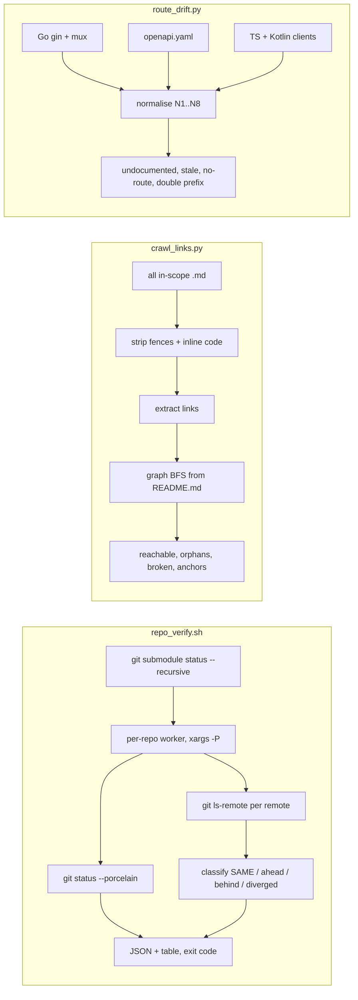

# 19. Proof-of-concept tools and measured results

| Field | Value |
|---|---|
| Revision | 1 |
| Created | 2026-10-03 |
| Last modified | 2026-10-03 |
| Status | draft |
| Feature | `specs/001-full-project-audit-remediation` |
| Tools live in | `specs/001-full-project-audit-remediation/poc/` |
| Related plan documents | 02 (audit method), 07 (backend, section 12), 13 (documentation), 16 (infrastructure and enforcement) |

## Table of contents

1. Purpose and status
2. Common design rules
3. Tool 1: `repo_verify/verify_repo.sh`
4. Tool 2: `doc_links/crawl_links.py`
5. Tool 3: `route_drift/route_drift.py`
6. Real runs and captured output
7. Discrepancies against the existing plan documents
8. Findings the tools surfaced (leads for the register)
9. Limits, honest boundaries and path to production
10. Reproduction commands and traceability

## 1. Purpose and status

The plan relies on three mechanical measurements: whether every repository (main plus 97 nested and direct submodule entries) is clean, pinned and published; whether documentation is reachable from the root README; and whether the HTTP API as served, documented and consumed is consistent. Documents 07, 13 and 16 quote numbers produced by earlier ad-hoc scripts that were kept only in a scratchpad. These three tools turn those scripts into tracked, tested, re-runnable proofs of concept so that the numbers can be reproduced and, later, promoted into the permanent gates (FR-001..FR-003 repository state, FR-013 reachability, FR-016 contract drift; SC-006, SC-008, SC-010).

All three are **read-only**. No tool writes to any repository, runs a build, or contacts the network except `git ls-remote` in tool 1 (and `git fetch`, only when `--fetch` is passed). Nothing outside `poc/` and this document was modified. Each tool has a deterministic self-test with golden-good, golden-bad and negative-control cases (constitution 11.4.107(10), 11.4.201(7)) and each was run for real against this repository on 2026-10-03.



## 2. Common design rules

| Rule | How the tools satisfy it |
|---|---|
| Read-only (plan rule, constitution 9.2 spirit) | no write commands; `verify_repo.sh` fetch only on explicit flag and only to the object store |
| No guessing (11.4.6) | an undecidable comparison gets its own class (`UNKNOWN-DIFFERENT`, `UNREACHABLE`) and its own exit code, never "clean" |
| Instrument sees through its path (11.4.201(7)) | self-tests contain control needles: ssh banner noise, link inside code fence, `Map.get('k')`, commented-out route |
| Deterministic (11.4.50) | sorted traversal, no timestamps inside hashed content; self-tests assert two identical runs |
| Machine-readable result plus human view | JSON everywhere; table in tool 1; counts view (`--summary`) in tool 3 |
| Honest caveats | each tool states limits in its docstring and README; tool 3 carries a prominent false-positive caveat |
| Exceptions explicit, never silent | tool 1 `exceptions.tsv`; excepted repos are still listed and marked `excepted: true` |

## 3. Tool 1: `repo_verify/verify_repo.sh`

### 3.1 Behaviour

1. Enumerate repositories: the main repository (`.`) plus every line of `git submodule status --recursive`. The first character of each line (space, `+`, `-`, `U`) is the **pin state**; it is read before any whitespace stripping (a leading space is meaningful).
2. For each repository, a worker (run through `xargs -P`, default 6 jobs; **no `git submodule foreach`**, which stops at the first non-zero child) records HEAD, branch, `git status --porcelain --ignore-submodules=all` split into tracked and untracked entries. Submodule state is judged on its own row, so an excepted dirty child does not turn every ancestor dirty.
3. A repository is **owned** when any remote URL has an organisation in `--owned-orgs` (default `vasic-digital,HelixDevelopment,milos85vasic`). Third-party repositories get dirtiness and pin state only.
4. For owned repositories on a branch, every remote is asked with `git ls-remote <remote> refs/heads/<branch>` under `timeout` and `BatchMode` ssh. Only lines matching `^[0-9a-f]{40}[[:space:]]` are accepted (ssh banners and MOTD text are ignored).
5. Classification:

| Class | Meaning | Counts as failure |
|---|---|---|
| `SAME` | remote tip equals local HEAD | no |
| `REMOTE-BEHIND` | remote tip is an ancestor of HEAD (local is ahead, unpushed commits) | yes (`ahead`) |
| `LOCAL-BEHIND` | HEAD is an ancestor of the remote tip | only with `--strict` |
| `DIVERGED` | neither is an ancestor | yes |
| `UNREACHABLE` | `ls-remote` failed or timed out | unproven (exit 3; `--strict`: exit 1) |
| `NO-REMOTE-BRANCH` | remote answered, branch absent | unproven |
| `UNKNOWN-DIFFERENT` | tips differ and the remote commit is not in the local object store; ancestry cannot be decided without fetching | unproven |

Ancestry uses `git merge-base --is-ancestor`; the fetch-only step (`git fetch --no-tags <remote> <branch>`) runs **only** when `--fetch` is given.

6. Exit codes: `0` clear; `1` any repository dirty (not excepted), ahead or diverged (`--strict` adds behind, pin drift, unproven); `2` usage error; `3` no failure but at least one comparison unproven.
7. Documented exception list `exceptions.tsv`: `submodules/helix_qa/tools/opensource/docling` (dirty, known CRLF quirk). The row is excepted, still printed, and counted in `summary.dirty_excepted`.

### 3.2 JSON shape (abridged, real output)

```json
{ "tool": "verify_repo.sh", "root": "/home/milosvasic/Projects/catalogizer", "fetch": false, "strict": false,
  "summary": { "repos": 98, "owned": 51, "dirty": 2, "dirty_excepted": 1, "ahead": 0, "diverged": 0,
               "pin_drift": 0, "unproven": 0, "failing": 1,
               "classes": { "LOCAL-BEHIND": 8, "SAME": 191 } },
  "repos": [ { "path": "submodules/assets", "pin": " ", "pin_state": "ok", "branch": "main", "owned": true,
               "dirty": false, "dirty_tracked": 0, "dirty_untracked": 0, "excepted": false,
               "problems": [], "unproven": [],
               "remotes": [ { "remote": "github", "url": "git@github.com:...", "remote_tip": "ceb948a2...", "class": "SAME" } ] } ] }
```

### 3.3 Self-test (24 checks, local fixtures only, about 40 s)

Golden-good: clean synchronised repo exits 0 with `SAME`. Golden-bad: dirty tracked file (exit 1), unpushed commit (`REMOTE-BEHIND`, exit 1), diverged (`DIVERGED`, exit 1). Behind: `UNKNOWN-DIFFERENT` and exit 3 without fetch, `LOCAL-BEHIND` and exit 0 with `--fetch`, exit 1 with `--strict`. Unreachable remote: `UNREACHABLE`, exit 3. Negative controls: a git shim that prints banner text (including a 40-hex-looking token followed by non-whitespace is not an issue because only `hex40<whitespace>` lines match) before `ls-remote` still yields `SAME`; a shim whose only output is noise yields `NO-REMOTE-BRANCH`, never `SAME`; a parent with a clean submodule followed by a dirty one lists all three repositories and exits 1 (the `foreach` abort pitfall); the exception list suppresses the exit code but records the exception. A first run of this self-test exposed a real design flaw (a dirty child made its parent dirty, so the exception could never produce exit 0); it was fixed with `--ignore-submodules=all` and the test then passed.

## 4. Tool 2: `doc_links/crawl_links.py`

### 4.1 Rules

| Id | Rule |
|---|---|
| R1 | Scope: every `*.md` except directories `submodules`, `Upstreams`, `node_modules`, `.git`, `vendor` (same as the plan 13 prototype, so numbers compare) |
| R2 | Fenced blocks (three or more backticks or tildes, closer must use the same character and at least the opening length) and inline code spans are removed before extraction; an unclosed fence swallows the rest of the file and is reported |
| R3 | Parsed: inline links, images, reference definitions, autolinks, HTML `href=` and `src=` |
| R4 | Skip scheme URLs; strip query; split fragment; percent-decode; leading `/` is repository-root-relative; `..` normalised, escaping the root is broken |
| R5 | Directory link resolves to `README.md` then `index.md`; a directory with neither is broken (`dir_without_index`) |
| R6 | Only in-scope `.md` files are graph nodes; other existing targets are existence-checked |
| R7 | `#fragment` on a Markdown target is checked against GitHub-style heading slugs (lowercase, punctuation removed, `-1` suffix for duplicates) and `id=`/`name=` attributes |
| R8 | Same-file anchors are checked against the file's own headings |
| R9 | A broken target that exists with different letter case carries `case_hint` |
| R10 | Optional `--site-root DIR`: a static-site tree where `/x` resolves against DIR and extensionless links try `x.md` and `x/index.md` (VitePress) |

### 4.2 Output

`start`, `in_scope`, `reachable`, `orphans`, `docs_in_scope`, `docs_reachable`, `docs_orphans`, `broken_links`, `broken_anchors`, `max_depth`, `notes`, plus the full `reachable_set`, `orphans_among_docs`, `orphans_all`, `orphans_by_group`, `broken_list` (with `reason`, `case_hint`), `broken_anchor_list` and per-file `depth`.

### 4.3 Self-test (31 checks)

Golden-good: files linked through an encoded path, a directory link, a reference definition, an HTML anchor, and a link placed after a closed fence are reachable at the expected depth. Golden-bad: an orphan is reported and its own outlinks do not make its targets reachable. Negative controls: a link only inside a backtick fence, a tilde fence (including a shorter `~~~` line that must not close a `~~~~` fence) or inline code creates neither an edge nor a broken-link record; submodule content is excluded; two runs are byte-identical; `--site-root` on and off behave differently exactly as specified.

## 5. Tool 3: `route_drift/route_drift.py`

### 5.1 Extraction

* **Server**: every non-test Go file under `catalog-api` (excluding `tests/`, `testdata/`, `internal/tests/`). gin: `X := Y.Group("/p")` builds a prefix map with latest-binding semantics; `X.GET|POST|PUT|DELETE|PATCH|HEAD|OPTIONS|Any("path", ...)` registers a route. mux: `X := Y.PathPrefix("/p").Subrouter()` and `X.HandleFunc("/p", h).Methods(...)`. Comments are stripped by a small state machine that respects string literals.
* **Wiring check for mux**: a `RegisterRoutes` method is wired only when a call can be linked to its receiver type (`v := NewT(...)` or `&T{}` then `v.RegisterRoutes(`, or `NewT(...).RegisterRoutes(` inline). Otherwise its routes go to `unwired_mux_routes` with a `confidence` field (`no_call_sites` or `calls_exist_but_none_linked_to_<Type>`) and are **not** counted as served.
* **Spec**: every file passed with `--spec` (default `docs/api/openapi.yaml`), `paths` block via PyYAML with a line-scanner fallback.
* **Clients**: `catalogizer-api-client/src` (`this.http.*`), `catalog-web/src` (`api.*` axios instance and `fetch`), `catalogizer-android` and `catalogizer-androidtv` Retrofit annotations (`@GET`, `@POST`, `@PUT`, `@DELETE`, `@PATCH`, `@HTTP`).

### 5.2 Normalisation rules (explicit)

| Id | Rule |
|---|---|
| N1 | Methods upper-case; OPTIONS and HEAD ignored; `Any` and mux without `.Methods` become `ANY` and match every method |
| N2 | Parameters become `{}`: gin `:id`, mux `{id}` and `{id:regex}`, OpenAPI `{id}`, TypeScript `${expr}`, Retrofit `{id}`; names are not compared |
| N3 | gin `*path` becomes terminal `{}` for key comparison and sets `catchall` so longer client paths match |
| N4 | Group prefixes concatenated; re-binding uses the latest binding in reading order |
| N5 | Trailing slash dropped, query and fragment cut |
| N6 | `--exclude-prefix` (default `/debug/pprof`) ignored |
| N7 | Client base prefixes: api-client `--api-client-prefix` (default `/api/v1`, **UNCONFIRMED**, it is a constructor argument), web `/api/v1` (`catalog-web/src/lib/api.ts:17`), Android `/api/v1` (`DependencyContainer.kt` appends it), Android TV `/` (its container uses `baseUrl("<url>/")` and its paths already begin `api/v1`, **UNCONFIRMED** what URL users enter), Retrofit leading `/` is host-absolute, a fetch literal beginning `/api/` is absolute |
| N8 | Client `{}` segment matches any server segment; literals must be equal or meet a server `{}` |

Only TypeScript calls whose first argument is a literal starting with `/` and whose receiver is on an allow-list are captured, which removes `Map.get('k')` and `searchParams.get('q')` noise (observed receivers are recorded in `receivers_seen_top`). A path whose first segment is dynamic is moved to `unresolved`, never reported as a missing route.

### 5.3 Output sets

`undocumented_routes`, `stale_spec_entries` (annotated when only an unwired mux route would serve them), `unwired_mux_routes`, `client_calls_without_route` (api_client, web, android, androidtv), `double_prefix_calls`, `unresolved`, `counts`, `receivers_seen_top`, `caveat`.

### 5.4 Self-test (26 checks)

A generated fixture repository exercises: nested groups, re-bound variable names, catch-all versus a spec single parameter, `Any`, OPTIONS, pprof exclusion, wired and unwired mux, spec stale entries, commented-out and string-embedded and test-file routes (all ignored), unknown receiver (listed under `unresolved`), `zap.Any("event", e)` (not a route), dynamic first segment, TS template literals with query strings, generics, web double prefix, fetch with `method:`, Kotlin relative, host-absolute and `@HTTP` forms, Android and Android TV prefixes, determinism.

## 6. Real runs and captured output

All commands were run from `/home/milosvasic/Projects/catalogizer`; raw outputs are stored beside each tool under `results/` together with the exact command (`run*.command`) and UTC timestamp (`run*.timestamp`).

| Tool | Command | Started (UTC) | Wall time | Exit | Self-test |
|---|---|---|---|---|---|
| repo_verify | `verify_repo.sh --root . --jobs 8 --timeout 25 --json-out results/run1.json` | 2026-10-03T11:30:36Z | 45 s (real) | 1 (see below) | 24 of 24 |
| doc_links run 1 | `crawl_links.py --root .` | 2026-10-03T11:33:30Z | 1.4 s | 0 | 31 of 31 |
| doc_links run 2 | `crawl_links.py --root . --site-root Website` | 2026-10-03T11:33:30Z (same minute, stored in `run2.timestamp`) | about 1.4 s | 0 | same |
| route_drift | `route_drift.py --root . --spec docs/api/openapi.yaml` | 2026-10-03T11:37:09Z | 6.7 s | 0 | 26 of 26 |

### 6.1 repo_verify result

```
repos 98 (main + 44 direct + 53 nested: 24 under constitution, 29 under helix_qa)   owned 51   third-party 47
classes: SAME 191, LOCAL-BEHIND 8   ahead 0   diverged 0   pin drift 0   unproven 0
dirty: "." (0 tracked, 3 untracked)  -> FAIL;   submodules/helix_qa/tools/opensource/docling (1 tracked) -> excepted
```

* Exit 1 is caused by the main repository: three untracked paths, namely the new plan material (`specs/001-full-project-audit-remediation/docs/`, `plan.md`) and this POC directory. That is the correct, honest result at the time of the run.
* All 8 remotes of the main repository report `SAME` with local HEAD.
* `submodules/constitution` has `LOCAL-BEHIND` on all 8 of its remotes (the remote branch is ahead of the pinned local HEAD; ancestry decided because the objects were present locally). This is not a failure by default, it is exactly the state SC-010 and FR-001 care about (a submodule that is not at the tip of its upstream) and shows up as `LOCAL-BEHIND` in the table; `--strict` would fail on it.
* `docling` is dirty by one tracked file (`tests/data/uspto/sources/pftaps057006474.txt`); it is the documented exception.

### 6.2 doc_links result

```
run 1 (default scope)              run 2 (--site-root Website)
in_scope        2551               2551
reachable         42                 42
orphans         2509               2509
docs in scope   2225               2225   docs reachable 36, docs orphans 2189
broken links     123 (119 unique)    87
broken anchors    82                 83
max depth          3                  3
```

Orphans by group (top): `docs/issues` 1,778; `catalogizer-androidtv/docs` 79; `docs` (top level) 46; repository root 44; `docs/video-course` 43; `docs/status` 37. Broken by source group in run 2: `docs` 63, `README.md` 8, `Website` 6, `installer-wizard` 3. The 7 `HelixQA/docs/...` targets in `README.md` are confirmed broken. Two files contain an unclosed fence (`docs/VIDEO_COURSE_SCRIPTS.md`, `docs/status/COMPREHENSIVE_STATUS_REPORT.md`), so links after the fence were not extracted there.

### 6.3 route_drift result

```
server routes (gin + wired mux)  247   unique keys 247      unwired mux routes 62
spec operations                  181                          undocumented 68    stale 2
client calls  api-client 59, web 166, android 42, androidtv 37
no server route: api-client 31, web 69, android 22, androidtv 1
double prefix: 30 (web 28 in favoritesApi.ts + playlistsApi.ts, android 2)     unresolved 13
```

Stale spec entries: `GET /api/v1/discovery` and `GET /api/v1/recommendations/test`. Unwired mux routes: `MediaPlayerHandlers.RegisterRoutes` 46 and `LocalizationHandlers.RegisterRoutes` 16, with `no_call_sites` confidence (no `.RegisterRoutes(` call exists in non-test Go code).

## 7. Discrepancies against the existing plan documents

| Item | Documented | Tool result | Assessment |
|---|---|---|---|
| Markdown files in scope (doc 13 section 2.1) | 2,540 | 2,551 (at the time of that row); 2,562 as of 2026-10-03T12:02Z, commit e4852ce7 plus untracked plan files, with reachable 42, orphans 2,520, broken links 126, broken anchors 83 from `crawl_links.py --root .`. These numbers grow with every new plan file under `specs/` and must always be quoted with a time stamp | **Explained**: 11 more files exist now, all under `specs/` (21 now, 10 at the time of the first measurement). The first prototype re-run today on the same tree gives 2,551 and the identical 42, 2,509 and 84. Baseline must be re-stated or `specs/` classified in `DOC_SCOPE.yaml` |
| Reachable from README (doc 13) | 42 | 42 (36 of them under `docs/`) | Reproduced |
| Broken links (doc 13) | 84 | 123 entries, 119 unique pairs (87 with `--site-root Website`) | **Differs by definition**: the old script counted duplicates, ignored images and HTML, and included Markdown inside inline code; this tool adds 48 pairs the old one did not report, among them 27 missing PNG, 4 JPG and 4 SVG targets (screenshots in `docs/INSTALLATION_GUIDE.md`, sequence-diagram SVGs, QA ticket attachments), and drops 4 pairs (2 false positives such as `NewValue[T](loader)` in backticks in `docs/architecture/LAZY_LOADING.md`, and 2 VitePress root-relative links). Both numbers should be reported; the broken-link gate should use this tool's rules |
| Website broken links (doc 13 section 2.3) | 42, "hidden by `ignoreDeadLinks`" | 42 without `--site-root`, **6** with it | **The 42 are mostly false**: VitePress root-relative links (`/guides/web-app`, `/download`) resolve inside `Website/`. Only 6 are genuinely broken; the VitePress `ignoreDeadLinks: true` setting is a smaller problem than stated |
| Broken anchors | not measured | 82 (83 under `--site-root`) | **New**: the largest sources are three archived plans under `docs/plans/archive/` (17, 13 and 10 anchors) and `README.md` (14); the old crawler did not check anchors |
| Submodule counts (docs 01, 16) | 44 direct + 53 nested = 97 (24 constitution, 29 helix_qa) | 98 repositories = main + 97, split reproduced | Reproduced |
| Route registrations (doc 07 section 12.1) | 247 | 247 | Reproduced exactly |
| OpenAPI operations | 181 (174 paths) | 181 | Reproduced exactly |
| In code, not in spec | 68 | 68 | Reproduced exactly |
| In spec, not in code | 2 | 2 (same two entries) | Reproduced exactly |
| Client operations, `catalogizer-api-client` (doc 07) | 50 | 59 | **Differs**: the old regex missed calls with TypeScript generic arguments or query templates; this tool captures 9 more |
| Client operations without a server route (doc 07) | 24 | api-client 31 | Differs for the same reason; the whole SMB configuration family and the `/auth/*` extras are still the bulk |
| Mux routes | not mentioned (doc 07 treats only `main.go`) | **62 mux routes exist and are not served** | **New finding**, see section 8 |
| Android TV prefix | not discussed | needs prefix `/` not `/api/v1` | Assumption recorded (N7); with the web prefix the tool would report all 37 TV calls as "no route" |
| Reachability numbers for owned repositories vs `push_all_submodules.sh` (doc 16, D-12) | script covers only direct submodules | tool covers all 98 and reports 51 owned, 47 third-party | Reproduced as intended: the existing script cannot satisfy SC-010 alone |

## 8. Findings the tools surfaced (leads for the register, none verified at runtime)

| Id (proposed) | Lead | Evidence | Confidence |
|---|---|---|---|
| POC-F-01 | 62 mux routes (media player 46, localization 16) are never registered: no call to `RegisterRoutes` in non-test code. They are dead or unwired code (11.4.124) and any client calling them gets 404 | `route_drift` `unwired_mux_routes`, `catalog-api/internal/handlers/media_player_handlers.go:82`, `localization_handlers.go:33`; `grep -rn "\.RegisterRoutes(" catalog-api` returned no call site | high for "no static call"; **UNCONFIRMED** at runtime (needs router dump) |
| POC-F-02 | `catalog-web` calls `/api/v1/favorites...` and `/api/v1/playlists...` through an axios instance whose `baseURL` already ends in `/api/v1`, producing `/api/v1/api/v1/...` (28 calls in two files) | `catalog-web/src/lib/api.ts:17` (baseURL), `favoritesApi.ts`, `playlistsApi.ts`; no URL-rewriting interceptor (lines 24-34 only add the bearer token) | medium: needs one runtime request to confirm |
| POC-F-03 | Android client has 2 relative paths starting `api/v1` under a base that already appends `/api/v1`; 22 Android calls and 31 api-client calls have no server route (for example `user/favorites`, `smb/sources/status`, `auth/api-keys`) | `route_drift` output | medium, subject to the N7 prefix assumptions |
| POC-F-04 | `submodules/constitution` is behind its upstream on all remotes | `repo_verify` `LOCAL-BEHIND` x8 | high (ancestry computed locally) |
| POC-F-05 | 35 missing image targets (installation-guide screenshots and diagram SVGs) | `doc_links` broken list | high |
| POC-F-06 | `docs/api/openapi.yaml` is stale by 68 operations plus 2 phantom entries | reproduced exactly | high (heuristic extraction caveat applies to the 68) |

## 9. Limits, honest boundaries and path to production

* **repo_verify**: compares branch tips only for owned repositories on a branch; a detached HEAD gets pin and dirtiness only. Remote heads other than the checked-out branch are not compared. `UNREACHABLE` can be a transient network failure; there is no retry. Fetching (`--fetch`) writes objects into `.git`, which is why it is opt-in. The 25 s per-remote timeout bounded the real run to 45 s; a slower network may need `--timeout`.
* **crawl_links**: static text analysis; no HTML-block Markdown, no setext headings, no generator-specific URL rewriting beyond `--site-root`. The scope is "every `.md`", not the `DOC_SCOPE.yaml` classification planned in document 13, so an in-scope figure of 2,551 includes governance and generated ticket files. Case sensitivity follows the host filesystem (case hints mitigate).
* **route_drift**: regex extraction (see the caveat block in its README). It cannot see routes added by helpers or loops and counts conditionally registered routes as present. All numbers are leads. The permanent mechanism (document 07, section 12.2) is a test over `gin.Engine.Routes()` and schema validation of real responses; this tool is the cheap cross-check and a regression oracle for that test.
* **Promotion path**: each tool maps to a planned gate: `verify_repo.sh` to the repository-state gate behind SC-010 (add JSON schema validation and the `--strict` mode in the commit-and-push script), `crawl_links.py` to `G-DOC-REACHABILITY` with `DOC_SCOPE.yaml` filtering and a fingerprint-checked baseline, `route_drift.py` to a seed list for the contract tests. In each case the self-test fixtures become permanent mutation tests (the gate must fail when its negation is injected).
* **Containerisation**: the tools are scripts, not builds; they run on the host because they are read-only and bounded (a few seconds, no heavy memory). Plan 16 still requires any promoted version that builds or renders artifacts to run in a rootless container.
* **Not claimed**: nothing here proves a feature works for an end user; these are consistency and state measurements. Runtime confirmation of POC-F-01 and POC-F-02 is required before they become register entries.

## 10. Reproduction commands and traceability

```
cd /home/milosvasic/Projects/catalogizer
P=specs/001-full-project-audit-remediation/poc
$P/repo_verify/verify_repo.sh --self-test
$P/repo_verify/verify_repo.sh --root . --jobs 8 --timeout 25 --json-out /tmp/repo_verify.json
python3 $P/doc_links/crawl_links.py --self-test
python3 $P/doc_links/crawl_links.py --root . > /tmp/doc_links.json
python3 $P/doc_links/crawl_links.py --root . --site-root Website > /tmp/doc_links_site.json
python3 $P/route_drift/route_drift.py --self-test
python3 $P/route_drift/route_drift.py --root . --spec docs/api/openapi.yaml > /tmp/route_drift.json
```

| Requirement | Supported by |
|---|---|
| FR-001..FR-003 (repository state, pins, synchronisation) | `repo_verify` |
| FR-013, SC-006 (documentation reachable from README) | `doc_links` |
| FR-015, FR-016, SC-008 (definitions and contracts match) | `route_drift` |
| SC-010 (every repository and submodule clean and published) | `repo_verify` summary, exit code, `--strict` |
| 11.4.107(10), 11.4.201(7) (self-validated instruments) | the three self-tests |
| 11.4.50 (determinism) | determinism assertions in tools 2 and 3, sorted traversal in tool 1 |

Files: `poc/repo_verify/{verify_repo.sh,exceptions.tsv,README.md,results/}`, `poc/doc_links/{crawl_links.py,README.md,results/}`, `poc/route_drift/{route_drift.py,README.md,results/}`.
