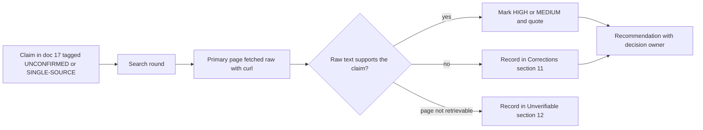
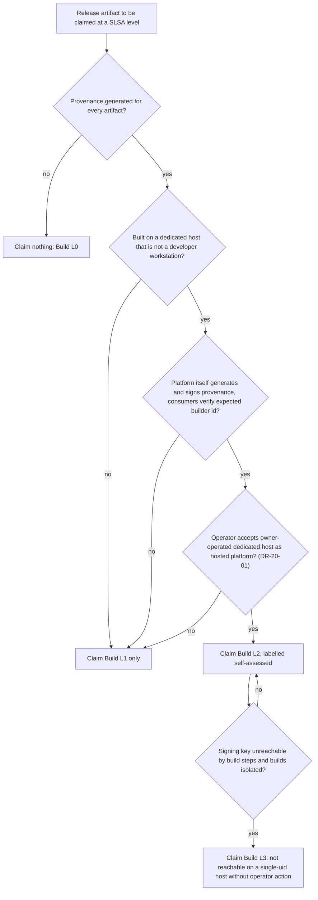
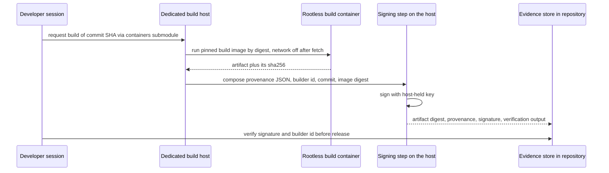
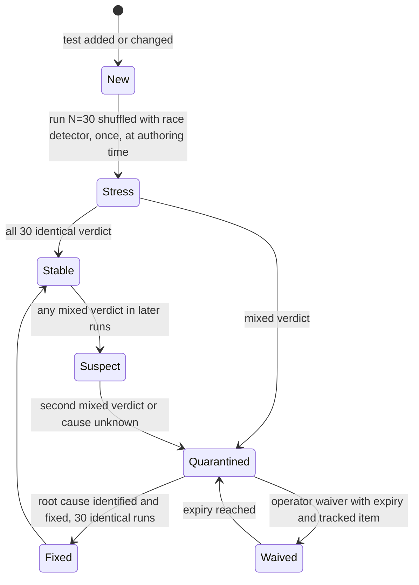
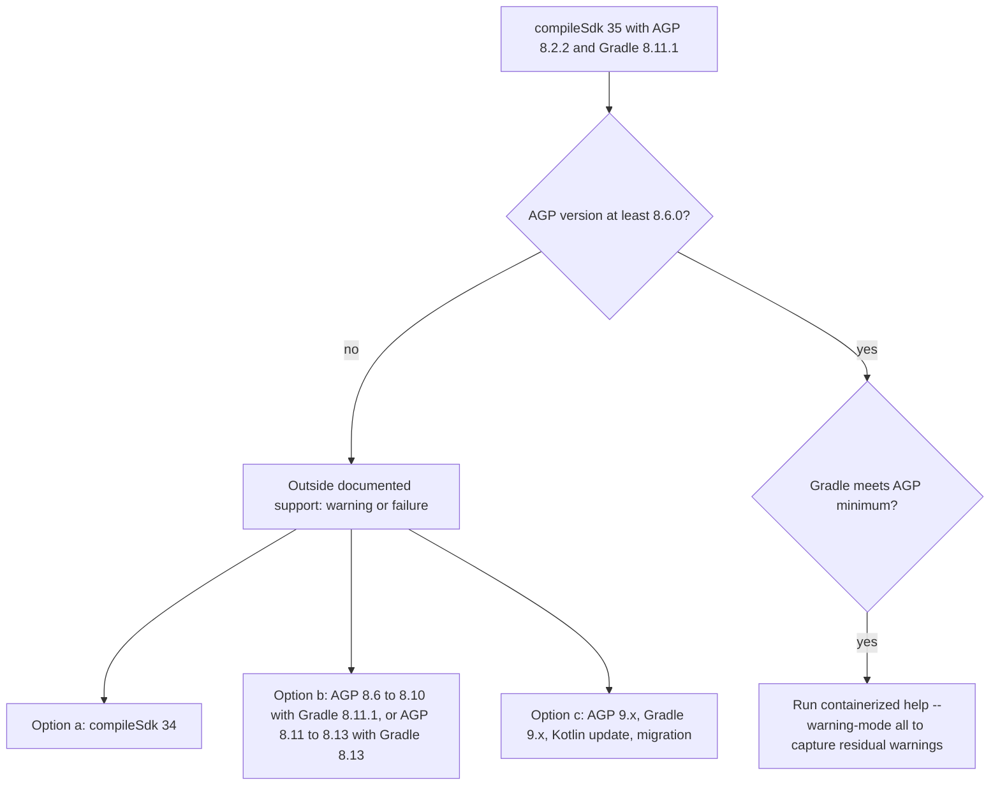
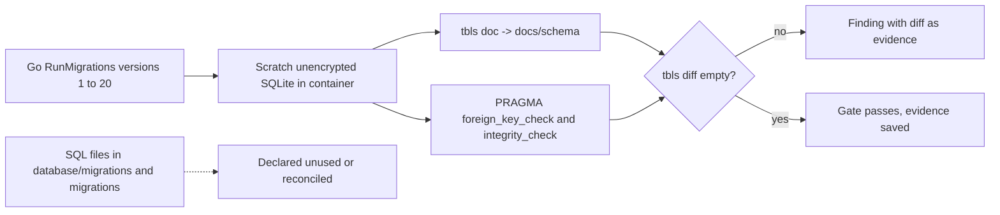
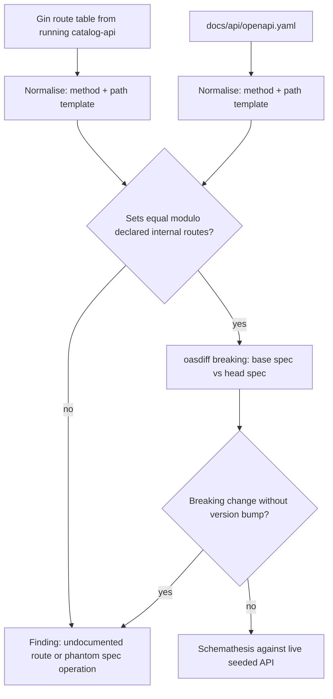
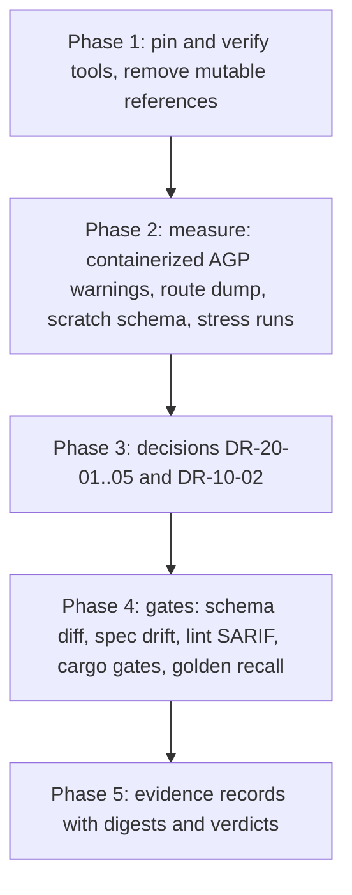

# 20. Research, Second Pass: Closing the Gaps Admitted in Document 17

| Field | Value |
|---|---|
| Revision | 4 |
| Created | 2026-10-03 |
| Last modified | 2026-10-04 |
| Status | draft (revision 4: supersession notes only, the research text unchanged: decision DR-20-03 (commit `src-tauri/Cargo.lock`) is answered by the plan owner's FR-017 answer of 2026-10-04 and planned in tasks.md rev 24 (T397 commits the lock; until then the audit generates one lock in its first run and reuses it in the repeat run, T244); notes in section 6, the W20-07 row and the DR-20-03 row. Revision 3: the plan owner's SLSA decision C2 of 2026-10-04 (Build L2 at minimum, no L1 interim; docs/21 ODG-16 revision 15) supersedes the DR-20-01 recommendation "A now, B as the target" and the W20-04 statement of L1; supersession notes added in the section 3.6 recommendation row and in the W20-04 and DR-20-01 rows, the research findings unchanged. Revision 2: pipe characters inside quoted text and code spans of five table rows escaped with a backslash; the section 7.3 "Compatibility" row gains its missing Source cell) |
| Feature | specs/001-full-project-audit-remediation |
| Supersedes in part | `docs/17-research-engineering-practices.md` (sections it tagged UNCONFIRMED or SINGLE-SOURCE) |
| Traceability | FR-010, FR-015, FR-016, FR-021, FR-022, FR-025, SC-003, SC-011 (requirement ids as used in doc 17); constitution anchors §11.4.156, §11.4.161, §11.4.173, §11.4.201, §11.4.240, §11.4.246 |
| Source access date | 2026-10-03 (every URL in section 14) |

## Table of contents

1. [Method and honesty statement](#1-method-and-honesty-statement)
2. [Theme 1: The March 2026 Trivy compromise](#2-theme-1-the-march-2026-trivy-compromise)
3. [Theme 2: SLSA levels without a CI platform, and decision record DR-20-01](#3-theme-2-slsa)
4. [Theme 3: Flaky tests: literature, detection mathematics, quarantine](#4-theme-3-flaky-tests)
5. [Theme 4: Trace-based testing and OpenTelemetry (Go, React, Android)](#5-theme-4-opentelemetry)
6. [Theme 5: Rust and Tauri tooling](#6-theme-5-rust-and-tauri)
7. [Theme 6: Android lint, detekt, screenshot tests, Gradle/AGP/JDK matrix](#7-theme-6-android)
8. [Theme 7: SQL schema documentation and migration safety](#8-theme-7-sql)
9. [Theme 8: OpenAPI: code-first versus spec-first and drift gates](#9-theme-8-openapi)
10. [Theme 9: Semantic code search evaluation](#10-theme-9-semantic-search)
11. [Corrections to document 17](#11-corrections-to-document-17)
12. [What remained unverifiable](#12-what-remained-unverifiable)
13. [Consolidated recommendations and work items](#13-consolidated-recommendations-and-work-items)
14. [Bibliography](#14-bibliography)

---

## 1. Method and honesty statement

**What was done.** For each of the nine themes at least four distinct retrieval rounds were made on 2026-10-03: a web search, one or more primary-page fetches, and (new in this pass) direct HTTP retrieval of raw pages and repository files with `curl`, followed by text extraction. Theme 9 is the thinnest (three rounds); this is stated again in section 12.

**Why raw retrieval matters.** Document 17 relied on `WebFetch`, which returns the answer of a small summarising model, not page text. This pass found a concrete failure of that method: asked for Google's flaky-test statistics, `WebFetch` returned "1.5% of the smallest tests are flaky while 16% of the largest tests are flaky". The raw pages say something different (section 4.1). Therefore:

- A quotation marked **[raw]** was extracted from the page text or from repository files retrieved directly, and is verbatim.
- A quotation marked **[summary]** came only from `WebFetch` or `WebSearch` summarisation, and is not guaranteed verbatim. No decision in this document rests on a **[summary]** item alone.
- GitHub repository metadata (archived flag, last push, license, release list) came from the unauthenticated GitHub REST API on 2026-10-03 and is marked **[api]**.

**Confidence scale.** HIGH: two independent sources or one primary source retrieved raw. MEDIUM: one primary source retrieved raw but not exercised here, or two secondary sources. LOW: single secondary source or summary only. Nothing here was executed against this repository. Every command is `NOT EXECUTED` unless a section says otherwise; the few repository facts below were obtained by reading files and counting lines with grep, which is read-only.

**Constraints that filter the recommendations** (unchanged from doc 17 section 2): no CI/CD (§11.4.156); rootless containers only and builds in containers (§11.4.161, §11.4.173, FR-021); machine-readable evidence (FR-022); real services where external dependencies are the subject (FR-025); no secrets in commands.



---

## 2. Theme 1: The March 2026 Trivy compromise

### 2.1 What the primary advisory says

The vendor advisory is GitHub Security Advisory GHSA-69fq-xp46-6x23 in the `aquasecurity/trivy` repository, aliased CVE-2026-33634 and Go vulnerability database entry GO-2026-4919; OSV records it as published 2026-03-24 [S1][S2]. I retrieved the advisory page raw and the OSV JSON record directly. Facts below are quoted from those two sources, which agree with each other.

| Question | Answer | Source and quote |
|---|---|---|
| What happened? | A threat actor with compromised credentials published a malicious Trivy release, hijacked tags of two GitHub Actions, and later published malicious Docker Hub images. | [raw] "On March 19, 2026, a threat actor used compromised credentials to publish a malicious Trivy v0.69.4 release, force-push 76 of 77 version tags in `aquasecurity/trivy-action` to credential-stealing malware, and replace all 7 tags in `aquasecurity/setup-trivy` with malicious commits. On March 22, 2026, a threat actor used compromised credentials to publish a malicious Trivy v0.69.5 and v0.69.6 DockerHub images." [S2] |
| Which binary versions? | v0.69.4 only, plus `latest` during the exposure window. | [raw] "trivy binaries version v0.69.4 (or latest during the exposure window) distributed via GitHub, Deb, RPM." [S1] |
| Which images? | v0.69.4 on GHCR, ECR Public and Docker Hub; v0.69.5 and v0.69.6 on Docker Hub; the `latest` tag on Docker Hub during the window. | [raw] "trivy container images v0.69.4 (or latest during the exposure window) distributed via GHCR, ECR public, Docker Hub. trivy container images v0.69.5 and v0.69.6 (or latest during the exposure window) distributed via Docker Hub." [S1] and "Docker Hub (both 0.69.4 and `latest` tags)" [S1] |
| Which Action versions? | `trivy-action` all versions before 0.35.0 if referenced by mutable tag; `setup-trivy` any version without SHA pinning. | [raw] "You are not affected if you used: 0.35.0 tag ... SHA pinning to a safe commit commit after 2025-04-09." and for setup-trivy "Any version without pinning." [S1] |
| Exposure windows (UTC) | v0.69.4: 2026-03-19 18:22 to ~21:42 (~3 h). trivy-action: 2026-03-19 ~17:43 to 03-20 ~05:40 (~12 h). setup-trivy: ~17:43 to ~21:44 (~4 h). Docker Hub v0.69.5/v0.69.6: 2026-03-22 15:43 to 03-23 ~01:40 (~10 h). | [raw] Exposure Window table [S2] |
| Payload | Infostealer in `entrypoint.sh` running before the legitimate scan: dumps `Runner.Worker` memory, sweeps 50+ filesystem paths (SSH keys, cloud credentials, Kubernetes tokens, Docker configs, `.env` files, database credentials, wallets), encrypts and exfiltrates. | [raw] "Sweeps 50+ filesystem paths for SSH keys, AWS/GCP/Azure credentials, Kubernetes tokens, Docker c[onfigs] ... .env files, database credentials, and cryptocurrency wallets." [S1] |
| Which targets are NOT affected? | v0.69.3 or earlier; images referenced by digest; binaries built from source. | [raw] "You are not affected if you used: trivy (binary or image) version v0.69.3 or earlier. v0.69.3 is protected by GitHub's immutable releases feature ... trivy images referenced by digest. trivy binaries built from source." [S1] |
| Safe versions | Trivy v0.69.2 or v0.69.3; trivy-action v0.35.0; setup-trivy v0.2.6. | [raw] OSV remediation text [S2]; [raw] advisory [S1] |
| Required response | Rotate all secrets reachable by affected pipelines; search for repositories named `tpcp-docs`; pin Actions to full commit SHAs. | [raw] "Pin GitHub Actions to full, immutable commit SHA hashes, don't use mutable version tags." and "Look for repositories named tpcp-docs in your GitHub organization." [S1] |
| How to verify a good artifact | `cosign verify-blob` for release tarballs with a Sigstore bundle, and `cosign verify` for images, with the identity regexp `https://github\.com/aquasecurity/` and issuer `https://token.actions.githubusercontent.com`. | [summary, matches the "sigstore signatures" statement in raw [S1]] Command lines in 2.4 |

**Corroboration.** Snyk's analysis reports the same dates and states that commit SHAs are immutable while tags can be rewritten [S3, summary]; Wiz reports the same 12-hour window [S4, summary]. Vendor primary reporting from Aqua is referenced by the advisory at `https://www.aquasec.com/blog/trivy-supply-chain-attack-what-you-need-to-know/` [S1 reference list]; I did not fetch it.

**Discrepancy to know about.** Secondary sources count the hijacked `trivy-action` tags as "75 of 76"; the vendor advisory says "76 of 77". The advisory is authoritative. The difference does not change any action. Doc 17 repeated the secondary count (section 11).

**Root cause as the vendor states it** (relevant to this project's own credential hygiene): the incident continued a compromise from late February in which credentials were stolen through a `pull_request_target` workflow exploit; rotation after the first disclosure "was not atomic", so the attacker could take newly rotated secrets [S2, S3 summary]. Lesson for a no-CI project: rotation of a leaked secret must be atomic (revoke old and issue new in one step) and followed by an audit.

### 2.2 What it means for this repository (read-only findings)

| Finding | Evidence | Severity if the image was ever pulled in the window |
|---|---|---|
| The security compose file runs the scanner from a mutable tag: `image: docker.io/aquasec/trivy:latest` in service `trivy-scanner`. The advisory says `latest` on Docker Hub pointed at malicious content during two windows. | `docker-compose.security.yml:169` | HIGH |
| That service mounts the whole repository read-only (`.:/project:ro`) plus `.trivy-secrets.yaml`, and the stolen-data sweep covers `.env` files; a malicious image would have had read access to the repository tree. | `docker-compose.security.yml:179-185` | HIGH |
| `scripts/security-scan-full.sh:40` installs Trivy by piping `https://raw.githubusercontent.com/aquasecurity/trivy/main/contrib/install.sh` to `sh`, which follows the moving `main` branch and downloads whatever release the script resolves. | `scripts/security-scan-full.sh:40` | MEDIUM |
| `scripts/complete-remaining-tasks.sh:190` suggests `sudo apt-key add` for the Trivy repository, which conflicts with the no-sudo rule and uses a deprecated key method. | `scripts/complete-remaining-tasks.sh:190` | LOW (advice text only) |
| `.github/workflows/` contains only `README.md`; no workflow references `trivy-action` or `setup-trivy`. | `ls .github/workflows`, grep | The GitHub Actions vector does not apply. |
| No Trivy image is present in the local rootless Podman store of the host where this pass ran. | `podman images` returned no match | The host used for this pass holds no cached malicious image. Other hosts, including the remote build host, were not checked: UNKNOWN. |

Whether any maintainer pulled `aquasec/trivy:latest` between 2026-03-19 17:43 UTC and 2026-03-23 01:40 UTC is UNKNOWN from the repository. It is a question for the owner, with a mechanical check (2.4).

### 2.3 Recommendation

1. **Pin every tool image by digest** in one lock file, and make the harness refuse mutable tags. The vendor's own statement that images referenced by digest were unaffected is the strongest argument. Tag plus digest in the reference (`name:0.69.3@sha256:...`) keeps human readability.
2. **Use a version the vendor lists as safe** at the time of pinning (v0.69.3 was the vendor's restored `latest`; a later release may exist: UNCONFIRMED, check the releases page and verify its signature before pinning).
3. **Verify the signature before recording a digest**, not afterwards.
4. Treat the potential exposure as an owner decision (DR-20-02, below): if any host pulled an affected image, rotate every credential reachable from that host and from the mounted repository tree, atomically.
5. Do not pipe remote install scripts into a shell; fetch a pinned release, verify its signature, then install.

### 2.4 Proof-of-approach: a digest-pinned, signature-verified scanner pull

`NOT EXECUTED`. Rootless, no sudo, no secrets.

```bash
# 1. Resolve the digest of an image you intend to pin (read-only registry query).
skopeo inspect --format '{{.Digest}}' docker://ghcr.io/aquasecurity/trivy:0.69.3
# expected shape: sha256:<64 hex>

# 2. Verify the image signature against the vendor identity (from the advisory [S1]).
#    The advisory shows this form for 0.69.2; apply it to the chosen pinned version.
cosign verify \
  --certificate-identity-regexp 'https://github\.com/aquasecurity/' \
  --certificate-oidc-issuer 'https://token.actions.githubusercontent.com' \
  --new-bundle-format \
  ghcr.io/aquasecurity/trivy@sha256:<digest-from-step-1>

# 3. Record the pin in a single lock file the harness checks (tools.lock, one line per tool).
printf 'trivy ghcr.io/aquasecurity/trivy@sha256:<digest> verified=%s\n' "$(date -u +%FT%TZ)" >> tools.lock

# 4. Run only through the lock file reference.
podman run --rm --network=none -v "$PWD:/project:ro,Z" \
  "$(awk '$1=="trivy"{print $2}' tools.lock)" fs --format json --output /dev/stdout /project
```

Expected machine-readable result of step 4: a JSON document with a top-level `Results` array. `--network=none` assumes a pre-populated vulnerability database cache volume; without it the scanner must fetch its database (UNCONFIRMED procedure for offline Trivy database mirroring).

**A mechanical exposure check** (answers the UNKNOWN in 2.2 on any host): list local images with `podman images --digests --format '{{.Repository}}:{{.Tag}} {{.Digest}} {{.CreatedAt}}' | grep -i trivy` and compare creation times to the windows in 2.1. An image created in a window, or a tag that cannot be matched to a signature-verified digest, is treated as suspect.

**Confidence:** HIGH for the incident facts (two raw sources agree); MEDIUM for the verification commands (taken from the advisory via summary, not exercised); HIGH that the repository references a mutable tag.

---

## 3. Theme 2: SLSA levels without a CI platform <a id="3-theme-2-slsa"></a>

### 3.1 What the specification actually requires

The current specification is SLSA v1.2, status "Approved" [S5, summary]. The build track text, retrieved raw from the v1.1 and v1.2 pages, is as follows.

| Level | Definition (raw) | Source |
|---|---|---|
| Build L0 | "the lack of SLSA", intended for development or test builds on the same machine | [S6, summary] |
| Build L1 | "Package has provenance showing how it was built. Can be used to prevent mistakes but is trivial to bypass or forge." "Provenance may be incomplete and/or unsigned at L1." | [S6 raw] |
| Build L2 | "Forging the provenance or evading verification requires an explicit 'attack', though this may be easy to perform. ... In practice, this means that builds run on a hosted platform that generates and signs the provenance." | [S6 raw] |
| Build L3 | "Builds run on a hardened build platform that offers strong tamper protection"; signing key "MUST NOT be accessible to the environment running the user-defined build steps". | [S6, S7 summary] |

The load-bearing requirement for this project is the **Hosted** row of the requirements table [S7 raw, v1.2, same text in v1.1]:

> "Hosted: All build steps ran using a hosted build platform on shared or dedicated infrastructure, not on an individual's workstation. Examples: GitHub Actions, Google Cloud Build, Travis CI."

The same page defines the platform broadly:

> "A build platform is often a hosted, multi-tenant build service, but it could be a system of multiple independent rebuilders, a special-purpose build platform used by a single software project, or even an individual's workstation."

Three consequences follow, each directly from the text:

1. **A developer workstation cannot be an L2 platform.** The Hosted requirement excludes it by name. Document 17 section 7.1 was right on this point.
2. **The text does not require CI.** Nowhere in the quoted requirement is a CI service, a SaaS, or a particular product demanded. "Dedicated infrastructure" and "a special-purpose build platform used by a single software project" are explicitly within the definition of a platform. GitHub Actions and similar are listed as *examples*. This weakens doc 17's framing that §11.4.246 and §11.4.156 "cannot both be met in the strict SLSA sense"; they can be met only if the build host qualifies as a hosted platform that generates and signs provenance itself.
3. **"Hosted" is not defined beyond that sentence.** Whether an owner-operated remote host such as the constitution's `thinker.local` is "hosted" is an interpretive question the specification does not settle. Secondary guidance says self-hosted runners "do not meet" L2 isolation [S8, summary], but that remark concerns GitHub's self-hosted runners and the L3 isolation notion, and the SLSA FAQ treats the self-hosted runner question as one of *who generates the provenance*: "the provenance is only affected by the platform so there would be no requirements imposed on the runner"; if the runner generates it, "all requirements are imposed on the runner" [S9 summary].

**Where L2 draws the signing line.** For L2 the platform must "generate and sign the provenance itself" [S6 summary]; the spec says the platform "should implement controls preventing tenant tampering, though strength is unspecified at this level" [S7 summary]. The stricter "key not reachable by build steps" is an **L3** requirement. So an L2 claim does not require key isolation, but it does require that the *platform*, not the developer's interactive session, produce and sign the provenance, and that consumers verify it against an expected `builder.id`. The SLSA provenance schema states `builder.id` is "the trusted build platform's URI (sole SLSA level determiner)" and represents "the transitive closure of entities trusted to faithfully execute the build" [S10, summary].

### 3.2 Tooling that works without a hosted CI service

| Tool | Offline or local capability | Evidence | Limits |
|---|---|---|---|
| **in-toto attestation + SLSA provenance predicate** | The predicate is a JSON schema; `predicateType` is `https://slsa.dev/provenance/v1`; fields `buildDefinition{buildType, externalParameters, internalParameters, resolvedDependencies}` and `runDetails{builder.id, metadata, byproducts}`. A producer can write it with any script. | [S10 summary] | The schema alone gives L1 at best. |
| **cosign with a local key pair** | `cosign generate-key-pair` creates `cosign.key` and `cosign.pub`; `COSIGN_PASSWORD` supplies the passphrase non-interactively; `cosign sign-blob --key <key path> <blob>` signs; `--bundle FILE` "write[s] everything required to verify the blob to a FILE". | [S11 raw: "Generates a key-pair for signing" and "You can use the COSIGN_PASSWORD environment variable to provide one."] [S12 summary: "--key: path to the private key file, KMS URI or Kubernetes Secret"; "--bundle: write everything required to verify the blob to a FILE"] | Flags to avoid a transparency-log upload (`--tlog-upload=false`) and for offline verification (`--insecure-ignore-tlog`, `--private-infrastructure`) appear in search summaries only [S13, summary]. Treat as UNCONFIRMED until `cosign sign-blob --help` is read in the pinned cosign image. A key held on the same disk as the build offers no transparency. |
| **BuildKit provenance** | `docker buildx build --attest type=provenance,mode=max,version=v1`; modes `min` (default) and `max`; versions `v0.2` (default) and `v1`. | [S14 summary]: "Supported values are `mode=min` (default) and `mode=max`." and "`mode=max` exposes the values of build arguments." | Requires BuildKit; whether Podman or Buildah produce an equivalent attestation is UNCONFIRMED. `mode=max` can leak build arguments, so secrets must never be build arguments. The page makes no statement about the SLSA level reached. |
| **slsa-github-generator** | None. | [S15 summary]: "free tools to generate and verify SLSA Build Level 3 provenance for native GitHub projects using GitHub Actions". | Rejected: GitHub Actions only, and §11.4.156 forbids CI. |
| **Syft SBOM, osv-scanner** | Local container tools; unchanged from doc 17. | doc 17 | Not provenance. |

### 3.3 The honest level claim for this project

The facts available to this pass about how builds will run: constitution §11.4.173 requires every build to run inside a rootless build container, distributed to a remote build host (the example named is `thinker.local`), with artifacts copied back. §11.4.246 requires SLSA Build L2 as a fleet minimum. §11.4.240(F) already records a related honesty rule for a single-uid host: separation that cannot be established is reported at the level actually achieved, never aspired to.

Applying the quoted SLSA text, the defensible statements are:

| Statement | Defensible today? | Condition |
|---|---|---|
| "Build L1": provenance exists, describes the build, identifies the artifact digest. | **Yes**, once a provenance document is generated for every release artifact. | Nothing exists yet in the repository: UNCONFIRMED (no search found a provenance generator; verify with `codegraph explore "provenance slsa attestation"`). |
| "Build L2 (self-assessed)": a dedicated, non-workstation build host runs the build in a container, that host's own process generates and signs the provenance with a key the interactive developer session does not use, and verification checks `builder.id`. | **Conditionally**, as an interpretation. | The operator must accept that an owner-operated dedicated host is a "hosted build platform on dedicated infrastructure". The SLSA text does not forbid it and does not bless it. |
| "Build L3": signing key inaccessible to build steps, isolation between builds. | **No** on a single-uid host. | A rootless build step and the signer run as the same unix user; there is no key isolation without a second user or hardware token. No sudo is allowed to create a user. |



### 3.4 Sequence of a local, rootless, attested build



### 3.5 Proof-of-approach: composing and signing provenance by script

`NOT EXECUTED`. This writes the in-toto Statement envelope by hand, because the generic generators found in this pass assume a hosted CI. It uses only commands whose existence was confirmed from primary text (`cosign generate-key-pair`, `COSIGN_PASSWORD`, `sign-blob --key`, `--bundle`) plus `jq` and `sha256sum`. The Statement layout (`_type`, `subject`, `predicateType`, `predicate`) is the standard in-toto Statement v1; I confirmed only the `predicateType` value and the predicate field names from the SLSA page, so the envelope fields are UNCONFIRMED against the in-toto specification text. A `cosign attest-blob` command exists in the tool but was NOT verified in this pass and is deliberately not used.

```bash
set -euo pipefail
ART=catalog-api.tar              # artifact brought back from the build host
SHA=$(sha256sum "$ART" | cut -d' ' -f1)
COMMIT=$(git rev-parse HEAD)
jq -n --arg name "$ART" --arg sha "$SHA" --arg commit "$COMMIT" \
      --arg builder "ssh://thinker.local/containers-submodule-build@v1" '
{ _type: "https://in-toto.io/Statement/v1",
  subject: [{ name: $name, digest: { sha256: $sha } }],
  predicateType: "https://slsa.dev/provenance/v1",
  predicate: {
    buildDefinition: { buildType: "https://catalogizer.example/build/container@v1",
                       externalParameters: { source: $commit },
                       internalParameters: {},
                       resolvedDependencies: [] },
    runDetails: { builder: { id: $builder },
                  metadata: { invocationId: "build-\($commit[0:12])" } } } }' \
  > provenance.intoto.json
COSIGN_PASSWORD="$(cat /run/user/$UID/signing-pass)" \
  cosign sign-blob --key signer.key --bundle provenance.bundle provenance.intoto.json
cosign verify-blob --key signer.pub --bundle provenance.bundle provenance.intoto.json
```

Expected machine-readable output: `provenance.intoto.json` containing `.subject[0].digest.sha256` equal to the artifact digest and `.predicate.runDetails.builder.id` equal to the declared builder URI; `verify-blob` exit status 0. The passphrase file is operator-supplied and never committed. The `builder` URI shown is a placeholder, not an existing identity. Without a transparency log (not used here) verification proves integrity relative to the public key you trust, nothing more.

### 3.6 Decision record DR-20-01 (for the project owner)

| Item | Content |
|---|---|
| **Question** | How should the project describe its SLSA Build level, given §11.4.246 (L2 minimum) and §11.4.156 (no CI/CD)? |
| **Context** | SLSA Build L2 requires a hosted build platform on shared or dedicated infrastructure that generates and signs provenance; a workstation is excluded; CI is not mandated by the text (section 3.1). The project builds in rootless containers on a designated remote host (§11.4.173). The host is single-uid, so key isolation from build steps (an L3 property) is not available. |
| **Option A: claim L1** | State "Build L1" in `docs/security/SLSA_LEVEL.md`, record the gap to §11.4.246 as an operator-owned decision (§11.4.66), generate provenance now. Honest and immediately true. Fails the constitutional minimum until DR resolved. |
| **Option B: designate the dedicated build host as the hosted platform** | The host's signing step, not the developer, generates and signs provenance; consumers verify `builder.id`. Claim "Build L2, self-assessed (owner-operated dedicated platform)". Requires the owner to accept the reading. Cost: a host-resident signing step, a key-custody procedure, a verifier script. |
| **Option C: ask the constitution owners for an interpretation** | Obtain a written reading that an owner-operated dedicated host satisfies §11.4.246. Cheapest in engineering, slowest in time, and the only way to avoid a self-assessed label. |
| **Option D: adopt a hosted service** | Rejected: contradicts §11.4.156 and would move the trust boundary outside the owner's control. |
| **Recommendation** | Superseded on 2026-10-04 by the owner's decision C2 (Build L2 at minimum with no L1 interim, B reached through a gate; docs/21 ODG-16 revision 15, tasks.md T447a); the research recommendation was: do A now (it is true and costs one script, 3.5), build B as the target in the same work item, and put C as the question for the owner. Do not write "L2" in any document until the owner has chosen B or C. Never claim L3 on a single-uid host (the specification requires the signing secret to be inaccessible to build steps). |
| **Evidence required to move from A to B** | (1) provenance and signature for every release artifact in the evidence store; (2) a verifier script that fails if `builder.id` differs from the declared builder; (3) a statement of who can use the signing key and from where; (4) the owner's recorded decision. |
| **Risks** | Over-claiming a level is itself a bluff under §11.4.201 and §11.4.226. A key stored beside the build gives integrity only against casual tampering, which matches the SLSA L2 wording ("may be easy to perform"). |
| **Rejected alternatives** | `slsa-github-generator` (GitHub Actions only [S15]); relying on BuildKit `--attest` alone (no statement of level, Podman support unverified [S14]). |
| **Decision owner and status** | Project owner. OPEN. |

**Confidence:** HIGH for what the specification says (raw primary text); MEDIUM for the interpretation of "hosted" (the specification is silent on owner-operated hosts, and I am inferring); LOW for offline cosign flags (search summary only).

---

## 4. Theme 3: Flaky tests: literature, detection mathematics, quarantine <a id="4-theme-3-flaky-tests"></a>

Doc 17 admitted "no Google testing-blog or academic flaky-test paper was fetched". This pass fetched five primary sources and quotes them raw.

### 4.1 Findings

| # | Finding | Source and exact quote | Confidence |
|---|---|---|---|
| F1 | At Google about 1.5% of test runs report a flaky result, and almost 16% of tests have some flakiness. | [raw] "across our entire corpus of tests, we see a continual rate of about 1.5% of all test runs reporting a 'flaky' result." and "Almost 16% of our tests have some level of flakiness associated with them! ... more than 1 in 7 of the tests ... occasionally fail in a way not caused by changes to the code or tests." [S16] | HIGH |
| F2 | Flakiness rises sharply with test size. | [raw] "Over the course of a week, 0.5% of our small tests were flaky, 1.6% of our medium tests were flaky, and 14% of our large tests were flaky." [S17] | HIGH |
| F3 | Most pass-to-fail transitions in post-submit CI involve a flaky test. | [raw] "about 84% of the transitions we observe from pass to fail involve a flaky test!" [S16] | HIGH |
| F4 | Google's rerun rule: a failing test is rerun 10 times; passing in any rerun labels it flaky. The authors call the approach "rather unsatisfactory". | [raw] "at Google, a failing test is rerun 10 times against the same code version on which it previously failed, and if it passes in any of those 10 reruns, it is labeled as a flaky test" [S18, Luo et al. 2014] | HIGH |
| F5 | Root causes by share of 161 classified fix commits: Async Wait 45%, Concurrency 20%, Test Order Dependency 12% (19 of 161), Resource Leak 11 commits, Network, Time, IO and others. | [raw] "The top three categories of flaky tests are Async Wait, Concurrency, and Test Order Dependency." "74 out of 161 (45%) commits are from the Async Wait category" "32 out of 161 (20%) commits are from the Concurrency category" [S18]. The study analysed "201 commits that likely fix flaky tests in 51 open-source projects" (Java, Apache projects). | HIGH |
| F6 | Most flaky tests are flaky from the day they are written. | [raw] "Most flaky tests (78%) are flaky the first time they are written." Implication stated: "Techniques that extensively check tests when they are first added can detect most flaky tests." [S18] | HIGH |
| F7 | Fix patterns: waiting on the awaited event fixes async tests; cleaning shared state fixes order dependency. | [raw] "Many Async Wait flaky tests (54%) are fixed using waitFor, which often completely removes the flakiness rather than just reducing its chance." "Most Test Order Dependency flaky tests (74%) are fixed by cleaning the shared state between test runs." [S18] | HIGH |
| F8 | Google's mitigation framework: identify, notify, triage, prevent; and prefer decomposing large tests. | [summary] [S17] | LOW |
| F9 | Finding flakes by rerunning needs many more runs than commonly used. In 22,352 Python projects (876,186 test cases), "A 95% confidence that a passing test case is not flaky on average would require 170 reruns." Order dependency caused 59% of 7,571 flaky tests; test infrastructure problems 28%. | [raw] [S19, Gruber et al., ICST 2021] | HIGH |
| F10 | Meta defines a probabilistic flakiness score and criticises simple rerun logic: "A passing test indicates the absence of corresponding regression, while a failure is merely a hint to run the test again." The score is computed with a Bayesian model; "no extra test runs needed". | [summary] [S20] | MEDIUM (one primary page, summary only) |
| F11 | Azure DevOps detects flakes by rerunning failed tests in the same run: "If a test case fails initially but passes on a rerun, it is marked as flaky." and offers a choice "to prevent build failures caused by flaky tests, or use the flaky tag only for troubleshooting". | [raw] [S21] | HIGH |
| F12 | Go's toolchain provides the primitives: `-count n` "Run each test, benchmark, and fuzz seed n times (default 1)"; `-shuffle off,on,N` "Randomize the execution order ... If -shuffle is set to an integer N, then N will be used as the seed value. In both cases, the seed will be reported for reproducibility." | [raw] [S22] | HIGH |

**A correction produced by this pass.** `WebFetch` summarised F2 as "1.5% of the smallest tests ... 16% of the largest". The raw page says 0.5% small, 1.6% medium, 14% large (F2) and 1.5% / 16% are corpus-wide figures (F1). Any document that quoted the summariser's version is wrong.

### 4.2 What this does to FR-010 and SC-003

SC-003 (as doc 17 reads it) requires an identical verdict across 3 repeated runs. Three reruns detect only flakes with a high failure rate. If a flaky test fails with per-run probability *p*, the chance that N runs yield a *mixed* verdict (so the harness notices) is 1 − p^N − (1 − p)^N. This is arithmetic, derived here, not quoted:

| per-run failure probability p | N = 3 | N = 10 | N = 30 | N = 100 | N = 170 | N = 300 |
|---|---|---|---|---|---|---|
| 0.5 | 0.750 | 0.998 | 1.000 | 1.000 | 1.000 | 1.000 |
| 0.1 | 0.270 | 0.651 | 0.958 | 1.000 | 1.000 | 1.000 |
| 0.03 | 0.087 | 0.263 | 0.599 | 0.952 | 0.994 | 1.000 |
| 0.01 | 0.030 | 0.096 | 0.260 | 0.634 | 0.819 | 0.951 |
| 0.001 | 0.003 | 0.010 | 0.030 | 0.095 | 0.156 | 0.259 |

To have 95% probability of seeing at least one failure of a test with failure rate p you need about 29 runs at p = 0.1, 99 at p = 0.03, 299 at p = 0.01, 2,995 at p = 0.001.

Reading: three identical runs prove that a test is *not highly flaky*; they do not prove it is deterministic. The 170-run figure from F9 is an empirical average for Python. Note that Google's own tooling reruns failures 10 times (F4) and still calls it unsatisfactory.

### 4.3 Recommended practice for this project



1. **Stress at authoring time, not only at gate time** (F6: 78% of flakes are flaky when written). The audit harness runs each *new or changed* test 30 times with `-shuffle=on -race`. This is a decision for the owner, a tuning of SC-003 (3 identical runs stay the gate; 30 shuffled runs are the authoring-time check). Cost estimate: UNKNOWN until measured; use per-package scoping.
2. **Keep the 3-run gate**, but state its power honestly (table above) in the evidence format.
3. **Quarantine mechanism**, composing constitution §11.4.248: the quarantined test is moved or tagged so that green means green, with a tracked item and a deadline; the mixed-verdict record is stored with the seed Go reports for `-shuffle` (F12) so a failure is reproducible.
4. **Classification before fixing.** Map each flake to the Luo taxonomy (async wait, concurrency, order dependence, resource leak) because the fix is category-specific (F7). For Go the likely categories are `time.Sleep` waits, goroutine races (the `-race` flag), shared package state, and port or file leaks in tests that boot containers.
5. **Do not use rerun-until-green as a gate.** Azure DevOps offers it as a product feature (F11) and the project's constitution forbids the equivalent (§11.4.248 "no --rerun-until-green"). A rerun may be used to *classify*, never to *pass*.
6. **Bayesian scoring (F10) is not recommended for the first iteration.** It needs history volume the project does not have and a model implementation; revisit if the flake ledger exceeds a size the owner chooses.

```bash
# NOT EXECUTED. Authoring-time stress for one Go package, in the project's test container.
go test ./internal/services/... -run '.' -count=30 -shuffle=on -race -json > stress.json
# Mixed verdict per test = both "pass" and "fail" actions present for one test name:
jq -s '[.[]|select(.Test!=null and (.Action=="pass" or .Action=="fail"))]
       | group_by(.Test)
       | map({test:.[0].Test, pass:(map(select(.Action=="pass"))|length),
              fail:(map(select(.Action=="fail"))|length)})
       | map(select(.pass>0 and .fail>0))' stress.json
# expected: [] when stable; otherwise objects such as {"test":"TestScan","pass":27,"fail":3}
```

`go test -json` event shape (`Action`, `Test`) comes from the standard `test2json` encoding named in the Go documentation [S22 summary]; field names are UNCONFIRMED here.

**Confidence:** HIGH on F1 to F7, F9, F11, F12. The arithmetic in 4.2 is exact for independent runs, which real flakes violate (a flake correlated with machine load is not independent): treat it as an optimistic bound.

---

## 5. Theme 4: Trace-based testing and OpenTelemetry <a id="5-theme-4-opentelemetry"></a>

### 5.1 Maturity (corrects doc 17 section 6)

The official status table, retrieved raw from the OpenTelemetry documentation Markdown source [S23]:

| Language | Traces | Metrics | Logs |
|---|---|---|---|
| Go | Stable | Stable | **Release candidate** |
| JavaScript | Stable | Stable | Development |
| Kotlin | Development | Development | Development |

[raw] "Regardless of an API/SDK's status, if your instrumentation relies on semantic conventions that are marked as Experimental ... your data flow might be subject to breaking changes." Doc 17 said Go logs were "Beta"; the current official table says "Release candidate". The Go getting-started page still says "The logs signal is still experimental. Breaking changes may be introduced in future versions." [S24 raw]. Browser instrumentation: [raw] "Client instrumentation for the browser is experimental and mostly unspecified." [S25]. The repository already carries `go.opentelemetry.io/otel v1.43.0`, `otelhttp v0.68.0`, `otelgrpc v0.68.0` as **indirect** dependencies (`catalog-api/go.mod:217-222`), so adding direct use costs no new module family. Gin is `v1.12.0` (`catalog-api/go.mod:85`); `otelgin` is at module version v0.72.0, published 2026-10-02, license Apache-2.0 and BSD-3-Clause [S26 raw]; whether its minimum Gin version admits v1.12.0 is UNCONFIRMED (read its `go.mod` when adding).

### 5.2 Minimal Go setup (server)

Verified shape from the official getting-started page [S24 raw]: a `setupOTelSDK` that installs a `TextMapPropagator` composed of `propagation.TraceContext{}` and `propagation.Baggage{}`, a `TracerProvider` built with `trace.WithBatcher(exporter)`, and a shutdown function. The official page notes the `autoexport` package configures exporters through `OTEL_TRACES_EXPORTER` and `OTEL_EXPORTER_OTLP_ENDPOINT` (S24 raw), which keeps exporter choice out of code. For Gin: `otelgin.Middleware(service string, opts ...Option) gin.HandlerFunc` "returns middleware that will trace incoming requests" [S26 raw].

```go
// NOT EXECUTED. catalog-api/internal/telemetry/otel.go (proposed). Traces only; metrics and logs omitted
// because the stable guarantee is for traces and metrics and logs are RC/experimental.
package telemetry

import (
	"context"
	"go.opentelemetry.io/otel"
	"go.opentelemetry.io/otel/exporters/stdout/stdouttrace"
	"go.opentelemetry.io/otel/propagation"
	sdktrace "go.opentelemetry.io/otel/sdk/trace"
)

func Setup(ctx context.Context) (func(context.Context) error, error) {
	exp, err := stdouttrace.New() // replace with OTLP via autoexport when a collector exists
	if err != nil { return nil, err }
	tp := sdktrace.NewTracerProvider(sdktrace.WithBatcher(exp))
	otel.SetTracerProvider(tp)
	otel.SetTextMapPropagator(propagation.NewCompositeTextMapPropagator(
		propagation.TraceContext{}, propagation.Baggage{}))
	return tp.Shutdown, nil
}
// router.Use(otelgin.Middleware("catalog-api"))   // in main.go, before route registration
```

### 5.3 Trace-based testing: the first concrete evidence

Doc 17 called trace-based testing SPECULATIVE with no primary source. Now:

- The OpenTelemetry Go SDK ships a testing helper: [raw] "Package tracetest is a testing helper package for the SDK. User can configure no-op or in-memory exporters to verify different SDK behaviors or custom instrumentation." with `InMemoryExporter` (`GetSpans`, `Reset`) and `SpanRecorder` (`Started`, `Ended`) [S27]. This is the supported, dependency-free way to assert on spans inside a Go test.
- The external tool **Tracetest** (kubeshop) runs assertions on traces from a live system. The repository is not archived but its last push was 2025-06-03 and its latest release v1.7.1 is from October 2024; the vendor discontinued the commercial cloud in October 2024 [api][S28 summary]. Stagnant for about 16 months. **Not recommended** as a dependency for a project that needs long-lived gates.
- Practitioner articles agree on the limit that matters: unit tests with in-memory exporters "tell you that individual functions produce the right spans. However, they cannot tell you whether a trace survives a network call between two services" [S29 summary, OneUptime blog, LOW].

```go
// NOT EXECUTED. Span-assertion test, complements (never replaces) a behavioural assertion.
exp := tracetest.NewInMemoryExporter()
tp := sdktrace.NewTracerProvider(sdktrace.WithSyncer(exp))
otel.SetTracerProvider(tp)
// ... drive the handler through httptest with the otelgin middleware installed ...
spans := exp.GetSpans()
require.NotEmpty(t, spans)                      // must observe at least one server span
require.Equal(t, "GET /api/v1/media", spans[0].Name) // route template, not raw URL (low cardinality)
```

The assertion style is an idea drawn from the package description; the span name format produced by `otelgin` is UNCONFIRMED here. A trace-derived assertion is evidence under FR-022 only if the same test also asserts the HTTP response, otherwise it is a §11.4.226 echo of the instrument.

### 5.4 React (catalog-web)

Official browser guidance installs `@opentelemetry/sdk-trace-web` (`WebTracerProvider`), `@opentelemetry/instrumentation-document-load`, `@opentelemetry/context-zone`, `@opentelemetry/instrumentation` (`registerInstrumentations`), and for interaction `@opentelemetry/instrumentation-user-interaction` and `@opentelemetry/instrumentation-xml-http-request` [S25 raw]. It documents a server-rendered `<meta name="traceparent" content="00-<traceId>-<spanId>-<flags>">` to link the page load to the server request span. The repository's web client is React 18 with Vite 6 and Vitest 4 and has no OpenTelemetry dependency (`catalog-web/package.json`). Because the official page labels browser instrumentation experimental, **do not gate on it**; use it for diagnostics. For propagation to the Go API, the Fetch/XHR instrumentation must be allowed to inject `traceparent` across origins, which also requires a CORS allow-list entry for the header (page text for `propagateTraceHeaderCorsUrls` is UNCONFIRMED; it was present in the guide's code but I read only the import lines).

### 5.5 Android and Android TV

Official Android guidance [S30 raw] lists automatic instrumentation for activity and fragment lifecycle, **ANR detection, crash reporting**, network change, slow/frozen frame detection, startup timing, view clicks; session management; offline buffering to disk; attribute redaction. Setup: Android SDK 21 or higher; Gradle BOM `io.opentelemetry.android:opentelemetry-android-bom:1.7.0` plus `io.opentelemetry.android:android-agent`; initialised in `Application.onCreate()` through `OpenTelemetryRumInitializer.initialize(...)` with an `httpExport { baseUrl ... }` block. The repository README for the same project shows the BOM as `1.7.0-alpha` and notes that when minSdk is below 26 core library desugaring, AGP 8.3.0 or higher and `android.useFullClasspathForDexingTransform=true` are required [S31 raw]. The two Android modules here use minSdk 26 (doc 10), so the desugaring note does not apply; whether the agent's own minimum compile requirements fit AGP 8.2.2 is UNCONFIRMED and is moot if AGP is upgraded (section 7).

**Recommendation for Theme 4.** (1) Server: add `otelhttp`/`otelgin` and the `tracetest` in-memory exporter in tests; stdout or file export for audit diagnostics. (2) Web: diagnostic only. (3) Android and TV: defer; the existing Crashlytics path (§11.4.152) already covers crash and ANR, and a second agent adds a build-compat risk during a remediation project. (4) Do not adopt Tracetest. **Confidence:** HIGH for status tables and setup shapes (raw primary); MEDIUM for compatibility versions (unverified against this repository).

---

## 6. Theme 5: Rust and Tauri tooling <a id="6-theme-5-rust-and-tauri"></a>

### 6.1 Repository facts (read-only)

| Fact | Evidence |
|---|---|
| Single Rust crate: `catalogizer-desktop/src-tauri/Cargo.toml`; `edition = "2021"`, `rust-version = "1.60"`, `tauri = "2.0"`, `tauri-plugin-shell = "2"`. | file read |
| **No `Cargo.lock` is committed, and it is ignored**: `catalogizer-desktop/.gitignore:28` lists `src-tauri/Cargo.lock`; `git ls-files src-tauri` shows no lock file. | `git check-ignore -v` |
| `rust-version = "1.60"` is stale for Tauri 2 (the Tauri 2 crates require a newer compiler). The exact minimum is UNCONFIRMED. | doc reading |

The Cargo book states the purpose of a lockfile: [raw] "The purpose of a Cargo.lock lockfile is to describe the state of the world at the time of a successful build. Cargo uses the lockfile to provide deterministic builds at different times and on different systems, by ensuring that the exact same dependencies and versions are used as when the Cargo.lock file was originally generated." [S32]. For an application binary (the Tauri desktop app) this is the case where the lock file belongs in version control; ignoring it means every build and every audit resolves different dependency versions. This is a **finding for the audit**, independent of tool choice. It also breaks hermeticity (§11.4.246) and makes `cargo audit` non-reproducible: [raw] "If `Cargo.lock` is missing, `cargo audit` runs `cargo update --workspace` to generate one, and Cargo can execute code from the project it runs in" [S33].

### 6.2 Tools

| Tool | Verified facts [raw unless noted] | Fits | Limits |
|---|---|---|---|
| **cargo-audit** (RustSec) | "requires Rust 1.74 or later"; `cargo install cargo-audit`; `cargo audit --file path/to/Cargo.lock`; ignore with `--ignore RUSTSEC-2017-0001`; an experimental reachability companion `reachsec` exists. Repository last pushed 2026-10-03 [api][S33]. | Advisory check against the RustSec database. | Exit-code and JSON output flags were not read (UNCONFIRMED). The database must be fetched; offline mirror procedure UNCONFIRMED. |
| **cargo-deny** | Checks: advisories, licenses, bans, sources. `cargo install --locked cargo-deny && cargo deny init && cargo deny check`. `[advisories]` options: `db-urls`, `db-path`, `yanked` (`warn` default, `deny`, `allow`), `unmaintained`, and `maximum-db-staleness = "P90D"` "Only checked when advisory database fetching has been disabled". Apache-2.0 [api]. [S34, S35] | Gates licenses and banned crates in addition to advisories; supports a staleness budget for an offline database, which matches the freshness contract idea in the constitution. | The README says: "we can't take any responsibility for your use of the tool" (vendor disclaimer). |
| **cargo-llvm-cov** | Line, region and branch coverage; "branch coverage is currently optional and requires nightly"; doctests also nightly. Outputs `--json`, `--lcov`, `--cobertura`, `--codecov`, `--html`; gates `--fail-under-lines`, `--fail-under-functions`, `--fail-under-regions`, `--fail-under-file-lines`. `cargo llvm-cov --json --output-path cov.json`. [S36] | Machine-readable coverage with a failing exit code for the §11.4.224 floor (a floor measured only by lines/regions; branch needs nightly). | Needs the `llvm-tools` component (name of the rustup component UNCONFIRMED). Coverage of a Tauri app counts Rust code only, not the web view. |
| **cargo-mutants** | "Exit codes: 0 success, 1 usage error, 2 found some mutants that were not covered by tests, 3 tests timed out, 4 baseline tests failing, 5/6 invalid `--in-diff`, 70 internal error." `--in-diff DIFF_FILE` tests only mutants overlapping the diff; `--shard k/n` with `slice` or `round-robin` algorithms; output directory `mutants.out` with `mutants.json`, `outcomes.json`, `caught.txt`, `missed.txt`, `timeout.txt`, `unviable.txt`, `lock.json`. MIT license, last push 2026-10-01 [api]. [S37, S38, S39] | Per-diff mutation testing with machine-readable outcomes; this resolves doc 17's UNCONFIRMED item 2. | `--in-diff` "is only matched against the code under test, not the test code. So, a diff that only deletes or changes test code won't cause any mutants to run". The page itself says the contents of `mutants.out` "is subject to change in future versions": pin the version. |
| **Tauri test support** | `mockIPC` intercepts IPC requests and `mockWindows` fakes window labels ("only fakes the existence of windows but no window properties"); a separate WebDriver path with `tauri-driver` exists [S40 raw]. | Frontend unit tests with a mocked backend. | A mocked IPC is a unit-test fake. By FR-025 and §11.4.27 it cannot be evidence for behaviour that crosses into real services or the real VLC integration (`src-tauri/src/vlc/`). |

### 6.3 A containerized minimal sequence

`NOT EXECUTED`. Image and digest are placeholders to be resolved by the lock file (section 2.4).

```bash
IMG=docker.io/library/rust@sha256:<pinned>      # digest resolved and recorded in tools.lock
RUN="podman run --rm --userns=keep-id -v $PWD/catalogizer-desktop/src-tauri:/w:Z -w /w $IMG"
# 0) one-time: commit the lock file (owner decision DR-20-03 below), generated inside the container
$RUN cargo generate-lockfile
# 1) advisories, licenses, bans, sources (needs cargo-deny installed in the image)
$RUN cargo deny check --format json 2> deny.jsonl     # --format flag is UNCONFIRMED
# 2) dependency audit against the committed lock
$RUN cargo audit --file Cargo.lock
# 3) coverage with a floor (value is the owner's, per §11.4.224 clause D)
$RUN cargo llvm-cov --json --output-path cov.json --fail-under-lines 85
# 4) mutation testing of the diff only
git diff main -- catalogizer-desktop/src-tauri/src > /tmp/d.diff
$RUN cargo mutants --in-diff /tmp/d.diff       # exit 0 means every viable mutant caught
```

Tauri builds on Linux need system libraries (WebKitGTK) in the image: the exact package list was not retrieved (UNCONFIRMED); `cargo audit`, `cargo deny` and `cargo mutants` for pure-Rust logic modules (the VLC wrapper) can run without them only if those modules compile without the Tauri crate, which is not verified.

**Decision DR-20-03 (owner):** commit `src-tauri/Cargo.lock` (remove it from `.gitignore`). Recommendation: yes, because the Cargo book ties lockfile commit to deterministic builds, which §11.4.246 requires. Cost: one file, plus a lock-update policy. **Confidence:** HIGH on tool facts (raw primary); MEDIUM on integration (not exercised).

Revision 4 supersession note (2026-10-04): DR-20-03 is answered. The plan owner's FR-017 answer of 2026-10-04 (recorded by tasks.md T012a) decides that `src-tauri/Cargo.lock` is committed, and tasks.md rev 24 commits it in T397 (§11.4.246). Until then the audit pass does not commit it: tasks.md T244 generates the lock once, in the first audit run, inside a scratch container copy, stores it as `$AUD/cargo-locks/<app>.Cargo.lock` with its sha256 as an identity field of both run manifests, and reuses it in the repeat run (document 02 §12.1, revision 11; document 09 §6.5, revision 3). The research above is unchanged.

---

## 7. Theme 6: Android lint, detekt, screenshot tests, Gradle/AGP/JDK matrix <a id="7-theme-6-android"></a>

### 7.1 The AGP / compileSdk / JDK / Gradle conflict, resolved against primary text

Doc 10 found that the phone app sets `compileSdk = 35` while using AGP 8.2.2, Gradle wrapper 8.11.1, and a mix of JDK 17 and 21. The Android Gradle plugin documentation, retrieved raw on 2026-10-03 (the page states "Last updated 2026-10-01 UTC"), settles every sub-question.

| Question | Answer | Quote [raw] |
|---|---|---|
| Does AGP 8.2 support compileSdk 35? | **No.** | "The maximum API level that Android Gradle plugin 8.2 supports is API level 34." [S41] |
| Minimum AGP for API 35? | 8.6.0. | Table "Minimum versions of tools for Android API level": "35 \| Koala Feature Drop 2024.2.1 \| 8.6.0". Also 34 needs 8.1.1, 36 needs 8.9.1, 36.1 needs 8.13.0, 37.0 needs 9.1.1. [S42] |
| AGP 8.6 maximum API? | 35. | "The maximum API level that Android Gradle plugin 8.6 supports is API level 35." [S43] |
| JDK AGP requires? | 17 minimum for 8.2, 8.6, 8.7 (and the current 9.4 notes). | Compatibility tables: JDK minimum 17, default 17. [S41, S43, S44, S45] |
| Gradle AGP 8.2 needs? | 8.2 minimum; wrapper 8.11.1 satisfies it. | "Gradle \| 8.2 \| 8.2" [S41]; full table: 8.6 needs 8.7, 8.7 needs 8.9, 8.9 and 8.10 need 8.11.1, 8.11 to 8.13 need 8.13, 9.0 needs 9.1.0, 9.4 needs 9.6.0. [S42] |
| Is JDK 21 usable with AGP 8.2.2? | Gradle runs on 21 from Gradle 8.5; AGP 8.2.1 fixed an issue titled "Android Gradle Plugin failed with JavaVersion.VERSION_11 and OpenJDK 21 ea" (#294137077). So 8.2.2 includes that fix. The AGP 8.2 notes require 17 as a *minimum*, not a maximum. | "Issue #294137077 Android Gradle Plugin failed with JavaVersion.VERSION_11 and OpenJDK 21 ea" [S41]; Gradle Java compatibility table row "21 \| 8.4 toolchains \| 8.5 and after" [S46] |
| Which JDK does Gradle itself accept now? | "A JVM version between 17 and 27 is required to execute Gradle." (current docs, Gradle 9.8 era) | [S46] |
| `org.gradle.java.version`? | Not in the documented properties: Gradle 8.11.1's build-environment page documents `org.gradle.java.home` ("Specifies the Java home for the Gradle build process") and installation-discovery properties; no `org.gradle.java.version`. The repository sets it (`catalogizer-android/gradle.properties:14`). | [S47 raw] |
| What is the current AGP? | AGP 9.4 stable, requiring Gradle 9.6.0, Kotlin plugin example 2.4.10, JDK 17. The page also states a "time-based compatibility policy": each Android Studio version supports AGP versions released within the previous 3 years. | [S42 raw] |

**Conclusion for DR-10-02.** `compileSdk = 35` with AGP 8.2.2 is outside the plugin's documented support; the plugin documentation names 8.6.0 as the *minimum* AGP for API 35. The choices are (a) lower `compileSdk` to 34, (b) raise AGP to at least 8.6 (the wrapper's Gradle 8.11.1 satisfies the Gradle minimum for AGP 8.6 through 8.10 only, per the table above: 8.6 needs 8.7, 8.7 needs 8.9, 8.9 and 8.10 need 8.11.1; AGP 8.11 to 8.13 need Gradle 8.13, so choosing one of those also means bumping the wrapper), or (c) go to the current line (AGP 9.x requires Gradle 9.x, a Kotlin compatible with it, and the AGP 9 migration steps; the AGP page points to an "AGP 9 Upgrade" Android skill). This pass supplies the data; the owner decides. A note on AGP 8.2.2 plus the Kotlin plugin: Gradle's compatibility table lists embedded Kotlin versions and "Gradle is tested with Kotlin 2.0.0 through 2.4.20-RC2" for current Gradle [S46]; Kotlin 1.9.22 with AGP 8.x pairing is not re-verified here (UNCONFIRMED).



**Mechanical check to settle it without opinion** (`NOT EXECUTED`, in the Android build container): `./gradlew :app:help --warning-mode all`, `./gradlew -q --version`, `./gradlew javaToolchains`; capture the warning that names compileSdk 35 and AGP 8.2.

### 7.2 Android lint

Lint is part of AGP. The Gradle DSL reference [S48 raw] confirms the options relevant to a machine-readable gate: `sarifReport true` ("optional path to SARIF report (default will be lint-results.sarif in the builddir)") with `sarifOutput`, `xmlReport true` with `xmlOutput`, `baseline file("lint-baseline.xml")`, `abortOnError`, `checkReleaseBuilds`, `checkDependencies`, and `fatal 'NewApi'` severity promotion. A caution from the AGP 8.7 notes: "if there is a LintError when running lint using Gradle, the lint analysis task throws an exception ... this change breaks builds for projects with genuine LintError instances in their lint baseline files" [S44 raw]. Recommendation: run `./gradlew lint` in the container, emit SARIF and XML, and treat a baseline file as a ratchet (monotone decreasing) not as an exemption. The code sample in the DSL page writes `sarifOutput` with an `.html` path, an apparent documentation slip; set an explicit `.sarif` path.

### 7.3 detekt and ktlint

| Item | Fact | Source |
|---|---|---|
| detekt stable | v1.23.8, 2025-02-20, "built against Kotlin 2.0.21"; its dependency updates include "AGP to v8.8.1" and "Gradle to v8.12.1". | [raw] GitHub release notes [S49] |
| detekt 2.0 | Seven pre-release tags v2.0.0-alpha.0 to alpha.6 (latest 2026-08-04); the README says "detekt 2.0 is recommended for its new features, but it is still available only as a pre-release. Use the stable 1.x setup below if your project cannot adopt an alpha release yet." Plugin id `dev.detekt`. | [raw] [S50][api] |
| SARIF | Report formats HTML, Markdown, SARIF, XML (Checkstyle); `sarif.required.set(true)`. | [raw] [S50] |
| Compatibility | detekt 1.23.8 is compiled against Kotlin 2.0.21; the Android modules use Kotlin 1.9.22 (doc 10). Whether detekt 1.23.8 analyses Kotlin 1.9.22 sources cleanly is UNCONFIRMED; detekt warns about Kotlin version mismatch in its own documentation (not read this pass). | [raw] [S49]; doc 10 |
| ktlint | `build-release.sh` invokes `ktlintCheck`, which no plugin provides (doc 10 finding H10-29). `JLLeitschuh/ktlint-gradle` v14.2.0 (2026-03-12) and `diffplug/spotless` are maintained [api]. A choice is needed; not recommended to add before the toolchain is settled. | [api] |

Recommendation: adopt detekt **1.23.8 stable** only after the AGP/Kotlin decision (7.1), because a toolchain upgrade changes which detekt line fits; take SARIF output.

### 7.4 Screenshot testing maturity

| Tool | Facts [api unless noted] | Assessment |
|---|---|---|
| **Roborazzi** | Apache-2.0, last push 2026-10-03, releases roughly weekly (1.76.0 on 2026-09-29, 1.75.0 on 2026-09-21, ...). Tasks `recordRoborazziDebug`, `compareRoborazziDebug`, `verifyRoborazziDebug`, `verifyAndRecordRoborazziDebug`; `compare` writes `[original]_compare.png` and a JSON with diff information; requires Robolectric (RNG, "Robolectric 4.10 alpha 1 or later") [S51 raw]. | Active and fast-moving. **The TV app pins Roborazzi 1.13.0** (`catalogizer-androidtv/app/build.gradle.kts:255-257`) against a current 1.76.0, 63 minor releases behind; the pin may no longer match current Robolectric or AGP. |
| **Paparazzi** | Apache-2.0. Latest tag 2.0.0-alpha05.1 (2026-09-28); the last tagged non-alpha release is 1.3.5 (2024-11-07); alpha01 to alpha05 across 2025-04 to 2026-09 [api]. Tasks `recordPaparazziDebug`, `verifyPaparazziDebug` [S52 raw]. | The 1.x line has not moved in 11 months and the 2.0 line is alpha. Compatibility with Compose and compileSdk 35 was not verified. **Prefer Roborazzi** here, with the caveat that Roborazzi is JVM-rendered and differs from device rendering. |
| **Android Studio Compose Preview Screenshot Testing** | Not researched: UNCONFIRMED. | — |

All three render on the JVM without a device, which suits §11.4.170 (host-rendered pixel proof) and the project's constraint of no emulator in the audit. They do not replace on-device verification of real playback.

**Confidence:** HIGH for the AGP/Gradle/JDK matrix and for lint DSL (raw primary text); HIGH for detekt status; MEDIUM for the Roborazzi/Paparazzi maturity (API metadata and READMEs, not exercised against this build).

---

## 8. Theme 7: SQL schema documentation and migration safety <a id="8-theme-7-sql"></a>

### 8.1 Repository facts that constrain the choice (read-only)

| Fact | Evidence |
|---|---|
| SQLite through `github.com/mutecomm/go-sqlcipher` (registered under the driver name `sqlite3`) and PostgreSQL through `github.com/lib/pq v1.10.9`. Whether the SQLite file is actually encrypted is UNCONFIRMED. | `catalog-api/go.mod:93,95`, `catalog-api/database/connection.go:12,54` |
| There are **two** migration systems that overlap: (a) Go code `RunMigrations` registers 20 numbered migrations as functions (`catalog-api/database/migrations.go`), e.g. version 3 `create_auth_tables`, 14 `create_additional_indexes`, 20 `external_metadata_unique_index`; (b) `.sql` files under `catalog-api/database/migrations/` numbered `000001`..`000003`, `014`, `015`, `020`, each in three forms (`.up.sql`, `.sqlite.up.sql`, `.down.sql`); (c) a third directory `catalog-api/migrations/` with `005_media_player_features.sql` and `006_media_items_schema_update.sql`; (d) a root file `database/schema_v3_multiuser.sql`. File numbering (e.g. file 014 is `create_subtitle_tables`) does not match the Go code numbering (Go version 5 is `create_subtitle_tables`, version 14 is `create_additional_indexes`). | file reads |

Consequence: "the schema" has no single source of truth; FR-015 (schema documentation, per doc 17 section 9) must first decide which source is authoritative. The runtime path that creates tables appears to be the Go code; whether the `.sql` files are ever executed is UNCONFIRMED (a `codegraph explore "migrations .sql"` question). If the SQLite file is SQLCipher-encrypted, external tools such as `tbls` or SchemaSpy cannot open it with an ordinary driver; the safe pattern is to apply migrations to a **scratch, unencrypted** database inside a container, and document that.

### 8.2 Tools

| Tool | Verified facts | Rootless container? | SQLite | PostgreSQL | Notes |
|---|---|---|---|---|---|
| **tbls** (k1LoW) | `tbls doc <dsn>`; Docker image `ghcr.io/k1low/tbls`; `tbls diff` "shows the difference between database schema and generated document" (and diff between two databases); `tbls lint` checks rules; `tbls coverage` measures document coverage (descriptions, comments); `--sort` helps column ordering; DSN forms `postgres://...` and `sqlite:///path/to/dbname.db`; MIT; last push 2026-09-30 [raw README S53][api]. `tbls diff` "shows the difference Markdown documents only" (the vendor's own caveat). | Image runs with Podman (no daemon required to *run* it; no privileged socket) | Yes | Yes | **Best fit for FR-015**: generated Markdown plus a diff gate; Mermaid ER output not read this pass. |
| **SchemaSpy** | Java tool; "Out of the box, SchemaSpy supports" many databases and "As long as your database has a JDBC driver you can" use it; JAR or Docker image; LGPL-3.0; last push 2026-03-05, i.e. a 7-month gap [raw S54][api]. | Image runs rootless | Via JDBC driver you supply | Yes | HTML site, heavier. A JDBC SQLite driver cannot open a SQLCipher database. |
| **Atlas** (Ariga) | Core Apache-2.0 [api]. **Migration linting, schema visualization and drift detection are Pro features**: the official feature table says "Migration Linting \| Pro", "Drift Detection \| Pro", "Schema Visualization \| Pro", "Testing Framework \| Pro"; Pro uses `atlas login` and "free 30-day trial ... a license is required to continue using Atlas Pro ... $9/seat per month" [raw S55]. Open: inspection, diffing, versioned migrations. The README advertises "50+ safety analyzers" and `atlas migrate lint --dev-url "docker://postgres/16/dev"` [raw S56]. | The `docker://...` dev URL implies a Docker API socket; with rootless Podman this needs the Podman socket and `DOCKER_HOST` (UNCONFIRMED) | Yes (Open) | Yes (Open) | **Do not rely on `atlas migrate lint`**: it requires a vendor account and a licence, contradicting local-only enforcement and credential hygiene. Atlas Open for `schema inspect` and `schema diff` is usable. |
| **squawk** | "Linter for Postgres migrations & SQL"; Apache-2.0; `docker run --rm -v $(pwd):/data ghcr.io/sbdchd/squawk:latest *.sql`; last push 2026-10-02 [raw S57][api] | Yes | **No** (Postgres only) | Yes | Fits the PostgreSQL path only. |
| **sqlfluff** | Dialect-flexible SQL linter; dialect list includes SQLite and PostgreSQL; Docker image; MIT; last push 2026-10-03 [raw S58][api] | Yes | Yes (syntax and style) | Yes | A style/syntax linter, not a migration-safety analyzer: it cannot say a change is destructive. |
| **`pg_dump -s` diff** | Native; a schema-only dump of a migrated scratch database compared to a committed dump is a drift gate with zero dependencies. | Yes (`postgres` image) | n/a | Yes | Output order must be normalised; text diff only. |
| **SQLite native** | `.schema` / `sqlite_schema` queries; official guidance on table changes: "The only schema altering commands directly supported by SQLite are the 'rename table', 'rename column', 'add column', 'drop column' commands ... applications can make other arbitrary changes ... using a simple sequence of operations", beginning "If foreign key constraints are enabled, disable them using PRAGMA foreign_keys=OFF" and ending with `PRAGMA foreign_key_check` [raw S59]. | Yes | Yes | n/a | The defined procedure is the migration-safety rule for SQLite. A migration that changes a table another way is a finding. Migration 15 `fix_subtitle_foreign_keys` is exactly this class. |

### 8.3 Recommended gate set

1. **Schema reference (FR-015):** build a scratch database by running the project's own migration path in a container, then `tbls doc` the result into `docs/schema/` and fail the gate if `tbls diff` is non-empty against the committed Markdown. For PostgreSQL run the same against a throwaway `postgres` container.
2. **Migration safety, SQLite:** a Go test that applies migrations 1..20 in order to an in-memory database, runs `PRAGMA foreign_key_check` and `PRAGMA integrity_check`, and asserts a documented expected table/index set; plus a grep-level gate flagging `DROP TABLE`/`DROP COLUMN` and any `ALTER TABLE ... RENAME` outside the documented procedure.
3. **Migration safety, PostgreSQL:** `squawk` over the `.sql` files that target PostgreSQL.
4. **Dual-source drift:** a gate asserting that the set of versions in the Go code equals the set of `.sql` file versions or that the `.sql` files are explicitly declared unused (section 8.1).
5. Atlas **Open** may be used for `schema diff` between two scratch databases; **avoid Pro** unless the owner accepts an account and a recurring licence (DR-20-04).



```bash
# NOT EXECUTED. Schema documentation from a scratch SQLite database.
# Step 1: produce scratch.db by running the project's migrations (Go test helper, container build image).
podman run --rm -v "$PWD:/src:Z" -w /src/catalog-api <go-build-image@digest> \
  go test ./database/ -run TestMigrationsToScratchDB -args -out /src/scratch.db
# Step 2: document it; expected output: Markdown files under docs/schema, README.md with a table list.
podman run --rm -v "$PWD:/work:Z" -w /work ghcr.io/k1low/tbls@sha256:<pinned> \
  doc sqlite:///work/scratch.db docs/schema --force
# Step 3: drift gate; expected exit 0 when documentation matches.
podman run --rm -v "$PWD:/work:Z" -w /work ghcr.io/k1low/tbls@sha256:<pinned> \
  diff sqlite:///work/scratch.db docs/schema
```

`TestMigrationsToScratchDB` is a test that does not exist yet (proposed). The `--force` flag name is from memory and is UNCONFIRMED. **Confidence:** HIGH on repository facts and the Atlas licensing split (raw primary); MEDIUM on tbls behaviour (README only, not exercised).

---

## 9. Theme 8: OpenAPI: code-first versus spec-first, and drift gates <a id="9-theme-8-openapi"></a>

### 9.1 What exists in the repository (resolves doc 17 UNCONFIRMED item 5)

- `docs/api/openapi.yaml` exists: `openapi: 3.0.3`, `info.version: 2.0.0`, **161 paths and 181 operations** (counted by loading the YAML with a short script). It was added in commit `3b8b68a0` ("phase 10 - website updates, OpenAPI spec, final validation") and last changed in `f590bf0b`. It is hand-maintained: `swaggo` is not in `catalog-api/go.mod`.
- `catalog-api/main.go` contains general swag-style annotation lines (`@termsOfService http://swagger.io/terms/` at line 245) but no generator is wired.
- `catalog-api/main.go` has **259** lines matching `.(GET|POST|PUT|DELETE|PATCH)("`, which include non-API routes (`/metrics`, pprof). A rough comparison, 181 documented operations versus a few hundred registered routes, indicates a **probable drift** between code and spec. This is a grep count, not a route dump: handlers may register further routes elsewhere, and some registrations are not part of the public API. The exact comparison needs the Gin route table (section 9.4).

### 9.2 Options

| Approach | Facts [raw unless noted] | For this project |
|---|---|---|
| **swaggo/swag v1** | Converts Go annotations to "Swagger Documentation 2.0"; `swag init`, `swag fmt`; Docker image `ghcr.io/swaggo/swag:latest`; `--parseDependency` is off by default; Gin integration through `gin-swagger`; MIT; latest stable v1.16.6 (2025-07-29) [S60][api] | Produces **Swagger 2.0**, while the existing document is OpenAPI 3.0.3: a format step backwards. Annotation maintenance couples docs to handler code (good for locality, noisy diffs). |
| **swaggo/swag v2** | `--v3.1  Generate OpenAPI V3.1 spec (default: false)`; only release candidates: v2.0.0-rc4 (2024-11) through rc6 (2026-09-13); install path `github.com/swaggo/swag/v2/cmd/swag@latest` [S61][api] | Pre-release since 2024-11: not a stable gate dependency. |
| **oapi-codegen (spec-first)** | Generates Go "server-side implementations", clients and types from OpenAPI 3.0 and 3.1; Gin supported (`gin-server`, "1.25+"); "requires Go 1.25+ to build and install"; "recommended to use go tool support for managing the dependency"; `//go:generate go tool oapi-codegen -config cfg.yaml ../../api.yaml`; has a *strict server* mode; Apache-2.0; v2.8.0 (2026-07-17) [S62][api]. OpenAPI 3.1 support "landed with #2336"; multi-type unions "generate any". | The repository's `go 1.25.7` satisfies the Go requirement; Gin v1.12.0 is above 1.25+. Spec-first inverts the workflow for 259+ existing routes: a large migration. Fits **new** services and a contract client generation for `catalogizer-api-client`. |
| **Keep hand-written spec plus drift gates** | The spec already exists; add gates instead of generators. | Lowest cost, highest honesty about the present state. |

### 9.3 Recommendation

Do **not** migrate the whole API to a generator inside this remediation. Keep `docs/api/openapi.yaml` as the contract, and add three drift gates: (1) route-table versus spec, (2) breaking-change detection with `oasdiff` between the base branch spec and the working spec (`oasdiff` v1.33.0, 2026-10-01 [api]; doc 17 R11 documents the `breaking` subcommand), (3) response-shape tests against a live seeded API (Schemathesis, doc 17 R12). Decide separately (DR-20-05) whether new endpoints are authored spec-first with oapi-codegen. If code-first is preferred later, wait for swag v2 stable rather than adopting Swagger 2.0 output.



### 9.4 Proof-of-approach: route-table drift test

`NOT EXECUTED`. Uses Gin's documented `Engine.Routes()` (returns `RouteInfo{Method, Path}`; existence assumed from the Gin API, UNCONFIRMED against pkg.go.dev in this pass). It must be wired to the same router constructor `main.go` uses, which requires extracting route registration into a function: a refactor the audit may only propose.

```go
// NOT EXECUTED. catalog-api/internal/apispec/drift_test.go (proposed)
func TestRoutesMatchOpenAPI(t *testing.T) {
	r := buildRouterForTest(t)                    // must register the same routes as main
	got := map[string]bool{}
	for _, ri := range r.Routes() { got[ri.Method+" "+ginToOpenAPI(ri.Path)] = true } // :id -> {id}
	spec := loadSpecOperations(t, "../../../docs/api/openapi.yaml") // method+" "+path set
	for k := range got  { if !spec[k] && !internal[k] { t.Errorf("undocumented: %s", k) } }
	for k := range spec { if !got[k]  { t.Errorf("documented but not routed: %s", k) } }
}
```

Expected output on drift: one `undocumented:` line per route, which doubles as the findings list. **Confidence:** HIGH on the repository facts and tool statuses; MEDIUM on the comparison (grep count).

---

## 10. Theme 9: Semantic code search evaluation <a id="10-theme-9-semantic-search"></a>

This is the thinnest theme: three rounds (benchmark papers, embedding model metadata, the project's own tool). Primary text for benchmark *numbers* could not be extracted cleanly (PDF column layout); only a few figures are quoted.

### 10.1 How to measure retrieval recall on a codebase

The project already has the right instrument. `submodules/constitution/scripts/lumen/lumen_verify.sh` implements a golden-question harness: each golden entry is `{id, type (conceptual|structural|unsupported), q, gold:[paths]}`; recall is `PASS/(PASS+FAIL)` over in-scope indexable queries; the verdict passes iff recall is at least `--min-recall` (default 0.85) **and** every FAIL is a known miss in a baseline file; the baseline only ever shrinks (a monotone ratchet); `unsupported` queries "must NOT be found" (they prove a documented capability gap); results are written as `results.tsv` sorted by id without timestamps, which makes them deterministic; an empty or errored search exits 2 ("could not look", never "absent") (script header, read raw). This is an implementation of the standard retrieval-evaluation method (recall at k over a labelled query set), customised to the constitution (§11.4.273 control needle, §11.4.201). A reference to the academic method:

- **CodeSearchNet** defined the task of natural-language code search with a manually annotated ground truth: "We manually annotated retrieval results for the six languages from 99 general queries." The challenge is concluded and no new submissions are accepted [S63 raw].
- **CoIR** (Li et al.): "ten meticulously curated code datasets, spanning eight distinctive retrieval tasks across seven diverse domains", "nine widely used retrieval models", "significant difficulties in performing code retrieval tasks even with state-of-the-art systems" [S64 raw abstract]. From the paper text: "Despite Voyage-Code-002 achieving the highest mean score of 56.26 on the benchmark, it does not universally surpass other models in every task" and the heading "No Single Model Dominates Across All Tasks" [S64 raw]. Its language distribution lists Python, PHP, Java, Go, JavaScript, SQL, Ruby, C++, HTML, shell, C#, Rust, Swift; **Kotlin does not appear** [S64 raw figure text].
- **CodeXEmbed** (Salesforce): models of "400M to 7B parameters"; the 7B "sets a new state-of-the-art ... outperforming the previous leading model, Voyage-Code, by over 20% on CoIR benchmark"; and "improving retrieval performance significantly enhances end-to-end ... RAG performance for code-related tasks" [S65 raw abstract].
- **CoRNStack**: a contrastive training dataset built by "consistency filtering" with "mined hard negatives"; code embedding models "often underperform in more demanding real-world applications such as bug localization within GitHub repositories" [S66 raw abstract].
- **jina-code-embeddings**: embeddings from an autoregressive backbone via "last-token pooling" [S67 raw abstract].

These measure general models on public corpora; none measures retrieval on **this** repository. That is why the project's own golden set is the decisive measure.

### 10.2 Golden-set method for this repository

1. **Question sources:** (a) the findings register itself (every finding needs a retrieval query that finds its code); (b) a hand-written set of conceptual questions across the five clients and the API; (c) negative controls (a symbol known to be absent) and `unsupported` control (a file type known to be unindexable).
2. **Gold labels** are file paths (or directories with a trailing slash), written *before* running the retrieval, by someone who has not seen the ranking. Count: the harness has no mandated minimum; a set of fewer than about 30 in-scope queries gives a recall estimate with a wide interval (arithmetic: at 30 queries and observed 0.85, the standard error is about 0.065). Aim for 60 or more across languages.
3. **Metrics:** recall at k=5 (harness default), plus rank of the first gold hit (the harness records rank); report a count of NEW_MISS versus known misses.
4. **Determinism:** run N≥3 times and require identical `results.tsv` hashes (constitution §11.4.50).
5. **Language coverage must be reported per language**, because the tool's chunker supports a fixed list.

### 10.3 What the installed tool supports (and a repository-relevant gap)

Lumen 0.0.42 (plugin cache, README read raw): local embeddings via Ollama or LM Studio, SQLite plus sqlite-vec, "zero cloud". Supported languages with semantic chunking: Go, Python, TypeScript/TSX, JavaScript/JSX, Dart, Rust, Ruby, PHP, C/C++, Svelte, Java ("12 language families"). **Kotlin and shell scripts are not listed.** The repository's Android and Android TV apps are Kotlin; the installers and many scripts are shell. This matches the project's own measured finding that `.sh`/`.kt` queries fail (constitution extension note of 2026-09-25: recall 9 of 11 = 0.818, with the unsupported classes tracked), so the semantic index must be reported as **not covering Kotlin**; the structural index (CodeGraph) is the instrument for Kotlin.

Models recommended by the tool itself [S68 raw README table]:

| Model | Backend | Dimensions | Context | Tool's assessment | Licence [api] |
|---|---|---|---|---|---|
| `ordis/jina-embeddings-v2-base-code` | Ollama | 768 | 8192 | "Best default - lowest cost, no over-retrieval" | `jinaai/jina-embeddings-v2-base-code`: Apache-2.0 |
| `qwen3-embedding:8b` | Ollama | 4096 | 40960 | "Best quality ... very slow indexing" | Qwen3-Embedding-0.6B (sibling): Apache-2.0; the 8B licence not checked |
| `nomic-ai/nomic-embed-code-GGUF` | LM Studio | 3584 | 8192 | "Usable ... TypeScript over-retrieval raises costs" | `nomic-ai/nomic-embed-code`: Apache-2.0 |
| `qwen3-embedding:4b` | Ollama | 2560 | 40960 | "Not recommended" | not checked |

Licence traps: `jinaai/jina-code-embeddings-1.5b` and `Salesforce/SFR-Embedding-Code-400M_R` are **CC-BY-NC-4.0** (non-commercial) [api]. Do not adopt them for a product repository without owner approval.

**Published benchmark claims for the tool itself** are vendor-reported and single-run: "9 runs across 9 languages ... Cost was reduced in every language tested ... Go -12% cost, -9% time, -10% output tokens, Good quality (both)" [S68 raw]. One run per language is not a statistical result; the project's own fixture measurement (the §11.4.275 stricter local result recorded in the constitution) outranks it. The CodeGraph claims in doc 17 R43 are likewise vendor-reported.

### 10.4 Recommendation

(1) Keep `lumen_verify.sh` as the recall instrument; build a 60-query golden set from the findings register; report per-language recall and the Kotlin gap explicitly. (2) Keep the default `ordis/jina-embeddings-v2-base-code` (Apache-2.0, the tool's cheapest). Trying `nomic-embed-code` or `qwen3-embedding:8b` is an experiment to run only with the same golden set and determinism check, and only if the host has the memory (§12.6). (3) Do not claim published benchmark numbers as predictions for this repository. **Confidence:** HIGH for the harness behaviour and the tool's language list (raw); MEDIUM for the academic summaries (abstracts only); LOW for any numeric benchmark comparison (CoIR numeric tables beyond the cited mean are not extracted).

---

## 11. Corrections to document 17

| # | Document 17 statement | This pass finds | Evidence |
|---|---|---|---|
| C1 | Section on Trivy [R22]: "attackers force-pushed malicious code to 75 of 76 tags of `aquasecurity/trivy-action`"; "malicious Trivy binary v0.69.4 and images v0.69.4 to v0.69.6"; vendor advisory "not fetched, UNCONFIRMED". | The vendor advisory says "76 of 77 version tags"; images v0.69.4 (all registries) and v0.69.5, v0.69.6 (Docker Hub only); `latest` on Docker Hub was also malicious in the windows; digest-referenced images and v0.69.3 or earlier were **not** affected. The 75/76 count is from secondary reporting. The vendor advisory is now retrieved raw. | S1, S2 |
| C2 | Section 7.1: "SLSA v1.1 states ... local developer builds cannot meet L2 or L3 ... These two cannot both be met in the strict SLSA sense". | Correct that a workstation is excluded; but the requirement says "hosted build platform on shared or dedicated infrastructure", a platform may be "a special-purpose build platform used by a single software project", CI is not mandated, and the current version is v1.2 (status Approved). The conflict is therefore an *interpretation* question about whether an owner-operated dedicated host qualifies, not a certain impossibility. | S5, S6, S7 |
| C3 | Section 3 (flakiness): "no Google testing-blog or academic flaky-test paper was fetched"; `go test -count/-shuffle` "UNCONFIRMED". | Both Google blog posts and the Luo et al. FSE 2014 paper were read raw; Go flags confirmed in the official documentation. The 3-run requirement has low detection power (section 4.2). | S16 to S19, S22 |
| C4 | Section 6 [R26]: OpenTelemetry Go "logs Beta". | The official status table lists Go logs as **Release candidate** (traces and metrics Stable). | S23 |
| C5 | Section 6 [R27]: Android summary "did not mention crash/ANR". | The official Android page lists ANR detection and crash reporting among automatic instrumentations; BOM 1.7.0 on the page versus `1.7.0-alpha` in the repository README. | S30, S31 |
| C6 | Section 6 item 4: trace-based testing "SPECULATIVE", no primary source. | The OpenTelemetry Go SDK ships `tracetest` with `InMemoryExporter` and `SpanRecorder` "to verify ... custom instrumentation"; Tracetest (external) is stagnant. The idea is practical for server code, still speculative for browser and Android. | S27, S28 |
| C7 | Table row for **cargo-mutants** [R6]: "in-diff, sharding and JSON output were NOT confirmed". | Confirmed: `--in-diff`, `--shard k/n`, `outcomes.json` and `mutants.json`, and a defined exit-code table. | S37 to S39 |
| C8 | Section 4 / item 5: "UNCONFIRMED: existence and location of an OpenAPI document". | `docs/api/openapi.yaml` exists, OpenAPI 3.0.3, 161 paths and 181 operations, hand-maintained, with a probable drift against registered routes. | repository |
| C9 | Row on cargo-audit and cargo-deny: "not researched". | Researched (section 6). New repository finding: `src-tauri/Cargo.lock` is gitignored. | S32 to S35 |
| C10 | Doc 17 and doc 10 treat `org.gradle.java.version` as questionable. | Confirmed against the Gradle 8.11.1 documentation: only `org.gradle.java.home` and installation discovery properties are documented; AGP 8.2 max API is 34; API 35 needs AGP 8.6.0 or higher. | S41, S42, S47 |
| C11 | Section on Android lint: "UNCONFIRMED ... SARIF output availability must be verified". | `sarifReport true` and `sarifOutput` are documented in the AGP DSL. | S48 |
| C12 | Section 9 [R45] CoIR: "NDCG@10 ... SINGLE-SOURCE". | NDCG@10 as the metric is **confirmed** from the arXiv HTML rendering (version v3, https://arxiv.org/html/2407.02883v3), where the string "NDCG@10" occurs (re-checked by a later read-only fetch; the earlier PDF text extraction was the unreadable one). The benchmark's size and the 56.26 mean score for Voyage-Code-002 are confirmed; Kotlin is absent from its language list. | S64 |
| C13 | A pitfall in the method itself: `WebFetch` summaries can be wrong. | Documented example in section 4.1. Any other doc 17 number taken from a summary should be treated as [summary] confidence. | section 4.1 |

---

## 12. What remained unverifiable

1. **Whether any host pulled a compromised Trivy image or `latest` during the exposure windows.** Mechanical check supplied (2.4); outcome UNKNOWN.
2. **Aqua's own blog post** (`aquasec.com/blog/...`) was referenced by the advisory but not fetched.
3. **cosign flags for offline signing and verification** (`--tlog-upload=false`, `--insecure-ignore-tlog`, `--private-infrastructure`): search summaries only. `cosign attest-blob` was not examined. The in-toto Statement envelope field names are from general knowledge and not verified against the in-toto specification text in this pass.
4. **Podman or Buildah support for build attestations** equivalent to BuildKit `--attest`: not found.
5. **Whether SLSA's authors consider an owner-operated dedicated host a "hosted build platform".** The specification is silent; the owner or constitution owner must decide (DR-20-01).
6. **Meta's probabilistic flakiness paper and the Google blog "mitigation" framework**: [summary] only.
7. **`go test -json` field names** and `Engine.Routes()` signature: assumed.
8. **otelgin's minimum Gin version**, and OTel browser `propagateTraceHeaderCorsUrls` configuration: not read.
9. **OpenTelemetry Android agent's compatibility with AGP 8.2.2** and with OkHttp/Retrofit traffic: not verified.
10. **Kotlin 1.9.22 with AGP 8.2.2/8.6+**, and detekt 1.23.8 with Kotlin 1.9.22 sources: not verified.
11. **Paparazzi compatibility with compileSdk 35** and Compose versions; **Android Studio Compose Preview Screenshot Testing**: not researched.
12. **Tauri Linux system packages** for container builds, the exact minimum Rust version for Tauri 2, and the name of the llvm tools component: not retrieved.
13. **tbls Mermaid ER output and `--force` flag**, and Atlas Open's rootless `docker://` dev-URL behaviour with Podman: not verified.
14. **Whether the SQLite database is encrypted by SQLCipher in practice** and whether the `.sql` migration files are ever executed: not determined (needs a code trace).
15. **Exact count of registered Gin routes**: only a grep count was obtained.
16. **CoIR numeric tables beyond the one cited mean (56.26), and any Kotlin benchmark:** not extracted. NDCG@10 is confirmed (C12).
17. **Embedding model licences** for `qwen3-embedding:8b` and `:4b` were not checked.

---

## 13. Consolidated recommendations and work items

| ID | Work item | Theme | Priority | Decision needed |
|---|---|---|---|---|
| W20-01 | Create `tools.lock` with digest-pinned, signature-verified scanner and build images; harness rejects mutable tags | 1 | High | none |
| W20-02 | Replace `docker.io/aquasec/trivy:latest` in `docker-compose.security.yml:169`; remove `curl\|sh` install in `scripts/security-scan-full.sh:40` | 1 | High | none |
| W20-03 | Host exposure check for malicious Trivy images; rotate atomically if suspect | 1 | High | DR-20-02 (owner) |
| W20-04 | Provenance generation script and verifier; `docs/security/SLSA_LEVEL.md` stating L1 (superseded on 2026-10-04: Build L2 at minimum, no L1 interim, owner decision C2; tasks.md T446, T447, T447a) | 2 | Medium | DR-20-01 |
| W20-05 | Authoring-time stress runner (30 shuffled runs) and flake ledger | 3 | Medium | tuning of SC-003 |
| W20-06 | OpenTelemetry server tracing with `tracetest` in-memory assertions on one critical flow | 4 | Low | none |
| W20-07 | Commit `src-tauri/Cargo.lock`; add cargo-deny, cargo-audit, cargo-llvm-cov, cargo-mutants (per-diff) in a pinned Rust image (revision 4: the lock commit is planned as tasks.md T397) | 5 | Medium | DR-20-03 (answered) |
| W20-08 | Resolve compileSdk 35 / AGP 8.2.2 mismatch via the containerized warning capture, then pick the option | 6 | High | DR-10-02 (existing) |
| W20-09 | Android lint SARIF + baseline ratchet; detekt after toolchain decision; refresh Roborazzi pin on TV | 6 | Medium | none |
| W20-10 | Schema reference and drift gate via a scratch DB and `tbls`; reconcile the two migration systems | 7 | High | DR-20-04 (Atlas Pro yes/no) |
| W20-11 | Route-table versus `openapi.yaml` drift test; `oasdiff` base-vs-head gate | 8 | High | DR-20-05 (spec-first for new endpoints) |
| W20-12 | Golden-set (60 queries) for `lumen_verify.sh`; per-language recall report including the Kotlin gap | 9 | Medium | none |

**Open decision records introduced by this document**

| ID | Question | Recommendation | Owner |
|---|---|---|---|
| DR-20-01 | SLSA level claim | A now, B as target, C as the question; answered 2026-10-04 by the owner (C2): Build L2 at minimum, no L1 interim | Project owner |
| DR-20-02 | Treat Trivy exposure as a potential incident if any host pulled an affected image | Run the mechanical check; if positive, atomic rotation | Project owner |
| DR-20-03 | Commit `Cargo.lock` | Yes; answered 2026-10-04 by the owner's FR-017 answer (tasks.md T012a): committed by T397 | Project owner |
| DR-20-04 | Accept an Atlas account and licence for migration linting | No; use SQLite procedure checks, squawk for PostgreSQL | Project owner |
| DR-20-05 | Spec-first (oapi-codegen) for new endpoints | Decide after the drift test shows the size of the problem | Project owner |



---

## 14. Bibliography

All accessed 2026-10-03. "Raw" means retrieved with `curl` and extracted; "summary" means WebFetch or WebSearch summary only.

**Theme 1: Trivy**
- **[S1]** GitHub Security Advisory GHSA-69fq-xp46-6x23, "Trivy ecosystem supply chain was briefly compromised", https://github.com/aquasecurity/trivy/security/advisories/GHSA-69fq-xp46-6x23. Supports: affected and safe versions, exposure windows, remediation, pinning advice. Limits: the verify commands were read through a summary.
- **[S2]** OSV record GHSA-69fq-xp46-6x23 (aliases CVE-2026-33634, GO-2026-4919), https://api.osv.dev/v1/vulns/GHSA-69fq-xp46-6x23 (raw JSON). Supports: summary, exposure table, affected components.
- **[S3]** Snyk, "Trivy GitHub Actions supply chain compromise", https://snyk.io/articles/trivy-github-actions-supply-chain-compromise/ (summary). Supports: timeline, SHA-pinning advice. Limits: counts "75 of 76" tags; contradicts the vendor.
- **[S4]** Wiz, "Trivy Compromised: Everything You Need to Know", https://wiz.io/blog/trivy-compromised-teampcp-supply-chain-attack (search snippet). Supports: 12-hour window. Limits: not fetched.

**Theme 2: SLSA**
- **[S5]** SLSA v1.2 specification landing page, https://slsa.dev/spec/v1.2/ (summary). Supports: current version and status.
- **[S6]** SLSA v1.1 Levels, https://slsa.dev/spec/v1.1/levels (raw). Supports: L1 to L3 definitions.
- **[S7]** SLSA v1.2 Build requirements, https://slsa.dev/spec/v1.2/build-requirements, and v1.1 Requirements, https://slsa.dev/spec/v1.1/requirements (raw). Supports: Hosted requirement, build platform definition.
- **[S8]** Self-hosted runner guidance in search results (Harness, Microsoft Zero Trust workshop), via search (summary). Limits: secondary.
- **[S9]** SLSA FAQ, https://slsa.dev/spec/v1.1/faq (summary). Supports: self-hosted runner reasoning.
- **[S10]** SLSA Provenance v1, https://slsa.dev/provenance/v1 (summary). Supports: predicate type and fields.
- **[S11]** cosign `generate-key-pair`, https://github.com/sigstore/cosign/blob/main/doc/cosign_generate-key-pair.md (summary of raw page).
- **[S12]** cosign `sign-blob`, https://github.com/sigstore/cosign/blob/main/doc/cosign_sign-blob.md (summary).
- **[S13]** Search results on offline cosign flags (Chainguard Academy, Conan docs, Debian manpage) (summary only).
- **[S14]** Docker Build, "Provenance attestations", https://docs.docker.com/build/metadata/attestations/slsa-provenance/ (summary).
- **[S15]** slsa-github-generator, https://github.com/slsa-framework/slsa-github-generator (summary).

**Theme 3: Flaky tests**
- **[S16]** Google Testing Blog, "Flaky Tests at Google and How We Mitigate Them" (2016-05), https://testing.googleblog.com/2016/05/flaky-tests-at-google-and-how-we.html (raw).
- **[S17]** Google Testing Blog, "Where do our flaky tests come from?" (2017-04), https://testing.googleblog.com/2017/04/where-do-our-flaky-tests-come-from.html (raw for the 0.5/1.6/14% figures; mitigation list from summary).
- **[S18]** Q. Luo, F. Hariri, L. Eloussi, D. Marinov, "An Empirical Analysis of Flaky Tests", FSE 2014, https://huang.isis.vanderbilt.edu/cs8395/paper/flakytest.pdf (raw, `pdftotext`).
- **[S19]** M. Gruber, S. Lukasczyk, F. Kroiß, G. Fraser, "An Empirical Study of Flaky Tests in Python", ICST 2021, https://arxiv.org/abs/2101.09077 (raw abstract).
- **[S20]** Meta Engineering, "Probabilistic Flakiness: How do you test your tests?", https://engineering.fb.com/2020/12/10/developer-tools/probabilistic-flakiness/ (summary).
- **[S21]** Microsoft Learn, "Manage flaky tests - Azure Pipelines", https://learn.microsoft.com/en-us/azure/devops/pipelines/test/flaky-test-management (raw).
- **[S22]** Go command documentation, "Testing flags", https://pkg.go.dev/cmd/go (raw for `-count` and `-shuffle`).

**Theme 4: OpenTelemetry**
- **[S23]** OpenTelemetry, "Language APIs & SDKs", Markdown source https://opentelemetry.io/docs/languages/index.md (raw status table).
- **[S24]** OpenTelemetry Go "Getting Started by Example", https://opentelemetry.io/docs/languages/go/getting-started/index.md (raw).
- **[S25]** OpenTelemetry JS "Browser" getting started, https://opentelemetry.io/docs/languages/js/getting-started/browser/index.md (raw, partially read).
- **[S26]** `otelgin` package, https://pkg.go.dev/go.opentelemetry.io/contrib/instrumentation/github.com/gin-gonic/gin/otelgin (raw).
- **[S27]** `tracetest` package, https://pkg.go.dev/go.opentelemetry.io/otel/sdk/trace/tracetest (raw).
- **[S28]** Kubeshop Tracetest repository and search results, https://github.com/kubeshop/tracetest ([api] last push 2025-06-03; discontinuation news from search summary).
- **[S29]** OneUptime, "How to Implement Trace-Based Testing with OpenTelemetry", https://oneuptime.com/blog/post/2026-01-07-opentelemetry-trace-based-testing/markdown (search summary; secondary).
- **[S30]** OpenTelemetry Android page, https://opentelemetry.io/docs/platforms/client-apps/android/index.md (raw).
- **[S31]** open-telemetry/opentelemetry-android README, https://github.com/open-telemetry/opentelemetry-android (raw).

**Theme 5: Rust**
- **[S32]** The Cargo Book FAQ, https://doc.rust-lang.org/cargo/faq.html (raw).
- **[S33]** cargo-audit README, https://github.com/rustsec/rustsec/tree/main/cargo-audit (raw).
- **[S34]** cargo-deny README, https://github.com/EmbarkStudios/cargo-deny (raw).
- **[S35]** cargo-deny advisories configuration, https://embarkstudios.github.io/cargo-deny/checks/advisories/cfg.html (raw source file).
- **[S36]** cargo-llvm-cov README, https://github.com/taiki-e/cargo-llvm-cov (raw).
- **[S37]** cargo-mutants book, "Testing code changed in a diff", https://mutants.rs/in-diff.html (raw source).
- **[S38]** cargo-mutants book, "Sharding" and "Exit codes" (raw source).
- **[S39]** cargo-mutants book, "The mutants.out directory" (raw source).
- **[S40]** Tauri v2, "Mock Tauri APIs", https://v2.tauri.app/develop/tests/mocking/ and "WebDriver", https://v2.tauri.app/develop/tests/webdriver/ (raw, partially).

**Theme 6: Android**
- **[S41]** Android Gradle plugin 8.2 release notes, https://developer.android.com/build/releases/past-releases/agp-8-2-0-release-notes (raw).
- **[S42]** "About Android Gradle plugin" (AGP to Gradle table, Android Studio compatibility, minimum AGP per API level), https://developer.android.com/build/releases/about-agp (raw; page last updated 2026-10-01).
- **[S43]** AGP 8.6 release notes, https://developer.android.com/build/releases/past-releases/agp-8-6-0-release-notes (raw).
- **[S44]** AGP 8.7 release notes, https://developer.android.com/build/releases/past-releases/agp-8-7-0-release-notes (raw).
- **[S45]** AGP release notes (current alpha page showing JDK 17 minimum), https://developer.android.com/build/releases/gradle-plugin (raw).
- **[S46]** Gradle, "Compatibility Matrix", https://docs.gradle.org/current/userguide/compatibility.html (raw).
- **[S47]** Gradle 8.11.1, "Configuring the build environment", https://docs.gradle.org/8.11.1/userguide/build_environment.html (raw).
- **[S48]** Android Gradle DSL, `Lint`, https://developer.android.com/reference/tools/gradle-api/com/android/build/api/dsl/Lint (raw).
- **[S49]** detekt v1.23.8 release notes, https://github.com/detekt/detekt/releases/tag/v1.23.8 (raw via API).
- **[S50]** detekt README, https://github.com/detekt/detekt (raw).
- **[S51]** Roborazzi README, https://github.com/takahirom/roborazzi (raw).
- **[S52]** Paparazzi README, https://github.com/cashapp/paparazzi (raw).

**Theme 7: SQL**
- **[S53]** tbls README, https://github.com/k1LoW/tbls (raw).
- **[S54]** SchemaSpy README, https://github.com/schemaspy/schemaspy (raw).
- **[S55]** Atlas, "Feature Compatibility", https://atlasgo.io/features (raw).
- **[S56]** Atlas README, https://github.com/ariga/atlas, and "Migration Analyzers", https://atlasgo.io/lint/analyzers (raw).
- **[S57]** squawk README, https://github.com/sbdchd/squawk (raw).
- **[S58]** SQLFluff README, https://github.com/sqlfluff/sqlfluff (raw).
- **[S59]** SQLite, "ALTER TABLE", https://www.sqlite.org/lang_altertable.html (raw).

**Theme 8: OpenAPI**
- **[S60]** swaggo/swag README, https://github.com/swaggo/swag (raw).
- **[S61]** swaggo/swag `v2` branch README, https://github.com/swaggo/swag/tree/v2, and release list (raw, [api]).
- **[S62]** oapi-codegen README, https://github.com/oapi-codegen/oapi-codegen (raw); releases via [api].

**Theme 9: Semantic search**
- **[S63]** CodeSearchNet repository, https://github.com/github/CodeSearchNet (raw).
- **[S64]** CoIR benchmark paper, https://arxiv.org/abs/2407.02883 and https://arxiv.org/html/2407.02883v3 (raw abstract; PDF text partly readable; the v3 HTML confirms NDCG@10).
- **[S65]** CodeXEmbed, https://arxiv.org/abs/2411.12644 (raw abstract).
- **[S66]** CoRNStack, https://arxiv.org/abs/2412.01007 (raw abstract).
- **[S67]** jina-code-embeddings, https://arxiv.org/abs/2508.21290 (raw abstract).
- **[S68]** Lumen plugin 0.0.42 README (local file `~/.claude-shared/plugins/cache/claude-plugins-official/lumen/0.0.42/README.md`) and `submodules/constitution/scripts/lumen/lumen_verify.sh` (read raw).
- Hugging Face model metadata for licences: https://huggingface.co/api/models/nomic-ai/nomic-embed-code, `.../jinaai/jina-embeddings-v2-base-code`, `.../jinaai/jina-code-embeddings-1.5b`, `.../Salesforce/SFR-Embedding-Code-400M_R` ([api]).

**Repository sources read**: `docker-compose.security.yml`, `scripts/security-scan-full.sh`, `scripts/complete-remaining-tasks.sh`, `catalog-api/go.mod`, `catalog-api/main.go`, `catalog-api/database/migrations.go`, `catalog-api/database/connection.go`, `catalog-api/database/migrations/`, `docs/api/openapi.yaml`, `catalogizer-desktop/src-tauri/Cargo.toml`, `catalogizer-desktop/.gitignore`, `catalogizer-android/gradle.properties`, `catalogizer-android/gradle/wrapper/gradle-wrapper.properties`, `catalogizer-androidtv/app/build.gradle.kts`, `catalog-web/package.json`, `.github/workflows/`.
