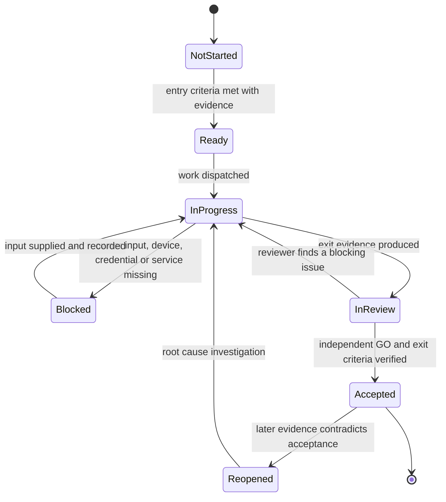
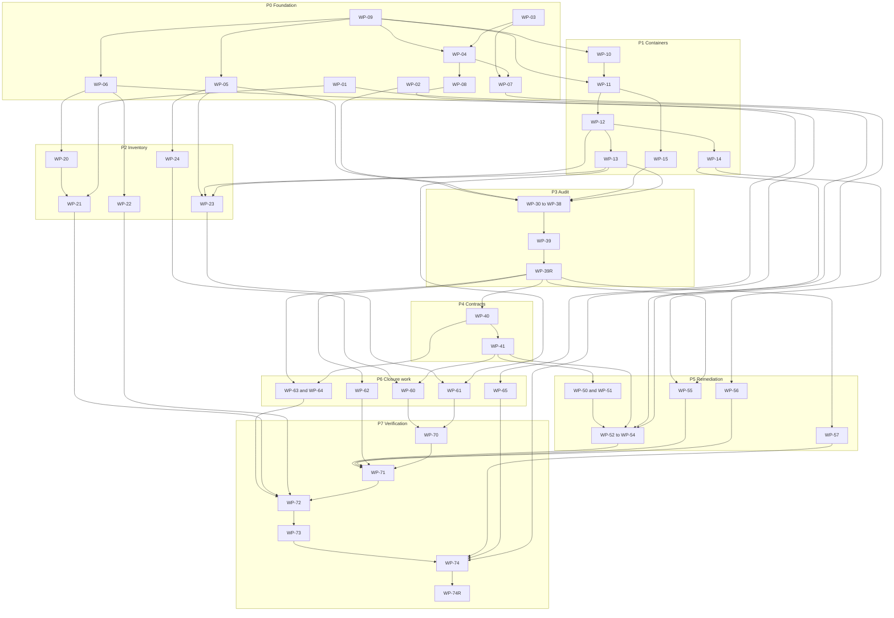

# 21 - Master Plan: Phases, Risks and Traceability

| Field | Value |
|---|---|
| Revision | 4 |
| Created | 2026-10-03 |
| Last modified | 2026-10-03 |
| Status | draft |
| Feature | specs/001-full-project-audit-remediation |
| Role | Synthesis of plan documents 01 to 20 (plans 01 to 18, proof-of-concept tools 19, second-pass research 20) into one executable plan. It adds no new facts about the code; every number is quoted from a source document (cited as `docNN §x`) or labelled `UNCONFIRMED:` |
| Inputs read | `spec.md`; `research.md` (its owner decisions are numbered OD-01 to OD-79; this document groups them as ODG-01 to ODG-38 and section 8 maps one to the other, so the two id spaces never collide); documents 01 to 20 in this folder (headings plus the decision, risk, finding, work-package and traceability sections of each). Documents 19 and 20 arrived while this file was being written and were incorporated in the same revision (section 12) |
| Traceability | FR-001 to FR-025, SC-001 to SC-012 (complete matrix in section 6) |
| Governance anchors | §11.4.6, §11.4.20, §11.4.58, §11.4.66, §11.4.101, §11.4.113, §11.4.115, §11.4.122, §11.4.124, §11.4.132, §11.4.142, §11.4.173, §11.4.209, §11.4.224, §11.4.227, §11.4.230, §11.4.234, §12.6, §12.12 |

## Table of contents

1. [Executive summary and critical path](#1-executive-summary-and-critical-path)
2. [Planning rules applied in this synthesis](#2-planning-rules-applied-in-this-synthesis)
3. [Phased execution plan](#3-phased-execution-plan)
4. [Work streams, concurrency limits, containers, review gates](#4-work-streams-concurrency-limits-containers-review-gates)
5. [Work-package catalogue](#5-work-package-catalogue)
6. [Requirement traceability matrix](#6-requirement-traceability-matrix)
7. [Master risk register and heat table](#7-master-risk-register-and-heat-table)
8. [Owner decisions and inputs](#8-owner-decisions-and-inputs)
9. [Seed findings already identified](#9-seed-findings-already-identified)
10. [Cross-document inconsistencies and resolutions](#10-cross-document-inconsistencies-and-resolutions)
11. [Effort model](#11-effort-model)
12. [Document set status and open items](#12-document-set-status-and-open-items)

---

## 1. Executive summary and critical path

### 1.1 What the plan does

The feature delivers seven user stories (spec P1: register, audit, proven fixes; P2: documentation, per-application consistency, dependencies; P3: nothing unpushed). The twenty plan documents (01 to 18 plans, 19 proof-of-concept tools, 20 research) agree on one shape, which this document fixes as the execution order:

1. **Prove the instruments before using them.** The code indexes fail their own health checks today: CodeGraph covers 7,150 files and Lumen 10,397 with `Stale: yes`, there is no scope DATA file, no `.lumenignore` and no `.mcp.json` (doc02 §2, findings F-INDEX-001 to -006). Detectors are absent from the host and one existing detector is already proven blind (the `awk '\bunwrap\(\)'` rule, doc09 D-04; the Snyk results that are failed scans read as clean, doc03 F-8). Nothing is audited until the index gate (P1 to P8, doc02 §4.1) and the control-needle discipline exist.
2. **Build the register and the evidence machinery before the first finding.** The constitution-mandated workable-items database does not exist (doc03 F-1); `.gitignore:85` would ignore it the moment it is created (doc04 §2.4). The register (doc04) and the evidence recorder (doc06) are the first customers of their own rules.
3. **Containerize before any build or test.** Four existing container assets cannot build from a clean checkout (doc16 D-01 to D-04); `auto-container.sh` builds on the bare host when the host has the tool (D-08). FR-021 forbids bare-host builds, so every audit and test run waits on Phase 1.
4. **Import everything already known.** About 4,700 candidate source entries (doc03 §7, ESTIMATE; doc03's own sum is 4,729 before the claim-document leads and includes the latest gosec run of 810 findings), dominated by 1,778 HelixQA tickets whose `HELIX-NNN` ids collide (676 distinct ids, doc03 F-2), 1,111 closures without evidence (F-4) and 282 `wontfix` closures that FR-008 does not permit (doc04 §3 DR-5).
5. **Audit every application twice from the same state** (SC-002), with independent review (FR-023).
6. **Fix contracts before clients.** Client-to-server drift is measured in every client (doc01 §14 C2 to C5; doc08 WEB-F03; doc09 D-01; doc10 H10-11, H10-13). The live route dump and both-sided contract tests (doc07 W7, doc05 TS-05) come before any client fix, so a client is never fixed against a contract that is about to change.
7. **Remediate by risk, prove every fix RED then GREEN three times** (FR-008, SC-003), then close the test-type matrix (SC-004), convert 1,178 prose QA steps (doc12 §2.3), run the documentation programme (2,520 orphans as of 2026-10-03T12:02Z, doc13 §2.1 stamp; 2,498 at first measurement) and the performance programme (SC-011).
8. **Verify recursively and close.** Zero open findings except the vendored exception class (FR-008), all repositories clean and pushed (SC-010), every completion claim cited (SC-012).

### 1.2 Critical path

The critical path is set by dependencies, not by effort. Two chains run in parallel, converge at WP-71 (full retest on the candidate) and end together at WP-74 (evidence pack and report checker) and WP-74R (final independent review):

- **Engineering chain:** WP-09 bootstrap image slice -> WP-05 evidence recorder and WP-06 register -> WP-10 host probes -> WP-11 image pinning and broken-asset fixes -> WP-12 runners -> WP-13 real-service stack -> WP-30..WP-38 audit pass (WP-02 index gate, WP-05 evidence recorder and WP-15 detector harness are inputs of every audit package WP-30 to WP-36; WP-13 is an input of WP-30, WP-35 and WP-38) -> WP-39 repeat run -> WP-39R audit review -> WP-40 live route dump -> WP-41 contract tests -> WP-50/WP-51 server fixes -> WP-52..WP-54 client fixes -> WP-61 test-type closure -> WP-71 full retest -> WP-72 -> WP-73 -> WP-74 -> WP-74R.
- **Owner chain:** WP-01 decision intake -> owner supplies build-host confirmation (ODG-07), devices (ODG-04), credentials (ODG-01), desktop hosts (ODG-06) and the legacy-closure policy (ODG-09) -> WP-10 host probes -> WP-11 and WP-14 -> the device- and credential-gated work in WP-14, WP-21, WP-54, WP-60, WP-62 -> WP-71.

WP-02 does not depend on WP-01: the index gate needs neither an owner decision nor a device, so it starts in parallel with the decision intake. WP-09 exists so that WP-04, WP-05 and WP-06 can run their tests in pinned containers during P0 instead of waiting for the P1 image programme (section 3.3, P0).

FR-025 makes the owner chain binding: a test that needs an absent device or credential is `blocked-unavailable`, counts as not passing, and the feature cannot complete (spec FR-008, FR-025). The probability that the owner chain, not engineering effort, sets the completion point is high (risk R-05, R-06). The plan therefore issues the full owner request list at the start (WP-01), not when a test first blocks.

```mermaid
flowchart LR
  A["WP-01 Owner decision intake"]
  B["WP-02 Index health gate"]
  B0["WP-09 Bootstrap image slice"]
  C0["WP-03 Recursive verifier"]
  C["WP-04 Commit-push script"]
  D["WP-05 Evidence recorder and WP-06 Register"]
  E["WP-07 Constitution pin bump"]
  F0["WP-10 Host probes"]
  F["WP-11 Image pinning and broken assets"]
  G["WP-12 Container runners"]
  H["WP-13 Real-service stack"]
  I["WP-20 Source import"]
  J["WP-30 to WP-38 Audit pass 1 (inputs per package, section 5.4)"]
  K["WP-39 Audit repeat"]
  K2["WP-39R Audit review"]
  L["WP-40 Live route dump"]
  M["WP-41 Both-sided contract tests"]
  N["WP-50 and WP-51 Server fixes"]
  O["WP-52 to WP-54 Client fixes"]
  P["WP-61 Test-type closure"]
  Q["WP-71 Full retest on candidate"]
  R["WP-73 Final recursive verification"]
  S["WP-74 Evidence pack and report checker"]
  S2["WP-74R Final independent review"]
  T["Owner supplies devices, credentials, hosts"]
  C0 --> C
  B0 --> C
  B0 --> D
  C0 --> E
  C --> E
  B0 --> F0
  D -->|"P0 exit, phase gate"| F0
  F0 --> F
  B0 --> F
  F --> G
  G --> H
  D --> I
  B --> J
  H --> J
  I --> J
  J --> K
  K --> K2
  K2 --> L
  L --> M
  M --> N
  N --> O
  O --> P
  P --> Q
  Q --> R
  R --> S
  S --> S2
  A --> T
  T --> F0
  T --> O
  T --> P
```

### 1.3 Headline numbers the plan must absorb

| Quantity | Value | Source |
|---|---:|---|
| Applications and shared components in scope | 13 units (doc02 §1) | doc02 |
| Direct submodules / recursive repositories | 44 / 97 | doc01 §4.1, doc11 H1 |
| Own-org submodule pins behind upstream | 1 (`constitution`, 25 commits) | doc11 H3 |
| Legacy HelixQA ticket files | 1,778 (676 distinct ids) | doc03 F-2 |
| Candidate source entries before dedup | about 4,700 (ESTIMATE; 4,729 before the claim-document leads, includes the gosec latest run of 810) | doc03 §7 |
| HelixQA bank cases / placeholder step lines | 1,269 / 1,178 | doc12 §2.3 |
| In-scope Markdown / reachable from README / orphans | 2,562 / 42 / 2,520 as of 2026-10-03T12:02Z (doc13 §2.1 stamp, doc19 §7); earlier points 2,540 / 42 / 2,498 (first measurement) and 2,551 / 42 / 2,509 | doc13 §2.1 to §2.2, doc19 §6.2 |
| Broken relative links / broken anchors | 126 / 83 as of 2026-10-03T12:02Z (shipped crawler rules, include images, HTML and anchors); earlier points 84 (doc13 rules) and 123 entries, 119 unique, plus 82 anchors (doc19 first run) | doc13 §2.1 to §2.3, doc19 §6.2 |
| Server routes / OpenAPI operations / routes missing from the spec / unwired mux routes | 247 / 181 / 68 / 62 | doc19 §6.3 (reproduces doc07 and doc13) |
| Itemised seed findings across documents | 234 (section 9) | this document |
| Work packages | 53 (section 5; WP-09, WP-39R and WP-74R added by review) | this document |
| Owner decisions and inputs | 38 grouped, ODG-01 to ODG-38 (section 8; `research.md` holds 79 finer ones, OD-01 to OD-79) | this document |

---

## 2. Planning rules applied in this synthesis

1. **Order follows evidence dependencies.** A step is placed after every instrument it relies on has been proven (§11.4.201(7)(b) control needles; doc02 §4).
2. **Risk order inside a phase** (§11.4.132): unauthenticated and externally reachable surfaces first, most-reopened first within a severity (§11.4.189).
3. **TDD for every executable artifact** (§11.4.224): code, gate scripts, wrappers, mutation pairs, bank cases. A gate's paired mutation is its test-first artifact. Prose-only document edits are not coverage-scoped (§11.4.224(F)) but still pass independent review (§11.4.142).
4. **No calendar dates and no hour numbers.** Effort is expressed as package counts and size classes (section 11).
5. **No guessing.** Where source documents disagree, section 10 records both values and the measurement that settles the question; the plan never picks a number by preference.
6. **Owner decisions are blockers, not assumptions.** Each one is recorded as an `Operator-blocked` register item with its choices (§11.4.21, spec edge case "owner decision"). Only where `research.md` marks a reversible working default (12 of its 79 OD items) may the plan proceed on the recommendation; every other group blocks the work in its Blocks column until the owner answers (FR-008, FR-025).
7. **Main branch only, fast-forward only, no force-push, no history rewrite** (FR-020, FR-024, §11.4.113).
8. **Every build and test in a rootless container** (FR-021, §11.4.161, §11.4.173), heavy builds on the designated build host once verified (doc16 P6).

---

## 3. Phased execution plan

### 3.1 Phase overview

| Phase | Name | Purpose | Work packages |
|---|---|---|---|
| P0 | Foundation | Decisions requested, indexes proven, bootstrap images pinned, verifier, commit-push script, evidence recorder, register, governance pin | WP-01 to WP-09 |
| P1 | Containerized infrastructure | Pinned images, broken assets fixed, runners, real-service stack, remote builds, detector harness | WP-10 to WP-15 |
| P2 | Inventory and baselines | Import every existing problem source, applicability map, coverage and QA baselines | WP-20 to WP-24 |
| P3 | Audit pass | Per-application audit, two runs, independent review by a separate stream | WP-30 to WP-39, WP-39R |
| P4 | Contract layer | Live route dump, contract inventory, both-sided contract tests | WP-40, WP-41 |
| P5 | Remediation | Security, backend, clients, shared modules, build hardening, dependency report | WP-50 to WP-57 |
| P6 | Test closure, QA, performance, documentation | Bank conversion, test-type authoring, mutation, performance gate, documentation programme | WP-60 to WP-65 |
| P7 | Verification and closure | Matrix gate, full retest, register closure, recursive verification, evidence pack, final review by a separate stream | WP-70 to WP-74, WP-74R |

Phases overlap where the source documents allow it (§11.4.230): P6 documentation and performance work starts as soon as their own inputs exist, and P5 client fixes for one application may run while another application is still in P3. The entry and exit criteria below are per phase gate, not per calendar window.

### 3.2 Phase state machine

Each phase, and each work package inside it, moves through the same states. `Blocked` is an honest state with a reason; it never converts to `Accepted` without the missing input (FR-025).

### 3.3 Phase details

#### P0 Foundation

| Item | Content |
|---|---|
| Entry criteria | Spec clarified (done, `spec.md` Clarifications); this plan accepted at human checkpoint HC-0 |
| Work | WP-01 decision intake; WP-02 index gate and index scope fixes; WP-03 recursive verifier; WP-04 commit-push script; WP-05 evidence recorder; WP-06 register bootstrap; WP-07 constitution pin bump; WP-08 gate ledger and anti-mess sweep; WP-09 bootstrap pinned-image slice (IMG-GO, IMG-SHELLCHECK, IMG-KCOV by digest, the part of WP-10 and WP-11 that WP-04 to WP-06 need) |
| Parallel streams | WP-02, WP-03 and WP-09 start together (different files, no mutual dependency); WP-05 and WP-06 depend on WP-09; WP-04 depends on WP-03 and WP-09; WP-07 depends on WP-03 and WP-04 and on decision ODG-12 |
| Containers | Read-only work runs on the host (git, CodeGraph CLI reads, Lumen MCP reads); index rewrites only through the sanctioned single writer (doc02 §4.5); script and recorder tests run in IMG-SHELLCHECK, IMG-KCOV and IMG-GO (doc16 §6.1), pinned by digest in WP-09 inside P0 so that no P0 exit evidence waits for P1; the host shell is allowed only for the read-only verifier self-test (doc16 §18 states `git` is not a build) and for the local rootless probe inside WP-09 |
| TDD scope | Verifier (needle self-test with four seeded conditions, doc16 P1), commit-push script (exit-code matrix with seeded diverged and dirty repositories, doc16 P3), recorder (tamper table, doc06 §13.3), register triggers (rejected inserts, doc04 §14.3) |
| Human checkpoints | HC-0 at entry (plan acceptance, request list sent); HC-1 at exit (tooling verified, register empty and operational) |
| Review gates | Register DDL and triggers (data model); every gate script with its paired mutation; the constitution pin bump (doc12 §14.3 step 11 with the new `finding_layer` field) |
| Exit criteria | `audit/index-health.json` all P1 to P8 PASS or an honest fallback record per unit; the three bootstrap images referenced by digest and passing their smoke tests (WP-09); verifier baseline recorded (expected non-clean, doc16 P1); commit-push script used for every later commit, its exit-code matrix run in the pinned images; register gates return empty; evidence recorder passes its rollout tests (doc06 §17 steps 1 to 4) in the pinned images |
| Expected evidence | index-health JSON with needles; verifier TSV/JSON with summary line; script test transcripts from the pinned images; DDL apply transcript (`FINAL_DDL_OK`-style, doc04 §5); pin-bump review record |

#### P1 Containerized infrastructure

| Item | Content |
|---|---|
| Entry criteria | P0 accepted; host probes allowed (ODG-07 for remote hosts) |
| Work | WP-10 host probes and remote host checklist (doc16 §9.5); WP-11 image catalogue, digest pinning, reproduce-first fix of D-01 to D-04; WP-12 runners and always-containerize correction (D-08, D-09); WP-13 real-service stack with NFS decision (ODG-08); WP-14 remote builds with artifact identity; WP-15 detector and scanner harness with control needles |
| Parallel streams | WP-10 first (it completes the probe record WP-09 started locally); WP-11 after WP-09 and WP-10, extending the WP-09 pins to the full catalogue; WP-15 after WP-11; WP-12 after WP-11; WP-13 after WP-11 and WP-12; WP-14 after WP-10 to WP-12 |
| Containers | IMG-GO, IMG-NODE, IMG-PW, IMG-DOCS, IMG-SCAN-*, IMG-SHELLCHECK, IMG-KCOV locally (the last three already pinned by WP-09); IMG-RUST and IMG-ANDROID built and run on the remote build host (doc16 §6.1, DR-16-1); IMG-INFRA-* for services |
| TDD scope | Every broken asset is a reproduce-first case: failing `podman build` captured before the edit, then three passing builds (doc16 §4). Each wrapper has an image smoke test and a mutation (remove `--memory`, expect the gate to fail, doc16 P4) |
| Human checkpoints | HC-1b: remote host roles and capacity confirmed by the owner (ODG-07) |
| Review gates | Containerfiles and lock files; any extension of `submodules/containers` goes upstream (§11.4.74) and passes review there |
| Exit criteria | Every image referenced by digest; D-01 to D-04 GREEN three times; one remote Go build returned with sha256 manifest equal to the local recomputation and the clean target reporting the build id (doc16 P6); each protocol of the real-service stack has a recorded round trip, NFS either PASS or an evidenced structural-impossibility record (DR-16-2) |
| Expected evidence | `images.lock.yaml`, `profile.json` with measured peak RSS, failing-then-passing build verdicts, build manifests, protocol round-trip records |

#### P2 Inventory and baselines

| Item | Content |
|---|---|
| Entry criteria | WP-06 register operational; WP-05 recorder available; WP-13 stack available for baseline test runs |
| Work | WP-20 source freeze and import (doc03 §10, doc04 §9 stages); WP-21 legacy-closure re-verification queue and `wontfix` triage (blocked on ODG-09 for the final rule); WP-22 external tracker sync (blocked on ODG-10); WP-23 applicability map, measurement baseline and coverage baselines; WP-24 QA wrapper, bank validator, manifest, bank-id floor, conduit-to-ledger adapter |
| Parallel streams | WP-20 and WP-23 and WP-24 in parallel; WP-21 after WP-20 Stage 2 |
| Containers | Importers run in IMG-GO or a pinned Python image (read-only on sources); test baselines in the language images against IMG-INFRA-*; QA wrapper in the QA image (doc12 §18.3) |
| TDD scope | Importer: planted-entry completeness test (three planted entries detected then removed, doc03 §15 item 5); validator rules R-1 to R-8 (doc12 §6.6); coverage collector fails on error (doc05 §7.4, replacing the collector that swallows errors) |
| Human checkpoints | HC-2: SC-001 reconciliation reviewed; legacy-closure policy (ODG-09) and category mapping (doc04 D-6) confirmed |
| Review gates | Import mapping rules and severity map; merges of duplicates (reversible, doc04 K-3) |
| Exit criteria | `SELECT count(*) FROM src_entry WHERE disposition='PENDING'` returns 0 (doc03 §15); every source row mapped; every external tracker recorded as `queried` or `skipped(reason)`; applicability map with no `?` cell; coverage baseline per application recorded |
| Expected evidence | reconciliation view output, planted-entry test, matrix `applicability.yaml`, baseline coverage records per application (FR-011) |

#### P3 Audit pass

| Item | Content |
|---|---|
| Entry criteria | P1 detectors pinned with needles (WP-15); index gate PASS in the current pass (doc02 rule: re-prove at audit time); register accepting findings |
| Work | WP-30 backend (doc07 W1 to W6); WP-31 web (doc08 W8-02, W8-03); WP-32 desktop and installer (doc09 WP-D1); WP-33 Android and TV (doc10 W10-00, W10-03, W10-04); WP-34 own-org submodules (doc11 §10); WP-35 security and secrets (doc15 WS1 to WS3 detection, WS5 DAST detection); WP-36 unowned components (added here, section 6.3); WP-37 documentation and definitions baseline (doc13 D0, D4 extractors); WP-38 performance as-found baseline (doc14 WP-14-01 to -07); WP-39 repeat run and determinism comparison (producer side, ST-GOV); WP-39R independent review of the whole audit by ST-REV, a stream that produces none of the audited artifacts |
| Parallel streams | Up to six read-only audit agents (§11.4.58), one per unit (doc02 §14.3 waves W1 to W3); heavy detectors queued at K = min(floor(18 GiB / measured peak RSS), 4) (doc02 §14.2); one Android container at a time (doc10 §21) |
| Containers | All detectors in pinned scanner images; DAST against a disposable stack with synthetic seed only (doc15 §14.1) |
| TDD scope | Each detector has golden-good, golden-bad and a control needle before its zero results are trusted (doc06 §10, doc09 §6.4) |
| Human checkpoints | HC-3: audit report accepted (findings per unit including "none found" with evidence, spec US2 scenario 2) |
| Review gates | WP-39R independent review (FR-023, stream ST-REV) iterated to GO; reviewer authors at least one mutation the author did not write (§11.4.194(6)(d)) |
| Exit criteria | Every unit has a recorded audit result; second run from an identical manifest yields `IDENTICAL` (SC-002, doc02 §12); every finding carries location, severity, category, evidence and a register link (FR-007) |
| Expected evidence | `audit/units.json`, `audit/determinism.json`, finding records validating against `finding/1`, reviewer verdict files |

#### P4 Contract layer

| Item | Content |
|---|---|
| Entry criteria | WP-30 audit for the backend accepted; WP-13 stack running |
| Work | WP-40 live router dump replaces the static 259- or 247-route parses (doc01 U-02, doc07 W7, doc13 §2.4); drift reports per client; WP-41 both-sided contract tests and a can-i-deploy gate (doc05 TS-05, doc17 ranks 5 and 6) |
| Containers | IMG-GO (route dump from a running instance), IMG-NODE, IMG-ANDROID (remote), IMG-RUST (remote) for consumer tests |
| TDD scope | Drift guard fails on a deliberately added undocumented route and passes after documentation (doc07 W7); missing-contract refusal test (doc05 §16) |
| Human checkpoints | HC-4: contract changes that need a compatibility window (query-token removal, route renames) approved (§11.4.247, ODG-25) |
| Review gates | API contracts reviewed before any consumer is changed (plan template "Review Gates") |
| Exit criteria | Contract inventory C1 to C22 (doc01 §14) each with a test on both sides or a recorded n/a; drift report lists every client mismatch as a register finding |
| Expected evidence | route dump JSON, drift JSON per client, contract test results, gate self-test |

#### P5 Remediation

| Item | Content |
|---|---|
| Entry criteria | P4 accepted for the contracts the fix touches; register item root-caused (FR-008) |
| Work | WP-50 security fix wave in doc15 order S-01 to S-08; WP-51 backend fix wave (doc07 W8); WP-52 web (doc08 W8-04, -07, -08, -11); WP-53 desktop and installer (doc09 WP-D3 to D7, WP-I1 to I4, WP-P1); WP-54 Android and TV (doc10 W10-05 to W10-13); WP-55 shared-module fixes upstream and submodule update layers L0 to L5 (doc11 §6); WP-56 build hardening, SBOM, provenance, SLSA record, promotion by digest (doc16 P8, P9; doc15 WS6); WP-57 dependency report and decisions (SC-009) |
| Ordering rule | Server first, then each client against the fixed contract; within a stream by severity then exposure (doc15 §13); a fix that changes a contract lands with the matching client changes and both-sided tests in the same reviewed change set |
| Containers | Language images; client builds on the remote host for Rust and Android; artifacts verified on a clean target before "done" (FR-021, doc16 §9.3) |
| TDD scope | Every fix: root-cause note, RED verdict on the pre-fix artifact, fix, GREEN verdict on a different artifact fingerprint, three identical GREEN runs, reviewer mutation (doc06 §4, §11.4.115(F)) |
| Human checkpoints | HC-5 per user story acceptance (spec US3, US5, US6); §11.4.122 removal decisions (ODG-20 to ODG-24) before any component is removed |
| Review gates | Security-sensitive code (auth, SSRF, exec, credentials) reviewed before integration; data model and migration changes reviewed before migration; every submodule pin move reviewed per layer (doc11 §6.4 step 7) |
| Exit criteria | Every finding in the stream is `Fixed` with custody chain or closed by an allowed basis (false positive, structurally impossible, vendored exception); blocked items listed with exact reason |
| Expected evidence | RED/GREEN verdict pairs, mutation records, review records with `finding_layer` (doc12 §14.2), push records for each upstream |

#### P6 Test closure, QA, performance, documentation

| Item | Content |
|---|---|
| Entry criteria | WP-24 QA wrapper; WP-23 matrix; for performance, WP-38 baselines and the WP-62 gate; for documentation, WP-37 baseline |
| Work | WP-60 bank conversion waves (doc12 WP-Q2; 504 mechanically convertible HTTP lines first, doc12 §2.3); WP-61 absent test types, fakes replaced, mutation instrumentation (doc05 TS-03 to TS-09); WP-62 targets, regression gate, bottleneck fixes, soak (doc14 WP-14-08 to -16); WP-63 documentation programme D1 to D9 (doc13 §12); WP-64 definitions references and diff gates (doc13 D4); WP-65 escape ratchet and manual-QA discovery channel (doc12 §12) |
| Containers | QA image with helixqa, Tesseract, ffmpeg, Playwright (doc12 §18.3); IMG-MUT per language; IMG-DOCS for exports and diagram validation; k6 and benchstat images for performance |
| TDD scope | Each converted bank case: BASELINE, mutation, three-run evidence (doc12 §7.5); each gate (coverage, matrix, export sync, diagram non-blank, performance regression) with golden-good, golden-bad and negative control |
| Human checkpoints | Owner approval of performance targets (doc14 WP-14-13); first manual-QA cycle seeds the escape ratchet (doc12 DR-9, ODG-18) |
| Exit criteria | Matrix zero absent applicable cells (SC-004); reviewer mutation sample zero survivors (SC-005); `orphans=0`, `broken_links=0`, `stale=0` (SC-006); every app has manual, guides, FAQ, diagrams non-blank (SC-007); schema and definitions diffs zero (SC-008); SC-011 definition of done (doc14 §14.1) |
| Expected evidence | matrix generator output, mutation sample records, crawl and export-sync reports, diagram report, schema diff report, performance baselines and gate verdicts |

#### P7 Verification and closure

| Item | Content |
|---|---|
| Entry criteria | P5 and P6 exit criteria met or each remaining item `Blocked` with reason (in which case the feature is not complete, FR-025) |
| Work | WP-70 matrix and coverage ratchet final gate; WP-71 full-suite retest on the candidate digest, three-run RED/GREEN sample, reviewer mutation sample; WP-72 register closure sweep; WP-73 final recursive verification and push to every upstream; WP-74 evidence pack and completion-report checker (producer side, ST-GOV); WP-74R final independent review by ST-REV |
| Review gates | G-FINAL: WP-74R, performed by ST-REV, never by the stream that produced the pack |
| Human checkpoints | HC-6 before the final push (full suite reviewed); HC-7 final acceptance against the spec |
| Exit criteria | Zero open findings except the vendored-exception class (SC-003); verifier `BLOCKING=0` with assertions A-1 to A-7 (doc11 §8.4); zero completion claims without a ledger reference (SC-012) |
| Expected evidence | final evidence pack: register closure query output, verify JSON, retest records, review GO from WP-74R, report checker output with its needle |

---

## 4. Work streams, concurrency limits, containers, review gates

### 4.1 Streams

| Stream | Owner role | Scope | Source documents |
|---|---|---|---|
| ST-GOV | Conductor | decisions, indexes, constitution, unowned components, audit repeat, evidence pack and report checker | 02, 12, 17 |
| ST-REV | Reviewer | independent review only: WP-39R (audit review) and WP-74R (final review) plus the per-change reviews of section 4.4; owns no package that produces an audited artifact | 02, 06, 12 |
| ST-REG | Register owner | register, import, reconciliation, tracker sync, closure sweep | 03, 04 |
| ST-QA | Test and evidence owner | evidence recorder, matrix, coverage, mutation, HelixQA, contract tests | 05, 06, 12 |
| ST-INFRA | Infrastructure owner | images, runners, real-service stack, remote builds, verifier, commit-push, SLSA | 16, 11 |
| ST-API | Backend owner | catalog-api audit and fixes, live route dump | 07 |
| ST-WEB | Web owner | catalog-web and its nine TS/React submodules | 08 |
| ST-DESK | Desktop owner | catalogizer-desktop, installer-wizard | 09 |
| ST-AND | Android owner | catalogizer-android, catalogizer-androidtv | 10 |
| ST-SUB | Submodule owner | own-org submodule audit, update runbook, dependency report | 11 |
| ST-SEC | Security owner | threat model, scanners, secrets, DAST, danger zones | 15 |
| ST-DOC | Documentation owner | documentation programme, definitions | 13 |
| ST-PERF | Performance owner | baselines, targets, gate, bottlenecks | 14 |

"Owner role" is an agent role under the conductor; the human project owner is the sole approver (spec Assumptions). Producer is not verifier (§11.4.240): ST-REV is structurally separate from every producing stream, so ST-GOV, which produces WP-02, WP-07, WP-36, the repeat run of WP-39 and the evidence pack of WP-74, never reviews them. ST-REV runs on Opus at xhigh (§11.4.209).

### 4.2 Concurrency limits (restating the constitution as numbers for this host)

| Limit | Value | Source |
|---|---|---|
| Memory for all project work combined | at most 60% of total, about 18 GiB on this 30 GiB host | §12.6; doc02 §2.3; doc16 §8.2 |
| Containerized jobs | `jobs = max(1, min(cpu_budget, floor(mem_budget / per_job_mem)))`, `per_job_mem` measured, `jobs = 1` until measured | doc16 §8.2, §12.11 |
| Heavy detectors concurrently | K = min(floor(18 GiB / measured peak RSS), 4) | doc02 §14.2 |
| Working agents | at most about 6 (about 12 peak including validators) | §11.4.58; doc02 §14.1 |
| Threads and processes | check `ulimit -u` headroom (soft 123,699 observed) before each wave; EAGAIN is a host-safety event | §12.12; doc02 §14.1 |
| Android containers | one at a time | doc10 §21 |
| Exclusive resources | single owner per device, running stack, index writer | §11.4.119; doc02 D-03 |
| Long operations | over about 5 minutes: backgrounded and polled, registered in the long-op registry | §11.4.89, §11.4.232; doc16 §13 |
| Process signalling | never pgid <= 1; resolve processes by real `/proc/<pid>/cmdline` | §11.4.263, §12.12 |
| Models | Sonnet default working tier; every independent review on Opus at xhigh | §11.4.209, §11.4.231 |

Within these limits the default parallel plan is: three to four implementation streams plus one reviewer plus one conductor. Streams that touch disjoint files (for example ST-WEB and ST-AND) run together; streams that share the real-service stack take turns by single-owner lease.

### 4.3 What runs in which container

| Image (doc16 §6.1) | Runs | Where |
|---|---|---|
| IMG-GO (`golang` 1.25-bookworm family, digest to fill) | catalog-api build, unit, race, fuzz, bench, route dump, Go submodules, register tooling in Go, importers | local, remote for release builds |
| IMG-NODE (Node 20 family) | catalog-web, TS submodules, `catalogizer-api-client`, vitest, StrykerJS | local |
| IMG-PW (Playwright aligned with `package.json`) | web E2E against the real stack, visual proof, axe | local |
| IMG-RUST (built locally) | desktop and wizard Rust and Tauri builds, cargo tests, cargo-mutants | remote build host |
| IMG-ANDROID (built locally) | Gradle builds, JVM tests, Robolectric, Roborazzi, release APK | remote build host |
| IMG-DOCS | pandoc, weasyprint, Mermaid CLI, VitePress; exports and diagram checks | local |
| IMG-SCAN-* | gitleaks, trivy, semgrep or opengrep, gosec, govulncheck, hadolint, syft, sonar | local |
| IMG-SHELLCHECK, IMG-KCOV | shell lint and line coverage for `Build/`, `scripts/` | local |
| IMG-MUT | mutation tooling per language | local or remote by measured RSS |
| QA image | helixqa binary from the pinned submodule, Tesseract, ffmpeg, browsers, wrapper | local |
| IMG-INFRA-* | PostgreSQL, Redis, MinIO, Samba, FTP, WebDAV, NFS (decision) | local, rootless |

Version-control commands, the read-only verifier and index reads are not builds and run on the host (doc16 §18).

### 4.4 Review gates

Every change passes an independent review before it is accepted (§11.4.142), performed by ST-REV (never by the stream that produced the change), on Opus at xhigh (§11.4.209), iterated to zero blocking findings (§11.4.134), with a per-finding `finding_layer` in `{source-defect, test-instrumentation, process-doc}` once the constitution pin moves to `e44f22f` (doc12 §14.2). Additional mandatory gates:

| Gate | Applies to | Placement |
|---|---|---|
| G-CONTRACT | API contract changes | before any consumer change (P4) |
| G-SECURITY | auth, SSRF, exec, credentials, crypto | before integration (P5) |
| G-DATA | register DDL, app migrations, schema changes | before migration is run |
| G-GATE | every gate or guard script | paired mutation observed failing before trust (§11.4.224(A)) |
| G-REMOVAL | removal of any component or seemingly dead code | §11.4.124 git-history record plus §11.4.122 owner decision |
| G-PIN | each submodule pin move and the constitution bump | per layer, before the pointer commit (doc11 §6.4) |
| G-AUDIT | each audit pass | WP-39R, before findings drive fixes |
| G-FINAL | completion report | WP-74R |

---

## 5. Work-package catalogue

Size classes are defined in section 11. "Source" lists the work packages of the plan documents that this package consolidates; their detailed steps stay in those documents.

### 5.1 P0 Foundation

| ID | Stream | Title | Source | Inputs | Outputs | Acceptance evidence | FR | SC | Size |
|---|---|---|---|---|---|---|---|---|---|
| WP-01 | ST-GOV | Owner decision and blocker intake | all docs' open decisions; section 8 | this document, `research.md` | `Operator-blocked` register items with choices (after WP-06), owner request list (devices, credentials, hosts) | request list delivered; one register item per decision | FR-008, FR-025 | SC-003 | M |
| WP-02 | ST-GOV | Index health gate and index scope fixes | doc02 §4, F-INDEX-001..006; doc17 rank 13; doc20 W20-12 (60-query golden set, Kotlin gap reported) | CodeGraph DB, Lumen | scope DATA rendered via constitution tooling, `.lumenignore`, `.mcp.json` registration (CLI route until then, doc02 D-01), golden questions | `audit/index-health.json` P1 to P8 PASS with needles; Lumen `Stale: no` | FR-005 | SC-002 | M |
| WP-03 | ST-INFRA | Single recursive repository verifier | doc11 App. A (executed), doc16 P1, doc12 WP-G3, doc19 tool 1 `poc/repo_verify/verify_repo.sh` (24 of 24 self-test checks) | 97 repositories, ODG-15 | one verifier (section 10, IC-17) | needle self-test detecting dirty, unpushed, diverged, unverified; baseline run (observed 2026-10-03: `BEHIND_UPSTREAM=24 ... CLEAN=72 BLOCKING=0`, doc11 §8.4) | FR-019, FR-020, FR-024 | SC-010 | M |
| WP-04 | ST-INFRA | Dedicated commit-push script (§11.4.234) | doc12 WP-G3, doc16 P3, D-12 to D-14 | WP-03, WP-09 | script with stages, recorded deferral flag, pre-push gate preserved and not installed | exit-code matrix test including seeded diverged (12) and dirty (13); `--force` mutation fails the test | FR-019, FR-020, FR-024 | SC-010 | M |
| WP-05 | ST-QA | Evidence recorder, verdict deriver, anchors, runner wrappers | doc06 §17 steps 1-4; doc05 TS-02; F-10 | WP-09 | recorder, verifier, wrappers for Go, vitest, Gradle, cargo, bash | tamper table reproduces; seeded hidden failure found; golden-good and golden-bad verdicts | FR-010, FR-022 | SC-003, SC-012 | M |
| WP-06 | ST-REG | Register bootstrap | doc04 §5 DDL, DR-1..5; doc03 DR-1..5 | engine binary in constitution, WP-09, ODG-11 | tracked DB (ODG-11), `.gitignore` negation, `reg_` extension, custody triggers | DDL apply on fresh DB; rejected-insert tests; gate views empty; 41 triggers present (doc04 §4); `PRAGMA integrity_check` ok and `PRAGMA foreign_key_check` empty (doc04 §12.3) | FR-001, FR-003, FR-007, FR-008 | SC-001 | M |
| WP-07 | ST-GOV | Constitution pin bump to `e44f22f` | doc12 §14.3 (12 steps), doc11 §7, F-1, F-8 | WP-03, WP-04, ODG-12 | ff-only pin move; regenerated Spec Kit catalogue and appendix; upstream report of the stale `constitution_index.yaml` hash; hook variant B transcript; §11.4.32 substitute sweep | review record with `finding_layer`; sweep gate outputs; FAILs filed as tracked items | FR-006, FR-017, FR-020, FR-024 | SC-009, SC-010 | M |
| WP-08 | ST-GOV | Project gate ledger and anti-mess sweep | doc12 WP-G2, WP-G4; doc16 P10 | WP-04 | gate ledger and ratchet, invariant catalogue, long-op registry | seeded-mess fixtures detected (orphan container, stale lock, duplicate owner) | FR-022 | SC-012 | M |
| WP-09 | ST-INFRA | Bootstrap pinned-image slice for the P0 tests | doc16 §6.1 (IMG-GO, IMG-SHELLCHECK, IMG-KCOV), P0 and P2 methods; the local part of WP-10 and the first three pins of WP-11 | none (local rootless podman only: no remote host, no owner decision) | `images.lock.yaml` entries with digests for IMG-GO, IMG-SHELLCHECK, IMG-KCOV; local rootless probe record; runner wrapper with `--memory` and `--pids-limit` | each image pulled by digest and its smoke test passes; a deliberately mutated digest is refused; WP-04 to WP-06 test transcripts name these digests | FR-021 | SC-012 | M |

### 5.2 P1 Containerized infrastructure

| ID | Stream | Title | Source | Inputs | Outputs | Acceptance evidence | FR | SC | Size |
|---|---|---|---|---|---|---|---|---|---|
| WP-10 | ST-INFRA | Host probes and remote-host checklist | doc16 P0, §8.5, §9.5, V-01..V-15 (completes the probe record that WP-09 starts locally) | WP-09, ODG-07 | `evidence/host-probe.json`, resolved UNCONFIRMED list | probe JSON with control needles | FR-021 | SC-012 | S |
| WP-11 | ST-INFRA | Image catalogue, digest pins, reproduce-first fix of D-01..D-04 (extends the WP-09 pins to the full catalogue) | doc16 P2; doc02 D-04; doc17 rank 1; O-07, O-17 | WP-09, WP-10 | `build/containers/*`, `images.lock.yaml`, `check_pins.sh` | per defect failing-before and three passing-after verdicts | FR-021 | SC-003 | L |
| WP-12 | ST-INFRA | Container runners, always-containerize correction | doc16 P4; D-08, D-09 | WP-11 | wrappers per toolchain with measured limits | image smoke tests; `--memory` removal mutation detected | FR-021 | SC-012 | M |
| WP-13 | ST-INFRA | Real-service test stack | doc16 P5, §10; doc05 F-2; D-10 | WP-11, WP-12, ODG-08, ODG-01 | pinned rootless PostgreSQL, Redis, MinIO, Samba, FTP, WebDAV; NFS by decision | protocol round-trip records; NFS PASS or structural-impossibility record | FR-009, FR-021, FR-025 | SC-004 | L |
| WP-14 | ST-INFRA | Remote builds with artifact identity | doc16 P6, P7; §9.3 | WP-10..WP-12, ODG-07, ODG-29 | `components.json`, `hosts.env`, build manifests | manifest sha256 equals local recomputation; clean target reports build id (§11.4.200) | FR-021 | SC-003 | L |
| WP-15 | ST-SEC | Detector and scanner harness with control needles | doc15 WS0; doc07 W0; doc08 W8-01/02; doc09 WP-D0; doc10 W10-01; doc20 W20-01..W20-03 (digest-pinned, signature-verified scanner images; remove `trivy:latest` and `curl` piped to `sh`; host exposure check) | WP-11, ODG-36 | pinned scanner images, needle fixtures, fail-closed security gate replacing `security-gates.sh` pass-when-empty (S-12) | each tool flags its planted fixture; empty report fails the gate; three identical runs | FR-007, FR-010 | SC-002 | M |

### 5.3 P2 Inventory and baselines

| ID | Stream | Title | Source | Inputs | Outputs | Acceptance evidence | FR | SC | Size |
|---|---|---|---|---|---|---|---|---|---|
| WP-20 | ST-REG | Source freeze, enumeration, import | doc03 §10; doc04 §9 stages 0-3; doc12 WP-Q5 | WP-06, frozen commit | `reg_source_entries`, `reg_source_map`, register items (25 source classes S-01..S-25) | `PENDING=0`; join checks; planted-entry test; `workable-items diff` in sync | FR-001, FR-002, FR-003 | SC-001 | XL |
| WP-21 | ST-REG | Legacy-closure re-verification and `wontfix` triage | doc04 DR-5, D-1; doc03 DR-2; doc12 §11 | WP-20, ODG-09 | `v_reverify_queue` ordered by severity; 460 bulk-closed sample re-verified; 282 `wontfix` re-triaged (fix, Feature item, or false-positive evidence) | each closure has machine evidence; counts reported as items and source entries | FR-002, FR-008 | SC-003 | XL |
| WP-22 | ST-REG | External tracker sync | doc04 §10 | WP-06, ODG-10 | adapter per configured tracker; `reg_tracker_sync_log` | each tracker `SYNCED` with real exit or `SKIPPED(reason)`; dry run and pilot batch before a mass push (doc04 K-7) | FR-004 | SC-001 | M |
| WP-23 | ST-QA | Applicability map, measurement and coverage baselines | doc05 TS-00, TS-01, §7; doc08 W8-03; doc09 WP-T1; doc10 W10-03 | WP-05, WP-12, WP-13, ODG-17 | `matrix/applicability.yaml`, baseline coverage per application, failing-suite findings | no `?` cell; baseline records; collector fails on error | FR-009, FR-011 | SC-004 | L |
| WP-24 | ST-QA | QA wrapper, bank validator, manifest, adapter, vision analyzers | doc12 WP-Q1, WP-Q6; QF-01..QF-16 | WP-05, ODG-01 | wrapper reading machine verdicts, validator R-1..R-8, `.bank-id-floor.txt`, conduit-to-ledger adapter, QA image | validator rejects placeholder and prose-only steps; `skipped` absent from deterministic lane; analyzer golden fixtures | FR-010, FR-025 | SC-004 | L |

### 5.4 P3 Audit pass

| ID | Stream | Title | Source | Inputs | Outputs | Acceptance evidence | FR | SC | Size |
|---|---|---|---|---|---|---|---|---|---|
| WP-30 | ST-API | Backend audit | doc07 W1-W6, §8 danger zones | WP-02, WP-05, WP-15, WP-13 | findings for auth, SSRF, exec, concurrency, scanner, DB | race and leak reports; RED tests for C1..C22 candidates | FR-006, FR-007 | SC-002 | L |
| WP-31 | ST-WEB | Web audit | doc08 W8-00, W8-02, W8-03 | WP-02, WP-05, WP-15 | detector results reconciled with WEB-F01..F20 | identical hashes on two runs | FR-006, FR-007 | SC-002 | L |
| WP-32 | ST-DESK | Desktop and installer audit | doc09 WP-D1, §6 Rust detectors | WP-02, WP-05, WP-15 | findings D-/I- reconciled | needle per detector (fixes the D-04 false null) | FR-006, FR-007 | SC-002 | M |
| WP-33 | ST-AND | Android and TV audit | doc10 W10-00, W10-03, W10-04 | WP-02, WP-05, WP-11, WP-15 | SARIF, bank lint JSON, H10 hypotheses confirmed or refuted | two runs hash-identical | FR-006, FR-007 | SC-002 | L |
| WP-34 | ST-SUB | Own-org submodule audit | doc11 §10, S-HQA-1, S-GOV-1/2, S-REM-1, S-UNUSED-1, S-LLMV-1 | WP-02, WP-05, WP-15, ODG-14 | per-module findings, `helix_qa` build proof | containerized `go build ./...` result; gate outputs | FR-006, FR-007 | SC-002 | L |
| WP-35 | ST-SEC | Security audit, secrets and history scan, DAST detection | doc15 WS1, WS2/WS3 detection, WS5 | WP-02, WP-05, WP-15, WP-13, ODG-02, ODG-36 | redacted secret scan per repository, route-by-auth matrix, DAST alerts | needle result per scan; alert set identical across 3 runs | FR-006, FR-007 | SC-002 | L |
| WP-36 | ST-GOV | Unowned components audit | doc02 §8.6-8.8; doc01 U-10; section 6.3 | WP-02, WP-05, WP-15 | audit results for `OCU-CUDA-Sidecar`, `qa-ai-system`, `Website/`, `Build/`, `scripts/`, `tests/` | recorded result per unit, "none found" with evidence | FR-006, FR-007 | SC-002 | M |
| WP-37 | ST-DOC | Documentation and definitions baseline | doc13 D0, D4 extractors; §2; doc19 tool 2 `poc/doc_links/crawl_links.py` (31 of 31 self-test checks) | WP-12 | crawler and export checker committed; schema dumper, route and env extractors | baseline JSON reproducible | FR-012, FR-013, FR-015 | SC-006, SC-008 | M |
| WP-38 | ST-PERF | Performance as-found baseline | doc14 WP-14-01..07; doc07 W9 | WP-13, WP-05, ODG-01, ODG-07, ODG-32 | harness, environment fingerprint, A/A noise floors, baselines OP-01..OP-16 where possible | A/A twice identical; BLOCKED records name missing resources | FR-010, FR-025 | SC-011 | L |
| WP-39 | ST-GOV | Audit repeat run and determinism comparison | doc02 W4, §12 | WP-30..WP-38 | second run from an identical manifest; `audit/determinism.json` | `audit/determinism.json` IDENTICAL; comparator self-validation with a seeded difference; index gate re-proved in the repeat run | FR-005 | SC-002 | M |
| WP-39R | ST-REV | Independent review of the audit (G-AUDIT) | doc02 W5, §12; spec FR-023 | WP-39 (and through it WP-30..WP-38) | reviewer verdict files iterated to GO; at least one reviewer-authored mutation | reviewer GO on Opus at xhigh; a mutation the author did not write is detected; zero blocking findings | FR-023 | SC-002 | M |

### 5.5 P4 Contract layer

| ID | Stream | Title | Source | Inputs | Outputs | Acceptance evidence | FR | SC | Size |
|---|---|---|---|---|---|---|---|---|---|
| WP-40 | ST-API | Live route dump and contract inventory | doc07 W7; doc01 §14, U-02..U-04; doc13 §2.4; doc19 tool 3 `poc/route_drift/route_drift.py` as cross-check and regression oracle; doc20 W20-11 (route table vs spec, `oasdiff` base-vs-head) | WP-30, ODG-38 | runtime route list, OpenAPI drift, client drift per C1..C22 | guard fails on an undocumented route, passes after documentation | FR-015, FR-016 | SC-008 | M |
| WP-41 | ST-QA | Both-sided contract tests and can-i-deploy | doc05 TS-05, §9; doc08 W8-09; doc09 WP-D2; doc10 W10-05; doc17 ranks 5, 6 | WP-40, ODG-24, ODG-30, ODG-38 | consumer and provider tests per contract, compatibility matrix gate | broker or file matrix verdict; missing-contract refusal | FR-016 | SC-004 | L |

### 5.6 P5 Remediation

| ID | Stream | Title | Source | Inputs | Outputs | Acceptance evidence | FR | SC | Size |
|---|---|---|---|---|---|---|---|---|---|
| WP-50 | ST-SEC | Security fix wave | doc15 §13 order S-01..S-08, WS2-WS4, WS7 | WP-41, ODG-25, ODG-26, ODG-27, ODG-28, ODG-02, ODG-03 | fixes in server and every client | RED then GREEN x3; anonymous and foreign-origin `/ws` refused; SSRF table pass; at-rest sentinel absent | FR-008, FR-016 | SC-003 | L |
| WP-51 | ST-API | Backend fix wave | doc07 W8 | WP-41, ODG-20, ODG-08, ODG-23 | fixes for C-items, dialect, migrations, scanners, include/exclude patterns | per fix RED and GREEN verdict with different fingerprints | FR-008, FR-015 | SC-003 | XL |
| WP-52 | ST-WEB | Web fix wave | doc08 W8-04, W8-07, W8-08, W8-11 | WP-41, WP-50, WP-51, ODG-21, ODG-25, ODG-30, ODG-24 | auth and realtime fixes, fabricated data removed or replaced, reproducible Dockerfile, security headers | RED and GREEN incl. unmocked provider-plus-status test | FR-008, FR-021 | SC-003 | L |
| WP-53 | ST-DESK | Desktop and installer fixes | doc09 WP-D3..D7, WP-I1..I4, WP-P1; doc20 W20-07 (`Cargo.lock`, cargo-deny, cargo-audit, cargo-llvm-cov, cargo-mutants) | WP-41, WP-50, WP-51, WP-14, ODG-06, ODG-31, ODG-08, ODG-23, ODG-25 | SSRF validator, managed client, credential storage, capabilities, protocol testers, packaging | Appendix A table green; mutation to `starts_with` goes red; per-protocol evidence | FR-008, FR-021 | SC-003 | L |
| WP-54 | ST-AND | Android and TV fixes | doc10 W10-05..W10-13; doc20 W20-08 (AGP/compileSdk resolved against primary text), W20-09 (lint SARIF) | WP-41, WP-50, WP-51, WP-14, ODG-04, ODG-05, ODG-22, ODG-29, ODG-01, ODG-03, ODG-26 | auth header, refresh, route drift, offline layer, playback, release hardening, banks | real-backend RED and GREEN; device journeys or `blocked-unavailable` | FR-008, FR-025 | SC-003 | XL |
| WP-55 | ST-SUB | Shared-module fixes upstream and submodule update layers | doc11 §6 L0-L5; doc08 W8-09; doc12 WP-Q3; doc11 S-LOCK-1 (pin discipline re-verified after each layer) | WP-34, WP-07, ODG-13, ODG-14, ODG-15 | upstream commits with review; bottom-up pin moves | `UPDATED_GATE_PASS` ledger rows; affected-application full tests | FR-006, FR-017, FR-018 | SC-003, SC-009 | L |
| WP-56 | ST-INFRA | Reproducibility, SBOM, provenance, SLSA record, promotion by digest | doc16 P8, P9, §14, §15; doc15 WS6; doc20 W20-04 (provenance script and verifier, `SLSA_LEVEL.md` stating L1 until ODG-16) | WP-14, ODG-16, ODG-06 | double-build comparisons, SBOMs, `docs/security/SLSA_LEVEL.md`, digest-referenced compose | per-artifact reproducibility verdict; `check_pins.sh` clean | FR-021 | SC-003 | L |
| WP-57 | ST-SUB | Dependency report and decisions | doc15 WS6; doc09 WP-X2; doc10 W10-15; doc11 §2.2 | WP-34, ODG-13 | one report: every dependency with version, upstream version, status, decision | report complete for submodules and third-party packages | FR-017 | SC-009 | M |

### 5.7 P6 Test closure, QA, performance, documentation

| ID | Stream | Title | Source | Inputs | Outputs | Acceptance evidence | FR | SC | Size |
|---|---|---|---|---|---|---|---|---|---|
| WP-60 | ST-QA | HelixQA bank conversion waves | doc12 WP-Q2, §7; F-6; QF-01..QF-03 | WP-24, WP-41, ODG-01, ODG-03, ODG-04 | 1,178 placeholder lines converted or the case closed with evidence | BASELINE, mutation, three-run evidence per case; bank-id floor | FR-009, FR-010, FR-025 | SC-004, SC-005 | XL |
| WP-61 | ST-QA | Absent test types, fakes replaced, mutation instrumentation | doc05 TS-03..TS-09; doc08 W8-05, W8-06; doc09 WP-T2, T3; doc10 W10-07, -11..-13; doc07 W10; doc20 W20-06 (OpenTelemetry server tracing with `tracetest` in-memory assertions on one critical flow) | WP-23, WP-13, ODG-05, ODG-17 | authored cells per application, real-stack E2E, `.go-mutesting.yml`, mutation per language | matrix cells closed with ledger records; zero `page.route` and zero `waitForTimeout` in E2E; the W20-06 flow's span assertions pass in memory and fail when its instrumentation is removed | FR-009, FR-010, FR-011 | SC-004, SC-005 | XL |
| WP-62 | ST-PERF | Targets, regression gate, bottleneck fixes, soak | doc14 WP-14-08..16; doc08 W8-10; doc10 W10-16 | WP-38, ODG-32, ODG-04, ODG-06, ODG-07 | `targets.yaml`, gate in the commit-push script, before and after records | negative control fails, unmodified passes; per bottleneck confidence interval of the median ratio | FR-010, FR-025 | SC-011 | L |
| WP-63 | ST-DOC | Documentation programme D1-D9 | doc13 §12; doc08 W8-12; doc09 WP-X1; doc10 W10-14; doc15 WS8; doc14 WP-14-17 | WP-37, WP-40, ODG-33 | hubs, link fixes, disposition, review ledger, new manuals, guides, FAQs, runbooks, diagrams, exports, badges | `orphans=0`, `broken=0`, `stale=0`; app doc matrix green; diagram report 100% non-blank | FR-012, FR-013, FR-014 | SC-006, SC-007 | XL |
| WP-64 | ST-DOC | Definitions references and diff gates | doc13 D4, §10; doc20 W20-10 (scratch unencrypted DB, `tbls`, migration systems reconciled) | WP-37, WP-40, ODG-33, ODG-37 | generated schema, route, env, template references | zero differences both dialects, or each difference a tracked finding | FR-015 | SC-008 | M |
| WP-65 | ST-QA | Escape ratchet and discovery channel | doc12 WP-Q4, §12 | WP-06, ODG-18 | `reg_discovery`, ratchet gate | ratchet gate self-test; first manual-QA data point | FR-010 | SC-005 | M |

### 5.8 P7 Verification and closure

| ID | Stream | Title | Source | Inputs | Outputs | Acceptance evidence | FR | SC | Size |
|---|---|---|---|---|---|---|---|---|---|
| WP-70 | ST-QA | Matrix gate and coverage ratchet final | doc05 TS-10, §13.3 | WP-60, WP-61, ODG-17 | final matrix | generator exit 0, zero gaps; gate mutation set passes | FR-009, FR-011 | SC-004 | S |
| WP-71 | ST-QA | Full-suite retest on candidate digest, RED/GREEN sample, reviewer mutation sample | doc06 §17; doc05 §8.3; doc20 W20-05 (authoring-time stress runner, flake ledger) | P5, P6, ODG-17 | retest records on the promoted digest | sample: RED on pre-fix, GREEN x3 identical digests; zero mutation survivors | FR-010, FR-018, FR-021 | SC-003, SC-005 | L |
| WP-72 | ST-REG | Register closure sweep | doc04 §13; doc03 §15 | WP-71, ODG-09 | final register state, exports regenerated | zero-open query; status-honesty query; recurrence violations view empty | FR-001, FR-003, FR-008 | SC-001, SC-003 | M |
| WP-73 | ST-INFRA | Final recursive verification and push | doc11 §8.4 A-1..A-7, S-LOCK-1; doc16 §11 | WP-72, ODG-15 | pushes to every upstream ff-only | verifier `BLOCKING=0`, zero own-org behind, root tip equal on every remote | FR-019, FR-020, FR-024 | SC-010 | S |
| WP-74 | ST-GOV | Evidence pack and completion-report checker | doc06 §14.3; doc13 D10; doc07 W11; doc08 W8-13 and doc10 W10-17 (closure sweep parts) | all | evidence pack, completion report, report checker | checker finds zero claims without `ledger#seq`; needle proves the checker sees claims | FR-022 | SC-012 | M |
| WP-74R | ST-REV | Final independent review (G-FINAL) | doc06 §14.3; doc08 W8-13 and doc10 W10-17 (review parts); spec FR-023 | WP-74 | reviewer verdict on the evidence pack and the report | reviewer GO on Opus at xhigh; reviewer-authored mutation detected; zero blocking findings | FR-023 | SC-012 | M |

### 5.9 Work-package dependency diagram (Gantt-style, no dates)

---

## 6. Requirement traceability matrix

### 6.1 Functional requirements

Evidence types: **L** ledger record (doc06 evidence entry), **V** verdict pair RED/GREEN, **Q** register query output, **R** reviewer record, **M** machine report (JSON or TSV from a tool), **G** gate self-test (golden-good, golden-bad, negative control), **B** blocked record with exact reason.

| Req | Work packages | Primary evidence | Evidence types | Status |
|---|---|---|---|---|
| FR-001 | WP-06, WP-20, WP-72 | register DDL tests, items with status, type, ATM id, description | Q, G | covered |
| FR-002 | WP-20, WP-21 | `v_reconciliation`, `PENDING=0`, planted-entry test | Q, M | covered |
| FR-003 | WP-06, WP-20, WP-72 | `reg_recurrence_links`, `v_recurrence_violations` empty | Q, G | covered |
| FR-004 | WP-22 | `reg_tracker_sync_log` SYNCED or SKIPPED(reason) | Q, M | covered, blocked on ODG-10 |
| FR-005 | WP-02, WP-39 | `audit/index-health.json` P1-P8 | M, G | covered |
| FR-006 | WP-07, WP-30 to WP-36, WP-55 | per-unit audit result; upstream fix records | M, R | covered (WP-36 added by this synthesis) |
| FR-007 | WP-06, WP-15, WP-30 to WP-36 | finding records validating against `finding/1` | M, Q | covered |
| FR-008 | WP-01, WP-06, WP-21, WP-50 to WP-54, WP-72 | custody chain per closure; zero-open query | V, Q, R | covered |
| FR-009 | WP-13, WP-23, WP-60, WP-61, WP-70 | matrix with zero absent applicable cells | M, L | covered |
| FR-010 | WP-05, WP-15, WP-24, WP-38, WP-60, WP-61, WP-62, WP-65, WP-71 | three-run records, mutation caught, no retry configuration | L, V, G | covered |
| FR-011 | WP-23, WP-61, WP-70 | per-application baseline, dated target, ratchet gate | M, G | covered, targets on ODG-17 |
| FR-012 | WP-37, WP-63 | review ledger, export-sync report | M, R | covered |
| FR-013 | WP-37, WP-63 | link crawl `orphans=0` | M, G | covered |
| FR-014 | WP-63 | app doc matrix, diagram report | M, G | covered |
| FR-015 | WP-37, WP-40, WP-51, WP-64 | schema and definitions diff reports | M, G | covered |
| FR-016 | WP-40, WP-41, WP-50 | both-sided contract tests, compatibility gate | V, M, G | covered |
| FR-017 | WP-07, WP-55, WP-57 | verifier TSV, dependency report | M | covered, third-party moves on ODG-13 |
| FR-018 | WP-55, WP-71 | affected-application full tests before pin acceptance | L, M | covered |
| FR-019 | WP-03, WP-04, WP-73 | verify JSON, A-1..A-7 | M, G | covered |
| FR-020 | WP-03, WP-04, WP-07, WP-73 | no force flags; divergence exit 12; reasons per repository | M, G | covered |
| FR-021 | WP-09 to WP-14, WP-52, WP-53, WP-56, WP-71 | build manifests, clean-target build id | M, V | covered, remote host on ODG-07 |
| FR-022 | WP-05, WP-08, WP-74 | `ledger#seq` per claim, report checker | L, G | covered |
| FR-023 | WP-39R, WP-74R, every WP (section 4.4, performed by ST-REV) | reviewer verdicts by a separate agent | R | covered |
| FR-024 | WP-03, WP-04, WP-07, WP-73 | verifier branch column `main`/`master` only | M | covered (ODG-15 for `master`) |
| FR-025 | WP-01, WP-13, WP-24, WP-38, WP-54, WP-60, WP-62 | `blocked-unavailable` records; no `skipped` outcome | B, M | covered, completion depends on owner inputs |

### 6.2 Success criteria

| SC | Work packages | Evidence | Status |
|---|---|---|---|
| SC-001 | WP-06, WP-20, WP-22, WP-72 | reconciliation listing every source entry with its item | covered |
| SC-002 | WP-02, WP-15, WP-30 to WP-36, WP-39, WP-39R | `audit/determinism.json` IDENTICAL | covered |
| SC-003 | WP-01, WP-05, WP-11, WP-14, WP-21, WP-50 to WP-56, WP-71, WP-72 | RED before, GREEN x3 after, zero open | covered |
| SC-004 | WP-13, WP-23, WP-24, WP-41, WP-60, WP-61, WP-70 | matrix zero gaps | covered |
| SC-005 | WP-60, WP-61, WP-65, WP-71 | reviewer sample, zero survivors | covered, sample size on ODG-17 |
| SC-006 | WP-37, WP-63 | `orphans=0`, `stale=0` | covered |
| SC-007 | WP-63 | app doc matrix, diagrams non-blank | covered |
| SC-008 | WP-37, WP-40, WP-64 | schema and definitions diffs zero | covered |
| SC-009 | WP-07, WP-55, WP-57 | dependency report with decisions | covered |
| SC-010 | WP-03, WP-04, WP-07, WP-73 | final verify JSON | covered |
| SC-011 | WP-38, WP-62 | baselines, targets, gate, before and after | covered, device and host parts on ODG-04, ODG-06, ODG-07 |
| SC-012 | WP-05, WP-08, WP-09, WP-10, WP-12, WP-74, WP-74R | report checker with needle | covered |

### 6.3 Uncovered requirements and coverage gaps found

**Uncovered requirements: 0.** Every FR and SC maps to at least one work package and one evidence type.

Two gaps were found while building the matrix and are closed inside this plan:

1. **FR-006 component gap.** Documents 07 to 11 own the main applications and the submodules, but no document owns an audit of `OCU-CUDA-Sidecar/` (11 files, doc01 §2.2; relationship to the system UNCONFIRMED, doc01 U-10), `qa-ai-system/`, `Website/`, `Build/`, `scripts/` and `tests/`. Doc02 §8.6 to §8.8 give checklists for Website, Build and QA systems, but no work package. WP-36 is added to cover them.
2. **FR-004 and FR-017 depend on owner input** (which trackers are configured, ODG-10; whether third-party pins move, ODG-13). The requirement is covered by mechanism; its final state depends on the decision. This is recorded as a dependency, not a gap.

Thin coverage worth stating: templates under FR-015 are planned only at outline level (doc13 §10.2); the Website application has no tests today (doc05 F-8) and is classified mostly `n/a` or absent in the matrix (doc05 §4.4), so WP-61 must confirm applicability with reasons rather than assume it.

---

## 7. Master risk register and heat table

Probability and impact use the source documents' qualitative scale (Low, Medium, High; "certain" where a document measured the condition). "Owner decision" names the decision in section 8 that removes or bounds the risk.

| ID | Risk | P | I | Trigger | Mitigation | Owner decision |
|---|---|---|---|---|---|---|
| R-01 | SLSA Build Level 2 (§11.4.246 minimum) versus no CI (§11.4.156): SLSA excludes workstations; whether an owner-operated dedicated build host counts as a hosted platform is an interpretation question (doc20 §3, correcting doc17 §7.1); no signing key exists (doc16 §14.2); L3 is unreachable on a single-uid host | H | M | first provenance statement | claim L1 once provenance exists; build the signed-on-build-host path as the L2 target; never write L2 before the owner decides (doc20 DR-20-01) | ODG-16 |
| R-02 | FR-025 `blocked-unavailable` versus governance honest-skip: existing tools emit `skipped` (HelixQA executor, `t.Skip`, NAS challenges skipped silently, QF-02, QF-09, doc03 §5.9) | certain | H | first test run | deterministic lane removes `skipped` (doc12 DR-4); reporter has no skip outcome (doc05 §16); spec records the stricter rule | none (owner decided) |
| R-03 | `wontfix` (282) and legacy closures without evidence (1,111) conflict with FR-008 | certain | H | import Stage 2 | import as Queued with `legacy_status`; re-verification queue; batch triage of 225 enhancement suggestions into Feature items | ODG-09 |
| R-04 | Constitution pin bump changes binding rules; upstream `constitution_index.yaml` keeps the old `Constitution.md` hash so the Spec Kit freshness check fails after the bump (doc12 §14.1) | certain | M | WP-07 | record both hashes; report the defect upstream (FR-006 route); review record gains `finding_layer` | ODG-12 |
| R-05 | Real devices absent: `adb devices` empty; no phone or tablet evidence exists; the Mi Box is not attached (doc10 §12.1, doc12 §2.5) | H | H | any device-gated test | owner request list in WP-01; blocked records; emulator only where ODG-05 allows | ODG-04, ODG-05 |
| R-06 | Credentials absent for providers, NAS shares, Firebase, HawkScan, banks (doc12 §20.1, doc15 OQ-S7) | H | H | real-service tests | env-var contract; `blocked: credential_absent`; never defaults | ODG-01 |
| R-07 | Documentation scale: 2,520 orphans and 126 broken links as of 2026-10-03T12:02Z (2,498 and 84 at first measurement), 1,778 ticket files among the orphans | certain | M | WP-63 | scope model limits hand review to about 320 documents; class C generated indexes; archive with stubs, never delete (doc13 R-13-8) | ODG-33 |
| R-08 | Converting 1,178 placeholder steps reveals many real defects at once and enlarges the register | certain | H | WP-60 waves | expected under §11.4.238; one item per family; mechanical conversion of 504 HTTP lines first | ODG-17 |
| R-09 | 1,778 tickets with colliding ids cause wrong merges or lost items | certain if keyed on id | H | WP-20 | key on path plus hash; legacy id is a label; reversible merges; negative control | none |
| R-10 | 460 bulk-closed tickets hide real defects | M | H | WP-21 | sampled independent re-verification with RED capture | ODG-09 |
| R-11 | Index scope unknown, Lumen stale, CodeGraph and Lumen scopes differ (7,150 vs 10,397), Lumen blind to `.sh`, `.kt` | certain now | H | WP-02 | P1 to P8 gate; fallback to grep plus reads with recorded reason | none |
| R-12 | Host memory or thread exhaustion from Gradle, race, mutation and Sonar jobs | M | H | heavy waves | measured peak RSS, K limit, bounded scopes, headroom check, remote host | ODG-07 |
| R-13 | Remote build hosts `thinker.local` and `amber.local` unverified | M | H | WP-14 | checklist §9.5; heavy builds BLOCKED, never bare host | ODG-07 |
| R-14 | Broken build assets D-01 to D-04 block every build and test | H | H | WP-11 | reproduce-first fixes before anything else uses the images | none |
| R-15 | Contract fixes break clients (query-token removal, route changes, WebSocket auth) | M | H | WP-50, WP-51 | contract tests first, compatibility window (§11.4.247), clients change with server | ODG-25 |
| R-16 | §11.4.122 removal decisions unanswered (FTP/NFS/WebDAV scanners, fabricated web features, phone offline layer, plugins, unwired media code) | M | M | P5 fix of those items | default to implement or wire; history investigation first | ODG-20 to ODG-24 |
| R-17 | NFS cannot be tested rootless (doc16 D-10, doc07 §14.1) | H | M | WP-13 | user-space server if feasible; else owner NFS host or structural-impossibility record | ODG-08 |
| R-18 | Concurrent writers change repositories during the work (observed, doc11 F-2) | M | M | any update loop | lock and cmdline preflight; backup; abort on dirty | none |
| R-19 | Secrets leak into register, evidence or documents | L | H | import, scans | importer copies names only; redacted scans; secret scan of exports | none |
| R-20 | Detector false nulls (observed: `awk \b`, failed Snyk read as clean, scripts that swallow errors, pipe exit status) | H | H | any zero result | control needle per query class; fail-closed gates | none |
| R-21 | Mutation tooling incompatible with Go 1.25, Kotlin, Tauri | M | M | WP-61 | fallback bash mutation harness plus reviewer mutations; honest limit record | none |
| R-22 | Performance noise on a shared developer host | H | M | WP-38, WP-62 | pinned cpusets, A/A acceptance, MDE-aware thresholds | ODG-07, ODG-32 |
| R-23 | Front-end version divergence (React Query v4 vs v5, vitest 4 vs 0.34, TypeScript 4.9 vs 5) makes alignment invasive | M | H | WP-52, WP-53 | codemod dry run; one major at a time with full suite | ODG-30 |
| R-24 | 23 third-party pins behind may hide security fixes in QA tools | M | L | WP-57 | report with versions; per-tool moves only with tests | ODG-13 |
| R-25 | `llms_verifier` vendored as files; `helix_qa` replace target missing, so HelixQA build health is unknown | certain | M | WP-34 | S-HQA-1 containerized build; history investigation | ODG-14 |
| R-26 | Root `commit` delegates to an external unread binary | M | M | WP-04 | replace by the dedicated script; read the external tool before any use | none |
| R-27 | Binary register DB in git conflicts under parallel edits | M | M | WP-20 onward | single-writer lock; reviewable dump; fast-forward only | ODG-11 |
| R-28 | Completion requires zero open findings over a population of about 4,700 candidate entries plus every new finding | certain | H | P5 to P7 | dedup families; risk order; honest blocked list early | ODG-09, ODG-17 |
| R-29 | Firebase key published in history and 37 to 41 provider keys with unknown rotation status | M | H | WP-35 | rotation ledger; history never rewritten | ODG-02 |
| R-30 | `post_update_hook.sh` modifies user-level Claude configuration (variant A) | M | M | WP-07 | variant B by default | ODG-12 |
| R-31 | Determinism threatened by live vulnerability feeds and index state | M | M | WP-39 | pinned offline vulnerability snapshots; index refresh only between waves | none |
| R-32 | Android toolchain inconsistency (JDK 17 vs 21, `compileSdk 35` above AGP 8.2.2 maximum 34; API 35 needs AGP 8.6.0 or later per the primary documentation, doc20 §7.1) breaks containerized builds | H | M | WP-14, WP-33 | capture `help --warning-mode all` and `javaToolchains` in the container first; decision before changes | ODG-29 |
| R-33 | Supply-chain exposure from the March 2026 Trivy compromise: `docker-compose.security.yml:169` uses `aquasec/trivy:latest` with the repository mounted, `scripts/security-scan-full.sh:40` pipes an installer to `sh` (doc20 §2.2); whether any host pulled an affected image is UNKNOWN | M | H | first scanner run, or a positive host check | digest-pinned, signature-verified images only; host exposure check; atomic rotation if positive | ODG-36 |
| R-34 | Three identical runs (SC-003) detect only highly flaky tests: at a per-run failure probability of 0.01 the chance of a mixed verdict in 3 runs is 0.030 (doc20 §4.2) | H | M | any flaky test that passes three runs | authoring-time stress runner and flake ledger (W20-05) in addition to the three-run rule; quarantine with owner and deadline (§11.4.248) | ODG-17 |

### 7.1 Risk heat table

| Probability \ Impact | High | Medium | Low |
|---|---|---|---|
| High or certain | R-02, R-03, R-05, R-06, R-08, R-09, R-11, R-14, R-20, R-28 | R-01, R-04, R-07, R-17, R-22, R-25, R-32, R-34 | none |
| Medium | R-10, R-12, R-13, R-15, R-23, R-29, R-33 | R-16, R-18, R-21, R-26, R-27, R-30, R-31 | R-24 |
| Low | R-19 | none | none |

The ten risks in the top-left cell set the plan's priorities. R-02 is already settled by the owner's spec decision (FR-025: blocked is not passing, no owner decision outstanding); three of them (R-05, R-06, R-28) are only bounded by owner decisions that are still open, which is why WP-01 is the first work package.

---

## 8. Owner decisions and inputs

Each decision becomes an `Operator-blocked` register item with its choices (§11.4.21). The recommendation is a reversible plan default only where the last column says Yes or Partial (derived from the `research.md` default list, below); for every other group the recommendation is only the proposed answer and the Blocks column stays blocked until the owner answers. Input-type groups (ODG-01, -02, -04, -06, -07: credentials, devices, hosts) cannot be defaulted.

### 8.1 Credentials and accounts

| ID | Decision or input | Options | Recommendation | Blocks | Source | `research.md` ids | Default (`research.md`) |
|---|---|---|---|---|---|---|---|
| ODG-01 | Credentials for real-service tests: metadata provider keys, admin test account, NAS share accounts, `google-services.json` values, optional HawkScan and Snyk accounts | (a) supply through `.env` (gitignored, mode 0600) by variable name; (b) leave absent and accept `blocked` | (a), with the env-var contract from WP-24 and doc10 W10-02 | WP-13, WP-24, WP-38, WP-54, WP-60 | doc10 H10-31, doc12 §20.1, doc15 OQ-S7 | OD-28, OD-67 | No (input, cannot be defaulted) |
| ODG-02 | Firebase Android key published in history; status of the provider-key rotation list | (A) restrict the key; (B) rotate; and confirm per provider whether rotation happened | rotate and restrict; record per-provider rotation in the ledger | WP-35, WP-50 | doc15 OQ-S1, OQ-S2 | OD-07, OD-08 | No (input, cannot be defaulted) |
| ODG-03 | Default admin credential committed in scripts, banks and docs (the default admin credential literal, 20 occurrences in banks; see doc12 QF-07) | rotate and remove; or keep as dev-only | treat as compromised; rotate on every real deployment; remove literals | WP-50, WP-54, WP-60 | doc10 DR-10-09, doc12 QF-07, doc15 B21 | OD-09 | No |

### 8.2 Devices, hosts and infrastructure

| ID | Decision or input | Options | Recommendation | Blocks | Source | `research.md` ids | Default (`research.md`) |
|---|---|---|---|---|---|---|---|
| ODG-04 | Physical devices: at least one phone, one tablet, the Android TV box, by model and serial | supply; or accept blocked device claims | supply one of each class | WP-54, WP-60, WP-62 | doc10 §12.1, doc12 OD-3 | OD-28 | No (input, cannot be defaulted) |
| ODG-05 | Emulator acceptance scope | hardware-independent behaviour only; or broader | hardware-independent only | WP-54, WP-61 | doc10 DR-10-06, doc05 DR-4 | OD-27 | No |
| ODG-06 | Desktop hosts and signing: macOS and Windows hosts, signing certificates, notarisation, updater | supply; or record blocked platforms | supply hosts if cross-OS claims are made; updater out of scope until decided | WP-53, WP-56, WP-62 | doc09 D-ADR-06, D-ADR-10, doc15 OQ-S9 | OD-29, OD-73 | No (input, cannot be defaulted) |
| ODG-07 | Build and measurement hosts: roles, capacity and reachability of `thinker.local` and `amber.local`; a dedicated measurement host | confirm; or local containers only | confirm `thinker.local` as build host; decide the measurement host before WP-62 | WP-14, WP-38, WP-62, WP-10 | doc16 V-02, doc14 D-14-08 | OD-04 | No (input, cannot be defaulted) |
| ODG-08 | NFS real target | user-space NFS container if feasible; owner NFS host; structural-impossibility record | try user-space first, else owner NFS host | WP-13, WP-51, WP-53 | doc16 DR-16-2, doc09 D-ADR-08 | OD-05 | No |

### 8.3 Governance and process

| ID | Decision or input | Options | Recommendation | Blocks | Source | `research.md` ids | Default (`research.md`) |
|---|---|---|---|---|---|---|---|
| ODG-09 | Legacy-closed items (1,495 closed-class plus 282 `wontfix`): accept as terminal with re-verify flag, or re-prove every one; handling of items that cannot be re-proven | re-prove all; sample plus reverify queue; per-family rule | re-verify by severity order with sampling for low-severity families; unprovable items go to the owner as blocked with choices | WP-21, WP-72 | doc04 D-1, doc03 DR-2 | OD-10, OD-19 | No |
| ODG-10 | Which external trackers are "configured" for FR-004 | none until named; GitHub issues; GitLab, GitFlic, GitVerse issues; Crashlytics; Sonar | name the trackers; pilot one with dry run before any mass push | WP-22 | doc04 D-2, doc03 §5.20 | OD-12, OD-13 | No |
| ODG-11 | Register prefix and location | `ATM` plus `docs/workable_items.db`; `docs/tracking/`; another prefix | `ATM` and `docs/workable_items.db` (the doc04 POC executed there) | WP-06 | doc03 DR-1, doc04 DR-1 | OD-11, OD-15, OD-18 | Partial (OD-11 of OD-11, -15, -18) |
| ODG-12 | Constitution `post_update_hook.sh` variant | A (full, may write user-level Claude config, naming the alias); B (project-only) | B by default; A only with explicit go-ahead naming the alias | WP-07 | doc11 D-2 | OD-31, OD-38 | UNCONFIRMED (No in `research.md`: OD-31, OD-38 not on the default list; the recommendation reads "B by default") |
| ODG-13 | Third-party vendored pins (23 behind) | report only; move all; move selected tools with tests | report only now; selected later | WP-55, WP-57 | doc11 D-1 | OD-30 | Yes (OD-30) |
| ODG-14 | `submodules/llms_verifier` disposition | real submodule; in-tree code; drop the `helix_qa` replace | decide after the history investigation S-LLMV-1 | WP-34, WP-55 | doc11 D-4 | OD-33 | No |
| ODG-15 | Branch and ownership interpretation: `master` counts as main in 4 repositories; add `helixdevelopment1` as own organisation | yes or no each | yes to both | WP-03, WP-73, WP-55 | doc11 D-3, D-8 | OD-32, OD-34 | Partial (OD-32 of OD-32, -34) |
| ODG-16 | SLSA level claim, platform and signing-key custody | A claim L1; B designate the dedicated build host as the hosted platform that signs provenance (L2 self-assessed); C ask the constitution owners for a written interpretation; D hosted service (rejected, §11.4.156) | A now, B as the target in the same work package, C asked in parallel; never claim L3 on a single-uid host | WP-56 | doc15 OQ-S3, doc16 V-15, doc20 DR-20-01 | OD-01, OD-02 | No |
| ODG-17 | Coverage targets and dates per application; SC-005 sample size; register category mapping | owner sets after baselines | set after WP-23 baselines; new code at 85% from the start | WP-23, WP-61, WP-70, WP-71 | doc05 §15, doc06 §18, doc04 D-6 | OD-21, OD-22, OD-16 | No |
| ODG-18 | Escape-ratchet baseline and timing of the first manual-QA cycle | first manual-QA cycle seeds it; other rule | first manual-QA cycle | WP-65 | doc12 OD-4, DR-9 | OD-47 | Yes (OD-47) |
| ODG-19 | Reviewer substrate | Opus at xhigh as pinned; other | as pinned (§11.4.209) | all review gates | doc12 OD-1 | OD-39 | Yes (OD-39) |
| ODG-34 | Quota and budget: agent concurrency, model tiers, token budget | constitution defaults; owner caps | at most 6 working agents, Sonnet default, Opus xhigh for reviews, budget rules of doc02 §13 | all phases | doc02 §13, §14 | - | UNCONFIRMED (no counterpart found) |
| ODG-35 | SLA tiers for remediation | SLA by severity; no SLA | no SLA tiers: FR-008 completion rule replaces them; order by severity then exposure | P5 | doc15 §12 | - | UNCONFIRMED (no counterpart found) |

### 8.4 Product and component decisions (§11.4.122)

| ID | Decision | Options | Recommendation | Blocks | Source | `research.md` ids | Default (`research.md`) |
|---|---|---|---|---|---|---|---|
| ODG-20 | FTP, NFS and WebDAV scanners are empty bodies (scan reports `completed` with zero files) | implement; remove advertised support | implement | WP-51 | doc07 C5 and §14.3 item 5; doc01 O-01 | OD-06 | No |
| ODG-21 | Web features with fabricated data (`Math.random` charts) and calls to unregistered endpoints (sharing, integrations) | replace with real data and backend routes; remove | replace | WP-52 | doc08 WEB-F03, WEB-F04, R5 | OD-77 | No |
| ODG-22 | Phone offline layer and `SyncService`; phone playback placeholder; TV Room dependency | wire or implement; retire | wire and implement | WP-54 | doc10 DR-10-03, DR-10-08, H10-22, H10-34 | OD-42, OD-46 | No |
| ODG-23 | Desktop `shell` and `fs` plugins; wizard `api-client` dependency; unwired `internal/media` code in catalog-api | keep with minimal capability; remove after history check | history investigation first, then decide per item | WP-51, WP-53 | doc09 D-ADR-09, I-12; doc01 O-10 | OD-72 | No |
| ODG-24 | Purpose of `catalogizer-api-client` (no consumer found; 31 of 59 client calls have no server route, doc19 §6.3, superseding the older 26 of 53) | track the server and adopt; retire | adopt as the generated or validated client if OpenAPI-first is accepted | WP-41, WP-52 | doc01 O-04, doc07 §14.3 item 4, doc18 rank 5 | OD-69 | No |

### 8.5 Technical architecture decisions

| ID | Decision | Options | Recommendation | Blocks | Source | `research.md` ids | Default (`research.md`) |
|---|---|---|---|---|---|---|---|
| ODG-25 | Token handling: web storage (localStorage, httpOnly cookie, in-memory plus refresh cookie); desktop Rust-only keychain; WebSocket ticket auth; signed media URLs replacing query tokens | as listed | in-memory or cookie for web; keychain for desktop; ticket for `/ws`; signed short-lived media URLs | WP-50, WP-52, WP-53 | doc08 DR-W8-01, doc09 D-ADR-04, doc15 §14.2 DR-S2 | OD-48, OD-71 | No |
| ODG-26 | Certificate model for LAN deployments and Android cleartext policy | self-signed with pinning; private CA; public certificate; keep cleartext with documentation | owner choice; until then test actual behaviour and document | WP-50, WP-54 | doc15 OQ-S5, doc10 DR-10-05 | OD-44 | No |
| ODG-27 | Key management for stored share credentials | env KEK; OS keystore; external vault | env KEK with documented provisioning and dual-read migration | WP-50 | doc15 OQ-S6 | OD-66 | No |
| ODG-28 | Public registration and public `/assets`, `/cover` routes intended? | yes or no each | owner choice; default deny until confirmed | WP-50 | doc15 OQ-S4 | OD-65 | No |
| ODG-29 | Android toolchain: JDK 17 or 21; `compileSdk` versus AGP | (a) `compileSdk 34`; (b) AGP 8.6 to 8.13 with the existing Gradle 8.11.1 to 8.13; (c) AGP 9.x with Gradle 9.x and a Kotlin update; JDK 17 minimum in every case | capture the containerized warning first; then (a) as the smallest change unless an API 35 feature is needed, else (b) | WP-14, WP-54 | doc10 DR-10-01, DR-10-02, doc20 §7.1 | OD-40, OD-41 | No |
| ODG-30 | Front-end alignment and contract tooling: React Query v4 or v5; contract tool | upgrade app or lower peer ranges; Pact file-based, Pact broker, Zod validation | decide React Query after the codemod dry run; file-based Pact (section 10, IC-18) | WP-41, WP-52 | doc08 DR-W8-05, DR-W8-06, doc17 §13 | OD-24, OD-78 | No |
| ODG-31 | Rust supply chain: commit `Cargo.lock`; adopt maintained FTP and WebDAV crates | yes or no each | yes to both, after the dependency existence check | WP-53 | doc09 D-ADR-03, D-ADR-07, doc20 DR-20-03 | OD-62, OD-70 | No |
| ODG-32 | Performance parameters, dataset size distributions, local upstream for the image-proxy overhead test, bundle-analyzer dev dependency | owner values; defaults in doc14 §8.3 | adopt proposed defaults pending A/A data; owner states library sizes | WP-38, WP-62 | doc14 §18, D-14-05, D-14-07 | OD-50, OD-51, OD-52, OD-53 | UNCONFIRMED (No in `research.md`: OD-50 to OD-53 not on the default list; the recommendation reads "adopt proposed defaults") |
| ODG-33 | Documentation: binary twin size threshold (150 MB proposed), HelixQA link repoint targets, which SQL path each deployment uses, OpenDesign token file location | owner values | approve 150 MB threshold; repoint to `submodules/helix_qa/`; SQL path decided by containerized proof | WP-63, WP-64 | doc13 §14 | OD-56, OD-58, OD-59, OD-61 | Partial (OD-58, OD-61 of OD-56, -58, -59, -61) |
| ODG-36 | Treat the Trivy exposure as a potential incident if any host pulled an affected image | run the mechanical check on every host first; rotate atomically if positive | run the check, including the remote build host | WP-15, WP-35 | doc20 DR-20-02 | OD-03 | No |
| ODG-37 | Accept a commercial account and licence for migration linting (Atlas Pro) | yes; no (SQLite procedure checks plus squawk for PostgreSQL) | no | WP-64 | doc20 DR-20-04 | OD-64 | No |
| ODG-38 | Spec-first (oapi-codegen) for new endpoints, keeping the hand-written spec plus drift gates for existing routes | spec-first for new endpoints; code-first later with a stable generator; status quo plus gates | status quo plus gates now; decide after WP-40 measures the drift | WP-40, WP-41 | doc20 DR-20-05 | OD-63 | No |

**Count: 38 grouped decisions and inputs** (ODG-01 to ODG-38; ODG-34 and ODG-35 are listed in 8.3 because they govern process; ODG-36 to ODG-38 come from document 20 and are listed in 8.5).

**Defaults:** Yes 3, Partial 3, UNCONFIRMED 4, No 28 (38 groups). The last column is derived from `research.md` section 5, whose count says 12 of the 79 OD items carry a reversible working default (OD-11, -17, -30, -32, -35, -37, -39, -47, -54, -58, -61, -79). Only 7 of those 12 fall inside a group (OD-11, -30, -32, -39, -47, -58, -61); OD-17, -35, -37, -54 and -79 have no group counterpart here and stay recorded in `research.md` only. The group mapping is wording-based (see below), so every Yes and Partial is UNCONFIRMED at row level until re-mapped. Row-level marking in `research.md` ("(default)" in the Blocks cell) exists for 8 rows (OD-11, -17, -30, -32, -35, -37, -39, -79); OD-47, -54, -58 and -61 are on its list of 12 without that marker, and this document follows the list.

The grouped ids are `ODG-NN`, not `OD-NN`, because `research.md` already numbers 79 finer-grained owner decisions `OD-01` to `OD-79` with different meanings (for example `research.md` OD-01 is the SLSA statement, which is ODG-16 here, while ODG-01 here is credentials, which is spread over `research.md` OD-28 and OD-67). The last column but one of every table above lists the `research.md` ids that fall inside each group where a counterpart can be determined from the wording; `-` means no counterpart was found.

---

## 9. Seed findings already identified

### 9.1 Itemised seeds by source document

Severity labels are the source documents' own; "unrated" means the source assigned none. Seeds are candidates, not confirmed defects, until their detector produces machine evidence (FR-007).

| Source | Ids | Application | Count | Severity distribution (source labels) |
|---|---|---|---:|---|
| doc01 §15 | O-01..O-19 | cross-system (mostly backend, compose, docs, tracked `.env*` files) | 19 | unrated |
| doc02 §2.1-2.2 | F-INDEX-001..006 | indexes (governance) | 6 | unrated |
| doc03 §2 | F-1..F-9 | register and sources | 9 | unrated (F-7 is an observation that markers are almost absent) |
| doc05 §5 | F-1..F-10 | tests across applications | 10 | unrated |
| doc07 §9 | C1..C22 | catalog-api | 22 | High 5, High if confirmed 1, Medium-High 1, Medium 9, Low-Medium 4, Low 2 |
| doc08 §4 | WEB-F01..F20 | catalog-web and TS submodules | 20 | High 7, Medium 10, Low-Medium 2, Low 1 |
| doc09 §5.1 | D-01..D-15 (D-15 is listed in doc09 §5.1 since commit 6fd1decb, see IC-21) | catalogizer-desktop | 15 | Critical 1, Critical if confirmed 1, High 6, Medium 5, Low 2 |
| doc09 §5.2 | I-01..I-15 | installer-wizard | 15 | High 9, Medium 5, Low 1 |
| doc09 §5.3 | S-01, S-02 | desktop and installer shared | 2 | unrated |
| doc10 §4 | H10-01..H10-34 | catalogizer-android and -androidtv | 34 | Critical if confirmed 1, High 10, Med-High 1, Med 17, Low-Med 2, Low 2, Info 1 |
| doc11 §5 | F-1..F-10 | submodules | 10 | High 1, Medium 4, Low 4, Info 1 |
| doc12 §4, §14.1 | QF-01..QF-16, plus the stale constitution index hash | HelixQA, challenges, governance | 17 | unrated |
| doc13 §2 | 11 measured defect classes (orphans, broken links, stale README version, stale OpenAPI version and 68-operation gap, stale documentation audit, schema docs missing 23 and 25 tables, competing migration systems, exports without fingerprints, zero DOCX, 6 missing runbooks, Website `ignoreDeadLinks`) | documentation | 11 | unrated |
| doc15 §13 | S-01..S-20 | security, mostly backend | 20 | unrated (section 12 gives typical examples only) |
| doc16 §4 | D-01..D-14 | build and container assets | 14 | high 6, medium 7, UNKNOWN 1 |
| doc19 §8 | POC-F-01..POC-F-06 | catalog-api, catalog-web, Android, constitution, documentation | 6 | unrated (the source gives confidence high or medium, not severity) |
| doc20 §2.2 | T-1..T-4 (labels assigned here to the four rows of the source table: `trivy:latest` in compose, repository mounted into that image, `curl` piped to `sh` installer, `sudo apt-key` advice) | security tooling | 4 | HIGH 2, MEDIUM 1, LOW 1 |
| **Total itemised** | | | **234** | |

Not counted as findings: doc14 H-01..H-20 (20 performance hypotheses, findings only when a profile confirms them); doc06 §13.6 (a defect in the proof of concept, fixed there); doc18 PROPOSAL items (out of scope by its own scope fence); doc20's `Cargo.lock` observation (already doc09 D-14) and its confirmation that `.github/workflows` holds no workflow (not a defect).

### 9.2 Rated seeds by application and severity

| Application | Critical | Critical if confirmed | High | High if confirmed | Medium-High | Medium | Low-Medium | Low | Info | Unknown | Total |
|---|---:|---:|---:|---:|---:|---:|---:|---:|---:|---:|---:|
| catalog-api (doc07) | 0 | 0 | 5 | 1 | 1 | 9 | 4 | 2 | 0 | 0 | 22 |
| catalog-web (doc08) | 0 | 0 | 7 | 0 | 0 | 10 | 2 | 1 | 0 | 0 | 20 |
| catalogizer-desktop (doc09) | 1 | 1 | 6 | 0 | 0 | 5 | 0 | 2 | 0 | 0 | 15 |
| installer-wizard (doc09) | 0 | 0 | 9 | 0 | 0 | 5 | 0 | 1 | 0 | 0 | 15 |
| Android and TV (doc10) | 0 | 1 | 10 | 0 | 1 | 17 | 2 | 2 | 1 | 0 | 34 |
| submodules (doc11) | 0 | 0 | 1 | 0 | 0 | 4 | 0 | 4 | 1 | 0 | 10 |
| build and containers (doc16) | 0 | 0 | 6 | 0 | 0 | 7 | 0 | 0 | 0 | 1 | 14 |
| security tooling (doc20) | 0 | 0 | 2 | 0 | 0 | 1 | 0 | 1 | 0 | 0 | 4 |
| **Total rated** | **1** | **2** | **46** | **1** | **2** | **58** | **8** | **13** | **2** | **1** | **134** |

Unrated seeds: 100 (doc01 19, doc02 6, doc03 9, doc05 10, doc09 shared 2, doc12 17, doc13 11, doc15 20, doc19 6). Rated (134) plus unrated (100) equals 234. O-19 is unrated in doc01, so the rated total (134) and the Medium column (58) are unchanged.

### 9.3 Cross-document duplicate families

Many seeds describe the same defect from different angles. They import as one item per family with every source linked (FR-002, doc04 §8). Families found while reading:

| Family | Members |
|---|---|
| Unauthenticated `/ws`, origin unchecked, token in URL | doc01 O-02; doc07 C2; doc08 WEB-F02; doc15 S-02; doc10 H10-06 (client side) |
| Image proxy substring allow-list and SSRF | doc07 C1; doc15 S-01 (linked, not counted: doc15 fact B5, doc14 hypothesis H-11) |
| FTP, NFS, WebDAV scanner stubs | doc01 O-01; doc07 C5 |
| Plaintext `storage_roots.password` | doc01 O-18; doc07 C18; doc15 S-05 |
| Query-string tokens | doc07 C4; doc15 S-06 |
| Admin groups without group-level gate | doc07 C3; doc15 S-03 |
| Converter `exec` without context | doc07 C8; doc15 S-04 |
| TLS without `MinVersion` | doc07 C19; doc15 S-09 |
| Gates that cannot fail | doc07 C15 (`gosec-scan.sh`); doc15 S-12 (`security-gates.sh`); doc09 D-04 (`detect-landmines.sh`); doc12 QF-05 (`run-helixqa.sh`) |
| Desktop prefix-based SSRF check | doc01 O-12; doc09 D-02; doc15 S-17 (part) |
| Compose build context and broken Dockerfiles | doc01 O-07; doc16 D-01..D-04; doc08 WEB-F10 |
| Compose environment names | doc01 O-06; doc16 D-07 |
| Competing migration mechanisms and `initdb.d` mount | doc01 O-05; doc13 class "competing migration systems" |
| Client route drift and doubled prefixes | doc01 O-03; doc08 WEB-F03; doc09 D-01; doc10 H10-13; doc19 POC-F-02, POC-F-03 |
| Unused API client library | doc01 O-04; doc09 I-12 (wizard declares it) |
| Version drift | doc01 O-09; doc08 WEB-F14; doc13 class "stale README version" |
| Unpinned builder image | doc01 O-17; doc16 D-05 (doc16 D-04 is counted in the Dockerfile family) |
| Tracked artifacts | doc01 O-16; doc07 C17; doc12 QF-16 |
| Prose HelixQA banks | doc03 F-6; doc05 F-1; doc12 QF-01..QF-03; doc10 H10-21 |
| Default admin credential literals | doc10 H10-10; doc12 QF-07 (linked, not counted: doc15 fact B21) |
| Android cleartext | doc10 H10-03; doc15 S-11 |
| Fakes in non-unit tests | doc05 F-2; doc08 WEB-F07 |
| Coverage configuration | doc05 F-4; doc08 WEB-F19 |
| `llms_verifier` vendored | doc01 O-11; doc11 F-6 |
| Constitution pin behind upstream | doc11 F-1; doc19 POC-F-04 |
| Broken links and missing image targets | doc13 class "broken links"; doc19 POC-F-05 |
| Stale OpenAPI spec | doc13 class "stale OpenAPI version and 68-operation gap"; doc19 POC-F-06 |
| Unwired handlers and routes | doc01 O-10; doc19 POC-F-01 (62 mux routes never registered) |
| Scanner images by mutable tag | doc15 S-13; doc20 T-1 |

These 29 families list 79 member ids (recounted from the table), of which one, doc15 S-17, is only partly folded (marked `(part)`), so it is counted as not folded: 78 seeds are fully folded and the 234 itemised seeds fold to at most 185 register items before any further deduplication (234 minus 78 plus 29). This is an upper bound from reading, not a measurement (doc01 O-19 is not placed in any family); the importer's dedup (doc04 §8) produces the real figure, and families found later reduce it further.

### 9.4 Legacy backlog population (existing sources, doc03 §7)

| Source group | Entries | Legacy severity or status where recorded |
|---|---:|---|
| HelixQA ticket files | 1,778 | severity: critical 255, high 440, medium 597, low 427, cosmetic 59 (doc12 §2.4); status: resolved 704, fixed 492, closed 299, wontfix 282, open 1 |
| ANR ticket | 1 | RESOLVED, no machine verdict |
| Tracker and checklist lines | 1,676 | not started or unchecked |
| Other unchecked boxes in planning reports | 221 | unchecked |
| Cross-marked lines | 83 | marks (leads) |
| Defect ids in audit and QA text | 6 CATAPI + 22 FIX-QA + 4 DEFER-QA + 2 FINDING (+ 2 FIX-OC3 tracked / 11 working tree; overlaps unresolved) | per document |
| Constitution Known Conflicts | 16 items, about 14 open or unconfirmed sub-items | FIXED, DECIDED, OPEN, NOTE, UNCONFIRMED |
| Latest scan results | 898 (latest run, gosec 810); 112 with the 2026-04-22 gosec baseline | tool-native; Snyk failed |
| Credential-rotation rows | 37 | action list |
| Real code markers | 1 | `OCU-CUDA-Sidecar/internal/server/backend_cuda.go:287` |
| Bank gaps | 11 placeholder bank files, 5 weak-baseline rows | gap items |
| Landmine rules | 63 | guards, not defects |

Upper bound before dedup: about 4,700 candidate entries (ESTIMATE, doc03 §7: the sum of its table is 4,729 before the claim-document leads; it includes the 898 scan findings of the latest run, gosec 810).

---

## 10. Cross-document inconsistencies and resolutions

| ID | Inconsistency | Documents and values | Resolution proposal |
|---|---|---|---|
| IC-01 | Severity scale | doc02 §6 uses S1 Critical to S5 Info; doc04 DDL and doc15 §12 use `critical, high, medium, low, cosmetic`; seeds use compound labels ("Medium-High", "High if confirmed") | doc04's closed enum governs (it is the CHECK constraint). Map S1 to critical, S2 high, S3 medium, S4 low, S5 Info to cosmetic. Compound labels are resolved at intake by evidence to one enum value; the source label stays in `raw_severity` |
| IC-02 | HelixQA bank case count | doc03 and doc12: 1,269; doc05 §5 F-1: 1,257 | doc12 recomputed by YAML load and confirms doc03: use 1,269; correct doc05 |
| IC-03 | `t.Skip` count in catalog-api | doc03 §5.9: 118 call sites in 35 files; doc05 F-3: 113 | re-measure with framework-specific word-boundary patterns (doc03 correction note) in WP-23; the register uses the measured value |
| IC-04 | Route count and OpenAPI existence | doc01 and doc08: 259 static route pairs; doc13: 247 by regex; doc01 C1 "no OpenAPI file found in the first-level listing" and doc17 §14 item 5 UNCONFIRMED, while doc05, doc07 and doc13 cite `docs/api/openapi.yaml` (181 operations) | the file exists (doc13, doc20 §9.1). The two route numbers measure different things: 259 is a grep of HTTP-verb registration lines in `main.go` including non-API routes such as `/metrics` and pprof (doc20 §9.1); 247 is gin plus wired mux registrations, reproduced exactly by doc19's tested tool together with 181 operations, 68 undocumented and 2 stale. Use 247 as the static figure; the live router dump of WP-40 remains the authority |
| IC-05 | API client unmatched routes | doc01 and doc18: 26 of 53; doc07's earlier scratchpad figure 24 of 50 (doc07 now adopts 31 of 59 in its §14.3 item 4) | doc19's tested extractor governs and doc07 already adopts it (31 of 59 in its §14.3 item 4): 59 api-client calls, 31 without a server route (the old regex missed calls with TypeScript generics); web 166 calls, 69 without a route; Android 42 and 22; TV 37 and 1 (TV prefix assumption N7). WP-40 runtime dump confirms |
| IC-06 | Markdown and documentation counts | doc03: 2,514 tracked Markdown files; doc13: 2,540 in scope (find, includes untracked and `.specify`); doc01: 2,396 tracked files under `docs/`; doc13: 2,225 Markdown under `docs/` | different scopes and dates, not contradictions; doc19 re-measured 2,551 in scope and 2,509 orphans because 11 `specs/` files were added since doc13; the latest stamped measurement is 2,562 in scope, 42 reachable, 2,520 orphans, 126 broken relative links and 83 broken anchors as of 2026-10-03T12:02Z (doc13 §2.1). `DOC_SCOPE.yaml` (doc13 D0) defines the scope, `specs/` is classified explicitly, counts are reported on a tracked-file basis with the date |
| IC-07 | Database table count | doc01: about 53 tables from Go migrations; doc13: 57 real tables including SQL directories | the schema dumper on a container-run migration decides (WP-37, WP-64) |
| IC-08 | Legacy-closed count | doc03: 1,777 closed-class tickets; doc04 D-1: 1,495 | both correct: 1,495 = resolved + fixed + closed; plus 282 `wontfix`; ODG-09 covers both groups |
| IC-09 | `wontfix` enhancement suggestions | doc03: 225 (measured, `grep -rli "enhancement suggestion" docs/issues`); doc12 §11.2: "130 or more" | the doc03 measurement governs; doc12 §11.2 is to be corrected there; WP-20 Stage 0 re-measures |
| IC-10 | Credential-rotation rows | doc03: 37 provider rows; doc15 B19: 41 provider variables | re-count by structural parse; the register keys on variable names |
| IC-11 | Root repository remotes | doc03 §5.20 and doc16 V-12: 8 remotes; doc11 P-6 and doc15: "all 6 upstreams" | the verifier enumerates every configured remote and reports distinct hosts; the push targets every configured remote (FR-019); count UNCONFIRMED until WP-03 runs |
| IC-12 | Submodule count | 44 gitlinks (doc01, doc11); doc15 WS6 "all 45" | 44 submodules plus 1 vendored tree (`llms_verifier`); report both lines |
| IC-13 | Constitution remote state | doc11 H3: all 8 remotes at `e44f22f` by `ls-remote`; doc12 §14.1: 3 remotes not fetched, UNCONFIRMED | `ls-remote` evidence governs (doc11); re-run at WP-07 |
| IC-14 | Location of tickets and conflict list | doc04 D-3 says not found; doc03 located both (`docs/issues/`, `.specify/memory/constitution.md` Known Conflicts) | doc03 is correct; close doc04 D-3 |
| IC-15 | Register path | doc03 DR-1 candidate `docs/tracking/`; doc04 DR-1 `docs/workable_items.db` | doc04 (executed POC); ODG-11 |
| IC-16 | Commit-push script name | doc12: `scripts/commit-push-all.sh`; doc16: `scripts/repo/commit_push.sh`; doc13 asks | one script at `scripts/commit-push-all.sh` (the name the constitution uses as its binding example) implementing doc16's stages and exit codes |
| IC-17 | Recursive verifier | doc11 App. A `submodule_verify.sh` (executed); doc16 `scripts/repo/verify_repos.sh`; doc12 reuse `scripts/fastcycle/verify/repo_verify.py` from the constitution | one verifier. doc19 adds a fourth candidate, `poc/repo_verify/verify_repo.sh`, the only one with a tested self-test (24 checks) and a real run (98 repositories). Evaluate the constitution's `repo_verify.py` first (§11.4.74 reuse) against doc11 assertions A-1..A-7 and doc16 exit codes; otherwise promote doc19's tool, adding doc16's exit-code matrix |
| IC-18 | Contract tooling | doc05 DR-1: Pact with a self-hosted broker; doc17 §13: broker rejected as day-one, file-based Pact; doc08 DR-W8-05: Zod first | file-based Pact matrix now (doc17), Zod response validation as a supplementary web check, broker only if consumer count grows; ODG-30 |
| IC-19 | Plan-local id collisions | `S-01` (doc03 source, doc09 shared, doc15 security), `D-01` (doc09 desktop, doc16 defect), `F-1` (doc03, doc05, doc11), `R-1` across many documents | until ATM ids are minted, cite as `docNN:ID` (this document does so) |
| IC-20 | Wrong success criterion | doc11 §11 maps dependency currency to SC-004 | dependency currency is SC-009 and SC-010; correct doc11 |
| IC-21 | Finding id defined outside its list | doc09 §6.2 defined D-15 (Medium, the config lock is held across network I/O) while its §5.1 list stopped at D-14 | resolved: doc09 §5.1 now lists D-01..D-15 (commit 6fd1decb), agreeing with §6.2 and WP-D3; the desktop row in section 9 is D-01..D-15 (15 seeds, 5 Medium); no further correction owed |
| IC-22 | Wrong document references | doc16 refers to "document 10" for the dependency and security documents | the dependency report is WP-57 (doc11, doc15); security is doc15 |
| IC-23 | Go toolchain version | `catalog-api/go.mod` 1.25.7; `docker/Dockerfile.builder` tarball 1.26.1; images `golang:1.25` and `1.25-bookworm` | IMG-GO at the `go.mod` toolchain, `1.25-bookworm` family, pinned by digest (doc16 §6.1) |
| IC-24 | Version strings | apps 2.4.0; `versions.json` 2.3.0; README v2.1.0; web labels v1.1.0; OpenAPI 2.0.0; `catalogizer-api-client` 1.0.0 (doc01) while doc08 reports the shared client package at 2.4.0; Sonar `projectVersion` 2.2.0; a `/health` probe answered 1.0.0 (doc12 §2.5, service identity UNCONFIRMED) | one version source of truth derived at build time; each mismatch is a finding in the O-09 family |
| IC-25 | Constitution pin bump order | doc12 §18.2 runs WP-G1 first with no dependency; doc11 §6.2 requires verifier, backup, gate image and owner go-ahead before the constitution move | WP-07 follows WP-03 and WP-04 with a backup and variant B; doc12's "first" is kept in spirit (early, in P0) |
| IC-26 | Bulk-closure population | doc03 F-5: the validation report counts 1,965 tickets, `docs/issues` holds 1,778 (187 unexplained) | UNCONFIRMED; investigated in WP-21 by `git log` of removed ticket files |
| IC-27 | Ordering of performance work | doc07 places performance after the fix wave except an as-found snapshot; doc14 overlaps WP-14-01..04 with the audit | compatible: WP-38 (as-found, instruments) in P3, WP-62 (gate and fixes) after P5 fixes stabilise |
| IC-28 | OpenAPI path count | doc13 §2.4: 174 path keys; doc20 §9.1: 161 paths; both: 181 operations | operations agree; the path difference is a counting rule (normalised templates or not); WP-40 records the rule with the number |
| IC-29 | Broken-link count and Website dead links | doc13: 84 broken links, 42 inside `Website/` hidden by `ignoreDeadLinks`; doc19 first run: 123 entries (119 unique); shipped crawler as of 2026-10-03T12:02Z: 126 broken relative links and 83 broken anchors by stricter rules including images, and only 6 genuine Website breaks when VitePress root-relative links are resolved | adopt doc19's rules for the gate and report both numbers; Known Conflict 6 is smaller than stated but still open |
| IC-30 | Owned versus third-party repositories | doc11 H2: 7 of 53 nested are own-organisation, 46 third-party; doc19: 51 owned and 47 third-party out of 98 | one repository is classified differently; settled by the own-organisation list (ODG-15) applied by the single verifier; UNCONFIRMED which repository |
| IC-31 | Requirement mapping in doc19 | doc19 §1 maps repository state to FR-001 to FR-003 and SC-010 to FR-001 | repository state is FR-019, FR-020, FR-024 and SC-010; correct doc19 |
| IC-32 | Research corrections | doc17 versus doc20 §11 (C1 to C13): Trivy tag counts, SLSA reading, OpenTelemetry Go logs status, cargo-mutants features, OpenAPI existence, Android lint SARIF | doc20 used primary sources for each correction; doc20 supersedes doc17 where they conflict |
| IC-33 | SLSA framing | doc17 §7.1: L2 without CI cannot be met; doc15 OQ-S3: open question; doc20 §3: an interpretation question about owner-operated dedicated hosts | doc20's framing governs; ODG-16 offers options A, B, C |
| IC-34 | Owner decision id collision | the first draft of this document numbered its grouped decisions `OD-01` to `OD-38`; `research.md` numbers 79 finer decisions `OD-01` to `OD-79` with different meanings (OD-01 is the SLSA statement there and the credentials group here) | the grouped ids are `ODG-01` to `ODG-38` with a mapping column to the `research.md` ids in section 8; a citation of a grouped decision as `OD-nn` in another file is wrong and is reconciled there |
| IC-35 | Phase gating deadlock | P0 exit required test transcripts of WP-04 to WP-06 that run in IMG-SHELLCHECK, IMG-KCOV and IMG-GO, whose pinning was planned in P1 (WP-10, WP-11) | WP-09 pins those three images by digest inside P0; WP-11 extends the catalogue; P0 exit cites the WP-09 digests |

---

## 11. Effort model

### 11.1 Size classes

Sizes are relative and say nothing about calendar time.

| Class | Definition |
|---|---|
| S | One stream, one component, a handful of files, no population-scale data |
| M | One stream, several files or two components, or one tool with its tests and gate |
| L | Several components or a full application audit or fix wave, multiple reviewed change sets |
| XL | Population scale (hundreds to thousands of entries: tickets, placeholder steps, documents) or a whole application's fix wave including device-gated work |

### 11.2 Counts

| Phase | S | M | L | XL | Total |
|---|---:|---:|---:|---:|---:|
| P0 Foundation | 0 | 9 | 0 | 0 | 9 |
| P1 Containers | 1 | 2 | 3 | 0 | 6 |
| P2 Inventory | 0 | 1 | 2 | 2 | 5 |
| P3 Audit | 0 | 5 | 6 | 0 | 11 |
| P4 Contracts | 0 | 1 | 1 | 0 | 2 |
| P5 Remediation | 0 | 1 | 5 | 2 | 8 |
| P6 Closure work | 0 | 2 | 1 | 3 | 6 |
| P7 Verification | 2 | 3 | 1 | 0 | 6 |
| **Total** | **3** | **24** | **19** | **7** | **53** |

| Stream | Packages |
|---|---:|
| ST-GOV | 7 (WP-01, -02, -07, -08, -36, -39, -74) |
| ST-REG | 5 (WP-06, -20, -21, -22, -72) |
| ST-QA | 9 (WP-05, -23, -24, -41, -60, -61, -65, -70, -71) |
| ST-INFRA | 10 (WP-03, -04, -09, -10..-14, -56, -73) |
| ST-API | 3 (WP-30, -40, -51) |
| ST-WEB | 2 (WP-31, -52) |
| ST-DESK | 2 (WP-32, -53) |
| ST-AND | 2 (WP-33, -54) |
| ST-SUB | 3 (WP-34, -55, -57) |
| ST-SEC | 3 (WP-15, -35, -50) |
| ST-DOC | 3 (WP-37, -63, -64) |
| ST-PERF | 2 (WP-38, -62) |
| ST-REV | 2 (WP-39R, -74R) |

The stream totals sum to 53, one stream per package; ST-REV owns only review packages and no producing package.

### 11.3 Where the volume is

The seven XL packages carry most of the work: WP-20 import (about 4,700 candidate entries), WP-21 legacy re-verification (1,495 plus 282), WP-51 backend fixes (22 seeds plus families), WP-54 Android and TV fixes (34 seeds, device-gated), WP-60 bank conversion (1,178 lines, 835 all-placeholder cases), WP-61 test-type authoring (the matrix in doc05 §4.4 shows most cells outside A1 and A2 as absent), WP-63 documentation (2,520 orphans as of 2026-10-03T12:02Z, about 45 new task guides and 10 FAQs forecast in doc13 §6.4). The volume of the population-scale packages is not reducible by effort alone; it is reduced by family-level items (doc03 DR-3, doc12 §11.4) and by mechanical conversion where the source allows it (504 HTTP lines, doc12 §2.3).

---

## 12. Document set status and open items

### 12.1 Status of the plan documents at the time of writing

| Document | State |
|---|---|
| 01 to 18 | present at the start; read (headings plus decision, risk, finding, work-package and traceability sections) |
| 11 | written at 13:31, after this synthesis started; read for its decision-bearing sections and the executed verifier results |
| 19 `19-poc-tools-and-results.md` | **late arrival**, absent at the first listing, present at the final listing; incorporated: tools into WP-03, WP-37, WP-40; findings POC-F-01..06 into section 9; discrepancies into IC-04 to IC-06, IC-17, IC-29 to IC-31 |
| 20 `20-research-second-pass-gaps.md` | **late arrival**, absent at the first listing, present at the final listing; incorporated: W20-01..W20-12 into WP rows (W20-01 to W20-03 in WP-15, W20-04 in WP-56, W20-05 in WP-71, W20-06 in WP-61, W20-07 in WP-53, W20-08 and W20-09 in WP-54, W20-10 in WP-64, W20-11 in WP-40, W20-12 in WP-02), DR-20-01..05 into ODG-16, ODG-29, ODG-31, ODG-36 to ODG-38, risks R-01, R-32 to R-34, corrections into IC-32, IC-33 |
| still missing | none (01 to 20 all present at the final listing) |

Any later revision of documents 01 to 20 is reconciled into this plan by updating section 5 (work packages), 6 (requirements), 7 (risks), 8 (decisions), 9 (seeds) and 10 (inconsistencies), with a revision bump of this document.

### 12.2 Open items carried by this plan

- UNCONFIRMED: the count of distinct push hosts for the root repository (IC-11).
- UNCONFIRMED: whether `repo_verify.py` from the constitution or doc19's `verify_repo.sh` becomes the single verifier (IC-17).
- UNCONFIRMED at runtime: doc19 POC-F-01 (62 unwired mux routes) and POC-F-02 (28 doubled-prefix web calls) need one live request each before they become confirmed register findings (doc19 §9).
- UNCONFIRMED: the real number of register items after deduplication (section 9.3 gives an upper bound only).
- UNCONFIRMED: every measured count quoted here is a point-in-time value from its source document on 2026-10-03 (documentation counts are stamped 2026-10-03T12:02Z); each is re-measured by the work package that relies on it.
- The `/health` probe answering on `localhost:8080` with version 1.0.0 (doc12 §2.5) is a process of unknown identity on the host; it must be identified by real `/proc/<pid>/cmdline` before any test treats it as the system under test (§11.4.201, §12.12).

### 12.3 Completion statement for this document

This document is a plan. It claims nothing as done. Every acceptance listed in sections 3 and 5 is satisfied only by the machine-produced evidence named there, from the current work (FR-022, SC-012).
