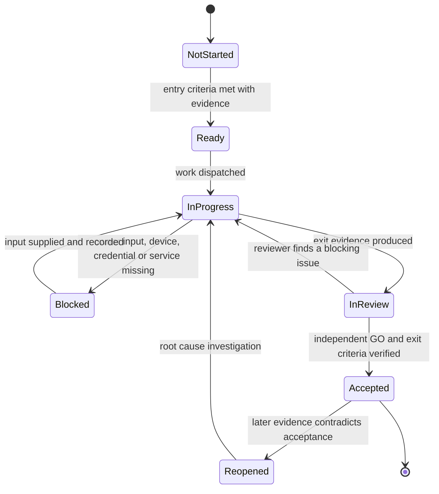
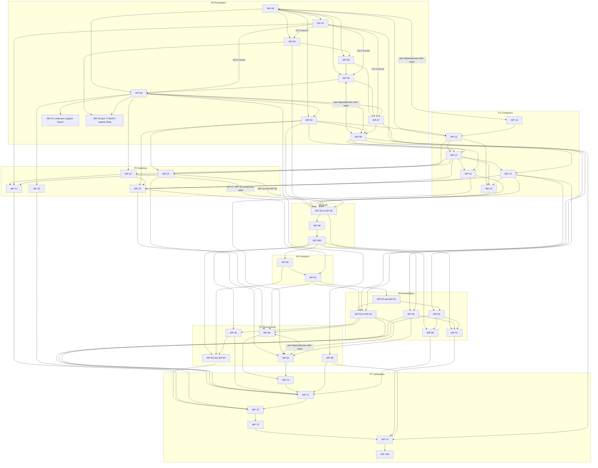

# 21 - Master Plan: Phases, Risks and Traceability

| Field | Value |
|---|---|
| Revision | 21 |
| Created | 2026-10-03 |
| Last modified | 2026-10-05 |
| Status | draft, revision 21, amended in place again, without a new revision number, for the analyze-remediation of 2026-10-05 (the Spec Kit analyze findings A1 to A26, owner-approved; section 12.23) on tasks.md rev 36 with that round (685 tasks: the frozen ids T001 to T595 plus 90 suffix ids, the round adding T011a, T045a, T048a, T051a, T081a, T087a, T429a, T530a and T574a; 323 `[TDD]`, 87 `[REVIEW]`, 116 `[P]` and 80 `[SUBAGENT]`, counted by script over the task lines; 1,502 edges from the `depends on` clauses and 1,517 with the `after` phrases, 43 forward edges over 32 tasks, no cycle) and spec.md revision 9: P0 entry criteria state the ODG-07 host-identity criterion and the phase-order exception (section 3.3), section 5.1 and section 6 carry the WP-04 traceability statement, section 8.3 reserves ODG-43 (the FR-012 scope of document classes C and D), the section 8 revision-7 measurement over 53 work packages is marked historical, and section 12.23 records the round; this amendment is unreviewed until its independent review, recorded by tasks.md T011a. Before it: amended in place for tasks.md rev 36, committed as `f44e2bb9` (676 tasks: the frozen ids T001 to T595 plus 81 suffix ids, 318 `[TDD]`, 86 `[REVIEW]`, 115 `[P]` and 80 `[SUBAGENT]`, counted by script over the task lines, each equal to rev 33; rev 34, rev 35 and rev 36 add no id, the ids in the same order, and reword 128 tasks against rev 33, 32 of them in rev 36); the revision number stays 21 because the tasks.md rev 36 prerequisites line still cites this document as "current revision, 21 at this writing" (change summary in section 12.21, its rev 36 part): the twelve central decisions C1 to C12 of T042, each one paragraph `CENTRAL Cn (definition)` and cited elsewhere as `CENTRAL Cn` (C10 the build-event hub in the adoption set with its positive, checkout-scoped identification; C11 the owner recovery `approve --recovery`; C12 the commit-turn `--holder-pid`), the `approve` refusals `reviewed_files_foreign_change` (a commit whose blob is approved-known counting as covered), `approval_older_than_manifest` and `manifest_revoked`, `reanchor` before and after the adoption with the typed phrase `REANCHOR <HEAD sha>`, the pre-release production form (`pre_release`, `pre_release_output`), `conf_code_split`, `release_seam_path_not_main`, the per-class refusal of an unset `CPA_APPROVED_DIR` and the owed list `$EV/hc/owner-trust/owed.json` (section 4.4, WP-04); the rev 33 released-seam precheck `scripts/release/seam_released.sh` removed by rev 34, every release-seam script run only through `cpa-host --exec-approved` (section 3.3 P7, WP-71, WP-73); five work-package pairs added to the Inputs cells (WP-11, WP-24, WP-30 and WP-41 after WP-04, WP-30 after WP-08; section 5.9); 1,471 and 1,486 task edges, 23 added and 3 removed against rev 33, 43 forward edges over 32 tasks, no cycle; the `BLOCKED-ON` markers unchanged from rev 33; a new open item (18), the two UNCONFIRMED of T042 owed in `$EV/p0-exit.json`; and the trust design of the CPA launcher frozen at C1 to C12 with a stop rule for further specification rounds (section 12.22). Before the rev 36 amendment revision 21 was amended in place for tasks.md rev 33, committed as `711a8c30` (676 tasks: the frozen ids T001 to T595 plus 81 suffix ids, 318 `[TDD]`, 86 `[REVIEW]`, 115 `[P]` and 80 `[SUBAGENT]`, counted by script over the task lines, each equal to rev 32; rev 33 adds no id and rewords 71 tasks, the ids in the same order); the revision number stays 21 because the tasks.md rev 33 prerequisites line still cites this document as "current revision, 21 at this writing" (change summary in section 12.21, its rev 33 part): the nine central decisions C1 to C9 of T042 (the keyed check tables with the approved row governing and the pending exit of at least 14, never 0 or 20; the cancel of a suspended run through `holder.sh` and `acquire.sh --expire`; the T039 harness of a test-state `cpa-host` and a throwaway bare remote; the empty hooks directory of every CPA git call; the read-only modes `--check-provenance` and `--exec-approved`; the `approve` refusals; owner approvals owed for the CPA-executed set only; the checked direct calls of `G-GATE` scripts with the released-seam precheck `scripts/release/seam_released.sh`; the S1 first-parent fast-forward with `adoption_commit`), the round-32 findings and the T040 exit precedence (section 4.4, WP-04); the cancel path left UNCONFIRMED by rev 32 closed by C2 (section 3.3 P7, WP-73, item (16) of section 12.2); five work-package pairs added to the Inputs cells (WP-37, WP-40 and WP-71 after WP-04, WP-73 after WP-08 and WP-12; section 5.9); 1,451 and 1,466 task edges, 9 new, all backward, 43 forward edges over 32 tasks, no cycle; the `BLOCKED-ON` markers unchanged from rev 32; a new open item (17), the T121b UNCONFIRMED on the `systemd --user` unit environment. Before the rev 33 amendment revision 21 was amended in place for tasks.md rev 32, committed as `87c6c478` (676 tasks: the frozen ids T001 to T595 plus 81 suffix ids, 318 `[TDD]`, 86 `[REVIEW]`, 115 `[P]` and 80 `[SUBAGENT]`, counted by script over the task lines; rev 32 adds T046a and rewords 61 tasks, the other ids in the same order); the revision number stays 21 because the tasks.md rev 32 prerequisites line still cites this document as "current revision, 21 at this writing" (change summary in section 12.21, its rev 32 part): the owner-installed host entry point `cpa-host` (the owner's decision of 2026-10-05, which RESOLVES the rev 31 owner decision of section 8), its one admission rule and the owner's approvals at a terminal, the mechanisms it supersedes and the residuals owed in `$EV/p0-exit.json` (section 4.4, WP-04); the owner install checkpoint T046a among the P0 human checkpoints (section 3.3 P0); the freeze re-hash check at the entry of the enumerator and the lead scan, `scripts/register/snapshot_manifest.py`, the HC-2 `lead_scan_scope`, `config/` and the scratch import without a register backup (section 4.3, WP-20); T251's `locations[0]` and `classification_rationale` (WP-33); T299 on T256, T265 and T266 (WP-39); `dependentRequired` with `inventory_na_status_missing` and the T334a rename rule applied in T383 and T399 (WP-41); the SC-005 iteration files with `sc005_not_latest` (WP-71); the conductor starting CPA as `cpa-host`, `--grant --adopt` and the T580d hook-commit run before T582 (section 3.3 P7, WP-73); 1,442 and 1,457 task edges, 43 forward edges over 32 tasks, no cycle, no work-package pair added and 0 missing; the `BLOCKED-ON` markers unchanged from rev 31. Before the rev 32 amendment revision 21 was amended in place for tasks.md rev 31, committed as `14bbb979` (675 tasks: the frozen ids T001 to T595 plus 80 suffix ids, 318 `[TDD]`, 85 `[REVIEW]`, 115 `[P]` and 80 `[SUBAGENT]`, counted by script over the task lines, each equal to rev 30; rev 31 adds no id and rewords 34 tasks, the ids in the same order); the revision number stays 21 because the tasks.md rev 31 prerequisites line still cites this document as "current revision, 21 at this writing" (change summary in section 12.21, its rev 31 part): a deciding checker admits the released provenance checker before any released file executes (`checker_not_admitted`, `checker_admitted_by`), CPA runs as the installed launcher `.audit/bin/cpa` (`install_skipped_not_descendant`, `invoked_via: redirect`), the activating push runs `--list-trusted` on its push tip (`activation_precheck_failed`), `CPA --run-id <id>` binds the commit-turn run id (`run_id_invalid`), a verdict declared in the same change set admits no gated path, and the rollback residual is stated and owed (section 4.4); an owed owner decision on a host entry point for CPA, UNCONFIRMED, without a group id (section 8; RESOLVED 2026-10-05, rev 32); the lead-scan population outside every gitlink, `.git` dropped from `untracked_root_entries`, the shared `check_freeze_snapshot.sh`, `import_args_invalid` and the scratch import during a held turn (section 4.3, WP-20); the T335a `required`-error mapping, `--require-ancestor`, `inventory_test_path_not_file`, the `fixture-consumer` fixtures and T334 completing without an ODG-38 answer, so WP-41 leaves the ODG-38 Blocks cell (WP-41, section 8); T334a on T308, so WP-39R joins the WP-41 Inputs; the conductor as commit-turn grant holder, T567's one reap, `scripts/qa/sc005_verdict_check.py` a release-seam file and T581 on T580f (section 3.3 P7, WP-71, WP-73); 1,424 and 1,439 task edges, 43 forward edges over 32 tasks, no cycle, 0 work-package pairs missing after the one addition; 174 `BLOCKED-ON` tokens by the rev 30 count. Before the rev 31 amendment revision 21 was amended in place for tasks.md rev 30, committed as `84145b2e` (675 tasks: the frozen ids T001 to T595 plus 80 suffix ids, 318 `[TDD]`, 85 `[REVIEW]`, 115 `[P]` and 80 `[SUBAGENT]`, counted by script over the task lines, each equal to rev 29; rev 30 adds no id and rewords 45 tasks, the ids in the same order); the revision number stays 21 because the tasks.md rev 30 prerequisites line still cites this document as "current revision, 21 at this writing" (change summary in section 12.21, its rev 30 part): every reader of a verdict reads it and its provenance record at its GO introduction I(v, R) (`verdict_go_ambiguous`, `self_release_verdict_after_commit`), the provenance record binds `verdict_sha256`, the check is activated one-way (`check_downgrade`), `--list-trusted` accepts superseding `-r<n>` verdicts and T047 prechecks the adoption verdict (section 4.4); T165 canonicalises the scratch root on the host (section 4.3); the T161 freeze lists NUL-separated paths (`ls-tree -r -z`, `freeze_path_unsafe`) and compares pending pins at top level only, T162 to T164 depend on T121, and T175 checks the lead-scan replay count (`lead_scan_replay_count_mismatch`) (WP-20); concrete inventory paths only (`inventory_schema_invalid`), `inventory_na_pending_no_decision`, T335a and T336a on T326, T337 on T318a, and T321 completing without an ODG-38 answer, so WP-40 leaves the ODG-38 Blocks cell (WP-40, WP-41, section 8); T517's first soak run triggered by the P5 exit record (WP-62); T570a also holding `scripts/qa/redgreen_sample.py` (WP-71); the T580f qa-cycle scope, the rev 30 grant shape, the proven-dead reap, T581 (0), and T580e on T001, T050 and T064, so WP-05, WP-06 and WP-09 join the WP-73 Inputs (WP-73); 1,422 and 1,437 task edges, 43 forward edges over 32 tasks, no cycle, 0 work-package pairs missing after the three additions; 175 `BLOCKED-ON` tokens. Before the rev 30 amendment revision 21 was amended in place for tasks.md rev 29, committed as `7daa7938` (675 tasks: the frozen ids T001 to T595 plus 80 suffix ids, the new T335a and T570a among them, 318 `[TDD]`, 85 `[REVIEW]`, 115 `[P]` and 80 `[SUBAGENT]`, counted by script; 58 tasks reworded); the revision number stays 21 because the tasks.md rev 29 prerequisites line cites this document as "current revision, 21 at this writing" (change summary in section 12.21, its rev 29 part): launcher clause (1) reads the adoption verdict at the adoption commit A (`adoption_commit_ambiguous`), one `check_pending_release` rule at every provenance site, T094d changing the checker (`--site`, `--list-trusted`) and T095 checking every `Self-Release:` verdict of its range (section 4.4); RUNP refuses a symlinked or non-canonical `--rw` bind source (`rw_source_not_canonical`) and T175 compares natural-key entry sets (`entry_set_mismatch`) (section 4.3); the T161 freeze walks the recorded shas with absolute paths and hashes a symlink by its `readlink` target string, and WP-03, WP-04 and WP-05 join the WP-20 Inputs (T161 on T032, T042 and T050); the contract inventory's `n_a_status` and `n_a_source` and the new path check T335a (WP-41); T518 on T506 to T517 (WP-62); T570's verdict-coverage change set held on `$EV/reviews/WP-71-verdict-coverage.json` and reviewed by the new T570a, on which T569 depends (WP-71); the T580e commit-turn freeze (`commit_turn_held`) and the reviewed dump `$EV/reviews/WP-73-qa-cycle-<fingerprint>.json` (WP-73); 160 work-package pairs (164 with the `after` phrases), 0 missing after the three additions, 1,409 and 1,424 task edges, 43 forward edges over 32 tasks, no cycle; item (15) of section 12.2 closed. Before that amendment revision 21 read: change summary in section 12.21: reconciled with tasks.md rev 28, committed as `fb1d1982` (673 tasks: the frozen ids T001 to T595 plus 78 suffix ids, 317 `[TDD]`, 84 `[REVIEW]`, 115 `[P]` and 80 `[SUBAGENT]`, counted by script, the same counts as rev 27, which rev 28 rewrites without adding an id, 52 tasks reworded): the review provenance check `scripts/review/check_review_provenance.sh` runs inside clause (b) of the shared CPA-commit test (S1, S5, S6, the launcher, the T095 reconciliation) and on every `Self-Release:` acceptance, sites reporting `check_pending_release` from the T047 adoption until T094d is released; the waiver roster read from the released commit only (`roster_changed_in_run`); an `hc` record allowed inside the self-release change set it authorises (section 4.4); T161 materialises the freeze with `git read-tree` and `git checkout-index`, never `git archive`, its listing files only and the gitlinks recorded in `freeze.json` (WP-20); the scratch import through RUNP's `--rw .audit/scratch`, the `backfill_baseline_moved` baseline and T134's terminal state `blocked` `nfs_client_unverified` (section 4.3, WP-13); the T580e commit turn `scripts/release/commit_turn_check.sh` replacing the records-only window run, the SC-005 closure mode `--require-final` and the increment verdict `$EV/reviews/WP-73-increment-<fingerprint>.json` (section 3.3 P7, WP-71, WP-73); `$SPEC/perf/sc011_status.json` a listed release-seam file (WP-62, the G-GATE row); 157 work-package pairs (161 with the `after` phrases), 0 missing, 42 forward edges over 32 tasks, no cycle; item (15) of section 12.2 opened). Revision 20 (change summary in section 12.20: reconciled with tasks.md rev 27, committed as `13bc5de0` (673 tasks: the frozen ids T001 to T595 plus 78 suffix ids, 317 `[TDD]`, 84 `[REVIEW]`, 115 `[P]` and 80 `[SUBAGENT]`, counted by script, the same counts as rev 26, which rev 27 rewrites without adding an id): the SC-005 review T571 writes a `scoped` GO that releases the covered T572 commits and records each constitution-test survivor `routed_to_T580b`, and its `final` GO, which T579a awaits, only after the T580b (3c) re-check, both checked by `scripts/qa/sc005_verdict_check.py` (T570), which removes the rev 26 cycle T571 -> T580b -> T572 -> T571 (section 3.3 P7, WP-71, WP-73, section 12.2); `docs/security/SLSA_LEVEL.md` an excluded record of the release-seam rule, a T569 refusal of it rewritten by T447b and held on `$EV/reviews/WP-56-slsa-<fingerprint>.json` (WP-56); the T580e (0) commit window exempting the paths the following CPA run declares, over the union of concurrent fix streams; signed `hc` waiver records under the gated class `waiver_hc` and `roster_key_missing` (section 4.4); the unit kind map `scripts/audit/unit_kinds.tsv` written by T225 and the seed-before-mint order (section 3.3 P3 entry); the run-half, `artifact_kind` and `libc` split between T121a, T121b and T212 (section 4.3); WP-30 added to the WP-37 and WP-38 Inputs; the tasks.md parse rule (depends-on with nested parentheses: 42 forward edges over 32 tasks, no cycle) adopted, items (11) to (13) of section 12.2 closed). Revision 19 (change summary in section 12.19: reconciled with tasks.md rev 26, committed as `616fb74a` while this revision was written and measured on that committed blob (673 tasks: the frozen ids T001 to T595 plus 78 suffix ids, 317 `[TDD]`, 84 `[REVIEW]`, 115 `[P]` and 80 `[SUBAGENT]`, counted by script over the task lines; rev 25, committed as `2e1fd314` with 671 tasks, added T134a, and rev 26 adds T225d and T225e), the committed rev 24 (`c2b01d73`, the text that revision 18 measured as a candidate) and rev 25 being in its history: each QA deploy of the release candidate mints its own version increment, applied as the first held commit of its fix cycle, and only the final, finding-free candidate's increment is deferred past T595b (WP-73, IC-65, section 5.9); the pre-qa escape seam judges only the cycle `qa-<fingerprint>` of that candidate (`pre_qa_no_candidate_cycle`, WP-71, section 3.3 P7); the path-gate table gains the class `release_seam` and the exact G-GATE paths `scripts/qa/guard_registry.tsv`, `scripts/repo/commit_push.conf` and the review-verdict schema, while `fixture_roots.txt` follows only T040b's held-table rule; the CPA-commit predicate, the launcher's reviewed-code check `released_code_unreviewed` and the waiver attestation `attestation_invalid` (section 4.4, WP-04); the P1 terminal-state rule and the T134 and T134a split of the NFS work (section 3.3 P1, WP-13, WP-14); IMG-INFRA-CLIENT, IMG-SIGVERIFY, the `run_image` and `artifact_kind` lane columns and the lock `libc` field (section 4.3); the baseline reasons `image_not_built` and `artifact_not_yet_built` (section 3.3 P2); the unit-id check T225d, the `reg_components` seed T225e, the unit `security-xcut` and the scan exclusion list (section 3.3 P3, WP-30); the 16 class-(c) rows among the `owed_to_T580b` rows (WP-55); ODG-07 blocks WP-41 and ODG-15 blocks WP-04 (section 8); 10 work-package pairs added to the Inputs cells and 1 edge to the section 5.9 diagram; sections 5.9, 8, 12.2 and 12.7 re-measured with seeded controls; plan.md revision 14, README revision 14, quickstart revision 15, research revision 16 and data-model revision 16 written in the same round). Revision 18 (change summary in section 12.18: reconciled with the tasks.md rev 24 candidate, the integrator's assembly of the five rev 24 slices, then not yet committed and since committed unchanged in task count as `c2b01d73` (670 tasks: the frozen ids T001 to T595 plus 75 suffix ids, 315 `[TDD]` and 84 `[REVIEW]`, counted by script; rev 18 to rev 24 added T084a, T139a, T175a, T200a, T225a, T225b, T225c, T240a, T241a, T254a, T254b, T272a, T277a, T277b, T288a, T288b, T318a, T322a, T334a, T336a, T420a, T456a, T456b, T456c, T564a, T566a, T580d, T580e and T580f), and with contracts revision 16 (a verdict's `gate` is a gate id or a list of gate ids): WP-58, the fix wave of the WP-36 findings, makes 54 work packages (sections 1.3, 3.1, 4.1, 5.6, 5.9, 6, 11.2); the review gate of each declared path is decided by the reviewed table `scripts/repo/path_gates.tsv` and checked at S2, S5 and S6, with one `--self-release` mode (section 4.4, WP-04, IC-62); the WP-23 baselines record a remote leg with no qualified host as `blocked-unavailable`, so the P2 exit does not wait on ODG-07 and WP-23 leaves the ODG-07 and ODG-29 Blocks cells (section 3.3 P2, section 8, IC-63); the P3 unit partition, index readiness, registry snapshots and the eight WP-36 units (section 3.3 P3, WP-30, WP-31, WP-36, section 6.3, IC-64); the final manual QA of the candidate after HC-6 behind the QA-deploy-readiness gate, and the next cycle's version increment (section 3.3 P7, WP-71, WP-73, WP-74R, IC-65); WP-24 joins the ODG-07 Blocks cell, WP-61 the ODG-32 one, and WP-55 leaves the ODG-12 one (section 8); 27 work-package pairs added to the Inputs cells and 9 edges to the section 5.9 diagram; section 12.2 re-measures the dependency graph (1,179 distinct edges, no cycle once the two `after` phrases that are not dependencies are left out, 22 tasks with 26 forward references), the 147 work-package pairs and the `BLOCKED-ON` markers (173 tokens, 0 two-way and marker violations, 0 reverse gaps), each with seeded controls, and rewrites the items open with the tasks.md owner (four of the six closed); section 12.7 re-runs the task-id citation check over the whole plan set on the candidate; plan.md revision 13, README revision 13, quickstart revision 14, research revision 15 and data-model revision 15 written in the same round). Revision 17 (change summary in section 12.17: reconciled with the committed tasks.md rev 17, commit `b34a03f6` (641 tasks: the frozen ids T001 to T595 plus 46 suffix ids, 302 `[TDD]` and 74 `[REVIEW]`; rev 15 added T137a and T440c, rev 16 none, rev 17 T442a, T442b and T580c), which closes the rev 15 reconciliation that revision 16 left owed: section 1.3 re-projects the evidence-ledger row on the 302 `[TDD]` tasks; section 4.3 states the class of each image and the split lanes (tasks.md T121a, T121b); the WP-09, WP-12 and WP-55 rows name T137a, the image classes and the accepted-pins comparison; section 12.2 re-measures on the committed rev 17 the reverse reconciliation (0 two-way violations, 0 marker violations, 0 reverse gaps), the dependency graph (670 distinct edges, no cycle, no dangling id, 11 tasks with 14 forward references) and the 94 work-package pairs, and rewrites the eight items left with the tasks.md owner: the T582 SLSA record check and the exit code of a suspended commit-push run are closed by rev 15, the Revision field by rev 17, while the order-of-work-packages sentence and the Notes renumbering text, the `compileSdk 34` wording of the WP-14 entry, the `BLOCKED-ON ODG-12` phrase of T440 (c), the ODG-07 input of the WP-71 Inputs line and the T043 mutation of IC-51 stay open; section 12.7 re-runs the task-id citation check over the whole plan set on rev 17; docs/06 revision 18, docs/11 revision 13, docs/12 revision 13, docs/16 revision 14, data-model revision 14, research revision 14, quickstart revision 13 and README revision 12 reconcile the driver-secret location, the purpose key, the terminal rename, build groups, the suspended commit-push run and the accepted-pins check; tasks.md rev 18 (commit `690abece`, 642 tasks), committed while this revision was written, is not reconciled here and is listed as owed in section 12.2. Revision 16 (change summary in section 12.16: reconciled with the committed tasks.md rev 14, commit `9074c177` (636 tasks: the frozen ids T001 to T595 plus 41 suffix ids; rev 14 added T005d, T094d, T121b, T435c, T440b and T447b): the Blocks cells of ODG-07, ODG-30 and ODG-31 narrowed to the work packages where tasks.md rev 14 places their `BLOCKED-ON` markers (ODG-07 blocks only for the build-host identity, in P0 to P3 and WP-62; ODG-29 only the case where the latest AGP cannot build; ODG-30 only the contract tool; ODG-31 only the FTP and WebDAV crates), with the matching Inputs cells; the Default cells of ODG-13 and ODG-16 restored to the closed token set that tasks.md T011 reads (`Yes` and `No`, each noted answered), so the defaults read Yes 3, Partial 3, UNCONFIRMED 4, No 32 over the 42 groups and Yes 2, Partial 3, UNCONFIRMED 4, No 31 over the 40 still open, 55 of the 57 imported decision items staying `Operator-blocked` (tasks.md T072); seven work-package pairs that rev 14 brings added to the Inputs cells and three edges to the section 5.9 diagram; the dependency graph, forward references, cycles, `BLOCKED-ON` markers, two-way rule and task-id citations re-measured on the committed text (sections 5.9, 8, 12.2, 12.7); tasks.md rev 15 (commit `5acdd7f4`, 638 tasks), committed while this revision was written, is not reconciled here and is listed as owed in section 12.2. Revision 15 (change summary in section 12.15: the owner decisions of 2026-10-04 applied, C1 to ODG-07 (every build on the remote build host, dispatched event-driven, the local-containers-only option removed), C2 to ODG-16 (SLSA Build L2 at minimum, no L1 interim) and the FR-017 answer to ODG-13 (every pin and package dependency moved to latest whenever possible after its tests pass), with ODG-41, WP-09, WP-55 to WP-57, the FR-017, FR-021, FR-025 and SC-009 rows, R-01, R-13 and the defaults count aligned, reconciled with the tasks.md rev 13 candidate of 630 tasks; revision 14 in section 12.14, revision 13 in section 12.13, revision 12 in section 12.12, revision 11 in section 12.11, revision 10 in section 12.10, revision 9 in section 12.9, revision 8 in section 12.8, revision 7 in section 12.6, revision 6 in section 12.3). Revision 14 records the plan owner's decisions taken after the round-12 reviews (the tasks.md P4 to P7 review I-1 to I-4, and the cross-document consistency and content reviews of commit `d014297e`) as the P4 to P7 half of tasks.md rev 13 carries them, its task ids unchanged (613 tasks; every task-id citation checked against the committed tasks.md rev 12 text, section 12.7): a moved module's nested gitlinks are settled in the same lock hold by the helper's `--settle-nested` mode, the constitution's own work is done in the T580b (3c) run, a retired nested checkout goes to `.audit/removed/<op_id>/<path>/`, and the ODG-13 basis is stated (IC-59, section 8.3); a pointer change set lowers every row that the move brings below its count, reported or not (IC-51, reopened until the P0 to P3 fixtures land); FR-008 and SC-003 are stated UNMET while the `legacy headerless documents` item is open unless the owner amends them for that class, the new decision ODG-42 (IC-60, section 8.3; 42 groups); the can-i-deploy matrix is judged at the release seam for the candidate provider version with its verdict written under `.audit/out/<op_id>/` (IC-61, WP-71 gains the input WP-41); the P7 exit criteria and WP-55, WP-61, WP-71, WP-72, WP-73, WP-74 and WP-74R are aligned; IC-55 to IC-57 record the open items of the reviews of `d014297e` that tasks.md has not settled (the empty-range backup of `--commit-before-integrate`, the append-only flake ledger, the re-recording target path, the stricter-table refusal and the whitespace of the legacy collections); sections 6, 8, 12.1, 12.2 and 12.7 re-measured; the owner decisions recorded on 2026-10-04, pending confirmation, in spec.md revisions 7 and 8 are noted where they touch this revision (ODG-42 answered (a), the FR-017 widening in the ODG-13 row) and their remaining propagation is listed as owed in section 12.2. Revision 13 reconciles this plan with tasks.md rev 12 (613 tasks: the frozen ids T001 to T595 plus the 18 suffix ids T040a, T040b, T042a, T064a, T248a, T283a, T308a, T394a, T434a, T435a, T435b, T448a, T462a, T579a, T580a, T580b, T595a and T595b; rev 12 added T448a) and records the plan owner's decisions taken after the round-11 reviews of commit `a2ebc097`: the evidence ledgers get their own class `evidence-ledger` with a 32 MiB bound, a raise trigger `ledger_raise_owed` at 75% and a held raise step owned by ST-QA, and the register size alarm moves to 75% of its bound (IC-54); a table change held on its review judges only the paths held on that same verdict with the declared tables and refuses an unheld path that the two table sets judge differently (20, `table_admits_unheld_path`), and the class resolution order, the check registry scope and `check_unknown` are stated (IC-55); a foreign push that overlaps a window's change set is integrated by a `--commit-before-integrate` re-run, the chained and binary stores have a single writer and are re-recorded on a conflict (20, `store_not_rerecorded`), a live merge holder is refused as `lock_held`, `SKIP_LONG` is recorded at S0 and a stray argument is refused (IC-56); the revision-header check applies to new and edited Markdown files, the legacy collections form class `legacy-collection` and the 665 remaining main-repository keys belong to one tracked `Task` item that the zero-open-findings rule excludes by name (IC-57); another actor's commits that a merge brings into the main repository after the candidate was built are the main repository's ODG-41 kind (`foreign_outside_candidate`; IC-58, section 8.3); a `--repo` reduction is reported `baseline_lowering_owed` and lowered by the pointer change set that moves the pin (IC-51, which revision 12 called closed, reopened and closed on tasks.md rev 12); the pending-row helper gains `--init` and `--retire` for nested gitlinks that a constitution update adds or deletes (IC-43); WP-04, WP-05, WP-06, WP-08, WP-55, WP-56 (T448a), WP-73 and WP-74R are updated, two Inputs pairs and one diagram edge are added (section 5.9), R-35 is added and R-27 extended; sections 5.9, 8, 12.2 and 12.7 are re-measured on tasks.md rev 12. Revision 12 reconciles this plan with tasks.md rev 11 (612 tasks: the frozen ids T001 to T595 plus the 17 suffix ids T040a, T040b, T042a, T064a, T248a, T283a, T308a, T394a, T434a, T435a, T435b, T462a, T579a, T580a, T580b, T595a and T595b; rev 10 added no id, rev 11 added T040b, T308a and T394a) and records the plan owner's rules taken after the round-10 reviews of commit `6dca8771`: which check of the commit-push stages S2 and S3 applies to a file is decided by a reviewed path-class table (rule (V)), the S2 secret fold carries a hex filter and the private-key check a reviewed carrier list, and one register bound of 16 MiB per file needs a description cap of 2,048 bytes (IC-52, replacing the exemption list of IC-50); a merge commit that the script makes is held on its own merge-review file, a conflict is resolved only by a `--resolve-merge` run, a merge in progress is refused, and nothing below an unreleased merge is pushed (IC-53, completing IC-49); the NO-GO revert is held on the same verdict and a GO must list every held commit that awaits its file (IC-46); rule (X) has three forms (IC-51); ODG-41 compares against reference tips recorded per repository (section 8.3); WP-04, WP-52 and sections 4.1, 4.4 and 11.2 carry the new tasks T040b, T394a and T308a; sections 5.9, 8 and 12.2 are re-measured; the items that revision 11 left with the tasks.md owner are closed where tasks.md rev 10 or rev 11 carries them (IC-42, IC-43, IC-46, IC-47, section 12.2). Revision 11 reconciles this plan with tasks.md rev 9 (609 tasks: the frozen ids T001 to T595 plus the suffix ids T040a, T042a, T064a, T248a, T283a, T434a, T435a, T435b, T462a, T579a, T580a, T580b, T595a and T595b) and records the plan owner's rules taken after the review of commit `b9412d06`: the commit-push script integrates a diverged repository itself with a `git merge --no-ff` commit that carries its run trailer and `Foreign-Commit:` lines and is held when it resolves conflicts or merges into a held range (IC-49); the checks taken from pre-commit carry their file filters and a reviewed exemption list, with a 16 MiB size bound for the register database (IC-50); ratchet baselines are keyed from the main root over every own-organisation repository, and a new baseline may be committed held on the verdict it names (IC-51). It closes IC-47 on the tasks.md rev 9 P3 entry block (the audited input `input_tree`; doc02 revision 7), corrects the clean-tree citation rule to the run that made the measured HEAD (IC-42), closes IC-37, IC-43 (i) to (iii) and IC-48 as tasks.md rev 9 carries them, records the rev 9 refusals, the per-repository `Foreign-Commit:` lines and the NO-GO path in IC-46, adds seven missing Inputs pairs and the WP-65 to WP-71 edge, names T580b in WP-73, starts the ODG-41 freeze window at T579a, names the verdict file pattern and `blocking_findings` in section 4.4, and re-measures section 12.2. Revision 10 reconciles this plan with tasks.md rev 8 (604 tasks: the frozen ids T001 to T595 plus the suffix ids T040a, T042a, T248a, T283a, T434a, T462a, T580a, T595a and T595b) and records the plan owner's rules for held commits taken after the review of commit `af664ed0` (IC-46): an `Awaits-Review:` path is always resolved against the main repository, and a verdict releases a held commit only when it is committed there with `verdict: GO` and its `covers_runs` names the held commit's `CPA-Run` id; a hold inside a submodule in main mode is refused and a parent gitlink never publishes a pin no remote holds; a hold on a verdict that is already GO is refused; `Foreign-Commit:` names only commits a live remote tip held at S1; every review verdict carries `covers_runs` (contract `review-verdict/1`); clean-tree tests use the clean tracked tree; SQLite backups use the online backup and never hardlinks; the checks taken from pre-commit run in check-only forms. It also adds the four commit lines to IC-42, corrects the verifier's `--fetch` form (IC-37), updates IC-43, withdraws the repeat-run exclusion of docs/02 as UNCONFIRMED (IC-47), aligns section 12.7 with tasks.md T283a (IC-48), raises ODG-41 (strict verification against commits other actors push after the final pushes) and adds the final constitution update to ODG-12, adds the WP-04 and WP-08 part edge and the WP-60 input WP-50, adds IMG-GOTOOLS and the commit-push check tools to section 4.3, and orders the WP-74R closing steps as T593, T595a, T595b. Revision 9 reconciles this plan with tasks.md rev 7 (601 tasks: the frozen ids T001 to T595 plus the suffix ids T040a, T042a, T248a, T434a, T462a and T580a) and records the plan owner's commit-push design taken after the review of commit `1a69eed5`: the script writes only its ignored run folder `.audit/commit-push/<run_id>/` and never the tracked tree, the record of a push is the commit and its `CPA-Run:` trailer, every clean-tree gate is measured on the tracked tree (IC-42), pending pin moves of `--repo` runs (IC-43), one home for the no-workflow-file check (IC-44) and one owner of `.secrets.baseline` (IC-45); IC-38 updated and IC-41 closed; the task-id citation check of section 12.7 is described as a runnable script for its WP-37 task; WP-61 names T498 after T421; the §4.3 IMG-DOCS and IMG-TESTUTIL rows list the Python test tools; the OD-20 row no longer states what tasks.md says; the section 12.2 marker and IC-41 items closed. Revision 8 reconciles this plan with tasks.md rev 6 (595 tasks, ids T001 to T595 frozen from this round; a later task takes a suffix id such as T039a): every task-id citation remapped to the current id, checked by the task-id citation check of section 12.7 (a planted stale id fails it); the Inputs cells and the section 5.9 diagram re-measured against the current cross-package dependencies (eleven pairs added: WP-02 split, WP-37 after WP-20, WP-60 after WP-53, WP-63 after WP-62, WP-71 after WP-24, and WP-09 and WP-06 inputs of P0, P1 and P2 packages); ODG-39 blocks WP-20 as well as WP-74; the doc08 seed WEB-F21 counted (254 seeds, still at most 198 items); IC-41 resolved and refined (S1 stops only for a changed submodule that holds unpublished commits); the P6 and P7 exits place the zero-survivor reviewer mutation sample in WP-71; OD-20's closest group is ODG-17. Revision 7 re-measures this plan against the merged tasks.md rev 5: the work-package Inputs cells name every cross-package task dependency of tasks.md (with the part each one gates) and the section 5.9 diagram carries a path for each; the Blocks cells name every work package with a `BLOCKED-ON` marker (ODG-07 and ODG-29 in WP-15); the HC-0 entry deviation; IMG-QA named; ODG-15 names `milos85vasic`; OQ-S10 routed to ODG-40; routine commit-push S7 runs the verifier with `--fetch`; IC-41 (S1 and a behind submodule in the change set); the reverse gaps of section 12.2 re-measured. Revision 6 applies the cross-document review of tasks.md rev 4, the review of the revision-5 edits, the hygiene sweep and the volume and coverage audit: doc18 R-ADJ seeds and the innovation intake (sections 9.1, 9.3, 9.5, ODG-39), licence policy (ODG-40), Blocks cells reconciled with the tasks.md `BLOCKED-ON` markers, IMG-KCOV built on the IMG-TESTUTIL base, the P2 and P7 exit criteria rewritten in register and v1-report terms, the verifier mode decision in IC-37, IC-39 and IC-40, and the new work folded into existing work packages (section 12.4). Revision 5 applied the tasks.md rev 3 cross-check: section 8.6 (16 ungrouped `research.md` decisions), the planning-rule-6 exception for ODG-34 and ODG-35, the `$AUD` and `$EV` shorthands, IMG-TESTUTIL in WP-09 (IC-35), and IC-36 to IC-38 |
| Feature | specs/001-full-project-audit-remediation |
| Role | Synthesis of plan documents 01 to 20 (plans 01 to 18, proof-of-concept tools 19, second-pass research 20) into one executable plan. It adds no new facts about the code; every number is quoted from a source document (cited as `docNN §x`) or labelled `UNCONFIRMED:` |
| Inputs read | `spec.md`; `research.md` (its owner decisions are numbered OD-01 to OD-79; this document groups them as ODG-01 to ODG-42 (ODG-34, ODG-35, ODG-39, ODG-40, ODG-41 and ODG-42 have no `research.md` counterpart) and section 8 maps one to the other, so the two id spaces never collide); documents 01 to 20 in this folder (headings plus the decision, risk, finding, work-package and traceability sections of each). Documents 19 and 20 arrived while this file was being written and were incorporated in the same revision (section 12). Index of every plan document: [`../README.md`](../README.md) |
| Traceability | FR-001 to FR-025, SC-001 to SC-012 (complete matrix in section 6) |
| Governance anchors | §11.4.6, §11.4.20, §11.4.58, §11.4.66, §11.4.101, §11.4.113, §11.4.115, §11.4.122, §11.4.124, §11.4.132, §11.4.142, §11.4.173, §11.4.209, §11.4.224, §11.4.227, §11.4.230, §11.4.234, §12.6, §12.12 |

## Table of contents

1. [Executive summary and critical path](#1-executive-summary-and-critical-path)
2. [Planning rules applied in this synthesis](#2-planning-rules-applied-in-this-synthesis)
3. [Phased execution plan](#3-phased-execution-plan)
4. [Work streams, concurrency limits, containers, review gates](#4-work-streams-concurrency-limits-containers-review-gates)
5. [Work-package catalogue](#5-work-package-catalogue)
6. [Requirement traceability matrix](#6-requirement-traceability-matrix)
7. [Master risk register and heat table](#7-master-risk-register-and-heat-table)
8. [Owner decisions and inputs](#8-owner-decisions-and-inputs)
9. [Seed findings already identified](#9-seed-findings-already-identified)
10. [Cross-document inconsistencies and resolutions](#10-cross-document-inconsistencies-and-resolutions)
11. [Effort model](#11-effort-model)
12. [Document set status and open items](#12-document-set-status-and-open-items)

---

## 1. Executive summary and critical path

### 1.1 What the plan does

The feature delivers seven user stories (spec P1: register, audit, proven fixes; P2: documentation, per-application consistency, dependencies; P3: nothing unpushed). The twenty plan documents (01 to 18 plans, 19 proof-of-concept tools, 20 research) agree on one shape, which this document fixes as the execution order:

1. **Prove the instruments before using them.** The code indexes fail their own health checks today: CodeGraph covers 7,150 files and Lumen 10,397 with `Stale: yes`, there is no scope DATA file, no `.lumenignore` and no `.mcp.json` (doc02 §2, findings F-INDEX-001 to -006). Detectors are absent from the host and one existing detector is already proven blind (the `awk '\bunwrap\(\)'` rule, doc09 D-04; the Snyk results that are failed scans read as clean, doc03 F-8). Nothing is audited until the index gate (P1 to P8, doc02 §4.1) and the control-needle discipline exist.
2. **Build the register and the evidence machinery before the first finding.** The constitution-mandated workable-items database does not exist (doc03 F-1); `.gitignore:85` would ignore it the moment it is created (doc04 §2.4). The register (doc04) and the evidence recorder (doc06) are the first customers of their own rules.
3. **Containerize before any build or test.** Four existing container assets cannot build from a clean checkout (doc16 D-01 to D-04); `auto-container.sh` builds on the bare host when the host has the tool (D-08). FR-021 forbids bare-host builds, so every audit and test run waits on Phase 1.
4. **Import everything already known.** About 4,700 candidate source entries (doc03 §7, ESTIMATE; doc03's own sum is 4,729 before the claim-document leads and includes the latest gosec run of 810 findings), dominated by 1,778 HelixQA tickets whose `HELIX-NNN` ids collide (676 distinct ids, doc03 F-2), 1,111 closures without evidence (F-4) and 282 `wontfix` closures that FR-008 does not permit (doc04 §3 DR-5).
5. **Audit every application twice from the same state** (SC-002), with independent review (FR-023).
6. **Fix contracts before clients.** Client-to-server drift is measured in every client (doc01 §14 C2 to C5; doc08 WEB-F03; doc09 D-01; doc10 H10-11, H10-13). The live route dump and both-sided contract tests (doc07 W7, doc05 TS-05) come before any client fix, so a client is never fixed against a contract that is about to change.
7. **Remediate by risk, prove every fix RED then GREEN three times** (FR-008, SC-003), then close the test-type matrix (SC-004), convert 1,178 prose QA steps (doc12 §2.3), run the documentation programme (2,520 orphans as of 2026-10-03T12:02Z, doc13 §2.1 stamp; 2,498 at first measurement) and the performance programme (SC-011).
8. **Verify recursively and close.** Zero open findings except the vendored exception class (FR-008), all repositories clean and pushed (SC-010), every completion claim cited (SC-012).

### 1.2 Critical path

The critical path is set by dependencies, not by effort. Two chains run in parallel, converge at WP-71 (full retest on the candidate) and end together at WP-74 (evidence pack and report checker) and WP-74R (final independent review):

- **Engineering chain:** WP-09 bootstrap image slice (its image builds are remote builds through the event-driven dispatcher, so WP-09 waits for the ODG-07 host identity, tasks.md T006a; revision 15) -> WP-05 evidence recorder and WP-06 register -> WP-10 host probes -> WP-11 image pinning and broken-asset fixes -> WP-12 runners -> WP-13 real-service stack -> WP-30..WP-38 audit pass (WP-02 index gate, WP-05 evidence recorder and WP-15 detector harness are inputs of every audit package WP-30 to WP-36; WP-13 is an input of WP-30, WP-35 and WP-38) -> WP-39 repeat run -> WP-39R audit review -> WP-40 live route dump -> WP-41 contract tests -> WP-50/WP-51 server fixes -> WP-52..WP-54 client fixes -> WP-61 test-type closure -> WP-71 full retest -> WP-72 -> WP-73 -> WP-74 -> WP-74R.
- **Owner chain:** WP-01 decision intake -> owner supplies build-host confirmation (ODG-07, needed from WP-09 on, because the owner's C1 answer leaves no local build; revision 15), devices (ODG-04), credentials (ODG-01), desktop hosts (ODG-06) and the legacy-closure policy (ODG-09) -> WP-10 host probes -> WP-11 and WP-14 -> the device- and credential-gated work in WP-14, WP-21, WP-54, WP-60, WP-62 -> WP-71.

WP-02's work does not depend on WP-01's decisions: the index gate needs neither an owner decision nor a device, so it starts in parallel with the decision intake. Only its commit step waits for the HC-0 record that WP-01 writes (tasks.md T014, revision 7), as every committing step of P0 does (section 3.3, P0 entry criteria). The commit-push script needs one part of WP-08 before it (revision 10): its stage S0 takes the long-op lock and runs the check that no registered build writes a tracked path, both from WP-08 (tasks.md T042 after T089), so that part sits on this path before WP-04, while the rest of WP-08 follows WP-04. WP-09 exists so that WP-02 to WP-06 can run their tests in pinned containers during P0 instead of waiting for the P1 image programme (section 3.3, P0): the read-only parts of WP-02 and WP-03 start at once, and their test legs (WP-02 scope-derivation tests, WP-03 verifier fixture tests) wait for the WP-09 pinned runner and tool-to-image map (revision 6, IC-35).

FR-025 makes the owner chain binding: a test that needs an absent device or credential is `blocked-unavailable`, counts as not passing, and the feature cannot complete (spec FR-008, FR-025). The probability that the owner chain, not engineering effort, sets the completion point is high (risk R-05, R-06). The plan therefore issues the full owner request list at the start (WP-01), not when a test first blocks.

```mermaid
flowchart LR
  A["WP-01 Owner decision intake"]
  B["WP-02 Index health gate"]
  B0["WP-09 Bootstrap image slice"]
  C0["WP-03 Recursive verifier"]
  C["WP-04 Commit-push script"]
  C8["WP-08 part: long-op lock and writer check (revision 10)"]
  D["WP-05 Evidence recorder and WP-06 Register"]
  E["WP-07 Constitution pin bump"]
  F0["WP-10 Host probes"]
  F["WP-11 Image pinning and broken assets"]
  G["WP-12 Container runners"]
  H["WP-13 Real-service stack"]
  I["WP-20 Source import"]
  J["WP-30 to WP-38 Audit pass 1 (inputs per package, section 5.4)"]
  K["WP-39 Audit repeat"]
  K2["WP-39R Audit review"]
  L["WP-40 Live route dump"]
  M["WP-41 Both-sided contract tests"]
  N["WP-50 and WP-51 Server fixes"]
  O["WP-52 to WP-54 Client fixes"]
  P["WP-61 Test-type closure"]
  Q["WP-71 Full retest on candidate"]
  R["WP-73 Final manual QA, recursive verification and push"]
  S["WP-74 Evidence pack and report checker"]
  S2["WP-74R Final independent review"]
  T["Owner supplies devices, credentials, hosts"]
  B0 -->|"test legs"| B
  B0 -->|"test legs"| C0
  C0 --> C
  B0 --> C
  B0 -->|"test legs"| C8
  C8 --> C
  B0 --> D
  C0 --> E
  C --> E
  B0 --> F0
  D -->|"P0 exit, phase gate"| F0
  F0 --> F
  B0 --> F
  F --> G
  G --> H
  D --> I
  B --> J
  H --> J
  I --> J
  J --> K
  K --> K2
  K2 --> L
  L --> M
  M --> N
  N --> O
  O --> P
  P --> Q
  Q --> R
  R --> S
  S --> S2
  A --> T
  T --> F0
  T --> O
  T --> P
```

### 1.3 Headline numbers the plan must absorb

| Quantity | Value | Source |
|---|---:|---|
| Applications and shared components in scope | 13 units (doc02 §1) | doc02 |
| Direct submodules / recursive repositories | 44 / 97 (44 direct plus 53 nested; `git submodule status --recursive`, re-measured 2026-10-03) | doc01 §4.1, doc11 H1 |
| Owned / third-party repositories | 51 owned (the main repository, 43 direct submodules and 7 nested ones under `submodules/constitution/submodules/`) / 47 third-party (46 nested plus the direct `submodules/superspec`) out of 98; revision 18: tasks.md T440 (rev 23) classes the 47 third-party pins by the repository whose committed `.gitmodules` records them, 1 in the main repository (class (a)), 27 under an owned parent, `submodules/helix_qa` (class (b)), 16 under the constitution (class (c)) and 3 under third-party parents (class (d)), which are never moved by us and follow their parents (`followed_parent_pin`, closed as `not our pointer`), the counts re-derived per run | doc19 §6.1, `poc/repo_verify/results/run1.json` (re-counted by depth in revision 6), doc11 §2.2 row 44 |
| Own-org submodule pins behind upstream | 1 (`constitution`, 25 commits) | doc11 H3 |
| Legacy HelixQA ticket files | 1,778 (676 distinct ids) | doc03 F-2 |
| Candidate source entries before dedup | about 4,700 (ESTIMATE; 4,729 before the claim-document leads, includes the gosec latest run of 810) | doc03 §7 |
| HelixQA bank cases / placeholder step lines | 1,269 / 1,178 | doc12 §2.3 |
| In-scope Markdown / reachable from README / orphans | 2,562 / 42 / 2,520 as of 2026-10-03T12:02Z (doc13 §2.1 stamp, doc19 §7); earlier points 2,540 / 42 / 2,498 (first measurement) and 2,551 / 42 / 2,509 | doc13 §2.1 to §2.2, doc19 §6.2 |
| Broken relative links / broken anchors | 126 / 83 as of 2026-10-03T12:02Z (shipped crawler rules, include images, HTML and anchors); earlier points 84 (doc13 rules) and 123 entries, 119 unique, plus 82 anchors (doc19 first run) | doc13 §2.1 to §2.3, doc19 §6.2 |
| Server routes / OpenAPI operations / routes missing from the spec / unwired mux routes | 247 / 181 / 68 / 62 | doc19 §6.3 (reproduces doc07 and doc13) |
| Itemised seed findings across documents | 254 (section 9.1; 234 before revision 6 added the 19 doc18 R-ADJ seeds, 253 before revision 8 added the doc08 seed WEB-F21), folding to at most 198 register items (section 9.3) | this document |
| Innovation candidates (doc18) | 47 candidates: 28 `PROPOSAL`, 13 `R-ADJ`, 6 mixed; 34 `PROPOSAL` entries imported as Feature items (section 9.5, ODG-39) | doc18 §3 to §12 Tag column, counted in revision 6 |
| Main-repository Markdown files without a revision header | 2,484 of 2,551 at `a2ebc097` (2,522 at plan review): the 1,778 `docs/issues` tickets and the 41 S-12 root reports are class `legacy-collection` and no ratchet keys, leaving 665 keys under one tracked `Task` item (IC-57, revision 13) | tasks.md T040, T092 (measured for its rev 12) |
| Projected evidence-ledger entries / size / bound | about 15,600 countable entries (5,980 legacy re-verification, 1,585 for the 317 `[TDD]` tasks of tasks.md rev 26 at five entries each, an allowance of 8,000 for the two audit runs; 15,565 in all) at about 1.2 KB each: 18.7 MB (17.8 MiB) against a 32 MiB (33,554,432 B) bound, below the 75% raise trigger of 24 MiB; the fix closures of P4 to P6 are not in the projection (IC-54, R-35, revision 13; revision 17 re-projected the `[TDD]` term, which revision 13 took from the 285 `[TDD]` tasks of tasks.md rev 12, revision 18 re-projected it on 315 and revision 19 on 317, by arithmetic only: the per-entry size is still the scratch measurement of rev 12, not re-measured) | tasks.md T040b (entry sizes measured in scratch for its rev 12) |
| Work packages | 54 (section 5; WP-09, WP-39R and WP-74R added by review; WP-58, the fix wave of the WP-36 findings, added in revision 18 after tasks.md rev 23) | this document |
| Owner decisions and inputs | 42 grouped, ODG-01 to ODG-42 (ODG-41 added in revision 10, ODG-42 in revision 14), plus 16 ungrouped `research.md` ids in section 8.6 (15 open, OD-60 resolved by IC-16); `research.md` holds 79 finer ones, OD-01 to OD-79 | this document |

---

## 2. Planning rules applied in this synthesis

1. **Order follows evidence dependencies.** A step is placed after every instrument it relies on has been proven (§11.4.201(7)(b) control needles; doc02 §4).
2. **Risk order inside a phase** (§11.4.132): unauthenticated and externally reachable surfaces first, most-reopened first within a severity (§11.4.189).
3. **TDD for every executable artifact** (§11.4.224): code, gate scripts, wrappers, mutation pairs, bank cases. A gate's paired mutation is its test-first artifact. Prose-only document edits are not coverage-scoped (§11.4.224(F)) but still pass independent review (§11.4.142).
4. **No calendar dates and no hour numbers.** Effort is expressed as package counts and size classes (section 11).
5. **No guessing.** Where source documents disagree, section 10 records both values and the measurement that settles the question; the plan never picks a number by preference.
6. **Owner decisions are blockers, not assumptions.** Each one is recorded as an `Operator-blocked` register item with its choices (§11.4.21, spec edge case "owner decision"). Only where `research.md` marks a reversible working default (12 of its 79 OD items) may the plan proceed on the recommendation; every other group blocks the work in its Blocks column until the owner answers (FR-008, FR-025). Two stated exceptions (revision 5, section 8.3 note): ODG-34 and ODG-35 have no `research.md` counterpart, and their recommendations restate rules that already bind (the constitution's agent and host-safety limits; the spec's FR-008 completion rule), so the plan uses them as working defaults while they stay open owner items.
7. **Main branch only, fast-forward only, no force-push, no history rewrite** (FR-020, FR-024, §11.4.113).
8. **Every build and test in a rootless container** (FR-021, §11.4.161, §11.4.173), heavy builds on the designated build host once verified (doc16 P6).
9. **Path shorthands** (revision 5): `$AUD` = `specs/001-full-project-audit-remediation/audit` and `$EV` = `specs/001-full-project-audit-remediation/evidence` (layout owned by doc06 §11). Every audit and evidence path in this document is under one of them; a bare `audit/` or `evidence/` path never means a root-level directory.

---

## 3. Phased execution plan

### 3.1 Phase overview

| Phase | Name | Purpose | Work packages |
|---|---|---|---|
| P0 | Foundation | Decisions requested, indexes proven, bootstrap images pinned, verifier, commit-push script, evidence recorder, register, governance pin | WP-01 to WP-09 |
| P1 | Containerized infrastructure | Pinned images, broken assets fixed, runners, real-service stack, remote builds, detector harness | WP-10 to WP-15 |
| P2 | Inventory and baselines | Import every existing problem source, applicability map, coverage and QA baselines | WP-20 to WP-24 |
| P3 | Audit pass | Per-unit audit over a partition of every tracked path, two runs, independent review by a separate stream | WP-30 to WP-39, WP-39R |
| P4 | Contract layer | Live route dump, contract inventory, both-sided contract tests | WP-40, WP-41 |
| P5 | Remediation | Security, backend, clients, shared modules, build hardening, dependency report, unowned-component fixes | WP-50 to WP-58 |
| P6 | Test closure, QA, performance, documentation | Bank conversion, test-type authoring, mutation, performance gate, documentation programme | WP-60 to WP-65 |
| P7 | Verification and closure | Matrix gate, full retest, register closure, recursive verification, evidence pack, final review by a separate stream | WP-70 to WP-74, WP-74R |

Phases overlap where the source documents allow it (§11.4.230): P6 documentation and performance work starts as soon as their own inputs exist, and P5 client fixes for one application may run while another application is still in P3. The entry and exit criteria below are per phase gate, not per calendar window.

### 3.2 Phase state machine

Each phase, and each work package inside it, moves through the same states. `Blocked` is an honest state with a reason; it never converts to `Accepted` without the missing input (FR-025).

### 3.3 Phase details

#### P0 Foundation

| Item | Content |
|---|---|
| Entry criteria | Spec clarified (done, `spec.md` Clarifications); this plan accepted at human checkpoint HC-0. Recorded deviation (revision 7, tasks.md P0 conventions): read-only, preparation and test-first tasks start before HC-0, so that the owner request list (WP-01, tasks.md T013) exists to be presented at HC-0; no commit lands on `main` before the HC-0 record (tasks.md T014), and every committing step of P0 depends on it. Analyze-remediation (2026-10-05, A5, the stricter reading, pending owner confirmation): the owner's ODG-07 host identity is an HC-0 entry criterion; while it is unanswered the HC-0 record carries `entry_incomplete: host_identity_missing` and only T001 to T005c with T094a, T011 to T013 with T011a and the read-only and test-authoring tasks of WP-02 (T015 to T018, T023) and WP-03 (T030 to T036) proceed, each up to the point where it would commit or build (tasks.md T013, T014). Phase-order exception (A21): three P1 tasks of WP-10, the host probe T099, the host record T100 and the HC-1b confirmation T102, run during P0, because the build-host bootstrap T006a and the bootstrap host list T137a (both in WP-09) need them; the P0 exit gate waits for them, and phase order is otherwise strict (tasks.md Dependencies). Commits before the CPA adoption T047 are the tracked deviation (d) of the tasks.md P0-P1 conventions, each with its own review verdict before its push (A4; plan.md KC-P7) |
| Work | WP-01 decision intake; WP-02 index gate and index scope fixes; WP-03 recursive verifier; WP-04 commit-push script; WP-05 evidence recorder; WP-06 register bootstrap; WP-07 constitution pin bump; WP-08 gate ledger and anti-mess sweep; WP-09 bootstrap pinned-image slice (IMG-GO and IMG-SHELLCHECK pulled by digest; IMG-TESTUTIL built rootless on the remote build host from `build/containers/testutil/Containerfile` and IMG-KCOV built rootless there from `build/containers/kcov/Containerfile` `FROM` the IMG-TESTUTIL digest, both dispatched event-driven and brought back verified by digest (tasks.md T005a, T005b, T005c, T006a; owner decision C1, revision 15), the upstream kcov image not being used because it lacks git, jq and python3; both built digests recorded; the part of WP-10 and WP-11 that WP-02 to WP-06 need) |
| Parallel streams | WP-02, WP-03 and WP-09 start together (different files); the WP-02 and WP-03 test legs run in IMG-TESTUTIL or IMG-KCOV and wait for the WP-09 runner and tool-to-image map (tasks.md T007, T008); WP-05 and WP-06 depend on WP-09; WP-04 depends on WP-03 and WP-09; WP-07 depends on WP-03 and WP-04 and on decision ODG-12. Revision 7, from the task dependencies of tasks.md rev 5: the WP-03 implementation also uses the WP-02 own-organisation list (T017); WP-06 goes live only after the WP-04 commit-push adoption (T047) and WP-05's real-defect leg after the WP-06 go-live (T069); WP-08 depends on WP-06 as well as WP-04; the WP-01 register import runs after the WP-06 go-live (tasks.md "WP-01 continued"); every commit step of WP-02, WP-04, WP-06 and WP-07 waits for HC-0. Revision 8, from tasks.md rev 6: the register filings of WP-02 (the F-INDEX findings, T027) and WP-07 (the upstream report, T078) wait for the WP-06 go-live (T069), so WP-02 is split like WP-01 (section 5.9); WP-07's catalogue test runs through the WP-09 tool-to-image map (T075 after T008); WP-08's tests run through the WP-09 runner and rely on the WP-09 ignore block (T086 and T088 after T007, T088 after T004). Revision 10, from tasks.md rev 8: the commit-push script itself (T042) needs the WP-08 lock and writer check (T089), while WP-08's sweep wiring needs the script (T093 after T042), so WP-04 and WP-08 run as interleaved parts: T089 before T042, T093 after it (section 5.9) |
| Containers | Read-only work runs on the host (git, CodeGraph CLI reads, Lumen MCP reads); index rewrites only through the sanctioned single writer (doc02 §4.5); script and recorder tests run in IMG-SHELLCHECK, IMG-KCOV, IMG-GO and IMG-TESTUTIL (doc16 §6.1), pinned by digest in WP-09 inside P0 so that no P0 exit evidence waits for P1; the host shell is allowed only for the read-only verifier self-test (doc16 §18 states `git` is not a build) and for the local rootless probe inside WP-09; the event-driven dispatcher of tasks.md T005b is control-plane code and runs on the host, every build it starts runs in a rootless container on the remote build host (revision 15) |
| TDD scope | Verifier (needle self-test with four seeded conditions, doc16 P1), commit-push script (exit-code matrix with seeded diverged and dirty repositories, doc16 P3), recorder (tamper table, doc06 §13.3), register triggers (rejected inserts, doc04 §14.3) |
| Human checkpoints | HC-0 at entry (plan acceptance, request list sent); HC-1 at exit (tooling verified, register empty and operational); amended for tasks.md rev 32: the owner install checkpoint T046a, `Operator-blocked` until the owner installs the host entry point `cpa-host` and approves the T046 verdict at a terminal, its record `$EV/hc/HC-0-host-entry.json` in the HC-0 record family, before the T047 adoption, no CPA run being possible until it is recorded |
| Review gates | Register DDL and triggers (data model); every gate script with its paired mutation; the constitution pin bump (doc12 §14.3 step 11 with the new `finding_layer` field) |
| Exit criteria | `$AUD/index-health.json` all P1 to P8 PASS or an honest fallback record per unit; the four bootstrap images (IMG-GO, IMG-SHELLCHECK, IMG-KCOV, IMG-TESTUTIL) referenced by digest and passing their smoke tests, with a tool-to-image map covering every P0 test tool (WP-09); verifier baseline recorded (expected non-clean, doc16 P1); commit-push script used for every later commit, its exit-code matrix run in the pinned images, and the tracked tree clean after each of its runs because it writes only its ignored run folder (revision 9, IC-42); register gates return empty; evidence recorder passes its rollout tests (doc06 §17 steps 1 to 4) in the pinned images |
| Expected evidence | index-health JSON with needles; verifier JSON (`repo-verification-report/1`) with its `summary`; script test transcripts from the pinned images; DDL apply transcript (`FINAL_DDL_OK`-style, doc04 §5); pin-bump review record |

#### P1 Containerized infrastructure

| Item | Content |
|---|---|
| Entry criteria | P0 accepted; host probes allowed (ODG-07 for remote hosts) |
| Work | WP-10 host probes and remote host checklist (doc16 §9.5); WP-11 image catalogue, digest pinning, reproduce-first fix of D-01 to D-04; WP-12 runners and always-containerize correction (D-08, D-09); WP-13 real-service stack with NFS decision (revision 19: the unprivileged user-space attempt tasks.md T134 needs no owner input, and only its owner-host fallback T134a is BLOCKED-ON ODG-08, running only when T134 recorded the structural-impossibility record); WP-14 remote builds with artifact identity; WP-15 detector and scanner harness with control needles |
| Parallel streams | WP-10 first (it completes the probe record WP-09 started locally); WP-11 after WP-09 and WP-10, extending the WP-09 pins to the full catalogue; WP-15 after WP-11; WP-12 after WP-11; WP-13 after WP-11 and WP-12; WP-14 after WP-10 to WP-12. Revision 7, from tasks.md rev 5: the WP-11 reproduce-first captures and the WP-12 race wrapper record through the WP-05 recorder; WP-12, WP-13 and WP-14 register their long operations in the WP-08 registry; WP-15's needle fixtures use the WP-12 runners and its desktop, installer and Android needle legs wait for the WP-14 remote images (blocked on ODG-07 and, for Android, ODG-29). Revision 8, from tasks.md rev 6: WP-11 files the unpinned-image findings after the WP-06 go-live (T105 after T069); the WP-14 Android container wrapper is built on the WP-09 runner (T145 after T007) |
| Containers | every image is built on the remote build host or pulled by digest, never built locally (owner decision C1, §11.4.173; revision 15); lanes that compile or produce an artifact (Go, Rust, Gradle, TypeScript build and bundle steps, image builds) run on the remote build host through the event-driven dispatcher, and only interpreter lanes over the read-only source (bash, python3, jq, sqlite3 gates and the documentation checks) run locally in those pinned images, the site of each lane being the `site` column of `scripts/containers/lanes.tsv` (tasks.md T121a); IMG-GO, IMG-SHELLCHECK, IMG-KCOV and IMG-TESTUTIL already pinned by WP-09; IMG-RUST and IMG-ANDROID built and run on the remote build host (doc16 §6.1, DR-16-1); IMG-INFRA-* for services; IMG-INFRA-CLIENT (the protocol clients) and IMG-SIGVERIFY (`cosign`), both built by tasks.md T106 (revision 19) |
| TDD scope | Every broken asset is a reproduce-first case: failing `podman build` captured before the edit, then three passing builds (doc16 §4). Each wrapper has an image smoke test and a mutation (remove `--memory`, expect the gate to fail, doc16 P4) |
| Human checkpoints | HC-1b: remote host roles and capacity confirmed by the owner (ODG-07) |
| Review gates | Containerfiles and lock files; any extension of `submodules/containers` goes upstream (§11.4.74) and passes review there |
| Exit criteria | Every image referenced by digest; D-01 to D-04 GREEN three times; one remote Go build returned with sha256 manifest equal to the local recomputation and the clean target reporting the build id (doc16 P6); each protocol of the real-service stack has a recorded round trip, NFS either PASS or an evidenced structural-impossibility record (DR-16-2), the owner-host fallback T134a recorded `not_needed`, `pass` or `blocked` (with `odg08_unanswered` while ODG-08 is open), so the P1 exit never waits for it; revision 19 (tasks.md rev 25, the P1 terminal-state rule): the first builds of IMG-RUST and IMG-ANDROID (T143, T144) each end in a recorded `built` or `blocked` record (`$EV/wp14/img-rust.json`, `$EV/wp14/img-android.json`), which T147, T241, T243, T249 and T328 read, and the P1 exit waits for those records, never for ODG-29 |
| Expected evidence | `images.lock.yaml`, `profile.json` with measured peak RSS, failing-then-passing build verdicts, build manifests, protocol round-trip records |

#### P2 Inventory and baselines

| Item | Content |
|---|---|
| Entry criteria | WP-06 register operational; WP-05 recorder available; WP-13 stack available for baseline test runs |
| Work | WP-20 source freeze and import (doc03 §10, doc04 §9 stages); WP-21 legacy-closure re-verification queue and `wontfix` triage (blocked on ODG-09 for the final rule); WP-22 external tracker sync (blocked on ODG-10); WP-23 applicability map, measurement baseline and coverage baselines (on reviewed coverage lanes and the wrappers `run_rust.sh` and `run_kcov.sh`, tasks.md T200a; revision 18); WP-24 QA wrapper, bank validator, manifest, bank-id floor, conduit-to-ledger adapter |
| Parallel streams | WP-20 and WP-23 and WP-24 in parallel; WP-21 after WP-20 Stage 2. Revision 7, from tasks.md rev 5: WP-21's re-verification cases run through the WP-24 QA wrapper; WP-24 builds IMG-QA on the WP-11 pins and dispatches it through the WP-12 runner; WP-23's remote Rust and Android baseline legs wait for WP-14. Revision 8, from tasks.md rev 6: the IMG-QA pin test of WP-24 runs through the WP-09 runner (T211 after T007) |
| Containers | Importers run in IMG-GO or a pinned Python image (read-only on sources); test baselines in the language images against IMG-INFRA-*; the QA wrapper runs from the read-only source mount in IMG-QA (doc12 §18.3, doc16 §6.1; revision 7) |
| TDD scope | Importer: planted-entry completeness test (three planted entries detected then removed, doc03 §15 item 5); validator rules R-1 to R-8 (doc12 §6.6); coverage collector fails on error (doc05 §7.4, replacing the collector that swallows errors) |
| Human checkpoints | HC-2: SC-001 reconciliation reviewed; legacy-closure policy (ODG-09) and category mapping (doc04 D-6) confirmed; the ODG-39 question asked for each section 9.5 entry, whose answers WP-20 records on the entries after HC-2 (tasks.md T224; revision 8) |
| Review gates | Import mapping rules and severity map; merges of duplicates (reversible, doc04 K-3) |
| Exit criteria | `SELECT count(*) FROM v_unmapped_entries` returns 0 and the doc04 §13.1 per-source totals show `entries = mapped` for every `reg_sources` row (every `reg_source_entries` row has exactly one `reg_source_map` row; the docs/04 v4 register has no `src_entry` table, doc03 §15's `disposition='PENDING'` query is the same check in doc03's staging vocabulary, IC-39); every plan-document seed of section 9.1 and every doc18 `PROPOSAL` entry of section 9.5 is a mapped source entry; every external tracker recorded as `queried` or `skipped(reason)`; applicability map with no `?` cell; coverage baseline per application recorded, where the baseline of a remote leg that finds no reachable qualified build host or no built remote image is a `blocked-unavailable` baseline record with its reason (`host_unreachable` or `no_qualified_host`, tasks.md T203, T204), so the P2 exit does not wait on ODG-07 or ODG-29 (revision 18, IC-63); revision 19 (tasks.md rev 26): the reason recorded is the one that is true, decided by the check `scripts/coverage/blocked_reason.sh` in the order host, then image, then wrapper: `image_not_built` naming T143 when a qualified host is reachable but the image's lock entry has no built digest, and `artifact_not_yet_built`, besides the host reasons (T203, T204, T220) |
| Expected evidence | `v_unmapped_entries` and per-source totals output, `docs/register/reconciliation.csv` with its manifest, planted-entry test, matrix `applicability.yaml`, baseline coverage records per application (FR-011) |

#### P3 Audit pass

| Item | Content |
|---|---|
| Entry criteria | P1 detectors pinned with needles (WP-15); index gate PASS in the current pass (doc02 rule: re-prove at audit time); register accepting findings; revision 18 (tasks.md rev 23, IC-64): the P3 entry step writes the unit partition `$AUD/unit-partition.tsv`, which maps every tracked path of the input commit to exactly one unit or a reasoned exclusion (tasks.md T225), the index-first query helper `scripts/audit/index_query.sh` (T225a) and the registry snapshots taken once in `AUD-001` (T225b); each unit records its index readiness (file-count parity, freshness, known-answer probes) before its detectors run (T225c, T241a, T254a, T272a); revision 19 (tasks.md rev 25 and rev 26): the frozen scan set takes the reviewed exclusion list `$AUD/worktree-scan-exclusions.txt` for plan-written state that the plan itself rewrites between the two runs (index stores, agent session directories, bring-back destinations), written by T225 before `AUD-001`, its sha256 an identity field of both run manifests and every row reviewed in T303 (`scan_exclusion_unreasoned`, `scan_exclusion_covers_input`); the cross-cutting security unit is `security-xcut`; T225e seeds the register's `reg_components` from `$AUD/units.json` through `scripts/register/locked.sh import-sql` and T225d checks every unit id against `finding/1` and that seed (`unit_kind_missing`, `unit_kind_conflict`, `unit_id_schema_reject`, `unit_id_not_registered`); revision 20 (tasks.md rev 27): T225 writes the one kind map `scripts/audit/unit_kinds.tsv` (unit id, partition kind, register kind, `path_root`, reason; `security-xcut` given the sentinel `.`), refusing `unit_kind_pair_invalid`, `unit_kind_missing`, `unit_kind_orphan` and `unit_path_root_invalid`, and T225e reads the register kind and `path_root` from it, never from a second map; no `finding/1` file is minted before the T225e seed (seed before mint: T225a and T225b, and every minting task, name T225e in their dependency clauses), while the P2 importer T168 writes `reg_item_ext.component_id` NULL, so no P2 task waits for the P3 seeder; revision 21 (tasks.md rev 28): T225e also refuses a re-run whose `path_root` or `own_repo` differs from the stored row (`unit_path_root_conflict`, `unit_own_repo_conflict`), and the minting tasks T237, T248, T252, T254, T269, T277a and T277b now name T225e in their dependency clauses (T248, T254 and T269 also T225; T250, which mints no `finding/1` file, T225 only) |
| Work | WP-30 backend (doc07 W1 to W6); WP-31 web (doc08 W8-02, W8-03); WP-32 desktop and installer (doc09 WP-D1); WP-33 Android and TV (doc10 W10-00, W10-03, W10-04); WP-34 own-org submodules (doc11 §10); WP-35 security and secrets (doc15 WS1 to WS3 detection, WS5 DAST detection); WP-36 unowned components (added here, section 6.3; eight units from tasks.md rev 23, among them `examples/helixcode-qa-integration/` and the deployment-and-configuration unit, while `catalogizer-api-client/` is audited in WP-31, IC-64); WP-37 documentation and definitions baseline (doc13 D0, D4 extractors); WP-38 performance as-found baseline (doc14 WP-14-01 to -07); WP-39 repeat run and determinism comparison (producer side, ST-GOV); WP-39R independent review of the whole audit by ST-REV, a stream that produces none of the audited artifacts |
| Parallel streams | Up to six read-only audit agents (§11.4.58), one per unit (doc02 §14.3 waves W1 to W3); heavy detectors queued at K = min(floor(18 GiB / measured peak RSS), 4) (doc02 §14.2); one Android container at a time (doc10 §21) |
| Containers | All detectors in pinned scanner images; DAST against a disposable stack with synthetic seed only (doc15 §14.1) |
| TDD scope | Each detector has golden-good, golden-bad and a control needle before its zero results are trusted (doc06 §10, doc09 §6.4) |
| Human checkpoints | HC-3: audit report accepted (findings per unit including "none found" with evidence, spec US2 scenario 2) |
| Review gates | WP-39R independent review (FR-023, stream ST-REV) iterated to GO; reviewer authors at least one mutation the author did not write (§11.4.194(6)(d)); the merge-review file of any merge commit that the commit-push script made in a P3 commit window, reviewed with G-AUDIT (tasks.md T307, IC-53; revision 12) |
| Exit criteria | Every unit of the unit partition has a recorded audit result and every tracked path of the input commit lies in exactly one unit or a reasoned exclusion (tasks.md T225; revision 18); second run from a manifest with the same identity fields (the audited input `input_tree`, the exclusion list, the patch set, images, snapshots, environment; doc02 §12.1 revision 7, IC-47) yields `IDENTICAL` (SC-002, doc02 §12); every finding carries location, severity, category, evidence and a register link (FR-007) |
| Expected evidence | `$AUD/units.json`, `$AUD/determinism.json`, one `$AUD/findings/<FND-NNNN>.json` per finding validating against `finding/1`, the per-run `$AUD/runs/<run>/findings.index.jsonl` projections (sort key plus fingerprint, no timestamps, doc02 §9) mapping 1:1 to those files, reviewer verdict files |

#### P4 Contract layer

| Item | Content |
|---|---|
| Entry criteria | WP-30 audit for the backend accepted; WP-13 stack running |
| Work | WP-40 live router dump replaces the static 259- or 247-route parses (doc01 U-02, doc07 W7, doc13 §2.4); drift reports per client; WP-41 both-sided contract tests and a can-i-deploy gate (doc05 TS-05, doc17 ranks 5 and 6) |
| Containers | IMG-GO (route dump from a running instance), IMG-NODE, IMG-ANDROID (remote), IMG-RUST (remote) for consumer tests |
| TDD scope | Drift guard fails on a deliberately added undocumented route and passes after documentation (doc07 W7); missing-contract refusal test (doc05 §16) |
| Human checkpoints | HC-4: contract changes that need a compatibility window (query-token removal, route renames) approved (§11.4.247, ODG-25) |
| Review gates | API contracts reviewed before any consumer is changed (plan template "Review Gates") |
| Exit criteria | Contract inventory C1 to C22 (doc01 §14) each with a test on both sides or a recorded n/a; drift report lists every client mismatch as a register finding |
| Expected evidence | route dump JSON, drift JSON per client, contract test results, gate self-test |

#### P5 Remediation

| Item | Content |
|---|---|
| Entry criteria | P4 accepted for the contracts the fix touches; register item root-caused (FR-008) |
| Work | WP-50 security fix wave in doc15 order S-01 to S-08; WP-51 backend fix wave (doc07 W8); WP-52 web (doc08 W8-04, -07, -08, -11); WP-53 desktop and installer (doc09 WP-D3 to D7, WP-I1 to I4, WP-P1); WP-54 Android and TV (doc10 W10-05 to W10-13); WP-55 shared-module fixes upstream and submodule update layers L0 to L5 (doc11 §6; revision 19: the `owed_to_T580b` rows of tasks.md T440a are scoped by the recording parent's `.gitmodules`, the constitution's own pin, the manifests and lock files of its tree, its 7 engine gitlinks and its 16 class-(c) third-party gitlinks, never a class-(d) grandchild); WP-56 build hardening, SBOM, provenance, SLSA record, promotion by digest (doc16 P8, P9; doc15 WS6); WP-57 dependency report and decisions (SC-009); WP-58 the fix wave of the WP-36 findings, each a register item fixed RED-first or linked to the P5 task that owns it, the deliverables (`OCU-CUDA-Sidecar`, `Website/`) built remotely and verified on a clean target (tasks.md T456a to T456c; revision 18) |
| Ordering rule | Server first, then each client against the fixed contract; within a stream by severity then exposure (doc15 §13); a fix that changes a contract lands with the matching client changes and both-sided tests in the same reviewed change set |
| Containers | Language images; client builds on the remote host for Rust and Android; artifacts verified on a clean target before "done" (FR-021, doc16 §9.3) |
| TDD scope | Every fix: root-cause note, RED verdict on the pre-fix artifact, fix, GREEN verdict on a different artifact fingerprint, three identical GREEN runs, reviewer mutation (doc06 §4, §11.4.115(F)) |
| Human checkpoints | HC-5 per user story acceptance (spec US3, US5, US6); §11.4.122 removal decisions (ODG-20 to ODG-24) before any component is removed |
| Review gates | Security-sensitive code (auth, SSRF, exec, credentials) reviewed before integration; data model and migration changes reviewed before migration; every submodule pin move reviewed per layer (doc11 §6.4 step 7) |
| Exit criteria | Every finding in the stream is `Fixed` with custody chain or closed by an allowed basis (false positive, structurally impossible, vendored exception); blocked items listed with exact reason |
| Expected evidence | RED/GREEN verdict pairs, mutation records, review records with `finding_layer` (doc12 §14.2), push records for each upstream |

#### P6 Test closure, QA, performance, documentation

| Item | Content |
|---|---|
| Entry criteria | WP-24 QA wrapper; WP-23 matrix; for performance, WP-38 baselines and the WP-62 gate; for documentation, WP-37 baseline |
| Work | WP-60 bank conversion waves (doc12 WP-Q2; 504 mechanically convertible HTTP lines first, doc12 §2.3); WP-61 absent test types, fakes replaced, mutation instrumentation (doc05 TS-03 to TS-09); WP-62 targets, regression gate, bottleneck fixes, soak (doc14 WP-14-08 to -16); WP-63 documentation programme D1 to D9 (doc13 §12); WP-64 definitions references and diff gates (doc13 D4); WP-65 escape ratchet and manual-QA discovery channel (doc12 §12) |
| Containers | IMG-QA with helixqa, Tesseract, ffmpeg, Playwright browsers (doc12 §18.3, doc16 §6.1); IMG-MUT per language; IMG-DOCS for exports and diagram validation; k6 and benchstat images for performance |
| TDD scope | Each converted bank case: BASELINE, mutation, three-run evidence (doc12 §7.5); each gate (coverage, matrix, export sync, diagram non-blank, performance regression) with golden-good, golden-bad and negative control |
| Human checkpoints | Owner approval of performance targets (doc14 WP-14-13); first manual-QA cycle seeds the escape ratchet (doc12 DR-9, ODG-18) |
| Exit criteria | Matrix zero absent applicable cells (SC-004); the per-batch reviewer mutations of WP-60 and WP-61 recorded as SC-005 input (the zero-survivor reviewer mutation sample is drawn in WP-71 and is a P7 exit criterion; revision 8); `orphans=0`, `broken_links=0`, `stale=0` (SC-006); every app has manual, guides, FAQ, diagrams non-blank (SC-007); schema and definitions diffs zero (SC-008); SC-011 definition of done (doc14 §14.1) |
| Expected evidence | matrix generator output, mutation sample records, crawl and export-sync reports, diagram report, schema diff report, performance baselines and gate verdicts |

#### P7 Verification and closure

| Item | Content |
|---|---|
| Entry criteria | P5 and P6 exit criteria met or each remaining item `Blocked` with reason (in which case the feature is not complete, FR-025) |
| Work | WP-70 matrix and coverage ratchet final gate; WP-71 full-suite retest on the candidate digest, three-run RED/GREEN sample, reviewer mutation sample, release-seam checks on the candidate fingerprint (the can-i-deploy matrix included; revision 14); WP-72 register closure sweep; WP-73 final recursive verification and push to every upstream, with the final manual-QA hand-off of the candidate after HC-6 (tasks.md T580e behind the QA-deploy-readiness gate T564a, each fix of a manual finding reviewed by T580f; revision 18; revision 19: each QA deploy mints its own version increment, applied as the first held commit of the fix cycle when the session records a finding, only the final, finding-free candidate's increment deferred until T595b has passed; a commit window T580e (0) before each main-repository CPA run that the hand-off makes; a constitution-test survivor or a manual finding inside `submodules/constitution` fixed by a further T580b (3c) iteration in the re-cut set; the pre-qa escape seam judges only the cycle `qa-<fingerprint>` of the candidate, `pre_qa_no_candidate_cycle` when it does not exist yet, which the readiness gate T564a accepts for the ratchet part only; revision 20 (tasks.md rev 27): the SC-005 reviewer-mutation review T571 writes a `scoped` GO, carrying `go_scope` and the `routed_survivors` it routes as `routed_to_T580b`, that releases the T572 commits it covers, and its `final` GO, which T579a awaits, only after the T580b (3c) re-check records each routed survivor caught; T572 pushes on a `scoped` or `final` GO; the T580e (0) commit window exempts the paths that the following CPA run declares, one window over the union for concurrent fix streams; the re-cut set ends with a T580a iteration on its pending row, with T580c when that iteration's (c) refuses the move; revision 21 (tasks.md rev 28): the separate (0) window run is gone, each T580e main-repository run folding the uncommitted WP-73 records into its own `--paths-from` list while the conductor grants the main-repository commit turn to one run at a time through `scripts/release/commit_turn_check.sh` (`commit_turn_conflict`); `sc005_verdict_check.py` gains the closure mode `--require-final` (`final_go_required`, `sc005_candidate_mismatch`, `final_go_stale`), run at T580, the closing T580a iteration and T582; each QA deploy's version increment is held on its own verdict `$EV/reviews/WP-73-increment-<fingerprint>.json` (`increment_scope_mismatch`); amended for tasks.md rev 29: T570's verdict-coverage change set is held on its own verdict `$EV/reviews/WP-71-verdict-coverage.json`, reviewed by the new task T570a, on which T569 depends; from a commit-turn grant to that run's commit or S0 refusal no stream writes the main working tree (`evrec` refuses `commit_turn_held`), and a general window commits before a turn is granted; amended for tasks.md rev 30: T570a also holds and reviews the RED/GREEN sample change set `scripts/qa/redgreen_sample.py`, which it adds to `scripts/release/release_seam_files.txt`; the T580f qa-cycle scope admits the T066 commit set of the cycle's locked writes and the items T580e mints or links; T581 (0) commits every qa-cycle verdict, the final fingerprint's included; the commit-turn grant ends only by its release or a reap of a proven-dead holder; amended for tasks.md rev 31: the grant holder is the T580e conductor, which mints the run id, starts the run with `CPA --run-id <id>` through `.audit/bin/cpa` and survives the run's exit 16, so a waiting writer's reap never removes a live turn; `scripts/qa/sc005_verdict_check.py` is a release-seam file whose change set is held on `$EV/reviews/WP-71-sc005.json` and reviewed by the first T571 draw; T581 depends on T580f; amended for tasks.md rev 32: the T571 iterations are `$EV/reviews/WP-71-sc005-r<n>.json`, the latest being the highest (the base file counting as r1), any other refused `sc005_not_latest` (T570); the T580e conductor starts CPA only as `cpa-host --run-id <id>` and resumes it as `cpa-host --resume <id>`, a refused granted id re-minted, never retried; `scripts/release/commit_turn_check.sh --grant --adopt <run id>` lets a new conductor session take over the grant of a crashed conductor whose run is still live or suspended, then resume or cancel that run (`adopt_no_grant`, `adopt_run_mismatch`, `adopt_holder_alive`, release reasons `run_cancelled` and `conductor_adopted`), the cancel path of a suspended run itself UNCONFIRMED in T580e because T042 defines no cancel option (tasks.md rev 32; closed in tasks.md rev 33 by central decision C2 of T042: with no CPA option, the session waits until `scripts/longops/holder.sh commit_push` reports the suspended holder `expired`, runs `scripts/longops/acquire.sh --expire commit_push` through `cpa-host --exec-approved`, moves the run's fix files back to the stream's scratch clone and releases the grant with reason `run_cancelled`, T088, T580e); in tasks.md rev 34 to rev 36 the outside-run expiry is `acquire.sh --expire commit_push --op-id <op_id>` (an expiry without `--op-id` refused `usage_error`, its records under `.audit/out/<op_id>/`; CENTRAL C2), `holder.sh` and `acquire.sh --expire` read `resume_ttl` only while a `ready_to_resume` holder exists (T088, T121b), the grant is taken and adopted with `--holder-pid <pid>`, a live ancestor of the caller (20 `holder_pid_not_ancestor`, CENTRAL C12), and every release-seam script of T569, T580e (1) and T582 runs only through `cpa-host --exec-approved`, a `pre_release` output refused (20 `pre_release_output`; T564a, T580a, T582; CENTRAL C8); and the T580d hook-commit run is the last CPA run before T582); WP-74 evidence pack and completion-report checker (producer side, ST-GOV); WP-74R final independent review by ST-REV |
| Review gates | G-FINAL: WP-74R, performed by ST-REV, never by the stream that produced the pack |
| Human checkpoints | HC-6 before the final push (full suite reviewed); the owner's live manual QA of the candidate, after HC-6 and before the bottom-up push (tasks.md T580e; plan.md HC-7; revision 18); HC-7 final acceptance against the spec, citing the T580e record, with no acceptance while a manual finding of it is open (tasks.md T593) |
| Exit criteria | Zero open findings except two named exclusions, each listed with its register item id, key count and basis in `$EV/register/closure_exclusions.json`: the vendored-exception class (SC-003) and the findings of the tracked `Task` item `legacy headerless documents` (IC-57); until the owner confirms the amendment of FR-008 and SC-003 for that class that spec.md revision 7 records (ODG-42, answered on 2026-10-04, pending confirmation), the WP-72 closure record, the completion report and the HC-7 presentation state FR-008 and SC-003 UNMET and the feature incomplete (FR-025) while that item is open, and once it is confirmed before HC-7 they cite it (tasks.md T576, T578, T588, T593; IC-60, revision 14); the doc18 Feature items of section 9.5 are not findings and are listed in `$EV/register/feature_items.json` with their ODG-39 disposition instead; the release-seam checks passed on the T566 candidate fingerprint at T569 and re-run at T582, the can-i-deploy matrix for `catalog-api@<T566 fingerprint>` included, judged on the provider verification that T567 re-ran on the candidate and published under that fingerprint, its verdict written under `.audit/out/<op_id>/` (IC-61, revision 14); `scripts/repo/verify_repos.sh --strict` exit 0 with `summary.failing = 0` and `summary.unproven = 0` (the v1 report, IC-37), covering assertions A-1 to A-7 (doc11 §8.4), measured on the tracked tree after the last commit-push run, with its report written under the ignored `.audit/` and cited by sha256, never into the tree it proves clean (revision 9, IC-42), or, once the owner has chosen option (a) of ODG-41, a non-zero exit whose every failing row is an explained exception naming commits that other actors pushed after that repository's reference tips, A-5, A-6 and, for the root row, A-7 recomputed without those rows (tasks.md T582, T583, T595b; until the owner answers such a row is reported `blocked: ODG-41`, never a pass; revision 12); the WP-71 reviewer mutation sample with zero survivors (SC-005, drawn and re-drawn until clean; revision 8); zero completion claims without a ledger reference (SC-012); the T580e manual-QA cycle recorded in `reg_cycle` under the id `qa-<fingerprint>` with every manual finding written to `reg_discovery` and closed, and the escape gates re-run in their `final` mode on that candidate at T582 (tasks.md T554, T580e, T582; revision 18) |
| Expected evidence | final evidence pack: register closure query output with the two closure exclusions and the FR-008 and SC-003 statement, verify JSON, retest records, the release-seam outputs of T569 and T582 (the can-i-deploy verdict included), review GO from WP-74R, report checker output with its needle |

---

## 4. Work streams, concurrency limits, containers, review gates

### 4.1 Streams

| Stream | Owner role | Scope | Source documents |
|---|---|---|---|
| ST-GOV | Conductor | decisions, indexes, constitution, unowned components and their fix wave (WP-58, revision 18), audit repeat, evidence pack and report checker | 02, 12, 17 |
| ST-REV | Reviewer | independent review only: WP-39R (audit review) and WP-74R (final review) plus the per-change reviews of section 4.4, among them the reviews of the merge commits that the commit-push script makes in the main repository (before the next commit window in P0 to P2, with G-AUDIT in P3, tasks.md T307, and the standing merge review tasks.md T308a from P4 to P7, which belongs to no work package; IC-53, revision 12); owns no package that produces an audited artifact; revision 18: also the per-finding reviews of the fixes of the final manual QA (tasks.md T580f) | 02, 06, 12 |
| ST-REG | Register owner | register, import, reconciliation, tracker sync, closure sweep; the single writer of `docs/workable_items.db` with its dump and exports, through `scripts/register/locked.sh` in the conductor's checkout (IC-56, revision 13) | 03, 04 |
| ST-QA | Test and evidence owner | evidence recorder, matrix, coverage, mutation, HelixQA, contract tests; the single writer of the evidence ledgers, anchors and deferrals in the conductor's checkout, and the owner of the held raise step of the `evidence-ledger` bound (IC-54, IC-56, revision 13) | 05, 06, 12 |
| ST-INFRA | Infrastructure owner | images, runners, real-service stack, remote builds, verifier, commit-push, SLSA | 16, 11 |
| ST-API | Backend owner | catalog-api audit and fixes, live route dump | 07 |
| ST-WEB | Web owner | catalog-web and its nine TS/React submodules | 08 |
| ST-DESK | Desktop owner | catalogizer-desktop, installer-wizard | 09 |
| ST-AND | Android owner | catalogizer-android, catalogizer-androidtv | 10 |
| ST-SUB | Submodule owner | own-org submodule audit, update runbook, dependency report | 11 |
| ST-SEC | Security owner | threat model, scanners, secrets, DAST, danger zones | 15 |
| ST-DOC | Documentation owner | documentation programme, definitions | 13 |
| ST-PERF | Performance owner | baselines, targets, gate, bottlenecks | 14 |

"Owner role" is an agent role under the conductor; the human project owner is the sole approver (spec Assumptions). Producer is not verifier (§11.4.240): ST-REV is structurally separate from every producing stream, so ST-GOV, which produces WP-02, WP-07, WP-36, WP-58, the repeat run of WP-39 and the evidence pack of WP-74, never reviews them. ST-REV runs on Opus at xhigh (§11.4.209).

### 4.2 Concurrency limits (restating the constitution as numbers for this host)

| Limit | Value | Source |
|---|---|---|
| Memory for all project work combined | at most 60% of total, about 18 GiB on this 30 GiB host | §12.6; doc02 §2.3; doc16 §8.2 |
| Containerized jobs | `jobs = max(1, min(cpu_budget, floor(mem_budget / per_job_mem)))`, `per_job_mem` measured, `jobs = 1` until measured | doc16 §8.2, §12.11 |
| Heavy detectors concurrently | K = min(floor(18 GiB / measured peak RSS), 4) | doc02 §14.2 |
| Working agents | at most about 6 (about 12 peak including validators) | §11.4.58; doc02 §14.1 |
| Threads and processes | check `ulimit -u` headroom (soft 123,699 observed) before each wave; EAGAIN is a host-safety event | §12.12; doc02 §14.1 |
| Android containers | one at a time | doc10 §21 |
| Exclusive resources | single owner per device, running stack, index writer | §11.4.119; doc02 D-03 |
| Long operations | over about 5 minutes: backgrounded and polled, registered in the long-op registry | §11.4.89, §11.4.232; doc16 §13 |
| Process signalling | never pgid <= 1; resolve processes by real `/proc/<pid>/cmdline` | §11.4.263, §12.12 |
| Models | Sonnet default working tier; every independent review on Opus at xhigh | §11.4.209, §11.4.231 |

Within these limits the default parallel plan is: three to four implementation streams plus one reviewer plus one conductor. Streams that touch disjoint files (for example ST-WEB and ST-AND) run together; streams that share the real-service stack take turns by single-owner lease.

### 4.3 What runs in which container

| Image (doc16 §6.1) | Runs | Where |
|---|---|---|
| IMG-GO (`golang` 1.25-bookworm family, digest to fill) | catalog-api build, unit, race, fuzz, bench, route dump, Go submodules, register tooling in Go, importers | remote build host for every build and compiling lane (revision 15, owner decision C1, tasks.md T121a) |
| IMG-NODE (Node 20 family) | catalog-web, TS submodules, `catalogizer-api-client`, vitest, StrykerJS | remote build host for TypeScript build and bundle steps; other lanes at the site that `lanes.tsv` records (tasks.md T121a) |
| IMG-PW (Playwright aligned with `package.json`) | web E2E against the real stack, visual proof, axe | revision 17 (tasks.md T121a, T121b): class `compile`; the web `e2e` lane and every Playwright run against the local stack are split lanes: the Playwright test bundle and the web image are built on the remote build host, and the run half runs `playwright test` locally in IMG-PW over the manifest-verified prebuilt bundle with on-the-fly transpilation disabled, through the reviewed run-half row of `scripts/containers/local_allowlist.tsv`, against the brought-back web image loaded as class `runtime` |
| IMG-RUST (built on the remote build host; revision 15) | desktop and wizard Rust and Tauri builds, cargo tests, cargo-mutants | remote build host |
| IMG-ANDROID (built on the remote build host; revision 15) | Gradle builds, JVM tests, Robolectric, Roborazzi, release APK | remote build host |
| IMG-DOCS | pandoc, weasyprint, Mermaid CLI, VitePress; exports and diagram checks; python3 with pytest, PyYAML and `jsonschema` at pinned versions plus `bash`, `git` and `jq`, because the documentation checks run Python (doc16 §6.1 revision 5; the link crawler and the other `docs` lane rows of tasks.md T121, reached through `scripts/containers/run_docs.sh`; revision 9) | local |
| IMG-SCAN-* | gitleaks, trivy, semgrep or opengrep, gosec, govulncheck, hadolint, syft, sonar | revision 17 (tasks.md T121b): classed by command: the file readers (gitleaks, trufflehog, Trivy in filesystem mode, Semgrep or Opengrep, hadolint, syft over a directory) are `interpreter` and run locally, each with its reason on the allow-list; the Go-toolchain analysers (`govulncheck`, `gosec`, `cyclonedx-gomod`, `go-licenses`) are `compile` and run on the remote build host like `go vet`; the sonar-scanner image gets its class in the change set that adds it (tasks.md P4-P5 rule (e)) |
| IMG-SHELLCHECK (pulled by digest), IMG-KCOV (repository-built from `build/containers/kcov/Containerfile` `FROM` the IMG-TESTUTIL digest, so a coverage run also has git, jq and python3) | shell lint and line coverage for `Build/`, `scripts/` | local |
| IMG-TESTUTIL (built rootless from `build/containers/testutil/Containerfile`: digest-pinned Debian slim base, apt snapshot, `bash`, `git`, `sqlite3`, `python3`, `jq`, Python `jsonschema`, PyYAML (`python3-yaml`) and pytest (`python3-pytest`, tasks.md T006; revision 9) at pinned versions; plus the commit-push check tools `detect-secrets` 1.4.0 and `pre-commit-hooks` 4.5.0, the versions `.pre-commit-config.yaml` names, in the virtual environment `/opt/cpa-tools` (tasks.md T006; revision 10), and `identify`, the library that gives a file the type tags that the hook filters of the stage S3 checks read (tasks.md T006, T040; revision 12); built image digest recorded) | P0 test legs needing sqlite3, git, python3 or jq: register DDL and trigger tests, register backups through the online backup API (IC-46 (g)), verifier and commit-push fixtures, schema validation, YAML parsing of the decision intake, catalogue regeneration; the commit-push stage S2 and S3 checks taken from `.pre-commit-config.yaml`, each in a check-only form or on a copy under the run folder, never rewriting a tracked file (IC-46 (h)); from WP-12 on, the `tooling` lane rows of tasks.md T121 (`TIC tooling unit`, through `scripts/containers/run_testutil.sh`; revision 9) | local |
| IMG-GOTOOLS (built rootless `FROM` the IMG-GO digest, with `goimports` from `golang.org/x/tools` at a pinned version, tasks.md T106; revision 10) | the `go-imports` check of commit-push stage S3, a `deferred` registry row until T106 turns it to `plain` (tasks.md T040), run in its check-only form (`goimports -l`) | local |
| IMG-MUT | mutation tooling per language | remote build host (each mutant is a compile; revision 15, owner decision C1) |
| IMG-QA (the QA image of doc12 §18.3; built rootless in WP-24, tasks.md T211, digest in `images.lock.yaml`; revision 7, id revision 8) | helixqa built from the pinned `submodules/helix_qa`, Tesseract, ffmpeg, Playwright browsers, python3 with PyYAML and pytest; the wrapper `scripts/qa/run_profile.sh` runs from the read-only source mount and is not baked into the image; reached only through `scripts/containers/run_qa.sh` and the `qa` lanes (tasks.md T212) | local |
| IMG-INFRA-* | PostgreSQL, Redis, MinIO, Samba, FTP, WebDAV, NFS (decision) | local, rootless; class `service` (revision 17, tasks.md T121b): started only by the stack scripts, never given a build or test command |
| IMG-INFRA-CLIENT (revision 19; tasks.md T106, T128, T132) | the protocol clients that drive the round trips of the real-service stack, the NFS client of the unprivileged attempt T134 among them | built on the remote build host by T106; the class its lock entry records (tasks.md T121b) |
| IMG-SIGVERIFY (revision 19; tasks.md T106, T149) | `cosign` signature verification | built on the remote build host by T106; class and use stated by T149 |

Version-control commands, the read-only verifier and index reads are not builds and run on the host (doc16 §18). Revision 15 (owner decision C1, ODG-07): every image of this table is built on the remote build host or pulled by digest; a `local` entry above means the pinned image runs on the local host for an interpreter lane, never that it is built there; the event-driven dispatch that starts each remote build and consumes its completion is described in doc16 §9.6 (tasks.md T005a, T005b, T089a, T121a). Revision 17 (tasks.md rev 16 and rev 17 T121b): the class is decided per image and command, never per image: every entry of `build/containers/images.lock.yaml` carries a reviewed default `class` (`compile` for IMG-GO, IMG-GOTOOLS, IMG-NODE, IMG-RUST, IMG-ANDROID, IMG-MUT and IMG-PW; `interpreter` for IMG-TESTUTIL, IMG-KCOV, IMG-SHELLCHECK and IMG-DOCS; IMG-QA by command per its tasks.md T212 lanes; `service` for the infrastructure images; `runtime` for a brought-back application image, loadable only after its verification), a missing or unknown class is refused by the runner with `class_unknown`, and a `compile`-class image runs locally only for a command on the reviewed allow-list `scripts/containers/local_allowlist.tsv` or for a test binary or bundle whose sha256 matches a consumed `completed` manifest (doc16 revision 14 §9.6). IMG-GOTOOLS is therefore `compile` by default and its `goimports -l` check runs locally as an allow-list row. Revision 19 (tasks.md rev 25 and rev 26, T007, T121a, T126, T142, T211, T212): every `split` row of `scripts/containers/lanes.tsv` names its `run_image` (the image the run half executes in, IMG-QA's run half through a reviewed run-half row) and its `artifact_kind` (`native` for a compiled executable, `bundle` for a JavaScript or test-bank bundle run by an interpreter; a row without it refused `artifact_kind_missing`); every entry of `images.lock.yaml` records a `libc` field, read from the image's own files by `scripts/containers/read_libc.sh`, never through a shell or `ldd` in the image (IMG-CLEAN included), the existing entries backfilled through `$EV/wp12/libc-backfill.tsv`, with the refusals `libc_unreadable` and `libc_missing`; the libc check of a `split` row applies to `native` rows only, and T142 reads a binary's needed libraries with the standard-library ELF reader `scripts/build/elf_needed.py`. Revision 20 (tasks.md rev 27, T121a, T121b, T142, T212): the backfill table `$EV/wp12/libc-backfill.tsv` is keyed on explicit image ids, never on the lock's `class` field, which T121b creates after T121a, so the `class`-keyed checks, the run-half allow-list fixtures and the RUNP refusal `libc_missing` are T121b's and no P1 task uses a field a later task adds; T212 submits one compile-half build per QA lane and reads `artifact_kind` from its manifest before it writes the rows (`artifact_kind_mismatch` when they differ), T211 no longer writing that record; T142 generates its ELF fixtures at test time with `scripts/build/tests/make_elf_fixture.py`, no binary committed. Revision 21 (tasks.md rev 28, T003, T064, T121a, T121b, T134, T165, T175, T201, T212, T220): RUNP admits one more exact `--rw` value, `--rw .audit/scratch`, which only the scratch-database import of T064 and T165 composes, as `RUNP --rw .audit/scratch IMG-TESTUTIL -- ...` with no `--rw docs`; `LOCKED_SCRATCH_DB` is canonicalised (`realpath -m`, symlinks resolved, `..` collapsed) and honoured only by `import-sql` (`scratch_db_subcommand_invalid`); the T121a and T121b backfill equality tests compare against the lock as it stood at the backfill commit (`backfill_baseline_moved`), the ongoing class-keyed completeness staying T121b's; the ELF reader `scripts/build/elf_needed.py` is created by T121a instead of T142, and T201's run-image needle reads `DT_NEEDED` with it (`run_image_lib_missing`); T212 refuses `qa_artifact_kind_record_missing` on the `qa api` and `qa e2e` rows only; the T220 check refuses `host_check_missing` only for legs blocked on a host or image reason, a `device_absent` leg passing; T134 ends `blocked` `nfs_client_unverified` when the `$EV/wp11/nfs-client.json` verdict is AMBIGUOUS or UNVERIFIED, chosen by `scripts/test-infra/nfs_terminal_state.sh`; T175 bootstraps its scratch database with `scripts/register/apply_ext.sh --db` and copies the real `reg_sources` rows, refusing `scratch_sources_empty`. Amended for tasks.md rev 29 (T003, T064, T121a, T165, T167, T175): RUNP refuses an admitted `--rw` value whose bind source is itself a symlink or whose `realpath` is not the canonical `$PWD/<value>` (`rw_source_not_canonical`, a symlinked `.audit` component included), with fixtures for both, and T165 adds the symlinked-scratch `import-sql` leg that passes that refusal through, the register sha256 unchanged; T175 compares the natural-key entry sets of the two databases (source `locator`, entry `locator`, `entry_sha256`, never `entry_id`) with the new `scripts/register/compare_entry_sets.sh` (`entry_set_mismatch`), the lead-scan run recording `lead_scan_entry_rows` (T167) for the single-pass re-run; T121a depends on T106 and T114. Amended for tasks.md rev 30 (T001, T064, T161, T165, T167, T175): T165 canonicalises both the value and the scratch root with `realpath` on the host before any container path is formed, so a symlinked `.audit/scratch` or `.audit` passes the path check and is refused by RUNP with `rw_source_not_canonical`; T167 inserts one `reg_source_entries` row per lead hit, and T175 checks the replay insert count against `lead_scan_entry_rows` (`lead_scan_replay_count_mismatch`); the T001 disk-headroom writer (when `DISK_HEADROOM_OUT_DIR` is unset) and the `locked.sh` register writes (T064) refuse `commit_turn_held` while the commit turn is granted to another run, after one `commit_turn_check.sh --reap`.

Amended for tasks.md rev 31 (T064, T161, T164, T165, T166, T167, T172, T174, T175, T222, T567): T161 drops `.git` from `untracked_root_entries` (fixture f13) and T174 gives it no disposition; every listing is read NUL-separated and every command that receives listing paths gets `--` before them, so a tracked file named `-n` is hashed, never parsed as an option (fixture f14 of T161, and a `-n` recount fixture in T166); one re-hash check, `scripts/register/check_freeze_snapshot.sh` (`freeze_snapshot_moved`), owned by T161, is run by each of its nine snapshot consumers before it reads the snapshot, none re-implementing it; T167's lead scan reads only main-repository Markdown outside every `gitlinks` path of `freeze.json`, through the one helper `scripts/register/lead_scan_population.py` that the T175 replay reuses, submodule Markdown out of scope as a decision recorded in `$EV/register/lead-scan-scope.md`, its owner approval UNCONFIRMED and presented at HC-2 (T222); `locked.sh` (T064) sets `DISK_HEADROOM_OUT_DIR=.audit/out/<op_id>/disk/` for a scratch import, so a scratch import during a held commit turn succeeds (the T165 held-turn fixture), its grant check applying to register writes only, and canonicalises its scratch root on the host as T165 does; T165 refuses any argument count other than two `import_args_invalid`; T172 writes `reg_source_map` rows only, no `reg_source_entries` row; the T567 host step runs `commit_turn_check.sh --reap` once before it refuses `commit_turn_held`. Amended for tasks.md rev 32 (T064a, T161, T162, T164, T165, T166, T167, T168, T174, T176, T222): the one freeze re-hash check `scripts/register/check_freeze_snapshot.sh` runs at the entry of `scripts/register/enumerate_sources.py` (T165) and `scripts/register/lead_scan.py` (T167), each taking a required `--freeze-json`, and first in T164, T166, T168 and T176, T174 being listing-only with its own check `scripts/register/check_freeze_listing.sh`; fixtures s1 to s5 (s5 a deleted file); one manifest implementation `scripts/register/snapshot_manifest.py`; T162 on T161; the T167 lead-scan scope widened only by the owner's `lead_scan_extra_roots`, `$EV/hc/HC-2.json` gaining `lead_scan_scope` (`approved`, or `amended` with `lead_scan_extra_roots`; T222); `config/` a tracked root entry that T174 disposes by its docs/01 row; a scratch import takes no register backup (T064a, T165), so a scratch import during a held commit turn meets no backup call.

### 4.4 Review gates

Every change passes an independent review before it is accepted (§11.4.142), performed by ST-REV (never by the stream that produced the change), on Opus at xhigh (§11.4.209), iterated to zero blocking findings (§11.4.134), with a per-finding `finding_layer` in `{source-defect, test-instrumentation, process-doc}` once the constitution pin moves to `e44f22f` (doc12 §14.2). Every verdict file (`$EV/reviews/<gate-or-wp>[-<item>][-r<n>].json`: `-<item>` one item of a package, `-r<n>` a later review iteration, which holds work made after an earlier GO; revision 11, the tasks.md abbreviation table) follows the contract `contracts/review-verdict.schema.json` (`review-verdict/1`, revision 10): `verdict` GO or NO-GO, `covers_runs` (the repository path, commit sha and `CPA-Run` id of every commit it reviewed), the model and effort that performed the review, and `blocking_findings` (required from contracts revision 8: 0 on a GO, at least 1 on a NO-GO; revision 11) beside the constant `schema` field; a held commit is pushed only once a GO verdict that names its run is committed in the main repository (IC-46), and a GO lists in `covers_runs` every held commit that awaits its file, or the run that would commit it is refused (20, `verdict_covers_incomplete`; revision 12). A merge commit that the commit-push script makes into a held range, or that resolves conflicts, is held on its own merge-review file `$EV/reviews/CPA-merge-<run_id>.json` in the same format (IC-53, revision 12): for a submodule the reviewer of the range the merge went into writes its GO (tasks.md T432, T500, T571, T580a), for the main repository ST-REV writes it before the next commit window in P0 to P2, with G-AUDIT in P3 (T307) and through the standing merge review T308a from P4 to P7, its `covers_runs` naming the merge run; the merge-review file of a main-repository merge made after the T566 candidate was built, whose incoming range is made only of another actor's commits, lists in the field `foreign_outside_candidate` each of those commits that changes a non-test path, with those paths (tasks.md T308a; IC-58, revision 13). Revision 18 (contracts revision 16; tasks.md rev 23 and the rev 24 candidate; IC-62): a verdict's `gate` is a gate id or a non-empty list of gate ids, and which declared path needs which gate is decided by one reviewed table, `scripts/repo/path_gates.tsv`: class `gitlink` needs G-PIN with the moved sha in `accepted_pins` (a `null` sha admits only a deletion), and class `cpa_code` (the files `scripts/repo/cpa_code.txt` names, `build/containers/images.lock.yaml` and every registered check's command file) and the data files `cpa_code.txt`, `path_gates.tsv`, `waiver_roster.txt`, `validate_checks.tsv` and `fixture_roots.txt` need G-GATE; at S2 a gated path must be held or admitted (20 `path_gate_unheld`), at S5 the releasing GO must list the gate of every gated path it releases and, for G-PIN, accept each moved sha, judged net per path against the released commit (20 `verdict_gate_mismatch`, `verdict_pins_incomplete`), and at S6 the net gitlink change is judged per pushed remote (20 `outgoing_gitlink_not_accepted`); one verdict may hold paths of several gated classes, so no separate `<WP>-gate.json` file exists any more. Revision 19 (tasks.md rev 25 and rev 26, T039 to T047): `scripts/repo/fixture_roots.txt` has no row in `path_gates.tsv` (tasks.md rev 24 M3): it and the other admission tables follow only T040b's held-table rule; the table gains the class `release_seam` (every file that the union of the HEAD and declared `scripts/release/release_seam_files.txt` names: the release-seam scripts, such as the QA hand-off gate, the escape gates and the release check, and every data file they read, a data file meaning a tracked policy or threshold input such as `$SPEC/perf/targets.yaml` or `$SPEC/quality/floor_ratchet.json`, never the register, its exports, a ledger, `$EV/` evidence, a verdict or a report), each path added by the task that creates it in the same change set and a listed path missing from the declared tree refused 20 `release_seam_list_stale` unless the same change set removes its line, and the exact G-GATE paths `scripts/release/release_seam_files.txt`, `scripts/qa/guard_registry.tsv`, `scripts/repo/commit_push.conf` (its retention bounds decide which run records survive) and `contracts/review-verdict.schema.json` (read from the main repository's HEAD, never the working tree). One predicate decides every trailer question: a commit carrying `CPA-Run: <id>` is a CPA commit only when the run record `commits.tsv` of that run lists its repository path and sha, or a committed GO lists them with that run id in `covers_runs`, so a copied or forged trailer proves nothing (T041, T042 S0). The S0 launcher refuses with 20 `released_code_unreviewed` a released `cpa_code.txt` file whose content matches neither its reviewed sha256 nor a commit that a CPA run introduced, a released self-release verdict that records the file's sha256 in `reviewed_files` clearing it (clause (3)). A §11.4.271 waiver is attested by an owner SSH signature verified against the key of `scripts/repo/waiver_roster.txt`, seeded from the HC-0 fields `owner_identity` and `owner_signing_key` (tasks.md T014), or by an owner-interactive HC record; a failed attestation is refused 20 `waiver_invalid` with the reason `attestation_invalid`, and `authoriser_is_producer` compares the roster identity with the run's git identity in that one roster namespace, the §11.4.240(F) single-uid boundary stated with it. Revision 20 (tasks.md rev 27, T014, T039, T042, T043, T047): an `hc` waiver attestation is valid only when its record under `$EV/hc/waiver/` carries the roster key's SSH signature over its own bytes, in the signature namespace `cpa-waiver-hc`, and was committed by a CPA commit reviewed for `G-GATE`, the files under `$EV/hc/waiver/` forming the gated path class `waiver_hc`; a roster line without a key admits no waiver of either kind (`waiver_invalid` with the reason `roster_key_missing`, the owner's HC-0 field `waiver_without_key`); S5 classifies the union of the paths that the commits a GO covers change against their first parents, each judged net against the released commit; S1 routing accepts a commit as reviewed through the `reviewed_files` of a `Self-Release:` verdict; the class list of `scripts/repo/path_gates.tsv` is closed, so `scripts/register/**` has no row of its own and is gated only through class `cpa_code` when `scripts/repo/cpa_code.txt` names a file of it (T042). Revision 21 (tasks.md rev 28, T040, T042, T094d, T095): clause (b) of the CPA-commit predicate also requires that `scripts/review/check_review_provenance.sh` (T094a) accept the verdict's provenance record `$EV/reviews/<verdict>.provenance.json` (`review_provenance_invalid`); the predicate is one shared implementation that S1, S5, S6 and the launcher's review check call, the same check gates every `Self-Release:` acceptance (launcher clauses (2) and (3), the `--self-release` verdict check, the T040 S1 routing), and T095 carries its own fixture; from the T047 adoption until the T094d change set is released each such site reports `check_pending_release` and trusts the verdict unchecked, T095 re-checking those GOs. Honest boundary: the check refuses a record without a Workflow run id, Opus and `xhigh`, but accepts a same-uid forgery carrying them, so it stays at tier `instance`. A `Self-Release:` verdict counts only with `verdict: GO`, `blocking_findings` 0, a gate list including `G-GATE` and a passing provenance record; its `reviewed_files` cover every `G-GATE` file (every file of `scripts/repo/cpa_code.txt`, the exact paths of the table, every file of class `release_seam` and, of class `waiver_hc`, exactly the records the run declares). Every waiver check reads `scripts/repo/waiver_roster.txt` only from the released commit, a change set that changes the roster being refused `roster_changed_in_run`; and an `hc` record with its roster-key signature may travel in the `--self-release` change set it authorises, recorded in that verdict's `reviewed_files`. Amended for tasks.md rev 29 (T039, T042, T043, T094c, T094d, T095): launcher clause (1) reads the adoption verdict and its provenance record at the adoption commit A, resolved from git alone (the one `CPA-Run:` commit that carries `Self-Release: <v>` and adds v, equal to the commit that `$EV/wp04/adoption.json` names when the released commit holds it), no such commit, more than one, or a mismatch making clause (1) false with `adoption_commit_ambiguous`; one rule decides at every provenance site, the `--self-release` verdict check included: `check_pending_release` while the released commit does not hold the T094d change set, otherwise the check runs; T094d changes the checker (`--site <name>`, `--list-trusted <commit>`), so its released blob is introduced by a reviewed commit, an absent checker is refused `checker_absent`, and a release precondition, captured to `$EV/wp08/provenance-precheck.json`, requires `--list-trusted` on the released commit to exit 0 before the T094c GO is committed, every verdict it refuses re-run and released first; T095 lists and checks every `Self-Release:` verdict of its range, the adoption verdict included, and compares the released checker's sha256 with its T094c `reviewed_files` entry, the after-the-fact detection of an always-accept checker, a residual stated as such. Amended for tasks.md rev 30 (T039, T042, T043, T047, T094a, T094c, T094d, T095): every reader of a verdict, launcher clauses (1) to (3), the `--self-release` check (relative to HEAD), the S1 routing (relative to the tip being integrated), `--list-trusted` and T095, reads it and its provenance record at its GO introduction I(v, R), the one commit of R's history whose blob at v holds `verdict: GO` while no parent's does, never at R; none or several such commits make the reader false with `verdict_go_ambiguous`, and a `Self-Release:` line whose verdict first holds GO in a later commit names nothing (`self_release_verdict_after_commit`), so a foreign commit that edits a CPA file together with its `reviewed_files` entry is admitted by no clause, clause (1) kept as the report's reason line; the provenance record carries `verdict_sha256`, the file-content sha256 of the verdict's final version (`verdict_sha_absent`, `verdict_sha_mismatch`); the check is activated one-way, read from git alone, once the released history holds the GO introduction of `$EV/reviews/WP-08-dispatch-continuity.json`, whose `covers_runs` lists the T094d held commit, and an activated released commit lacking the checker blob or its `scripts/repo/cpa_code.txt` line is refused with 20 `check_downgrade`, never read as pending; `--list-trusted` accepts in place of a refused verdict a superseding `-r<n>` iteration of the same review, read at its own GO introduction, and when a `?` effort record or `roster_key_missing` closes every route the P0 exit stays `Operator-blocked`; T047 prechecks the adoption verdict's provenance (`$EV/wp04/adoption-provenance-precheck.json`) and T094c its own (`$EV/wp08/provenance-precheck-self.json`), T094d depending on T047. Amended for tasks.md rev 31 (T039, T042, T043, T094d, T095, T580e): before any file of `$CPA_RUN/released/` executes, a deciding checker that is never the released one, the installed `.audit/bin/check_review_provenance.sh`, else a copy seeded from git alone into `$CPA_RUN/deciding/` from a commit that the T094c verdict v_c covers, its sha256 equal to v_c's `reviewed_files` entry, admits the released checker; no seed or no clause holding gives 20 `released_code_unreviewed` with reason `checker_not_admitted`, nothing from `$CPA_RUN/released/` executed, and the report line `checker_admitted_by` names `installed` or `seeded` and the clause, which narrows the round-28 always-accept residual to the forged-record one. CPA is invoked as the installed launcher `.audit/bin/cpa`, which the released copy installs under the lock by temp-then-rename, recording `.audit/bin/installed.json` (released commit, run id, sha256 of each), only when nothing is recorded yet or the run's released commit descends from the recorded one, else `install_skipped_not_descendant`; the tracked `scripts/commit-push-all.sh` execs it when it exists (`invoked_via: redirect`), so a held merge's foreign launcher in the working tree is never the prologue. Before the activating push, the first whose push tip holds the GO introduction of v_c, CPA runs `--list-trusted <push tip>` and refuses 20 `activation_precheck_failed` naming every refused verdict, nothing pushed. `CPA --run-id <id>` takes the run id that the T580e conductor mints and exports it as `EVREC_TURN_RUN_ID` (a malformed or used id 20 `run_id_invalid`). At S2 a verdict that the same change set declares admits no gated path, the `--self-release` verdict of a `--self-release` run excepted, and a `--self-release` run executes its working-tree checker only after the `reviewed_files` sha256 and the waiver are verified (`attestation_invalid`). Stated residuals, owed in `$EV/p0-exit.json` (T095): launcher clauses (1) to (3) admit any blob a reviewed commit once introduced, so a pushed commit that restores an older reviewed version, or combines versions never reviewed together, passes them with nothing forged (the rollback residual), and a forged GO with a forged provenance record passes until the T095 comparison; the two points git alone cannot close, a caller that bypasses `.audit/bin/cpa` and a fresh clone's first run trusting its checked-out launcher, wait on the owed owner decision of section 8 on a host entry point (UNCONFIRMED, §11.4.66, at the rev 31 amendment; RESOLVED 2026-10-05, below). Amended for tasks.md rev 32 (T014, T039, T042, T043, T046, T046a, T047, T094a, T094c, T094d, T095, T442a, T580e): the owner's decision of 2026-10-05 RESOLVES the rev 31 open owner decision on a host entry point: every CPA run starts in `cpa-host`, a small owner-installed script outside every repository (`$CPA_HOST_ENTRY`, default `$HOME/.local/bin/cpa-host`, installed from the reviewed `scripts/repo/host_entry/cpa-host` by `scripts/repo/host_entry/INSTALL.md`), whose state directory `$CPA_HOST_STATE` (default `$HOME/.local/state/cpa-host/`, mode 0700) holds the trust file `trust.json` (`cpa-host-trust/1`: per project, keyed by the root commit of HEAD's first-parent chain, the approval history and the approved manifest) and the content-addressed store `blobs/<sha256>` of approved file copies; a file executes in a CPA run exactly when it is a path of the run's snapshot, and only from its approved copy, materialised and re-hashed into `$CPA_RUN/released/` (`approved_copy_invalid`, `snapshot_not_trusted` on a resume), the tracked `scripts/commit-push-all.sh` started directly exits 20 `not_via_host_entry`, a project without an entry is refused 20 `project_not_trusted`, and the owner approves each `G-GATE` GO whose provenance the T094a check accepts, at a terminal, with `cpa-host --owner-trust approve <verdict>` (`approval_content_mismatch`, `owner_tty_required`), no agent installing `cpa-host`, editing its state or invoking `--owner-trust`; a registered check whose command file the snapshot lacks is reported `check_pending_release` until the owner approves its GO, a `G-GATE` file whose released-commit content differs from its approved copy is reported `released_differs_from_approved`, a snapshot without the provenance checker gives 20 `checker_not_trusted`, and the `G-GATE` tables are read as the union of their HEAD, declared and approved rows (`scripts/repo/commit_push.conf` from its approved copy with the larger retention bounds); removed as superseded, not stacked: launcher clauses (1) to (3) with the adoption-commit resolution (`adoption_commit_ambiguous`), the deciding checker and its seed (`checker_not_admitted`), activation with `check_downgrade` and `activation_precheck_failed`, the installed launcher `.audit/bin/` with `installed.json`, its redirect and `install_skipped_not_descendant`, `cpa_not_released`, `released_copy_invalid`, `released_code_unreviewed`, `no_released_commit` (with no remote holding `main` the released commit is now the empty tree), the `--self-release` mode with its §11.4.271 waiver, the roster `scripts/repo/waiver_roster.txt`, the path class `waiver_hc`, the `Self-Release:` and `Waiver:` lines and the HC-0 fields `owner_identity` and `owner_signing_key`; the new suffix task T046a is the owner install checkpoint, `Operator-blocked` (§11.4.21) until the owner acts and never done by an agent: the conductor prechecks the T046 verdict's provenance (`$EV/wp04/adoption-provenance-precheck.json`, moved from T047), the owner installs `cpa-host` and approves that verdict, and ST-GOV records `$EV/hc/HC-0-host-entry.json` (the HC-0 record family) with the measured sha256 of the installed `cpa-host` and the read-only `cpa-host --show` output, every later owner approval being recorded as `$EV/hc/owner-trust/<n>.json`; until it is recorded no CPA run is possible, and T047, which depends on it, runs as one `cpa-host` run after measuring every live remote tip of `main` equal to HEAD; T094d is reduced to `scripts/longops/require_verdicts.sh` and `--list-trusted`, the provenance check running at every clause (b) site from the T047 adoption on with the owner-approved checker (T039 and T042 now depend on T094a), T094c's verdict approved by the owner in `cpa-host` (`$EV/hc/owner-trust/<n>.json`), and T095 compares the measured `cpa-host --show` output with the approved reviews; the residuals stated and owed in `$EV/p0-exit.json` (T095) are same-uid write access to `$CPA_HOST_STATE`, the installed `cpa-host`, `.audit/` and a run directory, and an owner confirmation answered through a pseudo-terminal (tier `instance`, the conductor rule the only guard against an agent invoking `--owner-trust`), and forged provenance records for clause (b) of the CPA-commit predicate. Amended for tasks.md rev 33 (the round-32 reviews; nine central decisions C1 to C9, each defined once in T042 at its `(rev 33, Cn)` label and cited from the other tasks by that label): C1, the keyed check tables `scripts/repo/validate_checks.tsv` and `scripts/qa/guard_registry.tsv` are read per check name with the approved row governing, a differing or unapproved row reported `check_pending_release` and not run, the run then exiting at least 14 with `CHECK_PENDING_RELEASE` in `Deferred-Gates:`, never 0 and never 20, while the path lists stay plain unions of their HEAD, declared and approved rows, `release_seam_list_stale` is read from the HEAD and declared lists only, and a path that the approved `cpa_code.txt` names but the snapshot lacks gives 20 `approved_copy_missing` (the rev 32 union reading stays for the path lists only); when a check that ran and failed (10) and a `check_pending_release` row meet in one run the run exits 10 with nothing committed and no `Deferred-Gates:` line, a refusal with exit 20 taking precedence over both (T040); C2, a suspended run is cancelled without any CPA option: `scripts/longops/holder.sh` reports its holder `expired` once `resume_ttl` has passed, `scripts/longops/acquire.sh --expire` releases it by compare-and-swap (the next run's S0 writing `resume_expired` into its own report, a `cpa-host --resume` of the expired run exiting 20 `resume_expired`), and the commit-turn grant is released `run_cancelled` (T088, T121b, T580e); C3, every fixture that runs through the real CPA path uses the T039 harness, a test-state `cpa-host` with its own state directory and a throwaway bare remote under the test's temporary directory, the conductor rule scoped to the owner's real state; C4, every CPA git call runs with `-c core.hooksPath=$CPA_RUN/no-hooks`; C5, the read-only modes `cpa-host --check-provenance` and `cpa-host --exec-approved` (`path_not_approved`); C6, `cpa-host --owner-trust approve` refuses `approval_not_gate_go` and `reviewed_files_incomplete` and takes `--commit <GO introduction commit>`; C7, owner approvals are owed only for the CPA-executed set (the `scripts/repo/cpa_code.txt` union, the CPA tables, their schema and `commit_push.conf`); C8, a direct call of a `G-GATE` script under the lock is checked (`helper_not_approved`; `release_seam_unreleased` from the released-seam precheck `scripts/release/seam_released.sh` of T564a) or runs through `--exec-approved`; C9, S1 fast-forwards only along the tip's first-parent chain, the trust entry's `adoption_commit` must lie on HEAD's first-parent chain (`adoption_commit_not_first_parent`), and the climb to the project root stops at the innermost repository that holds the reviewed `scripts/repo/host_entry/cpa-host`, never a superproject (`no_project_root`). The round-32 findings are closed as follows: a run directory that `cpa-host` did not write is refused, because the self-test checks the snapshot's `manifest_sha256` against the approval history (`snapshot_not_trusted`; no agent writes a run's `released/`), the snapshot being `cpa-host-snapshot/1` whose `manifest_sha256` is the sha256 of the canonical bytes `jq -cS '.entries'`, a re-hash mismatch on resume named `approved_copy_invalid`, and a refused materialisation removing the run directory it created; a `G-GATE` file is admitted from the approved manifest only when its HEAD content is approved-known (the path held by no commit of HEAD's history, or its HEAD sha256 an entry of a manifest in the approval history; the adoption run excepted); `retire` refuses the two core paths (`retire_core_path`); the provenance record has one name, `$EV/reviews/<verdict file name without .json>.provenance.json`; the build-event hub and the callback runner start only through `cpa-host --exec-approved`, T121b checking the running hub against its approved copy (`remote_check_unavailable` reason `hub_not_approved`, with a forged-terminal-event fixture), a key that the approved CPA code reads but the approved `commit_push.conf` lacks giving 20 `config_key_missing`, and T005b refusing at submit a callback id that the approved `callbacks.tsv` does not list (20 `callback_not_registered`); T582 compares the approved trust manifest with every CPA-executed path of the pushed root tree and lists each difference in `.audit/out/<op_id>/trust-diff.json` as an owed approval or a FAIL; the T046 review freeze waits for contracts revision 17; and T006 and T008 name `jq`, `bsdutils` (for `script(1)`) and `coreutils` (for `realpath`) for the T039 harness in IMG-KCOV, their presence UNCONFIRMED until the T008 probe (tasks.md T005b, T006, T008, T039, T040, T042, T043, T045, T046, T088, T095, T121b, T564a, T580e, T582). Amended for tasks.md rev 34 to rev 36 (the round-33, round-34 and round-35 reviews; rev 36 the final fix round, the design then frozen, section 12.22): the central decisions are twelve, C1 to C12, each one contiguous paragraph `CENTRAL Cn (definition)` in T042 and cited from every other task as `CENTRAL Cn` (the `(rev 33, Cn)` labels above are superseded); C1: a declared row is one whose parsed values differ from HEAD's, a key absent from the approved copy runs only when this run's change set declares it held on a `G-GATE` verdict, every other unapproved key is pending (an exit of at least 14, 10 and 20 beating it), and `check_unknown` and `class_ambiguous` are reported only for rows that run (T040b); C2: the outside-run expiry is `acquire.sh --expire commit_push --op-id <op_id>` (`usage_error` without it), its records under `.audit/out/<op_id>/`, and `holder.sh` and `acquire.sh --expire` read `resume_ttl` lazily, only while a `ready_to_resume` holder exists (T088, T121b); C3: the T039 harness builds its test state on one scratch base commit of the files under test, uses a pre-adoption fixture adoption until `$EV/wp04/adoption.json` exists, replays every owner-trust record in ascending order with its recorded `--commit` sha and flags (never a recomputed introduction commit), takes submodules from local stores with throwaway bare remotes, lets agents run only read-only modes against the owner's state, stands a harness-only fixture GO in the (a) form in for a GO under review until the real GO lands, and an empty test state gives 20 `project_not_trusted` for `--exec-approved`; C4: `CPA_NO_HOOKS_DIR` is exported by the copied script and by `--exec-approved`; C5: `--exec-approved` runs its child (never `exec`), names its exec directory `cpa-host-exec.*` only after its `pid` file is written and sweeps dead ones, `--show` lists `deleted_unretired` paths (closed by `retire <path>`), `revoke` makes a manifest unrunnable (`snapshot_not_trusted` reason `revoked`; an `approve` or `retire` that would re-create it gives 20 `manifest_revoked`), and `reanchor` is allowed before and after the adoption run on the typed phrase `REANCHOR <HEAD sha>` (owner decision of 2026-10-05; `reanchor_after_adoption` removed); C6: besides `approval_not_gate_go` and `reviewed_files_incomplete`, `approve` refuses `reviewed_files_foreign_change` (a commit since the approved entry that no GO covers; a commit whose blob at the path is approved-known counts as covered, rev 36, so a C11 recovery commit and the adoption commit never lock out a later approval) and `approval_older_than_manifest`, the remedy an approval at a later commit that holds the covering GO; C7: the conductor's owed list `$EV/hc/owner-trust/owed.json` holds every owed GO in introduction order, each `owed`, `superseded` or `approved`, release-seam and guard-registry GOs owed with no carve-out; C8: the rev 33 released-seam precheck and `scripts/release/seam_released.sh` are removed (rev 34); every release-seam script runs with its data files only as `cpa-host --exec-approved`, an unset `CPA_APPROVED_DIR` refused per class (20 `release_seam_unreleased` for a release-seam script, 20 `helper_not_approved` otherwise), one main-tree script per release-seam source (a list line inside a submodule gives 20 `release_seam_path_not_main` at S2 unless the same change set removes it); (i) the catch-up runner of a pending check key gives 20 `check_not_approved` for a key the approved copy lacks (`check_unknown` keeps its loader meaning); (ii) the pre-release production form: a producing task whose script is not yet owner-approved runs it in that form, its outputs marked `pre_release` (a top-level `"pre_release": true` and the `ev/1` entry), every seam refusing such an output (20 `pre_release_output`), the held change set committed first, the committed GOs approved in introduction order and the fixture GO last, and every comparison between the final and the `pre_release` output excluding the marker; C9: S1 fast-forwards only when HEAD is an ancestor of the tip and the tip's first-parent chain holds the entry's `adoption_commit`, otherwise it integrates by a held `--no-ff` merge with HEAD as first parent, the admission readers reading `--full-history`; C10: the dispatcher, the hub, the callback runner, `verify_artifact.sh`, the remote emitter and `callbacks.tsv` are in the adoption `scripts/repo/cpa_code.txt`, the hub is identified positively and scoped to this checkout (a child of its unit, `.audit/builds/hub.pid`, an interpreter whose executed script is `event_hub.sh`; carriers and the `cpa-host` parent excluded) and restarted, before any `--resume`, as a step of every approval that changes it, the restart scoped to the approving `CPA_HOST_STATE` with a per-harness `XDG_RUNTIME_DIR`; C11: the owner recovers from a defective CPA release with `cpa-host --owner-trust approve <verdict> --recovery` of an uncommitted GO from the working tree, recorded in `$EV/hc/owner-trust/<n>.json`; C12: `scripts/release/commit_turn_check.sh --grant` and `--adopt` take `--holder-pid <pid>`, a live ancestor of the caller (20 `holder_pid_not_ancestor`), which process the conductor's pid is under the harness in use being UNCONFIRMED and a recorded residual (section 12.2 item (18)). S2 (4) refuses 20 `conf_code_split` when `scripts/repo/commit_push.conf` and a CPA-executed path are held on two different declared verdicts (a merge-review verdict never counts), the conductor presenting a code GO whose code reads a key the approved configuration lacks only after the configuration GO is approved. The contract inventory `contract-inventory/1` requires `contract_kind` (`pact` or `test`) on every side, a provider `name`, a `consumer` unique in its row and a `test_paths` array of files per side (T320, T335a). T548a's final WRITE run regenerates the tracked claim ledger `docs/reference/claim_ledger.json` without the `pre_release` marker once the T549 approval exists, before T569 runs; the T358 inventory rows are held on the G-GATE verdict `$EV/reviews/WP-50-T358-gate.json` (T359), T358's pre-release output being `$AUD/contract/can-i-deploy-T358-pre-release.json` and T335's `$AUD/contract/can-i-deploy-pre-release.json`. The freeze (T161) and the P3 measurement (T225) refuse while a CPA run is suspended (`run_suspended`), a failing holder call giving `holder_unread` (for T225 once `$EV/wp04/adoption.json` exists; T225 depends on T039) (tasks.md T039, T040, T040b, T042, T043, T045, T046a, T088, T095, T121b, T159, T161, T220, T225, T320, T335, T335a, T358, T359, T457, T504a, T548a, T557, T564a, T569, T580e, T582, T593). Additional mandatory gates:

| Gate | Applies to | Placement |
|---|---|---|
| G-CONTRACT | API contract changes | before any consumer change (P4) |
| G-SECURITY | auth, SSRF, exec, credentials, crypto | before integration (P5) |
| G-DATA | register DDL, app migrations, schema changes; every raise of a class byte bound of the commit-push checks, the register bound on `$EV/reviews/WP-06-r<n>.json` and the `evidence-ledger` bound on `$EV/reviews/WP-05-ledger-r<n>.json`, held together with every file the raise admits (IC-54, IC-55; revision 13) | before migration is run; a raised bound admits nothing that reaches a remote before its GO |
| G-GATE | every gate or guard script; every path of class `cpa_code` and the admission data files of `scripts/repo/path_gates.tsv` (revision 18, IC-62); every path of class `release_seam` and the exact paths `release_seam_files.txt`, `guard_registry.tsv`, `commit_push.conf` and the review-verdict schema (revision 19); every path of class `waiver_hc`, the signed waiver records under `$EV/hc/waiver/` (revision 20); `$SPEC/perf/sc011_status.json`, listed in `scripts/release/release_seam_files.txt` and held on the T519 verdict `$EV/reviews/WP-62.json` (revision 21) | paired mutation observed failing before trust (§11.4.224(A)); a held gated path released only by a GO whose gate list includes G-GATE |
| G-REMOVAL | removal of any component or seemingly dead code | §11.4.124 git-history record plus §11.4.122 owner decision |
| G-PIN | each submodule pin move and the constitution bump (class `gitlink` of `scripts/repo/path_gates.tsv`; revision 18) | per layer, before the pointer commit (doc11 §6.4); the GO's `accepted_pins` names every moved sha, judged net per path |
| G-AUDIT | each audit pass | WP-39R, before findings drive fixes |
| G-FINAL | completion report | WP-74R |

---

## 5. Work-package catalogue

Size classes are defined in section 11. "Source" lists the work packages of the plan documents that this package consolidates; their detailed steps stay in those documents.

### 5.1 P0 Foundation

| ID | Stream | Title | Source | Inputs | Outputs | Acceptance evidence | FR | SC | Size |
|---|---|---|---|---|---|---|---|---|---|
| WP-01 | ST-GOV | Owner decision and blocker intake | all docs' open decisions; section 8 | this document, `research.md`; WP-09 (test legs only: the intake-file test runs in IMG-TESTUTIL, tasks.md T011); WP-06 (the register import part only, tasks.md "WP-01 continued", after the WP-06 go-live T069) (revision 7); WP-04 (the recording of the owner's answers of 2026-10-04 commits through the commit-push script, tasks.md T012a after T047, the CPA adoption; revision 16) | `Operator-blocked` register items with choices (after WP-06), owner request list (devices, credentials, hosts) | request list delivered; one register item per decision | FR-008, FR-025 | SC-003 | M |
| WP-02 | ST-GOV | Index health gate and index scope fixes | doc02 §4, F-INDEX-001..006; doc17 rank 13; doc20 W20-12 (60-query golden set, Kotlin gap reported) | CodeGraph DB, Lumen, WP-09 (test legs only: scope-derivation and scope-conversion tests run in IMG-TESTUTIL), ODG-15 (own-organisation list used by the scope derivation), WP-01 (the commit step only: it waits for the HC-0 record, tasks.md T014; revision 7), WP-06 (the F-INDEX register filing only, tasks.md T027 after the WP-06 go-live T069; revision 8) | scope DATA rendered via constitution tooling, `.lumenignore`, `.mcp.json` registration (CLI route until then, doc02 D-01), golden questions | `$AUD/index-health.json` P1 to P8 PASS with needles; Lumen `Stale: no` | FR-005 | SC-002 | M |
| WP-03 | ST-INFRA | Single recursive repository verifier | doc11 App. A (executed), doc16 P1, doc12 WP-G3, doc19 tool 1 `poc/repo_verify/verify_repo.sh` (24 of 24 self-test checks) | 97 repositories, ODG-15, WP-09 (test legs only: verifier fixture tests run in IMG-KCOV and IMG-TESTUTIL), WP-02 (the own-organisation list `scripts/audit/own_orgs.txt` that the verifier reads, tasks.md T017; revision 7) | one verifier (section 10, IC-17, IC-37) | needle self-test detecting dirty, unpushed, diverged, unverified; exit-code matrix of IC-37 with the mode named per fixture; baseline run recorded as a `repo-verification-report/1` document (expected non-clean; doc11 §8.4 quotes the summary line of the predecessor doc11 Appendix A script observed on 2026-10-03, 24 behind-upstream rows and 72 clean, whose field set the v1 report does not have; the final pass condition is the v1 form of WP-73) | FR-019, FR-020, FR-024 | SC-010 | M |
| WP-04 | ST-INFRA | Dedicated commit-push script (§11.4.234) | doc12 WP-G3, doc16 P3, D-12 to D-14 | WP-03, WP-09, WP-01 (the adoption step only: it waits for the HC-0 record, tasks.md T014; revision 7), WP-08 (the S0 preflight only: its lock and its check that no registered build writes a tracked path, tasks.md T042 after T089; the sweep wiring of that package waits for this one, a part edge both ways, section 5.9; revision 10), ODG-15 (tasks.md T042: whether the four repositories whose main branch is `master` are own-organisation repositories that a `--repo` run targets, UNCONFIRMED and BLOCKED-ON ODG-15; revision 19) | script with stages, recorded deferral flag, pre-push gate preserved and not installed; every output of a run only in its ignored run folder `.audit/commit-push/<run_id>/` (unique run id), never in the tracked tree; each commit it makes carries the trailer `CPA-Run: <run_id>` and, where they apply, a `Deferred-Gates:` line with its deferral flags, an `Awaits-Review: <verdict path>` line on a held commit and `Foreign-Commit: <sha>` lines for commits a remote held at S1 (revision 10); a held commit pushed only after a GO verdict that names its run is committed in the main repository (IC-46); `--repo <path>` runs record pending pin moves in `.audit/pending_pins.tsv`; the no-workflow-file check as a stage S3 plain check; the checks taken from `.pre-commit-config.yaml` in check-only forms, each given only the declared files that its hook's own `files`/`types` filters select (IC-50); the reviewed path-class table of rule (V), `scripts/repo/check_exemptions.tsv` with the class rows of `scripts/repo/check_classes.tsv`, read through `scripts/repo/check_class.sh` (tasks.md T040b: the classes `source`, `generated`, `evidence`, `patches`, `governance-carrier` and `fixtures`, the checks each applies with its reason, the byte bounds with the one register bound of 16 MiB, a golden-false fixture and a mutation per row, a table change used only with its review; IC-52, revision 12; revision 13: the classes `evidence-ledger`, the two evidence ledgers at 32 MiB with a raise trigger and a raise owner (IC-54), and `legacy-collection`, the legacy tickets and the S-12 root reports without the revision-header check (IC-57), an exact-path row before glob rows in git-wildmatch semantics, the registry column `scope` (`files` or `changeset`; 20 `check_unknown` for a per-file check without class rows), and a held table change applied only to the paths held on its own verdict (20 `table_admits_unheld_path`; IC-55)); `.secrets.baseline` created from a reviewed scan (revision 9, IC-42 to IC-46) with the hex filter of the S2 secret fold, and the private-key carrier list `scripts/repo/private_key_carriers.tsv` (tasks.md T040a; IC-52); a diverged repository integrated by the script's own `git merge --no-ff` commit after a `git bundle` backup, never a rebase, reset or force, held on its own merge-review file `$EV/reviews/CPA-merge-<run_id>.json` when it merges into a held range or resolves conflicts, a conflict resolved only by a `--resolve-merge` run (IC-49, IC-53); `--commit-before-integrate`, the sanctioned remediation of `ff_blocked_by_local_changes`, and one writer for each chained or binary store, whose conflict is re-recorded through that writer and never merged as text (20 `store_not_rerecorded`; IC-56, revision 13); ratchet baselines measured over every own-organisation repository and keyed from the main root, a new baseline accepted only with the verdict its header names GO in the main HEAD, declared GO in the same change set, or the baseline held on exactly that verdict (IC-51; revision 11, the three forms revision 12); under `--repo` a reduction reported `baseline_lowering_owed` and lowered by the main-mode change set that moves that repository's pin (IC-51, revision 13); revision 18 (tasks.md rev 23 and the rev 24 candidate, contracts revision 16; IC-62): one reviewed table `scripts/repo/path_gates.tsv` maps each path class to its review gate (class `gitlink` to G-PIN, class `cpa_code` and the admission data files to G-GATE), read as the union of its HEAD and declared versions; S2 refuses a gated path that is neither held nor admitted (20 `path_gate_unheld`) and, in main mode, any declared path below a gitlink (20 `path_in_submodule`, remediation `CPA --repo <path>` and then a G-PIN pointer move); S5 checks the releasing GO's gate list and G-PIN pins net per path against the released commit (20 `verdict_gate_mismatch`, `verdict_pins_incomplete`); S6 judges the net gitlink change per pushed remote (20 `outgoing_gitlink_not_accepted`); CPA and its helpers execute from the S0 launcher's released copy of the files `scripts/repo/cpa_code.txt` names, one `--self-release <verdict> [--waiver <file>]` mode covering the bootstrap and a defective release (`self_release_mismatch`, `waiver_invalid`), and reachable remotes none of which holds `main` give 20 `no_released_commit` (tasks.md T039, T040, T042, T042a, T043, T046, T047); amended for tasks.md rev 32 (T042, T046, T046a, T047; the owner's decision of 2026-10-05): the S0 launcher, `--self-release`, the waiver and `no_released_commit` are superseded by the host entry point `cpa-host`, reviewed with `scripts/repo/host_entry/INSTALL.md` by T046 and installed by the owner at the checkpoint T046a, which executes only the owner-approved copies of the files the T046 verdict lists (the tracked script started directly exits 20 `not_via_host_entry`), the adoption T047 running as one `cpa-host` run once every live remote tip of `main` equals HEAD, and with no remote holding `main` the released commit is the empty tree; amended for tasks.md rev 33 (T039, T040, T042; the central decisions C1 to C9 of T042, section 4.4): the keyed check tables read per key with the approved row governing (`check_pending_release`, an exit of at least 14, never 0 or 20), the T040 exit precedence (10 beside a pending check, 20 over both), the cancel of a suspended run without a CPA option (C2), the T039 harness of a test-state `cpa-host` and a throwaway bare remote (C3), the read-only modes `--check-provenance` and `--exec-approved` (C5), the `approve` refusals (C6) and the S1 first-parent fast-forward (C9); amended for tasks.md rev 34 to rev 36 (T039, T040b, T042, T043, T045, T046a, T088, T095; section 4.4): the twelve central decisions C1 to C12 (`CENTRAL Cn`), the C3 harness on one scratch base commit with the recorded `--commit` replay and a harness-only fixture GO, the C5 `reanchor` before and after the adoption on the typed phrase `REANCHOR <HEAD sha>`, `revoke` and `manifest_revoked`, the C6 refusals `reviewed_files_foreign_change` (approved-known blobs counting as covered) and `approval_older_than_manifest`, the C7 owed list `$EV/hc/owner-trust/owed.json`, the C8 catch-up runner (`check_not_approved`) and pre-release production form (`pre_release_output`) with the per-class refusal of an unset `CPA_APPROVED_DIR` and `release_seam_path_not_main`, the C10 positive checkout-scoped hub identification, the C11 owner recovery `approve --recovery`, the C12 `--holder-pid` (`holder_pid_not_ancestor`) and the S2 (4) refusal `conf_code_split` | exit-code matrix test including a seeded merge conflict (12, `merge_conflict`; a diverged repository without a conflict is merged and gives 0, or 14 with a hold; revision 12) and dirty (13); `--force` mutation fails the test; after a run that exits 0 the tracked tree is clean (the clean tracked tree of the verifier, never a raw `git status --porcelain`) and the recursive verifier finds no file the run wrote; a run that loses the lock changes nothing outside its own run folder (revision 9); a held `--repo` commit stays local until a GO verdict naming its run is committed in the main repository and is then pushed by a later run with exit 0, a hold on a verdict that is already GO gives 20 (`verdict_already_go`), and a local commit without a `CPA-Run:` trailer that no remote holds gives 20 (revision 10, IC-46); a held commit whose remote moved is merged onto the live tip by the script, the merge commit carrying `CPA-Run:` and `Foreign-Commit:` lines, held on its own merge-review file and pushed only once that file and the held commit's own verdict each hold a GO that lists its run, with no push call below the merge before then (revision 12, IC-53), while a merge made by hand stays refused (`unrecorded_local_commit`) and a merge left in progress gives 20 (`merge_in_progress`), with paired mutations; a register export, a byte-exact blob, a recorded patch and a database over 1,000 KB below the 16 MiB bound each pass the real S3 path under their class while the same bytes at a path of class `source` give 10, and a declared verdict holding a 40-hex commit passes S2 while a fake secret assembled at run time gives 13 (revision 12, IC-52); a `--repo` run in a repository with existing unbaselined violations outside its change set gives 0 and a new violation gives 10 (revision 11, IC-49 to IC-51); a `--repo` run that removes a counted violation exits 0 and reports `baseline_lowering_owed`, and the later pointer change set gives 0 with the row lowered and 10 without it; a window whose change set a foreign push overlaps, re-run with `--commit-before-integrate`, ends in a clean merge or in `merge_conflict` with the run's commits kept locally; a second run while a live holder sits between its `git merge --no-commit` and its commit gives 20 `lock_held` with no `git merge --abort` remediation; a 1.1 MB ledger passes under `evidence-ledger` and the same bytes at a `source` path give 10; a held raise of the register bound declared with an unheld over-bound database gives 20 `table_admits_unheld_path` (revision 13, IC-51, IC-54 to IC-56) | FR-019, FR-020, FR-024 | SC-010 | M |
| WP-05 | ST-QA | Evidence recorder, verdict deriver, anchors, runner wrappers | doc06 §17 steps 1-4; doc05 TS-02; F-10 | WP-09, OD-76 (§8.6), WP-06 (the real-defect leg of the verdict-deriver test and the filing of leftover local recorder copies only, after the register go-live, tasks.md T054 and T052 after T069; revision 7, T052 revision 8), WP-04 (the ledger size report reads the `evidence-ledger` bound through the WP-04 class loader, tasks.md T050 after T040b; revision 13) | recorder, verifier (which also reports each evidence ledger's size against its `evidence-ledger` bound and names `ledger_raise_owed` at 75% of it; IC-54, revision 13), wrappers for Go, vitest, Gradle, cargo, bash | tamper table reproduces; seeded hidden failure found; golden-good and golden-bad verdicts; `ledger_raise_owed` named for a scratch ledger above 75% of a test bound and not for one below it (revision 13) | FR-010, FR-022 | SC-003, SC-012 | M |
| WP-06 | ST-REG | Register bootstrap | doc04 §5 DDL, DR-1..5; doc03 DR-1..5 | engine binary in constitution, WP-09, ODG-11, OD-14 (§8.6), WP-04 (the go-live commits through the adopted commit-push script, tasks.md T042, T047), WP-01 (the go-live only: it waits for the HC-0 record, tasks.md T014) (revision 7) | tracked DB (ODG-11), `.gitignore` negation, `reg_` extension, custody triggers; the single backup helper `scripts/register/backup_db.sh` (tasks.md T064a, doc04 §12.2; revision 11); the register size projection with its alarm at 75% of the 16 MiB bound (tasks.md T067; IC-54, revision 13) | DDL apply on fresh DB; rejected-insert tests; gate views empty; 41 triggers present (doc04 §4); `PRAGMA integrity_check` ok and `PRAGMA foreign_key_check` empty (doc04 §12.3) | FR-001, FR-003, FR-007, FR-008 | SC-001 | M |
| WP-07 | ST-GOV | Constitution pin bump to `e44f22f` | doc12 §14.3 (12 steps), doc11 §7, F-1, F-8 | WP-03, WP-04, ODG-12, WP-01 (the pin commit only: it waits for the HC-0 record, tasks.md T014; revision 7), WP-09 (the catalogue-regeneration test runs in the image that the WP-09 tool-to-image map names, tasks.md T075 after T008), WP-06 (the upstream-report register item only, tasks.md T078 after T069) (revision 8) | ff-only pin move; regenerated Spec Kit catalogue and appendix; upstream report of the stale `constitution_index.yaml` hash; hook variant B transcript; §11.4.32 substitute sweep | review record with `finding_layer`; sweep gate outputs; FAILs filed as tracked items | FR-006, FR-017, FR-020, FR-024 | SC-009, SC-010 | M |
| WP-08 | ST-GOV | Project gate ledger and anti-mess sweep | doc12 WP-G2, WP-G4; doc16 P10 | WP-04, WP-05 (the accepting store-resolution legs of the commit-push matrix need `tools/evidence/verify`, tasks.md T093 after T050; revision 13), WP-06 (the ratchet-baseline registration, tasks.md T092 after T069; revision 7), WP-09 (the gate-ledger and long-op tests run through the WP-09 runner, tasks.md T086 and T088 after T007, and the long-op records sit under the `/.audit/` path that the WP-09 ignore block covers, T088 after T004; revision 8), WP-07 (the Known Conflicts entry edits `.specify/memory/constitution.md` after the Spec Kit layer update of the constitution pin, tasks.md T094b after T081; revision 16) | gate ledger and ratchet (the main-repository `(revision_header, missing)` keys registered under one tracked `Task` item 'legacy headerless documents', tasks.md T092; IC-57, revision 13), invariant catalogue, long-op registry | seeded-mess fixtures detected (orphan container, stale lock, duplicate owner) | FR-022 | SC-012 | M |
| WP-09 | ST-INFRA | Bootstrap pinned-image slice and event-driven build dispatch for the P0 tests | doc16 §6.1 (IMG-GO, IMG-SHELLCHECK, IMG-KCOV, plus IMG-TESTUTIL added in revision 5), doc16 §17 phase P0b (bootstrap images, doc16 revision 3; revision 7), P0 and P2 methods; the local part of WP-10 and the first four pins of WP-11 | ODG-07 (the build host identity, input: the owner's C1 answer leaves no local build, so the two built images are remote builds through the event-driven dispatcher, tasks.md T005a to T005c and the build-host bootstrap T006a; revision 15); WP-10 (the bootstrap uses the remote host probe, the host checklist and the host role and capacity the owner confirmed at HC-1b, tasks.md T006a after T099, T100 and T102; revision 16; and the bootstrap host list records the host key that T100 pins and the host HC-1b confirmed, tasks.md T137a after T100 and T102; revision 17); network access to `docker.io` and to the dated `snapshot.debian.org` apt mirror (an unreachable registry leaves the entry `UNPINNED`) | `images.lock.yaml` entries with digests for IMG-GO and IMG-SHELLCHECK (pulled), IMG-TESTUTIL (built rootless on the remote build host from the pinned `build/containers/testutil/Containerfile` with an apt snapshot) and IMG-KCOV (built rootless there from `build/containers/kcov/Containerfile` `FROM` the IMG-TESTUTIL digest); both built digests recorded and the images brought back verified against their `build-event/1` completion records; the dispatcher `scripts/build/dispatch.sh`, its event hub and the contract `contracts/build-event.schema.json` (tasks.md T005a, T005b); local probe record and the build-host bootstrap record `$EV/wp09/build-host-bootstrap.json` (T006a); the bootstrap host list `build/hosts.env.example` and the host's gitignored mode-0600 `build/hosts.env` naming the hub's SSH key file (tasks.md T137a, placed in WP-09 by tasks.md rev 15; revision 17); runner wrapper with `--memory` and `--pids-limit`; tool-to-image map | each image referenced by digest and its smoke test passes; a deliberately mutated digest is refused; the T005a cases (lost, duplicated, late, out-of-order, forged and replayed events, an unreachable host giving `blocked-unavailable`, crash-safe resume, no polling) GREEN three times and the T005c review GO; one bootstrap round trip whose `completed` event is consumed once and whose callback runs once (T006a); WP-04 to WP-06 test transcripts name these digests | FR-021 | SC-012 | M |

**WP-04 traceability (analyze-remediation A17, 2026-10-05).** About 80 task lines of WP-04 and its dependants specify the owner-installed host entry point `cpa-host` and its owner-trust records (tasks.md T039 to T047, T046a), which goes beyond the FR-019 minimum of a local, staged commit and push validation script. The basis is constitution §11.4.234, which makes the dedicated commit-push script the single commit entrypoint, and the owner decision of 2026-10-05, recorded verbatim in the HC-0 record (tasks.md T014, T046a), that only owner-approved copies of that script run; the design is frozen at CENTRAL C1 to CENTRAL C12 (section 12.22). The same statement heads the tasks.md WP-04 section and is repeated in section 6.

### 5.2 P1 Containerized infrastructure

| ID | Stream | Title | Source | Inputs | Outputs | Acceptance evidence | FR | SC | Size |
|---|---|---|---|---|---|---|---|---|---|
| WP-10 | ST-INFRA | Host probes and remote-host checklist | doc16 P0, §8.5, §9.5, V-01..V-15 (completes the probe record that WP-09 starts locally) | WP-09, ODG-07 | `$EV/host-probe.json`, resolved UNCONFIRMED list | probe JSON with control needles | FR-021 | SC-012 | S |
| WP-11 | ST-INFRA | Image catalogue, digest pins, reproduce-first fix of D-01..D-04 (extends the WP-09 pins to the full catalogue) | doc16 P2; doc02 D-04; doc17 rank 1; O-07, O-17 | WP-09, WP-10, WP-05 (the reproduce-first captures are recorded through the evidence recorder, tasks.md T050; revision 7), WP-06 (the unpinned-image register filing only, tasks.md T105 after T069; revision 8), WP-04 (the owner install checkpoint T046a: every remote build task waits on it, `Operator-blocked` until the owner installs `cpa-host`, tasks.md T106 to T113 and T115 on T046a; rev 34) | `build/containers/*`, `images.lock.yaml`, `check_pins.sh` | per defect failing-before and three passing-after verdicts | FR-021 | SC-003 | L |
| WP-12 | ST-INFRA | Container runners, always-containerize correction | doc16 P4; D-08, D-09 | WP-11, WP-05 (the race-detector wrapper test reports through the WP-05 Go runner wrapper, tasks.md T051), WP-08 (long-op registration of every wrapper, tasks.md T089) (revision 7), WP-04 (the remote-only enforcement of the compile-class commit-push checks, which suspend a commit-push run and resume it on the build callback, tasks.md T121b after T042; revision 16) | wrappers per toolchain with measured limits; revision 17 (tasks.md rev 16 and rev 17 T121a, T121b): the `site` column of `lanes.tsv` (`remote`, `split`, `local`), the class per image and command with the allow-list `scripts/containers/local_allowlist.tsv`, and the suspension of a commit-push run with exit 16 on its remote S3 checks | image smoke tests; `--memory` removal mutation detected | FR-021 | SC-012 | M |
| WP-13 | ST-INFRA | Real-service test stack | doc16 P5, §10; doc05 F-2; D-10 | WP-11, WP-12, ODG-08 (only the owner-host fallback tasks.md T134a; the unprivileged attempt T134 needs no owner input; revision 19), ODG-01, WP-08 (stack lease and long-op registration, tasks.md T089; revision 7), WP-10 (the fallback runs on the remote build host whose roles HC-1b confirmed, T134a after T102; revision 19); the T134a clause reads "depends on T134; on T102 only for the fallback run path", which the section 5.9 parse rule stops reading at the semicolon, so WP-10 stays here by reading the text (revision 20) | pinned rootless PostgreSQL, Redis, MinIO, Samba, FTP, WebDAV; NFS by decision | protocol round-trip records; NFS PASS or structural-impossibility record, or the `blocked` `nfs_client_unverified` record when the libnfs client verdict is not VERIFIED (tasks.md T134, owed to T134a; revision 21) | FR-009, FR-021, FR-025 | SC-004 | L |
| WP-14 | ST-INFRA | Remote builds with artifact identity | doc16 P6, P7; §9.3 | WP-10..WP-12, ODG-07, ODG-29, WP-08 (long-op registration of the container wrappers, tasks.md T089; revision 7), WP-09 (the Android container wrapper is built on the WP-09 runner, tasks.md T145 after T007; revision 8), WP-04 (the `submodules/containers` pin move is a `CPA --repo` commit and a G-PIN pointer move through the adopted script, tasks.md T139 after T042a and T047, reviewed by T139a; revision 18) | `components.json`, `hosts.env`, build manifests | manifest sha256 equals local recomputation; clean target reports build id (§11.4.200) | FR-021 | SC-003 | L |
| WP-15 | ST-SEC | Detector and scanner harness with control needles | doc15 WS0; doc07 W0; doc08 W8-01/02; doc09 WP-D0; doc10 W10-01; doc20 W20-01..W20-03 (digest-pinned, signature-verified scanner images; remove `trivy:latest` and `curl` piped to `sh`; host exposure check) | WP-11, ODG-36, WP-12 (needle fixtures run through the runners, tasks.md T120), WP-14, ODG-07 and ODG-29 (the desktop, installer and Android needle legs only, which run in IMG-RUST and IMG-ANDROID on the remote build host, tasks.md T155; ODG-29 for the Android leg) (revision 7, id revision 8) | pinned scanner images, needle fixtures, fail-closed security gate replacing `security-gates.sh` pass-when-empty (S-12); the licence scanners of doc15 §10.5 (L-2 to L-6, each with a §11.4.270 existence verdict) pinned, with a deny-listed fixture dependency in a test-only manifest as their needle (ST-SC-06) (revision 6) | each tool flags its planted fixture; empty report fails the gate; three identical runs | FR-007, FR-010 | SC-002 | M |

### 5.3 P2 Inventory and baselines

| ID | Stream | Title | Source | Inputs | Outputs | Acceptance evidence | FR | SC | Size |
|---|---|---|---|---|---|---|---|---|---|
| WP-20 | ST-REG | Source freeze, enumeration, import | doc03 §10; doc04 §9 stages 0-3; doc12 WP-Q5; this document §9.1 (254 plan-document seeds, revision 8) and §9.5 (34 doc18 `PROPOSAL` entries, revision 6); root-item inventory (revision 6, section 12.4) | WP-06, frozen commit, ODG-17 (register category mapping applied after HC-2), ODG-39 (dispositions of the section 9.5 entries recorded after HC-2, tasks.md T224; revision 8), WP-12 and WP-08 (the HTML, PDF and DOCX siblings of the register exports come from the remote `docs render` lane, tasks.md T175a and T176 after T121a, its builds keyed by the WP-08 purpose key, T175a after T089a; revision 18), WP-03, WP-04 and WP-05 (the step 0 freeze measures the clean tracked tree with the WP-03 verifier and records the CPA run record and its ledger entries: tasks.md rev 29, T161 on T032, T042 and T050; revision 21 amended) | `reg_source_entries`, `reg_source_map`, register items (25 source classes S-01..S-25, plus the plan-document seeds as `report_doc` entries); the §9.1 seeds imported as candidate findings (at most 198 items after the §9.3 families); the §9.5 entries imported as Feature items with their doc18 provenance and the ODG-39 disposition field, each answered disposition recorded on its item after HC-2 (an unanswered one stays `pending`; revision 8); a disposition row for every root file and directory (problem source, component, documentation class, or excluded with reason); revision 21 (tasks.md rev 28): T161 materialises the freeze with `git read-tree` and `git checkout-index -a` through a scratch index, never `git archive`, which honours `export-ignore` (24 tracked paths dropped on commit 2e64a185), in the new script `scripts/register/freeze.sh`; its listing holds files only and the gitlinks (97 at that commit, 44 top-level) are recorded in `freeze.json` `gitlinks`, over one recursive submodule set for snapshot and listing (`freeze_gitlink_set_mismatch`, `freeze_submodule_unmaterialisable`, `freeze_submodule_not_walked`); T165 is the first and only writer of the real `reg_sources` rows (`INSERT OR IGNORE` on `locator`); amended for tasks.md rev 29: each submodule entry is materialised under `git -C <abs submodule path>` with an absolute `--prefix` under `<toplevel>` (`git rev-parse --show-toplevel`) and an absolute `GIT_INDEX_FILE` per entry, after a toplevel check of the submodule path; the gitlink set is built by walking `git ls-tree` over the RECORDED shas, never the checked-out ones, a pending pin frozen at its recorded sha and listed in `pending_pins` (`freeze_pending_pin_mismatch` when that list differs from the measurement), a failing `git submodule status` refused `freeze_submodule_status_failed`; a symlink is hashed as the sha256 of its `readlink` target string, never followed (dangling and absolute link fixtures); T175 compares natural-key entry sets (`entry_set_mismatch`); amended for tasks.md rev 30: every `ls-tree` listing and walk of T161 uses `git -c core.quotepath=false ls-tree -r -z`, the listing `.audit/freeze/<sha>.files.txt` holding NUL-terminated raw path bytes, read NUL-separated by T164, T166 and T174, a non-UTF-8 path refused `freeze_path_unsafe` (fixtures f10 to f12), and pending pins compared with the measurement at top level only, a nested pending pin recorded in `pending_pins` and compared with nothing else; T162, T163 and T164 depend on T121; T175 checks the lead-scan replay insert count (`lead_scan_replay_count_mismatch`), T167 inserting one row per lead hit; amended for tasks.md rev 31: the lead scan reads only main-repository Markdown outside every gitlink (`scripts/register/lead_scan_population.py`, reused by the T175 replay), the scope decision recorded in `$EV/register/lead-scan-scope.md` for owner approval at HC-2 (UNCONFIRMED); `.git` absent from `untracked_root_entries` (f13); `--` before listing paths (f14); the shared re-hash check `scripts/register/check_freeze_snapshot.sh` (`freeze_snapshot_moved`); T172 writes no `reg_source_entries` row; amended for tasks.md rev 32: the one freeze re-hash check `scripts/register/check_freeze_snapshot.sh` runs at the entry of `scripts/register/enumerate_sources.py` (T165) and `scripts/register/lead_scan.py` (T167), each taking a required `--freeze-json`, and first in T164, T166, T168 and T176, T174 being listing-only with its own check `scripts/register/check_freeze_listing.sh`; fixtures s1 to s5 (s5 a deleted file); one manifest implementation `scripts/register/snapshot_manifest.py`; T162 on T161; the T167 lead-scan scope widened only by the owner's `lead_scan_extra_roots`, `$EV/hc/HC-2.json` gaining `lead_scan_scope` (`approved`, or `amended` with `lead_scan_extra_roots`; T222); `config/` a tracked root entry that T174 disposes by its docs/01 row; a scratch import takes no register backup (T064a, T165) | `v_unmapped_entries` empty and per-source `entries = mapped` (IC-39); join checks; planted-entry test; `workable-items diff` in sync; every §9.1 seed and §9.5 entry mapped; the root-item inventory has no row without a disposition | FR-001, FR-002, FR-003 | SC-001 | XL |
| WP-21 | ST-REG | Legacy-closure re-verification and `wontfix` triage | doc04 DR-5, D-1; doc03 DR-2; doc12 §11 | WP-20, ODG-09, WP-24 (each re-verification case runs through the QA wrapper `scripts/qa/run_profile.sh`, tasks.md T182 and T217; revision 7, ids revision 8) | `v_reverify_queue` ordered by severity; 460 bulk-closed sample re-verified; 282 `wontfix` re-triaged (fix, Feature item, or false-positive evidence) | each closure has machine evidence; counts reported as items and source entries | FR-002, FR-008 | SC-003 | XL |
| WP-22 | ST-REG | External tracker sync | doc04 §10 | WP-06, ODG-10 | adapter per configured tracker; `reg_tracker_sync_log` | each tracker `SYNCED` with real exit or `SKIPPED(reason)`; dry run and pilot batch before a mass push (doc04 K-7) | FR-004 | SC-001 | M |
| WP-23 | ST-QA | Applicability map, measurement and coverage baselines | doc05 TS-00, TS-01, §7; doc08 W8-03; doc09 WP-T1; doc10 W10-03 | WP-05, WP-12, WP-13, ODG-17, OD-75 (§8.6), WP-14 (the remote Rust and Android baseline legs run through the remote build mechanism, tasks.md T203, T204; revision 7, ids revision 8; revision 18: a leg that cannot run, because no qualified build host is reachable, IMG-RUST or IMG-ANDROID is not yet built or the latest AGP cannot build, is recorded `blocked-unavailable` or `blocked` with its reason and the task completes on that record, so the build-host and Android-toolchain groups no longer block this package), WP-11 (the Rust coverage tool chosen and installed in IMG-RUST, tasks.md T200a and T203 after T106), WP-20 (the coverage lanes start from the step-0 freeze, T200a after T161) (revision 18) | `matrix/applicability.yaml`, baseline coverage per application, failing-suite findings; the coverage lanes and their wrappers `scripts/containers/run_rust.sh` and `scripts/containers/run_kcov.sh` (tasks.md T200a); a remote leg with no reachable qualified host recorded as a `blocked-unavailable` baseline with its reason, never an estimate (T203, T204; IC-63, revision 18) | no `?` cell; baseline records; collector fails on error | FR-009, FR-011 | SC-004 | L |
| WP-24 | ST-QA | QA wrapper, bank validator, manifest, adapter, vision analyzers | doc12 WP-Q1, WP-Q6; QF-01..QF-16 | WP-05, ODG-01, WP-11 (IMG-QA is built on the image pins and lock file, tasks.md T211), WP-12 (the QA runner `run_qa.sh` and the `qa` lanes extend the runner dispatcher, tasks.md T212) (revision 7, ids revision 8), WP-09 (the IMG-QA pin test runs through the WP-09 runner, tasks.md T211 after T007; revision 8), ODG-07 (the remote IMG-QA build of tasks.md T211 only, by the P1 remote-host rule; revision 18), WP-04 (the remote IMG-QA build waits on the owner install checkpoint, tasks.md T211 on T046a; rev 34) | wrapper reading machine verdicts, validator R-1..R-8, `.bank-id-floor.txt`, conduit-to-ledger adapter, IMG-QA by digest with its runner `scripts/containers/run_qa.sh` and `qa` lanes | validator rejects placeholder and prose-only steps; `skipped` absent from deterministic lane; analyzer golden fixtures | FR-010, FR-025 | SC-004 | L |

### 5.4 P3 Audit pass

| ID | Stream | Title | Source | Inputs | Outputs | Acceptance evidence | FR | SC | Size |
|---|---|---|---|---|---|---|---|---|---|
| WP-30 | ST-API | Backend audit | doc07 W1-W6, §8 danger zones | WP-02, WP-05, WP-15, WP-13, ODG-20 (implement-or-remove of the empty protocol scanners; detection proceeds), WP-12 (the P3 entry tests run through `TIC tooling unit`, tasks.md T225 after T121; revision 18), WP-06 and WP-20 (the `reg_components` seed of T225e writes through the register engine and its `locked.sh import-sql`, T225e after T061, T064 and T165; revision 19), WP-34 (the backend detectors run after the module needles, T233 after T254 and T254b; revision 19), WP-08 and WP-04 (T225 refuses to measure while a CPA run is suspended, reading the holder through `scripts/longops/holder.sh` of the WP-08 long-op registry and the anti-mess catalogue, tasks.md T225 on T088 and T090, rev 35, and runs its fixtures on a T039 harness clone, T225 on T039, rev 36) | findings for auth, SSRF, exec, concurrency, scanner, DB; revision 18 (tasks.md rev 23, IC-64): the P3 entry outputs shared by WP-30 to WP-38, filed under WP-30: the unit partition `$AUD/unit-partition.tsv` (tasks.md T225), the index-first query helper `scripts/audit/index_query.sh` (T225a), the registry snapshots of `AUD-001` (T225b) and the `catalog-api/` index readiness (T225c) | race and leak reports; RED tests for C1..C22 candidates | FR-006, FR-007 | SC-002 | L |
| WP-31 | ST-WEB | Web audit | doc08 W8-00, W8-02, W8-03 | WP-02, WP-05, WP-15, WP-30 (the P3 entry outputs: tasks.md T235 after T225, T234 and T236 after T225a, and the `catalogizer-api-client/` unit T240a after T225a), WP-34 (the module needles, T239 after T254b) (revision 18) | detector results reconciled with WEB-F01..F21 (revision 8: WEB-F21, the doubled API prefix, is a doc08 §4 seed); the `catalogizer-api-client/` unit (tasks.md T240a; revision 18, IC-64) | identical hashes on two runs | FR-006, FR-007 | SC-002 | L |
| WP-32 | ST-DESK | Desktop and installer audit | doc09 WP-D1, §6 Rust detectors | WP-02, WP-05, WP-15, ODG-07 (IMG-RUST on the remote build host), the commit of `src-tauri/Cargo.lock` decided by the owner's FR-017 answer and made by tasks.md T397 (a scratch lock is used until then; revision 16: the Rust supply-chain group no longer blocks this package, section 8.5), WP-14 (the Rust detectors run in IMG-RUST through the remote build mechanism, tasks.md T241, T243; revision 7, ids revision 8), WP-30 (the P3 entry outputs: tasks.md T241a and T243 after T225a, T243 after T225b; revision 18) | findings D-/I- reconciled | needle per detector (fixes the D-04 false null) | FR-006, FR-007 | SC-002 | M |
| WP-33 | ST-AND | Android and TV audit | doc10 W10-00, W10-03, W10-04 | WP-02, WP-05, WP-11, WP-15, ODG-07 (IMG-ANDROID on the remote build host), ODG-29 (toolchain decision before build-file changes), WP-14 (the Android container wrapper and remote image, tasks.md T144, T145; revision 7), WP-30 (the P3 entry outputs: tasks.md T247 and T249 after T225a, T249 after T225b; revision 18), WP-24 (the vision analyzers, T251 after T218; revision 19) | SARIF, bank lint JSON, H10 hypotheses confirmed or refuted; amended for tasks.md rev 32: T251 records a fallback unit's defining `path:line` in the finding's `locations[0]` and its reason in `classification_rationale` (`unit_fallback: no_unit_holds_path`), an oracle missing a self-test leg `blocked` in the T251 evidence record and its finding a `Candidate` `gap` naming `missing_self_test_legs` | two runs hash-identical | FR-006, FR-007 | SC-002 | L |
| WP-34 | ST-SUB | Own-org submodule audit | doc11 §10, S-HQA-1, S-GOV-1/2, S-REM-1, S-UNUSED-1, S-LLMV-1; doc11 §2.2 (all 44 direct submodules by name); the 7 nested own-organisation repositories under `submodules/constitution/submodules/` (`anti_bluff`, `continuum`, `design-toolkit`, `docs_chain`, `session_orchestrator`, `token_optimizer` of vasic-digital, `helix_perf_cache` of HelixDevelopment), which doc11 revision 2 checked only for carve-out conditions (S-GOV-2); doc11 §10.3.1 (doc11 revision 3: one audit row per own-organisation repository) (revision 6) | WP-02, WP-05, WP-15, ODG-14, WP-30 (only the P3 entry step shared by WP-30 to WP-38, which tasks.md files under WP-30 as T225; revision 7, id revision 8) | per-module findings, `helix_qa` build proof; one functional-audit row per own-organisation repository (51 on 2026-10-03: the main repository, 43 direct submodules and 7 nested ones; `submodules/superspec` is the one third-party direct submodule), the set re-derived at run time from `.gitmodules` and the own-org list (ODG-15), each row with risk, detectors, tests and result (the main repository's row points at the WP-30 to WP-37 unit audits) | containerized `go build ./...` result; gate outputs; row count equals the derived own-org set, proven with a planted own-org fixture repository that must be listed; each row has a recorded result or "none found" with evidence | FR-006, FR-007 | SC-002 | L |
| WP-35 | ST-SEC | Security audit, secrets and history scan, DAST detection | doc15 WS1, WS2/WS3 detection, WS5; doc15 §10.5 licence compliance (doc15 revision 2: L-1 to L-7, gate ST-SC-06; the volume audit of 2026-10-03 found no licence work planned and the root `LICENSE`, Apache-2.0, referenced nowhere) (revision 6) | WP-02, WP-05, WP-15, WP-13, ODG-02, ODG-36, ODG-27 and ODG-28 (key management and public-route intent; detection proceeds), ODG-40 (licence policy; the inventory proceeds, the classification of rows waits), WP-30 (the P3 entry outputs: tasks.md T263 and T264 after T225a, T263 after T225b; revision 18) | redacted secret scan per repository, route-by-auth matrix, DAST alerts; licence-risk findings filed into the register from the doc15 §10.5 rows (repository licence files, Go, npm, Cargo, Gradle and image licences) against the ODG-40 policy | needle result per scan; alert set identical across 3 runs; ST-SC-06: the planted deny-listed fixture dependency is reported, a row without a licence value is reported, never read as compatible; every row outside the allow-list is a register item or carries a recorded owner decision | FR-006, FR-007 | SC-002 | L |
| WP-36 | ST-GOV | Unowned components audit | doc02 §8.6-8.8; doc01 U-10; section 6.3 | WP-02, WP-05, WP-15, WP-37 (the `Website/` link check reuses the promoted crawler, tasks.md T275 after T279; revision 7, ids revision 8), WP-30 (the P3 entry outputs: tasks.md T272, T272a and T277a after T225a), WP-34 (the Go D-BLUFF classes validated with their needles, T277a after T254), WP-35 (the working-tree secret scan, T277b after T264) (revision 18), WP-24 (the bank validator, T276 after T210), WP-31 (the detectors that no tool provides, T277b after T236), WP-33 (the validated anti-bluff scan, T276 after T248) (revision 19) | audit results for `OCU-CUDA-Sidecar`, `qa-ai-system`, `Website/`, `Build/`, `scripts/`, `tests/`; revision 18 (tasks.md rev 23, IC-64): eight units, the six above plus `examples/helixcode-qa-integration/` (T277a) and the deployment-and-configuration unit (`deployment/`, `config/`, `monitoring/`, `docker/signing-dev/` and the tracked shell scripts the partition gives it, T277b), with their index readiness (T272a); recorded in `$AUD/units.json` (T278) | recorded result per unit, "none found" with evidence | FR-006, FR-007 | SC-002 | M |
| WP-37 | ST-DOC | Documentation and definitions baseline | doc13 D0, D4 extractors; §2; doc19 tool 2 `poc/doc_links/crawl_links.py` (31 of 31 self-test checks); root items absent from the doc01 inventory (revision 6, section 12.4) | WP-12, WP-20 (the documentation class is given to each entry of the WP-20 root-item inventory, tasks.md T282 after T174; revision 8), WP-30 (the D0 baseline runs on the `reg_components` seed, tasks.md T286 after T225e; revision 20), WP-04 (the real-stage needle of the released citation check runs on the T039 fixture harness of a test-state `cpa-host` and a throwaway bare remote, central decision C3, tasks.md T288b on T039; rev 33) | crawler and export checker committed; the audit-time schema dumper `scripts/audit/schema_dump.sh` (revision 7; the generated schema reference and its renderer `scripts/docs/schema_to_md.py` are WP-64's), route and env extractors; `DOC_SCOPE.yaml` documentation class for every root file and directory of the WP-20 root-item inventory (`.pre-commit-config.yaml`, `docker-compose.dev.override.yml`, `submodule-analysis.txt`, `LICENSE`, `.github/`, `.claude/`, `.codegraph/`, `.implementation/`, `.remember/`, `templates/` included); the plan-set task-id citation check of section 12.7 with its citation list, tracked and test-first (revision 9; tasks.md T283a, its list `$FEAT/task_citations.tsv`, revision 10) | baseline JSON reproducible; no root item without a documentation class or a recorded exclusion reason; the citation check reports its seeded control and passes on the committed plan set (revision 9) | FR-012, FR-013, FR-015 | SC-006, SC-008 | M |
| WP-38 | ST-PERF | Performance as-found baseline | doc14 WP-14-01..07; doc07 W9 | WP-13, WP-05, ODG-01, ODG-07, ODG-32, WP-37 (the audit-time schema dumper, T295 after T284; revision 19), WP-30 (the perf inventory maps each claim to its unit and registers it, T289 after T225 and T225e; revision 20) | harness, environment fingerprint, A/A noise floors, baselines OP-01..OP-16 where possible | A/A twice identical; BLOCKED records name missing resources | FR-010, FR-025 | SC-011 | L |
| WP-39 | ST-GOV | Audit repeat run and determinism comparison | doc02 W4, §12 | WP-30..WP-38 | second run from a manifest with the same identity fields (the audited input `input_tree`, doc02 §12.1 revision 7, IC-47; revision 11); `$AUD/determinism.json`; amended for tasks.md rev 32: T299 depends on T256, T265 and T266, so the commit of T302 and every review from T303 to T308 run only once the S-LLMV-1 FACT, the tracked env-file gate and the ODG-36 check exist | `$AUD/determinism.json` IDENTICAL; comparator self-validation with a seeded difference; index gate re-proved in the repeat run | FR-005 | SC-002 | M |
| WP-39R | ST-REV | Independent review of the audit (G-AUDIT) | doc02 W5, §12; spec FR-023 | WP-39 (and through it WP-30..WP-38) | reviewer verdict files iterated to GO; at least one reviewer-authored mutation | reviewer GO on Opus at xhigh; a mutation the author did not write is detected; zero blocking findings | FR-023 | SC-002 | M |

### 5.5 P4 Contract layer

| ID | Stream | Title | Source | Inputs | Outputs | Acceptance evidence | FR | SC | Size |
|---|---|---|---|---|---|---|---|---|---|
| WP-40 | ST-API | Live route dump and contract inventory | doc07 W7; doc01 §14, U-02..U-04; doc13 §2.4; doc19 tool 3 `poc/route_drift/route_drift.py` as cross-check and regression oracle; doc20 W20-11 (route table vs spec, `oasdiff` base-vs-head) | WP-30 (the spec-first adoption decision for new endpoints is informed by this package's drift measurement, tasks.md T321, T334; rev 30; rev 31: that decision waits in no task step), WP-04 (the real-stage step of the released oasdiff gate runs on the T039 fixture harness, central decision C3, tasks.md T318a on T039; rev 33) | runtime route list, OpenAPI drift, client drift per C1..C22 | guard fails on an undocumented route, passes after documentation | FR-015, FR-016 | SC-008 | M |
| WP-41 | ST-QA | Both-sided contract tests and can-i-deploy | doc05 TS-05, §9; doc08 W8-09; doc09 WP-D2; doc10 W10-05; doc17 ranks 5, 6 | WP-40, ODG-24, ODG-30, OD-25 (§8.6), ODG-25 (HC-4 compatibility-window decisions), WP-12 and WP-23 (the expected-RED guard mechanism and the standing guard registry `scripts/qa/guard_registry.tsv` run through the reviewed lanes, tasks.md T334a after T121 and T200a; revision 18), WP-14 and ODG-07 (the Rust IPC contract leg reads the T143 terminal record and stays BLOCKED-ON ODG-07, recorded `blocked-unavailable`, while it is not `built`, the vitest leg proceeding, T328 after T143; revision 19), WP-39R (the HC-3 record of the accepted audit report, tasks.md T334a on T308; rev 31; the spec-first decision of section 8.5 left this cell in rev 31, because T334 completes without its answer), WP-04 (the T325 missing-contract gate and the T335 can-i-deploy run go through the T039 fixture harness of CENTRAL C3, tasks.md T325 and T335 on T039; rev 35) | consumer and provider tests per contract, compatibility matrix gate; revision 21 (tasks.md rev 28): T320 creates `$AUD/contract/inventory.json` before T325 lists it in `release_seam_files.txt`, and T336a checks the T330 and T334 inventory edits row by row; amended for tasks.md rev 29: T322 depends on T309 to T321 and the consumer tasks T325, T327, T328, T329, T331 and T333 on T322, T330 on T320 and T325, T336 on T323 to T335, T334a and T335a; each consumer task updates its rows of `$AUD/contract/inventory.json`, held on `$EV/reviews/WP-41-gate.json` (T328 its CT-14 and CT-1 rows, desktop a consumer); `contract-inventory/1` gains `n_a_status` (`final` or `pending`) and `n_a_source`, a pending n/a never exempting a consumer from the T325 refusal; the new T335a, `scripts/contract/inventory_paths_check.sh`, test-first with paired mutations, checks every CT-1..CT-22 test path at the reviewed commit for the T336a review (`inventory_row_missing`, `inventory_test_path_absent`, `inventory_na_unsourced`, `inventory_na_pending`); amended for tasks.md rev 30: T335a and T336a depend on T326 and T337 on T318a; T324 resolves its inputs under `--root <dir>`; the T320 schema admits concrete file paths only, T335a refusing a glob or directory entry `inventory_schema_invalid` before any existence check, T329 and T333 naming files; T335a runs on the tip commit under review of every T336a iteration that touches the inventory; a pending n/a without its decision id is refused `inventory_na_pending_no_decision`; amended for tasks.md rev 31: T335a maps a `required` schema error on `n_a_source` to `inventory_na_unsourced` and one on `n_a_decision` to `inventory_na_pending_no_decision`, the generic `inventory_schema_invalid` kept for every other schema error (a glob or trailing-slash entry), a directory named without its trailing slash or a gitlink refused `inventory_test_path_not_file`, and `--require-ancestor <sha>` refusing `inventory_provider_commit_missing`; the T324 fixtures name `fixture-consumer`, `fixture-provider` and the fixture-only id `ODG-99`, the T325 root-mutation claim narrowed; T336a's stale-run rule limited to iterations that edit the inventory; T334 completes without an ODG-38 answer; T334a depends on T308; amended for tasks.md rev 32: the T320 rows carry `dependentRequired: {n_a_reason: [n_a_status]}`, reported `inventory_na_status_missing` by T335a; the T334a rename rule replaces a renamed guarded vitest path in `$AUD/contract/inventory.json` in the same change set, held on a new WP-41-gate iteration of T336a, applied in T383 and T399, which depend on T336a | broker or file matrix verdict; missing-contract refusal | FR-016 | SC-004 | L |

### 5.6 P5 Remediation

| ID | Stream | Title | Source | Inputs | Outputs | Acceptance evidence | FR | SC | Size |
|---|---|---|---|---|---|---|---|---|---|
| WP-50 | ST-SEC | Security fix wave | doc15 §13 order S-01..S-08, WS2-WS4, WS7 | WP-41, ODG-25, ODG-26, ODG-27, ODG-28, ODG-02, ODG-03, OD-68 (§8.6), ODG-08 (NFS row of the traversal corpus) | fixes in server and every client | RED then GREEN x3; anonymous and foreign-origin `/ws` refused; SSRF table pass; at-rest sentinel absent | FR-008, FR-016 | SC-003 | L |
| WP-51 | ST-API | Backend fix wave | doc07 W8 | WP-41, ODG-20, ODG-08, ODG-23, the remote build host qualified at the P0 bootstrap (tasks.md T006a; revision 16: with no reachable qualified host the build of the fixed artifact is `blocked-unavailable`, not an owner block), WP-50 (the clean-target verification of the fixed `catalog-api` follows the WP-50 sink-side re-check and its reviews, tasks.md T380 after T357, T359 and T360; revision 18) | fixes for C-items, dialect, migrations, scanners, include/exclude patterns | per fix RED and GREEN verdict with different fingerprints | FR-008, FR-015 | SC-003 | XL |
| WP-52 | ST-WEB | Web fix wave | doc08 W8-04, W8-07, W8-08, W8-11 | WP-41, WP-50, WP-51, ODG-21, ODG-25, ODG-24, OD-49 (§8.6), the remote build host qualified at the P0 bootstrap (tasks.md T006a; revision 16: a build with no reachable qualified host is `blocked-unavailable`, not an owner block, and the React Query alignment follows the owner's FR-017 answer, tasks.md T394 and T434, so neither the host group nor the front-end group blocks this package any longer, section 8), WP-08 and WP-31 (the activation of the deferred `eslint` and `prettier` rows of the commit-push check registry only: it closes the register item that WP-08 files for it and links its baseline keys to the web ESLint errors that WP-31 counts, tasks.md T394a after T092 and T238; revision 12) | auth and realtime fixes, fabricated data removed or replaced, reproducible Dockerfile, security headers; the `eslint` and `prettier` rows of the commit-push check registry activated with reviewed file scopes, the `types_or: [ts, tsx]` filter that the `mirrors-eslint` v8.55.0 manifest needs, and ratchet baselines (tasks.md T394a, reviewed in T395; revision 12) | RED and GREEN incl. unmocked provider-plus-status test | FR-008, FR-021 | SC-003 | L |
| WP-53 | ST-DESK | Desktop and installer fixes | doc09 WP-D3..D7, WP-I1..I4, WP-P1; doc20 W20-07 (`Cargo.lock`, cargo-deny, cargo-audit, cargo-llvm-cov, cargo-mutants) | WP-41, WP-50, WP-51, WP-14, ODG-06, ODG-31, ODG-08, ODG-23, ODG-25, OD-74 (§8.6), ODG-24 (the wizard's `api-client` dependency) | SSRF validator, managed client, credential storage, capabilities, protocol testers, packaging | Appendix A table green; mutation to `starts_with` goes red; per-protocol evidence | FR-008, FR-021 | SC-003 | L |
| WP-54 | ST-AND | Android and TV fixes | doc10 W10-05..W10-13; doc20 W20-08 (AGP/compileSdk resolved against primary text), W20-09 (lint SARIF) | WP-41, WP-50, WP-51, WP-14, ODG-04, ODG-05, ODG-22, ODG-29, ODG-01, ODG-03, ODG-26, OD-43, OD-45 (§8.6) | auth header, refresh, route drift, offline layer, playback, release hardening, banks | real-backend RED and GREEN; device journeys or `blocked-unavailable` | FR-008, FR-025 | SC-003 | XL |
| WP-55 | ST-SUB | Shared-module fixes upstream and submodule update layers | doc11 §6 L0-L5; doc08 W8-09; doc12 WP-Q3; doc11 S-LOCK-1 (pin discipline re-verified after each layer) | WP-34, WP-07, ODG-13 (answered by the owner's FR-017 answer, revision 15: every pin at every depth moves to its latest upstream once the affected tests pass, tasks.md T440, T440a), ODG-14, ODG-15, the web dependency alignment moved to latest under the owner's FR-017 answer (tasks.md T434; revision 16: the front-end group no longer blocks this package, section 8.5), the 16 third-party pins whose parent is the constitution (class (c) of tasks.md T440: tested here, each GREEN target recorded and owed to T580b step (3c); revision 16 named the hook-variant group here because rev 14 wrote that phrase as a `BLOCKED-ON` marker, which the rev 24 candidate no longer does, so revision 18 drops it), WP-04 and WP-08 (the pending-row helper of the layer fast-forwards uses the `--repo` row rules and the commit-push lock, tasks.md T435a after T042a and T089; revision 11; and the accepted-pins comparison of every pointer commit is a commit-push option, tasks.md T442a after T042a; revision 17) | upstream commits with review; bottom-up pin moves, each pointer change set lowering every main-repository baseline row whose count the move brings below its row, the rows that the `baseline_lowering_owed` reports of its `--repo` commits name and the rows that `baseline_drift` records as lowered alike, the lowered set measured before the pointer run and checked equal to the set that S3 computes (tasks.md T436 to T439, T441, T442; IC-51, revision 14); the pending-row helper `scripts/repo/record_pending_pin.sh` with its `--init`, `--retire` (to `.audit/removed/<op_id>/<path>/`) and `--settle-nested` modes and eleven paired mutations, every move of a module that holds nested gitlinks settled in the same lock hold and every unsettled entry (`nested_unsettled`) a gate failure (tasks.md T435a, T435b; IC-43 revision 13, IC-59 revision 14); no `CPA --repo submodules/constitution` run before T580b, the constitution's own row of T430 being owed to the T580b (3c) run (IC-59, revision 14); revision 19 (tasks.md rev 26, T440a, T576, T580b): the `owed_to_T580b` record rows, scoped by the recording parent's `.gitmodules`: the constitution's own pin, the manifests and lock files of its tree, its 7 engine gitlinks and its 16 class-(c) third-party gitlinks (never a class-(d) grandchild), consumed exactly by T580b (3c) and counted by T576 | `UPDATED_GATE_PASS` ledger rows; affected-application full tests; every own-organisation and third-party pin at its latest upstream or a named blocker item that stays open in the zero-open count (tasks.md T440, T440a; revision 15) | FR-006, FR-017, FR-018 | SC-003, SC-009 | L |
| WP-56 | ST-INFRA | Reproducibility, SBOM, provenance, SLSA record, promotion by digest | doc16 P8, P9, §14, §15; doc15 WS6; doc20 W20-04 (provenance script and verifier; its `SLSA_LEVEL.md` statement of L1 is superseded by the owner's C2 answer for ODG-16: Build L2 at minimum, no L1 interim; revision 15) | WP-14, ODG-16 (answered, C2), ODG-06, every build, the double builds included, on the remote build host qualified at the P0 bootstrap through the event-driven dispatcher (tasks.md T006a, T443; revision 16: with no reachable qualified host a build is `blocked-unavailable`, not an owner block), WP-50 and WP-51 (the digest conversion of the compose files follows the Redis password fix and the compose environment names, tasks.md T448 after T351 and T376; revision 18) | double-build comparisons, SBOMs, `docs/security/SLSA_LEVEL.md` stating Build L2 at minimum and only what the gate measured (tasks.md T447), the SLSA Build L2 gate `scripts/supply_chain/check_slsa.sh` (T447a), digest-referenced compose; the remaining tag-only image references of the main repository pinned by digest, ten Dockerfile `FROM` lines in eight files and the `k6:latest` reference of `scripts/run-all-platform-tests.sh`, which no task owned (tasks.md T448a, reviewed in T451; the round-11 P4 to P7 review I-4; revision 13); revision 20 (tasks.md rev 27): `docs/security/SLSA_LEVEL.md` is an excluded record of the release-seam rule, never listed in `scripts/release/release_seam_files.txt`; a T569 refusal of it is routed to a T447b rewrite from the T566 candidate's gate output, held on `$EV/reviews/WP-56-slsa-<fingerprint>.json` (a new file per refused fingerprint, because `$EV/reviews/WP-56.json` is already GO), reviewed by a T451 iteration, after which T569 re-runs the check | per-artifact reproducibility verdict; the T447a gate passes for every deliverable of the T566 candidate (signed provenance generated on the build host and verified against the artifact digest, source commit and builder image digest; double build identical or accounted; hermetic compile), a refusal blocking the release (revision 15); `check_pins.sh` clean on the main repository apart from the owed items of T448a, a tag that no longer resolves being kept as a register finding with its owner and the successor-tag choice raised as an owner item, never replaced by another tag (revision 13) | FR-021 | SC-003 | L |
| WP-57 | ST-SUB | Dependency report and decisions | doc15 WS6; doc09 WP-X2; doc10 W10-15; doc11 §2.2, §8.5.1 (doc11 revision 3: every third-party repository by name, with its licence file classification); licence compliance (doc15 §10.5 L-1 to L-7: WP-57 owns the licence columns and the decision rows); the 27 third-party repositories that the committed plan set at revision 5 named nowhere (8 under `submodules/constitution/submodules/`, 19 under `submodules/helix_qa/tools/opensource/`; measured on the HEAD Markdown, word-boundary match) (revision 6) | WP-34, WP-35 (licence-risk findings), ODG-13 (answered by the owner's FR-017 answer: every package dependency of every application moved to its latest version once its tests pass, re-evaluated on events, tasks.md T440a, T455; revision 15), ODG-40 (licence policy), WP-55 (the decision per behind dependency reads the recurring update-and-test runs, tasks.md T455 after T440a; revision 16), WP-56 (the report reads the SBOMs, tasks.md T454 after T445; revision 18) | one report: every dependency with version, upstream version, status, licence (SPDX identifier, or `none` where a repository has no licence file, doc15 §10.5 L-1), decision (`moved`, `current`, or `blocked` with its reason on an open register item, tasks.md T440a, T455); provenance rows for every repository of `git submodule status --recursive` (97 on 2026-10-03, the row count equal to that command's output at run time) plus the vendored `llms_verifier` tree as its own row (IC-12); the licence decision rows of doc15 §10.5 L-7 | report complete for all 97 repositories, the vendored tree and every third-party package, each with a licence value; row count needle-checked against the live recursive count; the ST-SC-06 licence gate passes; no `behind` row without a `moved` or `blocked` decision (revision 15) | FR-017 | SC-009 | L |
| WP-58 | ST-GOV | Unowned-components fix wave | tasks.md rev 23 (revision 18): the findings of the eight WP-36 units (tasks.md T272 to T278); section 6.3 | WP-36 (the findings read at run time from `$AUD/units.json` and `$AUD/findings/`, tasks.md T456a after T278), WP-56 (the compose-file change sets only, made after the T448 digest conversion is pushed), the remote build host qualified at the P0 bootstrap (tasks.md T006a; the T456c builds are `blocked-unavailable` with no reachable qualified host) | one register item per WP-36 finding, fixed RED-first (the finding's own detector, a failing test or a containerized reproduce-first capture) with GREEN x3 and a paired mutation, or linked to the P5 task that owns it and never fixed twice (§11.4.214); the `OCU-CUDA-Sidecar` image and the `Website/` site built on the remote build host and verified on a clean target with each fixed finding re-run on the deployed artifact (tasks.md T456a, T456c); a removal only with the §11.4.124 history record and the §11.4.122 owner decision | every WP-36 finding `Fixed` with its RED and GREEN pair and mutation, linked to its owning P5 task, or closed on an allowed basis; ST-REV GO per change set with a reviewer-authored mutation (`$EV/reviews/WP-58-<finding id>.json`, tasks.md T456b); deliverables verified on a clean target or blocked with their reason | FR-008, FR-021 | SC-003 | M |

### 5.7 P6 Test closure, QA, performance, documentation

| ID | Stream | Title | Source | Inputs | Outputs | Acceptance evidence | FR | SC | Size |
|---|---|---|---|---|---|---|---|---|---|
| WP-60 | ST-QA | HelixQA bank conversion waves | doc12 WP-Q2, §7; F-6; QF-01..QF-03 | WP-24, WP-41, ODG-01, ODG-03, ODG-04, ODG-05 (emulator scope for the Android and TV bank wave), WP-54 (the W5 Android and TV wave starts after the WP-54 launch-activity fix and seen-and-asserted login, tasks.md T470 after T425), WP-61 (the W4 desktop and installer wave only: it drives the tauri-driver journeys of tasks.md T493, T469 after T493) (revision 7, ids revision 8), WP-53 (the W4 wave runs after the WP-53 packaging, tasks.md T469; revision 8), WP-50 (the bank closure repeats the whole-tree default-admin check of the WP-50 credential fix, tasks.md T474 after T354; revision 10) | 1,178 placeholder lines converted or the case closed with evidence | BASELINE, mutation, three-run evidence per case; bank-id floor | FR-009, FR-010, FR-025 | SC-004, SC-005 | XL |
| WP-61 | ST-QA | Absent test types, fakes replaced, mutation instrumentation | doc05 TS-03..TS-09; doc08 W8-05, W8-06; doc09 WP-T2, T3; doc10 W10-07, -11..-13; doc07 W10; doc20 W20-06 (OpenTelemetry server tracing with `tracetest` in-memory assertions on one critical flow); doc05 §13.4 (doc05 revision 3: WCAG 2.2 AA checks per user-facing application, sourced from doc18 T9-A checklist and T9-B TV focus restoration), §11.4.190 (revision 6: the volume audit found one accessibility task) | WP-23, WP-13, ODG-05, ODG-17, OD-20, OD-23, OD-26 (§8.6), ODG-01 (real provider calls replacing mocks), ODG-04 (device legs), ODG-06 (desktop journeys on other operating systems), ODG-22 (phone playback placeholder), WP-54 (the Android and TV cells cite the WP-54 fixes and focus tests, tasks.md T494 to T497, and the accessibility cells cite the WP-54 focus-restoration tests, T498 after T421; revision 9), WP-60 (the Android bank journey cells only: they cite the W5 conversion, tasks.md T496 after T470) (revision 7, ids revision 8), WP-34 (the mutation-score floor locates `mutation_ratchet_challenge.sh` through the D-MUT record, tasks.md T504a after T254; revision 16), WP-55 (the module test changes of tasks.md T499 and their pushes T501 use the pending-row helper reviewed by T435b; revision 18), ODG-32 (the user-perceived threshold of the library-rendering performance cell of tasks.md T489 only; revision 18) | authored cells per application, real-stack E2E, `.go-mutesting.yml`, mutation per language; accessibility cells for every user-facing application of doc05 §13.4 (web, desktop, installer, phone, TV, Website, the React modules): the automated checks of that table (axe-core and Lighthouse accessibility in IMG-PW, Android accessibility checks in instrumented tests) each with its paired mutation, plus the recorded keyboard, TalkBack or D-pad walkthrough; the TV focus-order and focus-restoration tests built once in WP-54 (doc10 W10-07) cited, not re-implemented; the constitution's row of the module tests of T499 committed test-first in the T580b (3c) run and reviewed by T580a, never by a `CPA --repo submodules/constitution` run before T580b (IC-59, revision 14) | matrix cells closed with ledger records; zero `page.route` and zero `waitForTimeout` in E2E; the W20-06 flow's span assertions pass in memory and fail when its instrumentation is removed; every user-facing application has its doc05 §13.4 automated checks with tool output and a caught mutation, and a recorded walkthrough (device legs `blocked-unavailable` with reason until ODG-04 is answered); the TV focus-restoration test fails when focus is lost after returning from a detail screen (paired mutation) | FR-009, FR-010, FR-011 | SC-004, SC-005 | XL |
| WP-62 | ST-PERF | Targets, regression gate, bottleneck fixes, soak | doc14 WP-14-08..16; doc08 W8-10; doc10 W10-16 | WP-38, ODG-32, ODG-04, ODG-06, ODG-07, OD-55 (§8.6), ODG-01 (real provider credentials for the enrichment baseline), WP-52 (the web Lighthouse and timing baselines run after the WEB-F09 route fix, tasks.md T509 after T389; revision 7, ids revision 8) | `targets.yaml`, gate in the commit-push script, before and after records; revision 21 (tasks.md rev 28): `$SPEC/perf/sc011_status.json`, the operation set that `scripts/perf/release_check.sh` enforces, a listed release-seam file held on the T519 verdict `$EV/reviews/WP-62.json` (T518); amended for tasks.md rev 29: T518 depends on T506 to T517, and T519 names the T518 change set that creates `$SPEC/perf/sc011_status.json`; amended for tasks.md rev 30: T517's long runs are started by events, the first by the P5 exit record `$EV/p5-exit.json`, so T517 depends on T457 | negative control fails, unmodified passes; per bottleneck confidence interval of the median ratio | FR-010, FR-025 | SC-011 | L |
| WP-63 | ST-DOC | Documentation programme D1-D9 | doc13 §12; doc08 W8-12; doc09 WP-X1; doc10 W10-14; doc15 WS8; doc14 WP-14-17 | WP-37, WP-40, ODG-33, OD-57 (§8.6), WP-64 (the D7 ER diagrams are drawn from the generated schema reference, tasks.md T534 after T542; revision 7, ids revision 8), WP-62 (the D6 performance documentation is written after the owner approves the targets, tasks.md T532 after T512; revision 8), WP-36 (the D6 sets of the unowned components, tasks.md T530 after T277; revision 18) | hubs, link fixes, disposition, review ledger, new manuals, guides, FAQs, runbooks, diagrams, exports, badges | `orphans=0`, `broken=0`, `stale=0`; app doc matrix green; diagram report 100% non-blank | FR-012, FR-013, FR-014 | SC-006, SC-007 | XL |
| WP-64 | ST-DOC | Definitions references and diff gates | doc13 D4, §10; doc20 W20-10 (scratch unencrypted DB, `tbls`, migration systems reconciled) | WP-37, WP-40, ODG-33, ODG-37, WP-63 (the claim-vs-reality ledger enumerates the D1 hub pages, tasks.md T548a after T521; revision 16) | generated schema, route, env, template references | zero differences both dialects, or each difference a tracked finding | FR-015 | SC-008 | M |
| WP-65 | ST-QA | Escape ratchet and discovery channel | doc12 WP-Q4, §12 | WP-06, ODG-18 | ratchet gate over the tables and view that the docs/04 v4 DDL already creates in WP-06 (`reg_cycle`, `reg_discovery`, `reg_escape_baseline`, `v_escapes`; no DDL change and no `ext_schema_version` bump); constraint tests on those tables, each RED observed on a mutated copy of the DDL | ratchet gate self-test; constraint tests GREEN on the v4 DDL and RED on its mutated copy; first manual-QA data point | FR-010 | SC-005 | M |

### 5.8 P7 Verification and closure

| ID | Stream | Title | Source | Inputs | Outputs | Acceptance evidence | FR | SC | Size |
|---|---|---|---|---|---|---|---|---|---|
| WP-70 | ST-QA | Matrix gate and coverage ratchet final | doc05 TS-10, §13.3 | WP-60, WP-61, ODG-17, OD-26 (§8.6) | final matrix | generator exit 0, zero gaps; gate mutation set passes | FR-009, FR-011 | SC-004 | S |
| WP-71 | ST-QA | Full-suite retest on candidate digest, RED/GREEN sample, reviewer mutation sample | doc06 §17; doc05 §8.3; doc20 W20-05 (authoring-time stress runner, flake ledger) | P5, P6, ODG-17, OD-20 (§8.6, the W20-05 30-run stress count), ODG-04 (device suites), the candidate builds on the remote build host qualified at the P0 bootstrap (tasks.md T006a, T566; revision 16: `blocked-unavailable` with no reachable qualified host, not an owner block, although the tasks.md WP-71 Inputs line still names the host group as an input, section 12.2), WP-70 (the release-seam quality floors confirm the final per-application floors of T561a, tasks.md T569 after T561a; revision 16), WP-24 (the full-suite retest runs the QA profiles in IMG-QA through `run_qa.sh` and the `qa` lanes, tasks.md T567 after T211 and T212; revision 8), WP-62 and WP-65 (the release-seam checks on the final candidate run the WP-62 performance gate and the WP-65 escape gates, tasks.md T569 after T514 and T554; revision 11), WP-41 (the release-seam can-i-deploy check judges the candidate provider version on the gate of T325 and on the provider verification of T326, which T567 re-runs on the candidate: tasks.md rev 13 (P4 to P7 half) T569 after T325 and T567, T567 after T326; IC-61, revision 14), WP-04 (the released-seam precheck `scripts/release/seam_released.sh` of T564a checks a release-seam file against the CPA trust state of T042, central decision C8, tasks.md T564a on T042; rev 33) (rev 34 removes that precheck and `scripts/release/seam_released.sh`; T564a keeps its edge on T042 for the release-seam list it adds `qa_handoff_gate.sh` to, the gate running only through `cpa-host --exec-approved` and refusing a `pre_release` output with 20 `pre_release_output`, CENTRAL C8; the edges T569 on T564a and T565 removed in rev 34) | retest records on the promoted digest; the provider verification re-run on the candidate `catalog-api` and published under `catalog-api@<T566 fingerprint>` (T567); the release-seam checks of T569 on that fingerprint, the can-i-deploy matrix for that provider version included (`scripts/contract/can_i_deploy.sh --provider catalog-api@<T566 fingerprint> --out .audit/out/<op_id>/can-i-deploy.json`), every output under the ignored `.audit/out/<op_id>/` (tasks.md T325, T569; IC-61, revision 14); revision 18: the QA-deploy-readiness gate `scripts/release/qa_handoff_gate.sh <candidate-fingerprint>` (tasks.md T564a), which the final manual-QA hand-off runs before any deploy to the owner's QA target and which refuses while a T569 output is absent, differs from its cited sha256, names another fingerprint or refuses, or while the HC-6 record names another fingerprint (revision 19, tasks.md rev 25 and rev 26, T554, T564a: the escape gates' `--seam pre-qa` judges only the cycle `qa-<fingerprint>` of this candidate and reports `pre_qa_no_candidate_cycle` while it does not exist, a result the gate accepts for the ratchet part only, the catchability part needing a PASS; the retired `pre_qa_unseeded` and every other ratchet result are refused `release_seam_refused`); revision 20 (tasks.md rev 27): every T571 re-draw GO carries `go_scope`: a `scoped` GO, written when the only open survivors are in tests that live in `submodules/constitution`, each listed in `routed_survivors` as `routed_to_T580b`, releases the T572 commits it covers, and the `final` GO follows only once the T580b (3c) re-check records each routed survivor caught; `scripts/qa/sc005_verdict_check.py` (T570, test-first, with a paired mutation) refuses `survivor_open`, `survivor_misrouted` and `go_scope_missing` before a verdict is committed; revision 21 (tasks.md rev 28): T570 states its edges to T473, T566 and T567 as a dependency clause and T571 depends on T570; every T571 verdict, the first draw included, passes the check, which also refuses `final_with_open_survivor` and `scoped_without_routed`; every verdict records `candidate_fingerprint`, the `final` GO cites each routed test's blob sha, and the first GO lists the T570 run in `covers_runs` (`verdict_covers_incomplete`); the closure mode `--require-final --candidate <fingerprint> --constitution-rev <sha>` refuses `final_go_required`, `sc005_candidate_mismatch` and `final_go_stale`; amended for tasks.md rev 29: the T570 verdict-coverage change set (`scripts/qa/verdict_coverage.py`, its tests and fixtures, the `verdict_coverage_hold` fixture and its release-seam row) is held on its own verdict `$EV/reviews/WP-71-verdict-coverage.json`, because a hold on the T565 verdict, written before the change set exists, is never possible; the new G-GATE review T570a writes that verdict and T569 depends on T570a, the one forward edge of rev 29, inside this package; paired mutations for the T570 refusals; amended for tasks.md rev 30: T570a also holds and reviews the RED/GREEN sample change set (`scripts/qa/redgreen_sample.py`, `redgreen_sample_not_reproduced`), which adds the script to `scripts/release/release_seam_files.txt`; amended for tasks.md rev 31: `scripts/qa/sc005_verdict_check.py` is a release-seam file, its change set held on `$EV/reviews/WP-71-sc005.json` with its `path_gate_unheld` case and list-removal mutation and reviewed by the first T571 draw; the `path_gate_unheld` fixtures of T514, T518, T570 and T580e run through the real CPA S2 path; amended for tasks.md rev 32: a T571 draw after a GO opens the next iteration `$EV/reviews/WP-71-sc005-r<n>.json`, the latest being the highest (the base file counting as r1), any other refused `sc005_not_latest` (T570) | sample: RED on pre-fix, GREEN x3 identical digests; zero mutation survivors; can-i-deploy green for the candidate provider version, a red pair or a missing contract failing it and a provider version without published verification results refused, an absent verdict BLOCKED, never a pass (tasks.md T324, T569; revision 14) | FR-010, FR-016, FR-018, FR-021 | SC-003, SC-005 | L |
| WP-72 | ST-REG | Register closure sweep | doc04 §13; doc03 §15 | WP-71, ODG-09, ODG-42 (the FR-008 and SC-003 statement of the closure record only, tasks.md T576 and T578; revision 14) | final register state, exports regenerated | zero-open-findings query (open findings except two named exclusions, the vendored-exception class and the findings of the tracked `Task` item `legacy headerless documents` (IC-57), each listed with its item id, key count and basis in `$EV/register/closure_exclusions.json`; the section 9.5 Feature items are not findings and are listed in `$EV/register/feature_items.json` with their ODG-39 disposition instead); FR-008 and SC-003 stated UNMET while that item is open, unless the owner's ODG-42 amendment for that class is confirmed and cited (tasks.md T576, T578; IC-60, revision 14); status-honesty query; recurrence violations view empty | FR-001, FR-003, FR-008 | SC-001, SC-003 | M |
| WP-73 | ST-INFRA | Final recursive verification and push | doc11 §8.4 A-1..A-7, S-LOCK-1; doc16 §11 | WP-72, ODG-15, OD-36 (§8.6), ODG-12 (the final constitution update only, tasks.md T580b: the constitution pin and the gitlinks of its nested engines brought to their pushed tips through the WP-07 procedure; revision 10, task id revision 11), ODG-41 (how the strict verification treats commits that other actors push to an own-organisation upstream after that repository's reference tips, recorded per repository at T579a, T580b step (1) or the last T581 run that pushed it; revision 10, reference tips revision 12), WP-55, WP-61 and WP-71 (the late pin catch-up after the WP-55 helper review, tasks.md T579a after T435b, and the final constitution update after the module pushes of T433, T501 and T572; revision 11), WP-65 (the final manual-QA cycle is recorded through the WP-65 discovery writer and checked by the escape gates in their `final` mode, tasks.md T580e after T553, T554 and T555), WP-70 (HC-6 cites the matrix review, T580 after T562) (revision 18), WP-05, WP-06 and WP-09 (the commit-turn freeze is honoured by the `evrec` writer, the `locked.sh` register writes and the T001 disk-headroom writer, tasks.md T580e on T050, T064 and T001; rev 30), WP-08 and WP-12 (the cancel of a suspended run reads its holder through `scripts/longops/holder.sh` and releases it with `scripts/longops/acquire.sh --expire` of the WP-08 long-op lock, the suspended-run holder and its `resume_ttl` being WP-12's, central decision C2, tasks.md T580e on T088 and T121b; rev 33) (rev 35 and rev 36: the outside-run expiry carries `--op-id <op_id>` and the grant `--holder-pid <pid>`, CENTRAL C2 and C12) | pushes to every upstream ff-only; revision 18: the final manual-QA hand-off of the candidate after HC-6 and before T581 (tasks.md T580e): the T564a gate passes on the candidate fingerprint, the candidate digests are deployed to the owner's QA target by the WP-56 promotion by digest with each build id read back, the owner's session is recorded in `reg_cycle` under the cycle id `qa-<fingerprint>` (the escape baseline seeded from it when no earlier owner cycle exists), every manual finding is written to `reg_discovery` with its `should_have_been_caught_by` value and owes a new automated check in the standing guard registry, each fix reviewed per finding by T580f before a candidate re-cut; revision 19 (tasks.md rev 25 and rev 26): each QA deploy closes the outgoing development cycle and mints its own version increment as one register `Task` item naming the next monotonic version and every version file it changes (a re-cut deployed for QA is a new deploy, so no fix cycle targets a version id already deployed for QA, §11.4.235(B)); when the session records at least one manual finding, that deploy's increment is applied as the first held commit of the fix cycle, before any fix commit, held on the T580f verdict of the first finding, so the re-cut candidate carries the new version id and its closure digest includes the version files; only the increment minted by the deploy of the final, finding-free candidate is deferred, applied as the first change of the next cycle once T595b has passed, never committed to this feature's `main` before T595b, because version files are deliverable inputs of the closure-digest comparison of T581 (3) and T582; the T580e record lists, per deploy, its minted item and whether it was applied in the fix cycle or deferred; the commit window T580e (0) commits, at a quiescent point before each main-repository CPA run that the hand-off or a fix of its findings makes, every WP-73 record not yet committed, so that run meets no undeclared file at the S0 sweep; a constitution-test survivor routed by T572, or a manual finding whose fix lives in `submodules/constitution`, is fixed by a further T580b (3c) iteration in the re-cut set, reviewed by the next T580a iteration (d), never by a `--repo` run, and blocks T581 until that GO; revision 20 (tasks.md rev 27): the T580e (0) quiescence test exempts the paths that the following CPA run declares, concurrent fix streams sharing one window over the union of their records; a re-cut carrying a submodule fix is built only after a T580a iteration on its pending row, from the T580c scratch clone when that iteration's (c) refuses the move; T580b's T572 edge is satisfied by a T571 `scoped` GO, and T579a waits for the T571 `final` GO; revision 21 (tasks.md rev 28): the separate (0) window run is replaced, each main-repository run folding the uncommitted WP-73 records into its own `--paths-from` list and the conductor granting the commit turn to one run at a time through `scripts/release/commit_turn_check.sh` (`commit_turn_conflict`, fixtures through the real S0 path); T580, the closing T580a iteration and T582 run the SC-005 closure check `--require-final`, a stale result in an earlier T580a iteration recorded as `sc005_recheck_owed`; each QA deploy's increment is held on its own verdict `$EV/reviews/WP-73-increment-<fingerprint>.json` (`increment_scope_mismatch`, T580f); amended for tasks.md rev 29: from the grant (`commit_turn_check.sh --grant`, recorded in `.audit/commit_turn.json`, an ignored path that T004 asserts ignored) to the run's commit or S0 refusal (`--release`) no stream writes the main working tree, `evrec` refusing an append with `commit_turn_held` (T049, T050, T056) and ST-REV writing its T580f and T580a verdict files after the release; a general window commits every record outside the T580e (0) list before a turn is granted; the commit-turn check is reviewed in `$EV/reviews/WP-73-commit-turn.json` and committed by T580e's first run; the T580e (3) register dump is reviewed in `$EV/reviews/WP-73-qa-cycle-<fingerprint>.json` (`qa_cycle_scope_mismatch`, T580f); a T580a (d) iteration accepts as its first parent a reviewed CPA merge of the previous (3c) commit, and the T580a review of a constitution merge re-runs the SC-005 closure check; amended for tasks.md rev 30: the T580f qa-cycle scope admits the T066 commit set of the cycle's locked writes and the items T580e mints or links; the grant records `{run_id, paths_from_sha256, pid, cmdline, started_at}` and has no time-based expiry, `commit_turn_check.sh --reap` (a listed release-seam file) removing it only for a proven-dead holder, the granted run's own writes and its `CPA --resume` exempt through `EVREC_TURN_RUN_ID`, an exit-16 run keeping its grant until resume, release or reap, and every release (`committed`, `refused_s0`, `conductor_release`) and reap (`holder_dead`) an `ev/1` entry; the T001 disk-headroom writer, `locked.sh` and the T567 host step honour the grant; T581 (0) commits every qa-cycle verdict, the final fingerprint's included, and `$EV/reviews/WP-73-commit-turn.json`; a further (3c) iteration accepts its S1-integrated fast-forward tip as first parent (T580a); amended for tasks.md rev 31: the grant holder is the T580e conductor, which mints the run id, starts the run with `CPA --run-id <id>` through `.audit/bin/cpa`, resumes it with `CPA --resume <id>` and exports `EVREC_TURN_RUN_ID`, fixture (xiv) gaining an exit-16-plus-reap case; the T567 host step reaps once before it refuses; T580f fixture (vi) split into the seeded (vi-a) and lowering (vi-b) variants with the minted items' own rows; the T580b hook outputs' path set stated, each output classified by T580d, a gated one held on `$EV/reviews/WP-73-hook.json`; T581 depends on T580f; amended for tasks.md rev 32: the T571 iterations are `$EV/reviews/WP-71-sc005-r<n>.json`, the latest being the highest (the base file counting as r1), any other refused `sc005_not_latest` (T570); the T580e conductor starts CPA only as `cpa-host --run-id <id>` and resumes it as `cpa-host --resume <id>`, a refused granted id re-minted, never retried; `scripts/release/commit_turn_check.sh --grant --adopt <run id>` lets a new conductor session take over the grant of a crashed conductor whose run is still live or suspended, then resume or cancel that run (`adopt_no_grant`, `adopt_run_mismatch`, `adopt_holder_alive`, release reasons `run_cancelled` and `conductor_adopted`), the cancel path of a suspended run itself UNCONFIRMED in T580e because T042 defines no cancel option (tasks.md rev 32; closed in tasks.md rev 33 by central decision C2 of T042: with no CPA option, the session waits until `scripts/longops/holder.sh commit_push` reports the suspended holder `expired`, runs `scripts/longops/acquire.sh --expire commit_push` through `cpa-host --exec-approved`, moves the run's fix files back to the stream's scratch clone and releases the grant with reason `run_cancelled`, T088, T580e); in tasks.md rev 34 to rev 36 the outside-run expiry is `acquire.sh --expire commit_push --op-id <op_id>` (an expiry without `--op-id` refused `usage_error`, its records under `.audit/out/<op_id>/`; CENTRAL C2), `holder.sh` and `acquire.sh --expire` read `resume_ttl` only while a `ready_to_resume` holder exists (T088, T121b), the grant is taken and adopted with `--holder-pid <pid>`, a live ancestor of the caller (20 `holder_pid_not_ancestor`, CENTRAL C12), and every release-seam script of T569, T580e (1) and T582 runs only through `cpa-host --exec-approved`, a `pre_release` output refused (20 `pre_release_output`; T564a, T580a, T582; CENTRAL C8); and the T580d hook-commit run is the last CPA run before T582 | `scripts/repo/verify_repos.sh --strict` exit 0 with `summary.failing = 0` and `summary.unproven = 0` (the v1 report, IC-37; strict mode makes any own-org `behind` row and any pointer drift failing), root tip equal on every remote; measured on the tracked tree after the last commit-push run, the report written under the ignored `.audit/` and cited by sha256 (revision 9, IC-42); once the owner has chosen option (a) of ODG-41, a non-zero exit is accepted only when every failing row is an explained exception naming commits that other actors pushed after that repository's reference tips, A-5, A-6 and, for the root row, A-7 passing without those rows (tasks.md T582, T583; revision 12); and every commit that the merge-review file of a main-repository merge made after the T566 candidate lists as `foreign_outside_candidate` (tasks.md T308a) handled under ODG-41 beside A-1 to A-7: `blocked: ODG-41` until the owner answers, then an explained exception `integrated, outside the candidate`, a breach reported by name, or a new candidate (T582, T583; IC-58, revision 13); every move of a repository that holds nested gitlinks settled in its lock hold by the settle mode of T435a, a nested third-party checkout brought to the pin its parent module's own commits record reported `followed_parent_pin` (T440) under the ODG-13 basis of section 8.3, the constitution's own work owed by T430 and T499 committed in the T580b (3c) run and reviewed by T580a, and the checkout of a deleted nested gitlink moved under `.audit/removed/<op_id>/`, never deleted; the release-seam checks re-run on the candidate fingerprint before the final verification is accepted, the can-i-deploy matrix included, their outputs under `.audit/out/<op_id>/` and cited in the T582 evidence (IC-59, IC-61, revision 14) | FR-019, FR-020, FR-024 | SC-010 | S |
| WP-74 | ST-GOV | Evidence pack and completion-report checker | doc06 §14.3; doc13 D10; doc07 W11; doc08 W8-13 and doc10 W10-17 (closure sweep parts) | all, OD-76 (§8.6), ODG-39 (disposition of the doc18 `PROPOSAL` entries), ODG-42 (the FR-008 and SC-003 statement of the completion report only, tasks.md T588; revision 14) | evidence pack, completion report, report checker; the completion report lists every section 9.5 entry with its register id and recorded ODG-39 disposition (the §11.4.197 research-completion record); the completion report lists the two closure exclusions with their item ids, counts and basis, never as closed findings, and states FR-008 and SC-003 UNMET and the feature incomplete (FR-025) while the `legacy headerless documents` item is open, unless the ODG-42 amendment was confirmed before HC-7, which it then cites (tasks.md T588; IC-60, revision 14) | checker finds zero claims without `ledger#seq`; needle proves the checker sees claims; no section 9.5 entry is missing from the completion report | FR-022 | SC-012 | M |
| WP-74R | ST-REV | Final independent review (G-FINAL) | doc06 §14.3; doc08 W8-13 and doc10 W10-17 (review parts); spec FR-023 | WP-74, ODG-41 (the closing strict check only, tasks.md T595b; revision 10), ODG-42 (the HC-7 presentation of FR-008 and SC-003 only, tasks.md T593; revision 14), WP-73 (HC-7 presents the T583 verdict and the T580e manual-QA record, tasks.md T593 after T583 and T580e, T595a after T583; revision 18) | reviewer verdict on the evidence pack and the report; then, in this order (revision 10): the owner's acceptance at HC-7 (tasks.md T593), which stands only if the two closing steps pass, FR-008 and SC-003 being presented UNMET there while the `legacy headerless documents` item is open, unless the ODG-42 amendment was confirmed before HC-7 (revision 14); the closing push (T595a), one commit-push run that commits and pushes every WP-74 and WP-74R output not yet committed and releases the held commits of WP-73 and WP-74 whose GO verdicts are committed, with no ledger entry written after the HC-7 entry; and the closing state check (T595b), a read-only `--strict` run on the pushed tracked tree, its report kept under the ignored `.audit/` and its sha256 and the sha256 of the T595a run report given to the owner as the closing statement; a row that fails only because of another actor's commits after that repository's reference tips, and a `foreign_outside_candidate` commit of the main repository, are reported `blocked: ODG-41` until the owner answers and then handled as T582 handles them (option (a): an explained exception naming the commits; option (b): a breach reported by name, a main-repository commit pushed before the freeze window being handled as under option (c), a new candidate), never by reopening WP-73 and HC-7 in a loop; the rows left unsettled while the final constitution update waits on ODG-12 are reported FAIL by name; any other failure reopens WP-73 (tasks.md T595b; revision 13, the round-11 content review m-6); so no output of the closure is left uncommitted or unpushed (revision 9, IC-42) | reviewer GO on Opus at xhigh; reviewer-authored mutation detected; zero blocking findings; after the closing push the tracked tree is clean and the repeated strict run exits 0 (revision 9), or, under ODG-41 option (a), fails only on rows that are explained exceptions naming their foreign-only commits, with A-5, A-6 and, for the root row, A-7 passing without them (tasks.md T595b; revision 13) | FR-023 | SC-012 | M |

### 5.9 Work-package dependency diagram (Gantt-style, no dates)

Revision 7 adds the edges of the task dependencies of tasks.md rev 5 that cross work packages (section 3.3 parallel-stream rows, section 5 Inputs cells). Two are part dependencies drawn as such: WP-01 is split, because its register import runs after the WP-06 go-live while every P0 commit step waits for the HC-0 record that the WP-01 intake writes; and WP-60 and WP-61 depend on each other in parts (the W4 desktop wave uses the WP-61 tauri-driver journeys, and the WP-61 Android bank cells cite the W5 wave), so the work-package level carries a two-way edge, not an order.

Revision 8 re-measures the edges against tasks.md rev 6 by script: every `depends on` clause and every `after Tnnn` reference whose two tasks sit under different work-package headings (64 work-package pairs), plus the three pairs that the task text states with a work-package name (T053 after WP-11 and after WP-14, T469 after WP-53 packaging), compared with the Inputs cells and with the paths of this diagram. Eleven pairs were missing from the Inputs cells and are added there: WP-02, WP-07 and WP-11 file register items after the WP-06 go-live (T027, T078, T105 after T069); WP-07, WP-08, WP-14 and WP-24 run tests through the WP-09 runner, tool-to-image map or ignore block (T075 after T008, T086 and T088 after T007, T088 after T004, T145 after T007, T211 after T007); WP-37 classifies the WP-20 root-item inventory (T282 after T174); WP-60's W4 wave runs after the WP-53 packaging (T469); WP-63's performance documentation follows the WP-62 target approval (T532 after T512); WP-71's retest uses the WP-24 QA image and lanes (T567 after T211 and T212). Three edges and the WP-02 split are drawn (WP-06 to WP-07, WP-20 to the P3 node for WP-37, WP-62 to WP-63); the other additions already have a path through another package (for example WP-09 to WP-08 through WP-04, WP-06 to WP-11 through WP-05, WP-24 to WP-71 through WP-60 and WP-70). After the change every Inputs edge has a path in this diagram (measured; a phase named as an input, such as P5 and P6 in WP-71, is a phase gate and is not expanded). The script was checked with two seeded controls, both reported: WP-20 removed from the WP-37 Inputs (a missing pair) and the WP-62 to WP-63 edge removed (an input without a path); a first control that removed the WP-24 to WP-71 edge was not reported because WP-60 and WP-70 already carry that path, so that edge was redundant and is not drawn. WP-02 is split like WP-01: its register filing (T027) waits for the WP-06 go-live, while WP-06 waits for WP-04, which uses the WP-03 verifier that reads the WP-02 own-organisation list (T017), so drawing WP-06 to WP-02 as one block would be a cycle that the tasks do not have. Not drawn, because it is not a dependency: T053 runs the live seeded-failure legs of the vitest, Gradle and cargo wrappers after WP-11 and WP-14 and records them `blocked-unavailable` until those images exist, so WP-05 completes without waiting for them. The diagram has no cycle except the two-way part edge between WP-60 and WP-61; the WP-01 and WP-02 splits are separate nodes. The explicit task-level dependency graph of tasks.md rev 6 has no cycle (measured).

Revision 9 re-measures the same on tasks.md rev 7: 64 work-package pairs from task-id dependencies, every one named in the Inputs cells (0 missing); every Inputs edge has a path in this diagram (43 nodes, 98 edges); no cycle except the WP-60 and WP-61 part edge; 421 explicit task edges with no cycle. The only change made is a more precise WP-61 Inputs cell (T498 after T421, a pair that the WP-54 entry already covered). The phrases that name a work package rather than a task (T053 after WP-11 and WP-14, which are recorded `blocked-unavailable` legs as stated above; T580a's "behind after WP-55", which describes a state) are not dependencies and are not added. Seeded controls, each reported: every WP-20 token removed from the WP-37 Inputs cell (a missing pair) and the WP-62 to WP-63 edge removed (an input without a path); a first control that removed only one of the two WP-20 tokens of that cell was not reported, because the other token still named the package, so it tested nothing and was replaced.

Revision 10 re-measures the same on tasks.md rev 8 (604 tasks). Counted the way tasks.md counts them: 427 edges from `depends on` clauses (ranges expanded) and 26 `after Tnnn` phrases, 445 distinct edges together. Of the `after` phrases, 5 are the push of a held commit waiting for its own review GO (T434 after T434a, T509, T510 and T511 after T519, T582 after T583); they are gates on the push step, not dependencies (section 12.2), and with them left out the task graph has no cycle (with them, T434 and T434a form the only one). Two work-package pairs were missing from the Inputs cells and are added: WP-04 after WP-08 (the S0 preflight of the commit-push script uses the WP-08 long-op scripts, T042 after T089), and WP-60 after WP-50 (T474 after T354). The first makes WP-04 and WP-08 a second two-way part edge, because WP-08 also waits for WP-04 (the sweep wiring and the ratchet registration, T093 after T042 and T042a, T092 after T040); it is drawn as such in place of the one-way edge. WP-60 after WP-50 already has a path (WP-50 to WP-52 to WP-60) and needs no new edge. The phrases that name a work package rather than a task (T053 after WP-11 and WP-14; T580a's pins behind after WP-55) are, as before, not dependencies. After the change: 71 work-package pairs (68 from task ids, 3 from those phrases), 0 task-id pairs missing from the Inputs cells, every Inputs edge with a path in this diagram (43 nodes, 99 edges counting each two-way edge in both directions), and no cycle except the two part edges WP-60 and WP-61 and WP-04 and WP-08. Seeded controls, each reported: every WP-08 token removed from the WP-04 Inputs cell (a missing pair; a first draft of that cell named WP-08 twice, so removing one token would have tested nothing, as in revision 9) and the WP-04 and WP-08 edge removed (an input without a path).

Revision 11 re-measures the same on tasks.md rev 9 (609 tasks): 77 work-package pairs, 75 from task ids and 2 from the phrases T053 after WP-11 and after WP-14, which name `blocked-unavailable` legs and are not dependencies (as before). Seven task-id pairs were missing from the Inputs cells and are added: WP-55 after WP-04 and WP-08 (T435a after T042a and T089), WP-71 after WP-62 and WP-65 (T569 after T514 and T554), and WP-73 after WP-55, WP-61 and WP-71 (T579a after T435b; T580b after T433, T501 and T572). One of them needs a new edge, WP-65 to WP-71, because WP-65 had a path only to WP-74; the others already have a path (WP-04 to WP-07 to WP-55; WP-08 through WP-12, WP-13 and the P3 nodes to WP-55; WP-62 to WP-71 directly; WP-55, WP-61 and WP-71 to WP-73 through WP-70, WP-71 and WP-72). After the change: 0 task-id pairs missing from the Inputs cells, every Inputs edge with a path in this diagram (43 nodes, 100 edges counting each two-way edge in both directions), and no cycle except the two part edges WP-60 and WP-61 and WP-04 and WP-08. Seeded controls, each reported: WP-65 removed from the WP-71 Inputs cell in a scratch copy (a missing pair) and the WP-65 to WP-71 edge removed (an input without a path).

Revision 12 re-measures the same on tasks.md rev 11 (612 tasks): 77 work-package pairs from task ids (the 75 of revision 11 plus 2 that the new T394a brings: WP-52 after WP-08, T394a after T092, and WP-52 after WP-31, T394a after T238) and, as before, the 2 phrase pairs of T053, which are not dependencies. The two new pairs are added to the WP-52 Inputs cell; both already have a path in this diagram (WP-08 through WP-12, WP-13 and the P3 node to WP-40, WP-41 and WP-52; WP-31, inside the P3 node, through WP-39, WP-39R, WP-40 and WP-41), so no edge is added. T040b sits inside WP-04, and T308a under no work package (the standing merge review of P4 to P7, section 4.1), with no dependency in either direction. After the change: 0 task-id pairs missing from the Inputs cells; 158 Inputs edges (each work package that an Inputs cell names, ranges expanded, packages that share a node left out), each with a path in this diagram (43 nodes, 100 edges counting each two-way edge in both directions); no cycle except the two part edges WP-60 and WP-61 and WP-04 and WP-08. Seeded controls, each reported: every WP-31 token removed from the WP-52 row in a scratch copy (a missing pair; the row names WP-31 twice, so removing one token would have tested nothing, as in revisions 9 and 10), and the WP-39R to WP-40 edge removed (two inputs without a path, WP-30 to WP-40 and WP-31 to WP-52).

Revision 13 re-measures the same on tasks.md rev 12 (613 tasks): 79 work-package pairs from task ids (the 77 of revision 12 plus 2 that rev 12 brings: WP-05 after WP-04, T050 after T040b, because `tools/evidence/verify` reads the `evidence-ledger` bound through the class loader, and WP-08 after WP-05, T093 after T050, because the accepting store-resolution legs of the commit-push matrix need that verifier) and, as before, the 2 phrase pairs of T053, which are not dependencies. Both pairs are added to the WP-05 and WP-08 Inputs cells. WP-05 after WP-04 already has a path (WP-04 to WP-06 to WP-05); WP-08 after WP-05 had none, so the edge WP-05 to WP-08 is added. The one-way edges still form no cycle; through the WP-04 and WP-08 part edge, WP-04 to WP-06 to WP-05 to WP-08 to WP-04 is a cycle of work packages, the same part dependency as before (section 12.2), while the task graph has no cycle. T448a sits inside WP-56 (it depends on T448 of the same package and is reviewed in T451), with no dependency on another package. After the change: 0 task-id pairs missing from the Inputs cells; 160 Inputs edges (counted as in revision 12), each with a path in this diagram (43 nodes, 101 edges counting each two-way edge in both directions); no cycle except through the two part edges WP-60 and WP-61 and WP-04 and WP-08. Seeded controls, each reported: the WP-05 token removed from the WP-08 row in a scratch copy (the missing pair WP-08 after WP-05), the new WP-05 to WP-08 edge removed (that input without a path), and a WP-08 to WP-06 edge planted (a cycle of one-way edges, WP-06 to WP-05 to WP-08 to WP-06).

Revision 16 re-measures the same on the committed tasks.md rev 14 (636 tasks, commit `9074c177`), with the parser of section 12.2 (suffix ids included): 93 work-package pairs from task ids, the 79 of revision 13 plus 14 that tasks.md rev 13 and rev 14 bring; 6 of the 14 were already covered by the Inputs cells (WP-50 after WP-41 by name; WP-70 after WP-61 by name; WP-71 after WP-41 by name and after WP-56, WP-61 and WP-64 through its phase inputs P5 and P6: T341, T358, T561a, T566, T567, T569) and 8 were missing and are added: WP-01 after WP-04 (T012a after T047), WP-08 after WP-07 (T094b after T081), WP-09 after WP-10 (T006a after T099, T100 and T102), WP-12 after WP-04 (T121b after T042), WP-57 after WP-55 (T455 after T440a), WP-61 after WP-34 (T504a after T254), WP-64 after WP-63 (T548a after T521) and WP-71 after WP-70 (T569 after T561a). Three edges are added: WP-07 to WP-08 and WP-55 to WP-57, the two of the eight that had no path, and WP-09 to WP-10 redrawn as a two-way part edge, because WP-10 already followed WP-09 and the build-host bootstrap T006a, placed in WP-09, now waits for the WP-10 probe, checklist and HC-1b record; the other five already had a path (WP-04 to WP-06 to WP-01C, WP-04 to WP-08 to WP-12, the P3 node through WP-39, WP-39R, WP-40, WP-41 and WP-52 to WP-61, WP-70 to WP-71 directly, and WP-63 and WP-64 share a node). A first run of this check also accepted a phase token that occurs inside a parenthesis ("P4 to P7 half" in the WP-71 cell) as a phase input and so missed WP-71 after WP-70; the check now reads a phase input only as a list item of the cell, and was re-run. After the change: 0 task-id pairs missing from the Inputs cells; 168 Inputs edges (counted as in revision 12), each with a path in this diagram (43 nodes, 104 edges counting each two-way edge in both directions); no cycle of one-way edges; through the part edges, WP-04 to WP-07 to WP-08 to WP-04 joins the WP-04 to WP-06 to WP-05 to WP-08 to WP-04 cycle of revision 13, and WP-09 and WP-10 depend on each other in parts, while the task graph has no cycle (section 12.2). Seeded controls, each reported: the WP-55 token removed from the WP-57 row in a scratch copy (the missing pair WP-57 after WP-55), the new WP-55 to WP-57 edge removed (that input without a path), and a WP-08 to WP-06 edge planted beside the new WP-07 to WP-08 edge (the one-way cycle WP-06 to WP-07 to WP-08 to WP-06).

Revision 18 re-measures the same on the tasks.md rev 24 candidate (670 tasks, the integrator's assembly of the five rev 24 slices), with the parser of section 12.2: 147 work-package pairs from task ids. One of them is not a dependency: WP-73 after WP-74R comes from T580e's phrase that the next cycle's version increment is "applied only as the first change of the next cycle after T595b", which places work outside this feature after its closing check (section 12.2); it is not added. (Revision 19: tasks.md rev 25 reworded the phrase to "once T595b has passed" and limited the deferral to the increment of the final, finding-free candidate, each earlier QA deploy's increment being applied as the first held commit of its own fix cycle, so the parse no longer reads that pair.) The other 146 are each in the Inputs cell of their package; 27 were missing and are added: WP-14 after WP-04 (T139 after T042a and T047), WP-20 after WP-08 and WP-12 (T175a after T089a, T175a and T176 after T121a, the remote `docs render` lane that revision 17 listed as owed), WP-23 after WP-11 and WP-20 (T200a and T203 after T106, T200a after T161), WP-30 after WP-12 (T225 after T121), WP-31, WP-32, WP-33, WP-35 and WP-36 after WP-30 (the P3 entry outputs T225, T225a and T225b, which tasks.md files under WP-30), WP-31 and WP-36 after WP-34 (T239 after T254b, T277a after T254), WP-36 after WP-35 (T277b after T264), WP-41 after WP-12 and WP-23 (T334a after T121 and T200a), WP-51 after WP-50 (T380 after T357, T359 and T360), WP-56 after WP-50 and WP-51 (T448 after T351 and T376), WP-57 after WP-56 (T454 after T445), WP-58 after WP-36 (T456a after T278) and, from the clause "its compose-file change sets on T448" that the parse rule does not read, after WP-56, WP-61 after WP-55 (T499 and T501 after T435b), WP-63 after WP-36 (T530 after T277), WP-73 after WP-65 and WP-70 (T580e after T553, T554 and T555; T580 after T562) and WP-74R after WP-73 (T593 after T583 and T580e, T595a after T583). Nine edges are added, so that every Inputs edge has a path: WP-12 to WP-20, WP-20 to WP-23, WP-23 to WP-41, WP-50 to WP-56, WP-56 to WP-57, WP-55 to WP-61, and the new node WP-58 with WP-30 (the P3 node) to WP-58, WP-56 to WP-58 and WP-58 to WP-71 (WP-71 takes P5 as an input, and the P5 exit T457 waits for T456b and T456c). The pairs inside the P3 node (WP-31 to WP-36 after WP-30 and WP-34) need no edge. After the change: 0 task-id pairs missing from the Inputs cells; 186 Inputs edges, each with a path in this diagram (44 nodes, 113 edges counting each two-way edge in both directions); no cycle of one-way edges. Seeded controls, each reported: WP-36 removed from the WP-58 Inputs in a scratch copy (the missing pair WP-58 after WP-36), both edges into the WP-58 node removed (WP-58 after WP-36 and after WP-56 without a path; removing only the edge from the P3 node was not reported, because WP-58 is still reached from the P3 node through WP-39R, WP-40, WP-41, WP-50 and WP-56, so that control was replaced), and an edge WP-71 to WP-58 planted (the one-way cycle WP-58 to WP-71 to WP-58). The three Mermaid blocks of this document (the critical-path chart, the phase state machine and this diagram) were rendered with `mmdc` 11 to non-empty SVG files, the new WP-58 node present in this one, while a malformed control block was refused with a parse error.

Revision 19 re-measures the same on the committed tasks.md rev 26 (`616fb74a`) (673 tasks), with a parser rebuilt for this revision (the revision 16 scratch script is not tracked) that reads the `depends on` clauses and the `after Tnnn` phrases of each task, maps a task to the work package whose heading it sits under (phase exit blocks to none) and counts a pair as covered when its work package, a range such as `WP-30..WP-38`, `all` or the phase as a list item stands in the Inputs cell; calibrated on the committed rev 24 blob (`c2b01d73`) against revision 18's cells, it reads 146 pairs where revision 18 reported 147 (the non-dependency WP-73 after WP-74R among them in both; which pair revision 18's untracked script read beside these is UNKNOWN), 0 missing apart from that non-dependency, and from the `depends on` clauses alone revision 18's 26 forward references over 22 tasks (28 over 24 with the `after` phrases). On rev 26: 160 pairs. One is not a dependency: WP-71 after WP-73 comes from T571's phrase "a loop step after T580b, as T571 and T572 loop, not a dependency edge", so it is not added. The other 159 are each in the Inputs cell of their package; 10 were missing and are added: WP-13 after WP-10 (T134a after T102), WP-30 after WP-06 and WP-20 (T225e after T061, T064 and T165), WP-30 after WP-34 (T233 after T254 and T254b), WP-33 after WP-24 (T251 after T218), WP-36 after WP-24, WP-31 and WP-33 (T276 after T210 and T248, T277b after T236), WP-38 after WP-37 (T295 after T284) and WP-41 after WP-14 (T328 after T143). One edge is added, WP-24 to the P3 node (labelled "WP-33 and WP-36"), the only pair of the ten without a path, and the label of the WP-20 to P3 edge now names the component seed of WP-30 beside WP-37; the pairs inside the P3 node need no edge, and WP-13 after WP-10, WP-30 after WP-06 and WP-41 after WP-14 already had paths. After the change: 0 task-id pairs missing from the Inputs cells; 210 Inputs edges as this parser counts them (a range expanded to each package; revision 18 counted 186 another way), each with a path in this diagram (44 nodes, 114 edges counting each two-way edge in both directions); no cycle of one-way edges. Seeded controls, each reported: WP-24 removed from the WP-36 Inputs in a scratch copy (the missing pair WP-36 after WP-24), the new WP-24 to P3 edge removed (WP-33 and WP-36 after WP-24 without a path), and an edge W30 to W24 planted (the one-way cycle WP-24 to the P3 node to WP-24). Revision 20 re-measures on the committed tasks.md rev 27 (`13bc5de0`) with a parser rebuilt to the rule that the tasks.md forward-reference note now states (a `depends on` clause read up to the parenthesis that closes it or its semicolon, nested parentheses included, plus the ids immediately after the word `after`): 156 work-package pairs from the `depends on` clauses (160 with the `after` phrases), on rev 26 155 (160, WP-71 after WP-73 among them, the pair that revision 19 did not add); 42 forward references over 32 tasks with or without the `after` phrases, no cycle, no dangling id. Against rev 26, two pairs are new and are added to the Inputs cells, WP-37 after WP-30 (T286 after T225e) and WP-38 after WP-30 (T289 after T225 and T225e), both inside the P3 node, so no edge is needed; one pair is gone, WP-13 after WP-10, because T134a now names T102 after a semicolon ("on T102 only for the fallback run path"), and WP-10 stays in the WP-13 Inputs by reading the text; WP-71 after WP-73 no longer appears, because rev 27 rewords T571's loop phrase. After the change 0 pairs are missing. Seeded control, reported: a `depends on T595` clause planted on T001 in a scratch copy of tasks.md gives 43 forward references over 33 tasks and a cycle through T001. Revision 21 re-measures on the committed tasks.md rev 28 (`fb1d1982`) with the same parse rule, the parser first calibrated on the committed rev 27 blob (`13bc5de0`), where it reproduces the figures of revision 20 and of the rev 27 note (1,300 edges from the `depends on` clauses, 1,315 with the `after` phrases, 156 and 160 work-package pairs, 42 forward references over 32 tasks): on rev 28 1,319 edges from the `depends on` clauses and 1,334 with the `after` phrases, the 19 new edges all backward and none removed, the counts that the rev 28 forward-reference note states; 157 work-package pairs (161 with the `after` phrases). One pair is new, WP-71 after WP-60 (T570 after T473, which rev 28 writes as a `depends on` clause), covered by the phase input P6 of the WP-71 Inputs cell, so no cell and no edge changes; the other new edges stay inside a package (T336a after T330 and T334, T337 after T336a, T570 after T566 and T567, T571 after T570) or repeat pairs already present (WP-41 after WP-40, T325 after T320; WP-31, WP-33, WP-34, WP-35 and WP-36 after WP-30, through T225 and T225e). After the measurement 0 pairs are missing; 212 Inputs edges, each with a path in this diagram (44 nodes, 114 edges counting each two-way edge in both directions), no cycle of one-way edges; 42 forward references over 32 tasks with or without the `after` phrases, no cycle, no dangling id. Seeded controls, each reported: the list item P6 removed from the WP-71 Inputs in a scratch copy (WP-71 after WP-60, WP-61 and WP-64 reported missing), the edge labelled "WP-33 and WP-36" removed from a scratch copy of the diagram (WP-33 and WP-36 after WP-24 without a path), and a `depends on T595` clause planted on T001 in a scratch copy of tasks.md (43 forward references over 33 tasks and a cycle through T001). The rev 29 amendment of revision 21 re-measures on tasks.md rev 29, committed as `7daa7938` (675 tasks: the frozen ids T001 to T595 plus 80 suffix ids, 318 `[TDD]`, 85 `[REVIEW]`, 115 `[P]` and 80 `[SUBAGENT]`, counted by script over the task lines; rev 29 adds T335a and T570a and rewords 58 tasks, the other ids in the same order) with the same parser and parse rule: 1,409 edges from the `depends on` clauses and 1,424 with the `after` phrases, the 90 new edges those that the rev 29 forward-reference note lists, every one backward except T569 on T570a, both tasks in WP-71; 43 forward references over 32 tasks with or without the `after` phrases, no cycle, no dangling id; 160 work-package pairs (164 with the `after` phrases). Three pairs are new and were missing from the Inputs cells: WP-20 after WP-03, WP-04 and WP-05 (T161 on T032, T042 and T050, the step 0 freeze measuring the clean tracked tree with the verifier and recording the CPA run record and its ledger entries); they are added to the WP-20 Inputs, and each already has a path in this diagram, so no edge changes. The other new edges stay inside a package (T322 on T309 to T321 in WP-40, T330 to T336a in WP-41, T518 in WP-62, T569 and T570a in WP-71), sit in the P0 exit block outside any package (T095 on T075, T076 and T077), or repeat pairs already present (WP-12 after WP-11, T121a on T106 and T114; WP-33 to WP-39 after WP-30, through T225 and T225e; WP-41 after WP-40, the consumer tasks on T322 and T330 on T320). After the change 0 pairs are missing; 215 Inputs edges, each with a path in this diagram (44 nodes, 114 edges counting each two-way edge in both directions), no cycle of one-way edges. Seeded controls, each reported: WP-05 removed from the WP-20 Inputs in a scratch copy (WP-20 after WP-05 missing, T161 on T050), an edge W20 to W03 planted in a scratch copy of the diagram (one-way cycles through W20 and W03), a `depends on T595` clause planted on T001 in a scratch copy of tasks.md (44 forward references over 33 tasks and cycles through T001), and T570a removed from the T569 clause (42 forward references over 32 tasks, the T569 on T570a edge the only one counted). The rev 31 amendment of revision 21 re-measures on tasks.md rev 31, committed as `14bbb979` (675 tasks: the frozen ids T001 to T595 plus 80 suffix ids, 318 `[TDD]`, 85 `[REVIEW]`, 115 `[P]` and 80 `[SUBAGENT]`, counted by script over the task lines, each equal to rev 30; rev 31 adds no id and rewords 34 tasks, the ids in the same order) with a parser rebuilt for this round to the same parse rule and calibrated on the committed rev 30 blob (`84145b2e`) and the committed rev 29 blob (`7daa7938`), where it reproduces 1,422 and 1,437 edges and 1,409 and 1,424 edges, with 43 forward references over 32 tasks on both: on rev 31 1,424 edges from the `depends on` clauses and 1,439 with the `after` phrases, the 2 new edges those that the rev 31 status row lists (T334a on T308, T581 on T580f), both backward, none removed; 43 forward references over 32 tasks with or without the `after` phrases, no cycle, no dangling id. One work-package pair is new and was missing from the Inputs cells: WP-41 after WP-39R (T334a on T308, the HC-3 record that closes the audit pass); it is added to the WP-41 Inputs, and it already has a path in this diagram (W39R to W40 to W41), so no edge changes. T581 on T580f stays inside WP-73. This round's parser maps tasks to packages by the `###` work-package heading they sit under (a phase exit block maps to none) and reads 163 work-package pairs (167 with the `after` phrases) on the rev 30 blob, the figures the rev 30 amendment gave by the rev 29 count, and 164 (168) on rev 31. After the change 0 pairs are missing. Seeded controls, each reported: the unamended WP-41 Inputs cell (WP-41 after WP-39R missing), and a `depends on T595` clause planted on T001 in a scratch copy of tasks.md (1,425 and 1,440 edges, 44 forward references over 33 tasks and a cycle through T001). The rev 32 amendment of revision 21 re-measures on tasks.md rev 32, committed as `87c6c478` (676 tasks: the frozen ids T001 to T595 plus 81 suffix ids, 318 `[TDD]`, 86 `[REVIEW]`, 115 `[P]` and 80 `[SUBAGENT]`, counted by script over the task lines; rev 32 adds T046a and rewords 61 tasks, the other ids in the same order) with the rev 31 round's parser and parse rule, which reproduces on the committed rev 31 blob (`14bbb979`) the 1,424 and 1,439 edges and the 43 forward references over 32 tasks given above: on rev 32 1,442 edges from the `depends on` clauses and 1,457 with the `after` phrases, the 19 new edges those of the rev 32 status row (T039, T042 and T046 on T094a; T043 on T039, T040, T040a, T040b, T042 and T042a; T046a on T014, T046 and T094a; T047 on T046a; T162 on T161; T299 on T256, T265 and T266; T383 and T399 on T336a), all backward, and one removed (T047 on T094a, which T046a now carries); 43 forward references over 32 tasks with or without the `after` phrases, no cycle, no dangling id. Work-package pairs: 164 (168 with the `after` phrases), the same set as on rev 31: every new edge stays inside a package (the WP-04 edges, T162 on T161 in WP-20) or repeats a pair already present (WP-04 after WP-09 and WP-01, WP-39 after WP-34 and WP-35, WP-52 and WP-53 after WP-41), so no Inputs cell and no edge of this diagram changes. After the measurement 0 pairs are missing (the five WP-71 pairs after WP-55, WP-56, WP-60, WP-61 and WP-64 covered by its phase inputs P5 and P6, the rule of this section); the diagram path check was not re-run, because no Inputs cell changed. Seeded controls, each reported: the WP-39 Inputs narrowed to `WP-30..WP-33` in a scratch copy (WP-39 after WP-34 to WP-38 reported missing, among them the new T299 on T256, T265 and T266), and a `depends on T595` clause planted on T001 in a scratch copy of tasks.md (1,443 and 1,458 edges, 44 forward references over 33 tasks and a cycle through T001).

The rev 30 amendment of revision 21 re-measures on tasks.md rev 30, committed as `84145b2e` (675 tasks: the frozen ids T001 to T595 plus 80 suffix ids, 318 `[TDD]`, 85 `[REVIEW]`, 115 `[P]` and 80 `[SUBAGENT]`, counted by script over the task lines, each equal to rev 29; rev 30 adds no id and rewords 45 tasks, the ids in the same order) with a parser rebuilt for this round to the same parse rule and calibrated on the committed rev 29 blob (`7daa7938`), where it reproduces 1,409 and 1,424 edges and 43 forward references over 32 tasks: on rev 30 1,422 edges from the `depends on` clauses and 1,437 with the `after` phrases, the 13 new edges those that the rev 30 forward-reference note lists (T047 on T094a, T094d on T047, T162, T163 and T164 on T121, T175 on T167, T335a and T336a on T326, T337 on T318a, T517 on T457, T580e on T001, T050 and T064), all backward, none removed; 43 forward references over 32 tasks with or without the `after` phrases, no cycle, no dangling id. Three work-package pairs are new and were missing from the Inputs cells: WP-73 after WP-05, WP-06 and WP-09 (T580e on T050, T064 and T001, the commit-turn freeze honoured by the `evrec` writer, the `locked.sh` register writes and the T001 disk-headroom writer); they are added to the WP-73 Inputs, and each already has a path in this diagram (W05, W06 and W09 reach W73), so no edge changes. The other new edges stay inside a package (T175 on T167 in WP-20, T335a and T336a on T326 in WP-41), repeat pairs already present (WP-04 after WP-09, T047 on T094a, which tasks.md places in WP-09; WP-08 after WP-04, T094d on T047; WP-20 after WP-12, T162 to T164 on T121; WP-41 after WP-40, T337 on T318a), or end in a phase exit block outside any package, which gives no work-package pair (T517 on T457, the P5 exit record that triggers the first soak run). This round's parser maps tasks to packages so that it reads 157 work-package pairs (161 with the `after` phrases) on the rev 29 blob, where the rev 29 amendment read 160 (164); which three pairs the two mappings read differently is UNKNOWN (the rev 29 scratch parser is not tracked); on rev 30 it reads 160 (164), the three new pairs above, so by the rev 29 figures 163 (167). After the change 0 pairs are missing; 218 Inputs edges, each with a path in this diagram (44 nodes, 114 edges counting each two-way edge in both directions), no cycle of one-way edges. Seeded controls, each reported: the unamended WP-73 Inputs cell (the three pairs missing), WP-06 removed from the amended WP-73 Inputs in a scratch copy (WP-73 after WP-06 missing), and a `depends on T595` clause planted on T001 in a scratch copy of tasks.md (a cycle through T001).

The rev 33 amendment of revision 21 re-measures on tasks.md rev 33, committed as `711a8c30` (676 tasks: the frozen ids T001 to T595 plus 81 suffix ids, 318 `[TDD]`, 86 `[REVIEW]`, 115 `[P]` and 80 `[SUBAGENT]`, each equal to rev 32; rev 33 adds no id and rewords 71 tasks, the ids in the same order) with the edge parser of the rev 32 round (a scratch script, not tracked), calibrated on the committed rev 32 blob (`87c6c478`), where it reproduces 1,442 and 1,457 edges and 43 forward references over 32 tasks: on rev 33 1,451 edges from the `depends on` clauses and 1,466 with the `after` phrases, the 9 new edges T288b and T318a on T039, T564 on T473, T564a on T042 and T554, T569 on T564a and T565, and T580e on T088 and T121b, all backward, none removed; 43 forward references over 32 tasks with or without the `after` phrases, no cycle, no dangling id, no range inside a clause. Its heading-based work-package mapping reads 164 pairs from the `depends on` clauses (168 with the `after` phrases) on the rev 32 blob, the figures of the rev 31 and rev 32 amendments, and 169 (173) on rev 33. Five pairs are new and were missing from the Inputs cells: WP-37 after WP-04 (T288b on T039) and WP-40 after WP-04 (T318a on T039), the real-stage steps of the released citation check and of the released oasdiff gate running on the T039 fixture harness of central decision C3; WP-71 after WP-04 (T564a on T042, the released-seam precheck reading the CPA trust state, central decision C8); and WP-73 after WP-08 and WP-12 (T580e on T088 and T121b, the cancel of a suspended run through `holder.sh` and `acquire.sh --expire` of the WP-08 long-op lock and the suspended-run holder of WP-12, central decision C2); they are added to those Inputs cells. The other new edges repeat covered pairs (WP-71 after WP-60, T564 on T473, covered by the phase input P6; WP-71 after WP-65, T564a on T554, in the WP-71 Inputs) or stay inside a package (T569 on T564a and T565, both in WP-71). Each new Inputs edge already has a path in this diagram (W04 reaches the P3 node W30, which holds WP-37, and W40, W71 and W73; W08 and W12 reach W73, checked by script over its 114 edges), so no edge changes. After the change 0 pairs are missing, the five WP-71 pairs that rest on the phase inputs P5 and P6 read by hand as in the rev 32 round. Seeded controls, each reported: the unamended WP-73 Inputs cell in a scratch copy (WP-73 after WP-08 and WP-12 missing), and a `depends on T595` clause planted on T001 in a scratch copy of tasks.md (a cycle through T001).

The rev 36 amendment of revision 21 re-measures on tasks.md rev 36, committed as `f44e2bb9` (676 tasks: the frozen ids T001 to T595 plus 81 suffix ids, 318 `[TDD]`, 86 `[REVIEW]`, 115 `[P]` and 80 `[SUBAGENT]`, each equal to rev 33; rev 34 (`4939146a`), rev 35 (`9ebde74f`) and rev 36 add no id and reword 128 tasks against rev 33, 32 of them in rev 36 against rev 35, the ids in the same order) with the edge parser of the rev 35 round (a scratch script, not tracked), calibrated on the committed rev 35 blob, where it reproduces the 1,471 and 1,486 edges that the rev 35 status row states, and on the committed rev 33 blob, where it reproduces the 1,451 and 1,466 of the rev 33 amendment: on rev 36 1,471 edges from the `depends on` clauses and 1,486 with the `after` phrases; against rev 33, 23 edges added, all backward (T046 on T005b and T005c; T106 to T113, T115, T121a, T141, T143, T144 and T211 on T046a; T161 and T225 on T088 and T090; T225, T325 and T335 on T039), and 3 removed (T569 on T564a and T565 in rev 34, T138 on T121b in rev 36); against rev 35 one added (T225 on T039) and one removed (T138 on T121b); 43 forward references over 32 tasks with or without the `after` phrases, no cycle, no dangling id, no range inside a clause. The heading-based work-package mapping reads 169 pairs from the `depends on` clauses on rev 33, the figure of the rev 33 amendment, and 174 on rev 36; with the `after` phrases this round's parser reads 172 on rev 33 and 177 on rev 36, one fewer than the 173 of the rev 33 amendment, because it skips the phrase "runs after" (the pair WP-73 after WP-07, T580b on T085, counted by that round's parser and not by this one; a calibration difference, not a change in tasks.md). Five pairs are new since rev 33 and were missing from the Inputs cells: WP-11 after WP-04 (T106 to T113 and T115 on T046a) and WP-24 after WP-04 (T211 on T046a), the remote-build tasks waiting on the owner install checkpoint (rev 34); WP-30 after WP-08 (T225 on T088 and T090, rev 35) and WP-30 after WP-04 (T225 on T039, rev 36), the P3 measurement refusing while a CPA run is suspended and running its fixtures on the T039 harness; and WP-41 after WP-04 (T325 and T335 on T039, rev 35); they are added to those Inputs cells. The other new edges repeat pairs already present and covered (WP-04 after WP-09, WP-12 and WP-14 after WP-04, WP-20 after WP-08), and the removed edges leave no pair without another edge. Each new Inputs pair already has a path in this diagram (W04 reaches W11, W24, W30 and W41, and W08 reaches W30, checked by script over its 111 edge lines, 114 directed edges with the three two-way lines counted twice), so no edge changes. After the change 0 pairs are missing apart from the eight that rest on a phase input or the `all` of the WP-74 cell, read by hand as in the rev 33 round (WP-71 after WP-55, WP-56, WP-60, WP-61 and WP-64 on P5 and P6; WP-74 after WP-63, WP-64 and WP-73). Seeded controls, each reported: the unamended WP-30 Inputs cell in a scratch copy (WP-30 after WP-04 and WP-08 missing), and a `depends on T595` clause planted on T001 in a scratch copy of tasks.md (a cycle through T001).

---

## 6. Requirement traceability matrix

**Traceability notes of the analyze remediation (2026-10-05).** (1) FR-019 and the WP-04 trust work: the `cpa-host` tasks trace to FR-019, FR-020 and FR-024 through constitution §11.4.234 and the owner decision of 2026-10-05 (section 5.1, WP-04 traceability); FR-019 itself is measured only at the SC-010 end state (spec revision 9, pending owner confirmation). (2) FR-012: classes C (the kept legacy collections) and D (the selected documents outside classes A and B) get a basis row and a report-only claim extraction, not a line-by-line claim review; this is a recorded deviation, FR-012 is reported UNMET for those classes until the owner decides their scope, reserved as ODG-43 (section 8.3; tasks.md T525). (3) SC-011: a target of `none` or a missing baseline counts SC-011 UNMET (tasks.md T518), the targets are derived by the rule of doc14 §7 and approved under ODG-32, and spec revision 9 drops the aspirational clause. (4) FR-017 and SC-009: third-party package dependencies are report-only until constitution Known Conflicts item 16 is amended (tasks.md T429a); "latest" is the latest stable release. (5) SC-005: the sample formula and population are stated once in the spec (pending owner confirmation, ODG-17). Items (2) to (5) are pending owner confirmation; none changes a row of the matrices below.

### 6.1 Functional requirements

Evidence types: **L** ledger record (doc06 evidence entry), **V** verdict pair RED/GREEN, **Q** register query output, **R** reviewer record, **M** machine report (JSON or TSV from a tool), **G** gate self-test (golden-good, golden-bad, negative control), **B** blocked record with exact reason.

| Req | Work packages | Primary evidence | Evidence types | Status |
|---|---|---|---|---|
| FR-001 | WP-06, WP-20, WP-72 | register DDL tests, items with status, type, ATM id, description | Q, G | covered |
| FR-002 | WP-20, WP-21 | `v_reconciliation`, `v_unmapped_entries` empty (IC-39), planted-entry test | Q, M | covered |
| FR-003 | WP-06, WP-20, WP-72 | `reg_recurrence_links`, `v_recurrence_violations` empty | Q, G | covered |
| FR-004 | WP-22 | `reg_tracker_sync_log` SYNCED or SKIPPED(reason) | Q, M | covered, blocked on ODG-10 |
| FR-005 | WP-02, WP-39 | `$AUD/index-health.json` P1-P8 | M, G | covered |
| FR-006 | WP-07, WP-30 to WP-36, WP-55 | per-unit audit result; upstream fix records | M, R | covered (WP-36 added by this synthesis) |
| FR-007 | WP-06, WP-15, WP-30 to WP-36 | finding records validating against `finding/1` | M, Q | covered |
| FR-008 | WP-01, WP-06, WP-21, WP-50 to WP-54, WP-58, WP-72, WP-74 | custody chain per closure; zero-open query with its two named exclusions (IC-57) | V, Q, R | covered; met only when the `legacy headerless documents` item is closed or the owner has confirmed the amendment of FR-008 for that class that spec.md revision 7 records (ODG-42, IC-60); until then the closure record, the completion report and HC-7 state it UNMET (revision 14) |
| FR-009 | WP-13, WP-23, WP-60, WP-61, WP-70 | matrix with zero absent applicable cells | M, L | covered |
| FR-010 | WP-05, WP-15, WP-24, WP-38, WP-60, WP-61, WP-62, WP-65, WP-71 | three-run records, mutation caught, no retry configuration | L, V, G | covered |
| FR-011 | WP-23, WP-61, WP-70 | per-application baseline, dated target, ratchet gate | M, G | covered, targets on ODG-17 |
| FR-012 | WP-37, WP-63 | review ledger, export-sync report | M, R | covered |
| FR-013 | WP-37, WP-63 | link crawl `orphans=0` | M, G | covered |
| FR-014 | WP-63 | app doc matrix, diagram report | M, G | covered |
| FR-015 | WP-37, WP-40, WP-51, WP-64 | schema and definitions diff reports | M, G | covered |
| FR-016 | WP-40, WP-41, WP-50, WP-71 | both-sided contract tests, compatibility gate; the can-i-deploy matrix judged at the release seam for the candidate provider version (IC-61, revision 14) | V, M, G | covered |
| FR-017 | WP-07, WP-55, WP-57 | verifier JSON (`repo-verification-report/1`), dependency report with licence column and a `moved`, `current` or `blocked` decision per row (tasks.md T440, T440a, T455) | M | covered (revision 15): every pin at every depth, own-organisation and vendored third-party, and every package dependency moved to latest whenever possible after its tests pass and re-evaluated on events (the owner's FR-017 answer, ODG-13 answered); an impossible move a blocker item open in the zero-open count; licence policy on ODG-40 |
| FR-018 | WP-55, WP-71 | affected-application full tests before pin acceptance | L, M | covered |
| FR-019 | WP-03, WP-04, WP-73 | verify JSON, A-1..A-7 | M, G | covered |
| FR-020 | WP-03, WP-04, WP-07, WP-73 | no force flags; divergence exit 12; reasons per repository | M, G | covered |
| FR-021 | WP-09 to WP-14, WP-52, WP-53, WP-56, WP-58, WP-71 | build manifests, clean-target build id, one consumed `build-event/1` completion record per build and the brought-back artifact verified against it (tasks.md T005b, T121a) | M, V | covered, every build on the remote build host (owner decision C1, revision 15); the host identity on ODG-07 |
| FR-022 | WP-05, WP-08, WP-74 | `ledger#seq` per claim, report checker | L, G | covered |
| FR-023 | WP-39R, WP-74R, every WP (section 4.4, performed by ST-REV) | reviewer verdicts by a separate agent | R | covered |
| FR-024 | WP-03, WP-04, WP-07, WP-73 | verifier branch column `main`/`master` only | M | covered (ODG-15 for `master`) |
| FR-025 | WP-01, WP-09, WP-13, WP-24, WP-38, WP-54, WP-60, WP-62 | `blocked-unavailable` records with their reason, including an unreachable or unqualified build host and a build whose liveness is lost (`host_unreachable`, `no_qualified_host`, `build_liveness_lost`, tasks.md T005a, T121a); no `skipped` outcome | B, M | covered, completion depends on owner inputs; an unavailable service is `blocked-unavailable` (the owner's default for Q3, pending confirmation; revision 15) |

### 6.2 Success criteria

| SC | Work packages | Evidence | Status |
|---|---|---|---|
| SC-001 | WP-06, WP-20, WP-22, WP-72 | reconciliation listing every source entry with its item | covered |
| SC-002 | WP-02, WP-15, WP-30 to WP-36, WP-39, WP-39R | `$AUD/determinism.json` IDENTICAL | covered |
| SC-003 | WP-01, WP-05, WP-11, WP-14, WP-21, WP-50 to WP-56, WP-58, WP-71, WP-72, WP-74 | RED before, GREEN x3 after, zero open | covered; met only when the `legacy headerless documents` item is closed or the owner has confirmed the amendment of SC-003 for that class that spec.md revision 7 records (ODG-42, IC-60); until then stated UNMET (revision 14) |
| SC-004 | WP-13, WP-23, WP-24, WP-41, WP-60, WP-61, WP-70 | matrix zero gaps | covered |
| SC-005 | WP-60, WP-61, WP-65, WP-71 | reviewer sample, zero survivors | covered, sample size on ODG-17 |
| SC-006 | WP-37, WP-63 | `orphans=0`, `stale=0` | covered |
| SC-007 | WP-63 | app doc matrix, diagrams non-blank | covered |
| SC-008 | WP-37, WP-40, WP-64 | schema and definitions diffs zero | covered |
| SC-009 | WP-07, WP-55, WP-57 | dependency report with version, upstream version, status and a `moved`, `current` or `blocked` decision for every submodule at every depth and every package dependency (tasks.md T440a, T455) | covered (revision 15: the widened SC-009 of the owner's FR-017 answer) |
| SC-010 | WP-03, WP-04, WP-07, WP-73 | final verify JSON | covered |
| SC-011 | WP-38, WP-62 | baselines, targets, gate, before and after | covered, device and host parts on ODG-04, ODG-06, ODG-07 |
| SC-012 | WP-05, WP-08, WP-09, WP-10, WP-12, WP-74, WP-74R | report checker with needle | covered |

### 6.3 Uncovered requirements and coverage gaps found

**Uncovered requirements: 0.** Every FR and SC maps to at least one work package and one evidence type.

Two gaps were found while building the matrix and are closed inside this plan:

1. **FR-006 component gap.** Documents 07 to 11 own the main applications and the submodules, but no document owns an audit of `OCU-CUDA-Sidecar/` (11 files, doc01 §2.2; relationship to the system UNCONFIRMED, doc01 U-10), `qa-ai-system/`, `Website/`, `Build/`, `scripts/` and `tests/`. Doc02 §8.6 to §8.8 give checklists for Website, Build and QA systems, but no work package. WP-36 is added to cover them. Revision 18 (tasks.md rev 23, IC-64): the P3 entry step partitions every tracked path into exactly one unit or a reasoned exclusion (tasks.md T225), which adds `examples/helixcode-qa-integration/` and a deployment-and-configuration unit to WP-36 (eight units) and `catalogizer-api-client/` to WP-31, and the new WP-58 fixes the WP-36 findings, so the gap is closed for the fixes as well as the audit.
2. **FR-004 and FR-017 depend on owner input** (which trackers are configured, ODG-10; whether third-party pins move, ODG-13). The requirement is covered by mechanism; its final state depends on the decision. This is recorded as a dependency, not a gap.

Thin coverage worth stating: templates under FR-015 are planned only at outline level (doc13 §10.2); the Website application has no tests today (doc05 F-8) and is classified mostly `n/a` or absent in the matrix (doc05 §4.4), so WP-61 must confirm applicability with reasons rather than assume it.

---

## 7. Master risk register and heat table

Probability and impact use the source documents' qualitative scale (Low, Medium, High; "certain" where a document measured the condition). "Owner decision" names the decision in section 8 that removes or bounds the risk.

| ID | Risk | P | I | Trigger | Mitigation | Owner decision |
|---|---|---|---|---|---|---|
| R-01 | SLSA Build Level 2 (§11.4.246 minimum) versus no CI (§11.4.156): SLSA excludes workstations; whether an owner-operated dedicated build host counts as a hosted platform is an interpretation question (doc20 §3, correcting doc17 §7.1); no signing key exists (doc16 §14.2); L3 is unreachable on a single-uid host | H | M | first provenance statement | revision 15, owner decision C2: Build L2 at minimum with no L1 interim, reached through the T447a gate on the dedicated remote build host (provenance generated and signed there, verified against the artifact digest, double build, hermetic compile), never recorded as a deviation; L3 properties recorded with the separation tier achieved (`instance` on a single-uid host); `SLSA_LEVEL.md` states only what the gate measured | ODG-16 (answered) |
| R-02 | FR-025 `blocked-unavailable` versus governance honest-skip: existing tools emit `skipped` (HelixQA executor, `t.Skip`, NAS challenges skipped silently, QF-02, QF-09, doc03 §5.9) | certain | H | first test run | deterministic lane removes `skipped` (doc12 DR-4); reporter has no skip outcome (doc05 §16); spec records the stricter rule | none (owner decided) |
| R-03 | `wontfix` (282) and legacy closures without evidence (1,111) conflict with FR-008 | certain | H | import Stage 2 | import as Queued with `legacy_status`; re-verification queue; batch triage of 225 enhancement suggestions into Feature items | ODG-09 |
| R-04 | Constitution pin bump changes binding rules; upstream `constitution_index.yaml` keeps the old `Constitution.md` hash so the Spec Kit freshness check fails after the bump (doc12 §14.1) | certain | M | WP-07 | record both hashes; report the defect upstream (FR-006 route); review record gains `finding_layer` | ODG-12 |
| R-05 | Real devices absent: `adb devices` empty; no phone or tablet evidence exists; the Mi Box is not attached (doc10 §12.1, doc12 §2.5) | H | H | any device-gated test | owner request list in WP-01; blocked records; emulator only where ODG-05 allows | ODG-04, ODG-05 |
| R-06 | Credentials absent for providers, NAS shares, Firebase, HawkScan, banks (doc12 §20.1, doc15 OQ-S7) | H | H | real-service tests | env-var contract; `blocked: credential_absent`; never defaults | ODG-01 |
| R-07 | Documentation scale: 2,520 orphans and 126 broken links as of 2026-10-03T12:02Z (2,498 and 84 at first measurement), 1,778 ticket files among the orphans | certain | M | WP-63 | scope model limits hand review to about 320 documents; class C generated indexes; archive with stubs, never delete (doc13 R-13-8) | ODG-33 |
| R-08 | Converting 1,178 placeholder steps reveals many real defects at once and enlarges the register | certain | H | WP-60 waves | expected under §11.4.238; one item per family; mechanical conversion of 504 HTTP lines first | ODG-17 |
| R-09 | 1,778 tickets with colliding ids cause wrong merges or lost items | certain if keyed on id | H | WP-20 | key on path plus hash; legacy id is a label; reversible merges; negative control | none |
| R-10 | 460 bulk-closed tickets hide real defects | M | H | WP-21 | sampled independent re-verification with RED capture | ODG-09 |
| R-11 | Index scope unknown, Lumen stale, CodeGraph and Lumen scopes differ (7,150 vs 10,397), Lumen blind to `.sh`, `.kt` | certain now | H | WP-02 | P1 to P8 gate; fallback to grep plus reads with recorded reason | none |
| R-12 | Host memory or thread exhaustion from Gradle, race, mutation and Sonar jobs | M | H | heavy waves | measured peak RSS, K limit, bounded scopes, headroom check, remote host | ODG-07 |
| R-13 | Remote build hosts `thinker.local` and `amber.local` unverified; since the owner's C1 answer every build depends on them (revision 15) | M | H | WP-09 (T006a), WP-14 | checklist §9.5; every build step `blocked-unavailable` while no qualified host is reachable, never a local build and never a pass; P0 cannot exit without a qualified host (T006a) | ODG-07 |
| R-14 | Broken build assets D-01 to D-04 block every build and test | H | H | WP-11 | reproduce-first fixes before anything else uses the images | none |
| R-15 | Contract fixes break clients (query-token removal, route changes, WebSocket auth) | M | H | WP-50, WP-51 | contract tests first, compatibility window (§11.4.247), clients change with server | ODG-25 |
| R-16 | §11.4.122 removal decisions unanswered (FTP/NFS/WebDAV scanners, fabricated web features, phone offline layer, plugins, unwired media code) | M | M | P5 fix of those items | default to implement or wire; history investigation first | ODG-20 to ODG-24 |
| R-17 | NFS cannot be tested rootless (doc16 D-10, doc07 §14.1) | H | M | WP-13 | user-space server if feasible; else owner NFS host or structural-impossibility record | ODG-08 |
| R-18 | Concurrent writers change repositories during the work (observed, doc11 F-2) | M | M | any update loop | lock and cmdline preflight; backup; abort on dirty | none |
| R-19 | Secrets leak into register, evidence or documents | L | H | import, scans | importer copies names only; redacted scans; secret scan of exports | none |
| R-20 | Detector false nulls (observed: `awk \b`, failed Snyk read as clean, scripts that swallow errors, pipe exit status) | H | H | any zero result | control needle per query class; fail-closed gates | none |
| R-21 | Mutation tooling incompatible with Go 1.25, Kotlin, Tauri | M | M | WP-61 | fallback bash mutation harness plus reviewer mutations; honest limit record | none |
| R-22 | Performance noise on a shared developer host | H | M | WP-38, WP-62 | pinned cpusets, A/A acceptance, MDE-aware thresholds | ODG-07, ODG-32 |
| R-23 | Front-end version divergence (React Query v4 vs v5, vitest 4 vs 0.34, TypeScript 4.9 vs 5) makes alignment invasive | M | H | WP-52, WP-53 | codemod dry run; one major at a time with full suite | ODG-30 |
| R-24 | 23 third-party pins behind may hide security fixes in QA tools | M | L | WP-57 | report with versions; per-tool moves only with tests | ODG-13 |
| R-25 | `llms_verifier` vendored as files; `helix_qa` replace target missing, so HelixQA build health is unknown | certain | M | WP-34 | S-HQA-1 containerized build; history investigation | ODG-14 |
| R-26 | Root `commit` delegates to an external unread binary | M | M | WP-04 | replace by the dedicated script; read the external tool before any use | none |
| R-27 | Binary register DB in git conflicts under parallel edits | M | M | WP-20 onward | single-writer lock; reviewable dump; fast-forward only; a conflict in the database or in the hash-chained evidence ledger is never merged as text: after a question to the plan owner, the store's single writer (ST-REG, ST-QA) re-records its side on top of the remote side, and the merge is refused without it (20 `store_not_rerecorded`; IC-56, revision 13) | ODG-11 |
| R-28 | Completion requires zero open findings over a population of about 4,700 candidate entries plus every new finding | certain | H | P5 to P7 | dedup families; risk order; honest blocked list early | ODG-09, ODG-17 |
| R-29 | Firebase key published in history and 37 to 41 provider keys with unknown rotation status | M | H | WP-35 | rotation ledger; history never rewritten | ODG-02 |
| R-30 | `post_update_hook.sh` modifies user-level Claude configuration (variant A) | M | M | WP-07 | variant B by default | ODG-12 |
| R-31 | Determinism threatened by live vulnerability feeds and index state | M | M | WP-39 | pinned offline vulnerability snapshots; index refresh only between waves | none |
| R-32 | Android toolchain inconsistency (JDK 17 vs 21, `compileSdk 35` above AGP 8.2.2 maximum 34; API 35 needs AGP 8.6.0 or later per the primary documentation, doc20 §7.1) breaks containerized builds | H | M | WP-14, WP-33 | capture `help --warning-mode all` and `javaToolchains` in the container first; decision before changes | ODG-29 |
| R-33 | Supply-chain exposure from the March 2026 Trivy compromise: `docker-compose.security.yml:169` uses `aquasec/trivy:latest` with the repository mounted, `scripts/security-scan-full.sh:40` pipes an installer to `sh` (doc20 §2.2); whether any host pulled an affected image is UNKNOWN | M | H | first scanner run, or a positive host check | digest-pinned, signature-verified images only; host exposure check; atomic rotation if positive | ODG-36 |
| R-34 | Three identical runs (SC-003) detect only highly flaky tests: at a per-run failure probability of 0.01 the chance of a mixed verdict in 3 runs is 0.030 (doc20 §4.2) | H | M | any flaky test that passes three runs | authoring-time stress runner and flake ledger (W20-05) in addition to the three-run rule; quarantine with owner and deadline (§11.4.248) | ODG-17 |
| R-35 | The evidence ledger crosses its own size bound mid-programme: the 32 MiB `evidence-ledger` bound is derived from about 15,400 countable entries (18.5 MB), and the fix closures of P4 to P6 (a RED, three GREEN and a mutation each, their number unknown until P3 ends) are not in that projection; past the bound every commit window that declares the ledger gives 10 at S3 (revision 13, IC-54) | M | H | `tools/evidence/verify` names `ledger_raise_owed` at 75% of the bound (25,165,824 B) | T302 re-projects at P3 exit with the real counts; the held reviewed raise step owned by ST-QA (a table change held on `$EV/reviews/WP-05-ledger-r<n>.json`, reviewed under G-DATA and checked against the per-file limit of every configured remote, §11.4.99) starts at the trigger, never at the bound | none |

### 7.1 Risk heat table

| Probability \ Impact | High | Medium | Low |
|---|---|---|---|
| High or certain | R-02, R-03, R-05, R-06, R-08, R-09, R-11, R-14, R-20, R-28 | R-01, R-04, R-07, R-17, R-22, R-25, R-32, R-34 | none |
| Medium | R-10, R-12, R-13, R-15, R-23, R-29, R-33, R-35 | R-16, R-18, R-21, R-26, R-27, R-30, R-31 | R-24 |
| Low | R-19 | none | none |

The ten risks in the top-left cell set the plan's priorities. R-02 is already settled by the owner's spec decision (FR-025: blocked is not passing, no owner decision outstanding); three of them (R-05, R-06, R-28) are only bounded by owner decisions that are still open, which is why WP-01 is the first work package.

---

## 8. Owner decisions and inputs

Each decision becomes an `Operator-blocked` register item with its choices (§11.4.21). The recommendation is a reversible plan default only where the last column says Yes or Partial (derived from the `research.md` default list, below); for every other group the recommendation is only the proposed answer and the Blocks column stays blocked until the owner answers. Input-type groups (ODG-01, -02, -04, -06, -07: credentials, devices, hosts) cannot be defaulted.

### 8.1 Credentials and accounts

| ID | Decision or input | Options | Recommendation | Blocks | Source | `research.md` ids | Default (`research.md`) |
|---|---|---|---|---|---|---|---|
| ODG-01 | Credentials for real-service tests: metadata provider keys, admin test account, NAS share accounts, `google-services.json` values, optional HawkScan and Snyk accounts | (a) supply through `.env` (gitignored, mode 0600) by variable name; (b) leave absent and accept `blocked` | (a), with the env-var contract from WP-24 and doc10 W10-02 | WP-13, WP-24, WP-38, WP-54, WP-60, WP-61, WP-62 | doc10 H10-31, doc12 §20.1, doc15 OQ-S7 | OD-28, OD-67 | No (input, cannot be defaulted) |
| ODG-02 | Firebase Android key published in history; status of the provider-key rotation list | (A) restrict the key; (B) rotate; and confirm per provider whether rotation happened | rotate and restrict; record per-provider rotation in the ledger | WP-35, WP-50 | doc15 OQ-S1, OQ-S2 | OD-07, OD-08 | No (input, cannot be defaulted) |
| ODG-03 | Default admin credential committed in scripts, banks and docs (the default admin credential literal, 20 occurrences in banks; see doc12 QF-07) | rotate and remove; or keep as dev-only | treat as compromised; rotate on every real deployment; remove literals | WP-50, WP-54, WP-60 | doc10 DR-10-09, doc12 QF-07, doc15 B21 | OD-09 | No |

### 8.2 Devices, hosts and infrastructure

| ID | Decision or input | Options | Recommendation | Blocks | Source | `research.md` ids | Default (`research.md`) |
|---|---|---|---|---|---|---|---|
| ODG-04 | Physical devices: at least one phone, one tablet, the Android TV box, by model and serial | supply; or accept blocked device claims | supply one of each class | WP-54, WP-60, WP-61, WP-62, WP-71 | doc10 §12.1, doc12 OD-3 | OD-28 | No (input, cannot be defaulted) |
| ODG-05 | Emulator acceptance scope | hardware-independent behaviour only; or broader | hardware-independent only | WP-54, WP-60, WP-61 | doc10 DR-10-06, doc05 DR-4 | OD-27 | No |
| ODG-06 | Desktop hosts and signing: macOS and Windows hosts, signing certificates, notarisation, updater | supply; or record blocked platforms | supply hosts if cross-OS claims are made; updater out of scope until decided | WP-53, WP-56, WP-61, WP-62 | doc09 D-ADR-06, D-ADR-10, doc15 OQ-S9 | OD-29, OD-73 | No (input, cannot be defaulted) |
| ODG-07 | Build and measurement hosts: identity, roles, capacity and reachability of `thinker.local` and `amber.local` as remote build hosts; a dedicated measurement host | name and confirm the remote build host or hosts and the measurement host; the earlier option "local containers only" is removed by the owner's C1 answer of 2026-10-04 (revision 15) | confirm `thinker.local` as build host; decide the measurement host before WP-62. Owner decision C1, 2026-10-04, verbatim: "We MUST HAVE maximal efficiency and zero waiting whenever is possible with comprehensive / exhaustive callbacks (events driven) mechanisms which all must be full safe and non error prone!": every build of every component in any language runs in a rootless container on the remote build host (§11.4.173), its artifacts brought back and verified by sha256 and digest before use; builds and compiling test lanes are dispatched event-driven, one authenticated `build-event/1` completion record per build delivered at least once and consumed exactly once, no polling, heartbeat liveness bound to the long-op registry, crash-safe resume (tasks.md T005a, T005b, T005c, T089a, T121a; doc16 §9.6); no local build and no local-build deviation exist; while no qualified host is reachable a build step is `blocked-unavailable`, never run locally and never a pass; the host identity stays an input. Revision 16 (tasks.md rev 14): the answered part settles where builds run, so the block is the host identity alone and sits where tasks.md places `BLOCKED-ON ODG-07`: the P0 build-host bootstrap (WP-09, T006a, after the host probes and checklist of WP-10), the P1 remote images and their legs (WP-10, WP-14, WP-15) and the P2, P3 and WP-62 legs that need the host before P0 has qualified one (WP-23, WP-32, WP-33, WP-38, WP-62); P0 cannot exit while no host qualifies (T006a, shown to the owner in T013); from P4 on, a build with no reachable qualified host is `blocked-unavailable` with a reason from the closed set of tasks.md T005b, never an owner block, so WP-51, WP-52, WP-56 and WP-71 carry no marker Revision 18 (tasks.md rev 24 candidate): WP-24 joins the Blocks cell, because T211 builds IMG-QA on the remote host under the P1 remote-host rule (`BLOCKED-ON ODG-07` until HC-1b records the host); WP-23 leaves it, because the baselines T203 and T204 no longer carry this marker: a remote leg that finds no reachable qualified host, or an image not yet built, is recorded `blocked-unavailable` with its reason (`no_qualified_host` or `host_unreachable`) and the task completes on that record, owed to this group's register item, so the P2 exit does not wait on this group (IC-63) | WP-09, WP-10, WP-14, WP-15, WP-24, WP-32, WP-33, WP-38, WP-41, WP-62 | doc16 V-02, doc14 D-14-08; owner answer C1 (recorded by tasks.md T012a) | OD-04 | No (input, cannot be defaulted; the build location is decided by C1) |
| ODG-08 | NFS real target | user-space NFS container if feasible; owner NFS host; structural-impossibility record | try user-space first, else owner NFS host | WP-13, WP-50, WP-51, WP-53 | doc16 DR-16-2, doc09 D-ADR-08 | OD-05 | No |

### 8.3 Governance and process

| ID | Decision or input | Options | Recommendation | Blocks | Source | `research.md` ids | Default (`research.md`) |
|---|---|---|---|---|---|---|---|
| ODG-09 | Legacy-closed items (1,495 closed-class plus 282 `wontfix`): accept as terminal with re-verify flag, or re-prove every one; handling of items that cannot be re-proven | re-prove all; sample plus reverify queue; per-family rule | re-verify by severity order with sampling for low-severity families; unprovable items go to the owner as blocked with choices | WP-21, WP-72 | doc04 D-1, doc03 DR-2 | OD-10, OD-19 | No |
| ODG-10 | Which external trackers are "configured" for FR-004 | none until named; GitHub issues; GitLab, GitFlic, GitVerse issues; Crashlytics; Sonar | name the trackers; pilot one with dry run before any mass push | WP-22 | doc04 D-2, doc03 §5.20 | OD-12, OD-13 | No |
| ODG-11 | Register prefix and location | `ATM` plus `docs/workable_items.db`; `docs/tracking/`; another prefix | `ATM` and `docs/workable_items.db` (the doc04 POC executed there) | WP-06 | doc03 DR-1, doc04 DR-1 | OD-11, OD-15, OD-18 | Partial (OD-11 of OD-11, -15, -18) |
| ODG-12 | Constitution `post_update_hook.sh` variant | A (full, may write user-level Claude config, naming the alias); B (project-only) | B by default; A only with explicit go-ahead naming the alias. Revision 18: the third-party pins whose parent is the constitution (16 in the rev 24 candidate, class (c) of tasks.md T440) are owed to T580b step (3c) without a `BLOCKED-ON` phrase, so the shared-module package left this Blocks cell | WP-07, WP-73 (revision 10: the final constitution update of WP-73, which moves the pin and the nested-engine gitlinks to their pushed tips and runs the hook again) | doc11 D-2; tasks.md P4 to P7 review of commit `af664ed0` | OD-31, OD-38 | UNCONFIRMED (No in `research.md`: OD-31, OD-38 not on the default list; the recommendation reads "B by default") |
| ODG-13 | Third-party vendored pins (23 behind at plan time; 47 third-party submodules today) and, by the owner's widening of FR-017, every submodule pin at every depth and every package dependency of every application | decided by the owner's FR-017 answer of 2026-10-04 (revision 15), verbatim: "We shall aim for the latest versions of it all if and when it is possible and changes applied when new things are brought in into the System!"; the earlier options "report only" (the OD-30 default), "move all" and "move selected tools with tests" are superseded | apply the answer: every pin at every depth, own-organisation and vendored third-party, and every package dependency moves to its latest upstream once the full tests of every consumer pass (builds on the remote build host), re-evaluated whenever new upstream content, a new release or a new dependency enters the system, triggered by events and never by a timer (tasks.md T440, T440a, T455); an impossible move is a recorded blocker item with its reason and failing test that stays open in the zero-open count until resolved or closed as structurally impossible (§11.4.112); a third-party repository is never modified, committed to or pushed, only our pointer or manifest moves; a nested third-party checkout brought to the pin its parent module records is reported `followed_parent_pin` (IC-59) and then re-evaluated by T440a like every other pin | WP-55, WP-57 | doc11 D-1 (its default superseded); owner answer FR-017 (recorded by tasks.md T012a); spec FR-017, SC-009 | OD-30 (default superseded) | Yes (OD-30; answered by the owner on 2026-10-04, which supersedes that default, tasks.md T012a, T072) |
| ODG-14 | `submodules/llms_verifier` disposition | real submodule; in-tree code; drop the `helix_qa` replace | decide after the history investigation S-LLMV-1 | WP-34, WP-55 | doc11 D-4 | OD-33 | No |
| ODG-15 | Branch and ownership interpretation: `master` counts as main in 4 repositories; add `helixdevelopment1` (the GitLab namespace) and `milos85vasic` (the owner account holding personal mirrors of the main repository, listed by the POC verifier's default `--owned-orgs` and by `research.md` R-27 and OD-34; revision 7) as own organisations, read by every tool from one data file | yes or no each | yes to all three | WP-02, WP-03, WP-04, WP-55, WP-73 | doc11 D-3, D-8 | OD-32, OD-34 | Partial (OD-32 of OD-32, -34) |
| ODG-16 | SLSA level claim, platform and signing-key custody | decided by the owner's C2 answer of 2026-10-04 (revision 15), verbatim: "As much as we need in order to keep producing deterministically validated and verified zero defects products!": SLSA Build L2 at minimum and higher wherever deterministic, validated and verified builds need it, no L1 interim; the earlier option A (claim L1) and the recommendation "A now, B as the target" are superseded; D (a hosted service) stays rejected (§11.4.156); C (a written interpretation from the constitution owners) may still be asked but is not a precondition | the dedicated remote build host is the build platform that generates and signs provenance from the build's own record, with signing material the producing stream cannot read; L2 is reached through the gate of tasks.md T447a (signed provenance verified against the artifact digest, the source commit and the builder image digest; a reproducible double build, T443; a hermetic compile, T444) and never recorded as a deviation; `docs/security/SLSA_LEVEL.md` (T447) states per deliverable only what the gate measured, each Build L3 property with the separation tier achieved (§11.4.240(F): `instance`, never `capability`, on a single-uid host) and each property not yet reached as a tracked item; never claim L3 on a single-uid host | WP-56 | doc15 OQ-S3, doc16 V-15, doc20 DR-20-01 (its "A now" recommendation superseded); owner answer C2 (recorded by tasks.md T012a) | OD-01, OD-02 | No (answered by the owner on 2026-10-04, tasks.md T012a, T072) |
| ODG-17 | Coverage targets and dates per application; SC-005 sample size; register category mapping | owner sets after baselines | set after WP-23 baselines; new code at 85% from the start | WP-20, WP-23, WP-61, WP-70, WP-71 | doc05 §15, doc06 §18, doc04 D-6 | OD-21, OD-22, OD-16 | No |
| ODG-18 | Escape-ratchet baseline and timing of the first manual-QA cycle | first manual-QA cycle seeds it; other rule | first manual-QA cycle | WP-65 | doc12 OD-4, DR-9 | OD-47 | Yes (OD-47) |
| ODG-19 | Reviewer substrate | Opus at xhigh as pinned; other | as pinned (§11.4.209) | all review gates | doc12 OD-1 | OD-39 | Yes (OD-39) |
| ODG-34 | Quota and budget: agent concurrency, model tiers, token budget | constitution defaults; owner caps | at most 6 working agents, Sonnet default, Opus xhigh for reviews, budget rules of doc02 §13 | all phases | doc02 §13, §14 | - | UNCONFIRMED (no counterpart found) |
| ODG-35 | SLA tiers for remediation | SLA by severity; no SLA | no SLA tiers: FR-008 completion rule replaces them; order by severity then exposure | P5 | doc15 §12 | - | UNCONFIRMED (no counterpart found) |
| ODG-39 | Disposition of the 34 doc18 `PROPOSAL` entries (section 9.5), each imported by WP-20 as a Feature item | per entry: (a) keep as a tracked Feature item for a later feature (open, outside this feature's zero-open-findings count); (b) drop, with the owner's recorded §11.4.122 decision; (c) adopt into this feature through a spec amendment and a re-plan | (a) for every entry, the nine ranked game changers of doc18 §13 presented first with their falsifiable experiments; (c) only by a spec amendment, because doc18 §1 fences `PROPOSAL` items out of feature 001 | WP-20, WP-74 (revision 8: the question is asked at HC-2 and WP-20 records each answer, tasks.md T224; WP-74 lists them) | doc18 §1, §13; §11.4.197; volume audit 2026-10-03 (revision 6) | - | No (no `research.md` counterpart; `research.md` R-29 records only the scope fence) |
| ODG-40 | Licence policy: allow-list and deny-list of licence identifiers per distribution context (shipped artifact, server image, development or QA tool only), and the licence of the own-organisation repositories that have no licence file | owner-approved lists; a decision per row only | compatibility with the root `LICENSE` (Apache-2.0) for shipped artifacts and server images; copyleft or source-available licences only in tools that are never distributed; each own-organisation repository without a licence file gets one chosen by the owner | WP-35, WP-57 | doc15 §10.5 L-7, B30, OQ-S10 (doc15 revision 2 raises OQ-S10 for this document to route; it is routed here, revision 7) (revision 6) | - | No (no `research.md` counterpart) |
| ODG-41 | SC-010 against a moving upstream: how the final strict verification (WP-73, tasks.md T582) and the closing state check (WP-74R, T595b) treat commits that other actors push to an own-organisation upstream after that repository's reference tips, the remote tips recorded when this feature fixed its final target (revision 12, as the tasks.md WP-73 Inputs paragraph defines them: for a module whose final target T579a fixed, the tips of the T579a `--fetch` run that chose it; for the constitution and its nested engines, the tip table of T580b step (1), or the S7 `--fetch` record of the run that integrated a later constitution move; for every other repository, the S7 `--fetch` record of the last T581 run that pushed it, captured by T582); the constitution's `main` tip was recorded at four different commits on 2026-10-03 alone (`e44f22f` in doc11 H3, `be06384` in quickstart.md revision 5, `0c1c588` in the tasks.md P4 to P7 review of commit `af664ed0`, and `5fd59fa` read with `git ls-remote` on its `gitflic` remote while revision 10 was written, one remote only), and the window from T579a to T595b spans HC-6, WP-74 and HC-7 | (a) compare each repository against its reference tips, and list every later commit that only other actors pushed as an explained exception naming each commit (SC-010 allows explained exceptions; revision 11 compared every repository against the last T581 run's tips, which left a module caught up at T579a, and moved by another actor before T581 pushed anything to it, an ordinary failure that reopened WP-73, the round-10 P4 to P7 review I-3); (b) an owner-agreed push freeze on the own-organisation remotes for the window from T579a to T595b (revision 11: from the late pin catch-up T579a, as tasks.md states it, not from T581, because an upstream move between T579a and T581 leaves a caught-up pin behind again; revision 12: the reference tips of such a module are the T579a tips, so a freeze starting at T581 would leave that move uncovered); (c) re-run the closing steps until no upstream moves, the only option under which T581 runs a second merge-and-review round for a repository (revision 12; under (a) and (b) each repository gets at most one such round in WP-73 and a further move is a row of this decision) | (a): it needs no other actor's cooperation, names every commit it excuses and still fails on any commit of this feature that is not pushed; whether a commit was made by this feature is decided from tracked records (the `CPA-Run` ids of this feature's runs in the CPA run records captured in `$EV/ledger.jsonl`), never from the presence of a run directory under `.audit/commit-push/`, which is per worktree, ignored and removed by the retention sweep (revision 11, the round-9 P4 to P7 review; the wording of the WP-73 Inputs paragraph of tasks.md is its owner's); until the owner answers, a final run that finds a repository behind only by such later commits records `blocked` with those commits named, never a pass and never a silent re-run loop | WP-73, WP-74R | tasks.md P4 to P7 review of commit `af664ed0` (B-2); spec SC-010 (revision 10); round-10 P4 to P7 review of commit `6dca8771` (I-3, the reference tips per repository; revision 12); the owner's FR-017 answer of 2026-10-04 decides the direction of a foreign-only row and leaves only its stop point to this decision (revision 15, paragraph below the table) | - | No (no `research.md` counterpart) |
| ODG-42 | FR-008 and SC-003 against the legacy headerless class (revision 14, IC-60): the findings linked to the tracked `Task` item `legacy headerless documents` (the main-repository `(revision_header, <path>, missing)` keys left after the `legacy-collection` class, 665 at `a2ebc097`; IC-57) close one by one as each file is next edited, so the item can still be open at completion, while FR-008 ("The feature is not done while any finding is open") and SC-003 ("zero findings remain open") admitted only the vendored-exception class up to spec.md revision 6; the closure query of tasks.md T576 excludes the item's findings by name, which binds that query and not the spec | (a) amend FR-008 and SC-003 for the legacy headerless class, the decision recorded on the item with its date and source before HC-7 and cited by tasks.md T576, T588 and T593; (b) keep them: FR-008 and SC-003 reported UNMET and the feature incomplete (FR-025) until the item closes | no proposal from the plan, because the spec's wording is the owner's. The owner answered (a) on 2026-10-04, pending confirmation, in spec.md revision 7 (Clarifications, session 2026-10-04, and the amended FR-008 and SC-003, written in parallel with this revision): one named class, "headerless legacy documents", tracked as a single register item with a recorded baseline count that is ratcheted (it never grows and falls as documents are fixed), only that class outside the zero-open count while the item stays open, no other finding placed in it, and a new document without a header an ordinary open finding. Until the owner confirms that answer, ODG-42 stays an `Operator-blocked` item, and the closure record of T576 (reviewed by T578), the completion report of T588 and the HC-7 presentation of T593 state FR-008 and SC-003 UNMET while the item is open; once it is confirmed, they cite the confirmed decision and judge FR-008 and SC-003 by the amended text | WP-72, WP-74, WP-74R | round-12 tasks.md P4 to P7 review (I-3); round-12 content review of commit `d014297e` (I-3); spec FR-008, SC-003 (revision 7: the owner's answer, pending confirmation) | - | No (no `research.md` counterpart; only the owner amends the spec) |

**ODG-41 and the main repository** (revision 13, IC-58; the ODG-41 row above keeps its cells byte-unchanged, because tasks.md T070 quotes their sizes as the fixture of its 2,048-byte description cap). The decision also covers a second kind of row, in the main repository: a commit of another actor (no `CPA-Run` trailer) that changes a non-test path and that a commit-push merge integrated into the main repository after the T566 candidate was built. The standing merge review (tasks.md T308a) accepts such a merge for its integrity only and lists each of those commits, with its non-test paths, in the field `foreign_outside_candidate` of the merge-review file, so the pushed root then holds code outside the tested candidate; the commits are never a reason to withhold the merge's GO, so another actor's push never stops the push of this feature's reviewed work. T582 checks them beside A-1 to A-7 from those committed files and reports them `blocked: ODG-41`, naming each merge and its commits, until the owner answers; then option (a) makes each an explained exception `integrated, outside the candidate`, listed in `$EV/verify/exceptions.json`; option (b) reports a commit pushed inside the freeze window as a breach by name and handles one pushed before it as under (c); option (c) builds a new candidate (T566) and re-runs T567 to T569 and T582 on it. T583 checks each list against its merge's incoming range (each listed commit carries no `CPA-Run` trailer and changes the listed non-test paths, and none is missing), and T595b reports these commits the same way, never reopening WP-73 for them.

**ODG-43, reserved (analyze-remediation A16, 2026-10-05).** Scope of document classes C and D under FR-012: whether class C (the kept legacy collections; the analyze report counts about 1,778 issue tickets among them, UNCONFIRMED here) and class D (the selected documents outside classes A and B) are claim-reviewed line by line, as FR-012 reads, or covered by a basis row with a report-only claim extraction, as tasks.md T525 does now. Options: full claim review; basis row plus report-only extraction (current behaviour, a recorded deviation); a sampled claim review. Recommendation: none until the owner sees the T525 per-class claim and mismatch counts. Blocks: no work package (no `BLOCKED-ON` marker; the FR-012 statement for classes C and D in WP-63 and the completion report is UNMET until answered). Source: spec FR-012 and SC-006 (revision 9). `research.md` ids: none. Default: No. It is written here and not as a row of the table above, because tasks.md T011 asserts exactly 42 groups and T071 counts 57 register items: the row is added, and those counts raised to 43 and 58, in one change made through tasks.md (owed, the tasks slice of the next round); until then the decision is carried by the `Operator-blocked` owner item of T525 and is not counted in the totals of this section.

### 8.4 Product and component decisions (§11.4.122)

| ID | Decision | Options | Recommendation | Blocks | Source | `research.md` ids | Default (`research.md`) |
|---|---|---|---|---|---|---|---|
| ODG-20 | FTP, NFS and WebDAV scanners are empty bodies (scan reports `completed` with zero files) | implement; remove advertised support | implement | WP-30, WP-51 | doc07 C5 and §14.3 item 5; doc01 O-01 | OD-06 | No |
| ODG-21 | Web features with fabricated data (`Math.random` charts) and calls to unregistered endpoints (sharing, integrations) | replace with real data and backend routes; remove | replace | WP-52 | doc08 WEB-F03, WEB-F04, R5 | OD-77 | No |
| ODG-22 | Phone offline layer and `SyncService`; phone playback placeholder; TV Room dependency | wire or implement; retire | wire and implement | WP-54, WP-61 | doc10 DR-10-03, DR-10-08, H10-22, H10-34 | OD-42, OD-46 | No |
| ODG-23 | Desktop `shell` and `fs` plugins; wizard `api-client` dependency; unwired `internal/media` code in catalog-api | keep with minimal capability; remove after history check | history investigation first, then decide per item | WP-51, WP-53 | doc09 D-ADR-09, I-12; doc01 O-10 | OD-72 | No |
| ODG-24 | Purpose of `catalogizer-api-client` (no consumer found; 31 of 59 client calls have no server route, doc19 §6.3, superseding the older 26 of 53) | track the server and adopt; retire | adopt as the generated or validated client if OpenAPI-first is accepted | WP-41, WP-52, WP-53 | doc01 O-04, doc07 §14.3 item 4, doc18 rank 5 | OD-69 | No |

### 8.5 Technical architecture decisions

| ID | Decision | Options | Recommendation | Blocks | Source | `research.md` ids | Default (`research.md`) |
|---|---|---|---|---|---|---|---|
| ODG-25 | Token handling: web storage (localStorage, httpOnly cookie, in-memory plus refresh cookie); desktop Rust-only keychain; WebSocket ticket auth; signed media URLs replacing query tokens | as listed | in-memory or cookie for web; keychain for desktop; ticket for `/ws`; signed short-lived media URLs | WP-41, WP-50, WP-52, WP-53 | doc08 DR-W8-01, doc09 D-ADR-04, doc15 §14.2 DR-S2 | OD-48, OD-71 | No |
| ODG-26 | Certificate model for LAN deployments and Android cleartext policy | self-signed with pinning; private CA; public certificate; keep cleartext with documentation | owner choice; until then test actual behaviour and document | WP-50, WP-54 | doc15 OQ-S5, doc10 DR-10-05 | OD-44 | No |
| ODG-27 | Key management for stored share credentials | env KEK; OS keystore; external vault | env KEK with documented provisioning and dual-read migration | WP-35, WP-50 | doc15 OQ-S6 | OD-66 | No |
| ODG-28 | Public registration and public `/assets`, `/cover` routes intended? | yes or no each | owner choice; default deny until confirmed | WP-35, WP-50 | doc15 OQ-S4 | OD-65 | No |
| ODG-29 | Android toolchain fallback (revision 16, tasks.md rev 14 T412 and the WP-14 entry): the owner's FR-017 answer makes the latest AGP, Gradle and SDK levels the target, moved through tasks.md T440a with `compileSdk 35` or later kept and never lowered to 34, so the group decides only the case where the latest AGP cannot build both apps in the container | (a) the newest AGP release that builds, `compileSdk 35` or later kept, the failing latest release a blocker item with its failing build and upstream issue; (b) leave the toolchain unchanged until upstream fixes the latest release, the blocker item open; JDK 17 minimum in every case. Superseded: revision 15's options `compileSdk 34`, AGP 8.6 to 8.13 and AGP 9.x as alternatives | capture the containerized warning first; then (a) when the latest AGP cannot build. The WP-14 entry of tasks.md rev 14 still called `compileSdk 34` this document's recommendation, which T412 forbids; revision 18: the WP-14 entry of the rev 24 candidate withdraws it (item (3) of section 12.2 closed), and T204 no longer carries this marker: a baseline leg that the latest AGP cannot build is recorded `blocked` naming this group and the task completes on that record | WP-14, WP-15, WP-33, WP-54 | doc10 DR-10-01, DR-10-02, doc20 §7.1 | OD-40, OD-41 | No |
| ODG-30 | Contract tooling (revision 16, tasks.md rev 14: the React Query alignment is decided by the owner's FR-017 answer, moved to its latest release through T440a and accepted only on GREEN full web tests x3, otherwise a blocker item, T394, T434, T455; the group now decides only the contract tool, T323) | Pact file-based, Pact broker, Zod validation. Superseded: "upgrade app or lower peer ranges" | file-based Pact, broker deferred (section 10, IC-18) | WP-41 | doc08 DR-W8-05, DR-W8-06, doc17 §13 | OD-24, OD-78 (answered by the FR-017 answer as tasks.md rev 14 applies it, `research.md` revision 13) | No |
| ODG-31 | Rust FTP and WebDAV crates (revision 16, tasks.md rev 14: committing `src-tauri/Cargo.lock` is decided by the owner's FR-017 answer and made by T397, §11.4.246; the group now decides only the adoption of maintained FTP and WebDAV crates, T407) | yes or no. Superseded: the yes or no on committing `Cargo.lock` | yes, after the dependency existence check | WP-53 | doc09 D-ADR-03, D-ADR-07, doc20 DR-20-03 | OD-62 (answered by the FR-017 answer as tasks.md rev 14 applies it, `research.md` revision 13), OD-70 | No |
| ODG-32 | Performance parameters, dataset size distributions, local upstream for the image-proxy overhead test, bundle-analyzer dev dependency | owner values; defaults in doc14 §8.3 | adopt proposed defaults pending A/A data; owner states library sizes | WP-38, WP-61, WP-62 | doc14 §18, D-14-05, D-14-07 | OD-50, OD-51, OD-52, OD-53 | UNCONFIRMED (No in `research.md`: OD-50 to OD-53 not on the default list; the recommendation reads "adopt proposed defaults") |
| ODG-33 | Documentation: binary twin size threshold (150 MB proposed), HelixQA link repoint targets, which SQL path each deployment uses, OpenDesign token file location | owner values | approve 150 MB threshold; repoint to `submodules/helix_qa/`; SQL path decided by containerized proof | WP-63, WP-64 | doc13 §14 | OD-56, OD-58, OD-59, OD-61 | Partial (OD-58, OD-61 of OD-56, -58, -59, -61) |
| ODG-36 | Treat the Trivy exposure as a potential incident if any host pulled an affected image | run the mechanical check on every host first; rotate atomically if positive | run the check, including the remote build host | WP-15, WP-35 | doc20 DR-20-02 | OD-03 | No |
| ODG-37 | Accept a commercial account and licence for migration linting (Atlas Pro) | yes; no (SQLite procedure checks plus squawk for PostgreSQL) | no | WP-64 | doc20 DR-20-04 | OD-64 | No |
| ODG-38 | Spec-first (oapi-codegen) for new endpoints, keeping the hand-written spec plus drift gates for existing routes | spec-first for new endpoints; code-first later with a stable generator; status quo plus gates | status quo plus gates now; decide after WP-40 measures the drift | none since tasks.md rev 31: no task step waits on it (T321 since rev 30, T334 since rev 31); only the later spec-first adoption decision for new endpoints, which is not a task step, is held on it | doc20 DR-20-05 | OD-63 | No |

**Count: 42 grouped decisions and inputs** (ODG-01 to ODG-42; ODG-34 and ODG-35 are listed in 8.3 because they govern process; ODG-36 to ODG-38 come from document 20 and are listed in 8.5; ODG-39, the innovation intake, and ODG-40, the licence policy, were added in revision 6, ODG-41, SC-010 against a moving upstream, in revision 10 and ODG-42, FR-008 and SC-003 against the legacy headerless class, in revision 14, all four listed in 8.3), plus 16 ungrouped `research.md` decisions in 8.6 (15 open, 1 resolved). ODG-43 (section 8.3, analyze-remediation) is reserved and not counted here.

**Blocks cells reconciled with tasks.md (revision 6).** Every Blocks cell names each work package in which tasks.md places a `BLOCKED-ON` marker for that decision (a phase exit gate or a phase-group convention block is not a work package and is not listed); the matching work-package Inputs cells name the decision, so the cross-reference stays two-way. Where the block applies to part of a package only, the Inputs cell says which part (for example ODG-07 in WP-23, WP-32 and WP-33: the legs that build or run on the remote build host before P0 has qualified one; revision 16: tasks.md rev 14 removed the ODG-07 markers of WP-51, WP-52, WP-56 and WP-71, where a build with no reachable qualified host is `blocked-unavailable`, so those four packages left the Blocks cell). Measured on tasks.md rev 4 with a script that maps each `BLOCKED-ON ODG-nn` or `OD-nn` marker to its enclosing work-package heading; the reverse direction (a Blocks entry with no marker) is listed in section 12.2. Re-measured in revision 7 on tasks.md rev 5 (593 tasks, 107 distinct marker and work-package pairs; a grouped `OD-nn` marker is mapped to its group): one marker had no Blocks entry (`BLOCKED-ON ODG-07` in WP-15, tasks.md T155 (the id in tasks.md rev 6), which also names ODG-29 for its Android leg), so WP-15 is added to the Blocks cells of ODG-07 and ODG-29 and ODG-07, ODG-29 and WP-14 to the WP-15 Inputs. The same script checks the two-way rule over all 53 work packages (54 from revision 18), 40 groups and the 16 rows of section 8.6 (0 violations after the change) and was itself checked by two seeded removals (ODG-40 removed from the WP-35 Inputs, WP-62 removed from the ODG-32 Blocks), both reported. Re-measured in revision 8 on tasks.md rev 6 (595 tasks, 118 distinct marker and work-package pairs): one marker had no Blocks entry, `BLOCKED-ON ODG-39` in WP-20 (tasks.md T224, the dispositions recorded after HC-2), so WP-20 is added to the ODG-39 Blocks cell and ODG-39 to the WP-20 Inputs; afterwards the script reports 0 violations over the 53 work packages, 40 groups and 16 section 8.6 rows (historical: the counts of revision 7, before WP-58 (revision 18) and ODG-41 and ODG-42 (revisions 10 and 14); the current totals are 54 and 42, section 1.3), and its seeded control (ODG-39 removed again from the WP-20 Inputs in a scratch copy) is reported as a two-way violation.

**ODG-42 and the two-way rule (revision 14).** The ODG-42 Blocks cell names WP-72 (tasks.md T576 and its review T578), WP-74 (T588) and WP-74R (T593), and those three Inputs cells name ODG-42 for the FR-008 and SC-003 statement only. tasks.md rev 12 carries no `BLOCKED-ON ODG-42` marker, and the P4 to P7 half of rev 13 cites the decision in T576 as "an ODG-41 sibling decision, not yet numbered in docs/21 §8.3", so until tasks.md carries the markers on T576, T588 and T593 the three pairs are reverse gaps, listed in section 12.2 with the wording requested of the tasks.md owner. The marker is partial-proceed: the closure query, the completion report and HC-7 run and state FR-008 and SC-003 UNMET; only a statement that they are met waits on the answer. Adding the row also changes the owner-decision intake from 41 to 42 groups and from 56 to 57 imported items (tasks.md T011, T070), which the tasks.md owner adopts with the markers.

**ODG-34 and ODG-35 in use** (revision 5, the exception stated in planning rule 6): no `research.md` default backs either, but each recommendation restates a rule that already binds, so the plan proceeds on them as reversible working defaults and records that: ODG-34 (at most 6 working agents, Sonnet default, Opus xhigh for reviews, doc02 §13 budget rules) applies from P0 onward, and ODG-35 (no SLA tiers; FR-008 completion rule; order by severity then exposure) applies in P5. Both stay `Operator-blocked` items the owner may overturn; overturning either changes scheduling only, not any evidence rule.

**ODG-41 after the owner's FR-017 answer (revision 15).** The direction of a repository that fails the final strict verification only by commits that other actors pushed after its reference tips is decided: such a row is integrated by a pin move to the latest upstream through tasks.md T440a once the consumers' tests pass, never left behind on purpose (tasks.md T582, T012a). ODG-41 now decides only where that integration stops for this feature, options (a) to (c) of the row read as stop points: (a) the reference tips plus named exceptions for commits that land after the last integration, (b) a push freeze over the window from T579a to T595b, (c) re-running the closing steps until no upstream moves; until the owner answers, such a row is reported `blocked: ODG-41` with its commits named. The three measured cells of the ODG-41 row are left byte-unchanged because tasks.md T070 quotes their sizes as its description-cap fixture; only its Source cell names the answer.

**ODG-07, ODG-13 and ODG-16 after the owner's answers (revision 15).** ODG-13 and ODG-16 are answered (FR-017 and C2 of 2026-10-04) and are imported as decided items carrying the verbatim answer rather than as open choices (tasks.md T012a, T072); ODG-07 keeps one input, the identity of the build host, because C1 removed only the local-build option; its Blocks cell gains WP-09, whose image builds are remote (tasks.md T006a), so the two-way rule holds with the WP-09 Inputs cell.

**Blocks cells after tasks.md rev 14 (revision 16).** tasks.md rev 14 (commit `9074c177`) narrows four groups to what the owner's answers leave open, and the Blocks cells follow its `BLOCKED-ON` markers: ODG-07 keeps only the build-host identity (WP-09, WP-10, WP-14, WP-15, WP-23, WP-32, WP-33, WP-38, WP-62; WP-51, WP-52, WP-56 and WP-71 dropped, their builds `blocked-unavailable` when no qualified host is reachable, tasks.md T005b); ODG-29 keeps its five packages, each marker now reading "only if the latest AGP cannot build" (T144, T155, T204, T249, T412 and the WP-14 entry); ODG-30 keeps only WP-41, the contract tool (T323; WP-52 and WP-55 dropped, the React Query move following the FR-017 answer, T434); ODG-31 keeps only WP-53, the FTP and WebDAV crates (T407; WP-32 dropped, the `Cargo.lock` commit made by T397). The matching Inputs cells (WP-32, WP-51, WP-52, WP-55, WP-56, WP-71) name the host or the answer instead of the group, so the two-way rule holds. ODG-13 and ODG-16 are answered: their Default cells carry the closed token that tasks.md T011 reads (`Yes` for ODG-13 through OD-30, `No` for ODG-16) with the answer noted, because T011 accepts only `Yes`, `Partial`, `No` and `UNCONFIRMED` (revision 15 had written `Answered`, which that test would refuse); their Blocks cells still name the packages their answers govern (WP-55, WP-57; WP-56), which carry no marker because nothing waits on them, so an answered group is left out of the reverse-gap count of section 12.2. tasks.md rev 14 also carries `BLOCKED-ON ODG-42` on T576, T588 and T593, which closes the three ODG-42 reverse gaps of revision 14.

**Blocks cells after the tasks.md rev 24 candidate (revision 18).** The marker script of section 12.2, run on the rev 24 candidate before this revision's changes, reported 2 marker violations and 1 reverse gap, and the cells follow the markers: `BLOCKED-ON ODG-07` in WP-24 (tasks.md T211, the remote IMG-QA build, by the P1 remote-host rule that rev 23 states once for every remote step of P1 and P2), so WP-24 joins the ODG-07 Blocks cell and ODG-07 the WP-24 Inputs for that build only; `BLOCKED-ON ODG-32` in WP-61 (tasks.md T489, the user-perceived threshold of the library-rendering cell), so WP-61 joins the ODG-32 Blocks cell and ODG-32 the WP-61 Inputs for that threshold only; ODG-07 and ODG-29 to WP-23 have no marker any more (the integrator's later assembly of the candidate, which this revision re-measured), so WP-23 leaves both Blocks cells and names the host and the toolchain case in its Inputs without the groups; and ODG-12 to WP-55 has no marker any more, because the rev 24 candidate's T440 (c) owes the constitution-parent pins to T580b step (3c) without the phrase "while T580b is BLOCKED-ON ODG-12" (item (5) of section 12.2), so WP-55 leaves the ODG-12 Blocks cell and the hook-variant group the WP-55 Inputs. The decision recorded for ODG-07 in the WP-23 baselines (IC-63): T203 and T204 produce `blocked-unavailable` baseline records with their reasons when no qualified host is reachable or the remote image is not yet built (and T204 a `blocked` record naming ODG-29 when the latest AGP cannot build), which count as recorded baselines for the P2 exit, so neither group blocks WP-23; the owner input still gates P0 through T006a. WP-58, new in tasks.md rev 23, carries no marker; its Inputs name the build host qualified at the P0 bootstrap, as WP-51 does.

**Blocks cells after tasks.md rev 26 (revision 19).** The marker script of section 12.2, run on the committed tasks.md rev 26 (`616fb74a`) before this revision's changes, reported 2 marker violations and no reverse gap, and the cells follow the markers: `BLOCKED-ON ODG-15` in WP-04 (tasks.md T042, rev 25: whether the four repositories whose main branch is `master` are own-organisation repositories that a `--repo` run targets is UNCONFIRMED), so WP-04 joins the ODG-15 Blocks cell and ODG-15 the WP-04 Inputs; `BLOCKED-ON ODG-07` in WP-41 (tasks.md T328, rev 26: the Rust IPC contract leg reads the IMG-RUST terminal record of T143 and stays blocked, recorded `blocked-unavailable`, while it is not `built`, the vitest leg proceeding), so WP-41 joins the ODG-07 Blocks cell and ODG-07 the WP-41 Inputs for that leg only. The ODG-08 Blocks cell keeps WP-13: tasks.md rev 25 split the NFS work so that only the owner-host fallback T134a carries `BLOCKED-ON ODG-08`, and the WP-13 Inputs now name ODG-08 for that fallback only.

**Blocks cells after tasks.md rev 30 (revision 21, amended in place).** The marker script of section 12.2, run on the committed tasks.md rev 30 (`84145b2e`) before this amendment's changes, reported no marker violation and one reverse gap, ODG-38 to WP-40: rev 30 removes the one `BLOCKED-ON ODG-38` of WP-40, because T321 now completes without an ODG-38 answer (its finding, decision record and measurement wait on nothing; only the later spec-first adoption decision, which is not a step of that task, is held on ODG-38, and the WP-41 task T334 keeps its `BLOCKED-ON ODG-38` for spec-first generation of new endpoints). The cells follow the markers: WP-40 leaves the ODG-38 Blocks cell, and the WP-40 Inputs name the drift measurement that informs the decision without the group, so the two-way rule holds.

**Blocks cells after tasks.md rev 31 (revision 21, amended in place).** This round's marker script, run on the committed tasks.md rev 31 (`14bbb979`) before this amendment's changes, reported one reverse gap that the committed rev 30 blob does not give, ODG-38 to WP-41: rev 31 removes the one `BLOCKED-ON ODG-38` that remained, T334's, because T334 now completes without an ODG-38 answer and no step of it waits on ODG-38; only the later decision whether new endpoints move to spec-first generation, which is not a step of any task, is held on ODG-38 (tasks.md T334, rev 31, round-30 review M3). The cells follow the markers: the ODG-38 Blocks cell names no work package, and the WP-41 Inputs no longer list the group, so the two-way rule holds; ODG-38 stays an `Operator-blocked` register item with its options and recommendation, as every group does. Seeded control, reported: the unamended ODG-38 Blocks cell (`WP-41`) gives the reverse gap ODG-38 to WP-41 again.

**Owner decision without a group id (tasks.md rev 31; RESOLVED 2026-10-05, tasks.md rev 32).** tasks.md rev 31 T042 recorded an OWNER DECISION (UNCONFIRMED, §11.4.66) that no group of this section carries and to which tasks.md gives no id: whether the owner installs a host entry point for the commit-push script outside the repository (a host stub or hook, outside every path a merge or a stream writes, that refuses a CPA invocation other than the installed launcher `.audit/bin/cpa` and seeds a fresh clone's copy from its released commit). It closes the two points that the git-only design cannot close, a caller that runs the tracked `scripts/commit-push-all.sh` while nothing redirects it, so that a held merge's foreign launcher runs, and a fresh clone's first run, which trusts its checked-out launcher. It is listed as an owed item of `$EV/p0-exit.json` (T095) and never assumed; until it is decided, the conductor rule of the tasks.md abbreviation table binds every caller to `.audit/bin/cpa`. No group id is minted here, because tasks.md names none; the decision was carried as open text in this section and in section 12.2. Rev 32: the owner answered on 2026-10-05 with the host entry point, recorded verbatim in `$EV/hc/HC-0.json` (tasks.md T014), and tasks.md rev 32 builds it (section 4.4: `cpa-host` outside every repository, executing only owner-approved copies, the owner approving each `G-GATE` GO at a terminal, the install checkpoint T046a before the T047 adoption), so the decision is closed and needs no group id; the conductor rule now binds every caller to `cpa-host`, and only its stated residuals stay owed in `$EV/p0-exit.json` (T095).

**Defaults:** Yes 3, Partial 3, UNCONFIRMED 4, No 32 over the 42 groups (revision 16: the closed token set that tasks.md T011 reads, so ODG-13 is counted Yes through OD-30 and ODG-16 No, each with its answer noted in the cell); 40 groups still wait on the owner after the answers of 2026-10-04 (ODG-13 and ODG-16 answered; ODG-07 answered only for where builds run, its host identity still open): Yes 2, Partial 3, UNCONFIRMED 4, No 31, which with the 15 open section 8.6 decisions are the 55 of the 57 imported items that stay `Operator-blocked` (tasks.md T072). Revision 15 wrote: Yes 2, Partial 3, UNCONFIRMED 4, No 31, Answered 2 (42 groups; ODG-39 and ODG-40, added in revision 6, ODG-41, added in revision 10, and ODG-42, added in revision 14, are No; revision 15: ODG-13, previously Yes through the OD-30 default, and ODG-16, previously No, are Answered by the owner on 2026-10-04, so the groups still waiting on an owner answer without any reversible default fall from 32 to 31). The last column is derived from `research.md` section 5, whose count said 12 of the 79 OD items carry a reversible working default (OD-11, -17, -30, -32, -35, -37, -39, -47, -54, -58, -61, -79); `research.md` revision 12 records OD-30's default as superseded by the owner's FR-017 answer and OD-01 and OD-38 as answered, leaving 11 defaults. Only 7 of the 12 fell inside a group (OD-11, -30, -32, -39, -47, -58, -61), 6 since revision 15; OD-17, -35, -37, -54 and -79 have no group counterpart here and stay recorded in `research.md` only. The group mapping is wording-based (see below), so every Yes and Partial is UNCONFIRMED at row level until re-mapped. Row-level marking in `research.md` ("(default)" in the Blocks cell) exists for 8 rows (OD-11, -17, -30, -32, -35, -37, -39, -79); OD-47, -54, -58 and -61 are on its list of 12 without that marker, and this document follows the list.

The grouped ids are `ODG-NN`, not `OD-NN`, because `research.md` already numbers 79 finer-grained owner decisions `OD-01` to `OD-79` with different meanings (for example `research.md` OD-01 is the SLSA statement, which is ODG-16 here, while ODG-01 here is credentials, which is spread over `research.md` OD-28 and OD-67). The last column but one of every table above lists the `research.md` ids that fall inside each group where a counterpart can be determined from the wording; `-` means no counterpart was found.

### 8.6 Ungrouped `research.md` decisions (added in revision 5)

The 16 `research.md` owner decisions below have no ODG counterpart and no reversible default, so the ODG tables above would never register them. Each of the 15 open ones is imported as its own `Operator-blocked` register item next to the 42 groups and blocks the work package named here; the WP rows in section 5 list them in their Inputs column. OD-60 is listed for completeness: it is resolved by IC-16 and blocks nothing.

| `research.md` id | Topic | Default (`research.md`) | Blocks | Closest group (topic only, not merged) |
|---|---|---|---|---|
| OD-14 | register custody design, three open questions (`research.md` OD-14): accept the producer-equals-verifier residual with the docs/04 §7.1 outside-SQL controls; whether to add an `In testing -> Obsolete` edge to the 21-edge status graph; whether to propose upstream that the engine's `obsolete-details` accept a not-yet-Obsolete item | No | WP-06 | - |
| OD-20 | 30 shuffled race runs per new or changed test (SC-003 tuning; the W20-05 stress runner sits in WP-71, doc20 §4.3) | No | WP-61, WP-71 | ODG-17 (revision 8: the closest topic is the run-count and sample-size parameters of WP-71, as for OD-21 inside ODG-17; by topic only: OD-20 stays its own `Operator-blocked` item and ODG-17's answer does not decide it; revision 9: this cell no longer states what tasks.md says, because the two documents crossed over in the last round) |
| OD-23 | in-memory SQLite in non-unit tests as a real engine | No | WP-61 | ODG-17 |
| OD-25 | backward-compatibility window N for the can-i-deploy gate | No | WP-41 | ODG-30 |
| OD-26 | scaling tests where the API cannot run multiple replicas | No | WP-61, WP-70 | ODG-17 |
| OD-36 | add the missing GitLab remote for `websocket_client_ts` | No | WP-73 | ODG-15 |
| OD-43 | crash reporting on the phone | No | WP-54 | ODG-22 |
| OD-45 | `google-services.json` for builds without Firebase values | No | WP-54 | ODG-01 |
| OD-49 | web state management (Zustand and dead aliases) | No | WP-52 | ODG-30 |
| OD-55 | user-perceived thresholds without a credible source | No | WP-62 | ODG-32 |
| OD-57 | `qa-ai-system/` and `catalog-api/challenges/` documentation live or legacy | No | WP-63 | ODG-33 |
| OD-60 | binding path of the commit-push script | resolved by IC-16 (`scripts/commit-push-all.sh`, doc16 stages S0-S8) | none | - |
| OD-68 | `go-sqlcipher` encryption keyed in production | No | WP-50 | ODG-27 |
| OD-74 | `catalog-api` auth change for the installer's SMB routes | No | WP-53 | ODG-23 |
| OD-75 | origin of `installer-wizard/test-results.json` | No | WP-23 | - |
| OD-76 | where large evidence blobs and the anchor live | No (in-tree `$EV/blobs/<sha256>` for small blobs proceeds per doc06 §11; the out-of-tree store and the anchor strength wait) | WP-05, WP-74 | - |

With this table every `research.md` id OD-01 to OD-79 is accounted for: 58 inside a group, 16 here, and the 5 defaulted ids OD-17, -35, -37, -54 and -79 recorded in `research.md` only (their defaults apply without an owner item).

---

## 9. Seed findings already identified

### 9.1 Itemised seeds by source document

Severity labels are the source documents' own; "unrated" means the source assigned none. Seeds are candidates, not confirmed defects, until their detector produces machine evidence (FR-007).

| Source | Ids | Application | Count | Severity distribution (source labels) |
|---|---|---|---:|---|
| doc01 §15 | O-01..O-19 | cross-system (mostly backend, compose, docs, tracked `.env*` files) | 19 | unrated |
| doc02 §2.1-2.2 | F-INDEX-001..006 | indexes (governance) | 6 | unrated |
| doc03 §2 | F-1..F-9 | register and sources | 9 | unrated (F-7 is an observation that markers are almost absent) |
| doc05 §5 | F-1..F-10 | tests across applications | 10 | unrated |
| doc07 §9 | C1..C22 | catalog-api | 22 | High 5, High if confirmed 1, Medium-High 1, Medium 9, Low-Medium 4, Low 2 |
| doc08 §4 | WEB-F01..F21 (WEB-F21, the doubled API prefix, counted from revision 8) | catalog-web and TS submodules | 21 | High 8, Medium 10, Low-Medium 2, Low 1 |
| doc09 §5.1 | D-01..D-15 (D-15 is listed in doc09 §5.1 since commit 6fd1decb, see IC-21) | catalogizer-desktop | 15 | Critical 1, Critical if confirmed 1, High 6, Medium 5, Low 2 |
| doc09 §5.2 | I-01..I-15 | installer-wizard | 15 | High 9, Medium 5, Low 1 |
| doc09 §5.3 | S-01, S-02 | desktop and installer shared | 2 | unrated |
| doc10 §4 | H10-01..H10-34 | catalogizer-android and -androidtv | 34 | Critical if confirmed 1, High 10, Med-High 1, Med 17, Low-Med 2, Low 2, Info 1 |
| doc11 §5 | F-1..F-10 | submodules | 10 | High 1, Medium 4, Low 4, Info 1 |
| doc12 §4, §14.1 | QF-01..QF-16, plus the stale constitution index hash | HelixQA, challenges, governance | 17 | unrated |
| doc13 §2 | 11 measured defect classes (orphans, broken links, stale README version, stale OpenAPI version and 68-operation gap, stale documentation audit, schema docs missing 23 and 25 tables, competing migration systems, exports without fingerprints, zero DOCX, 6 missing runbooks, Website `ignoreDeadLinks`) | documentation | 11 | unrated |
| doc15 §13 | S-01..S-20 | security, mostly backend | 20 | unrated (section 12 gives typical examples only) |
| doc16 §4 | D-01..D-14 | build and container assets | 14 | high 6, medium 7, UNKNOWN 1 |
| doc19 §8 | POC-F-01..POC-F-06 | catalog-api, catalog-web, Android, constitution, documentation | 6 | unrated (the source gives confidence high or medium, not severity) |
| doc20 §2.2 | T-1..T-4 (labels assigned here to the four rows of the source table: `trivy:latest` in compose, repository mounted into that image, `curl` piped to `sh` installer, `sudo apt-key` advice) | security tooling | 4 | HIGH 2, MEDIUM 1, LOW 1 |
| doc18 §3.2 to §12.2 (revision 6) | `R-ADJ` candidates T1-A, T2-A, T2-F, T3-A, T3-E, T3-F, T4-A, T6-A, T6-B, T7-D, T9-A, T9-B, T10-D (13) plus the `R-ADJ` parts of the mixed candidates T5-D (authenticate `/ws` first), T6-D (a hard-coded or missing SQLCipher key), T7-C (the backup procedure, same as T3-F), T8-A (contract testing against measured drift), T10-A (documenting the rootless deployment practice) and T10-C (the migration finding) (6) | cross-system (catalog-api, clients, scripts, docs) | 19 | unrated (doc18 rates effort, impact and risk, not severity) |
| **Total itemised** | | | **254** | |

Not counted as findings: doc14 H-01..H-20 (20 performance hypotheses, findings only when a profile confirms them); doc06 §13.6 (a defect in the proof of concept, fixed there); doc18 `PROPOSAL` entries (out of scope by its own scope fence: they are imported as Feature items, not findings, section 9.5); doc20's `Cargo.lock` observation (already doc09 D-14) and its confirmation that `.github/workflows` holds no workflow (not a defect).

The doc18 row (revision 6) closes the gap that no `R-ADJ` item was traced (volume audit 2026-10-03: for example T3-F `VACUUM INTO` backup, T2-A parser regression corpus and T9-B TV focus tests had no task). A doc18 `R-ADJ` seed is research that sharpens a fix for something the audit will find (doc18 §1); like every seed it is a candidate until a detector or audit package produces machine evidence (FR-007). WP-20 imports it with the other plan-document seeds; the named work package confirms it, links it to the finding its audit records, or closes it with the reason, and no second register item is minted for the same defect (doc18 §1.1 revision 3 states the same route; revision 8). Doc18 §1.1 (doc18 revision 2) names the plan document and work package of each, which decides the fix and its test: WP-30 (audit, fix in WP-51) for T1-A, T2-F, T3-A, T3-E, T7-D and the T10-C part; WP-61 for T2-A, T9-A and T9-B; WP-50 for T3-F, T6-A, T6-B and the T5-D and T7-C parts; WP-35 (find) and WP-50 (fix) for the T6-D part; WP-38 for T4-A; WP-40 and WP-41 for the T8-A part; WP-63 for T10-D and the T10-A part.

### 9.2 Rated seeds by application and severity

| Application | Critical | Critical if confirmed | High | High if confirmed | Medium-High | Medium | Low-Medium | Low | Info | Unknown | Total |
|---|---:|---:|---:|---:|---:|---:|---:|---:|---:|---:|---:|
| catalog-api (doc07) | 0 | 0 | 5 | 1 | 1 | 9 | 4 | 2 | 0 | 0 | 22 |
| catalog-web (doc08) | 0 | 0 | 8 | 0 | 0 | 10 | 2 | 1 | 0 | 0 | 21 |
| catalogizer-desktop (doc09) | 1 | 1 | 6 | 0 | 0 | 5 | 0 | 2 | 0 | 0 | 15 |
| installer-wizard (doc09) | 0 | 0 | 9 | 0 | 0 | 5 | 0 | 1 | 0 | 0 | 15 |
| Android and TV (doc10) | 0 | 1 | 10 | 0 | 1 | 17 | 2 | 2 | 1 | 0 | 34 |
| submodules (doc11) | 0 | 0 | 1 | 0 | 0 | 4 | 0 | 4 | 1 | 0 | 10 |
| build and containers (doc16) | 0 | 0 | 6 | 0 | 0 | 7 | 0 | 0 | 0 | 1 | 14 |
| security tooling (doc20) | 0 | 0 | 2 | 0 | 0 | 1 | 0 | 1 | 0 | 0 | 4 |
| **Total rated** | **1** | **2** | **47** | **1** | **2** | **58** | **8** | **13** | **2** | **1** | **135** |

Unrated seeds: 119 (doc01 19, doc02 6, doc03 9, doc05 10, doc09 shared 2, doc12 17, doc13 11, doc15 20, doc18 19, doc19 6). Rated (135) plus unrated (119) equals 254. O-19 is unrated in doc01, so it changes neither the rated total nor the Medium column (58). Revision 8: doc08 §4 lists 21 seeds, WEB-F01 to WEB-F21; the earlier rows stopped at WEB-F20 and missed WEB-F21 (doubled API prefix, High), which raises the web row to 21 (High 8) and the High column to 47 (counted from the doc08 §4 severity cells by script: High 8, Medium 10, Low-Medium 2, Low 1).

### 9.3 Cross-document duplicate families

Many seeds describe the same defect from different angles. They import as one item per family with every source linked (FR-002, doc04 §8). Families found while reading:

| Family | Members |
|---|---|
| Unauthenticated `/ws`, origin unchecked, token in URL | doc01 O-02; doc07 C2; doc08 WEB-F02; doc15 S-02; doc10 H10-06 (client side); doc18 T6-A; doc18 T5-D (`R-ADJ` part) |
| Image proxy substring allow-list and SSRF | doc07 C1; doc15 S-01 (linked, not counted: doc15 fact B5, doc14 hypothesis H-11) |
| FTP, NFS, WebDAV scanner stubs | doc01 O-01; doc07 C5; doc18 T3-A |
| Plaintext `storage_roots.password` | doc01 O-18; doc07 C18; doc15 S-05 |
| Query-string tokens | doc07 C4; doc15 S-06 |
| Admin groups without group-level gate | doc07 C3; doc15 S-03 |
| Converter `exec` without context | doc07 C8; doc15 S-04 |
| TLS without `MinVersion` | doc07 C19; doc15 S-09 |
| Gates that cannot fail | doc07 C15 (`gosec-scan.sh`); doc15 S-12 (`security-gates.sh`); doc09 D-04 (`detect-landmines.sh`); doc12 QF-05 (`run-helixqa.sh`) |
| Desktop prefix-based SSRF check | doc01 O-12; doc09 D-02; doc15 S-17 (part) |
| Compose build context and broken Dockerfiles | doc01 O-07; doc16 D-01..D-04; doc08 WEB-F10 |
| Compose environment names | doc01 O-06; doc16 D-07 |
| Competing migration mechanisms and `initdb.d` mount | doc01 O-05; doc13 class "competing migration systems"; doc18 T10-C (`R-ADJ` part) |
| Client route drift and doubled prefixes | doc01 O-03; doc08 WEB-F03; doc08 WEB-F21 (revision 8); doc09 D-01; doc10 H10-13; doc19 POC-F-02, POC-F-03; doc18 T8-A (`R-ADJ` part) |
| Unused API client library | doc01 O-04; doc09 I-12 (wizard declares it) |
| Version drift | doc01 O-09; doc08 WEB-F14; doc13 class "stale README version" |
| Unpinned builder image | doc01 O-17; doc16 D-05 (doc16 D-04 is counted in the Dockerfile family) |
| Tracked artifacts | doc01 O-16; doc07 C17; doc12 QF-16 |
| Prose HelixQA banks | doc03 F-6; doc05 F-1; doc12 QF-01..QF-03; doc10 H10-21 |
| Default admin credential literals | doc10 H10-10; doc12 QF-07 (linked, not counted: doc15 fact B21) |
| Android cleartext | doc10 H10-03; doc15 S-11 |
| Fakes in non-unit tests | doc05 F-2; doc08 WEB-F07 |
| Coverage configuration | doc05 F-4; doc08 WEB-F19 |
| `llms_verifier` vendored | doc01 O-11; doc11 F-6 |
| Constitution pin behind upstream | doc11 F-1; doc19 POC-F-04 |
| Broken links and missing image targets | doc13 class "broken links"; doc19 POC-F-05 |
| Stale OpenAPI spec | doc13 class "stale OpenAPI version and 68-operation gap"; doc19 POC-F-06 |
| Unwired handlers and routes | doc01 O-10; doc19 POC-F-01 (62 mux routes never registered) |
| Scanner images by mutable tag | doc15 S-13; doc20 T-1 |
| Backup without a verified restore (revision 6) | doc18 T3-F; doc18 T7-C (`R-ADJ` part, which doc18 itself points to T3-F) |

These 30 families list 87 member ids (recounted from the table by script in revision 8; 86 in revision 6, 29 families and 79 members before the doc18 seeds), of which one, doc15 S-17, is only partly folded (marked `(part)`), so it is counted as not folded: 86 seeds are fully folded and the 254 itemised seeds fold to at most 198 register items before any further deduplication (254 minus 86 plus 30; revision 8 adds WEB-F21 both to the seeds and to its family, so the bound is unchanged; 185 before revision 6). A doc18 entry marked "(`R-ADJ` part)" is a seed in its own right (the `R-ADJ` part of a mixed candidate, section 9.1), so it is fully folded; its `PROPOSAL` part is a section 9.5 entry. Only same-defect duplicates were folded: doc18 T6-B (the signing-method part of doc07 C4), T10-D (the scripted restore drill, routed to WP-63 by doc18 §1.1 while T3-F goes to WP-50) and the other doc18 seeds stay separate, which keeps the bound an upper bound. This is an upper bound from reading, not a measurement (doc01 O-19 is not placed in any family); the importer's dedup (doc04 §8) produces the real figure, and families found later reduce it further.

### 9.4 Legacy backlog population (existing sources, doc03 §7)

| Source group | Entries | Legacy severity or status where recorded |
|---|---:|---|
| HelixQA ticket files | 1,778 | severity: critical 255, high 440, medium 597, low 427, cosmetic 59 (doc12 §2.4); status: resolved 704, fixed 492, closed 299, wontfix 282, open 1 |
| ANR ticket | 1 | RESOLVED, no machine verdict |
| Tracker and checklist lines | 1,676 | not started or unchecked |
| Other unchecked boxes in planning reports | 221 | unchecked |
| Cross-marked lines | 83 | marks (leads) |
| Defect ids in audit and QA text | 6 CATAPI + 22 FIX-QA + 4 DEFER-QA + 2 FINDING (+ 2 FIX-OC3 tracked / 11 working tree; overlaps unresolved) | per document |
| Constitution Known Conflicts | 16 items, about 14 open or unconfirmed sub-items | FIXED, DECIDED, OPEN, NOTE, UNCONFIRMED |
| Latest scan results | 898 (latest run, gosec 810); 112 with the 2026-04-22 gosec baseline | tool-native; Snyk failed |
| Credential-rotation rows | 37 | action list |
| Real code markers | 1 | `OCU-CUDA-Sidecar/internal/server/backend_cuda.go:287` |
| Bank gaps | 11 placeholder bank files, 5 weak-baseline rows | gap items |
| Landmine rules | 63 | guards, not defects |

Upper bound before dedup: about 4,700 candidate entries (ESTIMATE, doc03 §7: the sum of its table is 4,729 before the claim-document leads; it includes the 898 scan findings of the latest run, gosec 810).

### 9.5 Innovation candidates from doc18 (revision 6)

Doc18 lists 47 candidate improvements, T1-A to T10-D, in the candidate tables of its §3.2 to §12.2. Counted from the Tag cell of each candidate row (script, revision 6): 28 are `PROPOSAL` only, 13 are `R-ADJ` only and 6 are mixed (T5-D, T6-D, T7-C, T8-A, T10-A, T10-C). The volume audit of 2026-10-03 reported 24, 11 and 12; that split is not reproduced by the Tag cells and is not used. Before revision 6 no doc18 item reached a work package or a register path, against §11.4.197 (a started research effort must end wired or explicitly closed).

Routing:

- The 13 `R-ADJ` candidates and the `R-ADJ` parts of the 6 mixed ones are the 19 doc18 seeds of section 9.1.
- The 28 `PROPOSAL` candidates and the `PROPOSAL` parts of the 6 mixed ones (34 entries, table below) are imported by WP-20 as register items of type `Feature`, status `Queued`, one per entry: source kind `report_doc` (docs/04 `reg_sources`), `mint_basis` `import`, category `gap` (the closest value of the closed category set; the `Feature` type carries the meaning), component from doc18's Touches column, description quoting the doc18 row with its evidence label and, where one exists, the ranked game changer and its falsifiable experiment (doc18 §13.1). They are not findings: no `reg_findings` row, so the zero-open-findings rule (FR-008, SC-003) does not count them, the same way the spec's Assumptions exclude outdated third-party packages.
- Each entry's disposition is decided by the owner through ODG-39 (keep for a later feature, drop with a recorded decision, or adopt through a spec amendment). The question is asked at HC-2, WP-20 records each answer on the entry's Feature item afterwards (an unanswered entry stays `Queued` with its disposition pending; tasks.md T224, revision 8), and WP-74's completion report lists every entry with its register id and recorded disposition. UNCONFIRMED: the closure route for a dropped entry, because the engine's six `Obsolete` reasons contain no "declined by the owner" value; until WP-20 settles it with the owner, a dropped entry is never closed under a reason that does not apply.
- Evidence labels: doc18 §1.1 (doc18 revision 2) gives every candidate an evidence label and a destination; the intake records the label under the doc18 §2.1 mapping to document 17's names (EMERGING is recorded as PLAUSIBLE, `n/a` for a repository defect or a measurement, IC-40) and quotes the doc18 wording in the description.

| Entry | Kind | Candidate (doc18 wording shortened) | Ranked game changer (doc18 §13) |
|---|---|---|---|
| T1-B | `PROPOSAL` | manual "identify / re-match" action with provider-id input on every client | - |
| T1-C | `PROPOSAL` | quality scoring as data (profile plus scored rules) | - |
| T2-B | `PROPOSAL` | persist match evidence and confidence | rank 1 |
| T2-C | `PROPOSAL` | review queue UI; a correction becomes locked state | rank 1 |
| T2-D | `PROPOSAL` | fingerprint layer for duplicates and versions, "keep best" suggestion | rank 3 |
| T2-E | `PROPOSAL` | local embedding re-ranker for ambiguous title matches | - |
| T3-B | `PROPOSAL` | per-source capability probe and scan-strategy selection | rank 3 |
| T3-C | `PROPOSAL` | grace-window "missing" state and re-link by fingerprint | rank 3 |
| T3-D | `PROPOSAL` | scan resumability with a persisted cursor | - |
| T4-B | `PROPOSAL` | lexical search upgrade (FTS5, `tsvector` plus GIN) | rank 2 |
| T4-C | `PROPOSAL` | optional local vector search with RRF fusion | rank 2 |
| T4-D | `PROPOSAL` | structured natural-language queries by filter extraction | - |
| T4-E | `PROPOSAL` | on-device lexical index on Android and TV | - |
| T5-A | `PROPOSAL` | per-user state event log with merge rules and idempotent replay | rank 7 |
| T5-B | `PROPOSAL` | offline queue on mobile and TV | rank 7 |
| T5-C | `PROPOSAL` | general CRDT adoption | - |
| T5-D | `PROPOSAL` part | playback handoff ("continue on TV") over the authenticated WebSocket | rank 7 |
| T6-C | `PROPOSAL` | passkeys as an optional login method | rank 6 |
| T6-D | `PROPOSAL` part | SQLCipher key management with rotation and separate key backup | - |
| T6-E | `PROPOSAL` | end-to-end encrypted cloud sync with client-held keys | rank 9 |
| T6-F | `PROPOSAL` | zero-trust LAN posture, per-device revocable tokens | rank 6 |
| T7-A | `PROPOSAL` | scan report artefact (JSON plus rendered view) | rank 1 |
| T7-B | `PROPOSAL` | scheduled integrity check and derived-index rebuild | rank 4 |
| T7-C | `PROPOSAL` part | verified-restore backup job exposed in health | rank 4 |
| T7-E | `PROPOSAL` | end-to-end scan tracing with OpenTelemetry spans | - |
| T8-A | `PROPOSAL` part | server-stub generation from OpenAPI | rank 5 |
| T8-B | `PROPOSAL` | outbound signed webhooks | rank 8 |
| T8-C | `PROPOSAL` | out-of-process plugin system | rank 8 |
| T8-D | `PROPOSAL` | config-as-code export and import | - |
| T9-C | `PROPOSAL` | single source of translatable strings, pseudo-localisation tests | - |
| T9-D | `PROPOSAL` | TV-first browsing patterns | - |
| T10-A | `PROPOSAL` part | Quadlet files for rootless deployment | - |
| T10-B | `PROPOSAL` | multi-arch OCI images with SBOM and signed provenance | - |
| T10-C | `PROPOSAL` part | upgrade guard: pre-upgrade backup, migration dry run, schema-version refusal, rollback | - |

Counts: 34 entries (28 `PROPOSAL`, 6 `PROPOSAL` parts); 20 of the 47 candidates belong to one of the nine ranked game changers, whose label covers the combination (for example rank 2 "PROVEN components; combined on a NAS: EMERGING"), so the intake records a member entry's own label from doc18 §1.1 and names the combination's label only as context. Doc18 §1.1 counts the same split (28, 13, 6) from its tag column.

---

## 10. Cross-document inconsistencies and resolutions

| ID | Inconsistency | Documents and values | Resolution proposal |
|---|---|---|---|
| IC-01 | Severity scale | doc02 §6 uses S1 Critical to S5 Info; doc04 DDL and doc15 §12 use `critical, high, medium, low, cosmetic`; seeds use compound labels ("Medium-High", "High if confirmed") | doc04's closed enum governs (it is the CHECK constraint). Map S1 to critical, S2 high, S3 medium, S4 low, S5 Info to cosmetic. Compound labels are resolved at intake by evidence to one enum value; the source label stays in `raw_severity` |
| IC-02 | HelixQA bank case count | doc03 and doc12: 1,269; doc05 §5 F-1: 1,257 | doc12 recomputed by YAML load and confirms doc03: use 1,269; correct doc05 |
| IC-03 | `t.Skip` count in catalog-api | doc03 §5.9: 118 call sites in 35 files; doc05 F-3: 113 | re-measure with framework-specific word-boundary patterns (doc03 correction note) in WP-23; the register uses the measured value |
| IC-04 | Route count and OpenAPI existence | doc01 and doc08: 259 static route pairs; doc13: 247 by regex; doc01 C1 "no OpenAPI file found in the first-level listing" and doc17 §14 item 5 UNCONFIRMED, while doc05, doc07 and doc13 cite `docs/api/openapi.yaml` (181 operations) | the file exists (doc13, doc20 §9.1). The two route numbers measure different things: 259 is a grep of HTTP-verb registration lines in `main.go` including non-API routes such as `/metrics` and pprof (doc20 §9.1); 247 is gin plus wired mux registrations, reproduced exactly by doc19's tested tool together with 181 operations, 68 undocumented and 2 stale. Use 247 as the static figure; the live router dump of WP-40 remains the authority |
| IC-05 | API client unmatched routes | doc01 and doc18: 26 of 53; doc07's earlier scratchpad figure 24 of 50 (doc07 now adopts 31 of 59 in its §14.3 item 4) | doc19's tested extractor governs and doc07 already adopts it (31 of 59 in its §14.3 item 4): 59 api-client calls, 31 without a server route (the old regex missed calls with TypeScript generics); web 166 calls, 69 without a route; Android 42 and 22; TV 37 and 1 (TV prefix assumption N7). WP-40 runtime dump confirms |
| IC-06 | Markdown and documentation counts | doc03: 2,514 tracked Markdown files; doc13: 2,540 in scope (find, includes untracked and `.specify`); doc01: 2,396 tracked files under `docs/`; doc13: 2,225 Markdown under `docs/` | different scopes and dates, not contradictions; doc19 re-measured 2,551 in scope and 2,509 orphans because 11 `specs/` files were added since doc13; the latest stamped measurement is 2,562 in scope, 42 reachable, 2,520 orphans, 126 broken relative links and 83 broken anchors as of 2026-10-03T12:02Z (doc13 §2.1). `DOC_SCOPE.yaml` (doc13 D0) defines the scope, `specs/` is classified explicitly, counts are reported on a tracked-file basis with the date |
| IC-07 | Database table count | doc01: about 53 tables from Go migrations; doc13: 57 real tables including SQL directories | the schema dumper on a container-run migration decides (WP-37, WP-64) |
| IC-08 | Legacy-closed count | doc03: 1,777 closed-class tickets; doc04 D-1: 1,495 | both correct: 1,495 = resolved + fixed + closed; plus 282 `wontfix`; ODG-09 covers both groups |
| IC-09 | `wontfix` enhancement suggestions | doc03: 225 (measured, `grep -rli "enhancement suggestion" docs/issues`); doc12 §11.2: "130 or more" | the doc03 measurement governs; doc12 §11.2 is to be corrected there; WP-20 Stage 0 re-measures |
| IC-10 | Credential-rotation rows | doc03: 37 provider rows; doc15 B19: 41 provider variables | re-count by structural parse; the register keys on variable names |
| IC-11 | Root repository remotes | doc03 §5.20 and doc16 V-12: 8 remotes; doc11 P-6 and doc15: "all 6 upstreams" | the verifier enumerates every configured remote and reports distinct hosts; the push targets every configured remote (FR-019); count UNCONFIRMED until WP-03 runs |
| IC-12 | Submodule count | 44 gitlinks (doc01, doc11); doc15 WS6 "all 45" | 44 submodules plus 1 vendored tree (`llms_verifier`); report both lines |
| IC-13 | Constitution remote state | doc11 H3: all 8 remotes at `e44f22f` by `ls-remote`; doc12 §14.1: 3 remotes not fetched, UNCONFIRMED | `ls-remote` evidence governs (doc11); re-run at WP-07 |
| IC-14 | Location of tickets and conflict list | doc04 D-3 says not found; doc03 located both (`docs/issues/`, `.specify/memory/constitution.md` Known Conflicts) | doc03 is correct; close doc04 D-3 |
| IC-15 | Register path | doc03 DR-1 candidate `docs/tracking/`; doc04 DR-1 `docs/workable_items.db` | doc04 (executed POC); ODG-11 |
| IC-16 | Commit-push script name | doc12: `scripts/commit-push-all.sh`; doc16: `scripts/repo/commit_push.sh`; doc13 asks | one script at `scripts/commit-push-all.sh` (the name the constitution uses as its binding example) implementing doc16's stages and exit codes |
| IC-17 | Recursive verifier | doc11 App. A `submodule_verify.sh` (executed); doc16 `scripts/repo/verify_repos.sh`; doc12 reuse `scripts/fastcycle/verify/repo_verify.py` from the constitution | one verifier. doc19 adds a fourth candidate, `poc/repo_verify/verify_repo.sh`, the only one with a tested self-test (24 checks) and a real run (98 repositories). Decided in revision 5 (IC-37): doc19's tool is promoted as `scripts/repo/verify_repos.sh` with doc16's exit-code matrix. The §11.4.74 reuse check of the constitution's `repo_verify.py` against doc11 assertions A-1..A-7 and doc16 exit codes is still recorded (tasks.md WP-03), as evidence for the decision already made; it reopens the decision only if `repo_verify.py` meets every assertion that the promoted tool meets |
| IC-18 | Contract tooling | doc05 DR-1: Pact with a self-hosted broker; doc17 §13: broker rejected as day-one, file-based Pact; doc08 DR-W8-05: Zod first | file-based Pact matrix now (doc17), Zod response validation as a supplementary web check, broker only if consumer count grows; ODG-30 |
| IC-19 | Plan-local id collisions | `S-01` (doc03 source, doc09 shared, doc15 security), `D-01` (doc09 desktop, doc16 defect), `F-1` (doc03, doc05, doc11), `R-1` across many documents | until ATM ids are minted, cite as `docNN:ID` (this document does so) |
| IC-20 | Wrong success criterion | doc11 §11 maps dependency currency to SC-004 | dependency currency is SC-009 and SC-010; correct doc11 |
| IC-21 | Finding id defined outside its list | doc09 §6.2 defined D-15 (Medium, the config lock is held across network I/O) while its §5.1 list stopped at D-14 | resolved: doc09 §5.1 now lists D-01..D-15 (commit 6fd1decb), agreeing with §6.2 and WP-D3; the desktop row in section 9 is D-01..D-15 (15 seeds, 5 Medium); no further correction owed |
| IC-22 | Wrong document references | doc16 refers to "document 10" for the dependency and security documents | the dependency report is WP-57 (doc11, doc15); security is doc15 |
| IC-23 | Go toolchain version | `catalog-api/go.mod` 1.25.7; `docker/Dockerfile.builder` tarball 1.26.1; images `golang:1.25` and `1.25-bookworm` | IMG-GO at the `go.mod` toolchain, `1.25-bookworm` family, pinned by digest (doc16 §6.1) |
| IC-24 | Version strings | apps 2.4.0; `versions.json` 2.3.0; README v2.1.0; web labels v1.1.0; OpenAPI 2.0.0; `catalogizer-api-client` 1.0.0 (doc01) while doc08 reports the shared client package at 2.4.0; Sonar `projectVersion` 2.2.0; a `/health` probe answered 1.0.0 (doc12 §2.5, service identity UNCONFIRMED) | one version source of truth derived at build time; each mismatch is a finding in the O-09 family |
| IC-25 | Constitution pin bump order | doc12 §18.2 runs WP-G1 first with no dependency; doc11 §6.2 requires verifier, backup, gate image and owner go-ahead before the constitution move | WP-07 follows WP-03 and WP-04 with a backup and variant B; doc12's "first" is kept in spirit (early, in P0) |
| IC-26 | Bulk-closure population | doc03 F-5: the validation report counts 1,965 tickets, `docs/issues` holds 1,778 (187 unexplained) | UNCONFIRMED; investigated in WP-21 by `git log` of removed ticket files |
| IC-27 | Ordering of performance work | doc07 places performance after the fix wave except an as-found snapshot; doc14 overlaps WP-14-01..04 with the audit | compatible: WP-38 (as-found, instruments) in P3, WP-62 (gate and fixes) after P5 fixes stabilise |
| IC-28 | OpenAPI path count | doc13 §2.4: 174 path keys; doc20 §9.1: 161 paths; both: 181 operations | operations agree; the path difference is a counting rule (normalised templates or not); WP-40 records the rule with the number |
| IC-29 | Broken-link count and Website dead links | doc13: 84 broken links, 42 inside `Website/` hidden by `ignoreDeadLinks`; doc19 first run: 123 entries (119 unique); shipped crawler as of 2026-10-03T12:02Z: 126 broken relative links and 83 broken anchors by stricter rules including images, and only 6 genuine Website breaks when VitePress root-relative links are resolved | adopt doc19's rules for the gate and report both numbers; Known Conflict 6 is smaller than stated but still open |
| IC-30 | Owned versus third-party repositories | doc11 H2: 7 of 53 nested are own-organisation, 46 third-party; doc19: 51 owned and 47 third-party out of 98 | resolved in revision 6, no repository is classified differently: doc11 H2 counts nested repositories only, doc19 counts all 98. Counted by depth on `poc/repo_verify/results/run1.json`: 51 owned = the main repository, 43 direct submodules and the 7 nested ones; 47 third-party = 46 nested plus the direct `submodules/superspec` (WangX0111, third-party in doc11 §2.2 row 44). The own-organisation list (ODG-15) applied by the single verifier remains the rule |
| IC-31 | Requirement mapping in doc19 | doc19 §1 maps repository state to FR-001 to FR-003 and SC-010 to FR-001 | repository state is FR-019, FR-020, FR-024 and SC-010; correct doc19 |
| IC-32 | Research corrections | doc17 versus doc20 §11 (C1 to C13): Trivy tag counts, SLSA reading, OpenTelemetry Go logs status, cargo-mutants features, OpenAPI existence, Android lint SARIF | doc20 used primary sources for each correction; doc20 supersedes doc17 where they conflict |
| IC-33 | SLSA framing | doc17 §7.1: L2 without CI cannot be met; doc15 OQ-S3: open question; doc20 §3: an interpretation question about owner-operated dedicated hosts | doc20's framing governs; ODG-16 offers options A, B, C |
| IC-34 | Owner decision id collision | the first draft of this document numbered its grouped decisions `OD-01` to `OD-38`; `research.md` numbers 79 finer decisions `OD-01` to `OD-79` with different meanings (OD-01 is the SLSA statement there and the credentials group here) | the grouped ids are `ODG-01` to `ODG-41` (38 at the first draft; ODG-39 and ODG-40 added in revision 6, ODG-41 in revision 10) with a mapping column to the `research.md` ids in section 8; a citation of a grouped decision as `OD-nn` in another file is wrong and is reconciled there |
| IC-35 | Phase gating deadlock | P0 exit required test transcripts of WP-04 to WP-06 that run in IMG-SHELLCHECK, IMG-KCOV and IMG-GO, whose pinning was planned in P1 (WP-10, WP-11) | WP-09 pins the P0 images inside P0: IMG-GO and IMG-SHELLCHECK pulled by digest, IMG-TESTUTIL built rootless for the P0 tests that need sqlite3, git, python3, jq, `jsonschema` or PyYAML (revision 5), and IMG-KCOV built rootless `FROM` the IMG-TESTUTIL digest because the upstream kcov image lacks git, jq and python3 (revision 6, matching tasks.md T006, the id in tasks.md rev 6); both built digests recorded; WP-11 extends the catalogue; P0 exit cites the four WP-09 digests; the WP-02 and WP-03 test legs, which also run in these images, wait for WP-09 (revision 6) |
| IC-36 | `git fetch --prune` | doc11 §6.4 step 1 forbids `--prune` (pruning deletes tracking refs other tooling may use); doc12 §14.3 step 2 and doc16 §12.2 S1 use `fetch --all --prune` | allowed. The single verifier reads remote tips with `git ls-remote` only and never decides from tracking refs (doc11 F-4, doc16 §11), so pruning cannot change a verification result. `--prune` is allowed in the commit-push script stage S1 and in the constitution-pin preparation; doc11 step 1 is aligned to this. Revision 12: the commit-push stage S1 fetches objects only, in the T032 form `git fetch --no-tags --no-write-fetch-head --refmap=` (tasks.md T040), which writes no remote-tracking ref, so `--prune` has nothing to prune there and tasks.md names it nowhere in S1; the allowance is withdrawn for S1 (research.md R-28 revision 9) and stays for the constitution-pin preparation, whose `fetch --all --prune` tasks.md keeps (WP-07) |
| IC-37 | Verifier output and exit codes | data-model §9 and contracts README bound `repo-verification-report/1` to the POC (`--json-out`, `--strict`, exits 0/1/2/3, `summary.failing`/`unproven`); doc16 §11.4 and §12.3 use `--json` and exits 0, 11-15, 20; doc16 §19 named summary fields `dirty`, `unpushed`, `unverified` | promote the POC as `scripts/repo/verify_repos.sh` (IC-17) keeping the `repo-verification-report/1` JSON shape unchanged; add the doc16 exit-code map (0 clean, 11 unpushed, 12 diverged, 13 dirty, 14 unverified remote, 15 pointer drift or uninitialised, 20 blind or internal); accept both `--json` and `--json-out`; summary fields are the v1 names (data-model §9 maps each code to its field). Mode decision (revision 6, keeping the POC's semantics): the `summary` counts are computed the same way in both modes; 11, 12, 13 and 14 apply in both modes (14 is the POC's plain-mode exit 3: "could not verify" is never clean); `--strict` only adds `behind` and `pin` to `problems`, and therefore to `summary.failing`, so 15 and the code for a strict `behind` row apply only under `--strict`; a failing class takes precedence over 14, as in the POC; the order among the failing codes and the strict-`behind` code are fixed by the WP-03 exit-code matrix (tasks.md), which names the mode of every fixture. A stash (doc16 R3) is reported as `dirty: true` with `problems` containing `dirty` (exit 13; a stash-only row has both porcelain counts 0). A pinned submodule commit that no remote holds (R4) is reported through the existing classes: the promoted verifier also compares a detached owned submodule's pinned commit with the remote branch tips, so it is `REMOTE-BEHIND` (exit 11) or `DIVERGED` (12) when the ancestry is proven and `UNKNOWN-DIFFERENT` (14) when the commit object is absent locally and `--fetch` was not given; v1 has no field that would drive 15 for it. Use of the modes: the commit-push script's routine S7 runs plain mode with `--fetch` (so that a remote tip that moved after S1 is decided as `LOCAL-BEHIND` instead of being left unproven; `--no-remote` replaces it under `--local-only`; revision 7, tasks.md T039 and doc16 §12.2), and `--strict` is the WP-73 final condition (SC-010); the commit-push script maps the verifier's codes to its own (doc16 §12.3), so a verifier 14 never passes through as the commit-push "recorded deferral" 14. Fetch form (revision 10): `--fetch` writes objects only, with `git fetch --no-tags --no-write-fetch-head --refmap= <remote> <branch>`, the form tasks.md T453 uses; the plain `git fetch --no-tags <remote> <branch>` that tasks.md T032 and the POC name updates the remote-tracking ref and writes `FETCH_HEAD` (measured in a scratch repository with git 2.53.0: the plain form moved `refs/remotes/origin/main` and wrote `FETCH_HEAD`, the `--refmap=` form fetched the tip's commit object and moved neither), so this document's earlier "object store only" was true only of the `--refmap=` form; the verifier never decides from tracking refs in either case (IC-36). Revision 11: closed for the fetch form; tasks.md rev 9 T032 names the objects-only form and its T031 fixture, so only the POC keeps the plain form (data-model §9 revision 8). The exit-code order among failing classes and the strict `behind` code stay with the T032 decision step (section 12.2) |
| IC-38 | Tool and evidence path names | coverage evidence under `coverage/` (ignored at any depth by `.gitignore:139`) vs `coverage_targets/`; commit-push stages S0-S6 (doc12, research R-28) vs S0-S8 (doc16, tasks.md); sweep script `scripts/longops/sweep.sh` (doc16) vs `scripts/anti-mess/sweep.sh` (doc12, tasks.md); register gate `register_gate.sh` (doc04) vs `gate.sh` (tasks.md); reconciliation CSV in `docs/register/` vs `$EV/register/`; commit-push report as a directory vs a file | `$EV/coverage_baseline/<app>/` for baselines and `$EV/coverage_targets/<app>/` for targets (doc06 §11); doc16 stages S0-S8 with S7 verify and S8 report (IC-16), the doc12 §16.3 skeleton superseded; `scripts/anti-mess/sweep.sh` wired at S0 and S7; `scripts/register/gate.sh`; `docs/register/reconciliation.csv`; the commit-push report was `$EV/commit-push/<run_id>.json` (a file) until revision 8 and is, from revision 9 (IC-42), `.audit/commit-push/<run_id>/report.json` in the ignored run folder, outside `$EV` (no `$EV/commit-push/` entry exists). Docs/04, docs/06, docs/12 and docs/16 were corrected in place in revision 5; any other document that still names a superseded path is overruled by this row and is corrected by its owner (the revision-5 review found docs/05 §7.2 still writing baselines to `evidence/coverage/<app>/baseline.json`, which `.gitignore:139` ignores; docs/05 revision 3 corrected it to `$EV/coverage_baseline/<app>/` and `$EV/coverage_targets/<app>/targets.yaml`, re-checked in revision 7) |
| IC-39 | Register staging vocabulary | doc03 §15 and its staging DDL use `src_entry` rows with a `disposition` column (`PENDING` until mapped); the docs/04 v4 register has `reg_source_entries` and `reg_source_map` and no `src_entry` table, so doc03's `SELECT count(*) FROM src_entry WHERE disposition='PENDING'` fails on the real register | docs/04 governs (it is the executed DDL). doc03's `src_entry` is `reg_source_entries`; "disposition PENDING" is an entry with no `reg_source_map` row, which `v_unmapped_entries` lists. The P2 exit and WP-20 acceptance use `v_unmapped_entries` = 0 plus the doc04 §13.1 per-source totals (`entries = mapped`). doc03's other dispositions, `NON-PROBLEM` and `EXTERNAL-SKIPPED` with a reason, have no docs/04 column: docs/04 scans problem entries only (§9.2: bank cases attach to items as test evidence) and every scanned entry maps to an ATM id. UNCONFIRMED until WP-20 decides it: how an entry that a scanner records and that turns out not to be a problem is mapped (the candidates are `relation='false_positive_source'` on an item closed by the non-fix chain, or not scanning such entries at all and stating the rule). Revision 6 |
| IC-40 | Evidence-label vocabularies | doc17 §1: `PROVEN`, `PLAUSIBLE`, `SPECULATIVE` (maturity of an engineering tool); doc18 §2: `PROVEN`, `EMERGING`, `SPECULATIVE`, `UNCONFIRMED` (production precedent of a product idea); doc18's `EMERGING` and doc17's `PLAUSIBLE` describe similar young-but-usable states on different scales | neither document renames its labels; for any use across documents, including the WP-20 intake of section 9.5, doc18 §2.1 (doc18 revision 2) maps doc18's labels to doc17's and the register records the doc17 name (EMERGING as PLAUSIBLE, doc18's secondary-source marking as doc17's SINGLE-SOURCE qualifier, `n/a` with the repository citation for a candidate that is a defect or a measurement), the doc18 wording quoted in the item description. Doc18 revision 2 also gives every candidate its own label (doc18 §1.1). Revision 6 |
| IC-41 | Commit-push S1 and a behind submodule in the change set | tasks.md rev 5 T040: `integrate_ff_only.sh` fast-forwards the main repository and the repositories in the declared change set (a behind submodule outside it is reported and never moved); doc16 revision 3 §12.2 S1: no submodule at any depth is fast-forwarded at S1, and a behind submodule in the change set stops the run with exit 12 and the remediation "update it through document 11 §6 first" | doc16 governs: a fast-forward at S1 would move a submodule's pinned commit to upstream commits that never passed the document 11 §6 per-layer gates and the affected-application tests that FR-018 requires before a pin is accepted (and the constitution moves only through WP-07 and ODG-12). Both sides already agree that a behind submodule outside the change set is reported and never moved. tasks.md T040 is to be aligned (stop with 12 instead of fast-forwarding a changed submodule) and T039 to gain the fixture "a changed submodule that is behind gives 12" (doc16 §17 P3 lists it). The routine S7 `--fetch` of T039 is adopted into doc16 §12.2 and IC-37 (revision 7). Revision 8: resolved as written above in tasks.md rev 6 (T040 and T042 fast-forward the main repository only, T039 has the fixture). Refined in the same review round, because that rule refuses the WP-07 pin commit: WP-07 pins the reviewed `e44f22f` while the live constitution tip is beyond it, so the changed submodule is behind its remotes by design. The refined rule: S1 still never fast-forwards a submodule, and it stops with 12 only when a changed submodule holds commits that no remote has; a gitlink move to a commit that every remote already holds (proven as R4 proves a pin: the pinned commit is an ancestor of, or equal to, each remote's tip) is allowed and moves nothing in the submodule; S6 pushes only the repositories that hold commits no remote has, so a behind repository is never pushed. Revision 9: closed. tasks.md rev 7 carries the refinement (T039 has the fixtures for a behind change-set submodule with local commits, 12, and for a gitlink moved to a commit every remote holds, 0; T040 stops with 12 only for local commits no remote holds; T042 S6 pushes only repositories with such commits), and doc16 §12.2 S1 and S6 state the same rule from doc16 revision 5 on |
| IC-42 | Commit-push outputs and the clean tracked tree (revision 9) | tasks.md rev 7 WP-04 (T039, T042, T047): each run copies its report, text summary and run folder to paths under `$EV` (`$EV/commit-push/`, rows in `$EV/deferrals.jsonl`, `$EV/blobs/` files) at S8, listed in a CPA-owned path file, pending until the next run commits them, and a file under such a path that no pending report names is refused; doc16 revision 5 §12.2.1: a `mktemp -d` run directory outside the repository, transcripts stored as `$EV/blobs/`, deferral rows of any writer committed by the next run, an S7 exclusion list and an `excluded_paths` report field; doc06 §11 revision 9: `$EV/commit-push/<run_id>.json`. The independent review of commit `1a69eed5` measured three failures of that design: the tracked tree is never clean after a run, so the P2 freeze, the audit `dirty:false`, the WP-73 assertion A-3 and SC-010 cannot pass; the deferral row that T022 writes and the blobs of the evidence recorder (T050) are refused at the first adoption run; and a second run that loses the lock writes a report that makes the holder's S7 fail | Decided by the plan owner (supersedes the design above): (1) the script never writes into the tracked tree and never commits its own outputs; every output of a run (report, summary text, verifier JSON, transcripts, deferral rows) lives only in the ignored run folder `.audit/commit-push/<run_id>/` (never tmpfs), with a unique run id (UTC time, process id and a random suffix); there is no CPA-owned path list, no intake of earlier outputs, no S7 exclusion and no `excluded_paths` field. (2) A run that does not get the lock writes only its own run folder and touches nothing else. (3) The tracked record of a push is git itself: every commit the script makes carries the trailer `CPA-Run: <run_id>` and the deferral flags `SKIP_LONG`, `SWEEP_ABSENT` and `LOCAL_ONLY` in its message body (the `Deferred-Gates:` line), and, where they apply, an `Awaits-Review: <verdict path>` line on a held commit and `Foreign-Commit: <sha>` lines naming commits brought in from a remote at S1 (revision 10; the four lines and their rules are IC-46); evidence that a task needs (a verifier result, a run report) is captured by that task through the evidence recorder, as an `ev/1` entry citing `.audit/commit-push/<run_id>/report.json` by sha256 with the bytes stored as `$EV/blobs/<sha256>`, in the task's own change set, which a later normal run commits. So the tracked tree is clean after every run, and every clean-tree gate (the P2 freeze, the audits, the WP-73 strict verification, SC-010) is measured on the tracked tree and cites the latest run report by sha256 (revision 11: replaced by the rule at the end of this row). (4) The shared stores (`$EV/blobs/`, `$EV/ledger.jsonl`, `$EV/deferrals.jsonl`, written by the evidence recorder, T022 or any other task) are ordinary members of the change set of whoever wrote them; the script refuses a file only when it is untracked or modified and not in the declared change set. Owners: tasks.md WP-04 and WP-73; doc16 §12.2; doc06 §11 revision 10; doc02 §12.1 revision 5; data-model §9 revision 6; research.md R-28 revision 6. Not adopted, because nothing of the script lies in the tracked tree: a verifier exception class for pending commit-push outputs, a sealing mode for the last run, and copying run folders into `$EV` at the next run. Revision 11 (the round-9 reviews of commit `b9412d06`; the tasks.md abbreviation table governs): a clean-tree gate cites, by its report sha256, the CPA run record of the run that made the measured HEAD, its run id read from that commit's `CPA-Run:` trailer, so a later run that committed nothing cannot change the citation; when HEAD is not a commit-push commit or its report is absent on the host, the gate records `report_sha256: null` with a reason. "The latest run report" of (3) and of IC-47 revision 10 is withdrawn; doc02 §12.1 revision 7 and doc06 §11 revision 12 state the rule; the tasks.md P4 to P7 commit-push convention, T429 and the WP-73 pass condition still say "latest" and are to be aligned by the tasks.md owner. Revision 12: aligned in tasks.md rev 10 (the P4-P5 commit-push bullet, T429 and the WP-73 pass condition cite the CPA run record of the run that made the measured HEAD); nothing of this row is open |
| IC-43 | `--repo` runs and main-repository runs (revision 9) | tasks.md T042a and doc16 §12.2.3: a `--repo <path>` commit moves the submodule's HEAD past the gitlink its parent records, which the verifier counts as pointer drift, so every main-repository run exits 15 until the G-PIN layer commits the pointer, and once the anti-mess sweep runs at S0 the moved gitlink is also an undeclared change; the S1 remediation for a 15 (`git submodule update --init`) would move the submodule back to the old pin | Decided by the plan owner: each `--repo` commit records a pending pin move in the ignored `.audit/pending_pins.tsv` (repository path, new gitlink sha, run id); a main-repository run treats a `pin_drift` row that matches a pending pin move exactly (path and sha) as pending, reported and not failing, and any other drift still gives 15; the G-PIN layer removes (consumes) the pending row when it commits that pointer; the S0 sweep of a `--repo` run is scoped to `<path>`. Owners: tasks.md WP-04 (T042a) and the G-PIN layer tasks; doc16 §12.2.3; doc06 §11 revision 10 lists the file. Revision 10, row rules as tasks.md rev 8 T042a states them: a later `--repo` commit in the same repository replaces its row, and a main-repository run whose commit stage commits a gitlink equal to, or descending from, a row's sha removes that row when it writes its report. Open in revision 10, for tasks.md T042a and T581 and doc16 §12.2.3 (the reviews of commit `af664ed0`): (i) a row of a nested repository whose parent is itself a submodule (the seven constitution engines) can be consumed only by a `--repo <parent>` run that commits that gitlink; (ii) under `--repo <path>` the verifier keys its rows relative to `<path>` while `scripts/repo/exceptions.tsv` and `.audit/pending_pins.tsv` key them from the main repository root, so stage S7 has to prefix every row with `<path>/` before it applies either file (the docling case); (iii) T581's option of returning a checkout to its recorded gitlink. Revision 11: all three closed in tasks.md rev 9: (i) T042a removes a row when a `--repo <parent>` run commits that nested gitlink, with a fixture, and T580b consumes the engine rows that way; (ii) T042a gives the verifier a run copy `$CPA_RUN/exceptions.tsv` re-keyed to `<path>` and prefixes every verifier row with `<path>/` before matching `.audit/pending_pins.tsv`, with the docling fixture; (iii) the return option is gone (T580a (d), T581 makes no module commit). Also in rev 9: a stale row (checkout equal to its parent's gitlink) is removed at S8 when every remote holds its sha and kept as `stale_pending_unpushed` otherwise, and a fast-forward that moves a submodule HEAD without a commit records its row through the reviewed helper `scripts/repo/record_pending_pin.sh` (T435a, reviewed in T435b) under the commit-push lock. Open with the tasks.md owner (round-9 reviews): T042a still names an integrate-only `--repo` run as a second writer for a fast-forward row, beside T435a; and a rollback over a module that already holds a `--repo` row has to restore that row rather than remove it, and a fast-forward that does not move HEAD records nothing. Revision 12: closed in tasks.md rev 10 and rev 11: the file has two writers with disjoint moves (a `--repo` run records only the moves the script itself makes, an integrate-only run included; a move made outside the script to a reviewed target, the layer fast-forwards T436 to T439, the late catch-up T579a and the constitution moves of T580b, is recorded by the T435a helper, never by an integrate-only run, which would move the repository to the live tip instead of the reviewed target); the helper makes each move together with its row decision in one hold of the commit-push lock (`--ff <path> <sha>`, `--rollback <path> <old>` with the `--after-rollback` decision that restores the row of an earlier `--repo` commit and removes the row when HEAD equals the gitlink, `--sync-third-party` for nested third-party checkouts with no row), a call refused because the lock is held moves nothing and is re-run, and `--record` refuses a HEAD equal to the parent's gitlink (nothing to record); doc06 §11 revision 13 lists both writers. Revision 13 (round-11 tasks.md P4 to P7 review I-3 and m-6; tasks.md rev 12 T429, T435a, T435b, T436, T442, T580a, T580b): step (3b′) of the final constitution update handles every nested entry of `git diff --raw <current pin> <target>` whose old or new mode is 160000 by its status: `M` as in revision 12 (`--sync-third-party` for a third-party path, `--ff` on `main` for an own-organisation engine without a row); `A` through the helper's new `--init <parent> -- <paths>` (one lock hold, no row; each path classified from its URL in the parent's committed `.gitmodules` by the T017 rule, a URL owned under either classification counting as owned; a third-party path left detached at its gitlink, an owned one put on a local `main` at its gitlink only when the live `main` of every remote of that repository equals or descends from the gitlink, otherwise left detached and reported `init_owned_off_main`); `D` through the new `--retire <parent> -- <paths>` (one lock hold, no row; a leftover checkout that is dirty, holds a commit no remote has or is named by a pending row is refused with nothing moved; otherwise the sha256 of every file goes to `.audit/wp73/removed/<path>.sha256` and the checkout is moved, never deleted, to `.audit/wp73/removed/<path>/`, the module's git directory left in place; superseded by IC-59 in revision 14: the folder is `.audit/removed/<op_id>/<path>/`, one per operation); any other status stops as a finding, recorded unsettled for T580a (d) and failed by name in T582; the helper carries eight paired mutations, reviewed in T435b. The rows that T429 accepts before a layer are three kinds: an `ahead` row whose outgoing range starts at a held commit, a `diverged` row of a submodule whose local range holds such held commits while its remote moved, and a pin drift that matches a pending row; T436 lists every module left unmoved because its HEAD holds commits no remote has |
| IC-44 | Home of the no-workflow-file (no CI) check (revision 9) | doc01 §3.8, doc12 §16.2 S3 row and §17.3 AM-G2, doc16 §16.1: the condition is the anti-mess invariant AM-G2, exit 20, "not an S3 check", checking `.github/workflows` only; tasks.md T040: `scripts/repo/check_no_ci.sh` is a stage S3 plain check (exit 10) over the pipeline files of GitHub, GitLab, Gitea, Woodpecker, Drone and CircleCI in the main repository and every own-organisation repository of the run; the anti-mess catalogue of T090 lists AM-G2 without its own fixture | Decided by the plan owner: one home, the S3 plain check `scripts/repo/check_no_ci.sh` with T040's file set and scope (the wider set that §11.4.156 needs, which names GitLab pipelines too); AM-G2 refers to it and calls it, with no second implementation; doc01, doc12 and doc16 say so consistently (their owners align them); research.md R-28 revision 6 states it |
| IC-45 | Owner and content of `.secrets.baseline` (revision 9) | doc16 §12.2.2 rule 3: the baseline holds only reviewed fixture needles; doc16 §16.1: created only by WP-35; tasks.md T040a (WP-04): generated with `detect-secrets scan` over the tracked tree in a pinned container, every entry audited, kept only as a recorded false positive with its reason | Decided by the plan owner: one owner, WP-04 (tasks.md T040a), which creates the file from a reviewed scan; every later change only shrinks it, each through review; a deliberate fake secret of a test lives under a root listed in `scripts/repo/fixture_roots.txt`, never as a new baseline entry; doc16 says so consistently (its owner aligns it) |
| IC-46 | Held commits (review before push) and the commit lines (revision 10) | tasks.md rev 8 T041 and T042: stage S6 pushes the longest prefix of the outgoing range whose last commit's tree holds, with `verdict: GO`, every verdict an `Awaits-Review:` line of that prefix names; doc16 §12.2 S6: the verdict in "the committed tree of that branch". Every verdict lives in the main repository (`$EV/reviews/...`), so a held commit made with `--repo` inside a submodule is never released (tasks.md T433, T501 and T572 stay at 14 for good, and the pin moves after them cannot reach a commit every remote holds). The rules "the awaited verdict must not already hold GO" and `covers_runs` stood in the tasks.md P4 to P5 convention only, enforced by no stage, so an earlier GO could release later, unreviewed work. `Foreign-Commit:` named every commit without a `CPA-Run:` trailer, so a commit made outside the script was hidden. doc16 and doc12 spell `Await-Review:` and `--await-review` and hold only under `--local-only`, and doc06, research.md R-28 and IC-42 named only `CPA-Run:` and the deferral flags. The tests asserted an empty raw `git status --porcelain`, which a moved submodule HEAD always breaks; the hardlinked backup of the register shares the database file; and checks taken from `.pre-commit-config.yaml` either rewrite files or see only staged files | Decided by the plan owner after the review of commit `af664ed0`: (a) an `Awaits-Review:` path is always resolved against the main repository: a verdict releases a held commit only when it is committed in the main repository's HEAD with `verdict: GO` and its `covers_runs` lists the held commit's `CPA-Run` id, for every repository pushed, main-repository and `--repo` runs alike; (b) in a main-repository run a declared held path inside a submodule is refused (such work goes through `--repo` and the G-PIN layer), and a parent gitlink commit never publishes a pin that no remote holds; (c) a hold on a verdict file that already holds GO in HEAD is refused with 20 and reason `verdict_already_go` (later work waits on a new review iteration's verdict file); (d) `Foreign-Commit:` names only commits reachable from a live remote tip at S1, and a local commit without a `CPA-Run:` trailer that no remote holds is refused with 20; (e) every `[REVIEW]` verdict file carries `covers_runs`, in the format `contracts/review-verdict.schema.json` (`review-verdict/1`, new in this revision: `verdict`, `covers_runs` with repository path, commit sha and `CPA-Run` id, `model` and `effort`); (f) a test asserts the clean tracked tree through `verify_repos.sh --no-remote` with `summary.dirty` equal to `summary.dirty_excepted`, each repository judged with `git status --porcelain --ignore-submodules=all`, never a raw `git status --porcelain`; (g) a SQLite backup is taken with `sqlite3 .backup` (or `VACUUM INTO`) through `locked.sh`, never `cp -al` (a hardlink shares the database file, which SQLite writes in place), and is checked by its sha256, `PRAGMA integrity_check` and a restore probe (doc04 §12.2 revision 9; `cp -al` stays for `.git`, whose files git replaces by rename); (h) the checks taken from `.pre-commit-config.yaml` run in check-only forms or on copies under the run folder (`detect-secrets` on a copy of `.secrets.baseline`, `check-added-large-files --enforce-all` on the declared files, the formatters as `-l`, `--check` or a diff), never rewriting a tracked file, each with a control needle through the real S3 path. One spelling everywhere: `Awaits-Review:`, `--awaits-review` and the reason `review_pending`, with the hold model of tasks.md T042 (a verdict per path in the second column of `--paths-from`, `--awaits-review` holding the whole run, unheld paths committed and pushed first, independent of `--local-only`). Revision 10 proposed, without deciding it, that a held commit whose review ends NO-GO and abandons the change is unblocked by a revert commit and a GO verdict whose `covers_runs` names both (history is never rewritten, §11.4.113). Revision 11: tasks.md rev 9 carries rules (a) to (h) in WP-04 (T039 to T043, T042a) and its conventions, with these refusals and reasons: S0 `hold_in_submodule` (20), S1 `pin_not_on_remote` and `unrecorded_local_commit` (20), S5 `verdict_already_go` (20), S6 `review_pending` (14), and at S8 a pending row kept as `stale_pending_unpushed`; the `Foreign-Commit:` lines go on the first commit a run makes in each repository, not only the main repository's (T041, T042). The NO-GO path appeared in tasks.md rev 9 in two forms (an unheld revert in the P0-P1 conventions, a revert held on the same verdict in the P4-P5 convention), and revision 11 of this document took the unheld one. Revision 12, as tasks.md rev 10 and rev 11 decide it: there is one NO-GO form, the held one, which the P0-P1 conventions govern and the P4-P5 review-before-push bullet and doc16 §12.2.4 follow: at the next window the producing stream runs `git revert --no-commit <held commits>`, `git revert --quit` and `git restore --staged -- <reverted paths>` (a plain `git revert` makes a local commit without a `CPA-Run:` trailer that no remote holds, which S1 refuses as `unrecorded_local_commit`), and the conductor commits the reverted paths through the commit-push script, declared and held on the same verdict file; ST-REV then writes a GO into that file whose `covers_runs` names the held commits and the revert commit, which releases both, while a GO that names the held commits without the revert is refused at S5 before it is committed (20, `verdict_covers_incomplete`), because every GO lists every held commit that awaits its file; so the abandoned change never reaches a remote without its reversal (T039 fixtures, T043 mutation). Revision 11's unheld form, and its GO that listed the revert run only for traceability, are withdrawn. Rule (c) is extended in tasks.md rev 10: a hold on a verdict file that holds GO in the main-repository HEAD or in the same declared change set, and any change to such a file, are refused (20, `verdict_already_go`; T039 fixtures, T043 mutation). Nothing of this row is open. Owners: tasks.md WP-04 (T039 to T043, T042a) and the review-before-push conventions; doc16 §12.2; doc12 §16.2; doc06 §11 revision 11; doc04 §12.2 revision 9; doc02 §12.1 revision 6; research.md R-28 revision 7; data-model §9 revision 7 Revision 18 (IC-62): the S0 refusal `hold_in_submodule` of the rules above is gone from the tasks.md rev 24 candidate; a main-mode run refuses any declared path below a gitlink, held or not, at S2 with 20 `path_in_submodule`, and the hold and release of rules (a) to (h) stand with the gate check of the `path_gates.tsv` table added at S2 and S5 |
| IC-47 | The repeat-run state of SC-002 (revision 10) | doc02 §12.1 revision 5: the repeat run excludes the files the first run wrote under `$AUD/` and `$EV/`, as the first run lists them in `$AUD/runs/<run>/outputs.sha256`, and cites the report of the run that made `main_head`; tasks.md rev 8 T300: UNCONFIRMED, because the first run also writes the tracked register `docs/workable_items.db` and P3 tasks change tracked files (T229, T238, T249, T292, T293); tasks.md T161, T225 and T300 cite the latest commit-push run record (revision 11: not so in tasks.md rev 9, which cites the run that made the measured HEAD, IC-42) | Not decidable from the documents: the list file cannot list itself, and the register and the P3 source edits fall outside `$AUD/` and `$EV/`, so the exclusion of doc02 revision 5 can never be met (the content review of commit `af664ed0` measured it). doc02 revision 6 withdraws the exclusion and states the question as UNCONFIRMED, as T300 does; the plan owner fixes the state vector (for example a hash of the audited tree that leaves out the audit's own outputs, or the P3 source edits made in scratch copies or committed and reviewed before the first run), and until then T300 records both manifests field by field with the cause of every difference. The citation rule is aligned with IC-42: a manifest cites the latest commit-push run record, which is provenance and is left out of the field-by-field comparison of the two manifests. Revision 11: closed. tasks.md rev 9 decides the state in its P3 entry block and in T225, T299, T300 and T301: the two runs audit one input, the input commit T225 records and the submodule commits its gitlinks record, identified per repository by `input_tree` (the sha256 of the sorted `git ls-tree -r` lines of the input commit's paths outside the fixed exclusion list `$AUD/input-exclusions.txt`, which names the audit's own outputs, the plan set and the files P3 tasks may change); audit-time changes of input files are patches applied to scratch copies in both runs and committed only after `AUD-002` (T302); `manifests_equal` compares only the identity fields, and `main_head`, the submodule heads, the index counts, `dirty` and the commit-push run record are recorded but not compared. doc02 §12.1 and §12.2 revision 7 state that shape. The citation rule is now IC-42's revision-11 rule (the run that made the measured HEAD), not the latest run. Open with the tasks.md owner (the round-9 content review, item m-10; doc02 §12.1 revision 7 already states both): every input checkout at its gitlink when a run starts (`pin_drift` 0), because the detectors read the checkouts, and the sha256 of each excepted dirty file in both manifests. Revision 12: closed; tasks.md rev 10 states both in its P3 entry block and in T225 and T300 (no pointer drift and no pending pin row in any input repository, the sha256 of every file of an excepted dirty row in both manifests), and doc02 §12.1 revision 8 cites them |
| IC-48 | Contract of the task-id citation check (revision 10) | section 12.7 revision 9: list `scripts/docs/task_citations.tsv`, kinds `cite`, `range`, `example`, blind exit 3, IMG-TESTUTIL, its own review; tasks.md rev 8 T283a: list `$FEAT/task_citations.tsv`, kinds `citation`, `range_bound`, `format_example`, blind exit 20, `TIC docs docs` in IMG-DOCS, reviewed in T287 and committed by T288 | tasks.md T283a is the contract; section 12.7 restates it and cites it (revision 10). One gap is left with the tasks.md owner: T283a's input set, every Markdown file of `$FEAT` except tasks.md, also takes in `$EV/**` and `$AUD/**`, which are run outputs and not plan documents, so ordinary evidence windows would fail as unbound; the input set is to exclude `evidence/` and `audit/` (the tasks.md P0 to P3 review of commit `af664ed0`). Revision 11: closed; tasks.md rev 9 T283a leaves the `evidence/` and `audit/` folders out of the input set and states the exit codes 0 (no finding), 1 (a finding), 2 (usage error or unreadable input) and 20 (blind), which section 12.7 restates |
| IC-49 | Integration of a diverged repository (revision 11) | tasks.md rev 9 T580b integrates a held constitution commit onto a moved remote tip "through the diverged-repository path of CPA (T042)", but T040, T042 and T042a define no such path: S1 fast-forwards only and a diverged repository exits 12 (T039); doc16 §12.2 S1 hands the merge to a human (`needs_merge`); a merge made by hand is a local commit without a `CPA-Run:` trailer that no remote holds, which S1 then refuses with 20 (`unrecorded_local_commit`). A held commit whose remote moves while its review is pending (the constitution's `main` was recorded at four tips on 2026-10-03, ODG-41; every P3 commit is held on G-AUDIT) could therefore never be pushed (round-9 reviews of commit `b9412d06`: P0 to P3 B-1, P4 to P7 I-1, consistency I-3, content I-2) | Decided by the plan owner after that review: under the lock and after a §9.2 backup, the commit-push script itself runs `git merge --no-ff <live remote tip>` (never a rebase, a reset or a force, §11.4.113); the merge commit carries `CPA-Run:` and one `Foreign-Commit:` line per trailer-less remote commit it brings in; it is a held commit (`Awaits-Review:`) when it resolves conflicts (§11.4.211, Opus at xhigh) or merges into a held range, held on its own merge-review file `$EV/reviews/CPA-merge-<run_id>.json` (revision 12, IC-53), so the outgoing range is pushed fast-forward once that file and each held commit's own verdict hold a GO that lists their runs; a merge made by hand stays refused as `unrecorded_local_commit`; doc16 §12.2 S1 and its exit-12 row describe the path. Owners: tasks.md WP-04 (T040, T042, T042a; T039 fixtures: a held commit, then the remote moves, then the merge run, then two GO verdicts, the held commit's own verdict and the merge-review file, each listing its run (revision 12: one GO covering both runs never releases the merge commit, whose `Awaits-Review:` line names only its merge-review file), then a fast-forward push with 0; a T043 mutation: a rebase in place of the merge, or a hand-made merge accepted, makes the fixture FAIL) and the T580b citation of the path; doc16 §12.2 S1 and §12.3; doc06 §11 revision 12; research.md R-28 revision 8; plan.md revision 7. Revision 12: tasks.md rev 10 and rev 11 carry the path and its fixtures (T039 to T043, T042a), completed by IC-53 (the merge-review file, the conflict resolution, the push below a merge); nothing of this row is open. |
| IC-50 | Reach of the checks taken from `.pre-commit-config.yaml` (revision 11) | tasks.md rev 9 T040 runs `trailing-whitespace`, `end-of-file-fixer`, `check-yaml`, `check-json`, `check-merge-conflict` and `check-added-large-files --maxkb=1000` on every declared file with no per-check file filter and one exemption only (an in-tree evidence blob for the large-file check). Measured by the round-9 P0 to P3 review: a register export of a non-empty database (`Issues.md` ending in two newlines) fails `end-of-file-fixer` (pre-commit-hooks v4.5.0, its control file passes); the register database exceeds 1,000 KB at about 420 items (413,696 B fresh, about 1.4 KB per item), far below the WP-20 import; a byte-exact blob or a captured transcript cannot be rewritten without breaking its hash | Decided by the plan owner after that review: each check is given only the declared files that its hook's own `files` and `types` filters select (read from the hook manifests at the pinned tags, the type tags computed with `identify` as pre-commit computes them; tasks.md T040, rule (Z)); the byte-exact evidence stores, the captured transcripts, the register engine's exports and `docs/workable_items.db` are kept out of the checks that would rewrite or refuse them, and the register database is bounded at 16 MiB (16,777,216 B), doc04 §12.1 R-9. Revision 12 (round-10 reviews of commit `6dca8771`): the reviewed exemption list is replaced by the reviewed path-class table of IC-52 (rule (V), tasks.md T040b), which also covers the recorded patches and the governance carriers; the option that `scripts/register/export.sh` normalises the exports is withdrawn (the exports stay byte-exact, class `generated`); the 16 MiB bound holds for every file under `docs/register/**` as well and needs the 2,048-byte description cap of tasks.md T168, because revision 11's worst-case projection of about 11.07 MB counted each description once while the engine stores it twice (measured for tasks.md rev 11: 18,804,736 B for the about 2,010 items with their whole ticket texts, 9,162,752 B under the cap with the extension rows; doc04 §12.1 R-9 revision 11). Fixtures through the real S3 path: a real export of a non-empty register, a database above 1,000 KB and below the bound, and a blob with trailing whitespace each pass under their class, while the same bytes at a path of class `source` give 10; a T043 mutation. Owners: tasks.md T040 and T040b (T067 for the exports), doc16 §16.1, doc04 §12.1 revision 11, doc06 §11 revision 13, research.md R-28 revision 9 |
| IC-51 | Scope and bootstrap of the ratchet baselines (revision 11) | (1) tasks.md rev 9 T040 measures each ratchet baseline on "the repository the run commits in, submodule contents excluded", while T042a has a `--repo <path>` run read the main-repository rows under `<path>/`, which do not exist, so every pre-existing violation in an own-organisation repository counts as a new key and S3 gives 10 (measured by the round-9 P0 to P3 review: 156 of 159 Markdown files of `helix_qa` lack a revision header, 173 of 305 in the constitution and 8 of 8 in `websocket_client_ts`), and T430, T431, T433, T499, T501, T572 and T580b cannot commit; (2) the bootstrap rule requires the verdict that a new baseline file names to exist with GO when the file is committed, which a commit window cannot meet: the baseline and its registration are in flight while their review is pending, declaring them gives 10 and leaving them out gives 20 at the sweep (T105, T114, T210) | Decided by the plan owner after that review: (1) every ratchet baseline is measured over the main repository and every own-organisation repository at every depth, keyed from the main root as the secrets baseline is (T040a), in the change set that registers its check, so a `--repo` run scores its repository's rows under `<path>/`; of the two forms the owner allowed (this one, or scoring only the keys of the declared files under `--repo`), this document takes this one, because it gives one baseline per check for every mode and matches the secrets baseline, and tasks.md rev 10 takes the same one (rule (W), T040, T040a, T042a); (2) "exists with GO" takes one of three forms (revision 12, as tasks.md T040 and its abbreviation table state rule (X)): GO in the main-repository HEAD; declared with GO, unheld, in the same change set as the baseline, so the GO lands in the same commit (the form of the T047 adoption run); or the baseline file and its registration committed as a held commit whose awaited verdict is exactly the verdict the baseline header names, so stage S6 keeps the push back until that GO and no unreviewed baseline reaches a remote. Revision 11 wrote the second and third forms as one combined form (GO in the same change set where the baseline is held), which stage S5 refuses (20, `verdict_already_go`), and is corrected. Also in tasks.md rev 10: stage S3 scores only the declared files against their rows, and a key outside them that an S1 integration or a pointer move brings in is reported `baseline_drift`, never a refusal, and registered through T092 as a finding whose owed action is a fix of the file. Owners: tasks.md T040, T042a, T105, T114 and T210 (T039 and T042a fixtures: a nested repository with an existing headerless file and an existing bluff outside the change set gives 0 and a new headerless file gives 10; a baseline in a held commit awaiting its own verdict gives 14, never 10; a T043 mutation); doc16 §12.2 S3; research.md R-28 revision 8. Revision 12: tasks.md rev 10 and rev 11 carry both decisions with their fixtures and mutation (T039, T040, T042a, T043, T105, T114, T210); revision 12 then said that nothing of this row was open, which the round-11 reviews refuted. Revision 13 (round-11 tasks.md P0 to P3 review I-3, P4 to P7 review I-1, consistency review I-1, content review I-1): a `--repo` change set that removes a counted violation still gave 10, because S3 fails a declared file whose count falls below its row unless the same change set lowers the row, and a `--repo` change set cannot declare the main-repository baseline file (20, `path_outside_repo`); the rule for a reduction made in a `--repo` run that the tasks.md P4-P5 inherited rule (c) cited existed in no task, so T430, T431, T499 and T572 could not complete (for example T430 pinning the 7 `image:` lines of `submodules/helix_memory/docker/docker-compose.yml`). Decided by the plan owner after those reviews (tasks.md rev 12 abbreviation table, T040, T042a, T043, T092, T430, T431, T441, T442, T499, T572, T580a, T581 and the P4-P5 inherited rule (c)): under `--repo` a key of the scored repository whose count is below its row, in a declared file or left by an earlier `--repo` commit that the parent pin does not yet carry, is reported `baseline_lowering_owed` (key, row count, new count, run id), never 10 and never `baseline_drift`, and is no finding (T092), because the main-mode change set that moves that repository's gitlink to a commit holding the reduction (`git merge-base --is-ancestor <commit> <new pin>`; T442 for a WP-55 layer, T581 for every pin that WP-73 moves, the constitution's pin carrying the rows of its nested engines' fixes) lowers each row those reports name to the count measured at the new pin: the files that a declared gitlink move brings into the main tree (`git diff --name-only <old pin> <new pin>` in that repository, nested gitlinks followed, keyed from the main root) are held to the lowering rule as declared files, so the pointer change set without the lowering gives 10, while a key there that is new or above its row is `baseline_drift`; S3 also scores each submodule whose gitlink the change set moves; T441 and T580a (b) check the lowering. The revision-header check now applies to every declared Markdown file whatever its row (IC-57), so an edited headerless file gains the header and its row is lowered in the same change set (under `--repo` reported `baseline_lowering_owed`). Fixtures (T042a): a `--repo` run that adds the header to an existing headerless nested file it declares exits 0 and reports `baseline_lowering_owed`; the later pointer change set exits 0 with the row lowered and gives 10 without it; a `--repo` change set that raises a nested count still gives 10; T043 mutations: a `--repo` reduction refused with 10, and the files of a declared gitlink move left outside the lowering rule. Closed on tasks.md rev 12. Revision 14 (round-12 tasks.md P4 to P7 review I-2, content review of commit `d014297e` I-2): the rule as revision 13 stated it, a pointer change set lowering exactly the rows that the `baseline_lowering_owed` reports name, contradicted the lowering rule it applied to the files of the move: a reduction that another actor's commit inside the moved range makes is named by no report, so T442 or T581 failed either at S3 (10) or at its G-PIN review. Decided by the plan owner (tasks.md rev 13, P4 to P7 half: the inherited rule (c), T436 to T439, T441, T442, T579a, T580a (b), T580b, T581 (3)): a pointer change set lowers every row whose count at the new pin is below the row, in the files that the move brings in, the rows that `baseline_lowering_owed` reports name and the rows that `baseline_drift` records as lowered alike; the set is measured before the pointer run with `validate_cheap.sh` over those files and recorded by T436 to T439, T579a and T580b, and T441 and T580a (b) check that it equals the set that S3 computes; a key that is new or above its row stays `baseline_drift`. Reopened: the S3 fixtures of this form (a pointer range holding a `--repo` commit reported for a key K1 and another actor's commit that lowers a key K2: lowering only K1 gives 10 naming K2; lowering both gives 0 with K2 reported `baseline_drift` (lowered); a key K3 that another actor's commit raises is `baseline_drift` and never refuses) and the T043 mutation that holds only report-named rows to the rule are owed to the tasks.md P0 to P3 owner (T039, T042a, T043), and whether `validate_cheap.sh` can measure check-only outside a CPA run is UNCONFIRMED (T040); open until both land (section 12.2). Revision 16: the K1, K2 and K3 fixtures are carried by tasks.md rev 14 T042a and the check-only measurement of `validate_cheap.sh` outside a CPA run by T040, which the rev 13 status row reports found present; the T043 mutation that holds only report-named rows to the rule was not found by its wording in T043 and stays owed (section 12.2). |
| IC-52 | Reach of the stage S2 and S3 checks on evidence, register files, patches and governance carriers (revision 12) | tasks.md rev 10 T040, T040a and T047, against the files these stages meet, as the round-10 reviews of commit `6dca8771` measured them: the S2 secret fold runs `detect-secrets` with the plugins of a plain baseline, and its `HexHighEntropyString` plugin flags every quoted sha1 and sha256 value (Shannon entropy over the hex alphabet above its 3.0 limit: a minimum of 3.53 over 2,000 random sha256 values and 3.22 over 2,000 sha1 values, re-measured for tasks.md rev 11), while every `review-verdict/1` commit, `finding/1` fingerprint, `ev/1` hash and verifier sha is a bare quoted hex string, so every evidence window gave 13 (P0 to P3 review B-1); the 16 MiB register bound counted each description once and was 6 MiB in docs/16, docs/01 and docs/12 (I-2); the 1,000 KB large-file check refuses the register dump and exports after the WP-20 import (I-3); a recorded patch `$AUD/patches/*.patch` fails `trailing-whitespace`, because `git diff` writes a blank context line as a single space, and cannot be normalised, because both audit runs apply and hash its bytes (I-4); the regenerated `.specify/memory/constitution-appendix.md` holds the private-key header literal it quotes from the constitution's forbidden-content list, which `detect-private-key` refuses anywhere in the file (I-5) | Decided by the plan owner after those reviews (rule (V); tasks.md rev 11 T040a, T040b): which S2 or S3 check applies to a file is decided by its class in the reviewed path-class table `scripts/repo/check_exemptions.tsv` (path glob from the main-repository root to class) and that class's per-check rows in `scripts/repo/check_classes.tsv` (`yes`, `no` or, for the large-file check, a byte bound, each with its reason), read through `scripts/repo/check_class.sh`; a path under a listed fixture root is class `fixtures`, a path that no row matches is class `source` (every check, 1,024,000 B), and a path that rows of two classes match is refused (20, `class_ambiguous`); the other classes are `generated` (`docs/workable_items.db` and `docs/register/**`: no whitespace, end-of-file, revision-header, ratchet or language check; 16,777,216 B per file, the one register bound, with the 2,048-byte description cap of T168; doc04 §12.1 R-9 revision 11), `evidence` (ledger, anchors, deferrals, blobs and the `*.json`, `*.jsonl`, `*.txt` and `SHA256SUMS` records and captures under `$EV` and `$AUD`: no whitespace, end-of-file, conflict-marker, revision-header, ratchet or language check; 1,024,000 B, a blob that a ledger entry names unbounded and listed as an OD-76 owed relocation; doc06 §11 revision 13), `patches` (`$AUD/patches/*.patch`, committed byte-exact: no whitespace or end-of-file check; doc02 §12.1 revision 8) and `governance-carrier` (the appendix and `submodules/constitution/Constitution.md`: the private-key check skips only the exact lines that `scripts/repo/private_key_carriers.tsv` lists by path and line sha256, never a whole file; 4,194,304 B); no class exempts a file from the S2 secret fold, whose baseline carries the filter `--exclude-secrets '^([0-9a-f]{40}\|[0-9a-f]{64})$'` in `filters_used` (the alternation bar escaped for this table cell; tasks.md T040a gives the exact pattern), so a value of exactly 40 or 64 lowercase hex characters passes while a fake secret assembled at run time still gives 13 (honest boundary: a credential that is itself such a hex value passes the fold and is left to the WP-35 secret and history scan, which runs without the filter); a change to one of these tables, or to the baseline's `plugins_used` or `filters_used`, counts only with its review in the forms of rule (X) (IC-51), otherwise the change set is judged with the tables of its HEAD and S3 gives 10 (`class_table_unreviewed`); a bound is raised only by a held reviewed table change, for the register bound a G-DATA iteration `$EV/reviews/WP-06-r<n>.json` carrying the measured sizes. Every row has a golden-false fixture through the real S2 or S3 path and a T043 mutation. Owners: tasks.md T040a, T040b, T043, T045, T046, T067, T081, T168, T178, T302 and T580b; doc04 §12.1 revision 11; doc06 §11 revision 13; doc02 §12.1 revision 8; research.md R-28 revision 9; docs/16 §12 and the documents that restate it, aligned by their owners. Revision 13 (tasks.md rev 12): the classes gain `evidence-ledger` (IC-54) and `legacy-collection` (IC-57); the resolution order, the registry column `scope`, `check_unknown`, the `evidence` suffixes and the per-path table sets of a held table change are IC-55; the hex filter's residual is stated (round-11 tasks.md P0 to P3 review m-3: 44 quoted hex strings of 10, 12, 16 or 32 characters in 10 tracked files stay as audited baseline entries, test vectors among them, and a new value of such a length in a declared file gives 13, so a `pixel_assert.reference_hash` of `contracts/bank-case.schema.json`, which allows 16 to 64 hex characters, is admitted only by one of the three routes of tasks.md T040a: a reviewed `filters_used` change, a line filter for that key, or a contract restricted to 64 hex characters; the conversions T468 to T470 write full 64-hex sha256 values, and the contract is left unchanged in contracts revision 10, because tasks.md rev 12 T040a and T468 quote its present pattern), the WP-35 scan covers a credential that is a bare 40- or 64-hex value only up to the P3 input commit, its later coverage by the gitleaks re-scans of T354, T474 and T523 being UNCONFIRMED, and a carrier row of `scripts/repo/private_key_carriers.tsv` works in every class that applies `private_key` (P0 to P3 review m-5: the `scripts/security-scan-comprehensive.sh` row in class `source`) |
| IC-53 | Release of a merge commit, conflict resolution and the push below a merge (revision 12) | After IC-49 the merge path stood in three forms: tasks.md rev 10 T040, T042 and T042a held a merge commit on its own merge-review file `$EV/reviews/CPA-merge-<run_id>.json`; the tasks.md P4-P7 diverged-repository bullet and T433, T501, T572, T580a, T580b and T581 expected the verdict that the held range awaits, or its `-r<n>` iteration, to release the merge, which never releases a commit whose `Awaits-Review:` line names another file, so those runs would exit 14 for good; doc16 §12.2.5 backed up with a hardlinked git directory, let a resolver leave `MERGE_HEAD` in the shared working tree for the script to accept, and held the merge on several `Awaits-Review:` lines; and IC-49's fixture expected one GO covering both runs. The round-10 reviews also found that stage S6 could push a released prefix below an unreleased merge to the moved remote as a non-fast-forward and to the other remotes as a fast-forward, leaving the remotes diverged (consistency review I-3), that a killed run's `MERGE_HEAD` blocked every later run with no remediation (P0 to P3 review m-3), and that no P4 to P7 task reviewed a merge in the main repository (P4 to P7 review I-1) | Decided by the plan owner after those reviews (tasks.md rev 11 T039 to T043, T042a, T090, T307, T308a and the P4-P5 Diverged repository bullet): the backup is `git bundle create $CPA_RUN/backup/<repository key>.bundle <branch> ^<tip>`, accepted by `git bundle verify`, plus a copy of every uncommitted file under `$CPA_RUN/backup/worktree/` with its sha256 (20 when either fails); the merge record `$CPA_RUN/merge.json` (repository, tip, local tip, run id) is written before `git merge --no-ff --no-commit` of the newest live tip starts (12 `remotes_diverged` when no live tip descends from every other; 12 `ff_blocked_by_local_changes` when an incoming commit changes a path with an uncommitted change or the index differs from HEAD); a merge commit that merges into a held range, or that resolves conflicts, is held on its own merge-review file, whose path the script writes into its `Awaits-Review:` line, never on the verdict the range awaits nor on an `-r<n>` iteration of it; a conflict is refused (12 `merge_conflict`: each conflicting file copied with its markers under `$CPA_RUN/conflicts/`, `git merge --abort`, HEAD and the tracked files checked unchanged) and resolved only by a later `--resolve-merge <dir>` run that reads `.audit/merge-resolution/<run_id>/` of the refused run (20 `resolution_dir_invalid` for any other directory): its `resolution.json` (the tip, the conflicting paths, the resolver's model and effort and the sha256 of each resolved file) and one resolved file per path, written by a resolver on Opus at xhigh (§11.4.211; 20 `merge_resolver_not_pinned` otherwise), never by a `git merge` in the shared working tree (12 `merge_target_moved` when the tip moved, 12 `merge_conflict` when the conflict set differs, 10 for a resolved file that still holds a marker, 13 when the secret fold refuses one), and such a merge is always held; a merge in progress (`MERGE_HEAD` present) is always refused at S0 (20 `merge_in_progress`), the report naming the run whose `merge.json` names the same tip and the remediation (`git merge --abort`, then the uncommitted files compared with that run's `backup/worktree/` sha256 list), which the anti-mess sweep reports and never resolves (T090); S6 pushes a prefix to a remote only when that remote's live tip is an ancestor of the prefix tip (otherwise no push call, 11 `remote_moved_since_s1`) and pushes nothing below an unreleased merge commit to any remote (14, naming the merge and its file); every GO lists every held commit that awaits its file (20 `verdict_covers_incomplete`). The merge-review GO is written, after reviewing the merge commit with its incoming range (only the remote's commits brought in, every held change kept), by the reviewer of the range the merge went into for a submodule (T432 for T430 and T431, T500 for T499, the covering T571 re-draw for T572, T580a for every repository other than the main repository that WP-73 pushes, the constitution included) and, for the main repository, by ST-REV before the next window in P0 to P2, by T307 with G-AUDIT in P3 and by the standing merge review T308a from P4 to P7, its `covers_runs` naming the merge run; inside WP-73 each repository gets at most one merge-and-review round, a further move being an ODG-41 row (section 8.3). Owners: tasks.md WP-04 and the tasks named; doc06 §11 revision 13; research.md R-28 revision 9; plan.md revision 8; docs/16 §12.2.5 and the documents that restate it, aligned by their owners |
| IC-54 | Size of the evidence ledgers, and size alarms that the plan's own projection crosses (revision 13) | tasks.md rev 11 T040b class (3) `evidence` bounded every file under `$EV` at 1,024,000 B, `$EV/ledger.jsonl` included, while T049 and T050 keep one hash-chained ledger: a compact `ev/1` entry measured 941 B, so about 1,088 entries fit, while the legacy re-verification of T182 alone writes about 5,980 (three GREEN and a mutation for each of the 1,495 closed-class items), and from the window in which the ledger crosses the bound every window that declares it gives 10 at S3; `$EV/flake_ledger.jsonl` had the same problem (round-11 tasks.md P0 to P3 review I-1). tasks.md rev 11 T067 and doc04 §12.1 R-9 revision 11 made a projected register file above half the 16 MiB bound a finding, which the plan's own projection (9,162,752 B, 54.6% of the bound) already raises, while T576 requires zero open findings (consistency review m-4) | Decided by the plan owner after those reviews (tasks.md rev 12 T040b class (7), T043, T049, T050, T067, T302): the two ledgers form class `evidence-ledger`, exact-path rows that take precedence over the `$EV/**/*.jsonl` glob of class `evidence`; the secret fold with its hex filter and the private-key check apply, the conflict-marker check applies as a guard (every line begins with `{`, so it can fire only on a textual merge left in the file), and every other check does not (`check_json` included: a JSON-lines file is not one JSON document, and `tools/evidence/verify` validates every line against `ev/1` and the chain); the bound is 33,554,432 B (32 MiB), derived from the projected entry count: a schema-valid `ev/1` entry measured 721 B to 1,280 B in scratch, the projection takes 1.2 KB per entry, and the entries countable now (T182 5,980; the RED, three GREEN and mutation of the 285 `[TDD]` tasks of tasks.md rev 12, 1,425; an allowance of 8,000 for the two audit runs, UNCONFIRMED until T225 lists the units and detectors) are about 15,400, or 18.5 MB (17.6 MiB), a margin of 1.8 below the bound. The fix closures of P4 to P6 are not in that projection and can take the ledger past the bound (R-35), so the row carries a raise trigger and a named raise owner: `tools/evidence/verify` reports each ledger's size against the row and names `ledger_raise_owed` once it passes 75% of the bound (25,165,824 B; T050, tested by T049); T302 re-projects at P3 exit with the real counts into `$EV/audit/ledger-size.json`; and the held reviewed raise step belongs to ST-QA, the stream that owns the ledger: a table change of the row carrying the measured size and the re-projection, held on a new G-DATA iteration `$EV/reviews/WP-05-ledger-r<n>.json` that ST-REV reviews, checked against the per-file limit of every configured remote read from its documentation when the raise is made (§11.4.99), so no raise reaches a remote before its GO. The ledger stays one hash-chained file: the review's alternative of segment files rolled over below the bound is not taken (doc06 §11 and DR-E3, revision 14). The register alarm moves to 75% of its bound (12,582,912 B; the remaining 4 MiB hold about 700 further items at the full description cap): a projected file above it is a finding of T067, closed only by a re-measurement below it or by the held reviewed table change of T040b, and the bound is never raised in T067 (doc04 §12.1 R-9 revision 12). Fixtures: a 1.1 MB scratch ledger declared as `$EV/ledger.jsonl` passes under its row, the same bytes at a `source` path and at `$EV/x/other.jsonl` give 10, and `$EV/ledger.jsonl` resolves to `evidence-ledger`, never `class_ambiguous`; T043 mutations drop the row and let a glob row outrank the exact-path row. Owners: tasks.md T040b, T043, T049, T050, T067, T302; doc06 §11 revision 14; doc04 §12.1 revision 12; research.md R-28 revision 10 |
| IC-55 | Held table changes, class resolution and the check registry (revision 13) | tasks.md rev 11 T040b judged a change set with one set of tables: a reviewed table change held on its own verdict judged every declared path with the declared tables, while S5 commits the unheld paths first and S6 pushes them before the review, so a raised bound or a new row admitted an unheld file that reached a remote unreviewed (round-11 tasks.md P0 to P3 review I-2); class resolution among glob rows was left to row order; tool outputs other than `.json`, `.jsonl` and `.txt` under `$EV` and `$AUD` fell to class `source` (P0 to P3 review m-7: `$AUD/lumen-verify/results.tsv`, whose ERROR rows end in a space, and `.sarif` files); "build-output path" was undefined and `check_no_ci.sh` was not anchored, so the tracked `.specify/extensions/superspec/.github/workflows/ci.yml` would refuse every run (m-8, m-9); and the per-file checks that P4 to P7 wire (`export_sync`, the per-file documentation gates, `squawk`, `protected_spec`) were outside the closed check set, with no class rows (P4 to P7 review I-2) | Decided by the plan owner after those reviews (tasks.md rev 12 T040, T040b, T042, T043, T178, the check class row of the abbreviation table and the P4-P5 CPA check-stages and Path classes bullets): (1) table sets per path: when the verdict that a table's header names holds GO in the main-repository HEAD or is declared with GO in the same change set, every declared path is judged with the declared tables; when the table change is held on exactly that verdict, only the paths held on that same verdict are judged with the declared tables and every other path with the HEAD tables, and an unheld path whose class, check application, byte bound, carrier lines, fixture root or secret-fold settings differ between the two table sets is refused with 20 (`table_admits_unheld_path`, naming the path and the remediation: declare it held on the table's verdict) when the table sets are decided, before S2 runs any check, so an S2 table difference is caught too; the tables covered include the new `scope` column of `scripts/repo/validate_checks.tsv`; so T178 declares `docs/workable_items.db`, the dump `docs/register/register.sql` and the exports held on the raise's `$EV/reviews/WP-06-r<n>.json`, and a P4 to P7 task that adds a row holds the files it admits on the row's verdict (T524 the moved S-12 reports, T535 and T536 the export twins and `docs/EXPORT_MANIFEST.json`, T537 the badge SVGs); (2) resolution in git-wildmatch semantics (`*` stays inside one directory, `**/` matches zero or more directories): a path under a root of `scripts/repo/fixture_roots.txt` is class `fixtures`; otherwise a row naming the exact path decides; otherwise the glob rows, two different classes of matching glob rows giving 20 (`class_ambiguous`), never row order; a path no row matches is class `source`; (3) `scripts/repo/validate_checks.tsv` gains the column `scope`: `files` for a check given the declared files whose class applies it (one registered without a row for every class gives 20 `check_unknown`, never a default) and `changeset` for a stage that reads the repository or a spec pair and stays outside the class table (`scripts/detect-landmines.sh`, `scripts/repo/check_no_ci.sh` and the later contract-diff, coverage, performance and schema-diff stages); `shell_parse` joins the closed check set, and each P4 to P7 per-file check adds its row for every class with a golden-false fixture and a T043-form mutation; (4) class `evidence` takes the suffixes the tasks name under `$EV` and `$AUD`, `.json`, `.jsonl`, `.txt`, `.tsv`, `.csv`, `.sha256`, `.sarif` and `SHA256SUMS`, and a tool output above 1,024,000 B is kept as a ledger-named blob captured through the recorder, never at its own path; (5) `check_no_ci.sh` is anchored at each repository root, the `.specify/extensions/superspec/.github/workflows/ci.yml` file being its negative needle, and a build-output path is one that the committed `.gitignore` ignores (`git check-ignore -q` rc 0), never a name match on `build`. Fixtures and T043 mutations: a held raise of the register bound declared with an unheld over-bound database gives 20 and the same database held passes S2 and S3 and is committed held (14); a held carrier row whose line sits in an unheld file gives 20; a loader that judges every path of a held table change with the declared tables, one that lets a glob row outrank an exact-path row, and one that gives a check without class rows a default are each caught. Open with the tasks.md owner (section 12.2): the P4-P5 Path classes bullet still lists the `evidence` suffixes as `.json`, `.jsonl`, `.txt` and `SHA256SUMS`, and the registration of the task-id citation check (T283a) names no scope. Owners: tasks.md T040, T040b, T042, T043, T045, T046, T178, T318, T503, T514, T524, T535 to T538, T543, T564; doc06 §11 revision 14; doc04 §12.1 R-9 revision 12; research.md R-28 revision 10. Revision 14: the P4-P5 Path classes bullet carries the T040b class (3) `evidence` suffix list in tasks.md rev 13 (P4 to P7 half; a ledger-named blob only above 1,024,000 B or for another suffix; T426 aligned), which closes that open item, while the scope of the T283a registration stays open (section 12.2). Open (round-12 content review of commit `d014297e`, m-2): `table_admits_unheld_path` fires on any difference between the two table sets, a stricter one included, so a change set that registers a new `files` check held on its verdict, together with an unheld fix that the HEAD tables judge safely, is refused (a §11.4.201(1) false refusal); that review proposes refusing only where the declared tables admit what the HEAD tables would refuse (class, bound, carrier lines, fixture root, a check no longer applied); owed to the tasks.md P0 to P3 owner (T040, T040b, T043), not described here as decided Revision 16: the narrower rule is carried by tasks.md rev 14 T040b (a stricter table change, which admits nothing, is never refused), so this open item is closed. |
| IC-56 | A foreign push that overlaps a window's change set, the stores with a single writer, and the S0 refusals of a live merge and of stray arguments (revision 13) | tasks.md rev 11 T040 and T042 give 12 `ff_blocked_by_local_changes`, on the fast-forward and on the merge path, when incoming commits change a path that holds an uncommitted change, with no remediation, and S1 runs in every mode, `--local-only` included, so such a push stopped every window until integrated, while the P0-P1 and P2-P3 conventions said that a foreign push never stops the windows (round-11 tasks.md P0 to P3 review I-4); a conflict in a hash-chained or binary store would be resolved as text; a second run started while the lock holder sits between its `git merge --no-commit` and its commit named that live run interrupted and printed `git merge --abort` as the remediation, as did the sweep (P0 to P3 review m-6, content review m-2); `SKIP_LONG` was recorded only at S4, after S1, so a commit-push merge commit never carried it and an integrate-only run carried it on no commit (content review m-1); an option after the commit message was silently dropped, so a run meant to stay local pushed (content review m-3) | Decided by the plan owner after those reviews (tasks.md rev 12 T039, T040, T042, T043, T045, T090, T093 and the P0-P1, P2-P3 and P4-P5 conventions): the sanctioned remediation of `ff_blocked_by_local_changes` is a re-run of the window with `--commit-before-integrate`, which splits S1: S1a fetches objects, lists foreign commits and changed gitlinks and moves nothing; under the lock the run writes the §9.2 backup (a `git bundle` of the local range and a copy of every uncommitted file with its sha256 under `$CPA_RUN/backup/`), runs S2 to S5 on the declared change set, so that S5 commits it as ordinary commit-push commits, held where declared, and then S1b integrates the remote on top of them (nothing when no remote moved, a fast-forward when the run committed nothing, otherwise the merge path), so the overlap becomes a clean merge or 12 `merge_conflict` with the run's commits kept in the local branch and pushed nowhere, which a `--resolve-merge` run then resolves; S6 to S8 follow as in a plain run; the mode without `--paths-from`, or together with `--resolve-merge`, gives 20 `usage_error`; a hand commit (20 `unrecorded_local_commit`), a stash (13) or parking the edit and restoring it over the remote's change is never the remediation. The claim that a foreign push never stops the windows now holds only for a push that changes no path of the window's change set. The chained and binary stores, `$EV/ledger.jsonl`, `$EV/flake_ledger.jsonl`, `$EV/anchors.jsonl`, `$EV/deferrals.jsonl` and `docs/workable_items.db` with its dump and exports, have a single writer each, writing only in the conductor's checkout through the store's own tool (ST-QA through `tools/evidence/evrec`, the deferral tools of WP-05 and `scripts/qa/stress_new_tests.sh` of T563; ST-REG through `scripts/register/locked.sh`); a conflict in one of them means a second writer broke that rule, so its remediation starts with a question to the plan owner (§11.4.66), after which the owning stream re-records its local side on top of the remote side through that tool, a `ledger#<seq>` reference to a re-recorded entry being updated to its new `seq`; `integrate_merge.sh` refuses the merge with 20 `store_not_rerecorded` unless the resolution record names `method: re-recorded` for the store and the resolved file passes the store check: a JSON-lines store extends the remote side's file byte for byte, the ledger and the anchors give a chain that `tools/evidence/verify` accepts, and the database gives `GATE OK` through `scripts/register/gate.sh`, keeps every `reg_ids` id of both sides and has its dump and exports equal to the ones regenerated from it; the check refuses while either tool is absent (fail closed), and its accepting legs run in the T093 re-run. The remediation of every code 12 is stated by `docs/scripts/commit-push-all.md` (T045): `ff_blocked_by_local_changes` the `--commit-before-integrate` re-run; `merge_conflict` a resolver on Opus at xhigh writing `.audit/merge-resolution/<run_id>/` from the refused run's `conflicts/`, then a `--resolve-merge` run; `merge_target_moved` a new plain run, never the stale resolution; `remotes_diverged` an owner decision (docs/11 §6.5, §11.4.66); a behind change-set submodule with local commits that no remote holds `CPA --repo <path>` first, or docs/11 §6. The merge record `merge.json` also records the run's process id and process start time: with `MERGE_HEAD` present and that process alive (`kill -0`, its start time in `/proc/<pid>/stat` equal to the recorded one, `/proc/<pid>/cmdline` running `scripts/commit-push-all.sh`, never a `pgrep` match; §11.4.180) S0 refuses with 20 `lock_held`, naming the holder's run id and process id with no remediation, and only once that process is gone with 20 `merge_in_progress` and its remediation; the sweep reports the same (T090). `SKIP_LONG` is recorded at S0 through `record_deferral.sh --run-dir`, so the S1 merge commit carries it in its `Deferred-Gates:` line. An argument after the commit message, or an unknown option, gives 20 `usage_error` before any stage, with no push call and nothing committed. Owners: tasks.md T039 to T043, T045, T046, T090, T093; doc06 §11 revision 14; doc04 §12.2 revision 12; research.md R-28 revision 10; plan.md revision 9; docs/16 §12 and the documents that restate it, aligned by their owners. Revision 14, three items open with the tasks.md P0 to P3 owner (section 12.2): (1) round-12 content review of commit `d014297e`, I-1: the backup of a `--commit-before-integrate` run is "a `git bundle` of the local range", which is empty in the usual `ff_blocked_by_local_changes` case, and `git bundle create x.bundle main ^<tip>` exits 128 ("Refusing to create empty bundle") both when the branch is behind and when it equals the tip (reproduced by that review in a scratch repository; a non-empty range gives 0), so the stated rule turns the remedy for 12 into 20; the S1a and S1b backups also write the same `backup/<key>.bundle` and `backup/worktree/` paths, so the second overwrites the first; the corrected backup rule for an empty local range, a distinct S1a path, the failed-backup code in T042, T039 fixtures and a T043 mutation are owed (T039, T042, T043); (2) round-12 consistency review, I-1: `$EV/flake_ledger.jsonl` is called append-only and has a single writer, but the S2 refusal of an edited or removed earlier line (13) covers only `ledger.jsonl`, `anchors.jsonl` and `deferrals.jsonl`, so an earlier flake verdict can be rewritten unnoticed and the seeded-flake record of T563 lost; the file joins that list with a fixture and the mutation "S2 accepts an edited earlier flake line" (T039, T040, T043); (3) round-12 consistency review, m-10: no task gives `tools/evidence/evrec` or `scripts/register/locked.sh` a mode that re-records the local side onto the remote file at another path, so the re-recorded store cannot yet be written into the resolution directory `.audit/merge-resolution/<run_id>/` that the `--resolve-merge` run reads; a target-path mode with a fixture each (T050, T064 or T066), or a stated rule that the resolver re-records in a scratch clone and copies the result into the resolution directory, is owed Revision 16: (1) the empty-range backup under `backup/s1a/` is carried by tasks.md rev 14 T039 and T042, (2) the append-only refusal of an edited earlier line of `$EV/flake_ledger.jsonl` by T040 with its fixture in T039 and its mutation in T043, and (3) the re-recording of a conflicting store into the resolution directory or through a scratch clone by T050 and T066; all three are closed. |
| IC-57 | Revision headers on the legacy Markdown files (revision 13) | tasks.md rev 11 T040 scored every tracked `*.md` file for the revision-header check and T092 made every baseline key a finding, so the main-repository `(revision_header, missing)` group (2,522 files at plan review) had no owner and could never close while T576 requires zero open findings; 1,778 of those files are the `docs/issues` tickets, a kept legacy collection that no task edits (round-11 tasks.md P0 to P3 review I-5) | Decided by the plan owner after that review (tasks.md rev 12 T040, T040b class (8), T092, T576, T588 and the P0-P1 and P4-P5 conventions): the check applies to every new or edited Markdown file of a class that applies it, whatever its baseline row, so an edited headerless file gains the §11.4.44 header in its change set, which lowers its row (under `--repo` the lowering is `baseline_lowering_owed`, IC-51), while an undeclared headerless file is a key that is never refused; the kept legacy collections form class `legacy-collection`, `docs/issues/**` (1,778 tracked tickets) and one exact-path row per S-12 root report (every tracked root `*.md` file but `AGENTS.md`, `CLAUDE.md`, `CONSTITUTION.md`, `GEMINI.md`, `GETTING_STARTED.md`, `MEMORY.md`, `QUICK_REFERENCE.md` and `README.md`: 41 at `a2ebc097`), to which every check of class `source` applies except `revision_header` (1,024,000 B), a ticket or root report added later and named by no row being class `source`. Measured at `a2ebc097`: 2,484 of 2,551 main-repository Markdown files lack a header, of which 1,819 are legacy-collection files and no keys, leaving 665 keys (the 8 governance and entry files among them), which T092 registers under ONE tracked `Task` item 'legacy headerless documents' with the stated basis that a header is added when a file is next edited; the item closes when its last finding closes, and T576 excludes its findings from the zero-open-findings rule by name, beside the vendored-exception class, each listed with its register item id, key count and basis in `$EV/register/closure_exclusions.json` (new; the key count checked never above its count at registration, the item never reported closed), which T578 reviews and T588 lists in the completion report, never as closed findings. Named edits that add a header: T036 (`README.md`), T081 (`.specify/memory/constitution.md`) and T122 (`docs/BUILD_CONTAINER_AUTO_DISPATCH.md`). Fixtures: an existing headerless file declared with an unrelated edit gives 10, the same edit with the header added and its row removed gives 0, and a ticket or a root report declared without a header passes through its class; a T043 mutation applies the check in class `legacy-collection`. Owners: tasks.md T040, T040b, T043, T092, T576, T578, T588; doc06 §11 revision 14 (the exclusion record). Revision 14: (1) the exclusion binds the closure query, not the spec: FR-008 and SC-003 admit only the vendored class, so while the item is open they are stated UNMET unless the owner amends them for that class (IC-60, ODG-42); (2) T524 archives 36 of the 37 S-12 report files and keeps `SECURITY_KEY_ROTATION_REQUIRED.md` in place, after T531, and an edit of a `legacy-collection` file drops its exact-path row and adds the header, for T531 and the four working documents (tasks.md rev 13, P4 to P7 half); (3) open (round-12 content review of commit `d014297e`, m-7): class `legacy-collection` applies `trailing_whitespace` and `end_of_file`, while 36 of the 37 report files hold trailing whitespace and one fails end-of-file, and 1,616 of the 1,778 tickets hold trailing whitespace and 125 fail end-of-file (measured by that review), so a byte-preserving archive by T524, or any task that declares a ticket, gives 10 at S3; normalising those files under the first-declarer convention, with their sha256 citations updated, or exempting moved legacy files from the two fixers, is owed to the owners of T040b and T524 (section 12.2) Revision 16: (3) is closed: tasks.md rev 14 T040b and T524 exempt the byte-preserving archive of the legacy reports, a pure rename, from the whitespace and end-of-file checks. |
| IC-58 | Another actor's commits that a merge brings into the main repository after the candidate was built (revision 13) | tasks.md rev 11 T308a judged a main-repository merge made after the T566 candidate under the candidate rule of T580a (c), and T595b reopened WP-73 for any other failure: a non-test commit that another actor pushes to a main remote after T566, integrated by a commit-push merge (T581 (3), the WP-74 runs or T595a), would need a rebuild proof or a new candidate, or reopen WP-73 and HC-7 in a loop, with no ODG-41 outcome; and the T308a mutation record of a T595a merge would be a ledger entry after the T594 final anchor (round-11 tasks.md P4 to P7 review I-5, m-7) | Decided by the plan owner after that review (tasks.md rev 12 T308a, T582, T583, T595b and the WP-73 Inputs paragraph): an incoming range made only of another actor's commits (no `CPA-Run` trailer) is reviewed by T308a for the rule (Y) integrity only, and the merge-review file lists, in the field `foreign_outside_candidate`, each of those commits that changes a non-test path, with those paths (contracts revision 10 types the field: one entry per commit with `commit` and `paths`), never a reason to withhold the merge's GO; an incoming range that touches only test paths is accepted on the T567 and T568 records; any other range (a commit of this feature pushed from another clone, or an undecided commit) needs the rebuild proof of T580a (c) or a new candidate with T566 to T569 re-run. The listed commits are the main repository's ODG-41 kind (section 8.3): T582 checks them beside A-1 to A-7, `blocked: ODG-41` until the owner answers, then (a) an explained exception `integrated, outside the candidate`, (b) a breach by name for a commit pushed inside the freeze window, one pushed before it handled as (c), or (c) a new candidate; T583 checks each list against its merge's incoming range; T595b reports them the same way and never reopens WP-73 for them. For a merge made after the T594 final anchor (the T595a run) the T308a mutation record goes only into its merge-review file, never into the ledger. The ODG-41 row of section 8.3 keeps its cells byte-unchanged, because tasks.md T070 quotes their sizes as its description-cap fixture; this kind is stated in the paragraph below that table, in WP-73 and in WP-74R. Owners: tasks.md T308a, T582, T583, T595b and the WP-73 Inputs paragraph; contracts revision 10 (`review-verdict.schema.json`); data-model.md §11 gate 7 revision 10; quickstart.md revision 9 |
| IC-59 | Nested gitlinks of a moved module, the constitution's own work, and the retired checkouts (revision 14) | tasks.md rev 12 settled the nested gitlinks of a moved module only in the constitution update of T580b: a layer fast-forward, a rollback or a `--repo` run's S1 that moves a module holding nested gitlinks (for example `submodules/helix_qa`, whose nested gitlinks are all third-party) left them drifted, so a later main run exits 15; a `CPA --repo submodules/constitution` run before T580b (the constitution rows of T430 and T499) would move the constitution outside ODG-12; and `--retire` wrote one fixed folder `.audit/wp73/removed/<path>/`, in which a path retired twice collides (round-12 tasks.md P4 to P7 review I-1) | Decided by the plan owner after that review (tasks.md rev 13, P4 to P7 half: the FP bullet, T430, T431, T433, T435, T435a, T435b, T436 to T441, T499, T501, T572, T579a, T580a, T580b, T581, T582, T595b and the WP-55 and WP-73 checkpoints): the pending-row helper gains `record_pending_pin.sh --settle-nested <parent> <old> <new>`, which settles in the same lock hold every mode-160000 entry of `git diff --raw` between the two parent commits: a path that a pending row names by the row rule (equal: row removed; the row's sha an ancestor of the new pin: fast-forward, then row removed; the new pin an ancestor of the row's sha: kept as a forward move; otherwise unsettled), an `M` third-party entry through `--sync-third-party`, an `M` owned entry through `--ff`, an `A` entry through `--init` and a `D` entry through `--retire`, any other status and every refusal recorded as `nested_unsettled`; it runs inside `--ff` and `--rollback`, and a `--repo` run calls it after its S1 with `--in-hold <run_id>`, accepted only when the commit-push registry shows that run holding the lock and the caller is that run or its descendant (read from `/proc`); an unsettled entry stops the calling task (a layer gate counts it as a failure and rolls back, a `--repo` run reports it); T435a adds the fixtures and three mutations (eleven in all), which T435b reviews; T440 reports a nested third-party checkout brought to the pin its parent module's own commits record as `followed_parent_pin`, under the ODG-13 basis stated in section 8.3; no `CPA --repo submodules/constitution` run is made before T580b: the constitution's own work (its T430 row, the T499 module tests, and a T572 survivor in a test that lives in the constitution, whose presence in the T571 population is UNCONFIRMED) is done test-first in the T580b (3c) run and reviewed by T580a (d), and T430, T442 and the WP-55 checkpoint keep any constitution own row until T580b (3a) replaces it and T581 consumes it; T580b (3a) is one `--ff` call whose settle step makes the (3b) and (3b′) decisions in the same lock hold; `--retire` moves a leftover checkout to `.audit/removed/<op_id>/<path>/` with its sha256 list. Owed to the tasks.md P0 to P3 owner (section 12.2): the CPA S1 call of the settle mode in T042a with its fixtures and mutation, and a T089 registry that exposes the lock holder's run id and process id; whether a main-mode S1 fast-forward that moves direct gitlinks needs the same settlement is UNCONFIRMED. Owners: tasks.md T435a, T435b, T440, T580a, T580b and the WP-55 and WP-73 checkpoints; doc06 §11 revision 15 (the `.audit/removed/` entry); docs/11 §6.4, §6.6 and §7 and docs/16 §12 by their owners Revision 16: the CPA S1 call of the settle mode is carried by tasks.md rev 14 T042a and the lock holder's run id and process id by T089; the main-mode direct-gitlink settlement stays UNCONFIRMED and is tracked by T042a. tasks.md rev 14 also fixes the only route that moves a third-party checkout, the T435c `--advance-third-party` mode, whose row a nested settlement then treats by the existing row rule (docs/11 revision 12 §6.7). |
| IC-60 | FR-008 and SC-003 against the legacy headerless class (revision 14) | revision 13 (IC-57) excluded the findings of the tracked `Task` item `legacy headerless documents` from the zero-open-findings rule by name, while the P7 exit criteria and the WP-72 acceptance still read "zero open findings except the vendored-exception class", spec FR-008 ("The feature is not done while any finding is open") and SC-003 ("zero findings remain open") admitted only the vendored class up to spec.md revision 6, and no document marked SC-003 unmet or amended (round-12 tasks.md P4 to P7 review I-3, content review of commit `d014297e` I-3) | Decided by the plan owner after those reviews (tasks.md rev 13, P4 to P7 half: T576, T578, T588, T593 and the WP-72 checkpoint): the exclusion binds the closure query, not the spec; while the item is open, the closure record of T576 (reviewed by T578), the completion report of T588 and the HC-7 presentation of T593 state FR-008 and SC-003 UNMET and the feature incomplete (FR-025), the only exception being an owner decision that amends them for that class, recorded before HC-7 and cited by T576, T588 and T593; that decision is ODG-42 (section 8.3, added in this revision; the owner answered (a) on 2026-10-04, pending confirmation, in spec.md revision 7), which tasks.md rev 13 still calls "an ODG-41 sibling decision, not yet numbered in docs/21 §8.3"; the wording requested of the tasks.md owner (the `BLOCKED-ON ODG-42` markers and the intake count of 42 groups) is in section 12.2; the P7 exit criteria, WP-72, WP-74, WP-74R, the FR-008 and SC-003 rows of section 6 and data-model.md §11 gate 3 are aligned. Owners: tasks.md T576, T578, T588, T593 and the owner-decision intake T011 and T070; data-model.md §11 gate 3 revision 11; docs/13 by its owner |
| IC-61 | The can-i-deploy check at the release seam (revision 14) | tasks.md rev 12 named the can-i-deploy matrix of T325 among no release-seam check (the release-seam bullet and T569 list only the performance verdict of T514 and the gates of T554), while T326 published its verification results under no provider version tied to an artifact, so no verification existed under the candidate fingerprint that T335 names, and `can_i_deploy.sh` had no option naming where its verdict is written, so a run at the release seam could write the tracked tree, which the release-seam rule forbids (round-12 tasks.md P4 to P7 review I-4) | Decided by the plan owner after that review (tasks.md rev 13, P4 to P7 half: the release-seam bullet, T324, T325, T326, T335, T358, T567, T569, T582 and the WP-71 checkpoint): `scripts/contract/can_i_deploy.sh --provider <name>@<version>` restricts the verdict to that provider version, the version being the fingerprint of the provider artifact whose verification results were published under it (the fingerprint of the artifact under test for T335 and T358, the T566 candidate fingerprint for the release-seam runs), and a provider version with no published verification is refused, never passed; a required `--out <file>` names the only file the verdict is written to, a run without it being a usage error (T324 fixture, T325 mutation), so the release-seam runs of T569 and T582 write under `.audit/out/<op_id>/` and never the tracked tree; T326 publishes its results under `catalog-api@<fingerprint>` read from the running artifact, and T567 re-runs the provider verification against the candidate on the WP-13 stack and publishes it under the T566 fingerprint (a mismatch publishes nothing and is a finding); new edges T569 on T325 and T567, T567 on T326 and T358 after T326, so WP-71 gains the input WP-41, reachable in the section 5.9 diagram through WP-52. Owners: tasks.md T324, T325, T326, T567, T569, T582; docs/05 §9.3 by its owner where it states the timing (UNCONFIRMED) |
| IC-62 | Which review gate a declared path needs, and how a verdict releases it (revision 18) | tasks.md rev 17 to rev 22 judged gated paths by separate rules: a pin hold on a `G-PIN` verdict with `accepted_pins` (rev 17 to rev 22, `gitlink_without_accepted_pins`, `accepted_pins_*`), the CPA code guarded by `cpa_edit_unheld` and later `cpa_code_edit_unheld` with an `--adoption` mode and a §11.4.271 `--break-glass` waiver, and G-GATE files held on a separate `<WP>-gate.json` verdict (rev 23); IC-46 and IC-53 state the hold and release by verdict only, without the gate | tasks.md rev 23 and the rev 24 candidate (contracts revision 16): one reviewed table `scripts/repo/path_gates.tsv` maps path class to required gate (class `gitlink` to G-PIN with its sha matched, class `cpa_code` and the admission data files `cpa_code.txt`, `path_gates.tsv`, `waiver_roster.txt`, `validate_checks.tsv` and `fixture_roots.txt` to G-GATE), read as the union of its HEAD and declared versions; a verdict's `gate` is a gate id or a non-empty list; S2 refuses a gated path that is neither held nor admitted (20 `path_gate_unheld`) and, in main mode, any declared path below a gitlink (20 `path_in_submodule`); S5 checks, net per path against the released commit (the base S6 uses), the gate list of the releasing GO (20 `verdict_gate_mismatch`) and for G-PIN its `accepted_pins` (20 `verdict_pins_incomplete`), so a NO-GO revert of a pin move is released by a GO with an empty `accepted_pins`; S6 judges the net gitlink change per pushed remote (20 `outgoing_gitlink_not_accepted`); a `null` accepted sha admits only a deletion; one `--self-release <verdict> [--waiver <file>]` mode replaces `--adoption` and `--break-glass` (`self_release_mismatch`, `waiver_invalid`); reachable remotes none of which holds `main` give 20 `no_released_commit`. IC-46 and IC-53 stand, with the gate check added to the release (section 4.4, WP-04) |
| IC-63 | The P2 exit and the build-host input (revision 18) | §3.3 P2 required "a coverage baseline per application recorded" while tasks.md rev 23 T203 and T204 carried `BLOCKED-ON ODG-07` (and T204 `BLOCKED-ON ODG-29`) for their remote Rust and Android legs, so the P2 exit waited on the owner's host input | the tasks.md rev 24 candidate: the baseline of a remote leg with no reachable qualified host, or whose remote image is not yet built, is a `blocked-unavailable` record with reason `host_unreachable` or `no_qualified_host` (the closed set of T005a), and a leg that the latest AGP cannot build a `blocked` record naming ODG-29; T203 and T204 complete on those records, owed to the ODG-07 register item and listed in T220, which count as recorded for the P2 exit; WP-23 leaves the ODG-07 and ODG-29 Blocks cells, and the host input still gates P0 through T006a (section 8, §3.3 P2) |
| IC-64 | Audit units and the fixes of the unowned components (revision 18) | doc02 §1 counts 13 units and revision 17 listed six WP-36 units, with no rule that every tracked path belongs to some unit; no work package fixed the WP-36 findings | tasks.md rev 23: the unit partition `$AUD/unit-partition.tsv` maps every tracked path of the input commit to exactly one unit or a reasoned exclusion (T225); new units `catalogizer-api-client/` (T240a, WP-31), `examples/helixcode-qa-integration/` (T277a) and the deployment-and-configuration unit (T277b), so WP-36 has eight; index readiness per unit (T225c, T241a, T254a, T272a), one index-first query route (T225a) and registry snapshots taken once in `AUD-001` (T225b); WP-58 fixes the WP-36 findings (T456a to T456c; section 5.6, section 6.3) |
| IC-65 | The owner's live manual QA and the next version (revision 18) | plan.md HC-7 includes the owner's live manual QA, while tasks.md rev 22 placed no deploy of the candidate to the owner before the final push, and the escape gates of T554 had no seam at which a manual-QA cycle of the candidate could exist | tasks.md rev 23 and the rev 24 candidate: T580e hands the candidate to the owner after HC-6 and before T581, behind the QA-deploy-readiness gate T564a (the refusal lives in the tool, §11.4.236), records the cycle in `reg_cycle` as `qa-<fingerprint>` and each manual finding in `reg_discovery`; the escape gates run `--seam pre-qa` at T569 and `--seam final` at T582; each fix of a manual finding is reviewed by T580f before a re-cut; revision 19 (tasks.md rev 25 and rev 26): each QA deploy mints its own version increment as one register `Task` item (§11.4.235(B)), applied as the first held commit of the fix cycle when the session records a manual finding, so every re-cut carries a new version id and no fix cycle targets a version id already deployed for QA; only the increment of the final, finding-free candidate is deferred, applied once T595b has passed and never committed to this feature's `main` before it, because version files are deliverable inputs of the T581 (3) and T582 closure-digest comparison; `--seam pre-qa` judges only the candidate's own cycle `qa-<fingerprint>` (`pre_qa_no_candidate_cycle`); plan.md HC-6 and HC-7 cite T564a and T580e |

---

## 11. Effort model

### 11.1 Size classes

Sizes are relative and say nothing about calendar time.

| Class | Definition |
|---|---|
| S | One stream, one component, a handful of files, no population-scale data |
| M | One stream, several files or two components, or one tool with its tests and gate |
| L | Several components or a full application audit or fix wave, multiple reviewed change sets |
| XL | Population scale (hundreds to thousands of entries: tickets, placeholder steps, documents) or a whole application's fix wave including device-gated work |

### 11.2 Counts

| Phase | S | M | L | XL | Total |
|---|---:|---:|---:|---:|---:|
| P0 Foundation | 0 | 9 | 0 | 0 | 9 |
| P1 Containers | 1 | 2 | 3 | 0 | 6 |
| P2 Inventory | 0 | 1 | 2 | 2 | 5 |
| P3 Audit | 0 | 5 | 6 | 0 | 11 |
| P4 Contracts | 0 | 1 | 1 | 0 | 2 |
| P5 Remediation | 0 | 1 | 6 | 2 | 9 |
| P6 Closure work | 0 | 2 | 1 | 3 | 6 |
| P7 Verification | 2 | 3 | 1 | 0 | 6 |
| **Total** | **3** | **24** | **20** | **7** | **54** |

Revision 6 changes one size: WP-57 moves from M to L, because its report now covers all 97 repositories plus the vendored tree, every package ecosystem and a licence column with decision rows (section 12.4); by the size classes above that is several components with multiple reviewed change sets. No other package changes class: the folded work of section 12.4 lands in packages that are already L or XL (WP-20, WP-34, WP-35, WP-61), or adds entries to an existing mechanism of an M package (WP-15: licence scanner images in the same harness, with one needle; WP-37: one documentation-class row per root item; WP-74: one list in the completion report).

| Stream | Packages |
|---|---:|
| ST-GOV | 8 (WP-01, -02, -07, -08, -36, -39, -58, -74) |
| ST-REG | 5 (WP-06, -20, -21, -22, -72) |
| ST-QA | 9 (WP-05, -23, -24, -41, -60, -61, -65, -70, -71) |
| ST-INFRA | 10 (WP-03, -04, -09, -10..-14, -56, -73) |
| ST-API | 3 (WP-30, -40, -51) |
| ST-WEB | 2 (WP-31, -52) |
| ST-DESK | 2 (WP-32, -53) |
| ST-AND | 2 (WP-33, -54) |
| ST-SUB | 3 (WP-34, -55, -57) |
| ST-SEC | 3 (WP-15, -35, -50) |
| ST-DOC | 3 (WP-37, -63, -64) |
| ST-PERF | 2 (WP-38, -62) |
| ST-REV | 2 (WP-39R, -74R), plus the standing merge review tasks.md T308a of P4 to P7, which belongs to no work package (revision 12) |

The stream totals sum to 54 (revision 18: WP-58, size M, in ST-GOV), one stream per package; ST-REV owns only review packages and no producing package.

### 11.3 Where the volume is

The seven XL packages carry most of the work: WP-20 import (about 4,700 candidate entries, plus the 254 plan-document seeds and the 34 doc18 Feature entries), WP-21 legacy re-verification (1,495 plus 282), WP-51 backend fixes (22 seeds plus families), WP-54 Android and TV fixes (34 seeds, device-gated), WP-60 bank conversion (1,178 lines, 835 all-placeholder cases), WP-61 test-type authoring (the matrix in doc05 §4.4 shows most cells outside A1 and A2 as absent), WP-63 documentation (2,520 orphans as of 2026-10-03T12:02Z, about 45 new task guides and 10 FAQs forecast in doc13 §6.4). The volume of the population-scale packages is not reducible by effort alone; it is reduced by family-level items (doc03 DR-3, doc12 §11.4) and by mechanical conversion where the source allows it (504 HTTP lines, doc12 §2.3).

---

## 12. Document set status and open items

### 12.1 Status of the plan documents at the time of writing

| Document | State |
|---|---|
| 01 to 18 | present at the start; read (headings plus decision, risk, finding, work-package and traceability sections) |
| 11 | written at 13:31, after this synthesis started; read for its decision-bearing sections and the executed verifier results |
| 19 `19-poc-tools-and-results.md` | **late arrival**, absent at the first listing, present at the final listing; incorporated: tools into WP-03, WP-37, WP-40; findings POC-F-01..06 into section 9; discrepancies into IC-04 to IC-06, IC-17, IC-29 to IC-31 |
| 20 `20-research-second-pass-gaps.md` | **late arrival**, absent at the first listing, present at the final listing; incorporated: W20-01..W20-12 into WP rows (W20-01 to W20-03 in WP-15, W20-04 in WP-56, W20-05 in WP-71, W20-06 in WP-61, W20-07 in WP-53, W20-08 and W20-09 in WP-54, W20-10 in WP-64, W20-11 in WP-40, W20-12 in WP-02), DR-20-01..05 into ODG-16, ODG-29, ODG-31, ODG-36 to ODG-38, risks R-01, R-32 to R-34, corrections into IC-32, IC-33 |
| still missing | none (01 to 20 all present at the final listing) |
| revision 5 reconciled | doc02 revision 2, doc04 revision 6, doc06 revision 6, doc11 revision 2, doc12 revision 3, doc16 revision 3 (path names, verifier contract, commit-push stages, coverage folders; IC-35 to IC-38), together with tasks.md rev 3 |
| revision 6 reconciled | tasks.md rev 4 (its `BLOCKED-ON` placements, section 8); doc18 revision 1 (all 47 candidates, sections 9.1 and 9.5) and the routing and label mapping of doc18 revision 2 §1.1 and §2.1 (IC-40); doc11 revision 3 §8.5.1 and §10.3.1 (every repository named, WP-34 and WP-57); doc15 revision 2 §10.5 (licence workstream, WP-15, WP-35, WP-57, ODG-40); doc05 revision 3 §13.4 (accessibility and translation applicability, WP-61); doc12 revision 3 (routine S7 without `--strict`, IC-37). The other revisions of documents 01 to 20 written in the same round were not read for this revision |
| revision 7 reconciled | tasks.md rev 5 (593 tasks; its cross-package task dependencies and `BLOCKED-ON` markers, measured by script, sections 5, 5.9, 8 and 12.2); doc16 revision 4 (IMG-QA, P0b, routine S7 with `--fetch`, IC-41); doc15 revision 2 OQ-S10 (routed to ODG-40); doc05 revision 3 §7.2 (IC-38). Documents 01 to 20 were otherwise not re-read for this revision |
| revision 8 reconciled | tasks.md rev 6 (595 tasks, ids T001 to T595 frozen from this round; every task-id citation of this document remapped and checked by section 12.7; cross-package dependencies and `BLOCKED-ON` markers re-measured by script, sections 5, 5.9, 8 and 12.2); doc08 §4 (21 seeds, section 9); doc18 §1.1 revision 3 (the `R-ADJ` route, section 9.1). Documents 01 to 20 were otherwise not re-read for this revision |
| revision 9 reconciled | tasks.md rev 7 (601 tasks: the frozen ids T001 to T595 plus T040a, T042a, T248a, T434a, T462a and T580a; cross-package dependencies, the section 5.9 paths, cycles, forward references and `BLOCKED-ON` markers re-measured by script, sections 5, 5.9, 8 and 12.2; every task-id citation of the files this revision edits checked by section 12.7); the plan owner's commit-push design taken after the review of commit `1a69eed5` (IC-42 to IC-45); doc16 §12.2 S1 and S6 (IC-41 closed). Documents 01 to 20 were otherwise not re-read for this revision |
| revision 10 reconciled | tasks.md rev 8 (604 tasks: the frozen ids T001 to T595 plus T040a, T042a, T248a, T283a, T434a, T462a, T580a, T595a and T595b; cross-package dependencies, the section 5.9 paths, cycles, forward references and `BLOCKED-ON` markers re-measured by script, sections 5, 5.9, 8 and 12.2; every task-id citation of the files this document's owner maintains checked by section 12.7); the plan owner's held-commit rules taken after the review of commit `af664ed0` (IC-46); doc11 H3, quickstart.md revision 5 and one read-only `git ls-remote` for the constitution tips of ODG-41. Documents 01 to 20 were otherwise not re-read for this revision |
| revision 11 reconciled | tasks.md rev 9 (609 tasks: the frozen ids T001 to T595 plus T040a, T042a, T064a, T248a, T283a, T434a, T435a, T435b, T462a, T579a, T580a, T580b, T595a and T595b; cross-package dependencies, the section 5.9 paths, cycles, forward references and the `BLOCKED-ON` markers of the 41 groups and the 16 section 8.6 rows re-measured by script, sections 5, 5.9, 8 and 12.2; every task-id citation of the files this document's owner maintains checked by section 12.7); the plan owner's rules taken after the review of commit `b9412d06` (IC-49 to IC-51); doc02 revision 7, doc04 revision 10, doc06 revision 12, data-model revision 8, research.md revision 8, plan.md revision 7, contracts revision 8 (written by this document's owner in the same round). Documents 01 to 20 were otherwise not re-read for this revision |
| revision 12 reconciled | tasks.md rev 11 (612 tasks: the frozen ids T001 to T595 plus T040a, T040b, T042a, T064a, T248a, T283a, T308a, T394a, T434a, T435a, T435b, T462a, T579a, T580a, T580b, T595a and T595b; cross-package dependencies, the section 5.9 paths, cycles, forward references and the `BLOCKED-ON` markers of the 41 groups and the 16 section 8.6 rows re-measured by script, sections 5, 5.9, 8 and 12.2; every task-id citation of the files this document's owner maintains checked by section 12.7); the plan owner's rules taken after the round-10 reviews of commit `6dca8771` (IC-52, IC-53; IC-46, IC-49, IC-50 and IC-51 updated); doc02 revision 8, doc04 revision 11, doc06 revision 13, data-model revision 9, research.md revision 9, plan.md revision 8, quickstart.md revision 8, README revision 7, contracts revision 9 and the repository verifier POC README revision 3 (written by this document's owner in the same round). Documents 01 to 20 were otherwise not re-read for this revision |
| revision 13 reconciled | tasks.md rev 12 (613 tasks: the frozen ids T001 to T595 plus the 17 suffix ids of revision 12 and T448a; cross-package dependencies, the section 5.9 paths, cycles, forward references and the `BLOCKED-ON` markers of the 41 groups and the 16 section 8.6 rows re-measured by script, sections 5, 5.9, 8 and 12.2; every task-id citation of the files this document's owner maintains checked by section 12.7); the plan owner's decisions taken after the round-11 reviews of commit `a2ebc097` (IC-54 to IC-58; IC-43, IC-49, IC-51 and IC-52 updated); doc02 revision 9, doc04 revision 12, doc06 revision 14, data-model revision 10, research.md revision 10, plan.md revision 9, quickstart.md revision 9, README revision 8 and contracts revision 10 (written by this document's owner in the same round). Documents 01 to 20 were otherwise not re-read for this revision |
| revision 14 reconciled | tasks.md rev 12 (613 tasks, commit `d014297e`) for every task-id citation, and a projection of tasks.md rev 13 (rev 12 with its P4 to P7 half replaced by the text that half's owner reported; no new id) for the decisions it carries: IC-51 restated, IC-59 to IC-61 and ODG-42 added; cross-package dependencies, the section 5.9 paths, cycles, forward references and the `BLOCKED-ON` markers of the 42 groups and the 16 section 8.6 rows re-measured by script on both, sections 5, 5.9, 8 and 12.2; every task-id citation of this owner's files checked against the task text at its id, section 12.7 |
| revision 15 reconciled | the tasks.md rev 13 candidate (630 tasks: the frozen ids T001 to T595 plus 35 suffix ids, the rev 13 additions T005a, T005b, T005c, T006a, T012a, T089a, T093a, T094a, T094b, T094c, T121a, T440a, T447a, T504a, T548a and T561a among them) for every task-id citation that this revision adds or changes, checked against the task text at its id; the owner decisions of 2026-10-04 (C1, C2 and the FR-017 answer, verbatim in section 12.15) applied to ODG-07, ODG-13, ODG-16 and ODG-41, WP-09, WP-55 to WP-57, §3.3 P0 and P1, §4.3, §6, R-01 and R-13; the two-way rule re-checked for the one Blocks change (ODG-07 gains WP-09, whose Inputs cell names ODG-07). Cross-package dependencies, cycles and the full `BLOCKED-ON` marker count were not re-measured for this revision, because the tasks.md rev 13 candidate was still being edited (section 12.2) |
| revision 16 reconciled | the committed tasks.md rev 14 (636 tasks, commit `9074c177`: the frozen ids T001 to T595 plus 41 suffix ids; rev 14 added T005d, T094d, T121b, T435c, T440b and T447b; 301 `[TDD]` and 73 `[REVIEW]` tasks, the counts tasks.md states and that a script over its task lines reproduces): cross-package dependencies, the section 5.9 paths, cycles, forward references and the `BLOCKED-ON` markers of the 42 groups and the 16 section 8.6 rows re-measured by script, sections 5, 5.9, 8 and 12.2; the Blocks cells of ODG-07, ODG-12, ODG-30 and ODG-31 and the Default cells of ODG-13 and ODG-16 aligned with the markers and with the token set of tasks.md T011, section 8; every task-id citation of the plan set checked against the task text at its id, section 12.7; docs/06 revision 17, docs/11 revision 12, docs/12 revision 12, docs/16 revision 13, data-model revision 13, quickstart revision 12 and README revision 11 written in the same round. Documents 01 to 20 were otherwise not re-read for this revision |
| revision 18 reconciled | the tasks.md rev 24 candidate (670 tasks: the frozen ids T001 to T595 plus 75 suffix ids, 315 `[TDD]` and 84 `[REVIEW]`; the integrator's assembly of the five rev 24 slices, then not yet committed, since committed as `c2b01d73` with the same counts, which contains rev 18 to rev 23 and changed once while this revision was written) and contracts revision 16: cross-package dependencies, the section 5.9 paths, cycles, forward references and the `BLOCKED-ON` markers of the 42 groups and the 16 section 8.6 rows re-measured by script with seeded controls, sections 5, 5.9, 8 and 12.2; every task-id citation of the plan set checked against the candidate's task text, section 12.7; plan.md revision 13, README revision 13, quickstart revision 14, research revision 15 and data-model revision 15 written in the same round. docs/02, docs/04, docs/05, docs/06, docs/11 to docs/16 and contracts/README.md are reconciled by their own owners in this round and were not edited or re-read here |
| revision 19 reconciled | tasks.md rev 26, commit `616fb74a` (673 tasks: the frozen ids T001 to T595 plus 78 suffix ids, 317 `[TDD]`, 84 `[REVIEW]`, 115 `[P]` and 80 `[SUBAGENT]`, counted by script; rev 25, committed as `2e1fd314` (671 tasks, 76 suffix ids, 315 `[TDD]`, 84 `[REVIEW]`), added T134a, rev 26 adds T225d and T225e): cross-package dependencies, the section 5.9 paths, cycles, forward references and the `BLOCKED-ON` markers of the 42 groups and the 16 section 8.6 rows re-measured by scripts rebuilt for this revision and calibrated on the committed rev 24 blob, sections 5.9, 8 and 12.2; every task-id citation of the plan set checked by section 12.7 |
| revision 21 reconciled | tasks.md rev 28, commit `fb1d1982` (673 tasks: the frozen ids T001 to T595 plus 78 suffix ids, 317 `[TDD]`, 84 `[REVIEW]`, 115 `[P]` and 80 `[SUBAGENT]`, counted by script, each equal to rev 27; rev 28 rewords 52 tasks and adds no id): cross-package dependencies, the section 5.9 paths, cycles, forward references and the `BLOCKED-ON` markers of the 42 groups and the 16 section 8.6 rows re-measured by script, the parser calibrated on rev 27, with planted controls, sections 5.9 and 12.2; every task-id citation of the plan set checked by section 12.7; plan.md revision 16, README revision 16, quickstart revision 17, research revision 18 and data-model revision 18 written in the same round; amended in place for tasks.md rev 29, committed as `7daa7938` (675 tasks: the frozen ids T001 to T595 plus 80 suffix ids, 318 `[TDD]`, 85 `[REVIEW]`, 115 `[P]` and 80 `[SUBAGENT]`, counted by script over the task lines; rev 29 adds T335a and T570a and rewords 58 tasks, the other ids in the same order), the revision number kept at 21 because tasks.md rev 29 cites this document as "current revision, 21 at this writing": every measurement of sections 5.9, 8, 12.2 and 12.7 re-run on that blob with planted controls, plan.md revision 17, README revision 17, quickstart revision 18, research revision 19 and data-model revision 19 written in the same round; amended in place again for tasks.md rev 30, committed as `84145b2e` (675 tasks: the frozen ids T001 to T595 plus 80 suffix ids, 318 `[TDD]`, 85 `[REVIEW]`, 115 `[P]` and 80 `[SUBAGENT]`, counted by script over the task lines, each equal to rev 29; rev 30 adds no id and rewords 45 tasks, the ids in the same order), the revision number kept at 21 because tasks.md rev 30 still cites this document as "current revision, 21 at this writing": every measurement of sections 5.9, 8, 12.2 and 12.7 re-run on that blob with planted controls, the ODG-38 Blocks cell and the WP-40 and WP-73 Inputs reconciled, plan.md revision 18, README revision 18, quickstart revision 19, research revision 20 and data-model revision 20 written in the same round; amended in place again for tasks.md rev 31, committed as `14bbb979` (675 tasks: the frozen ids T001 to T595 plus 80 suffix ids, 318 `[TDD]`, 85 `[REVIEW]`, 115 `[P]` and 80 `[SUBAGENT]`, counted by script over the task lines, each equal to rev 30; rev 31 adds no id and rewords 34 tasks, the ids in the same order), the revision number kept at 21 because tasks.md rev 31 still cites this document as "current revision, 21 at this writing": every measurement of sections 5.9, 8, 12.2 and 12.7 re-run on that blob with planted controls, the ODG-38 Blocks cell and the WP-40 and WP-41 Inputs reconciled, the owed host entry-point decision added to section 8, plan.md revision 19, README revision 19, quickstart revision 20, research revision 21 and data-model revision 21 written in the same round; amended in place again for tasks.md rev 32, committed as `87c6c478` (676 tasks: the frozen ids T001 to T595 plus 81 suffix ids, 318 `[TDD]`, 86 `[REVIEW]`, 115 `[P]` and 80 `[SUBAGENT]`, counted by script over the task lines; rev 32 adds T046a and rewords 61 tasks, the other ids in the same order), the revision number kept at 21 because tasks.md rev 32 still cites this document as "current revision, 21 at this writing": every measurement of sections 5.9, 8, 12.2 and 12.7 re-run on that blob with planted controls, the rev 31 owner decision of section 8 marked RESOLVED 2026-10-05, sections 3.3, 4.3 and 4.4 and the WP-04, WP-20, WP-33, WP-39, WP-41, WP-71 and WP-73 rows amended, plan.md revision 20, README revision 20, quickstart revision 21, research revision 22 and data-model revision 22 written in the same round |
| revision 20 reconciled | tasks.md rev 27, commit `13bc5de0` (673 tasks: the frozen ids T001 to T595 plus 78 suffix ids, 317 `[TDD]`, 84 `[REVIEW]`, 115 `[P]` and 80 `[SUBAGENT]`, counted by script, each equal to rev 26; rev 27 rewords 80 tasks and adds no id): cross-package dependencies, the section 5.9 paths, cycles, forward references and the `BLOCKED-ON` markers of the 42 groups and the 16 section 8.6 rows re-measured by script under the parse rule that the tasks.md forward-reference note now states, with planted controls, sections 5.9, 8 and 12.2; every task-id citation of the plan set checked by section 12.7; plan.md revision 15, README revision 15, quickstart revision 16, research revision 17 and data-model revision 17 written in the same round |

Any later revision of documents 01 to 20 is reconciled into this plan by updating section 5 (work packages), 6 (requirements), 7 (risks), 8 (decisions), 9 (seeds) and 10 (inconsistencies), with a revision bump of this document. Any change to tasks.md or to a document that cites task ids is followed, before the change set is committed, by the task-id citation check of section 12.7 over the whole plan set (revision 8; run as the script that section describes, revision 9); a citation that the check reports is corrected in the document that holds it, never by renumbering tasks.

### 12.2 Open items carried by this plan

- UNCONFIRMED: the count of distinct push hosts for the root repository (IC-11).
- Decided in revision 5 (IC-17, IC-37): doc19's `verify_repo.sh` is promoted as `scripts/repo/verify_repos.sh` with the v1 JSON shape and doc16 exit codes; the tasks.md WP-03 reuse-first task still records the §11.4.74 evaluation of the constitution's `repo_verify.py` as a check against the decision already made. Decided in revision 6 (IC-37): which codes apply in plain and in `--strict` mode, how a stash (R3) and a pointer no remote holds (R4) appear in v1, plain mode for the routine commit-push S7 (with `--fetch`, revision 7) and `--strict` for WP-73. UNCONFIRMED until the WP-03 executing verifier test fixes them: the order among the failing codes when several failing classes coexist (a failing class always precedes 14), and the code for `behind` rows under `--strict`.
- UNCONFIRMED (section 9.5): the engine closure route for a doc18 `PROPOSAL` entry the owner drops under ODG-39; the engine's six `Obsolete` reasons have no "declined by the owner" value. UNCONFIRMED (IC-39): how WP-20 maps a scanned entry that is not a problem.
- Reverse reconciliation (section 8), re-measured for the rev 36 amendment of revision 21 on the committed tasks.md rev 36 (`f44e2bb9`): a per-task comparison by script shows the `BLOCKED-ON` text and the set of decision ids of every rev 36 task line equal to rev 33 (and so to rev 34 and rev 35, which lie between them), so no Blocks cell changes; the remote-build tasks that rev 34 puts on T046a are `Operator-blocked` on the owner's install, not on a group; the 12 pairs read differently by the rev 31 to rev 33 marker scripts stay owed, not re-read this round; seeded control, reported: `BLOCKED-ON ODG-38` planted on T225 in a scratch copy is reported as one changed task. Re-measured for the rev 33 amendment of revision 21 on the committed tasks.md rev 33 (`711a8c30`): a per-task comparison by script shows the `BLOCKED-ON` text of every rev 33 task line equal to rev 32, so no Blocks cell changes; the marker script of the rev 32 round, run on both blobs, reads the same 121 task-line tokens and 96 marker and work-package pairs on each and the same 12 pairs read differently (4 placements outside the group's Blocks cell: ODG-12 to P0, ODG-17 to P2, ODG-18 and ODG-32 to P6; 8 reverse gaps: ODG-01 to WP-24 and WP-38, ODG-02 to WP-35, ODG-07 to WP-38 and WP-62, ODG-09 to WP-21, ODG-11 to WP-06, ODG-36 to WP-35), still owed; seeded control, reported: `BLOCKED-ON ODG-38` planted on T046a in a scratch copy gives 122 tokens, 97 pairs and one more placement, ODG-38 to WP-04. Re-measured for the rev 32 amendment of revision 21 on the committed tasks.md rev 32 (`87c6c478`): a per-task comparison by script shows every `BLOCKED-ON` marker of rev 32 equal to rev 31 (the new T046a carries none; it is `Operator-blocked` on the owner's install, not on a group), so no Blocks cell changes; the marker script of this round, run on both blobs, reads the same 121 task-line tokens and 96 marker and work-package pairs on each, a count not comparable with the 178 of the rev 31 round (UNKNOWN which tokens differ), and the same 12 pairs read differently (4 placements outside the group's Blocks cell by this script's reading: ODG-12 to P0, ODG-17 to P2, ODG-18 and ODG-32 to P6; 8 reverse gaps: ODG-01 to WP-24 and WP-38, ODG-02 to WP-35, ODG-07 to WP-38 and WP-62, ODG-09 to WP-21, ODG-11 to WP-06, ODG-36 to WP-35), still owed; seeded control, reported: `BLOCKED-ON ODG-38` planted on T046a in a scratch copy gives one more placement, ODG-38 to WP-04. Re-measured for the rev 31 amendment of revision 21 on the committed tasks.md rev 31 (`14bbb979`) with a script rebuilt for this round: rev 31 removes the one remaining `BLOCKED-ON ODG-38`, T334's, and adds none, so 174 marker tokens by the rev 30 count of 175 (this round's script reads 179 tokens on rev 30 and 178 on rev 31, a different count of the same blobs, UNKNOWN which tokens differ); before this amendment's changes one reverse gap more than on rev 30, ODG-38 to WP-41, after them none more (section 8, the rev 31 Blocks paragraph). This round's script, calibrated on the committed rev 30 blob with the committed revision 21 cells, does not reproduce the 0 marker violations and 0 reverse gaps that the rev 30 amendment reported: it reads 4 marker pairs of tasks that sit in a phase block outside any work-package heading (ODG-12 in P0, ODG-17 in P2, ODG-18 and ODG-32 in P6) and 8 reverse gaps (ODG-01 to WP-24 and WP-38, ODG-02 to WP-35, ODG-07 to WP-38 and WP-62, ODG-09 to WP-21, ODG-11 to WP-06, ODG-36 to WP-35), identically on rev 30 and on rev 31 after this amendment, so the rev 31 delta is the ODG-38 gap and its reconciliation only; which reading of those 12 pairs is right is UNCONFIRMED (a parse difference, or cells that the earlier scripts read as covered), owed below. Seeded control, reported: the unamended ODG-38 Blocks cell (the gap ODG-38 to WP-41 reported). Before it, the reverse reconciliation (section 8) was re-measured for the rev 30 amendment of revision 21 on the committed tasks.md rev 30 (`84145b2e`) with a script rebuilt for this round, calibrated on the committed rev 29 blob with the committed revision 21 cells (176 tokens, 0 marker violations, 0 reverse gaps): 58 decision rows, 175 `BLOCKED-ON` marker tokens inside the phases, rev 30 removing the one `BLOCKED-ON ODG-38` of T321 and adding none, so the marker and work-package pairs fall by one, WP-40 and ODG-38 (120 to 119 by the rev 29 count; this round's script reads 119 and 118, one pair fewer on both blobs, UNKNOWN which); before this amendment's changes one reverse gap, ODG-38 to WP-40, after them 0 marker violations and 0 reverse gaps (section 8, the rev 30 Blocks paragraph), the answered groups ODG-13 and ODG-16 left out of the reverse-gap count; the two-way check reads one pair, ODG-41 and WP-74, from the WP-74 row identically on the rev 29 cells and on this amendment's, which the rev 29 check did not report: a parse difference of this round's script, UNCONFIRMED, owed below. Seeded control, reported: a `BLOCKED-ON ODG-42` marker planted on T583 in a scratch copy of tasks.md (176 tokens, a marker violation in WP-73). Re-measured for the rev 29 amendment of revision 21 on the committed tasks.md rev 29 (`7daa7938`): 58 decision rows, 54 work-package rows, 176 `BLOCKED-ON` marker tokens inside the phases, 120 marker and work-package pairs, the per-decision token counts identical to rev 28 (rev 29 adds no marker and removes none); 0 two-way Inputs and Blocks violations, 0 marker violations and 0 reverse gaps, the answered groups ODG-13 and ODG-16 left out of the reverse-gap count; the WP-20 Inputs gain WP-03, WP-04 and WP-05 only, no decision cell changes. Seeded control, reported: a `BLOCKED-ON ODG-42` marker planted on T579 in a scratch copy of tasks.md (177 tokens, a marker violation in WP-73). Re-measured for revision 21 on the committed tasks.md rev 28 (`fb1d1982`): 58 decision rows, 54 work-package rows, 176 `BLOCKED-ON` marker tokens inside the phases, 120 marker and work-package pairs, the per-decision token counts identical to rev 27; 0 two-way Inputs and Blocks violations, 0 marker violations and 0 reverse gaps, the answered groups ODG-13 and ODG-16 left out of the reverse-gap count; no section 8 cell changes in this revision. Seeded control, reported: a `BLOCKED-ON ODG-42` marker planted on T579 in a scratch copy of tasks.md (a marker violation in WP-73). Re-measured for revision 20 on the committed tasks.md rev 27 (`13bc5de0`): 58 decision rows, 54 work-package rows, 176 `BLOCKED-ON` marker tokens inside the phases, 120 marker and work-package pairs, the same per-decision token counts as rev 26; 0 two-way Inputs and Blocks violations, 0 marker violations and 0 reverse gaps, the answered groups ODG-13 and ODG-16 left out of the reverse-gap count; no section 8 cell changes in this revision. Seeded controls, each reported: a `BLOCKED-ON ODG-42` marker planted on T579 in a scratch copy of tasks.md (a marker violation in WP-73) and WP-04 removed from the ODG-15 Blocks cell in a scratch copy of this document (a two-way violation, a marker violation and a reverse gap). Revision 19 re-measured it on the committed tasks.md rev 26 (`616fb74a`) (58 decision rows; 54 work-package rows; 176 `BLOCKED-ON` marker tokens inside the phases, the status row and the notes left out, 120 marker and work-package pairs; the script rebuilt for this revision reproduces, on the committed rev 24 blob `c2b01d73` and revision 18's cells, 173 tokens, 118 work-package pairs and 0 violations; it checks the two-way rule in both directions, the Inputs groups against the Blocks cells and the Blocks cells against the Inputs): 0 two-way Inputs and Blocks violations, 0 marker violations and 0 reverse gaps, the answered groups ODG-13 and ODG-16 left out of the reverse-gap count. Before this revision's section 8 changes the same script reported 2 marker violations (`BLOCKED-ON ODG-15` in WP-04, tasks.md T042, from rev 25; `BLOCKED-ON ODG-07` in WP-41, T328, from rev 26) and no reverse gap. Seeded controls, each reported: ODG-07 removed from the WP-41 Inputs in a scratch copy (a two-way violation), WP-04 removed from the ODG-15 Blocks cell (a two-way violation and a marker violation), WP-23 planted back in the ODG-07 Blocks cell (a two-way violation and a reverse gap), and a `BLOCKED-ON ODG-42` marker planted on T579 in a scratch copy of tasks.md (a marker violation in WP-73). Revision 18 measured, on the tasks.md rev 24 candidate (the integrator's assembly, re-read after its change of the T203 and T204 markers; 58 decision rows; 54 work-package rows; 173 `BLOCKED-ON` marker tokens inside the phases, the status row and the notes left out, forming 124 marker and section pairs, 118 of them inside work-package sections and 6 in phase blocks): 0 two-way Inputs and Blocks violations, 0 marker violations and 0 reverse gaps, the answered groups ODG-13 and ODG-16 left out of the reverse-gap count. Before this revision's section 8 changes the same script reported, on the first assembly read (175 tokens), 2 marker violations (`BLOCKED-ON ODG-07` in WP-24, tasks.md T211; `BLOCKED-ON ODG-32` in WP-61, T489) and 1 reverse gap (ODG-12 to WP-55, whose T440 (c) phrase is gone, item (5) below), and, on the assembly the integrator wrote while this revision was being written, 2 more reverse gaps (ODG-07 and ODG-29 to WP-23, whose markers T203 and T204 dropped; IC-63). Seeded controls, each reported: ODG-07 removed from the WP-24 Inputs in a scratch copy (a two-way violation), WP-61 removed from the ODG-32 Blocks cell (a two-way violation, a marker violation and a reverse gap), WP-23 planted back in the ODG-07 Blocks cell (a two-way violation and a reverse gap), and a `BLOCKED-ON ODG-42` marker planted on T579 in a scratch copy of the candidate (a marker violation in WP-73). Revision 17, on the committed tasks.md rev 17 (commit `b34a03f6`; 58 decision rows: the 42 groups and the 16 section 8.6 rows; 53 work-package rows; 167 `BLOCKED-ON` marker tokens inside the phases, the status row and the notes left out, forming 125 marker and section pairs, 119 of them inside work-package sections and 6 in phase blocks): 0 two-way Inputs and Blocks violations, 0 marker violations and 0 reverse gaps, the answered groups ODG-13 and ODG-16 left out of the reverse-gap count; rev 15 to rev 17 add no marker and remove none, and the phrase "while T580b is BLOCKED-ON ODG-12" of T440 (c) still keeps WP-55 in the ODG-12 Blocks cell (item (5) of the list below). Seeded controls, each reported: ODG-42 removed from the WP-72 Inputs in a scratch copy (a two-way violation), WP-74R removed from the ODG-42 Blocks cell (a two-way violation, a marker violation and a reverse gap), WP-55 removed from the ODG-12 Blocks cell (the same three), WP-71 planted in the ODG-07 Blocks cell (a two-way violation and a reverse gap), and a `BLOCKED-ON ODG-42` marker planted on T579 in a scratch copy of tasks.md (a marker violation in WP-73). Revision 16, on the committed tasks.md rev 14 (58 decision rows: the 42 groups and the 16 section 8.6 rows; 53 work-package rows; 167 `BLOCKED-ON` marker tokens inside the phases, the status row and the notes left out, forming 125 marker and section pairs, 119 of them inside work-package sections and 6 in phase blocks, which name a phase gate rather than a package): 0 two-way Inputs and Blocks violations, 0 marker violations and 0 reverse gaps, the answered groups ODG-13 and ODG-16 left out of the reverse-gap count (section 8, the revision 16 paragraph). Before the changes of this revision, the same script over revision 15 and tasks.md rev 14 reported 0 two-way violations, 1 marker violation (`BLOCKED-ON ODG-12` in WP-55: tasks.md T440 (c) states that each constitution-nested pin is a blocker row while T580b is BLOCKED-ON ODG-12, a phrase that the marker check of tasks.md T011 reads as a marker, so WP-55 joins the ODG-12 Blocks cell and ODG-12 the WP-55 Inputs for those 17 pins) and 10 reverse gaps (ODG-07 to WP-51, WP-52, WP-56 and WP-71; ODG-30 to WP-52 and WP-55; ODG-31 to WP-32; and the answered ODG-13 to WP-55 and WP-57 and ODG-16 to WP-56), and the three ODG-42 gaps of revision 14 were closed by the markers that tasks.md rev 14 places on T576, T588 and T593. Seeded controls, each reported: ODG-42 removed from the WP-72 Inputs in a scratch copy (a two-way violation), WP-74R removed from the ODG-42 Blocks cell (a two-way and a marker violation), WP-55 removed again from the ODG-12 Blocks cell (a two-way and a marker violation), WP-71 planted back in the ODG-07 Blocks cell (a two-way violation and a reverse gap), and a `BLOCKED-ON ODG-42` marker planted on T579 in a scratch copy of tasks.md (a marker violation in WP-73). Revision 14, on tasks.md rev 12 and on the rev 13 projection of section 12.1 (58 decision rows: the 42 groups and the 16 section 8.6 rows; 53 work-package rows; 179 `BLOCKED-ON` marker tokens forming 131 marker and section pairs, 124 of them inside work-package sections and 7 in phase blocks, which name a phase gate rather than a package): 0 two-way Inputs and Blocks violations and 0 marker violations on both, and 3 reverse gaps, ODG-42 to WP-72, WP-74 and WP-74R, because no task carries a `BLOCKED-ON ODG-42` marker yet (section 8, the ODG-42 paragraph); with the wording requested of the tasks.md owner below applied to T576, T588 and T593 in a scratch copy of the projection, the reverse gaps are 0. Seeded controls, each reported: ODG-42 removed from the WP-72 Inputs in a scratch copy (a two-way violation), WP-74R removed from the ODG-42 Blocks cell (a two-way violation), and a `BLOCKED-ON ODG-42` marker planted on T579 in a scratch copy of tasks.md (a marker violation in WP-73). Revision 13 measured 0 violations and 0 reverse gaps over 41 groups on tasks.md rev 12.
- Part dependencies between work packages (revision 7, extended in revisions 8 and 10, section 5.9): the WP-01 register import runs after the WP-06 go-live while WP-06 waits for the HC-0 record of the WP-01 intake; the WP-02 register filing (T027) runs after the WP-06 go-live while WP-06 waits, through WP-04 and WP-03, for the WP-02 own-organisation list; WP-60 and WP-61 depend on each other in parts; and WP-04 and WP-08 depend on each other in parts (revision 10: the commit-push preflight uses the WP-08 lock and writer check, T042 after T089, while the WP-08 sweep wiring and ratchet registration wait for the commit-push script, T093 after T042 and T042a, T092 after T040; revision 13: WP-05 joins it, because the ledger size report of WP-05 needs the WP-04 class loader, T050 after T040b, and the store-resolution legs of the WP-08 wiring need the WP-05 verifier, T093 after T050, so WP-04 to WP-06 to WP-05 to WP-08 to WP-04 is a cycle of packages through the part edge). None is a cycle at task level, but none of these packages can be scheduled as one block before the other. Revision 18, on the tasks.md rev 24 candidate (670 tasks), with the parser of revision 16: 1,163 edges from `depends on` clauses and 26 from `after Tnnn` phrases, 1,179 distinct edges, no dangling id. Two `after` phrases are not dependencies and are left out of the cycle check: T139 after T139a, the push of the held `submodules/containers` pin move waiting for its own review (the push-gate kind named at the end of this bullet; with it, T139 and T139a form a two-task cycle), and T580e's "applied only as the first change of the next cycle after T595b", which places the next cycle's version change after this feature's closing check and, read as an edge, forms the cycle T580e, T595b, T595a, T595, T594, T593, T580e (T593 depends on T580e); without those two the graph has no cycle. Seeded controls of revision 16, re-run on the candidate and each reported: T050 and the unknown id T999z added to the dependency clause of T040b in a scratch copy (the cycle T040b and T050, and a dangling id), and a planted `depends on T595` on T001 (a forward reference). 22 tasks with 26 forward references, the list and counts of the rev 24 forward-reference note: those of revision 17 plus T199 after T200a, T239 after T254b, T272 after T272a, T277b after T284, T318a after T322a, T430, T431 and T433 after T435b, T434 after T440b, T539 after T541 and T546 and T569 after T570, the two phrases above not counted. 147 work-package pairs from cross-package task dependencies, 146 without the T580e phrase, each in the Inputs cell of its package after the 27 additions of this revision (section 5.9). The mutual work-package pairs are the known ones (WP-01 with WP-04 and WP-06 through the WP-01 split, WP-04 and WP-08, WP-09 and WP-10, WP-60 and WP-61, and WP-63 and WP-64, which share a diagram node) and WP-73 with WP-74R, whose WP-73 side is the T580e phrase; no new part-edge cycle. Revision 17, on the committed tasks.md rev 17 (641 tasks), with the parser of revision 16 (suffix ids read as task ids): 655 edges from `depends on` clauses and 21 from `after Tnnn` phrases, 670 distinct edges (70 more than on rev 14 and one fewer: rev 15 removed T457 on T440a, the P5 exit cycle that its status row names), no dangling id and no cycle (the seeded control of revision 16 re-run: T050 and the unknown id T999z added to the dependency clause of T040b in a scratch copy were reported as the cycle T040b and T050 and as a dangling id, and a planted `depends on T595` on T001 as a forward reference); 11 tasks with 14 forward references: T006a on T099, T100 and T102, T137a on T100 and T102, T027, T052 and T054 on T069, T042 on T089, T182 on T217, T275 on T279, T469 on T493, T524 on T531 and T534 on T542, the list and counts that the forward-reference note of tasks.md rev 17 states (the new forward edges are T137a's, which rev 15 placed in WP-09; its new P4 to P7 tasks each follow the tasks they depend on); 94 work-package pairs from cross-package task dependencies, the new one WP-74R after WP-74 (T590 on T589), each in the Inputs cell of its package, and 168 Inputs edges, each with a path in the section 5.9 diagram (seeded controls: WP-74 removed from the WP-74R Inputs and the edge into the WP-74R node removed from a scratch copy of the diagram were each reported). The work-package graph is unchanged: WP-09 and WP-10 still depend on each other in parts through T137a as through T006a, and no new package edge is a cycle. Revision 16 (tasks.md rev 14): WP-09 and WP-10 now depend on each other in parts (the build-host bootstrap T006a, placed in WP-09, after the WP-10 host probe T099, checklist T100 and HC-1b record T102, while WP-10 waits for the WP-09 images), and WP-07 joins the WP-04 and WP-08 cycle (T094b, in WP-08, after T081 of WP-07, whose procedure follows the WP-04 commit-push script). Re-measured on tasks.md rev 12 (revision 13) with this section's parser (ranges expanded, a `depends on` clause read to its closing parenthesis or semicolon, `after Tnnn` phrases read where they name task ids): 472 edges from `depends on` clauses and 17 from direct `after Tnnn` phrases, 486 distinct edges, no dangling id and no cycle (a seeded control, T050 and an id that names no task added to the dependency clause of T040b in a scratch copy, was reported as the cycle T040b and T050 and as a dangling id); the same 8 forward references (a task placed before a task it depends on), all in `depends on` clauses: T027, T052 and T054 on T069, T042 on T089, T182 on T217, T275 on T279, T469 on T493 and T534 on T542 (the tasks.md note still counts 7 and omits T182 on T217). Revision 14, on the rev 13 projection of section 12.1: 476 edges from `depends on` clauses and 19 from `after Tnnn` phrases (T358 after T326 and T524 after T531 are new), 491 distinct edges, the count that the P4 to P7 owner reported, no dangling id and no cycle (the seeded control of revision 13, re-run, reported again), and 9 forward references, the ninth T524 on T531, both in WP-63, so no work-package edge follows from it; the new cross-package pair WP-71 after WP-41 (T567 on T326, T569 on T325) is in the WP-71 Inputs and reachable in the diagram through WP-52 (161 Inputs pairs, all reachable). Revision 16, on the committed tasks.md rev 14 (636 tasks), with a parser that reads suffix ids as task ids: 583 edges from `depends on` clauses and 23 from `after Tnnn` phrases, 601 distinct edges, no dangling id and no cycle (a seeded control, T050 and the unknown id T999z added to the dependency clause of T040b in a scratch copy, was reported as the cycle T040b and T050 and as a dangling id); 10 tasks with 12 forward references (a task placed before a task it depends on): T006a on T099, T100 and T102, T027, T052 and T054 on T069, T042 on T089, T182 on T217, T275 on T279, T469 on T493, T524 on T531 and T534 on T542, the list and counts that the forward-reference note of tasks.md rev 14 states; rev 14 adds no forward edge. The same parser gives 512, 20 and 528 on tasks.md rev 13 and 468, 17 and 482 on rev 12, where revision 13 reported 472, 17 and 486: the counts differ by parse rule, as stated below. Revision 12 measured 468 and 17, 482 distinct, on rev 11; revision 11 measured 450 and 11 on rev 9 and revision 10 measured 427 and 26 on rev 8; the parsers of the reviews count the same graph differently, and every count is stated with its parse rule. tasks.md rev 12 still does not state these exceptions: its note on the order of work packages still says that work packages follow the Inputs column of an acyclic diagram (revision 17: so does rev 17, item (1) below). The wording requested of the tasks.md owner (the reviews of commits `1a69eed5` and `af664ed0`): part-qualified Inputs gate only the tasks they name; the work-package graph is acyclic except the WP-60 and WP-61 and the WP-04 and WP-08 part edges and the WP-01 and WP-02 splits; the task-level `depends on` graph is acyclic. A commit gate in which a task's push waits for its own review task (T434 after T434a, T435a after T435b, T509 to T511 after T519, T572 after T571, T582 after T583) is a gate on the push step, not a dependency edge, and would form a two-task cycle if listed as one (T434 and T434a, and T435a and T435b, do).
- IC-47: closed in revision 11 (tasks.md rev 9 P3 entry block; doc02 §12.1 and §12.2 revision 7); its two identity conditions are carried by tasks.md rev 10 (P3 entry block, T225, T300; revision 12).
- Open with the tasks.md owner (the rev 36 amendment of revision 21, on the committed tasks.md rev 36 (`f44e2bb9`)): (14) stays open, because T134a, not reworded by rev 34 to rev 36, still writes "depends on T134; on T102 only for the fallback run path"; (17) stays open, because T121b still marks UNCONFIRMED that the `systemd --user` unit environment resolves the owner's `$CPA_HOST_ENTRY` for `--exec-approved`; new (18): two UNCONFIRMED of T042, both owed items of `$EV/p0-exit.json` (T095) and stated residuals of the frozen design (section 12.22): which process the conductor's `--holder-pid` is under the harness in use (CENTRAL C12, rev 36), and the lifetime bound of a suspended run while no approved hub runs (CENTRAL C2, rev 34). The rev 33 amendment of revision 21 listed (on the committed tasks.md rev 33 (`711a8c30`)): (14) stays open, because T134a, not reworded by rev 33, still writes "depends on T134; on T102 only for the fallback run path"; (16) is closed: T580e now cancels a suspended run with no CPA option by central decision C2 of T042 (`scripts/longops/holder.sh commit_push` reports the suspended holder `expired`, `scripts/longops/acquire.sh --expire commit_push` runs through `cpa-host --exec-approved`, and the grant is released `run_cancelled`; T088 states that pair as the whole cancel); new (17): T121b marks UNCONFIRMED that the `systemd --user` unit environment resolves the owner's `$CPA_HOST_ENTRY` for `--exec-approved`, the unit file and the hub-starting code of `dispatch.sh` being T005b's, owed to the P0 slice. The rev 32 amendment of revision 21 listed (on the committed tasks.md rev 32 (`87c6c478`)): (14) stays open, because T134a, not reworded by rev 32, still writes "depends on T134; on T102 only for the fallback run path"; new (16): T580e cancels a suspended run "through CPA's cancel path", which it marks UNCONFIRMED because T042 rev 32 defines no cancel option for a suspended run, its form owed to the P0 slice. Closed with the owner (rev 32): the host entry point for CPA of tasks.md T042, RESOLVED 2026-10-05 by the owner's answer (section 8); its residuals stay owed in `$EV/p0-exit.json` (T095). The rev 31 amendment of revision 21 listed (on the committed tasks.md rev 31 (`14bbb979`)): (14) stays open, because T134a, not reworded by rev 31, still writes "depends on T134; on T102 only for the fallback run path"; no new item. Open with the owner (rev 31, UNCONFIRMED, §11.4.66; RESOLVED 2026-10-05, rev 32): the host entry point for CPA of tasks.md T042, an owed item of `$EV/p0-exit.json` (T095) without a group id (section 8). The rev 30 amendment of revision 21 listed (on the committed tasks.md rev 30 (`84145b2e`)): (14) stays open, because T134a, not reworded by rev 30, still writes "depends on T134; on T102 only for the fallback run path"; no new item. The rev 29 amendment of revision 21 listed (on the committed tasks.md rev 29 (`7daa7938`)): (14) stays open, because T134a, not reworded by rev 29, still writes "depends on T134; on T102 only for the fallback run path", so the WP-13 after WP-10 pair is still read from the text; (15) is closed, because the prerequisites line now cites docs/21 "current revision, 21 at this writing", which stays true because this amendment keeps the revision number at 21; no new item. Revision 21 listed (on the committed tasks.md rev 28 (`fb1d1982`)): (14) stays open, because T134a still writes "depends on T134; on T102 only for the fallback run path", so the WP-13 after WP-10 pair is still read from the text; new: (15) the prerequisites line still cites docs/21 "current revision, 20 at this writing", which this revision 21 makes stale. Revision 20 listed (on the committed tasks.md rev 27 (`13bc5de0`); the three items that revision 19 left open, checked one by one): closed are (11), because the prerequisites line now cites docs/21 "current revision, 20 at this writing" with 54 work packages, which this revision makes current; (12), because rev 27 rewords T571's loop phrase ("a loop step that follows T580b (3c), not an edge"), so the `after` parse no longer reads WP-71 after WP-73 and the cycle T571 -> T580b -> T572 -> T571 is gone: T571 writes a `scoped` GO that releases the T572 commits, T580b's T572 edge is satisfied by that `scoped` GO, and the `final` GO that T579a awaits follows the T580b (3c) re-check; and (13), because the tasks.md forward-reference note now states its parse rule, depends-on with nested parentheses: an edge is a task id named inside a task line's `depends on` clause, read up to the parenthesis that closes the clause or its semicolon, nested parentheses included, or immediately after the word `after`; under that rule this revision's parser, rebuilt to balance nested parentheses, measures on rev 27 42 forward edges over 32 tasks (the same from the `depends on` clauses alone), no cycle and no dangling id, and on rev 26 42 over 32 from the clauses and 43 over 33 with T571's `after` phrase, whose one cycle is the one item (12) named; revision 19's 32 over 27 came from a parser that stopped at the first closing parenthesis inside a clause (it still reads 32 over 27 on rev 27), and the rev 26 status row's 39 over 31 is reproduced by neither parser. New: (14) T134a writes "depends on T134; on T102 only for the fallback run path", which the stated parse rule stops reading at the semicolon, so the WP-13 after WP-10 pair is read from the text and kept in the WP-13 Inputs (section 5.9); writing "depends on T134 and, for the fallback run path only, on T102" would let the parse read it. Revision 19 listed (on the committed tasks.md rev 26 (`616fb74a`); the four items that revision 18 left open, checked one by one): closed are (2), because the prerequisites line now cites docs/21 "current revision, 18 at this writing" with 54 work packages, which was current until this revision 19 makes it stale again (new item (11)); (8), because T043 now carries the IC-51 mutation that holds only the rows that a `baseline_lowering_owed` report names and must then fail the T042a K2 fixture; (9), because T580e now writes "once T595b has passed", so the parse no longer reads WP-73 after WP-74R (section 5.9); and (10), because T456a now reads "depends on T278 and, for its compose-file change sets, on T448", which the parse reads as WP-58 after WP-56. New: (11) the prerequisites line cites docs/21 "current revision, 18 at this writing", which this revision 19 makes stale; (12) T571's phrase "a loop step after T580b, as T571 and T572 loop, not a dependency edge" is read by the `after` parse as WP-71 after WP-73, a pair this document does not add (section 5.9), and closes a cycle in that parse (T571 after T580b, T580b after T572, T572 after T571), while the tasks.md status row reports its loose `after` parse acyclic; rewording it without the token `after` (for example "a loop step that follows T580b") would let it go; (13) the tasks.md status row reports "39 forward edges over 31 tasks" for its depends-on and after graph, while this revision's parser, which reproduces revision 18's 26 forward references over 22 tasks on the committed rev 24 blob from the `depends on` clauses alone, measures on rev 26 32 forward references over 27 tasks from those clauses and 33 over 28 with the `after` phrases, with no cycle and no dangling id; which phrases the tasks.md count reads that this parser does not is UNCONFIRMED, and the tasks.md owner's parse rule is the one to state. Revision 18 listed (on the tasks.md rev 24 candidate; the six items that revision 17 left open, checked one by one): closed are (1), because the order-of-work-packages sentence now says that the section 5.9 diagram documents its two-way part edges and that the task-level graph is acyclic, and the counts line lists every suffix id by revision; (3), because the WP-14 entry withdraws the `compileSdk 34` recommendation, which T412 forbids; (5), because T440 (c) owes the constitution-parent pins to T580b step (3c) without the phrase "BLOCKED-ON ODG-12", so WP-55 leaves the ODG-12 Blocks cell (section 8); and (6), because the WP-71 Inputs line now names the build host itself, its identity settled at the P0 bootstrap by T006a. Still open: (2) the prerequisites line still cites docs/21 "current revision, 16 at this writing" and "53 work packages", which this revision 18 (54 with WP-58) makes stale; (8) the T043 mutation of IC-51 that lowers only K1 and must then fail the K2 fixture. New: (9) T580e writes that the next cycle's version increment is "applied only as the first change of the next cycle after T595b", a phrase the parse rule of this section reads as a dependency on a later task that closes a cycle (rewording it, for example to "once T595b has passed", would let it go); (10) the WP-58 Inputs that the parse rule reads give only WP-36, because the clause "its compose-file change sets on T448" of T456a follows a semicolon, so this document adds WP-56 by reading the text. Rev 17's M12 stays `UNKNOWN:` (neither tasks.md nor the plan set states it). Revision 17 listed (on the committed tasks.md rev 17, commit `b34a03f6`; the eight items that revision 16 listed below, checked one by one against the rev 17 text): closed are (2) in part, the Revision field, which reads 17 as its status row and counts do, (4), because T582 now re-runs `scripts/supply_chain/check_slsa.sh` per deliverable and its `--check-record docs/security/SLSA_LEVEL.md` mode (T447a, T447b) with the other release-seam checks on the T566 candidate fingerprint (rev 15), and (7), because T121b states that the suspended invocation ends with the new exit code 16 `awaiting_remote_checks`, which the T039 matrix and the T045 remediation table gain (rev 15; docs/16 revision 14 §12.3). Still open: (1) the order-of-work-packages sentence of the tail still calls the section 5.9 diagram acyclic, while it draws three two-way part edges (WP-04 and WP-08, WP-09 and WP-10, WP-60 and WP-61), and the Notes still say that the ids were renumbered in rev 4 and omit the freeze from rev 6 and the 46 suffix ids (the forward-reference note is correct: 11 tasks, 14 edges); (2) the prerequisites line cites docs/21 "current revision, 16 at this writing", which this revision 17 makes stale; (3) the WP-14 entry still calls `compileSdk 34` this document's ODG-29 recommendation ("docs/21 recommendation `compileSdk 34`, not a default"), which T412 forbids ("never downgrading to 34") and which revision 16 replaced in the ODG-29 row; (5) T440 (c) still writes "while T580b is BLOCKED-ON ODG-12" inside WP-55, which the T011 marker check reads as a marker, so WP-55 stays in the ODG-12 Blocks cell (rewording it, for example to "while T580b waits on ODG-12", would let that entry go); (6) the WP-71 Inputs line still names ODG-07 ("candidate builds on the remote build host, T566") although WP-71 carries no marker and a build with no qualified host is `blocked-unavailable` there, so this document names the host instead (WP-71 row); (8) the T043 mutation of IC-51 that holds only the rows named by `baseline_lowering_owed` reports to the lowering rule (T042a carries the K1, K2 and K3 fixtures; T043 has the two other IC-51 mutations, a `--repo` reduction refused with 10 and the files of a declared gitlink move left outside the lowering rule, but no copy that lowers only K1 and must then fail the K2 fixture). The rev 17 status row also lists "M12 ... for the documents pass"; what M12 asks is `UNKNOWN:` here, because neither tasks.md nor the plan set states it, and it is owed to the next consistency review. Outside this document's owner, the documents edited in this round (docs/06, docs/11, docs/12, docs/16, data-model, research, quickstart, README) were reconciled with tasks.md rev 17 where it touches them; docs/13 and docs/05 were not re-read in this round. Revision 16 listed (on the committed tasks.md rev 14; the items (2) to (9) that revision 14 listed are carried by tasks.md rev 13 and rev 14, as its rev 13 status row reports and as IC-51, IC-55 to IC-57 and IC-59 now record, except the T043 mutation of IC-51; the ODG-42 wording of item (3) is in T011, T070, T073, T576, T588 and T593): (1) the tail of tasks.md: the order-of-work-packages sentence still calls the section 5.9 diagram acyclic, while it draws three two-way part edges (WP-04 and WP-08, WP-09 and WP-10, WP-60 and WP-61), and the Notes still say the ids were renumbered in rev 4 and omit the freeze from rev 6 and the 41 suffix ids (the forward-reference note is now correct: 10 tasks, 12 edges); (2) its Revision field reads 13 while its status row, its counts and commit `9074c177` are rev 14, and its prerequisites line cites docs/21 rev 14 while this document is revision 16; (3) the WP-14 entry calls `compileSdk 34` this document's ODG-29 recommendation, which T412 forbids ("never downgrading to 34") and which revision 16 replaces (ODG-29 row); (4) T582 re-runs every release-seam check of T569 except `scripts/supply_chain/check_slsa.sh --check-record docs/security/SLSA_LEVEL.md` (T447b), so the strict run can follow a candidate whose SLSA record was checked only at T569; (5) T440 (c) writes "while T580b is BLOCKED-ON ODG-12" inside WP-55, which the T011 marker check reads as a marker; revision 16 keeps T011 green by adding WP-55 to the ODG-12 Blocks cell, and rewording the phrase (for example "while T580b waits on ODG-12") would let that entry go; (6) the WP-71 Inputs line still names ODG-07 as an input although WP-71 carries no marker (a build with no qualified host is `blocked-unavailable` there), so this document names the host instead (WP-71 row); (7) T121b states that no code of the T039 matrix changes for a run suspended in `awaiting_remote_checks`, but not which code the suspended invocation returns (docs/16 revision 13 §12.3 marks it UNCONFIRMED). Outside this document's owner, the documents edited in this round (docs/06, docs/11, docs/12, docs/16, data-model, quickstart, README) were reconciled with tasks.md rev 14 where it touches them; docs/13 (§5, §14 question 7, the closure exclusion of IC-60) and docs/05 §9.3 (the can-i-deploy run at the release seam) were not re-read in this round and their state is checked by the next consistency review (§11.4.6). Revision 14 listed: (revision 14; of the items revision 13 listed here, both doubled `---` rules and the prerequisites line that cited docs/21 rev 12 were fixed in commit `d014297e`, and the P4-P5 Path classes bullet is aligned by the P4 to P7 half of rev 13): (1) the tail of tasks.md (the order-of-work-packages sentence, which calls the section 5.9 diagram acyclic although it draws the WP-04 and WP-08 and the WP-60 and WP-61 part edges; the forward-reference note, which counts 7 where rev 12 has 8 and the rev 13 projection 9, the ninth being T524 on T531; and the renumbering history of its Notes, which still says the ids were renumbered in rev 4 and omits the freeze from rev 6 and the 18 suffix ids), its status row, which still says that docs/21 is cited at rev 12, and its prerequisites line, which cites docs/21 rev 13 while this document is revision 14; (2) the `scope` of the T283a registration in `scripts/repo/validate_checks.tsv` (`changeset`, because the check reads the plan set; IC-55); (3) ODG-42 (IC-60), the wording requested: in T576 replace "(owner input owed: an ODG-41 sibling decision, not yet numbered in docs/21 §8.3)" by "BLOCKED-ON ODG-42 (docs/21 §8.3; no `research.md` counterpart, no default; partial proceed: the query and this record run now and state FR-008 and SC-003 UNMET, only a statement that they are met waits on the answer)"; in T588 write "the owner decision of T576 amending FR-008 and SC-003 for that class (ODG-42)" and add "(BLOCKED-ON ODG-42 for that statement only; partial proceed: the report is written now)"; in T593 write "the owner decision amending them for that class (ODG-42)" and add "(BLOCKED-ON ODG-42 for that statement only; partial proceed: the checkpoint is held now)"; in the prerequisites line write "42 grouped owner decisions ODG-01..ODG-42" with ODG-42 named; in T011 "exactly 42 ids ODG-01..ODG-42", ODG-42 being `default: No` with an empty `research_ids` list; in T070 "57 items (42 groups plus the 15 OD ids"; in the T073 review list ODG-42 beside ODG-39, ODG-40 and ODG-41; and in the owner-decisions bullet of the P4-P5 conventions "one of the 42 docs/21 §8 groups ODG-01..ODG-42", ODG-42 named beside ODG-41 as a decision without a `research.md` counterpart; (4) IC-51: the S3 fixtures of the restated lowering rule (T039, T042a) and its T043 mutation, and the confirmation in T040 that `validate_cheap.sh` measures check-only outside a CPA run; (5) IC-56: the backup of a `--commit-before-integrate` run with an empty local range and the shared S1a and S1b backup paths (T039, T042, T043), the append-only check of `$EV/flake_ledger.jsonl` (T039, T040, T043), and the target path of a re-recorded store (T050, T064, T066); (6) IC-55: the refusal of a stricter held table (T040, T040b, T043); (7) IC-57: the whitespace and end-of-file fixers of class `legacy-collection` against the byte-preserving archive of T524 and any task that declares a ticket (T040b, T524); (8) IC-59: the CPA S1 call of the settle mode with its fixtures and mutation (T042a), and the lock holder's run id and process id in the T089 registry; whether a main-mode S1 fast-forward that moves direct gitlinks needs the same settlement is UNCONFIRMED; (9) the `shell_parse` rows of T040b and of the check class row for the classes `generated`, `evidence` and `governance-carrier`, which its own `check_unknown` rule requires (`no`, with the reason that those classes hold no shell sources; round-12 consistency review m-7). The items that revision 13 closed under IC-51 and IC-54 to IC-58 stay closed except the parts reopened above. Outside this document's owner: docs/11 §6.4, §6.6 and §7 (the nested settlement, the (3a) to (3c) steps and `.audit/removed/<op_id>/`), docs/13 (§5 and its revision-8 paragraph: 36 report files archived and one kept, T531 before T524; §14 question 7: the edit-drops-row rule; the closure exclusion of IC-60), docs/16 §12 (the CPA S1 settle call, the flake ledger, the `--commit-before-integrate` backup), docs/12 and docs/05 §9.3 (the can-i-deploy run at the release seam with `--out`, where they state its timing) are reconciled by their owners; their state is checked by the next consistency review and is not recorded here (§11.4.6).
- Owner decisions recorded 2026-10-04, pending confirmation, written in parallel with this revision (spec.md revisions 7 and 8, its Clarifications session 2026-10-04; plan.md revisions 11 and 12): FR-008 and SC-003 amended for the headerless legacy class (recorded in the ODG-42 row and IC-60); FR-017 and SC-009 widened to every submodule at every depth, vendored third-party included, and to the package dependencies of every application, each moved to its latest version whenever possible after the affected tests pass, an impossible move a recorded blocker (noted in the ODG-13 row); FR-025 names the status `blocked-unavailable`; and, per plan.md revision 11, the SLSA target of Build L2 at minimum with no L1 interim and builds only on the remote build host, the local-containers-only option removed. Revision 14 of this document recorded only the two notes named. Revision 15 applies the rest, because the owner gave C1, C2 and the FR-017 answer as decisions on 2026-10-04 (section 12.15): ODG-07, ODG-13 and ODG-16 with their options and recommendations, the ODG-41 direction, WP-09 and WP-55 to WP-57, the FR-017, FR-025 and SC-009 rows of section 6, R-01 and R-13, so plan.md revision 11's statement that ODG-16 records the Build L2 target now holds for the ODG-16 row. Still pending confirmation: the answer (a) to ODG-42 (Q1, the headerless legacy class as one tracked, ratcheted register item) and the default for Q3 (an unavailable service is `blocked-unavailable`); the ODG-42 row and IC-60 keep that state.
- Owed after the rev 36 amendment of revision 21 (§11.4.6): every measurement of this amendment ran on the committed tasks.md rev 36 blob (`f44e2bb9`). Citations on sentences of this owner's six files that are unchanged since their committed text (`da36941e`) and name a task that rev 34 to rev 36 reword (128 tasks against rev 33) were not re-tested one by one: they number 1,948 in this document, 218 in plan.md, 121 in README, 96 in quickstart, 177 in research and 125 in data-model (task-id tokens of the reworded set counted in each file before this round's edits), and stay owed to the implementation reviews under the stop rule of section 12.22; the keyword-binding test of the citations was not re-run; the 12 marker and reverse-gap pairs stay owed; the eight work-package pairs that rest on a phase input or an `all` cell are read by hand, not by script; and the `after`-phrase pair count differs by one from the rev 33 round's parser (section 5.9). Owed after the rev 33 amendment of revision 21 (§11.4.6): every measurement of this amendment ran on the committed tasks.md rev 33 blob (`711a8c30`). Citations on sentences of this owner's six files that are unchanged since their committed text (`1f76d2a3`) and name a task that rev 33 rewords (71 tasks) were not re-tested one by one: they number 1,119 in this document, 127 in plan.md, 65 in README, 58 in quickstart, 112 in research and 84 in data-model (task-id tokens of the reworded set counted in each file before this round's edits), and stay owed to the next reconciliation with the items owed below; the keyword-binding test of the citations that this round wrote, run in the rev 32 round, was not re-run (section 12.7); the 12 marker and reverse-gap pairs stay owed; the five WP-71 pairs that rest on the phase inputs P5 and P6 are read by hand, not by script; and the presence of `script(1)` and `realpath` in IMG-KCOV stays UNCONFIRMED in tasks.md until the T008 probe. Owed after the rev 32 amendment of revision 21 (§11.4.6): every measurement of this amendment ran on the committed tasks.md rev 32 blob (`87c6c478`). Citations on sentences of this owner's six files that are unchanged since their committed text (`68e2f0e2`) and name a task that rev 32 rewords (61 tasks) were not re-tested one by one: they number 1,068 in this document, 104 in plan.md, 32 in README, 30 in quickstart, 78 in research and 85 in data-model, and stay owed to the next reconciliation with the items owed below; the 12 marker and reverse-gap pairs of the rev 31 bullet stay owed; and the work-package pair check of this round reads phase inputs by hand (the five WP-71 pairs), not by script. Owed after the rev 31 amendment of revision 21 (§11.4.6): every measurement of this amendment ran on the committed tasks.md rev 31 blob (`14bbb979`). Citations on sentences of this owner's six files that are unchanged since their committed text (`a2a95e40`) and name a task that rev 31 rewords (34 tasks) were not re-tested one by one, and stay owed to the next reconciliation with the items owed below; also owed: the 12 marker and reverse-gap pairs that this round's marker script reads differently from the section 12.2 scripts of earlier rounds (UNCONFIRMED which reading is right). Owed after the rev 30 amendment of revision 21 (§11.4.6): every measurement of this amendment ran on the committed tasks.md rev 30 blob (`84145b2e`). Citations on sentences of this owner's six files that are unchanged since their committed text (`22548c7c`) and name a task that rev 30 rewords (45 tasks) were not re-tested one by one, and stay owed to the next reconciliation with the items owed below; also owed: which work-package pairs and marker pairs this round's scripts map differently from the rev 29 scripts (three and one, UNKNOWN), and the ODG-41 and WP-74 two-way reading of this round's script (UNCONFIRMED whether a cell or the script is wrong). Owed after the rev 29 amendment of revision 21 (§11.4.6): every measurement of this amendment ran on the committed tasks.md rev 29 blob (`7daa7938`). Citations on sentences of this owner's six files that are unchanged since their committed text (`1ebed72b`) and name a task that rev 29 rewords were not re-tested one by one: rev 29 rewords 58 tasks, and such citations number 612 in this document, 38 in plan.md, 17 in README, 20 in quickstart, 27 in research and 30 in data-model; reading them, and the keyword-unbound id lists of README, stays owed to the next reconciliation, together with the items that revision 21 owed below.
- Owed after revision 21 (§11.4.6): every measurement of this revision ran on the committed tasks.md rev 28 blob (`fb1d1982`). Citations on sentences of this owner's six files that are unchanged since their committed text (`d4ac1374`) and name a task that rev 28 rewords were not re-tested one by one: rev 28 rewords 52 tasks, and such citations number 708 in this document, 34 in plan.md, 25 in README, 21 in quickstart, 29 in research and 37 in data-model; reading them, and the keyword-unbound id lists of README, stays owed to the next reconciliation, together with the items that revision 20 owed below.
- Owed after revision 20 (§11.4.6): every measurement of this revision ran on the committed tasks.md rev 27 blob (`13bc5de0`). Citations on sentences of this owner's six files that are unchanged since their committed text (`8e62a201`) and name a task that rev 27 reworded were not re-tested one by one: rev 27 rewords 80 tasks, and such citations number 739 in this document, 20 in plan.md, 43 in README, 26 in quickstart, 30 in research and 27 in data-model (1,241, 28, 94, 40, 49 and 49 against the rev 24 text); reading them, and the keyword-unbound id lists of README, stays owed to the next reconciliation, together with the item that revision 19 owed below.
- Owed after revision 19 (§11.4.6), its re-test part carried into the bullet above: tasks.md rev 26 was committed as `616fb74a` while this revision was written; every count, pair, marker and task-id citation of this revision was re-run on that committed blob, which equals the text first measured, with the same results. Citations on unchanged sentences of the plan set whose cited task was reworded between rev 24 and rev 26 were not re-tested in this round (section 12.7) and are owed to the next reconciliation, as is reading one by one the 93 keyword-unbound citations of README's id lists. Revision 18's measurements, taken on the rev 24 candidate, were re-run in this revision on the committed rev 24 blob `c2b01d73`, which the rebuilt parsers read with the counts revision 18 reported (670 tasks, 315 `[TDD]`, 84 `[REVIEW]`, 26 forward references over 22 tasks, 173 marker tokens, 0 marker violations and reverse gaps), except the work-package pairs (146 read, 147 reported, none missing from the Inputs cells but the one non-dependency), so the owed re-run of revision 18 is closed with that difference recorded. The round-25 review residue recorded by commit `938d4ae1` as tracked open items is not reconciled here beyond what tasks.md rev 26 carries.
- Owed after revision 18 (§11.4.6), closed in revision 19 (the bullet above): every count and task-id citation of this revision was measured on the tasks.md rev 24 candidate as the integrator assembled it in the planners' scratch area (670 task lines), which changed once while this revision was written (the ODG-07 and ODG-29 markers of T203 and T204 dropped; every measurement of sections 5.9, 8, 12.2 and 12.7 was re-run after that change) and is not yet committed; the measurements are re-run on the committed rev 24 blob once its owner commits it, and any difference is a revision 19 item. The section 12.7 run also reported, outside this owner's six files, 202 citations on changed sentences that are not keyword-bound and 23 reworded-task flags in docs/06, docs/11, docs/12, docs/14, docs/16 and contracts/README.md; reading them is owed to those documents' owners in this round.
- Closed in revision 18: the reconciliation with tasks.md rev 18 and contracts revision 12 that revision 17 listed as owed, done on the rev 24 candidate, which contains rev 18 to rev 23 (the resume re-check and the closed reason set are carried by the documents that their owners reconcile in this round; the pair WP-20 after WP-12 of the remote `docs render` lane is in the WP-20 Inputs and has its diagram edge). Revision 17 wrote: owed after revision 17 (§11.4.6): tasks.md rev 18 (commit `690abece`, 642 tasks: 47 suffix ids, 302 `[TDD]`, 75 `[REVIEW]`; it adds one P7 task, a suffix id after T566) and contracts revision 12 were committed while this revision was written and are not reconciled here; every count and task-id citation of this revision was measured against the rev 17 blob (`b34a03f6`). Differences noticed without a full reading, from its status row and one script run: a resumed commit-push run whose S1 moved HEAD re-runs S2 and S3 and re-submits its remote checks, re-suspending at most `max_resuspend` times and then refusing with `remote_moved_while_suspended` (docs/16 revision 14 §12.3 and §12.5 describe the rev 17 resume, which continues at S4); `host_resource_unavailable` and `runtime_not_rootless` are mapped into the closed set of `blocked-unavailable` reasons (docs/16 §9.6, data-model §10 and the IMG rows here state the rev 17 set of seven); document rendering moves to a remote `docs render` lane, which gives the new work-package pair WP-20 after WP-12 (T176 on T121a), not yet in the WP-20 Inputs (94 pairs on rev 17, 98 on rev 18, that one missing); the P0 exit no longer waits on ODG-12; filter-free hashing through `update-index --index-info`, container-build inputs in the input closure with `closure_incomplete`, and `artifact_unavailable`; on rev 18 the reverse reconciliation still gives 0 two-way violations, 0 marker violations and 0 reverse gaps, and the dependency graph 681 distinct edges, no cycle, no dangling id and the same 11 forward-referencing tasks. The next reconciliation re-runs the measurements of this section, section 5.9 and section 12.7 on rev 18.
- Closed in revision 17: the reconciliation with tasks.md rev 15 that revision 16 listed as owed, done on the committed rev 17, which contains rev 15 and rev 16 (the bullets above, section 12.7, and docs/16 revision 14 §9.6 and §12.3, docs/06 revision 18 §11 and data-model revision 14 §10, which now describe the rev 17 dispatcher and commit-push run: the purpose key with lane, snapshot, argv, variant and iteration, the driver secret in a mode-0600 file outside the checkout with the keyring only a cache, `driver_secret_lost`, the exit code 16 `awaiting_remote_checks` with its change-set snapshot, and the T582 SLSA record check). Revision 16 wrote: owed after revision 16 (§11.4.6): tasks.md rev 15 (commit `5acdd7f4`, 638 tasks) was committed while this revision was written and is not reconciled here; every count and task-id citation of this revision was measured against the rev 14 blob (`9074c177`). Differences noticed without a full reading: rev 15 adds two task ids; it changes the purpose key of a dispatched build, keeps the driver secret durably in the mode-0600 ignored file with the keyring only as a cache and adds the reason `driver_secret_lost`, and gives a commit-push run suspended on its remote S3 checks the exit code 16 `awaiting_remote_checks` with a change-set snapshot (so docs/16 revision 13 §9.6 and §12.3, docs/06 revision 17 §11 and data-model revision 13 §10 describe rev 14, not rev 15); its T582 now names the SLSA record check and its forward-reference note and Revision field changed, which touches items (2) and (4) of the list above. The next reconciliation re-runs the measurements of this section, section 5.9 and section 12.7 on rev 15.
- Closed in revision 16: the reverse reconciliation, the dependency, cycle and forward-reference measurements and the section 12.7 citation check, which revision 15 listed as owed, were run on the committed tasks.md rev 14 (the bullets above and section 12.7). Revision 15 wrote: owed after revision 15 (§11.4.6): the reverse reconciliation and the dependency, cycle and forward-reference measurements of the bullets above were last run for revision 14 (tasks.md rev 12 and the rev 13 projection); they are re-run on the final tasks.md rev 13 once its owner commits it, together with the section 12.7 citation check over the whole plan set; the description-cap fixture of tasks.md T070 cites ODG-41 cell sizes measured at revision 13, and revision 15 keeps those three cells byte-unchanged so the fixture still holds.
- IC-41: closed in revision 9 (tasks.md rev 7 WP-04 and doc16 §12.2 S1 and S6 carry the refinement).
- UNCONFIRMED at runtime: doc19 POC-F-01 (62 unwired mux routes) and POC-F-02 (28 doubled-prefix web calls) need one live request each before they become confirmed register findings (doc19 §9).
- UNCONFIRMED: the real number of register items after deduplication (section 9.3 gives an upper bound only).
- UNCONFIRMED: every measured count quoted here is a point-in-time value from its source document on 2026-10-03 (documentation counts are stamped 2026-10-03T12:02Z); each is re-measured by the work package that relies on it.
- The `/health` probe answering on `localhost:8080` with version 1.0.0 (doc12 §2.5) is a process of unknown identity on the host; it must be identified by real `/proc/<pid>/cmdline` before any test treats it as the system under test (§11.4.201, §12.12).

### 12.3 Revision 6 change summary

Inputs: four reviews of 2026-10-03 (tasks.md P0 to P3, tasks.md P4 to P7, the cross-document consistency review, the review of the revision-5 edits), the hygiene sweep of the plan set and the volume and coverage audit. Every claim taken from them was re-checked against the repository or the documents before it was applied; what was rejected is listed below.

| Change | Where | Source of the request |
|---|---|---|
| IMG-KCOV built `FROM` the IMG-TESTUTIL digest, not pulled; PyYAML in IMG-TESTUTIL; WP-09 Inputs name the network access | §3.3 P0, §4.3, WP-09, IC-35 | revision-5 edit review, consistency review |
| WP-02 and WP-03 test legs wait for WP-09; two edges added to the §1.2 and §5.9 diagrams | §1.2, §3.3 P0, WP-02, WP-03, §5.9 | revision-5 edit review |
| P2 exit and WP-20 acceptance in docs/04 register terms (`v_unmapped_entries`, per-source totals) | §3.3 P2, WP-20, IC-39 | consistency review |
| P7 exit and WP-73 acceptance in v1-report terms (`--strict` exit 0, `summary.failing = 0`, `summary.unproven = 0`) | §3.3 P7, WP-03, WP-73 | consistency review, revision-5 edit review |
| Verifier modes, R3 and R4 representation, S7 plain mode, S7 code mapping | IC-37, §12.2 | consistency review |
| WP-65 works on the v4 tables that already exist | WP-65 | consistency review |
| Blocks cells reconciled with tasks.md `BLOCKED-ON` placements (18 rows changed: 17 groups and OD-20), matching Inputs added, reverse gaps listed | §8, §5, §12.2 | revision-5 edit review, consistency review |
| OD-14 topic completed; OD-20 blocks WP-71 too | §8.6 | revision-5 edit review |
| IC-38 scope narrowed to the documents actually corrected; IC-17 points to the IC-37 decision; IC-30 resolved | §10 | consistency review, revision-5 edit review |
| doc18: 19 `R-ADJ` seeds (253 itemised, at most 198 items), one new family, 34 `PROPOSAL` entries imported as Feature items, ODG-39 | §1.3, §9.1, §9.2, §9.3, §9.5, §8.3, WP-20, WP-74 | volume and coverage audit |
| Licence compliance (ODG-40), per-repository audit rows, accessibility, root-item dispositions folded into existing packages; WP-57 resized M to L | §12.4, §5, §11.2 | volume and coverage audit |
| Evidence-label vocabularies | IC-40 | volume and coverage audit |

Rejected or changed after re-checking:

- The volume audit's doc18 split of 24 `PROPOSAL`, 11 `R-ADJ` and 12 mixed: the Tag cells give 28, 13 and 6 (doc18 §1.1 revision 2 counts the same).
- The volume audit's "51 = 44 + 7" own-organisation audit rows: one direct submodule (`submodules/superspec`) is third-party, so the 51 owned repositories are the main repository, 43 direct and 7 nested.
- The proposal to add a new work package for the innovation intake (no new work package is allowed in this round): the intake is part of WP-20 and the disposition is ODG-39.
- Folding doc18 T10-D and T6-B into existing families: they are not the same defect as the family members, so they stay separate and the upper bound stays an upper bound.

### 12.4 New work folded into existing work packages (revision 6)

No work package was added (53 stay, 13 streams). Each item below changed the named rows of section 5; tasks.md must carry matching tasks under the same packages.

| Topic | Work package | Source column added | Output or acceptance added |
|---|---|---|---|
| Plan-document seeds and doc18 innovation intake | WP-20 | §9.1 (253 seeds; 254 from revision 8) and §9.5 (34 `PROPOSAL` entries) | seeds imported as candidate findings, at most 198 items; 34 Feature items with the ODG-39 disposition field; every seed and entry mapped |
| Disposition of the doc18 entries in the completion report | WP-74 (and WP-20, revision 8) | ODG-39 in Inputs | the completion report lists every §9.5 entry with its register id and disposition; WP-20 records each ODG-39 answer on its entry after HC-2 (revision 8, tasks.md T224) |
| Per-repository functional audit | WP-34 | doc11 §2.2, §10.3.1; the 7 nested own-organisation repositories | one audit row per own-organisation repository (51), set re-derived at run time, needle-proven row count |
| Licence compliance | WP-15 (scanners and needle), WP-35 (licence-risk findings), WP-57 (licence columns, decision rows) | doc15 §10.5 L-1 to L-7; ODG-40 | pinned licence scanners with a deny-listed fixture; findings for rows outside the allow-list; a licence value on every report row; gate ST-SC-06 passes |
| Every repository in the dependency report | WP-57 | doc11 §8.5.1; the 27 third-party repositories named nowhere before | provenance rows for all 97 repositories plus the vendored tree, row count equal to the live recursive count |
| Accessibility (WCAG 2.2 AA) and TV focus | WP-61 | doc05 §13.4, doc18 T9-A and T9-B, §11.4.190 | automated checks with paired mutations plus recorded walkthroughs per user-facing application; the WP-54 TV focus tests cited |
| Root items absent from the inventory (`.pre-commit-config.yaml`, `docker-compose.dev.override.yml`, `submodule-analysis.txt`, `LICENSE`, `.github/`, `.claude/`, `.codegraph/`, `.implementation/`, `.remember/`, `templates/`) | WP-20 (inventory disposition), WP-37 (documentation class) | root-item inventory (volume audit, re-checked: all ten exist; `.claude/` is ignored, `.remember/` holds no tracked file) | a disposition row and a documentation class for every root file and directory |

The translation and i18n applicability rows asked for by the volume audit are in doc05 §13.4 (doc05 revision 3) and need no change here: the matrix rows feed WP-23 and WP-61 as before.

### 12.5 Completion statement for this document

This document is a plan. It claims nothing as done. Every acceptance listed in sections 3 and 5 is satisfied only by the machine-produced evidence named there, from the current work (FR-022, SC-012).

### 12.6 Revision 7 change summary

Inputs: the cross-file lists of the four fix reports of the 2026-10-03 review round (tasks.md P0 to P3 and P4 to P7, plan documents set 1 and set 2), each item re-checked against the merged tasks.md rev 5 and the documents before it was applied, plus four scripted measurements on tasks.md rev 5: cross-package task dependencies against the Inputs cells, a path in the section 5.9 diagram for every input, the two-way Inputs and Blocks rule with the tasks.md markers, and dependency cycles (each script run once with a seeded control that it reported).

| Change | Where | Source of the request |
|---|---|---|
| Inputs name every cross-package task dependency of tasks.md rev 5, with the part each gates (31 work-package pairs that were neither direct nor transitive inputs, among them the HC-0 commit steps of WP-02, WP-04, WP-06 and WP-07, WP-04 to WP-06, WP-06 to WP-08, WP-14 to WP-15, WP-11 and WP-12 to WP-24) | §5, §3.3 P0 to P2 parallel streams | tasks.md P0 to P3 report (nine of the pairs); the other 22 measured here |
| Diagram edges for those inputs; WP-01 split into intake and register import; a two-way part edge between WP-60 and WP-61 | §5.9, §12.2 | measured here |
| HC-0 entry deviation (preparation before HC-0, every commit after it); WP-02's independence from WP-01 restated | §1.2, §3.3 P0 | tasks.md P0 to P3 report |
| ODG-07 and ODG-29 block WP-15 | §8.2, §8.5, WP-15 | tasks.md P0 to P3 report, marker script |
| ODG-15 names `milos85vasic`; ODG-40 cites doc15 OQ-S10 | §8.3 | tasks.md P0 to P3 report; plan documents set 2 report |
| IMG-QA named in §3.3 and §4.3 (wrapper from the source mount, not baked in); WP-09 cites doc16 P0b; WP-37 names `scripts/audit/schema_dump.sh` | §3.3, §4.3, WP-09, WP-24, WP-37 | tasks.md P0 to P3 report; plan documents set 2 report |
| WP-03 acceptance no longer carries the predecessor's literal summary line (it cites doc11 §8.4, which quotes it) | WP-03 | review request to remove every remaining `BLOCKING=0` |
| Routine S7 runs the verifier with `--fetch`; IC-41 (S1 and a changed submodule that is behind) | IC-37, IC-41, §12.2 | tasks.md P0 to P3 report, doc16 revision 3 |
| IC-38 records that docs/05 revision 3 corrected its baseline path | IC-38 | plan documents set 2 report |
| Reverse gaps re-measured on tasks.md rev 5 (13 entries) | §12.2 | marker script |

Already done in revision 6 and re-checked, so not changed: IMG-KCOV built `FROM` the IMG-TESTUTIL digest and IMG-TESTUTIL built rootless (§3.3 P0, §4.3, WP-09, IC-35); PyYAML in IMG-TESTUTIL; the P2 exit on `v_unmapped_entries`; the strict v1 form in §3.3 P7 and WP-73; the doc18 row of section 9.1; IC-30 resolved; WP-57 at size L.

Not applied: none of the requested items was rejected. The request to add WP-01 to four Inputs cells was applied as a part dependency (the HC-0 record only), because the rest of those packages starts before HC-0 by the recorded deviation.

### 12.7 Task-id citation check (revision 8)

The task ids of tasks.md are frozen from tasks.md revision 6: the ids T001 to T595 never change again, a task added later takes a suffix id placed where it belongs (the id it follows plus a letter, for example T039a), and a document that needs a task that does not exist yet cites the work package instead of an id. The round-7 review found that most task ids cited outside tasks.md pointed at a different task after the last renumbering, while every check that only asked whether a cited id exists stayed green: a stale id usually still exists, it just names another task.

The check runs on every change to tasks.md or to a document that cites task ids, before the change set is committed (section 12.1):

1. Extract every task-id token outside tasks.md in the plan set (the Markdown files of this folder and the contract schemas) with its file, line and sentence.
2. A citation list binds each cited id, at its line (the row names the file and a prefix that occurs on exactly one line of it), to a keyword: a literal string that the cited task's text must contain and that carries the meaning the citing sentence relies on (a script path, an image id, a record name; for example `IMG-QA` for the task that builds the QA image). Two other row kinds exist: a range bound (the first and last id of the numbered range, which only has to exist) and a format example (a suffix id written to show the form, which must NOT exist in tasks.md, so that an example never silently becomes a citation).
3. FAIL when a cited id does not exist in tasks.md (dangling), when a citation has no row in the list (unbound), when the task text at the cited id lacks the row's keyword (stale), when a row's citation no longer occurs in its file (orphan row), or when a format example resolves to a real task.
4. Seeded control with every run: in a scratch copy, one citation is replaced by the id of the task two places before it; the check must report it. A run whose control is not reported is blind, and its pass says nothing.

Revision 8 result (a scratch script and citation list, not tracked yet), over the files this revision edits (this document, docs/02, docs/04, docs/06, plan.md, quickstart.md, research.md, spec.md, data-model.md, README.md, contracts/README.md and the six contract schemas): 213 task-id tokens, of which 28 are bounds of the numbered range and 185 are citations, 182 of them naming 78 distinct tasks and 3 of them format examples; 162 citation-list rows (one per line and cited id); 0 dangling, 0 unbound, 0 stale, 0 orphan rows and no example resolving to a task. Three seeded controls were each reported: the IMG-QA citation of section 4.3 replaced by the id two places before it (orphan row and unbound citation), a contracts/README.md citation replaced by the id of the next task, which that line also cites (orphan rows and unbound citations), and the first replacement made in the citation list as well (stale: the task at the new id lacks the keyword). The other documents of the plan set that cite task ids (docs/16 and docs/19 among them) are corrected by their owners in the same round; running the check over the whole set is part of merging the round.

Tracked form: the check belongs to WP-37 (the package that commits the documentation tooling, the link crawler and the export checker). Revision 9 asked for a task; tasks.md rev 8 has it, T283a, which is the contract for the check (IC-48). Until T283a lands, the check runs from the planner's scratch area at every reconciliation of the plan set, and each revision states its result here. That is a recorded deviation: a rule that binds every commit of the plan set is tracked here (§11.4.215), while the tool and its citation list are not tracked yet.

Runnable form (revision 9, aligned with tasks.md T283a in revision 10). T283a builds the check test-first; the table restates its contract, and where the two differ T283a governs and this table is corrected:

| Item | Content |
|---|---|
| Files (all new) | `scripts/docs/check_task_citations.py` (the check), `scripts/docs/tests/test_check_task_citations.py` (its tests), the tracked citation list `$FEAT/task_citations.tsv` (columns: file, a line prefix that occurs on exactly one line of that file, id, kind from the closed set `citation`, `range_bound`, `format_example`, and keyword), `docs/scripts/check_task_citations.md` (§11.4.18 companion) with its row in `docs/scripts/README.md` |
| Citation list | seeded from a fresh extraction over the plan set and reviewed row by row; never generated to make the check pass (a generated row has no keyword until a person takes one from the cited task's text) |
| Input set | the plan set: every Markdown file of `$FEAT` except `tasks.md` (the documents 01 to 21, `spec.md`, `plan.md`, `research.md`, `data-model.md`, `quickstart.md`, `README.md`, the checklists and the proof-of-concept READMEs) and the contract schemas `contracts/*.json`; the task texts are the `- [ ] Tnnn ...` lines of `tasks.md`. The evidence and audit folders under `$FEAT` (`$EV`, `$AUD`) are run outputs, not plan documents, and T283a leaves them out (tasks.md rev 9; IC-48 closed in revision 11) |
| Token rule | `T` plus three digits plus an optional lower-case letter, with no letter or digit directly before or after it; a token inside the written range `T001 to T595` (or `T001-T595`) is a range bound |
| Findings | a dangling id (cited, not a task), an unbound citation (no row), a stale citation (the cited task's text lacks the row's keyword), an orphan row (its citation no longer occurs in its file) and a format example that resolves to a real task; each printed with file and line |
| Exit codes | 0 no finding, 1 at least one finding, 2 usage error or unreadable input, 20 blind (the seeded control was not reported), as tasks.md rev 9 T283a states them (revision 11; revision 9 of this document proposed 0, 1 and 2, and revision 10 recorded that rev 8 of T283a stated only 20) |
| Seeded control, every run | in a scratch copy one citation is replaced by the id of the task two places before it; a run whose copy gives no finding is blind and reports nothing as passing |
| Tests (RED first) | the test run before the script exists exits non-zero, captured to `$EV/docs/task-citations-red.txt`; the golden-good set passes; one fixture per finding class fails; the seeded control is reported; GREEN three times; paired mutation: a copy that only checks that a cited id exists misses the stale control and makes the test FAIL, recorded in `$EV/docs/task-citations-mutation.txt` |
| Where it runs | `TIC docs docs` (IMG-DOCS with python3 and pytest, tasks.md T121), and as a stage S3 plain check of the commit-push script, registered in `scripts/repo/validate_checks.tsv`, for every change set that touches `tasks.md` or another plan-set file |
| Review | reviewed in T287 and committed by T288 (G-GATE: the paired mutation observed failing before the check is trusted) |

Revision 9 result (the scratch script and citation list, not tracked yet; the citation list regenerated for the edited text and every new row's keyword taken from the cited task's text in tasks.md rev 7), over the files that this document's owner maintains (this document, docs/02, docs/04, docs/06, plan.md, quickstart.md, research.md, spec.md, data-model.md, README.md, contracts/README.md and the six contract schemas): 297 task-id tokens, of which 38 are bounds of the numbered range and 259 are citations, 256 of them naming 91 distinct tasks and 3 of them format examples; 230 citation-list rows; 0 dangling, 0 unbound, 0 stale, 0 orphan rows and no example resolving to a task. Three seeded controls were each reported: the IMG-TESTUTIL row's citation of the lane dispatcher replaced by the id two places before it (orphan row and unbound citation), the docs/02 §3.4 citation of the MCP registration task replaced the same way (orphan row and unbound citation), and that replacement made in the citation list as well (stale: the task at the new id lacks the keyword `codegraph_mcp.sh`). Before the regeneration, the same script run on the revision-8 list reported the two stale marker citations of section 12.2 (the rows still expected the non-plain markers), which this revision removed with the item they supported. The other documents of the plan set are corrected by their owners in the same fix wave; running the check over the whole set is part of merging it.

Revision 10 result (the scratch script and citation list, not tracked yet; rows whose line and id were unchanged keep their keyword, every other row takes a keyword from the cited task's text in tasks.md rev 8, and the rows that cite T032's fetch form, its exceptions file and T041's commit and push helpers take the phrase that carries that meaning), over the files that this document's owner maintains (this document, docs/02, docs/04, docs/06, plan.md, quickstart.md, research.md, spec.md, data-model.md, README.md, contracts/README.md and the seven contract schemas, `review-verdict.schema.json` included): 508 task-id tokens, of which 44 are bounds of the numbered range and 464 are citations, 460 of them naming 120 distinct tasks and 4 of them format examples (`T039a`); 380 citation-list rows; 0 dangling, 0 unbound, 0 stale, 0 orphan rows and no example resolving to a task. Before the update, the revision-9 list reported 6 stale rows on the unchanged text (the T462a, T434 and T042 tasks had been reworded in tasks.md rev 8; each citing sentence was re-read and still holds). Two seeded controls were each reported: the IMG-GOTOOLS row's citation of its image task replaced by the id two places before it (an unbound citation; the line names that task twice, so the row itself stayed bound), and the docs/02 §12.1 citation of the repeat-run task replaced the same way (an orphan row and an unbound citation), and that replacement made in the citation list as well (stale: the task at the new id lacks the row's keyword).

Revision 11 result (the scratch script and citation list, not tracked yet; rows whose line and id were unchanged keep their keyword when the cited task's text still holds it, every other row takes a keyword from the cited task's text in tasks.md rev 9, and the rows that cite a marker token take that token), over the files that this document's owner maintains, now including the checklist and the three proof-of-concept READMEs, which T283a's input set names: 773 task-id tokens, of which 50 are bounds of the numbered range and 723 are citations, 718 of them naming 148 distinct tasks and 5 of them format examples (`T039a`); 563 citation-list rows; 0 dangling, 0 unbound, 0 stale, 0 orphan rows and no example resolving to a task. Before the update, the revision-10 list reported 10 stale rows on unchanged text: T300 and T581 had been reworded in tasks.md rev 9; each citing sentence was re-read and either rewritten in this round or, in the change summaries of earlier revisions, annotated with the revision-11 status. Two seeded controls were each reported: the doc04 §12.1 R-9 citation of the register commit task replaced by the id two places before it (an orphan row and an unbound citation), and that replacement made in the citation list as well (stale: the task at the new id lacks the row's keyword).

Revision 12 result (the scratch script and citation list, not tracked yet; a row whose line and id were unchanged keeps its keyword when the cited task's text in tasks.md rev 11 still holds it, a new row takes a keyword from the cited task's text, and every row on a line that this round wrote takes a keyword that carries the meaning the citing sentence relies on, for example `2,048 bytes` for the description cap, `CPA-merge-<run_id>.json` for a merge reviewer, `no_remote` for the report's mode field), over the files that this document's owner maintains: 1,075 task-id tokens, of which 56 are bounds of the numbered range and 1,019 are citations, 1,013 of them naming 161 distinct tasks and 6 of them format examples (`T039a`); 761 citation-list rows; 0 dangling, 0 unbound, 0 stale, 0 orphan rows and no example resolving to a task. Before the update, the revision-11 list reported 3 stale rows on unchanged text: two cited T429 for the words "latest CPA run report", which tasks.md rev 10 replaced by the run that made the measured HEAD (IC-42 and the open-items bullet of section 12.2, both rewritten in this round), and one cited T430 for the marker token that tasks.md rev 10 removed (section 12.2, rewritten). Besides the keyword check, every one of the 309 citations in text that this round inserted (this paragraph's included) was printed with its sentence and the cited task's text side by side and read; one sentence was found false and removed (a change-summary bullet that attributed to the round-10 reviews a proposal made in round 9). Two seeded controls were each reported: the doc04 §12.1 R-9 citation of the description-cap task replaced by the id two places before it in a scratch copy (an orphan row and an unbound citation), and that replacement made in the citation list as well (stale: the task at the new id lacks `2,048 bytes`).

Revision 13 result (the scratch script and citation list, not tracked yet; a row whose line and id were unchanged keeps its keyword when the cited task's text in tasks.md rev 12 still holds it, a new row takes a keyword from the cited task's text, and the rows on lines that this round wrote take a keyword that carries the meaning the citing sentence relies on, for example `table_admits_unheld_path` for a held table change, `ledger_raise_owed` for the raise trigger of the ledger, `foreign_outside_candidate` for the main repository's ODG-41 kind), over the files that this document's owner maintains: 1,460 task-id tokens, of which 62 are bounds of the numbered range and 1,398 are citations, 1,391 of them naming 187 distinct tasks and 7 of them format examples (`T039a`); 960 citation-list rows; 0 dangling, 0 unbound, 0 stale, 0 orphan rows and no example resolving to a task. Before the update, the revision-12 list reported 0 findings on the unedited plan set against tasks.md rev 12, so no citation of the earlier text went stale through that task revision. Besides the keyword check, every one of the 378 citations and the one format example in text that this round inserted (this paragraph's included) was printed with its sentence and the cited task's text side by side and read; none was found false. Two seeded controls were each reported: the T049 citation of IC-54 replaced by the id two places before it in a scratch copy (an unbound citation), and that replacement made in the citation list as well (stale: the task at the new id lacks `ledger_raise_owed`).

Revision 14 result (the scratch script and citation list, not tracked yet; a row whose line and id were unchanged keeps its keyword when the cited task's text in tasks.md rev 12 still holds it, a new row takes a keyword from the cited task's text, and the rows on lines that this round wrote take a keyword that carries the meaning the citing sentence relies on where the committed task text holds one; every citation is checked against the committed tasks.md rev 12, commit `d014297e`, because the rev 13 text of the P4 to P7 half is not committed yet and its ids are unchanged), over the files that this document's owner maintains: 1,753 task-id tokens, of which 62 are bounds of the numbered range and 1,691 are citations, 1,683 of them naming 198 distinct tasks and 8 of them format examples (`T039a`); 1,101 citation-list rows; 0 dangling, 0 unbound, 0 stale, 0 orphan rows and no example resolving to a task. Before the update, the revision-13 list reported 563 findings on the edited plan set (101 orphan rows and 462 unbound citations), all on lines rewritten in this round, by this document's owner or, in spec.md and plan.md, by the writer of the owner decisions of 2026-10-04 working in parallel, and none stale on unchanged text. Besides the keyword check, every one of the 309 citations in text that this round inserted (this paragraph's included) was printed with its sentence and the cited task's text side by side and read; where a sentence states a rule of the rev 13 P4 to P7 half that the rev 12 text of the cited task does not yet hold, the sentence says so ("tasks.md rev 13, P4 to P7 half"). Two seeded controls were each reported: the T567 citation of the can-i-deploy row of section 12.14 replaced by the id two places before it in a scratch copy (an orphan row and an unbound citation), and that replacement made in the citation list as well (stale: the task at the new id lacks the row's keyword).

Revision 16 result (a scratch script, not tracked yet, run against the committed tasks.md rev 14, the blob of commit `9074c177`, and not against the working copy, see section 12.2): over the whole plan set (every Markdown file of this folder except `tasks.md`, the checklist and the proof-of-concept READMEs included, and the contract schemas): 3,881 task-id tokens, of which 78 are bounds of the numbered range, 11 are format examples (`T039a`, and `T999z`, the unknown id of the seeded control of section 12.2) and 3,792 are citations naming 280 distinct tasks; 0 dangling ids and no format example resolving to a task. This round did not rebuild the keyword-bound citation list of revisions 8 to 15, which lived in the planners' scratch areas and was not kept; it checks staleness in two parts instead. (1) The 539 citations in sentences that this round wrote (a sentence absent from the HEAD text of its file): 196 are bound automatically, a keyword of their sentence (a backticked token, a path, or a snake-case name of ten characters or more) occurring in the cited task's text; the other 343, 317 distinct id-and-context pairs, were printed with the cited task's text and read, and none was found false. (2) The 982 citations on unchanged text whose cited task was reworded between tasks.md rev 13 and rev 14: a keyword of the citing sentence that the rev 13 text held and the rev 14 text lacks flagged 4, each read and none stale (T578 and T593 still name the closure exclusions and their review, and the T448a row's keyword was the sentence's own `BLOCKED-ON`). One seeded control was reported: the T435c citation of the docs/11 revision 12 route sentence replaced by the id two places before it in a scratch copy (T435), whose text lacks the sentence's keyword `scripts/repo/record_pending_pin.sh`, an unbound citation. The automatic binding is weaker than a reviewed list: a keyword match proves only that the cited task shares a token with the sentence, which is why the remaining citations were read rather than counted as passing (§11.4.6); building the tracked list is T283a's.

Revision 17 result (the scratch script of revision 16, run against the committed tasks.md rev 17, the blob of commit `b34a03f6`, and not against the working copy, which tasks.md rev 18 replaced while this revision was written, section 12.2): over the whole plan set (every Markdown file of this folder except `tasks.md`, the checklist and the proof-of-concept READMEs included, and the contract schemas): 4,148 task-id tokens, of which 84 are bounds of the numbered range, 14 are format examples (`T039a` and `T999z`) and 4,050 are citations naming 293 distinct tasks; 0 dangling ids and no format example resolving to a task. Staleness is checked in the two parts of revision 16. (1) The 405 citations in sentences that this round wrote (a sentence absent from the HEAD text of its file, a sentence that this round extended included): 225 are bound automatically, a keyword of their sentence occurring in the cited task's text; the other 180 were printed with the cited task's text and read, and none was found false (most stand in status rows and lists that name tasks by id only, such as the suffix-id list of README.md and the forward-reference list of section 12.2). (2) The 1,490 citations on unchanged text whose cited task was reworded between tasks.md rev 14 and rev 17: a keyword of the citing sentence that the rev 14 text held and the rev 17 text lacks flagged 6, each read and none stale: three cite T042 for its usage refusals, which rev 17 still states after a semicolon instead of a colon, and three cite T569 for the SLSA record check, which rev 17 still runs, written as `check_slsa.sh` per deliverable and its `--check-record docs/security/SLSA_LEVEL.md` mode. Two seeded controls were each reported: the T435c citation of the docs/11 route sentence replaced by the id two places before it in a scratch copy (T435, an unbound citation), and the T137a citation of the WP-09 row replaced by an unsuffixed id above the frozen range, which names no task, in a scratch copy of the plan set (a dangling id). As in revision 16, a keyword match proves only that the cited task shares a token with the sentence; the tracked, reviewed list is T283a's.

Revision 18 result (the scratch script of revision 16, run against the tasks.md rev 24 candidate, the integrator's assembly of the five rev 24 slices, re-read after its change of T203 and T204, and with the committed tasks.md rev 17 blob of commit `b34a03f6` as the earlier text for the reworded-task test): over the whole plan set (every Markdown file of this folder except `tasks.md`, the checklist and the proof-of-concept READMEs included, and the contract schemas), as the working copies stood while the other owners of this round were editing theirs, and before this paragraph was added: 5,175 task-id tokens, of which 92 are bounds of the numbered range, 15 are format examples (`T039a` and `T999z`) and 5,068 are citations naming 375 distinct tasks; 0 dangling ids and no format example resolving to a task. Staleness is checked in the two parts of revision 16. (1) The 1,204 citations in sentences absent from the HEAD text of their file (commit `be233558`): 514 are bound automatically; of the 690 others, 488 stand in the six files this owner maintains (this document, plan.md, README.md, quickstart.md, research.md and data-model.md); they were printed grouped by cited id with the cited task's text and read, and none was found false (most stand in the suffix-id list of README.md, in status rows and in the Inputs cells and section 5.9 note that name tasks by id only); the other 202 stand in documents that other owners edited in this round and are theirs to read (owed, section 12.2). (2) The 2,882 citations on unchanged text whose cited task was reworded between rev 17 and the rev 24 candidate: a keyword that the rev 17 text held and the candidate lacks flagged 30, 7 of them here, each read: three in historical change summaries and the revision 16 and 17 bullets of section 12.2, which record what an earlier tasks.md said (T440's `BLOCKED-ON ODG-12` phrase twice, T580c with `accepted_pins`); T581 in the IC-43 history of revision 10; and T039, T042 and T043 for the S0 refusal `hold_in_submodule` in the IC-46 history, which the candidate replaces by `path_in_submodule` and which revision 18 annotates in that row (IC-62); the other 23 stand in docs/06, docs/11, docs/12, docs/14, docs/16 and contracts/README.md and are their owners' (owed). Two seeded controls were each reported: the T225a citation of the P3 entry criteria replaced by the id two places before it in a scratch copy (T224, an unbound citation), and the T564a citation of the plan.md HC-7 step replaced by an unsuffixed id above the frozen range, which names no task (a dangling id). As in revision 16, a keyword match proves only that the cited task shares a token with the sentence; the tracked, reviewed list is T283a's.
Revision 19 result (a citation script rebuilt for this revision, the revision 16 scratch script not being tracked, run against the committed tasks.md rev 26 (`616fb74a`) and with the committed text of each of this owner's six files (last changed by commit `2e1fd314`) as the earlier text, after every edit of this round's six files): over the whole plan set (every Markdown file of this folder except `tasks.md`, the checklist and the proof-of-concept READMEs included, and the contract schemas): 5,784 task-id tokens counted after this paragraph and section 12.19 were written (5,709 before them), naming 397 distinct tasks, 0 dangling ids; the 23 tokens that name no task are the format examples `T039a` (12) and `T999z` (7) and the control ids `T596` (2) and `T225f` (2), every count including this sentence's own mentions. Staleness of this round's six files: 315 citations stand in sentences absent from their file's HEAD text; a keyword test (a backticked token, an image, work-package or decision id of the sentence found in the cited task's text) binds 161 of them; of the 154 others, 93 stand in README's suffix-id lists and status row, which name tasks by id only, and the 61 in the other five files were read, each against the cited task's text (the new Inputs pairs against the depends-on clauses that the section 5.9 parser read, the image rows against T106, T128, T132 and T149, the WP-73 and IC-65 wording against T580e and T580f), and none was found false; citations on unchanged sentences whose cited task was reworded since HEAD were not re-tested this round (owed, section 12.2). Two seeded controls were each reported: a citation in the WP-13 Inputs and the section 5.9 note changed to `T596` in a scratch copy (a dangling id, reported twice) and the first `T225e` of data-model.md changed to `T225f` (a dangling id). As in revision 16, a keyword match proves only that the cited task shares a token with the sentence; the tracked, reviewed list is T283a's.

Revision 20 result (a citation script run against the committed tasks.md rev 27 (`13bc5de0`), after every edit of this round's six files, with the committed text of each of them (`8e62a201`) as the earlier text): over the whole plan set (every Markdown file of this folder except `tasks.md`, the checklists and the proof-of-concept READMEs included, and the contract schemas): 6,202 task-id tokens counted after this paragraph and section 12.20 were written, 0 dangling ids; the 28 tokens that name no task are the format examples `T039a` (13) and `T999z` (8) and the control ids `T596` (4) and `T225f` (3), every count including this paragraph's own mentions (23 of them are revision 19's). Staleness of this round's new text: 180 citations in sentences that this round wrote; a keyword test (a backticked token or a work-package id of the clause found in the cited task's text) binds 135 of them; the 45 others were read one by one against the cited task's text (the T580e (0) commit window and union, the T225a and T225b dependency on T225e, the T580a and T580c re-cut, the T134a semicolon, T286 after T225e, T289 after T225 and T225e, the T569 refusal routed to T447b, the T571, T572 and T579a wording of research.md, T168's NULL `component_id`, and the planted-control and range-bound mentions), and none was found false. Citations on unchanged sentences whose cited task rev 27 rewords were not re-tested (owed, section 12.2). Seeded control, reported: the first `T286` of the WP-37 Inputs changed to `T596` in a scratch copy (one more dangling id).

Revision 21 result (a citation script run against the committed tasks.md rev 28 (`fb1d1982`), after every edit of this round's six files, with the committed text of each of them (`d4ac1374`) as the earlier text): over the whole plan set (every Markdown file of this folder except `tasks.md`, the checklists and the proof-of-concept READMEs included, and the contract schemas): 6,825 task-id tokens counted after this paragraph and section 12.21 were written, 0 dangling ids; the 33 tokens that name no task are the format examples `T039a` (14) and `T999z` (9) and the control ids `T596` (6) and `T225f` (4), every count including this paragraph's own mentions. Staleness of this round's new text: 335 citations in sentences that this round wrote; the keyword test of revision 20 binds 147 of them; the 188 others were read one by one against the cited task's text (the README id lists and range bounds, the Source cells of section 12.21, the T225e, T570 and T580e notes, the T134a semicolon, the T047 to T094d window, and the planted-control mentions), and none was found false. Citations on unchanged sentences whose cited task rev 28 rewords were not re-tested (owed, section 12.2). Seeded control, reported: the `T570` of the WP-71 cell's revision 21 note changed to `T596` in a scratch copy (one more dangling id).

Result of the rev 29 amendment of revision 21 (the same citation script run against the committed tasks.md rev 29 (`7daa7938`), after every edit of this round's six files, with the committed text of each of them (`1ebed72b`) as the earlier text): over the whole plan set: 7426 task-id tokens counted after this paragraph and the rev 29 rows of section 12.21 were written, 0 dangling ids; the 38 tokens that name no task are the format examples `T039a` (15) and `T999z` (10) and the control ids `T596` (8) and `T225f` (5), every count including this paragraph's own mentions. Staleness of this round's new text: 403 citations in sentences that this round wrote or changed; the keyword test binds 172 of them; the 231 others were read one by one against the cited task's text (the README suffix-id lists and range bounds, the Source cells of the rev 29 rows of section 12.21, the T322, T330, T336 and T518 dependency notes, the T095 phase-block edges, the T134a semicolon, the T569 and T570a edge, the T580a and T580e notes, the re-segmented status rows, and the planted-control mentions), and none was found false. Citations on unchanged sentences whose cited task rev 29 rewords were not re-tested (owed, section 12.2). Seeded control, reported: the `T570a` of the WP-71 cell's rev 29 note changed to `T596` in a scratch copy (one more dangling id).

Result of the rev 30 amendment of revision 21 (the same check, by a citation script rebuilt for this round, run against the committed tasks.md rev 30 (`84145b2e`), after every edit of this round's six files, with the committed text of each of them (`22548c7c`) as the earlier text): over the whole plan set (every Markdown file of this folder except `tasks.md`, the checklists and the proof-of-concept READMEs included, and the contract schemas): 8442 task-id tokens counted after this paragraph and the rev 30 rows of section 12.21 were written, 0 dangling ids; the 43 tokens that name no task are the format examples `T039a` (16) and `T999z` (11) and the control ids `T596` (10) and `T225f` (6), every count including this paragraph's own mentions and the text that other owners wrote in the same round. Staleness of this round's new text: 293 citations in sentences that this round wrote or changed; a keyword test (a backticked term or snake_case name of the sentence found in the cited task's text) binds 112 of them; the 181 others are id lists and range bounds (the task counts, the Source cells of the rev 30 rows of section 12.21, the new-edge lists, which the edge parser of section 5.9 confirms edge by edge) or prose claims taken from the tasks.md rev 30 status row and checked against the cited task's text (the T066 qa-cycle scope, the T251 unit rule, the T321 and ODG-38 note, the T517 trigger, the T567 host step, the T580a fast-forward exception, the T581 (0) fold, the planted-control mentions), and none was found false. Citations on unchanged sentences whose cited task rev 30 rewords were not re-tested (owed, section 12.2). Seeded control, reported: the `T570a` of the WP-71 cell's rev 30 note changed to `T596` in a scratch copy (one more dangling id).

Result of the rev 31 amendment of revision 21 (the same check, by a citation script rebuilt for this round, run against the committed tasks.md rev 31 (`14bbb979`), after every edit of this round's six files, with the committed text of each of them (`a2a95e40`) as the earlier text): over the whole plan set (every Markdown file of this folder except `tasks.md`, the checklists and the proof-of-concept READMEs included, and the contract schemas, 40 files): 9113 task-id tokens counted after this paragraph and the rev 31 rows of section 12.21 were written, 0 dangling ids; the 48 tokens that name no task are the format examples `T039a` (17) and `T999z` (12) and the control ids `T596` (12) and `T225f` (7), every count including this paragraph's own mentions and whatever text other owners had written in this folder when the script ran (the total is not comparable with the rev 30 figure for that reason). Staleness of this round's new text: 248 citations in sentences that this round wrote or changed in this owner's six files; a keyword test (a backticked term or snake_case name of the sentence found in the cited task's text) binds 122 of them; the 126 others are id lists and range bounds (the task counts, the Source cells of the rev 31 rows of section 12.21, the new-edge lists, which the edge parser of section 5.9 confirms edge by edge) or prose claims taken from the tasks.md rev 31 status row and read against the cited task's text (the T334 and ODG-38 note, the T567 reap, T581 on T580f, T334a on T308, the T336a stale-run rule, the T580f fixture split, the T580b hook output set, the planted-control mentions), and none was found false; one locator was corrected while reading them (the `-n` fixture is f14 of T161, and T166 has its own `-n` recount fixture). Citations on unchanged sentences whose cited task rev 31 rewords were not re-tested (owed, section 12.2). Seeded control, reported: the `T334a` of the WP-41 Inputs cell's rev 31 note changed to `T596` in a scratch copy (one more dangling id).

Result of the rev 33 amendment of revision 21 (the same check, by the rev 31 round's citation script, run against the committed tasks.md rev 33 (`711a8c30`), after every edit of this round's six files, with the committed text of each of them (`1f76d2a3`) as the earlier text): over the whole plan set (every Markdown file of this folder except `tasks.md`, the checklists and the proof-of-concept READMEs included, and the contract schemas, 40 files): 10,446 task-id tokens counted after this paragraph and the rev 33 rows of section 12.21 were written, 0 dangling ids; the 53 tokens that name no task are the format examples and control ids that the earlier rounds list (the four ids of the rev 32 result below, in its order 18, 13, 14 and 8 times), every count including this paragraph's own mentions and whatever text other owners had written in this folder when the script ran. Staleness of this round's new text: before this paragraph, the edits of this round added 267 task-id tokens to this owner's six files (165 in this document, 47 in plan.md, 4 in README, 10 in quickstart, 33 in research and 8 in data-model), each citing a task named by the tasks.md rev 33 status row or a task whose rev 33 text was read for this round (the C1 to C9 labels of T042, the exit precedence of T040, the expiry pair of T088, the hub check of T121b, the side objects of T320 and T335a, the precheck of T564a, the cancel of T580e, the `trust-diff.json` of T582), the new-edge lists confirmed edge by edge by the edge parser of section 5.9; the keyword-binding test of the rev 32 round was not re-run on them (owed, section 12.2). Citations on unchanged sentences whose cited task rev 33 rewords were not re-tested (owed, section 12.2). Seeded control, reported: the `T088` of the WP-73 Inputs note of this amendment changed to an id with no task line in a scratch copy (one more dangling id, 1 token, the rest unchanged).

Result of the rev 36 amendment of revision 21 (the same check, by the rev 31 round's citation script, run against the committed tasks.md rev 36 (`f44e2bb9`), after every edit of this round's six files, with the committed text of each of them (`da36941e`) as the earlier text): over the whole plan set (every Markdown file of this folder except `tasks.md`, the checklists and the proof-of-concept READMEs included, and the contract schemas, 40 files): 11,499 task-id tokens counted after this paragraph and the rev 36 rows of section 12.21 were written, 0 dangling ids; the 53 tokens that name no task are the format examples and control ids that the earlier rounds list (the four ids of the rev 32 result below, 18, 14, 13 and 8 times), every count including this paragraph's own mentions and whatever text other owners had written in this folder when the script ran (other owners were editing documents of this folder during this round, so the total is a point-in-time value). Staleness of this round's new text: the edits of this round added 307 task-id tokens to this owner's six files (213 in this document, this paragraph included, 32 in plan.md, 5 in README, 13 in quickstart, 17 in research and 27 in data-model), each citing a task named by the tasks.md rev 34, rev 35 or rev 36 status row or a task whose rev 36 text was read for this round (the C1 to C12 paragraphs of T042, the holder checks of T161 and T225, the side objects of T320, the pre-release outputs of T335 and T358, the ledger run of T548a), the new-edge lists confirmed edge by edge by the edge parser of section 5.9; the keyword-binding test was not re-run on them (owed, section 12.2). Citations on unchanged sentences whose cited task rev 34 to rev 36 reword were not re-tested (owed, section 12.2). Seeded control, reported: the `T039` of the WP-30 Inputs note of this amendment changed to an id with no task line in a scratch copy (one more dangling id, 1 token, the rest unchanged).

Result of the rev 32 amendment of revision 21 (the same check, by the rev 31 round's citation script, run against the committed tasks.md rev 32 (`87c6c478`), after every edit of this round's six files, with the committed text of each of them (`68e2f0e2`) as the earlier text): over the whole plan set (every Markdown file of this folder except `tasks.md`, the checklists and the proof-of-concept READMEs included, and the contract schemas, 40 files): 9758 task-id tokens counted after this paragraph and the rev 32 rows of section 12.21 were written, 0 dangling ids; the 53 tokens that name no task are the format examples `T039a` (18) and `T999z` (13) and the control ids `T596` (14) and `T225f` (8), every count including this paragraph's own mentions and whatever text other owners had written in this folder when the script ran. Staleness of this round's new text: 507 citations in sentences that this round wrote or changed in this owner's six files; the keyword test binds 223 of them; the 284 others are id lists and range bounds (the task counts with `T001` to `T595`, README's 81 suffix ids, which a script compares with the task lines, equal as a set and sorted, the Source cells of the rev 32 rows of section 12.21, the new-edge lists, which the edge parser of section 5.9 confirms edge by edge) or prose claims taken from the tasks.md rev 32 status row and read against the cited task's text (T299 on T256, T265 and T266, T162 on T161, T383 and T399 on T336a, the T580d hook-commit run before T582, T046a among the P0 checkpoints), and none was found false. Citations on unchanged sentences whose cited task rev 32 rewords were not re-tested (owed, section 12.2). Seeded control, reported: the `T046a` of the WP-04 row's rev 32 note changed to `T596` in a scratch copy (one more dangling id).

### 12.8 Revision 8 change summary

Inputs: the four reports of the round-7 independent review (tasks.md P0 to P3, tasks.md P4 to P7, the cross-document consistency review, the content review of the plan documents), each item re-checked against tasks.md rev 6 and the documents before it was applied, plus scripted measurements on tasks.md rev 6: every task-id citation of this document against the task text at that id (section 12.7), cross-package task dependencies against the Inputs cells and the section 5.9 paths, the two-way Inputs, Blocks and marker rule, the doc08 §4 severity cells and the section 9.3 family members (each script run with a seeded control that it reported).

| Change | Where | Source of the request |
|---|---|---|
| Every task-id citation remapped to tasks.md rev 6 (ids frozen); the section 12.7 citation check and the rule in section 12.1 that runs it on every change | header, §3.3, §4.3, §5, §8, §10, §12.1, §12.2, §12.7 | consistency review (78 stale citations across the plan set), tasks.md reviews |
| ODG-39 blocks WP-20 (the dispositions are recorded after HC-2) as well as WP-74; WP-20 Inputs name ODG-39; HC-2 asks the question; §9.5 and §12.4 say who records and who lists | §3.3 P2, WP-20, §8.3, §9.5, §12.4 | all four reports |
| Eleven missing cross-package pairs added to the Inputs cells; WP-02 split like WP-01; three diagram edges; the cycle statement of section 5.9 | §3.3 P0 to P2, §5, §5.9, §12.2 | consistency review (six pairs), content review; the other five measured here |
| doc08 WEB-F21 counted: 254 seeds, High 47, 135 rated, 87 family members, still at most 198 items | §1.3, WP-20, WP-31, §9.1, §9.2, §9.3, §11.3, §12.4 | content review |
| Reverse gaps re-measured: 3 left, all non-plain markers | §8, §12.2 | consistency review, marker script |
| IC-41 resolved in tasks.md rev 6 and refined (S1 stops only for a changed submodule holding commits no remote has; S6 pushes only repositories with such commits) | IC-41, §12.2 | tasks.md P0 to P3 review (the WP-07 pin commit was refused by the earlier rule) |
| P6 exit: per-batch reviewer mutations are SC-005 input; the zero-survivor sample is WP-71's and is a P7 exit criterion | §3.3 P6, P7 | tasks.md P4 to P7 review |
| OD-20's closest group is ODG-17, as tasks.md says | §8.6 | tasks.md P4 to P7 review |
| doc18 `R-ADJ` route stated in this document's words (imported at WP-20, confirmed or closed by the named package, no second item) | §9.1 | content review |

Rejected or changed after re-checking:

- WP-02 was not added to the WP-07 Inputs for the hook-run re-check of the codegraph wrapper: that task names the WP-02 task without a `depends on` or `after` clause, and the measurement counts only those.
- The P0 parallel-stream row cites the runner and the tool-to-image map as two tasks, the runner task and the map task, as the consistency review proposed; the other review's single-task reading named only the map.
- No IC row was added for the commit-push S3 rule: this document states no S3 rule, and the wording that differs is doc16's, which its owner aligns.
- The commit-push outputs written under `$EV` after the commit stage and the ratchet's baseline-creation rule are not stated in this document, so nothing here changes for them; they are fixed in tasks.md WP-04 and doc16.

### 12.9 Revision 9 change summary

Inputs: the four reports of the independent review of commit `1a69eed5` (tasks.md P0 to P3, tasks.md P4 to P7, the cross-document consistency review, the content review of the plan documents) and the plan owner's binding commit-push design taken after them, each item re-checked against tasks.md rev 7, the documents and the repository before it was applied, plus scripted measurements on tasks.md rev 7 (cross-package dependencies against the Inputs cells and the section 5.9 paths, cycles and forward references, the two-way Inputs, Blocks and marker rule, the task-id citations of section 12.7), each script run with a seeded control that it reported.

| Change | Where | Source of the request |
|---|---|---|
| Commit-push outputs only in the ignored run folder `.audit/commit-push/<run_id>/` (unique run id), never in the tracked tree; the record of a push is the commit with its `CPA-Run:` trailer and deferral flags; evidence a task needs is recorded by that task; shared stores belong to whoever wrote them; a run that loses the lock writes only its own folder; every clean-tree gate measured on the tracked tree | header, §3.3 P0 and P7 exits, WP-04, WP-73, IC-38, IC-42 | plan owner's decision; all four reports (the tracked tree never clean, T022 rows and recorder blobs refused at the first adoption run, the lock-losing run, the final strict verification that could not pass) |
| The closure outputs (pack, completion report, WP-74R verdict) committed and pushed after the GO, and the strict verification repeated on that commit with its report under the ignored `.audit/` | WP-74R | tasks.md P4 to P7 review (no task committed or pushed the closure outputs) |
| Pending pin moves of `--repo` runs in `.audit/pending_pins.tsv`, reported and not failing when they match exactly | WP-04, IC-43 | plan owner's decision; tasks.md P0 to P3 review, content review |
| One home for the no-workflow-file check (the S3 plain check, which AM-G2 calls) | WP-04, IC-44 | plan owner's decision; consistency review, content review, tasks.md P0 to P3 review |
| One owner of `.secrets.baseline` (WP-04, a reviewed scan, later only shrunk by review) | WP-04, IC-45 | plan owner's decision; consistency review, tasks.md P0 to P3 review |
| IC-41 closed; the section 12.2 IC-41 and marker items closed (0 reverse gaps on tasks.md rev 7) | IC-41, §12.2 | consistency review, content review, tasks.md P4 to P7 review |
| Section 12.2: the measured forward references (7) and the note that a push waiting for its own review is a gate on the push step, not a dependency edge | §12.2 | consistency review, tasks.md P0 to P3 and P4 to P7 reviews |
| The task-id citation check described as a runnable script for its WP-37 task, with exit codes, a seeded control on every run and a stage S3 registration; WP-37 deliverable and acceptance | §12.1, §12.7, WP-37 | consistency review, content review, tasks.md P0 to P3 review |
| WP-61 Inputs name T498 after T421 | WP-61, §5.9 | tasks.md P4 to P7 review |
| IMG-DOCS and IMG-TESTUTIL rows list their Python test tools and lanes | §4.3 | consistency review |
| The OD-20 cell keeps ODG-17 by topic and no longer states what tasks.md says | §8.6 | all three reviews that compared it |
| Reconciled with tasks.md rev 7 (601 tasks) | header, §5.9, §12.1, §12.2 | content review |

Rejected or changed after re-checking:

- A verifier exception class for pending commit-push outputs (the tasks.md P4 to P7 review and the content review), a sealing mode for the last run (the consistency review) and copying earlier run folders into `$EV` at the next run (the tasks.md P0 to P3 review): not adopted, because under the plan owner's design no output of the script lies in the tracked tree, so there is nothing to except, seal or copy.
- Routing T022's deferral row through the commit-push script or into a folder of its own (the consistency review): superseded; the row is an ordinary member of T022's own change set (IC-42 (4)).
- The OD-20 alignment: the two last fixes crossed over (each document copied the other's old wording), so this document keeps ODG-17 as the closest group by topic, which is what its column means, and states nothing about tasks.md; T563's wording belongs to the tasks.md owner.
- The dependency phrases that name a work package (T053 after WP-11 and WP-14, T580a's pins behind after WP-55) were not added to the Inputs cells: they are a `blocked-unavailable` leg and a state description, not dependencies.

### 12.10 Revision 10 change summary

Inputs: the four reports of the independent review of commit `af664ed0` (tasks.md P0 to P3, tasks.md P4 to P7, the cross-document consistency review, the content review of the plan documents) and the plan owner's rules for held commits taken after them, each item re-checked against tasks.md rev 8, the documents and the repository before it was applied, plus scripted measurements on tasks.md rev 8 (cross-package dependencies against the Inputs cells and the section 5.9 paths, cycles and forward references, the two-way Inputs, Blocks and marker rule, the task-id citations of section 12.7), each script run with a seeded control that it reported, and three scratch reproductions (the two fetch forms, a hardlinked against an online SQLite backup, and the porcelain output of a moved submodule).

| Change | Where | Source of the request |
|---|---|---|
| Held commits: a verdict is read from the main repository and releases a held commit only when committed there with GO and a `covers_runs` that names its run; a hold inside a submodule in main mode refused; no pin published that no remote holds; a hold on a verdict already GO refused (`verdict_already_go`); `Foreign-Commit:` only for commits a remote held at S1; the clean tracked tree in tests; SQLite backups through the online backup; the pre-commit checks in check-only forms; one spelling (`Awaits-Review:`) | IC-46, WP-04, §4.3, §4.4 | plan owner's rules; all four reports (the held `--repo` commit that can never be pushed, the unenforced GO and `covers_runs` rules, hidden bypass commits, the raw porcelain assertion, the hardlinked backup, the blind or rewriting pre-commit checks) |
| The verdict format `contracts/review-verdict.schema.json` (`review-verdict/1`, with `covers_runs`) | §4.4, IC-46 | plan owner's rule (e); tasks.md P4 to P7 review (a verdict schema in `contracts/`) |
| The four commit lines named in IC-42 (3) | IC-42 | consistency review, content review |
| `--fetch` writes objects only with `--no-write-fetch-head --refmap=`; the plain form named by T032 moves the tracking ref (reproduced; revision 11: tasks.md rev 9 T032 names the objects-only form, IC-37) | IC-37 | consistency review, tasks.md P4 to P7 review |
| IC-43: the current row rules of T042a and three open items (nested rows of the constitution engines, the path prefix under `--repo`, T581's return option) | IC-43 | consistency review, content review, tasks.md P4 to P7 review |
| The repeat-run state of SC-002 left UNCONFIRMED, as tasks.md T300 recorded it at rev 8; the clean-tree citation rule aligned with IC-42 (revision 11: the state decided by tasks.md rev 9 and IC-47 closed; the citation rule corrected to the run that made the measured HEAD) | IC-47, §12.2 | tasks.md P0 to P3 review, consistency review, content review |
| Section 12.7 restates and cites tasks.md T283a; the evidence and audit folders owed out of its input set | §12.7, IC-48, WP-37 | consistency review, tasks.md P0 to P3 review |
| ODG-41 (SC-010 against a moving upstream), blocking WP-73 and WP-74R, with a safe default that never loops | §8.3, WP-73, WP-74R, §1.3, IC-34 | tasks.md P4 to P7 review (B-2) |
| ODG-12 also blocks WP-73 (the final constitution update of the pin and its engine gitlinks) | §8.3, WP-73 | tasks.md P4 to P7 review (B-1) |
| WP-04 after WP-08 (T042 after T089), a second two-way part edge in section 5.9; WP-60 after WP-50 (T474 after T354) | WP-04, WP-60, §5.9, §12.2 | consistency review, content review, tasks.md P0 to P3 review |
| Section 12.2: the claim that tasks.md states the part-edge exceptions corrected (it does not yet), the requested wording given, 8 forward references (5 `depends on`, 3 "after T069") and the 5 push-after-review gates named | §12.2 | all four reports |
| IMG-GOTOOLS row; `detect-secrets` and `pre-commit-hooks` in the IMG-TESTUTIL row | §4.3 | consistency review, content review, tasks.md P0 to P3 review |
| WP-74R closing steps in the order T593, T595a, T595b | WP-74R | consistency review, content review, tasks.md P4 to P7 review |
| Reconciled with tasks.md rev 8 (604 tasks) | header, §5.9, §12.1, §12.2, §12.7 | consistency review, content review, tasks.md P4 to P7 review |

Rejected or changed after re-checking:

- The content review's proposal that `covers_runs` name the repository path, commit sha and `CPA-Run` id and that the release match all three: the plan owner's rule (a) keys the release on the `CPA-Run` id; the format keeps all three fields (the tasks.md convention), and the consumers decide on the run id.
- The cross-document review's alternative rule for T581, a stage S8 removal of a pending row whose checkout equals its parent's gitlink: not adopted here, because the tasks.md P4 to P7 review shows that returning the checkout leaves the engine pins behind their remote tips, which the final strict run fails; IC-43 (iii) records the request to remove that option in favour of the final constitution update.
- The tasks.md P0 to P3 review's option of making the SC-002 state an owner decision with `BLOCKED-ON` markers: the question is the plan owner's to settle in the plan (IC-47), not a product decision for the project owner, so it is recorded as UNCONFIRMED with options rather than as a new ODG (revision 11: tasks.md rev 9 decided it in its P3 entry block, IC-47).
- The request to add the forward references of push-after-review phrases to the count: they are gates on push steps, not dependencies, and are named separately.
- New root entries of this feature (`.audit/`, `.secrets.baseline`, `.mcp.json` and others) without a disposition or documentation class (tasks.md P0 to P3 review): their rows belong to the root-item inventory and classification tasks T174 and T282, so the request is left with the tasks.md owner; the WP-20 and WP-37 rows of this document already require a disposition and a class for every root entry, so nothing in them changes.

### 12.11 Revision 11 change summary

Inputs: the four reports of the independent review of commit `b9412d06` (tasks.md P0 to P3, tasks.md P4 to P7, the cross-document consistency review, the content review of the plan documents) and the plan owner's rules taken after them (the integration path of a diverged repository, the reach of the checks taken from pre-commit, the scope of the ratchet baselines and their bootstrap), each item re-checked against tasks.md rev 9, the documents and the repository before it was applied, plus scripted measurements on tasks.md rev 9 (cross-package dependencies against the Inputs cells and the section 5.9 paths, cycles and forward references, the two-way Inputs, Blocks and marker rule over the 41 groups and the 16 section 8.6 rows, the task-id citations of section 12.7), each script run with a seeded control that it reported, and three scratch measurements (the side files a `mode=ro` and an `immutable=1` read leave beside a SQLite file, an `immutable=1` read of a database with an un-checkpointed WAL row, and the `docs/issues` corpus sizes behind the register size bound).

| Change | Where | Source of the request |
|---|---|---|
| The script's own merge integration of a diverged repository (`git merge --no-ff`, never a rebase, reset or force; the merge commit carries `CPA-Run:` and `Foreign-Commit:` lines and is held when it resolves conflicts or merges into a held range; a hand-made merge stays refused) | IC-49, WP-04 | plan owner's rule; all four reports (T580b's "diverged-repository path" did not exist) |
| The checks taken from pre-commit carry their file filters and a reviewed exemption list; the register database exempt from the large-file check under a 16 MiB bound derived from measured sizes | IC-50, WP-04 | plan owner's rule; tasks.md P0 to P3 review (export end-of-file failure, database size growth, byte-exact blobs) |
| Ratchet baselines measured over every own-organisation repository and keyed from the main root (this form of the owner's rule chosen); a new baseline allowed in a held commit awaiting the verdict it names | IC-51, WP-04 | plan owner's rules; tasks.md P0 to P3 review |
| The repeat-run state of SC-002 closed on the tasks.md rev 9 P3 entry block; the P3 exit criterion compares the identity fields | IC-47, §3.3 P3, §12.2 | consistency review, content review |
| Clean-tree gates cite the run that made the measured HEAD (the tasks.md abbreviation table governs), withdrawing "the latest run" | IC-42, IC-47 | all four reports |
| IC-37 (T032's fetch form), IC-43 (i) to (iii) and IC-48 (T283a's input set and exit codes) closed as tasks.md rev 9 carries them; IC-46 records the rev 9 refusals and reasons, the per-repository `Foreign-Commit:` lines and the NO-GO path in the P0-P1 form | IC-37, IC-43, IC-46, IC-48, §12.7 | consistency review, content review |
| Seven missing cross-package pairs added to the Inputs cells (WP-55 after WP-04 and WP-08; WP-71 after WP-62 and WP-65; WP-73 after WP-55, WP-61 and WP-71); the WP-65 to WP-71 edge | WP-55, WP-71, WP-73, §5.9 | tasks.md P0 to P3 review (outside its scope), measured here |
| WP-73 names T580b for ODG-12; the ODG-41 freeze window starts at T579a, and "made by this feature" is decided from tracked run records | WP-73, ODG-41 | tasks.md P4 to P7 review, consistency review |
| Section 12.2 re-measured (450 `depends on` edges, 11 `after` phrases, no cycle, 8 forward references, 1 marker violation, 2 reverse gaps) and its open items with the tasks.md owner listed | §12.2 | all four reports |
| Verdict file names `<gate-or-wp>[-<item>][-r<n>].json` and the required `blocking_findings` | §4.4 | consistency review, content review |
| WP-06 names the single backup helper | WP-06 | consistency review |
| Reconciled with tasks.md rev 9 (609 tasks) | header, §5.9, §12.1, §12.2, §12.7 | consistency review, content review |

Rejected or changed after re-checking:

- Widening the ODG-12 Blocks cell to WP-55, the alternative fix of the consistency review for the T430 marker: WP-55 is not blocked by ODG-12 (T430 only names the WP-73 task that is), so the rewording of T430 is requested instead.
- Keeping the SC-002 state open as a new owner decision with `BLOCKED-ON` markers (the alternative of the consistency review): tasks.md rev 9 has decided it, so IC-47 is closed on that decision; the two identity conditions the content review found missing are added to doc02 §12.1 and requested of the tasks.md owner.
- The tasks.md P4 to P7 review asked that the ODG-41 freeze window be aligned with this document (from T581); it is this document that moves to T579a, because a move between T579a and T581 would leave a caught-up pin behind before option (a)'s reference tips.
- Of the owner's two forms for the ratchet scope, scoring only the keys of the declared files under `--repo` is not taken: it would give a `--repo` run a different baseline from a main-repository run of the same check.
- Of the three NO-GO forms, the held revert of the P4-P5 convention is not taken: the P0-P1 form is the one the T039 fixture tests, and a revert made through the script needs no hold for review before push to hold, because the held commit below it keeps the whole range back until the GO. (Revision 12: withdrawn; tasks.md rev 10 decides the held form, and IC-46 states it.)
- New, not from the reviews: an `immutable=1` read ignores rows still in the `-wal` file (measured), so doc04 §12.2 states its precondition and asks it of tasks.md T071. (Revision 12: carried by the tasks.md P0-P1 conventions and the P4-P5 register-writes rule; doc04 §12.2 revision 11.)
- The other items of the four reports concern tasks.md or documents of other owners (doc11, doc12, doc15, doc16) and are not repeated here.

### 12.12 Revision 12 change summary

Inputs: the four reports of the round-10 independent reviews of commit `6dca8771` (tasks.md P0 to P3, tasks.md P4 to P7, the cross-document consistency review, the content review of the plan documents), the plan owner's rules taken after them, and tasks.md rev 11 (612 tasks), which carries those rules; each item that lands in a file of this document's owner was re-checked against the task text before it was applied, and where tasks.md decided a point differently from a report, tasks.md governs and this document describes its mechanics. Scripted measurements on tasks.md rev 11: the cross-package task dependencies against the Inputs cells and the section 5.9 paths, the two-way Inputs, Blocks and marker rule, the dependency graph, and every task-id citation of the files this document's owner maintains against the task text at that id (section 12.7), each script run with seeded controls that it reported.

| Change | Where | Source of the request |
|---|---|---|
| Which S2 and S3 check applies to a file is decided by the reviewed path-class table of rule (V) (classes `source`, `generated`, `evidence`, `patches`, `governance-carrier`, `fixtures`), the S2 secret fold carries the hex filter and the private-key check a carrier list, one register bound of 16 MiB per file with the 2,048-byte description cap; IC-50 updated (the exemption list and the "export.sh normalises" option withdrawn) | IC-52, IC-50, WP-04 | plan owner's rule (V); tasks.md P0 to P3 review (B-1, I-2 to I-5), consistency review (m-5, m-6), content review (I-3) |
| A merge commit held on its own merge-review file `CPA-merge-<run_id>.json`; the `git bundle` backup, the merge record, the conflict copies and the `--resolve-merge` resolution; `merge_in_progress` with its remediation; no push below an unreleased merge, and a prefix pushed only where the remote's live tip is its ancestor; the reviewers of merge files (T307, T308a, T432, T500, T571, T580a); IC-49's fixture takes two GOs | IC-53, IC-49, WP-04, §4.1, §4.4, §3.3 P3 | tasks.md P0 to P3 review (I-1, m-2, m-3), tasks.md P4 to P7 review (I-1), consistency review (I-1, I-3), content review (I-1, I-2) |
| One NO-GO form, the held revert, and a GO that must list every held commit that awaits its file (`verdict_covers_incomplete`); rule (c) also for a GO declared in the same change set | IC-46, §4.4 | consistency review (m-1), content review (m-2), tasks.md P0 to P3 review (m-5) |
| The three bootstrap forms of rule (X) and the `baseline_drift` scoring | IC-51 | consistency review (m-4), content review (I-4, I-5) |
| ODG-41 compares each repository against its own reference tips (T579a, T580b step (1), or the last T581 run that pushed it); option (c) is the only one with a second merge-and-review round | §8.3 ODG-41, WP-73 | tasks.md P4 to P7 review (I-3), consistency review (m-3) |
| The `--prune` allowance withdrawn for the objects-only S1 fetch | IC-36 | consistency review (m-11) |
| `identify` in the IMG-TESTUTIL row | §4.3 | consistency review (m-7) |
| WP-52 names T394a (activation of the `eslint` and `prettier` rows) with its two new Inputs, WP-08 and WP-31; T308a named as ST-REV's standing duty | WP-52, §4.1, §11.2, §5.9 | tasks.md rev 11 (new tasks), measured here |
| IC-42, IC-43, IC-47 and the open items of section 12.2 closed where tasks.md rev 10 or rev 11 carries them; section 12.2 re-measured (0 marker violations, 0 reverse gaps, 482 distinct dependency edges, 8 forward references) | IC-42, IC-43, IC-47, §12.2 | consistency review (m-2), content review (m-1), tasks.md P0 to P3 review (m-6) |
| Reconciled with tasks.md rev 11 (612 tasks) | header, §5.9, §12.1, §12.2, §12.7 | consistency review, content review |

Rejected or changed after re-checking:

- The consistency review's alternative of a `--merge-verdict <path>` input to the commit-push script (I-1): tasks.md keeps the merge-review file that the script names itself, so this document describes that design.
- Items that concern tasks.md itself (its tail, the doubled separators) or documents of other owners (docs/01, docs/11, docs/12, docs/16) are not repeated here; section 12.2 lists what stays open.

### 12.13 Revision 13 change summary

Inputs: the four reports of the round-11 independent reviews of commit `a2ebc097` (tasks.md P0 to P3, tasks.md P4 to P7, the cross-document consistency review, the content review of the plan documents), the plan owner's decisions taken after them, and tasks.md rev 12 (613 tasks, commit `67f09f62`), which carries those decisions; each item that lands in a file of this document's owner was re-checked against the task text before it was applied, and where tasks.md decided a point differently from a report, tasks.md governs and this document describes its mechanics. Scripted measurements on tasks.md rev 12: the cross-package task dependencies against the Inputs cells and the section 5.9 paths and cycles, the two-way Inputs, Blocks and marker rule, the dependency graph, and every task-id citation of the files this document's owner maintains against the task text at that id (section 12.7), each script run with seeded controls that it reported; the fixtures of the contract change were validated against this revision and against the committed one (contracts revision 10).

| Change | Where | Source of the request |
|---|---|---|
| The evidence ledgers get their own class `evidence-ledger`, 32 MiB from the projected entry count, with the raise trigger `ledger_raise_owed` at 75% and a held raise step owned by ST-QA; the ledger stays one file; the register size alarm at 75% of its bound; R-35 added | IC-54, R-35, §1.3, §4.1, §4.4, WP-05, WP-06 | tasks.md P0 to P3 review (I-1), consistency review (m-4) |
| A held table change judges only the paths held on its verdict with the declared tables (20, `table_admits_unheld_path`); the class resolution order (`class_ambiguous`), the registry `scope` column (`check_unknown`), the `evidence` suffixes, the anchoring of `check_no_ci.sh` and the build-output path | IC-55, WP-04, §4.4 | tasks.md P0 to P3 review (I-2, m-7 to m-9), tasks.md P4 to P7 review (I-2) |
| `--commit-before-integrate` as the remediation of an overlapping foreign push; one writer per chained or binary store, a conflict re-recorded (20, `store_not_rerecorded`); the code-12 remediations; the live merge holder `lock_held`; `SKIP_LONG` at S0; `usage_error`; R-27 extended | IC-56, WP-04, §4.1, R-27 | tasks.md P0 to P3 review (I-4, m-6), content review (m-1 to m-3) |
| The revision-header check on new and edited Markdown files, the class `legacy-collection`, one tracked `Task` item for the 665 remaining keys and its exclusion from the zero-open-findings rule | IC-57, §1.3, WP-08 | tasks.md P0 to P3 review (I-5) |
| A `--repo` reduction reported `baseline_lowering_owed` and lowered by the pointer change set that moves the pin, the files of a gitlink move held to the lowering rule; IC-51, which revision 12 called closed, reopened and closed on tasks.md rev 12 | IC-51, WP-04, WP-55 | tasks.md P0 to P3 review (I-3), tasks.md P4 to P7 review (I-1), consistency review (I-1), content review (I-1) |
| The main repository's ODG-41 kind, `foreign_outside_candidate`, and its handling in T582, T583 and T595b; the T595a mutation record kept out of the ledger; the closing check of WP-74R states the ODG-41 branch | IC-58, §8.3, §4.4, WP-73, WP-74R | tasks.md P4 to P7 review (I-5, m-7), content review (m-6) |
| Step (3b′) by status with the helper's `--init` and `--retire`; the three kinds of rows that T429 accepts | IC-43, WP-55 | tasks.md P4 to P7 review (I-3, m-6) |
| The residual of the hex filter, the reach of the WP-35 scan, and carrier rows valid in every class | IC-52 | tasks.md P0 to P3 review (m-3, m-5) |
| WP-56 names T448a (the remaining tag-only `FROM` lines and the `k6:latest` reference) | WP-56 | tasks.md P4 to P7 review (I-4); tasks.md rev 12 (new task) |
| The run-on joins of IC-49 and IC-51 separated | IC-49, IC-51 | consistency review (m-6), content review (m-7) |
| Two Inputs pairs (WP-05 after WP-04, WP-08 after WP-05) and the edge WP-05 to WP-08; section 12.2 re-measured (0 marker violations, 0 reverse gaps, 486 distinct dependency edges, 8 forward references) and its open items rewritten | WP-05, WP-08, §5.9, §12.2 | tasks.md rev 12, measured here; consistency review (m-2) |
| Reconciled with tasks.md rev 12 (613 tasks) | header, §12.1, §12.7, §12.13 | consistency review, content review |

Rejected or changed after re-checking:

- The content review's proposal that T092 register a `baseline_lowering_owed` report as a finding (I-1): tasks.md rev 12 T092 makes it no finding, because the pointer change set that moves the pin lowers the row and its S3 refuses the move without the lowering; IC-51 describes that.
- Restricting `pixel_assert.reference_hash` of `contracts/bank-case.schema.json` to 64 hex characters (requested of this document's owner by the tasks.md P4 to P7 owner, one of the three routes of T040a): left unchanged, because tasks.md rev 12 T040a and T468 quote the present pattern; IC-52 and contracts revision 10 record it.
- The tasks.md P0 to P3 review's alternative of segment files for the ledger (I-1): tasks.md takes a class bound with a raise step, and docs/06 states that segmentation is not used.
- Editing the ODG-41 row of section 8.3 for the main repository's kind: its cells stay byte-unchanged, because T070 quotes their sizes; the kind is stated in a paragraph below the table.
- Items that concern tasks.md itself (its tail, the doubled separators, the P4-P5 Path classes bullet, the scope of the T283a registration) or documents of other owners (docs/11, docs/12, docs/16, docs/19) are not repeated here; section 12.2 lists what stays open.

### 12.14 Revision 14 change summary

Inputs: the round-12 reviews (the tasks.md P4 to P7 review, decisions I-1 to I-4, and the cross-document consistency and content reviews of commit `d014297e`, 0 blocking, 1 and 3 important, 9 and 9 minor findings), the plan owner's decisions taken after them, and the report of the tasks.md P4 to P7 owner on the rev 13 half that carries those decisions (no new task id; its mechanics summary and its list of needs in the documents). Every citation was checked against the committed tasks.md rev 12; where a decision of the rev 13 half is described, the text says so, and where the P0 to P3 half that is being revised in parallel owns a mechanic, this document records the open item without describing the mechanic. Scripted measurements: the two-way Inputs, Blocks and marker rule with three seeded controls and with the requested tasks.md wording applied in a scratch copy, the dependency graph and cross-package pairs on the rev 13 projection with a seeded cycle and dangling-id control, the section 5.9 paths, and the task-id citation check of section 12.7.

| Change | Where | Source of the request |
|---|---|---|
| The nested gitlinks of a moved module settled in the same lock hold by `record_pending_pin.sh --settle-nested`, an unsettled entry a gate failure; the ODG-13 basis (a nested third-party checkout brought to its parent's recorded pin is `followed_parent_pin`); the constitution's own work (T430, T499) done in the T580b (3c) run; retired checkouts under `.audit/removed/<op_id>/<path>/` | IC-59, §8.3 ODG-13, WP-55, WP-61, WP-73 | tasks.md P4 to P7 review (I-1); the P4 to P7 owner's needs list |
| A pointer change set lowers every row that the move brings below its count, reported by `baseline_lowering_owed` or recorded by `baseline_drift`, the set checked equal to the one S3 computes; IC-51 reopened until the P0 to P3 fixtures land | IC-51, WP-55 | tasks.md P4 to P7 review (I-2), content review (I-2) |
| FR-008 and SC-003 stated UNMET while the `legacy headerless documents` item is open unless the owner amends them for that class: the new decision ODG-42 (42 groups, defaults No 32), the P7 exit criteria, WP-72, WP-74, WP-74R and the FR-008 and SC-003 rows aligned, the two-way rule paragraph and the requested tasks.md wording | IC-60, §1.3, §3.3 P7, §6, §8, WP-72, WP-74, WP-74R, §12.2 | tasks.md P4 to P7 review (I-3), content review (I-3) |
| The can-i-deploy matrix judged at the release seam for the candidate provider version with `--out` under `.audit/out/<op_id>/`, on the provider verification that T567 re-runs on the candidate; WP-71 gains the input WP-41 and FR-016 | IC-61, §3.3 P7, §6.1, WP-71, WP-73 | tasks.md P4 to P7 review (I-4) |
| Open items of the reviews of `d014297e` that tasks.md has not settled, recorded where they bind: the empty-range backup and the shared S1a and S1b paths of `--commit-before-integrate`, the append-only check of the flake ledger, the target path of a re-recorded store | IC-56, §12.2 | content review (I-1), consistency review (I-1, m-10) |
| The refusal of a stricter held table recorded as open; the P4-P5 Path classes bullet closed by the rev 13 half | IC-55, §12.2 | content review (m-2); the P4 to P7 owner's report (m-1) |
| T524 archives 36 report files and keeps `SECURITY_KEY_ROTATION_REQUIRED.md`, after T531; an edit of a `legacy-collection` file drops its exact-path row; the whitespace and end-of-file fixers of that class against a byte-preserving archive recorded as open | IC-57, §12.2 | the P4 to P7 owner's report (m-4), content review (m-7) |
| Section 12.2: the two items that commit `d014297e` fixed dropped; re-measured (0 two-way and marker violations, 3 reverse gaps owed to tasks.md, 491 distinct dependency edges and 9 forward references on the rev 13 projection, 161 Inputs pairs reachable); the open items rewritten by owner | §12.2 | consistency review (m-2, m-3), content review (m-3) |
| The owner decisions recorded 2026-10-04, pending confirmation, in spec.md revisions 7 and 8 (written in parallel with this revision): the answer (a) to ODG-42 and the FR-017 widening noted in the ODG-13 row; the rest listed as owed | §8.3 ODG-13, ODG-42, IC-60, §12.2 | spec.md revisions 7 and 8 (owner decisions) |
| Reconciled with tasks.md rev 12 (citations) and the rev 13 projection (decisions) | header, §12.1, §12.7, §12.14 | consistency review, content review |

Rejected or changed after re-checking:

- Numbering the FR-008 and SC-003 question inside the ODG-41 row: the ODG-41 cells stay byte-unchanged, because tasks.md T070 quotes their sizes as its description-cap fixture, and the question is a different decision; it is the new row ODG-42.
- A recommendation for ODG-42: none is given, because the requirement text is the owner's; the row states the honest state until the answer (FR-008 and SC-003 UNMET).
- The fixes the reviews of `d014297e` proposed for mechanics of the tasks.md P0 to P3 half (content review I-1 and m-2, consistency review I-1 and m-10): recorded as open with their proposals and never described as decided, because that half is being revised in parallel and tasks.md governs; a final reconcile pass follows.
- A section 5.9 edge for T524 after T531 (requested in the P4 to P7 owner's needs list): both tasks are in WP-63, so the dependency is a ninth forward reference inside one package, not a work-package edge.
- The consistency review's m-1, m-5 and m-6 and the content review's m-1, m-4 to m-6 and m-9 concern docs/12, docs/14 and docs/16 or their tasks.md counterparts, which their owners reconcile; the content review's m-8 is the consistency review's I-1 (IC-56 (2)); section 12.2 lists the tasks.md items, the `shell_parse` rows of the consistency review's m-7 included.

### 12.15 Revision 15 change summary

Inputs: the plan owner's decisions of 2026-10-04, verbatim: C1 (for ODG-07) "We MUST HAVE maximal efficiency and zero waiting whenever is possible with comprehensive / exhaustive callbacks (events driven) mechanisms which all must be full safe and non error prone!"; C2 (for ODG-16) "As much as we need in order to keep producing deterministically validated and verified zero defects products!"; the FR-017 answer (for ODG-13, with OD-30 and the pin go-ahead of OD-38) "We shall aim for the latest versions of it all if and when it is possible and changes applied when new things are brought in into the System!". Pending confirmation and only noted: the answer (a) to ODG-42 (Q1) and the default for Q3 (an unavailable service is `blocked-unavailable`). Task ids cited from the tasks.md rev 13 candidate (630 tasks).

| Change | Where | Source of the request |
|---|---|---|
| The "local containers only" option of ODG-07 removed; every build of every component in any language on the remote build host, dispatched event-driven (`build-event/1`, at-least-once delivery, exactly-once consumption, no polling, heartbeat liveness, crash-safe resume, `blocked-unavailable` when no qualified host is reachable); the host identity stays an input; WP-09 gains ODG-07 as an input and the ODG-07 Blocks cell gains WP-09 | §1.2, §3.3 P0 and P1, §4.3, WP-09, ODG-07, R-13, FR-025 row | owner decision C1; tasks.md T005a to T005c, T006a, T089a, T121a |
| SLSA Build L2 at minimum with no L1 interim, reached through the T447a gate on the dedicated remote build host; L3 properties recorded with the separation tier achieved; the "A now, B as the target" recommendation superseded | ODG-16, WP-56, R-01 | owner decision C2; tasks.md T447, T447a |
| Every pin at every depth, own-organisation and vendored third-party, and every package dependency moved to latest whenever possible after its tests pass, re-evaluated on events; an impossible move a blocker open in the zero-open count; third-party repositories never modified or pushed | ODG-13, WP-55, WP-57, FR-017 and SC-009 rows | the owner's FR-017 answer; tasks.md T440, T440a, T455 |
| The direction of a foreign-only row decided (integrated by a pin move through T440a), ODG-41 left with the stop point; its three measured cells unchanged for the T070 fixture | ODG-41 Source cell, §8 paragraph | the owner's FR-017 answer; tasks.md T012a, T582 |
| Defaults count: Yes 2, Partial 3, UNCONFIRMED 4, No 31, Answered 2 | §8 | follows from the three answers |
| The open item that listed this work as owed closed; the re-measurement on the final tasks.md rev 13 recorded as owed | §12.1, §12.2 | §11.4.6 |

### 12.16 Revision 16 change summary

Inputs: the committed tasks.md rev 14 (commit `9074c177`, 636 tasks: the frozen ids T001 to T595 plus 41 suffix ids, 301 `[TDD]` and 73 `[REVIEW]`; rev 14 added T005d, T094d and T121b in P0 and P1 and T435c, T440b and T447b in P5, after the round-13 and round-14 reviews), and the plan owner's request to reconcile this document and the plan set with it. Every count below was measured on that commit's blob; tasks.md rev 15 (commit `5acdd7f4`, 638 tasks), committed while this revision was written, is not reconciled here (section 12.2).

| Change | Where | Source of the request |
|---|---|---|
| ODG-07 blocks only for the build-host identity: Blocks cell WP-09, WP-10, WP-14, WP-15, WP-23, WP-32, WP-33, WP-38, WP-62 (WP-51, WP-52, WP-56, WP-71 dropped, a build there with no qualified host being `blocked-unavailable`); the WP-51, WP-52, WP-56 and WP-71 Inputs name the host qualified at the P0 bootstrap | §8.2 ODG-07, §5, §8 paragraphs | tasks.md rev 14 markers, T005b, T006a |
| ODG-29 only the case where the latest AGP cannot build (options and recommendation rewritten, `compileSdk 34` no longer recommended); ODG-30 only the contract tool (Blocks WP-41); ODG-31 only the FTP and WebDAV crates (Blocks WP-53); the WP-32, WP-52 and WP-55 Inputs follow | §8.5, §5 | tasks.md rev 14 T012a, T144, T155, T204, T249, T323, T394, T397, T407, T412, T434 |
| ODG-12 Blocks gains WP-55 and WP-55 Inputs gains ODG-12, for the 17 constitution-nested third-party pins that T440 (c) records as blocker rows while T580b waits; the marker check of tasks.md T011 reads that phrase as a marker | §8.3, §5 | measured here |
| The Default cells of ODG-13 and ODG-16 restored to the closed token set of tasks.md T011, each with its answer noted; defaults Yes 3, Partial 3, UNCONFIRMED 4, No 32 over 42 groups, and Yes 2, Partial 3, UNCONFIRMED 4, No 31 over the 40 still open, 55 of the 57 imported items `Operator-blocked` | §8 | tasks.md rev 14 T011, T072 |
| ODG-42: the three reverse gaps closed by the markers on T576, T588 and T593 | §8, §12.2 | tasks.md rev 14 |
| Eight work-package pairs added to the Inputs cells (WP-01, WP-08, WP-09, WP-12, WP-57, WP-61, WP-64, WP-71); edges WP-07 to WP-08 and WP-55 to WP-57, and WP-09 and WP-10 redrawn as a two-way part edge | §5, §5.9 | measured here |
| IC-51, IC-55, IC-56, IC-57 and IC-59: the items that tasks.md rev 13 and rev 14 carry recorded as closed, the T043 mutation of IC-51 still owed | §10 | tasks.md rev 13 status row, checked against the rev 14 text |
| Re-measured on the committed rev 14: 601 distinct dependency edges, 10 tasks with 12 forward references, no cycle and no dangling id; 167 `BLOCKED-ON` tokens, 125 marker and section pairs, 0 two-way and marker violations, 0 reverse gaps; 93 work-package pairs, 168 Inputs edges, each with a diagram path; the task-id citation check over the whole plan set | §5.9, §12.2, §12.7 | the open item of revision 15 |
| The items open with the tasks.md owner rewritten for rev 14 | §12.2 | measured here |
| research.md revision 13 (OD-62 and OD-78 answered through the FR-017 answer, OD-40 and OD-41 narrowed), docs/06 revision 17, docs/11 revision 12, docs/12 revision 12, docs/16 revision 13, data-model revision 13, quickstart revision 12 and README revision 11 written in the same round | other documents | tasks.md rev 14 |

### 12.17 Revision 17 change summary

Inputs: the committed tasks.md rev 17 (commit `b34a03f6`, 641 tasks: the frozen ids T001 to T595 plus 46 suffix ids, 302 `[TDD]` and 74 `[REVIEW]`; rev 15 (commit `5acdd7f4`) added T137a and T440c, rev 16 (commit `07c667b4`) none, rev 17 T442a, T442b and T580c, after the round-14 to round-16 reviews), contracts revision 11 (the review-verdict fields `accepted_pins`, `findings[].finding_layer` and `mutations`), and the plan owner's request to reconcile this document and the plan set with them, which revision 16 had left owed for rev 15. Every count below was measured on the rev 17 blob of commit `b34a03f6`; tasks.md rev 18 (commit `690abece`, 642 tasks) and contracts revision 12, committed while this revision was written, are not reconciled here (section 12.2).

| Change | Where | Source of the request |
|---|---|---|
| Evidence-ledger projection re-computed on the 302 `[TDD]` tasks: about 15,500 entries, 18.6 MB (17.7 MiB) against the 32 MiB bound, by arithmetic on the rev 12 entry size | §1.3 | tasks.md rev 17 status row |
| Image classes per image and command (`compile`, `interpreter`, `service`, `runtime`, `class_unknown` refused) and the split lanes, the web e2e run half in IMG-PW through the reviewed run-half row; IMG-SCAN-* classed by command | §4.3 | tasks.md T121a, T121b |
| WP-09 deliverables gain the bootstrap host list (T137a) and its Inputs the T137a edge to WP-10; WP-12 deliverables gain the lane sites, the image classes and the suspended commit-push run; WP-55 Inputs name the accepted-pins comparison (T442a after T042a) | §5 | tasks.md rev 15 to rev 17 |
| Re-measured on rev 17: 670 distinct dependency edges, 11 tasks with 14 forward references, no cycle and no dangling id; 94 work-package pairs (the new one WP-74R after WP-74), each in its Inputs cell, 168 Inputs edges, each with a diagram path; 167 `BLOCKED-ON` tokens, 125 marker and section pairs, 0 two-way and marker violations, 0 reverse gaps; seeded controls reported for every check | §12.2 | the owed item of revision 16 |
| The eight items open with the tasks.md owner checked on rev 17: the T582 SLSA record check, the suspended exit code 16 and the Revision field closed; the acyclic-diagram sentence and the Notes renumbering text, the docs/21 citation of the prerequisites line, the `compileSdk 34` wording, the T440 (c) `BLOCKED-ON ODG-12` phrase, the ODG-07 input of the WP-71 Inputs line and the T043 mutation of IC-51 still open; M12 of the rev 17 status row `UNKNOWN:` | §12.2 | measured here |
| Task-id citation check over the whole plan set on rev 17 | §12.7 | the owed item of revision 16 |
| The reconciliation with tasks.md rev 18 and contracts revision 12 listed as owed, with the differences noticed (the resume re-check, the closed reason set, the `docs render` lane and the pair WP-20 after WP-12) | §12.2 | measured here |
| docs/16 revision 14 (§9.2, §9.4, §9.6, §12.2.4, §12.3, §12.5, §12.6, §13.1, §18: the snapshot manifest and input-closure shipping, the purpose key, the driver secret outside the checkout, the terminal rename, build groups, the class per image and command, exit 16 with the `suspended-run` holder and S1 re-run at resume, `remote_check_unavailable` as 20, the accepted-pins refusals), docs/06 revision 18, docs/11 revision 13, docs/12 revision 13, data-model revision 14, research revision 14, quickstart revision 13 and README revision 12 written in the same round | other documents | tasks.md rev 15 to rev 17, contracts revision 11 |

### 12.18 Revision 18 change summary

Inputs: the tasks.md rev 24 candidate (670 tasks: the frozen ids T001 to T595 plus 75 suffix ids, 315 `[TDD]`, 84 `[REVIEW]`, 115 `[P]` and 80 `[SUBAGENT]`, counted by script on the integrator's assembly of the five rev 24 slices, then not yet committed; the committed rev 23, commit `d5a37bfe`, has 666 tasks; revision 19 note: the assembly was committed as rev 24 in commit `c2b01d73`, whose blob the revision 19 parsers read with the same task, `[TDD]` and `[REVIEW]` counts, section 12.2), which contains rev 18 to rev 23 (rev 18 to rev 24 added T084a, T139a, T175a, T200a, T225a, T225b, T225c, T240a, T241a, T254a, T254b, T272a, T277a, T277b, T288a, T288b, T318a, T322a, T334a, T336a, T420a, T456a, T456b, T456c, T564a, T566a, T580d, T580e and T580f), contracts revision 16 (commit `be233558`: a review verdict's `gate` is a gate id or a non-empty list of gate ids), and the plan owner's request to reconcile this document and the plan set with them, which revision 17 had left owed for rev 18. Every count below was measured on the candidate; the committed blob is re-measured once it lands (section 12.2).

| Change | Where | Source of the request |
|---|---|---|
| WP-58 added (ST-GOV, size M): the fix wave of the WP-36 findings, its Inputs WP-36, WP-56 (the compose-file change sets) and the build host qualified at the P0 bootstrap; P5 now WP-50 to WP-58; the FR-008, FR-021 and SC-003 rows name it; 54 work packages, stream totals and size counts updated | §1.3, §3.1, §3.3 P5, §4.1, §5.6, §5.9, §6, §11.2 | tasks.md rev 23 T456a to T456c |
| The review gate of each declared path: `scripts/repo/path_gates.tsv` (class `gitlink` to G-PIN, class `cpa_code` and the admission data files to G-GATE), a verdict's gate list, the S2, S5 and S6 checks with `path_gate_unheld`, `verdict_gate_mismatch`, `verdict_pins_incomplete` and `outgoing_gitlink_not_accepted`, `path_in_submodule`, a `null` accepted sha for a deletion, the S0 launcher's released copy, `--self-release` replacing `--adoption` and `--break-glass`, `no_released_commit`; IC-46 and IC-53 stand with the gate check added | §4.4, WP-04, IC-62 | tasks.md rev 23 and the rev 24 candidate T039 to T047; contracts revision 16 |
| The P2 exit no longer waits on ODG-07 or ODG-29: a WP-23 baseline leg with no reachable qualified host, or no built remote image, is a `blocked-unavailable` record with its reason, and a leg that the latest AGP cannot build a `blocked` record; WP-23 leaves the ODG-07 and ODG-29 Blocks cells | §3.3 P2, §8, WP-23, IC-63 | the rev 24 candidate T203, T204 |
| WP-24 joins the ODG-07 Blocks cell (the remote IMG-QA build of T211 under the P1 remote-host rule); WP-61 joins the ODG-32 one (T489); WP-55 leaves the ODG-12 one (T440 (c) no longer writes the marker phrase); ODG-29's note on `compileSdk 34` closed | §8, WP-24, WP-55, WP-61 | marker script on the candidate |
| P3 unit partition `$AUD/unit-partition.tsv`, the index-first query route, registry snapshots once in `AUD-001`, index readiness per unit; WP-36 has eight units, `catalogizer-api-client/` is a WP-31 unit | §3.1, §3.3 P3, WP-30, WP-31, WP-36, §6.3, IC-64 | tasks.md rev 23 T225 to T225c, T240a, T241a, T254a, T272a, T277a, T277b |
| Final manual QA of the candidate after HC-6 and before T581 (T580e), behind the QA-deploy-readiness gate (T564a), each fix reviewed per finding (T580f); the cycle id `qa-<fingerprint>`, the escape gates in their `pre-qa` and `final` modes; the next cycle's version increment minted at T580e and applied only after T595b | §3.3 P7, §4.1, WP-71, WP-73, WP-74R, IC-65 | tasks.md rev 23 T580e; the rev 24 candidate T564a, T580f |
| The four classes of the 47 third-party pins (1 in the main repository, 27 under an owned parent, 16 under the constitution, 3 under third-party parents that follow their parents) | §1.3, WP-55 | tasks.md rev 23 T440 |
| Evidence-ledger projection re-computed on the 315 `[TDD]` tasks: about 15,600 entries, 18.7 MB (17.8 MiB) against the 32 MiB bound, by arithmetic on the rev 12 entry size | §1.3 | the rev 24 candidate counts |
| 27 work-package pairs added to the Inputs cells, 9 diagram edges and the WP-58 node; 147 pairs, 186 Inputs edges each with a path, seeded controls reported | §5, §5.9 | measured here |
| Re-measured on the candidate: 1,179 distinct dependency edges, no dangling id, no cycle once two `after` phrases that are not dependencies are left out (T139 after T139a, a push gate; T580e after T595b, the next cycle's version change), 22 tasks with 26 forward references; 173 `BLOCKED-ON` tokens, 124 marker and section pairs, 0 two-way and marker violations, 0 reverse gaps; seeded controls reported for every check | §12.2 | the owed item of revision 17 |
| The six items open with the tasks.md owner checked on the candidate: (1), (3), (5) and (6) closed; (2) and (8) still open; (9) the T580e phrase and (10) the unparsed WP-58 clause added | §12.2 | measured here |
| Task-id citation check over the whole plan set on the candidate | §12.7 | the owed item of revision 17 |
| plan.md revision 13 (54 work packages; Constitution Check IV and KC-P2 for the remote, event-driven builds as tasks.md now specifies them; HC-6 and HC-7 cite T564a and T580e; the commit-push bullet names the gate table), README revision 13, quickstart revision 14, research revision 15 and data-model revision 15 written in the same round | other documents | the rev 24 candidate, contracts revision 16 |

### 12.19 Revision 19 change summary

Inputs: tasks.md rev 26, committed as `616fb74a` while this revision was written, every measurement re-run on that blob (673 tasks: the frozen ids T001 to T595 plus 78 suffix ids, 317 `[TDD]`, 84 `[REVIEW]`, 115 `[P]` and 80 `[SUBAGENT]`, counted by script over the task lines, every count equal to what its status row states); its history holds the committed rev 24 (`c2b01d73`, 670 tasks, the text that revision 18 measured as a candidate) and rev 25 (`2e1fd314`, 671 tasks, 76 suffix ids, 315 `[TDD]`, 84 `[REVIEW]`, adding T134a); rev 26 adds T225d and T225e.

| Change | Where | Source |
|---|---|---|
| Each QA deploy mints its own version increment, applied as the first held commit of its fix cycle when the session records a finding; only the final, finding-free candidate's increment deferred until T595b has passed, never on this feature's `main` before it; a commit window T580e (0) before each main-repository CPA run of the hand-off; a constitution-test survivor or constitution manual finding fixed by a further T580b (3c) iteration | §3.3 P7, WP-73, IC-65, §5.9 note | tasks.md rev 25 and rev 26, T580e, T580b, T571, T572 |
| `--seam pre-qa` judges only the candidate's own cycle `qa-<fingerprint>`, `pre_qa_no_candidate_cycle` accepted by the readiness gate for the ratchet part only, `pre_qa_unseeded` retired | §3.3 P7, WP-71, IC-65 | T554, T564a |
| Path-gate table: class `release_seam` over `scripts/release/release_seam_files.txt` (scripts and tracked policy or threshold inputs only) with `release_seam_list_stale`, exact G-GATE paths `scripts/qa/guard_registry.tsv`, `scripts/repo/commit_push.conf` and the review-verdict schema, `fixture_roots.txt` back to T040b's held-table rule; the CPA-commit predicate; the launcher check `released_code_unreviewed`; waiver attestation with `attestation_invalid` and the HC-0 fields `owner_identity` and `owner_signing_key` | §4.4 and its G-GATE row | T039 to T047, T014 |
| The P1 terminal-state rule (T143 and T144 `built` or `blocked`), the NFS work split into T134 and the ODG-08 fallback T134a, the WP-13 ODG-08 input narrowed to T134a | §3.3 P1, WP-13 Inputs, §8 paragraph | T134, T134a, T143, T144, T147 |
| IMG-INFRA-CLIENT and IMG-SIGVERIFY rows; the lane columns `run_image` and `artifact_kind`; the lock `libc` field read by `scripts/containers/read_libc.sh` | §4.3 | T007, T106, T121a, T142, T149, T211, T212 |
| Baseline reasons `image_not_built` and `artifact_not_yet_built`, decided by `scripts/coverage/blocked_reason.sh` | §3.3 P2 exit | T203, T204, T220 |
| The scan exclusion list `$AUD/worktree-scan-exclusions.txt`, the unit `security-xcut`, the unit-id check T225d and the `reg_components` seed T225e | §3.3 P3 entry | T225, T225d, T225e, T303 |
| The `owed_to_T580b` rows scoped by the recording parent's `.gitmodules`: the constitution's pin, its manifests and lock files, 7 engine gitlinks and 16 class-(c) third-party gitlinks | §3.3 P5, WP-55 | T440a, T576, T580b |
| `BLOCKED-ON ODG-15` in WP-04 and `BLOCKED-ON ODG-07` in WP-41: WP-04 joins the ODG-15 Blocks cell and WP-41 the ODG-07 one, with the matching Inputs | §8, WP-04, WP-41 | T042, T328 |
| 10 work-package pairs added to the Inputs cells (WP-13 after WP-10; WP-30 after WP-06, WP-20 and WP-34; WP-33 after WP-24; WP-36 after WP-24, WP-31 and WP-33; WP-38 after WP-37; WP-41 after WP-14), 1 diagram edge (WP-24 to the P3 node) and one edge label; 160 pairs on rev 26, 1 of them not a dependency (WP-71 after WP-73), 0 missing, 210 Inputs edges each with a path, no one-way cycle, seeded controls reported | §5, §5.9 | measured here |
| Evidence-ledger projection re-computed on the 317 `[TDD]` tasks: 15,565 entries, still about 18.7 MB (17.8 MiB) against the 32 MiB bound, by arithmetic on the rev 12 entry size | §1.3 | the rev 26 counts |
| Dependency graph re-measured: 1,250 distinct edges from the `depends on` clauses (1,266 with the `after` phrases), no dangling id, no cycle from the `depends on` clauses, one cycle in the `after` parse through T571's loop phrase; 32 forward references over 27 tasks (33 over 28 with the `after` phrases), against the 39 over 31 that the tasks.md status row reports with its own parse (UNCONFIRMED which phrases differ); on the committed rev 24 blob the same parser reads 1,145 edges (1,161 with `after`, whose only cycles are the two that revision 18 named, T139 after T139a and T580e after T595b), 26 forward references over 22 tasks and 146 work-package pairs, where revision 18 reported 1,179 edges and 147 pairs; 176 `BLOCKED-ON` tokens, 120 marker and work-package pairs, 0 two-way and marker violations, 0 reverse gaps, seeded controls reported for every check | §12.2 | the owed re-run of revision 18, closed |
| Items open with the tasks.md owner: (2), (8), (9) and (10) closed; new (11) the prerequisites line now stale at revision 18, (12) T571's loop phrase, (13) the forward-reference count | §12.2 | measured here |
| Task-id citation check over the whole plan set: 5,784 tokens, 397 distinct tasks, 0 dangling ids, two seeded controls reported | §12.7 | measured here |
| The three Mermaid blocks of this document (the critical-path chart, the phase state machine and the section 5.9 diagram) rendered with `mmdc` 11 (Chromium launched without its sandbox, which this host's process isolation refuses) to non-empty SVG files of 55,747, 37,385 and 191,324 bytes, the new edge label "WP-33 and WP-36" present in the third, while a malformed control block was refused with a lexical parse error | §1.2, §3.2, §5.9 | measured here |
| plan.md revision 14, README revision 14, quickstart revision 15, research revision 16 and data-model revision 16 written in the same round | other documents | tasks.md rev 26 |

### 12.20 Revision 20 change summary

Inputs: tasks.md rev 27, committed as `13bc5de0` (673 tasks: the frozen ids T001 to T595 plus 78 suffix ids, 317 `[TDD]`, 84 `[REVIEW]`, 115 `[P]` and 80 `[SUBAGENT]`, counted by script over the task lines, each equal to rev 26; the same ids in the same order, 80 tasks reworded); its prerequisites line cites this document at revision 20.

| Change | Where | Source |
|---|---|---|
| The SC-005 review writes a `scoped` GO (field `go_scope`, survivors in constitution tests listed in `routed_survivors` as `routed_to_T580b`) that releases the T572 commits it covers, and its `final` GO only after the T580b (3c) re-check; `scripts/qa/sc005_verdict_check.py` refuses `survivor_open`, `survivor_misrouted` and `go_scope_missing`; T572 pushes on a `scoped` or `final` GO; T579a waits for the `final` GO | §3.3 P7, WP-71, WP-73, §12.2 | T570, T571, T572, T579a, T580b |
| `docs/security/SLSA_LEVEL.md` an excluded record of the release-seam rule; a T569 refusal of it rewritten by T447b and held on `$EV/reviews/WP-56-slsa-<fingerprint>.json`, reviewed by a T451 iteration | WP-56 | T447b, T451, T569 |
| The T580e (0) commit window exempts the paths that the following CPA run declares, one window over the union for concurrent fix streams; the re-cut set ends with a T580a iteration on its pending row, with T580c when that iteration's (c) refuses | §3.3 P7, WP-73 | T580a, T580c, T580e |
| Signed `hc` waiver records under `$EV/hc/waiver/` (class `waiver_hc`, namespace `cpa-waiver-hc`), `roster_key_missing` and the HC-0 field `waiver_without_key`; the S5 union path set; the self-release acceptance at S1; `scripts/register/**` gated only through class `cpa_code` | §4.4 and its G-GATE row | T014, T039, T042, T043, T047 |
| The kind map `scripts/audit/unit_kinds.tsv` written by T225 (`unit_kind_pair_invalid`, `unit_kind_orphan`, `unit_path_root_invalid`), read by T225e; seed before mint (T225a and T225b on T225e); T168 writes `component_id` NULL | §3.3 P3 entry | T168, T225, T225a, T225b, T225e |
| The `libc` backfill keyed on explicit image ids, the `class`-keyed checks and `libc_missing` moved to T121b, T212 reading `artifact_kind` from a real compile-half build, T142's ELF fixtures generated at test time | §4.3 | T121a, T121b, T142, T212 |
| Work-package pairs: 156 from the `depends on` clauses (160 with the `after` phrases); WP-30 added to the WP-37 and WP-38 Inputs (T286, T289), WP-13 after WP-10 kept by reading T134a's text, WP-71 after WP-73 gone; 0 missing, a planted removal reported | WP-13, WP-37, WP-38, §5.9 note | measured here |
| Forward references 42 over 32 tasks under the tasks.md parse rule (depends-on with nested parentheses), no cycle, no dangling id; on rev 26 43 over 33 with T571's `after` phrase, closing the one cycle T571 -> T580b -> T572 -> T571; 176 `BLOCKED-ON` tokens, 120 marker and work-package pairs, 0 two-way and marker violations, 0 reverse gaps; seeded controls reported | §12.2 | measured here |
| Items open with the tasks.md owner: (11), (12) and (13) closed; new (14), the T134a semicolon | §12.2 | measured here |
| Task-id citation check over the whole plan set, 0 dangling ids, a seeded control reported; 180 new citations, 45 not keyword-bound read one by one | §12.7 | measured here |
| The three Mermaid blocks rendered with `mmdc` 11 (Chromium without its sandbox) to non-empty SVG files of 58,302, 37,672 and 205,104 bytes, the edge label "WP-33 and WP-36" present in the third; a control block with an unclosed node was refused with a parse error and no SVG | §1.2, §3.2, §5.9 | measured here |
| plan.md revision 15, README revision 15 (with a row for [checklists/round25-residue.md](../checklists/round25-residue.md), which no page linked), quickstart revision 16, research revision 17 and data-model revision 17 written in the same round | other documents | tasks.md rev 27 |

### 12.21 Revision 21 change summary

Inputs: tasks.md rev 28, committed as `fb1d1982` (673 tasks: the frozen ids T001 to T595 plus 78 suffix ids, 317 `[TDD]`, 84 `[REVIEW]`, 115 `[P]` and 80 `[SUBAGENT]`, counted by script over the task lines, each equal to rev 27; the same ids in the same order, 52 tasks reworded); its prerequisites line still cites this document at revision 20 (item (15) of section 12.2). Amended in place, without a new revision number, for tasks.md rev 29, committed as `7daa7938` (675 tasks: the frozen ids T001 to T595 plus 80 suffix ids, 318 `[TDD]`, 85 `[REVIEW]`, 115 `[P]` and 80 `[SUBAGENT]`, counted by script over the task lines; rev 29 adds T335a and T570a and rewords 58 tasks, the other ids in the same order); its prerequisites line cites this document as "current revision, 21 at this writing", which closes item (15); the rows marked "rev 29" below are that amendment's. Amended in place again, without a new revision number, for tasks.md rev 30, committed as `84145b2e` (675 tasks: the frozen ids T001 to T595 plus 80 suffix ids, 318 `[TDD]`, 85 `[REVIEW]`, 115 `[P]` and 80 `[SUBAGENT]`, counted by script over the task lines, each equal to rev 29; rev 30 adds no id and rewords 45 tasks, the ids in the same order); its prerequisites line still cites this document as "current revision, 21 at this writing"; the rows marked "rev 30" below are that amendment's. Amended in place again, without a new revision number, for tasks.md rev 31, committed as `14bbb979` (675 tasks: the frozen ids T001 to T595 plus 80 suffix ids, 318 `[TDD]`, 85 `[REVIEW]`, 115 `[P]` and 80 `[SUBAGENT]`, counted by script over the task lines, each equal to rev 30; rev 31 adds no id and rewords 34 tasks, the ids in the same order); its prerequisites line still cites this document as "current revision, 21 at this writing"; the rows marked "rev 31" below are that amendment's. Amended in place again, without a new revision number, for tasks.md rev 32, committed as `87c6c478` (676 tasks: the frozen ids T001 to T595 plus 81 suffix ids, 318 `[TDD]`, 86 `[REVIEW]`, 115 `[P]` and 80 `[SUBAGENT]`, counted by script over the task lines; rev 32 adds T046a and rewords 61 tasks, the other ids in the same order); its prerequisites line still cites this document as "current revision, 21 at this writing"; the rows marked "rev 32" below are that amendment's. Amended in place again, without a new revision number, for tasks.md rev 33, committed as `711a8c30` (676 tasks: the frozen ids T001 to T595 plus 81 suffix ids, 318 `[TDD]`, 86 `[REVIEW]`, 115 `[P]` and 80 `[SUBAGENT]`, counted by script over the task lines, each equal to rev 32; rev 33 adds no id and rewords 71 tasks, the ids in the same order); its prerequisites line still cites this document as "current revision, 21 at this writing"; the rows marked "rev 33" below are that amendment's.

| Change | Where | Source |
|---|---|---|
| The review provenance check `scripts/review/check_review_provenance.sh` inside clause (b) of the shared CPA-commit test (S1, S5, S6, the launcher) and on every `Self-Release:` acceptance, `review_provenance_invalid`, `check_pending_release` from the T047 adoption until T094d is released, T095 re-checking those GOs, the honest `instance` boundary; the `Self-Release:` conditions (GO, `blocking_findings` 0, `G-GATE`, provenance) and its named `reviewed_files` set; the waiver roster read from the released commit only (`roster_changed_in_run`); a signed `hc` record allowed in the self-release change set it authorises | §4.4 | T040, T042, T094d, T095 |
| `$SPEC/perf/sc011_status.json` a listed release-seam file, held on the T519 verdict `$EV/reviews/WP-62.json` | §4.4 G-GATE row, WP-62 | T518, T519 |
| T161 materialises the freeze with `git read-tree` and `git checkout-index` (new `scripts/register/freeze.sh`), never `git archive` (`export-ignore` drops 24 tracked paths); the listing holds files only, gitlinks in `freeze.json`, one recursive submodule set (`freeze_gitlink_set_mismatch`, `freeze_submodule_unmaterialisable`, `freeze_submodule_not_walked`); T165 the only writer of the real `reg_sources` rows | WP-20 | T161, T165 |
| RUNP's `--rw .audit/scratch` for the scratch import (`scratch_db_subcommand_invalid`, canonical `LOCKED_SCRATCH_DB`); `backfill_baseline_moved`; `scripts/build/elf_needed.py` created by T121a and read by T201; `qa_artifact_kind_record_missing` on the QA rows; `host_check_missing` only for host or image reasons; T175's `apply_ext.sh --db` bootstrap (`scratch_sources_empty`) | §4.3 | T003, T064, T121a, T121b, T165, T175, T201, T212, T220 |
| T134's terminal state `blocked` `nfs_client_unverified` (`scripts/test-infra/nfs_terminal_state.sh`), owed to T134a | §4.3, WP-13 | T134, T134a |
| T225e refuses `unit_path_root_conflict` and `unit_own_repo_conflict`; the minting tasks name T225e | §3.3 P3 entry | T225e, T237, T248, T252, T254, T269, T277a, T277b |
| T320 creates the contract inventory before T325 lists it; T336a checks the T330 and T334 inventory edits row by row | WP-41 | T320, T325, T336a |
| The T580e commit turn `scripts/release/commit_turn_check.sh` (`commit_turn_conflict`) replacing the records-only window run; the SC-005 closure mode `--require-final` (`final_go_required`, `sc005_candidate_mismatch`, `final_go_stale`) at T580, the closing T580a iteration and T582; `final_with_open_survivor`, `scoped_without_routed`, `candidate_fingerprint`; the per-deploy increment verdict `$EV/reviews/WP-73-increment-<fingerprint>.json` (`increment_scope_mismatch`) | §3.3 P7, WP-71, WP-73 | T570, T571, T580, T580a, T580e, T580f, T582 |
| Work-package pairs: 157 from the `depends on` clauses (161 with the `after` phrases), the new WP-71 after WP-60 covered by the phase input P6; 1,319 and 1,334 task edges, 42 forward references over 32 tasks, no cycle, no dangling id; 0 missing, seeded controls reported | §5.9 | measured here |
| Reverse reconciliation: 176 `BLOCKED-ON` tokens, 120 marker and work-package pairs, 0 two-way and marker violations, 0 reverse gaps; a seeded control reported | §12.2 | measured here |
| Items open with the tasks.md owner: (14) still open; new (15), the stale prerequisites revision | §12.2 | measured here |
| Task-id citation check over the whole plan set, 0 dangling ids, a seeded control reported | §12.7 | measured here |
| The three Mermaid blocks re-rendered with `mmdc` (Chromium without its sandbox) to non-empty SVG files of 58,302, 37,672 and 205,104 bytes, unchanged in this revision; a control block with an unclosed node refused with a parse error and no SVG | §1.2, §3.2, §5.9 | measured here |
| plan.md revision 16, README revision 16 (its row for [checklists/round25-residue.md](../checklists/round25-residue.md) now names the round-27 review and the revision 26, 27 and 28 dispositions), quickstart revision 17, research revision 18 and data-model revision 18 written in the same round | other documents | tasks.md rev 28 |
| rev 29: launcher clause (1) reads the adoption verdict and its provenance record at the adoption commit A (`adoption_commit_ambiguous`); one `check_pending_release` rule at every provenance site, the `--self-release` check included; T094d changes the checker (`--site`, `--list-trusted`; `checker_absent`) with the release precondition `$EV/wp08/provenance-precheck.json`; T095 checks every `Self-Release:` verdict of its range and the released checker's sha256 | §4.4 | T042, T043, T094c, T094d, T095 |
| rev 29: RUNP refuses a symlinked or non-canonical `--rw` bind source (`rw_source_not_canonical`), with the symlinked-scratch `import-sql` leg; T175's natural-key entry-set comparison `scripts/register/compare_entry_sets.sh` (`entry_set_mismatch`) and `lead_scan_entry_rows`; T121a on T106 and T114 | §4.3 | T003, T064, T121a, T165, T167, T175 |
| rev 29: the T161 freeze with absolute `--prefix` and `GIT_INDEX_FILE` paths, the gitlink walk over recorded shas (`freeze_pending_pin_mismatch`, `freeze_submodule_status_failed`), symlinks hashed by their `readlink` target string; WP-03, WP-04 and WP-05 added to the WP-20 Inputs | WP-20, §5.9 | T161 |
| rev 29: `contract-inventory/1` gains `n_a_status` and `n_a_source`; the inventory path check T335a (`inventory_paths_check.sh`); the T322, T330 and T336 dependency clauses; consumer rows held on `$EV/reviews/WP-41-gate.json`; T328's CT-14 and CT-1 rows | WP-41 | T320, T322, T325, T328, T330, T335a, T336, T336a |
| rev 29: T518 on T506 to T517; T519 names the T518 change set | WP-62 | T518, T519 |
| rev 29: T570's verdict-coverage change set held on `$EV/reviews/WP-71-verdict-coverage.json` and reviewed by the new T570a, on which T569 depends | §3.3 P7, WP-71 | T569, T570, T570a |
| rev 29: the commit-turn freeze (`.audit/commit_turn.json`, `evrec` `commit_turn_held`, `--grant` and `--release`), general windows before a turn, the reviewed `$EV/reviews/WP-73-commit-turn.json` and `$EV/reviews/WP-73-qa-cycle-<fingerprint>.json` (`qa_cycle_scope_mismatch`); a T580a (d) iteration accepting a reviewed CPA merge as first parent, the T580a merge review re-running the SC-005 closure check | §3.3 P7, WP-73 | T004, T049, T050, T056, T580a, T580e, T580f |
| rev 29: work-package pairs 160 from the `depends on` clauses (164 with the `after` phrases), 3 added; 1,409 and 1,424 task edges, 43 forward references over 32 tasks, no cycle, no dangling id; 215 Inputs edges each with a path; seeded controls reported | §5.9 | measured here |
| rev 29: reverse reconciliation unchanged (176 tokens, 120 pairs, 0 violations, 0 reverse gaps); item (15) closed, (14) still open; a seeded control reported | §12.2 | measured here |
| rev 29: the three Mermaid blocks re-rendered with `mmdc` (Chromium without its sandbox) to non-empty SVG files of 58,302, 37,672 and 205,104 bytes, the eight data-model blocks likewise; a control block with an unclosed node refused with a parse error and no SVG; every table's column count checked, a planted extra cell reported | §1.2, §3.2, §5.9 | measured here |
| rev 29: plan.md revision 17, README revision 17, quickstart revision 18, research revision 19 and data-model revision 19 written in the same round | other documents | tasks.md rev 29 |
| rev 30: every reader of a verdict (launcher clauses (1) to (3), the `--self-release` check, the S1 routing, `--list-trusted`, T095) reads it and its provenance record at its GO introduction I(v, R) (`verdict_go_ambiguous`, `self_release_verdict_after_commit`); the provenance record binds `verdict_sha256` (`verdict_sha_absent`, `verdict_sha_mismatch`); one-way activation from git alone and `check_downgrade`; superseding `-r<n>` verdicts in `--list-trusted`, the P0 exit `Operator-blocked` when every route is closed; the T047 and T094c provenance prechecks, T094d on T047 | §4.4 | T039, T042, T043, T047, T094a, T094c, T094d, T095 |
| rev 30: T165 canonicalises the scratch root with `realpath` on the host; T167 one `reg_source_entries` row per lead hit and T175's replay count check (`lead_scan_replay_count_mismatch`); the T001 disk-headroom writer and the `locked.sh` register writes refuse `commit_turn_held` | §4.3 | T001, T064, T165, T167, T175 |
| rev 30: the T161 freeze with `git -c core.quotepath=false ls-tree -r -z`, a NUL-terminated listing read NUL-separated by T164, T166 and T174, `freeze_path_unsafe` (fixtures f10 to f12), pending pins compared at top level only; T162, T163 and T164 on T121 | WP-20 | T161, T162, T163, T164, T166, T174 |
| rev 30: T335a and T336a on T326, T337 on T318a; T324 under `--root <dir>`; the T320 schema admits concrete file paths only (`inventory_schema_invalid`); `inventory_na_pending_no_decision`; T321 completes without an ODG-38 answer, so WP-40 leaves the ODG-38 Blocks cell and the WP-40 Inputs name the drift measurement without the group | WP-40, WP-41, §8 | T320, T321, T324, T329, T333, T334, T335a, T336a, T337 |
| rev 30: T251 records the finding of an oracle missing a fixture under the unit of the T225 unit partition whose globs hold the oracle's defining path | WP-33 | T225, T251 |
| rev 30: T517's first soak run triggered by the P5 exit record `$EV/p5-exit.json`, T517 on T457 | WP-62 | T457, T517 |
| rev 30: T570a also holds and reviews the RED/GREEN sample change set (`scripts/qa/redgreen_sample.py`, `redgreen_sample_not_reproduced`), the script listed in `scripts/release/release_seam_files.txt` | WP-71 | T570, T570a |
| rev 30: the T580f qa-cycle scope (the T066 commit set of the cycle's locked writes and the items T580e mints or links); the grant shape `{run_id, paths_from_sha256, pid, cmdline, started_at}`, `commit_turn_check.sh --reap` for a proven-dead holder only, no time-based expiry, the `EVREC_TURN_RUN_ID` exemption of the granted run, release and reap reasons in `ev/1`; the T567 host step honouring the grant; T581 (0) commits every qa-cycle verdict and `$EV/reviews/WP-73-commit-turn.json`; a further (3c) iteration's fast-forward first parent; T580e on T001, T050 and T064, so WP-05, WP-06 and WP-09 join the WP-73 Inputs | §3.3 P7, WP-73 | T001, T050, T064, T567, T580a, T580e, T580f, T581 |
| rev 30: 1,422 and 1,437 task edges, 13 new, all backward; 43 forward references over 32 tasks, no cycle, no dangling id; three work-package pairs added (WP-73 after WP-05, WP-06 and WP-09), 0 missing, 218 Inputs edges each with a path; seeded controls reported | §5.9 | measured here |
| rev 30: reverse reconciliation: 175 `BLOCKED-ON` tokens, the reverse gap ODG-38 to WP-40 reconciled, 0 marker violations and 0 reverse gaps after; item (14) still open; a seeded control reported | §8, §12.2 | measured here |
| rev 30: plan.md revision 18, README revision 18, quickstart revision 19, research revision 20 and data-model revision 20 written in the same round | other documents | tasks.md rev 30 |
| rev 31: a deciding checker (the installed `.audit/bin/check_review_provenance.sh`, else a copy seeded from git into `$CPA_RUN/deciding/` at a commit the T094c verdict covers) admits the released checker before any released file executes (`checker_not_admitted`, `checker_admitted_by`); the installed launcher `.audit/bin/cpa` (`.audit/bin/installed.json`, `install_skipped_not_descendant`, `invoked_via: redirect`); the activating-push precheck (`activation_precheck_failed`); `CPA --run-id <id>` (`run_id_invalid`); a verdict declared in the same change set admits no gated path at S2; the self-release order of sha256, waiver and checker; the rollback and forged-record residuals owed in `$EV/p0-exit.json` | §4.4 | T039, T042, T043, T094d, T095 |
| rev 31: the owed owner decision on a host entry point for CPA, UNCONFIRMED (§11.4.66), carried as open text without a group id (RESOLVED 2026-10-05, see the rev 32 rows) | §8, §12.2 | T042, T095 |
| rev 31: the scratch import during a held commit turn (`DISK_HEADROOM_OUT_DIR=.audit/out/<op_id>/disk/` set by `locked.sh`), `import_args_invalid`; T567's host step reaps once before it refuses | §4.3 | T064, T165, T567 |
| rev 31: the lead-scan population outside every gitlink (`scripts/register/lead_scan_population.py`, `$EV/register/lead-scan-scope.md`, owner approval UNCONFIRMED, presented at HC-2); `.git` dropped from `untracked_root_entries` (f13); `--` before listing paths (f14); the shared re-hash check `scripts/register/check_freeze_snapshot.sh` (`freeze_snapshot_moved`); T172 writes no `reg_source_entries` row | §4.3, WP-20 | T161, T166, T167, T172, T174, T175, T222 |
| rev 31: T335a maps the `required` errors on `n_a_source` and `n_a_decision` to their own codes, `inventory_test_path_not_file`, `--require-ancestor` (`inventory_provider_commit_missing`); the `fixture-consumer` fixtures and `ODG-99`; T336a's stale-run rule narrowed; T334 completes without an ODG-38 answer, so WP-41 leaves the ODG-38 Blocks cell and the WP-41 Inputs drop the group; T334a on T308, so WP-39R joins the WP-41 Inputs | WP-40, WP-41, §8 | T320, T324, T325, T334, T334a, T335a, T336a |
| rev 31: T251 falls back to the own-org unit of `submodules/helix_qa` with reason `no_unit_holds_path`, the finding schema-validated before it is written | WP-33 | T251 |
| rev 31: `scripts/qa/sc005_verdict_check.py` a release-seam file held on `$EV/reviews/WP-71-sc005.json`; the `path_gate_unheld` fixtures through the real CPA S2 path | WP-71 | T514, T518, T570, T571, T580e |
| rev 31: the T580e conductor as grant holder, minting the run id and invoking `.audit/bin/cpa`, fixture (xiv) with an exit-16-plus-reap case; T580f fixture (vi) split into (vi-a) and (vi-b); the T580b hook output path set, classified by T580d; T581 on T580f | §3.3 P7, WP-73 | T580b, T580d, T580e, T580f, T581 |
| rev 31: 1,424 and 1,439 task edges, 2 new, both backward; 43 forward references over 32 tasks, no cycle, no dangling id; one work-package pair added (WP-41 after WP-39R), 0 missing; seeded controls reported | §5.9 | measured here |
| rev 31: reverse reconciliation: the last `BLOCKED-ON ODG-38` removed, 174 tokens by the rev 30 count, the reverse gap ODG-38 to WP-41 reconciled; 12 pairs read differently by this round's script, owed; item (14) still open; a seeded control reported | §8, §12.2 | measured here |
| rev 31: the three Mermaid blocks re-rendered with `mmdc` (Chromium without its sandbox) to non-empty SVG files of 58,302, 37,672 and 205,104 bytes, the eight data-model blocks likewise; a control block with an unclosed node refused with a parse error and no SVG; every table's column count checked in the six files, a planted extra cell reported | §1.2, §3.2, §5.9 | measured here |
| rev 31: plan.md revision 19, README revision 19, quickstart revision 20, research revision 21 and data-model revision 21 written in the same round | other documents | tasks.md rev 31 |
| rev 32: the owner-installed host entry point `cpa-host` (the owner's decision of 2026-10-05, RESOLVING the rev 31 owner decision): its state directory with `trust.json` and the store `blobs/<sha256>`, the one admission rule (only snapshot paths, from their approved copies; `approved_copy_invalid`, `snapshot_not_trusted`, `project_not_trusted`, `not_via_host_entry`), owner approvals at a terminal (`cpa-host --owner-trust approve`, `approval_content_mismatch`, `owner_tty_required`), `check_pending_release` until approval, `released_differs_from_approved`, `checker_not_trusted`, the `G-GATE` tables read as the union of their HEAD, declared and approved rows; the residuals owed in `$EV/p0-exit.json` | §4.4, WP-04 | T042, T043, T094a, T094d, T095 |
| rev 32: removed as superseded, not stacked: launcher clauses (1) to (3) with `adoption_commit_ambiguous`, the deciding checker and its seed (`checker_not_admitted`), activation with `check_downgrade` and `activation_precheck_failed`, the installed launcher `.audit/bin/` with `installed.json` and `install_skipped_not_descendant`, `cpa_not_released`, `released_copy_invalid`, `released_code_unreviewed`, `no_released_commit`, `--self-release` with its §11.4.271 waiver, `scripts/repo/waiver_roster.txt`, `waiver_hc` and the HC-0 fields `owner_identity` and `owner_signing_key` | §4.4, WP-04 | T014, T039, T042, T043, T094d |
| rev 32: the owner install checkpoint T046a (`$EV/hc/HC-0-host-entry.json`, later approvals `$EV/hc/owner-trust/<n>.json`), `Operator-blocked` until the owner acts; the adoption precheck moved from T047; T047 a `cpa-host` run on T046a, every live remote tip of `main` equal to HEAD; the owed decision closed | §3.3 P0, §4.4, §8, §12.2 | T014, T046, T046a, T047, T094c |
| rev 32: the freeze re-hash check at the entry of `scripts/register/enumerate_sources.py` and `scripts/register/lead_scan.py` (`--freeze-json`), fixtures s1 to s5, `scripts/register/snapshot_manifest.py`, T162 on T161; `lead_scan_scope` and `lead_scan_extra_roots` in `$EV/hc/HC-2.json`; `config/` disposed by its docs/01 row; a scratch import without a register backup | §4.3, WP-20 | T064a, T161, T162, T165, T167, T174, T222 |
| rev 32: T251 writes the fallback unit's `path:line` into `locations[0]` and its reason into `classification_rationale` | WP-33 | T251 |
| rev 32: T299 on T256, T265 and T266 | WP-39 | T299 |
| rev 32: `dependentRequired: {n_a_reason: [n_a_status]}` and `inventory_na_status_missing`; the T334a inventory rename rule applied in T383 and T399, both on T336a | WP-41 | T320, T334a, T335a, T383, T399 |
| rev 32: the SC-005 iterations `$EV/reviews/WP-71-sc005-r<n>.json`, the latest the highest, `sc005_not_latest` | WP-71 | T570, T571 |
| rev 32: the conductor starting CPA as `cpa-host --run-id <id>` and resuming it as `cpa-host --resume <id>`, a refused granted id re-minted; `--grant --adopt` (`adopt_no_grant`, `adopt_run_mismatch`, `adopt_holder_alive`) with the release reasons `conductor_adopted` and `run_cancelled`, the cancel form UNCONFIRMED in T580e (new item (16)); the T580d hook-commit run the last CPA run before T582 | §3.3 P7, WP-73, §12.2 | T580d, T580e, T582 |
| rev 32: 1,442 and 1,457 task edges, 19 new, all backward, one removed; 43 forward references over 32 tasks, no cycle, no dangling id; no work-package pair added, 0 missing; seeded controls reported | §5.9 | measured here |
| rev 32: reverse reconciliation: every `BLOCKED-ON` marker equal to rev 31, no Blocks cell changed; the same 12 pairs read differently, owed; item (14) still open, new item (16); a seeded control reported | §8, §12.2 | measured here |
| rev 32: no Mermaid block changed; the three blocks of this document and the eight data-model blocks re-rendered with `mmdc` 11.17.0 (Chromium without its sandbox) to non-empty SVG files, this document's of 58,302, 37,672 and 205,104 bytes, none containing "Syntax error"; a control block with an unclosed node refused (exit 1, no SVG); every table's column count checked in the six files, a planted extra cell in the new data-model row reported | §1.2, §3.2, §5.9 | measured here |
| rev 32: plan.md revision 20, README revision 20, quickstart revision 21, research revision 22 and data-model revision 22 written in the same round | other documents | tasks.md rev 32 |
| rev 33: the central decisions C1 to C9, each defined once in T042: C1 the keyed check tables (`scripts/repo/validate_checks.tsv`, `scripts/qa/guard_registry.tsv`) with the approved row governing per key, `check_pending_release` with an exit of at least 14 and `CHECK_PENDING_RELEASE`, never 0 or 20, the path lists plain unions, `release_seam_list_stale` from the HEAD and declared lists only, `approved_copy_missing`; C2 the cancel of a suspended run through `holder.sh` (`expired`) and `acquire.sh --expire`; C3 the T039 harness (a test-state `cpa-host`, a throwaway bare remote); C4 `-c core.hooksPath=$CPA_RUN/no-hooks`; C5 `cpa-host --check-provenance` and `--exec-approved` (`path_not_approved`); C6 `approval_not_gate_go`, `reviewed_files_incomplete` and `--commit`; C7 owed approvals for the CPA-executed set only; C8 `helper_not_approved` and `release_seam_unreleased`; C9 the first-parent fast-forward, `adoption_commit_not_first_parent` and `no_project_root` | §4.4, WP-04 | T039, T042, T043, T045 |
| rev 33: the round-32 findings: the self-test checks the snapshot's `manifest_sha256` against the approval history (`snapshot_not_trusted`, a run directory that `cpa-host` did not write refused); `cpa-host-snapshot/1` with `manifest_sha256` the sha256 of `jq -cS '.entries'`; a resume re-hash mismatch `approved_copy_invalid`; a refused materialisation removing its run directory; the approved-known admission of a `G-GATE` file; `retire_core_path`; one provenance-record name `$EV/reviews/<verdict file name without .json>.provenance.json`; the T040 exit precedence (10 beside a pending check, 20 over both); the T046 precondition contracts revision 17; `jq`, `bsdutils` and `coreutils` for the T039 harness | §4.4, WP-04 | T006, T008, T040, T042, T046, T094a, T095 |
| rev 33: the build-event hub and the callback runner started only through `cpa-host --exec-approved`, T121b checking the running hub (`remote_check_unavailable` reason `hub_not_approved`, a forged-terminal-event fixture), `config_key_missing`, the `--resume` expiry state `resume_expired`; T005b's `callback_not_registered`, which closes the T175a UNCONFIRMED; a new UNCONFIRMED in T121b on the `systemd --user` unit environment (new item (17)) | §4.3, WP-12, §12.2 | T005b, T121b, T175a |
| rev 33: the real-stage steps of T288b and T318a on the T039 harness, each now depending on T039; the polarity flips of T383, T399 and T413 taking effect only once the owner approves their `G-GATE` GO; T394a's post-release step with the C1 harness case; T435a citing the released-helper bullet | WP-37, WP-40, §3.3 P5 | T288b, T318a, T383, T394a, T399, T413, T435a |
| rev 33: the released-seam precheck `scripts/release/seam_released.sh` inside T564a (`release_seam_unreleased`), its fixture carried by the release-seam callers T569, T580e (1) and T582 and cited by T514 and T564a; T582's `.audit/out/<op_id>/trust-diff.json`, each difference an owed approval or a FAIL; the C2 cancel in T580e with `acquire.sh --expire` through `--exec-approved`; the post-release real-stage steps named in T457, T557 and the WP-71 checkpoint | §3.3 P7, WP-71, WP-73 | T457, T514, T557, T564a, T569, T580e, T582 |
| rev 33: 1,451 and 1,466 task edges, 9 new, all backward, none removed; 43 forward references over 32 tasks, no cycle, no dangling id; five work-package pairs added (WP-37, WP-40 and WP-71 after WP-04, WP-73 after WP-08 and WP-12), each with a path in the diagram, 0 missing; seeded controls reported | §5.9 | measured here |
| rev 33: reverse reconciliation: every `BLOCKED-ON` marker equal to rev 32, no Blocks cell changed; the same 12 pairs read differently, owed; item (14) still open, item (16) closed by C2, new item (17); a seeded control reported | §8, §12.2 | measured here |
| rev 33: no Mermaid block changed; the three blocks of this document and the eight data-model blocks re-rendered with `mmdc` 11.17.0 (Chromium without its sandbox) to non-empty SVG files, this document's of 58,302, 37,672 and 205,104 bytes, the same as in the rev 32 round, none containing "Syntax error"; a control block with an unclosed node refused (exit 1, no SVG); the diagram of section 5.9 checked byte-equal to its committed text and every new Inputs edge given a path in it by script; every table's column count checked in the six files, a planted extra cell reported | §1.2, §3.2, §5.9 | measured here |
| rev 33: plan.md revision 21, README revision 21, quickstart revision 22, research revision 23 and data-model revision 23 written in the same round | other documents | tasks.md rev 33 |
| rev 34 to rev 36: the central decisions extended to C1 to C12, each one paragraph `CENTRAL Cn (definition)` in T042 and cited as `CENTRAL Cn`; C10 the build-event hub in the adoption set (positive, checkout-scoped identification; restart as a step of a hub-changing approval, scoped to the approving `CPA_HOST_STATE`, before any `--resume`); C11 the owner recovery `approve --recovery`; C12 the commit-turn `--holder-pid` (`holder_pid_not_ancestor`) | §4.4, WP-04 | T042, T043, T045, T121b, T580e |
| rev 34 to rev 36: the C3 harness (one scratch base commit, a pre-adoption fixture adoption, the recorded `--commit` replay of every owner-trust record, a harness-only fixture GO); the C5 `reanchor` before and after the adoption on the typed phrase `REANCHOR <HEAD sha>` (owner decision of 2026-10-05), `revoke` and `manifest_revoked`; the C6 refusals `reviewed_files_foreign_change` (approved-known blobs covered, rev 36) and `approval_older_than_manifest`; the C7 owed list `$EV/hc/owner-trust/owed.json`; C9 (c) the first-parent adoption fast-forward rule; S2 (4) `conf_code_split` (declared verdicts only) | §4.4, WP-04 | T039, T042, T045, T046a, T095, T121b, T159, T220 |
| rev 34 to rev 36: the released-seam precheck `scripts/release/seam_released.sh` removed (rev 34), every release-seam script run only through `cpa-host --exec-approved`; the per-class refusal of an unset `CPA_APPROVED_DIR` (`release_seam_unreleased`, `helper_not_approved`), `release_seam_path_not_main`, the catch-up runner (`check_not_approved`) and the pre-release production form (`pre_release`, `pre_release_output`); T548a regenerating the tracked claim ledger without the marker; `$EV/reviews/WP-50-T358-gate.json` and the pre-release outputs `$AUD/contract/can-i-deploy-pre-release.json` and `$AUD/contract/can-i-deploy-T358-pre-release.json` | §3.3 P7, §4.4, WP-71, WP-73 | T335, T358, T359, T504a, T514, T548a, T564a, T569, T570, T580a, T580e, T582 |
| rev 34 to rev 36: the contract inventory side objects with `contract_kind`, a provider `name`, a unique `consumer` and a `test_paths` array; the lazy `resume_ttl` read; T161 and T225 refusing while a CPA run is suspended (`run_suspended`, `holder_unread`) | §4.4, WP-20, WP-30, WP-41 | T088, T121b, T161, T225, T320, T335a |
| rev 36: 1,471 and 1,486 task edges, 23 added and 3 removed against rev 33 (one added and one removed against rev 35), 43 forward references over 32 tasks, no cycle, no dangling id; five work-package pairs added to the Inputs cells (WP-11, WP-24, WP-30 and WP-41 after WP-04, WP-30 after WP-08), each with a path in the diagram, 0 missing; seeded controls reported | §5.9 | measured here |
| rev 36: reverse reconciliation: every `BLOCKED-ON` marker equal to rev 33, no Blocks cell changed; items (14) and (17) still open, new item (18); a seeded control reported | §8, §12.2 | measured here |
| rev 36: no Mermaid block changed; every table's column count checked in the six files, a planted extra cell reported | §1.2, §3.2, §5.9 | measured here |
| rev 36: the design freeze and stop rule (section 12.22) | §12.22 | tasks.md rev 36 status row |
| rev 36: plan.md revision 22, README revision 22, quickstart revision 23, research revision 24 and data-model revision 24 written in the same round | other documents | tasks.md rev 36 |

### 12.22 Design freeze and stop rule (2026-10-05)

After 36 revisions of tasks.md (rev 36, committed as `f44e2bb9`, the final fix round of the round-35 reviews), the trust design of the commit-push launcher, the owner-installed host entry point `cpa-host` of WP-04, is FROZEN at the twelve central decisions C1 to C12, each defined once in T042 as `CENTRAL Cn (definition)` and cited from the other tasks as `CENTRAL Cn`. There is no C13.

| Rule | Statement |
|---|---|
| Frozen set | C1 the keyed check tables; C2 the cancel of a suspended run; C3 the T039 fixture harness; C4 no hooks; C5 the `cpa-host` modes beyond a run; C6 the `approve` refusals; C7 owed approvals; C8 direct calls, the catch-up runner and the pre-release production form; C9 the first-parent and root rule; C10 the build-event hub in the adoption set; C11 the owner recovery from a defective CPA release; C12 the commit-turn holder pid. No central decision is added. |
| Stop rule | No further specification round reworks this design. A defect found in it later is handled in implementation, test-first (§11.4.224, with §11.4.43 and §11.4.115 for the RED on the broken artifact): a failing test that reproduces the defect, the fix inside the task that owns the code, the paired mutation and the independent review (§11.4.142, §11.4.209), recorded in the register like any other finding. |
| Open items | The residuals that rev 36 records without a new mechanism (19, by the rev 36 commit message) live in [checklists/round25-residue.md](../checklists/round25-residue.md), section "Stated residuals", each with an owner task; the owed items of `$EV/p0-exit.json` (T095) and items (14), (17) and (18) of section 12.2 stay open. |
| Next step | The specification set is ready for the next Spec Kit commands: analyze (the cross-artifact consistency check), then implement. |
| Owner decisions | Unchanged: the 42 grouped decisions ODG-01 to ODG-42 of section 8 (40 open after the owner's answers recorded by T012a) and the ungrouped `research.md` decisions of section 8.6 (since the analyze-remediation, section 12.23, ODG-43 is reserved in section 8.3 and not yet counted). The owner's answer of 2026-10-05 that allows `reanchor` after the adoption (T042, rev 35) is a decision inside C5, not a new group. |

Honest scope (§11.4.6): the freeze ends specification rounds on this design; it does not claim the design correct. Its correctness is shown only by the T039 harness tests, the paired mutations of T043 and the reviews of the tasks that implement it.

### 12.23 Analyze remediation (2026-10-05)

The Spec Kit analyze report of tasks.md rev 36 patch 1 (HEAD `fa7a00ec`) listed 26 findings, A1 to A26; the owner approved fixing all of them on 2026-10-05 ("yes, all of it"). Each finding ends applied, applied conservatively, or logged with its reason; the launcher trust design stays frozen at CENTRAL C1 to CENTRAL C12 (section 12.22), and no central decision was added. This round is unreviewed until its independent Opus-xhigh review, which tasks.md T011a records.

| Item | Statement |
|---|---|
| Findings handled | A1 to A26, across spec.md (revision 9), tasks.md (rev 36, analyze-remediation), contracts (README revision 26, `evidence-record.schema.json` revision 6), plan.md (revision 23), README (23), quickstart (24), research (25), data-model (25), the planning documents among docs/02 to docs/16 that the round touched, and this document; the per-file residuals are listed by each file's Status cell |
| New task ids | T011a (A1, spec-artifact review ledger), T045a (A20, tooling decoupling test), T048a (A10, evidence-record revision before T049 and T050), T051a (A20, per-run evidence token), T081a (A19, owner ratification of a constitution change), T087a (A20, §11.4.261 zero-findings ledger), T429a (A3, amendment of constitution Known Conflicts item 16), T530a (A7, changelog, Applied Fixes tables, `GEMINI.md` lockstep), T574a (A8, final tracker re-sync) |
| Task counts | 685 tasks (595 frozen ids plus 90 suffix ids), 323 `[TDD]`, 87 `[REVIEW]`, 116 `[P]`, 80 `[SUBAGENT]`; 1,502 edges from the `depends on` clauses and 1,517 with the `after` phrases, 43 forward edges over 32 tasks, no cycle, no dangling id (counted by script, the parser calibrated on the committed rev 36 blob: 676 tasks, 1,471 and 1,486 edges, 43 forward edges over 32 tasks) |
| Work-package pairs | 176 cross-work-package task edges, each with a path through the Inputs cells of section 5 (0 missing; 172 on the committed rev 36 blob, also 0 missing); the four new pairs (WP-23 on WP-06, WP-55 on WP-01, WP-72 on WP-08 and on WP-22) are covered by existing paths, so no Inputs cell changed; seeded control: WP-71 removed from the WP-72 Inputs in a scratch copy is reported as 2 missing pairs |
| Plan-level pointers | P0 entry criteria and the phase-order exception (section 3.3, A5, A21); WP-04 traceability (sections 5.1 and 6, A17); "plan owner" is the project owner in the planning role and the label families OA-C1 and OA-C2, CENTRAL C1 to C12 and the conversion classes are defined in the spec section "Glossary and naming" and the tasks.md naming note; the uses of "plan owner" in the plan documents (285 occurrences of the phrase in this folder by `grep -o`, the analyze report counted 76 by its own rule) are not rewritten (A13, A23) |
| Owner decisions | The owner-pending list of section 8 and section 12.22 is unchanged. ODG-43 (FR-012 scope of classes C and D) is reserved in section 8.3 and not yet counted, because tasks.md T011 and T071 still count 42 groups and 57 items. |
| New pending confirmations | Each applied in its stricter reversible reading, pending owner confirmation: the SC-005 sample formula and population (spec SC-005, ODG-17); an SC-011 target of `none` counted UNMET, targets approved under ODG-32; the end-state-only reading of FR-019 (SC-010); "latest" in FR-017 as the latest stable release, and third-party package dependencies report-only until the Known Conflicts item 16 amendment (T429a); the scope of document classes C and D (ODG-43); no release tag unless the owner decides so at HC-7; the meaning of "plan owner"; the stricter gates of the HC-0 host-identity entry criterion (T014) and the constitution ratification checkpoint (T081a) |
| Counts stated once | Repositories: 44 direct submodules (43 own-organisation, 36 `vasic-digital` and 7 `HelixDevelopment`, one third-party, `submodules/superspec`) plus 53 nested, 97 submodules and 98 repositories with the main repository (counted by script on 2026-10-05 from `.gitmodules` and `git submodule status --recursive`; "97 repositories" in older text means the 97 submodules). Owner decisions, one set at three granularities: 79 `research.md` ids (5 answered, 11 with a reversible default, 1 resolved, 62 blocking; counted by script over research.md section 5), 42 groups plus 16 ungrouped ids (15 open) in section 8, and 57 register items in tasks.md (55 `Operator-blocked`, 40 groups and 15 OD ids); plan.md revisions up to 22 wrote "12 have a reversible safe default" (the research.md revision 11 count), corrected in plan.md revision 23. Work packages: 54 (the 53 of section 8 is a revision 7 measurement, marked historical) |
| Residuals of this document's slice | Logged in the round's scratch residual file and summarised here: ODG-43 is not a table row until tasks.md counts it; the T525 owner item and ODG-43 must be merged into one register item when that row lands; the A24 count statement does not reconcile the `CONV-Cn` range (spec: C1 to C3, UNCONFIRMED; tasks.md naming note: C1 to C6), left to the spec slice |

Honest scope (§11.4.6): this round changes wording, adds tasks and records owner-pending readings; it claims no work done and no finding fixed in the product. Counts above were produced by scripts run on 2026-10-05 over the files named; the gaps of their calibration are stated in the round's report.
